# 附录 A：机器学习简介

在和机器学习领域的新手讨论时，我发现很多人已经掌握了基础知识，但是他们觉得机器学习领域的信息量和数学深度让人望而生畏。我还记得当我刚开始学习机器学习的时候，我有过类似的经历：感觉需要学的东西太多了。这个附录是为那些可能已经通过一些教程或几个在线课程试图理解机器学习的人准备的。在这个附录中，我将基础的机器学习概念整理成一个完整的框架，并解释它们如何组合在一起，以便你对基础有足够的回顾，可以尝试本书中的项目。在可能的情况下，我将直观地介绍机器学习概念，并尽量少使用数学符号。我的目标不是要替代机器学习的全面课程或深度博客文章；相反，我想向你展示机器学习中最重要、最显著的部分，以供实际应用。

机器学习初学者往往会从深入研究机器学习算法开始他们的学习之旅，这是错误的。机器学习算法可以用于解决问题，但首先应理解适合机器学习的问题。作为机器学习从业者（例如机器学习工程师或数据科学家），你需要了解客户的业务问题，并决定它是否可以重组为一个机器学习问题。因此，A.1 节到 A.3 节介绍机器学习的基础知识，并涵盖结构化数据集的最常见机器学习用例。从第 A.4 节开始并通过本附录的结论，我将向你介绍可以用于解决机器学习问题的机器学习算法以及有关如何应用算法的细节。

## A.1 为什么要学机器学习？

如果你正在阅读这本书，那么你至少愿意考虑把机器学习作为研究课题甚至解决问题的方法。但是，机器学习是你学习或使用的正确技术吗？什么情况下应用机器学习才有意义？即使你对机器学习很感兴趣，你可能会发现，进入门槛（是相当高的）让人望而生畏，决定不付出真正理解机器学习所需的深度努力来应用这项技术。过去，很多技术曾经在市场上声称要“改变一切”，但最终没有兑现承诺。机器学习是否注定成为头条新闻几年后就消失在人们的记忆里？还是说有些东西与众不同？

表面上看，机器学习对于当代计算机软件和硬件的用户可能看起来非常普通。机器学习依赖于编写代码的人类，并且代码又依赖于信息技术资源，如计算、存储、网络以及输入和输出接口。然而，要了解机器学习为计算机领域带来的变革之巨大，回顾计算机经历了类似规模的转型的时刻是很有用的。

阅读关于 1940 年代进行数学计算的“计算机”的机器学习书籍可能会让你感到惊讶。这是因为如果你不知道在 1950 年代电子和数字计算机的发明和广泛采用之前，术语*计算机*被用来描述执行数学计算的人类，通常是与其他“计算机”组合工作。图 A.1 显示了 1949 年的一个计算机团队的照片。


图 A.1 1949 年夏季，人类计算机在德雷登飞行研究中心设施的办公室里工作。（此照片属于公共领域；更多信息请访问 [`mng.bz/XrBv`](http://mng.bz/XrBv)。）

在其核心，计算是关于使用数据回答问题的程序（算法）。在 1950—60 年代数字计算机广泛部署之前，计算机（人类）在回答计算问题中扮演了关键角色。在这项工作中，人类计算机通常依靠从纸和笔到早期计算器或基于打孔卡的制表机等外部计算工具。在这种计算范式中，计算指令，描述如何计算的程序，仍然存储在人类计算机的脑海中（图 A.2 的左侧）。

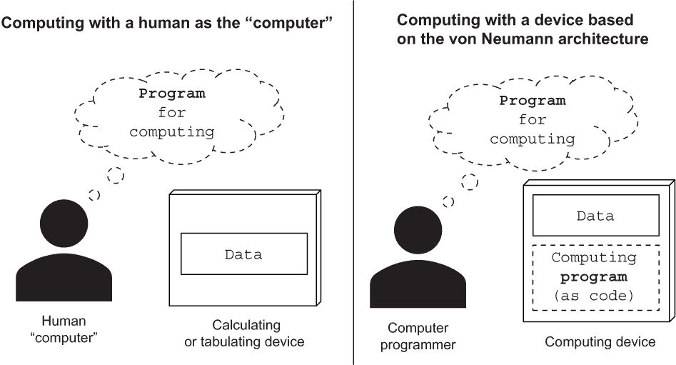

图 A.2 人类计算机依靠设备来存储计算中使用的数据。这些设备范围从纸和笔到电机计算器，甚至是基于打孔卡的制表机。然而，这些设备都没有内部存储器，用于存储和执行计算指令，换句话说，程序代码（图的左侧）。相比之下，冯·诺伊曼计算机架构，它将计算机设备内存用于数据和计算机指令，创造了一种革命性的计算机编程实践：将用于计算的指令（程序）传输到计算设备的存储器中以供存储和执行（图的右侧）。

现代计算机通过改变人类与计算设备的关系角色而转变了这种计算范式。人类程序员不再将计算指令与计算机程序存储在人类思维中，而是将程序以代码或可机读的指令形式输入到计算设备的内存中（图 A.2 右侧）。

冯·诺依曼结构以与工业革命带来的变革相媲美的规模改变了全球经济。几乎地球上每一台当代计算设备，从袖珍式的移动电话到驱动云计算数据中心的大型服务器，都使用冯·诺依曼结构。人工智能领域的出现是一旦计算转移到了从前的范式，即计算指令存储在人类计算机的生物思维中，才变得可能的。

冯·诺依曼计算范式还为人工智能领域带来了显著突破；例如，IBM 基于该范式构建的 DeepBlue 是第一个击败人类国际象棋冠军加里·卡斯帕罗夫的国际象棋程序。尽管如此，人类程序员编写的硬编码程序对人工智能的许多子领域（包括计算机视觉、语音识别、自然语言理解等）来说过于简单了。人类编程人员编写的用于执行诸如数字图像中对象分类或语音识别等任务的代码最终过于不准确且脆弱，无法广泛采用。

当代机器学习正在以与上世纪五十年代计算机革命相当的基本程度改变程序员与现代计算设备的关系。机器学习从业者不再编写计算机程序，而是使用定制的数据集训练机器学习系统（使用机器学习算法），以生成机器学习模型（见图 A.3）。由于机器学习模型只是计算机代码，机器学习算法可以赋予机器学习从业者产生能够计算超出人类编写程序能力的问题答案的代码的能力。例如，在 2010 年代，机器学习模型被用于以超人类的表现分类图像，如此有效地识别人类语音，以至于许多家庭安装了语音识别数字助理（如亚马逊的 Alexa 和谷歌的 Home），并击败了李世石，古老棋类游戏围棋的人类冠军。

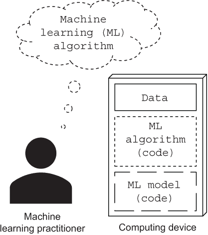

图 A.3 机器学习依赖于机器学习从业者，后者使用机器学习算法根据定制数据集来“训练”机器学习模型。虽然训练好的机器学习模型只是由机器学习算法创建的代码，但该模型可以回答人类无法手动编程的复杂问题。例如，机器学习模型可以比由人类程序员开发的手工编码更好地对数字图像中的对象进行分类，或者识别数字音频中的人类语音。

本附录将机器学习介绍为计算机科学的一个子领域，专注于使用计算机从数据中学习。尽管这个定义是准确的，但它并没有完全传达机器学习对计算机领域转型的重要性和持久影响。在另一端，关于机器学习的营销口号，如“新的电力”或人工通用智能的实现者，夸大了和模糊了这个领域。显然，机器学习正在改变从 1950 年代到 2010 年代基本保持不变的计算架构的部分。机器学习将如何改变计算尚不清楚。我希望您能像我一样对这种变革的不确定性和您可以在其中扮演的潜在角色感到兴奋！

## A.2 乍一看的机器学习

本节介绍了机器学习算法对传统计算机科学带来的变革，用易于理解的例子说明了机器学习，并描述了如何使用 Python 编程语言和 pandas、Numpy 和 scikit-learn 库来实现机器学习示例。通过本节的介绍，您应该能够解释基本的机器学习概念，并将这些概念与简单的机器学习示例结合使用。

在机器学习出现之前，传统计算机科学算法¹主要关注于根据已知数据计算答案。机器学习通过使用数据计算答案来回答基于可能但未知的内容的问题，从而扩展了计算机科学领域。

为了说明机器学习对计算机科学带来的变革的实质，假设您正在处理以下易于理解的数据集，描述了从 1971 年到 1982 年制造的福特野马及其燃油效率²，以每加仑英里数（mpg）的燃油消耗。使用 Python 编程语言和用于结构化数据的 pandas 库，您可以通过在计算机内存中将其实例化为 pandas 数据结构来准备该数据集以进行分析，称之为 DataFrame。

清单 A.1 在内存中创建一个准备好进行分析的 pandas DataFrame 数据集

```py
import pandas as pd                                   ❶
import numpy as np                                    ❷
df = \                                                ❸
       pd.DataFrame([{"mpg": 18, "model year": 1971, "weight": 3139},
                    {"mpg": 13, "model year": 1975, "weight": 3169},
                    {"mpg": 25.5, "model year": 1977, "weight": 2755},
                    {"mpg": 23.6, "model year": 1980, "weight": 2905},
                    {"mpg": 27, "model year": 1982, "weight": 2790}])
print(df.to_string(index=False))                      ❹
```

❶ 导入 pandas 库并将其别名为 pd。

❷ 导入 NumPy 库并将其别名设为 np。

❸ 用于存储和管理结构化数据的 pandas DataFrame 可以通过使用包含每行数据的 Python 字典列表构建，其中每行使用字典实例指定，数据框列名为键，行内容为字典值。

❹ 为了避免列印每行的默认零基索引，使用 df.to_string(index=False) 代替 print(df)。

这样会产生一个输出，显示在图 A.4 的左侧作为表格。

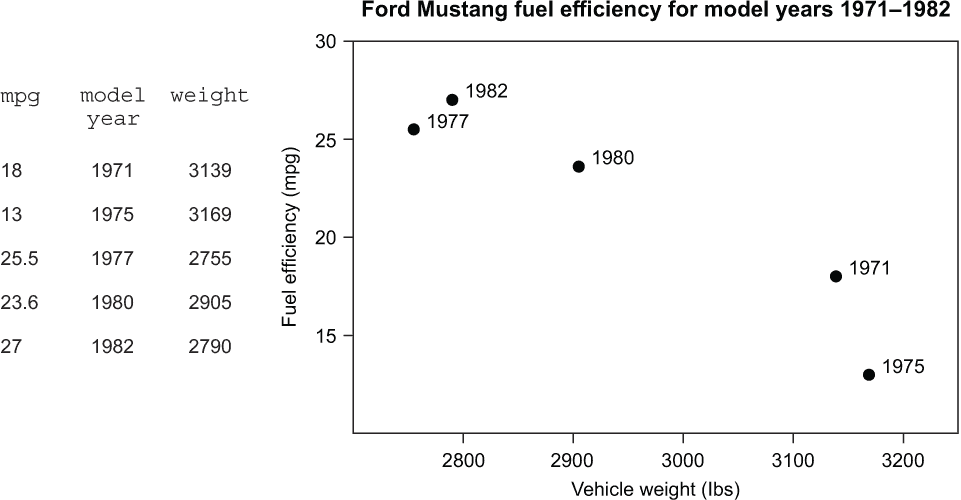

图 A.4 中福特野马燃油效率数据集（左）和对应的散点图（右），基于同一数据集。（这个公开的数据集是从加州大学尔湾分校机器学习库获取的：[`archive.ics.uci.edu/ml/datasets/Auto+MPG`](https://archive.ics.uci.edu/ml/datasets/Auto+MPG).)

毫不奇怪，众所周知，计算机科学中的算法和数据结构（例如哈希表）可以用于回答关于数据集中已知内容的问题，比如一辆重 2,905 磅的福特野马的每加仑油耗效率。使用 pandas 可以回答这个问题

```py
df[ df['weight'] == 2905 ]['mpg'].values
```

这会输出一个 NumPy⁴ 数组，其中包含了 mpg 列的单个元素，以及列表 A.1 中数据集的第四行的值：

```py
array([23.6])
```

pandas DataFrame

本附录中使用 pandas 来演示对机器学习数据集的常见操作。虽然 pandas DataFrame 是一个易学易用的数据结构，但它无法处理不适合单个节点内存（网络上的计算机）的数据集。此外，pandas 并不是为那些可以在主要云计算提供商的云计算环境中使用分布式计算集群进行数据分析设计的。本附录将继续使用 pandas DataFrames 来介绍机器学习；然而，本书的其余部分重点关注可以处理比 pandas 更大数据集的 SQL 表和 PySpark DataFrames 。许多关于 pandas DataFrames 的概念直接适用于 PySpark 和 SQL。例如，第 A.3 节关于结构化数据集和监督机器学习的描述适用于不管是使用 pandas、PySpark 还是 SQL 管理的数据集。

那么一辆重 3,000 磅的福特野马的油耗如何？在机器学习出现之前，传统计算机科学算法无法回答这个问题。

然而，作为一个人类，你可以观察数据集（图 A.4 的右侧）并注意到数据集描述的相关福特野马之间的一个*模式*（一个重复的规律）：随着车辆重量的增加，它们的燃油效率下降。如果要估计一辆重 3,000 磅的福特野马的燃油效率（数据集并未给出），你可以将这个模式的心理模型应用到估计答案，大约为每加仑 20 英里。

给定正确的机器学习算法，计算机可以学习数据集的软件模型（称为机器学习模型，将在第 A.3 节中更准确地定义），使得学习到的（也称为训练的）模型可以输出估计值，就像你推断出来的估计 3,000 磅福特野马燃油效率的心理模型一样。

scikit-learn，一种流行的机器学习库，⁵ 包括各种可供使用的机器学习算法，包括几种可以构建与数据集中观察到的模式相符的机器学习模型的算法。根据仅从重量列中的值构建模型的步骤显示如下。⁶

A.2 列出了福特野马数据集的简单模型

```py
from sklearn.linear_model import LinearRegression       ❶
model = LinearRegression()                              ❷
model = \                                               ❸
       model.fit(df['weight'].values.reshape(len(df), 1), df['mpg'].values)
```

❶ 从 scikit-learn 库导入线性回归实现。

❷ 创建线性回归机器学习模型的实例。

❸ 使用福特野马数据集中的重量列作为模型输入和 mpg 值作为模型输出来训练（拟合）线性回归模型。reshape 函数将 df['weight'].values 返回的 NumPy 数组重新塑形为由单列组成的矩阵。由于 scikit-learn 要求模型输入为结构化矩阵，因此在这里需要重新塑形。

线性回归算法被广泛认为是机器学习中的基本算法之一，⁷ *训练*（即“拟合”）机器学习模型实例基于传递给 LinearRegression 类的数据集。一旦通过 fit 方法训练，模型实例就可以回答诸如“一辆 3,000 磅的福特野马的预计燃油效率是多少？”这样的问题。

A.3 使用训练过的线性回归模型来估计 mpg

```py
model.predict( np.array(3_000).reshape(1, 1) )[0]     ❶
```

❶ 将包含单个值 3,000（代表一辆 3,000 磅的福特野马）的数组重新塑形为一个具有一行一列的矩阵，并使用预测方法要求模型估计输出值。由于预测方法的输出以 NumPy 数组的形式返回，因此使用 [0] 索引从估计值的数组中检索第一个元素。

这输出

```py
20.03370792
```

这代表着大约 20.03 英里每加仑（MPG）的估计值。机器学习模型还可以为车辆重量的其他值产生估计值。请注意，随后的代码对于已经熟悉 Python 但对机器学习新手来说更加简单直观，因此更容易理解。⁸

A.4 列出了对重量为 2,500、3,000 和 3,500 磅的车辆进行 MPG 估计的情况

```py
ds = \                                            ❶
  np.array([[ model.predict(np.array(weight).reshape(1, 1))[0], weight] \
       for weight in [2_500, 3_000, 3_500] ])

df = \                                            ❷
       pd.DataFrame(data=ds, columns=['mpg_est', 'weight'])

print(df.to_string(index=False))                  ❸
```

❶ Python for 表达式遍历来自列表 `[2_500, 3_000, 3_500]` 的重量值。对于列表中的每个重量，表达式返回一个由两列组成的矩阵的行：左列是模型预测的 mpg 值，右列是重量本身的值。生成的矩阵存储在变量 ds 中。

❷ 使用 ds 矩阵实例化 pandas DataFrame，并以 mpg_est 和 weight 作为左右列的列名进行注释。

❸ 为了避免打印每一行的默认从零开始的索引，使用 `df.to_string(index=False)` 替代 `print(df)`。

这将输出如图 A.5 左侧显示的作为 pandas DataFrame 的结果。图 A.5 右侧显示了由 LinearRegression 从原始数据集学习的模型具有虚线，可用于估计任意重量值的 mpg 值。

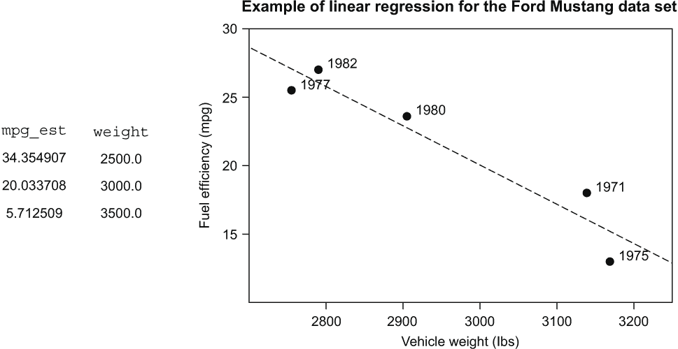

图 A.5 一个估计的 Ford Mustang 虚构燃油效率 mpg 的表格，其中给定的重量值由重量列（左侧）给出，并由连接表中数据点的线性模型（右侧）绘制

在本节中，你通过一个示例学到了机器学习问题、数据集和机器学习算法是如何事先准备好的。这意味着你不必完全理解问题的细微之处，如何为问题准备数据集，或者如何选择合适的机器学习算法来解决问题。在附录的其余部分，你将更深入地探索与机器学习工作的这些方面，并准备将你的理解应用到本书中的机器学习项目中去。

## A.3 结构化数据集的机器学习

在前一节中，你已经了解了使用描述 Ford Mustang 燃油效率的示例数据集应用机器学习的实例。本节将教授应用机器学习到任意结构化数据集所需的概念。

对于本附录的目的，*结构化数据集*存储了关于

+   相关对象，例如不同品牌和型号的汽车、标准普尔 500 指数中的上市公司、不同亚种的鸢尾花，或

+   重复事件，例如赢得或失去的销售机会、按时或延迟的餐食送达或网站上的按钮点击

作为表格中的记录（通常是行），其中每个*记录*由至少两列但通常是三列或更多列的数字值组成。请注意，图 A.6 展示了一个具有 N 个观测值（以行表示的记录）和 M 列的结构化数据集，以及本节后面解释的相关术语。

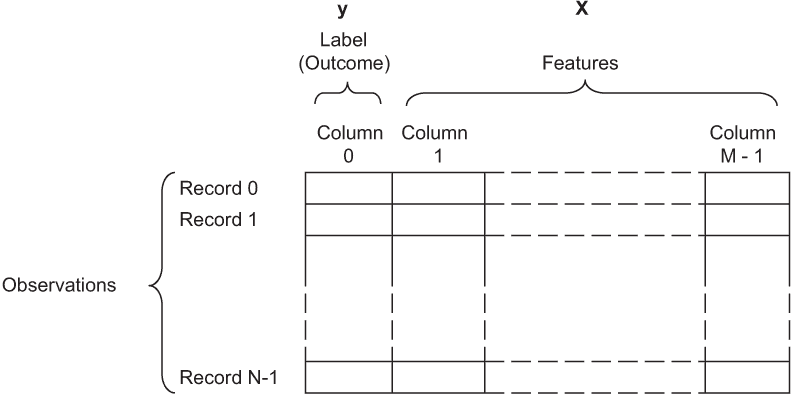

图 A.6 机器学习用的结构化数据集的概念表示。数据集被组织成 N 行的观察，每一行都有一个观察的标签列，以及其他 M-1 列（剩下的）特征列。按照惯例，第一列通常是观察标签。在有关事件的观察中（例如标记销售机会是否成功），标签有时被称为事件的“结果”。在使用数据集进行机器学习时，标签通常被描述为“实际值”、“目标”或“真值”。在机器学习中，变量 y 和 X 通常用来表示标签和特征。

用于结构化数据集的监督式机器学习算法（例如第 A.2 节中使用的线性回归算法）训练（输出）一个机器学习模型，该模型可以使用记录中的其他列的值（特征）来估计记录中某列（标签）的值。

在监督式机器学习中，“标签”是机器学习模型在训练过程中用作估计结果的数值。按照惯例，机器学习从业者通常使用结构化机器学习数据集的第一列来存储标签的值（通常使用变量 y 进行指示），并使用其余列（使用变量 X 进行指示）存储特征。特征是监督式机器学习模型用来估计标签值的数值。当使用由标签和特征组成的记录集来训练机器学习模型时，这些记录被描述为“训练数据集”。

“标签”这个术语在机器学习中具有歧义。

不幸的是，在机器学习社区中，对于“标签”一词的使用并不一致，这给机器学习的初学者带来了很多困惑。尽管在结构化数据集中，当观察值描述相关对象（例如福特野马）时，该词频繁使用，但当数据集中的观察值描述事件（例如销售机会）时，与“标签”同义的词为“结果”。具有统计学背景的机器学习从业者通常将标签描述为“因变量”，将特征描述为“自变量”。其他人将“目标值”或“实际值”与“标签”同义使用。本书旨在简化术语，并尽可能使用“标签”这个词。

机器学习领域远比监督式机器学习更广泛，包括无监督机器学习（标签不被使用或不可用）、强化学习（算法寻求最大化奖励）、生成对抗网络（神经网络竞争生成和分类数据）等等。然而，即使在谷歌这样一个在机器学习应用上领先的公司，超过 80%的投入生产的机器学习模型都是基于使用结构化数据的监督式机器学习算法。因此，本书完全专注于这个重要的机器学习领域。¹¹

监督式机器学习的数学定义

虽然本书不要求这样做，但是这里有一个更正式的监督式机器学习定义：如果*y*[i]是要从索引 i 的记录中估计的值，则监督式机器学习模型可以被描述为一个函数 F，它基于记录中除*y*[i]之外的列（即其他列）的值*X*[i]输出估计值*F*(*X[i]*)。监督式机器学习模型的训练过程描述了基于训练数据集*y*, *X*构建函数 F 的过程。训练算法通常使用*y*, *X*, *F*(*X*)进行迭代，其中基础*F*(*X*)是从 F 的某个随机初始化生成的。

为了说明监督式机器学习，回想一下在 A.2 节中您学到的描述福特野马燃油效率的结构化数据集。训练数据集仅包含两列：一个标签列，其中包含 mpg 值，和一个带有车辆重量值的单个特征。该数据集也作为示例在图 A.7 中显示。基于该数据集的相应监督式机器学习模型可以根据车重列的值估计 1971 年到 1982 年款福特野马的平均燃油效率（mpg 列）。

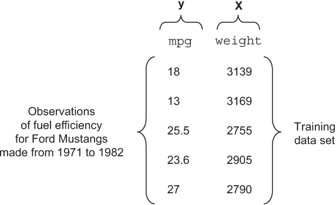

图 A.7 是一份关于福特野马燃油效率的样本数据集，以每加仑英里数为单位。

大多数机器学习算法都是一个迭代过程的训练过程（如图 A.8 所示），从使用机器学习算法生成第一个迭代的机器学习模型开始。一些算法使用训练数据集创建模型的第一个迭代，但这不是必需的：大多数基于神经网络的深度学习模型是根据简单的随机方案进行初始化的。

一旦模型的第一次迭代完成，它就会根据训练数据集中的特征输出第一次迭代的估计值（预测）。 接下来，机器学习算法通过比较估计值与训练数据集中的标签的接近程度来评估估计的质量。 用于评估机器学习模型质量（即性能）的可量化措施称为*损失*（也称为*成本*或*目标函数*），在第 A.4 节中有更详细的介绍。 对于流程的下一次迭代，算法使用损失以及训练数据集来生成下一个模型的迭代。 在图 A.8 中显示的过程的单次迭代后，非迭代机器学习算法可以输出一个机器学习模型。

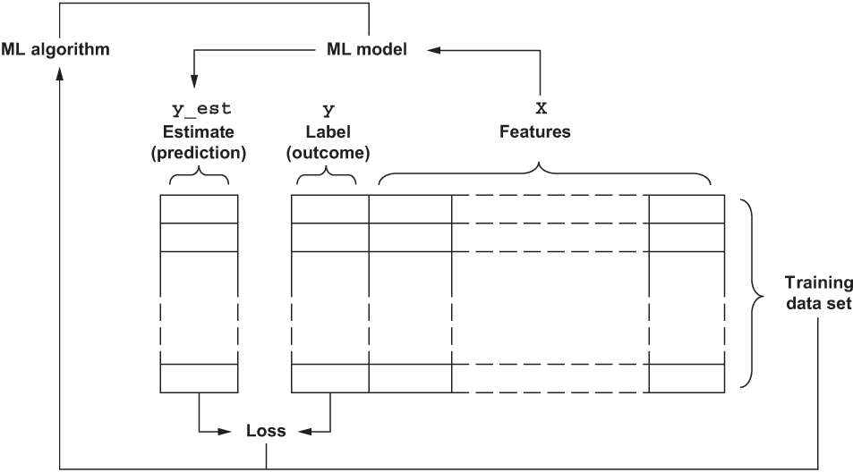

图 A.8 机器学习算法产生的初始机器学习模型用于输出估计的标签值（y_est），这是基于记录的特征值的记录的估计。 然后通过更改模型（特别是模型参数）来迭代改进机器学习模型以改善模型性能得分（损失），该性能得分基于估计值和标签值的比较。

迭代机器学习算法在如何决定停止训练过程上有所不同； 一些具有内置标准用于停止迭代，而其他一些则要求机器学习从业者提供显式的停止标准，或者提供用于决定何时停止的时间表或函数。 在涵盖不同机器学习算法的停止标准时，如何处理这些停止标准的其他细节始于第 A.4 节。

到目前为止，本附录直观地使用了短语*数字值*，但没有提供适用于机器学习的数字值的清晰定义。 如第 A.1 节所述，机器学习算法需要准备定制的数据集，并且在使用任意数据值时可能会失败。 因此，机器学习从业者必须清楚地了解结构化数据集中存在的数字值。 在图 A.9 中详细说明了基于值对数字变量进行分类的详细分类法（源自统计学中的类似分类法）。

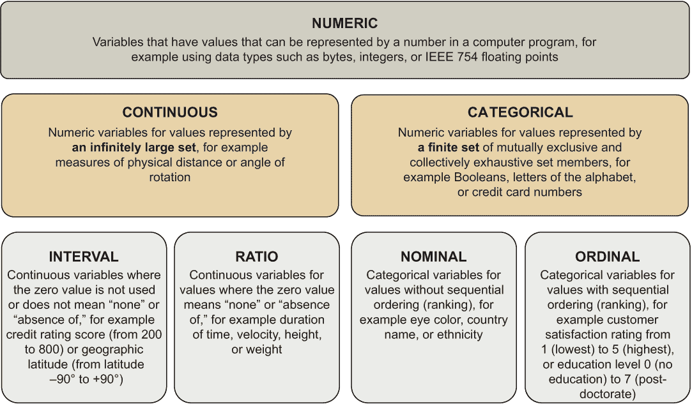

图 A.9 数字值的类别适用于受监督机器学习，这是根据斯坦利·史密斯·史蒂文斯（[`mng.bz/0w4z`](http://mng.bz/0w4z)）对统计变量进行分类的著名框架改编而来。 数字值可以被分类为互斥的连续值和分类值子集。 连续值可以进一步分类为区间或比率，而分类值可以是名义或有序的。

-   本附录和本书的其余部分侧重于具有连续和分类变量的机器学习，特别是使用间隔、比率和名义数据。本书在可能的情况下，为处理有序值提供提示和技巧；然而，本书中的项目不涵盖这两种值的任何具体用例。作为机器学习从业者，你需要准备并将混乱的现实世界数据集转换为机器学习能够正确使用的数值。第一部分的大部分内容都致力于磨练你在这个领域的技能。

-   在这一节中，你了解了训练，即机器学习算法执行的一系列步骤，以生成机器学习模型。在训练过程中，算法使用结构化数据集的一个子集（称为*训练数据集*）来生成模型，然后可以使用该模型输出估计值（也称为*预测*），给定记录的特征值。

## -   A.4 结构化数据集的回归

-   在本节中，你将了解两种常用的监督式机器学习问题类别：回归和分类。本节介绍了损失的定义（也称为成本或目标函数），这是对机器学习模型在标签和特征数据集上的性能的定量和技术性度量。通过本节的结论，你将熟悉与这些问题相关的术语，并回顾回归应用。

-   结构化数据集的*回归*是一个监督式机器学习问题，其中标签是一个连续的（如图 A.9 中定义的）变量。例如，在第 A.2 节中估计福特野马的燃油效率时，你处理了一个回归问题的实例，因为 mpg 是一个连续（更确切地说是一个间隔）值。在第 A.5 节中，你将了解更多关于结构化数据集的分类，这是一个监督式机器学习问题，其中标签是一个分类变量。对这些机器学习问题的全面理解对于机器学习从业者至关重要，因为正如在第 A.3 节中解释的那样，回归和分类占据了像谷歌这样的顶级信息技术公司生产机器学习模型的 80%以上。

根据福特野马数据集的回归问题示例和相关损失计算，图 A.10 中显示了模型损失的平方误差。回想一下，在第 A.2 节中，您扮演了机器学习算法的角色，并推断了一个用于估计每加仑英里数（mpg）值的心理模型。假设您在本节中再次扮演相同的角色，但在这里，您通过取重量值并将其乘以 0.005 来估计 mpg 值。由于训练过程是迭代的，0.005 的值只是一个初始（也许是幸运的）但合理的猜测。更好的猜测方法将很快介绍。与此同时，基于此计算的估计值显示在图 A.10 的 Estimate 列中。

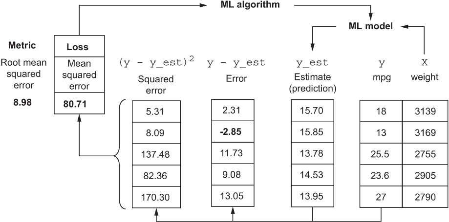

图 A.10 在回归问题中，许多机器学习实践者首先应用均方误差损失函数来建立基线，然后再转向更复杂的机器学习方法并尝试更复杂的损失函数。

从图 A.8 中解释的过程中回想一下，下一步是评估损失，这是机器学习模型产生的估计质量的可量化度量。损失函数的选择取决于机器学习问题，更精确地说是问题中标签和估计值的数字类型。

在回归问题中，最常用的损失函数之一是 *均方误差*（MSE），定义为个别平方误差（也称为 *残差* 或 *差值*）值的算术平均值，如图 A.10 的 Squared Error 列所示。

提供生成图 A.10 中各列值的 Python 代码。

清单 A.5 计算模型损失的平方误差

```py
df = pd.DataFrame([{"y": 18,  "X": 3139},           ❶
                   {"y": 13, "X": 3169},
                   {"y": 25.5, "X": 2755},
                   {"y": 23.6, "X": 2905},
                   {"y": 27, "X": 2790}])

W = np.array([0.007])[:, None]                      ❷

df['y_est'] = df[['X']] @ W                         ❸

df['error'] = df['y'] - df['y_est']                 ❹
df['squared_error'] = df['error'] ** 2              ❺

df[['squared_error', 'error', 'y_est', 'y', 'X']]   ❻
```

❶ 将福特野马数据集实例化为 pandas DataFrame。为简洁起见，并遵循已接受的做法，本示例使用 y 表示标签，X 表示特征。有关更详细的说明，请参阅清单 A.1。

❷ 变量名 W 通常用于表示机器学习模型参数的值。注意，NumPy 的切片表示法 [:, None] 等效于使用 reshape(1,1) 将 W 重塑为下一步中所需的矩阵。

❸ 表达式 df[['X']] 使用的双方括号符号返回特征值矩阵，并使用 @ 操作进行矩阵乘积，其中包含生成结果的单列的模型参数值的矩阵，该列包含权重乘以 0.005。在这里使用矩阵乘法，因为它可以轻松扩展到许多特征和模型参数值，而无需更改实现。

❹ 误差只是标签与估计值之间的差异。

❺ 使用 Python 中的 ** 指数表示法来计算平方误差。

❻ 列名列表被指定，以确保输出的列顺序与图 A.10 中显示的顺序相对应。

假设均方误差的值存储在名为 squared_error 的 pandas DataFrame 列中，则只需使用简单地计算即可得到 MSE 的相应值

```py
df['squared_error'].mean()
```

在图 A.10 中的值的情况下，会输出一个近似等于的数字

```py
80.71
```

正如您所期望的，由于 W 的值是随机选择的，均方误差的值远非零。在图 A.11 中，您可以探索对 W 的各种随机选择的结果（子图（a）对应于使用 0.005 作为 W），以及随机值 W 和相应均方误差之间的关系。

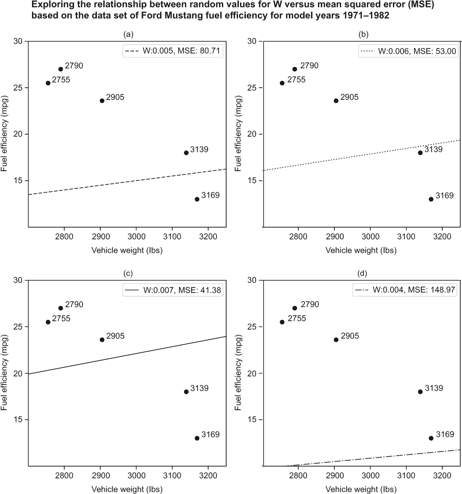

图 A.11 子图 a—d 说明了选择替代的、随机选择的 W 值对均方误差的影响。请注意，在所有情况下，W 的值对应于通过特征和标签值对的点确定的直线的斜率。与图 A.5 中使用的线性回归模型不同，该图中的线经过原点，因此无法捕捉燃油效率中更低重量对应的模式。

由于基于 W 的基于线性的模型非常简单，所以不需要随机猜测 W 的值，可以依靠解决估计最小化数据集均方误差的问题的分析解。这个分析解被称为*普通最小二乘法*（OLS）*公式*（X^TX)^(-1)X^Ty，可以使用 Python 代码来实现。

列表 A.6 线性回归的普通最小二乘法解

```py
X = df.X.values                           ❶
y = df.y.values                           ❷

W = \
  np.linalg.inv( np.array(X.T @ X,        ❸
                     dtype = np.float,
                     ndmin = 2) )
                @ np.array( X.T @ y,      ❹
                     dtype = np.float,
                     ndmin = 2)
W
```

❶ 将 X 分配为特征值的 NumPy 数组。

❷ 将 y 分配为标签值的 NumPy 数组。

❸ 计算 OLS 公式中的 X.T @ X 表达式，将其转换为 NumPy 矩阵（使用 ndmin=2），并使用 np.linalg.inv 倒置所得矩阵。

❹ 用 OLS 公式中的 X.T @ y 乘以倒置矩阵。

这返回一个 1 × 1 的矩阵：

```py
array([[0.00713444]])
```

您可以通过使用列表 A.5 中的示例代码确认，当使用基于 OLS 公式的最优 W 值时，会产生 40.88 的 MSE。这意味着什么？请注意，与图 A.5 中显示的 LinearRegression 模型不同，仅基于 W 的模型不够复杂，无法捕捉数据中的基本模式：较大的权值会导致较低的燃油效率。当然，仅通过对图 A.11 中的子图进行目测检查，原因是显而易见的：基于单个 W 参数的线必须经过原点（即 y 截距为零）；因此，不可能使用它来模拟 mpg 和 weight 数据列中大于零值之间的倒数关系。

然而，当处理更复杂的数据集时，数据维度过多以至于难以进行可视化，可视化对于判断模型是否足够灵活以捕捉到数据集中期望的模式没有帮助。除了依赖可视化，你可以进行额外的测试来评估模型的灵活性。在回归问题中，你可以将你的模型与平均标签值估计的均方误差进行比较，使用来自训练数据集的平均标签值。例如，使用训练数据集的 DataFrame，可以通过如下方式进行评估：

```py
np.mean((df['y'] - df['y'].mean()) ** 2)
```

应该得到一个大约如下的输出

```py
27.03
```

最优模型的均方误差为 40.88，而使用平均值的简单均方误差为 27.03，这表明该模型不够复杂（参数太少）以捕捉数据中期望的模式。

## A.5 结构化数据集的分类

本节将向您介绍并演示许多机器学习算法用于训练分类模型的交叉熵损失函数。在理解了交叉熵的基础上，本节将引导您完成实现标签的独热编码及如何使用编码后的标签计算交叉熵损失值的步骤。最后，本节将教您使用 NumPy、pandas 和 scikit-learn 的最佳实践，以便您可以训练和评估一个基准的 LogisticRegression 分类模型。

从第 A.4 节可以回顾到，对于结构化数据集的分类是一个机器学习问题，其目标是从特征中估计出一个分类标签的值。例如，图 A.12 中展示的福特野马数据集可以用来训练一个分类模型（也被称为*分类器*），来估计车型年份的十年代，可以选择 1970 年代和 1980 年代，利用 mpg（燃油效率）和重量两个特征。


图 A.12 使用名为 1970s 和 1980s 的列对车型年份标签进行独热编码，用于表示福特野马车的十年代（左）。编码的独热性指的是在用于编码的列中，每一行都只有一个 1 值；其余值为 0。数据集的散点图（右）以“x”和“•”标记分别表示 1970 年代和 1980 年代的车辆。对于网格上的任何位置（不限于标记所示的位置），一个经过训练的分类模型必须能够判断车辆是在 1970 年代还是 1980 年代生产的。

虽然均方误差损失函数可用于一些分类问题，但许多基线分类器使用*交叉熵损失*。用于优化交叉熵损失的机器学习算法包括 logistic 回归（这是一种用于分类的机器学习算法，不应与回归机器学习问题混淆）和神经网络等。流行的决策树和随机森林算法使用的一个密切相关的损失函数称为*基尼不纯度*。本节首先解释使用交叉熵损失进行分类，以便为您理解更高级的分类机器学习算法所使用的交叉熵的变体做准备。

与均方损失不同，均方误差损失期望回归模型的输出为单个数值，而交叉熵损失期望分类模型为分类标签的每个可能值输出一个概率。继续使用用于估计福特野马车型年代的工作数据集，图 A.13 展示了基于数据集的假设分类模型的四个信息示例的输出。

在图 A.13 左上方显示的示例 1 中，分类模型将 1970 年代的估计概率为 0.6。由于概率必须加起来等于 1，因此 1980 年代的估计概率为 0.4。在这个例子中，相应的损失值（显示在示例标题中）约为 0.51，这个值显著大于零，因为分类模型虽然估计了正确的值（1970 年代），但对估计缺乏信心。从图 A.13 右上方的示例 2 中可以看出，当模型完全不确定正确的值，缺乏对 1970 年代或 1980 年代的估计信心或偏好（由于两者的概率均为 0.5）时，损失进一步增加，达到约 0.6931。简而言之，当分类模型输出正确标签估计的高概率（实际上是高置信度）时，交叉熵损失函数向零减少，否则增加。

如果分类模型在估计标签值时不正确，损失函数会进一步增加，即使在完全不确定的情况下也是如此，就像图 A.13 左下方的示例 3 中所报告的损失数字一样。在这个例子中，正确的标签值是 1980 年代，而模型对 1970 年代的估计比对 1980 年代的稍微有点信心，分别为 0.6 和 0.4。请注意，损失值进一步增加，从示例（3）中的 0.9163 增加到图 A.13 右下方的示例 4 中的 4.6052，其中分类模型对错误估计非常有信心。

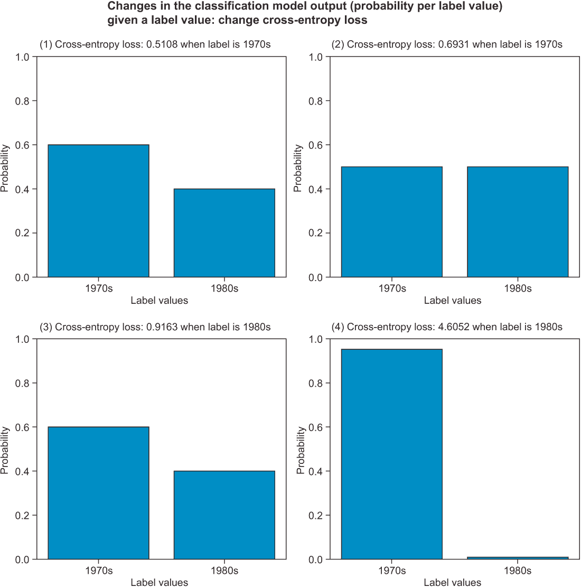

图 A.13（1）模型对正确值的信心略高。 （2）模型完全不确定选择哪个值。 （3）模型对错误值的信心略高。 （4）模型对错误值的信心很高。

由于分类模型的输出由标签值的概率（概率分布）组成，所以在训练或测试机器学习模型之前，工作数据集中的原始标签必须被编码（转换）成相同的格式。编码的结果显示在图 A.12 左侧的 1970 年代和 1980 年代列中。这种转换过程被称为*one-hot 编码*，指的是在编码标签的列中，整行中只有一个值被设置为一（1）。

交叉熵损失函数可以用 NumPy 操作来定义。 xe_loss 函数定义实现了对给定分类模型输出 y_est 和相应的 one-hot 编码的标签值 y 数组的交叉熵损失的计算。请注意，使用此实现时，需要注意不要混淆标签和模型输出数组参数，因为 np.log 函数分别对值 0 和 1 输出 -Inf 和 0.0。

列表 A.7 xe_loss 计算并返回交叉熵损失

```py
def xe_loss(y, y_est):
  return -np.sum( y * np.log( y_est ) )

print( xe_loss ( np.array([1., 0.]),
                     np.array([.6, .4]) ) )       ❶
print( xe_loss ( np.array([1., 0.]),
                     np.array([.5, .5]) ) )       ❷
print( xe_loss ( np.array([0., 1.]),
                     np.array([.6, .4]) ) )       ❸
print( xe_loss ( np.array([0., 1.]),
                     np.array([.99, .01]) ))      ❹
```

❶ 根据图 A.13 的例 3，计算损失值为 0.9163。

❷ 根据图 A.13 的例 2，计算损失值为 0.6931。

❸ 根据图 A.13 的例 3，计算损失值为 0.9163。

❹ 根据图 A.13 的例 4，计算损失值为 4.6052。

运行列表 A.7 中的代码，输出对应于图 A.13 中示例 1—4 的以下交叉熵损失值：

```py
0.5108256237659907
0.6931471805599453
0.916290731874155
4.605170185988091
```

交叉熵损失的数学定义。

以下是交叉熵损失的数学描述：给定单个训练示例 *y*，*X* 的标签和特征，函数定义为 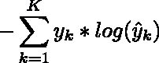，其中 *K* 是分类标签变量的值的数量，*y[k]* 是 one-hot 编码标签 *y* 中特定标签值的概率， 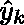 是分类模型产生的估计 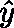 的特定标签值的概率估计。

此部分中到目前为止使用的示例依赖于已经为您进行独热编码的标签值。在实践中，在训练分类模型之前，您必须实现标签编码。虽然可以使用一套全面的 scikit-learn 类来对模型年份列标签进行独热编码，¹⁵ ，但由于在附录中数据集是作为一个 pandas DataFrame 实例化的，所以更容易使用通用的 pandas get_dummies 方法进行标签编码。这个方法的奇怪的 get_dummies 命名来自于*虚拟变量*，这是一个用于描述二进制指示变量的术语，它们要么是 1 表示存在，要么是 0 表示不存在一个值。

给定数据集的标签和特征作为 pandas DataFrame，将 get_dummies 方法直接应用于模型年份标签。

清单 A.8 使用 get_dummies 对分类标签进行编码

```py
import pandas as pd

df = \                                                               ❶
  pd.DataFrame([{"model year": 1971, "mpg": 18,  "weight": 3139},
                    {"model year": 1975, "mpg": 13, "weight": 3169},
                    {"model year": 1977, "mpg": 25.5,  "weight": 2755},
                    { "model year": 1980, "mpg": 23.6, "weight": 2905},
                    {"model year": 1982, "mpg": 27,  "weight": 2790}])

enc_df = \                                                           ❷
       pd.get_dummies(df['model year'], prefix='le', sparse=False)
print(enc_df.to_string(index=False))                                 ❸
```

❶ 将数据集实例化为 pandas DataFrame。由于此实例化使用模型年份作为标签，因此它放置在前导列中。

❷ 使用带有 pandas Series 的 get_dummies 可以识别系列中的唯一值集，并为集合中的每个值创建一个新列。prefix 参数确保每个新列都使用指定的前缀命名。将 sparse 设置为 True 可以导致结果 DataFrame 的内存利用率降低，但不保证。具有较大数量的不同值和对应更多列的标签在独热编码格式下受益于由 sparse set 为 True 启用的稀疏数组表示。

❸ 不打印以零为基础的索引的 enc_df DataFrame。

这产生了

```py
le_1971  le_1975  le_1977  le_1980  le_1982
       1        0        0        0        0
       0        1        0        0        0
       0        0        1        0        0
       0        0        0        1        0
       0        0        0        0        1
```

这不是所需的编码。尽管您可以轻松地实现将车辆的确切年份从列名转换为模型十年的代码，*分箱*是一种替代方法和更灵活的方法，用于执行此用例的标签编码。使用 pandas cut 方法，您可以将标签值“分箱”为一个范围:

```py
pd.cut(df['model year'], bins=[1969, 1979, 1989])
```

它输出一个区间范围的 pandas.Series:

```py
0    (1969, 1979]
1    (1969, 1979]
2    (1969, 1979]
3    (1979, 1989]
4    (1979, 1989]
Name: model year, dtype: category
Categories (2, interval[int64]): [(1969, 1979] < (1979, 1989]]
```

注意到前三辆车是在 1970 年代正确放置的（1969 年被排除在外，如括号所示），而其余的车辆则放置在 1980 年代。

结合标签分箱和 get_dummies 进行独热编码，

```py
enc_df = pd.get_dummies(pd.cut(df['model year'], bins=[1969, 1979, 1989]),
               prefix='le', sparse=False)
print(enc_df.to_string(index = False))
```

输出了图 A.12 所示的所需编码:

```py
le_(1969, 1979]  le_(1979, 1989]
               1                0
               1                0
               1                0
               0                1
               0                1
```

在使用编码值评估交叉熵损失函数之前，将标签编码的列与原始数据集合并，用编码值替换原始标签值很方便:

```py
enc_df = pd.get_dummies(pd.cut(df['model year'], bins=[1969, 1979, 1989]),
               prefix='le', sparse=False)
          .join(df[df.columns[1:]])

print(enc_df.to_string(index = False))
```

它的结果是

```py
le_(1969, 1979]  le_(1979, 1989]   mpg  weight
               1                0  18.0    3139
               1                0  13.0    3169
               1                0  25.5    2755
               0                1  23.6    2905
               0                1  27.0    2790
```

此时，数据集已准备好分割为用于训练的标签和特征，并转换为 NumPy 数组。从标签值开始，

```py
y_train = df[ df.columns [df.columns.str.startswith('le_') == True] ].values
print(y_train)
```

输出

```py
array([[1, 0],
       [1, 0],
       [1, 0],
       [0, 1],
       [0, 1]], dtype=uint8)
```

要将特征值放置到 NumPy X_train 数组中，使用

```py
X_train = df [['mpg', 'weight']].values
print(X_train)
```

打印出

```py
array([[  18\. , 3139\. ],
       [  13\. , 3169\. ],
       [  25.5, 2755\. ],
       [  23.6, 2905\. ],
       [  27\. , 2790\. ]])
```

此时，您已经准备好训练一个 LogisticRegression 分类器模型，

```py
from sklearn.linear_model import LogisticRegression
model = LogisticRegression(solver='liblinear')
model.fit(X_train, y_train.argmax(axis = 1))
```

并计算交叉熵损失，

```py
def cross_entropy_loss(y, y_est):
  xe = -np.sum(y * np.log (y_est))
  return xe

cross_entropy_loss(y_train, model.predict_proba(X_train))
```

输出为

```py
2.314862688295351
```

## A.6 训练监督机器学习模型

当训练机器学习模型时，几乎永远不会将整个结构化数据集用作训练数据集。相反，大多数机器学习从业者遵循的模式是将初始数据集划分为两个相互排斥的子集：开发（dev）数据集和测试（也称为保留）数据集。

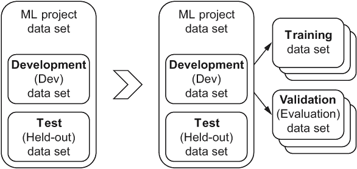

图 A.14 一旦机器学习项目数据集被分割以提取保留的测试数据集，通常会直接开始探索性数据分析和机器学习模型训练，换句话说，使用开发数据集作为训练数据集（左侧）。一个更成熟的机器学习训练工作流程可以帮助及早检测过拟合并优化超参数，包括将开发数据集进一步分割为训练和验证数据集，以及使用交叉验证与开发数据集。

许多机器学习领域的新手不熟悉开发数据集的概念。虽然可以直接将其用作训练数据集（许多在线课程和教程使用这种简化方法），但为了生产训练机器学习需要更健壮的方法。这两种方法之间的区别在图 A.14 中有所说明。如图 A.14 右侧所示，开发数据集进一步分为训练和验证数据集。与以前一样，训练数据集的目的是训练机器学习模型；但验证（或评估）数据集的目的是估计训练好的机器学习模型在保留（测试）数据集上的预期性能。例如，在福特野马燃油效率数据集中，可以随机选择一个记录放入测试数据集，四个记录放入开发数据集。接下来，再次从开发数据集中随机选择一个记录放入验证数据集，其余三个记录放入训练数据集以训练机器学习模型。

由于验证数据集的目的是估计训练机器学习模型在测试数据集上的表现，只在验证数据集中拥有一条记录是一个问题。然而，尽可能多地利用开发数据集进行训练也很有价值。解决这个困境的一个方法是使用一种称为*K-fold* *交叉验证*的技术，如图 A.15 所示。使用 K 折交叉验证的关键思想是通过 K 次重复使用开发数据集训练 K 个不同的机器学习模型，每次将开发数据集划分为 K 个折叠，其中 K-1 折叠被用作训练数据集，剩下的第 K 个折叠被用作验证数据集。图 A.15 中的示例使用三个分区，即三折交叉验证。当数据集中的观测值不能被 K 折折叠时，具有最小观测值数量的分区被指定为验证数据集。否则，所有分区的观测值数量都相同。

接下来，使用 K-1 训练数据集分区分别训练 K 个不同的机器学习模型，并使用剩余的第 K 个验证分区进行验证。因此，在图 A.15 的示例中，使用每个三个不同分区中的两个训练折叠来训练三个单独的机器学习模型。

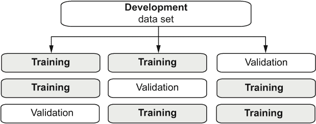

图 A.15 K 折交叉验证技术包括训练 K 个不同的机器学习模型并报告基于每个 K 个独立模型获得的训练和验证损失（和度量）的平均值。请注意，K 个模型中的每一个都是使用开发数据集的不同验证分区进行验证的，使用开发数据集的剩余部分进行训练。

开发数据集可以按原样用作训练数据集，换句话说，作为训练数据集。然而，对于生产机器学习模型来说，这很少发生。

相反，开发数据集被进一步划分为训练数据集和验证数据集。第四章详细解释和阐述了这个过程，但是对于本附录的目的，您可以预计验证数据集用于估计机器学习模型在未使用的（测试）数据集上的性能。

^(1.)Donald E. Knuth 在他的经典著作 *计算机编程艺术*（Addison-Wesley Professional，2011 年）中提供了传统计算机科学算法的全面回顾。

^(2.)这些值基于公开可用的加利福尼亚大学尔湾机器学习库[`archive.ics.uci.edu/ml/datasets/Auto+MPG`](https://archive.ics.uci.edu/ml/datasets/Auto+MPG) 中的数据集

^(3.)也称为面板或表格数据，结构化数据集是基于行和列组织的值

NumPy 是一个用于高性能数值计算的 Python 库。pandas 封装了 NumPy 库并将其用于高性能数据分析。

scikit-learn ([scikit-learn.org](http://scikit-learn.org))被设计用于机器学习与内存数据集，就像这里用于说明机器学习的一个简单示例一样。使用云计算的大内存数据集进行机器学习需要其他框架。

尽管它通常与现代统计学联系在一起，但线性回归源自高斯和拉格朗日在 19 世纪早期关于行星运动预测的工作。

以及许多其他科学领域，包括统计学，计量经济学，天文学等等。

可以以更简洁的方式实现这段代码，但需要解释更多的 NumPy 和 pandas 概念，包括多维数组。如果你对这个主题和张量的更一般的主题感兴趣，请参阅第五章。

为了数学上的精确性，观察结果被期望是统计独立和同分布的，尽管大多数真实世界的数据集存在这一定义的灰色地带。

因此，当你听到标签被描述为“目标值”时，不应感到惊讶。

如果你有兴趣扩展你的机器学习知识超出监督学习，并愿意阅读更多数学密集型的书籍，请查看 Stuart Russell 和 Peter Norvig（Pearson，2020）的《人工智能：一种现代方法》；Christopher Bishop（Springer，2006）的《模式识别与机器学习》；Ian Goodfellow，Yoshua Bengio 和 Aaron Courville（麻省理工学院出版社，2016）的《深度学习》；以及 Trevor Hastie，Robert Tibshirani 和 Jerome Friedman（Springer，2016）的《统计学习的要素》。

如果标签是二进制的，并且编码为—1 或 1，那么可以使用均方误差来进行分类问题的评估。

均匀概率分布的这种状态也被称为*最大熵*。

你可能已经注意到，这几乎是 e 常数的值，因为这里的交叉熵计算使用的是自然对数。

scikit-learn 提供了一套全面的类，包括 LabelEncoder 和 LabelBinarizer，旨在帮助进行标签编码，以及 OneHotEncoder 和 OrdinalEncoder 用于特征编码；这些类最适合于不使用 pandas 存储和管理数据集的开发场景。例如，如果你的整个数据集都存储为 NumPy 数组，那么这些 scikit-learn 类是一个不错的选择。然而，如果你的数据集是一个 pandas DataFrame 或一个 pandas Series，对于标签和特征编码，直接应用 pandas 自己的 get_dummies 方法会更简单。

^(16.)这里的“相互排斥”意味着在分区之前会移除重复记录，并在去重之后，任何给定的记录都存在于其中一个子集中。
