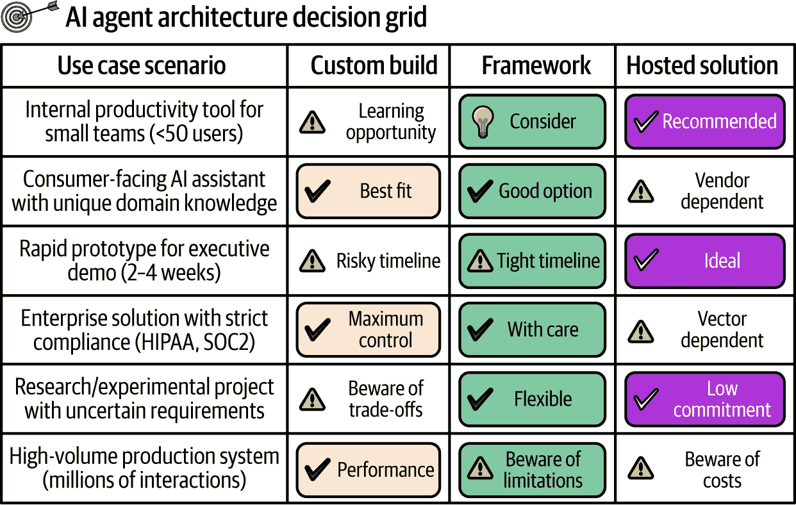

# 第四章\. 导航代理权衡：自定义构建、框架和托管解决方案

> 数字化组织将整合的主要焦点从系统转移到能力，强调清洁接口优于这些能力。
> 
> 布兰登·拜尔斯

无论你是保险公司还是初创公司，在部署人工智能代理的过程中，最初的考虑因素在很大程度上是相同的：构建与购买，框架与定制，当然还有成本和可扩展性担忧。如果这些权衡和考虑听起来很熟悉，那是因为它们应该是。尽管人工智能代理是一个全新的技术类别，但它们的*基础*与大多数软件产品相同。这应该让我们感到欣慰，因为我们有数十年的先例可以依赖，以构建弹性的解决方案。

# 开发者的困境：框架与自定义架构

并非所有涉及或围绕人工智能代理的项目都需要相同的工具考虑。最终，使用 LangGraph 构建代理和转向如 Glean AI 等托管服务的选择归结为一件事：范围。你即将开展的项目对你的公司未来至关重要，还是实验性和探索性的？你将需要定期摄取和处理多少数据？你的初始用户群将是大还是小？这是纯粹的内部工具，还是面向客户的？你的公司是否已经拥有支持人工智能代理的强大基础设施，或者这个项目是这一类项目的第一个？所有这些问题以及更多的问题都必须得到解答，至少要理解，以便合理地选择适合你项目的适当人工智能代理架构。

图 4-1 展示了一个有用的决策框架，用于考虑在考虑人工智能代理构建与购买决策时出现的最常见问题。

###### 图 4-1\. 人工智能代理架构决策框架

但一个简单的图表只是触及了复杂性的表面。以下三个部分分别分析了构建案例、框架案例和托管解决方案案例。

## 构建案例

在开始人工智能代理项目时，是否从头开始构建可能是你可以做出的最具影响力的决定。这需要大量的资源，包括劳动力和资本。然而，它提供了无与伦比的控制力，如果你的业务核心是代理，那么没有比这更好的选择了。以下是一些考虑因素：

“如果这是一个核心业务功能——无论什么情况都要自己来做。”

这个经过时间考验的原则来自乔尔·斯波尔斯基关于构建与购买决策的经典文章，对于人工智能代理来说尤其相关。当人工智能成为你的竞争优势核心时，框架和托管解决方案可能会变成战略负债，限制你快速区分和迭代的能力.^(1)

无与伦比的灵活性和定制化

当你从头开始构建人工智能代理时，你受到的限制仅限于你的工程师编写你所需系统的能力以及你希望访问的集成可用性。这赋予了针对你的业务问题和软件系统的独特和具体解决方案，而大多数框架将无法与之匹敌。考虑一下：你部署的定制软件系统越多，开源框架满足你所有需求的可能性就越小。

随着人工智能代理的可扩展性增强，其价值也越高

人工智能代理革命的全部意义并不仅仅是人工智能代理是动态聊天机器人——更重要的是它们的动态性扩展到调用和访问工具的能力。但正如布兰登·拜尔斯在他的文章《你不能购买整合》中指出的那样，我们不应该仅仅将其视为“连接系统，或共享数据以保持系统同步。”真正的目标是创建“能力之间的干净接口”，从而推动组织敏捷性。对于人工智能代理来说，这种区别是它们使组织能够实现敏捷性的基础。当你从头开始构建时，你完全控制着这些接口的设计和优化。正如拜尔斯所说，成功应该通过“随着时间的推移增加数字敏捷性”来衡量，其中“这些数字能力成为主要的增值驱动因素，可能甚至比系统本身更重要。”^(2)

规模化性能和成本优化

虽然并非每家公司都应该构建自己的基础模型或基础设施，但当使用量扩大时，定制人工智能代理的经济案例是很有说服力的。外部服务通常按 API 调用或令牌收费，这意味着成本会随着成功线性增长（或更糟）。定制构建则翻转了这个等式：在初始开发投资之后，增加的使用量通常通过规模经济降低了每次交互的成本。你的基础设施成本变得更加可预测和可控，性能可以针对你的使用模式进行优化，而不是针对通用工作负载。对于预期高量级人工智能代理交互的公司来说，这种成本结构优势随着时间的推移可能会变得相当可观。

## 框架的案例

使用框架构建代理通常是新项目的最佳起点。如果你是代理的新手，框架通过最新的文档、最先进的特性和快速迭代为你提供指导。如果你更有经验，框架仍然帮助你快速构建并收集概念验证工作的反馈。以下是它们主要优势的分解：

加速开发和原型设计

当你开始构建一个 AI 代理时，从基础开始：项目的范围是什么？如果范围仍然不明确，但利益相关者的演示至关重要，可以考虑像 LangGraph、AutoGen 和 CrewAI 这样的成熟框架，它们在其网站上提供了快速教程，从零到一构建代理。记住，你总是可以从框架中重构代码到定制化。但反过来从定制化到框架的重构则要困难得多。

较低的入门门槛

良好框架的最大好处是较低的入门门槛——这正是抽象的全部意义。什么更容易：从头开始建造一辆车，还是购买一辆现成的？同样的逻辑也适用于 AI 代理。如果你的团队对代理是新手，利用由数千人尝试、测试并踩过轮胎的预写开源框架要明智得多。

最佳实践的封装

只要你小心谨慎，框架将是行业最佳实践的封装。在最佳情况下，采用现代、流行的框架将使你处于有利位置，可以利用经过验证的模式和工具。但在选择框架时要小心。始终考虑你的 AI 代理的潜在用例。问问任何经验丰富的开发者关于选择（或被迫选择）错误框架的痛苦——突然之间，一个简单的集成变成了可能用几个小时手动编写的几周工作。

## 倡导托管解决方案

托管解决方案可能是最简单明了的考虑案例。如果你的组织缺乏构建 AI 代理的丰富经验或基础设施，它们通常是一个安全的选择：

最快实现价值

当涉及到 AI 系统的零到一部署时，你通常不会比托管解决方案得到更快的成果。Glean 或 Cognigy 这样的托管平台专注于仅向客户提供以最小开销部署代理的能力。云服务提供商如亚马逊网络服务（AWS）、谷歌云和 Azure 都提供自己的代理平台版本，虽然通常需要更密集的工作，但更容易集成到现有的企业云网络中。

无基础设施开销

托管解决方案的主要价值在于无需基础设施管理。对于每一小时用于管理基础设施的时间，用户本可以专注于推动业务价值的核心任务。

专业支持和服务级别协议（SLAs）

大多数托管解决方案包括专业支持和 SLAs，这极大地降低了依赖这些工具的风险，尤其是对于在生成式 AI 和机器学习工程方面经验较少的企业员工。

持续更新和改进

这些解决方案定期增强其功能和产品，从用户群中征求反馈，以保持与竞争对手的功能对等，并保留最佳实践。

# 为未来设计：防止架构和供应商锁定

虽然快速部署和广泛的功能吸引人，但了解这些系统如何创建依赖关系对于保持长期的技术堆栈灵活性和控制至关重要。

## 人工智能锁定的本质

供应商锁定有多种表现和形式。以下是三种最常见的形式：

专有模型 API

一些 API 设计要求您围绕特定供应商和框架的某些框架和规范进行编码，这些框架和规范是特定于供应商和框架的，并且没有被整个行业采用。如果可能，请避免这样做。唯一合适的时间是如果您处于一个利基行业或需要利基数据，而这些数据根本无法以其他方式返回。

无法导出的微调模型

一些供应商提供在其系统上微调模型的选择，但不提供导出模型权重的选项，希望您只是简单地使用他们的 API。这可能会发生在资源受限的公司寻找快速解决方案时，但可能会使您的知识产权成为人质。

集成数据和内存系统

到目前为止，最关键的锁定问题发生在将关键数据存储在外部人工智能供应商系统上——例如对话历史、用户元数据和用于记忆的向量嵌入。迁移这些数据可能会变得成本高昂，因为存在大量的出口费用、技术挑战，甚至可能无法在自己的系统上托管这些数据。

这些锁定现象不是相互排斥的，也不是全面详尽的。只有通过提前规划，才能有效地减轻这些风险。

## 可移植性的架构策略

除了了解锁定风险之外，成功的组织实施具体的架构模式，在利用现代人工智能服务的力量的同时保持灵活性：

模块化和抽象

避免供应商锁定（和过度复杂性）的最有效策略是设计具有模块化和可组合架构的代理系统。这使您能够轻松地在不同供应商之间或在外部供应商和可能最终完全取代供应商的内部新兴和成长服务之间进行交换。实现这一目标的最简单方法是围绕供应商 API 构建抽象，使内部 API 保持一致且对外部 API 调用无感知。这种抽象可以作为一个生成式 AI（GenAI）聊天完成服务，能够在其调用之间动态路由 GPT-5、Sonnet 4 和内部托管模型。如果您的组织后来决定将模型从 Anthropic 切换到，例如，Google Gemini，或者甚至完全放弃外部 LLM，那么只需要更新内部 GenAI 服务，而核心应用程序代码将保持不变。

开放标准

在可能的情况下，通过建立在成熟的标准和协议之上而不是专有协议之上来降低依赖风险。这确保了你的系统和供应商之间有更大的互操作性。这并不意味着你应该集成开源工具的前沿技术——通用人工智能领域太动荡了，不能将自己锁定在其中。例如，虽然 MCP 引起了极大的兴趣，但并不能保证它将成为行业标准。在创新与稳定性之间取得平衡。

容器化

一种经过验证且可靠的方法，容器化是团队可以做出的关键架构决策之一，以确保其应用程序的灵活性和可移植性——这种灵活性可以用来避免供应商锁定。当我们容器化一个应用程序时，我们将整个应用程序及其依赖项封装成一个单一的便携单元。然后，这个容器几乎可以在任何云平台（AWS、Google Cloud、Azure 等）上部署，甚至对于那些预计其代理将成为其业务核心的公司，也可以在本地部署。这种方法最大化了部署选项，并有效地将代理应用程序与其底层主机环境解耦。

通过依赖软件工程的基本原理，团队可以更有信心地导航 AI 代理的构建与购买决策空间。关键在于将决策锚定在代理的功能及其对业务的战略相关性上。如果你的目标是快速进行概念验证，托管解决方案提供了一条快速且低风险的途径来获取用户反馈。如果你正在尝试新的范式，代理框架提供了一个灵活且低摩擦的起点。但是，如果你的公司致力于长期跟随代理浪潮，那么从框架开始，快速迭代，然后过渡到自己的定制堆栈——一个能够保护你的独立性和为长期敏捷性和控制定位的堆栈——是至关重要的。

^(1) 乔尔·斯波尔斯基，《捍卫“非原创”综合症》，乔尔·斯波尔斯基软件，2001 年 10 月 14 日，[*https://www.joelonsoftware.com/2001/10/14/in-defense-of-not-invented-here-syndrome*](https://www.joelonsoftware.com/2001/10/14/in-defense-of-not-invented-here-syndrome)。

^(2) 布兰登·拜尔斯，《你不能购买集成》，马丁·福勒网站，2021 年 12 月 14 日，[*https://martinfowler.com/articles/cant-buy-integration.html*](https://martinfowler.com/articles/cant-buy-integration.html)。
