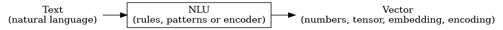
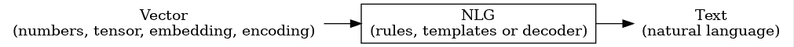
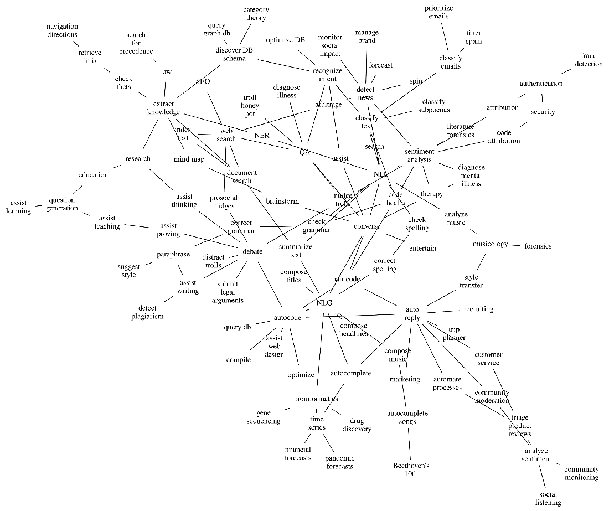
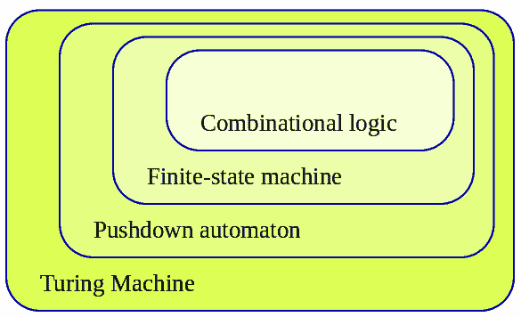
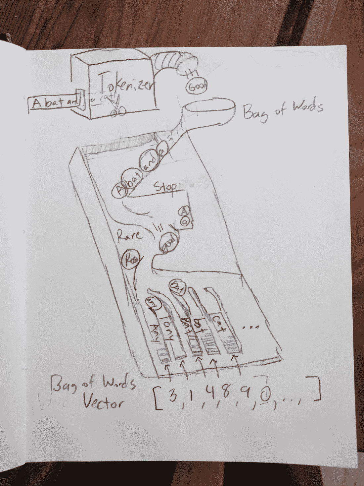
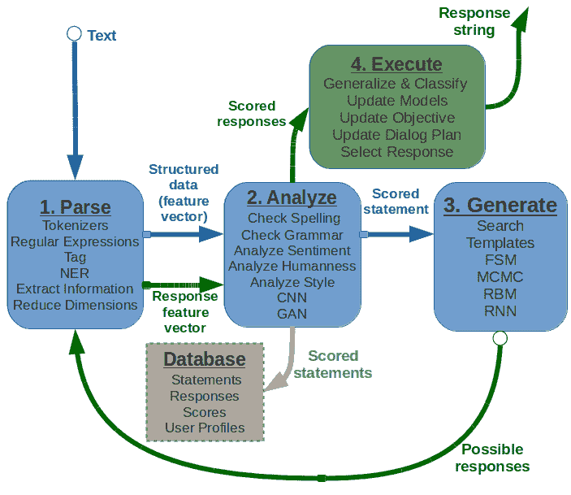
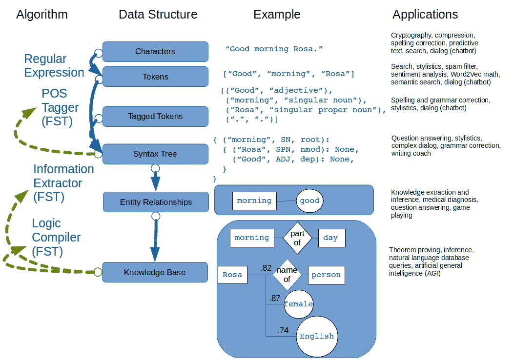
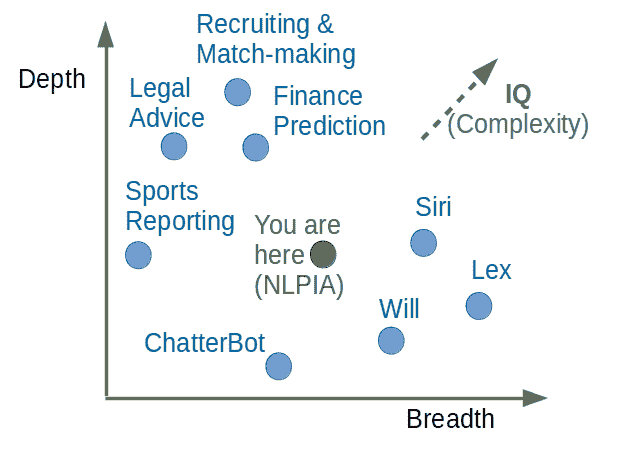

# 第一章：读写的机器（NLP 概述）

### 本章内容包括

+   人类语言的力量

+   自然语言处理（NLP）如何改变社会

+   机器现在可以很好地完成的 NLP 任务的种类

+   释放 NLP 精灵的利润...和危险

+   如何开始构建一个简单的聊天机器人

+   自然语言处理（NLP）技术是如何自我编程并使自身变得更加智能的

话语是有力量的。它们可以改变思想。它们也可以改变世界。自然语言处理将话语的力量置于算法之中。这些算法正在改变你的世界，就在你眼前。你将看到大多数进入你头脑的词语和想法是如何经过 NLP 过滤和生成的，以及你如何重新获得对你世界的部分控制。

想象一下，如果有一台机器能够理解并对其在互联网上阅读的每个词语采取行动，你会做什么？想象一下你将能够收获和从中获利的信息和知识。NLP 承诺通过将大量非结构化数据转化为可操作的知识和理解来创建第二次信息革命。

早期，大型科技公司发现了从自然语言文本中获取知识的 NLP 的力量。他们利用这种力量来影响我们的行为和思想，以改善他们的底线。政府也开始意识到 NLP 对文化、社会和人类的影响。幸运的是，一些勇敢的自由民主国家正试图通过引导企业走向可持续和道德的 NLP 用途来解放你的思想。

在另一端，威权政府正在利用 NLP 来利用我们的亲社会本能，使我们更容易被追踪和控制。中国政府利用 NLP 阻止你甚至在玩的视频游戏中谈论西藏或香港。这本书的作者们需要翻阅互联网档案来用永久链接替换消失的文章链接。审查公共媒体的政府和企业正在腐蚀甚至是最仔细的 NLP 工程师所使用的数据集，这些工程师仅使用高质量的在线百科全书进行培训。令人惊讶的是，即使在美国，也有一些公司、政治家和政府机构利用 NLP 影响关于大流行病、气候变化以及许多其他“21 世纪的 21 课”的公共话语。NLP 甚至被用来影响你对 AI 和 NLP 本身的看法。当然，并非所有的公司和政治家都把你的最好利益放在心上。

在这一章中，你将开始建立你对自然语言处理（NLP）的理解和技能，以便能够控制影响你所相信和思考的信息和思想。你首先需要看到现代世界中 NLP 被应用的各种方式。这一章将让你看到这些 NLP 应用在你日常生活中背后发生的情况。希望这将帮助你写几行 Python 代码，以帮助你追踪、分类和影响在互联网上和你的大脑中弹来弹去的思想包。你对自然语言处理的理解将让你在你的世界中拥有更大的影响力和控制力。它将让你和你的业务有能力摆脱大科技公司对信息的控制，从而取得成功。

## 1.1 编程语言与自然语言

编程语言与自然语言如英语非常相似。两种语言都用于将指令从一个信息处理系统传递到另一个信息处理系统。两种语言都可以将思想从人类传达到人类、从人类传达到机器，甚至是从机器传达到机器。两种语言都定义了“标记”的概念，即最小的有意义文本包。无论你的文本是自然语言还是编程语言，机器首先要做的事情是将文本分割成标记。对于自然语言，标记通常是单词或一起出现的单词组合（复合词）。

自然语言和编程语言都使用*语法*。语法是一组规则，告诉你如何将单词组合成序列，以创建他人可以理解的表达式或语句。无论你是在计算机科学课上还是在英语语法课上，单词“表达式”和“语句”都意味着类似的东西。你可能已经听说过计算机科学中的*正则表达式*。它们为你提供了一种创建处理文本的语法规则的方式。在本书中，你将使用正则表达式来匹配各种文本，包括自然语言和计算机程序。

尽管编程语言和自然语言之间存在这些相似之处，但你需要新的技能和新的工具来使用机器处理自然语言。编程语言是我们用来告诉计算机要做什么的人工设计语言。计算机编程语言用于明确定义一系列对信息位进行数学操作的操作，即 1 和 0。而编程语言只需要被机器*处理*而不是*理解*。机器需要做*程序员要求它做的事情*。它不需要理解*为什么*程序是这样的。它不需要计算机程序的抽象或心理模型来理解在处理的 1 和 0 之外的任何事情。几乎所有计算机都使用 1945 年开发的冯·诺依曼体系结构。现代 CPU（中央处理器）将*冯·诺依曼体系结构*实现为一个寄存器机器，这是 1936 年*通用图灵机*思想的一个版本。

然而，自然语言是自然地、*有机地*演变的。自然语言在具有大脑而不是 CPU 的生物之间传达思想、理解和知识。这些自然语言必须能够在各种各样的湿件（大脑）上“运行”或*理解*。在某些情况下，自然语言甚至能够实现跨物种的交流。Koko（大猩猩）、Woshoe（黑猩猩）、Alex（鹦鹉）和其他一些有名的动物已经证明了它们掌握了一些英语单词。据报道，Alex 鹦鹉自己发现了单词“none”的含义。Alex 对它悲伤的主人说的最后一句话是“做个好孩子，我爱你”。Alex 的这句话激发了 Ted Chiang 的杰作短篇小说《The Great Silence》。这是深刻的跨物种交流，不管这些词语来自于智慧和感知还是其他什么。

尽管自然语言和编程语言的演变方式有所不同，它们被用于不同的事物并不令人意外。我们不会用编程语言来互相讲述我们的一天，或者给出去杂货店的指示。同样，自然语言并没有演变成为可以被机器处理以推导结论的思维包。但这正是你将要通过这本书学会的。通过自然语言处理（NLP），你可以编写机器处理自然语言文本以推导结论、推断新事实、创建有意义的抽象，甚至在对话中进行有意义的回应。

虽然自然语言没有编译器，但有*解析器*和*解析器生成器*，比如 PEGN ^([9]) 和 SpaCy 的 Matcher 类。而 SpaCy 允许您使用类似正则表达式的语法定义单词模式或语法。但是，并没有单一的算法或 Python 包可以将自然语言文本转换为自动计算或执行的机器指令。斯蒂芬·沃尔夫勒姆（Stephen Wolfram）基本上花费了他的一生来构建一个通用的智能“计算”机器，可以用普通英语与我们交互。甚至他也不得不将一个系统组装成许多不同的 NLP 和 AI 算法，必须不断扩展和发展以处理新种类的自然语言指令。^([10]) 而且，在本书的最后，您将了解到我们的开源聊天机器人框架`qary.ai`，它允许您插入任何您能找到或构想出的 Python 算法。^([11])

通过这本书，您可以站在巨人的肩膀上。如果您理解了本书中的所有概念，您也将能够结合这些方法创建出非常智能的对话式聊天机器人。您甚至可以构建出比 ChatGPT 或这个世界上接下来出现的任何租赁 AI 应用更有意义和更真实的文本理解和生成机器人。^([12]) 您比 BigTech 有很大的优势，您真的关心您的用户。^([13])

##### 自然语言处理

自然语言处理是计算机科学和人工智能（AI）中不断发展的一项实践，涉及处理诸如英语或普通话之类的自然语言。这个处理通常涉及将自然语言转换为计算机可以用来了解世界的数据（数字）。这种对世界的理解有时用于生成反映该理解的自然语言文本。

本章向您展示了您的软件如何*处理*自然语言以生成有用的输出。您甚至可以将您的程序视为自然语言解释器，类似于 Python 解释器处理源代码的方式。当您开发的计算机程序处理自然语言时，它将能够对这些陈述采取行动，甚至回复它们。

与编程语言不同，每个关键字都有一个明确的解释，自然语言要模糊得多。这种自然语言的模糊性使您可以解释每个单词。因此，您可以选择机器如何响应每种情况。稍后，您将探索高级技术，其中机器可以从示例中学习，而您对这些示例的内容一无所知。

##### 流水线

自然语言处理系统被称为“管道”，因为自然语言必须经过几个阶段的处理。自然语言文本从一端流入，根据你在管道中包含的“管”（Python 代码），文本或数据从另一端流出。就像一队 Python 蛇依次将数据从一端传递到另一端。

您很快就会拥有编写可以进行有趣的类人操作的软件的能力。本书将教你如何教机器进行对话。一开始，新技术通常会给人一种魔力的感觉。但你会拉开帷幕，探索这些魔术背后的技术。您很快将发现您需要执行这些魔术的所有道具和工具。

### 1.1.1 自然语言理解（NLU）

NLP 的一个非常重要的部分是自动处理文本，以提取文本*含义*的数字表示。这是 NLP 的*自然语言理解*（NLU）部分。自然语言的含义的数字表示通常采用被称为嵌入的向量形式。机器可以使用嵌入来做各种有用的事情。搜索引擎使用嵌入来理解你的搜索查询的含义，然后找到包含有关该主题信息的网页。在你的收件箱中，电子邮件的嵌入向量被你的电子邮件服务用来对这些电子邮件进行分类，判断是否重要。

##### 图 1.1 自然语言理解（NLU）



机器可以以高准确度完成许多常见的 NLU 任务：

+   语义搜索

+   文本对齐（用于翻译或抄袭检测）

+   释义识别

+   意图分类

+   作者归属

近年来，深度学习的最新进展使得解决许多只有十年前不可能的 NLU 任务成为可能：

+   类比问题解决

+   阅读理解

+   摘要提取

+   基于症状描述的医学诊断

但是，仍然存在许多 NLU 任务，人类在其中显著优于机器。有些问题需要机器具有常识知识，学习常识事实之间的逻辑关系，并将所有这些用于围绕特定文本片段的上下文。这使得这些问题对机器来说更加困难：

+   委婉语与双关意识识别

+   幽默与挖苦识别

+   仇恨言论与喷子检测

+   逻辑蕴涵和谬误识别

+   数据库架构发现

+   知识提取

你将学习 NLU 的当前最先进的方法，以及这些困难问题的可能性。你对 NLU 的*幕后*理解将帮助您增加您特定应用程序的 NLU 管道的有效性，即使在这些困难问题上。

### 1.1.2 自然语言生成（NLG）

你可能没有意识到机器也能够创作听起来像人类的文本。机器可以根据您希望传达的含义和情感的数值表示创建可读性强的文本。这是自然语言生成（NLG）在自然语言处理中的一部分。

##### 图 1.2 自然语言生成（NLG）



你很快就会掌握许多常见的建立在自然语言理解技能基础上的自然语言生成任务。以下任务主要依赖于您使用 NLU 将自然语言编码成有意义的嵌入向量的能力。

+   同义词替换

+   常见问题解答（信息检索）

+   提取式生成问题答案（阅读理解测试）

+   拼写和语法纠正

+   随意对话

一旦你了解如何完成这些帮助您磨练自然语言理解技能的基础任务，更高级的自然语言生成任务就会在您的掌握之中。

+   抽象总结和简化

+   使用神经网络进行机器翻译

+   句子改写

+   治疗性对话 AI

+   生成事实性问题

+   讨论引导和管理

+   论述性文章写作

一旦你了解了如何总结、改写和翻译文本，你就能够将一条文本消息“翻译”成一个合适的回应。你甚至可以建议用户在他们自己的写作中包含新的文本。并且你会发现一些方法帮助你总结和生成越来越长、越来越复杂的文本。

+   构建一个能够参与社交媒体辩论的机器人

+   作诗和写歌词，听起来不像机器人

+   创作笑话和讽刺性评论

+   生成可以欺骗（黑客）他人 NLU 流水线以执行您想要的操作的文本

+   测量自然语言处理流水线的健壮性

+   自动总结长篇技术文档

+   从自然语言描述中构建编程语言表达式

NLG 中的最新发展尤其强大。现在，机器可以仅基于自然语言描述写出接近您意图的正确代码。机器还没有自己编程，但根据 Metaculus 最新（2023 年 9 月）的共识，很快可能会有这种情况。社区预测到 2026 年 9 月，我们将会有“能够编程 AI 的 AI 程序”。^([14])

自然语言理解和自然语言生成的结合将为您提供以出人意料的方式与人类交互的工具。^([15])

### 1.1.3 将所有内容连接起来以实现积极影响的 AI

一旦你了解了 NLG 和 NLU 的工作原理，你就能将它们组装成你自己的自然语言处理流水线，就像一个管道工。企业已经在使用这样的流水线从他们的用户中提取价值。

你也可以利用这些管道进一步实现你个人的、商业的和社交的目标。这股技术爆发是一架火箭，你可以骑上它，甚至可以在其中略为操纵。你可以利用它来管理收件箱和日记，保护你的隐私和最大化你的精神健康。或者你可以通过向同行展示理解和生成文字的机器可以提高几乎任何信息时代任务的效率和质量来发展你的职业生涯。作为一个思考你的工作对社会影响的工程师，你可以帮助非营利组织建立起提高弱势人群自然语言理解和生成能力的管道。作为一位企业家，你可以帮助创建一个再生的互利业务，孕育出全新的产业和共同繁荣的社区。

理解自然语言处理的工作原理将打开你的眼界和增强你的能力。你很快会看到机器被用于从你的言辞中挖掘利润，而你往往处于失利之中。你会看到机器如何训练你变得更容易受到操纵。这将帮助你隔离自己并可能进行反击。你很快会学会如何在充斥着操纵你的算法的世界中生存下来。你将利用自然语言处理的力量来保护你的健康，为整个社会做出贡献。

能够理解和生成自然语言的机器利用了文字的力量。因为机器现在能够理解和生成看起来与人类相似的文本，它们可以代表你行动。你可以创建机器人，自动按照你设定的目标完成任务。但是，要小心阿拉丁的三个愿望陷阱。你的机器人可能给你的商业或个人生活带来一连串的问题。因此，请谨慎确保你设置的目标吻合你的初衷^([16])。这被称为“AI 控制问题”或“AI 安全”挑战^([17])。就像古老的三个愿望问题一样，你可能发现自己试图撤销先前的愿望和机器人所造成的所有损害。

控制问题和 AI 安全不是在追求积极影响的自然语言处理过程中你将面临的唯一挑战。超级智能 AI 可能会把我们操纵成越来越强大的力量和控制，但这种威胁可能是几十年之后的事情。然而，已经有多年了，即愚蠢的人工智能会欺骗和操纵我们。搜索和推荐引擎 NLP 决定哪些帖子显示在你的屏幕上，它不是在满足你的需求，而是在满足投资者的需求，窃取你的注意力、时间和金钱。

例如，如果你使用 meetup.com 的搜索功能来寻找下一次圣地亚哥 Python 用户组的聚会时间，你会发现他们提供的一切都不是你在寻找的东西。无论你之前是否注册并参加了多年的聚会，无论你给出多少信息，他们的自然语言处理始终会选择为他们带来利润的链接，而不是对你有用的链接。在 YouTube 上搜索"DefCon 31 Cory Doctorow"试试看。你将看到的不是他那个著名的反对平台寻租的演讲，而只会看到广告和平台所有者认为能让你着迷于广告并防止你从这个幻觉中醒来的视频。研究人员称之为"AI 伦理"挑战，而更直接的人称之为 AI 的恶化问题。

## 1.2 这魔术

一台能够读写自然语言的机器有什么神奇之处？自从计算机问世以来，机器一直在处理语言。但那些是计算机语言，例如 Ada、Bash 和 C，它们是为计算机理解而设计的。编程语言避免了歧义，以便计算机始终能够按照你的指令做确切的事情，即使那并不一定是你想要它们做的事情。

计算机语言只能以一种正确的方式进行解释（或编译）。使用自然语言处理，你可以用自己的语言与机器对话，而无需学习计算机术语。当软件能够处理不是为机器设计的语言时，它是一种魔术——我们过去认为只有人类才能做到的。

此外，机器可以访问大量的自然语言文本，例如维基百科，从而了解世界和人类思维。谷歌的自然语言文档索引超过了 100 百万千兆字节，[18])而这仅仅是索引而已。而且这个索引是不完整的。当前在线的实际自然语言内容的大小可能超过 1000 百亿千兆字节。[19])这大量的自然语言文本使得自然语言处理成为一个有用的工具。

##### 注意

如今，维基百科列出了大约 700 种编程语言。Ethnologue_ ^([20])标识出了 7000 多种自然语言。而这还不包括许多其他可以通过本书学到的技术进行处理的自然语言序列。动物的声音、手势和身体语言，以及它们细胞中的 DNA 和 RNA 序列，都可以通过自然语言处理进行处理。^([21])^([22])

具备处理自然事物能力的机器并不是自然的。这有点像建造一座可以利用建筑设计完成某些有用事物的建筑物。当软件能够处理不是为机器设计的语言时，它看起来是一种魔术——我们过去认为这是人类独有的能力。

目前，您只需要考虑一种自然语言-英语。您以后可以逐渐学习诸如中文之类的更难的语言。但是，您可以使用本书中学到的技术来构建能够处理任何语言的软件，即使是您不了解的语言，或是尚未被考古学家和语言学家破解的语言。我们将向您展示如何使用一种编程语言- Python 来编写处理和生成该语言的软件。

Python 从头至尾都是为了编写可读性更高的语言而设计的。它还暴露了许多自己的语言处理“内脏”。这两个特点使其成为学习自然语言处理的自然选择。在企业环境中，Python 是构建可维护的 NLP 算法生产线的绝佳语言，一个代码库会有许多贡献者。我们甚至使用 Python 代替了“通用语言”的数学和数学符号，无论何时都是如此。毕竟，Python 是一种明确表达数学算法的方式，^([23])并且它被设计成尽可能易读，适合像你一样的程序员。

### 1.2.1 语言与思维

语言学家和哲学家（如莫·沃尔夫和爱德华·萨皮尔）认为，词汇表影响我们的思维方式。例如，澳大利亚土著人有词汇来描述物体在其身体上的位置，基于罗盘的基本方位。他们不用右手中的回力镖，而用身体北侧的回力镖进行交流。这使他们在狩猎远征中善于沟通和定向。他们的大脑不断更新他们对世界定位的理解。

史蒂芬·平克把这个观念扭转过来，将语言视为我们的大脑和思维方式的窗口：“语言是集体人类创造的，反映了人类的本性，我们对现实的概念化方式，以及我们如何与他人相关。”^([24])无论您认为词语对思维的影响，还是认为它们有助于您看到和理解自己的思维，无论哪种方式，它们都是思维的载体。您很快将了解到 NLP 的强大之处，可以操控这些思维的载体，加深对词语... 的理解，也许还有对思维本身的理解。难怪许多企业将 NLP 和聊天机器人称为 AI - 人工智能。

数学呢？我们用精确的数学符号和编程语言以及模糊的自然语言词汇和符号来思考。我们可以用模糊的词汇来表达像数学概念、定理和证明这样的逻辑思维。但词汇并不是我们思考的唯一方式。哈佛大学的几何学家乔丹·艾伦伯格在他的新书*形状*中写道，他是如何在凝视一个带有 6x8 点阵的立体扬声器时首次“发现”了代数的交换律的。他已经记住了乘法表，数字的符号。他知道你可以在乘法符号的两边逆转符号的顺序。但直到他意识到他可以将这 48 个点视为 6 列 8 个点或 8 行 6 个点时，他才真正*知道*了。而且是同样的点！所以它必须是同样的数字。这一刻深深地触动了他，甚至比他在代数课上学到的符号操作规则还要深刻。

因此，你用词汇来与他人和自己交流思想。当瞬息万变的思想被汇集成词汇或符号时，它们就成了更容易记住和在你的大脑中处理的压缩思想包。你可能没有意识到，但当你组织句子时，你实际上是在重新思考、操纵和重新包装这些思想。你想要表达的内容和你想要分享的想法是在你说话或写作时精心制作的。这种在你的头脑中操纵思想包的行为被 AI 研究人员和神经科学家称为“符号操纵”。事实上，在 GOFAI（Good Old-Fashioned AI）时代，研究人员假设 AI 需要像编译编程语言一样学习操作自然语言符号和逻辑语句。在本书中，您将在第十一章学习如何教机器在自然语言中进行符号操作。

但这并不是自然语言处理最令人印象深刻的力量。想想你曾经有过需要给亲近的人发难的邮件的时候。也许你需要向老板或老师道歉，或者可能是你的伴侣或亲密的朋友。在你开始打字之前，你可能已经开始考虑你将使用的词汇，你为自己的行为找的理由或借口。然后你想象你的老板或老师会如何看待这些词。你可能在最终开始打字之前多次多次地在脑海中回顾你要说的话。你在大脑中将思想包作为词汇来操纵。当你开始打字时，你可能会写两倍于你实际发送的单词。你精心选择你的词汇，舍弃一些词汇或想法，专注于其他词汇。

修订和编辑是一个思考过程。 它帮助你整理思绪并加以修改。 最终，你脑海中所产生的东西与最初出现在脑海中的想法完全不同。 写作的过程可以改善你的思维方式，并且随着机器在阅读和写作方面的不断改善，它也将改善机器的思维方式。

所以阅读和写作就是思考。 单词是一包包思想，你可以存储和操纵以改善这些思想。 我们使用词语将思想放入我们的头脑中的一团或一个隔间中进行玩耍。 我们将复杂的思想分解成几个句子。 我们重新安排这些思想，使它们对我们的读者或甚至我们未来的自己更有意义。 这本书的第二版中的每个句子都进行了多次编辑-有时候是在在线图书的慷慨读者的帮助下。^([25]) 我刚刚删除、重写和重新排列了这些段落好几次，这都是在朋友和像你一样的读者提供的建议和想法的帮助下进行的。^([26])

但单词和书写并不是*唯一*的逻辑思考和深度思考的方式。 绘画、绘图，甚至跳舞和表演都是思想的表达。 我们在脑海中形象地想象这些图画-在我们的脑海中勾勒出想法、概念和思想。 有时候你只是在现实世界中移动事物或表演事物。 但将词语组成句子，句子组成段落的过程几乎是我们一直在做的事情。

阅读和写作也是一种特殊的思考方式。 它似乎压缩了我们的思维，并使其更容易记住和管理在我们的头脑中。 一旦我们知道一个概念的完美词汇，我们就可以将其存储在脑海中。 我们不必不断地刷新它才能理解它。 我们知道一旦我们再次想到这个词，概念就会涌现出来，我们可以再次使用它。

这都是思考或有时被称为*cognition*的内容。 因此，通过教会机器理解和组合文本，你在某种程度上教会了它们思考。 这就是为什么人们将自然语言处理（NLP）视为人工智能（AI）的原因。 而会话式人工智能是最广为人知和最有用的人工智能形式之一。

### 1.2.2 进行对话的机器

尽管你花了很多时间在头脑中将词语作为思想的一部分进行内部处理，但真正有趣的是当你用这些词语与他人进行交流时。 对话的过程将两个（或更多！）人带入你的思考中。 这可以产生一个强大的正反馈循环，强化好的想法并淘汰弱的想法。

话语对这一过程至关重要。它们是我们共同的思想词汇。当你想要触发另一个人大脑中的一种思想时，你所需要做的就是说出合适的话语，让他们理解你心中的一些思想。例如，当你感到剧痛、挫败或震惊时，你可以使用脏话。你几乎可以肯定地使你的听众或读者感到震惊和不适。这就是脏话的唯一目的——给你的听众带来震惊（和敬畏？）。

##### 注意

还有*另一个 NLP*将这个想法发挥到了极致。神经语言编程（*other_NLP*）是一种假科学的心理疗法方法，声称通过使用语言来改变你的行为。由于声称能帮助人们实现他们的人生目标而能够赚钱，这种伪科学已经成为了教导（宣扬？）它的从业者们的狂热信徒的地位。^([27])

与占星术、占卜、催眠疗法、阴谋论、宗教和邪教一样，通常在其中都有一点真相的线索。话语确实影响我们的思想。而思想确实影响我们的行为。

尽管我们无法用我们的话语“编程”另一个人，但我们可以用它们来传达极其复杂的思想。当你参与对话时，你就像是集体意识、蜂巢思维中的一个神经元。不幸的是，当利润动机和无拘束的竞争成为当今的规则时，社交媒体的黄蜂巢就是结果。

自然语言不能直接转换为一组精确的数学操作。但自然语言确实包含可以提取的信息和指令。那些信息和指令可以被存储、索引、搜索，或者立即执行。其中一个动作可能是对一条陈述生成一系列文字。这就是你将要构建的“对话引擎”或聊天机器人的功能。

本书完全专注于英文文档和消息，而不是口头陈述。第七章确实让你短暂涉足了处理音频文件、摩尔斯电码。但 NLPiA 的大部分内容都集中在已经被记录下来的文字上……或者至少被记录在计算机的晶体管上。有整本书在讨论语音识别和语音转文本（STT）系统以及文本转语音（TTS）系统。有现成的开源项目可供 STT 和 TTS 使用。如果你的应用是移动应用程序，现代智能手机 SDK 提供了语音识别和语音生成 API。如果你想让你的虚拟助手存在于云端，有 Python 包可以在任何有访问音频流权限的 Linux 服务器上完成 SST 和 TTS。

在本书中，你将专注于机器“耳朵”之间发生的事情。当你将你的“大脑”添加到开源项目中，如 Home Assistant，^([28]) Mycroft AI，^([29]) 或 OVAL Genie，^([30]) 这可以帮助你构建一个更智能的语音助手。你将理解所有大公司可能提供给你的有用的自然语言处理...假设商业语音助手希望帮助你的不仅仅是轻松清空你的钱包。

##### 语音识别系统

如果你想要构建一个定制的语音识别或生成系统，那个任务本身就是一本完整的书；我们把它留给读者作为“练习”。它需要大量高质量的标记数据，带有它们的音素拼写的语音录音，以及与音频文件对齐的自然语言转录。你在这本书中学到的一些算法可能会有所帮助，但大多数算法都是非常不同的。^([31])

### 1.2.3 数学

处理自然语言以提取有用信息可能很困难。这需要繁琐的统计记录，但这正是机器的用武之地。像许多其他技术问题一样，一旦你知道答案，解决它就容易多了。机器仍然不能像人类那样准确可靠地执行大多数实际的自然语言处理任务，例如对话和阅读理解。因此，你可能能够微调你在本书中学到的算法，以更好地完成一些自然语言处理任务。

然而，你将学到的技术足以创建出能在某些令人惊讶的微妙任务中超越人类的机器。例如，你可能没有想到在孤立的 Twitter 消息中识别讽刺可以由机器比人类更准确地完成。经过训练的人类评委无法匹配简单的讽刺检测自然语言处理算法的性能（68%的准确率）。简单的词袋（BOW）模型实现了 63%的准确率，而最先进的转换器模型实现了 81%的准确率。^([33]) 不用担心，人类仍然更擅长在进行中的对话中识别幽默和讽刺，因为我们能够保持关于陈述背景的信息。然而，机器在保持上下文方面越来越好。本书将帮助你将上下文（元数据）纳入你的自然语言处理流水线，如果你想尝试提高技术水平。

一旦您从自然语言中提取出结构化的数值数据或向量，您就可以利用数学和机器学习的所有工具。我们使用与将三维对象投影到二维计算机屏幕相同的线性代数技巧，这是计算机和制图员在自然语言处理成为自己的一部分之前就在做的事情。这些突破性的思想开辟了一个“语义”分析的世界，使计算机能够解释和存储陈述的“意义”，而不仅仅是单词或字符的计数。语义分析以及统计学可以帮助解决自然语言的歧义性，即单词或短语经常具有多种含义或解释。

因此，提取信息与构建编程语言编译器完全不同（对你来说幸运）。最有前途的技术绕过了常规语法（模式）或形式语言的严格规则。您可以依赖单词之间的统计关系，而不是深层的逻辑规则系统。想象一下，如果您必须在 if…​then 语句的嵌套树中定义英语语法和拼写规则。您能写出足够处理单词、字母和标点组合成陈述的每种可能方式的规则吗？您是否会开始捕捉英语陈述的语义，意思？即使对于某些类型的陈述而言，这可能是有用的，想象一下这种软件会多么有限和脆弱。未预料到的拼写或标点将打破或使您的算法困惑。

自然语言有一个更难解决的额外的“解码”挑战。自然语言的说话者和写作者假设是一个人在进行处理（听或读），而不是一台机器。因此，当我说“早上好”时，我假设你对组成早上的东西有一些了解，包括早上在中午、下午和晚上之前，但它也在午夜之后。您需要知道早晨既可以代表一天中的时间，也可以代表一段时间。解释器被认为知道“早上好”是一个常见的问候语，而且它几乎不包含关于早上的任何信息。相反，它反映了说话者的心态以及她与他人交谈的准备情况。

这种关于语言人类处理器的心理理论被证明是一个强大的假设。如果我们假设“处理器”可以访问关于世界的常识知识的一生，那么我们可以用很少的词语说很多话。这种压缩程度对于机器来说仍然是难以实现的。在 NLP 流水线中没有明确的“心理理论”你可以指出。然而，我们将在后面的章节中向您展示一些技术，以帮助机器构建常识知识的本体论或知识库，以帮助解释依赖于这些知识的陈述。

## 1.3 应用

自然语言处理无处不在。它是如此普遍，以至于你每小时与几个自然语言处理算法进行交互都会很困难。这里的一些示例可能会让你感到惊讶。

##### 图 1.3 自然语言处理应用的图表



此网络图的核心是 NLP 的 NLU 和 NLG **方面**。从 NLU 中心节点分支出的是基础应用程序，如情感分析和搜索。这些最终与基础 NLG 工具（如拼写纠正器和自动代码生成器）连接起来，创建对话人工智能甚至配对编程助手。

如果搜索引擎以考虑自然语言文本含义的方式索引网页或文档存档，它可以提供更有意义的结果。自动补全使用自然语言处理来完成你的思想，并且在搜索引擎和手机键盘中很常见。许多文字处理器、浏览器插件和文本编辑器都具有拼写纠正器、语法检查器、索引制作器，以及最近出现的风格指导。一些对话引擎（聊天机器人）使用自然语言搜索来找到对话伙伴消息的响应。

生成文本的自然语言处理流水线不仅可用于在聊天机器人和虚拟助手中编写简短的回复，还可用于组装更长的文本段落。美联社使用 NLP "机器记者" 编写整篇金融新闻文章和体育赛事报道。^([35]) 机器人可以编写听起来很像你本地天气预报员可能说的天气预报，也许是因为人类气象学家使用具有 NLP 功能的文字处理器起草脚本。

越来越多的企业正在使用自然语言处理（NLP）来自动化其业务流程。这可以提高团队的生产率和工作满意度，以及产品的质量。例如，聊天机器人可以自动响应许多客户服务请求。^([36])

NLP 流程，像所有算法一样，会犯错误，并且在许多方面几乎总是存在偏见。因此，如果你使用 NLP 来自动化与人类的沟通，请谨慎行事。在 Tangible AI，我们使用 NLP 来帮助我们找到加入我们团队的开发人员的重要工作，所以我们非常谨慎。我们使用 NLP 来帮助我们筛选出只有在应聘者没有反应或似乎不理解申请表上的几个问题时才会考虑的工作申请。我们对 NLP 流程进行了严格的质量控制，定期随机抽样模型预测。我们使用简单的模型和样本高效的 NLP 模型^([37]) , 以便将人类的注意力集中在机器学习最不自信的预测上 - 请参见 SciKit Learn 分类器的`predict_proba`方法。因此，人力资源（HR）方面的 NLP 实际上花费了我们更多的时间和注意力，并没有为我们节省金钱。但是它确实帮助我们在寻找候选人时扩大了网络范围。我们收到了来自全球各地的数百份初级开发人员职位申请，包括乌克兰，非洲，亚洲和南美洲的申请人。NLP 帮助我们在面试和付费任务之前快速评估英语和技术能力。

垃圾邮件过滤器在垃圾邮件过滤器和垃圾邮件生成器之间的“猫鼠游戏”中保持了优势，但可能在社交网络等其他环境中失去了优势。据估计，关于 2016 年美国总统选举的推文中有 20%是由聊天机器人编写的。^([38]) 这些机器人利用资源和动机放大其所有者和开发人员的观点，以影响公众舆论。而这些“傀儡大师”往往是外国政府或大型企业。

NLP 系统不仅仅可以生成短的社交网络帖子。NLP 可以用于撰写长篇电影和产品在在线商店网站和其他地方的评论。许多评论都是由尚未亲眼目睹电影院或购买所评估产品的自主 NLP 流程生成的。而且不仅仅是电影，冒充前的大部分产品评论在搜索引擎和在线零售商上都是虚假的。你可以使用 NLP 帮助搜索引擎和亲社交媒体社区（Mastodon）^([39]) ^([40]) 检测和删除误导性或虚假的帖子和评论。^([41])

Slack、IRC 甚至客户服务网站上都有聊天机器人——聊天机器人必须处理不明确的命令或问题。而伴有语音识别和生成系统的聊天机器人甚至可以处理具有无限目标或“目标函数”的长谈，如在当地餐厅预定位置。^([42]) NLP 系统可以为公司接听电话，这些公司希望有更好的电话接待，但不想支付人工帮助顾客的费用。

##### 警告

无论何时，你或你的上司决定欺骗用户时，都要考虑道德影响。在谷歌 IO 展示中，通过 Duplex，工程师和经理忽视了教导聊天机器人欺骗人类的道德问题。在大多数“娱乐”社交网络中，机器人不需要透露自己的身份。我们在 Facebook、Reddit、Twitter 甚至约会应用程序上毫不知情地与这些机器人互动。现在，机器人和深度伪造如此逼真地欺骗我们，AI 控制问题^([43])。尤瓦尔·赫拉利提出的对“Homo Deus”的慎重预测^([44])可能比我们想象的来得更快。

存在可以作为企业电子邮件“接待员”或经理助理的 NLP 系统。这些助手可以安排会议并在电子名片盒或 CRM（客户关系管理系统）中记录摘要信息，代表他们的上司通过电子邮件与其他人交互。一些公司将他们的品牌和形象交给 NLP 系统，允许机器人执行营销和信息传递活动。而一些缺乏经验的 NLP 教科书作者甚至让机器人在他们的书中撰写几句话。稍后会有更多相关内容。

NLP 最令人惊讶和强大的应用在于心理学。如果你认为聊天机器人永远无法取代你的治疗师，那么你可能会对最近的进展感到惊讶。商业虚拟伴侣（如中国的小冰和美国的 Replika.AI）在 2020 年和 2021 年的 Covid-19 封锁期间帮助数百万的孤独者度过了社交隔离的情感影响。^([46])幸运的是，你不必依靠大型公司的工程师来考虑你的最佳利益。许多心理治疗和认知助手技术是完全免费和开放源代码的。^([47])

### 1.3.1 使用 NLP 处理编程语言

现代深度学习 NLP 管道已被证明非常强大而灵活，能够准确地理解和生成编程语言。基于规则的 NLP 编译器和生成器对于像自动完成和提供片段建议这样的简单任务非常有帮助。用户通常可以使用信息检索系统，或者搜索引擎，来查找代码片段以完成他们的软件开发项目。

这些工具刚刚变得更加智能化。以往的代码生成工具是**抽取式**的。抽取式文本生成算法会在历史记录中找到最相关的文本，然后将其原封不动地作为建议呈现给你。因此，如果术语“亲社会人工智能”在算法训练的文本中频繁出现，自动补全将建议在“亲社会”后面跟上“人工智能”，而不仅仅是“智能”两个字。你可以想象一下，这可能会开始影响你的输入和思维方式。

近来，transformers 进一步推动了自然语言处理技术的发展，采用了庞大的深度学习网络，这些网络更具**抽象性**，能够生成您以前没有见过或输入过的新文本。例如，GPT-3 的 1750 亿参数版本是在整个 GitHub 上进行训练的，以创建一个名为 Codex 的模型。Codex 是 VSCode 的 Copilot 插件的一部分。它会建议完整的函数和类定义，您只需提供一个简短的注释和函数定义的第一行即可。以下是 Copilot 主页上显示的 typescript 提示的示例：

```py
// Determine whether the sentiment of text is positive
// Use a web service
async function isPositive(text: string): Promise<boolean> {
```

在演示动画中，Copilot 然后生成了所需的其余 typescript 代码，以创建一个估算文本主体情感的工作函数。再思考一下这一点。微软的算法正在为您编写代码，以分析自然语言文本的情感，例如您可能在电子邮件或个人论文中编写的文本。而在 Copilot 主页上显示的示例都偏向于微软的产品和服务。这意味着您最终将获得一个带有**微软**视角的 NLP 管道，它重视微软告诉它要重视的事物。就像 Google Search 间接影响您编写的代码的方式一样，现在微软的算法直接为您编写代码。

由于您正在阅读这本书，您可能计划构建一些非常酷的 NLP 管道。您甚至可能构建一个管道，帮助您撰写博客文章、聊天机器人和核心 NLP 算法。这可能会产生一种正反馈循环，改变像您这样的工程师构建和部署的 NLP 管道和模型的类型。因此，请注意您用来帮助编码和思考的**元**工具。这些工具对您的代码方向和生活方向具有巨大的影响力。

## 1.4 通过计算机的“眼睛”看语言

当你输入"早上好，罗莎"时，计算机只看到"01000111 01101111 01101111 …​"。你如何编写一个聊天机器人来智能地响应这个二进制流？能否编写一个嵌套的条件树（`if`…​ `else`…​"语句）来检查每一个比特并根据它们单独进行操作？这相当于编写一种特殊类型的程序，称为有限状态机（FSM）。一个 FSM 在运行时输出新符号序列的，像 Python 的 `str.translate` 函数一样，被称为有限状态转换器（FST）。你可能甚至不知道自己已经构建了一个 FSM。你写过正则表达式吗？那就是我们在下一节中使用的 FSM 类型，来展示一种可能的自然语言处理方法：基于模式的方法。

如果你决定在记忆库（数据库）中搜索完全相同的比特、字符或单词串，并使用其他人类和作者在过去对该语句使用的响应之一呢？但想象一下如果语句中有一个拼写错误或变体。我们的机器人就会偏离轨道。而且比特不是连续的或宽容的——它们要么匹配，要么不匹配。没有明显的方法来找出两个比特流之间的相似性，考虑到它们所表示的含义。"好"的比特将和"坏！"一样相似，就像它们和"好"一样。

但在我们展示更好的方法之前，让我们看看这种方法如何运作。让我们构建一个小的正则表达式来识别像"早上好，罗莎"这样的问候语，并做出恰当的回应——我们的第一个微型聊天机器人！

### 1.4.1 锁定语言

令人惊讶的是，这个普通的组合锁实际上是一个简单的语言处理机器。所以，如果你对机械有兴趣，这一节可能会很有启发性。但如果你不需要机械类比来帮助你理解算法和正则表达式的工作原理，那么你可以跳过这一节。

完成了这一节之后，你再也不会以相同的方式看待你的组合自行车锁了。组合锁当然不能阅读和理解储存在学校储物柜内的教科书，但它可以理解锁定语言。它可以理解当你试图"告诉"它一个"密码"时的情况：一个组合。一个挂锁的组合是任何与锁定语言的"语法"（模式）匹配的符号序列。更重要的是，挂锁可以判断一个锁定语句是否匹配一个特别有意义的语句，这是唯一正确的"响应"，以释放扣住 U 形锁钩的卡槽，这样你就可以打开你的储物柜了。

这种锁定语言（正则表达式）是一种特别简单的语言。但它并不简单到不能在聊天机器人中使用。我们可以用它来识别一个关键短语或命令，以解锁特定的动作或行为。

例如，我们希望我们的聊天机器人能够识别问候语，如"你好 Rosa"，并适当地对其进行回应。这种语言，就像锁的语言一样，是一种形式语言，因为它对可接受语句的组成和解释有严格的规则。如果你曾经写过数学方程或编写过编程语言表达式，那么你就写过一条形式语言语句。

形式语言是自然语言的一个子集。许多自然语言语句可以使用形式语言文法（如正则表达式或正则文法）进行匹配或生成。这就是为什么要从机械的、"click, whirr"^([49])的锁语言转向的原因。

### 1.4.2 正则表达式

正则表达式使用一种特殊的形式语言文法类别，称为正则文法。正则文法具有可预测、可证明的行为，同时又足够灵活，可以为市面上一些最复杂的对话引擎和聊天机器人提供动力。亚马逊 Alexa 和 Google Now 主要依赖于基于模式的引擎，这些引擎依赖于正则文法。复杂的正则文法规则通常可以在一行代码中表达为正则表达式。在 Python 中有一些成功的聊天机器人框架，如`Will`, ^([50])和`qary`^([51])，完全依赖这种语言处理来生成一些有效的聊天机器人。

##### 注意

在 Python 中实现的正则表达式以及在 Posix（Unix）应用程序（如`grep`）中使用的正则表达式并不是真正的正则文法。它们具有语言和逻辑特征，例如前瞻和后顾，这使得在正则文法中不允许的逻辑跳跃和递归成为可能。因此，正则表达式不能被证明是终止的；它们有时会"崩溃"或无限运行。^([52])

你可能会对自己说，"我听说过正则表达式。我使用`grep`。但那只是用于搜索！"你是对的。正则表达式的确主要用于搜索，用于序列匹配。但是，任何可以在文本中查找匹配项的内容也非常适用于进行对话。一些聊天机器人使用"搜索"来查找它们知道如何回应的用户语句中的字符序列。然后，这些识别的序列触发与该特定正则表达式匹配的脚本化响应。同样的正则表达式也可以用于从语句中提取有用的信息。聊天机器人可以将这些信息添加到关于用户或用户所描述的世界的知识库中。

处理这种语言的机器可以被认为是一种形式化的数学对象，称为有限状态机或确定性有限自动机（DFA）。有限状态机在本书中不断出现。因此，您最终会对它们的用途有所了解，而无需深入研究有限状态机理论和数学。对于那些无法抗拒想要了解这些计算机科学工具更多细节的人，图 1.1 显示了有限状态机如何适应自动机（机器人）的嵌套世界。随后的附注解释了有关形式语言的一些更详细的形式化细节。

##### 图 1.4 自动机的种类



##### 形式语言的正式数学解释

Kyle Gorman 这样描述编程语言：

+   大多数（如果不是全部）编程语言都是从上下文无关语言类中提取的。

+   上下文无关语言使用上下文无关文法进行解析，这提供了高效的解析。

+   正则语言也是高效可解析的，并且在计算中广泛用于字符串匹配。

+   字符串匹配应用程序很少需要上下文无关的表现力。

+   有许多形式语言类别，其中一些在这里显示（按复杂性降序）：^([53])

    +   递归可枚举的

    +   上下文敏感的

    +   上下文无关的

    +   正则的

自然语言是：

+   不是正则的 ^([54])

+   不是无上下文的 ^([55])

+   不能被任何形式语法定义 ^([56])

## 1.5 一个简单的聊天机器人

让我们快速建立一个简单而粗糙的聊天机器人。它不会很强大，并且需要大量思考英语。您还必须硬编码正则表达式以匹配人们可能尝试说的方式。但是，如果您认为您自己无法编写此 Python 代码，也不要担心。您不必尝试考虑人们可能说的所有不同方式，就像我们在这个示例中所做的那样。您甚至不必编写正则表达式（regexes）来构建一个令人敬畏的聊天机器人。我们将向您展示如何在以后的章节中构建自己的聊天机器人而不需要硬编码任何内容。现代聊天机器人可以通过阅读（处理）大量的英文文本来学习。我们将在后面的章节中向您展示如何做到这一点。

这种模式匹配聊天机器人是一个严格受控的聊天机器人的例子。在现代机器学习聊天机器人技术发展之前，模式匹配聊天机器人很常见。我们在这里向您展示的模式匹配方法的变体也在像亚马逊 Alexa 和其他虚拟助手中使用。

现在让我们构建一个 FSM，一个正则表达式，它可以说锁定语言（正则语言）。我们可以编程它理解锁定语言的语句，比如"01-02-03." 更好的是，我们希望它能理解问候语，比如"open sesame"或"hello Rosa"。

一个亲社会的聊天机器人的重要特征是能够回应问候。在高中，老师们经常因为我忽略了像这样的问候而急着上课而责备我不礼貌。我们当然不希望我们的仁慈聊天机器人也是这样。

对于两台机器之间的通信，你会定义一个类似于`ACK`（确认）信号的握手来确认每条消息的接收。但我们的机器将要与说出“早上好，罗莎”之类的人类进行交互。我们不希望它在对话或网络浏览会话开始时发送一堆啾啾声、哔哔声或`ACK`消息，就像在同步调制解调器或 HTTP 连接时一样。

人类的问候和握手有点更加非正式和灵活。因此，识别问候*意图*不会像构建机器握手那样简单。你会希望在你的工具箱中有几种不同的方法。

##### 注意

意图是用户对 NLP 系统或聊天机器人可能有的意图的类别。诸如“你好”和“嗨”之类的词可能会被归类为*问候*意图，用于用户想要开始对话。另一个意图可能是执行某项任务或命令，例如“翻译”命令或查询“我该如何用乌克兰语说‘你好’”。你将在本书中学习意图识别，并在第十二章的聊天机器人中将其用于实践。

## 1.6 基于关键词的问候识别

你的第一个聊天机器人将直接来自 80 年代。想象一下你想要一个聊天机器人来帮你选择要玩的游戏，比如国际象棋……或者是热核战争。但首先，你的聊天机器人必须弄清楚你是不是福尔肯教授或贝林格将军，或者是其他了解自己在做什么的用户。它只能识别出几种问候。但这种方法可以扩展到帮助你在本章早些提到的类似项目中实现简单的基于关键词的意图识别器。

##### 列表 1.1 使用`str.split`进行关键词检测

```py
>>> greetings = "Hi Hello Greetings".split()
>>> user_statement = "Hello Joshua"
>>> user_token_sequence = user_statement.split()
>>> user_token_sequence
['Hello', 'Joshua']
>>> if user_token_sequence[0] in greetings:
...     bot_reply = "Themonucluear War is a strange game. "  # #1
...     bot_reply += "The only winning move is NOT TO PLAY."
>>> else:
...     bot_reply = "Would you like to play a nice game of chess?"
>>> bot_reply
'Themonucluear War is a strange game. The only winning move is NOT TO PLAY.'
```

这个简单的自然语言处理（NLP）流水线（程序）只有两个意图类别：“问候”和“未知”（`else`）。它使用了一个非常简单的算法叫做关键词检测。像这样识别用户意图的聊天机器人具有类似于现代命令行应用程序或 90 年代的电话树的功能。

基于规则的聊天机器人可以比这个简单程序更有趣、更灵活。开发者在构建和与聊天机器人交互时非常开心，他们甚至会构建聊天机器人来使部署和监视服务器变得非常有趣。*Chatops*，或者使用聊天机器人的 DevOps，在大多数软件开发团队中变得流行起来。你可以构建一个类似于这样的聊天机器人，通过在`else`之前添加`elif`语句来识别更多意图。或者你可以超越基于关键词的自然语言处理，开始考虑使用正则表达式来改进它。

### 1.6.1 基于模式的意图识别

基于关键词的聊天机器人可以识别"Hi"、"Hello"和"Greetings"，但它无法识别"Hi"的更加兴奋的表达形式，如"Hiiii"或"Hiiiiiiiiiiii"。也许你可以硬编码前 200 个版本的"Hi"，如`["Hi", "Hii", "Hiii", …​]`。或者你可以动态创建这样的关键词列表。或者你可以省去很多麻烦，使用*正则表达式*让你的机器人处理几乎无限变化的"Hi"。正则表达式的*模式*可以比任何硬编码的规则或关键词列表更可靠地匹配文本。

正则表达式可以识别任何字符或符号的模式。^([58])通过基于关键词的 NLP，你和你的用户需要以完全相同的方式拼写关键词和命令，以便机器能够正确地响应。所以你的关键词问候识别器会错过像"Hey"或者"hi"这样的问候，因为这些字符串不在你的问候词列表中。如果你的"用户"使用以标点符号开头或结尾的问候语，例如"'sup"或"Hi,"，你可以对你的问候语和用户的陈述都使用`str.split()`方法来进行大小写转换。你还可以将更多的问候语添加到你的问候词列表中。你甚至可以添加拼写错误和打字错误，以确保它们不会被忽略。但这要将大量数据手动"硬编码"到你的 NLP 流程中。

你很快就会学会如何使用机器学习来进行更多数据驱动和自动化的 NLP 流程。而当你进入第七章及以后更复杂和准确的*深度学习*模型时，你会发现现代 NLP 流程仍然存在很多的"脆弱性"。罗宾·贾的论文解释了如何衡量和改善 NLP 的鲁棒性（`proai.org/robinjia-thesis`]）。但现在，你需要了解基础知识。当你的用户想要使用精确的字符模式指定操作，类似于编程语言命令时，正则表达式就会发挥作用。

```py
>>> import re  # #1
>>> r = "(hi|hello|hey)[ ,:.!]*([a-z]*)"  # #2
>>> re.match(r, 'Hello Rosa', flags=re.IGNORECASE)  # #3
<re.Match object; span=(0, 10), match='Hello Rosa'>
>>> re.match(r, "hi ho, hi ho, it's off to work ...", flags=re.IGNORECASE)
<re.Match object; span=(0, 5), match='hi ho'>
>>> re.match(r, "hey, what's up", flags=re.IGNORECASE)
<re.Match object; span=(0, 9), match='hey, what'>
```

在正则表达式中，你可以使用方括号指定一个字符类。你可以使用短横线（`-`）表示一个字符范围，而不必逐个输入每个字符。所以正则表达式`"[a-z]"`将匹配任何一个小写字母，从"a"到"z"。在字符类后面加上星号（"\*"）表示如果连续的字符都在这个字符类中，正则表达式将匹配任意数量的连续字符。

我们可以让我们的正则表达式更加详细，以尝试匹配更多的问候语。

```py
>>> r = r"[^a-z]*([y]o|[h']?ello|ok|hey|(good[ ])(morn[gin']{0,3}|"
>>> r += r"afternoon|even[gin']{0,3}))[\s,;:]{1,3}([a-z]{1,20})"
>>> re_greeting = re.compile(r, flags=re.IGNORECASE)  # #1
>>> re_greeting.match('Hello Rosa')
<re.Match object; span=(0, 10), match='Hello Rosa'>
>>> re_greeting.match('Hello Rosa').groups()
('Hello', None, None, 'Rosa')
>>> re_greeting.match("Good morning Rosa")
<re.Match object; span=(0, 17), match="Good morning Rosa">
>>> re_greeting.match("Good Manning Rosa")  # #2
>>> re_greeting.match('Good evening Rosa Parks').groups()  # #3
('Good evening', 'Good ', 'evening', 'Rosa')
>>> re_greeting.match("Good Morn'n Rosa")
<re.Match object; span=(0, 16), match="Good Morn'n Rosa">
>>> re_greeting.match("yo Rosa")
<re.Match object; span=(0, 7), match='yo Rosa'>
```

##### 小贴士

在引号符号（`r'`）之前的 "r" 表示引用的字符串文字是*原始*字符串。 "r" 并不意味着**正则表达式**。Python 的原始字符串只是使在正则表达式中用于转义特殊符号的反斜杠更容易。告诉 Python 字符串是 "原始" 的意思是 Python 将跳过处理反斜杠并将其传递给正则表达式解析器（`re` 包）。否则，您将不得不使用双反斜杠 (`'\\'`) 转义正则表达式中的每个反斜杠。因此，空格匹配符号 `'\s'` 将变为 `'\\s'`，而像文字大括号之类的特殊字符将变为 `'\\{'` 和 `'\\}'`。

那个代码的第一行有很多逻辑，正则表达式。它完成了令人惊讶的一系列问候。但它错过了那个 "Manning" 的拼写错误，这也是自然语言处理困难的原因之一。在机器学习和医学诊断测试中，这被称为*假阴性*分类错误。不幸的是，它也会匹配一些人类不太可能说出的陈述——*假阳性*，这也是一件坏事。既有假阳性又有假阴性错误意味着我们的正则表达式既太自由（包容）又太严格（排他）。这些错误可能会使我们的机器人听起来有点呆板和机械。我们需要做更多的工作来细化它匹配的短语，以使机器人以更智能的人类方式行事。

这种繁琐的工作极不可能成功地捕捉到人们使用的所有俚语和拼写错误。幸运的是，手动编写正则表达式并不是训练聊天机器人的唯一方法。请继续关注（整本书的其余部分）。因此，我们仅在需要精确控制聊天机器人行为时才使用它们，例如当在您的手机上向语音助手发出命令时。

但是让我们继续通过添加一个输出生成器完成我们的单一技能聊天机器人。它需要说些什么。我们使用 Python 的字符串格式化器为我们的聊天机器人响应创建一个 "模板"。

```py
>>> my_names = set(['rosa', 'rose', 'chatty', 'chatbot', 'bot',
...     'chatterbot'])
>>> curt_names = set(['hal', 'you', 'u'])
>>> greeter_name = ''  # #1
>>> match = re_greeting.match(input())
...
>>> if match:
...     at_name = match.groups()[-1]
...     if at_name in curt_names:
...         print("Good one.")
...     elif at_name.lower() in my_names:
...         print("Hi {}, How are you?".format(greeter_name))
```

因此，如果您运行此小脚本并与我们的机器人交谈，例如 "Hello Rosa" 这样的短语，它将会问询您的一天。如果您使用稍微粗鲁的名字来称呼聊天机器人，她将不太负责，但也不会挑衅，以鼓励礼貌。[59] 如果您提到另一个可能在聚会线或论坛上监视对话的人，机器人将保持沉默，允许您和您正在交谈的人聊天。显然，没有其他人在关注我们的 `input()` 行，但如果这是一个更大聊天机器人内的函数，您需要处理这些情况。

由于计算资源的限制，早期的自然语言处理（NLP）研究人员不得不利用人脑的计算能力来设计和手动调整复杂的逻辑规则，以从自然语言字符串中提取信息。这被称为基于模式的 NLP 方法。这些模式不仅仅是字符序列模式，就像我们的正则表达式那样。NLP 还经常涉及到词序列、词性或其他“更高级别”的模式。像词干提取器和标记器这样的核心 NLP 构建模块，以及像 ELIZA 这样的复杂的端到端 NLP 对话引擎（聊天机器人），都是从正则表达式和模式匹配构建起来的。基于模式匹配的 NLP 方法的艺术在于提出优雅的模式，能够捕获到你想要的内容，而不需要太多行的正则表达式代码。

##### 计算思维理论

这种经典的 NLP 模式匹配方法是基于计算思维理论（CTM）的。CTM 认为思维是一个确定性的计算过程，它以单一的逻辑线程或顺序进行操作。[⁶⁰] 神经科学和 NLP 的进步导致了一个“联结主义”的心智理论的发展，这一新理论在世纪之交左右启发了深度学习中用于处理自然语言序列的人工神经网络，以多种不同的方式同时并行处理。[⁶¹] [⁶²]

在第二章中，你将更多地了解基于模式的方法来对标记进行分词——使用诸如“Treebank 分词器”等算法将文本分割成标记或单词。你还将学习如何使用模式匹配来对标记进行词干提取（缩短和合并）。但在后续章节中，我们利用指数级增长的计算资源以及更大的数据集，来避免这种繁琐的手工编程和细化。

如果你对正则表达式还不熟悉，想要了解更多，可以查看附录 B 或 Python 正则表达式的在线文档。但你现在不必弄懂它们。当我们将它们用于 NLP 流水线的构建模块时，我们会继续为你提供示例正则表达式。所以，如果它们看起来像乱码，不要担心。人脑在从一组示例中概括方面做得相当不错，我相信到本书结束时一切都会变得清晰起来。而且事实证明，机器也可以学会这种方式...

### 1.6.2 另一种方式

想象一下，一个巨大的数据库包含着人类之间对话的会话。你可能有成千上万甚至数百万对话的语句和回复。构建一个聊天机器人的一种方式是搜索这样一个数据库，寻找与用户刚刚对你的聊天机器人所“说”的完全相同的字符串。然后你可以使用其他人以往对该陈述所作的回应之一。这将导致一种统计或者数据驱动的聊天机器人设计方法。而这可能会取代所有那些繁琐的模式匹配算法设计。

想象一下，一个单一的错字或者陈述中的变化会如何让一个模式匹配的机器人或者甚至一个拥有数百万陈述（话语）的数据驱动型机器人陷入困境。比特和字符序列是离散且非常精确的。它们要么匹配，要么不匹配。而人类是有创造力的。有时候可能看起来并不是这样，但很多时候人们会用以前从未见过的字符新模式来表达某件事情。所以你希望你的机器人能够衡量字符序列之间的*含义*差异。在后面的章节中，你会越来越擅长从文本中提取含义！

当我们使用字符序列匹配来衡量自然语言短语之间的距离时，我们通常会搞错。具有类似含义的短语，比如"好"和"好的"，通常可能有不同的字符序列和很大的距离，当我们逐个字符匹配以衡量距离时。有时候两个单词看起来几乎一样，但意思完全不同："坏"和"包"。你可以使用 Jaccard 和 Levenshtein 算法等算法来计算一个单词变为另一个单词时改变的字符数。但这些距离或者“变化”计数未能捕捉到两个不同的字符串之间关系的本质，比如"好"和"好的"。= 也未能解释拼写差异可能并不是错字而是完全不同的单词，比如"坏"和"包"。

为数字序列和向量设计的距离度量标准对于一些自然语言处理应用，比如拼写纠正和识别专有名词，是有用的。所以在有意义的时候我们使用这些距离度量标准。但对于更关心自然语言的含义而不是拼写的自然语言处理应用来说，有更好的方法。我们使用自然语言词汇和文本的向量表示以及一些用于这些自然语言处理应用的向量的距离度量标准。随着我们讨论这些不同应用和它们使用的向量类型，我们会逐一向您展示每种方法。

我们不会长时间停留在这个令人困惑的逻辑二进制世界中，但让我们想象一下我们是著名的二战时期代码破译者 Mavis Batey，位于布莱切利公园，刚刚收到了从两名德国军官之间的通信中拦截的二进制摩斯码消息。它可能是赢得战争的关键所在。我们该从哪里开始呢？嗯，第一层决策是对那串比特流进行统计分析，看看我们能否找到模式。我们可以先使用摩斯码表（或 ASCII 表，在我们这里）为每组比特分配字母。然后，如果字符对我们来说是无意义的，就像对二战期间的计算机或密码学家一样，我们可以开始计算它们，查找以前见过的所有单词的简短序列，并在每次出现时在条目旁边做个标记。我们还可能在其他日志中做个标记，表示该单词出现在哪个消息中，从而创建一个对我们以前读过的所有文件的百科全书索引。这些文件的集合被称为*语料库*，我们在索引中列出的单词或序列被称为*词汇表*。

如果我们幸运的话，而且我们没有处于战争状态，我们看到的消息没有被强加密，我们将会看到那些德语单词计数中的模式与用于传递类似消息的英语单词计数相一致。不像密码学家试图解密德国摩斯码拦截，我们知道这些符号具有一致的含义，并且不会随着每次按键而更改，试图迷惑我们。这种繁琐的字符和单词计数正是计算机可以毫不费力地完成的事情。令人惊讶的是，这几乎足以使机器似乎理解我们的语言。它甚至可以对这些统计向量进行数学运算，与我们对这些短语和单词的人类理解相一致。当我们向您展示如何在后面的章节中使用 Word2Vec 教导机器我们的语言时，这可能看起来像是魔法，但实际上并不是。这只是数学，计算。

但让我们思考一下，在我们努力统计我们接收到的所有消息中，究竟丢失了哪些信息。我们将单词分配到箱子中，并将它们存储为比特向量，就像硬币或代币分选机（见图 1.2）将不同类型的代币引导到一个或另一个侧面，以一系列决策的方式将它们堆积在底部的箱子中。我们的分选机必须考虑数十万甚至数百万可能的代币“面额”，每个可能的单词都可以由说话者或作者使用。我们将任何输入到我们的代币分选机的短语、句子或文档输出到底部，其中我们有一个在每个槽中计数代币的“向量”。我们的大部分计数都是零，即使对于词汇丰富的大型文档也是如此。但我们还没有丢失任何单词。我们失去了什么？如果我们以这种方式向您展示了一篇文档，作为您语言中每个可能单词的计数，而没有与这些单词相关联的任何顺序或顺序，您能理解吗？我怀疑。但如果这是一个简短的句子或推文，你可能会大部分时间能够将它们重新排列成预期的顺序和意义。

##### 图 1.5 加拿大硬币分选机


这是我们的代币分选机在分词器（参见第二章）之后如何适配 NLP 流水线的示意图。我们在机械代币分选机草图中还包括了停用词过滤器以及“稀有”词过滤器。字符串从顶部流入，然后从底部的代币“堆栈”的高度轮廓中创建单词袋向量。

##### 图 1.6 代币分选托盘



结果表明，机器可以很好地处理这种单词袋，并从中获取甚至是中等长度文档的大部分信息内容。每个文档，在代币分选和计数之后，都可以表示为一个向量，即该文档中每个单词或标记的整数序列。您在图 1.3 中看到一个简单的示例，然后第二章展示了一些更有用的单词袋向量的数据结构。

这是我们第一个语言的向量空间模型。那些箱子以及它们所包含的每个单词的数字都被表示为包含许多零和少量一或两个的长向量，散布在该箱子的单词出现的位置上。所有单词可以组合成这些向量的不同方式被称为*向量空间*。而在这个空间中向量之间的关系构成了我们的模型，该模型试图预测这些单词在各种单词序列（通常是句子或文档）的集合中发生的组合。在 Python 中，我们可以将这些稀疏（大多为空的）向量（数字列表）表示为字典。而 Python 的`Counter`是一种特殊类型的字典，它将对象（包括字符串）分配到箱子中并计数，就像我们想要的那样。

```py
>>> from collections import Counter

>>> Counter("Guten Morgen Rosa".split())
Counter({'Guten': 1, 'Rosa': 1, 'morgen': 1})
>>> Counter("Good morning, Rosa!".split())
Counter({'Good': 1, 'Rosa!': 1, 'morning,': 1})
```

你可能可以想象一些清理这些标记的方法。我们将在下一章中做同样的事情。但你也可能会想，这些稀疏的、高维的向量（许多桶，每个可能的词一个）对语言处理并不是非常有用。然而，它们对于一些改变行业的工具，比如垃圾邮件过滤器，是足够好的，我们在第三章中会讨论这些工具。

我们可以想象，逐一将所有找到的文档、陈述、句子，甚至单个词输入到这台机器中。我们会在处理每个陈述之后，在底部的每个槽中计算标记的数量，并称之为该陈述的向量表示。机器可能通过这种方式创建的所有可能向量称为*向量空间*。而这种关于文档、陈述和词的模型被称为*向量空间模型*。它允许我们使用线性代数来操纵这些向量，并计算关于自然语言陈述的距离和统计数据，这有助于我们使用更少的人工编程和 NLP 流水线中更少的脆弱性解决更广泛范围的问题。一个经常被问到的关于词袋向量序列的统计问题是，“什么组合的词最有可能跟在特定的词袋后面？”或者，更好的是，如果用户输入一个词序列，“我们的数据库中距离用户提供的词袋向量最接近的词袋是什么？”这是一个搜索查询。输入的单词是你可能输入到搜索框中的单词，最接近的词袋向量对应于你正在寻找的文档或网页。有效地回答这两个问题的能力足以构建一个机器学习聊天机器人，随着我们提供的数据越来越多，它会变得越来越好。

但等一下，也许这些向量不像你以前接触过的任何向量。它们是极高维度的。从大型语料库计算得出的 3 元词汇表可能具有数百万个维度。在第三章中，我们会讨论维度诅咒以及使高维向量难以处理的其他一些属性。

## 1.7 超空间的简要概述

在第三章中，你将学习如何将单词合并到较少数量的向量维度中来处理*维度灾难*。你甚至可以通过使用所有这些维度来识别你希望你的自然语言理解流水线理解的微妙事物，将这种诅咒变成一种祝福。你可以将向量投影到彼此上，以确定每对之间的距离。这给你一个合理的估计，表明它们之间的*含义*相似性，而不仅仅是它们的统计词语使用。当你以这种方式计算向量距离时，它被称为*余弦距离度量*。你将在第三章首先使用余弦距离，然后在第四章中发现它的真正威力，当你能够将主题向量的成千上万个维度减少到只有几个时。你甚至可以将这些向量投影（"嵌入"是更精确的术语）到二维平面上，以便在图表和图表中"查看"它们。这是发现高维数据中的模式和集群的最佳方法之一。然后，你可以教会计算机识别并根据产生这些向量的单词的潜在含义以反映这些模式的方式进行操作。

想象一下人类可能写的所有可能的推文、消息或句子。尽管我们经常重复自己，但仍然有很多可能性。当这些标记被视为单独的、不同的维度时，"早上好，霍布斯"和"早上好，汉尼斯"这样的概念就没有共享的含义。我们需要创建一些消息的降维向量空间模型，以便我们可以用一组连续（浮点）值来标记它们。我们可以为主题和情绪等品质评估消息和单词。我们可以提出以下问题：

+   这条消息可能是问题吗？

+   它有多少关于一个人的内容？

+   它有多少关于我自己的内容？

+   它听起来有多生气或快乐？

+   这是我需要回应的事情吗？

想想我们可以给语句的所有评级。我们可以将这些评级按顺序排列，并为每个语句"计算"它们，以编制每个语句的"向量"。我们可以给一组语句赋予一系列评级或维度，这个维度列表应该比可能的语句数量要小得多，并且意思相同的语句应该在所有我们的问题上有类似的值。

这些评级向量变成了机器可以被编程反应的东西。我们可以通过将语句聚集（聚类）在一起，使它们在某些维度上紧密地排列在一起，而在其他维度上则不紧密，进一步简化和概括向量。

但是计算机如何为这些向量维度分配值呢？如果我们将向量维度的问题简化为诸如“它是否包含单词'good'？它是否包含单词'morning'？”等等。你可以看到，我们可能能够提出数百万个问题，导致计算机可以对短语进行数字值分配。这是第一个实用的向量空间模型，称为位向量语言模型，或者“一热编码”向量的总和。你可以看到为什么计算机现在才足够强大，能够理解自然语言。人类可能生成的数百万个百万维向量在 80 年代的超级计算机上简直是“无法计算！”，但在 21 世纪的普通笔记本电脑上却没有问题。自然语言处理变得实用的不仅仅是原始硬件性能和容量；增量、恒定 RAM、线性代数算法是最后一块拼图，使机器能够破译自然语言的密码。

在聊天机器人中可以使用一个更简单但更大的表示法。如果我们的向量维度完全描述了字符序列，会怎么样呢？每个字符的向量将包含关于字母表中每个字母和标点符号的二进制（是/否）问题的答案：

"第一个字母是'A'吗？"

"第一个字母是'B'吗？"

…​

"第一个字母是'z'吗？"

接下来的向量将回答关于序列中下一个字母相同无聊的问题。

"第二个字母是'A'吗？"

"第二个字母是'B'吗？"

…​

尽管这个向量序列中有许多“不”回答或零，但它确实比所有其他可能的文本表示具有一个优势——它保留了原始文本中包含的每一个细节，每一点信息，包括字符和单词的顺序。这就像钢琴手风琴的纸张表示，每次只演奏一个音符。这个自然语言机械演奏的“音符”是 26 个大写和小写字母以及钢琴必须知道如何“演奏”的任何标点符号。与真正的钢琴乐曲相比，纸卷不必比真实的钢琴乐曲宽得多，一首长钢琴曲中的音符数量不会超过一个小型文档中的字符数。

但这种一热字符序列编码表示主要用于记录并重播精确的片段，而不是编写新东西或提取片段的本质。我们不能轻易地将一首歌的钢琴卷轴与另一首歌的卷轴进行比较。而且，这种表示比文档的原始 ASCII 编码表示更长。可能的文档表示数量仅仅因为要保留关于每个字符序列的信息而激增。我们保留了字符和单词的顺序，但扩展了我们 NLP 问题的维度。

在这个基于字符的向量世界中，文档的这些表示无法很好地聚类在一起。俄国数学家弗拉基米尔·莱文斯坦提出了一种快速找到这个世界中向量（字符串）相似性的聪明方法。莱文斯坦的算法使得仅凭这种简单的机械语言视图就能创造出一些令人惊讶有趣和有用的聊天机器人成为可能。但当我们找到如何将这些更高维空间压缩/嵌入到模糊含义或主题向量较低维空间时，真正的魔法发生了。当我们在第四章谈论潜在语义索引和潜在狄利克雷分配时，我们就可以窥探这个魔法帷幕背后，这两种技术可以创建更加密集和有意义的语句和文档的向量表示。

## 1.8 词序和语法

单词的顺序很重要。那些规定一个序列中（比如句子）单词顺序的规则称为语言的语法。这是我们在早期例子中的词袋或词向量抛弃的东西。幸运的是，在大多数短语和甚至许多完整句子中，这种词向量近似都还可以。如果你只想编码一个简短句子的一般意义和情感，单词顺序并不是那么重要。看看我们“早上好 Rosa”的所有这些排列。

```py
>>> from itertools import permutations

>>> ["  ".join(combo) for combo in\
...     permutations("Good morning Rosa!".split(), 3)]
['Good morning Rosa!',
 'Good Rosa! morning',
 'morning Good Rosa!',
 'morning Rosa! Good',
 'Rosa! Good morning',
 'Rosa! morning Good']
```

现在，如果你试图单独解释每个字符串（而不看其他字符串），你可能会得出它们可能具有相似意图或含义的结论。你甚至可能注意到“Good”一词的大写，并将该词放在脑海中短语的前面。但你可能也会认为“Good Rosa”是某种专有名词，比如餐馆或花店的名字。尽管如此，在 Bletchley Park 的聪明聊天机器人或聪明的 1940 年代女性很可能对这六种排列中的任何一种做出相同的无害问候，“早上好我亲爱的将军。”

让我们试试（在我们头脑中）在一个更长、更复杂的短语上，一个逻辑陈述，在其中单词的顺序非常重要：

```py
>>> s = """Find textbooks with titles containing 'NLP',  ... or 'natural' and 'language', or  ... 'computational' and 'linguistics'."""
>>> len(set(s.split()))
12
>>> import numpy as np
>>> np.arange(1, 12 + 1).prod()  # factorial(12) = arange(1, 13).prod()
479001600
```

在我们简单的问候语中，排列的数量从`factorial(3) == 6`激增到了我们更长的陈述中的`factorial(12) == 479001600`！而且很明显，单词的顺序包含的逻辑对任何希望以正确回应的机器来说都很重要。即使常见的问候通常不会因词袋处理而混淆，但更复杂的陈述在被丢入词袋时会失去大部分含义。词袋不是处理数据库查询的最佳方式，比如前面示例中的自然语言查询。

无论一句话是用 SQL 等正式编程语言编写，还是用英语等非正式自然语言编写，当一句话意图传达事物之间的逻辑关系时，词序和语法都很重要。这就是为什么计算机语言依赖严格的语法和句法规则解析器。幸运的是，最近自然语言句法树解析器的进展使得从自然语言中提取句法和逻辑关系成为可能，而且准确率非常高（大于 90%）。^([63])在后面的章节中，我们将向您展示如何使用`SyntaxNet`（Parsey McParseface）和`SpaCy`等包来识别这些关系。

就像在 Bletchley Park 示例中的问候一样，即使一句话不依赖词序进行逻辑解释，有时候注意词序也可以揭示出微妙的含义暗示，这可能有助于更深入的响应。这些自然语言处理的更深层次在下一节中讨论。第二章向您展示了一个技巧，可以将一些由词序传达的信息纳入我们的词向量表示中。它还向您展示了如何改进在前面的示例中使用的粗糙的标记器（`str.split()`）以更准确地将单词划分到更合适的槽中，以便像"good"和"Good"被分配到相同的槽，而像"rosa"和"Rosa"这样的标记可以被分配到单独的槽，但不包括"Rosa!"。

## 1.9 聊天机器人自然语言流水线

构建对话引擎或聊天机器人所需的自然语言处理流水线与《Taming Text》（Manning，2013）中描述的构建问答系统所需的流水线相似。^([64])然而，五个子系统块中列出的一些算法可能对您来说是新的。我们将帮助您使用 Python 实现这些算法，以完成对大多数应用程序都至关重要的各种自然语言处理任务，包括聊天机器人。

##### 图 1.7 聊天机器人循环（递归）流水线



聊天机器人需要四种处理方式以及一个数据库来维护过去的语句和响应的记忆。这四个处理阶段中的每一个都可以包含一个或多个并行或串行工作的处理算法（见图 1.4）。

1.  *解析* — 从自然语言文本中提取特征、结构化的数字数据。

1.  *分析* — 通过为情感、语法、语义打分来生成和组合特征。

1.  *生成* — 使用模板、搜索或语言模型组合可能的响应。

1.  *执行* — 根据对话历史和目标计划语句，并选择下一个响应。

这四个阶段中的每一个都可以使用相应方框中列出的一个或多个算法来实现。我们将向您展示如何使用 Python 来实现每个处理步骤的接近最先进的性能。我们还将向您展示实现这五个子系统的几种替代方法。

大多数聊天机器人将包含所有这五个子系统的元素（四个处理阶段以及数据库）。但是许多应用程序仅需要简单的算法来完成其中许多步骤。一些聊天机器人擅长回答事实性问题，而其他一些擅长生成冗长、复杂、令人信服的人类响应。每种能力都需要不同的方法；我们向您展示了两者的技术。

此外，深度学习和数据驱动的编程（机器学习或概率语言建模）迅速使 NLP 和聊天机器人的可能应用多样化。这种数据驱动的方法通过在您想要应用的领域提供越来越多的数据来为 NLP 流水线提供越来越大的复杂性。当发现一种新的机器学习方法，它更好地利用了这些数据，具有更高效的模型泛化或正则化时，可能会实现大幅度的能力提升。

聊天机器人的自然语言处理（NLP）流水线如图 1.4 所示，包含了我们在本章开头描述的大多数 NLP 应用的构建模块。与*Taming Text*一样，我们将我们的流水线分解成四个主要子系统或阶段。此外，我们明确指出了一个数据库，用于记录每个阶段所需的数据，并在时间上保留其配置和训练集。这可以使每个阶段在聊天机器人与世界交互时进行批处理或在线重新训练。我们还在我们生成的文本响应上显示了一个“反馈循环”，以便我们的响应可以使用用于处理用户语句的相同算法进行处理。然后，响应的“得分”或特征可以结合在一个客观函数中，以评估和选择根据聊天机器人的计划或对话目标选择最佳可能的响应。本书专注于为聊天机器人配置这个 NLP 流水线，但您可能也能够看到与 NLP 问题的文本检索或“搜索”类似的情况，这可能是最常见的 NLP 应用。我们的聊天机器人流水线当然适用于*Taming Text*关注的问答应用。

将此流水线应用于金融预测或业务分析可能不那么明显。但想象一下由流水线分析部分生成的特征。您的分析或特征生成的这些特征可以针对您特定的金融或业务预测进行优化。这样，它们可以帮助您将自然语言数据纳入用于预测的机器学习流水线中。尽管专注于构建聊天机器人，但本书为您提供了广泛的 NLP 应用程序所需的工具，从搜索到金融预测。

在图 1.4 中的一个处理元素，在搜索、预测或问答系统中通常不会被使用，是自然语言*生成*。对于聊天机器人来说，这是它们的核心特性。然而，文本生成步骤通常被纳入到搜索引擎 NLP 应用程序中，并且可以给这样的引擎带来很大的竞争优势。总结或概述搜索结果的能力是许多流行搜索引擎（DuckDuckGo、Bing 和 Google）的优势特性。您可以想象，对于金融预测引擎来说，能够根据它从社交媒体网络和新闻源中检测到的商业可操作事件生成声明、推文或整篇文章是多么有价值。

接下来的章节展示了如何将这样一个系统的层次结合起来，以在 NLP 流水线的每个阶段创造更大的复杂性和能力。

## 1.10 深度处理

自然语言处理流水线的阶段可以被视为层次结构，就像前向神经网络中的层次一样。深度学习就是通过向传统的两层机器学习模型架构（特征提取后跟建模）添加额外的处理层来创建更复杂的模型和行为。在第五章中，我们解释了神经网络如何通过将模型错误从输出层反向传播到输入层来将学习扩展到各层。但在这里，我们谈论的是顶层以及训练每个层独立于其他层时可以做的事情。

##### 图 1.8 NLP 流水线示例层



图 1.8 中的前四个层对应于前一节中聊天机器人流水线的前两个阶段（特征提取和特征分析）。例如，词性标注（POS 标注）是我们聊天机器人流水线中分析阶段内生成特征的一种方式。POS 标记是由默认的`SpaCY`流水线自动生成的，该流水线包括此图中的前四个顶层。词性标注通常使用有限状态转换器来完成，例如`nltk.tag`软件包中的方法。

底层的两层（实体关系和知识库）用于填充包含有关特定领域信息（知识）的数据库。然后，使用所有六个层从特定语句或文档中提取的信息可以与该数据库结合使用以进行推理。推理是从在环境中检测到的一组条件中进行逻辑推断，就像聊天机器人用户陈述中包含的逻辑一样。在此图的较深层中，这种“推理引擎”被认为是人工智能的领域，其中机器可以对其世界进行推理，并使用这些推理做出逻辑决策。然而，聊天机器人可以在不使用此知识数据库的情况下做出合理的决策，仅使用顶层的算法。而且这些决策可以组合产生令人惊讶地类似人类的行为。

在接下来的几章中，我们将深入研究自然语言处理的顶层几层。顶层的三层是执行有意义的情感分析和语义搜索以及构建模仿人类的聊天机器人所必需的。事实上，只需使用一层处理，直接使用文本（字符序列）作为语言模型的特征，就可以构建一个有用且有趣的聊天机器人。如果提供足够的示例语句和回复，仅进行字符串匹配和搜索的聊天机器人就能够参与一场相当令人信服的对话。

例如，开源项目`ChatterBot`通过仅计算输入语句与其数据库中记录的语句之间的字符串“编辑距离”（Levenshtein 距离）来简化此管道。如果其语句-回复对的数据库包含匹配的语句，则可以将对应的回复（从先前“学习”的人类或机器对话中）重新用作对最新用户语句的回复。对于这个管道，只需要我们聊天机器人管道的第 3 步（生成）。而在这个阶段中，只需要一个蛮力搜索算法来找到最佳的回复。使用这种简单的技术（不需要标记化或特征生成），`ChatterBot`可以作为 Salvius 的对话引擎，Salvius 是由 Gunther Cox 用废弃零件建造的机械机器人。

`Will` 是由 Steven Skoczen 开发的开源 Python 聊天机器人框架，采用完全不同的方法。^[66] `Will` 只能通过编程使用正则表达式来响应语句。这是 NLP 的劳动密集型和数据稀缺的方法。这种基于语法的方法特别适用于问答系统和任务执行助手机器人，例如 Lex、Siri 和 Google Now。这些系统通过使用“模糊正则表达式”来克服正则表达式的“脆弱性”。脚注：Python `regex` 包与 `re` 兼容，并添加了模糊性等功能。`regex` 将在未来的 Python 版本中取代 `re` 包（[`pypi.python.org/pypi/regex`)。]

类似地，`TRE agrep` 或“近似 grep”（[laurikari.html](https://github.com/laurikari/tre)）是 UNIX 命令行应用程序 `grep` 的另一种选择，以及其他用于查找近似语法匹配的技术。模糊正则表达式在可能的语法规则（正则表达式）列表中找到最接近的语法匹配，而不是通过忽略一定数量的插入、删除和替换错误来实现精确匹配。然而，为了扩展模式匹配聊天机器人的行为广度和复杂度，需要大量困难的人类开发工作。即使是由全球一些最大的公司（谷歌、亚马逊、苹果、微软）构建和维护的最先进的基于语法的聊天机器人，在聊天机器人的深度和广度方面仍处于中等水平。

浅层 NLP 可以做很多强大的事情。并且几乎不需要人类监督（标记或筛选文本）。通常情况下，机器可以被永久地留在环境中学习（它可以从 Twitter 或其他一些来源中获取的单词流）。^[67] 我们将在第六章中向您展示如何做到这一点。

## 1.11 自然语言智商

像人类智力一样，NLP 流水线的能力不能仅仅通过单一的智商评分来衡量，而需要考虑多个“智能”维度。衡量机器人系统能力的常见方法是沿着行为复杂性和所需人类监督程度的维度。但对于自然语言处理流水线，目标是构建完全自动化处理自然语言的系统，消除所有人类监督（一旦模型被训练和部署）。因此，更好的智商维度应该捕捉自然语言流水线复杂性的广度和深度。

消费者产品聊天机器人或虚拟助手，如 Alexa 或 Allo 通常被设计为具有极其广泛的知识和能力。然而，用于响应请求的逻辑往往是浅显的，通常由一组触发短语组成，这些短语都会产生相同的响应，并且只有一个 if-then 决策分支。Alexa（以及底层的 Lex 引擎）的行为类似于（if，elif，elif，...）语句的单层、平面树。Google Dialogflow（独立于 Google 的 Allo 和 Google 助手开发）具有与 Amazon Lex、联系流和 Lambda 类似的功能，但没有用于设计对话树的拖放用户界面。

另一方面，谷歌翻译流水线（或任何类似的机器翻译系统）依赖于一个深层次的特征提取器、决策树和知识图谱的树连接世界上关于知识的各个片段。有时这些特征提取器、决策树和知识图谱会被明确地编程到系统中，就像图 1.5 所示。另一种快速超越这个“手工编码”流水线的方法是深度学习数据驱动的方法。深度神经网络的特征提取器是学习而不是硬编码的，但它们通常需要更多的训练数据才能达到与有意设计的算法相同的性能。

在逐步构建一个能够在一个专注的知识领域内进行对话的聊天机器人的自然语言处理流水线时，你将使用这两种方法（神经网络和手工编码的算法）。这将给你提供完成行业或业务领域内的自然语言处理任务所需的技能。在此过程中，你可能会想到如何扩展这个自然语言处理流水线所能做的事情。图 1.6 将聊天机器人放在已经存在的自然语言处理系统中的位置。想象一下你已经与之交互过的聊天机器人。你认为它们可能在这样一个图中的什么位置？你是否尝试用困难的问题或类似智商测试的东西来测试它们的智能？尝试问一个需要常识逻辑和提出澄清问题能力的模棱两可的问题，比如“太阳和一枚镍币哪个更大？”你将有机会在后面的章节中做到这一点，以帮助你决定你的聊天机器人在这张图中与其他一些聊天机器人相比如何。

##### 图 1.9. 自然语言处理系统的 2D 智商



阅读本书的过程中，你将构建一个聊天机器人的元素。聊天机器人需要所有的自然语言处理工具才能发挥良好的作用：

+   特征提取（通常用于生成向量空间模型）

+   信息提取以能够回答事实性问题

+   语义搜索，从以前记录的自然语言文本或对话中学习

+   自然语言生成，以撰写新的、有意义的陈述

机器学习让我们有办法欺骗机器，让它展现出好像我们花了一辈子用数百个复杂的正则表达式或算法程序来编程它一样的行为。我们可以教会机器响应与正则表达式中定义的模式相似的模式，只需提供用户陈述的例子和我们想要聊天机器人模仿的回应即可。而机器学习产生的语言"模型"，FSMs，要好得多。他们对拼写错误和打字错误都不那么挑剔。

机器学习自然语言处理流水线更容易"编程"。我们不必预见语言中每个符号的可能用途。我们只需要向训练流水线提供与已定义的模式相匹配的短语的示例和不匹配的示例短语即可。只要我们在训练过程中标记示例短语，让聊天机器知道哪个是哪个，它就会学会区分它们。甚至有些机器学习方法几乎不需要"标记"数据。

我们已经给了你一些有趣的学习自然语言处理的理由。你难道不想帮助拯救世界吗？而且我们已经尝试用一些正在革新我们交流、学习、做生意乃至思考方式的实际自然语言处理应用来激发你的兴趣。不久之后，你就能够构建一个接近人类对话行为的系统。而且随着后续章节的学习，你应该能够看到如何用任何你感兴趣的领域知识来训练一个聊天机器人或自然语言处理流水线 - 从金融和体育到心理学和文学。只要你能找到有关它的写作语料库，那么你就能训练一个机器理解它。

本书是关于利用机器学习来构建智能的文本阅读机器，而无需你预见人们表达观点的所有方式。每一章都会在本章介绍的聊天机器人的基本自然语言处理流水线上逐步改进。当你学习自然语言处理工具时，你将建立一个可以进行对话并帮助你实现商业和生活目标的自然语言处理流水线。

## 1.12 自我测试

**第一章复习问题**

这里有一些复习问题供你测试对自然语言的理解：

1.  为什么自然语言处理被认为是通用人工智能（AGI）的核心功能？

1.  为什么高级自然语言处理模型往往表现出明显的歧视性偏见？

1.  如何可能利用包含反社会示例的训练数据来创建一个亲社交的聊天机器人？

1.  构建聊天机器人的 4 种不同方法或架构有哪些？

1.  自然语言处理在搜索引擎中如何使用？

1.  编写一个正则表达式来识别你的名字以及你见过的所有变体拼写（包括昵称）。

1.  编写一个正则表达式以尝试识别句子边界（通常是句号（"."）、问号"?"或感叹号"!"之一）

##### Tip

积极学习，通过自问自答这些问题，是快速获得对任何新主题深入理解的方法。事实证明，这种方法同样适用于机器学习和模型评估。著有 Python 包`nlpia`（`gitlab.com/tangibleai/nlpia`)和`qary`（`gitlab.com/tangibleai/qary`）的 Pooja Sethi 会在 Substack(`activelearning.substack.com`)和 github(`poojasethi.github.io`)上分享 NLP 积极学习的见解。在本书印刷之前，为该书作出贡献的作者 ProAI.org 也将在 Substack(`proai.substack.com`)和他们的主页(`proai.org`)上做出同样的分享。

## 1.13 结论

+   良好的 NLP 可能有助于拯救世界。

+   机器可以解读单词的含义和意图。

+   智能的 NLP 流程将能够处理歧义。

+   我们可以通过教机器常识性知识来节省花费一生的时间来训练机器。

+   聊天机器人可以被认为是语义搜索引擎。

+   正则表达式不仅对搜索很有用。

[[1]](#_footnoteref_1) 2013 年，卫报和其他新闻机构曝光了 Facebook 利用 NLP 操纵用户情绪的实验（`www.theguardian.com/technology/2014/jun/29/facebook-users-emotions-news-feeds`）。当你在搜索框中输入文本时，搜索引擎巨头和它们的算法也会进行这些类似的实验（`www.computerservicesolutions.in/all-google-search-algorithm-updates/`）。

[[2]](#_footnoteref_2) "因中国审查，Genshin Impact 不允许玩家输入‘西藏’、‘香港’、‘台湾’"，作者为 Paolo Sirio（`archive.is/MxNZI`）

[[3]](#_footnoteref_3) "如何利用存档规避 Facebook 的内容审查"，作者为 Emil O. W. Kirkegaard（`archive.is/CA71O`）

[[4]](#_footnoteref_4) "在线百科全书的审查对 NLP 模型的影响"（`www.researchgate.net/publication/348757384_Censorship_of_Online_Encyclopedias_Implications_for_NLP_Models`）

[[5]](#_footnoteref_5) 余瓦尔·诺亚·哈拉利（Yuval Noah Harari）的重要著作《21 Lessons for the 21st Century》- 维基百科文章（`en.wikipedia.org/wiki/21_Lessons_for_the_21st_Century`）

[[6]](#_footnoteref_6) 维基百科上的冯·诺伊曼结构（Von Neumann Architecture）（`en.wikipedia.org/wiki/Von_Neumann_architecture`）

[[7]](#_footnoteref_7) 丹尼尔·丹尼特（Daniel Dennett）的《计算机力量的秘密揭示》（The secrets of computer power revealed）（`sites.tufts.edu/rodrego/`）

[[8]](#_footnoteref_8) 维基百科上的动物语言（Animal Language）（`en.wikipedia.org/wiki/Animal_language`）

[[9]](#_footnoteref_9) Parsing Expression Grammar Notation 首页（`pegn.dev/`）

[[10]](#_footnoteref_10)（`writings.stephenwolfram.com/2023/02/a-50-year-quest-my-personal-journey-with-the-second-law-of-thermodynamics/`）

[[11]](#_footnoteref_11) ConvoHub 项目位于（`qary.ai`）和 GitLab 上（`gitlab.com/tangibleai/community/convohub`）

[[12]](#_footnoteref_12) [恩屎制化](https://en.wikipedia.org/wiki/Enshittification)和寻租的维基百科条目（`en.wikipedia.org/wiki/Enshittification`）

[[13]](#_footnoteref_13) 在 DefCon 31 会议上，Cory Doctorow 在 YouTube 上解释了互操作 API 将战胜封闭式平台和寻租的问题。（`www.youtube.com/watch?v=rimtaSgGz_4`）

[[14]](#_footnoteref_14) "When will AIs program programs that can program AIs"在 Metaculus 上的问题（[https://www.metac

[[15]](#_footnoteref_15) 你可能听说过微软和 OpenAI 的 Copilot 项目。GPT-J 已经可以做得差不多了，而且它完全开源和开放数据。（`huggingface.co/models?sort=likes&search=gpt-j`）

[[16]](#_footnoteref_16) 《[人类兼容性：人工智能与控制问题](https://proai.org/great-silence)》是 Stuart Russell 的著作

[[17]](#_footnoteref_17) 维基百科上的 AI 安全条目（`en.wikipedia.org/wiki/AI_safety`）

[[18]](#_footnoteref_18) 请查看标题为"Google 的网站爬虫如何索引您的网站 - Google 搜索"的网页（`proai.org/google-search`）

[[19]](#_footnoteref_19) 你可以估计实际的自然语言文本量至少是谷歌索引的一千倍。

[[20]](#_footnoteref_20) [Ethnologue](http://ethnologue.com)维护有关自然语言的统计数据。ISO 639-3 列出了 7486 个三字母语言代码（`proai.org/language-codes`）

[[21]](#_footnoteref_21) 《[寂静之美](https://proai.org/great-silence)》是 Ted Chiang 的作品，描述了一个与濒危鹦鹉的对话，并以鹦鹉对人类说："做好事。我爱你。"

[[22]](#_footnoteref_22) [海豚交流项目](https://proai.org/dolphin-communication)（`proai.org/dolphin-communication`）

[[23]](#_footnoteref_23) 数学符号是含糊的。请参阅维基百科文章"歧义"中的"数学符号"部分（`en.wikipedia.org/wiki/Ambiguity#Mathematical_notation`）

[[24]](#_footnoteref_24) 感谢 MEAP 上的"Tudor"对我澄清了这个（`www.ted.com/talks/steven_pinker_what_our_language_habits_reveal/transcript`）

[[25]](#

[[26]](#_footnoteref_26) 感谢 Leo Hepis！

[[27]](#_footnoteref_27) 来自维基百科关于神经语言程序设计的文章（`en.wikipedia.org/wiki/Neuro-linguistic_programming`）

[[28]](#_footnoteref_28) 在 GitHub 上有一个开源的 Home Assistant 管道（`github.com/home-assistant/`）

[[29]](#_footnoteref_29) 你可以在任何带有扬声器和麦克风的 RaspberryPi 上安装 MyCroft AI（`mycroft.ai/`）

[[30]](#_footnoteref_30) 斯坦福大学的人类中心人工智能研究所的开放虚拟助理实验室（`hai.stanford.edu/news/open-source-challenger-popular-virtual-assistants`）

[[31]](#_footnoteref_31) 有一些开源语音助手可以让你参与贡献（`gitlab.com/tangibleai/team/-/tree/main/exercises/1-voice/`）

[[32]](#_footnoteref_32) 由 Roberto González-Ibáñez 撰写的论文 "Identifying Sarcasm in Twitter: A Closer Look" （`aclanthology.org/P11-2102.pdf`）

[[33]](#_footnoteref_33) 由 Ramya Akula 等人于 2021 年撰写的论文 "Interpretable Multi-Head Self-Attention Architecture for Sarcasm Detection in Social Media"（`www.mdpi.com/1099-4300/23/4/394/pdf`）

[[34]](#_footnoteref_34) 一些语法规则可以在计算机科学中的一个抽象概念中实现，称为有限状态机。正则文法可以用正则表达式实现。有两个 Python 包可以用于运行正则表达式有限状态机，`re` 内置在 Python 中，`regex` 需要安装，但可能很快会替代 `re`。有限状态机只是一个 if…​then…​else 语句的树，用于每个标记（字符/单词/n-gram）或机器需要反应或生成的动作。

[[35]](#_footnoteref_35) "AP's 'robot journalists' are writing their own stories now"，The Verge，Jan 29, 2015，`www.theverge.com/2015/1/29/7939067/ap-journalism-automation-robots-financial-reporting`

[[36]](#_footnoteref_36) 许多聊天机器人框架，如 qary （`gitlab.com/tangibleai.com/qary`）允许导入遗留的常见问题列表来自动组成基于规则的对话引擎。

[[37]](#_footnoteref_37) 由 Nelson F. Liu、Ananya Kumar、Percy Liang 和 Robin Jia 撰写的论文 "Are Sample-Efficient NLP Models More Robust?" （`arxiv.org/abs/2210.06456`）

[[38]](#_footnoteref_38) 纽约时报，2016 年 10 月 18 日，`www.nytimes.com/2016/11/18/technology/automated-pro-trump-bots-overwhelmed-pro-clinton-messages-researchers-say.html` 和 MIT Technology Review，2016 年 11 月，`www.technologyreview.com/s/602817/how-the-bot-y-politic-influenced-this-election/`

[[39]](#_footnoteref_39) Amanda Silberling 在 Tech Crunch 上撰写的《Mastodon 初学者指南》 ( `techcrunch.com/2022/11/08/what-is-mastodon/`)

[[40]](#_footnoteref_40) Mastodon 的高级技术编辑 Amanda Silberling ( `journa.host/@amanda` )

[[41]](#_footnoteref_41) 2021 年，E.Madhorubagan 等人的《虚假产品评论监控和清除的智能界面》 ( `ijirt.org/master/publishedpaper/IJIRT151055_PAPER.pdf`)

[[42]](#_footnoteref_42) Google 博客 2018 年 5 月 关于他们的*Duplex*系统 `ai.googleblog.com/2018/05/advances-in-semantic-textual-similarity.html`

[[43]](#_footnoteref_43) Wikipedia 可能是关于"AI 控制问题"最客观的参考 ( `en.wikipedia.org/wiki/AI_control_problem`).

[[44]](#_footnoteref_44) WSJ 博客, 2017 年 3 月 10 日 `blogs.wsj.com/cio/2017/03/10/homo-deus-author-yuval-noah-harari-says-authority-shifting-from-people-to-ai/`

[[45]](#_footnoteref_45) 南澳大学的约翰·迈克尔·英斯和本·W·莫里森 "机器可以完成心理学家大部分工作", 2021 年, ( `theconversation.com/machines-can-do-most-of-a-psychologists-job-the-industry-must-prepare-for-disruption-154064`)

[[46]](#_footnoteref_46) C.S. Voll 撰写的《人类与虚拟伴侣的联结》 ( `archive.ph/6nSx2`)

[[47]](#_footnoteref_47) Tangible AI 构建开源认知助手，帮助用户控制情绪，如 Syndee 和 `qary` ( `gitlab.com/tangibleai/qary`) Replika.AI 的一些核心技术是开源的 ( `github.com/lukalabs`)

[[48]](#_footnoteref_48) 取自于 copilot.github.com 上的动画，该动画从 2022 年到 2023 年 3 月未更改 ( `copilot.github.com/`)

[[49]](#_footnoteref_49) 在他的畅销书*影响力*中，切尔迪尼提出的六项心理原则之一 `changingminds.org/techniques/general/cialdini/click-whirr.htm`

[[50]](#_footnoteref_50) Steven Skoczen 的 Will 聊天机器人框架 ( `github.com/skoczen/will`)

[[51]](#_footnoteref_51) Tangible AI 的聊天机器人框架叫做 `qary` ( `docs.qary.ai`) 已经为 WeSpeakNYC ( `wespeaknyc.cityofnewyork.us/`) 和其他案例部署了示例

[[52]](#_footnoteref_52) Stack Exchange 于 2016 年 7 月 20 日下线了 30 分钟，当时一个正则表达式“崩溃”了 ( `stackstatus.net/post/147710624694/outage-postmortem-july-20-2016`)

[[53]](#_footnoteref_53) 参见名为"Chomsky hierarchy - Wikipedia"的网页 ( `en.wikipedia.org/wiki/Chomsky_hierarchy`).

[[54]](#_footnoteref_54) "英语不是一种规则语言" ([nlp.html](http://cs.haifa.ac.il/~shuly/teaching/08/nlp/complexity.pdf#page=20))，作者是 Shuly Wintner。

[[55]](#_footnoteref_55) "英语是上下文无关的吗？" ([nlp.html](http://cs.haifa.ac.il/~shuly/teaching/08/nlp/complexity.pdf#page=24))，作者是 Shuly Wintner。

[[56]](#_foot

[[57]](#_footnoteref_57) 这里的代码简化了电影《战争游戏》中名叫“Joshua”的聊天机器人的行为。更多聊天机器人脚本的想法请参考[Wikiquote](https://en.wikiquote.org/wiki/WarGames)。

[[58]](#_footnoteref_58) SpaCy 'Matcher'是一个用于匹配单词、词性和其他符号序列的正则表达式解释器，请参考[api.html](https://spacy.io/api/matcher)。

[[59]](#_footnoteref_59) 此解除紧张的回应的灵感源于维克多·弗兰克尔的《人生的意义》和他的日志疗法心理学以及许多以类似于 Owen Meany 这样的儿童主角以此方式回应侮辱的流行小说，请参考[wiki.html](https://en.wikipedia.org/wiki/Logotherapy)。

[[60]](#_footnoteref_60) 斯坦福哲学百科全书中的“计算心智理论”，请参考[computational-mind.html](https://plato.stanford.edu/entries/computational-mind/)。

[[61]](#_footnoteref_61) 斯坦福哲学百科全书中的“连接主义”，请参考[connectionism.html](https://plato.stanford.edu/entries/connectionism/)。

[[62]](#_footnoteref_62) "人类语言表现的递归连接模型探索"，Christiansen 和 Chater 于 1999 年在南伊利诺伊大学发表，文章存档在[archive.is.html](https://archive.is/0Lx3o)。

[[63]](#_footnoteref_63) SpaCy（93%准确率）、SyntaxNet（94%准确率）、Stanford 的 CoreNLP（90%准确率）等语法解析准确性的比较详见[api.html](https://spacy.io/docs/api/)。

[[64]](#_footnoteref_64) Ingersol, Morton,和 Farris 的著作[Taming Text](http://www.manning.com/books/taming-text/?a_aid=totalgood)。

[[65]](#_footnoteref_65) [ChatterBot](https://github.com/gunthercox/ChatterBot)是由 Gunther Cox 和其他人开发的。

[[66]](#_footnoteref_66) 请参考 Steven Skoczen 和 HipChat 社区开发的 HipChat 聊天机器人的 GitHub 页面[skoczen.html](https://github.com/skoczen/will)。该聊天机器人于 2018 年得到更新并与 Slack 集成。

[[67]](#_footnoteref_67) 简单的神经网络通常用于从字符和单词序列中进行无监督特征提取。

[[68]](#_footnoteref_68) 当通过使用 Lambda 函数将其纳入 AWS Contact Flow 对话树时，更复杂的逻辑和行为就成为可能。请参考[greenice.net.html](https://greenice.net/creating-call-center-bot-aws-connect-amazon-lex-can-speak-understand)中的“创建使用 AWS Connect 的呼叫中心机器人”。

\[[69]](#_footnoteref_69) "CommonSense QA: 一个针对常识知识的问答挑战" 作者：阿隆·塔尔莫尔等（`aclanthology.org/N19-1421.pdf`）。你可以在 nlpia2 GitLab 存储库中帮助收集更多类似这样的问题和数据集（`gitlab.com/tangibleai/nlpia2/-/blob/main/src/nlpia2/data/iq_test.csv`）。
