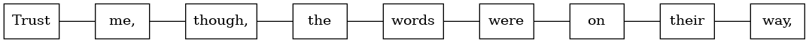
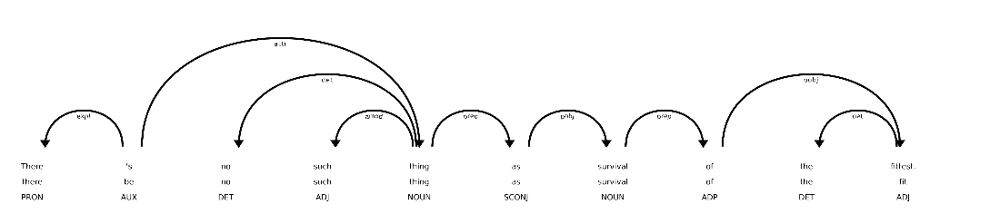

# 第二章：个思维的标记（自然语言单词）

### 本章涵盖了

+   将你的文本解析成单词和*n*-grams（标记）

+   对标点符号，表情符号，甚至中文字符进行分词标记

+   用词干提取、词形还原和大小写折叠巩固你的词汇表

+   构建自然语言文本的结构化数字表示

+   为情感和亲社会意图对文本进行评分

+   使用字符频率分析来优化你的标记词汇表

+   处理变长的单词和标记序列

所以你想要用自然语言处理（NLP）的力量来拯救世界？首先，你的 NLP 流水线需要计算关于文本的一些内容，为此你需要一种方式来用数字数据结构表示文本。NLP 管道中将你的文本分解以创建这种结构化数字数据的部分被称为*解析器*。对于许多 NLP 应用程序来说，你只需要将文本转换为一系列单词，这对于搜索和分类文本可能已经足够了。

你现在将学习如何将一个文档，任何字符串，分割成有意义的离散标记。你将能够解析小到单个词，大到整部百科全书的文本文件。而且它们都会产生一致的表示，你可以用来比较它们。在本章中，你的标记将是单词、标点符号，甚至表情符号，如中文字符、表情符号。

书中稍后你将看到，你可以使用这些相同的技术在任何离散序列中找到意义的片段。例如，你的标记可以是由一系列字节表示的 ASCII 字符，也许还有 ASCII 表情符号。或者它们可以是 Unicode 表情符号、数学符号、埃及象形文字、类似汉字和粤语的象形文字。你甚至可以为 DNA 和 RNA 序列定义标记，每个字母代表五个碱基：腺嘌呤（A）、鸟嘌呤（G）、胞嘧啶（C）、胸腺嘧啶（T）和尿嘧啶（U）。自然语言的标记序列就在你身边… 甚至在你体内。

有没有一些你可以用标记做的事情，不需要大量复杂的深度学习？如果你有一个好的分词器，你可以用它来识别关于一组文档中标记出现次数的统计信息，比如你的博客文章或企业网站。然后你可以用纯 Python 编写一个只需一个字典来记录这些词出现的文档链接的搜索引擎。将单词映射到文档链接或页面的 Python 字典称为逆向索引。就像这本书后面的索引一样。这被称为*信息检索*—这是你 NLP 工具箱中的一个非常强大的工具。

仅仅统计标记通常就足够进行关键词检测、全文搜索和信息检索。你甚至可以使用文本搜索构建客户支持聊天机器人，以在你的文档或 FAQ（常见问题）列表中查找客户问题的答案。直到聊天机器人知道从哪里寻找答案，它才能回答你的问题。搜索是许多最先进的应用程序的基础，如会话型 AI 和开放域问答。分词器是几乎所有 NLP 流程的基础。

## 2.1 情感标记

另一个你的分词器的实际用途被称为*情感分析*，或者分析文本以估计情感。你将在本章后面看到一个情感分析流程的示例。现在你只需要知道如何构建一个分词器。而且你的分词器几乎肯定需要处理被称为*表情符号*和*表情符号*的情感标记。

*表情符号*是作者情绪或面部表情的文本表示，例如*微笑*表情符号：`:-)`。它们类似于计算机用户的现代象形文字或图片词，只能通过 ASCII 终端进行通信。*表情符号*是这些字符的图形表示。例如，微笑表情符号具有一个小的黄色圆圈，两个黑点表示眼睛，U 形曲线表示嘴巴。微笑表情符号是`:-)`微笑表情符号的图形表示。

表情符号和表情语言都有自己的语言演化。有数百种受欢迎的表情符号。人们为从公司标志到模因和暗示等各种事物创建了表情符号。甚至非商业社交媒体网络如 Mastodon 都允许你创建自定义表情符号。^([1]) ^([2])

##### 表情符号和表情符号

*表情符号*是 1972 年第一次输入到 ASCII 文本消息中的，当时卡内基梅隆大学的研究人员错误地把一个关于汞泄漏的短信误认为是个笑话。教授斯科特·E·福尔曼博士建议对于笑话，消息末尾应加上`:-)`，对于严肃的警告消息，则用`:-(`表情符号。我的天，我们走了多远。

"Emoji"的复数可以是"emoji"（像"sushi"）或"emojis"（像"Tsunamis"），但大西洋和纽约时报的风格编辑更喜欢"emojis"以避免歧义。无论你如何输入，你的 NLP 流程都将了解你的意思。


## 2.2 什么是标记？

一个令牌可以是几乎任何你想要视为一组思想和情感的文本块。所以你需要将文本分成捕捉单个思想的块。你可能会认为*单词*是令牌的明显选择。所以这就是你将从这里开始的内容。你还将学习如何将标点符号、表情符号、数字和其他类似单词的东西包括在你的单词词汇中。后来你会发现你可以使用这些相同的技巧来找到任何离散序列中的意义包。后来你将学习一些更强大的方法来将离散序列分割成有意义的包。你的标记器很快就能分析和结构化任何文本文档或字符串，从一个单词到一个句子，再到整本书。

想象一下一个文档集合，称为*语料库*，你想要使用 NLP 进行处理。想想对你的 NLP 算法重要的*词汇*，你将需要跟踪的令牌集合。例如，如果这是你 NLP 流水线中特定语料库的重要内容，那么你的令牌可能是 ASCII 表情符号的字符。或者你的令牌可以是 Unicode 表情符号、数学符号、象形文字，甚至象形文字像汉字和粤语字符。你的标记器和你的 NLP 流水线甚至对 DNA 和 RNA 的核苷酸序列也会有用，其中你的令牌可能是 A、C、T、G、U 等等。当你阅读像这句话这样的文本时，神经科学家有时会创建离散符号序列来表示你大脑中的神经元发射。自然语言的令牌序列在你内部，在你周围，在你身体里流动。很快你将通过你的机器学习 NLP 流水线流动一系列令牌。

从文档中检索令牌将需要一些字符串操作，不仅仅是第一章中使用的`str.split()`方法。你可能想要将像"you’ll"这样的缩写分割成形成它们的单词，也许是"you"和"'ll"，或者是"you"和"will"。你需要将标点符号与单词分开，比如引号在引用语句或单词的开头和结尾，比如前一句中的引号。并且你需要将一些标点符号，比如破折号("-")视为一部分，例如"单破折号化"中的单破折号化复合词。

一旦你确定了文档中想要包含在你的词汇表中的令牌，你将返回到正则表达式工具箱中构建一个标记器。你可以使用正则表达式将词的不同形式组合成你词汇中的一个单一令牌，这个过程称为*词干提取*。然后你将组装一个称为*词袋*的文档的向量表示。最后，你将尝试使用这个词袋向量来看看它是否能帮助你改进第一章末尾的基本问候识别器。

### 2.2.1 替代令牌

单词不是我们可以用于标记的唯一含义包。想一想单词或标记对你来说代表着什么。它代表一个单一概念，还是一团模糊的概念云？你能肯定地辨认出一个单词的起始和结束吗？自然语言单词像编程语言关键字一样，具有精确的拼写、定义和语法规则吗？你能编写可靠识别单词的软件吗？

你认为“冰淇淋”是一个单词还是两个单词？甚至可能是三个？在你的心理词典中，“冰”和“淇淋”至少有两个单独的条目，与复合词“冰淇淋”的条目不同？那么缩略词“don’t”呢？这个字符串应该分成一个、两个，甚至三个含义包吗？

甚至可能希望将单词划分为更小的有意义的部分。诸如前缀“pre”、后缀“fix”或内部音节“la”等词素都具有意义。你可以利用这些词素，将你对一个单词含义的理解转移到你词汇表中的另一个类似单词上。你的 NLU 流水线甚至可以利用这些词素来理解新单词。而你的 NLG 流水线可以利用这些词素来创建简洁捕捉集体意识中流传的想法或模因的新单词。

你的流水线甚至可以将单词分解成更小的部分。字母、字符或图形也具有情感和意义！我们还没有找到完美的思维包编码。而且机器计算与大脑不同。我们用单词或术语解释语言和概念。但机器往往能够看到我们忽略的字符使用模式。为了让机器能够将庞大的词汇表压缩到有限的 RAM 中，自然语言需要更高效的编码方式。

用于高效计算的最佳标记与我们人类使用的思维包（单词）不同。字节对编码（BPE）、词元编码和句元编码都可以帮助机器更有效地使用自然语言。BPE 为您的特定文档和字符串找到最佳字符（字节）分组。如果你想要一个**可解释的**编码，请使用前面部分的词标记器。如果你想要更灵活和准确地预测和生成文本，那么 BPE、WPE 或 SPE 可能更适合你的应用。就像偏差方差权衡一样，NLP 中经常存在着可解释性/准确性的权衡。

有关隐形或隐含的单词呢？你能想到通过单词“不要！”这个命令隐含的其他单词吗？如果你能强迫自己像一台机器一样思考，然后再切换回人类的思维，你可能会意识到这个命令中有三个看不见的单词。单一的声明“不要！”意味着“你，不要这样做！”或者“你，不要做那个！”至少有三个隐藏的意义包袱，总共有五个你希望你的机器了解的标记。

但现在不要担心看不见的单词。对于本章，你只需要一个能够识别拼写出的单词的分词器。在第四章及以后，你将担心隐含的单词、内涵甚至是意义本身。

你的自然语言处理流程可以从这五个选项中的任意一个开始作为你的标记：

1.  **字节** - ASCII 字符

1.  **字符** - 多字节 Unicode 字符

1.  **子词**（词片） - 音节和常见字符群

1.  **单词** - 词典单词或它们的词根（词干，引文）

1.  **句子片段** - 短的、常见的词和多个词片段

当你逐渐往下看这个列表时，你的词汇量会增加，你的自然语言处理流程将需要越来越多的数据来训练。基于字符的自然语言处理流程通常用于翻译问题或需要从一些例子中推广的自然语言生成任务。你的流程可以处理的可能单词数量称为其*词汇量*。一个基于字符的自然语言处理流程通常只需要处理不到 200 个可能的标记，就可以处理许多以拉丁语为基础的语言。这个小词汇量确保了字节和字符为基础的自然语言处理流程能够处理新的未见过的测试示例，而不会产生太多无意义的 OOV（词汇外）标记。

对于基于单词的自然语言处理流程，你的流程将需要开始关注标记的使用频率，然后决定是否“计数”。你不希望你的流程对诸如 `asdf` 之类的垃圾单词做任何有意义的事情，但即使你确保你的流程只关注出现频率很高的单词，你最终可能会得到一个与典型词典一样大的词汇量——20 到 50 万个单词。

子词是大多数深度学习自然语言处理流程的最佳标记。子词（词片）分词器内置于许多最先进的变换器流程中。对于任何需要结果可解释和可解释的语言学项目或学术研究，单词是首选的标记。

句子片段将子词算法推到了极致。句子片段分词器允许您的算法将多个词片段组合成一个单一标记，有时可以跨越多个词。句子片段的唯一硬性限制是它们不会延伸到句子的末尾。这确保了标记的含义仅与单个连贯的思想相关，并且在单个句子以及更长的文档中都很有用。

#### *N*-gram

无论你在流水线中使用哪种类型的标记，你都可能会提取出一对、三元组、四元组，甚至五元组的标记。这些被称为*n*-grams^([6])。使用*n*-grams 让你的机器了解到"ice cream"这个标记，以及构成它的个别标记"ice"和"cream"。另一个你想要保留在一起的二元组是"Mr. Smith"。你的标记和你对文档的向量表示可能都希望有一个位置来放置"Mr. Smith"以及"Mr."和"Smith"。

你将从一个关键词的简短列表作为你的词汇表开始。这有助于保持你的数据结构小而易懂，并且可以更容易地解释你的结果。可解释的模型创造了你可以用来帮助你的利益相关者，希望是用户自己（而不是投资者），实现他们的目标的见解。

目前，你可以跟踪你词汇表中单词的所有短*n*-grams。但是在第三章，你将学习如何根据单词的文档频率或出现频率来估计单词的重要性。这样，你就可以过滤掉很少一起出现的单词对和三元组。你会发现我们展示的方法并不完美。特征提取很少能保留任何机器学习流水线中输入数据的所有信息内容。这就是自然语言处理的一部分艺术，学会在你的分词器需要调整以从文本中提取更多或不同信息以适用于你特定的应用程序时调整。

在自然语言处理中，从文本中组成数值向量是一个特别"丢失"的特征提取过程。尽管如此，词袋（BOW）向量保留了足够的文本信息内容，以产生有用和有趣的机器学习模型。本章末尾的情感分析器技术与 Google 用来拯救电子邮件技术免受几乎使其无用的大量垃圾邮件的确切技术相同。

## 2.3 挑战（词干提取的预览）

作为说明文本特征提取难度的例子，请考虑*词干提取* —— 将一个词的各种屈折形式分组到同一个"桶"或簇中。一些非常聪明的人花费了他们的职业生涯来开发基于拼写的算法，将单词的屈折形式分组在一起。想象一下这有多难。想象一下尝试从"ending"中移除动词后缀"ing"，这样你就会得到一个名为"end"的词干来代表这两个单词。而且你想将单词"running"变成"run"，这样这两个单词就被视为相同。这很棘手，因为你不仅移除了"ing"，还多了一个额外的"n"。但是你希望单词"sing"保持完整。你不希望从"sing"中移除"ing"后缀，否则你最终会得到一个单个字母"s"。

或者想象一下，试图区分像“words”这样的单词末尾的复数化的“s”和像“bus”和“lens”这样的单词末尾的普通“s”。单词中孤立的个别字母或单词的部分是否提供任何关于该单词含义的信息？字母可能会误导吗？是的，都是。

在本章中，我们将向您展示如何通过使用常规的词干处理方法来使您的自然语言处理流水线更智能化以应对这些单词拼写挑战。稍后，在第五章中，我们将向您展示统计聚类方法，它只需要您收集一些包含您感兴趣的单词的自然语言文本。从该文本集合中，单词使用的统计信息将揭示“语义词干”（实际上，更有用的词族或同义词的集群），而不需要手工制作的正则表达式或词干规则。

### 2.3.1 标记化

在自然语言处理中，*标记化*是一种特殊的文档*分割*。分割将文本分解为更小的块或片段。文本段比整体包含的信息少。文档可以被分割成段落，段落可以分割成句子，句子可以分割成短语，短语可以分割成标记（通常是单词和标点符号）。在本章中，我们重点研究了如何使用*标记器*将文本分割成*标记*。

你可能以前听说过标记器。如果你学过计算机科学课程，你可能学过编程语言编译器的工作原理。用于编译计算机语言的标记器称为*扫描器*或*词法分析器*。在某些情况下，你的计算机语言解析器可以直接处理计算机代码，根本不需要标记器。对于自然语言处理，唯一的解析器通常输出一个向量表示，//组合这些句子可能需要一些工作//而不是如果标记器功能与编译器分开，解析器通常称为无扫描器的*解析器*。

计算机语言的有效标记集称为该语言的*词汇*，或者更正式地称为*词汇表*。语言学和自然语言处理研究人员使用术语“词汇表”来指代一组自然语言标记。术语“词汇”更自然地用来指代一组自然语言单词或标记。所以这里你将使用它。

计算机语言编译器的自然语言等效物是自然语言解析器。自然语言标记器在计算机语言世界中称为*扫描器*、*词法分析器*或*词法分析器*。现代计算机语言编译器将*词法分析器*和*解析器*合并为单一的词法解析器算法。计算机语言的词汇表通常称为*词汇表*。计算机语言编译器有时将标记称为*符号*。

这里有五个重要的 NLP 术语。以及一些在谈论编程语言编译器时在计算机科学中使用的大致等效术语：

+   *标记器* — 扫描器，词法分析器，词法分析器

+   *词汇表* — 词汇

+   *解析器* — 编译器

+   *标记*，*术语*，*单词*，或 *n-gram* — 标记或符号

+   *语句* — 语句或表达式

分词是 NLP 管道中的第一步，因此它对管道的其余部分有很大的影响。分词器将非结构化数据，自然语言文本，分解成可以被视为离散元素的信息块。这些在文档中标记出现的计数可以直接用作表示该文档的向量。这立即将一个非结构化字符串（文本文档）转换为适合于机器学习的数值数据结构。这些计数可以被计算机直接用来触发有用的动作和响应。或者它们也可能被用于机器学习管道中，作为触发更复杂的决策或行为的特征。通过这种方式创建的词袋向量的最常见用途是文档检索或搜索。

## 2.4 你的分词器工具箱

因此，你遇到的每个应用程序都需要考虑哪种类型的分词器适合你的应用程序。一旦你决定要尝试哪些类型的标记，你就需要配置一个 Python 包来实现这个目标。

你可以选择几种分词器实现：^([7])

1.  Python：`str.split`，`re.split`

1.  NLTK：`PennTreebankTokenizer`，`TweetTokenizer`

1.  spaCy：最先进的分词是其存在的原因

1.  Stanford CoreNLP：语言学准确，需要 Java 解释器

1.  Huggingface：`BertTokenizer`，一个 `WordPiece` 分词器

### 2.4.1 最简单的分词器

分词句子的最简单方法是使用字符串中的空格作为单词的“分隔符”。在 Python 中，这可以通过标准库方法 `split` 来实现，该方法可用于所有 `str` 对象实例，以及 `str` 内置类本身。

假设你的 NLP 管道需要解析 WikiQuote.org 的引用，并且它在一个标题为《偷书贼》的引用上遇到了麻烦。^([8])

##### 列表 2.1 从《偷书贼》中拆分为标记的示例引用

```py
>>> text = ("Trust me, though, the words were on their way, and when "
...         "they arrived, Liesel would hold them in her hands like "
...         "the clouds, and she would wring them out, like the rain.")
>>> tokens = text.split()  # #1
>>> tokens[:8]
['Trust', 'me,', 'though,', 'the', 'words', 'were', 'on', 'their']
```

##### 图 2.1 分词短语



正如你所见，这个内置的 Python 方法对这个句子的分词工作做得还可以。它唯一的“错误”是在标记内包括了逗号。这将阻止你的关键字检测器检测到相当多重要的标记：`['我', '虽然', '走', '的', '途中', '云', '外', '有', '雨']`。这些词“云”和“雨”对于这段文字的意义非常重要。所以你需要做得更好一点，确保你的分词器能够捕捉到所有重要的单词，并像莉泽尔一样“保持”它们。

### 2.4.2 基于规则的分词

结果表明，解决将标点符号与单词分开的挑战有一个简单的方法。您可以使用正则表达式标记器来创建处理常见标点模式的规则。这里只是一个特定的正则表达式，您可以用来处理标点符号 "hanger-ons"。而且当我们在这里处理时，这个正则表达式将对具有内部标点符号的单词（例如带有撇号的所有格词和缩写）进行智能处理。

你将使用正则表达式对来自 Peter Watts 的书 *Blindsight* 中的一些文本进行标记化。这段文本描述了最 *足够* 的人类如何在自然选择（以及外星人入侵）中幸存。[9] 对于您的标记器也是一样的。您需要找到一个 *足够* 的标记器来解决您的问题，而不是完美的标记器。您可能甚至无法猜出什么是 *正确* 或 *最适合* 的标记。您将需要一个准确度数字来评估您的 NLP 流水线，并告诉您哪个标记器应该在您的选择过程中幸存下来。这里的示例应该帮助您开始培养对正则表达式标记器应用的直觉。

```py
>>> import re
>>> pattern = r'\w+(?:\'\w+)?|[^\w\s]'  # #1
>>> texts = [text]
>>> texts.append("There's no such thing as survival of the fittest. "
...              "Survival of the most adequate, maybe.")
>>> tokens = list(re.findall(pattern, texts[-1]))
>>> tokens[:8]
["There's", 'no', 'such', 'thing', 'as', 'survival', 'of', 'the']
>>> tokens[8:16]
['fittest', '.', 'Survival', 'of', 'the', 'most', 'adequate', ',']
>>> tokens[16:]
['maybe', '.']
```

好多了。现在标记器将标点符号与单词的末尾分开，但不会将包含内部标点符号的单词分割开，比如单词 "There’s" 中的撇号。所以所有这些单词都被标记了： "There’s"， "fittest"， "maybe"。这个正则表达式标记器甚至可以处理具有撇号之后超过一个字母的缩写，比如 "can’t"， "she’ll"， "what’ve"。它甚至可以处理错别字，比如 'can"t' 和 "she,ll"，以及 "what`ve"。但是，即使有更多的例子，例如 "couldn’t’ve"， "ya’ll’ll" 和 "y’ain’t"，这种宽松匹配内部标点符号的方式可能不是您想要的。

##### 小贴士

Pro tip: 你可以用正则表达式 `r'\w+(?:\'\w+){0,2}|[^\w\s]'` 来处理双重缩写。

这是要记住的主要思想。无论您如何精心制作您的标记器，它都很可能会破坏一些原始文本中的信息。当您切割文本时，您只需确保您留在地板上的信息对于您的管道来说并非必需即可。此外，思考您的下游 NLP 算法也是有帮助的。稍后，您可能会配置大小写折叠、词干提取、词形还原、同义词替换或计数向量化算法。当您这样做时，您将不得不考虑您的标记器正在做什么，这样您的整个管道就可以共同完成您期望的输出。

看一下按字典顺序排序的词汇表中的前几个标记，针对这段简短文本：

```py
>>> import numpy as np
>>> vocab = sorted(set(tokens))  # #1
>>> '  '.join(vocab[:12])  # #2
", . Survival There's adequate as fittest maybe most no of such"
>>> num_tokens = len(tokens)
>>> num_tokens
18
>>> vocab_size = len(vocab)
>>> vocab_size
15
```

你可以看到，你可能希望考虑将所有标记转换为小写，以便“Survival”被识别为与“survival”相同的单词。而且你可能希望有一个同义词替换算法，将“There’s”替换为“There is”出于类似的原因。但是，只有当你的分词器保留缩写和所有格撇号附加到其父标记时，这才有效。

##### 提示

确保在似乎你的管道在某个特定文本上表现不佳时查看你的词汇表。你可能需要修改你的分词器，以确保它可以“看到”所有它需要为你的 NLP 任务做得好的标记。

### 2.4.3 SpaCy

也许你不希望你的正则表达式分词器将缩写保持在一起。也许你想要将单词“isn’t”识别为两个单独的单词，“is”和“n’t”。这样，你就可以将“n’t”和“not”的同义词合并为一个标记。这样，你的 NLP 管道就可以理解“the ice cream isn’t bad”与“the ice cream is not bad”表示相同的意思。对于一些应用，比如全文搜索、意图识别和情感分析，你希望能够像这样**解开**或扩展缩写。通过分割缩写，你可以使用同义词替换或缩写扩展来提高搜索引擎的召回率和情感分析的准确性。

##### 重要提示

我们将在本章后面讨论大小写折叠、词干提取、词形还原和同义词替换。对于诸如作者归因、风格转移或文本指纹等应用，要谨慎使用这些技术。你希望你的作者归因或风格转移管道保持忠实于作者的写作风格和他们使用的确切拼写。

SpaCy 将分词器直接集成到其先进的 NLU 管道中。实际上，“spaCy”的名称是基于单词“space”，即用于西方语言中分隔单词的分隔符。在应用规则将标记分隔开的同时，spaCy 还向标记添加了许多附加的*标签*。因此，spaCy 通常是你需要使用的第一个和最后一个分词器。

让我们看看 spaCy 如何处理我们的一系列深思家名言：

```py
>>> import spacy  # #1
>>> spacy.cli.download('en_core_web_sm')  # #2
>>> nlp = spacy.load('en_core_web_sm')  # #3
>>> doc = nlp(texts[-1])
>>> type(doc)
spacy.tokens.doc.Doc

>>> tokens = [tok.text for tok in doc]
>>> tokens[:9]
['There', "'s", 'no', 'such', 'thing', 'as', 'survival', 'of', 'the']

>>> tokens[9:17]
['fittest', '.', 'Survival', 'of', 'the', 'most', 'adequate', ',']
```

如果你将结果与学术论文或工作中的同事进行比较，那么该标记化对你可能更有用。Spacy 在幕后做了更多工作。你下载的那个小语言模型还使用一些**句子边界检测**规则来识别句子中的断点。语言模型是一组正则表达式和有限状态自动机（规则）。这些规则很像你在英语课上学到的语法和拼写规则。它们用于分词和标记你的单词，以便为它们标记有用的东西，比如它们的词性和它们在单词之间关系语法树中的位置。

```py
>>> from spacy import displacy
>>> sentence = list(doc.sents)[0]  # #1
>>> svg = displacy.render(sentence, style="dep",
...     jupyter=False)  # #2
>>> open('sentence_diagram.svg', 'w').write(svg)  # #3
>>> # displacy.serve(sentence, style="dep") # #4
>>> # !firefox 127.0.0.1:5000
>>> displacy.render(sentence, style="dep")  # #5
```

有三种方式可以从`displacy`创建和查看句子图：在您的 web 浏览器中，您的网页中的一个动态 HTML+SVG 文件，在您的硬盘驱动器上的一个静态 SVG 文件，或者在 jupyter 笔记本中的一个内联 HTML 对象中。如果您浏览到您本地硬盘上的`sentence_diagram.svg`文件或`localhost:5000`服务器，您应该可以看到一个句子图，可能比您在学校中可以制作的还要好。



您可以看到 spaCy 不仅仅是将文本分隔成标记。它可以识别句子边界，自动将您的文本分割成句子。它还会标记各种属性的标记，比如它们在句子的语法中的词性（PoS）甚至是角色。您可以在`displacy`下看到每个标记的词形。^([11]) 本章后面我们会解释词形化和大小写折叠以及其他词汇**压缩**方法对某些应用的帮助。

因此，spaCy 在准确性和一些“内置”功能方面似乎相当出色，比如所有那些标记标记的词形和依赖关系。那速度呢？

### 2.4.4 标记器竞赛

SpaCy 可以在约 5 秒钟内解析本书一章的 AsciiDoc 文本。首先下载本章的 AsciiDoc 文本文件：

```py
>>> import requests
>>> text = requests.get('https://proai.org/nlpia2-ch2.adoc').text
>>> f'{round(len(text) / 10_000)}0k'  # #1
'60k'
```

在我写下您正在阅读的这句话的 AsciiDoc 文件中大约有 160,000 个 ASCII 字符。以每秒字词数为标准的标记速度基准是什么意思？

```py
>>> import spacy
>>> nlp = spacy.load('en_core_web_sm')
>>> %timeit nlp(text)  # #1
4.67 s ± 45.3 ms per loop (mean ± std. dev. of 7 runs, 1 loop each)
>>> f'{round(len(text) / 10_000)}0k'
'160k'
>>> doc = nlp(text)
>>> f'{round(len(list(doc)) / 10_000)}0k'
'30k'
>>> f'{round(len(doc) / 1_000 / 4.67)}kWPS'  # #2
'7kWPS'
```

对于约 150,000 个字符或 34,000 个英文和 Python 文本字词，或约每秒 7000 个字词，大约需要近 5 秒钟。

这对于你的个人项目来说可能足够快了。但在一个医疗记录摘要项目中，我们需要处理数千个大型文档，其中包含与您在整本书中找到的相当数量的文本相当的文本量。我们医疗记录摘要管道中的延迟是该项目的关键指标。因此，这个功能齐全的 spaCy 管道至少需要 5 天的时间来处理 10,000 本书，比如 NLPIA 或典型的 10,000 名患者的医疗记录。

如果对于您的应用程序来说速度还不够快，您可以禁用不需要的 spaCy 管道的任何标记特性。

```py
>>> nlp.pipe_names  # #1
['tok2vec', 'tagger', 'parser', 'attribute_ruler', 'lemmatizer', 'ner']
>>> nlp = spacy.load('en_core_web_sm', disable=nlp.pipe_names)
>>> %timeit nlp(text)
199 ms ± 6.63 ms per loop (mean ± std. dev. of 7 runs, 1 loop each)
```

您可以禁用您不需要的管道元素以加速标记器：

+   `tok2vec`：单词嵌入

+   `tagger`：词性（`.pos`和`.pos_`）

+   `parser`：语法树角色

+   `attribute_ruler`：细粒度的 POS 和其他标记

+   `lemmatizer`：词形标记

+   `ner`：命名实体识别标记

NLTK 的 `word_tokenize` 方法通常用作标记器速度比较的标尺：

```py
>>> import nltk
>>> nltk.download('punkt')
True
>>> from nltk.tokenize import word_tokenize
>>> %timeit word_tokenize(text)
156 ms ± 1.01 ms per loop (mean ± std. dev. of 7 runs, 10 loops each)
>>> tokens = word_tokenize(text)
>>> f'{round(len(tokens) / 10_000)}0k'
'10k'
```

你可能觉得你找到了标记器竞赛的赢家吗？不要那么快。您的正则表达式标记器有一些非常简单的规则，因此它应该运行得相当快：

```py
>>> pattern = r'\w+(?:\'\w+)?|[^\w\s]'
>>> tokens = re.findall(pattern, text)  # #1
>>> f'{round(len(tokens) / 10_000)}0k'
'20k'
>>> %timeit re.findall(pattern, text)
8.77 ms ± 29.8 µs per loop (mean ± std. dev. of 7 runs, 100 loops each)
```

这并不奇怪。正则表达式可以在 Python 的低级 C 例程内被编译和高效运行。

##### 小贴士

当速度比准确性更重要时，请使用正则表达式分词器。如果您不需要像 spaCy 和其他管道提供的额外语言标签，您的分词器就不需要浪费时间去尝试识别这些标签。^([12]) 并且每次使用`re`或`regex`包中的正则表达式时，优化编译版本会缓存在内存中。因此通常不需要*预编译*（使用`re.compile()`）您的正则表达式。

## 2.5 Wordpiece 分词器

或许我们会自然地把词视为不可分割的，具有独立意义和思考的基本单元。然而，你可能会发现有些词在空格或标点符号上并不分明，以及很多复合词或命名实体内部有空格。因此，需要深入挖掘，并考虑什么使一个词成为一个词的统计规律。可以考虑如何从相邻字符构建词，而不是在分隔符（如空格和标点符号）处将文本分开。

### 2.5.1 聚合字符成句部

您的分词器可以寻找紧密相邻使用的字符，例如在“i”之前的“e”，而不是考虑将字符串分割成标记。您可以将这些字符和字符序列组合在一起。^([13]) 这些字符团体可以成为您的标记。NLP 管道只关注标记的统计数据。希望这些统计数据与我们对“词”是什么的期望相吻合。

许多这些字符序列将是整个单词，甚至是复合词的一部分，但其中很多将是词的部分。事实上，所有*子词分词器*都在词汇表中为每个字符维护一个标记。这意味着只要新文本不包含它以前没有见过的字符，它就永远不需要使用 OOV（词汇外）标记。子词分词器尝试将字符最优地聚集在一起以创建标记。利用字符 n-gram 计数的统计数据，这些算法可以识别出构成良好标记的词部甚至句部。

通过聚合字符来确定词似乎有点奇怪。但对于机器来说，在文本中识别意义元素之间唯一明显、一致的分割就是字节或字符间的边界。并且字符一起使用的频率可以帮助机器确定与子词标记相关的意义，例如单个音节或复合词的部分。

在英语中，即使是单个字母也与微妙的情感（情绪）和含义（语义）相关联。然而，英语中只有 26 个唯一的字母。这并不留下单个字母在任何一个主题或情感上*专攻*的余地。尽管如此，精明的营销人员知道有些字母比其他字母更酷。品牌将尝试通过选择具有像 "Q"、"X" 或 "Z" 这样的奇异字母的名称来展示自己技术先进。这也有助于 SEO（搜索引擎优化），因为更罕见的字母更容易在可能的公司和产品名称中被找到。你的 NLP 流水线将捕捉到所有这些意义、内涵和意图的线索。你的标记计数器将为机器提供它需要推断经常一起使用的字母簇的含义的统计数据。

子词分词器唯一的劣势是它们必须在收敛于最佳词汇表和分词器之前多次通过你的文本语料库。与 CountVectorizer 类似，子词分词器必须像 CountVectorizer 一样被训练或适应于你的文本。事实上，在下一节中，你将使用 CountVectorizer 来了解子词分词器的工作原理。

子词分词有两种主要方法：BPE（字节对编码）和 Wordpiece 分词。

#### BPE

在本书的上一版中，我们坚持认为单词是英语中你需要考虑的最小意义单位。随着使用 BPE 和类似技术的 Transformer 和其他深度学习模型的兴起，我们改变了主意。基于字符的子词分词器已被证明对于大多数 NLP 问题更具多功能性和鲁棒性。通过从 Unicode 多字节字符的构建块构建词汇表，你可以构建一个能处理你将要见到的每个可能的自然语言字符串的词汇表，所有这些只需 50,000 个令牌的词汇表即可。

你可能会认为 Unicode 字符是自然语言文本中含义的最小单元。对于人类来说，也许是这样，但对于机器来说却不是。正如 BPE 的名字所暗示的，字符不必是你*基本词汇*的基本含义原子。你可以将字符分割成 8 位字节。GPT-2 使用字节级 BPE 分词器来自然地组成你需要的所有 Unicode 字符，从构成它们的字节中。尽管在基于字节的词汇表中处理 Unicode 标点符号需要一些特殊规则，但对于基于字符的 BPE 算法不需要其他调整。字节级 BPE 分词器允许你用最少的 256 个令牌的基本（最小）词汇量来表示所有可能的文本。GPT-2 模型可以使用仅有 50,000 个多字节*合并令牌*加上 256 个单独字节令牌的默认 BPE 词汇表实现最先进的性能。

BPE（字节对编码）分词算法可以想象成一个社交网络中的红娘。BPE 会把经常相邻出现且看起来“友好”的字符配对起来，然后为这些字符组合创建一个新的标记。BPE 可以在您的文本中经常出现的地方组合多字符标记。并且它会一直这样做，直到达到您在词汇量限制中允许的常用字符序列数量为止。

BPE 正在改变我们对自然语言标记的看法。自然语言处理工程师终于让数据说话了。在构建自然语言处理流水线时，统计思维比人类直觉更好。机器可以看到*大多数*人如何使用语言。而您只熟悉您在使用特定单词或音节时的意思。变换器现在已经在某些自然语言理解和生成任务中超越了人类读者和作者，包括在子词标记中找到含义。

您尚未遇到的一个复杂情况是当您遇到一个新单词时该怎么办的困境。在前面的例子中，我们只是不断向我们的词汇表中添加新单词。但在现实世界中，您的流水线将在一个初始文档语料库上进行训练，该语料库可能代表或可能不代表它将来可能见到的所有种类的标记。如果您的初始语料库缺少后来遇到的某些单词，您将没有一个词汇表位置来放置该新单词的计数。因此，在训练初始流水线时，您将始终保留一个位置（维度）来保存您的*超出词汇量*（OOV）标记的计数。因此，如果您的原始文档集中不包含女孩的名字“阿芙拉”，则所有阿芙拉的计数都将作为阿曼丁和其他稀有单词的计数被合并到 OOV 维度中。

要在您的向量空间中给予阿芙拉平等的表示，您可以使用 BPE。BPE 会将稀有单词拆分成较小的片段，为您语料库中的自然语言创建一个*元素周期表*。所以，因为“aphr”是一个常见的英语前缀，您的 BPE 分词器可能会为阿芙拉在您的词汇表中**留下两个**位置来计数：一个是“aphr”，另一个是“a”。实际上，您可能会发现词汇表中的位置是“ aphr”和“a”，因为 BPE 对空格的处理方式与字母表中的其他字符没有区别。^([15])

BPE 让您可以处理希伯来语名字（如 Aphra）的多语言灵活性。它还可以使您的流程对常见拼写错误和打字错误具有健壮性，例如"aphradesiac"。每个单词，包括少数 2-grams（例如"African American"），在 BPE 的投票系统中都有表示。^([16]) 过去使用处理人类交流的稀有怪癖的 OOV (Out-of-Vocabulary) 标记的方法已经过时了。因此，最先进的深度学习 NLP 流水线（如 transformers）都使用类似于 BPE 的词片标记方法。^([17])

BPE 通过使用字符标记和词片标记来拼写任何未知单词或单词部分，从而保留了一些新单词的含义。例如，如果我们的词汇表中没有"syzygy"，我们可以将其表示为六个标记："s"，"y"，"z"，"y"，"g"和"y"。也许"smartz"可以表示为两个标记："smart"和"z"。

听起来很聪明。让我们看看它如何在我们的文本语料库中工作：

```py
>>> import pandas as pd
>>> from sklearn.feature_extraction.text import CountVectorizer
>>> vectorizer = CountVectorizer(ngram_range=(1, 2), analyzer='char')
>>> vectorizer.fit(texts)
CountVectorizer(analyzer='char', ngram_range=(1, 2))
```

您创建了一个`CountVectorizer`类，它将文本分词为字符而不是单词。它将计算标记对（字符 2-grams）以及单个字符标记。这些是 BPE 编码中的字节对。现在您可以检查词汇表以查看它们的样子。

```py
>>> bpevocab_list = [
...    sorted((i, s) for s, i in vectorizer.vocabulary_.items())]
>>> bpevocab_dict = dict(bpevocab_list[0])
>>> list(bpevocab_dict.values())[:7]
['  ', ' a', ' c', ' f', ' h', ' i', ' l']
```

我们将`CountVectorizer`配置为将文本分割成所有可能的字符 1-grams 和 2-grams。`CountVectorizer`将词汇按照词法顺序进行组织，因此以空格字符(`' '`)开头的 n-grams 位于前面。一旦向量化器知道需要计数的标记，它就可以将文本字符串转换为向量，其中每个字符 n-gram 词汇表中的标记都有一个维度。

```py
>>> vectors = vectorizer.transform(texts)
>>> df = pd.DataFrame(
...     vectors.todense(),
...     columns=vectorizer.vocabulary_)
>>> df.index = [t[:8] + '...' for t in texts]
>>> df = df.T
>>> df['total'] = df.T.sum()
>>> df
    Trust me...  There's ... total
 t           31      14          45
 r            3       2           5
 u            1       0           1
 s            0       1           1
              3       0           3
..           ...     ...        ...
at            1       0           1
ma            2       1           3
yb            1       0           1
be            1       0           1
e.            0       1           1
<BLANKLINE>
[148 rows x 3 columns]
```

数据框中每个句子都包含一列，每个字符 2-gram 都包含一行。看看前四行，其中字节对（字符 2-gram）" a" 在这两个句子中出现了五次。因此，即使在构建 BPE 分词器时，空格也会计入"字符"。这是 BPE 的优点之一，它将找出您的标记分隔符是什么，所以它甚至可以在没有单词之间有空格的语言中工作。而且 BPE 可以在 ROT13 这样的代换密码文本上起作用，ROT13 是一种玩具密码，将字母向前旋转 13 个字符。

```py
>>> df.sort_values('total').tail()
        Trust me...  There's ... total
    en        10           3       13
    an        14           5       19
    uc        11           9       20
    e         18           8       26
    t         31          14       45
```

然后，BPE 分词器会找到最常见的 2-grams 并将其添加到永久词汇表中。随着时间的推移，它会删除较不常见的字符对，因为它们不太可能再次在文本中频繁出现。

```py
>>> df['n'] = [len(tok) for tok in vectorizer.vocabulary_]
>>> df[df['n'] > 1].sort_values('total').tail()
    Trust me...  There's ... total n
ur           8          4            12  2
en          10          3            13  2
an          14          5            19  2
uc          11          9            20  2
e           18          8            26  2
```

所以 BPE 分词器中的下一轮预处理将保留字符 2-grams "en" 和 "an"，甚至 " t" 和 "e"。然后，BPE 算法将使用这个较小的字符 bigram 词汇再次通过文本。它会寻找这些字符 bigrams 与彼此和单个字符的频繁配对。这个过程将继续，直到达到最大标记数，并且最长的可能字符序列已经被纳入词汇表。

##### 注意

你可能会看到关于*wordpiece*分词器的提及，它被用在一些高级语言模型中，如 `BERT` 及其派生版本。它的工作方式与 BPE 相同，但它实际上使用底层语言模型来预测字符串中的相邻字符。它会从词汇表中消除对这个语言模型准确性影响最小的字符。数学上有些微的差异，产生了略有不同的标记词汇表，但您不需要故意选择这个分词器。使用它的模型将在其流水线中内置它。

基于 BPE 的分词器的一个重大挑战是它们必须在您的个人语料库上进行训练。因此，BPE 分词器通常仅用于您将在第九章学习的变形金刚和大型语言模型（LLM）。

BPE 分词器的另一个挑战是您需要进行的所有簿记，以跟踪每个训练过的分词器与您训练过的每个模型对应。这是 Huggingface 的一项重大创新之一。他们简化了存储和共享所有预处理数据的过程，例如分词器词汇表，与语言模型一起。这使得重复使用和共享 BPE 分词器变得更容易。如果你想成为一个 NLP 专家，你可能想模仿 HuggingFace 在你自己的 NLP 预处理流水线中所做的事情。

## 2.6 标记的向量

现在你已经把你的文本分解成了有意义的标记，你会怎么处理它们呢？你怎样才能把它们转换成对机器有意义的数字？最简单、最基本的事情是检测你感兴趣的特定标记是否存在。你可以硬编码逻辑来检查重要标记，称为*关键词*。

这对于你的问候意图识别器可能效果很好。我们在第一章末尾的问候意图识别器寻找文本字符串开头的词语，如 "Hi" 和 "Hello"。你的新标记化文本将帮助你检测诸如 "Hi" 和 "Hello" 等词语的存在或缺失，而不会因为 "Hiking" 和 "Hell" 等词语而混淆。有了你的新分词器，你的 NLP 流水线将不会把单词 "Hiking" 错误地解释为问候 "Hi king"。

```py
>>> hi_text = 'Hiking home now'
>>> hi_text.startswith('Hi')
True
>>> pattern = r'\w+(?:\'\w+)?|[^\w\s]'  # #1
>>> 'Hi' in re.findall(pattern, hi_text)  # #2
False
>>> 'Hi' == re.findall(pattern, hi_text)[0]  # #3
False
```

因此，标记化可以帮助您减少简单意图识别管道中的假阳性数量，该管道寻找问候词的存在。这通常被称为关键词检测，因为您的词汇表限于您认为重要的一组词汇。但是，想到可能出现在问候语中的所有单词，包括俚语、拼写错误和错别字，这相当繁琐。创建一个 for 循环来遍历它们将是低效的。我们可以使用线性代数的数学和`numpy`的向量化操作来加速此过程。

为了高效地检测标记，您将需要使用三种新技巧：

1.  文档的矩阵和向量表示

1.  numpy 中的向量化操作

1.  离散向量的索引

您将首先学习将单词表示为矩阵的最基本、直接、原始和无损的方法，即单独独热编码。

### 2.6.1 单独独热向量

现在您已成功将文档分割成所需的单词类型，您可以准备将它们转换成向量。数字向量是我们在自然语言文本上进行数学或处理所需要的。

```py
>>> import pandas as pd
>>> onehot_vectors = np.zeros(
...     (len(tokens), vocab_size), int)  # #1
>>> for i, tok in enumerate(tokens):
...     if tok not in vocab:
...         continue
...     onehot_vectors[i, vocab.index(tok)] = 1  # #2
>>> df_onehot = pd.DataFrame(onehot_vectors, columns=vocab)
>>> df_onehot.shape
(18, 15)
>>> df_onehot.iloc[:,:8].replace(0, '')  # #3
    ,  .  Survival  There's adequate as fittest maybe
0                       1
1
2
3
4                                   1
5
6
7
8                                           1
9      1
10              1
11
12
13
14                               1
15  1
16                                                1
17     1
```

在这个表示两句引用的表格中，每一行都是文本中单个词的向量表示。该表格有 15 列，因为这是您的词汇表中唯一单词的数量。该表格有 18 行，每个单词在文档中占据一行。列中的“1”表示该位置在文档中存在一个词汇单词。

您可以从上到下“阅读”一个独热编码（向量化）的文本。您可以看到文本中的第一个词是“有”，因为第一行下面的`1`位于“有”的列标签下。接下来的三行（行索引 1、2 和 3）为空白，因为我们在右边截断了表格以便它适合在页面上显示。文本的第五行，带有偏移索引号`4`，向我们展示了文本中的第五个词是“足够”，因为在该列中有一个`1`。

单独独热向量非常稀疏，每个行向量中只包含一个非零值。为了显示，此代码将`0`替换为空字符串（’'`），以便更容易阅读。但是该代码实际上并没有改变您在 NLP 管道中处理的数据的`DataFrame`。上面的 Python 代码只是为了让阅读更轻松，这样您就可以看到它看起来有点像播放器钢琴卷轴，或者可能是音乐盒鼓。

Pandas 的`DataFrame`使得这个输出稍微容易阅读和解释。`DataFrame.columns`跟踪每列的标签。这使您可以使用字符串为表格中的每一列标记，例如其代表的标记或单词。`DataFrame`还可以在`DataFrame.index`中跟踪每行的标签，以便快速查找。

##### 重要提示

不要向任何你打算在你的机器学习流水线中使用的`DataFrame`添加字符串。标记器和向量化器的目的，比如这个一热向量化器，是创建一个你的 NLP 流水线可以对其进行数学运算的数值数组。你不能对字符串进行数学运算。

表的每一行都是一个二进制行向量，你可以看到为什么它也被称为一热向量：除了一行中的一个位置（列）之外，其他位置都是`0`或空白。只有一个列，或者向量中的一个位置是“热”的（`1`）。一个`1`表示打开，或热。一个`0`表示关闭，或缺失。

使用这种词向量表示和文档表格表示的一个很好的特点是没有信息丢失。令人满意的是，令牌的确切序列以表示文档的一热向量的顺序编码在表中。只要你记住哪些词由哪列表示，你就可以完美地从这个一热向量表中重构出原始的令牌序列。即使你的标记器只有 90%的准确率生成你认为有用的令牌，这个重构过程也是 100%准确的。因此，像这样的一热词向量通常用于神经网络、序列到序列语言模型和生成语言模型。它们是任何需要保留原始文本中所有含义的模型或 NLP 流水线的良好选择。

##### 提示

一热编码器（向量化器）没有从文本中丢弃任何信息，但我们的标记器丢弃了。我们的正则表达式标记器丢弃了有时出现在单词之间的空白字符（`\s`）。因此，你不能用一个*解标记器*完美地重构原始文本。然而，像 spaCy 这样的标记器跟踪这些空格字符，并且实际上可以完美地解标记一个令牌序列。spaCy 是因为准确高效地和准确地记录空格的这一特性而命名的。

这一系列一热向量就像原始文本的数字录音。如果你看得够仔细，你可能会想象上面的一和零的矩阵是一个玩家钢琴卷。[²⁰] 或者它可能是音乐盒金属鼓上的凹痕。[²¹] 顶部的词汇表告诉机器在词序列或钢琴音乐中的每一行中播放哪个“音符”或单词，就像图 2.2 中一样。

##### 图 2.2 玩家钢琴卷


与钢琴卷或音乐盒不同，你的机械词记录器和播放器只允许一次使用一个“手指”。它只能一次播放一个“音符”或一个词。它是一热的。而且单词之间的间距没有变化。

重要的是，你已经将自然语言单词的句子转换为一系列数字，或向量。现在，你可以让计算机像处理任何其他向量或数字列表一样阅读和对这些向量进行数学运算。这使得你的向量可以被输入到任何需要这种向量的自然语言处理流水线中。第 5 至 10 章的深度学习流水线通常需要这种表示形式，因为它们可以被设计为从这些原始文本表示中提取意义的“特征”。而且深度学习流水线可以从意义的数值表示生成文本。因此，从后面章节的你的自然语言生成流水线中流出的单词流通常将被表示为一系列 one-hot 编码的向量，就像自动钢琴可能为西部世界中不那么人工的观众演奏一首歌一样。

现在，你所需要做的就是想出如何构建一个能够*理解*并以新的方式组合这些词向量的“自动钢琴”。最终，你希望你的聊天机器人或自然语言处理流水线能为我们演奏一首歌，或者说出一些你之前没听过的话。在第九章和第十章，当你学习到适用于像这样的 one-hot 编码令牌序列的递归神经网络时，你将有机会做到这一点。

这种用 one-hot 词向量表示的句子保留了原始句子的所有细节、语法和顺序。而且你已经成功地将单词转换为计算机能“理解”的数字。它们也是一种计算机非常喜欢的特殊类型的数字：二进制数字。但对于一个简短的句子来说，这是一个很大的表格。如果你仔细想一想，你已经扩展了存储文档所需的文件大小。对于一个长文档来说，这可能不实用。

你的文档集的这种**无损**数值表示有多大？你的词汇量（向量长度）会变得非常庞大。英语至少包含 20,000 个常见单词，如果包括名称和其他专有名词，则有数百万个。而且你的 one-hot 向量表示需要为你想要处理的每个文档创建一个新的表格（矩阵）。这几乎就像你的文档的原始“图像”。如果你做过任何图像处理，你就知道如果想从数据中提取有用信息，你需要进行维度缩减。

让我们通过一些数学来让你了解一下这些“钢琴卷”有多么庞大和难以控制。在大多数情况下，你在自然语言处理流水线中使用的标记词汇表将远远超过 10,000 或 20,000 个标记。有时甚至可以是数十万甚至数百万个标记。假设你的自然语言处理流水线词汇表中有一百万个标记。然后假设你有 3000 本书，每本书有 3500 个句子，每个句子有 15 个单词——这些都是短书的合理平均值。那就是很多很大的表（矩阵），每本书一个。那将使用 157.5TB。你可能甚至无法把它存储到磁盘上。

哪怕你非常高效，并且在矩阵中每个数字只使用一个字节，那也是超过一百万亿字节。以每个单元一个字节的计算，你需要将近 20TB 的存储空间来存放用这种方式处理的一小本书架上的书籍。幸运的是，你不会永久使用这种数据结构来存储文档。你只是在处理文档时临时使用它，存储在内存中，一次处理一个单词。

因此，存储所有这些零，并记录所有文档中单词的顺序并没有太多意义。这不实际。也不是很有用。你的数据结构没有从自然语言文本中抽象或泛化出来。这样的自然语言处理流水线在现实世界中并没有做任何真正的特征提取或维度缩减，以帮助你的机器学习在实际情况下运行良好。

你真正想做的是将文档的含义压缩到其本质中。你想将文档压缩成一个单一的向量，而不是一个大表。而且你愿意放弃完美的“回忆”。你只是想捕捉文档中的大部分含义（信息），而不是全部。

你的正则表达式分词器和独热向量对于创建*反向索引*非常有效。就像教科书末尾的索引一样，你的独热向量矩阵可以用来快速找到所有至少使用过一次特定单词的字符串或文档。因此，到目前为止你学到的工具可以作为个性化搜索引擎的基础。然而，你看到了搜索和信息检索只是自然语言处理的许多许多应用之一。要解决更高级的问题，你将需要更高级的分词器和更复杂的文本向量表示。Python 包`spaCy`就是你在寻找的最先进的分词器。

### 2.6.2 SpaCy

也许您不希望您的正则表达式标记器将缩写词保持在一起。也许您想要将单词"isn’t"识别为两个单独的单词，"is"和"n’t"。这样，您可以将"n’t"和"not"这两个同义词合并为一个标记。这样，您的 NLP 管道就能理解"the ice cream isn’t bad"与"the ice cream is not bad"的含义相同。对于一些应用程序，例如全文搜索、意图识别和情感分析，您希望能够**展开**或扩展这样的缩写词。通过拆分缩写词，您可以使用同义词替换或扩展缩写词来提高搜索引擎的召回率和情感分析的准确性。

##### 重要提示

我们将在本章后面讨论大小写折叠、词干提取、词形还原和同义词替换。在应用程序（如作者归因、风格转移或文本指纹）中使用这些技术时要小心。您希望您的作者归因或风格转移管道保持忠于作者的写作风格和他们使用的确切拼写。 

SpaCy 将标记器直接集成到其最先进的 NLU 管道中。实际上，"spaCy"这个名字是基于单词"space"，就像西方语言中用于分隔单词的分隔符一样。而且，spaCy 在应用规则拆分标记的同时，还向标记添加了许多其他*标签*。因此，spaCy 通常是您唯一需要使用的第一个和最后一个标记器。

让我们看看 SpaCy 如何处理我们的一系列深思者引用。首先，您将使用一个对 spacy.load 函数的薄包装器，以便您的 NLP 管道是*幂等*的。幂等的管道可以多次运行，并每次都达到相同的结果：

```py
>>> import spacy  # #1
>>> from nlpia2.spacy_language_model import load  # #2
>>> nlp = load('en_core_web_sm')  # #3
>>> nlp
<spacy.lang.en.English...>
```

现在您已经下载了小型的 SpaCy 语言模型并将其加载到内存（RAM）中，您可以使用它来标记和标记任何文本字符串。这将创建一个新的 SpaCy `Doc`对象，其中包含 SpaCy 使用该语言模型理解文本的内容。

```py
[source,python]
>>> doc = nlp(texts[-1])
>>> type(doc)
<class 'spacy.tokens.doc.Doc'>
```

SpaCy 已经阅读并解析了您的文本，将其分割为标记。`Doc`对象包含一系列`Token`对象，每个对象应该是一个小的思想或含义包（通常是单词）。看看这些标记是否是您预期的：

```py
>>> tokens = [tok.text for tok in doc]  # #1
>>> tokens[:9]
['There', "'s", 'no', 'such', 'thing', 'as', 'survival', 'of', 'the']
>>> tokens[9:17]
['fittest', '.', 'Survival', 'of', 'the', 'most', 'adequate', ',']
```

Spacy 在幕后做的远不止将您的文本分割成标记。您下载的那个小语言模型还通过一些**句子边界检测**规则来识别句子分隔符。语言模型是一组正则表达式和有限状态自动机（规则）。这些规则很像你在英语课上学到的语法和拼写规则。它们用于将单词标记为有用的东西，如它们的词性和它们在单词之间的语法树关系中的位置。再仔细看看那个句子图表

```py
>>> from spacy import displacy
>>> sentence = list(doc.sents)[0]  # #1
>>> # displacy.serve(sentence, style="dep") # #2
>>> # !firefox 127.0.0.1:5000
>>> displacy.render(sentence, style="dep")
```

图表应该*内联*显示在 jupyter 笔记本中，或者如果在`ipython`（`jupyter-console`）中运行此代码，则应在单独的窗口中显示。如果启动了 displacy web 服务器，您可以通过在端口 5000 上浏览到 localhost（`127.0.0.1`）（``127.0.0.1:5000``）来查看图表。您应该看到一个句子图表，这可能比您在学校能做的更正确：


你可以看到，spaCy 做的远不止将文本分割成令牌那么简单。它会识别句子边界，自动将文本分段为句子。它还使用各种属性标记令牌，例如它们的词性（PoS）甚至它们在句子语法中的角色。你可以在`displacy`下看到显示的词元。^([23]) 本章后面你将了解词形还原、大小写折叠和其他词汇**压缩**方法对某些应用有何帮助。

因此，从准确性和一些“内置电池”功能（例如词元和依赖项的所有令牌标记）来看，spaCy 似乎相当不错。速度如何？

### 2.6.3 令牌化竞赛

SpaCy 可以在大约 5 秒钟内解析本书一章的 AsciiDoc 文本。首先下载本章的 AsciiDoc 文本文件：

```py
>>> import requests
>>> text = requests.get('https://proai.org/nlpia2-ch2.adoc').text
>>> f'{round(len(text) / 10_000)}0k'  # #1
'170k'
```

在我写下您正在阅读的这个句子的 AsciiDoc 文本文件中，大约有 170,000 个 Unicode 字符。从词数每秒来看，这意味着什么，这是令牌化速度的标准基准？

```py
>>> from nlpia2.spacy_language_model import load
>>> nlp = load('en_core_web_sm')
>>> %timeit nlp(text)  # #1
4.67 s ± 45.3 ms per loop (mean ± std. dev. of 7 runs, 1 loop each)
>>> f'{round(len(text) / 10_000)}0k'
'170k'
>>> doc = nlp(text)
>>> f'{round(len(list(doc)) / 10_000)}0k'
'40k'
>>> f'{round(len(doc) / 1_000 / 4.67)}kWPS'  # #2
'8kWPS'
```

对于大约 15 万个字符或英语和 Python 文本中的约 34,000 个单词，或每秒约 7,000 个单词的标准，这几乎需要 5 秒钟。

对于您的个人项目，这可能已经足够快了。但是在商业业务的典型医疗记录摘要项目中，您可能需要每分钟处理数百个大型文档。这是每秒处理几个文档。如果每个文档包含本书中的文本量（近一百万个令牌），那么每秒几乎可以达到一百万个令牌。医疗记录摘要管道的延迟可以是项目的关键指标。例如，在一个项目中，使用 SpaCy 作为分词器处理 10,000 份患者医疗记录花费了 5 天的时间。

如果您需要加速您的令牌化器，一种选择是禁用 spaCy 管道中您的应用程序不需要的标记功能：

```py
>>> nlp.pipe_names  # #1
['tok2vec', 'tagger', 'parser', 'attribute_ruler', 'lemmatizer', 'ner']
>>> nlp = load('en_core_web_sm', disable=['tok2vec', 'tagger', 'parser'])
>>> nlp.pipe_names
['attribute_ruler', 'lemmatizer', 'ner']
>>> %timeit nlp(text)
199 ms ± 6.63 ms per loop (mean ± std. dev. of 7 runs, 1 loop each)
```

您可以禁用不需要的管道元素以加速分词器：

+   `tok2vec`: 词嵌入

+   `tagger`: 词性（`.pos`和`.pos_`）

+   `parser`: 语法树角色

+   `attribute_ruler`: 精细的词性和其他标记

+   `lemmatizer`: 词元标记器

+   `ner`: 命名实体识别标记器

在令牌化器速度比较中，NLTK 的`word_tokenize`方法通常用作速度的基准：

```py
>>> import nltk
>>> nltk.download('punkt')
True
>>> from nltk.tokenize import word_tokenize
>>> %timeit word_tokenize(text)
156 ms ± 1.01 ms per loop (mean ± std. dev. of 7 runs, 10 loops each)
>>> tokens = word_tokenize(text)
>>> f'{round(len(tokens) / 10_000)}0k'
'30k'
```

你难道发现了分词器竞赛的赢家吗？不要太快。你的正则表达式分词器有一些非常简单的规则，因此也应该运行得非常快：

```py
>>> pattern = r'\w+(?:\'\w+)?|[^\w\s]'
>>> tokens = re.findall(pattern, text)  # #1
>>> f'{round(len(tokens) / 10_000)}0k'
'40k'
>>> %timeit re.findall(pattern, text)
8.77 ms ± 29.8 µs per loop (mean ± std. dev. of 7 runs, 100 loops each)
```

现在这不太令人惊讶。Python 在低级别的 C 例程中编译和运行正则表达式非常高效。除了速度外，正则表达式和 NLTK 令牌化器经常用于学术论文。这帮助像你这样的人精确复现他们的结果。因此，如果你尝试复制别人的工作，请确保使用他们的分词器，无论是 NLTK、正则表达式还是 spaCy 的特定版本。在本书中，你只是尝试学习事物的工作原理，所以我们没有费心追踪我们使用的 spaCy 和 NLTK 的特定版本。但是如果你正在与其他进行 NLP 研究的人分享你的结果，你可能需要为自己做这些事情。

##### 提示

当速度比准确度更重要或其他人将尝试复制你的结果时，请使用正则表达式分词器。如果你不需要 spaCy 提供的额外标记，你的分词器不需要浪费时间来处理单词的语法和含义来创建这些标记。每次使用`re`或`regex`包中的正则表达式时，它的已编译和优化版本都会缓存在 RAM 中。因此，通常没有必要使用`re.compile()`预编译你的正则表达式。

## 2.7 单词片段分词器

对于单词来说，将其视为不可分割的原子意义和思想是很自然的。然而，你可能会发现一些单词并不在空格或标点符号上清晰划分。而且，许多复合词或专有名词内部有空格，如果想要它们保持在一起，需要更深入地研究单词的统计特征。考虑如何通过邻近的字符来构建单词，而不是在分隔符，如空格和标点符号处切割文本。

### 2.7.1 按块组合字符成句子片段

与其考虑将字符串分解为标记，不如让你的分词器寻找紧密相邻使用的字符，比如"i"在"e"的前面。你可以组合起来属于一起的字符和字符序列。这些字符簇可以成为你的标记。NLP 管道只关注标记的统计信息。希望这些统计信息能符合我们对单词的期望。

这些字符序列中的许多将是完整的单词，甚至是复合词，但许多将是单词的部分。事实上，所有*子词标记器*都在词汇表中为您的每个单词的每个字符保留一个标记。这意味着只要新的文本不包含它之前没有见过的新字符，它就永远不需要使用一个 OOV（词汇外）标记。子词标记器尝试将字符最佳地聚集在一起以创建令牌。利用字符 n-gram 计数的统计数据，这些算法可以识别出可作为令牌的单词片段，甚至是句子片段。

通过将字符聚集在一起来识别单词可能看起来很奇怪。但对于机器来说，文本中意义元素之间唯一明显、一致的分界线就是字节或字符之间的边界。字符频繁一起使用的频率可以帮助机器识别与子词标记（例如单个音节或复合词的部分）相关联的含义。

在英语中，即使是单个字母也带有微妙的情感（情绪）和含义（语义）。然而，在英语中只有 26 个独特的字母。这并不给单个字母在任何一个主题或情感上*专门化*留下空间。尽管如此，精明的营销人员知道，有些字母比其他字母更酷。品牌将尝试通过选择带有像“Q”和“X”或“Z”这样的异国字母的名称来展示自己技术先进。这也有助于 SEO（搜索引擎优化），因为较少见的字母在可能的公司和产品名称中更容易被发现。你的 NLP 管道将捕捉到所有这些含义、内涵和意图的暗示。你的标记计数器将为机器提供其需要推断经常一起使用的字母簇的含义的统计数据。

子词标记器唯一的劣势是它们必须多次通过您的文本语料库，才能收敛到最佳词汇表和分词器。子词标记器必须像 CountVectorizer 一样被训练或适合您的文本。事实上，在下一节中，您将使用 CountVectorizer 来了解子词标记器的工作原理。

子词分词有两种主要方法：BPE（字节对编码）和 Wordpiece 分词。

#### BPE

在本书的上一版中，我们坚持认为单词是您需要考虑的英语中最小的含义单位。随着 Transformer 和其他使用 BPE 和类似技术的深度学习模型的兴起，我们改变了主意。基于字符的子词标记器已被证明对于大多数 NLP 问题更加灵活和强大。通过从 Unicode 多字节字符的构建块中构建词汇表，您可以构建一个可以处理您将要看到的每一个自然语言字符串的词汇表，词汇表中的令牌数量只需为 50,000 个即可。

你可能认为 Unicode 字符是自然语言文本中包含意义的最小单位。对于人类来说可能是这样，但对于机器来说绝对不是。正如 BPE 的名称所暗示的，字符不必是你的 *基本词汇* 的基本意义单位。你可以将字符分割成 8 位字节。GPT-2 使用字节级 BPE 分词器从组成它们的字节中自然组合出所有你需要的 Unicode 字符。虽然在基于字节的词汇表中处理 Unicode 标点需要一些特殊规则，但不需要对基于字符的 BPE 算法进行其他调整。字节级 BPE 分词器允许你用 256 个最小令牌的基础词汇大小来表示所有可能的文本。GPT-2 模型可以通过其默认的由 50,000 个多字节 *合并令牌* 加上 256 个个别字节令牌组成的 BPE 词汇表实现最先进的性能。

您可以将 BPE (Byte Pair Encoding) 分词器算法看作是社交网络中的媒人。BPE 将经常出现在一起且看起来是“朋友”的字符配对在一起。然后为这些字符组合创建一个新的标记。BPE 可以在文本中经常使用这些标记对时，将多字符标记配对。并且会一直这样做，直到在您的词汇限制大小中允许的频繁使用的字符序列有很多。

BPE 正在改变我们对自然语言标记的看法。自然语言处理工程师终于让数据说话。在构建自然语言处理流程时，统计思维比人类直觉要好。机器可以看到 *大多数* 人如何使用语言。你只对你使用特定单词或音节时的含义熟悉。Transformers 现在已经在某些自然语言理解和生成任务上超越了人类读者和作者，包括在子词标记中找到含义。

你尚未遇到的一个复杂情况是在遇到新词时该做何选择的困境。在先前的例子中，我们只是不断地将新词加入到我们的词汇表中。但在现实世界中，你的流程将会在一个初始文档语料库上进行训练，这个语料库可能或可能不代表它将来可能看到的所有类型的标记。如果你的初始语料库缺少后来遇到的一些单词，那么你将没有一个插槽来放置那个新单词的计数。因此，在训练初始流程时，你将始终保留一个插槽 (维度) 来存放你的 *词汇外* (OOV) 标记的计数。因此，如果你最初的文档集不包含女孩名为"Aphra"，那么对名为 Aphra 的所有计数将被汇总到 OOV 维度中，作为 Amandine 和其他罕见单词的计数。

要在您的向量空间中给予 Aphra 平等的表示，您可以使用 BPE。BPE 将罕见的单词分解为更小的片段，以在语料库中为自然语言创建一个元素的*周期表*。所以，因为“aphr”是一个常见的英语前缀，您的 BPE 分词器可能会为她的词汇中的计数提供**两个**插槽：一个用于“aphr”和一个用于“a”。实际上，您可能会发现词汇槽位是“ aphr”和“a”，因为 BPE 对待空格与字母表中的任何其他字符没有任何区别。

BPE 为您提供了处理希伯来语名称（如 Aphra）的多语言灵活性。它还使您的管道对常见的拼写错误和打字错误具有健壮性，例如“aphradesiac”。每个词，包括诸如“African American”之类的少数 2-gram，在 BPE 的投票系统中都有代表。过去使用 OOV（词汇外）令牌来处理人类沟通的罕见怪癖的日子一去不复返。由于这个原因，像 transformers 这样的最先进的深度学习 NLP 管道都使用类似于 BPE 的词片分词技术。

BPE 通过使用字符令牌和词片令牌来拼写任何未知单词或单词部分，从而保留了一些新单词的含义。例如，如果“syzygy”不在我们的词汇表中，我们可以将其表示为六个令牌“s”，“y”，“z”，“y”，“g”和“y”。也许“smartz”可以表示为两个令牌“smart”和“z”。

那听起来很聪明。让我们看看它在我们的文本语料库中是如何工作的：

```py
>>> import pandas as pd
>>> from sklearn.feature_extraction.text import CountVectorizer
>>> vectorizer = CountVectorizer(ngram_range=(1, 2), analyzer='char')
>>> vectorizer.fit(texts)
CountVectorizer(analyzer='char', ngram_range=(1, 2))
```

您创建了一个`CountVectorizer`类，它将文本令牌化为字符而不是单词。它还将计数令牌对（字符 2-gram）以及单个字符令牌。这些是 BPE 编码中的字节对。现在您可以检查您的词汇表，看看它们是什么样子的。

```py
>>> bpevocab_list = [
...    sorted((i, s) for s, i in vectorizer.vocabulary_.items())]
>>> bpevocab_dict = dict(bpevocab_list[0])
>>> list(bpevocab_dict.values())[:7]
['  ', ' a', ' c', ' f', ' h', ' i', ' l']
```

我们配置了`CountVectorizer`以将文本拆分为文本中找到的所有可能的字符 1-gram 和 2-gram。而且`CountVectorizer`按词法顺序组织词汇表，因此以空格字符（`' '`)开头的 n-gram 首先出现。一旦向量化器知道它需要能够计数的令牌是什么，它就可以将文本字符串转换为向量，每个字符 n-gram 词汇表中的每个令牌都有一个维度。

```py
>>> vectors = vectorizer.transform(texts)
>>> df = pd.DataFrame(
...     vectors.todense(),
...     columns=vectorizer.vocabulary_)
>>> df.index = [t[:8] + '...' for t in texts]
>>> df = df.T
>>> df['total'] = df.T.sum()
>>> df
        Trust me...  There's ... total
    t            31           14     45
    r             3            2      5
    u             1            0      1
    s             0            1      1
                  3            0      3
    ..          ...          ...    ...
    at            1            0      1
    ma            2            1      3
    yb            1            0      1
    ...
```

DataFrame 包含每个句子的一列和每个字符 2-gram 的一行。查看前四行，其中字节对（字符 2-gram）“ a”的出现次数在这两个句子中出现了五次。所以即使在构建 BPE 分词器时，空格也算作“字符”。这是 BPE 的优点之一，它会弄清楚您的令牌分隔符是什么，因此即使在没有单词之间有空格的语言中，它也会起作用。而且 BPE 将适用于替换密码文本，如 ROT13，这是一个将字母表向前旋转 13 个字符的玩具密码。

```py
>>> df.sort_values('total').tail(3)
        Trust me...  There's ... total
    uc           11            9     20
    e            18            8     26
    t            31           14     45
```

然后，BPE 分词器会找到最常见的 2 元组并将它们添加到永久词汇表中。随着时间的推移，它会删除较不常见的字符对，因为它读取文本越深入，那些稀有的字符对在文本末尾之前出现的可能性就越小。对于熟悉统计学的人来说，它使用贝叶斯模型对您的文本进行建模，不断更新对标记频率的先验预测。

```py
>>> df['n'] = [len(tok) for tok in vectorizer.vocabulary_]
>>> df[df['n'] > 1].sort_values('total').tail()
        Trust me...  There's ... total n
     c            8            4     12  2
    en           10            3     13  2
    an           14            5     19  2
    uc           11            9     20  2
    e            18            8     26  2
```

因此，在 BPE 分词器的下一轮预处理中，将保留字符 2 元组"en"和"an"甚至是" c"和"e"。然后，BPE 算法将使用这个较小的字符二元组词汇再次遍历文本。它将寻找这些字符二元组彼此之间以及单个字符的频繁配对。这个过程将持续进行，直到达到最大标记数，并且最长的可能字符序列已经被纳入词汇表。

##### 注意

您可能会看到关于*wordpiece*分词器的提及，它在某些高级语言模型中使用，例如`BERT`及其衍生产品。它的工作方式与 BPE 相同，但实际上使用底层语言模型来预测字符串中的相邻字符。它会消除对语言模型精度影响最小的字符。数学上有微妙的差异，产生微妙不同的标记词汇表，但您无需刻意选择此分词器。使用它的模型将在其管道中内置。

BPE 分词器的一个重大挑战是必须针对您的个体语料库进行训练。因此，BPE 分词器通常仅用于 Transformer 和大型语言模型（LLM），您将在第九章学习到这些内容。

另一个 BPE 分词器的挑战是您需要进行大量的簿记工作，以跟踪每个已训练的分词器与您已训练的模型之间的对应关系。这是 Huggingface 的一项重大创新之一。他们简化了存储和共享所有预处理数据的过程，例如分词器词汇表，以及语言模型。这使得重用和共享 BPE 分词器变得更加容易。如果您想成为自然语言处理专家，您可能希望模仿 HuggingFace 的做法，使用自己的 NLP 预处理流程。

## 2.8 标记的向量

现在，您已经将文本分解为有意义的标记，接下来该怎么处理呢？如何将它们转换为机器可理解的数字？最简单最基本的做法是检测您感兴趣的特定标记是否存在。您可以硬编码逻辑来检查重要的标记，称为*关键词*。

这可能对第一章中的问候意图识别器很有效。我们在第一章末尾的问候意图识别器寻找了像“Hi”和“Hello”这样的词在文本字符串开头的情况。你的新标记化文本将帮助你检测诸如“Hi”和“Hello”之类的词的存在或不存在，而不会被“Hiking”和“Hell”这样的词所混淆。有了你的新分词器，你的 NLP 管道不会将单词“Hiking”误解为问候语“Hi king”：

```py
>>> hi_text = 'Hiking home now'
>>> hi_text.startswith('Hi')
True
>>> pattern = r'\w+(?:\'\w+)?|[^\w\s]'  # #1
>>> 'Hi' in re.findall(pattern, hi_text)  # #2
False
>>> 'Hi' == re.findall(pattern, hi_text)[0]  # #3
False
```

因此，标记化可以帮助你减少在简单意图识别管道中的假阳性数量，该管道用于寻找问候词的存在。这通常被称为关键词检测，因为你的词汇表限于你认为重要的一组词。然而，必须考虑到所有可能出现在问候语中的单词，包括俚语、拼写错误和打字错误，这是相当麻烦的。创建一个循环来迭代所有这些单词将是低效的。我们可以利用线性代数的数学和`numpy`的向量化操作来加速这个过程。

为了有效地检测标记，您将想要使用三个新技巧：

1.  文档的矩阵和向量表示

1.  numpy 中的向量化操作

1.  离散向量的索引

你将首先学习最基本、直接、原始和无损的表示单词的矩阵方式，即一热编码。

### 2.8.1 词袋（Bag-of-Words）向量

是否有办法将所有那些*自动钢琴乐谱*挤入一个单一的向量中？向量是表示任何对象的好方法。通过向量，我们可以通过检查它们之间的欧几里得距离来比较文档。向量允许我们在自然语言上使用所有的线性代数工具。这确实是 NLP 的目标，对文本进行数学处理。

让我们假设您可以忽略我们文本中单词的顺序。对于文本的向量表示的第一次尝试，您可以将它们全部混合在一起形成一个“袋子”，每个句子或短文档一个袋子。事实证明，只知道一个文档中存在哪些单词就能给你的 NLU 管道提供很多关于文档内容的信息。事实上，这是大型互联网搜索引擎公司使用的表示方法。即使对于几页长的文档，词袋向量也有助于概括文档的本质。

让我们看看当我们混淆和计算《偷书贼》中文本中的单词时会发生什么：

```py
>>> bow = sorted(set(re.findall(pattern, text)))
>>> bow[:9]
 [',', '.', 'Liesel', 'Trust', 'and', 'arrived', 'clouds', 'hands', 'her']
>>> bow[9:19]
['hold', 'in', 'like', 'me', 'on', 'out', 'rain', 'she', 'the', 'their']
>>> bow[19:27]
['them', 'they', 'though', 'way', 'were', 'when', 'words', 'would']
```

即使使用这种杂乱的词袋，你也可以大致感受到这个句子是关于：“信任”，“词语”，“云”，“雨”，和一个名叫“丽莎尔”的人。你可能会注意到一件事，那就是 Python 的`sorted()`将标点符号放在字符之前，将大写字母放在小写字母之前。这是 ASCII 和 Unicode 字符集中字符的顺序。然而，你的词汇表的顺序并不重要。只要你在所有这样标记化的文档中保持一致，机器学习管道将可以同样有效地使用任何词汇顺序。

你可以使用这种新的词袋向量方法，将每个文档的信息内容压缩到一个更易于处理的数据结构中。对于关键词搜索，你可以将你的独热词向量从播放钢琴卷轴表示中*OR*成一个二进制词袋向量。在播放钢琴的类比中，这就像同时演奏几个旋律音符，以创建一个“和弦”。与在你的 NLU 管道中逐个“重播”它们不同，你会为每个文档创建一个单一的词袋向量。

你可以使用这个单一向量来表示整个文档。因为向量都需要是相同长度的，你的词袋向量需要和你的词汇量大小一样长，即你文档中唯一标记的数量。你可以忽略很多不作为搜索词或关键词的词。这就是为什么在进行词袋标记化时通常忽略停用词。这对于搜索引擎索引或信息检索系统的第一过滤器来说是一个极其高效的表示。搜索索引只需要知道每个单词在每个文档中的存在与否，以帮助你以后找到这些文档。

这种方法原来对帮助机器“理解”一组单词作为一个单一的数学对象是至关重要的。如果你将你的标记限制为最重要的 1 万个单词，你可以将你对虚构的 3500 句子书的数字表示压缩到 10 千字节，或者对于你的虚构的 3000 本书的语料库，大约是 30 兆字节。对于这样一个规模适中的语料库，独热向量序列将需要数百吉字节。

文本的 BOW 表示的另一个优点是它允许你在常数时间（`O(1)`）内在你的语料库中找到相似的文档。你找不到比这更快的方法了。BOW 向量是实现这种速度的反向索引的前身。在计算机科学和软件工程中，你总是在寻找能够实现这种速度的数据结构。所有主要的全文搜索工具都使用 BOW 向量来快速找到你需要的内容。你可以在 EllasticSearch、Solr，[32] PostgreSQL 以及最先进的网络搜索引擎（例如 Qwant，[33]]，SearX，[34]，以及 Wolfram Alpha[35]])中看到自然语言的这种数值表示。

幸运的是，在给定的任何一段文本中，词汇表中的单词很少被使用。对于大多数词袋（bag-of-words）应用程序，我们保持文档简短，有时只需要一句话就足够。因此，与一次性击打钢琴上的所有音符不同，你的词袋向量更像是一个广泛而愉悦的钢琴和弦，是一组能很好地合作并带有意义的音符（单词）的组合。即使在同一语句中有一些不常用在一起的词（“不和谐”，即奇怪的用词），你的自然语言生成流水线或聊天机器人也可以处理这些和弦。甚至“不和谐”（奇怪的用词）也是关于一种陈述的有用信息，可以被机器学习流水线利用起来。

下面是如何将标记放入二进制向量中，指示特定句子中是否存在某个单词。这组句子的向量表示可以被“索引”，以指示哪些词语在哪个文档中被使用。这个索引类似于你在许多教科书末尾找到的索引，只不过它不是跟踪单词出现在哪一页上，而是跟踪它出现在哪个句子（或相关向量）中。然而教科书索引通常只关心与书的主题相关的重要单词，而你却跟踪每一个单词（至少现在是这样）。

#### 稀疏表示

或许你会想，如果你处理一个庞大的语料库，你可能最终会得到成千上万个甚至是数百万个在你的词汇表中的唯一标记。这意味着你需要在表示我们关于 Liesel 的 20 个标记的句子的向量表达中存储许多零。与向量相比，`dict`使用的内存要少得多。将单词与它们的 0/1 值配对的任何映射都比向量更有效。但是你不能对 `dict` 进行数学运算。这就是为什么 CountVectorizer 使用稀疏的 numpy 数组来保存词在词频向量中的计数的原因。使用字典或稀疏数组作为向量可以确保只在词典中的数百万个可能单词之一出现在特定文档中时存储一个 1。

但是如果你想查看一个单独的向量以确保一切工作正常，那么 Pandas 的 `Series` 是最好的选择。然后你会将它包装在一个 Pandas DataFrame 中，这样你就可以向你的二进制向量“语料库”中添加更多的句子引用。

### 2.8.2 点积

在自然语言处理中你会经常用到点积，所以确保你理解它是什么。如果你已经能够在头脑中进行点积，请跳过本节。

点积也被称为*内积*，因为两个向量（每个向量中的元素数）或矩阵（第一个矩阵的行和第二个矩阵的列）的“内部”维度必须相同，因为这是产品发生的地方。这类似于两个关系数据库表的“内连接”。

点积也称为*标量积*，因为它产生一个标量值作为其输出。这有助于将其与*叉积*区分开来，后者产生一个向量作为其输出。显然，这些名称反映了正式数学符号中用于表示点积（\(\cdot\)）和叉积（\(\times\)）的形状。标量积输出的标量值可以通过将一个向量的所有元素与第二个向量的所有元素相乘，然后将这些普通乘积相加来计算。

这里是一个你可以在你的 Pythonic 头脑中运行的 Python 片段，以确保你理解什么是点积：

##### 列表 2.2 示例点积计算

```py
>>> v1 = np.array([1, 2, 3])
>>> v2 = np.array([2, 3, 4])
>>> v1.dot(v2)
20
>>> (v1 * v2).sum()  # #1
20
>>> sum([x1 * x2 for x1, x2 in zip(v1, v2)])  # #2
20
```

##### 提示

点积等同于*矩阵乘积*，可以在 NumPy 中用`np.matmul()`函数或`@`运算符完成。由于所有向量都可以转换为 Nx1 或 1xN 矩阵，所以你可以通过转置第一个向量，使它们的内部维度对齐，像这样使用这个简写运算符在两个列向量（Nx1）上：`v1.reshape-1, 1.T @ v2.reshape-1, 1`，这样就输出了你的标量积在一个 1x1 矩阵中：`array([[20]])`

这是自然语言文档（句子）的第一个向量空间模型。不仅可以进行点积，还可以对这些词袋向量进行其他向量操作：加法、减法、或运算、与运算等。甚至可以计算诸如欧几里得距离或这些向量之间的角度之类的东西。将文档表示为二进制向量的这种方式具有很强的功能。这在许多年里一直是文档检索和搜索的支柱。所有现代 CPU 都有硬编址内存指令，可以高效地哈希、索引和搜索这样的大型二进制向量集合。尽管这些指令是为另一个目的而构建的（索引内存位置以从 RAM 检索数据），但它们同样有效地用于搜索和检索文本的二进制向量操作。

NLTK 和 Stanford CoreNLP 存在时间最长，并且在学术论文中用于 NLP 算法比较的最广泛使用。尽管 Stanford CoreNLP 有一个 Python API，但它依赖于 Java 8 CoreNLP 后端，必须单独安装和配置。因此，如果你想在学术论文中发布你的工作结果，并将其与其他研究人员的工作进行比较，你可能需要使用 NLTK。学术界最常用的分词器是 PennTreebank 分词器：

```py
>>> from nltk.tokenize import TreebankWordTokenizer
>>> texts.append(
...   "If conscience and empathy were impediments to the advancement of "
...   "self-interest, then we would have evolved to be amoral sociopaths."
...   )  # #1
>>> tokenizer = TreebankWordTokenizer()
>>> tokens = tokenizer.tokenize(texts[-1])[:6]
>>> tokens[:8]
['If', 'conscience', 'and', 'empathy', 'were', 'impediments', 'to', 'the']
>>> tokens[8:16]
['advancement', 'of', 'self-interest', ',', 'then', 'we', 'would', 'have']
>>> tokens[16:]
['evolved', 'to', 'be', 'amoral', 'sociopaths', '.']
```

spaCy Python 库包含一个自然语言处理流水线，其中包括一个标记器。事实上，这个包的名称来自于"space"和"Cython"这两个词。SpaCy 使用 Cython 包构建，以加速文本的标记，通常使用**space**字符(" ")作为分隔符。SpaCy 已经成为 NLP 的**多功能工具**，因为它的多功能性和 API 的优雅性。要使用 spaCy，你可以通过修改解析器对象内的管道元素来自定义你的 NLP 流水线，通常命名为`nlp`。

而且 spaCy 已经“内置电池”。因此，即使加载了默认最小的 spaCy 语言模型，你也可以进行标记和句子分割，以及**词性**和**抽象语法树**标记 - 所有这些都可以通过一个函数调用完成。当你在一个字符串上调用`nlp()`时，spaCy 会对文本进行标记化，并返回一个`Doc`（文档）对象。一个`Doc`对象是一个包含在文本中找到的句子和标记序列的容器。

spaCy 包为每个标记标注了它们的语言功能，以提供有关文本的语法结构的信息。`Doc`对象中的每个标记对象都有提供这些标签的属性。

例如：* `token.text` 单词的原始文本 * `token.pos_` 作为人类可读字符串的语法部分标签 * `token.pos` 表示语法部分标签的整数 * `token.dep_` 表示标记在句法依赖树中的作用 * `token.dep` 对应于句法依赖树位置的整数

`.text`属性提供了标记的原始文本。当你请求标记的*str*表示时，就会提供这个。一个 spaCy `Doc`对象允许你对一个文档对象进行去标记化，以重新创建整个输入文本。也就是说，标记之间的关系。你可以使用这些函数来更深入地检查文本。

```py
>>> import spacy
>>> nlp = spacy.load("en_core_web_sm")
>>> text = "Nice guys finish first."  # #1
>>> doc = nlp(text)
>>> for token in doc:
>>>     print(f"{token.text:<11}{token.pos_:<10}{token.dep:<10}")
Nice       ADJ       402
guys       NOUN      429
finish     VERB      8206900633647566924
first      ADV       400
.          PUNCT     445
```

## 2.9 挑战性的标记

汉语、日语和其他象形文字语言并不受限于用于构成标记或单词的字母数量。这些传统语言中的字符更像是绘画，被称为“象形文字”。中文和日文语言中有成千上万个独特的字符。而这些字符的使用方式与我们在英语等字母语言中使用单词的方式相似。但每个汉字通常不是一个完整的单词。一个字符的含义取决于两边的字符。而且单词之间没有用空格分隔。这使得将中文文本分词成单词或其他意思的分组成为一项具有挑战性的任务。

`jieba` 包是一个可以用来将繁体中文文本分词的 Python 包。它支持三种分词模式：1）“全模式”用于从句子中检索所有可能的词语，2）“精确模式”用于将句子切分为最精确的片段，3）“搜索引擎模式”用于将长词分割成更短的词语，有点像拆分复合词或找到英语中单词的根源。在下面的例子中，中文句子“西安是一座举世闻名的文化古城”翻译成“Xi’an is a city famous world-wide for its ancient culture.” 或者，更简洁直接的翻译可能是“Xi’an is a world-famous city for her ancient culture.”。

从语法的角度来看，你可以将这个句子分成：西安 (Xi’an), 是 (is), 一座 (a), 举世闻名 (world-famous), 的 (adjective suffix), 文化 (culture), 古城 (ancient city)。字`座`是修饰`城`的量词，表示“古老”。`jieba` 的`accurate mode`模式会以这种方式分割句子，以便你能正确提取文本的精确解释。

##### 第 2.3 节 Jieba 的精确模式

```py
>>> import jieba
>>> seg_list = jieba.cut("西安是一座举世闻名的文化古城")  # #1
>>> list(seg_list)
['西安', '是', '一座', '举世闻名', '的', '文化', '古城']
```

Jieba 的 accurate 模式可以最小化标记或单词的总数。这为这个短句提供了 7 个标记。Jieba 试图尽可能保持更多的字符在一起。这将降低检测单词边界的误报率或类型 1 错误。

在全模式下，jieba 将尝试将文本分割为更小的单词，数量也更多。

##### 第 2.4 节 Jieba 的全模式

```py
>>> import jieba
... seg_list = jieba.cut("西安是一座举世闻名的文化古城", cut_all=True)  # #1
>>> list(seg_list)
['西安', '是', '一座', '举世', '举世闻名', '闻名', '的', '文化', '古城']
```

现在你可以尝试搜索引擎模式，看看是否可能进一步分解这些标记：

##### 第 2.5 节 Jieba 的搜索引擎模式

```py
>>> seg_list = jieba.cut_for_search("西安是一座举世闻名的文化古城")  # #1
>>> list(seg_list)
['西安', '是', '一座', '举世', '闻名', '举世闻名', '的', '文化', '古城']
```

不幸的是，Jieba 的词性标注模型不支持后续版本的 Python (3.5+)。

```py
>>> import jieba
>>> from jieba import posseg
>>> words = posseg.cut("西安是一座举世闻名的文化古城")
>>> jieba.enable_paddle()  # #1
>>> words = posseg.cut("西安是一座举世闻名的文化古城", use_paddle=True)
>>> list(words)
[pair('西安', 'ns'),
 pair('是', 'v'),
 pair('一座', 'm'),
 pair('举世闻名', 'i'),
 pair('的', 'uj'),
 pair('文化', 'n'),
 pair('古城', 'ns')]
```

你可以在 (`github.com/fxsjy/jieba` ) 找到更多有关 jieba 的信息。SpaCy 还包含了一些中文语言模型，可以对中文文本进行分词和标记，做得相当不错。

```py
>>> import spacy
>>> spacy.cli.download("zh_core_web_sm")  # #1
>>> nlpzh = spacy.load("zh_core_web_sm")
>>> doc = nlpzh("西安是一座举世闻名的文化古城")
>>> [(tok.text, tok.pos_) for tok in doc]
[('西安', 'PROPN'),
 ('是', 'VERB'),
 ('一', 'NUM'),
 ('座', 'NUM'),
 ('举世闻名', 'VERB'),
 ('的', 'PART'),
 ('文化', 'NOUN'),
 ('古城', 'NOUN')]
```

如你所见，spaCy 提供了稍微不同的标记和词性标注，更贴近每个词的原始含义，而不是这个句子的上下文。

### 2.9.1 一个复杂的图画

与英文不同，中文和日文（汉字）等象形文字中没有词干或词形还原的概念。然而，有一个相关的概念。汉字最基本的组成部分叫做**部首**。要更好地理解**部首**，首先必须了解汉字是如何构成的。汉字有六种类型：1）象形字，2）形声字，3）会意字，4）指事字，5）借音字，以及 6）假借字。前四类是最重要的，也包括了大部分的汉字。

1.  象形字（Pictographs）

1.  形声字（Pictophonetic characters）

1.  会意字（Associative compounds）

#### 2 个象形字（Pictographs）

*象形字*是由真实物体的图像创造而成，比如口和门的汉字。

#### 2 个形声字（Pictophonetic characters）

*形声字*是由一个部首和一个单独的汉字合并而成。其中一部分代表其意义，另一部分表示其发音。例如，妈（mā，妈妈）= 女（女性）+ 马（mǎ，马）。将女插入到马中得到妈。女是语义部首，表示汉字的意义（女性）。马是一个有着类似发音（mǎ）的单独汉字。你可以看到，母亲（妈）这个汉字是女性和马两个汉字的组合。这与英文的“同音词”概念相似-发音相似但意思截然不同的词语。但是中文使用额外的汉字来消除同音词的歧义。女性的汉字

#### 3 个会意字（Associative compounds）

会意字可以分为两部分：一个表示图像，另一个表示意义。

例如，旦（黎明），上部分（日）像太阳，下部分（一）类似地平线。

#### 指事字（Self-explanatory characters）

指事字由于不能用图像来表示，所以用单个抽象符号来表示。例如，上（上升）、下（下降）。

如你所见，像词干和词形还原这样的过程对于许多汉字来说更难或者不可能。分开一个汉字的部分可能会完全改变其意义。而且，组合部首以创建汉字没有规定的顺序或规则。

尽管如此，有些英语中的词干变化比中文更难。例如，自动去除像“我们”、“他们”等词的复数形式在英语中很难，但在中文中很简单。中文通过词缀来构造字符的复数形式，类似于在英语单词结尾加 s。中文的复数化后缀字符是们。朋友（friend）一词变为朋友们（friends）。

即使是“我们”，“他们 / 他们”和“y'all”的字符也使用相同的复数后缀：我们（we / us），他们（they / them），你们（you）。但是，在英语中，您可以从许多动词中删除“ing”或“ed”以获得根词。但是，在中文中，动词变位在前面或末尾使用一个额外的字符来指示时态。没有规定动词变位的规则。例如，检查字符“学”（学习），“在学”（学习）和“学过”（学过）。在中文中，您还可以使用后缀“学”来表示学术学科，例如“心理学”或“社会学”。在大多数情况下，您希望保持集成的中文字符而不是将其缩小到其组件。

结果证明，这是所有语言的一个好习惯。让数据说话。除非统计数据表明它有助于您的 NLP 管道运行得更好，否则不要进行词干提取或词形还原。当“smarter”和“smartest”减小为“smart”时，不会丢失多少意义。确保词干提取不会使您的 NLP 管道变得愚蠢。

让字符和单词如何使用的统计数据帮助你决定如何，或者是否要分解任何特定的单词或 n-gram。在下一章中，我们将向您展示一些工具，如 Scikit-Learn 的`TfidfVectorizer`，它处理所有需要正确处理所需的繁琐帐户。

#### 缩略词

您可能想知道为什么要将缩写`wasn't`拆分为`was`和`n't`。对于某些应用程序，例如使用语法树的基于语法的 NLP 模型，重要的是将单词`was`和`not`分开，以使语法树解析器具有一组已知语法规则的一致，可预测的标记作为其输入。有各种标准和非标准的缩写单词的方法，通过将缩写减小为其组成单词，依赖树解析器或语法分析器只需要编程来预测单个单词的各种拼写，而不是所有可能的缩写。

##### 从社交网站如 Twitter 和 Facebook 中对非正式文本进行标记化

NLTK 库包括一种基于规则的分词器，用于处理来自社交网络的短，非正式，有表情的文本：`casual_tokenize`

它处理表情符号，表情符号和用户名。 `reduce_len`选项删除不太有意义的字符重复。 `reduce_len`算法保留三个重复项，以近似原始文本的意图和情感。

```py
>>> from nltk.tokenize.casual import casual_tokenize
>>> texts.append("@rickrau mind BLOOOOOOOOWWWWWN by latest lex :*) !!!!!!!!")
>>> casual_tokenize(texts[-1], reduce_len=True)
['@rickrau', 'mind', 'BLOOOWWWN', 'by', 'latest', 'lex', ':*)', '!', '!', '!']
```

### 2.9.2 使用 n-gram 扩展词汇表

让我们重新审视本章开始时遇到的“冰淇淋”问题。记得我们谈论过试图让“ice”和“cream”在一起。

> 我尖叫，你尖叫，我们都为冰淇淋尖叫。

但是我不知道有多少人为“cream”而尖叫。除非他们即将滑倒。因此，您需要一种方法来使您的单词向量保持“ice”和“cream”在一起。

#### 我们都会 gram *n* -gram

一个 *n*-gram 是一个包含多达 *n* 个元素的序列，这些元素是从这些元素的序列中提取出来的，通常是一个字符串。通常 *n*-gram 的 "元素" 可以是字符、音节、单词，甚至是用来表示 DNA 或 RNA 序列中化学氨基酸标记的符号 "A"、"D" 和 "G"。^([38])

在本书中，我们只关心单词的*n*-gram，而不是字符。^([39]) 所以在本书中，当我们说 2-gram 时，我们指的是一对单词，比如 "冰淇淋"。当我们说 3-gram 时，我们指的是一组三个单词，比如 "超出常规" 或 "约翰·塞巴斯蒂安·巴赫" 或 "给我个谜语"。*n*-grams 不一定要在一起有特殊意义，比如复合词。它们只需在一起频繁出现，以引起你的标记计数器的注意。

为什么要使用 *n*-grams？正如你之前看到的，当一个 token 序列被向量化为词袋向量时，它会失去这些词序中固有的许多含义。通过将你的 token 概念扩展到包括多词 token，*n*-grams，你的 NLP 流水线可以保留语句中单词顺序中固有的大部分含义。例如，意义颠倒的词 "not" 将保持与其相邻单词的联系，这是它应该的。没有 *n*-gram 分词，它会自由漂浮。它的含义将与整个句子或文档相关联，而不是与其相邻单词相关联。2-gram "was not" 保留了比单独的 1-gram 中更多的 "not" 和 "was" 单词的含义。当你将一个单词与其在流水线中的邻居联系起来时，会保留一些单词的上下文。

在下一章中，我们将向你展示如何识别这些 *n*-grams 中包含的相对于其他 *n*-grams 的信息量，你可以用它来减少你的 NLP 流水线需要跟踪的标记（*n*-grams）数量。否则，它将不得不存储和维护每个单词序列的列表。对 *n*-grams 的优先处理将帮助它识别 "三体问题" 和 "冰淇淋"，而不特别关注 "三个身体" 或 "碎冰"。在第四章中，我们将词对甚至更长的序列与它们的实际含义联系起来，而不是与它们各自单词的含义联系起来。但是现在，你需要你的分词器生成这些序列，这些 *n*-grams。

#### 停用词

停用词是任何语言中频繁出现但携带的实质信息较少的常见词。一些常见停用词的例子包括 ^([40])

+   a, an

+   the, this

+   and, or

+   of, on

历史上，为了减少从文本中提取信息的计算工作量，停用词已被排除在 NLP 流水线之外。尽管这些词本身携带的信息很少，但停用词可以作为 *n*-gram 的一部分提供重要的关联信息。考虑以下两个例子：

+   `Mark 向 CEO 汇报`

+   `Suzanne 向董事会报告作为 CEO`

在你的 NLP 流水线中，你可能会创建诸如 `reported to the CEO` 和 `reported as the CEO` 这样的 4-gram。如果从这些 4-gram 中删除停用词，两个例子都将被简化为 `reported CEO`，你将丧失关于专业层级的信息。在第一个例子中，Mark 可能是 CEO 的助手，而在第二个例子中，Suzanne 是 CEO 向董事会汇报的 CEO。不幸的是，在你的流水线中保留停用词会产生另一个问题：它增加了 *n*-grams 所需的长度，以利用停用词形成的这些否则毫无意义的连接。这个问题迫使我们至少保留 4-gram，如果你想避免人力资源示例的歧义。

设计停用词过滤器取决于你的特定应用。词汇量将决定 NLP 流水线中所有后续步骤的计算复杂性和内存需求。但是停用词只是你总词汇量的一小部分。一个典型的停用词列表只包含 100 个左右频繁而不重要的单词。但是一个包含 20,000 个单词的词汇量将需要跟踪推特、博客文章和新闻文章等大型语料库中 95% 的单词。而且这仅仅是针对 1-gram 或单词令牌的情况。一个旨在捕捉大型英语语料库中 95% 的 2-grams 的 2-gram 词汇量通常会有 100 万个以上的唯一 2-gram 令牌。

你可能担心词汇量会影响你必须获取的训练集的大小，以避免过度拟合任何特定单词或单词组合。而且你知道，训练集的大小决定了需要处理的所有内容的处理量。但是，从 20,000 个单词中去掉 100 个停用词并不会显著加快你的工作速度。而且对于 2-gram 词汇，通过去掉停用词而获得的节省微乎其微。此外，对于 2-gram 词汇，当你随意去除停用词而不检查文本中使用这些停用词的 2-gram 的频率时，你会丢失更多的信息。例如，你可能会错过关于 "The Shining" 作为一个独特标题的提及，而将关于那部暴力、令人不安的电影的文本视为与提及 "Shining Light" 或 "shoe shining" 的文档相同。

因此，如果你有足够的内存和处理带宽来在更大的词汇表上运行流水线中的所有 NLP 步骤，你可能不想担心偶尔忽略一些不重要的词语。如果你担心用大词汇表过度拟合一个小训练集，有更好的方法来选择你的词汇表或减少你的维度比忽略停用词更好。在你的词汇表中包括停用词允许文档频率过滤器（在第三章中讨论）更准确地识别和忽略你特定领域中信息量最少的词语和 *n*-grams。

spaCy 和 NLTK 包含各种预定义的停用词集，适用于各种用例。^([42]) 你可能不需要像列表 2.6 中那样广泛的停用词列表，但如果你需要，你应该查看一下 spaCy 和 NLTK 的停用词列表。如果你需要更广泛的停用词集，你可以 `SearX` ^([43]) ^([44]) 搜索维护着多种语言停用词列表的 SEO 公司。

如果你的 NLP 流水线依赖于一个经过精细调整的停用词列表来实现高准确度，那么它可能是一个重大的维护头痛。人类和机器（搜索引擎）不断变化着忽略哪些词语。^([45]) ^([46]) 如果你能找到广告商使用的停用词列表，你可以用它们来检测欺骗性网页和 SEO（搜索引擎优化）内容。如果一个网页或文章很少使用停用词，那么它可能被“优化”来欺骗你。列表 2.6 使用了从这些来源中创建的详尽的停用词列表。通过从示例文本中过滤掉这个广泛的词汇集，你可以看到“翻译中丢失的意义”量。在大多数情况下，忽略停用词并不能提高你的 NLP 流水线的准确性。

##### 列表 2.6 广泛的停用词列表

```py
>>> import requests
>>> url = ("https://gitlab.com/tangibleai/nlpia/-/raw/master/"
...        "src/nlpia/data/stopword_lists.json")
>>> response = requests.get(url)
>>> stopwords = response.json()['exhaustive']  # #1
>>> tokens = 'the words were just as I remembered them'.split()  # #2
>>> tokens_without_stopwords = [x for x in tokens if x not in stopwords]
>>> print(tokens_without_stopwords)
['I', 'remembered']
```

这是一句有意义的句子，出自 Ted Chiang 的一篇短篇小说，讲述了机器帮助我们记住我们的陈述，这样我们就不必依赖有缺陷的记忆。^([47]) 在这个短语中，你失去了三分之二的词语，只保留了一些意义的含义。但是你可以看到，通过使用这个特别详尽的停用词集，一个重要的标记“words”被丢弃了。有时候，你可以在不使用冠词、介词甚至动词“to be”的情况下表达你的观点。但这会降低你的 NLP 流水线的精度和准确性，但至少会丢失一些意义。

你可以看到，有些单词比其他单词更有意义。想象一下做手语或赶着给自己写一张便条的人。当他们赶时间时会选择跳过哪些单词？这就是语言学家确定停用词列表的方法。但是，如果你赶时间，而你的 NLP 并不像你一样赶时间，那么你可能不想浪费时间创建和维护停用词列表。

这里有另一个不那么详尽的常见停用词列表：

##### 代码清单 2.7 NLTK 停用词列表

```py
>>> import nltk
>>> nltk.download('stopwords')
>>> stop_words = nltk.corpus.stopwords.words('english')
>>> len(stop_words)
179
>>> stop_words[:7]
['i', 'me', 'my', 'myself', 'we', 'our', 'ours']
>>> [sw for sw in stopwords if len(sw) == 1]
['i', 'a', 's', 't', 'd', 'm', 'o', 'y']
```

第一人称为主题的文档非常无聊，对你来说还更重要的是，它的信息量很低。NLTK 包在其停用词列表中包括代词（不仅仅是第一人称代词）。这些单个字母的停用词更加好奇，但如果你经常使用 NLTK 分词器和波特词干剪裁器，它们就是有意义的。当使用 NLTK 分词器和剪裁器分裂缩略词时，这些单个字母标记会经常出现。

##### 警告

在`sklearn`、`spacy`、`nltk`和 SEO 工具中的英文停用词集合非常不同，并且它们在不断发展。在撰写本文时，`sklearn`有 318 个停用词，NLTK 有 179 个停用词，spaCy 有 326 个停用词，我们的“详尽”SEO 列表包括 667 个停用词。

这是考虑**不要**过滤停用词的一个很好的理由。如果你这样做，其他人可能无法重现你的结果。

取决于您想要丢弃多少自然语言信息；）你可以取多个停用词列表的并集或交集，用于你的流程。这里有一些我们发现的停用词列表，但我们很少在生产中使用任何一个停用词列表：

##### 代码清单 2.8 停用词列表的集合

```py
>>> resp = requests.get(url)
>>> len(resp.json()['exhaustive'])
667
>>> len(resp.json()['sklearn'])
318
>>> len(resp.json()['spacy'])
326
>>> len(resp.json()['nltk'])
179
>>> len(resp.json()['reuters'])
28
```

### 2.9.3 规范化你的词汇表

你已经看到了词汇表大小对 NLP 流程性能的重要性。另一种减少词汇表的技术是规范化您的词汇表，以便将意思类似的标记组合成单个规范化的形式。这样做会减少您需要在词汇表中保留的标记数量，同时还提高语料库中该标记或*n*-gram 的不同“拼写”之间的含义关联。正如我们之前提到的，减少词汇表可以减少过度拟合的

#### 折叠大小写

折叠大小写是指合并只有区分大小写的拼写不同的单词。那为什么我们要使用折叠大小写呢？当单词由于出现在句子开头或以`ALL CAPS`加粗书写时而被大写字母表示时，它们可能会变得不规范化。撤消这种不规范化称为*大小写规范化*，或更普遍地，*折叠大小写*。规范化单词和字符大小写是减小词汇表大小和泛化 NLP 流程的方法之一。它帮助您将旨在表示（并拼写）相同意思的单词合并为单个标记。

然而，有些信息经常通过单词的大写来传达——例如，“doctor”和“Doctor”通常具有不同的含义。通常，大写用于指示单词是专有名词，即人、地点或事物的名称。如果命名实体识别对您的流水线很重要，您将希望能够将专有名词与其他单词区分开来。然而，如果标记未进行大小写规范化，您的词汇量将大约增加一倍，消耗的内存和处理时间也会增加一倍，可能需要增加您需要为机器学习流水线标记的训练数据的数量，以便该流水线能够收敛到准确、普遍的解决方案。就像在任何其他机器学习流水线中一样，用于训练的标记数据集必须“代表”模型必须处理的所有可能特征向量的空间，包括大小写的变化。对于 100000 维词袋向量，通常必须有 100000 个带标签的示例，有时甚至更多，才能训练一个无过拟合的监督机器学习流水线。在某些情况下，将词汇量减少一半有时可能值得信息内容的损失。

在 Python 中，您可以使用列表推导式轻松规范化标记的大小写。

```py
>>> tokens = ['House', 'Visitor', 'Center']
>>> normalized_tokens = [x.lower() for x in tokens]
>>> print(normalized_tokens)
['house', 'visitor', 'center']
```

如果您确信要对整个文档进行大小写规范化，可以在标记化之前使用`lower()`函数一次性将文本字符串转换为小写字母。但是，这将阻止能够分割*驼峰大小写*单词（如“WordPerfect”、“FedEx”或“stringVariableName”）的高级标记器。^([48]) 或许您希望 WordPerfect 成为自己独特的东西（标记），或者您希望怀念更完美的文字处理时代。您可以决定何时以及如何应用大小写折叠。

通过大小写规范化，您试图将这些标记返回到它们在语法规则和它们在句子中的位置影响其大写之前的“正常”状态。将文本字符串的大小写规范化为最简单和最常见的方法是使用诸如 Python 内置的`str.lower()`之类的函数将所有字符都转换为小写字母。^([49]) 不幸的是，这种方法也会“规范化”掉许多有意义的大写字母，除了您打算规范化掉的不那么有意义的句子中的第一个单词的大写字母之外。对于大小写规范化，更好的方法是仅将句子的第一个单词转换为小写字母，然后让所有其他单词保留其大写字母。

在句子的第一个单词上进行小写处理可以保留句子中的专有名词的含义，例如在“Joe Smith”中的“Joe”和“Smith”。并且它可以正确地将属于一起的单词分组在一起，因为它们只有在句子开头才会大写，因为它们不是专有名词。这可以防止在标记化期间将“Joe”与“coffee”（“joe”）混淆。这种方法可以防止“smith”的铁匠含义与句子中的专有名词“Smith”混淆，例如在“A word smith had a cup of joe.”中。即使采用了对句子开头的单词进行小写处理的小心方法，您仍然需要为偶尔在句子开头的专有名词引入大小写错误。“Joe Smith, the word smith, with a cup of joe.”将产生与“Smith the word with a cup of joe, Joe Smith.”不同的标记集合。您可能不希望出现这种情况。此外，对于没有大写概念的语言（如阿拉伯语或印地语），大小写规范化是无用的。

为了避免这种潜在的信息丢失，许多自然语言处理流水线根本不对大小写进行规范化。对于许多应用程序，将词汇量减半的效率收益（在存储和处理方面）被由于专有名词信息的丢失而抵消了。但是即使不进行大小写规范化，也可能会“丢失”一些信息。如果您没有将句子开头的单词“The”识别为停止词，对于某些应用程序来说这可能是个问题。真正复杂的流水线将在有明确不是专有名词的句子开头的词的情况下先检测专有名词，然后选择性地对这些词进行规范化。您应该实施对您的应用程序有意义的任何大小写规范化方法。如果您的语料库中没有很多“Smith”和“word smiths”，并且您不在乎它们是否被分配给相同的标记，您可以将所有内容都转换为小写。找出有效方法的最佳方式是尝试几种不同的方法，看看哪种方法对您自然语言处理项目的目标性能最佳。

将模型推广到处理具有奇怪大写形式的文本时，大小写规范化可以减少机器学习流水线的过拟合。大小写规范化对于搜索引擎特别有用。对于搜索来说，规范化可以增加对特定查询找到的匹配项数量。这通常被称为搜索引擎（或任何其他分类模型）的“召回率”性能指标。^([51])

对于一个没有规范化的搜索引擎，如果你搜索“Age”，你将得到与如果你搜索“age”时不同的文档集合。 “Age”很可能出现在诸如“New Age”或“Age of Reason”之类的短语中。相比之下，“age”更可能出现在你有关托马斯·杰斐逊的句子中的“在...岁时”的短语中。通过在搜索索引（以及查询）中对词汇进行规范化，您可以确保无论用户查询的大小写如何，都会返回关于“age”的这两种类型的文档。

然而，这种额外的召回准确性是以精度的代价为代价的，会返回许多用户不感兴趣的文档。由于这个问题，现代搜索引擎允许用户关闭每个查询的规范化，通常通过引用那些他们只希望返回精确匹配的单词来实现。如果您正在构建这样的搜索引擎管道，为了适应两种类型的查询，您将需要为您的文档构建两个索引：一个具有规范化的*n*-grams，另一个具有原始大小写。

#### 词干处理

另一种常见的词汇规范化技术是消除词汇的复数或所有格结尾甚至各种动词形式的细微含义差异，即识别单词的各种形式之间的共同词干，称为词干处理。例如，单词`housing`和`houses`共享相同的词干`house`。词干处理尝试从单词中去除后缀，以便将具有相似含义的单词组合在其共同的词干下。词干不需要是一个正确拼写的单词，而仅仅是一个标记或标签，代表单词的几种可能拼写。

人类可以很容易地看出“house”和“houses”是同一名词的单数和复数形式。然而，您需要一些方法将此信息提供给机器。其中一个主要好处是压缩您的软件或语言模型需要跟踪意义的单词数量。它在尽可能限制信息和含义损失的同时缩小了您的词汇量。在机器学习中，这被称为降维。它有助于概括您的语言模型，使该模型能够对包括在词干中的所有单词保持相同的行为。因此，只要您的应用程序不要求机器区分“house”和“houses”，此词干将减少您的编程或数据集大小一半或更多，具体取决于您选择的词干处理器的强度。

词干提取对于关键词搜索或信息检索非常重要。它允许你搜索“在波特兰开发房屋”，并获得同时使用“house”和“houses”甚至“housing”这些词的网页或文档，因为这些词都被词干提取为“hous”标记。同样，你可能会收到包含“developer”和“development”而不是“developing”的页面，因为所有这些词通常缩减到“develop”这个词干。正如你所见，这是对你搜索的“扩展”，确保你不太可能错过相关文档或网页。这种搜索结果的扩展将是搜索引擎“召回”分数的重大改进，表明你的搜索引擎在返回所有相关文档方面的工作效果如何。^([52])

但是，词干提取可能会大大降低搜索引擎的“精确度”分数，因为它可能会返回许多与相关文档一起的无关文档。在某些应用中，这种“误报率”（返回的页面中你不认为有用的比例）可能是一个问题。因此，大多数搜索引擎允许你通过在单词或短语周围加上引号来关闭词干提取甚至大小写规范化。引号表示你只想要包含完全拼写相同的短语的页面，比如“'波特兰房地产开发软件'”。这将返回一种不同类型的文档，而不是那些谈论“'波特兰软件开发者的房子'”的文档。有时你想搜索“Dr. House's calls”，而不是“dr house call”，如果你在该查询上使用了一个词干提取器，后者可能是有效的查询。

这是一个在纯 Python 中实现的简单词干提取器，可以处理末尾的 `s`。

```py
>>> def stem(phrase):
...     return '  '.join([re.findall('^(.*ss|.*?)(s)?$',
...         word)[0][0].strip("'") for word in phrase.lower().split()])
>>> stem('houses')
'house'
>>> stem("Doctor House's calls")
'doctor house call'
```

前面的词干提取器函数遵循了一个简单的规则，就在那一个简短的正则表达式中：

+   如果一个单词以多于一个`s`结尾，那么词干就是该词，后缀为空字符串。

+   如果一个单词以单个 `s` 结尾，那么词干就是不带 `s` 的该词，后缀是 `s`。

+   如果一个单词不以 `s` 结尾，那么词干就是该词，不返回后缀。

strip 方法确保一些所有格词能够与复数形式一起被词干提取。

这个函数对于常规情况效果很好，但无法解决更复杂的情况。例如，这些规则在诸如 `dishes` 或 `heroes` 之类的单词上会失败。对于这种更复杂的情况，NLTK 包提供了其他的词干提取器。

它也不能处理你“波特兰房地产”搜索中的“housing”示例。

最流行的两种词干提取算法是波特和 Snowball 词干提取器。波特词干提取器以计算机科学家马丁·波特的名字命名，他在 80 年代和 90 年代大部分时间里不断调整这个硬编码算法。^([53]) 波特还负责改进波特词干提取器以创建 Snowball 词干提取器。^([54]) 波特在他漫长的职业生涯中致力于记录和改进词干提取器，因为它们在信息检索（关键词搜索）中很有价值。这些词干提取器实现了比我们简单的正则表达式更复杂的规则。这使得词干提取器能够处理英语拼写和词尾规则的复杂性。

```py
>>> from nltk.stem.porter import PorterStemmer
>>> stemmer = PorterStemmer()
>>> '  '.join([stemmer.stem(w).strip("'") for w in
...   "dish washer's fairly washed dishes".split()])
'dish washer fairli wash dish'
```

注意，波特词干提取器与正则表达式词干提取器一样，保留了尾随的撇号（除非你明确删除它），这确保了所有格词与非所有格词之间的区分。所有格词通常是专有名词，因此这个特性在你想要将名称与其他名词区分对待的应用程序中可能很重要。

##### 更多关于波特词干提取器的内容

Julia Menchavez 慷慨地分享了她对波特原始词干提取器算法的纯 Python 翻译（`github.com/jedijulia/porter-stemmer/blob/master/stemmer.py`）。如果你曾经想过开发自己的词干提取器，请考虑这 300 行代码以及波特花在它们身上的精益求精的一生。

波特词干提取算法有八个步骤：1a、1b、1c、2、3、4、5a 和 5b。步骤 1a 有点像处理尾随“s”的正则表达式:^([55])

```py
def step1a(self, word):
    if word.endswith('sses'):
        word = self.replace(word, 'sses', 'ss')  # #1
    elif word.endswith('ies'):
        word = self.replace(word, 'ies', 'i')
    elif word.endswith('ss'):
        word = self.replace(word, 'ss', 'ss')
    elif word.endswith('s'):
        word = self.replace(word, 's', '')
    return word
```

剩下的七个步骤要复杂得多，因为它们必须处理以下复杂的英语拼写规则：

+   **步骤 1a**：以“s”和“es”结尾

+   **步骤 1b**：以“ed”，“ing”和“at”结尾

+   **步骤 1c**：以“y”结尾

+   **步骤 2**：使名词化的结尾，比如“ational”，“tional”，“ence”和“able”

+   **步骤 3**：形容词结尾，比如“icate”，^([56])，“ful”和“alize”

+   **步骤 4**：形容词和名词结尾，比如“ive”，“ible”，“ent”和“ism”

+   **步骤 5a**：顽固的“e”结尾，仍然存在

+   **步骤 5b**：尾随的双辅音，词干将以单个“l”结尾

Snowball 词干提取器比波特词干提取器更具侵略性。注意它将“fairly”词干提取为“fair”，这比波特词干提取器更准确。

```py
>>> from nltk.stem.snowball import SnowballStemmer
>>> stemmer = SnowballStemmer(language='english')
>>> '  '.join([stemmer.stem(w).strip("'") for w in
...   "dish washer's fairly washed dishes".split()])
'dish washer fair wash dish'
```

#### 词形归一化

如果你有关于各种单词含义之间的联系的信息，你可能能够将几个单词关联起来，即使它们的拼写非常不同。这种更广泛的归一化到一个单词的语义根 - 它的词元 - 被称为词形归一化。

在第十二章中，我们展示了如何使用词形归一化来减少响应聊天机器人声明所需的逻辑复杂性。任何想要对相同基本根词的多种不同拼写“反应”相同的 NLP 流水线都可以从词形归一化器中受益。它减少了您必须回应的单词数量，您的语言模型的维度。使用它可以使您的模型更通用，但也可能使您的模型不太精确，因为它将给定根词的所有拼写变体都视为相同。例如，在具有词形归一化的 NLP 流水线中，“chat”、“chatter”、“chatty”、“chatting”甚至可能是“chatbot”都将被视为相同，即使它们有不同的含义。同样，“bank”、“banked”和“banking”在词干提取流水线中也将被视为相同，尽管“bank”的含义是“河岸”，“banked”的含义是“机车”，“banking”的含义是“金融”。

当您通过本节时，请考虑在词形归一化会大大改变单词含义的情况下，甚至颠倒其含义并从您的流水线产生相反的预期响应。这种情况被称为*欺骗* - 当您试图通过巧妙构造一个困难的输入来引诱机器学习管道产生错误的响应时。

有时，词形归一化可能是规范化词汇的更好方式。您可能会发现，对于您的应用程序来说，词干提取和大小写转换会创建不考虑单词含义的词干和标记。词形归一化器使用单词同义词和词尾的知识库，以确保只有意思相似的单词被合并成一个单一的标记。

一些词形归一化器除了拼写外，还使用单词的词性（POS）标记来帮助提高准确性。单词的词性标记表示其在短语或句子语法中的作用。例如，名词 POS 是指短语中指代“人、地方或物品”的单词。形容词 POS 是用于修饰或描述名词的单词。动词指的是一种动作。无法确定单词在孤立状态下的 POS。必须了解单词的上下文才能确定其 POS。因此，一些高级词形归一化器不能在孤立的单词上运行。

你能想到利用词性来识别比词干提取更好的单词“根”吗？考虑单词`better`。词干提取器会从`better`中剥离“er”结尾，并返回词干“bett”或“bet”。然而，这会将`better`与“betting”、“bets”和“Bet’s”等单词一起，而不是与更相似的单词如“betterment”、“best”或甚至“good”和“goods”一起。

因此，对于大多数应用程序来说，词形还原器比词干提取器更好。词干提取器仅在大规模信息检索应用程序（关键字搜索）中真正有用。如果你真的想要在信息检索管道中获得词干提取器的降维和召回率提升效果，你应该在词干提取器之前使用词形还原器。因为单词的词形是一个有效的英文单词，所以词干提取器在词形还原器的输出上表现良好。这个技巧将比仅使用词干提取器进一步降低你的维度，并增加你的信息检索召回率。^([57])

如何在 Python 中识别单词的词形还原？NLTK 包提供了相应的功能。请注意，如果想找到最准确的词形还原，你必须告诉 WordNetLemmatizer 你感兴趣的词性：

```py
>>> nltk.download('wordnet')
True
>>> nltk.download('omw-1.4')
True
>>> from nltk.stem import WordNetLemmatizer
>>> lemmatizer = WordNetLemmatizer()
>>> lemmatizer.lemmatize("better")  # #1
'better'
>>> lemmatizer.lemmatize("better", pos="a")  # #2
'good'
>>> lemmatizer.lemmatize("good", pos="a")
'good'
>>> lemmatizer.lemmatize("goods", pos="a")
'goods'
>>> lemmatizer.lemmatize("goods", pos="n")
'good'
>>> lemmatizer.lemmatize("goodness", pos="n")
'goodness'
>>> lemmatizer.lemmatize("best", pos="a")
'best'
```

你可能会感到惊讶，第一次尝试对单词"better"进行词形还原时并没有改变它。这是因为单词的词性对其含义有很大影响。如果没有为单词指定词性，则 NLTK 词形还原器会假定它是一个名词。一旦指定了正确的词性，比如用 'a' 表示形容词，词形还原器就会返回正确的词形。不幸的是，NLTK 词形还原器受限于普林斯顿 WordNet 单词含义图中的连接。因此，单词"best"并不会被还原为与"better"相同的词根。这个图表还缺少"goodness"和"good"之间的连接。另一方面，波特词干提取器会通过盲目地剥离所有单词的"ness"结尾来建立这种连接。

```py
>>> stemmer.stem('goodness')
'good'
```

你可以通过以下方式轻松地在 spaCy 中实现词形还原：

```py
>>> import spacy
>>> nlp = spacy.load("en_core_web_sm")
>>> doc = nlp("better good goods goodness best")
>>> for token in doc:
>>>     print(token.text, token.lemma_)
better well
good good
goods good
goodness goodness
best good
```

与 NLTK 不同，spaCy 通过假设"better"是一个副词将其词形还原为"well"，并为"best"（"good"）返回了正确的词形。

#### 同义词替换

有五种类型的 "同义词"，有时有助于创建一个一致的更小词汇表，以帮助你的自然语言处理管道良好地概括。

1.  打字错误纠正

1.  拼写纠正

1.  同义词替换

1.  缩写扩展

1.  表情符号扩展

这些同义词替换算法中的每一个都可以设计得更具侵略性或更加温和。你需要考虑你领域用户使用的语言。例如，在法律、技术或医学领域，很少有替换同义词的好主意。医生不会希望一个聊天机器人告诉他的病人，他们的"heart is broken"是因为一些对心脏表情符号 ("<3") 的同义词替换。

尽管如此，词形还原和词干提取的使用案例适用于同义词替换。

#### 使用案例

何时使用词形还原器、词干处理器或同义词替换？词干处理器通常计算速度更快，需要的代码和数据集更简单。但是，词干处理器会产生更多错误并对更多单词进行词干处理，比词形还原器更多地降低了文本的信息内容或含义。词干处理器和词形还原器都会减少您的词汇量并增加文本的歧义性。但是，词形还原器会更好地根据单词在文本中的使用方式和其预期含义保留尽可能多的信息内容。因此，一些最先进的自然语言处理包，如 spaCy，不提供词干处理功能，而只提供词形还原方法。

如果您的应用涉及搜索，词干处理和词形还原将通过将更多文档与相同的查询词相关联来提高搜索的召回率。但是，词干处理、词形还原甚至大小写折叠通常会降低搜索结果的精度和准确性。这些词汇压缩方法可能导致您的信息检索系统（搜索引擎）返回许多与原始含义不相关的文档。这些被称为“假阳性”，是对您的搜索查询的错误匹配。有时“假阳性”比假阴性更不重要。对于搜索引擎来说，假阴性是指它根本没有列出您要查找的文档。

因为搜索结果可以根据相关性进行排名，搜索引擎和文档索引通常在处理您的查询和索引文档时使用词形还原。因为搜索结果可以根据相关性进行排名，搜索引擎和文档索引通常在其自然语言处理管道中使用词形还原。这意味着搜索引擎在对您的搜索文本进行分词和对其抓取的网页等文档集进行索引时都会使用词形还原。

但是，它们会合并单词的未经词干处理的版本的搜索结果，以对向您呈现的搜索结果进行排名。

对于基于搜索的聊天机器人，精确度通常比召回率更重要。一个错误的正向匹配可能导致您的聊天机器人说出不恰当的话。假阴性只会导致您的聊天机器人不得不谦虚地承认它找不到合适的话可说。如果您的自然语言处理流水线首先使用未词干化、未归一化的词搜索用户问题的匹配，您的聊天机器人会听起来更好。如果找不到其他内容，您的搜索算法可以退回到标准化的令牌匹配。您甚至可以通过引入一些警告来降低标准化令牌匹配的排名，从而使您的机器人谦卑透明，比如“我以前没听过这样的话，但使用我的词干器，我找到了……”。在一个充斥着吹牛的聊天机器人的现代世界里，您谦虚的聊天机器人可以立足并获胜！

有 4 种情况适合进行某种形式的同义词替换。

1.  搜索引擎

1.  数据增强

1.  评估您的自然语言处理的健壮性

1.  对抗性自然语言处理

搜索引擎可以通过使用同义词替换来提高对罕见术语的召回率。当您有限的标记数据时，您通常可以仅通过同义词替换将数据集扩展 10 倍（10x）。如果您想找到模型准确度的下限，您可以在测试集中大量地使用同义词替换，以查看您的模型对这些变化的健壮性。如果您正在寻找毒害或规避自然语言处理算法的方法，同义词可以为您提供大量的探测文本尝试。您可以想象，将“货币”替换为“现金”、“美元”或“”可能有助于逃避垃圾邮件检测器。

##### 重要

最重要的是，尽量避免使用词干提取、词形还原、大小写转换或同义词替换，除非您有一定数量的文本，其中包含您感兴趣的单词的用法和大写。随着自然语言处理数据集的爆炸式增长，这在英语文档中很少见，除非您的文档使用了大量行话或来自科学、技术或文学的非常小的子领域。尽管如此，对于英语以外的语言，您可能仍然会发现词形还原的用途。斯坦福信息检索课程完全忽略了词干提取和词形还原，因为召回率的几乎不可感知的提高和精确度的显著降低。

## 情感

无论您在自然语言处理流水线中使用原始的单词标记、*n*-gram、词干还是词形还原，每个标记都包含一些信息。这些信息中的重要部分是单词的情感 - 单词所引起的整体感觉或情绪。这种*情感分析* - 测量短语或文本块的情感 - 是自然语言处理的常见应用。在许多公司中，这是自然语言处理工程师被要求做的主要事情。

公司喜欢知道用户对他们的产品有什么看法。所以他们经常会提供某种方式让你提供反馈。亚马逊或烂番茄上的星级评价是获取有关人们对他们购买的产品感觉的定量数据的一种方式。但更自然的方式是使用自然语言评论。给你的用户一个空白的画布（一个空的文本框）来填写关于你的产品的评论可以产生更详细的反馈。

在过去，你必须阅读所有这些反馈。只有人类才能理解自然语言文本中的情感和情绪，对吧？然而，如果你不得不阅读数千条评论，你会看到人类读者可以是多么单调和容易出错。人类在阅读反馈时表现得非常糟糕，尤其是批评或负面反馈。而且顾客通常并不擅长以一种可以突破你的自然人类触发器和过滤器的方式传达反馈。

但是机器没有这些偏见和情感触发器。而且人类并不是唯一能够处理自然语言文本并从中提取信息，甚至理解意义的事物。一个自然语言处理（NLP）管道可以快速客观地处理大量用户反馈，减少偏见的机会。而且一个 NLP 管道可以输出文本的积极性或消极性或任何其他情感质量的数字评分。

情感分析的另一个常见应用是垃圾邮件和恶意留言过滤。你希望你的聊天机器人能够测量它处理的聊天消息中的情感，以便能够适当地回应。更重要的是，你希望你的聊天机器人能够测量它即将发送的陈述的情感，你可以用来引导你的机器人以友善和亲社会的方式进行陈述。做到这一点的最简单方法可能是做妈妈告诉我们要做的事情：如果你说不出什么好的话，就什么都不要说。所以你需要你的机器人测量你即将说的每件事情的好坏，并使用它来决定是否回应。

你会创建什么样的管道来测量一段文本的情感并产生这个情感积极性数字？比如说你只想测量一段文本的积极性或对一个他们所写的产品或服务的喜爱程度。比如说你希望你的 NLP 管道和情感分析算法输出一个-1 到+1 之间的单个浮点数。你的算法将为像“绝对完美！喜欢！:-) :-) :-)”这样具有积极情感的文本输出+1。而且你的算法应该为像“可怕！完全没用。:("这样具有负面情感的文本输出-1。你的 NLP 管道可以使用接近 0 的值，比如说+0.1，对于像“还行吧。有些好的和一些坏的事情”这样的陈述。

情感分析有两种方法：

+   由人类组成的基于规则的算法

+   通过机器学习从数据中学习的*机器学习*模型

第一种情感分析方法使用人为设计的规则，有时称为启发式方法，来衡量情感。情感分析的一种常见基于规则的方法是在文本中查找关键词，并将每个关键词映射到字典或“映射”中的数字分数或权重——例如一个 Python `dict`。现在您知道如何进行标记化，您可以在字典中使用词干、词形还原或 *n*-gram 标记，而不仅仅是单词。算法中的“规则”是将这些分数相加，以找到在情感分数字典中可以找到的每个关键词在文档中的分数。当然，在您可以对一篇文本运行此算法之前，您需要手动组合这个关键词和它们的情感分数的字典。我们将在即将到来的列表中向您展示如何使用 VADER 算法（在 `sklearn` 中）来完成这一点。

第二种方法是机器学习，它依赖于一组带标签的陈述或文档来训练机器学习模型来创建这些规则。机器学习情感模型经过训练，以处理输入文本并输出您尝试测量的情感的数值，比如积极性、垃圾信息或恶意信息。对于机器学习方法，您需要大量的数据，带有“正确”情感分数的文本。Twitter feeds 通常用于此方法，因为标签，比如 `\#awesome` 或 `\#happy` 或 `\#sarcasm`，通常可用于创建“自标记”数据集。您的公司可能有与评论者评论相关联的五星评价的产品评论。您可以使用星级评分作为每个文本积极性的数值分数。我们将很快向您展示如何处理此类数据集，并在完成 VADER 后训练一种基于令牌的机器学习算法，称为 *Naive Bayes*，以测量一组评论中情感的积极性。

### 2.10.1 VADER — 一种基于规则的情感分析器

在 GA Tech，Hutto 和 Gilbert 提出了最早成功的基于规则的情感分析算法之一。他们将他们的算法称为 VADER，代表 **V**alence **A**ware **D**ictionary for s**E**ntiment **R**easoning。^([61]) 许多 NLP 软件包实现了此算法的某种形式。NLTK 软件包中有一个 VADER 算法的实现，位于 `nltk.sentiment.vader` 中。Hutto 本人维护着 Python 软件包 `vaderSentiment`。您将直接使用 `vaderSentiment`。

您需要执行 `pip install vaderSentiment` 来运行下面的示例。^([62]) 您没有将其包含在 `nlpia` 包中。

```py
>>> from vaderSentiment.vaderSentiment import SentimentIntensityAnalyzer
>>> sa = SentimentIntensityAnalyzer()
>>> sa.lexicon  # #1
{ ...
':(': -1.9,  # #2
':)': 2.0,
...
'pls': 0.3,  # #3
'plz': 0.3,
...
'great': 3.1,
... }
>>> [(tok, score) for tok, score in sa.lexicon.items()
...   if "  " in tok]  # #4
[("( '}{' )", 1.6),
 ("can't stand", -2.0),
 ('fed up', -1.8),
 ('screwed up', -1.5)]
>>> sa.polarity_scores(text=\
...   "Python is very readable and it's great for NLP.")
{'compound': 0.6249, 'neg': 0.0, 'neu': 0.661,
'pos': 0.339}  # #5
>>> sa.polarity_scores(text=\
...   "Python is not a bad choice for most applications.")
{'compound': 0.431, 'neg': 0.0, 'neu': 0.711,
'pos': 0.289}  # #6
```

让我们看看这种基于规则的方法在前面提到的示例陈述中的表现如何。

```py
>>> corpus = ["Absolutely perfect! Love it! :-) :-) :-)",
...           "Horrible! Completely useless. :(",
...           "It was OK. Some good and some bad things."]
>>> for doc in corpus:
...     scores = sa.polarity_scores(doc)
...     print('{:+}: {}'.format(scores['compound'], doc))
+0.9428: Absolutely perfect! Love it! :-) :-) :-)
-0.8768: Horrible! Completely useless. :(
-0.1531: It was OK. Some good and some bad things.
```

这看起来很像你想要的。所以唯一的缺点是 VADER 并不看文档中的所有单词。VADER 只"知道"算法中硬编码的大约 7500 个单词。如果你希望所有的单词都有助于增加情感分数，该怎么办？如果你不想编写自己对单词的理解或向`SentimentIntensityAnalyzer.lexicon`字典中添加大量自定义单词，基于规则的方法可能是不可能的！因为你不了解语言，所以你不会知道要在字典（词典）中放入什么样的分数！

这就是机器学习情感分析器的用途。

### 2.10.2 向量的相似度

为什么我们使用词袋而不是字符袋来表示自然语言文本？对于试图解密未知消息的密码学家来说，对文本中字符的频率进行分析是一个好方法。但对于你的母语自然语言文本来说，词会是一个更好的表示。如果你考虑一下我们使用这些词袋向量的用途，你就会明白这一点。

如果你想一想，你有很多不同的方法来衡量事物的相似度。你可能对什么是亲密的家庭成员有很好的感觉。或者你可以见朋友合作写一本关于人工智能的书的咖啡厅的亲密度。对于咖啡厅，你的大脑可能会使用你所知道的咖啡厅的 2D 位置上的欧几里得距离。或者曼哈顿或出租车距离。

但是你知道如何衡量两段文字的相似度吗？在第四章中，你将学习到编辑距离，它检查两个字符串的相似性。但这并不能真正捕捉到你关心的本质。

在你的脑海中，这些句子彼此有多接近？

> 我现在要过来见你了。
> 
> 我不会过来见你。

你看出区别了吗？你更愿意从朋友那里收到一封电子邮件。"现在"和"不"这两个词在意义上相差很远。但在拼写上却很接近。这是一个关于单个字符如何改变整个句子意义的例子。

如果你只是简单地数一下不同的字符，你会得到一个距离为 1。然后你可以除以最长句子的长度，以确保你的距离值在 0 到 1 之间。所以你的字符差异或距离计算将会是 1 除以 32，得到 0.03125，约为 3%。然后，要将距离转换为相似度，你只需将其从 1 中减去。那么你认为这两句话是 0.96875，约为 97% 相同吗？它们的意思相反。所以我们希望有一个更好的衡量方法。

如果你比较单词而不是字符呢？在这种情况下，你会有七个词中的一个被改变。这比 32 个字符中的一个要好一点。现在句子的接近度得分是六除以七，约为 85%。这有点低，但这是我们想要的。

对于自然语言，您不希望您的接近或距离度量仅依赖于单个字符的差异计数。这就是在处理自然语言文本时要使用单词作为您的含义令牌的原因之一。

这两个句子呢？

> 她和我会在 3:00 来到你的地方。
> 
> 在 3:00，她和我会顺道去你的公寓。

这两个句子的意思接近吗？它们在字符长度上完全相同。它们使用了一些相同的单词，或者至少是同义词。但这些单词和字符的顺序不同。因此，我们需要确保我们对句子的表示不依赖于单词在句子中的精确位置。

词袋向量通过为词汇表中的每个单词创建一个位置或槽位来实现这一点。您可能已经了解了几个在几何和线性代数中衡量接近度的方法。

作为说明为什么从文本中提取特征很困难的例子，请考虑*词干提取*——将一个词的各种变形分组到同一个“桶”或簇中。非常聪明的人花了他们的职业生涯开发算法，根据拼写将单词的各种屈折形式分组在一起。想象一下这有多困难。想象一下试图从“ending”中移除动词结尾的"ing"，这样你就会有一个称为“end”的词干来表示这两个单词。你想将单词“running”提取为“run”，这样这两个单词就被视为相同了。这有点棘手，因为你不仅要去掉“ing”，还要去掉额外的“n”。但是你希望单词“sing”保持完整。你不想从“sing”中去掉“ing”结尾，否则你会得到一个单字母“s”。

或者想象一下试图区分词尾为“s”的单词（如“words”）和单词“bus”和“lens”末尾的正常“s”。一个词中孤立的个别字母或单词部分是否提供任何关于该单词含义的信息？这些字母可能会误导吗？是的，都可以。

在本章中，我们向您展示如何通过使用传统的词干处理方法来解决这些词汇拼写挑战，使您的自然语言处理流水线变得更加智能。稍后，在第五章中，我们将向您展示只需要收集包含您感兴趣的单词的自然语言文本的统计聚类方法。从该文本集合中，单词使用的统计数据将揭示“语义词干”（实际上，更有用的词簇，如词元或同义词），而无需任何手工制作的正则表达式或词干提取规则。

### 2.10.3 计数向量化

在前面的章节中，您只关心关键字检测。您的向量指示了单词的存在或不存在。为了处理更长的文档并提高您的 NLP 管道的准确性，您将开始计算文档中单词的出现次数。

您可以将这些计数放入一种柱状图中。就像以前一样，您将为管道中的每个文档创建一个向量。只是在您的向量中，不再是 0 和 1，而是计数。这将提高您使用这些计数进行的所有相似度和距离计算的准确性。就像归一化直方图可以提高您比较两个直方图的能力一样，归一化您的单词计数也是一个好主意。否则，一个真正短的维基百科文章，其中只有一次使用了巴拉克·奥巴马的名字，与所有其他总统并列，可能会得到与一个关于巴拉克·奥巴马的长页相同数量的“巴拉克·奥巴马”信用。试图回答关于奥巴马的问题的用户和问答机器人（如`qary`）可能会被列出所有总统的页面所分散，可能会完全错过主要的巴拉克·奥巴马页面。因此，通过将计数除以文档的总长度来归一化您的计数向量是一个好主意。这更公平地表示了文档中标记的分布，并将与其他文档，包括来自`qary`的搜索查询文本，创建更好的相似性分数。

您向量中的每个位置都代表一个关键词的计数。拥有一个较小的词汇表可以使得这个向量保持小巧、低维度且易于理解。即使对于大词汇表，您也可以使用这种*计数向量化*方法。

您需要将这些关键字的计数组织成一个向量。这为进行向量代数打开了一整套强大的工具。

在自然语言处理中，从文本中构建数值向量是一个特别“损失”的特征提取过程。尽管如此，词袋（BOW）向量保留了足够的文本信息内容，以生成有用且有趣的机器学习模型。本章末尾的情感分析技术与谷歌用于拯救被大量垃圾邮件淹没的电子邮件的技术完全相同，这些技术几乎使其无用。

### 2.10.4 朴素贝叶斯

朴素贝叶斯模型试图找到一组文档中预测目标（输出）变量的关键词。当您的目标变量是您试图预测的情感时，模型将找到预测该情感的词语。朴素贝叶斯模型的好处在于，内部系数将单词或标记映射到分数，就像 VADER 一样。只是这一次，您不必局限于个人决定这些分数应该是什么。机器将为任何问题找到“最佳”分数。

对于任何机器学习算法，你首先需要找到一个数据集。你需要一堆具有其正面情感内容（积极情感）标签的文本文档。Hutto 在他和他的合作者构建 VADER 时为我们编制了四个不同的情感数据集。你将从`nlpia`包中加载它们。^([64])

```py
>>> movies = pd.read_csv('https://proai.org/movie-reviews.csv.gz',
...     index_col=0)
>>> movies.head().round(2)
    sentiment                                               text
id
1        2.27  The Rock is destined to be the 21st Century's ...
2        3.53  The gorgeously elaborate continuation of ''The...
3       -0.60                     Effective but too tepid biopic
4        1.47  If you sometimes like to go to the movies to h...
5        1.73  Emerges as something rare, an issue movie that...

>>> movies.describe().round(2)
       sentiment
count   10605.00
mean        0.00  # #1
std         1.92
min        -3.88  # #2
...
max         3.94  # #3
```

看起来电影评论已经被*居中处理*：通过减去均值来标准化，使新的均值为零，它们不会偏向于一侧或另一侧。并且电影评分的范围似乎是-4 到+4。

现在，你可以对所有这些电影评论文本进行标记化，以创建每个文本的词袋。如果你将它们都放入 Pandas DataFrame 中，那将更容易处理。

```py
>>> import pandas as pd
>>> pd.options.display.width = 75  # #1
>>> from nltk.tokenize import casual_tokenize  # #2
>>> bows = []
>>> from collections import Counter  # #3
>>> for text in movies.text:
...     bows.append(Counter(casual_tokenize(text)))
>>> df_movies = pd.DataFrame.from_records(bows)  # #4
>>> df_movies = df_movies.fillna(0).astype(int)  # #5
>>> df_movies.shape  # #6
(10605, 20756)

>>> df_movies.head()
   !  " # $ % & ' ... zone zoning zzzzzzzzz ½ élan – ’
0  0  0  0  0  0  0  4 ...     0       0          0  0     0  0  0
1  0  0  0  0  0  0  4 ...     0       0          0  0     0  0  0
2  0  0  0  0  0  0  0 ...     0       0          0  0     0  0  0
3  0  0  0  0  0  0  0 ...     0       0          0  0     0  0  0
4  0  0  0  0  0  0  0 ...     0       0          0  0     0  0  0

>>> df_movies.head()[list(bows[0].keys())]
   The  Rock  is  destined  to  be ...  Van  Damme  or  Steven  Segal  .
0    1     1   1         1   2   1 ...    1      1   1       1      1  1
1    2     0   1         0   0   0 ...    0      0   0       0      0  4
2    0     0   0         0   0   0 ...    0      0   0       0      0  0
3    0     0   1         0   4   0 ...    0      0   0       0      0  1
4    0     0   0         0   0   0 ...    0      0   0       0      0  1

[5 rows x 33 columns]
```

当你不使用大小写规范化、停用词过滤器、词干提取或词形还原时，你的词汇表可能会非常庞大，因为你要跟踪单词拼写或大小写的每一个小差异。尝试在你的管道中插入一些降维步骤，看看它们如何影响你的管道的准确性以及存储所有这些 BOW 所需的内存量。

现在，你拥有了朴素贝叶斯模型需要的所有数据，以从自然语言文本中找到预测情感的关键字。

```py
>>> from sklearn.naive_bayes import MultinomialNB
>>> nb = MultinomialNB()
>>> nb = nb.fit(df_movies, movies.sentiment > 0)  # #1
>>> movies['pred_senti'] = (
...   nb.predict_proba(df_movies))[:, 1] * 8 - 4  # #2
>>> movies['error'] = movies.pred_senti - movies.sentiment
>>> mae = movies['error'].abs().mean().round(1)  # #3
>>> mae
1.9
```

要创建一个二元分类标签，你可以使用居中处理的电影评分（情感标签），当评论的情感为正面时，评分为正（大于零）。

```py
>>> movies['senti_ispos'] = (movies['sentiment'] > 0).astype(int)
>>> movies['pred_ispos'] = (movies['pred_senti'] > 0).astype(int)
>>> columns = [c for c in movies.columns if 'senti' in c or 'pred' in c]
>>> movies[columns].head(8)
    sentiment  pred_senti  senti_ispos  pred_ispos
id
1    2.266667    2.511515            1           1
2    3.533333    3.999904            1           1
3   -0.600000   -3.655976            0           0
4    1.466667    1.940954            1           1
5    1.733333    3.910373            1           1
6    2.533333    3.995188            1           1
7    2.466667    3.960466            1           1
8    1.266667   -1.918701            1           0

>>> (movies.pred_ispos ==
...   movies.senti_ispos).sum() / len(movies)
0.9344648750589345  # #1
```

这是用几行代码（以及大量数据）构建情感分析器的一个相当不错的开端。你不必猜测与 7500 个词列表相关联的情感，并将它们硬编码到诸如 VADER 之类的算法中。相反，你告诉机器整个文本片段的情感评分。然后，机器会做所有工作，以确定这些文本中每个词相关的情感。这就是机器学习和 NLP 的力量所在！

你认为这个模型对完全不同的文本示例，比如产品评论，会有多好的泛化能力？在电影和产品评论（比如电子产品和家居用品）中，人们用相同的词来描述喜欢的事物吗？可能不会。但通过对来自不同领域的具有挑战性的文本运行语言模型来检查其稳健性是个好主意。通过在新领域测试模型，你可以获得更多示例和数据集的使用想法，以用于训练和测试集。

首先，你需要加载产品评论。并查看你加载的文件内容，以确保你理解数据集中包含的内容。

```py
>>> products = pd.read_csv('https://proai.org/product-reviews.csv.gz')
>>> products.columns
Index(['id', 'sentiment', 'text'], dtype='object')
>>> products.head()
    id  sentiment                                               text
0  1_1      -0.90  troubleshooting ad-2500 and ad-2600 no picture...
1  1_2      -0.15  repost from january 13, 2004 with a better fit...
2  1_3      -0.20  does your apex dvd player only play dvd audio ...
3  1_4      -0.10  or does it play audio and video but scrolling ...
4  1_5      -0.50  before you try to return the player or waste h...
```

接下来，我们需要加载产品评论。

```py
>>> bows = []
>>> for text in products['text']:
...     bows.append(Counter(casual_tokenize(text)))
>>> df_products = pd.DataFrame.from_records(bows)
>>> df_products = df_products.fillna(0).astype(int)
>>> df_products.shape # #1
```

当你将一个 BOW 向量的数据框与另一个相结合时会发生什么？

```py
>>> df_all_bows = pd.concat([df_movies, df_products])
>>> df_all_bows.columns  # #1
Index(['!', '"',
       ...
       'zoomed', 'zooming', 'zooms', 'zx', 'zzzzzzzzz', ...],
      dtype='object', length=23302)
```

单词袋的合并数据帧中有一些在产品评论中使用但不在电影评论中使用的标记。现在，您的词汇表中有 23,302 个电影评论和产品的唯一标记。电影评论只包含 20,756 个唯一标记。因此，你之前的词汇表中肯定有 23,302 - 20,756 或 2,546 个新产品标记。

为了使用您的朴素贝叶斯模型对产品评论进行预测，您需要确保您的新产品单词袋的列（标记）与原始电影评论的列（标记）完全相同，并且顺序也相同。毕竟，该模型对这些新标记没有任何经验，因此不知道哪些权重适用于它们。您不希望它混淆权重并将它们应用于产品评论中的错误标记。

```py
>>> vocab = list(df_movies.columns)  # #1
>>> df_products = df_all_bows.iloc[len(movies):]  # #2
>>> df_products = df_products[vocab]  # #3
>>> df_products.shape
(3546, 20756)
>>> df_movies.shape  # #4
(10605, 20756)
```

现在你的两组向量（数据帧）都有 20,756 列或唯一标记。现在，您需要将产品评论的标签转换为模仿您在原始朴素贝叶斯模型上训练的二进制电影评论分类标签。

```py
>>> products['senti_ispos'] = (products['sentiment'] > 0).astype(int)
>>> products['pred_ispos'] = nb.predict(df_products).astype(int)
>>> correct = (products['pred_ispos']
...         == products['senti_ispos'])  # #1
>>> correct.sum() / len(products)
0.557...
```

因此，您的朴素贝叶斯模型在预测产品评论的情感（大拇指向上或向下）时表现不佳，只比硬币抛掷稍好。造成这种次优性能的原因之一是您的 `casual_tokenize` 产品文本中的词汇有 2546 个标记不在电影评论中。这大约占原始电影评论标记化中标记数的 10%，这意味着所有这些词在您的朴素贝叶斯模型中都不会有任何权重或分数。此外，朴素贝叶斯模型处理否定词的能力不及 VADER。您需要将 *n*-gram 结合到您的标记器中，以将否定词（例如 "not" 或 "never"）与它们可能用于修饰的正面词语连接起来。

我们让您继续改进这个机器学习模型的 NLP 操作。您可以在每个步骤中相对于 VADER 检查您的进度，看看您是否认为机器学习是比硬编码算法更好的 NLP 方法。

## 2.11 测试自己

1.  词形归并器和词干提取器有什么区别？哪一个更好（在大多数情况下）？

1.  词形归并器如何增加搜索引擎（例如 You.com）返回包含所需内容的搜索结果的可能性？

1.  字母大小写转换、词形还原或停用词移除会提高您典型的 NLP 流水线的准确性吗？对于识别误导性新闻文章标题（点击诱导）这样的问题呢？^[65]

1.  您的标记计数中是否有统计数据可供您决定 NLP 流水线中使用的 `n` 是多少？

1.  是否有一个网站可以下载以前发布的大多数单词和 n-gram 的标记频率？^[66]

1.  什么是使用 NLP 构建的配对编码 AI 助手的风险和可能的好处？你信任什么样的组织和算法来处理你的思想和代码？

## 2.12 总结

+   你已经实现了分词，并为你的应用程序配置了分词器。

+   *n*-gram 分词有助于保留文档中的“词序”信息。

+   规范化和词干提取将单词整合成一组，以提高搜索引擎的“召回率”，但会降低准确性。

+   词形还原和像 `casual_tokenize()` 这样的定制分词器可以提高准确性并减少信息丢失。

+   停用词可能包含有用的信息，丢弃它们并不总是有帮助的。

[[1]](#_footnoteref_1) 你可以加入的 Mastodon 服务器（`proai.org/mastoserv`）

[[2]](#_footnoteref_2) Mastodon 自定义表情符号文档（`docs.joinmastodon.org/methods/custom_emojis/`）

[[3]](#_footnoteref_3) （`en.wikipedia.org/wiki/Grapheme`）

[[4]](#_footnoteref_4) Suzi Park 和 Hyopil Shin，《形态丰富语言的字素级词嵌入意识》，（`www.aclweb.org/anthology/L18-1471.pdf`）

[[5]](#_footnoteref_5) 如果你想更深入地了解“单词”到底是什么，请阅读 Jerome Packard 撰写的《汉语形态学》介绍，他在其中详细讨论了“单词”的概念。直到 20 世纪，当它从英语语法翻译成中文时，"单词"的概念在中文中并不存在。

[[6]](#_footnoteref_6) 相邻单词对称为 2-grams 或 bigrams。三个单词连续称为 3-grams 或 trigrams。四个单词连续称为 4-grams。5-grams 可能是你在 NLP 流水线中找到的最长的 *n*-grams。Google 统计了几乎所有已经出版的书中的所有 1 到 5-grams（`books.google.com/ngrams`）。

[[7]](#_footnoteref_7) Lysandre 在 Huggingface 文档中解释了各种分词器选项（`huggingface.co/transformers/tokenizer_summary.html`）

[[8]](#_footnoteref_8) Markus Zusak，《偷书贼》，第 85 页（`en.wikiquote.org/wiki/The_Book_Thief`）

[[9]](#_footnoteref_9) Peter Watts，《盲视》，（`rifters.com/real/Blindsight.htm`）

[[10]](#_footnoteref_10) 感谢 Wiktor Stribiżew（`stackoverflow.com/a/43094210/623735`）。

[[11]](#_footnoteref_11) 章节 2 的 nlpia2 源代码（`proai.org/nlpia2-ch2`）提供了额外的 spaCy 和 displacy 选项和示例。

[[12]](#_footnoteref_12) Andrew Long，《Python NLP 分词器基准测试》，（`towardsdatascience.com/benchmarking-python-nlp-tokenizers-3ac4735100c5`）

[[13]](#_footnoteref_13) 在许多应用中，“*n*-gram”一词指的是字符*n*-grams，而不是单词 n-grams。例如，领先的关系数据库 PostgreSQL 具有一个 Trigram 索引，该索引将您的文本标记为字符 3-grams 而不是单词 3-grams。在本书中，我们使用“*n*-gram”来指代单词 grams 的序列，“character *n*-grams”来指代字符的序列。

[[14]](#_footnoteref_14) Hannes 和 Cole 可能正在大声喊叫“我们告诉过你！”当他们读到这篇文章时。

[[15]](#_footnoteref_15) 实际上，用于 BPE 和 Wordpiece 分词器的标记字符串表示在标记字符串的开头或结尾放置标记字符，以指示单词边界的缺失（通常是空格或标点）。所以你可能在你的 BPE 词汇表中看到“aphr##”标记，表示“aphrodesiac”中的前缀“aphr” ( `stackoverflow.com/a/55416944/623735` )

[[16]](#_footnoteref_16) 最近在美国通过了歧视性选民限制法：( `proai.org/apnews-wisconsin-restricts-blacks` )

[[17]](#_footnoteref_17) 有关另一个类似的分词器的信息，请参阅第十二章 - sentence piece 分词器。

[[18]](#_footnoteref_18) Lysandre Debut 在 Hugging Face transformers 文档中解释了所有子词分词器的变体 ( `huggingface.co/transformers/tokenizer_summary.html` )

[[19]](#_footnoteref_19) Huggingface 关于分词器的文档 ( `huggingface.co/docs/transformers/tokenizer_summary` )

[[20]](#_footnoteref_20) 请参阅维基百科上的“Player piano”文章 ( `en.wikipedia.org/wiki/Player_piano` )。

[[21]](#_footnoteref_21) 请参阅名为“音乐盒 - 维基百科”的网页 ( `en.wikipedia.org/wiki/Music_box` )。

[[22]](#_footnoteref_22) 西部世界是一部关于特别恶毒的人类和类人机器的电视系列，其中包括一个在主要酒吧演奏钢琴的角色。

[[23]](#_footnoteref_23) 本书第二章的 nlpia2 源代码 ( `proai.org/nlpia2-ch2` ) 包含了额外的 spaCy 和 displacy 选项和示例。

[[24]](#_footnoteref_24) “不要使用 NLTK 的 wordtokenize，使用 NLTK 的 regextokenize”（附有代码的博客）由 Michael Bryan 撰写的“Python NLP Tokenizers 基准测试” ( `morioh.com/p/e2cfb73c8e86` )

[[25]](#_footnoteref_25) 在许多应用中，“*n*-gram”一词指的是字符*n*-grams，而不是单词 n-grams。例如，领先的关系数据库 PostgreSQL 具有一个 Trigram 索引，该索引将您的文本标记为字符 3-grams 而不是单词 3-grams。在本书中，我们使用“*n*-gram”来指代单词 grams 的序列，“character *n*-grams”来指代字符的序列。

[[26]](#_footnoteref_26) Hannes 和 Cole 可能正在大声喊叫“我们告诉过你！”当他们读到这篇文章时。

[[27]](#_footnoteref_27) 实际上，用于 BPE 和 Wordpiece 标记器的令牌的字符串表示在令牌字符串的开始或结尾放置标记字符，以指示单词边界的缺失（通常是空格或标点符号）。因此，你可能会在 BPE 词汇表中看到 "aphr##" 令牌，表示 "aphr" 的前缀在 "aphrodesiac" 中的缺失（ `stackoverflow.com/a/55416944/623735`）

[[28]](#_footnoteref_28) 最近在美国通过了歧视性的选举限制法律：（ `proai.org/apnews-wisconsin-restricts-blacks`）

[[29]](#_footnoteref_29) 有关另一种类似的标记器的信息，请参阅第十二章 —— 句子片段标记器

[[30]](#_footnoteref_30) Lysandre Debut 在 Hugging Face transformers 文档中解释了关于子词标记器的所有变体（ `huggingface.co/transformers/tokenizer_summary.html`）

[[31]](#_footnoteref_31) Huggingface 标记器文档（ `huggingface.co/docs/transformers/tokenizer_summary`）

[[32]](#_footnoteref_32) Apache Solr 主页和 Java 源代码（ `solr.apache.org/`）

[[33]](#_footnoteref_33) 总部位于欧洲的 Qwant 网络搜索引擎（ `www.qwant.com/`）

[[34]](#_footnoteref_34) SearX git 代码库（ `github.com/searx/searx`）和网络搜索（ `searx.thegpm.org/`）

[[35]](#_footnoteref_35) （ `www.wolframalpha.com/`）

[[36]](#_footnoteref_36) 摘自马丁·A·诺瓦克和罗杰·海菲尔德的 *SuperCooperators*：利他主义、进化和我们成功需要彼此的原因。纽约：自由出版社，2011 年。

[[37]](#_footnoteref_37) 摘自马丁·A·诺瓦克（Martin A. Nowak）和罗杰·海菲尔德（Roger Highfield）的《超级合作者：利他主义、进化和我们成功需要彼此的原因》。纽约：自由出版社，2011 年。

[[38]](#_footnoteref_38) 语言学和自然语言处理技术经常被用来从 DNA 和 RNA 中提取信息，这个网站提供了一份氨基酸符号列表，可以帮助你将氨基酸语言翻译成人类可读的语言："氨基酸 - 维基百科"（ `en.wikipedia.org/wiki/Amino_acid#Table_of_standard_amino_acid_abbreviations_and_properties`）。

[[39]](#_footnoteref_39) 你可能在数据库课程或 PostgreSQL（ `postgres`）文档中了解过三元索引。但这些是字符的三元组。它们可以帮助你使用 `%` 和 `~*` SQL 全文搜索查询在庞大的字符串数据库中快速检索字符串的模糊匹配。

[[40]](#_footnoteref_40) 各种语言的更全面的停用词列表可以在 NLTK 的语料库中找到（ `raw.githubusercontent.com/nltk/nltk_data/gh-pages/packages/corpora/stopwords.zip`）。

[[41]](#_footnoteref_41) 请查看名为“文本数据分析和自然语言处理”的网页（`rstudio-pubs-static.s3.amazonaws.com/41251_4c55dff8747c4850a7fb26fb9a969c8f.html`）。

[[42]](#_footnoteref_42) spaCy 包含了一组停用词，你可以根据这个 Stack Overflow 的回答进行自定义（`stackoverflow.com/a/51627002/623735`）。

[[43]](#_footnoteref_43) 如果你想帮助其他人找到 SearX，你可以养成在谈论或写作时说“SearX”（发音为“see Ricks”）的习惯。你可以改变你世界中词语的含义，使之变得更美好！

[[44]](#_footnoteref_44) NLTK 包含了许多在线教程中看到的停用词列表（`pypi.org/project/nltk`）。

[[45]](#_footnoteref_45) 为了营销和搜索引擎优化，达米安·多伊尔（Damien Doyle）在这里维护了一个按热门程度排名的搜索引擎停用词列表（`www.ranks.nl/stopwords`）。

[[46]](#_footnoteref_46) Vadi Kumar 在这里维护了一些停用词列表（`github.com/Vadi/stop-words`）。

[[47]](#_footnoteref_47) 出自泰德·张伯伦（Ted Chiang）的《呼吸》中，“事实真相，虚构真相”。

[[48]](#_footnoteref_48) 请参阅名为“驼峰大小写 - 维基百科”的网页（`en.wikipedia.org/wiki/Camel_case_case`）。

[[49]](#_footnoteref_49) 我们假设在 Python 3 中 str.lower() 的行为。在 Python 2 中，字节（字符串）可以通过将 ASCII 码空间中的所有字母字符转换为小写来转换，但在 Python 3 中，`str.lower` 正确地转换字符，因此它可以处理装饰的英文字符（例如 resumé 中 e 上的 "acute accent" 变音符号）以及非英语语言中大写的特殊情况。

[[50]](#_footnoteref_50) 三字词组“cup of joe”（`en.wiktionary.org/wiki/cup_of_joe`）是“一杯咖啡”的俚语。

[[51]](#_footnoteref_51) 查阅附录 D 以了解更多关于 *精确率* 和 *召回率* 的信息。这是 Webology 网站上各种搜索引擎召回率的比较（`www.webology.org/2005/v2n2/a12.html`）。

[[52]](#_footnoteref_52) 如果你忘记了如何衡量召回率，请查阅附录 D 或访问维基百科页面了解更多（`en.wikipedia.org/wiki/Precision_and_recall`）。

[[53]](#_footnoteref_53) 请参阅 1980 年的“后缀剥离算法”（`www.cs.toronto.edu/~frank/csc2501/Readings/R2_Porter/Porter-1980.pdf`）由 M.F. Porter 所著。

[[54]](#_footnoteref_54) 请参阅名为“Snowball：用于词干提取算法的语言”的网页（`snowball.tartarus.org/texts/introduction.html`）。

[[55]](#_footnoteref_55) 这是 Julia Menchavez 在 GitHub 上实现的`porter-stemmer`的简化版本（`github.com/jedijulia/porter-stemmer/blob/master/stemmer.py`）。

[[56]](#_footnoteref_56) 对不起 Chick，Porter 不喜欢你的 `obsfucate` 用户名；）

[[57]](#_footnoteref_57) 感谢 Kyle Gorman 指出这一点。

[[58]](#_footnoteref_58) 额外的元数据也用于调整搜索结果的排名。 Duck Duck Go 和其他流行的网络搜索引擎结合了 400 多个独立算法（包括用户贡献的算法）来排名您的搜索结果（`duck.co/help/results/sources`）。

[[59]](#_footnoteref_59) “好人先走！”——《超级合作者》作者 M.A. Nowak

[[60]](#_footnoteref_60) 请查看斯坦福 NLP 信息检索（IR）书籍中标题为“词干化和词形还原”的章节（`nlp.stanford.edu/IR-book/html/htmledition/stemming-and-lemmatization-1.html`）。

[[61]](#_footnoteref_61) "VADER：基于简约规则的社交媒体文本情感分析模型" 作者：Hutto 和 Gilbert（`comp.social.gatech.edu/papers/icwsm14.vader.hutto.pdf`）。

[[62]](#_footnoteref_62) 你可以在 Github 上的包源代码中找到更详细的安装说明（`github.com/cjhutto/vaderSentiment`）。

[[63]](#_footnoteref_63) Qary 是一个开源的虚拟助手，它真正帮助你而不是操纵和误导你（`docs.qary.ai`）。

[[64]](#_footnoteref_64) 如果你还没有安装 `nlpia`，请查看安装说明（`gitlab.com/tangibleai/nlpia2`）。

[[65]](#_footnoteref_65) 提示：当你怀疑时做一个实验。这被称为*超参数调整*。这里有一个假新闻数据集供你实验：（`www.kaggle.com/clmentbisaillon/fake-and-real-news-dataset/download`）

[[66]](#_footnoteref_66) 提示：一个曾经立志“不作恶”，但现在却做了恶的公司创建了这个庞大的 NLP 语料库。
