# 第三章：用单词做数学运算（TF-IDF 向量）

### 本章包括

+   计算单词、*n*-grams 和*词频*以分析含义

+   使用*Zipf 定律*预测单词出现概率

+   将自然语言文本表示为向量

+   使用*文档频率*在文本集合中找到相关文档

+   使用*余弦相似度*估计文档对的相似性

收集并计数了单词（标记），并将它们分桶为词干或词元后，就可以对它们做一些有趣的事情了。检测单词对于简单任务非常有用，比如获取关于单词使用情况的统计信息或进行关键词搜索。但是你想知道哪些单词对特定文档和整个语料库更重要。因此，你可以使用该“重要性”值来根据每个文档内关键字的重要性来查找语料库中的相关文档。这样一来，垃圾邮件检测器就不太可能因为单个脏话或少量带有些许垃圾邮件特征的词而被触发。你想要测量一条 Mastodon 消息有多积极和亲社会，尤其是当你有各种单词，这些单词具有不同程度的“积极性”分数或标签时。如果你对这些单词相对于其他文档出现的频率有一个想法，那么你可以用它来进一步确定文档的“积极性”。在本章中，你将了解有关单词及其在文档中使用的更为细致、不那么二元的度量方法。这种方法是商业搜索引擎和垃圾邮件过滤器从自然语言生成特征的主要方法已经有几十年了。

你冒险的下一步是将第二章的文字转化为连续数字，而不仅仅是表示单词计数或二进制“位向量”的整数。通过在连续空间中表示单词，你可以用更加有趣的数学来操作它们的表达。你的目标是找到单词的数值表示，以某种方式捕捉它们所代表的重要性或信息内容。你得等到第四章才能看到如何将这些信息内容转化为代表单词**含义**的数字。

在本章中，我们将研究三种越来越强大的方式来表示单词及其在文档中的重要性：

+   *词袋* — 单词计数或频率的向量

+   *n-gram 包* — 单词对（bigrams）、三元组（trigrams）等的计数

+   *TF-IDF 向量* — 更好地表示单词的重要性的单词分数

##### 重要

TF-IDF 代表***词频乘以逆文档频率*。词频是文档中每个单词的计数，这是你在前几章学到的。逆文档频率意味着你将每个单词的计数除以该单词出现的文档数。

这些技术可以分别应用，也可以作为 NLP 流水线的一部分应用。这些都是统计模型，因为它们基于*频率*。在本书的后面，您将看到各种方法，更深入地了解单词之间的关系、模式和非线性。

但是这些“浅层”自然语言处理（NLP）机器是强大且实用的，用于许多实际应用，如搜索、垃圾邮件过滤、情感分析，甚至聊天机器人。

## 3.1 词袋模型

在上一章中，您创建了文本的第一个向量空间模型。您对每个单词进行了独热编码，然后将所有这些向量与二进制 OR（或裁剪的 `sum`）结合起来，以创建文本的向量表示。这个二进制词袋向量在加载到诸如 Pandas DataFrame 等数据结构时，可以用作文档检索的优秀索引。

接着你看了一个更有用的向量表示，它计算了给定文本中每个单词出现的次数或频率。作为第一个近似，你假设一个单词出现的次数越多，它在文档中的贡献就越大。一个频繁提到“机翼”和“方向舵”的文档，可能与涉及喷气飞机或航空旅行的问题更相关，而不是频繁提到“猫”和“重力”的文档。或者，如果你已经将一些词分类为表达积极情感的词——像“好”、“最好”、“喜悦”和“棒极了”——那么包含这些词的文档越多，它就越有可能具有积极的“情感”。不过，你可以想象到一个依赖这些简单规则的算法可能会犯错或走上错误的道路。

让我们看一个统计单词出现次数有用的例子：

```py
>>> import spacy
>>> # spacy.cli.download("en_core_web_sm") # #1
>>> nlp = spacy.load("en_core_web_sm")
>>> sentence = ('It has also arisen in criminal justice, healthcare, and '
...     'hiring, compounding existing racial, economic, and gender biases.')
>>> doc = nlp(sentence)
>>> tokens = [token.text for token in doc]
>>> tokens
['It', 'has', 'also', 'arisen', 'in', 'criminal', 'justice', ',',
'healthcare', ',', 'and', 'hiring', ',', 'compounding', 'existing',
'racial', ',', 'economic', ',', 'and', 'gender', 'biases', '.']
```

您只需要下载 SpaCy 语言模型一次，它可能会消耗大量的互联网带宽。所以只有在您的 Python 虚拟环境中首次运行此代码时才运行 `cli.download()`。SpaCy 语言模型将自然语言文本进行标记化，并返回一个包含输入文本中所有标记序列的文档对象（`Doc` 类）。它还会将文档分段，以便您在 `.sents` 属性中获得一个句子序列。借助 Python 的 `set()` 类型，您可以将这个标记序列转换为文本中所有唯一单词的集合。

文档或语料库中所有唯一单词的列表称为其*词汇*或*词典*。创建您的词汇是您的 NLP 流水线中最重要的步骤。如果您不识别特定的标记并为其分配一个*位置*来存储它，您的流水线将完全忽略它。在大多数 NLP 流水线中，您将定义一个名为`<OOV>`（超出词汇）的单个标记，您将在其中存储有关您的流水线正在忽略的所有标记的信息，例如它们的出现次数。因此，您没有包含在词汇中的所有不寻常或虚构的“超级长的”单词将被合并到一个单一的通用标记中，而您的 NLP 流水线将无法计算其含义。

Python 的`Counter`类是一种高效计算任何东西（包括标记）在序列或数组中出现次数的方法。在第二章中，您了解到`Counter`是一种特殊类型的字典，其中键是数组中的所有唯一对象，而字典的值是每个对象的计数。

```py
>>> from collections import Counter
>>> bag_of_words = Counter(tokens)
>>> bag_of_words
Counter({',': 5, 'and': 2, 'It': 1, 'has': 1, 'also': 1, 'arisen': 1, ...})
```

`collections.Counter` 对象实际上是一个 `dict`。这意味着键技术上存储在无序集合或`set`中，有时也称为“bag”。它可能看起来像这个字典已经保持了您的句子中单词的顺序，但这只是一种错觉。您有幸因为您的句子中没有包含许多重复的标记。而 Python 的最新版本（3.6 及以上）基于您在字典中插入新键的时间来维护键的顺序。但是您即将从这些标记和它们的计数的字典中创建向量。您需要向量来对一系列文档（在这种情况下是句子）进行线性代数和机器学习。您的词袋向量将使用一致的索引号来跟踪每个唯一标记在向量中的位置。这样，诸如“and”或逗号之类的标记的计数将在您的文档的所有向量中累加——维基百科文章标题为“算法偏见”的句子中。

##### 重要提示

对于 NLP，字典中键的顺序并不重要，因为您将在向量中保持一致的排序，例如 Pandas Series。正如在第二章中一样，Counter 字典根据您处理语料库的每个文档的时间顺序对您的词汇（`dict`键）进行排序。有时您可能希望对您的词汇进行按字母顺序排列以便于分析。一旦您为计数向量的每个标记分配了一个维度，务必记录下该顺序以备将来使用，这样您就可以在不重新处理所有文档的情况下重新使用您的流水线而无需重新训练它。如果您试图复制他人的 NLP 流水线，您将想要重用其确切的词汇表（标记列表），并按照完全相同的顺序重复使用。否则，您将需要按照与他们相同的顺序，使用完全相同的软件来处理他们的训练数据集。

对于像这样的短文档，打乱的词袋仍然包含了关于句子原始意图的大量信息。词袋中的信息足以执行一些强大的任务，比如检测垃圾邮件、计算情感（积极性或其他情绪），甚至检测微妙的意图，比如讽刺。它可能是一个袋子，但它充满了意义和信息。为了更容易地思考这些词，并确保你的管道是一致的，你想要以某种一致的顺序对它们进行排序。要按计数对标记进行排名，Counter 对象有一个方便的方法，即`most_common`。

```py
>>> bag_of_words.most_common(3)  # #1
[(',', 5), ('and', 2), ('It', 1)]
```

这很方便！`Counter.most_common`方法将给出一个排名列表，其中包含你想要的任意数量的标记，并与其计数配对为 2 元组。但这还不是你想要的。你需要一个向量表示来轻松地对你的标记计数进行数学运算。

Pandas `Series`是一种高效的数据结构，用于存储标记计数，包括来自`most_common`方法的 2 元组。Pandas `Series`的好处是，每当你使用像加号（`+`）或（`*`）甚至`.dot()`这样的数学运算符时，它都表现得像一个向量（numpy 数组）。而且你仍然可以使用正常的方括号（`['token']`）语法访问与每个标记关联的每个命名（标记）维度。

##### 提示

Python 表达式`x[y]`与`x.*getitem*(y)`是相同的。方括号（`[`和`]`）是字典、列表、Pandas Series 和许多其他容器对象上隐藏的`.*getitem*()`方法的语法糖（简写）。如果你想在自己的容器类上使用这个运算符，你只需要定义一个`.*getitem*(index_value)`方法，从你的容器中检索适当的元素即可。

你可以使用内置的`dict`类型构造函数将任意的 2 元组列表转换为字典。而且你可以使用`Series`构造函数将任意字典转换为 Pandas `Series`。

```py
>>> import pandas as pd
>>> most_common = dict(bag_of_words.most_common())  # #1
>>> counts = pd.Series(most_common)  # #2
>>> counts
,              5
and            2
It             1
has            1
also           1
...
```

当你将 Pandas Series 打印到屏幕上时，它会显示得很好，这在你试图理解一个标记计数向量包含的内容时可能会很方便。现在你已经创建了一个计数向量，你可以像对待任何其他 Pandas Series 一样对待它。

```py
>>> len(counts)  # #1
18
>>> counts.sum()
23
>>> len(tokens)  # #2
23
>>> counts / counts.sum()  # #3
,              0.217391
and            0.086957
It             0.043478
has            0.043478
also           0.043478
...
```

你可以看到这个句子中有 23 个标记，但是你的词汇表中只有 18 个唯一的标记。因此，即使其他文档没有使用这些相同的 18 个词，你的每个文档向量也需要至少有 18 个值。这样可以让每个标记在你的计数向量中拥有自己的维度（槽）。每个标记在你的向量中被分配一个与其在词汇表中位置相对应的“槽”。向量中的某些标记计数将为零，这正是你想要的。

逗号（","）标记和单词"and"位于你的`most_common`词项列表的顶部是有道理的。逗号使用了五次，单词"and"使用了两次，而在这个句子中所有其他单词只使用了一次。在这个特定句子中，你的前两个词项或标记是","和"and"。这是自然语言文本的一个相当普遍的问题——最常见的词往往是最无意义的。这些停用词并不能告诉你关于这个文档意义的很多，所以你可能会完全忽略它们。一个更好的方法是使用*你的*文档中词的统计数据来衡量你的词项计数，而不是别人从他们的文档中列出的停用词的任意列表。

一个词在给定文档中出现的次数被称为*词频*，通常缩写为"TF"。你可能想要做的第一件事情之一就是通过文档中的词项数进行归一化（除以）。这将为你提供文档中包含词项的相对频率（百分比或分数），而不考虑文档的长度。查看一下单词"justice"的相对频率，看看这种方法是否能恰当地体现这个词在这段文本中的重要性。

```py
>>> counts['justice']
1
>>> counts['justice'] / counts.sum()
0.043...
```

在这篇维基百科文章开头句子中，单词"justice"的*标准化词频*约为 4%。而且你可能不会期望随着你处理文章中更多的句子，这个百分比会上升。如果句子和文章都在谈论"justice"大致相同的数量，那么这个*标准化词频*分数在整个文档中将保持大致不变。

根据这个词频，单词"justice"在这个句子中代表了约 4%的意义。考虑到这个单词对句子的意义有多重要，这并不多。所以你需要再做一步归一化，以使这个词相对于句子中的其他词得到提升。

要给单词"justice"一个重要性或重要性评分，你需要一些关于它的统计数据，不仅仅是这一个句子。你需要找出"justice"在其他地方的使用情况。幸运的是对于初学的 NLP 工程师来说，维基百科充满了许多语言的高质量准确的自然语言文本。你可以使用这些文本来"教"你的机器关于单词"justice"在许多文档中的重要性。为了展示这种方法的威力，你只需要从维基百科上的算法偏见文章中选取几段。这里有一些来自维基百科文章"Algorithmic Bias"的句子。

> 算法偏见描述了计算机系统中的系统性和可重复的错误，这些错误会导致不公平的结果，例如偏袒某个任意的用户群体而不是其他人。偏见可能由许多因素引起，包括但不限于算法的设计或数据编码、收集、选择或用于训练算法的方式的意外或未预料到的使用或决策。
> 
> …​
> 
> 算法偏见已在各种情况下被引用，从选举结果到网络仇恨言论的传播。它还出现在刑事司法、医疗保健和招聘中，加剧了现有的种族、经济和性别偏见。
> 
> …​
> 
> 由于算法的专有性质，即通常被视为商业机密，导致了对理解、研究和发现算法偏见的问题仍然存在。

— 维基百科

算法偏见 (`en.wikipedia.org/wiki/Algorithmic_bias`)

看看这些句子，看看是否能找到对您理解文本至关重要的关键字。您的算法需要确保包含这些词，并计算有关它们的统计数据。如果您尝试使用 Python 自动（程序化地）检测这些重要单词，您将如何计算重要性得分？看看您是否能想出如何使用 `Counter` 字典来帮助您的算法理解算法偏见的某些方面。

```py
>>> sentence = "Algorithmic bias has been cited in cases ranging from " \
...     "election outcomes to the spread of online hate speech."
>>> tokens = [tok.text for tok in nlp(sentence)]
>>> counts = Counter(tokens)
>>> dict(counts)
{'Algorithmic': 1, 'bias': 1, 'has': 1, 'been': 1, 'cited': 1,
'in': 1, 'cases': 1, 'ranging': 1, 'from': 1, 'election': 1,
'outcomes': 1, 'to': 1, 'the': 1, 'spread': 1, 'of': 1,
'online': 1, 'hate': 1, 'speech': 1, '.': 1})
```

看起来这句话根本没有重复使用任何词。频率分析和词频向量的关键在于单词使用的统计数据*相对于其他单词*。因此，我们需要输入其他句子，并创建基于单词如何在其他地方使用的归一化的有用单词计数。要理解“算法偏见”，您可以花时间阅读并将维基百科文章的所有内容输入到 Python 字符串中。或者，您可以使用 `nlpia2_wikipedia` Python 包从维基百科下载文本，然后使用自然语言处理找到您需要复习的关键概念。要直接从维基百科检索最新的“算法偏见”文本，请使用 `nlpia2.wikipedia` 而不是官方（但已废弃）的维基百科包。

```py
>>> from nlpia2 import wikipedia as wiki
>>> page = wiki.page('Algorithmic Bias')  # #1
>>> page.content[:70]
'Algorithmic bias describes systematic and repeatable errors in a compu'
```

您还可以从 GitLab 上的 `nlpia2` 包中下载包含维基百科文章的前 3 段的文本文件。如果您已经克隆了 `nlpia2` 包，您将在本地硬盘上看到 `src/nlpia2/ch03/bias_intro.txt`。如果您尚未从源代码安装 `nlpia2`，您可以使用此处的代码片段使用 `requests` 包检索文件。`requests` 包是一个方便的工具，用于从网络上抓取和下载自然语言文本。ChatGPT、Bard 和 YouChat 显得如此聪明的所有文本都是使用类似 `requests` 的工具从网页上抓取的。

```py
>>> import requests
>>> url = ('https://gitlab.com/tangibleai/nlpia2/'
...        '-/raw/main/src/nlpia2/ch03/bias_intro.txt')
>>> response = requests.get(url)
>>> response
<Response [200]>
```

`requests` 包返回一个包含 HTTP 响应的对象，其中包含报头（在`.headers`中）和正文（`.text`）的内容。`nlpia2` 包数据中的 `bias_intro.txt` 文件是维基百科文章的前三段的 2023 快照。

```py
>>> bias_intro_bytes = response.content  # #1
>>> bias_intro = response.text  # #2
>>> assert bias_intro_bytes.decode() == bias_intro    # #3
>>> bias_intro[:70]
'Algorithmic bias describes systematic and repeatable errors in a compu'
```

对于纯文本文档，您可以使用`response.content`属性，该属性包含原始 HTML 页面的`bytes`。如果要获取一个字符串，可以使用`response.text`属性将文本字节自动解码为 unicode `str`。

来自`collections`模块的 Python 标准库中的`Counter`类非常适合高效计数任何对象的序列。这对于 NLP 来说非常完美，当您希望计算一组令牌中唯一单词和标点的出现次数时：

```py
>>> tokens = [tok.text for tok in nlp(bias_intro)]
>>> counts = Counter(tokens)
>>> counts
Counter({'Algorithmic': 3, 'bias': 6, 'describes': 1, 'systematic': 2, ...
>>> counts.most_common(5)
[(',', 35), ('of', 16), ('.', 16), ('to', 15), ('and', 14)]
```

好吧，这些计数的统计意义更大一些。但是仍然有许多无意义的词汇和标点符号，它们的计数似乎很高。这篇维基百科文章可能并不真的是关于“of”、“to”、“commas”或“periods”等标记。也许关注最不常见的标记会比关注最常见的标记更有用。

```py
>>> counts.most_common()[-4:]
('inputs', 1), ('between', 1), ('same', 1), ('service', 1)]
```

这个方法不那么成功。您可能希望找到类似“偏见”、“算法”和“数据”之类的术语。因此，您需要使用一个平衡计数的公式，以得到“刚刚好”的术语的“Goldilocks”得分。你可以这样做，通过得到另一个有用的计数——一个单词出现在多少篇文章中的计数，称为“文档频率”。这就是事情变得真正有趣的时候。

如果您有一个大型语料库，您可以基于一个令牌在所有文档中使用的频率来归一化（除以）文档中的计数。由于您刚开始使用令牌计数向量，最好将维基百科文章摘要拆分成更小的文档（句子或段落），以创建一些小文档。这样，您至少可以在一页上看到所有文档，并通过脑海中运行代码来确定所有计数的来源。在接下来的部分中，您将拆分“Algorithm Bias”文章文本为句子，并尝试不同的归一化和结构化计数字典的方法，以使它们在自然语言处理中更有用。

### 3.1.1 文本向量化

`Counter` 字典非常适合计数文本中的标记。但是向量才是真正需要的东西。原来字典可以通过在字典列表上调用 `DataFrame` 构造函数来强制转换为 `DataFrame` 或 `Series`。Pandas 将负责所有簿记工作，以便每个唯一的令牌或字典键都有自己的列。当文档的 `Counter` 字典缺少特定的键时，Pandas 会创建 NaN 值，因为该文档不包含该单词或符号。

一旦您将“算法偏差”文章拆分为行，您将看到向量表示的威力。您很快就会明白为什么 Pandas Series 与标准 Python `dict.`相比，对于处理标记计数来说是一个更有用的数据结构。

```py
>>> docs = [nlp(s) for s in bias_intro.split('\n')
...         if s.strip()]  # #1
>>> counts = []
>>> for doc in docs:
...     counts.append(Counter([
...         t.text.lower() for t in doc]))  # #2
>>> df = pd.DataFrame(counts)
>>> df = df.fillna(0).astype(int)  # #3
>>> len(df)
16
>>> df.head()
  algorithmic bias describes  systematic  ... between  same service
0           1    1         1           1  ...       0     0       0
1           0    1         0           0  ...       0     0       0
2           1    1         0           0  ...       0     0       0
3           1    1         0           1  ...       0     0       0
4           0    1         0           0  ...       0     0       0
```

当您的向量维度用于保存标记或字符串的分数时，这就是您想要使用 Pandas `DataFrame`或`Series`来存储您的向量的时候。这样，您就可以看到每个维度的用途。检查一下我们在本章开头提到的那个句子。它碰巧是维基百科文章中的第 11 个句子。

```py
>>> df.iloc[10]  # #1
algorithmic    0
bias           0
describes      0
systematic     0
and            2
...
Name: 10, Length: 246, dtype: int64
```

现在这个 Pandas `Series`是一个*向量*。这是您可以进行数学计算的东西。当您进行数学计算时，Pandas 将跟踪哪个单词在哪里，以便“偏见”和“正义”不会被意外加在一起。这个 DataFrame 中的行向量每个词汇中的一个“维度”。事实上，`df.columns`属性包含您的词汇表。

等等，标准英语词典中有超过 30,000 个单词。如果您开始处理大量维基百科文章而不仅仅是几句话，那么将有很多维度要处理。您可能习惯于 2D 和 3D 向量，因为它们易于可视化。但是 30,000 个维度的概念，例如距离和长度，甚至是否有效？事实证明它们确实有效，您将在本书后面学习如何改进这些高维向量。现在只需知道向量的每个元素用于表示您希望向量表示的文档中单词的计数，权重或重要性。

您将在每个文档中找到每个独特的单词，然后找到所有文档中的所有独特单词。在数学中，这就是每个文档中所有单词集合的并集。这些文档的主要单词集合称为您的管道的*词汇*。如果您决定跟踪有关每个单词的其他语言信息，例如拼写变体或词性，您可以称之为*词典*。您可能会发现使用术语*语料库*来描述一组文档的学者也可能会使用单词“词典”，只是因为它是比“词汇”更精确的技术术语。

因此，看一看这三段话的词汇或词典。首先，您将进行*大小写转换*（小写化），以忽略大写字母（例如专有名词）之间的差异，并将它们组合到一个词汇标记中。这将减少您管道后续阶段中词汇表中独特单词的数量，这可以使您更容易看到发生的事情。

```py
>>> docs_tokens = []
>>> for doc in docs:
...     docs_tokens.append([
...         tok.text.lower() for tok in nlp(doc.text)])  # #1
>>> len(docs_tokens[0])
27
```

现在您已经将这 28 篇文档（句子）全部标记化了，您可以将所有这些标记列表连接在一起，以创建一个包含所有标记的大列表，包括重复。此标记列表与原始文档唯一的区别在于，它已经被分割成句子并标记化为单词。

```py
>>> all_doc_tokens = []
>>> for tokens in docs_tokens:
...     all_doc_tokens.extend(tokens)
>>> len(all_doc_tokens)
482
```

从整个段落的标记序列中创建词汇表（词典）。你的词汇表是你语料库中所有唯一标记的列表。就像图书馆中的词典一样，词汇表不包含任何重复项。除了 `dict` 类型，你还知道哪些 Python 数据类型可以去除重复项？

```py
>>> vocab = set(all_doc_tokens)  # #1
>>> vocab = sorted(vocab)  # #2
>>> len(vocab)
246
>>> len(all_doc_tokens) / len(vocab)  # #3
1.959...
```

使用 `set` 数据类型确保没有标记被计数两次。在转换所有标记为小写之后，你的短语料库中只有 248 个拼写独特的标记。这意味着，平均而言，每个标记几乎被使用了两次（`498 / 248`）。

```py
>>> vocab  # #1
['"', "'s", ',', '-', '.', '2018', ';', 'a', 'ability',
 'accurately', 'across', 'addressed', 'advanced', 'algorithm',
 'algorithmic', 'algorithms', 'also', 'an', 'analysis',
 ...
 'within', 'world', 'wrongful']
```

通常最好在回到文档中计算标记并将它们放入词汇表的正确位置之前，遍历整个语料库以建立起你的词汇表。如果你这样做，可以按字母顺序排列你的词汇表，这样更容易跟踪每个标记计数应该在向量中的大致位置。你还可以过滤掉非常频繁或非常稀有的标记，这样你就可以忽略它们并保持维度较低。当你想要计算比 1-gram 更长的 n-grams 时，这一点尤为重要。

假设你想要统计这个全部小写的 1-gram 词汇中的所有 248 个标记的计数，你可以重新组装你的计数向量矩阵。

```py
>>> count_vectors = []
>>> for tokens in docs_tokens:
...     count_vectors.append(Counter(tokens))
>>> tf = pd.DataFrame(count_vectors)  # #1
>>> tf = tf.T.sort_index().T
>>> tf = tf.fillna(0).astype(int)
>>> tf
    " 's , ... within world wrongful
0   0   0  1  ...       0      0         0
1   0   0  3  ...       0      0         0
2   0   0  5  ...       0      0         0
3   2   0  0  ...       0      0         0
4   0   1  1  ...       0      0         0
5   0   0  0  ...       0      0         0
6   0   0  4  ...       0      1         0
...
11  0   0  1  ...       0      0         1
12  0   0  3  ...       0      0         0
13  0   0  1  ...       0      0         0
14  0   0  2  ...       0      0         0
15  2   0  4  ...       1      0         0
16 rows × 246 columns
```

浏览几个这些计数向量，看看你能否在“算法偏见”维基百科文章中找到它们对应的句子。你能否通过仅查看向量来感受到每个句子在说什么？一个计数向量将文档的要点放入一个数值向量中。对于一个对单词含义一无所知的机器来说，将这些计数归一化为标记的总体频率是有帮助的。为此，你将使用 Scikit-Learn 包。

### 3.1.2 更快、更好、更容易的标记计数

现在你已经手动创建了你的计数向量，你可能想知道是否有人为所有这些标记计数和记账构建了一个库。你通常可以依靠 Scikit-Learn (`sklearn`) 包来满足你所有的自然语言处理需求。如果你已经安装了 `nlpia2` 包，你已经安装了 Scikit-Learn (`sklearn`)。如果你更愿意手动安装它，这是一种方式。

```py
pip install scipy, scikit-learn
```

在 `ipython` 控制台或 `jupyter notebook` 中，你可以使用感叹号在行首运行 bash 命令。

```py
!pip install scipy, scikit-learn
```

一旦你设置好了你的环境并安装了 Scikit-Learn，你就可以创建术语频率向量了。`CountVectorizer` 类似于你之前使用过的 `Counter` 类的列表。它是一个标准的*转换器*类，具有符合 sklearn API 的`.fit()` 和 `.transform()` 方法，适用于所有机器学习模型。

##### 列出 3.1 使用 `sklearn` 计算单词计数向量

```py
>>> from sklearn.feature_extraction.text import CountVectorizer
>>> corpus = [doc.text for doc in docs]
>>> vectorizer = CountVectorizer()
>>> count_vectors = vectorizer.fit_transform(corpus)  # #1
>>> print(count_vectors.toarray()) # #2
[[1 0 3 1 1 0 2 1 0 0 0 1 0 3 1 1]
 [1 0 1 0 0 1 1 0 1 1 0 0 1 0 0 0]
 [0 2 0 0 0 1 1 0 1 1 1 0 0 0 0 0]]
```

现在你有一个矩阵（在 Python 中实际上是一个列表的列表），代表了三个文档（矩阵的三行）和词汇表中每个词的计数组成了矩阵的列。这很快！只需一行代码`vectorize.fit_transform(corpus)`，我们就达到了与你需要手动进行分词、创建词汇表和计数术语的几十行代码相同的结果。请注意，这些向量的长度为 16，而不是像你手动创建的向量一样的 18。这是因为 Scikit-Learn 对句子进行了稍微不同的分词（它只考虑两个或更多字母的单词作为标记）并且去掉了标点符号。

所以，你有三个向量，每个文档一个。现在呢？你能做什么？你的文档词数向量可以做任何向量可以做的很酷的事情，所以让我们先学习更多关于向量和向量空间的知识。

### 3.1.3 将你的代码向量化

如果你在网上读到关于“向量化代码”的内容，意味着与“向量化文本”完全不同。向量化文本是将文本转换为该文本的有意义的向量表示。向量化代码是通过利用强大的编译库（如`numpy`）加速代码，并尽可能少地使用 Python 进行数学运算。之所以称其为“向量化”，是因为你可以使用向量代数表示法来消除代码中的`for`循环，这是许多 NLP 管道中最慢的部分。而不是使用`for`循环遍历向量或矩阵中的所有元素进行数学运算，你只需使用 numpy 来在编译的 C 代码中为你执行`for`循环。Pandas 在其向量代数中使用了`numpy`，所以你可以混合和匹配 DataFrame 和 numpy 数组或 Python 浮点数，所有这些都将运行得非常快。

```py
>>> v1 = np.array(list(range(5)))
>>> v2 = pd.Series(reversed(range(5)))
>>> slow_answer = sum([4.2 * (x1 * x2) for x1, x2 in zip(v1, v2)])
>>> slow_answer
42.0

>>> faster_answer = sum(4.2 * v1 * v2)  # #1
>>> faster_answer
42.0

>>> fastest_answer = 4.2 * v1.dot(v2)  # #2
>>> fastest_answer
42.0
```

Python 的动态类型设计使得所有这些魔法成为可能。当你将一个`float`乘以一个`array`或`DataFrame`时，不会因为你在两种不同类型上进行数学运算而引发错误，解释器会弄清楚你想要做什么，就像苏鲁一样。“让它成为”并且它将以最快的方式计算你所寻找的东西，使用编译的 C 代码而不是 Python 的`for`循环。

##### 提示

如果你在代码中使用向量化来消除一些`for`循环，你可以将你的 NLP 管道加速 100 倍甚至更多。这意味着你可以尝试 100 倍以上的模型。柏林社会科学中心（WZB）有一个关于向量化的很棒的教程。而且如果你在网站的其他地方搜索，你会发现这可能是唯一一个对 NLP 和 AI 对社会影响的统计数据和数据有信任的来源。

### 3.1.4 向量空间

向量是线性代数或向量代数的主要构建块。它们是向量空间中的一组有序数字或坐标。它们描述了该空间中的位置或位置。或者它们可以用来标识该空间中的特定方向和大小或距离。*向量空间*是该空间中可能出现的所有可能向量的集合。因此，具有两个值的向量将位于二维向量空间中，具有三个值的向量将位于三维向量空间中，依此类推。

一张纸上的一小块图，或者图像中的像素网格，都是不错的二维向量空间。你可以看到这些坐标的顺序很重要。如果你颠倒了图纸上位置的 x 和 y 坐标，而没有颠倒所有的向量计算，那么你所有的线性代数问题的答案都会被颠倒。图纸和图像是矩形的，或者欧几里得的空间的例子，因为 x 和 y 坐标是彼此垂直的。本章中讨论的向量都是矩形的，欧几里得的空间。

地图或地球上的经度和纬度呢？那地理坐标空间肯定是二维的，因为它是一组有序的两个数字：纬度和经度。但每个纬度-经度对描述的是一个近似球面的点——地球表面。纬度-经度向量空间不是直线的，并且欧几里得几何在其中不完全适用。这意味着在计算由一对二维地理坐标或任何非欧几里得空间中的点表示的距离或接近度时，你必须小心。想想如何计算波特兰和纽约的纬度和经度坐标之间的距离。^([6])

图 3.1 展示了一种可视化三个二维向量`(5, 5)`、`(3, 2)`和`(-1, 1)`的方法。向量的头部（由箭头尖端表示）用于标识向量空间中的位置。因此，该图中的向量头将位于这三个坐标对处。位置向量的尾部（由箭头的“后部”表示）始终位于原点，或`(0, 0)`。

##### 图 3. 1. 二维向量

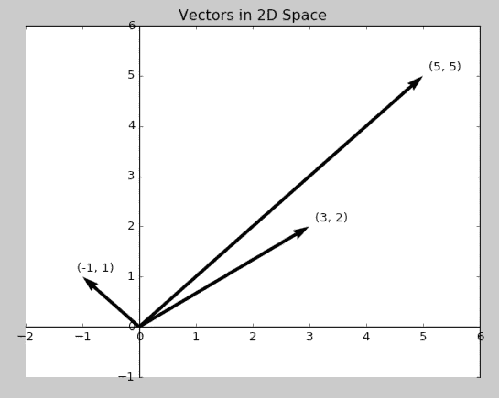

三维向量空间呢？你生活的三维物理世界中的位置和速度可以用三维向量中的 x、y 和 z 坐标来表示。但你并不限于正常的三维空间。你可以有 5 个维度、10 个维度、5000 个维度，等等。线性代数都能得到相同的结果。随着维度的增加，你可能需要更多的计算能力。你会遇到一些“维度灾难”问题，但你可以等到第十章再处理它们。^([7])

对于自然语言文档向量空间，您的向量空间的维度是整个语料库中出现的不同单词数量的计数。对于 TF（和即将出现的 TF-IDF），我们将此维度称为大写字母“K”。这个不同单词的数量也是您语料库的词汇量大小，所以在学术论文中它通常被称为“|V|”。然后，您可以用一个 K 维向量描述这个 K 维向量空间中的每个文档。在关于哈利和吉尔的三个文档语料库中，K = 18（或者如果您的分词器去除了标点符号，则为 16）。因为人类不能轻易地可视化超过三维的空间，所以让我们暂时搁置大部分维度，看一看其中的两个，这样你就可以在这张平面上的页面上对这些向量进行可视化表示了。因此，在图 3.2 中，K 被缩减为两个，以便二维查看 18 维哈利和吉尔向量空间。

##### 图 3. 2. 2D 项频率向量


K 维向量的工作方式相同，只是您不能轻易地可视化它们。现在您已经有了每个文档的表示，并且知道它们共享一个共同的空间，您可以比较它们了。您可以通过减去它们并计算它们之间的距离的长度来测量向量之间的欧几里德距离，这称为 2-范数距离。它是一只“乌鸦”飞行（直线）从一个向量的尖端（头部）到另一个向量的尖端的距离。查看线性代数附录 C，了解为什么这对于单词计数（项频率）向量是个糟糕的主意。

如果两个向量具有相似的方向，则它们是“相似的”。它们可能具有相似的大小（长度），这意味着单词计数（项频率）向量的长度大致相同。但是您是否在词汇量空间中对文档长度感兴趣？可能不。您希望您对文档相似性的估计发现相同单词的使用大致相同的次数和相似的比例。这样准确的估计会让您相信它们所代表的文档可能在讨论相似的内容。

##### 图 3. 3. 2D 向量及其之间的角度

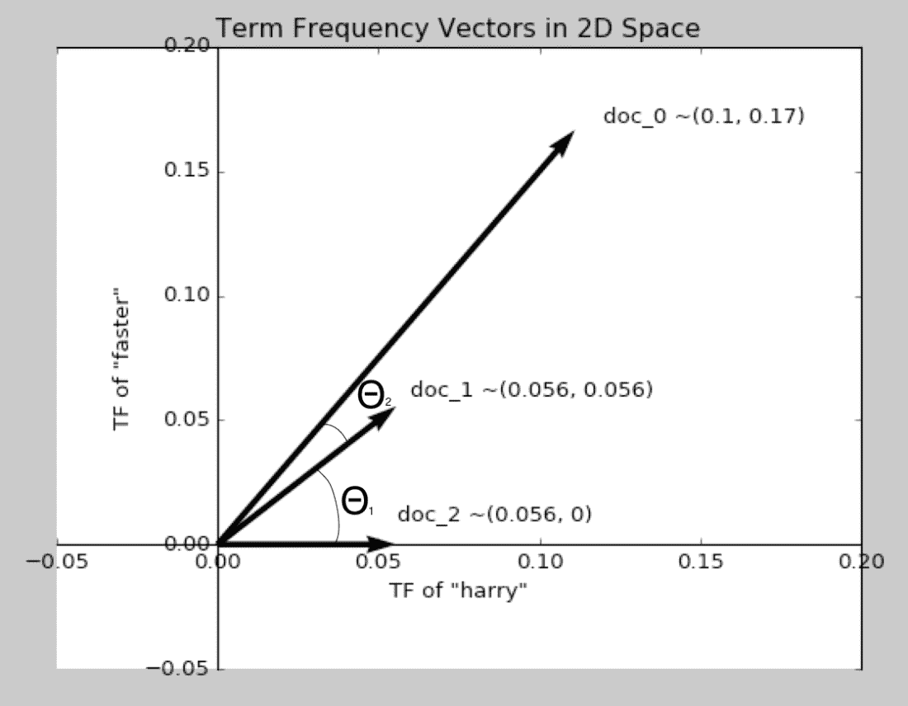

*余弦相似度*，是两个向量之间的夹角（θ）的余弦值。图 3.3 显示了如何使用方程 3.1 计算余弦相似度点积。余弦相似度在 NLP 工程师中很受欢迎，因为：

+   即使对于高维向量也能快速计算

+   对单个维度的变化敏感

+   对高维向量表现良好

+   其值介于 -1 和 1 之间

你可以使用余弦相似度而不拖慢你的 NLP 管道，因为你只需要计算点积。你可能会惊讶地发现，你不需要计算余弦函数就能得到余弦相似度。你可以使用线性代数点积，它不需要进行任何三角函数计算。这使得计算非常高效（快速）。余弦相似度独立地考虑每个维度及其对向量方向的影响，即使对于高维向量也是如此。TF-IDF 可能有数千甚至数百万个维度，因此你需要使用一个在维度数量增加时不会降低有用性的度量（称为维度灾难）。

余弦相似度的另一个重要优势是它输出一个介于 -1 和 +1 之间的值：

+   -1 表示向量指向完全相反的方向 - 这只会发生在具有负值的向量上（TF-IDF 向量除外）

+   0 表示向量是垂直或正交的 - 这会在你的两个 TF-IDF 向量不共享任何相同单词（维度）时发生

+   +1 表示两个向量完全对齐 - 这会在你的两个文档使用相同单词且相对频率相同的情况下发生

这样更容易猜测在管道内的条件表达式中使用的好阈值。以下是在你的线性代数教科书中归一化点积的样子：

##### 方程式 3.1

\[\begin{equation} \boldsymbol{A} \cdot \boldsymbol{B} = |\boldsymbol{A}| |\boldsymbol{B}| * cos(\theta) \end{equation}\]

在 Python 中，你可能会使用类似以下的代码来计算余弦相似度：

```py
>>> A.dot(B) == (np.linalg.norm(A) * np.linalg.norm(B)) * \
...     np.cos(angle_between_A_and_B)
```

如果你解出这个方程得到 `np.cos(angle_between_A_and_B)`（称为“向量 A 和 B 之间的余弦相似度”），你可以导出计算余弦相似度的代码：

##### 列表 3.2 Python 中的余弦相似度公式

```py
>>> cos_similarity_between_A_and_B = np.cos(angle_between_A_and_B) \
...    = A.dot(B) / (np.linalg.norm(A) * np.linalg.norm(B))
```

用线性代数表示，这变成了方程式 3.2：

##### 方程式 3.2 两个向量之间的余弦相似度

\[\begin{equation} cos(\theta) = \frac{\boldsymbol{A} \cdot \boldsymbol{B}}{|\boldsymbol{A}||\boldsymbol{B}|} \end{equation}\]

或者在纯 Python 中，不使用 `numpy`：

##### 列表 3.3 在 Python 中计算余弦相似度

```py
>>> import math
>>> def cosine_sim(vec1, vec2):
...     vec1 = [val for val in vec1.values()]  # #1
...     vec2 = [val for val in vec2.values()]
...
...     dot_prod = 0
...     for i, v in enumerate(vec1):
...         dot_prod += v * vec2[i]
...
...     mag_1 = math.sqrt(sum([x**2 for x in vec1]))
...     mag_2 = math.sqrt(sum([x**2 for x in vec2]))
...
...     return dot_prod / (mag_1 * mag_2)
```

因此，你需要计算你感兴趣的两个向量的点积 - 将每个向量的元素成对相乘 - 然后将这些乘积相加。然后你除以每个向量的范数（大小或长度）。向量范数与其从头到尾的欧几里德距离相同 - 其元素平方和的平方根。这个*归一化点积*，就像余弦函数的输出一样，将是介于 -1 和 1 之间的值。它是这两个向量之间夹角的余弦。它给出了这两个向量指向相同方向的程度的值。[8]

**1** 的余弦相似度代表指向所有维度上完全相同方向的标准化向量。这些向量可能具有不同的长度或大小，但它们指向相同的方向。请记住，你将点积除以每个向量的范数。因此，余弦相似度值越接近 1，两个向量在角度上越接近。对于 NLP 文档向量，如果余弦相似度接近 1，你就知道这些文档使用相似的词汇以相似的比例。因此，文档向量彼此接近的文档很可能在谈论相同的事情。

**0** 的余弦相似度代表两个向量没有共享成分。它们在所有维度上都是正交的，即在所有维度上都是垂直的。对于 NLP 的 TF 向量来说，只有当两个文档没有共同的词时才会出现这种情况。这并不一定意味着它们具有不同的含义或主题，只是它们使用完全不同的词语。

**-1** 的余弦相似度代表两个完全相反的向量，完全相反。它们指向相反的方向。对于简单的词频（词项频率）向量甚至是标准化的 TF 向量（稍后我们会讨论），这种情况永远不会发生。单词的计数永远不会是负数。因此，词频（词项频率）向量始终位于向量空间的同一“象限”中。你的任何词频向量都不可能在向量空间的一个象限中悄悄溜走。你的任何词频向量都不可能有与另一个词频向量相反的分量（词频），因为词频就是不能是负数。

在本章节中，你不会看到任何自然语言文档向量对的负余弦相似度值。但在下一章中，我们将发展出一种概念，即相互“相反”的单词和主题。这将显示为余弦相似度小于零，甚至是 **-1** 的文档、单词和主题。

如果你想要计算常规 `numpy` 向量的余弦相似度，比如由 `CountVectorizer` 返回的向量，你可以使用 Scikit-Learn 内置的工具。这是如何计算我们在 3.4 中计算的词向量 1 和 2 之间的余弦相似度的方法：

##### 第 3.4 节 余弦相似度

```py
>>> from sklearn.metrics.pairwise import cosine_similarity
>>> vec1 = tf.values[:1,:]  # #1
>>> vec2 = tf.values[1:2,:]
>>> cosine_similarity(vec1, vec2)
array([[0.117...]])
```

对词频（`tf`）DataFrame 进行切片的操作可能看起来是检索向量的奇怪方式。这是因为 SciKit-Learn 用于计算余弦相似度的函数已经被优化为在大型向量数组（2-D 矩阵）上高效工作。这段代码将 DataFrame 的第一行和第二行切片为包含文本第一句中单词计数的 1xN 数组。这个第一句话来自于“算法偏见”文章的计数向量与该文章第二句话只有 11.7% 的相似度（余弦相似度为 0.117）。看起来第二句话与第一句话共享的单词非常少。

为了更深入地了解余弦距离，你可以检查代码 3.3，它会给你与`sklearn`余弦相似度函数在等效的 numpy 数组中给出的 Counter 字典相同的答案。当你尝试预测一个 NLP 算法的输出，然后根据实际情况进行修正时，它会提高你对 NLP 工作原理的直觉。

## 3.2 计数 n-grams

在上一章中你已经学到如何从语料库的标记中创建 *n*-gram。现在，是时候将它们用于创建更好的文档表示了。对你来说幸运的是，你可以使用你已经熟悉的相同工具，只需稍微调整参数即可。

首先，让我们在我们的语料库中添加另一句话，这将说明为什么 n-gram 向量有时比计数向量更有用。

```py
>>> import copy
>>> question = "What is algorithmic bias?"
>>> ngram_docs = copy.copy(docs)
>>> ngram_docs.append(question)
```

如果你使用我们在 3.2 小节训练的相同的向量化器计算这个新句子（问题）的词频向量，你会发现它与第二个句子的表示完全相等：

```py
>>> question_vec = vectorizer.transform([new_sentence])
>>> question_vec
<1x240 sparse matrix of type '<class 'numpy.int64'>'
    with 3 stored elements in Compressed Sparse Row format>
```

稀疏矩阵是存储标记计数的高效方法，但为了增强对正在发生的情况的直观理解，或者调试代码，你会希望将向量*稠密化*。你可以使用`.toarray()`方法将稀疏向量（稀疏矩阵的行）转换为 numpy 数组或 Pandas 系列。

```py
>>> question_vec.to_array()
array([[0, 0, 0, 0, 0, 0, 0, 1, 0, 0, 0, 0, 0, 0, 0, ... ]])
```

你可能猜到了问题中显示在计数向量的第 8 个位置（维度）上的单词是哪个。记住，这是由`CountVectorizer`计算的词汇表中的第 8 个词，并且在运行`.fit()`时它会按字典序对其词汇表进行排序。你可以将计数向量与 Pandas`Series`一起配对，以查看计数向量中的内容。

```py
>>> vocab = list(zip(*sorted((i, tok) for tok, i in
...     vectorizer.vocabulary_.items())))[1]
>>> pd.Series(question_vec.to_array()[0], index=vocab).head(8)
2018           0
ability        0
accurately     0
across         0
addressed      0
advanced       0
algorithm      0
algorithmic    1
```

现在，计算问题向量与你的句子向量"知识库"中所有其他向量之间的余弦相似度。这就是搜索引擎或数据库全文搜索用来查找问题答案的方法。

```py
>>> cosine_similarity(count_vectors, question_vector)
array([[0.23570226],
       [0.12451456],
       [0.24743583],
       [0.4330127 ],
       [0.12909944],
       ...
```

最相似的是语料库中的第四个句子。它与`question_vector`的余弦相似度为 0.433。检查一下你的句子知识库中的第四个句子，看看它是否能很好地匹配这个问题。

```py
>>> docs[3]
The study of algorithmic bias is most concerned with algorithms
that reflect "systematic and unfair" discrimination.
```

不错！那个句子可能是一个不错的开头。然而，维基百科文章的第一句可能更适合这个问题的算法偏见的定义。想一想如何改进向量化流水线，使得你的搜索返回第一句而不是第四句。

要找出 2-grams 是否有帮助，请执行与几页前使用 `CountVectorizer` 进行的相同向量化过程，但是将 `n-gram` *超参数* 设置为计算 2-grams 而不是单个令牌（1-grams）。超参数只是一个函数名称、参数值或任何你可能想要调整以改善 NLP 流水线的东西。找到最佳超参数称为超参数调整。因此开始调整 `ngram_range` 参数，看看是否有帮助。

```py
>>> ngram_vectorizer = CountVectorizer(ngram_range=(1, 2))
>>> ngram_vectors = ngram_vectorizer.fit_transform(corpus)
>>> ngram_vectors
<16x616 sparse matrix of type '<class 'numpy.int64'>'
    with 772 stored elements in Compressed Sparse Row format>
```

查看新计数向量的维数，你可能注意到这些向量要长得多。唯一的 2-grams（单词对）总是比唯一的令牌多。检查一下对你的问题非常重要的“算法偏差”2-gram 的 ngram-计数。

```py
>>> vocab = list(zip(*sorted((i, tok) for tok, i in
...     ngram_vectorizer.vocabulary_.items())))[1]
>>> pd.DataFrame(ngram_vectors.toarray(),
...     columns=vocab)['algorithmic bias']
0     1
1     0
2     1
3     1
4     0
```

现在，第一句话可能更符合你的查询。值得注意的是，词袋-*n*-gram 方法也有自己的挑战。在大型文本和语料库中，*n*-gram 的数量呈指数增长，导致了我们之前提到的“维度灾难”问题。然而，正如你在本节中看到的，可能会有一些情况，你会选择使用它而不是单个令牌计数。

### 3.2.1 分析这个

即使到目前为止我们只处理了词令牌的 *n*-grams，字符的 *n*-grams 也是有用的。例如，它们可以用于语言检测或作者归属（确定在分析的文档集中谁是作者）。让我们使用字符 *n*-grams 和你刚学会如何使用的 `CountVectorizer` 类来解决一个谜题。

我们将从导入一个名为 `this` 的小而有趣的 Python 包开始，并检查其中一些常量：

```py
>>> from this import s
>>> print(s)
Gur Mra bs Clguba, ol Gvz Crgref
Ornhgvshy vf orggre guna htyl.
Rkcyvpvg vf orggre guna vzcyvpvg.
Fvzcyr vf orggre guna pbzcyrk.
...
Nygubhtu arire vf bsgra orggre guna *evtug* abj.
Vs gur vzcyrzragngvba vf uneq gb rkcynva, vg'f n onq vqrn.
Vs gur vzcyrzragngvba vf rnfl gb rkcynva, vg znl or n tbbq vqrn.
Anzrfcnprf ner bar ubaxvat terng vqrn -- yrg'f qb zber bs gubfr!
```

这些奇怪的词是什么？用什么语言写的？H.P. Lovecraft 的粉丝可能会想到用来召唤死神克苏鲁的古老语言。^([9]) 但即使对他们来说，这个消息也将是难以理解的。

为了弄清楚这段神秘文字的意思，你将使用你刚学到的方法 - 频率分析（计数令牌）。但这一次，一只小鸟告诉你，也许从字符令牌而不是单词令牌开始可能会更有价值！幸运的是，`CountVectorizer` 在这里也能为你提供帮助。你可以在图 3.4a 中看到列出的结果 3.5 。

##### 列表 3.5 CountVectorizer 直方图

```py
>>> char_vectorizer = CountVectorizer(
...     ngram_range=(1,1), analyzer='char')  # #1
>>> s_char_frequencies = char_vectorizer.fit_transform(s)
>>> generate_histogram(
...     s_char_frequencies, s_char_vectorizer)  # #2
```

嗯。 不太确定你可以用这些频率计数做什么。 但再说一遍，你甚至还没有看到其他文本的频率计数。 让我们选择一些大型文档 - 例如，机器学习的维基百科文章，^([10]) 并尝试进行相同的分析（查看图 3.4b 中的结果）：

```py
>>> DATA_DIR = ('https://gitlab.com/tangibleai/nlpia/'
...             '-/raw/master/src/nlpia/data')

>>> url = DATA_DIR + '/machine_learning_full_article.txt'
>>> ml_text = requests.get(url).content.decode()
>>> ml_char_frequencies = char_vectorizer.fit_transform(ml_text)
>>> generate_histogram(s_char_frequencies, s_char_vectorizer)
```

现在看起来很有趣！如果你仔细观察两个频率直方图，你可能会注意到一个模式。直方图的峰值和谷值似乎以相同的顺序排列。如果你之前曾经处理过频率谱，这可能会有意义。字符频率峰值和谷值的模式是相似的，但是偏移了。

要确定你的眼睛是否看到了一个真实的模式，你需要检查峰值和谷值的变化是否一致。这种信号处理方法被称为*频谱分析*。你可以通过将每个信号的最高点的位置相互减去来计算峰值的相对位置。

你可以使用几个内置的 Python 函数，`ord()` 和 `chr()`，来在整数和字符之间进行转换。幸运的是，这些整数和字符的映射是按字母顺序排列的，"ABC…​"。

```py
>>> peak_distance = ord('R') - ord('E')
>>> peak_distance
13
>>> chr(ord('v') - peak_distance)  # #1
'I'
>>> chr(ord('n') - peak_distance)  # #2
'A'
```

所以，如果你想解码这个秘密信息中的字母"R"，你应该从它的*ordinal*（`ord`）值中减去 13，以得到字母"E"——英语中最常用的字母。同样，要解码字母"V"，你可以将它替换为"I"——第二个最常用的字母。前三个最常用的字母已经被同样的`peak_distance`（13）移动，以创建编码消息。并且这个距离在最不常用的字母之间也被保持：

```py
>>> chr(ord('W') - peak_distance)
'J'
```

到这个点为止，你可能已经通过 MetaGered（搜索网络）查找了有关这个谜题的信息。^([11])也许你发现了这个秘密信息很可能是使用 ROT13 密码（编码）进行编码的。^([12]) ROT13 算法将字符串中的每个字母向字母表的前面旋转 13 个位置。要解码一个据说是用 ROT13 编码的秘密信息，你只需要应用逆算法，将你的字母表向后旋转 13 个位置。你可能可以在一行代码中创建编码器和解码器函数。或者你可以使用 Python 的内置`codecs`包来揭示这一切是关于什么的：

```py
>>> import codecs
>>> print(codecs.decode(s, 'rot-13'))
The Zen of Python, by Tim Peters

Beautiful is better than ugly.
Explicit is better than implicit.
Simple is better than complex.
Complex is better than complicated.
Flat is better than nested.
Sparse is better than dense.
Readability counts.
Special cases aren't special enough to break the rules.
Although practicality beats purity.
Errors should never pass silently.
Unless explicitly silenced.
In the face of ambiguity, refuse the temptation to guess.
There should be one-- and preferably only one --obvious way to do it.
Although that way may not be obvious at first unless you're Dutch.
Now is better than never.
Although never is often better than *right* now.
If the implementation is hard to explain, it's a bad idea.
If the implementation is easy to explain, it may be a good idea.
Namespaces are one honking great idea -- let's do more of those!
```

现在你知道了 Python 的禅意！这些智慧之言是由 Python 族长之一的 Tim Peters 在 1999 年写的。由于这首诗已经放入了公共领域，被谱曲，^([13])甚至被拙劣模仿。^([14])Python 的禅意已经帮助本书作者编写了更干净、更易读和可重用的代码。由于基于字符的`CountVectorizer`，你能够解码这些智慧之言。

## 3.3 锡普夫定律

现在我们来到了我们的主题——社会学。好吧，不是，但你将会快速地进入人数和字词计数的世界，你将会学到一个看似普遍适用的规则来统计大多数事物。事实证明，在语言中，像大多数涉及到生物的事物一样，模式是丰富多彩的。

在 20 世纪初，法国速记员让-巴蒂斯特·埃斯图普（Jean-Baptiste Estoup）注意到他费力手动计算的许多文件中单词频率的模式（感谢计算机和`Python`）。20 世纪 30 年代，美国语言学家乔治·金斯利·齐普夫试图正式化埃斯图普的观察，并最终这种关系以齐普夫的名字命名。

> Zipf 定律指出，在给定自然语言话语语料库的情况下，任何单词的频率与其在频率表中的排名成反比。

—— 维基百科

Zipf 定律 `en.wikipedia.org/wiki/Zipfs_law`

具体而言，*反比例* 指的是在排名列表中，项目将以与其在列表中的排名直接相关的频率出现。例如，排名列表中的第一项将出现两次，比第二项多三倍，依此类推。您可以对任何语料库或文档进行的一个快速处理是绘制单词使用频率相对于其（频率）排名的图表。如果在对数-对数图中看到不符合直线的任何异常值，可能值得调查。

作为 Zipf 定律延伸至词语以外领域的例子，图 3.6 描绘了美国城市人口与排名之间的关系。事实证明，Zipf 定律适用于许多事物的计数。自然界充满了经历指数增长和"网络效应"的系统，如人口动态、经济产出和资源分配^([15])。有趣的是，像 Zipf 定律这样简单的东西能够在广泛的自然和人造现象中成立。诺贝尔奖得主保罗·克鲁格曼在谈论经济模型和 Zipf 定律时，简洁地表达了这一点：

*关于经济理论的常见抱怨是，我们的模型过于简化 — 它们提供了对复杂混乱现实过度整洁的观点。 [使用 Zipf 定律] 反之亦然：你有复杂混乱的模型，然而现实却惊人地整洁和简单。*

这是克鲁格曼城市人口图的更新版本:^([16])

##### 图 3.4 城市人口分布

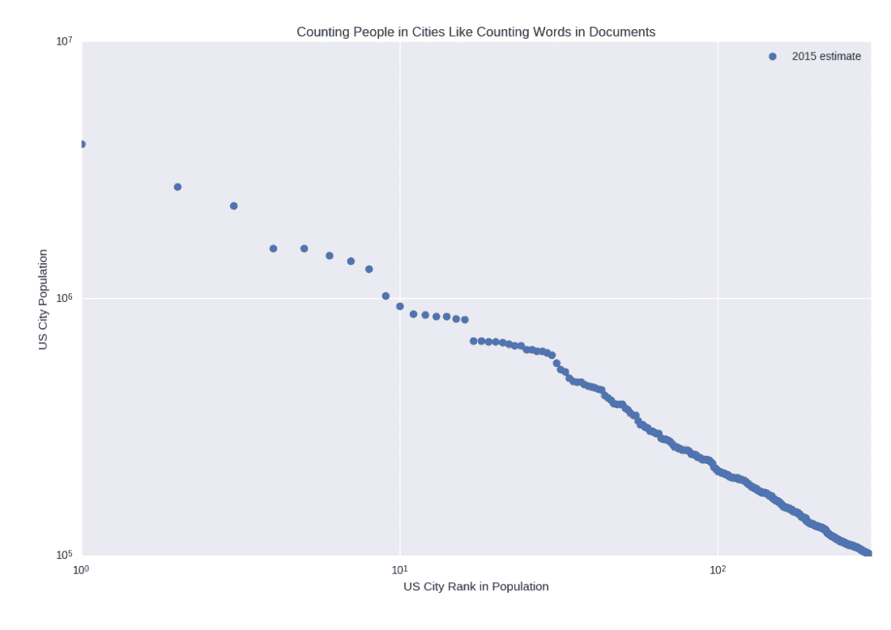

与城市和社交网络一样，单词也是如此。让我们首先从 NLTK 下载布朗语料库。

> 布朗语料库是 1961 年在布朗大学创建的第一个百万字英文电子语料库。该语料库包含来自 500 个来源的文本，这些来源已按体裁分类，如新闻、社论等^([17])。

—— NLTK 文档

```py
>>> nltk.download('brown')  # #1
>>> from nltk.corpus import brown
>>> brown.words()[:10]  # #2
['The',
 'Fulton',
 'County',
 'Grand',
 'Jury',
 'said',
 'Friday',
 'an',
 'investigation',
 'of']
>>> brown.tagged_words()[:5]  # #3
[('The', 'AT'),
 ('Fulton', 'NP-TL'),
 ('County', 'NN-TL'),
 ('Grand', 'JJ-TL'),
 ('Jury', 'NN-TL')]
>>> len(brown.words())
1161192
```

因此，拥有超过 100 万个标记，您有一些值得关注的东西。

```py
>>> from collections import Counter
>>> puncs = set((',', '.', '--', '-', '!', '?',
...     ':', ';', '``', "''", '(', ')', '[', ']'))
>>> word_list = (x.lower() for x in brown.words() if x not in puncs)
>>> token_counts = Counter(word_list)
>>> token_counts.most_common(10)
[('the', 69971),
 ('of', 36412),
 ('and', 28853),
 ('to', 26158),
 ('a', 23195),
 ('in', 21337),
 ('that', 10594),
 ('is', 10109),
 ('was', 9815),
 ('he', 9548)]
```

快速浏览显示，Brown 语料库中的词频遵循了 Zipf 预测的对数关系。 "The"（在词频中排名第 1）出现的次数大约是 "of"（在词频中排名第 2）的两倍，大约是 "and"（在词频中排名第 3）的三倍。如果你不相信我们，可以使用示例代码（[ch03.html](https://gitlab.com/tangibleai/nlpia2/-/blob/main/src/nlpia2/ch03/ch03_zipf.py)）中的代码来亲自验证这一点。

简而言之，如果你按照语料库中单词的出现次数对它们进行排名，并按降序列出它们，你会发现，对于足够大的样本，排名列表中的第一个单词在语料库中出现的可能性是第二个单词的两倍。它在列表中出现的可能性是第四个单词的四倍。因此，给定一个大语料库，你可以使用这个分解来统计地说出一个给定单词在该语料库的任何给定文档中出现的可能性有多大。

## 3.4 逆文档频率（IDF）

现在回到你的文档向量。单词计数和*n*-gram 计数很有用，但纯单词计数，即使将其归一化为文档的长度，也不能告诉你有关该单词在该文档中*相对于*语料库中其他文档的重要性的多少。如果你能搞清楚这些信息，你就可以开始描述语料库中的文档了。假设你有一个关于人工智能（AI）的每本书的语料库。"Intelligence" 几乎肯定会在你计算的每一本书（文档）中出现多次，但这并没有提供任何新信息，它并不能帮助区分这些文档。而像 "neural network" 或 "conversational engine" 这样的东西可能在整个语料库中并不那么普遍，但对于频繁出现的文档，你会更多地了解它们的性质。为此，你需要另一种工具。

*逆文档频率*，或 IDF，是你通过 Zipf 进行主题分析的窗口。让我们拿你之前的词频计数器来扩展一下。你可以计数令牌并将它们分成两种方式：按文档和整个语料库。你将只按文档计数。

让我们返回维基百科中的算法偏见示例，并抓取另一个部分（涉及算法种族和民族歧视），假设它是你偏见语料库中的第二个文档。

> 算法被批评为是一种掩盖决策中种族偏见的方法。由于过去某些种族和民族群体的对待方式，数据往往会包含隐藏的偏见。例如，黑人可能会比犯同样罪行的白人接受更长的刑期。这可能意味着系统放大了数据中原有的偏见。
> 
> …​
> 
> 2019 年 11 月，加州大学伯克利分校的研究人员进行的一项研究揭示，抵押贷款算法在对待拉丁裔和非洲裔美国人方面存在歧视，这种歧视是基于“信用价值”的，这是美国公平借贷法的根源，该法允许贷方使用身份识别措施来确定一个人是否值得获得贷款。这些特定的算法存在于金融科技公司中，并被证明对少数族裔进行了歧视。

— 维基百科

算法偏见：种族和族裔歧视 (`en.wikipedia.org/wiki/Algorithmic_bias#Racial_and_ethnic_discrimination`

首先，让我们得到语料库中每个文档的总词数：

```py
>>> DATA_DIR = ('https://gitlab.com/tangibleai/nlpia/'
...             '-/raw/master/src/nlpia/data')
>>> url = DATA_DIR + '/bias_discrimination.txt'
>>> bias_discrimination = requests.get(url).content.decode()
>>> intro_tokens = [token.text for token in nlp(bias_intro.lower())]
>>> disc_tokens = [token.text for token in nlp(bias_discrimination.lower())]
>>> intro_total = len(intro_tokens)
>>> intro_total
479
>>> disc_total = len (disc_tokens)
>>> disc_total
451
```

现在，拿到几个关于偏见的 tokenized 文档，让我们看看每个文档中术语“偏见”的频率。您将把找到的 TF 存储在两个字典中，每个文档一个。

```py
>>> intro_tf = {}
>>> disc_tf = {}
>>> intro_counts = Counter(intro_tokens)
>>> intro_tf['bias'] = intro_counts['bias'] / intro_total
>>> disc_counts = Counter(disc_tokens)
>>> disc_tf['bias'] = disc_counts['bias'] / disc_total
>>> 'Term Frequency of "bias" in intro is:{:.4f}'.format(intro_tf['bias'])
Term Frequency of "bias" in intro is:0.0167
>>> 'Term Frequency of "bias" in discrimination chapter is: {:.4f}'\
...     .format(disc_tf['bias'])
'Term Frequency of "bias" in discrimination chapter is: 0.0022'
```

好了，你得到了一个比另一个大八倍的数字。那么“介绍”部分关于偏见多八倍？实际上不是。所以你需要深入挖掘一下。首先，看看这些数字与其他一些词的得分比较，比如词"和"。

```py
>>> intro_tf['and'] = intro_counts['and'] / intro_total
>>> disc_tf['and'] = disc_counts['and'] / disc_total
>>> print('Term Frequency of "and" in intro is: {:.4f}'\
...     .format(intro_tf['and']))
Term Frequency of "and" in intro is: 0.0292
>>> print('Term Frequency of "and" in discrimination chapter is: {:.4f}'\
...     .format(disc_tf['and']))
Term Frequency of "and" in discrimination chapter is: 0.0303
```

太棒了！你知道这两个文档关于“和”和“偏见”一样多——实际上，歧视章节更多地涉及“和”。哦，等等。

一个衡量术语的逆文档频率的好方法是：这个标记在这个文档中是多么令人惊讶？在统计学、物理学和信息论中，衡量标记的惊讶程度用来衡量其*熵*或信息内容。这正是你需要衡量特定词的重要性的方式。如果一个术语在一个文档中出现了很多次，但在整个语料库中很少出现，那么它是将该文档的含义与其他文档区分开的词。这

一个术语的 IDF 只是文档总数与术语出现的文档数之比。在当前示例中，对于“和”和“偏见”，答案是相同的：

```py
2 total documents / 2 documents contain "and"  = 2/2 = 1
2 total documents / 2 documents contain "bias" = 2/2 = 1
```

不是很有趣。所以我们来看另一个单词“黑色”。

```py
2 total documents / 1 document contains "black" = 2/1 = 2
```

好的，这是另一回事了。让我们使用这个“稀有性”度量来加权词频。

```py
>>> num_docs_containing_and = 0
>>> for doc in [intro_tokens, disc_tokens]:
...     if 'and' in doc:
...         num_docs_containing_and += 1  # #1
```

然后让我们获取两个文档中“黑色”的词频：

```py
>>> intro_tf['black'] = intro_counts['black'] / intro_total
>>> disc_tf['black'] = disc_counts['black'] / disc_total
```

最后，三者的 IDF。你将像之前的 TF 一样将 IDF 存储在每个文档的字典中：

```py
>>> num_docs = 2
>>> intro_idf = {}
>>> disc_idf = {}
>>> intro_idf['and'] = num_docs / num_docs_containing_and
>>> disc_idf['and'] = num_docs / num_docs_containing_and
>>> intro_idf['bias'] = num_docs / num_docs_containing_bias
>>> disc_idf['bias'] = num_docs / num_docs_containing_bias
>>> intro_idf['black'] = num_docs / num_docs_containing_black
>>> disc_idf['black'] = num_docs / num_docs_containing_black
```

然后在引言文档中找到：

```py
>>> intro_tfidf = {}
>>> intro_tfidf['and'] = intro_tf['and'] * intro_idf['and']
>>> intro_tfidf['bias'] = intro_tf['bias'] * intro_idf['bias']
>>> intro_tfidf['black'] = intro_tf['black'] * intro_idf['black']
```

然后看历史文件：

```py
>>> disc_tfidf = {}
>>> disc_tfidf['and'] = disc_tf['and'] * disc_idf['and']
>>> disc_tfidf['bias'] = disc_tf['bias'] * disc_idf['bias']
>>> disc_tfidf['black'] = disc_tf['black'] * disc_idf['black']
```

### 3.4.1 兹普夫的回归

差一点了。假设你有一个包含 100 万个文件的语料库（也许你是 baby-Google），有人搜索词“猫”，而在你的 100 万个文件中只有 1 个包含词“猫”的文件。这个的原始 IDF 是：

1,000,000 / 1 = 1,000,000

让我们假设您有 10 个文档中都含有单词"狗"。您的"狗"的逆文档频率(idf)为：

1,000,000 / 10 = 100,000

这是一个很大的区别。您的朋友齐普夫可能会说这太大了，因为它可能经常发生。齐普夫定律表明，当您比较两个单词的频率时，例如"猫"和"狗"，即使它们出现的次数相似，频率更高的单词的频率也将比频率较低的单词高得多。因此，齐普夫定律建议您使用`log()`函数的逆函数`exp()`来缩放所有单词频率（和文档频率）。这确保了具有相似计数的单词，例如"猫"和"狗"，在频率上不会有很大差异。这种单词频率的分布将确保您的 TF-IDF 分数更加均匀分布。因此，您应该重新定义 IDF 为该单词在您的文档中出现的原始概率的对数。您还需要对术语频率取对数。

对数函数的底数并不重要，因为您只是想使频率分布均匀，而不是在特定数值范围内缩放它。如果使用底数为 10 的对数函数，您将获得：

搜索：猫

##### 方程 3.3

\[\begin{equation} \text{idf} = \log \left(\text{1,000,000} / 1 \right) = 6 \end{equation}\]

搜索：狗

##### 方程 3.4

\[\begin{equation} \text{idf} = \log \left(\text{1,000,000} / 10 \right) = 5 \end{equation}\]

所以现在您更适当地加权了每个 TF 的结果，以符合它们在语言中的出现次数。

然后，对于语料库*D*中给定文档*d*中的给定术语*t*，您得到：

##### 方程 3.5

\[\begin{equation} \text{tf}\left(t, d\right) = \frac{\text{count}(t)}{\text{count}(d)} \end{equation}\]

##### 方程 3.6

\[\begin{equation} \text{idf}\left(t,D\right) = \log \left(\frac{\text{文档数量}}{\text{包含术语 t 的文档数量}}\right) \end{equation}\]

##### 方程 3.7

\[\begin{equation} \text{tfidf}\left(t,d,D\right) = \text{tf}(t,d) \ast \text{idf}(t,D) \end{equation}\]

单词在文档中出现的次数越多，TF（因此 TF-IDF）就会增加。同时，随着包含该单词的文档数的增加，该单词的 IDF（因此 TF-IDF）就会降低。所以现在，你有了一个数字。这是你的计算机可以处理的东西。但它到底是什么呢？它将特定单词或令牌与特定语料库中的特定文档相关联，然后将数值分配给该单词在给定文档中的重要性，考虑到其在整个语料库中的使用情况。

在某些课程中，所有的计算都将在对数空间中进行，以便乘法变为加法，除法变为减法：

```py
>>> log_tf = log(term_occurences_in_doc) -\
...     log(num_terms_in_doc)  # #1
>>> log_log_idf = log(log(total_num_docs) -\
...     log(num_docs_containing_term))  # #2
>>> log_tf_idf = log_tf + log_log_idf  # #3
```

这个单一的数字，即 TF-IDF 分数，是所有搜索引擎的谦逊基础。现在你已经能够将单词和文档转换为数字和向量，是时候用一些 Python 来让所有这些数字发挥作用了。你可能永远不会需要从头实现 TF-IDF 公式，因为这些算法已经在许多软件库中为你实现了。你不需要成为线性代数的专家来理解自然语言处理，但如果你对生成像 TF-IDF 分数这样的数字的数学有一个心理模型，那肯定能提高你的信心。如果你理解了数学，你可以自信地为你的应用调整它，甚至可以帮助一个开源项目改进它的自然语言处理算法。

### 3.4.2 相关性排名

正如你之前看到的，你可以轻松比较两个向量并获得它们的相似性，但是你已经学到了，仅仅计算单词不如使用它们的 TF-IDF 值有效。因此，在每个文档向量中，你希望用单词的 TF-IDF 值（分数）替换每个单词的计数。现在你的向量将更全面地反映文档的意思或主题。

当你使用像 MetaGer.org、Duck.com 或 You.com 这样的搜索引擎时，10 多个搜索结果列表是从这些页面的 TF-IDF 向量中精心制作出来的。如果你想一想，一个算法能够给你几乎总是包含你正在寻找的重要信息的 10 个页面，这是相当了不起的。毕竟，搜索引擎可以从数十亿个网页中选择。这是怎么可能的？在幕后，所有搜索引擎都是通过计算查询的 TF-IDF 向量与其数据库中数十亿个网页的 TF-IDF 向量之间的相似度来开始的。这种与你的查询的相似度通常被称为*相关性*。以下是你如何通过相关性对任何文档进行排名。

```py
>>> doc_tfidf_vectors = []
>>> for doc in docs:  # #1
...     vec = copy.copy(zero_vector)  # #2
...     tokens = [token.text for token in nlp(doc.lower())]
...     token_counts = Counter(tokens)
...
...     for token, count in token_counts.items():
...         docs_containing_key = 0
...         for d in docs:
...             if token in d:
...                 docs_containing_key += 1
...         tf = value / len(vocab)
...         if docs_containing_key:
...             idf = len(docs) / docs_containing_key
...         else:
...             idf = 0
...         vec[key] = tf * idf
...     doc_tfidf_vectors.append(vec)
```

有了这个设置，你在语料库中的每个文档都有一个 K 维向量表示。现在开始猎杀吧！或者说搜索，在你的情况下。从前一节中，你可能还记得我们如何定义向量之间的相似性。如果两个向量的余弦相似性高，则认为它们相似，因此如果它们最大化余弦相似性，你可以找到两个相似的向量靠近彼此。

现在你已经有了进行基于 TF-IDF 的基本搜索所需的一切。你可以将搜索查询本身视为一个文档，并因此获得其基于 TF-IDF 的向量表示。然后，最后一步是找到与查询具有最高余弦相似度的文档，并将它们作为搜索结果返回。

如果你拿出关于哈利的三个文档，并提出查询“到商店需要多长时间？”：

```py
>>> query = "How long does it take to get to the store?"
>>> query_vec = copy.copy(zero_vector)  # #1

>>> tokens = [token.text for token in nlp(query.lower())]
>>> token_counts = Counter(tokens)

>>> for key, value in token_counts.items():
...     docs_containing_key = 0
...     for _doc in docs:
...       if key in _doc.lower():
...         docs_containing_key += 1
...     if docs_containing_key == 0:  # #1
...         continue
...     tf = value / len(tokens)
...     idf = len(docs) / docs_containing_key
...     query_vec[key] = tf * idf
>>> cosine_sim(query_vec, doc_tfidf_vectors[0])
0.5235048549676834
>>> cosine_sim(query_vec, doc_tfidf_vectors[1])
0.0
>>> cosine_sim(query_vec, doc_tfidf_vectors[2])
0.0
```

你可以放心地说文档 0 对你的查询最具相关性！有了这个，你可以在任何语料库中找到相关的文档，无论是维基百科的文章、古登堡计划的书籍，还是 ActivityPub（Mastodon）上的 toots。谷歌小心了！

实际上，谷歌的搜索引擎不会受到我们的竞争威胁。你必须对每个查询的 TF-IDF 向量进行“索引扫描”。这是一个 \(O(N)\) 算法。大多数搜索引擎可以在常数时间 (\(O(1)\)) 内响应，因为它们使用了一个*倒排索引*。^([20]) 你不会在这里实现一个能够在常数时间内找到这些匹配项的索引，但如果你感兴趣，你可能会喜欢探索 `Whoosh` ^([21]) 包中的最先进的 Python 实现及其源代码。^([22])

##### 提示

在前述代码中，你删除了在管道词汇表中找不到的键，以避免除零错误。但更好的方法是对每个 IDF 计算的分母加 1，以确保没有分母为零。实际上，这种方法非常常见，有一个名字叫做*加法平滑*或"Laplace 平滑"^([23]) — 通常会改善基于 TF-IDF 关键词搜索的搜索结果。

### 3.4.3 另一种向量化器

现在这是很多代码，但这些早已自动化。你在本章开头使用的 `sklearn` 包也有一个用于 TF-IDF 的工具。就像你之前看到的 `CountVectorizer` 一样，它进行标记化，省略标点，并一次性计算 tf-idf 分数。

下面是如何使用 `sklearn` 构建 TF-IDF 矩阵的方法。语法几乎与 `CountVectorizer` 完全相同。

##### 列表 3.6 使用 Scikit-Learn 计算 TF-IDF 矩阵

```py
>>> from sklearn.feature_extraction.text import TfidfVectorizer
>>> corpus = docs
>>> vectorizer = TfidfVectorizer(min_df=1) # #1
>>> vectorizer = vectorizer.fit(corpus)  # #2
>>> vectors = vectorizer.transform(corpus)  # #3
>>> print(vectors.todense().round(2))  # #4
[[0.16 0.   0.48 0.21 0.21 0.   0.25 0.21 ... 0.21 0.   0.64 0.21 0.21]
 [0.37 0.   0.37 0.   0.   0.37 0.29 0.   ... 0.   0.49 0.   0.   0.  ]
 [0.   0.75 0.   0.   0.   0.29 0.22 0.   ... 0.   0.   0.   0.   0.  ]]
```

使用 Scikit-Learn，只需四行代码，你就创建了一个矩阵，其中包含你的三个文档和词汇表中每个词的逆文档频率。它与之前从 `CountVectorizer` 得到的矩阵非常相似，只是这次它包含了词汇表中每个术语、标记或单词的 TF-IDF，构成了矩阵的列。在大型文本中，这种或其他一些预优化的 TF-IDF 模型将为你节省大量工作。

### 3.4.4 替代方案

几十年来，TF-IDF 矩阵（术语-文档矩阵）一直是信息检索（搜索）的主要方法。因此，研究人员和公司花费了大量时间来优化 IDF 部分，以尝试改善搜索结果的相关性。3.1 列出了一些你可以规范化和平滑化术语频率权重的方法。

##### 表 3.1 替代 TF-IDF 规范化方法（Molino 2017）^([24])

| 方案 | 定义 |
| --- | --- |
| 无 | 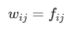 |
| TD-IDF | 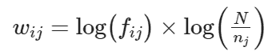 |
| TF-ICF | 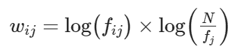 |
| Okapi BM25 | 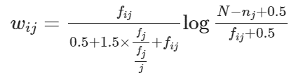 |
| ATC | 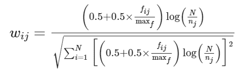 |
| LTU | 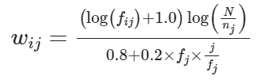 |
| MI | 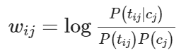 |
| PosMI | 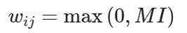 |
| T-Test | 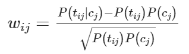 |
| 卡方检验 | 见 *从分布到语义相似性* (`www.era.lib.ed.ac.uk/bitstream/handle/1842/563/IP030023.pdf#subsection.4.3.5`)，作者詹姆斯·理查德·柯兰 |
| Lin98a | 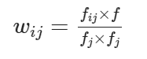 |
| Lin98b |  |
| Gref94 |  |

搜索引擎（信息检索系统）在语料库中匹配查询和文档之间的关键词（术语）。如果您正在构建一个搜索引擎，并希望提供可能与用户所寻找内容匹配的文档，您应该花一些时间研究皮耶罗·莫利诺在图 3.7 中描述的替代方案。

用于对查询结果进行排名的另一种替代方法是 Okapi BM25，或者其最新的变体 BM25F。

### 3.4.5 Okapi BM25

伦敦城市大学的聪明人提出了一种更好的方法来对搜索结果进行排名。他们不仅仅计算 TF-IDF 余弦相似度，还对相似度进行归一化和平滑处理。他们还忽略了查询文档中的重复术语，有效地将查询向量的术语频率剪切为 1。余弦相似度的点积不是由 TF-IDF 向量的规范化（文档和查询中的术语数）来规范化的，而是由文档长度本身的非线性函数来规范化的。

```py
q_idf * dot(q_tf, d_tf[i]) * 1.5 / (dot(q_tf, d_tf[i]) + .25 + .75 * d_num_words[i] / d_num_words.mean()))
```

通过选择使用户获得最相关结果的加权方案，您可以优化您的管道。但是，如果您的语料库不太大，您可能会考虑进一步前进，以获得更有用和准确的单词和文档含义的表示。

## 3.5 使用 TF-IDF 为您的机器人

在本章中，您学习了如何使用 TF-IDF 来表示自然语言文档，并找到它们之间的相似性，并执行关键字搜索。但是，如果您想构建一个聊天机器人，您该如何利用这些功能来制作您的第一个智能助手？

实际上，许多聊天机器人严重依赖搜索引擎。一些聊天机器人使用他们的搜索引擎作为生成响应的唯一算法。您只需要额外采取一步，将您的简单搜索索引（TF-IDF）转换为聊天机器人即可。为了使本书尽可能实用，每一章都将向您展示如何使用您在该章中掌握的技能使您的机器人更智能。

在本章中，您将使您的聊天机器人回答数据科学问题。诀窍很简单：您将您的训练数据存储为问题和相应响应的对。然后，您可以使用 TF-IDF 搜索与用户输入文本最相似的问题。而不是返回数据库中最相似的语句，您返回与该语句相关联的响应。然后，您就可以聊天了！

让我们一步步来。首先，让我们加载我们的数据。你将使用 Hobson 的学生在过去几年中问他的数据科学问题的语料库。它们位于 `qary` 存储库中：

```py
>>> DS_FAQ_URL = ('https://gitlab.com/tangibleai/qary/-/raw/main/'
...     'src/qary/data/faq/faq-python-data-science-cleaned.csv')
>>> qa_dataset = pd.read_csv(DS_FAQ_URL)
```

接下来，让我们为数据集中的问题创建 TF-IDF 向量。你将使用前一节中看到的 Scikit-Learn TfidfVectorizer 类。

```py
>>> vectorizer = TfidfVectorizer()
>>> vectorizer.fit(df['question'])
>>> tfidfvectors_sparse = vectorizer.transform(df['question'])  # #1
>>> tfidfvectors = tfidfvectors_sparse.todense()  # #2
```

现在我们准备实现问答功能本身。你的机器人将使用你在数据集上训练的相同向量化器来回答用户的问题，并找到最相似的问题。

```py
>>> def bot_reply(question):
...    question_vector = vectorizer.transform([question]).todense()
...    idx = question_vector.dot(tfidfvectors.T).argmax() # #1
...
...    print(
...        f"Your question:\n {question}\n\n"
...        f"Most similar FAQ question:\n {df['question'][idx]}\n\n"
...        f"Answer to that FAQ question:\n {df['answer'][idx]}\n\n"
...    )
```

你的第一个问答聊天机器人已经准备好了！让我们问它第一个问题：

```py
>>> bot_reply("What's overfitting a model?")
Your question:
  What's overfitting a model?

Most similar FAQ question:
  What is overfitting?

Answer to that FAQ question:
  When your test set accuracy is significantly lower than your training set accuracy?
```

尝试与它玩耍，问它更多的问题，比如：- 什么是高斯分布？- 谁提出了感知器算法？

但你会很快意识到，你的聊天机器人经常失败 - 不仅仅是因为你训练它的数据集很小。

例如，让我们尝试以下问题：

```py
>>> bot_reply('How do I decrease overfitting for Logistic Regression?')
Your question:
  How do I decrease overfitting for Logistic Regression?
Most similar FAQ question:
  How to decrease overfitting in boosting models?
Answer to that FAQ question:
  What are some techniques to reduce overfitting in general? Will they work with boosting models?
```

如果你仔细看了数据集，你可能会发现它实际上有一个关于减少提升模型过拟合的答案。然而，我们的向量化器只是有点太字面了 - 当它在错误的问题中看到“减少”一词时，这导致了对错误问题的点积更高。在下一章中，我们将看到如何通过查看*含义*而不是特定单词来克服这一挑战。

## 3.6 接下来要做什么

现在你可以将自然语言文本转换为数字了，你可以开始操作它们并计算它们。拿着牢牢的数字，在下一章中，你将对这些数字进行细化，试图代表自然语言文本的*含义*或*主题*，而不仅仅是它的词语。在随后的章节中，我们将向你展示如何实现一个语义搜索引擎，该引擎找到与你查询中的单词“意思”相似的文档，而不仅仅是使用你查询中的这些确切单词的文档。语义搜索比 TF-IDF 加权和词干提取和词形还原能够实现的任何东西都要好得多。最先进的搜索引擎结合了 TF-IDF 向量和语义嵌入向量，以实现比传统搜索更高的准确性。

资金充裕的 OpenSearch 项目，一个 ElasticSearch 的分支，现在正在引领搜索创新之路。[25] ElasticSearch 在 2021 年开始封锁他们的技术花园。Google、Bing 和其他网络搜索引擎之所以不使用语义搜索方法，是因为它们的语料库太大了。语义词和主题向量无法扩展到数十亿个文档，但数百万个文档却没有问题。一些创业公司，比如 You.com，正在学习如何使用开源技术实现语义搜索和网络规模的对话式搜索（聊天）。

因此，你只需要最基本的 TF-IDF 向量来供给你的管道，以获得语义搜索、文档分类、对话系统以及我们在第一章提到的大多数其他应用的最先进性能。TF-IDF 只是你的管道中的第一阶段，是你从文本中提取的一组基本特征。在下一章中，你将从你的 TF-IDF 向量计算主题向量。主题向量甚至是比这些经过精心归一化和平滑处理的 TF-IDF 向量更好地表示文档的含义。当我们在第六章转向 Word2vec 单词向量和后续章节中的单词和文档含义的深度学习嵌入时，情况只会变得更好。

## 3.7 自测

1.  `CountVectorizer.transform()` 创建的计数向量和 Python `collections.Counter` 对象列表之间有什么区别？你能将它们转换成相同的 `DataFrame` 对象吗？

1.  你能在一个大型语料库（超过 100 万个文档）和一个庞大的词汇表（超过 100 万个标记）上使用 `TFIDFVectorizer` 吗？你预计会遇到什么问题？

1.  想象一个语料库或任务的例子，在这里术语频率（TF）会比 TF-IDF 表现更好。

1.  我们提到过，字符 n-gram 的包可以用于语言识别任务。一个使用字符 n-gram 区分一种语言和另一种语言的算法会如何运作？

1.  你在本章中看到的 TF-IDF 的限制或缺点是什么？你能想出未提及的其他缺点吗？

1.  你会如何利用 TF-IDF 作为基础来改进今天大多数搜索引擎的工作方式？

## 3.8 总结

+   任何具有毫秒响应时间的 Web 规模搜索引擎在引擎盖下都隐藏着 TF-IDF 术语文档矩阵的能力。

+   希波夫定律可以帮助你预测各种事物的频率，包括单词、字符和人物。

+   术语频率必须按其逆文档频率加权，以确保最重要、最有意义的词语得到应有的重视。

+   词袋 / n-gram 词袋和 TF-IDF 是用实数向量表示自然语言文档的最基本算法。

+   高维向量对之间的欧几里德距离和相似性并不能充分表示它们在大多数自然语言处理应用中的相似性。

+   余弦距离，向量之间的“重叠”量，可以通过将归一化向量的元素相乘并将这些乘积相加来有效地计算。

+   余弦距离是大多数自然语言向量表示的首选相似性评分。

[[1]](#_footnoteref_1) StackOverflow 讨论是否依赖于此功能（`stackoverflow.com/questions/39980323/are-dictionaries-ordered-in-python-3-6/39980744#39980744`）

[[2]](#_footnoteref_2) Scikit-Learn 文档（`scikit-learn.org/`）。

[[3]](#_footnoteref_3) 如果你想要更多关于线性代数和向量的细节，请查看附录 C。

[[4]](#_footnoteref_4) "向量化和并行化" by WZB.eu (`datascience.blog.wzb.eu/2018/02/02/vectorization-and-parallelization-in-python-with-numpy-and-pandas/`)

[[5]](#_footnoteref_5) "动荡时代的知识与社会" (`wzb.eu/en/node/60041`)

[[6]](#_footnoteref_6) 你需要使用类似 GeoPy（geopy.readthedocs.io）的包来确保数学正确。

[[7]](#_footnoteref_7) 维度诅咒是，随着维度的增加，向量在欧几里得距离上会以指数方式远离彼此。许多简单操作在超过 10 或 20 个维度时变得不切实际，比如基于它们与“查询”或“参考”向量的距离对大量向量列表进行排序（近似最近邻搜索）。要深入了解，请查看维基百科的“维度诅咒”文章 (`en.wikipedia.org/wiki/Curse_of_dimensionality`)。

[[8]](#_footnoteref_8) 这些视频展示了如何使用 SpaCy 和 numpy 为单词创建向量，然后计算它们之间的余弦相似度 (`www.dropbox.com/sh/3p2tt55pqsisy7l/AAB4vwH4hV3S9pUO0n4kTZfGa?dl=0`)

[[9]](#_footnoteref_9) 如果这个参考对你来说陌生，请查看 H.P.洛夫克拉夫特的故事*克苏鲁的呼唤*：`www.hplovecraft.com/writings/texts/fiction/cc.aspx`

[[10]](#_footnoteref_10) 于 2021 年 7 月 9 日从这里检索：`en.wikipedia.org/wiki/Machine_learning`

[[11]](#_footnoteref_11) 非营利性搜索引擎 MetaGer 严肃对待隐私、诚实和道德，不像你已经熟悉的顶级搜索引擎 (`metager.org/`)

[[12]](#_footnoteref_12) 维基百科 ROT13 文章 (`en.wikipedia.org/wiki/ROT13`)

[[13]](#_footnoteref_13) Zbwedicon 关于 Python 之禅的 YouTube 视频 (`www.youtube.com/watch?v=i6G6dmVJy74`)

[[14]](#_footnoteref_14) 你可以安装和导入 PyDanny 的 `that` 包，以便笑笑 Python 的反模式 (`pypi.org/project/that`)

[[15]](#_footnoteref_15) 查看标题为"Zipf 定律之外还有更多"的网页 (`www.nature.com/articles/srep00812`)

[[16]](#_footnoteref_16) 使用 Pandas 从维基百科下载的人口数据。查看 GitHub 上的 `nlpia.book.examples` 代码（`gitlab.com/tangibleai/nlpia2/-/blob/main/src/nlpia2/ch03/ch03_zipf.py`）

[[17]](#_footnoteref_17) 完整列表请参见 `icame.uib.no/brown/bcm-los.html`

[[18]](#_footnoteref_18) Gerard Salton 和 Chris Buckley 首次在他们的论文《信息检索中的术语加权方法》中展示了对于信息检索的对数缩放的有用性（`ecommons.cornell.edu/bitstream/handle/1813/6721/87-881.pdf`）。

[[19]](#_footnoteref_19) 后面我们会向您展示如何在计算所有 TF-IDF 值后使用此对数缩放来归一化 TF-IDF 向量。

[[20]](#_footnoteref_20) 参见名为“倒排索引 - 维基百科”的网页（`en.wikipedia.org/wiki/Inverted_index`）。

[[21]](#_footnoteref_21) 参见名为“Whoosh : PyPI”的网页（`pypi.python.org/pypi/Whoosh`）。

[[22]](#_footnoteref_22) 参见名为“GitHub - Mplsbeb/whoosh: A fast pure-Python search engine”的网页（`github.com/Mplsbeb/whoosh`）。

[[23]](#_footnoteref_23) 参见名为“加法平滑 - 维基百科”的网页（`en.wikipedia.org/wiki/Additive_smoothing`）。

[[24]](#_footnoteref_24) *Word Embeddings Past, Present and Future*，Piero Molino，于 AI with the Best 2017

[[25]](#_footnoteref_25) “OpenSearch 中语义搜索的 ABC” ，Milind Shyani，（`opensearch.org/blog/semantic-science-benchmarks/`）
