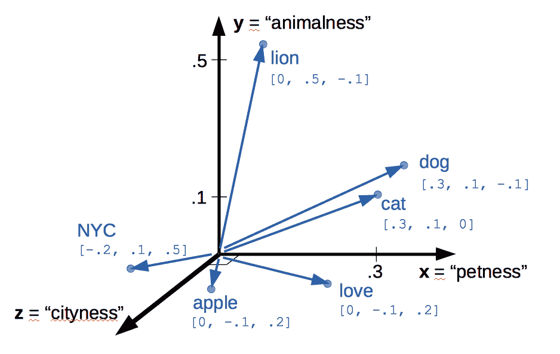
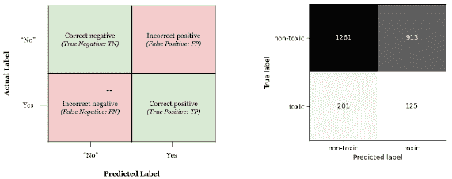
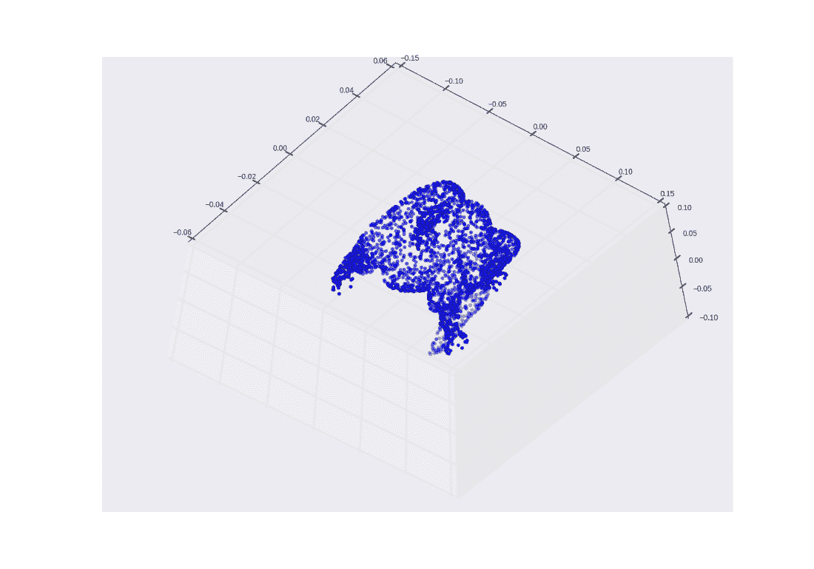
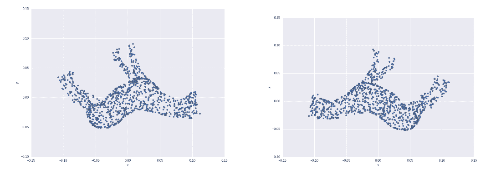
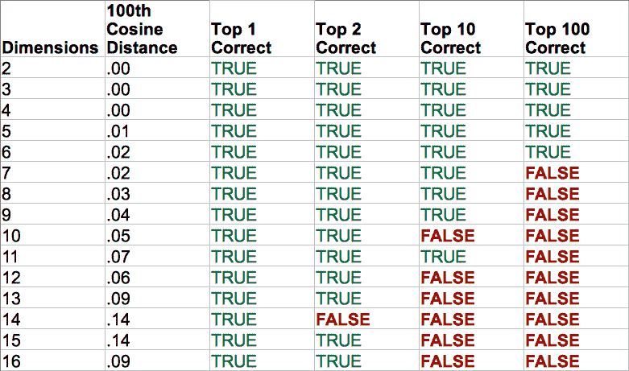

# 第四章：在词频统计中找到含义（语义分析）

### 本章内容包括

+   分析语义（含义）以创建主题向量

+   使用主题向量之间的语义相似性进行语义搜索

+   可伸缩的语义分析和大型语料库的语义搜索

+   在你的 NLP 管道中使用语义组件（主题）作为特征

+   导航高维向量空间

你已经学会了很多自然语言处理的技巧。但现在可能是你第一次能够做一点"魔术"。这是我们第一次讨论机器能够理解单词*含义*的时候。

第三章的 TF-IDF 向量（词频 - 逆文档频率向量）帮助你估计了文本块中单词的重要性。你使用 TF-IDF 向量和矩阵告诉你每个单词对文档集合中一小部分文本的整体含义的重要性。这些 TF-IDF"重要性"分数不仅适用于单词，还适用于短序列的单词，*n*-grams。如果你知道确切的单词或*n*-grams，它们对于搜索文本非常有效。但它们也有一定的局限性。通常，你需要一种不仅仅考虑单词计数，还考虑它们*含义*的表示。

研究人员发现了几种使用词语与其他词语的共现来表示词语含义的方法。在本章中，你将了解其中一些方法，比如*潜在语义分析*(LSA)和*潜在狄利克雷分配*。这些方法创建了用于表示词语和文档的*语义*或*主题*向量。你将使用 TF-IDF 向量的加权频率分数，或者上一章学到的词袋（BOW）向量来创建它们。这些分数以及它们之间的相关性，将帮助你计算构成你的主题向量维度的主题"分数"。

主题向量将帮助你完成许多有趣的事情。它们使得根据其含义进行文档搜索成为可能 —— *语义搜索*。大多数情况下，语义搜索返回的搜索结果要比关键词搜索好得多。有时，即使用户无法想到正确的查询词，语义搜索也会返回用户正要搜索的文档。

语义向量还可以用于识别最能代表语句、文档或语料库（文档集合）主题的单词和*n*-grams。有了这些单词及其相对重要性的向量，你可以为文档提供最有意义的单词 —— 一组总结其含义的关键词。

最后，你将能够比较任意两个语句或文档，并判断它们在*含义*上有多"接近"。

##### 提示

“主题”、“语义”和“含义”这些术语在自然语言处理（NLP）中有着相似的意义，并且在讨论时通常可以互换使用。在本章中，您将学习如何构建一个 NLP 流水线，它可以自行找出这种同义词，甚至能够找出“搞明白”这个短语和“计算”这个词的含义相似之处。机器只能“计算”含义，而不能“搞明白”含义。

很快您将会发现，构成主题向量维度的单词的线性组合是相当强大的含义表示。

## 4.1 从单词计数到主题分数

您知道如何计算单词的频率，并在 TF-IDF 向量或矩阵中评分单词的重要性。但这还不够。让我们来看看这可能会产生哪些问题，以及如何处理文本的含义，而不仅仅是单个术语频率。

### 4.1.1 TF-IDF 向量和词形还原的局限性

TF-IDF 向量根据文档中单词的确切拼写进行计数。因此，如果文本以不同的方式表达相同的含义，它们的 TF-IDF 向量表示将完全不同，即使它们的拼写不同或使用不同的词汇。这会混淆搜索引擎和依赖于标记计数的文档相似性比较。

在第二章中，您对单词的词尾进行了归一化处理，以便将只在最后几个字符上有所不同的单词收集到一个单一的标记下。您使用了标准化方法，如词干提取和词形还原，来创建拼写相似、意思通常也相似的小型单词集合。您为这些单词的每一个小集合进行了标记，标记为它们的词元或词干，然后您处理了这些新标记，而不是原始单词。

这种词形还原方法将拼写相似的单词放在了一起进行分析，但并不一定是含义相似的单词。而且，它确实未能将大多数同义词配对起来。同义词通常在很多方面都不同，不仅仅是词形还原和词干提取处理的词尾。更糟糕的是，词形还原和词干提取有时会错误地将反义词（含义相反的单词）归类在一起。

结果是，两个讨论相同事物但使用不同词汇的文本片段在您的词形还原的 TF-IDF 向量空间模型中将不会“接近”彼此。有时，即使两个词形还原的 TF-IDF 向量彼此接近，它们的含义也完全不相似。即使是第三章中的最新的 TF-IDF 相似度评分，如 Okapi BM25 或余弦相似度，也无法连接这些同义词或将这些反义词分开。拼写不同的同义词产生的 TF-IDF 向量在向量空间中并不接近。

例如，在*NLPIA*这一章的 TF-IDF 向量，也就是你现在正在阅读的这一章，可能与关于潜在语义索引的大学教科书中的意思相去甚远。但这正是这一章所讨论的，只是我们在这一章中使用现代和口语化的术语。教授和研究人员在他们的教科书和讲座中使用更一致，更严格的语言。另外，教授们十年前使用的术语可能随着过去几年的快速进展而发生了变化。例如，像"潜在语义 *索引*"这样的术语比研究人员现在使用的"潜在语义分析"这个术语更受欢迎。^([3])

因此，具有相似含义的不同单词对 TF-IDF 造成问题。但是，看起来相似但含义完全不同的词也是如此。即使是由英语教授撰写的正式英语文本也无法避免大多数英语单词具有多重含义的事实，这对包括机器学习者在内的任何新学习者来说都是一个挑战。这种具有多重含义的单词的概念称为*多义性*。

以下是一些多义词可能影响单词或语句语义的方式。

+   同音异义词 — 拼写和发音相同，但含义不同的词（例如：*乐队正在演奏老披头士的歌曲。她的发带非常漂亮。*）

+   同形异义词 — 拼写相同但发音和含义不同的词。（例如：*我反对这个决定。我不认识这个物体。*）

+   双关语 — 在同一句子中同时使用一个词的两个含义（例如：*皮克威克先生拿起了他的帽子和他的离开。*）

你可以看到所有这些现象会降低 TF-IDF 的性能，因为使具有相似但含义不同的单词的句子的 TF-IDF 向量更相似于彼此，而不应该是这样。为了解决这些挑战，我们需要更强大的工具。

### 话题向量

当你对 TF-IDF 向量进行数学运算，比如加法和减法时，这些和差只告诉你组合或差异化的向量所代表的文档中单词使用的频率。这种数学并不告诉你这些词背后的"含义"。你可以通过将 TF-IDF 矩阵乘以自身来计算单词与单词的 TF-IDF 向量（单词共现或相关向量）。但是用这些稀疏的，高维的向量进行"向量推理"并不奏效。当你将这些向量相加或相减时，它们并不能很好地代表一个现有的概念或单词或主题。

所以你需要一种方法来从单词统计中提取一些额外的信息和意义。你需要更好地估计文档中单词的"意义"。你需要知道在特定文档中那组词的含义**是什么**。你希望用一个类似于 TF-IDF 向量的向量来表示那个意义，只是更紧凑更有意义。

本质上，创建这些新向量时，您将定义一个新的空间。当您用 TF-IDF 或词袋向量表示单词和文档时，您正在一个由文档中出现的单词或术语定义的空间中操作。每个术语都有一个维度 - 这就是为什么您很容易达到数千个维度。每个术语与每个其他术语都是"正交"的 - 当您将表示一个单词的向量与表示另一个单词的向量相乘时，即使这些单词是同义词，您总是得到一个零。

主题建模的过程是找到一个维度较少的空间，使语义上相近的单词对齐到类似的维度。我们将这些维度称为*主题*，新空间中的向量称为*主题向量*。您可以拥有任意数量的主题。您的主题空间可以只有一个维度，也可以有数千个维度。

您可以像处理任何其他向量一样添加和减去您在本章中将计算的主题向量。只不过这一次，和差的含义比 TF-IDF 向量时更重要。主题向量之间的距离或*相似度*对于诸如查找与相似主题相关的文档或语义搜索等事情非常有用。

当您将您的向量转换到新空间时，您将为语料库中的每个文档有一个文档-主题向量。您的词汇表中每个单词都将有一个词-主题向量。因此，您只需将其所有词-主题向量相加，就可以计算任何新文档的主题向量。

创造出单词和句子语义（含义）的数值表示可能会有些棘手。这对于"模糊"语言如英语来说尤其如此，因为英语有多种方言，对相同单词有许多不同的解释。

考虑到这些挑战，您能想象如何将具有一百万维度（术语）的 TF-IDF 向量压缩为具有 10 或 100 维度（主题）的向量吗？这就像确定正确的基本颜色混合以尝试复制您公寓中的油漆颜色，以便您可以覆盖那些墙上的钉孔。

您需要找到那些在一个主题中“属于”一起的单词维度，并将它们的 TF-IDF 值相加，以创建一个新的数字来表示文档中该主题的数量。您甚至可以根据它们对主题的重要性对它们进行加权，以及您希望每个单词对"混合"的贡献有多少。您甚至可以为减少文本与该主题相关的可能性的单词添加负权重。

### 4.1.3 思想实验

让我们进行一个思想实验。假设您有某个特定文档的一些 TF-IDF 向量，并且您希望将其转换为一个主题向量。您可以考虑每个单词对您的主题的贡献。

假设你正在处理有关纽约市中央公园的宠物的一些句子（NYC）。让我们创建三个主题：一个关于宠物，一个关于动物，另一个关于城市。将这些主题称为“petness”、“animalness”和“cityness”。因此，关于宠物的“petness”主题将显著评分像“猫”和“狗”这样的词汇，但可能忽略像“NYC”和“苹果”这样的词汇。关于城市的“cityness”主题将忽略像“猫”和“狗”这样的词汇，但可能会对“苹果”稍微加权，仅仅因为与“大苹果”有关联。

如果你像这样“训练”你的主题模型，而不使用计算机，只使用你的常识，你可能会得出类似于清单 4.1 中的一些权重。

##### 清单 4.1 你的主题的示例权重

```py
>>> import numpy as np

>>> topic = {}
>>> tfidf = dict(list(zip('cat dog apple lion NYC love'.split(),
...     np.random.rand(6))))  # #1
>>> topic['petness'] = (.3 * tfidf['cat'] +\
...                     .3 * tfidf['dog'] +\
...                      0 * tfidf['apple'] +\
...                      0 * tfidf['lion'] -\
...                     .2 * tfidf['NYC'] +\
...                     .2 * tfidf['love'])  # #2
>>> topic['animalness']  = (.1 * tfidf['cat']  +\
...                         .1 * tfidf['dog'] -\
...                         .1 * tfidf['apple'] +\
...                         .5 * tfidf['lion'] +\
...                         .1 * tfidf['NYC'] -\
...                         .1 * tfidf['love'])
>>> topic['cityness']    = ( 0 * tfidf['cat']  -\
...                         .1 * tfidf['dog'] +\
...                         .2 * tfidf['apple'] -\
...                         .1 * tfidf['lion'] +\
...                         .5 * tfidf['NYC'] +\
...                         .1 * tfidf['love'])
```

在这个思想实验中，我们将可能是指示您的每个主题的单词频率相加起来。我们根据单词与主题相关的可能性加权单词频率（TF-IDF 值）。请注意，这些权重也可能是负值，因为某种意义上可能谈论与您的主题相反的内容的单词。

请注意，这不是一个真正的算法或示例实现，只是一个思想实验。你只是试图弄清楚如何教机器像你一样思考。你任意选择将你的单词和文档分解为只有三个主题（“petness”、“animalness”和“cityness”）。并且你的词汇是有限的，只有六个单词。

下一步是思考一个人可能如何在数学上决定哪些主题和单词是相关的，以及这些连接应该具有什么权重。一旦你决定了三个要建模的主题，你就必须确定为这些主题中的每个单词分配多少权重。你按比例混合单词以使你的主题“颜色混合”。主题建模转换（颜色混合配方）是一个 3 x 6 的比例（权重）矩阵，将三个主题与六个单词相连。你将该矩阵乘以一个想象中的 6 x 1 的 TF-IDF 向量，以获得该文档的 3 x 1 主题向量。

你做出了判断，认为术语“猫”和“狗”应该对“petness”主题具有类似的贡献（权重为 0.3）。因此，用于你的 TF-IDF 到主题转换的矩阵左上角的两个值都是 0.3。你能想象出可能使用软件“计算”这些比例的方法吗？记住，你有一堆计算机可以阅读，标记和计算标记的文档。你可以为尽可能多的文档制作 TF-IDF 向量。继续思考在阅读时如何使用这些计数来计算单词的主题权重。

你决定术语“NYC”在“petness”主题中应具有负权重。在某种意义上，城市名称，以及一般的专有名称，缩写和首字母缩写，与有关宠物的词汇几乎没有共同之处。思考一下单词“共同之处”在词汇中的含义。TF-IDF 矩阵中是否有表示单词共同含义的内容？

注意 "city" 这个主题向量中有少量的 "apple" 一词。这可能是因为你是手动进行的，而我们人类知道 "NYC" 和 "Big Apple" 经常是同义词。我们的语义分析算法有望能够根据 "apple" 和 "NYC" 在相同文档中出现的频率来计算出它们之间的同义关系。

在阅读清单 4.1 中的加权和之后，试着猜猜我们是如何得出这三个主题和六个单词的权重的。你脑海中可能有一个不同的"语料库"，与我们在头脑中使用的不同。所以你可能对这些单词的"适当"权重有不同的看法。你会如何改变它们？你可以用什么客观的标准来衡量这些比例（权重）？我们将在下一节回答这个问题。

##### 注意

我们选择了一种有符号的词权重来生成主题向量。这样可以使用负权重来表示与主题相反的词。因为你是手工进行的，我们选择使用易于计算的 L¹-norm （即向量维度的绝对值之和等于 1）来对你的主题向量进行归一化。不过，在本章稍后使用的真正的潜在语义分析（LSA）算法则通过更有用的 L²-norm 对主题向量进行归一化。我们将在本章后面介绍不同的范数和距离。

在阅读这些向量时，你可能已经意识到单词和主题之间的关系是可以"翻转"的。一个 3x6 的三个主题向量矩阵可以通过转置来产生你的词汇表中每个单词的主题权重。这些权重向量将成为你六个单词的词向量：

```py
>>> word_vector = {}
>>> word_vector['cat']  =  .3*topic['petness'] +\
...                        .1*topic['animalness'] +\
...                         0*topic['cityness']
>>> word_vector['dog']  =  .3*topic['petness'] +\
...                        .1*topic['animalness'] -\
...                        .1*topic['cityness']
>>> word_vector['apple']=   0*topic['petness'] -\
...                        .1*topic['animalness'] +\
...                        .2*topic['cityness']
>>> word_vector['lion'] =   0*topic['petness'] +\
...                        .5*topic['animalness'] -\
...                        .1*topic['cityness']
>>> word_vector['NYC']  = -.2*topic['petness'] +\
...                        .1*topic['animalness'] +\
...                        .5*topic['cityness']
>>> word_vector['love'] =  .2*topic['petness'] -\
...                        .1*topic['animalness'] +\
...                        .1*topic['cityness']
```

这六个单词主题向量在图 4.1 中显示，每个单词对应一个向量，表示你的六个词的含义。

##### 图 4.1. 关于宠物和纽约市的六个单词的思想实验的 3D 向量



之前，每个主题的向量都带有每个单词的权重，给出了表示三个主题中单词的线性组合的 6-D 向量。现在，你手工设计了一种通过主题来表示文档的方法。如果你只计算这些六个单词出现的次数，并将它们乘以相应的权重，就可以得到任何文档的 3D 主题向量。3D 向量非常有趣，因为人们可以很容易地进行可视化。你可以将它们绘制出来，并以图形形式分享关于你的语料库或特定文档的见解。

3D 向量（或任何低维向量空间）对于机器学习分类问题也非常有用。算法可以通过平面（或超平面）在向量空间中划分不同的类别。

你的语料库中的文档可能会使用更多的词，但是这个特定的主题向量模型只会受到这六个词的使用的影响。只要你的模型只需要根据三个不同的维度或主题来区分文档，你的词汇表可以按你的意愿不断增长。在这个思维实验中，你将六个维度（TF-IDF 规范化频率）压缩为三个维度（主题）。

这种主观的、劳动密集型的语义分析方法依赖于人类的直觉和常识来将文档分解成主题。人类的常识很难编码进算法中。^([4])显然，这种方法不能用于机器学习流程。而且在涉及更多主题和单词时，它的可扩展性也不强。

所以，让我们自动化这个手动的过程。让我们使用一种算法来为我们选择主题权重，而不依赖于常识。

如果你仔细思考一下，这些加权和实际上就是点积。而三个点积（加权和）就是矩阵乘法，或者内积。你需要用一个 TF-IDF 向量（文档中每个单词的值）乘以一个 3 x *n* 权重矩阵，其中 *n* 是词汇表中词项的数量，这样的乘法的输出就是该文档的新的 3 x 1 主题向量。你所做的就是将一个向量从一个向量空间（TF-IDFs）转换到另一个低维向量空间（主题向量）。你的算法应该创建一个 *n* x *m* 词项-主题矩阵，你可以用该矩阵乘以一个文档中的单词频率向量，以获得该文档的新的主题向量。

### 4.1.4 评分主题的算法

你仍然需要一种算法来确定这些主题向量，或者从你已经拥有的向量（如 TF-IDF 或词袋向量）中推导出它们。机器无法分辨哪些单词属于一起，或者它们代表着什么，不是吗？20 世纪的英国语言学家 J. R. Firth 研究了你可以估计一个词或词素代表的方式。在 1957 年，他给了你一个关于如何计算词的主题的线索。Firth 写道：

> 词的本性由它所携带的语境所决定。

— J. R. Firth

1957

那么如何确定一个词的 "公司" 呢？嗯，最直接的方法是在同一文档中统计共现次数。而你在第三章的 BOW 和 TF-IDF 向量中正好拥有所需的内容。这种 "计算共现次数" 的方法导致了开发出一些算法来创建向量来表示文档或句子中单词使用的统计信息。

在接下来的几节中，你将看到两种用于创建这些主题向量的算法。第一种，*潜在语义分析*（LSA），应用于你的 TF-IDF 矩阵以将单词聚合到主题中。它也适用于词袋向量，但 TF-IDF 向量的效果略好一些。LSA 优化这些主题以保持主题维度的多样性；当你使用这些新主题而不是原始单词时，仍然能捕捉到文档的大部分含义（语义）。你的模型所需的主题数量远远少于 TF-IDF 向量词汇表中的单词数量，因此 LSA 通常被称为一种维度缩减技术。LSA 减少了你需要捕捉文档含义的维度数量。^([6])

我们将要介绍的另一种算法被称为*潜在狄利克雷分配*，通常缩写为 LDA。因为在本书中我们使用 LDA 来表示潜在判别分析分类器，所以我们将潜在狄利克雷分配简称为 LDiA。

LDiA 将 LSA 的数学带入了不同的方向。它使用非线性统计算法将单词分组在一起。因此，通常比 LSA 之类的线性方法需要更长的训练时间。这使得 LDiA 在许多实际应用中不太实用，并且它很少是你尝试的第一种方法。尽管如此，它创建的主题的统计数据有时更接近人们对单词和主题的直觉。因此，LDiA 的主题通常更容易向你的老板解释。它还更适用于一些单文档问题，如文档摘要。

对于大多数分类或回归问题，通常最好使用 LSA。因此，我们首先解释 LSA 及其基础的 SVD 线性代数。

## 4.2 挑战：检测毒性

为了看到主题建模的威力，我们将尝试解决一个真实问题：识别维基百科评论中的有毒性。这是当前内容和社交媒体平台面临的常见自然语言处理任务。在本章中，我们将处理一个维基百科讨论评论的数据集，^([7])我们将希望将其分类为两个类别 - 有毒和无毒。首先，让我们加载数据集并查看一下：

##### 第 4.2 节 有毒评论数据集

```py
>>> import pandas as pd
>>> pd.options.display.width = 120  # #1
>>> DATA_DIR = ('https://gitlab.com/tangibleai/nlpia/-/raw/master/'
...             'src/nlpia/data')
>>> url= DATA_DIR + '/toxic_comment_small.csv'
>>>
>>> comments = pd.read_csv(url)
>>> index = ['comment{}{}'.format(i, '!'*j) for (i,j) in
...          zip(range(len(comments)), comments.toxic)
...         ]  # #2
>>> comments = pd.DataFrame(
...     comments.values, columns=comments.columns, index=index)
>>> mask = comments.toxic.astype(bool).values
>>> comments['toxic'] = comments.toxic.astype(int)
>>> len(comments)
5000
>>> comments.toxic.sum()
650
>>> comments.head(6)
                                                        text  toxic
comment0   you have yet to identify where my edits violat...      0
comment1   "\n as i have already said,wp:rfc or wp:ani. (...      0
comment2   your vote on wikiquote simple english when it ...      0
comment3   your stalking of my edits i've opened a thread...      0
comment4!  straight from the smear site itself. the perso...      1
comment5   no, i can't see it either - and i've gone back...      0
```

所以你有 5,000 条评论，其中 650 条被标记为二进制类别标签“有毒”。

在你深入了解所有复杂的降维技术之前，让我们尝试使用你已经熟悉的消息的向量表示来解决我们的分类问题 - TF-IDF。但是你会选择什么*模型*来对消息进行分类呢？为了决定，让我们首先看看 TF-IDF 向量。

##### 第 4.3 节 为 SMS 数据集创建 TF-IDF 向量

```py
>>> from sklearn.feature_extraction.text import TfidfVectorizer
>>> import spacy
>>> nlp = spacy.load("en_core_web_sm")
>>>
>>> def spacy_tokenize(sentence):
...    return [token.text for token in nlp(sentence.lower())]
>>>
>>> tfidf_model = TfidfVectorizer(tokenizer=spacy_tokenize)
>>> tfidf_docs = tfidf_model.fit_transform(\
...     raw_documents=comments.text).toarray()
>>> tfidf_docs.shape
(5000, 19169)
```

spaCy 分词器为您的词汇表提供了 19,169 个单词。您的词汇表中几乎有 4 倍于您的消息的单词数量。而且您的单词数量几乎是有毒评论的 30 倍。因此，您的模型将不会有太多关于表明评论是否有毒的单词的信息。

你在本书中已经至少遇到了一个分类器 - 第二章中的朴素贝叶斯。通常，当您的词汇量远大于数据集中标记示例的数量时，朴素贝叶斯分类器的效果不会很好。所以这次我们需要点不同的东西。

### 4.2.1 潜在判别分析分类器

在本章中，我们将介绍一种基于称为潜在判别分析（LDA）的算法的分类器。LDA 是您会找到的最简单和最快的分类模型之一，并且它需要的样本比较花哨的算法要少。

LDA 的输入将是一个带有标签的数据 - 因此我们不仅需要表示消息的向量，还需要它们的类别。在这种情况下，我们有两个类别 - 有毒评论和非有毒评论。LDA 算法使用了一些超出本书范围的数学知识，但在两个类别的情况下，其实现非常直观。

本质上，当面临两类问题时，这就是 LDA 算法的工作原理：

1.  它找到一个线，或者说轴，在您的向量空间中，如果您将空间中的所有向量（数据点）投影到该轴上，两个类别将尽可能地分离。

1.  它将所有向量投影到那条线上。

1.  它预测每个向量属于两个类别之一的概率，根据两个类别之间的一个*cutoff*点。

令人惊讶的是，在大多数情况下，最大化类别分离的线非常接近连接代表每个类别的聚类的两个*质心*的线。

让我们手动执行这个 LDA 的近似，并看看它在我们的数据集上的表现如何。

```py
>>> mask = comments.toxic.astype(bool).values  # #1
>>> toxic_centroid = tfidf_docs[mask].mean(axis=0)  # #2
>>> nontoxic_centroid = tfidf_docs[~mask].mean(axis=0)  # #3
```

```py
>>> centroid_axis = toxic_centroid - nontoxic_centroid
>>> toxicity_score = tfidf_docs.dot(centroid_axis)  # #1
>>> toxicity_score.round(3)
array([-0.008, -0.022, -0.014, ..., -0.025, -0.001, -0.022])
```

特定评论的毒性评分是该评论向量在非有毒评论和非有毒评论之间的线上的投影的长度。您计算这些投影的方法与您对余弦距离所做的计算相同。它是评论向量与从非有毒评论指向有毒评论的向量之间的向量的归一化点积。通过将每个 TF-IDF 向量投影到该线上并使用点积来计算毒性分数。您使用`dot()`方法一次性进行了这 5000 个点积的“向量化”numpy 操作。与 Python 的`for`循环相比，这可以加速 100 倍。

在我们的分类中，你只剩下一步了。你需要将我们的分数转换为实际的类预测。理想情况下，你希望你的分数在 0 和 1 之间，就像概率一样。一旦你对分数进行了归一化，你就可以根据一个截止值推断出分类 - 在这里，我们选择了一个简单的 0.5。你可以使用 `sklearn` 的 `MinMaxScaler` 来执行归一化：

```py
>>> from sklearn.preprocessing import MinMaxScaler
>>> comments['manual_score'] = MinMaxScaler().fit_transform(\
...     toxicity_score.reshape(-1,1))
>>> comments['manual_predict'] = (comments.manual_score > .5).astype(int)
>>> comments['toxic manual_predict manual_score'.split()].round(2).head(6)
           toxic  manual_predict  manual_score
comment0       0               0          0.41
comment1       0               0          0.27
comment2       0               0          0.35
comment3       0               0          0.47
comment4!      1               0          0.48
comment5       0               0          0.31
```

看起来不错。前六条消息几乎全部被正确分类了。让我们看看它在其余的训练集上的表现如何。

```py
>>> (1 - (comments.toxic - comments.manual_predict).abs().sum()
...     / len(comments))
0.895...
```

不错！这个简单的“近似”版本的 LDA 准确地分类了 89.5% 的消息。完整的 LDA 会表现如何？使用 SciKit Learn (`sklearn`) 来获得最先进的 LDA 实现。

```py
>>> from sklearn import discriminant_analysis
>>> lda_tfidf = discriminant_analysis.LinearDiscriminantAnalysis
>>> lda_tfidf = lda_tfidf.fit(tfidf_docs, comments['toxic'])
>>> comments['tfidf_predict'] = lda_tfidf.predict(tfidf_docs)
>>> float(lda_tfidf.score(tfidf_docs, comments['toxic']))
0.999...
```

99.9%! 几乎完美的准确率。这意味着你不需要使用更复杂的主题建模算法，比如潜在狄利克雷分配或深度学习吗？这是一个陷阱问题。你可能已经发现了陷阱。这个完美的 99.9% 的结果之所以如此完美，是因为我们没有分离出一个测试集。这个 A+ 分数是在分类器已经“见过”的“问题”上获得的。这就像在学校考试时拿到了和前一天练习的完全相同的问题一样。所以这个模型在恶意评论和垃圾邮件的真实世界中可能表现不佳。

##### 提示

注意你用来训练和进行预测的类方法。`sklearn` 中的每个模型都有相同的方法：`fit()` 和 `predict()`。而且所有的分类器模型甚至都会有一个 `predict_proba()` 方法，用于给出所有类别的概率分数。这样，当你尝试找到解决机器学习问题的最佳模型算法时，更容易进行不同模型算法的替换。这样你就可以将你的脑力集中在 NLP 工程师的创造性工作上，调整你的模型超参数以在实际世界中发挥作用。

让我们看看我们的分类器在一个更加现实的情况下的表现。你将把你的评论数据集分成两部分 - 训练集和测试集。（你可以想象，在 `sklearn` 中有一个专门的函数用于此！）然后你将看到分类器在它没有被训练的消息上的表现。

##### 列表 4.4 使用训练-测试拆分的 LDA 模型性能

```py
>>> from sklearn.model_selection import train_test_split
>>> X_train, X_test, y_train, y_test = train_test_split(tfidf_docs,\
...     comments.toxic.values, test_size=0.5, random_state=271828)
>>> lda_tfidf = LDA(n_components=1)
>>> lda = lda_tfidf.fit(X_train, y_train)  # #1
>>> round(float(lda.score(X_train, y_train)), 3)
0.999
>>> round(float(lda.score(X_test, y_test)), 3)
0.554
```

基于 TF-IDF 的模型的训练集准确率几乎完美。但测试集准确率为 0.55 - 比抛硬币稍微好一点。而测试集准确率才是唯一重要的准确率。这正是主题建模将帮助你的地方。它将允许你从一个小训练集中推广你的模型，使其在使用不同词语组合（但是相似主题）的消息上仍然表现良好。

##### 提示

注意 `train_test_split` 函数中的 `random_state` 参数。`train_test_split()` 函数是随机的。所以每次运行它都会得到不同的结果和不同的准确度值。如果你想要让你的流程可重复，可以查找这些模型和数据集拆分器的 `seed` 参数。你可以将种子设置为相同的值来获得可再现的结果。

让我们更深入地看一下我们的 LDA 模型的表现，使用一种称为 *混淆矩阵* 的工具。混淆矩阵将告诉你模型犯错的次数。有两种类型的错误，*假阳性* 错误和 *假阴性* 错误。在测试集中标记为有毒的示例上出现的错误称为“假阴性”，因为它们被错误地标记为负面（无毒）并且应该被标记为正面（有毒）。在测试集中标记为非有毒标签上的错误称为“假阳性”，因为它们应该被标记为负面（无毒），但被错误地标记为有毒。下面是使用 `sklearn 函数` 的方法：

```py
>>> from sklearn.metrics import confusion_matrix
>>> confusion_matrix(y_test, lda.predict(X_test))
array([[1261,  913],
       [ 201,  125]], dtype=int64)
```

嗯。这里的情况不太清楚。幸运的是，`sklearn` 考虑到你可能需要一种更直观的方式来向人们展示你的混淆矩阵，并包含了一个专门的函数。让我们试试：

```py
>>> import matplotlib.pyplot as plt
>>> from sklearn.metrics import plot_confusion_matrix
>>> plot_confusion_matrix(lda,X_test, y_test, cmap="Greys",
...                display_labels=['non-toxic', 'toxic'], colorbar=False)
>>> plt.show()
```

你可以在图 4.2 中看到生成的 `matplotlib` 图，显示了两个标签（有毒和非有毒）的每个标签的不正确和正确的预测数量。检查这个图表，看看你能否发现你的模型性能有什么问题。

##### 图 4.2 基于 TF-IDF 的分类器的混淆矩阵



首先，在实际上是有毒的测试集中的 326 条评论中，模型只能正确识别出 125 条 - 这是 38.3%。这个指标（我们感兴趣的类别中模型能够识别出多少个实例），称为 *召回率*，或 *敏感度*。另一方面，模型标记为有毒的 1038 条评论中，只有 125 条是真正有毒的评论。所以“正面”标签在 12% 的情况下才是正确的。这个指标称为 *精度*。^([9])

你已经可以看到精度和召回率比模型准确度给我们更多的信息。例如，想象一下，如果你决定使用确定性规则而不是使用机器学习模型，并只将所有评论标记为非有毒。由于我们数据集中约有 13% 的评论实际上是有毒的，所以这个模型的准确度将达到 0.87 - 比你上次训练的 LDA 模型要好得多！但是，它的召回率将为 0 - 在我们的任务中完全没有帮助，即识别有毒消息。

您可能也意识到这两个指标之间存在一种权衡。如果您采用另一种确定性规则，并将所有评论标记为有毒呢？在这种情况下，您的召回率将是完美的，因为您将正确分类所有有毒评论。但是，精确度将会下降，因为大多数被标记为有毒的评论实际上是完全正常的。

根据您的用例，您可能会决定优先考虑另一方面的精确度或召回率。但在很多情况下，您希望它们两者都足够好。

在这种情况下，您可能会使用*F[1]分数* - 精确度和召回率的调和平均值。较高的精确度和较高的召回率都会导致较高的 F[1]分数，使得只使用一个指标来评估您的模型更容易。

您可以在附录 D 中了解有关分析分类器性能的更多信息。暂时，在我们继续之前，我们将只记录此模型的 F[1]分数。

### 超越线性

LDA 在许多情况下都会为您服务。然而，当这些假设不被满足时，它仍然有一些假设将导致分类器性能不佳。例如，LDA 假定所有类别的特征协方差矩阵都相同。这是一个相当强的假设！因此，由此造成的结果是，LDA 只能在类别之间学习线性边界。

如果您需要放松这个假设，您可以使用称为*二次判别分析*或 QDA 的更一般情况的 LDA。QDA 允许不同类别的不同协方差矩阵，并分别估计每个协方差矩阵。这就是为什么它可以学习二次或曲线边界的原因。这使得它更加灵活，并在某些情况下有助于其表现更好。

## 减少维度

在我们深入了解 LSA 之前，让我们花点时间了解一下它对我们的数据做了什么概念上的事情。LSA 对主题建模的方法背后的想法是*降维*。顾名思义，降维是一个过程，在这个过程中，我们找到数据的一个低维表示，保留尽可能多的信息。

让我们审视这个定义并理解它的含义。为了让您有直观的理解，让我们暂时远离自然语言处理，并切换到更直观的例子。首先，什么是数据的低维表示？想象一下将一个三维物体（比如你的沙发）表示为二维空间。例如，如果您在黑暗的房间里用光照射在沙发后面，它在墙上的阴影就是它的二维表示。

我们为什么需要这样的表示？可能有很多原因。也许我们没有能力存储或传输完整的数据。或者我们想要可视化我们的数据以更好地理解它。当我们谈论 LDA 时，你已经看到了可视化数据点并将它们聚类的强大能力。但我们的大脑实际上不能处理超过 2 或 3 个维度 - 当我们处理现实世界的数据，特别是自然语言数据时，我们的数据集可能有数百甚至数千个维度。像 PCA 这样的降维工具在我们想要简化和可视化映射我们的数据时非常有用。

另一个重要原因是我们在第三章中简要提到的维度诅咒。稀疏、多维数据更难处理，而在其上训练的分类器更容易过拟合。数据科学家经常使用的一个经验法则是，每个维度至少应该有 5 条记录。我们已经看到，即使对于小型文本数据集，TF-IDF 矩阵也可能迅速扩展到 10 或 20 万个维度。这也适用于许多其他类型的数据。

从“沙发影子”示例中，你可以看到我们可以构建无限多个相同“原始”数据集的低维表示。但有些表示比其他表示更好。在这种情况下，“更好”是什么意思？当谈到视觉数据时，你可以直观地理解，一个可以让我们识别对象的表示比一个不能的表示更好。例如，让我们拿一个从真实对象的 3D 扫描中获取的点云，并将其投影到一个二维平面上。

您可以在图 4.3 中看到结果。你能猜到那个 3D 对象是什么吗？

##### 图 4.3 从下面看实际对象的点云



继续我们的“影子”类比，想象一下正午的太阳照射在一群人的头顶上。每个人的影子都是一个圆形斑点。我们能用这些斑点来判断谁高谁矮，或者哪些人头发长吗？可能不行。

现在你明白了良好的降维与能够在新表示中*区分*不同对象和数据点有关。并不是你数据的所有特征或维度对这个区分过程同样重要。因此，可能有一些特征你可以轻松舍弃而不会丢失太多信息。但对于某些特征，丢失它们将严重影响你理解数据的能力。并且因为你在这里处理的是线性代数，你不仅可以选择留下或包括一个维度 - 你还可以将几个维度组合成一个更小的维度集，以更简洁的方式表示我们的数据。让我们看看我们是如何做到的。

### 4.3.1 进入主成分分析

你现在知道，为了在更少的维度中找到数据的表示，你需要找到一个维度的组合，能够保持你区分数据点的能力。这将使你能够，例如，将它们分成有意义的聚类。继续上面的阴影例子，一个好的“阴影表示”可以让你看到你的阴影的头在哪里，腿在哪里。它通过保持这些对象之间的高度差异来实现，而不是像“中午的太阳表示”那样“压扁”它们到一个点。另一方面，我们身体的“厚度”从顶部到底部大致是均匀的 - 所以当你看到我们的“扁平”阴影表示时，丢弃了那个维度，你不会像丢弃我们的高度那样丢失太多信息。

在数学中，这种差异被*方差*所代表。当你想一想的时候，更有*方差*的特征 - 与平均值的偏离更广泛和更频繁 - 对于你来区分数据点更有帮助是有意义的。

但你可以超越单独观察每个特征。更重要的是特征之间的关系如何。在这里，视觉类比可能开始让你失望，因为我们操作的三个维度彼此正交，因此完全不相关。但让我们回想一下你在上一部分看到的主题向量：“动物性”，“宠物性”，“都市性”。如果你检查这三元组中的每两个特征，就会显而易见地发现一些特征之间的联系更紧密。大多数具有“宠物性”质量的词，也具有一些“动物性”的质量。一对特征或者维度的这种性质被称为*协方差*。它与*相关性*密切相关，后者仅仅是将每个特征的协方差归一化为这两个特征的差异。特征之间的协方差越高，它们之间的联系就越紧密 - 因此，它们之间的冗余也更多，因为你可以从一个特征推断出另一个特征。这也意味着你可以找到一个单一的维度，能够保持这两个维度中包含的大部分方差。

总结一下，为了减少描述我们的数据的维数而不丢失信息，您需要找到一种表示，*最大化*其新轴上的方差，同时减少维度之间的依赖性，并消除具有高协方差的维度。 这正是*主成分分析*（PCA）所做的。 它找到一组最大化方差的维度。 这些维度是*正交*的（就像物理世界中的*x，y*和*z*轴），称为*主成分* - 因此得名该方法。 PCA 还允许您查看每个维度“负责”的方差有多少，以便您可以选择保留数据集“本质”的最佳主要成分数量。 然后，PCA 将您的数据投影到一组新坐标中。

在我们深入研究 PCA 如何做到这一点之前，让我们看看魔术是如何发挥作用的。 在下面的清单中，您将使用 Scikit-Learn 的 PCA 方法获取上一页上看到的相同的 3D 点云，并找到一组最大化此点云方差的两个维度。

##### 清单 4.5 PCA 魔法

```py
>>> import pandas as pd
>>> from sklearn.decomposition import PCA
>>> import seaborn
>>> from matplotlib import pyplot as plt

>>> DATA_DIR = ('https://gitlab.com/tangibleai/nlpia/'
...             '-/raw/master/src/nlpia/data')

>>> df = pd.read_csv(DATA_DIR + '/pointcloud.csv.gz', index_col=0)
>>> pca = PCA(n_components=2)  # #1
>>> df2d = pd.DataFrame(pca.fit_transform(df), columns=list('xy'))
>>> df2d.plot(kind='scatter', x='x', y='y')
>>> plt.show()
```

当你将 3D 点（向量）的维数减少到 2D 时，就像是拍摄了那个 3D 点云的照片。 结果可能看起来像图 4.4 的右边或左边的照片，但它永远不会倾斜或扭曲到新的角度。 x 轴（轴 0）将始终沿着点云点的最长轴对齐，在那里点的分布最广泛。 这是因为 PCA 始终找到将最大化方差的维度，并按照方差递减的顺序排列它们。 具有最高方差的方向将成为第一个轴（x）。 第二高方差的维度在 PCA 变换后成为第二维度（y 轴）。 但是这些轴的*极性*（符号）是任意的。 优化可以自由地围绕 x 轴或 y 轴镜像（翻转）向量（点），或两者兼而有之。

##### 图 4.4 马头对马头的点云颠倒过来



现在我们已经看到了 PCA 是如何工作的^([12])，让我们看看它是如何找到那些允许我们在较少维度中处理数据而不丢失太多信息的主要成分的。

### 4.3.2 奇异值分解

PCA 的核心是一种称为奇异值分解（SVD）的数学过程^([13])。 SVD 是一种将任何矩阵分解为三个“因子”的算法，可以将这三个矩阵相乘以重新创建原始矩阵。 这类似于为大整数找到确切的三个整数因子。 但是您的因子不是标量整数，而是具有特殊属性的 2D 实数矩阵。

假设我们有一个数据集，由 *m* 个 n 维点组成，用矩阵 W 表示。在其完整版本中，这就是 W 的 SVD 在数学符号中的样子（假设 *m>n*）：

W[m] [x] [n] = U[m] [x] [m] S[m] [x] [n] V[n] [x] [n]^T

矩阵 U、S 和 V 具有特殊的性质。U 和 V 矩阵是*正交*的，这意味着如果你将它们乘以它们的转置版本，你将得到一个单位矩阵。而 S 是*对角*的，意味着它只在对角线上有非零值。

注意这个公式中的等号。它意味着如果你乘以 U、S 和 V，你会得到 *完全相同的* W，我们的原始数据集。但是你可以看到我们的矩阵的最小维度仍然是 *n*。我们不是想要减少维度吗？这就是为什么在这一章中，你将使用 SVD 的版本称为*减少*，或*截断* SVD。这意味着你只需要找到你感兴趣的前 *p* 个维度。

在这一点上，你可能会说“等等，但我们不能做完整的 SVD 然后只取保留最大方差的维度吗？” 你完全正确，我们可以这样做！然而，使用截断 SVD 还有其他好处。特别是，有几种算法可以快速计算矩阵的截断 SVD 分解，特别是当矩阵是稀疏的时候。*稀疏矩阵* 是指在其大多数单元格中具有相同值（通常为零或 NaN）的矩阵。NLP 词袋和 TF-IDF 矩阵几乎总是稀疏的，因为大多数文档不包含词汇表中的许多单词。

这就是截断 SVD 的样子：

W[m] [x] [n] ~ U[m] [x] [p] S[p] [x] [p] V[p] [x] [n]^T 在这个公式中，*m* 和 *n* 是原始矩阵中的行数和列数，而 *p* 是您想要保留的维数。例如，在马的例子中，如果我们想要在二维空间中显示马，则 *p* 将等于二。在下一章中，当您使用 SVD 进行 LSA 时，它将表示您在分析文档时想要使用的主题数。当然，*p* 需要小于 *m* 和 *n*。

注意这种情况下的“近似等于”符号 - 因为我们失去了维度，所以当我们乘以我们的因子时，不能期望得到完全相同的矩阵！总会有一些信息丢失。然而，我们所获得的是一种新的表示方式，用比原始表示更少的维度来表示我们的数据。通过我们的马点云，我们现在能够传达其“马”的本质，而无需打印庞大的 3D 图。当 PCA 在现实生活中使用时，它可以将百或千维数据简化为更容易分析、聚类和可视化的短向量。

那么，矩阵 U、S 和 V 有什么用呢？现在，我们将简单地介绍一下它们的作用。在下一章中，我们将深入探讨这些矩阵在 LSA 中的应用。

让我们从*V^T*开始 - 或者更确切地说，从它的转置版本*V*开始。*V*矩阵的列有时被称为*主方向*，有时被称为*主成分*。由于本章中使用的 Scikit-Learn 库采用了后一种惯例，我们也将坚持使用这种说法。

你可以将*V*看作是一个“转换器”工具，用于将你的数据从“旧”空间（在矩阵 W 的“世界”中的表示）映射到新的、低维度的空间。想象一下，我们在我们的 3D 马点云中添加了几个新点，现在想要了解这些新点在我们的 2D 表示中的位置，而不需要重新计算所有点的变换。要将每个新点*q*映射到其在 2D 图中的位置，你所需要做的就是将其乘以 V：

`q̂ = q · V`

那么*`U · S`*的含义是什么呢？通过一些代数技巧，你会发现它实际上是你的数据映射到新空间！基本上，它是你的数据点在新的、更低维度的表示中。

## 4.4 潜在语义分析

最后，我们可以停止“围绕”，回到主题建模！让我们看看当我们谈论如何在我们的文本数据中找到主题和概念时，你所学到的关于降维、PCA 和 SVD 的一切将开始变得有意义。

让我们从数据集本身开始。你将使用第 4.1 节中用于 LDA 分类器的相同评论语料库，并使用 TF-IDF 将其转换为矩阵。你可能还记得结果被称为术语 - 文档矩阵。这个名字很有用，因为它让你直观地理解了矩阵的行和列包含的内容：行是术语，即你的词汇词；列将是文档。

让我们重新运行列表 4.1 和 4.2 以再次得到我们的 TF-IDF 矩阵。在深入 LSA 之前，我们研究了矩阵的形状：

```py
>>> tfidf_docs.shape
(5000, 19169)
```

那么这里有什么？一个 19,169 维的数据集，其“空间”由语料库词汇中的术语定义。在这个空间中使用单个向量表示评论是相当麻烦的，因为每个向量中有将近 20,000 个数字 - 比消息本身还要长！而且很难看出消息或其中的句子在概念上是否相似 - 例如，“离开这个页面”和“走开”这样的表达将具有非常低的相似度分数，尽管它们的含义非常接近。因此，在 TF-IDF 矩阵中表示文档的聚类和分类要困难得多。

你还需要注意，你的 5000 条消息中只有 650 条（13%）被标记为有毒。所以你的训练集是不平衡的，约有 8:1 的正常评论和有毒评论（人身攻击、淫秽语言、种族歧视等）。而且你的词汇量很大 - 你的词汇量标记（25172）比你要处理的 4837 条消息（样本）还要多。所以你的词汇表（或词汇）中有很多更多的唯一词，而你的评论数量要少得多，甚至在与有毒消息数量比较时更多。这是一种过拟合的情况。^([15]) 在你的大词汇表中，只有很少的唯一词会被标记为“有毒”词汇在你的数据集中。

过拟合意味着你的词汇表中只会“关键”几个词。所以你的毒性过滤器将依赖于那些毒性词在过滤出来的毒性消息中的位置。如果恶意用户只是使用那些毒性词的同义词，那么他们很容易绕过你的过滤器。如果你的词汇表不包括新的同义词，那么你的过滤器就会误将那些构造巧妙的评论分类为非毒性。

这种过拟合问题是自然语言处理中的固有问题。很难找到一个标记的自然语言数据集，其中包含所有人们可能表达的应该被标记的方式。我们找不到一个“理想”的评论集，其中包含人们说有毒和无毒话的所有不同方式。只有少数几家公司有能力创建这样的数据集。所以我们其他人都需要对过拟合采取“对策”。你必须使用算法，在只有少数几个示例的情况下就能“泛化”得很好。

对抗过拟合的主要措施是将这些数据映射到一个新的、低维空间中。定义这个新空间的是你的语料库以各种方式讨论的加权词汇组合，或者*话题*。用话题来表示你的消息，而不是具体的词频，会使你的自然语言处理管道更“通用”，并允许我们的垃圾邮件过滤器处理更广泛的消息。这正是 LSA 所做的 - 它找到新的“维度”话题，使方差最大化，使用我们在前一节中发现的 SVD 方法。

这些新话题不一定与我们人类认为的话题相关，比如“宠物”或“历史”。机器不“理解”单词组合的含义，只知道它们在一起。当它经常看到“狗”、“猫”和“爱”这样的词一起出现时，它会把它们放在一个话题中。它不知道这样的话题可能是关于“宠物”的。它可能会在同一个话题中包含很多像“驯养”的词和“野生”的词，它们是彼此的反义词。如果它们在同一份文件中经常出现在一起，LSA 将为它们同时获得高分数。我们人类要看一下哪些词在每个话题中具有较高的权重，并为它们取一个名字。

但是你不必给主题起名字来利用它们。正如你没有分析前几章中你的词袋向量或 TF-IDF 向量中的 1000 多个维度一样，你不必知道你所有主题的 "含义"。你仍然可以使用这些新主题向量进行向量数学运算，就像你使用 TF-IDF 向量一样。你可以将它们相加和相减，并根据它们的 "主题表示" 而不是 "词频表示" 估计文档之间的相似性。而且这些相似性估计将更准确，因为你的新表示实际上考虑了令牌的含义及其与其他令牌的共现。

### 4.4.1 深入语义分析

但是别光说 LSA 了 - 让我们来写些代码吧！这一次，我们将使用另一个名为`TruncatedSVD`的 Scikit-Learn 工具，执行 - 有多惊喜 - 我们在上一章中检查过的截断 SVD 方法。我们本可以使用你在上一节看到的`PCA`模型，但我们选择这种更直接的方法 - 这将使我们更好地理解发生了什么事情 "底层"。此外，`TruncatedSVD`旨在处理稀疏矩阵，因此它在大多数 TF-IDF 和 BOW 矩阵上表现更好。

我们将从 9232 减少维度到 16 - 后面我们会解释我们选择这个数字的原因。

##### 列表 4.6 使用截断 SVD 进行 LSA

```py
>>> from sklearn.decomposition import TruncatedSVD
>>>
>>> svd = TruncatedSVD(n_components=16, n_iter=100)  # #1
>>> columns = ['topic{}'.format(i) for i in range(svd.n_components)]
>>> svd_topic_vectors = svd.fit_transform(tfidf_docs)  # #2
>>> svd_topic_vectors = pd.DataFrame(svd_topic_vectors, columns=columns,\
...     index=index)
>>> svd_topic_vectors.round(3).head(6)
           topic0  topic1  topic2  ...  topic13  topic14  topic15
comment0    0.121  -0.055   0.036  ...   -0.038    0.089    0.011
comment1    0.215   0.141  -0.006  ...    0.079   -0.016   -0.070
comment2    0.342  -0.200   0.044  ...   -0.138    0.023    0.069
comment3    0.130  -0.074   0.034  ...   -0.060    0.014    0.073
comment4!   0.166  -0.081   0.040  ...   -0.008    0.063   -0.020
comment5    0.256  -0.122  -0.055  ...    0.093   -0.083   -0.074
```

使用`fit-transform`方法刚刚生成的是新表示中的文档向量。你不再用 19169 个频率计数来表示你的评论，而是用 16 个。这个矩阵也称为*文档-主题*矩阵。通过查看列，你可以看到每个主题在每个评论中 "表达" 多少。

##### 注

我们使用的方法与我们描述的矩阵分解过程有什么关系？你可能已经意识到`fit_transform`方法返回的正是\({U \cdot S}\) - 你的 tf-idf 向量投影到新空间。而你的 V 矩阵保存在`TruncatedSVD`对象的`components_`变量中。

如果你想探索你的主题，你可以通过检查每个单词或单词组在每个主题中的权重来了解它们 "包含" 多少。

首先让我们为你的转换中的所有维度分配单词。你需要按正确的顺序获取它们，因为你的`TFIDFVectorizer`将词汇存储为一个字典，将每个术语映射到一个索引号（列号）。

```py
>>> list(tfidf_model.vocabulary_.items())[:5]  # #1
[('you', 18890),
 ('have', 8093),
 ('yet', 18868),
 ('to', 17083),
 ('identify', 8721)]
>>> column_nums, terms = zip(*sorted(zip(tfidf.vocabulary_.values(),
...     tfidf.vocabulary_.keys())))  # #2
>>> terms[:5]
('\n', '\n ', '\n \n', '\n \n ', '\n  ')
```

现在你可以创建一个漂亮的 Pandas DataFrame，其中包含权重，每一列和每一行的标签都在正确的位置。但是看起来我们的前几个术语只是不同的换行符的组合 - 这并不是很有用！

谁给你提供数据集的人应该更加注意清理它们。让我们使用有用的 Pandas 方法`DataFrame.sample()`随机查看你的词汇中的一些术语

```py
>>> topic_term_matrix = pd.DataFrame(
...     svd.components_, columns=terms,
...     index=['topic{}'.format(i) for i in range(16)])
>>> pd.options.display.max_columns = 8
>>> topic_term_matrix.sample(5, axis='columns',
...     random_state=271828).head(4)  # #1
...
        littered  unblock.(t•c  orchestra  flanking  civilised
topic0  0.000268      0.000143   0.000630  0.000061   0.000119
topic1  0.000297     -0.000211  -0.000830 -0.000088  -0.000168
topic2 -0.000367      0.000157  -0.001457 -0.000150  -0.000133
topic3  0.000147     -0.000458   0.000804  0.000127   0.000181
```

这些词都不像是“天生有毒”。让我们看一些我们直觉上认为会出现在“有毒”评论中的词，看看这些词在不同主题中的权重有多大。

```py
>>> pd.options.display.max_columns = 8
>>> toxic_terms = topic_term_matrix[
...     'pathetic crazy stupid idiot lazy hate die kill'.split()
...     ].round(3) * 100  # #1
...
>>> toxic_terms
         pathetic  crazy  stupid  idiot  lazy  hate  die  kill
topic0        0.3    0.1     0.7    0.6   0.1   0.4  0.2   0.2
topic1       -0.2    0.0    -0.1   -0.3  -0.1  -0.4 -0.1   0.1
topic2        0.7    0.1     1.1    1.7  -0.0   0.9  0.6   0.8
topic3       -0.3   -0.0    -0.0    0.0   0.1  -0.0  0.0   0.2
topic4        0.7    0.2     1.2    1.4   0.3   1.7  0.6   0.0
topic5       -0.4   -0.1    -0.3   -1.3  -0.1   0.5 -0.2  -0.2
topic6        0.0    0.1     0.8    1.7  -0.1   0.2  0.8  -0.1
...
>>> toxic_terms.T.sum()
topic0     2.4
topic1    -1.2
topic2     5.0
topic3    -0.2
topic4     5.9
topic5    -1.8
topic6     3.4
topic7    -0.7
topic8     1.0
topic9    -0.1
topic10   -6.6
...
```

主题 2 和主题 4 似乎更可能包含有毒情绪。而主题 10 则似乎是一个“反有毒”的主题。因此，与毒性相关的词可能对某些主题产生积极影响，对其他主题产生负面影响。没有一个单一明显的有毒主题号。

而 `transform` 方法所做的就是将你传递给它的任何内容与 V 矩阵相乘，这个矩阵保存在 `components_` 中。你可以查看 `TruncatedSVD` 的代码来亲眼看看！ ^([16])屏幕左上角的链接。

### 4.4.2 截断 SVD 还是 PCA？

你现在可能会问自己 - 为什么我们在马的例子中使用了 Scikit-Learn 的 `PCA` 类，但对于评论数据集的主题分析却使用了 `TruncatedSVD`？难道我们不是说 PCA 基于 SVD 算法吗？

如果你看一下 `sklearn` 中 `PCA` 和 `TruncatedSVD` 的实现，你会发现两者之间的大部分代码都是相似的。它们都使用相同的算法来对矩阵进行 SVD 分解。然而，有几个差异可能会使每个模型对某些用例更可取。

最大的区别在于 `TruncatedSVD` 在分解之前不会居中矩阵，而 `PCA` 会。这意味着如果你在执行 TruncatedSVD 之前通过减去矩阵的列平均值来居中你的数据，像这样：

```py
>>> tfidf_docs = tfidf_docs - tfidf_docs.mean()
```

你会得到相同的结果。通过比较对中心化数据的 `TruncatedSVD` 和 PCA 的结果，自己试试看！

数据被居中是主成分分析（PCA）的某些属性的重要性，你可能还记得，PCA 在自然语言处理之外有很多应用。然而，对于大多数稀疏的 TF-IDF 矩阵来说，居中并不总是有意义的。在大多数情况下，居中会使得一个稀疏矩阵变得稠密，导致模型运行速度变慢，占用更多内存。PCA 经常用于处理稠密矩阵，并且可以计算小矩阵的精确全矩阵奇异值分解（SVD）。相比之下，`TruncatedSVD` 已经假定输入矩阵是稀疏的，并使用更快的近似随机方法。因此，它比 PCA 更有效地处理您的 TF-IDF 数据。

### 4.4.3 LSA 在毒性检测中表现如何？

你已经花了足够的时间研究这些主题了 - 现在让我们看看我们的模型如何处理评论的低维表示！你将使用与列表 4.3 中运行的相同代码，但会将其应用于新的 16 维向量。这次，分类将进行得快得多：

```py
>>> X_train_16d, X_test_16d, y_train_16d, y_test_16d = train_test_split(
...     svd_topic_vectors, comments.toxic.values, test_size=0.5,
...     random_state=271828)
>>> lda_lsa = LinearDiscriminantAnalysis(n_components=1)
>>> lda_lsa = lda_lsa.fit(X_train_16d, y_train_16d)
>>> round(float(lda_lsa.score(X_train_16d, y_train_16d)), 3)
0.881
>>> round(float(lda_lsa.score(X_test_16d, y_test_16d)), 3)
0.88
```

哇，差异如此之大！分类器对 TF-IDF 向量的训练集准确率从 99.9%下降到了 88.1%，但测试集准确率却提高了 33%！这是相当大的进步。

让我们来看看 F1 分数：

```py
>>> from sklearn.metrics import f1_score
>>> f1_score(y_test_16d, lda_lsa.predict(X_test_16d).round(3)
0.342
```

我们的 F1 分数几乎比 TF-IDF 向量分类时翻了一番！不错。

除非你有完美的记忆力，到现在你一定对滚动或翻页找到之前模型的性能感到很烦恼。当你进行现实的自然语言处理时，你可能会尝试比我们的玩具示例中更多的模型。这就是为什么数据科学家会在*超参数表*中记录他们的模型参数和性能。

让我们制作自己的超参数表。首先，回想一下在 TF-IDF 向量上运行 LDA 分类器时我们得到的分类性能，并将其保存到我们的表中。

```py
>>> hparam_table = pd.DataFrame()
>>> tfidf_performance = {'classifier': 'LDA',
...                      'features': 'tf-idf (spacy tokenizer)',
...                      'train_accuracy': 0.99 ,
...                      'test_accuracy': 0.554,
...                      'test_precision': 0.383 ,
...                      'test_recall': 0.12,
...                      'test_f1': 0.183}
>>> hparam_table = hparam_table.append(
...     tfidf_performance, ignore_index=True)  # #1
```

实际上，因为你要提取几个模型的这些分数，所以创建一个执行这项任务的函数是有道理的：

##### 列表 4.7 创建超参数表中记录的函数。

```py
>>> def hparam_rec(model, X_train, y_train, X_test, y_test,
...                model_name, features):
...     return {
...         'classifier': model_name,
...         'features': features,
...         'train_accuracy': float(model.score(X_train, y_train)),
...         'test_accuracy': float(model.score(X_test, y_test)),
...         'test_precision':
...             precision_score(y_test, model.predict(X_test)),
...         'test_recall':
...             recall_score(y_test, model.predict(X_test)),
...         'test_f1': f1_score(y_test, model.predict(X_test))
...         }
>>> lsa_performance = hparam_rec(lda_lsa, X_train_16d, y_train_16d,
...        X_test_16d,y_test_16d, 'LDA', 'LSA (16 components)'))
>>> hparam_table = hparam_table.append(lsa_performance)
>>> hparam_table.T  # #1
                                       0          1
classifier                           LDA        LDA
features        tf-idf (spacy tokenizer)  LSA (16d)
train_accuracy                      0.99     0.8808
test_accuracy                      0.554       0.88
test_precision                     0.383        0.6
test_recall                         0.12   0.239264
test_f1                            0.183   0.342105
```

你甚至可以进一步将大部分分析包装在一个很好的函数中，这样你就不必再次复制粘贴：

```py
>>> def evaluate_model(X,y, classifier, classifier_name, features):
...     X_train, X_test, y_train, y_test = train_test_split(
...         X, y, test_size=0.5, random_state=271828)
...     classifier = classifier.fit(X_train, y_train)
...     return hparam_rec(classifier, X_train, y_train, X_test,y_test,
...                       classifier_name, features)
```

### 4.4.4 降维的其他方法

SVD 是迄今为止最流行的降维数据集的方法，使 LSA 成为你在考虑主题建模时的首选。然而，还有几种其他降维技术可以用来达到相同的目标。并非所有技术都用于自然语言处理，但了解它们也是很好的。我们在这里提到了两种方法- *随机投影*和*非负矩阵分解*（NMF）。

随机投影是将高维数据投影到低维空间的方法，以便保留数据点之间的距离。其随机性使得能够在并行计算机上更容易运行。它还允许算法使用更少的内存，因为它不需要像 PCA 那样同时在内存中保存所有数据。并且由于它的计算复杂度较低，随机投影在处理维度非常高的数据集时可以偶尔使用，尤其是在分解速度成为重要因素时。

类似地，NMF 是另一种矩阵因式分解方法，类似于 SVD，但假设数据点和成分都是非负的。它在图像处理和计算机视觉中更常见，但在自然语言处理和主题建模中偶尔也很有用。

在大多数情况下，最好坚持使用 LSA，它在内部使用经过试验的 SVD 算法。

## 4.5 潜在狄利克雷分配（LDiA）

在本章的大部分时间里，你已经学习了关于潜在语义分析以及使用 Scikit-Learn 将单词和短语的潜在含义表示为向量的各种方法。LSA 应该是大多数主题建模、语义搜索或基于内容的推荐引擎的首选^([18])。它的数学是简单而高效的，并且它产生的线性转换可以应用到新的自然语言批次中，而无需训练，且准确度损失很小。在这里，你将了解一个更复杂的算法，*潜在狄利克雷分配*，或称为"LDiA"以区别于 LDA，即线性判别分析。在某些情况下，LDiA 将会给你略微更好的结果。

LDiA 做了很多与使用 LSA（和底层的 SVD）创建主题模型相似的事情，但与 LSA 不同的是，LDiA 假设单词频率呈狄利克雷分布。它在将单词分配给主题的统计学方面比 LSA 的线性数学更精确。

LDiA 创建了一个语义向量空间模型（类似于你的主题向量），使用的方法类似于本章早些时候的思维实验中你的大脑是如何工作的。在你的思维实验中，你根据它们在同一篇文档中出现的频率手动将单词分配给主题。然后，文档的主题混合可以通过每个主题中单词混合来确定，这些单词被分配到哪个主题。这使得 LDiA 主题模型更容易理解，因为分配给主题的单词和分配给文档的主题倾向于比 LSA 更有意义。

LDiA 假设每个文档都是一些任意数量的主题（线性组合）的混合，你在开始训练 LDiA 模型时选择这些主题。LDiA 还假设每个主题可以由单词（术语频率）的分布表示。每个文档中这些主题的概率或权重，以及单词被分配给主题的概率，都假设从一个狄利克雷概率分布开始（如果你记得你的统计学，这是*先验*）。这就是算法得到它名字的地方。

### 4.5.1 LDiA 的概念

LDiA 方法是在 2000 年由英国的遗传学家们开发的，以帮助他们从基因序列中“推断人群结构”^([19])。斯坦福大学的研究人员（包括安德鲁·吴）于 2003 年将该方法推广应用于 NLP^([20])。但不要被提出这种方法的大人物吓到。我们很快就会用几行 Python 解释它的要点。你只需要理解足够多，以便对它正在做的事情有所感觉（直觉），这样你就知道你可以在管道中使用它做什么。

Blei 和 Ng 通过颠覆您的思维实验的想法提出了这个想法。 他们想象一台机器，除了掷骰子（生成随机数）之外无能为力，可以写出您想要分析的语料库中的文档。 由于您只处理词袋，他们取消了将这些单词组合在一起以产生意义的部分，以编写真实文档的部分。 他们只是模拟了成为每个文档 BOW 一部分的单词混合的统计数据。

他们想象了一台机器，只需做出两个选择，就可以开始生成特定文档的单词混合。 他们想象，文档生成器随机选择这些单词，具有某种可能的选择概率分布，就像选择骰子的面数和要添加到一起以创建 D&D 角色表的骰子的组合一样。 您的文档“角色表”只需要两次掷骰子。 但是骰子很大，而且有几个，关于如何将它们组合在一起以产生您想要的不同值的所需概率的复杂规则。 您希望特定的概率分布适用于单词数量和主题数量，以便它与人类分析的真实文档中的这些值的分布相匹配。

两次掷骰子代表：

1.  用于文档生成的单词数量（Poisson 分布）

1.  用于文档混合的主题数量（Dirichlet 分布）

一旦它有了这两个数字，困难的部分就开始了，选择文档的单词。 想象的 BOW 生成机器在那些主题上迭代，并随机选择适合该主题的单词，直到它达到了在第 1 步中决定文档应该包含的单词数量。 决定这些单词对主题的概率-单词对每个主题的适当性-是困难的部分。 但是一旦确定了这一点，您的“机器人”只需从术语-主题概率矩阵中查找每个主题的单词的概率。 如果您忘记了该矩阵的外观，请回顾一下本章早些时候的简单示例。

因此，这台机器所需的一切就是用于 Poisson 分布（在第 1 步的骰子投掷中）的单个参数，该参数告诉它应该是什么“平均”文档长度，以及另外几个参数来定义设置主题数量的 Dirichlet 分布。 然后，您的文档生成算法需要一个术语-主题矩阵，其中包含其喜欢使用的所有单词和主题，即其词汇表。 它还需要一种它喜欢“谈论”的主题混合。

现在我们将文档生成（写作）问题反过来，回到你最初的问题，即从现有文档中估计主题和单词。您需要测量或计算前两步的有关单词和主题的参数。然后，您需要从一组文档中计算出术语-主题矩阵。这就是 LDiA 的作用。

Blei 和 Ng 意识到，可以通过分析语料库中文档的统计数据来确定步骤 1 和步骤 2 的参数。例如，针对步骤 1，他们可以计算他们语料库中所有文档的单词（或 *n*-grams）袋子中的平均数量，类似于这样：

```py
>>> total_corpus_len = 0
>>> for document_text in comments.text:
...     total_corpus_len += len(spacy_tokenize(document_text))
>>> mean_document_len = total_corpus_len / len(sms)
>>> round(mean_document_len, 2)
21.35
```

或者，使用 sum 函数：

```py
>>> sum([len(spacy_tokenize(t)) for t in comments.text]
...     ) * 1\. / len(comments.text)
21.35
```

请注意，您应直接从 BOW 中计算此统计数据。您需要确保计算您文档中的标记化和向量化单词。在计算您的唯一术语之前，请确保您已经应用了任何停用词过滤或其他标准化。这样，您的计数将包括您的 BOW 向量词汇表中的所有单词（您正在计算的全部 *n*-grams），但仅包括您的 BOWs 使用的单词（例如不包括停用词）。与将 TF-IDF 矩阵作为输入的 LSA 不同，此 LDiA 算法依赖于词袋向量空间模型。

对于 LDiA 模型的第二个需要指定的参数——主题数——有点棘手。在分配单词到这些主题之后，您才能直接测量特定文档集中的主题数。与 *k-means* 和 *KNN* 等其他聚类算法一样，您必须事先告诉它 *k*。您可以猜测主题数（类似于 k-means 中的 *k*，即“簇”的数量），然后检查它是否适用于文档集。告诉 LDiA 要查找多少个主题后，它将找到每个主题中要放入的单词组合，以优化其目标函数。

您可以通过调整“超参数”（主题数 *k*）来优化此参数，直到适合您的应用程序为止。如果您可以衡量 LDiA 语言模型在表示文档含义方面的质量的某些方面，则可以自动化此优化。您可以使用一些分类或回归问题（如情感分析、文档关键字标记或主题分析）中 LDiA 模型的执行情况作为此优化的 “成本函数”。您只需要一些标记过的文档来测试您的主题模型或分类器。

### 4.5.2 评论的 LDiA 主题模型

LDiA 产生的主题更易于人理解和“解释”。这是因为经常一起出现的单词被分配到相同的主题，而人们期望是这种情况。LSA 尝试保持原本分开的事物的分散程度，而 LDiA 则试图保持原本在一起的事物的接近程度。

这听起来可能是相同的事情，但它并不是。数学优化不同。你的优化器有不同的目标函数，因此它将达到不同的目标。为了保持高维向量在低维空间中靠得很近，LDiA 必须以非线性的方式扭曲和变形空间（和向量）。这是一个难以想象的事情，除非你在 3D 物体上做了这个操作，并在 2D 中取“投影”的结果向量。

让我们看看如何将一个标记为垃圾邮件的几千个评论的数据集应用于此。首先计算 TF-IDF 向量，然后为每个短信信息（文档）计算一些主题向量。与先前一样，我们假设使用仅 16 个主题（组件）来分类信息的垃圾邮件。保持主题数量（维度）较低可以有助于减少过拟合。^([23])

LDiA 使用的是原始 BOW 计数向量而不是归一化的 TF-IDF 向量。你已经在第三章中完成了这个过程：

```py
>>> from sklearn.feature_extraction.text import CountVectorizer
>>>
>>> counter = CountVectorizer(tokenizer=spacy_tokenize)
>>> bow_docs = pd.DataFrame(counter.fit_transform(
raw_documents=comments.text)\
...     .toarray(), index=index)
>>> column_nums, terms = zip(*sorted(zip(counter.vocabulary_.values(),
...     counter.vocabulary_.keys())))
>>> bow_docs.columns = terms
```

让我们仔细检查一下第一个带有“comment0”标签的评论的计数是否正确：

```py
>>> comments.loc['comment0'].text
'you have yet to identify where my edits violated policy.
 4 july 2005 02:58 (utc)'
>>> bow_docs.loc['comment0'][bow_docs.loc['comment0'] > 0].head()
         1
(        1
)        1
.        1
02:58    1
Name: comment0, dtype: int64
```

我们将在计数向量矩阵上应用潜在狄利克雷分配，方式与我们在 TF-IDF 矩阵上应用 LSA 相同：

```py
>>> from sklearn.decomposition import LatentDirichletAllocation as LDiA

>>> ldia = LDiA(n_components=16, learning_method='batch')
>>> ldia = ldia.fit(bow_docs)  # #1
>>> ldia.components_.shape
(16, 19169)
```

因此，你的模型已经将 19,169 个单词（术语）分配到了 16 个主题（组件）。让我们看一下前几个单词及其分配情况。请记住，你的计数和主题与我们不同。LDiA 是一种依赖于随机数生成器进行某些关于将单词分配给主题的统计决策的随机算法。因此，每次运行`sklearn.LatentDirichletAllocation`（或任何 LDiA 算法）时，除非你将随机种子设置为固定值，否则你将得到不同的结果。

```py
>>> pd.set_option('display.width', 75)
>>> term_topic_matrix = pd.DataFrame(ldia.components_, index=terms,\
...     columns=columns)  # #1
>>> term_topic_matrix.round(2).head(3)
                          topic0  topic1  ...  topic14  topic15
a                         21.853   0.063  ...    0.063  922.515
aaaaaaaaaahhhhhhhhhhhhhh   0.063   0.063  ...    0.063    0.063
aalst                      0.063   0.063  ...    0.063    0.063
aap                        0.063   0.063  ...    2.062    0.062
```

看起来 LDiA 主题向量中的值的分布比 LSA 主题向量中的值要高得多-有很多接近零的值，但也有一些非常大的值。让我们做与 LSA 进行主题建模时所做的相同技巧。我们可以查看典型的“有毒”词语，并查看它们在每个主题中的显著程度。

```py
>>> toxic_terms= components.loc['pathetic crazy stupid lazy idiot hate die kill'.split()].round(2)
>>> toxic_terms
          topic0  topic1  topic2  ...  topic13  topic14  topic15
pathetic    1.06    0.06   32.35  ...     0.06     0.06     9.47
crazy       0.06    0.06    3.82  ...     1.17     0.06     0.06
stupid      0.98    0.06    4.58  ...     8.29     0.06    35.80
lazy        0.06    0.06    1.34  ...     0.06     0.06     3.97
idiot       0.06    0.06    6.31  ...     0.06     1.11     9.91
hate        0.06    0.06    0.06  ...     0.06   480.06     0.06
die         0.06    0.06   26.17  ...     0.06     0.06     0.06
kill        0.06    4.06    0.06  ...     0.06     0.06     0.06
```

这与我们有毒术语的 LSA 表示非常不同！似乎某些术语在某些主题中具有高的主题词权重，但在其他主题中没有。`topic0`和`topic1`对有毒术语似乎非常“冷淡”，而`topic2`和`topic15`至少对 4 或 5 个有毒术语具有很大的主题词权重。而`topic14`对词语`hate`的权重非常高！

让我们看看这个主题中的其他高分词。正如你之前看到的，因为我们没有对数据集进行任何预处理，很多术语并不是很有趣。让我们关注单词，而且长度大于 3 个字母的术语-这将消除很多停用词。

```py
>>> non_trivial_terms = [term for term in components.index
                            if term.isalpha() and len(term)>3]
components.topic14.loc[non_trivial_terms].sort_values(ascending=False)[:10]
hate         480.062500
killed        14.032799
explosion      7.062500
witch          7.033359
june           6.676174
wicked         5.062500
dead           3.920518
years          3.596520
wake           3.062500
arrived        3.062500
```

看起来主题中的许多词之间有语义关系。像"killed"和"hate"，或者"wicked"和"witch"这样的词，似乎属于"toxic"领域。您可以看到词语分配到主题的方式是可以理解或推理的，即使只是一个快速的看一眼。

在您拟合分类器之前，您需要计算所有文档（评论）的这些 LDiA 主题向量。让我们看看它们与相同文档的 LSA 产生的主题向量有什么不同。

```py
>>> ldia16_topic_vectors = ldia.transform(bow_docs)
>>> ldia16_topic_vectors = pd.DataFrame(ldia16_topic_vectors,\
...     index=index, columns=columns)
>>> ldia16_topic_vectors.round(2).head()
           topic0  topic1  topic2  ...  topic13  topic14  topic15
comment0      0.0     0.0    0.00  ...     0.00      0.0      0.0
comment1      0.0     0.0    0.28  ...     0.00      0.0      0.0
comment2      0.0     0.0    0.00  ...     0.00      0.0      0.0
comment3      0.0     0.0    0.00  ...     0.95      0.0      0.0
comment4!     0.0     0.0    0.07  ...     0.00      0.0      0.0
```

您可以看到这些主题更清晰地分开了。在您将主题分配给消息时有很多零。这是 LDiA 主题更容易向同事解释的一点，这样他们就可以基于您的 NLP 管道结果做出商业决策。

那么 LDiA 主题对人类来说效果很好，但是对机器呢？你的 LDA 分类器在这些主题下会有怎样的表现？

### 4.5.3 使用 LDiA 检测毒性

让我们看看这些 LDiA 主题在预测一些有用的东西，比如评论毒性方面有多好。您将再次使用 LDiA 主题向量来训练一个 LDA 模型（就像您两次使用 TF-IDF 向量和 LSA 主题向量那样）。由于您在列表 4.5 中定义的方便函数，您只需要几行代码来评估您的模型：

```py
>>> model_ldia16 = LinearDiscriminantAnalysis()
>>> ldia16_performance=evaluate_model(ldia16_topic_vectors,
       comments.toxic,model_ldia16, 'LDA', 'LDIA (16 components)')
>>> hparam_table = hparam_table.append(ldia16_performance,
...    ignore_index = True)
>>> hparam_table.T
                                       0          1          2
classifier                           LDA        LDA        LDA
features        tf-idf (spacy tokenizer)  LSA (16d) LDIA (16d)
train_accuracy                      0.99     0.8808     0.8688
test_accuracy                      0.554       0.88     0.8616
test_precision                     0.383        0.6   0.388889
test_recall                         0.12   0.239264   0.107362
test_f1                            0.183   0.342105   0.168269
```

看起来，在 16 个主题 LDIA 向量上的分类性能比没有主题建模的原始 TF-IDF 向量要差。这是否意味着在这种情况下 LDiA 是无用的？让我们不要太早放弃它，试着增加主题数量。

### 4.5.4 更公平的比较：32 个 LDiA 主题

让我们再试一次，用更多的维度，更多的主题。也许 LDiA 不像 LSA 那样有效，所以它需要更多的主题来分配词。让我们试试 32 个主题（组件）。

```py
>>> ldia32 = LDiA(n_components=32, learning_method='batch')
>>> ldia32 = ldia32.fit(bow_docs)
>>> model_ldia32 = LinearDiscriminantAnalysis()
>>> ldia32_performance =evaluate_model(ldia32_topic_vectors,
...          comments.toxic, model_ldia32, 'LDA', 'LDIA (32d)')
>>> hparam_table = hparam_table.append(ldia32_performance,
...           ignore_index = True)
>>> hparam_table.T
                                       0          1          2           3
classifier                           LDA        LDA        LDA         LDA
features        tf-idf (spacy tokenizer)  LSA (16d) LDIA (16d)  LDIA (32d)
train_accuracy                      0.99     0.8808     0.8688      0.8776
test_accuracy                      0.554       0.88     0.8616      0.8796
test_precision                     0.383        0.6   0.388889    0.619048
test_recall                         0.12   0.239264   0.107362    0.199387
test_f1                            0.183   0.342105   0.168269    0.301624
```

很好！增加 LDIA 的维度几乎使模型的精确度和召回率翻了一番，我们的 F1 得分看起来好多了。更多的主题使 LDIA 在主题上更加精确，并且，至少对于这个数据集来说，产生了更好地线性分离主题的主题。但是这些向量表示的性能仍然不及 LSA。所以 LSA 让你的评论主题向量更有效地分散，允许在用超平面分隔类别时有更大的间隙。

随意探索 Scikit-Learn 和`gensim`中提供的狄利克雷分配模型的源代码。它们具有与 LSA（`sklearn.TruncatedSVD`和`gensim.LsiModel`）类似的 API。我们将在后面的章节中讨论总结时向您展示一个示例应用程序。找到可解释的主题，比如用于总结的主题，是 LDiA 擅长的。而且它在创建用于线性分类的主题方面也不错。

##### 提示

您之前看到了如何从文档页面浏览所有“sklearn”的源代码。但是，您甚至可以通过 Python 控制台更简单地执行此操作。您可以在任何 Python 模块上找到`__file__`属性中的源代码路径，例如`sklearn.__file__`。在`ipython`（`jupyter console`）中，您可以使用`??`查看任何函数、类或对象的源代码，例如`LDA??`：

```py
>>> import sklearn
>>> sklearn.__file__
'/Users/hobs/anaconda3/envs/conda_env_nlpia/lib/python3.6/site-packages/skl
earn/__init__.py'
>>> from sklearn.discriminant_analysis\
...     import LinearDiscriminantAnalysis as LDA
>>> LDA??
Init signature: LDA(solver='svd', shrinkage=None, priors=None, n_components
=None, store_covariance=False, tol=0.0001)
Source:
class LinearDiscriminantAnalysis(BaseEstimator, LinearClassifierMixin,
                                 TransformerMixin):
    """Linear Discriminant Analysis

    A classifier with a linear decision boundary, generated by fitting
    class conditional densities to the data and using Bayes' rule.

    The model fits a Gaussian density to each class, assuming that all
    classes share the same covariance matrix."""
...
```

这对于函数和类的扩展不起作用，其源代码隐藏在编译后的 C++ 模块中。

## 4.6 距离和相似度

我们需要重新审视第二章和第三章中谈到的那些相似性分数，以确保您的新主题向量空间与它们配合良好。请记住，您可以使用相似性分数（和距离）来根据您用于表示它们的向量的相似性（或距离）来判断两个文档的相似程度或相距多远。

您可以使用相似性分数（和距离）来查看您的 LSA 主题模型与第三章中更高维度的 TF-IDF 模型的一致性。您将看到您的模型在消除了许多包含在更高维度词袋中的信息后保留了多少距离。您可以检查主题向量之间的距离以及是否这是文档主题之间距离的良好表示。您希望检查意思相似的文档是否在您的新主题向量空间中彼此靠近。

LSA 保留了较大的距离，但并不总是保留较近的距离（您的文档之间关系的细微“结构”）。底层的 SVD 算法旨在最大化新主题向量空间中所有文档之间的方差。

特征向量（词向量、主题向量、文档上下文向量等）之间的距离驱动着 NLP 流水线或任何机器学习流水线的性能。那么，在高维空间中测量距离的选择有哪些呢？对于特定的 NLP 问题，应该选择哪些呢？其中一些常用的例子可能在几何课程或线性代数中很熟悉，但许多其他例子可能对您来说是新的：

+   欧几里得距离或笛卡尔距离，或均方根误差（RMSE）：2-范数或 L[2]

+   平方欧几里得距离，平方和距离（SSD）：L[2]²

+   余弦距离或角距离或投影距离：归一化点积

+   闵可夫斯基距离：p-范数或 L[p]

+   分数距离，分数范数：p-范数或 L[p]，其中 `0 < p < 1`

+   城市街区距离，曼哈顿距离或出租车距离，绝对距离之和（SAD）：1-范数或 L[1]

+   Jaccard 距离，逆集相似度

+   马氏距离

+   Levenshtein 或编辑距离

计算距离的多种方法表明了它的重要性。除了 Scikit-Learn 中的成对距离实现之外，还有许多其他方法在数学专业中被使用，如拓扑学、统计学和工程学。^([24]) 供参考，以下是在`sklearn.metrics`模块中可以计算距离的所有方法：^([25])

##### 列出 4.8 `sklearn` 中可用的成对距离

```py
'cityblock', 'cosine', 'euclidean', 'l1', 'l2', 'manhattan', 'braycurtis',
'canberra', 'chebyshev', 'correlation', 'dice', 'hamming', 'jaccard',
'kulsinski', 'mahalanobis', 'matching', 'minkowski', 'rogerstanimoto',
'russellrao', 'seuclidean', 'sokalmichener', 'sokalsneath', 'sqeuclidean',
'yule'
```

距离度量通常是从相似度度量（分数）计算的，反之亦然，以便距离与相似度分数成反比。相似度分数的设计范围在 0 到 1 之间。典型的转换公式如下：

```py
>>> similarity = 1\. / (1\. + distance)
>>> distance = (1\. / similarity) - 1.
```

但是对于范围在 0 到 1 之间的距离和相似度分数，例如概率，更常见的是使用以下公式：

```py
>>> similarity = 1\. - distance
>>> distance = 1\. - similarity
```

余弦距离具有其自己的值范围约定。两个向量之间的角距离通常被计算为两个向量之间可能的最大角度分离的一部分，即`pi`弧度或 180 度。^([26]) 因此，余弦相似度和距离是彼此的倒数：

```py
>>> import math
>>> angular_distance = math.acos(cosine_similarity) / math.pi
>>> distance = 1\. / similarity - 1.
>>> similarity = 1\. - distance
```

为什么我们要花这么多时间谈论距离呢？在本书的最后一节中，我们将讨论语义搜索。语义搜索的理念是找到与您的搜索查询具有最高*语义相似性*或最低*语义距离*的文档。在我们的语义搜索应用中，我们将使用余弦相似度 - 但正如您在最后两页中所看到的，有多种方法来衡量文档的相似程度。

## 4.7 带反馈的引导

所有先前的语义分析方法都未考虑文档之间相似性的信息。我们创建了一个适用于一般规则的最佳主题。我们对这些模型进行了无监督学习以提取特征（主题），没有关于主题向量应该彼此有多“接近”的数据。我们不允许任何关于主题向量最终位置或它们彼此之间的关系的“反馈”。

舵机或“学习距离度量”^([27])是降维和特征提取的最新进展。通过调整报告给聚类和嵌入算法的距离分数，您可以“引导”您的向量，使它们最小化某些成本函数。通过这种方式，您可以强制您的向量专注于您感兴趣的信息内容的某些方面。

在关于 LSA 的先前章节中，您忽略了关于您的文档的所有元信息。例如，对于您忽略了消息发送者的评论。这是主题相似性的一个很好的指标，可以用来通知您的主题向量转换（LSA）。

在 Talentpair，我们尝试使用每个文档的主题向量之间的余弦距离将简历与工作描述相匹配。这样做效果还不错。但我们很快发现，当我们开始根据候选人和负责帮助他们找工作的客户经理的反馈来“引导”我们的主题向量时，我们得到了更好的结果。与“好配对”的向量比其他配对的向量更加接近。

一种做法是计算你两个质心之间的平均差异（就像你为 LDA 做的那样），并将这种“偏差”的一部分添加到所有简历或工作描述向量中。这样做应该可以消除简历和工作描述之间的平均主题向量差异。工作描述中可能会出现的主题，如午餐时的生啤可能永远不会出现在简历中。类似地，一些简历中可能会出现奇特的爱好，如水下雕塑，但从不会出现在工作描述中。引导你的主题向量可以帮助你将它们聚焦在你感兴趣建模的主题上。

## 4.8 主题向量功效

借助主题向量，你可以比较单词、文档、语句和语料库的含义。你可以找到相似文档和语句的“聚类”。你不再只根据单词的使用情况来比较文档之间的距离。你不再局限于基于词语选择或词汇的关键字搜索和相关性排名。你现在可以找到与你的查询相关的文档，而不仅仅是与单词统计本身匹配的文档。

这被称为“语义搜索”，不要与“语义网”混淆。^([28]) 当强大的搜索引擎给你提供一些不包含查询中很多单词的文档时，这就是语义搜索，但这些文档正是你正在寻找的内容。这些先进的搜索引擎使用 LSA 主题向量来区分“The Cheese Shop”的`Python`包与佛罗里达宠物店水族馆中的一只蟒蛇，同时还能识别其与“Ruby gem”的相似性。^([29])

语义搜索为您提供了一种查找和生成有意义的文本的工具。但是我们的大脑不擅长处理高维对象、向量、超平面、超球面和超立方体。我们作为开发者和机器学习工程师的直觉在三个以上的维度上崩溃。

例如，在 Google 地图上进行 2D 向量查询，比如您的纬度/经度位置，您可以很快找到附近的所有咖啡店而无需进行太多的搜索。您可以使用肉眼或代码进行扫描，沿着搜索外螺旋向外扩展。或者，您可以使用代码创建越来越大的边界框，检查每个边界框上的经度和纬度是否在某个范围内，这仅用于比较操作，并应该找到附近的所有东西。

然而，用超平面和超立方体作为搜索的边界来分割高维向量空间（超空间）是不切实际的，在许多情况下是不可能的。

正如 Geoffry Hinton 所说：“在一个 14 维空间中处理超平面，将一个 3D 空间可视化，然后对自己说 14。”如果你年轻且容易受影响时读过 Abbott 1884 年的《Flatland》，你可能能比这种手势更好理解。“Flatland”中，你用了很多二维可视化来帮助你探索单词在超空间中在你的三维世界中留下的影子。如果你急于查看它们，请跳到显示单词向量的“散点矩阵”部分。你可能还想回顾一下上一章中的三维词袋向量，并尝试想象一下，如果你再增加一个词汇来创建一个四维的语义世界，那些点会是什么样子。

如果你在深思四维空间的事情，必须要记住，你试图理解的复杂性爆炸比从二维到三维的复杂性增长要大，而且是指数级别大于从数字的一维世界到三角形、正方形和圆形的二维世界的复杂性增长。

### 4.8.1 语义搜索

当你根据文档中包含的单词或部分单词搜索文档时，这被称为全文搜索。这就是搜索引擎的工作原理。它们将文档分成可以使用反向索引索引的块（通常是单词），就像你在教科书后面找到的索引一样。处理拼写错误和打字错误需要大量的簿记和猜测，但效果还不错。^([30])

语义搜索是全文搜索，它考虑了查询中的单词和被搜索的文档的含义。在本章中，你学会了两种方法——LSA 和 LDiA——来计算捕捉单词和文档语义（意义）的主题向量。潜在语义分析首先被称为潜在语义索引的原因之一是因为它承诺以数字值的索引（如 BOW 和 TF-IDF 表）来帮助语义搜索。语义搜索是信息检索领域的下一个重大突破。

但与 BOW 和 TF-IDF 表不同，语义向量表不能使用传统的倒排索引技术轻松离散化和索引。传统的索引方法适用于二进制单词出现向量、离散向量（BOW 向量）、稀疏连续向量（TF-IDF 向量）和低维连续向量（3D GIS 数据）。但高维连续向量，如 LSA 或 LDiA 的主题向量，是一个挑战。倒排索引适用于离散向量或二进制向量，例如二进制或整数词-文档向量表，因为索引只需要为每个非零离散维度维护一个条目。该维度的值在引用的向量或文档中存在或不存在。由于 TF-IDF 向量是稀疏的，大多数为零，您不需要为大多数文档的大多数维度在索引中添加条目。

LSA（和 LDiA）产生高维、连续且密集的主题向量（零很少）。语义分析算法不会产生可扩展搜索的高效索引。事实上，你在前一节谈到的维度诅咒使得精确索引成为不可能。潜在语义索引的“索引”部分是一种希望，而不是现实，因此 LSI 术语是一个误称。也许这就是为什么 LSA 已成为描述产生主题向量的语义分析算法的更流行方式。

解决高维向量挑战的一种方法是使用局部敏感哈希（LSH）对其进行索引。局部敏感哈希就像一个邮政编码，指定了一个超空间区域，以便稍后可以轻松找到。而且像常规哈希一样，它是离散的，仅取决于向量中的值。但即使如此，一旦超过约 12 个维度，这也不会完美地工作。在图 4.6 中，每行代表一个主题向量大小（维度），从 2 维开始，一直到 16 维，就像您之前用于短信垃圾邮件问题的向量一样。

##### 图 4.5 语义搜索准确性在约 12-D 处下降



表格显示了如果您使用局部敏感哈希对大量语义向量进行索引，您的搜索结果将有多好。一旦您的向量超过 16 维，您将很难返回任何好的 2 个搜索结果。

那么，如何在 100 维向量上进行语义搜索而不使用索引呢？现在你知道如何使用 LSA 将查询字符串转换为主题向量。你也知道如何使用余弦相似度分数（标量乘积、内积或点积）来比较两个向量的相似性，以找到最接近的匹配项。要找到精确的语义匹配项，你需要找到与特定查询（搜索）主题向量最接近的所有文档主题向量（在专业术语中，它被称为*穷举搜索*）。但是如果你有*n*个文档，你必须对你的查询主题向量进行*n*次比较。这是很多点积。

你可以使用矩阵乘法在`numpy`中对操作进行向量化，但这并不会减少操作次数，只会使其快 100 倍。^([33]) 从根本上讲，精确的语义搜索仍然需要对每个查询进行*O*(*N*)次乘法和加法运算。因此，它的规模只会随着语料库的大小呈线性增长。这对于大型语料库，比如谷歌搜索或者维基百科语义搜索来说是行不通的。

关键是要接受“足够好”的结果，而不是为我们的高维向量追求完美的索引或 LSH 算法。现在有几种开源实现了一些高效准确的*近似最近邻*算法，它们使用 LSH 来有效地实现语义搜索。我们将在第十章中进一步讨论它们。

从技术上讲，这些索引或哈希解决方案不能保证您将为您的语义搜索查询找到所有最佳匹配项。但是，如果你愿意放弃一点精度，它们可以几乎与 TF-IDF 向量或词袋向量上的传统反向索引一样快地为你提供一个良好的近似匹配项列表。^([34])

## 4.9 为你的机器人配备语义搜索

让我们利用你在主题建模方面新获得的知识来改进你在上一章中开始构建的机器人。我们将专注于相同的任务 - 问答。

我们的代码实际上会与第三章中的你的代码非常相似。我们仍然会使用向量表示来找到数据集中最相似的问题。但是这次，我们的表示将更接近于表示这些问题的含义。

首先，让我们像上一章那样加载问题和答案数据

```py
>>> REPO_URL = 'https://gitlab.com/tangibleai/qary/-/raw/master'
>>> FAQ_DIR = 'src/qary/data/faq'
>>> FAQ_FILENAME = 'short-faqs.csv'
>>> DS_FAQ_URL = '/'.join([REPO_URL, FAQ_DIR, FAQ_FILENAME])

>>> df = pd.read_csv(DS_FAQ_URL)
```

下一步是将问题和我们的查询都表示为向量。这就是我们需要添加一些内容来使我们的表示具有语义的地方。因为我们的问题数据集很小，所以我们不需要应用 LSH 或任何其他索引算法。

```py
>>> vectorizer = TfidfVectorizer()
>>> vectorizer.fit(df['question'])
>>> tfidfvectors = vectorizer.transform(df['question'])
>>> svd = TruncatedSVD(n_components=16, n_iterations=100)
>>> tfidfvectors_16d = svd.fit_transform(tfidfvectors)
>>>
>>> def bot_reply(question):
...       question_tfidf = vectorizer.transform([question]).todense()
...       question_16d = svd.transform(question_tfidf)
...       idx = question_16d.dot(tfidfvectors_16d.T).argmax()
...       print(
...            f"Your question:\n  {question}\n\n"
...            f"Most similar FAQ question:\n  {df['question'][idx]}\n\n"
...            f"Answer to that FAQ question:\n  {df['answer'][idx]}\n\n"
...           )
```

让我们对我们的模型进行健全性检查，确保它仍然能够回答简单的问题：

```py
>>> bot_reply("What's overfitting a model?")
Your question:
  What's overfitting a model?
Most similar FAQ question:
  What is overfitting?
Answer to that FAQ question:
  When your test set accuracy is significantly lower than your training
   set accuracy.
```

现在，让我们给我们的模型一个更难的问题 - 就像我们之前的模型处理不好的那个问题一样。它能做得更好吗？

```py
>>> bot_reply("How do I decrease overfitting for Logistic Regression?")
Your question:
  How do I decrease overfitting for Logistic Regression?
Most similar FAQ question:
  How to reduce overfitting and improve test set accuracy for a
   LogisticRegression model?
Answer to that FAQ question:
  Decrease the C value, this increases the regularization strength.
```

哇！看起来我们的新版本机器人能够“意识到”'decrease'和'reduce'有相似的含义。不仅如此，它还能“理解”'Logistic Regression'和“LogisticRegression”非常接近 - 对于我们的 TF-IDF 模型来说，这样简单的步骤几乎是不可能的。

看起来我们正在接近建立一个真正健壮的问答系统。在下一章中，我们将看到如何做得比主题建模更好！

## 4.10 接下来是什么？

在接下来的章节中，您将学习如何微调主题向量的概念，以便与单词相关联的向量更加精确和有用。为此，我们首先开始学习神经网络。这将提高您的管道从短文本甚至孤立单词中提取含义的能力。

## 4.11 自我测试

+   为了更高效地使用 LDiA 进行主题建模，您会使用哪些预处理技术？LSA 呢？

+   您能想到一个数据集/问题，TF-IDF 表现比 LSA 更好吗？相反呢？

+   我们提到过过滤停用词作为 LDiA 的预处理过程。在什么情况下，这种过滤会有益处？

+   语义搜索的主要挑战是，密集的 LSA 主题向量无法逆向索引。你能解释为什么吗？

## 4.12 总结

+   您可以通过分析数据集中术语的共现来推导您的单词和文档的含义。

+   SVD 可用于语义分析，将 TF-IDF 和 BOW 向量分解和转换为主题向量。

+   超参数表可用于比较不同管道和模型的性能。

+   当您需要进行可解释的主题分析时，请使用 LDiA。

+   无论您如何创建主题向量，都可以利用语义搜索来查找基于其含义的文档。

在这一章关于主题分析中，我们使用术语“主题向量”，在第六章关于 Word2vec 中，我们使用术语“词向量”。像 Jurafsky 和 Martin 的《NLP 圣经》（`web.stanford.edu/~jurafsky/slp3/ed3book.pdf#chapter.15:`）这样的正式 NLP 文本使用“主题向量”。其他人，比如《语义向量编码和相似性搜索》的作者（`arxiv.org/pdf/1706.00957.pdf:`），则使用“语义向量”一词。

短语还是词元化都会去除或改变单词的词尾和前缀，即单词的最后几个字符。编辑距离计算更适合识别拼写相似（或拼写错误）的单词。

我喜欢用 Google Ngram Viewer 可视化趋势，比如这个：(`mng.bz/ZoyA`)。

斯坦福的 Doug Lenat 正在尝试将常识编码到算法中。请参阅《Wired Magazine》文章《Doug Lenat’s Artificial Intelligence Common Sense Engine》（`www.wired.com/2016/03/doug-lenat-artificial-intelligence-common-sense-engine`）。

[[5]](#_footnoteref_5) *语素* 是一个单词的最小有意义的部分。参见维基百科上的“语素”文章（`en.wikipedia.org/wiki/Morpheme`）。

[[6]](#_footnoteref_6) 主题模型的维基百科页面有一个视频，展示了 LSA 背后的直觉。`mng.bz/VRYW`

[[7]](#_footnoteref_7) 这个数据集的较大版本是 2017 年 Kaggle 竞赛的基础（`www.kaggle.com/c/jigsaw-toxic-comment-classification-challenge`），由 Jigsaw 在 CC0 许可下发布。

[[8]](#_footnoteref_8) 簇的质心是一个点，其坐标是该簇中所有点的坐标的平均值。

[[9]](#_footnoteref_9) 要对精确率和召回率有更直观的了解，可以参考维基百科的文章（`en.wikipedia.org/wiki/Precision_and_recall`），其中有一些良好的可视化。

[[10]](#_footnoteref_10) 您可以阅读关于在某些情况下*不*使用 F [1]分数以及替代指标的维基百科文章：`en.wikipedia.org/wiki/F-score`

[[11]](#_footnoteref_11) 您可以在 Scikit-Learn 文档中看到两个估算器的视觉示例：`scikit-learn.org/dev/modules/lda_qda.html`

[[12]](#_footnoteref_12) 要更深入地了解降维，可以查看 Hussein Abdullatif 的这篇四部曲文章系列：`mng.bz/RlRv`

[[13]](#_footnoteref_13) 实际上有两种主要的 PCA 执行方法；您可以查看 PCA 的维基百科文章（`en.wikipedia.org/wiki/Principal_component_analysis#Singular_value_decomposition`），了解另一种方法以及这两种方法基本上产生几乎相同的结果。

[[14]](#_footnoteref_14) 要了解*Full* SVD 及其其他应用，可以阅读维基百科上的文章：`en.wikipedia.org/wiki/Singular_value_decomposition`

[[15]](#_footnoteref_15) 查看名为“过拟合 - 维基百科”的网页（`en.wikipedia.org/wiki/Overfitting`）。

[[16]](#_footnoteref_16) 您可以点击查看任何 Scikit-Learn 函数的代码 [source

[[17]](#_footnoteref_17) 您可以深入研究 PCA 的数学原理：`en.wikipedia.org/wiki/Principal_component_analysis`

[[18]](#_footnoteref_18) Sonia Bergamaschi 和 Laura Po 在 2015 年对基于内容的电影推荐算法进行了比较，发现 LSA 的准确率大约是 LDiA 的两倍。详见 Sonia Bergamaschi 和 Laura Po 的论文“Comparing LDA and LSA Topic Models for Content-Based Movie Recommendation Systems”（`www.dbgroup.unimo.it/~po/pubs/LNBI_2015.pdf`）。

[[19]](#_footnoteref_19) "Jonathan K. Pritchard, Matthew Stephens, Peter Donnelly, 使用多位点基因型数据推断人口结构" `www.genetics.org/content/155/2/945`

[[20]](#_footnoteref_20) 参见标题为"Latent Dirichlet Allocation"的 PDF（David M. Blei、Andrew Y. Ng 和 Michael I. Jordan）（ `www.jmlr.org/papers/volume3/blei03a/blei03a.pdf`）。

[[21]](#_footnoteref_21) 你可以在原论文《Online Learning for Latent Dirichlet Allocation》（Matthew D. Hoffman、David M. Blei 和 Francis Bach）中了解更多关于 LDiA 目标函数的详细信息。原论文链接在这里（ `www.di.ens.fr/%7Efbach/mdhnips2010.pdf`）。

[[22]](#_footnoteref_22) Blei 和 Ng 使用的符号是*theta*，而不是*k*。

[[23]](#_footnoteref_23) 如果你想了解过拟合为什么是一件坏事以及*泛化*是如何帮助的更多信息，请参见附录 D。

[[24]](#_footnoteref_24) 有关更多距离度量，请参见 Math.NET Numerics（ `numerics.mathdotnet.com/Distance.html`）。

[[25]](#_footnoteref_25) 参见 sklearn.metrics 的文档（ `scikit-learn.org/stable/modules/generated/sklearn.metrics.DistanceMetric.html`）。

[[26]](#_footnoteref_26) 参见标题为"Cosine similarity - Wikipedia"的网页（ `en.wikipedia.org/wiki/Cosine_similarity`）。

[[27]](#_footnoteref_27) 参见标题为"eccv spgraph"的网页（ `users.cecs.anu.edu.au/~sgould/papers/eccv14-spgraph.pdf`）。

[[28]](#_footnoteref_28) 语义网是在 HTML 文档中使用标签来结构化自然语言文本的实践，以便标签的层次结构和内容提供有关网页元素（文本、图片、视频）间关系（连接的网络）的信息。

[[29]](#_footnoteref_29) Ruby 是一种编程语言，其包被称为`gems`。

[[30]](#_footnoteref_30) PostgreSQL 中的全文检索通常基于字符的`trigrams`，以处理拼写错误和无法解析为单词的文本。

[[31]](#_footnoteref_31) 对高维数据进行聚类等效于使用边界框离散化或索引化高维数据，这在维基百科文章"Clustering high dimensional data"中有描述（ `en.wikipedia.org/wiki/Clustering_high-dimensional_data`）。

[[32]](#_footnoteref_32) 参见标题为"Inverted index - Wikipedia"的网页（ `en.wikipedia.org/wiki/Inverted_index`）。

[[33]](#_footnoteref_33) 将你的 Python 代码向量化，特别是用于成对距离计算的双重嵌套`for`循环，可以将代码的速度加快近 100 倍。参见 Hacker Noon 文章"Vectorizing the Loops with Numpy"（ `hackernoon.com/speeding-up-your-code-2-vectorizing-the-loops-with-numpy-e380e939bed3`）。

[[34]](#_footnoteref_34) 如果你想了解更快的找到高维向量最近邻居的方法，请查看附录 F，或者直接使用 Spotify 的`annoy`包来索引你的主题向量。
