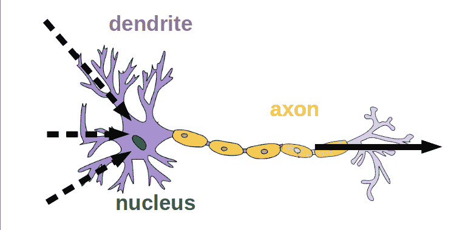
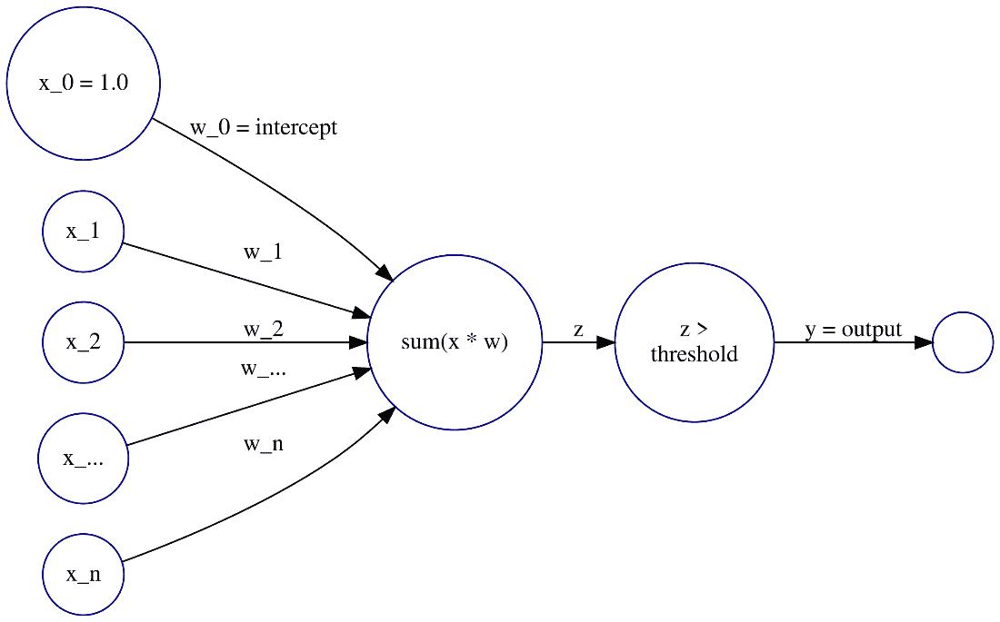
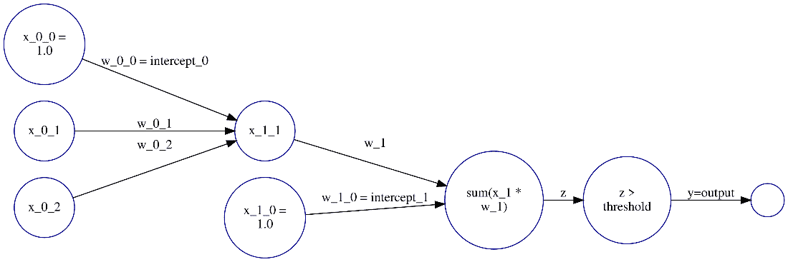
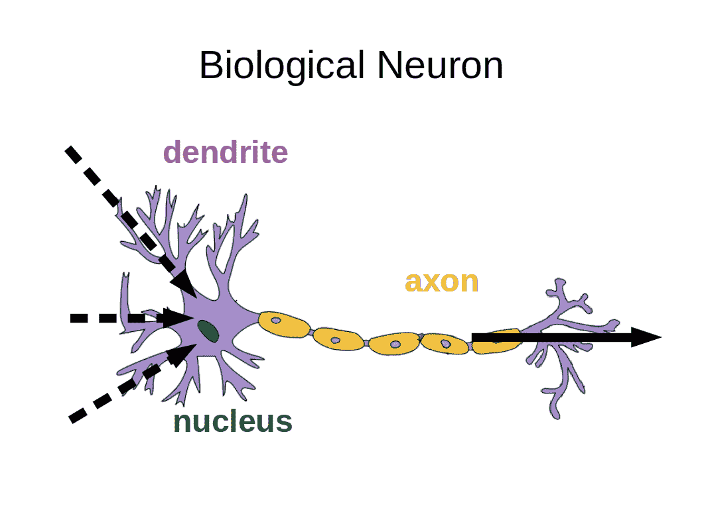
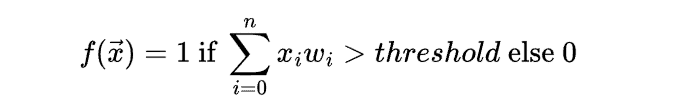
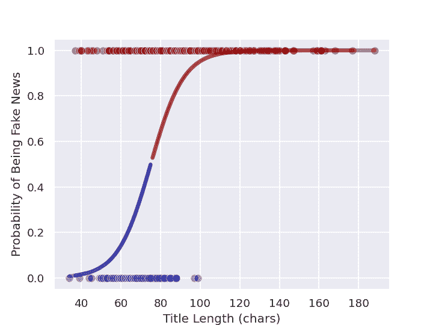
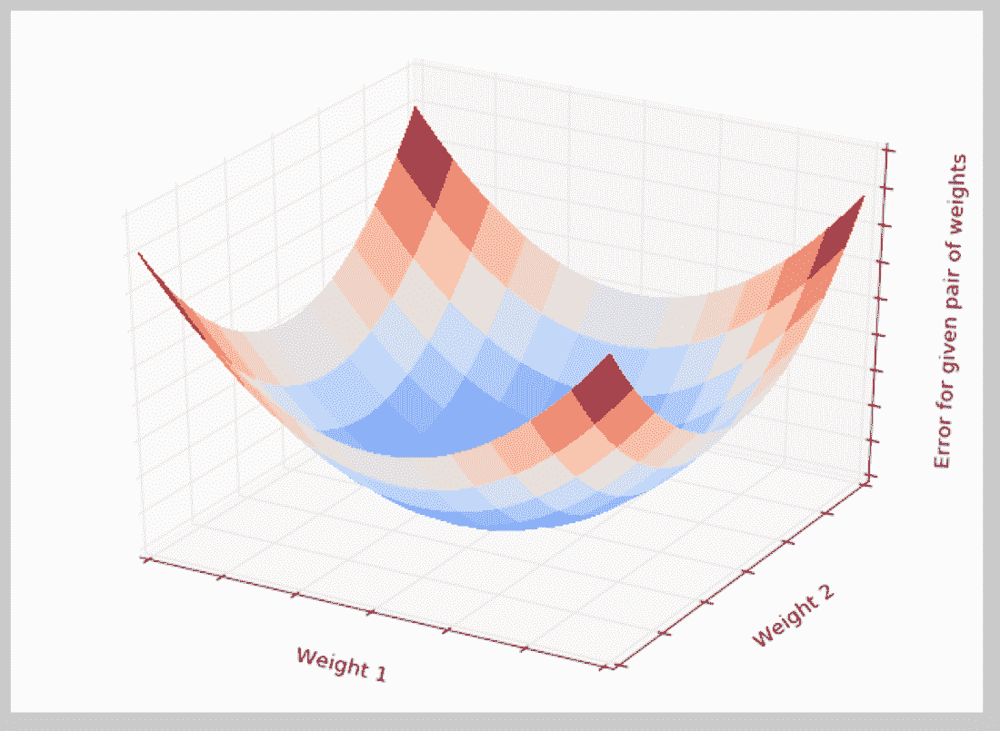
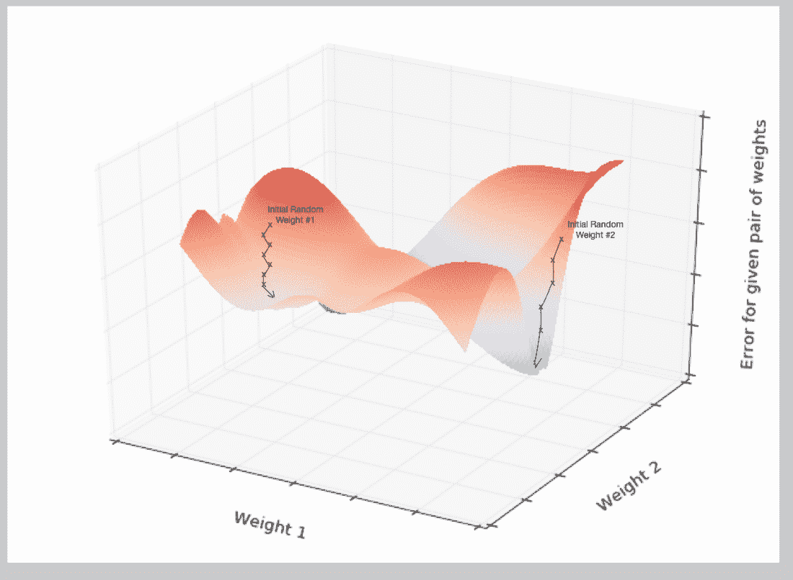

# 第五章：字脑（神经网络）

### 本章包括

+   为你的神经网络构建一个基础层

+   理解反向传播以训练神经网络

+   在 Python 中实现一个基本的神经网络

+   在 PyTorch 中实现一个可扩展的神经网络

+   堆叠网络层以获得更好的数据表示

+   调整你的神经网络以获得更好的性能

当你读到这一章的标题，“字脑”，你的大脑中的神经元开始激活，提醒你在哪里听过类似的东西。现在你读到“听到”这个词，你的神经元可能正在连接标题中的单词与处理单词*声音*的大脑部分。也许，你听觉皮层中的神经元开始将短语“字脑”连接到与之押韵的常见短语，比如“鸟脑”。

即使我的大脑没有很好地预测到你的大脑，你也将要建立一个小脑。你即将构建的“字脑”将比我们人类的大脑好得多，至少对于某些特别困难的自然语言处理任务来说是这样。你将建立一个可以处理单词并预测其意义的微小脑。当神经网络处理的单词是一个人的名字时，它似乎对人类来说*没有意义*。

如果所有关于大脑、预测和单词的谈论让你感到困惑，不要担心。你将从简单开始，只用一个在 Python 中构建的人工神经元。你将使用 PyTorch 处理连接你的神经元到其他神经元并创建人工神经网络所需的所有复杂数学。一旦你理解了神经网络，你就会开始理解*深度学习*，并能够在现实世界中使用它进行有趣的、积极的社会影响，以及... 如果你坚持的话，利润。

## 5.1 为什么使用神经网络？

当你使用深度神经网络进行机器学习时，它被称为*深度学习*。在过去几年里，深度学习已经在许多困难的自然语言处理问题上突破了准确性和智能性的天花板：

+   问答

+   阅读理解

+   总结

+   *自然语言推理*（NLI）

最近，深度学习（深度神经网络）实现了以前难以想象的应用：

+   长时间的、引人入胜的对话

+   陪伴

+   编写软件

最后一个，写软件，尤其有趣，因为 NLP 神经网络正在被用来编写软件……等等……用于 NLP。这意味着人工智能和自然语言处理算法正在接近一天，它们将能够自我复制和自我改进。这使得神经网络成为通向 *人工通用智能*（AGI）的路径，至少是*更*普遍智能机器的一种。NLP 已经被用来直接生成正在推进那些 NLP 算法智能的软件。这种良性循环正在创造出如此复杂和强大的模型，以至于人类很难理解它们，解释它们的工作原理。一篇 OpenAI 文章显示了模型复杂性在 2012 年发生的明显拐点，当时 Geoffrey Hinton 对神经网络架构的改进开始流行起来。自 2012 年以来，用于最大 AI 训练运行的计算量呈指数增长，每 3.4 个月翻一倍。^([1]) 之所以所有这些成为可能，是因为神经网络：

+   对于从少量示例中进行泛化更好

+   可以自动从原始数据中提取特征

+   可以很容易地在任何未标记的文本上进行训练

神经网络为你做特征工程，而且做得非常优秀。它们根据你在管道中设置的问题，提取通常有用的特征和数据的表示。现代神经网络在信息丰富的数据，比如自然语言文本方面尤其表现出色。

### 5.1.1 单词的神经网络

有了神经网络，你不需要猜测专有名词、平均词长或手工制作的词语情感分数是否是你的模型所需要的。你可以避免使用可读性分数，或情感分析器来降低数据的维度。你甚至不需要使用盲目（无监督）的降维方法，如停用词过滤、词干提取、词形还原、LDA、PCA、TSNE 或聚类。一个神经网络的 *小型大脑* 可以为你做到这一切，并且它会根据词与你的目标之间的关系统计学来进行优化。

##### 警告

在你的深度学习管道中不要使用词干提取器、词形还原器或其他基于关键字的预处理，除非你确信它能够帮助你的模型在你的应用中表现更好。

如果你正在进行词干提取、词形还原或基于关键字的分析，你可能想要尝试在没有这些过滤器的情况下运行你的管道。无论你使用的是 NLTK，Stanford Core NLP，还是 SpaCy，手工制作的词汇算法，比如词形还原器，可能没有帮助。这些算法受到手工标记的词汇表和手工制作的正则表达式的限制。

这里有一些预处理算法可能会使你的神经网络遇到困难：

+   波特词干提取器

+   宾夕法尼亚树库词形还原器

+   Flesch-Kincaid 可读性分析器

+   VADER 情感分析器

在机器学习和深度学习的超连通现代世界中，自然语言也发展得太快，这些算法跟不上。词干提取器和词形提取器过度拟合于过去的时代。50 年前，"超连通"和 "过度拟合" 这样的词根本不存在。词形提取器、词干提取器和情感分析器常常对这些未预料到的词做出错误的处理。^([2])

深度学习是自然语言处理的游戏规则改变者。在过去，像朱莉·贝丝·洛文斯（Julie Beth Lovins）这样的杰出语言学家需要手工制作算法来从文本中提取词干、词形和关键词。^([3])（她的单遍词干提取器和词形提取器算法后来被马丁·波特等人所广为人知）^([4]) 深度神经网络现在使所有这些繁琐的工作都变得不必要。它们根据单词的统计信息直接访问单词的含义，而不需要像词干提取器和词形提取器那样脆弱的算法。

即使像第四章的潜在语义分析（LSA）这样的强大特征工程方法也无法匹敌神经网络的 NLU 能力。通过决策树、随机森林和提升树自动学习决策阈值并不提供神经网络的语言理解深度。传统的机器学习算法使全文检索和普遍可访问的知识成为现实。但是具有神经网络的深度学习使得人工智能和智能助手成为可能。你不再需要信息检索专家或图书馆员来找到你想要的东西，你有一个虚拟的图书管理员来协助你。深度学习现在以你之前无法想象的方式推动着你的思维。

深层神经元有什么特点，使得自然语言处理在我们的生活中如此突出？为什么我们现在如此依赖神经机器翻译（NMT）推荐引擎、中间按钮建议（有一个 Subreddit，人们在那里发布完全由他们智能手机的中间按钮建议组成的评论？^([5])), 和自动回复提醒？如果你尝试过数字排毒，你可能会感受到没有 NLP 在幕后帮助你，你就不能完全做自己的这种感觉。而 NLP 神经网络给了我们希望，认为通用人工智能（AGI）已在触手可及范围内。它们承诺允许机器以我们通常的方式学习，只需阅读大量文本。

你学习到的应用于 NLP 的强大力量即将变得更加强大。您需要了解深层次的人工神经元网络如何工作，以确保您的算法造福于社会而不是毁坏它（Stuart Russell 的“Human Compatible AI”阐释了人工智能（AI）和人工智能通用（AGI）的危险和承诺，具有一些有见地的 NLP 示例。）。为了运用这种力量造福于人类，您需要对单个神经元的工作有所了解。

您还需要了解*为什么*它们对许多 NLP 问题如此有效……以及为什么在其他问题上失败得惨不忍睹。

我们希望帮助您摆脱过去使研究人员感到沮丧的“人工智能冬天”。如果将神经网络使用不当，则可能会被一个过度拟合的 NLP（自然语言处理）流水线冻伤，该流水线在您的测试数据上表现良好，但在实际应用中会造成灾难性后果。随着您对神经网络如何工作的了解加深，您将会开始看到如何构建更*强大的 NLP*神经网络。 NLP 问题的神经网络因质量脆弱且容易受到敌意攻击，例如污染（可以从 Robin Jia 的博士学位论文中了解有关如何测量模型的稳健性并改进它的更多信息。^([6])) 但是，首先你必须对单个神经元的工作有所了解。

##### 提示

下面列出了两本关于用神经网络处理自然语言文本的优秀自然语言文本。 您甚至可以使用这些文本来训练深度学习流水线以理解 NLP 的术语。

+   Yoav Goldberg 的 *自然语言处理神经网络模型入门*（`archive.is/BNEgK`）

+   Richard Socher 的 *CS224d：自然语言处理的深度学习*（`web.stanford.edu/class/cs224d/lectures/`）

您可能还想查看 Manning 的 Stephan Raaijmakers 所写的 *深度学习自然语言处理*（`www.manning.com/books/deep-learning-for-natural-language-processing`）

### 5.1.2 神经元作为特征工程师

线性回归、逻辑回归和朴素贝叶斯模型的主要限制之一是它们都需要逐个进行特征工程。你必须在所有可能的文本数字表示方法中找到最好的数字表示形式。然后，您必须参数化一个函数，该函数接受这些经过工程化的特征表示并输出您的预测。只有在此之后，优化器才能开始搜索最佳预测输出变量的参数值。

##### 注意

在某些情况下，您可能希望为您的 NLP 流水线手动创建阈值特征。如果您需要一个可与团队讨论并与现实现象相关联的可解释模型，这将非常有用。要创建一个具有少量工程特征的简化模型，而不使用神经网络，您需要检查每个特征的残差图。当您在特征的特定值处看到残差中断或非线性时，那就是要添加到您的流水线中的好的阈值值。有时，您甚至可以找到您工程阈值和现实世界现象之间的关联。

例如，您在第三章中使用的 TF-IDF 向量表示对信息检索和全文搜索非常有效。但是，在现实世界中，TF-IDF 向量通常无法很好地泛化到语义搜索或 NLU，因为单词以模糊的方式使用或拼写错误。并且第四章中的 PCA 或 LSA 转换可能无法为您的特定问题找到正确的主题向量表示。它们适用于可视化，但对于 NLU 应用来说并非最佳选择。多层神经网络承诺为您进行特征工程，并以某种意义上的最佳方式执行此操作。神经网络搜索更广泛的可能特征工程函数空间。

#### 处理多项式特征爆炸

另一个神经网络可以为您优化的一些特征工程的例子是多项式特征提取（回想一下您上次使用`sklearn.preprocessing.PolynomialFeatures`的情况）。在特征工程期间，您可能会猜想输入和输出之间的关系是二次的。在这种情况下，您会对这些输入特征进行平方，并使用这些新特征重新训练模型，以查看它是否改善了模型在测试集上的准确性。基本上，如果特定特征（预测值减去测试集标签）的残差看起来不像以零为中心的白噪声，那么这就是您利用一些非线性函数来从模型的预测中消除更多误差的机会，比如平方（`*\*2`），立方（`\*\*3`），`sqrt`，`log`，`exp`。您能想到的任何函数都是公平竞争的。您将逐渐培养出一种直觉，帮助您猜测出最能提高准确性的正确函数。如果您不知道哪些相互作用可能对解决问题至关重要，那么您必须将所有特征互相乘起来。

您了解这个兔子洞的深度和广度。可能的四阶多项式特征的数量几乎是无限的。您可以尝试使用 PCA 或 LSA 将 TF-IDF 向量的维度从数万个减少到数百个。但是将四次多项式特征加入其中将会使您的维度远远超过 TF-IDF 向量的维度。

即使有数百万种可能的多项式特征，还有数百万个阈值特征。决策树的随机森林和提升决策树已经发展到一定程度，可以自动进行良好的特征工程。因此，找到合适的阈值特征基本上是一个已解决的问题。但是这些特征表示难以解释，有时在现实世界中的泛化效果不佳。这就是神经网络可以发挥作用的地方。

特征工程的圣杯是找到能够反映真实世界物理的表示。如果你的特征可以根据真实世界现象来解释，你就可以开始建立对其不仅仅是预测性的信心。它可能是一个真正的因果模型，它对于世界是普遍真实的，而不仅仅是对你的数据集。

Peter Woit 解释了现代物理学中可能模型的激增大部分都是*甚至不错*的。[[7]](#_footnotedef_7 "查看脚注") 当你使用 `sklearn.preprocessing.PolynomialFeatures` 时，这些*甚至不错*的模型就是你所创建的。而这是一个真正的问题。这些提取的多项式特征中很少有数百万是物理上可能的。换句话说，绝大多数多项式特征只是噪音。[[8]](#_footnotedef_8 "查看脚注") 因此，如果在预处理中使用 `PolynomialFeatures`，请将 `degree` 参数限制为 `2` 或更低。

##### 重要提示

对于任何机器学习流水线，确保你的多项式特征永远不包括超过 2 个物理量的乘积。如果你决定尝试高于二次的多项式特征，可以通过滤除不可实现（幻想）的三路交互特征来减少困扰。例如，`x1 * x2 \** 2` 是一个合法的三次多项式特征，但 `x1 * x2 * x3` 不是。涉及超过两个特征之间交互（乘法）的多项式特征在物理上是不可实现的。移除这些“幻想特征”将提高你的 NLP 流水线的鲁棒性，并帮助你减少生成模型产生的任何幻觉。

我们希望到目前为止你已经受到了神经网络所提供的可能性的启发。让我们开始我们的神经网络之旅，构建类似逻辑回归的单个神经元。最终，你将能够组合和堆叠这些神经元，以优化特征工程。

### 5.1.3 生物神经元

弗兰克·罗森布拉特根据自己对大脑中生物神经元工作原理的理解提出了第一个基于人工神经网络的模型。他将其称为感知器，因为他使用它来帮助机器利用传感器数据感知其环境。[[9]](#_footnotedef_9) 他希望这些感知器通过消除手工设计的滤波器从数据中提取特征的需要来革新机器学习。他还希望自动化找到任何问题的正确功能组合的过程。

他希望使工程师能够构建 AI 系统，而无需为每个问题设计专门的模型。当时，工程师们使用线性回归、多项式回归、逻辑回归和决策树来帮助机器人做出决策。罗森布拉特的感知器是一种新型的机器学习算法，它可以近似任何函数，不仅仅是一条线、一个逻辑函数或一个多项式。[[10]](#_footnotedef_10)

##### 图 5.1 生物神经元细胞



罗森布拉特在成功的逻辑回归模型的漫长历史上进行了改进。他略微修改了优化算法，以更好地模拟神经科学家对生物神经元如何随着时间调整其对环境的响应的理解。

电信号通过*树突*（见图 5.1）流入你大脑中的生物神经元，然后进入细胞核。细胞核积累电荷并随着时间的推移逐渐增加。当细胞核中积累的电荷达到特定神经元的激活水平时，它通过*轴突*发出电信号。然而，神经元并非完全相同。你大脑中的神经元的树突对某些输入的神经元更“敏感”而对其他输入的神经元则不那么“敏感”。细胞核本身可能具有较高或较低的激活阈值，这取决于其在大脑中的功能。因此，对于一些更敏感的神经元，输入的信号量较少即可触发通过轴突发送输出信号。

因此，你可以想象神经科学家如何通过对真实神经元进行实验来测量单个树突和神经元的敏感性。这种敏感性可以被赋予数值。罗森布拉特的感知器将这种生物神经元抽象化，创建了一个与每个输入（树突）相关联的*权重*的人工神经元。对于人工神经元，例如罗森布拉特的感知器，我们将单个树突的敏感性表示为该特定路径的数值*权重*或*增益*。生物细胞在决定何时触发时加权输入信号。更高的权重代表对输入的小变化更敏感。

生物神经元会在其生命周期中动态地改变这些权重，在决策过程中。您将使用称为*反向传播*的机器学习过程来模仿这种生物学习过程。

##### 图 5.2 基本感知器



AI 研究人员希望用更模糊、更泛化的神经网络逻辑来取代 logistic 回归、线性回归和多项式特征提取的严格数学 —— 小型大脑。Rosenblatt 的人工神经元甚至可以处理三角函数和其他高度非线性函数。每个神经元解决问题的一部分，并且可以与其他神经元结合来学习更加复杂的函数。（尽管并非所有的都行 - 即使是简单的函数，比如 XOR 门，也不能用单层感知器解决）。他把这些人工神经元的集合称为感知器。

Rosenblatt 当时并没有意识到，但他的人工神经元可以像生物神经元一样被层叠起来，连接成簇。在现代* 深度学习* 中，我们将一个组神经元的预测连接到另一个组神经元以细化预测。这使我们能够创建层叠网络，可以模拟*任何*函数。如果您有足够的时间和数据，它们现在可以解决任何机器学习问题……。 

##### 图 5.3 神经网络层



### 5.1.4 感知器

神经元处理的最复杂的事情之一就是语言处理。想象一下感知器如何用于处理自然语言文本。图 5.2 中显示的数学内容让您想起了以前使用过的任何机器学习模型吗？您知道哪些机器学习模型将输入特征与权重或系数向量相乘吗？好吧，那将是一个线性回归。但是如果您在线性回归的输出上使用 sigmoid 激活函数或 logistic 函数呢？对我来说，它开始看起来很像* logistic 回归*。

在感知器中使用的 sigmoid *激活函数*实际上与 logistic 回归中使用的逻辑函数相同。Sigmoid 只是表示 s 形状。逻辑函数正好具有我们用于创建软阈值或逻辑二进制输出的形状。因此，你的神经元在这里实际上相当于对输入进行 logistic 回归。

这是 Python 中实现的逻辑函数的公式。

```py
>>> def logistic(x, w=1., phase=0, gain=1):
...    return gain / (1\. + np.exp(-w * (x - phase)))
```

这是逻辑函数的样子，以及系数（权重）和相位（截距）如何影响其形状。

```py
>>> import pandas as pd
>>> import numpy as np
>>> import seaborn as sns
>>> sns.set_style()

>>> xy = pd.DataFrame(np.arange(-50, 50) / 10., columns=['x'])
>>> for w, phase in zip([1, 3, 1, 1, .5], [0, 0, 2, -1, 0]):
...    kwargs = dict(w=w, phase=phase)
...    xy[f'{kwargs}'] = logistic(xy['x'], **kwargs)
>>> xy.plot(grid="on", ylabel="y")
```

在前几章中，当你对自然语言句子进行逻辑回归时，你的输入是什么？你首先用关键词检测器、`CountVectorizer` 或 `TfidfVectorizer` 处理文本。这些模型使用分词器，就像你在第二章中学到的那些，将文本分割成单个词，并对其进行计数。因此，对于自然语言处理，使用 BOW 计数或 TF-IDF 向量作为 NLP 模型的输入是很常见的，这对神经网络也是如此。

Rosenblatt 的每个输入权重（生物树突）都有一个用于该信号的权重或敏感性的可调值。Rosenblatt 使用电位计实现了这个权重，就像老式立体声接收机上的音量旋钮一样。这使得研究人员能够手动调整神经元对其每个输入的敏感性。通过调整这个敏感性旋钮，感知器可以对 BOW 或 TF-IDF 向量中每个词的计数更敏感或不太敏感。

一旦某个特定词的信号根据其敏感性或权重增加或减少，它就会传入生物神经元细胞的主体。就在这里，在感知器的主体部分，以及在真正的生物神经元中，输入信号被加在一起。然后，该信号通过类似于 S 型函数的软阈值函数传递，然后将信号发送到轴突。如果信号高于某个阈值，生物神经元只会 *激活*。感知器中的 S 型函数只是使得在最小-最大范围的 50% 处实现该阈值变得容易。如果对于给定的词组或输入信号，神经元不激活，这意味着它是一个负分类匹配。

### 5.1.5 一个 Python 感知器

因此，机器可以通过将数字特征与 "权重" 相乘，并将它们组合在一起来模拟一个非常简单的神经元，以创建预测或做出决策。这些数值特征代表你的对象作为机器可以 "理解" 的数值向量。对于 Zillow 的 zestimate 的房价预测问题，你认为他们可能如何构建一个仅基于 NLP 的模型来预测房价？但是，你如何将房屋的自然语言描述表示为数字向量，以便你可以预测它的价格呢？你可以采用房屋的口头描述，并将每个词的计数作为特征，就像你在第二章和第三章中所做的那样。或者，你可以像在第四章中使用 PCA 那样，将这些成千上万的维度压缩成主题向量。

但这些方法只是根据每个特征的可变性或方差猜测哪些特征是重要的。也许描述中的关键词是房屋面积和卧室数量的数值。你的词向量和主题向量会完全忽略这些数值。

在"正常"的机器学习问题中，比如预测房价，您可能会有结构化的数值数据。通常会有一张列出所有重要特征的表格，比如房屋面积、上次售价、卧室数量，甚至纬度和经度或邮政编码。但是对于自然语言问题，我们希望您的模型能够处理非结构化数据，即文本。您的模型必须准确地找出哪些单词以及以何种组合或顺序对目标变量具有预测能力。您的模型必须阅读房屋描述，并像人脑一样猜测房价。而神经网络是您能找到的最接近模仿人类直觉的机器。

深度学习的美妙之处在于您可以使用您可以想象到的每一个可能的特征作为输入。这意味着您可以输入整个文本描述，并且您的转换器可以生成一个高维的 TF-IDF 向量，而神经网络可以很好地处理它。您甚至可以更高维度地使用它。您可以将原始、未经过滤的文本作为单词的 1-hot 编码序列传递。您还记得我们在第二章谈到的钢琴卷吗？神经网络就是为这种原始的自然语言数据表示而生的。

#### 浅层学习

对于您的第一个深度学习自然语言处理问题，您将保持表面。要理解深度学习的魔力，看看单个神经元如何工作会有所帮助。单个神经元将为输入模型的每个特征找到一个*权重*。您可以将这些权重视为输入神经元的信号的百分比。如果您熟悉线性回归，那么您可能会认出这些图表，并且可以看到权重只是线性回归的斜率。如果你加上了一个 logistic 函数，这些权重就是逻辑回归从您的数据集中学到的系数。换句话说，单个神经元的输入权重在数学上等同于多元线性回归或逻辑回归中的斜率。

##### 提示

就像 Scikit-Learn 机器学习模型一样，各个特征被表示为`x[i]`或在 Python 中表示为`x[i]`。*i*表示输入向量中的位置。给定示例的所有特征的集合都在向量**x**中。

`x = x[1], x[2], …​, x[i], …​, x[n]`

同样地，您将看到每个特征的关联权重为 w[i]，其中*i*对应于 x 中的整数。权重通常表示为向量**W**

`w = w[1], w[2], …​, w[i], …​, w[n]`

有了特征之后，您只需将每个特征（x[i]）与相应的权重（w[i]）相乘，然后求和。

`y = (x[1] * w[1]) + (x[2] * w[2]) + …​ + (x[i] * w[i])`

这里有一个有趣的简单示例，以确保您理解这个数学。想象一个由短语"green egg egg ham ham ham spam spam spam spam"构成的 BOW 向量：

```py
>>> from collections import Counter

>>> np.random.seed(451)
>>> tokens = "green egg egg ham ham ham spam spam spam spam".split()
>>> bow = Counter(tokens)
>>> x = pd.Series(bow)
>>> x
green    1
egg      2
ham      3
spam     4
```

```py
>>> x1, x2, x3, x4 = x
>>> x1, x2, x3, x4
(1, 2, 3, 4)
```

```py
>>> w0 = np.round(.1 * np.random.randn(), 2)
>>> w0
0.07
>>> w1, w2, w3, w4 = (.1 * np.random.randn(len(x))).round(2)
>>> w1, w2, w3, w4
(0.12, -0.16, 0.03, -0.18)
```

```py
>>> x = np.array([1, x1, x2, x3, x4])  # #1
>>> w = np.array([w0, w1, w2, w3, w4])  # #2
>>> y = np.sum(w * x)  # #3
>>> y
-0.76
```

这个 4 输入、1 输出、单神经元网络在一个尚未经过训练的神经元中针对这些随机权重输出了一个值为 -0.76。

这里还有一件你错过的事情。你需要在输出（`y`）上运行一个非线性函数，以改变输出的形状，使其不仅仅是线性回归。通常使用阈值或截断函数来决定神经元是否应该触发。对于阈值函数，如果加权和超过某个阈值，感知器输出 1。否则，输出 0。你可以用一个简单的*步骤函数*（在图 5.2 中标记为"激活函数"）来表示这个阈值。

这是将步骤函数或阈值函数应用于你的神经元输出的代码：

```py
>>> threshold = 0.0
>>> y = int(y > threshold)
```

如果你希望你的模型输出连续的概率或可能性，而不是二进制的`0`或`1`，你可能希望使用我们在本章前面介绍的逻辑激活函数。^([11])

```py
>>> y = logistic(x)
```

神经网络就像任何其他的机器学习模型一样——你向其提供输入（特征向量）和输出（预测）的数字示例来训练它。就像传统的逻辑回归一样，神经网络将使用试错法来找到在输入上的权重，从而产生最佳预测。你的*损失函数*将衡量模型的误差有多大。

确保你能理解这个神经元中的数学在 Python 实现中是否合理。请记住，我们编写的代码仅用于神经元的*前向传播*路径。这个数学在 Scikit-Learn 中的`LogisticRegression.predict()`函数中的逻辑回归的 4 输入、1 输出中是非常相似的。^([12])

##### 注意

一个*损失函数*是一个输出评分的函数，用于衡量模型的糟糕程度，即其预测的总误差。一个*目标函数*仅根据误差的大小来衡量模型的好坏。*损失函数*就像学生在测试中答错的问题的百分比。*目标函数*就像那个测试的等级或百分比分数。你可以使用任何一个来帮助你学会正确答案，并在你的测试中变得越来越好。

#### 为什么额外的权重？

你有没有注意到你有一个额外的权重，`w0`？没有标记为`x0`的输入。那么为什么会有一个`w0`？你能猜到为什么我们总是给我们的神经元一个常数值为"1.0"的输入信号作为`x0`吗？回想一下你过去构建的线性回归和逻辑回归模型。你还记得单变量线性回归公式中的额外系数吗？

```py
y = m * x + b
```

`y`变量是模型的输出或预测。`x`变量是这个模型中的单个独立特征变量。你可能还记得`m`代表斜率。但你还记得`b`是干什么的吗？

```py
y = slope * x + intercept
```

现在你能猜到额外的权重`w[0]`是用来干什么的，为什么我们总是确保它不受输入的影响（将其乘以一个 1.0 的输入）吗？

```py
w0 * 1.0 + w1 * x1 + ... + (x_n * w_n)
```

这是你线性回归的*截距*，只是作为神经网络这一层的*偏差*权重(`w0`)重新包装了一下。

图 5.2 和这个例子提到了*偏差*。这是什么？偏差是神经元的一个“始终存在”的输入。神经元有一个专门的权重与它相关联，就像输入的每个其他元素一样，并且该权重与其他权重一样被训练。这在围绕神经网络的各种文献中以两种方式表示。你可能会看到输入表示为基本输入向量，比如*n*个元素，其前面或后面附加了一个 1，从而给出一个*n*+1 维向量。其中一个的位置对网络来说是无关紧要的，只要它在所有样本中保持一致即可。其他时候，人们假设偏差项的存在并将其从图表中省略，但与之相关联的权重存在并且总是乘以 1 并添加到样本输入的值及其相关权重的点积中。两者实际上是一样的。

之所以要有偏差权重，是因为你需要神经元对所有零输入都具有弹性。也许网络需要学习在面对零输入时输出 0，但也可能不需要。如果没有偏差项，神经元将对任何你开始或尝试学习的权重都输出 0 * 权重 = 0。有了偏差项，你就不会遇到这个问题。并且如果神经元需要学会输出 0，那么神经元可以学会递减与偏差项相关联的权重，以使点积保持在阈值以下。

图 5.3 是对比较生物神经元内部信号与用于深度学习的人工神经元信号之间类比的一种相当简洁的可视化。如果你想深入理解，想一想你是如何使用生物神经元来阅读这本关于自然语言处理的书来学习深度学习。

##### 图 5.4 感知器和生物神经元



最简单的单个神经元的 Python 代码如下：

```py
>>> def neuron(x, w):
...    z = sum(wi * xi for xi, wi in zip(x, w))  # #1
...    return z > 0  # #2
```

或许你更熟悉 numpy 和*向量化*的数学操作，就像你在线性代数课上学到的那样。

```py
>>> def neuron(x, w):
...    z = np.array(wi).dot(w)
...    return z > 0
```

##### 注意

任何 Python 条件表达式都会评估为一个`True`或`False`布尔值。如果你在数学运算中使用`bool`类型，比如加法或乘法，Python 将会将`True`值强制转换为数值型`int`或`float`值，即`1`或`1.0`。当你将布尔值与另一个数字相乘或相加时，`False`值会被强制转换为`1`或`0`。

变量`w`包含模型的权重参数向量。这些值在训练期间，当神经元的输出与期望输出进行比较时，将会被学习。变量`x`包含进入神经元的信号值向量。这是特征向量，比如自然语言模型的 TF-IDF 向量。对于生物神经元，输入是通过树突传播的电脉冲的速率。一个神经元的输入通常是来自另一个神经元的输出。

##### 提示

输入（`x`）和权重（`w`）的成对乘积之和恰好等于两个向量`x`和`y`的点积。如果你使用 numpy，一个神经元可以用一个简短的 Python 表达式实现：`w.dot(x) > 0`。这就是为什么*线性代数*对于神经网络非常有用的原因。神经网络主要是参数和输入的点积。而 GPU 是专门设计用于并行执行所有这些点积的乘法和加法的计算处理芯片，每个 GPU 核心上执行一次操作。因此，一个 1 核心 GPU 通常比一个 4 核心 CPU 执行点积快 250 倍。

如果你熟悉数学的自然语言，你可能更喜欢使用总和符号表示：

**方程 5.1：阈值激活函数**



你的感知器还没有*学习*任何东西。但你已经实现了一些非常重要的东西。你已经将数据传递到模型中并收到了一个输出。考虑到你没有提到权重值来自哪里，这个输出很可能是错误的。但这就是事情变得有趣的地方。

##### 提示

任何神经网络的基本单位都是神经元。基本感知器是更广义的神经元的特殊情况。我们暂时将感知器称为神经元，并在不适用时再回到术语。

## 5.2 示例逻辑神经元

结果表明，你已经对一种非常常见的感知器或神经元很熟悉了。当你在神经元上使用逻辑函数作为*激活函数*时，你实际上创建了一个逻辑回归模型。一个使用逻辑函数作为其激活函数的单个神经元，在数学上等价于 Scikit-Learn 中的`LogisticRegression`模型。唯一的区别在于它们的训练方式。所以你首先要训练一个逻辑回归模型，并将其与在相同数据上训练的单个神经元神经网络进行比较。

### 5.2.1 点击诱饵的物流

软件（和人类）通常需要根据逻辑标准做出决定。例如，你可能每天都要决定是否点击特定的链接或标题。有时这些链接会引导你进入一篇虚假新闻文章。因此，你的大脑学会了一些逻辑规则，它在点击特定链接之前遵循这些规则。

+   这是你感兴趣的话题吗？

+   链接看起来是宣传性的还是垃圾邮件？

+   它来自你喜欢的可靠来源吗？

+   它看起来是真实的还是事实的？

这些决定中的每一个都可以在机器内的人工神经元中建模。你可以使用该模型创建电路板上的逻辑门或软件中的条件表达式（`if`语句）。如果你使用人工神经元进行这些操作，那么用来处理这 4 个决定的最小人工“大脑”将使用 4 个逻辑回归门。

想要模仿你大脑中的*点击率*过滤器，你可能会决定对新闻标题的长度进行逻辑回归模型训练。也许你有一种直觉，认为更长的标题更有可能是耸人听闻和夸张的。下面是假新闻和真实新闻标题以及它们的字符长度的散点图。

在图 5.3 的逻辑回归图中，对于具有单个特征（标题长度）的假新闻分类器，神经元输入权重等于中间最大斜率。

##### 图 5.5 逻辑回归 - 虚假与标题长度



### 5.2.2 性教育

点击率怎么样？因为假新闻（点击率）数据集在 Kaggle 上已经充分利用，所以你将转而使用一个更有趣和有用的数据集。你将使用感知器（人工神经元）来预测一个名字的性别。

你要用这个简单的架构解决的问题是大脑的数百万神经元每天都试图解决的日常自然语言理解问题。你的大脑强烈地激励于识别你在社交媒体上与之互动的人的出生性别。（如果你对此感兴趣，理查德·麦克尔雷斯和罗伯特·博伊德有一本关于这个主题的引人入胜的书。^([13])) 一个单一的人工神经元可以使用一个人的名字中的字符来解决这个挑战，准确率约为 80%。你将使用来自美国各州和领土超过 100 年的 3.17 亿出生证明的数据库中的名字样本。

从生物学上讲，识别某人的性别对你的基因是有用的，因为只有通过找到性伴侣将你的基因与之融合，它们才能存活。与其他人类的社交互动对你的基因的存在和生存至关重要。而你的基因是你大脑的蓝图。因此，你的大脑很可能至少包含一些专门用于这一关键任务的神经元。你将找出预测与婴儿名字（名字）相关的性别需要多少人工神经元。

##### 性别

这里的“性别”一词指的是医生在婴儿出生时分配的标签。在美国，根据法律规定，出生证明上记录了姓名、性别和出生日期。性别类别由填写和签署出生证明的人员进行解释和判断。在源自美国出生证明的数据集中，“出生时的性别”通常等同于一个人的遗传性别，但情况并非总是如此。可以根据 XX 染色体（女性）或 XY 染色体（男性）的存在创建一个相对明确的“遗传性别”类别。但是生物学和生活有一种模糊即使是这种看似精确的“遗传性别”定义的界限的方式。

男性和女性并不是“出生性别”分类的最后一句话。美国疾病控制中心（CDC）建议，美国核心数据互操作性（USCDI）标准包括几个非二元性别类别，用于临床或医学用途。除了“女性”和“男性”之外，“未知”和“未列出的其他内容（请具体说明）”是大多数西方医疗系统推荐的类别。

确保你的测试集名称在训练集中没有出现。你还要确保你的测试集中每个名称只有一个“正确”的标签。但这并不是你想象的那样。任何特定名称都没有一个正确的二元性别标签。事实上，根据出生证明上具有特定性别标识的名称计数的比率，存在一个关于名称的雌雄性别的正确概率分数（连续值）。但是，随着您向数据集添加新示例，该“正确”分数将发生变化。自然语言处理是混乱而流动的，因为自然界及其描述语言是动态的，不可能“固定不变”。

这将使您的模型从理论上讲可以达到 100%的准确率。显然，对于一个即使人类也无法达到 100%准确率的问题来说，这并不真实。但是，只有删除测试集中的重复名称，您才能了解您距离理想状态有多接近。

### 5.2.3 代词和性别与性别

美国的一些州允许在出生证明上指示他们的孩子的*性别*。性别通常是人们用来决定他们喜欢什么代词的依据。人们对待自己的性别有各种各样的方式。有他们展示给世界的显而易见的性别，也有他们在生活的不同阶段为自己分配的性别认同。识别这两种性别中的任何一种都是一个敏感的话题，因为它带有法律和社会的影响。在许多压抑的文化中，甚至可能是生死攸关的问题。而对于机器学习算法来说，性别是一个非常难以预测的东西。对于本章节，我们利用了一个简化的二进制性别数据集来准备你从零开始构建自然语言处理技能所需的脚手架。

即使对于不需要传播基因的机器来说，性别估计模型也有实际用途。性别估计模型可以用来解决自然语言处理中一个重要而困难的挑战，称为*共指消解*。^([16]) 共指消解是指当自然语言处理算法识别出与代词在自然语言文本中相关的对象或词语时。例如，请考虑以下句子中的代词："玛丽亚出生在乌克兰。她的父亲是一位物理学家。15 年后她离开了那里去了以色列。"你可能没有意识到，但你在一眨眼的功夫就解决了三个共指。你的大脑对于"玛丽亚"是"她/她"和"乌克兰"是"那里"的概率进行了统计。

共指消解对于机器或人类来说并不总是那么容易。在没有性别的语言中，进行这个过程更加困难。在那些不区分人和无生命物体的代词语言中，这可能更加困难。即使是没有性别的英语有时也会随意给重要的事物分配性别，比如帆船。船只被称为"她"和"她的"。它们通常会被赋予女性的名字。

了解文本中人名（和船只名）所关联的性别，对于改善你的自然语言理解管道很有帮助。即使当这种性别辨识是一个贫乏的指示器来表明文本中提到的人的性别时，这也是有帮助的。文本的作者通常期望你根据名字来对性别和性别进行假设。在变性科幻小说中，像吉布森这样的有远见的作者利用这一点来让你警惕，并拓展你的思维。^([17])

##### 重要

确保您的 NLP 流水线和聊天机器人对所有人类都是友好、包容和可访问的。为了确保您的算法是无偏的，您可以 *规范化* 处理的文本数据中的任何性别和性别信息。在下一章中，您将看到性别和性别如何影响您的算法做出的决策的所有令人惊讶的方式。您还将看到性别如何影响您每天处理的企业或雇主的决策。

### 5.2.4 性别信息学

首先，导入 Pandas 并设置 `max_rows` 以仅显示您的 `DataFrame` 的几行。

```py
>>> import pandas as pd
>>> import numpy as np
>>> pd.options.display.max_rows = 7
```

现在从 `nlpia2` 存储库下载原始数据并仅采样 10000 行，以使任何计算机都可以快速运行。

```py
>>> np.random.seed(451)
>>> df = pd.read_csv(  # #1
...     'https://proai.org/baby-names-us.csv.gz')
>>> df.to_csv(  # #2
...     'baby-names-us.csv.gz', compression='gzip')
>>> df = df.sample(10_000)  # #3
>>> df.shape
(10000, 6)
```

数据覆盖美国出生证书超过 100 年，但仅包括婴儿的名字：

|  | 地区 | 性别 | 年份 | 名字 | 数量 | 频率 |
| --- | --- | --- | --- | --- | --- | --- |
| 6139665 | WV | 女 | 1987 | Brittani | 10 | 0.000003 |
| 2565339 | MD | 女 | 1954 | Ida | 18 | 0.000005 |
| 22297 | AK | 男 | 1988 | Maxwell | 5 | 0.000001 |
| …​ | …​ | …​ | …​ | …​ | …​ | …​ |
| 4475894 | OK | 女 | 1950 | Leah | 9 | 0.000003 |
| 5744351 | VA | 女 | 2007 | Carley | 11 | 0.000003 |
| 5583882 | TX | 男 | 2019 | Kartier | 10 | 0.000003 |

您现在可以忽略地区和出生年份信息。您只需要使用自然语言名称就可以以合理的准确性预测性别。如果您对名字感到好奇，您可以将这些变量探索为特征或目标。您的目标变量将是性别（'M'或'F'）。除男性和女性外，此数据集中没有提供其他性别分类。

您可能会喜欢探索数据集，以发现父母为他们的宝宝选择名字的频率。机器学习和 NLP 是消除成见和误解的好方法。

```py
>>> df.groupby(['name', 'sex'])['count'].sum()[('Timothy',)]
sex
F       5
M    3538
```

这就是 NLP 和数据科学如此有趣的原因。它为我们提供了一个更广泛的世界视角，打破了我们生物大脑的有限视角。我从来没有见过一个叫“Timothy”的女人，但在美国出生证书上的至少 0.1%的婴儿名字为 Timothy 的是女性。

如果地区和年份不是名称的要素，不需要预测，可以在跨地区和年份聚合（组合）数据以加快模型训练。您可以使用 Pandas 的 `DataFrame's .groupby()` 方法来实现这一点。

```py
>>> df = df.set_index(['name', 'sex'])
>>> groups = df.groupby(['name', 'sex'])
>>> counts = groups['count'].sum()
>>> counts
name    sex
Aaden   M      51
Aahana  F      26
Aahil   M       5
               ..
Zvi     M       5
Zya     F       8
Zylah   F       5
```

因为我们已经聚合了 "count" 列的数字数据，所以 `counts` 对象现在是 Pandas 的 `Series` 对象，而不是 `DataFrame`。它看起来有点奇怪，因为我们在名称和性别上创建了多级

现在数据集看起来像是训练逻辑回归的有效示例集。实际上，如果我们只想预测该数据库中的名称可能的性别，我们可以仅使用每个名称的最大计数（最常用法）。

但这是一本关于 NLP 和 NLU（自然语言理解）的书。你希望你的模型以某种方式*理解*姓名的文本。而且你希望它能够处理不在这个数据库中的奇怪姓名，比如"Carlana"，一个由她的祖父母"Carl"和"Ana"组成的混合词，或者像"Cason"这样的独一无二的姓名。不在你的训练集或测试集中的示例被称为"分布外"。在现实世界中，你的模型几乎总是会遇到以前从未见过的词语和短语。当一个模型能够推广到这些分布外示例时，这被称为"泛化"。

但是你如何对一个单词像一个姓名进行标记化，以便你的模型可以泛化到完全新的虚构的从未见过的名字？你可以使用每个单词（或姓名）中的字符 n-gram 作为你的标记。你可以设置一个`TfidfVectorizer`来计算字符和字符 n-gram 而不是单词。你可以尝试更宽或更窄的`ngram_range`，但对于大多数基于 TF-IDF 的信息检索和 NLU 算法来说，3-gram 是一个不错的选择。例如，最先进的数据库 PostgreSQL 将其全文搜索索引默认设置为字符 3-gram。在后面的章节中，你甚至将使用词块和句子块标记化，它们可以选择最佳的字符序列作为你的标记。

```py
>>> from sklearn.feature_extraction.text import TfidfVectorizer
>>> vectorizer = TfidfVectorizer(
...     use_idf=False,  # #1
...     analyzer='char',
...     ngram_range=(1, 3)  # #2
...     )
>>> vectorizer
TfidfVectorizer(analyzer='char', ngram_range=(1, 3), use_idf=False)
```

你应该按照文档频率来归一化标记计数，例如出生率。你将使用出生率来计算。对于姓名 TF-IDF 向量，你希望使用出生率或人口作为*文档*频率。这将帮助你的向量表示语料库之外的姓名频率。

现在你已经通过姓名*和*性别对我们的`names`系列进行了索引，跨州和年份聚合计数，你的`Series`中将会有更少的唯一行。在计算 TF-IDF 字符 n-gram 术语频率之前，你可以去重姓名。不要忘记跟踪出生证明的数量，以便将其用作文档频率。

```py
>>> df = pd.DataFrame([list(tup) for tup in counts.index.values],
...                   columns=['name', 'sex'])
>>> df['count'] = counts.values
>>> df
        name sex  counts
0      Aaden   M      51
1     Aahana   F      26
2      Aahil   M       5
...      ...  ..     ...
4235     Zvi   M       5
4236     Zya   F       8
4237   Zylah   F       5

[4238 rows x 3 columns]
```

你已经将 10,000 个姓名-性别对聚合成了只有 4238 个唯一的姓名-性别配对。现在你可以将数据分割成训练集和测试集了。

```py
>>> df['istrain'] = np.random.rand(len(df)) < .9
>>> df
        name sex  counts  istrain
0      Aaden   M      51     True
1     Aahana   F      26     True
2      Aahil   M       5     True
...      ...  ..     ...      ...
4235     Zvi   M       5     True
4236     Zya   F       8     True
4237   Zylah   F       5     True
```

为了确保你不会意外地交换任何姓名的性别，重新创建`name, sex`的多索引：

```py
>>> df.index = pd.MultiIndex.from_tuples(
...     zip(df['name'], df['sex']), names=['name_', 'sex_'])
>>> df
               name sex  count  istrain
name_  sex_
Aaden  M      Aaden   M     51     True
Aahana F     Aahana   F     26     True
Aahil  M      Aahil   M      5     True
...             ...  ..    ...      ...
Zvi    M        Zvi   M      5     True
Zya    F        Zya   F      8     True
Zylah  F      Zylah   F      5     True
```

正如你之前看到的，这个数据集对许多姓名包含冲突的标签。在现实生活中，许多姓名都被用于男性和女性婴儿（或其他人类性别类别）。像所有的机器学习分类问题一样，数学将其视为回归问题。模型实际上是在预测一个连续值，而不是离散的二进制类别。线性代数和现实生活只适用于实值。在机器学习中，所有的二分法都是错误的。^([18]) 机器不会将单词和概念视为严格的类别，因此你也不应该这样做。

```py
>>> df_most_common = {}  # #1
>>> for name, group in df.groupby('name'):
...     row_dict = group.iloc[group['count'].argmax()].to_dict()  # #2
...     df_most_common[(name, row_dict['sex'])] = row_dict
>>> df_most_common = pd.DataFrame(df_most_common).T  # #3
```

由于重复，测试集标志可以从`istrain`的非运算中创建。

```py
>>> df_most_common['istest'] = ~df_most_common['istrain'].astype(bool)
>>> df_most_common
            name sex count istrain  istest
Aaden  M   Aaden   M    51    True   False
Aahana F  Aahana   F    26    True   False
Aahil  M   Aahil   M     5    True   False
...          ...  ..   ...     ...     ...
Zvi    M     Zvi   M     5    True   False
Zya    F     Zya   F     8    True   False
Zylah  F   Zylah   F     5    True   False

[4025 rows x 5 columns]
```

现在你可以将`istest`和`istrain`标志传递到原始数据框中，要小心，对于训练集和测试集，将`NaNs`填充为 False。

```py
>>> df['istest'] = df_most_common['istest']
>>> df['istest'] = df['istest'].fillna(False)
>>> df['istrain'] = ~df['istest']
>>> istrain = df['istrain']
>>> df['istrain'].sum() / len(df)
0.9091...  # #1
>>> df['istest'].sum() / len(df)
0.0908...  # #2
>>> (df['istrain'].sum() + df['istest'].sum()) / len(df)
1.0
```

现在你可以使用训练集来适应`TfidfVectorizer`，而不会因为重复的名称而使 n-gram 计数偏差。

```py
>>> unique_names = df['name'][istrain].unique()
>>> unique_names = df['name'][istrain].unique()
>>> vectorizer.fit(unique_names)
>>> vecs = vectorizer.transform(df['name'])
>>> vecs
<4238x2855 sparse matrix of type '<class 'numpy.float64'>'
    with 59959 stored elements in Compressed Sparse Row format>
```

当使用稀疏数据结构时，你需要小心。如果你用`.todense()`将它们转换为普通的稠密数组，可能会因为使用了所有的内存而导致计算机崩溃。但是这个稀疏矩阵只包含大约 1700 万个元素，所以它应该可以在大多数笔记本电脑上正常工作。你可以对稀疏矩阵使用`toarray()`来创建一个数据框，并为行和列提供有意义的标签。

```py
>>> vecs = pd.DataFrame(vecs.toarray())
>>> vecs.columns = vectorizer.get_feature_names_out()
>>> vecs.index = df.index
>>> vecs.iloc[:,:7]
               a        aa  aac       aad       aah  aak  aal
Aaden   0.175188  0.392152  0.0  0.537563  0.000000  0.0  0.0
Aahana  0.316862  0.354641  0.0  0.000000  0.462986  0.0  0.0
Aahil   0.162303  0.363309  0.0  0.000000  0.474303  0.0  0.0
...          ...       ...  ...       ...       ...  ...  ...
Zvi     0.000000  0.000000  0.0  0.000000  0.000000  0.0  0.0
Zya     0.101476  0.000000  0.0  0.000000  0.000000  0.0  0.0
Zylah   0.078353  0.000000  0.0  0.000000  0.000000  0.0  0.0
```

注意到列标签（字符 n-grams）全部以小写字母开头。看起来`TfidfVectorizer`将大小写折叠了（将所有内容都转换为小写）。大写可能会帮助模型，所以让我们重新对名称进行向量化而不是转换为小写。

```py
>>> vectorizer = TfidfVectorizer(analyzer='char',
...    ngram_range=(1, 3), use_idf=False, lowercase=False)
>>> vectorizer = vectorizer.fit(unique_names)
>>> vecs = vectorizer.transform(df['name'])
>>> vecs = pd.DataFrame(vecs.toarray())
>>> vecs.columns = vectorizer.get_feature_names_out()
>>> vecs.index = df.index
>>> vecs.iloc[:,:5]
                    A        Aa       Aad       Aah  Aal
name_  sex_
Aaden  M     0.193989  0.393903  0.505031  0.000000  0.0
Aahana F     0.183496  0.372597  0.000000  0.454943  0.0
Aahil  M     0.186079  0.377841  0.000000  0.461346  0.0
...               ...       ...       ...       ...  ...
Zvi    M     0.000000  0.000000  0.000000  0.000000  0.0
Zya    F     0.000000  0.000000  0.000000  0.000000  0.0
Zylah  F     0.000000  0.000000  0.000000  0.000000  0.0
```

好多了。这些字符 1、2 和 3 克就应该包含足够的信息来帮助神经网络猜测出这份出生证明数据库中姓名的性别。

#### 选择神经网络框架

逻辑回归是任何高维特征向量（如 TF-IDF 向量）的完美机器学习模型。要将逻辑回归转换为神经元，你只需要一种方法将其连接到其他神经元。你需要一个能够学习预测其他神经元输出的神经元。并且你需要将学习分散开来，这样一个神经元就不会尝试做所有的工作。每当你的神经网络从数据集中获得一个显示正确答案的示例时，它就能计算出自己的错误程度，即损失或误差。但是如果有多个神经元共同贡献给该预测，它们每个都需要知道如何改变自己的权重，以使输出更接近正确答案。要知道这一点，你需要知道每个权重对输出的影响程度，即权重相对于误差的梯度（斜率）。计算梯度（斜率）并告诉所有神经元如何调整它们的权重以使损失降低的过程称为*反向传播*或反向传播。

像 PyTorch 这样的深度学习软件包可以自动处理所有这些。事实上，它可以处理您可以想象的任何计算图（网络）。PyTorch 可以处理任何数学操作之间的网络连接。正是因为这种灵活性，大多数研究人员使用它而不是 TensorFlow（Keras）来开发他们的突破性 NLP 算法。TensorFlow 设计了一种特定类型的计算图，可以在由大型技术公司制造的专用芯片上高效计算。深度学习对于大型技术公司来说是一个强大的赚钱方式，他们希望训练你的大脑只使用他们自己的工具来构建神经网络。我不知道大型技术公司会将 Keras 整合到 TensorFlow 中，否则我不会在第一版中推荐它。

Keras 的可移植性下降和 PyTorch 的快速增长的受欢迎程度是我们决定第二版书的原因。PyTorch 有什么好处呢？

维基百科上有一个公正和详细的所有深度学习框架的比较。而 Pandas 可以让您直接从网络加载它并放入一个`DataFrame`中：

```py
>>> import pandas as pd
>>> import re

>>> dfs = pd.read_html('https://en.wikipedia.org/wiki/'
...     + 'Comparison_of_deep-learning_software')
>>> tabl = dfs[0]
```

这是如何使用基本的自然语言处理（NLP）通过维基百科的文章对前十个深度学习框架进行评分的方法，该文章列出了它们的优点和缺点。每当您想将半结构化自然语言转化为 NLP 管道中的数据时，您会发现这种代码非常有用。

```py
>>> bincols = list(tabl.loc[:, 'OpenMP support':].columns)
>>> bincols += ['Open source', 'Platform', 'Interface']
>>> dfd = {}
>>> for i, row in tabl.iterrows():
...    rowd = row.fillna('No').to_dict()
...    for c in bincols:
...        text = str(rowd[c]).strip().lower()
...        tokens = re.split(r'\W+', text)
...        tokens += '\*'
...        rowd[c] = 0
...        for kw, score in zip(
...                'yes via roadmap no linux android python \*'.split(),
...                [1, .9, .2, 0, 2, 2, 2, .1]):
...            if kw in tokens:
...                rowd[c] = score
...                break
...    dfd[i] = rowd
```

现在维基百科的表格都整理好了，你可以为每个深度学习框架计算某种"总分"。

```py
>>> tabl = pd.DataFrame(dfd).T
>>> scores = tabl[bincols].T.sum()  # #1
>>> tabl['Portability'] = scores
>>> tabl = tabl.sort_values('Portability', ascending=False)
>>> tabl = tabl.reset_index()
>>> tabl[['Software', 'Portability']][:10]
              Software Portability
0              PyTorch        14.9
1         Apache MXNet        14.2
2           TensorFlow        13.2
3       Deeplearning4j        13.1
4                Keras        12.2
5                Caffe        11.2
6              PlaidML        11.2
7         Apache SINGA        11.2
8  Wolfram Mathematica        11.1
9              Chainer          11
```

PyTorch 几乎得到了满分，因为它支持 Linux、Android 和所有流行的深度学习应用程序。

另一个值得注意的是 ONNX。它实际上是一个元框架和一个允许在其他框架上进行网络转换的开放标准。ONNX 还具有一些优化和剪枝功能，可以使您的模型在非常有限的硬件上（例如便携设备）运行推理速度更快。

为了比较一下，使用 SciKit Learn 构建神经网络模型与使用 PyTorch 相比如何？

##### 表 5.1 Scikit-Learn 与 PyTorch

| Scikit-Learn | PyTorch |
| --- | --- |
| 用于机器学习 | 用于深度学习 |
| 不适合 GPU | 适用于 GPU（并行处理） |
| `model.predict()` | `model.forward()` |
| `model.fit()` | 通过自定义`for`循环训练 |
| 简单熟悉的 API | 灵活强大的 API |

足够讨论框架了，你在这里是为了学习神经元。PyTorch 正是你所需要的。而且还有很多东西等着你去探索，以熟悉你的新的 PyTorch 工具箱。

### 5.2.5 一个时尚性感的 PyTorch 神经元

最后，是时候使用 PyTorch 框架构建一个神经元了。让我们通过预测您在本章前面清理过的姓名的性别来将所有这些付诸实践中。

你可以通过使用 PyTorch 来实现一个具有逻辑激活函数的单个神经元来开始 - 就像你在本章开头用来学习玩具示例的那个一样。

```py
>>> import torch
>>> class LogisticRegressionNN(torch.nn.Module):

...    def __init__(self, num_features, num_outputs=1):
...         super().__init__()
...         self.linear = torch.nn.Linear(num_features, num_outputs)

...    def forward(self, X):
...        return torch.sigmoid(self.linear(X))

>>> model = LogisticRegressionNN(num_features=vecs.shape[1], num_outputs=1)
>>> model
LogisticRegressionNN(
  (linear): Linear(in_features=3663, out_features=1, bias=True)
)
```

让我们看看这里发生了什么。我们的模型是一个*类*，它扩展了用于定义神经网络的 PyTorch 类`torch.nn.Module`。与每个 Python 类一样，它有一个称为`*init*`的*构造函数*方法。构造函数是你可以定义神经网络的所有属性的地方 - 最重要的是，模型的层。在我们的情况下，我们有一个极其简单的架构 - 一个具有单个神经元的层，这意味着只会有一个输出。输入的数量，或特征，将等于您的 TF-IDF 向量的长度，即您的特征的维度。我们的名字数据集中有 3663 个唯一的 1 元组，2 元组和 3 元组，所以这就是你在这个单个神经元网络中将拥有的输入数量。

你需要为你的神经网络实现的第二个关键方法是`forward()`方法。这个方法定义了输入如何通过模型的层传播 - *前向传播*。如果你在想反向传播（backprop）在哪里，你很快就会看到，但它不在构造函数中。我们决定使用逻辑或 S 型激活函数作为我们的神经元 - 所以我们的`forward()`方法将使用 PyTorch 的内置函数`sigmoid`。

这些就是训练我们的模型所需的全部吗？还不够。你的神经元还需要学习另外两个至关重要的部分。一个是损失函数，或者你在本章前面看到的成本函数。如果这是一个回归问题，那么你在第四章学到的均方误差（MSE）会是一个很好的候选作为错误度量标准。对于这个问题，你正在做的是二元分类，所以二元交叉熵是一个更常见的错误（损失）度量标准。

这就是单个分类概率*p*的二元交叉熵的样子：

**方程式 5.2：二元交叉熵**

`BCE = -(_y_ log _p_ + (1 - _y_) log1 - _p_)`

函数的对数性质使其能够惩罚"自信地错误"的示例，当你的模型以高概率预测某个名字的性别是男性时，而实际上它更常被标记为女性。我们可以通过使用我们可用的另一个信息片段来帮助它使惩罚更与现实相关 - 我们数据集中特定性别的名字的频率。

```py
>>> loss_func_train = torch.nn.BCELoss(
...     weight=torch.Tensor(df[['count']][istrain].values))
>>> loss_func_test = torch.nn.BCELoss(  # #1
...     weight=torch.Tensor(df[['count']][~istrain].values))
>>> loss_func_train
BCELoss()
```

我们需要选择的最后一件事是根据损失调整权重的方式 - 优化器算法。还记得我们关于沿着损失函数的梯度"滑行"的讨论吗？实现向下滑行的最常见方式称为随机梯度下降（SGD）。与您的 Python 感知器所做的一样，它不是考虑您的整个数据集，而是仅根据一个样本或者可能是一小批样本计算梯度。

你的优化器需要两个参数来知道沿着损失斜率滑行的速度有多快或如何滑行 - *学习速率*和*动量*。学习速率决定了在出现错误时，你的权重发生多大的变化 - 可以将其视为你的“滑行速度”。增加它可以帮助你的模型更快地收敛到局部最小值，但如果太大，每次接近最小值时都可能超过。在 PyTorch 中使用的任何优化器都会有一个学习速率。

动量是我们梯度下降算法的一个属性，它可以在朝正确方向移动时进行加速，并在远离目标时减速。我们如何决定这两个属性的值？和本书中看到的其他超参数一样，你需要优化它们以找出对你的问题最有效的值。现在，你可以选择一些任意的值作为超参数`momentum`和`lr`（学习率）。

```py
>>> from torch.optim import SGD
>>> hyperparams = {'momentum': 0.001, 'lr': 0.02}  # #1
>>> optimizer = SGD(
...     model.parameters(), **hyperparams)  # #2
>>> optimizer
SGD (
Parameter Group 0
    dampening: 0
    differentiable: False
    foreach: None
    lr: 0.02
    maximize: False
    momentum: 0.001
    nesterov: False
    weight_decay: 0
)
```

在运行我们的模型训练之前，最后一步是将测试和训练数据集转换为 PyTorch 模型可以处理的格式。

```py
>>> X = vecs.values
>>> y = (df[['sex']] == 'F').values
>>> X_train = torch.Tensor(X[istrain])
>>> X_test = torch.Tensor(X[~istrain])
>>> y_train = torch.Tensor(y[istrain])
>>> y_test = torch.Tensor(y[~istrain])
```

最后，你准备好了这一章最重要的部分——性别学习！让我们来看一看，了解每一步发生了什么。

```py
>>> from tqdm import tqdm
>>> num_epochs = 200
>>> pbar_epochs = tqdm(range(num_epochs), desc='Epoch:', total=num_epochs)

>>> for epoch in pbar_epochs:
...      optimizer.zero_grad()  # #1
...      outputs = model(X_train)
...      loss_train = loss_func_train(outputs, y_train)  # #2
...      loss_train.backward()  # #3
...      optimizer.step()  # #4

...      Epoch:: 100%|█████████████████████████| 200/200 [00:02<00:00,
 96.26it/s]
```

真快！训练这个单一神经元大约需要几秒钟，大约 200 个纪元和每个纪元数以千计的例子。

看起来很简单，对吧？我们尽可能将步骤简化，让你能清楚地看到。但我们甚至不知道我们的模型表现如何！让我们添加一些实用函数，帮助我们观察神经元是否随着时间的推移而改进。这被称为仪器化。当然，我们可以看损失，但也可以用更直观的分数来评估我们的模型表现，比如准确性。

首先，你需要一个函数将我们从模块中获得的 PyTorch 张量转换回`numpy`数组：

```py
>>> def make_array(x):
...     if hasattr(x, 'detach'):
...         return torch.squeeze(x).detach().numpy()
...     return x
```

现在你可以使用这个实用程序函数来测量每次迭代在输出（预测）的张量上的准确性：

```py
>>> def measure_binary_accuracy(y_pred, y):
...     y_pred = make_array(y_pred).round()
...     y = make_array(y).round()
...     num_correct = (y_pred == y).sum()
...     return num_correct / len(y)
```

现在你可以使用这个实用程序函数重新运行训练，以查看模型在每个纪元中损失和准确度的进展：

```py
for epoch in range(num_epochs):
    optimizer.zero_grad()  # #1
    outputs = model(X_train)
    loss_train = loss_func_train(outputs, y_train)
    loss_train.backward()
    epoch_loss_train = loss_train.item()
    optimizer.step()
    outputs_test = model(X_test)
    loss_test = loss_func_test(outputs_test, y_test).item()
    accuracy_test = measure_binary_accuracy(outputs_test, y_test)
    if epoch % 20 == 19:  # #2
        print(f'Epoch {epoch}:'
            f' loss_train/test: {loss_train.item():.4f}/{loss_test:.4f},'
            f' accuracy_test: {accuracy_test:.4f}')
```

```py
Epoch 19: loss_train/test: 80.1816/75.3989, accuracy_test: 0.4275
Epoch 39: loss_train/test: 75.0748/74.4430, accuracy_test: 0.5933
Epoch 59: loss_train/test: 71.0529/73.7784, accuracy_test: 0.6503
Epoch 79: loss_train/test: 67.7637/73.2873, accuracy_test: 0.6839
Epoch 99: loss_train/test: 64.9957/72.9028, accuracy_test: 0.6891
Epoch 119: loss_train/test: 62.6145/72.5862, accuracy_test: 0.6995
Epoch 139: loss_train/test: 60.5302/72.3139, accuracy_test: 0.7073
Epoch 159: loss_train/test: 58.6803/72.0716, accuracy_test: 0.7073
Epoch 179: loss_train/test: 57.0198/71.8502, accuracy_test: 0.7202
Epoch 199: loss_train/test: 55.5152/71.6437, accuracy_test: 0.7280
```

只需使用一个神经元的一组权重，你的简单模型就能在我们混乱、不确定、真实世界的数据集上达到超过 70%的准确率。现在你可以添加一些真实世界中的有形人工智能的例子以及一些我们的贡献者。

```py
>>> X = vectorizer.transform(
...     ['John', 'Greg', 'Vishvesh',  # #1

...         ...      'Ruby', 'Carlana', 'Sarah'])  # #2
>>> model(torch.Tensor(X.todense()))
tensor([[0.0196],
        [0.1808],
        [0.3729],
        [0.4964],
        [0.8062],
        [0.8199]], grad_fn=<SigmoidBackward0>)
```

早些时候，我们选择使用值 1 来表示“女性”，使用值 0 来表示“男性”。前三个例子的名字，“John”，“Greg”和“Vishvesh”，是男人的名字，他们慷慨地为对我重要的开源项目做出了贡献，包括本书中的代码。看起来 Vish 的名字在美国男婴的出生证明上出现的次数不如 John 或 Greg 多。对于“John”而言，模型对于“Vishvesh”的字符 n-gram 中的男性意味更加确定。

接下来三个名字，“Sarah”，“Carlana” 和 'Ruby'，是我在写这本书时脑海中首先想到的女性名字。^([19]) ^([20]) 名字“Ruby”在其字符 n-grams 中可能带有一些男性特征，因为一个类似的名字“Rudy”（通常用于男婴）与“Ruby”之间只有一个编辑距离。奇怪的是，“Carlana”这个名字中包含一个常见的男性名字“Carl”，被自信地预测为一个女性名字。

## 5.3 沿着误差斜坡滑行

在神经网络中训练的目标是通过找到最佳参数（权重）来最小化损失函数。在优化循环的每一步，你的算法都会找到最陡的下坡方式。请记住，这个误差斜率不是你的数据集中一个特定示例的误差。它是在一批数据中所有点的所有误差的平均值上最小化成本（损失）。

创建这一问题的可视化图表可以帮助建立你在调整网络权重时所做的事情的心理模型。

在第四章中，你学习了关于均方根误差（RMSE）的知识，它是回归问题中最常见的成本函数。如果你想象一下将误差作为可能的权重的函数绘制出来，给定特定的输入和特定的预期输出，存在一个使该函数最接近零的点；这就是你的*最小值*—你的模型误差最小的位置。

这个最小值将是给定训练示例的最佳输出的一组权重。你经常会看到这被表示为一个三维碗，其中两个轴是二维权重向量，第三个是误差（见图 5.8）。这个描述是一个非常简化的，但是在高维空间中概念是相同的（对于具有两个以上权重的情况）。

##### 图 5.6 凸误差曲线



同样地，你可以将误差表面作为训练集中所有输入的所有可能权重的函数进行图表化。但是你需要稍微调整一下误差函数。你需要找到一些能够代表给定一组权重的所有输入的聚合误差的东西。在这个例子中，你将使用*均方误差*作为*z*轴。同样，在这里，你会找到一个误差表面上的位置，在该位置的坐标是最小化你的预测和训练集中的分类标签之间的平均误差的权重向量。这组权重将配置你的模型以尽可能地适合整个训练集。

### 5.3.1 离开缆车，进入斜坡——梯度下降和局部最小值

这个可视化代表了什么？在每个时期，算法都在进行*梯度下降*，试图最小化误差。每次你调整权重的方向都希望下次能减少你的误差。一个凸错误曲面会很棒。站在滑雪坡上，四处看看，找出哪个方向是下坡，然后朝那个方向走！

但是你并不总是有这样一个光滑的碗形；它可能有一些分散的凹陷和坑洞。这种情况被称为*非凸误差曲线*。而且，就像滑雪一样，如果这些坑洞足够大，它们会吸引你，你可能就无法到达斜坡底部了。

再次强调，这些图表代表了二维输入的权重。但是如果你有一个 10 维、50 维或 1000 维的输入，概念是一样的。在那些更高维的空间中，再也无法将其可视化，所以你要相信数学。一旦你开始使用神经网络，可视化错误曲面就变得不那么重要了。你可以通过观察（或绘制）训练时间内的错误或相关指标，看它是否趋向于零来获取相同的信息。这将告诉你你的网络是否在正确的轨道上。但是这些 3D 表示法对于创建过程的心理模型是一个有用的工具。

但是非凸错误空间呢？那些凹陷和坑洞是个问题吗？是的，是的。取决于你随机开始权重的位置，你可能会以截然不同的权重结束，训练会停止，因为从这个局部最小值往下走别无选择（见图 5.9）。

##### 图 5.7 非凸误差曲线



随着你进入更高维的空间，局部最小值也会跟随你到那里。

### 5.3.2 改变方式：随机梯度下降

到目前为止，你已经在尽力快速地聚合所有训练样本的错误，并且尽可能快地滑向最陡峭的路线。但是一次处理整个训练集一个样本有点短视。这就像选择雪地公园的下坡路段，忽略了所有的跳跃。有时，一个好的滑雪跳台可以帮助你跳过一些崎岖的地形。

如果你试图一次性训练整个数据集，你可能会耗尽内存，导致你的训练在 SWAP 中陷入困境 —— 在 RAM 和你的更慢的持久性磁盘存储之间来回交换数据。而这个单一静态的错误曲面可能会有陷阱。因为你是从一个随机起点开始的（初始模型权重），你可能会盲目地滑下山坡进入一些局部最小值（凹陷、坑洞或洞穴）。你可能不知道存在更好的权重值选项。而且你的错误曲面是静态的。一旦你在错误曲面上达到一个局部最小值，就没有下坡的斜度来帮助你的模型滑出去，然后滑下山去。

因此，为了让事情更有变化，您希望向这个过程添加一些随机性。您希望周期性地对模型学习的训练样本的顺序进行洗牌。通常在每次通过训练数据集后重新洗牌训练样本的顺序。洗牌您的数据会改变模型考虑每个样本的预测误差的顺序。因此，它将改变其寻找全局最小值（该数据集的最小模型误差）的路径。这种洗牌是随机梯度下降的"随机"部分。

"梯度下降"方法的"梯度"估计部分仍然有改进的余地。您可以向优化器添加一些谦卑，这样它就不会过于自信，盲目地跟随每一个新的猜测，一直到它认为全局最小值应该在哪里。在您所在的滑雪道很少会直接指向山底滑雪小屋的直线方向。因此，你的模型沿着向下坡的方向（梯度）行进了一小段距离，而不是一直走到底。这样，每个独立样本的梯度就不会使您的模型偏离太远，您的模型也不会迷失在树林中。您可以调整 SGD 优化器（随机梯度下降）的*学习率*超参数，以控制您的模型对每个独立样本的梯度有多自信。

另一种训练方法是*批量学习*。一个批次是训练数据的一个子集，比如，0.1%、1%、10%或 20%的数据集。每个批次都会创建一个新的错误表面，让你在搜索未知的"全局"错误表面最小值时进行实验。你的训练数据只是真实世界中会发生的例子的样本。因此，您的模型不应假设"全局"真实世界的错误表面形状与训练数据的任何部分的错误表面相同。

这导致了大多数 NLP 问题的最佳策略：*小批量学习*。^([21]) Geoffrey Hinton 发现，对于大多数神经网络训练问题，大约 16 到 64 个样本的批次大小是最佳的。^([22]) 这是平衡了随机梯度下降的不稳定性和您希望朝向全局最小值正确方向取得显著进展的正确大小。当您朝着这个变化的局部最小值前进，并且使用正确的数据和正确的超参数时，您可以更容易地朝全局最小值迈进。小批量学习是*完整批次*学习和单个样本训练之间的一种折衷。小批量学习使您既能享受*随机*学习（随机徘徊）的好处，又能享受*梯度下降*学习（直接加速下坡）的好处。

尽管*反向传播*的工作细节非常吸引人 ^([23]), 但它们并不是微不足道的，我们不会在这里解释细节。一个可以帮助你训练模型的好的心理形象是，想象一下你问题的误差曲面就像某个外星行星上的未知地形。你的优化器只能看到你脚下地面的坡度。它利用这些信息向下走了几步，然后再次检查坡度（梯度）。用这种方式探索行星可能需要很长时间。但是一个好的优化算法可以帮助你的神经网络记住地图上的所有好位置，并用它们猜测地图上的一个新位置，以便在寻找全局最小值时探索。在地球上，这个行星表面上的最低点是南极地区丹曼冰川下面的峡谷底部，比海平面低 3.5 公里。^([24]) 一个好的小批量学习策略将帮助你找到最陡的滑雪道或冰川（如果你怕高不是一个愉快的形象）到全局最小值。希望你很快会发现自己在山脚下的滑雪小屋旁或丹曼冰川下的冰洞里的篝火旁。

看看你是否可以在本章中创建的感知器上添加额外的层。看看随着网络复杂性的增加，你所得到的结果是否会改善。对于小问题来说，更大不一定就更好。

## 5.4 自我测试

1.  罗森布拉特的人工神经元无法解决的简单 AI 逻辑 "问题" 是什么？

1.  对罗森布拉特架构进行了什么小改变，"修复"了感知器并结束了第一次 "AI 冬天"？

1.  PyTorch 的 `model.forward()` 函数在 Scikit-Learn 模型中的等价物是什么？

1.  如果你跨年份和地区聚合名称，用于性别预测的 `LogisticRegression` 模型的测试集准确率会是多少？不要忘记分层你的测试集以避免作弊。

## 5.5 总结

+   通过最小化成本函数，机器逐渐学习更多关于词语的知识。

+   反向传播算法是网络*学习*的手段。

+   权重对模型误差的贡献量与它需要更新的量直接相关。

+   神经网络本质上是优化引擎。

+   监控误差逐渐降低，注意训练过程中的陷阱（局部极小值）。

[[1]](#_footnoteref_1) 在这里查看 Dario Amodei 和 Danny Hernandez 的分析（ `openai.com/blog/ai-and-compute/`）

[[2]](#_footnoteref_2) 查看第三章关于 "过拟合" 问题的词形还原 FAQ 聊天机器人示例失败的情况。

[[3]](#_footnoteref_3) 有关 Julie Beth Lovins 的维基百科文章：`en.wikipedia.org/wiki/Julie_Beth_Lovins`

[[4]](#_footnoteref_4) `nlp.stanford.edu/IR-book/html/htmledition/stemming-and-lemmatization-1.html`

[[5]](#_footnoteref_5) `proai.org/middle-button-subreddit`

[[6]](#_footnoteref_6) Robin Jia, *Building Robust NLP Systems* ( `robinjia.GitHub.io/assets/pdf/robinjia_thesis.pdf`)

[[7]](#_footnoteref_7) *Not Even Wrong: The Failure of String Theory and the Search for Unity in Physical Law* by Peter Woit

[[8]](#_footnoteref_8) Lex Fridman interview with Peter Woit ( `lexfridman.com/peter-woit/`)

[[9]](#_footnoteref_9) Rosenblatt, Frank (1957), The perceptron—​a perceiving and recognizing automaton. Report 85-460-1, Cornell Aeronautical Laboratory.

[[10]](#_footnoteref_10) `en.wikipedia.org/wiki/Universal_approximation_theorem`

[[11]](#_footnoteref_11) The logistic activation function can be used to turn a linear regression into a logistic regression: ( `scikit-learn.org/stable/auto_examples/linear_model/plot_logistic.html`)

[[12]](#_footnoteref_12) `scikit-learn.org/stable/modules/linear_model.html#logistic-regression`

[[13]](#_footnoteref_13) McElreath, Richard, and Robert Boyd, *Mathematical Models of Social Evolution: A guide for the perplexed*, University of Chicago Press, 2008.

[[14]](#_footnoteref_14) USCDI (US Core Data Interoperability) ISA (Interoperability Standards Advisory) article on "Sex (Assigned at Birth)" ( `www.healthit.gov/isa/uscdi-data/sex-assigned-birth`)

[[15]](#_footnoteref_15) from "When I am pinned and wriggling on the wall" in "The Love Song of J. Alfred Prufrock" by T. S. Eliot ( `www.poetryfoundation.org/poetrymagazine/poems/44212/the-love-song-of-j-alfred-prufrock`)

[[16]](#_footnoteref_16) Overview of Coreference Resolution at The Stanford Natural Language Processing Group: ( `nlp.stanford.edu/projects/coref.shtml`)

[[17]](#_footnoteref_17) The Perifpheral by William Gibson on wikipedia ( `en.wikipedia.org/wiki/The_Peripheral`)

[[18]](#_footnoteref_18) False dichotomy article on wikipedia ( `en.wikipedia.org/wiki/False_dilemma`)

[[19]](#_footnoteref_19) Sarah Goode Wikipedia article ( `en.wikipedia.org/wiki/Sarah_E._Goode`)

[[20]](#_footnoteref_20) Ruby Bridges Wikipedia article ( `en.wikipedia.org/wiki/Ruby_Bridges`)

[[21]](#_footnoteref_21) "Faster SGD training by minibatch persistency", by Fischetti et al ( `arxiv.org/pdf/1806.07353.pdf`)

[[22]](#_footnoteref_22) Neural Networks for Machine Learning - Overview of mini-batch gradient descent by Geoffrey Hinton ( `www.cs.toronto.edu/~hinton/coursera/lecture6/lec6.pdf`)

[[23]](#_footnoteref_23) Wikpedia, `en.wikipedia.org/wiki/Backpropagation`

[[24]](#_footnoteref_24) Wikipedia list of places below sea level ( `en.wikipedia.org/wiki/List_of_places_on_land_with_elevations_below_sea_level`)
