# 第七章：通过卷积神经网络（CNNs）在文本中找到知识的核心

### 本章内容包括

+   理解自然语言处理的神经网络

+   在序列中找到模式

+   使用 PyTorch 构建 CNN

+   训练一个 CNN

+   训练嵌入

+   对文本进行分类

在本章中，你将解锁卷积在自然语言处理中被误解的超能力。这将帮助你的机器通过检测单词序列中的模式以及它们与邻居的关系来理解单词。

*卷积神经网络*（CNNs）在*计算机视觉*（图像处理）领域大行其道。但很少有企业认识到 CNNs 在自然语言处理中的威力。这为你在自然语言处理学习中以及理解 CNNs 能做什么的企业家创造了机会。例如，2022 年，科尔·霍华德和汉内斯·哈普克（本书第一版的共同作者）利用他们的自然语言处理 CNN 专业知识帮助他们的初创公司自动化业务和会计决策。^([1])并且学术界的深度学习专家，如克里斯托弗·曼宁和杰弗里·辛顿，使用 CNNs 在自然语言处理领域击败竞争对手。你也可以。

那么为什么 CNNs 在行业和大型科技公司中没有引起注意呢？因为它们太好了——太有效率了。CNNs 不需要大量的数据和计算资源，这是大科技公司在人工智能领域的垄断力量的核心。他们对能够"扩展"到海量数据集的模型感兴趣，比如阅读整个互联网。拥有大数据访问权限的研究人员专注于利用他们在数据方面的竞争优势的问题和模型，即"新石油"。^([2])让人们为一个任何人都可以在自己的笔记本电脑上训练和运行的模型付钱是很困难的。

另一个更加平凡的原因是 CNNs 被忽视的原因是，为自然语言处理正确配置和调整的 CNNs 很难找到。我找不到一个在 PyTorch、Keras 或 TensorFlow 中为自然语言处理实现的 CNNs 的单一参考实现。而非官方的实现似乎将用于图像处理的 CNN 通道转置为在嵌入维度上创建卷积，而不是在时间上进行卷积。很快你就会明白为什么这是一个糟糕的想法。但别担心，你很快就会看到别人犯的错误，你将像专业人士一样构建 CNNs。你的 CNNs 将比博客圈中出现的任何东西更有效率，性能更高。

或许你正在问自己，为什么在自然语言处理领域新潮流是*transformers*时，你还应该学习卷积神经网络（CNNs）。你可能听说过*GPT-J*、*GPT-Neo*、*PaLM*等等。阅读完本章后，你将能够基于 CNNs 构建更好、更快、更便宜的自然语言处理模型，而其他人还在浪费时间和金钱在千亿参数的 transformers 上。你不需要大型 transformers 所需的昂贵计算资源和训练数据。^([3]) ^([4]) ^([5])

+   **PaLM**：540B 参数

+   **GPT-3**：175B 参数

+   **T5-11B**：11B 参数（FOSS，胜过 GPT-3）

+   **GPT-J**：6B 参数（FOSS，胜过 GPT-3）

+   **CNNs**（本章中）：少于 200k 参数

是的，在本章中，你将学会如何构建比你在新闻中读到的大型 Transformer 小一百万倍且更快的 CNN 模型。而 CNN 通常是完成任务的最佳工具。

## 7.1 单词序列中的模式

在以前的章节中，单个单词对你来说效果很好。你可以用单个单词说很多话。你只需要选择正确的单词或在一段文字中找到关键词，那通常就能捕捉到意思。而且在你以前解决的那些问题中，顺序并不是很重要。如果你将“初级工程师”或“数据科学家”等工作标题的所有单词都放入词袋（BOW）向量中，那么搅在一起的 BOW 包含了原始标题的大部分信息内容。这就是为什么本书中以前的所有例子在短语或单个单词上效果最好的原因。这就是为什么关键词通常足以了解一个工作标题的最重要信息或理解一部电影的主要内容。

这也是为什么要选择几个词来总结一本书或一份带有标题的工作是如此困难。对于短语，单词的出现是唯一重要的。当你想要表达一个完整的思想，不仅仅是一个标题时，你必须使用更长的单词序列。而且顺序很重要。

在 NLP 之前，甚至在计算机出现之前，人类使用一种叫做*卷积*的数学运算来检测序列中的模式。对于 NLP，卷积被用来检测跨越多个单词甚至多个句子的模式。最初的卷积是用鹅毛笔甚至粘土板上的楔形文字手工制作的！一旦计算机被发明出来，研究人员和数学家就会手工制作数学公式来匹配他们想要解决的每个问题。用于图像处理的常见手工制作内核包括拉普拉斯、索贝尔和高斯滤波器。在数字信号处理中，类似于 NLP 中使用的低通和高通卷积滤波器可以根据第一原理进行设计。如果你是一个视觉学习者或对计算机视觉感兴趣，通过查看维基百科上用于这些卷积滤波器的热图绘制，你可能会更容易理解卷积。这些滤波器甚至可能给你关于初始化 CNN 滤波器权重以加快学习并创建更可解释的深度学习语言模型的想法。

但是随着时间的推移，这变得乏味了，我们甚至不再认为手工制作的滤镜在计算机视觉或自然语言处理中很重要。相反，我们使用统计学和神经网络来自动*学习*在图像和文本中寻找的模式。研究人员开始使用线性全连接网络（多层感知器）。但是这些网络存在一个严重的问题，即泛化能力过强，无法识别当单词模式从句子开头移动到句子末尾时。全连接神经网络不具有尺度不变性和平移不变性。但是后来 David Rumelhart 发明了，Geoffrey Hinton 推广了反向传播方法，帮助 CNN 和深度学习使世界摆脱了长时间的人工智能冬季。[[9]](#_footnotedef_9) [[10]](#_footnotedef_10) 这种方法孕育了第一个实用的计算机视觉、时间序列预测和自然语言处理的 CNN。

想出如何将卷积与神经网络结合起来创建 CNN 只是神经网络所需要的提升。CNN 现在主导着计算机视觉。而对于自然语言处理，CNN 仍然是许多先进的自然语言处理问题中最有效的模型。例如，spaCy 切换到 CNNs 版本 2.0。CNNs 对于命名实体识别（NER）和其他单词标记问题非常有效。[[11]](#_footnotedef_11) 而且你的大脑中的 CNNs 似乎负责识别其他动物无法理解的语言模式。

### 7.1.1 尺度和平移不变性

CNNs 相对于以前的 NLP 算法的主要优势是，它们可以识别文本中的模式，无论这些模式在文本中出现在哪里（*平移不变性*）以及它们有多分散（*尺度不变性*）。TF-IDF 向量没有任何方法可以识别和从文本中的模式进行泛化。而全连接神经网络会从文本中特定位置的特定模式进行过度泛化。

早在 1990 年代，像 Yann LeCun、Yoshua Bengio 和 Geoffrey Hinton 这样的著名研究人员就已经开始将卷积用于计算机视觉和 OCR（光学字符识别）。[[12]](#_footnotedef_12) 他们从我们的大脑中得到了这个想法。神经网络通常被称为“类脑”计算，因为它们模仿或模拟了我们大脑中发生的事情。神经网络在软件中模拟了大脑（生物神经元网络）在生物硬件中的工作。而且因为 CNNs 基于大脑，所以它们可以用于各种“非处方”NLP 应用：语音、音频、文本、天气和时间序列。NLP CNNs 对于任何一系列符号或数值向量（嵌入）都很有用。这种直觉使你能够将你的 NLP CNNs 应用于各种各样的问题，你在工作中会遇到，比如金融时间序列预测和天气预测。

卷积的缩放不变性意味着即使别人将他们的单词模式拉长时间通过说话慢或添加大量废话，你仍可以理解他们。翻译的不变性意味着你可以理解人们的意图，无论他们先说好消息还是坏消息。你可能已经很善于处理来自父母、教师和老板的反馈，无论是真正的建设性批评还是即使“肉”隐藏在“表扬三明治”之内。也许是因为我们使用语言的微妙方式以及语言在文化和记忆中的重要性，卷积被建立在我们的大脑中。我们是唯一有卷积网络内置在大脑中的物种。有些人在处理声音的大脑区域——赫氏回旋部（HG）甚至有着高达三层的卷积层发生。^[14]

你很快就会看到如何将平移和缩放不变的卷积滤波器的威力嵌入你自己的神经网络中。你将使用卷积神经网络对问题和“toots（Mastodon^[15]”帖子进行分类，甚至还可以识别莫尔斯电码中的嘟嗒声和哔哔声。你的机器很快就能判断一个问题是有关人、物、历史日期还是一个一般概念。你甚至可以尝试看看问题分类器是否可以判断别人是否在约你出去。你可能会惊讶地发现，CNN 可以检测出你在网上阅读到的灾难性帖子之间的微妙差异：灾难性的 “birdsite” 帖子与现实中的灾难之间的差异。

## 7.2 卷积

*卷积*这个概念并不像听起来那么复杂。它的数学公式几乎和计算相关系数一样简单。相关系数帮助你测量模式和信号之间的协方差或相似性。事实上，它的目的和相关系数相同——模式识别。相关系数可以帮助你检测一系列数字和另一系列数字之间的相似性，这些数字代表你要匹配的模式。

### 7.2.1 处理自然语言文本的模板

你见过字母模板吗？字母模板是一个有印刷字母轮廓的纸板或塑料片。当你想给某物（例如店铺标志或橱窗展示）上字时，你可以使用模板，使你的标志看起来像印刷文字一样。你可以像使用可移动遮蔽胶带一样使用模板，以防止你涂绘到错误的位置。但在这个例子中，你要反向使用模板。而不是用模板画字，你要使用模板检测字母和单词的模式。你的 NLP 模板是一个带权重（浮点数）的数组，称为*滤波器*或*内核*。

因此，想象一下，你为文本中的九个字母（以及一个*空格*字符）创建了一份字母模板"are sacred"。想象一下，它恰好是你正在阅读的书中文本的大小和形状。

##### 图 7.1 一个真实的模板

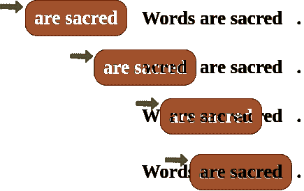

现在，在你的脑海中，将模板放在书的顶部，以覆盖页面，你只能看到符合模板切口的单词。你需要将该模板滑过页面，直到该模板与书中的这对单词对齐。在那时，你将能够通过模板或掩膜清晰地看到单词的拼写。文本的黑色字母会填补模板的空洞。而你看到的黑色数量是匹配程度的度量。如果你使用了白色模板，单词"are sacred"将闪耀出来，这将是你唯一能看到的单词。

如果你这样使用模板，将其滑动到文本中，以找到模式和文本之间的最大匹配，你就在使用模板进行*卷积*！当谈论深度学习和 CNN 时，模板被称为*卷积核*或*过滤器*。在 CNN 中，*卷积核*是浮点数数组而不是纸板剪影。卷积核被设计成匹配文本中的一般模式。你的文本也被转换成数字值的数组。卷积是将卷积核滑动过你的文本数字表示，以查看其中的内容。

十年前，在有了 CNN 之前，你不得不手工制作适合你想象的任何模式的卷积核。但是使用 CNN 时，除了决定卷积核的宽度 - 你认为需要多少个字母或单词来捕捉你需要的模式，你不需要编程卷积核。你的 CNN 优化器将填充卷积核中的权重。当你训练模型时，优化器会找到最能预测 NLP 问题目标变量的模式所匹配的最佳权重数组。反向传播算法会逐步调整权重，直到它们与你的数据的正确模式匹配。

为了对 CNN 的工作原理有一个完整的理解，你需要在脑海中增加一些与模板和卷积核相关的步骤，将其融合到一个自然语言处理流程中。CNN 需要执行三项任务来使用卷积核（模板）。

1.  测量卷积核和文本之间的匹配或相似度

1.  在文本中滑动卷积核寻找最大匹配值

1.  使用激活函数将最大值转换为二进制值或概率。

你可以将印刷版的黑暗程度视为印版和文本之间匹配程度的一种度量。因此，卷积神经网络（CNN）的第一步是将核函数中的权重乘以文本中的数值，然后将所有乘积相加，得到总的匹配分数。这仅仅是核函数与该文本窗口之间的点积或相关性。

第二步是在文本上滑动窗口，并再次进行步骤 1 的点积。这个卷积窗口滑动、乘法和求和被称为卷积。卷积将一个数字序列转换为与原始文本序列大小相同的另一个数字序列。根据滑动和乘法（卷积）的细节，您可能得到一个稍微较短或较长的数字序列。但无论如何，卷积操作输出一个数字序列，其中每个可能的核函数位置都有一个数值。

第三步是判断文本中是否存在一个良好的匹配。为此，你的 CNN 将卷积输出的一系列值转换为一个单一的值。结果是一个表示核函数模式可能在文本中某处的概率的单一值。大多数 CNN 设计成将这一系列数值的最大值作为匹配的度量。这种方法被称为“最大池化”，因为它将卷积中的所有值集中到一个最大值中。

##### 注意

如果你要寻找的模式在文本的不同位置上分布开来，那么你可能想尝试一些“均值池化”来处理一些核函数。

你可以看到，卷积使得你的 CNN 能够提取依赖于单词顺序的模式。这使得 CNN 的核函数能够识别自然语言文本意义上的微妙差别，而这些差别如果你只使用词袋（BOW）表示法的话就会丢失。

> 单词是神圣的。如果你以正确顺序使用正确的单词，你就能微调世界一点点。

—— 汤姆·斯托帕德

真实的事物

在前几章中，你通过学习如何最好地将文本分词为单词，并计算每个单词的向量表示来将单词视为神圣的。现在，你可以将这个技巧与卷积相结合，以便通过你的下一个 Mastodon 聊天机器人“微调世界”。^([16])

### 7.2.2 再多一点铅字

还记得字母模板的类比吗？反向字母模板对 NLP 来说并不是那么有用，因为硬纸板切割只能匹配单词的“形状”。您想要匹配单词在句子中的使用方式的含义和语法。那么你如何升级你的反向模板概念，使其更像你需要的 NLP？假设你想要你的模板检测`(形容词，名词)` 2-gram，例如 "right word" 和 "right order" 在汤姆·斯托帕德的引语中。以下是您如何用词性标记部分引用中的单词的方法。

```py
>>> import pandas as pd
>>> import spacy
>>> nlp = spacy.load('en_core_web_md')  # #1

>>> text = 'right ones in the right order you can nudge the world'
>>> doc = nlp(text)
>>> df = pd.DataFrame([
...    {k: getattr(t, k) for k in 'text pos_'.split()}
...    for t in doc])
```

```py
text  pos_
0   right   ADJ
1    ones  NOUN
2      in   ADP
3     the   DET
4   right   ADJ
5   order  NOUN
6     you  PRON
7     can   AUX
8   nudge  VERB
9     the   DET
10  world  NOUN
```

就像你在第六章中学到的一样，你希望为每个单词创建一个向量表示，以便文本可以转换为数字，用于 CNN 中。

```py
>>> pd.get_dummies(df, columns=['pos_'], prefix='', prefix_sep='')
```

```py
text  ADJ  ADP  AUX  DET  NOUN  PRON  VERB
0   right    1    0    0    0     0     0     0
1    ones    0    0    0    0     1     0     0
2      in    0    1    0    0     0     0     0
3     the    0    0    0    1     0     0     0
4   right    1    0    0    0     0     0     0
5   order    0    0    0    0     1     0     0
6     you    0    0    0    0     0     1     0
7     can    0    0    1    0     0     0     0
8   nudge    0    0    0    0     0     0     1
9     the    0    0    0    1     0     0     0
10  world    0    0    0    0     1     0     0
```

现在你的模板或内核将必须扩展一点以跨越两个 7-D 单热矢量。你将为单热编码向量中的 1 创建想象中的切割，以使孔的模式与您想要匹配的词性序列相匹配。你的形容词-名词模板在第一行和第一列中有形容词在 2-gram 开头的孔。你需要在第二行和第五列中为名词作为 2-gram 中的第二个单词的孔。当你将你的想象模板滑动到每一对词时，它将根据模板是否匹配文本输出布尔值`True`或`False`。

第一对单词将创建一个匹配：

```py
0, 1   (right, ones)     (ADJ, NOUN)    _True_
```

将模板移动以覆盖第二个 2 克拉姆，它将输出 False，因为两个克拉姆以名词开头，以失败的方式结束

```py
1, 2   (ones, in)        (NOUN, ADP)    False
```

继续使用剩余的单词，我们最终得到了这个 10 个词短语的 9 元素图。

| **跨度** | **对** | **匹配？** |
| --- | --- | --- |
| 0, 1 | (正确的，那些) | **True** (1) |
| 1, 2 | (那些，在) | False (0) |
| 2, 3 | (在，那个) | False (0) |
| 3, 4 | (正确的，右) | False (0) |
| 4, 5 | (正确的，秩序) | **True** (1) |
| 5, 6 | (秩序，你) | False (0) |
| 6, 7 | (你，可以) | False (0) |
| 7, 8 | (可以，推动) | False (0) |
| 8, 9 | (推动，那个) | False (0) |
| 9, 10 | (这个，世界) | False (0) |

恭喜。你刚刚做的是卷积。你将输入文本的较小块，本例中为 2 克拉姆，转换为显示你正在寻找的模式的匹配位置。将填充添加到您的令牌序列通常是有帮助的。并将您的文本剪切到最大长度。这样可以确保您的输出序列始终具有相同的长度，无论您的文本有多长您的内核。

*卷积*，然后是

+   一种转换…

+   可能已被填充的输入…

+   生成地图…

+   其中某些条件存在的输入的位置（例如，两个连续的副词）

章节后面，你将使用术语*核*和*步幅*来讨论你的模板以及如何将其滑动到文本上。在这种情况下，你的*步幅*为一，核大小为二。而对于词性向量，你的核被设计为处理 7 维嵌入向量。如果你使用相同大小的核，但将其以步幅为二滑动到文本上，那么你会得到以下输出：

| **跨度** | **配对** | **匹配？** |
| --- | --- | --- |
| 0, 1 | (right, ones) | **True** (1) |
| 2, 3 | (in, the) | False (0) |
| 4, 5 | (right, order) | **True** (1) |
| 6, 7 | (you, can) | False (0) |
| 8, 9 | (nudge, the) | False (0) |

在这种情况下，你的步幅运气很好，因为两个形容词-名词对之间的词数是偶数。所以你的核成功地检测到了模式的两个匹配项。但是在这种配置下，你只有 50%的几率会如此幸运。因此，使用步幅为一和核大小为二或更大的情况更为常见。

### 7.2.3 相关性与卷积

如果你忘记了，清单 7.1 应该会提醒你 Python 中相关性是什么样子的。（你也可以使用`scipy.stats.pearsonr`）。

##### 清单 7.1 相关性的 Python 实现

```py
>>> def corr(a, b):
...    """ Compute the Pearson correlation coefficient R """
...    a = a - np.mean(a)
...    b = b - np.mean(b)
...    return sum(a * b) / np.sqrt(sum(a*a) * sum(b*b))
>>> a = np.array([0, 1, 2, 0, 1, 2, 0, 1, 2])
>>> b = np.array([0, 1, 2, 3, 4, 5, 6, 7, 8])
>>> corr(a, b)
0.316...
>>> corr(a, a)
1.0
```

然而，相关性只在系列长度相同时才有效。而且你肯定希望创建一些能够处理比表示文本的数字序列更短的模式的数学内容。这就是数学家提出卷积概念的方式。他们将较长的序列分成与较短序列相同长度的较小序列，然后对这些序列对的每一个应用相关函数。这样，卷积可以处理任何两个序列的数字，无论它们的长度有多长或多短。所以在自然语言处理中，我们可以将我们的模式（称为*核*）设计得尽可能短。而标记（文本）的序列可以任意长。你可以在文本的滑动窗口上计算相关性，从而创建代表文本含义的相关系数序列。

### 7.2.4 卷积作为映射函数

CNNs（无论是在我们的大脑中还是在机器中）是 map-reduce 算法中的“映射”部分。它输出一个比原始序列短的新序列，但还不够短。这将在流水线的*减少*部分后面进行。注意每个卷积层的输出大小。

卷积的数学运算可以让你在文本中无论何处（或何时）都能检测到模式。如果一个自然语言处理算法生成的特征向量无论一个特定词语模式出现在何处（何时）都相同，我们称之为“时不变”。卷积是一个时不变的操作，因此非常适用于文本分类、情感分析和自然语言理解。与你目前使用的其他方法相比，时不变性是卷积的一个巨大优势。你的 CNN 输出向量为你提供了一致的表达方式，表达了文本中的思想，无论该思想在文本中的哪个位置表达出来。与单词嵌入表示不同，卷积将注意力集中在向量的顺序意义上，并不会将它们全部混合成毫无意义的平均值。

卷积的另一个优势是，它输出的文本向量表示大小始终相同，无论你的文本有多长。无论你的文本是一个词名还是一份长达一万字的文档，对该序列的卷积都会输出相同大小的向量来表示该文本的含义。卷积创建的嵌入向量可用于做各种预测，就像你在第六章中使用单词嵌入所做的一样。但现在，这些嵌入将作用于单词序列，而不仅仅是单个单词。你的嵌入，你的含义向量表示，无论你处理的文本是三个词“我爱你”还是更长的文本：“我对你感到深深的爱和欣慰。”爱的感觉或情感会在两个向量中相同的位置结束，尽管单词“爱”出现在文本的不同位置。文本的含义分布在整个向量上，形成所谓的“密集”向量表示。当你使用卷积时，文本向量表示中没有间隙。与之前章节中稀疏的 TF-IDF 向量不同，你的卷积输出向量的维度都是填充的，对你处理的每一小段文本都有意义。

### 7.2.5 Python 卷积示例

您将从一个纯 Python 实现的卷积开始。这将为您提供卷积的数学模型，更重要的是，为卷积的矩阵和向量形状提供心理模型。这将帮助您理解卷积神经网络中每一层的目的。对于这第一个卷积，您将在卷积核中硬编码权重以计算 2 点移动平均值。如果您想要从 Robinhood 的日常加密货币价格中提取一些机器学习特征，这可能很有用。或者也许更好的想象一下，您正在尝试解决一个可解决的问题，比如对像波特兰（俄勒冈州）这样多雨城市的降雨报告进行一些 2 点平均值的特征工程。或者更好的是，想象您正在尝试构建一个检测自然语言文本中副词部分的词性标签下降的检测器。因为这是一个硬编码的核，所以您现在不必担心训练或拟合您的卷积数据。

您将硬编码此卷积以检测数字序列中的模式，就像您在第二章中硬编码正则表达式来识别字符序列中的标记一样。当您硬编码卷积滤波器时，您必须知道您要寻找的模式，以便将该模式放入您的卷积系数中。这对于易于识别的模式非常有效，比如数值下降或数值短暂上升。这些是本章后面将要寻找的摩尔斯电码“文本”的模式。在本章的第三节中，您将学习如何利用这一技能在 PyTorch 中构建一个卷积神经网络，该网络可以自行学习在您的文本中寻找哪些模式。

在计算机视觉和图像处理中，您需要使用 2-D 卷积滤波器，这样您就可以检测垂直和水平模式，以及中间的所有内容。对于自然语言处理，您只需要 1 维卷积滤波器。您只需在一个维度上进行卷积，即时间维度，在您的标记序列中的位置。您可以将嵌入向量的组件，或者也许是其他词性，存储在卷积的`通道`中。稍后会详细讨论这一点，等您完成纯 Python 卷积。以下是也许是最简单但有用的 1-D 卷积的 Python 代码。

列表 7.4 显示了如何在纯 Python 中创建一个 1-D 卷积，用于一个硬编码的核（`[.5, .5]`），其中只有两个权重为 `.5` 的权重。

这个核正在计算数字序列中两个数字的移动平均值。对于自然语言处理，输入序列中的数字表示词汇表中标记的出现（存在或不存在）。而且您的标记可以是任何东西，例如我们在示例中用于标记副词出现（存在性）的词性标签。或者输入可以是每个标记中词嵌入维度的波动数值。

这个移动平均滤波器可以检测到连续出现两个事物的情况，因为 `(.5 * 1 + .5 * 1)` 是 `1`。代码会以数字 `1` 来告诉您它找到了某些东西。卷积对于像这样的其他自然语言处理算法可能会错过的*模式*非常擅长。与寻找两个词的两个实例不同，您将寻找连续出现的两个意思。而且您刚刚在上一章中了解了不同的意思方面，即单词向量的维度。现在，您只寻找单词的一个方面，即它们的词性。你要找的是两个连续的副词。

> 合适的词可能具有影响力，但没有一个词能像合适的暂停一样有效。

— 马克·吐温

你能找出两个连续出现的副词吗？我不得不借助 SpaCy 来找到这个例子。类似这样的微妙意义模式对于人类来说很难有意识地注意到。但是对于卷积滤波器来说，测量文本的**副词特性**只是一门数学问题。卷积将并行处理您可能正在寻找的所有其他意义方面。实际上，一旦您完成了第一个例子，您将对单词的*所有*方面运行卷积。当您使用前一章节中跟踪单词所有维度的词嵌入时，卷积效果最佳。

卷积将查看单词意思的所有维度以及所有维度的单词意义的*模式*。卷积神经网络（CNN）会查看您的目标输出（目标变量），以查找影响目标变量的单词嵌入的所有维度中的所有模式。对于这个例子，您将定义一个“副词句”为在句子中连续包含两个副词的句子。这只是为了帮助您看到一个非常简单的问题的数学计算。副词特性只是您需要在机器学习流程中从文本中提取的众多特征之一。CNN 将通过学习适当的副词特性、名词特性、停词特性和其他很多“特性”的组合来自动完成这种工程。现在，您只需手动完成这一个副词特性。目标是了解 CNN 可以学习识别数据中的哪些模式。

图 7.2 展示了如何使用 SpaCy 对引用进行词性标注，然后创建一个二进制系列来表示你正在搜索的单词的一个方面，即副词性。

##### 列表 7.2 用词性标记引用

```py
>>> nlp = spacy.load('en_core_web_md')
>>> quote = "The right word may be effective, but no word was ever" \
...    " as effective as a rightly timed pause."
>>> tagged_words = {
...    t.text: [t.pos_, int(t.pos_ == 'ADV')]  # #1
...    for t in nlp(quote)}
>>> df_quote = pd.DataFrame(tagged_words, index=['POS', 'ADV'])
>>> print(df_quote)
```

```py
The right  word  may   be  ...    a rightly timed pause      .
POS  DET   ADJ  NOUN  AUX  AUX  ...  DET     ADV  VERB  NOUN  PUNCT
ADV    0     0     0    0    0  ...    0       1     0     0      0
```

现在你有了你的一串`ADV`的零和一，所以你可以用卷积来处理它，以匹配你正在寻找的模式。

##### 列表 7.3 为卷积定义输入序列

```py
>>> inpt = list(df_quote.loc['ADV'])
>>> print(inpt)
```

```py
[0, 0, 0, ... 0, 1, 1, 0, 0...]
```

哇，这种作弊效果太好了！我们清楚地看到在句子中有两个副词是连续的。让我们使用我们的卷积滤波器来找出确切的位置。

##### 列表 7.4 纯 Python 中的卷积

```py
>>> kernel = [.5, .5]  # #1
>>>
>>> output = []
>>> for i in range(len(inpt) - 1):  # #2
...    z = 0
...    for k, weight in enumerate(kernel):  # #3
...        z = z + weight * inpt[i + k]
...    output.append(z)
>>>
>>> print(f'inpt:\n{inpt}')
>>> print(f'len(inpt): {len(inpt)}')
>>> print(f'output:\n{[int(o) if int(o)==o else o for o in output]}')
>>> print(f'len(output): {len(output)}')
```

```py
inpt:
[0, 0, 0, 0, 0, 0, 0, 0, 0, 0, 0., 1, 1., 0, 0, 0., 1., 0, 0, 0]
len(inpt): 20
output:
[0, 0, 0, 0, 0, 0, 0, 0, 0, 0, .5, 1, .5, 0, 0, .5, .5, 0, 0]
len(output): 19
```

现在你可以明白为什么你必须在输入序列的末尾停止`for`循环了。否则，我们的内核中的 2 个权重将会溢出到输入序列的末尾。你可能在其他地方见过这种软件模式称为“map-reduce”。你可以看到如何使用 Python 内置函数`map()`和`filter()`来实现列表 7.4 中的代码。

如果你把和函数作为你的*池化*函数，你可以创建一个移动平均卷积，根据我们的 2 个连续副词的定义来计算文本的副词性。如果你想要计算一个无权重的移动平均，你只需要确保你的内核值都是`1 / len(kernel)`，这样它们就会加起来为 1，并且都是相等的。

图 7.5 将创建一条线图，帮助你可视化卷积输出和原始的`is_adv`输入重叠在一起。

##### 图 7.5 输入（is_adv）和输出（副词性）的折线图

```py
>>> import pandas as pd
>>> from matplotlib import pyplot as plt
>>> plt.rcParams['figure.dpi'] = 120  # #1

>>> import seaborn as sns
>>> sns.set_theme('paper')  # #2

>>> df = pd.DataFrame([inpt, output], index=['inpt', 'output']).T
>>> ax = df.plot(style=['+-', 'o:'], linewidth=3)
```

你有没有注意到这个大小为 2 的内核的卷积的输出序列产生的输出比输入序列短一个？图 7.2 显示了这个移动平均卷积的输入和输出的线图。当你把两个数字分别乘以`.5`然后相加时，你得到这两个数字的平均值。所以这个特定的内核（`[.5, .5]`）是一个非常小的（两个样本）移动平均滤波器。

##### 图 7.2 `is_adv`和`副词性`卷积的线图

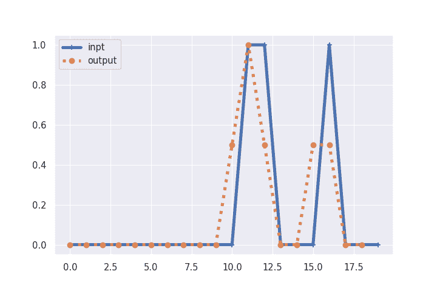

看着图 7.2，你可能会注意到它看起来有点像金融时间序列数据或每日降雨量值的移动平均或平滑滤波器。对于你的 GreenPill 令牌价格的 7 天移动平均，你将使用一个大小为 7 的卷积内核，每周的每一天都为`0.142`。一个大小为 7 的移动平均卷积将会更加平滑你副词性中的尖峰，从而在你的线图中创建一个更加曲线的信号。但是除非你精心制作了一个包含七个连续副词的声明，否则你永远不会在任何有机引用中获得 1.0 的副词性分数。

你可以将列表 7.6 中的 Python 脚本泛化，以创建一个卷积函数，即使内核大小发生变化也能正常工作。这样你就可以在以后的例子中重复使用它。

##### 清单 7.6 通用卷积函数

```py
>>> def convolve(inpt, kernel):
...    output = []
...    for i in range(len(inpt) - len(kernel) + 1):  # #1
...        output.append(
...            sum(
...                [
...                    inpt[i + k] * kernel[k]
...                    for k in range(len(kernel))  # #2
...                ]
...            )
...        )
...    return output
```

你在这里创建的 `convolve()` 函数将输入乘以核权重相加。你也可以使用 Python 的 `map()` 函数来创建卷积。你使用了 Python 的 `sum()` 函数来 *减少* 输出中的数据量。这种组合使卷积算法成为一个你在计算机科学或数据科学课程中可能听说过的 *map reduce* 操作。

##### 重要

像卷积这样的 map-reduce 操作高度可并行化。数据窗口的每个核乘法可以同时并行进行。这种可并行性是使卷积成为处理自然语言数据的一种强大、高效和成功的方式的原因。

### 7.2.6 PyTorch 1-D CNN 在 4-D 嵌入向量上

你可以看到 1-D 卷积是如何用于在令牌序列中查找简单模式的。在之前的章节中，你使用正则表达式来查找字符序列中的模式。但是对于涉及单词意义的多个不同方面的语法的更复杂模式呢？为此，你需要使用单词嵌入（来自第六章）结合 *卷积神经网络*。你想要使用 PyTorch 来处理所有这些线性代数操作的簿记。通过使用 4-D 独热编码向量来表示单词的词性，你将在下一个示例中简化它。稍后，你将学习如何使用 300-D GloVE 向量，这些向量除了保留单词的语法角色外，还跟踪单词的含义。

因为词嵌入或向量捕捉了单词中所有不同的意义组成部分，它们包括了词性。就像之前的广告引用示例一样，你将根据单词的词性匹配一个语法模式。但这次，你的单词将具有表示名词、动词和副词的 3-D 词性向量。你的新 CNN 可以检测到一个非常特定的模式，即一个副词后跟一个动词，然后是一个名词。你的 CNN 正在寻找马克·吐温引用中的“正确的时机”。如果需要帮助创建一个包含“正确时机”的 POS 标签的 DataFrame，请参考清单 7.2。

```py
>>> tags = 'ADV ADJ VERB NOUN'.split()
>>> tagged_words = [
...    [tok.text] + [int(tok.pos_ == tag) for tag in tags]  # #1
...    for tok in nlp(quote)]  # #2
>>>
>>> df = pd.DataFrame(tagged_words, columns=['token'] + tags).T
>>> print(df)
```

```py
The  right  word  may  be  ...  a  rightly  timed  pause  .
ADV     0      0     0    0   0  ...  0        1      0      0  0
ADJ     0      1     0    0   0  ...  0        0      0      0  0
VERB    0      0     0    0   0  ...  0        0      1      0  0
NOUN    0      0     1    0   0  ...  0        0      0      1  0
```

##### 图 7.3 带有词性标记的句子


为了保持高效，PyTorch 不接受任意的 Pandas 或 numpy 对象。相反，你必须将所有输入数据转换为具有 `torch.float` 或 `torch.int` 数据类型（`dtype`）对象的 `torch.Tensor` 容器。

##### 清单 7.7 将 DataFrame 转换为正确大小的张量

```py
>>> import torch
>>> x = torch.tensor(
...     df.iloc[1:].astype(float).values,
...     dtype=torch.float32)  # #1
>>> x = x.unsqueeze(0) # #2
```

现在你构建了我们想在文本中搜索的模式：副词、动词，然后名词。你需要为你关心的每个词性创建一个单独的过滤器或核。每个核将与其他核对齐，以同时在单词意义的所有方面找到你正在寻找的模式。

在此之前，您只需要担心一个维度，即副词标签。现在，您需要处理这些单词向量的所有 4 个维度，以确保模式正确。您需要协调四个不同的“特征”或数据通道。因此，对于一个 3 个词、4 个通道的核心，我们需要一个 4x3 矩阵。每一行代表一个通道（词性标签），每一列代表序列中的一个单词。单词向量是 4 维列向量。

```py
>>> kernel = pd.DataFrame(
...           [[1, 0, 0.],
...            [0, 0, 0.],
...            [0, 1, 0.],
...            [0, 0, 1.]], index=tags)
>>> print(kernel)
```

您可以看到，这个 DataFrame 只是您想要在文本样本中匹配的向量序列的精确副本。当然，您之所以能够做到这一点，是因为您在这一个玩具示例中知道您在寻找什么。在真实的神经网络中，深度学习优化器将使用反向传播来*学习*最有助于预测您的目标变量（标签）的向量序列。

机器如何匹配模式是如何可能的？是什么数学导致核心始终匹配其包含的模式？在图 7.4 中，您可以自己进行一些数据的滤波器跨越几个步骤的数学计算。这将帮助您了解所有这些是如何工作的，以及为什么它既简单又强大。

##### 图 7.4 自己检查卷积模式匹配

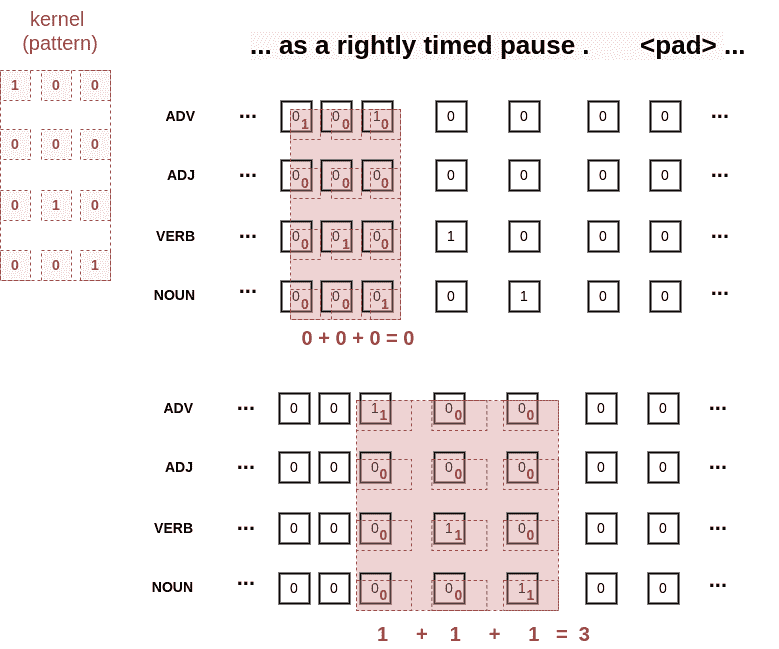

在让 PyTorch 进行数学计算之前，您是否检查了图 7.4 中的数学计算？确保在让 PyTorch 进行数学计算之前进行此操作，以嵌入此数学模式到您的神经网络中，以便将来如果您需要调试 CNN 中的问题，您就可以进行数学计算。

在 PyTorch 或任何其他设计用于同时处理多个样本的深度学习框架中，您必须将核张量进行扩展，以添加一个维度来容纳额外的样本。您扩展的核（权重矩阵）需要与输入数据的批次具有相同的形状。第一个维度用于输入到卷积层的来自训练或测试数据集的样本。通常，这将是嵌入层的输出，并且已经具有适当的大小。但是，由于您正在硬编码所有权重和输入数据以了解 Conv1d 层的工作原理，因此您需要扩展 2-D 张量矩阵以创建 3-D 张量立方体。由于您只有一个引用要通过卷积推进数据集，因此您只需要在第一个维度上具有大小为 1 的尺寸。

##### 列表 7.8 将硬编码的权重加载到 Conv1d 层中

```py
>>> kernel = torch.tensor(kernel.values, dtype=torch.float32)
>>> kernel = kernel.unsqueeze(0)  # #1
>>> conv = torch.nn.Conv1d(in_channels=4,
...                     out_channels=1,
...                     kernel_size=3,
...                     bias=False)
>>> conv.load_state_dict({'weight': kernel})
>>> print(conv.weight)

tensor([[[1., 0., 0.],
         [0., 0., 0.],
         [0., 1., 0.],
         [0., 0., 1.]]])
```

最后，您准备好看看您手工制作的核心是否可以检测到文本中的副词、动词、名词序列。

##### 列表 7.9 通过卷积层运行单个示例

```py
>>> y = np.array(conv.forward(x).detach()).squeeze()
>>> df.loc['y'] = pd.Series(y)
>>> df
        0      1     2    3    4   ...   15       16     17     18   19
token  The  right  word  may   be  ...    a  rightly  timed  pause    .
ADV      0      0     0    0    0  ...    0        1      0      0    0
ADJ      0      1     0    0    0  ...    0        0      0      0    0
VERB     0      0     0    1    0  ...    0        0      1      0    0
NOUN     0      0     1    0    0  ...    0        0      0      1    0
y      1.0    0.0   1.0  0.0  0.0  ...  0.0      3.0    0.0    NaN  NaN
```

##### 图 7.5 Conv1d 输出正确预测定时暂停

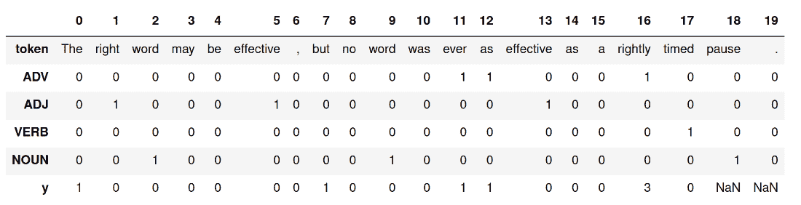

y 值达到最大值 3，其中内核中的所有 3 个值为 1 的部分与句子中的三个 1 完美匹配，形成了相同的词性标签模式。您的内核正确地检测到了句子末尾的副词、动词、名词序列。您卷积输出的值为 3 是正确的，因为在序列中第 16 个单词“rightly” 的位置，存在 3 个与您的模式匹配的单词。这是匹配您的模式的 3 个单词序列的位置，分别位于位置 16、17 和 18。而且，输出值为三是有意义的，因为每个匹配的词性都在您的内核中具有权重为一，总共有三个匹配。

别担心，您永远不必再为卷积神经网络手工制作内核...除非您想提醒自己数学是如何工作的，以便向他人解释。

### 7.2.7 自然示例

在眼睛和相机的光学世界中，卷积无处不在。当您通过偏振太阳镜向下看海洋或湖泊表面时，镜片会对光进行卷积以滤除噪声。偏振眼镜的镜片有助于渔民滤除散射光，并看穿水面下找到鱼。

至于更疯狂的例子，想象一下一只斑马站在围栏后面。斑马的条纹可以被视为一种视觉自然语言。斑马的条纹向捕食者和潜在伴侣发送关于斑马健康状况的信号。当斑马在草地、竹林或树干之间奔跑时发生的卷积会产生一种闪烁效果，使斑马难以捕捉。

在图 7.6 中，您可以将卡通围栏视为交替数值的内核。而背景中的斑马则像您的数据，其条纹中的光暗区域具有交替的数值。而且卷积是对称的，因为乘法和加法是可交换的操作。因此，如果您愿意，您可以将斑马的条纹视为滤波器，而一长段围栏视为数据。

##### 图 7.6 斑马在围栏后面 ^([18])


想象一下图 7.6 中的斑马走在围栏后面，或者围栏在斑马前面滑动。当斑马行走时，围栏中的缝隙将定期与斑马的条纹对齐。这将在我们移动围栏（内核）或斑马时创建光与暗的图案。当斑马的黑色条纹与棕色围栏的缝隙对齐时，这些地方将变暗。当斑马的白色部分与围栏的缝隙对齐时，它们就能透过，因此斑马会显得更亮。因此，如果您想要识别黑色和白色的交替值或交替的数值，您可以在您的内核中使用交替的高（1）和低值（0）。

如果你不经常看到斑马在栅栏后面走动，也许下一个类比会更好理解。如果你在海滩上待一段时间，你可以把浪潮想象成海底的一种自然机械卷积。当波浪经过海底并接近海滩时，它们会上升或下降，这取决于水面下隐藏的东西，比如沙洲、大石头或礁石。沙洲和石头就像你试图用卷积神经网络检测的单词意义的组成部分一样。波浪在沙洲上涨的过程就像卷积乘法操作一样，在你的数据上波浪潮过去。

现在想象一下，你在靠近水边挖了一个洞。当浪潮爬上岸时，取决于波浪的高度，一些浪潮会溢入你的小水池中。你沙堡前的水池或护城河就像卷积中的减少或求和操作一样。事实上，你会看到我们后来使用的一种操作叫做“最大池化”，它在卷积神经网络中的行为非常像这样。最大池化帮助你的卷积测量出特定单词模式的“影响”，就像你的沙堆在海岸上累积了浪潮的影响一样。即使没有别的，这张关于浪潮和沙堡的图像也会帮助你在本章后面看到时记住技术术语*最大池化*。

## 7.3 莫尔斯电码

在 ASCII 文本和计算机甚至电话出现之前，还有另一种交流自然语言的方式：*莫尔斯电码*。莫尔斯电码是一种将点和短划替代自然语言字母和单词的文本编码。这些点和短划在电报线上或无线电波上变成长音和短音的蜂鸣声。莫尔斯电码听起来就像一个非常缓慢的拨号上网连接中的蜂鸣声。在本节后面的 Python 示例中播放音频文件，亲自听一下吧。业余无线电操作员通过敲击单个键向世界各地发送消息。你能想象在计算机键盘上输入文本，而键盘上只有一个键，就像图 7.7 中的 Framework 笔记本的空格键一样吗？

##### 图 7.7 单个关键的笔记本键盘


图 7.8 显示了一个实际的莫尔斯电码键的样子。就像计算机键盘上的键或游戏控制器上的开火按钮一样，莫尔斯电码键只在按下按钮时关闭电气接触。

##### 图 7.8 一把古董莫尔斯电码键


莫尔斯电码是一种设计成只需按下一个键敲出的语言，就像这样。它在电报时代被广泛使用，在电话使得通过电线发送语音和数据成为可能之前。为了在纸上可视化莫尔斯电码，人们用点和线来代表按键的短敲和长敲。按下键时，你短暂地向外发出一个点，而稍微按住键则会发出一个破折号。当你根本不按下该键时则是完全的沉默。所以它和输入文本不太一样。更像是把你的键盘当作游戏手柄上的开火按钮。你可以把莫尔斯电码键想象成视频游戏激光或以按下键的时候才发送能量的任何东西。你甚至可以通过在多人游戏中将武器当作电报机来发送秘密信息。

要在计算机键盘上仅使用一个键进行通信几乎是不可能的，如果不是萨缪尔·莫尔斯创造新的自然语言的工作，就不会有这种可能。莫尔斯在设计莫尔斯电码的语言方面做得非常好，即使像我这样拙笨的业余无线电操作员也可以在紧急情况下使用它。接下来，你将学习这种语言中最重要的两个字母，以便在紧急情况下也能使用它。不用担心，你只需要学习这个语言的两个字母就足够了。这应该足以让你更清楚地理解卷积以及它在自然语言上的工作原理。

##### 图 7.9 莫尔斯电码字典

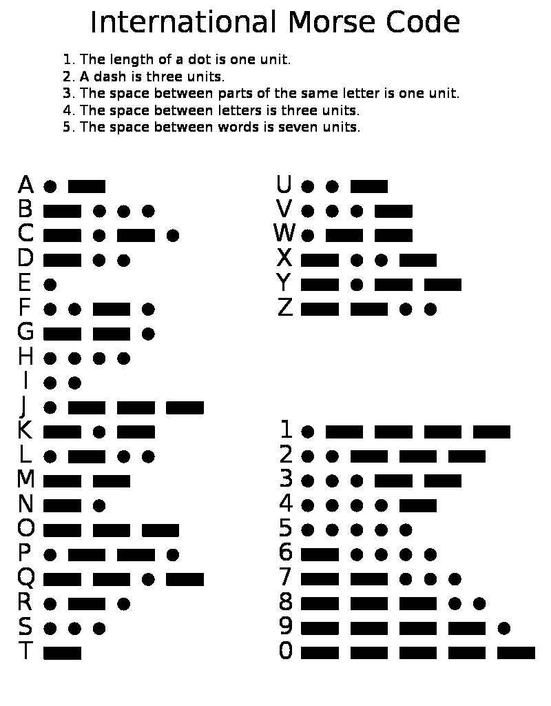

莫尔斯电码至今仍然在无线电波嘈杂的情况下使用，以便使别人能够理解你的语音。当你真的，真的，真的需要传达信息时，它尤其有用。被困在沉没的潜艇或船内的水下空腔的水手使用莫尔斯电码在金属船体上敲出来与营救者进行交流。在地震或矿井事故后被埋在瓦砾下的人们会用金属管道和钢梁敲击来与救援人员进行通信。如果你懂一点莫尔斯电码，你也许可以通过用莫尔斯电码敲出你的话与别人进行双向对话。

这是一个以莫尔斯电码进行广播的秘密消息的音频数据示例。在接下来的部分中，你将使用手工制作的卷积核处理这个数据。现在，你可能只想播放音频轨道，以便听到莫尔斯电码的声音是什么样子。

##### 代码清单 7.10 下载秘密

```py
>>> from nlpia2.init import maybe_download

>>> url = 'https://upload.wikimedia.org/wikipedia/' \
      'commons/7/78/1210secretmorzecode.wav'
>>> filepath = maybe_download(url)  # #1
>>> filepath
'/home/hobs/.nlpia2-data/1210secretmorzecode.wav'
```

当然，你的`.nlpia2-data`目录将位于你的`$HOME`目录下，而不是我的。这里是这些示例中使用的所有数据。现在，你可以加载 wav 文件，以创建一个包含音频信号的数值数组，稍后可以用卷积进行处理。

### 7.3.1 使用卷积解码莫尔斯电码

如果您了解一点 Python，您可以构建一个能够为您解释摩尔斯电码的机器，这样您就不必记住图 7.9 摩尔斯电码字典中所有的点和划线了。在僵尸启示录或“大事件”（加州地震）期间可能会派上用场。只需确保保留能够运行 Python 的计算机或手机。

##### 第 7.11 列 加载秘密摩尔斯电码 WAV 文件

```py
>>> from scipy.io import wavfile

>>> sample_rate, audio = wavfile.read(filepath)
>>> print(f'sample_rate: {sample_rate}')
>>> print(f'audio:\n{audio}')
```

```py
sample_rate: 4000
audio:
[255   0 255 ...   0 255   0]
```

这个 WAV 文件中的音频信号在哔哔声时在 255 和 0 之间振荡（最大和最小的 `uint8` 值）。因此，您需要使用 `abs()` 对信号进行矫正，然后将其标准化，使信号在播放音调时为 1，在没有音调时为 0。您还希望将采样数转换为毫秒，并对信号进行降采样，以便更容易地检查单个值并查看发生了什么。第 7.12 列 居中、标准化和降采样音频数据，并提取此音频数据的前两秒。

##### 第 7.12 列 标准化和降采样音频信号

```py
>>> pd.options.display.max_rows = 7

>>> audio = audio[:sample_rate * 2]  # #1
>>> audio = np.abs(audio - audio.max() / 2) - .5  # #2
>>> audio = audio / audio.max()  # #3
>>> audio = audio[::sample_rate // 400]  # #4
>>> audio = pd.Series(audio, name='audio')
>>> audio.index = 1000 * audio.index / sample_rate  # #5
>>> audio.index.name = 'time (ms)'
>>> print(f'audio:\n{audio}')
```

现在，您可以使用 `audio.plot()` 绘制闪亮的新摩尔斯电码点和划线。

##### 第 7.10 图 方波摩尔斯电码秘密消息

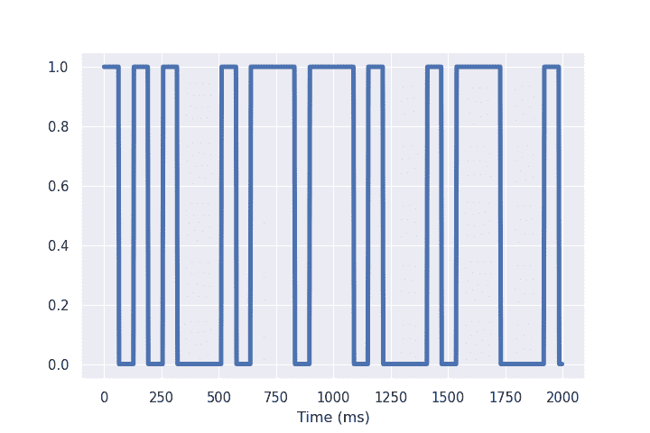

您能在图 7.10 中看到点在哪里吗？点是 60 毫秒的静音（信号值为 0），然后是 60 毫秒的音调（信号值为 1），然后再次是 60 秒的静音（信号值为 0）。

要通过卷积检测点，您需要设计一个与低、高、低的模式匹配的核心。唯一的区别是对于低信号，您需要使用负一而不是零，这样数学就会加起来。您希望卷积的输出在检测到点符号时为 1。

第 7.12 列 展示了如何构建点检测核心。

##### 第 7.13 列 点检测核

```py
>>> kernel = [-1] * 24 + [1] * 24 + [-1] * 24  # #1
>>> kernel = pd.Series(kernel, index=2.5 * np.arange(len(kernel)))
>>> kernel.index.name = 'Time (ms)'
>>> ax = kernel.plot(linewidth=3, ylabel='Kernel weight')
```

##### 第 7.11 图 摩尔斯电码点检测核心

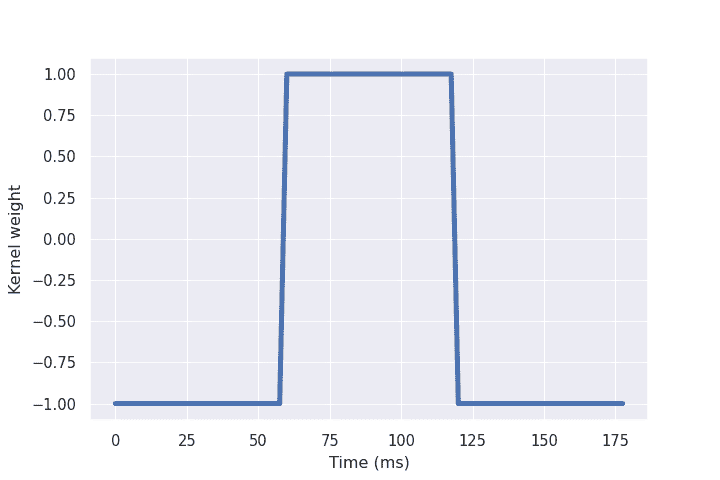

您可以通过将其与音频信号进行卷积来尝试您手工制作的核心，以查看它是否能够检测到点。目标是使卷积信号在点符号出现时高、接近于 1，在音频中的短脉冲。您还希望您的点检测卷积在点之前或之后的任何短划线或静音处返回低值（接近于零）。

##### 第 7.14 列 点检测器与秘密消息卷积

```py
>>> kernel = np.array(kernel) / sum(np.abs(kernel))  # #1
>>> pad = [0] * (len(kernel) // 2)  # #2
>>> isdot = convolve(audio.values, kernel)
>>> isdot =  np.array(pad[:-1] + list(isdot) + pad)  # #3
>>> df = pd.DataFrame()
>>> df['audio'] = audio
>>> df['isdot'] = isdot - isdot.min()
>>> ax = df.plot()
```

##### 第 7.12 图 手工制作的点检测卷积

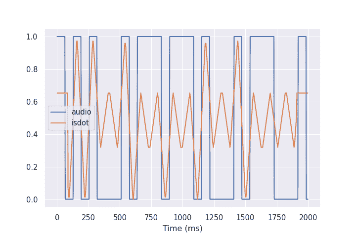

看起来手工制作的核心做得不错！卷积输出仅在点符号的中间接近于 1。

现在您了解了卷积的工作原理，可以随意使用 `np.convolve()` 函数。它运行更快，并为您提供了更多关于填充处理的 `mode` 选项。

##### 第 7.15 列 NumPy 卷积

```py
>>> isdot = np.convolve(audio.values, kernel, mode='same')  # #1
>>> df['isdot'] = isdot - isdot.min()
>>> ax = df.plot()
```

##### 第 7.13 图 NumPy 卷积

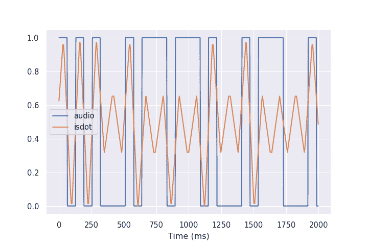

Numpy 卷积有三种可能的模式可用于进行卷积，按输出长度递增的顺序依次为：

1.  **valid**: 以纯 Python 为例，只输出`len(kernel)-1`个卷积值。

1.  **same**: 通过在数组的开始和结尾之外推算信号，输出与输入长度相同的信号。

1.  **full**: 输出信号将比输入信号更长。

Numpy 卷积设置为“same”模式似乎在我们的莫尔斯电码音频信号中运作得更好。因此，当在神经网络中进行卷积时，你需要检查你的神经网络库是否使用类似的模式。

建造一个卷积滤波器以在莫尔斯电码音频文件中检测一个单一符号真是一项艰苦的工程。而且这还不是一个自然语言文本的单个字符， 只是 `S` 字母的三分之一！幸运的是，你辛勤手工制作的日子已经结束了。你可以在神经网络的反向传播中使用它所拥有的强大力量来学习正确的内核以检测解决问题所需的所有不同信号。

## 7.4 使用 PyTorch 构建 CNN

图 7.14 展示了您如何将文本流入 CNN 网络，然后输出嵌入。与以前的 NLP 流水线一样，需要首先对文本进行标记化。然后您会识别出文本中使用的所有令牌集。您将忽略不想计数的令牌，并为词汇表中的每个单词分配一个整数索引。输入语句有 4 个令牌，因此我们从一个由 4 个整数索引组成的序列开始，每个令牌对应一个索引。

CNN 通常使用单词嵌入来代替单热编码来表示每个单词。您将初始化一个单词嵌入矩阵，该矩阵的行数与词汇表中的单词数量相同，并且如果要使用 300-D 嵌入，则有 300 个列。可以将所有初始单词嵌入设置为零或某些小的随机值。如果要进行知识转移并使用预训练的单词嵌入，则可以在 GloVE、Word2vec、fastText 或任何喜欢的单词嵌入中查找您的令牌。并将这些向量插入到与词汇表索引匹配的行中的嵌入矩阵中。

对于这个四令牌句子，然后可以查找适当的单词嵌入，一旦在单词嵌入矩阵中查找每个嵌入，就会得到一个 4 个嵌入向量的序列。你也会得到额外的填充标记嵌入，它们通常被设置为零，所以它们不会干扰卷积。如果您使用最小的 GloVe 嵌入，那么您的单词嵌入是 50 维的，因此您会得到一个 50 x 4 的数值矩阵，用于这个短句子。

你的卷积层可以使用 1-D 卷积内核处理这 50 个维度中的每一个，稍微挤压一下关于你的句子的这个矩阵的信息。如果你使用了长度为 2 的内核和步幅为 2，你将得到一个大小为 50 x 3 的矩阵来表示四个 50-D 单词向量的序列。

通常使用*池化层*，通常是最大池化，来进一步减小输出的大小。带有 1-D 内核的最大池化层将把你的三个 50-D 向量的序列压缩成一个单一的 50-D 向量。顾名思义，最大池化将为向量序列中每个通道（维度）的最大和最有影响的输出。最大池化通常相当有效，因为它允许你的卷积为原始文本中每个 n-gram 找到最重要的意义维度。通过多个内核，它们可以分别专门化文本的不同方面，这些方面会影响你的目标变量。

##### 注意

你应该将卷积层的输出称为“编码”，而不是“嵌入”。这两个词都用来描述高维向量，但是“编码”一词暗示着在时间上或序列中的处理。卷积数学在你的单词向量序列中的时间内发生，而“嵌入”向量是单个不变令牌的处理结果。嵌入不编码任何有关单词顺序或序列的信息。编码是对文本含义的更完整的表示，因为它们考虑了单词顺序，就像你的大脑一样。

由 CNN 层输出的编码向量是一个具有你指定的任意大小（长度）的向量。你的编码向量的长度（维度数）与输入文本的长度无关。

##### 图 7.14 CNN 处理层 ^([22])

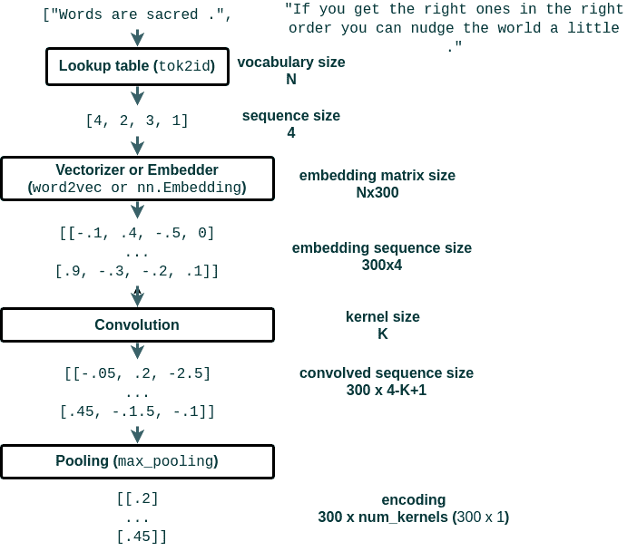

你将需要利用前几章的所有技能来整理文本，以便将其输入到你的神经网络中。图 7.14 中你的管道的前几个阶段是你在前几章中做的标记和大小写转换。你将利用前面示例中的经验来决定忽略哪些单词，比如停用词、标点符号、专有名词或非常罕见的单词。

根据你手工制作的任意停用词列表过滤和忽略单词通常是一个不好的主意，特别是对于像 CNN 这样的神经网络。词形还原和词干提取通常也不是一个好主意。模型将比你用直觉猜测的更了解你的令牌的统计信息。你在 Kaggle、DataCamp 和其他数据科学网站上看到的大多数示例都会鼓励你手工制作管道的这些部分。你现在知道得更清楚了。

你也不会手工制作卷积内核。你会让反向传播的魔力来处理这些事情。神经网络可以学习模型的大部分参数，例如哪些词要忽略，哪些词应该被合并在一起，因为它们具有相似的含义。实际上，在第六章中，您已经学会了用嵌入向量来表示单词的含义，这些嵌入向量精确地捕捉了它们与其他单词的相似程度。只要有足够的数据来创建这些嵌入向量，您就不再需要处理词形还原和词干提取。

### 7.4.1 裁剪和填充

CNN 模型需要一致长度的输入文本，以便编码中的所有输出值在向量中处于一致的位置。这确保了你的 CNN 输出的编码向量始终具有相同的维度，无论你的文本是多长或多短。你的目标是创建一个字符串和一个整页文本的向量表示。不幸的是，CNN 不能处理可变长度的文本，所以如果你的文本对于 CNN 来说太长，就会将许多单词和字符在字符串末尾进行 "裁剪"。而且你需要插入填充令牌，称为 *padding*，来填补那些对于您的 CNN 来说太短的字符串中的空白部分。

请记住，卷积操作始终会减少输入序列的长度，无论其长度多长。卷积操作始终会将输入序列的长度减少一个比内核大小少的数。而任何池化操作，如最大池化，也会一致地减少输入序列的长度。因此，如果您没有进行任何填充或裁剪，长句子会产生比短句子更长的编码向量。而这对于需要具有大小不变性的编码是不起作用的。无论输入的大小如何，你希望你的编码向量始终具有相同的长度。

这是向量的基本属性，即它们在整个你正在处理的*向量空间*中具有相同数量的维度。你希望你的 NLP 流水线能够在相同的位置或向量维度上找到特定的含义，无论这种情感在文本的哪个位置发生。填充和裁剪可以确保你的 CNN 在位置（时间）和大小（持续时间）上是不变的。基本上，只要这些模式在您的 CNN 可处理的最大长度范围内的任何位置，您的 CNN 就可以在文本的含义中找到这些模式，无论这些模式在文本中的位置如何。

你可以选择任何你喜欢的符号来表示填充标记。许多人使用标记 "<PAD>"，因为它在任何自然语言字典中都不存在。大多数说英语的自然语言处理工程师都能猜到 "<PAD>" 的含义。而且你的自然语言处理管道会注意到这些标记在许多字符串的末尾重复出现。这将帮助它在嵌入层中创建适当的 "填充" 情感。如果你对填充情感的样子感到好奇，加载你的嵌入向量，比较 "<PAD>" 的嵌入和 "blah"（如 "blah blah blah"）的嵌入。你只需要确保使用一致的标记，并告诉你的嵌入层你用于填充标记的令牌是什么。通常将其作为你的 `id2token` 或 `vocab` 序列中的第一个标记，以便它具有索引和 id 值 `0`。

一旦你告诉大家你的填充标记是什么，你现在需要决定一个一致的填充方法。就像在计算机视觉中一样，你可以在你的令牌序列的任意一侧填充，即开头或结尾。你甚至可以拆分填充，将一半放在开头，另一半放在结尾。只是不要把它们插在单词之间。那会干扰卷积计算。并确保你添加的填充标记的总数能够创建正确长度的序列用于你的 CNN。

在清单 7.16 中，您将加载由 Kaggle 贡献者标记了其新闻价值的 "birdsite"（微博）帖子。稍后您将使用您的 CNN 模型来预测 CNN（有线电视新闻网）是否会在 "miasma." 中的新闻在自己传播之前 "采取"。

##### 重要提示

我们有意使用能引导您朝着亲社会、真实、注意力集中的行为的词语。弥漫在互联网上的黑暗模式已经引导了科技界的创意中坚力量创建了一个替代的、更真实的宇宙，拥有它自己的词汇。

"Birdsite"："fedies" 称之为 Twitter

"Fedies"：使用保护您健康和隐私的联合社交媒体应用的用户

"Fediverse" 联合社交媒体应用的替代宇宙（Mastodon，PeerTube）

"Nitter" 是 Twitter 的一个不那么操纵的前端。

"Miasma" 是尼尔·斯蒂芬森对一个爱情的互联网的称呼

##### 清单 7.16 加载新闻帖子

```py
>>> df = pd.read_csv(HOME_DATA_DIR / 'news.csv')
>>> df = df[['text', 'target']]  # #1
>>> print(df)
```

```py
text  target
0     Our Deeds are the Reason of this #earthquake M...       1
1                Forest fire near La Ronge Sask. Canada       1
2     All residents asked to 'shelter in place' are ...       1
...                                                 ...     ...
7610  M1.94 [01:04 UTC]?5km S of Volcano Hawaii. htt...       1
7611  Police investigating after an e-bike collided ...       1
7612  The Latest: More Homes Razed by Northern Calif...       1
[7613 rows x 2 columns]
```

您可以在上面的例子中看到，一些微博帖子几乎达到了 birdsite 的字符限制。其他则通过较少的词语表达了观点。因此，您需要对这些较短的文本进行填充，以便数据集中的所有示例具有相同数量的令牌。如果您计划在管道的后期过滤掉非常频繁的词或非常罕见的词，您的填充函数也需要填补这些差距。因此，清单 7.17 对这些文本进行了标记化，并过滤掉了其中的一些最常见的标记。

##### 清单 7.17 词汇表中最常见的单词

```py
import re
from collections import Counter
from itertools import chain
HOME_DATA_DIR = Path.home() / '.nlpia2-data'

counts = Counter(chain(*[
    re.findall(r'\w+', t.lower()) for t in df['text']]))  # #1
vocab = [tok for tok, count in counts.most_common(4000)[3:]]  # #2

print(counts.most_common(10))
```

```py
[('t', 5199), ('co', 4740), ('http', 4309), ('the', 3277), ('a', 2200),
    ('in', 1986)]
```

你可以看到，令牌 "t" 出现的次数几乎和帖子数（7613）一样多（5199）。这看起来像是由 url 缩短器创建的部分 url，通常用于跟踪这个应用程序上的微博主。如果你希望你的 CNN 专注于人类可能会阅读的内容中的单词的含义，你应该忽略前三个类似 url 的令牌。如果你的目标是构建一个像人类一样阅读和理解语言的 CNN，那么你将创建一个更复杂的分词器和令牌过滤器，以去除人类不关注的任何文本，例如 URL 和地理空间坐标。

一旦你调整好了你的词汇表和分词器，你就可以构建一个填充函数，以便在需要时重复使用。如果你的 `pad()` 函数足够通用，就像清单 7.18 中一样，你可以将它用于字符串令牌和整数索引。

##### 清单 7.18 多功能填充函数

```py
def pad(sequence, pad_value, seq_len):
    padded = list(sequence)[:seq_len]
    padded = padded + [pad_value] * (seq_len - len(padded))
    return padded
```

我们还需要为 CNN 的良好工作进行最后一个预处理步骤。你想要包含你在第六章学到的令牌嵌入。

### 7.4.2 用单词嵌入进行更好的表示

想象一下，你正在将一小段文本通过你的管道运行。图 7.15 展示了在你将单词序列转换为数字（或向量，提示提示）进行卷积操作之前的样子。

##### 图 7.15 卷积步幅

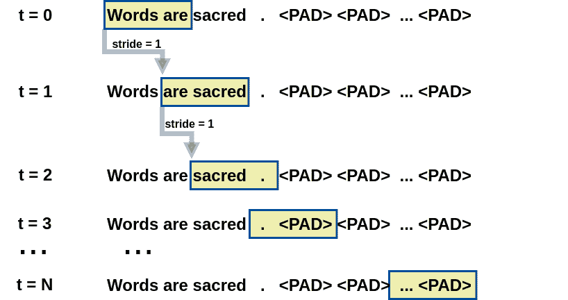

现在你已经组装了一个令牌序列，你需要很好地表示它们的含义，以便你的卷积能够压缩和编码所有这些含义。在第 5 和 6 章中我们使用的全连接神经网络中，你可以使用 one-hot 编码。但是 one-hot 编码会创建极其庞大、稀疏的矩阵，而现在你可以做得更好。你在第六章学到了一种非常强大的单词表示方式：单词嵌入。嵌入是你的单词的更加信息丰富和密集的向量表示。当你用嵌入来表示单词时，CNN 和几乎任何其他深度学习或 NLP 模型都会表现得更好。图 7.11 展示了如何做到这一点。

##### 图 7.16 用于卷积的单词嵌入

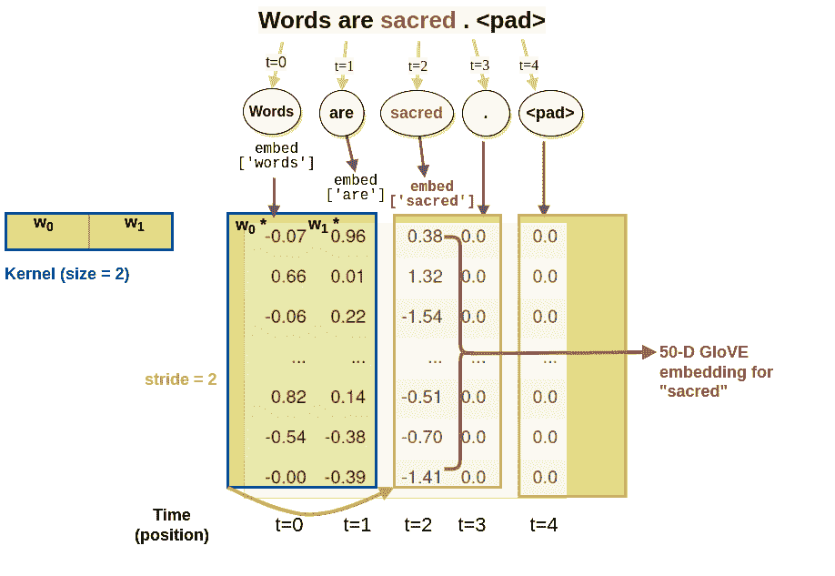

图 7.16 展示了 PyTorch 中 `nn.Embedding` 层在幕后执行的操作。为了让你了解 1-D 卷积如何在你的数据上滑动，该图显示了一个两个长度的核在你的数据上移动的 3 个步骤。但是一个 1-D 卷积如何在一个 300-D GloVe 单词嵌入序列上工作呢？你只需要为你想要查找模式的每个维度创建一个卷积核（滤波器）。这意味着你的单词向量的每个维度都是卷积层中的一个通道。

不幸的是，许多博客文章和教程可能会误导您关于卷积层的正确尺寸。 许多 PyTorch 初学者认为 Embedding 层的输出可以直接流入卷积层而不需要任何调整大小。 不幸的是，这将创建一个沿着单词嵌入维度而不是单词序列的 1-D 卷积。 因此，您需要转置您的嵌入层输出，以使通道（单词嵌入维度）与卷积通道对齐。

PyTorch 有一个 `nn.Embedding` 层，您可以在所有深度学习流水线中使用。 如果您希望模型从头开始学习嵌入，您只需要告诉 PyTorch 您需要多少嵌入，这与您的词汇量大小相同。 嵌入层还需要您告诉它为每个嵌入向量分配多少维度。 可选地，您可以定义填充令牌索引 id 号。

##### 代码清单 7.19 从头开始学习嵌入

```py
from torch import nn

embedding = nn.Embedding(
    num_embeddings=2000,  # #1
    embedding_dim=64,  # #2
    padding_idx=0)
```

嵌入层将是您的 CNN 中的第一层。这将把您的令牌 ID 转换成它们自己独特的 64-D 单词向量。在训练期间的反向传播将调整每个单词在每个维度上的权重，以匹配单词可用于谈论新闻灾害的 64 种不同方式。这些嵌入不会像第六章中的 FastText 和 GloVe 向量一样代表单词的完整含义。这些嵌入只有一个好处，那就是确定一条 Tweet 是否包含新闻灾害信息。

最后，您可以训练您的 CNN，看看它在像 Kaggle 灾难推文数据集这样的极窄数据集上的表现如何。 那些花费时间打造 CNN 的小时将以极快的训练时间和令人印象深刻的准确性得到回报。

##### 代码清单 7.20 从头开始学习嵌入

```py
from nlpia2.ch07.cnn.train79 import Pipeline  # #1

pipeline = Pipeline(
    vocab_size=2000,
    embeddings=(2000, 64),
    epochs=7,
    torch_random_state=433994,  # #2
    split_random_state=1460940,
)

pipeline = pipeline.train()
```

```py
Epoch: 1, loss: 0.66147, Train accuracy: 0.61392, Test accuracy: 0.63648
Epoch: 2, loss: 0.64491, Train accuracy: 0.69712, Test accuracy: 0.70735
Epoch: 3, loss: 0.55865, Train accuracy: 0.73391, Test accuracy: 0.74278
Epoch: 4, loss: 0.38538, Train accuracy: 0.76558, Test accuracy: 0.77165
Epoch: 5, loss: 0.27227, Train accuracy: 0.79288, Test accuracy: 0.77690
Epoch: 6, loss: 0.29682, Train accuracy: 0.82119, Test accuracy: 0.78609
Epoch: 7, loss: 0.23429, Train accuracy: 0.82951, Test accuracy: 0.79003
```

仅仅经过 7 次通过训练数据集，您就在测试集上实现了 79% 的准确率。 在现代笔记本电脑 CPU 上，这应该不到一分钟。 并且通过最小化模型中的总参数，您将过拟合保持到最低。 与嵌入层相比，CNN 使用的参数非常少。

如果您继续训练一段时间会发生什么？

##### 代码清单 7.21 继续训练

```py
pipeline.epochs = 13  # #1
pipeline = pipeline.train()
```

```py
Epoch: 1, loss: 0.24797, Train accuracy: 0.84528, Test accuracy: 0.78740
Epoch: 2, loss: 0.16067, Train accuracy: 0.86528, Test accuracy: 0.78871
...
Epoch: 12, loss: 0.04796, Train accuracy: 0.93578, Test accuracy: 0.77690
Epoch: 13, loss: 0.13394, Train accuracy: 0.94132, Test accuracy: 0.77690
```

哦，这看起来很可疑。 过拟合太严重了 - 在训练集上达到了 94%，在测试集上达到了 78%。 训练集准确率不断上升，最终超过了 90%。 到了第 20 个 epoch，模型在训练集上的准确率达到了 94%。 它甚至比专家人类还要好。 自己阅读几个示例，不看标签，你能得到其中的 94% 吗？ 这是前四个示例，经过令牌化后，忽略了词汇表外的词汇，并添加了填充。

```py
pipeline.indexes_to_texts(pipeline.x_test[:4])
```

```py
['getting in the poor girl <PAD> <PAD> ...',
 'Spot Flood Combo Cree LED Work Light Bar Offroad Lamp Full ...',
 'ice the meltdown <PAD> <PAD> <PAD> <PAD> ...',
 'and burn for bush fires in St http t co <PAD> <PAD> ...']
```

如果你的答案是["disaster", "not", "not", "disaster"]，那你全部答对了。但继续努力吧。你能做到十九对二十吗？这就是你需要在训练集准确率上击败这个卷积神经网络所需要做到的。这不是什么意外，因为机器人一直在推特上发布听起来像是灾难的推文。有时甚至真实的人类也会对世界事件感到讽刺或煽动性。

是什么导致了这种过拟合？是参数太多了吗？神经网络的"容量"太大了吗？以下是一个好的函数，用于显示 PyTorch 神经网络每层的参数。

```py
>>> def describe_model(model):  # #1
...     state = model.state_dict()
...     names = state.keys()
...     weights = state.values()
...     params = model.parameters()
>>>     df = pd.DataFrame()
>>>     df['name'] = list(state.keys())
>>>     df['all'] = p.numel(),
...     df['learned'] = [
...         p.requires_grad  # #2
...         for p in params],  # #3
...     size=p.size(),
...     )
        for name, w, p in zip(names, weights, params)
    ]
    )
    df = df.set_index('name')
    return df

describe_model(pipeline.model)  # #4
```

```py
learned_params  all_params        size
name
embedding.weight             128064      128064  (2001, 64)  # #1
linear_layer.weight            1856        1856   (1, 1856)
linear_layer.bias                 1           1        (1,)
```

当你遇到过拟合问题时，你可以在管道中使用预训练模型来改善其泛化能力。

### 7.4.3 迁移学习

另一个可以帮助你的 CNN 模型的优化方法是使用预训练的词嵌入，如 GloVe。这并不是作弊，因为这些模型是以无监督的方式训练的，没有使用你的灾难推文数据集的任何标签。你可以将这些 GloVe 向量中所包含的所有学习迁移到您训练模型所使用的与灾难相关的词汇集上，通过使用单词的更一般的含义。你只需要调整嵌入层的大小，以容纳你希望用来初始化 CNN 的 GloVe 嵌入的大小。

##### 代码清单 7.22：为 GloVE 嵌入腾出空间

```py
>>> from torch import nn
>>> embedding = nn.Embedding(
...     num_embeddings=2000,  # #1
...     embedding_dim=50,  # #2
...     padding_idx=0)
```

就是这样。一旦 PyTorch 知道嵌入的数量和它们的维度，它就可以分配内存来保存嵌入矩阵，其中有 `num_embedding` 行和 `embedding_dim` 列。这将同时训练你的嵌入和其余的 CNN 部分。你的领域特定的词汇和嵌入将根据你的语料库进行自定义。但是，从头开始训练你的嵌入没有利用到单词在许多领域中共享的含义。

如果你希望你的管道能"跨域适应"，你可以使用在其他领域训练的嵌入。这种词嵌入的"跨训练"被称为*迁移学习*。通过使用在更广泛的文本语料库上训练的预训练词嵌入，这为你的嵌入层提前了解了单词的含义。为此，你需要过滤掉其他领域中使用的所有单词，以便你的 CNN 管道的词汇仅基于你的数据集中的单词。然后，你可以将这些单词的嵌入加载到你的`nn.Embedding`层中。

##### 代码清单 7.23：加载嵌入并与你的词汇对齐

```py
>>> from nessvec.files import load_vecs_df
>>> glove = load_vecs_df(HOME_DATA_DIR / 'glove.6B.50d.txt')
>>> zeroes = [0.] * 50
>>> embed = []
>>> for tok in vocab:  # #1
...     if tok in glove.index:
...         embed.append(glove.loc[tok])
...     else:
...         embed.append(zeros.copy())  # #2
>>> embed = np.array(embed)
>>> embed.shape
(4000, 50)
```

现在你已经将 4000 个标记的词汇表转换为一个 4000×5 的嵌入矩阵。`embed`数组中的每一行都表示一个具有 50 维向量的词汇表标记的含义。如果在你的词汇表中一个标记的 GloVe 嵌入不存在，那么它将有一个全为零的向量。这本质上使得那个标记对于理解你的文档毫无用处，就像一个 OOV（词汇表外）标记一样。

```py
>>> pd.Series(vocab)
0               a
1              in
2              to
          ...
3831         43rd
3832    beginners
3833        lover
Length: 3834, dtype: object
```

你已经从推文中取出了最常见的 4000 个标记。在这 4000 个词中，最小的 GloVE 词嵌入词汇表中有 3834 个可用的。因此，你用零向量填充了那 166 个缺失词的未知嵌入。当你在神经网络中训练嵌入层时，你的模型会学习这些词的意义并计算它们的嵌入。

现在你有了一种将标记转换为整数的一致方法，你可以将 GloVe 嵌入矩阵加载到你的 `nn.Embedding`层中。

##### 代码清单 7.24 初始化使用 GloVE 向量的嵌入层

```py
embed = torch.Tensor(embed)  # #1
print(f'embed.size(): {embed.size()}')
embed = nn.Embedding.from_pretrained(embed, freeze=False)  # #2
print(embed)
```

#### 检测有意义的模式

你说话的方式、单词的顺序，都很重要。你组合单词以创建对你来说具有重要意义的模式，以便将那个意义传达给其他人。

如果你希望你的机器成为一个有意义的自然语言处理器，它需要能够检测到更多不仅仅是特定标记的存在或不存在。你希望你的机器能够检测到隐藏在单词序列中的有意义的模式。^([23])

卷积是过滤器，它可以从单词中提取有意义的模式。最好的部分是，你不再需要将这些模式硬编码到卷积核中。训练过程将搜索最佳的模式匹配卷积，以解决你遇到的问题。每次将标记数据的错误通过网络向后传递时（反向传播），优化器会调整每个过滤器中的权重，使它们在检测意义和分类文本示例方面变得越来越好。

### 7.4.4 使用丢弃进行卷积神经网络的健壮性增强

大多数神经网络容易受到对抗样本的影响，这些样本会欺骗它们输出错误的分类或文本。有时，神经网络容易受到同义词替换、拼写错误或俚语插入等简单变化的影响。有时候只需要一点“语词沙拉”——无意义的随机词语——就能分散并困惑 NLP 算法。人类知道如何忽略噪音和过滤干扰，但机器有时会遇到麻烦。

*鲁棒化自然语言处理（NLP）*是研究处理来自不同来源的非常规文本的方法和技术。事实上，鲁棒化 NLP 的研究可能会揭示通向人工通用智能的路径。人类能够从极少的例子中学习新词和概念。而我们的泛化能力很好，既不过多也不过少。机器需要一点帮助。如果你能找出我们人类擅长之处的“秘密酱料”，然后将其编码到 NLP 流程中，那你就能够让机器具备类似的能力。

增强神经网络鲁棒性的一种常见技术是*随机丢弃法*。由于其简便性和有效性，*随机丢弃法*或简称*丢弃法*已经变得非常流行。你的神经网络几乎总会从丢弃层中受益。丢弃层会随机隐藏部分神经元的输出，使其不被其他神经元接收。这会导致你人造脑中的某条路径变得静音，并迫使其他神经元在丢弃期间学习当前的特定示例。

这似乎与直觉相悖，但丢弃法有助于使你的神经网络学习更广泛。如果没有丢弃层，你的网络将专注于帮助提高最大准确度的单词、模式和卷积滤波器。但你需要神经元们扩展他们的模式，以便你的网络能够对自然语言文本上的常见变化保持“健壮性”。

在神经网络中安装丢弃层的最佳位置是靠近末尾，就在运行完全连接的线性层之前。这个向量通过线性层传递的权重是来自 CNN 和池化层的输出。每个值代表一系列单词或意义和语法模式。通过隐藏一些模式，迫使你的预测层扩展其“思考”。虽然你的软件并没有真正考虑什么，但如果将其拟人化一点能够帮助你对为什么随机丢弃等技术可以提高模型准确度产生直觉。

## 7.5 使用 PyTorch CNN 处理灾难推文

现在进入有趣的部分。你要构造一个真实世界的 CNN，可以区分真实新闻和煽动性报道。你的模型可以帮助你过滤掉与文化战争有关的推文，让你专注于来自真实战区的新闻。

首先，你将看到新的卷积层在管道中的位置。然后你将组装所有组件，来训练一个基于“灾难推文”数据集的 CNN。如果负能量滚动和灾难不是你的菜的话，这个 CNN 也很容易适应任何带标签的推文数据集。你甚至可以选择一个你喜欢的话题作为目标标签，即使推文的作者不知道如何使用标签，你也可以找到与该标签话题相匹配的推文。

### 7.5.1 网络架构

这里是 CNN NLP 管道的每个阶段的处理步骤和张量的相应形状。构建新 CNN 中最棘手的事情之一是跟踪您张量的形状。您需要确保一个层的输出形状与下一层的输入形状相匹配，对于此示例与以前的示例相同。

1.  令牌化⇒`(N_, )`

1.  填充⇒`(N,)`

1.  嵌入⇒`(M, N)`

1.  卷积(s)⇒`(M, N - K)`

1.  激活⇒`(M, N - K)`

1.  池化⇒`(M, N - K)`

1.  丢弃（可选）⇒`(M, N - K)`

1.  线性组合⇒`(L, )`

1.  Argmax、softmax 或阈值化⇒`(L, )`

和

+   `N_`是您输入文本中的标记数。

+   `N`是您填充序列中的标记数。

+   `M`是您的单词嵌入中的维度数。

+   `K`是您的核大小。

+   `L`是您想要预测的类标签或值的数量。

您的 CNN 的 PyTorch 模型比第 5 和第六章中的要多一些超参数。然而，与以前一样，将超参数设置在`CNNTextClassifier`模型的`*init*`构造函数中是一个好主意。

##### 列表 7.25 CNN 超参数

```py
class CNNTextClassifier(nn.Module):

    def __init__(self, embeddings):
        super().__init__()

        self.seq_len = 40  # #1
        self.vocab_size = 10000  # #2
        self.embedding_size = 50  # #3
        self.out_channels = 5  # #4
        self.kernel_lengths = [2, 3, 4, 5, 6]  # #5
        self.stride = 1  # #6
        self.dropout = nn.Dropout(0)  # #7
        self.pool_stride = self.stride  # #8
        self.conv_out_seq_len = calc_out_seq_len(  # #9
            seq_len=self.seq_len,
            kernel_lengths=self.kernel_lengths,
            stride=self.stride,
            )
```

就像本章前面手工制作的卷积一样，每个卷积操作都会减少序列长度。缩短的量取决于内核的大小和步幅。`Conv1d`层的 PyTorch 文档提供了这个公式和对术语的详细解释。^([25])

```py
def calc_conv_out_seq_len(seq_len, kernel_len,
                          stride=1, dilation=1, padding=0):
    """
    L_out =     (L_in + 2 * padding - dilation * (kernel_size - 1) - 1)
            1 + _______________________________________________________
                                        stride
    """
    return (
        1 + (seq_len +
             2 * padding - dilation * (kernel_len - 1) - 1
            ) //
        stride
        )
```

您的第一个 CNN 层是一个`nn.Embedding`层，它将一系列单词 ID 整数转换为一系列嵌入向量。它的行数与词汇表中唯一标记的数量相同（包括新的填充标记）。它的每个嵌入向量的维度都有一列。您可以从 GloVe 或任何其他预训练的嵌入中加载这些嵌入向量。

##### 列表 7.26 初始化 CNN 嵌入

```py
self.embed = nn.Embedding(
    self.vocab_size,  # #1
    self.embedding_size,  # #2
    padding_idx=0)
state = self.embed.state_dict()
state['weight'] = embeddings  # #3
self.embed.load_state_dict(state)
```

接下来，您想构建卷积和池化层。每个卷积层的输出大小可以用来定义一个池化层，其核占据整个卷积层输出序列。这就是您在 PyTorch 中完成“全局”最大池化的方法，以产生每个卷积滤波器（核）输出的单个最大值。这就是自然语言处理专家如克里斯托弗·曼宁和 Yoon Kim 在他们的研究论文中所做的，这些论文取得了最先进的性能。^([26])^([27])

##### 列表 7.27 构建卷积和池化层

```py
self.convolvers = []
self.poolers = []
total_out_len = 0
for i, kernel_len in enumerate(self.kernel_lengths):
    self.convolvers.append(
        nn.Conv1d(in_channels=self.embedding_size,
                  out_channels=self.out_channels,
                  kernel_size=kernel_len,
                  stride=self.stride))
    print(f'conv[{i}].weight.shape: {self.convolvers[-1].weight.shape}')
    conv_output_len = calc_conv_out_seq_len(
        seq_len=self.seq_len, kernel_len=kernel_len, stride=self.stride)
    print(f'conv_output_len: {conv_output_len}')
    self.poolers.append(
        nn.MaxPool1d(kernel_size=conv_output_len, stride=self.stride))
    total_out_len += calc_conv_out_seq_len(
        seq_len=conv_output_len, kernel_len=conv_output_len,
        stride=self.stride)
    print(f'total_out_len: {total_out_len}')
    print(f'poolers[{i}]: {self.poolers[-1]}')
print(f'total_out_len: {total_out_len}')
self.linear_layer = nn.Linear(self.out_channels * total_out_len, 1)
print(f'linear_layer: {self.linear_layer}')
```

与以前的例子不同，你现在要创建多个卷积和池化层。对于这个例子，我们不会像在计算机视觉中经常做的那样将它们一层层叠加。相反，你将连接卷积和池化的输出。这是有效的，因为你通过执行全局最大池化限制了卷积和池化输出的维度，并保持了输出通道的数量远远小于嵌入维度的数量。

你可以使用打印语句来帮助调试 CNN 每一层的矩阵形状不匹配的问题。并且你要确保不会无意间创建太多可训练参数，导致过度拟合超过你的预期：你的池化输出每个包含一个长度为 1 的序列，但它们也包含了在卷积期间组合在一起的 5 个通道的嵌入维度。因此，连接和池化的卷积输出是一个 5x5 张量，产生了一个 25-D 线性层的输出张量，编码了每个文本的含义。

##### 列表 7.28 CNN 层形状

```py
conv[0].weight.shape: torch.Size([5, 50, 2])
conv_output_len: 39
total_pool_out_len: 1
poolers[0]: MaxPool1d(kernel_size=39, stride=1, padding=0, dilation=1,
    ceil_mode=False)
conv[1].weight.shape: torch.Size([5, 50, 3])
conv_output_len: 38
total_pool_out_len: 2
poolers[1]: MaxPool1d(kernel_size=38, stride=1, padding=0, dilation=1,
    ceil_mode=False)
conv[2].weight.shape: torch.Size([5, 50, 4])
conv_output_len: 37
total_pool_out_len: 3
poolers[2]: MaxPool1d(kernel_size=37, stride=1, padding=0, dilation=1,
    ceil_mode=False)
conv[3].weight.shape: torch.Size([5, 50, 5])
conv_output_len: 36
total_pool_out_len: 4
poolers[3]: MaxPool1d(kernel_size=36, stride=1, padding=0, dilation=1,
    ceil_mode=False)
conv[4].weight.shape: torch.Size([5, 50, 6])
conv_output_len: 35
total_pool_out_len: 5
poolers[4]: MaxPool1d(kernel_size=35, stride=1, padding=0, dilation=1,
     ceil_mode=False)
total_out_len: 5
linear_layer: Linear(in_features=25, out_features=1, bias=True)
```

最终结果是一个迅速过拟合的语言模型和文本分类器。你的模型在第 55 个时期达到了最大的测试准确率 73%，在最后一个时期，第 75 个时期达到了最大的训练集准确率 81%。通过增加卷积层的通道数，你甚至可以实现更多的过拟合。通常，你希望确保你的第一次训练运行能够完成过拟合，以确保所有层都正确配置，并为特定问题或数据集设置一个可实现的准确率的上限。

```py
Epoch:  1, loss: 0.76782, Train accuracy: 0.59028, Test accuracy: 0.64961
Epoch:  2, loss: 0.64052, Train accuracy: 0.65947, Test accuracy: 0.67060
Epoch:  3, loss: 0.51934, Train accuracy: 0.68632, Test accuracy: 0.68766
...
Epoch: 55, loss: 0.04995, Train accuracy: 0.80558, Test accuracy: 0.72966
Epoch: 65, loss: 0.05682, Train accuracy: 0.80835, Test accuracy: 0.72178
Epoch: 75, loss: 0.04491, Train accuracy: 0.81287, Test accuracy: 0.71522
```

通过将每个嵌入的通道数从 5 减少到 3，你可以将总输出维度从 25 减少到 15。这将限制过度拟合，但会降低收敛速率，除非你增加学习系数：

```py
Epoch:  1, loss: 0.61644, Train accuracy: 0.57773, Test accuracy: 0.58005
Epoch:  2, loss: 0.52941, Train accuracy: 0.63232, Test accuracy: 0.64567
Epoch:  3, loss: 0.45162, Train accuracy: 0.67202, Test accuracy: 0.65486
...
Epoch: 55, loss: 0.21011, Train accuracy: 0.79200, Test accuracy: 0.69816
Epoch: 65, loss: 0.21707, Train accuracy: 0.79434, Test accuracy: 0.69423
Epoch: 75, loss: 0.20077, Train accuracy: 0.79784, Test accuracy: 0.70079
```

### 7.5.2 池化

池化将大张量中的数据聚合以将信息压缩为较少的值。在“大数据”领域，这通常被称为“减少”操作，其中 map-reduce 软件模式很常见。卷积和池化非常适合 map-reduce 软件模式，并且可以在 GPU 中自动并行化使用 PyTorch。你甚至可以使用多服务器的 HPC（高性能计算）系统来加速训练。但是 CNN 是如此高效，你可能不太需要这种计算能力。

你习惯计算的所有矩阵数据上的统计量都可以作为 CNN 的池化函数有用：

+   `min`

+   `max`

+   `std`

+   `sum`

+   `mean`

最常见和最成功的聚合

### 7.5.3 线性层

连接编码方法为你提供了关于每条微博的大量信息。编码向量有 1856 个值。你在第六章中使用的最大词向量是 300 维。而对于这个特定的流水线，你真正想要的只是对问题“是否新闻值得报道？”的二进制答案。

你还记得第六章中当你试图让神经网络预测关于特定单词出现或缺失的“是或否”问题时，你是如何做的吗？尽管你并没有真正关注这几千个问题的答案（词汇表中每个词一个问题），但现在你面临的问题是一样的。所以你可以采用相同的方法，一个`torch.nn.Linear`层将会最优地将来自高维向量的所有信息组合在一起，以回答你提出的任何问题。

因此，你需要添加一个线性层，其中包含与从池化层输出的编码维度数量相同的权重。

清单 7.26 显示了计算线性层大小的代码。

##### 清单 7.29 计算 1D 卷积输出的张量大小

```py
out_pool_total = 0
for kernel_len, stride in zip(kernel_lengths, strides):
    out_conv = (
        (in_seq_len - dilation * (kernel_len - 1) - 1) // stride) + 1
    out_pool = (
        (out_conv - dilation * (kernel_len - 1) - 1) // stride) + 1
    out_pool_total += out_pool
```

### 7.5.4 得到拟合

在你训练卷积神经网络之前，你需要告诉它如何根据每一批训练数据来调整权重（参数）。你需要计算两个部分，权重相对于损失函数（梯度）的斜率，以及尝试下降该斜率的距离（学习率）。在前面章节中的单层感知机甚至逻辑回归中，你可以使用一些通用的优化器如“Adam”来实现。你通常可以为卷积神经网络设置一个固定的学习率，并且这些方法对卷积神经网络也适用。然而，如果你想加快训练速度，可以尝试找到一个更聪明的优化器，它可以更好地调整模型的所有参数。Geoffrey Hinton 称这种方法为“rmsprop”，因为他使用了均方根（RMS）公式来计算最近梯度的移动平均值。RMSprop 对每一批数据聚合一个指数衰减的窗口来改善参数梯度（斜率）的估计并加快学习速度。它通常是卷积神经网络在自然语言处理中反向传播的一个不错选择。

### 7.5.5 超参数调优

探索超参数空间，看看是否可以超过我的性能。Fernando Lopez 和其他人已经使用 1-D 卷积在这个数据集上实现了 80%的验证和测试集准确率。可能还有很大的提升空间。

nlpia2 包含一个命令行脚本，它接受许多你可能想要调整的超参数的参数。试一试，看看是否可以找到超参数空间中更丰富的部分。你可以在清单 7.27 中看到我的最新尝试。

##### 清单 7.30 用于优化超参数的命令行脚本

```py
python train.py --dropout_portion=.35 --epochs=16 --batch_size=8 --win=True
```

```py
Epoch:  1, loss: 0.44480, Train accuracy: 0.58152, Test accuracy: 0.64829
Epoch:  2, loss: 0.27265, Train accuracy: 0.63640, Test accuracy: 0.69029
...
Epoch: 15, loss: 0.03373, Train accuracy: 0.83871, Test accuracy: 0.79396
Epoch: 16, loss: 0.09545, Train accuracy: 0.84718, Test accuracy: 0.79134
```

您注意到清单 7.27 中的 `win=True` 标志了吗？这是我在我的 CNN 流水线中为自己创建的一个彩蛋或秘籍代码。每当我在“彩票假设”游戏中发现一个中奖票时，我就会把它硬编码到我的流水线中。为了使其生效，您必须跟踪您使用的随机种子、精确的数据集和软件。如果您能重现所有这些组件，通常可以重新创建一个特别幸运的“抽签”，以便在后续思考新的架构或参数调整时进行改进。

实际上，这个获胜的随机数序列初始化了模型的权重，以至于测试准确性开始时比训练集准确性更好。训练准确性超过测试集准确性需要 8 个时期。在通过数据集进行 16 次传递（时期）后，模型对训练集的拟合程度比测试集提高了 5%。

如果您想要获得更高的测试集准确性并减少过拟合，您可以尝试添加一些正则化或增加在 Dropout 层中忽略的数据量。对于大多数神经网络来说，30% 到 50% 的丢弃比率通常可以很好地防止过拟合，而不会延迟学习太久。单层 CNN 并不会因为丢弃比率超过 20% 而受益太多。

##### 清单 7.31 CNN 超参数调优

```py
learning  seq  case vocab           training      test
 kernel_sizes    rate  len  sens  size dropout  accuracy  accuracy
          [2]  0.0010   32 False  2000     NaN    0.5790    0.5459
[1 2 3 4 5 6]  0.0010   40 False  2000     NaN    0.7919    0.7100
    [2 3 4 5]  0.0015   40 False  2000     NaN    0.8038    0.7152
[1 2 3 4 5 6]  0.0010   40  True  2000     NaN    0.7685    0.7520
          [2]  0.0010   32  True  2000     0.2    0.8472    0.7533
    [2 3 4 5]  0.0010   32  True  2000     0.2    0.8727    0.7900
```

您能找到更好的超参数组合来提高此模型的准确性吗？不要期望能够达到比 80% 更好的测试集准确性，因为这是一个困难的问题。即使是人类读者也无法可靠地判断一条推文是否代表了真实的新闻灾难。毕竟，其他人类（和机器人）正在撰写这些推文，试图欺骗读者。这是一个对抗性问题。即使是一个小的单层 CNN 也能做出体面的工作。

##### 图 7.17 我们找到的最佳超参数的学习曲线

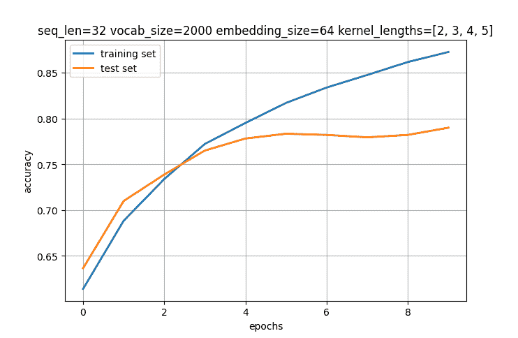

超参数调优的关键是要认真记录每一个实验，并对下一个实验中进行的超参数调整做出深思熟虑的决定。您可以使用贝叶斯优化器自动化这个决策过程。但在大多数情况下，如果您使用生物神经网络来完成贝叶斯优化，您可以培养自己的直觉并更快地调整超参数。如果您对转置操作对嵌入层的影响感兴趣，您可以尝试两种方法，看看哪种在您的问题上效果最好。但是如果您想在困难问题上获得最先进的结果，您可能想听取专家的意见。不要相信互联网上的一切，特别是涉及 NLP 的 CNN。

## 7.6 自我测试

1.  对于长度为 3 的核和长度为 8 的输入数组，输出的长度是多少？

1.  在本章中使用的秘密消息音频文件中，用于检测“SOS”求救信号（**S**ave **O**ur **S**ouls，或 **S**ave **O**ur **S**hip）的内核是什么？

1.  调整超参数后，你能够为新闻价值微博问题达到的最佳训练集准确率是多少？

1.  你如何扩展模型以容纳额外的类？在 gitlab 上提供的 `nlpia2` 包中的 `news.csv` 文件包含了一些著名的引语，可以让你尝试用你的卷积神经网络进行分类。

1.  编写 3 个内核，分别用于检测点、短划线和停顿。编写一个 *计数* 这些符号的唯一出现次数的池化函数。奖励：创建一个将秘密消息音频文件转换成符号 `"."`、`"-"` 和 `" "` 的函数系统。

1.  找到一些超参数（不要忘记随机种子），以在灾难推文数据集的测试集上达到超过 80% 的准确率。

1.  使用 Hugging Face 上的数据集和示例创建一个基于单词的 CNN 的讽刺检测器（huggingface.co）。有几篇发表的论文声称可以从单个推文中，不需要上下文，检测到 91% 的讽刺准确率。^([30]) ^([31])

## 摘要

+   卷积是一个窗口滤波器，它在你的单词序列上滑动以将其含义压缩为编码向量。

+   手工制作的卷积滤波器对可预测的信号（如摩尔斯电码）效果很好，但是你需要为自然语言处理训练自己的卷积神经网络来学习它们自己的滤波器。

+   神经网络可以提取出一系列单词中的模式，而其他自然语言处理方法可能会错过。

+   在训练过程中，如果你通过使用一个 dropout 层稍微阻碍你的模型，你可以防止它在训练数据上过度表现（过拟合）。

+   神经网络的超参数调整给你比传统的机器学习模型更多的发挥空间。

+   如果你的卷积神经网络将嵌入维度与卷积通道对齐，你可以在 NLP 竞赛中超过 90% 的博主。

+   传统的 CNN 可能会让你惊讶地发现它们在解决诸如检测新闻推文之类的难题时的效率。

Digits 技术描述（ `digits.com/technology`）

《连线》杂志在一篇 2014 年的文章中提出了数据作为新石油的概念（ `www.wired.com/insights/2014/07/data-new-oil-digital-economy/`）

谷歌 AI 博客上的路径语言模型，或称为 PaLM，( `ai.googleblog.com/2022/04/pathways-language-model-palm-scaling-to.html`)

GPT-J 至少需要 48GB 的 RAM（ `huggingface.co/docs/transformers/model_doc/gptj`）

由陈秋睿撰写的《T5 - 详细解释》（ `archive.today/M2EM6`）

[维基百科上的数字图像处理](https://en.wikipedia.org/wiki/Digital_image_processing#Filtering)（ `en.wikipedia.org/wiki/Digital_image_processing#Filtering`）

[[7]](#_footnoteref_7) 维基百科上的"Sobel filter"（`en.wikipedia.org/wiki/Sobel_operator`）

[[8]](#_footnoteref_8) "高斯滤波器"（`en.wikipedia.org/wiki/Gaussian_filter`）

[[9]](#_footnoteref_9) 2015 年 5 月，《自然》杂志，Hinton、LeCunn 和 Benjio 的"深度学习"（`www.nature.com/articles/nature14539`）

[[10]](#_footnoteref_10) Andrey Kurenkov 撰写的"神经网络和深度学习的简要历史"（`www.skynettoday.com/overviews/neural-net-history`）

[[11]](#_footnoteref_11) SpaCy NER 文档（`spacy.io/universe/project/video-spacys-ner-model`）

[[12]](#_footnoteref_12) LeCun, Y 和 Bengio, Y 撰写的"图像、语音和时间序列的卷积网络"（`www.iro.umontreal.ca/~lisa/pointeurs/handbook-convo.pdf`）

[[13]](#_footnoteref_13) 有时称为"反馈三明治"或"sh-t 三明治"。

[[14]](#_footnoteref_14) Michelle Moerel 等人撰写的"人类听觉皮层区域的解剖和功能地形学"（`www.ncbi.nlm.nih.gov/pmc/articles/PMC4114190/`）

[[15]](#_footnoteref_15) Mastodon 是一个由社区拥有的、无广告的社交网络：`joinmastodon.org/`

[[16]](#_footnoteref_16) Mastodon 是一个类似于 Twitter 的 FOSS 无广告微博平台，具有用于检索 NLP 数据集的开放标准 API（`mastodon.social`）

[[17]](#_footnoteref_17) GreenPill 是一个鼓励加密货币投资者为公共产品做出贡献的再生经济倡议（`greenpill.party`）。

[[18]](#_footnoteref_18) GDFL（GNU 自由文档许可证）pt.wikipedia.org `pt.wikipedia.org/wiki/Zebra#/media/Ficheiro:Zebra_standing_alone_crop.jpg`

[[19]](#_footnoteref_19) 维基百科上的"Morse code"文章（`en.wikipedia.org/wiki/Morse_code`）

[[20]](#_footnoteref_20) 维基共享资源中的秘密信息波形文件（`upload.wikimedia.org/wikipedia/commons/7/78/1210secretmorzecode.wav`）

[[21]](#_footnoteref_21) "Ham" 最初是对于笨拙的摩尔斯电码"打字员"的蔑称（`en.wikipedia.org/wiki/Amateur_radio#Ham_radio`）

[[22]](#_footnoteref_22) Ronan Collobert 和 Jason Weston 撰写的"自然语言处理的统一架构"（`thetalkingmachines.com/sites/default/files/2018-12/unified_nlp.pdf`）

[[23]](#_footnoteref_23) *国际促进者协会手册*，`mng.bz/xjEg`

[[24]](#_footnoteref_24) Robin Jia 关于 Robust NLP 的论文（`robinjia.github.io/assets/pdf/robinjia_thesis.pdf`）以及他与 Kai-Wei Chang、He He 和 Sameer Singh 的演讲（`robustnlp-tutorial.github.io`）

[[25]](#_footnoteref_25)（`pytorch.org/docs/stable/generated/torch.nn.Conv1d.html`）

[[26]](#_footnoteref_26) "自然语言处理中的卷积神经网络" 由 Christopher Manning 撰写（`mng.bz/1Meq`）

[[27]](#_footnoteref_27) "《CNNs 用于句子分类的敏感性分析》" 由 Ye Zhang 和 Brian Wallace 撰写（`arxiv.org/pdf/1510.03820.pdf`）

[[28]](#_footnoteref_28) 来自 Hinton 的《梯度下降小批量概览》的幻灯片 14 "加速机器学习的四种方法"（`www.cs.toronto.edu/~tijmen/csc321/slides/lecture_slides_lec6.pdf`）

[[29]](#_footnoteref_29) Tijmen Tieleman 的博士论文《优化生成图像的神经网络》（`www.cs.toronto.edu/~tijmen/tijmen_thesis.pdf`）

[[30]](#_footnoteref_30) Ivan Helin 在 Hugging Face 上声称他们的模型达到了 92%的准确率（`huggingface.co/helinivan/english-sarcasm-detector`）

[[31]](#_footnoteref_31) "通过 CNN 深入研究讽刺推文" 由 Soujanya Poria 等人撰写，声称达到了 91%的准确率（`arxiv.org/abs/1610.08815`）
