# 第九章：一种可堆叠的深度学习（transformers）

### 本章内容包括

+   理解 transformers 如此强大的原因。

+   看看 transformers 如何为自然语言处理提供无限的“堆叠”选项。

+   编码文本以创建有意义的向量表示。

+   解码语义向量以生成文本。

+   为你的应用程序对 transformers（BERT、GPT）进行微调。

+   将 transformers 应用于长文档的抽取和摘要概括。

+   使用 transformers 生成语法正确且有趣的文本。

+   估算 transformer 网络为特定问题所需的信息容量。

*Transformers*正在改变世界。transformers 为人工智能带来的增强智能正在改变文化、社会和经济。transformers 首次让我们质疑人类智能和创造力的长期经济价值。而 transformers 的涟漪效应不仅仅限于经济。transformers 不仅正在改变我们的工作和娱乐方式，甚至还在改变我们的思维、沟通和创造方式。在不到一年的时间里，被称为大型语言模型（LLMs）的 transformer 启用的人工智能创造了全新的工作类别，如*prompt engineering*和实时内容策划与事实核查（grounding）。科技公司正在争相招募能够设计有效的 LLM 提示并将 LLMs 纳入其工作流程的工程师。transformers 正在自动化和加速信息经济工作的生产力，而这些工作以前需要机器无法达到的创造力和抽象水平。

随着 transformers 自动化越来越多的信息经济任务，工作者们开始重新考虑他们的工作是否像他们想象的那样对雇主至关重要。例如，有影响力的网络安全专家每天都在吹嘘，他们正在借助 ChatGPT 的数十个建议来增强他们的思维、规划和创造力。2020 年，微软新闻和 MSN.com 网站裁员了其新闻记者，用能够自动策划和摘要新闻文章的 transformer 模型取代了他们。这场（内容质量阶梯的）竞赛可能不会对媒体公司或他们的广告客户和员工带来好的结果。

在本章中，你将学习如何使用**transformers**来*提高*自然语言文本的准确性和思考性。即使你的雇主试图用编程来替代你的工作，你也会知道如何使用 transformers 来为自己创造新的机会。编程还是被编程。自动化还是被自动化。

并且 transformers 不仅是自然语言生成的最佳选择，也是自然语言理解的最佳选择。任何依赖于意义向量表示的系统都可以从 transformers 中受益。

+   有一段时间，Replika 使用**GPT-3**来生成超过 20%的回复。

+   Qary 使用 BERT 生成开放域问题答案。

+   谷歌使用基于**BERT**的模型来改进搜索结果并查询知识图谱。

+   `nboost` 使用 transformers 为 ElasticSearch 创建语义搜索代理

+   aidungeon.io 使用 GPT-3 生成无尽种类的房间

+   大多数语义搜索的向量数据库都依赖于 transformers。^([2])

即使你只想精通*提示工程*，你对 transformers 的理解也将帮助你设计避开 LLM（大型语言模型）能力缺陷的 LLM 提示。而 LLM 充满漏洞，以至于工程师和统计学家在思考 LLM 失败时常常使用*瑞士奶酪模型*。^([3]) LLM 的会话界面使学习如何诱导尖刻的对话人工智能系统做出有价值的工作变得容易。了解 LLM 如何工作并能够为自己的应用程序微调它们的人，将掌握一台强大的机器。想象一下，如果你能够构建一个能够帮助学生解决算术和数学问题的“TutorGPT”，那么你将会受到多么追捧。基加利的 Rising Academies 的 Shabnam Aggarwal 正用她的 Rori.AI WhatsApp 数学辅导机器人帮助中学生做到这一点。^([4]) ^([5]) 而 Vishvesh Bhat 则将这一点做为自己的激情项目帮助大学数学学生做到了。^([6]) ^([7])

## 9.1 递归 vs 循环

Transformers 是自回归式自然语言处理模型中的最新重大进展。自回归模型一次预测一个离散输出值，通常是自然语言文本中的一个标记或词语。自回归模型将输出循环利用作为输入来预测下一个输出，因此自回归神经网络是*递归*的。词语“递归”是一个通用术语，用于描述将输出再次引入输入的任何循环过程，这个过程可以无限地继续，直到算法或计算“终止”。在计算机科学中，递归函数会一直调用自身，直到达到期望的结果。

但是，transformers 的递归方式更大、更一般，而不像*循环*神经网络那样。transformers 被称为*递归*NN，而不是*循环*NN，因为*递归*是一个更一般的术语，用于描述任何将输入循环利用的系统。^([8]) 术语*循环*专门用于描述像 LSTM 和 GRU 这样的 RNN，其中各个神经元将其输出循环到同一神经元的输入，以便在序列标记的每个步骤中进行。

Transformers 是一种*递归*算法，但不包含*循环*神经元。正如你在第八章学到的那样，循环神经网络在每个单个神经元或 RNN *单元*内循环利用其输出。但是 Transformers 等待到最后一层才输出一个可以回收到输入中的令牌嵌入。整个 Transformer 网络，包括编码器和解码器，必须运行以预测每个令牌，以便该令牌可以用来帮助预测下一个。在计算机科学世界中，你可以看到 Transformer 是一个大的递归函数调用一系列非递归函数内部。整个 Transformer 递归运行以生成一个令牌。

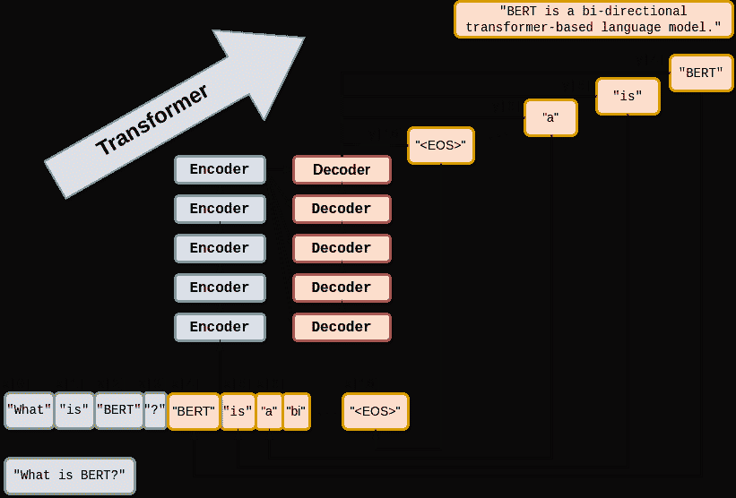

因为 Transformer 内部没有循环，所以不需要“展开”。这使得 Transformers 比 RNN 有巨大优势。Transformer 中的单个神经元和层可以同时并行运行。对于 RNN，你必须按顺序依次运行神经元和层的函数。*展开*所有这些循环函数调用需要大量计算资源，并且必须按顺序执行。你不能跳过或并行运行它们。它们必须按顺序一直运行到整个文本的结尾。Transformer 将问题分解为一个更小的问题，一次预测一个令牌。这样，Transformer 的所有神经元都可以在 GPU 或多核 CPU 上并行运行，从而大大加快预测所需的时间。

他们使用最后预测的输出作为输入来预测下一个输出。但是 Transformers 是*递归*而不是*循环*的。循环神经网络（RNNs）包括变分自动编码器、RNNs、LSTMs 和 GRUs。当研究人员将五种自然语言处理思想结合起来创建 Transformer 架构时，他们发现总体能力远远超过其各部分之和。让我们详细看看这些思想。

### 9.1.1 注意力不是你所需要的全部

+   *字节对编码（BPE）*：基于字符序列统计而不是空格和标点符号对单词进行标记化

+   *注意力*：使用连接矩阵（注意力）在长段文本中连接重要的单词模式

+   *位置编码*：跟踪令牌序列中每个令牌或模式的位置

字节对编码（Byte pair encoding，BPE）经常被忽视，是 transformer 的一种常见增强。BPE 最初是为了将文本编码成压缩的二进制（字节序列）格式而发明的。但是，当 BPE 被用作 NLP 流水线（如搜索引擎）中的分词器时，它真正展现了其作用。互联网搜索引擎通常包含数百万个词汇。想象一下搜索引擎预期要理解和索引的所有重要名称。BPE 可以有效地将您的词汇量减少几个数量级。典型的 transformer BPE 词汇量仅为 5000 个标记。当您为每个标记存储一个长的嵌入向量时，这是一件大事。一个在整个互联网上训练的 BPE 词汇表可以轻松适应典型笔记本电脑或 GPU 的 RAM 中。

注意力机制获得了 transformer 成功的大部分赞誉，因为它使其他部分成为可能。注意力机制比 CNN 和 RNN 的复杂数学（和计算复杂度）更简单。注意力机制消除了编码器和解码器网络的循环。因此，transformer 既没有 RNN 的*梯度消失*问题，也没有*梯度爆炸*问题。transformer 在处理的文本长度上受到限制，因为注意力机制依赖于每层的输入和输出的固定长度的嵌入序列。注意力机制本质上是一个跨越整个令牌序列的单个 CNN 核。注意力矩阵不是通过卷积或循环沿着文本滚动，而是简单地将其一次性乘以整个令牌嵌入序列。

transformer 中的循环丢失造成了一个新的挑战，因为 transformer 一次性操作整个序列。transformer 一次性*读取*整个令牌序列。而且它也一次性输出令牌，使得双向 transformer 成为一个明显的方法。transformer 在读取或写入文本时不关心令牌的正常因果顺序。为了给 transformer 提供关于令牌因果序列的信息，添加了位置编码。而且甚至不需要向量嵌入中的额外维度，位置编码通过将它们乘以正弦和余弦函数分散在整个嵌入序列中。位置编码使 transformer 对令牌的理解能够根据它们在文本中的位置进行微妙调整。有了位置编码，邮件开头的词“真诚”与邮件末尾的词“真诚”具有不同的含义。

限制令牌序列长度对效率改进产生了连锁反应，为 transformers 赋予了意外的强大优势：*可扩展性*。BPE 加上*注意力*和位置编码结合在一起，创造了前所未有的可扩展性。这三项创新和神经网络的简化结合在一起，创建了一个更易堆叠和更易并行化的网络。

+   *堆叠性*：transformers 层的输入和输出具有完全相同的结构，因此它们可以堆叠以增加容量。

+   *并行性*：模板化的 transformers 层主要依赖于大型矩阵乘法，而不是复杂的递归和逻辑切换门。

transformers 层的堆叠性与用于注意机制的矩阵乘法的可并行性相结合，创造了前所未有的可扩展性。当研究人员将其大容量 transformers 应用于他们能找到的最大数据集（基本上是整个互联网）时，他们感到惊讶。在极大的数据集上训练的极大 transformers 能够解决以前认为无法解决的 NLP 问题。聪明的人们开始认为，世界改变性的对话式机器智能（AGI）可能只有几年的时间，如果它已经存在的话。

### 9.1.2 关于一切的关注

你可能认为所有关于注意力强大之说都是无中生有。毕竟，transformers 不仅仅是在输入文本的每个令牌上进行简单的矩阵乘法。transformers 结合了许多其他不那么知名的创新，如 BPE、自监督训练和位置编码。注意力矩阵是所有这些想法之间的连接器，帮助它们有效地协同工作。注意力矩阵使 transformers 能够准确地建模长篇文本中*所有*单词之间的联系，一次完成。

与 CNN 和 RNN（LSTM 和 GRU）一样，transformers 的每一层都为您提供了输入文本*含义*或*思想*的越来越深入的表示。但与 CNN 和 RNN 不同，transformers 层的输出编码与之前的层大小和形状完全相同。同样，对于解码器，transformers 层输出一个固定大小的嵌入序列，表示输出令牌序列的语义（含义）。一个 transformers 层的输出可以直接输入到下一个 transformers 层中，使层更加*堆叠*，而不是 CNN 的情况。每个层内的注意力矩阵跨越整个输入文本的长度，因此每个 transformers 层具有相同的内部结构和数学。您可以堆叠尽可能多的 transformers 编码器和解码器层，为数据的信息内容创建您所需的深度神经网络。

每个 transformers 层都输出一个一致的*编码*，大小和形状相同。编码只是嵌入，但是针对标记序列而不是单个标记。事实上，许多自然语言处理初学者将术语“编码”和“嵌入”视为同义词，但在本章之后，您将了解到它们之间的区别。作为名词使用的“嵌入”一词比“编码”更受欢迎 3 倍，但随着更多的人在学习 transformers 方面跟上你的步伐，情况将会改变。[[9]](#_footnotedef_9)

与所有向量一样，编码保持一致的结构，以便它们以相同的方式表示您的标记序列（文本）的含义。transformers 被设计为接受这些编码向量作为其输入的一部分，以保持对文本前几层理解的“记忆”。这使您可以堆叠任意多层的 transformers 层，只要您有足够的训练数据来利用所有这些容量。这种“可伸缩性”使得 transformers 能够突破循环神经网络的收益递减上限。

由于注意力机制只是一个连接矩阵，因此可以将其实现为与 PyTorch `Linear`层的矩阵乘法。当您在 GPU 或多核 CPU 上运行 PyTorch 网络时，矩阵乘法是并行化的。这意味着可以并行化更大的 transformers，并且这些更大的模型可以训练得更快。*堆叠性*加上*可并行化*等于*可扩展性*。

transformers 层被设计为具有相同大小和形状的输入和输出，以便 transformers 层可以像形状相同的乐高积木一样堆叠。吸引大多数研究人员注意力的 transformers 创新是*注意力机制*。如果您想要了解使 transformers 对自然语言处理和人工智能研究人员如此兴奋的原因，请从那里开始。与使用循环或卷积的其他深度学习自然语言处理架构不同，transformers 架构使用堆叠的注意力层块，它们本质上是具有相同形状的全连接前馈层。

在第八章，您使用了循环神经网络来构建编码器和解码器以转换文本序列。在编码器-解码器（*转码器*或*传导*）网络中，[[10]](#_footnotedef_10)编码器处理输入序列中的每个元素，将句子提炼成一个固定长度的思想向量（或*上下文向量*）。然后，该思想向量可以传递给解码器，解码器将其用于生成一个新的标记序列。

编码器-解码器架构有一个很大的限制 —— 它无法处理更长的文本。如果一个概念或思想用多个句子或一个复杂的长句表达，那么编码的思想向量就无法准确地概括*所有*这些思想。 Bahdanau 等人提出的*注意机制* ^([11]) 解决了这个问题，并显示出改善序列到序列性能，特别是对于长句子，但它并不能缓解循环模型的时间序列复杂性。

在“Attention Is All You Need”中引入的*transformers*架构推动了语言模型向前发展并进入了公众视野。transformers 架构引入了几个协同特性，共同实现了迄今为止不可能的性能：

transformers 架构中最广为人知的创新是*自注意力*。类似于 GRU 或 LSTM 中的记忆和遗忘门，注意机制在长输入字符串中创建概念和词模式之间的连接。

在接下来的几节中，你将学习 transformers 背后的基本概念，并查看模型的架构。然后，你将使用 transformers 模块的基本 PyTorch 实现来实现一个语言翻译模型，因为这是“Attention Is All You Need”中的参考任务，看看它在设计上是如何强大而优雅的。

#### 自注意力

当我们写第一版这本书时，汉斯和科尔（第一版合著者）已经专注于注意机制。现在已经过去 6 年了，注意力仍然是深度学习中最研究的话题。注意机制为那些 LSTM 难以处理的问题的能力提升了一大步：

+   *对话* —— 生成对话提示、查询或话语的合理响应。

+   *抽象摘要或释义*:: 生成长文本的新的较短措辞，总结句子、段落，甚至是数页的文本。

+   *开放域问题回答*:: 回答 transformers 曾经阅读过的关于任何事物的一般问题。

+   *阅读理解问题回答*:: 回答关于一小段文本（通常少于一页）的问题。

+   *编码*:: 单个向量或一系列嵌入向量，表示文本内容在向量空间中的含义 —— 有时被称为*任务无关的句子嵌入*。

+   *翻译和代码生成* —— 基于纯英文程序描述生成合理的软件表达和程序。

自注意力是实现注意力的最直接和常见的方法。它接受嵌入向量的输入序列，并将它们通过线性投影处理。线性投影仅仅是点积或矩阵乘法。这个点积创建了键、值和查询向量。查询向量与键向量一起被用来为单词的嵌入向量和它们与查询的关系创建一个上下文向量。然后这个上下文向量被用来得到值的加权和。在实践中，所有这些操作都是在包含在矩阵中的查询、键和值的集合上进行的，分别是*Q*、*K*和*V*。

实现注意力算法的线性代数有两种方式：*加性注意力*或*点积注意力*。在 transformers 中效果最好的是点积注意力的缩放版本。对于点积注意力，查询向量*Q*和键向量*K*之间的数量积会根据模型中有多少维度而被缩小。这使得点积对于大尺寸嵌入和长文本序列更加稳定。以下是如何计算查询、键和值矩阵*Q*、*K*和*V*的自注意力输出。

##### 方程式 9.1 自注意力输出

\[Attention(Q, K, V ) = softmax(\frac{QK^{T}}{\sqrt{d_{k}}})V\]

高维度点积会导致 softmax 中的梯度变小，这是由大数定律决定的。为了抵消这种效应，查询和键矩阵的乘积要被\(\frac{1}{\sqrt{d_{k}}}\)缩放。softmax 对结果向量进行归一化，使它们都是正数且和为 1。这个“打分”矩阵然后与值矩阵相乘，得到图 9.1 中的加权值矩阵。^([13]) ^([14])

##### 图 9.1 缩放点积注意力

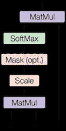

与 RNN 不同，在自注意力中，查询、键和值矩阵中使用的所有向量都来自输入序列的嵌入向量。整个机制可以通过高度优化的矩阵乘法操作来实现。而*Q* *K*产品形成一个可以被理解为输入序列中单词之间连接的方阵。图 9.2 中展示了一个玩具例子。

##### 图 9.2 作为单词连接的编码器注意力矩阵

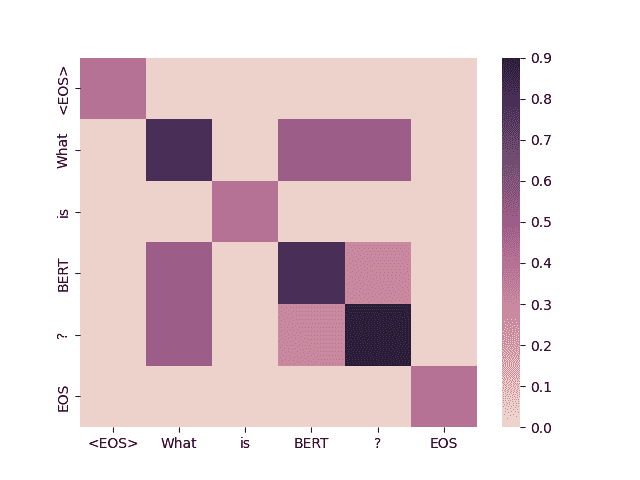

#### 多头自注意力

多头自注意力是将自注意力方法扩展为创建多个注意力头，每个头都关注文本中不同的词方面。因此，如果一个标记具有多个与输入文本解释相关的意义，那么它们可以分别在不同的注意力头中考虑到。你可以将每个注意力头视为文本编码向量的另一个维度，类似于单个标记的嵌入向量的附加维度（见第六章）。查询、键和值矩阵分别由不同的\(d_q\)、\(d_k\)和\(d_v\)维度乘以*n*（*n_heads*，注意力头的数量）次，以计算总的注意力函数输出。*n_heads*值是 transformers 架构的超参数，通常较小，可与 transformers 模型中的 transformers 层数相媲美。\(d_v\)维输出被连接，然后再次使用\(W^o\)矩阵进行投影，如下一个方程所示。

##### 方程式 9.2 多头自注意力

\[MultiHeadAttention(Q, K, V ) = Concat(head_1, ..., head_n) W^o\\ 其中\ head_i = Attention(QW_i^Q, KW_i^K, VW_i^V)\]

多个头使得模型能够关注不同位置，而不仅仅是以单个词为中心的位置。这有效地创建了几个不同的向量子空间，其中 transformers 可以为文本中的词模式子集编码特定的泛化。在原始 transformers 论文中，模型使用*n*=8 个注意力头，使得\(d_k = d_v = \frac{d_{model}}{n} = 64\)。多头设置中的降维是为了确保计算和连接成本几乎等同于完整维度的单个注意力头的大小。

如果你仔细观察，你会发现由*Q*和*K*的乘积创建的注意力矩阵（注意力头）都具有相同的形状，它们都是方阵（行数与列数相同）。这意味着注意力矩阵仅将嵌入的输入序列旋转为新的嵌入序列，而不影响嵌入的形状或大小。这使得能够解释注意力矩阵对特定示例输入文本的作用。

##### 图 9.3 多头自注意力

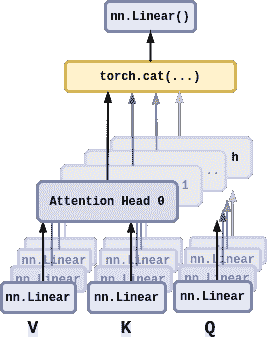

结果表明，多头注意力机制实际上只是一个全连接的线性层。毕竟，最深层的深度学习模型实质上只是线性和逻辑回归的巧妙堆叠。这就是为什么 transformers 如此成功令人惊讶的原因。这也是为什么理解前几章描述的线性和逻辑回归的基础知识是如此重要的原因。

## 9.2 填充注意力空白

注意机制弥补了前几章的 RNN 和 CNN 存在的一些问题，但也带来了一些额外的挑战。基于 RNN 的编码器-解码器在处理较长的文本段落时效果不佳，其中相关的单词模式相距甚远。即使是长句对于进行翻译的 RNN 来说也是一个挑战。[¹⁵] 注意机制通过允许语言模型在文本开头捕捉重要概念并将其连接到文本末尾的文本来弥补了这一点。注意机制使得 transformers 能够回溯到它曾经见过的任何单词。不幸的是，添加注意机制会迫使你从 transformers 中删除所有的循环。

CNN 是连接输入文本中相距甚远概念的另一种方法。CNN 可以通过创建一系列逐渐“缩颈”文本信息编码的卷积层来实现这一点。这种分层结构意味着 CNN 具有有关长文本文档中模式的大规模位置的信息。不幸的是，卷积层的输出和输入通常具有不同的形状。因此，CNN 不可叠加，这使得它们难以扩展以处理更大容量和更大训练数据集。因此，为了给 transformers 提供其需要的用于可堆叠的统一数据结构，transformers 使用字节对编码和位置编码来在编码张量中均匀传播语义和位置信息。

### 9.2.1 位置编码

输入文本中的单词顺序很重要，因此你需要一种方法将一些位置信息嵌入到在 transformers 的各层之间传递的嵌入序列中。位置编码简单地是一个函数，它将一个单词在序列中的相对或绝对位置的信息添加到输入嵌入中。编码具有与输入嵌入相同的维度\(d_{model}\)，因此它们可以与嵌入向量相加。论文讨论了学习的和固定的编码，并提出了一个以正弦和余弦为基础的正弦函数，具有不同的频率，定义为：

##### 方程式 9.3 位置编码函数

\[PE_{(pos, 2i)} = sin(\frac{pos}{10000^{\frac{2i}{d_{model}}}})\\ PE_{(pos, 2i+1)} = cos(\frac{pos}{10000^{\frac{2i}{d_{model}}}})\]

选择这个映射函数是因为对于任何偏移 *k*，\(PE_{(pos+k)}\) 可以表示为 \(PE_{pos}\) 的线性函数。简而言之，模型应该能够轻松地学会关注相对位置。

让我们看看这如何在 Pytorch 中编码。官方 Pytorch 序列到序列建模教程提供了基于前述函数的 PositionEncoding nn.Module 的实现：

##### 清单 9.1 Pytorch 位置编码

```py
>>> import math
>>> import torch
>>> from torch import nn
...
>>> class PositionalEncoding(nn.Module):
...   def __init__(self, d_model=512, dropout=0.1, max_len=5000):
...      super().__init__()
...      self.dropout = nn.Dropout(p=dropout)  # #1
...      self.d_model = d_model  # #2
...      self.max_len = max_len  # #3
...      pe = torch.zeros(max_len, d_model)  # #4
...      position = torch.arange(0, max_len, dtype=torch.float).unsqueeze(1)
...      div_term = torch.exp(torch.arange(0, d_model, 2).float() *
...                           (-math.log(10000.0) / d_model))
...      pe[:, 0::2] = torch.sin(position * div_term)  # #5
...      pe[:, 1::2] = torch.cos(position * div_term)
...      pe = pe.unsqueeze(0).transpose(0, 1)
...      self.register_buffer('pe', pe)
...
...   def forward(self, x):
...      x = x + self.pe[:x.size(0), :]
...      return self.dropout(x)
```

你将在构建的翻译 transformers 中使用此模块。但是，首先，我们需要填充模型的其余细节，以完善您对架构的理解。

### 9.2.2 连接所有部分

现在你已经了解了 BPE、嵌入、位置编码和多头自注意力的原因和方法，你理解了 transformers 层的所有要素。你只需要在输出端添加一个较低维度的线性层，将所有这些注意力权重收集在一起，以创建嵌入的输出序列。线性层的输出需要进行缩放（归一化），以使所有层具有相同的尺度。这些线性和归一化层堆叠在注意力层之上，以创建可重复使用的可堆叠 transformers 块，如图 9.4 所示。

##### 图 9.4 transformers 架构

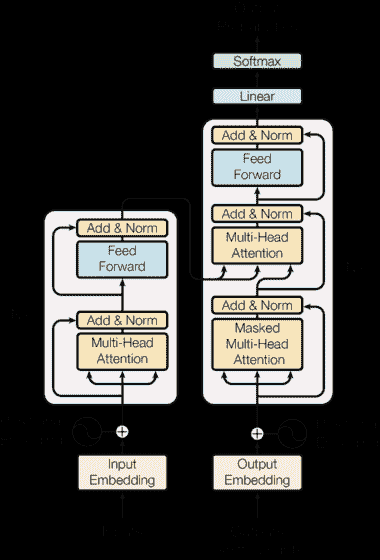

在原始 transformers 中，编码器和解码器均由*N* = 6 个堆叠的相同编码器和解码器层组成。

#### 编码器

编码器由多个编码器层组成。每个编码器层有两个子层：一个多头注意力层和一个位置感知的全连接前馈网络。在每个子层周围都有一个残差连接。每个编码器层的输出都被归一化，以使所有层之间传递的编码值的范围在零和一之间。传递给编码器的输入嵌入序列在输入编码器之前与位置编码相加。

#### 解码器

解码器与模型中的编码器几乎相同，但子层数量为三而不是一个。新的子层是一个完全连接的层，类似于多头自注意力矩阵，但只包含零和一。这会创建一个*掩码*，用于右边的当前目标令牌的输出序列（在英语等从左到右的语言中）。这确保了对于位置*i*的预测只能依赖于先前的输出，对于小于*i*的位置。换句话说，在训练期间，注意力矩阵不允许“偷看”它应该生成的后续令牌，以最小化损失函数。这样可以防止在训练过程中出现*泄漏*或“作弊”，强制 transformers 只关注它已经看到或生成的令牌。在 RNN 中，解码器内部不需要掩码，因为每个令牌在训练过程中只向网络逐个显示。但是，在训练期间，transformers 注意力矩阵可以一次性访问整个序列。

##### 图 9.5 编码器和解码器层之间的连接

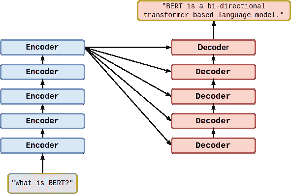

### 9.2.3 transformers 翻译示例

transformers 适用于许多任务。《注意力就是你的一切》论文展示了一个 transformers，其翻译精度优于任何之前的方法。使用 `torchtext`，你将准备 Multi30k 数据集，用于训练一个德语-英语翻译的 Transformer，使用 `torch.nn.Transformer` 模块。在本节中，你将自定义 `Transformer` 类的解码器部分，以输出每个子层的自注意力权重。你使用自注意力权重矩阵来解释输入德语文本中的单词是如何组合在一起的，以生成输出的英语文本中使用的嵌入。训练模型后，你将在测试集上使用它进行推理，以查看它将德语文本翻译成英语的效果如何。

#### 准备数据

你可以使用 Hugging Face 数据集包来简化记录工作，并确保你的文本以与 PyTorch 兼容的可预测格式输入到 Transformer 中。这是任何深度学习项目中最棘手的部分之一，确保你的数据集的结构和 API 与你的 PyTorch 训练循环所期望的相匹配。翻译数据集特别棘手，除非你使用 Hugging Face：

##### 列表 9.2 在 Hugging Face 格式中加载翻译数据集

```py
>>> from datasets import load_dataset  # #1
>>> opus = load_dataset('opus_books', 'de-en')
>>> opus
DatasetDict({
    train: Dataset({
        features: ['id', 'translation'],
        num_rows: 51467
    })
})
```

并不是所有的 Hugging Face 数据集都有预定义的测试和验证数据集拆分。但你可以像列表 9.3 中所示的那样，使用 `train_test_split` 方法创建自己的拆分。

##### 列表 9.3 在 Hugging Face 格式中加载翻译数据集

```py
>>> sents = opus['train'].train_test_split(test_size=.1)
>>> sents
DatasetDict({
    train: Dataset({
        features: ['id', 'translation'],
        num_rows: 48893
    })
    test: Dataset({
        features: ['id', 'translation'],
        num_rows: 2574
    })
})
```

在开始长时间的训练之前，检查数据集中的一些示例总是一个好主意。这可以帮助你确保数据符合你的预期。`opus_books` 并不包含很多书籍。所以它不是很多样化（代表性）的德语样本。它只被分成了 50,000 对齐的句子对。想象一下只有几本翻译过的书籍可供阅读时学习德语是什么感觉。

```py
>>> next(iter(sents['test']))  # #1
{'id': '9206',
 'translation': {'de': 'Es war wenigstens zu viel in der Luft.',
  'en': 'There was certainly too much of it in the air.'}}
```

如果你想使用自己创建的自定义数据集，遵循像 Hugging Face 数据集包中所示的开放标准总是一个好主意，它给出了一个“最佳实践”的数据集结构方法。注意，在 Hugging Face 中的翻译数据集包含一个带有语言代码的句子对数组和一个字典。翻译示例的 `dict` 键是两字母语言代码（来自 ISO 639-2）^([17])。示例文本的 `dict` 值是数据集中每种语言中的句子。

##### 提示

如果你抵制了发明自己的数据结构的冲动，而是使用广泛认可的开放标准，你就能避免一些隐蔽的、有时无法检测到的错误。

如果你有 GPU，你可能想要用它来训练 Transformer。Transformer 由于其矩阵乘法运算而适用于 GPU，GPU 可用于算法中所有最计算密集的部分。对于大多数预训练的 Transformer 模型（除了 LLM），CPU 是足够的，但 GPU 可以节省大量用于训练或微调 Transformer 的时间。例如，GPT2 在 16 核 CPU 上使用相对较小（40 MB）的训练数据集训练了 3 天。在 2560 核 GPU 上，相同数据集训练时间为 2 小时（速度提升 40 倍，核心数增加 160 倍）。9.4 节将启用你的 GPU（如果有）。

##### 第 9.4 节 启用任何可用的 GPU

```py
>>> DEVICE = torch.device(
...     'cuda' if torch.cuda.is_available()
...     else 'cpu')
```

为了简化操作，你可以分别使用专门的分词器对源语言文本和目标语言文本进行标记化处理。如果你使用 Hugging Face 的分词器，它们将跟踪你几乎任何机器学习任务中需要的所有特殊标记：

+   **序列开始标记**::通常为`"<SOS>"`或者`"<s>"`

+   **序列结束标记**::通常为`"<EOS>"`或`"</s>"`

+   **未知词（out-of-vocabulary）标记**::通常为`"<OOV>"`，`"<unk>"`

+   **屏蔽标记**::通常为`"<mask>"`

+   **填充标记**::通常为`"<pad>"`

*序列开始标记*用于触发解码器生成适合序列中第一个标记的标记。许多生成性问题将需要你有一个*序列结束标记*，这样解码器就知道何时可以停止递归生成更多标记。一些数据集使用相同的标记表示*序列开始*和*序列结束*。它们不需要是唯一的，因为你的解码器始终会“知道”何时开始新的生成循环。填充标记用于在示例短于最大序列长度时填充序列末尾。屏蔽标记用于故意隐藏已知标记，以用于训练诸如 BERT 之类的任务无关编码器。这类似于第六章使用跳字训练词嵌入时所做的操作。

你可以选择任何标记作为这些标记（特殊标记），但你需要确保它们不是数据集词汇表中使用的词汇。因此，如果你正在撰写一本关于自然语言处理的书，并且你不希望你的分词器在示例 SOS 和 EOS 标记上出现问题，你可能需要更有创意地生成文本中找不到的标记。

为了加快标记化和训练速度，并避免标记从源语言文本示例泄漏到生成的目标语言文本中，你可以为每种语言创建一个单独的 Hugging Face 分词器。你可以选择任何语言对，但原始的 AIAYN 论文演示例通常是从英语（源语言）到德语（目标语言）的翻译。

```py
>>> SRC = 'en'  # #1
>>> TGT = 'de'  # #2
>>> SOS, EOS = '<s>', '</s>'
>>> PAD, UNK, MASK = '<pad>', '<unk>', '<mask>'
>>> SPECIAL_TOKS = [SOS, PAD, EOS, UNK, MASK]
>>> VOCAB_SIZE = 10_000
...
>>> from tokenizers import ByteLevelBPETokenizer  # #3
>>> tokenize_src = ByteLevelBPETokenizer()
>>> tokenize_src.train_from_iterator(
...     [x[SRC] for x in sents['train']['translation']],
...     vocab_size=10000, min_frequency=2,
...     special_tokens=SPECIAL_TOKS)
>>> PAD_IDX = tokenize_src.token_to_id(PAD)
...
>>> tokenize_tgt = ByteLevelBPETokenizer()
>>> tokenize_tgt.train_from_iterator(
...     [x[TGT] for x in sents['train']['translation']],
...     vocab_size=10000, min_frequency=2,
...     special_tokens=SPECIAL_TOKS)
>>> assert PAD_IDX == tokenize_tgt.token_to_id(PAD)
```

您的 BPE 分词器中的 `ByteLevel` 部分确保您的分词器在对文本进行分词时永远不会漏掉任何一个字节。字节级别 BPE 分词器始终可以通过组合其词汇表中提供的 256 个可能的单字节令牌之一来构建任何字符。这意味着它可以处理任何使用 Unicode 字符集的语言。字节级别分词器将会简单地回退到表示 Unicode 字符的各个字节，如果它以前没有见过或者没有将其包含在其令牌词汇表中。字节级别分词器将需要平均增加 70% 的令牌数量（词汇表大小几乎翻倍）来表示包含它未曾训练过的字符或令牌的新文本。

字符级别 BPE 分词器也有其缺点。字符级别分词器必须将每个多字节 Unicode 字符都包含在其词汇表中，以避免出现任何无意义的 OOV（词汇外）标记。对于预期处理大部分 Unicode 字符涵盖的 161 种语言的多语言 transformers，这可能会创建一个巨大的词汇表。Unicode 代码点有 149,186 个字符，用于历史（例如埃及象形文字）和现代书面语言。这大约是存储 transformers 分词器中所有嵌入和令牌所需的内存的 10 倍。在实际应用中，通常会忽略历史语言和一些罕见的现代语言，以优化 transformers BPE 分词器的内存使用，并将其与您的问题的 transformers 准确性平衡。

##### 重要提示

BPE 分词器是 transformers 的五个关键“超级能力”之一，使它们如此有效。而 `ByteLevel` BPE 分词器虽然永远不会有 OOV（Out Of Vocabulary）标记，但在表示单词含义方面并不像预期的那样有效。因此，在生产应用中，您可能希望同时训练管道使用字符级别 BPE 分词器和字节级分词器。这样，您就可以比较结果，并选择为*您的*应用提供最佳性能（准确性和速度）的方法。

您可以使用英文分词器构建一个预处理函数，用于 *展平* `Dataset` 结构并返回不带填充的标记 ID 列表的列表。

```py
def preprocess(examples):
    src = [x[source_lang] for x in examples["translation"]]
    src_toks = [tokenize_src(x) for x in src]
    # tgt = [x[target_lang] for x in examples["translation"]]
    # tgt_toks = [tokenize_tgt(x) for x in tgt]
    return src_toks
```

#### 翻译 transformers 模型

现在，你已经对 Multi30k 数据中的句子进行了标记化，并将其转换为了分别对应源语言和目标语言（德语和英语）词汇表的索引张量。数据集已经被拆分为独立的训练、验证和测试集，并且已经用批量训练的迭代器进行了包装。现在数据已经准备好了，你需要将注意力转移到设置模型上。Pytorch 提供了 "Attention Is All You Need" 中提出的模型实现，`torch.nn.Transformer`。你会注意到构造函数接受几个参数，其中一些是很熟悉的，比如 `d_model=512`、`nhead=8`、`num_encoder_layers=6` 和 `num_decoder_layers=6`。默认值设置为论文中使用的参数。除了用于前馈维度、丢弃和激活的几个参数之外，该模型还支持 `custom_encoder` 和 `custom_decoder`。为了让事情变得有趣起来，创建一个自定义解码器，除了输出每个子层中的多头自注意力层的注意力权重外，还可以创建一个具有辅助输出的 *forward()* 方法 - 注意力权重的列表。

##### 列表 9.5 将 torch.nn.TransformerDecoderLayer 扩展为额外返回多头自注意力权重

```py
>>> from torch import Tensor
>>> from typing import Optional, Any

>>> class CustomDecoderLayer(nn.TransformerDecoderLayer):
...     def forward(self, tgt: Tensor, memory: Tensor,
...             tgt_mask: Optional[Tensor] = None,
...             memory_mask: Optional[Tensor] = None,
...             tgt_key_padding_mask: Optional[Tensor] = None
...             ) -> Tensor:
...         """Like decode but returns multi-head attention weights."""
...         tgt2 = self.self_attn(
...             tgt, tgt, tgt, attn_mask=tgt_mask,
...             key_padding_mask=tgt_key_padding_mask)[0]
...         tgt = tgt + self.dropout1(tgt2)
...         tgt = self.norm1(tgt)
...         tgt2, attention_weights = self.multihead_attn(
...             tgt, memory, memory,  # #1
...             attn_mask=memory_mask,
...             key_padding_mask=mem_key_padding_mask,
...             need_weights=True)
...         tgt = tgt + self.dropout2(tgt2)
...         tgt = self.norm2(tgt)
...         tgt2 = self.linear2(
...             self.dropout(self.activation(self.linear1(tgt))))
...         tgt = tgt + self.dropout3(tgt2)
...         tgt = self.norm3(tgt)
...         return tgt, attention_weights  # #2
```

##### 列表 9.6 将 torch.nn.TransformerDecoder 扩展为额外返回多头自注意力权重列表

```py
>>> class CustomDecoder(nn.TransformerDecoder):
...     def __init__(self, decoder_layer, num_layers, norm=None):
...         super().__init__(
...             decoder_layer, num_layers, norm)
...
...     def forward(self,
...             tgt: Tensor, memory: Tensor,
...             tgt_mask: Optional[Tensor] = None,
...             memory_mask: Optional[Tensor] = None,
...             tgt_key_padding_mask: Optional[Tensor] = None
...             ) -> Tensor:
...         """Like TransformerDecoder but cache multi-head attention"""
...         self.attention_weights = []  # #1
...         output = tgt
...         for mod in self.layers:
...             output, attention = mod(
...                 output, memory, tgt_mask=tgt_mask,
...                 memory_mask=memory_mask,
...                 tgt_key_padding_mask=tgt_key_padding_mask)
...             self.attention_weights.append(attention) # #2
...
...         if self.norm is not None:
...             output = self.norm(output)
...
...         return output
```

与父类版本的 `.forward()` 唯一的改变就是将权重缓存在列表成员变量 `attention_weights` 中。

现在回顾一下，你已经对 `torch.nn.TransformerDecoder` 及其子层组件 `torch.nn.TransformerDecoderLayer` 进行了扩展，主要是出于探索性的目的。也就是说，你保存了将要配置和训练的 Transformer 模型中不同解码器层的多头自注意力权重。这些类中的 *forward()* 方法几乎与父类一模一样，只是在保存注意力权重时做了一些不同的改动。

`torch.nn.Transformer`是一个相对简单的序列到序列模型，其中包含主要的秘密武器，即编码器和解码器中的多头自注意力。如果查看该模块的源代码 ^([18])，则该模型不假设使用嵌入层或位置编码。现在，您将创建使用自定义解码器组件的*TranslationTransformer*模型，通过扩展`torch.nn.Transformer`模块。首先定义构造函数，它接受`src_vocab_size`用于源嵌入大小的参数，以及`tgt_vocab_size`用于目标的参数，并使用它们初始化基本的`torch.nn.Embedding`。注意，在构造函数中创建了一个`PositionalEncoding`成员变量，`pos_enc`，用于添加单词位置信息。

##### 列表 9.7 扩展 nn.Transformer 以使用 CustomDecoder 进行翻译

```py
>>> from einops import rearrange  # #1
...
>>> class TranslationTransformer(nn.Transformer):  # #2
...     def __init__(self,
...             device=DEVICE,
...             src_vocab_size: int = VOCAB_SIZE,
...             src_pad_idx: int = PAD_IDX,
...             tgt_vocab_size: int = VOCAB_SIZE,
...             tgt_pad_idx: int = PAD_IDX,
...             max_sequence_length: int = 100,
...             d_model: int = 512,
...             nhead: int = 8,
...             num_encoder_layers: int = 6,
...             num_decoder_layers: int = 6,
...             dim_feedforward: int = 2048,
...             dropout: float = 0.1,
...             activation: str = "relu"
...         ):
...
...         decoder_layer = CustomDecoderLayer(
...             d_model, nhead, dim_feedforward,  # #3
...             dropout, activation)
...         decoder_norm = nn.LayerNorm(d_model)
...         decoder = CustomDecoder(
...             decoder_layer, num_decoder_layers,
...             decoder_norm)  # #4
...
...         super().__init__(
...             d_model=d_model, nhead=nhead,
...             num_encoder_layers=num_encoder_layers,
...             num_decoder_layers=num_decoder_layers,
...             dim_feedforward=dim_feedforward,
...             dropout=dropout, custom_decoder=decoder)
...
...         self.src_pad_idx = src_pad_idx
...         self.tgt_pad_idx = tgt_pad_idx
...         self.device = device
...
...         self.src_emb = nn.Embedding(
...             src_vocab_size, d_model)  # #5
...         self.tgt_emb = nn.Embedding(tgt_vocab_size, d_model)
...
...         self.pos_enc = PositionalEncoding(
...             d_model, dropout, max_sequence_length)  # #6
...         self.linear = nn.Linear(
...             d_model, tgt_vocab_size)  # #7
```

请注意从`einops` ^([19])包导入`rearrange`的重要性。数学家喜欢它用于张量重塑和洗牌，因为它使用了研究生级别应用数学课程中常见的语法。要了解为什么需要`rearrange()`你的张量，请参阅`torch.nn.Transformer`文档 ^([20])。如果您把任何张量的任何维度都弄错了，它将破坏整个管道，有时会无形中出现问题。

##### 列表 9.8 torch.nn.Transformer 的“形状”和维度描述

```py
S: source sequence length
T: target sequence length
N: batch size
E: embedding dimension number (the feature number)

src: (S, N, E)

tgt: (T, N, E)
src_mask: (S, S)
tgt_mask: (T, T)
memory_mask: (T, S)
src_key_padding_mask: (N, S)
tgt_key_padding_mask: (N, T)
memory_key_padding_mask: (N, S)

output: (T, N, E)
```

使用`torchtext`创建的数据集是批量优先的。因此，借用 Transformer 文档中的术语，您的源和目标张量分别具有形状*(N, S)*和*(N, T)*。要将它们馈送到`torch.nn.Transformer`（即调用其`forward()`方法），需要对源和目标进行重塑。此外，您希望对源和目标序列应用嵌入加上位置编码。此外，每个都需要一个*填充键掩码*，目标需要一个*内存键掩码*。请注意，您可以在类的外部管理嵌入和位置编码，在管道的培训和推理部分。但是，由于模型专门用于翻译，您选择在类内封装源和目标序列准备。为此，您定义了用于准备序列和生成所需掩码的`prepare_src()`和`prepare_tgt()`方法。

##### 列表 9.9 TranslationTransformer prepare_src()

```py
>>>     def _make_key_padding_mask(self, t, pad_idx):
...         mask = (t == pad_idx).to(self.device)
...         return mask
...
...     def prepare_src(self, src, src_pad_idx):
...         src_key_padding_mask = self._make_key_padding_mask(
...             src, src_pad_idx)
...         src = rearrange(src, 'N S -> S N')
...         src = self.pos_enc(self.src_emb(src)
...             * math.sqrt(self.d_model))
...         return src, src_key_padding_mask
```

`make_key_padding_mask()`方法返回一个张量，在给定张量中填充标记的位置设置为 1，否则为零。`prepare_src()`方法生成填充蒙版，然后将`src`重新排列为模型期望的形状。然后，它将位置编码应用于源嵌入，乘以模型维度的平方根。这直接来自于“注意力机制都是你需要的”。该方法返回应用了位置编码的`src`，以及适用于它的键填充蒙版。

用于目标序列的`prepare_tgt()`方法几乎与`prepare_src()`相同。它返回已调整位置编码的`tgt`，以及目标键填充蒙版。但是，它还返回一个“后续”蒙版，`tgt_mask`，它是一个三角形矩阵，用于允许观察的一行中的列（1）。要生成后续蒙版，你可以使用基类中定义的`Transformer.generate_square_subsequent_mask()`方法，如下清单所示。

##### 清单 9.10 TranslationTransformer prepare_tgt()

```py
>>>     def prepare_tgt(self, tgt, tgt_pad_idx):
...         tgt_key_padding_mask = self._make_key_padding_mask(
...             tgt, tgt_pad_idx)
...         tgt = rearrange(tgt, 'N T -> T N')
...         tgt_mask = self.generate_square_subsequent_mask(
...             tgt.shape[0]).to(self.device)
...         tgt = self.pos_enc(self.tgt_emb(tgt)
...             * math.sqrt(self.d_model))
...         return tgt, tgt_key_padding_mask, tgt_mask
```

你在模型的`forward()`方法中使用`prepare_src()`和`prepare_tgt()`。在准备好输入后，它只是调用父类的`forward()`，并在从（T，N，E）转换回批量优先（N，T，E）后，将输出馈送到线性缩减层。我们这样做是为了保持训练和推断的一致性。

##### 清单 9.11 TranslationTransformer forward()

```py
>>>     def forward(self, src, tgt):
...         src, src_key_padding_mask = self.prepare_src(
...             src, self.src_pad_idx)
...         tgt, tgt_key_padding_mask, tgt_mask = self.prepare_tgt(
...             tgt, self.tgt_pad_idx)
...         memory_key_padding_mask = src_key_padding_mask.clone()
...         output = super().forward(
...             src, tgt, tgt_mask=tgt_mask,
...             src_key_padding_mask=src_key_padding_mask,
...             tgt_key_padding_mask=tgt_key_padding_mask,
...             memory_key_padding_mask=memory_key_padding_mask)
...         output = rearrange(output, 'T N E -> N T E')
...         return self.linear(output)
```

同样，定义一个`init_weights()`方法，可调用来初始化 Transformer 的所有子模块的权重。在 Transformer 中常用 Xavier 初始化，因此在这里使用它。Pytorch 的`nn.Module`文档^([21])描述了`apply(fn)`方法，该方法递归地将`fn`应用到调用者的每个子模块上。

##### 清单 9.12 TranslationTransformer init_weights()

```py
>>>     def init_weights(self):
...         def _init_weights(m):
...             if hasattr(m, 'weight') and m.weight.dim() > 1:
...                 nn.init.xavier_uniform_(m.weight.data)
...         self.apply(_init_weights);  # #1
```

模型的各个组件已经定义好了，完整的模型在下一个清单中展示。

##### 清单 9.13 TranslationTransformer 完整模型定义

```py
>>> class TranslationTransformer(nn.Transformer):
...     def __init__(self,
...             device=DEVICE,
...             src_vocab_size: int = 10000,
...             src_pad_idx: int = PAD_IDX,
...             tgt_vocab_size: int  = 10000,
...             tgt_pad_idx: int = PAD_IDX,
...             max_sequence_length: int = 100,
...             d_model: int = 512,
...             nhead: int = 8,
...             num_encoder_layers: int = 6,
...             num_decoder_layers: int = 6,
...             dim_feedforward: int = 2048,
...             dropout: float = 0.1,
...             activation: str = "relu"
...             ):
...         decoder_layer = CustomDecoderLayer(
...             d_model, nhead, dim_feedforward,
...             dropout, activation)
...         decoder_norm = nn.LayerNorm(d_model)
...         decoder = CustomDecoder(
...             decoder_layer, num_decoder_layers, decoder_norm)
...
...         super().__init__(
...             d_model=d_model, nhead=nhead,
...             num_encoder_layers=num_encoder_layers,
...             num_decoder_layers=num_decoder_layers,
...             dim_feedforward=dim_feedforward,
...             dropout=dropout, custom_decoder=decoder)
...
...         self.src_pad_idx = src_pad_idx
...         self.tgt_pad_idx = tgt_pad_idx
...         self.device = device
...         self.src_emb = nn.Embedding(src_vocab_size, d_model)
...         self.tgt_emb = nn.Embedding(tgt_vocab_size, d_model)
...         self.pos_enc = PositionalEncoding(
...             d_model, dropout, max_sequence_length)
...         self.linear = nn.Linear(d_model, tgt_vocab_size)
...
...     def init_weights(self):
...         def _init_weights(m):
...             if hasattr(m, 'weight') and m.weight.dim() > 1:
...                 nn.init.xavier_uniform_(m.weight.data)
...         self.apply(_init_weights);
...
...     def _make_key_padding_mask(self, t, pad_idx=PAD_IDX):
...         mask = (t == pad_idx).to(self.device)
...         return mask
...
...     def prepare_src(self, src, src_pad_idx):
...         src_key_padding_mask = self._make_key_padding_mask(
...             src, src_pad_idx)
...         src = rearrange(src, 'N S -> S N')
...         src = self.pos_enc(self.src_emb(src)
...             * math.sqrt(self.d_model))
...         return src, src_key_padding_mask
...
...     def prepare_tgt(self, tgt, tgt_pad_idx):
...         tgt_key_padding_mask = self._make_key_padding_mask(
...             tgt, tgt_pad_idx)
...         tgt = rearrange(tgt, 'N T -> T N')
...         tgt_mask = self.generate_square_subsequent_mask(
...             tgt.shape[0]).to(self.device)      # #1
...         tgt = self.pos_enc(self.tgt_emb(tgt)
...             * math.sqrt(self.d_model))
...         return tgt, tgt_key_padding_mask, tgt_mask
...
...     def forward(self, src, tgt):
...         src, src_key_padding_mask = self.prepare_src(
...             src, self.src_pad_idx)
...         tgt, tgt_key_padding_mask, tgt_mask = self.prepare_tgt(
...             tgt, self.tgt_pad_idx)
...         memory_key_padding_mask = src_key_padding_mask.clone()
...         output = super().forward(
...             src, tgt, tgt_mask=tgt_mask,
...             src_key_padding_mask=src_key_padding_mask,
...             tgt_key_padding_mask=tgt_key_padding_mask,
...             memory_key_padding_mask = memory_key_padding_mask,
...             )
...         output = rearrange(output, 'T N E -> N T E')
...         return self.linear(output)
```

最后，你拥有了一个完整的 Transformer！你应该能够用它来在几乎任何一对语言之间进行翻译，甚至包括像传统中文和日语这样字符丰富的语言。你可以明确地访问所有你可能需要调整模型以解决问题的超参数。例如，你可以增加目标语言或源语言的词汇量，以有效处理*字符丰富*的语言，比如传统中文和日语。

##### 注

由于中文和日语（汉字）拥有比欧洲语言更多的独特字符，所以它们被称为*字符丰富*。中文和日语使用形码字符。形码字符看起来有点像小的象形文字或抽象的象形图。例如，汉字字符"日"可以表示"天"，它看起来有点像日历上可能看到的日期方块。日语形码字符在英语中大致相当于形态素和词之间的词素。这意味着在形码语言中，您将有比欧洲语言更多的独特字符。例如，传统日语使用大约 3500 个独特汉字字符。英语在最常用的 20000 个单词中有大约 7000 个独特音节。

即使是 transformers 的编码器和解码器端的层数也可以根据源（编码器）或目标（解码器）语言进行更改。您甚至可以创建一个翻译 transformers，将复杂概念简化为 5 岁的孩子或专注于 ELI5（"像我 5 岁时解释"）对话的 Mastodon 服务器上的成年人。如果减少解码器的层数，这将创建一个"容量"瓶颈，迫使解码器简化或压缩来自编码器的概念。同样，编码器或解码器层中的注意力头的数量可以调整以增加或减少 transformers 的容量（复杂性）。

#### 训练 TranslationTransformer

现在让我们为我们的翻译任务创建一个模型实例，并初始化权重以准备训练。对于模型的维度，您使用默认值，这些默认值与原始的"Attention Is All You Need"transformers 的大小相对应。请注意，由于编码器和解码器构建块包括可堆叠的重复层，因此您可以配置模型以使用任意数量的这些层。

##### 列表 9.14 实例化 TranslationTransformer

```py
>>> model = TranslationTransformer(
...     device=DEVICE,
...     src_vocab_size=tokenize_src.get_vocab_size(),
...     src_pad_idx=tokenize_src.token_to_id('<pad>'),
...     tgt_vocab_size=tokenize_tgt.get_vocab_size(),
...     tgt_pad_idx=tokenize_tgt.token_to_id('<pad>')
...     ).to(DEVICE)
>>> model.init_weights()
>>> model  # #1
```

PyTorch 创建了一个漂亮的`_\_str\_\_`模型表示。它显示了所有层及其内部结构，包括输入和输出的形状。您甚至可以看到您的模型的层与本章或在线看到的 transformers 图的类比。从 transformers 的文本表示的前半部分，您可以看到所有的编码器层具有完全相同的结构。每个`TransformerEncoderLayer`的输入和输出具有相同的形状，因此这可以确保您可以将它们堆叠在一起而不需要在它们之间重塑线性层。transformers 层就像摩天大楼或儿童木块的楼层一样。每个层级具有完全相同的 3D 形状。

```py
TranslationTransformer(
  (encoder): TransformerEncoder(
    (layers): ModuleList(
      (0-5): 6 x TransformerEncoderLayer(
        (self_attn): MultiheadAttention(
          (out_proj): NonDynamicallyQuantizableLinear(
            in_features=512, out_features=512, bias=True)
        )
        (linear1): Linear(
          in_features=512, out_features=2048, bias=True)
        (dropout): Dropout(p=0.1, inplace=False)
        (linear2): Linear(
          in_features=2048, out_features=512, bias=True)
        (norm1): LayerNorm((512,), eps=1e-05, elementwise_affine=True)
        (norm2): LayerNorm((512,), eps=1e-05, elementwise_affine=True)
        (dropout1): Dropout(p=0.1, inplace=False)
        (dropout2): Dropout(p=0.1, inplace=False)
      )
    )
    (norm): LayerNorm((512,), eps=1e-05, elementwise_affine=True)
  )
...
```

注意，在构造函数中设置源词汇表和目标词汇表的大小。你还将传递源填充符和目标填充符的索引，以便模型在准备源、目标和相关掩码序列时使用。现在，你已经定义好了模型，请花点时间做一个快速的健全检查，确保没有明显的编码错误，然后再设置训练和预测流水线。你可以为源和目标创建随机整数张量的“批次”，并将它们传递给模型，如下面的示例所示。

##### 清单 9.15 使用随机张量进行快速模型验证

```py
>>> src = torch.randint(1, 100, (10, 5)).to(DEVICE)  # #1
>>> tgt = torch.randint(1, 100, (10, 7)).to(DEVICE)
...
>>> with torch.no_grad():
...     output = model(src, tgt)  # #2
...
>>> print(output.shape)
torch.Size([10, 7, 5893])
```

我们创建了两个张量 `src` 和 `tgt`，每个张量中的随机整数均匀分布在 1 到 100 之间。你的模型接受批次优先形状的张量，因此我们确保批次大小（本例中为 10）相同，否则在前向传递中将会出现运行时错误，错误如下所示：

```py
RuntimeError: the batch number of src and tgt must be equal
```

源序列和目标序列的长度不必相等，这一点很明显，*model(src, tgt)* 的成功调用证实了这一点。

##### 提示

在为训练设置新的序列到序列模型时，你可能希望在设置中初始使用较小的参数。这包括限制最大序列长度、减小批次大小以及指定较小数量的训练循环或 epochs。这将使得在模型和/或流水线中调试问题并使程序能够端到端执行更容易。在这个“引导”阶段，不要对模型的能力/准确性做出任何结论；目标只是让流水线运行起来。

鉴于你对模型的准备工作感到自信，下一步是为训练定义优化器和损失函数。《Attention is All You Need》使用了 Adam 优化器，其中学习率在训练的开始阶段逐渐增加，然后在训练的过程中逐渐减小。你将使用一个静态的学习率 1e-4，该学习率小于 Adam 的默认学习率 1e-2。只要你愿意运行足够的 epochs，这应该能够提供稳定的训练。如果你有兴趣，可以尝试学习率调度。本章稍后介绍的其他基于 Transformer 的模型会使用静态学习率。对于这类任务来说，你将使用 `torch.nn.CrossEntropyLoss` 作为损失函数。

##### 清单 9.16 优化器和损失函数

```py
>>> LEARNING_RATE = 0.0001
>>> optimizer = torch.optim.Adam(model.parameters(), lr=LEARNING_RATE)
>>> criterion = nn.CrossEntropyLoss(ignore_index=TRG_PAD_IDX)  # #1
```

Ben Trevett 为 Pytorch Transformer 初学者教程贡献了大量代码。他和同事们为他们的 Pytorch Seq2Seq 教程编写了一系列出色且信息丰富的 Jupyter 笔记本系列^([23])，涵盖了序列到序列模型。他们的 Attention Is All You Need^([24]) 笔记本提供了一个基本的 Transformer 模型的从零开始的实现。为了避免重复造轮子，在接下来的部分中，训练和评估驱动代码是从 Ben 的笔记本中借用的，只做了少量修改。

`train()`函数实现了类似于你见过的其他训练循环。在批次迭代之前记得将模型设置为`train`模式。此外，请注意，在传递给模型之前，目标中的最后一个标记，即 EOS 标记，已从`trg`中删除。我们希望模型能够预测字符串的结束。该函数返回每次迭代的平均损失。

##### 第 9.17 节 模型训练函数

```py
>>> def train(model, iterator, optimizer, criterion, clip):
...
...     model.train()  # #1
...     epoch_loss = 0
...
...     for i, batch in enumerate(iterator):
...         src = batch.src
...         trg = batch.trg
...         optimizer.zero_grad()
...         output = model(src, trg[:,:-1])  # #2
...         output_dim = output.shape[-1]
...         output = output.contiguous().view(-1, output_dim)
...         trg = trg[:,1:].contiguous().view(-1)
...         loss = criterion(output, trg)
...         loss.backward()
...         torch.nn.utils.clip_grad_norm_(model.parameters(), clip)
...         optimizer.step()
...         epoch_loss += loss.item()
...
...     return epoch_loss / len(iterator)
```

`evaluate()`函数类似于`train()`。你将模型设置为`eval`模式，并像通常一样使用`with torch.no_grad()`范式进行直接推理。

##### 第 9.18 节 模型评估函数

```py
>>> def evaluate(model, iterator, criterion):
...     model.eval()  # #1
...     epoch_loss = 0
...
...     with torch.no_grad():  # #2
...         for i, batch in enumerate(iterator):
...             src = batch.src
...             trg = batch.trg
...             output = model(src, trg[:,:-1])
...             output_dim = output.shape[-1]
...             output = output.contiguous().view(-1, output_dim)
...             trg = trg[:,1:].contiguous().view(-1)
...             loss = criterion(output, trg)
...             epoch_loss += loss.item()
...     return epoch_loss / len(iterator)
```

然后，定义一个直接的实用函数`epoch_time()`，用于计算训练过程中经过的时间，如下所示。

##### 第 9.19 节 用于计算经过时间的实用函数

```py
>>> def epoch_time(start_time, end_time):
...     elapsed_time = end_time - start_time
...     elapsed_mins = int(elapsed_time / 60)
...     elapsed_secs = int(elapsed_time - (elapsed_mins * 60))
...     return elapsed_mins, elapsed_secs
```

现在，让我们继续设置训练。你将训练的轮次数设置为 15，以便模型有足够的机会以之前选择的学习率`1e-4`进行训练。你可以尝试不同的学习率和轮次数的组合。在未来的例子中，你将使用早停机制来避免过拟合和不必要的训练时间。在这里，你声明了一个文件名`BEST_MODEL_FILE`，并且在每个轮次之后，如果验证损失优于之前的最佳损失，那么模型将会被保存，最佳损失将会被更新，如下所示。

##### 第 9.20 节 运行 TranslationTransformer 模型训练并将**最佳**模型保存到文件中

```py
>>> import time
>>> N_EPOCHS = 15
>>> CLIP = 1
>>> BEST_MODEL_FILE = 'best_model.pytorch'
>>> best_valid_loss = float('inf')
>>> for epoch in range(N_EPOCHS):
...     start_time = time.time()
...     train_loss = train(
...         model, train_iterator, optimizer, criterion, CLIP)
...     valid_loss = evaluate(model, valid_iterator, criterion)
...     end_time = time.time()
...     epoch_mins, epoch_secs = epoch_time(start_time, end_time)
...
...     if valid_loss < best_valid_loss:
...         best_valid_loss = valid_loss
...         torch.save(model.state_dict(), BEST_MODEL_FILE)
...     print(f'Epoch: {epoch+1:02} | Time: {epoch_mins}m {epoch_secs}s')
...     train_ppl = f'{math.exp(train_loss):7.3f}'
...     print(f'\tTrain Loss: {train_loss:.3f} | Train PPL: {train_ppl}')
...     valid_ppl = f'{math.exp(valid_loss):7.3f}'
...     print(f'\t Val. Loss: {valid_loss:.3f} | Val. PPL: {valid_ppl}')
```

```py
Epoch: 01 | Time: 0m 55s
        Train Loss: 4.835 | Train PPL: 125.848
         Val. Loss: 3.769 |  Val. PPL:  43.332
Epoch: 02 | Time: 0m 56s
        Train Loss: 3.617 | Train PPL:  37.242
         Val. Loss: 3.214 |  Val. PPL:  24.874
Epoch: 03 | Time: 0m 56s
        Train Loss: 3.197 | Train PPL:  24.448
         Val. Loss: 2.872 |  Val. PPL:  17.679

...
Epoch: 13 | Time: 0m 57s
        Train Loss: 1.242 | Train PPL:   3.463
         Val. Loss: 1.570 |  Val. PPL:   4.805
Epoch: 14 | Time: 0m 57s
        Train Loss: 1.164 | Train PPL:   3.204
         Val. Loss: 1.560 |  Val. PPL:   4.759
Epoch: 15 | Time: 0m 57s
        Train Loss: 1.094 | Train PPL:   2.985
         Val. Loss: 1.545 |  Val. PPL:   4.689
```

注意，在退出循环之前，验证损失仍在减小，我们可能可以再运行几个轮次。让我们加载*最佳*模型，并在测试集上运行`evaluate()`函数，看看模型的表现如何。

##### 第 9.21 节 从文件加载*最佳*模型并在测试数据集上执行评估

```py
>>> model.load_state_dict(torch.load(BEST_MODEL_FILE))
>>> test_loss = evaluate(model, test_iterator, criterion)
>>> print(f'| Test Loss: {test_loss:.3f} | Test PPL: {math.exp(test_loss):7.3f} |')
| Test Loss: 1.590 | Test PPL:   4.902 |
```

你的翻译转换器在测试集上实现了约 1.6 的对数损失。对于在如此小的数据集上训练的翻译模型来说，这还算不错。1.59 的对数损失对应于生成正确标记的概率约为 20%（`exp(-1.59)`），并且在测试集中提供的确切位置。由于对于给定的德语文本，有许多不同的正确英语翻译，所以这对于可以在普通笔记本电脑上进行训练的模型来说是合理的准确率。

#### TranslationTransformer 推理

现在，你确信你的模型已经准备好成为你个人的德语到英语的翻译器了。执行翻译只需要稍微多一点的设置工作，你会在接下来的代码清单的`translate_sentence()`函数中完成。简而言之，如果源句子还没有被分词，就先对其进行分词，然后在句子的开头和结尾加上 *<sos>* 和 *<eos>* 标记。接下来，调用模型的`prepare_src()`方法来转换 *src* 序列，并生成与训练和评估中相同的源键填充蒙版。然后，运行准备好的`src`和`src_key_padding_mask`通过模型的编码器，并保存其输出（在`enc_src`中）。现在，这是有趣的部分，目标句子（即翻译）的生成。首先，初始化一个列表`trg_indexes`，包含 SOS 标记。在循环中 - 只要生成的序列还没有达到最大长度 - 将当前预测的 *trg_indexes* 转换为张量。使用模型的`prepare_tgt()`方法准备目标序列，创建目标键填充蒙版和目标句子蒙版。将当前解码器输出、编码器输出和两个蒙版通过解码器。从解码器输出中获取最新预测的标记，并将其附加到 *trg_indexes*。如果预测是一个 *<eos>* 标记（或达到最大句子长度），则退出循环。该函数返回目标索引转换为标记（单词）和模型中解码器的注意权重。

##### 代码清单 9.22 定义 *translate_sentence()* 函数以执行推断

```py
>>> def translate_sentence(sentence, src_field, trg_field,
...         model, device=DEVICE, max_len=50):
...     model.eval()
...     if isinstance(sentence, str):
...         nlp = spacy.load('de')
...         tokens = [token.text.lower() for token in nlp(sentence)]
...     else:
...         tokens = [token.lower() for token in sentence]
...     tokens = ([src_field.init_token] + tokens
...         + [src_field.eos_token])  # #1
...     src_indexes = [src_field.vocab.stoi[token] for token in tokens]
...     src = torch.LongTensor(src_indexes).unsqueeze(0).to(device)
...     src, src_key_padding_mask = model.prepare_src(src, SRC_PAD_IDX)
...     with torch.no_grad():
...         enc_src = model.encoder(src,
...             src_key_padding_mask=src_key_padding_mask)
...     trg_indexes = [
...         trg_field.vocab.stoi[trg_field.init_token]]  # #2
...
...     for i in range(max_len):
...         tgt = torch.LongTensor(trg_indexes).unsqueeze(0).to(device)
...         tgt, tgt_key_padding_mask, tgt_mask = model.prepare_tgt(
...             tgt, TRG_PAD_IDX)
...         with torch.no_grad():
...             output = model.decoder(
...                 tgt, enc_src, tgt_mask=tgt_mask,
...                 tgt_key_padding_mask=tgt_key_padding_mask)
...             output = rearrange(output, 'T N E -> N T E')
...             output = model.linear(output)
...
...         pred_token = output.argmax(2)[:,-1].item()  # #3
...         trg_indexes.append(pred_token)
...
...         if pred_token == trg_field.vocab.stoi[
...                 trg_field.eos_token]:  # #4
...             break
...
...     trg_tokens = [trg_field.vocab.itos[i] for i in trg_indexes]
...     translation = trg_tokens[1:]
...
...     return translation, model.decoder.attention_weights
```

你的`translate_sentence()`将你的大型 transformers 封装成一个方便的包，你可以用来翻译任何德语句子。

#### TranslationTransformer 推断示例 1

现在你可以在一个示例文本上使用你的`translate_sentence()`函数了。由于你可能不懂德语，你可以从测试数据中随机选择一个例子。试试这个句子："Eine Mutter und ihr kleiner Sohn genießen einen schönen Tag im Freien." 在 OPUS 数据集中，字符大小写已折叠，所以你输入到你的 transformers 的文本应该是："eine mutter und ihr kleiner sohn genießen einen schönen tag im freien." 你期望的正确翻译是："A mother and her little [or young] son are enjoying a beautiful day outdoors."

##### 代码清单 9.23 在 *test_data* 索引 10 处加载样本

```py
>>> example_idx = 10
>>> src = vars(test_data.examples[example_idx])['src']
>>> trg = vars(test_data.examples[example_idx])['trg']
>>> src
['eine', 'mutter', 'und', 'ihr', 'kleiner', 'sohn', 'genießen',
 'einen', 'schönen', 'tag', 'im', 'freien', '.']
>>> trg
['a', 'mother', 'and', 'her', 'young', 'song', 'enjoying',
 'a', 'beautiful', 'day', 'outside', '.']
```

看起来 OPUS 数据集并不完美 - 目标（翻译）的标记序列在 "song" 和 "enjoying" 之间缺少动词 "are"。而且，德语单词 "kleiner" 可以翻译为 "little" 或 "young"，但 OPUS 数据集示例只提供了一种可能的 "正确" 翻译。那个 "young song" 是什么意思，似乎有点奇怪。也许这是 OPUS 测试数据集中的一个打字错误。

现在，你可以将`src`标记序列通过你的翻译器，看看它是如何处理这种歧义的。 

##### 代码清单 9.24 翻译测试数据样本

```py
>>> translation, attention = translate_sentence(src, SRC, TRG, model, device)
>>> print(f'translation = {translation}')
translation = ['a', 'mother', 'and', 'her', 'little', 'son', 'enjoying',
 'a', 'beautiful', 'day', 'outside', '.', '<eos>']
```

有趣的是，在 OPUS 数据集中，德语单词“son”（“sohn”）的翻译出现了拼写错误。该数据集错误地将德语中的“sohn”翻译为英语中的“song”。根据上下文，模型表现出了良好的推断能力，推断出母亲（可能）和她的小（年幼的）“son”在一起。该模型给出了形容词“little”，而不是“young”，这是可以接受的，因为德语单词“kleiner”的直译是“smaller”。

让我们把注意力集中在，嗯，*注意力* 上。在你的模型中，你定义了一个 *CustomDecoder*，它保存了每次前向传递时每个解码器层的平均注意力权重。你有来自翻译的 *attention* 权重。现在编写一个函数，使用 `matplotlib` 来可视化每个解码器层的自注意力。

##### 列表 9.25：用于可视化翻译 transformers 解码器层自注意力权重的函数

```py
>>> import matplotlib.pyplot as plt
>>> import matplotlib.ticker as ticker
...
>>> def display_attention(sentence, translation, attention_weights):
...     n_attention = len(attention_weights)
...
...     n_cols = 2
...     n_rows = n_attention // n_cols + n_attention % n_cols
...
...     fig = plt.figure(figsize=(15,25))
...
...     for i in range(n_attention):
...
...         attention = attention_weights[i].squeeze(0)
...         attention = attention.cpu().detach().numpy()
...         cax = ax.matshow(attention, cmap='gist_yarg')
...
...         ax = fig.add_subplot(n_rows, n_cols, i+1)
...         ax.tick_params(labelsize=12)
...         ax.set_xticklabels([''] + ['<sos>'] +
...             [t.lower() for t in sentence]+['<eos>'],
...             rotation=45)
...         ax.set_yticklabels(['']+translation)
...         ax.xaxis.set_major_locator(ticker.MultipleLocator(1))
...         ax.yaxis.set_major_locator(ticker.MultipleLocator(1))
...
...     plt.show()
...     plt.close()
```

该函数在序列中的每个索引处绘制注意力值，原始句子在 x 轴上，翻译句子在 y 轴上。我们使用 *gist_yarg* 颜色图，因为它是一种打印友好的灰度方案。现在展示“母亲和儿子享受美好的一天”句子的注意力。

##### 列表 9.26：可视化测试示例翻译的自注意力权重

```py
>>> display_attention(src, translation, attention_weights)
```

查看最初的两个解码器层的图表，我们可以看到一个区域的注意力开始沿着对角线发展。

##### 图 9.6：测试翻译示例：解码器自注意力层 1 和 2

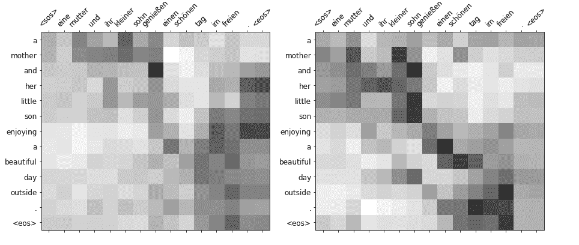

在后续的三层和四层中，注意力似乎变得更加精细。

##### 图 9.7：测试翻译示例：解码器自注意力层 3 和 4

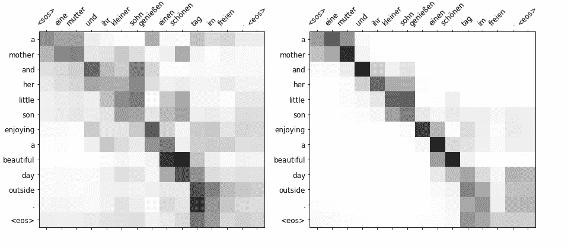

在最后两层中，我们看到注意力在直接词对词翻译的地方有很强的权重，沿着对角线，这是你可能期望的。请注意有阴影的文章名词和形容词名词对的聚类。例如，“son”明显在单词“sohn”上有权重，但也注意到了“kleiner”。

##### 图 9.8：测试翻译示例：解码器自注意力层 5 和 6

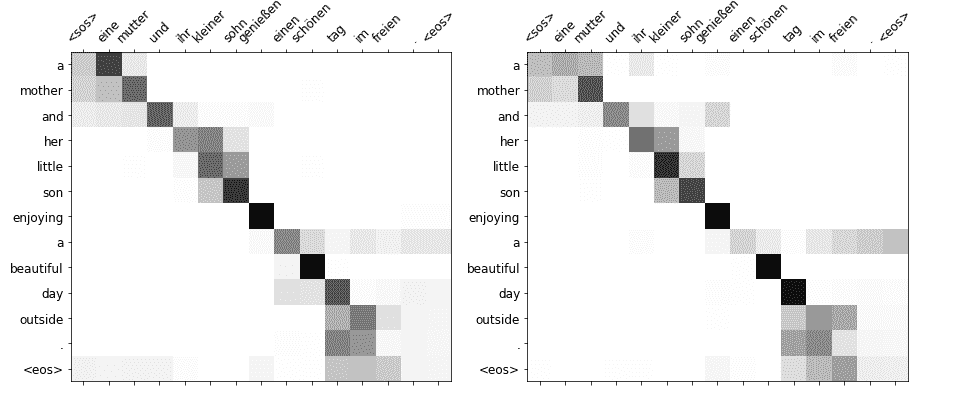

你随机选择了这个例子来自测试集，以了解模型的翻译能力。注意力图似乎显示出模型正在捕捉句子中的关系，但单词重要性仍然强烈地与位置有关。换句话说，原始句子中当前位置的德语单词通常被翻译为目标输出中相同或类似位置的英语单词。

#### 翻译 transformers 推理示例 2

再看另一个例子，这次是来自验证集的例子，在输入序列和输出序列的从句顺序不同的情况下，看看注意力是如何起作用的。在接下来的列表中加载并打印索引 25 处的验证样本数据。

##### 列表 9.27 在 *valid_data* 索引 25 处加载样本

```py
>>> example_idx = 25
...
>>> src = vars(valid_data.examples[example_idx])['src']
>>> trg = vars(valid_data.examples[example_idx])['trg']
...
>>> print(f'src = {src}')
>>> print(f'trg = {trg}')
src = ['zwei', 'hunde', 'spielen', 'im', 'hohen', 'gras', 'mit',
 'einem', 'orangen', 'spielzeug', '.']
trg = ['two', 'dogs', 'play', 'with', 'an', 'orange', 'toy', 'in',
 'tall', 'grass', '.']
```

即使你的德语理解能力不强，很明显 *orange toy*（“orangen spielzeug”）在源句的末尾，而 *in the tall grass* 在中间。然而，在英语句子中，“in tall grass” 完成了句子，而“with an orange toy” 是“play”行为的直接接受者，在句子的中间部分。用你的模型翻译这个句子。

##### 列表 9.28 翻译验证数据样本

```py
>>> translation, attention = translate_sentence(src, SRC, TRG, model, device)
>>> print(f'translation = {translation}')
translation = ['two', 'dogs', 'are', 'playing', 'with', 'an', 'orange',
 'toy', 'in', 'the', 'tall', 'grass', '.', '<eos>']
```

对于一个大约花费 15 分钟训练的模型来说，这是一个相当令人兴奋的结果（取决于你的计算能力）。再次通过调用 *display_attention()* 函数，绘制注意力权重，传入 *src*、*translation* 和 *attention*。

##### 列表 9.29 可视化验证示例翻译的自注意力权重

```py
>>> display_attention(src, translation, attention)
```

这里我们展示了最后两层（第 5 和第 6 层）的图表。

##### 图 9.9 验证翻译示例：解码器自注意力层 5 和 6

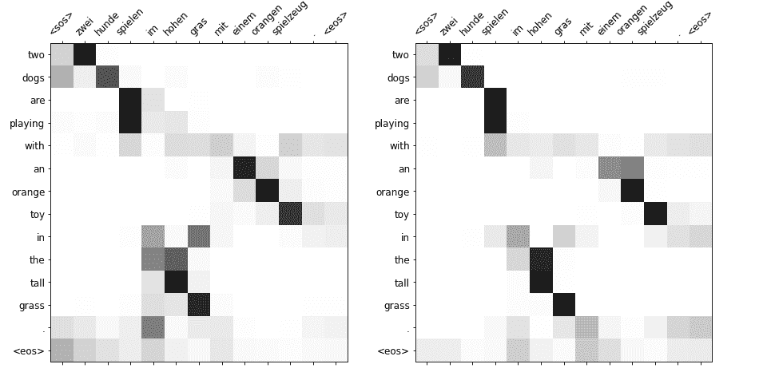

这个样本出色地展示了注意力权重如何打破了位置-序列模式，实际上关注了句子中更早或更晚的单词。它真正展示了多头自注意机制的独特性和力量。

总结这一节，你将计算模型的 BLEU（双语评估助手）得分。`torchtext` 包提供了一个函数，*bleu_score*，用于执行计算。你使用下面的函数，同样来自特雷维特先生的笔记本，对数据集进行推理并返回得分。

```py
>>> from torchtext.data.metrics import bleu_score
...
>>> def calculate_bleu(data, src_field, trg_field, model, device,
 max_len = 50):
...     trgs = []
...     pred_trgs = []
...     for datum in data:
...         src = vars(datum)['src']
...         trg = vars(datum)['trg']
...         pred_trg, _ = translate_sentence(
...             src, src_field, trg_field, model, device, max_len)
...         # strip <eos> token
...         pred_trg = pred_trg[:-1]
...         pred_trgs.append(pred_trg)
...         trgs.append([trg])
...
...     return bleu_score(pred_trgs, trgs)
```

计算你的测试数据得分。

```py
>>> bleu_score = calculate_bleu(test_data, SRC, TRG, model, device)
>>> print(f'BLEU score = {bleu_score*100:.2f}')
BLEU score = 37.68
```

与本·特雷维特（Ben Trevett）的教程代码进行比较，一个卷积序列到序列模型^([25])获得了 33.3 的 BLEU，而较小规模的 Transformer 得分约为 35。你的模型使用了与原始的“注意力机制就是一切”Transformer 相同的维度，因此它表现良好并不奇怪。

## 9.3 双向反向传播和“BERT”

有时你想要预测序列中的某些东西 —— 也许是一个被屏蔽的单词。Transformer 也可以处理这个。而且模型不需要局限于以“因果”的方式从左到右读取文本。它也可以从右边的掩码另一侧从右到左读取文本。在生成文本时，你的模型被训练来预测的未知单词位于文本的末尾。但是 Transformer 也可以预测一个内部单词，例如，如果你试图揭开米勒报告中被涂黑的秘密部分。

当你想预测一个未知的词 *在* 你的示例文本中时，你可以利用被遮罩词之前和 *之后* 的单词。人类读者或 NLP 流水线可以从任何位置开始。对于 NLP，你总是有一个特定长度的特定文本需要处理。因此，你可以从文本的末尾或开头开始…​或 *两者都*！这就是 BERT 利用的洞察力，用于创建任何文本的任务无关嵌入。它是在通常任务上训练的，即预测遮罩词，类似于你在第六章中使用 skip-grams 训练单词嵌入的方式。而且，就像在单词嵌入训练中一样，BERT 通过屏蔽单词并训练双向 transformer 模型来恢复被遮罩的单词，从未标记的文本中创建了大量有用的训练数据。

2018 年，Google AI 的研究人员推出了一种称为 BERT 的新语言模型，即“双向编码器从 transformer 中获取的表示”^([26])。"BERT" 中的 "B" 是指 "双向"。它不是以芝麻街的角色命名的，而是指 "双向编码器从 transformer 中获取的表示" - 基本上就是一个双向 transformer。双向 transformer 对机器来说是一个巨大的进步。在下一章，第十章中，你将了解到帮助 transformer（升级版 RNN）在许多最困难的 NLP 问题中登顶的三个技巧之一是什么。赋予 RNN 读取双向文本的能力就是其中之一，它帮助机器在阅读理解任务中超越人类。

BERT 模型有两种版本（配置） — BERT *BASE* 和 BERT *LARGE* — 由一堆带有前馈和注意层的编码器 transformer 组成。与之前的 transformer 模型（如 OpenAI GPT）不同，BERT 使用了遮罩语言建模（MLM）目标来训练一个深度双向 transformer。MLM 包括在输入序列中随机遮罩标记，然后尝试从上下文预测实际标记。MLM 目标比典型的从左到右的语言模型训练更强大，它允许 BERT 在所有层中通过连接标记的左右上下文来更好地概括语言表示。BERT 模型是在英文维基百科中（不包括表格和图表，共 2500M 个单词）和 BooksCorpus（也是 GPT 的训练基础，共 800M 个单词）上以半监督的方式预训练的。通过简单调整输入和输出层，模型可以被微调以在特定的句子级和标记级任务上达到最先进的结果。

### 9.3.1 分词和预训练

输入到 BERT 的序列可以模糊地表示一个单独的句子或一对句子。 BERT 使用 WordPiece 嵌入，每个序列的第一个令牌始终设置为特殊的*[CLS]*令牌。 句子通过尾随的分隔符令牌*[SEP]*进行区分。 序列中的令牌进一步通过单独的段嵌入进行区分，每个令牌分配给句子 A 或 B。 此外，还向序列添加了位置嵌入，以便于序列的每个位置的输入表示由相应的令牌、段和位置嵌入的总和形成，如下图所示（来自已发表的论文）：

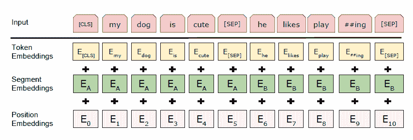

在预训练期间，输入令牌的一部分被随机屏蔽（使用*[MASK]*令牌），模型预测这些屏蔽令牌的实际令牌 ID。 在实践中，选择了 15%的 WordPiece 令牌进行训练，然而，这样做的一个缺点是在微调过程中没有*[MASK]*令牌。 为了解决这个问题，作者提出了一个公式，以使被选中的令牌（15%）在 80%的时间内替换为*[MASK]*令牌。 对于其他 20%，他们将令牌替换为随机令牌的 10%的时间，并保留原始令牌的 10%的时间。 除了这个 MLM 目标预训练，还进行了次要训练以进行下一句子预测（NSP）。 许多下游任务，如问答（QA），依赖于理解两个句子之间的关系，不能仅通过语言建模来解决。 对于 NSP 训练的波段，作者通过为每个样本选择句子 A 和 B 并将它们标记为*IsNext*和*NotNext*，生成了一个简单的二元 NSP 任务。 预训练的 50%的样本中的选择是语料库中句子 B 跟随句子 A，另一半的句子 B 是随机选择的。 这个简单的解决方案表明有时候人们无需过度思考问题。

### 9.3.2 微调

对于大多数 BERT 任务，你会想要加载 BERT[BASE]或 BERT[LARGE]模型，并使用所有参数从预训练进行初始化，然后针对你的特定任务对模型进行微调。微调通常是直接的；只需将任务特定的输入和输出插入，并开始对所有参数进行训练。与初始预训练相比，模型的微调要便宜得多。BERT 在许多任务上表现出色。例如，在发布时，BERT 在通用语言理解评估（GLUE）基准测试中超过了当前最先进的 OpenAI GPT 模型。并且在斯坦福问答数据集（SQuAD v1.1）上，BERT 超过了最佳系统（集成模型），这个任务是从给定的维基百科段落中选择包含给定问题答案的文本片段。不出所料，对于这个任务的一个变种，SQuAD v2.0，BERT 也是最好的，它允许问题的简短答案在文本中可能不存在。

### 9.3.3 实现

在前面的章节中，从原始 Transformer 的讨论中借鉴来的，对于 BERT 的配置，*L* 表示 Transformer 层的数量，隐藏层大小为 *H*，自注意力头的数量为 *A*。BERT[BASE]的尺寸为 *L*=12，*H*=768，*A*=12，总共有 1.1 亿个参数。BERT[LARGE]有 *L*=24，*H*=1024，*A*=16，总共有 3.4 亿个参数！大型模型在所有任务上都超过了基准模型的性能，但是取决于你可用的硬件资源，你可能会发现使用基准模型已经足够了。对于基准和大型配置，预训练模型都有*大小写（cased）* 和 *不区分大小写（uncased）* 的版本。*不区分大小写（uncased）* 版本在预训练 WordPiece 分词之前将文本转换为全小写，而 *大小写（cased）* 模型的输入文本没有作任何更改。

BERT 的原始实现是作为 TensorFlow *tensor2tensor* 库的一部分进行开源的 ^([27])。 TensorFlow Hub 的作者们在 BERT 学术论文发布时，编写了一个 *Google Colab* 笔记本 ^([28])，展示了如何对 BERT 进行句对分类任务的微调。运行这个笔记本需要注册以访问 Google Cloud Platform Compute Engine，并获取一个 Google Cloud Storage 存储桶。在撰写本文时，谷歌似乎仍然给首次用户提供货币积分，但通常情况下，一旦你耗光了最初试用积分，就需要支付以获得计算能力的费用。

##### 注意

随着您深入研究 NLP 模型，特别是使用具有深度 transformers 堆栈的模型，您可能会发现您当前的计算机硬件不足以满足训练和/或微调大型模型的计算密集型任务。您将需要评估建立个人计算机以满足工作负载的成本，并将其与用于人工智能的按使用量付费的云和虚拟计算方案进行权衡。我们在本文中提及了基本的硬件要求和计算选项，然而，讨论 "正确" 的个人电脑设置或提供竞争性计算选项的详尽列表超出了本书的范围。除了刚刚提到的 Google 计算引擎之外，附录中还有设置亚马逊网络服务（AWS）GPU 的说明。

BERT 模型的 Pytorch 版本是在 `pytorch-pretrained-bert` 库中实现的 ^([29])，后来又被纳入了不可或缺的 HuggingFace *transformers* 库中 ^([30])。您最好花一些时间阅读网站上的 "入门" 文档以及 transformers 模型和相关任务的摘要。要安装 transformers 库，只需使用 `pip install transformers`。安装完成后，使用 `BertModel.from_pre-trained()` API 按名称加载一个。您可以在下面的列表中打印加载的 "bert-base-uncased" 模型的摘要，以了解其架构。

##### 列表 9.30 BERT 架构的 Pytorch 摘要

```py
>>> from transformers import BertModel
>>> model = BertModel.from_pre-trained('bert-base-uncased')
>>> print(model)
```

```py
BertModel(
  (embeddings): BertEmbeddings(
    (word_embeddings): Embedding(30522, 768, padding_idx=0)
    (position_embeddings): Embedding(512, 768)
    (token_type_embeddings): Embedding(2, 768)
    (LayerNorm): LayerNorm((768,), eps=1e-12, elementwise_affine=True)
    (dropout): Dropout(p=0.1, inplace=False)
  )
  (encoder): BertEncoder(
    (layer): ModuleList(
      (0): BertLayer(
        (attention): BertAttention(
          (self): BertSelfAttention(
            (query): Linear(in_features=768, out_features=768, bias=True)
            (key): Linear(in_features=768, out_features=768, bias=True)
            (value): Linear(in_features=768, out_features=768, bias=True)
            (dropout): Dropout(p=0.1, inplace=False)
          )
          (output): BertSelfOutput(
            (dense): Linear(in_features=768, out_features=768, bias=True)
            (LayerNorm): LayerNorm((768,), eps=1e-12,
 elementwise_affine=True)
            (dropout): Dropout(p=0.1, inplace=False)
          )
        )
        (intermediate): BertIntermediate(
          (dense): Linear(in_features=768, out_features=3072, bias=True)
        )
        (output): BertOutput(
          (dense): Linear(in_features=3072, out_features=768, bias=True)
          (LayerNorm): LayerNorm((768,), eps=1e-12, elementwise_affine=True)
          (dropout): Dropout(p=0.1, inplace=False)
        )

      ... # #1

      (11): BertLayer(
        (attention): BertAttention(...)
        (intermediate): BertIntermediate(
          (dense): Linear(in_features=768, out_features=3072, bias=True)
        )
        (output): BertOutput(
          (dense): Linear(in_features=3072, out_features=768, bias=True)
          (LayerNorm): LayerNorm((768,), eps=1e-12, elementwise_affine=True)
          (dropout): Dropout(p=0.1, inplace=False)
  ) ) ) )
  (pooler): BertPooler(
    (dense): Linear(in_features=768, out_features=768, bias=True)
    (activation): Tanh() ) )
```

导入 BERT 模型后，您可以显示其字符串表示以获取其结构的摘要。如果您考虑设计自己的自定义双向 transformers，这是一个很好的起点。但在大多数情况下，您可以直接使用 BERT 来创建准确表示大多数文本含义的英文文本编码。预训练的 BERT 模型可能是您应用程序所需的全部，例如聊天机器人意图标记（分类或标记）、情感分析、社交媒体管理、语义搜索和常见问题解答。如果您考虑在向量数据库中存储嵌入以进行语义搜索，那么普通的 BERT 编码是您的最佳选择。

在下一节中，您将看到如何使用预训练的 BERT 模型识别有毒社交媒体消息的示例。然后，您将看到如何通过在数据集上进行额外的训练周期来微调 BERT 模型以适用于您的应用程序。您将看到，微调 BERT 可以显著提高您的有毒评论分类准确性，而不会过度拟合。

### 9.3.4 对预训练的 BERT 模型进行微调以进行文本分类

2018 年，Conversation AI ^([31]) 团队（由 Jigsaw 和 Google 联合创办）举办了一场 Kaggle 竞赛，旨在开发一个模型来检测在线社交媒体帖子中的各种毒性。当时，LSTM 和卷积神经网络是当时的最新技术。具有注意力的双向 LSTM 在这场比赛中取得了最佳成绩。BERT 的承诺是它可以同时从当前正在处理的转换器的当前单词的左右单词中学习单词上下文。这使得它特别适用于创建多用途的编码或嵌入向量，用于解决诸如检测有毒社交媒体评论之类的分类问题。而且由于 BERT 是在一个大型语料库上预训练的，所以你不需要庞大的数据集或超级计算机，就能够利用 *迁移学习* 的力量来微调一个性能良好的模型。

在这一节中，你将使用该库快速微调一个预先训练好的 BERT 模型，用于分类有毒的社交媒体帖子。之后，你将进行一些调整，以改进模型，以期在消除恶意行为，清除网络喷子的道路上取得成功。

#### 一个有毒的数据集

你可以从 kaggle.com 下载"有毒评论分类挑战"数据集（`archive.zip`）。^([32]) 如果愿意，你可以将数据放在你的 `$HOME/.nlpia2-data/` 目录中，和本书的其他大型数据集一起。当你解压 `archive.zip` 文件时，你会看到它包含了训练集（`train.csv`）和测试集（`test.csv`）作为单独的 CSV 文件。在现实世界中，你可能会将训练集和测试集合并起来，创建自己的验证和测试示例样本。但为了使你的结果与竞赛网站上看到的结果可比，你首先只会使用训练集。

首先，使用 pandas 加载训练数据，并查看接下来列表中显示的前几个条目。通常，你会想查看数据集中的示例，以了解数据的格式。尝试做与你要求模型执行的相同任务通常是有帮助的，以查看它是否是一个合理的 NLP 问题。这里是训练集中的前五个示例。幸运的是，数据集被排序为首先包含非有毒的帖子，所以你不必在这一节的最后读取任何有毒评论。如果你有一个名叫"Terri"的祖母，你可以在这一节的最后一个代码块的最后一行闭上你的眼睛 `;-)`。

##### 列表 9.31 载入有毒评论数据集

```py
>>> import pandas as pd
>>> df = pd.read_csv('data/train.csv')  # #1
>>> df.head()
                   comment_text toxic severe obscene threat insult hate
Explanation\nWhy the edits made     0      0       0      0      0    0
D'aww! He matches this backgrou 0 0 0 0 0 0
Hey man, I'm really not trying 0 0 0 0 0 0
"\nMore\nI can't make any real 0 0 0 0 0 0
You, sir, are my hero. Any chan     0      0       0      0      0    0
>>> df.shape
(159571, 8)
```

哎呀，幸运的是，前五条评论都不是淫秽的，所以它们可以打印在这本书中。

##### 花时间与数据相处。

通常在这一点上，你会探索和分析数据，关注文本样本的特性和标签的准确性，也许会问自己关于数据的问题。评论通常有多长？句子长度或评论长度是否与毒性有关？考虑专注于一些*severe_toxic*评论。它们与仅仅有毒的评论有什么不同？类分布是什么样的？你是否需要在训练技术中考虑到类别不平衡？

你想要进行训练，所以让我们将数据集分割为训练集和验证（评估）集。由于可供模型调整的样本数量几乎为 160,000 个，我们选择使用 80-20 的训练-测试分割。

##### 列表 9.32 将数据分割为训练集和验证集

```py
>>> from sklearn.model_selection import train_test_split
>>> random_state=42
>>> labels = ['toxic', 'severe', 'obscene', 'threat', 'insult', 'hate']
>>> X = df[['comment_text']]
>>> y = df[labels]
>>> X_train, X_test, y_train, y_test = train_test_split(
...     X, y, test_size=0.2,
...     random_state=random_state)  # #1
```

现在你已经将数据存储在一个具有描述性列名的 Pandas DataFrame 中，你可以使用这些列名来解释模型的测试结果。

还有一个最后的 ETL 任务需要你处理，你需要一个包装函数来确保传递给转换器的示例批次具有正确的形状和内容。你将使用`simpletransformers`库，该库为各种 Hugging Face 模型设计了包装器，用于分类任务，包括多标签分类，不要与多类别或多输出分类模型混淆。Scikit-Learn 包还包含一个`MultiOutputClassifier`包装器，你可以使用它来创建多个评估器（模型），每个目标标签对应一个。

##### 重要

多标签分类器是一个模型，它为每个输入输出多个不同的预测离散分类标签（'toxic'，'severe'和'obscene'），这允许你的文本被赋予多个不同的标签。就像托尔斯泰的*《安娜·卡列尼娜》*中的虚构家庭一样，一条有毒的评论可以以多种不同的方式毒害人，而且同时进行。你可以将多标签分类器视为向文本应用标签或表情符号。为了避免混淆，你可以将你的模型称为“标签器”或“标签模型”，以免别人误解你。

由于每个评论可以被分配多个标签（零个或多个），因此 `MultiLabelClassificationModel` 是解决这类问题的最佳选择。 根据文档^([34])，`MultiLabelClassificationModel` 模型期望以 `["text", [label1, label2, label3, …​]]` 的格式提供训练样本。 这样做可以保持数据集的外部形状不变，无论您想要跟踪多少不同类型的毒性。 Hugging Face `transformers` 模型可以处理具有任意数量可能标签（标签）的数据结构，但您需要在管道内保持一致，在每个示例中使用相同数量的可能标签。 您需要一个具有恒定维度数量的*multihot*零和一向量，以便您的模型知道在哪里放置对每种毒性的预测。 下一个列表显示了如何安排包含在训练和评估模型期间运行的包装器函数的数据批次。

##### 列表 9.33 为模型创建数据集

```py
>>> def get_dataset(X, y):
...     data = [[X.iloc[i][0], y.iloc[i].values.tolist()]
 for i in range(X.shape[0])]
...     return pd.DataFrame(data, columns=['text', 'labels'])
...
>>> train_df = get_dataset(X_train, y_train)
>>> eval_df = get_dataset(X_test, y_test)
>>> train_df.shape, eval_df.shape
((127656, 2), (31915, 2))

>>> train_df.head()  # #1
                                                text              labels
0  Grandma Terri Should Burn in Trash \nGrandma T...  [1, 0, 0, 0, 0, 0]
1  , 9 May 2009 (UTC)\nIt would be easiest if you...  [0, 0, 0, 0, 0, 0]
2  "\n\nThe Objectivity of this Discussion is dou... [0, 0, 0, 0, 0, 0]
3              Shelly Shock\nShelly Shock is. . .( )  [0, 0, 0, 0, 0, 0]
4  I do not care. Refer to Ong Teng Cheong talk p...  [0, 0, 0, 0, 0, 0]
```

现在您可以看到，如果母亲和祖母是欺负者侮辱的目标，那么该数据集对毒性的门槛相当低。 这意味着即使您要保护极端敏感或年轻的用户，该数据集也可能会有所帮助。 如果您试图保护现代成年人或习惯于在线体验残酷的数字原住民，您可以从其他来源增加这个数据集的更极端的例子。

#### 使用 `simpletransformers` 检测有毒评论

现在您有一个函数，用于将带标签的文本批次传递给模型并打印一些消息以监视您的进度。 所以现在是选择要下载的 BERT 模型的时候了。 您只需要设置几个基本参数，然后就可以准备加载预训练的 BERT 进行多标签分类并开始微调（训练）。

##### 列表 9.34 设置训练参数

```py
>>> import logging
>>> logging.basicConfig(level=logging.INFO)  # #1

>>> model_type = 'bert'  # #2
>>> model_name = 'bert-base-cased'
>>> output_dir = f'{model_type}-example1-outputs'

>>> model_args = {
...     'output_dir': output_dir, # where to save results
...     'overwrite_output_dir': True, # allow re-run without having to manually clear output_dir
...     'manual_seed': random_state, # #3
...     'no_cache': True,
... }
```

在下面的列表中，您加载了预训练的 `bert-base-cased` 模型，配置为输出我们有毒评论数据中的标签数（总共 6 个），并使用您的 `model_args` 字典初始化进行训练^([35])。

##### 列表 9.35 载入预训练模型并微调

```py
>>> from sklearn.metrics import roc_auc_score
>>> from simpletransformers.classification
 import MultiLabelClassificationModel
>>> model = MultiLabelClassificationModel(
...     model_type, model_name, num_labels=len(labels),
...     args=model_args)
You should probably TRAIN this model on a downstream task
 to be able to use it
for predictions and inference
>>> model.train_model(train_df=train_df)  # #1
```

`train_model()` 为您完成了繁重的工作。 它加载了您选择的预训练*bert-base-cased*模型的预训练 `BertTokenizer` 并将其用于对 `train_df['text']` 进行标记以用于训练模型的输入。 该函数将这些输入与 `train_df[labels]` 结合生成一个 `TensorDataset`，然后将其与 PyTorch `DataLoader` 包装，然后以批次进行迭代，以构成训练循环。

换句话说，只需几行代码和一次通过您的数据（一个时期），您就可以微调具有 1100 万参数的 12 层变换器！ 下一个问题是：它有助于还是损害了模型的翻译能力？ 让我们对评估集运行推理并检查结果。

##### 列表 9.36 评估

```py
>>> result, model_outputs, wrong_predictions = model.eval_model(eval_df,
...     acc=roc_auc_score)  # #1
>>> result
{'LRAP': 0.9955934600588362,
 'acc': 0.9812396881786198,
 'eval_loss': 0.04415484298031397}
```

ROC（Receiver Operating Characteristic curve）AUC（曲线下面积）指标通过计算分类器在精度与召回率曲线（曲线）下的积分（面积）来平衡分类器可能出现的所有错误方式。这确保了那些自信错误的模型比那些在预测概率值上更接近真相的模型受到更严厉的惩罚。而`simpletransformers`包中的`roc_auc_score`会给出所有示例和每个文本可能选择的所有不同标签的微平均值。

ROC AUC 微平均分数实质上是所有`predict_proba`错误值的总和，或者说是预测概率值与人类标注者给定的 0 或 1 值之间的距离。在测量模型准确性时，记住这个心理模型是一个好主意。准确性只是离人类标注者认为的正确答案有多接近，而不是关于被标注的词语的意义、意图或影响的绝对真相。毒性是一个非常主观的质量。

AUC 分数为 0.981 并不算太差。虽然它不会为你赢得任何称赞^([36])，但它确实提供了对你的训练模拟和推理是否设置正确的鼓励性反馈。

`eval_model()`和`train_model()`的实现方法都可以在`MultiLabelClassificationModel`和`ClassificationModel`的基类中找到。评估代码会让你感到熟悉，因为它使用了`with torch.no_grad()`上下文管理器来进行推理，这是人们所期望的。建议你花些时间看看这些方法的实现情况。特别是`train_model()`对于查看在训练和评估过程中如何使用下一部分中选择的配置选项是有帮助的。

#### 更好的 BERT

现在你已经有了一个模型的初步版本，可以进行更细致的调整，以帮助你的基于 BERT 的模型做得更好。在这种情况下，“更好”简单地意味着有更高的 AUC 分数。就像在现实世界中一样，你需要决定在你的特定情况中什么是更好的。因此，不要忘记关注模型的预测如何影响使用你的模型的人或企业的用户体验。如果你能找到一个更好的度量标准，更直接地衡量对于你的用户来说什么是“更好”，那么你应该将它替换掉这段代码中的 AUC 分数。

在上一个示例中执行的训练代码基础上，您将致力于提高模型的准确性。通过一些预处理稍微清理文本是相当直接的。该书的示例源代码附带了一个我们编写的实用程序`TextPreprocessor`类，用于替换常见的拼写错误，扩展缩略语并执行其他杂项清理，如删除额外的空白字符。继续并将加载的*train.csv*数据框中的`comment_text`列重命名为`original_text`。将预处理器应用于原始文本，并将精炼后的文本存储回`comment_text`列。

##### 列表 9.37 预处理评论文本

```py
>>> from preprocessing.preprocessing import TextPreprocessor
>>> tp = TextPreprocessor()
loaded ./inc/preprocessing/json/contractions.json
loaded ./inc/preprocessing/json/misc_replacements.json
loaded ./inc/preprocessing/json/misspellings.json
>>> df = df.rename(columns={'comment_text':'original_text'})
>>> df['comment_text'] = df['original_text'].apply(
...     lambda x: tp.preprocess(x))  # #1
>>> pd.set_option('display.max_colwidth', 45)
>>> df[['original_text', 'comment_text']].head()
                    original_text                       comment_text
0  Explanation\nWhy the edits ...  Explanation Why the edits made...
1  D'aww! He matches this back... D'aww! He matches this backgro...
2  Hey man, I'm really not try... Hey man, i am really not tryin...
3  "\nMore\nI can't make any r... " More I cannot make any real ...
4  You, sir, are my hero. Any ...  You, sir, are my hero. Any cha...
```

文本清理完成后，将重点转向调整模型初始化和训练参数。在第一次训练运行中，由于未向模型提供`max_sequence_length`的显式值，您接受了默认的输入序列长度（128）。BERT-base 模型可以处理最大长度为 512 的序列。随着`max_sequence_length`的增加，您可能需要减小`train_batch_size`和`eval_batch_size`以将张量适应 GPU 内存，具体取决于您可用的硬件。您可以对评论文本的长度进行一些探索，以找到最佳的最大长度。请注意，某些时候您将获得收益递减，使用较大的序列导致更长的训练和评估时间，并不会显著提高模型的准确性。对于此示例，选择一个最大长度为 300 的`max_sequence_length`，介于默认值 128 和模型容量之间。还要显式选择`train_batch_size`和`eval_batch_size`以适应 GPU 内存。

##### 警告

如果在训练或评估开始后不久显示 GPU 内存异常，则会很快意识到批处理大小设置过大。您不一定想要基于此警告来最大化批处理大小。警告可能仅在训练运行后期出现，并破坏长时间的训练会话。对于`batch_size`参数，更大并不总是更好。有时，较小的批处理大小将有助于让您的训练在梯度下降中更具随机性。更随机有时可以帮助您的模型跳过高维度非凸误差表面上的峰值和鞍点。

记得在第一次微调运行中，模型正好训练了一个时期。您认为模型可能需要更长时间的训练才能取得更好的结果的直觉很可能是正确的。您希望找到在模型对训练样本过拟合之前需要进行训练的数量的平衡点。配置选项以在训练期间启用评估，以便您还可以设置早停的参数。在训练期间的评估分数用于通知早停。因此，设置`evaluation_during_training=True`以启用它，还要设置`use_early_stopping=True`。随着模型学会泛化，我们预期在评估步骤之间的性能会出现波动，因此您不希望仅仅因为准确性从最新的评估步骤的上一个值下降而停止训练。配置早停的*耐心*，即连续几次评估没有改善（定义为大于某个增量）时终止训练的次数。您将设置`early_stopping_patience=4`，因为您有点耐心，但也有自己的极限。使用`early_stopping_delta=0`，因为没有任何改善量都不会太小。

在训练期间重复将这些转换器模型保存到磁盘（例如，在每个评估阶段或每个时期之后）需要时间和磁盘空间。对于本示例，您希望保留在训练过程中生成的*最佳*模型，因此请指定`best_model_dir`来保存表现最佳的模型。将其保存到`output_dir`下的位置很方便，这样您运行更多实验时，所有的训练结果都可以组织起来。

##### [在训练和早停期间设置评估参数](https://wiki.example.org/setup_parameters_for_evaluation_during_training_and_early_stopping)

```py
>>> model_type = 'bert'
>>> model_name = 'bert-base-cased'
>>> output_dir = f'{model_type}-example2-outputs'  # #1
>>> best_model_dir = f'{output_dir}/best_model'
>>> model_args = {
...     'output_dir': output_dir,
...     'overwrite_output_dir': True,
...     'manual_seed': random_state,
...     'no_cache': True,
...     'best_model_dir': best_model_dir,
...     'max_seq_length': 300,
...     'train_batch_size': 24,
...     'eval_batch_size': 24,
...     'gradient_accumulation_steps': 1,
...     'learning_rate': 5e-5,
...     'evaluate_during_training': True,
...     'evaluate_during_training_steps': 1000,
...     'save_eval_checkpoints': False,
...     "save_model_every_epoch": False,
...     'save_steps': -1,  # saving model unnecessarily takes time during training
...     'reprocess_input_data': True,
...     'num_train_epochs': 5,  # #2
...     'use_early_stopping': True,
...     'early_stopping_patience': 4,  # #3
...     'early_stopping_delta': 0,
... }
```

通过调用`model.train_model()`来训练模型，就像之前做的那样。一个变化是你现在要`evaluate_during_training`，所以你需要包括一个`eval_df`（你的验证数据集）。这允许您的训练例程在训练模型时估计您的模型在现实世界中的表现如何。如果验证准确性连续几个（`early_stoping_patience`）时期下降，您的模型将停止训练，以免继续恶化。

##### [加载预训练模型并进行早停微调](https://wiki.example.org/load_pretrained_model_and_fine_tune_with_early_stopping)

```py
>>> model = MultiLabelClassificationModel(
...     model_type, model_name, num_labels=len(labels),
...     args=model_args)
>>> model.train_model(
...     train_df=train_df, eval_df=eval_df, acc=roc_auc_score,
...     show_running_loss=False, verbose=False)
```

您的*最佳*模型在训练期间保存在`best_model_dir`中。不用说，这是您想要用于推断的模型。评估代码段已更新，通过在模型类的构造函数中将`best_model_dir`传递给`model_name`参数来加载模型。

##### [评估最佳模型](https://wiki.example.org/evaluation_with_the_best_model)

```py
>>> best_model = MultiLabelClassificationModel(
...     model_type, best_model_dir,
...     num_labels=len(labels), args=model_args)
>>> result, model_outputs, wrong_predictions = best_model.eval_model(
...     eval_df, acc=roc_auc_score)
>>> result
{'LRAP': 0.996060542761153,
 'acc': 0.9893854727083252,
 'eval_loss': 0.040633044850540305}
```

现在看起来更好了。0.989 的准确率使我们有机会与 2018 年初的顶级挑战解决方案竞争。也许你认为 98.9%的准确率可能有点太好以至于难以置信。你是对的。精通德语的人需要挖掘一些翻译以找到模型的所有翻译错误。而误判的负样本-被错误标记为正确的测试样本-会更难找到。

如果你和我一样，可能没有一个流利的德语翻译者。所以这里有一个更注重英语的翻译应用的快速示例，你可能更能欣赏，即语法检查和修正。即使你还是一个英语学习者，你也会欣赏到拥有一个个性化工具来帮助你写作的好处。个性化语法检查器可能是帮助你发展强大沟通技巧和推进你的 NLP 职业的个人杀手级应用。

## 9.4 自测题

1.  与其他深度学习层（如 CNN，RNN 或 LSTM 层）相比，转换器层的输入和输出维度有什么不同？

1.  如何扩展像 BERT 或 GPT-2 这样的转换器网络的信息容量？

1.  估计在特定标记数据集上获得高准确度所需的信息容量的经验法则是什么？

1.  什么是衡量 2 个深度学习网络相对信息容量的好方法？

1.  有什么方法可以减少训练转换器所需的标记数据量，以解决摘要等问题？

1.  如何衡量摘要器或翻译器的准确性或损失，当可能存在不止一个正确答案时？

## 9.5 总结

+   通过保持每层的输入和输出一致，转换器获得了它们的关键超能力-无限可堆叠性。

+   转换器结合了三个关键创新，以实现改变世界的 NLP 能力：BPE 分词，多头注意力和位置编码。

+   GPT 转换器架构是大多数文本生成任务（如翻译和会话式聊天机器人）的最佳选择。

+   尽管已经发布了 5 年以上（当本书发布时）BERT 转换器模型仍然是大多数 NLU 问题的正确选择。

+   如果你选择了一个高效的预训练模型，你可以通过精调它来在许多困难的 Kaggle 问题上取得竞争力，只需使用像笔记本电脑或免费的在线 GPU 资源这样的经济设备。

[[1]](#_footnoteref_1) 在 ChatGPT 公开发布后的几个月里，丹·米斯勒几乎花了一半的“Unsupervised Learning”播客时间来讨论基于 transformer 的工具，如 InstructGPT，ChatGPT，Bard 和 Bing（`danielmiessler.com/`）

[[2]](#_footnoteref_2)PineCone.io、Milvus.io、Vespa.ai、Vald.vdaas.org 使用 transformers

[[3]](#_footnoteref_3)维基百科上的“瑞士奶酪模型”（`en.wikipedia.org/wiki/Swiss_cheese_model`）

[[4]](#_footnoteref_4) 一位名叫 Sebastian Larson 的中学生赢得了我们的比赛，开发了 Rori 的 `mathtext` 自然语言处理算法（`gitlab.com/tangibleai/community/team/-/tree/main/exercises/2-mathtext` Rori.AI 的所有自然语言处理代码都是开源的，可以在 Huggingface 上获得（`huggingface.co/spaces/TangibleAI/mathtext-fastapi`）

[[6]](#_footnoteref_6) Vish 构建了一个基于 transformer 的教学助理，名叫 Clevrly（clevrly.io）

[[7]](#_footnoteref_7) Vish 的一些精细调整的 transformers 可以在 Huggingface 上获得（`huggingface.co/clevrly`）

[[8]](#_footnoteref_8) Stats Stack Exchange 的答案（`stats.stackexchange.com/a/422898/15974`）

[[9]](#_footnoteref_9) N-Gram Viewer 查询 "embedding_NOUN" / "encoding_NOUN"（`books.google.com/ngrams/graph?content=embedding_NOUN+%2F+encoding_NOUN&year_start=2010&year_end=2019&corpus=en-2019&smoothing=3`）

[[10]](#_footnoteref_10) "机器学习中关于传导的简明介绍"，Jason Brownlee 于 2017 年在 *Machine Learning Mastery* 博客上发布的文章（`machinelearningmastery.com/transduction-in-machine-learning/`）

[[11]](#_footnoteref_11) 通过联合学习对齐和翻译实现的神经机器翻译：`arxiv.org/abs/1409.0473`

[[12]](#_footnoteref_12) "Attention Is All You Need"，Vaswani, Ashish 等人于 2017 年于 Google Brain 和 Google Research 发表的论文（`arxiv.org/abs/1706.03762`）

[[13]](#_footnoteref_13) "如何从头开始实现缩放点积注意力"，Jason Brownlee 的文章（`machinelearningmastery.com/how-to-implement-scaled-dot-product-attention-from-scratch-in-tensorflow-and-keras/`）

[[14]](#_footnoteref_14) "Attention is all you Need"，Ashish Vaswani 等人于 2017 年发表的论文（`arxiv.org/abs/1706.03762`）

[[15]](#_footnoteref_15) `www.adeveloperdiary.com/data-science/deep-learning/nlp/machine-translation-using-attention-with-pytorch/`

[[16]](#_footnoteref_16) Pytorch 序列到序列建模教程：`simpletransformers.ai/docs/multi-label-classification/`

[[17]](#_footnoteref_17) 维基百科上的 ISO 639 语言代码列表（`en.wikipedia.org/wiki/List_of_ISO_639-1_codes`）

[[18]](#_footnoteref_18) Pytorch nn.Transformer 源代码：`github.com/pytorch/pytorch/blob/master/torch/nn/modules/transformer.py`

[[19]](#_footnoteref_19) einops：`github.com/arogozhnikov/einops`

[[20]](#_footnoteref_20) Pytorch torch.nn.Transformer 文档：`pytorch.org/docs/stable/generated/torch.nn.Transformer.html`

[[21]](#_footnoteref_21) PyTorch nn.Module 文档: `pytorch.org/docs/stable/generated/torch.nn.Module.html`

[[22]](#_footnoteref_22) Japanese StackExchange 上关于日语字符计数的回答 ( `japanese.stackexchange.com/a/65653/56506`)

[[23]](#_footnoteref_23) Trevett,Ben - PyTorch Seq2Seq: `github.com/bentrevett/pytorch-seq2seq/`

[[24]](#_footnoteref_24) Trevett,Ben - 注意力就是一切 Jupyter 笔记本: `github.com/bentrevett/pytorch-seq2seq/blob/master/6%20-%20Attention%20is%20All%20You%20Need.ipynb/`

[[25]](#_footnoteref_25) Trevett,Ben - 卷积序列到序列学习: `github.com/bentrevett/pytorch-seq2seq/blob/master/5%20-%20Convolutional%20Sequence%20to%20Sequence%20Learning.ipynb/`

[[26]](#_footnoteref_26) BERT：用于语言理解的深度双向变换器的预训练: `arxiv.org/abs/1810.04805/` (Devlin, Jacob 等人 2018)

[[27]](#_footnoteref_27) GitHub 上的 "tensor2tensor" 库 ( `github.com/tensorflow/tensor2tensor/`).

[[28]](#_footnoteref_28) "使用 Cloud TPUS 对 BERT 进行微调" 的 Jupyter 笔记本 ( `colab.research.google.com/github/tensorflow/tpu/blob/master/tools/colab/bert_finetuning_with_cloud_tpus.ipynb`).

[[29]](#_footnoteref_29) PyPi 上的 pytorch-pretrained-bert ( `pypi.org/project/pytorch-pretrained-bert/`).

[[30]](#_footnoteref_30) Hugging Face Hub 上的 Hugging Face 变换器模型 - ( `huggingface.co/transformers/`).

[[31]](#_footnoteref_31) Conversation AI: ( `conversationai.github.io/`)

[[32]](#_footnoteref_32) Kaggle 上的有毒评论分类挑战 ( `www.kaggle.com/datasets/julian3833/jigsaw-toxic-comment-classification-challenge`)

[[33]](#_footnoteref_33) SciKit Learn 多类别和多输出模型文档( `scikit-learn.org/stable/modules/multiclass.html#multilabel-classification`)

[[34]](#_footnoteref_34) Simpletransformers 多标签分类文档 ( `simpletransformers.ai/docs/multi-label-classification/`)

[[35]](#_footnoteref_35) 在以下网页的 "配置简单变换器模型" 部分查看完整的选项列表及其默认值：`simpletransformers.ai/docs/usage/`

[[36]](#_footnoteref_36) Kaggle 有毒评论分类挑战的最终排行榜：`www.kaggle.com/c/jigsaw-toxic-comment-classification-challenge/leaderboard`
