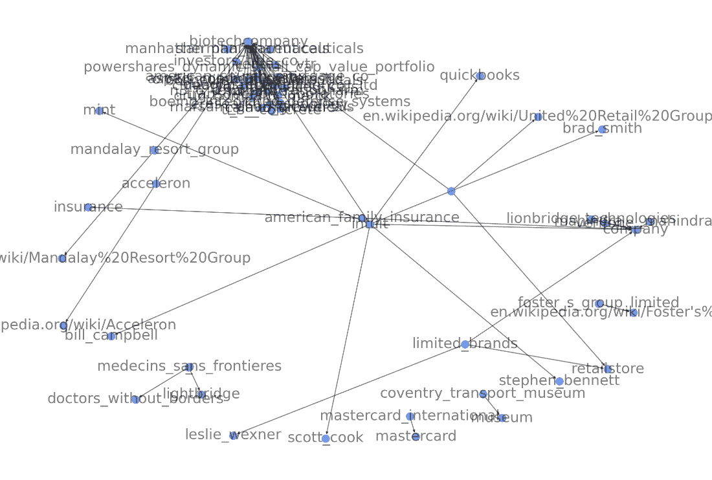
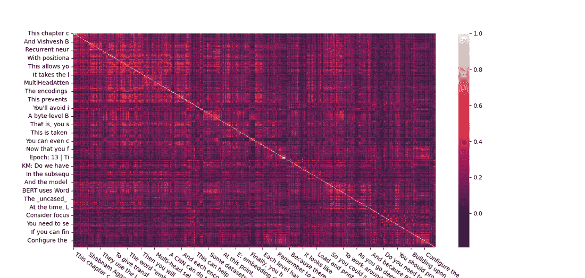
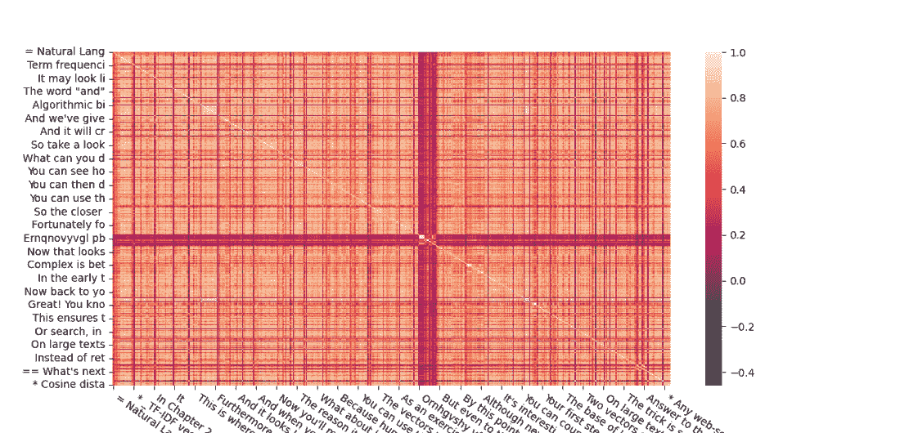
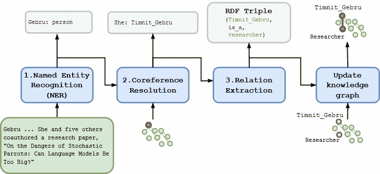
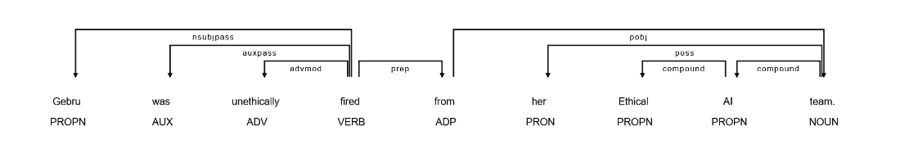
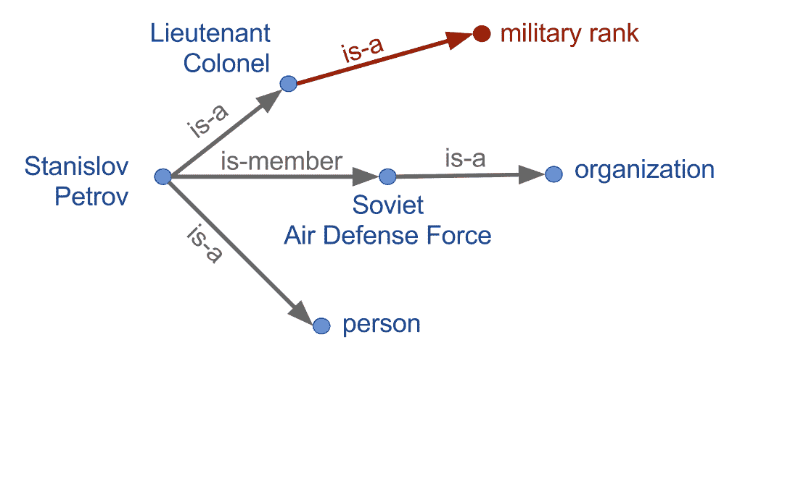

# 第十一章：信息提取和知识图谱（基础）

### 本章涵盖

+   从文本中提取命名实体

+   使用依存解析理解句子的结构

+   将依存树转换为知识（事实）

+   从文本构建知识图谱

在上一章（第十章）中，你学会了如何使用大型 transformers 生成聪明的*听起来像*单词。但单独的语言模型只是通过预测下一个对你来说*听起来*合理的单词来进行欺骗。直到你为它们提供有关世界的事实和知识之前，你的 AI 才能推理真实世界。在第二章中，你学会了如何做到这一点，但当时你并不知道。你能够标记代币及其在句子意义中的逻辑角色（依存树）。这种老式的代币标记算法是为了给你的生成式语言模型（AI）提供关于真实世界的知识。本章的目标是教你的机器人理解它所读的内容。然后，你将理解放入一个旨在存储知识的灵活数据结构中，称为*知识图谱*。然后，你的机器人可以利用这些知识做出决策，并就世界发表聪明的言论。

正确地将文本解析为*实体*，并发现它们之间的*关系*，这是你从文本中提取事实的方法。 *知识图谱*，也称为*知识数据库*（知识库）或*语义网络*，是一个将知识存储为概念之间关系的数据库。虽然你可以使用关系型数据库存储关系和概念，但有时使用*图*数据结构更为合适。图中的节点将是*实体*，而边将是这些实体之间的关系。

你可以在图 11.1 中看到一个知识图谱示例。

##### 图 11.1 知识图谱示例



每个你提取的事实都会在图的节点之间创建一个新的连接 - 或者，可能会创建新的节点。这使得你可以使用诸如 GraphQL、Cypher 甚至 SQL 的查询语言来询问关系。

然后，你的算法可以对文本进行事实检查，不仅限于人类编写的文本，还包括你的 NLP 管道或 AI 生成的文本。最后，你的 AI 算法将能够自省，让你知道它们告诉你的内容是否实际上有些真实的相似之处。

你的 AI 可以使用知识图谱来填补大型语言模型中的 *常识知识* 差距，也许有点符合关于 LLMs 和 AI 的炒作。这是你需要创建真正 AI 所需的 NLP 链中缺失的环节。你可以使用知识图谱来以编程方式生成合理的文本，因为它基于你的数据库中的事实。你甚至可以推断出关于世界的新事实或 *逻辑推理*，这些事实尚未包含在你的知识库中。

当人们谈论前向传播或使用深度学习模型进行预测时，你可能会听说过“推理”的概念。深度学习语言模型利用统计学来估计或猜测你输入的文本中的下一个词。深度学习研究人员希望有一天，神经网络能够达到与自然人类推理和思考世界的能力相匹配。但这是不可能的，因为单词并不包含机器需要处理的关于世界的全部知识，以做出事实正确的推断。因此，你将使用一种经过验证和可靠的逻辑推理方法，称为“符号推理”。

如果你熟悉编译器的概念，那么你可能会想到依赖树作为解析树或抽象语法树（AST）。AST 定义了机器语言表达式或程序的逻辑。你将使用自然语言依赖树来提取自然语言文本中的逻辑关系。这种逻辑将帮助你 *基于事实* 地对统计深度学习模型进行推理，使它们能够做更多不仅仅是像之前章节中那样做统计学上的“猜测”世界的工作。

## 11.1 推理

一旦你有了一个知识图谱，你的聊天机器人和 AI 代理就会有一种以可解释的方式正确推理世界的方法。如果你能从你的深度学习模型生成的文本中提取事实，你可以检查该文本是否与你在知识图谱中收集的知识一致。当你维护一个知识图谱并使用它来对生成的文本中的事实和推理进行双重检查时，这被称为 *推理*。当你将语言模型与关于世界的一些基本事实联系起来时，你就在为其打下基础。

推理也可以以其他方式使你的 NLP 流程受益。在算法的推理部分使用知识图谱可以释放你的语言模型，让它做它最擅长的事情——生成合理的、符合语法的文本。因此，你可以微调你的语言模型，让它具有你想要的语气，而不是试图构建一个假装理解和推理世界的变色龙。你的知识图谱可以被设计成只包含你希望你的 AI 理解的世界的事实——无论是你心目中的真实世界的事实还是你正在创建的某个虚构世界的事实。通过将推理与语言分离，你可以创建一个既听起来正确又 *是* 正确的 NLP 流程。

在提及这个接地过程时，还有一些其他术语经常被使用。有时它被称为*符号推理*，与机器学习模型的概率推理相对。*一阶逻辑*是符号推理的一种系统。这是在数据和处理能力不足以支持机器学习和深度学习之前构建专家系统和定理证明器的首选方法。它也被称为 Good Old Fashioned AI 或 GOFAI，发音为“高菲”。随着研究人员试图构建我们可以依赖于做出重要决策的普遍智能系统，GOFAI 重新流行起来。

将您的自然语言处理（NLP）流水线接地的另一个优势是，您可以使用知识库中的事实来*解释*其推理过程。如果您要求一个未接地的语言模型解释为什么会说出不合理的话，它只会继续为自己（和您）挖一个越来越深的坑，通过编造越来越多的无稽理由。在前几章中，您已经看到了这一点，当语言模型自信地产生（虚构）不存在但合理的引用和虚构人物来解释他们的胡言乱语的来源时。创造一个您可以信任的人工智能的关键是在其下放置一个理性的地板，使用知识图谱。这个接地过程中的第一个，也许是最重要的算法是*知识提取*。

### 11.1.1 传统方法：模式匹配的信息提取

在这一章中，我们还将回顾您在前几章中看到的方法，比如正则表达式。为什么要回到硬编码（手动组成的）正则表达式和模式？因为您对自然语言处理的统计或数据驱动方法有限制。您希望您的机器学习流水线能够做一些基本的事情，比如回答逻辑问题或执行根据自然语言指令安排会议。而机器学习在这方面效果不佳。

另外，正如您在这里所看到的，您可以定义一组紧凑的条件检查（正则表达式），以从自然语言字符串中提取关键信息。它可以适用于广泛的问题。

模式匹配（以及正则表达式）仍然是信息提取及相关任务的最先进方法。

先说正事吧。让我们开始知识提取和接地之旅吧！但在处理您的文档之前，我们必须覆盖一个重要步骤，以生成适当的输入到您的知识提取流水线。我们需要将文本分解成较小的单元。

## 11.2 先解决重要问题：将您的文本分割成句子

在您开始从原始文本中提取知识之前，您需要将其分解为管道可以处理的块。文档“分块”对于创建关于文档的半结构化数据非常有用，这样可以更容易地搜索、过滤和对信息检索的文档进行排序。而对于信息提取，如果您正在提取关系以构建知识库，如 NELL 或 Freebase（稍后将更详细介绍），则需要将其分成可能包含一个或两个事实的部分。当您将自然语言文本分解为有意义的片段时，这称为*分割*。生成的片段可以是短语、句子、引用、段落，甚至是长文档的整个部分。

对于大多数信息提取问题来说，句子是最常见的块。句子通常用几个符号（“。”、“？”、“！”或换行符）标点。而语法上正确的英语句子必须包含一个主语（名词）和一个动词，这意味着它们通常至少有一个值得提取的事实。句子通常是自包含的意义包，大部分信息不太依赖于前文来传达。

除了促进信息提取外，您还可以将其中一些陈述和句子标记为对话的一部分或适合对话中的回复。使用句子分段器（sentencizer）可以让您在更长的文本（如书籍）上训练您的聊天机器人。选择这些书籍可以使您的聊天机器人比纯粹在 Twitter 流或 IRC 聊天上训练它更具文学性和智能风格。而且这些书籍为您的聊天机器人提供了一个更广泛的训练文档集，以建立关于世界的常识知识。

句子分割是信息提取管道的第一步。它有助于将事实与其他事实隔离开来。大多数句子表达一个单一的连贯思想。而且许多这些思想都是关于现实世界中的真实事物。最重要的是，所有的自然语言都有句子或逻辑上连贯的文本部分。并且所有语言都有一个广泛共享的生成它们的过程（一组语法“规则”或习惯）。

但是，分割文本并识别句子边界比你想象的要棘手。例如，在英语中，没有单个标点符号或字符序列总是标记句子的结束。

### 11.2.1 为什么 split('.!?') 不能起作用？

甚至即使是人类读者在以下每个引号内找到适当的句子边界也可能有困难。以下是大多数人类可能会尝试拆分为多个句子的一些示例句子：

*她喊道：“就在这里！”但我仍然在寻找一个句子的边界。*

*我目瞪口呆地盯着，像“我是怎么到这里的？”、“我在哪里？”、“我还活着吗？”在屏幕上飞来飞去。*

*作者写道：“'我不认为它是有意识的。' 图灵说。”*

即使是人类读者也会很难在每个引号和嵌套引号以及故事中找到合适的句子边界。

更多关于句子分割的“边缘情况”可以在 tm-town.com 上找到。^([2])

技术文本特别难以分割成句子，因为工程师、科学家和数学家倾向于使用句号和感叹号来表示除了句子结束以外的很多事情。当我们试图找出本书中的句子边界时，我们不得不手动纠正了几个提取出的句子。

如果我们写英语像发电报一样，每个句子的结尾都有一个“STOP”或独特的标点符号。但由于我们不是这样做的，你将需要比 `split('.!?')` 更复杂的自然语言处理。希望你已经在脑海中想象出了一个解决方案。如果是这样，那么它可能基于你在本书中使用过的两种 NLP 方法之一：

+   手动编程算法（正则表达式和模式匹配）

+   统计模型（基于数据的模型或机器学习）

我们将使用句子分割问题来重新审视这两种方法，向你展示如何使用正则表达式以及更先进的方法来找到句子边界。你将使用本书的文本作为训练和测试集来展示一些挑战。幸运的是，你没有在句子内部插入换行符，像报纸栏目布局中那样手动“换行”文本。否则，问题会更加困难。事实上，这本书的大部分源文本，都是以 ASCIIdoc 格式编写的，带有“老式”的句子分隔符（每个句子结束后有两个空格），或者每个句子都在单独的一行上。这样做是为了让我们能够将这本书用作你的分段器的训练和测试集。

### 11.2.2 使用正则表达式进行句子分割

正则表达式只是一种简写的方式，用来表达字符串中寻找字符模式的“如果...则...”规则（正则语法规则）。正如我们在第一章和第二章中提到的，正则表达式（正则语法）是一种特别简洁的方式，用来指定有限状态机的结构。

任何形式的语法都可以被机器用两种方式使用：

+   用于识别与该语法匹配的内容

+   生成一个新的符号序列

你不仅可以用模式（正则表达式）从自然语言中提取信息，还可以用它们生成与该模式匹配的字符串！如果你需要生成符合正则表达式的示例字符串，可以查看 `rstr`（缩写为“随机字符串”）包。^([3])这里是你的一些信息提取模式。

这种形式化的语法和有限状态机方法对模式匹配还有其他一些令人惊叹的特点。真正的有限状态机保证在有限步骤内最终停止（停机）。所以如果你使用正则表达式作为你的模式匹配器，你知道你总是会得到关于你是否在你的字符串中找到了一个匹配的答案。它永远不会陷入永久循环……只要你不 "作弊" 并在你的正则表达式中使用向前看或向后看。而且因为正则表达式是确定性的，它总是返回匹配或非匹配。它永远不会给你不到 100% 的置信度或匹配的概率。

所以你会坚持使用不需要这些 "向后看" 或 "向前看" 的正则表达式。你会确保你的正则表达式匹配器处理每个字符，并且仅在它匹配时向前移动到下一个字符 - 就像一个严格的列车售票员走过座位检查票一样。如果没有，售票员会停下来宣布有问题，不匹配，并且他拒绝继续前进，或者向你前后看直到他解决问题。对于列车乘客或严格的正则表达式来说，没有 "回头" 或 "重做"。

我们的正则表达式或有限状态机在这种情况下只有一个目的：识别句子边界。

如果你搜索句子分割器，^([4]) 你可能会被指向旨在捕捉最常见句子边界的各种正则表达式。以下是一些结合和增强以给你一个快速、通用的句子分割器的正则表达式。

以下正则表达式将适用于一些 "正常" 句子。

```py
>>> re.split(r'[!.?]+[\s$]+',
...     "Hello World.... Are you there?!?! I'm going to Mars!")
['Hello World', 'Are you there', "I'm going to Mars!"]
```

不幸的是，这种 `re.split` 方法会吞噬掉句子终止符。注意一下 "Hello World" 结尾的省略号和句号在返回列表中消失了吗？分割器只在它是文档或字符串中的最后一个字符时才返回句子终止符。一个假设你的句子将以空白结束的正则表达式确实可以很好地忽略双重嵌套引号中的句号的伎俩，但：

```py
>>> re.split(
...    r'[!.?]+[\s$]+',
...    "The author wrote \"'It isn't conscious.' Turing said.\"")
['The author wrote "\'It isn\'t conscious.\' Turing said."']
```

看到返回的列表只包含一个句子而不会弄乱引号内的引用吗？不幸的是，这个正则表达式模式也会忽略引号中终止实际句子的句号，因此任何以引号结尾的句子都将与随后的句子连接起来。如果后续的信息提取步骤依赖于准确的句子分割，这可能会降低其准确性。

那么文本消息和带有缩写文本、非正式标点和表情符号的 tweets 呢？匆忙的人类会将句子挤在一起，句号周围没有空格。以下正则表达式可以处理具有字母的短信消息中的句号，并且它会安全地跳过数值：

```py
>>> re.split(r'(?<!\d)\.|\.(?!\d)', "I went to GT.You?")
['I went to GT', 'You?']
```

即使将这两个正则表达式组合成一个像`r'?<!\d)\.|\.(?!\d|([!.?]+)[\s$]+'`这样的怪物也不足以让所有的句子都正确。如果你解析了本章手稿的 AciiDoc 文本，它会犯几个错误。你需要在正则表达式模式中添加更多的“向前查找”和“向后查找”来提高其作为句子分割器的准确性。你已经被警告了！

如果查找所有边缘情况并为其设计规则感觉繁琐，那是因为确实如此。句子分割的更好方法是使用在标记句子集上训练过的机器学习算法。通常情况下，逻辑回归或单层神经网络（感知器）就足够了。有几个包含这样的统计模型，你可以用来改进你的句子分割器。SpaCy 和 Punkt（在 NLTK 中）都有很好的句子分割器。你可以猜猜我们使用哪一个。

SpaCy 在默认解析器管道中内置了一个句子分割器，这是你在关键任务应用中的最佳选择。它几乎总是最准确、最健壮、性能最好的选择。以下是如何使用 spaCy 将文本分割成句子：

```py
>>> import spacy
>>> nlp = spacy.load('en_core_web_md')
>>> doc = nlp("Are you an M.D. Dr. Gebru? either way you are brilliant.")
>>> [s.text for s in doc.sents]
['Are you an M.D. Dr. Gebru?', 'either way you are brilliant.']
```

SpaCy 的准确性依赖于依赖解析。依赖解析器识别每个词在句子图中如何依赖于其他词，就像你在文法学校（小学）学到的那样。拥有这种依赖结构以及令牌嵌入帮助 SpaCy 句子分割器准确处理模糊的标点和大写字母。但所有这些复杂性都需要处理能力和时间。当你只处理几个句子时，速度并不重要，但如果你想要解析本书第九章的 AsciiDoc 手稿呢？

```py
>>> from nlpia2.text_processing.extractors import extract_lines
>>> t0 = time.time(); lines = extract_lines(
...     9, nlp=nlp); t1=time.time()  # #1
>>> t1 - t0
15.98...
>>> t0 = time.time(); lines = extract_lines(9, nlp=None); t1=time.time()
>>> t1 - t0
0.022...
```

哇，这真是太慢了！SpaCy 比正则表达式慢了大约 700 倍。如果你有数百万个文档而不只是这一章的文本，那么你可能需要做一些不同的事情。例如，在一个医疗记录解析项目中，我们需要切换到正则表达式标记器和句子分割器。正则表达式解析器将我们的处理时间从几周缩短到几天，但也降低了我们 NLP 管道的准确性。

SpaCy 现在（截至 2023 年）已经满足了我们对定制化的需求。SpaCy 现在允许你启用或禁用任何你喜欢的管道部分。它还有一个统计句子分段器，不依赖于 SpaCy 管道的其他元素，比如词嵌入和命名实体识别器。当你想加速你的 SpaCy NLP 管道时，你可以移除所有你不需要的元素，然后只添加你想要的管道元素回来。

首先，检查 spacy NLP 管道的`pipeline`属性，查看默认值中包含什么。然后使用`exclude`关键字参数来`load`清理管道。

```py
>>> nlp.pipeline
[('tok2vec', <spacy.pipeline.tok2vec.Tok2Vec at 0x...>),
 ('tagger', <spacy.pipeline.tagger.Tagger at 0x7...>),
 ('parser', <spacy.pipeline.dep_parser.DependencyParser at 0x...>),
 ('attribute_ruler',
  <spacy.pipeline.attributeruler.AttributeRuler at 0x...>),
 ('lemmatizer',
  <spacy.lang.en.lemmatizer.EnglishLemmatizer at 0x...>),
 ('ner', <spacy.pipeline.ner.EntityRecognizer at 0x...>)]
>>> nlp = spacy.load("en_core_web_md", exclude=[
...    'tok2vec', 'parser', 'lemmatizer',  # #1
...    'ner', 'tagger', 'attribute_ruler'])
>>> nlp.pipeline  # #2
[]
```

现在，您已经清理了管道，现在可以添加回所需的重要部分。在本章的快速运行中，您的 NLP 管道只需要`senter`管道元素。`senter`管道是统计句子分割器。

```py
>>> nlp.enable_pipe('senter')
>>> nlp.pipeline
[('senter', <spacy.pipeline.senter.SentenceRecognizer at 0x...>)]
>>> t0 = time.time(); lines2 = extract_lines(nlp=nlp); t1=time.time()
>>> t1 - t0
2.3...
```

这是一个重要的时间节省器-在 8 核 i7 笔记本电脑上为 2.3 秒与 11.5 秒。统计句子分割器比完整的 spaCy 管道快约 5 倍。正则表达式方法仍将快得多，但统计句子分割器将更准确。您可以通过比较句子列表估算这两种算法的准确性，以查看它们是否产生了相同的分割。这不会告诉你哪种方法正在正确地分段特定的文本行，但至少你会看到两个 spaCy 管道什么时候达成一致。

```py
>>> df_md = pd.DataFrame(lines)  # #1
>>> df_fast = pd.DataFrame(lines2)  # #2
>>> (df_md['sents_spacy'][df_md.is_body]
...  == df_fast['sents_spacy'][df_fast.is_body]
...  ).sum() / df_md.is_body.sum()
0.93
```

因此，该书约 93%的句子通过慢速和快速管道进行分段。请查看一些示例分段，以确定哪种方法适合您的用例。

```py
>>> df_md['sents_spacy'][df_md.is_body]
37               [_Transformers_ are changing the world.]
                              ...

>>> df_fast['sents_spacy'][df_fast.is_body]
37             [_, Transformers_ are changing the world.]
                              ...
```

看起来以前导下划线字符（_）开头的句子对于更快的统计分割器要困难一些。因此，您在解析 Markdown 或 AsciiDoc 文本文件时可能需要使用完整的 spacy 模型。如果统计分割器没有接受过类似文本的训练，那么格式字符会使它混淆。

### 11.2.3 句子语义

现在，您的文本已被分割成包含离散事实的句子，您已经准备好开始在知识图谱中将这些事实提取出来并给它们构建结构。要开始，创建第九章所有句子的 BERT 嵌入热力图。

```py
>>> import pandas as pd
>>> url = 'https://gitlab.com/tangibleai/nlpia2/-/raw/main/'
>>> url += 'src/nlpia2/data/nlpia_lines.csv'  # #1
>>> df = pd.read_csv(url, index_col=0)
>>> df9 = df[df.chapter == 9].copy()
>>> df9.shape
(2028, 24)
```

看看这个 DataFrame，它具有包含每行文本标签的列。您可以使用这些标签来过滤掉不想处理的行。

```py
>>> pd.options.display.max_colwidth=25
>>> df9[['text', 'is_title', 'is_body', 'is_bullet']]
                           text  is_title  is_body  is_bullet
19057  = Stackable deep lear...      True    False      False
...                         ...       ...      ...        ...
21080  * By keeping the inpu...     False    False       True
21081  * Transformers combin...     False    False       True
21082  * The GPT transformer...     False    False       True
21083  * Despite being more ...     False    False       True
21084  * If you chose a pret...     False    False       True
```

现在，您可以使用'is_body'标记来处理手稿正文内的所有句子。这些行应该包含大部分完整的句子，以便您可以语义地将它们与其他语句进行比较，以查看我们有多经常说类似的话的热力图。现在您已经了解了像 BERT 这样的转换器，可以使用它来为您提供比 SpaCy 创建的更有意义的文本表示。

```py
>>> texts = df9.text[df9.is_body]
>>> texts.shape
(672,)
>>> from sentence_transformers import SentenceTransformer
>>> minibert = SentenceTransformer('all-MiniLM-L12-v2')
>>> vecs = minibert.encode(list(texts))
>>> vecs.shape
(672, 384)
```

MiniLM 模型是一个经过优化和“蒸馏”的通用 BERT 转换器。它提供高精度和速度，并且从 Hugging Face 下载不需要很长时间。现在，您有 689 个文本段落（主要是单个句子）。MiniLM 语言模型已将它们嵌入到 384 维向量空间中。正如您在第六章中了解的那样，嵌入向量语义相似度计算使用归一化点积。

```py
>>> from numpy.linalg import norm
>>> dfe = pd.DataFrame([list(v / norm(v)) for v in vecs])
>>> cos_sim = dfe.values.dot(dfe.values.T)
>>> cos_sim.shape
(672, 672)
```

现在你有一个方阵，每个文本段和它的 BERT 嵌入向量有一行和一列。矩阵的每个单元格中的值包含该嵌入向量对之间的余弦相似度。如果用文本段的前几个字符标记列和行，那将使得用热图解释所有这些数据更容易。

```py
>>> labels = list(texts.str[:14].values)
>>> cos_sim = pd.DataFrame(cos_sim, columns=labels, index=labels)
                This chapter c  _Transformers_  ...  A personalized
This chapter c        1.000000        0.187846  ...        0.073603
_Transformers_        0.187846        1.000000  ...       -0.010858
The increased         0.149517        0.735687  ...        0.064736
...                        ...             ...  ...             ...
So here's a qu 0.124551 0.151740 ... 0.418388
And even if yo        0.093767        0.080934  ...        0.522452
A personalized        0.073603       -0.010858  ...        1.000000
```

通常，余弦相似度在零到一之间变化，大多数值都小于 0.85（85%），除非它们是说基本相同事情的句子。因此，85%将是识别可能被合并或重新措辞以提高本书写作质量的冗余语句的良好阈值。这是这些余弦相似度值的热图。^([10])

```py
>>> import seaborn as sns
>>> from matplotlib import pyplot as plt
>>> sns.heatmap(cos_sim)
<Axes: >
>>> plt.xticks(rotation=-35, ha='left')
>>> plt.show(block=False)
```



在第九章大约 60%的位置似乎只有一个小小的白热相似度方块，也许在以“Epoch: 13…”开头的那行附近。这行对应于 transformers 训练运行的输出文本，因此自然语言模型会将这些机器生成的行视为语义上相似是不奇怪的。毕竟，BERT 语言模型只是对你说“对我来说这都是希腊语。”手稿标记行为自然语言或软件块的正则表达式工作得不是很好。如果你改进了`nlpia2.text_processing.extractors`中的正则表达式，你可以让你的热图跳过这些不相关的代码行。而且 AsciiDoc 文件是结构化数据，所以它们应该是机器可读的，不需要任何正则表达式的猜测…如果只有一个用于解析 AsciiDoc 文本的最新的 Python 库。^([12])

这是第三章文本的另一个热图。你在这里看到了什么有趣的东西吗？



注意跨越整个章节的巨大深红色十字（*打印时为灰色*）？这意味着该十字中间的文本与该章节中的所有其他文本非常不同。你能猜到为什么吗？那个部分包含以“Ernqnov…”开头的一个句子，这是“Python 禅”的加密行（`import this`）。而那个位置的小小白色矩形表明该加密诗的每一行与其附近的行非常相似。

语义热图是在文本数据中找到结构的一种方式，但如果你想从文本中创造知识，你需要更进一步。你的下一步是利用句子的向量表示来创建实体之间的连接“图”。现实世界中的实体是通过事实相关的。我们对世界的心理模型是一个信念网络或*知识图* - 所有你知道一些事情的东西（实体）之间的连接的网络。

## 11.3 知识提取管道

一旦您组织好句子，就可以开始从自然语言文本中提取概念和关系。例如，想象一下，聊天机器人用户说"提醒我在星期一阅读 AI Index。"^([13]) 您希望这个声明能触发一个日历条目或在当前日期之后的下一个星期一设置一个闹钟。说起来容易做起来难。

要通过自然语言触发正确的动作，您需要类似 NLU 流水线或解析器的东西，它比 transformers 或大型语言模型稍微清晰一些。您需要知道"我"表示一种特定类型的命名实体：一个人。命名实体是自然语言术语或 n-gram，指的是现实世界中的特定事物，如人、地方或物品。听起来熟悉吗？在英语语法中，一个人、地方或物体的词性 (POS) 是"名词"。因此，您会发现 spaCy 与命名实体的标记所关联的标记是"NOUN"。

并且聊天机器人应该知道它可以通过替换该单词与该人的用户名或其他识别信息来扩展或*解析*它。您还需要让聊天机器人识别"aiindex.org"是一个缩写的 URL，它是一个命名实体-一个特定实例的名称，比如一个网站或公司的名称。您还需要知道这种特定类型的命名实体的规范化拼写可能是"`aiindex.org`"，"`aiindex.org`"，甚至是"`www.aiindex.org`"。同样，您需要让您的聊天机器人识别星期一是一周的某一天（称为"事件"的另一种命名实体）并能够在日历上找到它。

为了使聊天机器人能够正确地回应这个简单的请求，您还需要它来提取命名实体"我"和命令"提醒"之间的关系。您甚至需要识别出句子的暗示主语"你"，指的是聊天机器人，另一个命名实体。而且您还需要教聊天机器人提醒事件发生在未来，因此它应该找到最接近的下一个星期一来创建提醒。

而这仅仅是一个简单的使用案例。您可以使用自己的常识知识或者您希望您的 AI 知道的领域知识从零开始构建一个图。但是，如果您能从文本中提取知识，您可以更快地构建更大的知识图谱。此外，您还需要这个算法来验证由您的语言模型生成的任何文本。

知识提取需要四个主要步骤：

##### 图 11.2 知识提取的四个阶段



幸运的是，spaCy 语言模型包含了知识提取的构建块：命名实体识别、指代消解和关系提取。你只需要知道如何将每个步骤的结果组合起来，将这些碎片连接在一起。让我们分别看看每个阶段，通过查看关于 AI 伦理思想领袖 Timnit Gebru 的一篇文章来继续使用我们在前一节中初始化的 spaCy nlp 模型。

让我们开始下载维基百科关于 Timnit Gebru 的文章。

```py
>>> from nlpia2 import wikipedia as wiki
>>> page = wiki.page('Timnit Gebru')
>>> text = page.content
```

你之前听说过 Timnit Gebru 吗？她在你感兴趣的领域中很有名，并且撰写了几篇有影响力的论文：

```py
>>> i1 = text.index('Stochastic')
>>> text[i1:i1+51]
'Stochastic Parrots: Can Language Models Be Too Big?'
```

那是一个相当有趣的研究论文标题。这肯定是她的老板们有兴趣发表的东西。但你并不想阅读整个维基百科来找到关于随机鹦鹉和 AI 伦理专家 Timnit Gebru 的有趣片段。一个信息提取管道可以自动识别有趣的命名实体（人、地点、事物，甚至是日期和时间）。如果你想支持她，你的 NLP 管道将能够识别在 X 条信息（推文）中隐藏在代词后面的提及。

## 11.4 实体识别

提取有关某 *事物* 的知识的第一步是找到你想了解的 *事物*。自然语言文本中最重要的东西是人名、地点和事物的名称。在语言学中，这些被称为“命名实体”。这些不仅仅是名称 - 它们可能是诸如日期、地点和任何可以放入你的知识图中的信息。

与句子一样，你可以有两种方式来处理命名实体识别（NER）的任务 - 使用模式匹配和使用神经方法。

你会发现，有些情况下，正则表达式的精度甚至比神经网络更高。以下是一些值得投入“手工制作”正则表达式的关键性定量信息：

+   GPS 位置

+   日期

+   价格

+   数字

让我们在下一节学习如何提取这样的数字数据时，快速地绕个弯。

### 11.4.1 基于模式的实体识别：提取 GPS 位置

GPS 位置是你希望使用正则表达式从文本中提取的数值数据的典型示例。GPS 位置由纬度和经度的数值对组成。它们有时还包括第三个数字表示海拔或高度，但你暂时会忽略这个。让我们只提取用度数表示的十进制纬度/经度对。这对许多 Google 地图 URL 都适用。尽管 URL 不属于技术上的自然语言，但它们经常是非结构化文本数据的一部分，你希望提取这一部分信息，以便你的聊天机器人也能了解地点和事物。

让我们使用之前示例中的十进制数模式，但是让我们更为严格，以确保值在有效的纬度（±90 度）和经度（±180 度）范围内。您不能到达比北极更北的任何地方（+90 度），也不能到达南极比更南的任何地方（-90 度）。如果你从英国的格林威治出发东行 180 度（+180 度经度），你会到达日期变更线，那儿也是距离格林威治 180 度西经度（-180 度）。

##### 列出了 GPS 坐标的正则表达式 11.1

```py
>>> import re
>>> lat = r'([-]?[0-9]?[0-9][.][0-9]{2,10})'
>>> lon = r'([-]?1?[0-9]?[0-9][.][0-9]{2,10})'
>>> sep = r'[,/ ]{1,3}'
>>> re_gps = re.compile(lat + sep + lon)

>>> re_gps.findall('http://...maps/@34.0551066,-118.2496763...')
[(34.0551066, -118.2496763)]

>>> re_gps.findall("https://www.openstreetmap.org/#map=10/5.9666/116.0566")
[('5.9666', '116.0566')]

>>> re_gps.findall("Zig Zag Cafe is at 45.344, -121.9431 on my GPS.")
[('45.3440', '-121.9431')]
```

数字数据很容易提取，特别是如果数字是机器可读的格式的一部分。URL 和其他机器可读的字符串将纬度和经度等数字以可预测的顺序、格式和单位排列，使我们的工作更易于进行。

然而，如果我们想提取人名、国籍、地名和其他没有标准格式的内容，情况会变得更加复杂。当然，我们可以考虑所有可能的名称、位置和组织，但是维护这样的集合将是一项巨大的工作。因此，我们需要神经网络的方法。

### 11.4.2 使用 spaCy 进行命名实体识别。

因为命名实体识别（NER）只是一个基础任务，所以在神经网络出现之前，研究人员已经开始尝试高效地完成它。

然而，神经网络大大提高了在文本上执行 NER 的速度和准确性。请注意，识别和分类命名实体并不像您想象的那样简单。命名实体识别的一个常见挑战是 *分段* ，即定义命名实体的边界（例如“纽约”是一个命名实体还是两个不同的实体？）另一个更加棘手的挑战是分类实体的类型。例如，姓名华盛顿可以用于表示人（如作家华盛顿·欧文）、地点（华盛顿特区）、组织机构（《华盛顿邮报》）甚至运动队（如在“华盛顿在上赛季赢了两场比赛”中）。

因此，您可以看到实体的 *上下文* - 包括它前面和后面的单词，可能远在句子之后 - 很重要。这就是为什么使用多级 CNN 和双向转换器（如 BERT 或双向 LSTM）进行 NER 的流行方法，以及与称为条件随机场（CRF）的技术相结合，是 spaCy 在命名实体识别模块中使用的方法。

当然，您不必知道如何构建神经网络才能从文本中提取命名实体。在运行 spaCy 处理文本后创建的 `doc` 对象的 'ents' 属性包含了所有这些命名实体的列表。

```py
>>> doc = nlp(text)
>>> doc.ents[:6]  # #1
(Timnit Gebru, Amharic, 13, May 1983, Ethiopian, Black in AI)
```

命名实体识别的挑战与一个更基本的问题——词性（POS）标记密切相关。为了识别句子中的命名实体，你需要知道每个单词属于哪个词性。在英语语法中，人、地点或物体的词性（POS）是"noun"。而你的命名实体通常会是一个专有名词——一个指代现实世界中的*特定*人、地点或物体的名词。而与关系相关的词性标记是一个*动词*。动词标记将用于将命名实体连接到知识图谱中的边缘。

词性标记在我们流水线的下一个阶段——依存解析中也非常重要。为了确定句子中不同实体之间的关系，我们需要识别出动词。

幸运的是，spaCy 在你提供文本的那一刻已经为你完成了这一切。

```py
>>> first_sentence = list(doc.sents)[0]
>>> '  '.join(['{}_{}'.format(tok, tok.pos_) for tok in first_sentence])
 'Timnit_PROPN Gebru_PROPN (_PUNCT Amharic_PROPN :_PUNCT ትምኒት_NOUN ገብሩ_ADV
 ;_PUNCT Tigrinya_PROPN :_PUNCT  _SPACE ትምኒት_NOUN ገብሩ_PROPN )_PUNCT
 born_VERB 13_NUM May_PROPN 1983_NUM is_AUX an_DET Eritrean_ADJ
 Ethiopian_PROPN -_PUNCT born_VERB computer_NOUN scientist_NOUN
 who_PRON works_VERB on_ADP algorithmic_ADJ bias_NOUN and_CCONJ
 data_NOUN mining_NOUN ._PUNCT'
```

你能理解这个吗？PUNCT、NOUN 和 VERB 都很容易理解；你可以猜到 PROPN 代表 Proper Noun（专有名词）。但 CCONJ 是什么意思呢？幸运的是，你可以让 spaCy 为你解释它。

```py
>>> spacy.explain('CCONJ')
'coordinating conjunction'
```

spaCy 给你的另一个工具是每个标记的`tag_`属性。尽管`pos_`标记为你提供了特定标记的词性，但`tag_`标记为你提供了更多关于标记的信息和细节。让我们看一个例子：

```py
>>> '  '.join(['{}_{}'.format(tok, tok.tag_) for tok in first_sentence])
'Timnit_NNP Gebru_NNP (_-LRB- Amharic_NNP :_: ትምኒት_NN ገብሩ_RB ;_:
 Tigrinya_NNP :_:  __SP ትምኒት_NN ገብሩ_NNP )_-RRB- born_VBN 13_CD
 May_NNP 1983_CD is_VBZ an_DT Eritrean_JJ Ethiopian_NNP -_HYPH
 born_VBN computer_NN scientist_NN who_WP works_VBZ on_IN
 algorithmic_JJ bias_NN and_CC data_NNS mining_NN ._.'
```

哇，看起来更加神秘。你可以隐约地感觉到 PROPN 和 NNP 之间的关联，但 VBZ 是什么意思呢？

```py
>>> spacy.explain('VBZ')
'verb, 3rd person singular present'
```

这无疑是更多信息，尽管以更加神秘的形式呈现。

让我们把关于你的标记的所有信息都汇总在一张表中。

```py
>>> import pandas as pd
>>> def token_dict(token):
...    return dict(TOK=token.text,
...        POS=token.pos_, TAG=token.tag_,
...        ENT_TYPE=token.ent_type_, DEP=token.dep_,
...        children=[c for c in token.children])
>>> token_dict(doc[0])
{'TOK': 'Gebru', 'POS': 'PROPN', 'TAG': 'NNP',
 'ENT_TYPE': 'PERSON', 'DEP': 'nsubjpass', 'children': []}
```

现在你有一个函数，可以用它来从任何句子或文本（文档）中提取你感兴趣的标签。如果你将一个字典列表强制转换成一个 DataFrame，你就能够看到标记的序列和标签并排在一起。

```py
>>> def doc2df(doc):
...    return pd.DataFrame([token_dict(tok) for tok in doc])
>>> pd.options.display.max_colwidth=20
>>> doc2df(doc)
            TOK    POS    TAG ENT_TYPE       DEP
0        Timnit  PROPN    NNP           compound
1         Gebru  PROPN    NNP              nsubj  # #1
2             (  PUNCT  -LRB-              punct
3       Amharic  PROPN    NNP              appos
         ...    ...    ...      ...       ...
3277     Timnit  PROPN    NNP      ORG  compound  # #2
3278      Gebru  PROPN    NNP      ORG      pobj
3279         at    ADP     IN               prep
3280  Wikimedia  PROPN    NNP      FAC  compound  # #3
3281    Commons  PROPN    NNP      FAC      pobj
```

你对标记的'POS'和'TAG'标签已经很熟悉了。第四列'ENT_TYPE'为你提供了关于该标记所属的命名实体类型的信息。许多命名实体跨越多个标记，比如"Timnit Gebru"跨越两个标记。你可以看到小的 spaCy 模型做得不太好；它在文章开头没有正确识别出 Timnit Gebru 作为一个命名实体。而当 spaCy 最终在维基百科文章的末尾识别出它时，它将其实体类型标记为"组织"。

一个更大的 spaCy 模型应该能够在一定程度上提高你的准确性，特别是对于在训练 spaCy 时不太常见的词汇。

```py
>>> nlp = spacy.load('en_core_web_lg')
>>> doc = nlp(text)
>>> doc2df(doc)
            TOK    POS    TAG ENT_TYPE       DEP
0        Timnit  PROPN    NNP   PERSON  compound
1         Gebru  PROPN    NNP   PERSON     nsubj
2             (  PUNCT  -LRB-              punct
3       Amharic  PROPN    NNP     NORP     appos
4             :  PUNCT      :              punct
         ...    ...    ...      ...       ...
3278     Timnit  PROPN    NNP   PERSON  compound
3279      Gebru  PROPN    NNP   PERSON      pobj
3280         at    ADP     IN               prep
3281  Wikimedia  PROPN    NNP      ORG  compound
3282    Commons  PROPN    NNP      ORG      pobj
```

这看起来更好！"Timnit Gebru"现在被正确分类为`PERSON`，"Wikimedia"被正确标记为`ORG`（组织）。所以通常这将是你知识提取流水线中的第一个算法，即 spaCy 语言模型，它对你的文本进行标记并给每个标记的语言特征。

一旦你了解了命名实体识别器的工作原理，你就可以扩展你想要识别的名词和名词短语的种类，并将它们包含在你的知识图中。这可以帮助泛化你的知识图，并创建一个更普遍的智能 NLP 管道。

但你还没有使用 DataFrame 中标记令牌的最后一列，即`DEP`（依赖关系）。`DEP`标记指示令牌在依赖关系树中的角色。在进行依赖关系分析和关系提取之前，你需要学习如何处理知识抽取管道的第 2 步，即指代消解。

## 11.5 指代消解

想象一下，你正在对一段文本进行 NER，然后你获得了模型识别出的实体列表。仔细检查后，你意识到超过一半的实体是重复的，因为它们指代了相同的术语！这就是*指代消解*派上用场的地方，因为它识别了句子中名词的所有提及。这将在你的知识图中合并相同*事物*的提及，而不是创建冗余的节点和边缘，并可能创建错误的关系。

在这篇关于那篇论文和她的老板的句子中，你能看到对"Timnit Gebru"的指代吗：

```py
>>> i0 = text.index('In a six')
>>> text_gebru = text[i0:i0+308]
>>> text_gebru
"In a six-page mail sent to an internal collaboration list, Gebru \ describes how she was summoned to a meeting at short notice where \ she was asked to withdraw the paper and she requested to know the \ names and reasons of everyone who made that decision, along with \ advice for how to revise it to Google's liking."
```

作为人类，你可以理解"Gebru"，"she"和"her"之间的关系。但对于机器来说，识别这一点就更加困难，特别是如果"she"在"Gebru"之前提及（这种现象称为*前行指代*）。

这还是一个相对简单的情况！考虑这个句子："市议员拒绝了示威者的许可证，因为他们担心暴力"。在这句话中，"they"指的是谁？我们的常识告诉我们，它指的是"市议员"，对我们来说答案似乎很容易，但对于深度学习模型来说，使用常识识别提及是非常困难的。这个任务被称为温诺格拉德模式挑战，或者称为"常识推理"或"常识推断"问题。

让我们看看 NLP 如何处理这个困难的 NLP 任务。深刻的问题需要深度学习！

### 11.5.1 使用 spaCy 进行指代消解

截至撰写本文时，NeuralCoref 4.0 是开源社区中最快、最准确的实体解析器。正如其名称所示，NeuralCoref 使用深度学习神经网络（transformers）来解析指称实体的指代关系。SpaCy 将 transformers 和 NeuralCoref 整合到其"Universe"管道和模型集合中。NeuralCoref 使用原始的 SpaCy 管道进行`POS`标记、命名实体识别，并提取文本中的*指代*（实体的次要提及）。然后，它将每个实体提及周围的单词输入到前馈神经网络或 transformers 中，计算一个估计值，判断每对提及是否指向同一个对象（实体）。通过比较这些得分，网络可以确定每个提及指向的内容。

`spacy-experimental`包包括`CoreferenceResolver`类内的指代消解算法，但要直接使用 NeuralCoref，您需要安装并导入`coreferee`包。原始的 NeuralCoref 已不再积极维护，但 spaCy 已将算法移植到`coreferee`包中，该包作为 spaCy 内的自定义管道运行。您还需要下载基于 transformer 的 spaCy 语言模型来使用`coreferee`管道。

像其他 spacy 语言模型一样，您必须先下载"en_core_web_trf"才能`load`并运行它。`trf`后缀表示这个语言模型是 spaCy 工具箱的最新添加，它将一个*transformer*神经网络整合到管道中。这是一个非常庞大的语言模型，因此您可能不想运行`cli.download()`函数的次数超过必要的次数。

```py
>>> !python -m spacy.cli download 'en_core_web_trf'  # #1
>>> import spacy, coreferee  # #2
>>> nlptrf = spacy.load('en_core_web_trf')
>>> nlptrf.add_pipe('coreferee')
<coreferee.manager.CorefereeBroker at 0x...>
>>> doc_gebru = nlptrf(text_gebru)
>>> doc_gebru._.coref_chains
[0: [13], [16], [26], [34], 1: [51], [56]]
>>> doc_gebru._.coref_chains.print()
0: Gebru(13), she(16), she(26), she(34)  # #3
1: advice(51), it(56)
```

因此，该管道能够找到 2 个*指代链*，将实体的提及链接在一起。这两个链表示两个不同的现实世界对象，"Gebru"和"advice"。位置 13 的"Gebru"标记与位置 16、26 和 34 的三个"she"代词相连。"advice"标记与位置 56 的单词"it"相连。

现在您已经将维基百科中对 Gebru 的所有提及汇总到了这一句中，您可以利用这些指代消解来提取有关她的重要关系和事实。

### 11.5.2 实体名称规范化

与指代消解密切相关的是实体的*规范化*问题。实体的规范化表示通常是一个字符串，即使是数字信息如日期也是如此。例如，Timnit Gebru 的出生日期的规范化 ISO 格式将是"1983-05-13"。对实体进行规范化表示使您的知识库能够将世界上在同一日期发生的所有不同事件连接到图中的同一节点（实体）。

您对其他命名实体也会执行相同的操作。您会更正单词的拼写，并尝试解决对象、动物、人物、地点等名称的歧义。例如，旧金山可能在不同的地方被称为"San Fran"、"SF"、"'Frisco"或"Fog City"。命名实体的规范化确保拼写和命名变体不会使您的实体名称词汇受到混淆、冗余名称的污染。

知识图应以相同方式规范化每种类型的实体，以防止同一类型的多个不同实体共享相同的"名称"。您不希望数据库中有多个人名条目指向同一物理人。更重要的是，规范化应该一致应用——无论是在向知识库写入新事实时还是在读取或查询知识库时。

如果你决定在数据库填充后更改归一化方法，则应“迁移”或修改知识库中现有实体的数据以符合新的归一化方案。无模式数据库（键值存储）例如用于存储知识图或知识库的数据库也不免于关系型数据库的迁移责任。毕竟，无模式数据库是关系型数据库的接口包装器。

## 11.6 依存句法分析

在上一节中，你学会了如何识别和标记文本中的命名实体。现在你将学习如何找到这些实体之间的关系。一个典型的句子可能包含多个不同类型的命名实体，如地理实体、组织机构、人物、政治实体、时间（包括日期）、物件、事件和自然现象。同时句子中可能也包含多个*关系*，这些关系是在句中命名实体之间关系的事实。

NLP 研究人员确定了可以用于识别句子中单词如何共同创造含义的两个单独的问题或模型：*依存句法分析*和*成分句法分析*。*依存句法分析*将为你的 NLP 流水线提供像你在语法学校（小学）学习的语句图表一样的图表，这些树形数据结构为你的模型提供了一个句子的逻辑和语法的表示。这将帮助你的应用程序和机器人变得更加聪明，以更好解释句子并对其进行操作。

*成分句法分析*是另一种技术，它专注于识别句子中的*成分子短语*。虽然依存句法分析涉及单词之间的关系，但成分句法分析的目标是将句子解析为一系列子短语。这些子短语可以是名词短语（"我的新电脑"）或动词短语（"有内存问题"）等。成分句法分析的方法更为自上而下，尝试将成分迭代地分解为更小的单元和它们之间的关系。虽然成分句法分析可以捕捉更多关于句子的句法信息，但其结果的计算速度更慢，更难解释。因此我们现在将专注于依存句法分析。

但等等，你可能会想知道为什么理解实体之间的关系和句子图表如此重要。毕竟，你可能已经忘记了如何创建这些图表，并且可能从未在现实生活中使用过它们。但这只是因为你已经内化了这个世界的模型。我们需要在机器人中创建这种理解，以便它们可以像你一样无意识地完成同样的任务，从简单的语法检查到复杂的虚拟助手。

基本上，依存句法分析将为第一章中提到的所有应用提供帮助。你是否注意到像 GPT-3 这样的聊天机器人在理解简单句子或进行实质性对话时常常失败？一旦你开始询问它们所“说”单词的逻辑或推理，它们就会失误。聊天机器人开发人员和对话设计师通过使用基于规则的聊天机器人来解决这个限制，用于进行治疗和教学等实质性对话。只有当用户试图谈论尚未编程到其中的内容时，才会使用开放式神经网络模型，如 PalM 和 GPT-3。而语言模型的训练目标是将对话引导回机器人知道和有规则的东西。

依存句法分析（Dependency parsing）正如其名称所示，依赖于句子中单词之间的“依存关系”以提取信息。两个单词之间的“依存关系”可以是它们的语法、短语或任何自定义的关系。但在依存句法树的上下文中，我们指的是句子中一对单词之间的语法关系，其中一个充当“头”（head），另一个充当“从属”（dependent）。在句法树中，有一个词在结构树中不依赖于任何其他单词，这个词被称为“根”（root）。根是依存树的起点，就像森林中一棵树的主根一样，它开始生长树干和树枝（关系）。一个词可以有 37 种依存关系，这些关系来自于*通用斯坦福依存关系系统*。

spaCy 软件包知道如何识别单词和短语之间的这些关系，并为您绘制依存图。让我们尝试对一个句子进行依存句法分析：

```py
>>> text = "Gebru was unethically fired from her Ethical AI team."
>>> doc = nlp(text)
>>> doc2df(doc)
           TOK    POS   TAG ENT_TYPE        DEP
0        Gebru  PROPN   NNP   PERSON  nsubjpass
1          was    AUX   VBD             auxpass
2  unethically    ADV    RB              advmod
3        fired   VERB   VBN                ROOT
4         from    ADP    IN                prep
5          her   PRON  PRP$                poss
6      Ethical  PROPN   NNP      ORG   compound
7           AI  PROPN   NNP      ORG   compound
8         team   NOUN    NN                pobj
9            .  PUNCT     .               punct
```

你可以看到，这个句子的根是动词"fired"。这是因为在我们的句子中，单词"fired"恰好是主谓宾结构中的主动动词。而单词"Gebru"扮演的依存角色是“被动名词主语”(`nsubjpass`)。你能否找到它们之间的依存关系，以创建一个关系或知识图中的事实呢？`children` 属性给出了一个列表，其中包含所有依赖于特定标记的词。这些依存关系是连接标记、构建事实的关键。

所以，如果你想要展示句子中每个标记的子标记，你需要在 `token_dict` 函数中包含 `children` 属性。

```py
>>> def token_dict2(token):
...    d = token_dict(token)
...    d['children'] = list(token.children)  # #1
...    return d
>>> token_dict2(doc[0])
OrderedDict([('TOK', 'Gebru'),
             ('POS', 'PROPN'),
             ('TAG', 'NNP'),
             ('ENT_TYPE', 'PERSON'),
             ('DEP', 'nsubjpass'),
             ('children', [])])
```

你可能觉得奇怪的是，在这个句子中，“Gebru”这个标记没有任何子节点（依赖项）。毕竟，它是句子的主语。自然语言语法规则的子父关系一开始可能会有点混乱，但是你可以使用`displacy`和你的`doc2df`函数来帮助你建立单词相互依赖的心理模型。

重新定义 doc2df 函数以将`children`属性作为列添加，这样你就可以看到这个句子中是否有其他单词有依赖项（子节点）。

```py
>>> def doc2df(doc):
...     df = pd.DataFrame([token_dict2(t) for t in doc])
...     return df.set_index('TOK')
>>> doc2df(doc)
               POS   TAG ENT_TYPE        DEP             children
TOK
Gebru        PROPN   NNP   PERSON  nsubjpass                   []
was            AUX   VBD             auxpass                   []
unethically    ADV    RB              advmod                   []
fired         VERB   VBN                ROOT  [Gebru, was, une...
from           ADP    IN                prep               [team]
her           PRON  PRP$                poss                   []
Ethical      PROPN   NNP      ORG   compound                   []
AI           PROPN   NNP      ORG   compound            [Ethical]
team          NOUN    NN                pobj            [her, AI]
.            PUNCT     .               punct                   []
```

看起来句子的根节点（标记为`ROOT`）有最多的子节点。"Fired"是句子中最重要的词，所有其他词都依赖于它。依赖树中的每个词都与句子中其他地方的另一个词相连接。要看到这一点，你需要检查句子根节点“fired”中那长长的子节点列表。

```py
>>> doc2df(doc)['children']['fired']
[Gebru, was, unethically, from, .]
```

句子根节点延伸到“Gebru”一词，以及包括“from”在内的几个其他单词。而“from”一词导向“team”，然后是“her”和“AI”。而“AI”导向“Ethical”。你可以看到子节点修改其父节点。

依赖树的`ROOT`是句子的主要动词。这通常是您会找到最多子节点的标记位置。动词在知识图谱中变成关系，子节点成为关系三元组的对象。标记“Gebru”是被动动词"fired"的子节点，所以你知道她是被解雇的人，但是这个句子没有说是谁负责解雇她。由于你不知道动词“fired”的主语，你无法确定谁应该得到描述他们行为的“不道德”副词。

是时候让依赖图发光了！我们将使用 spaCy 的一个子库称为`displacy`。它可以生成*可缩放矢量图形*SVG 字符串（或完整的 HTML 页面），可以在浏览器中作为图像查看。这种可视化可以帮助你找到使用树来创建关系抽取标签模式的方法。

##### 列表 11.2 可视化一个依赖树

```py
>>> from spacy.displacy import render
>>> sentence = "In 1541 Desoto wrote in his journal about the Pascagoula."
>>> parsed_sent = nlp(sentence)
>>> with open('pascagoula.html', 'w') as f:
...     f.write(render(docs=parsed_sent, page=True, options=dict(compact=True)))
```

当你打开文件时，你应该看到类似于图 11.3 的东西。

##### 图 11.3 句子的依赖图



在我们解释依赖解析与关系抽取之间的连接之前，让我们简要介绍一下我们可以使用的另一个工具 - 组成解析。

### 11.6.1 使用 benepar 进行组成解析

伯克利神经解析器和 Stanza 一直是文本中提取组成关系的首选选项。让我们探索其中一个，伯克利神经解析器。

这个解析器不能单独使用，需要 spaCy 或 NLTK 之一来加载它以及它们现有的模型。你想要使用 spaCy 作为你的分词器和依赖树解析器，因为它不断在改进。

##### 列表 11.3 下载必要的包

```py
>>> import benepar
>>> benepar.download('benepar_en3')
```

下载包后，我们可以先将`benepar`添加到 spaCy 的流水线中，然后用一个示例句子测试它。

```py
>>> import spacy
>>> nlp = spacy.load("en_core_web_md")
>>> if spacy.__version__.startswith('2'):
...     nlp.add_pipe(benepar.BeneparComponent("benepar_en3"))
... else:
...     nlp.add_pipe("benepar", config={"model": "benepar_en3"})
>>> doc = nlp("She and five others coauthored a research paper,'On the
      Dangers of Stochastic Parrots:  Can Language Models Be Too Big?'")
>>> sent = list(doc.sents)[0]
>>> print(sent._.parse_string)
(S (NP (NP (PRP She)) (CC and) (NP (CD five) (NNS others))) (VP (VBD coauthored) (NP (NP (DT a) (NN research) (NN paper)) (, ,) (`` ') (PP (IN On) (NP (NP (DT the) (NNS Dangers)) (PP (IN of) (NP (NNP Stochastic) (NNPS Parrots))))) (: :) (MD Can) (NP (NN Language) (NNS Models)) (VP (VB Be) (ADJP (RB Too) (JJ Big))))) (. ?) (''  '))
```

看起来相当神秘，对吗？在上面的示例中，我们为测试句子生成了一个解析字符串。解析字符串包括句子中各种短语和标记的词性标记。你可能会在我们的解析字符串中注意到一些常见的标记，如 NP（“名词短语”）、VP（“动词短语”）、S（“句子”）和 PP（“介词短语”）。现在你可以看出，从成分解析器的输出中提取信息有点难。然而，它可以用来识别句子中的所有短语，并在句子简化和/或摘要中使用它们。

现在你知道如何提取句子的句法结构。这将如何帮助你追求一个智能聊天机器人？

## 11.7 从依存解析到关系提取

我们已经到了帮助我们的机器人从所阅读的内容中学习的关键阶段。从维基百科上拿这样一句话：

*1983 年，苏联防空军的一名中校斯坦尼斯拉夫·彼得罗夫拯救了世界免受核战争的威胁。*

如果你在阅读或听到类似的历史课内容后做笔记，你可能会改述这些内容并在大脑中建立概念或词汇之间的联系。你可能将其简化为一个知识点，那就是你从中“得到的东西”。你希望你的机器人也能做同样的事情。你希望它能“记录”它所学到的任何东西，比如斯坦尼斯拉夫·彼得罗夫是一名中校这样的事实或知识。这可以存储在类似以下的数据结构中：

```py
('Stanislav Petrov', 'is-a', 'lieutenant colonel')
```

这是知识图谱或知识库中两个命名实体节点（'Stanislav Petrov' 和 'lieutenant colonel'）以及它们之间的关系或连接（'is a'）的示例。当像这样的关系以符合知识图谱的 RDF 标准（资源描述格式）的形式存储时，它被称为 RDF 三元组。历史上这些 RDF 三元组被存储在 XML 文件中，但它们可以存储在任何能够以`(subject, relation, object)`形式持有三元组图的文件格式或数据库中。这些三元组的集合将是你的知识图谱！

让我们继续使用我们所知道的两种方法——模式和机器学习——为你的知识图谱创建一些素材。

### 11.7.1 基于模式的关系提取

还记得你如何使用正则表达式来提取字符模式吗？单词模式就像是针对单词而不是字符的正则表达式一样。与字符类不同，你有单词类。例如，不是匹配小写字符，而是可能有一个单词模式决定匹配所有单数名词（“NN” POS 标签）。[14] 一些种子句子被标记了一些正确的关系（事实），这些关系是从这些句子中提取出来的。POS 模式可以用来找到类似的句子，其中主语和宾语词可能会改变，甚至关系词也会改变。

从文本中提取关系的最简单方法是查找所有"主语-动词-宾语"三元组，使用 ROOT 词的"nsubj"和"dobj"标签。但是让我们做一些更复杂的事情。如果我们想从维基百科中提取关于历史人物之间会面的信息怎么办？你可以使用 spaCy 包的两种不同方式来匹配这些模式，在\(O(1)\)（常数时间）内无论你要匹配多少模式：

+   用于任何单词/标记序列模式的 PhraseMatcher[15]

+   用于 POS 标签序列模式的匹配器[16]

让我们从后者开始。

首先，让我们看一个例句并查看每个词的 POS：

##### spaCy 标记字符串的辅助函数

```py
>>> doc_dataframe(nlp("In 1541 Desoto met the Pascagoula."))
         ORTH       LEMMA    POS  TAG    DEP
0          In          in    ADP   IN   prep
1        1541        1541    NUM   CD   pobj
2      Desoto      desoto  PROPN  NNP  nsubj
3         met        meet   VERB  VBD   ROOT
4         the         the    DET   DT    det
5  Pascagoula  pascagoula  PROPN  NNP   dobj
6           .           .  PUNCT    .  punct
```

现在你可以看到形成良好模式的 POS 或 TAG 特征的序列。如果你正在寻找人与组织之间的“会面”关系，你可能希望允许诸如“PROPN met PROPN”、“PROPN met the PROPN”、“PROPN met with the PROPN”和“PROPN often meets with PROPN”等模式。你可以单独指定每个模式，也可以尝试通过一些*或？操作符捕捉所有这些模式之间的“任意单词”模式：

```py
'PROPN ANYWORD? met ANYWORD? ANYWORD? PROPN'
```

在 spaCy 中，模式与此伪代码非常相似，但更加强大和灵活。SpaCy 模式非常类似于标记的正则表达式。像正则表达式一样，你必须非常冗长地解释你想在标记序列的每个位置上精确匹配的单词特征。在 spaCy 模式中，你使用列表的字典来捕捉你想要为每个标记或单词匹配的所有词性和其他特征。

##### 示例 spaCy POS 模式

```py
>>> pattern = [
...     {'POS': {'IN': ['NOUN', 'PROPN']}, 'OP': '+'},
...     {'IS_ALPHA': True, 'OP': '*'},
...     {'LEMMA': 'meet'},
...     {'IS_ALPHA': True, 'OP': '*'},
...     {'POS': {'IN': ['NOUN', 'PROPN']}, 'OP': '+'}]
```

然后，你可以从解析后的句子中提取你需要的标记化标记。

##### 创建一个使用 spaCy 的 POS 模式匹配器

```py
>>> from spacy.matcher import Matcher
>>> doc = nlp("In 1541 Desoto met the Pascagoula.")
>>> matcher = Matcher(nlp.vocab)
>>> matcher.add(
...     key='met',
...     patterns=[pattern])
>>> matches = matcher(doc)
>>> matches
[(12280034159272152371, 2, 6)]  # #1
>>> start = matches[0][1]
>>> stop = matches[0][2]
>>> doc[start:stop]  # #2
Desoto met the Pascagoula
```

一个 spaCy 匹配器将列出模式匹配为包含匹配 ID 整数的 3 元组，以及每个匹配的起始和停止标记索引（位置）。因此，你从创建模式的原始句子中提取了一个匹配项，但是关于维基百科的类似句子呢？

##### 使用 POS 模式匹配器

```py
>>> doc = nlp("October 24: Lewis and Clark met their" \
...     "first Mandan Chief, Big White.")
>>> m = matcher(doc)[0]
>>> m
(12280034159272152371, 3, 11)

>>> doc[m[1]:m[2]]
Lewis and Clark met their first Mandan Chief

>>> doc = nlp("On 11 October 1986, Gorbachev and Reagan met at Höfði house")
>>> matcher(doc)
[]  # #1
```

你需要添加第二个模式以允许动词在主语和宾语名词之后出现。

##### 列表 11.8 将模式组合在一起以处理更多变化

```py
>>> doc = nlp(
...     "On 11 October 1986, Gorbachev and Reagan met at Hofoi house"
...     )
>>> pattern = [
...     {'POS': {'IN': ['NOUN', 'PROPN']}, 'OP': '+'},
...     {'LEMMA': 'and'},
...     {'POS': {'IN': ['NOUN', 'PROPN']}, 'OP': '+'},
...     {'IS_ALPHA': True, 'OP': '*'},
...     {'LEMMA': 'meet'}
...     ]
>>> matcher.add('met', None, pattern)  # #1
>>> matches = matcher(doc)
>>> pd.DataFrame(matches, columns=)
[(1433..., 5, 9),
 (1433..., 5, 11),
 (1433..., 7, 11),
 (1433..., 5, 12)]  # #2

>>> doc[m[-1][1]:m[-1][2]]  # #3
Gorbachev and Reagan met at Hofoi house
```

现在你有了你的实体和一个关系。你甚至可以构建一个在中间动词（“遇见”）上不那么限制性而在两边的人和团体的名字上更加限制性的模式。这样做可能会使你能够识别出其他暗示一个人或团体遇见另一个人或团体的动词，例如动词“知道”甚至被动短语，如“交谈”或“结识”。然后你可以使用这些新动词为两边的新专有名词添加关系。

但是你可以看到你的种子关系模式与原始含义渐行渐远。这被称为语义漂移。为了确保新句子中找到的新关系真正类似于原始种子（例子）关系，你通常需要限制主语、关系和宾语的词义与种子句子中的词义相似。做到这一点的最佳方式是利用单词含义的某种向量表示。幸运的是，spaCy 不仅使用其 POS 和依赖树信息为解析文档中的单词打标签，还提供了 Word2Vec 单词向量。你可以利用这个向量防止连接动词和两侧的专有名词与你的种子模式的原始含义相去甚远。

使用单词和短语的语义向量表示已经使得自动信息抽取的准确度足以自动构建大型知识库。但是需要人类监督和策划来解决自然语言文本中的大部分歧义。

### 11.7.2 神经关系抽取

现在你已经看到了基于模式的关系抽取方法，你可以想象研究人员已经尝试使用神经网络做同样的事情了。神经关系抽取任务传统上被分类为两类：封闭和开放。

在*封闭*关系抽取中，模型仅从给定的关系类型列表中提取关系。这样做的优点是我们可以尽量减少在实体之间得到不真实和奇怪的关系标签的风险，这使我们更有信心在现实生活中使用它们。但是限制是需要人类标记者为每个文本类别的相关标签制定一个列表，你可以想象，这可能会变得繁琐和昂贵。

在*开放*关系抽取中，模型试图为文本中的命名实体提出其自己的一组可能标签。这适用于处理大型且通常不为人所知的文本，如维基百科文章和新闻条目。

在过去几年里，深度神经网络的实验在三元组抽取方面取得了很强的结果，随后，关于这个主题的大部分研究都采用了神经方法。

不幸的是，与管道的前几个阶段相比，关系提取的现成解决方案并不多。而且，您的关系提取通常会非常有针对性。在大多数情况下，您不会想提取实体之间的所有可能关系，而只会提取与您要执行的任务相关的关系。例如，您可能希望从一组制药文件中提取药物之间的相互作用。

目前用于提取关系的先进模型之一是 LUKE（基于知识的语言理解）。LUKE 使用*实体感知注意力* - 这意味着其训练数据包含了每个标记是否是实体的信息。它还经过训练，可以“猜测”基于维基百科数据集中的屏蔽实体（而不仅仅是猜测所有屏蔽的单词，就像 BERT 模型经过训练的那样）。

SpaCy 还包括一些基础设施来创建您自己的关系提取组件，但这需要相当多的工作。我们不会在本书的内容中涵盖这一部分。幸运的是，像 Sofie Van Landeghem 这样的作者已经创建了很好的资源^（18^），供您根据自己的特定需求进行定制培训关系提取器时参考。

#### 训练您的关系提取模型

当训练您的关系提取器时，您将需要标记正确的标签数据，以便模型学会识别与您任务相关的关系。但是创建和标记大型数据集很困难，因此值得检查一下一些用于基准测试和微调最先进模型的现有数据集是否已经包含了您需要的数据。

DocRED 和斯坦福 TACRED 一起是关系提取方法的事实标准基准数据集和模型，因为它们的大小和知识图的一般性。

斯坦福文本分析会议关系提取数据集（TACRED）包含超过 100,000 个示例自然语言段落，配对其相应的关系和实体。它涵盖了 41 种关系类型。在过去几年里，研究人员通过诸如 Re-TACRED 和 DocRED 等数据集改进了 TACRED 的数据质量，并减少了关系类别中的歧义。

文档关系提取数据集（DocRED）扩展了可以用于关系提取的自然语言文本的广度，因为它包括需要解析多个句子的自然语言文本的关系。用于训练 DocRED 的训练和验证数据集目前（2023 年）是最大的人工注释数据集，用于文档级关系提取。DocRED 中的大部分人工注释知识图数据包含在 Wikidata 知识库中。相应的自然语言文本示例可以在维基百科的存档版本中找到。

现在你对如何将非结构化文本转化为一系列事实有了更好的了解。现在是我们流程的最后阶段了——建立知识数据库。

## 11.8 建立你的知识库

所以，你从文本中提取出了关系。你可以把它们都放到一个大表格中；但是，我们仍然在谈论知识*图谱*。是什么让这种特定的数据结构方式如此强大呢？

让我们回到我们在上一章中遇到的斯坦尼斯拉夫·彼得罗夫。如果我们想回答类似“斯坦尼斯拉夫·彼得罗夫的军衔是什么？”这样的问题，一个单一的关系三元组‘斯坦尼斯拉夫·彼得罗夫’、‘是-一个’、‘中校’是不够的——因为你的问答机器还需要知道“中校”是一个军衔。然而，如果你将你的知识组织成图形，回答这个问题就成为可能。看一下图 11.4 了解它是如何发生的。

##### 图 11.4 斯坦尼斯拉夫知识图谱



此知识图谱中的红色边和节点代表了一个不能直接从关于斯坦尼斯拉夫的陈述中提取出的事实。但是，“中校”是一个军衔的事实可以从一个成员是军事组织成员的人的头衔是一个军衔的事实推断出来。从知识图谱中推导事实的这种逻辑操作称为知识图谱*推理*。它也可以称为查询知识库，类似于查询关系数据库。一个名为知识库问答的领域专注于找到更有效地回答这类问题（它们被称为“多跳问题”）的方法。

对于关于斯坦尼斯拉夫军衔的特定推理或查询，你的知识图谱必须已经包含有关军队和军衔的事实。如果知识库中还有关于人的头衔以及人与职业（工作）的关系的事实，甚至可能会有所帮助。也许现在你能明白，一组知识如何帮助机器比没有这些知识时更多地理解一个陈述。没有这组知识，一个简单陈述中的许多事实将会“超出”你的聊天机器人的理解范围。你甚至可以说，对职业等级的问题对于一个只知道如何根据随机分配的主题对文档进行分类的机器人来说是“超出了薪酬水平”的。（如果你忘记了随机主题分配的工作原理，请参阅第四章。）

这可能不太明显，但这是一个*大*问题。如果你曾经与一个不懂得"哪个方向是上"的聊天机器人交互过，字面上而言，你会明白。在人工智能研究中最具挑战性的挑战之一是编译和高效查询常识知识的知识图谱。我们在日常对话中理所当然地运用常识知识。

人类在获得语言技能之前就开始获取大部分常识知识。我们的童年并不是在写关于白天从光开始，夜晚通常在日落后开始睡觉的文章。我们也不会编辑维基百科文章，说明空腹应该只填满食物而不是泥土或石头。这使得机器很难找到一个常识知识语料库来阅读和学习。不存在供你的机器人进行信息提取的常识知识维基百科文章。而且其中一些知识是本能，已经硬编码到我们的 DNA 中。^([19])

事物和人之间存在各种各样的事实关系，如 "kind-of"、"is-used-for"、"has-a"、"is-famous-for"、"was-born" 和 "has-profession"。卡内基梅隆大学的永不停止的语言学习机器人 NELL 几乎完全专注于提取关于 `'kind-of'` 关系的信息。

大多数知识库会规范化定义这些关系的字符串，这样 "kind of" 和 "type of" 就会被分配一个规范化的字符串或 ID 来表示该特定关系。而一些知识库还会对表示知识库中对象的名词进行规范化，使用我们之前描述的指代消解。因此，二元组 "Stanislav Petrov" 可能会被分配一个特定的 ID。 "Stanislav Petrov" 的同义词，如 "S. Petrov" 和 "Lt Col Petrov"，如果 NLP 流水线怀疑它们指的是同一个人，则也会被分配给相同的 ID。

### 11.8.1 一个庞大的知识图谱

如果你曾经听说过"思维导图"，它们可以很好地展示知识图谱是什么：你头脑中概念之间的连接。为了给你一个更具体的概念模型，你可能想探索网络上最古老的公共知识图谱：NELL（永不停止的语言学习）图，由我们在上一节中遇到的机器人创建。

NLPiA2 Python 包有一些实用工具，可以让 NELL 知识图谱稍微容易理解一些。在本章后面，你将看到关于这些工具如何工作的详细信息，以便你可以美化你正在处理的任何知识图谱。

```py
>>> import pandas as pd
>>> pd.options.display.max_colwidth = 20
>>> from nlpia2.nell import read_nell_tsv, simplify_names
>>> df = read_nell_tsv(nrows=1000)
>>> df[df.columns[:4]].head()
                entity            relation                value iteration
0  concept:biotechc...     generalizations  concept:biotechc...      1103
1  concept:company:...  concept:companyceo  concept:ceo:lesl...      1115
2  concept:company:...     generalizations  concept:retailstore      1097
3  concept:company:...     generalizations      concept:company      1104
4  concept:biotechc...     generalizations  concept:biotechc...      1095
```

实体名称在层次结构中非常精确和明确定义，就像文件的路径或 Python 中的命名空间变量名一样。所有实体和值名称都以“概念:”开头，因此你可以从你的名称字符串中去掉这个来使数据更容易处理。为了进一步简化事情，你可以消除命名空间层次结构，只关注层次结构中的最后一个名称。

```py
>>> pd.options.display.max_colwidth = 40
>>> df['entity'].str.split(':').str[1:].str.join(':')
0        biotechcompany:aspect_medical_systems
1                       company:limited_brands
2                       company:limited_brands
3                       company:limited_brands
4                biotechcompany:calavo_growers
                        ...
>>> df['entity'].str.split(':').str[-1]
0        aspect_medical_systems
1                limited_brands
2                limited_brands
3                limited_brands
4                calavo_growers
                 ...
```

`nlpia2.nell` 模块进一步简化了事物的名称。这使得在网络图中浏览知识图谱变得更加容易。否则，实体的名称可能会填满绘图的宽度，并相互挤出。

```py
>>> df = simplify_names(df)  # #1
>>> df[df.columns[[0, 1, 2, 4]]].head()
                   entity relation           value   prob
0  aspect_medical_systems     is_a  biotechcompany  0.924
1          limited_brands      ceo   leslie_wexner  0.938
2          limited_brands     is_a     retailstore  0.990
3          limited_brands     is_a         company  1.000
4          calavo_growers     is_a  biotechcompany  0.983
```

NELL 从 Twitter 上抓取文本，因此事实的拼写和措辞可能会变化很大。在 NELL 中，实体、关系和对象的名称已经通过将它们转换为小写并删除所有标点符号（如撇号和连字符）进行了标准化。只有专有名词允许保留它们的空格，以帮助区分包含空格的名称和被拼接在一起的名称。然而，在 NELL 中，就像在 Word2vec 标记标识符中一样，专有名词是用下划线（"\_"）字符连接的。

实体和关系名称类似于 Python 中的变量名称。你希望能够像数据库中的字段名称那样查询它们，因此它们不应该有歧义的拼写。原始的 NELL 数据集每行包含一个三元组（事实）。三元组可以被读作简洁、明确定义的句子。知识三元组描述了世界上的一个单独事实。它们给出了关于世界中一个实体（对象）的一条信息。

至少，知识三元组由实体、关系和值组成。知识三元组的第一个元素给出了关于事实的实体名称。第二列“关系”包含与世界中某些其他性质（形容词）或对象（名词）的关系，称为它的值。关系通常是以“是”或“有”等词开始或暗示的动词短语。第三列“值”包含该关系的某个质量的标识符。该“值”是关系的对象，并且与三元组的主语（“实体”）一样是一个命名实体。

因为 NELL 众包了知识库的管理，所以你还有一个概率或置信度值，可以用来推断冲突信息。而且 NELL 还有关于事实的 9 个更多信息列。它列出了用于引用特定实体、关系或值的所有替代短语。NELL 还识别了创建该事实的迭代（遍历 Twitter）。最后一列提供了数据的来源 - 创建事实的所有文本列表。

NELL 包含有关 800 多种唯一关系和超过 200 万个实体的事实。因为 Twitter 主要涉及人物、地点和企业，所以它是一个很好的知识库，可用于增强常识知识库。它对于对名人或企业以及经常是错误信息宣传目标的地点进行事实核查也可能很有用。甚至有一个 "latitudelongitude" 关系，您可以使用它来验证与事物位置相关的任何事实。

```py
>>> islatlon = df['relation'] == 'latlon'
>>> df[islatlon].head()
               entity relation                 value
241          cheveron   latlon      40.4459,-79.9577
528        licancabur   latlon   -22.83333,-67.88333
1817             tacl   latlon     13.53333,37.48333
2967            okmok   latlon  53.448195,-168.15472
2975  redoubt_volcano   latlon   60.48528,-152.74306
```

现在你已经学会了如何将事实组织成知识图谱。但是当我们需要使用这些知识时 - 例如，用于回答问题时，我们该怎么办？这将是本章最后一节要处理的内容。

## 11.9 在知识图谱中查找答案

现在我们的事实都组织在一个图形数据库中，我们如何检索那些知识呢？与任何数据库一样，图形数据库有特殊的查询语言来从中提取信息。就像 SQL 及其不同的方言用于查询关系数据库一样，一系列语言，如 SPARQL（SPARQL 协议和 RDF 查询语言），Cypher 和 AQL 存在用于查询图数据库。在本书中，我们将专注于 SPARQL，因为它已被开源社区采用为标准。其他语言，如 Cypher 或 AQL，用于查询特定的图知识库，如 Neo4j 和 ArangoDB。

我们将使用一个比 NELL 更大的知识图谱作为我们的知识基础：Wikidata，维基百科的知识数据库版本。它包含超过 1 亿个数据项（实体和关系），由志愿编辑和机器人维护，就像所有其他维基媒体项目一样。

在 Wikidata 中，实体之间的关系被称为 *属性*。Wikidata 系统中有超过 11,000 个属性，每个属性都有其 "P-id"，这是一个用于在查询中表示该属性的唯一标识符。同样，每个实体都有其自己独特的 "Q-id"。您可以通过使用 Wikidata 的 REST API 轻松检索任何维基百科文章的 Q-id：

```py
>>> def get_wikidata_qid(wikiarticle, wikisite="enwiki"):
...     WIKIDATA_URL='https://www.wikidata.org/w/api.php'
...     resp = requests.get(WIKIDATA_URL, timeout=5, params={
...         'action': 'wbgetentities',
...         'titles': wikiarticle,
...         'sites': wikisite,
...         'props': '',
...         'format': 'json'
...     }).json()
...     return list(resp['entities'])[0]

>>> tg_qid = get_wikidata_qid('Timnit Gebru')
>>> tg_qid
'Q59753117'
```

您可以通过前往 (`www.wikidata.org/entity/Q59753117`) 确认您的发现，并在那里找到该实体的更多属性，将其链接到不同的实体。正如您所看到的，这是一个简单的 "GET" 查询，只有在我们已经有了实体名称并且想要找到 Q-id（或反之）时才有效。对于更复杂的查询，我们将需要使用 SPARQL。那么我们来写你的第一个查询吧！

假设你想知道谁是 Timnit Gebru 的关于 Stochastic Parrots 的著名论文的合著者。如果你不记得论文的名称确切，你实际上可以通过一个简单的查询找到它。为此，你需要一些属性和实体 ID - 为简单起见，我们只在代码中列出它们。

```py
>>> NOTABLE_WORK_PID = 'P800'     # #1
>>> INSTANCE_OF_PID = 'P31'       # #2
>>> SCH_ARTICLE_QID= 'Q13442814'  # #3
>>> query = f"""  ... SELECT ?article WHERE {{  ... wd:{tg_qid} wdt:{NOTABLE_WORK_PID} ?article.  ... ?article wdt:{INSTANCE_OF_PID} wd:Q13442814.  ...  ... SERVICE wikibase:label {{ bd:serviceParam  ... wikibase:language "en". }}  ... }}  ... """
```

##### 重要提示

不要忘记在 f-strings 中双重转义大括号！而且你不能在 f-strings 中使用反斜杠作为转义字符。 *错误*：f"\{"，而应该是双大括号。 *正确*：f"{{"

如果你熟悉`jinja2`包，请注意混合使用 Python f-strings 来填充 jinja2 模板时，你需要四个花括号来创建一个文字双花括号。

乍一看，这个查询看起来有些神秘，它的意思是“找到一个实体 A，使得 Timnit Gebru 有 A 作为知名作品，并且 A 是学术文章的一个实例”。你可以看到每个关系条件在 SPARQL 中是如何编码的，操作数 `wd:` 在实体 Q-id 前面，操作数 `wdt:` 在属性 P-id 前面。每个关系约束都有一个“实体有-属性-实体”的形式。

现在让我们使用 WIKIDATA 的 SPARQL API 来检索我们查询的结果。为此，我们将使用一个专门的`SPARQLWrapper`包，它将简化我们的查询过程。首先，让我们设置我们的包装器：

```py
>>> from SPARQLWrapper import SPARQLWrapper, JSON
>>>
>>> endpoint_url = "https://query.wikidata.org/sparql"
>>> sparql = SPARQLWrapper(endpoint_url)
>>> sparql.setReturnFormat(JSON)  # #1
```

一旦设置好，你就可以执行你的查询并检查响应：

```py
>>> sparql.setQuery(query)
>>> result = sparql.queryAndConvert()
>>> result
{'head': {'vars': ['article', 'articleLabel']},
 'results': {'bindings': [{'article': {'type': 'uri',
     'value': 'http://www.wikidata.org/entity/Q105943036'},
    'articleLabel': {'xml:lang': 'en',
     'type': 'literal',
     'value': 'On the Dangers of Stochastic Parrots:
     Can Language Models Be Too Big?🦜'}}]}}
```

看起来没问题！现在你已经得到了文章的 Q-id - 你可以通过使用文章的 'author' 属性来检索它的作者：

```py
>>> import re
>>> uri = result['results']['bindings'][0]['article']['value']
>>> match_id = re.search(r'entity/(Q\d+)', uri)
>>> article_qid = match_id.group(1)
>>> AUTHOR_PID = 'P50'
>>>
>>> query = f"""  ... SELECT ?author ?authorLabel WHERE {{  ... wd:{article_qid} wdt:{AUTHOR_PID} ?author.  ... SERVICE wikibase:label {{ bd:serviceParam wikibase:language "en". }}  ... }}  ... """
>>> sparql.setQuery(query)
>>> result = sparql.queryAndConvert()['results']['bindings']
>>> authors = [record['authorLabel']['value'] for record in result]
>>> authors
['Timnit Gebru', 'Margaret Mitchell', 'Emily M. Bender']
```

现在你有了你问题的答案！

我们可以通过将查询嵌套在彼此内部来完成相同的结果，而不是执行两个查询，就像这样：

```py
>>> query = """  ... SELECT ?author ?authorLabel WHERE {  ... {  ... SELECT ?article WHERE {  ... wd:Q59753117 wdt:P800 ?article.  ... ?article wdt:P31 wd:Q13442814.  ... }  ... }  ... ?article wdt:P50 ?author.  ... SERVICE wikibase:label {  ... bd:serviceParam wikibase:language "en".  ... }  ... }  ... """
```

SPARQL 是一种功能齐全的语言，其功能不仅限于简单的查询。Wikidata 本身对 SPARQL 有一个相当不错的手册。你挖掘 Wikidata 使用 SPARQL 的深度越深，你将在你的 NLP 应用中找到越多的用途。这是你可以自动评估你的 NLP 流水线对用户断言的事实的质量和正确性的唯一方式之一。

### 11.9.1 从问题到查询

因此，你成功在知识数据库中找到了一个相当复杂的问题的答案。如果你的数据库是关系型的，或者你只有非结构化的文本，那几乎是不可能做到的。

然而，寻找答案花费了我们相当多的工作和两个 SPARQL 查询。如何将自然语言问题转化为像 SPARQL 这样的结构化语言的查询？

你以前已经做过这种转换，在第九章的时候。将人类语言翻译成机器语言比在人类语言之间进行翻译要困难一些，但对于机器来说，这仍然是同一个基本问题。现在你知道了转换器擅长将一种语言转换成另一种语言。作为庞大的转换器，LLMs 尤其擅长此类操作。Sachin Charma 创建了一个很好的示例，使用另一个图数据库 ArangoDB 构建知识图谱。他使用 OpenAI 的模型来使数据库上的自然语言问答成为可能。

## 11.10 自我测试

+   给出一个问题的例子，这个问题比使用关系数据库更容易回答。

+   使用 `networkx` 的有向图将其转换为一个 Pandas DataFrame 的边列表，其中包含两列 `source_node` 和 `target_node`。对于单个源节点，检索所有目标节点 ID 需要多长时间？对于这些新的源节点的所有目标节点呢？如何通过索引加速 Pandas 图查询？

+   创建一个 Spacy Matcher，可以从关于 Timnit Gebru 的维基百科文章中提取更多的工作地点。您能够检索到多少个？

+   图数据库能做到的事情有关系数据库不能做到的吗？关系数据库能做到图数据库不能做到的事情吗？

+   使用大型语言模型从自然语言生成 SPARQL wikidata 查询。在没有编辑代码的情况下，它是否正确工作？对于需要在您的知识图谱中进行五次关系（边）遍历的查询，它是否有效？

+   使用 `nlpia2.text_processing` 中的 `extractors.py` 和 `heatmaps.py` 为从您自己的长文档（可能是一系列关于自然语言处理的 Mastodon 微博帖子）中提取的句子创建 BERT 相似度热图。编辑 `heatmaps.py` 代码以改进它，以便您可以专注于非常相似的行。提示：您可以使用非线性函数来缩放余弦相似度值，并使用阈值将相似度值重置为零。

## 11.11 总结

+   知识图谱可以用来存储实体之间的关系。

+   您可以使用基于规则的方法（如正则表达式）或基于神经网络的方法来隔离和提取非结构化文本中的信息。

+   词性标注和依赖分析允许您提取句子中提到的实体之间的关系。

+   像 SPARQL 这样的语言可以帮助您在知识图谱中找到所需的信息。

[[1]](#_footnoteref_1) Wikipedia 上的“Symbolic AI”文章（`en.wikipedia.org/wiki/Symbolic_artificial_intelligence`）

[[2]](#_footnoteref_2) 参见名为“自然语言处理：TM-Town”的网页（`www.tm-town.com/natural-language-processing#golden_rules`）。

[[3]](#_footnoteref_3) “PyPi 上的 Rstr 包”（`pypi.org/project/rstr/`）。

[[4]](#_footnoteref_4) 参见名为“在 DuckDuckGo 上搜索 Python 句子分段”的网页（`duckduckgo.com/?q=Python+sentence+segment&t=canonical&ia=qa`）。

[[5]](#_footnoteref_5) GitLab 上的手稿源代码（`gitlab.com/tangibleai/nlpia2/-/tree/main/src/nlpia2/data/manuscript/adoc`）

[[6]](#_footnoteref_6) 单层神经网络或感知器中的每个神经元，在数学上等同于逻辑回归。

[[7]](#_footnoteref_7) 参见名为“Facts & Figures：spaCy 使用文档”的网页（`spacy.io/usage/facts-figures`）。

[[8]](#_footnoteref_8) 参见名为“nltk.tokenize 包 — NLTK 3.3 文档”的网页（`www.nltk.org/api/nltk.tokenize.html#module-nltk.tokenize.punkt`）。

[[9]](#_footnoteref_9) SpaCy 是迄今为止我们发现的最准确、最高效的 NLP 解析器，并由欧洲的一个出色的、超级合作的 NLP 工程师团队在 Explosion.ai 定期维护和更新（`explosion.ai/about`）。

[[10]](#_footnoteref_10) GitLab 上 nlpia2 包中的`heatmaps.py`模块（`gitlab.com/tangibleai/nlpia2/-/blob/main/src/nlpia2/heatmaps.py`）。

[[11]](#_footnoteref_11) GitLab 上 nlpia2 包中的`extractors.extract_lines()`函数（`gitlab.com/tangibleai/nlpia2/-/blob/main/src/nlpia2/text_processing/extractors.py#L69`）。

[[12]](#_footnoteref_12) 官方 AsciiDoc 解析器是 Ruby。根据文档，目前还没有 Python 包（`gitlab.eclipse.org/eclipse-wg/asciidoc-wg/asciidoc.org/-/blob/main/awesome-asciidoc.adoc#convert`）。

[[13]](#_footnoteref_13) 斯坦福大学 AI 指数上有关 AI 研究的统计数据（`AIIndex.org`）。

[[14]](#_footnoteref_14) spaCy 使用“OntoNotes 5”词性标签：（`spacy.io/api/annotation#pos-tagging`）。

[[15]](#_footnoteref_15) 查看名为“代码示例：spaCy 使用文档”的网页（`spacy.io/usage/examples#phrase-matcher`）。

[[16]](#_footnoteref_16) 查看名为“匹配器：spaCy API 文档”的网页（`spacy.io/api/matcher`）。

[[17]](#_footnoteref_17) 这是一项积极研究的课题：`nlp.stanford.edu/pubs/structuredVS.pdf`。

[[18]](#_footnoteref_18) “实现用于关系抽取的自定义可训练组件”：（`explosion.ai/blog/relation-extraction`）。

[[19]](#_footnoteref_19) 有一些硬编码的常识知识库供您使用。Google Scholar 是您在知识图谱搜索中的好朋友。

[[20]](#_footnoteref_20) Wikidata SPARQL 教程：（`www.wikidata.org/wiki/Wikidata:SPARQL_tutorial`）。

[[21]](#_footnoteref_21) 如何使用 ChatGPT 和 ArangoDB 构建知识图谱增强的聊天机器人（`archive.today/fJB7H`）。
