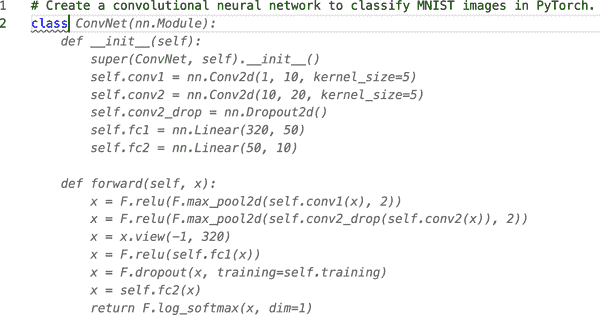

# 前言

自 2017 年推出以来，变压器已成为应对各种自然语言处理（NLP）任务的事实标准，无论是在学术界还是工业界。您可能没有注意到，但今天您可能已经与变压器互动了：谷歌现在使用 BERT 来增强其搜索引擎，以更好地理解用户的搜索查询。同样，OpenAI 的 GPT 系列模型因其生成类似人类的文本和图像的能力而多次成为主流媒体的头条新闻。^(1) 这些变压器现在驱动着应用程序，比如[GitHub 的 Copilot](https://copilot.github.com)，正如图 P-1 所示，它可以将评论转换为自动生成的源代码，为您自动创建神经网络！

那么，是什么让变压器几乎一夜之间改变了这个领域？就像许多伟大的科学突破一样，它是几个想法的综合，比如*注意力*、*迁移学习*和*扩展神经网络*，它们当时正在研究界中酝酿。

但是，无论它有多有用，要在行业中获得关注，任何新的花哨方法都需要工具来使其易于访问。 [Transformers 库](https://oreil.ly/Z79jF)及其周边生态系统通过使从业者能够轻松使用、训练和共享模型来回应了这一需求。这大大加速了变压器的采用，该库现在被超过五千个组织使用。在本书中，我们将指导您如何为实际应用程序训练和优化这些模型。

###### 图 P-1\. GitHub Copilot 的一个示例，根据任务的简要描述，该应用程序提供了整个类的建议（`class`后面的所有内容都是自动生成的）

# 这本书适合谁？

这本书是为数据科学家和机器学习工程师写的，他们可能听说过涉及变压器的最新突破，但缺乏深入指南来帮助他们将这些模型适应到自己的用例中。这本书不是为机器学习入门而写的，我们假设您能够熟练使用 Python 进行编程，并且对像[PyTorch](https://pytorch.org)和[TensorFlow](https://www.tensorflow.org)这样的深度学习框架有基本的了解。我们还假设您有一些在 GPU 上训练模型的实际经验。尽管这本书侧重于 Transformers 的 PyTorch API，第二章向您展示了如何将所有示例转换为 TensorFlow。

以下资源为本书涵盖的主题提供了良好的基础。我们假设您的技术知识大致在它们的水平上：

+   *使用 Scikit-Learn 和 TensorFlow 进行实践性机器学习*，作者 Aurélien Géron（O'Reilly）

+   *使用 fastai 和 PyTorch 进行深度学习*，作者 Jeremy Howard 和 Sylvain Gugger（O'Reilly）

+   *使用 PyTorch 进行自然语言处理*，作者 Delip Rao 和 Brian McMahan（O'Reilly）

+   [*Hugging Face 课程*](https://oreil.ly/n3MaR)，由 Hugging Face 的开源团队

# 您将学到什么

本书的目标是让您能够构建自己的语言应用程序。为此，它侧重于实际用例，并只在必要时深入理论。本书的风格是实践性的，我们强烈建议您通过运行代码示例来进行实验。

本书涵盖了 NLP 中变压器的所有主要应用，每一章（有少数例外）都专门致力于一个任务，结合一个现实的用例和数据集。每一章还介绍了一些额外的概念。以下是我们将要涵盖的任务和主题的高级概述：

+   第一章，*你好，变压器*，介绍了变压器并将其置于上下文中。它还介绍了 Hugging Face 生态系统。

+   第二章，“文本分类”，侧重于情感分析的任务（一种常见的文本分类问题），并介绍了`Trainer`API。

+   第三章，“变压器解剖”，更深入地探讨了变压器架构，为接下来的章节做准备。

+   第四章，“多语言命名实体识别”，专注于在多种语言文本中识别实体的任务（一个标记分类问题）。

+   第五章，“文本生成”，探讨了变压器模型生成文本的能力，并介绍了解码策略和度量标准。

+   第六章，“摘要”，深入探讨了文本摘要的复杂序列到序列任务，并探索了用于此任务的度量标准。

+   第七章，“问答”，侧重于构建基于评论的问答系统，并介绍了 Haystack 的检索功能。

+   第八章，“使变压器在生产中更高效”，侧重于模型性能。我们将研究意图检测的任务（一种序列分类问题），并探索知识蒸馏、量化和修剪等技术。

+   第九章，“处理少量或没有标签的数据”，探讨了在缺乏大量标记数据的情况下改善模型性能的方法。我们将构建一个 GitHub 问题标记器，并探索零样本分类和数据增强等技术。

+   第十章，“从头开始训练变压器”，向您展示了如何从头开始构建和训练一个用于自动完成 Python 源代码的模型。我们将研究数据集流和大规模训练，并构建我们自己的分词器。

+   第十一章，“未来方向”，探讨了变压器面临的挑战，以及这一领域的研究正在进行的一些令人兴奋的新方向。

变压器为使用和训练变压器模型提供了几层抽象。我们将从易于使用的管道开始，通过几行代码就可以将文本示例传递给模型，并调查预测结果。然后我们将转向分词器、模型类和`Trainer`API，这些允许我们为自己的用例训练模型。稍后，我们将向您展示如何用加速库替换`Trainer`，这使我们完全控制训练循环，并允许我们完全从头开始训练大规模变压器！尽管每一章基本上是独立的，但后面章节的任务难度会增加。因此，我们建议先从第一章和第二章开始，然后再进入最感兴趣的主题。

除了变压器和加速器，我们还将广泛使用⁠ ⁠数据集，它与其他库无缝集成。⁠ ⁠数据集提供了与 Pandas 类似的数据处理功能，但是从头开始设计，用于处理大型数据集和机器学习。

有了这些工具，您几乎可以解决任何自然语言处理挑战！

# 软件和硬件要求

由于本书的实践性方法，我们强烈建议您在阅读每一章时运行代码示例。由于我们涉及变压器，您需要访问一台配备 NVIDIA GPU 的计算机来训练这些模型。幸运的是，有几种免费的在线选项可供您使用，包括：

+   [Google Colaboratory](https://oreil.ly/jyXgA)

+   [Kaggle 笔记本](https://oreil.ly/RnMP3)

+   [Paperspace Gradient 笔记本](https://oreil.ly/mZEKy)

要运行示例，您需要按照我们在书的 GitHub 存储库中提供的安装指南。您可以在[*https://github.com/nlp-with-transformers/notebooks*](https://github.com/nlp-with-transformers/notebooks)找到这个指南和代码示例。

###### 提示

我们大部分章节都是使用 NVIDIA Tesla P100 GPU 开发的，它们有 16GB 的内存。一些免费平台提供的 GPU 内存较少，因此在训练模型时可能需要减少批处理大小。

# 本书使用的约定

本书使用以下排版约定：

*斜体*

表示新术语、URL、电子邮件地址、文件名和文件扩展名。

`常量宽度`

用于程序清单，以及在段落中引用程序元素，如变量或函数名、数据库、数据类型、环境变量、语句和关键字。

**`常量宽度粗体`**

显示用户应该按照字面意思输入的命令或其他文本。

*`常量宽度斜体`*

显示应由用户提供的值或由上下文确定的值替换的文本。

###### 提示

这个元素表示提示或建议。

###### 注意

这个元素表示一般说明。

###### 警告

这个元素表示警告或注意。

# 使用代码示例

补充材料（代码示例、练习等）可在[*https://github.com/nlp-with-transformers/notebooks*](https://github.com/nlp-with-transformers/notebooks)下载。

如果您有技术问题或在使用代码示例时遇到问题，请发送电子邮件至*bookquestions@oreilly.com*。

这本书旨在帮助您完成工作。一般来说，如果本书提供了示例代码，您可以在您的程序和文档中使用它。除非您复制了代码的大部分内容，否则您无需联系我们以获得许可。例如，编写一个使用本书中几个代码块的程序不需要许可。出售或分发 O’Reilly 图书中的示例需要许可。引用本书并引用示例代码来回答问题不需要许可。将本书中大量示例代码合并到产品文档中需要许可。

我们感激，但通常不需要归属。归属通常包括标题、作者、出版商和 ISBN。例如：“*使用 Transformers 进行自然语言处理*，作者 Lewis Tunstall、Leandro von Werra 和 Thomas Wolf（O’Reilly）。版权 2022 年 Lewis Tunstall、Leandro von Werra 和 Thomas Wolf，978-1-098-10324-8。”

如果您觉得您对代码示例的使用超出了合理使用范围或上述许可，请随时通过*permissions@oreilly.com*与我们联系。

# O’Reilly 在线学习

###### 注意

40 多年来，[*O’Reilly Media*](http://oreilly.com)提供技术和商业培训、知识和见解，帮助公司取得成功。

我们独特的专家和创新者网络通过书籍、文章和我们的在线学习平台分享他们的知识和专长。O’Reilly 的在线学习平台为您提供按需访问实时培训课程、深入学习路径、交互式编码环境以及来自 O’Reilly 和其他 200 多家出版商的大量文本和视频。有关更多信息，请访问[*http://oreilly.com*](http://oreilly.com)。

# 如何联系我们

请将有关本书的评论和问题发送至出版商：

+   O’Reilly Media, Inc.

+   1005 Gravenstein Highway North

+   Sebastopol, CA 95472

+   800-998-9938（美国或加拿大）

+   707-829-0515（国际或本地）

+   707-829-0104（传真）

我们为这本书创建了一个网页，列出勘误、示例和任何其他信息。您可以访问[*https://oreil.ly/nlp-with-transformers*](https://oreil.ly/nlp-with-transformers)。

发送电子邮件*bookquestions@oreilly.com*评论或提出有关本书的技术问题。

有关我们的图书和课程的新闻和信息，请访问[*http://oreilly.com*](http://oreilly.com)。

在 Facebook 上找到我们：[*http://facebook.com/oreilly*](http://facebook.com/oreilly)

关注我们的 Twitter：[*http://twitter.com/oreillymedia*](http://twitter.com/oreillymedia)

在 YouTube 上观看我们：[*http://youtube.com/oreillymedia*](http://youtube.com/oreillymedia)

# 致谢

要写一本关于机器学习中发展最快的领域之一的书，没有许多人的帮助是不可能的。我们感谢美妙的 O'Reilly 团队，特别是 Melissa Potter，Rebecca Novack 和 Katherine Tozer，感谢他们的支持和建议。这本书还受益于花费无数时间为我们提供宝贵反馈的令人惊叹的审阅者。我们特别感谢 Luca Perozzi，Hamel Husain，Shabie Iqbal，Umberto Lupo，Malte Pietsch，Timo Möller 和 Aurélien Géron 的详细审阅。我们感谢[deepset](https://www.deepset.ai)的 Branden Chan 在扩展 Haystack 库以支持第七章中的用例方面的帮助。本书中美丽的插图要归功于了不起的[Christa Lanz](https://christalanz.ch)——感谢你让这本书变得格外特别。我们还很幸运地得到了整个 Hugging Face 团队的支持。非常感谢 Quentin Lhoest 在数据集方面回答了无数问题，Lysandre Debut 在与 Hugging Face Hub 相关的一切方面的帮助，Sylvain Gugger 在加速方面的帮助，以及 Joe Davison 在第九章中对零样本学习的启发。我们还要感谢 Sidd Karamcheti 和整个[Mistral 团队](https://oreil.ly/aOYLt)为 GPT-2 添加稳定性调整，使第十章成为可能。这本书完全是用 Jupyter 笔记本写的，我们要感谢 Jeremy Howard 和 Sylvain Gugger 创建了像[fastdoc](https://oreil.ly/yVCfT)这样令人愉快的工具，使这成为可能。

## Lewis

对 Sofia，感谢你始终给予的支持和鼓励——没有这两者，这本书就不会存在。经过长时间的写作，我们终于可以再次享受周末了！

## Leandro

感谢 Janine，在这漫长的一年里，有许多深夜和忙碌的周末，你的耐心和鼓励支持。

## Thomas

我首先要感谢 Lewis 和 Leandro 提出了这本书的想法，并强烈推动以如此美丽和易于访问的格式出版。我还要感谢所有 Hugging Face 团队，他们相信 AI 是一个社区努力的使命，以及整个 NLP/AI 社区，他们与我们一起构建和使用本书中描述的库和研究。

我们所建立的不仅仅是重要的，我们所走过的旅程才是真正重要的，我们有幸能够与成千上万的社区成员和像你们今天一样的读者一起走这条路。衷心感谢你们所有人。

^(1) NLP 研究人员倾向于以*Sesame Street*中的角色命名他们的创作。我们将在第一章中解释所有这些首字母缩略词的含义。
