# 第一章。你好，变压器

2017 年，谷歌的研究人员发表了一篇关于序列建模的新型神经网络架构的论文。这种被称为*变压器*的架构在机器翻译任务中优于循环神经网络（RNN），无论是翻译质量还是训练成本。

与此同时，一种名为 ULMFiT 的有效迁移学习方法表明，对非常大和多样化的语料库进行长短期记忆（LSTM）网络训练可以产生具有很少标记数据的最先进文本分类器。

这些进步是当今两个最著名的变压器的催化剂：生成式预训练变压器（GPT）和来自变压器的双向编码器表示（BERT）。通过将变压器架构与无监督学习相结合，这些模型消除了需要从头开始训练特定任务的架构，并在 NLP 几乎每个基准测试中取得了显著的突破。自 GPT 和 BERT 发布以来，出现了一系列变压器模型；最突出的条目的时间表如图 1-1 所示。

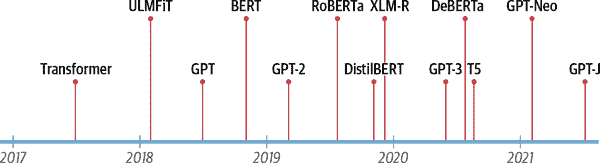

###### 图 1-1。变压器时间表

但我们正在走得太快了。要理解变压器的新颖之处，我们首先需要解释：

+   编码器-解码器框架

+   注意机制

+   迁移学习

在本章中，我们将介绍支持 transformer 广泛应用的核心概念，参观一些它们擅长的任务，并最后看一下 Hugging Face 工具和库的生态系统。

让我们首先探讨编码器-解码器框架和在 transformer 崛起之前的架构。

# 编码器-解码器框架

在 transformer 之前，像 LSTM 这样的循环架构是自然语言处理中的最新技术。这些架构在网络连接中包含反馈循环，允许信息从一个步骤传播到另一个步骤，使它们非常适合对文本等序列数据进行建模。如图 1-2 左侧所示，RNN 接收一些输入（可以是单词或字符），通过网络传递，并输出一个称为*隐藏状态*的向量。同时，模型通过反馈循环向自身反馈一些信息，然后在下一步中使用。如果我们像图 1-2 右侧所示“展开”循环，就可以更清楚地看到这一点：RNN 在每一步中传递其状态的信息给序列中的下一个操作。这使得 RNN 能够跟踪先前步骤的信息，并将其用于输出预测。

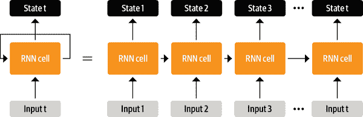

###### 图 1-2。在时间上展开 RNN

这些架构（并且继续）被广泛用于 NLP 任务、语音处理和时间序列。您可以在 Andrej Karpathy 的博客文章[“循环神经网络的不合理有效性”](https://oreil.ly/Q55o0)中找到它们能力的精彩阐述。

RNN 在机器翻译系统的发展中发挥了重要作用，其目标是将一种语言中的单词序列映射到另一种语言。这种任务通常使用*编码器-解码器*或*序列到序列*架构，适用于输入和输出都是任意长度序列的情况。编码器的工作是将输入序列的信息编码成通常称为*最后隐藏状态*的数值表示。然后将该状态传递给解码器，解码器生成输出序列。

一般来说，编码器和解码器组件可以是任何能够建模序列的神经网络架构。这在图 1-3 中对一对 RNNs 进行了说明，其中英语句子“Transformers are great!”被编码为一个隐藏状态向量，然后解码以生成德语翻译“Transformer sind grossartig!”输入单词依次通过编码器，输出单词从上到下逐个生成。

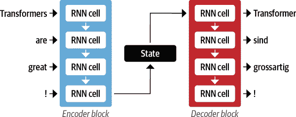

###### 图 1-3。具有一对 RNNs 的编码器-解码器架构（一般来说，这里显示的循环层比这里显示的要多得多）

尽管其简洁而优雅，这种架构的一个弱点是编码器的最终隐藏状态创建了一个*信息瓶颈*：它必须代表整个输入序列的含义，因为这是解码器在生成输出时所能访问的全部内容。这对于长序列尤其具有挑战性，因为序列开头的信息可能在压缩到单一固定表示的过程中丢失。

幸运的是，通过允许解码器访问编码器的所有隐藏状态，可以摆脱这一瓶颈。这一般机制称为*注意力*，^(6)，它是许多现代神经网络架构的关键组成部分。了解注意力是如何为 RNNs 开发的将使我们能够更好地理解 Transformer 架构的主要构建模块之一。让我们深入了解一下。

# 注意机制

注意力的主要思想是，编码器不是为输入序列产生单个隐藏状态，而是在每一步输出一个解码器可以访问的隐藏状态。然而，同时使用所有状态会为解码器创建一个巨大的输入，因此需要一些机制来优先使用哪些状态。这就是注意力的作用：它允许解码器在每个解码时间步为每个编码器状态分配不同数量的权重或“注意力”。这个过程在图 1-4 中进行了说明，显示了注意力在预测输出序列的第三个标记时的作用。

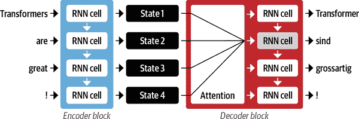

###### 图 1-4。具有注意机制的编码器-解码器架构，用于一对 RNNs

通过关注每个时间步最相关的输入标记，这些基于注意力的模型能够学习生成翻译中的单词与源句中的单词之间的非平凡对齐。例如，图 1-5 可视化了英语到法语翻译模型的注意权重，其中每个像素表示一个权重。该图显示了解码器如何能够正确对齐两种语言中顺序不同的单词“zone”和“Area”。

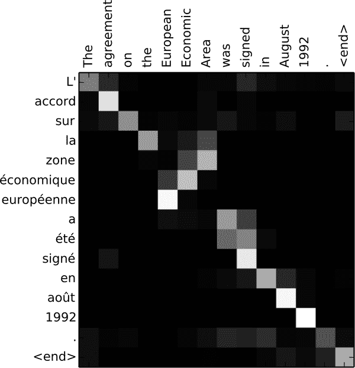

###### 图 1-5。英语和法语生成翻译中的 RNN 编码器-解码器单词对齐（由 Dzmitry Bahdanau 提供）

尽管注意力使得翻译质量大大提高，但使用循环模型作为编码器和解码器仍然存在一个主要缺点：计算是固有的顺序性的，无法在输入序列上并行化。

使用 transformer 引入了一种新的建模范式：完全放弃循环，而是完全依赖一种称为*自注意力*的特殊形式的注意力。我们将在第三章中更详细地介绍自注意力，但基本思想是允许注意力作用于神经网络*同一层*中的所有状态。这在图 1-6 中显示，编码器和解码器都有自己的自注意机制，其输出被馈送到前馈神经网络（FF NNs）。这种架构可以比循环模型快得多地训练，并为自然语言处理中的许多最新突破铺平了道路。

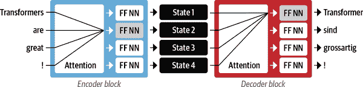

###### 图 1-6。原始 Transformer 的编码器-解码器架构

在原始 Transformer 论文中，翻译模型是从头开始在各种语言的大量句对语料库上进行训练的。然而，在 NLP 的许多实际应用中，我们无法获得大量标记文本数据来训练我们的模型。要启动 transformer 革命，还缺少最后一块拼图：迁移学习。

# 自然语言处理中的迁移学习

如今，在计算机视觉中，通常使用迁移学习来训练卷积神经网络（如 ResNet）进行一个任务的训练，然后在新任务上对其进行调整或*微调*。这允许网络利用从原始任务中学到的知识。在架构上，这涉及将模型分为*主体*和*头部*，其中头部是一个特定任务的网络。在训练过程中，主体的权重学习源域的广泛特征，并使用这些权重来初始化新任务的新模型。^(7)与传统监督学习相比，这种方法通常能够在各种下游任务上更有效地训练高质量的模型，并且需要更少的标记数据。图 1-7 显示了这两种方法的比较。

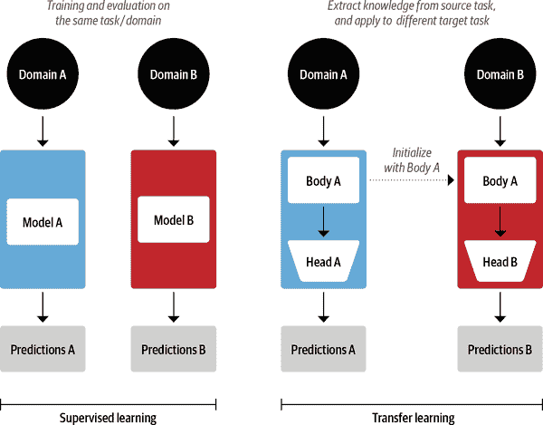

###### 图 1-7。传统监督学习（左）和迁移学习（右）的比较

在计算机视觉中，模型首先在包含数百万张图片的大规模数据集（如[ImageNet](https://image-net.org)）上进行训练。这个过程称为*预训练*，其主要目的是教会模型图片的基本特征，如边缘或颜色。然后，这些预训练模型可以在下游任务上进行微调，例如使用相对较少的标记示例（通常每类几百个）对花卉物种进行分类。微调模型通常比从头开始训练的监督模型在相同数量的标记数据上实现更高的准确性。

尽管迁移学习已成为计算机视觉中的标准方法，但多年来，对于自然语言处理的类似预训练过程并不清楚。因此，NLP 应用通常需要大量标记数据才能实现高性能。即使如此，其性能也无法与视觉领域所实现的性能相媲美。

在 2017 年和 2018 年，几个研究小组提出了新的方法，最终使得迁移学习在自然语言处理中起作用。这始于 OpenAI 研究人员的洞察，他们通过使用从无监督预训练中提取的特征，在情感分类任务上取得了强大的性能。^(8)接着是 ULMFiT，它引入了一个通用框架，用于调整预训练的 LSTM 模型以适应各种任务。^(9)

如图 1-8 所示，ULMFiT 包括三个主要步骤：

预训练

初始的训练目标非常简单：根据先前的单词预测下一个单词。这个任务被称为*语言建模*。这种方法的优雅之处在于不需要标记的数据，并且可以利用来自维基百科等来源的大量可用文本。^(10)

领域适应

一旦语言模型在大规模语料库上预训练，下一步就是将其适应于领域语料库（例如，从维基百科到 IMDb 电影评论的语料库，如图 1-8 所示）。这个阶段仍然使用语言建模，但现在模型必须预测目标语料库中的下一个单词。

微调

在这一步中，语言模型通过一个用于目标任务的分类层进行微调（例如，在图 1-8 中对电影评论的情感进行分类）。

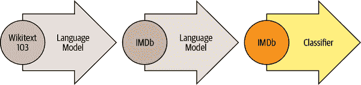

###### 图 1-8\. ULMFiT 过程（由 Jeremy Howard 提供）

通过引入 NLP 中的预训练和迁移学习的可行框架，ULMFiT 提供了使变压器起飞的缺失环节。2018 年，发布了两个将自注意力与迁移学习相结合的变压器：

GPT

仅使用变压器架构的解码器部分，以及 ULMFiT 相同的语言建模方法。GPT 是在 BookCorpus 上预训练的，^(11)其中包括来自各种流派的 7000 本未发表的书籍，包括冒险、奇幻和浪漫。

BERT

使用 Transformer 架构的编码器部分，以及一种特殊形式的语言建模称为*掩码语言建模*。掩码语言建模的目标是预测文本中随机掩码的单词。例如，给定一个句子“我看着我的`[MASK]`，看到`[MASK]`迟到了。”模型需要预测由`[MASK]`表示的掩码单词的最可能的候选项。BERT 是在 BookCorpus 和英文维基百科上预训练的。

GPT 和 BERT 在各种 NLP 基准测试中树立了新的技术水平，并开启了变压器时代。

然而，由于不同的研究实验室在不兼容的框架（PyTorch 或 TensorFlow）中发布其模型，对于 NLP 从业者来说，将这些模型移植到自己的应用程序并不总是容易的。随着 [Transformers](https://oreil.ly/Z79jF)的发布，逐渐构建了超过 50 种架构的统一 API。这个库催生了对变压器的研究爆炸，并迅速渗透到 NLP 从业者中，使得将这些模型整合到今天的许多实际应用程序中变得容易。让我们来看看！

# Hugging Face Transformers：弥合差距

将新的机器学习架构应用于新任务可能是一个复杂的过程，通常涉及以下步骤：

1.  在代码中实现模型架构，通常基于 PyTorch 或 TensorFlow。

1.  从服务器加载预训练的权重（如果可用）。

1.  预处理输入，将其通过模型，并应用一些特定于任务的后处理。

1.  实现数据加载器，并定义损失函数和优化器来训练模型。

每个步骤都需要为每个模型和任务编写自定义逻辑。传统上（但并非总是如此！），当研究小组发布新文章时，他们通常会连同模型权重一起发布代码。然而，这些代码很少是标准化的，通常需要数天的工程来适应新的用例。

这就是 Transformers 对 NLP 从业者的救援之处！它为各种变压器模型提供了标准化接口，以及用于适应这些模型到新用例的代码和工具。该库目前支持三个主要的深度学习框架（PyTorch、TensorFlow 和 JAX），并允许您轻松地在它们之间切换。此外，它提供了任务特定的头部，因此您可以轻松地在下游任务上微调变压器，如文本分类、命名实体识别和问题回答。这减少了从实践者训练和测试一些模型所需的时间，从一周减少到一个下午！

您将在下一节中亲自看到这一点，在那里我们将展示，只需几行代码， Transformers 就可以应用于解决您在实际中可能遇到的一些最常见的 NLP 应用。

# 变压器应用之旅

每个 NLP 任务都始于一段文本，比如以下关于某个在线订单的虚构客户反馈：

```py
text = """Dear Amazon, last week I ordered an Optimus Prime action figure
from your online store in Germany. Unfortunately, when I opened the package,
I discovered to my horror that I had been sent an action figure of Megatron
instead! As a lifelong enemy of the Decepticons, I hope you can understand my
dilemma. To resolve the issue, I demand an exchange of Megatron for the
Optimus Prime figure I ordered. Enclosed are copies of my records concerning
this purchase. I expect to hear from you soon. Sincerely, Bumblebee."""
```

根据您的应用，您正在处理的文本可能是法律合同、产品描述或其他内容。在客户反馈的情况下，您可能想知道反馈是积极的还是消极的。这项任务被称为*情感分析*，是*文本分类*的更广泛主题的一部分，我们将在第二章中探讨。现在，让我们看看如何从我们的文本中提取情感，使用 Transformers。

## 文本分类

正如我们将在后面的章节中看到的， Transformers 具有分层 API，允许您以不同的抽象级别与库进行交互。在本章中，我们将从*管道*开始，它将所有将原始文本转换为经过精细调整的模型一系列预测所需的步骤抽象出来。

在 Transformers 中，我们通过调用`pipeline()`函数并提供我们感兴趣的任务的名称来实例化一个管道：

```py
from transformers import pipeline

classifier = pipeline("text-classification")
```

第一次运行此代码时，您将看到一些进度条出现，因为管道会自动从[Hugging Face Hub](https://oreil.ly/zLK11)下载模型权重。第二次实例化管道时，库将注意到您已经下载了权重，并将使用缓存版本。默认情况下，`text-classification`管道使用的是专为情感分析设计的模型，但它也支持多类和多标签分类。

现在我们有了我们的管道，让我们生成一些预测！每个管道都将一个文本字符串（或字符串列表）作为输入，并返回一系列预测。每个预测都是一个 Python 字典，所以我们可以使用 Pandas 将它们漂亮地显示为`Data⁠Frame`：

```py
import pandas as pd

outputs = classifier(text)
pd.DataFrame(outputs)
```

|  | 标签 | 分数 |
| --- | --- | --- |
| 0 | NEGATIVE | 0.901546 |

在这种情况下，模型非常确信文本具有消极情绪，这是有道理的，因为我们正在处理一个愤怒客户的投诉！请注意，对于情感分析任务，管道只返回`POSITIVE`或`NEGATIVE`标签中的一个，因为另一个可以通过计算`1-score`来推断。

现在让我们来看另一个常见的任务，识别文本中的命名实体。

## 命名实体识别

预测客户反馈的情绪是一个很好的第一步，但通常您想知道反馈是否是关于特定的项目或服务。在自然语言处理中，像产品、地点和人这样的现实世界对象被称为*命名实体*，从文本中提取它们被称为*命名实体识别*（NER）。我们可以通过加载相应的管道并将我们的客户评论提供给它来应用 NER：

```py
ner_tagger = pipeline("ner", aggregation_strategy="simple")
outputs = ner_tagger(text)
pd.DataFrame(outputs)
```

|  | 实体组 | 分数 | 单词 | 开始 | 结束 |
| --- | --- | --- | --- | --- | --- |
| 0 | ORG | 0.879010 | 亚马逊 | 5 | 11 |
| 1 | MISC | 0.990859 | 奥普蒂默斯·普莱姆 | 36 | 49 |
| 2 | LOC | 0.999755 | 德国 | 90 | 97 |
| 3 | MISC | 0.556569 | Mega | 208 | 212 |
| 4 | PER | 0.590256 | ##tron | 212 | 216 |
| 5 | ORG | 0.669692 | 欺诈者 | 253 | 259 |
| 6 | MISC | 0.498350 | ##icons | 259 | 264 |
| 7 | MISC | 0.775361 | Megatron | 350 | 358 |
| 8 | MISC | 0.987854 | 奥普蒂默斯·普莱姆 | 367 | 380 |
| 9 | PER | 0.812096 | 大黄蜂 | 502 | 511 |

您可以看到管道检测到了所有实体，并为每个实体分配了类别，例如`ORG`（组织）、`LOC`（位置）或`PER`（人）。在这里，我们使用了`aggregation_strategy`参数根据模型的预测对单词进行分组。例如，实体“奥普蒂默斯·普莱姆”由两个单词组成，但被分配了一个单一的类别：`MISC`（杂项）。分数告诉我们模型对其识别的实体有多自信。我们可以看到它对“欺诈者”和“Megatron”的第一次出现的识别最不自信，它们都未能被分组为单个实体。

###### 注释

看到上一个表格中`word`列中的奇怪的井号符号(`#`)了吗？这些是模型的*分词器*产生的，它将单词分割成称为*标记*的原子单位。您将在第二章中学习有关标记化的所有内容。

提取文本中的所有命名实体是不错的，但有时我们想提出更有针对性的问题。这就是我们可以使用*问答*的地方。

## 问答

在问答中，我们向模型提供了一段文本，称为*上下文*，以及一个我们想要提取答案的问题。然后模型返回对应于答案的文本范围。让我们看看当我们针对客户反馈提出具体问题时会得到什么：

```py
reader = pipeline("question-answering")
question = "What does the customer want?"
outputs = reader(question=question, context=text)
pd.DataFrame([outputs])
```

|  | 分数 | 开始 | 结束 | 答案 |
| --- | --- | --- | --- | --- |
| 0 | 0.631291 | 335 | 358 | 与 Megatron 的交换 |

我们可以看到，除了答案之外，管道还返回了`start`和`end`整数，这些整数对应于找到答案跨度的字符索引（就像 NER 标记一样）。我们将在第七章中调查几种问答的变体，但这种特定的称为*抽取式问答*，因为答案直接从文本中提取。

通过这种方法，您可以快速阅读并从客户的反馈中提取相关信息。但是，如果您收到一大堆冗长的投诉，而您没有时间全部阅读，该怎么办呢？让我们看看摘要模型是否能帮上忙！

## 摘要

文本摘要的目标是将长文本作为输入，并生成一个包含所有相关事实的简短版本。这比以前的任务要复杂得多，因为它要求模型*生成*连贯的文本。现在应该是一个熟悉的模式，我们可以像下面这样实例化一个摘要管道：

```py
summarizer = pipeline("summarization")
outputs = summarizer(text, max_length=45, clean_up_tokenization_spaces=True)
print(outputs[0]['summary_text'])
```

```py
 Bumblebee ordered an Optimus Prime action figure from your online store in
Germany. Unfortunately, when I opened the package, I discovered to my horror
that I had been sent an action figure of Megatron instead.
```

这个摘要还不错！虽然原始文本的部分被复制，但模型能够捕捉到问题的本质，并正确识别“大黄蜂”（出现在末尾）是投诉的作者。在这个例子中，您还可以看到我们传递了一些关键字参数，如`max_length`和`clean_up_tokenization_spaces`给管道；这些允许我们在运行时调整输出。

但是当您收到一种您不懂的语言的反馈时会发生什么？您可以使用谷歌翻译，或者您可以使用自己的转换器为您翻译！

## 翻译

与摘要类似，翻译是一个输出生成文本的任务。让我们使用翻译管道将英文文本翻译成德文：

```py
translator = pipeline("translation_en_to_de",
                      model="Helsinki-NLP/opus-mt-en-de")
outputs = translator(text, clean_up_tokenization_spaces=True, min_length=100)
print(outputs[0]['translation_text'])
```

```py
Sehr geehrter Amazon, letzte Woche habe ich eine Optimus Prime Action Figur aus
Ihrem Online-Shop in Deutschland bestellt. Leider, als ich das Paket öffnete,
entdeckte ich zu meinem Entsetzen, dass ich stattdessen eine Action Figur von
Megatron geschickt worden war! Als lebenslanger Feind der Decepticons, Ich
hoffe, Sie können mein Dilemma verstehen. Um das Problem zu lösen, Ich fordere
einen Austausch von Megatron für die Optimus Prime Figur habe ich bestellt.
Anbei sind Kopien meiner Aufzeichnungen über diesen Kauf. Ich erwarte, bald von
Ihnen zu hören. Aufrichtig, Bumblebee.
```

同样，该模型产生了一个非常好的翻译，正确使用了德语的正式代词，如“Ihrem”和“Sie”。在这里，我们还展示了如何覆盖管道中的默认模型，以选择最适合您应用的模型——您可以在 Hugging Face Hub 上找到成千上万种语言对的模型。在我们退后一步，看看整个 Hugging Face 生态系统之前，让我们再看一个应用。

## 文本生成

假设您希望能够通过访问自动完成功能更快地回复客户反馈。使用文本生成模型，您可以这样做：

```py
generator = pipeline("text-generation")
response = "Dear Bumblebee, I am sorry to hear that your order was mixed up."
prompt = text + "\n\nCustomer service response:\n" + response
outputs = generator(prompt, max_length=200)
print(outputs[0]['generated_text'])
```

```py
Dear Amazon, last week I ordered an Optimus Prime action figure from your online
store in Germany. Unfortunately, when I opened the package, I discovered to my
horror that I had been sent an action figure of Megatron instead! As a lifelong
enemy of the Decepticons, I hope you can understand my dilemma. To resolve the
issue, I demand an exchange of Megatron for the Optimus Prime figure I ordered.
Enclosed are copies of my records concerning this purchase. I expect to hear
from you soon. Sincerely, Bumblebee.

Customer service response:
Dear Bumblebee, I am sorry to hear that your order was mixed up. The order was
completely mislabeled, which is very common in our online store, but I can
appreciate it because it was my understanding from this site and our customer
service of the previous day that your order was not made correct in our mind and
that we are in a process of resolving this matter. We can assure you that your
order
```

好吧，也许我们不想使用这个完成来安抚大黄蜂，但您大致明白了。

现在您已经看到了一些转换器模型的很酷的应用，您可能想知道训练是在哪里进行的。本章中使用的所有模型都是公开可用的，并且已经针对手头的任务进行了微调。然而，一般来说，您可能希望在自己的数据上微调模型，在接下来的章节中，您将学习如何做到这一点。

但是，训练模型只是 NLP 项目的一小部分——能够高效处理数据、与同事分享结果以及使您的工作可复制也是关键组成部分。幸运的是， Transformers 周围有一个大型生态系统，支持现代机器学习工作流的许多有用工具。让我们来看看。

# Hugging Face 生态系统

从 Transformers 开始，迅速发展成为一个由许多库和工具组成的整个生态系统，以加速您的 NLP 和机器学习项目。 Hugging Face 生态系统主要由两部分组成：一系列库和 Hub，如图 1-9 所示。库提供代码，而 Hub 提供预训练模型权重、数据集、用于评估指标的脚本等。在本节中，我们将简要介绍各个组件。我们将跳过 Transformers，因为我们已经讨论过它，并且在本书的过程中还会看到更多。

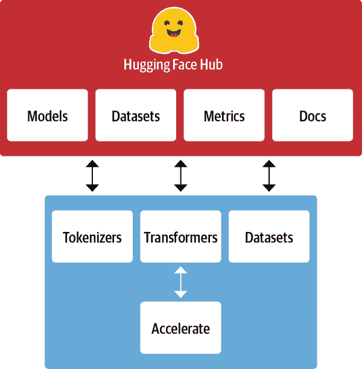

###### 图 1-9\. Hugging Face 生态系统概述

## Hugging Face Hub

正如前面所述，迁移学习是推动转换器成功的关键因素之一，因为它使得可以重用预训练模型来处理新任务。因此，能够快速加载预训练模型并进行实验至关重要。

Hugging Face Hub 托管了超过 20,000 个免费可用的模型。如图 1-10 所示，有任务、框架、数据集等过滤器，旨在帮助您浏览 Hub 并快速找到有前途的候选模型。正如我们在管道中看到的那样，在您的代码中加载一个有前途的模型实际上只是一行代码的距离。这使得尝试各种模型变得简单，并且让您可以专注于项目的领域特定部分。

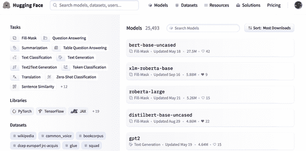

###### 图 1-10\. Hugging Face Hub 的模型页面，左侧显示了过滤器，右侧显示了模型列表

除了模型权重，Hub 还托管数据集和用于计算指标的脚本，这些脚本可以让您重现已发布的结果或利用额外的数据进行应用。

Hub 还提供*模型*和*数据集* *卡片*，以记录模型和数据集的内容，并帮助您对是否适合您做出明智的决定。Hub 最酷的功能之一是，您可以通过各种特定任务的交互式小部件直接尝试任何模型，如图 1-11 所示。

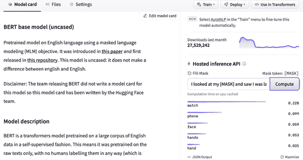

###### 图 1-11\. Hugging Face Hub 的示例模型卡片：右侧显示了允许您与模型交互的推理小部件

让我们继续我们的旅程与 Tokenizers。

###### 注意

PyTorch 和 TensorFlow 也提供了自己的中心，并且值得检查，如果 Hugging Face Hub 上没有特定的模型或数据集。

## Hugging Face 标记化器

在本章中我们看到的每个管道示例背后都有一个标记化步骤，将原始文本分割成称为标记的较小部分。我们将在第二章中详细介绍这是如何工作的，但现在理解标记可能是单词、单词的部分，或者只是标点符号等字符就足够了。变压器模型是在这些标记的数值表示上进行训练的，因此正确进行这一步对整个 NLP 项目非常重要！

Tokenizers 提供许多标记化策略，并且由于其 Rust 后端，它在标记化文本方面非常快速。它还负责所有的预处理和后处理步骤，例如规范化输入和将模型输出转换为所需的格式。使用 Tokenizers，我们可以像加载预训练模型权重一样加载标记器。

我们需要一个数据集和指标来训练和评估模型，所以让我们来看看负责这方面的数据集。

## Hugging Face 数据集

加载、处理和存储数据集可能是一个繁琐的过程，特别是当数据集变得太大而无法容纳在您的笔记本电脑的 RAM 中时。此外，通常需要实现各种脚本来下载数据并将其转换为标准格式。

Datasets 通过为数千个数据集提供标准接口来简化这个过程。它还提供智能缓存（这样您就不必每次运行代码时都重新进行预处理），并通过利用一种称为*内存映射*的特殊机制来避免 RAM 限制，该机制将文件的内容存储在虚拟内存中，并使多个进程更有效地修改文件。该库还与流行的框架如 Pandas 和 NumPy 兼容，因此您无需离开您喜爱的数据整理工具的舒适区。

然而，如果您无法可靠地衡量性能，拥有一个好的数据集和强大的模型是毫无价值的。不幸的是，经典的 NLP 指标有许多不同的实现，可能会略有不同，并导致误导性的结果。通过提供许多指标的脚本，Datasets 有助于使实验更具再现性，结果更值得信赖。

有了 Transformers、Tokenizers 和 Datasets 库，我们有了训练自己的变压器模型所需的一切！然而，正如我们将在第十章中看到的那样，有些情况下我们需要对训练循环进行细粒度控制。这就是生态系统中最后一个库发挥作用的地方：Accelerate。

## Hugging Face 加速

如果您曾经不得不在 PyTorch 中编写自己的训练脚本，那么当尝试将在笔记本电脑上运行的代码移植到组织的集群上运行时，可能会遇到一些头痛。Accelerate 为您的正常训练循环添加了一层抽象，负责处理训练基础设施所需的所有自定义逻辑。这实际上通过简化必要时的基础设施更改来加速您的工作流程。

这总结了 Hugging Face 开源生态系统的核心组件。但在结束本章之前，让我们看一看在尝试在现实世界中部署变压器时会遇到的一些常见挑战。

# 变压器的主要挑战

在本章中，我们已经对可以使用变压器模型解决的各种自然语言处理任务有了一瞥。阅读媒体头条时，有时会觉得它们的能力是无限的。然而，尽管它们很有用，变压器远非灵丹妙药。以下是与它们相关的一些挑战，我们将在整本书中探讨：

*语言*

自然语言处理研究主要以英语为主导。还有一些其他语言的模型，但很难找到稀有或低资源语言的预训练模型。在第四章中，我们将探讨多语言变压器及其进行零-shot 跨语言转移的能力。

*数据可用性*

尽管我们可以使用迁移学习大大减少模型需要的标记训练数据量，但与人类执行任务所需的量相比，仍然是很多。解决标记数据很少或没有的情况是第九章的主题。

*处理长文档*

自注意力在段落长的文本上效果非常好，但当我们转向整个文档等更长的文本时，成本就会变得非常高。我们将在第十一章中讨论缓解这一问题的方法。

*不透明性*

与其他深度学习模型一样，变压器在很大程度上是不透明的。很难或不可能解开模型为何做出某种预测的“原因”。当这些模型被部署用于做出关键决策时，这是一个特别困难的挑战。我们将在第二章和第四章中探讨一些探究变压器模型错误的方法。

*偏见*

变压器模型主要是在互联网文本数据上进行预训练的。这会将数据中存在的所有偏见都印刻到模型中。确保这些偏见既不是种族主义的、性别歧视的，也不是更糟糕的，是一项具有挑战性的任务。我们将在第十章中更详细地讨论其中一些问题。

尽管令人生畏，许多这些挑战是可以克服的。除了特定提到的章节外，我们将在接下来的几乎每一章中涉及这些主题。

# 结论

希望到目前为止，您已经对如何开始训练和将这些多才多艺的模型集成到您自己的应用程序中感到兴奋！您在本章中已经看到，只需几行代码，您就可以使用最先进的模型进行分类、命名实体识别、问答、翻译和摘要，但这实际上只是“冰山一角”。

在接下来的章节中，您将学习如何将变压器适应于各种用例，比如构建文本分类器，或者用于生产的轻量级模型，甚至从头开始训练语言模型。我们将采取实践方法，这意味着对于每个涵盖的概念，都会有相应的代码，您可以在 Google Colab 或您自己的 GPU 机器上运行。

现在我们已经掌握了变压器背后的基本概念，是时候开始动手进行我们的第一个应用了：文本分类。这是下一章的主题！

^(1) A. Vaswani et al., [“Attention Is All You Need”](https://arxiv.org/abs/1706.03762), (2017). 这个标题非常吸引人，以至于不少于[50 篇后续论文](https://oreil.ly/wT8Ih)的标题中都包含了“all you need”！

^(2) J. Howard and S. Ruder, [“Universal Language Model Fine-Tuning for Text Classification”](https://arxiv.org/abs/1801.06146), (2018).

10. A. Radford et al., [“Improving Language Understanding by Generative Pre-Training”](https://openai.com/blog/language-unsupervised), (2018).

6. J. Devlin et al., [“BERT: Pre-Training of Deep Bidirectional Transformers for Language Understanding”](https://arxiv.org/abs/1810.04805), (2018).

1. I. Sutskever, O. Vinyals, and Q.V. Le, [“Sequence to Sequence Learning with Neural Networks”](https://arxiv.org/abs/1409.3215), (2014).

3. D. Bahdanau, K. Cho, and Y. Bengio, [“Neural Machine Translation by Jointly Learning to Align and Translate”](https://arxiv.org/abs/1409.0473), (2014).

8. 权重是神经网络的可学习参数。

9. A. Radford, R. Jozefowicz, and I. Sutskever, [“Learning to Generate Reviews and Discovering Sentiment”](https://arxiv.org/abs/1704.01444), (2017).

2. 在这个时候的相关工作是 ELMo（来自语言模型的嵌入），它展示了如何通过预训练 LSTMs 可以为下游任务生成高质量的词嵌入。

7. 这对于英语而言更为真实，而对于世界上大多数语言来说，获取大规模的数字化文本语料库可能会很困难。找到弥合这一差距的方法是自然语言处理研究和活动的一个活跃领域。

5. Y. Zhu et al., [“Aligning Books and Movies: Towards Story-Like Visual Explanations by Watching Movies and Reading Books”](https://arxiv.org/abs/1506.06724), (2015).

4. [Rust](https://rust-lang.org)是一种高性能的编程语言。
