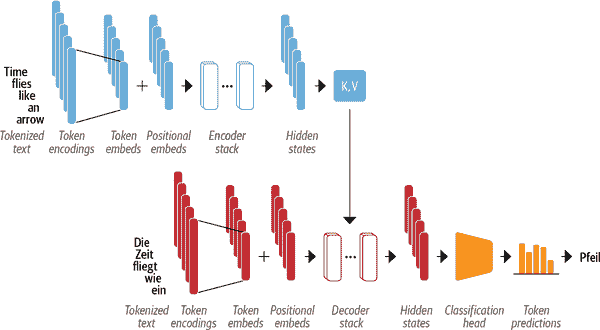
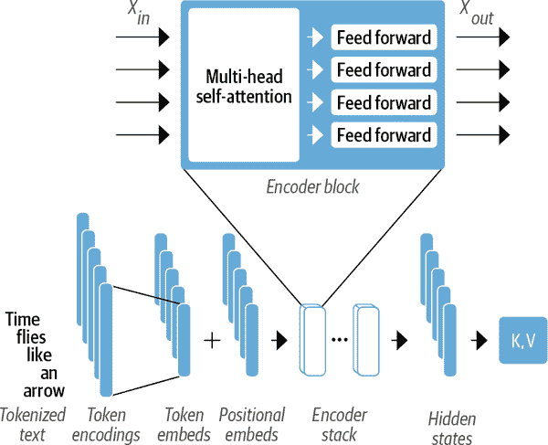
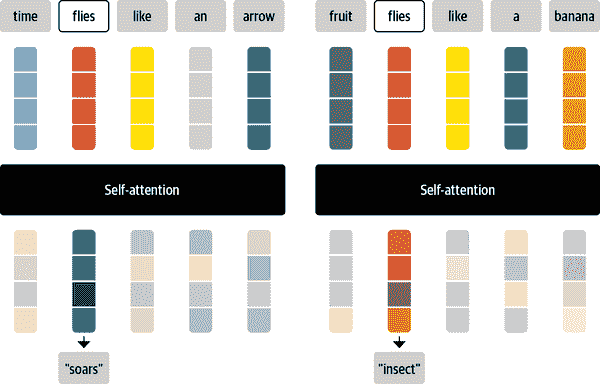
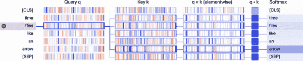
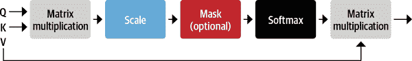
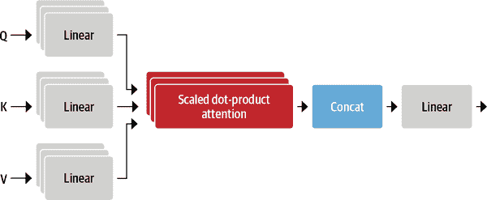
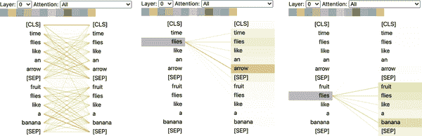
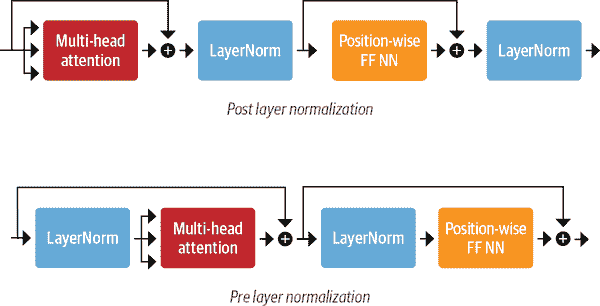
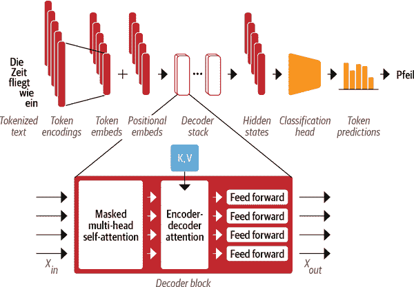
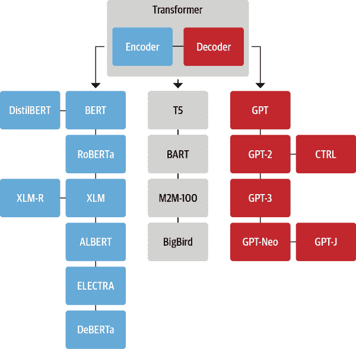

# 第三章：Transformer 剖析

在第二章中，我们看到了微调和评估 Transformer 所需的内容。现在让我们来看看它们在内部是如何工作的。在本章中，我们将探索 Transformer 模型的主要构建模块以及如何使用 PyTorch 实现它们。我们还将提供如何在 TensorFlow 中进行相同操作的指导。我们首先将专注于构建注意力机制，然后添加必要的部分来使 Transformer 编码器工作。我们还将简要介绍编码器和解码器模块之间的架构差异。通过本章结束时，您将能够自己实现一个简单的 Transformer 模型！

虽然通常不需要对 Transformer 架构有深入的技术理解来使用Transformer 并为您的用例微调模型，但对于理解和应对 Transformer 的局限性并在新领域中使用它们可能会有所帮助。

本章还介绍了 Transformer 的分类法，以帮助您了解近年来出现的各种模型。在深入代码之前，让我们先来看一下开启 Transformer 革命的原始架构的概述。

# Transformer 架构

正如我们在第一章中所看到的，原始 Transformer 基于“编码器-解码器”架构，这种架构被广泛用于诸如机器翻译之类的任务，其中一个词序列被翻译成另一种语言。这种架构由两个组件组成：

编码器

将输入的令牌序列转换为嵌入向量序列，通常称为“隐藏状态”或“上下文”

解码器

使用编码器的隐藏状态迭代地生成一个令牌序列的输出，每次生成一个令牌

如图 3-1 所示，编码器和解码器本身由几个构建模块组成。



###### 图 3-1。Transformer 的编码器-解码器架构，编码器显示在图的上半部分，解码器显示在图的下半部分

我们很快将详细查看每个组件，但我们已经可以在图 3-1 中看到一些特征，这些特征表征了 Transformer 架构：

+   输入文本被标记化，并使用我们在第二章中遇到的技术转换为“令牌嵌入”。由于注意力机制不知道令牌的相对位置，我们需要一种方法将一些关于令牌位置的信息注入到输入中，以建模文本的顺序性质。因此，令牌嵌入与包含每个令牌的位置信息的“位置嵌入”相结合。

+   编码器由一堆“编码器层”或“块”组成，类似于在计算机视觉中堆叠卷积层。解码器也是如此，它有自己的一堆“解码器层”。

+   编码器的输出被馈送到每个解码器层，然后解码器生成一个最可能的下一个令牌序列的预测。这一步的输出然后被反馈到解码器中以生成下一个令牌，依此类推，直到达到特殊的序列结束（EOS）令牌。在图 3-1 的示例中，想象一下解码器已经预测了“Die”和“Zeit”。现在它将这两个作为输入以及所有编码器的输出来预测下一个令牌，“fliegt”。在下一步中，解码器获得“fliegt”作为额外的输入。我们重复这个过程，直到解码器预测出 EOS 令牌或者达到最大长度。

Transformer 架构最初是为机器翻译等序列到序列任务设计的，但编码器和解码器块很快被改编为独立的模型。虽然有数百种不同的 transformer 模型，但它们大多属于以下三种类型之一：

仅编码器

这些模型将文本输入序列转换为丰富的数值表示，非常适合文本分类或命名实体识别等任务。BERT 及其变种，如 RoBERTa 和 DistilBERT，属于这类架构。在这种架构中，对于给定标记的表示取决于左侧（标记之前）和右侧（标记之后）的上下文。这经常被称为*双向注意力*。

仅解码器

给定一个文本提示，比如“谢谢午餐，我吃了一个...”，这些模型将通过迭代预测最有可能的下一个词来自动完成序列。GPT 模型系列属于这一类。在这种架构中，对于给定标记的表示仅取决于左侧上下文。这经常被称为*因果*或*自回归注意力*。

编码器-解码器

这些模型用于对一个文本序列到另一个文本序列的复杂映射进行建模；它们适用于机器翻译和摘要任务。除了我们已经看到的 Transformer 架构，它结合了编码器和解码器，BART 和 T5 模型也属于这一类。

###### 注意

实际上，解码器-仅模型与仅编码器模型的应用区别有些模糊。例如，像 GPT 系列中的解码器-仅模型可以被用于传统上被认为是序列到序列任务的翻译等任务。同样，像 BERT 这样的仅编码器模型可以应用于通常与编码器-解码器或仅解码器模型相关的摘要任务。¹

现在您已经对 Transformer 架构有了高层次的理解，让我们更仔细地看看编码器的内部工作。

# 编码器

正如我们之前看到的，transformer 的编码器由许多相邻堆叠的编码器层组成。如图 3-2 所示，每个编码器层接收一系列嵌入，并通过以下子层进行处理：

+   多头自注意力层

+   应用于每个输入嵌入的全连接前馈层

每个编码器层的输出嵌入与输入的大小相同，我们很快就会看到编码器堆栈的主要作用是“更新”输入嵌入，以产生编码一些上下文信息的表示。例如，如果“keynote”或“phone”这样的词靠近“apple”，那么“apple”这个词将被更新为更“公司化”而不是更“水果化”。



###### 图 3-2\. 放大到编码器层

每个子层也使用跳跃连接和层归一化，这是训练深度神经网络的标准技巧。但要真正理解 transformer 的工作原理，我们必须深入了解。让我们从最重要的构建模块开始：自注意力层。

## 自注意力

正如我们在第一章中讨论的那样，注意力是一种机制，它允许神经网络为序列中的每个元素分配不同数量的权重或“注意力”。对于文本序列，元素是*标记嵌入*，就像我们在第二章中遇到的那样，其中每个标记都被映射到某个固定维度的向量。例如，在 BERT 中，每个标记表示为一个 768 维向量。“自注意力”中的“自”指的是这些权重是针对同一集合中的所有隐藏状态计算的，例如，编码器的所有隐藏状态。相比之下，与循环模型相关的注意力机制涉及计算每个编码器隐藏状态对于给定解码时间步的解码器隐藏状态的相关性。

自注意力的主要思想是，我们可以使用整个序列来计算每个嵌入的*加权平均*，而不是为每个标记使用固定的嵌入。另一种表述方法是，给定标记嵌入序列<math alttext="x 1 comma ellipsis comma x Subscript n Baseline"><mrow><msub><mi>x</mi> <mn>1</mn></msub> <mo>,</mo> <mo>...</mo> <mo>,</mo> <msub><mi>x</mi> <mi>n</mi></msub></mrow></math>，自注意力会产生一个新嵌入序列<math alttext="x prime 1 comma ellipsis comma x prime Subscript n"><mrow><msubsup><mi>x</mi> <mn>1</mn> <mo>'</mo></msubsup> <mo>,</mo> <mo>...</mo> <mo>,</mo> <msubsup><mi>x</mi> <mi>n</mi> <mo>'</mo></msubsup></mrow></math>，其中每个<math alttext="x prime Subscript i"><msubsup><mi>x</mi> <mi>i</mi> <mo>'</mo></msubsup></math>都是所有<math alttext="x Subscript j"><msub><mi>x</mi> <mi>j</mi></msub></math>的线性组合：

<math alttext="x prime Subscript i Baseline equals sigma-summation Underscript j equals 1 Overscript n Endscripts w Subscript j i Baseline x Subscript j" display="block"><mrow><msubsup><mi>x</mi> <mi>i</mi> <mo>'</mo></msubsup> <mo>=</mo> <munderover><mo>∑</mo> <mrow><mi>j</mi><mo>=</mo><mn>1</mn></mrow> <mi>n</mi></munderover> <msub><mi>w</mi> <mrow><mi>j</mi><mi>i</mi></mrow></msub> <msub><mi>x</mi> <mi>j</mi></msub></mrow></math>

系数<math alttext="w Subscript j i"><msub><mi>w</mi> <mrow><mi>j</mi><mi>i</mi></mrow></msub></math>被称为*注意力权重*，并且被归一化，使得<math alttext="sigma-summation Underscript j Endscripts w Subscript j i Baseline equals 1"><mrow><msub><mo>∑</mo> <mi>j</mi></msub> <msub><mi>w</mi> <mrow><mi>j</mi><mi>i</mi></mrow></msub> <mo>=</mo> <mn>1</mn></mrow></math>。要了解为什么对标记嵌入进行平均可能是一个好主意，请考虑当你看到“flies”这个词时会想到什么。你可能会想到讨厌的昆虫，但如果你得到更多的上下文，比如“time flies like an arrow”，那么你会意识到“flies”是指动词。同样，我们可以通过以不同的比例组合所有标记嵌入，也许通过给“time”和“arrow”的标记嵌入分配更大的权重<math alttext="w Subscript j i"><msub><mi>w</mi> <mrow><mi>j</mi><mi>i</mi></mrow></msub></math>，来创建一个包含这个上下文的“flies”的表示。以这种方式生成的嵌入称为*上下文化嵌入*，并且早于像 ELMo 这样的语言模型中的 transformers 的发明。2 显示了该过程的图表，我们在其中说明了如何通过自注意力，根据上下文，可以生成“flies”的两种不同表示。



###### 图 3-3。显示了自注意力如何将原始标记嵌入（上部）更新为上下文化嵌入（下部），以创建包含整个序列信息的表示。

现在让我们看看如何计算注意力权重。

### 缩放点积注意力

有几种实现自注意力层的方法，但最常见的是来自 Transformer 架构的“缩放点积注意力”。实现这种机制需要四个主要步骤：

1.  将每个标记嵌入投影到称为查询、键和值的三个向量中。

1.  计算注意力分数。我们使用相似性函数来确定查询和键向量之间的关系程度。正如其名称所示，缩放点积注意力的相似性函数是点积，通过嵌入的矩阵乘法进行高效计算。相似的查询和键将具有较大的点积，而那些没有共同之处的将几乎没有重叠。这一步的输出被称为注意力分数，对于具有 n 个输入标记的序列，有一个相应的 n×n 的注意力分数矩阵。

1.  计算注意力权重。点积通常会产生任意大的数，这可能会使训练过程不稳定。为了处理这个问题，首先将注意力分数乘以一个缩放因子来归一化它们的方差，然后通过 softmax 进行归一化，以确保所有列的值总和为 1。得到的 n×n 矩阵现在包含了所有的注意力权重，wji。

1.  更新标记嵌入。一旦计算出注意力权重，我们将它们乘以值向量 v1，直到 vn，以获得嵌入的更新表示 xi'。

我们可以使用一个称为“BertViz for Jupyter”的巧妙库来可视化注意力权重的计算。这个库提供了几个函数，可以用来可视化 Transformer 模型中注意力的不同方面。为了可视化注意力权重，我们可以使用`neuron_view`模块，它跟踪权重的计算过程，以展示查询和键向量是如何组合产生最终权重的。由于 BertViz 需要访问模型的注意力层，我们将使用 BertViz 的模型类来实例化我们的 BERT 检查点，然后使用`show()`函数来为特定的编码器层和注意力头生成交互式可视化。请注意，您需要点击左侧的“+”来激活注意力可视化：

```py
from transformers import AutoTokenizer
from bertviz.transformers_neuron_view import BertModel
from bertviz.neuron_view import show

model_ckpt = "bert-base-uncased"
tokenizer = AutoTokenizer.from_pretrained(model_ckpt)
model = BertModel.from_pretrained(model_ckpt)
text = "time flies like an arrow"
show(model, "bert", tokenizer, text, display_mode="light", layer=0, head=8)
```



从可视化中，我们可以看到查询和键向量的值被表示为垂直条带，其中每个条带的强度对应于其大小。连接线的权重根据标记之间的注意力而加权，我们可以看到“flies”的查询向量与“arrow”的键向量有最强的重叠。

让我们通过实现计算缩放点积注意力的操作图来更详细地了解这个过程，如图 3-4 所示。



###### 图 3-4. 缩放点积注意力中的操作

在本章中，我们将使用 PyTorch 来实现 Transformer 架构，但 TensorFlow 中的步骤是类似的。我们提供了两个框架中最重要函数的映射，详见表 3-1。

表 3-1。本章中使用的 PyTorch 和 TensorFlow（Keras）类和方法

| PyTorch | TensorFlow (Keras) | 创建/实现 |
| --- | --- | --- |
| `nn.Linear` | `keras.layers.Dense` | 一个密集的神经网络层 |
| `nn.Module` | `keras.layers.Layer` | 模型的构建模块 |
| `nn.Dropout` | `keras.layers.Dropout` | 一个 dropout 层 |
| `nn.LayerNorm` | `keras.layers.LayerNormalization` | 层归一化 |
| `nn.Embedding` | `keras.layers.Embedding` | 一个嵌入层 |
| `nn.GELU` | `keras.activations.gelu` | 高斯误差线性单元激活函数 |
| `nn.bmm` | `tf.matmul` | 批量矩阵乘法 |
| `model.forward` | `model.call` | 模型的前向传播 |

我们需要做的第一件事是对文本进行标记化，因此让我们使用我们的标记器提取输入 ID：

```py
inputs = tokenizer(text, return_tensors="pt", add_special_tokens=False)
inputs.input_ids
```

```py
tensor([[ 2051, 10029,  2066,  2019,  8612]])
```

正如我们在第二章中看到的，句子中的每个标记都被映射到标记器词汇表中的唯一 ID。为了保持简单，我们还通过设置`add_special_tokens=False`来排除了`[CLS]`和`[SEP]`标记。接下来，我们需要创建一些密集的嵌入。在这种情况下，“密集”意味着嵌入中的每个条目都包含非零值。相比之下，在第二章中看到的 one-hot 编码是“稀疏”的，因为除一个之外的所有条目都是零。在 PyTorch 中，我们可以通过使用`torch.nn.Embedding`层来实现这一点，该层充当每个输入 ID 的查找表：

```py
from torch import nn
from transformers import AutoConfig

config = AutoConfig.from_pretrained(model_ckpt)
token_emb = nn.Embedding(config.vocab_size, config.hidden_size)
token_emb
```

```py
Embedding(30522, 768)
```

在这里，我们使用了`AutoConfig`类来加载与`bert-base-uncased`检查点相关联的*config.json*文件。在 Transformers 中，每个检查点都分配了一个配置文件，指定了诸如`vocab_size`和`hidden_size`之类的各种超参数，例如我们的示例中显示每个输入 ID 将映射到`nn.Embedding`中存储的 30,522 个嵌入向量之一，每个嵌入向量的大小为 768。`AutoConfig`类还存储其他元数据，例如标签名称，用于格式化模型的预测。

请注意，此时的标记嵌入与它们的上下文无关。这意味着在上一个示例中的“flies”等同义词（拼写相同但含义不同的单词）具有相同的表示。随后的注意力层的作用将是混合这些标记嵌入，以消除歧义并使用上下文的内容来形成每个标记的表示。

现在我们有了查找表，我们可以通过输入 ID 生成嵌入：

```py
inputs_embeds = token_emb(inputs.input_ids)
inputs_embeds.size()
```

```py
torch.Size([1, 5, 768])
```

这给我们提供了一个形状为`[batch_size, seq_len, hidden_dim]`的张量，就像我们在第二章中看到的一样。我们将推迟位置编码，因此下一步是创建查询、键和值向量，并使用点积作为相似性函数来计算注意力分数：

```py
import torch
from math import sqrt

query = key = value = inputs_embeds
dim_k = key.size(-1)
scores = torch.bmm(query, key.transpose(1,2)) / sqrt(dim_k)
scores.size()
```

```py
torch.Size([1, 5, 5])
```

这创建了一个每个批次样本的<math alttext="5 times 5"><mrow><mn>5</mn> <mo>×</mo> <mn>5</mn></mrow></math>注意力分数矩阵。我们将在后面看到，查询、键和值向量是通过将独立的权重矩阵<math alttext="upper W Subscript upper Q comma upper K comma upper V"><msub><mi>W</mi> <mrow><mi>Q</mi><mo>,</mo><mi>K</mi><mo>,</mo><mi>V</mi></mrow></msub></math>应用于嵌入来生成的，但现在为了简单起见，我们将它们保持相等。在缩放的点积注意力中，点积被嵌入向量的大小缩放，以便在训练过程中不会得到太多的大数，这可能会导致我们接下来将应用的 softmax 饱和。

###### 注

`torch.bmm()`函数执行*批量矩阵-矩阵乘积*，简化了注意力分数的计算，其中查询和键向量的形状为`[batch_size, seq_len, hidden_dim]`。如果忽略批处理维度，我们可以通过简单地转置键张量的形状为`[hidden_dim, seq_len]`，然后使用矩阵乘积来收集所有点积在`[seq_len, seq_len]`矩阵中。由于我们希望对批中的所有序列独立地执行此操作，我们使用`torch.bmm()`，它接受两个矩阵批次，并将第一个批次中的每个矩阵与第二个批次中的相应矩阵相乘。

现在让我们应用 softmax：

```py
import torch.nn.functional as F

weights = F.softmax(scores, dim=-1)
weights.sum(dim=-1)
```

```py
tensor([[1., 1., 1., 1., 1.]], grad_fn=<SumBackward1>)
```

最后一步是将注意力权重乘以值：

```py
attn_outputs = torch.bmm(weights, value)
attn_outputs.shape
```

```py
torch.Size([1, 5, 768])
```

就是这样——我们已经完成了实现简化形式的自注意力的所有步骤！请注意，整个过程只是两次矩阵乘法和一个 softmax，因此你可以将“自注意力”看作是一种花哨的平均形式。

让我们将这些步骤封装成一个我们以后可以使用的函数：

```py
def scaled_dot_product_attention(query, key, value):
    dim_k = query.size(-1)
    scores = torch.bmm(query, key.transpose(1, 2)) / sqrt(dim_k)
    weights = F.softmax(scores, dim=-1)
    return torch.bmm(weights, value)
```

我们的注意机制使用相等的查询和键向量将为上下文中相同的单词分配非常大的分数，特别是对于当前单词本身：查询与自身的点积始终为 1。但实际上，一个单词的含义更多地受到上下文中的补充单词的影响，而不是相同的单词，例如，“flies”的含义更好地通过“time”和“arrow”的信息来定义，而不是通过另一个“flies”的提及。我们如何促进这种行为呢？

让模型通过使用三个不同的线性投影为一个标记的查询、键和值创建不同的向量集。

### 多头注意力

在我们简单的例子中，我们只是使用嵌入“原样”来计算注意力分数和权重，但这远非全部。实际上，自注意力层对每个嵌入应用三个独立的线性变换，以生成查询、键和值向量。这些变换将嵌入投影到不同的空间，并且每个投影都携带其自己的可学习参数集，这使得自注意力层能够关注序列的不同语义方面。

同时拥有*多个*线性投影集也被证明是有益的，每个代表一个所谓的*注意头*。结果的*多头注意力层*在图 3-5 中有所说明。但为什么我们需要多个注意头呢？原因是一个头的 softmax 倾向于主要关注相似性的某个方面。拥有多个头允许模型同时关注多个方面。例如，一个头可以关注主谓交互，而另一个可以找到附近的形容词。显然，我们不会手工将这些关系编码到模型中，它们完全是从数据中学习到的。如果你熟悉计算机视觉模型，你可能会看到它与卷积神经网络中的滤波器的相似之处，其中一个滤波器可以负责检测脸部，另一个可以在图像中找到车轮。



###### 图 3-5。多头注意力

让我们首先编写一个单个注意力头来实现这一层：

```py
class AttentionHead(nn.Module):
    def __init__(self, embed_dim, head_dim):
        super().__init__()
        self.q = nn.Linear(embed_dim, head_dim)
        self.k = nn.Linear(embed_dim, head_dim)
        self.v = nn.Linear(embed_dim, head_dim)

    def forward(self, hidden_state):
        attn_outputs = scaled_dot_product_attention(
            self.q(hidden_state), self.k(hidden_state), self.v(hidden_state))
        return attn_outputs
```

在这里，我们初始化了三个独立的线性层，它们对嵌入向量进行矩阵乘法，以产生形状为`[batch_size, seq_len, head_dim]`的张量，其中`head_dim`是我们投影到的维度的数量。虽然`head_dim`不一定要小于标记的嵌入维度(`embed_dim`)，但实际上它被选择为`embed_dim`的倍数，以便每个头部的计算是恒定的。例如，BERT 有 12 个注意力头，因此每个头的维度是<math alttext="768 slash 12 equals 64"><mrow><mn>768</mn> <mo>/</mo> <mn>12</mn> <mo>=</mo> <mn>64</mn></mrow></math>。

现在我们有了一个单独的注意力头，我们可以将每个头的输出连接起来，以实现完整的多头注意力层：

```py
class MultiHeadAttention(nn.Module):
    def __init__(self, config):
        super().__init__()
        embed_dim = config.hidden_size
        num_heads = config.num_attention_heads
        head_dim = embed_dim // num_heads
        self.heads = nn.ModuleList(
            [AttentionHead(embed_dim, head_dim) for _ in range(num_heads)]
        )
        self.output_linear = nn.Linear(embed_dim, embed_dim)

    def forward(self, hidden_state):
        x = torch.cat([h(hidden_state) for h in self.heads], dim=-1)
        x = self.output_linear(x)
        return x
```

注意，注意力头的连接输出也通过最终的线性层，以产生适合下游前馈网络的形状为`[batch_size, seq_len, hidden_dim]`的输出张量。为了确认，让我们看看多头注意力层是否产生了我们输入的预期形状。我们在初始化`MultiHeadAttention`模块时传递了之前从预训练 BERT 模型加载的配置。这确保我们使用与 BERT 相同的设置：

```py
multihead_attn = MultiHeadAttention(config)
attn_output = multihead_attn(inputs_embeds)
attn_output.size()
```

```py
torch.Size([1, 5, 768])
```

它起作用了！在注意力这一部分结束时，让我们再次使用 BertViz 来可视化单词“flies”两种不同用法的注意力。在这里，我们可以使用 BertViz 的`head_view()`函数，通过计算预训练检查点的注意力，并指示句子边界的位置：

```py
from bertviz import head_view
from transformers import AutoModel

model = AutoModel.from_pretrained(model_ckpt, output_attentions=True)

sentence_a = "time flies like an arrow"
sentence_b = "fruit flies like a banana"

viz_inputs = tokenizer(sentence_a, sentence_b, return_tensors='pt')
attention = model(**viz_inputs).attentions
sentence_b_start = (viz_inputs.token_type_ids == 0).sum(dim=1)
tokens = tokenizer.convert_ids_to_tokens(viz_inputs.input_ids[0])

head_view(attention, tokens, sentence_b_start, heads=[8])
```



这个可视化将注意力权重显示为连接正在更新嵌入的标记（左）与正在被关注的每个单词（右）的线条。线条的强度表示注意力权重的强度，深色线条表示接近 1 的值，淡色线条表示接近 0 的值。

在这个例子中，输入由两个句子组成，而`[CLS]`和`[SEP]`标记是 BERT 的分词器中的特殊标记，我们在第二章中遇到过。从可视化中我们可以看到的一件事是，注意力权重在属于同一句子的单词之间最强，这表明 BERT 可以知道它应该关注同一句子中的单词。然而，对于单词“flies”，我们可以看到 BERT 已经确定了第一个句子中“arrow”是重要的，第二个句子中是“fruit”和“banana”。这些注意力权重使模型能够区分“flies”作为动词或名词，取决于它出现的上下文！

现在我们已经涵盖了注意力，让我们来看看如何实现编码器层中缺失的位置逐层前馈网络。

## 前馈层

编码器和解码器中的前馈子层只是一个简单的两层全连接神经网络，但有一个变化：它不是将整个嵌入序列作为单个向量处理，而是*独立地*处理每个嵌入。因此，这一层通常被称为*位置逐层前馈层*。您可能还会看到它被称为具有大小为 1 的核的一维卷积，通常是由具有计算机视觉背景的人（例如，OpenAI GPT 代码库使用这种命名方式）。文献中的一个经验法则是，第一层的隐藏大小应为嵌入大小的四倍，最常用的是 GELU 激活函数。这是假设大部分容量和记忆发生的地方，也是在扩大模型规模时最常扩展的部分。我们可以将其实现为一个简单的`nn.Module`，如下所示：

```py
class FeedForward(nn.Module):
    def __init__(self, config):
        super().__init__()
        self.linear_1 = nn.Linear(config.hidden_size, config.intermediate_size)
        self.linear_2 = nn.Linear(config.intermediate_size, config.hidden_size)
        self.gelu = nn.GELU()
        self.dropout = nn.Dropout(config.hidden_dropout_prob)

    def forward(self, x):
        x = self.linear_1(x)
        x = self.gelu(x)
        x = self.linear_2(x)
        x = self.dropout(x)
        return x
```

请注意，诸如`nn.Linear`之类的前馈层通常应用于形状为`(batch_size, input_dim)`的张量，其中它独立地作用于批处理维度的每个元素。这实际上对除了最后一个维度之外的任何维度都是真实的，因此当我们传递形状为`(batch_size, seq_len, hidden_dim)`的张量时，该层将独立地作用于批处理和序列中的所有令牌嵌入，这正是我们想要的。让我们通过传递注意力输出来测试一下：

```py
feed_forward = FeedForward(config)
ff_outputs = feed_forward(attn_outputs)
ff_outputs.size()
```

```py
torch.Size([1, 5, 768])
```

我们现在已经拥有了创建一个完整的 transformer 编码器层的所有要素！唯一剩下的决定是在哪里放置跳过连接和层归一化。让我们看看这如何影响模型架构。

## 添加层归一化

正如前面提到的，Transformer 架构使用了*层归一化*和*跳过连接*。前者将批处理中的每个输入归一化为零均值和单位方差。跳过连接将一个张量传递到模型的下一层而不进行处理，并将其添加到处理过的张量中。在将层归一化放置在 transformer 的编码器或解码器层中时，文献中采用了两种主要选择：

后层归一化

这是 Transformer 论文中使用的安排；它将层归一化放置在跳过连接之间。这种安排很难从头开始训练，因为梯度可能会发散。因此，你经常会看到一个称为“学习率预热”的概念，在训练过程中学习率会逐渐从一个小值增加到某个最大值。

层前归一化

这是文献中最常见的安排；它将层归一化放置在跳过连接的范围内。这在训练过程中往往更加稳定，通常不需要任何学习率预热。

两种安排的区别在图 3-6 中有所说明。



###### 图 3-6. Transformer 编码器层中层归一化的不同安排

我们将使用第二种安排，因此我们可以简单地将我们的构建模块连接在一起：

```py
class TransformerEncoderLayer(nn.Module):
    def __init__(self, config):
        super().__init__()
        self.layer_norm_1 = nn.LayerNorm(config.hidden_size)
        self.layer_norm_2 = nn.LayerNorm(config.hidden_size)
        self.attention = MultiHeadAttention(config)
        self.feed_forward = FeedForward(config)

    def forward(self, x):
        # Apply layer normalization and then copy input into query, key, value
        hidden_state = self.layer_norm_1(x)
        # Apply attention with a skip connection
        x = x + self.attention(hidden_state)
        # Apply feed-forward layer with a skip connection
        x = x + self.feed_forward(self.layer_norm_2(x))
        return x
```

现在让我们用我们的输入嵌入来测试一下：

```py
encoder_layer = TransformerEncoderLayer(config)
inputs_embeds.shape, encoder_layer(inputs_embeds).size()
```

```py
(torch.Size([1, 5, 768]), torch.Size([1, 5, 768]))
```

我们现在已经从头开始实现了我们的第一个 transformer 编码器层！然而，我们设置编码器层的方式有一个问题：它们对令牌的位置是完全不变的。由于多头注意力层实际上是一种花哨的加权和，令牌位置的信息会丢失。⁴

幸运的是，有一个简单的技巧可以使用位置嵌入来纳入位置信息。让我们看看。

## 位置嵌入

位置嵌入基于一个简单但非常有效的思想：用一个与位置相关的值模式增强令牌嵌入，这些值排列在一个向量中。如果该模式对每个位置都是特征性的，那么每个堆栈中的注意力头和前馈层可以学习将位置信息纳入它们的转换中。

有几种方法可以实现这一点，其中最流行的方法之一是使用可学习的模式，特别是当预训练数据集足够大时。这与令牌嵌入的方式完全相同，但是使用位置索引而不是令牌 ID 作为输入。通过这种方式，在预训练期间学习到了一种有效的编码令牌位置的方式。

让我们创建一个自定义的`Embeddings`模块，它结合了一个令牌嵌入层，将`input_ids`投影到一个稠密的隐藏状态，以及一个位置嵌入，对`position_ids`做同样的事情。最终的嵌入就是这两种嵌入的和：

```py
class Embeddings(nn.Module):
    def __init__(self, config):
        super().__init__()
        self.token_embeddings = nn.Embedding(config.vocab_size,
                                             config.hidden_size)
        self.position_embeddings = nn.Embedding(config.max_position_embeddings,
                                                config.hidden_size)
        self.layer_norm = nn.LayerNorm(config.hidden_size, eps=1e-12)
        self.dropout = nn.Dropout()

    def forward(self, input_ids):
        # Create position IDs for input sequence
        seq_length = input_ids.size(1)
        position_ids = torch.arange(seq_length, dtype=torch.long).unsqueeze(0)
        # Create token and position embeddings
        token_embeddings = self.token_embeddings(input_ids)
        position_embeddings = self.position_embeddings(position_ids)
        # Combine token and position embeddings
        embeddings = token_embeddings + position_embeddings
        embeddings = self.layer_norm(embeddings)
        embeddings = self.dropout(embeddings)
        return embeddings
```

```py
embedding_layer = Embeddings(config)
embedding_layer(inputs.input_ids).size()
```

```py
torch.Size([1, 5, 768])
```

我们看到嵌入层现在为每个令牌创建了一个单一的稠密嵌入。

虽然可学习的位置嵌入易于实现并被广泛使用，但也有一些替代方案：

绝对位置表示

Transformer 模型可以使用由调制正弦和余弦信号组成的静态模式来编码标记的位置。当没有大量数据可用时，这种方法特别有效。

相对位置表示

尽管绝对位置很重要，但可以说在计算嵌入时，周围的标记最重要。相对位置表示遵循这种直觉，并对标记之间的相对位置进行编码。这不能仅通过在开始时引入一个新的相对嵌入层来设置，因为相对嵌入会根据我们从序列的哪个位置进行关注而为每个标记更改。相反，注意力机制本身被修改，增加了考虑标记之间相对位置的额外项。DeBERTa 等模型使用这样的表示。⁵

现在让我们将所有这些组合起来，通过将嵌入与编码器层组合来构建完整的 Transformer 编码器：

```py
class TransformerEncoder(nn.Module):
    def __init__(self, config):
        super().__init__()
        self.embeddings = Embeddings(config)
        self.layers = nn.ModuleList([TransformerEncoderLayer(config)
                                     for _ in range(config.num_hidden_layers)])

    def forward(self, x):
        x = self.embeddings(x)
        for layer in self.layers:
            x = layer(x)
        return x
```

让我们检查编码器的输出形状：

```py
encoder = TransformerEncoder(config)
encoder(inputs.input_ids).size()
```

```py
torch.Size([1, 5, 768])
```

我们可以看到我们为批处理中的每个标记获得一个隐藏状态。这种输出格式使得架构非常灵活，我们可以轻松地将其调整为各种应用，比如预测掩码语言建模中的缺失标记，或者在问答中预测答案的起始和结束位置。在接下来的部分中，我们将看到如何构建一个类似于我们在第二章中使用的分类器。

## 添加分类头部

Transformer 模型通常分为与任务无关的主体和与任务相关的头部。当我们在第四章中查看Transformer 的设计模式时，我们将再次遇到这种模式。到目前为止，我们构建的是主体，因此如果我们希望构建文本分类器，我们将需要将分类头部附加到主体上。我们对每个标记都有一个隐藏状态，但我们只需要做一个预测。有几种方法可以解决这个问题。传统上，这种模型中的第一个标记用于预测，我们可以附加一个 dropout 和一个线性层来进行分类预测。以下类扩展了用于序列分类的现有编码器：

```py
class TransformerForSequenceClassification(nn.Module):
    def __init__(self, config):
        super().__init__()
        self.encoder = TransformerEncoder(config)
        self.dropout = nn.Dropout(config.hidden_dropout_prob)
        self.classifier = nn.Linear(config.hidden_size, config.num_labels)

    def forward(self, x):
        x = self.encoder(x)[:, 0, :] # select hidden state of [CLS] token
        x = self.dropout(x)
        x = self.classifier(x)
        return x
```

在初始化模型之前，我们需要定义我们想要预测多少个类别：

```py
config.num_labels = 3
encoder_classifier = TransformerForSequenceClassification(config)
encoder_classifier(inputs.input_ids).size()
```

```py
torch.Size([1, 3])
```

这正是我们一直在寻找的。对于批处理中的每个示例，我们得到输出中每个类别的非归一化 logits。这对应于我们在第二章中使用的 BERT 模型，用于检测推文中的情绪。

这结束了我们对编码器的分析，以及我们如何将其与特定任务的头部结合起来。现在让我们把注意力（双关语！）转向解码器。

# 解码器

如图 3-7 所示，解码器和编码器之间的主要区别在于解码器有*两个*注意力子层：

掩码多头自注意力层

确保我们在每个时间步生成的标记仅基于过去的输出和当前正在预测的标记。如果没有这一点，解码器在训练过程中可以通过简单地复制目标翻译来作弊；屏蔽输入确保任务不是微不足道的。

编码器-解码器注意力层

对编码器堆栈的输出键和值向量执行多头注意力，其中解码器的中间表示充当查询。⁶ 这样，编码器-解码器注意力层学习如何关联来自两个不同序列的标记，比如两种不同的语言。解码器在每个块中都可以访问编码器的键和值。

让我们看一下我们需要对自注意力层进行的修改，以包含掩码，并将编码器-解码器注意力层的实现作为一个作业问题留下。掩码自注意力的技巧是引入一个*掩码矩阵*，在下对角线上为 1，在上方为 0：

```py
seq_len = inputs.input_ids.size(-1)
mask = torch.tril(torch.ones(seq_len, seq_len)).unsqueeze(0)
mask[0]
```

```py
tensor([[1., 0., 0., 0., 0.],
        [1., 1., 0., 0., 0.],
        [1., 1., 1., 0., 0.],
        [1., 1., 1., 1., 0.],
        [1., 1., 1., 1., 1.]])
```

在这里，我们使用了 PyTorch 的`tril()`函数来创建下三角矩阵。一旦有了这个掩码矩阵，我们可以使用`Tensor.masked_fill()`来将所有的零替换为负无穷大，从而防止每个注意力头窥视未来的标记：

```py
scores.masked_fill(mask == 0, -float("inf"))
```

```py
tensor([[[26.8082,    -inf,    -inf,    -inf,    -inf],
         [-0.6981, 26.9043,    -inf,    -inf,    -inf],
         [-2.3190,  1.2928, 27.8710,    -inf,    -inf],
         [-0.5897,  0.3497, -0.3807, 27.5488,    -inf],
         [ 0.5275,  2.0493, -0.4869,  1.6100, 29.0893]]],
       grad_fn=<MaskedFillBackward0>)
```



###### 图 3-7。放大到 transformer 解码器层

通过将上限值设置为负无穷大，我们保证了一旦我们对分数进行 softmax 计算，注意力权重都将为零，因为<math alttext="e Superscript negative normal infinity Baseline equals 0"><mrow><msup><mi>e</mi> <mrow><mo>-</mo><mi>∞</mi></mrow></msup> <mo>=</mo> <mn>0</mn></mrow></math>（回想一下，softmax 计算的是归一化指数）。我们可以通过对我们在本章早些时候实现的缩放点积注意力函数进行小的修改，轻松地包含这种掩码行为：

```py
def scaled_dot_product_attention(query, key, value, mask=None):
    dim_k = query.size(-1)
    scores = torch.bmm(query, key.transpose(1, 2)) / sqrt(dim_k)
    if mask is not None:
        scores = scores.masked_fill(mask == 0, float("-inf"))
    weights = F.softmax(scores, dim=-1)
    return weights.bmm(value)
```

从这里开始构建解码器层就很简单了；我们指向[Andrej Karpathy 的 minGPT](https://oreil.ly/kwsOP)的出色实现以获取详细信息。

我们在这里给了你很多技术信息，但现在你应该对 Transformer 架构的每个部分是如何工作有了很好的理解。在我们继续构建比文本分类更高级的任务模型之前，让我们稍微回顾一下，看看不同 transformer 模型的景观以及它们之间的关系。

# 遇见 Transformer

正如你在本章中看到的，transformer 模型有三种主要的架构：编码器、解码器和编码器-解码器。早期 transformer 模型的初步成功引发了模型开发的寒武纪爆发，研究人员在不同大小和性质的各种数据集上构建模型，使用新的预训练目标，并调整架构以进一步提高性能。尽管模型的种类仍在快速增长，但它们仍然可以分为这三类。

在本节中，我们将简要介绍每个类别中最重要的 transformer 模型。让我们从看一下 transformer 家族谱开始。

## Transformer 的生命之树

随着时间的推移，每种主要架构都经历了自己的演变。这在图 3-8 中有所体现，该图显示了一些最重要的模型及其后代。



###### 图 3-8。一些最重要的 transformer 架构的概述

在包含 50 多种不同架构的 Transformers 中，这个家族谱并不能提供所有存在的模型的完整概述：它只是突出了一些架构上的重要里程碑。我们在本章中深入讨论了原始的 Transformer 架构，所以让我们更仔细地看一下一些关键后代，从编码器分支开始。

## 编码器分支

基于 Transformer 架构的第一个仅编码器模型是 BERT。在发布时，它在流行的 GLUE 基准测试中表现优异，⁷该测试衡量了自然语言理解（NLU）在多个不同难度的任务中的表现。随后，BERT 的预训练目标和架构已经被调整以进一步提高性能。仅编码器模型仍然在 NLU 任务（如文本分类、命名实体识别和问答）的研究和行业中占主导地位。让我们简要地看一下 BERT 模型及其变种：

BERT

BERT 在预训练时具有两个目标：预测文本中的屏蔽标记，以及确定一个文本段是否可能跟随另一个文本段。前者任务称为*屏蔽语言建模*（MLM），后者称为*下一个句子预测*（NSP）。

DistilBERT

尽管 BERT 取得了很好的结果，但其规模使得在需要低延迟的环境中部署变得棘手。通过在预训练期间使用一种称为知识蒸馏的技术，DistilBERT 在使用 40%更少的内存和速度提高 60%的情况下，实现了 BERT 性能的 97%。您可以在第八章中找到有关知识蒸馏的更多细节。

RoBERTa

在发布 BERT 后的一项研究发现，通过修改预训练方案可以进一步提高其性能。RoBERTa 在更大的批次上进行更长时间的训练，并且放弃了 NSP 任务。这些改变显著提高了其性能，与原始 BERT 模型相比。

XLM

在跨语言语言模型（XLM）的工作中探索了构建多语言模型的几个预训练目标，包括来自 GPT 类模型的自回归语言建模和来自 BERT 的 MLM。此外，XLM 预训练论文的作者介绍了*翻译语言建模*（TLM），这是对多语言输入的 MLM 的扩展。通过对这些预训练任务进行实验，他们在几个多语言 NLU 基准测试以及翻译任务上取得了最先进的结果。

XLM-RoBERTa

在 XLM 和 RoBERTa 的工作之后，XLM-RoBERTa 或 XLM-R 模型通过大规模扩展训练数据，进一步推动了多语言预训练的发展。其开发者利用 Common Crawl 语料库创建了一个包含 2.5TB 文本的数据集，然后在该数据集上进行了 MLM 编码器的训练。由于数据集只包含没有平行文本（即翻译）的数据，因此 XLM 的 TLM 目标被取消。这种方法在低资源语言上明显优于 XLM 和多语言 BERT 变体。

ALBERT

ALBERT 模型引入了三个改变，使得编码器架构更加高效。首先，它将标记嵌入维度与隐藏维度解耦，从而允许嵌入维度较小，从而节省参数，特别是当词汇量变大时。其次，所有层共享相同的参数，这进一步减少了有效参数的数量。最后，NSP 目标被替换为句子排序预测：模型需要预测两个连续句子的顺序是否交换，而不是预测它们是否完全属于一起。这些改变使得可以使用更少的参数训练更大的模型，并在 NLU 任务上取得更优越的性能。

ELECTRA

标准 MLM 预训练目标的一个局限性是，在每个训练步骤中，只有被屏蔽的标记的表示会被更新，而其他输入标记不会被更新。为了解决这个问题，ELECTRA 采用了两模型方法：第一个模型（通常较小）类似于标准的屏蔽语言模型，预测被屏蔽的标记。然后，称为*鉴别器*的第二个模型被要求预测第一个模型输出的标记中哪些是最初被屏蔽的。因此，鉴别器需要对每个标记进行二元分类，这使得训练效率提高了 30 倍。对于下游任务，鉴别器像标准的 BERT 模型一样进行微调。

DeBERTa

DeBERTa 模型引入了两个架构变化。首先，每个标记表示为两个向量：一个用于内容，另一个用于相对位置。通过将标记的内容与它们的相对位置分离，自注意力层可以更好地建模附近标记对的依赖关系。另一方面，单词的绝对位置也很重要，特别是对于解码。因此，在标记解码头的 softmax 层之前添加了绝对位置嵌入。DeBERTa 是第一个（作为集合）在 SuperGLUE 基准上击败人类基线的模型，这是 GLUE 的更难版本，由几个子任务组成，用于衡量 NLU 性能。

现在我们已经强调了一些主要的仅编码器架构，让我们来看一下仅解码器模型。

## 解码器分支

Transformer 解码器模型的进展在很大程度上是由 OpenAI 带头的。这些模型在预测序列中的下一个单词方面表现出色，因此主要用于文本生成任务。它们的进展得益于使用更大的数据集，并将语言模型扩展到越来越大的规模。让我们来看看这些迷人生成模型的演变：

GPT

GPT 的引入将 NLP 中的两个关键思想结合在一起：新颖而高效的 Transformer 解码器架构和迁移学习。在这种设置下，模型通过基于先前单词预测下一个单词来进行预训练。该模型在 BookCorpus 上进行了训练，并在分类等下游任务上取得了很好的结果。

GPT-2

受到简单且可扩展的预训练方法成功的启发，原始模型和训练集被扩大，产生了 GPT-2。这个模型能够生成连贯文本的长序列。由于可能被滥用的担忧，该模型是分阶段发布的，先发布较小的模型，后来再发布完整的模型。

CTRL

像 GPT-2 这样的模型可以继续输入序列（也称为*提示*）。然而，用户对生成序列的风格几乎没有控制。条件 Transformer 语言（CTRL）模型通过在序列开头添加“控制标记”来解决这个问题。这些标记允许控制生成文本的风格，从而实现多样化的生成。

GPT-3

在将 GPT 扩展到 GPT-2 的成功之后，对不同规模的语言模型行为进行了彻底分析，发现了计算、数据集大小、模型大小和语言模型性能之间的简单幂律关系。受到这些见解的启发，GPT-2 被放大了 100 倍，产生了拥有 1750 亿参数的 GPT-3。除了能够生成令人印象深刻的逼真文本段落外，该模型还表现出了少样本学习的能力：通过几个示例，如将文本翻译成代码的新任务，模型能够在新示例上完成任务。OpenAI 没有开源这个模型，但通过[OpenAI API](https://oreil.ly/SEGRW)提供了一个接口。

GPT-Neo/GPT-J-6B

GPT-Neo 和 GPT-J-6B 是类似 GPT 的模型，由[EleutherAI](https://eleuther.ai)训练，这是一个旨在重新创建和发布 GPT-3 规模模型的研究人员集体。当前的模型是完整 1750 亿参数模型的较小变体，具有 13 亿、27 亿和 60 亿参数，并且与 OpenAI 提供的较小 GPT-3 模型具有竞争力。

transformers 树的最终分支是编码器-解码器模型。让我们来看一下。

## 编码器-解码器分支

尽管使用单个编码器或解码器堆栈构建模型已经很普遍，但 Transformer 架构的编码器-解码器变体有许多新颖的应用，涵盖了 NLU 和 NLG 领域：

T5

T5 模型通过将所有 NLU 和 NLG 任务统一转换为文本到文本任务。²³ 所有任务都被构建为序列到序列任务，采用编码器-解码器架构是自然的。例如，对于文本分类问题，这意味着文本被用作编码器输入，解码器必须生成标签作为普通文本，而不是类别。我们将在第六章中更详细地讨论这个问题。T5 架构使用了原始的 Transformer 架构。使用大型抓取的 C4 数据集，该模型通过将所有任务转换为文本到文本任务，进行了掩码语言建模以及 SuperGLUE 任务的预训练。具有 110 亿参数的最大模型在几个基准测试中取得了最先进的结果。

BART

BART 将 BERT 和 GPT 的预训练程序结合到编码器-解码器架构中。²⁴ 输入序列经历了几种可能的转换，从简单的屏蔽到句子排列、标记删除和文档旋转。这些修改后的输入通过编码器，解码器必须重建原始文本。这使得模型更加灵活，因为可以将其用于 NLU 和 NLG 任务，并且在两者上都实现了最先进的性能。

M2M-100

传统上，翻译模型是为一种语言对和翻译方向构建的。自然地，这无法扩展到许多语言，而且可能存在语言对之间的共享知识，可以用于罕见语言之间的翻译。M2M-100 是第一个可以在 100 种语言之间进行翻译的翻译模型。²⁵ 这允许在罕见和代表性不足的语言之间进行高质量的翻译。该模型使用前缀标记（类似于特殊的`[CLS]`标记）来指示源语言和目标语言。

BigBird

Transformer 模型的一个主要限制是最大上下文大小，这是由于注意机制的二次内存需求。BigBird 通过使用一种稀疏形式的注意力来解决这个问题，从而实现了线性扩展。²⁶ 这允许将大多数 BERT 模型中的 512 个标记的上下文急剧扩展到 BigBird 中的 4,096 个标记。这在需要保留长依赖性的情况下特别有用，比如在文本摘要中。

我们在本节中看到的所有模型的预训练检查点都可以在[Hugging Face Hub](https://oreil.ly/EIOrN)上找到，并且可以根据前一章中描述的情况使用 Transformers 进行微调。

# 结论

在本章中，我们从 Transformer 架构的核心开始，深入研究了自注意力，随后添加了构建 Transformer 编码器模型所需的所有必要部分。我们为标记和位置信息添加了嵌入层，为了补充注意力头，我们添加了一个前馈层，最后我们为模型主体添加了一个分类头来进行预测。我们还研究了 Transformer 架构的解码器部分，并总结了本章中最重要的模型架构。

现在您对基本原理有了更好的理解，让我们超越简单的分类，构建一个多语言命名实体识别模型。

¹ Y. Liu and M. Lapata, [“Text Summarization with Pretrained Encoder”](https://arxiv.org/abs/1908.08345), (2019)。

7. M.E. Peters 等人，《深度上下文化的词表示》，（2017 年）。

14. A. Vaswani 等人，《Attention Is All You Need》，（2017 年）。

4. 更高级的术语是，自注意力和前馈层被称为*置换等变* - 如果输入被置换，那么层的相应输出将以完全相同的方式被置换。

3. 通过结合绝对和相对位置表示的思想，旋转位置嵌入在许多任务上取得了出色的结果。GPT-Neo 是具有旋转位置嵌入的模型的一个例子。

8. 请注意，与自注意力层不同，编码器-解码器注意力中的关键和查询向量可以具有不同的长度。这是因为编码器和解码器的输入通常涉及不同长度的序列。因此，该层中的注意力分数矩阵是矩形的，而不是正方形的。

17. A. Wang 等人，《GLUE: A Multi-Task Benchmark and Analysis Platform for Natural Language Understanding》，（2018 年）。

9. J. Devlin 等人，《BERT: Pre-Training of Deep Bidirectional Transformers for Language Understanding》，（2018 年）。

19. V. Sanh 等人，《DistilBERT, a Distilled Version of BERT: Smaller, Faster, Cheaper and Lighter》，（2019 年）。

1. Y. Liu 等人，《RoBERTa: A Robustly Optimized BERT Pretraining Approach》，（2019 年）。

12. G. Lample 和 A. Conneau，《跨语言语言模型预训练》，（2019 年）。

18. A. Conneau 等人，《规模化的无监督跨语言表示学习》，（2019 年）。

10. Z. Lan 等人，《ALBERT: A Lite BERT for Self-Supervised Learning of Language Representations》，（2019 年）。

2. K. Clark 等人，《ELECTRA: Pre-Training Text Encoders as Discriminators Rather Than Generators》，（2020 年）。

6. P. He 等人，《DeBERTa: Decoding-Enhanced BERT with Disentangled Attention》，（2020 年）。

13. A. Wang 等人，《SuperGLUE: A Stickier Benchmark for General-Purpose Language Understanding Systems》，（2019 年）。

5. A. Radford 等人，《通过生成预训练改进语言理解》，OpenAI（2018 年）。

15. A. Radford 等人，《语言模型是无监督多任务学习者》，OpenAI（2019 年）。

11. N.S. Keskar 等人，《CTRL: A Conditional Transformer Language Model for Controllable Generation》，（2019 年）。

20. J. Kaplan 等人，《神经语言模型的缩放定律》，（2020 年）。

16. T. Brown 等人，《语言模型是少样本学习者》，（2020 年）。

²² S. Black 等，[“GPT-Neo: Large Scale Autoregressive Language Modeling with Mesh-TensorFlow”](https://doi.org/10.5281/zenodo.5297715)，(2021); B. Wang 和 A. Komatsuzaki，[“GPT-J-6B: A 6 Billion Parameter Autoregressive Language Model”](https://github.com/kingoflolz/mesh-transformer-jax)，(2021)。

²³ C. Raffel 等，[“Exploring the Limits of Transfer Learning with a Unified Text-to-Text Transformer”](https://arxiv.org/abs/1910.10683)，(2019)。

²⁴ M. Lewis 等，[“BART: Denoising Sequence-to-Sequence Pre-Training for Natural Language Generation, Translation, and Comprehension”](https://arxiv.org/abs/1910.13461)，(2019)。

²⁵ A. Fan 等，[“Beyond English-Centric Multilingual Machine Translation”](https://arxiv.org/abs/2010.11125)，(2020)。

²⁶ M. Zaheer 等，[“Big Bird: Transformers for Longer Sequences”](https://arxiv.org/abs/2007.14062)，(2020)。
