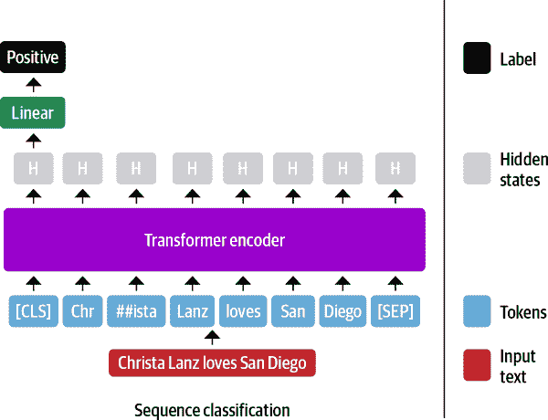
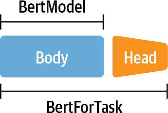
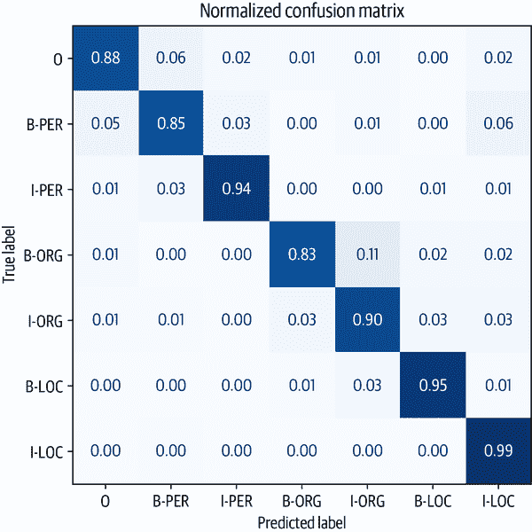
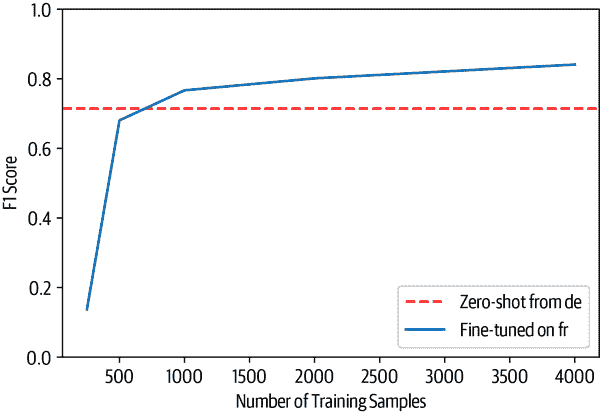
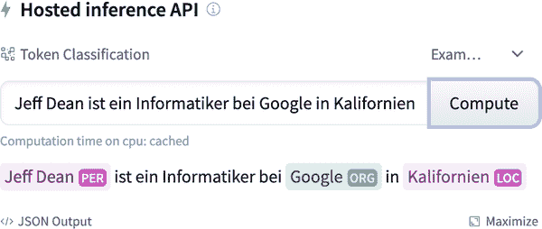

# 第四章。多语言命名实体识别

到目前为止，在这本书中，我们已经应用 transformers 来解决英语语料库上的 NLP 任务 - 但是当你的文档是用希腊语、斯瓦希里语或克林贡语写的时候，你该怎么办呢？一种方法是在 Hugging Face Hub 上搜索合适的预训练语言模型，并在手头的任务上对其进行微调。然而，这些预训练模型往往只存在于像德语、俄语或普通话这样的“高资源”语言中，这些语言有大量的网络文本可用于预训练。另一个常见的挑战是当你的语料库是多语言的时候：在生产中维护多个单语模型对你或你的工程团队来说都不是什么乐趣。

幸运的是，有一类多语言 transformers 可以拯救我们。像 BERT 一样，这些模型使用掩码语言建模作为预训练目标，但它们是在一百多种语言的文本上联合训练的。通过在许多语言的大型语料库上进行预训练，这些多语言 transformers 实现了*零-shot 跨语言转移*。这意味着对一个语言进行微调的模型可以应用于其他语言，而无需进一步的训练！这也使得这些模型非常适合“代码切换”，即说话者在单一对话的上下文中交替使用两种或多种语言或方言。

在本章中，我们将探讨如何对一种名为 XLM-RoBERTa 的单一 transformer 模型（在第三章介绍）进行微调，以执行跨多种语言的命名实体识别（NER）。正如我们在第一章中看到的，NER 是一种常见的 NLP 任务，用于识别文本中的人物、组织或地点等实体。这些实体可以用于各种应用，例如从公司文件中获取见解，增强搜索引擎的质量，或者仅仅是从语料库中构建结构化数据库。

在本章中，让我们假设我们想为一个位于瑞士的客户执行 NER，那里有四种官方语言（英语通常作为它们之间的桥梁）。让我们首先找到一个适合这个问题的多语言语料库。

###### 注

*零-shot 转移*或*零-shot 学习*通常指的是在一个标签集上训练模型，然后在另一个标签集上对其进行评估的任务。在 transformers 的上下文中，零-shot 学习也可能指的是像 GPT-3 这样的语言模型在一个甚至没有进行微调的下游任务上进行评估。

# The Dataset

在本章中，我们将使用跨语言 TRansfer 多语言编码器（XTREME）基准的子集，称为 WikiANN 或 PAN-X。^(2) 这个数据集包括许多语言的维基百科文章，包括瑞士四种最常用的语言：德语（62.9%）、法语（22.9%）、意大利语（8.4%）和英语（5.9%）。每篇文章都以“内外开始”（IOB2）格式标注了`LOC`（位置）、`PER`（人物）和`ORG`（组织）标签。在这种格式中，`B-`前缀表示实体的开始，属于同一实体的连续标记被赋予`I-`前缀。`O`标签表示该标记不属于任何实体。例如，以下句子：

> Jeff Dean 是 Google 在加利福尼亚的计算机科学家

将以 IOB2 格式标记，如 Table 4-1 所示。

表 4-1。一个带有命名实体注释的序列示例

| Tokens | Jeff | Dean | is | a | computer | scientist | at | Google | in | California |
| --- | --- | --- | --- | --- | --- | --- | --- | --- | --- | --- |
| Tags | B-PER | I-PER | O | O | O | O | O | B-ORG | O | B-LOC |

要加载 XTREME 中的 PAN-X 子集之一，我们需要知道要传递给 `load_dataset()` 函数的 *数据集配置*。每当处理具有多个领域的数据集时，可以使用 `get_dataset_config_names()` 函数查找可用的子集：

```py
from datasets import get_dataset_config_names

xtreme_subsets = get_dataset_config_names("xtreme")
print(f"XTREME has {len(xtreme_subsets)} configurations")
```

```py
XTREME has 183 configurations
```

哇，这有很多配置！让我们缩小搜索范围，只查找以“PAN”开头的配置：

```py
panx_subsets = [s for s in xtreme_subsets if s.startswith("PAN")]
panx_subsets[:3]
```

```py
['PAN-X.af', 'PAN-X.ar', 'PAN-X.bg']
```

好的，看来我们已经确定了 PAN-X 子集的语法：每个子集都有一个两个字母的后缀，看起来是一个[ISO 639-1 语言代码](https://oreil.ly/R8XNu)。这意味着要加载德语语料库，我们将 `de` 代码传递给 `load_dataset()` 的 `name` 参数，如下所示：

```py
from datasets import load_dataset

load_dataset("xtreme", name="PAN-X.de")
```

为了创建一个真实的瑞士语料库，我们将根据 PAN-X 中各语言的口语比例抽样德语（`de`）、法语（`fr`）、意大利语（`it`）和英语（`en`）语料库。这将创建一个语言不平衡的情况，这在现实世界的数据集中非常常见，因为在少数语言中获取标记示例可能会很昂贵，因为缺乏精通该语言的领域专家。这种不平衡的数据集将模拟在多语言应用程序中工作时的常见情况，我们将看到如何构建一个适用于所有语言的模型。

为了跟踪每种语言，让我们创建一个 Python `defaultdict`，将语言代码存储为键，`DatasetDict` 类型的 PAN-X 语料库存储为值：

```py
from collections import defaultdict
from datasets import DatasetDict

langs = ["de", "fr", "it", "en"]
fracs = [0.629, 0.229, 0.084, 0.059]
# Return a DatasetDict if a key doesn't exist
panx_ch = defaultdict(DatasetDict)

for lang, frac in zip(langs, fracs):
    # Load monolingual corpus
    ds = load_dataset("xtreme", name=f"PAN-X.{lang}")
    # Shuffle and downsample each split according to spoken proportion
    for split in ds:
        panx_ch[lang][split] = (
            ds[split]
            .shuffle(seed=0)
            .select(range(int(frac * ds[split].num_rows))))
```

在使用 `shuffle()` 方法确保不会意外地偏向我们的数据集拆分时，`select()` 允许我们根据 `fracs` 中的值对每个语料库进行降采样。让我们看看训练集中每种语言有多少示例，通过访问 `Dataset.num_rows` 属性：

```py
import pandas as pd

pd.DataFrame({lang: [panx_ch[lang]["train"].num_rows] for lang in langs},
             index=["Number of training examples"])
```

|  | de | fr | it | en |
| --- | --- | --- | --- | --- |
| 训练示例数量 | 12580 | 4580 | 1680 | 1180 |

按设计，我们在德语中有比其他所有语言加起来更多的示例，因此我们将其用作从中执行零-shot 跨语言转移到法语、意大利语和英语的起点。让我们检查德语语料库中的一个示例：

```py
element = panx_ch["de"]["train"][0]
for key, value in element.items():
    print(f"{key}: {value}")
```

```py
langs: ['de', 'de', 'de', 'de', 'de', 'de', 'de', 'de', 'de', 'de', 'de', 'de']
ner_tags: [0, 0, 0, 0, 5, 6, 0, 0, 5, 5, 6, 0]
tokens: ['2.000', 'Einwohnern', 'an', 'der', 'Danziger', 'Bucht', 'in', 'der',
'polnischen', 'Woiwodschaft', 'Pommern', '.']
```

与我们之前遇到的 `Dataset` 对象一样，我们示例的键对应于 Arrow 表的列名，而值表示每列中的条目。特别是，我们看到 `ner_tags` 列对应于将每个实体映射到类 ID。这对人眼来说有点神秘，所以让我们创建一个新列，其中包含熟悉的 `LOC`、`PER` 和 `ORG` 标签。为此，首先要注意的是我们的 `Dataset` 对象具有一个 `features` 属性，该属性指定了与每列关联的基础数据类型：

```py
for key, value in panx_ch["de"]["train"].features.items():
    print(f"{key}: {value}")
```

```py
tokens: Sequence(feature=Value(dtype='string', id=None), length=-1, id=None)
ner_tags: Sequence(feature=ClassLabel(num_classes=7, names=['O', 'B-PER',
'I-PER', 'B-ORG', 'I-ORG', 'B-LOC', 'I-LOC'], names_file=None, id=None),
length=-1, id=None)
langs: Sequence(feature=Value(dtype='string', id=None), length=-1, id=None)
```

`Sequence` 类指定该字段包含一系列特征，对于 `ner_tags`，这对应于一系列 `ClassLabel` 特征。让我们从训练集中挑选出这个特征：

```py
tags = panx_ch["de"]["train"].features["ner_tags"].feature
print(tags)
```

```py
ClassLabel(num_classes=7, names=['O', 'B-PER', 'I-PER', 'B-ORG', 'I-ORG',
'B-LOC', 'I-LOC'], names_file=None, id=None)
```

我们可以使用我们在第二章中遇到的 `ClassLabel.int2str()` 方法，在我们的训练集中创建一个新的列，其中包含每个标签的类名。我们将使用 `map()` 方法返回一个 `dict`，其中键对应于新列名，值为类名的 `list`：

```py
def create_tag_names(batch):
    return {"ner_tags_str": [tags.int2str(idx) for idx in batch["ner_tags"]]}

panx_de = panx_ch["de"].map(create_tag_names)
```

现在我们已经将标签转换为人类可读的格式，让我们看看训练集中第一个示例中的标记和标签是如何对齐的：

```py
de_example = panx_de["train"][0]
pd.DataFrame([de_example["tokens"], de_example["ner_tags_str"]],
['Tokens', 'Tags'])
```

|  | 0 | 1 | 2 | 3 | 4 | 5 | 6 | 7 | 8 | 9 | 10 | 11 |
| --- | --- | --- | --- | --- | --- | --- | --- | --- | --- | --- | --- | --- |
| Tokens | 2.000 | Einwohnern | an | der | Danziger | Bucht | in | der | polnischen | Woiwodschaft | Pommern | . |
| 标签 | O | O | O | O | B-LOC | I-LOC | O | O | B-LOC | B-LOC | I-LOC | O |

`LOC`标签的存在是有意义的，因为句子“2,000 Einwohnern an der Danziger Bucht in der polnischen Woiwodschaft Pommern”在英语中的意思是“2,000 inhabitants at the Gdansk Bay in the Polish voivodeship of Pomerania”，而 Gdansk Bay 是波罗的海的一个海湾，“voivodeship”对应于波兰的一个州。

作为对标签是否存在异常不平衡的快速检查，让我们计算每个实体在每个拆分中的频率：

```py
from collections import Counter

split2freqs = defaultdict(Counter)
for split, dataset in panx_de.items():
    for row in dataset["ner_tags_str"]:
        for tag in row:
            if tag.startswith("B"):
                tag_type = tag.split("-")[1]
                split2freqs[split][tag_type] += 1
pd.DataFrame.from_dict(split2freqs, orient="index")
```

|  | ORG | LOC | PER |
| --- | --- | --- | --- |
| 验证 | 2683 | 3172 | 2893 |
| 测试 | 2573 | 3180 | 3071 |
| 训练 | 5366 | 6186 | 5810 |

看起来很好 - `PER`、`LOC`和`ORG`频率的分布在每个拆分中大致相同，因此验证和测试集应该能够很好地衡量我们的 NER 标记器的泛化能力。接下来，让我们看一下一些流行的多语言变压器以及它们如何适应我们的 NER 任务。

# 多语言变压器

多语言变压器涉及与其单语对应物相似的架构和训练程序，唯一的区别在于用于预训练的语料库包含许多语言的文档。这种方法的一个显著特点是，尽管没有接收到区分语言的明确信息，但由此产生的语言表示能够很好地*跨*语言进行泛化，适用于各种下游任务。在某些情况下，这种跨语言转移的能力可以产生与单语模型竞争的结果，从而避免了需要为每种语言训练一个模型的需求！

为了衡量 NER 的跨语言转移的进展，通常使用[CoNLL-2002](https://oreil.ly/nYd0o)和[CoNLL-2003](https://oreil.ly/sVESv)数据集作为英语、荷兰语、西班牙语和德语的基准。这个基准由用相同的`LOC`、`PER`和`ORG`类别注释的新闻文章组成，但它还包含一个额外的`MISC`标签，用于不属于前三组的其他实体。多语言变压器模型通常以三种不同的方式进行评估：

`en`

在英语训练数据上进行微调，然后在每种语言的测试集上进行评估。

`each`

在单语测试数据上进行微调和评估，以衡量每种语言的性能。

`all`

在所有训练数据上进行微调，以便在每种语言的测试集上进行评估。

我们将采用类似的评估策略来进行我们的 NER 任务，但首先我们需要选择一个模型来评估。最早的多语言变压器之一是 mBERT，它使用与 BERT 相同的架构和预训练目标，但将许多语言的维基百科文章添加到预训练语料库中。从那时起，mBERT 已经被 XLM-RoBERTa（或简称 XLM-R）取代，因此这是我们将在本章中考虑的模型。

正如我们在第三章中看到的，XLM-R 仅使用 MLM 作为 100 种语言的预训练目标，但与其前身相比，其预训练语料库的规模巨大：每种语言的维基百科转储和来自网络的 2.5 *terabytes*的 Common Crawl 数据。这个语料库的规模比早期模型使用的语料库大几个数量级，并为缅甸语和斯瓦希里语等低资源语言提供了显著的信号增强，因为这些语言只有少量的维基百科文章。

模型名称中的 RoBERTa 指的是预训练方法与单语 RoBERTa 模型相同。RoBERTa 的开发人员在几个方面改进了 BERT，特别是通过完全删除下一个句子预测任务。^(3) XLM-R 还放弃了 XLM 中使用的语言嵌入，并使用 SentencePiece 直接对原始文本进行标记化。^(4) 除了其多语言性质之外，XLM-R 和 RoBERTa 之间的一个显著差异是各自词汇表的大小：25 万个标记与 5.5 万个标记！

XLM-R 是多语言 NLU 任务的一个很好的选择。在下一节中，我们将探讨它如何能够高效地在许多语言中进行标记化。

# 仔细看一下分词

XLM-R 使用了一个名为 SentencePiece 的分词器，而不是使用 WordPiece 分词器，该分词器是在所有一百种语言的原始文本上进行训练的。为了了解 SentencePiece 与 WordPiece 的比较，让我们以通常的方式使用 nlpt_pin01 Transformers 加载 BERT 和 XLM-R 分词器：

```py
from transformers import AutoTokenizer

bert_model_name = "bert-base-cased"
xlmr_model_name = "xlm-roberta-base"
bert_tokenizer = AutoTokenizer.from_pretrained(bert_model_name)
xlmr_tokenizer = AutoTokenizer.from_pretrained(xlmr_model_name)
```

通过对一小段文本进行编码，我们还可以检索每个模型在预训练期间使用的特殊标记：

```py
text = "Jack Sparrow loves New York!"
bert_tokens = bert_tokenizer(text).tokens()
xlmr_tokens = xlmr_tokenizer(text).tokens()
```

| BERT | [CLS] | Jack | Spa | ##rrow | loves | New | York | ! | [SEP] | None |
| --- | --- | --- | --- | --- | --- | --- | --- | --- | --- | --- |
| XLM-R | <s> | ▁Jack | ▁Spar | row | ▁love | s | ▁New | ▁York | ! | </s> |

在这里，我们看到 XLM-R 使用了`<s>`和`<\s>`来表示序列的开始和结束，而不是 BERT 用于句子分类任务的`[CLS]`和`[SEP]`标记。这些标记是在标记化的最后阶段添加的，我们将在下面看到。

## 分词器管道

到目前为止，我们把分词看作是一个将字符串转换为我们可以通过模型传递的整数的单个操作。这并不完全准确，如果我们仔细看一下，我们会发现它实际上是一个完整的处理管道，通常包括四个步骤，如图 4-1 所示。


###### 图 4-1。分词管道中的步骤

让我们仔细看看每个处理步骤，并用示例句子“Jack Sparrow loves New York!”来说明它们的效果：

*规范化*

这一步对应于你对原始字符串应用的一系列操作，使其更“干净”。常见的操作包括去除空格和去除重音字符。[Unicode normalization](https://oreil.ly/2cp3w)是许多分词器应用的另一种常见的规范化操作，用于处理通常存在各种写同一字符的方式的事实。这可能会使得两个“相同”的字符串（即具有相同的抽象字符序列）看起来不同；Unicode 规范化方案如 NFC、NFD、NFKC 和 NFKD 用标准形式替换了写同一字符的各种方式。规范化的另一个例子是小写化。如果模型只接受和使用小写字符，这种技术可以用来减少它所需的词汇量。规范化后，我们的示例字符串将变成“jack sparrow loves new york!”。

*预分词*

这一步将文本分割成较小的对象，这些对象给出了训练结束时你的标记的上限。一个好的思考方式是，预分词器将把你的文本分割成“单词”，你的最终标记将是这些单词的一部分。对于允许这样做的语言（英语、德语和许多印欧语言），字符串通常可以根据空格和标点符号分割成单词。例如，这一步可能会将我们的`["jack", "sparrow", "loves", "new", "york", "!"]`转换成这些单词。然后，这些单词更容易在管道的下一步中使用字节对编码（BPE）或 Unigram 算法分割成子词。然而，将文本分割成“单词”并不总是一个微不足道和确定性的操作，甚至不是一个有意义的操作。例如，在中文、日文或韩文等语言中，将符号分组成像印欧语言单词那样的语义单元可能是一个非确定性的操作，有几个同样有效的分组。在这种情况下，最好不要对文本进行预分词，而是使用一个特定于语言的库进行预分词。

*分词器模型*

一旦输入文本被规范化和 pretokenized，分词器会在单词上应用一个子词分割模型。这是流程中需要在你的语料库上进行训练（或者如果你使用的是预训练分词器，则已经进行了训练）的部分。模型的作用是将单词分割成子词，以减少词汇量的大小，并尝试减少词汇表外标记的数量。存在几种子词分割算法，包括 BPE、Unigram 和 WordPiece。例如，我们的运行示例在分词器模型应用后可能看起来像`[jack, spa, rrow, loves, new, york, !]`。请注意，此时我们不再有一个字符串列表，而是一个整数列表（输入 ID）；为了保持示例的说明性，我们保留了单词，但删除了引号以表示转换。

*后处理*

这是分词流程的最后一步，在这一步中，可以对标记列表应用一些额外的转换，例如在输入标记索引序列的开头或结尾添加特殊标记。例如，BERT 风格的分词器会添加分类和分隔符标记：`[CLS, jack, spa, rrow, loves, new, york, !, SEP]`。然后，这个序列（请记住，这将是一个整数序列，而不是你在这里看到的标记）可以被馈送到模型中。

回到我们对 XLM-R 和 BERT 的比较，我们现在明白了 SentencePiece 在后处理步骤中添加了`<s>`和`<\s>`，而不是`[CLS]`和`[SEP]`（作为惯例，我们将在图形说明中继续使用`[CLS]`和`[SEP]`）。让我们回到 SentencePiece 分词器，看看它有什么特别之处。

## SentencePiece 分词器

SentencePiece 分词器基于一种称为 Unigram 的子词分割类型，并将每个输入文本编码为 Unicode 字符序列。这个特性对于多语言语料库特别有用，因为它允许 SentencePiece 对重音、标点和许多语言（比如日语）没有空格字符这一事实保持不可知。SentencePiece 的另一个特点是将空格分配给 Unicode 符号 U+2581，或者称为▁字符，也叫做下四分之一块字符。这使得 SentencePiece 能够在不依赖于特定语言的 pretokenizers 的情况下，对序列进行去标记化处理。例如，在前一节的例子中，我们可以看到 WordPiece 丢失了“York”和“!”之间没有空格的信息。相比之下，SentencePiece 保留了标记化文本中的空格，因此我们可以无歧义地将其转换回原始文本。

```py
"".join(xlmr_tokens).replace(u"\u2581", " ")
```

```py
'<s> Jack Sparrow loves New York!</s>'
```

现在我们了解了 SentencePiece 的工作原理，让我们看看如何将我们的简单示例编码成适合 NER 的形式。首先要做的是加载带有标记分类头的预训练模型。但我们不会直接从 nlpt_pin01 Transformers 中加载这个头，而是自己构建它！通过深入研究 nlpt_pin01 Transformers API，我们可以用几个简单的步骤来实现这一点。

# 用于命名实体识别的 Transformer

在第二章中，我们看到对于文本分类，BERT 使用特殊的`[CLS]`标记来表示整个文本序列。然后，这个表示被馈送到一个全连接或密集层，以输出所有离散标签值的分布，如图 4-2 所示。



###### 图 4-2。为序列分类微调基于编码器的 Transformer

BERT 和其他仅编码器的变压器在 NER 方面采取了类似的方法，只是每个单独的输入标记的表示被馈送到相同的全连接层，以输出标记的实体。因此，NER 经常被构建为*标记分类*任务。该过程看起来像图 4-3 中的图表。

变压器编码器的命名实体识别架构。宽线性层显示相同的线性层应用于所有隐藏状态。

###### 图 4-3。为命名实体识别微调基于编码器的变压器

到目前为止，一切顺利，但在标记分类任务中，我们应该如何处理子词？例如，图 4-3 中的第一个名字“Christa”被标记为子词“Chr”和“##ista”，那么应该分配`B-PER`标签给哪一个（或哪些）呢？

在 BERT 论文中，作者将这个标签分配给第一个子词（在我们的例子中是“Chr”），并忽略后面的子词（“##ista”）。这是我们将在这里采用的约定，我们将用`IGN`表示被忽略的子词。我们稍后可以很容易地将第一个子词的预测标签传播到后续子词中的后处理步骤。我们也可以选择包括“##ista”子词的表示，通过分配一个`B-LOC`标签的副本，但这违反了 IOB2 格式。

幸运的是，我们在 BERT 中看到的所有架构方面都适用于 XLM-R，因为它的架构基于 RoBERTa，与 BERT 相同！接下来，我们将看到​变压器如何支持许多其他任务，只需进行轻微修改。

# 变压器模型类的解剖

变压器围绕着每种架构和任务都有专门的类进行组织。与不同任务相关的模型类根据`<ModelName>For<Task>`约定命名，或者在使用`AutoModel`类时为`AutoModelFor<Task>`。

然而，这种方法有其局限性，为了激励更深入地了解​⁠变压器 API，考虑以下情景。假设你有一个解决 NLP 问题的好主意，这个问题一直在你脑海中挥之不去，你想用一个变压器模型来解决它。于是你和老板安排了一次会议，通过精心制作的 PowerPoint 演示文稿，你向老板提出，如果你能最终解决这个问题，你可以增加部门的收入。老板对你色彩丰富的演示和利润的谈话印象深刻，慷慨地同意给你一周的时间来构建一个概念验证。满意结果后，你立刻开始工作。你启动 GPU 并打开笔记本。你执行`from transformers import BertForTaskXY`（注意`TaskXY`是你想解决的虚构任务），当可怕的红色填满屏幕时，你的脸色变了：`ImportEr⁠ror:​ can⁠not import name *BertForTaskXY*`。哦，不，没有 BERT 模型适用于你的用例！如果你不得不自己实现整个模型，你怎么能在一周内完成项目？你应该从哪里开始呢？

*不要惊慌！* 变压器被设计为让您轻松扩展现有模型以适应您的特定用例。您可以加载预训练模型的权重，并且可以访问特定任务的辅助函数。这使您可以用非常少的开销为特定目标构建自定义模型。在本节中，我们将看到如何实现我们自己的自定义模型。

## 主体和头部

使  Transformers 如此通用的主要概念是将架构分为 *主体* 和 *头部*（正如我们在第一章中看到的）。我们已经看到，当我们从预训练任务切换到下游任务时，我们需要用适合任务的最后一层替换模型。这最后一层称为模型头部；它是*特定于任务*的部分。模型的其余部分称为主体；它包括*与任务无关*的标记嵌入和变换器层。这种结构也反映在  Transformers 代码中：模型的主体在类似 `BertModel` 或 `GPT2Model` 的类中实现，返回最后一层的隐藏状态。特定于任务的模型，如 `BertForMaskedLM` 或 `BertForSequenceClassification`，使用基础模型，并在隐藏状态的顶部添加必要的头部，如图 4-4 所示。



###### 图 4-4\. `BertModel` 类仅包含模型的主体，而 `BertFor<Task>` 类将主体与给定任务的专用头部组合起来

接下来我们将看到，这种主体和头部的分离使我们能够为任何任务构建自定义头部，并将其直接安装在预训练模型的顶部。

## 为标记分类创建自定义模型

让我们来练习为 XLM-R 构建一个自定义的标记分类头。由于 XLM-R 使用与 RoBERTa 相同的模型架构，我们将使用 RoBERTa 作为基础模型，但增加了特定于 XLM-R 的设置。请注意，这是一个教育性的练习，向您展示如何为自己的任务构建自定义模型。对于标记分类，已经存在一个 `XLMRobertaForTokenClassification` 类，您可以从  Transformers 中导入。如果愿意，您可以跳到下一节，直接使用那个。

要开始，我们需要一个数据结构来表示我们的 XLM-R NER 标记器。作为第一个猜测，我们将需要一个配置对象来初始化模型和一个 `forward()` 函数来生成输出。让我们继续构建我们的 XLM-R 标记分类的类：

```py
import torch.nn as nn
from transformers import XLMRobertaConfig
from transformers.modeling_outputs import TokenClassifierOutput
from transformers.models.roberta.modeling_roberta import RobertaModel
from transformers.models.roberta.modeling_roberta import RobertaPreTrainedModel

class XLMRobertaForTokenClassification(RobertaPreTrainedModel):
    config_class = XLMRobertaConfig

    def __init__(self, config):
        super().__init__(config)
        self.num_labels = config.num_labels
        # Load model body
        self.roberta = RobertaModel(config, add_pooling_layer=False)
        # Set up token classification head
        self.dropout = nn.Dropout(config.hidden_dropout_prob)
        self.classifier = nn.Linear(config.hidden_size, config.num_labels)
        # Load and initialize weights
        self.init_weights()

    def forward(self, input_ids=None, attention_mask=None, token_type_ids=None,
                labels=None, **kwargs):
        # Use model body to get encoder representations
        outputs = self.roberta(input_ids, attention_mask=attention_mask,
                               token_type_ids=token_type_ids, **kwargs)
        # Apply classifier to encoder representation
        sequence_output = self.dropout(outputs[0])
        logits = self.classifier(sequence_output)
        # Calculate losses
        loss = None
        if labels is not None:
            loss_fct = nn.CrossEntropyLoss()
            loss = loss_fct(logits.view(-1, self.num_labels), labels.view(-1))
        # Return model output object
        return TokenClassifierOutput(loss=loss, logits=logits,
                                     hidden_states=outputs.hidden_states,
                                     attentions=outputs.attentions)
```

`config_class` 确保在初始化新模型时使用标准的 XLM-R 设置。如果要更改默认参数，可以通过覆盖配置中的默认设置来实现。使用 `super()` 方法调用 `RobertaPreTrainedModel` 类的初始化函数。这个抽象类处理预训练权重的初始化或加载。然后我们加载我们的模型主体，即 `RobertaModel`，并用自己的分类头扩展它，包括一个 dropout 和一个标准的前馈层。请注意，我们设置 `add_​pool⁠ing_layer=False` 以确保返回所有隐藏状态，而不仅仅是与 `[CLS]` 标记相关联的隐藏状态。最后，我们通过调用从 `RobertaPreTrainedModel` 继承的 `init_weights()` 方法来初始化所有权重，这将加载模型主体的预训练权重并随机初始化我们的标记分类头的权重。

唯一剩下的事情就是定义模型在前向传递中应该做什么，使用 `forward()` 方法。在前向传递期间，数据首先通过模型主体进行馈送。有许多输入变量，但我们现在只需要 `input_ids` 和 `attention_mask`。然后，模型主体输出的隐藏状态通过 dropout 和分类层进行馈送。如果我们在前向传递中还提供标签，我们可以直接计算损失。如果有注意力掩码，我们需要做一些额外的工作，以确保我们只计算未掩码标记的损失。最后，我们将所有输出封装在一个 `TokenClassifierOutput` 对象中，这样我们就可以从前几章中熟悉的命名元组中访问元素。

通过实现一个简单类的两个函数，我们就可以构建自己的自定义转换器模型。而且，由于我们继承自`PreTrainedModel`，我们立即就可以访问所有有用的 Transformer 实用工具，比如`from_pretrained()`！让我们看看如何将预训练权重加载到我们的自定义模型中。

## 加载自定义模型

现在我们准备加载我们的标记分类模型。除了模型名称之外，我们还需要提供一些额外的信息，包括我们将用于标记每个实体的标签以及每个标签与 ID 之间的映射，反之亦然。所有这些信息都可以从我们的`tags`变量中派生出来，作为一个`ClassLabel`对象，它具有一个我们可以用来派生映射的`names`属性：

```py
index2tag = {idx: tag for idx, tag in enumerate(tags.names)}
tag2index = {tag: idx for idx, tag in enumerate(tags.names)}
```

我们将把这些映射和`tags.num_classes`属性存储在我们在第三章中遇到的`AutoConfig`对象中。通过向`from_pretrained()`方法传递关键字参数来覆盖默认值：

```py
from transformers import AutoConfig

xlmr_config = AutoConfig.from_pretrained(xlmr_model_name,
                                         num_labels=tags.num_classes,
                                         id2label=index2tag, label2id=tag2index)
```

`AutoConfig`类包含了模型架构的蓝图。当我们使用`AutoModel.from_pretrained(*model_ckpt*)`加载模型时，与该模型关联的配置文件会自动下载。然而，如果我们想要修改诸如类的数量或标签名称之类的东西，那么我们可以首先加载配置，然后使用我们想要自定义的参数加载配置。

现在，我们可以像往常一样使用`from_pretrained()`函数加载模型权重，还可以使用额外的`config`参数。请注意，我们没有在我们的自定义模型类中实现加载预训练权重；我们通过从`RobertaPreTrainedModel`继承来免费获得这一点：

```py
import torch

device = torch.device("cuda" if torch.cuda.is_available() else "cpu")
xlmr_model = (XLMRobertaForTokenClassification
              .from_pretrained(xlmr_model_name, config=xlmr_config)
              .to(device))
```

为了快速检查我们是否正确初始化了标记器和模型，让我们在我们已知实体的小序列上测试预测：

```py
input_ids = xlmr_tokenizer.encode(text, return_tensors="pt")
pd.DataFrame([xlmr_tokens, input_ids[0].numpy()], index=["Tokens", "Input IDs"])
```

|  | 0 | 1 | 2 | 3 | 4 | 5 | 6 | 7 | 8 | 9 |
| --- | --- | --- | --- | --- | --- | --- | --- | --- | --- | --- |
| Tokens | <s> | ▁Jack | ▁Spar | row | ▁love | s | ▁New | ▁York | ! | </s> |
| Input IDs | 0 | 21763 | 37456 | 15555 | 5161 | 7 | 2356 | 5753 | 38 | 2 |

正如你在这里看到的，起始`<s>`和结束`</s>`标记分别被赋予了 ID 0 和 2。

最后，我们需要将输入传递给模型，并通过取 argmax 来提取预测，以获得每个标记最有可能的类：

```py
outputs = xlmr_model(input_ids.to(device)).logits
predictions = torch.argmax(outputs, dim=-1)
print(f"Number of tokens in sequence: {len(xlmr_tokens)}")
print(f"Shape of outputs: {outputs.shape}")
```

```py
Number of tokens in sequence: 10
Shape of outputs: torch.Size([1, 10, 7])
```

在这里，我们看到 logits 的形状为`[batch_size, num_tokens, num_tags]`，每个标记都被赋予了七个可能的 NER 标记中的一个 logit。通过枚举序列，我们可以快速看到预训练模型的预测：

```py
preds = [tags.names[p] for p in predictions[0].cpu().numpy()]
pd.DataFrame([xlmr_tokens, preds], index=["Tokens", "Tags"])
```

|  | 0 | 1 | 2 | 3 | 4 | 5 | 6 | 7 | 8 | 9 |
| --- | --- | --- | --- | --- | --- | --- | --- | --- | --- | --- |
| Tokens | <s> | ▁Jack | ▁Spar | row | ▁love | s | ▁New | ▁York | ! | </s> |
| Tags | O | I-LOC | B-LOC | B-LOC | O | I-LOC | O | O | I-LOC | B-LOC |

毫不奇怪，我们的具有随机权重的标记分类层还有很多需要改进的地方；让我们在一些带标签的数据上进行微调，使其变得更好！在这样做之前，让我们把前面的步骤封装成一个辅助函数，以备后用：

```py
def tag_text(text, tags, model, tokenizer):
    # Get tokens with special characters
    tokens = tokenizer(text).tokens()
    # Encode the sequence into IDs
    input_ids = xlmr_tokenizer(text, return_tensors="pt").input_ids.to(device)
    # Get predictions as distribution over 7 possible classes
    outputs = model(inputs)[0]
    # Take argmax to get most likely class per token
    predictions = torch.argmax(outputs, dim=2)
    # Convert to DataFrame
    preds = [tags.names[p] for p in predictions[0].cpu().numpy()]
    return pd.DataFrame([tokens, preds], index=["Tokens", "Tags"])
```

在我们训练模型之前，我们还需要对输入进行标记化处理并准备标签。我们接下来会做这个。

# 用于 NER 的标记化文本

现在我们已经确定了标记器和模型可以对单个示例进行编码，我们的下一步是对整个数据集进行标记化处理，以便我们可以将其传递给 XLM-R 模型进行微调。正如我们在第二章中看到的那样， Datasets 提供了一种快速的方法来使用`map()`操作对`Dataset`对象进行标记化处理。为了实现这一点，我们首先需要定义一个具有最小签名的函数：

```py
function(examples: Dict[str, List]) -> Dict[str, List]
```

其中`examples`相当于`Dataset`的一个切片，例如`panx_de['train'][:10]`。由于 XLM-R 标记器返回模型输入的输入 ID，我们只需要用注意力掩码和编码关于每个 NER 标记与每个标记相关联的哪个标记的信息的标签 ID 来增加这些信息。

按照 [Transformers documentation](https://oreil.ly/lGPgh)中采用的方法，让我们看看这如何在我们的单个德语示例中运作，首先将单词和标签收集为普通列表：

```py
words, labels = de_example["tokens"], de_example["ner_tags"]
```

接下来，我们对每个单词进行标记化，并使用`is_split_into_words`参数告诉标记器我们的输入序列已经被分成了单词：

```py
tokenized_input = xlmr_tokenizer(de_example["tokens"], is_split_into_words=True)
tokens = xlmr_tokenizer.convert_ids_to_tokens(tokenized_input["input_ids"])
pd.DataFrame([tokens], index=["Tokens"])
```

|  | 0 | 1 | 2 | 3 | 4 | 5 | 6 | ... | 18 | 19 | 20 | 21 | 22 | 23 | 24 |
| --- | --- | --- | --- | --- | --- | --- | --- | --- | --- | --- | --- | --- | --- | --- | --- |
| 标记 | <s> | ▁2.000 | ▁Einwohner | n | ▁an | ▁der | ▁Dan | ... | schaft | ▁Po | mmer | n | ▁ | . | </s> |

在这个例子中，我们可以看到标记器将“Einwohnern”分成了两个子词，“▁Einwohner”和“n”。由于我们遵循的约定是只有“▁Einwohner”应该与`B-LOC`标签相关联，我们需要一种方法来屏蔽第一个子词之后的子词表示。幸运的是，`tokenized_input`是一个包含`word_ids()`函数的类，可以帮助我们实现这一点：

```py
word_ids = tokenized_input.word_ids()
pd.DataFrame([tokens, word_ids], index=["Tokens", "Word IDs"])
```

|  | 0 | 1 | 2 | 3 | 4 | 5 | 6 | ... | 18 | 19 | 20 | 21 | 22 | 23 | 24 |
| --- | --- | --- | --- | --- | --- | --- | --- | --- | --- | --- | --- | --- | --- | --- | --- |
| 标记 | <s> | ▁2.000 | ▁Einwohner | n | ▁an | ▁der | ▁Dan | ... | schaft | ▁Po | mmer | n | ▁ | . | </s> |
| 单词 ID | None | 0 | 1 | 1 | 2 | 3 | 4 | ... | 9 | 10 | 10 | 10 | 11 | 11 | None |

在这个例子中，我们可以看到`word_ids`已经将每个子词映射到`words`序列中的相应索引，因此第一个子词“▁2.000”被分配索引 0，而“▁Einwohner”和“n”被分配索引 1（因为“Einwohnern”是`words`中的第二个单词）。我们还可以看到像`<s>`和`<\s>`这样的特殊标记被映射为`None`。让我们将-100 设置为这些特殊标记和训练过程中希望屏蔽的子词的标签：

```py
previous_word_idx = None
label_ids = []

for word_idx in word_ids:
    if word_idx is None or word_idx == previous_word_idx:
        label_ids.append(-100)
    elif word_idx != previous_word_idx:
        label_ids.append(labels[word_idx])
    previous_word_idx = word_idx

labels = [index2tag[l] if l != -100 else "IGN" for l in label_ids]
index = ["Tokens", "Word IDs", "Label IDs", "Labels"]

pd.DataFrame([tokens, word_ids, label_ids, labels], index=index)
```

|  | 0 | 1 | 2 | 3 | 4 | 5 | ... | 19 | 20 | 21 | 22 | 23 | 24 |
| --- | --- | --- | --- | --- | --- | --- | --- | --- | --- | --- | --- | --- | --- |
| 标记 | <s> | ▁2.000 | ▁Einwohner | n | ▁an | ▁der | ... | ▁Po | mmer | n | ▁ | . | </s> |
| 单词 ID | None | 0 | 1 | 1 | 2 | 3 | ... | 10 | 10 | 10 | 11 | 11 | None |
| 标签 ID | -100 | 0 | 0 | -100 | 0 | 0 | ... | 6 | -100 | -100 | 0 | -100 | -100 |
| 标签 | IGN | O | O | IGN | O | O | ... | I-LOC | IGN | IGN | O | IGN | IGN |

###### 注

为什么我们选择-100 作为屏蔽子词表示的 ID？原因是在 PyTorch 中，交叉熵损失类`torch.nn.CrossEntropyLoss`有一个名为`ignore_index`的属性，其值为-100。在训练过程中会忽略此索引，因此我们可以使用它来忽略与连续子词相关联的标记。

这就是全部！我们可以清楚地看到标签 ID 与标记对齐，所以让我们通过定义一个包装所有逻辑的单个函数，将其扩展到整个数据集：

```py
def tokenize_and_align_labels(examples):
    tokenized_inputs = xlmr_tokenizer(examples["tokens"], truncation=True,
                                      is_split_into_words=True)
    labels = []
    for idx, label in enumerate(examples["ner_tags"]):
        word_ids = tokenized_inputs.word_ids(batch_index=idx)
        previous_word_idx = None
        label_ids = []
        for word_idx in word_ids:
            if word_idx is None or word_idx == previous_word_idx:
                label_ids.append(-100)
            else:
                label_ids.append(label[word_idx])
            previous_word_idx = word_idx
        labels.append(label_ids)
    tokenized_inputs["labels"] = labels
    return tokenized_inputs
```

现在我们已经有了编码每个拆分所需的所有要素，让我们编写一个可以迭代的函数：

```py
def encode_panx_dataset(corpus):
    return corpus.map(tokenize_and_align_labels, batched=True,
                      remove_columns=['langs', 'ner_tags', 'tokens'])
```

通过将此函数应用于`DatasetDict`对象，我们可以得到每个拆分的编码`Dataset`对象。让我们使用这个来对我们的德语语料库进行编码：

```py
panx_de_encoded = encode_panx_dataset(panx_ch["de"])
```

现在我们有了一个模型和一个数据集，我们需要定义一个性能指标。

# 性能指标

评估 NER 模型类似于评估文本分类模型，通常报告精确度、召回率和*F*[1]-分数的结果。唯一的微妙之处在于，实体的*所有*单词都需要被正确预测，才能将预测视为正确。幸运的是，有一个名为[*seqeval*](https://oreil.ly/xbKOp)的巧妙库专门用于这类任务。例如，给定一些占位符 NER 标签和模型预测，我们可以通过 seqeval 的`classification_report()`函数计算指标：

```py
from seqeval.metrics import classification_report

y_true = [["O", "O", "O", "B-MISC", "I-MISC", "I-MISC", "O"],
          ["B-PER", "I-PER", "O"]]
y_pred = [["O", "O", "B-MISC", "I-MISC", "I-MISC", "I-MISC", "O"],
          ["B-PER", "I-PER", "O"]]
print(classification_report(y_true, y_pred))
```

```py
              precision    recall  f1-score   support

        MISC       0.00      0.00      0.00         1
         PER       1.00      1.00      1.00         1

   micro avg       0.50      0.50      0.50         2
   macro avg       0.50      0.50      0.50         2
weighted avg       0.50      0.50      0.50         2
```

正如我们所看到的，*seqeval*期望预测和标签作为列表的列表，每个列表对应于我们的验证或测试集中的单个示例。为了在训练过程中集成这些指标，我们需要一个函数，可以获取模型的输出并将其转换为*seqeval*所期望的列表。以下方法可以确保我们忽略与后续子词相关联的标签 ID：

```py
import numpy as np

def align_predictions(predictions, label_ids):
    preds = np.argmax(predictions, axis=2)
    batch_size, seq_len = preds.shape
    labels_list, preds_list = [], []

    for batch_idx in range(batch_size):
        example_labels, example_preds = [], []
        for seq_idx in range(seq_len):
            # Ignore label IDs = -100
            if label_ids[batch_idx, seq_idx] != -100:
                example_labels.append(index2tag[label_ids[batch_idx][seq_idx]])
                example_preds.append(index2tag[preds[batch_idx][seq_idx]])

        labels_list.append(example_labels)
        preds_list.append(example_preds)

    return preds_list, labels_list
```

有了性能指标，我们可以开始实际训练模型了。

# 微调 XLM-RoBERTa

现在我们有了所有微调模型的要素！我们的第一个策略是在 PAN-X 的德语子集上微调我们的基础模型，然后评估其在法语、意大利语和英语上的零射击跨语言性能。像往常一样，我们将使用 Transformers `Trainer`来处理我们的训练循环，所以首先我们需要使用`TrainingArguments`类定义训练属性：

```py
from transformers import TrainingArguments

num_epochs = 3
batch_size = 24
logging_steps = len(panx_de_encoded["train"]) // batch_size
model_name = f"{xlmr_model_name}-finetuned-panx-de"
training_args = TrainingArguments(
    output_dir=model_name, log_level="error", num_train_epochs=num_epochs,
    per_device_train_batch_size=batch_size,
    per_device_eval_batch_size=batch_size, evaluation_strategy="epoch",
    save_steps=1e6, weight_decay=0.01, disable_tqdm=False,
    logging_steps=logging_steps, push_to_hub=True)
```

在每个时代结束时，我们评估模型对验证集的预测，调整权重衰减，并将`save_steps`设置为一个较大的数字，以禁用检查点并加快训练速度。

这也是一个好时机，确保我们已登录到 Hugging Face Hub（如果您在终端工作，可以执行命令`huggingface-cli login`）：

```py
from huggingface_hub import notebook_login

notebook_login()
```

我们还需要告诉`Trainer`如何在验证集上计算指标，因此我们可以使用之前定义的`align_predictions()`函数来提取*seqeval*计算*F*[1]-score 所需格式的预测和标签：

```py
from seqeval.metrics import f1_score

def compute_metrics(eval_pred):
    y_pred, y_true = align_predictions(eval_pred.predictions,
                                       eval_pred.label_ids)
    return {"f1": f1_score(y_true, y_pred)}
```

最后一步是定义一个*数据收集器*，以便我们可以将每个输入序列填充到批处理中的最大序列长度。 Transformers 提供了专门用于标记分类的数据收集器，它将填充标签以及输入：

```py
from transformers import DataCollatorForTokenClassification

data_collator = DataCollatorForTokenClassification(xlmr_tokenizer)
```

填充标签是必要的，因为与文本分类任务不同，标签也是序列。这里的一个重要细节是，标签序列用值-100 进行填充，正如我们所见，这个值会被 PyTorch 损失函数忽略。

在本章的过程中，我们将训练几个模型，因此我们将通过创建`model_init()`方法来避免为每个`Trainer`初始化一个新模型。该方法加载一个未经训练的模型，并在`train()`调用开始时调用：

```py
def model_init():
    return (XLMRobertaForTokenClassification
            .from_pretrained(xlmr_model_name, config=xlmr_config)
            .to(device))
```

现在我们可以将所有这些信息与编码的数据集一起传递给`Trainer`：

```py
from transformers import Trainer

trainer = Trainer(model_init=model_init, args=training_args,
                  data_collator=data_collator, compute_metrics=compute_metrics,
                  train_dataset=panx_de_encoded["train"],
                  eval_dataset=panx_de_encoded["validation"],
                  tokenizer=xlmr_tokenizer)
```

然后按照以下方式运行训练循环，并将最终模型推送到 Hub：

```py
trainer.train() trainer.push_to_hub(commit_message="Training completed!")
```

| Epoch | Training Loss | Validation Loss | F1 |
| --- | --- | --- | --- |
| 1 | 0.2652 | 0.160244 | 0.822974 |
| 2 | 0.1314 | 0.137195 | 0.852747 |
| 3 | 0.0806 | 0.138774 | 0.864591 |

这些 F1 分数对于 NER 模型来说相当不错。为了确认我们的模型按预期工作，让我们在我们简单示例的德语翻译上进行测试：

```py
text_de = "Jeff Dean ist ein Informatiker bei Google in Kalifornien"
tag_text(text_de, tags, trainer.model, xlmr_tokenizer)
```

|  | 0 | 1 | 2 | 3 | 4 | 5 | ... | 8 | 9 | 10 | 11 | 12 | 13 |
| --- | --- | --- | --- | --- | --- | --- | --- | --- | --- | --- | --- | --- | --- |
| Tokens | <s> | ▁Jeff | ▁De | an | ▁ist | ▁ein | ... | ▁bei | ▁Google | ▁in | ▁Kaliforni | en | </s> |
| Tags | O | B-PER | I-PER | I-PER | O | O | ... | O | B-ORG | O | B-LOC | I-LOC | O |

这很有效！但我们不应该对基于单个示例的性能过于自信。相反，我们应该对模型的错误进行适当和彻底的调查。在下一节中，我们将探讨如何在 NER 任务中进行这样的调查。

# 错误分析

在我们深入探讨 XLM-R 的多语言方面之前，让我们花一分钟来调查我们模型的错误。正如我们在第二章中看到的，对模型进行彻底的错误分析是训练和调试变压器（以及机器学习模型一般）最重要的方面之一。有几种失败模式，其中模型看起来表现良好，而实际上它存在一些严重的缺陷。训练可能失败的例子包括：

+   我们可能会意外地屏蔽太多的标记，也会屏蔽一些标签，以获得真正有希望的损失下降。

+   `compute_metrics()`函数可能存在一个高估真实性能的错误。

+   我们可能会将零类或`O`实体包括在 NER 中作为正常类别，这将严重扭曲准确性和*F*[1]-分数，因为它是绝大多数类别。

当模型的表现远低于预期时，查看错误可能会提供有用的见解，并揭示很难仅通过查看代码就能发现的错误。即使模型表现良好，并且代码中没有错误，错误分析仍然是了解模型优势和劣势的有用工具。这些都是我们在将模型部署到生产环境时需要牢记的方面。

对于我们的分析，我们将再次使用我们手头上最强大的工具之一，即查看损失最大的验证示例。我们可以重复使用我们构建的函数的大部分内容来分析第二章中的序列分类模型，但现在我们将计算样本序列中每个标记的损失。

让我们定义一个可以应用于验证集的方法：

```py
from torch.nn.functional import cross_entropy

def forward_pass_with_label(batch):
    # Convert dict of lists to list of dicts suitable for data collator
    features = [dict(zip(batch, t)) for t in zip(*batch.values())]
    # Pad inputs and labels and put all tensors on device
    batch = data_collator(features)
    input_ids = batch["input_ids"].to(device)
    attention_mask = batch["attention_mask"].to(device)
    labels = batch["labels"].to(device)
    with torch.no_grad():
        # Pass data through model
        output = trainer.model(input_ids, attention_mask)
        # logit.size: [batch_size, sequence_length, classes]
        # Predict class with largest logit value on classes axis
        predicted_label = torch.argmax(output.logits, axis=-1).cpu().numpy()
    # Calculate loss per token after flattening batch dimension with view
    loss = cross_entropy(output.logits.view(-1, 7),
                         labels.view(-1), reduction="none")
    # Unflatten batch dimension and convert to numpy array
    loss = loss.view(len(input_ids), -1).cpu().numpy()

    return {"loss":loss, "predicted_label": predicted_label}
```

现在我们可以使用`map()`将这个函数应用到整个验证集，并将所有数据加载到`DataFrame`中进行进一步分析：

```py
valid_set = panx_de_encoded["validation"]
valid_set = valid_set.map(forward_pass_with_label, batched=True, batch_size=32)
df = valid_set.to_pandas()
```

标记和标签仍然使用它们的 ID 进行编码，因此让我们将标记和标签映射回字符串，以便更容易阅读结果。对于带有标签-100 的填充标记，我们分配一个特殊的标签`IGN`，以便稍后过滤它们。我们还通过将它们截断到输入的长度来消除`loss`和`predicted_label`字段中的所有填充：

```py
index2tag[-100] = "IGN"
df["input_tokens"] = df["input_ids"].apply(
    lambda x: xlmr_tokenizer.convert_ids_to_tokens(x))
df["predicted_label"] = df["predicted_label"].apply(
    lambda x: [index2tag[i] for i in x])
df["labels"] = df["labels"].apply(
    lambda x: [index2tag[i] for i in x])
df['loss'] = df.apply(
    lambda x: x['loss'][:len(x['input_ids'])], axis=1)
df['predicted_label'] = df.apply(
    lambda x: x['predicted_label'][:len(x['input_ids'])], axis=1)
df.head(1)
```

|  | attention_mask | input_ids | labels | loss | predicted_label | input_tokens |
| --- | --- | --- | --- | --- | --- | --- |
| 0 | [1, 1, 1, 1, 1, 1, 1] | [0, 10699, 11, 15, 16104, 1388, 2] | [IGN, B-ORG, IGN, I-ORG, I-ORG, I-ORG, IGN] | [0.0, 0.014679872, 0.0, 0.009469474, 0.010393422, 0.01293836, 0.0] | [I-ORG, B-ORG, I-ORG, I-ORG, I-ORG, I-ORG, I-ORG] | [<s>, ▁Ham, a, ▁(, ▁Unternehmen, ▁), </s>] |

每一列都包含一个标记、标签、预测标签等的列表，让我们逐个查看这些标记。`pan⁠das.Series.explode()`函数允许我们在一行中为原始行列表中的每个元素创建一行。由于一行中的所有列表长度相同，我们可以并行进行操作。我们还丢弃了我们命名为`IGN`的填充标记，因为它们的损失无论如何都是零。最后，我们将仍然是`numpy.Array`对象的损失转换为标准浮点数：

```py
df_tokens = df.apply(pd.Series.explode)
df_tokens = df_tokens.query("labels != 'IGN'")
df_tokens["loss"] = df_tokens["loss"].astype(float).round(2)
df_tokens.head(7)
```

| attention_mask | input_ids | labels | loss | predicted_label | input_tokens |
| --- | --- | --- | --- | --- | --- |
| 1 | 10699 | B-ORG | 0.01 | B-ORG | ▁Ham |
| 1 | 15 | I-ORG | 0.01 | I-ORG | ▁( |
| 1 | 16104 | I-ORG | 0.01 | I-ORG | ▁Unternehmen |
| 1 | 1388 | I-ORG | 0.01 | I-ORG | ▁) |
| 1 | 56530 | O | 0.00 | O | ▁WE |
| 1 | 83982 | B-ORG | 0.34 | B-ORG | ▁Luz |
| 1 | 10 | I-ORG | 0.45 | I-ORG | ▁a |

有了这样的数据，我们现在可以按输入标记对其进行分组，并聚合每个标记的损失、计数、均值和总和。最后，我们按损失的总和对聚合数据进行排序，并查看验证集中累积损失最多的标记：

```py
(
    df_tokens.groupby("input_tokens")[["loss"]]
    .agg(["count", "mean", "sum"])
    .droplevel(level=0, axis=1)  # Get rid of multi-level columns
    .sort_values(by="sum", ascending=False)
    .reset_index()
    .round(2)
    .head(10)
    .T
)
```

|  | 0 | 1 | 2 | 3 | 4 | 5 | 6 | 7 | 8 | 9 |
| --- | --- | --- | --- | --- | --- | --- | --- | --- | --- | --- |
| 输入标记 | ▁ | ▁der | ▁in | ▁von | ▁/ | ▁und | ▁( | ▁) | ▁'' | ▁A |
| 计数 | 6066 | 1388 | 989 | 808 | 163 | 1171 | 246 | 246 | 2898 | 125 |
| 平均值 | 0.03 | 0.1 | 0.14 | 0.14 | 0.64 | 0.08 | 0.3 | 0.29 | 0.02 | 0.44 |
| 总和 | 200.71 | 138.05 | 137.33 | 114.92 | 104.28 | 99.15 | 74.49 | 72.35 | 59.31 | 54.48 |

我们可以在这个列表中观察到几种模式：

+   空格标记具有最高的总损失，这并不奇怪，因为它也是列表中最常见的标记。然而，它的平均损失要低得多。这意味着模型不会在对其进行分类时遇到困难。

+   像“in”、“von”、“der”和“und”这样的词出现相对频繁。它们经常与命名实体一起出现，有时也是它们的一部分，这解释了为什么模型可能会混淆它们。

+   括号、斜杠和单词开头的大写字母很少见，但平均损失相对较高。我们将进一步调查它们。

我们还可以对标签 ID 进行分组，并查看每个类别的损失：

```py
(
    df_tokens.groupby("labels")[["loss"]]
    .agg(["count", "mean", "sum"])
    .droplevel(level=0, axis=1)
    .sort_values(by="mean", ascending=False)
    .reset_index()
    .round(2)
    .T
)
```

|  | 0 | 1 | 2 | 3 | 4 | 5 | 6 |
| --- | --- | --- | --- | --- | --- | --- | --- |
| 标签 | B-ORG | I-LOC | I-ORG | B-LOC | B-PER | I-PER | O |
| 计数 | 2683 | 1462 | 3820 | 3172 | 2893 | 4139 | 43648 |
| 平均值 | 0.66 | 0.64 | 0.48 | 0.35 | 0.26 | 0.18 | 0.03 |
| 总和 | 1769.47 | 930.94 | 1850.39 | 1111.03 | 760.56 | 750.91 | 1354.46 |

我们看到`B⁠-⁠ORG`的平均损失最高，这意味着确定组织的开始对我们的模型构成了挑战。

我们可以通过绘制标记分类的混淆矩阵来进一步分解这一点，在那里我们看到组织的开始经常与随后的`I-ORG`标记混淆：

```py
from sklearn.metrics import ConfusionMatrixDisplay, confusion_matrix

def plot_confusion_matrix(y_preds, y_true, labels):
    cm = confusion_matrix(y_true, y_preds, normalize="true")
    fig, ax = plt.subplots(figsize=(6, 6))
    disp = ConfusionMatrixDisplay(confusion_matrix=cm, display_labels=labels)
    disp.plot(cmap="Blues", values_format=".2f", ax=ax, colorbar=False)
    plt.title("Normalized confusion matrix")
    plt.show()
```

```py
plot_confusion_matrix(df_tokens["labels"], df_tokens["predicted_label"],
                      tags.names)
```



从图中我们可以看出，我们的模型往往最容易混淆`B-ORG`和`I-ORG`实体。否则，它在分类其余实体方面表现相当不错，这可以从混淆矩阵近似对角线的性质中清楚地看出。

现在我们已经在标记级别上检查了错误，让我们继续看一下损失较大的序列。为了进行这种计算，我们将重新审视我们的“未爆炸”的`DataFrame`，并通过对每个标记的损失求和来计算总损失。为此，让我们首先编写一个帮助我们显示带有标签和损失的标记序列的函数：

```py
def get_samples(df):
    for _, row in df.iterrows():
        labels, preds, tokens, losses = [], [], [], []
        for i, mask in enumerate(row["attention_mask"]):
            if i not in {0, len(row["attention_mask"])}:
                labels.append(row["labels"][i])
                preds.append(row["predicted_label"][i])
                tokens.append(row["input_tokens"][i])
                losses.append(f"{row['loss'][i]:.2f}")
        df_tmp = pd.DataFrame({"tokens": tokens, "labels": labels,
                               "preds": preds, "losses": losses}).T
        yield df_tmp

df["total_loss"] = df["loss"].apply(sum)
df_tmp = df.sort_values(by="total_loss", ascending=False).head(3)

for sample in get_samples(df_tmp):
    display(sample)
```

|  | 0 | 1 | 2 | 3 | 4 | ... | 13 | 14 | 15 | 16 | 17 |
| --- | --- | --- | --- | --- | --- | --- | --- | --- | --- | --- | --- |
| 标记 | ▁'' | 8 | . | ▁Juli | ▁'' | ... | n | ischen | ▁Gar | de | </s> |
| 标签 | B-ORG | IGN | IGN | I-ORG | I-ORG | ... | IGN | IGN | I-ORG | IGN | IGN |
| 预测 | O | O | O | O | O | ... | I-ORG | I-ORG | I-ORG | I-ORG | O |
| 损失 | 7.89 | 0.00 | 0.00 | 6.88 | 8.05 | ... | 0.00 | 0.00 | 0.01 | 0.00 | 0.00 |
|  | 0 | 1 | 2 | 3 | 4 | ... | 14 | 15 | 16 | 17 | 18 |
| --- | --- | --- | --- | --- | --- | --- | --- | --- | --- | --- | --- |
| 标记 | ▁' | ▁'' | ▁Τ | Κ | ▁'' | ... | k | ▁'' | ▁' | ala | </s> |
| 标签 | O | O | O | IGN | O | ... | IGN | I-LOC | I-LOC | IGN | IGN |
| 预测 | O | O | B-ORG | O | O | ... | O | O | O | O | O |
| 损失 | 0.00 | 0.00 | 3.59 | 0.00 | 0.00 | ... | 0.00 | 7.66 | 7.78 | 0.00 | 0.00 |
|  | 0 | 1 | 2 | 3 | 4 | ... | 10 | 11 | 12 | 13 | 14 |
| --- | --- | --- | --- | --- | --- | --- | --- | --- | --- | --- | --- |
| 标记 | ▁联合 | ▁国家 | ▁多 | 维 | ▁整合 | ... | ▁中央 | ▁非洲 | ▁共和国 | </s> |
| 标签 | B-PER | I-PER | I-PER | IGN | I-PER | ... | I-PER | I-PER | I-PER | I-PER | IGN |
| 预测 | B-ORG | I-ORG | I-ORG | I-ORG | I-ORG | ... | I-ORG | I-ORG | I-ORG | I-ORG | I-ORG |
| 损失 | 6.46 | 5.59 | 5.51 | 0.00 | 5.11 | ... | 4.77 | 5.32 | 5.10 | 4.87 | 0.00 |

显然，这些样本的标签出现了问题；例如，联合国和中非共和国分别被标记为一个人！与此同时，第一个例子中的“8. Juli”被标记为一个组织。原来 PAN-X 数据集的注释是通过自动化过程生成的。这样的注释通常被称为“银标准”（与人工生成的注释的“金标准”相对），并且并不奇怪，自动化方法未能产生合理的标签。事实上，这种失败模式并不是自动方法的特有现象；即使在人类仔细注释数据时，当注释者的注意力分散或者他们简单地误解句子时，也会出现错误。

我们早些时候注意到的另一件事是，括号和斜杠的损失相对较高。让我们看一些带有开括号的序列的例子：

```py
df_tmp = df.loc[df["input_tokens"].apply(lambda x: u"\u2581(" in x)].head(2)
for sample in get_samples(df_tmp):
    display(sample)
```

|  | 0 | 1 | 2 | 3 | 4 | 5 |
| --- | --- | --- | --- | --- | --- | --- |
| 标记 | ▁Ham | a | ▁( | ▁Unternehmen | ▁) | </s> |
| 标签 | B-ORG | IGN | I-ORG | I-ORG | I-ORG | IGN |
| 预测 | B-ORG | I-ORG | I-ORG | I-ORG | I-ORG | I-ORG |
| 损失 | 0.01 | 0.00 | 0.01 | 0.01 | 0.01 | 0.00 |
|  | 0 | 1 | 2 | 3 | 4 | 5 | 6 | 7 |
| --- | --- | --- | --- | --- | --- | --- | --- | --- |
| 标记 | ▁Kesk | kül | a | ▁( | ▁Mart | na | ▁) | </s> |
| 标签 | B-LOC | IGN | IGN | I-LOC | I-LOC | IGN | I-LOC | IGN |
| 预测 | B-LOC | I-LOC | I-LOC | I-LOC | I-LOC | I-LOC | I-LOC | I-LOC |
| 损失 | 0.02 | 0.00 | 0.00 | 0.01 | 0.01 | 0.00 | 0.01 | 0.00 |

通常情况下，我们不会将括号及其内容包括在命名实体的一部分，但这似乎是自动提取标注文档的方式。在其他例子中，括号中包含地理位置的说明。虽然这确实也是一个位置，但我们可能希望在注释中将其与原始位置断开。这个数据集由不同语言的维基百科文章组成，文章标题通常包含括号中的某种解释。例如，在第一个例子中，括号中的文本表明哈马是一个“Unternehmen”，或者在英语中是公司。当我们推出模型时，了解这些重要细节是很重要的，因为它们可能对模型所属的整个流水线的下游性能产生影响。

通过相对简单的分析，我们已经确定了我们的模型和数据集的一些弱点。在实际用例中，我们将在这一步上进行迭代，清理数据集，重新训练模型，并分析新的错误，直到我们对性能感到满意。

在这里，我们分析了单一语言的错误，但我们也对跨语言的性能感兴趣。在下一节中，我们将进行一些实验，看看 XLM-R 中的跨语言转移效果如何。

# 跨语言转移

现在我们已经在德语上对 XLM-R 进行了微调，我们可以通过`Trainer`的`predict()`方法评估它对其他语言的转移能力。由于我们计划评估多种语言，让我们创建一个简单的函数来为我们执行这些操作：

```py
def get_f1_score(trainer, dataset):
    return trainer.predict(dataset).metrics["test_f1"]
```

我们可以使用这个函数来检查测试集的性能，并在`dict`中跟踪我们的分数：

```py
f1_scores = defaultdict(dict)
f1_scores["de"]["de"] = get_f1_score(trainer, panx_de_encoded["test"])
print(f"F1-score of [de] model on [de] dataset: {f1_scores['de']['de']:.3f}")
```

```py
F1-score of [de] model on [de] dataset: 0.868
```

这对于 NER 任务来说是相当不错的结果。我们的指标大约在 85%左右，我们可以看到模型似乎在`ORG`实体上遇到了最大的困难，可能是因为这些在训练数据中最不常见，而且 XLM-R 的词汇表中许多组织名称都很少见。其他语言呢？为了热身，让我们看看我们在德语上进行微调的模型在法语上的表现如何：

```py
text_fr = "Jeff Dean est informaticien chez Google en Californie"
tag_text(text_fr, tags, trainer.model, xlmr_tokenizer)
```

|  | 0 | 1 | 2 | 3 | 4 | 5 | 6 | 7 | 8 | 9 | 10 | 11 | 12 | 13 |
| --- | --- | --- | --- | --- | --- | --- | --- | --- | --- | --- | --- | --- | --- | --- |
| 标记 | <s> | ▁Jeff | ▁De | an | ▁est | ▁informatic | ien | ▁chez | ▁Google | ▁en | ▁Cali | for | nie | </s> |
| Tags | O | B-PER | I-PER | I-PER | O | O | O | O | B-ORG | O | B-LOC | I-LOC | I-LOC | O |

不错！尽管两种语言的名称和组织都是相同的，但模型成功地正确标记了“Kalifornien”的法语翻译。接下来，让我们通过编写一个简单的函数来对整个法语测试集上的德语模型的表现进行量化，该函数对数据集进行编码并生成分类报告：

```py
def evaluate_lang_performance(lang, trainer):
    panx_ds = encode_panx_dataset(panx_ch[lang])
    return get_f1_score(trainer, panx_ds["test"])
```

```py
f1_scores["de"]["fr"] = evaluate_lang_performance("fr", trainer)
print(f"F1-score of [de] model on [fr] dataset: {f1_scores['de']['fr']:.3f}")
```

```py
F1-score of [de] model on [fr] dataset: 0.714
```

尽管我们在微观平均指标上看到了约 15 个点的下降，但请记住，我们的模型没有看到任何一个标记的法语示例！一般来说，性能下降的大小与语言之间的“距离”有关。尽管德语和法语被归为印欧语系，但它们从技术上属于不同的语系：分别是日耳曼语和罗曼语。

接下来，让我们评估意大利语的性能。由于意大利语也是一种罗曼语言，我们期望得到与法语相似的结果：

```py
f1_scores["de"]["it"] = evaluate_lang_performance("it", trainer)
print(f"F1-score of [de] model on [it] dataset: {f1_scores['de']['it']:.3f}")
```

```py
F1-score of [de] model on [it] dataset: 0.692
```

事实上，我们的期望得到了*F*[1]-分数的证实。最后，让我们检查英语的性能，英语属于日耳曼语系：

```py
f1_scores["de"]["en"] = evaluate_lang_performance("en", trainer)
print(f"F1-score of [de] model on [en] dataset: {f1_scores['de']['en']:.3f}")
```

```py
F1-score of [de] model on [en] dataset: 0.589
```

令人惊讶的是，尽管我们可能直觉地认为德语与英语更相似，但我们的模型在英语上表现得*最差*。在对德语进行微调并进行零-shot 转移到法语和英语之后，接下来让我们考虑何时直接在目标语言上进行微调是有意义的。

## 零-shot 转移何时有意义？

到目前为止，我们已经看到，在德语语料库上微调 XLM-R 可以获得约 85%的*F*[1]-分数，在*任何额外的训练*的情况下，该模型能够在我们语料库中的其他语言上取得适度的性能。问题是，这些结果有多好，它们与在单语语料库上微调的 XLM-R 模型相比如何？

在本节中，我们将通过在不断增加大小的训练集上微调 XLM-R 来探讨这个问题。通过这种方式跟踪性能，我们可以确定零-shot 跨语言转移何时更优越，这在实践中对于指导是否收集更多标记数据的决策可能是有用的。

为简单起见，我们将保持与在德语语料库上进行微调运行相同的超参数，只是我们将调整`Training​Ar⁠guments`的`logging_steps`参数，以考虑训练集大小的变化。我们可以将所有这些封装在一个简单的函数中，该函数接受与单语语料库对应的`DatasetDict`对象，通过`num_samples`对其进行下采样，并在该样本上对 XLM-R 进行微调，以返回最佳时期的指标：

```py
def train_on_subset(dataset, num_samples):
    train_ds = dataset["train"].shuffle(seed=42).select(range(num_samples))
    valid_ds = dataset["validation"]
    test_ds = dataset["test"]
    training_args.logging_steps = len(train_ds) // batch_size

    trainer = Trainer(model_init=model_init, args=training_args,
        data_collator=data_collator, compute_metrics=compute_metrics,
        train_dataset=train_ds, eval_dataset=valid_ds, tokenizer=xlmr_tokenizer)
    trainer.train()
    if training_args.push_to_hub:
        trainer.push_to_hub(commit_message="Training completed!")

    f1_score = get_f1_score(trainer, test_ds)
    return pd.DataFrame.from_dict(
        {"num_samples": [len(train_ds)], "f1_score": [f1_score]})
```

就像我们在德语语料库上进行微调一样，我们还需要将法语语料库编码为输入 ID、注意掩码和标签 ID：

```py
panx_fr_encoded = encode_panx_dataset(panx_ch["fr"])
```

接下来，让我们通过在一个包含 250 个示例的小训练集上运行该函数来检查我们的函数是否有效：

```py
training_args.push_to_hub = False
metrics_df = train_on_subset(panx_fr_encoded, 250)
metrics_df
```

|  | num_samples | f1_score |
| --- | --- | --- |
| 0 | 250 | 0.137329 |

我们可以看到，仅有 250 个示例时，在法语上进行微调的性能远远低于从德语进行零-shot 转移。现在让我们将训练集大小增加到 500、1,000、2,000 和 4,000 个示例，以了解性能的增加情况：

```py
for num_samples in [500, 1000, 2000, 4000]:
    metrics_df = metrics_df.append(
        train_on_subset(panx_fr_encoded, num_samples), ignore_index=True)
```

我们可以通过绘制测试集上的*F*[1]-分数作为不断增加的训练集大小的函数来比较在法语样本上微调与从德语进行零-shot 跨语言转移的性能：

```py
fig, ax = plt.subplots()
ax.axhline(f1_scores["de"]["fr"], ls="--", color="r")
metrics_df.set_index("num_samples").plot(ax=ax)
plt.legend(["Zero-shot from de", "Fine-tuned on fr"], loc="lower right")
plt.ylim((0, 1))
plt.xlabel("Number of Training Samples")
plt.ylabel("F1 Score")
plt.show()
```



从图中我们可以看到，零-shot 转移在大约 750 个训练示例之前仍然具有竞争力，之后在法语上进行微调达到了与我们在德语上进行微调时获得的类似性能水平。尽管如此，这个结果也不容忽视！根据我们的经验，即使是让领域专家标记数百个文档也可能成本高昂，特别是对于 NER，其中标记过程是细粒度且耗时的。

我们可以尝试一种最终的技术来评估多语言学习：一次在多种语言上进行微调！让我们看看我们可以如何做到这一点。

## 一次在多种语言上进行微调

到目前为止，我们已经看到从德语到法语或意大利语的零射击跨语言转移会导致性能下降约 15 个百分点。缓解这一点的一种方法是同时在多种语言上进行微调。为了看看我们可以获得什么类型的收益，让我们首先使用数据集中的`concatenate_datasets()`函数将德语和法语语料库连接在一起：

```py
from datasets import concatenate_datasets

def concatenate_splits(corpora):
    multi_corpus = DatasetDict()
    for split in corpora[0].keys():
        multi_corpus[split] = concatenate_datasets(
            [corpus[split] for corpus in corpora]).shuffle(seed=42)
    return multi_corpus
```

```py
panx_de_fr_encoded = concatenate_splits([panx_de_encoded, panx_fr_encoded])
```

对于训练，我们将再次使用前几节中相同的超参数，因此我们只需更新训练器中的日志步骤、模型和数据集：

```py
training_args.logging_steps = len(panx_de_fr_encoded["train"]) // batch_size
training_args.push_to_hub = True
training_args.output_dir = "xlm-roberta-base-finetuned-panx-de-fr"

trainer = Trainer(model_init=model_init, args=training_args,
    data_collator=data_collator, compute_metrics=compute_metrics,
    tokenizer=xlmr_tokenizer, train_dataset=panx_de_fr_encoded["train"],
    eval_dataset=panx_de_fr_encoded["validation"])

trainer.train()
trainer.push_to_hub(commit_message="Training completed!")
```

让我们看看模型在每种语言的测试集上的表现：

```py
for lang in langs:
    f1 = evaluate_lang_performance(lang, trainer)
    print(f"F1-score of [de-fr] model on [{lang}] dataset: {f1:.3f}")
```

```py
F1-score of [de-fr] model on [de] dataset: 0.866
F1-score of [de-fr] model on [fr] dataset: 0.868
F1-score of [de-fr] model on [it] dataset: 0.815
F1-score of [de-fr] model on [en] dataset: 0.677
```

它在法语拆分上的表现比以前好得多，与德语测试集的表现相匹配。有趣的是，它在意大利语和英语拆分上的表现也提高了大约 10 个百分点！因此，即使在另一种语言中添加训练数据，也会提高模型在未知语言上的表现。

让我们通过比较分别在每种语言上进行微调和在所有语料库上进行多语言学习的性能来完成我们的分析。由于我们已经在德语语料库上进行了微调，我们可以使用我们的`train_on_subset()`函数在剩余的语言上进行微调，其中`num_samples`等于训练集中的示例数：

```py
corpora = [panx_de_encoded]

# Exclude German from iteration
for lang in langs[1:]:
    training_args.output_dir = f"xlm-roberta-base-finetuned-panx-{lang}"
    # Fine-tune on monolingual corpus
    ds_encoded = encode_panx_dataset(panx_ch[lang])
    metrics = train_on_subset(ds_encoded, ds_encoded["train"].num_rows)
    # Collect F1-scores in common dict
    f1_scores[lang][lang] = metrics["f1_score"][0]
    # Add monolingual corpus to list of corpora to concatenate
    corpora.append(ds_encoded)
```

现在我们已经在每种语言的语料库上进行了微调，下一步是将所有拆分合并在一起，创建一个包含所有四种语言的多语言语料库。与之前的德语和法语分析一样，我们可以使用`concatenate_splits()`函数在我们在上一步生成的语料库列表上执行此步骤：

```py
corpora_encoded = concatenate_splits(corpora)
```

现在我们有了我们的多语言语料库，我们可以使用训练器运行熟悉的步骤：

```py
training_args.logging_steps = len(corpora_encoded["train"]) // batch_size
training_args.output_dir = "xlm-roberta-base-finetuned-panx-all"

trainer = Trainer(model_init=model_init, args=training_args,
    data_collator=data_collator, compute_metrics=compute_metrics,
    tokenizer=xlmr_tokenizer, train_dataset=corpora_encoded["train"],
    eval_dataset=corpora_encoded["validation"])

trainer.train()
trainer.push_to_hub(commit_message="Training completed!")
```

最后一步是从训练器在每种语言的测试集上生成预测。这将让我们了解多语言学习的实际效果如何。我们将在我们的`f1_scores`字典中收集*F*[1]-分数，然后创建一个`DataFrame`，总结我们多语言实验的主要结果：

```py
for idx, lang in enumerate(langs):
    f1_scores["all"][lang] = get_f1_score(trainer, corpora[idx]["test"])
```

```py
scores_data = {"de": f1_scores["de"],
               "each": {lang: f1_scores[lang][lang] for lang in langs},
               "all": f1_scores["all"]}
f1_scores_df = pd.DataFrame(scores_data).T.round(4)
f1_scores_df.rename_axis(index="Fine-tune on", columns="Evaluated on",
                         inplace=True)
f1_scores_df
```

| 评估语言 | de | fr | it | en |
| --- | --- | --- | --- | --- |
| 微调于 |  |  |  |  |
| --- | --- | --- | --- | --- |
| de | 0.8677 | 0.7141 | 0.6923 | 0.5890 |
| 每种语言 | 0.8677 | 0.8505 | 0.8192 | 0.7068 |
| all | 0.8682 | 0.8647 | 0.8575 | 0.7870 |

从这些结果中，我们可以得出一些一般性的结论：

+   多语言学习可以显著提高性能，特别是如果跨语言转移的低资源语言属于相似的语言家族。在我们的实验中，我们可以看到德语、法语和意大利语在`all`类别中实现了类似的性能，这表明这些语言彼此之间更相似，而不是与英语相似。

+   作为一般策略，专注于*语言家族内部*的跨语言转移是一个好主意，特别是在处理日语等不同脚本的情况下。

# 与模型小部件交互

在本章中，我们已经将许多经过精细调整的模型推送到了 Hub。虽然我们可以使用`pipeline()`函数在本地机器上与它们交互，但 Hub 提供了适合这种工作流程的*小部件*。例如，我们在图 4-5 中展示了一个示例，用于我们的`transformersbook/xlm-roberta-base-finetuned-panx-all`检查点，可以看到它在识别德语文本的所有实体方面做得很好。



###### 图 4-5。Hugging Face Hub 上小部件的示例

# 结论

在本章中，我们看到了如何使用一个在 100 种语言上预训练的单一变压器来处理多语言语料库上的 NLP 任务：XLM-R。尽管我们能够展示出，当只有少量标记示例可用于微调时，从德语到法语的跨语言转移是有竞争力的，但是如果目标语言与基础模型进行微调的语言显著不同，或者不是预训练期间使用的 100 种语言之一，通常不会出现良好的性能。像 MAD-X 这样的最新提议正是为这些低资源场景而设计的，而且由于 MAD-X 是建立在变压器之上，您可以轻松地将本章中的代码适应它！^(6)

到目前为止，我们已经研究了两个任务：序列分类和标记分类。这两者都属于自然语言理解的范畴，其中文本被合成为预测。在下一章中，我们将首次研究文本生成，其中模型的输入和输出都是文本。

^(1) A. Conneau 等人，[“Unsupervised Cross-Lingual Representation Learning at Scale”](https://arxiv.org/abs/1911.02116)，（2019）。

^(2) J. Hu 等人，[“XTREME: A Massively Multilingual Multi-Task Benchmark for Evaluating Cross-Lingual Generalization”](https://arxiv.org/abs/2003.11080)，（2020）；X. Pan 等人，“跨语言姓名标记和链接 282 种语言”，*计算语言学协会第 55 届年会论文集* 1（2017 年 7 月）：1946-1958，[*http://dx.doi.org/10.18653/v1/P17-1178*](http://dx.doi.org/10.18653/v1/P17-1178)。

^(3) Y. Liu 等人，[“RoBERTa: A Robustly Optimized BERT Pretraining Approach”](https://arxiv.org/abs/1907.11692)，（2019）。

^(4) T. Kudo 和 J. Richardson，[“SentencePiece: A Simple and Language Independent Subword Tokenizer and Detokenizer for Neural Text Processing”](https://arxiv.org/abs/1808.06226)，（2018）。

^(5) J. Devlin 等人，[“BERT: Pre-Training of Deep Bidirectional Transformers for Language Understanding”](https://arxiv.org/abs/1810.04805)，（2018）。

^(6) J. Pfeiffer 等人，[“MAD-X: An Adapter-Based Framework for Multi-Task Cross-Lingual Transfer”](https://arxiv.org/abs/2005.00052)，（2020）。
