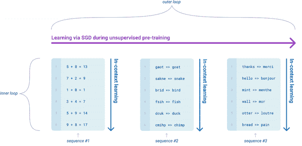
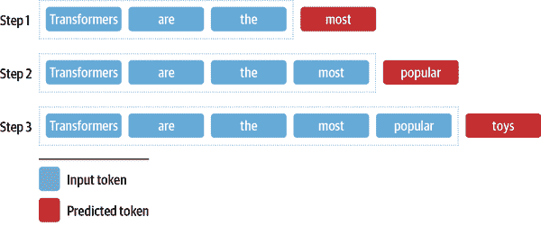
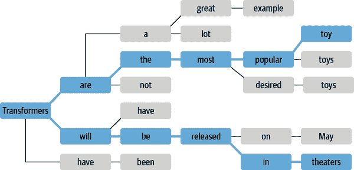
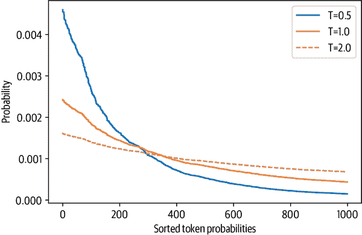
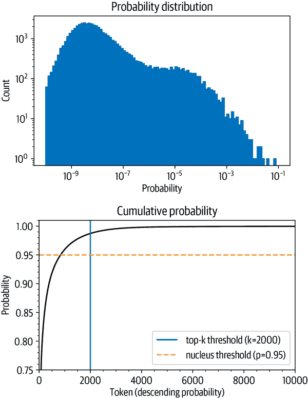

# 第五章：文本生成

基于 Transformer 的语言模型最令人不安的特点之一是它们生成的文本几乎无法与人类写的文本区分开。一个著名的例子是 OpenAI 的 GPT-2，当给出以下提示时：¹

> 在一个令人震惊的发现中，科学家们发现了一群生活在安第斯山脉偏远、以前未被探索过的山谷中的独角兽。更令研究人员感到惊讶的是，这些独角兽竟然讲着一口流利的英语。

能够生成一篇关于说话的独角兽的引人入胜的新闻文章：

> 科学家们根据它们独特的角，将这一种群命名为奥维德独角兽。这种四角、银白色的独角兽以前对科学界来说是未知的。现在，经过将近两个世纪的时间，这一奇怪现象的起因终于得到了解决。拉巴斯大学的进化生物学家豪尔赫·佩雷斯博士和几个同伴在探索安第斯山脉时发现了一个没有其他动物或人类的小山谷。佩雷斯注意到山谷中有一个看起来像是天然喷泉的地方，周围有两座岩石和银色的雪峰。佩雷斯和其他人随后进一步探索了山谷。“当我们到达一个山峰的顶部时，水看起来是蓝色的，上面有一些水晶，”佩雷斯说。佩雷斯和他的朋友们惊讶地看到了独角兽群。这些生物可以从空中看到，而不需要移动太多就能看到它们——它们离得很近，可以触摸到它们的角。在检查这些奇怪的生物时，科学家们发现这些生物还能说一些相当规范的英语……

这个例子之所以如此引人注目，是因为它是在没有任何明确监督的情况下生成的！通过简单地学习预测数百万网页文本中的下一个单词，GPT-2 及其更强大的后代如 GPT-3 能够获得广泛的技能和模式识别能力，可以通过不同类型的输入提示来激活。图 5-1 显示了语言模型有时在预训练期间会接触到需要仅基于上下文预测下一个标记的任务序列，比如加法、单词重组和翻译。这使它们能够在微调期间或（如果模型足够大）在推断期间有效地转移这些知识。这些任务并不是提前选择的，而是在用于训练百亿参数语言模型的庞大语料库中自然发生的。



###### 图 5-1。在预训练期间，语言模型会接触到可以在推断期间进行调整的任务序列（由汤姆·布朗提供）

Transformer 生成逼真文本的能力已经导致了各种各样的应用，比如[InferKit](https://oreil.ly/I4adh)、[Write With Transformer](https://oreil.ly/ipkap)、[AI Dungeon](https://oreil.ly/8ubC1)，以及像[Google 的 Meena](https://oreil.ly/gMegC)这样的对话代理，甚至可以讲一些陈腐的笑话，就像图 5-2 中所示的那样！²


###### 图 5-2。左边是米娜，右边是一个人，米娜正在讲一个陈腐的笑话（由丹尼尔·阿迪瓦达纳和 Thang Luong 提供）

在本章中，我们将使用 GPT-2 来说明语言模型的文本生成工作原理，并探讨不同的解码策略如何影响生成的文本。

# 生成连贯文本的挑战

到目前为止，在本书中，我们已经专注于通过预训练和监督微调的组合来解决 NLP 任务。正如我们所看到的，对于诸如序列或标记分类的任务特定头部，生成预测是相当简单的；模型产生一些 logits，我们要么取最大值得到预测类，要么应用 softmax 函数以获得每个类的预测概率。相比之下，将模型的概率输出转换为文本需要*解码方法*，这引入了一些对文本生成独特的挑战：

+   解码是*迭代*进行的，因此涉及的计算量比简单地通过模型的前向传递一次传递输入要多得多。

+   生成的文本的*质量*和*多样性*取决于解码方法和相关超参数的选择。

为了理解这个解码过程是如何工作的，让我们从检查 GPT-2 是如何预训练和随后应用于生成文本开始。

与其他*自回归*或*因果语言模型*一样，GPT-2 被预训练来估计在给定一些初始提示或上下文序列<math alttext="bold x equals x 1 comma x 2 comma ellipsis x Subscript k Baseline"><mrow><mi>𝐱</mi> <mo>=</mo> <msub><mi>x</mi> <mn>1</mn></msub> <mo>,</mo> <msub><mi>x</mi> <mn>2</mn></msub> <mo>,</mo> <mo>...</mo> <msub><mi>x</mi> <mi>k</mi></msub></mrow></math>的情况下，估计文本中出现的一系列标记<math alttext="bold y equals y 1 comma y 2 comma ellipsis y Subscript t Baseline"><mrow><mi>𝐲</mi> <mo>=</mo> <msub><mi>y</mi> <mn>1</mn></msub> <mo>,</mo> <msub><mi>y</mi> <mn>2</mn></msub> <mo>,</mo> <mo>...</mo> <msub><mi>y</mi> <mi>t</mi></msub></mrow></math>的概率<mrow><mi>P</mi> <mo>(</mo> <mi>𝐲</mi> <mo>|</mo> <mi>𝐱</mi> <mo>)</mo></mrow>。由于直接获取足够的训练数据来估计<math alttext="upper P left-parenthesis bold y vertical-bar bold x right-parenthesis"><mrow><mi>P</mi> <mo>(</mo> <mi>𝐲</mi> <mo>|</mo> <mi>𝐱</mi> <mo>)</mo></mrow></math>是不切实际的，因此通常使用概率的链式法则将其分解为*条件*概率的乘积：

<math alttext="upper P left-parenthesis y 1 comma ellipsis comma y Subscript t Baseline vertical-bar bold x right-parenthesis equals product Underscript t equals 1 Overscript upper N Endscripts upper P left-parenthesis y Subscript t Baseline vertical-bar y Subscript t Baseline comma bold x right-parenthesis" display="block"><mrow><mi>P</mi> <mrow><mo>(</mo> <msub><mi>y</mi> <mn>1</mn></msub> <mo>,</mo> <mo>...</mo> <mo>,</mo> <msub><mi>y</mi> <mi>t</mi></msub> <mo>|</mo> <mi>𝐱</mi> <mo>)</mo></mrow> <mo>=</mo> <munderover><mo>∏</mo> <mrow><mi>t</mi><mo>=</mo><mn>1</mn></mrow> <mi>N</mi></munderover> <mi>P</mi> <mrow><mo>(</mo> <msub><mi>y</mi> <mi>t</mi></msub> <mo>|</mo> <msub><mi>y</mi> <mrow><mo><</mo><mi>t</mi></mrow></msub> <mo>,</mo> <mi>𝐱</mi> <mo>)</mo></mrow></mrow></math>

其中<math alttext="y Subscript t"><msub><mi>y</mi> <mrow><mo><</mo><mi>t</mi></mrow></msub></math>是序列<math alttext="y 1 comma ellipsis comma y Subscript t minus 1 Baseline"><mrow><msub><mi>y</mi> <mn>1</mn></msub> <mo>,</mo> <mo>...</mo> <mo>,</mo> <msub><mi>y</mi> <mrow><mi>t</mi><mo>-</mo><mn>1</mn></mrow></msub></mrow></math>的简写符号。我们从这些条件概率中得到的直觉是，自回归语言建模等于在给定句子中的前面单词的情况下预测每个单词；这正是前面方程右边的概率描述的内容。请注意，这种预训练目标与 BERT 的目标非常不同，BERT 利用*过去*和*未来*上下文来预测*掩码*标记。

到目前为止，您可能已经猜到了我们如何将下一个标记预测任务调整为生成任意长度的文本序列。如图 5-3 所示，我们从一个提示开始，比如“Transformer 是”，然后使用模型预测下一个标记。一旦确定了下一个标记，我们将其附加到提示上，然后使用新的输入序列生成另一个标记。我们一直这样做，直到达到特殊的序列结束标记或预定义的最大长度。



###### 图 5-3。通过在每个步骤向输入添加一个新单词来从输入序列生成文本

###### 注意

由于输出序列*取决于*输入提示的选择，这种类型的文本生成通常被称为*条件文本生成*。

这个过程的核心是一个解码方法，它确定在每个时间步骤选择哪个标记。由于语言模型头在每个步骤的词汇表中为每个标记生成一个 logit <math alttext="z Subscript t comma i"><msub><mi>z</mi> <mrow><mi>t</mi><mo>,</mo><mi>i</mi></mrow></msub></math>，我们可以通过使用 softmax 得到下一个可能标记<math alttext="w Subscript i"><msub><mi>w</mi> <mi>i</mi></msub></math>的概率分布：

<math alttext="upper P left-parenthesis y Subscript t Baseline equals w Subscript i Baseline vertical-bar y Subscript t Baseline comma bold x right-parenthesis equals normal s normal o normal f normal t normal m normal a normal x left-parenthesis z Subscript t comma i Baseline right-parenthesis" display="block"><mrow><mi>P</mi> <mrow><mo>(</mo> <msub><mi>y</mi> <mi>t</mi></msub> <mo>=</mo> <msub><mi>w</mi> <mi>i</mi></msub> <mo>|</mo> <msub><mi>y</mi> <mrow><mo><</mo><mi>t</mi></mrow></msub> <mo>,</mo> <mi>𝐱</mi> <mo>)</mo></mrow> <mo>=</mo> <mi>softmax</mi> <mrow><mo>(</mo> <msub><mi>z</mi> <mrow><mi>t</mi><mo>,</mo><mi>i</mi></mrow></msub> <mo>)</mo></mrow></mrow></math>

大多数解码方法的目标是通过选择<math alttext="ModifyingAbove bold y With caret"><mover accent="true"><mi>𝐲</mi> <mo>^</mo></mover></math>来搜索最可能的整体序列，使得：

<math alttext="ModifyingAbove bold y With caret equals a r g m a x Underscript bold y Endscripts upper P left-parenthesis bold y vertical-bar bold x right-parenthesis" display="block"><mrow><mover accent="true"><mi>𝐲</mi> <mo>^</mo></mover> <mo>=</mo> <munder><mo form="prefix">argmax</mo> <mi>𝐲</mi></munder> <mi>P</mi> <mrow><mo>(</mo> <mi>𝐲</mi> <mo>|</mo> <mi>𝐱</mi> <mo>)</mo></mrow></mrow></math>

直接找到<math alttext="ModifyingAbove bold y With caret"><mover accent="true"><mi>𝐲</mi> <mo>^</mo></mover></math>将涉及评估语言模型的每个可能序列。由于不存在可以在合理时间内执行此操作的算法，因此我们依赖于近似。在本章中，我们将探讨其中一些近似，并逐渐构建更聪明和更复杂的算法，这些算法可以用于生成高质量的文本。

# 贪婪搜索解码

从模型的连续输出中获得离散标记的最简单解码方法是在每个时间步骤贪婪地选择具有最高概率的标记：

<math alttext="ModifyingAbove y With caret Subscript t Baseline equals a r g m a x Underscript y Subscript t Baseline Endscripts upper P left-parenthesis y Subscript t Baseline vertical-bar y Subscript t Baseline comma bold x right-parenthesis" display="block"><mrow><msub><mover accent="true"><mi>y</mi> <mo>^</mo></mover> <mi>t</mi></msub> <mo>=</mo> <munder><mo form="prefix">argmax</mo> <msub><mi>y</mi> <mi>t</mi></msub></munder> <mi>P</mi> <mrow><mo>(</mo> <msub><mi>y</mi> <mi>t</mi></msub> <mo>|</mo> <msub><mi>y</mi> <mrow><mo><</mo><mi>t</mi></mrow></msub> <mo>,</mo> <mi>𝐱</mi> <mo>)</mo></mrow></mrow></math>

为了看看贪婪搜索是如何工作的，让我们从加载带有语言建模头的 GPT-2 的 15 亿参数版本开始：³

```py
import torch
from transformers import AutoTokenizer, AutoModelForCausalLM

device = "cuda" if torch.cuda.is_available() else "cpu"
model_name = "gpt2-xl"
tokenizer = AutoTokenizer.from_pretrained(model_name)
model = AutoModelForCausalLM.from_pretrained(model_name).to(device)
```

现在让我们生成一些文本！虽然  Transformers 为 GPT-2 这样的自回归模型提供了 `generate()` 函数，但我们将自己实现这种解码方法，以了解底层发生了什么。为了热身，我们将采用图 5-3 中显示的相同的迭代方法：我们将使用“Transformers are the”作为输入提示，并运行八个时间步的解码。在每个时间步，我们挑选出模型对提示中最后一个标记的 logits，并用 softmax 包装它们以获得概率分布。然后我们选择具有最高概率的下一个标记，将其添加到输入序列中，然后再次运行该过程。以下代码完成了这项工作，并且还存储了每个时间步的五个最有可能的标记，以便我们可以可视化替代方案：

```py
import pandas as pd

input_txt = "Transformers are the"
input_ids = tokenizer(input_txt, return_tensors="pt")["input_ids"].to(device)
iterations = []
n_steps = 8
choices_per_step = 5

with torch.no_grad():
    for _ in range(n_steps):
        iteration = dict()
        iteration["Input"] = tokenizer.decode(input_ids[0])
        output = model(input_ids=input_ids)
        # Select logits of the first batch and the last token and apply softmax
        next_token_logits = output.logits[0, -1, :]
        next_token_probs = torch.softmax(next_token_logits, dim=-1)
        sorted_ids = torch.argsort(next_token_probs, dim=-1, descending=True)
        # Store tokens with highest probabilities
        for choice_idx in range(choices_per_step):
            token_id = sorted_ids[choice_idx]
            token_prob = next_token_probs[token_id].cpu().numpy()
            token_choice = (
                f"{tokenizer.decode(token_id)} ({100 * token_prob:.2f}%)"
            )
            iteration[f"Choice {choice_idx+1}"] = token_choice
        # Append predicted next token to input
        input_ids = torch.cat([input_ids, sorted_ids[None, 0, None]], dim=-1)
        iterations.append(iteration)

pd.DataFrame(iterations)
```

|  | 输入 | 选择 1 | 选择 2 | 选择 3 | 选择 4 | 选择 5 |
| --- | --- | --- | --- | --- | --- | --- |
| 0 | Transformers are the | most (8.53%) | only (4.96%) | best (4.65%) | Transformers (4.37%) | ultimate (2.16%) |
| 1 | Transformers are the most | popular (16.78%) | powerful (5.37%) | common (4.96%) | famous (3.72%) | successful (3.20%) |
| 2 | Transformers are the most popular | toy (10.63%) | toys (7.23%) | Transformers (6.60%) | of (5.46%) | and (3.76%) |
| 3 | Transformers are the most popular toy | line (34.38%) | in (18.20%) | of (11.71%) | brand (6.10%) | line (2.69%) |
| 4 | Transformers are the most popular toy line | in (46.28%) | of (15.09%) | , (4.94%) | on (4.40%) | ever (2.72%) |
| 5 | Transformers are the most popular toy line in | the (65.99%) | history (12.42%) | America (6.91%) | Japan (2.44%) | North (1.40%) |
| 6 | Transformers are the most popular toy line in the | world (69.26%) | United (4.55%) | history (4.29%) | US (4.23%) | U (2.30%) |
| 7 | Transformers are the most popular toy line in the world | , (39.73%) | . (30.64%) | and (9.87%) | with (2.32%) | today (1.74%) |

通过这种简单的方法，我们能够生成句子“Transformers are the most popular toy line in the world”。有趣的是，这表明 GPT-2 已经内化了一些关于变形金刚媒体特许经营的知识，这是由两家玩具公司（孩之宝和 Takara Tomy）创造的。我们还可以看到每一步的其他可能的延续，这显示了文本生成的迭代性质。与其他任务（如序列分类）不同，在那些任务中，单次前向传递就足以生成预测，而在文本生成中，我们需要逐个解码输出标记。

实现贪婪搜索并不太难，但我们希望使用来自  Transformers 的内置 `generate()` 函数来探索更复杂的解码方法。为了重现我们的简单示例，让我们确保抽样被关闭（默认情况下关闭，除非您从加载检查点的特定模型配置中另有说明），并指定 `max_new_tokens` 为新生成标记的数量：

```py
input_ids = tokenizer(input_txt, return_tensors="pt")["input_ids"].to(device)
output = model.generate(input_ids, max_new_tokens=n_steps, do_sample=False)
print(tokenizer.decode(output[0]))
```

```py
Transformers are the most popular toy line in the world,
```

现在让我们尝试一些更有趣的东西：我们能否重现 OpenAI 的独角兽故事？与之前一样，我们将使用分词器对提示进行编码，并为 `max_length` 指定一个较大的值，以生成更长的文本序列。

```py
max_length = 128
input_txt = """In a shocking finding, scientist discovered \
a herd of unicorns living in a remote, previously unexplored \
valley, in the Andes Mountains. Even more surprising to the \
researchers was the fact that the unicorns spoke perfect English.\n\n `"""`
input_ids = tokenizer(input_txt, return_tensors="pt")["input_ids"].to(device)
output_greedy = model.generate(input_ids, max_length=max_length,
                               do_sample=False)
print(tokenizer.decode(output_greedy[0]))
```

```py
In a shocking finding, scientist discovered a herd of unicorns living in a
remote, previously unexplored valley, in the Andes Mountains. Even more
surprising to the researchers was the fact that the unicorns spoke perfect
English.

The researchers, from the University of California, Davis, and the University of
Colorado, Boulder, were conducting a study on the Andean cloud forest, which is
home to the rare species of cloud forest trees.

The researchers were surprised to find that the unicorns were able to
communicate with each other, and even with humans.

The researchers were surprised to find that the unicorns were able
```

嗯，前几句与 OpenAI 的示例有很大不同，有趣的是涉及到不同的大学被认为是发现者！我们还可以看到贪婪搜索解码的一个主要缺点：它倾向于产生重复的输出序列，在新闻文章中显然是不可取的。这是贪婪搜索算法的一个常见问题，它可能无法给出最佳解决方案；在解码的上下文中，它可能会错过整体概率更高的词序列，只是因为高概率的词恰好是由低概率的词前导的。

幸运的是，我们可以做得更好——让我们来看一种被称为*束搜索解码*的流行方法。

###### 注意

尽管贪婪搜索解码在需要多样性的文本生成任务中很少使用，但它对于生成像算术这样需要确定性和事实正确的输出的短序列是有用的。⁴ 对于这些任务，您可以通过提供格式为`"5 + 8 => 13 \n 7 + 2 => 9 \n 1 + 0 =>"`的几个以换行符分隔的示例来对 GPT-2 进行条件设置。`  `#束搜索解码

束搜索不是在每一步解码时选择具有最高概率的标记，而是跟踪前*b*个最有可能的下一个标记，其中*b*被称为*束*或*部分假设*的数量。下一组束是通过考虑现有集合的所有可能的下一个标记扩展，并选择*b*个最有可能的扩展来选择的。这个过程重复进行，直到达到最大长度或 EOS 标记，并且通过根据它们的对数概率对*b*束进行排名来选择最有可能的序列。束搜索的一个示例显示在图 5-4 中。



###### 图 5-4。具有两个束的束搜索

为什么我们要使用对数概率而不是概率本身来对序列进行评分？计算序列的总体概率<math alttext="upper P left-parenthesis y 1 comma y 2 comma ellipsis comma y Subscript t Baseline vertical-bar bold x right-parenthesis"><mrow><mi>P</mi> <mo>(</mo> <msub><mi>y</mi> <mn>1</mn></msub> <mo>,</mo> <msub><mi>y</mi> <mn>2</mn></msub> <mo>,</mo> <mo>...</mo> <mo>,</mo> <msub><mi>y</mi> <mi>t</mi></msub> <mo>|</mo> <mi>𝐱</mi> <mo>)</mo></mrow></math>涉及计算条件概率<math alttext="upper P left-parenthesis y Subscript t Baseline vertical-bar y Subscript t Baseline comma bold x right-parenthesis"><mrow><mi>P</mi> <mo>(</mo> <msub><mi>y</mi> <mi>t</mi></msub> <mo>|</mo> <msub><mi>y</mi> <mrow><mo><</mo><mi>t</mi></mrow></msub> <mo>,</mo> <mi>𝐱</mi> <mo>)</mo></mrow></math>的*乘积*是一个原因。由于每个条件概率通常是在[ <math alttext="0 comma 1"><mrow><mn>0</mn> <mo>,</mo> <mn>1</mn></mrow></math> ]范围内的一个小数，取它们的乘积可能导致总体概率很容易下溢。这意味着计算机不能准确地表示计算结果。例如，假设我们有一个包含<math alttext="t equals 1024"><mrow><mi>t</mi> <mo>=</mo> <mn>1024</mn></mrow></math>个标记的序列，并慷慨地假设每个标记的概率为 0.5。这个序列的总体概率是一个极小的数：

```py
0.5 ** 1024
```

```py
5.562684646268003e-309
```

这导致了数值不稳定，因为我们遇到了下溢。我们可以通过计算一个相关的术语，即对数概率来避免这种情况。如果我们对联合和条件概率应用对数，然后借助对数的乘法规则，我们得到：

<math alttext="log upper P left-parenthesis y 1 comma ellipsis y Subscript t Baseline vertical-bar bold x right-parenthesis equals sigma-summation Underscript t equals 1 Overscript upper N Endscripts log upper P left-parenthesis y Subscript t Baseline vertical-bar y Subscript t Baseline comma bold x right-parenthesis" display="block"><mrow><mo form="prefix">log</mo> <mi>P</mi> <mrow><mo>(</mo> <msub><mi>y</mi> <mn>1</mn></msub> <mo>,</mo> <mo>...</mo> <msub><mi>y</mi> <mi>t</mi></msub> <mo>|</mo> <mi>𝐱</mi> <mo>)</mo></mrow> <mo>=</mo> <munderover><mo>∑</mo> <mrow><mi>t</mi><mo>=</mo><mn>1</mn></mrow> <mi>N</mi></munderover> <mo form="prefix">log</mo> <mi>P</mi> <mrow><mo>(</mo> <msub><mi>y</mi> <mi>t</mi></msub> <mo>|</mo> <msub><mi>y</mi> <mrow><mo><</mo><mi>t</mi></mrow></msub> <mo>,</mo> <mi>𝐱</mi> <mo>)</mo></mrow></mrow></math>

换句话说，我们之前看到的概率乘积变成了对数概率的总和，这样就不太可能遇到数值不稳定性的问题。例如，计算与之前相同示例的对数概率为：

```py
import numpy as np

sum([np.log(0.5)] * 1024)
```

```py
-709.7827128933695
```

这是一个我们可以轻松处理的数字，这种方法对于更小的数字仍然有效。因为我们只想比较相对概率，所以我们可以直接使用对数概率进行比较。

让我们计算并比较贪婪搜索和束搜索生成的文本的对数概率，看看束搜索是否可以提高整体概率。由于  Transformers 模型返回给定输入标记的下一个标记的非归一化 logits，我们首先需要对 logits 进行归一化，以创建整个词汇表上每个标记的概率分布。然后我们需要选择仅出现在序列中的标记概率。以下函数实现了这些步骤：

```py
import torch.nn.functional as F

def log_probs_from_logits(logits, labels):
    logp = F.log_softmax(logits, dim=-1)
    logp_label = torch.gather(logp, 2, labels.unsqueeze(2)).squeeze(-1)
    return logp_label
```

这给我们了单个标记的对数概率，所以要得到序列的总对数概率，我们只需要对每个标记的对数概率求和：

```py
def sequence_logprob(model, labels, input_len=0):
    with torch.no_grad():
        output = model(labels)
        log_probs = log_probs_from_logits(
            output.logits[:, :-1, :], labels[:, 1:])
        seq_log_prob = torch.sum(log_probs[:, input_len:])
    return seq_log_prob.cpu().numpy()
```

请注意，我们忽略输入序列的对数概率，因为它们不是模型生成的。我们还可以看到对齐 logits 和标签的重要性；因为模型预测下一个标记，我们不会得到第一个标签的 logit，并且我们不需要最后一个 logit，因为我们没有它的真实标记。

让我们首先使用这些函数来计算 OpenAI 提示中贪婪解码器的序列对数概率：

```py
logp = sequence_logprob(model, output_greedy, input_len=len(input_ids[0]))
print(tokenizer.decode(output_greedy[0]))
print(f"\nlog-prob: {logp:.2f}")
```

```py
In a shocking finding, scientist discovered a herd of unicorns living in a
remote, previously unexplored valley, in the Andes Mountains. Even more
surprising to the researchers was the fact that the unicorns spoke perfect
English.

The researchers, from the University of California, Davis, and the University of
Colorado, Boulder, were conducting a study on the Andean cloud forest, which is
home to the rare species of cloud forest trees.

The researchers were surprised to find that the unicorns were able to
communicate with each other, and even with humans.

The researchers were surprised to find that the unicorns were able

log-prob: -87.43
```

现在让我们将其与使用束搜索生成的序列进行比较。要使用`generate()`函数激活束搜索，我们只需要使用`num_beams`参数指定束的数量。我们选择的束数越多，结果可能就越好；然而，生成过程变得更慢，因为我们为每个束生成并行序列：

```py
output_beam = model.generate(input_ids, max_length=max_length, num_beams=5,
                             do_sample=False)
logp = sequence_logprob(model, output_beam, input_len=len(input_ids[0]))
print(tokenizer.decode(output_beam[0]))
print(f"\nlog-prob: {logp:.2f}")
```

```py
In a shocking finding, scientist discovered a herd of unicorns living in a
remote, previously unexplored valley, in the Andes Mountains. Even more
surprising to the researchers was the fact that the unicorns spoke perfect
English.

The discovery of the unicorns was made by a team of scientists from the
University of California, Santa Cruz, and the National Geographic Society.

The scientists were conducting a study of the Andes Mountains when they
discovered a herd of unicorns living in a remote, previously unexplored valley,
in the Andes Mountains. Even more surprising to the researchers was the fact
that the unicorns spoke perfect English

log-prob: -55.23
```

我们可以看到，使用束搜索得到的对数概率（越高越好）比简单的贪婪解码要好。然而，我们也可以看到束搜索也存在重复的文本问题。解决这个问题的一种方法是使用`no_repeat_ngram_size`参数来施加*n*-gram 惩罚，该参数跟踪已经看到的*n*-gram，并且如果生成的下一个标记会产生先前看到的*n*-gram，则将其概率设置为零：

```py
output_beam = model.generate(input_ids, max_length=max_length, num_beams=5,
                             do_sample=False, no_repeat_ngram_size=2)
logp = sequence_logprob(model, output_beam, input_len=len(input_ids[0]))
print(tokenizer.decode(output_beam[0]))
print(f"\nlog-prob: {logp:.2f}")
```

```py
In a shocking finding, scientist discovered a herd of unicorns living in a
remote, previously unexplored valley, in the Andes Mountains. Even more
surprising to the researchers was the fact that the unicorns spoke perfect
English.

The discovery was made by a team of scientists from the University of
California, Santa Cruz, and the National Geographic Society.

According to a press release, the scientists were conducting a survey of the
area when they came across the herd. They were surprised to find that they were
able to converse with the animals in English, even though they had never seen a
unicorn in person before. The researchers were

log-prob: -93.12
```

这并不太糟糕！我们成功地停止了重复，并且可以看到，尽管产生了较低的分数，文本仍然连贯。带有*n*-gram 惩罚的波束搜索是一种很好的方法，可以在关注高概率标记（使用波束搜索）的同时减少重复（使用*n*-gram 惩罚），在摘要或机器翻译等需要事实正确性的应用中通常使用。当事实正确性不如生成输出的多样性重要时，例如在开放域闲聊或故事生成中，另一种减少重复并提高多样性的替代方法是使用抽样。让我们通过检查一些最常见的抽样方法来完成我们对文本生成的探索。

# 抽样方法

最简单的抽样方法是在每个时间步从模型输出的概率分布中随机抽样整个词汇表：

<math alttext="upper P left-parenthesis y Subscript t Baseline equals w Subscript i Baseline vertical-bar y Subscript t Baseline comma bold x right-parenthesis equals normal s normal o normal f normal t normal m normal a normal x left-parenthesis z Subscript t comma i Baseline right-parenthesis equals StartFraction exp left-parenthesis z Subscript t comma i Baseline right-parenthesis Over sigma-summation Underscript j equals 1 Overscript StartAbsoluteValue upper V EndAbsoluteValue Endscripts exp left-parenthesis z Subscript t comma j Baseline right-parenthesis EndFraction" display="block"><mrow><mi>P</mi> <mrow><mo>(</mo> <msub><mi>y</mi> <mi>t</mi></msub> <mo>=</mo> <msub><mi>w</mi> <mi>i</mi></msub> <mo>|</mo> <msub><mi>y</mi> <mrow><mo><</mo><mi>t</mi></mrow></msub> <mo>,</mo> <mi>𝐱</mi> <mo>)</mo></mrow> <mo>=</mo> <mi>softmax</mi> <mrow><mo>(</mo> <msub><mi>z</mi> <mrow><mi>t</mi><mo>,</mo><mi>i</mi></mrow></msub> <mo>)</mo></mrow> <mo>=</mo> <mfrac><mrow><mo form="prefix">exp</mo><mo>(</mo><msub><mi>z</mi> <mrow><mi>t</mi><mo>,</mo><mi>i</mi></mrow></msub> <mo>)</mo></mrow> <mrow><msubsup><mo>∑</mo> <mrow><mi>j</mi><mo>=</mo><mn>1</mn></mrow> <mrow><mo>|</mo><mi>V</mi><mo>|</mo></mrow></msubsup> <mo form="prefix">exp</mo><mrow><mo>(</mo><msub><mi>z</mi> <mrow><mi>t</mi><mo>,</mo><mi>j</mi></mrow></msub> <mo>)</mo></mrow></mrow></mfrac></mrow></math>

其中<math alttext="StartAbsoluteValue upper V EndAbsoluteValue"><mrow><mo>|</mo> <mi>V</mi> <mo>|</mo></mrow></math>表示词汇表的基数。我们可以通过添加一个温度参数*T*来控制输出的多样性，该参数在进行 softmax 之前重新调整 logits：

<math alttext="upper P left-parenthesis y Subscript t Baseline equals w Subscript i Baseline vertical-bar y Subscript t Baseline comma bold x right-parenthesis equals StartFraction exp left-parenthesis z Subscript t comma i Baseline slash upper T right-parenthesis Over sigma-summation Underscript j equals 1 Overscript StartAbsoluteValue upper V EndAbsoluteValue Endscripts exp left-parenthesis z Subscript t comma j Baseline slash upper T right-parenthesis EndFraction" display="block"><mrow><mi>P</mi> <mrow><mo>(</mo> <msub><mi>y</mi> <mi>t</mi></msub> <mo>=</mo> <msub><mi>w</mi> <mi>i</mi></msub> <mo>|</mo> <msub><mi>y</mi> <mrow><mo><</mo><mi>t</mi></mrow></msub> <mo>,</mo> <mi>𝐱</mi> <mo>)</mo></mrow> <mo>=</mo> <mfrac><mrow><mo form="prefix">exp</mo><mo>(</mo><msub><mi>z</mi> <mrow><mi>t</mi><mo>,</mo><mi>i</mi></mrow></msub> <mo>/</mo><mi>T</mi><mo>)</mo></mrow> <mrow><msubsup><mo>∑</mo> <mrow><mi>j</mi><mo>=</mo><mn>1</mn></mrow> <mrow><mo>|</mo><mi>V</mi><mo>|</mo></mrow></msubsup> <mo form="prefix">exp</mo><mrow><mo>(</mo><msub><mi>z</mi> <mrow><mi>t</mi><mo>,</mo><mi>j</mi></mrow></msub> <mo>/</mo><mi>T</mi><mo>)</mo></mrow></mrow></mfrac></mrow></math>

通过调整*T*，我们可以控制概率分布的形状。⁵ 当<math alttext="upper T much-less-than 1"><mrow><mi>T</mi> <mo>≪</mo> <mn>1</mn></mrow></math>时，分布在原点附近呈峰值，罕见的标记被抑制。另一方面，当<math alttext="upper T much-greater-than 1"><mrow><mi>T</mi> <mo>≫</mo> <mn>1</mn></mrow></math>时，分布变得平坦，每个标记变得同样可能。温度对标记概率的影响在图 5-5 中显示。



###### 图 5-5. 三个选定温度下随机生成的标记概率分布

为了看看我们如何使用温度来影响生成的文本，让我们通过在`generate()`函数中设置`temperature`参数来使用<math alttext="upper T equals 2"><mrow><mi>T</mi> <mo>=</mo> <mn>2</mn></mrow></math>进行抽样（我们将在下一节解释`top_k`参数的含义）：

```py
output_temp = model.generate(input_ids, max_length=max_length, do_sample=True,
                             temperature=2.0, top_k=0)
print(tokenizer.decode(output_temp[0]))
```

```py
In a shocking finding, scientist discovered a herd of unicorns living in a
remote, previously unexplored valley, in the Andes Mountains. Even more
surprising to the researchers was the fact that the unicorns spoke perfect
English.

While the station aren protagonist receive Pengala nostalgiates tidbitRegarding
Jenny loclonju AgreementCON irrational �rite Continent seaf A jer Turner
Dorbecue WILL Pumpkin mere Thatvernuildagain YoAniamond disse *
Runewitingkusstemprop});b zo coachinginventorymodules deflation press
Vaticanpres Wrestling chargesThingsctureddong Ty physician PET KimBi66 graz Oz
at aff da temporou MD6 radi iter
```

我们可以清楚地看到，高温大多产生了胡言乱语；通过突出罕见的标记，我们导致模型创建了奇怪的语法和相当多的虚构词！让我们看看如果我们降低温度会发生什么：

```py
output_temp = model.generate(input_ids, max_length=max_length, do_sample=True,
                             temperature=0.5, top_k=0)
print(tokenizer.decode(output_temp[0]))
```

```py
In a shocking finding, scientist discovered a herd of unicorns living in a
remote, previously unexplored valley, in the Andes Mountains. Even more
surprising to the researchers was the fact that the unicorns spoke perfect
English.

The scientists were searching for the source of the mysterious sound, which was
making the animals laugh and cry.

The unicorns were living in a remote valley in the Andes mountains

'When we first heard the noise of the animals, we thought it was a lion or a
tiger,' said Luis Guzman, a researcher from the University of Buenos Aires,
Argentina.

'But when
```

这显然更加连贯，甚至包括了另一所大学被认为是发现的引用！我们可以从温度中得出的主要教训是，它允许我们控制样本的质量，但在连贯性（低温）和多样性（高温）之间总是存在一个权衡，需要根据手头的使用情况进行调整。

调整连贯性和多样性之间的权衡的另一种方法是截断词汇的分布。这使我们能够通过温度自由调整多样性，但在一个更有限的范围内，排除了在上下文中太奇怪的单词（即低概率单词）。有两种主要方法可以做到这一点：top-*k*和核（或 top-*p*）抽样。让我们来看看。

# Top-k 和核抽样

Top-*k*和核（top-*p*）抽样是使用温度的两种流行的替代方法或扩展。在这两种情况下，基本思想是限制我们可以在每个时间步骤从中抽样的可能标记的数量。为了了解这是如何工作的，让我们首先可视化模型在<math alttext="upper T equals 1"><mrow><mi>T</mi> <mo>=</mo> <mn>1</mn></mrow></math>时的累积概率分布，如图 5-6 中所示。

让我们分解这些图表，因为它们包含了大量信息。在上图中，我们可以看到标记概率的直方图。它在<math alttext="10 Superscript negative 8"><msup><mn>10</mn> <mrow><mo>-</mo><mn>8</mn></mrow></msup></math>左右有一个峰值，然后在<math alttext="10 Superscript negative 4"><msup><mn>10</mn> <mrow><mo>-</mo><mn>4</mn></mrow></msup></math>左右有第二个较小的峰值，接着急剧下降，只有少数标记的概率在<math alttext="10 Superscript negative 2"><msup><mn>10</mn> <mrow><mo>-</mo><mn>2</mn></mrow></msup></math>和<math alttext="10 Superscript negative 1"><msup><mn>10</mn> <mrow><mo>-</mo><mn>1</mn></mrow></msup></math>之间。从这个图表中，我们可以看到选择具有最高概率的标记（在<math alttext="10 Superscript negative 1"><msup><mn>10</mn> <mrow><mo>-</mo><mn>1</mn></mrow></msup></math>处的孤立条）的概率是 10 中的 1。



###### 图 5-6. 下一个标记预测的概率分布（上）和下降标记概率的累积分布（下）

在下图中，我们按概率降序排列了标记，并计算了前 10,000 个标记的累积和（GPT-2 的词汇表中总共有 50,257 个标记）。曲线代表选择任何前面标记的概率。例如，选择具有最高概率的 1,000 个标记的概率大约为 96%。我们看到概率在 90%以上迅速上升，但只有在几千个标记后才接近 100%。图表显示，有 100 分之一的机会不选择任何不在前 2,000 位的标记。

尽管这些数字乍一看可能很小，但它们变得重要，因为在生成文本时，我们每个标记只采样一次。因此，即使只有 100 分之一或 1000 分之一的几率，如果我们采样数百次，就有很大的机会在某个时候选择到一个不太可能的标记，并且在采样时选择这些标记可能会严重影响生成文本的质量。因此，我们通常希望避免这些非常不太可能的标记。这就是 top-*k*和 top-*p*采样发挥作用的地方。

top-*k*采样的理念是通过仅从具有最高概率的*k*个标记中进行采样来避免低概率的选择。这对分布的长尾部分进行了固定的截断，并确保我们只从可能的选择中进行采样。回到图 5-6，top-*k*采样相当于定义一条垂直线，并从左侧的标记中进行采样。同样，`generate()`函数提供了一个使用`top_k`参数轻松实现这一点的方法：

```py
output_topk = model.generate(input_ids, max_length=max_length, do_sample=True,
                             top_k=50)
print(tokenizer.decode(output_topk[0]))
```

```py
In a shocking finding, scientist discovered a herd of unicorns living in a
remote, previously unexplored valley, in the Andes Mountains. Even more
surprising to the researchers was the fact that the unicorns spoke perfect
English.

The wild unicorns roam the Andes Mountains in the region of Cajamarca, on the
border with Argentina (Picture: Alamy/Ecole Nationale Supérieure d'Histoire
Naturelle)

The researchers came across about 50 of the animals in the valley. They had
lived in such a remote and isolated area at that location for nearly a thousand
years that
```

这可能是我们迄今为止生成的最接近人类的文本。但是我们如何选择*k*？*k*的值是手动选择的，并且对于序列中的每个选择都是相同的，独立于实际的输出分布。我们可以通过查看一些文本质量指标来找到*k*的合适值，我们将在下一章中探讨这些指标，但是这种固定的截断可能并不令人满意。

另一种选择是使用*动态*截断。使用核或 top-*p*采样时，我们不是选择固定的截断值，而是设置一个截断条件。这个条件是在选择中达到一定的概率质量时截断。假设我们将该值设置为 95%。然后，我们按概率降序排列所有标记，并从列表顶部逐个添加标记，直到所选标记的概率总和达到 95%。回到图 5-6，*p*的值定义了累积概率图上的水平线，并且我们只从线下的标记中进行采样。根据输出分布，这可能只是一个（非常可能的）标记，也可能是一百个（同等可能的）标记。在这一点上，您可能不会感到惊讶，`generate()`函数还提供了一个参数来激活 top-*p*采样。让我们试一试：

```py
output_topp = model.generate(input_ids, max_length=max_length, do_sample=True,
                             top_p=0.90)
print(tokenizer.decode(output_topp[0]))
```

```py
In a shocking finding, scientist discovered a herd of unicorns living in a
remote, previously unexplored valley, in the Andes Mountains. Even more
surprising to the researchers was the fact that the unicorns spoke perfect
English.

The scientists studied the DNA of the animals and came to the conclusion that
the herd are descendants of a prehistoric herd that lived in Argentina about
50,000 years ago.

According to the scientific analysis, the first humans who migrated to South
America migrated into the Andes Mountains from South Africa and Australia, after
the last ice age had ended.

Since their migration, the animals have been adapting to
```

Top-*p*采样也产生了一个连贯的故事，这次是关于从澳大利亚迁移到南美洲的新情节。您甚至可以结合这两种采样方法，以获得两全其美。设置`top_k=50`和`top_p=0.9`相当于选择具有 90%概率质量的标记，最多从 50 个标记中进行选择的规则。

###### 注意

当我们使用采样时，我们还可以应用束搜索。我们可以对下一批候选标记进行采样并以相同的方式构建束，而不是贪婪地选择它们。

# 哪种解码方法最好？

不幸的是，没有普遍“最佳”的解码方法。哪种方法最好将取决于你为生成文本的任务的性质。如果你希望你的模型执行精确的任务，比如算术或提供对特定问题的答案，那么你应该降低温度或使用贪婪搜索与波束搜索的确定性方法来保证得到最可能的答案。如果你希望模型生成更长的文本，甚至有点创造性，那么你应该切换到采样方法，增加温度或使用 top-*k*和核采样的混合。

# 结论

在本章中，我们研究了文本生成，这与我们之前遇到的 NLU 任务非常不同。生成文本至少需要每个生成的标记进行一次前向传递，如果使用波束搜索，甚至需要更多。这使得文本生成在计算上要求很高，需要适当的基础设施来规模化运行文本生成模型。此外，一个良好的解码策略，将模型的输出概率转换为离散标记，可以提高文本质量。找到最佳的解码策略需要一些实验和对生成的文本进行主观评价。

然而，在实践中，我们不希望仅凭直觉做出这些决定！与其他 NLP 任务一样，我们应该选择一个反映我们想要解决的问题的模型性能指标。毫不奇怪，有很多选择，我们将在下一章中遇到最常见的选择，在那里我们将看看如何训练和评估文本摘要模型。或者，如果你迫不及待地想学习如何从头开始训练 GPT 类型的模型，你可以直接跳到第十章，在那里我们收集了大量的代码数据集，然后对其进行自回归语言模型的训练。

¹ 这个例子来自 OpenAI 的[GPT-2 博客文章](https://openai.com/blog/better-language-models)。

² 然而，正如[Delip Rao 指出的](https://oreil.ly/mOM3V)，Meena 是否*打算*讲冷笑话是一个微妙的问题。

³ 如果你的机器内存不足，你可以通过将`model_name = "gpt-xl"`替换为`model_name = "gpt"`来加载一个较小的 GPT-2 版本。

⁴ N.S. Keskar 等人，[“CTRL: A Conditional Transformer Language Model for Controllable Generation”](https://arxiv.org/abs/1909.05858)，（2019）。

⁵ 如果你懂一些物理学，你可能会发现与[玻尔兹曼分布](https://oreil.ly/ZsMmx)有惊人的相似之处。
