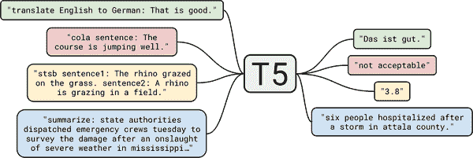
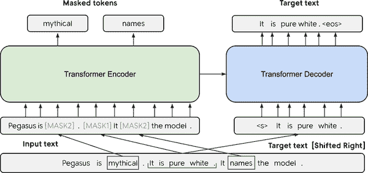
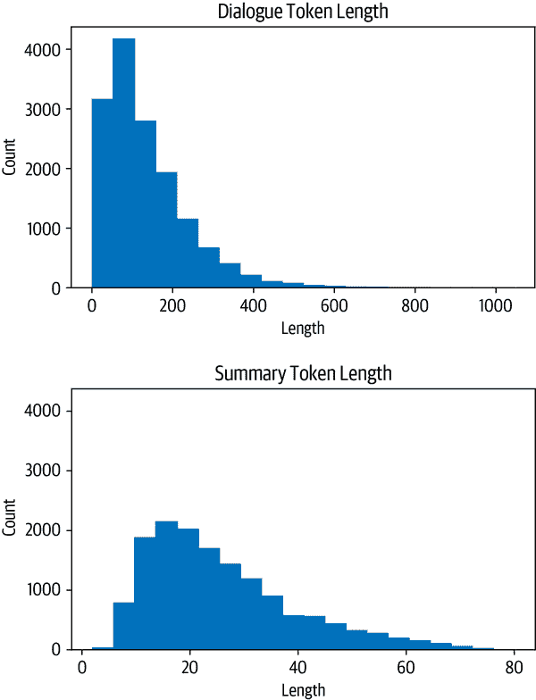

# 第六章。摘要

你可能在某个时候需要总结一篇文档，无论是研究文章、财务收益报告还是一系列电子邮件。如果你仔细想想，这需要一系列能力，比如理解长篇文章、推理内容，并产生流畅的文本，其中包含原始文档的主要主题。此外，准确总结新闻文章与总结法律合同大不相同，因此能够做到这一点需要一定程度的领域泛化。出于这些原因，文本摘要对于神经语言模型，包括变压器来说，是一项困难的任务。尽管存在这些挑战，文本摘要为领域专家提供了显著加快工作流程的可能性，并被企业用于压缩内部知识、总结合同、自动生成社交媒体发布的内容等。

为了帮助您了解涉及的挑战，本章将探讨如何利用预训练的变压器来总结文档。摘要是一个经典的序列到序列（seq2seq）任务，有一个输入文本和一个目标文本。正如我们在第一章中看到的，这正是编码器-解码器变压器擅长的地方。

在本章中，我们将构建自己的编码器-解码器模型，将几个人之间的对话压缩成简洁的摘要。但在开始之前，让我们先来看看摘要的经典数据集之一：CNN/DailyMail 语料库。

# CNN/DailyMail 数据集

CNN/DailyMail 数据集包括约 30 万对新闻文章及其相应摘要，由 CNN 和 DailyMail 附加到其文章的要点组成。数据集的一个重要方面是摘要是*抽象*的，而不是*提取*的，这意味着它们由新句子组成，而不是简单的摘录。数据集可在[Hub](https://oreil.ly/jcRmb)上找到；我们将使用 3.0.0 版本，这是为摘要设置的非匿名版本。我们可以像在第四章中看到的那样，使用`version`关键字选择版本。所以让我们深入研究一下：

```py
from datasets import load_dataset

dataset = load_dataset("cnn_dailymail", version="3.0.0")
print(f"Features: {dataset['train'].column_names}")
```

```py
Features: ['article', 'highlights', 'id']
```

数据集有三列：`文章`，其中包含新闻文章，`摘要`，其中包含摘要，以及`id`，用于唯一标识每篇文章。让我们来看一段文章摘录：

```py
sample = dataset["train"][1]
print(f"""
Article (excerpt of 500 characters, total length: {len(sample["article"])}):
""")
print(sample["article"][:500])
print(f'\nSummary (length: {len(sample["highlights"])}):')
print(sample["highlights"])

Article (excerpt of 500 characters, total length: 3192):

(CNN) -- Usain Bolt rounded off the world championships Sunday by claiming his
third gold in Moscow as he anchored Jamaica to victory in the men's 4x100m
relay. The fastest man in the world charged clear of United States rival Justin
Gatlin as the Jamaican quartet of Nesta Carter, Kemar Bailey-Cole, Nickel
Ashmeade and Bolt won in 37.36 seconds. The U.S finished second in 37.56 seconds
with Canada taking the bronze after Britain were disqualified for a faulty
handover. The 26-year-old Bolt has n

Summary (length: 180):
Usain Bolt wins third gold of world championship .
Anchors Jamaica to 4x100m relay victory .
Eighth gold at the championships for Bolt .
Jamaica double up in women's 4x100m relay .
```

我们看到，与目标摘要相比，文章可能非常长；在这种特殊情况下，差异是 17 倍。长篇文章对大多数变压器模型构成挑战，因为上下文大小通常限制在 1,000 个标记左右，相当于几段文字。对于摘要，处理这个问题的标准但粗糙的方法是简单地截断超出模型上下文大小的文本。显然，文本末尾可能有重要信息供摘要使用，但目前我们需要接受模型架构的这种限制。

# 文本摘要管道

让我们首先定性地查看前面示例的输出，看看一些最受欢迎的摘要变压器模型的表现如何。尽管我们将要探索的模型架构具有不同的最大输入大小，但让我们将输入文本限制为 2,000 个字符，以便所有模型都具有相同的输入，从而使输出更具可比性：

```py
sample_text = dataset["train"][1]["article"][:2000]
# We'll collect the generated summaries of each model in a dictionary
summaries = {}
```

摘要中的一个惯例是用换行符分隔摘要句子。我们可以在每个句号后添加一个换行符，但这种简单的启发式方法对于像“U.S.”或“U.N.”这样的字符串将失败。自然语言工具包（NLTK）包括一个更复杂的算法，可以区分句子的结束和缩写中出现的标点符号：

```py
import nltk
from nltk.tokenize import sent_tokenize

nltk.download("punkt")
```

```py
string = "The U.S. are a country. The U.N. is an organization."
sent_tokenize(string)
```

```py
['The U.S. are a country.', 'The U.N. is an organization.']
```

###### 警告

在接下来的几节中，我们将加载几个大型模型。如果内存不足，可以用较小的检查点（例如“gpt”，“t5-small”）替换大型模型，或者跳过本节，转到“在 CNN/DailyMail 数据集上评估 PEGASUS”。

## 摘要基线

摘要新闻文章的一个常见基线是简单地取文章的前三句。使用 NLTK 的句子分词器，我们可以很容易地实现这样一个基线：

```py
def three_sentence_summary(text):
    return "\n".join(sent_tokenize(text)[:3])
```

```py
summaries["baseline"] = three_sentence_summary(sample_text)
```

## GPT-2

我们已经在第五章中看到了 GPT-2 如何根据一些提示生成文本。该模型令人惊讶的一个特点是，我们还可以使用它来生成摘要，只需在输入文本末尾添加“TL;DR”。表达“TL;DR”（太长了；没看）经常在 Reddit 等平台上使用，表示长篇帖子的简短版本。我们将通过使用来自 Transformers 的`pipeline()`函数重新创建原始论文的程序开始我们的摘要实验。我们创建一个文本生成管道并加载大型 GPT-2 模型：

```py
from transformers import pipeline, set_seed

set_seed(42)
pipe = pipeline("text-generation", model="gpt2-xl")
gpt2_query = sample_text + "\nTL;DR:\n"
pipe_out = pipe(gpt2_query, max_length=512, clean_up_tokenization_spaces=True)
summaries["gpt2"] = "\n".join(
    sent_tokenize(pipe_out[0]["generated_text"][len(gpt2_query) :]))
```

在这里，我们只需存储通过切割输入查询生成的摘要，并将结果保存在 Python 字典中以供以后比较。

## T5

接下来让我们尝试 T5 变压器。正如我们在第三章中看到的，该模型的开发人员对 NLP 中的迁移学习进行了全面研究，并发现他们可以通过将所有任务制定为文本-文本任务来创建通用变压器架构。T5 检查点经过混合无监督数据（用于重建掩码单词）和监督数据的训练，包括摘要等多个任务。因此，这些检查点可以直接用于执行摘要，而无需使用预训练期间使用的相同提示进行微调。在该框架中，模型摘要文档的输入格式为`"summarize: <ARTICLE>"`，翻译的格式看起来像`"translate English to German: <TEXT>"`。如图 6-1 所示，这使得 T5 非常灵活，可以使用单个模型解决许多任务。

我们可以直接使用`pipeline()`函数加载 T5 进行摘要，该函数还负责以文本-文本格式格式化输入，因此我们不需要在其前面加上`"summarize"`：

```py
pipe = pipeline("summarization", model="t5-large")
pipe_out = pipe(sample_text)
summaries["t5"] = "\n".join(sent_tokenize(pipe_out[0]["summary_text"]))
```



###### 图 6-1。T5 的文本-文本框架图（由 Colin Raffel 提供）；除了翻译和摘要之外，还显示了 CoLA（语言可接受性）和 STSB（语义相似性）任务

## 巴特

BART 还使用了编码器-解码器架构，并且经过训练以重建损坏的输入。它结合了 BERT 和 GPT-2 的预训练方案。我们将使用`facebook/bart-large-ccn`检查点，该检查点已经在 CNN/DailyMail 数据集上进行了特定的微调：

```py
pipe = pipeline("summarization", model="facebook/bart-large-cnn")
pipe_out = pipe(sample_text)
summaries["bart"] = "\n".join(sent_tokenize(pipe_out[0]["summary_text"]))
```

## 飞马座

像 BART 一样，PEGASUS 是一种编码器-解码器变压器。如图 6-2 所示，它的预训练目标是预测多句文本中的掩码句子。作者认为，预训练目标与下游任务越接近，效果就越好。为了找到一个比通用语言建模更接近摘要的预训练目标，他们在一个非常大的语料库中自动识别了包含其周围段落大部分内容的句子（使用摘要评估指标作为内容重叠的启发式），并预训练 PEGASUS 模型以重建这些句子，从而获得了用于文本摘要的最先进模型。



###### 图 6-2。PEGASUS 架构图（由 Jingqing Zhang 等人提供）

该模型具有用于换行的特殊标记，这就是为什么我们不需要`sent_tokenize()`函数的原因：

```py
pipe = pipeline("summarization", model="google/pegasus-cnn_dailymail")
pipe_out = pipe(sample_text)
summaries["pegasus"] = pipe_out[0]["summary_text"].replace(" .<n>", ".\n")
```

# 比较不同的摘要

现在我们已经用四种不同的模型生成了摘要，让我们比较一下结果。请记住，其中一个模型根本没有在数据集上进行训练（GPT-2），一个模型在这项任务以及其他任务上进行了微调（T5），而另外两个模型则专门在这项任务上进行了微调（BART 和 PEGASUS）。让我们看看这些模型生成的摘要：

```py
print("GROUND TRUTH")
print(dataset["train"][1]["highlights"])
print("")

for model_name in summaries:
    print(model_name.upper())
    print(summaries[model_name])
    print("")
```

```py
GROUND TRUTH
Usain Bolt wins third gold of world championship .
Anchors Jamaica to 4x100m relay victory .
Eighth gold at the championships for Bolt .
Jamaica double up in women's 4x100m relay .

BASELINE
(CNN) -- Usain Bolt rounded off the world championships Sunday by claiming his
third gold in Moscow as he anchored Jamaica to victory in the men's 4x100m
relay.
The fastest man in the world charged clear of United States rival Justin Gatlin
as the Jamaican quartet of Nesta Carter, Kemar Bailey-Cole, Nickel Ashmeade and
Bolt won in 37.36 seconds.
The U.S finished second in 37.56 seconds with Canada taking the bronze after
Britain were disqualified for a faulty handover.

GPT2
Nesta, the fastest man in the world.
Gatlin, the most successful Olympian ever.
Kemar, a Jamaican legend.
Shelly-Ann, the fastest woman ever.
Bolt, the world's greatest athlete.
The team sport of pole vaulting

T5
usain bolt wins his third gold medal of the world championships in the men's
4x100m relay .
the 26-year-old anchored Jamaica to victory in the event in the Russian capital
.
he has now collected eight gold medals at the championships, equaling the record
.

BART
Usain Bolt wins his third gold of the world championships in Moscow.
Bolt anchors Jamaica to victory in the men's 4x100m relay.
The 26-year-old has now won eight gold medals at world championships.
Jamaica's women also win gold in the relay, beating France in the process.

PEGASUS
Usain Bolt wins third gold of world championships.
Anchors Jamaica to victory in men's 4x100m relay.
Eighth gold at the championships for Bolt.
Jamaica also win women's 4x100m relay .
```

通过查看模型输出，我们首先注意到 GPT-2 生成的摘要与其他模型有很大不同。它不是给出文本的摘要，而是总结了字符。由于它并没有明确训练生成真实摘要，因此 GPT-2 模型经常“产生幻觉”或虚构事实。例如，在撰写时，内斯塔并不是世界上最快的人，而是排名第九。将其他三个模型的摘要与真实情况进行比较，我们发现 PEGASUS 的输出与之最为相似。

现在我们已经检查了一些模型，让我们试着决定在生产环境中使用哪个模型。所有四个模型似乎都提供了合理的结果，我们可以生成更多的例子来帮助我们决定。然而，这并不是一个系统确定最佳模型的方法！理想情况下，我们会定义一个指标，在一些基准数据集上对所有模型进行测量，并选择性能最佳的模型。但是如何定义文本生成的指标呢？我们看到的标准指标，如准确率、召回率和精度，不容易应用于这个任务。对于人类撰写的“黄金标准”摘要，可能有数十种其他具有同义词、释义或稍微不同表达事实方式的摘要同样可以接受。

在接下来的部分，我们将看一些用于衡量生成文本质量的常见指标。

# 衡量生成文本的质量

好的评估指标很重要，因为我们用它们来衡量模型的性能，不仅在训练时使用，而且在生产中也会用到。如果我们的指标不好，我们可能会对模型的退化视而不见，如果它们与业务目标不一致，我们可能无法创造任何价值。

在文本生成任务上衡量性能并不像标准分类任务（如情感分析或命名实体识别）那样容易。以翻译为例；给定一个句子“我爱狗！”的英文翻译成西班牙语可能有多种有效的可能性，比如“¡Me encantan los perros!”或“¡Me gustan los perros!”简单地检查是否与参考翻译完全匹配并不是最佳选择；即使是人类在这样的指标上表现也不佳，因为我们每个人写的文本都略有不同（甚至在一天或一年的不同时间也不同！）。幸运的是，还有其他选择。

用于评估生成文本的最常见的两个指标是 BLEU 和 ROUGE。让我们看看它们是如何定义的。

## BLEU

BLEU 的思想很简单：^(4)，我们不是看生成文本中有多少标记与参考文本标记完全对齐，而是看单词或*n*-grams。BLEU 是一种基于精度的指标，这意味着当我们比较两个文本时，我们计算生成文本中与参考文本中出现的单词数，并将其除以参考文本的长度。

然而，这种基础精度存在一个问题。假设生成的文本只是一遍又一遍地重复相同的单词，并且这个单词也出现在参考文本中。如果它重复的次数正好等于参考文本的长度，那么我们就得到了完美的精度！因此，BLEU 论文的作者引入了一个轻微的修改：一个单词只计算它在参考文本中出现的次数。为了说明这一点，假设我们有参考文本“猫在垫子上”，生成文本“猫猫猫猫猫猫”。

从这个简单的例子中，我们可以计算出精度值如下：

<math alttext="p 下标 vanilla 基线等于六分之六" 显示="块"> <mrow> <msub> <mi> p </mi> <mrow> <mi> v </mi> <mi> a </mi> <mi> n </mi> <mi> i </mi> <mi> l </mi> <mi> l </mi> <mi> a </mi> </mrow> </msub> <mo> = </mo> <mfrac> <mn> 6 </mn> <mn> 6 </mn> </mfrac> </mrow> </math> <math alttext="p 下标 mod 基线等于二分之六" 显示="块"> <mrow> <msub> <mi> p </mi> <mrow> <mi> m </mi> <mi> o </mi> <mi> d </mi> </mrow> </msub> <mo> = </mo> <mfrac> <mn> 2 </mn> <mn> 6 </mn> </mfrac> </mrow> </math>

我们可以看到，简单的修正产生了一个更合理的值。现在让我们通过不仅查看单词，而且还查看*n*-克拉姆来扩展这一点。假设我们有一个生成的句子，<math alttext="snt"> <mrow> <mi> s </mi> <mi> n </mi> <mi> t </mi> </mrow> </math>，我们想将其与一个参考句子<math alttext="snt prime"> <mrow> <mi> s </mi> <mi> n </mi> <msup> <mi> t </mi> <mo> ' </mo> </msup> </mrow> </math>进行比较。我们提取所有可能的*n*-克拉姆，并进行计算，得到精度<math alttext="p 下标 n"> <msub> <mi> p </mi> <mi> n </mi> </msub> </math>：

数学标记="p 下标 n 基线等于开始分数 sigma-总和下标 n-克拉姆元素属于 snt 上标计数下标 clip 基线左括号 n-克拉姆右括号除以 sigma-总和下标 n-克拉姆元素属于 snt 上标计数左括号 n-克拉姆右括号结束分数" 显示="块"> <mrow> <msub> <mi> p </mi> <mi> n </mi> </msub> <mo> = </mo> <mfrac> <mrow> <msub> <mo> ∑ </mo> <mrow> <mi> n </mi> <mtext> - </mtext> <mi> g </mi> <mi> r </mi> <mi> a </mi> <mi> m </mi> <mo> ∈ </mo> <mi> s </mi> <mi> n </mi> <mi> t </mi> </mrow> </msub> <mi> C </mi> <mi> o </mi> <mi> u </mi> <mi> n </mi> <msub> <mi> t </mi> <mrow> <mi> c </mi> <mi> l </mi> <mi> i </mi> <mi> p </mi> </mrow> </msub> <mrow> <mo> ( </mo> <mi> n </mi> <mtext> - </mtext> <mi> g </mi> <mi> r </mi> <mi> a </mi> <mi> m </mi> <mo> ) </mo> </mrow> </mrow> <mrow> <msub> <mo> ∑ </mo> <mrow> <mi> n </mi> <mtext> - </mtext> <mi> g </mi> <mi> r </mi> <mi> a </mi> <mi> m </mi> <mo> ∈ </mo> <mi> s </mi> <mi> n </mi> <msup> <mi> t </mi> <mo> ' </mo> </msup> </mrow> </msub> <mi> C </mi> <mi> o </mi> <mi> u </mi> <mi> n </mi> <mi> t </mi> <mrow> <mo> ( </mo> <mi> n </mi> <mtext> - </mtext> <mi> g </mi> <mi> r </mi> <mi> a </mi> <mi> m </mi> <mo> ) </mo> </mrow> </mrow> </mfrac> </mrow> </math>

为了避免奖励重复生成，分子中的计数被剪切。这意味着*n*-克拉姆的出现次数被限制为它在参考句子中出现的次数。还要注意，这个方程中对句子的定义并不是非常严格的，如果你有一个生成的跨越多个句子的文本，你会将它视为一个句子。

通常情况下，我们在测试集中有多个样本要评估，因此我们需要稍微扩展方程，对语料库*C*中的所有样本进行求和：

数学标记="p 下标 n 基线等于开始分数 sigma-求和下标 snt 属于上 C 结束 sigma-求和下标 n-hyphen-gram 属于 snt 上 C 计数 clip 下标基线左括号 n-hyphen-gram 右括号除以 sigma-求和下标 snt prime 属于上 C 结束 sigma-求和下标 n-hyphen-gram 属于 snt prime 计数左括号 n-hyphen-gram 右括号结束分数" 显示="块"> <mrow> <msub> <mi> p </mi> <mi> n </mi> </msub> <mo> = </mo> <mfrac> <mrow> <msub> <mo> ∑ </mo> <mrow> <mi> s </mi> <mi> n </mi> <mi> t </mi> <mo> ∈ </mo> <mi> C </mi> </mrow> </msub> <msub> <mo> ∑ </mo> <mrow> <mi> n </mi> <mtext> - </mtext> <mi> g </mi> <mi> r </mi> <mi> a </mi> <mi> m </mi> <mo> ∈ </mo> <mi> s </mi> <mi> n </mi> <mi> t </mi> </mrow> </msub> <mi> C </mi> <mi> o </mi> <mi> u </mi> <mi> n </mi> <msub> <mi> t </mi> <mrow> <mi> c </mi> <mi> l </mi> <mi> i </mi> <mi> p </mi> </mrow> </msub> <mrow> <mo> ( </mo> <mi> n </mi> <mtext> - </mtext> <mi> g </mi> <mi> r </mi> <mi> a </mi> <mi> m </mi> <mo> ) </mo> </mrow> <mrow> <msub> <mo> ∑ </mo> <mrow> <mi> s </mi> <mi> n </mi> <mi> t </mi> <mi>’</mi> <mo> ∈ </mo> <mi> C </mi> </mrow> </msub> <msub> <mo> ∑ </mo> <mrow> <mi> n </mi> <mtext> - </mtext> <mi> g </mi> <mi> r </mi> <mi> a </mi> <mi> m </mi> <mo> ∈ </mo> <mi> s </mi> <mi> n </mi> <msup> <mi> t </mi> <mo> ' </mo> </msup> </mrow> </msub> <mi> C </mi> <mi> o </mi> <mi> u </mi> <mi> n </mi> <mi> t </mi> <mrow> <mo> ( </mo> <mi> n </mi> <mtext> - </mtext> <mi> g </mi> <mi> r </mi> <mi> a </mi> <mi> m </mi> <mo> ) </mo> </mrow> </mfrac> </mrow> </math>

我们快要到了。由于我们不关注召回率，所有生成的序列如果短而准确，都比长句子有益。因此，精确度得分偏爱短生成物。为了补偿这一点，BLEU 的作者引入了一个额外的术语，*简洁惩罚*：

<math alttext="上 B 上 R 等于 min 左括号 1，e 上标 1 减脚本 l Super Subscript r e f Superscript slash 脚本 l Super Subscript g e n Superscript Baseline 右括号" 显示="块"> <mrow> <mi> B </mi> <mi> R </mi> <mo> = </mo> <mo>可移动限制="真"形式="前缀"> min </mo> <mfenced 分隔符=""打开="("关闭=")"> <mn> 1 </mn> <mo>，</mo> <msup> <mi> e </mi> <mrow> <mn> 1 </mn> <mo> - </mo> <msub> <mi> ℓ </mi> <mrow> <mi> r </mi> <mi> e </mi> <mi> f </mi> </mrow> </msub> <mo> / </mo> <msub> <mi> ℓ </mi> <mrow> <mi> g </mi> <mi> e </mi> <mi> n </mi> </mrow> </msub> </mrow> </msup> </mfenced> </mrow> </math>

通过取最小值，我们确保这个惩罚永远不会超过 1，当生成文本的长度<math alttext="l Subscript g e n"><msub><mi>l</mi> <mrow><mi>g</mi><mi>e</mi><mi>n</mi></mrow></msub></math>小于参考文本<math alttext="l Subscript r e f"><msub><mi>l</mi> <mrow><mi>r</mi><mi>e</mi><mi>f</mi></mrow></msub></math>时，指数项变得指数级小。此时，你可能会问，为什么我们不使用类似*F*[1]-分数来考虑召回率呢？答案是，通常在翻译数据集中，有多个参考句子而不只是一个，因此，如果我们也测量召回率，我们会鼓励使用所有参考句子中的所有单词的翻译。因此，最好是寻求翻译中的高精度，并确保翻译和参考具有类似的长度。

最后，我们可以把所有东西放在一起，得到 BLEU 分数的方程：

<math alttext="" 显示="块"> <mrow> <mtext> BLEU- </mtext> <mi mathvariant="italic"> N </mi> <mo> = </mo> <mi> B </mi> <mi> R </mi> <mo> × </mo> <msup> <mfenced 分隔符=""打开="("关闭=")"> <munderover> <mo> ∏ </mo> <mrow> <mi> n </mi> <mo> = </mo> <mn> 1 </mn> </mrow> <mi> N </mi> </munderover> <msub> <mi> p </mi> <mi> n </mi> </msub> </mfenced> <mrow> <mn> 1 </mn> <mo> / </mo> <mi> N </mi> </mrow> </msup> </mrow> </math>

最后一个术语是修改后的精度直到*n*-gram *N*的几何平均值。在实践中，通常报告 BLEU-4 分数。然而，您可能已经看到这个指标有许多局限性；例如，它不考虑同义词，并且推导过程中的许多步骤似乎是临时的和相当脆弱的启发式。您可以在 Rachel Tatman 的博客文章[“Evaluating Text Output in NLP: BLEU at Your Own Risk”](https://oreil.ly/nMXRh)中找到对 BLEU 缺陷的精彩阐述。

总的来说，文本生成领域仍在寻找更好的评估指标，克服 BLEU 等指标的局限性是一个活跃的研究领域。BLEU 指标的另一个弱点是它期望文本已经被标记化。如果没有使用完全相同的文本标记化方法，这可能会导致不同的结果。SacreBLEU 指标通过内部化标记化步骤来解决这个问题；因此，它是用于基准测试的首选指标。

我们现在已经通过了一些理论，但我们真正想做的是计算一些生成文本的分数。这是否意味着我们需要在 Python 中实现所有这些逻辑？不用担心， Datasets 还提供了指标！加载指标的方式与加载数据集的方式相同：

```py
from datasets import load_metric

bleu_metric = load_metric("sacrebleu")
```

`bleu_metric`对象是`Metric`类的一个实例，它像聚合器一样工作：您可以使用`add()`添加单个实例，也可以通过`add_batch()`添加整个批次。一旦添加了需要评估的所有样本，然后调用`compute()`，指标就会被计算。这将返回一个包含多个值的字典，例如每个*n*-gram 的精度，长度惩罚，以及最终的 BLEU 分数。让我们看一下之前的例子：

```py
import pandas as pd
import numpy as np

bleu_metric.add(
    prediction="the the the the the the", reference=["the cat is on the mat"])
results = bleu_metric.compute(smooth_method="floor", smooth_value=0)
results["precisions"] = [np.round(p, 2) for p in results["precisions"]]
pd.DataFrame.from_dict(results, orient="index", columns=["Value"])
```

|  | 值 |
| --- | --- |
| 分数 | 0.0 |
| 计数 | [2, 0, 0, 0] |
| 总数 | [6, 5, 4, 3] |
| 精度 | [33.33, 0.0, 0.0, 0.0] |
| bp | 1.0 |
| 系统长度 | 6 |
| 参考长度 | 6 |

###### 注

如果有多个参考翻译，BLEU 分数也适用。这就是为什么`reference`作为列表传递的原因。为了使*n*-gram 中的零计数的指标更加平滑，BLEU 集成了修改精度计算的方法。一种方法是向分子添加一个常数。这样，缺少的*n*-gram 不会导致分数自动变为零。为了解释这些值，我们通过设置`smooth_value=0`将其关闭。

我们可以看到 1-gram 的精度确实是 2/6，而 2/3/4-gram 的精度都是 0。 （有关个别指标的更多信息，如计数和 bp，请参阅[SacreBLEU 存储库](https://oreil.ly/kiZPl)。）这意味着几何平均值为零，因此 BLEU 分数也为零。让我们看另一个几乎正确的预测示例：

```py
bleu_metric.add(
    prediction="the cat is on mat", reference=["the cat is on the mat"])
results = bleu_metric.compute(smooth_method="floor", smooth_value=0)
results["precisions"] = [np.round(p, 2) for p in results["precisions"]]
pd.DataFrame.from_dict(results, orient="index", columns=["Value"])
```

|  | 值 |
| --- | --- |
| 分数 | 57.893007 |
| 计数 | [5, 3, 2, 1] |
| 总数 | [5, 4, 3, 2] |
| 精度 | [100.0, 75.0, 66.67, 50.0] |
| bp | 0.818731 |
| 系统长度 | 5 |
| 参考长度 | 6 |

我们观察到精度分数要好得多。预测中的 1-gram 都匹配，只有在精度分数中我们才看到有些不对劲。对于 4-gram，只有两个候选项，`["the", "cat", "is", "on"]`和`["cat", "is", "on", "mat"]`，后者不匹配，因此精度为 0.5。

BLEU 分数被广泛用于评估文本，特别是在机器翻译中，因为通常更青睐精确的翻译，而不是包含所有可能和适当单词的翻译。

还有其他应用，比如摘要，情况就不同了。在那里，我们希望生成的文本中包含所有重要信息，因此我们更青睐高召回率。这就是 ROUGE 分数通常被使用的地方。

## ROUGE

ROUGE 分数专门为像摘要这样的应用程序开发，其中高召回率比精确度更重要。这种方法与 BLEU 分数非常相似，我们观察不同的*n*-gram，并比较它们在生成文本和参考文本中的出现次数。不同之处在于，对于 ROUGE，我们检查参考文本中有多少*n*-gram 也出现在生成文本中。对于 BLEU，我们看生成文本中有多少*n*-gram 出现在参考文本中，因此我们可以重新使用精确度公式，只是在分子中计算生成文本中参考*n*-gram 的（未修剪的）出现次数。

<math alttext="" display="block"><mrow><mtext>ROUGE-</mtext><mi mathvariant="italic">N</mi> <mo>=</mo> <mfrac><mrow><msub><mo>∑</mo> <mrow><mi>snt’</mi><mi>€</mi><mi>™</mi><mo>∈</mo><mi>C</mi></mrow></msub> <msub><mo>∑</mo> <mrow><mi>n</mi><mtext>-</mtext><mi>g</mi><mi>r</mi><mi>a</mi><mi>m</mi><mo>∈</mo><mi>s</mi><mi>n</mi><msup><mi>t</mi> <mo>'</mo></msup></mrow></msub> <mi>C</mi><mi>o</mi><mi>u</mi><mi>n</mi><msub><mi>t</mi> <mrow><mi>m</mi><mi>a</mi><mi>t</mi><mi>c</mi><mi>h</mi></mrow></msub> <mrow><mo>(</mo><mi>n</mi><mtext>-</mtext><mi>g</mi><mi>r</mi><mi>a</mi><mi>m</mi><mo>)</mo></mrow></mrow> <mrow><msub><mo>∑</mo> <mrow><mi>snt’</mi><mi>€</mi><mi>™</mi><mo>∈</mo><mi>C</mi></mrow></msub> <msub><mo>∑</mo> <mrow><mi>n</mi><mtext>-</mtext><mi>g</mi><mi>r</mi><mi>a</mi><mi>m</mi><mo>∈</mo><mi>s</mi><mi>n</mi><msup><mi>t</mi> <mo>'</mo></msup></mrow></msub> <mi>C</mi><mi>o</mi><mi>u</mi><mi>n</mi><mi>t</mi><mrow><mo>(</mo><mi>n</mi><mtext>-</mtext><mi>g</mi><mi>r</mi><mi>a</mi><mi>m</mi><mo>)</mo></mrow></mrow></mfrac></mrow></math>

这是 ROUGE 的原始提案。随后，研究人员发现完全移除精确度可能会产生强烈的负面影响。回到没有修剪计数的 BLEU 公式，我们可以衡量精确度，并且可以将精确度和召回的 ROUGE 分数结合起来，得到*F*[1]-score。这个分数是现在常用于 ROUGE 报告的度量标准。

ROUGE 中有一个单独的分数用于衡量最长公共子串（LCS），称为 ROUGE-L。LCS 可以计算任意一对字符串。例如，“abab”和“abc”的 LCS 将是“ab”，其长度为 2。如果我们想比较两个样本之间的这个值，我们需要以某种方式对其进行归一化，否则较长的文本将处于优势地位。为了实现这一点，ROUGE 的发明者提出了一种类似于<math alttext="upper F"><mi>F</mi></math> -score 的方案，其中 LCS 与参考文本和生成文本的长度进行了归一化，然后将两个归一化分数混合在一起：

<math alttext="upper R Subscript upper L upper C upper S Baseline equals StartFraction upper L upper C upper S left-parenthesis upper X comma upper Y right-parenthesis Over m EndFraction" display="block"><mrow><msub><mi>R</mi> <mrow><mi>L</mi><mi>C</mi><mi>S</mi></mrow></msub> <mo>=</mo> <mfrac><mrow><mi>L</mi><mi>C</mi><mi>S</mi><mo>(</mo><mi>X</mi><mo>,</mo><mi>Y</mi><mo>)</mo></mrow> <mi>m</mi></mfrac></mrow></math><math alttext="upper P Subscript upper L upper C upper S Baseline equals StartFraction upper L upper C upper S left-parenthesis upper X comma upper Y right-parenthesis Over n EndFraction" display="block"><mrow><msub><mi>P</mi> <mrow><mi>L</mi><mi>C</mi><mi>S</mi></mrow></msub> <mo>=</mo> <mfrac><mrow><mi>L</mi><mi>C</mi><mi>S</mi><mo>(</mo><mi>X</mi><mo>,</mo><mi>Y</mi><mo>)</mo></mrow> <mi>n</mi></mfrac></mrow></math><math alttext="upper F Subscript upper L upper C upper S Baseline equals StartFraction left-parenthesis 1 plus beta squared right-parenthesis upper R Subscript upper L upper C upper S Baseline upper P Subscript upper L upper C upper S Baseline Over upper R Subscript upper L upper C upper S Baseline plus beta upper P Subscript upper L upper C upper S Baseline EndFraction comma where beta equals upper P Subscript upper L upper C upper S Baseline slash upper R Subscript upper L upper C upper S Baseline" display="block"><mrow><msub><mi>F</mi> <mrow><mi>L</mi><mi>C</mi><mi>S</mi></mrow></msub> <mo>=</mo> <mfrac><mrow><mrow><mo>(</mo><mn>1</mn><mo>+</mo><msup><mi>β</mi> <mn>2</mn></msup> <mo>)</mo></mrow><msub><mi>R</mi> <mrow><mi>L</mi><mi>C</mi><mi>S</mi></mrow></msub> <msub><mi>P</mi> <mrow><mi>L</mi><mi>C</mi><mi>S</mi></mrow></mrow> <mrow><msub><mi>R</mi> <mrow><mi>L</mi><mi>C</mi><mi>S</mi></mrow></msub> <mo>+</mo><mi>β</mi><msub><mi>P</mi> <mrow><mi>L</mi><mi>C</mi><mi>S</mi></mrow></msub></mrow></mfrac> <mo>,</mo> <mtext>where</mtext> <mi>β</mi> <mo>=</mo> <msub><mi>P</mi> <mrow><mi>L</mi><mi>C</mi><mi>S</mi></mrow></msub> <mo>/</mo> <msub><mi>R</mi> <mrow><mi>L</mi><mi>C</mi><mi>S</mi></mrow></msub></mrow></math>

这样，LCS 分数就可以得到适当的归一化，并可以在样本之间进行比较。在数据集实现中，计算了两种 ROUGE 的变体：一种计算每个句子的得分并对摘要进行平均（ROUGE-L），另一种直接在整个摘要上计算（ROUGE-Lsum）。

我们可以按以下方式加载度量标准：

```py
rouge_metric = load_metric("rouge")
```

我们已经使用 GPT-2 和其他模型生成了一组摘要，现在我们有了一个系统比较摘要的度量标准。让我们将 ROUGE 分数应用于模型生成的所有摘要：

```py
reference = dataset["train"][1]["highlights"]
records = []
rouge_names = ["rouge1", "rouge2", "rougeL", "rougeLsum"]

for model_name in summaries:
    rouge_metric.add(prediction=summaries[model_name], reference=reference)
    score = rouge_metric.compute()
    rouge_dict = dict((rn, score[rn].mid.fmeasure) for rn in rouge_names)
    records.append(rouge_dict)
pd.DataFrame.from_records(records, index=summaries.keys())
```

|  | rouge1 | rouge2 | rougeL | rougeLsum |
| --- | --- | --- | --- | --- |
| --- | --- | --- | --- | --- |
| 基线 | 0.303571 | 0.090909 | 0.214286 | 0.232143 |
| gpt2  | 0.187500 | 0.000000 | 0.125000 | 0.187500 |
| t5  | 0.486486 | 0.222222 | 0.378378 | 0.486486 |
| bart  | 0.582278 | 0.207792 | 0.455696 | 0.506329 |
| pegasus  | 0.866667 | 0.655172 | 0.800000 | 0.833333 |

###### 注意

在数据集库中，ROUGE 度量标准还计算置信区间（默认情况下为第 5 和第 95 百分位数）。平均值存储在属性`mid`中，区间可以通过`low`和`high`检索。

显然，这些结果并不是非常可靠，因为我们只看了一个样本，但我们可以比较一下这一个例子的摘要质量。表格证实了我们的观察，即我们考虑的模型中，GPT-2 的表现最差。这并不奇怪，因为它是这个组中唯一没有明确训练用于摘要的模型。然而，令人惊讶的是，简单的前三句基线与拥有大约十亿参数的变压器模型相比，表现并不太差！PEGASUS 和 BART 是整体上最好的模型（ROUGE 分数越高越好），但 T5 在 ROUGE-1 和 LCS 分数上略微更好。这些结果将 T5 和 PEGASUS 列为最佳模型，但再次需要谨慎对待这些结果，因为我们只在一个例子上评估了模型。从 PEGASUS 论文中的结果来看，我们预期 PEGASUS 在 CNN/DailyMail 数据集上的表现将优于 T5。

让我们看看我们是否可以用 PEGASUS 复现这些结果。

# 评估 PEGASUS 在 CNN/DailyMail 数据集上

我们现在已经准备好适当地评估模型了：我们有一个来自 CNN/DailyMail 的测试集的数据集，我们有一个 ROUGE 指标，我们有一个摘要模型。我们只需要把这些部分组合起来。让我们首先评估三句基线的性能：

```py
def evaluate_summaries_baseline(dataset, metric,
                                column_text="article",
                                column_summary="highlights"):
    summaries = [three_sentence_summary(text) for text in dataset[column_text]]
    metric.add_batch(predictions=summaries,
                     references=dataset[column_summary])
    score = metric.compute()
    return score
```

现在我们将把这个函数应用到数据的一个子集上。由于 CNN/DailyMail 数据集的测试部分大约有 10,000 个样本，为所有这些文章生成摘要需要很长时间。回想一下第五章中提到的，每个生成的标记都需要通过模型进行前向传递；为每个样本生成 100 个标记将需要 100 万次前向传递，如果我们使用波束搜索，这个数字将乘以波束的数量。为了保持计算相对快速，我们将对测试集进行子采样，然后在 1,000 个样本上运行评估。这应该给我们一个更加稳定的分数估计，同时在单个 GPU 上不到一小时内完成 PEGASUS 模型的评估：

```py
test_sampled = dataset["test"].shuffle(seed=42).select(range(1000))

score = evaluate_summaries_baseline(test_sampled, rouge_metric)
rouge_dict = dict((rn, score[rn].mid.fmeasure) for rn in rouge_names)
pd.DataFrame.from_dict(rouge_dict, orient="index", columns=["baseline"]).T
```

|  | rouge1 | rouge2 | rougeL | rougeLsum |
| --- | --- | --- | --- | --- |
| 基线 | 0.396061 | 0.173995 | 0.245815 | 0.361158 |

大多数分数比上一个例子差，但仍然比 GPT-2 取得的分数要好！现在让我们实现相同的评估函数来评估 PEGASUS 模型：

```py
from tqdm import tqdm
import torch

device = "cuda" if torch.cuda.is_available() else "cpu"

def chunks(list_of_elements, batch_size):
    """Yield successive batch-sized chunks from list_of_elements."""
    for i in range(0, len(list_of_elements), batch_size):
        yield list_of_elements[i : i + batch_size]

def evaluate_summaries_pegasus(dataset, metric, model, tokenizer,
                               batch_size=16, device=device,
                               column_text="article",
                               column_summary="highlights"):
    article_batches = list(chunks(dataset[column_text], batch_size))
    target_batches = list(chunks(dataset[column_summary], batch_size))

    for article_batch, target_batch in tqdm(
        zip(article_batches, target_batches), total=len(article_batches)):

        inputs = tokenizer(article_batch, max_length=1024,  truncation=True,
                        padding="max_length", return_tensors="pt")

        summaries = model.generate(input_ids=inputs["input_ids"].to(device),
                         attention_mask=inputs["attention_mask"].to(device),
                         length_penalty=0.8, num_beams=8, max_length=128)

        decoded_summaries = [tokenizer.decode(s, skip_special_tokens=True,
                                clean_up_tokenization_spaces=True)
               for s in summaries]
        decoded_summaries = [d.replace("<n>", " ") for d in decoded_summaries]
        metric.add_batch(predictions=decoded_summaries, references=target_batch)

    score = metric.compute()
    return score
```

让我们稍微解开一下这个评估代码。首先，我们将数据集分成较小的批次，然后对每个批次进行同时处理。然后，对于每个批次，我们对输入文章进行标记化，并将它们馈送到`generate()`函数中，使用波束搜索生成摘要。我们使用与论文中提出的相同的生成参数。长度惩罚的新参数确保模型不会生成太长的序列。最后，我们解码生成的文本，替换`<n>`标记，并将解码的文本与参考文献一起添加到度量中。最后，我们计算并返回 ROUGE 分数。现在让我们再次使用`AutoModelForSeq2SeqLM`类加载模型，用于 seq2seq 生成任务，并对其进行评估：

```py
from transformers import AutoModelForSeq2SeqLM, AutoTokenizer

model_ckpt = "google/pegasus-cnn_dailymail"
tokenizer = AutoTokenizer.from_pretrained(model_ckpt)
model = AutoModelForSeq2SeqLM.from_pretrained(model_ckpt).to(device)
score = evaluate_summaries_pegasus(test_sampled, rouge_metric,
                                   model, tokenizer, batch_size=8)
rouge_dict = dict((rn, score[rn].mid.fmeasure) for rn in rouge_names)
pd.DataFrame(rouge_dict, index=["pegasus"])
```

|  | rouge1 | rouge2 | rougeL | rougeLsum |
| --- | --- | --- | --- | --- |
| pegasus | 0.434381 | 0.210883 | 0.307195 | 0.373231 |

这些数字非常接近已发布的结果。这里需要注意的一点是，损失和每个标记的准确性在某种程度上与 ROUGE 分数是分离的。损失与解码策略无关，而 ROUGE 分数与之强相关。

由于 ROUGE 和 BLEU 与人类判断更相关，比损失或准确性，我们应该专注于它们，并在构建文本生成模型时仔细探索和选择解码策略。然而，这些指标远非完美，人们始终应该考虑人类判断。

现在我们有了一个评估函数，是时候为我们自己的摘要模型进行训练了。

# 训练摘要模型

我们已经详细讨论了文本摘要和评估的许多细节，现在让我们利用这些来训练一个自定义的文本摘要模型！对于我们的应用，我们将使用三星开发的[SAMSum 数据集](https://oreil.ly/n1ggq)，其中包含一系列对话以及简要摘要。在企业环境中，这些对话可能代表客户与支持中心之间的互动，因此生成准确的摘要可以帮助改善客户服务并检测客户请求中的常见模式。让我们加载它并查看一个示例：

```py
dataset_samsum = load_dataset("samsum")
split_lengths = [len(dataset_samsum[split])for split in dataset_samsum]

print(f"Split lengths: {split_lengths}")
print(f"Features: {dataset_samsum['train'].column_names}")
print("\nDialogue:")
print(dataset_samsum["test"][0]["dialogue"])
print("\nSummary:")
print(dataset_samsum["test"][0]["summary"])
```

```py
Split lengths: [14732, 819, 818]
Features: ['id', 'dialogue', 'summary']

Dialogue:
Hannah: Hey, do you have Betty's number?
Amanda: Lemme check
Hannah: <file_gif>
Amanda: Sorry, can't find it.
Amanda: Ask Larry
Amanda: He called her last time we were at the park together
Hannah: I don't know him well
Hannah: <file_gif>
Amanda: Don't be shy, he's very nice
Hannah: If you say so..
Hannah: I'd rather you texted him
Amanda: Just text him 
Hannah: Urgh.. Alright
Hannah: Bye
Amanda: Bye bye

Summary:
Hannah needs Betty's number but Amanda doesn't have it. She needs to contact
Larry.
```

对话看起来就像你通过短信或 WhatsApp 进行聊天时所期望的那样，包括表情符号和 GIF 的占位符。`dialogue`字段包含完整文本，`summary`包含总结的对话。CNN/DailyMail 数据集上进行了微调的模型能够处理吗？让我们找出来！

## 在 SAMSum 上评估 PEGASUS

首先，我们将使用 PEGASUS 运行相同的摘要流程，看看输出是什么样的。我们可以重用用于 CNN/DailyMail 摘要生成的代码：

```py
pipe_out = pipe(dataset_samsum["test"][0]["dialogue"])
print("Summary:")
print(pipe_out[0]["summary_text"].replace(" .<n>", ".\n"))
```

```py
Summary:
Amanda: Ask Larry Amanda: He called her last time we were at the park together.
Hannah: I'd rather you texted him.
Amanda: Just text him .
```

我们可以看到，该模型主要通过提取对话中的关键句子来进行摘要。这在 CNN/DailyMail 数据集上可能效果相对较好，但在 SAMSum 中的摘要更加抽象。让我们通过在测试集上运行完整的 ROUGE 评估来确认这一点：

```py
score = evaluate_summaries_pegasus(dataset_samsum["test"], rouge_metric, model,
                                   tokenizer, column_text="dialogue",
                                   column_summary="summary", batch_size=8)

rouge_dict = dict((rn, score[rn].mid.fmeasure) for rn in rouge_names)
pd.DataFrame(rouge_dict, index=["pegasus"])
```

|  | rouge1 | rouge2 | rougeL | rougeLsum |
| --- | --- | --- | --- | --- |
| pegasus | 0.296168 | 0.087803 | 0.229604 | 0.229514 |

结果并不理想，但这并不意外，因为我们已经远离了 CNN/DailyMail 数据分布。尽管如此，在训练之前设置评估流程有两个优点：我们可以直接用指标来衡量训练的成功与否，同时也有了一个很好的基准。在我们的数据集上微调模型应该会立即提高 ROUGE 指标，如果不是这样，我们就会知道我们的训练循环出了问题。

## PEGASUS 微调

在处理训练数据之前，让我们快速查看输入和输出的长度分布：

```py
d_len = [len(tokenizer.encode(s)) for s in dataset_samsum["train"]["dialogue"]]
s_len = [len(tokenizer.encode(s)) for s in dataset_samsum["train"]["summary"]]

fig, axes = plt.subplots(1, 2, figsize=(10, 3.5), sharey=True)
axes[0].hist(d_len, bins=20, color="C0", edgecolor="C0")
axes[0].set_title("Dialogue Token Length")
axes[0].set_xlabel("Length")
axes[0].set_ylabel("Count")
axes[1].hist(s_len, bins=20, color="C0", edgecolor="C0")
axes[1].set_title("Summary Token Length")
axes[1].set_xlabel("Length")
plt.tight_layout()
plt.show()
```



我们看到大多数对话比 CNN/DailyMail 文章要短得多，每个对话大约有 100-200 个标记。同样，摘要也要短得多，大约有 20-40 个标记（平均推文长度）。

在构建`Trainer`的数据收集器时，让我们记住这些观察结果。首先，我们需要对数据集进行标记化。目前，我们将对话和摘要的最大长度分别设置为 1024 和 128：

```py
def convert_examples_to_features(example_batch):
    input_encodings = tokenizer(example_batch["dialogue"], max_length=1024,
                                truncation=True)

    with tokenizer.as_target_tokenizer():
        target_encodings = tokenizer(example_batch["summary"], max_length=128,
                                     truncation=True)

    return {"input_ids": input_encodings["input_ids"],
            "attention_mask": input_encodings["attention_mask"],
            "labels": target_encodings["input_ids"]}

dataset_samsum_pt = dataset_samsum.map(convert_examples_to_features,
                                       batched=True)
columns = ["input_ids", "labels", "attention_mask"]
dataset_samsum_pt.set_format(type="torch", columns=columns)
```

在标记化步骤中使用的新功能是`tokenizer.as_target_tokenizer()`上下文。一些模型需要在解码器输入中使用特殊标记，因此区分编码器和解码器输入的标记化非常重要。在`with`语句（称为*上下文管理器*）中，标记器知道它正在为解码器进行标记化，并可以相应地处理序列。

现在，我们需要创建数据收集器。这个函数在`Trainer`中在批处理通过模型之前调用。在大多数情况下，我们可以使用默认的收集器，它会从批处理中收集所有张量并简单地堆叠它们。对于摘要任务，我们不仅需要堆叠输入，还需要在解码器端准备目标。PEGASUS 是一个编码器-解码器变换器，因此具有经典的 seq2seq 架构。在 seq2seq 设置中，一个常见的方法是在解码器中应用“教师强制”。使用这种策略，解码器接收输入标记（就像在仅解码器模型（如 GPT-2）中一样），其中包括标签向后移动一个位置的内容，以及编码器输出；因此，在进行下一个标记的预测时，解码器会得到向后移动一个位置的地面真相作为输入，如下表所示：

|  | 解码器输入 | 标签 |
| --- | --- | --- |
| 步骤 |  |  |
| --- | --- | --- |
| 1 | [PAD] | Transformers |
| 2 | [PAD, Transformers] | are |
| 3 | [PAD, Transformers, are] | awesome |
| 4 | [PAD, Transformers, are, awesome] | for |
| 5 | [PAD, Transformers, are, awesome, for] | text |
| 6 | [PAD, Transformers, are, awesome, for, text] | summarization |

我们将其向右移动一个，以便解码器只看到先前的地面真实标签，而不是当前或未来的标签。仅仅移位就足够了，因为解码器具有掩码自注意力，可以屏蔽当前和未来的所有输入。

因此，当我们准备批处理时，我们通过将标签向右移动一个来设置解码器输入。之后，我们确保通过将它们设置为-100 来忽略标签中的填充标记，以便损失函数忽略它们。实际上，我们不必手动执行此操作，因为`DataCollatorForSeq2Seq`会帮助我们处理所有这些步骤：

```py
from transformers import DataCollatorForSeq2Seq

seq2seq_data_collator = DataCollatorForSeq2Seq(tokenizer, model=model)
```

然后，像往常一样，我们为训练设置了`TrainingArguments`：

```py
from transformers import TrainingArguments, Trainer

training_args = TrainingArguments(
    output_dir='pegasus-samsum', num_train_epochs=1, warmup_steps=500,
    per_device_train_batch_size=1, per_device_eval_batch_size=1,
    weight_decay=0.01, logging_steps=10, push_to_hub=True,
    evaluation_strategy='steps', eval_steps=500, save_steps=1e6,
    gradient_accumulation_steps=16)
```

与以前的设置不同的一件事是新的参数`gradient_accumulation_steps`。由于模型非常庞大，我们不得不将批处理大小设置为 1。然而，太小的批处理大小可能会影响收敛。为了解决这个问题，我们可以使用一种称为*梯度累积*的巧妙技术。顾名思义，我们不是一次计算整个批次的梯度，而是制作更小的批次并聚合梯度。当我们聚合了足够的梯度时，我们运行优化步骤。当然，这比一次性完成要慢一些，但它节省了大量的 GPU 内存。

现在让我们确保我们已经登录到 Hugging Face，这样我们就可以在训练后将模型推送到 Hub 了：

```py
from huggingface_hub import notebook_login

notebook_login()
```

现在，我们已经准备好使用模型、分词器、训练参数和数据整理器以及训练和评估集来初始化训练器了：

```py
trainer = Trainer(model=model, args=training_args,
                  tokenizer=tokenizer, data_collator=seq2seq_data_collator,
                  train_dataset=dataset_samsum_pt["train"],
                  eval_dataset=dataset_samsum_pt["validation"])
```

我们已经准备好进行训练。训练后，我们可以直接在测试集上运行评估函数，以查看模型的表现如何：

```py
trainer.train()
score = evaluate_summaries_pegasus(
    dataset_samsum["test"], rouge_metric, trainer.model, tokenizer,
    batch_size=2, column_text="dialogue", column_summary="summary")

rouge_dict = dict((rn, score[rn].mid.fmeasure) for rn in rouge_names)
pd.DataFrame(rouge_dict, index=[f"pegasus"])
```

|  | rouge1 | rouge2 | rougeL | rougeLsum |
| --- | --- | --- | --- | --- |
| pegasus | 0.427614 | 0.200571 | 0.340648 | 0.340738 |

我们看到 ROUGE 分数比没有微调的模型有了显著的改进，因此即使先前的模型也是用于摘要，但它并没有很好地适应新的领域。让我们将模型推送到 Hub：

```py
trainer.push_to_hub("Training complete!")
```

在下一节中，我们将使用模型为我们生成一些摘要。

###### 提示

您还可以在训练循环中评估生成的内容：使用名为`Seq2Seq​Trainin⁠g​Arguments`的`TrainingArguments`的扩展，并指定`predict_with_generate=True`。将其传递给专用的`Trainer`称为`Seq2SeqTrainer`，然后使用`generate()`函数而不是模型的前向传递来创建评估预测。试试看！

## 生成对话摘要

通过查看损失和 ROUGE 分数，似乎模型在 CNN/DailyMail 上训练的原始模型相比显示了显著的改进。让我们看看从测试集中的样本生成的摘要是什么样子的：

```py
gen_kwargs = {"length_penalty": 0.8, "num_beams":8, "max_length": 128}
sample_text = dataset_samsum["test"][0]["dialogue"]
reference = dataset_samsum["test"][0]["summary"]
pipe = pipeline("summarization", model="transformersbook/pegasus-samsum")

print("Dialogue:")
print(sample_text)
print("\nReference Summary:")
print(reference)
print("\nModel Summary:")
print(pipe(sample_text, **gen_kwargs)[0]["summary_text"])
```

```py
Dialogue:
Hannah: Hey, do you have Betty's number?
Amanda: Lemme check
Hannah: <file_gif>
Amanda: Sorry, can't find it.
Amanda: Ask Larry
Amanda: He called her last time we were at the park together
Hannah: I don't know him well
Hannah: <file_gif>
Amanda: Don't be shy, he's very nice
Hannah: If you say so..
Hannah: I'd rather you texted him
Amanda: Just text him 
Hannah: Urgh.. Alright
Hannah: Bye
Amanda: Bye bye

Reference Summary:
Hannah needs Betty's number but Amanda doesn't have it. She needs to contact
Larry.

Model Summary:
Amanda can't find Betty's number. Larry called Betty last time they were at the
park together. Hannah wants Amanda to text Larry instead of calling Betty.

```

这看起来更像参考摘要。似乎模型已经学会将对话合成为摘要，而不仅仅是提取段落。现在，最终测试：模型在自定义输入上的表现如何？

```py
custom_dialogue = """\
Thom: Hi guys, have you heard of transformers?
Lewis: Yes, I used them recently!
Leandro: Indeed, there is a great library by Hugging Face.
Thom: I know, I helped build it ;)
Lewis: Cool, maybe we should write a book about it. What do you think?
Leandro: Great idea, how hard can it be?!
Thom: I am in!
Lewis: Awesome, let's do it together!
"""
print(pipe(custom_dialogue, **gen_kwargs)[0]["summary_text"])
```

```py
Thom, Lewis and Leandro are going to write a book about transformers. Thom
helped build a library by Hugging Face. They are going to do it together.
```

定制对话的生成摘要是有意义的。它很好地总结了讨论中所有人都想一起写书，而不仅仅是提取单个句子。例如，它将第三和第四行合成了一个逻辑组合。

# 结论

与可以作为分类任务框架的其他任务相比，文本摘要提出了一些独特的挑战，比如情感分析、命名实体识别或问答。传统的度量标准如准确性并不能反映生成文本的质量。正如我们所看到的，BLEU 和 ROUGE 指标可以更好地评估生成的文本；然而，人类判断仍然是最好的衡量标准。

在使用总结模型时一个常见问题是如何总结文档，其中文本长度超过模型的上下文长度。不幸的是，目前还没有解决这个问题的单一策略，迄今为止，这仍然是一个开放和活跃的研究问题。例如，OpenAI 的最新工作显示了如何通过将其递归应用于长文档并在循环中使用人类反馈来扩展总结。^(6)

在下一章中，我们将讨论问答，这是根据文本段落提供问题答案的任务。与总结相比，对于这个任务，存在处理长篇或多篇文档的良好策略，我们将向您展示如何将问答扩展到数千篇文档。

^(1) A. Radford 等人，[“语言模型是无监督多任务学习者”](https://openai.com/blog/better-language-models)，OpenAI (2019)。

^(2) M. Lewis 等人，[“BART:去噪序列到序列的预训练用于自然语言生成、翻译和理解”](https://arxiv.org/abs/1910.13461)，(2019)。

^(3) J. Zhang 等人，[“PEGASUS:使用抽取的间隙句子进行抽象总结的预训练”](https://arxiv.org/abs/1912.08777)，(2019)。

^(4) K. Papineni 等人，“BLEU:机器翻译自动评估的方法”，*计算语言学协会第 40 届年会论文集* (2002 年 7 月): 311–318，[*http://dx.doi.org/10.3115/1073083.1073135*](http://dx.doi.org/10.3115/1073083.1073135)。

^(5) C-Y. Lin，“ROUGE:自动摘要评估包”，*文本摘要分支扩展* (2004 年 7 月)，[*https://aclanthology.org/W04-1013.pdf*](https://aclanthology.org/W04-1013.pdf)。

^(6) J. Wu 等人，[“使用人类反馈递归总结书籍”](https://arxiv.org/abs/2109.10862)，(2021)。
