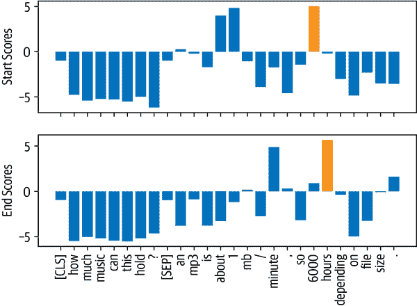

# 第七章：问答

无论您是研究人员、分析师还是数据科学家，都有可能在某个时候需要浏览大量文档以找到您正在寻找的信息。更糟糕的是，您不断地被谷歌和必应提醒，存在更好的搜索方式！例如，如果我们在谷歌上搜索“玛丽·居里何时获得她的第一个诺贝尔奖？”我们立即得到了“1903”这个正确答案，如图 7-1 所示。


###### 图 7-1 谷歌搜索查询和相应的答案片段

在这个例子中，谷歌首先检索了大约 319,000 个与查询相关的文档，然后进行了额外的处理步骤，提取了带有相应段落和网页的答案片段。很容易看出这些答案片段是有用的。例如，如果我们搜索一个更棘手的问题，比如“哪种吉他调音是最好的？”谷歌没有提供答案，而是我们必须点击搜索引擎返回的网页之一来找到答案。¹

这项技术背后的一般方法被称为*问答*（QA）。有许多种类的 QA，但最常见的是*抽取式 QA*，它涉及到问题的答案可以在文档中识别为文本段落的一部分，文档可能是网页、法律合同或新闻文章。首先检索相关文档，然后从中提取答案的两阶段过程也是许多现代 QA 系统的基础，包括语义搜索引擎、智能助手和自动信息提取器。在本章中，我们将应用这一过程来解决电子商务网站面临的一个常见问题：帮助消费者回答特定的查询以评估产品。我们将看到客户评论可以作为 QA 的丰富而具有挑战性的信息来源，并且在这个过程中，我们将学习 transformers 如何作为强大的*阅读理解*模型，可以从文本中提取含义。让我们从详细说明用例开始。

###### 注

本章重点介绍抽取式 QA，但其他形式的 QA 可能更适合您的用例。例如，*社区 QA*涉及收集用户在论坛上生成的问题-答案对，然后使用语义相似性搜索找到与新问题最接近的答案。还有*长篇 QA*，旨在对开放性问题生成复杂的段落长度答案，比如“天空为什么是蓝色？”值得注意的是，还可以对表格进行 QA，transformer 模型如[TAPAS](https://oreil.ly/vVPWO)甚至可以执行聚合以生成最终答案！

# 构建基于评论的问答系统

如果您曾经在网上购买过产品，您可能会依赖客户评论来帮助您做出决定。这些评论通常可以帮助回答特定问题，比如“这把吉他带吗？”或者“我可以在晚上使用这个相机吗？”这些问题可能很难仅通过产品描述就能回答。然而，热门产品可能会有数百甚至数千条评论，因此找到相关的评论可能会很麻烦。一个替代方法是在像亚马逊这样的网站提供的社区问答平台上发布您的问题，但通常需要几天时间才能得到答案（如果有的话）。如果我们能像图 7-1 中的谷歌示例那样立即得到答案，那不是挺好的吗？让我们看看是否可以使用 transformers 来实现这一点！

## 数据集

为了构建我们的 QA 系统，我们将使用 SubjQA 数据集²，该数据集包括英语中关于六个领域的产品和服务的 10,000 多条客户评论：TripAdvisor、餐馆、电影、书籍、电子产品和杂货。如图 7-2 所示，每条评论都与一个问题相关联，可以使用评论中的一句或多句来回答。³


###### 图 7-2. 有关产品的问题和相应的评论（答案范围已划线）

该数据集的有趣之处在于，大多数问题和答案都是*主观*的；也就是说，它们取决于用户的个人经验。图 7-2 中的示例显示了为什么这一特点使得这个任务可能比寻找对像“英国的货币是什么？”这样的事实问题的答案更困难。首先，查询是关于“质量差”，这是主观的，取决于用户对质量的定义。其次，查询的重要部分根本不出现在评论中，这意味着不能用关键词搜索或释义输入问题来回答。这些特点使得 SubjQA 成为一个真实的数据集，可以用来对我们基于评论的 QA 模型进行基准测试，因为像图 7-2 中显示的用户生成内容类似于我们可能在野外遇到的内容。

###### 注意

QA 系统通常根据其在响应查询时可以访问的数据的*领域*进行分类。*封闭领域*QA 处理关于狭窄主题的问题（例如单个产品类别），而*开放领域*QA 处理几乎任何问题（例如亚马逊的整个产品目录）。一般来说，封闭领域 QA 涉及搜索的文档比开放领域情况少。

为了开始，让我们从[Hugging Face Hub](https://oreil.ly/iO0s5)下载数据集。就像我们在第四章中所做的那样，我们可以使用`get_dataset_config_names()`函数来找出哪些子集是可用的：

```py
from datasets import get_dataset_config_names

domains = get_dataset_config_names("subjqa")
domains
```

```py
['books', 'electronics', 'grocery', 'movies', 'restaurants', 'tripadvisor']
```

对于我们的用例，我们将专注于构建电子产品领域的 QA 系统。要下载`electronics`子集，我们只需要将该值传递给`load_dataset()`函数的`name`参数：

```py
from datasets import load_dataset

subjqa = load_dataset("subjqa", name="electronics")
```

与 Hub 上的其他问答数据集一样，SubjQA 将每个问题的答案存储为嵌套字典。例如，如果我们检查`answers`列中的一行：

```py
print(subjqa["train"]["answers"][1])
```

```py
{'text': ['Bass is weak as expected', 'Bass is weak as expected, even with EQ
adjusted up'], 'answer_start': [1302, 1302], 'answer_subj_level': [1, 1],
'ans_subj_score': [0.5083333253860474, 0.5083333253860474], 'is_ans_subjective':
[True, True]}
```

我们可以看到答案存储在`text`字段中，而起始字符索引则在`answer_start`中提供。为了更轻松地探索数据集，我们将使用`flatten()`方法展平这些嵌套列，并将每个拆分转换为 Pandas 的`DataFrame`，如下所示：

```py
import pandas as pd

dfs = {split: dset.to_pandas() for split, dset in subjqa.flatten().items()}

for split, df in dfs.items():
    print(f"Number of questions in {split}: {df['id'].nunique()}")
```

```py
Number of questions in train: 1295
Number of questions in test: 358
Number of questions in validation: 255
```

请注意，数据集相对较小，总共只有 1,908 个示例。这模拟了真实世界的情况，因为让领域专家标记抽取式 QA 数据集是费时费力的。例如，用于法律合同抽取式 QA 的 CUAD 数据集估计价值为 200 万美元，以应对标注其 13,000 个示例所需的法律专业知识！⁴

SubjQA 数据集中有相当多的列，但对于构建我们的 QA 系统来说，最有趣的是表 7-1 中显示的那些。

表 7-1. SubjQA 数据集的列名及其描述

| 列名 | 描述 |
| --- | --- |
| `title` | 与每个产品相关联的亚马逊标准识别号（ASIN） |
| `question` | 问题 |
| `answers.answer_text` | 标注者标记的评论文本范围 |
| `answers.answer_start` | 答案范围的起始字符索引 |
| `context` | 客户评论 |

让我们专注于这些列，并查看一些训练示例。我们可以使用`sample()`方法选择一个随机样本：

```py
qa_cols = ["title", "question", "answers.text",
           "answers.answer_start", "context"]
sample_df = dfs["train"][qa_cols].sample(2, random_state=7)
sample_df
```

| 标题 | 问题 | 答案文本 | 答案起始 | 上下文 |
| --- | --- | --- | --- | --- |
| B005DKZTMG | 键盘轻便吗？ | [这个键盘很紧凑] | [215] | 我真的很喜欢这个键盘。我给它 4 颗星，因为它没有大写锁定键，所以我永远不知道我的大写是否打开。但是就价格而言，它确实足够作为一个无线键盘。我手很大，这个键盘很紧凑，但我没有抱怨。 |
| B00AAIPT76 | 电池如何？ | [] | [] | 我在购买了第一个备用 gopro 电池后发现它无法保持充电。我对这种产品有非常现实的期望，对于充电时间和电池寿命的惊人故事我持怀疑态度，但我确实希望电池至少能保持几周的充电，并且充电器能像充电器一样工作。在这方面我并不失望。我是一名漂流者，发现 gopro 电池很快就用完了，所以这次购买解决了这个问题。电池保持了充电，在短途旅行上，额外的两块电池足够使用，在长途旅行上，我可以使用我的朋友的 JOOS Orange 来给它们充电。我刚刚购买了一个 newtrent xtreme powerpak，期望能用它给这些电池充电，所以我不会再用完电了。 |

从这些例子中，我们可以做出一些观察。首先，问题在语法上不正确，这在电子商务网站的常见 FAQ 部分中是很常见的。其次，空的`answers.text`条目表示“无法回答”的问题，其答案无法在评论中找到。最后，我们可以使用答案跨度的起始索引和长度来切出对应于答案的评论文本跨度：

```py
start_idx = sample_df["answers.answer_start"].iloc[0][0]
end_idx = start_idx + len(sample_df["answers.text"].iloc[0][0])
sample_df["context"].iloc[0][start_idx:end_idx]
```

```py
'this keyboard is compact'
```

接下来，让我们通过计算以一些常见起始词开头的问题来了解训练集中有哪些类型的问题：

```py
counts = {}
question_types = ["What", "How", "Is", "Does", "Do", "Was", "Where", "Why"]

for q in question_types:
    counts[q] = dfs["train"]["question"].str.startswith(q).value_counts()[True]

pd.Series(counts).sort_values().plot.barh()
plt.title("Frequency of Question Types")
plt.show()
```


我们可以看到以“How”、“What”和“Is”开头的问题是最常见的，所以让我们看一些例子：

```py
for question_type in ["How", "What", "Is"]:
    for question in (
        dfs["train"][dfs["train"].question.str.startswith(question_type)]
        .sample(n=3, random_state=42)['question']):
        print(question)
```

```py
How is the camera?
How do you like the control?
How fast is the charger?
What is direction?
What is the quality of the construction of the bag?
What is your impression of the product?
Is this how zoom works?
Is sound clear?
Is it a wireless keyboard?
```

现在我们已经对数据集有了一些了解，让我们深入了解 transformers 如何从文本中提取答案。

## 从文本中提取答案

我们的问答系统首先需要找到一种方法来识别客户评论中的潜在答案作为文本跨度。例如，如果我们有一个问题“它防水吗？”和评论段落是“这个手表在 30 米深处防水”，那么模型应该输出“在 30 米处防水”。为了做到这一点，我们需要了解如何：

+   构建监督学习问题。

+   为问答任务对文本进行标记和编码。

+   处理超出模型最大上下文大小的长段落。

让我们从如何构建问题开始。

### 跨度分类

从文本中提取答案的最常见方法是将问题构建为*跨度分类*任务，其中答案跨度的起始和结束标记作为模型需要预测的标签。这个过程在图 7-4 中有所说明。


###### 图 7-4。QA 任务的跨度分类头部

由于我们的训练集相对较小，只有 1295 个例子，一个好的策略是从已经在大规模 QA 数据集（如 SQuAD）上进行了微调的语言模型开始。一般来说，这些模型具有很强的阅读理解能力，并且可以作为构建更准确系统的良好基线。这与之前章节中的方法有些不同，在之前的章节中，我们通常是从预训练模型开始，然后自己微调特定任务的头部。例如，在第二章中，我们不得不微调分类头部，因为类别数量与手头的数据集相关联。对于抽取式问答，我们实际上可以从一个经过微调的模型开始，因为标签的结构在不同数据集之间保持不变。

您可以通过导航到[Hugging Face Hub](https://oreil.ly/dzCsC)并在 Models 选项卡上搜索“squad”来找到一系列抽取式 QA 模型（图 7-5）。


###### 图 7-5。Hugging Face Hub 上一些抽取式 QA 模型的选择

正如您所看到的，在撰写本文时，有超过 350 个 QA 模型可供选择，那么您应该选择哪一个呢？一般来说，答案取决于各种因素，比如您的语料库是单语还是多语，以及在生产环境中运行模型的约束。表 7-2 列出了一些提供了良好基础的模型。

表 7-2。在 SQuAD 2.0 上进行微调的基线 Transformer 模型

| Transformer | 描述 | 参数数量 | SQuAD 2.0 上的*F*分数 |
| --- | --- | --- | --- |
| MiniLM | 保留了 99%的性能，同时运行速度是 BERT-base 的两倍 | 66M | 79.5 |
| RoBERTa-base | RoBERTa 模型的性能比 BERT 模型更好，并且可以在大多数 QA 数据集上使用单个 GPU 进行微调 | 125M | 83.0 |
| ALBERT-XXL | 在 SQuAD 2.0 上表现出色，但计算密集且难以部署 | 235M | 88.1 |
| XLM-RoBERTa-large | 用于 100 种语言的多语言模型，具有强大的零热门性能 | 570M | 83.8 |

在本章的目的是，我们将使用经过微调的 MiniLM 模型，因为它训练速度快，可以让我们快速迭代我们将要探索的技术。⁸ 像往常一样，我们需要的第一件事是一个标记器来对我们的文本进行编码，所以让我们看看这对于 QA 任务是如何工作的。

### QA 的文本标记化

为了对我们的文本进行编码，我们将像往常一样从[Hugging Face Hub](https://oreil.ly/df5Cu)加载 MiniLM 模型检查点：

```py
from transformers import AutoTokenizer

model_ckpt = "deepset/minilm-uncased-squad2"
tokenizer = AutoTokenizer.from_pretrained(model_ckpt)
```

要看到模型的实际效果，让我们首先尝试从文本的简短段落中提取答案。在抽取式 QA 任务中，输入以（问题，上下文）对的形式提供，因此我们将它们都传递给标记器，如下所示：

```py
question = "How much music can this hold?"
context = """An MP3 is about 1 MB/minute, so about 6000 hours depending on \
file size."""
inputs = tokenizer(question, context, return_tensors="pt")
```

在这里，我们返回了 PyTorch`Tensor`对象，因为我们需要它们来运行模型的前向传递。如果我们将标记化的输入视为表格：

| input_ids | 101 | 2129 | 2172 | 2189 | 2064 | 2023 | ... | 5834 | 2006 | 5371 | 2946 | 1012 | 102 |
| --- | --- | --- | --- | --- | --- | --- | --- | --- | --- | --- | --- | --- | --- |
| token_type_ids | 0 | 0 | 0 | 0 | 0 | 0 | ... | 1 | 1 | 1 | 1 | 1 | 1 |
| attention_mask | 1 | 1 | 1 | 1 | 1 | 1 | ... | 1 | 1 | 1 | 1 | 1 | 1 |

我们可以看到熟悉的`input_ids`和`attention_mask`张量，而`token_type_ids`张量指示了输入的哪个部分对应于问题和上下文（0 表示问题标记，1 表示上下文标记）。⁹

为了了解标记器如何为 QA 任务格式化输入，让我们解码`input_ids`张量：

```py
print(tokenizer.decode(inputs["input_ids"][0]))
```

```py
[CLS] how much music can this hold? [SEP] an mp3 is about 1 mb / minute, so
about 6000 hours depending on file size. [SEP]
```

我们看到，对于每个 QA 示例，输入采用以下格式：

```py
[CLS] question tokens [SEP] context tokens [SEP]
```

其中第一个`[SEP]`标记的位置由`token_type_ids`确定。现在我们的文本已经被标记化，我们只需要用 QA 头实例化模型并通过前向传递运行输入：

```py
import torch
from transformers import AutoModelForQuestionAnswering

model = AutoModelForQuestionAnswering.from_pretrained(model_ckpt)

with torch.no_grad():
    outputs = model(**inputs)
print(outputs)
```

```py
QuestionAnsweringModelOutput(loss=None, start_logits=tensor([[-0.9862, -4.7750,
         -5.4025, -5.2378, -5.2863, -5.5117, -4.9819, -6.1880,
         -0.9862,  0.2596, -0.2144, -1.7136,  3.7806,  4.8561, -1.0546, -3.9097,
         -1.7374, -4.5944, -1.4278,  3.9949,  5.0390, -0.2018, -3.0193, -4.8549,
         -2.3107, -3.5110, -3.5713, -0.9862]]), end_logits=tensor([[-0.9623,
         -5.4733, -5.0326, -5.1639, -5.4278, -5.5151, -5.1749, -4.6233,
         -0.9623, -3.7855, -0.8715, -3.7745, -3.0161, -1.1780,  0.1758, -2.7365,
          4.8934,  0.3046, -3.1761, -3.2762,  0.8937,  5.6606, -0.3623, -4.9554,
         -3.2531, -0.0914,  1.6211, -0.9623]]), hidden_states=None,
attentions=None)
```

在这里，我们可以看到我们得到了一个`QuestionAnsweringModelOutput`对象作为 QA 头的输出。正如图 7-4 中所示，QA 头对应于一个线性层，它获取来自编码器的隐藏状态并计算开始和结束跨度的 logits。¹⁰ 这意味着我们将 QA 视为一种令牌分类，类似于我们在第四章中遇到的命名实体识别。要将输出转换为答案跨度，我们首先需要获取开始和结束令牌的 logits：

```py
start_logits = outputs.start_logits
end_logits = outputs.end_logits
```

如果我们比较这些 logits 的形状和输入 ID：

```py
print(f"Input IDs shape: {inputs.input_ids.size()}")
print(f"Start logits shape: {start_logits.size()}")
print(f"End logits shape: {end_logits.size()}")
```

```py
Input IDs shape: torch.Size([1, 28])
Start logits shape: torch.Size([1, 28])
End logits shape: torch.Size([1, 28])
```

我们看到每个输入标记都有两个 logits（一个起始和一个结束）。如图 7-6 所示，较大的正 logits 对应于更有可能成为起始和结束标记的候选标记。在这个例子中，我们可以看到模型将最高的起始标记 logits 分配给数字“1”和“6000”，这是有道理的，因为我们的问题是关于数量的。同样，我们看到最高 logits 的结束标记是“minute”和“hours”。



###### 图 7-6。预测的起始和结束标记的 logits；得分最高的标记以橙色标出

为了得到最终答案，我们可以计算起始和结束标记 logits 的 argmax，然后从输入中切片出这个范围。以下代码执行这些步骤并解码结果，以便我们可以打印出结果文本：

```py
import torch

start_idx = torch.argmax(start_logits)
end_idx = torch.argmax(end_logits) + 1
answer_span = inputs["input_ids"][0][start_idx:end_idx]
answer = tokenizer.decode(answer_span)
print(f"Question: {question}")
print(f"Answer: {answer}")
```

```py
Question: How much music can this hold?
Answer: 6000 hours
```

太好了，成功了！在 Transformers 中，所有这些预处理和后处理步骤都方便地包装在一个专用的管道中。我们可以通过传递我们的分词器和微调模型来实例化管道，如下所示：

```py
from transformers import pipeline

pipe = pipeline("question-answering", model=model, tokenizer=tokenizer)
pipe(question=question, context=context, topk=3)
```

```py
[{'score': 0.26516005396842957,
  'start': 38,
  'end': 48,
  'answer': '6000 hours'},
 {'score': 0.2208300083875656,
  'start': 16,
  'end': 48,
  'answer': '1 MB/minute, so about 6000 hours'},
 {'score': 0.10253632068634033,
  'start': 16,
  'end': 27,
  'answer': '1 MB/minute'}]
```

除了答案，管道还在`score`字段中返回模型的概率估计（通过对 logits 进行 softmax 获得）。当我们想要在单个上下文中比较多个答案时，这是很方便的。我们还表明，通过指定`topk`参数，我们可以让模型预测多个答案。有时，可能会有问题没有答案的情况，比如 SubjQA 中空的`answers.answer_start`示例。在这些情况下，模型将为`[CLS]`标记分配高的起始和结束分数，管道将这个输出映射为空字符串：

```py
pipe(question="Why is there no data?", context=context,
     handle_impossible_answer=True)
```

```py
{'score': 0.9068416357040405, 'start': 0, 'end': 0, 'answer': ''}
```

###### 注意

在我们的简单示例中，我们通过获取相应 logits 的 argmax 来获得起始和结束索引。然而，这种启发式方法可能会产生超出范围的答案，因为它选择属于问题而不是上下文的标记。在实践中，管道计算最佳的起始和结束索引组合，受到各种约束的限制，比如在范围内，要求起始索引在结束索引之前等等。

### 处理长段落

阅读理解模型面临的一个微妙之处是，上下文通常包含的标记比模型的最大序列长度（通常最多几百个标记）多。如图 7-7 所示，SubjQA 训练集中相当一部分包含的问题-上下文对无法适应 MiniLM 的 512 个标记的上下文大小。


###### 图 7-7。SubjQA 训练集中每个问题-上下文对的标记分布

对于其他任务，比如文本分类，我们简单地截断长文本，假设`[CLS]`标记的嵌入中包含足够的信息来生成准确的预测。然而，对于 QA 来说，这种策略是有问题的，因为问题的答案可能位于上下文的末尾，因此会被截断。如图 7-8 所示，处理这个问题的标准方法是在输入上应用*滑动窗口*，其中每个窗口包含适合模型上下文的标记段。


###### 图 7-8。滑动窗口如何为长文档创建多个问题-上下文对——第一个条形图对应问题，而第二个条形图是每个窗口中捕获的上下文

在 Transformers 中，我们可以在分词器中设置`return_overflowing_tokens=True`来启用滑动窗口。滑动窗口的大小由`max_seq_length`参数控制，步幅的大小由`doc_stride`控制。让我们从训练集中抓取第一个例子，并定义一个小窗口来说明这是如何工作的：

```py
example = dfs["train"].iloc[0][["question", "context"]]
tokenized_example = tokenizer(example["question"], example["context"],
                              return_overflowing_tokens=True, max_length=100,
                              stride=25)
```

在这种情况下，我们现在得到了一个`input_ids`列表，每个窗口一个。让我们检查每个窗口中的标记数：

```py
for idx, window in enumerate(tokenized_example["input_ids"]):
    print(f"Window #{idx} has {len(window)} tokens")
```

```py
Window #0 has 100 tokens
Window #1 has 88 tokens
```

最后，我们可以通过解码输入来看到两个窗口重叠的位置：

```py
for window in tokenized_example["input_ids"]:
    print(f"{tokenizer.decode(window)} \n")
```

```py
[CLS] how is the bass? [SEP] i have had koss headphones in the past, pro 4aa and
qz - 99\. the koss portapro is portable and has great bass response. the work
great with my android phone and can be " rolled up " to be carried in my
motorcycle jacket or computer bag without getting crunched. they are very light
and don't feel heavy or bear down on your ears even after listening to music
with them on all day. the sound is [SEP]

[CLS] how is the bass? [SEP] and don't feel heavy or bear down on your ears even
after listening to music with them on all day. the sound is night and day better
than any ear - bud could be and are almost as good as the pro 4aa. they are "
open air " headphones so you cannot match the bass to the sealed types, but it
comes close. for $ 32, you cannot go wrong. [SEP]
```

现在我们对 QA 模型如何从文本中提取答案有了一些直觉，让我们看看构建端到端 QA 管道所需的其他组件。

## 使用 Haystack 构建 QA 管道

在我们简单的答案提取示例中，我们向模型提供了问题和上下文。然而，在现实中，我们系统的用户只会提供有关产品的问题，因此我们需要一种方法从我们语料库中的所有评论中选择相关的段落。做到这一点的一种方法是将给定产品的所有评论连接在一起，并将它们作为单个长上下文输入模型。虽然简单，但这种方法的缺点是上下文可能变得非常长，从而为我们用户的查询引入不可接受的延迟。例如，假设平均每个产品有 30 条评论，每条评论需要 100 毫秒处理。如果我们需要处理所有评论来得到答案，这将导致每个用户查询的平均延迟为 3 秒，对于电子商务网站来说太长了！

为了处理这一点，现代 QA 系统通常基于*检索器-阅读器*架构，它有两个主要组件：

*检索器*

负责为给定查询检索相关文档。检索器通常被分类为*稀疏*或*密集*。稀疏检索器使用词频来表示每个文档和查询，形成稀疏向量。¹¹然后通过计算向量的内积来确定查询和文档的相关性。另一方面，密集检索器使用编码器（如 transformers）将查询和文档表示为上下文化的嵌入（密集向量）。这些嵌入编码语义含义，并允许密集检索器通过理解查询的内容来提高搜索准确性。

*阅读器*

负责从检索器提供的文档中提取答案。阅读器通常是一个阅读理解模型，尽管在本章末尾我们将看到可以生成自由形式答案的模型示例。

如图 7-9 所示，还可以有其他组件对检索器获取的文档或阅读器提取的答案进行后处理。例如，检索到的文档可能需要重新排名，以消除可能混淆阅读器的嘈杂或无关的文档。类似地，当正确答案来自长文档中的各个段落时，通常需要对阅读器的答案进行后处理。


###### 图 7-9。现代 QA 系统的检索器-阅读器架构

为了构建我们的 QA 系统，我们将使用由[deepset](https://deepset.ai)开发的[*Haystack*库](https://haystack.deepset.ai)，deepset 是一家专注于 NLP 的德国公司。Haystack 基于检索器-阅读器架构，抽象了构建这些系统所涉及的大部分复杂性，并与 Transformers 紧密集成。

除了检索器和阅读器之外，在构建 Haystack 的 QA 管道时还涉及另外两个组件：

*文档存储*

存储文档和元数据的面向文档的数据库，这些文档和元数据在查询时提供给检索器

*管道*

将 QA 系统的所有组件结合在一起，以实现自定义查询流程，合并来自多个检索器的文档等

在本节中，我们将看看如何使用这些组件快速构建原型 QA 管道。稍后，我们将探讨如何提高其性能。

###### 警告

本章是使用 Haystack 库的 0.9.0 版本编写的。在[版本 0.10.0](https://oreil.ly/qbqgv)中，重新设计了管道和评估 API，以便更容易检查检索器或阅读器是否影响性能。要查看使用新 API 的本章代码是什么样子，请查看[GitHub 存储库](https://github.com/nlp-with-transformers/notebooks)。

### 初始化文档存储

在 Haystack 中，有各种可供选择的文档存储，并且每个文档存储都可以与一组专用的检索器配对。这在表 7-3 中有所说明，其中显示了每个可用文档存储的稀疏（TF-IDF、BM25）和密集（嵌入、DPR）检索器的兼容性。我们将在本章后面解释所有这些首字母缩略词的含义。

表 7-3。Haystack 检索器和文档存储的兼容性

|  | 内存 | Elasticsearch | FAISS | Milvus |
| --- | --- | --- | --- | --- |
| TF-IDF | 是 | 是 | 否 | 否 |
| BM25 | 否 | 是 | 否 | 否 |
| 嵌入 | 是 | 是 | 是 | 是 |
| DPR | 是 | 是 | 是 | 是 |

由于本章将探讨稀疏和密集检索器，我们将使用与两种检索器类型兼容的`ElasticsearchDocumentStore`。Elasticsearch 是一种能够处理各种数据类型的搜索引擎，包括文本、数字、地理空间、结构化和非结构化数据。它存储大量数据并能够快速进行全文搜索过滤，因此特别适用于开发问答系统。它还具有成为基础设施分析行业标准的优势，因此您的公司很有可能已经有一个集群可以使用。

要初始化文档存储，我们首先需要下载并安装 Elasticsearch。通过按照 Elasticsearch 的[指南](https://oreil.ly/bgmKq)¹² ，我们可以使用`wget`获取 Linux 的最新版本，并使用`tar` shell 命令解压缩它：

```py
url = """https://artifacts.elastic.co/downloads/elasticsearch/\
elasticsearch-7.9.2-linux-x86_64.tar.gz"""
!wget -nc -q {url}
!tar -xzf elasticsearch-7.9.2-linux-x86_64.tar.gz
```

接下来，我们需要启动 Elasticsearch 服务器。由于我们在 Jupyter 笔记本中运行本书中的所有代码，我们需要使用 Python 的`Popen()`函数来生成一个新的进程。在此过程中，让我们还使用`chown` shell 命令在后台运行子进程：

```py
import os
from subprocess import Popen, PIPE, STDOUT

# Run Elasticsearch as a background process
!chown -R daemon:daemon elasticsearch-7.9.2
es_server = Popen(args=['elasticsearch-7.9.2/bin/elasticsearch'],
                  stdout=PIPE, stderr=STDOUT, preexec_fn=lambda: os.setuid(1))
# Wait until Elasticsearch has started
!sleep 30
```

在`Popen()`函数中，`args`指定我们希望执行的程序，而`stdout=PIPE`创建一个新的管道用于标准输出，`stderr=STDOUT`收集相同管道中的错误。`preexec_fn`参数指定我们希望使用的子进程的 ID。默认情况下，Elasticsearch 在本地端口 9200 上运行，因此我们可以通过向`localhost`发送 HTTP 请求来测试连接：

```py
!curl -X GET "localhost:9200/?pretty"
```

```py
{
  "name" : "96938eee37cd",
  "cluster_name" : "docker-cluster",
  "cluster_uuid" : "ABGDdvbbRWmMb9Umz79HbA",
  "version" : {
    "number" : "7.9.2",
    "build_flavor" : "default",
    "build_type" : "docker",
    "build_hash" : "d34da0ea4a966c4e49417f2da2f244e3e97b4e6e",
    "build_date" : "2020-09-23T00:45:33.626720Z",
    "build_snapshot" : false,
    "lucene_version" : "8.6.2",
    "minimum_wire_compatibility_version" : "6.8.0",
    "minimum_index_compatibility_version" : "6.0.0-beta1"
  },
  "tagline" : "You Know, for Search"
}
```

现在我们的 Elasticsearch 服务器已经启动运行，接下来要做的事情是实例化文档存储：

```py
from haystack.document_store.elasticsearch import ElasticsearchDocumentStore

# Return the document embedding for later use with dense retriever
document_store = ElasticsearchDocumentStore(return_embedding=True)
```

默认情况下，`ElasticsearchDocumentStore`在 Elasticsearch 上创建两个索引：一个称为`document`用于（你猜对了）存储文档，另一个称为`label`用于存储注释的答案跨度。现在，我们将使用 SubjQA 评论填充`document`索引，Haystack 的文档存储期望一个带有`text`和`meta`键的字典列表，如下所示：

```py
{
    "text": "<the-context>",
    "meta": {
        "field_01": "<additional-metadata>",
        "field_02": "<additional-metadata>",
        ...
    }
}
```

`meta`中的字段可用于在检索期间应用过滤器。为了我们的目的，我们将包括 SubjQA 的`item_id`和`q_review_id`列，以便我们可以按产品和问题 ID 进行过滤，以及相应的训练拆分。然后，我们可以循环遍历每个`DataFrame`中的示例，并使用`write_documents()`方法将它们添加到索引中，如下所示：

```py
for split, df in dfs.items():
    # Exclude duplicate reviews
    docs = [{"text": row["context"],
             "meta":{"item_id": row["title"], "question_id": row["id"],
                     "split": split}}
        for _,row in df.drop_duplicates(subset="context").iterrows()]
    document_store.write_documents(docs, index="document")

print(f"Loaded {document_store.get_document_count()} documents")
```

```py
Loaded 1615 documents
```

太好了，我们已经将所有的评论加载到了一个索引中！要搜索索引，我们需要一个检索器，因此让我们看看如何为 Elasticsearch 初始化一个检索器。

### 初始化检索器

Elasticsearch 文档存储可以与 Haystack 检索器中的任何一种配对，因此让我们首先使用基于 BM25 的稀疏检索器（简称“Best Match 25”）。BM25 是经典的词项频率-逆文档频率（TF-IDF）算法的改进版本，它将问题和上下文表示为可以在 Elasticsearch 上高效搜索的稀疏向量。BM25 分数衡量了匹配文本与搜索查询的相关程度，并通过迅速饱和 TF 值和规范化文档长度来改进 TF-IDF，以便短文档优于长文档。¹³

在 Haystack 中，默认情况下使用 BM25 检索器在`ElasticsearchRetriever`中，因此让我们通过指定我们希望搜索的文档存储来初始化这个类：

```py
from haystack.retriever.sparse import ElasticsearchRetriever

es_retriever = ElasticsearchRetriever(document_store=document_store)
```

接下来，让我们看一下训练集中单个电子产品的简单查询。对于像我们这样基于评论的问答系统，将查询限制在单个项目是很重要的，否则检索器会返回与用户查询无关的产品评论。例如，询问“相机质量如何？”如果没有产品过滤器，可能会返回关于手机的评论，而用户可能是在询问特定笔记本电脑相机的情况。我们的数据集中的 ASIN 值本身有点神秘，但我们可以使用在线工具如[*amazon ASIN*](https://amazon-asin.com)或者简单地将`item_id`的值附加到*www.amazon.com/dp/* URL 来解密它们。以下项目 ID 对应于亚马逊的 Fire 平板电脑之一，所以让我们使用检索器的`retrieve()`方法来询问它是否适合阅读：

```py
item_id = "B0074BW614"
query = "Is it good for reading?"
retrieved_docs = es_retriever.retrieve(
    query=query, top_k=3, filters={"item_id":[item_id], "split":["train"]})
```

在这里，我们已经指定了`top_k`参数返回多少个文档，并在我们的文档的`meta`字段中包含的`item_id`和`split`键上应用了过滤器。`retrieved_docs`的每个元素都是一个 Haystack `Document`对象，用于表示文档并包括检索器的查询分数以及其他元数据。让我们看一下其中一个检索到的文档：

```py
print(retrieved_docs[0])
```

```py
{'text': 'This is a gift to myself.  I have been a kindle user for 4 years and
this is my third one.  I never thought I would want a fire for I mainly use it
for book reading.  I decided to try the fire for when I travel I take my laptop,
my phone and my iPod classic.  I love my iPod but watching movies on the plane
with it can be challenging because it is so small. Laptops battery life is not
as good as the Kindle.  So the Fire combines for me what I needed all three to
do. So far so good.', 'score': 6.243799, 'probability': 0.6857824513476455,
'question': None, 'meta': {'item_id': 'B0074BW614', 'question_id':
'868e311275e26dbafe5af70774a300f3', 'split': 'train'}, 'embedding': None, 'id':
'252e83e25d52df7311d597dc89eef9f6'}
```

除了文档的文本，我们还可以看到 Elasticsearch 为其与查询的相关性计算的`score`（较大的分数意味着更好的匹配）。在幕后，Elasticsearch 依赖于[Lucene](https://lucene.apache.org)进行索引和搜索，因此默认情况下它使用 Lucene 的*practical scoring function*。您可以在[Elasticsearch 文档](https://oreil.ly/b1Seu)中找到得分函数背后的细节，但简而言之，它首先通过应用布尔测试（文档是否与查询匹配）来过滤候选文档，然后应用基于将文档和查询表示为向量的相似度度量。

现在我们有了检索相关文档的方法，接下来我们需要的是从中提取答案的方法。这就是读取器的作用，让我们看看如何在 Haystack 中加载我们的 MiniLM 模型。

### 初始化读取器

在 Haystack 中，有两种类型的读取器可以用来从给定的上下文中提取答案：

`FARMReader`

基于 deepset 的[*FARM*框架](https://farm.deepset.ai)进行 transformers 的微调和部署。与使用 Transformers 训练的模型兼容，并且可以直接从 Hugging Face Hub 加载模型。

`TransformersReader`

基于 Transformers 的 QA 流水线。适用于仅运行推理。

尽管两种读取器都以相同的方式处理模型的权重，但在转换预测以生成答案方面存在一些差异：

+   在 Transformers 中，QA 管道使用 softmax 在每个段落中对开始和结束的 logits 进行归一化。这意味着只有在从同一段落中提取的答案之间才有意义比较得分，其中概率总和为 1。例如，来自一个段落的答案得分为 0.9 并不一定比另一个段落中的得分为 0.8 好。在 FARM 中，logits 没有被归一化，因此可以更容易地比较跨段落的答案。

+   `TransformersReader`有时会预测相同的答案两次，但得分不同。如果答案跨越两个重叠的窗口，这可能会发生。在 FARM 中，这些重复项会被删除。

由于我们将在本章后面对读取器进行微调，我们将使用`FARMReader`。与 Transformers 一样，要加载模型，我们只需要在 Hugging Face Hub 上指定 MiniLM 检查点以及一些特定于 QA 的参数：

```py
from haystack.reader.farm import FARMReader

model_ckpt = "deepset/minilm-uncased-squad2"
max_seq_length, doc_stride = 384, 128
reader = FARMReader(model_name_or_path=model_ckpt, progress_bar=False,
                    max_seq_len=max_seq_length, doc_stride=doc_stride,
                    return_no_answer=True)
```

###### 注意

也可以直接在 Transformers 中微调阅读理解模型，然后加载到`TransformersReader`中进行推理。有关如何进行微调的详细信息，请参阅[库的文档](https://oreil.ly/VkhIQ)中的问答教程。

在`FARMReader`中，滑动窗口的行为由我们在标记器中看到的`max_seq_length`和`doc_stride`参数控制。这里我们使用了 MiniLM 论文中的值。现在让我们在之前的简单示例上测试一下读取器：

```py
print(reader.predict_on_texts(question=question, texts=[context], top_k=1))
```

```py
{'query': 'How much music can this hold?', 'no_ans_gap': 12.648084878921509,
'answers': [{'answer': '6000 hours', 'score': 10.69961929321289, 'probability':
0.3988136053085327, 'context': 'An MP3 is about 1 MB/minute, so about 6000 hours
depending on file size.', 'offset_start': 38, 'offset_end': 48,
'offset_start_in_doc': 38, 'offset_end_in_doc': 48, 'document_id':
'e344757014e804eff50faa3ecf1c9c75'}]}
```

太好了，读取器似乎正在按预期工作——接下来，让我们使用 Haystack 的一个管道将所有组件联系在一起。

### 将所有内容放在一起

Haystack 提供了一个`Pipeline`抽象，允许我们将检索器、读取器和其他组件组合成一个图，可以根据每个用例轻松定制。还有预定义的管道类似于 Transformers 中的管道，但专门为 QA 系统设计。在我们的案例中，我们对提取答案感兴趣，所以我们将使用`ExtractiveQAPipeline`，它以单个检索器-读取器对作为其参数：

```py
from haystack.pipeline import ExtractiveQAPipeline

pipe = ExtractiveQAPipeline(reader, es_retriever)
```

每个`Pipeline`都有一个`run()`方法，指定查询流程应如何执行。对于`ExtractiveQAPipeline`，我们只需要传递`query`，用`top_k_retriever`指定要检索的文档数量，用`top_k_reader`指定要从这些文档中提取的答案数量。在我们的案例中，我们还需要使用`filters`参数指定对项目 ID 的过滤器，就像我们之前对检索器所做的那样。让我们再次运行一个关于亚马逊 Fire 平板电脑的简单示例，但这次返回提取的答案：

```py
n_answers = 3
preds = pipe.run(query=query, top_k_retriever=3, top_k_reader=n_answers,
                 filters={"item_id": [item_id], "split":["train"]})

print(f"Question: {preds['query']} \n")
for idx in range(n_answers):
    print(f"Answer {idx+1}: {preds['answers'][idx]['answer']}")
    print(f"Review snippet: ...{preds['answers'][idx]['context']}...")
    print("\n\n")
```

```py
Question: Is it good for reading?

Answer 1: I mainly use it for book reading
Review snippet: ... is my third one.  I never thought I would want a fire for I
mainly use it for book reading.  I decided to try the fire for when I travel I
take my la...

Answer 2: the larger screen compared to the Kindle makes for easier reading
Review snippet: ...ght enough that I can hold it to read, but the larger screen
compared to the Kindle makes for easier reading. I love the color, something I
never thou...

Answer 3: it is great for reading books when no light is available
Review snippet: ...ecoming addicted to hers! Our son LOVES it and it is great
for reading books when no light is available. Amazing sound but I suggest good
headphones t...
```

太好了，现在我们有了一个端到端的 Amazon 产品评论 QA 系统！这是一个很好的开始，但请注意第二和第三个答案更接近实际问题。为了做得更好，我们需要一些指标来量化检索器和读取器的性能。我们接下来将看一下这一点。

# 改进我们的 QA 管道

尽管最近关于 QA 的研究大部分集中在改进阅读理解模型上，但实际上，如果检索器一开始就找不到相关文档，你的读取器有多好并不重要！特别是，检索器为整个 QA 系统的性能设定了一个上限，因此确保它做得好很重要。考虑到这一点，让我们首先介绍一些常见的指标来评估检索器，以便我们可以比较稀疏和密集表示的性能。

## 评估检索器

评估检索器的常见指标是*召回率*，它衡量了检索到的所有相关文档的比例。在这种情况下，“相关”只是指答案是否出现在文本段落中，因此给定一组问题，我们可以通过计算答案出现在检索器返回的前*k*个文档中的次数来计算召回率。

在 Haystack 中，有两种评估检索器的方法：

+   使用检索器内置的`eval()`方法。这可以用于开放域和封闭域的问答，但不能用于像 SubjQA 这样的数据集，其中每个文档都与一个产品配对，我们需要为每个查询按产品 ID 进行过滤。

+   构建一个自定义的`Pipeline`，将检索器与`EvalRetriever`类结合在一起。这样可以实现自定义指标和查询流程。

###### 注意

与召回率相辅相成的指标是*平均精度*（mAP），它奖励能够将正确答案排在文档排名中较高位置的检索器。

由于我们需要对每个产品进行召回率评估，然后在所有产品中进行聚合，我们将选择第二种方法。流水线图中的每个节点都代表一个通过`run()`方法获取一些输入并产生一些输出的类：

```py
class PipelineNode:
    def __init__(self):
        self.outgoing_edges = 1

    def run(self, **kwargs):
        ...
        return (outputs, "outgoing_edge_name")
```

这里的`kwargs`对应于图中前一个节点的输出，在`run()`方法中进行操作，以返回下一个节点的输出的元组，以及出边的名称。唯一的其他要求是包括一个`outgoing_edges`属性，指示节点的输出数量（在大多数情况下`outgoing_edges=1`，除非流水线中有根据某些标准路由输入的分支）。

在我们的情况下，我们需要一个节点来评估检索器，因此我们将使用`EvalRetriever`类，其`run()`方法跟踪哪些文档具有与地面真相匹配的答案。有了这个类，我们可以通过在代表检索器本身的节点之后添加评估节点来构建`Pipeline`图：

```py
from haystack.pipeline import Pipeline
from haystack.eval import EvalDocuments

class EvalRetrieverPipeline:
    def __init__(self, retriever):
        self.retriever = retriever
        self.eval_retriever = EvalDocuments()
        pipe = Pipeline()
        pipe.add_node(component=self.retriever, name="ESRetriever",
                      inputs=["Query"])
        pipe.add_node(component=self.eval_retriever, name="EvalRetriever",
                      inputs=["ESRetriever"])
        self.pipeline = pipe

pipe = EvalRetrieverPipeline(es_retriever)
```

注意每个节点都有一个`name`和一个`inputs`列表。在大多数情况下，每个节点都有一个单独的出边，因此我们只需要在`inputs`中包含前一个节点的名称。

现在我们有了评估流水线，我们需要传递一些查询及其相应的答案。为此，我们将答案添加到我们文档存储中的专用`label`索引。Haystack 提供了一个`Label`对象，以标准化的方式表示答案跨度及其元数据。为了填充`label`索引，我们将首先通过循环遍历测试集中的每个问题，并提取匹配的答案和附加的元数据来创建`Label`对象的列表：

```py
from haystack import Label

labels = []
for i, row in dfs["test"].iterrows():
    # Metadata used for filtering in the Retriever
    meta = {"item_id": row["title"], "question_id": row["id"]}
    # Populate labels for questions with answers
    if len(row["answers.text"]):
        for answer in row["answers.text"]:
            label = Label(
                question=row["question"], answer=answer, id=i, origin=row["id"],
                meta=meta, is_correct_answer=True, is_correct_document=True,
                no_answer=False)
            labels.append(label)
    # Populate labels for questions without answers
    else:
        label = Label(
            question=row["question"], answer="", id=i, origin=row["id"],
            meta=meta, is_correct_answer=True, is_correct_document=True,
            no_answer=True)
        labels.append(label)
```

如果我们查看其中一个标签：

```py
print(labels[0])
```

```py
{'id': 'e28f5e62-85e8-41b2-8a34-fbff63b7a466', 'created_at': None, 'updated_at':
None, 'question': 'What is the tonal balance of these headphones?', 'answer': 'I
have been a headphone fanatic for thirty years', 'is_correct_answer': True,
'is_correct_document': True, 'origin': 'd0781d13200014aa25860e44da9d5ea7',
'document_id': None, 'offset_start_in_doc': None, 'no_answer': False,
'model_id': None, 'meta': {'item_id': 'B00001WRSJ', 'question_id':
'd0781d13200014aa25860e44da9d5ea7'}}
```

我们可以看到问题-答案对，以及一个包含唯一问题 ID 的`origin`字段，以便我们可以根据问题过滤文档存储。我们还将产品 ID 添加到`meta`字段中，以便我们可以按产品筛选标签。现在我们有了标签，我们可以按以下方式将它们写入 Elasticsearch 上的`label`索引：

```py
document_store.write_labels(labels, index="label")
print(f"""Loaded {document_store.get_label_count(index="label")} \
question-answer pairs""")
```

```py
Loaded 358 question-answer pairs
```

接下来，我们需要建立一个映射，将我们的问题 ID 和相应的答案传递给流水线。为了获取所有标签，我们可以使用文档存储中的`get_all_labels_aggregated()`方法，该方法将聚合与唯一 ID 相关联的所有问题-答案对。该方法返回一个`MultiLabel`对象的列表，但在我们的情况下，由于我们按问题 ID 进行过滤，所以只会得到一个元素。我们可以按以下方式建立一个聚合标签列表：

```py
labels_agg = document_store.get_all_labels_aggregated(
    index="label",
    open_domain=True,
    aggregate_by_meta=["item_id"]
)
print(len(labels_agg))
```

```py
330
```

通过查看其中一个标签，我们可以看到与给定问题相关联的所有答案都聚合在一个`multiple_answers`字段中：

```py
print(labels_agg[109])
```

```py
{'question': 'How does the fan work?', 'multiple_answers': ['the fan is really
really good', "the fan itself isn't super loud. There is an adjustable dial to
change fan speed"], 'is_correct_answer': True, 'is_correct_document': True,
'origin': '5a9b7616541f700f103d21f8ad41bc4b', 'multiple_document_ids': [None,
None], 'multiple_offset_start_in_docs': [None, None], 'no_answer': False,
'model_id': None, 'meta': {'item_id': 'B002MU1ZRS'}}
```

现在我们有了评估检索器的所有要素，让我们定义一个函数，将与每个产品相关联的每个问题-答案对传递到评估流水线中，并在我们的`pipe`对象中跟踪正确的检索：

```py
def run_pipeline(pipeline, top_k_retriever=10, top_k_reader=4):
    for l in labels_agg:
        _ = pipeline.pipeline.run(
            query=l.question,
            top_k_retriever=top_k_retriever,
            top_k_reader=top_k_reader,
            top_k_eval_documents=top_k_retriever,
            labels=l,
            filters={"item_id": [l.meta["item_id"]], "split": ["test"]})
```

```py
run_pipeline(pipe, top_k_retriever=3)
print(f"Recall@3: {pipe.eval_retriever.recall:.2f}")
```

```py
Recall@3: 0.95
```

太好了，它起作用了！请注意，我们选择了一个特定的值作为`top_k_retriever`，以指定要检索的文档数。一般来说，增加这个参数将提高召回率，但会增加向读者提供更多文档并减慢端到端流程的速度。为了指导我们选择哪个值，我们将创建一个循环遍历几个*k*值并计算每个*k*在整个测试集上的召回率的函数：

```py
def evaluate_retriever(retriever, topk_values = [1,3,5,10,20]):
    topk_results = {}

    for topk in topk_values:
        # Create Pipeline
        p = EvalRetrieverPipeline(retriever)
        # Loop over each question-answers pair in test set
        run_pipeline(p, top_k_retriever=topk)
        # Get metrics
        topk_results[topk] = {"recall": p.eval_retriever.recall}

    return pd.DataFrame.from_dict(topk_results, orient="index")

es_topk_df = evaluate_retriever(es_retriever)
```

如果我们绘制结果，我们可以看到随着*k*的增加，召回率如何提高：

```py
def plot_retriever_eval(dfs, retriever_names):
    fig, ax = plt.subplots()
    for df, retriever_name in zip(dfs, retriever_names):
        df.plot(y="recall", ax=ax, label=retriever_name)
    plt.xticks(df.index)
    plt.ylabel("Top-k Recall")
    plt.xlabel("k")
    plt.show()

plot_retriever_eval([es_topk_df], ["BM25"])
```


从图中可以看出，在<math alttext="k equals 5"><mrow><mi>k</mi> <mo>=</mo> <mn>5</mn></mrow></math>附近有一个拐点，从<math alttext="k equals 10"><mrow><mi>k</mi> <mo>=</mo> <mn>10</mn></mrow></math>开始我们几乎可以完美地召回。现在让我们来看看使用密集向量技术检索文档。

### 密集通道检索

我们已经看到，当我们的稀疏检索器返回<math alttext="k equals 10"><mrow><mi>k</mi> <mo>=</mo> <mn>10</mn></mrow></math>个文档时，我们几乎可以完美地召回，但在较小的*k*值上我们能做得更好吗？这样做的优势在于我们可以向读者传递更少的文档，从而减少我们问答流程的总体延迟。像 BM25 这样的稀疏检索器的一个众所周知的局限性是，如果用户查询包含与评论完全不匹配的术语，它们可能无法捕获相关文档。一个有前途的替代方案是使用密集嵌入来表示问题和文档，当前的技术水平是一种被称为*密集通道检索*（DPR）的架构。¹⁴ DPR 背后的主要思想是使用两个 BERT 模型作为问题和段落的编码器。如图 7-10 所示，这些编码器将输入文本映射到`[CLS]`标记的*d*维向量表示。


###### 图 7-10。DPR 的双编码器架构用于计算文档和查询的相关性

在 Haystack 中，我们可以像为 BM25 那样初始化 DPR 的检索器。除了指定文档存储外，我们还需要选择用于问题和段落的 BERT 编码器。通过给它们提供具有相关（正面）段落和不相关（负面）段落的问题进行训练，这些编码器被训练，目标是学习相关的问题-段落对具有更高的相似性。对于我们的用例，我们将使用已经以这种方式在 NQ 语料库上进行了微调的编码器：

```py
from haystack.retriever.dense import DensePassageRetriever

dpr_retriever = DensePassageRetriever(document_store=document_store,
    query_embedding_model="facebook/dpr-question_encoder-single-nq-base",
    passage_embedding_model="facebook/dpr-ctx_encoder-single-nq-base",
    embed_title=False)
```

在这里我们还设置了`embed_title=False`，因为连接文档的标题（即`item_id`）不会提供任何额外信息，因为我们按产品进行过滤。一旦我们初始化了密集检索器，下一步是迭代我们 Elasticsearch 索引中的所有索引文档，并应用编码器来更新嵌入表示。这可以通过以下方式完成：

```py
document_store.update_embeddings(retriever=dpr_retriever)
```

我们现在准备好了！我们可以像为 BM25 那样评估密集检索器，并比较前*k*个召回率：

```py
dpr_topk_df = evaluate_retriever(dpr_retriever)
plot_retriever_eval([es_topk_df, dpr_topk_df], ["BM25", "DPR"])
```


在这里我们可以看到，DPR 在召回率上并没有比 BM25 提供提升，并且在<math alttext="k equals 3"><mrow><mi>k</mi> <mo>=</mo> <mn>3</mn></mrow></math>左右饱和。

###### 提示

通过使用 Facebook 的[FAISS 库](https://oreil.ly/1E8Z0)作为文档存储，可以加速嵌入的相似性搜索。同样，通过在目标领域进行微调，可以提高 DPR 检索器的性能。如果您想了解如何微调 DPR，请查看 Haystack 的[教程](https://oreil.ly/eXyro)。

现在我们已经探讨了检索器的评估，让我们转而评估读者。

## 评估读者

在抽取式问答中，有两个主要的指标用于评估读者：

*精确匹配（EM）*

一个二进制度量，如果预测答案中的字符与真实答案完全匹配，则 EM = 1，否则 EM = 0。如果不期望有答案，那么如果模型预测任何文本，EM = 0。

*F*[1]-score

度量精确度和召回率的调和平均值。

让我们通过从 FARM 导入一些辅助函数并将它们应用于一个简单的例子来看看这些度量是如何工作的：

```py
from farm.evaluation.squad_evaluation import compute_f1, compute_exact

pred = "about 6000 hours"
label = "6000 hours"
print(f"EM: {compute_exact(label, pred)}")
print(f"F1: {compute_f1(label, pred)}")
```

```py
EM: 0
F1: 0.8
```

在底层，这些函数首先通过去除标点，修复空白和转换为小写来对预测和标签进行规范化。然后对规范化的字符串进行词袋式标记化，最后在标记级别计算度量。从这个简单的例子中，我们可以看到 EM 比*F*[1]-score 严格得多：向预测中添加一个标记会使 EM 为零。另一方面，*F*[1]-score 可能无法捕捉真正不正确的答案。例如，如果我们的预测答案范围是“大约 6000 美元”，那么我们得到：

```py
pred = "about 6000 dollars"
print(f"EM: {compute_exact(label, pred)}")
print(f"F1: {compute_f1(label, pred)}")
```

```py
EM: 0
F1: 0.4
```

因此，仅依赖*F*[1]-score 是误导性的，跟踪这两个度量是在权衡低估（EM）和高估（*F*[1]-score）模型性能之间的一个好策略。

一般来说，每个问题可能有多个有效答案，因此这些度量是针对评估集中的每个问题-答案对计算的，并且从所有可能的答案中选择最佳分数。然后通过对每个问题-答案对的单独分数进行平均来获得模型的整体 EM 和*F*[1]分数。

为了评估阅读器，我们将创建一个包含两个节点的新管道：一个阅读器节点和一个用于评估阅读器的节点。我们将使用`EvalReader`类，该类获取阅读器的预测并计算相应的 EM 和*F*[1]分数。为了与 SQuAD 评估进行比较，我们将使用`EvalAnswers`中存储的`top_1_em`和`top_1_f1`度量来获取每个查询的最佳答案：

```py
from haystack.eval import EvalAnswers

def evaluate_reader(reader):
    score_keys = ['top_1_em', 'top_1_f1']
    eval_reader = EvalAnswers(skip_incorrect_retrieval=False)
    pipe = Pipeline()
    pipe.add_node(component=reader, name="QAReader", inputs=["Query"])
    pipe.add_node(component=eval_reader, name="EvalReader", inputs=["QAReader"])

    for l in labels_agg:
        doc = document_store.query(l.question,
                                   filters={"question_id":[l.origin]})
        _ = pipe.run(query=l.question, documents=doc, labels=l)

    return {k:v for k,v in eval_reader.__dict__.items() if k in score_keys}

reader_eval = {}
reader_eval["Fine-tune on SQuAD"] = evaluate_reader(reader)
```

请注意，我们指定了`skip_incorrect_retrieval=False`。这是为了确保检索器始终将上下文传递给阅读器（就像在 SQuAD 评估中一样）。现在我们已经通过阅读器运行了每个问题，让我们打印分数：

```py
def plot_reader_eval(reader_eval):
    fig, ax = plt.subplots()
    df = pd.DataFrame.from_dict(reader_eval)
    df.plot(kind="bar", ylabel="Score", rot=0, ax=ax)
    ax.set_xticklabels(["EM", "F1"])
    plt.legend(loc='upper left')
    plt.show()

plot_reader_eval(reader_eval)
```


好吧，看起来经过精细调整的模型在 SubjQA 上的表现明显比在 SQuAD 2.0 上差，MiniLM 在 SQuAD 2.0 上的 EM 和*F*[1]分别为 76.1 和 79.5。性能下降的一个原因是客户评论与 SQuAD 2.0 数据集生成的维基百科文章非常不同，它们使用的语言通常是非正式的。另一个因素可能是我们数据集固有的主观性，其中问题和答案都与维基百科中包含的事实信息不同。让我们看看如何在数据集上进行精细调整以获得更好的领域自适应结果。

## 领域自适应

尽管在 SQuAD 上进行了精细调整的模型通常会很好地推广到其他领域，但我们发现对于 SubjQA，我们的模型的 EM 和*F*[1]分数要比 SQuAD 差得多。这种泛化失败也在其他抽取式 QA 数据集中观察到，并且被认为是证明了 Transformer 模型特别擅长过度拟合 SQuAD 的证据。(15)改进阅读器的最直接方法是在 SubjQA 训练集上进一步对我们的 MiniLM 模型进行精细调整。`FARMReader`有一个`train()`方法，专门用于此目的，并且期望数据以 SQuAD JSON 格式提供，其中所有问题-答案对都被分组在一起，如图 7-11 所示。


###### 图 7-11\. SQuAD JSON 格式的可视化

这是一个非常复杂的数据格式，因此我们需要一些函数和一些 Pandas 魔术来帮助我们进行转换。我们需要做的第一件事是实现一个可以创建与每个产品 ID 相关联的`paragraphs`数组的函数。该数组中的每个元素包含单个上下文（即评论）和问题-答案对的`qas`数组。以下是一个构建`paragraphs`数组的函数：

```py
def create_paragraphs(df):
    paragraphs = []
    id2context = dict(zip(df["review_id"], df["context"]))
    for review_id, review in id2context.items():
        qas = []
        # Filter for all question-answer pairs about a specific context
        review_df = df.query(f"review_id == '{review_id}'")
        id2question = dict(zip(review_df["id"], review_df["question"]))
        # Build up the qas array
        for qid, question in id2question.items():
            # Filter for a single question ID
            question_df = df.query(f"id == '{qid}'").to_dict(orient="list")
            ans_start_idxs = question_df["answers.answer_start"][0].tolist()
            ans_text = question_df["answers.text"][0].tolist()
            # Fill answerable questions
            if len(ans_start_idxs):
                answers = [
                    {"text": text, "answer_start": answer_start}
                    for text, answer_start in zip(ans_text, ans_start_idxs)]
                is_impossible = False
            else:
                answers = []
                is_impossible = True
            # Add question-answer pairs to qas
            qas.append({"question": question, "id": qid,
                        "is_impossible": is_impossible, "answers": answers})
        # Add context and question-answer pairs to paragraphs
        paragraphs.append({"qas": qas, "context": review})
    return paragraphs
```

现在，当我们将与单个产品 ID 相关联的`DataFrame`的行应用于 SQuAD 格式时：

```py
product = dfs["train"].query("title == 'B00001P4ZH'")
create_paragraphs(product)
```

```py
[{'qas': [{'question': 'How is the bass?',
    'id': '2543d296da9766d8d17d040ecc781699',
    'is_impossible': True,
    'answers': []}],
  'context': 'I have had Koss headphones ...',
    'id': 'd476830bf9282e2b9033e2bb44bbb995',
    'is_impossible': False,
    'answers': [{'text': 'Bass is weak as expected', 'answer_start': 1302},
     {'text': 'Bass is weak as expected, even with EQ adjusted up',
      'answer_start': 1302}]}],
  'context': 'To anyone who hasn\'t tried all ...'},
 {'qas': [{'question': 'How is the bass?',
    'id': '455575557886d6dfeea5aa19577e5de4',
    'is_impossible': False,
    'answers': [{'text': 'The only fault in the sound is the bass',
      'answer_start': 650}]}],
  'context': "I have had many sub-$100 headphones ..."}]
```

最后一步是将此函数应用于每个拆分的`DataFrame`中的每个产品 ID。以下`convert_to_squad()`函数可以做到这一点，并将结果存储在*electronics-{split}.json*文件中：

```py
import json

def convert_to_squad(dfs):
    for split, df in dfs.items():
        subjqa_data = {}
        # Create `paragraphs` for each product ID
        groups = (df.groupby("title").apply(create_paragraphs)
            .to_frame(name="paragraphs").reset_index())
        subjqa_data["data"] = groups.to_dict(orient="records")
        # Save the result to disk
        with open(f"electronics-{split}.json", "w+", encoding="utf-8") as f:
            json.dump(subjqa_data, f)

convert_to_squad(dfs)
```

现在我们已经将拆分格式正确，让我们通过指定训练和开发拆分的位置以及保存微调模型的位置来微调我们的阅读器：

```py
train_filename = "electronics-train.json"
dev_filename = "electronics-validation.json"

reader.train(data_dir=".", use_gpu=True, n_epochs=1, batch_size=16,
             train_filename=train_filename, dev_filename=dev_filename)
```

阅读器微调后，让我们现在将其在测试集上的性能与我们的基线模型进行比较：

```py
reader_eval["Fine-tune on SQuAD + SubjQA"] = evaluate_reader(reader)
plot_reader_eval(reader_eval)
```


哇，领域适应将我们的 EM 分数提高了六倍以上，并且*F*[1]-score 增加了一倍多！此时，您可能会想知道为什么我们不直接在 SubjQA 训练集上对预训练的语言模型进行微调。一个原因是 SubjQA 中只有 1,295 个训练示例，而 SQuAD 有超过 100,000 个，因此我们可能会遇到过拟合的挑战。尽管如此，让我们看看天真的微调会产生什么结果。为了公平比较，我们将使用与在 SQuAD 上微调基线时使用的相同语言模型。与以前一样，我们将使用`FARMReader`加载模型：

```py
minilm_ckpt = "microsoft/MiniLM-L12-H384-uncased"
minilm_reader = FARMReader(model_name_or_path=minilm_ckpt, progress_bar=False,
                           max_seq_len=max_seq_length, doc_stride=doc_stride,
                           return_no_answer=True)
```

接下来，我们进行一轮微调：

```py
minilm_reader.train(data_dir=".", use_gpu=True, n_epochs=1, batch_size=16,
             train_filename=train_filename, dev_filename=dev_filename)
```

并在测试集上进行评估：

```py
reader_eval["Fine-tune on SubjQA"] = evaluate_reader(minilm_reader)
plot_reader_eval(reader_eval)
```


我们可以看到，直接在 SubjQA 上对语言模型进行微调的结果比在 SQuAD 和 SubjQA 上进行微调的性能要差得多。

###### 警告

处理小数据集时，最佳做法是在评估 Transformer 时使用交叉验证，因为它们可能容易过拟合。您可以在[FARM 存储库](https://oreil.ly/K3nK8)中找到如何使用 SQuAD 格式的数据集执行交叉验证的示例。

## 评估整个 QA 管道

现在我们已经了解了如何分别评估阅读器和检索器组件，让我们将它们联系在一起，以衡量我们管道的整体性能。为此，我们需要为我们的检索器管道增加阅读器及其评估的节点。我们已经看到，在<math alttext="k equals 10"><mrow><mi>k</mi> <mo>=</mo> <mn>10</mn></mrow></math>时，我们几乎可以完美地召回，因此我们可以固定这个值，并评估这对阅读器性能的影响（因为现在它将收到每个查询的多个上下文，而不是 SQuAD 风格的评估）：

```py
# Initialize retriever pipeline
pipe = EvalRetrieverPipeline(es_retriever)
# Add nodes for reader
eval_reader = EvalAnswers()
pipe.pipeline.add_node(component=reader, name="QAReader",
              inputs=["EvalRetriever"])
pipe.pipeline.add_node(component=eval_reader, name="EvalReader",
              inputs=["QAReader"])
# Evaluate!
run_pipeline(pipe)
# Extract metrics from reader
reader_eval["QA Pipeline (top-1)"] = {
    k:v for k,v in eval_reader.__dict__.items()
    if k in ["top_1_em", "top_1_f1"]}
```

然后，我们可以将模型预测文档中检索器返回的答案的前 1 个 EM 和*F*[1]分数与图 7-12 中的进行比较。


###### 图 7-12。EM 和*F*[1]分数的阅读器与整个 QA 管道的比较

从这个图中，我们可以看到检索器对整体性能的影响。特别是，与匹配问题-上下文对相比，整体性能有所下降，这是在 SQuAD 风格的评估中所做的。这可以通过增加阅读器被允许预测的可能答案数量来避免。

到目前为止，我们只从上下文中提取了答案范围，但一般情况下，答案的各个部分可能分散在整个文档中，我们希望我们的模型能够将这些片段综合成一个连贯的答案。让我们看看如何使用生成式 QA 来成功完成这项任务。

# 超越抽取式 QA

在文档中提取答案作为文本段的一个有趣的替代方法是使用预训练语言模型生成它们。这种方法通常被称为*抽象*或*生成型 QA*，它有潜力产生更好措辞的答案，综合了多个段落中的证据。虽然这种方法比抽取式 QA 不够成熟，但这是一个快速发展的研究领域，所以很可能在您阅读本文时，这些方法已经被广泛应用于工业中！在本节中，我们将简要介绍当前的技术水平：*检索增强生成*（RAG）。

RAG 通过将读者替换为*生成器*并使用 DPR 作为检索器来扩展了我们在本章中看到的经典检索器-阅读器架构。生成器是一个预训练的序列到序列变换器，如 T5 或 BART，它接收来自 DPR 的文档的潜在向量，然后根据查询和这些文档迭代生成答案。由于 DPR 和生成器是可微分的，整个过程可以端到端地进行微调，如图 7-13 所示。


###### 图 7-13。RAG 架构用于对检索器和生成器进行端到端微调（由 Ethan Perez 提供）

为了展示 RAG 的工作原理，我们将使用之前的`DPRetriever`，因此我们只需要实例化一个生成器。有两种类型的 RAG 模型可供选择：

*RAG-Sequence*

使用相同的检索文档来生成完整的答案。特别是，从检索器中获取的前*k*个文档被馈送到生成器，生成器为每个文档产生一个输出序列，然后对结果进行边际化以获得最佳答案。

*RAG-Token*

可以使用不同的文档来生成答案中的每个标记。这允许生成器从多个文档中综合证据。

由于 RAG-Token 模型往往比 RAG-Sequence 模型表现更好，我们将使用在 NQ 上进行微调的标记模型作为我们的生成器。在 Haystack 中实例化生成器类似于实例化阅读器，但是我们不是为上下文中的滑动窗口指定`max_seq_length`和`doc_stride`参数，而是指定控制文本生成的超参数：

```py
from haystack.generator.transformers import RAGenerator

generator = RAGenerator(model_name_or_path="facebook/rag-token-nq",
                        embed_title=False, num_beams=5)
```

这里的`num_beams`指定了在波束搜索中使用的波束数量（文本生成在第五章中有详细介绍）。与 DPR 检索器一样，我们不嵌入文档标题，因为我们的语料库始终根据产品 ID 进行过滤。

接下来要做的事情是使用 Haystack 的`GenerativeQAPipeline`将检索器和生成器联系起来：

```py
from haystack.pipeline import GenerativeQAPipeline

pipe = GenerativeQAPipeline(generator=generator, retriever=dpr_retriever)
```

###### 注意

在 RAG 中，查询编码器和生成器都是端到端训练的，而上下文编码器是冻结的。在 Haystack 中，`GenerativeQAPipeline`使用`RAGenerator`的查询编码器和`DensePassageRetriever`的上下文编码器。

现在让我们通过输入一些关于之前的亚马逊 Fire 平板电脑的查询来尝试一下 RAG。为了简化查询，我们将编写一个简单的函数，该函数接受查询并打印出前几个答案：

```py
def generate_answers(query, top_k_generator=3):
    preds = pipe.run(query=query, top_k_generator=top_k_generator,
                     top_k_retriever=5, filters={"item_id":["B0074BW614"]})
    print(f"Question: {preds['query']} \n")
    for idx in range(top_k_generator):
        print(f"Answer {idx+1}: {preds['answers'][idx]['answer']}")
```

好的，现在我们准备好测试一下：

```py
generate_answers(query)
```

```py
Question: Is it good for reading?

Answer 1:  the screen is absolutely beautiful
Answer 2:  the Screen is absolutely beautiful
Answer 3:  Kindle fire
```

这个答案并不算太糟糕，但它确实表明问题的主观性使生成器感到困惑。让我们尝试一些更加客观的问题：

```py
generate_answers("What is the main drawback?")
```

```py
Question: What is the main drawback?

Answer 1:  the price
Answer 2:  no flash support
Answer 3:  the cost
```

这更有意义！为了获得更好的结果，我们可以在 SubjQA 上对 RAG 进行端到端的微调；我们将把这留作练习，但如果您有兴趣探索，可以在 [Transformers repository](https://oreil.ly/oZz4S)中找到一些脚本来帮助您入门。

# 结论

好吧，这是 QA 的一个风风火火的介绍，你可能还有很多问题想要得到答案（双关语！）。在本章中，我们讨论了 QA 的两种方法（提取式和生成式），并检查了两种不同的检索算法（BM25 和 DPR）。在这个过程中，我们看到领域适应可以是一个简单的技术，可以显著提高我们的 QA 系统的性能，并且我们看了一些用于评估这种系统的最常见的指标。尽管我们专注于封闭领域的 QA（即电子产品的单一领域），但本章中的技术可以很容易地推广到开放领域的情况；我们建议阅读 Cloudera 出色的 Fast Forward [QA 系列](https://oreil.ly/Fd6lc)来了解其中的内容。

在野外部署 QA 系统可能是一个棘手的问题，我们的经验是，其中相当大一部分价值来自首先为最终用户提供有用的搜索功能，然后是一个提取组件。在这方面，读者可以以新颖的方式使用，超出了按需回答用户查询的范围。例如，[Grid Dynamics](https://oreil.ly/CGLh1)的研究人员能够使用他们的读者自动提取客户目录中每种产品的优缺点。他们还表明，可以通过创建查询，如“什么样的相机？”以零-shot 方式使用读者来提取命名实体。鉴于其幼稚和微妙的失败模式，我们建议只有在其他两种方法耗尽后才探索生成式 QA。解决 QA 问题的这种“需求层次结构”在图 7-14 中有所说明。


###### 图 7-14. QA 需求层次结构

展望未来，一个令人兴奋的研究领域是*多模态 QA*，它涉及对文本、表格和图像等多种模态进行 QA。正如 MultiModalQA 基准所描述的那样，¹⁷这样的系统可以使用户回答跨越不同模态的信息的复杂问题，比如“著名的两根手指的画是什么时候完成的？”另一个具有实际业务应用的领域是在*知识图谱*上进行 QA，其中图的节点对应于现实世界的实体，它们的关系由边定义。通过将事实编码为（*主语*，*谓语*，*宾语*）三元组，可以使用图来回答关于缺失元素的问题。有一个将 Transformer 与知识图谱相结合的例子，请参见[Haystack 教程](https://oreil.ly/n7lZb)。另一个有前途的方向是*自动生成问题*，作为一种使用未标记数据或数据增强进行无监督/弱监督训练的方式。最近的两个例子包括 Probably Answered Questions（PAQ）基准和跨语言设置的合成数据增强的论文。¹⁸

在本章中，我们已经看到，为了成功地将 QA 模型应用于实际用例，我们需要应用一些技巧，比如实现一个快速检索管道，以便在几乎实时进行预测。尽管这听起来可能不像什么，但想象一下，如果您必须等待几秒钟才能获得谷歌搜索结果，您的体验会有多不同——几秒钟的等待时间可能决定了您的 Transformer 应用程序的命运。在下一章中，我们将看一些加速模型预测的方法。

¹尽管在这种特殊情况下，每个人都同意 Drop C 是最好的吉他调音。

²J. Bjerva 等人，[“SubjQA: A Dataset for Subjectivity and Review Comprehension”](https://arxiv.org/abs/2004.14283)，（2020）。

³ 正如我们将很快看到的，还有一些*无法回答*的问题，旨在产生更健壮的模型。

⁴ D. Hendrycks 等人，[“CUAD: 专家注释的法律合同审查 NLP 数据集”](https://arxiv.org/abs/2103.06268)，（2021）。

⁵ P. Rajpurkar 等人，[“SQuAD：超过 10 万个文本理解问题”](https://arxiv.org/abs/1606.05250)，（2016）。

⁶ P. Rajpurkar, R. Jia, and P. Liang，[“知道你不知道的：SQuAD 的无法回答的问题”](https://arxiv.org/abs/1806.03822)，（2018）。

⁷ T. Kwiatkowski 等人，“自然问题：问答研究的基准”，*计算语言学协会交易* 7（2019 年 3 月）：452-466，[*http://dx.doi.org/10.1162/tacl_a_00276*](http://dx.doi.org/10.1162/tacl_a_00276)。

⁸ W. Wang 等人，[“MINILM: 用于任务不可知的预训练 Transformer 的深度自注意压缩”](https://arxiv.org/abs/2002.10957)，（2020）。

⁹ 请注意，`token_type_ids`并不是所有 Transformer 模型都具有的。对于 MiniLM 等类似 BERT 的模型，`token_type_ids`在预训练期间也用于整合下一个句子预测任务。

¹⁰ 有关如何提取这些隐藏状态的详细信息，请参阅第二章。

¹¹ 如果一个向量的大部分元素都是零，那么它就是稀疏的。

¹² 该指南还提供了 macOS 和 Windows 的安装说明。

¹³ 有关使用 TF-IDF 和 BM25 进行文档评分的深入解释，请参阅 D. Jurafsky 和 J.H. Martin（Prentice Hall）的《语音和语言处理》第 3 版第二十三章。

¹⁴ V. Karpukhin 等人，[“用于开放领域问答的密集通道检索”](https://arxiv.org/abs/2004.04906)，（2020）。

¹⁵ D. Yogatama 等人，[“学习和评估通用语言智能”](https://arXiv.org/abs/1901.11373)，（2019）。

¹⁶ P. Lewis 等人，[“用于知识密集型 NLP 任务的检索增强生成”](https://arxiv.org/abs/2005.11401)，（2020）。

¹⁷ A. Talmor 等人，[“MultiModalQA：文本、表格和图像的复杂问答”](https://arxiv.org/abs/2104.06039)，（2021）。

¹⁸ P. Lewis 等人，[“PAQ: 6500 万个可能被问到的问题及其用途”](https://arxiv.org/abs/2102.07033)，（2021）；A. Riabi 等人，[“用于零样本跨语言问答的合成数据增强”](https://arxiv.org/abs/2010.12643)，（2020）。
