# 第八章：使 transformers 在生产中更高效

在之前的章节中，您已经看到了 transformers 如何被微调以在各种任务上产生出色的结果。然而，在许多情况下，准确性（或者您正在优化的任何指标）是不够的；如果您的最先进模型太慢或太大，无法满足应用程序的业务需求，那么它就不是很有用。一个明显的替代方案是训练一个更快、更紧凑的模型，但模型容量的减少通常会伴随着性能的下降。那么当您需要一个快速、紧凑但高度准确的模型时，您该怎么办呢？

在本章中，我们将探讨四种互补的技术，可以用来加速预测并减少您的 transformer 模型的内存占用：*知识蒸馏*、*量化*、*修剪*和使用 Open Neural Network Exchange (ONNX)格式和 ONNX Runtime (ORT)进行*图优化*。我们还将看到其中一些技术如何结合起来产生显著的性能提升。例如，这是 Roblox 工程团队在他们的文章[“我们如何在 CPU 上扩展 BERT 以处理 10 亿+日请求”](https://oreil.ly/QdNIk)中采取的方法，正如图 8-1 所示，他们发现结合知识蒸馏和量化使他们的 BERT 分类器的延迟和吞吐量提高了 30 倍以上！

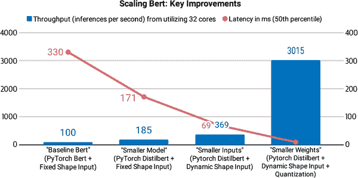

###### 图 8-1\. Roblox 如何通过知识蒸馏、动态填充和权重量化扩展 BERT（照片由 Roblox 员工 Quoc N. Le 和 Kip Kaehler 提供）

为了说明与每种技术相关的好处和权衡，我们将以意图检测为案例研究；这是基于文本的助手的重要组成部分，低延迟对于实时维持对话至关重要。在学习的过程中，您将学习如何创建自定义训练器，执行高效的超参数搜索，并了解实施最前沿研究所需的内容，使用 Transformers。让我们开始吧！

# 以意图检测为案例研究

假设我们正在尝试为公司的呼叫中心构建一个基于文本的助手，以便客户可以在不需要与人类代理交谈的情况下请求其账户余额或进行预订。为了理解客户的目标，我们的助手需要能够将各种自然语言文本分类为一组预定义的动作或*意图*。例如，客户可能会发送以下关于即将到来的旅行的消息：

> 嘿，我想在 11 月 1 日到 11 月 15 日在巴黎租一辆车，我需要一辆 15 座位的面包车。

我们的意图分类器可以自动将此分类为*租车*意图，然后触发一个动作和响应。为了在生产环境中具有鲁棒性，我们的分类器还需要能够处理*超出范围*的查询，即客户提出不属于任何预定义意图的查询，系统应该产生一个回退响应。例如，在图 8-2 中显示的第二种情况中，客户询问有关体育的问题（超出范围），文本助手错误地将其分类为已知的范围内意图之一，并返回发薪日的响应。在第三种情况下，文本助手已经被训练来检测超出范围的查询（通常标记为一个单独的类），并告知客户它可以回答关于哪些主题的问题。


###### 图 8-2\. 人类（右）和基于文本的助手（左）之间的三次交流，涉及个人理财（由 Stefan Larson 等人提供）

作为基准，我们微调了一个 BERT-base 模型，在 CLINC150 数据集上达到了约 94%的准确性。这个数据集包括 150 个意图和 10 个领域（如银行和旅行）中的 22,500 个范围内查询，还包括属于`oos`意图类别的 1,200 个范围外查询。在实践中，我们还会收集自己的内部数据集，但使用公共数据是快速迭代和生成初步结果的好方法。

让我们从 Hugging Face Hub 下载我们微调的模型，并将其包装成文本分类的管道：

```py
from transformers import pipeline

bert_ckpt = "transformersbook/bert-base-uncased-finetuned-clinc"
pipe = pipeline("text-classification", model=bert_ckpt)
```

现在我们有了一个管道，我们可以传递一个查询以从模型获取预测的意图和置信度分数：

```py
query = """Hey, I'd like to rent a vehicle from Nov 1st to Nov 15th in
Paris and I need a 15 passenger van"""
pipe(query)
```

```py
[{'label': 'car_rental', 'score': 0.549003541469574}]
```

很好，`car_rental`意图是有意义的。现在让我们看看创建一个基准，我们可以用来评估我们基准模型的性能。

# 创建性能基准

与其他机器学习模型一样，在生产环境中部署 transformers 涉及在几个约束条件之间进行权衡，最常见的是：

*模型性能*

我们的模型在反映生产数据的精心设计的测试集上表现如何？当错误的成本很高时（最好通过人为干预来减轻），或者当我们需要对数百万个示例进行推断，并且模型指标的小幅改进可以转化为大幅增益时，这一点尤为重要。

*延迟*

我们的模型能够多快地提供预测？我们通常关心实时环境中的延迟，这些环境处理大量流量，就像 Stack Overflow 需要一个分类器来快速[检测网站上不受欢迎的评论](https://oreil.ly/cf7QX)一样。

*内存*

我们如何部署像 GPT-2 或 T5 这样需要占用几 GB 磁盘存储和内存的百亿参数模型？内存在移动设备或边缘设备中扮演着特别重要的角色，因为模型必须在没有强大的云服务器的情况下生成预测。

未能解决这些约束条件可能会对应用程序的用户体验产生负面影响。更常见的是，可能会导致运行昂贵的云服务器的成本激增，而这些服务器可能只需要处理少量请求。为了探索如何使用各种压缩技术优化这些约束条件，让我们从创建一个简单的基准开始，该基准可以测量给定管道和测试集的每个数量：

```py
class PerformanceBenchmark:
    def __init__(self, pipeline, dataset, optim_type="BERT baseline"):
        self.pipeline = pipeline
        self.dataset = dataset
        self.optim_type = optim_type

    def compute_accuracy(self):
        # We'll define this later
        pass

    def compute_size(self):
        # We'll define this later
        pass

    def time_pipeline(self):
        # We'll define this later
        pass

    def run_benchmark(self):
        metrics = {}
        metrics[self.optim_type] = self.compute_size()
        metrics[self.optim_type].update(self.time_pipeline())
        metrics[self.optim_type].update(self.compute_accuracy())
        return metrics
```

我们定义了一个`optim_type`参数，以跟踪我们在本章中将涵盖的不同优化技术。我们将使用`run_benchmark()`方法将所有指标收集到一个字典中，键由`optim_type`给出。

让我们现在通过在测试集上计算模型的准确性来为这个类添加一些具体内容。首先，我们需要一些数据进行测试，所以让我们下载用于微调基准模型的 CLINC150 数据集。我们可以通过以下方式从 Hub 获取数据集：。

```py
from datasets import load_dataset

clinc = load_dataset("clinc_oos", "plus")
```

在这里，`plus`配置是指包含超出范围的训练示例的子集。CLINC150 数据集中的每个示例都包括`text`列中的查询及其对应的意图。我们将使用测试集来对我们的模型进行基准测试，所以让我们看一下数据集的一个示例：

```py
sample = clinc["test"][42]
sample
```

```py
{'intent': 133, 'text': 'transfer $100 from my checking to saving account'}
```

意图以 ID 的形式提供，但我们可以通过访问数据集的`features`属性轻松获取到字符串的映射（反之亦然）：

```py
intents = clinc["test"].features["intent"]
intents.int2str(sample["intent"])
```

```py
'transfer'
```

现在我们对 CLINC150 数据集的内容有了基本的了解，让我们实现`PerformanceBenchmark`的`compute_accuracy()`方法。由于数据集在意图类别上是平衡的，我们将使用准确性作为我们的度量标准。我们可以通过以下方式使用数据集加载这个度量标准：

```py
from datasets import load_metric

accuracy_score = load_metric("accuracy")
```

准确度指标期望预测和参考（即，真实标签）是整数。我们可以使用管道从`text`字段中提取预测，然后使用我们的`intents`对象的“str2int（）”方法将每个预测映射到其相应的 ID。以下代码在返回数据集的准确度之前收集所有的预测和标签。让我们也将其添加到我们的“PerformanceBenchmark”类中：

```py
def compute_accuracy(self):
    """This overrides the PerformanceBenchmark.compute_accuracy() method"""
    preds, labels = [], []
    for example in self.dataset:
        pred = self.pipeline(example["text"])[0]["label"]
        label = example["intent"]
        preds.append(intents.str2int(pred))
        labels.append(label)
    accuracy = accuracy_score.compute(predictions=preds, references=labels)
    print(f"Accuracy on test set - {accuracy['accuracy']:.3f}")
    return accuracy

PerformanceBenchmark.compute_accuracy = compute_accuracy
```

接下来，让我们使用 PyTorch 的“torch.save（）”函数来计算我们模型的大小，将模型序列化到磁盘上。在内部，“torch.save（）”使用 Python 的`pickle`模块，可以用来保存从模型到张量到普通 Python 对象的任何东西。在 PyTorch 中，保存模型的推荐方式是使用它的`state_dict`，这是一个 Python 字典，将模型中的每一层映射到它的可学习参数（即，权重和偏置）。让我们看看我们基准模型的`state_dict`中存储了什么：

```py
list(pipe.model.state_dict().items())[42]
```

```py
('bert.encoder.layer.2.attention.self.value.weight',
 tensor([[-1.0526e-02, -3.2215e-02,  2.2097e-02,  ..., -6.0953e-03,
           4.6521e-03,  2.9844e-02],
         [-1.4964e-02, -1.0915e-02,  5.2396e-04,  ...,  3.2047e-05,
          -2.6890e-02, -2.1943e-02],
         [-2.9640e-02, -3.7842e-03, -1.2582e-02,  ..., -1.0917e-02,
           3.1152e-02, -9.7786e-03],
         ...,
         [-1.5116e-02, -3.3226e-02,  4.2063e-02,  ..., -5.2652e-03,
           1.1093e-02,  2.9703e-03],
         [-3.6809e-02,  5.6848e-02, -2.6544e-02,  ..., -4.0114e-02,
           6.7487e-03,  1.0511e-03],
         [-2.4961e-02,  1.4747e-03, -5.4271e-02,  ...,  2.0004e-02,
           2.3981e-02, -4.2880e-02]]))
```

我们可以清楚地看到每个键/值对对应于 BERT 中的特定层和张量。因此，如果我们用以下方式保存我们的模型：

```py
torch.save(pipe.model.state_dict(), "model.pt")
```

我们可以使用 Python 的`pathlib`模块中的“Path.stat（）”函数来获取有关底层文件的信息。特别是，“Path（"model.​pt"）.​stat（）.​st_size”将给出模型的大小（以字节为单位）。让我们将所有这些放在“compute_​size（）”函数中，并将其添加到`PerformanceBenchmark`中：

```py
import torch
from pathlib import Path

def compute_size(self):
    """This overrides the PerformanceBenchmark.compute_size() method"""
    state_dict = self.pipeline.model.state_dict()
    tmp_path = Path("model.pt")
    torch.save(state_dict, tmp_path)
    # Calculate size in megabytes
    size_mb = Path(tmp_path).stat().st_size / (1024 * 1024)
    # Delete temporary file
    tmp_path.unlink()
    print(f"Model size (MB) - {size_mb:.2f}")
    return {"size_mb": size_mb}

PerformanceBenchmark.compute_size = compute_size
```

最后，让我们实现“time_pipeline（）”函数，以便我们可以计算每个查询的平均延迟时间。对于这个应用程序，延迟时间指的是将文本查询输入到管道中并从模型返回预测意图所需的时间。在内部，管道还会对文本进行标记化，但这比生成预测快了大约一千倍，因此对整体延迟时间的贡献可以忽略不计。衡量代码片段的执行时间的一个简单方法是使用 Python 的`time`模块中的“perf_counter（）”函数。这个函数比“time.time（）”函数具有更好的时间分辨率，非常适合获取精确的结果。

我们可以使用“perf_counter（）”通过传递我们的测试查询来计时我们的管道，并计算开始和结束之间的毫秒时间差：

```py
from time import perf_counter

for _ in range(3):
    start_time = perf_counter()
    _ = pipe(query)
    latency = perf_counter() - start_time
    print(f"Latency (ms) - {1000 * latency:.3f}")
```

```py
Latency (ms) - 85.367
Latency (ms) - 85.241
Latency (ms) - 87.275
```

这些结果展示了延迟时间的相当大的差异，并且表明通过管道的单次计时可能每次运行代码时都会得到完全不同的结果。因此，我们将收集多次运行的延迟时间，然后使用得到的分布来计算均值和标准差，这将让我们对数值的差异有一个概念。以下代码实现了我们需要的功能，并包括了在执行实际计时运行之前预热 CPU 的阶段：

```py
import numpy as np

def time_pipeline(self, query="What is the pin number for my account?"):
    """This overrides the PerformanceBenchmark.time_pipeline() method"""
    latencies = []
    # Warmup
    for _ in range(10):
        _ = self.pipeline(query)
    # Timed run
    for _ in range(100):
        start_time = perf_counter()
        _ = self.pipeline(query)
        latency = perf_counter() - start_time
        latencies.append(latency)
    # Compute run statistics
    time_avg_ms = 1000 * np.mean(latencies)
    time_std_ms = 1000 * np.std(latencies)
    print(f"Average latency (ms) - {time_avg_ms:.2f} +\- {time_std_ms:.2f}")
    return {"time_avg_ms": time_avg_ms, "time_std_ms": time_std_ms}

PerformanceBenchmark.time_pipeline = time_pipeline
```

为了简化问题，我们将使用相同的`query`值来对我们所有的模型进行基准测试。一般来说，延迟时间将取决于查询长度，一个好的做法是使用模型可能在生产环境中遇到的查询来对模型进行基准测试。

现在我们的`PerformanceBenchmark`类已经完成，让我们来试一试吧！让我们从对我们的 BERT 基准模型进行基准测试开始。对于基准模型，我们只需要传递管道和我们希望进行基准测试的数据集。我们将在`perf_metrics`字典中收集结果，以跟踪每个模型的性能：

```py
pb = PerformanceBenchmark(pipe, clinc["test"])
perf_metrics = pb.run_benchmark()
```

```py
Model size (MB) - 418.16
Average latency (ms) - 54.20 +\- 1.91
Accuracy on test set - 0.867
```

现在我们有了一个参考点，让我们来看看我们的第一个压缩技术：知识蒸馏。

###### 注意

平均延迟值将取决于您所运行的硬件类型。例如，通常可以通过在 GPU 上运行推断来获得更好的性能，因为它可以实现批处理。对于本章的目的，重要的是模型之间延迟时间的相对差异。一旦确定了性能最佳的模型，我们可以探索不同的后端来减少绝对延迟时间（如果需要）。

# 通过知识蒸馏使模型变得更小

知识蒸馏是一种通用方法，用于训练一个较小的“学生”模型来模仿速度较慢、更大但性能更好的“教师”模型的行为。最初是在 2006 年在集成模型的背景下引入的，后来在一篇著名的 2015 年论文中将该方法推广到深度神经网络，并将其应用于图像分类和自动语音识别。

鉴于预训练语言模型参数数量不断增加的趋势（撰写时最大的模型参数超过一万亿），知识蒸馏也成为压缩这些庞大模型并使其更适合构建实际应用的流行策略。

## 微调的知识蒸馏

那么在训练过程中，知识实际上是如何从教师传递给学生的呢？对于微调等监督任务，主要思想是用教师的“软概率”分布来增强地面真实标签，为学生提供补充信息。例如，如果我们的 BERT-base 分类器为多个意图分配高概率，那么这可能表明这些意图在特征空间中相互靠近。通过训练学生模仿这些概率，目标是蒸馏教师学到的一些“暗知识”——也就是，仅从标签中无法获得的知识。

从数学上讲，这是如何工作的。假设我们将输入序列*x*提供给教师，以生成一个对数向量<math alttext="bold z left-parenthesis x right-parenthesis"><mrow><mi>𝐳</mi> <mo>(</mo> <mi>x</mi> <mo>)</mo></mrow></math> = [ <math alttext="z 1 left-parenthesis x right-parenthesis comma ellipsis comma z Subscript upper N Baseline left-parenthesis x right-parenthesis"><mrow><msub><mi>z</mi> <mn>1</mn></msub> <mrow><mo>(</mo> <mi>x</mi> <mo>)</mo></mrow> <mo>,</mo> <mo>...</mo> <mo>,</mo> <msub><mi>z</mi> <mi>N</mi></sub> <mrow><mo>(</mo> <mi>x</mi> <mo>)</mo></mrow></mrow></math> ]。我们可以通过应用 softmax 函数将这些对数转换为概率：

<math alttext="StartFraction exp left-parenthesis z Subscript i Baseline left-parenthesis x right-parenthesis right-parenthesis Over sigma-summation Underscript j Endscripts exp left-parenthesis z Subscript i Baseline left-parenthesis x right-parenthesis right-parenthesis EndFraction" display="block"><mrow><mfrac><mrow><mo form="prefix">exp</mo><mo>(</mo><msub><mi>z</mi> <mi>i</mi></msub> <mrow><mo>(</mo><mi>x</mi><mo>)</mo></mrow><mo>)</mo></mrow> <mrow><msub><mo>∑</mo> <mi>j</mi></msub> <mo form="prefix">exp</mo><mrow><mo>(</mo><msub><mi>z</mi> <mi>i</mi></msub> <mrow><mo>(</mo><mi>x</mi><mo>)</mo></mrow><mo>)</mo></mrow></mrow></mfrac></mrow></math>

然而，这并不是我们想要的，因为在许多情况下，教师会为一个类分配高概率，而其他类的概率接近于零。当发生这种情况时，教师除了地面真实标签外并没有提供太多额外信息，因此我们会在应用 softmax 之前，通过一个温度超参数*T*来缩放对数，从而“软化”概率。

<math alttext="p Subscript i Baseline left-parenthesis x right-parenthesis equals StartFraction exp left-parenthesis z Subscript i Baseline left-parenthesis x right-parenthesis slash upper T right-parenthesis Over sigma-summation Underscript j Endscripts exp left-parenthesis z Subscript i Baseline left-parenthesis x right-parenthesis slash upper T right-parenthesis EndFraction" display="block"><mrow><msub><mi>p</mi> <mi>i</mi></msub> <mrow><mo>(</mo> <mi>x</mi> <mo>)</mo></mrow> <mo>=</mo> <mfrac><mrow><mo form="prefix">exp</mo><mo>(</mo><msub><mi>z</mi> <mi>i</mi></msub> <mrow><mo>(</mo><mi>x</mi><mo>)</mo></mrow><mo>/</mo><mi>T</mi><mo>)</mo></mrow> <mrow><msub><mo>∑</mo> <mi>j</mi></msub> <mo form="prefix">exp</mo><mrow><mo>(</mo><msub><mi>z</mi> <mi>i</mi></msub> <mrow><mo>(</mo><mi>x</mi><mo>)</mo></mrow><mo>/</mo><mi>T</mi><mo>)</mo></mrow></mrow></mfrac></mrow></math>

如图 8-3 所示，*T*的值越高，类别上的软化概率分布就越软，可以更多地揭示老师对每个训练示例学习的决策边界。当<math alttext="upper T equals 1"><mrow><mi>T</mi> <mo>=</mo> <mn>1</mn></mrow></math>时，我们恢复了原始的 softmax 分布。

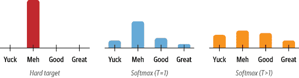

###### 图 8-3。一个使用 one-hot 编码的硬标签（左）、softmax 概率（中）和软化类别概率（右）的比较。

由于学生还产生了自己的软化概率<math alttext="q Subscript i Baseline left-parenthesis x right-parenthesis"><mrow><msub><mi>q</mi> <mi>i</mi></msub> <mrow><mo>(</mo> <mi>x</mi> <mo>)</mo></mrow></mrow></math>，我们可以使用[Kullback-Leibler（KL）](https://oreil.ly/8nKQG)散度来衡量两个概率分布之间的差异：

<math alttext="upper D Subscript upper K upper L Baseline left-parenthesis p comma q right-parenthesis equals sigma-summation Underscript i Endscripts p Subscript i Baseline left-parenthesis x right-parenthesis log StartFraction p Subscript i Baseline left-parenthesis x right-parenthesis Over q Subscript i Baseline left-parenthesis x right-parenthesis EndFraction" display="block"><mrow><msub><mi>D</mi> <mrow><mi>K</mi><mi>L</mi></mrow></msub> <mrow><mo>(</mo> <mi>p</mi> <mo>,</mo> <mi>q</mi> <mo>)</mo></mrow> <mo>=</mo> <munder><mo>∑</mo> <mi>i</mi></munder> <msub><mi>p</mi> <mi>i</mi></msub> <mrow><mo>(</mo> <mi>x</mi> <mo>)</mo></mrow> <mo form="prefix">log</mo> <mfrac><mrow><msub><mi>p</mi> <mi>i</mi></msub> <mrow><mo>(</mo><mi>x</mi><mo>)</mo></mrow></mrow> <mrow><msub><mi>q</mi> <mi>i</mi></msub> <mrow><mo>(</mo><mi>x</mi><mo>)</mo></mrow></mrow></mfrac></mrow></math>

通过 KL 散度，我们可以计算当我们用学生来近似老师的概率分布时损失了多少。这使我们能够定义知识蒸馏损失：

<math alttext="upper L Subscript upper K upper D Baseline equals upper T squared upper D Subscript upper K upper L" display="block"><mrow><msub><mi>L</mi> <mrow><mi>K</mi><mi>D</mi></mrow></msub> <mo>=</mo> <msup><mi>T</mi> <mn>2</mn></msup> <msub><mi>D</mi> <mrow><mi>K</mi><mi>L</mi></mrow></msub></mrow></math>

其中<math alttext="upper T squared"><msup><mi>T</mi> <mn>2</mn></msup></math>是一个归一化因子，用于考虑软标签产生的梯度大小按<math alttext="1 slash upper T squared"><mrow><mn>1</mn> <mo>/</mo> <msup><mi>T</mi> <mn>2</mn></msup></mrow></math>缩放的事实。对于分类任务，学生的损失是蒸馏损失和地面真实标签的交叉熵损失<math alttext="upper L Subscript upper C upper E"><msub><mi>L</mi> <mrow><mi>C</mi><mi>E</mi></mrow></msub></math>的加权平均：

<math alttext="upper L Subscript normal s normal t normal u normal d normal e normal n normal t Baseline equals alpha upper L Subscript upper C upper E Baseline plus left-parenthesis 1 minus alpha right-parenthesis upper L Subscript upper K upper D" display="block"><mrow><msub><mi>L</mi> <mi>student</mi></msub> <mo>=</mo> <mi>α</mi> <msub><mi>L</mi> <mrow><mi>C</mi><mi>E</mi></mrow></msub> <mo>+</mo> <mrow><mo>(</mo> <mn>1</mn> <mo>-</mo> <mi>α</mi> <mo>)</mo></mrow> <msub><mi>L</mi> <mrow><mi>K</mi><mi>D</mi></mrow></msub></mrow></math>

其中<math alttext="alpha"><mi>α</mi></math>是一个控制每个损失相对强度的超参数。整个过程的图表如图 8-4 所示；在推断时，温度被设置为 1，以恢复标准的 softmax 概率。

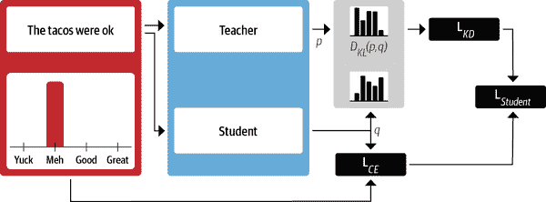

###### 图 8-4。知识蒸馏过程

## 预训练的知识蒸馏

知识蒸馏也可以在预训练期间使用，以创建一个通用的学生模型，随后可以在下游任务上进行精细调整。在这种情况下，教师是一个预训练的语言模型，如 BERT，它将其关于掩码语言建模的知识转移到学生身上。例如，在 DistilBERT 论文中，⁸掩码语言建模损失<math alttext="upper L Subscript m l m"><msub><mi>L</mi> <mrow><mi>m</mi><mi>l</mi><mi>m</mi></mrow></msub></math>被知识蒸馏的一个项和余弦嵌入损失<math alttext="upper L Subscript c o s Baseline equals 1 minus cosine left-parenthesis h Subscript s Baseline comma h Subscript t Baseline right-parenthesis"><mrow><msub><mi>L</mi> <mrow><mi>c</mi><mi>o</mi><mi>s</mi></mrow></msub> <mo>=</mo> <mn>1</mn> <mo>-</mo> <mo form="prefix">cos</mo> <mrow><mo>(</mo> <msub><mi>h</mi> <mi>s</mi></msub> <mo>,</mo> <msub><mi>h</mi> <mi>t</mi></msub> <mo>)</mo></mrow></mrow></math>来对齐教师和学生之间的隐藏状态向量的方向：

<math alttext="upper L Subscript normal upper D normal i normal s normal t normal i normal l normal upper B normal upper E normal upper R normal upper T Baseline equals alpha upper L Subscript m l m Baseline plus beta upper L Subscript upper K upper D Baseline plus gamma upper L Subscript c o s" display="block"><mrow><msub><mi>L</mi> <mi>DistilBERT</mi></msub> <mo>=</mo> <mi>α</mi> <msub><mi>L</mi> <mrow><mi>m</mi><mi>l</mi><mi>m</mi></mrow></msub> <mo>+</mo> <mi>β</mi> <msub><mi>L</mi> <mrow><mi>K</mi><mi>D</mi></mrow></msub> <mo>+</mo> <mi>γ</mi> <msub><mi>L</mi> <mrow><mi>c</mi><mi>o</mi><mi>s</mi></mrow></msub></mrow></math>

由于我们已经有了一个经过精细调整的 BERT-base 模型，让我们看看如何使用知识蒸馏来对一个更小更快的模型进行精细调整。为了做到这一点，我们需要一种方法来将交叉熵损失与<math alttext="upper L Subscript upper K upper D"><msub><mi>L</mi> <mrow><mi>K</mi><mi>D</mi></mrow></msub></math>项相结合。幸运的是，我们可以通过创建自己的训练器来实现这一点！

## 创建知识蒸馏训练器

要实现知识蒸馏，我们需要向`Trainer`基类添加一些内容：

+   新的超参数<math alttext="alpha"><mi>α</mi></math>和*T*，它们控制蒸馏损失的相对权重以及标签的概率分布应该被平滑的程度

+   经过精细调整的教师模型，我们的情况下是 BERT-base

+   结合交叉熵损失和知识蒸馏损失的新损失函数

添加新的超参数非常简单，因为我们只需要对`TrainingArguments`进行子类化，并将它们包含为新的属性：

```py
from transformers import TrainingArguments

class DistillationTrainingArguments(TrainingArguments):
    def __init__(self, *args, alpha=0.5, temperature=2.0, **kwargs):
        super().__init__(*args, **kwargs)
        self.alpha = alpha
        self.temperature = temperature
```

对于训练器本身，我们需要一个新的损失函数。实现这一点的方法是通过对`Trainer`进行子类化，并覆盖`compute_loss()`方法，以包括知识蒸馏损失项<math alttext="upper L Subscript upper K upper D"><msub><mi>L</mi> <mrow><mi>K</mi><mi>D</mi></mrow></msub></math>：

```py
import torch.nn as nn
import torch.nn.functional as F
from transformers import Trainer

class DistillationTrainer(Trainer):
    def __init__(self, *args, teacher_model=None, **kwargs):
        super().__init__(*args, **kwargs)
        self.teacher_model = teacher_model

    def compute_loss(self, model, inputs, return_outputs=False):
        outputs_stu = model(**inputs)
        # Extract cross-entropy loss and logits from student
        loss_ce = outputs_stu.loss
        logits_stu = outputs_stu.logits
        # Extract logits from teacher
        with torch.no_grad():
            outputs_tea = self.teacher_model(**inputs)
            logits_tea = outputs_tea.logits
        # Soften probabilities and compute distillation loss
        loss_fct = nn.KLDivLoss(reduction="batchmean")
        loss_kd = self.args.temperature ** 2 * loss_fct(
            F.log_softmax(logits_stu / self.args.temperature, dim=-1),
            F.softmax(logits_tea / self.args.temperature, dim=-1))
        # Return weighted student loss
        loss = self.args.alpha * loss_ce + (1. - self.args.alpha) * loss_kd
        return (loss, outputs_stu) if return_outputs else loss
```

让我们解开一下这段代码。当我们实例化`DistillationTrainer`时，我们传递了一个已经在我们的任务上进行了微调的老师模型。接下来，在`compute_loss()`方法中，我们从学生和老师那里提取 logits，通过温度对它们进行缩放，然后在传递给 PyTorch 的`nn.KLDivLoss()`函数之前，使用 softmax 对它们进行归一化以计算 KL 散度。`nn.KLDivLoss()`的一个怪癖是，它期望输入以对数概率的形式，标签以正常概率的形式。这就是为什么我们使用`F.log_softmax()`函数对学生的 logits 进行归一化，而老师的 logits 则使用标准 softmax 转换为概率。`nn.KLDivLoss()`中的`reduction=batchmean`参数指定我们在批维度上平均损失。

###### 提示

您还可以使用 Transformers 库的 Keras API 进行知识蒸馏。为此，您需要实现一个自定义的`Distiller`类，覆盖`tf.keras.Model()`的`train_step()`、`test_step()`和`compile()`方法。请参阅[Keras 文档](https://oreil.ly/6qp0F)了解如何实现。

## 选择一个好的学生初始化

现在我们有了自定义的训练器，您可能会问的第一个问题是，我们应该为学生选择哪个预训练语言模型？一般来说，我们应该为学生选择一个较小的模型，以减少延迟和内存占用。从文献中得出的一个很好的经验法则是，当老师和学生是相同的*模型类型*时，知识蒸馏效果最好。⁹这样做的一个可能原因是，不同的模型类型，比如 BERT 和 RoBERTa，可能具有不同的输出嵌入空间，这会妨碍学生模仿老师的能力。在我们的案例研究中，老师是 BERT，因此 DistilBERT 是一个自然的候选，因为它的参数少了 40%，并且已经在下游任务中取得了良好的结果。

首先，我们需要对我们的查询进行标记化和编码，因此让我们实例化来自 DistilBERT 的标记器，并创建一个简单的`tokenize_text()`函数来处理预处理：

```py
from transformers import AutoTokenizer

student_ckpt = "distilbert-base-uncased"
student_tokenizer = AutoTokenizer.from_pretrained(student_ckpt)

def tokenize_text(batch):
    return student_tokenizer(batch["text"], truncation=True)

clinc_enc = clinc.map(tokenize_text, batched=True, remove_columns=["text"])
clinc_enc = clinc_enc.rename_column("intent", "labels")
```

在这里，我们已经删除了`text`列，因为我们不再需要它，我们还将`intent`列重命名为`labels`，以便训练器可以自动检测到它。¹⁰

现在我们已经处理了我们的文本，接下来我们需要做的是为我们的`DistillationTrainer`定义超参数和`compute_metrics()`函数。我们还将把所有的模型推送到 Hugging Face Hub，所以让我们首先登录到我们的账户：

```py
from huggingface_hub import notebook_login

notebook_login()
```

接下来，我们将定义训练过程中要跟踪的指标。就像我们在性能基准测试中所做的那样，我们将使用准确性作为主要指标。这意味着我们可以在`compute_metrics()`函数中重用我们的`accuracy_score()`函数，这个函数将包含在`DistillationTrainer`中：

```py
def compute_metrics(pred):
    predictions, labels = pred
    predictions = np.argmax(predictions, axis=1)
    return accuracy_score.compute(predictions=predictions, references=labels)
```

在这个函数中，序列建模头部的预测以 logits 的形式出现，因此我们使用`np.argmax()`函数找到最有信心的类别预测，并将其与地面真相标签进行比较。

接下来我们需要定义训练参数。为了热身，我们将设置<math alttext="alpha equals 1"><mrow><mi>α</mi> <mo>=</mo> <mn>1</mn></mrow></math>，以查看 DistilBERT 在没有来自教师的任何信号的情况下的表现。¹¹然后我们将我们的微调模型推送到一个名为`distilbert-base-uncased-finetuned-clinc`的新存储库，所以我们只需要在`DistillationTrainingArguments`的`output_dir`参数中指定它：

```py
batch_size = 48

finetuned_ckpt = "distilbert-base-uncased-finetuned-clinc"
student_training_args = DistillationTrainingArguments(
    output_dir=finetuned_ckpt, evaluation_strategy = "epoch",
    num_train_epochs=5, learning_rate=2e-5,
    per_device_train_batch_size=batch_size,
    per_device_eval_batch_size=batch_size, alpha=1, weight_decay=0.01,
    push_to_hub=True)
```

我们还调整了一些默认超参数值，比如 epochs 的数量，权重衰减和学习率。接下来要做的是初始化一个学生模型。由于我们将使用训练器进行多次运行，我们将创建一个`student_init()`函数，以便在每次调用`train()`方法时初始化一个新模型。当我们将这个函数传递给`DistillationTrainer`时，这将确保我们每次调用`train()`方法时初始化一个新模型。

我们还需要做的另一件事是为学生模型提供每个意图和标签 ID 之间的映射。这些映射可以从我们在流水线中下载的 BERT-base 模型中获得：

```py
id2label = pipe.model.config.id2label
label2id = pipe.model.config.label2id
```

有了这些映射，我们现在可以使用`AutoConfig`类创建一个自定义模型配置，这是我们在第三章和第四章中遇到的。让我们使用这个为我们的学生创建一个包含标签映射信息的配置：

```py
from transformers import AutoConfig

num_labels = intents.num_classes
student_config = (AutoConfig
                  .from_pretrained(student_ckpt, num_labels=num_labels,
                                   id2label=id2label, label2id=label2id))
```

在这里，我们还指定了我们的模型应该期望的类的数量。然后我们可以将这个配置提供给`AutoModelForSequenceClassification`类的`from_pretrained()`函数，如下所示：

```py
import torch
from transformers import AutoModelForSequenceClassification

device = torch.device("cuda" if torch.cuda.is_available() else "cpu")

def student_init():
    return (AutoModelForSequenceClassification
            .from_pretrained(student_ckpt, config=student_config).to(device))
```

现在我们已经拥有了我们的蒸馏训练器所需的所有要素，让我们加载教师并进行微调：

```py
teacher_ckpt = "transformersbook/bert-base-uncased-finetuned-clinc"
teacher_model = (AutoModelForSequenceClassification
                 .from_pretrained(teacher_ckpt, num_labels=num_labels)
                 .to(device))
```

```py
distilbert_trainer = DistillationTrainer(model_init=student_init,
    teacher_model=teacher_model, args=student_training_args,
    train_dataset=clinc_enc['train'], eval_dataset=clinc_enc['validation'],
    compute_metrics=compute_metrics, tokenizer=student_tokenizer)

distilbert_trainer.train()
```

| Epoch | Training Loss | Validation Loss | Accuracy |
| --- | --- | --- | --- |
| --- | --- | --- | --- |
| 1 | 4.2923 | 3.289337 | 0.742258 |
| 2 | 2.6307 | 1.883680 | 0.828065 |
| 3 | 1.5483 | 1.158315 | 0.896774 |
| 4 | 1.0153 | 0.861815 | 0.909355 |
| 5 | 0.7958 | 0.777289 | 0.917419 |

验证集上的 92%准确率看起来相当不错，与 BERT-base 教师实现的 94%相比。现在我们已经对 DistilBERT 进行了微调，让我们将模型推送到 Hub，以便以后重用：

```py
distilbert_trainer.push_to_hub("Training completed!")
```

现在我们的模型已经安全地存储在 Hub 上，我们可以立即在性能基准测试的流水线中使用它：

```py
finetuned_ckpt = "transformersbook/distilbert-base-uncased-finetuned-clinc"
pipe = pipeline("text-classification", model=finetuned_ckpt)
```

然后我们可以将这个流水线传递给我们的`PerformanceBenchmark`类，以计算与这个模型相关的指标：

```py
optim_type = "DistilBERT"
pb = PerformanceBenchmark(pipe, clinc["test"], optim_type=optim_type)
perf_metrics.update(pb.run_benchmark())
```

```py
Model size (MB) - 255.89
Average latency (ms) - 27.53 +\- 0.60
Accuracy on test set - 0.858
```

为了将这些结果与我们的基准进行比较，让我们创建一个散点图，显示准确性与延迟之间的关系，每个点的半径对应于磁盘上模型的大小。以下函数可以满足我们的需求，并将当前优化类型标记为虚线圆圈，以便与以前的结果进行比较：

```py
import pandas as pd

def plot_metrics(perf_metrics, current_optim_type):
    df = pd.DataFrame.from_dict(perf_metrics, orient='index')

    for idx in df.index:
        df_opt = df.loc[idx]
        # Add a dashed circle around the current optimization type
        if idx == current_optim_type:
            plt.scatter(df_opt["time_avg_ms"], df_opt["accuracy"] * 100,
                        alpha=0.5, s=df_opt["size_mb"], label=idx,
                        marker='$\u25CC$')
        else:
            plt.scatter(df_opt["time_avg_ms"], df_opt["accuracy"] * 100,
                        s=df_opt["size_mb"], label=idx, alpha=0.5)

    legend = plt.legend(bbox_to_anchor=(1,1))
    for handle in legend.legendHandles:
        handle.set_sizes([20])

    plt.ylim(80,90)
    # Use the slowest model to define the x-axis range
    xlim = int(perf_metrics["BERT baseline"]["time_avg_ms"] + 3)
    plt.xlim(1, xlim)
    plt.ylabel("Accuracy (%)")
    plt.xlabel("Average latency (ms)")
    plt.show()

plot_metrics(perf_metrics, optim_type)
```

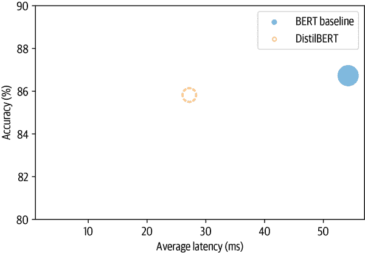

从图中我们可以看到，通过使用一个更小的模型，我们成功地显著降低了平均延迟。而这一切只需牺牲了略微超过 1%的准确性！让我们看看是否可以通过包括教师的蒸馏损失并找到<math alttext="alpha"><mi>α</mi></math>和*T*的良好值来缩小最后的差距。

## 使用 Optuna 找到良好的超参数

为了找到<math alttext="alpha"><mi>α</mi></math>和*T*的良好值，我们可以在 2D 参数空间上进行网格搜索。但一个更好的选择是使用*Optuna*，¹²这是一个专为这种任务设计的优化框架。Optuna 通过多次*trials*优化目标函数来制定搜索问题。例如，假设我们希望最小化 Rosenbrock 的[“香蕉函数”](https://oreil.ly/hPk8h)：

<math alttext="f left-parenthesis x comma y right-parenthesis equals left-parenthesis 1 minus x right-parenthesis squared plus 100 left-parenthesis y minus x squared right-parenthesis squared" display="block"><mrow><mi>f</mi> <mrow><mo>(</mo> <mi>x</mi> <mo>,</mo> <mi>y</mi> <mo>)</mo></mrow> <mo>=</mo> <msup><mrow><mo>(</mo><mn>1</mn><mo>-</mo><mi>x</mi><mo>)</mo></mrow> <mn>2</mn></msup> <mo>+</mo> <mn>100</mn> <msup><mrow><mo>(</mo><mi>y</mi><mo>-</mo><msup><mi>x</mi> <mn>2</mn></msup> <mo>)</mo></mrow> <mn>2</mn></msup></mrow></math>

这是一个著名的优化框架的测试案例。如图 8-5 所示，该函数因其曲线轮廓而得名，并且在<math alttext="left-parenthesis x comma y right-parenthesis equals left-parenthesis 1 comma 1 right-parenthesis"><mrow><mo>(</mo> <mi>x</mi> <mo>,</mo> <mi>y</mi> <mo>)</mo> <mo>=</mo> <mo>(</mo> <mn>1</mn> <mo>,</mo> <mn>1</mn> <mo>)</mo></mrow></math>处有一个全局最小值。找到这个谷是一个简单的优化问题，但收敛到全局最小值却不是。

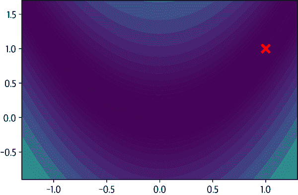

###### 图 8-5。两个变量的 Rosenbrock 函数的绘图

在 Optuna 中，我们可以通过定义一个`objective()`函数来找到<math alttext="f left-parenthesis x comma y right-parenthesis"><mrow><mi>f</mi> <mo>(</mo> <mi>x</mi> <mo>,</mo> <mi>y</mi> <mo>)</mo></mrow></math>的最小值，该函数返回<math alttext="f left-parenthesis x comma y right-parenthesis"><mrow><mi>f</mi> <mo>(</mo> <mi>x</mi> <mo>,</mo> <mi>y</mi> <mo>)</mo></mrow></math>的值：

```py
def objective(trial):
    x = trial.suggest_float("x", -2, 2)
    y = trial.suggest_float("y", -2, 2)
    return (1 - x) ** 2 + 100 * (y - x ** 2) ** 2
```

`trial.suggest_float`对象指定要均匀采样的参数范围；Optuna 还提供`suggest_int`和`suggest_categorical`用于整数和分类参数。Optuna 将多个试验收集为一个*study*，因此我们只需将`objective()`函数传递给`study.optimize()`来创建一个如下：

```py
import optuna

study = optuna.create_study()
study.optimize(objective, n_trials=1000)
```

一旦研究完成，我们就可以按照以下方式找到最佳参数：

```py
study.best_params
```

```py
{'x': 1.003024865971437, 'y': 1.00315167589307}
```

通过一千次试验，Optuna 已经成功找到了* x *和* y *的值，这些值与全局最小值相当接近。要在 Transformers 中使用 Optuna，我们首先定义要优化的超参数空间。除了<math alttext="alpha"> <mi>α</mi> </math>和*T*之外，我们还将包括训练周期的数量如下：

```py
def hp_space(trial):
    return {"num_train_epochs": trial.suggest_int("num_train_epochs", 5, 10),
        "alpha": trial.suggest_float("alpha", 0, 1),
        "temperature": trial.suggest_int("temperature", 2, 20)}
```

使用`Trainer`进行超参数搜索非常简单；我们只需要指定要运行的试验次数和要优化的方向。因为我们希望获得最佳准确度，所以在训练器的`hyper​para⁠meter_​search()`方法中指定`direction="maximize"`，并按如下方式传递超参数搜索空间：

```py
best_run = distilbert_trainer.hyperparameter_search(
    n_trials=20, direction="maximize", hp_space=hp_space)
```

`hyperparameter_search()`方法返回一个`BestRun`对象，其中包含了被最大化的目标值（默认为所有指标的总和）和该运行所使用的超参数：

```py
print(best_run)
```

```py
BestRun(run_id='1', objective=0.927741935483871,
hyperparameters={'num_train_epochs': 10, 'alpha': 0.12468168730193585,
'temperature': 7})
```

这个<math alttext="alpha"><mi>α</mi></math>的值告诉我们，大部分的训练信号来自知识蒸馏项。让我们使用这些值更新我们的训练参数，并运行最终的训练：

```py
for k,v in best_run.hyperparameters.items():
    setattr(student_training_args, k, v)

# Define a new repository to store our distilled model
distilled_ckpt = "distilbert-base-uncased-distilled-clinc"
student_training_args.output_dir = distilled_ckpt

# Create a new Trainer with optimal parameters
distil_trainer = DistillationTrainer(model_init=student_init,
    teacher_model=teacher_model, args=student_training_args,
    train_dataset=clinc_enc['train'], eval_dataset=clinc_enc['validation'],
    compute_metrics=compute_metrics, tokenizer=student_tokenizer)

distil_trainer.train();
```

| Epoch | Training Loss | Validation Loss | Accuracy |
| --- | --- | --- | --- |
| --- | --- | --- | --- |
| 1 | 0.9031 | 0.574540 | 0.736452 |
| 2 | 0.4481 | 0.285621 | 0.874839 |
| 3 | 0.2528 | 0.179766 | 0.918710 |
| 4 | 0.1760 | 0.139828 | 0.929355 |
| 5 | 0.1416 | 0.121053 | 0.934839 |
| 6 | 0.1243 | 0.111640 | 0.934839 |
| 7 | 0.1133 | 0.106174 | 0.937742 |
| 8 | 0.1075 | 0.103526 | 0.938710 |
| 9 | 0.1039 | 0.101432 | 0.938065 |
| 10 | 0.1018 | 0.100493 | 0.939355 |

值得注意的是，尽管参数数量几乎减少了一半，我们已经成功训练出学生模型与教师模型的准确度相匹配！让我们将模型推送到 Hub 以供将来使用：

```py
distil_trainer.push_to_hub("Training complete")
```

## 基准测试我们的精炼模型

现在我们有了一个准确的学生，让我们创建一个流水线，并重新进行我们的基准测试，看看我们在测试集上的表现如何：

```py
distilled_ckpt = "transformersbook/distilbert-base-uncased-distilled-clinc"
pipe = pipeline("text-classification", model=distilled_ckpt)
optim_type = "Distillation"
pb = PerformanceBenchmark(pipe, clinc["test"], optim_type=optim_type)
perf_metrics.update(pb.run_benchmark())
```

```py
Model size (MB) - 255.89
Average latency (ms) - 25.96 +\- 1.63
Accuracy on test set - 0.868
```

为了将这些结果放在上下文中，让我们还用我们的`plot_metrics()`函数将它们可视化：

```py
plot_metrics(perf_metrics, optim_type)
```

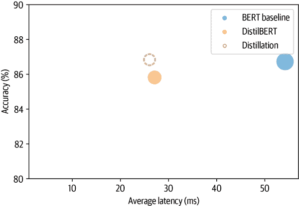

正如预期的那样，与 DistilBERT 基准相比，模型大小和延迟基本保持不变，但准确性得到了改善，甚至超过了教师的表现！解释这一令人惊讶的结果的一种方式是，教师很可能没有像学生那样系统地进行精细调整。这很好，但我们实际上可以使用一种称为量化的技术进一步压缩我们的精炼模型。这是下一节的主题。

# 使用量化使模型更快

我们现在已经看到，通过知识蒸馏，我们可以通过将信息从教师传递到更小的学生来减少运行推断的计算和内存成本。量化采用了不同的方法；它不是减少计算的数量，而是通过使用低精度数据类型（如 8 位整数（INT8））代替通常的 32 位浮点数（FP32）来使它们更加高效。减少位数意味着结果模型需要更少的内存存储，并且像矩阵乘法这样的操作可以通过整数运算更快地执行。值得注意的是，这些性能增益可以在几乎没有准确性损失的情况下实现！

量化背后的基本思想是，我们可以通过将张量中的浮点值*f*的范围[ <math alttext="f Subscript normal m normal a normal x Baseline comma f Subscript normal m normal i normal n Baseline"><mrow><msub><mi>f</mi> <mi>max</mi></msub> <mo>,</mo> <msub><mi>f</mi> <mi>min</mi></msub></mrow></math> ]映射到一个较小的范围[ <math alttext="q Subscript normal m normal a normal x Baseline comma q Subscript normal m normal i normal n Baseline"><mrow><msub><mi>q</mi> <mi>max</mi></msub> <mo>,</mo> <msub><mi>q</mi> <mi>min</mi></msub></mrow></math> ]中的固定点数<math alttext="q"><mi>q</mi></math>，并线性分布所有值。从数学上讲，这种映射由以下方程描述：

<math alttext="f equals left-parenthesis StartFraction f Subscript normal m normal a normal x Baseline minus f Subscript normal m normal i normal n Baseline Over q Subscript normal m normal a normal x Baseline minus q Subscript normal m normal i normal n Baseline EndFraction right-parenthesis left-parenthesis q minus upper Z right-parenthesis equals upper S left-parenthesis q minus upper Z right-parenthesis" display="block"><mrow><mi>f</mi> <mo>=</mo> <mfenced open="(" close=")"><mfrac><mrow><msub><mi>f</mi> <mi>max</mi></msub> <mo>-</mo><msub><mi>f</mi> <mi>min</mi></msub></mrow> <mrow><msub><mi>q</mi> <mi>max</mi></msub> <mo>-</mo><msub><mi>q</mi> <mi>min</mi></msub></mrow></mfrac></mfenced> <mrow><mo>(</mo> <mi>q</mi> <mo>-</mo> <mi>Z</mi> <mo>)</mo></mrow> <mo>=</mo> <mi>S</mi> <mrow><mo>(</mo> <mi>q</mi> <mo>-</mo> <mi>Z</mi> <mo>)</mo></mrow></mrow></math>

缩放因子<math alttext="upper S"><mi>S</mi></math>是一个正的浮点数，常数<math alttext="upper Z"><mi>Z</mi></math>与<math alttext="q"><mi>q</mi></math>具有相同的类型，被称为*零点*，因为它对应于浮点值<math alttext="f equals 0"><mrow><mi>f</mi> <mo>=</mo> <mn>0</mn></mrow></math>的量化值。请注意，映射需要是*仿射*的，这样当我们将定点数反量化为浮点数时，我们会得到浮点数。¹³ 转换的示例显示在图 8-6 中。

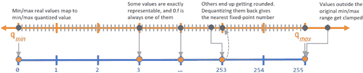

###### 图 8-6。将浮点数量化为无符号 8 位整数（由 Manas Sahni 提供）

现在，Transformer（以及深度神经网络更普遍地）成为量化的主要候选对象的一个主要原因是权重和激活倾向于在相对较小的范围内取值。这意味着我们不必将所有可能的 FP32 数字范围压缩到 INT8 表示的 256 个数字中。为了看到这一点，让我们从我们精简模型中挑选出一个注意力权重矩阵，并绘制值的频率分布：

```py
import matplotlib.pyplot as plt

state_dict = pipe.model.state_dict()
weights = state_dict["distilbert.transformer.layer.0.attention.out_lin.weight"]
plt.hist(weights.flatten().numpy(), bins=250, range=(-0.3,0.3), edgecolor="C0")
plt.show()
```

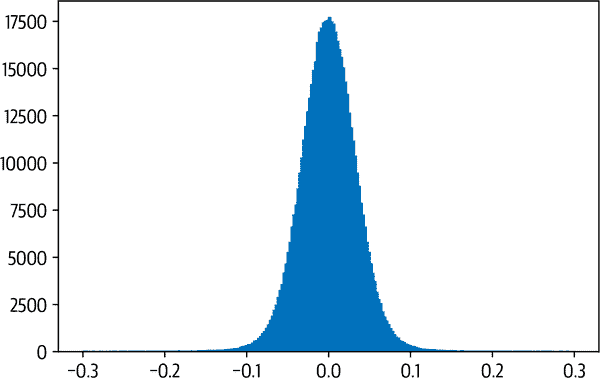

我们可以看到，权重的值分布在接近零的小范围内[<math alttext="负 0.1，0.1"><mrow><mo>-</mo><mn>0</mn><mo>.</mo><mn>1</mn><mo>,</mo><mn>0</mn><mo>.</mo><mn>1</mn></mrow></math>]。现在，假设我们想要将这个张量量化为带符号的 8 位整数。在这种情况下，我们整数的可能值范围是[<math alttext="q 下标最大，q 下标最小"><mrow><msub><mi>q</mi><mi>max</mi></msub><mo>,</mo><msub><mi>q</mi><mi>min</mi></msub></mrow></math>] = [<math alttext="负 128，127"><mrow><mo>-</mo><mn>128</mn><mo>,</mo><mn>127</mn></mrow></math>]。零点与 FP32 的零点重合，比例因子根据前面的方程计算：

```py
zero_point = 0
scale = (weights.max() - weights.min()) / (127 - (-128))
```

为了获得量化张量，我们只需要反转映射<math alttext="q 等于 f 除以 S 加 Z"><mrow><mi>q</mi><mo>=</mo><mi>f</mi><mo>/</mo><mi>S</mi><mo>+</mo><mi>Z</mi></mrow></math>，将值夹紧，四舍五入到最近的整数，并使用`Tensor.char()`函数将结果表示为`torch.int8`数据类型：

```py
(weights / scale + zero_point).clamp(-128, 127).round().char()
```

```py
tensor([[ -5,  -8,   0,  ...,  -6,  -4,   8],
        [  8,   3,   1,  ...,  -4,   7,   0],
        [ -9,  -6,   5,  ...,   1,   5,  -3],
        ...,
        [  6,   0,  12,  ...,   0,   6,  -1],
        [  0,  -2, -12,  ...,  12,  -7, -13],
        [-13,  -1, -10,  ...,   8,   2,  -2]], dtype=torch.int8)
```

太好了，我们刚刚量化了我们的第一个张量！在 PyTorch 中，我们可以使用`quantize_per_tensor()`函数和量化数据类型`torch.qint`来简化转换，该数据类型针对整数算术操作进行了优化：

```py
from torch import quantize_per_tensor

dtype = torch.qint8
quantized_weights = quantize_per_tensor(weights, scale, zero_point, dtype)
quantized_weights.int_repr()
```

```py
tensor([[ -5,  -8,   0,  ...,  -6,  -4,   8],
        [  8,   3,   1,  ...,  -4,   7,   0],
        [ -9,  -6,   5,  ...,   1,   5,  -3],
        ...,
        [  6,   0,  12,  ...,   0,   6,  -1],
        [  0,  -2, -12,  ...,  12,  -7, -13],
        [-13,  -1, -10,  ...,   8,   2,  -2]], dtype=torch.int8)
```

图 8-7 中的图表清楚地显示了只映射一些权重值并对其余值进行四舍五入所引起的离散化。

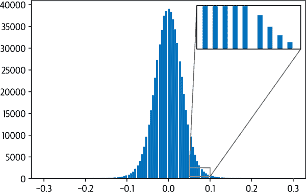

###### 图 8-7。量化对 Transformer 权重的影响

为了完成我们的小分析，让我们比较使用 FP32 和 INT8 值计算两个权重张量的乘法需要多长时间。对于 FP32 张量，我们可以使用 PyTorch 的`@`运算符进行相乘：

```py
%%timeit
weights @ weights
```

```py
393 µs ± 3.84 µs per loop (mean ± std. dev. of 7 runs, 1000 loops each)
```

对于量化张量，我们需要`QFunctional`包装类，以便我们可以使用特殊的`torch.qint8`数据类型执行操作：

```py
from torch.nn.quantized import QFunctional

q_fn = QFunctional()
```

这个类支持各种基本操作，比如加法，在我们的情况下，我们可以通过以下方式计算量化张量的乘法时间：

```py
%%timeit
q_fn.mul(quantized_weights, quantized_weights)
```

```py
23.3 µs ± 298 ns per loop (mean ± std. dev. of 7 runs, 10000 loops each)
```

与我们的 FP32 计算相比，使用 INT8 张量几乎快 100 倍！通过使用专门的后端运行量化运算符，还可以获得更大的收益。截至本书编写时，PyTorch 支持：

+   具有 AVX2 支持或更高版本的 x86 CPU

+   ARM CPU（通常用于移动/嵌入式设备）

由于 INT8 数字的位数比 FP32 数字少四倍，量化还将内存存储需求减少了多达四倍。在我们的简单示例中，我们可以通过使用`Tensor.storage()`函数和 Python 的`sys`模块中的`getsizeof()`函数来比较权重张量及其量化版本的底层存储大小来验证这一点：

```py
import sys

sys.getsizeof(weights.storage()) / sys.getsizeof(quantized_weights.storage())
```

```py
3.999633833760527
```

对于一个大规模的 Transformer，实际的压缩率取决于哪些层被量化（正如我们将在下一节看到的，通常只有线性层被量化）。

那么量化有什么问题？改变模型中所有计算的精度会在模型的计算图中的每个点引入小的扰动，这可能会影响模型的性能。量化模型有几种方法，各有利弊。对于深度神经网络，通常有三种主要的量化方法：

动态量化

使用动态量化时，在训练期间不会发生任何变化，调整只会在推断期间进行。与我们将讨论的所有量化方法一样，模型的权重在推断时间之前被转换为 INT8。除了权重，模型的激活也被量化。这种方法是动态的，因为量化是即时发生的。这意味着所有矩阵乘法都可以使用高度优化的 INT8 函数进行计算。在这里讨论的所有量化方法中，动态量化是最简单的方法。然而，使用动态量化时，激活以浮点格式写入和读取到内存中。整数和浮点之间的转换可能成为性能瓶颈。

静态量化

我们可以避免在推断期间将激活量化为浮点数，而是预先计算量化方案。静态量化通过观察数据的代表性样本上的激活模式来实现这一点。理想的量化方案被计算然后保存。这使我们能够跳过 INT8 和 FP32 值之间的转换，并加快计算速度。然而，这需要访问一个良好的数据样本，并且在管道中引入了一个额外的步骤，因为现在我们需要在执行推断之前训练和确定量化方案。静态量化没有解决的一个方面是：训练和推断期间精度之间的差异，这导致模型指标（例如准确性）下降。

量化感知训练

通过“伪”量化 FP32 值来有效模拟训练期间的量化效果。在训练期间，不使用 INT8 值，而是将 FP32 值四舍五入以模拟量化效果。这在前向和后向传递过程中都会进行，可以改善模型指标的性能，超过静态和动态量化。

使用 transformers 进行推断的主要瓶颈是与这些模型中庞大数量的权重相关的计算和内存带宽。因此，动态量化目前是自然语言处理中基于 transformer 的模型的最佳方法。在较小的计算机视觉模型中，限制因素是激活的内存带宽，这就是为什么通常使用静态量化（或者在性能下降太显著的情况下使用量化感知训练）的原因。

在 PyTorch 中实现动态量化非常简单，可以用一行代码完成：

```py
from torch.quantization import quantize_dynamic

model_ckpt = "transformersbook/distilbert-base-uncased-distilled-clinc"
tokenizer = AutoTokenizer.from_pretrained(model_ckpt)
model = (AutoModelForSequenceClassification
         .from_pretrained(model_ckpt).to("cpu"))

model_quantized = quantize_dynamic(model, {nn.Linear}, dtype=torch.qint8)
```

在这里，我们将完整精度模型传递给`quantize_dynamic()`，并指定我们要量化的 PyTorch 层类的集合。`dtype`参数指定目标精度，可以是`fp16`或`qint8`。一个好的做法是选择您的评估指标所能容忍的最低精度。在本章中，我们将使用 INT8，很快就会看到它对我们模型的准确性几乎没有影响。

# 对我们的量化模型进行基准测试

我们的模型现在已经量化，让我们通过基准测试并可视化结果：

```py
pipe = pipeline("text-classification", model=model_quantized,
                tokenizer=tokenizer)
optim_type = "Distillation + quantization"
pb = PerformanceBenchmark(pipe, clinc["test"], optim_type=optim_type)
perf_metrics.update(pb.run_benchmark())
```

```py
Model size (MB) - 132.40
Average latency (ms) - 12.54 +\- 0.73
Accuracy on test set - 0.876
```

```py
plot_metrics(perf_metrics, optim_type)
```

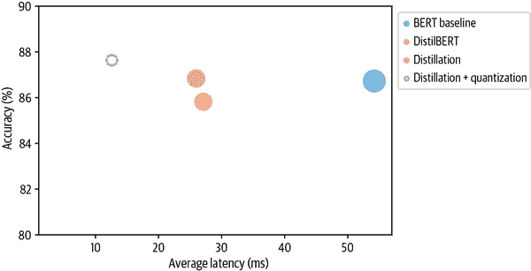

不错，量化模型几乎是我们精简模型大小的一半，甚至还略微提高了准确性！让我们看看是否可以通过一个强大的框架 ONNX Runtime 将我们的优化推向极限。

# 使用 ONNX 和 ONNX Runtime 优化推断

[ONNX](https://onnx.ai)是一个开放标准，定义了一组通用的操作符和一种通用的文件格式，用于在各种框架中表示深度学习模型，包括 PyTorch 和 TensorFlow。¹⁴当模型导出为 ONNX 格式时，这些操作符用于构建一个计算图（通常称为*中间表示*），表示数据通过神经网络的流动。例如，BERT-base 的这样一个图示例显示在图 8-8 中，其中每个节点接收一些输入，应用操作如`Add`或`Squeeze`，然后将输出馈送到下一组节点。

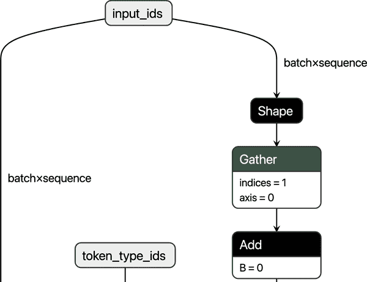

###### 图 8-8\. BERT-base 的 ONNX 图的一个部分，在 Netron 中可视化

通过公开具有标准化操作符和数据类型的图，ONNX 使得在不同框架之间切换变得容易。例如，在 PyTorch 中训练的模型可以导出为 ONNX 格式，然后在 TensorFlow 中导入（反之亦然）。

当 ONNX 与专用加速器如[ONNX Runtime](https://onnxruntime.ai)或 ORT 配合使用时，它的优势就显现出来了。¹⁵ORT 通过操作符融合和常量折叠等技术提供了优化 ONNX 图的工具，¹⁶并定义了一个接口，允许您在不同类型的硬件上运行模型。这是一个强大的抽象。图 8-9 显示了 ONNX 和 ORT 生态系统的高级架构。

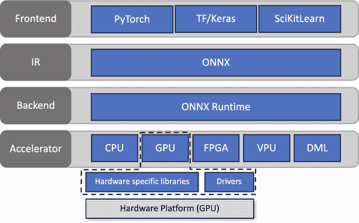

###### 图 8-9\. ONNX 和 ONNX Runtime 生态系统的架构（由 ONNX Runtime 团队提供）

要看到 ORT 的运行情况，我们需要做的第一件事是将我们的精炼模型转换为 ONNX 格式。 Transformers 库有一个内置函数叫做`con⁠vert_graph_to_onnx.convert()`，它简化了这个过程，采取以下步骤：

1.  将模型初始化为`Pipeline`。

1.  通过管道运行占位符输入，以便 ONNX 可以记录计算图。

1.  定义动态轴以处理动态序列长度。

1.  保存具有网络参数的图。

要使用这个函数，我们首先需要为 ONNX 设置一些[OpenMP](https://openmp.org)环境变量：

```py
import os
from psutil import cpu_count

os.environ["OMP_NUM_THREADS"] = f"{cpu_count()}"
os.environ["OMP_WAIT_POLICY"] = "ACTIVE"
```

OpenMP 是一个为开发高度并行化应用程序而设计的 API。`OMP_NUM_THREADS`环境变量设置并行计算中使用的线程数，在 ONNX Runtime 中，`OMP_WAIT_POLICY=ACTIVE`指定等待线程应处于活动状态（即使用 CPU 处理器周期）。

接下来，让我们将我们的精炼模型转换为 ONNX 格式。在这里，我们需要指定参数`pipeline_name="text-classification"`，因为`convert()`在转换过程中将模型包装在一个 Transformers `pipeline()`函数中。除了`model_ckpt`之外，我们还传递了 tokenizer 来初始化管道：

```py
from transformers.convert_graph_to_onnx import convert

model_ckpt = "transformersbook/distilbert-base-uncased-distilled-clinc"
onnx_model_path = Path("onnx/model.onnx")
convert(framework="pt", model=model_ckpt, tokenizer=tokenizer,
        output=onnx_model_path, opset=12, pipeline_name="text-classification")
```

ONNX 使用*操作符集*来将不可变的操作符规范分组在一起，因此`opset=12`对应于 ONNX 库的特定版本。

现在我们已经保存了我们的模型，我们需要创建一个`InferenceSession`实例来向模型输入数据：

```py
from onnxruntime import (GraphOptimizationLevel, InferenceSession,
                         SessionOptions)

def create_model_for_provider(model_path, provider="CPUExecutionProvider"):
    options = SessionOptions()
    options.intra_op_num_threads = 1
    options.graph_optimization_level = GraphOptimizationLevel.ORT_ENABLE_ALL
    session = InferenceSession(str(model_path), options, providers=[provider])
    session.disable_fallback()
    return session
```

```py
onnx_model = create_model_for_provider(onnx_model_path)
```

现在当我们调用`onnx_model.run()`时，我们可以从 ONNX 模型中获取类别对数。让我们用测试集中的一个例子来测试一下。由于`convert()`的输出告诉我们 ONNX 只期望`input_ids`和`attention_mask`作为输入，我们需要从我们的样本中删除`label`列：

```py
inputs = clinc_enc["test"][:1]
del inputs["labels"]
logits_onnx = onnx_model.run(None, inputs)[0]
logits_onnx.shape
```

```py
(1, 151)
```

一旦我们有了对数，我们可以通过取 argmax 轻松获得预测的标签：

```py
np.argmax(logits_onnx)
```

```py
61
```

这确实与地面真实标签一致：

```py
clinc_enc["test"][0]["labels"]
```

```py
61
```

ONNX 模型与`text-classification`管道不兼容，因此我们将创建一个模仿核心行为的自定义类：

```py
from scipy.special import softmax

class OnnxPipeline:
    def __init__(self, model, tokenizer):
        self.model = model
        self.tokenizer = tokenizer

    def __call__(self, query):
        model_inputs = self.tokenizer(query, return_tensors="pt")
        inputs_onnx = {k: v.cpu().detach().numpy()
                       for k, v in model_inputs.items()}
        logits = self.model.run(None, inputs_onnx)[0][0, :]
        probs = softmax(logits)
        pred_idx = np.argmax(probs).item()
        return [{"label": intents.int2str(pred_idx), "score": probs[pred_idx]}]
```

然后我们可以测试这个简单的查询，看看我们是否恢复了`car_rental`意图：

```py
pipe = OnnxPipeline(onnx_model, tokenizer)
pipe(query)
```

```py
[{'label': 'car_rental', 'score': 0.7848334}]
```

很好，我们的流水线按预期工作。下一步是为 ONNX 模型创建性能基准测试。在这里，我们可以借鉴我们与`Per⁠formanceBenchmark`类一起完成的工作，只需重写`compute_size()`方法，保留`compute_accuracy()`和`time_pipeline()`方法。我们需要重写`compute_size()`方法的原因是，我们不能依赖`state_dict`和`torch.save()`来测量模型的大小，因为`onnx_model`在技术上是一个 ONNX`InferenceSession`对象，无法访问 PyTorch 的`nn.Module`的属性。无论如何，结果逻辑很简单，可以实现如下：

```py
class OnnxPerformanceBenchmark(PerformanceBenchmark):
    def __init__(self, *args, model_path, **kwargs):
        super().__init__(*args, **kwargs)
        self.model_path = model_path

    def compute_size(self):
        size_mb = Path(self.model_path).stat().st_size / (1024 * 1024)
        print(f"Model size (MB) - {size_mb:.2f}")
        return {"size_mb": size_mb}
```

通过我们的新基准测试，让我们看看我们的蒸馏模型转换为 ONNX 格式后的性能：

```py
optim_type = "Distillation + ORT"
pb = OnnxPerformanceBenchmark(pipe, clinc["test"], optim_type,
                              model_path="onnx/model.onnx")
perf_metrics.update(pb.run_benchmark())
```

```py
Model size (MB) - 255.88
Average latency (ms) - 21.02 +\- 0.55
Accuracy on test set - 0.868
```

```py
plot_metrics(perf_metrics, optim_type)
```

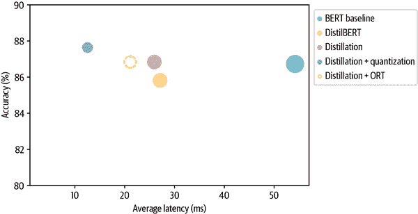

值得注意的是，转换为 ONNX 格式并使用 ONNX Runtime 为我们的蒸馏模型（即图中的“蒸馏”圈）提供了延迟增益！让我们看看是否可以通过添加量化来挤出更多性能。

与 PyTorch 类似，ORT 提供了三种模型量化的方式：动态量化、静态量化和量化感知训练。与 PyTorch 一样，我们将对我们的蒸馏模型应用动态量化。在 ORT 中，量化是通过`quan⁠tize_dynamic()`函数应用的，该函数需要一个 ONNX 模型的路径进行量化，一个目标路径来保存量化后的模型，以及要将权重减少到的数据类型：

```py
from onnxruntime.quantization import quantize_dynamic, QuantType

model_input = "onnx/model.onnx"
model_output = "onnx/model.quant.onnx"
quantize_dynamic(model_input, model_output, weight_type=QuantType.QInt8)
```

现在模型已经被量化，让我们通过我们的基准测试运行它：

```py
onnx_quantized_model = create_model_for_provider(model_output)
pipe = OnnxPipeline(onnx_quantized_model, tokenizer)
optim_type = "Distillation + ORT (quantized)"
pb = OnnxPerformanceBenchmark(pipe, clinc["test"], optim_type,
                              model_path=model_output)
perf_metrics.update(pb.run_benchmark())
```

```py
Model size (MB) - 64.20
Average latency (ms) - 9.24 +\- 0.29
Accuracy on test set - 0.877
```

```py
plot_metrics(perf_metrics, optim_type)
```

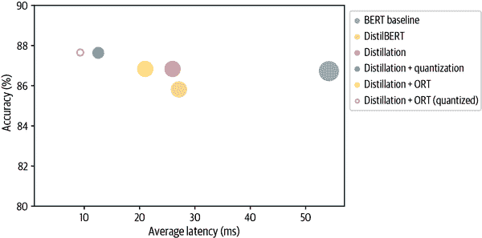

与 PyTorch 量化获得的模型相比，ORT 量化已经将模型大小和延迟减少了约 30%（蒸馏+量化 blob）。其中一个原因是 PyTorch 只优化`nn.Linear`模块，而 ONNX 还量化了嵌入层。从图中我们还可以看到，将 ORT 量化应用于我们的蒸馏模型与我们的 BERT 基线相比，提供了近三倍的增益！

这结束了我们对加速 Transformer 进行推断的技术的分析。我们已经看到，诸如量化之类的方法通过降低表示的精度来减小模型大小。另一种减小大小的策略是彻底删除一些权重。这种技术称为*权重修剪*，并且是下一节的重点。

# 使用权重修剪使模型更稀疏

到目前为止，我们已经看到知识蒸馏和权重量化在产生更快的推断模型方面非常有效，但在某些情况下，您可能还对模型的内存占用有很强的约束。例如，如果我们的产品经理突然决定我们的文本助手需要部署在移动设备上，那么我们需要我们的意图分类器尽可能少地占用存储空间。为了完成我们对压缩方法的调查，让我们看看如何通过识别和删除网络中最不重要的权重来减少模型参数的数量。

## 深度神经网络中的稀疏性

如图 8-10 所示，修剪的主要思想是在训练过程中逐渐移除权重连接（可能还有神经元），使模型逐渐变得更稀疏。结果修剪后的模型具有更少的非零参数，然后可以以紧凑的稀疏矩阵格式存储。修剪也可以与量化结合以获得进一步的压缩。

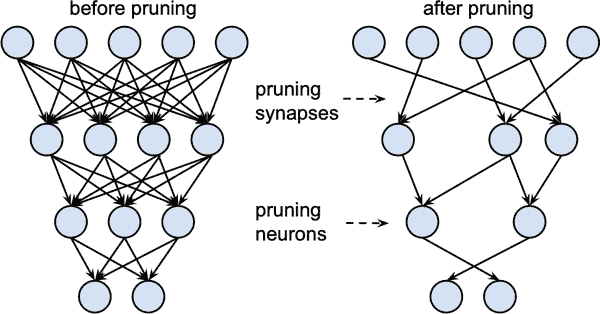

###### 图 8-10。修剪前后的权重和神经元（由 Song Han 提供）

## 权重修剪方法

在数学上，大多数权重修剪方法的工作方式是计算一个*重要性分数*矩阵<math alttext="bold upper S"><mi>𝐒</mi></math>，然后按重要性选择前<math alttext="k"><mi>k</mi></math>百分比的权重：

<math alttext="normal upper T normal o normal p Subscript k Baseline left-parenthesis bold upper S right-parenthesis Subscript i j Baseline equals StartLayout Enlarged left-brace 1st Row 1st Column 1 2nd Column Blank 3rd Column normal i normal f upper S Subscript i j Baseline normal i normal n normal t normal o normal p k percent-sign 2nd Row 1st Column 0 2nd Column Blank 3rd Column normal o normal t normal h normal e normal r normal w normal i normal s normal e EndLayout" display="block"><mrow><msub><mi>Top</mi> <mi>k</mi></msub> <msub><mrow><mo>(</mo><mi>𝐒</mi><mo>)</mo></mrow> <mrow><mi>i</mi><mi>j</mi></mrow></msub> <mo>=</mo> <mfenced separators="" open="{" close=""><mtable><mtr><mtd columnalign="left"><mrow><mn>1</mn></mrow></mtd> <mtd><mrow><mi>if</mi> <msub><mi>S</mi> <mrow><mi>i</mi><mi>j</mi></mrow></msub> <mi>in</mi> <mi>top</mi> <mi>k</mi> <mo>%</mo></mrow></mtd></mtr> <mtr><mtd columnalign="left"><mrow><mn>0</mn></mrow></mtd> <mtd><mi>otherwise</mi></mtd></mtr></mtable></mfenced></mrow></math>

实际上，<math alttext="k"><mi>k</mi></math> 作为一个新的超参数，用来控制模型中稀疏性的程度，即权重为零值的比例。较低的 <math alttext="k"><mi>k</mi></math> 值对应着更稀疏的矩阵。从这些分数中，我们可以定义一个*掩码矩阵* <math alttext="bold upper M"><mi>𝐌</mi></math>，在前向传播过程中，用一些输入 <math alttext="x Subscript i"><msub><mi>x</mi> <mi>i</mi></msub></math> 掩盖权重 <math alttext="upper W Subscript i j"><msub><mi>W</mi> <mrow><mi>i</mi><mi>j</mi></mrow></msub></math>，从而有效地创建一个稀疏的激活网络 <math alttext="a Subscript i"><msub><mi>a</mi> <mi>i</mi></msub></math>：

<math alttext="a Subscript i Baseline equals sigma-summation Underscript k Endscripts upper W Subscript i k Baseline upper M Subscript i k Baseline x Subscript k" display="block"><mrow><msub><mi>a</mi> <mi>i</mi></msub> <mo>=</mo> <munder><mo>∑</mo> <mi>k</mi></munder> <msub><mi>W</mi> <mrow><mi>i</mi><mi>k</mi></mrow></msub> <msub><mi>M</mi> <mrow><mi>i</mi><mi>k</mi></mrow></msub> <msub><mi>x</mi> <mi>k</mi></msub></mrow></math>

正如“最佳脑外科医生”论文中所讨论的那样，每种剪枝方法的核心都是一组需要考虑的问题：

+   哪些权重应该被消除？

+   剩余的权重应该如何调整以获得最佳性能？

+   如何以计算有效的方式进行网络剪枝？

这些问题的答案告诉了我们如何计算得分矩阵 <math alttext="bold upper S"><mi>𝐒</mi></math>，因此让我们首先看一下最早和最流行的剪枝方法之一：幅度剪枝。

### 幅度剪枝

顾名思义，幅度剪枝根据权重的幅度计算得分 <math alttext="bold upper S equals left-parenthesis bar upper W Subscript i j Baseline bar right-parenthesis Subscript 1 less-than-or-equal-to j comma j less-than-or-equal-to n"><mrow><mi>𝐒</mi> <mo>=</mo> <msub><mfenced separators="" open="(" close=")"><mo>∣</mo> <msub><mi>W</mi> <mrow><mi>i</mi><mi>j</mi></mrow></msub> <mo>∣</mo></mfenced> <mrow><mn>1</mn><mo>≤</mo><mi>j</mi><mo>,</mo><mi>j</mi><mo>≤</mo><mi>n</mi></mrow></msub></mrow></math>，然后从 <math alttext="bold upper M equals normal upper T normal o normal p Subscript k Baseline left-parenthesis bold upper S right-parenthesis"><mrow><mi>𝐌</mi> <mo>=</mo> <msub><mi>Top</mi> <mi>k</mi></msub> <mrow><mo>(</mo> <mi>𝐒</mi> <mo>)</mo></mrow></mrow></math> 中得出掩码。在文献中，通常通过迭代的方式应用幅度剪枝，首先训练模型学习哪些连接是重要的，然后剪枝最不重要的权重。稀疏模型然后被重新训练，并且重复这个过程，直到达到期望的稀疏度。

这种方法的一个缺点是计算需求量大：在每一步修剪中，我们都需要将模型训练到收敛。因此，通常最好逐渐增加初始稀疏度<math alttext="s Subscript i"><msub><mi>s</mi> <mi>i</mi></msub></math>（通常为零）到一定步数<math alttext="upper N"><mi>N</mi></math>后的最终值<math alttext="s Subscript f"><msub><mi>s</mi> <mi>f</mi></msub></math>。¹⁹

<math alttext="s Subscript t Baseline equals s Subscript f Baseline plus left-parenthesis s Subscript i Baseline minus s Subscript f Baseline right-parenthesis left-parenthesis 1 minus StartFraction t minus t 0 Over upper N normal upper Delta t EndFraction right-parenthesis cubed normal f normal o normal r t element-of StartSet t 0 comma t 0 plus normal upper Delta t comma ellipsis comma t 0 plus upper N normal upper Delta t EndSet" display="block"><mrow><msub><mi>s</mi> <mi>t</mi></msub> <mo>=</mo> <msub><mi>s</mi> <mi>f</mi></msub> <mo>+</mo> <mrow><mo>(</mo> <msub><mi>s</mi> <mi>i</mi></msub> <mo>-</mo> <msub><mi>s</mi> <mi>f</mi></msub> <mo>)</mo></mrow> <msup><mfenced separators="" open="(" close=")"><mn>1</mn> <mo>-</mo> <mfrac><mrow><mi>t</mi><mo>-</mo><msub><mi>t</mi> <mn>0</mn></msub></mrow> <mrow><mi>N</mi><mi>Δ</mi><mi>t</mi></mrow></mfrac></mfenced> <mn>3</mn></msup> <mi>for</mi> <mi>t</mi> <mo>∈</mo> <mrow><mo>{</mo> <msub><mi>t</mi> <mn>0</mn></msub> <mo>,</mo> <msub><mi>t</mi> <mn>0</mn></msub> <mo>+</mo> <mi>Δ</mi> <mi>t</mi> <mo>,</mo> <mo>...</mo> <mo>,</mo> <msub><mi>t</mi> <mn>0</mn></msub> <mo>+</mo> <mi>N</mi> <mi>Δ</mi> <mi>t</mi> <mo>}</mo></mrow></mrow></math>

这里的想法是每隔<math alttext="normal upper Delta t"><mrow><mi>Δ</mi> <mi>t</mi></mrow></math>步更新一次二进制掩码<math alttext="bold upper M"><mi>𝐌</mi></math>，以允许被屏蔽的权重在训练过程中重新激活，并从修剪过程中可能导致的任何精度损失中恢复过来。如图 8-11 所示，立方因子意味着权重修剪的速率在早期阶段最高（当冗余权重数量较大时），并逐渐减小。

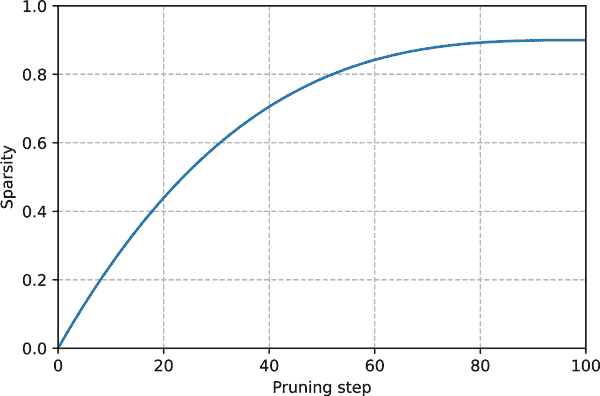

###### 图 8-11。用于修剪的立方稀疏调度器。

幅度修剪的一个问题是，它实际上是为纯监督学习而设计的，其中每个权重的重要性与手头的任务直接相关。相比之下，在迁移学习中，权重的重要性主要由预训练阶段确定，因此幅度修剪可能会移除对微调任务重要的连接。最近，Hugging Face 的研究人员提出了一种称为移动修剪的自适应方法——让我们来看一下。²⁰

### 移动修剪

移动修剪背后的基本思想是*逐渐*在微调过程中移除权重，使模型逐渐变得*更稀疏*。关键的新颖之处在于，在微调过程中，权重和分数都是可学习的。因此，与幅度修剪直接从权重派生（如幅度修剪）不同，移动修剪中的分数是任意的，并且通过梯度下降学习，就像任何其他神经网络参数一样。这意味着在反向传播中，我们还要跟踪损失<math alttext="upper L"><mi>L</mi></math>相对于分数<math alttext="upper S Subscript i j"><msub><mi>S</mi> <mrow><mi>i</mi><mi>j</mi></mrow></msub></math>的梯度。

一旦学习了分数，就很容易使用<math alttext="bold upper M equals normal upper T normal o normal p Subscript k Baseline left-parenthesis bold upper S right-parenthesis"><mrow><mi>𝐌</mi> <mo>=</mo> <msub><mi>Top</mi> <mi>k</mi></msub> <mrow><mo>(</mo> <mi>𝐒</mi> <mo>)</mo></mrow></mrow></math>生成二进制掩码。²¹

运动剪枝背后的直觉是，“移动”离零最远的权重是最重要的。换句话说，正权重在精细调整期间增加（负权重相反），这相当于说分数随着权重远离零而增加。如图 8-12 所示，这种行为与幅值剪枝不同，后者选择离零最远的权重作为最重要的权重。

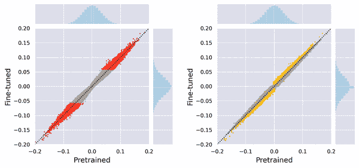

###### 图 8-12。幅值剪枝（左）和运动剪枝（右）中移除的权重的比较

这两种剪枝方法之间的差异也在剩余权重的分布中显而易见。如图 8-13 所示，幅值剪枝产生两个权重簇，而运动剪枝产生更平滑的分布。

截至本书撰写时， Transformers 不支持开箱即用的剪枝方法。幸运的是，有一个名为[*神经网络块运动剪枝*](https://oreil.ly/aHEvD)的巧妙库实现了许多这些想法，如果内存限制是一个问题，我们建议查看它。

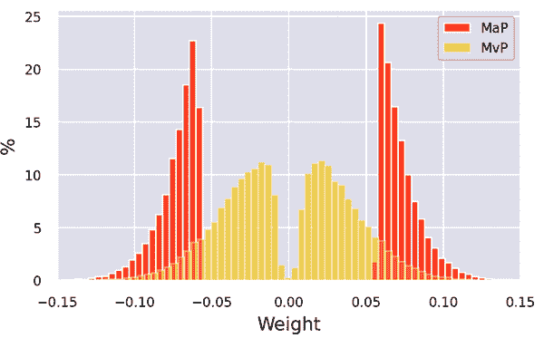

###### 图 8-13。剩余权重的分布，用于幅值剪枝（MaP）和运动剪枝（MvP）

# 结论

我们已经看到，优化 Transformer 以部署到生产环境中涉及沿两个维度的压缩：延迟和内存占用。从经过精细调整的模型开始，我们应用了蒸馏、量化和 ORT 优化，显著减少了这两者。特别是，我们发现量化和 ORT 中的转换给出了最大的收益，而付出的努力最小。

尽管剪枝是减少 Transformer 模型存储大小的有效策略，但当前的硬件并未针对稀疏矩阵运算进行优化，这限制了这种技术的实用性。然而，这是一个活跃的研究领域，到本书上市时，许多这些限制可能已经得到解决。

那么接下来呢？本章中的所有技术都可以应用到其他任务中，比如问答、命名实体识别或语言建模。如果您发现自己难以满足延迟要求，或者您的模型占用了所有的计算预算，我们建议尝试其中之一。

在下一章中，我们将摆脱性能优化，探讨每个数据科学家的噩梦：处理少量或没有标签的情况。

¹ S. Larson 等人，[“意图分类和超出范围预测的评估数据集”](https://arxiv.org/abs/1909.02027)，（2019 年）。

² 正如 Emmanuel Ameisen 在*构建机器学习驱动的应用*（O'Reilly）中所描述的，业务或产品指标是*最*重要的考虑因素。毕竟，如果您的模型不能解决业务关心的问题，那么它的准确性就无关紧要。在本章中，我们将假设您已经为应用程序定义了重要的指标，并专注于优化模型指标。

³ C. Buciluă等人，“模型压缩”，*第 12 届 ACM SIGKDD 国际知识发现和数据挖掘会议论文集*（2006 年 8 月）：535-541，[*https://doi.org/10.1145/1150402.1150464*](https://doi.org/10.1145/1150402.1150464)。

⁴ G. Hinton, O. Vinyals 和 J. Dean，[“蒸馏神经网络中的知识”](https://arxiv.org/abs/1503.02531)，（2015 年）。

⁵ W. Fedus, B. Zoph, and N. Shazeer，[“Switch Transformers: Scaling to Trillion Parameter Models with Simple and Efficient Sparsity”](https://arxiv.org/abs/2101.03961)，(2021)。

⁶ Geoff Hinton 在一次[演讲](https://oreil.ly/OkHGp)中创造了这个术语，用来指代软化概率揭示了教师的隐藏知识的观察。

⁷ 我们在第五章中也遇到了与文本生成相关的温度。

⁸ V. Sanh 等人，[“DistilBERT, a Distilled Version of BERT: Smaller, Faster, Cheaper and Lighter”](https://arxiv.org/abs/1910.01108)，(2019)。

⁹ Y. Kim and H. Awadalla，[“FastFormers: Highly Efficient Transformer Models for Natural Language Understanding”](https://arxiv.org/abs/2010.13382)，(2020)。

¹⁰ 默认情况下，`Trainer` 在进行分类任务微调时会寻找名为 `labels` 的列。您还可以通过指定 `TrainingArguments` 的 `label_names` 参数来覆盖此行为。

¹¹ 对通用的精炼语言模型进行微调的方法有时被称为“任务不可知”精炼。

¹² T. Akiba 等人，[“Optuna: A Next-Generation Hyperparameter Optimization Framework”](https://arxiv.org/abs/1907.10902)，(2019)。

¹³ 仿射映射只是神经网络线性层中你熟悉的 <math alttext="y equals upper A x plus b"><mrow><mi>y</mi> <mo>=</mo> <mi>A</mi> <mi>x</mi> <mo>+</mo> <mi>b</mi></mrow></math> 映射的一个花哨的名字。

¹⁴ 还有一个名为 ONNX-ML 的标准，专门为传统的机器学习模型（如随机森林）和 Scikit-learn 等框架设计。

¹⁵ 其他流行的加速器包括[NVIDIA 的 TensorRT](https://oreil.ly/HnNZx)和[Apache TVM](https://oreil.ly/7KUyt)。

¹⁶ 融合操作涉及将一个运算符（通常是激活函数）合并到另一个运算符中，以便它们可以一起执行。例如，假设我们想将激活函数 *f* 应用于矩阵乘积 *A* × *B*。通常，乘积的结果需要写回到 GPU 存储器，然后再计算激活函数。运算符融合允许我们一步计算 <math alttext="f left-parenthesis upper A times upper B right-parenthesis"><mrow><mi>f</mi> <mo>(</mo> <mi>A</mi> <mo>×</mo> <mi>B</mi> <mo>)</mo></mrow></math>。常量折叠是指在编译时评估常量表达式，而不是在运行时。

¹⁷ B. Hassibi and D. Stork，“Second Order Derivatives for Network Pruning: Optimal Brain Surgeon,” *Proceedings of the 5th International Conference on Neural Information Processing Systems* (November 1992): 164–171，[*https://papers.nips.cc/paper/1992/hash/303ed4c69846ab36c2904d3ba8573050-Abstract.html*](https://papers.nips.cc/paper/1992/hash/303ed4c69846ab36c2904d3ba8573050-Abstract.html)。

¹⁸ S. Han 等人，[“Learning Both Weights and Connections for Efficient Neural Networks”](https://arxiv.org/abs/1506.02626)，(2015)。

¹⁹ M. Zhu and S. Gupta，[“To Prune, or Not to Prune: Exploring the Efficacy of Pruning for Model Compression”](https://arxiv.org/abs/1710.01878)，(2017)。

²⁰ V. Sanh, T. Wolf, and A.M. Rush，[“Movement Pruning: Adaptive Sparsity by Fine-Tuning”](https://arxiv.org/abs/2005.07683)，(2020)。

²¹ 还有一种“软”版本的移动修剪，其中不是选择权重的前<math alttext="k"><mi>k</mi></math> %，而是使用全局阈值<math alttext="tau"><mi>τ</mi></math>来定义二进制掩码：<math alttext="bold upper M equals left-parenthesis bold upper S greater-than tau right-parenthesis"><mrow><mi>𝐌</mi> <mo>=</mo> <mo>(</mo> <mi>𝐒</mi> <mo>></mo> <mi>τ</mi> <mo>)</mo></mrow></math>。
