# 第九章：处理少量或没有标签

有一个问题深深地植根在每个数据科学家的脑海中，通常是他们在新项目开始时首先问的事情：是否有任何标记的数据？往往情况是“没有”或“有一点”，然后客户期望你的团队的高级机器学习模型仍然能够表现良好。由于在非常小的数据集上训练模型通常不会产生良好的结果，一个明显的解决方案是标注更多的数据。然而，这需要时间，而且可能非常昂贵，特别是如果每个标注都需要领域专业知识来验证。

幸运的是，有几种方法非常适合处理少量或没有标签的情况！你可能已经熟悉其中一些，比如*零样本*或*少样本学习*，正如 GPT-3 仅凭几十个例子就能执行各种任务的能力所示。

一般来说，最佳的方法取决于任务、可用数据量以及该数据中有多少是标记的。图 9-1 中显示的决策树可以帮助我们在选择最合适的方法的过程中进行指导。

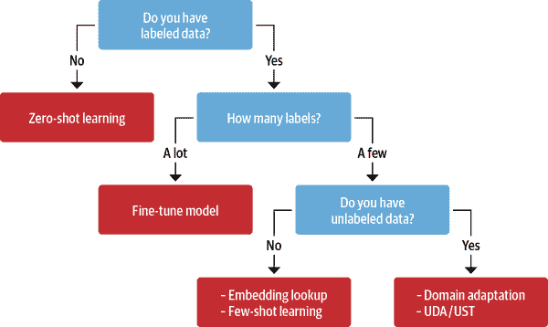

###### 图 9-1。在缺乏大量标记数据的情况下，可以用来提高模型性能的几种技术

让我们逐步走过这个决策树：

1. 你有标记的数据吗？

即使只有少量标记的样本，也可以对哪种方法最有效产生影响。如果根本没有标记的数据，可以从零样本学习方法开始，这通常可以为后续工作奠定坚实的基础。

2. 有多少标签？

如果有标记的数据可用，决定因素是有多少。如果你有大量的训练数据可用，你可以使用第二章中讨论的标准微调方法。

3. 你有未标记的数据吗？

如果你只有少量标记的样本，如果你可以访问大量未标记的数据，这将非常有帮助。如果你可以访问未标记的数据，你可以在训练分类器之前使用它来微调语言模型，或者你可以使用更复杂的方法，如无监督数据增强（UDA）或不确定性感知的自我训练（UST）。¹ 如果你没有任何未标记的数据可用，你就没有标注更多数据的选择。在这种情况下，你可以使用少样本学习，或者使用预训练语言模型的嵌入来执行最近邻搜索。

在本章中，我们将通过解决许多支持团队面临的常见问题来逐步走过这个决策树，这些团队使用像[Jira](https://oreil.ly/TVqZQ)或[GitHub](https://oreil.ly/e0Bd1)这样的问题跟踪器来帮助他们的用户：根据问题的描述为问题打标签。这些标签可能定义问题类型、导致问题的产品，或者负责处理报告问题的团队。自动化这个过程可以对生产力产生重大影响，并使支持团队能够专注于帮助他们的用户。作为一个运行的示例，我们将使用与一个流行的开源项目相关的 GitHub 问题： Transformers！现在让我们来看看这些问题中包含了哪些信息，如何构建任务，以及如何获取数据。

###### 注

本章介绍的方法对于文本分类非常有效，但对于更复杂的任务，如命名实体识别、问答或摘要，可能需要其他技术，如数据增强。

# 构建 GitHub 问题标记器

如果您导航到 Transformers 存储库的[Issues 标签](https://oreil.ly/StdH3)，您会发现像图 9-2 中所示的问题，其中包含标题、描述和一组标签，这些标签或标签表征了问题。这表明了一个自然的方式来构建监督学习任务：给定一个问题的标题和描述，预测一个或多个标签。由于每个问题可以分配一个可变数量的标签，这意味着我们正在处理一个*多标签文本分类*问题。这通常比我们在第二章中遇到的多类问题更具挑战性，那里每个推文只分配给一个情感。

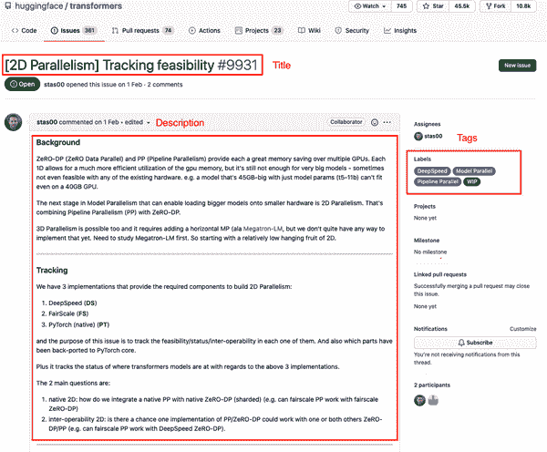

###### 图 9-2。 Transformers 存储库上的典型 GitHub 问题

现在我们已经看到了 GitHub 问题的样子，让我们看看如何下载它们以创建我们的数据集。

## 获取数据

为了获取存储库的所有问题，我们将使用[GitHub REST API](https://oreil.ly/q605k)来轮询[`Issues`端点](https://oreil.ly/qXdWV)。这个端点返回一个 JSON 对象列表，每个对象包含有关问题的大量字段，包括其状态（打开或关闭），谁打开了问题，以及我们在图 9-2 中看到的标题、正文和标签。

由于获取所有问题需要一些时间，我们在本书的[GitHub 存储库](https://oreil.ly/if2dm)中包含了一个*github-issues-transformers.jsonl*文件，以及一个`fetch_issues()`函数，您可以使用它来自行下载问题。

###### 注意

GitHub REST API 将拉取请求视为问题，因此我们的数据集包含两者的混合。为了保持简单，我们将为两种问题类型开发我们的分类器，尽管在实践中，您可能考虑构建两个单独的分类器，以更精细地控制模型的性能。

现在我们知道如何获取数据，让我们来看看如何清理数据。

## 准备数据

一旦我们下载了所有问题，我们可以使用 Pandas 加载它们：

```py
import pandas as pd

dataset_url = "https://git.io/nlp-with-transformers"
df_issues = pd.read_json(dataset_url, lines=True)
print(f"DataFrame shape: {df_issues.shape}")
```

```py
DataFrame shape: (9930, 26)
```

我们的数据集中有近 10000 个问题，通过查看单个行，我们可以看到从 GitHub API 检索到的信息包含许多字段，如 URL、ID、日期、用户、标题、正文以及标签：

```py
cols = ["url", "id", "title", "user", "labels", "state", "created_at", "body"]
df_issues.loc[2, cols].to_frame()
```

|  | 2 |
| --- | --- |
| url | https://api.github.com/repos/huggingface/trans... |
| id | 849529761 |
| title | [DeepSpeed] ZeRO stage 3 integration: getting ... |
| user | {'login’: ’stas00', ‘id’: 10676103, ‘node_id’:... |
| labels | [{'id’: 2659267025, ‘node_id’: ‘MDU6TGFiZWwyNj... |
| state | open |
| created_at | 2021-04-02 23:40:42 |
| body | **[This is not yet alive, preparing for the re... |

`labels`列是我们感兴趣的东西，每一行都包含一个关于每个标签的元数据的 JSON 对象列表：

```py
[
   {
      "id":2659267025,
      "node_id":"MDU6TGFiZWwyNjU5MjY3MDI1",
      "url":"https://api.github.com/repos/huggingface...",
      "name":"DeepSpeed",
      "color":"4D34F7",
      "default":false,
      "description":""
   }
]
```

对于我们的目的，我们只对每个标签对象的`name`字段感兴趣，因此让我们用标签名称覆盖`labels`列：

```py
df_issues["labels"] = (df_issues["labels"]
                       .apply(lambda x: [meta["name"] for meta in x]))
df_issues[["labels"]].head()
```

|  | labels |
| --- | --- |
| 0 | [] |
| 1 | [] |
| 2 | [DeepSpeed] |
| 3 | [] |
| 4 | [] |

现在`labels`列中的每一行都是 GitHub 标签的列表，因此我们可以计算每一行的长度，以找到每个问题的标签数量：

```py
df_issues["labels"].apply(lambda x : len(x)).value_counts().to_frame().T
```

|  | 0 | 1 | 2 | 3 | 4 | 5 |
| --- | --- | --- | --- | --- | --- | --- |
| labels | 6440 | 3057 | 305 | 100 | 25 | 3 |

这表明大多数问题没有标签或只有一个标签，而更少的问题有多个标签。接下来让我们来看看数据集中前 10 个最频繁的标签。在 Pandas 中，我们可以通过“爆炸”`labels`列来做到这一点，使列表中的每个标签成为一行，然后简单地计算每个标签的出现次数：

```py
df_counts = df_issues["labels"].explode().value_counts()
print(f"Number of labels: {len(df_counts)}")
# Display the top-8 label categories
df_counts.to_frame().head(8).T
```

```py
Number of labels: 65
```

|  | wontfix | model card | Core: Tokenization | New model | Core: Modeling | Help wanted | Good First Issue | Usage |
| --- | --- | --- | --- | --- | --- | --- | --- | --- |
| labels | 2284 | 649 | 106 | 98 | 64 | 52 | 50 | 46 |

我们可以看到数据集中有 65 个唯一的标签，并且类别非常不平衡，`wontfix`和`model card`是最常见的标签。为了使分类问题更易处理，我们将专注于构建一部分标签的标签器。例如，一些标签，如`Good First Issue`或`Help Wanted`，可能非常难以从问题的描述中预测，而其他一些标签，如`model card`，可以通过简单的规则进行分类，以检测何时在 Hugging Face Hub 上添加了模型卡。

以下代码将过滤数据集，以便我们将使用的标签子集，以及对名称的标准化，使其更易于阅读：

```py
label_map = {"Core: Tokenization": "tokenization",
             "New model": "new model",
             "Core: Modeling": "model training",
             "Usage": "usage",
             "Core: Pipeline": "pipeline",
             "TensorFlow": "tensorflow or tf",
             "PyTorch": "pytorch",
             "Examples": "examples",
             "Documentation": "documentation"}

def filter_labels(x):
    return [label_map[label] for label in x if label in label_map]

df_issues["labels"] = df_issues["labels"].apply(filter_labels)
all_labels = list(label_map.values())
```

现在让我们来看一下新标签的分布：

```py
df_counts = df_issues["labels"].explode().value_counts()
df_counts.to_frame().T
```

|  | tokenization | new model | model training | usage | pipeline | tensorflow or tf | pytorch | documentation | examples |
| --- | --- | --- | --- | --- | --- | --- | --- | --- | --- |
| 标签 | 106 | 98 | 64 | 46 | 42 | 41 | 37 | 28 | 24 |

在本章的后面，我们会发现将未标记的问题视为单独的训练拆分是有用的，因此让我们创建一个新列，指示问题是否被标记：

```py
df_issues["split"] = "unlabeled"
mask = df_issues["labels"].apply(lambda x: len(x)) > 0
df_issues.loc[mask, "split"] = "labeled"
df_issues["split"].value_counts().to_frame()
```

|  | 拆分 |
| --- | --- |
| 未标记 | 9489 |
| 标记 | 441 |

现在让我们来看一个例子：

```py
for column in ["title", "body", "labels"]:
    print(f"{column}: {df_issues[column].iloc[26][:500]}\n")
```

```py
title: Add new CANINE model

body: #  New model addition

## Model description

Google recently proposed a new **C**haracter **A**rchitecture with **N**o
 tokenization **I**n **N**eural **E**ncoders architecture (CANINE). Not only
 the title is exciting:

Pipelined NLP systems have largely been superseded by end-to-end neural
 modeling, yet nearly all commonly-used models still require an explicit
 tokenization step. While recent tokenization approaches based on data-derived
 subword lexicons are less brittle than manually en

labels: ['new model']

```

在这个例子中，提出了一个新的模型架构，因此`new model`标签是有意义的。我们还可以看到`title`包含了对我们的分类器有用的信息，因此让我们将其与`body`字段中的问题描述连接起来：

```py
df_issues["text"] = (df_issues
                     .apply(lambda x: x["title"] + "\n\n" + x["body"], axis=1))
```

在查看数据的其余部分之前，让我们检查数据中是否有重复项，并使用`drop_duplicates()`方法删除它们：

```py
len_before = len(df_issues)
df_issues = df_issues.drop_duplicates(subset="text")
print(f"Removed {(len_before-len(df_issues))/len_before:.2%} duplicates.")
```

```py
Removed 1.88% duplicates.
```

我们可以看到我们的数据集中有一些重复的问题，但它们只占很小的比例。与其他章节一样，快速查看我们文本中的单词数量也是一个好主意，以查看当我们截断到每个模型的上下文大小时是否会丢失太多信息：

```py
import numpy as np
import matplotlib.pyplot as plt

(df_issues["text"].str.split().apply(len)
 .hist(bins=np.linspace(0, 500, 50), grid=False, edgecolor="C0"))
plt.title("Words per issue")
plt.xlabel("Number of words")
plt.ylabel("Number of issues")
plt.show()
```

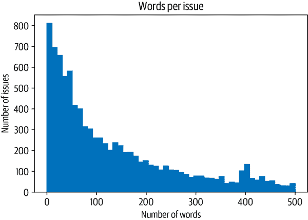

分布具有许多文本数据集的长尾特征。大多数文本都相当短，但也有超过 500 个单词的问题。通常会有一些非常长的问题，特别是当错误消息和代码片段与它们一起发布时。鉴于大多数转换器模型的上下文大小为 512 个标记或更大，截断少数长问题不太可能影响整体性能。现在我们已经探索和清理了我们的数据集，最后要做的是定义我们的训练和验证集，以对我们的分类器进行基准测试。让我们看看如何做到这一点。

## 创建训练集

对于多标签问题，创建训练和验证集会有些棘手，因为并不是所有标签都能保证平衡。然而，可以进行近似处理，我们可以使用专门为此目的设置的[Scikit-multilearn 库](http://scikit.ml)。我们需要做的第一件事是将我们的标签集（如`pytorch`和`tokenization`）转换为模型可以处理的格式。在这里，我们可以使用 Scikit-learn 的`MultiLabelBinarizer`类，它接受一个标签名称列表，并创建一个向量，其中缺失的标签为零，存在的标签为一。我们可以通过将`MultiLabelBinarizer`拟合到`all_labels`上来测试这一点，以学习从标签名称到 ID 的映射，如下所示：

```py
from sklearn.preprocessing import MultiLabelBinarizer

mlb = MultiLabelBinarizer()
mlb.fit([all_labels])
mlb.transform([["tokenization", "new model"], ["pytorch"]])
```

```py
array([[0, 0, 0, 1, 0, 0, 0, 1, 0],
       [0, 0, 0, 0, 0, 1, 0, 0, 0]])
```

在这个简单的例子中，我们可以看到第一行有两个对应于`tokenization`和`new model`标签的 1，而第二行只有一个对应于`pytorch`的命中。

为了创建拆分，我们可以使用 Scikit-multilearn 的`iterative_train_test_split()`函数，该函数会迭代创建平衡标签的训练/测试拆分。我们将其包装在一个可以应用于`DataFrame`的函数中。由于该函数期望一个二维特征矩阵，因此在进行拆分之前，我们需要为可能的索引添加一个维度： 

```py
from skmultilearn.model_selection import iterative_train_test_split

def balanced_split(df, test_size=0.5):
    ind = np.expand_dims(np.arange(len(df)), axis=1)
    labels = mlb.transform(df["labels"])
    ind_train, _, ind_test, _ = iterative_train_test_split(ind, labels,
                                                           test_size)
    return df.iloc[ind_train[:, 0]], df.iloc[ind_test[:,0]]
```

有了`balanced_split()`函数，我们可以将数据分成监督和非监督数据集，然后为监督部分创建平衡的训练、验证和测试集：

```py
from sklearn.model_selection import train_test_split

df_clean = df_issues[["text", "labels", "split"]].reset_index(drop=True).copy()
df_unsup = df_clean.loc[df_clean["split"] == "unlabeled", ["text", "labels"]]
df_sup = df_clean.loc[df_clean["split"] == "labeled", ["text", "labels"]]

np.random.seed(0)
df_train, df_tmp = balanced_split(df_sup, test_size=0.5)
df_valid, df_test = balanced_split(df_tmp, test_size=0.5)
```

最后，让我们创建一个`DatasetDict`，包含所有的拆分，这样我们就可以轻松地对数据集进行标记，并与`Trainer`集成。在这里，我们将使用巧妙的`from_pandas()`方法直接从相应的 Pandas`DataFrame`中加载每个拆分：

```py
from datasets import Dataset, DatasetDict

ds = DatasetDict({
    "train": Dataset.from_pandas(df_train.reset_index(drop=True)),
    "valid": Dataset.from_pandas(df_valid.reset_index(drop=True)),
    "test": Dataset.from_pandas(df_test.reset_index(drop=True)),
    "unsup": Dataset.from_pandas(df_unsup.reset_index(drop=True))})
```

看起来不错，最后要做的事情就是创建一些训练切片，这样我们就可以评估每个分类器的性能，作为训练集大小的函数。

## 创建训练切片

数据集具有我们想要在本章中调查的两个特征：稀疏标记数据和多标签分类。训练集只包含 220 个示例进行训练，即使使用迁移学习也是一个挑战。为了深入研究本章中每种方法在少量标记数据下的表现，我们还将创建训练数据的切片，其中包含更少的样本。然后，我们可以绘制样本数量与性能，并调查各种情况。我们将从每个标签仅有八个样本开始，并逐渐增加，直到切片覆盖整个训练集，使用`iterative_train_test_split()`函数：

```py
np.random.seed(0)
all_indices = np.expand_dims(list(range(len(ds["train"]))), axis=1)
indices_pool = all_indices
labels = mlb.transform(ds["train"]["labels"])
train_samples = [8, 16, 32, 64, 128]
train_slices, last_k = [], 0

for i, k in enumerate(train_samples):
    # Split off samples necessary to fill the gap to the next split size
    indices_pool, labels, new_slice, _ = iterative_train_test_split(
        indices_pool, labels, (k-last_k)/len(labels))
    last_k = k
    if i==0: train_slices.append(new_slice)
    else: train_slices.append(np.concatenate((train_slices[-1], new_slice)))

# Add full dataset as last slice
train_slices.append(all_indices), train_samples.append(len(ds["train"]))
train_slices = [np.squeeze(train_slice) for train_slice in train_slices]
```

请注意，这种迭代方法只是大致将样本分割成所需的大小，因为在给定的拆分大小下，不总是可能找到一个平衡的拆分：

```py
print("Target split sizes:")
print(train_samples)
print("Actual split sizes:")
print([len(x) for x in train_slices])
```

```py
Target split sizes:
[8, 16, 32, 64, 128, 223]
Actual split sizes:
[10, 19, 36, 68, 134, 223]
```

我们将使用指定的拆分大小作为以下图表的标签。太好了，我们终于将我们的数据集准备成了训练拆分，接下来让我们看看如何训练一个强大的基线模型！

# 实施一个朴素贝叶斯基线

每当你开始一个新的 NLP 项目时，实施一组强大的基线总是一个好主意。这样做有两个主要原因：

1.  基于正则表达式、手工制作的规则或非常简单的模型的基线可能已经非常有效地解决了问题。在这些情况下，没有理由使用 transformers 等大型工具，这些工具通常在生产环境中更复杂。

1.  基线提供了快速检查，当你探索更复杂的模型时。例如，假设你训练 BERT-large 并在验证集上获得 80%的准确率。你可能会认为这是一个难题，然后结束了。但是如果你知道一个简单的分类器如逻辑回归获得了 95%的准确率呢？那就会引起你的怀疑，并促使你调试你的模型。

让我们从训练一个基线模型开始我们的分析。对于文本分类，一个很好的基线是*朴素贝叶斯分类器*，因为它非常简单、训练速度快，并且对输入的扰动相当稳健。Scikit-learn 的朴素贝叶斯实现不直接支持多标签分类，但幸运的是，我们可以再次使用 Scikit-multilearn 库，将问题转化为一个一对多的分类任务，其中我们为*L*标签训练*L*个二元分类器。首先，让我们使用一个多标签二值化器在我们的训练集中创建一个新的`label_ids`列。我们可以使用`map()`函数一次性处理所有的处理：

```py
def prepare_labels(batch):
    batch["label_ids"] = mlb.transform(batch["labels"])
    return batch

ds = ds.map(prepare_labels, batched=True)
```

为了衡量我们分类器的性能，我们将使用微观和宏观*F*[1]-scores，前者跟踪频繁标签的性能，后者忽略频率，跟踪所有标签的性能。由于我们将评估每个模型在不同大小的训练拆分上，让我们创建一个`defaultdict`，其中包含一个列表，用于存储每个拆分的分数：

```py
from collections import defaultdict

macro_scores, micro_scores = defaultdict(list), defaultdict(list)
```

现在我们终于准备好训练我们的基线了！下面是训练模型和评估我们的分类器在不断增加的训练集大小上的代码：

```py
from sklearn.naive_bayes import MultinomialNB
from sklearn.metrics import classification_report
from skmultilearn.problem_transform import BinaryRelevance
from sklearn.feature_extraction.text import CountVectorizer

for train_slice in train_slices:
    # Get training slice and test data
    ds_train_sample = ds["train"].select(train_slice)
    y_train = np.array(ds_train_sample["label_ids"])
    y_test = np.array(ds["test"]["label_ids"])
    # Use a simple count vectorizer to encode our texts as token counts
    count_vect = CountVectorizer()
    X_train_counts = count_vect.fit_transform(ds_train_sample["text"])
    X_test_counts = count_vect.transform(ds["test"]["text"])
    # Create and train our model!
    classifier = BinaryRelevance(classifier=MultinomialNB())
    classifier.fit(X_train_counts, y_train)
    # Generate predictions and evaluate
    y_pred_test = classifier.predict(X_test_counts)
    clf_report = classification_report(
        y_test, y_pred_test, target_names=mlb.classes_, zero_division=0,
        output_dict=True)
    # Store metrics
    macro_scores["Naive Bayes"].append(clf_report["macro avg"]["f1-score"])
    micro_scores["Naive Bayes"].append(clf_report["micro avg"]["f1-score"])
```

这段代码块中有很多内容，让我们来解开它。首先，我们获取训练切片并对标签进行编码。然后我们使用计数向量化器对文本进行编码，简单地创建一个与词汇量大小相同的向量，其中每个条目对应于文本中标记出现的频率。这被称为*词袋*方法，因为所有关于单词顺序的信息都丢失了。然后我们训练分类器，并使用测试集上的预测来通过分类报告得到微观和宏观*F*[1]-分数。

通过以下辅助函数，我们可以绘制这个实验的结果：

```py
import matplotlib.pyplot as plt

def plot_metrics(micro_scores, macro_scores, sample_sizes, current_model):
    fig, (ax0, ax1) = plt.subplots(1, 2, figsize=(10, 4), sharey=True)

    for run in micro_scores.keys():
        if run == current_model:
            ax0.plot(sample_sizes, micro_scores[run], label=run, linewidth=2)
            ax1.plot(sample_sizes, macro_scores[run], label=run, linewidth=2)
        else:
            ax0.plot(sample_sizes, micro_scores[run], label=run,
                     linestyle="dashed")
            ax1.plot(sample_sizes, macro_scores[run], label=run,
                     linestyle="dashed")

    ax0.set_title("Micro F1 scores")
    ax1.set_title("Macro F1 scores")
    ax0.set_ylabel("Test set F1 score")
    ax0.legend(loc="lower right")
    for ax in [ax0, ax1]:
        ax.set_xlabel("Number of training samples")
        ax.set_xscale("log")
        ax.set_xticks(sample_sizes)
        ax.set_xticklabels(sample_sizes)
        ax.minorticks_off()
    plt.tight_layout()
    plt.show()
```

```py
plot_metrics(micro_scores, macro_scores, train_samples, "Naive Bayes")
```

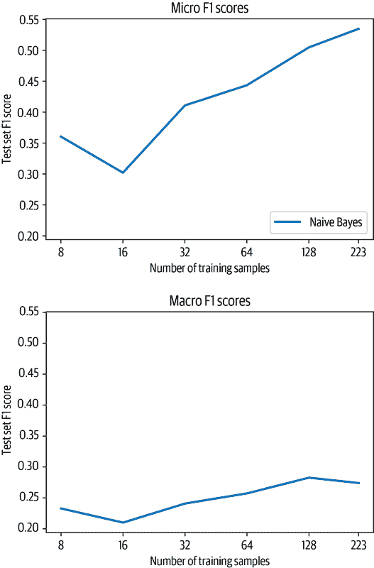

请注意，我们在对数刻度上绘制样本数量。从图中我们可以看到，随着训练样本数量的增加，微观和宏观*F*[1]-分数都有所提高。由于每个切片可能具有不同的类分布，因此在训练样本很少的情况下，结果也稍微有些嘈杂。然而，这里重要的是趋势，所以现在让我们看看这些结果与基于 Transformer 的方法相比如何！

# 使用无标记数据

我们将考虑的第一种技术是*零样本分类*，这在没有任何标记数据的情况下非常适用。这在行业中非常常见，可能是因为没有带标签的历史数据，或者因为获取数据的标签很困难。在本节中，我们会有点作弊，因为我们仍然会使用测试数据来衡量性能，但我们不会使用任何数据来训练模型（否则与后续方法的比较将会很困难）。

零样本分类的目标是利用预训练模型，在任务特定语料库上没有进行额外的微调。为了更好地了解这种工作原理，回想一下像 BERT 这样的语言模型是预训练的，用于在成千上万本书和大量维基百科转储中预测文本中的屏蔽标记。为了成功预测缺失的标记，模型需要了解上下文中的主题。我们可以尝试欺骗模型，通过提供一个句子来为我们对文档进行分类：

> “这一部分是关于主题[MASK]的。”

由于这是数据集中自然出现的文本，模型应该能够合理地对文档的主题提出建议。²

让我们通过以下玩具问题进一步说明这一点：假设你有两个孩子，一个喜欢有汽车的电影，而另一个更喜欢有动物的电影。不幸的是，他们已经看过你知道的所有电影，所以你想建立一个函数，告诉你一个新电影的主题是什么。自然地，你会转向 Transformer 来完成这个任务。首先要尝试的是在`fill-mask`管道中加载 BERT-base，该管道使用屏蔽语言模型来预测屏蔽标记的内容：

```py
from transformers import pipeline

pipe = pipeline("fill-mask", model="bert-base-uncased")
```

接下来，让我们构建一个小电影描述，并在其中添加一个带有屏蔽词的提示。提示的目标是引导模型帮助我们进行分类。`fill-mask`管道返回填充屏蔽位置的最有可能的标记：

```py
movie_desc = "The main characters of the movie madacascar \
are a lion, a zebra, a giraffe, and a hippo. "
prompt = "The movie is about [MASK]."

output = pipe(movie_desc + prompt)
for element in output:
    print(f"Token {element['token_str']}:\t{element['score']:.3f}%")
```

```py
Token animals:  0.103%
Token lions:    0.066%
Token birds:    0.025%
Token love:     0.015%
Token hunting:  0.013%
```

显然，模型只预测与动物相关的标记。我们也可以反过来，而不是获取最有可能的标记，我们可以查询管道获取几个给定标记的概率。对于这个任务，我们可以选择`cars`和`animals`，所以我们可以将它们作为目标传递给管道：

```py
output = pipe(movie_desc + prompt, targets=["animals", "cars"])
for element in output:
    print(f"Token {element['token_str']}:\t{element['score']:.3f}%")
```

```py
Token animals:  0.103%
Token cars:     0.001%
```

毫不奇怪，对于标记为`cars`的预测概率要远远小于`animals`。让我们看看这是否也适用于更接近汽车的描述：

```py
movie_desc = "In the movie transformers aliens \
can morph into a wide range of vehicles."

output = pipe(movie_desc + prompt, targets=["animals", "cars"])
for element in output:
    print(f"Token {element['token_str']}:\t{element['score']:.3f}%")
```

```py
Token cars:     0.139%
Token animals:  0.006%
```

它确实可以！这只是一个简单的例子，如果我们想确保它运行良好，我们应该进行彻底的测试，但它说明了本章讨论的许多方法的关键思想：找到一种方法，使预训练模型适应另一个任务，而无需对其进行训练。在这种情况下，我们设置了一个提示，其中包含一个掩码，以便我们可以直接使用掩码语言模型进行分类。让我们看看是否可以通过调整一个在更接近文本分类的任务上进行了微调的模型来做得更好：*自然语言推理*（NLI）。

使用掩码语言模型进行分类是一个不错的技巧，但是我们可以通过使用一个在更接近分类的任务上训练过的模型来做得更好。有一个称为*文本蕴涵*的巧妙代理任务符合要求。在文本蕴涵中，模型需要确定两个文本段落是否可能相互跟随或相互矛盾。模型通常是使用诸如多种体裁 NLI 语料库（MNLI）或跨语言 NLI 语料库（XNLI）等数据集进行蕴涵和矛盾的检测。³

这些数据集中的每个样本由三部分组成：前提、假设和标签，标签可以是`蕴涵`、`中性`或`矛盾`中的一个。当假设文本在前提下必然为真时，分配`蕴涵`标签。当假设在前提下必然为假或不合适时，使用`矛盾`标签。如果这两种情况都不适用，则分配`中性`标签。参见表 9-1 中的示例。

表 9-1。MLNI 数据集中的三个类

| 前提 | 假设 | 标签 |
| --- | --- | --- |
| 他最喜欢的颜色是蓝色。 | 他喜欢重金属音乐。 | `中性` |
| 她觉得这个笑话很搞笑。 | 她认为这个笑话一点都不好笑。 | `矛盾` |
| 这所房子最近建造。 | 这所房子是新的。 | `蕴涵` |

现在，事实证明我们可以劫持一个在 MNLI 数据集上训练的模型，构建一个分类器而无需任何标签！关键思想是将我们希望分类的文本视为前提，然后将假设制定为：

> “这个例子是关于{label}的。”

在这里我们插入标签的类名。蕴涵分数告诉我们前提很可能是关于那个主题的，我们可以依次为任意数量的类运行这个。这种方法的缺点是我们需要为每个类执行一次前向传播，这使得它比标准分类器效率低。另一个稍微棘手的方面是标签名称的选择可能对准确性产生很大影响，通常最好选择具有语义含义的标签。例如，如果标签只是`Class 1`，模型就不知道这可能意味着什么，以及这是否构成了矛盾或蕴涵。

 Transformers 具有内置的零样本分类 MNLI 模型。我们可以通过管道初始化它如下：

```py
from transformers import pipeline

pipe = pipeline("zero-shot-classification", device=0)
```

设置`device=0`确保模型在 GPU 上运行，而不是默认的 CPU，以加快推理速度。要对文本进行分类，我们只需要将其传递给管道，并附上标签名称。此外，我们可以设置`multi_label=True`以确保返回所有分数，而不仅仅是单标签分类的最大值：

```py
sample = ds["train"][0]
print(f"Labels: {sample['labels']}")
output = pipe(sample["text"], all_labels, multi_label=True)
print(output["sequence"][:400])
print("\nPredictions:")

for label, score in zip(output["labels"], output["scores"]):
    print(f"{label}, {score:.2f}")
```

```py
Labels: ['new model']
Add new CANINE model

#  New model addition

## Model description

Google recently proposed a new **C**haracter **A**rchitecture with **N**o
tokenization **I**n **N**eural **E**ncoders architecture (CANINE). Not only the
title is exciting:

> Pipelined NLP systems have largely been superseded by end-to-end neural
modeling, yet nearly all commonly-used models still require an explicit tokeni

Predictions:
new model, 0.98
tensorflow or tf, 0.37
examples, 0.34
usage, 0.30
pytorch, 0.25
documentation, 0.25
model training, 0.24
tokenization, 0.17
pipeline, 0.16

```

###### 注意

由于我们使用的是子词分词器，我们甚至可以将代码传递给模型！分词可能不太高效，因为零样本管道的预训练数据集只包含了一小部分代码片段，但由于代码也由许多自然词组成，这并不是一个大问题。此外，代码块可能包含重要信息，例如框架（PyTorch 或 TensorFlow）。

我们可以看到模型非常确信这段文本是关于一个新模型的，但它也为其他标签产生了相对较高的分数。零射击分类的一个重要方面是我们所处的领域。我们在这里处理的文本非常技术化，大部分是关于编码的，这使它们与 MNLI 数据集中的原始文本分布相当不同。因此，这对于模型来说是一个具有挑战性的任务并不奇怪；它可能对某些领域的工作效果比其他领域要好得多，这取决于它们与训练数据的接近程度。

让我们编写一个函数，通过零射击管道将单个示例传递，并通过运行`map()`将其扩展到整个验证集：

```py
def zero_shot_pipeline(example):
    output = pipe(example["text"], all_labels, multi_label=True)
    example["predicted_labels"] = output["labels"]
    example["scores"] = output["scores"]
    return example

ds_zero_shot = ds["valid"].map(zero_shot_pipeline)
```

现在我们有了分数，下一步是确定应该为每个示例分配哪组标签。我们可以尝试一些选项：

+   定义一个阈值，并选择高于阈值的所有标签。

+   选择具有最高分数的前*k*个标签。

为了帮助我们确定哪种方法最好，让我们编写一个`get_preds()`函数，应用其中一种方法来获取预测：

```py
def get_preds(example, threshold=None, topk=None):
    preds = []
    if threshold:
        for label, score in zip(example["predicted_labels"], example["scores"]):
            if score >= threshold:
                preds.append(label)
    elif topk:
        for i in range(topk):
            preds.append(example["predicted_labels"][i])
    else:
        raise ValueError("Set either `threshold` or `topk`.")
    return {"pred_label_ids": list(np.squeeze(mlb.transform([preds])))}
```

接下来，让我们编写第二个函数`get_clf_report()`，它从具有预测标签的数据集中返回 Scikit-learn 分类报告：

```py
def get_clf_report(ds):
    y_true = np.array(ds["label_ids"])
    y_pred = np.array(ds["pred_label_ids"])
    return classification_report(
        y_true, y_pred, target_names=mlb.classes_, zero_division=0,
        output_dict=True)
```

有了这两个函数，让我们从增加几个值的*k*开始，然后绘制验证集上的微观和宏观* F * [1]-分数：

```py
macros, micros = [], []
topks = [1, 2, 3, 4]
for topk in topks:
    ds_zero_shot = ds_zero_shot.map(get_preds, batched=False,
                                    fn_kwargs={'topk': topk})
    clf_report = get_clf_report(ds_zero_shot)
    micros.append(clf_report['micro avg']['f1-score'])
    macros.append(clf_report['macro avg']['f1-score'])
```

```py
plt.plot(topks, micros, label='Micro F1')
plt.plot(topks, macros, label='Macro F1')
plt.xlabel("Top-k")
plt.ylabel("F1-score")
plt.legend(loc='best')
plt.show()
```

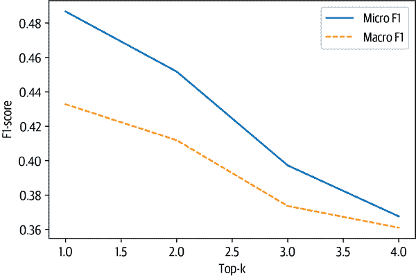

从图中我们可以看到，通过选择每个示例的最高分数的标签（top 1）获得了最佳结果。这也许并不奇怪，因为我们数据集中的大多数示例只有一个标签。现在让我们将其与设置阈值进行比较，这样我们可能可以对每个示例进行多个标签的预测：

```py
macros, micros = [], []
thresholds = np.linspace(0.01, 1, 100)
for threshold in thresholds:
    ds_zero_shot = ds_zero_shot.map(get_preds,
                                    fn_kwargs={"threshold": threshold})
    clf_report = get_clf_report(ds_zero_shot)
    micros.append(clf_report["micro avg"]["f1-score"])
    macros.append(clf_report["macro avg"]["f1-score"])
```

```py
plt.plot(thresholds, micros, label="Micro F1")
plt.plot(thresholds, macros, label="Macro F1")
plt.xlabel("Threshold")
plt.ylabel("F1-score")
plt.legend(loc="best")
plt.show()
```

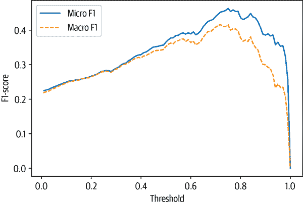

```py
best_t, best_micro = thresholds[np.argmax(micros)], np.max(micros)
print(f'Best threshold (micro): {best_t} with F1-score {best_micro:.2f}.')
best_t, best_macro = thresholds[np.argmax(macros)], np.max(macros)
print(f'Best threshold (micro): {best_t} with F1-score {best_macro:.2f}.')
```

```py
Best threshold (micro): 0.75 with F1-score 0.46.
Best threshold (micro): 0.72 with F1-score 0.42.
```

这种方法的表现略逊于 top-1 的结果，但我们可以在这张图中清楚地看到精确度/召回率的权衡。如果我们将阈值设置得太低，那么会有太多的预测，这会导致精确度低。如果我们将阈值设置得太高，那么我们几乎不会进行任何预测，这会产生低召回率。从图中我们可以看到，阈值约为 0.8 是两者之间的最佳平衡点。

由于 top-1 方法表现最佳，让我们使用它来将零射击分类与朴素贝叶斯在测试集上进行比较：

```py
ds_zero_shot = ds['test'].map(zero_shot_pipeline)
ds_zero_shot = ds_zero_shot.map(get_preds, fn_kwargs={'topk': 1})
clf_report = get_clf_report(ds_zero_shot)
for train_slice in train_slices:
    macro_scores['Zero Shot'].append(clf_report['macro avg']['f1-score'])
    micro_scores['Zero Shot'].append(clf_report['micro avg']['f1-score'])
```

```py
plot_metrics(micro_scores, macro_scores, train_samples, "Zero Shot")
```

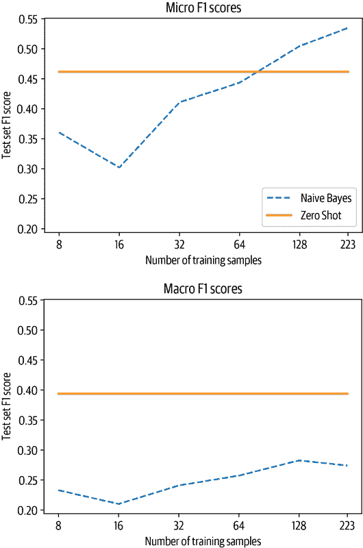

将零射击管道与基线进行比较，我们观察到两件事：

1.  如果我们少于 50 个有标签的样本，零射击管道将轻松胜过基线。

1.  即使超过 50 个样本，零射击管道的性能在考虑微观和宏观* F * [1]-分数时仍然优越。微观* F * [1]-分数的结果告诉我们，基线在频繁类别上表现良好，而零射击管道在这些类别上表现出色，因为它不需要任何示例来学习。

###### 注意

您可能会注意到本节中存在一个小悖论：尽管我们谈论处理没有标签的情况，但我们仍然使用验证集和测试集。我们使用它们来展示不同的技术，并使结果可以相互比较。即使在实际用例中，收集一些有标签的示例进行快速评估也是有意义的。重要的一点是，我们没有根据数据调整模型的参数；相反，我们只是调整了一些超参数。

如果您发现在自己的数据集上难以获得良好的结果，可以尝试以下几种方法来改进零射击管道：

+   管道的工作方式使其对标签的名称非常敏感。如果名称不太合理或与文本不容易联系起来，那么管道可能表现不佳。可以尝试使用不同的名称或并行使用几个名称，并在额外的步骤中对它们进行聚合。

+   另一件你可以改进的事情是假设的形式。默认情况下是 `hypothesis="This is example is about {}"`，但你可以传递任何其他文本到管道中。根据使用情况，这可能会提高性能。

现在让我们转向我们有少数标记示例可以用来训练模型的情况。

# 使用少数标签

在大多数 NLP 项目中，您至少会有一些标记的示例。标签可能直接来自客户或跨公司团队，或者您可能决定自己注释一些示例。即使对于以前的方法，我们也需要一些标记的示例来评估零-shot 方法的效果。在本节中，我们将看看如何最好地利用我们拥有的少数宝贵的标记示例。让我们首先看看一种称为数据增强的技术，它可以帮助我们扩大我们拥有的少量标记数据。

## 数据增强

在小数据集上提高文本分类器性能的一种简单但有效的方法是应用*数据增强*技术，从现有数据中生成新的训练样本。这是计算机视觉中的常见策略，其中图像被随机扰动而不改变数据的含义（例如，稍微旋转的猫仍然是一只猫）。对于文本来说，数据增强有些棘手，因为扰动单词或字符可能会完全改变含义。例如，两个问题“大象比老鼠重吗？”和“老鼠比大象重吗？”只有一个词交换，但答案相反。然而，如果文本包含超过几句话（就像我们的 GitHub 问题一样），那么这些类型的转换引入的噪音通常不会影响标签。实际上，通常使用两种类型的数据增强技术：

回译

取源语言中的文本，使用机器翻译将其翻译成一个或多个目标语言，然后将其翻译回源语言。回译通常适用于高资源语言或不包含太多领域特定词汇的语料库。

标记扰动

给定训练集中的文本，随机选择并执行简单的转换，如随机同义词替换、单词插入、交换或删除。⁠⁴

这些转换的示例显示在表 9-2 中。有关 NLP 的其他数据增强技术的详细列表，我们建议阅读 Amit Chaudhary 的博文[“NLP 中数据增强的视觉调查”](https://oreil.ly/j6euX)。

表 9-2。文本的不同类型的数据增强技术

| 增强 | 句子 |
| --- | --- |
| 无 | 即使你打败我梅杰特龙，其他人也会起来打败你的暴政 |
| 同义词替换 | 即使你杀了我梅杰特龙，其他人将证明打败你的暴政 |
| 随机插入 | 即使你打败我梅杰特龙，其他人类也会起来打败你的暴政 |
| 随机交换 | 即使你打败我梅杰特龙，其他人也会起来打败你的暴政 |
| 随机删除 | 即使你我梅杰特龙，其他人也会起来打败暴政 |
| 回译（德语） | 即使你打败我，其他人也会起来打败你的暴政 |

您可以使用像[M2M100](https://oreil.ly/gfJCq)这样的机器翻译模型来实现回译，而像[*NlpAug*](https://oreil.ly/UVRci)和[*TextAttack*](https://oreil.ly/NMtYi)这样的库提供了各种用于标记扰动的方法。在本节中，我们将专注于使用同义词替换，因为它简单易行，并且能够传达数据增强背后的主要思想。

我们将使用 NlpAug 中的`ContextualWordEmbsAug`增强器来利用 DistilBERT 的上下文词嵌入进行同义词替换。让我们从一个简单的例子开始：

```py
from transformers import set_seed
import nlpaug.augmenter.word as naw

set_seed(3)
aug = naw.ContextualWordEmbsAug(model_path="distilbert-base-uncased",
                                device="cpu", action="substitute")

text = "Transformers are the most popular toys"
print(f"Original text: {text}")
print(f"Augmented text: {aug.augment(text)}")
```

```py
Original text: Transformers are the most popular toys
Augmented text: transformers'the most popular toys
```

在这里，我们可以看到单词“are”已被替换为撇号，以生成一个新的合成训练示例。我们可以将这种增强包装在一个简单的函数中，如下所示：

```py
def augment_text(batch, transformations_per_example=1):
    text_aug, label_ids = [], []
    for text, labels in zip(batch["text"], batch["label_ids"]):
        text_aug += [text]
        label_ids += [labels]
        for _ in range(transformations_per_example):
            text_aug += [aug.augment(text)]
            label_ids += [labels]
    return {"text": text_aug, "label_ids": label_ids}
```

现在当我们将这个函数传递给`map()`方法时，我们可以使用`transformations_per_example`参数生成任意数量的新示例。我们可以在我们的代码中使用这个函数来训练朴素贝叶斯分类器，只需在选择切片后添加一行：

```py
ds_train_sample = ds_train_sample.map(augment_text, batched=True,
    remove_columns=ds_train_sample.column_names).shuffle(seed=42)
```

包括这一点并重新运行分析会产生如图所示的图表：

```py
plot_metrics(micro_scores, macro_scores, train_samples, "Naive Bayes + Aug")
```

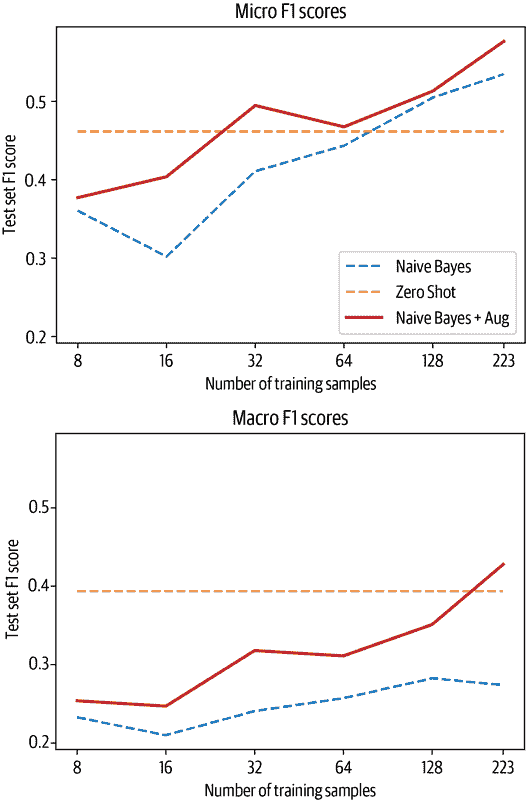

从图中可以看出，少量数据增强可以将朴素贝叶斯分类器的*F*[1]-分数提高约 5 个点，并且一旦我们有大约 170 个训练样本，它就会超过零-shot 管道的宏分数。现在让我们来看一个基于使用大型语言模型嵌入的方法。

## 将嵌入用作查找表

已经证明，像 GPT-3 这样的大型语言模型在解决数据有限的任务方面表现出色。原因是这些模型学习了有用的文本表示，跨越许多维度编码信息，如情感、主题、文本结构等。因此，大型语言模型的嵌入可以用于开发语义搜索引擎，找到相似的文档或评论，甚至对文本进行分类。

在本节中，我们将创建一个文本分类器，它的模型是基于[OpenAI API 分类端点](https://oreil.ly/aMgIr)。这个想法遵循一个三步过程：

1.  使用语言模型嵌入所有标记文本。

1.  在存储的嵌入上执行最近邻搜索。

1.  聚合最近邻的标签以获得预测。

这个过程在图 9-3 中有所说明，它展示了标记数据是如何嵌入模型并与标签一起存储的。当需要对新文本进行分类时，它也会被嵌入，并且基于最近邻的标签给出标签。重要的是要校准要搜索的邻居数量，因为太少可能会有噪音，太多可能会混入相邻的群体。

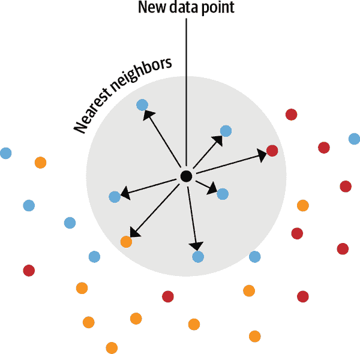

###### 图 9-3\. 最近邻嵌入查找的示意图

这种方法的美妙之处在于，不需要对模型进行微调就可以利用少量可用的标记数据点。相反，使这种方法起作用的主要决定是选择一个理想情况下在类似领域上预训练的适当模型。

由于 GPT-3 只能通过 OpenAI API 获得，我们将使用 GPT-2 来测试这种技术。具体来说，我们将使用一个在 Python 代码上训练的 GPT-2 变体，这将有望捕捉到我们 GitHub 问题中包含的一些上下文。

让我们编写一个辅助函数，它接受一个文本列表，并使用模型为每个文本创建单一向量表示。我们需要处理的一个问题是，像 GPT-2 这样的转换器模型实际上会返回每个标记一个嵌入向量。例如，给定句子“I took my dog for a walk”，我们可以期望有几个嵌入向量，每个标记一个。但我们真正想要的是整个句子（或我们应用程序中的 GitHub 问题）的单一嵌入向量。为了处理这个问题，我们可以使用一种称为*池化*的技术。最简单的池化方法之一是对标记嵌入进行平均，这称为*均值池化*。使用均值池化，我们唯一需要注意的是不要在平均值中包括填充标记，所以我们可以使用注意力掩码来处理。

为了看看这是如何工作的，让我们加载一个 GPT-2 分词器和模型，定义均值池化操作，并将整个过程包装在一个简单的`embed_text()`函数中：

```py
import torch
from transformers import AutoTokenizer, AutoModel

model_ckpt = "miguelvictor/python-gpt2-large"
tokenizer = AutoTokenizer.from_pretrained(model_ckpt)
model = AutoModel.from_pretrained(model_ckpt)

def mean_pooling(model_output, attention_mask):
    # Extract the token embeddings
    token_embeddings = model_output[0]
    # Compute the attention mask
    input_mask_expanded = (attention_mask
                           .unsqueeze(-1)
                           .expand(token_embeddings.size())
                           .float())
    # Sum the embeddings, but ignore masked tokens
    sum_embeddings = torch.sum(token_embeddings * input_mask_expanded, 1)
    sum_mask = torch.clamp(input_mask_expanded.sum(1), min=1e-9)
    # Return the average as a single vector
    return sum_embeddings / sum_mask

def embed_text(examples):
    inputs = tokenizer(examples["text"], padding=True, truncation=True,
                       max_length=128, return_tensors="pt")
    with torch.no_grad():
        model_output = model(**inputs)
    pooled_embeds = mean_pooling(model_output, inputs["attention_mask"])
    return {"embedding": pooled_embeds.cpu().numpy()}
```

现在我们可以为每个拆分获取嵌入。请注意，GPT 风格的模型没有填充标记，因此我们需要在可以批量获取嵌入之前添加一个标记，就像在前面的代码中实现的那样。我们将只是为此目的重复使用字符串结束标记：

```py
tokenizer.pad_token = tokenizer.eos_token
embs_train = ds["train"].map(embed_text, batched=True, batch_size=16)
embs_valid = ds["valid"].map(embed_text, batched=True, batch_size=16)
embs_test = ds["test"].map(embed_text, batched=True, batch_size=16)
```

现在我们已经有了所有的嵌入，我们需要建立一个系统来搜索它们。我们可以编写一个函数，计算我们将查询的新文本嵌入与训练集中现有嵌入之间的余弦相似度。或者，我们可以使用数据集中的内置结构，称为*FAISS 索引*。⁵我们在第七章中已经遇到了 FAISS。您可以将其视为嵌入的搜索引擎，我们将在一分钟内更仔细地看看它是如何工作的。我们可以使用数据集的现有字段创建一个 FAISS 索引，使用`add_faiss_index()`，或者使用`add_faiss_index_from_external_arrays()`将新的嵌入加载到数据集中。让我们使用前一个函数将我们的训练嵌入添加到数据集中：

```py
embs_train.add_faiss_index("embedding")
```

这创建了一个名为`embedding`的新 FAISS 索引。现在我们可以通过调用函数`get_nearest_examples()`执行最近邻查找。它返回最接近的邻居以及每个邻居的匹配分数。我们需要指定查询嵌入以及要检索的最近邻居的数量。让我们试一试，看看与示例最接近的文档：

```py
i, k = 0, 3 # Select the first query and 3 nearest neighbors
rn, nl = "\r\n\r\n", "\n" # Used to remove newlines in text for compact display

query =  np.array(embs_valid[i]["embedding"], dtype=np.float32)
scores, samples = embs_train.get_nearest_examples("embedding", query, k=k)

print(f"QUERY LABELS: {embs_valid[i]['labels']}")
print(f"QUERY TEXT:\n{embs_valid[i]['text'][:200].replace(rn, nl)} [...]\n")
print("="*50)
print(f"Retrieved documents:")
for score, label, text in zip(scores, samples["labels"], samples["text"]):
    print("="*50)
    print(f"TEXT:\n{text[:200].replace(rn, nl)} [...]")
    print(f"SCORE: {score:.2f}")
    print(f"LABELS: {label}")
```

```py
QUERY LABELS: ['new model']
QUERY TEXT:
Implementing efficient self attention in T5

#  New model addition
My teammates and I (including @ice-americano) would like to use efficient self
attention methods such as Linformer, Performer and [...]

==================================================
Retrieved documents:
==================================================
TEXT:
Add Linformer model

#  New model addition
## Model description
### Linformer: Self-Attention with Linear Complexity
Paper published June 9th on ArXiv: https://arxiv.org/abs/2006.04768
La [...]
SCORE: 54.92
LABELS: ['new model']
==================================================
TEXT:
Add FAVOR+ / Performer attention

#  FAVOR+ / Performer attention addition
Are there any plans to add this new attention approximation block to
Transformers library?
## Model description
The n [...]
SCORE: 57.90
LABELS: ['new model']
==================================================
TEXT:
Implement DeLighT: Very Deep and Light-weight Transformers

#  New model addition
## Model description
DeLight, that delivers similar or better performance than transformer-based
models with sign [...]
SCORE: 60.12
LABELS: ['new model']

```

很好！这正是我们所希望的：通过嵌入查找得到的三个文档都具有相同的标签，我们已经可以从标题中看出它们都非常相似。查询以及检索到的文档都围绕着添加新的高效 Transformer 模型。然而，问题仍然存在，*k*的最佳值是多少？同样，我们应该如何聚合检索到的文档的标签？例如，我们应该检索三个文档，并分配至少出现两次的所有标签吗？还是应该选择 20 个，并使用至少出现 5 次的所有标签？让我们系统地调查一下：我们将尝试几个*k*的值，然后使用一个辅助函数改变标签分配的阈值<mrow><mi>m</mi> <mo><</mo> <mi>k</mi></mrow>。我们将记录每个设置的宏和微性能，以便稍后决定哪个运行效果最好。我们可以使用`get_nearest_examples_batch()`函数，而不是循环遍历验证集中的每个样本，它接受一个查询的批处理：

```py
def get_sample_preds(sample, m):
    return (np.sum(sample["label_ids"], axis=0) >= m).astype(int)

def find_best_k_m(ds_train, valid_queries, valid_labels, max_k=17):
    max_k = min(len(ds_train), max_k)
    perf_micro = np.zeros((max_k, max_k))
    perf_macro = np.zeros((max_k, max_k))
    for k in range(1, max_k):
        for m in range(1, k + 1):
            _, samples = ds_train.get_nearest_examples_batch("embedding",
                                                             valid_queries, k=k)
            y_pred = np.array([get_sample_preds(s, m) for s in samples])
            clf_report = classification_report(valid_labels, y_pred,
                target_names=mlb.classes_, zero_division=0, output_dict=True)
            perf_micro[k, m] = clf_report["micro avg"]["f1-score"]
            perf_macro[k, m] = clf_report["macro avg"]["f1-score"]
    return perf_micro, perf_macro
```

让我们检查在所有训练样本中最佳的值，并可视化所有*k*和*m*配置的分数：

```py
valid_labels = np.array(embs_valid["label_ids"])
valid_queries = np.array(embs_valid["embedding"], dtype=np.float32)
perf_micro, perf_macro = find_best_k_m(embs_train, valid_queries, valid_labels)
```

```py
fig, (ax0, ax1) = plt.subplots(1, 2, figsize=(10, 3.5), sharey=True)
ax0.imshow(perf_micro)
ax1.imshow(perf_macro)

ax0.set_title("micro scores")
ax0.set_ylabel("k")
ax1.set_title("macro scores")
for ax in [ax0, ax1]:
    ax.set_xlim([0.5, 17 - 0.5])
    ax.set_ylim([17 - 0.5, 0.5])
    ax.set_xlabel("m")
plt.show()
```

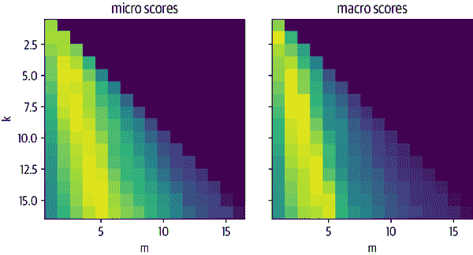

从图中我们可以看到有一个模式：对于给定的*k*选择太大或太小会产生次优结果。当选择大约为<mrow><mi>m</mi> <mo>/</mo> <mi>k</mi> <mo>=</mo> <mn>1</mn> <mo>/</mo> <mn>3</mn></mrow>的比率时，可以获得最佳性能。让我们看看哪个*k*和*m*能够在整体上获得最佳结果：

```py
k, m = np.unravel_index(perf_micro.argmax(), perf_micro.shape)
print(f"Best k: {k}, best m: {m}")
```

```py
Best k: 15, best m: 5
```

当我们选择 <math alttext="k equals 15"><mrow><mi>k</mi> <mo>=</mo> <mn>15</mn></mrow></math> 和 <math alttext="m equals 5"><mrow><mi>m</mi> <mo>=</mo> <mn>5</mn></mrow></math> 时，性能最佳，换句话说，当我们检索 15 个最近的邻居，然后分配至少出现 5 次的标签。现在我们有了一个找到嵌入查找最佳值的好方法，我们可以像使用朴素贝叶斯分类器一样玩同样的游戏，我们遍历训练集的切片并评估性能。在我们可以切片数据集之前，我们需要删除索引，因为我们不能像数据集那样切片 FAISS 索引。其余的循环保持完全相同，另外使用验证集来获取最佳的*k*和*m*值：

```py
embs_train.drop_index("embedding")
test_labels = np.array(embs_test["label_ids"])
test_queries = np.array(embs_test["embedding"], dtype=np.float32)

for train_slice in train_slices:
    # Create a Faiss index from training slice
    embs_train_tmp = embs_train.select(train_slice)
    embs_train_tmp.add_faiss_index("embedding")
    # Get best k, m values with validation set
    perf_micro, _ = find_best_k_m(embs_train_tmp, valid_queries, valid_labels)
    k, m = np.unravel_index(perf_micro.argmax(), perf_micro.shape)
    # Get predictions on test set
    _, samples = embs_train_tmp.get_nearest_examples_batch("embedding",
                                                           test_queries,
                                                           k=int(k))
    y_pred = np.array([get_sample_preds(s, m) for s in samples])
    # Evaluate predictions
    clf_report = classification_report(test_labels, y_pred,
        target_names=mlb.classes_, zero_division=0, output_dict=True,)
    macro_scores["Embedding"].append(clf_report["macro avg"]["f1-score"])
    micro_scores["Embedding"].append(clf_report["micro avg"]["f1-score"])
```

```py
plot_metrics(micro_scores, macro_scores, train_samples, "Embedding")
```

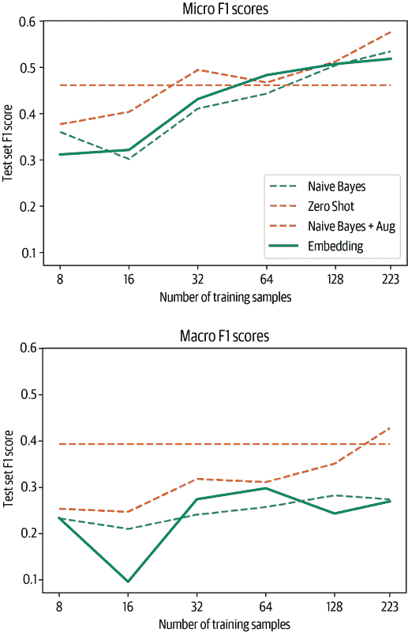

嵌入查找在微分数上与先前的方法竞争，只有两个“可学习”参数*k*和*m*，但在宏分数上表现稍差。

请以一颗谷物的方式接受这些结果；哪种方法最有效强烈取决于领域。零-shot 管道的训练数据与我们正在使用的 GitHub 问题数据集有很大不同，其中包含模型可能之前很少遇到的大量代码。对于更常见的任务，例如对评论的情感分析，该管道可能效果更好。同样，嵌入的质量取决于模型和它训练的数据。我们尝试了半打模型，例如`sentence-transformers/stsb-roberta-large`，它经过训练以提供句子的高质量嵌入，以及`microsoft/codebert-base`和`dbernsohn/roberta-python`，它们是在代码和文档上进行训练的。对于这个特定的用例，GPT-2 在 Python 代码上的训练效果最好。

由于您实际上不需要在代码中更改任何内容，只需将模型检查点名称替换为测试另一个模型，一旦设置了评估管道，您可以快速尝试几个模型。

现在让我们将这个简单的嵌入技巧与简单地微调我们拥有的有限数据的 Transformer 进行比较。

## 微调一个普通的 Transformer

如果我们可以访问标记数据，我们也可以尝试做一件显而易见的事情：简单地微调预训练的 Transformer 模型。在本节中，我们将使用标准的 BERT 检查点作为起点。稍后，我们将看到微调语言模型对性能的影响。

###### 提示

对于许多应用程序来说，从预训练的类似 BERT 的模型开始是一个好主意。但是，如果您的语料库领域与预训练语料库（通常是维基百科）有显著差异，您应该探索 Hugging Face Hub 上提供的许多模型。很可能已经有人在您的领域上预训练了一个模型！

让我们从加载预训练的标记器开始，对我们的数据集进行标记化，并摆脱我们在训练和评估中不需要的列：

```py
import torch
from transformers import (AutoTokenizer, AutoConfig,
                          AutoModelForSequenceClassification)

model_ckpt = "bert-base-uncased"
tokenizer = AutoTokenizer.from_pretrained(model_ckpt)

def tokenize(batch):
    return tokenizer(batch["text"], truncation=True, max_length=128)
ds_enc = ds.map(tokenize, batched=True)
ds_enc = ds_enc.remove_columns(['labels', 'text'])
```

多标签损失函数期望标签的类型为浮点数，因为它还允许类概率而不是离散标签。因此，我们需要更改`label_ids`列的类型。由于逐元素更改列格式与 Arrow 的类型格式不兼容，我们将做一些变通。首先，我们创建一个带有标签的新列。该列的格式是从第一个元素推断出来的。然后，我们删除原始列，并将新列重命名为原始列的位置：

```py
ds_enc.set_format("torch")
ds_enc = ds_enc.map(lambda x: {"label_ids_f": x["label_ids"].to(torch.float)},
                    remove_columns=["label_ids"])
ds_enc = ds_enc.rename_column("label_ids_f", "label_ids")
```

由于由于训练数据的有限大小，我们很可能会很快过度拟合训练数据，因此我们设置`load_best_model_at_end=True`并根据微观*F*[1]-⁠score 选择最佳模型：

```py
from transformers import Trainer, TrainingArguments

training_args_fine_tune = TrainingArguments(
    output_dir="./results", num_train_epochs=20, learning_rate=3e-5,
    lr_scheduler_type='constant', per_device_train_batch_size=4,
    per_device_eval_batch_size=32, weight_decay=0.0,
    evaluation_strategy="epoch", save_strategy="epoch",logging_strategy="epoch",
    load_best_model_at_end=True, metric_for_best_model='micro f1',
    save_total_limit=1, log_level='error')
```

我们需要*F*[1]-score 来选择最佳模型，因此我们需要确保在评估过程中计算它。因为模型返回 logits，所以我们首先需要使用 sigmoid 函数对预测进行归一化，然后可以使用简单的阈值对其进行二值化。然后我们从分类报告中返回我们感兴趣的分数：

```py
from scipy.special import expit as sigmoid

def compute_metrics(pred):
    y_true = pred.label_ids
    y_pred = sigmoid(pred.predictions)
    y_pred = (y_pred>0.5).astype(float)

    clf_dict = classification_report(y_true, y_pred, target_names=all_labels,
                                     zero_division=0, output_dict=True)
    return {"micro f1": clf_dict["micro avg"]["f1-score"],
            "macro f1": clf_dict["macro avg"]["f1-score"]}
```

现在我们准备好了！对于每个训练集切片，我们从头开始训练一个分类器，在训练循环结束时加载最佳模型，并将结果存储在测试集上：

```py
config = AutoConfig.from_pretrained(model_ckpt)
config.num_labels = len(all_labels)
config.problem_type = "multi_label_classification"
```

```py
for train_slice in train_slices:
    model = AutoModelForSequenceClassification.from_pretrained(model_ckpt,
                                                               config=config)
    trainer = Trainer(
        model=model, tokenizer=tokenizer,
        args=training_args_fine_tune,
        compute_metrics=compute_metrics,
        train_dataset=ds_enc["train"].select(train_slice),
        eval_dataset=ds_enc["valid"],)

    trainer.train()
    pred = trainer.predict(ds_enc["test"])
    metrics = compute_metrics(pred)
    macro_scores["Fine-tune (vanilla)"].append(metrics["macro f1"])
    micro_scores["Fine-tune (vanilla)"].append(metrics["micro f1"])
```

```py
plot_metrics(micro_scores, macro_scores, train_samples, "Fine-tune (vanilla)")
```

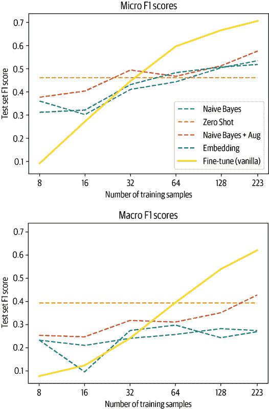

首先，我们看到简单地在数据集上微调一个普通的 BERT 模型会在我们拥有大约 64 个示例时导致竞争力的结果。我们还看到在此之前，行为有点不稳定，这又是由于在小样本上训练模型时，一些标签可能不平衡。在利用数据集的未标记部分之前，让我们快速看一下在少样本领域使用语言模型的另一种有前途的方法。

## 使用提示进行上下文和少样本学习

我们在本章前面看到，我们可以使用 BERT 或 GPT-2 等语言模型，并使用提示和解析模型的标记预测来使其适应监督任务。这与添加特定任务头部并调整模型参数的经典方法不同。优点是，这种方法不需要任何训练数据，但缺点是，如果我们可以访问标记数据，似乎我们无法利用它。有一个中间地带，我们有时可以利用，称为*in-context*或*少样本学习*。

为了说明这个概念，考虑一个英语到法语的翻译任务。在零-shot 范式中，我们会构建一个提示，可能如下所示：

```py
prompt = """\
Translate English to French:
thanks =>
"""
```

这有望促使模型预测单词“merci”的标记。我们已经在第六章中使用 GPT-2 进行摘要时看到，向文本中添加“TL;DR”提示模型生成摘要，而无需明确训练。GPT-3 论文的一个有趣发现是大型语言模型有效地从提示中学习示例的能力，因此，前面的翻译示例可以增加几个英语到德语的示例，这将使模型在这个任务上表现得更好。⁶

此外，作者发现，模型规模越大，它们越擅长使用上下文示例，从而显著提高性能。尽管 GPT-3 大小的模型在生产中具有挑战性，但这是一个令人兴奋的新兴研究领域，人们已经构建了一些很酷的应用，比如自然语言 shell，其中命令以自然语言输入，并由 GPT-3 解析为 shell 命令。

使用标记数据的另一种方法是创建提示和期望预测的示例，并继续在这些示例上训练语言模型。一种名为 ADAPET 的新方法使用了这种方法，并在各种任务上击败了 GPT-3，通过生成提示来调整模型。最近 Hugging Face 研究人员的工作表明，这种方法比微调自定义头部更节约数据。⁷

在本节中，我们简要地讨论了利用我们拥有的少量标记示例的各种方法。通常情况下，除了标记的示例，我们还可以访问大量未标记的数据；在下一节中，我们将讨论如何充分利用这些数据。

# 利用未标记的数据

尽管拥有大量高质量标记数据是训练分类器的最佳情况，但这并不意味着未标记数据毫无价值。想想我们使用的大多数模型的预训练：即使它们是在互联网上大多数不相关的数据上训练的，我们也可以利用预训练的权重来处理各种各样的文本上的其他任务。这是自然语言处理中迁移学习的核心思想。当下游任务的文本结构与预训练文本相似时，迁移效果更好，因此如果我们可以使预训练任务更接近下游目标，我们可能会改善迁移效果。

让我们从我们具体的用例来考虑这个问题：BERT 在 BookCorpus 和英文维基百科上进行了预训练，而包含代码和 GitHub 问题的文本在这些数据集中显然是一个小众。如果我们从头开始对 BERT 进行预训练，我们可以在 GitHub 上对所有问题进行爬取，例如。然而，这将是昂贵的，并且 BERT 学到的许多关于语言的方面仍然适用于 GitHub 问题。那么在从头开始重新训练和仅仅使用模型进行分类之间是否有一个中间地带？有，它被称为域自适应（我们在第七章中也看到了用于问答的域自适应）。我们可以在不从头开始重新训练语言模型的情况下，继续在我们领域的数据上训练它。在这一步中，我们使用预测掩码词的经典语言模型目标，这意味着我们不需要任何标记数据。之后，我们可以将适应后的模型加载为分类器并进行微调，从而利用未标记的数据。

域自适应的美妙之处在于，与标记数据相比，未标记数据通常是丰富可得的。此外，适应后的模型可以重复用于许多用例。想象一下，您想构建一个电子邮件分类器，并在所有历史电子邮件上应用域自适应。稍后您可以使用相同的模型进行命名实体识别或其他分类任务，比如情感分析，因为该方法对下游任务是不可知的。

现在让我们看看我们需要采取哪些步骤来微调预训练语言模型。

## 微调语言模型

在本节中，我们将对我们数据集的未标记部分进行预训练 BERT 模型的掩码语言建模进行微调。为此，我们只需要两个新概念：在对数据进行分词时需要额外的步骤和一个特殊的数据整理器。让我们从分词开始。

除了文本中的普通标记外，分词器还向序列添加特殊标记，例如 `[CLS]` 和 `[SEP]` 标记，用于分类和下一个句子预测。当我们进行掩码语言建模时，我们希望确保不训练模型来预测这些标记。出于这个原因，我们从损失中屏蔽它们，并且我们可以通过设置 `return_special_tokens_mask=True` 来在分词时获得掩码。让我们使用该设置重新对文本进行分词：

```py
def tokenize(batch):
    return tokenizer(batch["text"], truncation=True,
                     max_length=128, return_special_tokens_mask=True)

ds_mlm = ds.map(tokenize, batched=True)
ds_mlm = ds_mlm.remove_columns(["labels", "text", "label_ids"])
```

开始进行掩码语言建模所缺少的是在输入序列中屏蔽标记并在输出中有目标标记的机制。我们可以采用的一种方法是设置一个函数，对随机标记进行屏蔽并为这些序列创建标签。但这将使数据集的大小翻倍，因为我们还将在数据集中存储目标序列，并且这意味着我们将在每个时期使用相同的序列屏蔽。

一个更加优雅的解决方案是使用数据整理器。记住，数据整理器是构建数据集和模型调用之间的桥梁的函数。从数据集中抽取一个批次，并且数据整理器准备好批次中的元素以将它们馈送到模型中。在我们遇到的最简单的情况下，它只是将每个元素的张量连接成一个单一的张量。在我们的情况下，我们可以使用它来动态进行掩码和标签生成。这样我们就不需要存储标签，每次抽样时都会得到新的掩码。这个任务的数据整理器称为`DataCollatorForLanguageModeling`。我们使用模型的标记器和我们想要掩码的标记的分数来初始化它。我们将使用这个整理器来掩码 15%的标记，这遵循了 BERT 论文中的程序：

```py
from transformers import DataCollatorForLanguageModeling, set_seed

data_collator = DataCollatorForLanguageModeling(tokenizer=tokenizer,
                                                mlm_probability=0.15)
```

让我们快速看一下数据整理器的操作，看看它实际上做了什么。为了快速在`DataFrame`中显示结果，我们将标记器和数据整理器的返回格式切换为 NumPy：

```py
set_seed(3)
data_collator.return_tensors = "np"
inputs = tokenizer("Transformers are awesome!", return_tensors="np")
outputs = data_collator([{"input_ids": inputs["input_ids"][0]}])

pd.DataFrame({
    "Original tokens": tokenizer.convert_ids_to_tokens(inputs["input_ids"][0]),
    "Masked tokens": tokenizer.convert_ids_to_tokens(outputs["input_ids"][0]),
    "Original input_ids": original_input_ids,
    "Masked input_ids": masked_input_ids,
    "Labels": outputs["labels"][0]}).T
```

|  | 0 | 1 | 2 | 3 | 4 | 5 |
| --- | --- | --- | --- | --- | --- | --- |
| 原始标记 | [CLS] | transformers | are | awesome | ! | [SEP] |
| 掩码标记 | [CLS] | transformers | are | awesome | [MASK] | [SEP] |
| 原始 input_ids | 101 | 19081 | 2024 | 12476 | 999 | 102 |
| 掩码 input_ids | 101 | 19081 | 2024 | 12476 | 103 | 102 |
| 标签 | -100 | -100 | -100 | -100 | 999 | -100 |

我们看到与感叹号对应的标记已被替换为掩码标记。此外，数据整理器返回了一个标签数组，原始标记为-100，掩码标记的标记 ID。正如我们之前看到的，包含-100 的条目在计算损失时被忽略。让我们将数据整理器的格式切换回 PyTorch：

```py
data_collator.return_tensors = "pt"
```

有了标记器和数据整理器，我们就可以开始微调掩码语言模型了。我们像往常一样设置`TrainingArguments`和`Trainer`： 

```py
from transformers import AutoModelForMaskedLM

training_args = TrainingArguments(
    output_dir = f"{model_ckpt}-issues-128", per_device_train_batch_size=32,
    logging_strategy="epoch", evaluation_strategy="epoch", save_strategy="no",
    num_train_epochs=16, push_to_hub=True, log_level="error", report_to="none")

trainer = Trainer(
        model=AutoModelForMaskedLM.from_pretrained("bert-base-uncased"),
        tokenizer=tokenizer, args=training_args, data_collator=data_collator,
        train_dataset=ds_mlm["unsup"], eval_dataset=ds_mlm["train"])

trainer.train()
```

```py
trainer.push_to_hub("Training complete!")
```

我们可以访问训练器的日志历史记录，查看模型的训练和验证损失。所有日志都存储在`trainer.state.log_history`中，作为一个字典列表，我们可以轻松地加载到 Pandas 的`DataFrame`中。由于训练和验证损失记录在不同的步骤，数据框中存在缺失值。因此我们在绘制指标之前删除缺失值：

```py
df_log = pd.DataFrame(trainer.state.log_history)

(df_log.dropna(subset=["eval_loss"]).reset_index()["eval_loss"]
 .plot(label="Validation"))
df_log.dropna(subset=["loss"]).reset_index()["loss"].plot(label="Train")

plt.xlabel("Epochs")
plt.ylabel("Loss")
plt.legend(loc="upper right")
plt.show()
```

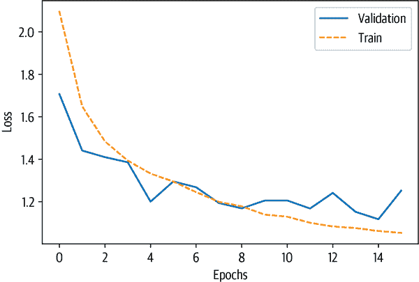

似乎训练和验证损失都显著下降了。所以让我们看看当我们基于这个模型微调分类器时是否也能看到改进。

## 微调分类器

现在我们将重复微调过程，但有一个细微的不同，即加载我们自己的自定义检查点：

```py
model_ckpt = f'{model_ckpt}-issues-128'
config = AutoConfig.from_pretrained(model_ckpt)
config.num_labels = len(all_labels)
config.problem_type = "multi_label_classification"

for train_slice in train_slices:
    model = AutoModelForSequenceClassification.from_pretrained(model_ckpt,
                                                               config=config)
    trainer = Trainer(
        model=model,
        tokenizer=tokenizer,
        args=training_args_fine_tune,
        compute_metrics=compute_metrics,
        train_dataset=ds_enc["train"].select(train_slice),
        eval_dataset=ds_enc["valid"],
    )

    trainer.train()
    pred = trainer.predict(ds_enc['test'])
    metrics = compute_metrics(pred)
    # DA refers to domain adaptation
    macro_scores['Fine-tune (DA)'].append(metrics['macro f1'])
    micro_scores['Fine-tune (DA)'].append(metrics['micro f1'])
```

将结果与基于 vanilla BERT 的微调进行比较，我们发现在低数据领域特别是有优势。在更多标记数据可用的情况下，我们也获得了几个百分点的优势：

```py
plot_metrics(micro_scores, macro_scores, train_samples, "Fine-tune (DA)")
```

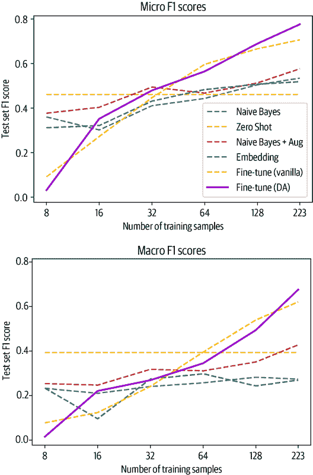

这突显了领域适应可以在没有标记数据和很少努力的情况下提供模型性能的轻微提升。自然地，未标记数据越多，标记数据越少，使用这种方法会产生更大的影响。在结束本章之前，我们将向您展示一些利用未标记数据的更多技巧。

## 高级方法

在微调分类头之前微调语言模型是一种简单而可靠的提升性能的方法。然而，还有更复杂的方法可以进一步利用未标记数据。我们在这里总结了一些这些方法，如果您需要更高性能，这些方法应该提供一个很好的起点。

### 无监督数据增强

无监督数据增强（UDA）背后的关键思想是，模型对未标记的示例和略微扭曲的示例应该保持一致。这些扭曲是通过标准的数据增强策略引入的，例如标记替换和回译。然后通过最小化原始和扭曲示例的预测之间的 KL 散度来强制执行一致性。这个过程在图 9-5 中有所说明，其中一致性要求通过从未标记的示例中增加交叉熵损失的额外项来实现。这意味着使用标准监督方法在标记数据上训练模型，但约束模型对未标记数据进行一致的预测。

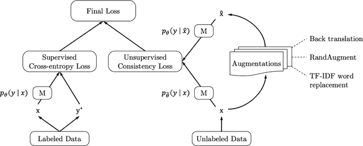

###### 图 9-5\. 使用 UDA 训练模型 M（由 Qizhe Xie 提供）

这种方法的性能相当令人印象深刻：使用 UDA 训练的 BERT 模型在有限数量的示例上获得了与数千个示例训练的模型相似的性能。缺点是您需要一个数据增强管道，并且训练时间更长，因为您需要多次前向传递来生成未标记和增强示例的预测分布。

### 不确定性感知的自我训练

利用未标记数据的另一种有前途的方法是不确定性感知的自我训练（UST）。这里的想法是在标记数据上训练一个教师模型，然后使用该模型在未标记数据上创建伪标签。然后在伪标记数据上训练一个学生，训练后它成为下一次迭代的教师。

这种方法的一个有趣之处在于伪标签的生成方式：为了获得模型预测的不确定性度量，相同的输入通过模型多次，同时打开辍学。然后预测的方差给出了模型对特定样本的确定性的代理。有了这种不确定性度量，然后使用一种称为贝叶斯主动学习的方法来采样伪标签。完整的训练管道在图 9-6 中有所说明。

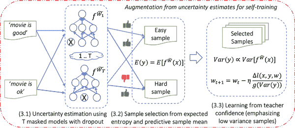

###### 图 9-6\. UST 方法包括一个生成伪标签的教师和随后在这些标签上进行训练的学生；学生训练后成为教师，然后重复这个步骤（由 Subhabrata Mukherjee 提供）⁹

通过这种迭代方案，教师不断改进创建伪标签的能力，因此模型的性能得到了提高。最终，这种方法在几个百分点内接近使用数千个样本进行全面训练的模型，并且在几个数据集上甚至超过了 UDA。

现在我们已经看到了一些先进的方法，让我们退一步，总结一下我们在本章学到的内容。

# 结论

在本章中，我们看到即使只有少量甚至没有标签，也不是所有的希望都已经失去。我们可以利用已经在其他任务上预训练的模型，比如 BERT 语言模型或在 Python 代码上训练的 GPT-2，来对 GitHub 问题分类的新任务进行预测。此外，我们可以使用领域自适应在使用普通分类头训练模型时获得额外的提升。

在特定用例上，所提出的方法中哪种方法最有效取决于各种方面：您拥有多少标记数据，它有多嘈杂，数据与预训练语料库有多接近等等。要找出最有效的方法，建立评估管道然后快速迭代是一个好主意。​⁠ Transformers 的灵活 API 允许您快速加载一些模型并进行比较，而无需进行任何代码更改。Hugging Face Hub 上有超过 10,000 个模型，很可能有人过去曾经处理过类似的问题，您可以在此基础上构建。

这本书超出了 UDA 或 UST 等更复杂方法与获取更多数据之间的权衡范围。为了评估你的方法，至少在早期建立验证和测试集是有意义的。在每一步，你也可以收集更多的标记数据。通常标注几百个例子只需要几个小时或几天的工作，而且有许多工具可以帮助你做到这一点。根据你想要实现的目标，投入一些时间创建一个小而高质量的数据集可能比设计一个非常复杂的方法来弥补其不足更有意义。通过本章中我们提出的方法，你可以确保充分利用你宝贵的标记数据。

在这里，我们已经涉足了低数据范畴，并且看到 Transformer 模型即使只有一百个例子，仍然非常强大。在下一章中，我们将看到完全相反的情况：当我们有数百吉字节的数据和大量计算资源时，我们将会做些什么。我们将从头开始训练一个大型的 Transformer 模型，让它为我们自动完成代码。

¹ Q. Xie et al., [“Unsupervised Data Augmentation for Consistency Training”](https://arxiv.org/abs/1904.12848), (2019); S. Mukherjee and A.H. Awadallah, [“Uncertainty-Aware Self-Training for Few-Shot Text Classification”](https://arxiv.org/abs/2006.15315), (2020).

² 我们感谢[Joe Davison](https://joeddav.github.io)向我们提出了这种方法。

³ A. Williams, N. Nangia, and S.R. Bowman, [“A Broad-Coverage Challenge Corpus for Sentence Understanding Through Inference”](https://arxiv.org/abs/1704.05426), (2018); A. Conneau et al., [“XNLI: Evaluating Cross-Lingual Sentence Representations”](https://arxiv.org/abs/1809.05053), (2018).

⁴ J. Wei and K. Zou, [“EDA: Easy Data Augmentation Techniques for Boosting Performance on Text Classification Tasks”](https://arxiv.org/abs/1901.11196), (2019).

⁵ J. Johnson, M. Douze, and H. Jégou, [“Billion-Scale Similarity Search with GPUs”](https://arxiv.org/abs/1702.08734), (2017).

⁶ T. Brown et al., [“Language Models Are Few-Shot Learners”](https://arxiv.org/abs/2005.14165), (2020).

⁷ D. Tam et al., [“Improving and Simplifying Pattern Exploiting Training”](https://arxiv.org/abs/2103.11955), (2021).

⁸ T. Le Scao and A.M. Rush, [“How Many Data Points Is a Prompt Worth?”](https://arxiv.org/abs/2103.08493), (2021).

⁹ S. Mukherjee and A.H. Awadallah, [“Uncertainty-Aware Self-Training for Few-Shot Text Classification”](https://arxiv.org/abs/2006.15315), (2020).
