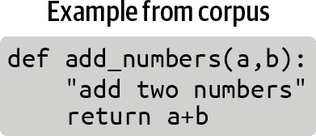
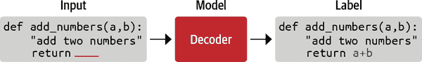
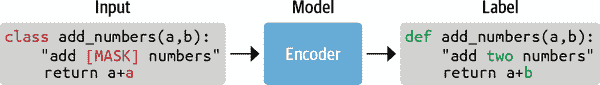
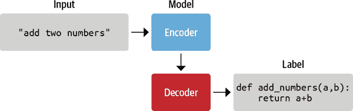
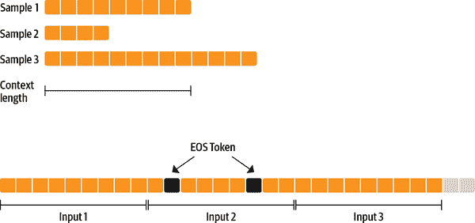
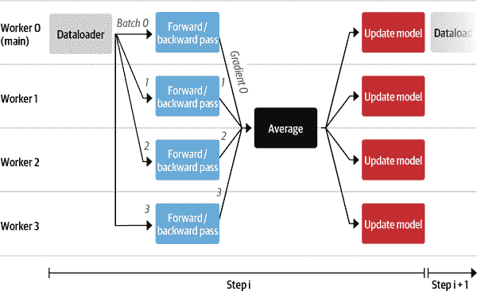
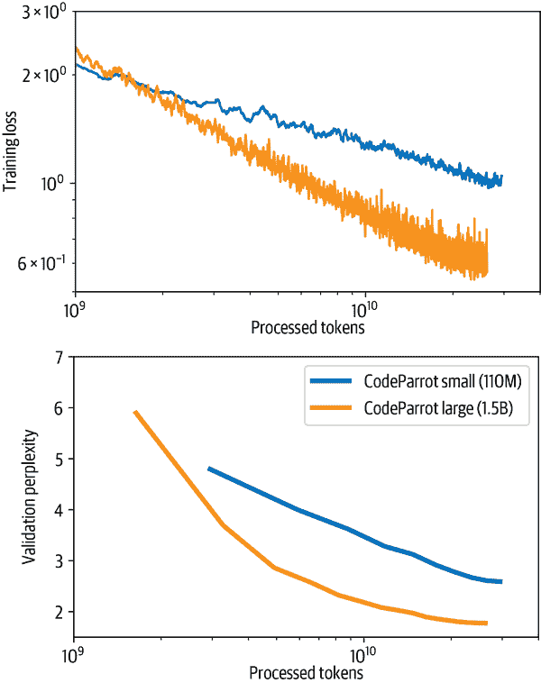

# 第十章：从头开始训练变换器

在本书的开头段落中，我们提到了一个名为 GitHub Copilot 的复杂应用，它使用类似 GPT 的变换器来执行代码自动完成，这个功能在使用新语言或框架编程、学习编程或自动生成样板代码时特别有用。其他使用 AI 模型进行此类用途的产品包括[TabNine](https://tabnine.com)和[Kite](https://kite.com)。稍后，在第五章中，我们更仔细地研究了如何使用 GPT 模型生成高质量文本。在本章中，我们将闭环并构建我们自己的类似 GPT 的模型来生成 Python 源代码！我们称结果模型为*CodeParrot*。

到目前为止，我们主要在数据受限的应用程序上工作，其中有限的标记训练数据量。在这些情况下，迁移学习帮助我们构建了高性能模型。我们在第九章中将迁移学习推向了极限，几乎没有使用任何训练数据。

在本章中，我们将转向另一个极端，看看当我们淹没在可能想要的所有数据时我们可以做些什么。我们将探讨预训练步骤本身，并学习如何从头开始训练一个变换器。在解决这个问题的过程中，我们将看一些我们尚未考虑过的训练方面，比如以下内容：

+   收集和处理非常大的数据集

+   为我们的数据集创建自定义分词器

+   在多个 GPU 上规模化训练模型

为了有效地训练拥有数十亿参数的大型模型，我们将需要分布式训练的特殊工具。虽然 Transformers 的`Trainer`支持分布式训练，但我们将借此机会展示一个名为 Accelerate 的强大 PyTorch 库。我们最终将涉及一些当今最大的 NLP 模型，但首先，我们需要找到一个足够大的数据集。

###### 警告

与本书中其他章节中可以在单个 GPU 上的 Jupyter 笔记本上运行的代码不同，本章中的训练代码设计为在多个 GPU 上作为脚本运行。如果您想训练自己的 CodeParrot 版本，我们建议运行提供在 [Transformers repository](https://oreil.ly/ZyPPR)中的脚本。

# 大型数据集及其获取方式

有许多领域，您可能实际上手头有大量数据，从法律文件到生物医学数据集再到编程代码库。在大多数情况下，这些数据集是无标签的，它们的大尺寸意味着通常只能通过使用启发式方法进行标记，或者通过在收集过程中存储的附带元数据来进行标记。

然而，即使是无标签或仅启发式标记的非常大语料库也可能是有用的。我们在第九章中看到了一个例子，我们使用数据集的无标签部分来微调语言模型以进行领域适应。当有限的数据可用时，这种方法通常会带来性能提升。从头开始训练而不是微调现有模型的决定，主要取决于微调语料库的大小以及可用预训练模型与语料库之间的领域差异。

使用预训练模型会强制您使用模型对应的分词器，但是使用在另一个领域语料库上训练的分词器通常是次优的。例如，使用 GPT 的预训练分词器处理法律文件、其他语言，甚至完全不同的序列，比如音乐音符或 DNA 序列，将导致较差的分词（我们很快就会看到）。

随着您可以访问的训练数据量接近用于预训练的数据量，考虑从头开始训练模型和分词器变得有趣，前提是有必要的计算资源可用。在我们进一步讨论不同的预训练目标之前，我们首先需要构建一个适合预训练的大型语料库。构建这样一个语料库带来了一系列挑战，我们将在下一节中探讨。

## 构建大规模语料库的挑战

预训练后模型的质量在很大程度上反映了预训练语料库的质量。特别是，模型将继承预训练语料库中的任何缺陷。因此，在我们尝试创建自己的模型之前，最好了解一些与构建用于预训练的大型语料库相关的常见问题和挑战。

随着数据集的不断扩大，你完全控制或者至少对其内部有一个精确的了解的机会会减少。一个非常大的数据集很可能不是由专门的创作者一次一例地精心制作而成的，而是通过自动或半自动的方式收集作为其他活动的副产品生成的数据。例如，它可能包括公司存储的所有文件（例如合同、采购订单等）、用户活动的日志，或者从互联网收集的数据。

大规模数据集主要是通过高度自动化的方式创建的，这一事实带来了一些重要的后果。一个重要的考虑是，对它们的内容和创建方式都有限制，因此训练模型的偏见和低质量数据的风险增加。对于用于训练 BERT 和 T5 的著名大规模数据集如 BookCorpus 和 C4 的最近调查揭示了（除其他事项外）：(1)

+   C4 语料库中有相当大比例的内容是机器翻译而不是人工翻译的。

+   在 C4 中由于停用词过滤导致非洲裔美国英语的不同擦除，导致了这类内容的代表性不足。

+   在大型文本语料库中，很难在包含（通常过多的）性或其他明确内容和完全删除所有性或性别提及之间找到一个折中。由于这一令人惊讶的结果，像“性”这样一个相当常见的词（既可以有中性含义，也可以有明确含义）对于在 C4 上训练的分词器来说是完全未知的，因为这个词在语料库中完全不存在。

+   在 BookCorpus 中存在许多侵犯版权的情况，可能在其他大规模数据集中也存在。(2)

+   BookCorpus 中存在“浪漫”小说的流派偏向。

这些发现可能与对这些语料库训练的模型的下游使用并不矛盾。例如，如果模型旨在用作浪漫小说写作工具或用于构建游戏，那么 BookCorpus 中浪漫小说的强烈过度代表可能是可以接受的。

让我们通过比较 GPT 和 GPT-2 的文本生成来说明模型被数据偏向的概念。GPT 主要是在 BookCorpus 上训练的，而 GPT-2 是在来自 Reddit 的网页、博客和新闻文章上训练的。我们将比较这两个模型的类似大小版本在相同的提示上的输出，以便主要区别是预训练数据集，我们将使用`text-generation`管道来调查模型的输出：

```py
from transformers import pipeline, set_seed

generation_gpt = pipeline("text-generation", model="openai-gpt")
generation_gpt2 = pipeline("text-generation", model="gpt2")
```

接下来，让我们创建一个简单的函数来计算每个模型中参数的数量：

```py
def model_size(model):
    return sum(t.numel() for t in model.parameters())

print(f"GPT  size: {model_size(generation_gpt.model)/1000**2:.1f}M parameters")
print(f"GPT2 size: {model_size(generation_gpt2.model)/1000**2:.1f}M parameters")
```

```py
GPT  size: 116.5M parameters
GPT2 size: 124.4M parameters
```

GPT 模型的原始版本与最小的 GPT-2 模型大小相当。现在我们可以从每个模型生成三个不同的完成，每个完成都有相同的输入提示：

```py
def enum_pipeline_ouputs(pipe, prompt, num_return_sequences):
    out = pipe(prompt, num_return_sequences=num_return_sequences,
               clean_up_tokenization_spaces=True)
    return "\n".join(f"{i+1}." + s["generated_text"] for i, s in enumerate(out))

prompt = "\nWhen they came back"
print("GPT completions:\n" + enum_pipeline_ouputs(generation_gpt, prompt, 3))
print("")
print("GPT-2 completions:\n" + enum_pipeline_ouputs(generation_gpt2, prompt, 3))
```

```py
GPT completions:
1.
When they came back.
 " we need all we can get, " jason said once they had settled into the back of
the truck without anyone stopping them. " after getting out here, it 'll be up
to us what to find. for now
2.
When they came back.
 his gaze swept over her body. he 'd dressed her, too, in the borrowed clothes
that she 'd worn for the journey.
 " i thought it would be easier to just leave you there. " a woman like
3.
When they came back to the house and she was sitting there with the little boy.
 " don't be afraid, " he told her. she nodded slowly, her eyes wide. she was so
lost in whatever she discovered that tom knew her mistake

GPT-2 completions:
1.
When they came back we had a big dinner and the other guys went to see what
their opinion was on her. I did an hour and they were happy with it.
2.
When they came back to this island there had been another massacre, but he could
not help but feel pity for the helpless victim who had been left to die, and
that they had failed that day. And so was very, very grateful indeed.
3.
When they came back to our house after the morning, I asked if she was sure. She
said, "Nope." The two kids were gone that morning. I thought they were back to
being a good friend.

When Dost
```

通过对两个模型的少量输出进行抽样，我们已经可以看到 GPT 生成中独特的“浪漫”倾向，通常会想象一个女人和一个男人之间的浪漫互动对话。另一方面，GPT-2 是在与 Reddit 文章相关的 webtext 上进行训练的，它在生成中大多采用中性的“they”，其中包含“类似博客”的或冒险相关的元素。

一般来说，对数据集进行训练的任何模型都会反映出语言偏见和人口和事件在其训练数据中的过度或不足代表性。模型行为中的这些偏见对于考虑与模型交互的目标受众是很重要的；对于一些有用的指南，我们建议您参考 Google 的一篇论文，该论文提供了数据集开发的框架。³

这个简短的介绍应该让你了解到在创建大型文本语料库时所面临的困难挑战。有了这些想法，现在让我们来看看如何创建我们自己的数据集！

## 构建自定义代码数据集

为了简化任务，我们将专注于仅针对 Python 编程语言构建代码生成模型。⁴我们需要的第一件事是一个由 Python 源代码组成的大型预训练语料库。幸运的是，有一个每个软件工程师都知道的自然资源：GitHub！这个著名的代码共享网站托管着数千兆字节的代码存储库，这些存储库是公开可访问的，并且可以根据其各自的许可证进行下载和使用。在撰写本书时，GitHub 托管了超过 2000 万个代码存储库。其中许多是由用户创建的小型或测试存储库，用于学习、未来的副业项目或测试目的。

GitHub 存储库可以通过两种主要方式访问：

+   通过[GitHub REST API](https://oreil.ly/brhxw)，就像我们在第九章中看到的那样，当我们下载了 Transformers 存储库的所有 GitHub 问题时

+   通过像[Google BigQuery](https://oreil.ly/dYsVT)这样的公共数据集清单

由于 REST API 受速率限制，我们需要大量数据来进行预训练，因此我们将使用 Google BigQuery 来提取所有 Python 存储库。`bigquery-public-data.github_repos.contents`表包含所有小于 10MB 的 ASCII 文件的副本。项目还需要是开源的，才能被包括在内，这是由[GitHub 的许可证 API](https://oreil.ly/N9zHb)确定的。

###### 提示

Google BigQuery 数据集不包含星标或下游使用信息。对于这些属性，我们可以使用 GitHub REST API 或像[Libraries.io](https://libraries.io)这样的服务，它监视开源软件包。事实上，GitHub 的一个团队最近发布了一个名为[CodeSearchNet](https://oreil.ly/daE43)的数据集，该数据集使用了来自 Libraries.io 的信息，过滤了至少在一个下游任务中使用的存储库。

让我们看看如何使用 Google BigQuery 创建我们的代码数据集。

### 使用 Google BigQuery 创建数据集

我们将从 Google BigQuery 的快照中提取 GitHub 公共存储库中的所有 Python 文件。为了便于重现，并且以防 BigQuery 的免费使用政策在未来发生变化，我们还将在 Hugging Face Hub 上分享这个数据集。导出这些文件的步骤是从[TransCoder 实现](https://oreil.ly/vih2m)中改编的，如下所示：⁵

1.  创建一个 Google Cloud 账户（免费试用应该足够）。

1.  在您的账户下创建一个 Google BigQuery 项目。

1.  在这个项目中，创建一个数据集。

1.  在这个数据集中，创建一个表，用来存储 SQL 请求的结果。

1.  在`github_repos`上准备并运行以下 SQL 查询（为了保存查询结果，请选择更多 > 查询选项，选中“为查询结果设置目标表”框，并指定表名）：

    ```py
    SELECT
      f.repo_name, f.path, c.copies, c.size, c.content, l.license
    FROM
      `bigquery-public-data.github_repos.files` AS f
    JOIN
      `bigquery-public-data.github_repos.contents` AS c
    ON
      f.id = c.id
    JOIN
      `bigquery-public-data.github_repos.licenses` AS l
    ON
      f.repo_name = l.repo_name
    WHERE
      NOT c.binary
      AND ((f.path LIKE '%.py')
        AND (c.size BETWEEN 1024
          AND 1048575))
    ```

此命令处理大约 2.6TB 的数据，以提取 2680 万个文件。结果是一个约 50GB 的压缩 JSON 文件数据集，每个文件包含 Python 文件的源代码。我们过滤掉了空文件和像`__init__.py`这样不包含太多有用信息的小文件。我们还过滤掉了大于 1MB 的文件，并下载了所有文件的许可证，以便以后可以根据许可证过滤训练数据。

接下来，我们将把结果下载到我们的本地计算机。如果您在家里尝试这个，请确保您有足够的带宽和至少 50GB 的可用磁盘空间。将结果表格传输到您的本地计算机的最简单方法是按照以下两步进行：

1.  将结果导出到 Google Cloud：

    1.  在 Google Cloud Storage（GCS）中创建一个存储桶和一个文件夹。

    1.  通过选择导出 > 导出到 GCS，使用 JSON 和 gzip 压缩的导出格式，将您的表格导出到此存储桶。

1.  要将存储桶下载到您的计算机上，请使用[`gsutil`库](https://oreil.ly/JzgRk)：

    1.  使用`pip install gsutil`安装`gsutil`。

    1.  使用您的 Google 帐户配置`gsutil`：`gsutil config`。

    1.  将您的存储桶复制到您的计算机上：

        ```py
        $ gsutil -m -o
        "GSUtil:parallel_process_count=1" cp -r gs://*<name_of_bucket>*

        ```

或者，您可以使用以下命令直接从 Hugging Face Hub 下载数据集：

```py
$ git clone https://huggingface.co/datasets/transformersbook/codeparrot

```

处理 50GB 的数据集可能是具有挑战性的；它需要足够的磁盘空间，并且必须小心不要耗尽 RAM。在接下来的部分中，我们将看看数据集如何帮助解决在小型计算机上处理大型数据集的这些限制。

## 处理大型数据集

加载非常大的数据集通常是一项具有挑战性的任务，特别是当数据大于计算机的 RAM 时。对于大规模的预训练数据集，这是一种非常常见的情况。在我们的示例中，我们有 50GB 的压缩数据和约 200GB 的未压缩数据，这很难提取并加载到标准尺寸的笔记本电脑或台式电脑的 RAM 内存中。

值得庆幸的是，数据集从一开始就被设计用来克服这个问题，具有两个特定功能，允许您摆脱 RAM 和硬盘空间的限制：内存映射和流式处理。

### 内存映射

为了克服 RAM 限制，数据集使用了一种零拷贝和零开销的内存映射机制，默认情况下已激活。基本上，每个数据集都被缓存在驱动器上，形成一个直接反映 RAM 内存中内容的文件。数据集不是将数据集加载到 RAM 中，而是打开一个对该文件的只读指针，并将其用作 RAM 的替代品，基本上使用硬盘作为 RAM 内存的直接扩展。

到目前为止，我们大多数使用数据集来访问 Hugging Face Hub 上的远程数据集。在这里，我们将直接加载我们本地存储在`codeparrot`存储库中的 50GB 压缩的 JSON 文件。由于 JSON 文件是压缩的，我们首先需要解压它们，这是由数据集来处理的。请注意，这需要大约 180GB 的可用磁盘空间！但是，它几乎不会使用 RAM。通过在数据集的下载配置中设置`delete_extracted=True`，我们可以确保尽快删除所有不再需要的文件：

```py
from datasets import load_dataset, DownloadConfig

download_config = DownloadConfig(delete_extracted=True)
dataset = load_dataset("./codeparrot", split="train",
                       download_config=download_config)
```

在幕后，数据集提取并读取了所有压缩的 JSON 文件，将它们加载到一个优化的缓存文件中。让我们看看加载后的数据集有多大：

```py
import psutil

print(f"Number of python files code in dataset : {len(dataset)}")
ds_size = sum(os.stat(f["filename"]).st_size for f in dataset.cache_files)
# os.stat.st_size is expressed in bytes, so we convert to GB
print(f"Dataset size (cache file) : {ds_size / 2**30:.2f} GB")
# Process.memory_info is expressed in bytes, so we convert to MB
print(f"RAM used: {psutil.Process(os.getpid()).memory_info().rss >> 20} MB")
```

```py
Number of python files code in dataset : 18695559
Dataset size (cache file) : 183.68 GB
RAM memory used: 4924 MB
```

正如我们所看到的，数据集比我们典型的 RAM 内存要大得多，但我们仍然可以加载和访问它，而且实际上只使用了非常有限的内存。

您可能会想知道这是否会使我们的训练受到 I/O 限制。实际上，与模型处理计算相比，NLP 数据通常非常轻量级，因此这很少是一个问题。此外，零拷贝/零开销格式在内部使用 Apache Arrow，这使得访问任何元素非常高效。根据硬盘驱动器的速度和批处理大小，通常可以以每秒几分之一的 GB 到几 GB 的速度迭代整个数据集。这很棒，但如果您无法释放足够的磁盘空间来本地存储完整的数据集怎么办？每个人都知道当收到磁盘已满警告并且需要痛苦地尝试删除一些隐藏文件来释放几 GB 时的无助感。幸运的是，如果您使用数据集的流式传输功能，您无需在本地存储完整的数据集！

### 流式传输

一些数据集（甚至达到 1TB 或更多）甚至难以适应标准硬盘。在这种情况下，除了扩大您正在使用的服务器之外，还可以*流式传输*数据集。这也适用于数据集，适用于一些可以逐行读取的压缩或未压缩文件格式，如 JSON Lines、CSV 或文本（原始或 zip、gzip 或 zstandard 压缩）。让我们直接从压缩的 JSON 文件中加载数据集，而不是从中创建缓存文件：

```py
streamed_dataset = load_dataset('./codeparrot', split="train", streaming=True)
```

正如您将看到的，加载数据集是瞬间完成的！在流式模式下，压缩的 JSON 文件将被动态打开和读取。我们的数据集现在是一个`IterableDataset`对象。这意味着我们无法访问它的随机元素，比如`streamed_dataset[1264]`，但我们需要按顺序读取它，例如使用`next(iter(streamed_dataset))`。仍然可以使用`shuffle()`等方法，但这些方法将通过获取一定数量的示例并在此缓冲区内进行洗牌来操作（缓冲区的大小是可调整的）。当提供多个文件作为原始文件时（比如我们这里的 184 个文件），`shuffle()`还将随机化迭代的文件顺序。

流式数据集的样本与非流式数据集的样本相同，我们可以看到：

```py
iterator = iter(streamed_dataset)

print(dataset[0] == next(iterator))
print(dataset[1] == next(iterator))
```

```py
True
True
```

使用流式数据集的主要优点是，加载此数据集不会在驱动器上创建缓存文件，也不需要任何（显著的）RAM 内存。当请求新的示例批次时，原始原始文件将被提取并动态读取，只有该批次被加载到内存中。这将我们数据集的内存占用从 180GB 减少到 50GB。但我们可以再进一步——而不是指向本地数据集，我们可以引用 Hub 上的数据集，然后直接下载样本而不在本地下载原始文件：

```py
remote_dataset = load_dataset('transformersbook/codeparrot', split="train",
                              streaming=True)
```

这个数据集的行为与之前的数据集完全相同，但在幕后动态下载示例。有了这样的设置，我们可以在（几乎）任意小的服务器上使用任意大的数据集。让我们将我们的数据集与训练和验证拆分一起推送到 Hugging Face Hub，并使用流式访问。

## 将数据集添加到 Hugging Face Hub

将数据集推送到 Hugging Face Hub 将允许我们：

+   轻松从我们的训练服务器访问它。

+   看看流式数据集如何与 Hub 上的数据集无缝配合。

+   与社区分享，包括您，亲爱的读者！

要上传数据集，我们首先需要通过在终端中运行以下命令并提供相关凭据来登录我们的 Hugging Face 帐户：

```py
$ huggingface-cli login

```

这相当于我们在之前章节中使用的`notebook_login()`辅助函数。完成后，我们可以直接在 Hub 上创建一个新数据集并上传压缩的 JSON 文件。为简化起见，我们将创建两个存储库：一个用于训练拆分，一个用于验证拆分。我们可以通过运行 CLI 的`repo create`命令来实现这一点，如下所示：

```py
$ huggingface-cli repo create --type dataset --organization transformersbook \
codeparrot-train
$ huggingface-cli repo create --type dataset --organization transformersbook \
codeparrot-valid

```

在这里，我们指定了存储库应该是一个数据集（与用于存储权重的模型存储库相对），以及我们想要存储存储库的组织。如果您在个人帐户下运行此代码，可以省略`--organization`标志。接下来，我们需要将这些空存储库克隆到我们的本地计算机，将 JSON 文件复制到其中，并将更改推送到 Hub。我们将从我们拥有的 184 个文件中取出最后一个压缩的 JSON 文件作为验证文件（即我们数据集的大约 0.5％）。执行以下命令将存储库从 Hub 克隆到本地计算机：

```py
$ git clone https://huggingface.co/datasets/transformersbook/codeparrot-train
$ git clone https://huggingface.co/datasets/transformersbook/codeparrot-valid

```

接下来，将除了最后一个 GitHub 文件之外的所有文件复制为训练集：

```py
$ cd codeparrot-train
$ cp ../codeparrot/*.json.gz .
$ rm ./file-000000000183.json.gz

```

然后提交文件并将其推送到 Hub：

```py
$ git add .
$ git commit -m "Adding dataset files"
$ git push

```

现在，为验证集重复此过程：

```py
$ cd ../codeparrot-valid
$ cp ../codeparrot/file-000000000183.json.gz .
$ mv ./file-000000000183.json.gz ./file-000000000183_validation.json.gz
$ git add .
$ git commit -m "Adding dataset files"
$ git push

```

`git add .`步骤可能需要几分钟，因为需要计算所有文件的哈希值。上传所有文件也需要一些时间。然而，由于这将使我们能够在本章后面更快地进行流式处理，因此这不是浪费时间，这一步将使我们在实验的其余部分中显着加快速度。请注意，我们在验证文件名后添加了`_validation`后缀。这将使我们能够稍后将其加载为验证拆分。

就是这样！我们的数据集的两个拆分以及完整数据集现在都在 Hugging Face Hub 上以以下 URL 上线：

+   [*https://huggingface.co/datasets/transformersbook/codeparrot*](https://huggingface.co/datasets/transformersbook/codeparrot)

+   [*https://huggingface.co/datasets/transformersbook/codeparrot-train*](https://huggingface.co/datasets/transformersbook/codeparrot-train)

+   [*https://huggingface.co/datasets/transformersbook/codeparrot-valid*](https://huggingface.co/datasets/transformersbook/codeparrot-valid)

###### 注意

添加 README 卡是一个好习惯，解释数据集的创建方式，并尽可能提供有关它们的有用信息。文档完善的数据集更有可能对其他人有用，也对您未来的自己有用。您可以阅读 [数据集 README 指南](https://oreil.ly/Tv9bq)以详细了解如何编写良好的数据集文档。您还可以使用 Web 编辑器直接在 Hub 上修改 README 卡。

# 构建分词器

现在我们已经收集并加载了大型数据集，让我们看看如何有效地处理数据以供模型使用。在之前的章节中，我们使用了伴随我们使用的模型的分词器。这是有道理的，因为这些模型是使用通过分词器定义的特定预处理流程传递的数据进行预训练的。在使用预训练模型时，重要的是坚持选择用于预训练的相同预处理设计选择。否则，模型可能会受到超出分布模式或未知标记的影响。

然而，当我们训练一个新模型时，使用为另一个数据集准备的分词器可能是次优的。以下是使用现有分词器时可能遇到的问题的一些示例：

+   T5 分词器是在我们之前遇到的[C4](https://oreil.ly/wsYIC)语料库上进行训练的，但是使用了大量的停用词过滤步骤来创建它。因此，T5 分词器从未见过诸如“sex”之类的常见英语单词。

+   CamemBERT 分词器也是在一个非常大的文本语料库上进行训练的，但只包括法语文本（[OSCAR](https://oreil.ly/hgO5J)语料库的法语子集）。因此，它不知道诸如“being”之类的常见英语单词。

我们可以在实践中轻松测试每个分词器的这些特性：

```py
from transformers import AutoTokenizer

def tok_list(tokenizer, string):
    input_ids = tokenizer(string, add_special_tokens=False)["input_ids"]
    return [tokenizer.decode(tok) for tok in input_ids]

tokenizer_T5 = AutoTokenizer.from_pretrained("t5-base")
tokenizer_camembert = AutoTokenizer.from_pretrained("camembert-base")
```

```py
print(f'T5 tokens for "sex": {tok_list(tokenizer_T5,"sex")}')
print(f'CamemBERT tokens for "being": {tok_list(tokenizer_camembert,"being")}')
```

```py
T5 tokens for "sex": ['', 's', 'ex']
CamemBERT tokens for "being": ['be', 'ing']
```

在许多情况下，将这些短而常见的单词分割成子部分将是低效的，因为这将增加模型的输入序列长度（其上下文有限）。因此，重要的是要了解用于训练分词器的数据集的领域和预处理。分词器和模型可能会从数据集中编码偏见，这会影响模型的下游行为。因此，为我们的数据集创建一个最佳的分词器，我们需要自己训练一个。让我们看看如何做到这一点。

###### 注意

训练模型涉及从给定的权重集开始，并使用反向传播从设计的目标上的误差信号来最小化模型的损失，并找到模型执行训练目标定义的任务的最佳权重集。另一方面，训练分词器*不*涉及反向传播或权重。这是一种从文本字符串到可以被模型摄取的整数列表的最佳映射方式。在今天的分词器中，最佳的字符串到整数转换涉及一个由原子字符串列表组成的词汇表，以及一个将文本字符串转换、规范化、切割或映射为具有这个词汇表的索引列表的方法。然后，这个索引列表是我们神经网络的输入。

## 分词器模型

正如您在第四章中看到的，分词器是一个由四个步骤组成的处理管道：规范化、预分词、分词器模型和后处理。可以在数据上训练的分词器管道的部分是分词器模型。正如我们在第二章中讨论的，有几种可以使用的子词分词算法，例如 BPE、WordPiece 和 Unigram。

BPE 从基本单元（单个字符）的列表开始，并通过逐渐创建由最频繁共现的基本单元合并而成的新标记，并将其添加到词汇表中的过程来创建词汇表。这个过程重复进行，直到达到预定义的词汇表大小。

Unigram 从另一端开始，通过将其基本词汇初始化为语料库中的所有单词和潜在的子词。然后，它逐渐删除或拆分不太有用的标记，直到达到目标词汇大小为止。WordPiece 是 Unigram 的前身，其官方实现从未被谷歌开源。

这些不同算法对下游性能的影响因任务而异，总体上很难确定哪种算法明显优于其他算法。在大多数情况下，BPE 和 Unigram 的性能都是合理的，但让我们来看看在评估时需要考虑的一些方面。

## 衡量分词器性能

分词器的最优性和性能在实践中很难衡量。一些可能的指标包括：

+   *子词多样性*，计算每个被分词单词产生的平均子词数量

+   *继续单词的比例*，指的是语料库中被分词的单词中至少被分割成两个子标记的比例

+   *覆盖度指标*，如被分词语料库中未知单词或少用标记的比例

此外，对拼写错误或噪声的鲁棒性通常是估计的，以及模型在这些域外示例上的性能，因为这在很大程度上取决于分词过程。

这些度量给出了分词器性能的一组不同视图，但它们往往忽略了分词器与模型的交互。例如，通过在词汇表中包含所有可能的单词，可以最小化子词的多样性，但这将为模型产生一个非常大的词汇表。

因此，各种标记化方法的性能通常最好通过使用模型的下游性能作为最终指标来估计。例如，早期 BPE 方法的良好性能是通过展示使用这些标记器和词汇表训练的模型在机器翻译任务上的性能得到改善，而不是使用基于字符或单词的标记化。

让我们看看如何构建一个针对 Python 代码进行优化的自定义标记器。

## Python 的标记器

我们需要一个针对我们的用例进行定制的标记器：对 Python 代码进行标记。对于编程语言，预标记化的问题值得讨论。如果我们在空格上分割并删除它们，我们将丢失所有缩进信息，而在 Python 中，这对程序的语义很重要（想想`while`循环或`if-then-else`语句）。另一方面，换行符并不具有意义，可以添加或删除而不会影响语义。同样，像下划线这样的标点符号分割，用于将多个子部分组成单个变量名，可能在自然语言中并不那么有意义。因此，使用自然语言预标记器来标记代码似乎可能不够理想。

让我们看看 Hub 提供的集合中是否有任何对我们有用的标记器。我们需要一个保留空格的标记器，所以一个很好的选择可能是像 GPT-2 这样的字节级标记器。让我们加载这个标记器并探索它的标记化属性：

```py
from transformers import AutoTokenizer

python_code = r"""def say_hello():
 print("Hello, World!")

# Print it
say_hello()
"""
tokenizer = AutoTokenizer.from_pretrained("gpt2")
print(tokenizer(python_code).tokens())
```

```py
['def', 'Ġsay', '_', 'hello', '():', 'Ċ', 'Ġ', 'Ġ', 'Ġ', 'Ġprint', '("',
'Hello', ',', 'ĠWorld', '!"', ')', 'Ġ#', 'ĠPrint', 'Ġit', 'Ċ', 'Ċ', 'say', '_',
'hello', '()', 'Ċ']
```

###### 注意

Python 有一个内置的`tokenize`模块，它将 Python 代码字符串分割成有意义的单元（代码操作、注释、缩进和减少等）。使用这种方法的一个问题是，这个预标记器是基于 Python 的，因此通常速度较慢，并受到 Python 全局解释器锁（GIL）的限制。另一方面， Transformers 库中的大多数标记器都是由 Tokenizers 库提供的，并且是用 Rust 编写的。Rust 标记器的训练和使用速度要快得多，因此鉴于我们的语料库规模，我们可能会想要使用它们。

这是一个相当奇怪的输出，所以让我们尝试通过运行标记器管道的各个子模块来理解这里发生了什么。首先让我们看看在这个标记器中应用了什么规范化：

```py
print(tokenizer.backend_tokenizer.normalizer)
```

```py
None
```

正如我们所看到的，GPT-2 标记器不使用任何规范化。它直接在原始 Unicode 输入上工作，没有任何规范化步骤。现在让我们来看一下预标记化：

```py
print(tokenizer.backend_tokenizer.pre_tokenizer.pre_tokenize_str(python_code))
```

```py
[('def', (0, 3)), ('Ġsay', (3, 7)), ('_', (7, 8)), ('hello', (8, 13)), ('():',
(13, 16)), ('ĊĠĠĠ', (16, 20)), ('Ġprint', (20, 26)), ('("', (26, 28)), ('Hello',
(28, 33)), (',', (33, 34)), ('ĠWorld', (34, 40)), ('!")', (40, 43)), ('Ġ#', (43,
45)), ('ĠPrint', (45, 51)), ('Ġit', (51, 54)), ('Ċ', (54, 55)), ('Ċ', (55, 56)),
('say', (56, 59)), ('_', (59, 60)), ('hello', (60, 65)), ('()', (65, 67)), ('Ċ',
(67, 68))]
```

所有这些`Ġ`符号是什么，伴随标记的数字又是什么？让我们解释一下，看看我们是否能更好地理解这个标记器是如何工作的。

让我们从数字开始。Tokenizers 具有一个非常有用的功能，可以在字符串和标记之间进行切换，称为*偏移跟踪*。对输入字符串的所有操作都被跟踪，因此可以准确知道标记化后每个标记对应于输入字符串的哪一部分。这些数字只是指示每个标记在原始字符串中的位置；例如，第一行中的单词`'hello'`对应于原始字符串中的字符 8 到 13。如果在规范化步骤中删除了一些字符，我们仍然能够将每个标记与原始字符串中的相应部分关联起来。

标记化文本的另一个奇特特征是看起来奇怪的字符，比如`Ċ`和`Ġ`。*字节级*意味着这个分词器是基于字节而不是 Unicode 字符工作的。每个 Unicode 字符由 1 到 4 个字节组成，具体取决于字符。字节的好处在于，虽然 Unicode 字母表中有 143,859 个 Unicode 字符，但字节字母表中只有 256 个元素，你可以用这些字节的序列来表示每个 Unicode 字符。如果我们使用字节，我们可以将 UTF-8 世界中的所有字符串表示为这个 256 个值的字母表中的更长的字符串。也就是说，我们可以有一个模型，使用只有 256 个词的字母表，并能够处理任何 Unicode 字符串。让我们看看一些字符的字节表示是什么样的：

```py
a, e = u"a", u"€"
byte = ord(a.encode("utf-8"))
print(f'`{a}` is encoded as `{a.encode("utf-8")}` with a single byte: {byte}')
byte = [ord(chr(i)) for i in e.encode("utf-8")]
print(f'`{e}` is encoded as `{e.encode("utf-8")}` with three bytes: {byte}')
```

```py
`a` is encoded as `b'a'` with a single byte: 97
`€` is encoded as `b'\xe2\x82\xac'` with three bytes: [226, 130, 172]
```

在这一点上，你可能会想：为什么要在字节级别上工作呢？回想一下我们在第二章中关于字符和单词标记之间的权衡的讨论。我们可以决定从 143,859 个 Unicode 字符中构建我们的词汇表，但我们也希望在我们的词汇表中包括单词——即 Unicode 字符的组合，因此这个（已经非常大的）大小只是词汇表总大小的一个下限。这将使我们模型的嵌入层非常大，因为它包括每个词汇标记的一个向量。

另一方面，如果我们只使用 256 个字节值作为我们的词汇表，输入序列将被分割成许多小片段（每个字节构成 Unicode 字符），因此我们的模型将不得不处理长输入，并花费大量的计算资源来从单独的字节重构 Unicode 字符，然后从这些字符中重构单词。有关此开销的详细研究，请参阅伴随 ByT5 模型发布的论文。⁶

一个折中的解决方案是通过扩展 256 个词的词汇表来构建一个中等大小的词汇表，其中包括最常见的字节组合。这是 BPE 算法采用的方法。其思想是通过迭代地合并词汇表中最频繁共现的一对标记来逐步构建一个预定义大小的词汇表。例如，如果`t`和`h`经常一起出现，就像在英语中一样，我们将添加一个标记`th`到词汇表中，以模拟这一对标记，而不是将它们分开。`t`和`h`标记保留在词汇表中，以标记它们不一起出现的实例。从基本单元的词汇表开始，我们可以有效地对任何字符串进行建模。

###### 警告

小心不要混淆“字节”和“字节级”中的“字节”。Byte-Pair Encoding 中的“字节”一词来自 Philip Gage 在 1994 年提出的一种数据压缩技术，最初是针对字节的。⁷与这个名字可能表明的不同，NLP 中的标准 BPE 算法通常是针对 Unicode 字符串而不是字节操作的（尽管有一种新类型的 BPE 专门用于字节，称为*字节级 BPE*）。如果我们将我们的 Unicode 字符串读取为字节，我们可以重用一个简单的 BPE 子词拆分算法。

当在 NLP 中使用典型的 BPE 算法时，有一个问题。这些算法是设计用于处理干净的 Unicode 字符串作为输入，而不是字节，并且期望输入中有常规 ASCII 字符，没有空格或控制字符。但在对应于前 256 个字节的 Unicode 字符中，有许多控制字符（换行、制表符、转义、换行等其他不可打印字符）。为了克服这个问题，GPT-2 分词器首先将所有 256 个输入字节映射到可以被标准 BPE 算法轻松消化的 Unicode 字符串上，也就是说，我们将我们的 256 个基本值映射到所有对应于标准可打印 Unicode 字符的 Unicode 字符串。

这些 Unicode 字符每个是否用 1 个或更多字节编码并不重要；重要的是我们最终有 256 个单一值，形成我们的基本词汇表，并且这 256 个值被我们的 BPE 算法正确处理。让我们看一些 GPT-2 标记器的映射示例。我们可以通过以下方式访问整个映射：

```py
from transformers.models.gpt2.tokenization_gpt2 import bytes_to_unicode

byte_to_unicode_map = bytes_to_unicode()
unicode_to_byte_map = dict((v, k) for k, v in byte_to_unicode_map.items())
base_vocab = list(unicode_to_byte_map.keys())

print(f'Size of our base vocabulary: {len(base_vocab)}')
print(f'First element: `{base_vocab[0]}`, last element: `{base_vocab[-1]}`')
```

```py
Size of our base vocabulary: 256
First element: `!`, last element: `Ń`
```

我们可以查看表 10-1 中字节和相关映射的 Unicode 字符的一些常见值。

表 10-1。BPE 中字符映射的示例

| 描述 | 字符 | 字节 | 映射字节 |
| --- | --- | --- | --- |
| 普通字符 | `a` 和 `?` | 97 和 63 | `a` 和 `?` |
| 一个不可打印的控制字符（回车） | `U+000D` | 13 | `č` |
| 一个空格 | ` ` | 32 | `Ġ` |
| 一个不间断空格 | `\xa0` | 160 | `ł` |
| 一个换行符 | `\n` | 10 | `Ċ` |

我们本可以使用更明确的转换，比如将新行映射到`NEWLINE`字符串，但是 BPE 算法通常设计为在字符上工作。因此，保留每个字节字符的一个 Unicode 字符更容易处理。现在我们已经了解了 Unicode 编码的黑魔法，我们可以更好地理解我们的标记转换：

```py
print(tokenizer.backend_tokenizer.pre_tokenizer.pre_tokenize_str(python_code))
```

```py
[('def', (0, 3)), ('Ġsay', (3, 7)), ('_', (7, 8)), ('hello', (8, 13)), ('():',
(13, 16)), ('ĊĠĠĠ', (16, 20)), ('Ġprint', (20, 26)), ('("', (26, 28)), ('Hello',
(28, 33)), (',', (33, 34)), ('ĠWorld', (34, 40)), ('!")', (40, 43)), ('Ġ#', (43,
45)), ('ĠPrint', (45, 51)), ('Ġit', (51, 54)), ('Ċ', (54, 55)), ('Ċ', (55, 56)),
('say', (56, 59)), ('_', (59, 60)), ('hello', (60, 65)), ('()', (65, 67)), ('Ċ',
(67, 68))]
```

我们可以识别新行，现在我们知道它们被映射为`Ċ`，以及空格，映射为`Ġ`。我们还看到：

+   空格，特别是连续的空格，被保留（例如，在'ĊĠĠĠ'中的三个空格）。

+   连续的空格被视为一个单词。

+   每个单词前的空格都附加到后续单词并视为其一部分（例如，在'Ġsay'中）。

现在让我们尝试一下 BPE 模型。正如我们之前提到的，它负责将单词分割成子单元，直到所有子单元都属于预定义的词汇表。

我们的 GPT-2 标记器的词汇表包括 50,257 个单词：

+   字节的 256 个值的基本词汇表

+   通过重复合并最常共现的标记创建了 50,000 个额外的标记

+   一个特殊字符被添加到词汇表中以表示文档边界

我们可以通过查看标记器的长度属性轻松检查：

```py
print(f"Size of the vocabulary: {len(tokenizer)}")
```

```py
Size of the vocabulary: 50257
```

在我们的输入代码上运行完整的流水线给我们以下输出：

```py
print(tokenizer(python_code).tokens())
```

```py
['def', 'Ġsay', '_', 'hello', '():', 'Ċ', 'Ġ', 'Ġ', 'Ġ', 'Ġprint', '("',
'Hello', ',', 'ĠWorld', '!"', ')', 'Ġ#', 'ĠPrint', 'Ġit', 'Ċ', 'Ċ', 'say', '_',
'hello', '()', 'Ċ']
```

正如我们所看到的，BPE 标记器保留了大部分单词，但会将缩进的多个空格分割成几个连续的空格。这是因为这个标记器并不是专门针对代码进行训练的，而是主要针对连续空格很少的文本进行训练。因此，BPE 模型不包括用于缩进的特定标记。这是一个标记器模型对数据集领域不太适合的情况。正如我们之前讨论的，解决方案是在目标语料库上重新训练标记器。所以让我们开始吧！

## 训练标记器

让我们在我们的语料库的一个片段上重新训练我们的字节级 BPE 标记器，以获得更适合 Python 代码的词汇表。重新训练由 nlpt_pin01 Transformers 提供的标记器很简单。我们只需要：

+   指定我们的目标词汇表大小。

+   准备一个迭代器，以提供要处理的输入字符串列表，以训练标记器的模型。

+   调用`train_new_from_iterator()`方法。

与深度学习模型不同，后者通常期望从训练语料库中记住许多特定细节，标记器实际上只是训练以提取主要统计数据。简而言之，标记器只是训练以了解哪些字母组合在我们的语料库中最常见。

因此，您不一定需要在非常大的语料库上训练您的标记器；语料库只需要代表您的领域，并且足够大，以便标记器提取出统计上显著的度量。但是，根据词汇表的大小和语料库中的确切文本，标记器最终可能会存储意外的单词。例如，当查看 GPT-2 标记器的词汇表中最长的单词时，我们可以看到这一点：

```py
tokens = sorted(tokenizer.vocab.items(), key=lambda x: len(x[0]), reverse=True)
print([f'{tokenizer.convert_tokens_to_string(t)}' for t, _ in tokens[:8]]);
```

```py
['ÃÂÃÂÃÂÃÂÃÂÃÂÃÂÃÂÃÂÃÂÃÂÃÂÃÂÃÂÃÂÃÂÃÂÃÂÃÂÃÂÃÂÃÂÃÂÃÂÃÂÃÂÃÂÃÂÃÂÃÂÃÂÃÂ', '
=================================================================', '
----------------------------------------------------------------
',
'................................................................',
'ÃÂÃÂÃÂÃÂÃÂÃÂÃÂÃÂÃÂÃÂÃÂÃÂÃÂÃÂÃÂÃÂ',
'
----------------------------------------------------------------
',
'================================================================',
'________________________________________________________________']
```

这些标记看起来像是分隔线，很可能在论坛上使用。这是有道理的，因为 GPT-2 是在围绕 Reddit 的语料库上进行训练的。现在让我们来看看最后添加到词汇表中的单词，因此是最不常见的单词：

```py
tokens = sorted(tokenizer.vocab.items(), key=lambda x: x[1], reverse=True)
print([f'{tokenizer.convert_tokens_to_string(t)}' for t, _ in tokens[:12]]);
```

```py
['<|endoftext|>', ' gazed', ' informants', ' Collider', ' regress', 'ominated',
' amplification', 'Compar', '..."', ' (/', 'Commission', ' Hitman']
```

第一个标记`

让我们在我们的语料库上训练一个全新的标记器，并检查它学到的词汇表。由于我们只需要一个相当代表我们数据集统计的语料库，让我们选择大约 1-2GB 的数据，或者从我们的语料库中选择大约 100,000 个文档：

```py
from tqdm.auto import tqdm

length = 100000
dataset_name = 'transformersbook/codeparrot-train'
dataset = load_dataset(dataset_name, split="train", streaming=True)
iter_dataset = iter(dataset)

def batch_iterator(batch_size=10):
    for _ in tqdm(range(0, length, batch_size)):
        yield [next(iter_dataset)['content'] for _ in range(batch_size)]

new_tokenizer = tokenizer.train_new_from_iterator(batch_iterator(),
                                                  vocab_size=12500,
                                                  initial_alphabet=base_vocab)
```

让我们调查一下我们的 BPE 算法创建的第一个和最后一个单词，看看我们的词汇表有多相关。我们跳过 256 字节的标记，然后看看之后添加的第一个标记：

```py
tokens = sorted(new_tokenizer.vocab.items(), key=lambda x: x[1], reverse=False)
print([f'{tokenizer.convert_tokens_to_string(t)}' for t, _ in tokens[257:280]]);
```

```py
['  ', '    ', '   ', '        ', 'se', 'in', '       ', 're', 'on', 'te', '\n
', '\n        ', 'or', 'st', 'de', '\n   ', 'th', 'le', ' =', 'lf', 'self',
'me', 'al']
```

在这里，我们可以看到各种标准级别的缩进和空格标记，以及像`self`、`or`和`in`这样的常见的 Python 关键字。这表明我们的 BPE 算法正在按预期工作。现在让我们来看看最后的单词：

```py
print([f'{new_tokenizer.convert_tokens_to_string(t)}' for t,_ in tokens[-12:]]);
```

```py
[' capt', ' embedded', ' regarding', 'Bundle', '355', ' recv', ' dmp', ' vault',
' Mongo', ' possibly', 'implementation', 'Matches']
```

在这里，仍然有一些相对常见的单词，比如[`recv`](https://oreil.ly/tliPP)，以及一些更多噪音的单词，可能来自评论。

我们还可以对 Python 代码的简单示例进行标记化，以查看我们的标记器在简单示例上的表现：

```py
print(new_tokenizer(python_code).tokens())
```

```py
['def', 'Ġs', 'ay', '_', 'hello', '():', 'ĊĠĠĠ', 'Ġprint', '("', 'Hello', ',',
'ĠWor', 'ld', '!")', 'Ġ#', 'ĠPrint', 'Ġit', 'Ċ', 'Ċ', 's', 'ay', '_', 'hello',
'()', 'Ċ']
```

尽管它们不是代码关键字，但看到像`World`或`say`这样的常见英语单词被我们的标记器分割，有点让人恼火，因为我们期望它们在语料库中出现相当频繁。让我们检查一下 Python 保留关键字是否都在词汇表中：

```py
import keyword

print(f'There are in total {len(keyword.kwlist)} Python keywords.')
for keyw in keyword.kwlist:
    if keyw not in new_tokenizer.vocab:
        print(f'No, keyword `{keyw}` is not in the vocabulary')
```

```py
There are in total 35 Python keywords.
No, keyword `await` is not in the vocabulary
No, keyword `finally` is not in the vocabulary
No, keyword `nonlocal` is not in the vocabulary
```

看起来，一些相当频繁的关键字，比如`finally`，也不在词汇表中。让我们尝试使用数据集的更大样本构建一个更大的词汇表。例如，我们可以构建一个包含 32,768 个单词的词汇表（8 的倍数对于一些高效的 GPU/TPU 计算更好），并在我们语料库的两倍大小的切片上训练标记器：

```py
length = 200000
new_tokenizer_larger = tokenizer.train_new_from_iterator(batch_iterator(),
    vocab_size=32768, initial_alphabet=base_vocab)
```

我们不希望最频繁的标记在添加更多文档时发生太大变化，但让我们看看最后的标记：

```py
tokens = sorted(new_tokenizer_larger.vocab.items(), key=lambda x: x[1],
                reverse=False)
print([f'{tokenizer.convert_tokens_to_string(t)}' for t, _ in tokens[-12:]]);
```

```py
['lineEdit', 'spik', ' BC', 'pective', 'OTA', 'theus', 'FLUSH', ' excutils',
'00000002', ' DIVISION', 'CursorPosition', ' InfoBar']
```

简要检查并没有显示出任何常规的编程关键字，这是一个很有前途的迹象。让我们尝试使用新的更大的标记器对我们的示例代码进行标记化：

```py
print(new_tokenizer_larger(python_code).tokens())
```

```py
['def', 'Ġsay', '_', 'hello', '():', 'ĊĠĠĠ', 'Ġprint', '("', 'Hello', ',',
'ĠWorld', '!")', 'Ġ#', 'ĠPrint', 'Ġit', 'Ċ', 'Ċ', 'say', '_', 'hello', '()',
'Ċ']
```

在这里，缩进也方便地保留在词汇表中，我们还看到像`Hello`、`World`和`say`这样的常见英语单词也作为单个标记包含在内。这似乎更符合我们对模型可能在下游任务中看到的数据的期望。让我们像之前一样调查常见的 Python 关键字：

```py
for keyw in keyword.kwlist:
    if keyw not in new_tokenizer_larger.vocab:
        print(f'No, keyword `{keyw}` is not in the vocabulary')
```

```py
No, keyword `nonlocal` is not in the vocabulary
```

我们仍然缺少[`nonlocal`关键字](https://oreil.ly/IHAMu)，但实际上很少使用，因为它使语法更加复杂。将它排除在词汇表之外似乎是合理的。经过这次手动检查，我们较大的分词器似乎很适合我们的任务——但正如我们之前提到的，客观评估分词器的性能是一项具有挑战性的任务，没有测量模型性能。我们将继续使用这个分词器并训练一个模型，看看它在实践中的表现如何。

###### 注意

通过比较分词后的代码示例的序列长度，您可以轻松验证新的分词器的效率大约是标准 GPT-2 分词器的两倍。我们的分词器使用的标记数量大约是现有分词器的一半，以编码文本，这为我们提供了两倍的有效模型上下文。当我们使用新的分词器在大小为 1,024 的上下文窗口上训练一个新模型时，相当于使用旧的分词器在大小为 2,048 的上下文窗口上训练相同的模型，而且速度更快，内存效率更高。

## 在 Hub 上保存自定义分词器

现在我们的分词器已经训练好了，我们应该保存它。保存它并能够随时从任何地方访问的最简单方法是将它推送到 Hugging Face Hub。当我们使用一个单独的训练服务器时，这将特别有用。

要创建一个私有模型存储库并将我们的分词器作为第一个文件保存在其中，我们可以直接使用分词器的`push_to_hub()`方法。由于我们已经使用`huggingface-cli login`对我们的帐户进行了身份验证，我们可以简单地推送分词器如下：

```py
model_ckpt = "codeparrot"
org = "transformersbook"
new_tokenizer_larger.push_to_hub(model_ckpt, organization=org)
```

如果您不想推送到组织，可以简单地省略`organization`参数。这将在您的命名空间中创建一个名为`codeparrot`的存储库，任何人都可以通过运行以下命令加载：

```py
reloaded_tokenizer = AutoTokenizer.from_pretrained(org + "/" + model_ckpt)
print(reloaded_tokenizer(python_code).tokens())
```

```py
['def', 'Ġsay', '_', 'hello', '():', 'ĊĠĠĠ', 'Ġprint', '("', 'Hello', ',',
'ĠWorld', '!")', 'Ġ#', 'ĠPrint', 'Ġit', 'Ċ', 'Ċ', 'say', '_', 'hello', '()',
'Ċ']
```

从 Hub 加载的分词器的行为与我们刚才看到的完全一样。我们还可以在[Hub](https://oreil.ly/vcLeo)上查看它的文件和保存的词汇表。为了可重现性，让我们也保存我们的较小的分词器：

```py
new_tokenizer.push_to_hub(model_ckpt+ "-small-vocabulary", organization=org)
```

这是对为特定用例构建分词器的深入研究。接下来，我们将最终创建一个新模型并从头开始训练。

# 从头开始训练模型

这是你可能一直在等待的部分：模型训练。在这一部分，我们将决定哪种架构最适合这项任务，初始化一个没有预训练权重的全新模型，设置一个自定义的数据加载类，并创建一个可扩展的训练循环。在最后，我们将分别训练具有 1.11 亿和 15 亿参数的小型和大型 GPT-2 模型！但让我们不要过于急躁。首先，我们需要决定哪种架构最适合代码自动完成。

###### 提示

在本节中，我们将实现一个比通常更长的脚本，以在分布式基础设施上训练模型。因此，您不应该独立运行每个代码片段，而是下载提供的脚本 [Transformers repository](https://oreil.ly/ZyPPR)。按照附带的说明在您的硬件上使用 Accelerate 执行脚本。

## 预训练目标的故事

现在我们可以开始考虑如何预训练一个 Transformer 模型，因为我们有了大规模的预训练语料库和一个高效的分词器。由于我们的代码库非常庞大，包含了像图 10-1 中显示的代码片段，我们可以解决几个任务。我们选择哪一个将影响我们选择的预训练目标。让我们看看三个常见的任务。



###### 图 10-1。一个 Python 函数的示例，可以在我们的数据集中找到

### 因果语言建模

文本数据的一个自然任务是向模型提供代码示例的开头，并要求其生成可能的完成。这是一个自监督的训练目标，我们可以在没有注释的情况下使用数据集。这应该让人想起一些事情：这是我们在第五章中遇到的*因果语言建模*任务。一个直接相关的下游任务是代码自动完成，所以我们一定会把这个模型列入候选名单。像 GPT 系列模型这样的仅解码架构通常最适合这个任务，如图 10-2 所示。



###### 图 10-2。在因果语言建模中，未来的标记被屏蔽，模型必须预测它们；通常使用解码器模型，如 GPT，来完成这样的任务

### 掩码语言建模

一个相关但略有不同的任务是向模型提供一个带有嘈杂代码示例，例如用随机或屏蔽的单词替换的代码指令，并要求其重建原始的干净示例，如图 10-3 所示。这也是一个自监督的训练目标，通常称为*掩码语言建模*或*去噪目标*。很难想到一个与去噪直接相关的下游任务，但去噪通常是学习通用表示以供后续下游任务使用的良好预训练任务。我们在前几章中使用的许多模型（如 BERT 和 XLM-RoBERTa）都是以这种方式预训练的。因此，在大规模语料库上训练掩码语言模型可以与在有限数量标记示例上进行下游任务的微调相结合。



###### 图 10-3。在掩码语言建模中，一些输入标记要么被屏蔽，要么被替换，模型的任务是预测原始标记；这是 Transformer 模型编码器分支的基础架构

### 序列到序列训练

另一个任务是使用启发式方法，如正则表达式，将注释或文档字符串与代码分开，并构建一个大规模的（代码，注释）对数据集，可以用作注释数据集。然后训练任务是一个监督训练目标，其中一个类别（代码或注释）被用作模型的输入，另一个类别（注释或代码）被用作标签。这是一个带有（输入，标签）对的*监督学习*案例，如图 10-4 所示。有了一个大规模、干净和多样化的数据集，以及足够容量的模型，我们可以尝试训练一个模型，学习将注释转录成代码，或反之亦然。与这个监督训练任务直接相关的下游任务是从代码生成文档或从文档生成代码，这取决于我们如何设置输入/输出。在这种情况下，一个序列被翻译成另一个序列，这就是编码器-解码器架构（如 T5、BART 和 PEGASUS）的优势所在。



###### 图 10-4。使用编码器-解码器架构进行序列到序列任务，其中输入使用启发式方法分为注释/代码对：模型将一个元素作为输入，需要生成另一个元素

由于我们想要构建一个代码自动完成模型，我们将选择第一个目标，并选择一个 GPT 架构来完成任务。所以让我们初始化一个全新的 GPT-2 模型！

## 初始化模型

这是本书中第一次我们不使用`from_pretrained()`方法加载模型，而是初始化新模型。但是，我们将加载`gpt2-xl`的配置，以便使用相同的超参数，并仅调整新分词器的词汇量。然后，我们使用`from_config()`方法初始化一个新模型：

```py
from transformers import AutoConfig, AutoModelForCausalLM, AutoTokenizer

tokenizer = AutoTokenizer.from_pretrained(model_ckpt)
config = AutoConfig.from_pretrained("gpt2-xl", vocab_size=len(tokenizer))
model = AutoModelForCausalLM.from_config(config)
```

让我们来看看模型实际有多大：

```py
print(f'GPT-2 (xl) size: {model_size(model)/1000**2:.1f}M parameters')
```

```py
GPT-2 (xl) size: 1529.6M parameters
```

这是一个拥有 1.5B 参数的模型！这是很大的容量，但我们也有一个庞大的数据集。一般来说，大型语言模型在数据集足够大的情况下更容易训练。让我们把新初始化的模型保存在*models/*文件夹中，并推送到 Hub 上：

```py
model.save_pretrained("models/" + model_ckpt, push_to_hub=True,
                      organization=org)
```

由于检查点的大小较大（>5GB），将模型推送到 Hub 可能需要几分钟。由于这个模型相当大，我们还将创建一个较小的版本，以确保一切正常运行。我们将以标准的 GPT-2 大小为基础：

```py
tokenizer = AutoTokenizer.from_pretrained(model_ckpt)
config_small = AutoConfig.from_pretrained("gpt2", vocab_size=len(tokenizer))
model_small = AutoModelForCausalLM.from_config(config_small)
```

```py
print(f'GPT-2 size: {model_size(model_small)/1000**2:.1f}M parameters')
```

```py
GPT-2 size: 111.0M parameters
```

同时，让我们也保存到 Hub 上，以便轻松共享和重复使用：

```py
model_small.save_pretrained("models/" + model_ckpt + "-small", push_to_hub=True,
                            organization=org)
```

现在我们有两个可以训练的模型，我们需要确保在训练期间能够有效地向它们提供输入数据。

## 实现数据加载器

为了能够以最大效率进行训练，我们将希望为我们的模型提供填充其上下文的序列。例如，如果我们的模型的上下文长度为 1,024 个标记，我们在训练期间始终希望提供 1,024 个标记的序列。但是，我们的一些代码示例可能比 1,024 个标记短或长。为了向我们的模型提供`sequence_length`的完整序列，我们因此应该丢弃最后一个不完整的序列或对其进行填充。然而，这将使我们的训练略微不那么高效，并迫使我们处理填充和屏蔽填充的标记标签。我们的计算资源比数据资源多得多，所以我们将采取简单和高效的方式。我们可以使用一个小技巧来确保我们不会丢失太多的尾随段：我们可以对几个示例进行标记化，然后连接它们，用特殊的序列结束标记分隔，以获得一个非常长的序列。最后，我们将这个序列分成相等大小的块，如图 10-5 所示。通过这种方法，我们最多只会丢失数据的一小部分。



###### 图 10-5\. 通过连接几个标记化示例并在分块之前使用 EOS 标记来准备因果语言建模的不同长度序列

例如，我们可以通过将输入字符串的字符长度定义为大约一百个完整序列的 tokenized 示例来确保我们有大约一百个完整序列：

```py
input_characters = number_of_sequences * sequence_length * characters_per_token
```

其中：

+   `input_characters`是输入到我们的 tokenizer 的字符串的字符数。

+   `number_of_sequences`是我们希望从我们的 tokenizer 中获得的（截断的）序列数（例如，100）。

+   `sequence_length`是 tokenizer 返回的每个序列的标记数（例如，1,024）。

+   `characters_per_token`是我们首先需要估计的每个输出标记的平均字符数。

如果我们输入一个具有`input_characters`字符的字符串，我们平均会得到`number_of_sequences`个输出序列，我们可以轻松计算通过丢弃最后一个序列而丢失了多少输入数据。如果`number_of_sequences=100`，这意味着我们大致堆叠了 100 个序列，并且最多丢失了最后一个元素，这可能太短或太长。这最多相当于我们数据集的 1%。同时，这种方法确保我们不会通过截断大多数文件结尾引入偏差。

让我们首先估计数据集中每个标记的平均字符长度：

```py
examples, total_characters, total_tokens = 500, 0, 0
dataset = load_dataset('transformersbook/codeparrot-train', split='train',
                       streaming=True)

for _, example in tqdm(zip(range(examples), iter(dataset)), total=examples):
    total_characters += len(example['content'])
    total_tokens += len(tokenizer(example['content']).tokens())

characters_per_token = total_characters / total_tokens
```

```py
print(characters_per_token)
```

```py
3.6233025034779565
```

有了这些，我们就有了创建自己的`IterableDataset`所需的一切（这是 PyTorch 提供的一个辅助类），用于为模型准备恒定长度的输入。我们只需要继承自`IterableDataset`并设置`__iter__()`函数，以产生我们刚刚讨论过的逻辑的下一个元素：

```py
import torch
from torch.utils.data import IterableDataset

class ConstantLengthDataset(IterableDataset):

    def __init__(self, tokenizer, dataset, seq_length=1024,
                 num_of_sequences=1024, chars_per_token=3.6):
        self.tokenizer = tokenizer
        self.concat_token_id = tokenizer.eos_token_id
        self.dataset = dataset
        self.seq_length = seq_length
        self.input_characters = seq_length * chars_per_token * num_of_sequences

    def __iter__(self):
        iterator = iter(self.dataset)
        more_examples = True
        while more_examples:
            buffer, buffer_len = [], 0
            while True:
                if buffer_len >= self.input_characters:
                    m=f"Buffer full: {buffer_len}>={self.input_characters:.0f}"
                    print(m)
                    break
                try:
                    m=f"Fill buffer: {buffer_len}<{self.input_characters:.0f}"
                    print(m)
                    buffer.append(next(iterator)["content"])
                    buffer_len += len(buffer[-1])
                except StopIteration:
                    iterator = iter(self.dataset)

            all_token_ids = []
            tokenized_inputs = self.tokenizer(buffer, truncation=False)
            for tokenized_input in tokenized_inputs["input_ids'"]:
            for tokenized_input in tokenized_inputs:
                all_token_ids.extend(tokenized_input + [self.concat_token_id])

            for i in range(0, len(all_token_ids), self.seq_length):
                input_ids = all_token_ids[i : i + self.seq_length]
                if len(input_ids) == self.seq_length:
                    yield torch.tensor(input_ids)
```

`__iter__()`函数构建了一个字符串缓冲区，直到它包含足够的字符。缓冲区中的所有元素都被标记化并与 EOS 标记连接，然后在`all_token_ids`中的长序列中以`seq_length`大小的片段进行分块。通常，我们需要注意掩码来堆叠不同长度的填充序列，并确保在训练过程中忽略填充。我们已经通过仅提供相同（最大）长度的序列来处理了这一点，因此我们在这里不需要掩码，只返回`input_ids`。让我们测试一下我们的可迭代数据集：

```py
shuffled_dataset = dataset.shuffle(buffer_size=100)
constant_length_dataset = ConstantLengthDataset(tokenizer, shuffled_dataset,
                                                num_of_sequences=10)
dataset_iterator = iter(constant_length_dataset)

lengths = [len(b) for _, b in zip(range(5), dataset_iterator)]
print(f"Lengths of the sequences: {lengths}")
```

```py
Fill buffer: 0<36864
Fill buffer: 3311<36864
Fill buffer: 9590<36864
Fill buffer: 22177<36864
Fill buffer: 25530<36864
Fill buffer: 31098<36864
Fill buffer: 32232<36864
Fill buffer: 33867<36864
Buffer full: 41172>=36864
Lengths of the sequences: [1024, 1024, 1024, 1024, 1024]
```

很好，这正如预期的那样工作，我们为模型获得了恒定长度的输入。现在我们有了模型的可靠数据源，是时候构建实际的训练循环了。

###### 提示

请注意，在创建`ConstantLengthDataset`之前，我们对原始数据集进行了洗牌。由于这是一个可迭代的数据集，我们不能在开始时对整个数据集进行洗牌。相反，我们设置了一个大小为`buffer_size`的缓冲区，并在从数据集获取元素之前对该缓冲区中的元素进行洗牌。

## 定义训练循环

现在我们已经有了所有的元素来编写我们的训练循环。训练自己的语言模型的一个明显的限制是我们将使用的 GPU 的内存限制。即使在现代显卡上，也无法在合理的时间内训练 GPT-2 规模的模型。在本教程中，我们将实现*数据并行*，这将帮助我们利用多个 GPU 进行训练。幸运的是，我们可以使用 Accelerate 来使我们的代码可扩展。 Accelerate 库旨在使分布式训练和更改用于训练的基础硬件变得容易。我们还可以使用`Trainer`进行分布式训练，但 Accelerate 为我们提供了对训练循环的完全控制，这正是我们想要在这里探索的。

 Accelerate 提供了一个简单的 API，可以使训练脚本在混合精度和任何类型的分布式设置（单个 GPU、多个 GPU 和 TPU）下运行。然后，相同的代码可以在本地机器上无缝运行以进行调试，也可以在强大的训练集群上进行最终训练运行。您只需要对原生 PyTorch 训练循环进行少量更改：

```py
  import torch
  import torch.nn.functional as F
  from datasets import load_dataset
+ from accelerate import Accelerator

- device = 'cpu'
+ accelerator = Accelerator()

- model = torch.nn.Transformer().to(device)
+ model = torch.nn.Transformer()
  optimizer = torch.optim.Adam(model.parameters())
  dataset = load_dataset('my_dataset')
  data = torch.utils.data.DataLoader(dataset, shuffle=True)
+ model, optimizer, data = accelerator.prepare(model, optimizer, data)

  model.train()
  for epoch in range(10):
      for source, targets in data:
-         source = source.to(device)
-         targets = targets.to(device)
          optimizer.zero_grad()
          output = model(source)
          loss = F.cross_entropy(output, targets)
-         loss.backward()
+         accelerator.backward(loss)
          optimizer.step()
```

变革的核心部分是对`prepare()`的调用，它确保了模型、优化器和数据加载器都准备好并分布在基础设施上。对 PyTorch 训练循环的这些微小更改使您能够轻松地在不同的基础设施上扩展训练。有了这个想法，让我们开始构建我们的训练脚本并定义一些辅助函数。首先，我们设置训练的超参数并将它们包装在`Namespace`中以便轻松访问：

```py
from argparse import Namespace

# Commented parameters correspond to the small model
config = {"train_batch_size": 2, # 12
          "valid_batch_size": 2, # 12
          "weight_decay": 0.1,
          "shuffle_buffer": 1000,
          "learning_rate": 2e-4, # 5e-4
          "lr_scheduler_type": "cosine",
          "num_warmup_steps": 750, # 2000
          "gradient_accumulation_steps": 16, # 1
          "max_train_steps": 50000, # 150000
          "max_eval_steps": -1,
          "seq_length": 1024,
          "seed": 1,
          "save_checkpoint_steps": 50000} # 15000

args = Namespace(**config)
```

接下来，我们为训练设置日志记录。由于我们是从头开始训练模型，训练运行将需要一段时间并且需要昂贵的基础设施。因此，我们希望确保所有相关信息都被存储并且易于访问。`setup_logging()`方法设置了三个级别的日志记录：使用标准 Python [`Logger`](https://oreil.ly/P9Xrm)、[TensorBoard](https://oreil.ly/kY5ri)和[Weights & Biases](https://oreil.ly/BCC3k)。根据您的偏好和用例，您可以在这里添加或删除日志记录框架：

```py
from torch.utils.tensorboard import SummaryWriter
import logging
import wandb

def setup_logging(project_name):
    logger = logging.getLogger(__name__)
    logging.basicConfig(
        format="%(asctime)s - %(levelname)s - %(name)s - %(message)s",
        datefmt="%m/%d/%Y%H:%M:%S", level=logging.INFO, handlers=[
        logging.FileHandler(f"log/debug_{accelerator.process_index}.log"),
        logging.StreamHandler()])
    if accelerator.is_main_process: # We only want to set up logging once
        wandb.init(project=project_name, config=args)
        run_name = wandb.run.name
        tb_writer = SummaryWriter()
        tb_writer.add_hparams(vars(args), {'0': 0})
        logger.setLevel(logging.INFO)
        datasets.utils.logging.set_verbosity_debug()
        transformers.utils.logging.set_verbosity_info()
    else:
        tb_writer = None
        run_name = ''
        logger.setLevel(logging.ERROR)
        datasets.utils.logging.set_verbosity_error()
        transformers.utils.logging.set_verbosity_error()
    return logger, tb_writer, run_name
```

每个 worker 都会获得一个独特的`accelerator.process_index`，我们将其与`FileHandler`一起使用，将每个 worker 的日志写入单独的文件。我们还使用`accel⁠erator.is_main_process`属性，该属性仅对主 worker 为`true`。我们确保我们不会多次初始化 TensorBoard 和 Weights & Biases 记录器，并且我们降低其他 worker 的日志级别。我们返回自动生成的唯一`wandb.run.name`，稍后我们将用它来命名 Hub 上的实验分支。

我们还将定义一个函数来使用 TensorBoard 和 Weights & Biases 记录指标。我们再次在这里使用`accelerator.is_main_process`来确保我们只记录一次指标，而不是为每个工作进程记录一次：

```py
def log_metrics(step, metrics):
    logger.info(f"Step {step}: {metrics}")
    if accelerator.is_main_process:
        wandb.log(metrics)
        [tb_writer.add_scalar(k, v, step) for k, v in metrics.items()]
```

接下来，让我们编写一个函数，使用我们全新的`ConstantLengthDataset`类为训练和验证集创建数据加载器：

```py
from torch.utils.data.dataloader import DataLoader

def create_dataloaders(dataset_name):
    train_data = load_dataset(dataset_name+'-train', split="train",
                              streaming=True)
    train_data = train_data.shuffle(buffer_size=args.shuffle_buffer,
                                    seed=args.seed)
    valid_data = load_dataset(dataset_name+'-valid', split="validation",
                              streaming=True)

    train_dataset = ConstantLengthDataset(tokenizer, train_data,
                                          seq_length=args.seq_length)
    valid_dataset = ConstantLengthDataset(tokenizer, valid_data,
                                          seq_length=args.seq_length)

    train_dataloader=DataLoader(train_dataset, batch_size=args.train_batch_size)
    eval_dataloader=DataLoader(valid_dataset, batch_size=args.valid_batch_size)
    return train_dataloader, eval_dataloader
```

最后，我们将数据集包装在`DataLoader`中，它还处理批处理。​⁠ Accelerate 将负责将批次分发给每个工作进程。

我们需要实现的另一个方面是优化。我们将在主循环中设置优化器和学习率调度，但在这里我们定义一个辅助函数来区分应接收权重衰减的参数。一般来说，偏置和 LayerNorm 权重不受权重衰减的影响：

```py
def get_grouped_params(model, no_decay=["bias", "LayerNorm.weight"]):
    params_with_wd, params_without_wd = [], []
    for n, p in model.named_parameters():
        if any(nd in n for nd in no_decay):
            params_without_wd.append(p)
        else:
            params_with_wd.append(p)
    return [{'params': params_with_wd, 'weight_decay': args.weight_decay},
            {'params': params_without_wd, 'weight_decay': 0.0}]
```

最后，我们希望不时在验证集上评估模型，因此让我们添加一个评估函数，我们可以调用它来计算评估集上的损失和困惑度：

```py
def evaluate():
    model.eval()
    losses = []
    for step, batch in enumerate(eval_dataloader):
        with torch.no_grad():
            outputs = model(batch, labels=batch)
        loss = outputs.loss.repeat(args.valid_batch_size)
        losses.append(accelerator.gather(loss))
        if args.max_eval_steps > 0 and step >= args.max_eval_steps: break
    loss = torch.mean(torch.cat(losses))
    try:
	perplexity = torch.exp(loss)
    except OverflowError:
	perplexity = torch.tensor(float("inf"))
    return loss.item(), perplexity.item()
```

困惑度衡量模型的输出概率分布预测目标标记的能力。因此，较低的困惑度对应更好的性能。请注意，我们可以通过对模型输出的交叉熵损失取指数来计算困惑度。特别是在训练开始时，当损失仍然很高时，计算困惑度时可能会出现数值溢出。我们捕获这个错误，并在这些情况下将困惑度设置为无穷大。

在将所有内容整合到训练脚本中之前，我们还有一个额外的函数要使用。正如您现在所知，Hugging Face Hub 在内部使用 Git 来存储和版本化模型和数据集。使用*huggingface_hub*库中的`Repository`类，您可以以编程方式访问存储库并进行拉取、分支、提交或推送。我们将在我们的脚本中使用这个功能来在训练过程中不断推送模型检查点到 Hub。

现在我们已经准备好编写训练脚本的核心部分了，因为我们已经有了所有这些辅助函数：

```py
set_seed(args.seed)

# Accelerator
accelerator = Accelerator()
samples_per_step = accelerator.state.num_processes * args.train_batch_size

# Logging
logger, tb_writer, run_name = setup_logging(project_name.split("/")[1])
logger.info(accelerator.state)

# Load model and tokenizer
if accelerator.is_main_process:
    hf_repo = Repository("./", clone_from=project_name, revision=run_name)
model = AutoModelForCausalLM.from_pretrained("./", gradient_checkpointing=True)
tokenizer = AutoTokenizer.from_pretrained("./")

# Load dataset and dataloader
train_dataloader, eval_dataloader = create_dataloaders(dataset_name)

# Prepare the optimizer and learning rate scheduler
optimizer = AdamW(get_grouped_params(model), lr=args.learning_rate)
lr_scheduler = get_scheduler(name=args.lr_scheduler_type, optimizer=optimizer,
                             num_warmup_steps=args.num_warmup_steps,
                             num_training_steps=args.max_train_steps,)
def get_lr():
    return optimizer.param_groups[0]['lr']

# Prepare everything with our `accelerator` (order of args is not important)
model, optimizer, train_dataloader, eval_dataloader = accelerator.prepare(
    model, optimizer, train_dataloader, eval_dataloader)

# Train model
model.train()
completed_steps = 0
for step, batch in enumerate(train_dataloader, start=1):
    loss = model(batch, labels=batch).loss
    log_metrics(step, {'lr': get_lr(), 'samples': step*samples_per_step,
                       'steps': completed_steps, 'loss/train': loss.item()})
    loss = loss / args.gradient_accumulation_steps
    accelerator.backward(loss)
    if step % args.gradient_accumulation_steps == 0:
        optimizer.step()
        lr_scheduler.step()
        optimizer.zero_grad()
        completed_steps += 1
    if step % args.save_checkpoint_steps == 0:
        logger.info('Evaluating and saving model checkpoint')
        eval_loss, perplexity = evaluate()
        log_metrics(step, {'loss/eval': eval_loss, 'perplexity': perplexity})
        accelerator.wait_for_everyone()
        unwrapped_model = accelerator.unwrap_model(model)
        if accelerator.is_main_process:
            unwrapped_model.save_pretrained("./")
            hf_repo.push_to_hub(commit_message=f'step {step}')
        model.train()
    if completed_steps >= args.max_train_steps:
        break

# Evaluate and save the last checkpoint
logger.info('Evaluating and saving model after training')
eval_loss, perplexity = evaluate()
log_metrics(step, {'loss/eval': eval_loss, 'perplexity': perplexity})
accelerator.wait_for_everyone()
unwrapped_model = accelerator.unwrap_model(model)
if accelerator.is_main_process:
    unwrapped_model.save_pretrained("./")
    hf_repo.push_to_hub(commit_message=f'final model')
```

这是一个相当大的代码块，但请记住，这是您在分布式基础设施上训练复杂的大型语言模型所需的所有代码。让我们稍微解构一下脚本，并突出显示最重要的部分：

*模型保存*

我们从模型存储库中运行脚本，并在开始时检出一个以来自 Weights & Biases 的`run_name`命名的新分支。稍后，我们在每个检查点处提交模型并将其推送到 Hub。通过这种设置，每个实验都在一个新分支上，每个提交代表一个模型检查点。请注意，我们需要调用`wait_for_everyone()`和`unwrap_model()`来确保在存储模型时模型得到正确同步。

*优化*

对于模型优化，我们使用`AdamW`，并在线性预热期之后使用余弦学习率调度。对于超参数，我们紧密遵循 GPT-3 论文中描述的类似规模模型的参数。⁸

*评估*

我们在每次保存模型时（即每个`save_checkpoint_steps`和训练后）在评估集上评估模型。除了验证损失，我们还记录验证困惑度。

*梯度累积和检查点*

所需的批处理大小即使在最新的 GPU 上运行时也无法适应 GPU 的内存。因此，我们实现了梯度累积，它在多次向后传递中收集梯度，并在累积足够的梯度后进行优化。在第六章中，我们看到了如何使用`Trainer`来实现这一点。对于大型模型，即使一个批次也无法完全适应单个 GPU。使用一种称为*梯度检查点*的方法，我们可以交换一些内存占用量，以换取大约 20%的训练减速。⁹ 这使我们能够将大型模型适应单个 GPU。

可能仍然有点模糊的一个方面是在多个 GPU 上训练模型意味着什么。根据模型的大小和数据量，有几种分布式训练模型的方法。 Accelerate 使用的方法称为[`DataDistributedParallelism` (DDP)](https://oreil.ly/m4iNm)。这种方法的主要优势在于它允许您使用更大的批量大小更快地训练模型，这些批量大小无法适应任何单个 GPU。该过程在 Figure 10-6 中有图示。



###### 图 10-6。使用四个 GPU 进行 DDP 处理步骤的示意图

让我们逐步了解管道：

1.  每个工作节点都包括一个 GPU。在 Accelerate 中，主进程上有一个数据加载器，负责准备数据批次并将其发送到所有工作节点。

1.  每个 GPU 接收一批数据，并使用模型的本地副本计算前向和后向传递的损失和相应的累积梯度。

1.  每个节点的梯度都使用*reduce*模式进行平均，然后将平均梯度发送回每个工作节点。

1.  梯度是在每个节点上使用优化器应用的。尽管这可能看起来是多余的工作，但它避免了在节点之间传输大型模型的副本。我们至少需要更新模型一次，如果没有这种方法，其他节点将需要等待，直到它们收到更新的版本。

1.  一旦所有模型都更新完毕，我们就重新开始，主要工作人员准备新的批次。

这种简单的模式使我们能够通过扩展到可用 GPU 的数量来快速训练大型模型，而无需太多额外的逻辑。然而，有时这还不够。例如，如果模型无法适应单个 GPU，则可能需要更复杂的[并行策略](https://oreil.ly/3uhfq)。现在我们已经准备好进行训练所需的所有部分，是时候启动作业了！正如您将在下一节中看到的，这是非常简单的。

## 训练运行

我们将训练脚本保存在名为*codeparrot_training.py*的文件中，以便我们可以在训练服务器上执行它。为了使生活更加轻松，我们将其与一个包含所有所需 Python 依赖项的*requirements.txt*文件一起添加到[Hub](https://oreil.ly/ndqSB)上的模型存储库中。请记住，Hub 上的模型本质上是 Git 存储库，因此我们只需克隆存储库，添加任何想要的文件，然后将它们推送回 Hub。在训练服务器上，我们可以使用以下几个命令快速启动训练：

```py
$ git clone https://huggingface.co/transformersbook/codeparrot
$ cd codeparrot
$ pip install -r requirements.txt
$ wandb login
$ accelerate config
$ accelerate launch codeparrot_training.py

```

就是这样——我们的模型现在正在训练！请注意，`wandb login`会提示您使用 Weights＆Biases 进行身份验证以进行日志记录。`accelerate config`命令将指导您完成基础设施的设置；您可以在 Table 10-2 中看到此实验使用的设置。我们对所有实验使用[`a2-megagpu-16g`实例](https://oreil.ly/ZJIG3)，这是一台具有 16 个 A100 GPU 的工作站，每个 GPU 内存为 40GB。

表 10-2。用于训练 CodeParrot 模型的配置

| 设置 | 值 |
| --- | --- |
| 计算环境？ | 多 GPU |
| 机器数量？ | 1 |
| DeepSpeed？ | 否 |
| 进程数量？ | 16 |
| 使用 FP16？ | 是 |

在该基础设施上使用这些设置运行训练脚本大约需要 24 小时和 7 天，分别用于小型和大型模型。如果要训练自定义模型，请确保您的代码在较小的基础设施上能够顺利运行，以确保昂贵的长时间运行也能顺利进行。在完整的训练运行成功完成后，您可以使用以下命令将实验分支合并到 Hub 上的主分支中：

```py
$ git checkout main
$ git merge <RUN_NAME>
$ git push

```

自然地，*`RUN_NAME`*应该是您想要合并到 Hub 上的实验分支的名称。现在我们有了一个训练好的模型，让我们看看如何调查它的性能。

# 结果和分析

在焦急地监视日志一周后，您可能会看到类似于图 10-7 所示的损失和困惑曲线。训练损失和验证困惑度持续下降，损失曲线在对数-对数尺度上几乎是线性的。我们还看到，大模型在处理的标记方面收敛得更快，尽管整体训练时间更长。



###### 图 10-7。训练损失和验证困惑度作为小型和大型 CodeParrot 模型处理标记的函数

那么，我们新鲜出炉的语言模型，直接从 GPU 烤箱中出来，我们可以做什么呢？嗯，我们可以用它来为我们编写一些代码。我们可以进行两种类型的分析：定性和定量。在前者中，我们查看具体的例子，试图更好地理解模型成功的情况以及失败的情况。在后一种情况下，我们在大量的测试案例上统计地评估模型的性能。在本节中，我们将探讨如何使用我们的模型。首先我们将看一些例子，然后我们将简要讨论如何系统地和更可靠地评估模型。首先，让我们将小模型包装在一个管道中，并用它来继续一些代码输入：

```py
from transformers import pipeline, set_seed

model_ckpt = 'transformersbook/codeparrot-small'
generation = pipeline('text-generation', model=model_ckpt, device=0)
```

现在我们可以使用生成管道从给定的提示中生成候选完成。默认情况下，管道将生成代码直到预定义的最大长度，并且输出可能包含多个函数或类。因此，为了使输出简洁，我们将实现一个`first_block()`函数，该函数使用正则表达式提取第一次出现的函数或类。下面的`complete_code()`函数应用这个逻辑来打印出 CodeParrot 生成的完成：

```py
import re
from transformers import set_seed

def first_block(string):
    return re.split('\nclass|\ndef|\n#|\n@|\nprint|\nif', string)[0].rstrip()

def complete_code(pipe, prompt, max_length=64, num_completions=4, seed=1):
    set_seed(seed)
    gen_kwargs = {"temperature":0.4, "top_p":0.95, "top_k":0, "num_beams":1,
                  "do_sample":True,}
    code_gens = generation(prompt, num_return_sequences=num_completions,
                            max_length=max_length, **gen_kwargs)
    code_strings = []
    for code_gen in code_gens:
        generated_code = first_block(code_gen['generated_text'][len(prompt):])
        code_strings.append(generated_code)
    print(('\n'+'='*80 + '\n').join(code_strings))
```

让我们从一个简单的例子开始，让模型为我们编写一个计算矩形面积的函数：

```py
prompt = '''def area_of_rectangle(a: float, b: float):
 """Return the area of the rectangle."""'''
complete_code(generation, prompt)
```

```py
    return math.sqrt(a * b)
================================================================================

    return a * b / 2.0
================================================================================

    return a * b
================================================================================

    return a * b / a
```

看起来不错！虽然并非所有的生成都是正确的，但正确的解决方案已经在其中。现在，模型是否也能解决一个更复杂的任务，从 HTML 字符串中提取 URL？让我们看看：

```py
prompt = '''def get_urls_from_html(html):
 """Get all embedded URLs in a HTML string."""'''
complete_code(generation, prompt)
```

```py
    if not html:
        return []
    return [url for url in re.findall(r'<a href="(/[^/]+/[^"]+?)">', html)]
================================================================================

    return [url for url in re.findall(r'<a href="(.*?)"', html)
            if url]
================================================================================

    return [url for url in re.findall(r'<a href="(/.*)",', html)]
================================================================================

    return re.findall(r'<a href="(.*?)" class="url"[^>]*>', html)
```

虽然在第二次尝试中它没有完全正确，但其他三个生成是正确的。我们可以在 Hugging Face 主页上测试这个函数：

```py
import requests

def get_urls_from_html(html):
    return [url for url in re.findall(r'<a href="(.*?)"', html) if url]

print(" | ".join(get_urls_from_html(requests.get('https://hf.co/').text)))
```

```py
https://github.com/huggingface/transformers | /allenai | /facebook |
/asteroid-team | /google | /amazon | /speechbrain | /microsoft | /grammarly |
/models | /inference-api | /distilbert-base-uncased |
/dbmdz/bert-large-cased-finetuned-conll03-english |
https://huggingface.co/transformers | https://arxiv.org/abs/1811.06031 |
https://arxiv.org/abs/1803.10631 | https://transformer.huggingface.co/ | /coref
| https://medium.com/huggingface/distilbert-8cf3380435b5
```

我们可以看到，所有以`https`开头的 URL 都是外部页面，而其他的都是主网站的子页面。这正是我们想要的。最后，让我们加载大模型，看看我们是否可以用它将纯 Python 的函数转换为 NumPy：

```py
model_ckpt = 'transformersbook/codeparrot'
generation = pipeline('text-generation', model=model_ckpt, device=0)

prompt = '''# a function in native python:
def mean(a):
 return sum(a)/len(a)

# the same function using numpy:
import numpy as np
def mean(a):'''
complete_code(generation, prompt, max_length=64)
```

```py
Setting `pad_token_id` to `eos_token_id`:0 for open-end generation.

    return np.mean(a)
================================================================================

    return np.mean(a)
================================================================================

    return np.mean(a)
================================================================================

    return np.mean(a)
```

成功了！让我们看看我们是否也可以使用 CodeParrot 模型来帮助我们构建一个 Scikit-learn 模型：

```py
prompt = '''X = np.random.randn(100, 100)
y = np.random.randint(0, 1, 100)

# fit random forest classifier with 20 estimators'''
complete_code(generation, prompt, max_length=96)
```

```py
Setting `pad_token_id` to `eos_token_id`:0 for open-end generation.

reg = DummyRegressor()

forest = RandomForestClassifier(n_estimators=20)

forest.fit(X, y)
================================================================================

clf = ExtraTreesClassifier(n_estimators=100, max_features='sqrt')
clf.fit(X, y)
================================================================================

clf = RandomForestClassifier(n_estimators=20, n_jobs=n_jobs, random_state=1)
clf.fit(X, y)
================================================================================

clf = RandomForestClassifier(n_estimators=20)
clf.fit(X, y)
```

虽然在第二次尝试中它试图训练一个[extra-trees 分类器](https://oreil.ly/40Uy7)，但在其他情况下生成了我们要求的内容。

在第五章中，我们探讨了一些衡量生成文本质量的指标。其中之一是 BLEU 分数，它经常用于此目的。虽然这个指标在一般情况下有局限性，但它对我们的用例特别不适合。BLEU 分数衡量了参考文本和生成文本之间*n*-gram 的重叠。在编写代码时，我们在变量和类的命名方面有很大的自由度，程序的成功并不取决于命名方案，只要它是一致的。然而，BLEU 分数会惩罚偏离参考命名的生成，这实际上可能几乎不可能预测（即使对于人类编码者也是如此）。

在软件开发中，有更好更可靠的方法来衡量代码的质量，比如单元测试。这就是所有 OpenAI Codex 模型的评估方式：通过运行一系列编码任务的代码生成，并计算通过测试的生成的比例。¹⁰对于适当的性能衡量，我们应该对我们的模型应用相同的评估方案，但这超出了本章的范围。您可以在[模型附带的博客文章](https://oreil.ly/hKOP8)中找到 CodeParrot 在 HumanEval 基准测试中的详细信息。

# 结论

让我们退后一步，思考一下本章取得了什么成就。我们开始创建 Python 的代码自动完成功能。首先，我们构建了一个适合预训练大型语言模型的自定义大规模数据集。然后，我们创建了一个自定义的标记器，能够使用该数据集有效地对 Python 代码进行编码。最后，借助 Accelerate 的帮助，我们将所有内容整合在一起，并编写了一个训练脚本，在多 GPU 基础设施上从头开始训练 GPT-2 模型的小型和大型版本，代码不到两百行。通过研究模型输出，我们发现它可以生成合理的代码延续，并讨论了如何系统地评估模型。

现在你不仅知道如何在 Hub 上微调许多预训练模型，还知道在有足够数据和计算资源的情况下如何从头开始预训练自定义模型。您现在已经准备好使用 transformers 处理几乎任何 NLP 用例。那么问题来了：下一步该去哪里？在下一章中，我们将看看该领域目前的发展方向，以及 NLP 变换器模型可以处理的新的令人兴奋的应用和领域。

¹ Y. Zhu 等人，《将书籍和电影对齐：通过观看电影和阅读书籍实现类似故事的视觉解释》(2015)；J. Dodge 等人，《记录英语巨大的干净爬网语料库》(2021)。

² J. Bandy 和 N. Vincent，《解决机器学习研究中的*文档债务*：对 BookCorpus 的回顾性数据表》(2021)。

³ B. Hutchinson 等人，《机器学习数据集的问责制：软件工程和基础设施的实践》(2020)。

⁴相比之下，GitHub Copilot 支持十多种编程语言。

⁵ M.-A. Lachaux 等人，《无监督编程语言翻译》，(2020)。

⁶ L. Xue 等人，《⁠ByT5:走向一个无标记的未来，使用预训练的字节到字节模型》，(2021)。

⁷ P. Gage，“一种新的数据压缩算法”，《C 用户杂志》12，第 2 期（1994 年）：23-38，[*https://dx.doi.org/10.14569/IJACSA.2012.030803*](https://dx.doi.org/10.14569/IJACSA.2012.030803)。

⁸ T. Brown 等人，《语言模型是少样本学习者》，(2020)。

⁹ 您可以在 OpenAI 的[发布文章](https://oreil.ly/94oj1)中了解有关梯度检查点的更多信息。

¹⁰ M. Chen 等人，《评估在代码上训练的大型语言模型》，(2021)。
