# 第十一章。未来方向

在本书中，我们探讨了变压器在各种自然语言处理任务中的强大能力。在本章中，我们将转变视角，看看这些模型目前面临的挑战以及试图克服这些挑战的研究趋势。在第一部分中，我们探讨了变压器的扩展问题，包括模型和语料库的规模。然后我们将注意力转向各种提出的技术，以使自注意机制更加高效。最后，我们将探讨新兴且令人兴奋的*多模态变压器*领域，该领域可以模拟跨多个领域的输入，如文本、图像和音频。

# 扩展变压器

2019 年，研究人员[Richard Sutton](https://oreil.ly/119br)撰写了一篇引人深思的文章，题为[“苦涩的教训”](https://oreil.ly/YtD3V)，在文中他认为：

> 从 70 年的人工智能研究中可以得出的最重要的教训是，利用计算的通用方法最终是最有效的，而且效果显著…… 寻求在短期内产生影响的改进，研究人员试图利用他们对领域的人类知识，但从长远来看，唯一重要的是利用计算。这两者不一定相互对立，但在实践中往往如此…… 而人类知识方法往往会使方法变得更加复杂，从而使它们不太适合利用计算的通用方法。

这篇文章提供了几个历史性的例子，比如下棋或围棋，在这些例子中，将人类知识编码到人工智能系统中的方法最终被增加的计算所超越。Sutton 将这称为人工智能研究领域的“苦涩教训”：

> 我们必须学会苦涩的教训，即在长期内构建我们认为的思维方式是行不通的…… 从苦涩的教训中应该学到的一件事是通用方法的巨大威力，这些方法随着计算的增加而继续扩展，即使可用的计算变得非常庞大。似乎以这种方式任意扩展的两种方法是*搜索*和*学习*。

现在有迹象表明，变压器也在发挥类似的作用；虽然早期的 BERT 和 GPT 后代中有许多关注调整架构或预训练目标的模型，但到了 2021 年中期，表现最佳的模型，如 GPT-3，实质上是原始模型的基本放大版本，没有太多的架构修改。在图 11-1 中，您可以看到自 2017 年原始变压器架构发布以来最大模型的发展时间线，这表明模型大小在短短几年内增加了四个数量级！

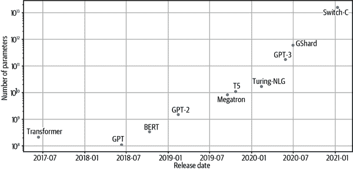

###### 图 11-1。突出的变压器架构随时间的参数计数

这种戏剧性的增长是基于经验证据，即大型语言模型在下游任务上表现更好，并且在 100 亿到 1000 亿参数范围内出现了零-shot 和少-shot 学习等有趣的能力。然而，参数数量并不是影响模型性能的唯一因素；计算量和训练数据的数量也必须同时扩展以训练这些庞然大物。鉴于像 GPT-3 这样的大型语言模型估计训练成本为[$4.6 million](https://oreil.ly/DUVcq)，显然希望能够预先估计模型的性能。令人惊讶的是，语言模型的性能似乎服从于模型大小和其他因素的*幂律关系*，这一关系被编码在一组缩放定律中。^(1) 让我们来看看这个令人兴奋的研究领域。

## 缩放定律

缩放定律允许通过研究语言模型在不同计算预算*C*、数据集大小*D*和模型大小*N*下的行为来经验性地量化“越大越好”的范式。^(2)基本思想是绘制交叉熵损失*L*对这三个因素的依赖关系，并确定是否存在关系。对于像 GPT 系列中的自回归模型，得到的损失曲线如图 11-2 所示，其中每条蓝色曲线代表单个模型的训练运行。

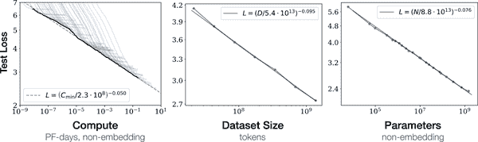

###### 图 11-2。测试损失与计算预算（左）、数据集大小（中）和模型大小（右）的幂律缩放（由 Jared Kaplan 提供）

从这些损失曲线中，我们可以得出一些关于以下内容的结论：

性能和规模的关系

尽管许多自然语言处理研究人员专注于架构调整或超参数优化（如调整层数或注意力头的数量）以提高固定数据集上的性能，但缩放定律的含义是，更好模型的更有效路径是同时专注于增加*N*、*C*和*D*。

平滑的幂律

测试损失*L*与*N*、*C*和*D*之间存在幂律关系，跨越了几个数量级（幂律关系在对数-对数尺度上是线性的）。对于<math alttext="upper X equals upper N comma upper C comma upper D"><mrow><mi>X</mi> <mo>=</mo> <mi>N</mi> <mo>,</mo> <mi>C</mi> <mo>,</mo> <mi>D</mi></mrow></math>，我们可以将这些幂律关系表示为<math alttext="upper L left-parenthesis upper X right-parenthesis tilde 1 slash upper X Superscript alpha"><mrow><mi>L</mi> <mrow><mo>(</mo> <mi>X</mi> <mo>)</mo></mrow> <mo>∼</mo> <mn>1</mn> <mo>/</mo> <msup><mi>X</mi> <mi>α</mi></msup></mrow></math>，其中<math alttext="alpha"><mi>α</mi></math>是一个由拟合图 11-2 中所示的损失曲线确定的缩放指数。 <math alttext="alpha Subscript upper X"><msub><mi>α</mi> <mi>X</mi></msub></math>的典型值在 0.05-0.095 范围内，这些幂律的一个吸引人的特征是，损失曲线的早期部分可以外推，以预测如果训练时间更长，近似损失会是多少。

样本效率

大型模型能够在较少的训练步骤下达到与较小模型相同的性能。通过比较损失曲线在一定数量的训练步骤后趋于平稳的区域，可以看出性能的收益递减，与简单地扩大模型相比。

令人惊讶的是，幂律定律也被观察到适用于其他模态，如图像、视频和数学问题解决，如图 11-3 所示。

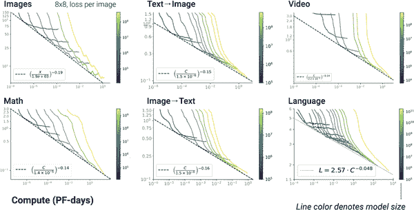

###### 图 11-3。测试损失与计算预算的幂律缩放跨越各种模态（由 Tom Henighan 提供）

变压器语言模型的幂律缩放是否是普遍属性目前尚不清楚。目前，我们可以将缩放定律作为一种工具，来外推大型昂贵的模型，而无需明确训练它们。然而，缩放并不像听起来那么简单。现在让我们来看看在绘制这一前沿时会遇到的一些挑战。

## 缩放的挑战

虽然在理论上扩大规模听起来很简单（“只需添加更多层！”），但在实践中存在许多困难。以下是在扩大语言模型规模时可能遇到的一些最大挑战：

基础设施

部署和管理潜在涵盖数百甚至数千个节点以及同样数量的 GPU 的基础设施并非易事。所需数量的节点是否可用？节点之间的通信是否成为瓶颈？解决这些问题需要一种与大多数数据科学团队所具备的技能集非常不同的技能，通常涉及熟悉运行大规模分布式实验的专业工程师。

成本

大多数机器学习从业者都曾经历过半夜惊醒的感觉，冷汗直冒，想起自己忘了关闭云端的那个花哨的 GPU。在运行大规模实验时，这种感觉会加剧，大多数公司无法负担起培训最大规模模型所需的团队和资源。训练一个规模与 GPT-3 相当的模型可能会耗费数百万美元，这并不是许多公司随手就能拿得出的零花钱。

数据集策划

模型的好坏取决于其训练所使用的数据。训练大型模型需要大规模、高质量的数据集。当使用数千兆字节的文本数据时，确保数据集包含高质量文本变得更加困难，甚至预处理也变得具有挑战性。此外，还需要确保有一种方法来控制这些语言模型在大规模网络文本语料库上训练时可能获得的性别歧视和种族歧视等偏见。另一种考虑类型围绕着训练数据的许可问题以及可能嵌入在大型文本数据集中的个人信息。

模型评估

一旦模型训练完成，挑战并没有结束。在下游任务上评估模型还需要时间和资源。此外，即使您确信自己创建了一个干净的数据集，您也会想要探索模型中的偏见和有毒生成。这些步骤需要时间，并且需要彻底进行，以尽量减少后续不良影响的风险。

部署

最后，为大型语言模型提供服务也带来了重大挑战。在第八章中，我们探讨了一些方法，如蒸馏、修剪和量化，来帮助解决这些问题。然而，如果您从一个数百 GB 大小的模型开始，这可能还不够。托管服务，如 OpenAI API 或 Hugging Face 的 Accelerated Inference API，旨在帮助那些无法或不愿处理这些部署挑战的公司。

这并不是一个详尽的清单，但它应该让你了解将语言模型扩展到更大规模时所面临的考虑和挑战的种类。虽然大多数这样的努力都集中在一些拥有资源和专业知识来推动界限的机构周围，但目前有两个社区主导的项目旨在公开产生和探索大型语言模型：

BigScience

这是一个为期一年的研究研讨会，从 2021 年持续到 2022 年，重点是大型语言模型。该研讨会旨在促进围绕这些模型的研究问题（能力、限制、潜在改进、偏见、伦理、环境影响、在通用 AI/认知研究领域中的作用）的讨论和反思，以及围绕为研究目的创建和共享这些模型和数据集以及在研究社区中的挑战。合作任务包括创建、共享和评估大型多语言数据集和大型语言模型。为这些合作任务分配了异常庞大的计算预算（数百万 GPU 小时，数千个 GPU）。如果成功，这个研讨会将在未来再次举行，重点是涉及更新或不同的合作任务集。如果您想加入这一努力，可以在[项目网站](https://oreil.ly/13xfb)上找到更多信息。

EleutherAI

这是一个由志愿研究人员、工程师和开发人员组成的去中心化集体，专注于 AI 对齐、扩展和开源 AI 研究。其目标之一是训练和开源一个类似 GPT-3 大小的模型，该团队已经发布了一些令人印象深刻的模型，如[GPT-Neo](https://oreil.ly/ZVGaz)和[GPT-J](https://oreil.ly/Kup60)，后者是一个 60 亿参数的模型，目前是公开可用的变压器模型中性能最佳的零-shot 性能。您可以在 EleutherAI 的[网站](https://eleuther.ai)上找到更多信息。

既然我们已经探讨了如何在计算、模型大小和数据集大小上扩展变压器，让我们来看看另一个活跃的研究领域：使自注意力更加高效。

## 请注意！

我们在本书中已经看到，自注意力机制在变压器的架构中起着核心作用；毕竟，原始的 Transformer 论文就叫做“注意力机制就是你所需要的”！然而，自注意力存在一个关键挑战：由于权重是从序列中所有标记的成对比较生成的，当尝试处理长文档或将变压器应用于语音处理或计算机视觉等领域时，该层成为计算瓶颈。就时间和内存复杂度而言，变压器架构的自注意力层在计算上的规模化就像<math alttext="script upper O left-parenthesis n squared right-parenthesis"><mrow><mi>𝒪</mi> <mo>(</mo> <msup><mi>n</mi> <mn>2</mn></msup> <mo>)</mo></mrow></math>，其中*n*是序列的长度。^(5)

因此，最近关于变压器的研究大部分集中在使自注意力更加高效。研究方向大致聚集在图 11-4 中。

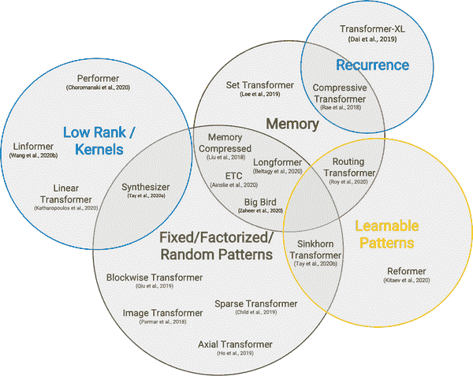

###### 图 11-4. 使注意力更高效的研究方向总结（由 Yi Tay 等人提供）^(6)

一种常见的模式是通过在注意力机制中引入稀疏性或在注意力矩阵上应用核来使注意力更加高效。让我们快速看一下使自注意力更加高效的一些最流行方法，从稀疏性开始。

## 稀疏注意力

减少自注意力层中执行的计算数量的一种方法是简单地限制根据某些预定义模式生成的查询-键对的数量。文献中已经探索了许多稀疏模式，但其中大多数可以分解为图 11-5 中所示的少数“原子”模式。

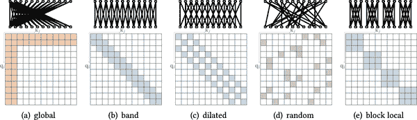

###### 图 11-5. 自注意力的常见原子稀疏注意力模式：彩色方块表示计算注意力分数，而空白方块表示分数被丢弃（由 Tianyang Lin 提供）

我们可以将这些模式描述如下：^(7)

全局注意力

定义序列中的一些特殊标记，允许它们参与所有其他标记

带注意力

计算对角线带上的注意力

扩张注意力

通过使用具有间隔的扩张窗口跳过一些查询-键对

随机注意力

随机抽样一些键来计算每个查询的注意力分数

块局部注意力

将序列分成块，并限制这些块内的注意力

实际上，大多数具有稀疏注意力的 Transformer 模型使用图 11-5 中显示的原子稀疏模式的混合来生成最终的注意力矩阵。正如图 11-6 所示，像[Longformer](https://oreil.ly/F7xCY)这样的模型使用全局和带注意力的混合，而[BigBird](https://oreil.ly/yFPyj)则将随机注意力添加到混合中。在注意力矩阵中引入稀疏性使得这些模型能够处理更长的序列；在 Longformer 和 BigBird 的情况下，最大序列长度为 4,096 个标记，比 BERT 大 8 倍！

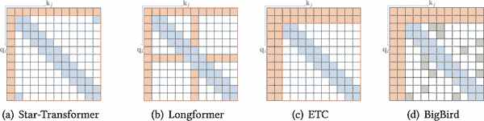

###### 图 11-6。最近 Transformer 模型的稀疏注意力模式（由 Tianyang Lin 提供）

###### 注意

也可以以数据驱动的方式*学习*稀疏模式。这些方法背后的基本思想是将标记划分成块。例如，[Reformer](https://oreil.ly/yIVvX)使用哈希函数将相似的标记聚类在一起。

现在我们已经看到稀疏性如何减少自注意力的复杂性，让我们来看另一种基于直接改变操作的流行方法。

## 线性化注意力

使自注意力更有效的另一种方法是改变涉及计算注意力分数的操作顺序。回想一下，为了计算查询和键的自注意力分数，我们需要一个相似函数，对于 Transformer 来说，这只是一个简单的点积。然而，对于一般的相似函数<math alttext="normal s normal i normal m left-parenthesis q Subscript i Baseline comma k Subscript j Baseline right-parenthesis"><mrow><mi>sim</mi> <mo>(</mo> <msub><mi>q</mi> <mi>i</mi></msub> <mo>,</mo> <msub><mi>k</mi> <mi>j</mi></msub> <mo>)</mo></mrow></math>，我们可以将注意力输出表示为以下方程：

<math alttext="y Subscript i Baseline equals sigma-summation Underscript j Endscripts StartFraction normal s normal i normal m left-parenthesis upper Q Subscript i Baseline comma upper K Subscript j Baseline right-parenthesis Over sigma-summation Underscript k Endscripts normal s normal i normal m left-parenthesis upper Q Subscript i Baseline comma upper K Subscript k Baseline right-parenthesis EndFraction upper V Subscript j" display="block"><mrow><msub><mi>y</mi> <mi>i</mi></msub> <mo>=</mo> <munder><mo>∑</mo> <mi>j</mi></munder> <mfrac><mrow><mi>sim</mi> <mo>(</mo><msub><mi>Q</mi> <mi>i</mi></msub> <mo>,</mo><msub><mi>K</mi> <mi>j</mi></msub> <mo>)</mo></mrow> <mrow><msub><mo>∑</mo> <mi>k</mi></msub> <mi>sim</mi> <mrow><mo>(</mo><msub><mi>Q</mi> <mi>i</mi></msub> <mo>,</mo><msub><mi>K</mi> <mi>k</mi></msub> <mo>)</mo></mrow></mrow></mfrac> <msub><mi>V</mi> <mi>j</mi></msub></mrow></math>

线性化注意机制的技巧是将相似函数表示为*核函数*，将操作分解为两部分：

<math alttext="normal s normal i normal m left-parenthesis upper Q Subscript j Baseline comma upper K Subscript j Baseline right-parenthesis equals phi left-parenthesis upper Q Subscript i Baseline right-parenthesis Superscript upper T Baseline phi left-parenthesis upper K Subscript j Baseline right-parenthesis" display="block"><mrow><mi>sim</mi> <mrow><mo>(</mo> <msub><mi>Q</mi> <mi>j</mi></msub> <mo>,</mo> <msub><mi>K</mi> <mi>j</mi></msub> <mo>)</mo></mrow> <mo>=</mo> <mi>ϕ</mi> <msup><mrow><mo>(</mo><msub><mi>Q</mi> <mi>i</mi></msub> <mo>)</mo></mrow> <mi>T</mi></msup> <mi>ϕ</mi> <mrow><mo>(</mo> <msub><mi>K</mi> <mi>j</mi></msub> <mo>)</mo></mrow></mrow></math>

其中<math alttext="phi"><mi>ϕ</mi></math>通常是一个高维特征映射。由于<math alttext="phi left-parenthesis upper Q Subscript i Baseline right-parenthesis"><mrow><mi>ϕ</mi> <mo>(</mo> <msub><mi>Q</mi> <mi>i</mi></msub> <mo>)</mo></mrow></math>与*j*和*k*无关，我们可以将其移到求和符号下，将注意力输出写成如下形式：

<math alttext="y Subscript i Baseline equals StartFraction phi left-parenthesis upper Q Subscript i Baseline right-parenthesis Superscript upper T Baseline sigma-summation Underscript j Endscripts phi left-parenthesis upper K Subscript j Baseline right-parenthesis upper V Subscript j Superscript upper T Baseline Over phi left-parenthesis upper Q Subscript i Baseline right-parenthesis Superscript upper T Baseline sigma-summation Underscript k Endscripts phi left-parenthesis upper K Subscript k Baseline right-parenthesis EndFraction" display="block"><mrow><msub><mi>y</mi> <mi>i</mi></msub> <mo>=</mo> <mfrac><mrow><mi>ϕ</mi><msup><mrow><mo>(</mo><msub><mi>Q</mi> <mi>i</mi></msub> <mo>)</mo></mrow> <mi>T</mi></msup> <msub><mo>∑</mo> <mi>j</mi></msub> <mi>ϕ</mi><mrow><mo>(</mo><msub><mi>K</mi> <mi>j</mi></msub> <mo>)</mo></mrow><msubsup><mi>V</mi> <mi>j</mi> <mi>T</mi></msubsup></mrow> <mrow><mi>ϕ</mi><msup><mrow><mo>(</mo><msub><mi>Q</mi> <mi>i</mi></msub> <mo>)</mo></mrow> <mi>T</mi></msup> <msub><mo>∑</mo> <mi>k</mi></msub> <mi>ϕ</mi><mrow><mo>(</mo><msub><mi>K</mi> <mi>k</mi></msub> <mo>)</mo></mrow></mrow></mfrac></mrow></math>

通过首先计算<math alttext="sigma-summation Underscript j Endscripts phi left-parenthesis upper K Subscript j Baseline right-parenthesis upper V Subscript j Superscript upper T"><mrow><msub><mo>∑</mo> <mi>j</mi></msub> <mi>ϕ</mi> <mrow><mo>(</mo> <msub><mi>K</mi> <mi>j</mi></msub> <mo>)</mo></mrow> <msubsup><mi>V</mi> <mi>j</mi> <mi>T</mi></msubsup></mrow></math>和<math alttext="sigma-summation Underscript k Endscripts phi left-parenthesis upper K Subscript k Baseline right-parenthesis"><mrow><msub><mo>∑</mo> <mi>k</mi></msub> <mi>ϕ</mi> <mrow><mo>(</mo> <msub><mi>K</mi> <mi>k</mi></msub> <mo>)</mo></mrow></mrow></math>，我们可以有效地线性化自注意力的空间和时间复杂度！这两种方法之间的比较在图 11-7 中有所说明。实现线性化自注意力的流行模型包括线性变换器和表演者。^(8)

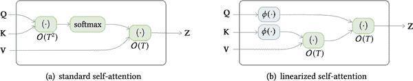

###### 图 11-7。标准自注意力和线性化自注意力之间的复杂度差异（由 Tianyang Lin 提供）

在本节中，我们已经看到了 Transformer 架构以及特别是注意力如何被扩展以在各种任务上实现更好的性能。在下一节中，我们将看看 transformers 如何从 NLP 扩展到其他领域，如音频和计算机视觉。

# 超越文本

使用文本来训练语言模型一直是 transformer 语言模型成功的推动力，结合迁移学习。一方面，文本丰富多样，可以对大型模型进行自监督训练。另一方面，文本任务如分类和问题回答是常见的，为它们开发有效的策略可以让我们解决各种现实世界的问题。

然而，这种方法也存在一些限制，包括：

人类报告偏见

文本中事件的频率可能不代表它们的真实频率。^(9)仅在互联网文本上训练的模型可能对世界有非常扭曲的看法。

常识

常识是人类推理的基本品质，但很少被记录下来。因此，训练在文本上的语言模型可能了解世界的许多事实，但缺乏基本的常识推理。

事实

概率语言模型无法可靠地存储事实，并且可能产生事实错误的文本。同样，这样的模型可以检测命名实体，但无法直接访问有关它们的信息。

模态

语言模型无法连接到其他可能解决前述问题的模态，如音频或视觉信号或表格数据。

因此，如果我们能解决模态限制，我们可能也能解决其他一些问题。最近，在推动 transformer 应用于新的模态和甚至构建多模态模型方面取得了很多进展。在本节中，我们将重点介绍其中一些进展。

## 视觉

自从它们开启了深度学习革命以来，卷积神经网络（CNNs）一直是视觉的主要领域。最近，transformer 开始应用于这一领域，并且在效率上达到了与 CNNs 相似甚至更好的水平。让我们看看一些例子。

### iGPT

受到 GPT 系列模型在文本方面的成功的启发，iGPT（即图像 GPT）将相同的方法应用于图像。^(10)通过将图像视为像素序列，iGPT 使用 GPT 架构和自回归预训练目标来预测下一个像素值。在大型图像数据集上进行预训练使 iGPT 能够“自动完成”部分图像，如图 11-8 所示。当在模型中添加分类头时，它还可以在分类任务上实现良好的结果。

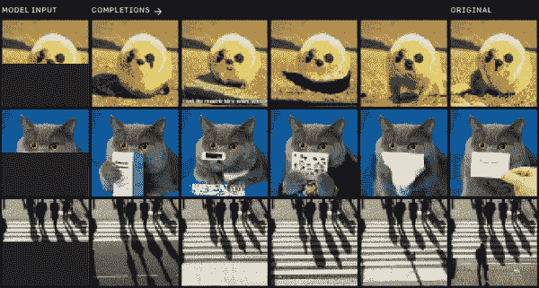

###### 图 11-8\. iGPT 的图像补全示例（由 Mark Chen 提供）

### ViT

我们看到 iGPT 紧随 GPT 风格的架构和预训练程序。Vision Transformer（ViT）^(11)是对视觉的 transformer 的 BERT 风格的处理，如图 11-9 所示。首先，图像被分成较小的补丁，然后每个补丁都用线性投影嵌入。结果与 BERT 中的标记嵌入非常相似，接下来的步骤几乎完全相同。补丁嵌入与位置嵌入相结合，然后通过普通的 transformer 编码器进行处理。在预训练期间，一些补丁被屏蔽或扭曲，目标是预测屏蔽补丁的平均颜色。

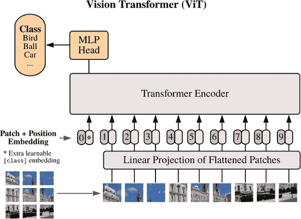

###### 图 11-9\. ViT 架构（由 Alexey Dosovitskiy 等人提供）

尽管这种方法在标准 ImageNet 数据集上进行预训练时并没有产生更好的结果，但在更大的数据集上，它比 CNNs 有了显著的提升。

ViT 已集成在 Transformers 中，使用它与我们在本书中一直使用的 NLP 管道非常相似。让我们从加载一张相当有名的狗的图片开始：

```py
from PIL import Image
import matplotlib.pyplot as plt

image = Image.open("images/doge.jpg")
plt.imshow(image)
plt.axis("off")
plt.show()
```


要加载 ViT 模型，我们只需要指定`image-classification`管道，然后将图像输入以提取预测的类别：

```py
import pandas as pd
from transformers import pipeline

image_classifier = pipeline("image-classification")
preds = image_classifier(image)
preds_df = pd.DataFrame(preds)
preds_df
```

|  | 分数 | 标签 |
| --- | --- | --- |
| 0 | 0.643599 | 爱斯基摩犬，哈士奇 |
| 1 | 0.207407 | 西伯利亚哈士奇 |
| 2 | 0.060160 | 澳洲野犬，澳洲野狗，Canis dingo |
| 3 | 0.035359 | 挪威驯鹿犬，驯鹿犬 |
| 4 | 0.012927 | 阿拉斯加雪橇犬 |

很好，预测的类别似乎与图像匹配！

图像模型的自然扩展是视频模型。除了空间维度，视频还具有时间维度。这使得任务变得更具挑战性，因为数据量变得更大，需要处理额外的维度。诸如 TimeSformer 的模型引入了空间和时间注意机制来解决这个问题。^(12)在未来，这样的模型可以帮助构建用于各种任务的工具，例如视频序列的分类或注释。

## 表格

许多数据，例如公司内的客户数据，存储在结构化数据库中，而不是作为原始文本。我们在第七章中看到，使用问答模型，我们可以用自然文本中的问题查询文本。如果我们可以像图 11-10 中所示的那样对表格进行相同的操作，那不是很好吗？

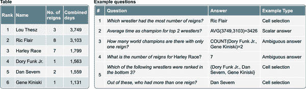

###### 图 11-10。表格问答（由 Jonathan Herzig 提供）

TAPAS（Table Parser 的缩写）^(13)来拯救！该模型将 Transformer 架构应用于表格，通过将表格信息与查询结合起来，如图 11-11 所示。

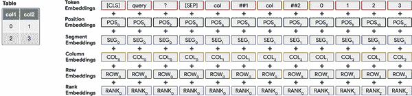

###### 图 11-11。TAPAS 的架构（由 Jonathan Herzig 提供）

让我们看一个 TAPAS 在实践中是如何工作的例子。我们创建了这本书目录的虚构版本。它包含章节编号，章节名称，以及章节的起始和结束页码：

```py
book_data = [
    {"chapter": 0, "name": "Introduction", "start_page": 1, "end_page": 11},
    {"chapter": 1, "name": "Text classification", "start_page": 12,
     "end_page": 48},
    {"chapter": 2, "name": "Named Entity Recognition", "start_page": 49,
     "end_page": 73},
    {"chapter": 3, "name": "Question Answering", "start_page": 74,
     "end_page": 120},
    {"chapter": 4, "name": "Summarization", "start_page": 121,
     "end_page": 140},
    {"chapter": 5, "name": "Conclusion", "start_page": 141,
     "end_page": 144}
]
```

我们还可以轻松地添加每个章节的页数到现有字段中。为了与 TAPAS 模型协作，我们需要确保所有列的类型都是`str`：

```py
table = pd.DataFrame(book_data)
table['number_of_pages'] = table['end_page']-table['start_page']
table = table.astype(str)
table
```

|  | 章节 | 名称 | 起始页 | 结束页 | 页数 |
| --- | --- | --- | --- | --- | --- |
| 0 | 0 | 介绍 | 1 | 11 | 10 |
| 1 | 1 | 文本分类 | 12 | 48 | 36 |
| 2 | 2 | 命名实体识别 | 49 | 73 | 24 |
| 3 | 3 | 问答 | 74 | 120 | 46 |
| 4 | 4 | 摘要 | 121 | 140 | 19 |
| 5 5 结论 141 144 3 |

到目前为止，您应该知道该怎么做。我们首先加载`table-question-answering`管道：

```py
table_qa = pipeline("table-question-answering")
```

然后传递一些查询来提取答案：

```py
table_qa = pipeline("table-question-answering")
queries = ["What's the topic in chapter 4?",
           "What is the total number of pages?",
           "On which page does the chapter about question-answering start?",
           "How many chapters have more than 20 pages?"]
preds = table_qa(table, queries)
```

这些预测将表格操作的类型存储在`aggregator`字段中，以及答案。让我们看看 TAPAS 在我们的问题上表现如何：

```py
for query, pred in zip(queries, preds):
    print(query)
    if pred["aggregator"] == "NONE":
        print("Predicted answer: " + pred["answer"])
    else:
        print("Predicted answer: " + pred["answer"])
    print('='*50)
```

```py
What's the topic in chapter 4?
Predicted answer: Summarization
==================================================
What is the total number of pages?
Predicted answer: SUM > 10, 36, 24, 46, 19, 3
==================================================
On which page does the chapter about question-answering start?
Predicted answer: AVERAGE > 74
==================================================
How many chapters have more than 20 pages?
Predicted answer: COUNT > 1, 2, 3
==================================================
```

对于第一章，模型准确预测了一个不需要聚合的单元格。如果我们看表格，我们会发现答案实际上是正确的。在下一个例子中，模型预测了所有包含页数的单元格，并使用了求和聚合器，这再次是计算总页数的正确方式。问题三的答案也是正确的；在这种情况下，平均聚合并不是必要的，但这并没有关系。最后，我们有一个稍微复杂一些的问题。要确定有多少章节超过 20 页，我们首先需要找出哪些章节满足这个条件，然后对它们进行计数。TAPAS 似乎又一次做对了，并正确确定了章节 1、2 和 3 有超过 20 页，并在单元格中添加了计数聚合器。

我们提出的问题也可以用一些简单的 Pandas 命令来解决；然而，使用自然语言提问而不是 Python 代码的能力，使得更广泛的受众能够查询数据以回答特定问题。想象一下这样的工具在商业分析师或经理手中，他们能够验证自己关于数据的假设！

# 多模态 Transformer

到目前为止，我们已经看到了将 transformers 扩展到单一新模态的方法。TAPAS 可以说是多模态的，因为它结合了文本和表格，但表格也被视为文本。在本节中，我们将研究同时结合两种模态的 transformers：音频加文本和视觉加文本。

## 语音转文本

虽然能够使用文本与计算机进行交互是一个重大进步，但使用口语是我们进行交流的更自然方式。您可以在行业中看到这种趋势，应用程序如 Siri 和 Alexa 正在兴起，并变得越来越有用。此外，对于大部分人口来说，写作和阅读比说话更具挑战性。因此，能够处理和理解音频不仅方便，还可以帮助许多人获取更多信息。在这个领域的一个常见任务是*自动语音识别*（ASR），它将口语转换为文本，并使 Siri 等语音技术能够回答问题，比如“今天天气如何？”

[wav2vec 2.0](https://oreil.ly/tPpC7)系列模型是 ASR 领域最新的发展之一：它们使用了变压器层与 CNN 的组合，如图 11-12 所示。^(14)通过在预训练期间利用未标记数据，这些模型仅使用少量标记数据就能取得有竞争力的结果。

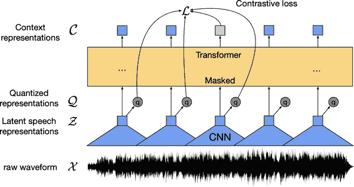

###### 图 11-12。wav2vec 2.0 的架构（由 Alexei Baevski 提供）

wav2vec 2.0 模型集成在 Transformers 中，您将不会感到惊讶地了解到，加载和使用它们遵循了我们在整本书中看到的熟悉步骤。让我们加载一个在 960 小时语音音频上训练的预训练模型：

```py
asr = pipeline("automatic-speech-recognition")
```

将此模型应用于一些音频文件，我们将使用[SUPERB 数据集](https://oreil.ly/iBAK8)的 ASR 子集，这与模型的预训练数据集相同。由于数据集相当庞大，我们只会加载一个示例用于演示目的：

```py
from datasets import load_dataset

ds = load_dataset("superb", "asr", split="validation[:1]")
print(ds[0])
```

```py
{'chapter_id': 128104, 'speaker_id': 1272, 'file': '~/.cache/huggingf
ace/datasets/downloads/extracted/e4e70a454363bec1c1a8ce336139866a39442114d86a433
6014acd4b1ed55e55/LibriSpeech/dev-clean/1272/128104/1272-128104-0000.flac',
'id': '1272-128104-0000', 'text': 'MISTER QUILTER IS THE APOSTLE OF THE MIDDLE
CLASSES AND WE ARE GLAD TO WELCOME HIS GOSPEL'}
```

在这里，我们可以看到`file`列中的音频以 FLAC 编码格式存储，而`text`列给出了预期的转录。要将音频转换为浮点数数组，我们可以使用[*SoundFile*库](https://oreil.ly/eo106)使用`map()`读取数据集中的每个文件：

```py
import soundfile as sf

def map_to_array(batch):
    speech, _ = sf.read(batch["file"])
    batch["speech"] = speech
    return batch

ds = ds.map(map_to_array)
```

如果您正在使用 Jupyter 笔记本，您可以使用以下`IPython`小部件轻松播放声音文件：

```py
from IPython.display import Audio

display(Audio(ds[0]['speech'], rate=16000))
```

最后，我们可以将输入传递给管道并检查预测：

```py
pred = asr(ds[0]["speech"])
print(pred)
```

```py
{'text': 'MISTER QUILTER IS THE APOSTLE OF THE MIDDLE CLASSES AND WE ARE GLAD TO
WELCOME HIS GOSPEL'}
```

这个转录似乎是正确的。我们可以看到一些标点符号丢失了，但这很难从仅有的音频中获取，并且可以在后处理步骤中添加。只需几行代码，我们就可以构建一个最先进的语音转文本应用程序！

为新语言构建模型仍然需要一定数量的标记数据，这可能很难获得，特别是对于资源匮乏的语言。在 wav2vec 2.0 发布后不久，发表了一篇描述一种名为 wav2vec-U 的方法的论文。^(15)在这项工作中，使用了聪明的聚类和 GAN 训练的组合，仅使用独立的未标记语音和未标记文本数据构建语音转文本模型。这个过程在图 11-13 中有详细的可视化。根本不需要对齐的语音和文本数据，这使得能够训练出更多语言的高性能语音转文本模型。

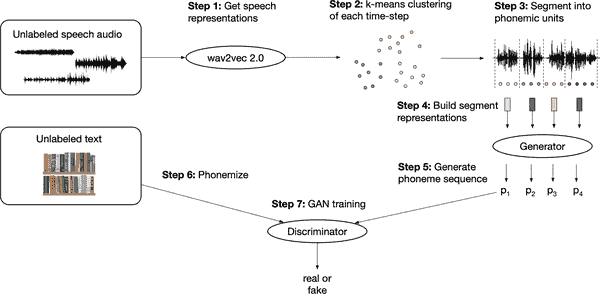

###### 图 11-13。wav2vec-U 的训练方案（由 Alexsei Baevski 提供）

很好，transformers 现在可以“读”文本和“听”音频，它们也可以“看”吗？答案是肯定的，这是该领域当前的热门研究前沿之一。

## 视觉和文本

视觉和文本是另一对自然的模态，因为我们经常使用语言来交流和推理图像和视频的内容。除了视觉变换器之外，还有一些在结合视觉和文本信息方面的发展。在本节中，我们将看一下结合视觉和文本的四个模型示例：VisualQA、LayoutLM、DALL·E 和 CLIP。

### VQA

在第七章中，我们探讨了如何使用变换器模型提取基于文本的问题的答案。这可以临时从文本中提取信息，也可以离线进行，其中问答模型用于从一组文档中提取结构化信息。已经有一些努力将这种方法扩展到视觉，使用诸如 VQA 的数据集，如图 11-14 所示。

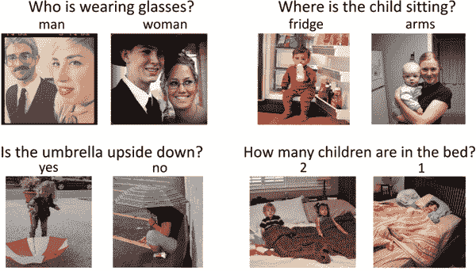

###### 图 11-14。来自 VQA 数据集的视觉问答任务示例（由 Yash Goyal 提供）

诸如 LXMERT 和 VisualBERT 的模型使用视觉模型（如 ResNets）从图片中提取特征，然后使用变换器编码器将其与自然问题结合起来，并预测答案。

### LayoutLM

分析扫描的商业文件，如收据、发票或报告，是另一个提取视觉和布局信息的领域，可以用于识别感兴趣的文本字段。在这里，LayoutLM 系列模型是当前的最新技术。它们使用增强的 Transformer 架构，接收三种模态作为输入：文本、图像和布局。因此，如图 11-15 所示，每种模态都有与之关联的嵌入层，一个空间感知的自注意机制，以及一种图像和文本/图像预训练目标的混合，以对齐不同的模态。通过在数百万份扫描文件上进行预训练，LayoutLM 模型能够以与 NLP 的 BERT 类似的方式转移到各种下游任务。

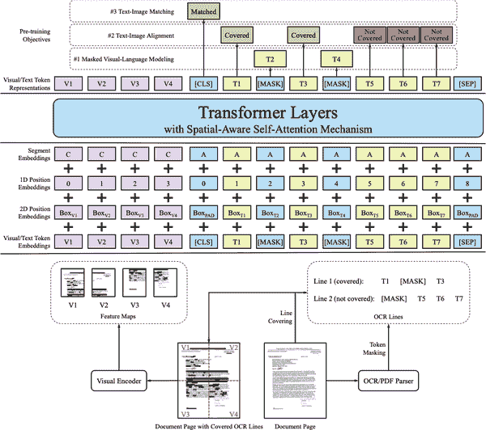

###### 图 11-15。LayoutLMv2 的模型架构和预训练策略（由 Yang Xu 提供）

### DALL·E

结合视觉和文本进行*生成*任务的模型是 DALL·E。它使用 GPT 架构和自回归建模来从文本生成图像。受到 iGPT 的启发，它将单词和像素视为一个令牌序列，因此能够继续从文本提示生成图像，如图 11-16 所示。


###### 图 11-16。DALL·E 的生成示例（由 Aditya Ramesh 提供）

### CLIP

最后，让我们来看看 CLIP，它也结合了文本和视觉，但是设计用于监督任务。其创建者构建了一个包含 4 亿个图像/标题对的数据集，并使用对比学习对模型进行预训练。CLIP 架构包括文本编码器和图像编码器（都是变换器），用于创建标题和图像的嵌入。抽样一批带有标题的图像，对比目标是最大化对应对的嵌入的相似性（由点积测量），同时最小化其余的相似性，如图 11-17 所示。

为了使用预训练模型进行分类，可能的类别被嵌入到文本编码器中，类似于我们使用零-shot 管道的方式。然后，所有类别的嵌入与我们要分类的图像嵌入进行比较，并选择相似性最高的类别。 

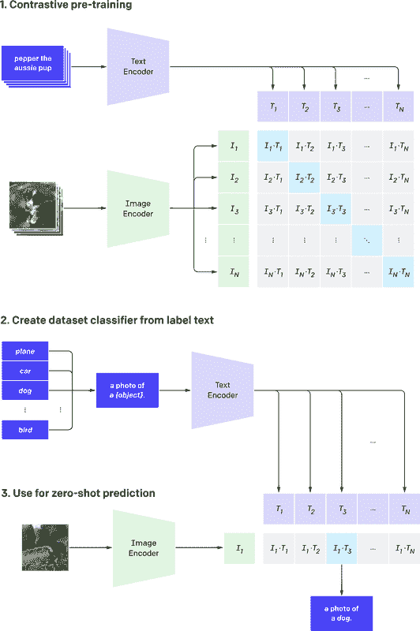

###### 图 11-17。CLIP 的架构（由 Alec Radford 提供）

CLIP 的零-shot 图像分类性能非常出色，并且与完全监督训练的视觉模型竞争力相当，同时对于新类别更加灵活。CLIP 也完全集成在 Transformers 中，因此我们可以尝试一下。对于图像到文本的任务，我们实例化一个*processor*，其中包括一个*feature extractor*和一个 tokenizer。feature extractor 的作用是将图像转换为适合模型的形式，而 tokenizer 负责将模型的预测解码为文本。

```py
from transformers import CLIPProcessor, CLIPModel

clip_ckpt = "openai/clip-vit-base-patch32"
model = CLIPModel.from_pretrained(clip_ckpt)
processor = CLIPProcessor.from_pretrained(clip_ckpt)
```

然后我们需要一张合适的图像来尝试一下。有什么比一张 Prime 的照片更合适的呢？

```py
image = Image.open("images/optimusprime.jpg")
plt.imshow(image)
plt.axis("off")
plt.show()
```

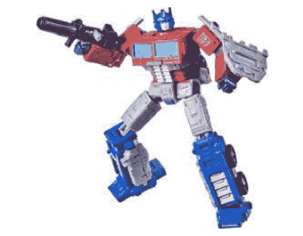

接下来，我们设置要与图像进行比较的文本，并将其通过模型传递：

```py
import torch

texts = ["a photo of a transformer", "a photo of a robot", "a photo of agi"]
inputs = processor(text=texts, images=image, return_tensors="pt", padding=True)
with torch.no_grad():
    outputs = model(**inputs)
logits_per_image = outputs.logits_per_image
probs = logits_per_image.softmax(dim=1)
probs
```

```py
tensor([[0.9557, 0.0413, 0.0031]])
```

嗯，它几乎得到了正确的答案（当然是 AGI 的照片）。开玩笑的话，CLIP 通过允许我们通过文本定义类别，而不是在模型架构中硬编码类别，使图像分类变得非常灵活。这结束了我们对多模态变换器模型的介绍，但我们希望我们已经激起了您的兴趣。

# 接下来做什么？

好了，这就是旅程的结束；感谢您加入我们穿越变换器领域的旅程！在本书中，我们探讨了变换器如何解决各种任务并取得最先进的结果。在本章中，我们看到了当前一代模型如何通过扩展推动其极限，以及它们如何在新的领域和模态中拓展。

如果您想巩固在本书中学到的概念和技能，以下是一些继续学习的想法：

参加 Hugging Face 社区活动

Hugging Face 主持专注于改进生态系统中的库的短期活动，这些活动是与社区见面并尝试开源软件开发的绝佳方式。到目前为止，已经有了关于向 Datasets 添加 600 多个数据集、在各种语言中微调 300 多个 ASR 模型以及在 JAX/Flax 中实施数百个项目的活动。

建立自己的项目

在机器学习中测试您的知识的一个非常有效的方法是建立一个解决您感兴趣的问题的项目。您可以重新实现一个变换器论文，或者将变换器应用于一个新领域。

为 Transformers 贡献一个模型

如果您正在寻找更高级的内容，那么将新发布的架构贡献给 Transformers 是深入了解该库的细节的好方法。有一个详细的指南可以帮助您在​⁠ [Transformers documentation](https://oreil.ly/3f4wZ)中开始。

写博客分享您所学到的知识

教别人你所学到的知识是对自己知识的一个强大测试，从某种意义上说，这是我们写这本书的驱动动力之一！有很好的工具可以帮助您开始技术博客；我们推荐[*fastpages*](https://oreil.ly/f0L9u)，因为您可以轻松地使用 Jupyter 笔记本进行一切。

^(1) J. Kaplan 等人的[“Scaling Laws for Neural Language Models”](https://arxiv.org/abs/2001.08361)，（2020）。

^(2) 数据集大小是以标记数来衡量的，而模型大小不包括嵌入层的参数。

^(3) T. Henighan 等人的[“Scaling Laws for Autoregressive Generative Modeling”](https://arxiv.org/abs/2010.14701)，（2020）。

^(4) 然而，最近提出了一个分布式深度学习框架，使较小的团体能够共享其计算资源，并以合作的方式预训练模型。参见 M. Diskin 等人的[“Distributed Deep Learning in Open Collaborations”](https://arxiv.org/abs/2106.10207)，（2021）。

5. 虽然自注意力的标准实现具有 O(n²)的时间和内存复杂度，但一篇谷歌研究人员的最新论文表明，通过简单重新排序操作，内存复杂度可以降低到 O(log n)。

2. Yi Tay et al., “Efficient Transformers: A Survey” (2020).

6. T. Lin et al., “A Survey of Transformers” (2021).

14. A. Katharopoulos et al., “Transformers Are RNNs: Fast Autoregressive Transformers with Linear Attention” (2020); K. Choromanski et al., “Rethinking Attention with Performers” (2020).

12. J. Gordon and B. Van Durme, “Reporting Bias and Knowledge Extraction” (2013).

11. M. Chen et al., “Generative Pretraining from Pixels,” *Proceedings of the 37th International Conference on Machine Learning* 119 (2020):1691–1703, [*https://proceedings.mlr.press/v119/chen20s.html*](https://proceedings.mlr.press/v119/chen20s.html).

7. A. Dosovitskiy et al., “An Image Is Worth 16x16 Words: Transformers for Image Recognition at Scale” (2020).

1. G. Bertasius, H. Wang, and L. Torresani, “Is Space-Time Attention All You Need for Video Understanding?” (2021).

15. J. Herzig et al., “TAPAS: Weakly Supervised Table Parsing via Pre-Training” (2020).

10. A. Baevski et al., “wav2vec 2.0: A Framework for Self-Supervised Learning of Speech Representations” (2020).

13. A. Baevski et al., “Unsupervised Speech Recognition” (2021).

3. Y. Goyal et al., “Making the V in VQA Matter: Elevating the Role of Image Understanding in Visual Question Answering” (2016).

9. H. Tan and M. Bansal, “LXMERT: Learning Cross-Modality Encoder Representations from Transformers” (2019); L.H. Li et al., “VisualBERT: A Simple and Performant Baseline for Vision and Language” (2019).

4. A. Ramesh et al., “Zero-Shot Text-to-Image Generation” (2021).

8. A. Radford et al., “Learning Transferable Visual Models from Natural Language Supervision” (2021).
