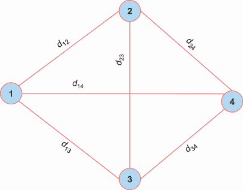
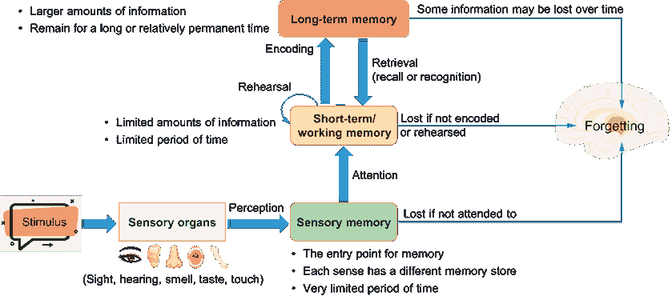
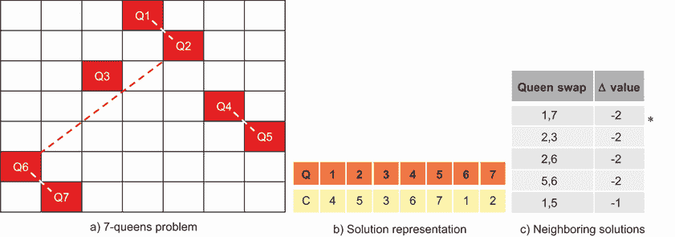
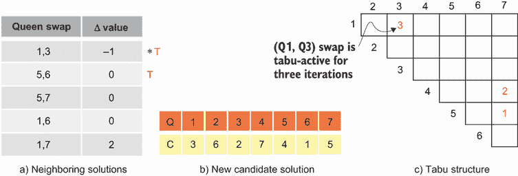
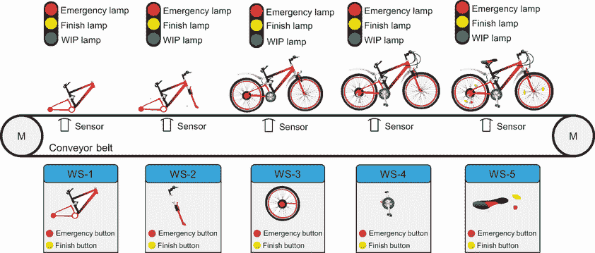
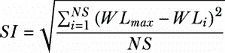
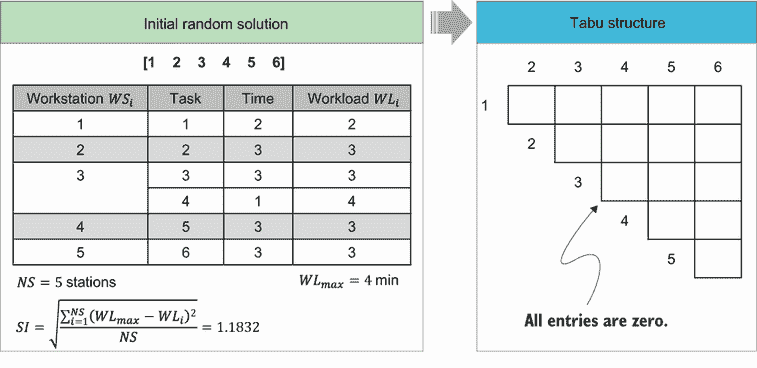
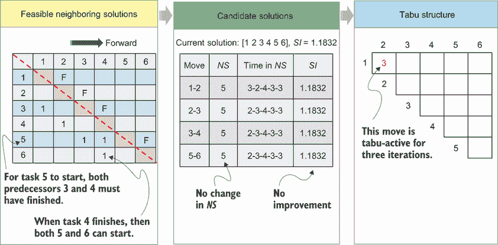
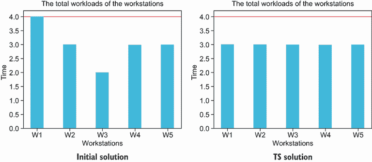

# 第六章：禁忌搜索

本章涵盖

+   理解局部搜索

+   理解禁忌搜索如何扩展局部搜索

+   解决约束满足问题

+   解决连续问题

+   解决路径问题

+   解决装配线平衡问题

在上一章中，你被介绍到基于轨迹的元启发式算法，并学习了模拟退火（SA）作为这些元启发式算法的例子。元启发式算法的实际首次使用可能是弗雷德·格洛弗的*禁忌搜索*（TS）在 1986 年，尽管他关于禁忌搜索的开创性文章是在 1997 年[1]发表的。单词“tabu”（也拼作“taboo”）起源于南太平洋的波利尼西亚语。它是一个用来描述在特定文化或社会中被认为是禁止的、禁止的或被认为是不被社会接受的术语。禁忌搜索被称为“tabu”，因为它使用一个记忆结构来跟踪最近探索过的解决方案，以便避免返回它们，特别是在搜索的早期阶段，以避免陷入局部最优。

TS 是一种强大的基于轨迹的优化技术，它已成功应用于解决不同领域中的不同优化问题，如调度、设计、分配、路径、生产、库存和投资、电信、逻辑和人工智能、技术、图优化和一般组合优化。TS 可以被认为是局部搜索和记忆结构的组合。

本章介绍了禁忌搜索作为一种基于轨迹的元启发式优化技术，讨论了其优缺点，并探讨了其在不同领域的应用。为了说明该算法如何用于解决优化问题，将展示各种案例研究和练习。让我们首先近距离探索局部搜索。

## 6.1 局部搜索

想象一下自己在一家提供多种餐厅的度假村度假，每家餐厅都提供多样化的菜品以满足你的每一个需求。在你入住的第一天，你可能会随机选择一家餐厅，或者如果你在旅途中感到疲惫，就选择离你房间最近的一家。你可能继续在那家特定的餐厅用餐，或者探索度假村内的其他选项。在这种情况下，你通过限制你的选择仅限于度假村内的选项来应用局部搜索，而不考虑在线订购食物或离开度假村在其他地方用餐的可能性。

*局部搜索*（LS）是一种搜索技术，它通过迭代地探索当前解或状态附近的搜索空间的一个子集，以通过局部变化来改进这个解。可以应用于解的局部变化类型由一个*邻域结构*定义。对于一个有限候选解集 *S*，邻域结构表示一个由对当前解 *s* ∈ *S* 进行微小改变所能生成的邻近解集 *N*(*s*) ⊆ *S*。*N*(*s*) 作为 *s* 的邻域，其范围从探索当前解的所有可能邻近者（随机搜索）到仅考虑一个邻近者（局部搜索）。前者可能计算量很大，而后者具有非常有限的视野或搜索空间，并且很容易陷入局部最小值。

如算法 6.1 所示，局部搜索算法从一个初始可行解开始，只要新的邻近解比旧的好，就迭代地移动到一个邻近解。

算法 6.1 局部搜索

```py
Input: an initial feasible solution
Output: optimal solution
Begin
    While termination criteria not met do
        Generate a neighboring solution by applying a series of local modifications (or moves)
        if the new solution is better then
           Replace the old one 
```

通常，每个可行解都有多个邻近解。名称“局部搜索”意味着算法在当前解的邻域中搜索新的解。例如，爬山法可以被认为是一种局部搜索技术，其中在每个迭代中考虑一个局部最大化标准或目标函数的新邻近解。爬山算法是一种贪婪算法，因为它只接受改进的解。这有时会导致它收敛到局部最优，除非搜索非常幸运，否则这些局部最优通常是平均解。解决方案的质量和计算时间通常取决于所选的局部移动。

局部搜索算法已被成功应用于在合理时间内解决许多困难的组合优化问题。应用领域包括运筹学、管理科学、工程和生物信息学等领域。通过引入从搜索空间中的局部最小值中逃逸的机制，可以进一步提高基于 LS 方法的性能。这些机制包括但不限于模拟退火、随机噪声、混合随机游走和禁忌搜索。禁忌搜索最初被提出是为了允许局部搜索克服局部最优的困难，并通过允许非改进移动和记住搜索的最近历史来防止循环。

让我们讨论 TS 的各个组成部分。

## 6.2 禁忌搜索算法

回到我们的度假村例子，即使你在度假村内的某个餐厅的第一顿饭很享受，你也可能会选择在第二天去不同的餐厅用餐，以探索其他选项并避免陷入局部最优。假设你承诺自己不会连续几天在同一个餐厅用餐，这样你就可以探索度假村的其他餐饮选择。一旦你尝试过各种餐厅，你可能会选择回到你之前访问过的其中一家餐厅，并在那里度过你剩余的时光。你通过记住你在尝试的每家餐厅的每顿饭的印象来应用禁忌搜索，并且你可以寻找替代方案，同时考虑你之前记住的喜好。这使你能够通过使用记忆来更灵活、更响应式地探索搜索空间，从而增强你的局部搜索，超越局部最优性。

这个例子展示了禁忌搜索结合了自适应记忆和响应式探索。*自适应记忆*涉及在搜索过程中记住相关信息或有用信息，例如算法最近做出的移动和找到的有希望的解决方案。*响应式探索*是一种问题解决方法，它根据新信息和搜索历史调整求解器的行为，以更快地找到更优的解决方案。

禁忌搜索

“禁忌搜索基于这样一个前提，即为了成为智能的，问题解决必须结合自适应记忆和响应式探索。TS 的自适应记忆功能允许实施能够经济有效地搜索解空间的程序。由于局部选择是由搜索过程中收集到的信息引导的，TS 与依赖于半随机过程的记忆无设计形成对比，这些过程实现了一种采样形式。禁忌搜索中强调响应式探索，无论是在确定性还是概率实现中，都源于这样一个假设：一个糟糕的战略选择往往能提供比一个好的随机选择更多的信息。”（摘自 Glover, Laguna 和 Marti 的《禁忌搜索原理》[2]。）

禁忌搜索是一种迭代邻域搜索算法，其中邻域动态变化。该算法最初提出是为了允许局部搜索克服局部最优。TS 通过积极避免搜索空间中已访问的点来增强局部搜索。通过避免已访问的点，可以避免搜索轨迹中的循环并逃离局部最优。禁忌搜索通过禁忌列表使用记忆，禁止重新访问最近探索过的邻域。这样做是为了避免陷入局部最优。这种组合可以显著提高解决某些问题的效率。TS 的主要特点是使用显式记忆，它有两个目的：避免重新访问先前探索过的解，并探索解空间中未访问的区域。TS 过程从初始随机解开始，然后找到邻近解。然后选择最佳解并将其添加到禁忌列表中。在后续迭代中，除非足够的时间已经过去并且它们可以重新考虑，否则排除禁忌活跃项作为潜在候选解。这种方法有助于防止 TS 陷入局部最优。此外，为了减轻禁忌列表排除某些好解的影响，可以采用渴望标准 *A*(*s*)，它允许重新考虑先前禁忌的移动，如果它们导致比当前最佳已知解更好的解。

算法 6.2 展示了禁忌搜索如何结合局部搜索和记忆结构。

算法 6.2 搜索禁忌算法

```py
Input: an initial feasible solution
Output: optimal solution
Begin
    While termination criteria not met do
        Choose the best: s’∈N(s) ← N(s)-T(s)+A(s)
        Memorize s’ if it improves the best known solution
        s←s’
        Update Tab list T(S) and Aspiration criterion A(s)
```

如算法所示，禁忌搜索首先使用一个初始可行解 *s*，然后迭代地探索搜索空间以生成最优或近似最优解。在每次迭代中，并且当终止条件未满足时，算法创建一个候选移动列表，该列表从当前解在邻域 *N*(*s*) 内生成新的解。如果新解 *s’* 是一个改进的解，且未列为禁忌活跃 *T*(*s*) 或在考虑渴望标准 *A*(*s*) 的情况下是可接受的解，则获得的解被指定为新的当前解。然后通过更新禁忌限制和渴望标准来修订可接受性。

图 6.1 以流程图的形式总结了禁忌搜索（TS）的步骤。我们首先从初始化或中间或长期记忆组件中获取一个解。然后，通过在当前解上应用操作员（如交换、删除和插入等），根据手头问题的性质创建候选移动列表。评估这些候选邻近解，并选择最佳可接受候选解。如果不满足停止条件，我们继续更新可接受条件、禁忌限制和渴望标准。


图 6.1 禁忌搜索步骤（基于 F. Glover 的“禁忌搜索和自适应记忆编程——进展、应用和挑战” [1]）

以下标准可以用来终止 TS：

+   邻域为空，意味着已经探索了所有可能的邻近解。

+   自上次改进以来执行的迭代次数超过了一个指定的限制。

+   有外部证据表明已经达到了一个最优或近似最优解。

为了更好地理解 TS 算法，让我们考虑一个简化的对称旅行商问题（TSP）的版本，该版本只有四个城市，如图 6.2 所示。



图 6.2 一个 4 城市 TSP。图中边的权重代表城市之间的旅行距离。

一个可行解可以表示为一系列城市或节点，其中每个城市恰好访问一次。假设家乡城市是城市 1，一个初始可行解可以随机选择或使用贪婪方法选择。一种可能的贪婪方法是选择离当前节点最近的未访问节点，并继续此过程，直到所有节点都被访问，从而形成一个覆盖所有节点的完整可行旅行。这个初始解可以用排列表示，如{1,2,4,3}。

为了生成一个邻近解，我们可以应用一个交换算子。邻域代表一组可以通过交换解决方案中任意两个城市的成对交换生成的邻近解。对于这个 4 城市 TSP，并且将节点 1 作为起始节点或家乡城市，邻域的数量是不重复组合数 *C*(*n*,*k*) 或 *n*-choose-*k*：


给定初始解为{1,2,4,3}，通过应用交换算子可以生成以下三个可行的邻近解：

+   通过交换 3 和 4 得到{1,2,3,4}

+   通过交换 2 和 3 得到{1,3,4,2}

+   通过交换 2 和 4 得到{1,4,2,3}

在每次迭代中，选择具有最佳目标值（最小总距离）的邻近解。

### 6.2.1 记忆结构

局部搜索策略通常是记忆无的，它们不保留过去移动或解决方案的记录。TS 的主要特点是使用显式记忆。*显式记忆*指的是在搜索过程中记住之前访问过的移动的一种机制。简单的 TS 通常实现以下两种自适应记忆机制：

+   *基于最近或短期记忆*——这是一种在搜索过程中跟踪最近访问过的移动的机制。它在防止算法重新访问最近已探索的移动中发挥作用。

+   *基于频率或长期记忆*——这是一种在整个搜索过程中跟踪特定移动的历史频率的机制，并惩罚那些频繁访问但没有成功或已被证明不太有希望的移动。

记忆类型

根据阿特金森-希夫林模型（也称为多存储模型或模式模型），人类记忆有三个组成部分：感觉记忆、工作记忆（有时称为短期记忆）和长期记忆，如图所示。

感觉记忆是一种非常短暂的记忆，它自动由我们的感知产生，并在原始刺激停止后通常消失。我们的五种感官各有不同的记忆存储。例如，视觉信息存储在图像记忆中，而听觉信息存储在回声记忆中。

短期记忆中存储的信息量取决于对感觉记忆元素的关注程度。工作记忆是短期记忆概念的最新扩展。这种记忆允许你存储和使用执行特定任务所需的临时信息。复述和重复可以帮助增加短期记忆的持续时间。例如，想象你自己是一名快餐或饮料外卖窗口的客户服务代表，从客户那里接收订单并确保这些订单得到满足。客户提供的订单信息存储在你的短期或工作记忆中，一旦订单得到满足，这些信息就不会保留在你的记忆中。



记忆类型

长期记忆存储了你的终身记忆和大量信息，例如你的生日、你的地址、你学到的职业技能等。一些通过工作记忆捕获的重要信息可以被编码并存储在长期记忆中。编码的目的是为正在记忆的信息赋予意义。例如，你可能会将单词“omelet”编码为“鸡蛋，打散，煎”。如果你不能自发地回忆起“omelet”这个词，你仍然可以通过调用你用来编码它的一个索引来检索它，比如“鸡蛋”。这类似于使用查找表进行快速信息检索的编码方式。

图 6.3 展示了背包问题作为一个例子。在这个问题中，每个物品都有一个*效用*和一个*重量*，我们希望在不超出最大重量的情况下最大化背包内容的效用。这个问题受背包容量的限制。可以通过在背包中交换物品来生成相邻的解决方案。


图 6.3 背包问题

如图 6.3 所示，可以通过交换 1 和 4 号项来生成一个新的候选解。在这种情况下，这种交换将在接下来的三次迭代中保持 tabu 状态，如图中的 tabu 结构所示。*tabu 状态*的移动目前位于 tabu 列表中，不能在当前迭代中被选中进行探索。我们还可以通过添加或删除不同的项来生成邻近解。如果邻近结构将“添加”和“删除”视为独立的移动，那么为每种类型的移动保留单独的 tabu 列表可能是个好主意。基于频率的记忆跟踪在指定时间间隔内执行的不同交换的频率。其想法是对频繁访问的交换进行惩罚。

在 TS 中使用最近和频率记忆主要为了防止搜索过程循环，这涉及到无限重复相同的移动序列或重新访问相同的解集。此外，这两种记忆机制在如图 6.4 所示的探索和利用之间起到权衡的作用。


图 6.4 TS 短期记忆和长期记忆以及搜索困境

基于最近记忆的记忆限制搜索在潜在繁荣或精英解集内，以增强搜索同时避免重复或逆转之前访问过的解。基于频率的记忆强调不同移动的频率，引导算法向搜索空间中可能尚未探索的新区域移动。通过阻止最近移动的重复，基于最近记忆的记忆在一定程度上促进了探索，但探索的主要强化来自基于频率的记忆。这些记忆机制之间的相互作用保持平衡，允许算法有效地导航可行搜索空间。

对于 4 城市 TSP 问题，可以使用 tabu 结构来表示这两种记忆形式，如图 6.5 所示。在基于最近记忆中，tabu 结构存储了禁止给定交换的迭代次数。


图 6.5 4 城市 TSP 的 tabu 结构。基于最近记忆中的数字表示 tabu 状态的移动剩余的迭代次数；长期记忆中的数字表示使用该移动的频率计数。

这种基于最近记忆的机制通过使用 tabu 列表作为数据结构来跟踪禁止或 tabu 状态的移动，防止算法在指定数量的迭代中重新访问它们，这被称为*tabu 任期*。在每次迭代中，tabu 列表中每个移动的任期减少 1，任期为零的移动将从 tabu 列表中删除。tabu 任期*T*可以通过不同的方法选择：

+   *静态*—选择 *T* 为一个常数，这可能会依赖于问题大小，例如使用类似于 √N 或 N/10 迭代的指南，其中 *N* 是问题大小。已经证明，静态禁忌任期并不能总是防止循环[3]。

+   *动态*—选择 *T* 在一个特定范围 *T*[min] 和 *T*[max] 内随机变化，这个范围随着搜索进程而变化。阈值 *T*[min] 和 *T*[max] 可以根据在特定次数的迭代中解决方案的改进情况而变化。

在先前的 4 城市 TSP 示例（图 6.2）中，假设禁忌任期设置为 3 次迭代。如果基于交换（1,4）生成解决方案，这个交换将在接下来的三次迭代中处于禁忌活跃状态，这意味着在接下来的三次迭代中不能执行这个交换。

基于频率的记忆，如图 6.5 左下角所示，包含与交换频率计数相对应的值。每当两个城市之间发生交换时，频率表中相应交换值的频率计数器将增加 1。在搜索最优解时，频率计数器中的值被视为对频繁访问的解决方案的惩罚。可以将与频率计数成正比的惩罚值直接添加到解决方案的成本或适应度函数中。

### 6.2.2 渴望标准

避免禁忌活跃移动是必要的，但其中一些移动可能具有显著潜力。在这种情况下，禁忌限制可能会阻碍有希望的解决方案，即使没有循环风险。这个问题被称为*停滞*。在禁忌搜索中，当算法因为候选移动是禁忌活跃的而持续拒绝它们，并且所有禁忌非活跃移动都已经探索过或都是非改进移动时，就会发生停滞。这可能导致算法反复访问相同的解决方案，而没有在向更好的解决方案取得任何重大进展。

*渴望标准*可以通过允许算法考虑那些虽然禁忌但能带来比当前最佳解决方案更好的解决方案的移动来减轻这种停滞。通过暂时解除解决方案某些属性的禁忌条件，算法可以探索搜索空间的新区域，并可能发现更好的解决方案。在几乎所有禁忌搜索实现中，常用的渴望标准是允许如果移动产生比迄今为止获得的最佳解决方案（即现任解决方案）更好的解决方案，并且在距离这个禁忌活跃移动从禁忌列表中移除之前迭代次数很少时，可以覆盖禁忌激活规则。

### 6.2.3 TS 中的适应性

TS 适用于离散和连续解空间。对于一些复杂问题，如调度、二次分配和车辆路径问题，禁忌搜索获得的解通常优于其他方法之前找到的最佳解。然而，为了获得最佳结果，需要仔细调整许多参数，并且所需的迭代次数也可能很大。

对于所有元启发式算法，根据参数设置，可能无法找到全局最优解。TS 参数包括初始解生成方法（随机、贪婪、启发式等）、禁忌任期、邻域结构、渴望标准、停止标准以及频率计数的惩罚值。这些参数可以通过预调优或自动调优来提高 TS 的性能。参数调优是指在算法运行之前找到不同算法参数的合适值，但也可以在算法运行时动态调整，采用确定性、自适应或自适应性方法来平衡探索和利用：

+   *确定性调优*是指根据某些确定性更新规则改变控制参数，而不考虑搜索算法的任何信息。

+   *自适应调优*是指更新规则从搜索算法中获取信息并相应地改变控制参数。

+   *自适应性调优*是指更新规则本身进行适应性调整。

TS 最重要的参数之一是禁忌任期。图 6.6 说明了禁忌任期对 TS 性能的影响。过短的禁忌任期可能导致频繁的循环，算法以重复的方式执行相同的移动或重新访问相同的解。这阻碍了在解空间中探索不同的区域，并可能阻止发现最优或近似最优解。此外，过短的禁忌任期可能会迅速解除对移动的限制，可能导致算法忽略那些暂时被认为不利的有希望的解。相反，过长的禁忌任期可能导致停滞，某些移动在较长时间内被禁止。这可能会阻止算法探索解空间的新区域，从而阻碍发现更好的解。此外，长的禁忌任期会增加算法的内存占用，可能导致效率低下和计算需求增加。这在大规模问题中尤其成问题。


图 6.6 禁忌任期的效果

TS 中纳入的一种自适应方法是允许短期记忆（禁忌期）的长度动态变化，并在指示器识别出有希望的领域时加强搜索，或者在改进似乎最小或检测到局部最优时促进多样化。例如，你可以为禁忌期设置一个下限**L**[min]和一个上限**L**[max]。然后，如果在上一个迭代中解决方案有所改进，你可以通过减去 1 来递减禁忌期，以便搜索将集中在潜在改进的区域。如果在上一个迭代中解决方案恶化，你可以通过增加 1 来递增禁忌期，以引导搜索远离显然不良的区域，如图 6.7 所示。**L**[min]和**L**[max]的值可以在每特定次数的迭代后随机更改。


图 6.7 动态控制禁忌期

反应性 TS 通过自动学习最优禁忌期来防止循环发生[4]。在此方法中，考虑了两种可能的反应机制。一种称为**立即反应机制**，通过增加禁忌期来阻止额外的重复。经过若干次**R**立即反应后，几何增长足以打破任何极限循环。第二种机制，称为**逃逸机制**，计算重复多次（超过**REP**次）的移动次数。当这个数字超过预定义的阈值**REP**时，强制执行多样化的逃逸运动。在创建禁忌搜索的适应性版本时，也可以考虑其他算法参数，例如应用基于频率的记忆或渴望标准。

现在你已经很好地理解了禁忌搜索的各个组成部分，让我们来探讨这个算法如何被用来解决各种优化问题。

## 6.3 解决约束满足问题

**n**后问题是一个经典的谜题，它涉及将**n**个棋后放置在**n**×**n**的棋盘上，使得没有两个棋后相互威胁。换句话说，没有两个棋后应该共享同一行、列或对角线。这是一个不定义显式目标函数的约束满足问题（CSP）。假设我们正在尝试使用禁忌搜索解决 7 后问题。在此问题中，图 6.8a 中显示的初始随机配置中的冲突数为 4：{Q1–Q2}，{Q2–Q6}，{Q4–Q5}和{Q6–Q7}。



图 6.8 7 后问题的 TS 初始化。在左侧，虚线显示了皇后之间的 4 次冲突。在中间，C 代表放置皇后 Q 的列。在右侧，*表示给出最佳邻近解的交换。

图 6.8a 中的初始解可以表示为图 6.8b 中所示的顺序。可以通过如图 6.8c 所示的方式交换生成多个候选邻近解。交换（Q1,Q7）、（Q2,Q3）、（Q2,Q6）和（Q5,Q6）给出相同的值，所以我们可以假设（Q1,Q7）是任意选择的移动，以给出一个新解，如图 6.9 所示。在初始迭代中，Q1 被放置在第 4 列，Q7 被放置在第 2 列。交换 Q1 和 Q7 意味着将 Q1 放置在第 2 列，Q7 放置在第 4 列。


图 6.9 一个 7 皇后问题—TS 迭代 1

碰撞次数现在减少到 2，分别是{Q2-Q6}和{Q4-Q5}。禁忌结构更新如图 6.9c 所示，禁止最近执行的交换（Q1,Q7）进行三次迭代，假设禁忌期为 3。

在下一次迭代中，可以通过交换 Q2 和 Q4 生成其他邻近解，如图 6.10 所示。交换（Q2,Q4）给出一个新候选解，因为它减少了 1 次碰撞。此解决方案相关的碰撞数是 1。禁忌结构更新，搜索继续。


图 6.10 一个 7 皇后问题—TS 迭代 2

在下一次迭代（图 6.11）中，选择交换（Q1,Q3）作为给出新解决方案的移动。


图 6.11 一个 7 皇后问题—TS 迭代 3

在新的迭代（图 6.12）中，选择交换（Q5,Q7）。图 6.12a 中的*T*表示禁忌活跃移动。


图 6.12 一个 7 皇后问题—TS 迭代 4

在下一次迭代中，选择交换（Q4,Q7）（图 6.13）。


图 6.13 一个 7 皇后问题—TS 迭代 5

在下一次迭代中，由于改进的交换是禁忌活跃的，我们可以应用渴望标准来选择交换（Q1,Q3），因为在此交换出禁忌列表之前只剩下一个迭代（图 6.14）。



图 6.14 一个 7 皇后问题—TS 迭代 6

基于此解决方案，板配置将如图 6.15 所示。这是各种可能解决方案之一。


图 6.15 通过手动迭代生成的 7 皇后解决方案

让我们探讨如何使用 Python 通过禁忌搜索来解决这个问题。首先，我们将导入以下 Python 库，用于随机数生成、多维数组和绘图。然后，我们将定义一个函数来生成*n*-皇后板的随机配置，基于预定义的板大小。

列表 6.1 解决 7 皇后问题

```py
import random
import numpy as np
import matplotlib.pyplot as plt
def get_initial_state(board_size):
    queens = list(range(board_size))
    random.shuffle(queens)
    return queens
```

假设板大小为 7，调用此函数返回一个随机板配置，如[0, 4, 1, 5, 6, 2, 3]。这意味着 Q1、Q2、Q3、Q4、Q5、Q6 和 Q7 分别放置在第 1、5、2、6、7、3 和 4 列。

然后，我们可以定义一个函数来计算棋盘上相互攻击的皇后的数量。此函数定义如下：

```py
def num_attacking_queens(queens):
    board_size = len(queens)
    num_attacks = 0
    for i in range(board_size):
        for j in range(i + 1, board_size):
            if queens[i]==queens[j] or abs(queens[i] - queens[j]) == j - i:
                num_attacks += 1
    return num_attacks 
```

接下来，我们可以创建一个函数来确定最佳可能的移动，该移动可以减少棋盘上的攻击次数，同时确保该移动当前不在禁忌列表上（即，不是禁忌活跃的）。此函数定义如下：

```py
def get_best_move(queens, tabu_list):
    board_size = len(queens)
    best_move = None
    best_num_attacks = board_size * (board_size - 1) // 2
    for i in range(board_size):
        for j in range(board_size):
            if queens[i] != j:
                new_queens = queens.copy()
                new_queens[i] = j
                if str(new_queens) not in tabu_list:
                    num_attacks = num_attacking_queens(new_queens)
                    if num_attacks < best_num_attacks:
                        best_move = (i, j)
                        best_num_attacks = num_attacks
    return best_move
```

如你所注意到的，最佳攻击次数初始化为最大攻击次数，即 *n* * (*n* – 1) / 2。在 7 皇后问题中，这个数字是 7 * 6 / 2 = 21。

我们还需要实现一个函数，根据预定义的禁忌任期更新禁忌列表。以下是此函数的定义：

```py
def update_tabu_list(tabu_list, tabu_tenure, move):
    tabu_list.append(str(move))
    if len(tabu_list) > tabu_tenure:
        tabu_list.pop(0)
```

以下函数执行禁忌搜索的步骤，接受如最大迭代次数、禁忌任期、在得出解决方案陷入停滞的结论之前，最大无改进移动次数以及初始解决方案等输入参数：

```py
def tabu_search(num_iterations, tabu_tenure, max_non_improvement, queens):
    num_non_improvement = 0
    best_queens = queens
    best_num_attacks = num_attacking_queens(queens)
    tabu_list = []

    for i in range(num_iterations):
        move = get_best_move(queens, tabu_list)
        if move is not None:
            queens[move[0]] = move[1]
            update_tabu_list(tabu_list, tabu_tennure, move)
            num_attacks = num_attacking_queens(queens)
            if num_attacks < best_num_attacks:
                best_queens = queens
                best_num_attacks = num_attacks
                num_non_improvement = 0
        else:
            num_non_improvement += 1
            if num_non_improvement >= max_non_improvement:
                break

    return best_queens, num_attacks
```

对于 7 大小的棋盘，最大迭代次数为 2,000，禁忌任期是 10，在考虑解决方案陷入停滞之前，最大无改进移动次数是 50。调用禁忌搜索给出解决方案[5, 1, 4, 0, 3, 6, 2]，如图 6.16 所示。


图 6.16 由 Python 代码生成的 7 皇后解决方案

该实现的完整代码可以在本书 GitHub 仓库的列表 6.1 中找到。代码中使用的迭代次数作为停止标准。作为练习，你可以修改代码以添加一个停止标准，一旦找到零攻击的解决方案，就终止搜索。

n 皇后问题是一个离散问题，因为它涉及到在离散棋盘上找到棋后可行配置。在下一节中，我们将探讨禁忌搜索如何应用于连续问题，以函数优化形式。

## 6.4 解决连续问题

作为连续问题的示例，让我们从函数优化开始。Himmelblau 函数 (*f*(*x*,*y*) = (*x*² + *y* – 11)² + (*x* + *y*² – 7)²)，以 David Mautner Himmelblau（1924–2011）的名字命名，是一个多模态函数，常被用作优化算法的测试问题。它是一个非凸函数，在(3.0, 2.0)，(–2.805118, 3.131312)，(–3.779310, –3.283186)，和(3.584428, –1.848126)有四个相同的局部最小值，如图 6.17 所示。


图 6.17 Himmelblau 函数在(3.0, 2.0)，(–2.805118, 3.131312)，(–3.779310, –3.283186)，和(3.584428, –1.848126)有四个相同的局部最小值。

我们 optalgotools 包中提供了一个通用的 Tabu 搜索的 Python 实现。在这个实现中，使用哈希表或字典作为索引数据结构来实现 Tabu 结构。哈希表是一组键值对，没有重复的键。它可以用来快速检索数据，无论数据量有多大，因为它具有大 *O*(1) 的添加、获取和删除函数。

通用 TS 求解器接受以下参数：

+   最大迭代次数（默认 `max_iter=1000`)

+   Tabu tenure (默认 `tabu_tenure=1000`)

+   Neighborhood size (默认 `neighbor_size=10`)

+   Aspiration criteria (默认 `use_aspiration=True`)

+   剩余迭代次数以退出 Tabu（默认 `aspiration_limit=None`)

+   Incorporating frequency-based memory (默认 `use_longterm=False`)

下面的列表展示了如何使用在 optalgotools 中实现的通用 Tabu 搜索求解器来解决 Himmelblau 函数的最小化问题。

列表 6.2 使用 Tabu 搜索解决 Himmelblau 函数

```py
import numpy as np
from optalgotools.algorithms import TabuSearch                          ①
from optalgotools.problems import ProblemBase, ContinuousFunctionBase   ②

def Himmelblau(x,y):
       return (((x**2+y-11)**2) + (((x+y**2-7)**2)))                    ③

Himmelblau_bounds = np.asarray([[-6, 6], [-6, 6]])                      ④

Himmelblau_obj = ContinuousFunctionBase(Himmelblau, Himmelblau_bounds)  ⑤

ts = TabuSearch(max_iter=100, tabu_tenure=5, neighbor_size=50, use_aspiration=True,
➥ aspiration_limit=2, use_longterm=False, debug=1)                     ⑥
ts.run(Himmelblau_obj)                                                  ⑦
```

① 从 optalgotools 导入通用的 Tabu 搜索求解器。

② 导入连续问题库

③ 定义目标函数。

④ 定义边界。

⑤ 创建一个连续函数对象。

⑥ 定义 TS 求解器。添加 debug = 1 以打印初始和最终解。

⑦ 运行求解器。

运行此代码将为 Himmelblau 函数提供一个潜在解：

```py
Tabu search is initialized:
current value = 148.322
Tabu search is done: 
curr iter: 100, curr best value: 0.005569730862620958, curr best: sol: [3.00736837 1.98045825], found at iter: 21
```

适当的调整各种算法参数可以使你找到最优或近似最优解。附录 B 中提供了其他几个优化测试函数。你可以通过修改列表 6.2 来尝试不同的函数。

接下来，让我们看看 Tabu 搜索如何解决旅行商问题。

## 6.5 解决 TSP 和路由问题

让我们看看如何使用在 Google OR-Tools 中实现的 Tabu 搜索来解决 TSP 的 Berlin52 实例。这个数据集包含柏林市的 52 个地点 ([`comopt.ifi.uni-heidelberg.de/software/TSPLIB95/STSP.html`](http://comopt.ifi.uni-heidelberg.de/software/TSPLIB95/STSP.html))。问题的目标是找到最短的旅行路线，该路线访问每个地点一次，然后返回起点。Berlin52 数据集的最短路线是 7,542，如前一章所述。

我们首先导入 TSP 问题类、OR-Tools 约束编程求解器和定义 OR-Tools 路由库中使用的各种枚举（`enums`）的协议缓冲模块。然后，我们将从 `optalgotools` 中实现的通用 `tsp` 类创建一个 `tsp` 对象。我们将提取感兴趣的点、节点或城市并计算成对距离。成对距离将被转换为整数，以满足 OR-Tools 的要求。然后，我们将问题数据以字典的形式存储。在这个字典中，`distance_matrix` 将表示数据集中感兴趣点之间的成对距离。

列表 6.3 使用 OR-Tools 禁忌搜索解决 Belin52 TSP

```py
import numpy as np
from optalgotools.problems import TSP                                 ①
from ortools.constraint_solver import pywrapcp                        ②
from ortools.constraint_solver import routing_enums_pb2               ③
import matplotlib.pyplot as plt

berlin52_tsp_url = 'https://raw.githubusercontent.com/coin-or/jorlib/
b3a41ce773e9b3b5b73c149d4c06097ea1511680/jorlib-core/src/test/resources/
tspLib/tsp/berlin52.tsp'                                              ④

berlin52_tsp = TSP(load_tsp_url=berlin52_tsp_url, gen_method='mutate',
➥ init_method='random')                                              ⑤

cities = berlin52_tsp.cities                                          ⑥
tsp_dist=berlin52_tsp.eval_distances_from_cities(cities)              ⑥
tsp_dist_int=list(np.array(tsp_dist).astype(int))                     ⑥
```

① 从 optalgotools 导入 TSP 问题类。

② 导入 OR-Tools 中 C++ 约束编程求解器的 Python 包装器。

③ 导入协议缓冲区模块。

④ 从永久链接获取 berlin52。

⑤ 从问题类创建不同的 tsp 对象。

⑥ 定义问题参数。

我们需要通过定义 `data`、索引管理器（`manager`）和路由模型（`routing`）来创建一个路由模型。任何两个节点之间的成对距离将由 `distance_callback` 函数返回，该函数还将从路由变量 `Index` 转换到距离矩阵 `NodeIndex`。数据集中任何两个感兴趣点之间的边成本是通过弧成本评估器计算的，该评估器告诉求解器如何计算任何两个位置之间的旅行成本。

数据模型是定义距离矩阵、车辆数量和起始城市或初始仓库的地方：

```py
def create_data_model():
    data = {}
    data['distance_matrix'] = tsp_dist_int
    data['num_vehicles'] = 1
    data['depot'] = 0
    return data
```

以下函数返回任何两个节点之间的成对距离：

```py
def distance_callback(from_index, to_index): 
    from_node = manager.IndexToNode(from_index)
    to_node = manager.IndexToNode(to_index)
    return data['distance_matrix'][from_node][to_node]
```

可以使用以下函数打印获得的路线及其成本或长度：

```py
def print_solution(manager, routing, solution):
    print('Objective: {} meters'.format(solution.ObjectiveValue()))
    index = routing.Start(0)
    plan_output = 'Route for vehicle 0:\n'
    route_distance = 0
    while not routing.IsEnd(index):
        plan_output += ' {} ->'.format(manager.IndexToNode(index))
        previous_index = index
        index = solution.Value(routing.NextVar(index))
        route_distance += routing.GetArcCostForVehicle(previous_index, index, 0)
    plan_output += ' {}\n'.format(manager.IndexToNode(index))
    plan_output += 'Route distance: {}meters\n'.format(route_distance)
```

现在我们来看看如何使用 OR-Tools 中实现的禁忌搜索算法来解决 TSP 问题。我们将首先使用前面的函数来创建一个数据模型，该模型生成 TSP 所需的数据，例如城市之间的距离矩阵、车辆数量以及起始城市或初始仓库。

接下来，我们将定义一个管理器来管理路由问题的索引。为此，我们将使用 OR-Tools 中的 `pywrapcp` 模块中的 `RoutingIndexManager` 类。此模块为 CP-SAT 求解器提供了一个 Python 包装器，CP-SAT 求解器是由 Google 开发的约束编程求解器。

然后，我们将使用 `RoutingIndexManager` 对象创建 `RoutingModel` 对象。此 `RoutingModel` 对象用于定义容量车辆路径问题（CVRP）的约束和目标，CVRP 被视为 TSP 的一般化。`RegisterTransitCallback()` 方法将注册一个回调函数，该函数计算两个城市之间的距离。此回调函数在 `distance_callback` 函数中定义。

`SetArcCostEvaluatorOfAllVehicles()` 方法将所有车辆的弧成本评估器设置为传输回调索引，该索引计算两个节点之间的距离。在我们的情况下，我们有一个单独的旅行商或单一车辆（因此 `num_vehicles=1`），但此代码也可以处理多个 TSP（mTSP）或多个车辆。

`DefaultRoutingSearchParameters()` 方法将创建一个 `RoutingSearchParameters` 类的对象，该对象指定了解决路由问题的搜索参数。在这种情况下，局部搜索元启发式设置为禁忌搜索，时间限制设置为 30 秒。其他可用方法包括 `GREEDY_DESCENT`、`SIMULATED_ANNEALING` 和 `GENERIC_TABU_SEARCH`。`TABU_SEARCH` 和 `GENERIC_TABU_SEARCH` 之间的主要区别在于它们处理禁忌列表的方式。`TABU_SEARCH` 为每个变量维护一个禁忌列表，并将禁忌约束应用于当前分配。另一方面，`GENERIC_TABU_SEARCH` 维护一个用于整个搜索的单个禁忌列表，并将禁忌约束应用于搜索所做的移动。

`SolveWithParameters()` 方法使用指定的搜索参数解决路由问题。如果找到解决方案，它将调用 `print_solution()` 函数来打印解决方案：

```py
data = create_data_model()                                                ①
manager = pywrapcp.RoutingIndexManager(len(data['distance_matrix']),
➥                                       data['num_vehicles'], data['depot'])
routing = pywrapcp.RoutingModel(manager)

transit_callback_index = routing.RegisterTransitCallback(distance_callback)      

routing.SetArcCostEvaluatorOfAllVehicles(transit_callback_index)

search_parameters = pywrapcp.DefaultRoutingSearchParameters()
search_parameters.local_search_metaheuristic = (
➥    routing_enums_pb2.LocalSearchMetaheuristic.TABU_SEARCH)             ②
search_parameters.time_limit.seconds = 30
search_parameters.log_search = True

solution = routing.SolveWithParameters(search_parameters)                 ③
if solution:
    print_solution(manager, routing, solution)
```

① 创建模型。

② 将 TABU_SEARCH 设置为求解器。

③ 寻找解决方案。

以下 `get_routes()` 函数可以调用以从解决方案中提取每辆车的路线。此函数遍历每辆车，从起始节点开始，并添加车辆访问的节点，直到达到终点节点。然后，它返回每辆车的路线列表：

```py
def get_routes(solution, routing, manager):
  routes = []
  for route_nbr in range(routing.vehicles()):
    index = routing.Start(route_nbr)
    route = [manager.IndexToNode(index)]
    while not routing.IsEnd(index):
      index = solution.Value(routing.NextVar(index))
      route.append(manager.IndexToNode(index))
    routes.append(route)
  return routes

routes = get_routes(solution, routing, manager)

for i, route in enumerate(routes):   ①
  print('Route', i, route)
berlin52_tsp.plot(route)             ②
```

① 打印路线。

② 可视化路线。

运行此代码产生以下结果，并在图 6.18 中显示了路线。

```py
Objective: 7884 meters
Route for vehicle 0:
 0 -> 21 -> 31 -> 44 -> 18 -> 40 -> 7 -> 8 -> 9 -> 42 -> 32 -> 50 -> 11 -> 10 
 -> 51 -> 13 -> 12 -> 26 -> 27 -> 25 -> 46 -> 28 -> 29 -> 1 -> 6 -> 41 -> 20 
 -> 16 -> 2 -> 17 -> 30 -> 22 -> 19 -> 49 -> 15 -> 43 -> 45 -> 24 -> 3 -> 5 
 -> 14 -> 4 -> 23 -> 47 -> 37 -> 36 -> 39 -> 38 -> 33 -> 34 -> 35 -> 48 -> 0
```


图 6.18 使用 OR-Tools 中的禁忌搜索解决 TSP 问题。图中显示了包含在数据集中的感兴趣点的 x 和 y 位置（单位：公里）。

前面的实现应用了一个简单的渴望标准，即如果解决方案比迄今为止遇到的任何其他解决方案都好，则接受该解决方案。OR-Tools 在解决这个问题上非常高效（获得的路线长度为 7,884，而最优解为 7,542）。然而，实现的禁忌搜索主要用于解决路由问题。

作为列表 6.3 的延续，以下代码片段展示了 optalgotools 中的一个通用禁忌搜索求解器，可用于解决相同的问题：

```py
from optalgotools.algorithms import TabuSearch                           ①

ts = TabuSearch(max_iter=100, tabu_tenure=5, neighbor_size=10000,
➥ use_aspiration=True, aspiration_limit=2, use_longterm=False, debug=1) ②

ts.init_ts(berlin52_tsp,'random')                                        ③
ts.val_cur

ts.run(berlin52_tsp, repetition=1)                                       ④

print(ts.s_best)                                                         ⑤
print(ts.val_best)                                                       ⑥

berlin52_tsp.plot(ts.s_best)                                             ⑦
```

① 为问题创建一个 TSP 对象。

② 创建一个 TS 对象以帮助解决 TSP 问题。

③ 获取一个初始随机解，并检查其长度。

④ 运行 TS，并评估最佳解决方案的距离。

⑤ 打印最佳路线。

⑥ 打印路线长度。

⑦ 可视化最佳路线。

运行此代码产生以下结果：

```py
sol: [0, 21, 17, 2, 16, 20, 41, 6, 1, 29, 28, 15, 45, 47, 23, 36, 33, 43, 49, 
19, 22, 30, 44, 18, 40, 7, 8, 9, 42, 32, 50, 10, 51, 13, 12, 46, 25, 26, 27, 
11, 24, 3, 5, 14, 4, 37, 39, 38, 35, 34, 48, 31, 0], found at iter: 51
7982.79
```

如您所见，使用我们的禁忌搜索求解器获得的路线长度为 7,982.79，而 OR-Tools 中实现的禁忌搜索提供的是 7,884，最优解为 7,542。optalgotools 中实现的禁忌搜索算法也比 Google 的 OR-Tools 中实现的优化禁忌搜索慢。

让我们回顾一下在 5.6 节中讨论的配送半挂车路线规划问题。在这个问题中，我们需要找到一辆配送半挂车从位于安大略省 Ajax 的 270 Kingston Rd. E 的沃尔玛超级中心 3001 号开始，访问大多伦多地区（GTA）选定区域内的 18 个沃尔玛超级中心的最佳路线。下面的列表显示了我们可以如何使用通用的禁忌搜索求解器来处理这个问题。完整的列表可在本书的 GitHub 仓库中找到。

列表 6.4 使用禁忌搜索解决配送半挂车问题

```py
from optalgotools.algorithms import TabuSearch
from optalgotools.problems import TSP

gta_part_tsp = TSP(dists=gta_part_dists, gen_method='mutate')             ①

ts = TabuSearch(max_iter=1000, tabu_tenure=5, neighbor_size=100,
➥ use_aspiration=True, aspiration_limit=2, use_longterm=False, debug=1)  ②

ts.init_ts(gta_part_tsp,'random')                                         ③

draw_map_path(G, ts.s_cur, gta_part_loc, gta_part_pathes)                 ④

ts.run(gta_part_tsp, repetition=5)                                        ⑤

print(ts.s_allbest)                                                       ⑥
print(ts.val_allbest)                                                     ⑦

draw_map_path(G, ts.s_allbest, gta_part_loc, gta_part_pathes)             ⑧
```

① 为问题创建一个 TSP 对象。

② 创建一个 TS 对象以帮助解决 TSP 问题。

③ 获取一个初始随机解，并检查其长度。

④ 绘制随机初始解的路径。

⑤ 运行禁忌搜索五次，并返回最佳解决方案。

⑥ 打印最佳解决方案。

⑦ 打印最佳路线长度。

⑧ 可视化获得的路线。

配送半挂车问题的生成路线如图 6.19 所示。


图 6.19 沃尔玛配送半挂车路线的 TS 解决方案，总距离为 223.53 公里

求解禁忌搜索算法生成的路线（223.53 公里）比模拟退火算法（227.17 公里）略短。与 OR-Tools 中实现的禁忌搜索算法相比，optalgotools 中的禁忌搜索算法为你提供了更多的自由度来调整更多参数，并处理不同类型的离散和连续问题。

在下一节中，我们将深入探讨制造业面临的另一个显著挑战。

## 6.6 装配线平衡问题

亨利·福特于 1913 年设计和安装了用于汽车大批量生产的装配线。这种装配线制造的发展使得第二次工业革命及其之后的批量生产成为可能。*装配线*是一种面向流程的生产系统，其中执行操作的生产品单位，被称为*工作站*或简单地称为*站*，是按顺序排列的。工件沿着生产线依次经过各个工作站，通常是通过某种运输系统，如传送带。在每个工作站，添加新部件或进行新的组装，最终在生产线末端形成成品。

例如，图 6.20 展示了具有五个工作站的自行车装配线示例。从初始工作站 WS-1 开始，工人专注于组装车架，为后续任务奠定基础。沿着生产线移动，WS-2 负责安装前叉和把手，而 WS-3 则安装车轮。随后，在 WS-4，工人进行曲柄、链条、变速器、齿轮和踏板的复杂组装。最后，在 WS-5，座椅被牢固地固定，并添加其他附件，完成组装过程。使用三个灯来指示每个工作站的操作状态：紧急、完成和进行中（WIP）。



图 6.20 装配线平衡问题

在实施装配线之前优化其设计至关重要，因为装配线旨在确保高生产效率，而重新配置它们可能导致巨大的投资成本。装配线平衡问题（ALBP）旨在通过将任务（工作元素）分配给工作站来最小化线的闲置时间，同时满足特定约束。ALBP 通常包括在开始实际装配过程之前与给定生产过程相关的所有任务和决策，涉及为生产单元设置系统能力，包括循环时间、站点数量和站点设备，以及将工作内容分配给生产单元，包括任务分配和确定操作顺序。这种装配线的*平衡*是一个困难的组合优化问题，在制造业中经常出现。

装配线平衡问题可以分为两大类：简单装配线平衡问题（SALBPs）和广义装配线平衡问题（GALBPs）。SALBP 涉及在一个单侧工作站上的串联线生产单一产品，而 GALBP 考虑不同的装配线目标，如混合模型装配线、并行线、U 型线和双边线。

在 SALBP 中，我们有多个任务需要由多个工作站完成。每个任务*i*有一个时间要求*t[i]*，我们给定一个最大工作站数量。每个工作站有一个循环时间*C*，这指的是装配线中每个站点完成其分配的任务并将产品传递给下一个站点的分配时间。目标是使所需工作站数量最小化。

为了捕捉工业中 ALBPs 的更真实条件，时间和空间装配线平衡问题（TSALBP）纳入了额外的空间约束。TSALBP 涉及分配一组具有时间和空间属性的任务和优先级图。每个任务必须只分配给一个站点，前提是

+   所有优先约束都得到满足

+   每个站点的作业时间不超过循环时间

+   每个站点的所需空间不超过全局可用空间

表 6.1 展示了不同复杂程度的 TSALBP 的多种变化。

表 6.1 TSALBP 变化：F（可行性问题），OP（单目标优化问题），MOP（多目标优化问题）

| 问题 | 站点数量 | 循环时间 | 站点空间或布局 | 类型 |
| --- | --- | --- | --- | --- |
| TSALBP-F | 给定 | 给定 | 给定 | F |
| TSALBP-1 | 最小化 | 给定 | 给定 | OP |
| TSALBP-2 | 给定 | 最小化 | 给定 | OP |
| TSALBP-3 | 给定 | 给定 | 最小化 | OP |
| TSALBP-1/2 | 最小化 | 最小化 | 给定 | MOP |
| TSALBP-1/3 | 最小化 | 给定 | 最小化 | MOP |
| TSALBP-2/3 | 给定 | 最小化 | 最小化 | MOP |
| TSALBP-1/2/3 | 最小化 | 最小化 | 最小化 | MOP |

在图 6.20 所示的自行车装配线中，安装前叉和把手取决于组装好的车架的可用性。同样，安装车轮取决于车架和前叉组装的完成。这种依赖关系由一个优先级图定义，该图显示了任务之间的关系，表明哪些任务必须在其他任务开始之前完成。例如，根据图 6.21 所示的优先级图，任务 2 应在开始任务 3 和 4 之前执行。在 ALBPs 中，由于任务之间的依赖关系，任务的顺序不应违反指定的优先级。


图 6.21 一个优先级图

简单的装配线平衡问题可以分为两种类型：类型 1（SALBP-1）和类型 2（SALBP-2）。在类型 1（SALBP-1）下，目标是对于一个给定的周期时间最小化站点的数量。相反，在类型 2（SALBP-2）下，目标是对于一个给定的站点数量最小化周期时间。让我们考虑一个类型 1（SALBP-1）问题，该问题由最小化固定周期时间 *CT* 和每个站点的可用面积 *A* 的数量 *NS* 组成。如果 *A* → ∞，TSALBP-1 等同于 SALBP-1。我们将使用平滑指数（SI）作为评估工作站之间工作量分布均匀性的定量指标。每个相邻解将使用此 SI 进行定量评估。SI 旨在为每个站点获取最佳任务分配，以最小化站点之间的空闲时间，同时考虑到对站点工作量的约束不能超过周期时间。

SI 按方程 6.1 计算：

|



| 6.1 |
| --- |

其中

+   WL[i] 是工作站 *i* 的工作量

+   *WL*[max] 是最大工作量

+   *NS* 是站点的数量

将任务分配给站点，使得工作量不超过周期时间，并且不违反它们的优先级。假设周期时间 *CT* 为 4 分钟，任务数量 *n* 为 6，优先级图如图 6.22 所示。


图 6.22 六个任务的优先级图示例

让我们进行手动迭代，了解如何使用禁忌搜索（TS）来解决这个问题，考虑禁忌期限为 3。生成一个随机初始解，如图 6.23 所示，并使用方程 6.1 评估其 SI。禁忌结构或邻域可以定义为通过任何两个任务的成对交换获得的任何其他解。在我们的情况下，我们有六个任务（即*n* = 6）和一个成对交换（即*k* = 2）。因此，相邻解的最大数量是不重复组合数 C(*n*, *k*)，或*n*选*k*，或*n*! / (*k*!(*n* – *k*)!) = 6! / 2!4! = 15 个相邻解。解以任务的排列形式呈现。例如，初始解[1 2 3 4 5 6]反映了六个任务的执行顺序，考虑到优先级约束。



图 6.23 SALBP 的禁忌搜索初始化

图 6.24 显示了 SALBP 的 TS 第一次迭代。为了生成相邻解，我们必须检查优先级图（图 6.22）。例如，为了开始任务 5，前驱任务 3 和 4 必须完成。遵循这个优先级图，当任务 4 完成时，任务 5 和 6 都可以开始。

让我们使用交换方法找到一个相邻解。对于这次迭代，相邻的可行解有(1-2)、(2-3)、(3-4)和(5-6)。由于这三个交换导致相同的 SI，我们可以任意选择一个，例如(1-2)，这将导致任务执行顺序的新顺序（即新的候选解）。这个解是[2 1 3 4 5 6]。假设禁忌期限为 3，(1-2)交换应该被添加到禁忌结构中三个迭代。



图 6.24 SALBP 的 TS 第一次迭代

接下来，图 6.25 显示了禁忌搜索的第二次迭代。对于这次迭代，相邻的可行解有(2-1)、(2-3)、(3-4)和(5-6)。请注意，移动(2-1)是禁忌活跃的。选择(3-4)交换是因为它具有最小的 SI。新解为[2 1 4 3 5 6]，SI = 0，使用方程 6.1 计算得出。


图 6.25 SALBP 的禁忌搜索第二次迭代

在开始下一次迭代之前，禁忌列表被更新，如图所示。下一个列表显示了用于解决 SALBP 的禁忌搜索实现的代码片段。完整的列表可在本书的 GitHub 仓库中找到。

列表 6.5 使用禁忌搜索解决 SALBP

```py
import pandas as pd 
import numpy as np 
import random as rd 
import math 
import matplotlib.pyplot as plt

tasks = pd.DataFrame(columns=['Task', 'Duration'])                             ①
tasks= pd.read_csv("https://raw.githubusercontent.com/Optimization-Algorithms  ①
➥ -Book/Code-Listings/main/Appendix%20B/data/ALBP/ALB_TS_DATA.txt", sep =",") ①
Prec= pd.read_csv("https://raw.githubusercontent.com/Optimization-Algorithms   ①
➥ -Book/Code-Listings/main/Appendix%20B/data/ALBP/ALB_TS_PRECEDENCE.txt",     ①
➥ sep =",")                                                                   ①
Prec.columns=['TASK', 'IMMEDIATE_PRECEDESSOR']                                 ①

Cycle_time = 4                                                                 ②

tenure = 3
max_itr=100

solution = Initial_Solution(len(tasks))                                        ③
soln_init = Make_Solution_Feasible(solution, Prec)                             ④

sol_best, SI_best=tabu_search(max_itr, soln_init, SI_init, tenure, WS, tasks,
➥ Prec_Matrix, Cycle_time)                                                    ⑤

Smoothing_index(sol_best, WS, tasks, Cycle_time, True)                         ⑥

plt = Make_Solution_to_plot(sol_best, WS, tasks, Cycle_time)                   ⑦
plt.show()                                                                     ⑦
```

① 直接从附录 B 读取数据。

② 定义周期时间。

③ 获取一个初始解。

④ 确保解的可行性，考虑任务优先级约束。

⑤ 运行禁忌搜索。

⑥ 计算最佳解的 SI 值。

⑦ 可视化解。

运行此代码将产生以下输出：

```py
The Smoothing Index value for ['T3', 'T5', 'T6', 'T1', 'T4', 'T2'] solution sequence is: 0.0 
The number of workstations for ['T3', 'T5', 'T6', 'T1', 'T4', 'T2'] solution sequence is: 5 
The workloads of workstation for ['T3', 'T5', 'T6', 'T1', 'T4', 'T2'] solution sequence are: [3\. 3\. 3\. 3\. 3.] 
```

图 6.26 显示了禁忌搜索在工作站之间负载平衡合理的初始和最终解。



图 6.26 SALBP 的初始和最终解

现在我们使用作为我们 optalgotools 包一部分实现的通用禁忌搜索求解器。有几个 ALBPs 基准数据集。这些数据集在书籍 GitHub 仓库的附录 B 中可用，您可以通过使用文件的原始内容 URL 直接访问它们，这可以通过在 GitHub 中使用“原始”视图来获取。优先级图在扩展名为.IN2 的文件中提供。

下一个列表展示了如何使用通用求解器来解决 MANSOOR 基准 SALBP（对于给定的*CT* = 48 的最佳*NS*是 4）。解决方案显示了工作站的最小数量和 SI。

列表 6.6 装配线平衡问题基准测试

```py
from optalgotools.algorithms import TabuSearch                                  ①
from optalgotools.problems import ALBP                                          ②

data_url="https://raw.githubusercontent.com/Optimization-Algorithms-Book/
Code-Listings/main/Appendix%20B/data/ALBP/SALBP-data-sets/precedence%20graphs/" ③

albp_instance= ALBP(data_url, "MANSOOR.IN2", 48.0)                              ④

ts = TabuSearch(max_iter=20, tabu_tenure=4, neighbor_size=5, use_aspiration=True,
➥ aspiration_limit=None, use_longterm=False)                                   ⑤
ts.init_ts(albp_instance) 
ts.run(albp_instance, repetition=5)                                             ⑥

SI = albp_instance.Smoothing_index(list(ts.s_best), ts.val_best,
➥ albp_instance.tasks, True)                                                   ⑦
print(SI)                                                                       ⑧
```

① 从 optalgotools 导入禁忌搜索求解器。

② 从通用问题类导入 ALBP 类。

③ 定义数据集的 URL。

④ 创建一个 ALBP 实例。

⑤ 创建禁忌搜索求解器的一个实例。

⑥ 使用禁忌搜索解决问题。

⑦ 计算解决方案的 SI。

⑧ 打印结果。

运行此代码给出以下结果：

```py
The Smoothing Index value for ['T1', 'T2', 'T4', 'T5', 'T6', 'T7', 'T9', 'T8', 'T10', 'T3', 'T11'] solution sequence is: 12.296340919151518 
The number of workstations for ['T1', 'T2', 'T4', 'T5', 'T6', 'T7', 'T9', 'T8', 'T10', 'T3', 'T11'] solution sequence is: 5 
The workloads of workstation for ['T1', 'T2', 'T4', 'T5', 'T6', 'T7', 'T9', 'T8', 'T10', 'T3', 'T11'] solution sequence are: [42\. 44\. 20\. 45\. 34.]
```

书籍 GitHub 仓库中的完整列表显示了几个不同的数据集，包括以下内容：

+   MITCHELL（对于给定的 CT = 26 的最佳 NS 是 5）

+   SAWYER30（对于给定的 CT = 26 的最佳 NS 是 10）

+   HAHN（对于给定的 CT = 2338 的最佳 NS 是 7）

+   GUNTHER（对于给定的 CT = 44 的最佳 NS 是 12）

+   BUXEY（对于给定的 CT = 47 的最佳 NS 是 7）

+   LUTZ2（对于给定的 CT = 11 的最佳 NS 是 49）

+   BARTHOL2（对于给定的 CT = 104 的最佳 NS 是 41）

+   JACKSON（对于给定的 CT = 9 的最佳 NS 是 6）

+   TONGE70（对于给定的 CT = 293 的最佳 NS 是 13）

这本书的第二部分到此结束。我们将现在将重点转向进化计算算法，如遗传算法。这些算法具有固有的并行性和动态适应搜索以找到最优解的能力。

## 摘要

+   局部搜索通过在当前解决方案或状态附近迭代探索搜索空间的一个子集，通过进行局部改变来改进解决方案。

+   禁忌搜索通过结合自适应内存结构扩展了局部搜索。它引导局部搜索过程探索解决方案空间，超越任何局部最优性。

+   使用自适应内存结构来记住最近的算法移动并捕获有希望的解决方案。

+   禁忌列表是一种数据结构，用于跟踪禁忌活跃的移动。

+   禁忌任期是指某些移动或解决方案被标记为禁忌活跃的指定迭代次数。

+   过短的禁忌任期可能导致循环和忽略有希望的解决方案，而过长的禁忌任期可能导致停滞和内存过载。

+   为了避免搜索停滞，吸力标准允许通过放宽或暂时解除禁忌条件来接受禁忌活跃的移动。

+   自适应禁忌搜索的一个关键方面是在利用搜索和探索之间取得平衡。
