# 第七章：遗传算法

本章涵盖

+   介绍基于种群的优化算法

+   理解进化计算

+   理解遗传算法的不同组成部分

+   在 Python 中实现遗传算法

假设你正在进行一次寻宝任务，你不想独自搜索并空手而归。你可能会决定与一群朋友合作并共享信息。这种方法遵循基于种群的搜索策略，其中多个代理参与搜索过程。

在这次协作过程中，你可能会注意到一些猎人表现优于其他人。在这种情况下，你可能会选择只保留表现最好的猎人，并用新招募的成员替换表现不佳的猎人。这个过程类似于遗传算法等进化算法的工作原理，其中最适应的个体生存下来并将它们的特征传递给下一代。

在本章中，我们将介绍并讨论二进制编码的遗传算法作为一种进化计算算法。我们将探讨该算法的不同元素及其实现细节。下一章将讨论遗传算法的其他变体，如灰度编码遗传算法、实值遗传算法和基于排列的遗传算法。

## 7.1 基于种群的元启发式算法

基于种群的元启发式算法（P-元启发式），如遗传算法、粒子群优化和蚁群优化，利用多个代理来搜索最优或近似最优的全局解。由于这些算法从多样化的初始种群开始，它们自然更侧重于探索，从而有可能找到可能被基于轨迹（S-元启发式）算法遗漏的更好解决方案，后者更侧重于利用。

基于种群的元启发式算法可以根据其灵感来源分为两大类：*进化计算算法*和*群体智能算法*，如图 7.1 所示。


图 7.1 元启发式算法

进化计算（EC）算法，正如其名所示，是受生物进化过程的启发。这些算法使用一组潜在解的种群，这些种群通过遗传操作，如变异和交叉，来创造新的后代，这些后代可能具有更好的适应度值。选择过程决定了种群中哪些个体被选中进行繁殖并创造下一代。遗传算法（GA）、差分进化（DE）、遗传编程（GP）、进化编程（EP）、进化策略（ES）、文化算法（CA）和协同进化（CoE）是进化计算算法的例子。

另一方面，群体智能（SI）算法受到蚂蚁、蜜蜂和鸟类等社会生物集体行为的启发，将在本书的第四章中讨论。这些算法使用一个相互作用的代理种群来寻找解决方案。它们使用各种机制，如通信、合作和自组织，来优化搜索过程。群体智能算法的例子包括粒子群优化（PSO）、蚁群优化（ACO）、人工蜂群（ABC）、萤火虫算法（FA）、蝙蝠算法（BA）和狼搜索算法（WSA）。

无论是进化计算还是群体智能算法，它们都是基于种群的算法，从候选解的初始种群开始搜索最优或近似最优解。初始种群的质量和多样性显著影响算法的性能和效率。一个构建良好的初始种群为搜索过程提供了一个良好的起点，并有助于算法快速收敛到搜索空间的希望区域。相反，一个构建不良的初始种群可能导致过早收敛到次优解，可能使算法陷入次优区域，或者可能需要更长的时间收敛到解。为了确保探索和利用之间的良好平衡，初始种群应该是多样化的，并覆盖广泛的潜在解。

在 El-Ghazali Talbi 的《元启发式算法：从设计到实现》[1]中，提供了基于种群元启发式算法的不同初始化策略的比较，基于三个关键方面：多样性、计算成本和初始解的质量。初始解可以通过伪随机过程或准随机搜索生成。初始解也可以顺序生成（顺序多样性）或并发生成（并行多样性）以实现非常高的多样性。启发式方法涉及使用局部搜索或贪婪方法来生成初始解。

如表 7.1 所示，伪随机策略提供了适中的多样性、低计算成本和低质量的初始解。准随机策略表现出更高的多样性，具有可比的计算成本和低质量的初始解。顺序多样性和并行多样性都表现出非常高的多样性，但前者产生适中的计算成本，而后者具有低计算成本；两种方法都导致低质量的初始解。相比之下，使用诸如局部搜索或贪婪启发式等启发式方法可以产生高质量的初始解，但多样性和计算成本较低。

表 7.1 基于种群的元启发式算法的初始化策略

| 初始化策略 | 多样性 | 计算成本 | 初始解的质量 |
| --- | --- | --- | --- |
| 伪随机 | 中等 | 低 | 低 |
| 近似随机 | 高 | 低 | 低 |
| 顺序多样化 | 非常高 | 中等 | 低 |
| 并行多样化 | 非常高 | 低 | 低 |
| 启发式（例如，局部搜索或贪婪启发式） | 低 | 高 | 高 |

使用随机化方法生成初始种群通常是有益的，其中候选者是从搜索空间的不同区域抽取的样本，以最大化找到最优解的机会。下面的列表展示了我们如何使用 Python 来采样初始解。让我们首先生成 200 个伪随机数。

列表 7.1 在 Python 中生成初始种群

```py
import math
import numpy as np
import matplotlib.pyplot as plt

np.random.seed(6345245)                  ①

N=200                                    ②
P_random_pseudo=np.random.rand(N,N)      ③
```

① 为随机数生成器设置种子。

② 样本数量

③ 伪随机采样

注意：随机数本质上不可预测，伪随机数是确定的但看起来是随机的，而近似随机数是具有均匀分布模式的确定数。

ghalton 库中的广义 Halton 数生成器可以用来生成近似随机数。这种方法基于 Halton 序列，它使用互质数作为其基数。你可以如下使用广义 Halton 数生成器：

```py
!pip install ghalton
import ghalton

sequencer = ghalton.GeneralizedHalton(7,23)
P_random_quasi = np.array(sequencer.get(N))
```

Box-Muller 变换用于从均匀分布的随机数对生成独立的标准正态分布随机数对。Box-Muller 是一种二维高斯采样方法，可以使用如下方式：

```py
u1 = np.random.uniform(size=(N))                        ①
u2 = np.random.uniform(size=(N))                        ①

P_BM_x = np.sqrt(-2*np.log(u1))*np.cos(2*math.pi*u2)    ②
P_BM_y = np.sqrt(-2*np.log(u1))*np.sin(2*math.pi*u2)    ②
```

① 生成 0 到 1 之间的均匀分布值。

② 使用 Box-Muller 计算 x 和 y 值。

Box-Muller 变换的一个缺点是它倾向于将值聚集在平均值周围，因为它依赖于均匀分布。此外，计算平方根可能很昂贵。

中心极限定理（CLT）采样是另一种采样方法，其中样本均值的分布随着样本量的增大而近似正态分布，而不管总体分布如何。以下代码片段展示了如何实现这种方法：

```py
import random

P_CLT_x=[2.0 * math.sqrt(N) * (sum(random.randint(0,1) for x in range(N)) / N - 0.5)
➥ for x in range(N)]
P_CLT_y=[2.0 * math.sqrt(N) * (sum(random.randint(0,1) for x in range(N)) / N - 0.5)
➥ for x in range(N)]
```

Sobol 低偏差序列（LDS）是 sobol_seq 包中可用的一种近似随机采样方法。这种方法生成一系列点，这些点在样本空间中均匀分布，使得相邻点之间的间隔尽可能小。它可以如下使用：

```py
!pip install sobol_seq
import sobol_seq
P_sobel=sobol_seq.i4_sobol_generate(2,N)
```

拉丁超立方体采样是一种并行多样化方法，其中搜索空间被分解成 25 个块，每个块中伪随机地生成一个解。下面展示了在 pyDOE（实验设计）Python 包中使用拉丁超立方体采样方法的示例：

```py
!pip install pyDOE
from pyDOE import *
P_LHS=lhs(2, samples=N, criterion='center')
```

让我们可视化所有这些采样方法，以便我们可以很好地了解它们之间的差异：

```py
f, (ax1, ax2) = plt.subplots(ncols=2, figsize=(18,8))
f, (ax3,ax4) = plt.subplots(ncols=2, figsize=(18,8))
f, (ax5, ax6) = plt.subplots(ncols=2, figsize=(18,8))
ax1.scatter(P_random_pseudo[:,0], P_random_pseudo[:,1], color="gray")
ax2.scatter(P_random_quasi[:100], P_random_quasi[100:], color="red")
ax3.scatter(P_BM_x, P_BM_y, color="green")
ax4.scatter(P_CLT_x, P_CLT_y, color="cyan")
ax5.scatter(P_sobel[:,0], P_sobel[:,1], color="magenta")
ax6.plot(P_LHS[:,0], P_LHS[:,1], "o")

ax1.set_title("Pseudo-random")
ax2.set_title("Quasi-random")
ax3.set_title("Box-Muller")
ax4.set_title("Central Limit Theorem")
ax5.set_title("Sobol")
ax6.set_title("Latin Hypercube")
plt.show()
```

运行此代码生成图 7.2 所示的图表。在此图中，候选解已使用各种采样方法从可行搜索空间中采样，每个点代表一个不同的解。可以通过观察点之间的间隙及其分散程度来评估每种采样方法达到的多样性水平。

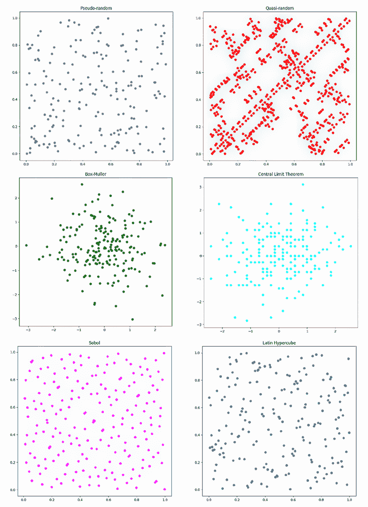

图 7.2 生成初始种群的各种采样方法

如附录 A（见 liveBook）所述，有几个 Python 包用于进化计算。在本章中，我们将重点介绍使用 pymoo：Python 中的多目标优化。Pymoo 提供了不同的采样方法来创建初始种群或初始搜索点。例如，随机采样和拉丁超立方采样。作为列表 7.1 的延续，以下代码片段展示了 pymoo 中的随机采样：

```py
!pip install -U pymoo
from pymoo.core.problem import Problem                         ①
from pymoo.operators.sampling.rnd import FloatRandomSampling   ②
from pymoo.util import plotting                                ③

problem = Problem(n_var=2, xl=0, xu=1)                         ④

sampling = FloatRandomSampling()                               ⑤

X = sampling(problem, 200).get("X")                            ⑥
plotting.plot(X, no_fill=True)                                 ⑦
```

① 导入问题类的实例。

② 导入随机采样方法。

③ 导入可视化方法。

④ 创建一个有两个变量的问题，并指定下限和上限。

⑤ 创建随机采样器的实例。

⑥ 生成 200 个随机解/个体。

⑦ 可视化生成的个体。

以下代码使用拉丁超立方采样生成并可视化 200 个初始解：

```py
from pymoo.operators.sampling.lhs import LHS      ①

sampling = LHS()

X = sampling(problem, 200).get("X")
plotting.plot(X, no_fill=True)
```

① 导入拉丁超立方采样模块。

如果解的形式是排列，可以如下生成随机排列：

```py
per1=np.random.permutation(10)                               ①
print(per1)

per2 = np.array([5, 4, 9, 0, 1, 2, 6, 8, 7, 3])              ②
np.random.shuffle(per2)                                      ②
print(per2)

pop_init = np.arange(50).reshape((10,5))                     ③
np.random.permutation(pop_init)                              ③

from itertools import combinations                           ④
size=5                                                       ④
ones=2                                                       ④

for pos in map(set, combinations(range(size), ones)):        ④
     print([int(i in pos) for i in range(size)], sep='\n')   ④
```

① 随机排列一个序列，或返回一个排列的范围。

② 随机打乱一个序列。

③ 初始解的种群作为实值排列

④ 初始解的种群以二进制排列的形式，其中二进制字符串的位数和每个二进制字符串中 1 的个数

您也可以使用以下代码在两点之间生成一个随机路径：

```py
import osmnx as ox
import random
from collections import deque
from optalgotools.structures import Node

G = ox.graph_from_place("University of Toronto")
fig, ax = ox.plot_graph(G)

def randomized_search(G, source, destination):                  ①
    origin = Node(graph = G, osmid = source)
    destination = Node(graph = G, osmid = destination)

    route = [] 
    frontier = deque([origin])
    explored = set()
    while frontier:
        node = random.choice(frontier)                          ②
        frontier.remove(node)
        explored.add(node.osmid)

        for child in node.expand():
            if child not in explored and child not in frontier:
                if child == destination:
                    route = child.path()
                    return route
                frontier.append(child)

    raise Exception("destination and source are not on same component")

random_route = randomized_search(G, 24959528, 1480794706)       ③

fig, ax = ox.plot_graph_route(G, random_route)                  ④
```

① 这是一个典型的带有打乱边界的图搜索。

② 这部分是随机化部分。

③ 在两个节点之间生成随机路径。

④ 可视化随机路径。

前面的代码通过打乱边界节点修改了一个典型的图搜索算法。这意味着扩展的候选者是“随机”的，这意味着在重复调用时会产生不同的路径。一些生成的随机路径如图 7.3 所示。

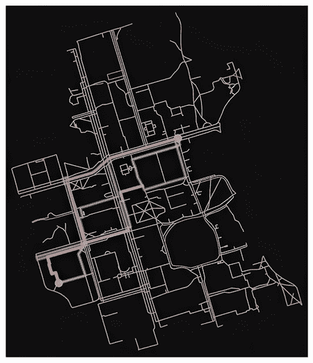

图 7.3 生成随机初始路径

在下一节中，我将介绍基于种群的元启发式算法——进化计算。

## 7.2 介绍进化计算

进化可以被视为一种优化过程，因为它涉及随着时间的推移逐渐改善生物体的特征，从而适应动态变化和竞争的环境，并增强在这些环境中生存的能力。在本节中，我将概述生物进化的基本概念。理解这些原理对于深入了解进化计算至关重要。

### 7.2.1 生物学基础简述

*细胞核*是任何活细胞的核心部分，其中包含遗传信息。这种遗传信息存储在*染色体*中，每条染色体都是由脱氧核糖核酸（DNA）构成的，它携带用于所有生物体生长、发育、功能和繁殖的遗传信息。人类在其每个细胞中都有 23 对染色体，即总共 46 条染色体。每条染色体由许多不同的部分组成，称为*基因*，这些基因负责编码个体的特定属性。决定这些属性的基因的变异形式，位于染色体上的特定位置，称为等位基因。每个基因在染色体上都有一个独特的位置，称为*座位*。所有基因的组合称为*基因型*，它为生物体提供遗传蓝图，决定个体的特征和特性的潜力。*表型*一词指的是生物体的可观察的物理、行为和生理特征，这些特征是其基因型和环境的相互作用的结果。

为了说明基因及其在决定生物体特征中的作用，让我们考虑一个例子，其中 DNA 分子由四个基因组成，这些基因负责不同的特征：食欲、运动、足部和皮肤类型。食欲基因可能具有不同的值，反映生物体的饮食，如草食性（H）、肉食性（C）或食虫性（I）。运动基因可能决定生物体的运动方式，如攀爬（CL）、飞行（FL）、奔跑（R）或游泳（SW）。足部基因可能决定生物体具有的足部或肢体类型，如爪子（CLW）、鳍（FLP）、蹄（HV）或翅膀（WNG）。最后，皮肤基因可能决定生物体的皮肤覆盖物，如毛皮（F）、鳞片（S）或羽毛（FTH），如图 7.4 所示。

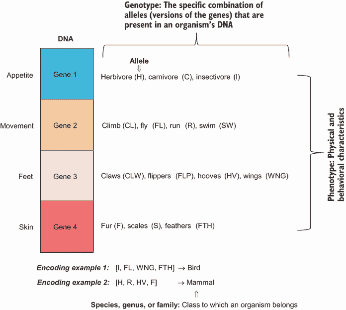

图 7.4 基因型、表型和分类学

在本例中，*基因型*指的是生物体的特定遗传构成，这是由个体从其父母那里继承的特定等位基因组合所决定的。这些基因的具体值将决定生物体的*表型*，或可观察的特征。例如，具有食虫食欲基因、飞行运动基因、翅膀脚基因和羽毛皮肤基因的生物体很可能是鸟类。另一方面，具有食草食欲基因、奔跑运动基因、蹄脚基因和毛皮皮肤基因的生物体很可能是哺乳动物，如白尾鹿。

生物体所属的类别，如物种、属或科，是根据与其他生物体共享的特征进行的分类学分类所确定的。

### 7.2.2 进化理论

进化理论解释了生物物种是如何随着时间的推移而变化并多样化成我们今天所看到的形态的。这一理论由查尔斯·达尔文提出，为生物多样性和其潜在机制提供了解释。

根据这一理论，*自然选择*是推动进化的主要机制。在无数代的过程中，适应性从连续的、微小的、随机的性状变化累积效应中产生，自然选择青睐那些最适合其环境的变体。这一现象被称为适者生存：被选中的个体繁殖，将它们的特性传递给后代。其他个体在没有交配的情况下死亡，因此它们的特性被丢弃。随着时间的推移，自然选择在塑造种群的特征和适应性方面发挥着重要作用，促进有利特性的传递，并消除不那么有利的特性。

进化理论

自然选择进化理论可以概括如下：

+   在资源有限和人口稳定的世界上，每个个体都与其他个体竞争生存。

+   具有最佳特征（性状）的个体更有可能生存和繁殖，这些特征将传递给其后代。

+   这些理想特性被后代继承，并且（随着时间的推移）在种群中变得占主导地位。

+   在生产一个生物体后代的过程中，随机事件会导致后代特征发生随机变化。

+   如果这些新特征对生物体有益，那么该生物体的生存机会就会增加。

进化计算技术模拟生物进化过程，并执行一系列操作，例如创建初始种群（染色体集合）、评估种群，并通过多代进化种群。

### 7.2.3 进化计算

*计算智能*（CI）是人工智能（AI）的一个子领域，强调设计、应用和开发能够学习和适应以解决复杂问题的算法。它侧重于软计算方法，如模糊逻辑、神经网络、进化计算和群体智能。*进化计算*（EC）作为 CI 的一个分支，采用受生物进化启发的各种计算方法。这些方法以自然选择、适者生存和繁殖作为其计算系统的核心元素。

通常来说，EC 算法主要由以下主要组件组成：

+   *个体种群*—这是一组初始通过随机生成或某些启发式方法生成的候选解，然后随着时间的推移进行改进。种群的大小通常很大，以便探索问题可能的广泛解决方案。然而，最佳种群大小取决于各种因素，如问题的复杂性、问题中的变量数量、所需解的精度以及可用的计算资源。在实践中，最佳种群大小通常通过实验确定，通过评估不同种群大小的算法性能，并选择表现最佳的大小。

+   *适应度函数*—这个函数评估候选解的质量。它通过为种群中的每个个体分配一个适应度值来确定每个解解决给定问题的程度。适应度值越高，解越好。

+   *父代选择方法*—这种方法用于从种群中选择最有潜力的个体，以便为下一代创造新的后代。

+   *遗传算子*—这些算子包括*交叉*和*变异*，它们用于从选定的父母中创建新的后代。交叉算子通过在两个选定的个体之间交换遗传物质来创建具有父母双方特征组合的新后代。变异算子通过在后代遗传组成中引入随机变化来增加种群多样性并防止停滞。

+   *生存方法*—这些方法确定种群中哪些个体将幸存到下一代。

这些五个组件共同构成了 EC 算法的基础，可以有效地解决各种优化问题。如图 7.5 所示，存在几种 EC 范式。


图 7.5 EC 范式

这些范式主要在表示个体、父母、生存选择方法和遗传算子的方法上有所不同：

+   *遗传算法 (GA)*—这种搜索算法模仿自然进化，其中每个个体都是一个作为二进制、实值或排列向量编码的候选解决方案。我们将在本书的这一部分详细讨论遗传算法。

+   *微分进化 (DE)*—该算法使用实值向量作为个体，通过添加现有解决方案对之间的加权差异来生成新的解决方案。它与遗传算法 (GA) 类似，但在繁殖机制上有所不同。

+   *遗传编程 (GP)*—这是遗传算法 (GA) 的一个特例，其中每个个体都是一个作为变长树编码的计算机程序。这种树结构用于表示函数和运算符，例如 `if`-`else` 语句和数学运算。

+   *进化编程 (EP)*—这与遗传规划 (GP) 类似，但它侧重于进化行为特征而不是程序结构。这是一个开放的框架，其中可以应用任何表示和变异操作，但没有重组操作。

+   *进化策略 (ES)*—该算法使用实值向量作为个体，并在进化过程中调整变异和重组参数。选择方法包括加法选择、逗号选择、贪婪选择和基于距离的选择。

+   *文化算法 (CA)*—这种方法将来自共享信念空间的社会学习纳入传统的基于种群的进化过程。CA 模拟了种群文化的进化及其对个体遗传和表型进化的影响。

+   *协同进化 (CoE)*—这是基于相互作用种群之间发生的相互进化变化，其中每个种群代表一个给定的物种，共同优化耦合目标。

EC 是一种强大的优化方法，具有多个优点以及一些缺点。优点包括以下方面：

+   EC 算法不对问题空间做出任何假设，这使得它们适用于广泛的领域。

+   它们在不同的领域中被广泛适用，可以用于解决各种领域的连续和离散问题。

+   EC 算法产生的解决方案比神经网络或其他黑盒优化技术更易于解释。这主要是因为 EC 算法使用了一个更透明的选择、变异和重组过程，可以逐步跟踪和理解，而神经网络由于其复杂、分层结构和非线性操作，通常被视为“黑盒”。

+   EC 算法提供多个替代解决方案，这在没有单一最佳解决方案的情况下非常有用。

+   EC 算法表现出固有的并行性，这使得它们非常适合在现代硬件上的简单并行实现。

EC 的缺点包括以下方面：

+   EC 算法可能计算成本高昂，这意味着它们可能收敛缓慢或需要大量的计算资源来运行。

+   尽管 EC 算法，如许多元启发式算法一样，不能保证找到最优解，但它们通常在有限的时间内收敛到近似最优解。

+   EC 算法通常需要参数调整以达到良好的性能，这可能既耗时又具有挑战性。

本章主要关注遗传算法。下一节将探讨遗传算法的各个组成部分。

## 7.3 遗传算法构建模块

遗传算法是 EC 最广泛使用的形式。它们是自适应启发式搜索算法，旨在模拟自然系统中的进化过程，这是查尔斯·达尔文在其进化论中提出的。这些算法代表了在定义的搜索空间内对随机搜索的智能利用。

第一个遗传算法，称为简单遗传算法（SGA），也称为经典或标准 GA，由约翰·霍兰德在 1975 年开发。通过他的研究，霍兰德为设计鲁棒、自适应并能适应新挑战的人工系统提供了见解。通过研究自然系统的过程，他试图创建算法和计算模型，这些模型可以像自然系统一样解决复杂问题。霍兰德将 GA 定义为一种计算机程序，其进化方式类似于自然选择，并且可以解决即使其创造者也不完全理解的复杂问题。GA 基于自然选择的进化原理，使用个体种群，这些个体在变异诱导操作（如变异和交叉）的存在下进行选择。适应度函数用于评估个体，它们的繁殖成功率与它们的适应度成正比。图 7.6 显示了 GA 与自然进化的类比。

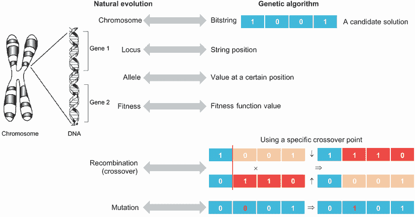

图 7.6 GA 与自然进化的对比

遗传算法（GA）首先初始化一个个体或候选解的种群。根据定义的适应度函数评估种群中所有个体的适应度，然后通过执行交叉和变异操作来创建新种群，这些操作生成子代或新解。在约束优化问题中，应在产生后代后进行可行性检查和修复。

种群会持续进化，直到满足某些停止标准，如图 7.7 所示。这些终止标准可能是

+   指定数量的代数或适应度评估（100 或 150 代）

+   一个达到最小阈值的充分解

+   当在指定数量的代数内最佳个体没有改进时

+   当达到内存或时间限制时

+   前述任何组合点


图 7.7 遗传算法步骤

算法 7.1 总结了遗传算法的主要步骤。

算法 7.1 遗传算法

```py
Initialization: Randomly generate an initial population M(0)

Evaluate all individuals: Compute and save the fitness f(m) for each individual in the current population M(t)

While termination criteria are not met
    Select parents: Define selection probabilities p(m)for each individual p in M(t)
    Apply crossover: Generate M(t+1) by probabilistically selecting individuals from M(t) to produce offspring via genetic operators
    Apply mutation: Introduce random changes to individuals
    Evaluate: evaluate the fitness of the new individuals
    Select survivors: select individuals to form the next generation
```

GA（遗传算法）的概念简单易懂，因为它模拟了自然进化的过程。它是一个模块化算法，可以并行操作，并且易于分布式执行。GA 功能多样，能够有效地处理多目标优化问题。在噪声环境中尤其有效。GA 被广泛应用于解决复杂的连续和离散优化问题，并且在具有众多组合参数和变量之间非线性相互依赖的场景中表现出色。值得注意的是，截至本书 2024 年出版时，在谷歌专利搜索中搜索“遗传算法”作为复合关键词，大约有 100,000 个结果，而谷歌学术搜索则呈现惊人的 1,940,000 个结果。本卷反映了遗传算法在学术和工业领域内受到的广泛关注及其多样化的应用。

### 7.3.1 适应度函数

如前所述，GA 在搜索过程中模仿了自然界的适者生存原则。因此，遗传算法自然适用于解决最大化问题。然而，可以使用各种数学变换将最小化问题转换为最大化问题，例如以下这些：

+   *否定变换*——最简单的变换是对目标函数取反。例如，最大化适应度函数 *f*(*x*) = –*O*(*x*) 等同于最小化原始目标函数 *O*(*x*)。

+   *倒数变换*——将最小化问题转换为最大化问题的另一种方法是取目标函数的倒数。这仅当目标函数始终非负时才有效。方程 7.1 展示了示例：

|


| 7.1 |
| --- |

+   *其他数学变换*——方程 7.2 展示了另一种变换，将最小化问题中的目标函数 *O*(*x*) 转换为最大化问题中的适应度函数 *f*(*x*)。在这个方程中，*O[i]* 是个体 *i* 的目标函数值，*N* 是种群大小，*V* 是一个很大的值，以确保适应度值非负。*V* 的值可以是方程第二项的最大值，这样对应于目标函数最大值的适应度值为零：

|

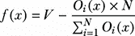

| 7.2 |
| --- |

根据第 1.3.2 节中引入的对偶原理，这些变换不会改变最小值的位置，但将最小化问题转换为等价的最大化问题。

### 7.3.2 表示方案

*编码* 是表示候选解决方案的数据结构，一个好的编码可能是 GA 性能的最重要因素。在 GA 中，候选解决方案的参数（基因）被连接起来形成一个字符串（染色体）。二进制编码、实值编码和排列编码可以用来编码解决方案。二进制编码用于二进制编码 GA（BGA），其中解决方案表示为二进制字符串，如图 7.8 所示。


图 7.8 二进制编码

让我们再次回顾 1.3.1 节中介绍的票价定价示例，其中活动组织者正在计划一个会议，并希望确定最优票价以最大化利润。预期利润由以下方程给出：

|


| 7.3 |
| --- |

其中 *x* 是票价。二进制遗传算法（BGA）可用于找到最大化利润的最优票价，受限于边界约束 75.0 ≤ *x* ≤ 235.0，这将确保利润为正。BGA 具有简单的二进制编码。前一个函数的边界约束要求我们使用 8 位二进制编码，如下面的侧边栏所述。因此，染色体由长度为 8 的位字符串表示。

计算解决方案所需的最小位数

要计算表示下限（LB）和上限（UB）之间范围所需的位数，以期望的精度 *p* 为准，遵循以下步骤：

1.  计算范围大小：*R* = (*UB* – *LB*).

1.  将范围大小除以期望的精度：*R* / *P*.

1.  向上取整到最接近的整数：*number_of_steps* = ceil(*R* / *P*)，其中 ceil 是向上取整函数，将结果向上取整到最接近的整数。

1.  计算位数：*number_of_bits* = ceil(log2)，其中 log[2] 是以 2 为底的对数。

让我们计算票价问题所需的位数：75.0 ≤ *x* ≤ 235.0，假设精度为 0.1：

1.  计算范围大小：(235.0 – 75.0) = 160

1.  将范围大小除以期望的精度：160 / 0.1 = 1600

1.  向上取整到最接近的整数：1600。现在你有 1600 个步骤（值）来表示从 75.0 到 235.0 的数字，精度为 0.1。

1.  要找到所需的最小位数，可以使用公式 *number_of_bits* = ceil(log2)。

    *number_of_bits* = ceil(log2) ≈ ceil(10.64) = 11

因此，你需要 11 位来表示从 75.0 到 235.0 的数字，精度为 0.1。如果你只想考虑整数值（即，精度为 1），则需要 ceil(logs(160)) = ceil(7.32) = 8 位。

如前所述，遗传算法从候选解的初始种群开始。种群大小必须仔细选择，因为非常大的种群大小通常不会提高遗传算法的性能。一些研究也表明，最佳种群大小取决于编码字符串（染色体）的大小。这意味着如果你有 32 位的染色体，种群应该比 16 位的染色体大。 

在票价定价问题中，假设我们从大小为 5 的种群开始。表 7.2 显示了可以生成以形成初始种群的随机解的示例。

表 7.2 初始种群

| 候选解 *x* | 解空间中*x*的值 | 二进制编码空间中的候选解 | 目标函数 *f*(*x*) |
| --- | --- | --- | --- |
| x[1] | 77 | 01001101 | 8,820 |
| x[2] | 203 | 11001011 | 84,420 |
| x[3] | 110 | 01101110 | 90,000 |
| x[4] | 145 | 10010001 | 128,500 |
| x[5] | 230 | 11100110 | 18,000 |

一旦我们有了初始种群，我们就可以继续选择将受到遗传算子（交叉和变异）处理的父母。我们将接下来查看选择算子。

### 7.3.3 选择算子

存在着不同的父母选择方法（算子），它们具有不同的选择压力水平。*选择压力*指的是最佳个体被选中的概率与所有个体平均选择概率相比。当在遗传算法中使用具有高选择压力的算子时，种群内的多样性比使用具有较低选择压力的算子时下降得更快。这听起来可能很好，但它可能导致种群过早地收敛到次优解，从而限制种群的探索能力并消除不符合由选择压力确定的特定标准的个体。这可能导致种群缺乏多样性，从而降低找到更好解的机会。

平衡选择压力与种群探索能力对于避免过早收敛并鼓励发现多样化的最优解至关重要。图 7.9 展示了某些选择方法。


图 7.9 选择方法及其选择压力

精英主义

*精英主义*在遗传算法中涉及选择最适应的个体进行交叉和变异，并保留当前种群中表现最好的个体以传播到下一代。保留的个体数量越多，后续种群中的多样性就越低。这种选择方法具有最高的选择压力，如图 7.9 所示。

在票价定价示例中，最佳解（*x[4]*和*x[3]*）将被选为父母以生成后代，如表 7.3 所示。

表 7.3 解排名

| 候选解*x* | 解空间中*x*的值 | 二进制编码空间中的候选解 | 目标函数*f*(*x*) | 排名 |
| --- | --- | --- | --- | --- |
| x[1] | 77 | 01001101 | 8,820 | 5 |
| x[2] | 203 | 11001011 | 84,420 | 3 |
| x[3] | 110 | 01101110 | 90,000 | **2** **(第二优个体)** |
| x[4] | 145 | 10010001 | **128**,**500** | **1** **(最优个体)** |
| x[5] | 230 | 11100110 | 18,000 | 4 |

适应度比例选择

*适应度比例选择*（FPS）是一种选择方法，它倾向于选择种群中最适应的个体。这种方法创建了一个概率分布，其中个体的选择概率与其适应度值成正比。个体通过从这个分布中随机采样来选择。相对于整个种群，个体适应度分配的计算如下：

|

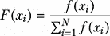

| 7.4 |
| --- |

其中*f*是由个体染色体表示的解，N 是种群大小。轮盘赌选择是适应度比例选择（FPS）的一个例子。

在我们的票价定价示例中，可以通过以下步骤构建轮盘赌选择：

1. 计算种群的总适应度：*F* = 8,820 + 84,420 + 90,000 + 128,500 + 18,000 = 329,740.

2. 计算每个染色体*x[k]*的选择概率*p[k]*，其中*p[k]* = *f*(*x[k]*) / *F*. 表 7.4 显示了计算出的选择概率。

表 7.4 选择概率

| 候选解*x* | 解空间中*x*的值 | 二进制编码空间中的候选解 | 目标函数*f*(*x*) | 选择概率*p[k]* |
| --- | --- | --- | --- | --- |
| x[1] | 77 | 01001101 | 8,820 | 0.03 |
| x[2] | 203 | 11001011 | 84,420 | 0.26 |
| x[3] | 110 | 01101110 | 90,000 | 0.27 |
| x[4] | 145 | 10010001 | 128,500 | 0.39 |
| x[5] | 230 | 11100110 | 18,000 | 0.05 |

3. 计算每个染色体*x[k]*的累积概率*q[k]*，其中*q[k]* = sum(*p[j]*), *j* *= {1,k}*. 表 7.5 显示了计算出的累积概率。

表 7.5 累积概率

| 候选解*x* | 解空间中*x*的值 | 二进制编码空间中的候选解 | 目标函数*f*(*x*) | 选择概率*p[k]* | 累积概率*q[k]* |
| --- | --- | --- | --- | --- | --- |
| x[1] | 77 | 01001101 | 8,820 | 0.03 | 0.03 |
| x[2] | 203 | 11001011 | 84,420 | 0.26 | 0.28 |
| x[3] | 110 | 01101110 | 90,000 | 0.27 | 0.56 |
| x[4] | 145 | 10010001 | 128,500 | 0.39 | 0.95 |
| x[5] | 230 | 11100110 | 18,000 | 0.05 | 1.00 |

4. 生成一个范围[0,1]内的随机数*r*。

5\.  如果 *q*[1] >= *r*，则选择第一个染色体 *x*[1]；否则，选择 *k^(th)* 染色体 *x[k]*（2 ≤ k ≤ *N*），使得 *q[k]*[-1] < *r* ≤ *q[k]*。如果我们假设随机生成的数字 *r* = 0.25，则 *x*[2]（*q*[2] = 0.28）将被选中，因为 *q*[2] > 0.25，而如果 *r* = 0.58，则 *x*[4] 将被选中，因为 *q[4]* > 0.58。图 7.10 展示了票价定价示例的轮盘赌图。

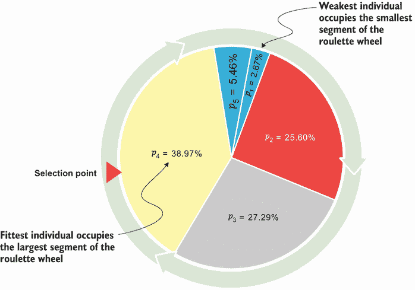

图 7.10 票价定价示例的轮盘赌图

如您所见，最适应的个体占据了轮盘赌轮上最大的部分，而最不适应的个体占据了轮盘赌轮上最小的部分。由于比例选择中适应度与选择之间的直接相关性，存在主导个体不成比例地贡献下一代后代的可能性，从而导致种群多样性的减少。这表明比例选择会导致高选择压力。

基于排名的选择

解决遗传算法中 FPS 局限性的一种方法是在确定选择概率时使用相对适应度而不是绝对适应度——个体根据其在种群中相对于其他个体的适应度被选中。这种方法确保选择过程不会被种群中的最佳个体主导。

线性排名和非线性排名都可以使用。在 *线性排名* 中，个体 *i* 被选中的基于排名的概率使用以下公式计算：

|


| 7.5 |
| --- |

其中 *N* 代表种群大小，*SP* 是选择压力（1.0 < *SP* ≤ 2.0），而 *r*(*i*) 是与个体 *i* 相关的排名（排名越高越好）。在票价定价示例中，*N* = 5，假设 *SP* = 1.5，种群中每个个体的基于排名的选择概率显示在表 7.6 中。

表 7.6 基于排名的选择概率

| 候选解 *x* | 解空间中 *x* 的值 | 二进制编码空间中的候选解 | 目标函数 *f*(*x*) | 排名 *r[i]* | FPS 累积概率 *q[k]* | 基于排名的选择概率 |
| --- | --- | --- | --- | --- | --- | --- |
| x[1] | 77 | 01001101 | 8,820 | 1 | 0.03 | 0.50 |
| x[2] | 203 | 11001011 | 84,420 | 3 | 0.28 | 0.75 |
| x[3] | 110 | 01101110 | 90,000 | 4 | 0.56 | 0.88 |
| x[4] | 145 | 10010001 | 128,500 | 5 | 0.95 | 1.00 |
| x[5] | 230 | 11100110 | 18,000 | 2 | 1.00 | 0.63 |

如您所见，基于排名的选择通过将更大的选择概率分配给适应性较低的个体来减少 FPS 的偏差。

*非线性排名* 允许比线性排名更高的选择压力。选择概率使用以下公式计算：

|

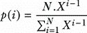

| 7.6 |
| --- |

其中 *X* 是多项式（SP–N）.X*^(N–)*¹)+SP.X*^(N–)*²+…+SP.X+SP=0 的根。这种非线性排序允许选择压力在[1, N – 2]区间内。

随机均匀抽样

*随机均匀抽样*（SUS）是缓解轮盘赌选择方法潜在偏差的另一种方法。这种方法涉及在带有*m*个均匀分布指针的饼周围放置一个外部轮盘。使用 SUS，轮盘的一次旋转即可同时选择所有*m*个个体进行繁殖。图 7.11 显示了使用四个选择点的 SUS 在票价问题中的应用。

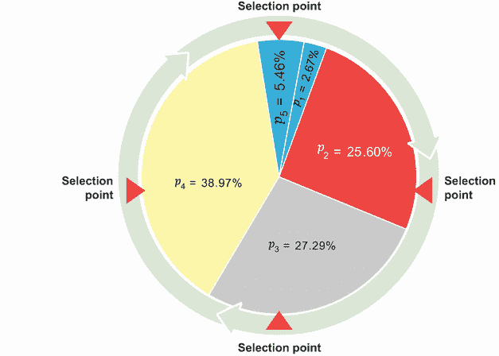

图 7.11 随机均匀抽样（SUS）策略

锦标赛选择

*锦标赛选择*涉及从当前种群中随机选择一组*k*个个体，其中*k*是锦标赛小组的大小。一旦形成小组，就在其成员之间举行锦标赛，根据他们的适应度值确定表现最佳的个体。适应度分数最高的个体是赢家，并进入遗传算法的下一阶段。图 7.12 显示了锦标赛选择过程。


图 7.12 锦标赛选择

为了选择*m*个个体进行繁殖，进行*m*次锦标赛过程。在每次迭代中，从种群中随机选择一个新的锦标赛小组，小组中的个体相互竞争，直到确定表现最佳的个体。然后从每个锦标赛中选出的赢家用于繁殖，这涉及到应用如交叉和变异等遗传算子来创建新的后代。

随机选择

*随机选择*是最简单的选择算子，其中每个个体都有相同的 1/*N*选择概率（其中*N*是种群大小）。不使用适应度信息，这意味着最佳和最差的个体被选中的概率完全相同。随机选择在所有选择算子中具有最低的选择压力，因为种群中的所有个体都有相同的机会被选中。

其他选择方法

其他选择方法包括但不限于玻尔兹曼选择、(*μ, λ*)-选择和(*μ* + *λ*)-选择，以及名人堂选择。随机选择和锦标赛选择方法作为 pymoo.operators.selection 类的一部分在 pymoo 中实现。

在我们选择父母之后，我们需要通过应用生育算子来产生后代。

### 7.3.4 生育算子

遗传算法采用两种主要的遗传算子，即交叉和变异，来生成后代。让我们详细看看这两个生育算子。

交叉

*交叉*受到生物学过程中的重组过程的启发，其中两个染色体之间交换一部分遗传信息。这种遗传物质的交换导致后代的产生，因此两个父代可以产生两个后代。为了确保最佳个体能够贡献其遗传物质，通常通过交叉给予优秀个体更多的繁殖机会。这种机制促进了位于不同染色体上的方案的有效组合，这些方案是子解决方案。单点交叉、*n*-点交叉和均匀交叉是常用的交叉方法。

在*单点交叉*中，我们首先在两个父代中选择一个随机点，并在该交叉点处分割父代。然后通过交换尾部创建两个子代，如图 7.13 所示。这种交叉操作产生了两个新的子代（候选解），在图中分别是 01010001 和 01001101（或十进制的 81 和 77），作为潜在的车票价格。根据方程 7.3，这些解决方案分别产生总利润$20,980 和$8,820。

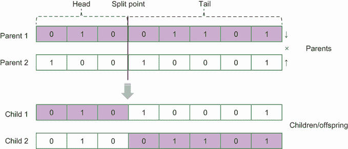


在*n*-点交叉中，它是单点交叉的推广，我们选择*n*个随机的交叉点并沿着这些点分割。子代是通过将部分粘合并交替在父代之间进行生成的，如图 7.14 所示。按照图 7.14 中所示的 2 点交叉，生成了两个候选解，分别是 141 和 81，适应度值分别为$126,580 和$20,980。


图 7.14 *n*-点交叉

在*均匀交叉*中，从两个父代中交换随机位点的比特来创建两个后代。一个父代被分配标签“正面”，另一个父代被分配标签“反面”。对于第一个子代，对每个基因抛硬币以确定它应该来自“正面”还是“反面”父代。第二个子代是通过取第一个子代中每个基因的逆来创建的，如图 7.15 所示。在这个例子中，应用均匀交叉产生了 217 和 5，适应度值分别为$53,620 和$–319,500。正如你所看到的，5 不是一个可行的解，因为它不在{75.0,235.0}的边界约束内。这个解决方案被拒绝。


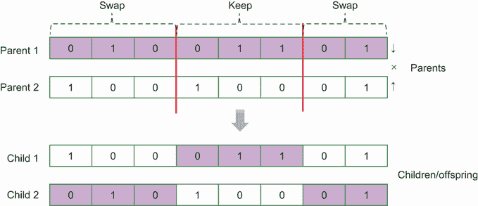

在 pymoo 中，可以使用修复算子确保算法只在可行空间中搜索。它是在产生后代之后应用的。

突变

*突变* 是一个将新的遗传物质引入个体的过程，有助于增加群体的多样性。这种多样性很重要，因为它允许群体探索更广泛的可能解决方案来应对当前的问题。突变通常与交叉结合使用，以确保每个基因都能访问到所有等位基因。在突变的情况下，选择机制可能会集中在“弱”个体上，希望突变能将这些个体引入更好的特征，从而增加它们的生存机会。

在二进制遗传算法中，突变是通过以概率 *p[m]* 独立改变每个基因来实现的。对于每个基因，我们生成一个介于 0 和 1 之间的随机数 *r*。如果 *p[m]* > *r*，我们改变该基因。图 7.16 展示了票价问题中一个个体的突变过程。

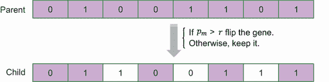

图 7.16 突变

新群体

在应用交叉和突变后，我们将有代表新的候选解决方案的新后代。为了开始新一代，我们需要通过从旧群体和新产生的后代中选择个体来创建一个新的群体。新群体的规模将与旧群体保持相同。

生成式遗传算法和稳态遗传算法是遗传算法中使用的两种模型。如图 7.17 所示，在 *生成式遗传算法* 模型中，整个群体被其后代取代以开始“下一代”。在 *稳态遗传算法* 中，产生的后代数量少于群体大小。旧个体可能被新个体取代。为新群体选择个体的过程称为 *生存选择*。我们将接下来探讨生存选择方法。

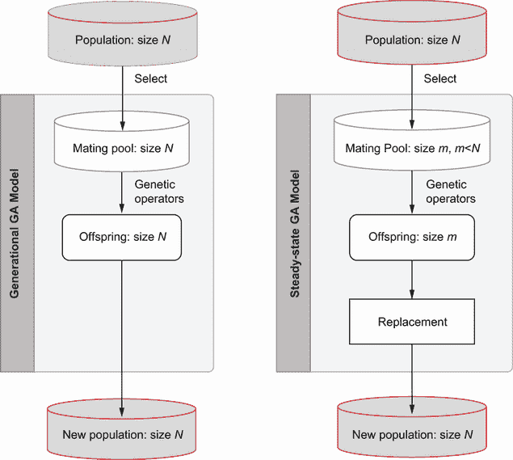

图 7.17 遗传算法的生成式和稳态模型

### 7.3.5 生存选择

随机选择、基于年龄的选择、适应度比例选择和锦标赛选择是生存选择方法的例子，这些方法可以通过利用新产生的后代来保留最佳个体，同时向群体引入多样性：

+   在 *随机选择* 中，新群体是通过随机选择 *N* 个个体来形成的。

+   使用 *基于年龄的选择*（或先进先出），最老的个体将被删除。

+   *适应度比例选择*（FPS）考虑了每个个体的适应度——我们可以根据适应度的倒数删除或替换个体，始终保留最佳个体或删除最差的个体。例如，*精英选择* 仅涉及从旧群体和新后代中选择最佳个体来创建新群体。这种方法确保了最佳解决方案在代际之间得以保留。

+   赛选法涉及从旧种群和新后代中随机选择个体，然后从每个组中选择最佳个体以创建新种群。这种方法可以在种群中更有效地保持多样性。

在票价示例中，如果我们应用精英选择，新种群将由表 7.7 中显示的所选解决方案组成。

表 7.7 精英选择

| 来源 | 解空间中的候选解 x | 二进制编码空间中的候选解 | 目标函数 f(x) | 排名 | 被选中 |
| --- | --- | --- | --- | --- | --- |
| 旧个体 | 77 | 01001101 | 8,820 | 7 | 否 |
| 203 | 11001011 | 84,420 | 3 | 是 |
| 110 | 01101110 | 90,000 | 2 | 是 |
| 145 | 10010001 | 128,500 | 1 | 是 |
| 230 | 11100110 | 18,000 | 6 | 否 |
| 由 1 点交叉产生的新个体 | 81 | 01010001 | 20,980 | 5 | 是 |
| 77 | 01001101 | 8,820 | 7 | 否 |
| 由突变个体 77 生成的新个体 | 103 | 01100111 | 76,420 | 4 | 是 |

你可能已经注意到，单点交叉产生了一个已经在初始种群中存在的解决方案。这种现象并不一定是问题，因为在搜索过程中应用遗传操作时，这是一个预期的结果。交叉和突变可以导致探索性和利用性行为。例如，在单点或 *n* 点交叉中，基于随机的分割点位置，新的解决方案可以与父母相同或接近，也可以产生更多样化的后代。

## 7.4 在 Python 中实现遗传算法

遗传算法是一个易于实现的算法。让我们看看我们如何使用 Python 中的遗传算法来解决票价问题。

我们将首先导入必要的包并定义问题。

列表 7.2 使用二进制遗传算法解决票价问题

```py
import numpy as np
import random
from tqdm.notebook import tqdm
from copy import copy
import matplotlib.pyplot as plt

def profit(x):
    return -20*x*x+6200*x-350000
```

因为我们使用二进制遗传算法来解决这个问题，我们需要生成一个初始随机种群。作为列表 7.2 的延续，下面的 `init_pop` 函数接受两个输入参数——`pop_size`，表示种群大小，以及 `chromosome_length`，表示每个染色体的长度：

```py
def init_pop(pop_size, chromosome_length):
    ints = [random.randint(75,235) for i in range(pop_size)]      ①
    strs = [bin(n)[2:].zfill(chromosome_length) for n in ints]    ②
    bins = [[int(x) for x in n] for n in strs]                    ③
    return bins                                                   ④
```

① 生成一个随机整数列表。

② 将整数转换为二进制字符串。

③ 将二进制字符串转换为二进制数字列表。

④ 返回最终的二进制染色体列表。

`init_pop` 函数首先生成一个长度等于 `pop_size` 的从 75 到 235（包含）的随机整数列表。这个列表稍后将转换为二进制表示。`ints` 列表中的整数随后使用 `bin()` 函数转换为二进制字符串，该函数返回一个带有前缀 `0b` 的给定数字的二进制字符串表示。为了去除这个前缀，我们使用切片 `[2:]`。然后我们使用 `zfill()` 方法在二进制字符串前面填充前导零，以确保它与 `chromosome_length` 具有相同的长度。`strs` 列表中的二进制字符串被转换为二进制位（0 或 1）的列表。这是通过嵌套列表推导式完成的，该推导式遍历二进制字符串中的每个字符并将其转换为整数。函数最终返回一个二进制染色体的列表，其中每个染色体是一个二进制位的列表。

对于给定的种群，我们可以使用以下 `fitness_score` 函数计算种群中每个元素的适应度。这个适应度函数本质上决定了特定后代的“好坏”。它将种群中的每个单元转换为二进制数（基因型），评估优化利润的函数，然后返回“最佳”的后代。该函数主要接受一个种群作为输入，并返回一个包含两个列表的元组，一个是排序后的适应度值列表，另一个是排序后的种群列表：

```py
def fitness_score(population):
    fitness_values = []
    num = []
    for i in range(len(population)):
        num.append(int("".join(str(x) for x in population[i]), base=2))  ①
        fitness_values.append(profit(num[i]))                            ②
    tuples = zip(*sorted(zip(fitness_values, population),reverse=True))  ③
    fitness_values, population = [list(t) for t in tuples]               ④
    return fitness_values, population                                    ⑤
```

① 将二进制转换为十进制。

② 评估每个染色体的适应度，并将适应度值追加到 `fitness_values` 列表中。

③ 创建适应度值及其对应染色体的元组，然后根据适应度值按降序排序。

④ 将排序后的元组分别解压回单独的列表，用于适应度值和种群。

⑤ 返回排序后的适应度值和种群。

现在我们将使用以下 `select_parent` 函数中实现的随机选择方法选择两个父代。该函数接受两个输入参数：`population`，它是种群中个体的列表，以及 `num_parents`，它表示要选择的父代数量。它返回一个所选父代的列表：

```py
def select_parent(population, num_parents):
    parents=random.sample(population, num_parents)     ①
    return parents                                     ②
```

① 从给定的种群中随机选择指定数量的独特父代。

② 返回所选父代的列表。

`select_parent` 函数实现了一种简单的随机抽样选择方法，它给种群中的每个个体以平等的机会被选为父代。其他选择方法，如 FPS 或轮盘赌选择，也可以用来给适应度值更高的个体更高的机会。

以下 `roulette_wheel_selection` 函数展示了轮盘赌选择的步骤。该函数接受两个输入参数——`population`，它是种群中个体的列表，以及 `num_parents`，它表示要选择的父代数量：

```py
def roulette_wheel_selection(population, num_parents):
    fitness_values, population = fitness_score(population)                 ①
    total_fitness = sum(fitness_values)
    probabilities = [fitness / total_fitness for fitness in fitness_values]②

    selected_parents = [] 
    for i in range(num_parents):                                           ③
        r = random.random()                                                ④

        cumulative_probability = 0                                         ⑤
        for j in range(len(population)):
            cumulative_probability += probabilities[j]
            if cumulative_probability > r:
                selected_parents.append(population[j])
                break

    return selected_parents
```

① 计算总适应度。

② 计算每个个体的选择概率。

③ 只选择两个父代。

④ 生成一个介于 0 和 1 之间的随机数 r。

⑤ 找到累积概率包括 r 的个体。

在选择父母后，是时候应用遗传算子来产生后代了。下面的`crossover`函数实现了单点交叉。该函数接受两个参数作为输入：`parents`，它是一个包含两个父母染色体的列表，以及`crossover_prob`，它表示父母之间发生交叉的概率。它返回一个包含父母和后代的列表。第一个后代是通过取第一个父母的第一部分（包括交叉点）和第二个父母从交叉点+1 到染色体末尾的第二部分生成的。同样，第二个后代是通过取第二个父母的第一部分（包括交叉点）和第一个父母从交叉点+1 到染色体末尾的第二部分生成的：

```py
def crossover(parents, crossover_prob): 
    chromosome_length = len(parents[0]) 
    if crossover_prob > random.random():                                  ①
        cross_point = random.randint(0,chromosome_length)                 ②
        parents+=tuple([(parents[0][0:cross_point+1] +parents[1][cross_   ③
point+1])]) 
        parents+=tuple([(parents[1][0:cross_point+1] +parents[0][cross_   ④
point+1])]) 
    return parents                                                        ⑤
```

① 如果交叉概率大于随机生成的数字，则应用交叉。

② 在染色体索引范围内选择一个随机的交叉点。

③ 创建第一个后代。

④ 创建第二个后代。

⑤ 返回原始父母和通过交叉操作生成的新后代。

现在我们应用突变过程。下面的`mutation`函数对给定的染色体种群执行突变操作。它接受两个参数作为输入：`population`，它是一个二进制染色体的列表，以及`mutation_prob`，它表示染色体中每个基因发生突变的概率。它返回突变后的种群：

```py
def mutation(population, mutation_prob) :
    chromosome_length = len(population[0])
    for i in range(len(population)):               ①
        for j in range(chromosome_length-1):       ②
            if mutation_prob > random.random():    ③
                if population[i][j]==1:            ④
                    population[i][j]=0             ④
                else:                              ④
                    population[i][j]=1             ④
    return population                              ⑤
```

① 遍历种群中的每个染色体。

② 遍历染色体中的每个基因，除了最后一个。

③ 如果突变概率大于随机生成的数字，则应用突变。

④ 翻转基因的值。

⑤ 返回突变后的种群。

现在我们将所有内容组合起来，并定义二进制遗传算法（`BGA`）函数。此函数接受以下参数作为输入：

+   `population`—二进制染色体的初始种群

+   `num_gen`—算法将运行的代数

+   `num_parents`—用于交叉的父母数量

+   `crossover_prob`—父母之间发生交叉的概率

+   `mutation_prob`—每个基因发生突变的概率

+   `use_tqdm`（可选，默认=`False`）—一个布尔标志，用于启用或禁用使用 tqdm 库的进度条

这是 BGA 函数：

```py
def BGA(population, num_gen, num_parents, crossover_prob, mutation_prob, use_tqdm =
➥ False):
    states = []                                             ①
    best_solution = []                                      ①
    best_score = 0                                          ①
    if use_tqdm: pbar = tqdm(total=num_gen)
    for _ in range(num_gen):                                ②
        if use_tqdm: pbar.update()
        scores, population = fitness_score(population)      ③
        current_best_score = scores[0]                      ④
        current_best_solution = population[0]               ④
        states.append(current_best_score)
        if current_best_score > best_score: 
            best_score = current_best_score
            best_solution = int("".join(str(x) for x in
            ➥ copy(current_best_solution)), base=2)
        parents = select_parent(population, num_parents)    ⑤
        parents = crossover(parents, crossover_prob)        ⑥
        population = mutation(population,mutation_prob)     ⑦
    return best_solution, best_score, states                ⑧
```

① 初始化

② 使用 for 循环运行遗传算法 num_gen 代。

③ 通过调用 fitness_score 函数计算适应度分数并按适应度值对种群进行排序。

④ 更新最佳解决方案和最佳分数。

⑤ 使用 select_parent 随机方法进行父母选择。您可以将此方法替换为 roulette_wheel_selection(population, num_parents)。

⑥ 对选定的父母执行交叉。

⑦ 执行变异。

⑧ 返回最佳解。

此函数返回最佳解、最佳得分以及每代最佳得分的列表。

现在我们可以解决票价问题，从生成以下参数的初始种群开始：

```py
num_gen = 1000
pop_size = 5
crossover_prob = 0.7
mutation_prob = 0.3
num_parents = 2

chromosome_length = 8
best_score = -100000 

population = init_pop(pop_size, chromosome_length)
print("Initial population: \n", population)
```

运行此代码生成了以下初始种群：

```py
Initial population: [[1, 1, 1, 0, 1, 0, 0, 0], [1, 0, 0, 0, 0, 1, 1, 0], [1, 1, 0, 1, 1, 1, 0, 1], [1, 1, 0, 0, 0, 0, 1, 1], [1, 0, 1, 0, 0, 0, 0, 0]]
```

我们现在可以运行二进制 GA 求解器来获取解决方案，如下所示：

```py
best_solution, best_score, states = BGA(population, num_gen, num_parents,
➥ crossover_prob, mutation_prob, use_tqdm=True)
```

运行此代码会产生与 SciPy 优化器（见列表 2.4）得到相同的结果：

```py
Optimal ticket price ($): 155
Profit ($): 130500
```

而不是从头开始编写自己的遗传算法代码，你可以利用现有的 Python 包，这些包提供了 GA 实现。许多开源 Python 库可以帮助简化开发过程并节省时间。这些库通常包括遗传算子、选择方法和其他功能，使得将遗传算法适应不同的优化问题变得更加容易。这些库的例子包括但不限于以下：

+   *Pymoo* (Python 多目标优化；[`pymoo.org/algorithms/moo/nsga2.html`](https://pymoo.org/algorithms/moo/nsga2.html)) — 一个用于使用进化算法和其他元启发式技术进行多目标优化的 Python 库。Pymoo 提供多种算法，如 GA、微分进化、进化策略、非支配排序遗传算法（NSGA-II）、NSGA-III 和粒子群优化（PSO）。

+   *DEAP* (Python 分布式进化算法；[`deap.readthedocs.io/en/master/`](https://deap.readthedocs.io/en/master/) — 一个用于在 Python 中实现遗传算法的库。它提供了定义、训练和评估遗传算法模型以及可视化优化过程的工具。DEAP 提供了多种内置遗传算子，包括变异、交叉和选择，以及针对特定优化问题的定制算子支持。

+   *PyGAD* (Python 遗传算法；[`pygad.readthedocs.io/en/latest/`](https://pygad.readthedocs.io/en/latest/)) — 一个用于实现遗传算法和微分进化（DE）算法的 Python 库。PyGAD 适用于单目标和多目标优化任务，并且可以应用于广泛的领域，包括机器学习和其他问题域。

+   *jMetalPy* ([`github.com/jMetal/jMetalPy`](https://github.com/jMetal/jMetalPy)) — 一个专为开发和使用元启发式算法解决多目标优化问题而设计的 Python 库。它支持多种元启发式算法，包括非支配排序遗传算法（NSGA-II）、NSGA-III、强度 Pareto 进化算法（SPEA2）以及基于分解的多目标进化算法（MOEA/D），以及其他优化技术，如模拟退火和粒子群优化。

+   *PyGMO* (Python Parallel Global Multi-objective Optimizer; [`esa.github.io/pygmo/`](https://esa.github.io/pygmo/))—一个科学库，提供了大量的优化问题和算法，例如 NSGA-II、SPEA2、非支配排序粒子群优化（NS-PSO）和参数自适应差分进化（PaDE）。它使用广义岛屿模型范式对优化算法进行粗粒度并行化，因此允许用户开发异步和分布式算法。

+   *Inspyred* (Bio-inspired Algorithms in Python; [`pythonhosted.org/inspyred/`](https://pythonhosted.org/inspyred/))—一个用于创建和使用生物启发式计算智能算法的库。它支持多种生物启发式优化算法，如遗传算法（GA）、进化策略、模拟退火、差分进化算法、分布估计算法、帕累托存档进化策略（PAES）、非支配排序遗传算法（NSGA-II）、粒子群优化（PSO）和蚁群优化（ACO）。

+   *Platypus* ([`platypus.readthedocs.io/en/latest/`](https://platypus.readthedocs.io/en/latest/))—一个专注于多目标进化算法（MOEAs）的 Python 进化计算框架。它提供了分析和可视化算法性能和解决方案集的工具。

+   *MEALPY* ([`mealpy.readthedocs.io/en/latest/index.html`](https://mealpy.readthedocs.io/en/latest/index.html))—一个提供基于种群元启发式算法实现的 Python 库，如进化计算算法、受群智能启发的计算、受物理启发的计算、受人类启发的计算和受生物学启发的计算。

+   *Mlrose* (Machine Learning, Randomized Optimization and Search; [`mlrose.readthedocs.io/en/stable/index.html`](https://mlrose.readthedocs.io/en/stable/index.html))—一个开源的 Python 库，提供了标准遗传算法的实现，用于寻找给定优化问题的最优解。

+   *Pyevolve* ([`pyevolve.sourceforge.net/`](https://pyevolve.sourceforge.net/))—一个开源的 Python 库，旨在用于处理遗传算法和其他进化计算技术。

+   *EasyGA* ([`github.com/danielwilczak101/EasyGA`](https://github.com/danielwilczak101/EasyGA))—一个设计用于提供易于使用遗传算法的 Python 包。值得注意的是，EasyGA 和 Pyevolve 是功能较少且预定义问题较少的简单库，与 DEAP 和 Pymoo 等其他库相比。

列表 A.3，可在本书的 GitHub 仓库中找到，展示了如何使用这些库中的某些功能。

在本书中，我们将专注于使用 pymoo 库，因为它是一个提供多种优化算法、可视化工具和决策能力的综合框架。这个库特别适合多目标优化，我们将在下一章中更详细地探讨。Pymoo 的丰富功能使其成为在各个问题域中实现和分析遗传算法的绝佳选择。表 7.8 总结了所选进化计算框架的比较研究，包括 pymoo [2]。

表 7.8 比较 Python 中选定的进化计算框架

| Library | License | 纯 Python | 可视化 | 专注于多目标 | 决策 |
| --- | --- | --- | --- | --- | --- |
| jMetalPy | MIT | 是 | 是 | 是 | 否 |
| PyGMO | GPL-3.0 | 否（C++带 Python 包装器） | 否 | 是 | 否 |
| Platypus | GPL-3.0 | 是 | 否 | 是 | 否 |
| DEAP | LGPL-3.0 | 是 | 否 | 否 | 否 |
| inspyred | MIT | 是 | 否 | 否 | 否 |
| pymoo | Apache 2.0 | 是 | 是 | 是 | 是 |

以下列表显示了使用 pymoo 中实现的 GA 解决票价问题的步骤。我们将首先从 pymoo 库中导入各种类和函数。

列表 7.3 使用 pymoo 中的 GA 解决票价问题

```py
from pymoo.algorithms.soo.nonconvex.ga import GA
from pymoo.operators.crossover.pntx import PointCrossover, 
➥ SinglePointCrossover,
➥ TwoPointCrossover
from pymoo.operators.mutation.pm import PolynomialMutation
from pymoo.operators.repair.rounding import RoundingRepair
from pymoo.operators.sampling.rnd import FloatRandomSampling
from pymoo.core.problem import Problem
from pymoo.optimize import minimize
```

`GA`类代表 pymoo 库中的单目标遗传算法。`PointCrossover`、`SinglePointCrossover`和`TwoPointCrossover`类代表不同的交叉算子，用于结合父染色体的遗传物质以创建后代。`PolynomialMutation`类代表一个突变算子，它在染色体的基因中引入小的随机变化。`RoundingRepair`类代表一个修复算子，它将染色体的变量值四舍五入，确保它们保持在特定范围内或满足某些约束。`FloatRandomSampling`类代表一个随机采样算子，它生成具有随机浮点值的初始染色体种群。`Problem`类用于通过指定目标、约束和变量界限来定义优化问题。最后，`minimize`函数用于执行优化过程。值得注意的是，pymoo 只能处理最小化问题，所以如果你需要用它与最大化问题一起使用，你必须将问题转换为最小化问题，如第 7.3.1 节所述。

在从 pymoo 库导入必要的类和函数之后，我们可以通过以下方式通过继承 pymoo 库中的`Problem`类来定义`TicketPrice`问题：

```py
class TicketPrice(Problem):

    def __init__(self):                             ①
        super().__init__(n_var=1,
                         n_obj=1,
                         n_constr=0,
                         xl=75.0,
                         xu=235.0, vtype=float)     ②

    def _evaluate(self, x, out, *args, **kwargs):   ③
        out["F"]= 20*x*x-6200*x+350000              ④
```

① 定义`TicketPrice`类的构造函数。

② 调用父类 Problem 的构造函数。

③ 定义`TicketPrice`类的评估函数。

④ 使用给定的公式评估目标函数的值。

如所示，父类`Problem`的构造函数包含以下具有自定义值的组件，用于票务定价问题：

+   `n_var=1`—问题中的决策变量数量，设置为 1，表示票价的单个决策变量。

+   `n_obj=1`—问题中的目标数量，设置为 1，表示单目标优化问题。

+   `n_constr=0`—问题中的约束数量，设置为 0，表示此优化问题中没有约束。

+   `xl=75.0`—决策变量的下界，设置为 75.0。

+   `xu=235.0`—决策变量的上界，设置为 235.0。

+   `vtype=float`—决策变量的变量类型，设置为浮点型。其他类型包括`int`和`bool`。

现在我们可以应用 GA 来解决问题，如下所示：

```py
problem = TicketPrice()                                                  ①
algorithm = GA(
    pop_size=100,
    sampling=FloatRandomSampling(),
    crossover=PointCrossover(prob=0.8, n_points=2),
    mutation = PolynomialMutation(prob=0.3, repair=RoundingRepair()),
    eliminate_duplicates=True
)                                                                        ②

res = minimize(problem, algorithm, ('n_gen', 100), seed=1, verbose=True) ③

print(f"Optimal ticket price ($): {res.X}")                              ④
print(f"Profit ($): {-res.F}")                                           ⑤
```

① 创建`TicketPrice`问题的实例。

② 实例化一个 GA 对象。

③ 运行求解器。

④ 打印最优票价。

⑤ 打印利润。打印结果时取目标值的相反数。

GA 参数包括以下内容：

+   `pop_size=100`—将种群大小设置为 100 个个体。

+   `sampling=FloatRandomSampling()`—使用`FloatRandomSampling`类生成具有随机浮点值的染色体初始种群。

+   `crossover=PointCrossover(prob=0.8, n_points=2)`—使用概率为 0.8 和两个交叉点的`PointCrossover`类作为交叉算子。

+   `mutation=PolynomialMutation(prob=0.3, repair=RoundingRepair())`—使用概率为 0.3 的`PolynomialMutation`类作为变异算子，并在需要时应用`RoundingRepair`类来修复变异解。修复确保每个评估的解实际上都是可行的。

+   `eliminate_duplicates=True`—设置标志以消除种群中的重复个体。

+   `res = minimize(...)`—从 pymoo 调用最小化函数以运行优化过程。

运行列表 7.3 产生以下输出：

```py
Optimal ticket price ($): [155]
Profit ($): [130500.]
```

到目前为止，我们只是对遗传算法进行了初步了解。我们将在下一章深入探讨细节，研究遗传算法的不同变体，并讨论更多实际应用案例。

## 摘要

+   基于种群的元启发式算法，通常被称为 P-元启发式算法，使用多个代理来寻找最优或近似最优的全局解。这些算法可以根据它们的灵感来源分为两大类：进化计算（EC）算法和群体智能（SI）算法。

+   EC 算法从生物进化过程中汲取灵感。EC 算法的例子包括遗传算法（GA）、差分进化（DE）、遗传编程（GP）、进化编程（EP）、进化策略（ES）、文化算法（CA）和协同进化（CoE）。

+   遗传算法是 EC（进化计算）最广泛使用的形式。它是一种自适应启发式搜索方法，旨在模拟自然系统进化过程中所需的过程，正如查尔斯·达尔文的进化论所概述的那样。

+   假随机策略、准随机策略、顺序多样化、并行多样化和启发式方法代表了 P-元启发式算法（如遗传算法）的各种初始化策略。每种策略提供不同的多样性、计算成本和初始解质量水平。

+   在遗传算法中，交叉和突变算子对于搜索解空间和保持种群内的多样性起着至关重要的作用。这些算子的主要目的是通过平衡探索（搜索解空间的新区域）和利用（优化现有解）来处理搜索困境。

+   建议采用高交叉率和低突变率来平衡探索和利用。高交叉率有助于个体之间优良特性的共享，而低突变率则引入小的、随机的改变以维持多样性并防止过早收敛。这种组合使得算法能够高效地搜索解空间并找到高质量的解。

+   在遗传算法的代际模型中，整个种群被替换，而在遗传算法的稳态模型中，只有一小部分种群被替换。与遗传算法的代际模型相比，稳态模型在计算成本上更低，但代际模型在多样性保持方面优于稳态模型。

+   存在着广泛的用于处理遗传算法的开源 Python 库。其中一个这样的库是 pymoo（Python 中的多目标优化），它包括遗传算法、差分进化、进化策略、非支配排序遗传算法（NSGA-II）、NSGA-III 和粒子群优化（PSO）等流行算法。
