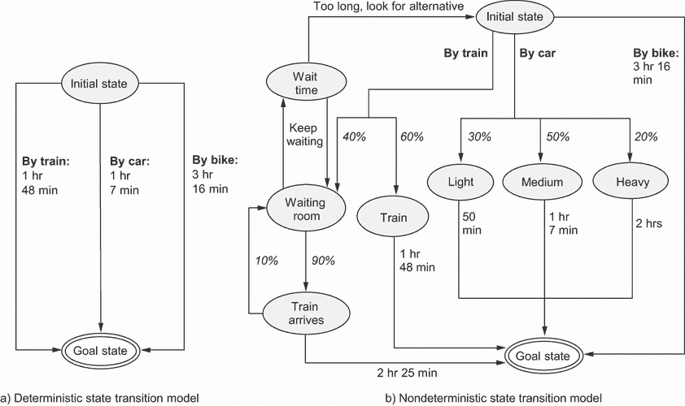
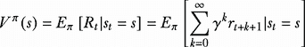
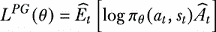
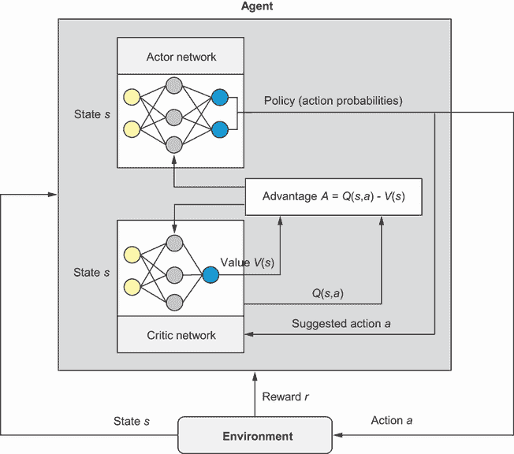
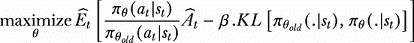
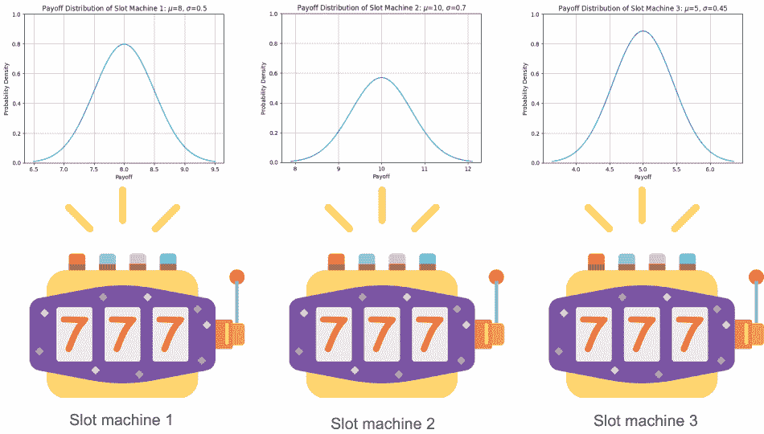
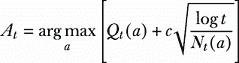
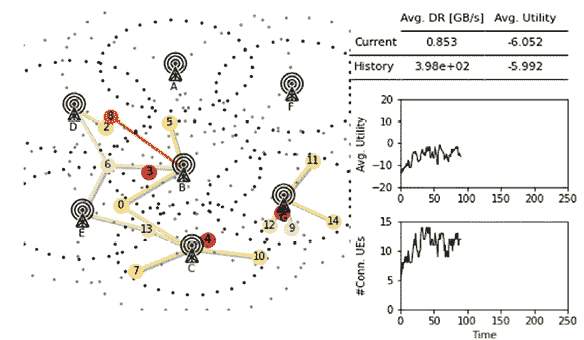

# 第十二章：强化学习

本章涵盖

+   掌握强化学习的基本原理

+   理解马尔可夫决策过程

+   理解演员-评论家架构和近端策略优化

+   熟悉非上下文和上下文多臂老虎机

+   将强化学习应用于解决优化问题

强化学习（RL）是一种强大的机器学习方法，它使智能代理能够通过与环境的交互来学习最优或近似最优的行为。本章深入探讨了强化学习中的关键概念和技术，揭示了其基本原理作为必要背景知识。在理论阐述之后，本章将接着阐述使用强化学习策略解决优化问题的实际例子。

## 12.1 揭秘强化学习

强化学习（RL）是机器学习的一个子领域，它处理代理如何通过试错学习方法在环境中做出决策和采取行动以实现特定目标。强化学习的核心思想是代理通过与环境的交互来学习，通过其动作的结果获得奖励或惩罚作为反馈。代理的目标是在时间上最大化累积奖励。

强化学习

“强化学习问题涉及学习做什么——如何将情况映射到动作——以最大化数值奖励信号”（理查德·萨顿和安德鲁·巴特奥在他们的书《强化学习》[1]中）。

图 12.1 概述了文献中常见的强化学习算法。这种分类将强化学习问题分为两大类：马尔可夫决策过程（MDP）问题和多臂老虎机（MAB）问题。两者之间的区别在于代理的动作如何与环境和影响环境。


图 12.1 强化学习算法分类

在基于 MDP 的问题中，代理的动作影响环境，代理必须考虑其动作在多个时间步长的后果，包括状态和转换的概念。另一方面，MAB 问题涉及代理面临一系列选择（臂）并旨在最大化时间上的累积奖励的场景。这类问题通常在没有明确的状态表示或长期规划要求时使用。在上下文多臂老虎机（CMAB）问题中，代理被提供上下文或辅助信息，这些信息用于做出更明智的决策。臂（动作）的预期奖励是动作和当前上下文的函数。这意味着最佳动作可以随着提供的上下文而改变。值得一提的是，MDP 是一个更全面的框架，它考虑了更广泛情况下动态决策。

在我们探讨如何将强化学习应用于解决优化问题之前，理解几个相关的强化学习技术是至关重要的。以下小节将详细概述这些方法，接下来的章节将展示它们在解决优化问题中的应用。

### 12.1.1 马尔可夫决策过程（MDP）

学习的目的是形成对外部世界的内部模型。这个外部世界，或*环境*，可以使用确定性或非确定性（随机）模型进行抽象。

考虑一种情况，你计划从你的初始状态（例如，你的家）通勤到一个指定的目标状态（例如，你的工作场所）。一种确定性路径规划算法，如 A*（在第四章中讨论），可能会为你提供多种选择：乘坐火车，大约需要 1 小时 48 分钟；开车，大约需要 1 小时 7 分钟；或者骑自行车，大约需要 3 小时 16 分钟（图 12.2a）。这些算法在假设行动及其结果完全确定性的前提下运行。



图 12.2 确定性与非确定性状态转换模型

然而，如果在你的旅程规划过程中出现不确定性，你应该求助于基于非确定性状态转换模型的随机规划算法，以实现不确定条件下的规划。在这些情况下，状态之间的转换概率成为你决策过程的一个组成部分。

例如，让我们考虑初始状态（你的家），如图 12.2b 所示。如果你选择乘坐火车通勤，有 60%的几率你能按时赶上火车，并在预期的 1 小时 48 分钟内到达目的地（你的工作场所）。然而，有 40%的几率你可能会错过火车，需要等待下一班。如果你最终需要等待，有 90%的几率火车会准时到达，你将赶上火车并在总共 2 小时 25 分钟内到达目的地。另一方面，有 10%的几率火车不会到达，导致等待时间延长，甚至可能需要寻找替代方案。另一方面，如果你选择开车，有 30%的几率你会遇到轻微的交通拥堵，只需 50 分钟就能到达办公室。然而，也有 50%的可能性中等交通会延误你的到达时间至 1 小时 7 分钟。在最坏的情况下，有 20%的几率严重交通拥堵可能会将你的旅行时间延长至 2 小时。如果你选择骑自行车，预计的旅行时间为 3 小时 16 分钟，更加可预测且变化较小。

这种场景描述了一个完全可观察的环境，其中当前状态和采取的行动完全决定了下一个状态的概率分布。这被称为马尔可夫决策过程（MDP）。

### 12.1.2 从 MDP 到强化学习

MDP 为在不确定性下进行规划提供了一个数学框架。它用于描述强化学习中的环境，其中智能体通过执行动作并接收奖励来学习做出决策。学习过程涉及尝试和错误，智能体发现哪些动作在一段时间内能产生最高的期望累积奖励。

如图 12.3 所示，智能体通过与环境的交互来采取行动，在某个状态 *s[t]* ∈ *S* 下，根据观察 *o* 和应用策略 *π*，在时间 *t* 采取动作 *a[t]* ∈ *A*，然后根据状态转移概率 *T* 接收奖励 *r[t]* ∈ *R* 并过渡到新的状态 *s[t]*[+1] ∈ *S*。


图 12.3 智能体通过与环境的交互来学习。

以下术语在 RL 中常用：

+   *状态，* s—这代表在特定时间步长关于环境的完整和未过滤的信息。观察 *o* 是智能体在给定时间步长从环境中感知到的部分或有限信息。当智能体能够观察到环境的完整状态时，我们说环境是全可观察的，可以建模为 MDP。当智能体只能看到环境的一部分时，我们说环境是部分可观察的，应该建模为*部分可观察马尔可夫决策过程* (POMDP)。

+   *动作集，* A—这代表智能体在给定环境中可以采取的可能或允许的动作集合。这些动作可以是离散的，如棋类游戏的情况，也可以是连续的，如机器人控制或辅助或自动驾驶车辆的车道保持辅助。

+   *策略*—这可以看作是智能体的“大脑”。它是智能体的决策策略，或从状态或观察到动作的映射。这种策略可以是确定性的，通常用 *μ* 表示，也可以是随机的，用 *π* 表示。一个随机的策略 *π* 主要是指在某个状态 *s* ∈ *S* 下选择动作 *a* ∈ *A* 的概率。一个随机的策略也可以参数化，并用 *π[Θ]* 表示。这种参数化策略是一个可计算的函数，它依赖于一组参数（例如，神经网络的权重和偏差），我们可以通过优化算法调整这些参数来改变行为。

+   *轨迹，* τ *(又称事件或滚动)*—这是世界中状态和动作的序列，τ = (*s*[0], *a*[0], *s*[1], *a*[1], ...) .

+   *期望回报*—这指的是智能体在未来时间范围内可以期望接收的累积奖励总和。它是特定状态-动作序列或策略的整体吸引力或价值的度量。

让我们考虑一个简单的“到达宝藏”游戏，其中智能体试图获取宝藏然后退出。在这个游戏中，只有四个状态，如图 12.4 所示。其中，状态 0 代表火坑，状态 3 代表出口——两者都是终端状态。状态 1 包含宝藏，用钻石表示。游戏开始时，智能体位于状态 2，可以选择向左或向右移动作为动作。到达宝藏后，智能体获得 +10 的奖励。然而，掉入火坑会导致 -10 的惩罚。成功退出会获得 +4 的奖励。


图 12.4 “到达宝藏”游戏

状态 *s* 提供了关于环境的完整信息，包括智能体的位置以及火坑、宝藏和出口的位置（状态 0 是火坑，状态 1 是宝藏，状态 2 是当前位置，状态 3 是出口）。游戏的观察结果被收集并呈现为一个观察向量，例如 *obs* = [2,0]，表示智能体处于状态 2，并且没有感知到宝藏的存在。这是环境的一个局部视图，因为智能体无法访问完整的州信息，例如火坑或出口的位置。策略表示基于观察移动左或右的概率。例如，策略(obs)为[0.4, 0.6]表示有 40% 的概率向左移动，有 60% 的概率向右移动。在图 12.4 所示的单个轨迹中，我们可以计算期望回报如下：期望回报 (R) = 0.4 * (10) + 0.6 * (4) + 0.4 * 0.2 * (–10) + 0.4 * 0.8 * (0) + 0.4 * 0.8 * 0.9 * (0) + 0.4 * 0.8 * 0.1 * (4) = 5.728。

在强化学习 (RL) 中，目标是学习一个最优策略，该策略最大化期望累积折现奖励。值迭代、策略迭代和策略梯度是强化学习中用于实现此目标的不同迭代方法。在强化学习中，价值函数定义了智能体从特定状态或状态-动作对开始，遵循一定策略的期望累积奖励。有两种类型的价值函数：状态价值函数 *V*(*s*) 和动作价值函数 *Q*(*s*,*a*)。状态价值函数 *V*(*s*) 估计智能体从特定状态 *s* 开始并遵循策略 *π* 可能获得的期望累积未来奖励。它根据其预测的未来奖励来量化状态的可取性。状态价值函数 *V*(*s*) 由以下公式给出：

|



| 12.1 |
| --- |

其中

+   *V^π*(*s*) 是从状态 s 开始并随后遵循 *π* 的期望回报。

+   *E[π]*[] 表示在智能体遵循策略 *π* 的情况下，期望值。

+   *t* 是任意时间步。

+   *γ* 是折扣因子，通常是一个介于 0 和 1 之间的值，表示未来奖励相对于即时奖励的现值。折扣的目的在于更重视即时奖励，反映了对尽早获得奖励而非延迟获得奖励的偏好。接近 0 的折扣因子会使代理变得 *短视*（即专注于即时奖励），而接近 1 的折扣因子会使代理更加 *远见*（即考虑未来奖励）。

动作价值函数，*Q*(*s, a*)，估计代理从给定状态 *s* 采取特定动作 *a* 并遵循策略 *π* 可以实现的期望累积未来奖励。它量化了在给定策略下，在特定状态下采取特定动作的“好”的程度。动作价值函数 *Q*(*s, a*) 由以下公式给出：

|


| 12.2 |
| --- |

在 *策略迭代方法* 中，我们首先计算初始策略下每个状态的价值 *V^π*(*s*)，并使用这些价值估计来改进策略。这意味着从初始策略开始，我们反复在策略评估和策略改进步骤之间交替（直到收敛）。

*策略梯度方法* 学习一个参数化的策略，该策略由代理用于选择动作。目标是找到最大化随时间累积期望奖励的策略参数值。

策略梯度

政策梯度是一种无模型的政策方法，不需要显式地表示价值函数。核心思想是偏好导致更高回报的动作，同时贬低导致较低奖励的动作。这个迭代过程随着时间的推移不断优化策略，旨在找到高性能的策略。

而不是显式地估计价值函数，策略梯度方法通过计算策略梯度的估计值并将其插入到随机梯度上升算法中来实现。策略梯度损失 *L^(PG)* 是最常用的梯度估计器之一：

|



| 12.3 |
| --- |

其中

+   期望 *E[t]* 表示对有限批次样本的经验平均。

+   *π[θ]* 是一个随机策略，它将环境观察到的状态作为输入，并建议采取的动作作为输出。

+   *Â[t]* 是在时间步 *t* 时刻优势函数的估计。这个估计基本上试图评估当前状态下所选动作的相对价值。优势函数表示在给定状态下采取特定动作相对于期望值的优势。它通过执行建议的动作（通常具有最高的 Q 值）的期望奖励与当前状态的估计价值函数之间的差异来计算：

|


| 12.4 |
| --- |

其中

+   *Q*(*s, a*)是动作值函数（也称为 Q 值），它表示按照策略在状态*s*采取动作*a*的期望累积奖励。

+   *V*(*s*)是状态值函数，它表示从状态*s*按照策略获得的期望累积奖励。

如您在方程 12.4 中看到的，如果优势函数是正的，表示观察到的回报高于预期值，梯度将是正的。这个正梯度意味着在该状态下采取的动作在未来被增加其可能性的概率。另一方面，如果优势函数是负的，梯度将是负的。这个负梯度意味着如果在未来遇到类似的状态，选择动作的概率将会降低。

### 12.1.3 基于模型的 RL 与无模型 RL

强化学习分为两种主要类型：基于模型的 RL（MBRL）和无模型 RL（MFRL）。这种分类基于 RL 代理是否拥有环境的模型。术语*模型*指的是环境的内部表示，包括其转移动力学和奖励函数。表 12.1 总结了这两类之间的差异。

表 12.1 基于模型的 RL（MBRL）与无模型 RL（MFRL）

| 方面 | 基于模型的 RL（MBRL） | 无模型 RL（MFRL） |
| --- | --- | --- |
| 环境模型 | 使用已知模型或学习环境的模型（即转移概率） | 跳过模型，直接学习何时采取动作（不一定找出动作的确切模型） |
| 奖励 | 通常已知或学习到 | 未知或部分已知。无模型 RL 直接从与环境交互中获得的奖励中学习。 |
| 动作 | 使用模型选择以最大化期望累积奖励 | 根据经验的历史选择以最大化期望累积奖励 |
| 策略 | 通过学习环境动态模型来实现策略学习。 | 通过试错来实现策略学习，直接根据观察到的经验优化策略。 |
| 设计和调整 | 由于模型复杂性，MBRL 可能需要更高的初始设计和调整努力。然而，进步正在简化这一过程。 | 需要较少的初始努力。然而，MFRL 的超参数调整也可能具有挑战性，尤其是在复杂任务中。 |
| 示例 | AlphaZero、世界模型和想象增强代理（I2A） | Q 学习、优势演员-评论家（A2C）、异步优势演员-评论家（A3C）和近端策略优化（PPO） |

根据强化学习算法如何从收集的经验中学习和更新其策略，强化学习算法也可以分为离策略和在线策略强化学习。离策略方法从不同于正在更新的策略生成的经验中学习，而在线策略方法从正在更新的当前策略生成的经验中学习。在线策略和离策略方法通常被认为是*无模型*的，因为它们直接从经验中学习策略或价值函数，而没有明确构建环境动态的模型，这使它们与基于模型的方法区分开来。表 12.2 总结了离策略和无模型在线策略强化学习方法之间的差异。

表 12.2 离策略与在线策略强化学习方法

| 方面 | 离策略强化学习方法 | 在线策略强化学习方法 |
| --- | --- | --- |
| 学习方法 | 从不同于正在更新的策略生成的经验中学习 | 从正在更新的当前策略生成的经验中学习 |
| 样本效率 | 通常由于重用过去经验（记录的数据）而具有更高的样本效率 | 通常样本效率较低，因为每次策略更新后都会丢弃经验批次（过去经验没有明确存储） |
| 策略评估 | 可以分别学习价值函数和策略，使不同的算法（例如，Q 学习、DDPG、TD3）成为可能 | 在在线策略算法（例如，REINFORCE、A2C、PPO）中，策略评估和改进通常是交织在一起的。 |
| 优点 | 更高的样本效率，可以从多样化的经验中学习，允许重用过去的数据，如果可用的先前数据量很大则很有用 | 更简单、更直接，避免了离策略校正，可以收敛到更好的局部最优解，适用于数据有限或在线学习的场景 |
| 缺点 | 需要仔细的离策略校正，不太适合在线学习或数据有限的任务 | 样本效率较低，丢弃过去经验，探索多样性有限，可能收敛到次优策略 |

以下两个小节提供了更多关于 A2C 和 PPO 的细节，作为本章中使用的在线策略方法的示例。

### 12.1.4 行为者-评论家方法

图 12.5 展示了优势演员-评论家（A2C）架构，作为演员-评论家方法的例子。正如其名所示，这个架构由两个模型组成：*演员*和*评论家*。演员负责学习和更新策略。它以当前状态作为输入，输出表示策略的动作概率分布。另一方面，评论家专注于评估演员建议的动作。它以状态和动作作为输入，并估计在该特定状态下采取该动作的优势。优势表示与该状态下平均动作相比，该动作有多好（或有多坏），这是基于预期的未来奖励。来自评论家的这种反馈有助于演员学习和更新策略，以优先考虑具有更高优势的动作。




A2C 是一种同步、无模型的算法，旨在同时学习策略（演员）和值函数（评论家）。它通过迭代改进演员和评论家网络来学习最优策略。通过估计优势，该算法可以为演员采取的动作的质量提供反馈。评论家网络帮助估计值函数，为优势计算提供基准。这种组合使得算法能够以更稳定和高效的方式更新策略。

### 12.1.5 近端策略优化

近端策略优化（PPO）算法是由 OpenAI [2] 设计的一种基于策略的无模型强化学习（RL）算法，它已在视频游戏和机器人控制等许多应用中取得了成功。PPO 基于演员-评论家架构。

在强化学习（RL）中，智能体通过与环境的交互生成自己的训练数据。与依赖于静态数据集的监督机器学习不同，RL 的训练数据动态地依赖于当前策略。这种动态特性导致数据分布不断变化，在训练过程中引入了潜在的不稳定性。在之前解释的政策梯度方法中，如果你对收集到的单个经验批次连续应用梯度上升，可能会导致更新将网络的参数推离数据收集范围，从而使得提供真实优势估计的优势函数变得不准确，并严重破坏策略。为了解决这个问题，已经提出了 PPO 的两个主要变体：PPO-penalty 和 PPO-clip。

PPO-penalty

在 *PPO-penalty* 中，目标函数中包含了一个约束，以确保策略更新不会过多偏离旧策略。这个想法是信任域策略优化 (TRPO) 的基础。通过强制执行信任域约束，TRPO 将策略更新限制在可管理的区域内，并防止策略发生大的变化。PPO-penalty 主要受 TRPO 启发，并使用以下无约束目标函数，该函数可以使用随机梯度上升进行优化：

|



| 12.5 |
| --- |

其中 *θ[old]* 是更新前的策略参数向量，*β* 是一个固定的惩罚系数，而 Kullback–Leibler 距离 (KL) 表示更新策略与旧策略之间的差异。这个约束被整合到目标函数中，以避免远离旧策略的风险。

Kullback–Leibler 距离

*Kullback*–*Leibler (KL) 距离*，也称为 *相对熵*，是一个度量，用于量化两个概率分布之间的差异。两个概率分布 *P* 和 *Q* 之间的 KL 距离定义为 KL(*P* || *Q*) = ∫ *P*(*x*) ⋅ log(*P*(*x*) / *Q*(x)) *dx*，其中 *P*(*x*) 和 *Q*(*x*) 代表两个分布的概率密度函数 (PDFs)。积分是在随机变量 *x* 的整个支持集上进行的（即 PDF 非零的随机变量的值域）。以下图显示了具有不同均值和方差的两个高斯分布之间的 KL 距离。


两个高斯分布之间的 KL 距离

如果，并且仅当 *P* 和 *Q* 是相同的分布时，KL 距离等于零。

PPO-clip

在 *PPO-clip* 中，定义了一个比率 *r*(*θ*)，它是更新策略与旧策略版本之间的概率比率。给定一系列样本动作和状态，如果动作现在比旧策略版本更有可能，则 *r*(*θ*) 值将大于 1，如果动作现在比上次梯度步之前更不可能，则它将在 0 和 1 之间。

在 PPO-clip 中要最大化的中心目标函数具有以下形式：

|


| 12.6 |
| --- |

其中 *L^(CLIP)* 是剪裁代理目标，它是一个在轨迹批次上计算的 *期望算子*，epsilon *ϵ* 是一个超参数（例如，*ϵ* = 0.2）。正如方程 12.6 所示，期望算子是在两个项的最小值上取的。第一项代表在正常策略梯度中使用的默认目标，它鼓励策略优先选择与基线相比具有高正优势的动作。第二项是正常策略梯度的剪裁或截断版本。它应用剪裁操作以确保更新保持在指定的范围内，具体是在 1 – *ϵ* 和 1 + *ϵ* 之间。

PPO 中的剪辑代理目标在不同的区域定义了基于优势估计 *Â[t]* 和概率比率的客观函数的行为，如图 12.6 所示。


图 12.6 PPO 中的剪辑代理目标

在图 12.6 的左侧，优势函数为正时，目标函数表示所选行为对结果有比预期更好的影响。当比率（*r*）变得过高时，目标函数会变得平坦。这发生在当前策略下行为比旧策略更有可能发生的情况下。剪辑操作将更新限制在一个范围内，新策略不会与旧策略有显著偏差，从而防止过大的策略更新，这可能会破坏训练稳定性。

在图 12.6 的右侧，优势函数为负时，它表示行为对结果有估计的负面影响。当比率（*r*）接近零时，目标函数会变得平坦。这对应于在当前策略下比旧策略发生可能性小得多的行为。这种平坦化效应防止了过度更新，否则可能会将这些行为的概率降低到零。

### 12.1.6 多臂老虎机（MAB）

*多臂老虎机*（MAB）是一类具有单个状态的强化学习问题。在 MAB 中，一个代理面对一组可供选择的行为或“臂”，每个行为都有一个相关的奖励分布。代理的目标是在一系列行为中最大化累积的总奖励。代理不会通过其行为修改其环境，不考虑状态转换，并且始终保持在同一单个状态。它专注于在每个时间步选择最有利的行为，而不考虑对环境状态的影响。

老虎机（单臂强盗）

*老虎机*（又称水果机、老虎机或单臂强盗）是一种流行的赌博设备，通常在赌场中找到。它是一种机械或电子游戏机，具有多个带有各种符号的旋转滚筒。玩家将硬币或代币投入机器，然后拉动杠杆（因此得名“单臂强盗”）或按按钮以启动滚筒的旋转。玩老虎机的目的是将旋转滚筒上的符号排列成获胜组合。术语“强盗”源于与老虎机的类比，其中代理拉动一个臂（就像拉动老虎机的杠杆一样）以获得不同的奖励。这突显了人们如何看待老虎机，尤其是较老的机械老虎机，就像是一个窃贼或强盗在夺取玩家的钱。

MAB 代理面临着探索与利用的困境。为了学习最佳动作，它必须探索各种选项（探索）。然而，它还需要根据其当前信念快速收敛并迅速关注最有希望的动作（利用）。在监督学习和无监督学习中，主要目标是拟合预测模型（在监督学习中）或发现给定数据中的模式（在无监督学习中），没有明确的探索概念，正如在强化学习中所见，代理与环境交互以通过试错学习最佳行为。MAB 问题为从有限的反馈中学习以及平衡探索与发现高奖励动作提供了宝贵的见解。在 MAB 中，代理的目标是在历史上产生高奖励的动作中利用，同时探索以收集有关可能更有奖励的动作的信息。

要理解 MAB，想象你身处一家赌场，面前是一排老虎机（单臂老虎机）。每台老虎机代表 MAB 的一个“臂”。让我们假设你面前有三台老虎机，如图 12.7 所示。每次你决定玩老虎机时，你的情况（或状态）都是相同的：“我应该玩哪台老虎机？”环境不会改变或提供不同的条件；你始终在这个单一状态下做出决定。没有上下文，例如“如果赌场拥挤，就玩机器 A”或“如果外面下雨，就玩机器 B。”总是只是“我应该玩哪台机器？”你的动作是选择一台老虎机来玩——你投入硬币并拉动杠杆。你被允许拉动这些机器的杠杆总共 90 次，每台老虎机都有自己的收益分布，由其均值和标准差来表征。然而，一开始，你并不知道这些分布的具体细节。拉动杠杆后，机器可能会给你支付（正奖励）或什么也没有（零奖励）。随着时间的推移，你试图判断是否有哪台机器比其他机器更频繁地给出更高的支付。



图 12.7 三台老虎机作为一个非上下文的多臂老虎机（MAB）问题。这三台机器的收益分布的均值和标准差分别为（8，0.5），（10，0.7）和（5，0.45）。

在这个多臂老虎机（MAB）问题中的目标是，通过选择最有回报的老虎机，在 90 次试验中最大化获得的总回报或累积奖励。换句话说，你正在尝试学习机器的回报分布。术语*回报分布*指的是每个机器（或臂）提供的奖励（或回报）的概率分布。由于你对这些回报分布没有先验知识，你需要通过尝试不同的选项来探索老虎机，以收集有关它们性能的信息。挑战在于在探索和利用之间找到平衡。探索涉及尝试不同的机器以学习它们的回报分布，而利用则涉及根据可用信息选择被认为能带来最高回报的机器。

你可以应用各种老虎机算法或策略来确定选择老虎机和最大化 90 次试验累积奖励的最佳方法。这些策略包括但不限于仅探索、仅利用贪婪、ε-贪婪（ε-greedy）和上置信界（UCB）：

+   *仅探索策略*—在这种策略中，代理在每次试验中随机选择一台老虎机进行游戏，而不考虑过去的结果。在 MAB 中，“遗憾”是一个常见的衡量标准，计算为最大可能奖励与从每个选定的机器获得的奖励之间的差异。例如，如果我们应用仅探索策略进行 90 次试验，并考虑每台老虎机回报分布的平均值，我们将得到总平均回报为 30 × 8 + 30 × 10 + 30 × 5 = 690。如果你在 90 次试验中使用机器 2，可以获得最大奖励。在这种情况下，最大奖励将是 90 × 10 = 900。这意味着遗憾*ρ* = 900 – 690 = 210。

+   *仅利用贪婪策略*—在这种情况下，代理尝试每台机器一次，然后选择具有最高估计平均回报的老虎机。例如，假设在第一次试验中，代理从机器 1、2 和 3 分别获得 7、6 和 3 的回报。代理将随后专注于使用机器 1，认为它是回报最高的。这可能导致代理由于缺乏探索而陷入困境。

+   ε*-贪婪策略*—在这里，智能体通过以一定概率（epsilon）随机选择老虎机来尝试在探索和利用之间取得平衡。这是探索部分，其中智能体偶尔尝试所有三台机器以收集更多关于它们的信息。以 1 – ε的概率，智能体根据过去的经验选择具有最高估计奖励的机器。这是利用部分，其中智能体根据迄今为止收集的数据选择看似最好的动作。例如，对于 90 次试验，如果ε = 10%，智能体将随机选择老虎机大约 9 次（90 的 10%）。其他 81 次试验（90%的 90）将看到智能体选择根据到目前为止的试验，产生了最高平均奖励的老虎机。

+   *上置信界（UCB）策略*—在这种策略中，智能体根据其估计的平均奖励和估计的不确定性或置信度之间的权衡来选择机器。它优先探索具有高潜在奖励但估计不确定性高的机器，以减少不确定性并最大化长期奖励。在 UCB 中，选择臂（动作 *A*[t]）在时间步 *t* 使用以下公式：

|



| 12.7 |
| --- |

其中 *Q[t]*(*a*) 是在试验 *t* 时动作 *a* 的估计值。*Q[t]*(*a*) = 奖励总和/*N[t]*(*a*)。*N[t]*(*a*) 是在试验 *t* 之前选择动作 *a* 的试验次数。方程 12.7 右侧的第一个项代表利用部分。如果你总是拉动具有最高 *Q[t]*(*a*) 的臂，你将总是利用当前的知识而不探索其他臂。第二个项是探索部分。随着试验次数 *t* 的增加，探索项通常会增加，但会被动作 *a* 已经被选择的频率所减少。乘数 *c* 调整了此探索项的影响。

每种策略采用不同的方法来平衡探索和利用，导致不同的遗憾水平。这种遗憾水平量化了智能体由于不总是选择最佳动作而造成的累积损失。直观上，它衡量了智能体通过始终拉动最佳臂（即通过选择最佳动作）所能获得的奖励与智能体实际通过遵循某种策略所获得的奖励之间的差异。

让我们看看四种 MAB 策略的 Python 实现。我们将首先设置臂（动作）的数量、每个老虎机的收益分布和试验次数。我们还将定义一个`sample_payoff`来从老虎机中采样收益并计算最大可能奖励。

列表 12.1 多臂老虎机（MAB）策略

```py
import numpy as np

K = 3                                                             ①
payoff_params = [
    {"mean": 8, "std_dev": 0.5},
    {"mean": 10, "std_dev": 0.7},
    {"mean": 5, "std_dev": 0.45}
]                                                                 ②
num_trials = 90                                                   ③

def sample_payoff(slot_machine):
    return np.random.normal(payoff_params[slot_machine]["mean"], 
➥        payoff_params[slot_machine]["std_dev"])                 ④

max_reward = max([payoff_params[i]["mean"] for i in range(K)])    ⑤
```

① 设置老虎机（臂）的数量。

② 指定收益分布。

③ 设置试验次数。

④ 从老虎机中采样收益的函数

⑤ 计算最大可能奖励。

作为 12.1 列表的延续，我们将定义一个名为`explore_only()`的函数，该函数实现了仅探索的策略。在这个函数中，初始化`total_regret`，然后遍历指定的试验次数。通过生成一个介于 0 和*K* - 1（包含）之间的随机整数来随机选择一台投币机，其中*K*代表投币机的数量。然后，通过调用`sample_payoff()`函数从所选的投币机中采样收益，该函数根据所选机器的收益分布返回一个奖励值。遗憾值通过从最大可能奖励（`max_reward`）中减去获得的奖励来计算。在这里，我们考虑平均值的最大值作为三个机器收益分布中最大概率的点。平均遗憾值作为输出返回：

```py
def explore_only():
    total_regret = 0
    for _ in range(num_trials):
        selected_machine = np.random.randint(K)   ①
        reward = sample_payoff(selected_machine)  ②
        regret = max_reward - reward              ③
        total_regret += regret                    ④
    average_regret = total_regret / num_trials    ⑤
    return average_regret
```

① 随机选择一台投币机。

② 从所选的投币机中采样收益。

③ 计算遗憾值。

④ 计算总遗憾值。

⑤ 计算平均遗憾值。

第二种策略在`exploit_only_greedy()`函数中定义。该函数通过从每个机器的收益平均值列表（`payoff_params[i]["mean"]`）中找到最大平均收益值的索引来选择具有最高平均收益率的投币机。`np.argmax()`函数返回最大平均收益值的索引，代表被认为能提供最高预期奖励的机器：

```py
def exploit_only_greedy():
    total_regret = 0
    for _ in range(num_trials):
        selected_machine = np.argmax([payoff_params[i]["mean"] for i in  
        range(K)])                                                    ①
        reward = sample_payoff(selected_machine)                      ②
        regret = max_reward – reward                                  ③
        total_regret += regret                                        ④
    average_regret = total_regret / num_trials                        ⑤
    return average_regret
```

① 选择具有最高平均收益率的投币机进行利用。

② 从所选的投币机中采样收益。

③ 计算遗憾值。

④ 计算总遗憾值。

⑤ 计算平均遗憾值。

以下`epsilon_greedy(epsilon)`函数实现了 epsilon-greedy 策略。该函数检查生成的介于 0 和 1 之间的随机数是否小于 epsilon 值。如果是，算法通过随机选择一台投币机进行探索来执行探索。如果不满足此条件，算法通过选择具有最高平均收益率的投币机来执行利用：

```py
def epsilon_greedy(epsilon):
    total_regret = 0
    for _ in range(num_trials):
        if np.random.random() < epsilon:
            selected_machine = np.random.randint(K)                ①
        else:
            selected_machine = np.argmax([payoff_params[i]["mean"] 
            ➥ for i in range(K)])                                 ②
        reward = sample_payoff(selected_machine)                   ③
        regret = max_reward - reward
        total_regret += regret
    average_regret = total_regret / num_trials
    return average_regret
```

① 随机选择一台投币机进行探索。

② 选择具有最高平均收益率的投币机进行利用。

③ 从所选的投币机中采样收益。

以下`ucb(c)`函数实现了上置信界（UCB）策略。该函数首先初始化一个数组来跟踪每个投币机的游戏次数。该函数还初始化一个数组来累计从每个投币机获得的奖励总和，并初始化一个变量来累计总遗憾值。代码包括一个循环，每次玩一次每个投币机以收集初始奖励并更新计数和奖励总和：

```py
def ucb(c):
    num_plays = np.zeros(K)                                                       ①
    sum_rewards = np.zeros(K)                                                     ②
    total_regret = 0                                                              ③

    for i in range(K):                                                            ④
        reward = sample_payoff(i)
        num_plays[i] += 1
        sum_rewards[i] += reward

    for t in range(K, num_trials):                                                ⑤
        ucb_values = sum_rewards / num_plays + c * np.sqrt(np.log(t) / num_plays) ⑥
        selected_machine = np.argmax(ucb_values)
        reward = sample_payoff(selected_machine)
        num_plays[selected_machine] += 1
        sum_rewards[selected_machine] += reward
        optimal_reward = max_reward
        regret = optimal_reward - reward
        total_regret += regret

    average_regret = total_regret / num_trials
    return average_regret
```

① 初始化一个数组来跟踪每个投币机的游戏次数。

② 初始化一个数组来累计从每个投币机获得的奖励总和。

③ 初始化每个老虎机的总后悔值。

④ 每次玩一次老虎机以初始化。

⑤ 继续使用 UCB 策略进行游戏。

⑥ 计算 UCB 值。

以下代码片段用于运行策略，计算平均后悔值，并打印结果：

```py
avg_regret_explore = explore_only()
avg_regret_exploit = exploit_only_greedy()
avg_regret_epsilon_greedy = epsilon_greedy(0.1)                    ①
avg_regret_ucb = ucb(2)                                            ②

print(f"Average Regret - Explore only Strategy: {round(avg_regret_ ③
explore,4)}")                                                      ③
print(f"Average Regret - Exploit only Greedy Strategy:
➥    {round(avg_regret_exploit,4)}")                              ③
print(f"Average Regret - Epsilon-greedy Strategy:
➥    {round(avg_regret_epsilon_greedy,4)}")                       ③
print(f"Average Regret - UCB Strategy: {round(avg_regret_ucb,4)}") ③
```

① 设置 epsilon-greedy 策略的 epsilon 值，并运行策略。

② 设置 UCB 策略的探索参数 c 的值，并运行策略。

③ 打印结果

由于代码中包含随机抽样，您的结果可能会有所不同，但运行代码将产生类似以下的结果：

```py
Average Regret - Explore only Strategy: 2.246
Average Regret - Exploit only Greedy Strategy: 0.048
Average Regret - Epsilon-greedy Strategy: 0.3466
Average Regret - UCB Strategy: 0.0378
```

MAB 算法和概念在各种现实场景中找到应用，这些场景涉及不确定性下的决策和探索-利用权衡。MABs 的现实应用示例包括但不限于资源分配（动态分配资源到不同选项以最大化性能）、在线广告（动态分配广告印象到不同选项，并学习哪些广告产生最高的点击率，这是用户点击广告的概率）、实验设计和临床试验（优化患者分配到不同治疗选项）、内容推荐（为用户个性化内容推荐）和网站优化（优化不同的设计选项）。

如您在图 12.1 中看到的，多臂老虎机（MABs）可以分为非上下文和上下文 MABs。与之前解释的非上下文 MABs 相比，上下文多臂老虎机（CMAB）使用环境中包含的上下文信息。在 CMAB 中，学习器反复观察上下文，选择一个动作，并接收与所选动作相关的奖励或损失作为反馈。CMAB 算法使用补充信息，称为*侧信息*或*上下文*，在现实场景中做出明智的决策。例如，在卡车选择问题中，共享的上下文是配送路线的类型（城市或州际）。第 12.5 节展示了如何使用 CMAB 来解决这个问题，作为组合动作的示例。

上下文多臂老虎机应用

上下文多臂老虎机（CMABs）在个性化推荐和在线广告等领域找到了应用，其中上下文可以是一个用户的信息。例如，亚马逊展示了如何使用内置的 Vowpal Wabbit（VW）容器在 SageMaker 上开发和部署 CMAB 工作流程（[`mng.bz/y8rE`](http://mng.bz/y8rE)）。这些 CMABs 可以用于为用户个性化内容，如内容布局、广告、搜索、产品推荐等。此外，基于 CMAB 并使用 VW 进行营销决策优化的可扩展算法决策平台 WayLift 被开发出来（[`mng.bz/MZom`](http://mng.bz/MZom)）。

## 12.2 基于强化学习的优化

强化学习（RL）可以通过将问题构造成马尔可夫决策过程（MDP）并应用强化学习算法来寻找一个最优策略，从而用于组合优化问题，以获得最佳可能的解决方案。在强化学习中，智能体通过在一个环境中学习做出连续决策，以最大化累积奖励的概念。这个过程涉及到找到一个最优策略，将状态映射到动作，以最大化预期的长期奖励。

强化学习与优化的收敛性最近已成为一个活跃的研究领域，吸引了学术界和工业界的广泛关注。研究人员正在积极探索将强化学习的优势应用于高效有效地解决复杂优化问题的方法。例如，第 11.7 节中提出的通用端到端管道可以用于解决组合优化问题，如旅行商问题（TSP）、车辆路径问题（VRP）、可满足性问题（SAT）、最大切割（MaxCut）、最大独立集（MIS）等。此管道包括使用监督学习或强化学习训练模型。列表 11.4 展示了如何使用 Joshi、Laurent 和 Bresson [3]所描述的监督学习或强化学习方法预训练的机器学习模型来解决 TSP。

一篇由 Nazari 等人撰写的论文中提出了一种使用强化学习解决车辆路径问题（VRP）的端到端框架[4]。在 Delarue、Anderson 和 Tjandraatmadja 的论文[5]中，也使用强化学习处理了带能力的车辆路径问题（CVRP）。另一篇名为 RLOR 的框架由 Wan、Li 和 Wang 在论文[6]中描述，它是一个适用于 CVRP 和 TSP 等路由问题的深度强化学习灵活框架。Alabbasi、Ghosh 和 Aggarwal 在论文[7]中描述了一个无模型的分布式强化学习算法 DeepPool，通过与环境交互来学习最优调度策略，用于拼车应用。DeepFreight 是另一个用于货运交付问题的无模型强化学习算法，由 Jiayu 等人在论文[8]中描述。它将问题分解为两个紧密协作的组件：卡车调度和包裹匹配。货运交付系统的关键目标是最大化在特定时间限制内服务的请求数量，并在此过程中最小化整个车队的总燃油消耗。MOVI 是另一种用于大规模出租车调度问题的无模型方法，由 Oda 和 Joe-Wong 在论文[9]中描述。强化学习也被用来优化交通信号控制（TSC），作为一种缓解拥堵的方法。在 Ruan 等人撰写的论文[10]（我是合著者之一）中，模拟了一个收集于中国杭州的真实路口的真实交通数据模型，并使用不同的基于强化学习的交通信号控制器进行模拟。我们还提出了一种多智能体强化学习模型，以在混合交通场景中提供宏观和微观控制[11]。实验结果表明，所提出的方法在吞吐量、平均速度和安全性等几个指标上优于其他基线。

李和 Malik 在论文[12]中描述了一个名为“学习优化”的优化算法框架。问题被表述为一个强化学习问题，其中任何优化算法都可以表示为一个策略。使用引导策略搜索，并针对不同类别的凸和非凸目标函数训练了自主优化器。这些自主优化器比手工设计的优化器收敛更快或达到更好的最优解。这与第 11.6 节中描述的摊销优化概念有些相似，但使用了强化学习。

Toll 等人在论文[13]中描述了基于强化学习的调度方法，用于一个 10 层建筑中的四电梯系统。电梯调度问题是一个组合优化问题，涉及在多层建筑中高效调度多个电梯来服务乘客的请求。如第 1.4.2 节所述，在这种情况下可能的状态数量为 10⁴（电梯位置）× 2⁴⁰（电梯按钮）× 2¹⁸（大厅呼叫按钮）= 2.88 x 10²¹ 种不同状态。

Stable-Baselines3 (SB3)为几个与 OpenAI Gym 兼容的自定义 RL 环境提供了强化学习算法的可靠实现。要使用 pip 安装 Stable Baselines3，请执行`pip install stable-baselines3`。SB3 中 RL 算法实现的示例包括优势演员-评论家（A2C）、软演员-评论家（SAC）、深度确定性策略梯度（DDPG）、深度 Q 网络（DQN）、事后经验重放（HER）、双延迟 DDPG（TD3）和近端策略优化（PPO）。SB3 中可用的环境和项目包括以下内容：

+   *移动环境*—一个用于无线移动网络中自主协调的体育馆环境。它允许模拟涉及多个基站中移动用户的各种场景。此环境在第 12.4 节中使用。

+   *gym-electric-motor*—一个用于模拟和控制电动传动系统的 OpenAI Gym 环境。此环境在本章的练习 6 中使用（见附录 C）。

+   *高速公路环境*—一个用于在不同场景中（如高速公路、合并、环岛、停车、交叉口和赛道）进行自动驾驶决策的环境。

+   *机器人深度强化学习中的广义状态依赖探索（gSDE）*—一种直接在真实机器人上训练 RL 代理的探索方法。

+   *RL Reach*—一个用于运行可定制机器人抓取任务的 RL 实验的平台。

+   *RL Baselines3 动物园*—一个用于训练、评估 RL 代理、调整超参数、绘制结果和记录视频的框架。

+   *Furuta 悬臂机器人*—一个构建和训练旋转倒立摆（也称为 Furuta 悬臂）的项目。

+   *UAV_Navigation_DRL_AirSim*—一个用于在复杂未知环境中训练无人机导航策略的平台。

+   *触觉健身房*—RL 环境，主要使用模拟触觉传感器作为观察的主要来源。

+   *SUMO-RL*—一个用于实例化带有城市交通模拟（SUMO）的交通信号控制的 RL 环境的接口。

+   *PyBullet Gym*—用于单代理和多代理四旋翼机控制强化学习的环境。

以下章节提供了如何使用 RL 方法处理组合动作控制问题的示例。

## 12.3 使用 A2C 和 PPO 平衡 CartPole

让我们考虑一个经典控制任务，其目标是通过左右移动车辆来平衡杆在车上，如图 12.8 所示。这个任务可以被认为是一个优化问题，其目标是通过找到一种最佳策略，尽可能长时间地平衡杆在车上，来最大化累积奖励。智能体需要学习如何做出决策（采取行动）以最大化奖励信号。智能体在不同的状态下探索不同的行动，并随着时间的推移学习哪些行动能带来更高的奖励。通过根据观察到的奖励迭代更新其策略，智能体旨在优化其决策过程并找到每个状态的最佳行动。


图 12.8 CartPole 平衡问题

这个环境的描述由四个变量组成：

+   车辆位置（连续）—这表示车辆沿*x*轴的位置。值范围从 –4.8 到 4.8。

+   车辆速度（连续）—这表示车辆沿*x*轴的速度。值范围从 –inf 到 inf。

+   杆角度（连续）—这表示杆从垂直位置的角度。值范围从 –0.418 到 0.418 弧度或 –23.95° 到 23.95° 度。

+   杆角速度（连续）—这表示杆的角速度。值范围从 –inf 到 inf。

CartPole 环境中的动作空间是离散的，由两个可能的动作组成：

+   行动 0—将车辆向左移动。

+   行动 1—将车辆向右移动。

每当杆保持直立时，智能体在每个时间步长都会获得 +1 的奖励。如果满足以下条件之一，则剧集结束：

+   杆的角度超过 ±12 度远离垂直位置。

+   车辆位置超过 ±2.4 个单位远离中心。

+   这一幕达到最大时间步长限制（通常是 200 步）。

在 CartPole 环境中，目标是尽可能长时间地平衡杆在车上，以最大化累积奖励。让我们看看使用第 12.1.4 节中讨论的收益演员-评论员（A2C）算法学习平衡 CartPole 的最佳策略的代码。

如列表 12.2 所示，我们首先导入必要的库：

+   `gym` 是 OpenAI Gym 库，用于处理强化学习环境。

+   `torch` 是用于构建和训练神经网络的 PyTorch 库。

+   `torch.nn` 是一个模块，提供定义神经网络所需的工具。

+   `torch.nn.functional` 包含各种激活和损失函数。

+   `torch.optim` 包含用于训练神经网络的优化算法。

+   `tqdm` 提供进度条以跟踪训练进度。

+   使用 `seaborn` 进行可视化。

列表 12.2 使用 A2C 算法平衡 CartPole

```py
import gym
import numpy as np
import torch
import torch.nn as nn
import torch.nn.functional as F
import torch.optim as optim
import matplotlib.pyplot as plt
from tqdm import tqdm
import pandas as pd
import seaborn as sns
```

接下来，我们使用 PyTorch 创建演员和评论家网络。`Actor` 类是 PyTorch 中的 `nn.Module` 的子类，代表策略网络，而 `__init__` 方法定义了演员网络的架构。使用了三个全连接层（`fc1`、`fc2`、`fc3`）。`forward` 方法通过网络进行前向传递，应用激活函数（ReLU）并使用 softmax 函数返回动作概率：

```py
class Actor(nn.Module):

    def __init__(self, state_dim,  action_dim):
        super(Actor, self).__init__()
        self.fc1 = nn.Linear(state_dim, 64)
        self.fc2 = nn.Linear(64, 32)
        self.fc3 = nn.Linear(32, action_dim)

    def forward(self, state):
        x1 = F.relu(self.fc1(state))
        x2 = F.relu(self.fc2(x1))
        action_probs = F.softmax(self.fc3(x2), dim=-1)
        return action_probs
```

`Critic` 类也是 `nn.Module` 的子类，代表价值网络。`__init__` 方法定义了评论家网络的架构，类似于演员网络。前向方法通过网络进行前向传递，应用激活函数（ReLU）并返回预测的价值：

```py
class Critic(nn.Module):

    def __init__(self, state_dim):
        super(Critic, self).__init__()
        self.fc1 = nn.Linear(state_dim, 64)
        self.fc2 = nn.Linear(64, 32)
        self.fc3 = nn.Linear(32, 1)

    def forward(self, state):
        x1 = F.relu(self.fc1(state))
        x2 = F.relu(self.fc2(x1))
        value = self.fc3(x2)
        return value
```

作为延续，以下代码片段用于使用 OpenAI Gym 库创建 CartPole 环境的实例，并检索有关环境的重要信息：

```py
env = gym.make("CartPole-v1")                               ①
env.seed(0)                                                 ②

state_dim = env.observation_space.shape[0]                  ③
n_actions = env.action_space.n                              ④
```

① 创建 CartPole 环境。

② 设置随机种子以帮助使环境的行为可重复。

③ 获取观察空间的维度。

④ 获取动作空间的动作数量。

`state_dim` 代表状态空间或观察空间，在这个例子中其值为 4（四个状态是滑车位置、滑车速度、杆角度和杆角速度）。`n_actions` 代表动作空间的维度或动作数量，在这个例子中是 2（向左推和向右推）。现在我们可以使用学习率 `lr=1e-3` 初始化演员和评论家模型以及演员和评论家模型的 Adam 优化器。折扣因子 gamma 决定了在强化学习算法中未来奖励与即时奖励的重要性：

```py
actor = Actor(state_dim, n_actions)                          ①
critic = Critic(state_dim)                                   ②
adam_actor = torch.optim.Adam(actor.parameters(), lr=1e-3)   ③
adam_critic = torch.optim.Adam(critic.parameters(), lr=1e-3) ④
gamma = 0.99                                                 ⑤
```

① 创建 Actor 类的实例。

② 创建评论家类的实例。

③ 为演员模型初始化 Adam 优化器。

④ 为评论家模型初始化 Adam 优化器。

⑤ 设置折扣率。

在此初始化之后，我们可以开始训练过程，其中智能体与环境进行指定数量的剧集交互。在训练过程中，智能体计算优势函数，更新演员和评论家模型，并跟踪训练统计信息。以下代码片段用于初始化训练过程：

```py
num_episodes=500                                                    ①
episode_rewards = []                                                ②
stats={'actor loss':[], 'critic loss':[], 'return':[]}              ③
pbar = tqdm(total=num_episodes, ncols=80, bar_format='{l_bar}{bar}| {n_fmt}/ 
➥ {total_fmt}')                                                    ④
```

① 设置要运行的剧集总数。

② 创建一个空列表来存储每个剧集获得的总奖励。

③ 创建一个字典来存储训练统计信息，包括每个剧集的演员损失、评论家损失和总回报。

④ 初始化 tqdm 进度条。

训练循环遍历指定的剧集数量。在每个剧集期间，环境重置到其初始状态，并初始化随机种子以确保环境生成的随机数序列在不同代码运行中保持一致：

```py
for episode in range(num_episodes):
    done = False
    total_reward = 0
    state = env.reset()
    env.seed(0)
```

然后，智能体通过根据其策略采取动作、累积奖励并更新其参数以改善其在平衡小车上的平衡性能，直到场景完成与环境进行交互。动作网络用于确定给定当前状态的行动概率，并使用这些概率创建一个分类分布。然后从这个分布中随机采样一个动作并在环境中执行。从环境中接收到的结果下一个状态、奖励、完成标志和附加信息完成智能体-环境交互循环的一步：

```py
while not done:        
    probs = actor(torch.from_numpy(state).float())                          ①
    dist = torch.distributions.Categorical(probs=probs)                     ②
    action = dist.sample()                                                  ③

    next_state, reward, done, info = env.step(action.detach().data.numpy()) ④
```

① 根据当前状态获取动作概率。

② 创建一个分类分布。

③ 从分类分布中采样一个动作。

④ 将动作传递给环境。

然后使用奖励、下一个状态值和当前状态值计算优势函数。

```py
advantage = reward + (1-
➥ done)*gamma*critic(torch.from_numpy(next_state).float()) - 
➥    critic(torch.from_numpy(state).float())       ①

total_reward += reward                              ②
state = next_state                                  ③
```

① 计算优势函数。

② 更新总奖励。

③ 移动到下一个状态。

这个优势函数用于更新评论家模型。评论家损失是通过优势的均方误差来计算的。评论家参数使用 Adam 优化器进行更新：

```py
critic_loss = advantage.pow(2).mean()
adam_critic.zero_grad()
critic_loss.backward()
adam_critic.step()
```

动作损失是通过所选动作的负对数概率乘以优势来计算的。动作参数使用 Adam 优化器进行更新：

```py
actor_loss = -dist.log_prob(action)*advantage.detach()
adam_actor.zero_grad()
actor_loss.backward()
adam_actor.step()
```

然后将场景的总奖励追加到`episode_rewards`列表中：

```py
episode_rewards.append(total_reward)
```

将场景的动作损失、评论家损失和总奖励添加到`stats`字典中。每个场景都会打印出统计数据：

```py
    stats['actor loss'].append(actor_loss)
    stats['critic loss'].append(critic_loss)
    stats['return'].append(total_reward)
    print('Actor loss= ', round(stats['actor loss'][episode].item(), 4), 'Critic 
       ➥ loss= ', round(stats['critic loss'][episode].item(), 4), 'Return= ', 
       ➥ stats['return'][episode])                           ①
    pbar.set_description(f"Episode {episode + 1}")            ②
    pbar.set_postfix({"Reward": episode_rewards})             ②
    pbar.update(1)                                            ②
pbar.close()                                                  ③
```

① 打印跟踪统计数据。

② 更新 tqdm 进度条。

③ 关闭 tqdm 进度条。

现在让我们通过散点图和趋势线来可视化学习过程，该散点图显示了每个训练场景中获得的场景奖励：

```py
data = pd.DataFrame({"Episode": range(1, num_episodes + 1), "Reward": 
➥    episode_rewards})                                                     ①

plt.figure(figsize=(12,6))                                                  ②
sns.set(style="whitegrid")                                                  ③
sns.regplot(data=data, x="Episode", y="Reward", scatter_kws={"alpha": 0.5}) ④
plt.xlabel("Episode")
plt.ylabel("Reward")
plt.title("Episode Rewards with Trend Line")
plt.show()
```

① 为场景奖励创建一个 DataFrame。

② 设置要显示的图形大小。

③ 将 seaborn 图表的样式设置为白色网格背景。

④ 创建带有趋势线的散点图。

当您运行此代码时，您将得到一个类似于图 12.9 的散点图和趋势线。


图 12.9 带趋势线的场景奖励

如您所见，在学习过程中奖励有波动，如图 12.9 所示的散点图显示了不同场景中奖励的增加和减少。然而，奖励在场景中的整体趋势或模式正在改善。在学习过程中奖励的波动是预期的，并且在强化学习中被认为是正常行为。最初，智能体可能会探索不同的动作，这可能导致成功和失败的场景，从而产生不同的奖励。随着训练的进行，智能体会细化其策略，并倾向于利用更有希望的动作，从而产生更一致的奖励。

Stable Baselines3 (SB3)基于 PyTorch 提供了更抽象和可靠的强化学习算法实现。作为列表 12.2 的延续，以下代码片段展示了使用 SB3 中的 A2C 实现处理 CartPole 环境的步骤。A2C 智能体使用 MlpPolicy 作为特定类型的策略网络，该网络反过来又使用多层感知器（MLP）架构。创建的智能体将与环境交互总共 10,000 个时间步来学习最优策略：

```py
import gymnasium as gym                                              ①
from stable_baselines3 import A2C                                    ②
from stable_baselines3.common.evaluation import evaluate_policy      ③

env = gym.make("CartPole-v1", render_mode="rgb_array")               ④

model = A2C("MlpPolicy", env, verbose=1)                             ⑤

model.learn(total_timesteps=10000, progress_bar=True)                ⑥

mean_reward, std_reward = evaluate_policy(model, model.get_env(),
➥    n_eval_episodes=10)                                            ⑦
vec_env = model.get_env()                                            ⑦
obs = vec_env.reset()                                                ⑦
for i in range(1000):                                                ⑦
    action, _states = model.predict(obs, deterministic=True)         ⑦
    obs, rewards, dones, info = vec_env.step(action)                 ⑦
    vec_env.render("human")                                          ⑧
```

① 导入 gym 模块。

② 导入 A2C 模型

③ 评估训练模型的性能

④ 创建 CartPole-v1 环境。

⑤ 使用 MlpPolicy（多层感知器）和环境创建 A2C 模型。

⑥ 开始模型的训练过程。

⑦ 测试和评估训练模型。

⑧ 以人类可以可视化的方式渲染环境。

此代码片段设置环境，训练一个 A2C 模型，对其性能进行 1,000 步评估，然后可视化模型在环境中的动作。

我们可以使用 PPO 而不是 A2C 来平衡 CartPole。下一个列表与上一个列表非常相似，但它使用 PPO 而不是 A2C。

列表 12.3 使用 PPO 算法平衡 CartPole

```py
import gymnasium as gym
from stable_baselines3 import PPO                                  ①
from stable_baselines3.common.evaluation import evaluate_policy

env = gym.make("CartPole-v1", render_mode="rgb_array")             ②

model = PPO("MlpPolicy", env, verbose=1)                           ③

model.learn(total_timesteps=10000, progress_bar=True)              ④
```

① 从 SB3 导入 PPO 模型。

② 创建 CartPole-v1 环境的实例。

③ 使用 MlpPolicy 初始化 PPO 模型以处理代理网络。

④ 开始 10,000 个时间步的训练过程。

在训练期间，代码以下格式渲染日志输出：

```py
------------------------------------------
| rollout/                |              |
|    ep_len_mean          | 61.8         |
|    ep_rew_mean          | 61.8         |
| time/                   |              |
|    fps                  | 362          |
|    iterations           | 5            |
|    time_elapsed         | 28           |
|    total_timesteps      | 10240        |
| train/                  |              |
|    approx_kl            | 0.0064375857 |
|    clip_fraction        | 0.051        |
|    clip_range           | 0.2          |
|    entropy_loss         | -0.61        |
|    explained_variance   | 0.245        |
|    learning_rate        | 0.0003       |
|    loss                 | 26.1         |
|    n_updates            | 40           |
|    policy_gradient_loss | -0.0141      |
|    value_loss           | 65.2         |
------------------------------------------
```

日志输出显示以下信息：

+   `rollout/`

    +   `ep_len_mean`—在回放过程中的平均回合长度

    +   `ep_rew_mean`—在回放过程中的平均回合训练奖励

+   `time/`

    +   `fps`—训练期间每秒达到的帧数，表示算法的计算效率

    +   `iterations`—完成的训练迭代次数

    +   `time_elapsed`—从训练开始到现在的秒数

    +   `total_timesteps`—代理在训练期间经历的总时间步数（环境中的步骤）

+   `train/`

    +   `approx_kl`—旧政策和新政策分布之间的近似 Kullback-Leibler (KL)散度，衡量训练期间政策变化程度

    +   `clip_fraction`—被剪裁的代理损失的均值分数（超过`clip_range`阈值）

    +   `clip_range`—PPO 代理损失剪裁因子的当前值

    +   `entropy_loss`—熵损失的均值（平均策略熵的负值）

    +   `explained_variance`—由价值函数解释的回报方差的比例

    +   `learning_rate`—当前的学习率值

    +   `loss`—当前的总损失值

    +   `n_updates`—到目前为止应用的梯度更新次数

    +   `policy_gradient_loss`—当前的政策梯度损失的值

    +   `value_loss`—对于策略算法，当前的价值函数损失的值

我们通常会关注奖励和损失值。作为延续，以下代码片段展示了如何评估策略和渲染环境状态：

```py
mean_reward, std_reward = evaluate_policy(model, model.get_env(), 
➥    n_eval_episodes=10)                                         ①
vec_env = model.get_env()                                         ②
obs = vec_env.reset()                                             ③
for i in range(1000):                                             ④
    action, _states = model.predict(obs, deterministic=True) 
    obs, rewards, dones, info = vec_env.step(action) 
    vec_env.render("human")
```

① 评估训练模型的策略。

② 获取与模型关联的向量化环境。

③ 将环境重置为其初始状态并获取初始观察。

④ 测试训练好的智能体。

如前述代码所示，在训练模型后，我们对训练模型的策略在 10 个回合中进行评估，并返回奖励的平均值和标准差。然后，我们允许智能体与环境交互 1000 步，并渲染环境。输出将是一个动画版本的第 12.8 图，展示了 CartPole 学习平衡策略的行为。

## 12.4 使用 PPO 在移动网络中进行自主协调

施耐德等人将 mobile-env 环境描述为无线移动网络中强化学习的开放平台[14]。此环境能够表示用户在指定区域内移动并可能连接到一个或多个基站。它支持多智能体和集中式强化学习策略。

在 mobile-env 环境中，我们有一个由多个基站或小区（BSs）和用户设备（UE）组成的移动网络，如图 12.10 所示。我们的目标是决定 UE 和 BS 之间应建立哪些连接，以实现全局体验质量（QoE）的最大化。对于单个 UE，通过尽可能多地与 BS 建立连接，实现更高的数据速率，从而获得更高的 QoE。然而，由于 BS 在连接的 UE 之间分配资源（例如，调度物理资源块），UE 最终会争夺有限的资源，导致目标冲突。



图 12.10 带有多个基站和用户设备的 mobile-env 环境

要实现全局最大化的 QoE，策略必须考虑两个关键因素：

+   每个连接的数据速率（DR 以 GB/s 计）由 UE 和 BS 之间的信道质量（例如，信噪比）决定。

+   单个 UE 的 QoE 并不一定随着数据速率的提高而线性增加。

让我们创建一个移动网络环境并训练一个 PPO 智能体来学习协调策略。我们将在列表 12.4 中开始，导入`gymnasium`，它是 OpenAI 的 Gym 库的维护分支。导入`mobile_env`以创建与移动网络相关的环境。`IPython.display`使得在 IPython 或 Jupyter Notebook 环境中使用交互式显示功能成为可能。我们将创建一个包含三个基站和五个用户的`mobile_env`的小实例。

列表 12.4 使用 PPO 进行移动网络协调

```py
import gymnasium
import matplotlib.pyplot as plt
import mobile_env
from IPython import display

from stable_baselines3 import PPO
from stable_baselines3.ppo import MlpPolicy

env = gymnasium.make("mobile-small-central-v0", render_mode="rgb_array")     ①
print(f"\nSmall environment with {env.NUM_USERS} users and {env.NUM_STATIONS}
➥    cells.")                                                               ②
```

① 创建环境的实例。

② 打印用户数量和基站数量。

接下来，我们将使用多层感知器（MLP）策略(`MlpPolicy`)和移动环境(`env`)创建 PPO 代理的实例。训练进度将记录到`results_sb`目录，以便 TensorBoard 可视化。您可以按照以下方式安装和设置`tensorboard logdir`：

```py
pip install tensorboard
tensorboard --logdir .
```

代理总共训练了 30,000 个时间步：

```py
model = PPO(MlpPolicy, env, tensorboard_log='results_sb', verbose=1)
model.learn(total_timesteps=30000, progress_bar=True)
```

以下代码片段可用于渲染训练后的环境状态。在剧集期间，训练好的模型根据当前观察预测要采取的动作。然后在该环境中执行该动作，环境响应下一个观察(`obs`)、收到的奖励(`reward`)、一个布尔标志表示剧集是否结束(`terminated`)、一个标志表示剧集是否因剧集时间限制而结束(`truncated`)，以及环境信息(`info`)：

```py
obs, info = env.reset()                                         ①
done = False                                                    ②

while not done:
    action, _ = model.predict(obs)                              ③
    obs, reward, terminated, truncated, info = env.step(action) ④
    done = terminated or truncated                              ⑤

    plt.imshow(env.render())                                    ⑥
    display.display(plt.gcf())                                  ⑥
    display.clear_output(wait=True)                             ⑥
```

① 重置环境，返回初始观察和环境信息。

② 标志以跟踪剧集是否完成。

③ 根据当前观察预测要采取的动作。

④ 执行动作并获取环境响应。

⑤ 更新标志

⑥ 渲染环境状态。

输出是图 12.10 的更新版本，显示了三个站点、五个用户以及它们之间的动态变化连接。还渲染了已建立连接的平均数据速率和平均效用。

与单个 RL 代理集中控制所有用户的细胞选择相比，一种替代方法是采用多代理 RL。在这个设置中，多个 RL 代理并行工作，每个代理负责特定用户的细胞选择。例如，在 mobile-small-ma-v0 环境中，我们将使用五个 RL 代理，每个代理满足单个用户的细胞选择需求。这种方法允许更分布式和去中心化的控制，提高了系统的可扩展性和效率。在本例中，我们将使用 Ray 和 Ray RLlib。Ray 是一个开源的统一框架，用于扩展 AI 和 Python 应用程序，如机器学习。Ray RLlib 是一个开源库，用于 RL，提供对生产级、高度分布式 RL 工作负载的支持，同时为各种行业应用保持统一和简单的 API。要使用 pip 安装 RLlib，请执行`pip install -U "ray[rllib]"`。

作为列表 12.4 的延续，我们可以导入 Ray 库，以多代理方法学习最佳协调策略：

```py
import ray
from ray.tune.registry import register_env
import ray.air
from ray.rllib.algorithms.ppo import PPOConfig
from ray.rllib.policy.policy import PolicySpec
from ray.tune.stopper import MaximumIterationStopper
from ray.rllib.algorithms.algorithm import Algorithm
from mobile_env.wrappers.multi_agent import RLlibMAWrapper
```

以下函数将创建并返回一个适合 RLlib 多代理设置的包装环境。在这里，我们创建了一个小的`mobile_env`实例：

```py
def register(config):  
    env = gymnasium.make("mobile-small-ma-v0")
    return RLlibMAWrapper(env)
```

现在，我们将使用以下函数初始化 Ray。

```py
ray.init(
  num_cpus=2,                ①
  include_dashboard=False,   ②
  ignore_reinit_error=True,  ③
  log_to_driver=False,       ④
)
```

① 指定 CPU 数量。

② 禁用 Ray 基于 Web 的仪表板。

③ 如果 Ray 已经初始化，则忽略重新初始化错误。

④ 忽略转发日志。

我们现在可以配置 RLlib 训练设置，在多智能体环境中使用`mobile-env`的小场景进行近端策略优化（PPO）算法：

```py
config = (
    PPOConfig()
    .environment(env="mobile-small-ma-v0")                  ①
    .multi_agent(
        policies={"shared_policy": PolicySpec()},
        policy_mapping_fn=lambda agent_id, episode, worker, **kwargs: 
       ➥ "shared_policy",
    )                                                       ②

    .resources(num_cpus_per_worker=1)                       ③
    .rollouts(num_rollout_workers=1)                        ④
)
```

① 设置环境。

② 配置所有智能体共享相同的策略。

③ 指定每个工作器应使用一个 CPU 核心。

④ 指示应有一个工作器专门执行回放。

以下代码片段配置并启动了一个使用 RLlib 框架的训练会话。它为 PPO 算法设置了一个调谐器（训练器）并执行了训练：

```py
tuner = ray.tune.Tuner(
    "PPO",                                                                  ①
    run_config=ray.air.RunConfig(
        storage_path="./results_rllib",                                     ②
        stop=MaximumIterationStopper(max_iter=10),                          ③
        checkpoint_config=ray.air.CheckpointConfig(checkpoint_at_end=True), ④
    ),
    param_space=config,                                                     ⑤
)

result_grid = tuner.fit()                                                   ⑥
```

① 指定 PPO

② 指定训练结果和检查点（保存的模型状态）的存储位置。

③ 定义训练的停止条件。

④ 配置检查点的保存方式。

⑤ 指定训练参数。

⑥ 启动训练过程。

训练完成后，我们可以从结果中加载最佳训练智能体：

```py
best_result = result_grid.get_best_result(metric="episode_reward_mean", 
➥ mode="max")                                           ①
ppo = Algorithm.from_checkpoint(best_result.checkpoint)  ②
```

① 根据平均回合奖励的指标从 result_grid 中提取最佳训练结果。

② 从训练中获得的最佳检查点（模型状态）中加载智能体。

最后，我们可以在给定环境中评估训练好的模型并渲染结果：

```py
env = gymnasium.make("mobile-small-ma-v0", render_mode="rgb_array")  ①
obs, info = env.reset()                                              ②
done = False

while not done:                                                      ③
    action = {}                                                      ④
    for agent_id, agent_obs in obs.items():                          ⑤
        action[agent_id] = ppo.compute_single_action(agent_obs,
            ➥ policy_id="shared_policy")                            ⑤

    obs, reward, terminated, truncated, info = env.step(action)      ⑥
    done = terminated or truncated                                   ⑦

    plt.imshow(env.render())                                         ⑧
    display.display(plt.gcf())                                       ⑧
    display.clear_output(wait=True)                                  ⑧
```

① 初始化环境。

② 将环境重置为其初始状态，并获取初始观察和附加信息。

③ 启动一个循环，使用训练好的模型运行一个回合。

④ 初始化一个空字典以保存多智能体环境中的每个智能体的动作。

⑤ 遍历每个智能体的观察结果。

⑥ 返回新的观察结果、奖励、终止标志、截断标志和附加信息。

⑦ 确定是否结束一个回合。如果回合被终止或截断为 True，则回合结束。

⑧ 可视化环境的当前状态。

运行此代码将产生如图 12.11 所示的环境的动画渲染。


图 12.11 使用多智能体 PPO 协调移动环境

此渲染显示了与五个用户单元和三个基站建立的连接以及获得的平均数据速率和效用。有关基于 PPO 的协调器的去中心化多智能体版本的更多信息，请参阅 Schneider 等人撰写的文章“mobile-env：无线移动网络强化学习的开源平台”以及相关的 GitHub 仓库[14]。

## 12.5 使用上下文赌博解决卡车选择问题

让我们考虑一个场景，即一个配送服务提供商正在计划为不同的配送路线分配卡车，如图 12.12 所示。目标是根据配送路线类型最大化车队效率。配送路线分为城市配送或州际配送，公司必须根据以下决策变量选择最佳类型的卡车：尺寸、发动机类型和轮胎类型。每个决策变量的可用选项如下：

+   尺寸—小号、中号或大号

+   发动机类型—汽油、柴油或电动

+   轮胎类型——全季、雪地或越野


图 12.12 基于指定上下文选择配送卡车大小、引擎类型和轮胎类型的 CMAB 基于推荐系统

奖励基于卡车选择对给定配送路线的适宜性。奖励函数接收配送路线类型和每个变量的所选动作作为参数。为了反映现实世界条件并增加问题的复杂性，我们在奖励值中添加噪声，以表示天气、路况等的不确定性。目标是选择最佳组合，以最大化总奖励。这意味着为每种类型的配送路线选择最合适的卡车大小、引擎类型和轮胎类型。

上下文多臂带式（CMAB）可以用来处理这个问题。Vowpal Wabbit（VW），一个最初在雅虎开发，目前在微软的开放源代码机器学习库，支持广泛的机器学习算法，包括 CMAB。您可以使用 `pip install vowpalwabbit` 安装 VW。

我们将使用 CMAB 来找到决策变量的最优值，以根据给定上下文最大化奖励。接下来的列表首先导入必要的库，并定义上下文相关带式问题的变量。

列表 12.5 上下文相关带式选择配送卡车

```py
import vowpalwabbit
import torch
import matplotlib.pyplot as plt
import pandas as pd
import random
import numpy as np
from tqdm import tqdm

shared_contexts = ['city', 'interstate']                          ①

size_types = ['small', 'medium', 'large']                         ②
engine_types = ['petrol', 'diesel', 'electric']                   ②
tire_types = ['all_season', 'snow', 'performance', 'all_terrain'] ②
```

① 设置共享上下文。

② 设置动作选项或臂。

我们然后定义以下奖励函数，它接受共享上下文和表示所选大小、引擎和轮胎选项的索引作为输入。它返回奖励值作为输出：

```py
def reward_function(shared_context, size_index, engine_index, tire_index):
    size_value = [0.8, 1.0, 0.9]                                   ①
    engine_value = [0.7, 0.9, 1.0]                                 ②
    tire_value = [0.9, 0.8, 1.0, 0.95]                             ③

    reward = (
        size_value[size_index]
        * engine_value[engine_index]
        * tire_value[tire_index]
    )                                                              ④

    noise_scale = 0.05                                             ⑤
    noise_value = np.random.normal(loc=0, scale=noise_scale)       ⑤
    reward += noise_value                                          ⑤

    return reward `                                                ⑥
```

① 值越高表示燃油效率越好。

② 值越高表示性能越好。

③ 值越高表示舒适性越好。

④ 初始奖励基于所选选项。

⑤ 向奖励中添加噪声，以表示天气、路况等的不确定性。

⑥ 返回奖励。

作为延续，下面的 `generate_combinations` 函数生成了上下文相关带式问题的动作和示例组合。该函数接受四个输入：共享上下文和三个列表，分别代表动作的大小、引擎和轮胎选项。函数在处理完所有组合后返回示例列表和描述列表。使用嵌套循环遍历大小、引擎和轮胎选项的每个组合。使用 `enumerate` 函数同时检索索引（`i`、`j`、`k`）和相应的选项（大小、引擎、轮胎）：

```py
def generate_combinations(shared_context, size_types, engine_types, tire_types):
    examples = [f"shared |User {shared_context}"]
    descriptions = []
    for i, size in enumerate(size_types):
        for j, engine in enumerate(engine_types):
            for k, tire in enumerate(tire_types):
                examples.append(f"|Action truck_size={size} engine={engine} 
                    ➥ tire={tire}")
                descriptions.append((i, j, k))
    return examples, descriptions
```

我们现在需要从一个表示卡车动作的概率质量函数（PMF）中进行采样。`sample_truck_pmf` 函数从一个给定的 PMF 中采样一个索引，并返回索引及其概率。索引用于从索引列表中检索对应的大小、引擎和轮胎索引：

```py
def sample_truck_pmf(pmf):
    pmf_tensor = torch.tensor(pmf)                   ①
    index = torch.multinomial(pmf_tensor, 1).item()  ②
    chosen_prob = pmf[index]                         ③

    return index, chosen_prob                        ④
```

① 将 pmf 转换为 Torch 张量。

② 进行多项式采样。

③ 捕获所选动作的概率。

④ 返回采样的索引及其相应的概率。

现在我们需要创建一个 VW 工作空间来训练上下文赌博机模型：

```py
cb_vw = vowpalwabbit.Workspace(
    "--cb_explore_adf --epsilon 0.2 --interactions AA AU AAU -l 0.05 --power_t 0",
    quiet=True,
)
```

工作空间使用以下参数定义：

+   `--cb_explore_adf`—此参数指定了使用动作相关特征（ADF）进行上下文赌博机学习的探索算法。在许多实际应用中，可能存在与每个动作（或臂）相关的特征，这些是*动作相关特征*。这使模型能够根据观察到的上下文探索不同的动作。

+   `--epsilon 0.2`—此参数将探索率或 epsilon 值设置为 0.2。它决定了模型探索随机动作而不是选择具有最高预测奖励的动作的概率。较高的 epsilon 值鼓励更多的探索。

+   `--interactions AA AU AAU`—此参数在 VW 中的命名空间之间创建特征交互。这些交互有助于模型捕捉特征之间的更复杂关系。

+   `-l 0.05`—此参数将学习率设置为 0.05。它决定了模型在学习过程中更新内部参数的速度。较高的学习率会使模型更快收敛，但如果学习率调整得太高，则可能存在过拟合的风险，平均效果会更差。

+   `--power_t 0`—此参数将功率值设置为 0。它影响学习率随时间衰减。功率值为 0 表示恒定的学习率。

+   `quiet=True`—此参数将 `quiet` 模式设置为 `True`，在训练过程中抑制显示不必要的信息或进度更新。这有助于保持输出简洁和清晰。

以下代码片段用于训练 CMAB 模型：

```py
num_iterations = 2500
cb_rewards = []
with tqdm(total=num_iterations, desc="Training") as pbar:
    for _ in range(num_iterations):
        shared_context = random.choice(shared_contexts)                    ①
        examples, indices = generate_combinations(
            shared_context, size_types, engine_types, tire_types
        )                                                                  ②
        cb_prediction = cb_vw.predict(examples)                            ③
        chosen_index, prob = sample_truck_pmf(cb_prediction)               ④
        size_index, engine_index, tire_index = indices[chosen_index]       ⑤
        reward = reward_function(shared_context, size_index, engine_index, ⑥
           ➥ tire_index)                                                  ⑥
        cb_rewards.append(reward)                                          ⑥
        examples[chosen_index + 1] = f"0:{-1*reward}:{prob} {examples[chosen_
           ➥ index + 1]}"                                                 ⑦
        cb_vw.learn(examples)                                              ⑧
        pbar.set_postfix({'Reward': reward})
        pbar.update(1)
cb_vw.finish()                                                             ⑨
```

① 选择一个随机的共享上下文。

② 生成示例和索引。

③ 获取模型对所选动作的预测。

④ 获取所选索引及其相应的概率。

⑤ 检索相应的尺寸、引擎和轮胎索引。

⑥ 获取并附加奖励。

⑦ 更新与所选索引对应的示例。

⑧ 根据观察到的奖励学习和更新模型的内部参数。

⑨ 最终化 VW 工作空间。

训练完成后，我们可以使用以下函数来测试训练好的 CMAB 模型。此代码通过生成示例、进行预测、采样动作和基于给定的共享上下文计算期望奖励来评估训练好的模型：

```py
def test_model(shared_context, size_types, engine_types, tire_types):
    examples, indices = generate_combinations(shared_context, size_types, 
       ➥ engine_types, tire_types)
    cb_prediction = cb_vw.predict(examples)
    chosen_index, prob = sample_truck_pmf(cb_prediction)
    chosen_action = examples[chosen_index]
    size_index, engine_index, tire_index = indices[chosen_index]
    expected_reward = reward_function(shared_context, size_index,
                ➥ engine_index, tire_index)
    print("Chosen Action:", chosen_action)
    print("Expected Reward:", expected_reward)

test_shared_context = 'city'
test_model(test_shared_context, size_types, engine_types, tire_types)
```

代码将产生类似以下输出：

```py
Chosen Action: Action truck_size=medium engine=electric tire=snow
Expected Reward: 1.012
```

这个输出表示在测试期间基于给定的共享上下文所选择的行为。在这种情况下，所选择的行为指定了一辆中等大小的卡车，一个电动引擎和一条雪地轮胎。获得的奖励是 1.012。请注意，带噪声的最大奖励约为 1.0 + 0.15 = 1.15。鉴于`size_value`、`engine_value`和`tire_value`的最大值都是 1，考虑到噪声是一个标准差为 0.05 的随机值，+3 个标准差（3 × 0.05 = 0.15）将覆盖正常分布中大约 99.7%的情况。

## 12.6 旅程的终点：最后的反思

在这本书中，我们开始了一段穿越搜索和优化算法多样景观的全面旅程。我们首先探索了确定性搜索算法，它们不知疲倦地穿越问题空间，通过盲法和信息法寻求最优解。然后我们攀登了基于轨迹的算法的峰谷，见证了模拟退火的力量和禁忌搜索逃离局部最优的巧妙设计。继续我们的旅程，我们进入了进化计算算法的领域，见证了遗传算法及其变体在解决复杂连续和离散优化问题中的力量。沿途，我们开始了与群体智能算法的迷人之旅，从粒子群优化开始，并提供了对蚁群优化和人工蜂群算法等其他算法的简要了解。最后，我们拥抱了基于机器学习的方法的领域，其中监督学习、无监督学习和强化学习算法被用来处理组合优化问题。本书中涵盖的每个算法都有其自身的优势和劣势。记住，技术选择取决于手头的任务、问题的特征和可用的资源。

我希望您从这本书中获得的知识能够让您有能力解决现实世界的问题，并拥抱不同领域中搜索和优化的无限潜力。搜索和优化算法的迷人世界仍在不断扩展和演变。利用这一知识，提升我们的能力，解决当今的问题，塑造未来，这取决于我们。

## 摘要

+   强化学习（RL）可以表述为一个优化问题，其中智能体旨在学习并/或改进其策略，以在特定环境中最大化预期的累积奖励。

+   强化学习问题可以分为两大类：马尔可夫决策过程（MDP）和多臂老虎机（MAB）问题。MDP 问题涉及智能体的动作影响环境和其未来状态的环境。MAB 问题侧重于最大化从一组独立选择（通常称为“臂”）中获得的累积奖励，这些选择可以在一段时间内重复进行。与 MDP 不同，MABs 不考虑选择对未来选项的影响。

+   在基于 MDP 的问题中，强化学习使用 MDP 作为基础数学框架来模拟不确定性下的决策问题。MDP 用于描述一个环境，其中智能体通过在环境中执行动作以实现目标来学习做出决策。

+   根据环境模型的存在与否，RL 被分为基于模型（model-based）和无模型（model-free）RL。模型指的是对环境行为的内部表示或理解——具体来说，是状态转移动力学和奖励函数。

+   根据 RL 算法如何从收集到的经验中学习和更新其策略，RL 算法可以分为离线策略（off-policy）和在线策略（on-policy）RL。

+   优势演员-评论家（A2C）和近端策略优化（PPO）是无模型的在线强化学习（RL）方法。

+   通过使用截断目标函数，PPO 在鼓励探索和保持策略更新时的稳定性之间取得平衡。截断操作将更新限制在有限范围内，防止可能导致性能下降的大规模策略变化。这种机制确保策略更新始终保持在先前策略的合理且可控距离内，从而促进更平滑和更稳定的学習。

+   与 MDP 不同，多臂老虎机（MABs）不考虑选择对未来状态的影响，智能体不需要担心在不同状态之间转换，因为只有一个状态。仅探索、仅利用贪婪、ε-贪婪和上置信界（UCB）是多臂老虎机策略的例子，用于确定选择动作的最佳方法以最大化时间累积奖励。

+   上下文多臂老虎机（CMABs）是多臂老虎机（MAB）的扩展，其中决策受到关于每个选择或环境的额外上下文信息的影響。

+   强化学习可以应用于解决各种组合优化问题，包括旅行商问题、交通信号控制、电梯调度、共享出行最优调度策略、货运配送问题、个性化推荐、CartPole 平衡、在移动网络中协调自动驾驶车辆以及卡车选择。
