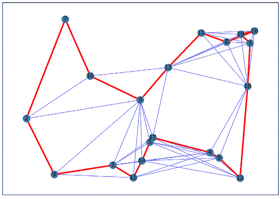
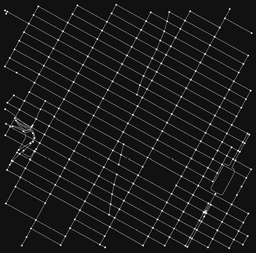

# 附录 A. Python 中的搜索和优化库

本附录涵盖了设置 Python 环境，以及数学编程、图形可视化、元启发式优化和机器学习的基本库。

## A.1 设置 Python 环境

本书假设您已经在系统上安装了 Python 3.6 或更高版本。有关您操作系统的特定安装说明，请参阅此入门指南：[`wiki.python.org/moin/BeginnersGuide/`](https://wiki.python.org/moin/BeginnersGuide/)。

对于 Windows 系统，您可以按照以下步骤安装 Python：

1.  前往官方网站：[www.python.org/downloads/](https://www.python.org/downloads/)。

1.  选择要安装的 Python 版本。

1.  下载 Python 可执行安装程序。

1.  运行可执行安装程序。请确保选中“为所有用户安装启动器”和“将 Python 3.8 添加到 PATH”复选框。

1.  通过在命令提示符中输入 `python –V` 来验证 Python 是否成功安装。

1.  通过在命令提示符中输入 `pip -V` 来验证 pip 是否已安装。

1.  在命令提示符中输入 `pip install virtualenv` 来安装 `virtualenv`。

如果您是 Linux 用户，请在终端中执行以下命令：

```py
$ sudo apt update
$ sudo apt install python3-pip
```

安装 venv 并创建 Python 虚拟环境：

```py
$ sudo apt install python3.8-venv
$ mkdir <new directory for venv>
$ python -m venv <path to venv directory>
```

确保将 `python3.8` 替换为你正在使用的 Python 版本。

您现在可以使用以下命令访问您的虚拟环境：

```py
$ source <path to venv>/bin/activate
```

在 macOS 的情况下，Python 已经预安装，但如果您需要升级或安装特定版本，可以使用以下 macOS 终端操作：

```py
$ python -m ensurepip --upgrade
```

`venv` 包含在 Python 3.8 及更高版本中。您可以使用以下命令创建虚拟环境：

```py
$ mkdir <new directory>
$ python -m venv <path to venv directory>
```

您现在可以使用以下命令访问您的虚拟环境：

```py
$ source <path to venv>/bin/activate
```

更好的选择是按照下一小节所述安装 Python 发行版。

### A.1.1 使用 Python 发行版

Python 发行版，如 Anaconda 或 Miniconda，包含一个名为 `conda` 的包管理器，允许您安装广泛的 Python 包并管理不同的 Python 环境。使用以下指南为您操作系统安装 `conda`：[`conda.io/projects/conda/en/latest/user-guide/install/index.html`](https://conda.io/projects/conda/en/latest/user-guide/install/index.html)。

Conda 环境用于管理不同版本的 Python 包及其依赖项的多个安装。您可以使用以下命令创建一个 `conda` 环境：

```py
$ conda create --name <name of env> python=<your version of python>
```

按照以下方式访问新创建的环境：

```py
$ conda activate <your env name>
```

此命令允许您在环境之间切换或移动。

### A.1.2 安装 Jupyter Notebook 和 JupyterLab

Jupyter 是一个多语言、开源的基于网络的交互式编程平台 ([`jupyter.org/`](https://jupyter.org/))。名称“Jupyter”是一个松散的首字母缩略词，代表 Julia、Python 和 R。本书中的所有代码都存储在 Jupyter 笔记本 (.ipynb 文件) 中，可以使用 JupyterLab 或 Jupyter Notebook 打开和编辑。Jupyter Notebook 感觉更独立，而 JupyterLab 则更像是一个集成开发环境 (IDE)。

您可以使用 `pip` 按照以下方式安装 JupyterLab：

```py
$ pip install jupyterlab
$ pip install notebook
```

或者按照以下方式使用 `conda`：

```py
$ conda install -c conda-forge jupyterlab
$ conda install -c conda-forge notebook
```

您可以使用 `pip` 按照以下方式安装 Python ipywidgets 软件包，以自动配置经典 Jupyter Notebook 和 JupyterLab 3.0 以显示 ipywidgets：

```py
$ pip install ipywidgets
$ conda install -c conda-forge ipywidgets
```

如果您安装了旧版本的 Jupyter Notebook，您可能需要手动使用以下命令启用 ipywidgets 笔记本扩展：

```py
$ jupyter nbextension install --user --py widgetsnbextension
$ jupyter nbextension enable --user --py widgetsnbextension
```

Google Colaboratory (Colab) 也可以使用。这个基于云的工具允许您通过浏览器编写、执行和分享 Python 代码。它还提供免费访问 GPU 和 TPU 以增强计算能力。您可以通过以下链接访问 Colab：[`colab.research.google.com/`](https://colab.research.google.com/).

### A.1.3 克隆书籍的仓库

您可以按照以下步骤克隆此书籍的代码仓库：

```py
$git clone https://github.com/Optimization-Algorithms-Book/Code-Listings.git  
```

本书中的许多操作都很长且难以从头编写代码。通常，它们高度标准化，并可以从具有辅助函数处理各种复杂性的情况下受益。`optalgotools` 是为此目的开发的 Python 软件包。

您可以在不安装此软件包的情况下本地使用这些支持工具。为此，您需要将 `optalgotools` 下载到本地文件夹，并将此文件夹添加到系统路径中。如果您使用 Jupyter notebook 或 Jupyter lab，可以按照以下步骤操作：

```py
import sys
sys.path.insert(0, '../')
```

如果您使用 Colab，可以使用以下命令将您的 Google Drive 挂载：

```py
from google.colab import drive
drive.mount('/content/drive')
```

然后，将 `optalgotools` 文件夹复制到您的 Google Drive。

此软件包也可在 Python 包索引 (PyPI) 仓库中找到：[`pypi.org/project/optalgotools/`](https://pypi.org/project/optalgotools/). 您可以按照以下步骤进行安装：

```py
$pip install optalgotools 
```

然后，您可以使用 `import` 命令来使用这些工具。以下是一个示例：

```py
from optalgotools.problems import TSP
from optalgotools.algorithms import SimulatedAnnealing
```

第一行从 `problems` 模块导入 `TSP` 实例，第二行从 `algorithms` 模块导入模拟退火求解器。

## A.2 数学规划求解器

**数学规划**，也称为**数学优化**，是寻找可以用数学术语表示的问题的最佳解决方案的过程。它涉及制定问题的数学模型，确定模型的参数，并使用数学和计算技术找到解决方案，该解决方案在满足一系列约束条件下最大化或最小化特定的目标函数或一组目标函数。线性规划（LP）、混合整数线性规划（MILP）和非线性规划（NLP）是数学优化问题的例子。可以使用几个 Python 库来解决数学优化问题。

让我们考虑 Guerte 等人《线性规划》[1]中的以下生产计划示例。一个小型木工车间生产两种尺寸的黄杨木棋套装。制作较小的套装需要 3 小时的车削加工，而较大的套装则需要 2 小时。有四个熟练的操作员，每人每周工作 40 小时，车间每周有总共 160 小时的车削时间可用。较小的棋套装消耗 1 公斤黄杨木，而较大的套装则需要 3 公斤。然而，由于稀缺，每周只能获得 200 公斤黄杨木。出售时，每个大型棋套装产生 12 美元的利润，而每个小型套装产生 5 美元的利润。目标是确定每个套装的最佳每周生产数量以最大化利润。

假设 *x*[1] 和 *x*[2] 是决策变量，分别代表要制作的中小型棋套装的数量。总利润是制作和销售 *x*[1] 套小型棋套装和 *x*[2] 套大型棋套装的个体利润之和：利润 = 5*x*[1] + 12*x*[2]。然而，这种利润受到以下约束：

+   我们将使用机器的总小时数为 3*x*[1] + 2*x*[2]。这个时间不应超过每周可用的最大 160 小时机器时间。这意味着 3*x*[1] + 2*x*[2] ≤ 160 (车削小时)。

+   每周只有 200 公斤的黄杨木可用。由于小套装每套需要 1 公斤，而大套装则需要 3 公斤，因此 *x*[1] + 3*x*[2] ≤ 200 (公斤黄杨木)。

+   木工车间不能生产负数的棋套装，因此我们有两个额外的非负约束：*x*[1] 和 *x*[2] >= 0。

这个线性规划问题可以总结如下。找到 *x*[1] 和 *x*[2]，使得 5*x*[1] + 12*x*[2] 最大化，同时满足

+   加工时间约束：3*x*[1] + 2*x*[2] ≤ 160

+   重量约束：*x*[1] + 3*x*[2] ≤ 200

+   非负约束：*x*[1] 和 *x*[2] >= 0

让我们看看如何使用不同的求解器来解决这个线性规划问题。

### A.2.1 SciPy

[SciPy](https://scipy.org/) 是一个开源的科学计算 Python 库，提供了优化、线性代数和统计的工具。SciPy optimize 是 SciPy 库的一个子模块，包括非线性问题的求解器（支持局部和全局优化算法）、线性规划、约束和非线性最小二乘、根查找和曲线拟合。

要使用 SciPy，您需要安装它及其依赖项。您可以使用 pip 包管理器安装 SciPy：

```py
$pip install scipy
```

或者，您可以使用预装了 SciPy 和其他科学库的 Python 发行版，如 Anaconda 或 Miniconda。

列表 A.1 展示了使用 SciPy 解决汽车制造问题的步骤。代码定义了系数向量`c`和约束方程的左侧（`lhs`）和右侧（`rhs`）。目标函数代表要最大化的利润。由于 SciPy 中的许多优化算法是为最小化设计的，因此利润最大化问题通常通过最小化利润函数的负值来转换为最小化问题。此外，使用大于或等于符号的约束不能直接定义。必须使用小于或等于代替。

列表 A.1 使用 SciPy 解决棋盘问题

```py
import numpy as np
import scipy
from scipy.optimize import linprog

c = -np.array([5,12])                                            ①

lhs_constraints=([3,2],                                          ②
                 [1,3])                                          ③

rhs_constraints=([160,                                           ④
                  200])                                          ⑤

bounds = [(0, scipy.inf), (0, scipy.inf)]                        ⑥

results = linprog(c=c, A_ub=lhs_constraints, b_ub=rhs_constraints,
➥ bounds=bounds, method='highs-ds')                             ⑦

print('LP Solution:')                                            ⑧
print(f'Profit: = {-round(results.fun,2)} $')                    ⑧
print(f'Make {round(results.x[0],0)} small sets, and make        ⑧
{round(results.x[1],0)} large sets')                             ⑧
```

① 声明目标函数的系数。

② 加工时间约束的左侧

③ 权重约束的左侧

④ 加工时间约束的右侧

⑤ 权重约束的右侧

⑥ 决策变量的界限

⑦ 解决线性规划问题。

⑧ 打印解决方案。

运行此代码将得到以下结果：

```py
LP Solution:
Profit: = 811.43 $
Make 11.0 small sets, and make 63.0 large sets
```

在前面的代码中使用的`linprog()`函数返回一个包含多个属性的数据结构，例如`x`（当前解向量）、`fun`（目标函数的当前值）和`success`（当算法成功完成时为`true`）。

### A.2.2 PuLP

[PuLP](https://coin-or.github.io/pulp/) 是一个 Python 线性规划库，允许您定义和解决线性优化问题。PuLP 中有两个主要类：`LpProblem`和`LpVariable`。PuLP 变量可以单独声明或作为“字典”（在另一个集合上索引的变量）。

您可以使用以下 pip 命令安装 PuLP：

```py
$pip install pulp
```

以下代码（列表 A.1 的延续）展示了如何使用 PuLP 解决棋盘问题：

```py
#!pip install pulp
from pulp import LpMaximize, LpProblem, LpVariable, lpSum, LpStatus

model = LpProblem(name='ChessSet', sense=LpMaximize)                      ①

x1 = LpVariable('SmallSet', lowBound = 0, upBound =  None, cat='Integer') ②
x2 = LpVariable('LargeSet', lowBound = 0, upBound =  None, cat='Integer') ②

model += (3*x1 + 2*x2 <=160, 'Machining time constraint')                 ③
model += (  x1 + 3*x2 <= 200, 'Weight constraint')                        ③

profit= 5*x1 + 12*x2                                                      ④
model.setObjective(profit)                                                ④

model.solve()                                                             ⑤

print('LP Solution:')                                                     ⑥
print(f'Profit: = {model.objective.value()} $')                           ⑥
print(f'Make {x1.value()} small sets, and make {x2.value()} large sets')  ⑥
```

① 定义模型。

② 定义决策变量。

③ 添加约束。

④ 将利润设置为目标函数。

⑤ 解决优化问题。

⑥ 打印解决方案。

PuLP 实现了多种算法来解决线性规划（LP）和混合整数线性规划（MILP）问题。例如包括 COIN-OR（运筹学研究计算基础设施）、CLP（COIN-OR 线性规划）、Cbc（COIN-OR 分支和切割）、CPLEX（Cplex）、GLPK（GNU 线性规划库）、SCIP（解决约束整数规划）、HiGHS（高度可扩展的全局求解器）、Gurobi LP/MIP 求解器、Mosek 优化器以及 XPRESS LP 求解器。

### A.2.3 其他数学编程求解器

Python 中还有几个用于解决数学优化问题的库。以下是一个不完整的其他可用库列表：

+   [OR-Tools](https://developers.google.com/optimization)—这是一个由 Google 开发的用于优化和约束编程的开源软件套件。它包括解决运筹学、运输、调度和物流等领域问题的各种算法和工具。OR-Tools 可用于建模和解决线性规划、整数规划以及约束编程问题。OR-Tools 求解器的例子包括 GLOP（Google 线性规划）、Cbc（COIN-OR 分支和切割）、CP-SAT（约束编程-可满足性）求解器、最大流和最小成本流求解器、最短路径求解器以及 BOP（二进制优化问题）求解器。它用 C++编写，并为包括 Python、C#和 Java 在内的多种编程语言提供了接口。有关更多详细信息及示例，请参阅 A.4.5 节。

+   [Gurobi](https://www.gurobi.com/documentation/)—这是一款商业优化软件，提供线性规划、二次规划和混合整数规划的尖端求解器。它提供了一个 Python 接口，可用于定义和解决优化问题。

+   [CasADi](https://web.casadi.org/)—这是一个用于非线性优化和算法微分的开源工具。

+   [Python-MIP](https://www.python-mip.com/)—这是一个用于解决混合整数规划问题的 Python 库。它建立在 Cbc 开源优化库之上，并允许用户使用高级、数学化的编程语言表达优化模型。

+   [Pyomo](http://www.pyomo.org/)—这是一个开源的优化建模语言，可用于在 Python 中定义和解决数学优化问题。它支持广泛的优化求解器，包括线性规划、混合整数规划和非线性优化。

+   [GEKKO](https://gekko.readthedocs.io/en/latest/)—这是一个用于机器学习和混合整数及微分代数方程优化的 Python 包。

+   [CVXPY](https://www.cvxpy.org/)—这是一个用于凸优化问题的开源 Python 嵌入式建模语言。它允许您以遵循数学的方式自然地表达问题，而不是遵循求解器要求的限制性标准形式。

+   [PyMathProg](https://pymprog.sourceforge.net/)—这是一个为 Python 设计的数学编程环境，允许建模、求解、分析、修改和操作线性规划问题。

+   [Optlang](https://optlang.readthedocs.io/en/latest/)—这是一个用于建模和求解数学优化问题的 Python 库。它提供了一系列优化工具的通用接口，以便可以以透明的方式更改不同的求解器后端。它与大多数流行的优化求解器兼容，如 Gurobi、Cplex 和 Ipopt（内点优化器）。

+   [Python 接口到锥优化求解器 (PICOS)](https://picos-api.gitlab.io/picos/)—这是一个用于建模和求解优化问题的 Python 库。它可以处理具有多个目标的复杂问题，并支持局部和全局优化方法。PICOS 具有与不同求解器（如 Gurobi、CPLEX、SCS（分割锥求解器）、ECOS（嵌入式锥求解器）和 MOSEK）的接口。

+   [CyLP](https://github.com/coin-or/cylp)—这是一个到 COIN-OR 的线性混合整数规划求解器（CLP、Cbc 和 CGL）的 Python 接口。COIN-OR（运筹学计算基础设施）是运筹学和计算优化开源软件包的集合。它包括线性规划和整数规划、约束规划以及其他优化技术的库。

+   [SymPy](https://www.sympy.org/en/index.html)—这是一个用于符号数学的 Python 库。它可以用来解方程、处理组合数学、在 2D/3D 中绘图，或者处理多项式、微积分、离散数学、矩阵、几何、解析、物理、统计学和密码学。

+   *其他库*—这些包括但不限于[MOSEK](https://docs.mosek.com/latest/pythonapi/index.html)、[CVXOPT](https://cvxopt.org/)、， ， ，和。

书籍的 GitHub 仓库中包含的 Jupyter 笔记本“Listing A.1_Mathematical_programming_solvers.ipynb”展示了如何使用这些求解器解决棋盘问题。

## A.3 图和映射库

本书使用以下 Python 库来处理和可视化图、网络和地理空间数据。

### A.3.1 NetworkX

[NetworkX](https://networkx.org/) 是一个用于在 Python 中处理图和网络库。它提供了创建、操作和分析图数据以及可视化图结构的工具。NetworkX 还包含图属性的近似和优化问题的启发式方法。你可以按照以下方式安装 NetworkX：

```py
$pip install networkx
```

让我们考虑旅行商问题（TSP）。列表 A.2 显示了为该问题创建随机无向图的步骤。每个随机散布的节点代表销售员要访问的城市，连接城市的每条边的权重是基于节点之间的欧几里得距离使用`hypot`函数计算的，该函数计算平方和的平方根。使用 Christofides 算法解决此 TSP 实例——此算法提供 TSP 的 3/2 近似。这意味着其解决方案将在最优解长度的 1.5 倍以内。

列表 A.2 使用 NetworkX 解决 TSP

```py
import matplotlib.pyplot as plt
import networkx as nx
import networkx.algorithms.approximation as nx_app
import math

plt.figure(figsize=(10, 7))

G = nx.random_geometric_graph(20, radius=0.4, seed=4)                   ①
pos = nx.get_node_attributes(G, "pos")

pos[0] = (0.5, 0.5)                                                     ②

H = G.copy()                                                            ③

for i in range(len(pos)):                                               ④
    for j in range(i + 1, len(pos)):                                    ④
        dist = math.hypot(pos[i][0] - pos[j][0], pos[i][1] - pos[j][1]) ④
        dist = dist                                                     ④
        G.add_edge(i, j, weight=dist)                                   ④

cycle = nx_app.christofides(G, weight="weight")                         ⑤
edge_list = list(nx.utils.pairwise(cycle))

nx.draw_networkx_edges(H, pos, edge_color="blue", width=0.5)            ⑥

nx.draw_networkx(                                                       ⑦
    G,                                                                  ⑦
    pos,                                                                ⑦
    with_labels=True,                                                   ⑦
    edgelist=edge_list,                                                 ⑦
    edge_color="red",                                                   ⑦
    node_size=200,                                                      ⑦
    width=3,                                                            ⑦
)                                                                       ⑦

print("The route of the salesman is:", cycle)                           ⑧
plt.show() 
```

① 创建一个包含 20 个节点的随机几何图。

② 将(0,0)设置为家乡城市/仓库。

③ 创建一个独立的浅拷贝的图和属性。

④ 将节点之间的距离作为边的权重计算。

⑤ 使用 Christofides 算法解决 TSP。

⑥ 仅在每个节点上突出显示最近的边。

⑦ 绘制路线。

⑧ 打印路线。

图 A.1 显示了此 TSP 的解决方案。



图 A.1 使用 NetworkX 中实现的 Christofides 算法解决 TSP。找到的路线是 0, 10, 7, 2, 6, 1, 15, 14, 5, 17, 4, 9, 12, 18, 3, 19, 16, 8, 11, 13, 0。

NetworkX 支持多种图搜索算法，并可以使用地理空间 Python 生态系统中的包执行网络分析。

### A.3.2 OSMnx

[OSMnx](https://osmnx.readthedocs.io/en/stable/) 是一个 Python 库，旨在简化从 [OpenStreetMap](https://www.openstreetmap.org) (OSM) 获取和操作数据的过程。它提供了从 OSM 下载数据（过滤后）并返回作为 NetworkX 图数据结构网络的能力。它是全球免费开源的地理数据。

您可以使用`conda`安装 OSMnx：

```py
$ conda config --prepend channels conda-forge
$ conda create -n ox --strict-channel-priority osmnx
$ conda activate ox
```

OSMnx 可以将地点的文本描述符转换为 NetworkX 图。以下列表 A.2 的后续内容中，我们将以纽约市的时报广场为例。

```py
import osmnx as ox

place_name = "Times Square, NY"                                 ①

graph = ox.graph_from_address(place_name, network_type='drive') ②

ox.plot_graph(graph,figsize=(10,10))                            ③
```

① 地点名称或兴趣点

② 命名地点的 NetworkX 图

③ 绘制图。

图 A.2 显示了基于驾驶模式的时报广场图。



图 A.2 可行驶街道的时报广场图

`network_type` 允许您根据移动模式选择街道网络类型：`all_private`、`all`、`bike`、`drive`、`drive_service`或`walk`。您可以使用这两行代码突出显示时报广场街道网络中的所有单行边：

```py
ec = ['y' if data['oneway'] else 'w' for u, v, key, data in graph.edges(keys=True, data=True)]
fig, ax = ox.plot_graph(graph, figsize=(10,10), node_size=0, edge_color=ec, edge_linewidth=1.5, edge_alpha=0.7)
```

可以检查图的各种属性，例如图类型、边（道路）类型、CRS 投影等。例如，您可以使用`type(graph)`打印图类型，并如下提取图的节点和边作为单独的结构：

```py
nodes, edges = o.graph_to_gdfs(graph)
nodes.head(5)
```

我们可以进一步深入到每个单独的节点或边进行考察。

```py
list(graph.nodes(data=True))[1]
list(graph.edges(data=True))[0]
```

您还可以检索图的街道类型：

```py
print(edges['highway'].value_counts())
```

执行前面的代码行给出了以下关于时报广场道路网络的统计数据：

```py
secondary                      236
residential                    120
primary                         83
unclassified                    16
motorway_link                   12
tertiary                        10
motorway                         7
living_street                    3
[unclassified, residential]      1
[motorway_link, primary]         1
trunk                            1
```

可以使用`osmnx.basic_stats(graph)`生成更多统计信息。

使用`osmnx.graph_from_gdfs`可以将 GeoDataFrames 轻松转换为 MultiDiGraphs，如下所示：

```py
new_graph = ox.graph_from_gdfs(nodes,edges)
ox.plot_graph(new_graph,figsize=(10,10))
```

这导致了与图 A.2 中显示相同的道路网络。您还可以按以下方式将街道网络保存为不同的格式：

```py
ox.plot_graph(graph, figsize=(10,10), show=False, save=True, close=True, 
filepath='./data/TimesSquare.png')                                    ①
ox.plot_graph(graph, figsize=(10,10), show=False, save=True, close=True, 
filepath='./data/TimesSquare.svg')                                    ②
ox.save_graph_xml(graph, filepath='./data/TimesSquare.osm')           ③
ox.save_graph_geopackage(graph, filepath='./data/TimesSquare.gpkg')   ④
ox.save_graphml(graph, filepath='./data/TimesSquare.graphml')         ⑤
ox.save_graph_shapefile(graph, filepath='./data/TimesSquare')         ⑥
```

① 将街道网络保存为 PNG。

② 将街道网络保存为 SVG。

③ 将图形保存为磁盘上的.osm XML 文件。

④ 将街道网络保存为 GeoPackage 文件用于 GIS

⑤ 将街道网络保存为 OSMnx、NetworkX 或 Gephi 的 GraphML 文件。

⑥ 将图形保存为 shapefile。

### A.3.3 GeoPandas

[GeoPandas](https://geopandas.org/en/stable/index.html) 是 Pandas 的一个扩展，通过扩展 Pandas 的数据类型和查询、操作空间数据的能力来处理地理空间数据。它提供了读取、写入和操作地理空间数据的工具，以及可视化并在地图上绘制数据的工具。您可以使用 pip 或 conda 安装 GeoPandas，如下所示：

```py
$conda install geopandas or $pip install geopandas
```

GeoPandas 可以处理不同的地理空间数据格式，如 shapefiles (.shp)、CSV（逗号分隔值）、GeoJSON、ESRI JSON、GeoPackage (.gpkg)、GML、GPX（GPS 交换格式）和 KML（Keyhole 标记语言）。例如，假设我们想根据书中 GitHub 仓库（附录 B 数据文件夹中）包含的安大略省数据目录中的 shapefile 读取安大略省的健康区域数据。shapefile 是一种流行的地理空间数据格式，用于存储矢量数据（如点、线和多边形）。它是存储 GIS 数据广泛使用的格式，并且被许多 GIS 软件包支持，包括 ArcGIS 和 QGIS。实际上，shapefile 是一组具有不同扩展名的文件集合，包括以下内容：

+   *.shp*—主文件，包含地理空间数据（点、线或多边形）

+   *.shx*—索引文件，允许更快地访问.shp 文件中的数据

+   *.dbf*—属性文件，包含.shp 文件中每个特征的属性数据（非地理信息）

+   *.prj*—投影文件，定义.shp 文件中数据的坐标系和投影信息

+   *.sbx*—特征的空间索引

列表 A.2 的以下续集显示了如何从[`data.ontario.ca/dataset/ontario-s-health-region-geographic-data`](https://data.ontario.ca/dataset/ontario-s-health-region-geographic-data)读取此地理空间数据，该数据存储在本书的 GitHub 仓库中：

```py
import geopandas as gpd
import requests
import os

base_url = "https://raw.githubusercontent.com/Optimization-Algorithms-
➥Book/Code-Listings/05766c64c5e83dcd6788cc4415b462e2f82e0ccf/
➥Appendix%20B/data/OntarioHealth/"                                 ①

files = ["Ontario_Health_Regions.shp", "Ontario_Health_Regions.shx",
➥ "Ontario_Health_Regions.dbf", "Ontario_Health_Regions.prj"]      ②

for file in files:                                                  ③
    response = requests.get(base_url + file)                        ③
    with open(file, 'wb') as f:                                     ③
        f.write(response.content)                                   ③

ontario =  gpd.read_file("Ontario_Health_Regions.shp")              ④

for file in files:                                                  ⑤
    os.remove(file)                                                 ⑤

print(ontario.head())                                               ⑥
```

① 定义原始文件的基 URL。

② 与 shapefile 相关的文件。

③ 从指定的 URL 临时下载文件。

④ 使用 geopandas 读取 shapefile。

⑤ 清理/删除下载的文件。

⑥ 打印前 n 行。

[列表 A.2 的完整版本](https://github.com/Optimization-Algorithms-Book/Code-Listings/blob/main/Appendix%20A/Listing%20A.2_Graph_libraries.ipynb)可在本书的 GitHub 仓库中找到。

### A.3.4 上下文相关

[contextily](https://contextily.readthedocs.io/en/latest/) 是一个 Python 库，用于向使用 Matplotlib、Plotly 等库创建的图表添加上下文底图。例如，contextily 可以用于在渲染安大略省卫生区域数据时添加上下文，如下所示：

```py
#!pip install contextily
import contextily as ctx
ax=ontario.plot(cmap='jet', edgecolor='black', column='REGION', alpha=0.5,
➥ legend=True, figsize=(10,10))
ax.set_title("EPSG:4326, WGS 84")
ctx.add_basemap(ax, source=ctx.providers.OpenStreetMap.Mapnik,
➥ crs=ontario.crs.to_string())
```

contextily 支持多个不同的底图源，包括以下常用源：

+   *OpenStreetMap (OSM)*—这是 contextily 的默认源。它是一个免费的开源地图服务，提供多种不同的样式，包括默认的 Mapnik 样式以及其他如人道主义和自行车样式。

+   *Stamen*—本源提供多种不同的地图样式，包括 Toner、地形和水彩。

+   *Mapbox*—本源提供多种不同的地图样式，包括街道、户外和卫星图。使用时需要 API 密钥。

+   *MapQuest*—本源提供多种不同的地图样式，包括 OSM 和航空图。使用时需要 API 密钥。

+   *这里*—本源提供多种不同的地图样式，包括正常日和正常夜。使用时需要 API 密钥。

+   *Google Maps*—本源提供多种不同的地图样式，包括路线图、卫星图和地形图。使用时需要 API 密钥。

### A.3.5 Folium

[Folium](https://python-visualization.github.io/folium/) 是一个用于在 Python 中使用 Leaflet.js 库创建交互式地图的库。它提供了读取、写入和操作地理空间数据、以及可视化并在地图上绘制数据的工具。Folium 可以用来创建静态或动态地图，还可以自定义地图的外观和行为。以下 A.2 列表的延续展示了如何使用 Folium 在地图上可视化安大略省卫生区域：

```py
#!pip install folium
import folium

ontario = ontario.to_crs(epsg=4326)                               ①

m = folium.Map(location=[43.67621,-79.40530],zoom_start=7,
➥ tiles='cartodbpositron', scrollWheelZoom=False, dragging=True) ②

for index, row in ontario.iterrows():                             ③
    sim_geo = gpd.GeoSeries(row['geometry']).simplify(tolerance=0.001)
    geo_j = sim_geo.to_json()
    geo_j = folium.GeoJson(data=geo_j,
➥ name=row['REGION'],style_function=lambda x: {'fillColor': 'black'})
    folium.Popup(row['REGION']).add_to(geo_j)
    geo_j.add_to(m)

m                                                                 ④
```

① 将几何形状转换为新的坐标参考系统（CRS）。

② 设置起始位置、初始缩放和底图源。

③ 简化每个区域的 polygon，因为复杂的细节是不必要的。

④ 渲染地图。

书籍 GitHub 仓库中可用的“[附录 A.2_ 图形库.ipynb](https://github.com/Optimization-Algorithms-Book/Code-Listings/blob/main/Appendix%20A/Listing%20A.2_Graph_libraries.ipynb)”笔记本提供了不同方式可视化地理空间数据的示例，例如渐变地图、人口分布地图、气泡地图、六边形分箱、热图和聚类地图。

### A.3.6 其他库和工具

以下是非详尽的列表，列出了其他用于处理地理空间数据、图形和网络的有用库和工具：

+   [Pyrosm](https://pyrosm.readthedocs.io/en/latest/)—这是另一个用于从 Protocolbuffer Binary Format 文件 (*.osm.pbf) 读取 OpenStreetMap 的 Python 库。它可以用于下载和读取 OpenStreetMap 数据，提取诸如道路、建筑和兴趣点等特征，并分析和可视化数据。Pyrosm 与 OSMnx 的主要区别在于，OSMnx 使用 OverPass API 读取数据，而 Pyrosm 从本地从 Protocolbuffer Binary Format 文件 (*.osm.pbf) 数据提供者（Geofabrik、BBBike）下载的 OSM 数据转储中读取数据，并将其转换为 GeoPandas GeoDataFrames。这使得解析 OSM 数据更快，并使得提取覆盖大范围的数据更加可行。

+   [Pandana](https://udst.github.io/pandana/)—这是一个使用收缩层次结构来计算超级快速旅行可达性指标和最短路径的 Python 网络分析库。

+   [GeoPy](https://geopy.readthedocs.io/en/stable/)—这是一个用于几个流行的地理编码 Web 服务的 Python 客户端。

+   [Graphviz](https://graphviz.org/)—这是一个用于在 Python 中创建图和树结构可视化的库。它提供了定义图结构以及以各种格式（如 PNG、PDF 和 SVG）渲染图的工具。Graphviz 是可视化在图上操作的算法（如图搜索算法和图遍历算法）的有用工具。

+   [Gephi](https://gephi.org/)—这是一个用于可视化和分析图和网络的工具。它提供了一个图形用户界面来定义和自定义图形和图表的外观，以及可视化算法和数据结构。Gephi 可以用于可视化在图数据上操作的算法，例如图搜索算法和最短路径算法。

+   [Cytoscape](https://cytoscape.org/)—这是一个用于可视化复杂网络并将其与任何类型的属性数据集成的开源软件平台。

+   [ipyleaflet](https://github.com/jupyter-widgets/ipyleaflet)—这是一个基于 ipywidgets 的交互式小部件库。ipywidgets，也称为 jupyter-widgets 或简称为 widgets，是 Jupyter 笔记本和 IPython 内核的交互式 HTML 小部件。Ipyleaflet 将地图功能带到了笔记本和 JupyterLab 中。

+   [hvPlot](https://hvplot.holoviz.org/)—这是一个基于 HoloViews 库构建的 Python 库，提供高级绘图 API。它可以与 GeoPandas 一起使用，创建地理空间数据的交互式可视化。

+   [mplleaflet](https://github.com/jwass/mplleaflet)—这是一个基于`leaflet`的库，但它与`matplotlib`配合得很好。

+   [Cartopy](https://scitools.org.uk/cartopy/docs/latest/)—Cartopy 是一个用于在 Python 中创建地图和地理空间绘图的库。

+   [geoplotlib](https://github.com/andrea-cuttone/geoplotlib)—geoplotlib 是一个用于在 Python 中创建地图和可视化的库。它提供了样式化和定制地图元素的工具，以及将数据叠加到地图上的工具。geoplotlib 可以用于创建静态或交互式地图，并支持多种地图投影和坐标系。

+   [Shapely](https://shapely.readthedocs.io/en/stable/)—这是一个用于在笛卡尔平面上对对象执行几何操作的 Python 开源库。

+   [deck.gl](https://deck.gl/)—这是一个用于 WebGL 驱动的开放式 JavaScript 库，用于大规模数据集的可视化。

+   [kepler.gl](https://kepler.gl/)—这是一个强大的开源地理空间分析工具，用于大规模数据集。

## A.4 元启发式优化库

Python 中有几个库提供了不同元启发式优化算法的实现。以下小节涵盖了某些常用库。

### A.4.1 PySwarms

[PySwarms](https://pyswarms.readthedocs.io/en/latest/index.html) 是一个用于在 Python 中实现群体智能算法的库。它提供了定义、训练和评估群体智能模型以及可视化优化过程的工具。PySwarms 支持多种群体智能算法，包括粒子群优化（PSO）和蚁群优化（ACO）。下面的列表显示了使用 PySwarms 实现的 PSO 解决函数优化问题的步骤。

列表 A.3 使用 PySwarms 实现的 PSO 解决函数优化问题

```py
#!pip install pyswarms
import pyswarms as ps
from pyswarms.utils.functions import single_obj as fx
from pyswarms.utils.plotters import plot_cost_history, plot_contour,
➥ plot_surface
from pyswarms.utils.plotters.formatters import Mesher, Designer
import matplotlib.pyplot as plt
from IPython.display import Image                                     ①

options = {'c1':0.5, 'c2':0.3, 'w':0.9}                               ②
optimizer = ps.single.GlobalBestPSO(n_particles=50, dimensions=2,

➥ options=options)                                                   ③

optimizer.optimize(fx.sphere, iters=100)                              ④

plot_cost_history(optimizer.cost_history)                             ⑤
plt.show()

m = Mesher(func=fx.sphere, limits=[(-1,1), (-1,1)])                   ⑥
d = Designer(limits=[(-1,1), (-1,1), (-0.1,1)], label=['x-axis', 'y-axis',
➥ 'z-axis'])                                                         ⑦

animation = plot_contour(pos_history=optimizer.pos_history, mesher=m,
➥ designer=d, mark=(0,0))                                            ⑧
animation.save('solution.gif', writer='imagemagick', fps=10)
Image(url='solution.gif')                                             ⑨
```

① 导入 Image 类以在笔记本环境中显示图像。

② 设置 PSO 作为具有 50 个粒子和预定义参数的优化器。

③ 使用 PSO 解决函数优化问题。

④ 设置使用 PSO 优化的单峰球面函数，并设置迭代次数。

⑤ 绘制成本。

⑥ 绘制球面函数的网格以获得更好的图形。

⑦ 调整图形限制。

⑧ 在等高线上生成解的历史动画。

⑨ 渲染动画。

### A.4.2 Scikit-opt

[Scikit-opt](https://scikit-opt.github.io/) 是一个优化库，它提供了一个简单灵活的接口来定义和运行使用各种元启发式（如遗传算法、粒子群优化、模拟退火、蚁群算法、免疫算法和人工鱼群算法）的优化问题。Scikit-opt 可以用于解决连续和离散问题。以下列表 A.3 的延续显示了使用 scikit-opt 解决函数优化问题的步骤：

```py
#!pip install scikit-opt
import numpy as np
import pandas as pd
import matplotlib.pyplot as plt
from sko.SA import SA

obj_func = lambda x: np.sin(x[0]) * np.cos(x[1])                    ①

sa = SA(func=obj_func, x0=np.array([-3, -3]), T_max=1, T_min=1e-9, L=300,
➥ max_stay_counter=150)                                            ②
best_x, best_y = sa.run()
print('best_x:', best_x, 'best_y', best_y)

plt.plot(pd.DataFrame(sa.best_y_history).cummin(axis=0))            ③
plt.show()
```

① 定义一个多模态函数。

② 使用模拟退火（SA）解决问题。

③ 打印结果。

让我们考虑图 A.3 中显示的 TSP 实例。在这个 TSP 中，一位旅行推销员必须从一个特定的城市开始访问 20 个主要的美国城市。


图 A.3 20 个主要美国城市的旅行商问题（TSP）

以下列表 A.3 的后续部分展示了使用 scikit-opt 解决此问题的步骤。

```py
import numpy as np
import matplotlib.pyplot as plt
from sko.PSO import PSO_TSP

num_points = len(city_names)                                            ①
points_coordinate = city_names                                          ①
pairwise_distances = distances                                          ①

def cal_total_distance(routine):                                        ②
    num_points, = routine.shape
    return sum([pairwise_distances[routine[i % num_points], routine[(i + 1)
➥ % num_points]] for i in range(num_points)])

pso_tsp = PSO_TSP(func=cal_total_distance, n_dim=num_points, size_pop=200,
➥ max_iter=800, w=0.8, c1=0.1, c2=0.1)                                 ③
best_points, best_distance = pso_tsp.run()                              ③
best_points_ = np.concatenate([best_points, [best_points[0]]])

print('best_distance', best_distance)                                   ④
print('route', best_points_)                                            ④
```

① 定义 TSP 问题。

② 计算总距离。

③ 使用 PSO（粒子群优化）解决问题。

④ 打印解决方案。

### A.4.3 NetworkX

在上一节中介绍的 NetworkX 提供了图属性的近似和优化启发式方法。这些启发式算法的例子包括模拟退火。以下列表 A.3 的后续部分展示了使用 NetworkX 中实现的模拟退火解决 TSP 的步骤。

```py
#!pip install networkx
import matplotlib.pyplot as plt
import networkx as nx
from networkx.algorithms import approximation as approx

G=nx.Graph()                                                              ①

for i in range(len(city_names)):                                          ②
    for j in range(1,len(city_names)):                                    ②
        G.add_weighted_edges_from({(city_names[i], city_names[j],         ②
➥ distances[i][j])})                                                     ②
        G.remove_edges_from(nx.selfloop_edges(G))                         ②

pos = nx.spring_layout(G)                                                 ③

cycle = approx.simulated_annealing_tsp(G, "greedy", source=city_names[0]) ④
edge_list = list(nx.utils.pairwise(cycle))                                ④
cost = sum(G[n][nbr]["weight"] for n, nbr in nx.utils.pairwise(cycle))    ④

print("The route of the salesman is:", cycle, "with cost of ", cost)      ⑤
```

① 创建一个图。

② 向图中添加加权边，并移除自环边。

③ 使用 Fruchterman-Reingold 力导向算法定义位置为位置的字典。

④ 使用模拟退火解决 TSP。

⑤ 打印路线和成本。

### A.4.4 Python 中的分布式进化算法（DEAP）

[DEAP](https://github.com/deap/deap)是一个用于在 Python 中实现遗传算法的库。它提供了定义、训练和评估遗传算法模型以及可视化优化过程的工具。DEAP 支持多种遗传算法技术，包括选择、交叉和变异。以下列表 A.3 的后续部分展示了使用 DEAP 中实现的模拟退火解决 TSP 的步骤：

```py
#!pip install deap
from deap import base, creator, tools, algorithms
import random
import numpy as np

creator.create("FitnessMin", base.Fitness, weights=(-1.0,))                ①
creator.create("Individual", list, fitness=creator.FitnessMin)             ①

toolbox = base.Toolbox()                                                   ②
toolbox.register("permutation", random.sample, range(len(city_names)),     ②
➥ len(city_names))                                                        ②
toolbox.register("individual", tools.initIterate, creator.Individual,      ②
➥ toolbox.permutation)                                                    ②
toolbox.register("population", tools.initRepeat, list, toolbox.individual) ②

def eval_tsp(individual):                                                  ③
    total_distance = 0
    for i in range(len(individual)):
        city_1 = individual[i]
        city_2 = individual[(i + 1) % len(individual)]
        total_distance += distances[city_1][city_2]
    return total_distance,

toolbox.register("evaluate", eval_tsp)                                     ④
toolbox.register("mate", tools.cxOrdered)                                  ⑤
toolbox.register("mutate", tools.mutShuffleIndexes, indpb=0.05)            ⑥
toolbox.register("select", tools.selTournament, tournsize=3)               ⑦

pop = toolbox.population(n=50)                                             ⑧
hof = tools.HallOfFame(1)                                                  ⑨
stats = tools.Statistics(lambda ind: ind.fitness.values)
stats.register("avg", np.mean)
stats.register("min", np.min)
stats.register("max", np.max)

pop, log = algorithms.eaSimple(pop, toolbox, cxpb=0.5, mutpb=0.2, ngen=50,
➥ stats=stats, halloffame=hof,verbose=True)                               ⑩

best_individual = hof[0] 
print("Best solution:")                                                    ⑪
print("  - Fitness: ", eval_tsp(best_individual))                          ⑪
print("  - Route: ", [city_names[i] for i in best_individual])             ⑪
```

① 创建一个最小化总距离的适应度函数。

② 创建遗传算子函数。

③ 计算路线长度。

④ 设置评估函数。

⑤ 设置有序交叉。

⑥ 设置以 0.05 的概率进行洗牌变异。

⑦ 在三个随机选择的个体中选出最佳个体。

⑧ 设置种群大小。

⑨ 设置名人堂以选择在进化过程中种群中曾经存活过的最佳个体。

⑩ 使用简单的进化算法解决问题。

⑪ 打印解决方案。

DEAP 包含几个内置算法，如遗传算法（GA）、进化策略（ES）、遗传编程（GA）、估计分布算法（EDA）和粒子群优化（PSO）。

### A.4.5 OR-Tools

如前所述，[OR-Tools](https://developers.google.com/optimization)（运筹学工具）是由 Google 开发的开源优化和约束编程库。以下列表 A.3 的后续部分展示了使用 OR-Tools 中实现的禁忌搜索解决 TSP 的步骤：

```py
#!pip install --upgrade --user ortools
import numpy as np
import matplotlib.pyplot as plt
from ortools.constraint_solver import pywrapcp
from ortools.constraint_solver import routing_enums_pb2

distances2=np.asarray(distances, dtype = 'int')                           ①

data = {}                                                                 ②
data['distance_matrix'] = distances                                       ②
data['num_vehicles'] = 1                                                  ②
data['depot'] = 0                                                         ②

manager = pywrapcp.RoutingIndexManager(len(data['distance_matrix']),
➥ data['num_vehicles'], data['depot'])                                   ③
routing = pywrapcp.RoutingModel(manager)                                  ③
def distance_callback(from_index, to_index):                              ④
    from_node = manager.IndexToNode(from_index)
    to_node = manager.IndexToNode(to_index)
    return data['distance_matrix'][from_node][to_node]

transit_callback_index = routing.RegisterTransitCallback(distance_callback)   

routing.SetArcCostEvaluatorOfAllVehicles(transit_callback_index)

search_parameters = pywrapcp.DefaultRoutingSearchParameters()
search_parameters.local_search_metaheuristic = (
    routing_enums_pb2.LocalSearchMetaheuristic.TABU_SEARCH)               ⑤
search_parameters.time_limit.seconds = 30
search_parameters.log_search = True

def print_solution(manager, routing, solution):                           ⑥
    print('Objective: {} meters'.format(solution.ObjectiveValue()))
    index = routing.Start(0)
    plan_output = 'Route for vehicle 0:\n'
    route_distance = 0
    while not routing.IsEnd(index):
        plan_output += ' {} ->'.format(manager.IndexToNode(index))
        previous_index = index
        index = solution.Value(routing.NextVar(index))
        route_distance += routing.GetArcCostForVehicle(previous_index,
➥ index, 0)
    plan_output += ' {}\n'.format(manager.IndexToNode(index))
    print(plan_output)
    plan_output += 'Route distance: {}meters\n'.format(route_distance)

solution = routing.SolveWithParameters(search_parameters)
if solution:
    print_solution(manager, routing, solution)
```

① 将浮点数组转换为整数数组以供 OR_Tools 使用。

② 定义问题数据。

③ 定义约束规划求解器。

④ 获取城市之间的距离。

⑤ 设置禁忌搜索作为局部搜索元启发式算法。

⑥ 打印解决方案。

OR-Tools 库也实现了某些元启发式算法，但不如 DEAP 等专门的元启发式框架多。例如，包括模拟退火（SA）、禁忌搜索（TS）和引导局部搜索（GLS）。

### A.4.6 其他库

以下是非详尽的列表，列出了使用元启发式方法解决优化问题的其他有用库和工具：

+   [simanneal](https://github.com/perrygeo/simanneal)—这是一个开源的 Python 模块，用于模拟退火。附录 A.3 展示了使用 simanneal 中实现的模拟退火解决 TSP 问题的步骤。

+   [非支配排序遗传算法 (NSGA-II)](https://pymoo.org/algorithms/moo/nsga2.html)—这是一个稳健的多目标算法，广泛应用于许多现实世界的应用。该算法旨在找到一组解决方案，称为帕累托前沿，它代表了多个冲突目标之间的权衡。NSGA-II 在 pymoo 和 DEAP 中都有实现。

+   [Python 遗传算法 (PyGAD)](https://pygad.readthedocs.io/en/latest/)—这是一个用于在 Python 中实现遗传算法和差分演化的库。它提供了定义、训练和评估遗传算法模型以及可视化优化过程的工具。PyGAD 支持多种遗传算法技术，包括选择、交叉和变异。

+   [Python 进化算法库 (LEAP)](https://leap-gmu.readthedocs.io/en/latest/index.html)—这是一个简单易用的通用进化算法（EA）包。它为定义和运行 EA 提供了高级抽象。

+   [Pyevolve](https://pyevolve.sourceforge.net/index.html)—这是一个提供简单且灵活 API 的 Python 库，用于实现和运行遗传算法。

+   [遗传算法变得简单 (EasyGA)](https://github.com/danielwilczak101/EasyGA)—这是另一个具有几个内置遗传算子的 Python 遗传算法库，如选择、交叉和变异。EasyGA 和 Pyevolve 是功能较少、预定义问题较少的简单库，与 DEAP 和 Pymoo 等其他库相比。

+   [MEAPLY](https://mealpy.readthedocs.io/en/latest/index.html)—这是一个用于种群元启发式算法的 Python 库。

+   [swarmlib](https://pypi.org/project/swarmlib/)—这个库实现了几个群优化算法，并可视化它们的（中间）解决方案。

+   [Hive](https://rwuilbercq.github.io/Hive/)—这是一个基于蜜蜂智能觅食行为的群优化算法。Hive 实现了人工蜂群（ABC）算法。

+   [Pants](https://aco-pants.readthedocs.io/en/latest/)—这是一个 Python3 实现的蚁群优化（ACO）元启发式方法。

+   [mlrose](https://mlrose.readthedocs.io/en/stable/index.html)—这个库提供了爬山法、随机爬山法、模拟退火和遗传算法的实现。

+   混合整数分布式蚁群优化 ([MIDACO](http://www.midaco-solver.com/index.php/about))—这是一个基于蚁群算法的数值高性能库，用于解决单目标和多目标优化问题。

+   [cuOpt](https://www.nvidia.com/en-us/ai-data-science/products/cuopt/)：这是由 NVIDIA 提供的 Python SDK 和云服务，它提供了访问基于元启发式计算复杂车辆路径问题的 GPU 加速物流求解器的权限，这些问题具有广泛的约束条件。

“[列表 A.3_Metaheuristics_libraries.ipynb](https://github.com/Optimization-Algorithms-Book/Code-Listings/blob/main/Appendix%20A/Listing%20A.3_Metaheuristics_libraries.ipynb)” 包含在本书的 GitHub 存储库中，展示了如何使用这些元启发式库的一些方法。

## A.5 机器学习库

机器学习可以用于解决离散优化问题，其中 ML 模型被训练以直接从输入输出解决方案，通常表示为图。为了训练模型，问题图需要首先使用图嵌入/表示学习方法转换为特征向量。可以用于图嵌入和解决优化问题的 Python 库有多个。以下小节将介绍一些常用的库。

### A.5.1 node2vec

[node2vec](https://snap.stanford.edu/node2vec/) 是一个用于学习图节点低维表示的算法框架。对于任何图，它都可以学习节点的连续特征表示，这些表示可以用于各种下游 ML 任务。

要安装 node2vec，请使用以下命令：

```py
$ pip install node2vec
```

或者，您可以通过从 GitHub 克隆存储库并运行 setup.py 文件来安装 node2vec：

```py
$ git clone https://github.com/aditya-grover/node2vec
$ cd node2vec
$ pip install -e .
```

以下代码演示了如何使用 node2vec 根据 Zachary 的空手道俱乐部数据集学习图节点的低维表示。这是一个在网络安全分析和基于图的机器学习算法中常用的基于图的数据库。它代表了一个包含 34 个空手道俱乐部成员之间关系信息的社会网络。它由 Wayne W. Zachary 在 1977 年撰写的论文“An Information Flow Model for Conflict and Fission in Small Groups”中创建并首次描述，并自那时起成为评估基于图的机器学习算法的流行基准数据集。

列表 A.4 node2vec 示例

```py
import networkx as nx
from node2vec import Node2Vec

G = nx.karate_club_graph()                                                ①

node2vec = Node2Vec(G, dimensions=64, walk_length=30, num_walks=200,
➥ workers=4)                                                             ②

model = node2vec.fit(window=10, min_count=1, batch_words=4)               ③

representations_all = model.wv.vectors                                    ④

representations_specific = model.wv['1']                                  ⑤

print(representations_specifi)                                            ⑥
```

① 创建一个示例图

② 创建 Node2Vec 类的实例。

③ 学习表示。

④ 获取所有节点的表示。

⑤ 获取特定节点的表示。

⑥ 打印特定节点的表示。

您可以使用 t-SNE 等降维技术将生成的低维表示可视化，将表示投影到 2D 或 3D 空间，然后使用 Matplotlib 等可视化库来绘制该空间中的节点。t-distributed stochastic neighbor embedding (t-SNE) 是一种统计方法，通过在 2D 或 3D 地图中为每个数据点指定一个位置来可视化高维数据。以下是一个示例：

```py
from sklearn.manifold import TSNE                                         ①
import matplotlib.pyplot as plt

tsne = TSNE(n_components=2, learning_rate='auto', init='random',
➥ perplexity=3)                                                          ②
reduced_representations = tsne.fit_transform(representations_all)         ②

plt.scatter(reduced_representations[:, 0], reduced_representations[:, 1]) ③
plt.show()                                                                ③
```

① 导入所需的库。

② 执行 t-SNE 降维。

③ 绘制节点。

运行此代码将在图 A.4 中给出可视化。


图 A.4 基于 t-SNE 的 node2vec 生成的低维表示的可视化

### A.5.2 DeepWalk

DeepWalk 是一种基于表示学习的图嵌入随机游走方法。对于这个例子，我们将使用由[Karate Club](https://karateclub.readthedocs.io/en/latest/)库提供的 DeepWalk 模块。这个库是 NetworkX 的无监督机器学习扩展。要使用 DeepWalk，你可以按照以下方式安装 Karate Club：

```py
$ pip install karateclub
```

列表 A.4 的以下部分说明了如何使用 DeepWalk：

```py
from karateclub import DeepWalk, Node2Vec                   ①
from sklearn.decomposition import PCA                       ②
import networkx as nx 
import matplotlib.pyplot as plt
G=nx.karate_club_graph()                                    ③

model=DeepWalk(dimensions=128, walk_length=100)             ④
model.fit(G)                                                ④

embedding=model.get_embedding()                             ⑤

officer=[]                                                  ⑥
mr=[]                                                       ⑥
for i in G.nodes:                                           ⑥
  t=G.nodes[i]['club']
  officer.append(True if t=='Officer' else False)
  mr.append(False if t=='Officer' else True)

nodes=list(range(len(G)))
X=embedding[nodes]

pca=PCA(n_components=2)                                     ⑦
pca_out=pca.fit_transform(X)                                ⑦

plt.figure(figsize=(15, 10))                                ⑧
plt.scatter(pca_out[:,0][officer],pca_out[:,1][officer])    ⑧
plt.scatter(pca_out[:,0][mr],pca_out[:,1][mr])              ⑧
plt.show()                                                  ⑧
```

① 导入 DeepWalk。node2vec 也是可用的。

② 导入主成分分析（PCA）。

③ 创建 Karate Club 图。

④ 定义 DeepWalk 模式，并拟合图。

⑤ 图嵌入。

⑥ 获取每个节点的俱乐部会员属性。

⑦ 定义 DeepWalk 模式，并拟合图。

⑧ 可视化嵌入。

### A.5.3 PyG

[PyG](https://www.pyg.org/)（PyTorch Geometric）是一个使用 PyTorch 深度学习框架在 Python 中实现图神经网络的库。它提供了定义、训练和评估图神经网络（GNN）模型以及可视化优化过程的工具。PyG 支持多种 GNN 架构，包括图卷积网络（GCN）和图注意力网络（GATs）。

你可以按照以下方式安装 PyG：

```py
$pip install torch-scatter torch-sparse torch-cluster torch-spline-conv torch-geometric -f https://data.pyg.org/whl/torch-1.13.0+cpu.html
```

列表 A.4 的以下部分展示了如何使用 PyG 通过 GCN 生成 Karate Club 图嵌入：

```py
import networkx as nx
import matplotlib.pyplot as plt
import torch
from torch_geometric.datasets import KarateClub
from torch_geometric.utils import to_networkx
from torch.nn import Linear
from torch_geometric.nn import GCNConv

dataset = KarateClub()                                             ①
data = dataset[0]

class GCN(torch.nn.Module):                                        ②
    def __init__(self):
        super().__init__()
        torch.manual_seed(1234)
        self.conv1 = GCNConv(dataset.num_features, 4)
        self.conv2 = GCNConv(4, 4)
        self.conv3 = GCNConv(4, 2)
        self.classifier = Linear(2, dataset.num_classes)

    def forward(self, x, edge_index):
        h = self.conv1(x, edge_index)
        h = h.tanh()
        h = self.conv2(h, edge_index)
        h = h.tanh()
        h = self.conv3(h, edge_index)
        h = h.tanh()                                                ③
        out = self.classifier(h)                                    ④

        return out, h

model = GCN()                                                       ⑤

criterion = torch.nn.CrossEntropyLoss()                             ⑥
optimizer = torch.optim.Adam(model.parameters(), lr=0.01)           ⑦
optimizer.zero_grad()

for epoch in range(401):
    out, h = model(data.x, data.edge_index)                         ⑧

    loss = criterion(out[data.train_mask], data.y[data.train_mask]) ⑨
    loss.backward()                                                 ⑩
    optimizer.step()                                                ⑪

h = h.detach().cpu().numpy()                                        ⑫

plt.figure(figsize=(15, 10))                                        ⑬
plt.scatter(h[:, 0], h[:, 1], s=140, c=data.y, cmap="Set2")         ⑬
```

① 使用 Karate Club 数据集。

② 图卷积网络类

应用一个最终的（线性）分类器。

④ 最终 GNN 嵌入空间

⑤ 定义模型。

⑥ 定义损失准则。

⑦ 定义一个优化器并清除梯度。

⑧ 执行单次前向传递。

仅根据训练节点计算损失。

⑩ 求导梯度。

⑪ 根据梯度更新参数。

⑫ 将张量格式的'h'转换为 numpy 格式以进行可视化。

⑬ 可视化嵌入。

PyG 是一个支持良好的库，它提供了多种功能，例如常见的基准数据集（例如 KarateClub、CoraFull、Amazon、Reddit、Actor），图的数据处理、小批量、数据转换以及图上的学习方法（例如 node2vec、MLP、GCN、GAT、GraphSAGE、GraphUNet、DeepGCNLayer、GroupAddRev 和 MetaLayer）。

### A.5.4 OpenAI Gym

[OpenAI Gym](https://github.com/openai/gym)是一个用于开发和比较强化学习算法的工具包。它为你提供了访问各种环境的方式，例如

+   *经典控制*—各种经典控制任务

+   *Box2d*—一个二维物理引擎

+   *MuJoCo*—一个可以进行详细、高效模拟接触的物理引擎

+   *算法*—各种算法任务，例如学习复制一个序列

+   *Atari*—各种 Atari 视频游戏

+   *gym-maze*—一个简单的二维迷宫环境，其中智能体从起始位置找到目标

[Gymnasium](https://gymnasium.farama.org/) 是 OpenAI 的 Gym 库的维护分支。以下列表 A.4 的延续说明了如何使用 OpenAI Gym：

```py
#!pip install gym[all]            ①
import gym
env = gym.make('MountainCar-v0')  ②
```

① 安装所有包含的环境。

② 创建一个环境。

在这个简单的例子中，`MountainCar-v0` 有离散的动作。你也可以使用 `MountainCarCoutinous-V0`，它具有与汽车被推的力相对应的连续动作。完整的代码列表可在本书的 GitHub 仓库中找到，在 “[列表 A.4_ML_libraries.ipynb](https://github.com/Optimization-Algorithms-Book/Code-Listings/blob/main/Appendix%20A/Listing%20A.4_ML_libraries.ipynb)”。

### A.5.5 流

[Flow](https://flow-project.github.io/) 是一个用于混合自主交通的深度强化学习框架。它允许你运行基于深度强化学习的交通微观模拟控制实验。

你可以按照以下步骤安装 Flow：

```py
$git clone https://github.com/flow-project/flow.git
$cd flow
$conda env create –f environment.yml
$conda activate flow
$python setup.py develop
```

在环境中安装 Flow：

```py
$pip install –e .
```

Flow 可以用于研究复杂、大规模和现实的多机器人控制场景。它可以用来开发在不同类型的车辆、模型噪声和道路网络（如单车道环形轨道、多车道环形轨道、八字形网络、合并网络和交叉路口）存在的情况下优化系统级速度或其他目标的控制器。

### A.5.6 其他库

以下是非详尽的其它有用机器学习库列表：

+   [深度图库 (DGL)](https://www.dgl.ai/)—一个用于在 Python 中实现图神经网络的库。它提供了定义、训练和评估 GNN 模型以及可视化优化过程的工具。DGL 支持多种 GNN 架构，包括 GCN 和 GAT。

+   [斯坦福网络分析平台 (SNAP)](https://github.com/snap-stanford/snap)—一个用于分析和操作大型、复杂网络的通用、高性能系统。SNAP 包含了网络分析的一系列算法，如中心性度量、社区检测和图生成。它特别适合大规模网络分析，并在计算机科学、物理学、生物学和社会科学等多个领域得到应用。

+   [Spektral](https://graphneural.network/)—一个基于 TensorFlow 和 Keras 的开源 Python 库，用于构建图神经网络 (GNNs)。它旨在使在研究和生产中实现 GNNs 变得容易。它提供了一个高级、用户友好的 API 用于构建 GNNs，以及用于图深度学习常见任务的预构建层和模型。该库还包括用于加载和预处理图数据以及可视化评估 GNNs 性能的实用工具。

+   [Jraph](https://github.com/deepmind/jraph)（发音为“giraffe”）—一个用于处理图神经网络的轻量级库，同时也提供了用于处理图的轻量级数据结构。你可以轻松地使用这个库来构建和可视化你的图。

+   [GraphNets](https://github.com/deepmind/graph_nets)—一个用于在 Python 中实现图神经网络（GNN）的库。它提供了定义、训练和评估 GNN 模型以及可视化优化过程的工具。GraphNets 支持多种 GNN 架构，包括 GCN 和 GAT。

+   [Stable-Baselines3 (SB3)](https://stable-baselines3.readthedocs.io/en/master/)—PyTorch 中强化学习算法的一组可靠实现。

+   [Vowpal Wabbit (VW)](https://vowpalwabbit.org/index.html)—一个专门为大规模在线学习设计的开源机器学习库。最初由 Yahoo Research 开发，目前由 Microsoft Research 开发，广泛用于解决减少和上下文赌博问题。

+   [Ray RLlib](https://docs.ray.io/en/latest/rllib/index.html)—一个开源的强化学习库，为生产级、高度分布式的多智能体强化学习工作负载提供支持，同时为各种行业应用保持统一和简单的 API。

+   [TF-Agents](https://www.tensorflow.org/agents)—一个用于在 TensorFlow 中开发强化学习算法的库，其中包括一系列环境、算法和用于训练强化学习智能体的工具。

+   [Keras-RL](https://github.com/keras-rl/keras-rl)—一个基于 Keras 构建的深度强化学习库。它提供了一个易于使用的接口来开发和测试强化学习算法。Keras-RL 支持多种强化学习算法，如深度 Q 网络（DQN）和演员-评论家方法。还包括用于测试强化学习算法的内置环境。

+   [pyqlearning](https://github.com/accel-brain/accel-brain-code/tree/master/Reinforcement-Learning)—一个 Python 库，用于实现强化学习和深度强化学习，特别是针对 Q 学习、深度 Q 网络和多智能体深度 Q 网络，可以通过退火模型如模拟退火、自适应模拟退火和量子蒙特卡洛方法进行优化。

+   [Python Optimal Transport (POT)](https://pythonot.github.io/)—一个开源的 Python 库，提供了解决与信号、图像处理和机器学习相关的最优传输优化问题的多个求解器。

书籍 GitHub 仓库中可用的“A.6 项目”笔记本提供了如何安装和使用这些库的一些示例。

## A.6 项目

我在多伦多大学的课程“ECE1724H：智能移动的生物启发算法”，在“AI for Smart Mobility (AI4SM)”出版中心提供了大量示例项目（[`medium.com/ai4sm`](https://medium.com/ai4sm)），其中包含 Python 代码实现。这些项目涵盖了本书中涉及的各种优化算法及其在智能移动领域的实际应用。其中涉及的主题包括

+   在智能驾驶中采用大型语言模型进行强化学习

+   预测交通流量

+   制定电动汽车充电站布局策略

+   优化食品配送服务

+   预测预计到达时间

+   改进交通传感器的部署

+   定制骑行路线

+   重组城市消防区域

+   共享出行定价策略

+   精细学校巴士路线

+   自行车可用性预测

+   为高效垃圾收集划区

+   提升公交车站布局

+   实施公共交通动态定价

+   优化学生交通和住宿

+   将酒店推荐与路线规划整合

+   确定公共包裹柜的理想位置

+   医疗设施的健康响应和可达性评分预测
