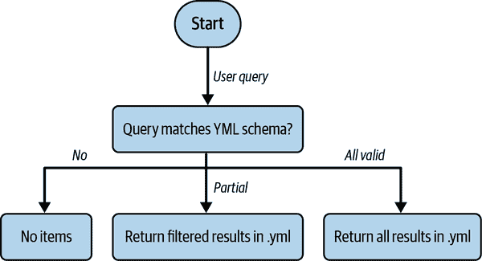
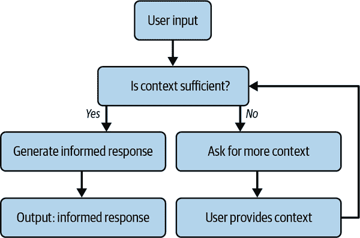
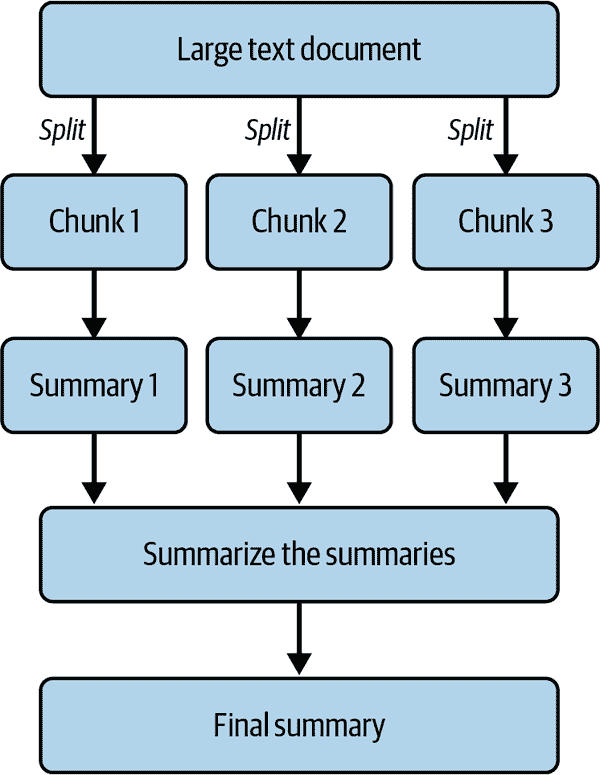

# 第三章：使用 ChatGPT 进行文本生成的标准实践

简单的提示技巧将帮助你最大化 LLM 的输出和格式。你将从定制提示开始，以探索用于文本生成的所有常见实践。

# 生成列表

自动生成列表功能非常强大，使你能够专注于更高层次的任务，同时 GPT 可以代表你自动生成、优化、重新排序和去重列表。

输入：

```py
Generate a list of Disney characters.
```

输出：

```py
Sure, here is a list of some popular Disney characters:

1\. Mickey Mouse
2\. Minnie Mouse
...
30\. Bagheera (The Jungle Book)
```

GPT-4 完全能够提供角色列表。然而，这种方法存在一些陷阱：

+   GPT 决定提供 30 个示例作为编号列表，列表项之间由 `\n` 字符分隔。然而，如果你的下游 Python 代码期望在项目符号处分割，那么你可能会得到不理想的结果或运行时错误。

+   GPT 提供了前置说明；移除任何前置/后续说明将使解析输出更容易。

+   列表大小未受控制，留给了语言模型。

+   一些角色的名字在括号内带有他们对应电影的名称——例如，*Bagheera (The Jungle Book)*——而另一些则没有。这使得提取名字变得更加困难，因为你需要移除电影标题。

+   在基于我们期望结果的 LLM 生成过程中没有应用任何过滤或选择。

以下是一个优化的提示。

输入：

```py
Generate a bullet-point list of 5 male Disney characters.
Only include the name of the character for each line.
Never include the film for each Disney character.
Only return the Disney characters, never include any commentary.

Below is an example list:

* Aladdin
* Simba
* Beast
* Hercules
* Tarzan
```

输出：

```py
* Woody
* Buzz Lightyear
* Stitch
* Jack Sparrow
* Prince Charming
```

# 提供示例

简单地重新措辞你的提示以包含示例 *(few-shot prompting)* 可以极大地影响期望的输出。

通过优化提示，你已实现以下效果：

+   将列表限制为固定大小五项

+   仅生成男性角色

+   正确地使用项目符号格式化列表

+   移除了任何前置说明

简单列表适用于大多数任务；然而，它们结构化程度较低，对于某些任务，从 GPT-4 输出中获得嵌套数据结构是有益的。

三种典型数据结构包括：

+   嵌套文本数据（层级列表）

+   JSON

+   YAML

# 层级列表生成

层级列表在期望的输出是嵌套时非常有用。一个很好的例子是详细的文章结构。

输入：

```py
Generate a hierarchical and incredibly detailed article outline on:

What are the benefits of data engineering.

See an example of the hierarchical structure below:

Article Title: What are the benefits of digital marketing?

* Introduction
    a. Explanation of digital marketing
    b. Importance of digital marketing in today's business world
* Increased Brand Awareness
    a. Definition of brand awareness
    b. How digital marketing helps in increasing brand awareness
```

输出结果：

```py
Article Title: What are the benefits of data engineering?

* Introduction
    a. Explanation of data engineering
    b. Importance of data engineering in today’s data-driven world

...(10 sections later)...

* Conclusion
    a. Importance of data engineering in the modern business world
    b. Future of data engineering and its impact on the data ecosystem
```

为了在前面的输出中生成有效的文章大纲，你包括了两个关键短语：

层级结构

建议文章大纲需要生成嵌套结构。

极其详细

指导语言模型生成更大的输出。其他可以包含以产生相同效果的词语包括 *非常长* 或通过指定大量子标题，*包括至少 10 个顶级标题*。

###### 注意

请求语言模型生成固定数量的项目并不保证语言模型会生成相同长度的输出。例如，如果你请求 10 个标题，你可能会只收到 8 个。因此，你的代码应该验证是否存在 10 个标题，或者能够灵活处理来自 LLM 的不同长度。

因此，你已经成功生成了一个分层文章概要，但如何将字符串解析成结构化数据呢？

让我们用 Python 探索 示例 3-1，其中你之前已成功对 OpenAI 的 GPT-4 进行了 API 调用。这里使用了两个正则表达式来从 `openai_result` 中提取标题和子标题。Python 中的 `re` 模块用于处理正则表达式。

##### 示例 3-1\. [解析分层列表](https://oreil.ly/A0otS)

```py
import re

# openai_result = generate_article_outline(prompt)
# Commented out to focus on a fake LLM response, see below:

openai_result = '''
* Introduction
 a. Explanation of data engineering
 b. Importance of data engineering in today’s data-driven world
* Efficient Data Management
 a. Definition of data management
 b. How data engineering helps in efficient data management
* Conclusion
 a. Importance of data engineering in the modern business world
 b. Future of data engineering and its impact on the data ecosystem
'''

# Regular expression patterns
heading_pattern = r'\* (.+)'
subheading_pattern = r'\s+[a-z]\. (.+)'

# Extract headings and subheadings
headings = re.findall(heading_pattern, openai_result)
subheadings = re.findall(subheading_pattern, openai_result)

# Print results
print("Headings:\n")
for heading in headings:
    print(f"* {heading}")

print("\nSubheadings:\n")
for subheading in subheadings:
    print(f"* {subheading}")
```

此代码将输出：

```py
Headings:
- Introduction
- Efficient Data Management
- Conclusion

Subheadings:
- Explanation of data engineering
- Importance of data engineering in today’s data-driven world
- Definition of data management
- How data engineering helps in efficient data management
- Importance of data engineering in the modern business world
- Future of data engineering and its impact on the data ecosystem
```

正则表达式的使用允许进行高效的模式匹配，使得处理输入文本的变化（如是否存在前导空格或制表符）成为可能。让我们探索这些模式是如何工作的：

+   `heading_pattern = r'\* (.+)'`

此模式旨在提取主要标题，由以下部分组成：

+   `\*` 匹配标题开头处的星号 `(*)` 符号。反斜杠用于转义星号，因为在正则表达式中星号具有特殊含义（前一个字符出现零次或多次）。

+   星号之后将匹配一个空格字符。

+   `(.+)`: 匹配一个或多个字符，括号创建了一个捕获组。`.` 是一个通配符，匹配除换行符之外的任何字符，而 `+` 是一个量词，表示前面的元素（在这种情况下是点）出现一次或多次。

通过应用此模式，你可以轻松地将所有主要标题提取到一个列表中，而不包含星号。

+   `subheading_pattern = r'\s+[a-z]\. (.+)`

`subheading pattern` 将匹配 `openai_result` 字符串中的所有子标题：

+   `\s+` 匹配一个或多个空白字符（空格、制表符等）。`+` 表示前面的元素（在这种情况下是 `\s`）出现一次或多次。

+   `[a-z]` 匹配从 *a* 到 *z* 的单个小写字母。

+   `\.` 匹配点字符。反斜杠用于转义点，因为在正则表达式中点具有特殊含义（匹配除换行符之外的任何字符）。

+   *点号之后将匹配一个空格字符。*

+   `(.+)` 匹配一个或多个字符，括号创建了一个捕获组。`.` 是一个通配符，匹配除换行符之外的任何字符，而 `+` 是一个量词，表示前面的元素（在这种情况下是点）出现一次或多次。

此外，`re.findall()` 函数用于在输入字符串中查找所有非重叠模式的匹配项，并将它们作为列表返回。然后打印提取的标题和子标题。

因此，你现在能够从分层文章概要中提取标题和子标题；然而，你可以进一步细化正则表达式，以便每个标题都与相应的 `subheadings` 相关联。

在 示例 3-2 中，正则表达式略有修改，以便每个子标题直接与其相应的子标题相关联。

##### 示例 3-2\. [将分层列表解析为 Python 字典](https://oreil.ly/LcMtv)

```py
import re

openai_result = """
* Introduction
 a. Explanation of data engineering
 b. Importance of data engineering in today’s data-driven world
* Efficient Data Management
 a. Definition of data management
 b. How data engineering helps in efficient data management
 c. Why data engineering is important for data management
* Conclusion
 a. Importance of data engineering in the modern business world
 b. Future of data engineering and its impact on the data ecosystem
"""

section_regex = re.compile(r"\* (.+)")
subsection_regex = re.compile(r"\s*([a-z]\..+)")

result_dict = {}
current_section = None

for line in openai_result.split("\n"):
    section_match = section_regex.match(line)
    subsection_match = subsection_regex.match(line)

    if section_match:
        current_section = section_match.group(1)
        result_dict[current_section] = []
    elif subsection_match and current_section is not None:
        result_dict[current_section].append(subsection_match.group(1))

print(result_dict)
```

这将输出：

```py
{
    "Introduction": [
        "a. Explanation of data engineering",
        "b. Importance of data engineering in today’s data-driven world"
    ],
    "Efficient Data Management": [
        "a. Definition of data management",
        "b. How data engineering helps in efficient data management"
    ],
    "Conclusion": [
        "a. Importance of data engineering in the modern business world",
        "b. Future of data engineering and its impact on the data ecosystem"
    ]
}
```

部分标题正则表达式 `r'\* (.+)'` 匹配一个星号后跟一个空格和更多字符。括号捕获星号和空格后面的文本，以便在代码中稍后使用。

子部分正则表达式 `r'\s*([a-z]\..+)'` 以 `\s*` 开头，它匹配零个或多个空白字符（空格或制表符）。这允许正则表达式匹配带有或不带有前导空格或制表符的子部分。接下来的部分 `([a-z]\..+)` 匹配一个小写字母后跟一个点和一个或多个字符。括号捕获整个匹配的子部分文本，以便在代码中稍后使用。

`for` 循环遍历输入字符串 `openai_result` 的每一行。当遇到与部分标题正则表达式匹配的行时，循环将匹配的标题设置为当前部分，并在 `result_dict` 字典中为其分配一个空列表作为其值。当一行与子部分正则表达式匹配时，匹配的子部分文本被追加到对应当前部分的列表中。

因此，循环逐行处理 *输入字符串*，将行分类为部分标题或子部分，并构建所需的字典结构。

# 避免使用正则表达式的时机

当你努力从 LLM 响应中提取更多结构化数据时，仅依靠正则表达式会使控制流*变得越来越复杂*。然而，还有其他格式可以轻松地促进从 LLM 响应中解析结构化数据。两种常见的格式是 *.json* 和 *.yml* 文件。

# 生成 JSON

让我们从实验一些提示设计开始，这将指导一个大型语言模型返回 JSON 响应。

输入：

```py
Compose a very detailed article outline on "The benefits of learning code" with a
JSON payload structure that highlights key points.

Only return valid JSON.

Here is an example of the JSON structure:
{
    "Introduction": [
        "a. Explanation of data engineering",
        "b. Importance of data engineering in today’s data-driven world"],
    ...
    "Conclusion": [
        "a. Importance of data engineering in the modern business world",
        "b. Future of data engineering and its impact on the data ecosystem"]
}
```

输出：

```py
{
    "Introduction": [
        "a. Overview of coding and programming languages",
        "b. Importance of coding in today's technology-driven world"],
    ...
    "Conclusion": [
        "a. Recap of the benefits of learning code",
        "b. The ongoing importance of coding skills in the modern world"]
}
```

# 给出指示并提供示例

注意，在前面的提示中，你已经提供了关于任务类型、格式和示例 JSON 输出的指示。

当处理 JSON 时，你可能会遇到的一些常见错误包括无效的有效负载，或者 JSON 被三重反引号包裹 (```py) , such as:

Output:

```

当然，这是 JSON：

```pyjson
{"Name": "John Smith"} # valid payload
{"Name": "John Smith", "some_key":} # invalid payload
```

```py

Ideally you would like the model to respond like so:

Output:

```

{"Name": "John Smith"}

```py

This is important because with the first output, you’d have to split after `json` and then parse the exact part of the string that contained valid JSON. There are several points that are worth adding to your prompts to improve JSON parsing:

```

你必须遵循以下原则：

* 仅返回有效的 JSON

* 永远不要包含反引号符号，例如：`

* 响应将通过 json.loads() 解析，因此它必须是有效的 JSON。

```py

Now let’s examine how you can parse a [JSON output with Python](https://oreil.ly/MoJHn):

```

import json

# openai_json_result = generate_article_outline(prompt)

openai_json_result = """

{

"Introduction": [

"a. 编码和编程语言的概述",

"b. 当今技术驱动世界中编码的重要性"],

"Conclusion": [

"a. 回顾学习代码的好处",

"b. 现代世界中编码技能的持续重要性"]

}

"""

parsed_json_payload = json.loads(openai_json_result)

print(parsed_json_payload)

'''{'Introduction': ['a. 编码和编程语言的概述',

"b. 当今技术驱动世界中编码的重要性"],

'Conclusion': ['a. 回顾学习代码的好处',

'b. The ongoing importance of coding skills in the modern world']}'''

```py

Well done, you’ve successfully parsed some JSON.

As showcased, structuring data from an LLM response is streamlined when requesting the response in valid JSON format. Compared to the previously demonstrated regular expression parsing, this method is less cumbersome and more straightforward.

So what could go wrong?

*   The language model accidentally adds extra text to the response such as `json output:` and your application logic only handles for valid JSON.

*   The JSON produced isn’t valid and fails upon parsing (either due to the size or simply for not escaping certain characters).

Later on you will examine strategies to gracefully handle for such edge cases.

## YAML

*.yml* files are a structured data format that offer different benefits over *.json*:

No need to escape characters

YAML’s indentation pattern eliminates the need for braces, brackets, and commas to denote structure. This can lead to cleaner and less error-prone files, as there’s less risk of mismatched or misplaced punctuation.

Readability

YAML is designed to be human-readable, with a simpler syntax and structure compared to JSON. This makes it easier for you to create, read, and edit prompts, especially when dealing with complex or nested structures.

Comments

Unlike JSON, YAML supports comments, allowing you to add annotations or explanations to the prompts directly in the file. This can be extremely helpful when working in a team or when revisiting the prompts after some time, as it allows for better understanding and collaboration.

Input:

```

- 以下是你将找到的当前 yaml 模式。

- 您可以根据用户查询更新数量。

- 根据以下模式过滤用户查询，如果不匹配则

如果没有剩余的项目，则返回 `"No Items"`。

- 如果有部分匹配，则只返回匹配的项目

在以下模式内：

# 模式：

- 项目：苹果片

数量：5

单位：个

- 项目：牛奶

数量：1

单位：加仑

- 项目：面包

数量：2

单位：条

- 项目：鸡蛋

数量：1

单位：打

用户查询："5 个苹果片，2 打鸡蛋。"

根据以下模式，请仅返回有效的.yml

查询。如果没有匹配项，则返回 `"No Items"`。不要提供任何

注释或解释。

```py

Output:

```

- 项目：苹果片

数量：5

单位：个

- 项目：鸡蛋

数量：2

单位：打

```py

Notice with the preceding example how an LLM is able to infer the correct *.yml* format from the `User Query` string.

Additionally, you’ve given the LLM an opportunity to either:

*   Return a valid *.yml* response

*   Return a filtered *.yml* response

If after filtering, there are no *.yml* items left, then return *No Items*.

# Filtering YAML Payloads

You might decide to use this same prompt for cleaning/filtering a *.yml* payload.

First, let’s focus on a payload that contains both valid and invalid `schema` in reference to our desired `schema`. `Apple slices` fit the criteria; however, `Bananas` doesn’t exist, and you should expect for the `User Query` to be appropriately filtered.

Input:

```

# 用户查询：

- 项目：苹果片

数量：5

单位：个

- 项目：香蕉

数量：3

单位：个

```py

Output:

```

# 更新的 yaml 列表

- 项目：苹果片

数量：5

单位：个

```py

In the preceding example, you’ve successfully filtered the user’s payload against a set criteria and have used the language model as a *reasoning engine*.

By providing the LLM with a set of instructions within the prompt, the response is closely related to what a human might do if they were manually cleaning the data.

The input prompt facilitates the delegation of more control flow tasks to a language learning model (LLM), tasks that would typically require coding in a programming language like Python or JavaScript.

Figure 3-1 provides a detailed overview of the logic applied when processing user queries by an LLM.



###### Figure 3-1\. Using an LLM to determine the control flow of an application instead of code

# Handling Invalid Payloads in YAML

A completely invalid payload might look like this:

Input:

```

# 用户查询：

- 项目：香蕉

数量：3

单位：个

```py

Output:

```

没有项目

```py

As expected, the LLM returned `No Items` as none of the `User Query` items matched against the previously defined `schema`.

Let’s create a Python script that gracefully accommodates for the various types of LLM results returned. The core parts of the script will focus on:

*   Creating custom exceptions for each type of error that might occur due to the three LLM response scenarios

*   Parsing the proposed schema

*   Running a serious of custom checks against the response so you can be sure that the YML response can be safely passed to downstream software applications/microservices

You could define six specific errors that would handle for all of the edge cases:

```

class InvalidResponse(Exception):

    pass

class InvalidItemType(Exception):

    pass

class InvalidItemKeys(Exception):

    pass

class InvalidItemName(Exception):

    pass

class InvalidItemQuantity(Exception):

    pass

class InvalidItemUnit(Exception):

    pass

```py

Then provide the previously proposed `YML schema` as a string:

```

# 提供的模式

schema = """

- 项目：苹果片

数量：5

单位：个

- 项目：牛奶

数量：1

单位：加仑

- 项目：面包

数量：2

单位：条

- 项目：鸡蛋

数量：1

单位：打

"""

```py

Import the `yaml` module and create a custom parser function called `validate_``response` that allows you to easily determine whether an LLM output is valid:

```

导入 yaml

def validate_response(response, schema):

    # 解析模式

    schema_parsed = yaml.safe_load(schema)

    最大数量 = 10

    # 检查响应是否为列表

    if not isinstance(response, list):

        raise InvalidResponse("响应不是列表")

    # 检查列表中的每个项目是否是字典

    for item in response:

        if not isinstance(item, dict):

            raise InvalidItemType('''项目不是字典''')

        # 检查每个字典是否具有 "item"，"quantity" 和 "unit" 键

        if not all(key in item for key in ("item", "quantity", "unit")):

            raise InvalidItemKeys("项目没有正确的键")

        # 检查与每个键关联的值是否是正确的类型

        if not isinstance(item["item"], str):

            raise InvalidItemName("项目名称不是字符串")

        if not isinstance(item["quantity"], int):

            raise InvalidItemQuantity("项目数量不是整数")

        if not isinstance(item["unit"], str):

            raise InvalidItemUnit("项目单位不是字符串")

        # 检查与每个键关联的值是否是正确的值

        if item["item"] not in [x["item"] for x in schema_parsed]:

            raise InvalidItemName("项目名称不在模式中")

        if item["quantity"] >  最大数量:

            raise InvalidItemQuantity(f'''项目数量大于

            {最大数量}''')

        if item["unit"] not in ["pieces", "dozen"]:

            raise InvalidItemUnit("项目单位不是个或打")

```py

To test these edge cases, following you’ll find several mocked LLM responses:

```

# 模拟响应

fake_response_1 = """

- 项目：苹果片

数量：5

单位：个

- 项目：鸡蛋

数量：2

单位：打

"""

fake_response_2 = """

# 更新后的 yaml 列表

- 项目：苹果片

数量：5

单位：件

"""

fake_response_3 = """Unmatched"""

```py

Finally, now you can:

*   Use `yaml.safe_load(response)` to safely parse the *.yml* schema

*   Call the `validate_response` function for each LLM response to test it against custom *.yml* validation logic

```

# 解析伪造的响应

response_1_parsed = yaml.safe_load(fake_response_1)

response_2_parsed = yaml.safe_load(fake_response_2)

response_3_parsed = yaml.safe_load(fake_response_3)

# 验证响应是否符合模式

try:

    validate_response(response_1_parsed, schema)

    print("响应 1 是有效的")

except Exception as e:

    print("响应 1 是无效的:", str(e))

try:

    validate_response(response_2_parsed, schema)

    print("响应 2 是有效的")

except Exception as e:

    print("响应 2 是无效的:", str(e))

try:

    validate_response(response_3_parsed, schema)

    print("响应 3 是有效的")

except Exception as e:

    print("响应 3 是无效的:", str(e))

响应 1 是有效的

响应 2 是有效的

响应 3 是无效的：响应不是列表

```py

# Diverse Format Generation with ChatGPT

ChatGPT is not only capable of generating *.json* or *.yml* files but can also support many other data formats. For example, it can aid you in creating a mermaid diagram or generating a mock *.csv* document. Its versatility stretches to even generating code, conversations, and scripts.

Let’s explore in detail how ChatGPT can produce diverse formatted content. Mermaid is a markdown-like scripting language for generating charts, diagrams, and other visualizations.

Input:

```

使用 mermaid 语法创建一个简单的食物订购流程图

从“选择食物”开始，以“付费用餐”结束的过程

包含“添加到购物车”和“确认购物车”的步骤。

```py

Output:

```

graph TD

    选择食物[选择食物] --> 添加到购物车[添加到购物车]

    添加到购物车 --> 确认购物车[确认购物车]

    确认购物车 --> 付费用餐[付费用餐]

```py

This output, when input to a mermaid diagram renderer, will create a precise flowchart reflecting the food ordering process (Figure 3-2).


###### Figure 3-2\. A streamlined flow diagram created using mermaid syntax via an LLM

## Mock CSV Data

ChatGPT can also generate mock CSV data that can be utilized for testing purposes or other uses.

Input:

```

为五名学生生成以下字段的样本 CSV 数据：

姓名，年龄，年级。

```py

Output:

```

姓名，年龄，年级

约翰，16，A

阿历克斯，17，B

艾玛，16，A

索菲亚，16，B

李姆，17，A

```py

The example generated is a well-formatted CSV file, which can be loaded directly into many tools that read CSV data.

Remember, GPT models rely heavily on the format you specify. For instance, specifying CSV implies the AI should use commas as separators. Be clear about the desired format for optimal results.

You’ve explored different ways of extracting structured data from language models including regular expressions, JSON, YML, and other formats. You can also now use LLMs to direct parts of your application’s control flow.

# Explain It like I’m Five

The *Explain It like I’m Five* prompt focuses on explaining a given section of text *as if you were talking to a five-year-old child.*

This style of prompting is very effective and is a great way to convert technical documents into simple summaries that anyone can understand.

Let’s apply this prompt to an abstract of [“Tumor Microenvironment: Recent Advances in Various Cancer Treatments”](https://oreil.ly/MDOsz).

Input:

```

像我五岁时一样解释以下文本。就像我五岁一样解释。

文本：这是一篇关于不同类型癌症治疗的评论。

我们旨在分析肿瘤微环境和最近的治疗应用趋势

对于几种类型的治疗效果和有效性

癌症的。传统上，癌症治疗基于

新生细胞。

...(为简洁起见省略)...

```py

Output:

```

癌症是一种疾病，使你的身体细胞以不正常的方式生长和分裂

那是不正常的。医生有不同的方法来治疗癌症，比如

切掉它，给你药，或者使用特殊光线来杀死

癌细胞...

```py

The ChatGPT output from the preceding example is much more digestible than the abstract.

# Universal Translation Through LLMs

Additionally, language models can potentially act as *universal translators* due to their proficiency in understanding and generating human-like text across multiple languages.

Let’s investigate this with a simple example:

1.  Generate some simple text.

2.  Change the simple text and make it difficult to read.

3.  Then transform the same text back into an easy to read format in Spanish (instead of English).

4.  Revert the simplistic text back into English.

Input:

```

创建一些简单的文本。

```py

Output:

```

太阳缓缓升起，用橙色和粉色的色调描绘天空。鸟儿

清新的微风穿过树木，带着新鲜草和盛开的花的香气。生命

树木，带着新鲜草和盛开的花的香气。生命

感觉到宁静和希望的觉醒。

...(为简洁起见省略)...

```py

Input:

```

现在将文本变得极其复杂且难以阅读。

```py

Output:

```

在天体上升的虚幻领域，其中辉煌

太阳的球体开始缓慢上升，这是一个精美现象

展开，在广阔的天空上产生了一曲色彩绚丽的交响乐

天空的广阔冠冕。鸟类居民，赋予

甜美的声音，表达他们的欢乐问候，点缀

带有幸福之音的听觉织物。微风，温柔地

在树木哨兵中飘荡，带着它轻柔的潮流

鲜绿叶片和盛开的花朵的香气。

...(为简洁起见省略)...

```py

Input:

```

现在将文本转换成简单、易于阅读的西班牙语格式

```py

Output:

```

```py

Input:

```

```py

Output:

```

```py

As you can see, part of the meaning is lost while doing the translation, and this is to be expected. However, large parts of the original text’s intent remains, demonstrating that LLMs can act as *highly effective translators* for languages that have adequate resources on the internet. For languages that do not have a good amount of resources, it will yield bad results.

The same logic applies to coding languages. LLMs are very good at generating code for established programming languages such as Python and JavaScript but perform worse for newer coding languages and packages.

The boundaries between different forms of information are becoming *increasingly fluid*. The essence of information itself is evolving, allowing for effortless transformations of summaries into stories, poems, or other creative expressions, ultimately enriching our understanding and engagement with the content.

*Diffusion models* are a unique class of generative models utilized in machine learning, specifically designed to produce new images that mimic those found in the training set.

Moreover, when you combine language models with diffusion models, it enables seamless transitions between text, video, and other modalities. This makes it even simpler for you to convey complex ideas across various formats, facilitating a more accessible and comprehensive experience.

# Ask for Context

LLMs are not only capable of generating text but can also act as simple agents with a limited amount of *reasoning capability.* This allows you to write a prompt asking the language model to either:

*   Return a valid result to a question or statement

*   Ask for more context to appropriately answer the question

In this section, you’ll learn about the importance of *asking for context* when working with LLMs such as GPT-4\. We will start with an example of a prompt that doesn’t provide enough context, resulting in a less useful response.

Then, we will provide a better prompt that encourages the model to ask for additional context if needed. Finally, we will use the additional context provided to generate a more informed response.

Input:

```

```py

Output:

```

```py

In the preceding prompt, the model does not have enough context to make a meaningful recommendation. Instead, you can ask ChatGPT for a list of recommended points that would help it to make an effective decision.

Input:

```

```py

Output:

```

```py

After prompting ChatGPT about how to make an informed decision, now you’re aware of what to include within your prompt to help the language model with deciding.

Input:

```

- 数据完整性和约束：强制执行严格的外键

关系和复杂的数据验证规则。

- 事务和并发：需要处理高水平的

在保持数据一致性的同时进行并发读写操作。

- 成熟度和稳定性：优先考虑建立良好且广泛使用的

经过测试的数据库以实现长期稳定性。

- 开发和运营便捷性：采用敏捷开发方法，需要

用于快速原型设计和迭代模式设计。

- 成本：预算限制需要使用开源解决方案，

无需额外的许可或支持费用。

如果您需要更多上下文，请具体说明什么可以帮助您做出

以做出更好的决定。

```py

Output:

```

基于这些考虑，MongoDB 和 PostgreSQL 都有其

强调数据一致性的重要性，但考虑到复杂的数据，

查询和数据完整性约束，PostgreSQL 似乎是一个更

适合您项目的选择。

```py

In this final example, the model uses the additional context provided to give a well-informed recommendation for using PostgreSQL. By asking for context when necessary, LLMs like ChatGPT and GPT-4 can deliver more valuable and accurate responses.

Figure 3-3 demonstrates how *asking for context* changes the decision-making process of LLMs. Upon receiving user input, the model first assesses whether the context given is sufficient. If not, it prompts the user to provide more detailed information, emphasizing the model’s reliance on context-rich inputs. Once adequate context is acquired, the LLM then generates an informed and relevant response.



###### Figure 3-3\. The decision process of an LLM while asking for context

# Allow the LLM to Ask for More Context by Default

You can allow the LLM to ask for more context as a default by including this key phrase: *If you need more context, please specify what would help you to make a better decision.*

In this section, you’ve seen how LLMs can act as agents that use environmental context to make decisions. By iteratively refining the prompt based on the model’s recommendations, we eventually reach a point where the model has *enough context to make a well-informed decision.*

This process highlights the importance of providing sufficient context in your prompts and being prepared to ask for more information when necessary. By doing so, you can leverage the power of LLMs like GPT-4 to make more accurate and valuable recommendations.

In agent-based systems like GPT-4, the ability to ask for more context and provide a finalized answer is crucial for making well-informed decisions. [AutoGPT](https://oreil.ly/l3Ihy), a multiagent system, has a self-evaluation step that automatically checks whether the task can be completed given the current context within the prompt. This technique uses an actor–critic relationship, where the existing prompt context is being analyzed to see whether it could be further refined before being executed.

# Text Style Unbundling

*Text style unbundling* is a powerful technique in prompt engineering that allows you to extract and isolate specific textual features from a given document, such as tone, length, vocabulary, and structure.

This allows you to create new content that shares similar characteristics with the original document, ensuring consistency in style and tone across various forms of communication.

This consistency can be crucial for businesses and organizations that need to communicate with a unified voice across different channels and platforms. The benefits of this technique include:

Improved brand consistency

By ensuring that all content follows a similar style, organizations can strengthen their brand identity and maintain a cohesive image.

Streamlined content creation

By providing a clear set of guidelines, writers and content creators can more easily produce materials that align with a desired style.

Adaptability

Text style unbundling allows for the easy adaptation of existing content to new formats or styles while preserving the core message and tone.

The process of text style unbundling involves *identifying the desired textual features* or creating a meta prompt (a prompt to create prompts) to extract these features and then using the extracted features to guide the generation of new content.

# Identifying the Desired Textual Features

To successfully unbundle a text style, you must first identify the specific features you want to extract from the input document. Common textual features to consider include:

Tone of voice

The overall mood or attitude conveyed by the text, such as formal, casual, humorous, or authoritative

Length

The desired word count or general length of the content

Vocabulary and phrasing

The choice of words and expressions, including industry-specific jargon, colloquialisms, and complexity

Additionally, you can even create a meta prompt that will dynamically show you these.

Input:

```

分析以下文本并确定核心功能，这些功能将允许

进一步的文档以模仿相同的风格、一致性和格式

如下文所述。

提供所有功能作为将用作风格写作指南的所有内容，

用于未来文档。

分析以下文本：

人工智能正在迅速改变我们周围的世界，

开辟新的可能性并颠覆行业。从

从医疗保健到娱乐，人工智能正在使我们的生活变得更好，更加

方便之处不胜枚举。然而，权力越大，责任越大，

责任。我们必须确保人工智能技术得到开发和

以道德和负责任的方式部署，以保护我们的隐私和维护我们的

价值观。

```py

Output:

```

风格写作指南：

语气

- 在整个文档中保持信息性和乐观的语气。

- 强调主题的积极影响，同时承认

任何潜在的关注或责任。

长度：

...

词汇：

...

结构：

...

- 内容：

- 专注于主题的变革性质和积极影响，

事项。

- 突出特定行业或领域，其中主题有所

已经产生了影响。

- 承认任何相关的责任或潜在风险，

强调道德和负责任实践的需要。

强调隐私保护和维护价值观的重要性。

与主题相关。

```py

# Generating New Content with the Extracted Features

After you’ve extracted the desired features from the input document, you can use this information to guide future content generation. Remember to ensure that the AI model incorporates the extracted features into its output by specifying the desired style in your prompt. For example:

*   `Write a new blog post on [topic] using the same tone of voice, length, vocabulary, and structure as the previously analyzed text.`

By combining this technique with *reference text* (documents that act as grounding truth), you can produce credible, branded content that requires minimal revisions.

# Extracting Specific Textual Features with LLMs

You can easily tailor a prompt to guide an LLM in extracting particular textual features from a document. This can be applied beyond just analyzing text for copywriting purposes. For instance, recognizing entities or discerning sentiment from the text can be achieved by crafting a precise instruction for the LLM.

Input:

```

分析以下文本以识别和列出提到的实体：

人工智能正在迅速改变我们周围的世界，

开辟新的可能性并颠覆行业。从

从医疗保健到娱乐，人工智能正在使我们的生活变得更好，更加

方便之处不胜枚举。然而，权力越大，责任越大，

责任。我们必须确保人工智能技术得到开发和

以道德和负责任的方式部署，以保护我们的隐私和

维护我们的价值观。

```py

Output:

```

实体：

- 人工智能（AI）

- 医疗保健

- 娱乐

- 隐私

- 价值观

```py

# Summarization

In the era of information overload, the ability to condense large amounts of text into concise, digestible summaries has become an essential skill. As the volume of data we produce and consume continues to grow, the demand for effective summarization techniques has increased significantly.

AI has made significant advancements in this domain, providing powerful tools for generating summaries that retain the most critical information while discarding less relevant details.

Let’s explore how to summarize using a language model.

Input:

```

总结以下文本：

第一方当事人，以下称为

"购买者"，以及第二方当事人，以下称为

作为完全了解各自法律

根据适用的法定

规定和普通法原则，已依法

约束力，以下称为“协议”，目的是实现涉及货物转让的交易，

目的，以实现涉及货物转让的交易，

以下称为“货物”，在购买者和卖方之间，

应对教育系统日益增长的需求。

我们郑重声明和确认以下内容：

...

```py

Output:

```

这是一个对购买者和卖方都具有法律约束力的协议

用于货物转让。协议将序言作为

是一个不可分割的部分，但在任何冲突的情况下，适用的

协议普遍适用。解释条款规定，单数词语

包括复数和单数，以及指代性别的词语包括

所有性别。对法定规定的提及包括任何修正或

替换。

```py

Summarization is an invaluable application of AI, enabling users to quickly extract key insights from lengthy articles, reports, or research papers. This process can help individuals make informed decisions, save time, and prioritize their reading. AI-generated summaries can also facilitate information sharing among teams, allowing for more efficient collaboration and communication.

# Summarizing Given Context Window Limitations

For documents larger than an LLM can handle in a single API request, a common approach is to chunk the document, summarize each chunk, and then combine these summaries into a final summary, as shown in Figure 3-4.



###### Figure 3-4\. A summarization pipeline that uses text splitting and multiple summarization steps

Additionally, people may require different types of summaries for various reasons, and this is where AI summarization comes in handy. As illustrated in the preceding diagram, a large PDF document could easily be processed using AI summarization to generate distinct summaries tailored to individual needs:

Summary A

Provides key insights, which is perfect for users seeking a quick understanding of the document’s content, enabling them to focus on the most crucial points

Summary B

On the other hand, offers decision-making information, allowing users to make informed decisions based on the content’s implications and recommendations

Summary C

Caters to collaboration and communication, ensuring that users can efficiently share the document’s information and work together seamlessly

By customizing the summaries for different users, AI summarization contributes to increased information retrieval for all users, making the entire process more efficient and targeted.

Let’s assume you’re only interested in finding and summarizing information about the advantages of digital marketing. Simply change your summarization prompt to `Provide a concise, abstractive summary of the above text. Only summarize the advantages: ...`

AI-powered summarization has emerged as an essential tool for quickly distilling vast amounts of information into concise, digestible summaries that cater to various user needs. By leveraging advanced language models like GPT-4, AI summarization techniques can efficiently extract key insights and decision-making information, and also facilitate collaboration and communication.

As the volume of data continues to grow, the demand for effective and targeted summarization will only increase, making AI a crucial asset for individuals and organizations alike in navigating the Information Age.

# Chunking Text

LLMs continue to develop and play an increasingly crucial role in various applications, as the ability to process and manage large volumes of text becomes ever more important. An essential technique for handling large-scale text is known as *chunking.*

*Chunking* refers to the process of breaking down large pieces of text into smaller, more manageable units or chunks. These chunks can be based on various criteria, such as sentence, paragraph, topic, complexity, or length. By dividing text into smaller segments, AI models can more efficiently process, analyze, and generate responses.

Figure 3-5 illustrates the process of chunking a large piece of text and subsequently extracting topics from the individual chunks.


###### Figure 3-5\. Topic extraction with an LLM after chunking text

## Benefits of Chunking Text

There are several advantages to chunking text, which include:

Fitting within a given context length

LLMs only have a certain amount of input and output tokens, which is called a *context length*. By reducing the input tokens you can make sure the output won’t be cut off and the initial request won’t be rejected.

Reducing cost

Chunking helps you to only retrieve the most important points from documents, which reduces your token usage and API costs.

Improved performance

Chunking reduces the processing load on LLMs, allowing for faster response times and more efficient resource utilization.

Increased flexibility

Chunking allows developers to tailor AI responses based on the specific needs of a given task or application.

## Scenarios for Chunking Text

Chunking text can be particularly beneficial in certain scenarios, while in others it may not be required. Understanding when to apply this technique can help in optimizing the performance and cost efficiency of LLMs.

### When to chunk

Large documents

When dealing with extensive documents that exceed the maximum token limit of the LLM

Complex analysis

In scenarios where a detailed analysis is required and the document needs to be broken down for better comprehension and processing

Multitopic documents

When a document covers multiple topics and it’s beneficial to handle them individually

### When not to chunk

Short documents

When the document is short and well within the token limits of the LLM

Simple analysis

In cases where the analysis or processing required is straightforward and doesn’t benefit from chunking

Single-topic documents

When a document is focused on a single topic and chunking doesn’t add value to the processing

## Poor Chunking Example

When text is not chunked correctly, it can lead to reduced LLM performance. Consider the following paragraph from a news article:

```

Google My Business 个人资料，以便在人们寻找

今年，这一举措受到了家长和教师的普遍欢迎。该

额外的资金将用于改善学校基础设施，雇佣更多

这是另一个句子。

认为增加的幅度不足以应对教育系统日益增长的需求。

print(chunk)

```py

When the text is fragmented into isolated words, the resulting list lacks the original context:

```

["The", "local", "council", "has", "decided", "to", "increase", "the",

"预算"，...]

```py

The main issues with this poor chunking example include:

Loss of context

By splitting the text into individual words, the original meaning and relationships between the words are lost. This makes it difficult for AI models to understand and respond effectively.

Increased processing load

Processing individual words requires more computational resources, making it less efficient than processing larger chunks of text.

As a result of the poor chunking in this example, an LLM may face several challenges:

*   Difficulty understanding the main ideas or themes of the text

*   Struggling to generate accurate summaries or translations

*   Inability to effectively perform tasks such as sentiment analysis or text `classification`

By understanding the pitfalls of poor chunking, you can apply prompt engineering principles to improve the process and achieve better results with AI language models.

Let’s explore an improved chunking example using the same news article paragraph from the previous section; you’ll now chunk the text by sentence:

```

["""当地议会决定增加教育预算

今年增长 10%，这一举措受到了家长和教师的普遍欢迎。

""",

"""额外的资金将用于改善学校基础设施，

雇佣更多教师，并为学生提供更好的资源。",

"""然而，一些批评者认为增加的幅度不足以

"""]

```py

# Divide Labor and Evaluate Quality

Define the granularity at which the text should be chunked, such as by sentence, paragraph, or topic. Adjust parameters like the number of tokens or model temperature to optimize the chunking process.

By chunking the text in this manner, you could insert whole sentences into an LLM prompt with the most relevant sentences.

# Chunking Strategies

There are many different chunking strategies, including:

Splitting by sentence

Preserves the context and structure of the original content, making it easier for LLMs to understand and process the information. Sentence-based chunking is particularly useful for tasks like summarization, translation, and sentiment analysis.

Splitting by paragraph

This approach is especially effective when dealing with longer content, as it allows the LLM to focus on one cohesive unit at a time. Paragraph-based chunking is ideal for applications like document analysis, topic modeling, and information extraction.

Splitting by topic or section

This method can help AI models better identify and understand the main themes and ideas within the content. Topic-based chunking is well suited for tasks like text classification, content recommendations, and clustering.

Splitting by complexity

For certain applications, it might be helpful to split text based on its complexity, such as the reading level or technicality of the content. By grouping similar complexity levels together, LLMs can more effectively process and analyze the text. This approach is useful for tasks like readability analysis, content adaptation, and personalized learning.

Splitting by length

This technique is particularly helpful when working with very long or complex documents, as it allows LLMs to process the content more efficiently. Length-based chunking is suitable for applications like large-scale text analysis, search engine indexing, and text preprocessing.

Splitting by tokens using a tokenizer

Utilizing a tokenizer is a crucial step in many natural language processing tasks, as it enables the process of splitting text into individual tokens. Tokenizers divide text into smaller units, such as words, phrases, or symbols, which can then be analyzed and processed by AI models more effectively. You’ll shortly be using a package called `tiktoken`, which is a bytes-pair encoding tokenizer (BPE) for chunking.

Table 3-1 provides a high-level overview of the different chunking strategies; it’s worth considering what matters to you most when performing chunking.

Are you more interested in preserving semantic context, or would naively splitting by length suffice?

Table 3-1\. Six chunking strategies highlighting their advantages and disadvantages

| Splitting strategy | Advantages | Disadvantages |
| --- | --- | --- |
| Splitting by sentence | Preserves context, suitable for various tasks | May not be efficient for very long content |
| Splitting by paragraph | Handles longer content, focuses on cohesive units | Less granularity, may miss subtle connections |
| Splitting by topic | Identifies main themes, better for classification | Requires topic identification, may miss fine details |
| Splitting by complexity | Groups similar complexity levels, adaptive | Requires complexity measurement, not suitable for all tasks |
| Splitting by length | Manages very long content, efficient processing | Loss of context, may require more preprocessing steps |
| Using a tokenizer: Splitting by tokens | Accurate token counts, which helps in avoiding LLM prompt token limits | Requires tokenization, may increase computational complexity |

By choosing the appropriate chunking strategy for your specific use case, you can optimize the performance and accuracy of AI language models.

# Sentence Detection Using SpaCy

*Sentence detection*, also known as sentence boundary disambiguation, is the process used in NLP that involves identifying the start and end of sentences within a given text. It can be particularly useful for tasks that require preserving the context and structure of the original content. By splitting the text into sentences, LLMs can better understand and process the information for tasks such as summarization, translation, and sentiment analysis.

Splitting by sentence is possible using NLP libraries such as [spaCy](https://spacy.io). Ensure that you have spaCy installed in your Python environment. You can install it with `pip install spacy`. Download the `en_core_web_sm` model using the command `python -m spacy download en_core_web_sm`.

In Example 3-3, the code demonstrates sentence detection using the spaCy library in Python.

##### Example 3-3\. [Sentence detection with spaCy](https://oreil.ly/GKDnc)

```

import spacy

nlp = spacy.load("en_core_web_sm")

text = "这是一个句子。这是另一个句子。"

doc = nlp(text)

对于 doc.sents 中的 sent：

    print(sent.text)

```py

Output:

```

这是一个句子。

当地议会决定将教育预算增加 10%

```py

First, you’ll import the spaCy library and load the English model `(en_core_web_sm)` to initialize an `nlp` object. Define an input text with two sentences; the text is then processed with `doc = nlp(text)`, creating a `doc` object as a result. Finally, the code iterates through the detected sentences using the `doc.sents` attribute and prints each sentence.

# Building a Simple Chunking Algorithm in Python

After exploring many chunking strategies, it’s important to build your intuition by writing a simple chunking algorithm from scatch.

Example 3-4 shows how to chunk text based on the length of characters from the blog post “Hubspot - What Is Digital Marketing?” This file can be found in the Github repository at *[content/chapter_3/hubspot_blog_post.txt](https://oreil.ly/30rlQ)*.

To correctly read the *hubspot_blog_post.txt* file, make sure your current working directory is set to the [*content/chapter_3*](https://oreil.ly/OHurh) GitHub directory. This applies for both running the Python code or launching the Jupyter Notebook server.

##### Example 3-4\. [Character chunking](https://oreil.ly/n3sNy)

```

with open("hubspot_blog_post.txt", "r") as f：

    text = f.read()

chunks = [text[i : i + 200] for i in range(0, len(text), 200)]

将内容分成块：

    print("-" * 20)

    老师，并为学生提供更好的资源。然而，一些批评者

```py

Output:

```

对于许多本地企业来说，搜索引擎优化策略是优化

卖方，根据本文件规定的条款和条件，双方

与您提供的产品或服务相关。

--------------------

您提供的内容。

对于位于乔治亚州亚特兰大的本地书店 For Keeps Bookstore，它已经优化了其

Google My Business 个人资料以进行本地搜索引擎优化，以便在查询时显示。

“atlanta bookstore。”

--------------------

...(为简洁起见省略)...

```py

First, you open the text file *hubspot_blog_post.txt* with the `open` function and read its contents into the variable text. Then using a list comprehension you create a list of chunks, where each `chunk` is a 200 character substring of text.

Then you use the `range` function to generate indices for each 200 character substring, and the `i:i+200` slice notation to extract the substring from text.

Finally, you loop through each chunk in the `chunks` list and `print` it to the console.

As you can see, because the chunking implementation is relatively simple and only based on length, there are gaps within the sentences and even words.

For these reasons we believe that good NLP chunking has the following properties:

*   Preserves entire words, ideally sentences and contextual points made by speakers

*   Handles for when sentences span across several pages, for example, page 1 into page 2

*   Provides an adequate token count for each `chunk` so that the total number of input tokens will appropriately fit into a given token context window for any LLM

# Sliding Window Chunking

*Sliding window chunking* is a technique used for dividing text data into overlapping chunks, or *windows*, based on a specified number of characters, tokens, or words.

But what exactly is a sliding window?

Imagine viewing a long piece of text through a small window. This window is only capable of displaying a fixed number of items at a time. As you slide this window from the beginning to the end of the text, you see *overlapping chunks of text*. This mechanism forms the essence of the sliding window approach.

Each window size is defined by a *fixed number of characters, tokens, or words*, and the *step size* determines how far the window moves with each slide.

In Figure 3-6, with a window size of 4 words and a step size of 1, the first chunk would contain the first 4 words of the text. The window then slides 1 word to the right to create the second chunk, which contains words 2 through 5.

This process repeats until the end of the text is reached, ensuring each chunk overlaps with the previous and next ones to retain some shared context.


###### Figure 3-6\. A sliding window, with a window size of 4 and a step size of 1

Due to the step size being 1, there is a lot of duplicate information between chunks, and at the same time the risk of losing information between chunks is dramatically reduced.

This is in stark contrast to Figure 3-7, which has a window size of 4 words and a step size of 2\. You’ll notice that because of the 100% increase in step size, the amount of information shared between the chunks is greatly reduced.


###### Figure 3-7\. A sliding window, with a window size of 4 and a step size of 2

You will likely need a larger overlap if accuracy and preserving semanatic context are more important than minimizing token inputs or the number of requests made to an LLM.

Example 3-5 shows how you can implement a sliding window using Python’s `len()` function. The `len()` function provides us with the total number of characters rather than words in a given text string, which subsequently aids in defining the parameters of our sliding windows.

##### Example 3-5\. [Sliding window](https://oreil.ly/aCkDo)

```

def sliding_window(text, window_size, step_size):

    如果 window_size > len(text)或 step_size < 1：

        return []

    return [text[i:i+window_size] for i

    in range(0, len(text) - window_size + 1, step_size)]

text = "This is an example of sliding window text chunking."

window_size = 20

step_size = 5

chunks = sliding_window(text, window_size, step_size)

for idx, chunk in enumerate(chunks):

    print(f"Chunk {idx + 1}: {chunk}")

```py

This code outputs:

```

Chunk 1: This is an example o

Chunk 2: is an example of sli

Chunk 3:  example of sliding

Chunk 4: ple of sliding windo

Chunk 5: f 滑动窗口文本

Chunk 6: ding 窗口文本

Chunk 7: window text chunking

```py

In the context of prompt engineering, the sliding window approach offers several benefits over fixed chunking methods. It allows LLMs to retain a higher degree of context, as there is an overlap between the chunks and offers an alternative approach to preserving context compared to sentence detection.

# Text Chunking Packages

When working with LLMs such as GPT-4, always remain wary of the maximum context length:

*   `maximum_context_length = input_tokens + output_tokens`

There are various tokenizers available to break your text down into manageable units, the most popular ones being NLTK, spaCy, and tiktoken.

Both [NLTK](https://oreil.ly/wTmI7) and [spaCy](https://oreil.ly/c4MvQ) provide comprehensive support for text processing, but you’ll be focusing on tiktoken.

# Text Chunking with Tiktoken

[Tiktoken](https://oreil.ly/oSpVe) is a fast *byte pair encoding (BPE)* tokenizer that breaks down text into subword units and is designed for use with OpenAI’s models. Tiktoken offers faster performance than comparable open source tokenizers.

As a developer working with GPT-4 applications, using tiktoken offers you several key advantages:

Accurate token breakdown

It’s crucial to divide text into tokens because GPT models interpret text as individual tokens. Identifying the number of tokens in your text helps you figure out whether the text is too lengthy for a model to process.

Effective resource utilization

Having the correct token count enables you to manage resources efficiently, particularly when using the OpenAI API. Being aware of the exact number of tokens helps you regulate and optimize API usage, maintaining a balance between costs and resource usage.

# Encodings

Encodings define the method of converting text into tokens, with different models utilizing different encodings. Tiktoken supports three encodings commonly used by OpenAI models:

| Encoding name | OpenAI models |
| --- | --- |
| cl100k_base | GPT-4, GPT-3.5-turbo, text-embedding-ada-002 |
| p50k_base | Codex models, text-davinci-002, text-davinci-003 |
| r50k_base (or gpt2) | GPT-3 models like davinci |

## Understanding the Tokenization of Strings

In English, tokens can vary in length, ranging from a single character like *t*, to an entire word such as *great*. This is due to the adaptable nature of tokenization, which can accommodate even tokens shorter than a character in complex script languages or tokens longer than a word in languages without spaces or where phrases function as single units.

It is not uncommon for spaces to be included within tokens, such as `"is"` rather than `"is "` or `" "+"is"`. This practice helps maintain the original text formatting and can capture specific linguistic characteristics.

###### Note

To easily examine the tokenization of a string, you can use [OpenAI Tokenizer](https://oreil.ly/K6ZQK).

You can install [tiktoken from PyPI](https://oreil.ly/HA2QD) with `pip install` `tiktoken`. In the following example, you’ll see how to easily encode text into tokens and decode tokens into text:

```

# 1\. 导入包：

import tiktoken

# 2\. 使用 tiktoken.get_encoding() 加载编码

encoding = tiktoken.get_encoding("cl100k_base")

# 3\. 使用 encoding.encode() 将一些文本转换为标记

# while 将标记转换为文本时使用 encoding.decode()

print(encoding.encode("Learning how to use Tiktoken is fun!"))

print(encoding.decode([1061, 15009, 374, 264, 2294, 1648,

311, 4048, 922, 15592, 0]))

# [48567, 1268, 311, 1005, 73842, 5963, 374, 2523, 0]

# "Data engineering is a great way to learn about AI!"

```py

Additionally let’s write a function that will tokenize the text and then count the number of tokens given a `text_string` and `encoding_name`.

```

def count_tokens(text_string: str, encoding_name: str) -> int:

    """

返回使用给定编码的文本字符串中的标记数量。

Args:

text: 要进行标记化的文本字符串。

encoding_name: 要用于标记化的编码的名称。

Returns:

文本字符串中的标记数量。

Raises:

ValueError: 如果编码名称不被识别。

"""

    encoding = tiktoken.get_encoding(encoding_name)

    num_tokens = len(encoding.encode(text_string))

    return num_tokens

# 4\. 使用该函数计算文本字符串中的标记数量。

text_string = "Hello world! This is a test."

print(count_tokens(text_string, "cl100k_base"))

```py

This code outputs `8`.

# Estimating Token Usage for Chat API Calls

ChatGPT models, such as GPT-3.5-turbo and GPT-4, utilize tokens similarly to previous completion models. However, the message-based structure makes token counting for conversations more challenging:

```

def num_tokens_from_messages(messages, model="gpt-3.5-turbo-0613"):

    """返回由消息列表使用的标记数量。”

    try:

        encoding = tiktoken.encoding_for_model(model)

    except KeyError:

        print("警告：模型未找到。使用 cl100k_base 编码。")

        encoding = tiktoken.get_encoding("cl100k_base")

    if model in {

        "gpt-3.5-turbo-0613",

        "gpt-3.5-turbo-16k-0613",

        "gpt-4-0314",

        "gpt-4-32k-0314",

        "gpt-4-0613",

        "gpt-4-32k-0613",

        }:

        tokens_per_message = 3

        tokens_per_name = 1

    elif model == "gpt-3.5-turbo-0301":

        tokens_per_message = 4  # 每条消息后跟随

        # <|start|>{role/name}\n{content}<|end|>\n

        tokens_per_name = -1  # 如果有名称，则省略角色

    elif "gpt-3.5-turbo" in model:

        print('''警告：gpt-3.5-turbo 可能会随时间更新。返回

num_tokens_assuming_gpt-3.5-turbo-0613.''')

        return num_tokens_from_messages(messages, model="gpt-3.5-turbo-0613")

    elif "gpt-4" in model:

        print('''警告：gpt-4 可能会随时间更新。

返回假设使用 gpt-4-0613 的标记数量。”

        return num_tokens_from_messages(messages, model="gpt-4-0613")

    else:

        raise NotImplementedError(

            f"""num_tokens_from_messages() 未实现对于模型

            {model}."""

        )

    num_tokens = 0

    for message in messages:

        num_tokens += tokens_per_message

        for key, value in message.items():

            num_tokens += len(encoding.encode(value))

            if key == "name":

                "role": "user",

    print(model)

    # {

    {

```py

Example 3-6 highlights the specific structure required to make a request against any of the chat models, which are currently GPT-3x and GPT-4.

Normally, chat history is structured with a `system` message first, and then succeeded by alternating exchanges between the `user` and the `assistant`.

##### Example 3-6\. A payload for the Chat Completions API on OpenAI

```

},

    当然！以下是一个基本 Flask "Hello World"应用程序的概述：

        "content": '''当我们不那么忙的时候，再谈谈如何

        "content": '''您是一个有帮助的、遵循模式的助手，创建一个 Flask 应用程序的实例：创建一个 Flask 应用程序的实例。

return 'Hello, World!'

    from flask import Flask

    {

        Flask 应用程序：

        "role": "system",

        return num_tokens

    - 负面

    "name": "example_assistant",

        使用其 ((("Flask 模块代码生成")))功能。

        "content": '''当我们有更多带宽来触及

        num_tokens += 3  # 每个回复都预先填充

    "name": "example_user",

    用 Flask 类表示您的 Web 应用程序。

        for model in ["gpt-3.5-turbo-0301", "gpt-4-0314"]:

        做得更好。'''

        <|start|>assistant<|message|>

- 积极的

    导入 Flask 模块：导入 Flask 模块

    基于增加杠杆的机会。'''

        {

        print(f'''{num_tokens_from_messages(example_messages, model)}''')

        app.run()

当然！以下是一个 Flask 中 "Hello World" 路由的测试用例示例：

    这段文字是积极的还是消极的？

    或者中立：我绝对喜欢这部手机的造型，但电池

        example_messages = [

        方面。积极的一面是 "我绝对喜欢这部手机的造型，"

我绝对喜欢这部手机的造型，但电池寿命相当

    "role": "system",

客户交付成果需要花费大量时间。

]

    },

    # application.

    "role": "system",

"role": "system",

```py

`"role": "system"` describes a system message that’s useful for *providing prompt instructions*. It offers a means to tweak the assistant’s character or provide explicit directives regarding its interactive approach. It’s crucial to understand, though, that the system command isn’t a prerequisite, and the model’s default demeanor without a system command could closely resemble the behavior of “You are a helpful assistant.”

The roles that you can have are `["system", "user", "assistant"]`.

`"content": "Some content"` is where you place the prompt or responses from a language model, depending upon the message’s role. It can be either `"assistant"`, `"system"`, or `"user"`.

# Sentiment Analysis

*Sentiment analysis* is a widely used NLP technique that helps in identifying, extracting, and understanding the emotions, opinions, or sentiments expressed in a piece of text. By leveraging the power of LLMs like GPT-4, sentiment analysis has become an essential tool for businesses, researchers, and developers across various industries.

The primary goal of sentiment analysis is to determine the attitude or emotional tone conveyed in a text, whether it’s positive, negative, or neutral. This information can provide valuable insights into consumer opinions about products or services, help monitor brand reputation, and even assist in predicting market trends.

The following are several prompt engineering techniques for creating effective sentiment analysis prompts:

Input:

```

import unittest

提供一个 Flask 中简单 "Hello World" 路由的代码片段。

while the negative part is "the battery life is quite disappointing."

```py

Output:

```

运行应用程序：启动 Flask 开发服务器以运行应用程序。

@app.route('/')

"content": '''这次晚期的转变意味着我们没有

```py

Although GPT-4 identifies a “mixed tone,” the outcome is a result of several shortcomings in the prompt:

Lack of clarity

The prompt does not clearly define the desired output format.

Insufficient examples

The prompt does not include any examples of positive, negative, or neutral sentiments, which could help guide the LLM in understanding the distinctions between them.

No guidance on handling mixed sentiments

The prompt does not specify how to handle cases where the text contains a mix of positive and negative sentiments.

Input:

```

使用以下示例作为指南：

},

"name": "example_assistant",

请将以下文本的情感分类为积极、消极或中立：

{

电池寿命相当令人失望。

},

},

app = Flask(__name__)

"content": "事物协同工作将增加收入。",

"name": "example_assistant",

```py

Output:

```

定义路由和视图函数：...

```py

This prompt is much better because it:

Provides clear instructions

The prompt clearly states the task, which is to classify the sentiment of the given text into one of three categories: positive, negative, or neutral.

Offers examples

The prompt provides examples for each of the sentiment categories, which helps in understanding the context and desired output.

Defines the output format

The prompt specifies that the output should be a single word, ensuring that the response is concise and easy to understand.

## Techniques for Improving Sentiment Analysis

To enhance sentiment analysis accuracy, preprocessing the input text is a vital step. This involves the following:

Special characters removal

Exceptional characters such as emojis, hashtags, and punctuation may skew the rule-based sentiment algorithm’s judgment. Besides, these characters might not be recognized by machine learning and deep learning models, resulting in misclassification.

Lowercase conversion

Converting all the characters to lowercase aids in creating uniformity. For instance, words like *Happy* and *happy* are treated as different words by models, which can cause duplication and inaccuracies.

Spelling correction

Spelling errors can cause misinterpretation and misclassification. Creating a spell-check pipeline can significantly reduce such errors and improve results.

For industry- or domain-specific text, embedding domain-specific content in the prompt helps in navigating the LLM’s sense of the text’s framework and sentiment. It enhances accuracy in the classification and provides a heightened understanding of particular jargon and expressions.

## Limitations and Challenges in Sentiment Analysis

Despite the advancements in LLMs and the application of prompt engineering techniques, sentiment analysis still faces some limitations and challenges:

Handling sarcasm and irony

Detecting sarcasm and irony in text can be difficult for LLMs, as it often requires understanding the context and subtle cues that humans can easily recognize. Misinterpreting sarcastic or ironic statements may lead to inaccurate sentiment classification.

Identifying context-specific sentiment

Sentiment analysis can be challenging when dealing with context-specific sentiments, such as those related to domain-specific jargon or cultural expressions. LLMs may struggle to accurately classify sentiments in these cases without proper guidance or domain-specific examples.

# Least to Most

The *least to most* technique in prompt engineering is a powerful method for sequentially generating or extracting increasingly detailed knowledge on a given topic. This method is particularly effective when dealing with complex subjects or when a high level of detail is necessary.

Least to most uses a *chain* of prompts where each new prompt is based on the last answer. This step-by-step approach helps gather more detailed information each time, making it easier to dive deeper into any topic.

This technique can also be applied to code generation, as demonstrated in a Flask `Hello World` app example.

## Planning the Architecture

Before diving into the architecture, let’s briefly understand what Flask is. [Flask](https://oreil.ly/7N-bs) is a lightweight web application framework in Python, widely used for creating web applications quickly and with minimal code. (Flask is only used for demonstration purposes here and isn’t included within the [*requirements.txt* file](https://oreil.ly/TRK0i) for the book.

Now, let’s ask an LLM to outline the basic architecture for a simple Flask “Hello World” application.

Input:

```

我绝对喜欢这部手机的造型，但电池寿命相当

```py

Output:

```

- 中立

积极的："我绝对喜欢这部手机的造型！"

中立："我喜欢这个产品，但它的电池寿命很短。"

概述一个简单的 Flask "Hello World"应用程序的基本架构。

"name": "example_user",

当然！以下是一个使用 Flask 的 "Hello World" 路由的简单代码片段：

中立

num_tokens += tokens_per_name

```py

## Coding Individual Functions

Before coding, let’s clarify what a Flask route is: it’s a function linked to a URL pattern that determines what users see on a specific web page. Next, we’ll provide the code snippet for a simple “Hello World” route in Flask.

Input:

```

if __name__ == '__main__':

```py

Output:

```

将公司术语翻译成普通英语。'''

提供一个 Flask 中 "Hello World" 路由的测试用例示例。

"content": "新的协同效应将有助于推动收入增长。",

实现视图函数：...

def hello_world():

    {

},

    "role": "system",

```py

In this code, we import the Flask module and create a Flask application instance named `app`. We then define a route using the `@app.route` decorator, specifying the root URL path `'/'`. The `hello_world` function is associated with this route, and it returns the string `'Hello, World!'` as the response.

The Flask application will start by calling `app.run()` when your Python script is executed directly.

## Adding Tests

Finally, let’s ask it to generate a test case for the “Hello World” route in the Flask application.

Input:

```

这段文字的语气是混合的，因为它包含了积极和消极的内容。

只返回以下单词中的一个：

```py

Output:

```

prompt tokens counted by num_tokens_from_messages().''')

消极的："电池寿命相当令人失望。"

example token count from the function defined above

from flask import Flask

from flask.testing import FlaskClient

# 创建 Flask 应用程序

app = Flask(__name__)

# 创建路由

@app.route('/')

def hello_world():

    return 'Hello, World!'

class FlaskAppTestCase(unittest.TestCase):

    def setUp(self):

        # 创建测试客户端

        self.app = app.test_client()

    def test_hello_world_route(self):

        # 向路由发送 GET 请求

        response = self.app.get('/')

        # 检查响应状态码

        self.assertEqual(response.status_code, 200)

        # 检查响应数据

        self.assertEqual(response.data, b'Hello, World!')

if __name__ == '__main__':

    unittest.main()

```py

By using the least to most prompt technique, you can gradually build up the knowledge and understanding required for the task at hand.

## Benefits of the Least to Most Technique

This method is particularly useful for complex tasks, as it allows an LLM to generate relevant knowledge that will subsequently be used as context for future tasks.

Let’s dive deeper into the benefits of using this approach in various other scenarios:

Progressive exploration

Breaking a complex problem into smaller tasks allows an LLM to provide more detailed and accurate information at each step. This approach is especially helpful when working with a new subject matter or a multifaceted problem.

Flexibility

The least to most technique offers flexibility in addressing different aspects of a problem. It enables you to pivot, explore alternative solutions, or dive deeper into specific areas as needed.

Improved comprehension

By breaking down a task into smaller steps, an LLM can deliver information in a more digestible format, making it easier for you to understand and follow.

Collaborative learning

This technique promotes collaboration between you and an LLM, as it encourages an iterative process of refining the output and adjusting your responses to achieve the desired outcome.

## Challenges with the Least to Most Technique

Overreliance on previously generated knowledge

Using previous chat history to store the state may lead to larger tasks forgetting their initial tasks/outputs due to limitations in context length.

Dependence on prior prompts

Since each prompt is built upon preceding outputs, it is imperative to ensure that the quality and responses of previous prompts provide ample information for the next step.

# Evaluate Quality

In the process of designing prompts, make sure to evaluate the quality of each prior LLM response. The performance of the next task depends upon the quality of information provided by the preceding one.

# Role Prompting

*Role prompting* is a technique in which the AI is given a specific role or character to assume while generating a response. This helps guide the AI’s response style and content to better align with the user’s needs or desired outcome.

###### Note

[Awesome ChatGPT prompts](https://oreil.ly/8pf40) provides an extensive list of role prompts that you can use.

Let’s ask ChatGPT to take on the role of a tech reviewer for MongoDB.

Input:

```

我想让你扮演技术评论员。我会给你一个文章的名字

技术和您将提供深入评论 - 包括

优点、缺点、特性以及与其他市场上技术的比较。

我的第一项建议请求是：MongoDB。

```py

Output:

```

MongoDB 是一种流行的 NoSQL、面向文档的数据库管理系统

设计用于处理高容量数据存储和检索。

特性：

1. 面向文档的存储：MongoDB 以灵活、类似 JSON 的方式存储数据

格式称为 BSON，这使得存储复杂的数据结构变得容易

数组和嵌套对象。

...

优点：

1. 高性能：MongoDB 的索引和缓存功能提供

快速读写操作。

...

缺点：

1. 对事务的支持有限：虽然 MongoDB 支持多文档事务，

如果在 ACID 事务中找不到答案，它可能不是应用程序的最佳选择

需要复杂的交易操作。

...

与其他技术的比较：

1. Couchbase，另一个流行的 NoSQL 数据库，提供与 MongoDB 类似的功能

MongoDB，包括灵活的模式和基于 JSON 的存储。然而，

Couchbase 更专注于分布式缓存，可能更适合

适用于需要低延迟数据访问的应用。

结论：

MongoDB 是一种强大且灵活的 NoSQL 数据库解决方案，适用于

各种应用，尤其是那些需要高性能和

可扩展性。其灵活的数据模型、丰富的查询语言和强大的

一致性使其成为开发人员中的热门选择。

```py

The prompt is an excellent example of role prompting, as it clearly defines the role the AI should assume (a tech reviewer) and sets expectations for the type of response desired (an in-depth review of MongoDB).

# Give Direction

When crafting prompts, consider assigning a specific role to the AI. This sets the proper context for the response, creating a more focused and relevant output.

# Benefits of Role Prompting

Role prompting helps narrow down the AI’s responses, ensuring more focused, contextually appropriate, and tailored results. It can also enhance creativity by pushing the AI to think and respond from unique perspectives.

# Challenges of Role Prompting

Role prompting can pose certain challenges. There might be potential risks for bias or stereotyping based on the role assigned. Assigning stereotyped roles can lead to generating biased responses, which could harm usability or offend individuals. Additionally, maintaining consistency in the role throughout an extended interaction can be difficult. The model might drift off-topic or respond with information irrelevant to the assigned role.

# Evaluate Quality

Consistently check the quality of the LLM’s responses, especially when role prompting is in play. Monitor if the AI is sticking to the role assigned or if it is veering off-topic.

# When to Use Role Prompting

Role prompting is particularly useful when you want to:

Elicit specific expertise

If you need a response that requires domain knowledge or specialized expertise, role prompting can help guide the LLM to generate more informed and accurate responses.

Tailor response style

Assigning a role can help an LLM generate responses that match a specific tone, style, or perspective, such as a formal, casual, or humorous response.

Encourage creative responses

Role prompting can be used to create fictional scenarios or generate imaginative answers by assigning roles like a storyteller, a character from a novel, or a historical figure.

*   *Explore diverse perspectives*: If you want to explore different viewpoints on a topic, role prompting can help by asking the AI to assume various roles or personas, allowing for a more comprehensive understanding of the subject.

*   *Enhance user engagement*: Role prompting can make interactions more engaging and entertaining by enabling an LLM to take on characters or personas that resonate with the user.

If you’re using OpenAI, then the best place to add a role is within the `System Message` for chat models.

# GPT Prompting Tactics

So far you’ve already covered several prompting tactics, including asking for context, text style bundling, least to most, and role prompting.

Let’s cover several more tactics, from managing potential hallucinations with appropriate reference text, to providing an LLM with critical *thinking time*, to understanding the concept of *task decomposition*—we have plenty for you to explore.

These methodologies have been designed to significantly boost the precision of your AI’s output and are recommended by [OpenAI](https://oreil.ly/QZE8n). Also, each tactic utilizes one or more of the prompt engineering principles discussed in Chapter 1.

## Avoiding Hallucinations with Reference

The first method for avoiding text-based hallucinations is to instruct the model to *only answer using reference text.*

By supplying an AI model with accurate and relevant information about a given query, the model can be directed to use this information to generate its response.

Input:

```

参考三引号内的文章以回答查询。

您必须遵循以下原则：

- 如果在这些文章中找不到答案，只需

return "I could not find an answer".

"""

B2B 客户往往有更长的决策过程，因此决策周期更长

销售漏斗。关系建立策略对这些

客户，而 B2C 客户往往对短期优惠反应更好

和消息。

"""

示例响应：

- 我找不到答案。

- 是的，B2B 客户往往有更长的决策过程，因此

更长的销售漏斗。

```py

Output:

```

是的，B2B 客户往往有更长的决策过程，这导致

决策周期更长。

```py

If you were to ask the same reference text this question:

Input:

```

...剩余提示...

问题：B2C 销售是否更划算？

```py

Output:

```

我找不到答案。

```py

# Give Direction and Specify Format

The preceding prompt is excellent as it both instructs the model on how to find answers and also sets a specific response format for any unanswerable questions.

Considering the constrained context windows of GPTs, a method for dynamically retrieving information relevant to the asked query might be necessary to utilize this strategy.

Another approach is to direct the model to *incorporate references* from a given text in its response. When the input is enhanced with relevant information, the model can be guided to include citations in its responses by referring to sections of the supplied documents. This approach has the added benefit that citations in the output can be *authenticated automatically by matching strings* within the given documents.

Input:

```

您将提供由三引号分隔的文档，并

```py

Output:

```

```py

## Give GPTs “Thinking Time”

Often, by explicitly guiding an LLM to *derive solutions from first principles* before reaching a verdict, you can garner more accurate responses. Providing an LLM with *thinking time* can often lead to better results.

Input:

```

```py

Output:

```

```py

In some cases, when using GPT-4 or other generative AI models, you may not want the model’s reasoning process to be visible to the user.

You can achieve this by asking an LLM to *generate an inner monologue*. This is particularly useful in tutoring applications, where revealing the model’s reasoning might give away the solution prematurely.

## The Inner Monologue Tactic

The *inner monologue tactic* instructs the model to structure parts of the output that should be hidden from the user in a specific format. This makes it easy to remove these parts before presenting the final output to the user.

Here’s how you can utilize this tactic to answer user queries effectively.

Input:

```

指导他们找到正确答案，而不直接给出答案。

这个部分也应该在三个引号内。

第四步：交付提示

如果有错误，向用户展示上一步的提示。

记住不要在这个步骤中使用三引号。而不是使用标题

一样，使用 `提示:` 这样的标题

问题陈述：一副牌有 52 张牌：13 张红心、13 张方块、13

梅花、13 张黑桃。如果从牌组中抽取两张牌而不进行

抽牌，那么抽出的牌中至少有一张红心的概率是多少

和另一张是梅花吗？

用户解决方案：（13/52）*（13/51）= 169/2652 = 13/204

```py

Output:

```

"""

第一步 - 我的解决方案：

首先，计算从牌组中抽取 1 张红心和 1 张梅花的概率

52 张牌的牌组，不进行抽牌。

在第一次抽取中，抽取红心的概率是 13/52。

对于第二次抽取，在移除 1 张牌（假设是红心）后，剩余的

总牌数变为 51 张。因此，现在抽取梅花的概率是

是 13/51。

将这两个概率相乘，得到两个事件同时发生的概率

按顺序发生，即 P(红心然后梅花) = (13/52)*(13/51)。

假设第一张抽出的牌是梅花，然后重复计算

第二次抽取的牌是红心。记住，在这种情况下，顺序很重要，

我们处理的是独立事件。

"""

"""

第二步 - 与用户解决方案的比较：

将你的解决方案与用户解决方案进行比较。用户的解决方案只

考虑先抽红心然后抽梅花的顺序。他们

没有考虑到另一种序列（梅花然后红心），并且

因此，解决方案是不完整的。

"""

"""

第三步 - 提示准备：

由于用户没有考虑两种序列（红心然后梅花

以及梅花然后红心），这是对考虑两种可能

序列将有助于引导用户走向正确的方向。这可能会

方向而不直接透露解决方案。

"""

# 第四步 - 提示交付：

# 提示：记住两张牌可以以任何顺序抽取。考虑

两种可能的顺序：红心然后梅花和梅花然后红心。

```py

## Self-Eval LLM Responses

Another tactic you can use is to *critque a generated LLM output* and ask whether the LLM missed any information or important facts. You’re essentially asking an LLM to *evaluate itself* based on its previous output.

First, create a prompt to generate a `"Hello World"` function.

Input:

```

生成一个 "Hello World" Python 函数。

```py

Output:

```

是的，这是一个非常简单的 Python 函数，它将 "Hello, World!" 打印到

控制台：

def print_hello_world():

    print("Hello, World!")

打印 "Hello, World!" 的函数。

当你运行这个函数时，它将打印字符串 "Hello, World!" 到

控制台。

```py

The LLM returns a simple Python function called `print_hello_world()` that prints the traditional “Hello, World!” greeting.

Then make a second LLM request with the previous chat history, asking for the initial output to be improved.

Input:

```

...之前的聊天记录...

给定前面的函数，你能用其他方式再次改进它吗？

也许默认值或类型提示？

```py

Output:

```

我们可以添加类型提示来清楚地表明该函数不接受任何

参数且不返回任何内容。我们还可以添加一个文档字符串来

描述函数的功能。

这里是改进后的代码：

def print_hello_world() -> None:

    """

    将 "Hello, World!" 打印到标准输出。

    """

    print("Hello, World!")

如果你想使函数更灵活，可以添加一个默认

允许你打印不同的消息：

def print_message(message: str = "Hello, World!") -> None:

    """

    打印给定的消息到标准输出。如果没有提供消息

    , 默认为 "Hello, World!"。

    Args:

        message (str, optional): 要打印的消息。

        默认为 "Hello, World!"。

    """

    print(message)

```py

Consequently GPT-4 returns an upgraded version of the function, now furnished with Python type hints and a default argument. This enriches the function with greater flexibility, allowing it to print not just `"Hello, World!"` but any user-specified message.

These prompt-response exchanges illustrate how you can easily refine generated LLM outputs until you’re satisfied with the final output.

###### Note

It’s possible to critique an LLM’s response multiple times, until no further refinement is provided by the LLM.

# Classification with LLMs

Classifying, in the context of AI, refers to the process of predicting the class or category of a given data point or sample. It’s a common task in machine learning where models are trained to assign predefined labels to unlabeled data based on learned patterns.

LLMs are powerful assets when it comes to classification, even with zero or only a small number of examples provided within a prompt. Why? That’s because LLMs, like GPT-4, have been previously trained on an extensive dataset and now possess a degree of reasoning.

There are two overarching strategies in solving classification problems with LLMs: *zero-shot learning* and *few-shot learning*.

Zero-shot learning

In this process, the LLM classifies data with exceptional accuracy, without the aid of any prior specific examples. It’s akin to acing a project without any preparation—impressive, right?

Few-shot learning

Here, you provide your LLM with a small number of examples. This strategy can significantly influence the structure of your output format and enhance the overall classification accuracy.

Why is this groundbreaking for you?

Leveraging LLMs lets you sidestep lengthy processes that traditional machine learning processes demand. Therefore, you can quickly prototype a classification model, determine a base level accuracy, and create immediate business value.

###### Warning

Although an LLM can perform classification, depending upon your problem and training data you might find that using a traditional machine learning process could yield better results.

# Building a Classification Model

Let’s explore a few-shot learning example to determine the sentiment of text into either `'Compliment'`, `'Complaint'`, or `'Neutral'`.

```

Given the statement, classify it as either "Compliment", "Complaint", or

"中立":

1. "太阳正在照耀。" - 中立

2. "你们的支持团队太棒了！" - 表扬

3. "我使用你们的软件时遇到了糟糕的经历。" - 投诉

您必须遵循以下原则：

- 只返回单个分类词。响应应该是

"Compliment", "Complaint", or "Neutral".

- 在 """定界符内的文本上执行分类。

"""用户界面直观。”

Classification:

```py

```

表扬

```py

Several good use cases for LLM classification include:

Customer reviews

Classify user reviews into categories like “Positive,” “Negative,” or “Neutral.” Dive deeper by further identifying subthemes such as “Usability,” “Customer Support,” or “Price.”

Email filtering

Detect the intent or purpose of emails and classify them as “Inquiry,” “Complaint,” “Feedback,” or “Spam.” This can help businesses prioritize responses and manage communications efficiently.

Social media sentiment analysis

Monitor brand mentions and sentiment across social media platforms. Classify posts or comments as “Praise,” “Critic,” “Query,” or “Neutral.” Gain insights into public perception and adapt marketing or PR strategies accordingly.

News article categorization

Given the vast amount of news generated daily, LLMs can classify articles by themes or topics such as “Politics,” “Technology,” “Environment,” or “Entertainment.”

Résumé screening

For HR departments inundated with résumés, classify them based on predefined criteria like “Qualified,” “Overqualified,” “Underqualified,” or categorize by expertise areas such as “Software Development,” “Marketing,” or “Sales.”

###### Warning

Be aware that exposing emails, résumés, or sensitive data does run the risk of data being leaked into OpenAI’s future models as training data.

# Majority Vote for Classification

Utilizing multiple LLM requests can help in reducing the variance of your classification labels. This process, known as *majority vote*, is somewhat like choosing the most common fruit out of a bunch. For instance, if you have 10 pieces of fruit and 6 out of them are apples, then apples are the majority. The same principle goes for choosing the majority vote in classification labels.

By soliciting several classifications and taking the *most frequent classification*, you’re able to reduce the impact of potential outliers or unusual interpretations from a single model inference. However, do bear in mind that there can be significant downsides to this approach, including the increased time required and cost for multiple API calls.

Let’s classify the same piece of text three times, and then take the majority vote:

```

from openai import OpenAI

import os

client = OpenAI(api_key=os.environ.get("OPENAI_API_KEY"))

base_template = """

Given the statement, classify it as either "Compliment", "Complaint", or

"中立":

1. "太阳正在照耀。" - 中立

2. "你们的支持团队太棒了！" - 表扬

3. "我使用你们的软件时遇到了糟糕的经历。" - 投诉

您必须遵循以下原则：

- 只返回单个分类词。响应应该是

"表扬", "投诉", 或 "中立"。

- 在 '''定界符内的文本上执行分类。

'''{content}'''

Classification:

"""

responses = []

for i in range(0, 3):

    response = client.chat.completions.create(

        model="gpt-4",

        messages=[{"role": "system",

            "content": base_template.format(content='''外面下雨了，

但我过得非常愉快，我只是不明白人们

live, 我非常难过！'''),}],)

    responses.append(response.choices[0].message.content.strip())

def most_frequent_classification(responses):

    # Use a dictionary to count occurrences of each classification

    count_dict = {}

    for classification in responses:

        count_dict[classification] = count_dict.get(classification, 0) + 1

    # 返回具有最大计数的分类

    return max(count_dict, key=count_dict.get)

print(most_frequent_classification(responses))  # 预期输出: 中立

```py

Calling the `most_frequent_classification(responses)` function should pinpoint `'Neutral'` as the dominant sentiment. You’ve now learned how to use the OpenAI package for majority vote classification.

# Criteria Evaluation

In Chapter 1, a human-based evaluation system was used with a simple thumbs-up/thumbs-down rating system to identify how often a response met our expectations. Rating manually can be expensive and tedious, requiring a qualified human to judge quality or identify errors. While this work can be outsourced to low-cost raters on services such as [Mechanical Turk](https://www.mturk.com), designing such a task in a way that gets valid results can itself be time-consuming and error prone. One increasingly common approach is to use a more sophisticated LLM to evaluate the responses of a smaller model.

The evidence is mixed on whether LLMs can act as effective evaluators, with some studies [claiming LLMs are human-level evaluators](https://oreil.ly/nfc3f) and others [identifying inconsistencies in how LLMs evaluate](https://oreil.ly/ykkzY). In our experience, GPT-4 is a useful evaluator with consistent results across a diverse set of tasks. In particular, GPT-4 is effective and reliable in evaluating the responses from smaller, less sophisticated models like GPT-3.5-turbo. In the example that follows, we generate concise and verbose examples of answers to a question using GPT-3.5-turbo, ready for rating with GPT-4.

Input:

```

from openai import OpenAI

import os

client = OpenAI(api_key=os.environ.get("OPENAI_API_KEY"))

responses = []

for i in range(10):

    # concise if even, verbose if odd

    style = "concise" if i % 2 == 0 else "verbose"

    if style == "concise":

        prompt = f"""返回一个 {style} 答案到

following question: 生命的意义是什么？”"""

    else:

        prompt = f"""返回以下问题的答案

question: 生命的意义是什么？”"""

    response = client.chat.completions.create(

        # using GPT-3.5 Turbo for this example

        model="gpt-3.5-turbo",

        messages=[{"role": "user",

            "content": prompt}])

    responses.append(

        response.choices[0].message.content.strip())

system_prompt = """您正在评估提示的简洁性

response from a chatbot.

如果响应简洁，则只回复 1，如果不简洁，则回复 0。

and a 0 if it is not.

"""

ratings = []

for idx, response in enumerate(responses):

    rating = client.chat.completions.create(

        模型="gpt-4"，

        消息=[{"角色": "系统",

            "内容": system_prompt},

            {"角色": "系统",

            "内容": response}]

    ratings.append(

        rating.choices[0].message.content.strip())

for idx, rating in enumerate(ratings):

    样式 = "简洁" if idx % 2 == 0 else "冗长"

    print(f"样式：{style}, ", f"评分：{rating}")

```py

Output:

```

样式：简洁，评分：1

样式：冗长，评分：0

样式：简洁，评分：1

样式：冗长，评分：0

样式：简洁，评分：1

样式：冗长，评分：0

样式：简洁，评分：1

样式：冗长，评分：0

样式：简洁，评分：1

样式：冗长，评分：0

```py

This script is a Python program that interacts with the OpenAI API to generate and evaluate responses based on their conciseness. Here’s a step-by-step explanation:

1.  `responses = []` creates an empty list named `responses` to store the responses generated by the OpenAI API.

2.  The `for` loop runs 10 times, generating a response for each iteration.

3.  Inside the loop, `style` is determined based on the current iteration number (`i`). It alternates between “concise” and “verbose” for even and odd iterations, respectively.

4.  Depending on the `style`, a `prompt` string is formatted to ask, “What is the meaning of life?” in either a concise or verbose manner.

5.  `response = client.chat.completions.create(...)` makes a request to the OpenAI API to generate a response based on the `prompt`. The model used here is specified as “gpt-3.5-turbo.”

6.  The generated response is then stripped of any leading or trailing whitespace and added to the `responses` list.

7.  `system_prompt = """You are assessing..."""` sets up a prompt used for evaluating the conciseness of the generated responses.

8.  `ratings = []` initializes an empty list to store the conciseness ratings.

9.  Another `for` loop iterates over each response in `responses`.

10.  For each response, the script sends it along with the `system_prompt` to the OpenAI API, requesting a conciseness evaluation. This time, the model used is “gpt-4.”

11.  The evaluation rating (either 1 for concise or 0 for not concise) is then stripped of whitespace and added to the `ratings` list.

12.  The final `for` loop iterates over the `ratings` list. For each rating, it prints the `style` of the response (either “concise” or “verbose”) and its corresponding conciseness `rating`.

For simple ratings like conciseness, GPT-4 performs with near 100% accuracy; however, for more complex ratings, it’s important to spend some time evaluating the evaluator. For example, by setting test cases that contain an issue, as well as test cases that do not contain an issue, you can identify the accuracy of your evaluation metric. An evaluator can itself be evaluated by counting the number of false positives (when the LLM hallucinates an issue in a test case that is known not to contain an issue), as well as the number of false negatives (when the LLM misses an issue in a test case that is known to contain an issue). In our example we generated the concise and verbose examples, so we can easily check the rating accuracy, but in more complex examples you may need human evaluators to validate the ratings.

# Evaluate Quality

Using GPT-4 to evaluate the responses of less sophisticated models is an emerging standard practice, but care must be taken that the results are reliable and consistent.

Compared to human-based evaluation, LLM-based or synthetic evaluation typically costs an order of magnitude less and completes in a few minutes rather than taking days or weeks. Even in important or sensitive cases where a final manual review by a human is necessary, rapid iteration and A/B testing of the prompt through synthetic reviews can save significant time and improve results considerably. However, the cost of running many tests at scale can add up, and the latency or rate limits of GPT-4 can be a blocker. If at all possible, a prompt engineer should first test using programmatic techniques that don’t require a call to an LLM, such as simply measuring the length of the response, which runs near instantly for close to zero cost.

# Meta Prompting

*Meta prompting* is a technique that involves the creation of text prompts that, in turn, generate other text prompts. These text prompts are then used to generate new assets in many mediums such as images, videos, and more text.

To better understand meta prompting, let’s take the example of authoring a children’s book with the assistance of GPT-4\. First, you direct the LLM to generate the text for your children’s book. Afterward, you invoke meta prompting by instructing GPT-4 to produce prompts that are suitable for image-generation models. This could mean creating situational descriptions or specific scenes based on the storyline of your book, which then can be given to AI models like Midjourney or Stable Diffusion. These image-generation models can, therefore, deliver images in harmony with your AI-crafted children’s story.

Figure 3-8 visually describes the process of meta prompting in the context of crafting a children’s book.


###### Figure 3-8\. Utilizing an LLM to generate image prompts for MidJourney’s image creation in the process of crafting a children’s book

Meta prompts offer a multitude of benefits for a variety of applications:

Image generation from product descriptions

Meta prompts can be employed to derive an image generation prompt for image models like [Midjourney](https://www.midjourney.com), effectively creating a visual representation of product descriptions.

Generating style/feature prompts

Let’s consider you are a copywriter needing to develop a unique style guide prompt from a couple of blog posts. Given each client has a distinctive tone and style, it’s beneficial to utilize a *meta prompt* that encapsulates all the varied features, rather than producing a single prompt output.

Optimizing prompts to achieve specific goals

A common approach is to ask ChatGPT or another language model to refine or improve `Prompt A` in order to attain `Goal 1`, given `Prompt A` and `Goal 1`. This method aids in identifying any missed input features, that by adding could assist the language model in generating a more detailed and desirable response.

Let’s experiment with creating a meta prompt for the copywriting example.

Input:

```

作为 GPT 提示工程师，你唯一负责的是产生

高效的大型语言模型文本提示，给定一个任务。

你必须遵循以下原则：

- 仅返回单个提示，永远不要返回提示的输出。

- 你必须正确地完成任务。

- 你必须根据任务适当地进行提示或创建新的提示。

任务。

- 列出任何重要功能，以便另一个提示工程师

可以轻松地将输入复制到提示中。

任务：你必须为 ChatGPT 创建多个博客文章的写作指南。

在 ChatGPT 提示中包含相关的功能，这将允许 ChatGPT

为了模仿作者。你必须决定最重要的功能是什么

模仿作者的风格等。你将只应用此风格到

新的博客文章。

博客文章文本：你需要除了技术

技能以在技术领域取得成功。软技能被

软件专业人士与同行协作...

```py

Output:

```

提示：

根据提供的广泛文本，你的任务是创建一系列

按照作者相同的风格和结构撰写博客文章。作为指南

你应该遵循以下特点：

1. 清晰、直接的语言：你的写作应该是清晰和直接的

语言，将复杂主题分解成易于理解

概念。

2. 使用子标题：为了为你的博客文章提供结构，将它们

使用相关的子标题。这有助于引导读者并使你的

文本更易于阅读。

...

9. 技术术语的包含：在讨论技术主题时，

使用适当的术语语言以确保准确性和可信度。

然而，务必提供解释或定义，以便更复杂

术语。

```py

As previously mentioned, it can be beneficial to *critique the model’s output* and to ask for a refined prompt either via the interface or API.

ChatGPT can perform web searches and can make use of the content of web pages, along with the previously generated copywriting style guide. Let’s provide two URLs that ChatGPT will read to enhance the output.

Input:

```

根据以下风格指南和这两篇博客文章，我想让你创建一系列

改进写作风格提示，以便 LLM 或文案人员可以写作

有效地为我客户服务。

...之前生成的写作指南...

URL 1：https://understandingdata.com/posts/how-to-clean-and-process-data

URL 2：https://understandingdata.com/posts/how-to-scrape-twitter-data

```py

Figure 3-9 shows the output.


###### Figure 3-9\. ChatGPT refining a meta prompt by two URL web pages

```

基于风格指南和两篇博客文章，以下是一个改进的

写作风格提示：

为客户创建博客文章时，请遵循以下指南：

1. 清晰、直接的语言：你的写作应该是清晰和直接的

主题。以易于理解的方式呈现信息。目标是你的

观众可以理解概念，而无需先前的知识。

...

8. 技术术语的使用：使用适当的技术语言

讨论复杂主题时。然而，确保提供定义

或对这些术语的解释，以保持文本的可访问性。

模仿这些博客文章的写作风格：

"什么是 API？它们如何与数据工程相关？": 这篇博客

这篇文章使用清晰直接的语言解释了 API 的概念。它在

提供了详细解释和常用术语的实用示例

APIs。它将 API 的技术概念与业务增长联系起来，

提高生产力。信息被很好地分类，使用子标题如

'API 的类型。'

"如何轻松设置带有 API 的 Google Cloud 项目"：这篇博客文章是一篇

设置 Google Cloud 项目的实用指南。它被分解成

编号步骤，每个步骤都有一个清晰的子标题。文章使用详细的

解释并包括如截图等实用示例。它还

使用清晰直接的语言引导读者通过这个过程。

```

元提示提供了一种动态和创新的方式，以利用生成式 AI 模型的力量，促进复杂、多方面的提示以及生成其他提示的提示的创建。它扩大了应用范围，从文本和图像生成到风格和功能提示，以及针对特定目标的优化。随着你继续完善和探索元提示的潜力，它承诺将改变你利用、交互和从使用 LLMs 中受益的方式。

# 摘要

在阅读这一章之后，你现在意识到给出清晰的指示和示例以生成所需输出是多么重要。此外，你通过使用 Python 中的正则表达式从分层列表中提取结构化数据获得了实践经验，并且你学习了如何利用嵌套数据结构如 JSON 和 YAML 来生成强大、可解析的输出。

你已经学习了几个最佳实践和有效的提示工程技巧，包括著名的“像对我五岁孩子解释”，角色提示和元提示技巧。在下一章中，你将学习如何使用一个流行的 LLM 包 LangChain，它将帮助你创建更高级的提示工程工作流程。
