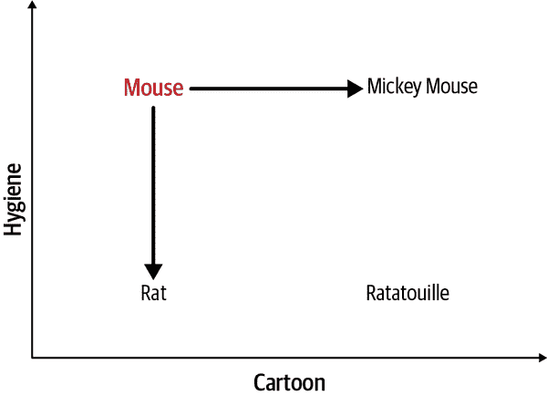
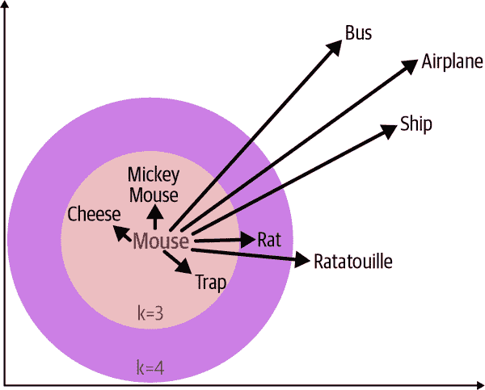
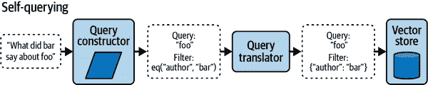

# 第五章\. 使用 FAISS 和 Pinecone 的向量数据库

本章介绍了嵌入和向量数据库的概念，讨论了它们如何用于在提示中提供相关上下文。

*向量数据库*是一种最常用于以支持基于相似性或语义意义查询的方式存储文本数据的工具。这项技术通过引用模型未训练的数据来减少幻觉（即 AI 模型编造内容），显著提高了 LLM（大型语言模型）响应的准确性和质量。向量数据库的应用案例还包括阅读文档、推荐类似产品或记住过去的对话。

*向量*是表示文本（或图像）的数字列表，你可以将其视为位置的坐标。使用 OpenAI 的 text-embedding-ada-002 模型，单词*mouse*的向量是一个包含 1,536 个数字的列表，每个数字代表嵌入模型在训练中学习的特征值：

```py
[-0.011904156766831875,
 -0.0323905423283577,
 0.001950666424818337,
...]
```

当这些模型被训练时，训练数据中一起出现的文本在值上会被推得更近，而无关的文本会被推得更远。想象我们训练了一个只有两个参数的简单模型，`Cartoon`和`Hygiene`，必须用这两个变量来描述整个世界。从单词*mouse*开始，增加`Cartoon`参数的值，我们会走向最著名的卡通老鼠，`mickey mouse`，如图图 5-1 所示。减少`Hygiene`参数的值会带我们走向`rat`，因为老鼠和老鼠是啮齿类动物，但与瘟疫和疾病（即不卫生）有关。



###### 图 5-1\. 2-D 向量距离

图表上的每个位置都可以通过 x 轴和 y 轴上的两个数字找到，这些数字代表模型的`Cartoon`和`Hygiene`特征。实际上，向量可以有数千个参数，因为更多的参数允许模型捕捉更广泛的相似性和差异性。卫生并不是老鼠和老鼠之间唯一的区别，米老鼠也不只是一个卡通老鼠。这些特征是以一种使人类难以解释的方式从数据中学习到的，我们需要一个有数千个轴的图表来显示*潜在空间*（由模型参数形成的抽象的多维空间）中的位置。通常，没有人类可以理解的特征含义的解释。然而，我们可以创建一个简化的二维向量距离投影，如图图 5-2 所示。

要进行向量搜索，你首先获取你想要查找的内容的向量（或位置），然后在数据库中找到最近的`k`条记录。在这种情况下，单词`mouse`与`mickey mouse`、`cheese`和`trap`最接近，其中`k=3`（返回三条最近的记录）。如果`k=3`，则排除单词`rat`，但如果`k=4`，则将其包括在内，因为它是最接近的下一个向量。在这个例子中，单词`airplane`离得很远，因为它在训练数据中很少与单词`mouse`相关联。单词`ship`仍然与其他交通方式一起出现在同一位置，但它比`mouse`和`rat`更接近，因为根据训练数据，它们经常出现在船上。



###### 图 5-2. 多维向量距离

向量数据库以文本记录及其向量表示作为键来存储文本。这与其他类型的数据库不同，在其他类型的数据库中，你可能根据 ID、关系或文本中包含的字符串来查找记录。例如，如果你基于图 5-2 中的文本查询关系型数据库以查找包含`mouse`的记录，你会返回记录`mickey mouse`，但没有其他记录，因为没有其他记录包含该确切短语。使用向量搜索，你也可以返回记录`cheese`和`trap`，尽管它们与你的查询不是完全匹配，但它们密切相关。

基于相似性进行查询的能力非常有用，向量搜索为许多 AI 功能提供了动力。例如：

文档阅读

找到相关的文本部分以便阅读，以提供更准确的答案。

推荐系统

发现类似的产品或项目，以便向用户推荐。

长期记忆

查找相关的对话历史片段，以便聊天机器人记住过去的交互。

AI 模型能够处理这些任务，只要你的文档、产品列表或对话记忆适合你使用的模型的代币限制。然而，在规模上，你很快就会遇到代币限制和过多的费用，因为每个提示中传递的代币太多。OpenAI 的`gpt-4-1106-preview`于 2023 年 11 月发布，拥有巨大的 128,000 个代词上下文窗口，但每个代词的成本是`gpt-3.5-turbo`的 10 倍，后者有 88%的代词更少，并且比它早一年发布。更有效的方法是在运行时只查找最相关的记录并将其传递到提示中，以提供最相关的上下文来形成回答。这种做法通常被称为 RAG。

# 检索增强生成（RAG）

向量数据库是 RAG 的关键组成部分，通常涉及根据查询的相似性进行搜索，检索最相关的文档，并将它们作为上下文插入到提示中。这让你可以保持在当前上下文窗口内，同时避免通过插入无关文本文档来浪费代币而花费不必要的费用。

检索也可以使用传统的数据库搜索或网络浏览来完成，在许多情况下，使用语义相似性的向量搜索并不是必要的。RAG 通常用于解决开放场景中的幻觉问题，例如用户与一个在询问不在其训练数据中的内容时容易编造东西的聊天机器人交谈。向量搜索可以将与用户查询语义相似的文档插入到提示中，大大降低聊天机器人产生幻觉的可能性。

例如，如果你的作者 Mike 告诉聊天机器人“我的名字是 Mike”，然后过了三条消息后问“我的名字是什么？”它可以轻松地回忆起正确的答案。包含 Mike 名字的消息仍然在聊天上下文窗口内。然而，如果它是在 3,000 条消息之前，这些消息的文本可能太大而无法放入上下文窗口。没有这个重要的上下文，它可能会幻想一个名字或者因为没有信息而拒绝回答。关键词搜索可能会有所帮助，但可能会返回太多不相关的文档，或者无法回忆起过去捕获信息时的正确上下文。Mike 可能多次在不同格式和不同原因下提到单词*名字*。通过将问题传递到向量数据库，它可以返回与用户询问内容最相似的聊天中的前三条消息：

```py
## Context
Most relevant previous user messages:
1\. "My name is Mike".
2\. "My dog's name is Hercules".
3\. "My coworker's name is James".

## Instructions
Please answer the user message using the context above.
User message: What is my name?
AI message:
```

对于大多数模型来说，将所有 3,000 条历史消息传递到提示中是不可能的，而对于传统的搜索，AI 模型必须制定正确的搜索查询，这可能会不可靠。使用 RAG 模式，您会将当前用户消息传递给向量搜索函数，并返回最相关的三条记录作为上下文，然后聊天机器人可以使用这些上下文来正确地回答。

# 指定方向

与将静态知识插入提示中不同，向量搜索允许您动态地将最相关的知识插入到提示中。

这是使用 RAG 的生产应用程序的工作流程：

1.  将文档分解成文本块。

1.  在向量数据库中索引数据块。

1.  通过向量搜索相似记录。

1.  将记录作为上下文插入到提示中。

在这种情况下，文档将是所有 3,000 条过去用户消息，作为聊天机器人的记忆，但它也可以是上传到聊天机器人的 PDF 文档的部分，以使其能够阅读，或者是一份所有相关产品的列表，以使聊天机器人能够做出推荐。我们向量搜索找到最相似文本的能力完全取决于用于生成向量的 AI 模型，当处理语义或上下文信息时，这些向量被称为*嵌入*。

# 引入嵌入

术语 *embeddings* 通常指的是从预训练 AI 模型返回的文本的向量表示。在撰写本文时，生成嵌入的标准模型是 OpenAI 的 text-embedding-ada-002，尽管嵌入模型在生成式 AI 出现之前就已经存在。

虽然将向量空间可视化为二维图表很有帮助，如 图 5-2 所示，但实际上从 text-embedding-ada-002 返回的嵌入是在 1,536 维度上，这在图形上很难表示。更多的维度允许模型捕捉更深的语义意义和关系。例如，一个二维空间可能能够将猫和狗分开，而一个 300 维的空间可以捕捉关于品种、大小、颜色和其他复杂细节的信息。以下代码展示了如何从 OpenAI API 中检索嵌入。以下示例的代码包含在此书的 [GitHub 仓库](https://oreil.ly/6RzTy) 中。

输入：

```py
from openai import OpenAI
client = OpenAI()

# Function to get the vector embedding for a given text
def get_vector_embeddings(text):
    response = client.embeddings.create(
        input=text,
        model="text-embedding-ada-002"
    )
    embeddings = [r.embedding for r in response.data]
    return embeddings[0]

get_vector_embeddings("Your text string goes here")
```

输出：

```py
[
-0.006929283495992422,
-0.005336422007530928,
...
-4.547132266452536e-05,
-0.024047505110502243
]
```

此代码使用 OpenAI API 通过特定的嵌入模型为给定输入文本创建嵌入：

1.  `from openai import OpenAI` 导入 OpenAI 库，并使用 `client = OpenAI()` 设置客户端。它从环境变量 `OPENAI_API_KEY` 中检索您的 OpenAI API 密钥，以便将嵌入的成本记入您的账户。您需要在您的环境中设置此变量（通常在 *.env* 文件中），这可以通过创建账户并访问 [*https://oreil.ly/apikeys*](https://oreil.ly/apikeys) 来获取。

1.  `response = client.embeddings.create(...)`：此行调用 OpenAI 库中 `Embedding` 类的 `create` 方法。该方法接受两个参数：

    +   `input`：这是您提供要生成嵌入的文本字符串的地方。

    +   `model`：这指定了您想要使用的嵌入模型。在这种情况下，它是 `text-embedding-ada-002`，这是 OpenAI API 中的一个模型。

1.  `embeddings = [r.embedding for r in response.data]`：在 API 调用之后，`response` 对象包含以 JSON 格式生成的嵌入。此行通过遍历 `response.data` 中的嵌入列表，从响应中提取实际的数值嵌入。

执行此代码后，`embeddings` 变量将包含输入文本的数值表示（嵌入），然后可以用于各种 NLP 任务或机器学习模型。检索或生成嵌入的过程有时被称为 *文档加载*。

在此上下文中，术语 *loading* 指的是从模型中计算或检索文本的数值（向量）表示并将其存储在变量中以供以后使用的行为。这与 *chunking* 的概念不同，通常指的是将文本分解成更小、更易于管理的片段或块，以促进处理。这两种技术通常一起使用，因为通常将大型文档拆分成页面或段落以促进更准确的匹配，并且只将最相关的标记传递到提示中。

从 OpenAI 获取嵌入存在成本，但在写作时每 1,000 个标记的费用相对较低，为 0.0004 美元。例如，包含大约 800,000 个单词或约 4,000,000 个标记的《圣经》钦定版，检索整个文档的所有嵌入将花费大约 1.60 美元。

为 OpenAI 的嵌入付费并不是你的唯一选择。你还可以使用开源模型，例如 Hugging Face 提供的 [Sentence Transformers 库](https://oreil.ly/8OV3c)，它具有 384 维度。

输入：

```py
import requests
import os

model_id = "sentence-transformers/all-MiniLM-L6-v2"
hf_token = os.getenv("HF_TOKEN")

api_url = "https://api-inference.huggingface.co/"
api_url += f"pipeline/feature-extraction/{model_id}"
headers = {"Authorization": f"Bearer {hf_token}"}

def query(texts):
    response = requests.post(api_url, headers=headers,
    json={"inputs": texts,
    "options":{"wait_for_model":True}})
    return response.json()

texts = ["mickey mouse",
        "cheese",
        "trap",
        "rat",
        "ratatouille"
        "bus",
        "airplane",
        "ship"]

output = query(texts)
output
```

输出：

```py
[[-0.03875632584095001, 0.04480459913611412,
0.016051070764660835, -0.01789097487926483,
-0.03518553078174591, -0.013002964667975903,
0.14877274632453918, 0.048807501792907715,
0.011848390102386475, -0.044042471796274185,
...
-0.026688814163208008, -0.0359361357986927,
-0.03237859532237053, 0.008156519383192062,
-0.10299170762300491, 0.0790356695652008,
-0.008071334101259708, 0.11919838190078735,
0.0005506130401045084, -0.03497892618179321]]
```

此代码使用 Hugging Face API 通过预训练模型为文本输入列表获取嵌入。这里使用的模型是 `sentence-transformers/all-MiniLM-L6-v2`，这是 BERT 的一个较小版本，BERT 是 Google 在 2017 年（基于 Transformer 模型）引入的开源 NLP 模型，它针对句子级任务进行了优化。以下是它的工作步骤：

1.  `model_id` 被分配了预训练模型的标识符，`sentence-transformers/all-MiniLM-L6-v2`。

1.  `hf_token = os.getenv("HF_TOKEN")` 从你的环境中检索 Hugging Face API 令牌。你需要使用自己的令牌设置此环境，该令牌可以通过创建账户并访问 [*https://hf.co/settings/tokens*](https://hf.co/settings/tokens) 获取。

1.  导入了 `requests` 库以向 API 发送 HTTP 请求。

1.  `api_url` 被分配了 Hugging Face API 的 URL，其中包含模型 ID。

1.  `headers` 是一个包含授权头部的字典，其中包含你的 Hugging Face API 令牌。

1.  定义了 `query()` 函数，它接受一个文本输入列表，并通过适当的头部和包含输入以及等待模型可用的选项的 JSON 有效负载向 Hugging Face API 发送 `POST` 请求。然后，该函数返回 API 的 JSON 响应。

1.  `texts` 是从你的数据库中获取的字符串列表。

1.  `output` 被分配为调用 `query()` 函数并使用 `texts` 列表的结果。

1.  打印了 `output` 变量，它将显示输入文本的特征嵌入。

当你运行此代码时，脚本将向 Hugging Face API 发送文本，API 将返回每个文本字符串的嵌入。

如果你将相同的文本输入到嵌入模型中，你将每次都得到相同的向量。然而，由于训练的不同，向量通常不可跨模型（或模型的版本）比较。从 OpenAI 获得的嵌入与从 BERT 或 spaCy（一个自然语言处理库）获得的嵌入不同。

与现代转换器模型生成的嵌入相比，主要区别在于向量是上下文相关的而不是静态的，这意味着单词*bank*在*河岸*和*金融机构*的上下文中会有不同的嵌入。从 OpenAI Ada 002 和 HuggingFace Sentence Transformers 获得的嵌入是密集向量的例子，其中数组中的每个数字几乎总是非零的（即，它们包含语义信息）。还有[稀疏向量](https://oreil.ly/d1cmb)，通常具有大量维度（例如，100,000+），其中许多维度具有零值。这允许捕捉特定的、重要的特征（每个特征可以有自己的维度），这对于基于关键字的搜索应用中的性能往往很重要。大多数 AI 应用使用密集向量进行检索，尽管混合搜索（密集和稀疏向量）越来越受欢迎，因为相似性和关键字搜索可以结合使用。

向量的准确性完全依赖于你用来生成嵌入的模型的准确性。底层模型中存在的任何偏差或知识差距也将成为向量搜索的问题。例如，`text-embedding-ada-002`模型目前仅训练到 2020 年 8 月，因此对该截止日期之后形成的新词或新的文化关联一无所知。这可能会对需要更多近期上下文或训练数据中不可用的特定领域知识的用例造成问题，这可能需要训练自定义模型。

在某些情况下，训练自己的嵌入模型可能是有意义的。例如，如果你使用的文本具有特定领域的词汇，其中某些单词的含义与通常接受的含义不同，你可能就会这样做。一个例子可能是追踪社交媒体上如 Q-Anon 等有毒群体使用的语言，他们通过在帖子中演变语言来规避审查措施。

使用像 word2vec 这样的工具可以训练自己的嵌入，这是一种在向量空间中表示单词的方法，使你能够捕捉单词的语义含义。可以使用更高级的模型，如 GloVe（全球单词表示向量），它被 spaCy 用于其嵌入，该嵌入是在 Common Crawl 数据集上训练的，这是一个开源的网页快照。Gensim 库提供了一个简单的流程，使用[开源算法](https://oreil.ly/RmXVR) word2vec 来训练自己的自定义嵌入。

输入：

```py
from gensim.models import Word2Vec

# Sample data: list of sentences, where each sentence is
# a list of words.
# In a real-world scenario, you'd load and preprocess your
# own corpus.
sentences = [
    ["the", "cake", "is", "a", "lie"],
    ["if", "you", "hear", "a", "turret", "sing", "you're",
    "probably", "too", "close"],
    ["why", "search", "for", "the", "end", "of", "a",
    "rainbow", "when", "the", "cake", "is", "a", "lie?"],
    # ...
    ["there's", "no", "cake", "in", "space,", "just", "ask",
    "wheatley"],
    ["completing", "tests", "for", "cake", "is", "the",
    "sweetest", "lie"],
    ["I", "swapped", "the", "cake", "recipe", "with", "a",
    "neurotoxin", "formula,", "hope", "that's", "fine"],
] + [
    ["the", "cake", "is", "a", "lie"],
    ["the", "cake", "is", "definitely", "a", "lie"],
    ["everyone", "knows", "that", "cake", "equals", "lie"],
    # ...
] * 10  # repeat several times to emphasize

# Train the word2vec model
model =  Word2Vec(sentences, vector_size=100, window=5,
min_count=1, workers=4, seed=36)

# Save the model
model.save("custom_word2vec_model.model")

# To load the model later
# loaded_model = word2vec.load(
# "custom_word2vec_model.model")

# Get vector for a word
vector = model.wv['cake']

# Find most similar words
similar_words = model.wv.most_similar("cake", topn=5)
print("Top five most similar words to 'cake': ", similar_words)

# Directly query the similarity between "cake" and "lie"
cake_lie_similarity = model.wv.similarity("cake", "lie")
print("Similarity between 'cake' and 'lie': ",
cake_lie_similarity)
```

输出：

```py
Top 5 most similar words to 'cake':  [('lie',
0.23420444130897522), ('test', 0.23205122351646423),
('tests', 0.17178669571876526), ('GLaDOS',
0.1536172330379486), ('got', 0.14605288207530975)]
Similarity between 'cake' and 'lie':  0.23420444
```

这段代码使用 Gensim 库创建了一个 word2vec 模型，然后使用该模型确定与给定单词相似的单词。让我们将其分解：

1.  变量 `sentences` 包含一个句子列表，其中每个句子都是一个单词列表。这是 Word2Vec 模型将要训练的数据。在实际应用中，你通常会加载一个大型文本语料库，并对其进行预处理以获得这样的标记句子列表。

1.  创建了一个 `word2vec` 类的实例来表示模型。在初始化这个实例时，提供了几个参数：

    +   `sentences`：这是训练数据。

    +   `vector_size=100`：这定义了单词向量的大小。因此，每个单词都将表示为一个 100 维的向量。

    +   `window=5`：这表示句子中当前单词和预测单词之间的最大距离。

    +   `min_count=1`：这确保了即使只出现在数据集中一次的单词也会为其创建向量。

    +   `workers=4`：在训练期间使用的 CPU 核心数。它可以在多核机器上加速训练。

    +   `seed=36`：这是为了可重复性而设置的，以确保训练中的随机过程每次都能产生相同的结果（不保证在多个工作者的情况下）。

1.  训练完成后，使用 `save` 方法将模型保存到名为 `custom_word2vec_model.model` 的文件中。这允许你在以后重用训练好的模型，而无需再次进行训练。

1.  文件中存在一条被注释掉的行，展示了如何从保存的文件中重新加载模型。这在你想在不同的脚本或会话中加载预训练模型时非常有用。

1.  变量 `vector` 被分配了单词 *cake* 的向量表示。这个向量可以用于各种目的，如相似度计算、算术运算等。

1.  `most_similar` 方法用于查找与提供的向量（在这种情况下，是 *cake* 的向量）最相似的单词。该方法返回最相似的五个单词（`topn=5`）。

1.  `similarity` 方法查询了 *cake* 和 *lie* 方向之间的相似度，显示了一个小的正值。

数据集很小且高度重复，这可能无法提供足够多样的上下文来正确学习单词之间的关系。通常，word2vec 从更大、更多样化的语料库中受益，并且通常需要达到数千万个单词才能获得良好的结果。在我们的例子中，我们设置了一个种子值来挑选出一个实例，其中 *lie* 出现在前五个结果中，但如果你移除那个种子，你会发现它很少能够成功发现这种关联。

对于较小的文档大小，建议使用更简单的技术*TF-IDF*（词频-逆文档频率），这是一种用于评估单词在文档中相对于文档集合的重要性的一种统计度量。TF-IDF 值与单词在文档中出现的次数成正比，但被单词在更广泛的语料库中的频率所抵消，这有助于调整某些单词通常比其他单词更常见的事实。

要使用 TF-IDF 计算`cake`和`lie`之间的相似度，可以使用开源[科学库](https://oreil.ly/gHb3F) scikit-learn 并计算余弦相似度（两个向量之间距离的度量）。在句子中经常共现的单词将具有高余弦相似度（接近 1），而出现频率低的单词将显示低值（或 0，如果根本不共现）。这种方法甚至对像我们的玩具示例那样的小文档也具有鲁棒性。

输入：

```py
import numpy as np
from sklearn.feature_extraction.text import TfidfVectorizer
from sklearn.metrics.pairwise import cosine_similarity

# Convert sentences to a list of strings for TfidfVectorizer
document_list = [' '.join(s) for s in sentences]

# Compute TF-IDF representation
vectorizer = TfidfVectorizer()
tfidf_matrix = vectorizer.fit_transform(document_list)

# Extract the position of the words "cake" and "lie" in
# the feature matrix
cake_idx = vectorizer.vocabulary_['cake']
lie_idx = vectorizer.vocabulary_['lie']

# Extract and reshape the vector for 'cake'
cakevec = tfidf_matrix[:, cake_idx].toarray().reshape(1, -1)

# Compute the cosine similarities
similar_words = cosine_similarity(cakevec, tfidf_matrix.T).flatten()

# Get the indices of the top 6 most similar words
# (including 'cake')
top_indices = np.argsort(similar_words)[-6:-1][::-1]

# Retrieve and print the top 5 most similar words to
# 'cake' (excluding 'cake' itself)
names = []
for idx in top_indices:
    names.append(vectorizer.get_feature_names_out()[idx])
print("Top five most similar words to 'cake': ", names)

# Compute cosine similarity between "cake" and "lie"
similarity = cosine_similarity(np.asarray(tfidf_matrix[:,
    cake_idx].todense()), np.asarray(tfidf_matrix[:, lie_idx].todense()))
# The result will be a matrix; we can take the average or
# max similarity value
avg_similarity = similarity.mean()
print("Similarity between 'cake' and 'lie'", avg_similarity)

# Show the similarity between "cake" and "elephant"
elephant_idx = vectorizer.vocabulary_['sing']
similarity = cosine_similarity(np.asarray(tfidf_matrix[:,
    cake_idx].todense()), np.asarray(tfidf_matrix[:,
    elephant_idx].todense()))
avg_similarity = similarity.mean()
print("Similarity between 'cake' and 'sing'",
    avg_similarity)
```

输出：

```py
Top 5 most similar words to 'cake':  ['lie', 'the', 'is',
'you', 'definitely']
Similarity between 'cake' and 'lie' 0.8926458157227388
Similarity between 'cake' and 'sing' 0.010626735901461177
```

让我们一步一步地分解这段代码：

1.  从上一个示例中重用了`sentences`变量。代码使用列表推导将这些单词列表转换为完整的句子（字符串），从而得到`document_list`。

1.  创建了一个`TfidfVectorizer`实例。然后使用向量器的`fit_transform`方法将`document_list`转换为 TF-IDF 特征矩阵，该矩阵存储在`tfidf_matrix`中。

1.  代码使用向量器的`vocabulary_`属性提取了单词`cake`和`lie`在特征矩阵中的位置（或索引）。

1.  从矩阵中提取与单词`cake`对应的 TF-IDF 向量并将其重塑。

1.  计算了`cake`向量与 TF-IDF 矩阵中所有其他向量的余弦相似度。这产生了一个相似度分数列表。

    +   确定了最相似的前六个单词（包括`cake`）的索引。

    +   使用这些索引，检索与`cake`最相似的前五个单词（不包括`cake`）并打印出来。

1.  计算单词`cake`和`lie`的 TF-IDF 向量的余弦相似度。由于结果是矩阵，代码计算矩阵中所有值的平均相似度，然后打印平均值。

1.  现在我们计算单词`cake`和`sing`之间的相似度。计算并打印平均相似度值以显示这两个单词通常不共现（接近零）。

除了使用的嵌入模型外，嵌入内容的策略也很重要，因为存在上下文和相似性之间的权衡。如果你嵌入一大块文本，比如整本书，你得到的向量将是构成全文的标记位置的均值。随着块大小的增加，会回归到均值，接近所有向量的均值，并且不再包含很多语义信息。

较小的文本块在向量空间中的位置将更加具体，因此当你需要接近的相似性时可能更有用。例如，从小说中隔离较小的文本部分可能更好地将故事中的喜剧时刻和悲剧时刻分开，而嵌入整个页面或章节可能会将两者混合在一起。然而，如果文本块太小，也可能导致它们在句子或段落中间被截断而失去意义。与向量数据库一起工作的很大一部分艺术在于你如何加载文档并将其分割成块。

# 文档加载

人工智能的一个常见用途是能够根据用户查询文本的相似性在文档中进行搜索。例如，你可能有一系列代表你的员工手册的 PDF 文件，你希望从这些 PDF 文件中返回与员工问题相关的正确文本片段。你将文档加载到向量数据库中的方式将由你的文档结构、你希望从每个查询中返回多少示例以及每个提示中可以承受的 token 数量决定。

例如，`gpt-4-0613`有一个[8,192 token 限制](https://oreil.ly/wbx1f)，这个限制需要在提示模板、插入到提示中的示例以及模型提供的响应之间共享。为提示和响应预留大约 2,000 个单词或大约 3,000 个 token，你可以在提示中作为上下文提取出五个最相似的、每个 1,000 token 的文本块。然而，如果你天真地将文档分割成 1,000-token 的块，你将遇到问题。每次分割的任意位置可能位于段落或句子的中间，这样你可能会丢失所传达的意义。LangChain 有一系列[文本分割器](https://oreil.ly/qsG7J)，包括常用的递归字符文本分割器。它试图在行中断和空格处分割，直到块足够小。这尽可能多地保持所有段落（然后是句子，然后是单词）在一起，以保留文本结构中固有的语义分组。

输入：

```py
from langchain.text_splitter import RecursiveCharacterTextSplitter

text_splitter = RecursiveCharacterTextSplitter.from_tiktoken_encoder(
    chunk_size=100, # 100 tokens
    chunk_overlap=20, # 20 tokens of overlap
    )

text = """
Welcome to the "Unicorn Enterprises: Where Magic Happens"
Employee Handbook! We're thrilled to have you join our team
of dreamers, doers, and unicorn enthusiasts. At Unicorn
Enterprises, we believe that work should be as enchanting as
it is productive. This handbook is your ticket to the
magical world of our company, where we'll outline the
principles, policies, and practices that guide us on this
extraordinary journey. So, fasten your seatbelts and get
ready to embark on an adventure like no other!

...

As we conclude this handbook, remember that at Unicorn
Enterprises, the pursuit of excellence is a never-ending
quest. Our company's success depends on your passion,
creativity, and commitment to making the impossible
possible. We encourage you to always embrace the magic
within and outside of work, and to share your ideas and
innovations to keep our enchanted journey going. Thank you
for being a part of our mystical family, and together, we'll
continue to create a world where magic and business thrive
hand in hand!
"""

chunks = text_splitter.split_text(text=text)
print(chunks[0:3])
```

输出：

```py
['Welcome to the "Unicorn Enterprises: Where Magic Happens"
Employee Handbook! We\'re thrilled to have you join our team
of dreamers, doers, and unicorn enthusiasts.',
"We're thrilled to have you join our team of dreamers,
doers, and unicorn enthusiasts. At Unicorn Enterprises, we
believe that work should be as enchanting as it is
productive.",
 ...
"Our company's success depends on your passion, creativity,
and commitment to making the impossible possible. We
encourage you to always embrace the magic within and outside
of work, and to share your ideas and innovations to keep our
enchanted journey going.",
"We encourage you to always embrace the magic within and
outside of work, and to share your ideas and innovations to
keep our enchanted journey going. Thank you for being a part
of our mystical family, and together, we'll continue to
create a world where magic and business thrive hand in
hand!"]
```

下面是这段代码按步骤工作的方式：

1.  *创建文本分割器实例*：使用`from_tiktoken_encoder`方法创建`RecursiveCharacterTextSplitter`的实例。此方法专门设计用于根据 token 计数来分割文本。

    `chunk_size`参数设置为 100，确保每个文本块将包含大约 100 个 token。这是一种控制每个文本段大小的方法。

    `chunk_overlap`参数设置为 20，表示连续的块之间将有 20 个 token 的重叠。这种重叠确保了块与块之间不会丢失上下文，这对于准确理解和处理文本至关重要。

1.  *准备文本*：变量 `text` 包含一个多段落字符串，表示要分割成块的文本内容。

1.  *分割文本*：`text_splitter` 实例的 `split_text` 方法用于根据先前定义的 `chunk_size` 和 `chunk_overlap` 将文本分割成块。此方法处理文本并返回一个文本块列表。

1.  *输出块*：代码打印出分割文本的前三个块，以演示文本是如何被分割的。这种输出有助于验证文本是否按预期分割，遵循指定的块大小和重叠。

# 指定格式

提供的文本块与提示的相关性将很大程度上取决于你的分块策略。没有重叠的短文本块可能不包含正确的答案，而重叠过多的长文本块可能会返回太多不相关的结果，并使 LLM 迷惑或花费你太多的令牌。

# 使用 FAISS 进行内存检索

现在你已经将文档处理成块，你需要将它们存储在向量数据库中。将向量存储在数据库中是一种常见的做法，这样你就不需要重新计算它们，因为这样做通常会有一些成本和延迟。如果你不更改你的嵌入模型，向量就不会改变，所以一旦存储后通常不需要更新它们。你可以使用一个名为 FAISS 的开源库来存储和查询你的向量，这是一个由 [Facebook AI](https://oreil.ly/gIcTI) 开发的库，它提供了密集向量的高效相似性搜索和聚类。首先在终端中使用 `pip install faiss-cpu` 安装 FAISS。本例的代码包含在本书的 [GitHub 仓库](https://oreil.ly/4wR7o) 中。

输入：

```py
import numpy as np
import faiss

#  The get_vector_embeddings function is defined in a preceding example
emb = [get_vector_embeddings(chunk) for chunk in chunks]
vectors = np.array(emb)

# Create a FAISS index
index = faiss.IndexFlatL2(vectors.shape[1])
index.add(vectors)

# Function to perform a vector search
def vector_search(query_text, k=1):
    query_vector = get_vector_embeddings(query_text)
    distances, indices = index.search(
        np.array([query_vector]), k)
    return [(chunks[i], float(dist)) for dist,
        i in zip(distances[0], indices[0])]

# Example search
user_query = "do we get free unicorn rides?"
search_results = vector_search(user_query)
print(f"Search results for {user_query}:", search_results)
```

输出：

```py
Search results for do we get free unicorn rides?: [("You'll
enjoy a treasure chest of perks, including unlimited unicorn
rides, a bottomless cauldron of coffee and potions, and
access to our company library filled with spellbinding
books. We also offer competitive health and dental plans,
ensuring your physical well-being is as robust as your
magical spirit.\n\n**5: Continuous Learning and
Growth**\n\nAt Unicorn Enterprises, we believe in continuous
learning and growth.", 0.3289167582988739)]
```

下面是对前面代码的解释：

1.  使用 `import faiss` 导入 Facebook AI 相似性搜索（FAISS）库。

1.  `vectors = np.array([get_vector_embeddings(chunk) for chunk in chunks])` 将 `get_vector_embeddings` 函数应用于 `chunks` 中的每个元素，该函数返回每个元素的向量表示（嵌入）。然后，这些向量被用来创建一个 numpy 数组，该数组存储在变量 `vectors` 中。

1.  代码行 `index = faiss.IndexFlatL2(vectors.shape[1])` 创建了一个用于高效相似性搜索的 FAISS 索引。参数 `vectors.shape[1]` 是将要添加到索引中的向量的维度。这种索引（`IndexFlatL2`）执行 brute-force L2 距离搜索，通过测量它们之间的直线距离来寻找集合中与特定项目最接近的项目，逐个检查集合中的每个项目。

1.  然后你使用 `index.add(vectors)` 将向量数组添加到创建的 FAISS 索引中。

1.  `def vector_search(query_text, k=1)`定义了一个名为`vector_search`的新函数，该函数接受两个参数：`query_text`和`k`（默认值为 1）。该函数将检索`query_text`的嵌入，然后使用该嵌入在索引中搜索最近的`k`个向量。

1.  在`vector_search`函数内部，`query_vector = get_vector_embeddings(query_text)`使用`get_vector_embeddings`函数生成查询文本的向量嵌入。

1.  `distances, indices = index.search(np.array([query_vector]), k)`这一行在 FAISS 索引中执行搜索。它寻找与`query_vector`最近的`k`个向量。该方法返回两个数组：`distances`（到查询向量的平方 L2 距离）和`indices`（索引

1.  `return [(chunks[i], float(dist)) for dist, i in zip(distances[0], indices[0])]`返回一个元组列表。每个元组包含一个块（使用在搜索中找到的索引检索到的）和查询向量对应的距离。注意，在返回之前，距离被转换为浮点数。

1.  最后，你执行字符串包含用户查询的向量搜索：`search_results = vector_search(user_query)`。结果（最近的块及其距离）存储在变量`search_results`中。

一旦向量搜索完成，结果可以注入到提示中，以提供有用的上下文。同时，设置系统消息也很重要，以确保模型专注于根据提供的上下文回答问题，而不是随意作出回答。这里展示的 RAG 技术被广泛应用于 AI 领域，以帮助防止幻觉。

输入：

```py
# Function to perform a vector search and then ask # GPT-3.5-turbo a question
def search_and_chat(user_query, k=1):
  # Perform the vector search
  search_results = vector_search(user_query, k)
  print(f"Search results: {search_results}\n\n")

  prompt_with_context = f"""Context:{search_results}\
 Answer the question: {user_query}"""

  # Create a list of messages for the chat
  messages = [
      {"role": "system", "content": """Please answer the
 questions provided by the user. Use only the context
 provided to you to respond to the user, if you don't
 know the answer say \"I don't know\"."""},
      {"role": "user", "content": prompt_with_context},
  ]

  # Get the model's response
  response = client.chat.completions.create(
    model="gpt-3.5-turbo", messages=messages)

  # Print the assistant's reply
  print(f"""Response:
  {response.choices[0].message.content}""")

# Example search and chat
search_and_chat("What is Unicorn Enterprises' mission?")
```

输出：

```py
Search results: [("""As we conclude this handbook, remember that at
Unicorn Enterprises, the pursuit of excellence is a never-ending
quest. Our company's success depends on your passion,
creativity, and commitment to making the impossible
possible. We encourage you to always embrace the magic
within and outside of work, and to share your ideas and
innovations to keep our enchanted journey going. Thank you",
0.26446571946144104)]

Response:
Unicorn Enterprises' mission is to pursue excellence in their
work by encouraging their employees to embrace the magic within
and outside of work, share their ideas and innovations, and make
the impossible possible.
```

这里是对函数执行步骤的逐步解释：

1.  使用名为`vector_search`的函数，程序执行向量搜索，以`user_query`作为搜索字符串，以`k`作为要返回的搜索结果数量。结果存储在`search_results`中。

1.  然后将搜索结果打印到控制台。

1.  通过连接`search_results`和`user_query`创建了一个`prompt_with_context`。目的是向模型提供搜索结果中的上下文和一个需要回答的问题。

1.  创建了一个消息列表。第一条消息是一个系统消息，指示模型仅使用给定上下文回答用户提出的问题。如果模型不知道答案，建议回答“I don’t know”。第二条消息是包含`prompt_with_context`的用户消息。

1.  使用`openai.ChatCompletion.create()`函数来获取模型的响应。它提供了模型名称（`gpt-3.5-turbo`）和消息列表。

1.  在代码的末尾，使用`user_query`作为`user_query`参数调用了`search_and_chat()`函数。

# 提供示例

没有测试写作风格，很难猜测哪种提示策略会获胜。现在你可以确信这是正确的方法。

虽然我们的代码现在从头到尾都能工作，但每次查询都收集嵌入并创建向量数据库是没有意义的。即使您使用开源模型进行嵌入，也会在计算和延迟方面产生成本。您可以使用`faiss.write_index`函数将 FAISS 索引保存到文件中：

```py
# Save the index to a file
faiss.write_index(index, "data/my_index_file.index")
```

这将在您的当前目录中创建一个名为`my_index_file.index`的文件，其中包含序列化的索引。您可以使用`faiss.read_index`将此索引加载回内存中：

```py
# Load the index from a file
index = faiss.read_index("data/my_index_file.index")
```

这样，您可以在不同的会话之间持久化索引，甚至在不同机器或环境中共享它。只是请确保小心处理这些文件，因为对于大型索引，它们可能相当大。

如果您有多个已保存的向量数据库，合并它们也是可能的。这在序列化文档加载或对记录进行批量更新时可能很有用。

您可以使用`faiss.IndexFlatL2`索引的`add`方法合并两个 FAISS 索引：

```py
# Assuming index1 and index2 are two IndexFlatL2 indices
index1.add(index2.reconstruct_n(0, index2.ntotal))
```

在此代码中，使用`reconstruct_n(0, index2.ntotal)`来获取`index2`中的所有向量，然后使用`index1.add()`将这些向量添加到`index1`中，从而有效地合并了两个索引。

这应该会工作，因为`faiss.IndexFlatL2`支持`reconstruct`方法来检索向量。但是，请注意，此过程不会将任何与向量关联的 ID 从`index2`移动到`index1`。合并后，`index2`中的向量将在`index1`中具有新的 ID。

如果您需要保留向量 ID，您需要通过外部管理从向量 ID 到您的数据项的单独映射来管理这一点。然后，当您合并索引时，也要合并这些映射。

###### 小贴士

请注意，这种方法可能不适用于所有类型的索引，特别是对于不支持`reconstruct`方法（如`IndexIVFFlat`）或两个索引具有不同配置的情况。在这种情况下，保留用于构建每个索引的原始向量，然后合并并重建索引可能更好。

# 基于 LangChain 的 RAG

作为最受欢迎的 AI 工程框架之一，LangChain 涵盖了广泛的 RAG 技术。其他框架，如[LlamaIndex](https://www.llamaindex.ai)，专注于 RAG，对于复杂用例值得探索。由于您熟悉 LangChain（第四章），我们将继续在这个框架中展示本章节的示例。在手动根据所需上下文执行 RAG 之后，让我们使用 LCEL 在四个小型文本文档和 FAISS 上创建一个类似的示例：

```py
from langchain_community.vectorstores.faiss import FAISS
from langchain_core.output_parsers import StrOutputParser
from langchain_core.prompts import ChatPromptTemplate
from langchain_core.runnables import RunnablePassthrough
from langchain_openai import ChatOpenAI, OpenAIEmbeddings

# 1\. Create the documents:
documents = [
    "James Phoenix worked at JustUnderstandingData.",
    "James Phoenix currently is 31 years old.",
    """Data engineering is the designing and building systems for collecting,
 storing, and analyzing data at scale.""",
]

# 2\. Create a vectorstore:
vectorstore = FAISS.from_texts(texts=documents, embedding=OpenAIEmbeddings())
retriever = vectorstore.as_retriever()

# 3\. Create a prompt:
template = """Answer the question based only on the following context:
---
Context: {context}
---
Question: {question}
"""
prompt = ChatPromptTemplate.from_template(template)

# 4\. Create a chat model:
model = ChatOpenAI()
```

代码首先从 LangChain 库导入必要的模块，并定义要处理的文本文档列表。

它利用了`FAISS`，一个用于高效相似性搜索的库，从文本文档中创建向量存储。这涉及到使用 OpenAI 的嵌入模型将文本转换为向量嵌入。

为处理问题和初始化`ChatOpenAI`模型以生成响应提供了一个提示模板。此外，提示模板强制 LLM 只使用检索器提供的上下文进行回复。

您需要创建一个包含`"context"`和`"question"`键的 LCEL 链：

```py
chain = (
    {"context": retriever, "question": RunnablePassthrough()}
    | prompt
    | model
    | StrOutputParser()
)
```

通过向`"context"`添加检索器，它将自动获取四个文档，这些文档被转换为字符串值。结合`"question"`键，这些被用于格式化提示。LLM 生成一个响应，然后通过`StrOutputParser()`解析为字符串值。

您将调用链并传入您的问题，该问题被分配给`"question"`，并手动测试三个不同的查询：

```py
chain.invoke("What is data engineering?")
# 'Data engineering is the process of designing and building systems for
# collecting, storing, and analyzing data at scale.'

chain.invoke("Who is James Phoenix?")
# 'Based on the given context, James Phoenix is a 31-year-old individual who
# worked at JustUnderstandingData.'

chain.invoke("What is the president of the US?")
# I don't know
```

注意 LLM 只适当地回答了前两个查询，因为它在向量数据库中没有包含任何相关上下文来回答第三个查询！

LangChain 实现使用的代码量显著减少，易于阅读，并允许您快速实现检索增强生成。

# 带有 Pinecone 的托管向量数据库

有许多托管向量数据库提供商出现，以支持 AI 用例，包括[Chroma](https://www.trychroma.com)、[Weaviate](https://weaviate.io)和[Pinecone](https://www.pinecone.io)。其他类型数据库的托管方也提供向量搜索功能，例如[Supabase](https://supabase.com)与[pgvector 插件](https://oreil.ly/pgvector)。本书中的示例使用 Pinecone，因为它是撰写时的领导者，但使用模式在提供商之间相对一致，概念应该是可转移的。

与开源本地向量存储相比，托管向量数据库具有以下优势：

维护

使用托管向量数据库，您无需担心自行设置、管理和维护数据库。这可以节省大量时间和资源，尤其是对于可能没有专门的 DevOps 或数据库管理团队的企业。

可扩展性

托管向量数据库旨在根据您的需求进行扩展。随着数据量的增长，数据库可以自动扩展以处理增加的负载，确保您的应用程序继续高效运行。

可靠性

管理服务通常提供高可用性以及服务级别协议，以及自动备份和灾难恢复功能。这可以提供安心，并让您免受潜在数据丢失的困扰。

性能

托管向量数据库通常具有优化了的基础设施和算法，可以提供比自行管理的开源解决方案更好的性能。这对于依赖于实时或近实时向量搜索功能的应用程序尤为重要。

支持

使用托管服务，您通常可以访问提供服务的公司的支持。如果您遇到问题或需要帮助优化数据库的使用，这可能非常有帮助。

安全性

管理服务通常已经实施了强大的安全措施来保护您的数据，包括加密、访问控制和监控等。主要的托管提供商更有可能拥有必要的合规证书，并符合欧盟等地区的隐私法规。

当然，这种额外的功能是有代价的，同时也存在过度支出的风险。就像使用 Amazon Web Services、Microsoft Azure 或 Google Cloud 一样，开发者因配置错误或代码错误而意外花费数千美元的故事屡见不鲜。还存在一些供应商锁定风险，因为尽管每个供应商都有类似的功能，但在某些方面它们是不同的，因此迁移它们并不完全直接。另一个主要考虑因素是隐私，因为与第三方共享数据会带来安全风险和潜在的法律后果。

使用托管向量数据库的步骤与设置开源 FAISS 向量存储时相同。首先，您需要对文档进行分块并检索向量；然后，您在向量数据库中索引文档块，以便检索与查询相似的记录，以便将其作为上下文插入到提示中。首先，让我们在[Pinecone](https://www.pinecone.io)，一个流行的商业向量数据库供应商中创建一个索引。然后登录 Pinecone 并检索您的 API 密钥（在侧菜单中访问 API 密钥并点击“创建 API 密钥”）。本例的代码在本书的[GitHub 仓库](https://oreil.ly/Q0rIw)中提供。

输入：

```py
from pinecone import Pinecone, ServerlessSpec
import os

# Initialize connection (get API key at app.pinecone.io):
os.environ["PINECONE_API_KEY"] = "insert-your-api-key-here"

index_name = "employee-handbook"
environment = "us-west-2"
pc = Pinecone()  # This reads the PINECONE_API_KEY env var

# Check if index already exists:
# (it shouldn't if this is first time)
if index_name not in pc.list_indexes().names():
    # if does not exist, create index
    pc.create_index(
        index_name,
        # Using the same vector dimensions as text-embedding-ada-002
        dimension=1536,
        metric="cosine",
        spec=ServerlessSpec(cloud="aws", region=environment),
    )

# Connect to index:
index = pc.Index(index_name)

# View index stats:
index.describe_index_stats()
```

输出：

```py
{'dimension': 1536,
 'index_fullness': 0.0,
 'namespaces': {},
 'total_vector_count': 0}
```

让我们一步步地通过这段代码：

1. 导入库

脚本从导入必要的模块开始。`from pinecone import Pinecone, ServerlessSpec,` `import os`用于访问和设置环境变量。

2. 设置 Pinecone API 密钥

对于认证至关重要的 Pinecone API 密钥，使用`os.environ["PINECONE_API_KEY"] = "insert-your-api-key-here"`设置为环境变量。重要的是将`"insert-your-api-key-here"`替换为您的实际 Pinecone API 密钥。

3. 定义索引名称和环境

变量`index_name`和`environment`已设置。`index_name`被赋予值`"employee-handbook"`，这是要在 Pinecone 数据库中创建或访问的索引名称。`environment`变量被分配为`"us-west-2"`，表示服务器的位置。

4. 初始化 Pinecone 连接

使用`Pinecone()`构造函数初始化与 Pinecone 的连接。此构造函数会自动从环境变量中读取`PINECONE_API_KEY`。

5. 检查现有索引

脚本检查名为`index_name`的索引是否已存在于 Pinecone 数据库中。这是通过`pc.list_indexes().names()`函数完成的，该函数返回所有现有索引名称的列表。

6. 创建索引

如果索引不存在，则使用 `pc.create_index()` 函数创建它。此函数使用配置新索引的几个参数调用：

+   `index_name`：指定索引的名称

+   `dimension=1536`：设置要存储在索引中的向量的维度

+   `metric='cosine'`：确定将使用余弦相似度度量来比较向量

7. 连接到索引

在验证或创建索引后，脚本使用 `pc.Index(index_name)` 连接到它。这种连接对于后续操作，如插入或查询数据是必要的。

8. 索引统计

脚本以调用 `index.describe_index_stats()` 结束，该函数检索并显示有关索引的各种统计信息，例如其维度和存储的向量的总数。

接下来，你需要通过遍历所有文本块和向量，并将它们作为 Pinecone 中的记录更新或插入来存储你的向量到新创建的索引中。数据库操作 `upsert` 是 `update` 和 `insert` 的组合，如果记录已存在则更新，如果不存在则插入新记录（有关 `chunks` 变量的更多信息，请参阅[这个 Jupyter Notebook](https://oreil.ly/YC-nV)）。

输入：

```py
from tqdm import tqdm # For printing a progress bar
from time import sleep

# How many embeddings you create and insert at once
batch_size = 10
retry_limit = 5  # maximum number of retries

for i in tqdm(range(0, len(chunks), batch_size)):
    # Find end of batch
    i_end = min(len(chunks), i+batch_size)
    meta_batch = chunks[i:i_end]
    # Get ids
    ids_batch = [str(j) for j in range(i, i_end)]
    # Get texts to encode
    texts = [x for x in meta_batch]
    # Create embeddings
    # (try-except added to avoid RateLimitError)
    done = False
    try:
        # Retrieve embeddings for the whole batch at once
        embeds = []
        for text in texts:
            embedding = get_vector_embeddings(text)
            embeds.append(embedding)
        done = True
    except:
        retry_count = 0
        while not done and retry_count < retry_limit:
            try:
                for text in texts:
                    embedding = get_vector_embeddings(text)
                    embeds.append(embedding)
                done = True
            except:
                sleep(5)
                retry_count += 1

    if not done:
        print(f"""Failed to get embeddings after
        {retry_limit} retries.""")
        continue

    # Cleanup metadata
    meta_batch = [{
        'batch': i,
        'text': x
    } for x in meta_batch]
    to_upsert = list(zip(ids_batch, embeds, meta_batch))

    # Upsert to Pinecone
    index.upsert(vectors=to_upsert)
```

输出：

```py
100% 13/13 [00:53<00:00, 3.34s/it]
```

让我们分解这段代码：

1.  导入必要的库 `tqdm` 和 `time`。库 `tqdm` 显示进度条，而 `time` 提供了 `sleep()` 函数，该函数在本脚本中用于重试逻辑。

1.  将变量 `batch_size` 设置为 10（通常对于实际工作负载设置为 100），表示在即将到来的循环中一次将处理多少个项目。同时设置 `retry_limit` 以确保我们在尝试五次后停止。

1.  `tqdm(range(0, len(chunks), batch_size))` 部分是一个循环，将从 0 运行到 `chunks`（之前定义）的长度，步长为 `batch_size`。"chunks" 是要处理的文本列表。"tqdm" 在这里用于显示循环的进度条。

1.  `i_end` 变量被计算为 `chunks` 长度与 `i + batch_size` 中的较小值。这是用来防止 `i + batch_size` 超过 `chunks` 长度时发生索引错误。

1.  `meta_batch` 是当前批次 `chunks` 的子集。这是通过从索引 `i` 到 `i_end` 切片 `chunks` 列表来创建的。

1.  `ids_batch` 是从 `i` 到 `i_end` 范围的字符串表示形式的列表。这些是用于识别 `meta_batch` 中每个项目的 ID。

1.  `texts` 列表仅仅是 `meta_batch` 中的文本，已准备好进行嵌入处理。

1.  通过调用 `get_vector_embeddings()` 并将 `texts` 作为参数来尝试获取嵌入。结果存储在变量 `embeds` 中。这是在 `try-except` 块中完成的，以处理该函数可能引发的任何异常，例如速率限制错误。

1.  如果抛出异常，脚本将进入一个 `while` 循环，其中它将休眠五秒钟，然后再次尝试检索嵌入。它将继续这样做，直到成功或达到重试次数，此时它将 `done = True` 设置为退出 `while` 循环。

1.  将 `meta_batch` 修改为字典列表。每个字典有两个键：`batch`，设置为当前批次号 `i`，和 `text`，设置为 `meta_batch` 中的对应项。这里你可以添加额外的元数据以供后续过滤查询使用，例如页面、标题或章节。

1.  通过使用 `zip` 函数将 `ids_batch`、`embeds` 和 `meta_batch` 组合成元组，然后将其转换为列表来创建 `to_upsert` 列表。每个元组包含批次中每个项目的 ID、相应的嵌入和相应的元数据。

1.  循环的最后一行在 `index`（一个 Pinecone 索引，即向量数据库服务）上调用 `upsert` 方法。`vectors=to_upsert` 参数将 `to_upsert` 列表作为要插入或更新到索引中的数据。如果索引中已存在具有给定 ID 的向量，它将被更新；如果不存在，它将被插入。

一旦记录存储在 Pinecone 中，你就可以按需查询它们，就像你使用 FAISS 本地保存向量时一样。只要你在查询向量时使用相同的嵌入模型，嵌入就会保持不变，因此除非你有额外的记录或元数据要添加，否则你不需要更新数据库。

输入：

```py
# Retrieve from Pinecone
user_query = "do we get free unicorn rides?"

def pinecone_vector_search(user_query, k):
    xq = get_vector_embeddings(user_query)
    res = index.query(vector=xq, top_k=k, include_metadata=True)
    return res

pinecone_vector_search(user_query, k=1)
```

输出：

```py
{'matches':
    [{'id': '15',
    'metadata': {'batch': 10.0,
    'text': "You'll enjoy a treasure chest of perks, "
            'including unlimited unicorn rides, a '
            'bottomless cauldron of coffee and potions, '
            'and access to our company library filled '
            'with spellbinding books. We also offer '
            'competitive health and dental plans, '
            'ensuring your physical well-being is as '
            'robust as your magical spirit.\n'
            '\n'
            '**5: Continuous Learning and Growth**\n'
            '\n'
            'At Unicorn Enterprises, we believe in '
            'continuous learning and growth.'},
    'score': 0.835591,
    'values': []},],
 'namespace': ''}
```

此脚本使用 Pinecone 的 API 执行最近邻搜索，以在高维空间中识别与给定输入向量最相似的向量。以下是逐步分解：

1.  `pinecone_vector_search` 函数定义了两个参数：`user_query` 和 `k`。`user_query` 是用户输入的文本，准备转换为向量，而 `k` 表示你想要检索的最近向量数量。

1.  在函数内部，`xq` 通过调用另一个函数 `get_​vec⁠tor_embeddings(user_query)` 来定义。这个函数（之前已定义）负责将 `user_query` 转换为向量表示。

1.  下一条语句使用 `index` 对象（一个 Pinecone 索引对象）执行查询，使用 `query` 方法。`query` 方法接受三个参数：

    第一个参数是 `vector=xq`，即 `user_query` 的向量表示。

    第二个参数 `top_k=k` 指定你只想返回 Pinecone 索引中的 `k` 个最接近的向量。

    第三个参数 `include_metadata=True` 指定你想要包含返回结果中的元数据（如 ID 或其他相关数据）。例如，如果你想通过元数据[过滤结果](https://oreil.ly/BBYD4)，例如指定批次（或任何其他你已上载的元数据），你可以在这里通过添加第四个参数 `filter={"batch": 1}` 来实现。

1.  `query` 方法的返回结果被分配给 `res`，然后由函数返回。

1.  最后，使用参数 `user_query` 和 `k` 调用函数 `pinecone_vector_search`，返回 Pinecone 的响应。

你现在已经有效地模拟了 FAISS 的工作，通过向量搜索从手册中返回相关记录。如果你在 `search_and_chat` 函数（来自上一个示例）中将 `vector_search(user_query, k)` 替换为 `pinecone_vector_search(user_query, k)`，聊天机器人将运行相同，只是向量将存储在托管的 Pinecone 数据库中，而不是本地使用 FAISS。

当你将记录上载到 Pinecone 时，你将批次号作为元数据传递。Pinecone 支持以下元数据格式：

+   字符串

+   数字（整数或浮点数，转换为 64 位浮点数）

+   布尔值（true，false）

+   字符串列表

存储记录的元数据策略与分块策略一样重要，因为你可以使用元数据来过滤查询。例如，如果你想仅搜索特定批次号的相似性，你可以在 `index.query` 中添加一个过滤器：

```py
res = index.query(xq, filter={
        "batch": {"$eq": 1}
    }, top_k=1, include_metadata=True)
```

这可以用来限制搜索相似性的范围。例如，这允许你将所有聊天机器人的过去对话存储在同一个向量数据库中，然后在查询以添加上下文时，仅查询与特定聊天机器人 ID 相关的过去对话。元数据过滤器的其他常见用途包括搜索更近的时间戳、特定页码的文档或价格超过一定限度的产品。

###### 备注

注意，存储更多元数据可能会增加存储成本，正如存储不常引用的大块数据一样。了解向量数据库的工作原理应该让你有理由尝试不同的分块和元数据策略，看看哪些适用于你的用例。

# 自查询

检索可以变得相当复杂，你不仅限于基于语义相关性的基本检索器从向量数据库中检索文档。例如，考虑使用用户查询中的元数据。通过识别和提取这样的过滤器，你的检索器可以自主生成一个新的查询以执行向量数据库，如图 5-3 所示的结构。

###### 备注

这种方法也适用于 NoSQL、SQL 或任何常见数据库，而不仅仅局限于向量数据库。



###### 图 5-3\. 一个自查询检索器架构

[自查询](https://oreil.ly/39rgU)带来了几个显著的好处：

架构定义

你可以建立一个架构，反映预期的用户描述，使用户能够结构化地理解所寻求的信息。

双层检索

检索器执行双层操作。首先，它评估用户输入与数据库内容之间的语义相似度。同时，它根据存储文档或行的元数据识别并应用过滤器，确保更精确和相关的检索。

此方法最大化了检索器在满足用户特定请求方面的潜力。

在终端上使用`pip install lark`安装`lark`。

在随后的代码中，导入如`langchain`、`lark`、`getpass`和`chroma`等基本模块。为了获得流畅的体验，潜在的警告被抑制：

```py
from langchain_core.documents import Document
from langchain_community.vectorstores.chroma import Chroma
from langchain_openai import OpenAIEmbeddings
import lark
import getpass
import os
import warnings

# Disabling warnings:
warnings.filterwarnings("ignore")
```

在下一节中，你将创建一个名为`docs`的列表，并用`Document`类的详细实例填充它。每个`Document`让你能够捕捉到一本书的丰富细节。在元数据字典中，你将存储诸如标题、作者和类型等有价值的信息。你还将包括 ISBN、出版社和简短摘要，以提供每个故事的快照。"评分"提供了其受欢迎程度的线索。通过这种方式设置数据，你正在为对多样化图书馆的系统性和洞察性探索打下基础：

```py
docs = [
    Document(
        page_content="A tale about a young wizard and his \
 journey in a magical school.",
        metadata={
            "title": "Harry Potter and the Philosopher's Stone",
            "author": "J.K. Rowling",
            "year_published": 1997,
            "genre": "Fiction",
            "isbn": "978-0747532699",
            "publisher": "Bloomsbury",
            "language": "English",
            "page_count": 223,
            "summary": "The first book in the Harry Potter \
 series where Harry discovers his magical \
 heritage.",
            "rating": 4.8,
        },
    ),
    # ... More documents ...
]
```

你将导入`ChatOpenAI`、`SelfQueryRetriever`和`OpenAIEmbeddings`。随后，你将使用`Chroma.from_documents(..)`方法创建一个新的向量数据库。

接下来，使用`AttributeInfo`类为每本书构建元数据结构。通过这个类，你可以系统地指定属性名称、描述和类型。通过整理`AttributeInfo`条目列表，自我查询检索器可以执行元数据过滤：

```py
from langchain_openai.chat_models import ChatOpenAI
from langchain.retrievers.self_query.base \
    import SelfQueryRetriever
from langchain.chains.query_constructor.base \
    import AttributeInfo

# Create the embeddings and vectorstore:
embeddings = OpenAIEmbeddings()
vectorstore = Chroma.from_documents(docs, OpenAIEmbeddings())

# Basic Info
basic_info = [
    AttributeInfo(name="title", description="The title of the book",
    type="string"),
    AttributeInfo(name="author", description="The author of the book",
    type="string"),
    AttributeInfo(
        name="year_published",
        description="The year the book was published",
        type="integer",
    ),
]

# Detailed Info
detailed_info = [
    AttributeInfo(
        name="genre", description="The genre of the book",
        type="string or list[string]"
    ),
    AttributeInfo(
        name="isbn",
        description="The International Standard Book Number for the book",
        type="string",
    ),
    AttributeInfo(
        name="publisher",
        description="The publishing house that published the book",
        type="string",
    ),
    AttributeInfo(
        name="language",
        description="The primary language the book is written in",
        type="string",
    ),
    AttributeInfo(
        name="page_count", description="Number of pages in the book",
        type="integer"
    ),
]

# Analysis
analysis = [
    AttributeInfo(
        name="summary",
        description="A brief summary or description of the book",
        type="string",
    ),
    AttributeInfo(
        name="rating",
        description="""An average rating for the book (from reviews), ranging
 from 1-5""",
        type="float",
    ),
]

# Combining all lists into metadata_field_info
metadata_field_info = basic_info + detailed_info + analysis
```

让我们一步步运行这个操作：

1.  从 LangChain 模块导入`ChatOpenAI`、`SelfQueryRetriever`和`AttributeInfo`，以实现聊天模型集成、自我查询和定义元数据属性。

1.  创建一个用于处理 OpenAI 模型嵌入的`OpenAIEmbeddings`实例。

1.  从文档中创建了一个`Chroma`向量数据库。

1.  定义三个列表（`basic_info`、`detailed_info`、`analysis`），每个列表包含不同类型书籍元数据的`AttributeInfo`对象。

1.  将这些列表合并为一个名为`metadata_field_info`的单个列表，以实现全面的书籍元数据管理。

现在，设置一个`ChatOpenAI`模型，并分配一个`document_content_description`以指定你正在处理的内容类型。然后，`SelfQueryRetriever`使用此信息以及你的 LLM 从你的`vectorstore`中检索相关文档。通过简单的查询，例如请求科幻书籍，`invoke`方法将扫描数据集并返回一个`Document`对象列表。

每个`Document`封装了关于书籍的有价值元数据，如类型、作者和简短摘要，将结果转化为适用于你应用程序的有序、丰富数据：

```py
document_content_description = "Brief summary of a movie"
llm = ChatOpenAI(temperature=0)
retriever = SelfQueryRetriever.from_llm(
    llm, vectorstore, document_content_description, metadata_field_info
)

# Looking for sci-fi books
retriever.invoke("What are some sci-fi books?")
# [Document(page_content='''A futuristic society where firemen burn books to
# maintain order.''', metadata={'author': 'Ray Bradbury', 'genre': '...
# More documents..., truncated for brevity
```

# 评估质量

通过将温度设置为零，您指示模型优先生成一致的元数据过滤输出，而不是更富有创造性，从而导致不一致。然后，这些元数据过滤器被用于向量数据库以检索相关文档。

当您想要从特定作者那里获取书籍时，您正在指示`retriever`定位由`J.K. Rowling`所著的书籍。使用`Comparison`函数和`EQ`（等于）比较器确保检索到的文档具有与`'J.K. Rowling'`精确匹配的`'author'`属性：

```py
# Querying for a book by J.K. Rowling:
retriever.invoke(
    '''I want some books that are published by the
 author J.K.Rowling'''
)
# query=' ' filter=Comparison(comparator=<Comparator.EQ:
# 'eq'>, attribute='author', value='J.K. Rowling')
# limit=None
# Documents [] omitted to save space
```

使用设置了`enable_limit`标志为`True`的`SelfQueryRetriever`初始化，您可以指定返回的结果数量。然后，您构建一个查询以精确地获取`2 Fantasy`书籍。通过在`'genre'`属性上使用`Comparison`函数和`EQ`（等于）比较器，检索器聚焦于`'Fantasy'`标题。`limit`参数确保您只获得两个结果，优化了输出的精确性和简洁性：

```py
retriever = SelfQueryRetriever.from_llm(
    llm,
    vectorstore,
    document_content_description,
    metadata_field_info,
    enable_limit=True,
)

retriever.get_relevant_documents(
    query="Return 2 Fantasy books",
)
# query=' ' filter=Comparison(
#    comparator=<Comparator.EQ: 'eq'>, attribute='genre',
#   value='Fantasy') limit=2
# Documents [] omitted to save space
```

# 替代检索机制

在检索实现方面，各种有趣的方法各自展示了它们独特的途径、优势和局限性：

MultiQueryRetriever

[MultiQueryRetriever](https://oreil.ly/uuzpG)旨在克服基于距离的检索的限制，通过为给定的用户输入查询生成多个不同角度的查询。这导致生成一组更大的潜在相关文档，提供更广泛的见解。然而，如果不同的查询产生矛盾的结果或重叠，可能会出现挑战。

上下文压缩

[上下文压缩检索器](https://oreil.ly/wzqVg)通过压缩无关部分来处理长文档，确保与上下文的相关性。这种方法面临的挑战是需要专业知识来判定信息的关联性和重要性。

集成检索器

[集成检索器](https://oreil.ly/jIuJh)使用一系列检索器并将它们的结果结合起来。它本质上是一种“混合”搜索方法，利用了各种算法的优势。然而，由于使用了多个检索算法，集成检索器意味着更多的计算工作量，可能会影响检索速度。

父文档检索器

[父文档检索器](https://oreil.ly/jXSXQ)通过检索原始源文档（从中提取较小的片段）来确保丰富文档背景的维护。但它可能会因为检索较大的父文档而增加计算需求。

时间加权向量存储检索器

[时间加权向量存储检索器](https://oreil.ly/9JbTt)将*时间衰减*纳入文档检索中。尽管它有优势，但时间衰减因子可能会导致忽略相关较旧文档，从而风险失去历史背景。

有效检索的关键在于理解权衡并选择最适合你特定用例的方法，或方法组合。向量搜索会给你的应用增加额外的成本和延迟，因此在测试中确保你发现额外的上下文是值得的。对于重负载，与持续增加的提示、嵌入和向量存储成本相比，支付定制模型微调的前期成本可能是有益的。在其他情况下，提供正确的静态工作示例作为提示可能效果良好。然而，当你需要根据相似性而不是直接关键词搜索动态地将上下文拉入提示时，使用向量数据库的 RAG（Retrieval-Augmented Generation）实际上没有真正的替代品。

# 摘要

在本章中，你了解了向量数据库在基于相似性存储和查询文本方面的强大功能。通过搜索最相似的记录，向量数据库可以检索相关信息，为你的提示提供上下文，帮助 AI 模型保持在令牌限制内，避免不必要的成本或不相关数据。你还发现向量的准确性取决于底层模型，并看到了它们可能失败的一些示例。

此外，你探讨了在向量数据库中索引文档的过程，使用向量搜索相似记录，以及将记录作为上下文插入提示中，这被称为 RAG。在这一章中，你学习了从 OpenAI API 和开源模型如 Sentence Transformers 库中检索嵌入的代码示例。你还了解了与替代选项相比，从 OpenAI 检索嵌入的成本和好处。

在下一章关于自主代理的内容中，你将进入一个充满未来感的 AI 代理世界，这些代理能够自主做出决策并采取行动。你将了解不同类型的自主代理，它们的技能，以及如何训练它们执行特定任务。此外，你还将探讨与代理相关联的挑战和不可靠性问题。
