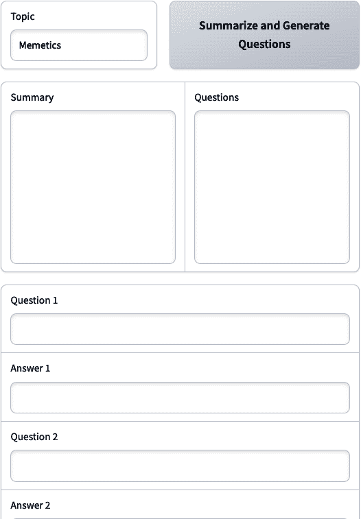

# 第十章\. 构建 AI 驱动应用程序

在本章中，你将应用提示的五个原则到内容写作的端到端 AI 工作流程中。该服务将根据用户对访谈问题的回答，以用户的写作风格撰写博客文章。这个系统最初在[Saxifrage 博客](https://oreil.ly/saxifrage)上进行了记录。

# AI 博客写作

使用 AI 创建博客写作服务的天真方法是将`Write a blog post on {blogPostTopic}`提示给 ChatGPT。生成的内容质量可能合理，但不太可能包含关于该主题的有价值意见或独特经验。内容也可能很短且通用，因此不太可能排在谷歌搜索结果的前列。

一种更复杂的方法可能是构建一个更长的提示，并添加进一步的指令。可以添加关于规定的写作风格、博客文章的结构和要包含的关键词的详细信息。一个常见的博客文章[写作提示](https://oreil.ly/uMfZa)的例子可以在这里看到。

输入：

```py
Create a blog post about “{blogPostTopic}”. Write it in a “{tone}” tone.
Use transition words.
Use active voice. Write over 1000 words.
Use very creative titles for the blog post.
Add a title for each section. Ensure there are a minimum of 9 sections. Each
section should have a minimum of two paragraphs.
Include the following keywords: “{keywords}”.
Create a good slug for this post and a meta description with a maximum of 100
words and add it to the end of the blog post.
```

这个更长、更复杂的提示可能会产生更好的内容质量。然而，让我们通过提示的五个原则作为清单来运行一下：

方向

提供了一些指令，例如语气、使用过渡词和主动语态。然而，内容仍然可能听起来像 AI，而不是用户的声音。

格式

虽然有一些关于结构的提及，包括指示九个两段的内容，但这些指令很可能会被忽略。ChatGPT 在数学方面表现不佳，通常无法遵循指示多个部分或单词的数量。

示例

没有提供如何执行任务的示例，这可能会损害在多个主题或甚至在同一主题上多次运行此提示的可靠性。即使提供一个示例（一次性提示）也可能极大地帮助提高质量。

评估

这是一个*盲目提示*（在不测试的情况下将指令添加到提示中）的例子。[without testing them](https://oreil.ly/r7sXi)。这些指令中的一些可能对质量没有影响（不必要地消耗令牌），甚至可能降低质量。

分解

整个任务仅用一个提示尝试完成，这可能会损害性能。如果不将任务分解为子任务，就很难理解哪个部分的过程是成功的或失败的。

通过本章，你将创建多个 LLM 链组件。每个链将在 LangChain 中实现，使其更易于维护，并便于监控和优化时的日志记录。这个系统将帮助你根据用户的独特观点和经验生成*听起来像人*的内容。

首先准备好你的工作空间，配备必要的工具至关重要。因此，让我们将重点转向主题研究，并开始设置你的编程环境。

# 主题研究

您需要安装几个 Python 包才能有效地使用 LangChain 的文档加载器，包括以下包：

google-searchresults

这是一个用于抓取和处理 Google 搜索结果的 Python 库。

pandas

这提供了操作数值表和时间序列数据的数据结构和操作。

html2text

此工具将文件或网页中的 HTML 转换为 markdown (*.md*) 文件或文本。

pytest-playwright

此包使您可以使用 Playwright 进行端到端测试。

chromadb

ChromaDB 是一个开源向量数据库。

nest_asyncio

这扩展了 Python 标准的`asyncio`，使其与 Jupyter Notebooks 兼容。

使用此命令可以轻松安装这些包：

```py
pip install google-searchresults pandas html2text pytest-playwright chromadb \
nest_asyncio --quiet
```

此外，您还将使用需要 Playwright 的 LangChain 文档加载器。

在您的终端上输入此命令：**playwright install**。

此外，您还需要选择一个`TOPIC`并为`SERPAPI_API_KEY`和`STABILITY_API_KEY`设置环境变量。如果您在没有 Jupyter Notebook 的情况下运行脚本，那么您不需要使用任何`nest_asyncio`代码：

```py
from langchain_openai.chat_models import ChatOpenAI
from langchain.output_parsers import PydanticOutputParser
from langchain_text_splitters import RecursiveCharacterTextSplitter
import os

# Custom imports:
from content_collection import collect_serp_data_and_extract_text_from_webpages
from custom_summarize_chain import create_all_summaries, DocumentSummary

import nest_asyncio
nest_asyncio.apply()

# Constant variables:
TOPIC = "Neural networks"
os.environ["SERPAPI_API_KEY"] = ""
os.environ["STABILITY_API_KEY"] = ""
```

接下来，您将专注于高效地总结网络内容：

```py
# Extract content from webpages into LangChain documents:
text_documents = await \
collect_serp_data_and_extract_text_from_webpages(TOPIC)

# LLM, text splitter + parser:
llm = ChatOpenAI(temperature=0)
text_splitter = RecursiveCharacterTextSplitter.from_tiktoken_encoder(
    chunk_size=1500, chunk_overlap=400
)
parser = PydanticOutputParser(pydantic_object=DocumentSummary)

summaries = await create_all_summaries(text_documents,
parser,
llm,
text_splitter)
```

首先，导入所需的工具，然后获取与您的`TOPIC`相关的网页内容。在设置好`ChatOpenAI`模型后，您将使用`text_splitter`来管理文本块。分割器确保没有片段过长，同时保持上下文重叠。然后创建`PydanticOutputParser`来处理和结构化摘要。通过将提取的文档通过专门的摘要函数，LLM 产生简洁的摘要。

如果您想深入了解`create_all_summaries`函数，请查看[*custom_summarize_chain.py*](https://oreil.ly/KyKjS)。

一些需要强调的关键点包括，您可以在 LangChain 中的大多数类中进行*子类化*。例如，您可以覆盖默认的`ChromiumLoader`以使其异步：

```py
from langchain_community.document_loaders import AsyncHtmlLoader, \
AsyncChromiumLoader

class ChromiumLoader(AsyncChromiumLoader):
    async def load(self):
        raw_text = [await self.ascrape_playwright(url) for url in self.urls]
        # Return the raw documents:
        return [Document(page_content=text) for text in raw_text]

async def get_html_content_from_urls(
    df: pd.DataFrame, number_of_urls: int = 3, url_column: str = "link"
) -> List[Document]:
    # Get the HTML content of the first 3 URLs:
    urls = df[url_column].values[:number_of_urls].tolist()

    # If there is only one URL, convert it to a list:
    if isinstance(urls, str):
        urls = [urls]

    # Check for empty URLs:
    urls = [url for url in urls if url != ""]

    # Check for duplicate URLs:
    urls = list(set(urls))

    # Throw error if no URLs are found:
    if len(urls) == 0:
        raise ValueError("No URLs found!")
    # loader = AsyncHtmlLoader(urls) # Faster but might not always work.
    loader = ChromiumLoader(urls)
    docs = await loader.load()
    return docs

async def create_all_summaries(
    # ... commented out for brevity
) -> List[DocumentSummary]:
    # ... commented out for brevity
```

通过子类化`ChromiumLoader`，您可以轻松创建一个自定义实现，使用 Chrome 浏览器从多个 URL 异步*抓取内容*。`get_html_content_from_urls`从 URL 列表中获取 HTML 内容，确保没有重复并处理潜在的错误。

# 专家访谈

现在，您已经成功从 Google 提取了前三条结果摘要，您将进行一次与 LLM 的访谈，生成相关问题，以确保您的文章使用`InterviewChain`类具有独特的视角：

```py
from expert_interview_chain import InterviewChain
interview_chain = InterviewChain(topic=TOPIC, document_summaries=summaries)
interview_questions = interview_chain()

for question in interview_questions.questions:
    print(f"Answer the following question: {question.question}\n", flush=True)
    answer = input(f"Answer the following question: {question.question}\n")
    print('------------------------------------------')
    question.answer = answer
```

InterviewChain 实例化

拥有您的话题和获得的摘要后，创建一个`InterviewChain`实例，根据您数据独特的上下文进行定制。

生成问题

通过简单地调用`interview_chain`，您就可以启动从您的摘要中生成一系列探究性问题的过程。

互动问答环节

进入一个引人入胜的循环，其中每个派生问题都会打印出来，并使用`input()`提示你回答。然后你的回答会被保存回 Pydantic 对象。

# 给出方向

为 LLM 提供独特的答案提供了独特的上下文，这允许 LLM 生成更丰富、更细腻的回复，确保你的文章提供新颖且深入的视角。

`InterviewChain`的所有代码都在*[expert_interview_chain.py](https://oreil.ly/0d5Hi)*中。它有两个显著组件：

一个定制的`System`消息

这个提示包括角色提示、之前生成的摘要、主题和格式说明（用于输出解析器）：

```py
system_message = """You are a content SEO researcher. Previously you have
summarized and extracted key points from SERP results. The insights gained
will be used to do content research and we will compare the key points,
insights and summaries across multiple articles. You are now going to
interview a content expert. You will ask them questions about the following
topic: {topic}.

You must follow the following rules:
 - Return a list of questions that you would ask a content expert about
 the topic.
 - You must ask at least and at most 5 questions.
 - You are looking for information gain and unique insights that are not
 already covered in the {document_summaries} information.
 - You must ask questions that are open-ended and not yes/no questions.
    {format_instructions}
"""
```

输出解析器

深入了解该类，你会遇到`PydanticOutputParser`。这个解析器将 LLM 的回复主动结构化为可解析的、Pydantic 的`InterviewQuestions`对象：

```py
from expert_interview_chain import InterviewQuestions

# Set up a parser + inject instructions into the prompt template:
parser = PydanticOutputParser(pydantic_object=InterviewQuestions)
```

事实上，你正在与 AI 进行对话，并指导它构思出能够增强内容洞察力的强大问题，同时使定制变得轻而易举。

# 生成大纲

包括之前的访谈和研究，你可以使用`BlogOutlineGenerator`生成文章的大纲。将`TOPIC`、`question_answers`和 Google 的`summaries`传递进去，以提供额外的上下文：

```py
from article_outline_generation import BlogOutlineGenerator

blog_outline_generator = BlogOutlineGenerator(topic=TOPIC,
questions_and_answers=[item.dict() for item in interview_questions.questions])

questions_and_answers = blog_outline_generator.questions_and_answers
outline_result = blog_outline_generator.generate_outline(summaries)
```

让我们详细探索`BlogOutlineGenerator`类：

```py
from typing import List, Any
from pydantic.v1 import BaseModel

class SubHeading(BaseModel):
    title: str # Each subheading should have a title.

class BlogOutline(BaseModel):
    title: str
    sub_headings: List[SubHeading] # An outline has many sub_headings

# Langchain libraries:
from langchain.prompts.chat import (ChatPromptTemplate,
SystemMessagePromptTemplate)
from langchain.output_parsers import PydanticOutputParser
from langchain_openai.chat_models import ChatOpenAI

# Custom types:
from custom_summarize_chain import DocumentSummary

class BlogOutlineGenerator:
    def __init__(self, topic: str, questions_and_answers: Any):
        self.topic = topic
        self.questions_and_answers = questions_and_answers

        # Create a prompt
        prompt_content = """
 Based on my answers and the summary, generate an outline for a blog
 article on {topic}.
 topic: {topic}
 document_summaries: {document_summaries}
 ---
 Here is the interview which I answered:
        {interview_questions_and_answers}
 ---
 Output format: {format_instructions}
 """

        system_message_prompt =
        SystemMessagePromptTemplate.from_template(prompt_content)

        self.chat_prompt = ChatPromptTemplate.from_messages(
        [system_message_prompt])

        # Create an output parser
        self.parser = PydanticOutputParser(pydantic_object=BlogOutline)

        # Set up the chain
        self.outline_chain = self.chat_prompt | ChatOpenAI() | self.parser

    def generate_outline(self, summaries: List[DocumentSummary]) -> Any:
        print("Generating the outline...\n---")
        result = self.outline_chain.invoke(
            {"topic": self.topic,
            "document_summaries": [s.dict() for s in summaries],
            "interview_questions_and_answers": self.questions_and_answers,
            "format_instructions": self.parser.get_format_instructions(),
            }
        )
        print("Finished generating the outline!\n---")
        return result
```

创建一个包含`title`和`sub_headings`键的`BlogOutline` Pydantic 对象。同时，使用 LangChain 表达式语言（LCEL）设置大纲链条，将提示传递到聊天模型，然后最终传递到输出解析器：

```py
# Set up the chain:
self.outline_chain = self.chat_prompt | ChatOpenAI() | self.parser
```

通过使用 Pydantic 输出解析器，链条将返回一个用于未来链条的`BlogOutline` Pydantic 对象。

# 文本生成

在获得摘要、访谈问题和博客文章大纲后，是时候开始生成文本了。`ContentGenerator`类将 SEO 专业知识与几种 LLM 技术相结合，包括以下内容：

嵌入和检索

这有效地将原始网页分割和矢量化，存储在 Chroma 数据库中，并在撰写每个部分时检索相关网页文本。

定制记忆

在撰写每个博客部分时，它使用记忆来避免重复相同的信息，同时如果对话变得过长，还会总结对话。

定制上下文

LLM 包含混合信息，包括你之前的访谈洞察、之前所说的话以及来自 Google 的相关网页文本片段：

```py
from article_generation import ContentGenerator

content_gen = ContentGenerator(
topic=TOPIC, outline=outline_result,
questions_and_answers=questions_and_answers)

# Vectorize and store the original webpages:
content_gen.split_and_vectorize_documents(text_documents)
# Create the blog post:
blog_post = content_gen.generate_blog_post()
```

所有源代码都在*[article_generation.py](https://oreil.ly/0IFyI)*中，但让我们特别关注这个链条中的三个关键组件。

`OnlyStoreAIMemory`类是`ConversationSummaryBufferMemory`的定制子类：

```py
from typing import List, Dict, Any
from langchain.memory import ConversationSummaryBufferMemory

from langchain_core.messages import SystemMessage

class OnlyStoreAIMemory(ConversationSummaryBufferMemory):
    def save_context(self, inputs: Dict[str, Any],
    outputs: Dict[str, str]) -> None:
        input_str, output_str = self._get_input_output(inputs, outputs)
        self.chat_memory.add_ai_message(output_str)
```

它专门设计用来确保聊天消息的记忆保持简洁且相关，通过*仅存储 AI 生成的消息*。

这个故意的选择绕过了存储在生成步骤中使用的检索到的文档，防止了内存膨胀。此外，内存机制确保 AI 对其先前的写作保持意识，使其能够在累积的上下文超过设定限制时提供简化的摘要。

`generate_blog_post`函数遍历所有子标题，并尝试在当前上下文长度内检索尽可能多的相关文档：

```py
def generate_blog_post(self) -> List[str]:
        blog_post = []
        print("Generating the blog post...\n---")
        for subheading in self.outline.sub_headings:
            k = 5  # Initialize k
            while k >= 0:
                try:
                    relevant_documents = (self.chroma_db.as_retriever() \
                    .invoke(subheading.title,
                    k=k))
                    section_prompt = f"""
 ...prompt_excluded_for_brevity...
 Section text:
 """
                    result = self.blog_post_chain.predict(section_prompt)
                    blog_post.append(result)
                    break
                except Exception as e:
                    print(f"An error occurred: {e}")
                    k -= 1
                if k < 0:
                    print('''All attempts to fetch relevant documents have
 failed. Using an empty string for relevant_documents.
 ''')
                    relevant_documents = ""
        print("Finished generating the blog post!\n---")
        return blog_post
```

这个函数，`generate_blog_post`，会遍历每个子标题。它尝试获取最多五篇相关文档。如果获取文档出现问题时，它会智能地减少数量并再次尝试。如果所有尝试都失败，它会优雅地默认为没有文档。

最后，生成每个部分的提示非常丰富：

```py
section_prompt = f"""You are currently writing the section: {subheading.title}
---
Here are the relevant documents for this section: {relevant_documents}.
If the relevant documents are not useful, you can ignore them.
You must never copy the relevant documents as this is plagiarism.
---
Here are the relevant insights that we gathered from our interview questions
and answers: {self.questions_and_answers}.
You must include these insights where possible as they are important and will
help our content rank better.
---
You must follow the following principles:
- You must write the section: {subheading.title}
- Render the output in .md format
- Include relevant formats such as bullet points, numbered lists, etc.
---
Section text:
"""
```

`section_prompt`通过宣布你正在工作的特定部分，使用`{subheading.title}`，巧妙地设置了场景。但它并没有就此停止。通过向 LLM 提供`{relevant_documents}`，它提供了背景和深度，同时明确警告不要抄袭。此外，通过包含通过`{self.questions_and_answers}`的你的访谈洞察，提示确保了有价值的信息处于最前沿。最后，它对格式、某些功能的包含以及当前的主题设定了明确的期望。这使得 LLM 不仅仅是一个工具，而是一个信息丰富的合著者，与你一起勤奋地工作，共同创造内容。

# 写作风格

现在文章已经写好，我们可以更进一步，使其听起来更像是人类所写，通过以特定的写作风格重写内容。这将大大减少内容被明显识别为 AI（尽管从伦理上讲，你应该仍然声明任何 AI 辅助）的机会，并减少你在发布前编辑最终草稿所花费的时间。

在重写之前，你需要知道你想要模仿的写作风格，无论是你自己的还是别人的。一种常见的方法是要求 ChatGPT 总结某个著名人物或至少在你所在行业足够流行，以至于出现在 ChatGPT 的训练数据中的写作风格。通常模型会想要以作者的名字和写作示例作为回应，所以添加不要这样做的说明，并以一个项目符号（或在这个情况下是`-`字符）结束提示，将为你提供所需的格式。

输入：

```py
Describe in detail the writing style of Harry Dry from MarketingExamples.com
Do not mention the writer or source, and respond only with bullet points:
-
```

输出：

```py
- Concise and to the point
- Humorous and knowledgeable tone
- Relatable and accessible language
- Uses storytelling to convey ideas
- Relies on examples and case studies
- Provides actionable advice and tips
- Uses subheadings and bullet points for easy readability
- Emphasizes key points or takeaways with bold or italicized text
- Addresses the reader directly, creating a conversational tone
```

通常只提供一个文本样本，ChatGPT 可以生成一个合理的写作风格指南，然后可以用于重写。一旦定义了写作风格，就可以混合匹配元素，以达到更理想的风

```py
Rewrite the article in the following style:

- Concise and to the point
- Professional and knowledgeable tone
- Relatable and accessible language
- Uses storytelling to convey ideas
- Relies on examples and case studies
- Mixes personal anecdotes with industry insights
- Provides actionable advice and tips
- Uses subheadings and bullet points for easy readability
```

在实践中，这个 AI 写作过程的部分是最难做对的，也是唯一需要更大、更昂贵的 GPT-4 模型才能得到可接受结果的部分。如果这个过程的部分不正确，用户可能需要做大量的手动编辑才能使写作符合公司风格。鉴于这个提示的战略重要性，进行一轮[提示优化](https://oreil.ly/H3VtJ)，尝试多种方法是有意义的。

在优化提示时，您可以多次运行相同的提示并检查其对评估指标的总体表现。例如，以下是测试五种不同的提示方法对嵌入距离评估指标的结果。分数越低，响应的嵌入与参考答案（手动重写的文本，风格正确）的嵌入越接近。测试的提示如下：

A

控制——如前例中详细说明的标准提示。

B

一份写作样本——我们提供了一份文本样本，并要求 GPT-4 描述其写作风格。

C

三份重写示例——我们向 GPT-4 提供了三个输入文本样本及其重写版本，并要求它描述写作风格。

D

三份写作样本——与之前相同，只是没有输入文本，只有迈克写作的最终样本。

这些提示在三个测试案例中进行了测试，这些案例是我们在实验中进行的——[我们进行的实验](https://oreil.ly/vRRYO)——包括遗传学、摩天大楼技术和基于价值的定价，这些是 ChatGPT 在一个主题上生成的文本片段，例如：*解释基于价值的定价*。然后我们手动重写了文本，以形成我们想要的参考文本进行比较。通过获取参考文本的嵌入（来自 OpenAI 的`text-embedding-ada-002`）并将其与提示输出的嵌入进行比较，使用*余弦相似度*（一种计算两组数字之间距离的方法）来计算嵌入距离，具体细节请参阅[LangChain 的嵌入评估器](https://oreil.ly/400gJ) (图 10-1)。


###### 图 10-1\. 提示优化测试结果

如您从图 10-1 的结果中可以看到，一些提示的效果比其他提示好，有些案例对 AI 来说更容易实现。进行多案例测试，每个案例 10 次或更多，以获得每个提示的实际情况。否则，响应的非确定性可能意味着您在扩大提示使用时，对性能的期望可能比实际更好或更差。以下是表现最佳的最终结果提示：

```py
You will be provided with the sample text.
Your task is to rewrite the text into a different writing style.
The writing style can be described as follows:
1\. Informative and Analytical: The writer presents detailed information
about different strategies, especially the main theme of the text, and breaks
down its benefits, challenges, and implementation steps. This depth of
information shows that the writer has a solid grasp of the topic.
2\. Structured and Organized: The writing follows a logical flow, starting
with a brief overview of different approaches, delving into a deep dive on
the topic, and concluding with potential challenges and contexts where it
might be best applied.
3\. Conversational Tone with Professionalism: While the information is
presented in a professional manner, the writer uses a conversational tone
("Here’s how to implement..."), which makes it more relatable and easier for
readers to understand.
4\. Practical and Actionable: The writer not only explains the concept but
also offers actionable advice ("Here’s how to implement X") with step-by-step
guidance based on real world-experience.
5\. Balanced Perspective: The writer doesn’t just present the benefits of the
topic but also discusses its challenges, which gives a well-rounded
perspective to readers.
6\. Examples and Analogies: To make concepts clearer, the writer uses
concrete examples (e.g., how much a company might save per month) and
analogies (e.g., making comparisons to popular frames of reference). This
helps readers relate to the concepts and understand them better.
7\. Direct and Clear: The writer uses straightforward language without
excessive jargon. Concepts are broken down into digestible bits, making it
accessible for a broad audience, even if they're not well-versed in business
strategies. In essence, this writing style is a blend of professional
analysis with practical, actionable advice, written in a clear and
conversational tone.
```

# 评估质量

不测试写作风格，很难猜测哪种提示策略会获胜。通过少量测试，你可以更有信心这是正确的方法。测试不需要高度组织或系统化，许多成功 AI 产品的构建者，如[GitHub Copilot](https://oreil.ly/vu0IU)，承认他们的评估过程是杂乱无章的（但完成了工作！）。

在这个项目中，我们将使用这个经过良好测试的示例，但你也可以利用这个机会尝试提高这个分数。包含参考文本和代码的仓库在 GitHub 上[公开可用](https://oreil.ly/O6RdB)，如果你发现了一个更好的方法，请随时向仓库贡献。一个可以尝试的潜在路径是微调，如果你有足够的样本（[OpenAI 建议至少 50 个](https://oreil.ly/OMMKi)），这可能会在匹配写作风格时得到更好的结果。即使你不对这个提示进行 A/B 测试（比较两个提示版本以查看哪个表现更好），这些结果也应该让你相信测试你的提示在一般情况下是有价值的。

# 标题优化

你可以通过生成各种选项，通过 A/B 提示测试它们，并使用点赞/踩不点赞的评分系统来衡量它们的有效性来优化内容的标题，如图 10-2 所示。


###### 图 10-2. 简单的点赞/踩不点赞评分系统

在评估所有提示后，你将能够看到哪个提示的平均分数最高，以及令牌使用情况（图 10-3）。


###### 图 10-3. 手动评估提示后的 A/B 测试结果示例

如果你仍然从这个提示或整个链中得不到你需要的质量水平，这是一个尝试使用像[DSPy](https://oreil.ly/dspy)这样的提示优化框架的好时机。在定义一个评估指标后，DSPy 会在你的提示中测试不同的指令和少量示例的不同组合，自动选择表现最佳的组合。[查看他们的文档中的示例](https://oreil.ly/vercel)。

# AI 博客图片

你可以采取的一个让你的博客看起来更专业的做法是，给你的博客文章添加具有一致风格的定制插图。在最极端的情况下，这可能意味着训练一个如第九章所述的 Dreambooth 模型，用于你的品牌风格指南或一系列具有特定视觉一致性或你珍视的美学质量的图片板。然而，在许多情况下，训练一个定制模型并不是必要的，因为可以通过简单的提示很好地复制这种风格。

在商业对商业（B2B）公司中，一种流行的视觉风格是[Corporate Memphis](https://oreil.ly/3UHQs)，其特点是有活力的色彩搭配、大胆且不对称的形状，以及有机和几何形式的混合。这种风格作为一种[昂贵信号技术](https://oreil.ly/haoTZ)出现，表明公司有能力委托设计师进行定制插图，因此足够认真，值得信赖。你可以用 AI 复制这种风格，同时节省定制插图的成本，并从消费者心中形成的先验关联中受益。图 10-4 显示了 Stable Diffusion 通过 Stability AI API 生成的 Corporate Memphis 风格示例。

输入：

```py
illustration of websites being linked together.
in the style of Corporate Memphis,
white background, professional, clean lines, warm pastel colors
```

图 10-4 显示了输出。


###### 图 10-4. Corporate Memphis：“网站相互链接”

# 给出指示

Stable Diffusion 在许多不同的风格上进行了训练，包括像 Corporate Memphis 这样的不为人知或小众风格。如果你知道一个风格的名字，通常这就是引导模型向期望的图像迈进所需的所有。你可以在这个[视觉提示构建器](https://oreil.ly/nxEzu)中找到各种艺术风格。

在我们的博客写作项目中，我们可以要求用户提出他们想要与博客文章一起使用的图像的想法，但让我们让这个过程更简单，并自动化这一步。你可以调用 ChatGPT 的 API 并获取一个关于图像可能包含的内容的想法。当你得到这个响应时，它可以成为你向 Stability AI 发送提示的基础，这是一种称为*元提示*的技术，其中一个 AI 模型为另一个 AI 模型编写提示。

输入：

```py
Describe an image that would go well at the top of this article:

{text}
```

输出：

```py
A seamless collage or mosaic of diverse cultural elements from around the world,
including traditional dances, art pieces, landmarks, and people in various
traditional attires, symbolizing the interconnectedness of human cultures.
```

Stability AI 在其 DreamStudio 平台上托管 Stable Diffusion，包括最新的 Stable Diffusion XL 模型。你也可以通过 API（[`oreil.ly/XD_jQ`](https://oreil.ly/XD_jQ)）或通过 Stability AI SDK（一个简化 API 调用过程的库）来调用它们。在下面的例子中，我们将创建一个用于调用 Stability AI 的函数，使用我们的提示。

输入：

```py
import base64
import os
import requests
import uuid

engine_id = "stable-diffusion-xl-1024-v1-0"
api_host = os.getenv('API_HOST', 'https://api.stability.ai')
api_key = os.getenv("STABILITY_API_KEY")

def generate_image(prompt):
    response = requests.post(
        f"{api_host}/v1/generation/{engine_id}/text-to-image",
        headers={
            "Content-Type": "application/json",
            "Accept": "application/json",
            "Authorization": f"Bearer {api_key}"
        },
        json={
            "text_prompts": [
                {
                    "text":'''an illustration of "+prompt+". in the style of
 Corporate Memphis,
 white background, professional, clean lines, warm pastel
 colors'''
                }
            ],
            "cfg_scale": 7,
            "height": 1024,
            "width": 1024,
            "samples": 1,
            "steps": 30,
        },
    )

    if response.status_code != 200:
        raise Exception("Non-200 response: " + str(response.text))

    data = response.json()

    image_paths = []

    for i, image in enumerate(data["artifacts"]):
        filename = f"{uuid.uuid4().hex[:7]}.png"
        with open(filename, "wb") as f:
            f.write(base64.b64decode(image["base64"]))

        image_paths.append(filename)

    return image_paths

prompt = """A seamless collage or mosaic of diverse cultural elements from
around the world, including traditional dances, art pieces, landmarks, and
people in various traditional attires, symbolizing the interconnectedness of
human cultures."""

generate_image(prompt)
```

图 10-5 显示了输出。


###### 图 10-5. 来自世界各地的各种文化元素的无缝拼贴或马赛克

为了封装整个图像生成系统，你可以将调用 ChatGPT 和随后调用 Stability AI 的过程合并到一个使用`outline_result.title`的函数中：

```py
from image_generation_chain import create_image
image = create_image(outline_result.title)
```

`[image_generation_chain.py](https://oreil.ly/cWpXH)`中的`create_image`函数利用 Stable Diffusion 根据 GPT-4 生成的标题创建图像：

```py
import base64
from langchain_openai.chat_models import ChatOpenAI
from langchain_core.messages import SystemMessage
import os
import requests
import uuid

engine_id = "stable-diffusion-xl-1024-v1-0"
api_host = os.getenv("API_HOST", "https://api.stability.ai")
api_key = os.getenv("STABILITY_API_KEY", "INSERT_YOUR_IMAGE_API_KEY_HERE")

if api_key == "INSERT_YOUR_IMAGE_API_KEY_HERE":
    raise Exception(
        '''You need to insert your API key in the
 image_generation_chain.py file.'''
        "You can get your API key from https://platform.openai.com/"
    )

def create_image(title) -> str:
    chat = ChatOpenAI()
    # 1\. Generate the image prompt:
    image_prompt = chat.invoke(
        [
            SystemMessage(content=f"""Create an image prompt
 that will be used for Midjourney for {title}."""
            )
        ]
    ).content

    # 2\. Generate the image::
    response = requests.post(
        f"{api_host}/v1/generation/{engine_id}/text-to-image",
        headers={
            "Content-Type": "application/json",
            "Accept": "application/json",
            "Authorization": f"Bearer {api_key}",
        },
        json={
            "text_prompts": [
                {
                    "text": f'''an illustration of {image_prompt} in the
 style of Corporate Memphis, white background,
 professional, clean lines, warm pastel colors'''
                }
            ],
            "cfg_scale": 7,
            "height": 1024,
            "width": 1024,
            "samples": 1,
            "steps": 30,
        },
    )

    if response.status_code != 200:
        raise Exception("Non-200 response: " + str(response.text))

    data = response.json()
    image_paths = []

    for i, image in enumerate(data["artifacts"]):
        filename = f"{uuid.uuid4().hex[:7]}.png"
        with open(filename, "wb") as f:
            f.write(base64.b64decode(image["base64"]))
        image_paths.append(filename)
    return image_paths
```

这里是高级流程：

1.  使用`ChatOpenAI`模型，你将为给定的`title`制作一个图像提示。

1.  使用 Stability AI API，你将发送这个提示以生成具有精确风格说明的图像。

1.  然后你将使用一个唯一的文件名解码并保存此图像到本地，并返回其路径。

通过这些步骤，您不仅是在提示 AI 创建文本内容，而且是在指导它将您的提示以视觉形式呈现出来。

该系统根据您为博客图片选择的任何样式都是灵活的。参数可以根据需要调整，也许将来可以用您自己的定制微调 Dreambooth 模型的调用来替换这个 API 调用。然而，在此期间，您有一个快速简单的方法为每篇博客生成自定义图片，无需用户进一步输入，保持一致的视觉风格。

# 用户界面

现在您的脚本已经从头到尾运行正常，您可能希望让它更容易使用，甚至可能希望将其交给可以提供反馈的人。生产中的许多 AI 工具的前端通常使用 JavaScript 构建，特别是基于 React 的 [NextJS](https://nextjs.org) 框架。这通常与一个 CSS 库如 [Tailwind CSS](https://tailwindcss.com) 配对，这使得设计元素的快速原型设计变得更容易。

然而，目前您的大部分 AI 代码可能都是用 Python 编写的，切换编程语言和开发环境可能是一个令人畏惧的挑战。除了学习 JavaScript、NextJS 和 Tailwind，您还可能遇到一系列问题，比如为您的 Python 代码启动服务器，为您的应用程序和用户数据保持数据库活跃，然后将所有这些与前端网页设计集成。

与其花费大量时间启动服务器、构建数据库和调整按钮颜色，不如创建一个简单的原型前端来获取早期反馈，在投入太多资源于这个阶段的未经证实的想法之前。一旦您构建并测试了一个简单的界面，您将更好地了解在需要将您的应用程序投入生产时需要构建什么。

对于启动基于 AI 的原型的简单用户界面，有几个流行的开源界面，包括 [gradio](https://www.gradio.app) 和 [Streamlit](https://streamlit.io)。Gradio 被 HuggingFace 收购，为许多开源 AI 模型的交互式演示提供了网络用户界面，其中包括著名的 [AUTOMATIC1111](https://oreil.ly/GlwJT) 稳定扩散 Web UI。您可以快速构建一个 Gradio 界面，使其更容易在本地运行代码，以及分享原型以获取反馈。

我们创建了一个界面，允许您在两步内自动化整个流程。您可以通过[这里](https://oreil.ly/HNqVX)获取 gradio 源代码。

然后在您的终端中进入[chapter_10 文件夹](https://oreil.ly/chapter10)，并运行 `python3 gradio_code_example.py` 来运行 gradio 应用程序。脚本会要求您在终端中输入 `SERPAPI_API_KEY` 和 `STABILITY_API_KEY`。

然后，您可以访问如图 10-6 所示的 gradio 界面。



###### 图 10-6\. Gradio 用户界面

当你运行 gradio 时，你会得到一个可以直接使用的内联界面，或者一个你可以点击以在浏览器中打开网页界面的 URL。例如，如果你使用 `share=True` 参数运行 gradio，比如 `demo.launch(share=True)`，你将获得一个公开可访问的链接，可以与朋友、同事或早期用户分享，以获取对您原型的反馈。

初始化界面后，通过点击“总结和生成问题”按钮输入一个主题。这将收集并总结 Google 结果，并生成面试问题。

然后，你需要填写每个问题的答案。最后，点击“生成博客文章和图像”按钮，这将使用 GPT-4 创建整个博客文章和图像，包括所有问题、答案和总结！

# 评估质量

在 AI 中，最有价值的评估数据是人类反馈，因为它一直是许多 AI 对齐突破的关键，包括那些为 ChatGPT 提供动力的突破。通过用户界面请求用户反馈，或者甚至将反馈机制构建到你的产品中，有助于你识别和修复边缘情况。

如果你是为了研究目的构建，或者想要为开源社区做出贡献，考虑在 Hugging Face Spaces 上分享你的 gradio 示例。Hugging Face Spaces 允许任何人免费托管他们的 gradio 示例，上传你的项目只需几分钟。可以通过 [Hugging Face 网站](https://oreil.ly/pSrP3) 创建新空间，或者通过 Hugging Face API 以编程方式完成。

# 摘要

恭喜！你已经穿越了生成式 AI 提示工程的全面世界。你从学习提示工程原则开始，探索了 LLM 的历史背景，了解了它们的性能和它们带来的隐私问题。

你学习了如何提取结构化数据，应用提示工程的最佳实践，并熟悉了一个名为 LangChain 的 LLM 包。然后你发现了基于相似性存储和查询文本的向量数据库，并进入了自主代理的世界。

此外，你沉浸在扩散模型驱动的图像生成技术中，学习了如何导航这个潜在空间。你的旅程涵盖了从格式修饰符和艺术风格复制到修复和扩展技术的一切。此外，你还探索了更多高级用法案例，如提示扩展、模因映射和 CLIP 询问器，以及其他许多案例。

最后，你转向利用提示工程进行内容创作。你学习了如何创建一个基于用户响应生成帖子并模仿其写作风格的博客写作服务，以及主题研究策略。

总体而言，这次旅程不仅丰富了你的知识，还为你提供了实际技能，使你能够在这个提示工程领域专业工作。

指导您穿越生成式 AI 的广泛领域一直是我们的荣幸。感谢您陪伴我们走到这本书的结尾。我们相信它将成为您未来所有与 AI 相关工作中的一项有用工具。

我们也非常期待听到您对这本书的看法，以及您使用我们讨论的技术所创造的任何引人注目的项目。

请随时通过发送电子邮件至 hi@brightpool.dev 与我们分享您的反馈或展示您的作品。再次感谢！您的求知欲和毅力正是塑造这个激动人心的领域未来的关键，我们迫不及待地想看看您将做出怎样的贡献。

快乐地提示！
