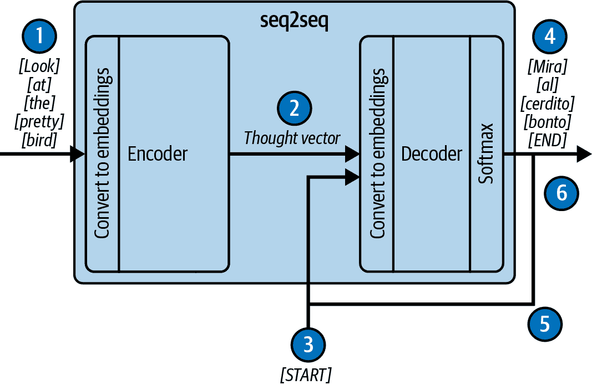

# 第一章：提示工程简介

ChatGPT 于 2022 年 11 月底发布。到次年 1 月，该应用已积累了约 1 亿月活跃用户，使 ChatGPT 成为史上增长最快的消费应用*之一*。（相比之下，TikTok 用了 9 个月才达到 1 亿用户，而 Instagram 则用了 2.5 年。）正如您所肯定的那样，尊敬的读者，这种公众赞誉是当之无愧的！LLMs（如支撑 ChatGPT 的 LLM）正在改变我们的工作方式。与其跑到谷歌通过传统网络搜索寻找答案，不如直接询问一个 LLM 来讨论一个主题。与其阅读 Stack Overflow 或翻阅博客文章来回答技术问题，不如让 LLM 为您撰写一个针对您具体问题空间的个性化教程，然后通过一系列问题和答案（问答）来跟进该主题。与其遵循传统的步骤来构建编程库，您可以通过与基于 LLM 的助手配对来加速进度，并在编写代码时自动完成代码！

而对于你，*未来的*读者，你会如何使用 LLMs，这是我们 2024 年的谦逊作者们无法想象的？如果当前趋势持续下去，你可能会在典型的一天中多次与 LLMs 进行对话——在电缆故障时以 IT 支持助手的口吻，在与街角 ATM 的友好交谈中，甚至在与令人沮丧的现实机器人拨号器对话。还会有其他互动。LLMs 将为您定制新闻，总结您最可能感兴趣的头版新闻，并移除（或可能*添加*）有偏见的评论。您将使用 LLMs 来协助您的沟通，撰写和总结电子邮件，甚至办公室和家庭助手会代表您进入现实世界进行互动。在一天之内，您的个人 AI 助手可能会在某个时刻充当旅行代理人，帮助您制定旅行计划、预订航班和预订酒店；然后，在另一个时刻，充当购物助手，帮助您找到并购买您需要的物品。

为什么大型语言模型（LLMs）如此神奇？这是因为它们具有魔力！正如未来学家亚瑟·C·克拉克著名地指出，“任何足够先进的技术都和魔法无法区分。”我们认为，你可以与之进行对话的机器当然可以算作是魔法，但本书的目标是消除这种魔力。我们将证明，无论 LLMs 有时看起来多么神秘、直观和人性化，本质上，LLMs 只是预测文本块中下一个单词的模型——仅此而已，没有更多！因此，LLMs 仅仅是帮助用户完成某些任务的工具，而你与这些工具互动的方式是通过构建*提示*——即它们要完成的文本块。这就是我们所说的*提示工程*。通过这本书，我们将建立一个实用的提示工程框架，最终用于构建 LLM 应用，这将*绝对*为你的用户提供一种神奇的经历。

本章为即将开始的提示工程之旅设定了背景。但首先，让我们告诉你，作为本书的作者，我们是如何自己发现这种魔力的。

# LLMs Are Magic

本书两位作者都是 GitHub Copilot 代码补全产品的早期研究开发者。阿尔伯特是创始团队的一员，而约翰在阿尔伯特转向其他遥远视野的 LLM 研究项目时出现在了舞台上。

阿尔伯特在 2020 年中期首次发现了这种魔力。他这样描述：

> 大约每半年，在我们机器学习代码组的创意会议上，总会有人提出代码生成的议题。答案总是相同的：它将有一天变得神奇，但至少还需要五年时间。这就是我们的冷聚变。
> 
> 直到有一天，我第一次接触到了将成为 OpenAI Codex 的 LLM 的早期原型。那时，我看到未来已经到来：冷聚变终于实现了。
> 
> 很明显，这个模型与我们之前所知的那些糟糕的代码生成尝试完全不同。这个模型不仅有机会预测下一个单词，它甚至可以从文档字符串中生成整个语句和整个函数。这些函数是有效的！
> 
> 在我们决定可以用这个模型构建什么（剧透：它最终将成为 GitHub 的 Copilot 代码补全产品）之前，我们想量化这个模型真正有多好。因此，我们征集了一群 GitHub 工程师，让他们提出一些自包含的编码任务。其中一些任务相对简单——但这些是硬核程序员，他们中的许多人的任务也很复杂。许多任务是一个初级开发者会转向 Google 寻求帮助的类型，但也有一些甚至会让资深开发者求助于 Stack Overflow。然而，如果我们给这个模型一些尝试，它就能解决大多数问题。
> 
> 我们当时就知道——这是将引领编码新时代的引擎。我们唯一需要做的就是围绕它构建正确的载体。

对于约翰来说，那个神奇的时刻是在两年后的 2023 年初，当他开始试驾这辆车并出去兜风时。他这样描述：

> 我设置了一个屏幕录制会话，并概述了我计划解决的编码挑战：创建一个函数，它接受一个整数并返回该数字的文本版本。所以，给定输入 10，输出将是“ten”，给定输入 1,004,712，输出将是“one million four thousand seven hundred twelve。”这比你想象的要难，因为，多亏了英语，奇怪的反常现象比比皆是。10 到 20 之间的数字的文本版本——“eleven”、“twelve”和青少年——并不遵循任何其他十年中数字的相同模式。十位数的数字打破了预期的模式——例如，如果 90 是“ninety”，80 是“eighty”，那么为什么 30 不是“threety”，20 不是“twoty”呢？但我在编码挑战中的真正转折是，我想在一个我没有任何个人经验的编程语言中实现解决方案——Rust。Copilot 能应对这个挑战吗？
> 
> 通常，在学习一门新的编程语言时，我会参考典型的教程：如何创建一个变量？如何创建一个列表？如何遍历列表中的项？如何编写一个 if 语句？但与 Copilot 一起，我一开始只是写了一个文档字符串：

```py
// GOAL: Create a function that prints a string version of any number 
   supplied to the function.
// 1 -> "one"
// 2034 -> "two thousand thirty four"
// 11 -> "eleven"
fn

```

> Copilot 看到*fn*就跳进来帮忙：

```py
fn number_to_string(number: i32) -> String {
```

> 完美！我不知道如何为函数的输入参数或返回值注释类型，但随着我们继续一起工作，我会通过像“将输入数字分成三位一组”这样的注释来指导工作的整体流程，而 Copilot 会有效地教我编程结构。这包括如何创建向量并将它们分配给变量，例如`let mut number_string_vec = Vec::new();`以及如何创建循环，例如`while number > 0 {.`
> 
> 体验非常好。我在不断进步和学习语言的同时，没有被语言教程的持续参考所打扰——我的项目就是我的教程。然后，在这个实验进行到 20 分钟时，Copilot 让我大吃一惊。我输入了一条注释，并启动了下一个我知道我们需要的控制循环：

```py
// iterate through number_string_vec, assemble the name of the number 
// for each order of magnitude, and concatenate to number_string
for

```

> 暂停片刻后，Copilot 插入了 30 行代码！[在录音中，你实际上可以听到我明显地倒吸一口凉气](https://oreil.ly/4ZYWY)。代码编译成功——它完全是语法正确的——并且运行了。答案是有点古怪。输入 5,034,012 产生了字符串“五十三万四千一百二十”，但嘿，我并不期望人类第一次就能做到正确，而且错误很容易被发现和纠正。在 40 分钟的配对会议结束时，我做到了不可能的事情——我在一个我完全不熟悉的语言中创建了非平凡代码！Copilot 指导我理解 Rust 语法的基础，并且它展示了对我的目标有更抽象的理解，并在几个地方插话帮助我填补细节。如果我自己尝试这样做，我怀疑这需要几个小时。 

我们的神奇体验并不独特。如果你正在阅读这本书，你很可能自己也有过一些令人震惊的与 LLM 的互动。也许你第一次意识到 LLM 的力量是从 ChatGPT 开始的，或者也许你的第一次体验是来自 2023 年初涌现的第一代应用之一：如微软的 Bing 或谷歌的 Bard 这样的互联网搜索助手，或者是微软更广泛的 Copilot 工具套件中的文档助手。但达到这个技术转折点并不是一夜之间发生的事情。要真正理解 LLM，了解我们是如何到达这里的是非常重要的。

# 语言模型：我们是如何到达这里的？

要理解我们是如何到达技术史上的这个非常有趣点的，我们首先需要知道语言模型实际上是什么以及它做什么。谁比世界上最受欢迎的 LLM 应用——ChatGPT（见图 1-1）——更适合提问呢？


###### 图 1-1\. 什么是语言模型？

看吧？这就像我们在本章开头所说的：语言模型的主要目标是预测下一个单词的概率。你之前见过这个功能，不是吗？这是你在 iPhone 上输入短信时出现在键盘上方的完成单词栏（见图 1-2）。你可能从未注意到它…*因为它并不那么有用。* 如果语言模型就做这些，那么它们目前是如何震撼世界的呢？


###### 图 1-2\. 约翰指向他手机上的完成栏

## 早期语言模型

语言模型实际上已经存在很长时间了。如果你在本书出版后不久阅读它，那么为 iPhone 的猜下一个词功能提供动力的语言模型是基于 [1948 年首次提出的自然语言马尔可夫模型](https://oreil.ly/D6Q3U)。然而，还有其他更近期的语言模型，它们更直接地为目前正在进行的 AI 革命奠定了基础。

到 2014 年，最强大的语言模型是基于 [在 Google 介绍过的序列到序列（seq2seq）架构](https://arxiv.org/abs/1409.3215)。Seq2seq 是一个循环神经网络，从理论上讲，它应该非常适合文本处理，因为它一次处理一个标记，并循环更新其内部状态。这使得 seq2seq 能够处理任意长度的文本序列。通过专门的架构和训练，seq2seq 架构能够执行多种不同的自然语言任务：分类、实体提取、翻译、摘要等。但这些模型有一个致命的弱点——信息瓶颈限制了它们的性能。

seq2seq 架构有两个主要组件：编码器和解码器（见图 1-3）。处理开始时，向编码器发送一系列标记，这些标记逐个处理。随着标记的接收，编码器更新一个隐藏状态向量，该向量累积来自输入序列的信息。当处理完最后一个标记后，隐藏状态的最后值，称为思维向量，被发送到解码器。然后解码器使用思维向量中的信息来生成输出标记。问题是，思维向量是固定和有限的。它经常“忘记”较长的文本块中的重要信息，给解码器的工作空间很少——这就是信息瓶颈。



###### 图 1-3\. 一种翻译 seq2seq 模型

图中的模型工作如下：

1.  源语言标记逐个发送到编码器，并转换为嵌入向量，并更新编码器的内部状态。

1.  内部状态被打包成思维向量并发送到解码器。

1.  向解码器发送一个特殊的“开始”标记，表示这是输出标记的开始。

1.  根据思维向量的值，解码器状态被更新，并发出目标语言的输出标记。

1.  输出标记作为下一个输入提供给解码器。此时，过程从步骤 4 反复循环到步骤 5。

1.  最后，解码器发出一个特殊的“结束”标记，表示解码过程已完成。有限的思维向量只能将有限的信息传递给解码器。

2015 年的一篇论文，“通过联合学习对齐和翻译进行神经机器翻译”（[“Neural Machine Translation by Jointly Learning to Align and Translate”](https://arxiv.org/abs/1409.0473)），介绍了一种解决这一瓶颈的新方法。它不是让编码器提供一个单一的思想向量，而是保留了编码过程中为每个遇到的标记生成的所有隐藏状态向量，然后允许解码器在所有这些向量上进行“软搜索”。作为演示，论文展示了使用软搜索的英法翻译模型显著提高了翻译质量。这种软搜索技术很快就被人们称为注意力机制。

注意力机制很快在人工智能社区引起了广泛关注，最终在 2017 年的 Google 研究论文“[“Attention Is All You Need”](https://arxiv.org/abs/1706.03762)”中达到高潮，该论文介绍了图 1-4 中所示的 transformer 架构。Transformer 保留了其前辈的高级结构——由接收标记作为输入的编码器随后是生成输出标记的解码器组成。但与 seq2seq 模型不同，所有循环电路都被移除，transformer 完全依赖于注意力机制。结果架构非常灵活，在建模训练数据方面比 seq2seq 更好。但 whereas seq2seq 可以处理任意长度的序列，transformer 只能处理固定、有限的输入和输出序列。由于 transformer 是 GPT 模型的直接祖先，因此这是我们自那时以来一直在努力克服的局限性。


###### 图 1-4\. Transformer 架构

## GPT 进入场景

生成预训练的 transformer 架构在 2018 年的论文“[“Improving Language Understanding by Generative Pre-Training”](https://oreil.ly/vIiDJ)”中首次提出。该架构并不特别特殊或新颖。实际上，该架构只是一个去掉了编码器的 transformer——它只是解码器部分。然而，这种简化带来了一些意想不到的新可能性，这些可能性将在未来的几年内完全实现。正是这种生成预训练的 transformer 架构——GPT——很快点燃了正在进行的 AI 革命。

在 2018 年，这一点并不明显。在那个时间点，使用未标记的数据**预训练**模型是标准做法——例如，从互联网上获取的零散文本——然后修改模型的架构并应用专门的微调，以便最终的模型能够非常擅长完成**一个**任务。因此，生成式**预训练**的 Transformer 架构也是如此。2018 年的论文仅仅表明，这种模式对于 GPTs 来说非常有效——在未标记的文本上进行预训练，然后针对特定任务进行监督微调，导致了在分类、测量文档之间的相似性以及回答多项选择题等多种任务上表现良好的模型。但我们应该强调一点：在 GPT 微调之后，它只擅长它被微调的那个单一任务。

GPT-2 仅仅是 GPT 的一个扩展版本。当它在 2019 年推出时，研究人员开始意识到 GPT 架构的特殊性。这一点在[OpenAI 介绍 GPT-2 的博客文章](https://oreil.ly/_tv8t)的第二段中得到了明确的体现：

> 我们称之为 GPT-2（GPT 的继任者）的模型，仅仅是为了预测 40GB 互联网文本中的下一个单词而进行训练。由于我们对技术恶意应用的担忧，我们没有发布训练好的模型。

哇！这两句话怎么可能放在一起？预测下一个单词——就像 iPhone 在你发短信时做的那样——怎么会引起如此严重的滥用担忧？如果你阅读了相应的学术论文[“Language Models Are Unsupervised Multitask Learners”](https://oreil.ly/QEeI9)，那么你就会开始了解到。GPT-2 有 15 亿个参数，相比之下 GPT 有 1170 万个，训练文本量为 40GB，而 GPT 为 4.5GB。模型和训练集规模的简单数量级增加导致了前所未有的涌现质量——你不需要为 GPT-2 的单一任务进行微调，你可以直接应用原始的预训练模型到任务中，并且通常比专门针对该任务进行微调的最先进模型取得更好的结果。这包括理解模糊代词、预测文本中的缺失单词、标记词性等基准测试。尽管在阅读理解、摘要、翻译和问答任务上落后于最先进的技术，但 GPT-2 在这些特定任务针对的模型上仍然表现出色。

但是，为什么人们对这个模型的“恶意应用”如此关注？这是因为该模型在模仿自然文本方面已经变得相当出色。正如 OpenAI 博客文章所指出的，这种能力可以用来“生成误导性新闻文章、在线冒充他人、自动化生产用于社交媒体的侮辱性或伪造内容，以及自动化生产垃圾邮件/钓鱼内容。”如果有什么的话，这种可能性在 2019 年之后变得更加真实和令人担忧。

GPT-3 在模型大小和训练数据量上又提高了一个数量级，能力也相应地飞跃。2020 年的论文[“Language Models Are Few-Shot Learners”](https://arxiv.org/abs/2005.14165)表明，给定一些你希望模型完成的任务的示例（即“少量示例”），模型可以忠实地复制输入模式，因此可以执行几乎所有你能想象的语言任务——并且通常能产生高质量的结果。这就是我们了解到你可以修改输入——提示词——从而条件化模型执行当前任务的时候。这就是提示工程诞生的时刻。

ChatGPT 于 2022 年 11 月发布，由 GPT-3.5 支持——其余的都是历史！但是，这是一个正在迅速形成的历史（见表 1-1）。2023 年 3 月，GPT-4 发布，尽管细节尚未官方公布，但该模型传闻在模型大小和训练数据量上又提高了一个数量级，并且其能力比前辈们又强得多。从那时起，越来越多的模型出现了。有些来自 OpenAI，而有些来自主要行业玩家，如 Meta 的 Llama、Anthropic 的 Claude 和 Google 的 Gemini。我们继续看到质量上的飞跃，并且越来越频繁地，相同水平的质量出现在更小、更快的模型中。如果有什么的话，*进步正在加速*。

表 1-1\. GPT 系列模型的详细信息，显示了所有指标增加的指数性质

| 模型 | 发布日期 | 参数数量 | 训练数据 | 训练成本 |
| --- | --- | --- | --- | --- |
| GPT-1 | 2018 年 6 月 11 日 | 1.17 亿 | BookCorpus：来自 7000 本未出版书籍的 4.5GB 文本 | 1.7e19 FLOP |
| GPT-2 | 2019 年 2 月 14 日（初始）；2019 年 11 月 5 日（完整） | 15 亿 | WebText：来自 4500 万个 Reddit 点赞网页的 40GB 文本和 800 万个文档 | 1.5e21 FLOP |
| GPT-3 | 2020 年 5 月 28 日 | 1750 亿 | 由 Common Crawl（570GB）、WebText、英语维基百科和两个书籍语料库（Books1 和 Books2）组成的 4990 亿个 token | 3.1e23 FLOP |
| GPT-3.5 | 2022 年 3 月 15 日 | 1750 亿 | 未公开 | 未公开 |
| GPT-4 | 2023 年 3 月 14 日 | 1.8 万亿（传闻） | 传闻达到 13 万亿个 token | 估计为 2.1e25 FLOP |

# 提示工程

现在，我们来到了您进入提示工程世界的起点。从根本上说，LLM 能够完成一件事——完成文本。输入到模型中的称为*提示*——它是一份文档或文本块，我们期望模型能够完成。因此，最简单的提示工程实践就是构建提示，使其完成的内容包含解决当前问题的所需信息。

在这本书中，我们提供了一个关于提示工程的大得多图景，它涉及的内容远远超出了单个提示的范围，并讨论了整个基于 LLM 的应用，其中提示构建和答案的解释都是通过程序完成的。为了构建高质量的软件和高质量的 UX，提示工程师必须为用户、应用程序和 LLM 之间的迭代通信创建一个模式。用户将问题传达给应用程序，应用程序构建一个伪文档以发送给 LLM，LLM 完成文档，最后，应用程序解析完成的内容并将结果传达给用户，或者代表用户执行其他操作。提示工程的科学和艺术在于确保这种沟通以最佳方式在不同领域、用户的问题空间和 LLM 的文档空间之间进行结构化。

提示工程有几个复杂程度不同的级别。最基本的形式只使用一个非常薄的应用层。例如，当您与 ChatGPT 互动时，您几乎是在直接构建提示；应用程序只是将对话线程包裹在一个特殊的 ChatML Markdown 中。（您将在第三章中了解更多关于这一点。Chapter 3。）同样，当 GitHub Copilot 最初被创建用于代码补全时，它所做的只是将当前文件传递给模型以完成。

在下一个复杂程度的提示工程中，涉及对用户输入到模型中的内容进行修改和增强。例如，LLM 处理文本，因此技术支持热线可以将用户的语音转录成文本，并将其用于发送给 LLM 的提示中。此外，之前帮助记录或相关支持文档中的相关内容也可以包含在提示中。作为一个现实世界的例子，随着 GitHub Copilot 代码补全的发展，我们意识到，如果我们结合用户相邻标签中的相关片段，补全质量会显著提高。这很有道理，对吧？用户打开标签是因为他们在那里参考信息，所以从逻辑上讲，模型也可以从这些信息中受益。另一个例子是新的 Bing 基于聊天的搜索体验。在这种情况下，传统搜索结果的内容被拉入提示中。这使得助手能够熟练地讨论它在训练数据中从未见过的信息（例如，因为它提到了模型训练之后发生的事件）。更重要的是，这种方法有助于 Bing 减少幻觉，这是我们将在本书的多个地方重新讨论的话题，下一章将开始讨论。

在这个复杂程度的提示工程中，另一个方面出现在与 LLM 的交互变得**状态化**时，这意味着它们会保持之前交互中的上下文和信息。聊天应用在这里是典型的例子。随着用户每次新的交流，应用必须回忆之前交流中发生的事情，并生成一个忠实反映交互的提示。随着对话或历史记录变长，你必须小心不要让提示过于满载或包含可能分散模型注意力的虚假内容。你可以选择丢弃最早的交流或不太相关的旧内容，甚至可以采用摘要来压缩内容。

在这个复杂程度级别的提示工程中，另一个方面涉及为基于 LLM 的应用程序提供工具，这些工具允许 LLM 通过 API 请求读取信息，甚至创建或修改互联网上可用的资产，从而进入现实世界。例如，一个基于 LLM 的电子邮件应用程序可能会从用户那里收到这样的输入：“向戴安发送 5 月 5 日的会议邀请。”这个应用程序会使用一个工具来识别用户联系人列表中的戴安，然后使用日历 API 查找她的可用性，最后发送电子邮件邀请。随着这些模型变得更便宜、更强大，想象一下我们今天已经可以利用的 API 带来的可能性吧！在这里，提示工程至关重要。模型将如何知道使用哪个工具？它将如何正确地使用这个工具？你的应用程序将如何适当地将工具执行的信息与模型共享？当工具使用导致某种错误状态时，我们该怎么办？我们将在第八章中讨论所有这些问题。

本书涵盖的最后一个复杂程度是如何为 LLM 应用程序提供代理能力——即让应用程序能够就如何实现用户提供的广泛目标做出自己的决定。这显然是我们使用 LLMs 的能力的前沿，但研究和实践探索正在进行中。现在，你可以在[AutoGPT](https://oreil.ly/h3mJZ)上下载它，并为其提供一个目标，它将启动一个多步骤过程来收集实现目标所需的信息。它总是能成功吗？不。实际上，除非目标非常受限，否则它往往比成功更频繁地失败。但为 LLM 应用程序提供某种形式的代理和自主性仍然是通往令人兴奋的未来可能性的重要一步。你将在第八章和第九章中读到我们对这一点的看法。

# 结论

正如我们一开始所说的，本章为即将开始的提示工程之旅设定了背景。我们首先讨论了语言模型最近的历程，并强调了 LLMs 为何如此特别和不同——以及为什么它们正在推动我们现在都见证的 AI 革命。然后，我们定义了本书的主题：提示工程。

尤其重要的是，你应该理解这本书不会仅仅关于如何对单个提示进行字斟句酌以获得一个良好的补全。当然，我们会涵盖这一点，并且我们会详细说明你需要做的一切来生成高质量、服务于其预期目的的补全。但当我们说“提示工程”时，我们指的是构建整个基于 LLM 的应用程序。LLM 应用程序作为一个转换层，迭代地、有状态地将现实世界的需求转换为 LLM 可以处理的数据，然后将 LLM 提供的数据转换为满足这些现实世界需求的信息和行动。

在我们踏上这段旅程之前，让我们确保我们已经适当地打包了。在下一章中，你将学习从顶层 API 到低级注意力机制的 LLM 文本补全是如何工作的。在随后的章节中，我们将在此基础上扩展知识，解释 LLMs 是如何被扩展以处理聊天和工具使用的，你将看到实际上，这本质上都是同一件事——文本补全。然后，带着这些基础理念，你将准备好开始你的旅程。
