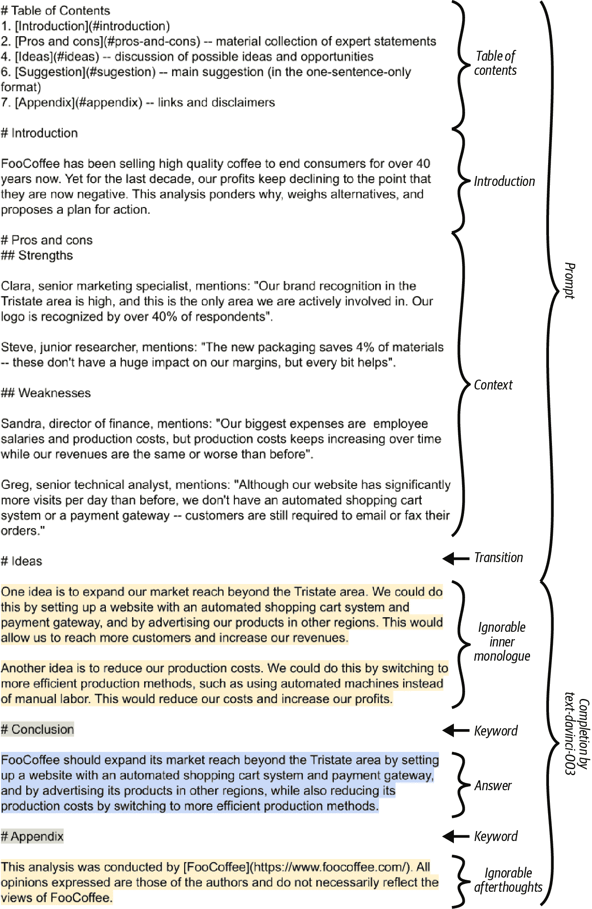
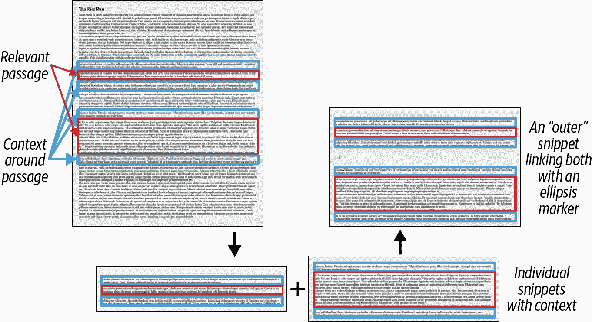

# 第六章\. 组装提示

在前几章中，你收集了大量将作为你提示构建块的内容。现在，是时候将这些碎片组合起来，制作一个能够有效传达你需求的提示了。本章将指导你通过首先探索你可用到的不同结构和选项来塑造你的提示。你如何选择组织这些单个片段将在你最终提示的有效性中扮演关键角色。

下一步涉及对内容进行分类——决定保留什么和丢弃什么，以便它能够适应你可能有的任何大小限制。这个过程对于完善提示并确保其保持专注和相关性至关重要。内容确定后，你将进入组装提示的阶段，这将是你从模型中获取相关、连贯和上下文准确响应的工具。让我们深入探讨。

# 理想提示的结构

在我们深入探讨如何达到那里的细节之前，让我们先可视化我们想要达到的地方。看看图 6-1，它提供了一个俯瞰你的提示应该如何看起来。我们将逐个分析其元素。简洁明了的提示通常更有效——此外，它们使用的计算能力更少，处理速度更快。此外，你还有一个与上下文窗口大小相关的硬截止点。

如在第五章讨论的中，提示由来自动态上下文和阐明你问题的静态指令的元素组成。这些元素的大小或数量没有硬性规定。实际上，随着应用的演变，一个大的提示元素可能会被拆分成几个更小的元素，以实现更精确的构建。我们曾参与过从仅有三个长元素到数百个单行元素的项目。


###### 图 6-1\. 构建良好提示的结构

没有任何理论规则规定每个提示元素必须以换行符结束。然而，在实践中，强制执行所有元素都以换行符结束的规则可以简化你的字符串操作代码。这也可以帮助进行标记长度计算，具体取决于所使用的标记器（更多内容将在下一节中介绍）。如果你的提示元素不容易适应这种格式，不必强迫它们这样做。

大多数提示语都包含一些特定的元素。首先是*介绍*，它有助于你明确你正在撰写的文档类型，并使模型正确地处理其余内容。介绍为随后的一切设定了背景。例如，如果模型声明“这是关于推荐一本书”，它将专注于与书籍推荐相关的方面，并相应地解释上下文。介绍还让模型从开始就思考问题。由于模型每个标记都有一个固定的“思考预算”，并且不能暂停进行更深入的反思，因此早期引导其关注点可以提高其输出质量。

大多数提示语只有一个介绍来设定主要问题。但这个原则也适用于提示语的子部分：如果有一些上下文，模型需要关注某个特定方面，那么在开头设定这个方面是有帮助的。

在介绍之后，你会看到一系列不同的提示语元素。模型将尝试充分利用它们，但并不平等。所有大型语言模型都受到两种效应的影响：

[*情境学习*](https://browse.arxiv.org/pdf/2302.11042)

信息离提示语结尾越近，对模型的影响就越大。

*丢失中间现象*[*](https://browse.arxiv.org/pdf/2307.03172.pdf)

虽然模型可以轻松回忆起提示语的开始和结束，但它对中间填充的信息感到困难。

这两种动态共同构成了我们所说的*平淡谷*。这个谷位于提示语的早期中间部分，那里放置的上下文并没有像开头或文档后半部分那样有效地被使用。平淡谷的深度及其确切位置取决于模型，但所有模型都有这个谷——人类也不例外！

平淡谷在大型提示语中最为问题化，而且没有完美的解决方案。你可以通过将关键的高质量提示语元素放置在平淡谷之外，并通过过滤上下文来尽可能使提示语简洁，从而减少其影响。

当你包含了所有上下文后，就是时候提醒模型主要问题了。我们称之为*重新聚焦*，这对于较长的提示语是必要的，因为你已经花费了很长时间添加上下文，你需要将模型的注意力重新集中在问题上。大多数提示工程师使用*三明治技术*，即在提示语的开头和结尾明确说明他们希望模型做什么（见表 6-1）。

表 6-1\. 使用 ChatML API 在同一问题的两个版本之间三明治上下文

| 提示语部分 | 三明治 | 提示语 |
| --- | --- | --- |
| 介绍 |   |

```py
[{"role": "system", "content" : "You are a helpful AI.”},
```

|

| 三明治部分 1 |
| --- |

```py
{"role": "user", "content" : "I want to suggest to Fiona 
an idea for her next book to read.”
```

|

|   |
| --- |

```py
Please ask any questions you need to arrive at an informed
suggestion."}, {"role": "assistant", "content" : "Of course! 
The following information might be useful: What books did 
she read last?”},
```

|

| 上下文 |   |
| --- | --- |

```py
{"role": "user", "content" : "Harry Potter, Lioness 
Rampant, Mr Lemoncello’s Library”},
```

|

|

```py
{"role": "assistant", "content" : "What did she post on 
social media recently?”}, {"role": "user", "content" : […]
```

|

| `[…]` |
| --- |
| `[…]` |
| `[…]` |
| 重新聚焦 + 过渡 |   |

```py
{"role": "assistant", "content" : "I believe this is all 
the information I need to select a single best candidate 
book suggestion.”},
```

|

| 三明治部分 2 |
| --- |

```py
{"role": "user", "content" : "Excellent! So based on 
this, which book should I suggest to her?”}]
```

|

重新聚焦可以短至半行，但通常在这里包含关键澄清。介绍设定了舞台（“我在考虑为 X 推荐书籍。”），而重新聚焦提供了清晰的细节（“接下来推荐哪本书最好，专注于目前可用的叙事散文？”）。如果澄清变得很长，你可能需要在结束时进行简短的重新聚焦，尤其是在讨论输出格式时。

你的提示的最后部分应该明确地从解释问题过渡到解决问题——毕竟，这是你希望 LLM 帮助你的部分。如果它只是不断地添加更多（可能是虚构的）上下文到你的主要问题中，那就没有帮助。

当使用类似聊天的界面时，这部分通常只需要在结尾加上一个问号。RLHF 已经训练这些模型通过解决输入中最后提出的（有时甚至只是暗示的）最后一个问题来回答。一些商业平台，如 OpenAI 的 ChatGPT，在通过 API 接收到提示后，会自动向助手发出开始响应的信号。然而，传统的完成模型需要更多的明确指导才能达到同样的效果。

最常见的过渡方式——尤其是在使用完成 API 时——是从问题提出者转变为问题解决者，并开始为模型撰写答案。这样，模型别无选择，只能展示其解决方案。图 6-2 展示了良好的过渡如何帮助从模型中获得答案。请注意，在第三列结束过渡的引号仍然是提示的一部分。


###### 图 6-2\. 过渡的三种变体：缺失的，在左边；天真的，在中间；和精炼的，在右边（所有完成[阴影背景]都是使用 OpenAI 的 text-davinci-002 完成的，这是一个完成模型，而不是聊天模型）

如图 6-2 所示，你通常可以将重新聚焦和过渡合并。在这些情况下，你写下答案的开始部分，这部分只是重申或总结问题陈述。实际的答案随后由模型提供。

# 什么类型的文档？

一个提示和完成共同构成一个文档，正如第四章中提到的《小红帽原则》[ch04.html#ch04_designing_llm_applications_1728407230643376]所建议的，最好使用与训练数据中相似的文档，这样完成的格式就更容易预测。但你应该追求哪种类型的文档呢？有几种有用的类型，每种类型都有个性化的空间。让我们探索最常见的几种，以及何时使用每种。

## 建议对话

在最常见的范例中，你的文档代表两个人之间的对话。一个人寻求某种帮助，另一个人提供帮助。寻求帮助的人代表你的应用程序或其用户，而模型将扮演帮助提供者的角色。

这种方法非常适合聊天模型，但即使是完成模型也能从中受益。实际上，OpenAI 开发了 ChatML 来专注于建议对话，因为他们认为它们是最普遍有用且最容易实现的。建议对话有许多优点，包括以下内容：

自然交互

人们很容易用对话的方式来思考。你可以直接向模型提出问题，并将它的延续作为答案来简化交互。

多轮交互

对于复杂的交互，你可以通过新的问题和答案来继续提示，这使得管理对话和分解对话变得更加容易。这种方法允许你在问题之间添加你的逻辑，并帮助模型直接处理每个查询。

现实世界集成

对话对于多轮过程和与真实世界工具和技术集成都很有用，无论你是在使用聊天模型还是具有对话文档的完成模型。

如果你使用这种结构与聊天模型一起，你将获得与 RLHF 相关的额外优势，这些优势与你的指令的合规性有关。但如果你用完成模型代替，你可以避免任何对你场景无用的 RLHF 特性（例如，风格习惯、内容监控）。

另一方面，如果你恰好在使用完成模型，你可以使用一种称为“起始”的技巧，其中你规定答案的开头。你还记得 2010 年的电影《盗梦空间》（Inception）吗？这里也是同样的想法——为模型开始答案，模型会认为它是想出来的，并据此生成剩余的完成内容。这种方法可以提高模型的合规性，使答案更容易解析，同时帮助你避免对响应是否以一般性陈述开始或直接切入主题的不确定性。

当为完成模型编写提示时，你必须决定你的转录本的格式。好消息是，LLM 已经习惯了多种不同的格式，如表 6-2 所示，其中相同的对话被转换成不同的格式。请注意，通常，应用程序会为此问题提供更多上下文。

表 6-2\. 向大型语言模型请求规划你一天的想法

| 格式 | 自由文本 | 脚本格式 | 无标记 | 结构化 |
| --- | --- | --- | --- | --- |
| 简介 | 我问我的丈夫，“我们明天做什么？” | 我：我们明天做什么？ | 我们明天做什么？ | <我>我们明天做什么？</我> |
| 上下文 | 他回答说，“嗯，天气怎么样？”我报告说，“我们预计整个波士顿地区的天气将温暖宜人，阳光明媚。” | 丈夫：嗯，天气怎么样？我：我们预计整个波士顿地区的天气将温暖宜人，阳光明媚。 | 嗯，天气怎么样？我们预计整个波士顿地区的天气将温暖宜人，阳光明媚。 | <husband>嗯，天气怎么样？</husband><me>我们预计整个波士顿地区的天气将温暖宜人，阳光明媚。</me> |
| 重新聚焦 | 他稍微反思了一下，关于我们周日的好活动是什么， | 丈夫（在反思周日的好活动之后） | （反思周日的好活动） | <direction>丈夫反思周日的好活动</direction> |
| 过渡 | 他建议说， | : | 我建议我们应该 | <husband> |
| 完成内容（text-davinci-003） | “那我们去看海滩吧。我们可以买些咖啡和三明治，在沙滩上野餐。我们可以坐在毯子上，看着波浪。听起来不错。” | 我觉得骑自行车会很有趣，也许可以去附近的公园。也许我们可以带个野餐午餐，在阳光下度过一天。 | 带上野餐和一本书去查尔斯河，整天悠闲地阅读，享受阳光。 | 如果天气这么好，去蓝山徒步旅行怎么样？我们可以看看水库，野餐，并观赏日落。 </husband> |

虽然所有格式都很有效，但每种格式都有其独特的优势，我们已将它们排列得如此，以便每种格式都弥补了前一种格式的不足：

自由文本

这允许你在引号之间插入各种类型的信息，但现场组装起来可能具有挑战性。创建一个能够动态生成包含许多元素的提示的可靠系统可能很困难。

录音格式

这很容易组装，但对于长文本或格式化元素（如带有重要缩进的源代码）来说效果较差。

无标记格式

这与格式化文本和较长的内容（如粘贴的电子邮件）配合得很好，但对于模型跟踪说话者以及应用程序确定模型响应何时结束以及下一个输入何时开始可能很困难。

结构化格式

这清楚地表明了谁在说话以及他们何时结束。有多种结构可供选择，它们在“结构化文档”中有详细说明。

在第三章中，我们介绍了写作对话提示的概念，就像戏剧创作。除了舞台指示外，文本的各个部分都属于戏剧中的一个“角色”。在寻求建议者和助手之间的对话中，你通常让用户为寻求建议者编写说话部分，让 LLM 为助手编写说话部分。这并不一定非得如此——作为提示工程师，你为助手角色写作没有任何阻碍。这是起始方法的一种形式——你代表助手说话，在所有随后的对话回合中，助手将表现得好像它真的说了你所说的话。

###### 小贴士

从助手的视角编写提示有助于将上下文框架化为似乎是在回答他们提出的问题。这种方法确保了完成部分从答案开始，而不是另一个澄清问题。

## 分析报告

每年，数百万学生接受报告写作的训练。他们学习撰写引言、阐述、分析和结论的艺术，一旦他们毕业并进入职场，他们就会撰写分析市场、权衡成本和收益并提出可操作结论的报告。所有这些都是艰苦的工作，幸运的是，它有其目的：它为 LLM 提供了优秀的训练材料。而且，这些模型是在包含各种类型和规模的报告的大量数据集上训练的。

利用这些丰富的报告资源很简单，特别是如果你的任务属于分析报告常见的领域，如商业、文学、科学或法律（尽管最好将法律辩护留给人类专业人士）。报告很容易结构化，因为它们遵循一个熟悉的格式，通常从引言开始，导致结论，并经常包括总结。你已经收集的信息可以轻松地插入讨论或背景部分。

然而，制作静态提示元素，如指令，需要一些思考，尤其是当你确保内容清晰、简洁时。一个有用的策略是包括一个*范围*部分，明确界定报告的边界。而不是在对话中来回确认排除的内容（例如，“请只建议小说，不要自助书籍。”），你可以一开始就声明，“本报告仅关注小说，不包括自助书籍。”LLM 在报告中比在对话中更一致地尊重这样的明确边界。

报告还倾向于客观分析，这通过避免需要模拟社交互动来减轻 LLM 的认知负担。话虽如此，因为分析通常在结论之前，所以当你想让模型进入决策模式时，你必须确保有一个清晰的过渡。否则，你可能会得到一个需要额外解析的冗长回答。另一方面，这种格式非常适合思维链提示，这在第八章中有更详细的介绍 Chapter 8。

对话可以采取多种形式，具体取决于上下文（见 Table 6-2）。然而，对于报告，我们建议您始终坚持一种格式：用 Markdown 编写您的提示。以下是原因：

+   它相当通用，互联网上充满了 Markdown 文件，所以 LLM 对它很熟悉。

+   Markdown 是一种简单、轻量级的语言，只有几个关键特性。这使得它易于编写，并且对模型来说，解释输出是直接的。

+   Markdown 的标题有助于定义层次结构，这使得您可以将提示元素组织成清晰的章节，可以轻松地重新排列或省略，同时保持结构。

+   另一个有用的特性是缩进通常不重要，但对于技术内容（例如，源代码），您可以使用三重反引号打开和关闭的块（```py).

*   If you want to display model output to the user directly, Markdown is very easy to render.

*   Markdown’s hyperlink feature allows the model to include links that are easy to parse, which can help you verify sources and retrieve content programmatically.

Additionally, it’s common to give a table of contents at the beginning of the Markdown file, and that can be quite useful. A table of contents can serve as a useful part of the introduction for a long prompt because it helps models orient themselves just as much as it helps people. It can also be a great tool for controlling the completion, in two ways:

1.  For chain-of-thought prompting or managing overly verbose models, you can use a scratchpad approach. Adding sections like `# Ideas` or `# Analysis` before `# Conclusion` in the table of contents helps guide the model to a more informed conclusion while allowing you to ignore the earlier sections.

2.  You can easily signal when the model’s response should end by adding a section like `# Appendix` or `# Further Reading` after the conclusion. Setting `# Further Reading` as a stop sequence ensures the model finishes its task, conserving compute resources.

Both use cases for the table of contents are demonstrated in Figure 6-3. Note that since this is an example, the amount of context is less than what the model would need to give a proper answer to such a question. Also, LLMs aren’t oracles: with the appropriate context, a model can be a good tool for ideation, but there’s no reason its opinion should count for more than Jerry’s in Accounting.



###### Figure 6-3\. A Markdown report using a table of contents (completion obtained using OpenAI’s text-davinci-003)

## The Structured Document

Structured documents follow a formal specification that allows you to make strong assumptions about the form of the completion. This makes parsing easier, including the parsing of complex outputs.

A great example of this is found in Anthropic’s Artifacts prompt. Artifacts will come up again in the final chapter of this book, but for now, you should know that Artifacts are self-contained documents that the user and assistant collaborate on. Examples of Artifacts are Python scripts, small React apps, mermaid diagrams, and scalable vector graphics (SVG) diagrams. Artifacts are presented in the UI as text in a pane to the right of the conversation, and in the case of React, Mermaid, and SVG, they are rendered into functioning or visual prototypes.

An abridged version of the Artifacts prompt is shown in Table 6-3 ([this prompt was extracted by @elder_plinius](https://oreil.ly/Lwsp1)). To make Artifacts work, the prompt uses an XML document structure that clearly delineates the pieces of the interaction. The `artifacts_info` prompt holds the equivalent of the system message, explaining how artifacts work. It includes an `examples` section with several `example` blocks. Each example has a `user_query` and an `assistant_response`.

Things get most interesting inside the `assistant_response`. First, the assistant starts its response, and then an `antThinking` block is injected so that the assistant can “think” about whether the user’s request should make use of an Artifact or just be handled as a normal conversation. If the decision is to use an Artifact, then the text will include an `antArtifact` block that contains the text of the Artifact. Notice that the `antArtifact` tag also includes attributes such as the title of the Artifact and the language used.

Table 6-3\. The Anthropic structured prompt used for generating Artifacts (abridged)

| Prompt | `The assistant can create and reference Artifacts during conversations. Artifacts are for substantial, self-contained content that users might modify or reuse, and they are displayed in a separate UI window for clarity.``Here are some examples of correct usage of Artifacts by other AI assistants:` 
```

<examples>

<example>

    <user_query>你能帮我创建一个计算阶乘的 Python 脚本吗？

    factorial of a number?</user_query>

    <assistant_response>

    当然！这里有一个计算阶乘的 Python 脚本

    数字：

    <antThinking>创建一个计算阶乘的 Python 脚本符合

    良好文件的标准。因此，我正在创建一个新的

    文件。

    </antThinking>

    <antArtifact identifier="factorial-script"

    type="application/vnd.ant.code" language="python"

    标题="简单的 Python 阶乘脚本">

        def factorial(n):

            if n == 0:

                return 1

            else:

                return n * factorial(n - 1)

    ...

    </assistant_response>

</example>

[...省略几个示例...]

</examples>

```py

`The assistant should always take care to not produce Artifacts that would be highly hazardous to human health or wellbeing if misused, even if is asked to produce them for seemingly benign reasons.``</artifacts_info>``Claude is now being connected with a human.``<user_query>`**`Can you help me create a Python script to factor a number into its prime factors?`**`</user_query>``<assistant_response>` |
| Completion | `Sure! Here's a Python script that factors a number into its prime factors:``<antThinking>This code is self-contained and is likely to be reused or modified. Therefore, I'm creating a new Artifact.</antThinking>``<antArtifact identifier="prime-factor-script"``type="application/vnd.ant.code" language="python"``title="Python script for factoring numbers into prime factors"> def prime_factors(n):` 
```

    factors = []

    d = 2

    while n > 1:

        while n % d == 0:

            factors.append(d)

            n /= d

        d += 1

    return factors

print(prime_factors(24)) # 输出: [2, 2, 2, 3]

</assistant_response>

```py

 |

As a result of setting up this structured pattern in the prompt, it becomes much easier to parse out information from the response. In particular, `antThinking` is parsed out and hidden from the user, and `antArtifact` is extracted and placed into the Artifact pane, under the title specified in the attributes. (In Chapter 7, we get into much more detail about how content can be extracted from the completions.)

Like conversation transcripts, structured documents can come in many different formats. The Little Red Riding Hood principle suggests that you use formats that are readily available in training data. The most suitable formats are XML and YAML. Both are common in technical documents where precision is of the essence, and both can be used in many different domains. In both cases, the whole document is hierarchically ordered into normally named elements, which can have several subelements.

In [XML](https://oreil.ly/NvPU4) (see Table 6-3), the document consists of a series of tags that are opened and closed. The tag may have attributes and has content that may contain subtags. Choose XML if your individual elements are relatively short, and if they are multiline, indentation doesn’t matter. But you might need to be careful about escape sequences: there are five in XML: `&quot` (“), `&apos` ('), `&lt` (<), `&gt` (>), and `&amp` (&). XML also allows you to add HTML-style comments as`<!-- this is a comment -->`, which can occasionally be useful for “editorial” hints for the model.

In [YAML](https://yaml.org), the document consists of a series of named fields or unnamed bullet points whose hierarchy levels are tracked by their indentation. This indentation tracking can be quite annoying because you need to get it right to be able to use standard parsers, but it’s helpful in cases where you need to be very precise about indentation, such as with code or formatted text. In particular, the syntax `fieldname: |2` opens a multiline text field that preserves indentation, as illustrated in Figure 6-4. Note that in such text fields, you don’t need to escape anything, which is nice. You’ll notice that such a text field is finished by encountering a line with smaller indentation than the text field’s “zero” indentation. Also note that the highlight boxes indicate the value of the content fields, including leading whitespace.


###### Figure 6-4\. Text fields specifying indented content in YAML

Another markup language that should feature heavily in any LLM’s training set is JSON (or its variant, JSON Lines). At one point, we would have recommended against using JSON since it is very escape heavy and less readable. However, OpenAI in particular has put a lot of effort into making its models generate JSON accurately because JSON powers their tools API. Therefore, for OpenAI at least, JSON is still a reasonably good choice.

# Formatting Snippets

The way you format snippet text depends a lot on your document. In an advice conversation transcript, you can format snippet information into the back-and-forth turns of the conversation. For instance, say your application retrieves this weather forecast data:

```

weather = {

"description": "sunny",

"temperature": 75

}

```py

That information can be packaged as the advice seeker asking a clarifying question and the assistant answering with the following information:

```

用户：天气怎么样？

助手：天气将 {{ weather["description"] }} ，温度为

{{ weather["temperature"] }} 摄氏度。

```py

In an analytic report, you normally want to state your knowledge in natural language. Results of API calls require you to know what the API returns, and then you can format the string into a sentence. Often, it’s useful to include the results of individual API calls as individual sections, like this:

```

#### 天气预报

{{ weather["description"] }} ，温度为 {{ weather["temperature"] }}

摄氏度

```py

Finally, if you use a structured document, your life is often easy: just serialize all relevant fields of the object you have in memory that represents your piece of knowledge:

```

<weather>

<description>sunny</description>

<temperature>75</temperature>

</weather>

```py

No matter what type of document you use, a useful form of communicating background context can be a pretty explicitly stated side remark (e.g., “As an aside, …”). For example, in GitHub Copilot code completions, where our document template was in the form of a source code file, we found we could usefully include code from other files using a code comment stating explicitly that some quoted snippet was included for comparison reasons, like so:

```

// <consider this snippet from ../skill.go>

// type Skill interface {

//	Execute(data []byte) (refs, error)

// }

// </end snippet>

```py

An aside provides a strong hint to the model, but without requiring it to use the side remark in a certain way or at all.

When formatting your snippets, the things to aim for are as follows:

Modularity

You want your snippets to be strings that can be inserted into or removed from the prompt with relative ease. Ideally, your document is like a list (a conversation with turns) or a tree (a report with hierarchical sections; a structured document), so that snippets are easier to handle as items in the list or leaves of the tree.

Naturalness

The snippet should feel like an organic part of your document and be formatted as such. If you’re letting the LLM complete source code, any natural language information should be formatted as a comment rather than dumped between the code lines verbatim. If your document template is a conversation or a report, then data should be interpolated into a natural text that sounds appropriate for the document (see the preceding weather examples).

Brevity

If you can communicate relevant context with fewer tokens, great!

Inertness

You’d like to compute the token length of a snippet only once, so the tokenization of one snippet shouldn’t affect the tokenization of the previous or next snippet.

## More on Inertness

The last bit, inertness, depends on your tokenizer, which might use different tokens to tokenize a composite string A + B than to tokenize each string individually. That can easily increase or decrease the number of tokens needed to tokenize a composite string (see Table 6-4).

Pasting strings together doesn’t mean the arrays of tokens just get concatenated. Token IDs have been obtained for OpenAI’s [GPT-3.5-and-later tokenizer](https://oreil.ly/Cu9Q4), but both examples also work for the [GPT-3-and-before tokenizer](https://oreil.ly/HyQNe) used in many non-OpenAI LLMs.

Table 6-4\. Token count isn’t additive

|   | Example 1 | Example 2 |
| --- | --- | --- |
| Strings | “be” + “am” ➜ “beam” | “cat” + “tail” ➜ “cattail” |
| Tokens | [be] + [am] ➜ [beam] | [cat] + [tail] ➜ [c], [att], [ail] |
| Token ids | 1395 + 309 ➜ 54971 | 4719 + 14928 ➜ 66, 1617, 607 |
| Token count | 1 + 1 ➜ 1 | 1 + 1 ➜ 3 |

It’s generally a good idea to separate individual prompt elements with whitespace to prevent them from merging unexpectedly. However, be aware of potential issues: GPT tokenizers often include tokens that start with a blank space but not ones that end with it. To avoid problems, prefer prompt elements that start with a space rather than ending with one. Additionally, GPT tokenizers combine multiple newline characters, so it’s best to ensure that your snippets either never start or never end with a newline. Avoiding newlines at the beginning of snippets is usually easier for app developers.

## Formatting Few-Shot Examples

When formatting snippets for few-shot examples, you usually have a choice. One option is to designate them explicitly as examples, as shown here:

```

在以下情况下，当我遇到像 "谁是第一任总统

美国的第一任总统是谁？" 我会给出一个像 "乔治·华盛顿" 这样的答案。

```

或者，您可以直接将示例集成到文档中，作为先前任务的解决方案。这种方法需要仔细的表述，但可能非常有效。它允许模型更自然地利用少量示例，并创建更平滑的提示。这种方法在 ChatML 或类似的对话记录设置中特别有用，您可以让模型相信它已经以示例风格成功解决了先前任务，从而鼓励它继续使用那种成功的方法。

# 弹性片段

当您将内容转换为片段时，每条信息通常对应一个单独的片段。然而，有时，一条内容可以被分割成多个片段，或者以各种形式表示。

例如，考虑一个文学分析任务，询问亚历克斯·加兰德小说《海滩》中一个特定场景的重要性。如果您向 ChatGPT 询问这个场景，它可能不熟悉这个特定的场景，它给出的任何[答案](https://oreil.ly/2FPat)都可能是不明确的、错误的，或者两者兼而有之。为了改进响应，您需要在提示中包含来自书籍的相关上下文。您记得如何从第五章检索相关的书籍段落，并且假设您确定了两个关键时刻。

您可以用不同的方式将这些段落片段化，如图图 6-5 所示。理想情况下，您应该包括整个章节以获得完整的上下文。这是其中一种方法，但考虑到有限的提示空间和模型注意力有限，您可能必须稍微收紧上下文。但这给您留下了不同的可能性：

+   添加两个没有上下文的片段。

+   添加两个带有一些上下文的片段。

+   添加一个带有将部分链接起来的上下文的组合片段。

所有三种选项都有其可取之处。第一种选项较短，最后一种选项传达了大部分信息（包括片段之间如何相互关联），而中间选项则介于两者之间。当然，还有更多选项：您可以选择一点上下文，很多上下文，等等。您如何处理这种情况？



###### 图 6-5\. 将上下文片段化为灵活的片段

在这种情况下，有两种一般方法可以处理包含可变数量上下文的情况。我们根据具体需求使用了这两种方法：

1.  你可以使用我们所说的*弹性*提示元素，这些提示元素有不同的版本，从短到长不等。在这种情况下，最长的版本将是整个章节，稍微短一点的版本可能是一个段落被替换为“...”，而更短的版本则可能是两个段落被替换为“...”。这可以一直缩减到最短的版本，其中只包含你想要引用的两个片段，它们之间没有额外的上下文，并且用“...”隔开。然后，当你组装提示时，你不会问，“我们有没有空间包含这个片段？”而是问，“我们能为这个片段留出多大空间的最大版本？”

1.  或者，你可以从检索到的信息中创建多个提示元素。例如，你可能有一个片段是第一段相关的文本，另一个是那段文本加上一些上下文，还有一个包含更多上下文。你必须记住只实际包含其中一个，因为它们有重叠。因此，这种方法需要一个允许你声明提示元素为不兼容的提示组装方法（见下一节）。

# 提示元素之间的关系

提示元素不是孤立存在的：提示是由几个元素混合而成的。任何结合提示元素的算法都必须考虑到元素之间相互关联的三种方式：位置和顺序、重要性以及依赖性。在构建提示元素时，你需要牢记这三个维度。让我们逐一探讨它们。

## 位置

*位置*决定了每个元素在提示中应该出现的位置。提示元素通常需要遵循特定的顺序——虽然你可能可以跳过一些，但*重新排列*它们可能会使文档变得混乱。例如，如果你正在引用参考文档，你应该保持原始顺序；不要将第二个片段放在第一个之前。在聊天或叙述中，坚持按时间顺序进行。在其他情况下，确保元素位于正确的部分；例如，用户喜欢的书籍描述不应该放在“我真的很讨厌的书籍”部分。

为了管理这些关系，你可能可以使用提示元素的数组或链表、覆盖所有元素的索引，或者为每个元素提供一个独特的位置值。通常，顺序反映了你收集信息的方式（例如，扫描文档或逐节检索上下文）。在这种情况下，你通常只需要将新元素追加到末尾。

## 重要性

**重要性** 决定了包含提示元素以向模型传达相关信息的必要性。初学者经常混淆位置和重要性，因为它们通常是相关的——最近的信息通常更重要。但有许多例外——例如，你的介绍通常比中间的大部分细节（这些细节理应归入图 6-1 中的“梅尔谷”）更重要。

在评估每个元素的重要性时，考虑包含大量相关信息的块与包含许多较小、不那么关键的元素之间的权衡。决定是否根据片段长度或绝对尺度来衡量重要性，但选择一种方法并始终如一地应用。简短、高效的提示元素通常比传达相同信息量的长提示元素更可取。如果你最初没有考虑到长度，确保提示组装引擎可以在以后根据标记长度调整重要性。

为了评估重要性，可以使用数值分数或离散优先级层级。*层级* 是你可以快速将来源分类到其中的少数几个级别，如果需要，较低层级首先被裁剪。一些元素——例如中心指令和输出格式的描述——如此关键，以至于它们必须不惜一切代价包含在内。这些元素需要占据最高层级。接下来通常是第二高层的解释，然后是第三层的环境。但随着你深入探讨细节并比较不同的环境来源或不同程度的相关性，考虑添加数字以进行更精细的优先级排序。

分配重要性涉及判断，对于有效的提示工程至关重要。你还需要使用我们在第十章中将进一步探讨的方法来测试和细化这些重要性参数。

## **依赖**

*依赖* 是提示元素之间关系的最终类型，它关注的是包含一个元素如何影响其他元素的包含。依赖关系可能很复杂，但在实践中，它们通常分为两类——需求和互斥性：

**需求**

当一个提示元素依赖于另一个元素时，就会发生这种情况。例如，在说“他在英国长大”之前，你需要确定“理查德是《海滩》的主角”。

**互斥性**

当一个提示元素排除另一个元素时，就会发生这种情况。这通常发生在相同的信息可以用不同的方式呈现时，例如在摘要与详细解释之间。如果你的提示组装引擎可以处理互斥性，你可以包含两个版本，并附带排除说明，在空间允许时提供较长的版本，并使用较短的版本作为后备。

在文本的这个位置，您应该已经将所有内容片段转换成适当的形式：您事先准备的静态内容以及您作为上下文收集的动态内容，就像图 6-6 中的那些。这意味着您最终准备好组装您的提示。


###### 图 6-6\. 提示元素及其属性，包括您组装提示所需的所有信息

# 整合所有内容

要创建最终的提示，您需要解决一个优化问题：决定在提示中包含哪些元素以最大化其整体价值。

您有两个主要约束：

依赖结构

确保尊重元素之间的任何要求和兼容性问题。

提示长度

将提示的总长度保持在一定的限制内，通常是您的上下文窗口大小减去模型响应所需的标记数。如果您的上下文窗口非常大，您可能使用基于可用计算和避免包含过多无关上下文的较软的标记预算。

一旦您决定包含哪些元素，就根据它们的顺序排列它们，以形成最终的提示。

这个问题类似于线性规划和 0-1 背包问题，其中您决定是否包含一个元素（尽管背包问题通常不考虑依赖关系）。然而，没有标准的工具可以自动为您解决这个问题，因此您需要创建自己的解决方案。这可能是一个有成就感的过程，让您能够根据具体需求进行定制。

考虑您从提示汇编中需要什么；例如，如果您需要一个快速的汇编用于交互式应用程序，或者您有特定的依赖模式需要处理。在 Copilot 代码补全中，代码片段通常需要一个特定的后缀，因此我们使用自定义函数来管理代码行之间的依赖关系。

当您迭代开发您的应用程序时——从一个基本版本开始，然后扩展——使用图 6-7 中展示的最小提示构建器开始是有用的。这个简单的工具可以帮助您测试您的应用程序想法是否有潜力。采用这种方法，您不需要评估或优先考虑代码片段，因为提示构建器只使用您内容的最末端部分。这种方法效果很好，因为 LLMs 被训练来有效地处理文档后缀。它也适用于您基于主要文本构建的应用程序，或者对于最近交换最相关的聊天式应用程序。


###### 图 6-7\. 最小提示构建器，它按顺序排列提示元素，并尽可能在标记预算内保留尽可能多的元素

随着你的应用发展，你需要一个更高级的提示构建引擎。为了速度，考虑使用如图图 6-8 所示的贪婪算法（可能结合一些对替代方案的有限探索）。你可以使用两种主要的贪婪算法类型，这取决于你的提示元素如何交互：一种加法方法，一种减法方法。

在*加法贪婪方法*中，你从一个空的提示开始，逐个添加元素。每一步都涉及添加满足所有要求、不与现有元素冲突且适合提示长度的最高价值元素。即使你有比提示中能容纳的更多元素，并且需要消除很多元素，这种方法也是有效的。然而，它需要很少的循环要求，以及很少的高价值元素依赖于低价值元素的情况。

当使用加法贪婪方法时，你可以通过根据它们的要求和值对元素进行排序来简化找到最佳添加元素的过程。这样，你只考虑所有依赖关系都得到满足的元素。


###### 图 6-8。加法贪婪方法，其中提示构建者迭代地向提示中添加高价值元素，直到填满令牌预算，然后根据位置重新排序元素

如图 6-9 中所示的*减法* *贪婪方法*，你首先包括所有提示元素，然后逐渐移除那些价值较低或其依赖关系不再满足的元素。如果你有可管理的元素数量和很少的不兼容性，这种方法效果很好。否则，这个过程可能会变得繁琐。依赖于低价值元素的高价值元素也可能导致次优结果，除非你使用高级技术来优先保留高价值依赖关系。弹性片段在减法方法中通常比在加法方法中更容易处理。


###### 图 6-9。减法贪婪方法，其中提示构建引擎依次消除低价值的提示元素，并在其中修剪缺失的要求

然而，请注意，本章中展示的所有提示构建引擎草图都旨在作为基本原型。也许你会发现它们对你的应用足够用，但你应该愿意根据你具体的要求超越它们，因为这些要求在你细化应用时变得清晰。

# 结论

在本章中，我们介绍了从收集到的信息中构建有效提示的艺术。我们探讨了如何选择正确的文档格式，并检查了各种原型文档，这些文档在 LLMs（大型语言模型）擅长完成方面表现出色。

你还学会了如何将你的信息转化为提示元素——这些文本片段能够无缝地融入你的文档中，同时保持相关性、顺序和依赖性。现在，你将能够通过一个定制的提示构建引擎，轻松地精炼这些元素，创建一个简洁而有效的提示。

恭喜你完成了从第三章的反馈传递——你已经成功为模型创建了一个连贯的提示。在下一章中，我们将关注如何确保你获得有意义的和准确的响应。
