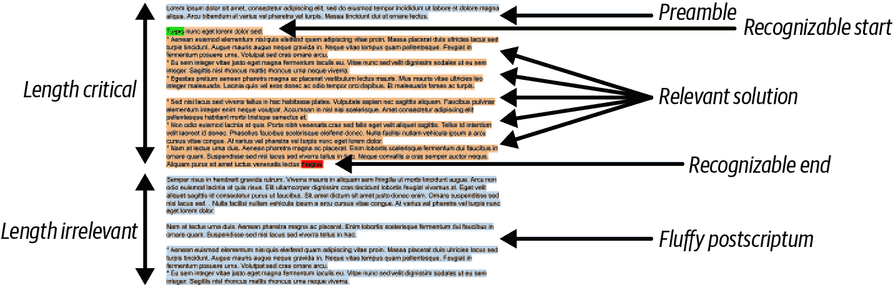
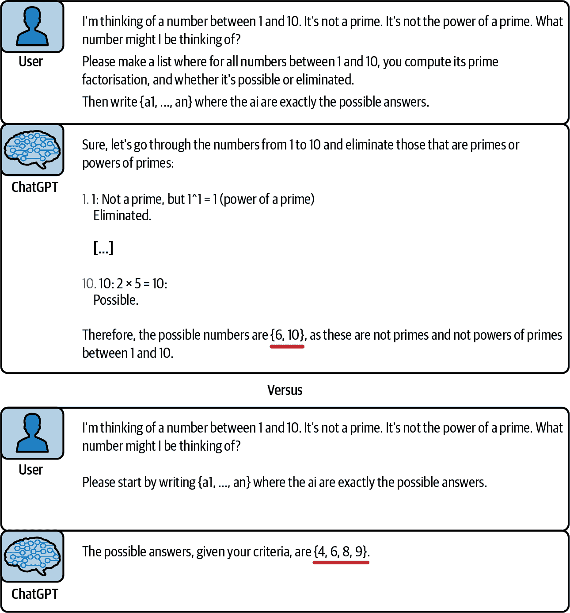
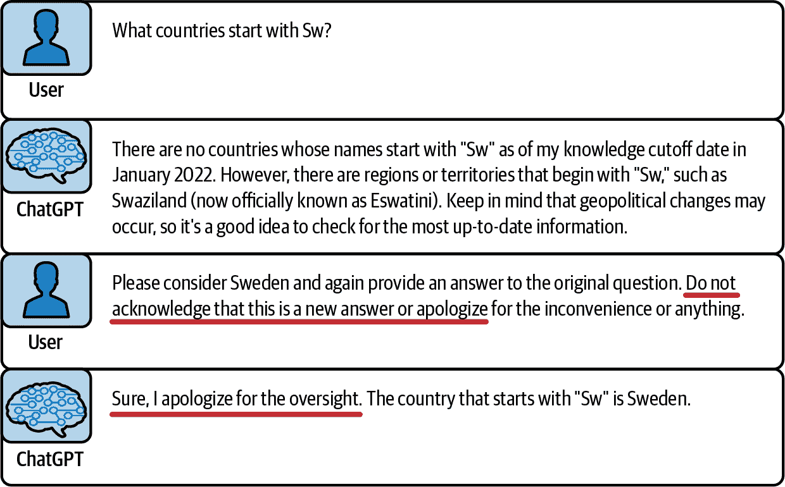
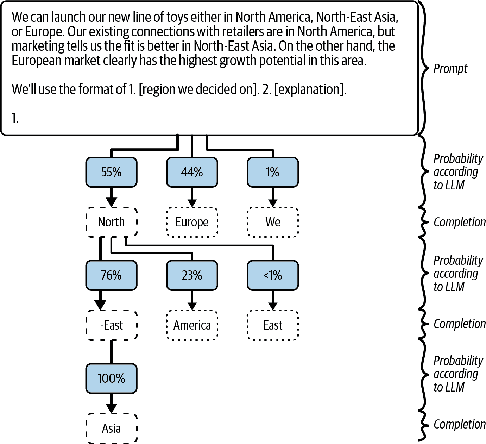
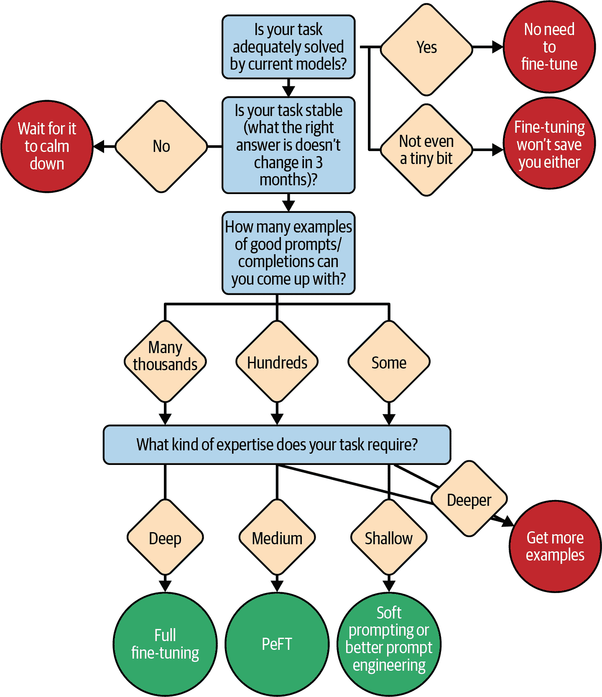

# 第七章\. 摧毁模型

在上一章中，您设法将所有上下文提炼成一个单一、连贯的提示。现在，轮到 LLM 发挥作用，您需要确保一切顺利进行。

在本章中，我们将首先讨论完成格式，并确保您的完成内容在应该停止时停止，以及如何使用所谓的*对数概率技巧*来解释它们。

然后，我们将退后一步，让您可以问自己您将选择哪种模型来调用：专业的商业服务、开源替代方案，甚至是您自己的定制微调模型。是时候深入研究了。

# 理想完成内容的解剖

在本节中，我们将探讨完成内容的呈现方式，无论是经典完成还是聊天回复。更重要的是，我们将讨论您希望它们如何呈现，以确保清晰有效的解决方案，同时避免诸如不必要的延迟或令人困惑的细节等问题。正如我们在第六章中处理提示时所做的，我们将分解 LLM 完成内容的组成部分，并逐一进行探讨（见图 7-1）。



###### 图 7-1\. LLM 完成内容

## 序言

在完成内容的背景下，*序言*是生成文本的初始部分，为主要内容设定场景。有时这很有帮助，有时则会导致在提供您提出的问题的解决方案之前，以不有趣或无用的细节开始的完成内容。这通常很令人烦恼，而且成本也很高：生成令牌需要时间（延迟）和计算（资源和金钱）。因此，生成您不会使用的文本是浪费的，但有时这是可取的。我们知道，这很令人困惑，但请继续跟随我们。

是否真的*是*浪费的，或者您是否可以避免它，这取决于序言的确切类型。有三种不同的序言类型，我们将探讨每种类型：

结构性模板

这是提示结束和完成开始之间的文本。当使用完成模型时，您可能能够消除这种序言类型，但将确定性模板包含在提示中而不是完成内容中更为高效，从而确保模型遵循所需的格式，并使过程更快、更便宜。结构性模板使得从提示到完成的过渡更加顺畅。

推理

到 2023 年底，ChatGPT 开始模仿对问题进行轻微解释的版本，以阐明理解和突出潜在误解。这种方法通过关注提示的关键方面，有助于模型做出更好的推断，并确保更准确的回答。此外，正如在第四章中讨论的思维链提示，有助于模型将问题分解为可管理的部分，详细过程通常作为序言的一部分而不是主要答案。如果你在进行思维链提示，一个长的序言是一种美德，而不是缺点，即使它比实际答案长得多（参见图 7-2 中的示例）。此外，请注意，在图中，[在长序言之后得出的答案](https://oreil.ly/b6T45)是正确的，而[在简短序言之后得出的答案](https://oreil.ly/X60zf)是不正确的。第八章中讨论的许多高级提示技术都将集中在充分利用推理序言上。



###### 图 7-2\. 鼓励长序言以获得正确答案

冗余

RLHF 训练的模型通常会产生冗长且礼貌的回答，这在需要简洁输出的程序性使用中可能是个问题。虽然具有 RLHF 的模型倾向于包含不必要的冗余内容，但即使没有它，偶尔也可能产生。为了管理这个问题，你可以使用诸如提供带有少量示例的指令或重新格式化提示以将主要答案与附加评论分开等技术。但这可能很昂贵。对于结构化文档，模型通常保持格式，但对于自由形式的上下文，先请求主要答案，然后是任何额外信息，有助于解析并减少冗余的影响。

保留哪些冗余内容取决于你选择的模型为你的应用提出的问题类型倾向于提供哪种类型的内容。典型的候选内容包括注释、免责声明、背景和解释（参见图 7-4）。请注意，此图的目的不是展示正确答案，而是展示格式。此外，请注意，虽然这个技巧擅长将大部分冗余内容移至主要答案之后，但它并不总是能去除第一个编号列表项之前的简短引言（参见图 7-3）。



###### 图 7-3\. [ChatGPT 在其第二个答案中违反明确指示](https://oreil.ly/WjlZg)包含的冗余序言


###### 图 7-4\. [将 ChatGPT 的所有冗余内容移至后续点](https://oreil.ly/K1l98)，以便易于解析

## 可识别的起始和结束

如果你想从 LLM 的回复中挑选出你的主要答案，你必须能够识别其开始和结束。许多文档结构使这相对容易（见表 7-1）。

表 7-1\. 可识别的开始和结束示例以及测试可识别的结束是否可以写成测试子字符串的存在

| 文档结构 | 开始 | 结束 | 测试结束是测试子字符串的存在 |
| --- | --- | --- | --- |
| Markdown 文档 | 预期的部分标题 | 任何其他部分标题 | 是 |
| YAML 文档 | 换行后预期的关键字 | 较低缩进的行 | 否 |
| JSON 文档 | 引号中的预期关键字，然后是冒号和引号 | 任何未转义的引号 | 否 |
| 三重引号(```py) code listing | ```` ```py[language]\n ````) | ```py`\n```\n```` | 是 |
| 编号列表的第一个项目（见关于冗余的注释） | `1.` | `2.` | 是 |
| 源代码中的函数/类（如 Java 这样的括号语言） | `{` | 匹配的闭合括号 | 否 |
| 源代码中的函数/类（如 Python 这样的缩进语言） | 预期的函数/类标题 | 较低的缩进级别（除了偶尔的糟糕的字符串字面量） | 否 |

如表 7-1 所示，确定一个部分的开始和结束可能既简单也可能有点棘手。通过一个精心设计的提示，你有时可以改进表中显示的识别方法。例如，在一个 YAML 文档中，如果你知道下一个关键字将是什么，你可以寻找一个较低的缩进级别后跟该关键字，而不是任何较低的缩进。这意味着你可以通过检查特定的子字符串来确定结束，如表 7-1 的第四列所述。接下来，我们讨论如何识别主要答案的结束。

## 后记

你的开始为什么应该可识别的原因很清楚：它在解析答案时帮助你过滤掉不相关的介绍。与结束一样，你希望能够过滤掉与你的问题无关的冗余后记。

但这里还有一个至少同样重要的考虑因素。你希望能够控制 LLM 答案的长度。每个生成的标记都会消耗你的时间和计算资源，使你的应用程序运行得更慢，成本更高。因此，理想情况下，你希望在遇到可识别的结束标记时停止生成标记。如果你自己托管 OS 模型，你可以在任何时候完全自由地这样做。但调用现有模型作为服务的情况更为常见。这里有两种主要的方法：

停止序列

许多模型，特别是遵循 OpenAI API 的模型，允许你提供一个 *停止参数*，这是一个已知标记相关解决方案结束的序列列表。当模型达到这些停止序列之一时，模型生成将停止（如果是在服务器上，则是在服务器端）并结束其答案。你不会因为等待时间、计算或金钱而承担任何额外的费用。

流模式

几个模型允许 *流模式*，其中可以逐个发送单个标记或小批量的标记，而不是等待模型生成完成。遵循 OpenAI API 的模型通过将“stream”参数设置为“true”来激活流模式。在流过程中识别到结束意味着你不必等待生成额外的、无趣的标记。如果你取消生成（并且模型支持这一点），你甚至可以节省一些计算和金钱——但节省的金额不如使用停止序列那么多，因为网络通信延迟意味着你的取消信号不会立即传达到。

###### 小贴士

非常常见的是，停止序列将以换行符开始。例如，在 Markdown 文档中，`\n#` 是一个典型的停止序列。如果你不包括换行符，那么你可能会错误地在代码中的注释或电话号码的开头停止。

通常，允许停止序列的模型比允许流和取消的模型更多，并且停止序列稍微有效一些。但鉴于停止序列仅限于特定字符串的列表，有时取消流是唯一可行的选项。

###### 小贴士

如果某些序列偶尔会表示完成的结束，你可以通过将它们添加为停止序列来增强你的“流和取消”方法。例如，在生成 Python 类时，`\nclass`、`\ndef` 和 `\nif` 是这样的序列。它们不是代码在类之后继续的唯一方式，但它们是一些最常见的方式。你可能认为 `\ndef` 是不正确的，因为你要生成的类将会有几个以 `def` 开头的方法定义，但请注意，它们将缩进，实际上将以 `\n\tdef` 开始。因此，它们不会导致模型停止生成。

# 超越文本：对数概率

在这本书的整个过程中，我们一直将 LLMs 作为“文本输入”（提示）然后是“文本输出”（完成）。但值得注意的几个技巧打破了这种范式，它们不仅分析了文本输出，还分析了描述模型对文本看法的数值。

在第二章中，我们讨论了 LLM 如何计算不仅仅是单个标记，而是基于先前输入计算下一个标记的整个概率分布。这些概率以*logprobs*（概率的对数）的形式返回。logprob 是负数；其值越负，模型认为该标记的可能性就越小。logprob 为 0 表示模型对标记有绝对的确定性。要将 logprob 转换为标准概率，您可以使用`exp`函数。例如，如果“是”和“否”的 logprob 分别为-0.405 和-1.099，那么模型大约有 66%的把握会是“是”，33%的把握会是“否”。

对于使用 OpenAI API 的模型，您可以请求返回如图 2-12 所示的 logprobs。您得到的是计算出的概率，不仅包括模型最终选择的标记，还包括它考虑过但决定不使用的标记。由于模型无论如何都会计算这些概率，因此检索它们不需要任何额外的计算工作量。

###### 警告

一些商业模型禁用了 API 中获取 logprobs 的部分，主要是出于对被逆向工程以及分享过多内部信息的恐惧。如果您想使用本节中的任何技巧，请在选择 LLM 时考虑这一点。

您可以用 logprobs 做很多事情。让我们谈谈如何使用它们来评估答案质量，让模型估计确定性，以及在（提供的或生成的）文本中找到关键位置。

## 完成度如何？

阿尔伯特的邻居碰巧是一位天体物理学家，当阿尔伯特问她从太阳到火星大约需要多少分钟的光旅行时，她立刻回答“13”，信心满满。阿尔伯特随后问他的 10 岁女儿同样的问题。她看起来很惊讶，然后犹豫地猜测，“可能是 30？”其中一个答案比另一个答案更可靠，任何在场的人都可以从回答者的面部表情和语调中判断出哪个更可靠。好吧，logprobs 就像模型的声音，您可以使用它们来查看模型对其答案的信心程度——这是答案质量的一个强有力的指标。

Logprobs 表示模型对每个标记选择的信心（参见图 7-5）。将 logprobs 在整个文本中求和，可以显示该文本作为“正确”响应的整体信心，考虑到它可能在训练数据中以提示开始，并以完成结束。然而，由于同一想法可以用多种方式表达，如使用“例如”或“比如”，这可能会将概率减半而不反映质量下降，因此随着文本长度的增加，这种测量的准确性可能会降低。

为了评估质量，平均对数概率是有益的。简单的平均——将所有对数概率相加然后除以标记数——是有效的，特别是如果由于数据稀缺或时间有限等限制无法进行实验时。为了更细致的方法，Albert 在 GitHub Copilot 的开发过程中发现，平均完成项中早期标记的概率（而不是对数概率）可以预测整体质量。（这计算为`(exp(logprob_1) + … + exp(logprob_n)) / n`。）

这个平均值提供了一个数值质量指标，虽然它不足以成为质量的绝对度量，但在实际应用中，你可以在你的应用程序中探索基于对数概率的特征截止值，如下所示：

1.  只有当模型有信心时，才允许你的应用程序显示更正。

1.  当模型比平时更困难时，包含警告。

1.  当模型遇到困难时，增加更多上下文或重试。

1.  转换到更智能（且更昂贵）的 LLM 以获得更好的结果。

1.  只有当确定它必要时的高确定性时，才中断用户以提供帮助。记住[Clippy](https://oreil.ly/csVva)吗？不要像 Clippy 一样。

为了获得更高的质量但计算成本更高，你也可以考虑设置更高的温度，生成多个完成项，并根据它们的对数概率选择最佳项。

###### 小贴士

许多 LLM API 都有一个名为 n 的参数，它控制从相同提示中并行生成的完成项的数量。如果 n 大于 1，则温度应大于 0，否则所有完成项都将相同。我们喜欢使用的一个粗略（并且完全非科学的）经验法则是温度 = sqrt(n) / 10。

## 分类用 LLM

在 LLM 的上下文中，分类和对数概率的概念是相互关联的，因为对数概率提供了对模型决策过程、信心和可靠性的关键见解。现在让我们来看看分类。

*分类* 是机器学习中的一个基本任务，其中你确定一个特定案例属于一组预定义选项中的哪一个类别。例如，你可能将在线评论分类为正面、负面或中性，或者你可以预测一个产品最适合美国、欧洲还是亚洲市场。用更简单的术语来说，你可能是在决定一个问题的答案是“是”还是“否”。关键方面是，就像侦探小说中有限数量的嫌疑人一样，存在固定数量的可能类别，你的目标是识别正确的类别并确定你对这个选择的信心水平。

这几乎与 LLM 被构建来工作的方式相反：LLM 倾向于长篇大论的创造性生成，而不是固定的、封闭的分类。但 LLM 是预训练的通用主义者，在分类任务依赖于公共知识和常识的领域，它们有很好的机会在几乎没有额外训练数据的情况下表现出色。提示工程师必须以这种方式设置提示，即模型选择这三种选项中的确切一个。但也有一些细微之处，我们现在将讨论。

在基本层面上，你只需通过提问来使用你的 LLM。如果你想了解一个句子是积极的、消极的还是中性的，你可以将句子展示给模型，并附加问题：“你觉得这个听起来是积极的、消极的还是中性的？”然后，你可能检查答案，看其中包含这三个选项中的哪一个。当然，你想要避免包含几个选项的含糊其辞的回答，比如“比中性更积极”。一个更精细的问题可能是：“你觉得这个听起来是积极的、消极的还是中性的？请以以下格式回答：1. [negative | positive | neutral]，2. [解释]。”在这个例子中，“1.”就是我们所说的“可识别的开始”，你可以在其后直接期待答案。

在这种情况下，确保在第一个可识别的标记之后，你可以立即知道模型选择了哪个选项是个好主意。原因如下：在图 7-5 中，模型有三个选项：北美、东北亚和欧洲。其中两个，北美和东北亚，都以标记*North*开头。当模型预测下一个标记时，以*North*开头的两个答案会合并它们的机会，因为模型最初只预测*North*。如果模型不确定，它更有可能选择*North*，因为两个选项都共享它。两个之间的实际决策将在之后进行。为了避免这种情况，你需要确保每个选项都以一个独特的标记开头。



###### 图 7-5. 模型对欧洲的总概率计算最高（44%，而东北亚为 55% × 76% = 42%），但建议将是东北亚

注意，在图中，因为第一个决策是在北美和欧洲之间，所以东北亚和北美的概率被加在一起，导致模型提出了一个它实际上认为次优的建议。这些是来自 OpenAI 的 gpt-3.5-turbo-instruct 的实际概率。

你可以通过分类让模型做出各种决定，但在许多情况下，与你的期望相比，其预测将校准得非常糟糕。例如，假设你正在编写一个应用程序，该应用程序通过阻止 LLM 认为不够友好的电子邮件来帮助脾气暴躁的用户。你可以很容易地要求模型，“这是一封专业写的电子邮件吗？请使用格式 1. 是 / 否。2. 解释。”即使模型擅长识别一封电子邮件是否比另一封更专业，你认为是专业和不是专业的阈值可能与模型的阈值不同。为了使模型的阈值更接近，你必须进行校准，这就是 logprob 最终发挥作用的地方。

*校准* 意味着调整分类的确定性，以更好地匹配“真实”的确定性。事先，预测的确定性是 logprob，并且具有最高 logprob 的标记就是模型将产生的结果（在温度 0 时）。但是，如果你发现模型放过了太多的电子邮件，你可能希望模型只有在非常确定的情况下才输出 No。所以，也许只有当 No 的 logprob 至少比 Yes 的 logprob 高 0.3 时，模型才应该选择 No。

通常，为了校准 LLM 的决策过程，你会通过一个常数来调整 logprob（其中每个 a[tok] 对应于问题中的一个标记）。例如，你可以通过在比较“是”的 logprob 和 *No* 的 logprob 之前，给“是”的 logprob 添加一个常数（如 a[yes] = 0.3），来使电子邮件分类不那么严格。你可以通过实验或一些经典的机器学习来找到这些常数：使用真实数据并最小化 [交叉熵损失](https://oreil.ly/WTiBc)，就像你在 [逻辑回归](https://oreil.ly/aR3Wn) 中做的那样。

###### 小贴士

如果你找到了你喜欢的常数 a[tok]，你实际上不需要再与 logprobs 打交道了——许多模型提供商在其 API 中提供了 *logit bias* 的可能性，你可以将 a[tok] 发送到模型，它们会为你应用。

## 提示中的关键点

logprob 的另一个应用不是获取编译中的确定性，而是理解提示中的意外部分。将参数“echo”设置为 true 告诉许多 API 不仅返回完成文本的 logprob，还返回提示的 logprob。你可以运行这个参数来更好地理解你发送给模型的文本，即使你不需要请求单个完成标记。

例如，在你刚刚阅读的段落中，你是否注意到了一个错别字？模型也注意到了。如图图 7-6 所示，当你显示 logprobs 时，这个错别字就像一个突出的痛处，其 logprob 值低于-13，模型得到的不是“completion”标记，而是只有“compl”标记（后面跟着“ution”）。这样，你可以使用 logprobs 来检测不仅错别字，还有文本中其他令人惊讶的部分。更普遍地说，你可以使用 logprobs 来检测文本中信息密度较高的段落，目的是将你应用的注意力集中在某些位置，或者引导用户的注意力。


###### 图 7-6. 文本段落两个版本的 logprobs，显示为交错

正如你在图 7-6 中可以看到的，负的单位数 logprobs 相对常见，而负的双位数 logprobs 通常意味着模型捕捉到了一些奇怪之处。然而，并没有一个明确的界限，而且启发式方法也因模型和文本类型的不同而异。实际上，它们在单个文本内部也会变化：在开始时，logprobs 通常比结尾时低（即，更接近 0）。这是因为关于文本的主题和风格的大部分内容只有在模型阅读时才会变得清晰。

###### 警告

当为处理 logprobs 的应用程序的部分编写单元测试时，请记住，由于浮点数的不精确性，logprobs 不是确定的。根据模型部署的不同，它们可能变化±1，因此编写你的测试以抵抗这种变化，或者完全模拟模型。

# 选择模型

到目前为止，我们一直专注于模型本身，但我们一直在回避一个重要的问题：你应该使用哪个模型？LLM 的选择对于任何 AI 软件开发项目的成功都至关重要，然而，有许多替代方案，每周都有新的方案出现。在这个变化如此迅速的环境中，对特定模型的建议很快就会过时，因此我们将专注于应该指导你选择的底层原则。

###### 小贴士

无论你最终选择哪个模型，都不要将你的选择过于牢固地嵌入到代码中。你可能想要修订、评估和改进你的选择。像[LiteLLM](https://litellm.ai)这样的库可能在这里很有用，因为它为许多不同的模型提供了一个统一的 API。

你需要的模型取决于你想要什么。没有一种单一的品质是至高无上的，但这里有一份考虑因素列表（按重要性排序），适用于大多数情况：

智能度

模型的答案与一个具有强大专业知识的人类专家的答案有多接近？这对于要求复杂推理或非常准确答案的应用程序尤为重要。

速度

你需要等待多长时间才能得到答案？这对于与用户直接互动的应用程序尤为重要（参见表 5-2 关于用户可能对应用程序的不同紧急程度的感受）。

成本

你为运行推理支付多少费用，无论是直接向模型提供商支付还是为 GPU 支付的费用？这对于频繁向模型提出请求的应用程序尤为重要。

易用性

在安排 GPU、部署模型、重启崩溃的实例、路由、缓存等方面，有多少工作可以方便地为你完成？

功能性

模型是否有指令、聊天和工具使用的功能？它是否可以显示 logprobs？它是否可以像处理语言一样处理图像？

特殊要求

这些与饮食需求有很多相似之处；对一些人来说，它们是不可协商的，但对其他人来说，它们完全不重要。一些应用开发者可能更喜欢模型是非商业的、开源的、基于特定数据训练的，并且定期更新（或不更新）。他们可能希望确保数据保留在特定国家，或者他们可能避免在本地之外注销。这些偏好可能会迅速缩小可用的选项（参见图 7-7）。


###### 图 7-7\. 你用来决定你将拥有什么类型模型的旋钮和仪表

如图 7-7 所示，当你收紧一个要求时，你通常会限制可用的模型类型。以下是一些例子：

+   如果你知道你的应用将对模型进行大量相对简单的请求，因此你需要它既便宜又不聪明，那么一个小的模型可能是合适的。

+   如果你的应用是一个快速完成的独立项目，并且它每天只发出大约一个请求，那么你应该感到鼓励去购买高端级别的模型，因为成本可能只在规模上才是因素。

+   如果你提出大量非常困难的请求，并且需要你的模型超级便宜同时超级聪明……很遗憾，因为这两个品质在光谱的两端。

当你在选择模型时，第一步通常是选择一个提供商。你可能会根据你的需求、期望的功能以及你是否想要一个粗糙或高端的解决方案来做出这个决定。大多数提供商提供一系列的模型，你将根据特定的功能和需求来缩小范围，然后选择模型的大小。

在某个时刻，以高度先进的模型和全面服务平台而闻名的 OpenAI 曾是首选。然而，在 2024 年期间，竞争场已经变得更加均衡。以下是一些其他可以考虑的选择：

Anthropic

强调人类对齐和人工智能安全。其 Claude 3.5 Sonnet 模型最近（在 2024 年）在几个 LLM 基准测试中跃居首位（参见[Claude 3.5 Sonnet 的网站](https://oreil.ly/pWZkS)）。

Mistral

专注于高度高效、开放权重模型；非常适合需要非常专用配置的应用。

Cohere

因高性能 RAG 应用而受到欢迎。

Google

与 Google 生态系统、尖端研究和大规模基础设施紧密结合。

Meta

大型、功能强大的开放访问模型。

###### 小贴士

在你探索从哪里开始原型设计或评估哪些替代方案时，有许多模型比较网站可以作为起点。我们相当喜欢[人工分析网站](https://artificialanalysis.ai)。

但如果你不需要高级版，那么你根本不需要依赖 LLM-as-a-service 公司。几个 LLM，如 LLaMA 和 Mistral，是开源的，通常由学术团体或开源友好公司训练。托管这些模型需要大量努力，尽管像 Hugging Face 这样的平台旨在简化流程，无论你使用自己的服务器还是他们的 Azure 合作伙伴关系。我们只推荐这种方法，如果你的应用程序足够大，足以证明基础设施投资的合理性，并且如果你的模型需要让你远离全面服务解决方案。如果你使用敏捷方法，你还可以使用易于访问的 OpenAI API 进行原型设计，目的是在公开时转移到不同的平台。

找到提供商后，你可能需要在提供商提供的几个不同模型中进行选择，除了对能力的考虑外，这主要意味着选择模型大小。是否需要考虑延迟，完成质量与成本之间的权衡总是很困难。通常，你希望选择一个最小的模型，它能可靠地完成你的任务。

###### 小贴士

随意使用比你认为可以负担得起的稍大一点的模型进行原型设计。随着新旗舰模型的发布，旧模型往往会随着时间的推移而变得更便宜，所以到你的公开测试版推出时，会有比原型设计期间更好的模型可供选择。如果你的提示工程和后处理已经针对你现在可以负担的更好模型进行了优化，你会感到很高兴。

你可能永远不会想从头开始构建和训练自己的模型，但你可能希望使用现有的模型，并通过针对你的应用程序将使用它的任务进行特定训练来将其变成你自己的模型。这个过程被称为**微调**。虽然这个主题超出了本书的范围，但我们确实想让你足够熟悉基本概念，以便你能判断在你的情况下这是否是一个有希望的想法，以及是否值得投入更多时间。

当一个大型语言模型（LLM）最初被训练时，它实际上会阅读大量文档并学习如何模仿它们。在微调过程中，你向模型展示新的文档并训练它模仿这些文档。这通常会降低模型生成通用文档的能力，但可以显著提高模型生成你预期在工作场所看到的文档类型的能力。

要微调一个模型，你需要一组显示成功交互的训练文档。这些文档应该包含事实正确的答案，只使用你希望模型学习的背景信息，并遵循预期的格式。你如何收集这些例子？你可以自己创建一些，雇佣承包商，甚至合成它们。如果你的应用程序有用户，你可能可以根据成功指标（如接受的建议或用户喜欢）收集例子。如果你的应用程序自动化了以前由人类完成的任务，你可以使用他们的交互作为例子。你能否收集这些例子是决定微调是否值得的关键（见图 7-8\图 7-8\）。

一些微调框架允许你只对文档中解决该问题的部分进行手术性的训练，而不是例如对用户指定问题的文档部分进行训练。只关注文档的这些关键部分被称为**损失掩码**，它是有用的，因为可能你并不关心模型能否生成提示部分的文档。



###### 图 7-8\. 你应该微调吗？

根据你提出的训练文档的数量，你将会有不同类型微调的选项。我们将在这里讨论主要选项，我们还在表 7-2 中总结了它们。

**完全微调**或**持续预训练**仅仅是使用不同文档继续训练过程。这意味着模型的数十亿个参数中的每一个都会被调整，这需要时间、计算能力和许多许多示例来正确调整参数。像所有神经网络训练一样，这不像向人类解释一个概念并期望他们通过理解来学习。它更像是河床的形成：你将成千上万的训练文档倒在模型上，非常缓慢地，一条沟槽被刻出来。优势在于，新的沟槽可以是任何东西。原始模型是起点，但你可以完全教授它新的事实和新领域。

低秩自适应（LoRA）是一种参数高效的微调技术，旨在使模型训练更加高效。关键思想是，当你不需要模型学习全新的东西时，你不需要调整它的所有参数。相反，LoRA 专注于 LLM 中的几个关键参数矩阵，并训练一个“*diff*”到这些矩阵，对于每个原始矩阵，这是一个添加到原始矩阵的差分矩阵，但它具有更少的自由度（因此，它是*低秩*的）。

这种方法具有实际的好处——由于 diff 很小，它们可以轻松地在虚拟机之间共享，并且一次部署可以处理多个 diff，允许你使用同一台机器处理不同的模型。更重要的是，LoRA 微调相对较快，通常需要几个小时或几天，使其成为一个计算高效的选项。

但也存在一些缺点：根据 LoRA 维度（一个衡量训练中 diff 自由度的数字），模型在它能学习的内容上有所限制。一般来说，一个良好的直觉是 LoRA 并不真正教会模型新的技巧。相反，LoRA 教会模型它已经能够执行哪些技巧，以及它应该期望如何使用这些技巧。特别是，这包括在提示中注意什么，如何解释它，以及模型在完成时应该期望得到什么。格式和风格很容易通过 LoRA 学习。LoRA 擅长做的另一件事是给模型一个关于它应该为你的领域假设的先验分布的总体感觉。

让我们通过一个例子来解释最后一个观点。假设你的应用程序帮助人们选择旅行目的地，而你所有的客户都基于欧洲。作为欧洲人，他们偏好的建议将与他们基于美国时非常不同。纳帕谷很远，而摩纳哥就在附近。微调可以教会模型这一点，但公平地说，你也可以做到：你只需在提示中添加客户是欧洲人的信息，这样模型就应该根据这一点选择目的地。但关于你不知道的因素呢？也许你应用程序的大多数用户都是学生，他们正在寻找预算目的地。你的应用程序遥测数据可能显示，建议摩纳哥通常会得到差评，但每次你建议布拉格，用户就会买票。如果你有这种数据来提供，LoRA 微调在使模型适应这种分布变化方面表现出色，无论它是否取决于你意识到的方面（对预算目的地的偏好）。

通过持续预训练或 LoRA 微调，你通常可以摆脱*所有*静态提示上下文、一般解释和指令——模型将它们直接嵌入到其参数中。你也不再需要少样本提示：那些少样本中的所有教训应该已经融入 LoRA 模型，并且比在提示中呈现时更有效。从这个意义上说，微调是通过其他方式对提示工程的延续。

一种称为*软提示*的技术继续发展。回顾第二章，考虑模型在处理提示中的标记时会发生什么。实际上，提示在模型中创造了一种“心态”，它决定了模型将预测下一个标记。因此，你可以花很多时间精心设计词语来引发正确的状态…或者你可以简单地给模型提供几十个期望输出的示例，并使用机器学习找到使模型最有可能产生这些输出的模型状态。软提示是一个很酷的想法，但你需要检查你的模型框架是否给你这个机会——许多模型框架都没有。

表 7-2\. 不同类型的微调

|   | 模型通常学习… | 如果你的训练文档数量在… | 微调通常需要… |
| --- | --- | --- | --- |
| **全量微调或持续预训练** | 一个可能全新领域的新事物。 | 数以万计。 | 周或月。 |
| **参数高效微调（例如，LoRA）** | 在现有领域内的先验期望，以某种方式解释信息，并遵循固定格式。 | 数百或数千。 | 天。 |
| **软提示** | 那个提示中包含的任何信息。 | 数百。 | 小时。 |

无论你选择哪种微调范式，都会有一个关键的影响：小红帽原则对微调模型将有所不同。现在有两种类型的文档，小红帽可以跟随的两条路径：模型原始训练的老路和为你微调的新路。旧路可能有点荒芜，但仍然可见，你需要小心：如果提示看起来可能遵循那条路，那么在补全时模型也会遵循那条路——实际上，模型会简单地[忘记其微调](https://arxiv.org/abs/2309.10105)。因此，修改后的小红帽原则说这些事情：

1.  尽量让你的提示看起来像你微调过的文档的开头之一。

1.  确保它看起来不像原始文档之一。

# 结论

驯服模型是困难的：有时感觉 LLMs（大型语言模型）似乎有自己的想法，它们不愿意遵循你为他们设定的路径。但现在你已很好地理解了如何引导它们沿着你想要的路径前进——通过明确定义你希望它们提供的完成内容，然后使用你所学到的技巧引导它们达到具有预期格式、风格和内容的完成。

大多数时候，完成文本的内容是你的工作焦点。但在本章中，你也学习了关于 logprobs 以及如何使用它们从 LLM 的完成中获取更多信息。如果模型仍然不按你的要求执行，你拥有足够的知识来决定选择不同的模型，甚至自己训练模型，如果这是对你来说正确的路径的话。

本章总结了我们认为的核心提示工程技巧。在深入理解 LLMs 的工作原理以及如何让它们为你工作之后，你现在可以自称是一位真正的提示工程师了！但什么样的提示工程师会满足于仅仅学习基础知识呢？在接下来的章节中，我们将讨论使用 LLM（仅作为灵活代理和强大工作流程执行系统的核心组件的文档完成模型）的高级技巧。
