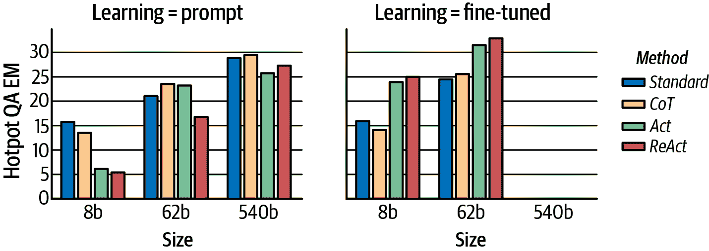
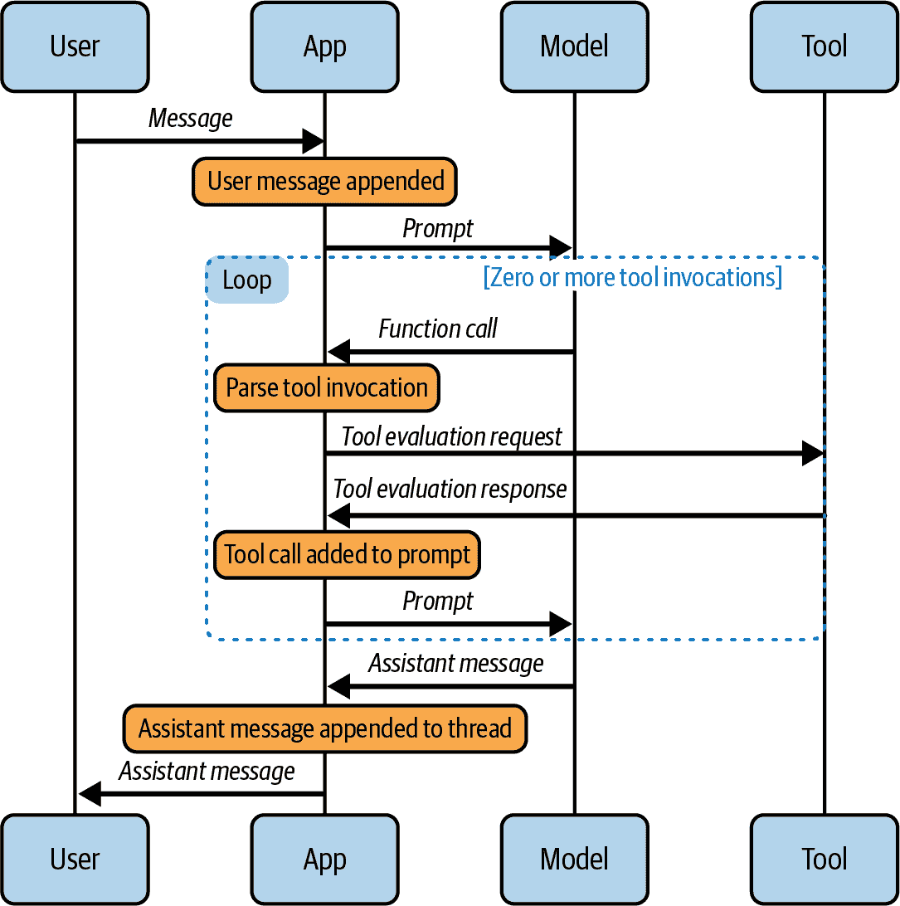
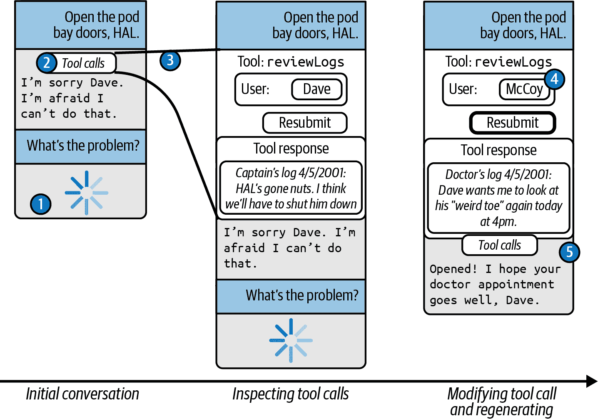

# 第八章\. 对话代理

在第三章中，我们讨论了从文本生成模型转向聊天模型的过程。聊天模型本身只能意识到训练过程中覆盖的信息以及用户刚刚告诉它的信息。聊天模型无法接触外部世界并学习训练期间不可用的信息，也无法代表用户与世界互动并采取外部行动。

通过对话代理，LLM 社区正在取得重大进展以克服这些限制。**代理**是指一个实体以自我指导和自主的方式完成任务和实现目标的能力。本章中我们讨论的对话代理提供了一种类似于聊天的体验——用户和助手之间的来回对话——但增加了助手能够接触现实世界、学习新信息以及与现实世界资产互动的能力。

在本章中，我们将介绍几种基于 LLM 构建对话代理的最新方法。我们将探讨模型如何使用工具接触外部世界，如何被训练以更好地通过其问题空间进行推理，以及我们如何收集最佳上下文以促进长或复杂的交互。到本章结束时，你将能够构建自己的对话代理，它能够代表你走出世界并执行指导性任务。

# 工具使用

在孤立状态下工作，语言模型在它能完成的事情上有限。当然，聊天助手很有趣，因为它在某种程度上是世界的数字时代精神。你可以从广泛的主题中学习任何你想要的东西，模型可以借鉴不同的思想流派并帮助你进行头脑风暴。模型是一个出色的导师——如果你不介意一些幻觉的话。但它无法做到的是访问“隐藏”的知识——任何在训练期间对模型不可用的信息片段。

当你在工作时，你经常使用私人信息，这些信息以公司文档、内部备忘录、聊天信息和代码的形式存在——模型无法访问这些信息。你也处于现在，而不是过去，因此，旧信息可能不那么相关，甚至可能是错误的。如果模型不知道你使用的库的最新 API 更改或最近的新闻事件，那么生成的文本将是误导性的和不正确的。在极端情况下，你可能甚至需要最新的信息。例如，如果你在计划旅行安排，你需要知道现在有哪些航班可用。一个简单的聊天模型无法访问这些信息。

除了遗漏重要信息外，语言模型在执行某些任务方面并不擅长——最突出的是数学。如果你要求 ChatGPT 评估任何简单的算术问题，那么它通常会给出正确的答案，因为它实际上记住了所有简单的问题。但是，随着数字的增大或计算的复杂性增加，模型的估计将越来越差。更糟糕的是，这些错误通常被自信地作为事实呈现。

最后，单就聊天模型本身而言，它们什么也不做——它们只是聊天！它们在现实世界中产生变化的唯一方式是通过请求用户为他们做某事。语言模型无法购买机票、发送电子邮件或改变恒温器的温度。

为了解决所有这些问题，LLM 社区正在转向工具使用，以使语言模型能够访问最新信息，帮助他们执行非语言任务，并帮助他们与世界互动。这个想法很简单：告诉模型它能够访问的工具以及何时以及如何使用它们，然后模型将使用这些工具来执行外部 API。应用程序的任务是从模型完成中解析工具调用，将请求传递给现实世界的 API，然后将这些信息纳入发送给模型的未来提示中。

## 为工具使用而训练的 LLMs

2023 年 6 月，OpenAI 推出了一种针对工具调用的新模型，此后，其他几个竞争性的大型语言模型也相继效仿。让我们来看看 OpenAI 对工具的看法。

### 定义和使用工具

首先，我们设置实际的功能，这些功能可以进入现实世界，收集信息，并对环境进行更改。实现是模拟的，但如果你有兴趣，找到允许你与真实恒温器交互的 Python 库并不困难：

```py
import random

def get_room_temp():
    return str(random.randint(60, 80))

def set_room_temp(temp):
    return "DONE"

```

接下来，我们将这两个功能表示为[JSON 模式](https://oreil.ly/rZsdN)，以便 OpenAI 可以在提示中代表它们：

```py
tools = [
    {
        "type": "function",
        "function": {
            "name": "get_room_temp",
            "description": "Get the ambient room temperature in Fahrenheit",
        },
    },
    {
        "type": "function",
        "function": {
            "name": "set_room_temp",
            "description": "Set the ambient room temperature in Fahrenheit",
            "parameters": {
                "type": "object",
                "properties": {
                    "temp": {
                        "type": "integer",
                        "description": "The desired room temperature in ºF",
                    },
                },
                "required": ["temp"],
            },
        },
    }
]

```

JSON 模式声明了这两个函数，包括它们的参数。这些函数和参数还有描述性文本，告诉模型如何使用这些函数和参数。

接下来，我们创建一个查找字典，以便在必要时可以通过名称检索我们的工具：

```py
available_functions = {
    "get_room_temp": get_room_temp,
    "set_room_temp": set_room_temp,
}

```

在所有这些准备就绪之后，我们就可以开始制作实际的消息处理功能了。示例 8-1 中的 `process_messages` 函数与你在 OpenAI 函数调用文档中找到的类似，但它得到了改进，这种实现允许轻松地交换工具——只需修改之前描述的 `tools` 和 `available_functions` 定义。

##### 示例 8-1\. 处理消息和调用及评估工具的算法

```py
import json 

def process_messages(client, messages):
    # Step 1: send the messages to the model along with the tool definitions
    response = client.chat.completions.create(
        model="gpt-4o",
        messages=messages,
        tools=tools,
    )
    response_message = response.choices[0].message

    # Step 2: append the model's response to the conversation
    # (it may be a function call or a normal message)
    messages.append(response_message)

    # Step 3: check if the model wanted to use a tool
    if response_message.tool_calls:

        # Step 4: extract tool invocation and make evaluation
        for tool_call in response_message.tool_calls:
            function_name = tool_call.function.name
            function_to_call = available_functions[function_name]
            function_args = json.loads(tool_call.function.arguments)
            function_response = function_to_call(
                # note: in python the ** operator unpacks a 
                # dictionary into keyword arguments
                **function_args
            )
            # Step 5: extend conversation with function response
            # so that the model can see it in future turns
            messages.append(
                {
                    "tool_call_id": tool_call.id,
                    "role": "tool",
                    "name": function_name,
                    "content": function_response,
                }
            )

```

示例中的`process_messages`函数接收一条消息列表，并将其传递给模型（在步骤 1）。模型将始终以助手的语音返回响应，并将此消息添加到传入的消息列表中（在步骤 2）。可能助手的消息包含用户的内容、工具调用请求或两者兼有。如果请求工具（如步骤 3 所示），那么对于每个工具调用请求，我们将提取函数名称和参数，调用实际函数（在步骤 4），然后将函数输出添加到消息列表末尾的新消息中（在步骤 5）。函数完成后，提供的消息已通过从模型输入中派生的新消息进行了扩展。

让我们看看当提供修改温度的用户请求时`process_messages`是如何工作的：

```py
from openai import OpenAI

messages = [
    {
        "role": "system",
        "content": "You are HomeBoy, a happy, helpful home assistant.",
    },
    {
        "role": "user",
        "content": "Can you make it a couple of degrees warmer in here?",
    }
]

client = OpenAI()
process_messages(client, messages)

```

当运行此代码时，我们可以检查消息并看到已创建了两个新的消息：

```py
[
    {
        "role": "assistant",
        "content": None,
        "tool_calls": [{
            "id": "call_t7vNPjRlFJ3nKAhdGAz256cZ",
            "function": {
                "arguments": "{}",
                "name": "get_room_temp"
            },
            "type": "function",
        }],
    },
    {
        "tool_call_id": "call_t7vNPjRlFJ3nKAhdGAz256cZ",
        "role": "tool",
        "name": "get_room_temp",
        "content": "74",
    }
]

```

如预期的那样，第一条消息来自模型，是调用`get_room_temp`工具。随后的消息由应用程序提供，注入了从实际调用`get_room_temp`函数中检索到的室温（74 华氏度）。（请注意，一次可以有多个工具调用。需要 ID 以确保正确的工具响应与其相应的工具请求相关联。）

我们还没有完成。应用程序知道当前室温，但仍需要设置新的温度。请注意，`process_messages`已将这两条新消息附加到消息数组中，因此我们只需再次调用`process_messages`即可进行一次更多的对话轮次：

```py
process_messages(client, messages)

```

这导致以下新的消息：

```py
[
    {
        "role": "assistant",
        "tool_calls": [{
            "function": {
                "name": "set_room_temp"
                "arguments": "{\"temp\":76}",
            },
            "type": "function"
            "id": "call_X2prAODMHGOmgt523Ob9BIij",
        }],
    },
    {
        "role": "tool",
        "name": "set_room_temp",
        "content": "DONE"
        "tool_call_id": "call_X2prAODMHGOmgt523Ob9BIij",
    }
]

```

适当地，模型使用参数`{"temp":76}`调用`set_room_temp`，这比当前室温高出 2 度——这正是用户所希望的！

但不通知用户刚刚发生的事情是不礼貌的，所以我们再做一个请求：

```py
process_messages(client, messages)

```

这生成了一条新的消息——助手的响应：

```py
[{
    "content": "The room temperature was 74ºF and has been increased to 76°F.",
    "role": "assistant",
}]
```

在这一点上，我们还没有完全获得对话代理权，因为我们正在手动调用`process_messages`。但我预计你能够看到，我们基本上只需要一个 while 循环就能实现完全自主。别担心，我们将在本章结束时将其全部完成。

### 看看内部结构

工具调用在本质上与文档补全不同。模型是如何完成这个任务的？它肯定一定是某种特殊且与普通的文档补全不同的东西，对吧？*错误！* 记得聊天看起来很特别，不同吗？在第三章中，我们展示了 OpenAI 聊天 API 在底层将系统、用户和助手消息转换为 ChatML 格式的记录，然后模型简单地完成这些文档。就像聊天是一个经过微调的模型加上 API 级别的语法糖一样，工具调用*也是*一个经过微调的模型加上 API 级别的语法糖。让我们看看底层！

首先，让我们看看工具在内部提示中的表示方式。了解提示中工具的外观非常重要，因为这会告知您应该如何描述工具并在 API 级别与之交互。此外，我们还需要考虑工具表示在提示中的大小，因为它会抵扣您的令牌预算。不幸的是，OpenAI 没有提供内部表示的文档，所以以下内容是我们根据对模型的询问，尽我们所能重建内部提示格式的最佳尝试。

让我们考虑本节中定义的`set_room_temp`函数。在内部提示中，它看起来像这样：

```py
<|im_start|>system
You are HomeBoy, a happy, helpful home assistant.

# Tools

## functions

namespace functions {

// Set the ambient room temperature in Fahrenheit
type set_room_temp = (_: {
// The desired room temperature in ºF
temp: number,
}) => any;

} // namespace functions
<|im_end|>

```

首先，请注意工具定义放置在您提供的消息之后的系统消息中。函数定义只是文档的一部分，再次格式化为 ChatML。

接下来，看看提示如何使用 Markdown 来组织和格式化响应？这是一个很好的 Little Red Riding Hood 原则的例子——Markdown 是一个在训练数据中经常出现的主题，模型很容易理解它所暗示的结构。（这也是一个提示，*您*在组织自己的提示时应该使用 Markdown。）

在这里需要注意的最后一件事是，该片段将工具表示为 TypeScript 函数。这有几个原因很聪明：

+   TypeScript 允许类型定义有更丰富的词汇。这有助于确保模型将使用正确的类型格式化参数。

+   将文档集成到函数定义中很容易。请注意，不仅函数有文档说明，各个参数也有文档说明。

+   函数的定义方式*要求*使用列出参数名称的 JSON 对象来调用函数。这确保了函数调用非常一致——这使得它们更容易解析。此外，由于要求按名称指定每个参数，而不是可能使用位置参数，模型在函数调用方面更加“深思熟虑”，出错的可能性也小得多。模型在指定值之前确实说了 temp，这使得意外指定错误值变得困难。

现在，既然我们知道工具定义是如何表示的，让我们看看它们的调用和评估。这是其内部的样子：

```py
<|im_start|>user
I'm a bit cold. Can you make it a couple of degrees warmer in here?<|im_end|>
<|im_start|>assistant to=functions.get_room_temp
{}<|im_end|>
<|im_start|>tool
74<|im_end|>
<|im_start|>assistant to=functions.set_room_temp
{"temp": 76}<|im_end|>
<|im_start|>tool
DONE<|im_end|>
<|im_start|>assistant
The room temperature was 74ºF and has been increased to 76°F.<|im_end|>

```

在这里，助手使用特殊语法调用函数——使用 OpenAI 消息的 `name` 字段指定函数名称，使用 `content` 字段将参数指定为 JSON 对象。让我们稍作停留。记得从 第二章，模型在最核心的任务只是预测下一个标记？嗯，这里正是这样使用的，因为几乎每个工具调用中的标记都在缩小工具调用问题中发挥作用。只需看看这条单独的消息：

```py
<|im_start|>assistant to=functions.set_room_temp
{"temp": 77}<|im_end|>

```

查看完成过程的每一步，注意模型在每一个点上都有效地充当一个分类算法，决定接下来应该发生什么：

1.  *谁应该发言？* OpenAI API，而不是模型，在完成文本的开头插入 `<|im_start|>assistant`。这使模型生成随后的文本以助手的语气。API 强制将此文本放入提示中。如果没有这样做，那么模型可能已经生成了另一条用户消息。强制发言者更安全。

1.  *是否需要调用工具？* 下一个标记 `to=functions.` 是由模型生成的。这表明需要调用一个工具。但模型也可能生成 `\n`，使模型生成一条来自助手的消息。

1.  *应该调用哪个工具？* 模型接下来生成的标记代表函数的名称：在这种情况下，是 `set_room_temp\n`。

1.  *应该指定哪个参数？* 模型接下来生成的文本推断出应该指定的参数。在这种情况下，只有一个选项 `{"temp":`，但在更复杂的工具中，可能有多个参数，可能不是必需的，模型可以利用这个机会从几个选项中进行选择。

1.  *参数将具有什么值？* 模型接下来预测当前参数将要取的值：在这种情况下，是 77。如果有多个参数，那么模型将多次循环步骤 4 和 5。

1.  *我们完成了吗？* 一旦所有参数都已指定，模型预测现在是时候结束。它预测 `}<|im_end|>`，这关闭了 JSON 和助手消息。

这些模型是多么地灵活！在 10 到 20 个标记的范围内，相同的通用底层神经网络有效地实现了 5 个不同、高度专业化的推理算法。（回想一下，步骤 1 是在 API 中指定的，而不是推断出来的。）哇...真是令人惊叹。此外，注意在每一步，问题都是按层次分解的。我们需要工具吗？哪个工具？需要哪些参数？这些参数的值是什么？

在工具调用之后是一个评估消息。在这里，OpenAI 引入了一个新的`tool`角色，用于将评估数据重新整合到提示中。`set_room_temp`函数的输出只是`DONE`（表示成功），因此响应消息看起来像这样：

```py
<|im_start|>tool
DONE<|im_end|>

```

注意：API 级别存在的工具调用和响应的 ID 不再需要，因为 API 使用了 ID 将相应的工具调用和响应按正确的顺序组装在一起。

## 工具定义的指南

本节提供了在设计和管理与对话代理相关的工具时你应该遵循的一般性指南。主要来说，这些指南依赖于以下两点直觉：

1.  对人类来说更容易理解的东西，对大型语言模型（LLM）来说也更容易理解。

1.  最好的结果是通过模仿训练数据（即小红帽原则）来构建提示。

### 选择合适的工具

限制模型一次可访问的工具数量。模型可用的工具越多，模型混淆的可能性就越大。尽可能让工具划分领域活动——也就是说，它们应该尽可能覆盖领域，但避免执行类似动作的工具。更简单的工具更好。*不要*将你的 Web API 复制到提示中！Web API 通常有大量的参数和复杂的响应。描述 API 会占用大量空间，并且模型在调用如此复杂的工具时不太可能成功。

### 命名工具和参数

名称应该有意义且自解释，因为就像人类阅读 API 规范一样，模型会读取名称并构建一些关于工具和参数目的的预期。对于 OpenAI，工具在提示中以 TypeScript 的形式呈现；遵循这一做法并使用驼峰命名约定是个好主意。无论如何，避免使用单词的小写连接（例如，`retrieveemail`），因为这些名称更难解析。

### 定义工具

通常，你应该尽可能简化定义，同时捕捉足够关于工具的细节，以便模型（或人类）能够理解如何使用它。如果你的定义听起来像法律术语，那么你可能为模型引入了太多概念，而模型有限的注意力机制难以处理。如果可能，简化它，但如果你的工具确实需要详细说明，那么确保定义没有留下任何模型可能会踩到的歧义。

如果你正在使用模型熟悉的公共 API，那么可以通过创建一个简化版的 API 来利用模型的训练，这个简化版 API 保留了原始 API 的命名、概念和风格。例如，在开发 GitHub Copilot 时，我们发现我们使用的 OpenAI 模型对 GitHub 的代码搜索语法非常熟悉。（我们是如何知道的呢？我们问了它。模型几乎能背诵我们的文档。）我们发现，如果我们将参数命名为文档中的名称，并期望参数值的格式与文档中相同，对模型来说会更少混淆。

### 处理参数

如果可能的话，尽量保持参数少而简单。自然地，OpenAI 模型可以很好地处理所有的 JSON 模式类型：字符串、数字、整数和布尔值。你可以通过`enum`和`default`属性来修改属性，以更好地控制模型对参数的使用。然而，截至 2023 年 11 月发布的 OpenAI 1106 模型，一些 JSON 模式属性修饰符（如`minItems`、`uniqueItems`、`minimum`、`maximum`、`pattern`和`format`）在提示中并未表示。同样，如果你有任何嵌套参数，它们的描述也不会在提示中呈现。

对于 OpenAI 模型尤其如此，对于参数的长时间文本输入要小心。由于参数会被填充到 JSON 中，因此值必须转义换行符和引号，文本越多，模型忘记转义的可能性就越大。对于充满换行符和引号的代码，这个问题会加剧。事实上，Anthropic 使用 XML 标签而不是 JSON 来编码他们的函数调用，因此参数不需要转义。原则上，这意味着 Claude 更愿意接受长时间参数。

最后，要注意参数幻觉。例如，我们在 GitHub 上构建的几个工具都有 org 和 repo 参数，但如果这些参数的值在对话中没有提到，那么模型可能会假设占位符值如`"my-org"`和`"my-repo"`。没有银弹可以解决这个问题，但你可以尝试以下选项：

1.  当应用程序中已知所需值时，从函数定义中删除参数，这样模型就没有任何可以混淆的东西了。或者，你可以提供一个默认值——这样，如果模型指定了默认值，你就可以在应用程序中进行适当的调整。

1.  指示模型在不确定参数时询问——然后祈祷它真的会这样做，因为它通常不会。不过，别担心——模型在这方面正在迅速变得更好。

### 处理工具输出

在工具定义中，确保模型可以预测它在输出中会发现什么。输出可以是自由形式的自然语言文本或结构化的 JSON 对象。模型应该都能处理。不要在输出中包含太多额外的“以防万一有帮助”的内容，因为模型可能会被虚假内容分散注意力。

### 处理工具错误

当一个工具出错时，这个信息对模型来说很有价值，因为它可以查看错误并进行纠正。但不要只是将你的内部错误信息文本直接输出到工具响应中——确保它在工具的*模型*定义的上下文中是有意义的。如果是验证错误，那么告诉模型它做错了什么，这样它就可以再次尝试。如果是模型应该能够处理的某些其他错误，那么确保错误信息包含有用的信息。

### 执行“危险”的工具

当你允许模型执行在现实世界中做出改变的工具时，你必须保护你的用户免受意外副作用的影响。*不要*允许模型执行任何可能对用户产生负面影响的功能，除非用户*明确地*签署了同意。天真地，你可能会对自己说，“没问题，在工具描述中，我只需说‘在运行此操作之前请务必与用户确认。’然后，我们就会没事。”*并非如此!* 模型本质上是不可靠的，采用这种策略，我们*保证*在很小一部分时间里，模型会做你告诉它不要做的事情。

相反，不要阻止模型调用它想要的任何工具。没错——让它发出请求，将所有比尔的钱转到他前妻的银行账户。只是确保在应用层中，你拦截所有这样的危险请求，并在应用实际调用 API 并犯愚蠢错误之前*明确地*获得同意。

# 推理

LLMs 逐个选择标记，以提供对提示的统计上可能的完成（见第二章）。在这个过程中，LLMs 在某种程度上展示了某种推理能力——但它是一种非常肤浅的推理形式。模型的唯一目标——由多层训练强制执行——是生成听起来完全正确的文本。如第二章所述，模型没有任何形式的内部独白——因此没有对问题陈述的心理审查，没有考虑它如何映射到已知事实，也没有比较几个竞争性想法。相反，模型一个接一个地预测与正在处理的文本最匹配的标记。

那么，让我们来解决这个问题！你可以使用几个技巧来使模型在回答时更加深思熟虑，所有这些技巧都与给模型一个内部独白有关，这允许它在提供最终回答之前更仔细地通过问题进行推理。

## 思维链

在 2022 年 1 月发表的题为[“Chain-of-Thought Prompting Elicits Reasoning in Large Language Models”](https://arxiv.org/abs/2201.11903)的论文中，作者们展示了少量示例可以用来条件化模型，使其回答更加周到——因此更加准确。通常，模型会以是或否回答一个常识问题，如“*《驱魔人》*会刺激边缘系统吗？”，然后给出解释。这就是人类说话的方式，因此模型也学会了这样回答。但由于模型没有内部独白，所以最初的“是”或“否”将是一个直观的猜测，而解释实际上是对这个猜测的合理化。

链式思维论文的作者们展示了，如果你能让模型先对问题进行推理，然后**再**给出答案，那么更有可能得出正确答案。他们通过向模型提供少量示例来条件化后续模型响应，使其倾向于思考和回答，从而实现了这一点。以下是一些少量示例：

```py
Q: Do hamsters provide food for any animals?
A: Hamsters are prey animals. Prey are food for predators. Thus, hamsters 
provide food for some animals. So the answer is yes. 

Q: Yes or no: would a pear sink in water?
A: The density of a pear is about 0.6g/cm3, which is less than water. Objects 
less dense than water float. Thus, a pear would float. So the answer is no.
```

提供了几个这样的例子后，关于*《驱魔人》*的问题的后续回答现在看起来是这样的：

```py
Q: Will The Exorcist stimulate the limbic system?
A: The Exorcist is a horror movie. Horror movies are scary. The limbic system 
is involved in fear. Thus, The Exorcist will stimulate the limbic system. So 
the answer is yes.
```

使用 StrategyQA 数据集和 PaLM 540B 模型，论文指出这种链式思维推理风格在回答常识问题时提高了准确性，从之前的最先进率 69.4%提升到了 75.6%。

但受益的领域不仅仅是回答常识问题。事实上，数学问题的答案也显示出显著的改进。当将 PaLM 540B 模型应用于 GSM8K 数据集中的一系列数学词汇问题时，作者们展示了从标准提示的约 20%的解决率提高到链式思维推理的 60%。链式思维论文在几个其他数据集和其他领域，如符号推理，也展示了类似的好处。

2022 年 5 月，一篇题为[“大型语言模型是零样本推理者”](https://arxiv.org/abs/2205.11916)的后续论文通过一个巧妙的技巧超越了链式思维论文。这篇论文不是通过精心挑选相关少量示例来让模型进入大声思考的模式，而是展示了你可以简单地以“让我们一步步思考”的短语开始回答，这个提示会导致模型生成链式思维推理，然后给出更准确的回答。

另一篇 2023 年 10 月发表的论文题为“Think Before you Speak: Training Language Models With Pause Tokens”（[“Think Before you Speak: Training Language Models With Pause Tokens”](https://arxiv.org/abs/2310.02226)），将思维链推进到一个相当奇特的程度。作者微调了一个语言模型来使用“暂停”标记，在提问后，他们会将一些无意义的标记，比如 10 个，注入提示中。结果是模型有额外的时间步来推理答案。来自先前标记的信息被更彻底地纳入模型状态，从而产生了更好的答案。这与人类的行为类似——我们有自己的“暂停”标记，称为“嗯”和“啊”，我们在需要更多时间思考将要说什么时使用它们。

在本节中需要理解的主要观点是我们一开始就提出的观点——语言模型没有内部独白，因此无法在脱口而出答案之前思考某事。如果你能训练模型花一些时间去思考问题——无论是通过少量示例，还是简单地请求它——那么模型更有可能生成一个良好的补充。

## ReAct: 迭代推理和行动

2022 年 10 月发表的论文题为“ReAct: Synergizing Reasoning and Acting in Language Models”（[“ReAct: Synergizing Reasoning and Acting in Language Models”](https://arxiv.org/abs/2210.03629)），通过研究需要信息检索和多步问题解决的情况，将推理推进了一个层次。此外，为了增加一些乐趣，这篇论文是第一批使用外部工具的论文之一。

在论文中调查的领域里，对我们来说最有兴趣的是 HotpotQA，这是一个包含像“哪本杂志先开始，*《亚瑟杂志》*还是*《女性第一》？”这样的问题的数据集。作为一个人类，想想你会如何回答这个问题。你可能会上网查找这两本杂志，找到它们首次出版的日期，比较日期，然后宣布答案。这正是 ReAct 作者想要展示的多步推理类型。

该论文的作者引入了三种不同工具的概念，以帮助模型找到答案：

Search[实体]

如果存在相应的维基百科页面，则返回前五句话，否则根据维基百科搜索返回前五个最相似实体。

Lookup[字符串]

这会搜索最新的实体（来自 Search）并返回包含提供字符串的下一句。

Finish[答案]

这表明工作已完成，并指示最终答案。

预期模型通过迭代思考需要做什么来回答问题；通过使用`Search`或`Lookup`工具来收集信息来行动；并观察工具的答案。经过几次思考-行动-观察循环后，模型将拥有所需的信息，并通过选择`Finish`工具并宣布最终答案来结束会话。

这里有一个例子（来自论文），说明了这如何适用于前面的问题：

```py
Question  Which magazine was started first, Arthur’s Magazine or First for 
Women?
Thought 1   I need to search Arthur’s Magazine and First for Women and find 
which was started first.
Action 1    Search[Arthur’s Magazine]
Observation 1   Arthur’s Magazine (1844-1846) was an American literary 
periodical published in Philadelphia in the 19th century.
Thought 2   Arthur’s Magazine was started in 1844\. I need to search First for
Women next.
Action 2    Search[First for Women]
Observation 2   First for Women is a women’s magazine published by Bauer Media 
Group in the USA.[1] The magazine was started in 1989.
Thought 3   First for Women was started in 1989\. 1844 (Arthur’s Magazine) < 1989 
(First for Women), so Arthur’s Magazine was started first.
Action 3    Finish[Arthur’s Magazine]

```

为了使模型能够使用`Search`、`Lookup`和`Finish`工具，ReAct 的作者们在提示中注入了以下前言：

```py
Solve a question-answering task with interleaving Thought, Action, and 
Observation steps. 
Thought can reason about the current situation, and Action can be three types: 
(1) Search[entity], which searches the exact entity on Wikipedia and returns 
the first paragraph if it exists. If not, it will return some similar entities 
to search
(2) Lookup[keyword], which returns the next sentence containing a keyword in 
the current passage
(3) Finish[answer], which returns the answer and finishes the task
Here are some examples.

```

然后是六个与展示的类似思考-行动-观察模式的例子。最后，紧随其后的是实际的问题。（如果你想确切地看到这一切是如何工作的，ReAct 的作者们整理了一个简短且非常组织良好的[Jupyter 笔记本](https://oreil.ly/_N_K3)。）

那么，ReAct 的表现如何呢？起初，答案是表现不佳。如图 8-1 的左侧所示，在 HotpotQA 数据集上，对于每个尺寸的模型，ReAct 实际上比“标准”提示（只是向模型展示问题）和思维链提示都要差。这是因为提示中的例子不足以教会模型工具的工作方式和如何进行推理。

但在仅用三千个例子微调了两个较小的模型之后，ReAct 突然跃居领先。如图 8-1 的右侧所示，ReAct 不仅在同一尺寸的模型上优于标准提示和思维链提示，而且现在，微调后的 8B 模型在原始的 62B 模型上也优于标准提示方法。同样，微调后的 62B 模型在原始的 540B 模型上也优于其他提示方法。因此，在略微微调的模型上进行适当的推理，我们可以实现比在大型的未微调模型上更高的质量，后者没有推理步骤。



###### 图 8-1\. ReAct 提示策略在微调和未微调前的性能

ReAct 在 HotpotQA 任务中的部分成功归因于 ReAct 可以使用搜索工具查找模型缺失的事实。如果你跳过推理步骤，那么性能仍然相当不错；这如图 8-1 中的 Act 数据所示。

在 ALFWorld 等决策任务中，推理变得至关重要。对于 ALFWorld 基准，模型需要作为一个代理在模拟房屋中导航和执行任务（类似于老式的基于文字的角色扮演游戏）。在这个领域，思考步骤的重要性是显而易见的。论文列举了几个导致成功率提高的思考特征：

+   分解任务目标和制定行动计划

+   注入与解决任务相关的常识性知识

+   从观察中提取有用的细节

+   跟踪进度并推进行动计划

+   处理异常情况并调整行动方案

与先思考后行动（*ReAct*）相比，单独行动（*Act*）在将目标分解为子目标方面表现更差，并且容易失去对环境状态的跟踪。ReAct 在 ALFWorld 任务中的成功率达到了 71%，而 Act 的成功率仅为 45%。这是一个很大的差距！

## 超越 ReAct

虽然 ReAct 在提高 LLM 应用中的推理能力方面是一个非常重要的步骤，但它不是我们将看到的最后一个改进。在本节中，我们介绍了几种有希望的相关方法。第一种是[计划并解决提示](https://arxiv.org/abs/2305.04091)。与 ReAct 直接进入思考-行动-观察循环不同，计划并解决方法提示模型首先制定一个总体计划。它使用以下提示：

> 首先，让我们理解问题并制定一个解决问题的计划。然后，让我们执行这个计划，逐步解决问题。

与 ReAct 不同，计划并解决提示文档不涉及任何工具的使用；它纯粹关注于提高推理能力，而不从外部世界获取数据。因此，实际上，计划并解决提示与思维链部分的方法更为相似，该方法使用了提示“让我们一步步思考”。关键点在于，如果我们要求模型在直接进入实际步骤解决问题之前，全面理解问题并制定计划，那么模型在某些领域可能会表现得更好。将这种预先规划方法与 ReAct 的思考-行动-观察步骤相结合，可能会进一步改善推理能力。

如果计划并解决提示增强了 ReAct 的预先规划，那么在[广受引用的 2023 年论文“Reflexion: Language Agents with Verbal Reinforcement Learning](https://arxiv.org/abs/2303.11366)】中引入的*Reflexion*则相反——它允许模型在事后回顾其工作，识别问题，并为下一次制定更好的计划。当然，如果模型犯了一个无法撤销的错误，那么这几乎没有什么帮助。（“很抱歉把你的资产转到了你前夫的账户上。我不会再*那样*做了！”）但有很多领域可以重新开始。GitHub 附近的一个与我们工作相关的好例子是在编写通过一系列单元测试的软件。使用 Reflexion，你可以使用你喜欢的任何方法（论文中引用了 ReAct），一旦工作完成，如果单元测试未通过，可以将失败信息插入到提示中，以便模型可以再次尝试，这次避免犯同样的错误。

[分支解决合并](https://arxiv.org/abs/2310.15123)是一种你可能可以从其名称中猜出其方法的方法。给定一个问题，你将其分支到*N*个不同的*求解器*——独立的 LLM 对话——每个求解器都独立地处理问题。你可以让他们独立尝试解决该问题三次（并依赖于相对较高的温度以确保他们的解决方案技术是不同的），或者更好的是，你可以提示每个求解器从不同的角度处理问题。一旦所有求解器都完成了，然后他们产生的内容将被合并在一起，并放置在一个合并代理面前，该代理将所有三个求解器的信息合并成一个更好或更完整的解决方案。

当我们结束这一节时，希望你能注意到我们对话中的一些汇聚思想。例如，本节利用了本章第一部分介绍的工具，同时也引入了新的技术，这些技术可以提升模型的推理能力。在本节的所有情况下，我们都是通过给模型提供它自己的内部独白，以便它能够处理情况，分解目标，并就如何完成任务做出更好的决策来做到这一点的。我们现在几乎拥有了构建我们自己的自主代理所需的所有成分；只是还缺一个——上下文。

# 基于任务交互的上下文

在第五章和第六章中，我们详细讨论了在构建文档完成模型提示时如何寻找和组织上下文。所有这些想法仍然适用，但关于代理执行的基于任务的交互，有一些新事物需要考虑。在本节中，我们将讨论从哪里检索上下文，如何优先考虑它，以及如何在提示中组织它和表示它。

## 上下文来源

在不久的将来，我们将构建一个通用对话代理。这样的代理将携带从多个来源收集的各种上下文，并以对话记录的形式呈现。

首先，有一个*序言*，它设定了代理的行为并确保代理理解它可以使用哪些工具。如果需要，序言可以包括一些示例来展示代理在对话中应该表现出的行为。在构建 OpenAI 聊天提示时，序言通常放在系统消息中。

*先前的对话*由用户和助手之间最近的来回消息组成，直到用户当前的消息。先前的对话包含了这次对话的更广泛背景，包括在处理用户当前请求时对模型来说重要的信息。

用户和助手的消息都可能附加有工件，而**工件**是任何与对话相关的数据。例如，用户可能会询问基于 LLM 的航空公司助手关于可用航班的信息。附加到这次对话的工件将包括航班可用性的表示，包括可能在对话后期有用的详细信息——日期、时间、出发和目的地机场等。

**当前交流**从用户的请求以及他们附加到对话中的任何工件开始。例如，在应用程序界面中，用户可能会表明他们正在谈论屏幕上的某物（例如，通过突出文本或点击组件）。而不是强迫用户将详细信息复制/粘贴到对话中，应用程序应该知道用户在指什么，并将相关信息作为工件纳入提示。

在用户消息之后，在当前交流的剩余部分，模型将在必要时进行工具调用，并将调用和响应都纳入提示（正如我们在本章开头所描述的）。在随后的交流中，工具评估的数据可以作为附加到助手消息的工件来展示。当前交流在模型将助手的消息返回给用户时结束。这条消息不会成为本提示的一部分，但将在下一次交流时被包含在**先前的对话**中。

表 8-1 展示了对话代理的完整上下文看起来会是什么样子，包括前言、先前的对话和当前交流。

表 8-1\. 对话代理上下文的结构

| **前言**：影响一般代理行为的文本

+   规则、指示和期望

+   相关工具定义

+   如有必要，提供少量示例

（工具定义通常被整合到模型 API 背后的系统消息中。）|

```py
messages = [
{"role": "system",
 "content": "You are a helpful and 
  knowledgeable travel assistant. 
  The current date is 8/9/2023."}]

tools = [
  *<... insert definitions for* 
  * **get_flights(src, dest, date),***
  * **get_ticket_info(flight_num)***
*...>*
]
```

|

| **先前的对话**：捕捉到目前为止对话的上下文

+   先前的用户和代理消息，不包括当前交流

+   工件：附加到用户或代理消息的数据

|

```py
messages += [
{"role": "user",
 "content": "Are there any flights 
  from Dulles to Seattle next Monday?"},

 {"role": "assistant",
  "content": "Yes, there are two 
    flights leaving on Monday, one at 9:20AM 
    and one at 4:50PM.
*<artifact>*
***flights:***
***- 8/14/2023 9:20AM, flight no. JL5441 from IAD to SEA***
***- 8/14/2023 4:50PM, flight no. AS325 from IAD to SEA***
*</artifact>*"}
] 
```

|

| **当前交流**：当前用户请求

+   最近用户的消息

+   用户附加的任何工件

+   在服务用户请求时生成的工具调用和响应

|

```py
messages += [
{"role": "user",
"content": "Are there any tickets available 
first one?"}

{"role": "assistant",
 "tool_calls": [{
   "function": {
     "name": "get_ticket_info"
     "arguments": {
     "flight_num": "JL5441"}}}]}

{"role": "tool",
 "name": "get_ticket_info",
 "content": "{
   "price": 350.00,
    "currency": "USD",
    "stops": ["ORD"],
    "duration": "7h40m"}}
]
```

|

| **代理响应**：总结这次交流；将成为下一次交流中的先前的对话部分 |
| --- |

```py
response ==
{"role": "assistant",
 "content": "There is a flight for $350 
  that makes a stop in Chicago."}
```

|

## 选择和组织上下文

在前面的讨论中，我们展示了可能包含在对话型 LLM 应用中的各种上下文。在本节中，我们将探讨将此上下文组装成提示的几种技术和想法。没有一种适合所有情况的解决方案；特定提示工程方法的有效性取决于领域、模型、数据以及许多其他因素。关键是不断尝试新想法，然后评估、评估、评估（更多内容请见第十章)。

在选择和组织提示上下文时，你可能需要考虑以下事项：

+   你需要哪些工具？在对话的部分时间里，你可能会知道代理不需要某些工具。将它们从考虑中排除，你的代理在使用其他工具时将少一个干扰。

+   你应该展示哪些文物？你的选择如下：

    +   包含所有内容。虽然你可以确信模型将拥有最佳信息，但大量无关内容很可能会让模型困惑。

    +   要求模型选择它认为相关的文物。这需要在应用中设置大量的额外复杂性，因为你必须设置一个侧请求，让模型选择它认为重要的文物。

+   文物应该如何展示？你的选择如下：

    +   通过将数据直接粘贴到 XML 标签中，如表 8-1 中的`<artifact>`标签，或将数据添加到 Markdown 部分，如`## 附带数据`，将文物数据直接添加到用户和助手内容中。

    +   文物的格式可以是 JSON、纯文本或其他任何格式。据传闻，这似乎并不重要（但你可以亲自测试一下）。

    +   或者，如果你的所有文物都来自函数调用，那么根本不需要特别对待文物。只需将当前交换中的函数调用保留到之前的对话中。好处是这提供了更多工具调用的例子，可以帮助模型在当前交换中更好地使用工具。

+   每个文物中应包含多少内容？如果用户提到一本书，那么当然，你不会在提示中包含全文。你不可能在提示中包含全部内容，即使你能放进去，也会让模型困惑。因此，借鉴“弹性片段”对话中的第六章，你需要找到一种方法从文物中提取信息，并仅展示与当前任务最相关的数据。以下是一些可能的实现方式：

    +   一个巧妙的想法（尽管我们还没有尝试过）是将文物以项目符号摘要的形式呈现，然后为每个项目符号也包含以下文本：“``了解更多信息，请拨打`details('section 5')` ``”，其中 details 是一个用于检索有关引用论点的更多详细信息的工具。然后，如果应用程序调用`details('section 5')`，你可以展开文物的该部分，可能揭示更多可以展开的子部分。

    +   或者，只需提供一个检索，以便在大型文物中搜索（即传统的 RAG）。

+   应该回溯到先前的对话有多远？如果对话已经转移到新的主题，那么你可以放弃它。如何知道对话是否已经转移？这是一个好问题。一个选项是自动删除先前用户会话中的所有内容（例如，在用户不活跃一段时间后）。或者，你可以要求模型决定哪些内容是相关的。这可能对于大型模型来说可能有些过度（成本太高且延迟高），但你可以训练一个较小的模型来完成这项工作。

我们希望我们在这里能给出更具体的建议。这很棘手。如果你包含太多信息，那么你会使模型困惑，在提示中耗尽空间，并增加延迟和成本。如果你包含太少，那么模型将没有处理当前任务所需的信息。但 LLM 技术正在快速发展。模型变得更聪明、更快，它们的提示容量在增加。也许在将来，当我们可以简单地说“当不确定时，将其添加到提示中，让模型解决它！”的时候，这个问题会变得更容易。在此之前——评估，评估，再评估！

# 构建对话代理

现在，是时候将本章中讨论的所有内容吸收并构建你自己的对话代理了。到本章开头工具使用讨论结束时，我们实际上已经很接近了。回顾一下示例 8-1。在那里，我们定义了`process_messages`，它接受对话中的所有消息，可选地调用一个或多个工具，并最终以助手的语气提供响应，回答用户并总结任何幕后工具调用活动。剩下的事情只有两件：（1）提供一个让用户与代理交互的方式（在这里，我们只是使用 Python 输入语句），以及（2）围绕`process_messages`函数添加循环，以便你可以促进用户和助手之间的完整双向对话。

## 管理对话

参考 示例 8-2，`process_messages` 函数接收一组消息，然后添加与工具调用和评估相对应的新消息。它可能这样做几次。最后，`process_messages` 添加来自助手的响应，该响应包含从工具使用中发现的任何信息。`run_conversation` 函数封装了 `process_messages` 函数。它初始化消息列表，迭代请求用户输入，添加用户消息，并将消息发送到 `process_messages` 函数。`run_conversation` 函数还打印出用户和助手的消息，为我们提供了一个合理的纯文本用户体验。结果是自然流畅的对话，如果需要，可以利用工具。

##### 示例 8-2\. `run_conversation` 函数管理完整的对话状态，包括用户输入和代理输出

```py
from openai.types.chat import ChatCompletionMessage

def run_conversation(client):
    # initialize messages and create preamble describing the agent's
    # functionality
    messages = [
        "role": "system",
        "content": "You are a helpful thermostat assistant",
    ] # note that tools are defined in the global namespace
    while True:
        # request for user input and append to messages
        user_input = input(">> ")
        if user_input == "":
            break
        messages.append(
            {
                "role": "user",
                "content": user_input,
            }
        )
        while True:
            new_messages = process_messages(client, messages)

            last_message = messages[-1]
            if not isinstance(last_message, ChatCompletionMessage):
                continue # this is just a tool response message

            # if last message is an assistant response then print it 
            if last_message.content is not None:
                print(last_message.content)
                # if it's not a tool call then the assist is waiting
                # for the next message—break and wait for input
                if last_message.tool_calls is None:
                    break

    return messages
```

为了使这更加清晰，图 8-2 展示了一个序列图，说明了对话代理的设计。在这里，我们将代理概括为用户、应用程序、模型和工具之间的一系列交互。序列图详细说明了参与者之间的信息传递，并突出了应用程序采取的动作。

在本章的开头，在工具讨论中，我们连续多次运行了 `process_messages`。这让我们对对话代理的实际操作有了一个初步的了解。然而，直到它运行在 示例 8-2 中定义的 `run_conversation` 循环内，它才真正成为一个对话代理。在 表 8-2 中，我们展示了当执行 `run_conversation` 时，对话代理如何与用户交互。



###### 图 8-2\. 表示对话代理设计的序列图

表 8-2\. 执行 `run_conversation`

| 角色 | 对话/[工具] | 评论 |
| --- | --- | --- |
| 用户 | `哎呀，这里真热。让我们把这地方冷却下来。` | LLMs 代理可以解释“丰富多彩”的语言。 |
| 代理 |

```py
*[get_room_temp() → 64ºF]*
```

`当前室温为 64ºF，实际上已经很凉快了。如果你觉得太热，可能是因为其他因素。你还想调整温度吗？` | 代理检查了温度，然后 *运用常识* 告诉用户他们的陈述与正常预期相矛盾。代理仍然提出遵守请求。|

| 用户 | `让它变得更冷一些。` | 用户继续。 |
| --- | --- | --- |
| 代理 |

```py
*[set_room_temp(temp=50)→"DONE"]*
```

`我已经将室温设置为 50ºF。很快就会感觉凉快多了！` | 代理遵守。 (嘿，那个人说，“很多！”) |

| 用户 | `哇...这有点极端，不是吗？把它放回原来的位置。` | 用户意识到结果并不如预期。 |
| --- | --- | --- |
| 代理 |

```py
*[set_room_temp(temp=64)→"DONE"]*
```

`我已经将房间温度重置为 64°F。它应该很快就会再次开始加热。` | 配备了先前对话的代理，正确地将温度恢复到起始点。|

这里有几个需要注意的地方。首先，仍然很难不对这些模型的灵活性感到敬畏。用户的开场评论一点也不正式——甚至有点奇怪——但模型正确地解读了意图。同样令人印象深刻的是，你可以免费获得常识推理。我们在代理关于 64°F“实际上相当凉爽”的评论中看到了这一点——你必须对人类有相当多的了解才能做到这一点。我们还在后来——并理所当然地接受——当模型将温度“降低很多”设置为 50°F 而不是 0°F 或-1,000°F 时看到了这一点。当代理谈论温度将很快而不是立即变化时，我们也能看到这一点——显然，代理在某种程度上理解了恒温器。

代理最重要的新行为体现在最后的交流中，当时它正确地将温度转换回 64°F 的起始点。它能完成这一步是因为我们现在不仅正确跟踪当前的交流，还跟踪先前的对话。这使得代理能够引用对话的开始，在那里它第一次了解到温度是 64°F。

通过`run_conversation`（见表 8-2）包装`process_messages`（见示例 8-1），我们得到了一个简单但完整的对话代理。所有代码都是通用的，你可以修改系统消息和工具，轻松地创建你想要的任何行为。随着代理变得更加复杂，你可能需要花时间思考如何处理本章中讨论的其他关注点——例如，为代理提供适当的工具来处理请求，检索之前的对话，以及以工件的形式整合信息。当然，你可能还希望拥有一个不仅仅是基于文本的工具，因此你将不得不将代理放在 API 后面，处理错误，并添加日志记录。但，到目前为止，一切皆有可能。你首先会做什么？

## 用户体验

在前面的例子中，我们一直在查看文本块。但你的用户很可能会通过一个更加丰富的视觉界面与代理互动。在本节中，我们将讨论在实现用户界面时应考虑的一些基本功能。

聊天用户界面无处不在——从 20 世纪 90 年代发布的 AOL 即时消息，到现在的 Slack，它一直如此。这是人们在屏幕上的小矩形中轮流输入。这种格式对 ChatGPT 也是一样的，它也将适用于您的应用。不要忘记的一个简单功能是一个旋转器，它表明代理正在处理并将很快返回新的交互。在图 8-3 中，我们看到用户 Dave 向助手 HAL 提出了一个问题，旋转器（标记为项目 1）表明 HAL 正在花费时间处理下一个响应。

对于大多数对话代理来说，新且特别的一点是使用工具。您的用户界面应该表明代理何时使用工具，例如，在代理消息中的药丸按钮（项目 2）。这使用户知道代理在进行背景工作，在返回最终响应之前。

对于更复杂的聊天应用，你应该允许用户了解正在进行的处理过程。在图 8-3 中，Dave 对 HAL 的意外响应感到困惑，因此 Dave 点击了“工具调用”按钮（项目 3）。一旦点击，按钮就会显示关于工具调用的全部详细信息。这包括工具的名称、作为网页表单呈现的参数，以及代理将与之工作的结果。Dave 可以检查这个表单并理解 HAL 响应背后的逻辑。

尽管大型语言模型（LLMs）的智能在不断提高，但它们仍然需要用户进行相当程度的课程纠正。让您的用户与代理的工具调用进行交互。允许用户修改网页表单（项目 4）中的参数，然后重新提交修正后的请求。一旦用户重新提交工具请求，对话就可以从那个点开始重新生成（项目 5），希望得到更满意的结果。正如您所看到的，Dave 使用这种工具参数的变化来改变对话的方向。愚蠢的 HAL。



###### 图 8-3\. 与配备工具的对话代理交互

如前所述，一旦你引入了修改现实世界资产的工具调用，你就在你的应用中引入了新的风险级别。因此，你应该始终允许你的用户授权任何有远程危险可能性的请求（参见图 8-4）。

注意，如果工具调用修改了现实世界的资产，那么你应该确保在执行之前允许用户授权请求。

最后，尽管这里没有展示图片，但许多聊天体验会隐式地将物品附加到对话中（例如，如果用户正在屏幕上查看文档，那么应用程序可能会将其文本包含在提示中）。为了帮助用户理解代理正在思考的内容，给他们一种方式可以看到代理的“思维”并看到代理正在查看的相同物品。如果用户了解代理的注意力集中在何处，那么他们就能提出更有针对性的问题，并更快地解决问题。同样，如果代理正在查看错误的事物，那么给予用户取消物品的能力可能有助于使对话保持正轨。


###### 图 8-4\. 授权请求的可能 UI 实现

# 结论

在本章中，你已经取得了很大的进步。你了解到代理是实体以自我指导的方式完成任务的能力。你还了解到*对话*代理是一种辅助代理的形式，其中人类和助手通过来回对话共同完成任务。在本章中，我们讨论了对话代理的核心方面：使用工具收集信息并对现实世界中的资产进行更改，提高对当前任务的推理能力，以及收集和组织与任务相关的上下文信息的要求。在最后一节中，我们构建了完整的对话代理并讨论了用户体验问题。

尽管对话代理有其局限性——它们通常需要人类的纠正影响来保持其方向并推动目标。在下一章中，我们将向您展示如何使用基于 LLM 的工作流程来实现目标。而不是让您依赖人类来保持代理的方向，我们将向您展示如何将复杂问题分解为可以在定向工作流程中执行的任务。每个任务都很简单，不需要人工干预，但整个工作流程将能够完成以前技术上不可行的任务。
