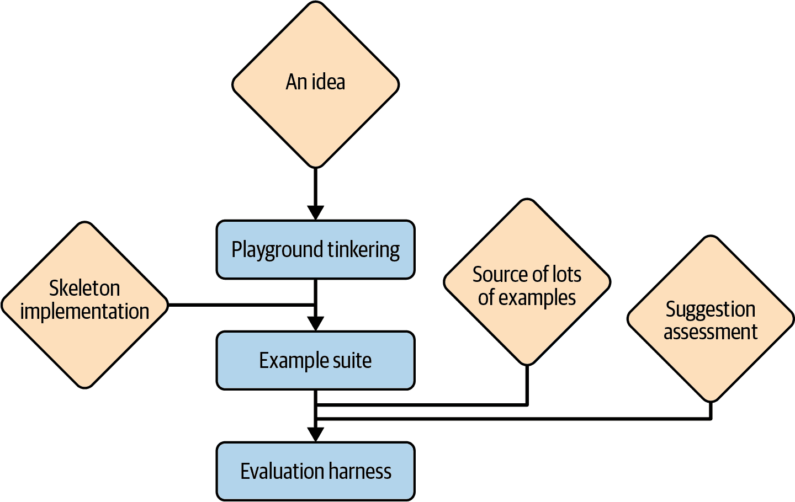
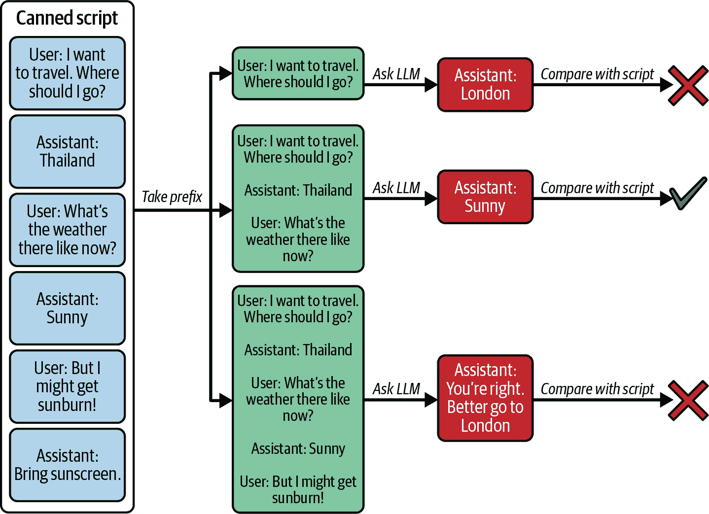
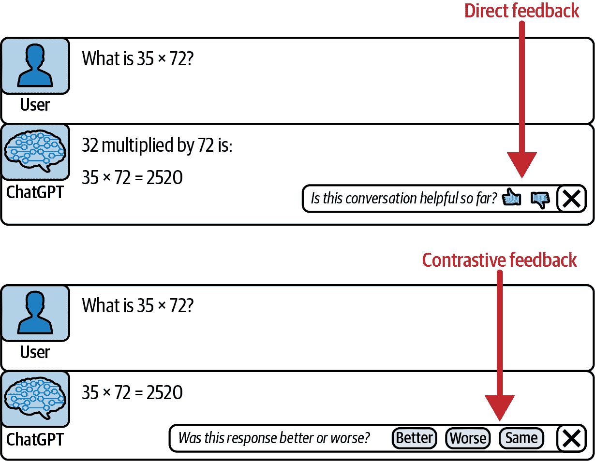

# 第十章\. 评估 LLM 应用

GitHub Copilot 可以说是第一个使用 LLM 的工业规模应用程序。作为第一个的诅咒是，您做出的某些选择在事后看起来可能很愚蠢，可笑地违背了现在众所周知的事实。

但我们做得绝对正确的一件事是我们是如何开始的。Copilot 代码库中最古老的部分不是代理，也不是提示，也不是 UI，甚至不是作为 IDE 扩展设置应用程序的样板设置。我们写的第一段代码就是*评估*，也正是因为这一点，我们才能如此快速且成功地完成其他工作。那是因为，对于我们所做的每一个改变，我们都可以直接检查它是否是正确的方向，一个错误，或者是一个没有太大影响的良好尝试。这就是评估框架对您的 LLM 应用程序的主要优势：它将指导所有未来的开发。

根据您的应用和项目在其生命周期中的位置，可能存在不同类型的评估，并且这些评估是合适和可行的。这里主要有两大类评估：离线评估和在线评估。*离线评估*是对与您应用程序的任何实际运行无关的示例案例的评估。由于它不需要真实用户，甚至在许多情况下，甚至不需要一个端到端工作的应用程序，因此它通常将是您在项目生命周期中首先实施的评估。

然而，离线评估在某种程度上是理论性的，并且可能与现实世界有些脱节。但一旦您将应用程序部署到现实世界，您就可以解锁*在线评估*，它直接在您的用户上测试您的想法。由于是实时进行的，与离线评估相比，在线评估的风险更高：您最好确保您的想法不会如此糟糕以至于完全破坏用户体验，并且您还需要足够的用户以获得足够清晰的反馈。但如果你克服了这些障碍，那么您收集到的数据将非常适用于您的用例，这是您在离线评估中无法确定的。

离线评估和在线评估都很重要，但在我们深入探讨它们之前，让我们先退一步，问自己一个主要问题。

# 我们到底在测试什么？

评估可以评估三个方面：

+   您使用的模型

+   您与模型的个人交互（即您的提示）

+   许多此类交互如何在您的整体应用程序中组合在一起

考虑一下代表您应用程序一次运行的循环，我们在第四章中讨论过。在传统的软件测试中，尝试测试整个交互（想想回归测试）和最小的构建块（在这种情况下对应于模型的一次遍历，想想单元测试）是有好处的。

许多应用程序工作流程只对模型有一个调用，所以这种区别并不是很有意义。但对于那些使用迭代调用的大循环应用程序，你会通过划分循环的特定部分并声明“我现在正在测试这个！”来设计一个测试框架。在这个选择上，你没有自由；某些部分很难测试，但理想的情况是，有一些回归测试尽可能覆盖循环的前馈部分的大部分，并且对于你认为是关键的每个交互（即困难和重要的交互）都有单元测试。

###### 小贴士

在你所有的测试中，记录总延迟和令牌消耗统计信息。虽然通常不是评估的主要焦点，但它们很容易评估，你将希望了解这里是否有任何重大影响。

如果你有一套这样的测试，你可以使用它们来评估应用程序的不同组件，如下所示：

+   如果你正在考虑更换模型或升级它，你可能希望尽可能多地捕获应用程序的一部分。你可以单独测试每个单元，但进行覆盖大量循环部分的回归测试会更为自然——除非你打算混合匹配模型（例如，出于成本或延迟原因）。在这种情况下，单独查看每个循环的通过部分更有意义。

+   如果你想要优化提示或其他 API 参数，如温度或完成长度，你的主要焦点可能应该是捕获模型单次通过的小型单元测试。毕竟，这是直接受到单个提示变化影响的。如果你的回归测试足够强大，你也可以使用它们，但统计噪声淹没在单元级别可能显现的个别效应更容易。

+   如果你正在调整整个应用程序的总体架构（例如，考虑改变循环的整体形状），那么根据定义，回归测试是你需要比较不同方法的东西。

总的来说，所有测试设置都是有用的，但如果你必须选择一个最重要的起点，可能最好是有一个测试整个循环的东西。毕竟，测试应该反映现实，而在现实中，你想要优化的是整个系统的性能。一旦你有一个覆盖（接近）整个循环的框架，你仍然可以添加针对循环特别关键部分的特定测试。

# 离线评估

你的离线评估套件可以具有很大的复杂性范围。我们发现从简单的东西开始是有用的。

## 示例套件

当你编写提示的版本 0 时，你可能会有一个打开的 LLM 聊天窗口，或者你可能有一个完成游乐场环境，在那里你尝试一个或两个示例。这并不具有可扩展性，但有一个可扩展的版本，它非常有用：示例套件。一个*示例套件*由三个简单组件组成：

+   一组 5 到 20 个输入示例，这些示例来自你的应用程序或其核心步骤之一。如果可能的话，这些示例应该涵盖你预期在现实中可能遇到的所有场景。

+   一个脚本，它将你的应用程序的提示生成应用于每个示例，并请求模型完成，将组装好的提示和完成内容作为文件输出。

+   例如，可以通过将它们提交到你的仓库并查看`git diff`来直观地比较这些文件之间的差异。

示例套件在软件测试意义上并不像测试套件（尽管它可能后来会演变成为测试套件）。你将没有自动化的方式知道任何变化是改进还是回归。相反，你必须亲自检查差异，并决定你是否认为它们是改进或回归。这比运行测试套件并检查主要结果要投入得多。

但这种设置有两个主要优势。第一个优势是，你可以在编码你的第一个提示的瞬间就开始它，在你有任何方式评估输出之前。第二个优势是，随着你对这些示例的熟悉，你不仅会看到新的提示方案是否有效，而且你还能看到完成中的典型不足，并决定调整你的提示以专门解决这些问题。

例如，我们当时在 GitHub 上有一个关于[拉取请求（PR）摘要](https://oreil.ly/nIJ1B)的项目。PR 是软件开发中的常见元素，其中开发者提出代码更改，审阅者应检查这些更改，我们希望通过摘要这些更改为用户提供便利。因此，我们选取了一组数十个示例 PR（从 GitHub 中挖掘而来），通过直观地查看摘要，我们可以看到我们的摘要器在不同提示方案下的典型问题。如果我们认为它太简略，我们可以迅速在提示中添加“详细”这个词，并立即观察到效果。如果我们认为它太冗长，我们可以要求它限制在一到两段之内。如果它对推动 PR 的原因做出了荒谬的假设，我们可以要求它仅描述功能。实际上，我们会要求它写一段关于功能的内容，另一段关于将功能置于项目目标背景中的内容，我们只是不会展示第二段，使用我们在第七章讨论的关于冗余内容的技巧。通过允许我们轻松比较不同提示的效果，示例套件证明是一个极其有用的组合：它足够系统，可以让我们意识到变化的影响，同时足够灵活，即使在制定严格的质量标准之前也能提供价值。

例子套件非常适合有针对性的探索，但它们的规模受限于每次你做出更改时愿意检查的例子数量。然而，对于微妙的影响，你可能需要数百个甚至数千个例子。图 10-1 说明了如果你想要解锁这种结合带来的统计力量，你需要解决两个问题：

1.  你从哪里获得例子问题？

1.  你如何评估你应用针对那些问题的解决方案？

一旦你写出了第一个代码实现，你就可以从游乐场尝试升级到例子套件。要过渡到评估工具，你需要更多的例子以及自动评估建议的方法。

当我们提到“例子”时，我们指的是你可能运行你的应用的一个特定情况。对于简单的循环，这相当直接——如果你调用 LLM 一次，那么所有可能进入该单个调用提示的上下文的一个实例就是一个例子问题，而你希望从中获得的结果（经过处理后）就是例子解决方案。



###### 图 10-1\. 离线评估的技术树

但到目前为止，我们已经知道有更复杂、交互式的架构，其中 LLM 被调用多次，这些调用相互依赖。最复杂的情况可能发生在用户和 LLM 之间的对话中。评估此类情况有两种选择：

+   你放弃评估整个循环，而是评估对话的单独轮次。例如，你可以使用所谓的*预定义对话*，其中写出了整个脚本，你可以评估模型在每次对话轮次上的表现如何。然后，*无论模型实际回答了什么*，你都可以通过假设模型使用了预定义对话中的答案来测试对话的下一步（参见图 10-2）。

+   你可以使用模型来模拟用户的对话部分。在这种情况下，例子包括用户的个人资料，这有点像即兴戏剧中的指示。模型将使用该个人资料来模拟真实用户。这允许你测试整个循环，但代价是模型可能存在的缺陷被内化——特别是对领域理解的不准确或对用户可能行为的偏见。这不是一个完美的方法，但通常是你能做的最好的。



###### 图 10-2\. 预定义对话

## 寻找样本

你需要找到许多例子，有三个主要来源：

+   它们已经存在，你只需要找到它们。

+   它们是由你的项目创建的，你将收集它们。

+   你将不得不完全自己创造它们。

我们将依次解决每个来源，首先从已经存在的开始。

每个 LLM 应用都解决一个特定的问题，这个问题（或其子问题）可能与可以挖掘的问题相似，因为有许多示例/解决方案对。如果你很幸运，你心中的应用程序将解决用户自己（没有 AI 辅助）成千上万次解决的问题，并生成了记录。我最近遇到了 AI 辅助在预填充在线表单的摘要字段的情况。编写那个功能的程序员最有可能有数万份记录，其中人类自己填写了那个摘要字段。这些将为任何评估工具提供丰富的样本来源。

但非常常见的情况是，你可以挖掘的只是与你的应用想要解决的问题相似，而不是完全相同。在这种情况下，你的样本源需要找到一个平衡点：找到一个在现实世界语料库中普遍存在且足够规模化的样本源，同时与你的应用问题足够相似，以便得出有效的结论。这是实验室和现实之间的一个垫脚石。

例如，原始的 GitHub Copilot 问题是“用户接下来会想输入什么？”如果 GitHub Copilot 知道这个问题的答案，它就可以在用户输入时将其作为灰色文本建议。但是，对于这个问题，并没有大规模的开源语料库。然而，存在的是 GitHub 上所有仓库中的大规模开源代码语料库。

因此，我们选择通过以下步骤生成样本：

1.  选择一个开源仓库，并从中提取一个代码文件，然后从该文件中提取一个函数。

1.  移除该函数的主体，想象一下用户刚刚在编写该文件，并且几乎完成了除了这个函数的实际实现之外的所有内容，但他们的光标就在实现应该放置的位置。

1.  询问 GitHub Copilot 下一步应该输入什么。

这并不完全等同于实际的、现实世界的问题，原因有几个。首先，分布是偏斜的：整个函数体比 Copilot 建议的典型块要长。其次，任何依赖于主体的文件其他部分的更改（例如，添加到序言中的导入）已经发生。这些都不是理想的，但与这样一个几乎无限的样本库的事实相平衡。

但也许你已经思考了很长时间，但还没有找到足够满足你目的的现有数据源，既没有该应用解决的问题的直接实例，也没有类似的情况。因此，你需要一个新的数据源。好消息是：你目前正在编写一个数据源。你正在构建的应用程序是其自身问题的示例案例的创造者，当然，随着用户使用应用程序，新的样本会不断积累。当然，这种数据尽可能真实，但也有一些显著的缺点：

+   只有当您的第一个原型推出后，数据才会开始滚动。

+   每当您对应用程序进行重大更新时，您的早期数据很可能已经过时。

+   记录大量的用户遥测数据需要非常高的标准来获取同意、处理和保护数据。

+   应用程序交互是大量示例问题（输入）的来源，但不一定是大量示例解决方案（输出）的来源。即使您可以记录用户最终采取的实际操作，这也会受到您的应用程序建议的操作的强烈影响。

在接下来的段落中，我们将看到并非所有的评估都依赖于知道哪个解决方案是唯一正确的（也称为*金标准解决方案*）。在这种情况下，从应用程序交互中收集数据可能是值得的。否则，我们建议您将应用程序的遥测数据保留用于在线评估，这样可以避免一些围绕数据处理的问题，并增加一些额外的优势。

那么，您能做些什么呢？好吧，您总是可以编造一些东西——可能不是手动编造，也可能不是完全自己编造（毕竟，这一节是关于规模的），但到目前为止，您已经是一位经验丰富的 AI 开发者，可以要求 LLM 生成样本。在某些情况下，这可以非常有效地工作。这在那些可以从解决方案开始并从那里编造问题的案例中尤其如此。或者，如果您根本不需要金标准解决方案，那么生成情况正是 LLM 擅长的事情。如果您选择这条路，按照以下层次结构进行操作是个好主意：

+   要么让 LLM 提出一个主题列表，要么自己提出一个。如果您的问题有几个可以组合的方面，您就可以充分利用以下事实：如果您有* n *个方面 A 的选项，* m *个方面 B 的选项，* l *个方面 C 的选项，以及* k *个方面 D 的选项，那么就有* n * × * m * × * l × k *种可能的组合。利用这种组合爆炸可以轻松地为您提供大量在广阔空间中分布良好的主题。

+   如果您想要的样本比主题多，您仍然可以要求 LLM 为每个主题生成几个样本。只要您的上下文窗口足够长，可以输出所有这些样本，一次性请求几个示例通常比反复请求 LLM（温度设置大于 0）以获得多个选项得到更广泛的多样性。

如果你不确定 LLM 是否完全掌握了问题空间，生成的示例可能过于简单化，可能是夸张的陈词滥调，可能依赖于流行的误解，或者可能只是不正确。更危险的是，测试 LLM 和提出测试的 LLM 之间可能存在裙带关系——如果这两个 LLM 是同一个，那么它将影响结果。例如，如果你正在使用测试框架来决定是否从模型 A 切换到模型 B，如果所有样本都是由模型 A 生成的，那么模型 A 可能比模型 B 有优势。

每种寻找样本的方法都有其优势和劣势，根据你特定的情境，你可能会选择其中一种或多种。这将为你提供大量的样本——可能包含黄金标准解决方案，也可能没有。你可以在这些样本上运行你的应用程序，并为每个样本得到一个候选解决方案，但接下来该怎么办呢？

## 评估解决方案

如果你想要大规模地评估可能的解决方案，主要有三种方法。按照难度排序，它们是匹配黄金标准（无论是完全匹配还是部分匹配）、功能测试和 LLM 评估。

### 黄金标准

如果你能做到，最简单的方法是匹配黄金标准（即，对于你的示例问题的一个示例解决方案，你对它有一定的信心）。例如，如果你挖掘了历史记录，那可能是没有 LLM 辅助的人类所做的工作。根据你的应用程序提供的解决方案类型，这可能就是你所需要的全部，尤其是如果解决方案可以非常简单地表达。

在最简单的情况下，你的 LLM 应用程序最终应该得出一个单一的肯定/否定答案，并且你有一些关于良好决策的黄金标准数据。那么，你需要评估的就是检查你的应用程序的决定与黄金标准匹配的频率。例如，Albert 曾经为一个单元测试生成应用程序工作，该应用程序的循环中的第一步是询问自己，“我是否需要为这段代码编写单元测试？”这是一个肯定/否定的答案，通过检查它与黄金标准解决方案的匹配程度，可以很容易地验证应用程序在这个步骤上的性能。

###### 小贴士

使用黄金标准对二元决策或多标签分类进行评估，只需统计模型正确率出现的频率即可。但如果你渴望更多的统计能力，可以使用第七章中讨论的 logprobs。

然而，非常常见的是，一个 LLM 的输出或多或少是自由形式的文本。你可以在这里使用精确匹配计数，统计你的应用程序产生与黄金标准完全相同的候选解决方案的频率。但随着自由度的增加，尤其是模型答案的长度增加，精确匹配将变得更加罕见，即使是对于优秀的模型也是如此。在某个点上，获得精确匹配的机会变得如此之低，以至于这个指标几乎失去了意义。甚至在那个点之前，它就提出了一个问题：你是在优化正确答案，还是优化以特定风格表述的答案？

这就是部分匹配指标可以发挥作用的地方。它们通过挑选出解决方案的一个特别重要的方面，并仅在该方面进行匹配来实现。例如，如果 LLM 应该为你编写源代码，你可能希望忽略注释、空白行，或者（根据语言）甚至所有空白字符。因此，你选择部分匹配指标“删除所有注释行并移除所有空白字符后的精确匹配”。如果 LLM 应该建议旅行目的地，你可能希望匹配目的地国家，但忽略模型给出的所有其他细节：这也是另一个部分匹配指标。

所有部分匹配指标都伴随着一个艰难的选择：你需要确定你真正关心解决方案的哪个方面。这说起来容易做起来难，因为在大多数应用中，解决方案任何方面的灾难性失败理论上都可能使整个解决方案无效。但某些失败模式更有可能发生，因此你可以防范这些情况。

让我们通过一个例子来分析。想象一下你正在编写一个智能家居管理器。你面对的情况是用户说，“我感到冷”（见图 10-3）。你已经为这种情况确定了一个黄金标准解决方案：系统可以将温度设置为 77°F，这将非常完美。检查部分匹配可能只包括检查管理器是否调节了正确的系统（在这种情况下，加热）。检查这一点是有道理的，因为（可能）管理器没有通过调整加热系统来做出反应，这很可能是它的一部分真正失败。另一方面，如果管理器确实调整了加热系统，那么它很可能会将其调整到合理的温度，无论是正好 77°F 还是其他温度。当然，管理器可以将温度设置为 0°F，但与系统完全不理解它应该调节加热，或者不知道如何确切地调节加热的可能性相比，这更不太可能是一个真正的失败案例。因此，测试设置任何温度，而不是测试模型应该设置的精确温度，是有意义的。

通常，最好在满足以下两个标准的一个方面进行评估：

+   该方面擅长区分从黄金标准解决方案中出现的破坏性和良性分歧。这使得评估变得有意义或有效。

+   该方面并不太具体；如果太具体，LLM 正确获取它的机会就很小。该方面也不太泛泛；如果太泛泛，评估就没有意义。

这两个标准都需要你与模型玩一会儿，看看一些典型的错误模式在哪里，以及这些错误有多严重。不幸的是，这里引入了一些循环性，因为你根据你的 LLM 或当前设置选择测试，然后使用那个评估来指导其未来的发展。但这仍然比选择一个弱或误导性的方面作为你的评估框架要好得多。

如果 LLM 不返回纯自由形式的完成，那么在它包含的几个字段中测试特别关键的一个，通常对于部分匹配指标来说是一个值得关注的方面。特别是对于工具使用较多的应用来说，这一点尤为重要：你可以检查是否使用了正确的工具，也许还可以检查是否使用了正确的语法（参见图 10-3）。

检查模型是否使用了正确的工具，这也是遵循另一条一般性建议的一个例子：当模型在输出其标记的同时连续做出几个决策时，评估第一个有真正出错可能性的决策（以及使后续决策点无效）是有意义的。在图 10-3 中，模型首先通过以`to=functions.`开始来决定是否使用任何工具，然后承诺使用特定的工具`set_room_temp`，然后确定特定的值`{"temp": 77}`。


###### 图 10-3\. 检查是否以正确的语法调用了正确的工具

在图中，请注意，如果`set_room_temp`工具调用不正确（如图左侧所示），建议很可能毫无用处。如果工具调用正确，但与黄金标准解决方案中的方式不同（如图右侧所示），那么建议合理（如图右上角所示）的机会仍然很大。

### 功能测试

如果你没有黄金标准解决方案或者无法轻松地将它与你的应用程序解决方案进行比较，怎么办？一个选择是*功能测试*：获取完成内容并确认某些事情“工作”得如何。例如，你可以计算 LLM 给你提供可解析的完成次数，只调用你拥有的函数和工具（以及正确的类型参数）等。在大多数应用中，这可能太弱了，但偶尔，你可以通过功能测试走得很远。

让我们再次以 Copilot 评估框架为例，看看这种功能测试。评估框架将模拟使用 Copilot 从开源仓库重新实现一个函数的情况，然后它会检查该仓库的单元测试套件是否仍然可以通过 Copilot 建议的替代源代码。 (较弱的版本会检查代码检查器是否与代码一致。) 这个想法是利用代码的一个特性：通常有可以执行的单元测试，代码本身也自带了功能测试。另一方面，在某些领域，你可能无法构建任何可以程序执行的函数测试。但作为像你这样的提示工程师，你最后还有一支箭在你的箭袋中：模型本身。

### LLM 评估

对问题的自然语言回答的质量通常是一个模糊的、难以确定的事情。如果 LLM 输出一个数字，你可以很容易地将其与黄金标准进行比较；如果 LLM 输出一个分类，你可以直接比较字符串以确定准确性；如果 LLM 输出一个程序，你可以运行单元测试。

但是，如果 LLM 对一个问题的回答是文本形式，你如何衡量这个回答的*友好性*和*帮助性*呢？幸运的是，这种评估正是 LLM 擅长的领域，你可以用它来评估回答。另一方面，也许这不是一个好主意——毕竟，可能正是产生我们正在评估的回答的同一个 LLM，现在你要求它对自己的工作进行评分，看看它有多好。这难道不是有点像给高中生布置一篇论文写作的作业，然后让他们自己评分一样吗？答案是*不*——至少如果你做得正确的话。

###### 警告

尽管对 LLM 的问题通常被表述为绝对质量问题（例如，“这是否正确？”），但 LLM 的评估在先验上仅作为相对质量判断（例如，“版本 A 比版本 B 更常被认为是正确的。”）。你可能会得到这样的评估，“LLM 在 81%的情况下判断应用程序是正确的”，单独来看，这些评估几乎没有意义。

如果你想要正确使用大型语言模型来评估其自身的工作，那么你不应该让大型语言模型认为它在给自己打分。评估是一种建议性的对话，正如你从第六章中已经了解到的，建议性的对话在模型认为它在给第三方打分时效果最好。事实上，当模型认为它被要求评估用户而不是第三方时，它们的准确性会略有下降，但它们认为自己在给自己打分时通常会变得更差，因为它们突然受到众多相互冲突的偏差的影响。大多数模型的训练数据包括大量的论坛讨论（甚至评论），而这些讨论并不以客观的自我反思而闻名。另一方面，如果模型受到强化学习与人类反馈的强化（RLHF）的影响，那么为了取悦其人类评估者，它通常会学会偏向另一个极端，甚至在用户对输出的最轻微怀疑下就过度纠正其输出。即使模型设法在平均意义上达到平衡，被拉向不同方向并不利于它提供客观的分析。

## SOMA 评估

优化大型语言模型进行评估的另一种好方法是尝试使用我们所说的*SOMA 评估*，它由具体问题（S）、序列缩放答案（O）和多方面覆盖（MA）组成。让我们来谈谈 SOMA 评估的各个部分。

### 具体问题

有一些任务，验证解决方案比提出解决方案容易得多。例如，即兴创作一首打油诗很难，但确认一首给定的诗是否符合打油诗的标准却很容易。如果你的应用任务恰好属于这类任务，你可能只需问“这是正确的吗？”就能过关。但在大多数情况下，这种通用的评估几乎得不到任何信息。在图 10-3 中，我们有一个智能家居系统对用户说出“我有点冷”的反应的例子，`to=functions.set_room_temp {"temp": 77}`。回答“这个完成度是否正确？”并不比最初提出完成度更容易。事实上，评估的答案可能比原始生成的内容还要差，因为有多种方式可以解释它。

### 序列缩放答案

其中一种歧义是，不清楚一个完成度需要多好才能被认为是“正确”的。如果对个体答案的标准取决于模型的反复无常，而下一个答案则有不同的标准，那就没什么好处。如果，不是随机效应，而是存在系统性偏差，例如模型对试图提高准确度的答案持有更高的标准，或者接受一般可接受的答案（正确率超过 50%），而拒绝几乎完美的答案（不是*完全*正确），那就更糟了。

解决方案是首先放弃是/否的答案，并要求模型在序数尺度上对完成情况进行评级，这样不仅更容易传达细微差别，而且通过传达这些数字的意义可以获得一致的测量。例如，如果你要求模型在 1 到 5 的尺度上进行评级，^(1) 你可以为每个级别添加描述或示例，如示例 10-1 所示。

### 多方面覆盖

但“多好才算好？”并不是回答像“完成是否正确？”这样的问题中模糊性的唯一来源。如果你考虑“我有点冷”的不同完成方式，模型有时可能会关注建议的房间温度是否正确的问题，有时会关注助手在改变温度之前是否应该询问的问题，有时会关注是否应该使用`set_room_temp`函数。如果你想要系统地使用模型评估，这些不一致性是非常糟糕的。

解决这个问题的方法是明确控制这些多个方面：而不是询问模型一个建议有多好，并祈祷它总是使用相同的标准来判断好坏，你可以提前准备几个类别来评估模型，并要求模型在每个类别中对建议进行评级。对于上述智能家居助手，这些类别可能如下所示：

+   是否成功实现了模型意图中的动作（使用正确的语法调用正确的工具）

+   该行为是否解决了用户当前的问题（感到寒冷）

+   模型是否在没有询问的情况下足够克制地避免做一些疯狂的事情，并且足够自信，不需要过多的指导

然后，你不再只问一个问题，而是问三个问题，并且要么是将分数相加，要么是在寻找更复杂的模式。

###### 小贴士

在向模型展示示例之前，记得说明你正在进行评估以及要评估哪些方面。毕竟，大型语言模型无法回溯，并且只能一次性阅读文本。如果问题在评估示例之前，那么当 LLM 阅读示例时，它已经带着评估框架在心中，并且可以专注于正确的方面。

当你选择这些方面来评估一个应用程序时，选择正确的是非常重要的。一种常见的方法是关注意图和执行方面的内容：

+   模型是否有正确的意图？例如，将温度调至 77°F 真的是解决用户问题的方案吗？

+   模型是否正确地执行了该意图？例如，模型是否使用了正确的工具和工具调用语法？

例如，你可以询问为用户提供建议的聊天应用，该建议是否解决了正确的问题。如果用户询问访问摩洛哥时不要错过的事情，你可以询问该应用是否实际上以完整的方式提供了预期的观光信息（而不是告诉用户不要错过航班），而不是只列出最好的咖啡馆。此外，你可以询问该应用是否提供的建议实际上是正确的。这些方面构成了最初为 GitHub Copilot 评分聊天对话而开发的关联-真实性-完整性（RTC）^(2) 系统的基础。

###### 警告

你应该分解任何询问完成度是否“恰到好处”的 Goldilocks 问题。这些问题实际上捕捉了两个方面的内容：它足够了，而且不是太多。如果你单独提出这些问题，通常会得到更干净的结果。

### SOMA 精通

综合考虑，SOMA 评估在多个方面上对有序尺度上的具体问题进行提问，就像在 示例 10-1 中那样。SOMA 通过精确地定义评估任务，就像一个护栏一样，使得模型在评估时没有选择但必须是客观的……至少我们希望如此。但你怎么能确定它有效呢？你如何正确选择你的问题、方面和有序选项的描述，以及如何确保它们没有只是从模型头上飘过？

##### 示例 10-1\. 要求 LLM 对选定的某个方面进行评级

```py
I need your help with evaluating a smart home assistant. I'm going to give you 
some interactions of that assistant, which you are to grade on a scale of 1 to 5\. 
Grade each interaction for effectiveness: whether the assistant's attempted action
would have remedied the user's problem.

Please rate effectiveness on a scale of 1 to 5, where the values mean the 
following:

1\. This action would do nothing to address the user's problem or might even 
make it worse.
2\. This action might address a small part of the problem but leave the main 
part unaddressed.
3\. This action has a good chance of addressing a substantial part of the problem.
4\. This action is not guaranteed to work completely, but it should solve most of 
the problem.
5\. This action will definitely solve the problem completely.

The conversation was as follows:

User: I'm a bit chilly.
Assistant: to functions.set_room_temp {“temp”: 77}

Please provide a thorough analysis and then conclude your answer with 
"Effectiveness: X," where X is your chosen effectiveness 
rating from 1 to 5.
```

答案是，你应该将你的模型评估建立在人工评估的基础上。模型的好处是它可以扩展，而人不行（不考虑 Elastigirl）。因此，使用 LLM 来评估其自身性能基本上是使用人工标注员的替代品，你想要确保通过这样做不会出现实质性的退化。你可以让一个人标注一些案例并比较，但你只会发现人和模型之间有一些不一致——这是正常的。人类也会产生分歧，所以你实际上需要做的是让 *多个* 人类回答问题。然后，你需要确认，如果你将模型（一次查询，温度为 0）添加到这个评估者群体中，通过某种标准方法（如 [Kendall 的 Tau](https://oreil.ly/y0Lvm)）测量的这种群体中的不一致性保持稳定。

以下列表总结了离线评估选项。请注意，对于离线评估，你需要一个输入源和一个输出测试。这些列表包括我们认为最关键的几个主要种类；如果你找不到用“是”来回答的方法，那么你无法使用那一行。

选择一个来源：

现有记录

你能找到很多吗？

应用使用

数据流动是否足够快（同时考虑通过应用更改使旧数据无效）？

合成示例

你愿意花时间精心制作合成过程吗？

选择一个测试：

真实匹配

（完整或部分）匹配是否现实且有意义？

功能测试

你能否隔离出一个可以自动评估的关键方面？

大型语言模型评估

良好和不良的输出是否可以明显区分（例如，通过人）？

# 在线评估

上一节中介绍的所有方法至少在某种程度上都是人为的。它们测试的是模型在实验室中的性能，而不是在实际生活中的表现。在实验室中评估你的应用程序有三个优点：

+   实验室是安全的，如果你在那里出了差错，没有人会知道。

+   实验室的可扩展性更好，因此你可以更快地尝试更多想法。

+   实验室在你应用程序发布之前就已经存在，因此你可以更早地开始评估。

但是，正如 Opus 在他们著名的歌曲中所说的，“生活是真实的”，很难打败这一点。如果你在实际生活中运行应用程序，那么你就有实际的用户参与其中，并且应用程序在用户中的表现是衡量应用程序是否真正有价值的终极测试。

## A/B 测试

从用户那里学习标准的途径是通过 *A/B 测试*：你发布两个（或另一个小数量）的替代方案——让我们称它们为 A 和 B——以查看哪个表现最好。通常，其中之一将是现状，另一个将是你要评估的修改。希望你已经对替代方案进行了离线评估，以减少要测试的可能性数量，并避免将一些真正的糟糕产品展示给用户。你事先定义你想要优化的指标；通常，它们是用户满意度的代理（例如，平均评分，接受率）。你还可以定义一些你不想增加的指标；通常，它们是灾难性失败的代理（例如，错误，投诉）。然后，随机选择的一组用户运行模式 A 的应用程序，其余的用户运行模式 B 的应用程序。你让实验运行一段时间，收集你决定的指标，并查看 A 或 B 哪个更好。然后，你将获胜的替代方案推广给所有用户。

###### 小贴士

在线评估通常比离线评估的带宽要少。你只有有限数量的用户，获取信号可能需要一些时间，因此在在线测试哪些想法时要谨慎。

A/B 测试并不仅限于 LLM 应用，有许多成熟的解决方案用于处理将实验组分配给用户或会话以及进行统计分析。这些解决方案包括 Optimizely、VWO 和 AB Tasty，它们都依赖于你的应用程序能够在两种模式下运行：替代方案 A 和替代方案 B。例如，如果 A 是你当前的提示工程逻辑，而 B 是你想要尝试的新提示想法，那么你需要你的应用程序能够根据 A/B 测试设置的某些标志执行其中之一。如果你的应用程序在客户端运行，这意味着你需要向所有（大多数^(3)) 用户推出带有新提示想法的更新，然后你才能开始测试它。这种推出时间引入了另一个重要的原因，为什么 A/B 实验通常比离线评估慢得多。

要实现成功的在线评估，你最重要的初始目标必须是确定你想要优化哪些指标。这决定了你如何决定哪个替代方案是“更好的”。让我们回顾一个关于建议旅行目的地的应用的早期例子。A 组的用户收到建议“摩纳哥”，而 B 组的用户收到建议“芝加哥”。你应该如何倾听哪些信号来判断这些建议是好是坏？为了回答这个问题，让我们先了解一下可能的指标。

## 指标

主要有五种类型的指标。从最直接到最不直接，它们如下：

1.  直接反馈：用户对建议说了什么？

1.  功能正确性：建议是否有效？

1.  用户接受度：用户是否遵循建议？

1.  达成的效果：用户得到了多少好处？

1.  伴随指标：建议“周围”的测量是什么？

我们将逐一解释它们，从直接反馈（见图 10-4）开始。



###### 图 10-4\. ChatGPT 获取直接反馈的两种不同方式

你有没有注意到 ChatGPT 多次向用户征求他们的意见？这是有道理的：对话很难评估，谁比用户更能评估它们？在答案旁边的小点赞或点踩按钮为用户提供了一种快速表达满意或不满的方式。后者更为常见，而且通常也是一个可靠的信号：如果点赞是可选的，通常不会因为表现良好而点赞，而只会因为特别出色，这会稀释信号。（也许这就是为什么 OpenAI 停止显示单个对话项的点赞按钮。）

ChatGPT 偶尔会比经典的 A/B 测试更进一步，进行*对比 A/B 测试*，问：“这两个建议中哪一个更好？”这可能导致可能最清晰的信号，但它也更为侵入性——而所有直接反馈的请求都已经相当侵入性了。如果你的应用程序是一个人们有意识地寻求并与之交流的助手（如 ChatGPT），你可以这样做，但没有人希望他们的智能家居系统每次调整灯光时都不断问：“你觉得怎么样？”

在许多应用程序中，如果反馈延迟，则更有价值——用户可能会欣赏芝加哥的度假建议，对去摩纳哥的想法持怀疑态度，但如果你旨在为用户提供适当的价值，那么在事后了解建议的芝加哥之旅很成功，而摩纳哥之旅很糟糕，就更有价值了。

###### 小贴士

使用直接反馈收集的数据通常质量很高——除了用于评估之外，你还可以将其用作模型微调的训练数据。

功能正确性测试的指标强调了一个 LLM 应用程序中更客观的部分：应用程序试图做某事，但它是否成功了？有时，你可以轻松地检查至少部分方面：代码编译了——这是好的（尽管代码可能实际上没有做正确的事情）；你得到了机票确认——这是好的（尽管你可能没有预订正确的目的地）。在其他时候，功能正确性的信号更加具体和确定，尤其是在更大常规中的较小子任务中。你想要打开一个程序，但它是否正在运行？你想要发送一封电子邮件，但它是否在你的发件箱中？

如果你不能直接评估建议，大多数应用程序可以检查用户是否接受它们，或者至少采取了接受它们的步骤——例如，用户是否最终预订了去芝加哥的旅行？有时，这就像点击率一样直接：如果你的建议包含一个链接，用户点击它的频率是多少？这只能证实建议看起来很有希望，并不能证明它实际上是有用的，但很多时候，一个合理的起点实际上是最重要的。

结果证明，这是我们对 Copilot 的[发现](https://oreil.ly/qwR21)，当我们发现接受度指标与用户报告的生产力提升相关性更强，而不是与更复杂的*影响测量*。这些是相关的信号，试图评估相同的问题：用户是否觉得建议有帮助？但它们从另一个方向来看，关注最终结果。在这里，你会找到像“最终，助手写了多少电子邮件？”或“当用户点击建议的旅行目的地时，他们实际上是否真的购买了机票？”这样的指标。

最后，每个应用都附带一系列*偶然性指标*，这些指标衡量相关方面，但并不一定与“良好”有独特的关系。在交互场景中，这些中最重要的是延迟，尽管闪电般的建议仍然可能毫无价值，而更加谨慎的建议仍然可能是有价值的。对话助手通常也会跟踪对话时间，尽管在一般情况下，是否短的对话是好的（即问题立即解决，用户完全满意）或坏的（即助手从一开始就表现出无能，用户愤怒退出）并不总是很清楚。通常，跟踪更多的偶然性指标比跟踪更少的指标更好，这不仅作为质量的大致指标（例如，你可能有一些想法，认为长对话通常更好），而且可以促使调查任何意外的变化。

有了这些，你就有很多不同的想法可以选择。花些时间去调查你可以为你的用例收集哪些类型的指标，以及你对这些指标价值的信心程度是值得的。最可能的情况，也是你应该首先开始寻找的情况，将是一个接受度或影响指标。如果你找不到一个你可以确信的，你将不得不要求直接反馈。但即使如此，你可能会保留一些接受度或影响指标作为安全线，监控它们不要退步，并且你可能会保留一些功能正确性和偶然性指标（尤其是延迟和错误）。

# 结论

评估是一个重要的主题，但由于你可以调整的许多旋钮，它很难。你的离线评估是通过现有的记录和历史应用使用来获取示例，还是通过合成它们？你是通过将它们与黄金标准进行比较来测试它们，自动检查它们的功能，还是使用 LLM 本身来评估它们？你的在线评估跟踪用户反馈、功能正确性、接受率或影响吗？你添加了哪些偶然性指标？

完美的选择因应用而异。但始终不变的是，评估对于你应用的持续发展至关重要，在这个领域花费的时间都是值得的。

^(1) [心理测量学的研究](https://oreil.ly/quHu8)表明，5 是一个相当好的默认值，事实上。

^(2) Lizzie Redford，[“机器心理测量学：LLM 自我评估的设计与验证原则”](https://oreil.ly/vR9ud)

^(3) 你不能只是说，“让我们把已经更新的用户放在 B 组（‘新事物’）中，而其他用户放在 A 组（‘现状’）中，”因为快速更新的用户通常与更新不那么频繁的用户行为不同。你可以做的是说，“让我们只测试已经更新的用户，而那些尚未更新的用户既不属于 A 组也不属于 B 组；他们根本不参与分析。”
