# 第四章：构建反向图像搜索引擎：理解嵌入

鲍勃刚刚买了一套新房子，正在寻找一些时尚现代的家具来填充它。他不停地翻阅家具目录，参观家具展厅，但还没有找到自己喜欢的东西。然后有一天，他看到了他梦寐以求的沙发——一张独特的 L 形白色现代沙发在一个办公室接待处。好消息是他知道自己想要什么。坏消息是他不知道从哪里购买。沙发上没有写品牌和型号号码。询问办公室经理也没有帮助。所以，他从不同角度拍了几张照片，想在当地的家具店里打听，但运气不佳：没有人知道这个特定品牌。在互联网上使用“白色 L 形”、“现代沙发”等关键词搜索给他带来了成千上万的结果，但没有他在找的那个。

爱丽丝听到鲍勃的沮丧，问道：“为什么不试试反向图像搜索？”鲍勃将他的图像上传到谷歌和必应的反向图像搜索，很快在一个在线购物网站上发现了一张看起来相似的图像。从网站上找到这张更完美的图像后，他进行了更多的反向图像搜索，发现其他网站以更便宜的价格提供相同的沙发。在上网几分钟后，鲍勃正式订购了他梦寐以求的沙发！

*反向图像搜索*（或更专业地称为*实例检索*）使开发人员和研究人员能够构建超越简单关键字搜索的场景。从在 Pinterest 上发现视觉上相似的对象到在 Spotify 上推荐相似的歌曲，再到亚马逊基于相机的产品搜索，底层使用的是一类类似的技术。像 TinEye 这样的网站在摄影师的照片未经同意发布在互联网上时会发出侵权警告。甚至在几个安全系统中的人脸识别也使用类似的概念来确定人的身份。

最好的部分是，有了正确的知识，你可以在几个小时内构建许多这些产品的工作副本。所以让我们开始吧！

这是我们在本章中要做的事情：

1.  在 Caltech101 和 Caltech256 数据集上执行特征提取和相似性搜索

1.  学习如何扩展到大型数据集（多达数十亿张图像）

1.  使系统更准确和优化

1.  分析案例研究，看看这些概念在主流产品中如何使用

# 图像相似度

首要问题是：给定两幅图像，它们是否相似？

解决这个问题有几种方法。一种方法是比较两幅图像之间的区域块。尽管这可以帮助找到精确或接近精确的图像（可能已经被裁剪），但即使轻微旋转也会导致不相似。通过存储区块的哈希值，可以找到图像的重复。这种方法的一个用例是在照片中识别抄袭行为。

另一种天真的方法是计算 RGB 值的直方图并比较它们的相似性。这可能有助于找到在相同环境中拍摄的内容没有太多变化的近似图像。例如，在图 4-1 中，这种技术用于图像去重软件，旨在找到硬盘上的照片爆发，这样您就可以选择最好的照片并删除其余的照片。当数据集增长时，误报的可能性会增加。这种方法的另一个缺点是，对颜色、色调或白平衡进行小的更改会使识别变得更加困难。

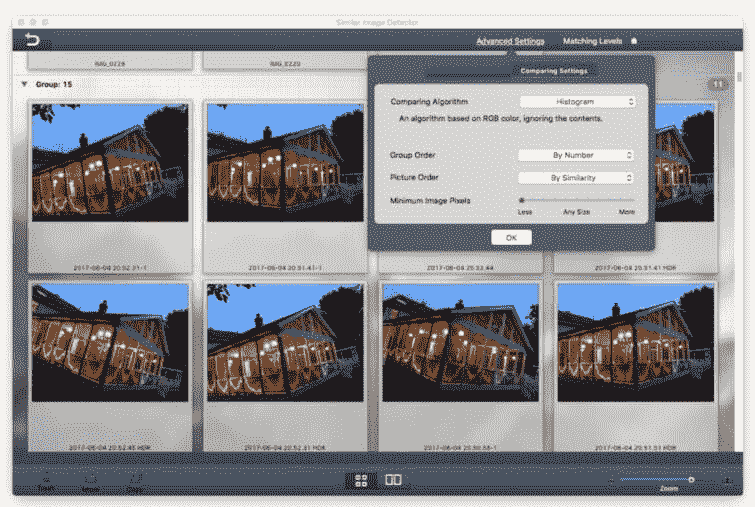

###### 图 4-1。基于 RGB 直方图的“相似图像检测器”程序

更加健壮的传统计算机视觉方法是利用诸如尺度不变特征变换（SIFT）、加速稳健特征（SURF）和定向 FAST 和旋转 BRIEF（ORB）等算法，在边缘附近找到视觉特征，然后比较两张照片之间共同的相似特征数量。这有助于从通用的图像级理解转向相对健壮的对象级理解。尽管这对于具有较少变化的刚性对象的图像非常有效，比如谷物盒的印刷侧几乎总是相同的，但对于比较可变形的对象如人类和动物则不太有帮助，因为它们可能展示不同的姿势。例如，您可以在亚马逊应用程序的基于相机的产品搜索体验中看到显示的特征。该应用程序以蓝色点的形式显示这些特征（图 4-2）。当它看到足够数量的特征时，它会将它们发送到亚马逊服务器以检索产品信息。


###### 图 4-2\. 亚马逊应用程序中带有视觉特征的产品扫描仪

更深入地探讨，另一种方法是使用深度学习找到图像的类别（例如，沙发），然后找到同一类别内的其他图像。这相当于从图像中提取元数据，以便随后可以对其进行索引并在基于典型文本查询的搜索中使用。通过在 ElasticSearch 等开源搜索引擎中使用元数据，可以轻松扩展此功能。许多电子商务网站在内部进行基于标签的查询搜索时，会根据从图像中提取的标签显示推荐内容。正如您所期望的那样，通过提取标签，我们会丢失某些信息，如颜色、姿势、场景中物体之间的关系等。此方法的一个主要缺点是需要大量标记数据来训练用于在新图像上提取这些标签的分类器。每次需要添加新类别时，都需要重新训练模型。

因为我们的目标是在数百万张图像中进行搜索，理想情况下，我们需要一种方法将图像中数百万像素中包含的信息总结为一个较小的表示（比如几千维），并且使得相似对象的总结表示彼此靠近，而不同对象之间则相距较远。

幸运的是，深度神经网络来拯救。正如我们在第二章和第三章中看到的，CNN 将图像输入转换为一千维的特征向量，然后将其作为分类器的输入，输出图像可能属于的顶级身份（比如狗或猫）。*特征向量*（也称为*嵌入*或*瓶颈特征*）本质上是几千个浮点值的集合。通过 CNN 中的卷积和池化层，基本上是一种减少操作，以过滤图像中包含的信息，提取最重要和显著的成分，这些成分形成瓶颈特征。训练 CNN 会以这种方式塑造这些值，使得属于同一类别的项目之间的欧氏距离很小（或者简单地说是对应值之间差的平方和的平方根），而不同类别的项目之间的距离较大。这是一个重要的特性，有助于解决许多无法使用分类器的问题，特别是在无监督问题中，因为缺乏足够的标记数据。

###### 提示

找到相似图像的理想方法是使用*迁移学习*。例如，通过预训练的卷积神经网络（如 ResNet-50）传递图像，提取特征，然后使用度量来计算错误率，如欧几里德距离。

说了这么多，让我们写代码吧！

# 特征提取

一张图像胜过千言万语的特征。

在这一部分中，我们将主要使用 Caltech 101 数据集（131 MB，约 9,000 张图像）来玩耍和理解特征提取的概念，然后最终使用 Caltech 256（1.2 GB，约 30,000 张图像）。Caltech 101，顾名思义，包含大约 9,000 张图像，分为 101 个类别，每个类别大约有 40 到 800 张图像。需要注意的是，有一个第 102 个类别称为“BACKGROUND_Google”，其中包含随机图像，不包含在前 101 个类别中，需要在我们开始实验之前删除。请记住，我们编写的所有代码也可以在[GitHub 存储库](http://PracticalDeepLearning.ai)中找到。

让我们下载数据集：

```py
$ wget
http://www.vision.caltech.edu/Image_Datasets/Caltech101/
101_ObjectCategories.tar.gz
$ tar -xvf 101_ObjectCategories.tar.gz
$ mv 101_ObjectCategories caltech101
$ rm -rf caltech101/BACKGROUND_Google
```

现在，导入所有必要的模块：

```py
import numpy as np
from numpy.linalg import norm
import pickle
from tqdm import tqdm, tqdm_notebook
import os
import time
from tf.keras.preprocessing import image
from tf.keras.applications.resnet50 import ResNet50, preprocess_input
```

加载不带顶部分类层的 ResNet-50 模型，以便只获取*瓶颈特征*。然后定义一个函数，该函数接受图像路径，加载图像，将其调整为 ResNet-50 支持的适当尺寸，提取特征，然后对其进行归一化：

```py
model = ResNet50(weights='imagenet', include_top=False,
                 input_shape=(224, 224, 3))
def extract_features(img_path, model):
    input_shape = (224, 224, 3)
    img = image.load_img(img_path, target_size=(
        input_shape[0], input_shape[1]))
    img_array = image.img_to_array(img)
    expanded_img_array = np.expand_dims(img_array, axis=0)
    preprocessed_img = preprocess_input(expanded_img_array)
    features = model.predict(preprocessed_img)
    flattened_features = features.flatten()
    normalized_features = flattened_features / norm(flattened_features)
    return normalized_features
```

###### 提示

在前面示例中定义的函数是我们在 Keras 中几乎每个特征提取需求中使用的`key`函数。

就是这样！让我们看看模型生成的特征长度：

```py
features = extract_features('../../sample_images/cat.jpg', model)
print(len(features))
```

annoy

```py
> 2048
```

ResNet-50 模型从提供的图像生成了 2,048 个特征。每个特征都是介于 0 和 1 之间的浮点值。

###### 提示

如果您的模型是在与 ImageNet 不相似的数据集上训练或微调的，请相应重新定义“preprocess_input(img)”步骤。该函数中使用的均值是特定于 ImageNet 数据集的。Keras 中的每个模型都有自己的预处理函数，因此请确保您使用正确的函数。

现在是时候为整个数据集提取特征了。首先，我们使用这个方便的函数获取所有文件名，该函数会递归查找目录下所有图像文件（由其扩展名定义）：

```py
extensions = ['.jpg', '.JPG', '.jpeg', '.JPEG', '.png', '.PNG']
def get_file_list(root_dir):
    file_list = []
    counter = 1
    for root, directories, filenames in os.walk(root_dir):
        for filename in filenames:
            if any(ext in filename for ext in extensions):
                file_list.append(os.path.join(root, filename))
                counter += 1
    return file_list
```

然后，我们提供数据集的路径并调用该函数：

```py
# path to the datasets
root_dir = '../../datasets/caltech101'
filenames = sorted(get_file_list(root_dir))
```

我们现在定义一个变量，将存储所有特征，遍历数据集中的所有文件名，提取它们的特征，并将它们附加到先前定义的变量中：

```py
feature_list = []
for i in tqdm_notebook(range(len(filenames))):
    feature_list.append(extract_features(filenames[i], model))
```

在 CPU 上，这应该在一个小时内完成。在 GPU 上，只需要几分钟。

###### 提示

为了更好地了解时间，使用超级方便的工具`tqdm`，它显示一个进度条（图 4-3）以及每次迭代的速度，已经过去的时间和预计的完成时间。在 Python 中，使用`tqdm`包装一个可迭代对象；例如，`tqdm(range(10))`。其 Jupyter Notebook 变体是`tqdm_notebook`。

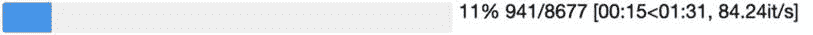

###### 图 4-3\. 使用`tqdm_notebook`显示的进度条

最后，将这些特征写入 pickle 文件，以便我们将来可以在不必重新计算的情况下使用它们：

```py
pickle.dump(feature_list, open('data/features-caltech101-resnet.pickle', 'wb'))
pickle.dump(filenames, open('data/filenames-caltech101.pickle','wb'))
```

这就是全部！我们已经完成了特征提取部分。

# 相似性搜索

给定一张照片，我们的目标是在我们的数据集中找到一张与当前照片相似的照片。我们首先加载预先计算的特征：

```py
filenames = pickle.load(open('data/filenames-caltech101.pickle', 'rb'))
feature_list = pickle.load(open('data/features-caltech101-resnet.pickle', 'rb'))
```

我们将使用 Python 的机器学习库`scikit-learn`来查找查询特征的*最近邻居*；也就是代表查询图像的特征。我们使用暴力算法训练一个最近邻模型，以根据欧几里德距离找到最近的五个邻居（要在系统上安装`scikit-learn`，请使用`pip3 install sklearn)`：

```py
from sklearn.neighbors import NearestNeighbors
neighbors = NearestNeighbors(n_neighbors=5, algorithm='brute',
metric='euclidean').fit(feature_list)
distances, indices = neighbors.kneighbors([feature_list[0]])
```

现在，您已经知道了最接近第一个查询特征（代表第一张图像）的五个最近邻的索引和距离。请注意第一步——训练步骤的快速执行。与训练大多数机器学习模型不同，这些模型可能需要几分钟到几小时在大型数据集上训练，实例化最近邻模型是瞬时的，因为在训练时没有太多处理。这也被称为*惰性学习*，因为所有处理都推迟到分类或推理时间。

现在我们知道了索引，让我们看看那个特征背后的实际图像。首先，我们选择一个图像进行查询，比如说，索引=0：

```py
import matplotlib.pyplot as plt
import matplotlib.image as mpimg
%matplotlib inline       # Show the plots as a cell within the Jupyter Notebooks
plt.imshow(mpimg.imread(filenames[0]))
```

图 4-4 展示了这个结果。

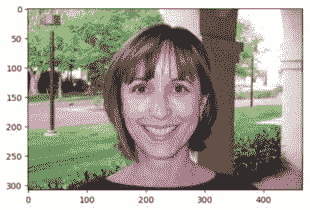

###### 图 4-4。Caltech-101 数据集中的查询图像

现在，让我们通过绘制第一个结果来检查最近邻。

```py
plt.imshow(mpimg.imread(filenames[indices[0]]))
```

图 4-5 展示了这个结果。


###### 图 4-5。我们查询图像的最近邻

等等，这不是重复的吗？实际上，最近的索引将是图像本身，因为这就是被查询的内容：

```py
for i in range(5):
    print(distances[0][i])
```

```py
0.0
0.8285478
0.849847
0.8529018
```

这也得到了第一个结果距离为零的事实的证实。现在让我们绘制真正的第一个最近邻：

```py
plt.imshow(mpimg.imread(filenames[indices[1]]))
```

这次看看图 4-6 中的结果。

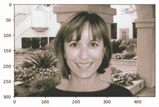

###### 图 4-6。查询图像的第二近邻

这绝对看起来像是一张相似的图像。它捕捉到了一个相似的概念，具有相同的图像类别（人脸），相同的性别，以及与柱子和植被相似的背景。事实上，这是同一个人！

我们可能会经常使用这个功能，所以我们已经构建了一个名为`plot_images()`的辅助函数，用于可视化几个查询图像及其最近邻。现在让我们调用这个函数来可视化六个随机图像的最近邻。另外，请注意，每次运行以下代码片段时，显示的图像将不同（图 4-7），因为显示的图像是由一个随机整数索引的。

```py
for i in range(6):
    random_image_index = random.randint(0,num_images)
    distances, indices = neighbors.kneighbors([featureList[random_image_index]])
    # don't take the first closest image as it will be the same image
    similar_image_paths = [filenames[random_image_index]] +
                          [filenames[indices[0][i]] for i in range(1,4)]
    plot_images(similar_image_paths, distances[0])
```

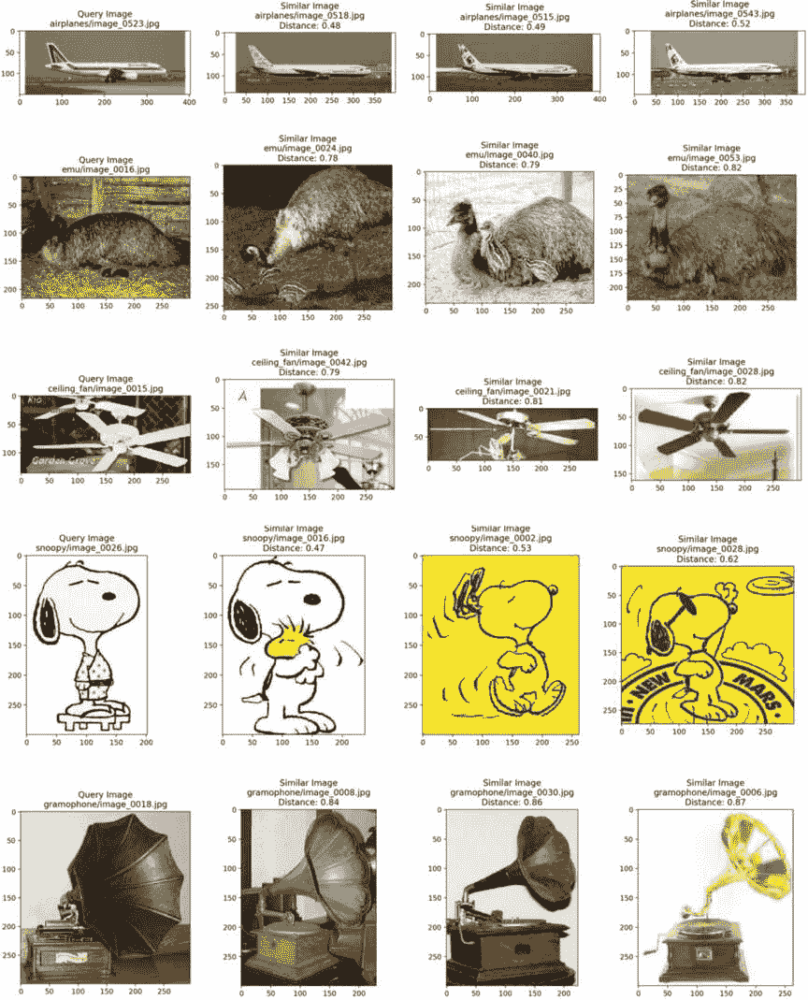

###### 图 4-7。不同图像的最近邻返回相似的图像

# 用 t-SNE 可视化图像聚类

让我们通过可视化整个数据集来提升游戏！

为了做到这一点，我们需要降低特征向量的维度，因为不可能在两个维度（纸张）中绘制一个 2,048 维向量（特征长度）。t-分布随机邻居嵌入（t-SNE）算法将高维特征向量降至 2D，提供数据集的鸟瞰视图，有助于识别聚类和附近图像。t-SNE 难以扩展到大型数据集，因此通过主成分分析（PCA）降低维度然后调用 t-SNE 是一个好主意：

```py
# Perform PCA over the features
num_feature_dimensions=100      # Set the number of features
pca = PCA(n_components = num_feature_dimensions)
pca.fit(featureList)
feature_list_compressed = pca.transform(featureList)

# For speed and clarity, we'll analyze about first half of the dataset.
selected_features = feature_list_compressed[:4000]
selected_class_ids = class_ids[:4000]
selected_filenames = filenames[:4000]

tsne_results =
TSNE(n_components=2,verbose=1,metric='euclidean')
    .fit_transform(selected_features)

# Plot a scatter plot from the generated t-SNE results
colormap = plt.cm.get_cmap('coolwarm')
scatter_plot = plt.scatter(tsne_results[:,0],tsne_results[:,1], c =
               selected_class_ids, cmap=colormap)
plt.colorbar(scatter_plot)
plt.show()
```

我们将在后面的部分更详细地讨论 PCA。为了扩展到更大的维度，使用均匀流形逼近和投影（UMAP）。

图 4-8 展示了相似类别的聚类，以及它们是如何靠近彼此的。

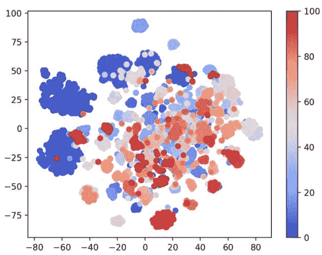

###### 图 4-8。t-SNE 可视化图像特征聚类，每个聚类用相同颜色表示一个对象类别

图 4-8 中的每种颜色表示不同的类别。为了使其更加清晰，我们可以使用另一个辅助函数`plot_images_in_2d()`来绘制这些集群中的图像，就像图 4-9 中所演示的那样。

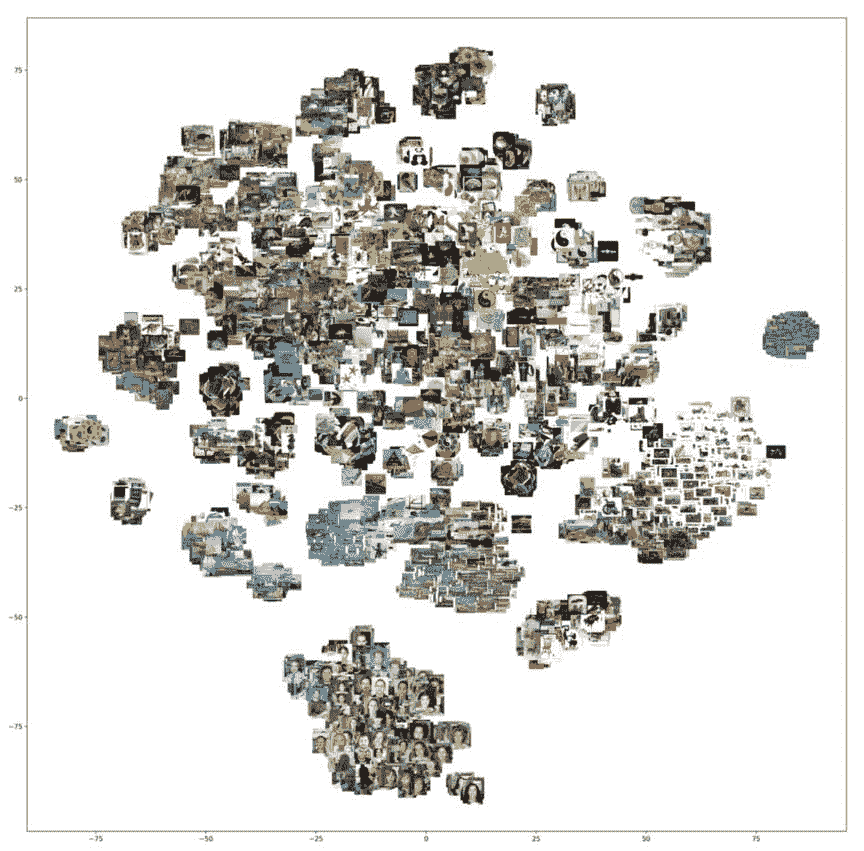

###### 图 4-9\. t-SNE 可视化显示图像集群；相似的图像在同一集群中

很棒！有一个明显划分的人脸、花朵、老式汽车、船只、自行车的集群，以及一个稍微分散的陆地和海洋动物集群。有很多图像重叠在一起，这使得图 4-9 有点令人困惑，所以让我们尝试使用辅助函数`tsne_to_grid_plotter_manual()`将 t-SNE 绘制为清晰的瓷砖，其结果可以在图 4-10 中看到。

```py
tsne_to_grid_plotter_manual(tsne_results[:,0], tsne_results[:,1],
                            selected_filenames)
```

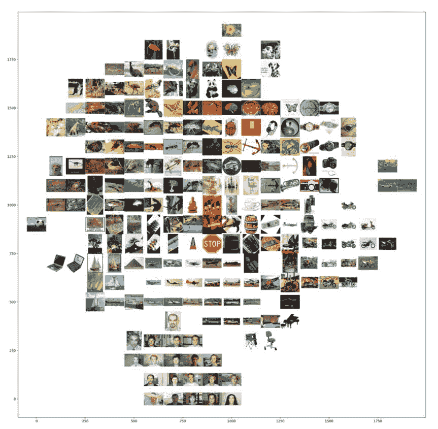

###### 图 4-10\. t-SNE 可视化与瓷砖图像；相似的图像彼此靠近

这绝对更清晰了。我们可以看到相似的图像在人脸、椅子、自行车、飞机、船只、笔记本电脑、动物、手表、花朵、倾斜的尖塔、老式汽车、锚标志和相机的集群中共同定位，都靠近自己的同类。物以类聚！

###### 提示

2D 集群很棒，但在 3D 中可视化它们会看起来更加出色。如果它们可以旋转、缩放，并且可以使用鼠标进行操作而无需编码，那将更好。如果数据可以以交互方式搜索，显示其邻居，那就更加分数。[TensorFlow Embedding projector](https://projector.tensorflow.org)在基于浏览器的 GUI 工具中实现了所有这些功能以及更多。来自图像和文本数据集的预加载嵌入对于更好地理解嵌入的强大性能是有帮助的。正如图 4-11 所示，看到深度学习发现约翰·列侬、齐柏林飞艇和埃里克·克莱普顿恰好在英语中与披头士乐队在类似的语境中使用是令人欣慰的。

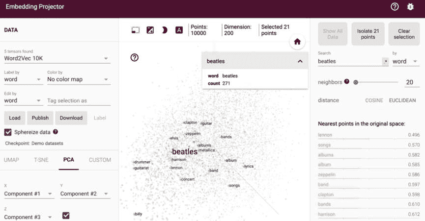

###### 图 4-11\. TensorFlow Embedding projector 显示了 10,000 个常见英语单词的 3D 表示，并突出显示了与“披头士”相关的单词

# 提高相似性搜索的速度

有几个机会可以提高相似性搜索步骤的速度。对于相似性搜索，我们可以利用两种策略：要么减少特征长度，要么使用更好的算法在特征之间进行搜索。让我们分别检查这两种策略。

## 特征向量长度

理想情况下，我们期望搜索的数据量越小，搜索速度就应该越快。回想一下，ResNet-50 模型提供了 2048 个特征。每个特征都是一个 32 位浮点数，每个图像由一个 8 KB 的特征向量表示。对于一百万张图像，这相当于将近 8 GB。想象一下在 8 GB 的特征中进行搜索会有多慢。为了更好地了解我们的情况，表 4-1 给出了我们从不同模型中获得的特征长度。

表 4-1\. 不同 CNN 模型的 Top 1%准确率和特征长度

| **模型** | **瓶颈特征长度** | **在 ImageNet 上的 Top-1%准确率** |
| --- | --- | --- |
| VGG16 | 512 | 71.5% |
| VGG19 | 512 | 72.7% |
| MobileNet | 1024 | 66.5% |
| InceptionV3 | 2048 | 78.8% |
| ResNet-50 | 2048 | 75.9% |
| Xception | 2048 | 79.0% |

###### 注意

在幕后，`tf.keras.applications`中提供的许多模型产生数千个特征。例如，InceptionV3 产生形状为 1 x 5 x 5 x 2048 的特征，这相当于 2048 个 5 x 5 卷积的特征图，总共有 51200 个特征。因此，通过使用平均或最大池化层来减少这个大向量变得至关重要。池化层将每个卷积（例如 5 x 5 层）压缩为一个值。这可以在模型实例化期间定义如下：

```py
model = InceptionV3(weights='imagenet', include_top=False,
input_shape = (224,224,3), pooling='max')
```

对于产生大量特征的模型，通常会发现所有代码示例都使用这个池化选项。表 4-2 显示了不同模型中最大池化对特征数量的影响前后效果。

表 4-2。不同模型在池化前后的特征数量

| **模型** | **池化前特征数量** | **池化后特征数量** |
| --- | --- | --- |
| ResNet-50 | [1,1,1,2048] = 2048 | 2048 |
| InceptionV3 | [1,5,5,2048] = 51200 | 2048 |
| MobileNet | [1,7,7,1024] = 50176 | 1024 |

正如我们所看到的，几乎所有模型都生成大量特征。想象一下，如果我们能将特征减少到仅 100 个（减少了 10 到 20 倍！），而不会影响结果的质量，搜索速度会有多快。除了尺寸之外，这对于大数据场景来说是一个更大的改进，因为数据可以一次性加载到 RAM 中，而不是定期加载部分数据，从而提供更大的加速。PCA 将帮助我们实现这一点。

## 使用 PCA 减少特征长度

PCA 是一个统计过程，质疑代表数据的特征是否同等重要。一些特征是否足够冗余，以至于即使删除这些特征，我们仍然可以获得类似的分类结果？PCA 被认为是降维的常用技术之一。请注意，它并不消除冗余特征；相反，它生成一组新的特征，这些特征是输入特征的线性组合。这些线性特征彼此正交，这就是为什么所有冗余特征都不存在。这些特征被称为*主成分*。

执行 PCA 非常简单。使用`scikit-learn`库，执行以下操作：

```py
import sklearn.decomposition.PCA as PCA
num_feature_dimensions=100
pca = PCA(n_components = num_feature_dimensions)
pca.fit(feature_list)
feature_list_compressed = pca.transform(feature_list)
```

PCA 还可以告诉我们每个特征的相对重要性。第一个维度具有最大的方差，随着维度的增加，方差不断减小：

```py
# Explain the importance of first 20 features
print(pca.explained_variance_ratio_[0:20])
```

```py
[ 0.07320023  0.05273142   0.04310822 0.03494248  0.02166119  0.0205037
  0.01974325  0.01739547   0.01611573 0.01548918  0.01450421  0.01311005
  0.01200541  0.0113084    0.01103872 0.00990405  0.00973481  0.00929487
  0.00915592  0.0089256 ]
```

嗯，为什么我们从原始的 2048 个维度中选择了 100 个维度？为什么不是 200 个？PCA 代表我们的原始特征向量，但是在减少维度。每个新维度在表示原始向量方面的回报递减（即，新维度可能不太能解释数据），并占用宝贵的空间。我们可以在原始数据解释得有多好与我们想要减少多少之间取得平衡。让我们可视化前 200 个维度的重要性。

```py
pca = PCA(200)
pca.fit(feature_list)
matplotlib.style.use('seaborn')
plt.plot(range(1,201),pca.explained_variance_ratio_,'o--', markersize=4)
plt.title ('Variance for each PCA dimension')
plt.xlabel('PCA Dimensions')
plt.ylabel('Variance')
plt.grid(True)
plt.show()
```

图 4-12 展示了结果。

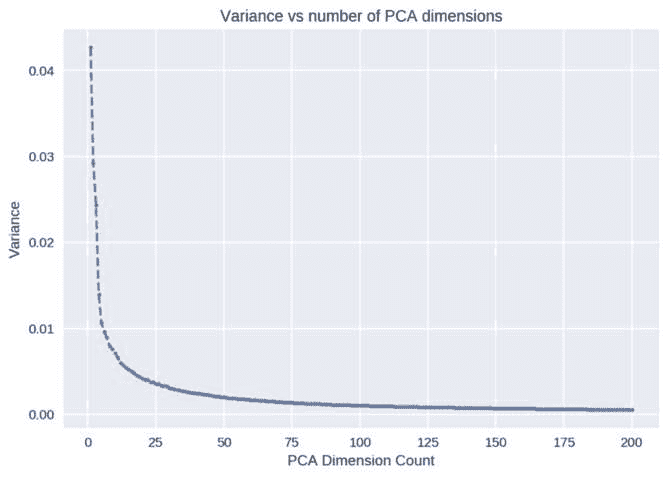

###### 图 4-12。每个 PCA 维度的方差

个体方差将告诉我们新增特征的重要性。例如，在前 100 个维度之后，额外的维度并不增加太多方差（几乎等于 0），可以忽略不计。甚至在检查准确性之前，可以安全地假设具有 100 个维度的 PCA 将是一个强大的模型。另一种看待这个问题的方式是通过找到累积方差来可视化原始数据有多少是由有限数量的特征解释的（参见图 4-13）。

```py
plt.plot(range(1,201),pca.explained_variance_ratio_.cumsum(),'o--', markersize=4)
plt.title ('Cumulative Variance with each PCA dimension')
plt.xlabel('PCA Dimensions')
plt.ylabel('Variance')
plt.grid(True)
plt.show()
```

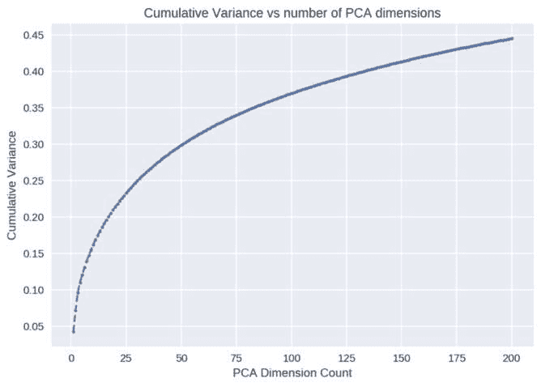

###### 图 4-13。每个 PCA 维度的累积方差

如预期的那样，添加 100 个维度（从 100 到 200）仅增加了 0.1 的方差，并开始逐渐趋于平稳。作为参考，使用完整的 2,048 个特征将导致累积方差为 1。

PCA 中的维度数量是一个重要的参数，我们可以根据手头的问题进行调整。直接证明一个好的阈值的一种方法是找到特征数量与其对准确性和速度的影响之间的良好平衡：

```py
pca_dimensions = [1,2,3,4,5,10,20,50,75,100,150,200]
pca_accuracy = []
pca_time = []

for dimensions in pca_dimensions:
    # Perform PCA
    pca = PCA(n_components = dimensions)
    pca.fit(feature_list)
    feature_list_compressed = pca.transform(feature_list[:])
    # Calculate accuracy over the compressed features
    accuracy, time_taken = accuracy_calculator(feature_list_compressed[:])
    pca_time.append(time_taken)
    pca_accuracy.append(accuracy)
    print("For PCA Dimensions = ", dimensions, ",\tAccuracy = ",accuracy,"%",
",\tTime = ", pca_time[-1])
```

我们使用图表图 4-14 来可视化这些结果，并看到在一定数量的维度之后，增加维度并不会导致更高的准确性：

```py
plt.plot(pca_time, pca_accuracy,'o--', markersize=4)
for label, x, y in zip(pca_dimensions, pca_time,pca_accuracy):
    plt.annotate(label, xy=(x, y), ha='right', va='bottom')
plt.title ('Test Time vs Accuracy for each PCA dimension')
plt.xlabel('Test Time')
plt.ylabel('Accuracy')
plt.grid(True)
plt.show()
```

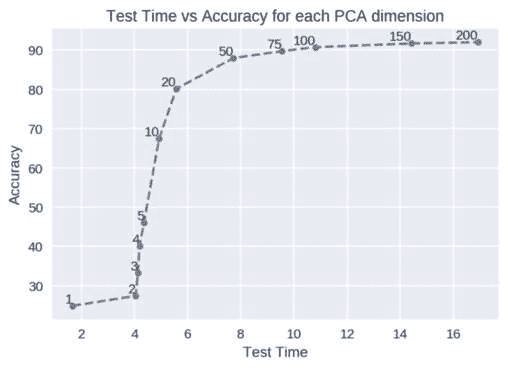

###### 图 4-14。每个 PCA 维度的测试时间与准确性

正如图中所示，在超过 100 个维度的特征长度之后，准确性几乎没有提高。与原始数据（2,048）相比，几乎少了 20 倍的维度（100），这在几乎任何搜索算法中都提供了极高的速度和更少的时间，同时实现了类似（有时略有更好）的准确性。因此，100 将是这个数据集的理想特征长度。这也意味着前 100 个维度包含了关于数据集的大部分信息。

使用这种减少的表示有许多好处，如有效利用计算资源、去除噪音、由于维度较少而实现更好的泛化，以及对在这些数据上学习的机器学习算法的性能改进。通过将距离计算减少到最重要的特征，我们还可以稍微提高结果的准确性。这是因为以前所有的 2,048 个特征在距离计算中都是平等贡献的，而现在，只有最重要的 100 个特征发挥作用。但更重要的是，它使我们摆脱了“维度灾难”。观察到，随着维度数量的增加，两个最接近点和两个最远点之间的欧氏距离比 tend to become 1。在非常高维的空间中，来自真实世界数据集的大多数点似乎相互之间的距离相似，欧氏距离度量开始无法区分相似和不相似的项目。PCA 有助于恢复理智。

您还可以尝试不同的距离，如闵可夫斯基距离、曼哈顿距离、杰卡德距离和加权欧氏距离（其中权重是每个特征的贡献，如`pca.explained_variance_ratio_`中所解释的）。

现在，让我们将注意力转向使用这个减少后的特征集来使我们的搜索更快。

# 使用近似最近邻扩展相似性搜索

我们想要什么？最近邻。我们的基准是什么？暴力搜索。虽然在两行中实现起来很方便，但它会遍历每个元素，因此随着数据大小（项目数量以及维度数量）的增加而呈线性增长。将我们的特征向量从 2,048 的长度缩减到 100，不仅会使数据大小减少 20 倍，还会使使用暴力搜索时的速度增加 20 倍。PCA 确实是值得的！

假设相似性搜索一个包含 10,000 张图像的小集合，现在用 100 个特征长度向量表示，大约需要 1 毫秒。即使对于 10,000 个项目来说这看起来很快，但在一个真实的生产系统中，也许有更大的数据，比如 10 百万个项目，这将需要超过一秒的时间来搜索。我们的系统可能无法每秒每个 CPU 核心处理超过一个查询。如果您从用户那里每秒收到 100 个请求，即使在机器的多个 CPU 核心上运行（并为每个线程加载搜索索引），您也需要多台机器才能处理流量。换句话说，低效的算法意味着花费大量的硬件成本。

蛮力搜索是我们进行每次比较的基准。在大多数算法方法中，蛮力搜索是最慢的方法。现在我们已经设定了基准，我们将探索近似最近邻算法。与蛮力搜索方法保证正确结果不同，近似算法*通常*能够得到正确结果，因为它们是...嗯，近似值。大多数算法提供某种形式的调整来平衡正确性和速度。可以通过与蛮力基准结果进行比较来评估结果的质量。

## 近似最近邻基准

有几个近似最近邻（ANN）库，包括知名的 Spotify 的 Annoy、FLANN、Facebook 的 Faiss、Yahoo 的 NGT 和 NMSLIB。对它们进行基准测试将是一项繁琐的任务（假设您能够安装其中一些）。幸运的是，*[ann-benchmarks.com](http://ann-benchmarks.com)*的热心人（Martin Aumueller、Erik Bernhardsson 和 Alec Faitfull）已经为我们做了大量工作，以可重现的方式在 19 个库上进行了大型公共数据集的基准测试。我们将在一个代表单词的特征嵌入数据集上进行比较（而不是图像），该数据集大小为 350 MB，包含 400,000 个表示 100 维单词的特征向量。图 4-15 展示了它们在正确性调整时的原始性能。性能是以库每秒响应查询的能力来衡量的。请记住，正确性的度量是返回的前 n 个最接近项与真实前 n 个最接近项的比例。这个基准是通过蛮力搜索来衡量的真实情况。

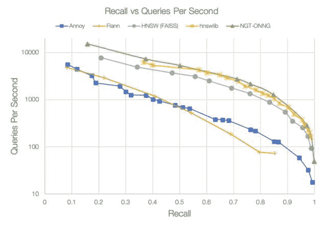

###### 图 4-15. ANN 库比较（数据来自[ann-benchmarks.com](http://ann-benchmarks.com)）

在这个数据集上表现最强的库在可接受的 0.8 召回率下每秒返回接近数千个查询。为了让大家有个概念，我们的蛮力搜索每秒执行不到 1 个查询。在最快的情况下，一些库（如 NGT）每秒可以返回超过 15,000 个结果（尽管召回率较低，使其在使用上不切实际）。

## 我应该使用哪个库？

毫无疑问，您使用的库将在很大程度上取决于您的场景。每个库在搜索速度、准确性、索引大小、内存消耗、硬件使用（CPU/GPU）和设置便捷性之间存在权衡。表 4-3 提供了不同场景和推荐的库的摘要。 

表 4-3. ANN 库推荐

| **场景** | **推荐** |
| --- | --- |
| 我想在 Python 中快速进行实验，而不需要太多设置，但我也关心速度。 | 使用 Annoy 或 NMSLIB |
| 我有一个大型数据集（多达 1000 万条记录或数千个维度），并且非常关心速度。 | 使用 NGT |
| 我有一个庞大的数据集（超过 1 亿条记录）并且有一组 GPU。 | 使用 Faiss |
| 我想建立一个 100%正确性的基准，然后立即转向更快的库，用数量级的加速打动我的老板，并获得奖金。 | 使用蛮力搜索方法 |

我们在书的 GitHub 网站上提供了几个库的代码详细示例（请参阅[*http://PracticalDeepLearning.ai*](http://PracticalDeepLearning.ai)），但是在这里，我们将详细展示我们常用的库 Annoy，并将其与合成数据集上的蛮力搜索进行比较。此外，我们还简要介绍了 Faiss 和 NGT。

## 创建合成数据集

为了进行不同库之间的苹果对苹果比较，我们首先创建一个由随机浮点值组成的百万项目数据集，均值为 0，方差为 1。此外，我们选择一个随机特征向量作为我们的查询以找到最近的邻居：

```py
num_items = 1000000
num_dimensions = 100
dataset = np.random.randn(num_items, num_dimensions)
dataset /= np.linalg.norm(dataset, axis=1).reshape(-1, 1)

random_index = random.randint(0,num_items)
query = dataset[random_index]
```

## 蛮力算法

首先，我们计算使用蛮力算法进行搜索所需的时间。它会逐个遍历整个数据，计算查询和当前项目之间的距离。我们使用`timeit`命令来计算时间。首先，我们创建搜索索引以检索五个最近的邻居，然后使用查询进行搜索：

```py
neighbors = NearestNeighbors(n_neighbors=5, algorithm='brute',
metric='euclidean').fit(dataset)
%timeit distances, indices = neighbors.kneighbors([query])
```

```py
> 177 ms ± 136 μs per loop (mean ± std. dev. of 7 runs, 1000 loops each)
```

###### 提示

`timeit`命令是一个方便的工具。要对单个操作的时间进行基准测试，请在其前面加上此命令。与运行一次语句的 time 命令相比，`timeit`会多次运行后续行以提供更精确的聚合统计数据以及标准偏差。默认情况下，它关闭垃圾收集，使独立的计时更具可比性。也就是说，这可能不反映在实际生产负载中打开垃圾收集时的计时情况。

## Annoy

[Annoy](https://oreil.ly/1qqfv)（近似最近邻居）是一个带有 Python 绑定的 C++库，用于搜索最近邻居。以速度闻名，由 Spotify 发布，并用于生产中提供其音乐推荐。与其名字相反，实际上使用起来很有趣且简单。

要使用 Annoy，我们使用`pip`进行安装：

```py
$ pip install annoy
```

使用起来相当简单。首先，我们使用两个超参数构建一个搜索索引：数据集的维度数量和树的数量：

```py
from annoy import AnnoyIndex
annoy_index = AnnoyIndex(num_dimensions) *`# Length of item vector that will be`
`indexed`*
for i in range(num_items):
    annoy_index.add_item(i, dataset[i])
annoy_index.build(40) # 40 trees
```

现在让我们看看搜索一个图像的五个最近邻居需要多长时间：

```py
%timeit indexes=t.get_nns_by_vector(query, 5, include_distances=True)
```

```py
> 34.9 μs ± 165 ns per loop (mean ± std. dev. of 7 runs, 10000 loops each)
```

现在这真是飞快！换个角度来看，即使对于我们的百万项目数据集，这在单个 CPU 核心上可以处理近 28,000 个请求。考虑到大多数 CPU 都有多个核心，它应该能够在单个系统上处理超过 100,000 个请求。最好的部分是它允许您在多个进程之间共享相同的内存中的索引。因此，最大的索引可以等同于您的整体 RAM 大小，使得在单个系统上处理多个请求成为可能。

其他好处包括生成一个适度大小的索引。此外，它将创建索引与加载索引分离，因此您可以在一台机器上创建索引，传递它，然后在您的服务机器上将其加载到内存中并提供服务。

###### 提示

想知道要使用多少棵树吗？更多的树会提供更高的精度，但会增加索引的大小。通常，不需要超过 50 棵树来获得最高精度。

## NGT

雅虎日本的邻域图和树（NGT）库目前在大多数基准测试中处于领先地位，最适合具有大维度（数千个）的大型数据集（数百万个项目）。尽管该库自 2016 年以来就存在，但真正进入行业基准测试场景的时间是在 2018 年，当时实现了 ONNG 算法（*k*最近邻图索引优化），考虑到可能有多个线程在服务器上运行 NGT，它可以将索引放在共享内存中，借助内存映射文件来帮助减少内存使用量以及增加加载时间。

## Faiss

Faiss 是 Facebook 的高效相似性搜索库。通过存储向量的压缩表示（紧凑的量化代码）而不是原始值，它可以在单个服务器上扩展到数十亿个向量的 RAM。它特别适用于密集向量。通过在 GPU 内存（VRAM）上存储索引，特别适用于具有 GPU 的机器。这适用于单 GPU 和多 GPU 设置。它提供了根据搜索时间、准确性、内存使用和索引时间配置性能的能力。它是已知的在 GPU 上最快的 ANN 搜索实现之一。嘿，如果对 Facebook 来说足够好，那对我们大多数人来说也足够好（只要我们有足够的数据）。

虽然展示整个过程超出了本书的范围，但我们建议使用 Anaconda 安装 Faiss 或使用其 Docker 容器快速入门。

# 通过微调提高准确性

许多预训练模型是在 ImageNet 数据集上训练的。因此，在大多数情况下，它们为相似性计算提供了一个令人难以置信的起点。也就是说，如果你调整这些模型以适应你的特定问题，它们将更准确地找到相似的图像。

在本章的这一部分，我们识别了表现最差的类别，用 t-SNE 进行可视化，微调，然后看看它们的 t-SNE 图表如何变化。

什么是一个好的度量标准，用来检查是否确实获得了相似的图像？

痛苦的选择 1

逐个图像浏览整个数据集，并手动评分返回的图像是否确实看起来相似。

更快乐的选择 2

简单地计算准确性。也就是说，对于属于类别*X*的图像，相似的图像是否属于相同的类别？我们将称之为相似性准确性。

那么，我们表现最差的类别是什么？为什么它们表现最差？为了回答这个问题，我们预先定义了一个辅助函数`worst_classes`。对于数据集中的每个图像，它使用蛮力算法找到最近邻，然后返回准确性最低的六个类别。为了查看微调的效果，我们在一个更困难的数据集上运行我们的分析：Caltech-256。调用这个函数揭示了准确性最低的类别：

```py
names_of_worst_classes_before_finetuning, accuracy_per_class_before_finetuning =
worst_classes(feature_list[:])
```

```py
    Accuracy is 56.54
    Top 6 incorrect classifications
    059.drinking-straw    Accuracy: 11.76%
    135.mailbox             Accuracy: 16.03%
    108.hot-dog             Accuracy: 16.72%
    163.playing-card      Accuracy: 17.29%
    195.soda-can            Accuracy: 19.68%
    125.knife         Accuracy: 20.53%
```

为了了解它们在某些类别上表现如此糟糕的原因，我们绘制了一个 t-SNE 图表，以在 2D 空间中可视化嵌入，你可以在图 4-16 中看到。为了防止图表过度拥挤，我们只使用了每个 6 个类别中的 50 个项目。

###### 提示

为了增强图表的可见性，我们可以为每个类别定义不同的标记和不同的颜色。Matplotlib 提供了各种[标记](https://oreil.ly/cnoiE)和[颜色](https://oreil.ly/Jox4B)。

```py
markers = [ "^", ".","s", "o","x", "P" ]
colors = ['red', 'blue', 'fuchsia', 'green', 
'purple', 'orange']
```

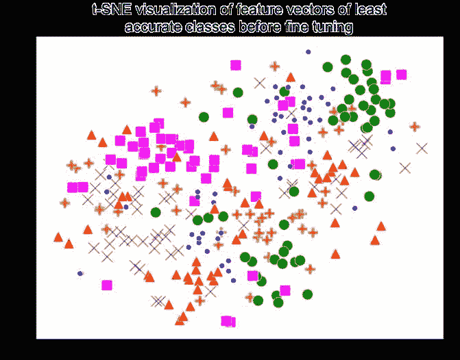

###### 图 4-16. 在微调之前对最不准确类别的特征向量进行 t-SNE 可视化

啊，这些特征向量到处都是，互相重叠。在其他应用程序中使用这些特征向量，如分类，可能不是一个好主意，因为很难找到它们之间的清晰分隔平面。难怪它们在这个基于最近邻的分类测试中表现如此糟糕。

如果我们使用微调模型重复这些步骤，你认为结果会是什么？我们认为会有一些有趣的事情；让我们看看图 4-17，看看。

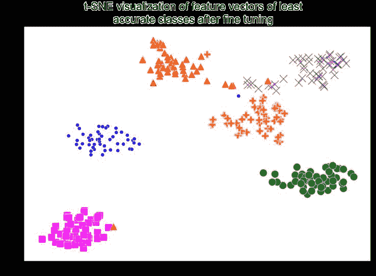

###### 图 4-17. 在微调后对最不准确类别的特征向量进行 t-SNE 可视化

这样就清爽多了。就像在第三章中展示的那样，只需轻微微调，嵌入就开始聚集在一起。将预训练模型的嵌入与微调模型的嵌入进行比较。机器学习分类器将能够更轻松地在这些类别之间找到一个分隔平面，从而提高分类准确性，以及在不使用分类器时更相似的图像。请记住，这些是最高误分类的类别；想象一下在微调后原本准确率更高的类别会有多么好。

以前，预训练的嵌入实现了 56%的准确率。微调后的新嵌入提供了惊人的 87%准确率！一点点魔法就能产生巨大的影响。

微调的一个限制是需要有标记的数据，这并不总是存在。因此，根据您的用例，您可能需要标记一些数据。

不过，还有一个小小的非传统训练技巧，我们将在下一节中讨论。

## 没有全连接层的微调

正如我们已经知道的，神经网络由三部分组成：

+   最终生成特征向量的卷积层

+   全连接层

+   最终的分类器层

微调，顾名思义，涉及轻微调整神经网络以适应新的数据集。通常涉及剥离全连接层（顶层），用新的层替换它们，然后使用这个数据集训练这个新组合的神经网络。以这种方式训练会导致两件事情：

+   所有新添加的全连接层中的权重将受到显著影响。

+   卷积层中的权重只会略微改变。

全连接层在获得最大分类准确率方面起着很大作用。因此，生成特征向量的网络的大部分部分将变化微不足道。因此，尽管微调，特征向量将显示很少的变化。

我们的目标是让外观相似的对象具有更接近的特征向量，而之前描述的微调未能实现这一目标。通过强制所有特定任务的学习发生在卷积层中，我们可以看到更好的结果。我们如何实现这一点呢？*通过移除所有全连接层，并在卷积层之后直接放置一个分类器层（生成特征向量的卷积层）。*这个模型是为相似性搜索而优化的，而不是为分类。

为了比较微调模型优化的过程，用于分类任务与相似性搜索，让我们回顾一下我们在第三章中如何微调我们的模型以进行分类：

```py
from tf.keras.applications.resnet50 import ResNet50
model = ResNet50(weights='imagenet', include_top=False,
input_shape = (224,224,3))
input = Input(shape=(224, 224, 3))
x = model(input)
x = GlobalAveragePooling2D()(x)
x = Dense(64, activation='relu')(x)
x = Dropout(0.5)(x)
x = Dense(NUM_CLASSES, activation='softmax')(x)
model_classification_optimized = Model(inputs=input, outputs=x)
```

以下是我们如何为相似性搜索微调我们的模型。请注意中间缺少的隐藏密集层：

```py
from tf.keras.applications.resnet50 import ResNet50
model = ResNet50(weights='imagenet', include_top=False,
input_shape = (224,224,3))
input = Input(shape=(224, 224, 3))
x = model(input)
x = GlobalAveragePooling2D()(x)
# No dense or dropout layers
x = Dense(NUM_CLASSES, activation='softmax')(x)
model_similarity_optimized = Model(inputs=input, outputs=x)
```

在微调之后，为了使用`model_similarity_optimized`来提取特征而不是为类别给出概率，只需`pop`（即移除）最后一层：

```py
model_similarity_optimized.layers.pop()
model = Model(model_similarity_optimized.input,
model_similarity_optimized.layers[-1].output)
```

这里需要注意的关键一点是，如果您使用常规的微调过程，我们将获得比`model_similarity_optimized`更低的相似性准确率。显然，我们希望在分类场景下使用`model_classification_optimized`，在提取嵌入以进行相似性搜索时使用`model_similarity_optimized`。

有了所有这些知识，现在你可以为你正在处理的任何场景制作一个快速准确的相似性系统。是时候看看人工智能行业的巨头是如何构建他们的产品的了。

# 用于一次性人脸验证的连体网络

人脸验证系统通常试图确定——给定两张人脸图像——这两张图像是否属于同一个人。这是一个高精度的二元分类器，需要能够稳健地处理不同的光照、服装、发型、背景和面部表情。为了增加挑战，尽管在员工数据库中可能有许多人的图像，但可能只有少数同一个人的图像可用。同样，在银行的签名识别和亚马逊的产品识别中也存在相同的限制每个项目图像数量的挑战。

你会如何训练这样的分类器？从 ImageNet 预训练的 ResNet 模型中挑选嵌入可能无法区分这些细微的面部特征。一种方法是将每个人作为一个单独的类别，然后像通常训练常规网络一样进行训练。出现了两个关键问题：

+   如果我们有一百万个个体，训练一百万个类别是不可行的。

+   每类图像训练数量较少会导致过度训练。

另一个想法：我们可以教授网络直接比较并决定一对图像是否相似或不相似，通过在训练期间对它们的相似性提供指导。这就是连体网络背后的关键思想。拿一个模型，输入两张图像，提取两个嵌入，然后计算两个嵌入之间的距离。如果距离低于阈值，则认为它们相似，否则不相似。通过输入一对图像和相关标签，相似或不相似，并将网络端到端地训练，嵌入开始捕捉输入的细粒度表示。这种直接优化距离度量的方法，如图 4-18 所示，被称为*度量学习*。

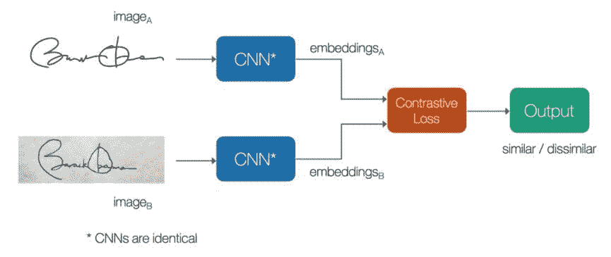

###### 图 4-18。用于签名验证的连体网络；请注意相同的 CNN 用于两个输入图像

我们可以扩展这个想法，甚至输入三张图像。选择一个锚定图像，选择另一个正样本（相同类别），和另一个负样本（不同类别）。现在让我们训练这个网络，直接优化相似项之间的距离最小化，不相似项之间的距离最大化。帮助我们实现这一目标的损失函数称为*三元损失*函数。在前面的一对图像的情况下，损失函数称为*对比损失*函数。三元损失函数往往会产生更好的结果。

网络训练完成后，在测试时我们只需要一张脸部的参考图像来判断这个人是否相同。这种方法为*一次性学习*打开了大门。其他常见用途包括签名和标志识别。Saket Maheshwary 和 Hemant Misra 提出了一个非常有创意的应用，即使用连体网络通过计算两者之间的语义相似性来匹配简历和求职者。

# 案例研究

让我们看一些有趣的例子，展示我们迄今所学知识在工业中的应用。

## Flickr

Flickr 是最大的照片分享网站之一，尤其受到专业摄影师的欢迎。为了帮助摄影师找到灵感并展示用户可能感兴趣的内容，Flickr 推出了一个基于相同语义意义的相似性搜索功能。正如在图 4-19 中所示，探索沙漠图案会导致几个类似图案的结果。在幕后，Flickr 采用了一种名为局部优化产品量化（LOPQ）的 ANN 算法，该算法已在 Python 和 Spark 实现中开源。

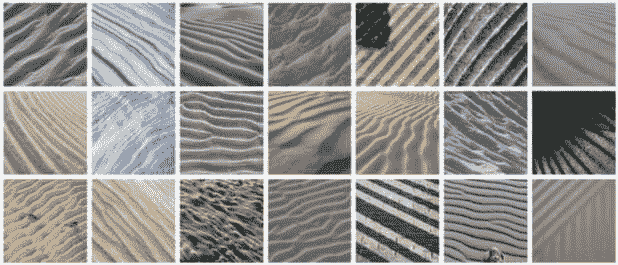

###### 图 4-19。沙漠照片的相似模式（[图片来源](https://code.flickr.com)）

## Pinterest

Pinterest 是一个广泛使用的应用程序，以其视觉搜索功能而闻名，更具体地说是其称为相似图钉和相关图钉的功能。百度和阿里巴巴等其他公司也推出了类似的视觉搜索系统。此外，Zappos、Google Shopping 和[like.com](http://like.com)正在使用计算机视觉进行推荐。

在 Pinterest 中，“女性时尚”是最受欢迎的图钉主题之一，相似外观功能（图 4-20）帮助人们发现相似的产品。此外，Pinterest 还报告称其相关图钉功能增加了转发率。Pinterest 上并非每个图钉都有关联的元数据，这使得推荐成为一个困难的冷启动问题，因为缺乏上下文。Pinterest 的开发人员通过使用视觉特征来生成相关图钉来解决这个冷启动问题。此外，Pinterest 实现了一个增量指纹服务，如果上传了新图像或者特征发生演变（由于工程师对底层模型的改进或修改），则生成新的数字签名。


###### 图 4-20。Pinterest 应用程序的相似外观功能（图片来源：Pinterest 博客）

## 名人模仿者

像*Celebslike.me*这样的网站应用程序在 2015 年爆红，寻找名人中的最近邻居，如图 4-21 所示。2018 年，Google Arts & Culture 应用程序采取了类似的病毒式方法，显示与您的脸最接近的现有肖像。双胞胎与否是另一个具有类似目的的应用程序。

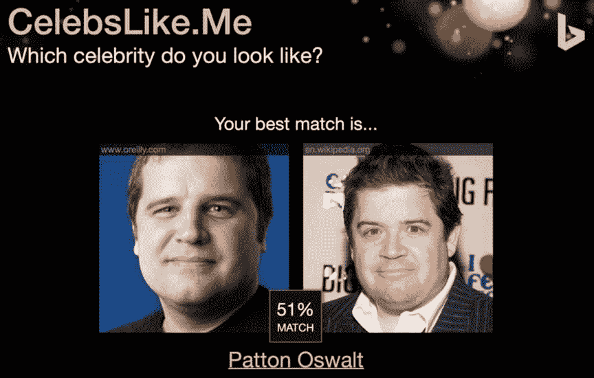

###### 图 4-21。在 celebslike.me 网站上测试我们的朋友 Pete Warden 的照片（Google 移动和嵌入式 TensorFlow 技术主管）

## Spotify

Spotify 使用最近邻居来推荐音乐，并根据当前播放的歌曲集创建自动播放列表和电台。通常，用于在 Netflix 上推荐电影等内容的协同过滤技术是内容不可知的；也就是说，推荐发生是因为具有相似口味的大量用户正在观看相似的电影或听相似的歌曲。这对于新的尚未流行的内容构成问题，因为用户将继续获得现有流行内容的推荐。这也被称为前面提到的冷启动问题。解决方案是使用对内容的潜在理解。与图像类似，我们可以使用 MFCC 特征（Mel 频率倒谱系数）从音乐中创建特征向量，从而生成可以被视为图像并用于生成特征的 2D 频谱图。歌曲被分成三秒片段，它们的频谱图用于生成特征。然后将这些特征平均在一起以代表完整的歌曲。图 4-22 显示了歌手的歌曲被投影到特定区域。我们可以区分嘻哈（左上）、摇滚（右上）、流行（左下）和电子音乐（右下）。正如前面讨论的，Spotify 在后台使用 Annoy。

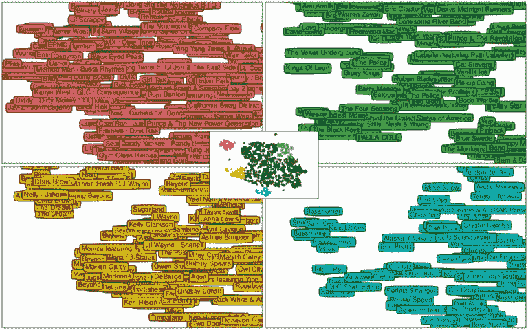

###### 图 4-22。使用从音频预测的潜在因素进行预测使用模式分布的 t-SNE 可视化（图片来源：“深度基于内容的音乐推荐”由 Aaron van den Oord，Sander Dieleman，Benjamin Schrauwen，NIPS 2013）

## 图像字幕

图像字幕是将图像翻译成句子的科学（如图 4-23 所示）。这不仅仅是物体标记，还需要对整个图像和物体之间的关系有更深入的视觉理解。为了训练这些模型，一个名为 MS COCO 的开源数据集于 2014 年发布，其中包括超过 30 万张图像，以及物体类别、句子描述、视觉问答对和物体分割。它作为每年竞赛的基准，用于观察图像字幕、物体检测和分割的进展。

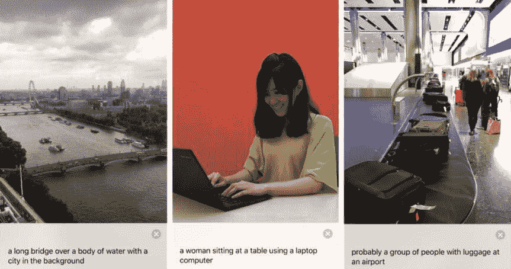

###### 图 4-23。Seeing AI 中的图像字幕功能：盲人社区的 Talking Camera App

在挑战的第一年（2015 年）中应用的一种常见策略是将语言模型（LSTM/RNN）与 CNN 结合起来，以使 CNN 特征向量的输出作为语言模型（LSTM/RNN）的输入。这种组合模型以端到端的方式联合训练，取得了令人印象深刻的结果，震惊了世界。尽管每个研究实验室都在努力超越对方，但后来发现进行简单的最近邻搜索可以产生最先进的结果。对于给定的图像，根据嵌入的相似性找到相似的图像。然后，注意相似图像字幕中的共同词，并打印包含最常见词的字幕。简而言之，懒惰的方法仍然能击败最先进的方法，这暴露了数据集中的一个关键偏见。

这种偏见被 Larry Zitnick 称为*长颈鹿-树*问题。在搜索引擎上搜索“长颈鹿”进行图像搜索。仔细观察：除了长颈鹿，几乎每张图像中都有草吗？很有可能你可以将这些图像的大多数描述为“一只长颈鹿站在草地上”。同样，如果查询图像（如图 4-24 中最左边的照片）包含一只长颈鹿和一棵树，几乎所有相似的图像（右边）都可以描述为“一只长颈鹿站在草地上，旁边有一棵树”。即使没有对图像有更深入的理解，也可以通过简单的最近邻搜索得出正确的字幕。这表明为了衡量系统的真正智能，我们需要在测试集中加入更多语义上新颖/原创的图像。

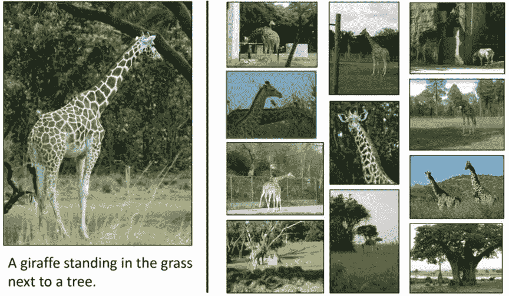

###### 图 4-24。长颈鹿-树问题（图片来源：通过视觉问答测量机器智能，C.劳伦斯·齐特尼克，艾丝瓦里亚·阿格拉瓦尔，斯坦尼斯洛夫·安托尔，玛格丽特·米切尔，德鲁夫·巴特拉，黛薇·帕里克）

简而言之，不要低估简单的最近邻方法！

# 总结

现在我们已经完成了一次成功的探险，我们在其中探索了如何利用嵌入来定位相似的图像。我们通过探索如何利用 ANN 算法和库（包括 Annoy、NGT 和 Faiss）将搜索从几千个文档扩展到几十亿个文档。我们还了解到，通过对模型进行微调，可以提高在监督设置中嵌入的准确性和代表性能力。最后，我们看了如何使用 Siamese 网络，利用嵌入的力量进行一次性学习，比如用于人脸验证系统。最后，我们研究了在行业中各种用例中如何使用最近邻方法。最近邻是您工具包中简单但强大的工具。
