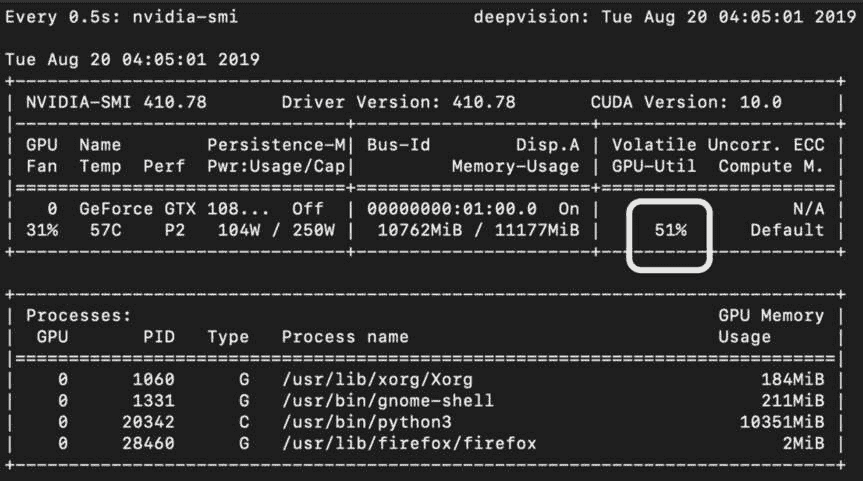
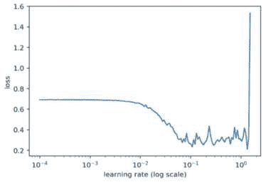
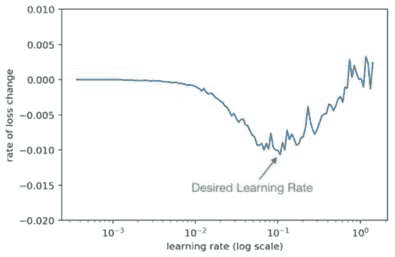
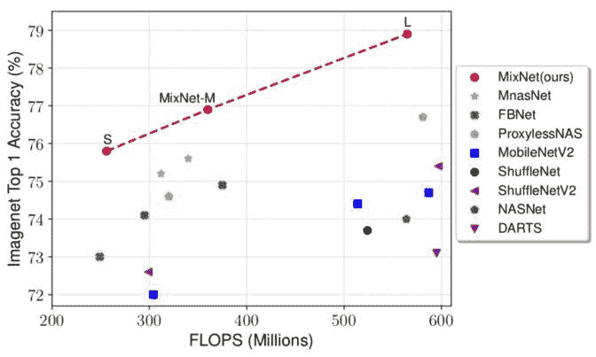

# 第六章：最大化 TensorFlow 的速度和性能：一个便捷清单

生活就是要用手头的资源做到最好，优化就是游戏的名字。

关键不在于拥有一切，而在于明智地利用你的资源。也许我们真的想买那辆法拉利，但我们的预算只够买一辆丰田。不过你知道吗？通过正确的性能调优，我们可以让那家伙在纳斯卡比赛中飞驰！

让我们从深度学习世界来看这个问题。谷歌凭借其工程实力和能够煮沸海洋的 TPU 机架，在约 30 分钟内训练 ImageNet 创下了速度纪录！然而，仅仅几个月后，三名研究人员（Andrew Shaw、Yaroslav Bulatov 和 Jeremy Howard）带着口袋里的 40 美元，在公共云上只用了 18 分钟就训练完了 ImageNet！

我们可以从这些例子中得出的教训是，你拥有的资源量并不像你充分利用它们那样重要。关键在于用最大潜力来充分利用资源。这一章旨在作为一个潜在性能优化的便捷清单，我们在构建深度学习流水线的所有阶段都可以使用，并且在整本书中都会很有用。具体来说，我们将讨论与数据准备、数据读取、数据增强、训练以及最终推断相关的优化。

而这个故事始于两个词，也终于两个词...

# GPU 饥饿

人工智能从业者经常问的一个问题是，“为什么我的训练速度这么慢？”答案往往是 GPU 饥饿。

GPU 是深度学习的生命线。它们也可能是计算机系统中最昂贵的组件。鉴于此，我们希望充分利用它们。这意味着 GPU 不应该等待来自其他组件的数据以进行处理。相反，当 GPU 准备好处理时，预处理的数据应该已经准备就绪并等待使用。然而，现实是 CPU、内存和存储通常是性能瓶颈，导致 GPU 的利用率不佳。换句话说，我们希望 GPU 成为瓶颈，而不是反过来。

为数千美元购买昂贵的 GPU 可能是值得的，但前提是 GPU 本身就是瓶颈。否则，我们可能还不如把钱烧了。

为了更好地说明这一点，考虑图 6-1。在深度学习流水线中，CPU 和 GPU 协作工作，彼此传递数据。CPU 读取数据，执行包括增强在内的预处理步骤，然后将其传递给 GPU 进行训练。它们的合作就像接力比赛，只不过其中一个接力选手是奥运会运动员，等待着一个高中田径选手传递接力棒。GPU 空闲的时间越长，资源浪费就越多。


###### 图 6-1\. GPU 饥饿，等待 CPU 完成数据准备

本章的大部分内容致力于减少 GPU 和 CPU 的空闲时间。

一个合理的问题是：我们如何知道 GPU 是否饥饿？两个方便的工具可以帮助我们回答这个问题：

`nvidia-smi`

这个命令显示 GPU 的统计信息，包括利用率。

TensorFlow Profiler + TensorBoard

这在 TensorBoard 中以时间线的形式交互式地可视化程序执行。

## nvidia-smi

`nvidia-smi`的全称是 NVIDIA 系统管理接口程序，提供了关于我们珍贵 GPU 的详细统计信息，包括内存、利用率、温度、功耗等。这对于极客来说是一个梦想成真。

让我们来试一试：

```py
$ nvidia-smi
```

图 6-2 展示了结果。



###### 图 6-2。`nvidia-smi`的终端输出，突出显示 GPU 利用率

在训练网络时，我们感兴趣的关键数字是 GPU 利用率，文档中定义为过去一秒钟内 GPU 上执行*一个或多个*内核的时间百分比。51%实际上并不那么好。但这是在调用`nvidia-smi`时的瞬间利用率。我们如何持续监控这些数字？为了更好地了解 GPU 使用情况，我们可以使用`watch`命令每半秒刷新一次利用率指标（值得记住这个命令）：

```py
$ watch -n .5 nvidia-smi
```

###### 注意

尽管 GPU 利用率是衡量我们流水线效率的一个很好的代理，但它本身并不能衡量我们如何充分利用 GPU，因为工作仍可能只使用 GPU 资源的一小部分。

因为盯着终端屏幕看数字跳动并不是分析的最佳方式，我们可以每秒轮询一次 GPU 利用率并将其转储到文件中。在我们的系统上运行任何与 GPU 相关的进程时运行大约 30 秒，然后通过按 Ctrl+C 停止它：

```py
$ nvidia-smi --query-gpu=utilization.gpu --format=csv,noheader,nounits -f
gpu_utilization.csv -l 1
```

现在，从生成的文件中计算中位数 GPU 利用率：

```py
$ sort -n gpu_utilization.csv | grep -v '⁰$' | datamash median 1
```

###### 提示

Datamash 是一个方便的命令行工具，可对文本数据文件执行基本的数字、文本和统计操作。您可以在[*https://www.gnu.org/software/datamash/*](https://www.gnu.org/software/datamash/)找到安装说明。

`nvidia-smi`是在命令行上检查 GPU 利用率的最便捷方式。我们能否进行更深入的分析？原来，对于高级用户，TensorFlow 提供了一套强大的工具。

## TensorFlow 分析器 + TensorBoard

TensorFlow 附带了`tfprof`（图 6-3），TensorFlow 分析器，帮助分析和理解训练过程，例如为模型中的每个操作生成详细的模型分析报告。但是命令行可能有点难以导航。幸运的是，TensorBoard 是一个基于浏览器的 TensorFlow 可视化工具套件，包括一个用于分析器的插件，让我们可以通过几次鼠标点击与网络进行交互式调试。其中包括 Trace Viewer，一个显示时间轴上事件的功能。它有助于调查资源在特定时间段内的精确使用情况并发现效率低下的地方。

###### 注意

截至目前为止，TensorBoard 仅在 Google Chrome 中得到完全支持，可能不会在其他浏览器（如 Firefox）中显示分析视图。


###### 图 6-3。TensorBoard 中分析器的时间轴显示 GPU 处于空闲状态，而 CPU 正在处理，以及 CPU 处于空闲状态而 GPU 正在处理

默认情况下，TensorBoard 启用了分析器。激活 TensorBoard 涉及一个简单的回调函数：

```py
tensorboard_callback = tf.keras.callbacks.TensorBoard(log_dir="/tmp",
                                                      profile_batch=7)

model.fit(train_data,
          steps_per_epoch=10,
          epochs=2, 
          callbacks=[`tensorboard_callback`])
```

在初始化回调时，除非显式指定`profile_batch`，否则会对第二批进行分析。为什么是第二批？因为第一批通常比其余批次慢，这是由于一些初始化开销。

###### 注意

需要重申的是，使用 TensorBoard 进行分析最适合 TensorFlow 的高级用户。如果您刚开始使用，最好使用`nvidia-smi`。（尽管`nvidia-smi`不仅提供 GPU 利用率信息，而且通常是大多数实践者使用的方式。）对于希望更深入了解硬件利用率指标的用户，NVIDIA Nsight 是一个很好的工具。

好了。有了这些工具，我们知道我们的程序需要一些调整，并有提高效率的空间。我们将在接下来的几节中逐个查看这些领域。

# 如何使用此检查表

在商业中，一个经常引用的建议是“无法衡量的东西无法改进”。这也适用于深度学习流水线。调整性能就像进行科学实验。您设置一个基准运行，调整一个旋钮，测量效果，并朝着改进的方向迭代。以下清单上的项目是我们的旋钮——有些快速简单，而其他一些更复杂。

要有效使用此清单，请执行以下操作：

1.  隔离要改进的流水线部分。

1.  在清单上找到相关的要点。

1.  实施、实验，并观察运行时间是否减少。如果没有减少，则忽略更改。

1.  重复步骤 1 至 3，直到清单耗尽。

一些改进可能微小，一些可能更为重大。但所有这些变化的累积效应希望能够实现更快、更高效的执行，最重要的是，为您的硬件带来更大的回报。让我们逐步查看深度学习流水线的每个领域，包括数据准备、数据读取、数据增强、训练，最后是推理。

# 性能清单

## 数据准备

+   “存储为 TFRecords”

+   “减少输入数据的大小”

+   “使用 TensorFlow 数据集”

## 数据读取

+   “使用 tf.data”

+   “预取数据”

+   “并行化 CPU 处理”

+   “并行化 I/O 和处理”

+   “启用非确定性排序”

+   “缓存数据”

+   “打开实验性优化”

+   “自动调整参数值”

## 数据增强

+   “使用 GPU 进行增强”

## 训练

+   “使用自动混合精度”

+   “使用更大的批量大小”

+   “使用八的倍数”

+   “找到最佳学习率”

+   “使用 tf.function”

+   “过度训练，然后泛化”

    +   “使用渐进采样”

    +   “使用渐进增强”

    +   “使用渐进调整大小”

+   “为硬件安装优化堆栈”

+   “优化并行 CPU 线程数量”

+   “使用更好的硬件”

+   “分布式训练”

+   “检查行业基准”

## 推理

+   “使用高效模型”

+   “量化模型”

+   “修剪模型”

+   “使用融合操作”

+   “启用 GPU 持久性”

###### 注意

此清单的可打印版本可在[`PracticalDeepLearning.ai`](http://PracticalDeepLearning.ai)上找到。下次训练或部署模型时，可以将其用作参考。或者更好的是，通过与朋友、同事以及更重要的是您的经理分享，传播快乐。

# 数据准备

在进行任何训练之前，我们可以进行一些优化，这些优化与我们如何准备数据有关。

## 存储为 TFRecords

图像数据集通常由成千上万个小文件组成，每个文件大小几千字节。我们的训练管道必须逐个读取每个文件。这样做成千上万次会产生显著的开销，导致训练过程变慢。在使用旋转硬盘时，这个问题更加严重，因为磁头需要寻找每个文件的开头。当文件存储在像云这样的远程存储服务上时，这个问题会进一步恶化。这就是我们的第一个障碍所在！

为了加快读取速度，一个想法是将成千上万个文件合并成少数几个较大的文件。这正是 TFRecord 所做的。它将数据存储在高效的 Protocol Buffer（protobuf）对象中，使其更快速读取。让我们看看如何创建 TFRecord 文件：

```py
# Create TFRecord files

import tensorflow as tf
from PIL import Image
import numpy as np
import io

cat = "cat.jpg"
img_name_to_labels = {'cat' : 0}
img_in_string = open(cat, 'rb').read()
label_for_img = img_name_to_labels['cat']

def getTFRecord(img, label):
 feature = {
    'label': _int64_feature(label),
    'image_raw': _bytes_feature(img),
 }
 return tf.train.Example(features=tf.train.Features(feature=feature))

with tf.compat.v1.python_io.TFRecordWriter('img.tfrecord') as writer:
  for filename, label in img_name_to_labels.items():
    image_string = open(filename, 'rb').read()
    tf_example = getTFRecord(image_string, label)
    writer.write(tf_example.SerializeToString())
```

现在，让我们看看如何读取这些 TFRecord 文件：

```py
# Reading TFRecord files

dataset = tf.data.TFRecordDataset('img.tfrecord')
ground_truth_info = {
  'label': tf.compat.v1.FixedLenFeature([], tf.int64),
  'image_raw': tf.compat.v1.FixedLenFeature([], tf.string),
}

def map_operation(read_data):
  return tf.compat.v1.parse_single_example(read_data, ground_truth_info)

imgs = dataset.map(map_operation)

for image_features in imgs:
  image_raw = image_features['image_raw'].numpy()
  label = image_features['label'].numpy()
  image = Image.open(io.BytesIO(image_raw))
  image.show()
  print(label)
```

那么，为什么不将所有数据合并到一个文件中，比如说 ImageNet？尽管读取成千上万个小文件会因涉及的开销而影响性能，但读取巨大文件同样不是一个好主意。它们降低了我们进行并行读取和并行网络调用的能力。将大型数据集分片（划分）为 TFRecord 文件的甜蜜点在大约 100 MB 左右。

## 减小输入数据的大小

具有大图像的图像数据集在传递到 GPU 之前需要调整大小。这意味着以下内容：

+   在每次迭代中重复使用 CPU 周期

+   我们的数据管道中消耗的 I/O 带宽以比所需更大的速率被重复使用

节省计算周期的一个好策略是在整个数据集上执行常见的预处理步骤一次（如调整大小），然后将结果保存在 TFRecord 文件中，以供所有未来运行使用。

## 使用 TensorFlow 数据集

对于常用的公共数据集，从 MNIST（11 MB）到 CIFAR-100（160 MB），再到 MS COCO（38 GB）和 Google Open Images（565 GB），下载数据是相当费力的（通常分布在多个压缩文件中）。想象一下，如果在慢慢下载文件的过程中，下载了 95%，然后连接变得不稳定并中断，你会感到多么沮丧。这并不罕见，因为这些文件通常托管在大学服务器上，或者从各种来源（如 Flickr）下载（就像 ImageNet 2012 一样，它提供了下载 150 GB 以上图像的 URL）。连接中断可能意味着需要重新开始。

如果你认为这很繁琐，那么真正的挑战实际上只有在成功下载数据之后才开始。对于每个新数据集，我们现在需要查阅文档，确定数据的格式和组织方式，以便适当地开始读取和处理。然后，我们需要将数据分割为训练、验证和测试集（最好转换为 TFRecords）。当数据太大而无法放入内存时，我们需要做一些手动操作来高效地读取并将其有效地提供给训练管道。我们从未说过这很容易。

或者，我们可以通过使用高性能、即用即用的 TensorFlow 数据集包来避免所有痛苦。有几个著名的数据集可用，它会下载、拆分并使用最佳实践来喂养我们的训练管道，只需几行代码。

让我们看看有哪些数据集可用。

```py
import tensorflow_datasets as tfds

# See available datasets
print(tfds.list_builders())
```

```py
===== Output =====
'abstract_reasoning', 'bair_robot_pushing_small', 'caltech101', 'cats_vs_dogs',
'celeb_a', 'celeb_a_hq', 'chexpert', 'cifar10', 'cifar100', 'cifar10_corrupted',
'cnn_dailymail', 'coco2014', 'colorectal_histology',
'colorectal_histology_large', 'cycle_gan' ...
```

截至目前，已有 100 多个数据集，这个数字还在稳步增长。现在，让我们下载、提取并使用 CIFAR-10 的训练集创建一个高效的管道：

```py
train_dataset = tfds.load(name="cifar100", split=tfds.Split.TRAIN)
train_dataset = train_dataset.shuffle(2048).batch(64)
```

就是这样！第一次执行代码时，它将在我们的机器上下载并缓存数据集。对于以后的每次运行，它将跳过网络下载，直接从缓存中读取。

# 数据读取

现在数据准备好了，让我们寻找最大化数据读取管道吞吐量的机会。

## 使用 tf.data

我们可以选择使用 Python 的内置 I/O 库手动读取数据集中的每个文件。我们只需为每个文件调用`open`，然后就可以开始了，对吧？这种方法的主要缺点是我们的 GPU 将受到文件读取的限制。每次读取一个文件时，GPU 都需要等待。每次 GPU 开始处理其输入时，我们都需要等待下一个文件从磁盘中读取。看起来相当浪费，不是吗？

如果你只能从本章中学到一件事，那就是：`tf.data`是构建高性能训练管道的方法。在接下来的几节中，我们将探讨几个可以利用来提高训练速度的`tf.data`方面。

让我们为读取数据设置一个基本管道：

```py
files = tf.data.Dataset.list_files("./training_data/*.tfrecord")
dataset = tf.data.TFRecordDataset(files)

dataset = dataset.shuffle(2048)
                 .repeat()
                 .map(lambda item: tf.io.parse_single_example(item, features))
                 .map(_resize_image)
                 .batch(64)
```

## 预取数据

在我们之前讨论的管道中，GPU 等待 CPU 生成数据，然后 CPU 等待 GPU 完成计算，然后再生成下一个周期的数据。这种循环依赖会导致 CPU 和 GPU 的空闲时间，这是低效的。

`prefetch`函数通过将数据的生成（由 CPU）与数据的消耗（由 GPU）分离，帮助我们。使用一个后台线程，它允许数据被*异步*传递到一个中间缓冲区，其中数据可以立即供 GPU 消耗。CPU 现在继续进行下一个计算，而不是等待 GPU。同样，一旦 GPU 完成了其先前的计算，并且缓冲区中有数据可用，它就开始处理。

要使用它，我们只需在管道的最后调用`prefetch`，并附加一个`buffer_size`参数（即可以存储的最大数据量）。通常`buffer_size`是一个小数字；在许多情况下，`1`就足够了：

```py
dataset = dataset.prefetch(buffer_size=16)
```

在短短几页中，我们将向您展示如何找到这个参数的最佳值。

总之，如果有机会重叠 CPU 和 GPU 计算，`prefetch`将自动利用它。

## 并行化 CPU 处理

如果我们有多个核心的 CPU，但只使用其中一个核心进行所有处理，那将是一种浪费。为什么不利用其他核心呢？这正是`map`函数中的`num_parallel_calls`参数派上用场的地方：

```py
dataset = dataset.map(lambda item: tf.io.parse_single_example(item, features), 
                      `num_parallel_calls``=``4`)
```

这将启动多个线程来并行处理`map()`函数。假设后台没有运行重型应用程序，我们将希望将`num_parallel_calls`设置为系统上的 CPU 核心数。任何更多的设置可能会由于上下文切换的开销而降低性能。

## 并行化 I/O 和处理

从磁盘或更糟的是从网络中读取文件是瓶颈的主要原因。我们可能拥有世界上最好的 CPU 和 GPU，但如果我们不优化文件读取，那一切都将是徒劳的。解决这个问题的一个方法是并行化 I/O 和后续处理（也称为*交错处理）。

```py
dataset = files.interleave(map_func, num_parallel_calls=4)
```

在这个命令中，发生了两件事：

+   输入数据是并行获取的（默认情况下等于系统上的核心数）。

+   在获取的数据上，设置`num_parallel_calls`参数允许`map_func`函数在多个并行线程上执行，并异步从传入的数据中读取。

如果没有指定`num_parallel_calls`，即使数据是并行读取的，`map_func`也会在单个线程上同步运行。只要`map_func`的运行速度快于输入数据到达的速度，就不会有问题。如果`map_func`成为瓶颈，我们肯定希望将`num_parallel_calls`设置得更高。

## 启用非确定性排序

对于许多数据集，读取顺序并不重要。毕竟，我们可能会随机排列它们的顺序。默认情况下，在并行读取文件时，`tf.data`仍然尝试以*固定的轮流顺序*产生它们的输出。缺点是我们可能会在途中遇到“拖延者”（即，一个操作比其他操作花费更长时间，例如慢速文件读取，并阻止所有其他操作）。这就像在杂货店排队时，我们前面的人坚持使用现金并找零，而其他人都使用信用卡。因此，我们跳过拖延者，直到他们完成处理，而不是阻塞所有准备输出的后续操作。这打破了顺序，同时减少了等待少数较慢操作的浪费周期：

```py
options = tf.data.Options()
options.experimental_deterministic = False

dataset = tf.data.Dataset.list_files("./training_data/")
dataset = dataset.with_options(options)
dataset = dataset.interleave(tf.data.TFRecordDataset, num_parallel_calls=4)
```

## 缓存数据

`Dataset.cache()`函数允许我们将数据复制到内存或磁盘文件中。有两个原因可能需要缓存数据集：

+   为了避免在第一个 epoch 之后重复从磁盘读取。这显然只在缓存在内存中且可以适应可用 RAM 时有效。

+   为了避免重复执行昂贵的 CPU 操作（例如，将大图像调整为较小尺寸）。

###### 提示

缓存最适用于不会更改的数据。建议在任何随机增强和洗牌之前放置`cache()`；否则，在最后进行缓存将导致每次运行中数据和顺序完全相同。

根据我们的情况，我们可以使用以下两行中的一行：

```py
dataset = dataset.cache()                     # in-memory
dataset = dataset.cache(filename='tmp.cache') # on-disk
```

值得注意的是，内存中的缓存是易失性的，因此只在每次运行的第二个 epoch 中显示性能改进。另一方面，基于文件的缓存将使每次运行更快（超出第一次运行的第一个 epoch）。

###### 提示

在“减少输入数据的大小”中，我们提到预处理数据并将其保存为 TFRecord 文件作为未来数据流水线的输入。在流水线中的预处理步骤之后直接使用**`cache()`**函数，只需在代码中进行一个单词的更改，就可以获得类似的性能。

## 打开实验性优化

TensorFlow 有许多内置的优化，通常最初是实验性的，并默认关闭。根据您的用例，您可能希望打开其中一些以从流水线中挤出更多性能。这些优化中的许多细节在`tf.data.experimental.OptimizationOptions`的文档中有详细说明。

###### 注意

这里是关于过滤和映射操作的快速复习：

过滤

过滤操作逐个元素遍历列表，并抓取符合给定条件的元素。条件以 lambda 操作的形式提供，返回布尔值。

映射

映射操作只是接受一个元素，执行计算，并返回一个输出。例如，调整图像大小。

让我们看看一些可用的实验性优化，包括两个连续操作的示例，这些操作合并在一起作为一个单一操作可能会受益。

### 过滤融合

有时，我们可能想根据多个属性进行过滤。也许我们只想使用同时有狗和猫的图像。或者在人口普查数据集中，只查看收入超过一定门槛且距离市中心一定距离的家庭。`filter_fusion`可以帮助加快这种情况的速度。考虑以下示例：

```py
dataset = dataset.filter(lambda x: x < 1000).filter(lambda x: x % 3 == 0)
```

第一个过滤器对整个数据集执行完整传递，并返回小于 1,000 的元素。在此输出上，第二个过滤器执行另一个传递以进一步删除不能被三整除的元素。我们可以将两个过滤操作合并为一个传递，而不是对许多相同元素执行两次传递，方法是使用`AND`操作。这正是`filter_fusion`选项所能实现的——将多个过滤操作合并为一个传递。默认情况下，它是关闭的。您可以使用以下语句启用它：

```py
options = tf.data.Options()
options.experimental_optimization.filter_fusion = True
dataset = dataset.with_options(options)
```

### 映射和过滤融合

考虑以下示例：

```py
dataset = dataset.map(lambda x: x * x).filter(lambda x: x % 2 == 0)
```

在这个示例中，`map`函数对整个数据集执行完整传递，计算每个元素的平方。然后，`filter`函数丢弃奇数元素。与执行两次传递（尤其是在这个特别浪费的示例中）相比，我们可以通过打开`map_and_filter_fusion`选项将 map 和 filter 操作合并在一起，使它们作为一个单元操作：

```py
options.experimental_optimization.map_and_filter_fusion = True
```

### 映射融合

与前面两个示例类似，合并两个或多个映射操作可以防止对相同数据执行多次传递，而是将它们合并为单次传递：

```py
options.experimental_optimization.map_fusion = True
```

## 自动调整参数值

您可能已经注意到，本节中的许多代码示例对一些参数具有硬编码值。针对手头问题和硬件的组合，您可以调整它们以实现最大效率。如何调整它们？一个明显的方法是逐个手动调整参数并隔离并观察每个参数对整体性能的影响，直到我们获得精确的参数集。但由于组合爆炸，要调整的旋钮数量很快就会失控。如果这还不够，我们精心调整的脚本在另一台机器上不一定会像在另一台机器上那样高效，因为硬件的差异，如 CPU 核心数量、GPU 可用性等。甚至在同一系统上，根据其他程序的资源使用情况，这些旋钮可能需要在不同运行中进行调整。

我们如何解决这个问题？我们做与手动调整相反的事情：自动调整。使用爬山优化算法（这是一种启发式搜索算法），此选项会自动找到许多`tf.data`函数参数的理想参数组合。只需使用`tf.data.experimental.AUTOTUNE`而不是手动分配数字。这是一个参数来统治它们所有。考虑以下示例：

```py
dataset = dataset.prefetch(buffer_size=tf.data.experimental.AUTOTUNE)
```

这不是一个优雅的解决方案吗？我们可以对`tf.data`管道中的几个其他函数调用执行相同的操作。以下是一个示例，结合了“数据读取”部分中的几个优化，以创建高性能数据管道：

```py
options = tf.data.Options()
options.experimental_deterministic = False

dataset = tf.data.Dataset.list_files("/path/*.tfrecord")
dataset = dataset.with_options(options)
dataset = files.interleave(tf.data.TFRecordDataset,
                            num_parallel_calls=tf.data.experimental.AUTOTUNE)
dataset = dataset.map(preprocess,
                      num_parallel_calls=tf.data.experimental.AUTOTUNE)
dataset = dataset.cache() 
dataset = dataset.repeat() 
dataset = dataset.shuffle(2048)
dataset = dataset.batch(batch_size=64) 
dataset = dataset.prefetch(buffer_size=tf.data.experimental.AUTOTUNE)
```

# 数据增强

有时，我们可能没有足够的数据来运行我们的训练管道。即使有，我们可能仍然希望操纵图像以提高模型的鲁棒性—借助数据增强。让我们看看是否可以使这一步更快。

## 使用 GPU 进行增强

数据预处理管道可能足够复杂，以至于你可以写一本关于它们的整本书。图像转换操作，如调整大小、裁剪、颜色转换、模糊等通常在数据从磁盘读入内存后立即执行。鉴于这些都是矩阵转换操作，它们可能在 GPU 上表现良好。

OpenCV、Pillow 和内置的 Keras 增强功能是计算机视觉中最常用的用于处理图像的库。然而，这里有一个主要限制。它们的图像处理主要基于 CPU（尽管你可以编译 OpenCV 以与 CUDA 一起使用），这意味着管道可能没有充分利用底层硬件的真正潜力。

###### 注意

截至 2019 年 8 月，正在努力将 Keras 图像增强转换为 GPU 加速。

我们可以探索一些不同的受 GPU 限制的选项。

### tf.image 内置增强

`tf.image`提供了一些方便的增强函数，我们可以轻松地将其插入到`tf.data`流水线中。其中一些方法包括图像翻转、颜色增强（色调、饱和度、亮度、对比度）、缩放和旋转。考虑以下示例，改变图像的色调：

```py
updated_image = tf.image.adjust_hue(image, delta = 0.2)
```

依赖`tf.image`的缺点是，与 OpenCV、Pillow 甚至 Keras 相比，功能要受限得多。例如，在`tf.image`中，用于图像旋转的内置函数只支持逆时针旋转 90 度的图像。如果我们需要能够按任意角度旋转，比如 10 度，我们就需要手动构建这个功能。另一方面，Keras 提供了这个功能。

作为`tf.data`流水线的另一种选择，NVIDIA 数据加载库（DALI）提供了一个由 GPU 处理加速的快速数据加载和预处理流水线。如图 6-4 所示，DALI 实现了包括在训练之前在 GPU 中调整图像大小和增强图像等几个常见步骤。DALI 与多个深度学习框架一起工作，包括 TensorFlow、PyTorch、MXNet 等，提供了预处理流水线的可移植性。

### NVIDIA DALI

![NVIDIA DALI 流水线

###### 图 6-4\. NVIDIA DALI 流水线

此外，即使 JPEG 解码（一个相对繁重的任务）也可以部分利用 GPU，从而获得额外的提升。这是通过使用 nvJPEG 实现的，nvJPEG 是一个用于 JPEG 解码的 GPU 加速库。对于多 GPU 任务，随着 GPU 数量的增加，性能几乎呈线性增长。

NVIDIA 的努力在 MLPerf 中取得了创纪录的成绩（对机器学习硬件、软件和服务进行基准测试），在 80 秒内训练了一个 ResNet-50 模型。

# 训练

对于那些刚开始进行性能优化的人来说，最快的收获来自于改进数据流水线，这相对容易。对于已经快速提供数据的训练流水线，让我们来研究一下实际训练步骤的优化。

## 使用自动混合精度

“*一行代码让你的训练速度提高两到三倍！*”

深度学习模型中的权重通常以单精度存储，即 32 位浮点，或者更常见的称为 FP32。将这些模型放在内存受限的设备上，如手机，可能会很具挑战性。使模型变小的一个简单技巧是将其从单精度（FP32）转换为半精度（FP16）。当然，这些权重的代表能力会下降，但正如我们在本章后面展示的（“量化模型”）中所示，神经网络对于小的变化是有弹性的，就像它们对图像中的噪声有弹性一样。因此，我们可以获得更高效的模型，而几乎不损失准确性。事实上，我们甚至可以将表示减少到 8 位整数（INT8），而不会显著损失准确性，正如我们将在接下来的一些章节中看到的。

因此，如果我们可以在推断期间使用降低精度表示，那么在训练期间也可以这样做吗？从 32 位到 16 位表示实际上意味着可以提供双倍的内存带宽，双倍的模型大小，或者可以容纳双倍的批量大小。不幸的是，结果表明在训练期间天真地使用 FP16 可能会导致模型准确性显著下降，甚至可能无法收敛到最佳解决方案。这是因为 FP16 对于表示数字的范围有限。由于精度不足，如果训练期间对模型的任何更新足够小，将导致更新甚至不被注册。想象一下将 0.00006 添加到权重值为 1.1 的情况。使用 FP32，权重将正确更新为 1.10006。然而，使用 FP16，权重将保持为 1.1。相反，诸如修正线性单元（ReLU）之类的层的任何激活可能足够高，以至于 FP16 会溢出并达到无穷大（Python 中的`NaN`）。

应对这些挑战的简单答案是使用自动混合精度训练。在这种方法中，我们将模型存储为 FP32 作为主副本，并在 FP16 中执行训练的前向/后向传递。在执行每个训练步骤后，该步骤的最终更新然后被缩放回 FP32，然后应用于主副本。这有助于避免 FP16 算术的缺陷，并导致更低的内存占用和更快的训练（实验证明速度增加了两到三倍），同时实现与仅在 FP32 中训练相似的准确性水平。值得注意的是，像 NVIDIA Volta 和 Turing 这样的新型 GPU 架构特别优化 FP16 操作。

要在训练期间启用混合精度，我们只需在 Python 脚本的开头添加以下行：

```py
os.environ['TF_ENABLE_AUTO_MIXED_PRECISION'] = '1'
```

## 使用更大的批量大小

与在一个批次中使用整个数据集进行训练不同，我们使用几个数据的小批量进行训练。这是出于两个原因：

+   我们的完整数据（单批次）可能无法适应 GPU 内存。

+   通过提供许多较小的批次，我们可以实现类似的训练准确性，就像通过提供较少的较大批次一样。

使用较小的小批量可能无法充分利用可用的 GPU 内存，因此对于这个参数进行实验，查看其对 GPU 利用率的影响（使用`nvidia-smi`命令），并选择最大化利用率的批量大小是至关重要的。像 NVIDIA 2080 Ti 这样的消费级 GPU 配备了 11 GB 的 GPU 内存，对于像 MobileNet 家族这样的高效模型来说是足够的。

例如，在具有 2080 Ti 显卡的硬件上，使用 224 x 224 分辨率图像和 MobileNetV2 模型，GPU 可以容纳高达 864 的批量大小。图 6-5 显示了从 4 到 864 不同批量大小对 GPU 利用率（实线）以及每个 epoch 的时间（虚线）的影响。正如我们在图中看到的那样，批量大小越大，GPU 利用率越高，导致每个 epoch 的训练时间更短。

即使在我们的最大批量大小为 864（在内存分配耗尽之前），GPU 利用率也不会超过 85%。这意味着 GPU 足够快，可以处理我们非常高效的数据管道的计算。将 MobileNetV2 替换为更重的 ResNet-50 模型立即将 GPU 利用率提高到 95%。


###### 图 6-5。不同批量大小对每个 epoch 的时间（秒）以及 GPU 利用率的影响（X 轴和 Y 轴均采用对数刻度）。

###### 提示

尽管我们展示了高达几百的批量大小，但大型工业训练负载通常使用更大的批量大小，借助一种称为层自适应速率缩放（LARS）的技术。例如，富士通研究在短短 75 秒内使用 2048 个 Tesla V100 GPU 和庞大的批量大小 81920 在 ImageNet 上训练了一个 ResNet-50 网络，使其 Top-1 准确率达到 75%！

## 使用 8 的倍数

深度学习中的大多数计算都是“矩阵乘法和加法”的形式。尽管这是一项昂贵的操作，但在过去几年中已经建立了专门的硬件来优化其性能。例如，谷歌的 TPU 和英伟达的张量核心（可以在图灵和伏尔塔架构中找到）。图灵 GPU 提供张量核心（用于 FP16 和 INT8 操作）以及 CUDA 核心（用于 FP32 操作），张量核心提供了显著更高的吞吐量。由于它们的专门性质，张量核心要求提供给它们的数据中的某些参数必须是 8 的倍数。以下是三个这样的参数：

+   卷积滤波器中的通道数

+   完全连接层中的神经元数量和该层的输入

+   小批量的大小

如果这些参数不能被 8 整除，GPU CUDA 核心将被用作备用加速器。根据英伟达报告的一个[实验](https://oreil.ly/KoEkM)，将批量大小从 4,095 更改为 4,096 导致吞吐量增加了五倍。请记住，使用 8 的倍数（或在 INT8 操作中使用 16 的倍数），以及使用自动混合精度，是激活张量核心的最低要求。为了更高的效率，推荐值实际上是 64 或 256 的倍数。同样，谷歌建议在使用 TPU 时使用 128 的倍数以获得最大效率。

## 找到最佳学习率

一个极大影响我们收敛速度（和准确性）的超参数是学习率。训练的理想结果是全局最小值；也就是说，最小损失点。学习率过高可能会导致我们的模型超过全局最小值（就像一个疯狂摆动的钟摆），可能永远不会收敛。学习率过低可能会导致收敛时间过长，因为学习算法将朝着最小值迈出非常小的步骤。找到正确的初始学习率可以产生巨大的差异。

找到理想的初始学习率的朴素方法是尝试几种不同的学习率（例如 0.00001、0.0001、0.001、0.01、0.1）并找到一个比其他更快收敛的学习率。或者，更好的是，在一系列值上执行网格搜索。这种方法有两个问题：1）根据粒度的不同，可能会找到一个不错的值，但可能不是最优值；2）我们需要多次训练，这可能会耗费时间。

在 Leslie N. Smith 的 2015 年论文“用于训练神经网络的循环学习率”中，他描述了一种更好的策略来找到这个最佳学习率。总结如下：

1.  从一个非常低的学习率开始，逐渐增加直到达到预定的最大值。

1.  在每个学习率下观察损失——首先它会停滞，然后开始下降，最后会再次上升。

1.  计算每个学习率下损失的减少率（一阶导数）。

1.  选择具有最高损失减少率的点。

听起来好像有很多步骤，但幸运的是我们不需要为此编写代码。Pavel Surmenok 的[keras_lr_finder](https://oreil.ly/il_BI)库为我们提供了一个方便的函数来找到它：

```py
lr_finder = LRFinder(model)
lr_finder.find(x_train, y_train, start_lr=0.0001, end_lr=10, batch_size=512,
               epochs=5)
lr_finder.plot_loss(n_skip_beginning=20, n_skip_end=5)
```

图 6-6 显示了损失与学习率之间的关系图。很明显，学习率为 10^（-4）或 10^（-3）可能太低（因为损失几乎没有下降），同样，大于 1 可能太高（因为损失急剧增加）。



###### 图 6-6。显示损失随学习率增加而变化的图表

我们最感兴趣的是损失减少最多的点。毕竟，我们希望尽量减少在训练过程中达到最小损失所花费的时间。在图 6-7 中，我们绘制了损失的*变化速率* - 损失相对于学习率的导数：

```py
# Show Simple Moving Average over 20 points to smoothen the graph
lr_finder.plot_loss_change(sma=20, n_skip_beginning=20, n_skip_end=5,
                           y_lim=(-0.01, 0.01))
```



###### 图 6-7。显示损失随学习率增加而变化的图表

这些图表显示，值在 0.1 左右会导致损失最快下降，因此我们会选择它作为我们的最佳学习率。

## 使用 tf.function

默认情况下在 TensorFlow 2.0 中启用的急切执行模式允许用户逐行执行代码并立即看到结果。这在开发和调试中非常有帮助。这与 TensorFlow 1.x 形成对比，对于 TensorFlow 1.x，用户必须将所有操作构建为图形，然后一次执行它们以查看结果。这使得调试成为一场噩梦！

急切执行的灵活性是否会带来成本？是的，一个微小的成本，通常在微秒级别，对于像训练 ResNet-50 这样的大型计算密集型操作基本可以忽略不计。但是在有许多小操作的情况下，急切执行可能会产生较大的影响。

我们可以通过两种方法克服这个问题：

禁用急切执行

对于 TensorFlow 1.x，不启用急切执行将让系统优化程序流程作为图形并运行得更快。

使用 `tf.function`

在 TensorFlow 2.x 中，您无法禁用急切执行（有一个兼容性 API，但我们不应该将其用于除了从 TensorFlow 1.x 迁移之外的任何其他用途）。相反，任何可以通过在图模式下执行来加速的函数可以简单地用`@tf.function`进行注释。值得注意的是，在注释函数内调用的任何函数也将在图模式下运行。这使我们能够从基于图形的执行中获得加速的优势，而不会牺牲急切执行的调试能力。通常，最佳加速是在短时间的计算密集型任务中观察到的：

```py
conv_layer = tf.keras.layers.Conv2D(224, 3)

def non_tf_func(image):
  for _ in range(1,3):
        conv_layer(image)
  return

@tf.function
def tf_func(image):
  for _ in range(1,3):
        conv_layer(image)
  return

mat = tf.zeros([1, 100, 100, 100])

# Warm up
non_tf_func(mat)
tf_func(mat)

print("Without @tf.function:", timeit.timeit(lambda: non_tf_func(mat),
	  number=10000), " seconds")
print("With @tf.function:", timeit.timeit(lambda: tf_func(mat), number=10000),
	  "seconds")
```

```py
=====Output=====
Without @tf.function: 7.234016112051904 seconds
With @tf.function:    0.7510978290811181 seconds
```

正如我们在编造的例子中所看到的，简单地使用`@tf.function`给我们带来了 10 倍的加速，从 7.2 秒到 0.7 秒。

## 过度训练，然后泛化

在机器学习中，对数据集进行过度训练被认为是有害的。然而，我们将演示我们可以以受控的方式利用过度训练来使训练更快。

俗话说，“完美是好的敌人。”我们不希望我们的网络一开始就完美。事实上，我们甚至不希望它一开始就很好。我们真正想要的是它能够快速学习*一些东西*，即使不完美。因为这样我们就有了一个良好的基线，可以将其调整到最高潜力。实验证明，我们可以比传统训练更快地到达目的地。

###### 注意

为了进一步澄清过度训练然后泛化的概念，让我们看一个关于语言学习的不完美类比。假设您想学习法语。一种方法是向您抛出一本词汇和语法书，希望您能记住所有内容。当然，您可能每天都会翻阅这本书，也许几年后，您可能能说一些法语。但这不是学习的最佳方式。

或者，我们可以看看语言学习程序如何处理这个过程。这些程序最初只向您介绍一小部分单词和语法规则。学会它们后，您将能够说一些断断续续的法语。也许您可以在餐厅要一杯咖啡，或者在公交车站问路。此时，您将不断地接触到更多的单词和规则，这将帮助您随着时间的推移不断提高。

这个过程类似于我们的模型如何逐渐学习更多数据。

我们如何迫使网络快速而不完美地学习？让它在我们的数据上过度训练。以下三种策略可以帮助。

### 使用渐进采样

一种过度训练然后泛化的方法是逐渐向模型展示越来越多原始训练集的内容。以下是一个简单的实现：

1.  从数据集中取样（比如大约 10%）。

1.  训练网络直到收敛；换句话说，直到在训练集上表现良好。

1.  在更大的样本上进行训练（甚至整个训练集）。

通过反复显示数据集的较小样本，网络将更快地学习特征，但只与显示的样本相关。因此，它往往会过度训练，通常在训练集上表现比测试集更好。当发生这种情况时，将训练过程暴露给整个数据集将有助于泛化学习，最终测试集的性能会提高。

### 使用渐进增强

另一种方法是首先在整个数据集上进行训练，几乎没有数据增强，然后逐渐增加增强程度。

通过反复显示未增强的图像，网络会更快地学习模式，逐渐增加增强程度，使其更加稳健。

### 使用渐进调整大小

另一种方法，由 fast.ai 的 Jeremy Howard 提出（该网站提供免费的人工智能课程），是渐进式调整大小。这种方法背后的关键思想是首先在缩小像素尺寸的图像上进行训练，然后逐渐在越来越大的尺寸上进行微调，直到达到原始图像尺寸。

宽度和高度都减半的图像像素减少了 75%，理论上可以使训练速度比原始图像提高四倍。类似地，将原始高度和宽度缩小到四分之一在最好的情况下可以导致 16 倍的减少（精度较低）。较小的图像显示的细节较少，迫使网络学习更高级的特征，包括广泛的形状和颜色。然后，使用较大的图像进行训练将有助于网络学习更精细的细节，逐渐提高测试精度。就像一个孩子首先学习高级概念，然后逐渐在后来的岁月中暴露于更多细节一样，这个概念也适用于 CNN。

###### 提示

您可以尝试结合任何这些方法，甚至构建自己的创造性方法，比如首先在一部分类别上进行训练，然后逐渐推广到所有类别。

## 为硬件安装优化的堆栈。

托管的开源软件包二进制文件通常是为了在各种硬件和软件配置上运行而构建的。这些软件包试图迎合最普遍的需求。当我们在软件包上执行 `pip install` 时，我们最终会下载并安装这个通用的、适用于所有人的二进制文件。这种便利是以无法利用特定硬件堆栈提供的特定功能为代价的。这个问题是避免安装预构建二进制文件的一个重要原因，而是选择从源代码构建软件包。

例如，Google 在`pip`上有一个单独的 TensorFlow 包，可以在旧的 Sandy Bridge（第二代 Core i3）笔记本电脑上运行，也可以在强大的 16 核 Intel Xeon 服务器上运行。尽管方便，但这种方法的缺点是该软件包无法充分利用 Xeon 服务器的强大硬件。因此，对于基于 CPU 的训练和推断，Google 建议从源代码编译 TensorFlow 以最佳优化手头的硬件。

手动执行此操作的一种方法是在构建源代码之前设置硬件的配置标志。例如，要启用 AVX2 和 SSE 4.2 指令集的支持，我们可以简单地执行以下构建命令（请注意命令中每个指令集前面的额外`m`字符）：

```py
$ bazel build -c opt --copt=-mavx2 --copt=-msse4.2
//tensorflow/tools/pip_package:build_pip_package
```

如何检查可用的 CPU 特性？使用以下命令（仅限 Linux）：

```py
$ lscpu | grep Flags

Flags: fpu vme de pse tsc msr pae mce cx8 apic sep mtrr pge mca cmov pat pse36
clflush dts acpi mmx fxsr sse sse2 ss ht tm pbe syscall nx pdpe1gb rdtscp lm
constant_tsc arch_perfmon pebs bts rep_good nopl xtopology nonstop_tsc cpuid
aperfmperf pni pclmulqdq dtes64 monitor ds_cpl vmx est tm2 ssse3 sdbg fma cx16
xtpr pdcm pcid dca sse4_1 sse4_2 x2apic movbe popcnt
tsc_deadline_timer aes xsave avx f16c rdrand lahf_lm abm 3dnowprefetch
cpuid_fault epb cat_l3 cdp_l3 invpcid_single pti intel_ppin ssbd ibrs ibpb stibp
tpr_shadow vnmi flexpriority ept vpid fsgsbase tsc_adjust bmi1 hle avx2 smep bmi2
erms invpcid rtm cqm rdt_a rdseed adx smap intel_pt xsaveopt cqm_llc
cqm_occup_llc cqm_mbm_total cqm_mbm_local dtherm ida arat pln pts md_clear
flush_l1d
```

使用适当的指令集指定构建标志从源代码构建 TensorFlow 应该会显著提高速度。这里的缺点是从源代码构建可能需要相当长的时间，至少几个小时。或者，我们可以使用 Anaconda 下载和安装由英特尔在他们的深度神经网络数学核心库（MKL-DNN）之上构建的高度优化的 TensorFlow 变体。安装过程非常简单。首先，我们安装[Anaconda](https://anaconda.com)包管理器。然后，我们运行以下命令：

```py
*# For Linux and Mac*
$ conda install tensorflow

*# For Windows*
$ conda install tensorflow-mkl
```

在 Xeon CPU 上，MKL-DNN 通常可以提供推理速度提升两倍以上。

关于 GPU 的优化怎么样？因为 NVIDIA 使用 CUDA 库来抽象化各种 GPU 内部的差异，通常不需要从源代码构建。相反，我们可以简单地从`pip`（`tensorflow-gpu`包）安装 GPU 变体的 TensorFlow。我们推荐使用[Lambda Stack](https://oreil.ly/4AUxp)一键安装程序以方便安装（还包括 NVIDIA 驱动程序、CUDA 和 cuDNN）。

对于云端的训练和推断，AWS、微软 Azure 和 GCP 都提供了针对其硬件优化的 TensorFlow GPU 机器映像。快速启动多个实例并开始使用。此外，NVIDIA 还提供了用于本地和云端设置的 GPU 加速容器。

## 优化并行 CPU 线程的数量

比较以下两个例子：

```py
# Example 1
X = tf.multiply(A, B)
Y = tf.multiply(C, D)

# Example 2
X = tf.multiply(A, B)
Y = tf.multiply(`X`, C)
```

在这些例子中有几个领域可以利用内在的并行性：

在操作之间

在例子 1 中，Y 的计算不依赖于 X 的计算。这是因为这两个操作之间没有共享数据，因此它们都可以在两个单独的线程上并行执行。

相比之下，在例子 2 中，Y 的计算取决于第一个操作（X）的结果，因此第二个语句在第一个语句完成执行之前无法执行。

用以下语句设置可用于操作间并行性的最大线程数配置：

```py
tf.config.threading.set_inter_op_parallelism_threads(num_threads)
```

推荐的线程数等于机器上的 CPU（插槽）数量。可以使用`lscpu`命令（仅限 Linux）获取此值。

每个操作级别

我们还可以利用单个操作内的并行性。诸如矩阵乘法之类的操作本质上是可并行化的。

图 6-8 展示了一个简单的矩阵乘法操作。很明显，整体乘积可以分为四个独立的计算。毕竟，一个矩阵的一行与另一个矩阵的一列的乘积不依赖于其他行和列的计算。每个这样的分割都可能获得自己的线程，所有这四个线程可以同时执行。


###### 图 6-8\. A matrix multiplication for A x B operation with one of the multiplications highlighted

用以下语句设置用于操作内并行性的线程数配置：

```py
tf.config.threading.set_intra_op_parallelism_threads(num_threads)
```

推荐的线程数等于每个 CPU 的核心数。你可以使用 Linux 上的`lscpu`命令获取这个值。

## 使用更好的硬件

如果你已经最大化了性能优化，但仍需要更快的训练速度，那么你可能已经准备好购买一些新的硬件。用固态硬盘替换旋转硬盘可以走很远，添加一个或多个更好的 GPU 也可以。还有，有时 CPU 可能是罪魁祸首。

实际上，你可能不需要花太多钱：像 AWS、Azure 和 GCP 这样的公共云都提供了租用强大配置的能力，每小时只需几美元。最重要的是，它们都预装了优化的 TensorFlow 堆栈。

当然，如果你有足够的资金或者有一个相当慷慨的费用账户，你可以直接跳过整个章节，购买 2-petaFLOPS 的 NVIDIA DGX-2。它重达 163 公斤（360 磅），其 16 个 V100 GPU（共 81920 个 CUDA 核心）消耗 10 千瓦的功率——相当于七台大型窗式空调。而且它的售价只有 40 万美元！


###### 图 6-9. 价值 40 万美元的 NVIDIA DGX-2 深度学习系统

## 分发训练

“*两行代码实现训练水平扩展！*”

在单台只有一个 GPU 的机器上，我们只能走得这么远。即使是最强大的 GPU 在计算能力上也有上限。垂直扩展只能带我们走到这么远。相反，我们寻求水平扩展——在处理器之间分发计算。我们可以在多个 GPU、TPU 甚至多台机器之间进行这样的操作。事实上，这正是 Google Brain 的研究人员在 2012 年所做的，他们使用了 16000 个处理器来运行一个用于观看 YouTube 上猫的神经网络。

在 2010 年代初的黑暗时期，对 ImageNet 的训练通常需要几周甚至几个月的时间。多个 GPU 可以加快速度，但很少有人有技术知识来配置这样的设置。对于初学者来说，这几乎是不可能的。幸运的是，我们生活在 TensorFlow 2.0 的时代，设置分布式训练只需要引入两行代码：

```py
mirrored_strategy = tf.distribute.MirroredStrategy()
with mirrored_strategy.scope():
  model = tf.keras.applications.ResNet50()
  model.compile(loss="mse", optimizer="sgd")
```

训练速度几乎与添加的 GPU 数量成比例增加（90-95%）。例如，如果我们添加了四个 GPU（具有相似的计算能力），理想情况下我们会注意到速度提高了超过 3.6 倍。

然而，单个系统只能支持有限数量的 GPU。那么多个节点，每个节点都有多个 GPU 呢？类似于`MirroredStrategy`，我们可以使用`MultiWorkerMirroredStrategy`。在构建云上集群时，这非常有用。表 6-1 展示了不同用例的几种分发策略。

表 6-1. 推荐的分发策略

| **策略** | **用例** |
| --- | --- |
| `MirroredStrategy` | 单个节点有两个或更多 GPU |
| `MultiWorkerMirroredStrategy` | 每个节点有一个或多个 GPU |

为了让集群节点之间能够相互通信以使用`MultiWorkerMirroredStrategy`，我们需要在每个主机上配置`TF_CONFIG`环境变量。这需要设置一个包含集群中所有其他主机的 IP 地址和端口的 JSON 对象。手动管理这个过程可能会出错，这就是 Kubernetes 等编排框架真正发挥作用的地方。

###### 注意

来自 Uber 的开源 Horovod 库是另一个高性能且易于使用的分布框架。在下一节中看到的许多记录基准性能需要在多个节点上进行分布式训练，而 Horovod 的性能帮助它们获得了优势。值得注意的是，大多数行业使用 Horovod，特别是因为在早期版本的 TensorFlow 上进行分布式训练是一个更加复杂的过程。此外，Horovod 可以与所有主要的深度学习库一起工作，只需进行最少量的代码更改或专业知识。通常通过命令行配置，可以通过单个命令行在四个节点上运行一个分布式程序，每个节点有四个 GPU：

```py
$ horovodrun -np 16 -H
server1:4,server2:4,server3:4,server4:4 python
train.py
```

## 检查行业基准测试

上世纪 80 年代有三样东西普遍受欢迎——长发、随身听和数据库基准测试。就像当前深度学习的热潮一样，数据库软件也在经历着一段大胆承诺的阶段，其中一些是营销炒作。为了对这些公司进行测试，引入了一些基准测试，其中最著名的是事务处理委员会（TPC）基准测试。当有人需要购买数据库软件时，他们可以依靠这个公共基准测试来决定在哪里花费公司的预算。这种竞争推动了快速创新，提高了每美元的速度和性能，使行业比预期更快地前进。

受 TPC 和其他基准测试的启发，一些系统基准测试被创建出来，以标准化机器学习性能报告。

DAWNBench

斯坦福的 DAWNBench 基准测试了在 ImageNet 上将模型训练到 93% Top-5 准确率所需的时间和成本。此外，它还对推理时间进行了时间和成本排行榜。值得赞赏的是，训练如此庞大的网络的性能改进速度之快。当 DAWNBench 最初于 2017 年 9 月开始时，参考条目在 13 天内以 2323.39 美元的成本进行了训练。从那时起仅仅一年半的时间里，尽管最便宜的训练成本低至 12 美元，最快的训练时间是 2 分钟 43 秒。最重要的是，大多数条目包含了训练源代码和优化，我们可以通过研究和复制来进一步指导。这进一步说明了超参数的影响以及我们如何利用云进行廉价和快速的训练而不会让银行破产。

表 6-2。截至 2019 年 8 月的 DAWNBench 条目，按将模型训练到 93% Top-5 准确率的最低成本排序

| **成本（美元）** | **训练时间** | **模型** | **硬件** | **框架** |
| --- | --- | --- | --- | --- |
| $12.60 | 2:44:31 | ResNet-50Google Cloud TPU | GCP n1-standard-2, Cloud TPU | TensorFlow 1.11 |
| $20.89 | 1:42:23 | ResNet-50Setu Chokshi(MS AI MVP) | Azure ND40s_v2 | PyTorch 1.0 |
| $42.66 | 1:44:34 | ResNet-50 v1GE Healthcare(Min Zhang) | 8*V100（单个 p3.16x 大） | TensorFlow 1.11 + Horovod |
| $48.48 | 0:29:43 | ResNet-50Andrew Shaw, Yaroslav Bulatov, Jeremy Howard | 32 * V100（4x - AWS p3.16x 大） | Ncluster + PyTorch 0.5 |

MLPerf

与 DAWNBench 类似，MLPerf 旨在对人工智能系统性能进行可重复和公平的测试。虽然比 DAWNBench 更新，但这是一个行业联盟，在硬件方面得到了更广泛的支持。它在两个分区中进行训练和推断的挑战：开放和闭合。闭合分区使用相同的模型和优化器进行训练，因此可以将原始硬件性能进行苹果对苹果的比较。另一方面，开放分区允许使用更快的模型和优化器，以实现更快的进展。与 DAWNBench 中更具成本效益的条目相比，在 MLPerf 中表现最佳的参与者可能对我们大多数人来说有些难以企及。性能最佳的 NVIDIA DGX SuperPod，由 96 个 DGX-2H 组成，共计 1,536 个 V100 GPU，价格在 3500 万至 4000 万美元的范围内。尽管 1024 个 Google TPU 本身可能价值数百万美元，但它们每个都可以按需在云上租用，价格为每小时 8 美元（截至 2019 年 8 月），导致不到 275 美元的净成本用于不到两分钟的训练时间。

表 6-3. 截至 2019 年 8 月 DAWNBench 上的关键闭式分区条目，显示 ResNet-50 模型达到 75.9% Top-1 准确率的训练时间

| **时间（分钟）** | **提交者** | **硬件** | **加速器** | **加速器数量** |
| --- | --- | --- | --- | --- |
| 1.28 | Google | TPUv3 | TPUv3 | 1,024 |
| 1.33 | NVIDIA | 96x DGX-2H | Tesla V100 | 1,536 |
| 8,831.3 | 参考 | Pascal P100 | Pascal P100 | 1 |

尽管上述两个基准测试都强调训练和推断（通常在更强大的设备上），但还有其他针对低功耗设备的推断特定竞赛，旨在最大化准确性和速度，同时降低功耗。在年度会议上举行，以下是其中一些比赛：

+   LPIRC：低功耗图像识别挑战

+   EDLDC：嵌入式深度学习设计竞赛

+   设计自动化会议（DAC）的系统设计比赛

# 推断

训练我们的模型只是游戏的一半。我们最终需要向用户提供预测。以下几点指导您使服务端更具性能。

## 使用高效的模型

深度学习竞赛传统上是为了提出最高准确性模型，登上排行榜并获得炫耀权。但从业者生活在一个不同的世界——为用户快速高效地提供服务的世界。在智能手机、边缘设备和每秒数千次调用的服务器等设备上，全面高效（模型大小和计算）至关重要。毕竟，许多设备可能无法提供半个千兆字节的 VGG-16 模型，该模型需要执行 300 亿次操作，甚至没有那么高的准确性。在众多预训练架构中，有些准确性较高但较大且资源密集，而其他一些提供适度准确性但更轻。我们的目标是选择可以在推断设备的可用计算能力和内存预算下提供最高准确性的架构。在图 6-10 中，我们希望选择位于左上角区域的模型。


###### 图 6-10. 比较不同模型的大小、准确性和每秒操作次数（改编自 Alfredo Canziani、Adam Paszke 和 Eugenio Culurciello 的“深度神经网络模型在实际应用中的分析”）

通常，约 15 MB 的 MobileNet 系列是高效智能手机运行时的首选模型，更近期的版本如 MobileNetV2 和 MobileNetV3 比它们的前身更好。此外，通过改变 MobileNet 模型的超参数，如深度乘数，可以进一步减少计算量，使其成为实时应用的理想选择。自 2017 年以来，生成最优架构以最大化准确性的任务也已经通过 NAS 自动化。它帮助发现了多次打破 ImageNet 准确性指标的新（看起来相当晦涩的）架构。例如，基于 829 MB 的 PNASNet 架构的 FixResNeXt 在 ImageNet 上达到了惊人的 86.4%的 Top-1 准确性。因此，研究界自然会问 NAS 是否有助于找到针对移动设备调整的架构，最大化准确性同时最小化计算量。答案是肯定的——导致更快更好的模型，优化了手头的硬件。例如，MixNet（2019 年 7 月）胜过许多最先进的模型。请注意，我们从数十亿的浮点运算转变为数百万次（图 6-10 和图 6-11）。



###### 图 6-11。由 Mingxing Tan 和 Quoc V. Le 撰写的论文“MixNet:混合深度卷积核”中的几个移动友好模型的比较

作为从业者，我们在哪里可以找到当前最先进的模型？*PapersWithCode.com/SOTA*展示了几个 AI 问题的排行榜，随着时间的推移比较了论文结果，以及模型代码。特别感兴趣的是那些参数数量少但准确率高的模型。例如，EfficientNet 以 6600 万参数获得了惊人的 Top-1 84.4%的准确率，因此它可能是在服务器上运行的理想选择。此外，ImageNet 测试指标是在 1,000 个类别上，而我们的情况可能只需要对少数类别进行分类。对于这些情况，一个更小的模型就足够了。列在 Keras Application（*tf.keras.applications*）、TensorFlow Hub 和 TensorFlow Models 中的模型通常有许多变体（输入图像尺寸、深度乘数、量化等）。

###### 提示

谷歌 AI 研究人员发表论文后不久，他们会在[TensorFlow Models](https://oreil.ly/Piq40)存储库上发布论文中使用的模型。

## 量化模型

“*将 32 位权重表示为 8 位整数，获得 2 倍更快，4 倍更小的模型*”

神经网络主要由矩阵-矩阵乘法驱动。所涉及的算术通常相当宽容，即数值上的小偏差不会导致输出的显著波动。这使得神经网络对噪声相当稳健。毕竟，我们希望能够在图片中识别出一个苹果，即使在不太完美的光线下也能做到。当我们进行量化时，实质上是利用了神经网络的这种“宽容”特性。

在我们看不同的量化技术之前，让我们先试着建立对它的直觉。为了用一个简单的例子说明量化表示，我们将把 32 位浮点权重转换为 INT8（8 位整数）使用*线性量化*。显然，FP32 表示 2³²个值（因此需要 4 个字节来存储），而 INT8 表示 2⁸ = 256 个值（1 个字节）。进行量化：

1.  找出神经网络中 FP32 权重所代表的最小值和最大值。

1.  将此范围分为 256 个间隔，每个间隔对应一个 INT8 值。

1.  计算一个将 INT8（整数）转换回 FP32 的缩放因子。例如，如果我们的原始范围是从 0 到 1，而 INT8 数字是 0 到 255，则缩放因子将为 1/256。

1.  在每个区间中用 INT8 值替换 FP32 数字。此外，在推理阶段存储缩放因子，用于将 INT8 值转换回 FP32 值。这个缩放因子只需要为整个量化值组存储一次。

1.  在推理计算期间，将 INT8 值乘以缩放因子以将其转换回浮点表示。图 6-12 展示了线性量化的一个例子，区间为[0, 1]。


###### 图 6-12。将从 0 到 1 的 32 位浮点范围量化为 8 位整数范围，以减少存储空间

有几种不同的方法可以量化我们的模型，最简单的方法是将权重的位表示从 32 位减少到 16 位或更低。显而易见，将 32 位转换为 16 位意味着需要一半的内存大小来存储模型。同样，转换为 8 位将需要四分之一的大小。那么为什么不将其转换为 1 位并节省 32 倍的大小呢？嗯，尽管模型在一定程度上是宽容的，但随着每次减少，我们会注意到精度下降。在某个阈值之下，精度的降低呈指数增长（特别是在 8 位以下）。要在下面并仍然拥有一个有用的工作模型（如 1 位表示），我们需要遵循一个特殊的转换过程将它们转换为二值化神经网络。深度学习初创公司 XNOR.ai 已经成功将这种技术引入生产。微软嵌入式学习库（ELL）同样提供了这样的工具，对于像树莓派这样的边缘设备具有很大的价值。

量化有许多好处：

改进的内存使用

通过将模型量化为 8 位整数表示（INT8），我们通常可以减少 75%的模型大小。这使得在内存中存储和加载模型更加方便。

性能改善

整数运算比浮点运算更快。此外，内存使用的节省减少了在执行期间从 RAM 卸载模型的可能性，这也附带减少了功耗消耗的好处。

可移植性

边缘设备，如物联网设备，可能不支持浮点运算，因此在这种情况下将模型保持为浮点是不可行的。

大多数推理框架提供了量化的方法，包括苹果的 Core ML 工具，NVIDIA 的 TensorRT（用于服务器），以及谷歌的 TensorFlow Lite，以及谷歌的 TensorFlow 模型优化工具包。使用 TensorFlow Lite，模型可以在训练后转换期间进行量化（称为后训练量化）。为了进一步减少精度损失，我们可以在训练期间使用 TensorFlow 模型优化工具包。这个过程称为*量化感知训练*。

衡量量化带来的好处是很有用的。来自[TensorFlow Lite 模型优化](https://oreil.ly/me4-I)基准测试的指标（在表 6-4 中显示）给了我们一个提示，比较了 1）未量化，2）后训练量化，和 3）量化感知训练模型。性能是在 Google Pixel 2 设备上测量的。

表 6-4。不同量化策略（8 位）对模型的影响（来源：TensorFlow Lite 模型优化文档）

| **模型** | **MobileNet** | **MobileNetV2** | **InceptionV3** |
| --- | --- | --- | --- |
| **Top-1 准确率** | **原始** | 0.709 | 0.719 | 0.78 |
| **后训练量化** | 0.657 | 0.637 | 0.772 |
| **量化感知训练** | 0.7 | 0.709 | 0.775 |
| **延迟（毫秒）** | **原始** | 124 | 89 | 1130 |
| **后训练量化** | 112 | 98 | 845 |
| **量化感知训练** | 64 | 54 | 543 |
| **尺寸（MB）** | **原始** | 16.9 | 14 | 95.7 |
| **优化** | 4.3 | 3.6 | 23.9 |

那么，这些数字表示什么？在使用 TensorFlow Lite 进行 INT8 量化后，我们看到尺寸大约减小了四倍，运行时间大约加快了两倍，准确性变化小于 1%。不错！

更极端的量化形式，如 1 位二值化神经网络（如 XNOR-Net），在 AlexNet 上测试时声称速度提高了 58 倍，尺寸大约减小了 32 倍，准确性损失了 22%。

## 修剪模型

选一个数字。将它乘以 0。我们得到什么？零。再将你选择的数字乘以一个接近 0 的小值，比如 10^-6，我们仍然会得到一个微不足道的值。如果我们用 0 替换这样微小的权重（→ 0）在一个模型中，它对模型的预测应该几乎没有影响。这被称为*基于幅度的权重修剪*，或简称修剪，是一种*模型压缩*形式。从逻辑上讲，在全连接层中在两个节点之间放置一个权重为 0 等同于删除它们之间的边。这使得具有密集连接的模型更加稀疏。

事实上，模型中大部分权重接近 0。修剪模型将导致许多这些权重被设置为 0。这对准确性几乎没有影响。虽然这本身并不节省任何空间，但在将模型保存到像 ZIP 这样的压缩格式的磁盘时，它引入了大量冗余，可以被利用。 （值得注意的是，压缩算法擅长重复模式。重复次数越多，可压缩性就越高。）最终结果是我们的模型通常可以压缩四倍。当我们最终需要使用模型时，需要在加载到内存进行推断之前对其进行解压缩。

TensorFlow 团队在修剪模型时观察到了表 6-5 中显示的准确性损失。如预期的那样，像 MobileNet 这样更高效的模型与相对较大的模型（如 InceptionV3）相比，观察到更高（尽管仍然很小）的准确性损失。

表 6-5。模型准确性损失与修剪百分比

| **模型** | **稀疏度** | **相对于原始准确性的准确性损失** |
| --- | --- | --- |
| InceptionV3 | 50% | 0.1% |
| InceptionV3 | 75% | 2.5% |
| InceptionV3 | 87.5% | 4.5% |
| MobileNet | 50% | 2% |

Keras 提供了 API 来修剪我们的模型。这个过程可以在训练过程中进行迭代。正常训练一个模型或选择一个预训练模型。然后，定期修剪模型并继续训练。在定期修剪之间有足够的时代允许模型从引入如此多的稀疏性造成的任何损害中恢复过来。稀疏度和修剪之间的时代数量可以被视为要调整的超参数。 

另一种实现这一点的方法是使用[Tencent 的 PocketFlow](https://oreil.ly/JJms2)工具，这是一个一行命令，提供了最近研究论文中实现的几种其他修剪策略。

## 使用融合操作

在任何严肃的 CNN 中，卷积层和批量归一化层经常一起出现。它们有点像 CNN 层的劳雷尔和哈迪。从根本上讲，它们都是线性操作。基本线性代数告诉我们，组合两个或更多线性操作也将导致一个线性操作。通过组合卷积和批量归一化层，我们不仅减少了计算量，还减少了在数据传输中花费的时间，包括主存储器和 GPU 之间，以及主存储器和 CPU 寄存器/缓存之间。将它们合并为一个操作可以防止额外的往返。幸运的是，对于推断目的，大多数推断框架要么自动执行这个融合步骤，要么提供模型转换器（如 TensorFlow Lite）在将模型转换为推断格式时进行这种优化。

## 启用 GPU 持久性

加载和初始化 GPU 驱动程序需要时间。您可能已经注意到，每次启动训练或推理作业时都会有延迟。对于频繁且短暂的作业来说，开销可能会迅速变得相对昂贵。想象一下一个图像分类程序，分类需要 10 秒，其中有 9.9 秒用于加载驱动程序。我们需要的是 GPU 驱动程序在后台保持预初始化，并在我们的训练作业启动时随时准备好。这就是 NVIDIA GPU Persistence Daemon 发挥作用的地方：

```py
$ nvidia-persistenced --user {YOUR_USERNAME}
```

我们的 GPU 在空闲时间会消耗更多的瓦特，但它们将在下次启动程序时准备好并可用。

# 总结

在本章中，我们探讨了改进深度学习流程速度和性能的不同途径，从存储和读取数据到推理。慢速数据流通常导致 GPU 缺乏数据，导致空闲周期。通过我们讨论的几种简单优化方法，我们的硬件可以发挥最大效率。这个方便的清单可以作为一个方便的参考。请随意为您的桌子（或冰箱）制作一份副本。通过这些学习，我们希望看到您的名字出现在 MLPerf 基准测试列表的前列。
