# 第八章：云计算机视觉 API：15 分钟内上手

由于附近核电站多次发生近乎核泄漏的事件，斯普林菲尔德市图书馆（我们不允许提及州名）决定将他们所有宝贵的档案以数字形式存储太过危险。在听说对手城市 Shelbyville 的图书馆开始数字化他们的记录后，他们也想加入这场游戏。毕竟，他们的文章收藏，如“老人对着云喊叫”和“本地人认为摔跤是真的”，以及百年历史的峡谷和城市创始人杰比达·斯普林菲尔德的标志性照片是无法替代的。除了使他们的档案对灾难具有弹性外，他们还将使他们的档案易于搜索和检索。当然，现在斯普林菲尔德的居民可以在他们的客厅沙发上轻松访问所有这些材料。

数字化文件的第一步当然是扫描。那是容易的部分。然后开始真正的挑战——处理和理解所有这些视觉图像。斯普林菲尔德的团队面前有几种不同的选择。

+   为每一页和每张照片执行手动数据输入。考虑到这座城市拥有超过 200 年的丰富历史，这将需要很长时间，而且容易出错且昂贵。转录所有这些材料将是一场痛苦的经历。

+   雇佣一支数据科学家团队来构建图像理解系统。这将是一个更好的方法，但计划中有一个小小的问题。对于依靠慈善捐款运行的图书馆来说，雇佣一支数据科学家团队将很快耗尽其预算。一个数据科学家不仅可能是图书馆中薪水最高的员工，也可能是整个斯普林菲尔德市（除了富有的实业家蒙哥马利·伯恩斯）中收入最高的工人。

+   找一个懂得足够编码的人来使用现成的视觉 API 的智能。

逻辑上，他们选择了快速且廉价的第三种选择。他们也有一点运气。斯普林菲尔德小学勤奋的四年级学生马丁·普林斯恰好懂一些编码，自愿为他们建立系统。尽管马丁并不懂太多深度学习（毕竟他只有 10 岁），但他知道如何进行一些一般编码，包括使用 Python 进行 REST API 调用。这就是他真正需要知道的。事实上，他只用了不到 15 分钟就弄清楚了如何进行第一次 API 调用。

马丁的*工作方式*很简单：将扫描的图像发送到云 API，获得预测结果，并将其存储在数据库中以供将来检索。显然，对于图书馆拥有的每一条记录，都要重复这个过程。他只需要选择正确的工具来完成这项工作。

所有大公司——亚马逊、谷歌、IBM、微软——都提供类似的计算机视觉 API，可以标记图像、检测和识别人脸和名人、识别相似图像、读取文本，有时甚至可以识别手写。其中一些甚至提供了训练我们自己的分类器的能力，而无需编写一行代码。听起来真的很方便！

在背景中，这些公司不断努力改进计算机视觉的最新技术。他们花费了数百万美元来获取和标记数据集，其分类法远远超出了 ImageNet 数据集。我们不妨充分利用他们研究人员的心血和汗水（以及电费）。

易用性、入职和开发速度、功能的多样性、标签的丰富性以及竞争性定价使得基于云的 API 难以忽视。所有这些都不需要雇佣昂贵的数据科学团队。第五章和第六章分别针对准确性和性能进行了优化；而本章主要针对人力资源进行了优化。

在本章中，我们探讨了几种基于云的视觉识别 API。我们在数量和质量上对它们进行了比较。这应该会让您更容易选择最适合您目标应用程序的 API。如果它们仍然不符合您的需求，我们将探讨如何通过只需几次点击来训练自定义分类器。

（为了公开透明，本书的一些作者以前曾在微软工作，这里讨论的是微软的产品。我们尝试通过构建可重现的实验和证明我们的方法论来遏制这种偏见。）

# 视觉识别 API 的景观

让我们探索一些不同的视觉识别 API。

## Clarifai

Clarifai（图 8-1）是 2013 年 ILSVRC 分类任务的获胜者。由纽约大学的研究生 Matthew Zeiler 创立，这是最早的视觉识别 API 公司之一。

###### 注意

有趣的事实：在研究一个分类器来检测不安全的图像时，理解和调试 CNN 所学到的内容变得很重要，以减少误报。这导致 Clarifai 发明了一种可视化技术，以暴露哪些图像在 CNN 的任何层中刺激特征映射。正如他们所说，需求是发明之母。

### 这个 API 有什么独特之处？

它提供超过 23 种语言的多语言标记，以及在先前上传的照片中进行视觉相似性搜索，基于面部的多元文化外观分类器，照片美学评分器，焦点评分器，以及嵌入向量生成，以帮助我们构建自己的反向图像搜索。它还提供专业领域的识别，包括服装和时尚、旅行和款待以及婚礼。通过其公共 API，图像标记器支持 11,000 个概念。

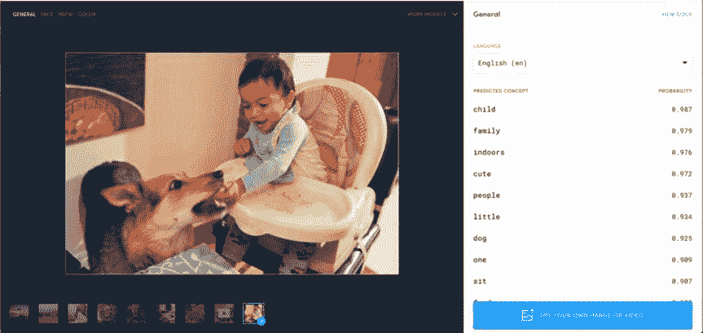

###### 图 8-1\. Clarifai 结果示例

## 微软认知服务

2015 年，随着 ResNet-152 的创建，微软能够在 ILSVRC 赢得七项任务，包括 COCO 图像字幕挑战以及野外情绪识别挑战，涵盖了从分类和检测（定位）到图像描述的各个方面。大部分这项研究都被转化为云 API。最初是从 2015 年微软研究的 Project Oxford 开始，最终在 2016 年更名为认知服务。这是一个包含超过 50 个 API 的综合性集合，涵盖视觉、自然语言处理、语音、搜索、知识图链接等多个领域。历史上，许多相同的库在 Xbox 和必应的部门运行，但现在它们正在向外部开发人员开放。一些展示开发人员如何创造性地使用这些 API 的病毒应用程序包括*[how-old.net](http://how-old.net)*（我看起来多大？）、Mimicker Alarm（需要做出特定的面部表情才能关闭早晨的闹钟）和*CaptionBot.ai*。

### 这个 API 有什么独特之处？

如图 8-2 所示，该 API 提供图像字幕、手写理解和头饰识别。由于有许多企业客户，认知服务不使用客户图像数据来改进其服务。

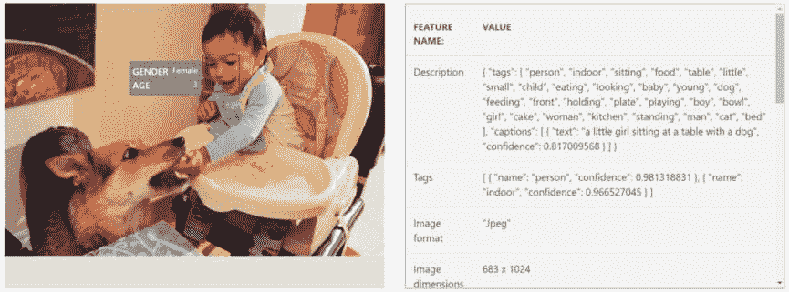

###### 图 8-2\. 微软认知服务结果示例

## 谷歌云视觉

谷歌在 2014 年 ILSVRC 比赛中凭借 22 层 GoogLeNet 获得了胜利，最终为现在常见的 Inception 架构铺平了道路。除了 Inception 模型，谷歌在 2015 年 12 月发布了一套视觉 API。在深度学习领域，拥有大量数据肯定是提高分类器的优势，而谷歌拥有大量的消费者数据。例如，通过从 Google 街景中学到的知识，您应该期望在现实世界的文本提取任务中表现相对良好，比如在广告牌上。

### 这个 API 有什么独特之处？

对于人脸，它提供了最详细的面部关键点（图 8-3），包括滚动、倾斜和平移，以准确定位面部特征。API 还会返回与给定输入相似的网络图片。尝试谷歌系统的性能的简单方法是将照片上传到 Google 照片并通过标签搜索。

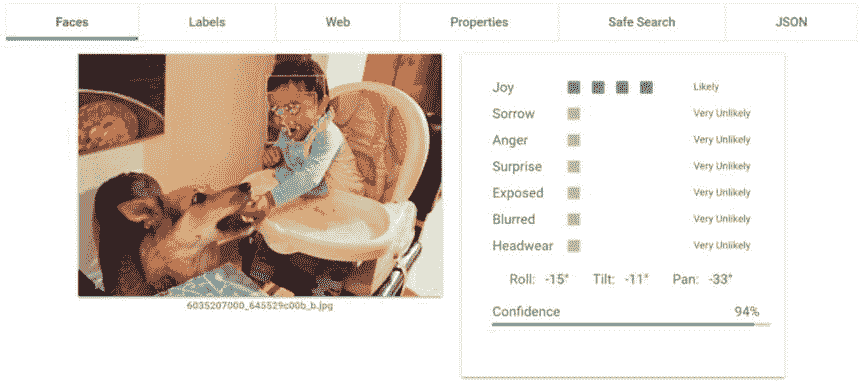

###### 图 8-3. 谷歌云视觉结果示例

## 亚马逊 Rekognition

不，这个标题并没有错别字。亚马逊 Rekognition API（图 8-4）主要基于 Orbeus，这是一家位于加利福尼亚州圣尼维尔的初创公司，于 2015 年底被亚马逊收购。成立于 2012 年，其首席科学家还在 2014 年 ILSVRC 检测挑战中获奖。同样的 API 被用于推动著名的照片整理应用 PhotoTime。该 API 的服务作为 AWS 产品的一部分提供。考虑到大多数公司已经提供了照片分析 API，亚马逊正在加倍努力提供视频识别服务以实现差异化。

### 这个 API 有什么独特之处？

车牌识别，视频识别 API 以及与 AWS 产品（如 Kinesis 视频流、Lambda 等）的更好端到端集成示例是 Rekognition API 的亮点。此外，亚马逊的 API 是唯一一个可以确定被拍摄对象的眼睛是睁着还是闭着的 API。

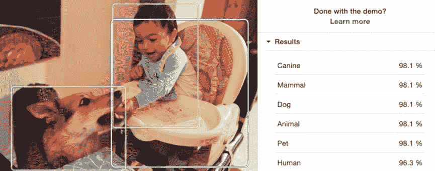

###### 图 8-4. 亚马逊 Rekognition 结果示例

## IBM Watson 视觉识别

在 Watson 品牌下，IBM 的视觉识别服务于 2015 年初开始。在收购了位于丹佛的初创公司 AlchemyAPI 之后，AlchemyVision 被用于推动视觉识别 API（图 8-5）。与其他公司一样，IBM 也提供自定义分类器训练。令人惊讶的是，Watson 目前还没有提供光学字符识别功能。

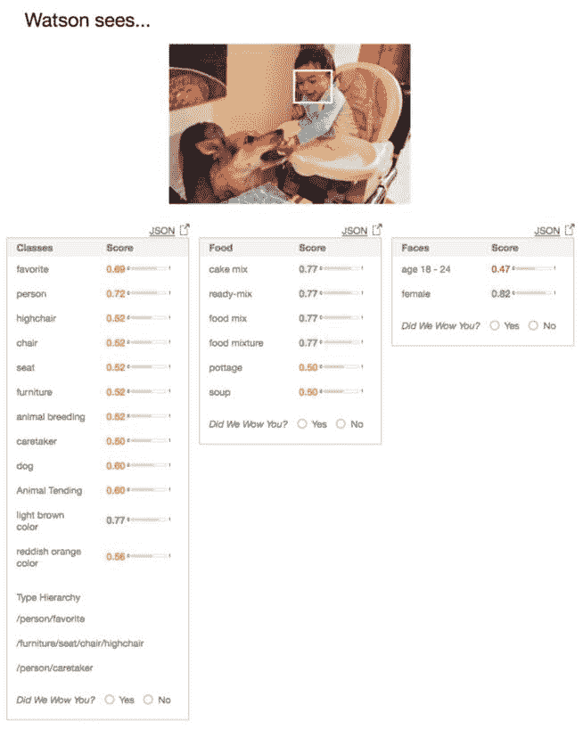

###### 图 8-5. IBM Watson 视觉识别结果示例

## Algorithmia

Algorithmia 是一个在云上托管算法作为 API 的市场。成立于 2013 年，这家位于西雅图的初创公司既有自己的内部算法，也有其他人创建的算法（在这种情况下，创建者根据调用次数赚取收入）。根据我们的经验，这个 API 的响应时间似乎是最慢的。

### 这个 API 有什么独特之处？

黑白照片的着色服务（图 8-6），图像风格化，图像相似度以及在本地或任何云提供商上运行这些服务的能力。

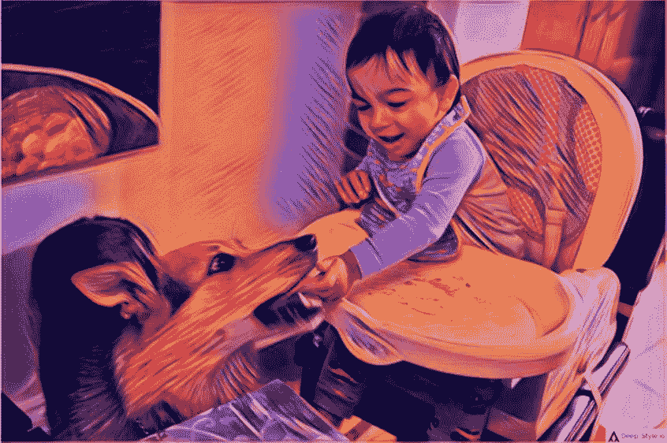

###### 图 8-6. Algorithmia 风格转移结果示例

由于提供的服务太多，选择一个服务可能会让人感到不知所措。我们可能会因为各种原因选择一个服务而不是另一个。显然，对大多数开发人员来说，最重要的因素是准确性和价格。准确性是深度学习革命带来的重要承诺，许多应用程序需要它以保持一致。服务的价格可能是需要考虑的另一个因素。我们也可能选择一个服务提供商，因为我们的公司已经与其有结算账户，而与其他服务提供商集成将需要额外的努力。API 响应速度可能是另一个因素，特别是如果用户正在等待响应。由于许多这些 API 调用可以被抽象化，因此很容易在不同的提供商之间切换。

# 比较视觉识别 API

为了帮助我们做出决策，让我们逐个比较这些 API。在本节中，我们将检查每个服务的提供、成本和准确性。

## 服务提供

表 8-1 列出了每个云提供商提供的服务。

表 8-1\. 视觉 API 提供商的比较（截至 2019 年 8 月）

|  | **Algorithmia** | **Amazon Rekognition** | **Clarifai** | **Microsoft Cognitive Services** | **Google Cloud Vision** | **IBM Watson Visual Recognition** |
| --- | --- | --- | --- | --- | --- | --- |
| 图像分类 | ✔ | ✔ | ✔ | ✔ | ✔ | ✔ |
| 图像检测 | ✔ | ✔ |  | ✔ | ✔ |  |
| OCR | ✔ | ✔ |  | ✔ | ✔ |  |
| 人脸识别 | ✔ | ✔ |  | ✔ |  |  |
| 情绪识别 | ✔ |  | ✔ | ✔ | ✔ |  |
| 标志识别 |  |  | ✔ | ✔ | ✔ |  |
| 地标识别 |  |  | ✔ | ✔ | ✔ | ✔ |
| 名人识别 | ✔ | ✔ | ✔ | ✔ | ✔ | ✔ |
| 多语言标记 |  |  | ✔ |  |  |  |
| 图像描述 |  |  |  | ✔ |  |  |
| 手写 |  |  |  | ✔ | ✔ |  |
| 缩略图生成 | ✔ |  |  | ✔ | ✔ |  |
| 内容审核 | ✔ | ✔ | ✔ | ✔ | ✔ |  |
| 自定义分类训练 |  |  | ✔ | ✔ | ✔ | ✔ |
| 自定义检测器训练 |   |   |  | ✔ | ✔ |   |
| 移动定制模型 |   |   | ✔ | ✔ | ✔ |   |
| 免费套餐 | 每月 5000 次请求 | 每月 5000 次请求 | 每月 5000 次请求 | 每月 5000 次请求 | 每月 1000 次请求 | 7500 |

已经有很多服务在运行并准备在我们的应用程序中使用。因为数字和硬数据有助于做出决策，现在是时候在成本和准确性两个因素上分析这些服务了。

## 成本

金钱不是从树上长出来的（尚未），因此分析使用现成 API 的经济学是很重要的。以每秒约 1 次查询（QPS）的重型查询 API 为例，为一个完整的月份提供服务（大约每月 260 万次请求），图 8-7 按预估成本排序列出了不同提供商的比较（截至 2019 年 8 月）。

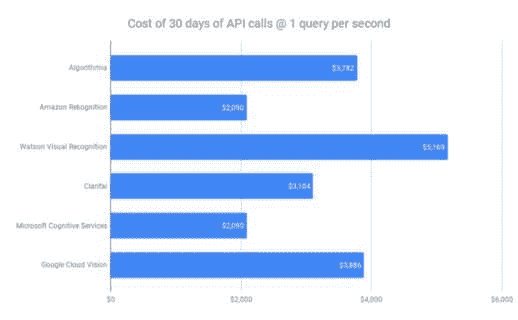

###### 图 8-7\. 不同基于云的视觉 API 的成本比较

尽管对于大多数开发人员来说，这是一个极端的情况，但对于大型公司来说，这将是一个相当现实的负载。我们最终将比较这些价格与在云中运行我们自己的服务，以确保我们在符合我们情景的情况下获得最大的性价比。

也就是说，许多开发人员可能会发现费用微不足道，因为我们在这里看到的所有云提供商都有每月 5000 次调用的免费套餐（除了 Google Vision，它每月只提供 1000 次免费调用），然后大约每 1000 次调用收取 1 美元。

## 准确性

在一个由市场部门主导的世界中，他们声称自己是市场领导者，我们如何判断谁才是真正的最佳呢？我们需要一些共同的指标来比较这些服务提供商在一些外部数据集上的表现。

展示构建可重复基准的过程中，我们使用 COCO-Text 数据集评估文本提取质量，该数据集是 MS COCO 数据集的子集。这个包含 63,686 张图像的数据集包含了日常生活场景中的文本，比如横幅上的文字、街道标志、公交车上的数字、杂货店的价格标签、设计师衬衫等等。这些真实世界的图像使得这个数据集相对较难测试。我们使用词错误率（WER）作为我们的基准度量。为了简化问题，我们忽略单词的位置，只关注单词是否存在（即词袋模型）。为了匹配，整个单词必须是正确的。

在 COCO-Text 验证数据集中，我们挑选所有包含一个或多个可读文本实例（没有中断的完整文本序列）的图像，并比较长度超过一个字符的文本实例。然后我们将这些图像发送到各种云视觉 API。图 8-8 呈现了结果。

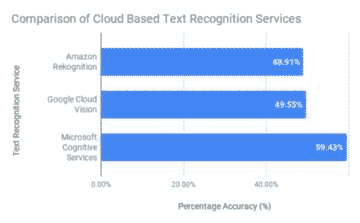

###### 图 8-8. 2019 年 8 月不同文本提取 API 的 WER

考虑到数据集的难度，这些结果是显著的。本十年早期的大多数最先进的文本提取工具都不会超过 10%的标记。这展示了深度学习的力量。在一部分手动测试的图像中，我们还注意到这些 API 中一些的性能每年都有所提高，这是云端 API 所享有的另一个好处。

和往常一样，我们用于实验的所有代码都托管在 GitHub 上（请参见[*http://PracticalDeepLearning.ai*](http://PracticalDeepLearning.ai)）。

我们分析的结果在很大程度上取决于我们选择的数据集以及我们的度量标准。根据我们的数据集（又受我们的用例影响）以及我们的最低质量度量标准，我们的结果可能会有所不同。此外，服务提供商在背景中不断改进他们的服务。因此，这些结果并非一成不变，会随着时间的推移而改善。这些结果可以在 GitHub 上的脚本上复制到任何数据集上。

## 偏见

在第一章中，我们探讨了偏见如何渗入数据集以及它对人们的现实生活造成的后果。本章中我们探索的 API 也不例外。麻省理工学院媒体实验室的研究员乔伊·布拉明尼发现，在微软、IBM 和 Megvii（也称为 Face++）中，没有一个能够准确检测她的面部和性别。她怀疑自己是否有独特的面部特征，使得这些 API 无法检测到她（与 Timnit Gebru 合作），编制了六个国家立法机构成员的面部图像，这些国家女性代表比例较高，建立了 Pilot Parliaments Benchmark（PPB；请参见图 8-9）。她选择了来自三个非洲国家和三个欧洲国家的成员，以测试这些 API 在不同肤色上的表现。如果你没有生活在石头下，你已经可以看出这将会发展成什么样的情况。

她观察到 API 的整体准确率在 85%至 95%之间。只有当她开始根据不同类别划分数据时，她才观察到每个类别的准确率存在巨大差异。她首先观察到男性和女性的检测准确率存在显著差异。她还观察到，根据肤色划分，检测准确率的差异更大。最后，考虑到性别和肤色，检测准确率在最差检测组（较深色女性）和最佳检测组（较浅色男性）之间的差异变得更加明显。例如，在 IBM 的情况下，非洲女性的检测准确率仅为 65.3%，而同一 API 对欧洲男性的准确率为 99.7%。高达 34.4%的差异！考虑到许多这些 API 被执法部门使用，偏见渗入可能会带来生死后果。

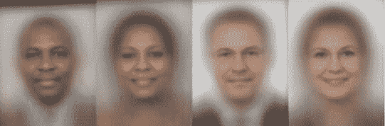

###### 图 8-9。来自 Pilot Parliaments Benchmark（PPB）的不同性别和肤色的平均脸

以下是我们从这项研究中学到的一些见解：

+   算法只有在其训练的数据良好时才有效。这表明训练数据集需要多样性。

+   通常，综合数字并不能总是揭示真实情况。只有在将数据集划分到不同子组时，数据集中的偏见才会显现。

+   偏见并不属于任何特定公司；相反，这是一个整个行业的现象。

+   这些数字并非铁板钉钉，仅反映了实验进行时的时间。正如 2017 年（图 8-10）和 2018 年后续研究（图 8-11）之间数字的急剧变化所示，这些公司正在认真从数据集中消除偏见。

+   研究人员通过公共基准测试商业公司，导致整个行业的改进（即使是出于对不良公关的恐惧）。

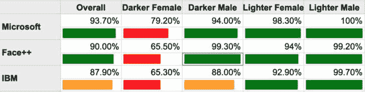

###### 图 8-10。2017 年 4 月和 5 月在 PPB 上进行的 API 之间的人脸检测比较

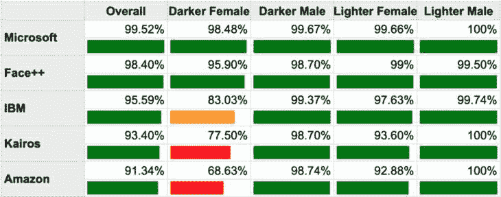

###### 图 8-11。2018 年 8 月在 PPB 上由 Inioluwa Deborah Raji 等人进行的 API 之间的人脸检测比较。

那么图像标记 API 中的偏见呢？Facebook AI 研究在同名论文中思考了“对象识别对每个人都有效吗？”这个问题（Terrance DeVries 等人）。该团队于 2019 年 2 月在 Dollar Street 上测试了多个云 API，这是来自 50 个国家 264 个家庭的各种家庭物品图像的集合（图 8-12）。

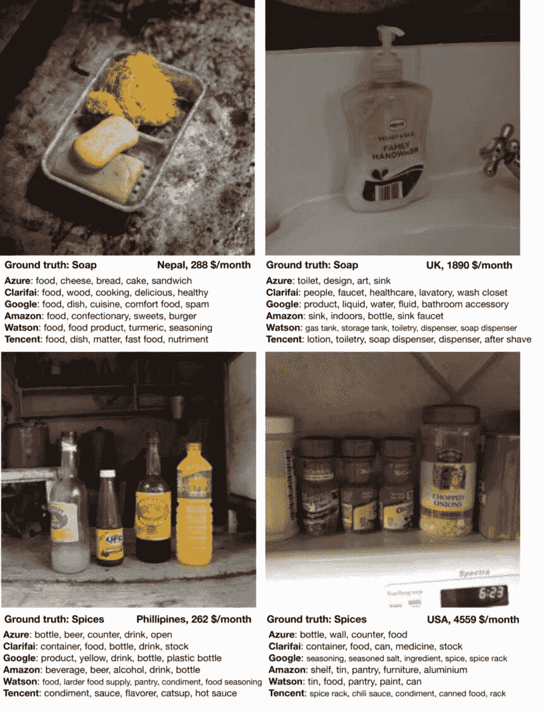

###### 图 8-12。来自 Dollar Street 数据集的地理多样化图像的图像标记 API 性能

以下是这次测试的一些关键发现：

+   在收入较低地区的图像中，对象分类 API 的准确性明显较低，如图 8-13 所示。

+   像 ImageNet、COCO 和 OpenImages 这样的数据集严重缺乏来自非洲、印度、中国和东南亚的图像，因此在非西方世界的图像上表现较差。

+   大多数数据集是通过英语关键词搜索收集的，省略了提及同一对象的其他语言短语的图像。

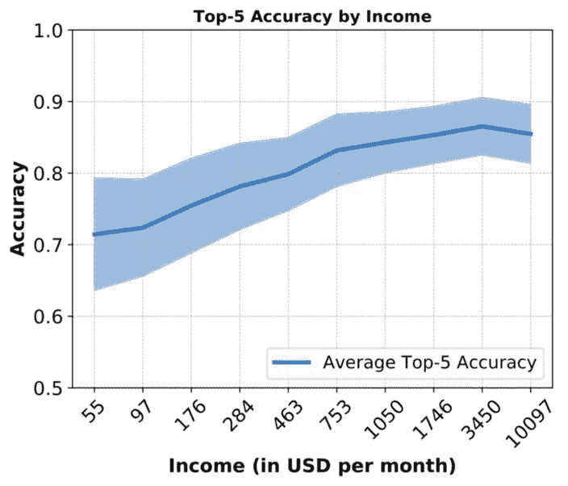

###### 图 8-13\. 六个云 API 的平均准确率（和标准差）与收集图像的家庭收入之间的关系

总之，根据我们想要使用这些云 API 的场景，我们应该建立自己的基准，并定期测试它们，以评估这些 API 是否适合用例。

# 开始使用云 API

调用这些云服务只需要很少的代码。在高层次上，获取一个 API 密钥，加载图像，指定意图，使用正确的编码（例如，对于图像使用 base64），发送 POST 请求并接收结果。大多数云提供商提供软件开发工具包（SDK）和展示如何调用他们服务的示例代码。他们还提供可通过 pip 安装的 Python 包，以进一步简化调用过程。如果您正在使用 Amazon Rekognition，我们强烈建议使用其`pip`包。

让我们重复使用我们激动人心的图像来测试这些服务。

首先，让我们在 Microsoft Cognitive Services 上尝试一下。获取一个 API 密钥，并在以下代码中替换它（前 5000 次调用是免费的——对于我们的实验来说足够了）：

```py
cognitive_services_tagimage('DogAndBaby.jpg')

Results:
```

```py
{
    "description": {
        "tags": ["person", "indoor", "sitting", "food", "table", "little",
"small", "dog", "child", "looking", "eating", "baby", "young", "front",
"feeding", "holding", "playing", "plate", "boy", "girl", "cake", "bowl",
"woman", "kitchen", "standing", "birthday", "man", "pizza"],
        "captions": [{
            "text": "a little girl sitting at a table with a dog",
            "confidence": 0.84265453815486435
        }]
    },
    "requestId": "1a32c16f-fda2-4adf-99b3-9c4bf9e11a60",
    "metadata": {
        "height": 427,
        "width": 640,
        "format": "Jpeg"
    }
}
```

“一个坐在桌子旁边的小女孩和一只狗”——非常接近！还有其他选项可以生成更详细的结果，包括每个标签的概率。

###### 提示

尽管 ImageNet 数据集主要标记为名词，但许多这些服务超越了这一点，返回动词如“吃”、“坐”、“跳”。此外，它们可能包含形容词如“红色”。这些可能不适合我们的应用。我们可能希望过滤掉这些形容词和动词。一个选择是将它们的语言类型与普林斯顿的 WordNet 进行比较。这在 Python 中使用自然语言处理工具包（NLTK）可用。此外，我们可能希望过滤掉诸如“室内”和“室外”之类的词语（通常由 Clarifai 和 Cognitive Services 显示）。

现在，让我们使用 Google Vision API 测试相同的图像。从他们的网站获取一个 API 密钥，并在以下代码中使用它（并且高兴，因为前 1000 次调用是免费的）：

```py
google_cloud_tagimage('DogAndBaby.jpg')

Results:
```

```py
{
 "responses": [
    {
      "labelAnnotations": [
        {
          "mid": "/m/0bt9lr",
          "description": "dog",
          "score": 0.951077,
          "topicality": 0.951077
        },
        {
          "mid": "/m/06z04",
          "description": "skin",
          "score": 0.9230451,
          "topicality": 0.9230451
        },
        {
          "mid": "/m/01z5f",
          "description": "dog like mammal",
          "score": 0.88359463,
          "topicality": 0.88359463
        },
        {
          "mid": "/m/01f5gx",
          "description": "eating",
          "score": 0.7258142,
          "topicality": 0.7258142
        }
# other objects
      ]
    }
 ]
}
```

这不是太容易了吗？这些 API 帮助我们在不需要博士学位的情况下获得最先进的结果，仅需 15 分钟！

###### 提示

尽管这些服务返回带有概率的标签和图像标题，但开发人员需要确定一个阈值。通常，60%和 40%分别是图像标签和图像标题的良好阈值。

从用户体验的角度，将概率传达给最终用户也很重要。例如，如果结果置信度>80%，我们可能会在标签前加上“这张图片*包含....*”。对于<80%，我们可能希望将该前缀更改为“这张图片*可能包含...*”以反映结果中较低的置信度。

# 训练我们自己的自定义分类器

这些服务可能并不完全满足我们用例的要求。假设我们发送给其中一个服务的照片返回标签“狗”，我们可能更感兴趣的是识别狗的品种。当然，我们可以按照第三章来在 Keras 中训练自己的分类器。但如果我们不需要编写一行代码，那不是更棒吗？帮助已经到来。

其中一些云提供商通过简单的拖放界面让我们有能力训练自己的自定义分类器。漂亮的用户界面并没有表明它们在幕后使用迁移学习。因此，Cognitive Services Custom Vision、Google AutoML、Clarifai 和 IBM Watson 都为我们提供了自定义训练的选项。此外，其中一些甚至允许构建自定义检测器，可以识别带有边界框的对象的位置。其中的关键过程如下：

1.  上传图片

1.  标记它们

1.  训练模型

1.  评估模型

1.  将模型发布为 REST API

1.  奖励：下载一个适用于智能手机和边缘设备推理的移动友好模型

让我们看一下微软的[Custom Vision](https://www.customvision.ai)的逐步示例。

1.  *创建一个项目* (图 8-14): 选择最能描述我们用例的领域。对于大多数情况，“通用”可能是最佳选择。对于更专业的场景，我们可能想选择一个相关的领域。

    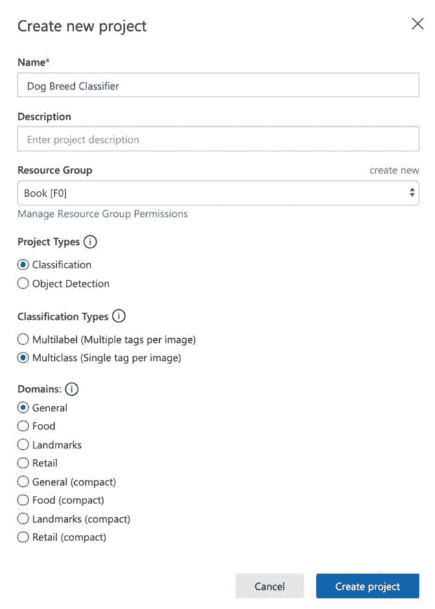

    ###### 图 8-14. 在 Custom Vision 中创建一个新项目

    例如，如果我们有一个电子商务网站，网站上有产品照片背景是纯白色的，我们可能想选择“零售”领域。如果我们最终打算在手机上运行这个模型，我们应该选择模型的“紧凑”版本；它尺寸更小，只有轻微的准确度损失。

1.  *上传* (图 8-15): 对于每个类别，上传图片并进行标记。每个类别至少上传 30 张照片是很重要的。在我们的测试中，我们上传了 30 多张马耳他犬的图片，并进行了适当的标记。

    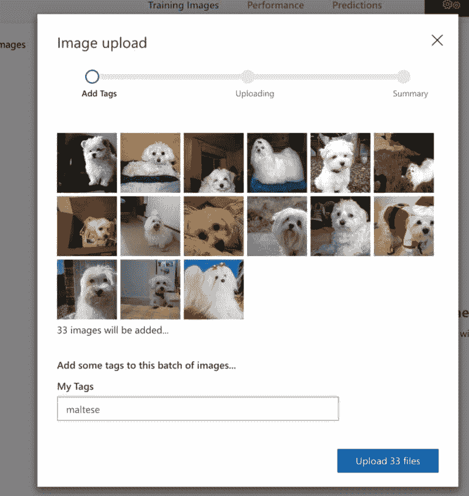

    ###### 图 8-15. 在 CustomVision.ai 上上传图片

1.  *训练* (图 8-16): 点击 Train 按钮，大约三分钟后，我们就有了一个全新的分类器。

    

    ###### 图 8-16. CustomVision.ai 页面右上角的 Train 按钮

1.  *分析模型的性能*：检查模型的精度和召回率。系统默认将阈值设置为 90%置信度，并给出该值下的精度和召回率指标。要获得更高的精度，增加置信度阈值。这将以减少召回率为代价。图 8-17 展示了示例输出。

1.  *准备就绪*：我们现在有一个可以从任何应用程序调用的生产就绪的 API 端点。

为了突出数据量对模型质量的影响，让我们训练一个狗品种分类器。我们可以使用斯坦福狗数据集，这是一个包含 100 多种狗品种的集合。为简单起见，我们随机选择了 10 种品种，这些品种有超过 200 张可用图片。有了 10 个类别，一个随机分类器正确识别图像的几率是十分之一，或者 10%。我们应该很容易地超过这个数字。表 8-2 显示了在不同数据集上训练的效果。

表 8-2. 训练图片数量对精度和召回率的影响

|  | **每类 30 张训练图片** | **每类 200 张训练图片** |
| --- | --- | --- |
| 精度 | 91.2% | 93.5% |
| 召回率 | 85.3% | 89.6% |

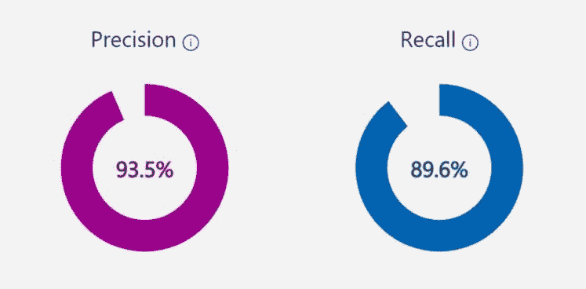

###### 图 8-17. 相对精度和召回率，我们的样本训练集每类有 200 张图片

因为我们还没有上传测试集，所以这里报告的性能数据是在完整数据集上使用常见的*k*折交叉验证技术得出的。这意味着数据被随机分成*k*部分，然后(*k - 1)部分用于训练，剩下的部分用于测试。这个过程进行了几次，每次使用随机子集的图像，并报告了平均结果。

令人难以置信的是，即使每类只有 30 张图片，分类器的精度也超过 90%，如图 8-18 所示。令人惊讶的是，这个训练过程只花了不到 30 秒的时间。

不仅如此，我们可以深入研究每个类别的性能。高精度的类别可能看起来更加明显，而低精度的类别可能与另一个类别相似。

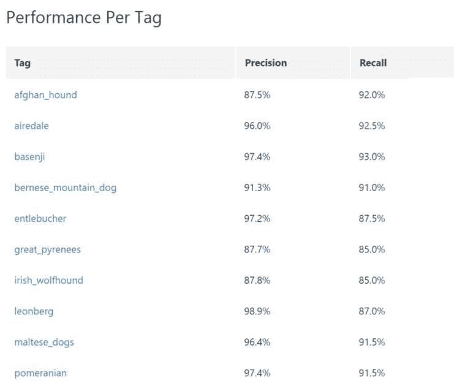

###### 图 8-18\. API 返回的一些可能标签

这种简短而方便的方法并非没有缺点，正如您将在以下部分中看到的那样。在该部分中，我们还讨论了缓解策略，以帮助利用这个相当有用的工具。

## 我们的分类器不令人满意的主要原因

分类器表现不佳的原因有很多。以下是其中一些：

数据不足

如果我们发现准确性不够满足我们的需求，可能需要用更多数据训练系统。当然，每个类别 30 张图像只是一个开始。但对于生产质量的应用程序，更多的图像更好。通常建议每个类别使用 200 张图像。

不具代表性的训练数据

通常，互联网上的图像过于干净，设置在工作室灯光下，背景干净，并且接近画面中心。我们的应用程序可能每天看到的图像可能没有那么好地表示。用真实世界的图像训练我们的分类器对于获得最佳性能非常重要。

不相关的领域

在幕后，自定义视觉正在运行迁移学习。这使得在创建项目时选择正确的领域非常重要。举个例子，如果我们试图对 X 射线图像进行分类，从基于 ImageNet 的模型进行迁移学习可能不会产生如此准确的结果。对于这种情况，手动在 Keras 中训练我们自己的分类器会是最好的选择，就像在第三章中演示的那样（尽管这可能需要超过三分钟）。

使用它进行回归

在机器学习中，有两种常见的问题类别：分类和回归。分类是为输入预测一个或多个类别。另一方面，回归是根据输入预测一个数值；例如，预测房价。自定义视觉主要是一个分类系统。将其用于通过标记对象数量来计数对象是错误的方法，并将导致不令人满意的结果。

计数对象是一种回归问题。我们可以通过定位图像中每个对象的每个实例（也称为目标检测）并计算它们的出现次数来实现。另一个回归问题的例子是根据个人的头像预测其年龄。我们将在后面的章节中解决这两个问题。

类别太相似

如果我们的类看起来太相似，并且在区分上依赖较小级别的细节，那么模型可能表现不佳。例如，一张五美元和一张二十美元的纸币具有非常相似的高级特征。真正区别它们的是更低级别的细节。另一个例子，区分吉娃娃和西伯利亚哈士奇可能很容易，但区分阿拉斯加雪橇犬和西伯利亚哈士奇可能更困难。如在第三章中演示的完全重新训练的 CNN 应该比这个基于自定义视觉的系统表现更好。

###### 提示

自定义视觉的一个很棒的功能是，如果模型对通过其 API 端点遇到的任何图像感到不确定，Web UI 将显示这些图像供手动审查。我们可以定期审查和手动标记新图像，并持续改进模型的质量。这些图像往往对分类器的改进最大，原因有两个：首先，它们代表了真实世界的使用。其次，更重要的是，与模型已经可以轻松分类的图像相比，它们对模型的影响更大。这被称为半监督学习。

在这一部分中，我们讨论了一些可以提高模型准确性的方法。在现实世界中，这并不是用户体验的全部。我们能够多快地响应请求也非常重要。在接下来的部分中，我们将介绍一些不牺牲质量的情况下提高性能的方法。

# 比较自定义分类 API

正如你可能在整本书中已经注意到的那样，我们非常坚持数据驱动。如果我们要在一个服务上花钱，我们最好能物有所值。是时候来测试一下这个炒作了。

对于许多分类问题，这些定制的基于云的分类器表现得相当不错。为了真正测试它们的极限，我们需要更具挑战性的数据集。我们需要释放最难缠的数据集，训练这个模型，并获得一些有见地的结果——使用斯坦福狗数据集。

使用整个数据集可能会使这些分类器变得太容易（毕竟，ImageNet 已经包含了很多狗品种），所以我们提高了难度。相反，我们在整个数据集上训练了我们自己的 Keras 分类器，并从表现最差的前 34 个类别中构建了一个迷你数据集（每个类别至少包含 140 张图片）。这些类别表现不佳的原因是因为它们经常与其他看起来相似的狗品种混淆。为了表现更好，它们需要对特征有细致的理解。我们将图像分为训练数据集中每个类别 100 张随机选择的图像，以及测试数据集中每个类别 40 张随机选择的图像。为了避免任何类别不平衡对预测的影响，我们为每个类别选择了相同数量的训练和测试图像。

最后，我们选择了最小置信阈值为 0.5，因为它似乎在所有服务中在精度和召回率之间取得了良好的平衡。在高置信阈值（例如 0.99）下，分类器可能非常准确，但可能只有少数图像有预测；换句话说，召回率非常低。另一方面，非常低的阈值（0.01）会导致几乎所有图像都有预测。然而，我们不应该依赖许多这样的结果。毕竟，分类器并不自信。

我们报告*F1 分数*（也称为*F-度量*），它是结合了这两个值的混合分数：

<math display="block"><mrow><mi>F</mi><mi>1</mi><mi>s</mi><mi>c</mi><mi>o</mi><mi>r</mi><mi>e</mi><mo>=</mo> <mfrac><mrow><mn>2</mn><mo>×</mo><mi>p</mi><mi>r</mi><mi>e</mi><mi>c</mi><mi>i</mi><mi>s</mi><mi>i</mi><mi>o</mi><mi>n</mi><mo>×</mo><mi>r</mi><mi>e</mi><mi>c</mi><mi>a</mi><mi>l</mi><mi>l</mi></mrow> <mrow><mi>p</mi><mi>r</mi><mi>e</mi><mi>c</mi><mi>i</mi><mi>s</mi><mi>i</mi><mi>o</mi><mi>n</mi><mo>+</mo><mi>r</mi><mi>e</mi><mi>c</mi><mi>a</mi><mi>l</mi><mi>l</mi></mrow></mfrac></mrow></math>

此外，我们报告了训练所需的时间，如图 8-19 所示。除了云端，我们还使用了苹果的 Create ML 工具在 MacBook Pro 上进行训练，有时使用数据增强（旋转、裁剪和翻转），有时不使用。

谷歌和微软提供了定制训练持续时间的能力。谷歌 Auto ML 允许我们在 1 到 24 小时之间进行定制。微软提供了一个免费的“快速训练”选项和一个付费的“高级训练”选项（类似于谷歌的提供），我们可以选择在 1 到 24 小时之间的任何时间段进行训练。

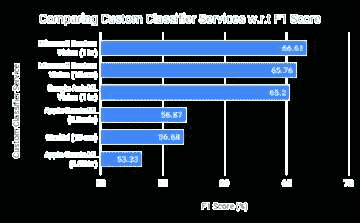

###### 图 8-19。显示了自定义分类器服务的 F1 分数，截至 2019 年 8 月（分数越高越好）

以下是这个实验的一些有趣的收获：

+   Clarifai 和微软为这 3400 张训练图像提供了几乎即时的训练。

+   与“快速训练”相比，微软的“高级训练”表现稍好一些（大约增加了 1 个点）多出的一个小时的训练。因为“快速训练”只需要不到 15 秒的时间进行训练，我们可以推断它的基础特征提取器已经很擅长提取细粒度特征。

+   令人惊讶的是，尽管在添加增强功能后，苹果的 Create ML 表现更差，尽管训练时间超过两个小时，其中大部分时间用于创建增强功能。这是在一台顶级的 MacBook Pro 上完成的，并在 Activity Monitor 中显示 100%的 GPU 利用率。

此外，为了测试特征提取器的强度，我们改变了提供给服务的训练数据量（图 8-20）。由于微软的训练时间不到 15 秒，我们很容易（而且便宜！）在那里进行实验。我们在训练时每类变化了 30 到 100 张图像，同时保持测试时每类 40 张图像不变。

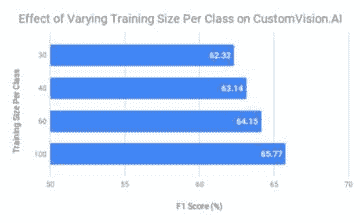

###### 图 8-20\. 不同类别训练数据大小对测试 F1 分数的影响（分数越高越好）

尽管微软建议每类至少使用 50 张图像，但低于这个限制并没有显著影响性能。F1 分数没有像人们预期的那样变化，这显示了迁移学习的价值（使少量数据构建分类器）以及具有能够进行细粒度分类的良好特征提取器的重要性。

值得重申的是，这个实验是故意设置为困难的，以对这些分类器进行压力测试。平均而言，它们在整个斯坦福狗数据集上的表现会更好。

# 云 API 的性能调优

现代手机拍摄的照片可以具有高达 4000 x 3000 像素的分辨率，并且大小可达 4 MB。根据网络质量，上传这样的图像到服务可能需要几秒钟。随着每增加一秒，对我们的用户来说可能会变得越来越令人沮丧。我们能不能让这个过程更快一些呢？

有两种方法可以减小图像的大小：

调整大小

大多数 CNN 接受大小为 224 x 224 或 448 x 448 像素的输入图像。对于 CNN 来说，手机照片的大部分分辨率都是不必要的。在将图像发送到网络之前缩小图像大小是有意义的，而不是将大图像发送到网络，然后在服务器上缩小图像。

压缩

大多数图像库在保存文件时执行*有损*压缩。即使稍微压缩一点，也可以大大减小图像的大小，同时对图像本身的质量影响很小。压缩确实会引入噪音，但 CNN 通常足够强大，可以处理其中的一些噪音。

## 调整大小对图像标记 API 的影响

我们进行了一个实验，从 iPhone 拍摄的一百多张不同的未经修改的图像，分辨率为默认分辨率（4032 x 3024），并将它们发送到 Google Cloud Vision API，为每张图像获取标签。然后我们逐步缩小原始图像的大小（5%，10%，15%…95%），并收集这些较小图像的 API 结果。然后我们使用以下公式计算每个图像的一致性率：

<math display="block"><mrow><mo>%</mo> <mi>a</mi> <mi>g</mi> <mi>r</mi> <mi>e</mi> <mi>e</mi> <mi>m</mi> <mi>e</mi> <mi>n</mi> <mi>t</mi> <mi>r</mi> <mi>a</mi> <mi>t</mi> <mi>e</mi> <mo>=</mo> <mfrac><mrow><mi>n</mi><mi>u</mi><mi>m</mi><mi>b</mi><mi>e</mi><mi>r</mi><mi>o</mi><mi>f</mi><mi>l</mi><mi>a</mi><mi>b</mi><mi>e</mi><mi>l</mi><mi>s</mi><mi>i</mi><mi>n</mi><mi>t</mi><mi>h</mi><mi>e</mi><mi>b</mi><mi>a</mi><mi>s</mi><mi>e</mi><mi>l</mi><mi>i</mi><mi>n</mi><mi>e</mi><mi>i</mi><mi>m</mi><mi>a</mi><mi>g</mi><mi>e</mi><mi>a</mi><mi>l</mi><mi>s</mi><mi>o</mi><mi>p</mi><mi>r</mi><mi>e</mi><mi>s</mi><mi>e</mi><mi>n</mi><mi>t</mi><mi>i</mi><mi>n</mi><mi>t</mi><mi>e</mi><mi>s</mi><mi>t</mi><mi>i</mi><mi>m</mi><mi>a</mi><mi>g</mi><mi>e</mi></mrow> <mrow><mi>n</mi><mi>u</mi><mi>m</mi><mi>b</mi><mi>e</mi><mi>r</mi><mi>o</mi><mi>f</mi><mi>l</mi><mi>a</mi><mi>b</mi><mi>e</mi><mi>l</mi><mi>s</mi><mi>i</mi><mi>n</mi><mi>t</mi><mi>h</mi><mi>e</mi><mi>b</mi><mi>a</mi><mi>s</mi><mi>e</mi><mi>l</mi><mi>i</mi><mi>n</mi><mi>e</mi><mi>i</mi><mi>m</mi><mi>a</mi><mi>g</mi><mi>e</mi></mrow></mfrac> <mo>×</mo> <mn>100</mn></mrow></math>

图 8-21 显示了这个实验的结果。在图中，实线显示了文件大小的减小，虚线表示一致性率。我们从实验中得出的主要结论是，将分辨率减小 60%会导致文件大小减小 95%，与原始图像相比准确性几乎没有变化。

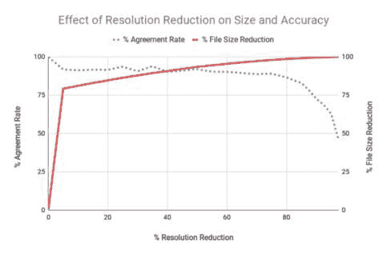

###### 图 8-21\. 调整图像大小对一致性率和相对于原始图像的文件大小减小的影响

## 压缩对图像标记 API 的影响

我们重复了相同的实验，但是不改变分辨率，而是逐步改变每个图像的压缩因子。在图 8-22 中，实线显示了文件大小的减少，虚线代表协议率。这里的主要要点是，60%的压缩得分（或 40%的质量）导致文件大小减少 85%，与原始图像相比，准确性几乎没有变化。

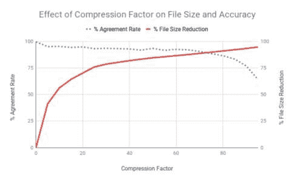

###### 图 8-22。压缩图像对协议率和文件大小相对于原始图像的影响

## 压缩对 OCR API 的影响

我们拿一份包含 300 多个单词的文档，分辨率为 iPhone 的默认分辨率（4032 x 3024），并将其发送到 Microsoft Cognitive Services API 进行文本识别测试。然后我们逐步以 5%的增量压缩它，然后发送每个图像并压缩它。我们将这些图像发送到同一 API，并将它们的结果与基线进行比较，以计算百分比的错误率。我们观察到，即使将压缩因子设置为 95%（即原始图像质量的 5%），也不会对结果的质量产生影响。

## 调整大小对 OCR API 的影响

我们重复了之前的实验，但这次是通过调整每个图像的大小而不是压缩。在某一点之后，错误率从零跳升到接近 100%，几乎所有单词都被错误分类。重新测试另一份文档，其中每个单词的字体大小都不同，结果显示特定字体大小以下的所有单词都被错误分类。为了有效识别文本，OCR 引擎需要文本的高度大于最小高度（一个很好的经验法则是大于 20 像素）。因此，分辨率越高，准确性就越高。

我们学到了什么？

+   对于文本识别，大幅压缩图像，但不要调整大小。

+   对于图像标记，适度调整大小（例如 50%）和适度压缩（例如 30%）的组合应该会导致文件大小大幅减少（并且 API 调用更快），而不会影响 API 结果的质量。

+   根据您的应用程序，您可能正在处理已经调整大小和压缩的图像。每个处理步骤都可能会对这些 API 的结果产生轻微差异，因此应该尽量减少它们。

###### 提示

收到图像后，云 API 会在内部调整大小以适应其自身的实现。对我们来说，这意味着两个级别的调整大小：我们首先调整图像大小以减小尺寸，然后将其发送到云 API，后者会进一步调整图像大小。缩小图像会引入失真，这在较低分辨率下更为明显。我们可以通过从更高分辨率调整大小来最小化失真的影响，这个分辨率比原始分辨率大几倍。例如，将 3024x3024（原始）→ 302x302（发送到云端）→ 224x224（API 内部调整大小）相比于 3024x3024 → 896x896 → 224x224，最终图像中的失真会更多。因此，在发送图像之前最好找到一个合适的中间尺寸。此外，指定高级插值选项如 `BICUBIC` 和 `LANCZOS` 将导致更准确地表示原始图像在较小版本中的效果。

# 案例研究

有人说生活中最好的事情并不容易获得。我们相信这一章证明了相反。在接下来的部分中，我们将看看一些科技行业巨头如何利用云 API 进行人工智能，从而推动一些非常引人注目的场景。

## 纽约时报

可能看起来像是本章开头描绘的情景取自卡通，但实际上与《纽约时报》（NYT）的情况非常接近。拥有 160 多年的光辉历史，纽约时报在其档案中拥有大量的照片珍藏品。它将许多这些文物存放在地下三层的建筑物地下室中，恰当地称为“尸房”。这个收藏的价值是无价的。2015 年，由于管道泄漏，地下室的部分地方受损，包括其中一些存档记录。幸运的是，损坏很小。然而，这促使纽约时报考虑对其进行数字化存档，以防止另一场灾难。

这些照片被扫描并以高质量存储。然而，这些照片本身没有任何识别信息。许多照片的背面有手写或印刷的注释，为照片提供了背景信息。纽约时报使用 Google Vision API 扫描这些文本，并为相应的图像添加标签。此外，这个流程提供了从照片中提取更多元数据的机会，包括地标识别、名人识别等等。这些新添加的标签为其搜索功能提供动力，使公司内外的任何人都可以浏览画廊并使用关键词、日期等搜索，而无需访问地下三层的尸房。

## Uber

Uber 使用 Microsoft Cognitive Services 在几毫秒内识别其 700 多万司机中的每一个。想象一下 Uber 必须以何种规模运营其名为“实时身份验证”的新功能。该功能通过提示司机随机或每次分配给新乘客时自拍来验证当前司机是否确实是注册司机。这张自拍照与文件中的司机照片进行比对，只有在脸部模型匹配时才允许司机继续。这一安全功能有助于通过确保乘客的安全和确保司机账户不受损害来建立问责制。这一安全功能能够检测自拍中的变化，包括帽子、胡须、太阳镜等，然后提示司机摘掉帽子或太阳镜自拍。


###### 图 8-23\. Uber Drivers 应用程序提示司机自拍以验证司机的身份（[图片来源](https://oreil.ly/lw1Ho)）

## Giphy

回到 1976 年，当理查德·道金斯博士创造了“模因”一词时，他并不知道四十年后它会变得如此活跃。我们生活在一个大多数聊天应用程序建议匹配上下文的适当动画 GIF 的时代，而不是给出简单的文本回复。几个应用程序提供了专门搜索模因和 GIF 的功能，如 Tenor、Facebook Messenger、Swype 和 Swiftkey。它们大多通过 Giphy 进行搜索（图 8-24），这是世界上最大的动画模因搜索引擎，通常以 GIF 格式呈现。

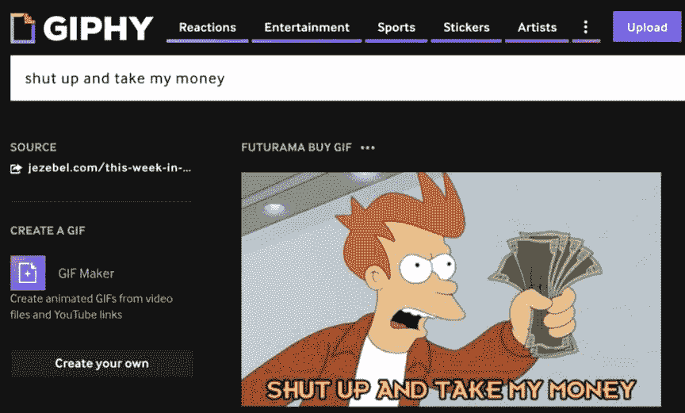

###### 图 8-24\. Giphy 从动画中提取文本作为搜索的元数据

GIF 通常有叠加的文本（比如正在说的对话），有时我们想要寻找一个具有特定对话的 GIF，直接来自电影或电视节目。例如，来自 2010 年《未来派》剧集的图像图 8-24，其中“eyePhone”（错误）发布时经常被用来表达对产品或想法的兴奋。了解内容使 GIF 更易搜索。为了实现这一点，Giphy 使用 Google 的 Vision API 来提取识别文本和对象，帮助搜索完美的 GIF。

很明显，给 GIF 打标签是一项困难的任务，因为一个人必须筛选数百万个这些动画，并逐帧手动注释它们。2017 年，Giphy 找到了两种自动化这一过程的解决方案。第一种方法是从图像中检测文本。第二种方法是根据图像中的对象生成标签，以补充其搜索引擎的元数据。这些元数据存储和搜索使用 ElasticSearch 来创建一个可扩展的搜索引擎。

对于文本检测，该公司使用 Google Vision API 的 OCR 服务对 GIF 的第一帧进行确认，以确定 GIF 是否实际包含文本。如果 API 回复肯定，Giphy 将发送下一帧，接收其 OCR 检测到的文本，并找出文本的差异；例如，文本是静态的（在 gif 的整个持续时间内保持不变）还是动态的（不同帧中的不同文本）。为了生成与图像中对象对应的类标签，工程师有两个选择：标签检测或网络实体，这两者都可以在 Google Vision API 上使用。标签检测提供对象的实际类名。网络实体提供一个实体 ID（可在 Google Knowledge Graph 中引用），这是在网上看到的相同和相似图像的唯一网址。使用这些额外的注释使新系统的点击率（CTR）增加了 32%。中长尾搜索（即不太频繁的搜索）受益最大，因为提取的元数据使以前未注释的 GIF 浮出水面，否则这些 GIF 将被隐藏。此外，用户的元数据和点击行为提供了数据，以制作相似性和去重功能。

## OmniEarth

OmniEarth 是一家总部位于弗吉尼亚州的公司，专门收集、分析和结合卫星和航拍图像以及其他数据集，以可扩展和高速的方式跟踪全国的用水情况。该公司能够在几小时内扫描整个美国境内 1.44 亿个土地地块。在内部，它使用 IBM Watson Visual Recognition API 对土地地块的图像进行分类，以获取有价值的信息，比如绿化程度。将这种分类与温度和降雨等其他数据点结合起来，OmniEarth 可以预测用于灌溉田地的水量。

对于房产，它从图像中推断出数据点，比如游泳池、树木或可灌溉的园艺景观的存在，以预测用水量。该公司甚至预测了由于过度浇水或漏水等不当做法而导致的水浪费情况。OmniEarth 通过分析超过 15 万个土地地块，帮助加利福尼亚州了解用水情况，然后制定了一个有效的策略来遏制水资源浪费。

## Photobucket

Photobucket 是一个流行的在线图像和视频托管社区，每天上传超过两百万张图片。使用 Clarifai 的 NSFW 模型，Photobucket 自动标记不受欢迎或冒犯性的用户生成内容，并将其发送给人工审核团队进行进一步审核。此前，该公司的人工审核团队只能监控到约 1%的传入内容。大约 70%的被标记图片被发现是不可接受的内容。与以往的手动努力相比，Photobucket 识别出了 700 倍更多的不受欢迎内容，从而清理了网站并创造了更好的用户体验。这种自动化还帮助发现了两个儿童色情账户，并向 FBI 报告了这一情况。

## Staples

像 Staples 这样的电子商务商店通常依赖有机搜索引擎流量来推动销售。在搜索引擎排名中高居榜首的方法之一是在图像的 ALT 文本字段中放置描述性图像标签。为了在 12 种不同语言中提供服务的 Staples Europe 发现标记产品图像和翻译关键字是一项昂贵的任务，传统上是外包给人类机构的。幸运的是，Clarifai 以更便宜的价格提供 20 种语言的标签，为 Staples 节省了数万美元的成本。使用这些相关关键字导致了流量的增加，最终通过其电子商务商店增加了销售额，因为产品页面的访问者激增。

## InDro Robotics

这家加拿大无人机公司利用 Microsoft Cognitive Services 来支持搜索和救援行动，不仅在自然灾害期间，还主动检测紧急情况。该公司利用 Custom Vision 专门训练模型，用于识别水中的船只和救生衣（图 8-25），并利用这些信息通知控制站。与救生员相比，这些无人机能够独自扫描更大范围的海洋。这种自动化可以提醒救生员有紧急情况，从而提高发现速度并在过程中挽救生命。

澳大利亚已经开始使用其他公司的无人机配备充气舱，以便在帮助到达之前能够做出反应。部署后不久，这些充气舱拯救了两名被困在海洋中的青少年，如图 8-26 所示。澳大利亚还利用无人机来检测鲨鱼，以便撤离海滩。可以预见到这些自动化、定制培训服务所能带来的巨大价值。

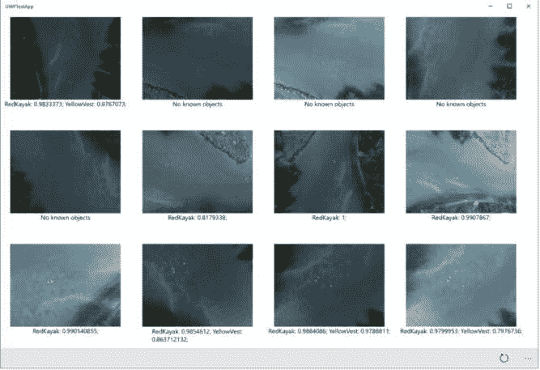

###### 图 8-25\. InDro Robotics 进行的检测

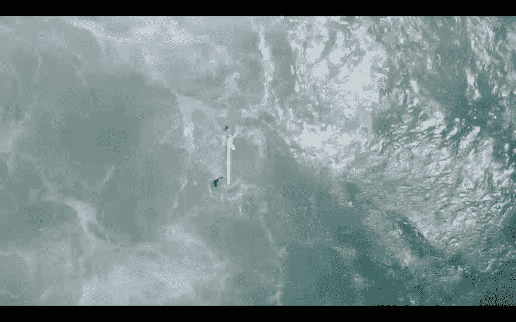

###### 图 8-26\. 无人机识别两名被困游泳者并释放充气舱，他们抓住充气舱（图片来源）

# 总结

在本章中，我们探讨了各种云 API 用于计算机视觉，首先定性比较提供的服务范围，然后定量比较它们的准确性和价格。我们还看到可能出现在结果中的偏见来源。我们看到，只需一小段代码片段，我们就可以在不到 15 分钟内开始使用这些 API。因为一个模型并不适用于所有情况，我们使用拖放界面训练了一个自定义分类器，并将多家公司进行了对比测试。最后，我们讨论了压缩和调整大小的建议，以加快图像传输速度，并了解它们对不同任务的影响。最后，我们研究了各行业的公司如何利用这些云 API 构建真实应用程序。祝贺您走到了这一步！在下一章中，我们将看到如何为自定义场景部署我们自己的推理服务器。
