# 第九章：使用 TensorFlow Serving 和 KubeFlow 在云上进行可扩展推断服务

想象一下：你刚刚建立了一个一流的分类器。你的目标，正如硅谷的座右铭所说，“*让世界变得更美好*”，你将通过一个出色的狗/猫分类器来实现这一目标。你有一个扎实的商业计划，迫不及待地想要在下周向风险投资公司推销你的神奇分类器。你知道投资者会问及你的云策略，你需要在他们考虑给你钱之前展示一个扎实的演示。你会怎么做？创建模型只是战斗的一半，提供服务是下一个挑战，通常是更大的挑战。事实上，很长一段时间以来，训练模型只需要几周的时间，但是试图将其提供给更多人使用是一个长达数月的战斗，通常涉及后端工程师和 DevOps 团队。

在本章中，我们回答了一些关于托管和提供定制模型的常见问题。

+   我如何在我的个人服务器上托管我的模型，以便我的同事可以使用它？

+   我不是后端/基础设施工程师，但我想让我的模型可用，以便为成千上万（甚至数百万）的用户提供服务。如何在合理的价格下做到这一点，而不必担心可扩展性和可靠性问题？

+   有一些原因（如成本、法规、隐私等）使我无法将我的模型托管在云上，而只能在内部网络（我的工作网络）上托管。在这种情况下，我能够以规模和可靠性提供预测吗？

+   我可以在 GPU 上进行推断吗？

+   我可以期待每个选项的费用是多少？

+   我能否跨多个云提供商扩展我的训练和服务？

+   要使这些运行需要多少时间和技术知识？

让我们从高层次概述可用工具开始我们的旅程。

# 提供 AI 预测的景观

有许多工具、库和云服务可用于训练 AI 模型以提供预测请求。图 9-1 将它们简化为四类。


###### 图 9-1\. 不同推断服务选项的高级概述和比较

根据我们的推断场景，我们可以做出适当的选择。表 9-1 深入探讨。

表 9-1。通过网络提供深度学习模型的工具

| **类别和示例** | **预期的首次预测时间** | **优缺点** |
| --- | --- | --- |

| HTTP 服务器

+   Flask

+   Django

+   Apache OpenWhisk

+   Python `http.server`

| <5 分钟 | + 运行简单+ 通常运行当前 Python 代码– 较慢– 未经 AI 优化 |
| --- | --- |

| **托管和管理的云堆栈**

+   Google Cloud ML

+   Azure ML

+   亚马逊 Sage Maker

+   Algorithmia

| <15 分钟 | + 更容易的 GUI/命令行界面+ 高度可扩展+ 完全托管，减少了对 DevOps 团队的需求– 通常仅限于基于 CPU 的推断，对于大型模型可能较慢– 预热查询时间可能较慢 |
| --- | --- |

| **手动管理的服务库**

+   TensorFlow Serving

+   英伟达 TensorRT

+   DeepDetect

+   MXNet 模型服务

+   Skymind Intelligence Layer with DeepLearning4J

+   Seldon

+   DeepStack AI 服务器

| <15 分钟 | + 高性能+ 允许手动控制优化、批处理等+ 可以在 GPU 上运行– 设置更复杂– 要在多个节点上扩展通常需要额外的工作 |
| --- | --- |

| **云 AI 编排框架**

+   KubeFlow

| ~1 小时 | + 使扩展训练和推理易于管理+ 在云提供商之间可移植+ 开发和生产环境一致+ 对于数据科学家，与熟悉的工具（如 Jupyter Notebooks）集成，用于将模型发送到生产环境+ 可以组合条件管道以自动化测试、级联模型+ 使用现有的手动管理的服务库– 仍在发展中– 对于初学者，托管和管理的云堆栈提供了更简单的学习曲线 |
| --- | --- |

在本章中，我们探讨了一系列工具和场景。其中一些选项易于使用，但功能有限。其他选项提供更精细的控制和更高的性能，但设置更复杂。我们将看一个每个类别的例子，并深入研究，以便了解何时使用其中之一是有意义的。然后，我们将对不同解决方案进行成本分析，并详细介绍一些解决方案在实践中的工作方式。

# Flask：构建自己的服务器

我们从*构建自己的服务器*（BYOS）的最基本技术开始。从表 9-1 的第一列中选择，我们选择了 Flask。

## 使用 Flask 创建 REST API

Flask 是一个基于 Python 的 Web 应用程序框架。它于 2010 年发布，在 GitHub 上拥有超过 46,000 颗星，正在持续开发。它快速且易于设置，对于原型设计非常有用。当数据科学从业者想要向一组有限的用户提供他们的模型（例如，在企业网络上与同事共享）时，通常会选择这个框架，而不会有太多麻烦。

使用`pip`安装 Flask 相当简单：

```py
$ pip install flask
```

安装后，我们应该能够运行以下简单的“Hello World”程序：

```py
from flask import Flask
app = Flask(__name__)

@app.route("/hello")
def hello():
    return "Hello World!"

if __name__ == "__main__":
    app.run()
```

以下是运行“Hello World”程序的命令：

```py
$ python hello.py
 * Running on http://127.0.0.1:5000/ (Press Ctrl+C to quit)
```

默认情况下，Flask 在端口 5000 上运行。当我们在浏览器中打开 URL *http://localhost:5000/hello*时，我们应该看到“Hello World!”这几个字，如图 9-2 所示。


###### 图 9-2。在 Web 浏览器中导航到 http://localhost:5000/hello，查看“Hello World！”网页

正如您所看到的，只需几行代码就可以让一个简单的 Web 应用程序运行起来。在该脚本中最重要的一行是`@app.route("/hello")`。它指定了主机名后的路径`/hello`将由其下方的方法提供服务。在我们的情况下，它只是返回字符串“Hello World！”在下一步中，我们将看看如何将 Keras 模型部署到 Flask 服务器，并创建一个路由来提供我们模型的预测。

## 将 Keras 模型部署到 Flask

我们的第一步是加载我们的 Keras 模型。以下行从.*h5*文件中加载模型。您可以在本书的 GitHub（请参阅[*http://PracticalDeepLearning.ai*](http://PracticalDeepLearning.ai)）的*code/chapter-9*目录中找到本章的脚本：

```py
from tf.keras.models import load_model
model = load_model("dogcat.h5")
```

现在，我们创建路由*/infer*，以支持对我们的图像进行推理。自然地，我们将支持`POST`请求以接受图像：

```py
@app.route('/infer', methods=[POST])
def infer():
  file = request.files['file']
  image = Image.open(file)
  image = preprocess(image)

  predictions = model.predict(image)
  max_index = numpy.argmax(predictions)
  # We know the labels from the model we trained previously
  if max_index == 0:
     return "Cat"
  else:
     return "Dog"
```

为了测试推理，让我们使用`curl`命令，在包含一只狗的示例图像上进行如下操作：

```py
$ curl -X POST -F image=@dog.jpg 'http://localhost:5000/infer'

{"predictions":[{"label":"dog","probability":0.8525022864341736}]}
```

正如预期的那样，我们得到了“dog”的预测。到目前为止，这个方法运行得相当顺利。此时，Flask 只在本地运行；也就是说，网络上的其他人无法向该服务器发出请求。要使 Flask 对其他人可用，我们只需将`app.run()`更改为以下内容：

```py
app.run(host="0.0.0.0")
```

在这一点上，我们可以让我们的模型对我们网络内的任何人开放。下一个问题将是——我们是否可以做同样的事情让模型对普通公众可用？对于这个问题的答案是一个坚定的否定！Flask 网站上有一个显著的警告：“警告：不要在生产环境中使用开发服务器。” Flask 确实不支持开箱即用的生产工作，需要自定义代码来启用。在接下来的部分中，我们将看看如何在适用于生产使用的系统上托管我们的模型。考虑到所有这些，让我们回顾一下使用 Flask 的一些优缺点。

## 使用 Flask 的优点

Flask 提供了一些优势，包括：

+   快速设置和原型设计

+   快速开发周期

+   资源占用轻

+   在 Python 社区中具有广泛吸引力

## 使用 Flask 的缺点

同时，出于以下原因，Flask 可能不是您的最佳选择：

+   无法扩展；默认情况下，它不适用于生产负载。Flask 一次只能处理一个请求

+   开箱即用不支持模型版本控制

+   不支持批量请求处理

# 生产级服务系统中的理想特质

对于任何从公共网络提供流量的云服务，我们在决定使用解决方案时希望看到某些属性。在机器学习的背景下，在构建推理服务时，我们会寻找额外的特质。如果本节中有一些特质，我们将看一下其中的一些。

## 高可用性

为了让我们的用户信任我们的服务，它必须几乎始终可用。对于许多严肃的参与者，他们用“*九的数量*”来衡量他们的可用性指标。如果一个企业声称其服务有四个九的可用性，他们的意思是系统 99.99%的时间都是正常运行和可用的。尽管 99%听起来令人印象深刻，表 9-2 将每年的停机时间放在了透视中。

表 9-2。不同可用性百分比的每年停机时间

| **可用性 %** | **每年停机时间** |
| --- | --- |
| 99%（“两个九”） | 3.65 天 |
| 99.9%（“三个九”） | 8.77 小时 |
| 99.99%（“四个九”） | 52.6 分钟 |
| 99.999%（“五个九”） | 5.26 分钟 |

想象一下，如果像亚马逊这样的主要网站只有 99.9%的可用性，每年超过八个小时的停机时间将导致数百万用户收入损失。五个九被认为是圣杯。少于三个九的任何可用性通常不适合高质量的生产系统。

## 可扩展性

生产服务处理的流量在较长时间段内几乎从不是均匀的。例如，《纽约时报》在早晨经历的流量明显更多，而 Netflix 通常在晚上和深夜经历流量激增，人们在那时放松。流量还受季节因素影响。亚马逊在黑色星期五和圣诞季节经历了数量级更多的流量。

更高的需求需要更多的资源可用和在线以为他们提供服务。否则，系统的可用性将受到威胁。实现这一目标的一种天真的方法是预测系统将提供的最高流量量，确定为提供该流量水平所需的资源数量，然后永久分配该数量。这种方法有两个问题：1）如果您的规划是正确的，那么大部分时间资源将被低效利用，实际上是在浪费金钱；2）如果您的估计不足，您可能会影响服务的可用性，并最终失去客户的信任和钱包。

管理流量负载的更智能的方法是在流入时监视它们，并动态分配和释放可用于服务的资源。这确保了增加的流量在不丢失服务的情况下处理，同时在低流量时期将运营成本降至最低。

在缩减资源时，即将被释放的任何资源很可能正在处理流量。在关闭该资源之前，必须确保所有这些请求都已完成。此外，关键是资源不能处理任何新请求。这个过程被称为*排空*。当机器因例行维护和/或升级而关闭时，排空也至关重要。

## 低延迟

考虑这些事实。亚马逊在 2008 年发表了一项研究，发现其零售网站的每增加 100 毫秒的延迟会导致 1％的利润损失。网站加载延迟一秒会导致高达 16 亿美元的收入损失！谷歌发现移动网站 500 毫秒的延迟导致流量下降 20％。换句话说，广告服务的机会减少了 20％。而这不仅影响行业巨头。如果一个网页在手机上加载时间超过三秒，53％的用户会放弃它（根据谷歌 2017 年的一项研究）。显然，时间就是金钱。

报告平均延迟可能会产生误导，因为它可能比实际情况更乐观。这就好比说如果比尔·盖茨走进一个房间，那么每个人平均都是亿万富翁。相反，百分位延迟通常是报告的指标。例如，一个服务可能报告 99th 百分位的 987 毫秒。这意味着 99％的请求在 987 毫秒或更短的时间内得到响应。同一个系统的平均延迟可能是 20 毫秒。当然，随着对您的服务的流量增加，如果服务没有扩展以提供足够的资源，延迟可能会增加。因此，延迟、高可用性和可伸缩性是相互交织在一起的。

## 地理可用性

纽约和悉尼之间的距离接近 10,000 英里（16,000 公里）。真空中的光速大约为每秒 186,282 英里（每秒 300,000 公里）。二氧化硅玻璃（用于光纤电缆）将光速降低约 30％，降至每秒 130,487 英里（每秒 210,000 公里）。在连接这两个城市之间的一条直线上运行的光纤上，单个请求的往返传输时间仅为约 152 毫秒。请记住，这并不考虑请求在服务器上处理所需的时间，或者数据包在途中通过多个路由器进行跳转的时间。对于许多应用程序来说，这种服务水平是不可接受的。

希望在全球范围内使用的服务必须被战略性地放置，以最小化用户在这些地区的延迟。此外，资源可以根据当地流量动态扩展或缩减，从而提供更精细的控制。主要的云服务提供商至少在五个大洲设有基地（抱歉企鹅！）。

###### 提示

想要模拟从您的计算机到世界各地特定数据中心的传入请求需要多长时间吗？表 9-3 列出了一些由云服务提供商提供的方便的基于浏览器的工具。

表 9-3. 不同云服务提供商的延迟测量工具

| **服务** | **云服务提供商** |
| --- | --- |
| [AzureSpeed.com](http://AzureSpeed.com) | 微软 Azure |
| [CloudPing.info](https://CloudPing.info) | 亚马逊网络服务 |
| [GCPing.com](http://GCPing.com) | 谷歌云平台 |

此外，为了确定从一个位置到另一个位置的延迟的现实组合，*CloudPing.co*测量了 AWS 区域间的延迟，包括 16 个以上美国 AWS 数据中心之间的延迟。

## 故障处理

有一句古老的谚语说生活中只有两件事是确定的——死亡和税收。在 21 世纪，这句格言不仅适用于人类，也适用于计算机硬件。机器经常出现故障。问题从来不是机器会出现故障，而是何时会出现故障。生产质量服务的一个必要特性是它能够优雅地处理故障。如果一台机器出现故障，迅速启动另一台机器来替代它并继续提供流量服务。如果整个数据中心出现故障，无缝地将流量路由到另一个数据中心，以便用户甚至不会意识到一开始发生了任何不好的事情。

## 监控

如果你不能测量它，你就无法改进它。更糟糕的是，它甚至存在吗？监控请求数量、可用性、延迟、资源使用情况、节点数量、流量分布和用户位置对于了解服务的表现至关重要；找到改进的机会；更重要的是，要支付多少。大多数云提供商已经内置了提供这些指标的仪表板。此外，记录任务特定的分析，如模型推断、预处理等的时间，可以增加另一层理解。

## 模型版本控制

我们在本书中学到（并将继续学习直到最后一页）机器学习始终是迭代的。特别是在现实世界的应用中，模型可以学习的数据不断生成。此外，传入数据的分布可能随时间而变化，与训练时相比，导致预测能力降低（称为概念漂移现象）。为了为用户提供最佳体验，我们希望不断改进我们的模型。每次我们使用更新的数据训练模型以进一步提高其准确性并制作最佳版本时，我们希望尽快而无缝地为用户提供。任何良好的生产质量推断系统都应该提供提供模型的不同版本的能力，包括在一瞬间交换模型的实时版本的能力。

## A/B 测试

除了支持模型的多个版本之外，我们希望根据用户的地理位置、人口统计数据或简单的随机分配等各种属性，在同一时间为模型提供不同版本的原因。

*A/B 测试*是改进模型时特别有用的工具。毕竟，如果我们全新的模型在某种程度上存在缺陷，我们宁愿它只部署给我们用户的一个小子集，而不是同时部署给所有用户，以便在捕捉到缺陷之前。此外，如果模型在这个小子集上符合成功标准，它为实验提供了验证，并证明最终可以提升到所有用户。

## 支持多个机器学习库

最后但并非最不重要的是，我们不想被锁定在单一的机器学习库中。组织中的一些数据科学家可能会在 PyTorch 中训练模型，其他人可能会在 TensorFlow 中训练，或者对于非深度学习任务，scikit-Learn 可能就足够了。支持多个库的灵活性将是一个受欢迎的奖励。

# Google Cloud ML Engine：托管的云 AI 服务堆栈

考虑到我们在前一节中讨论的生产环境中所有理想的特性，使用 Flask 为用户提供服务通常不是一个好主意。如果您没有专门的基础设施团队，并且希望花更多时间制作更好的模型而不是部署它们，那么使用托管的云解决方案是正确的方法。今天市场上有几种基于云的推断即服务解决方案。我们选择探索 Google Cloud ML Engine 部分原因是因为方便的 TensorFlow 集成，部分原因是因为它与我们在第十三章中提到的 ML Kit 材料很好地结合在一起。

## 使用 Cloud ML Engine 的优点

+   易于部署到生产环境中，具有基于 Web 的 GUI

+   功能强大，易于扩展到数百万用户

+   提供深入的模型使用洞察

+   能够对模型进行版本控制

## 使用 Cloud ML Engine 的缺点

+   高延迟，仅提供 CPU 进行推断（截至 2019 年 8 月）

+   不适用于涉及法律和数据隐私问题的场景，其中数据不能离开网络

+   对复杂应用程序的架构设计施加限制

## 构建分类 API

以下逐步指南展示了如何在 Google Cloud ML Engine 上上传和托管我们的 Dog/Cat 分类器模型：

1.  在[*https://console.cloud.google.com/mlengine/models*](https://console.cloud.google.com/mlengine/models)上在 Google Cloud ML Engine 仪表板上创建一个模型。因为这是我们第一次使用仪表板，我们需要单击“启用 API”，如图 9-3 所示。

    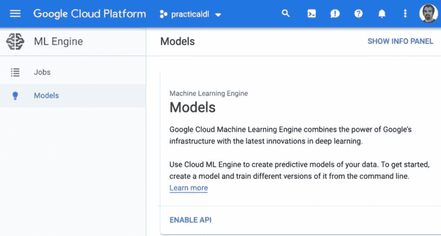

    ###### 图 9-3\. Google Cloud ML Engine 仪表板上机器学习模型的列表页面

1.  为模型命名并添加描述（图 9-4）。

    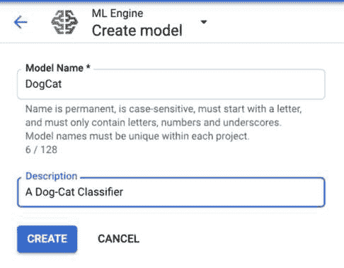

    ###### 图 9-4\. Google Cloud ML Engine 上的模型创建页面

1.  模型创建完成后，我们可以在列表页面上访问模型（图 9-5）。

    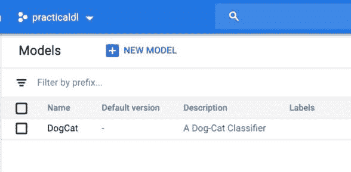

    ###### 图 9-5\. Google Cloud ML Engine 上的模型列表页面

1.  单击模型以转到模型详细信息页面（图 9-6）并添加新版本。

    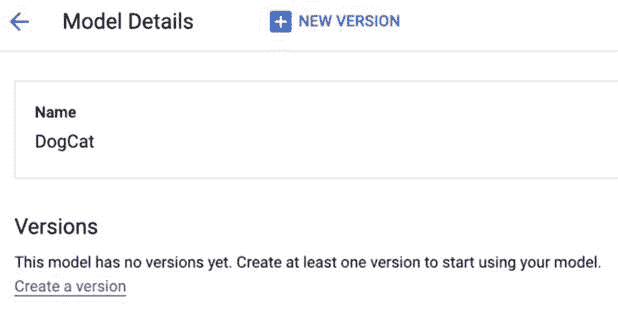

    ###### 图 9-6\. 刚创建的 Dog/Cat 分类器的详细页面

1.  填写必要信息以创建新版本。底部的最后一个字段要求您在使用之前将模型上传到 Google Cloud Storage。单击“浏览”按钮以创建用于存储模型的新存储桶（图 9-7）。

    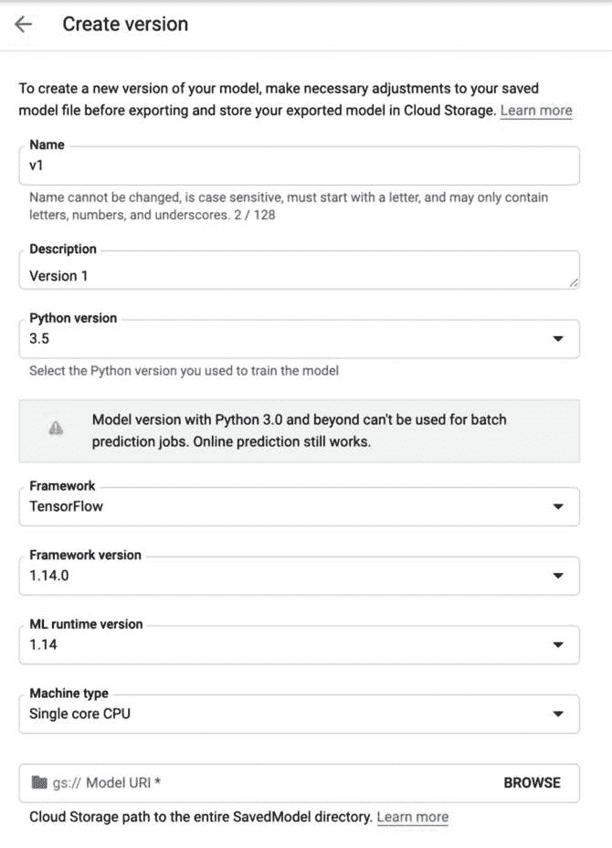

    ###### 图 9-7\. 为机器学习模型创建一个新版本

1.  创建一个具有唯一名称、存储类和区域的新存储桶。创建此存储桶后，转到[*https://console.cloud.google.com/storage/browser*](https://console.cloud.google.com/storage/browser)（在保持当前标签页打开的同时在新标签页中打开）找到这个新创建的存储桶并将模型上传到那里（图 9-8）。

    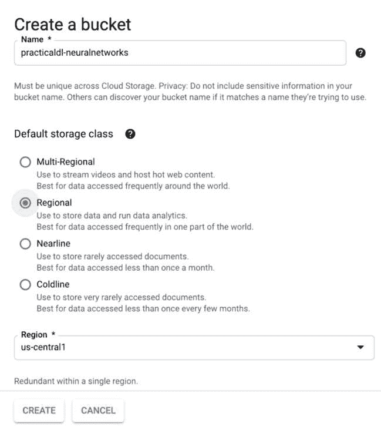

    ###### 图 9-8\. 在 ML 模型版本创建页面内创建一个新的 Google Cloud Storage 存储桶

1.  我们的 Dog/Cat 分类器模型是一个*.h5*文件。但是，Google Cloud 期望一个 SavedModel 文件。您可以在本书的 GitHub 存储库（请参阅[`PracticalDeepLearning.ai`](http://PracticalDeepLearning.ai)）的*code/chapter-9/scripts/h5_to_tf.ipynb*中找到将*.h5*文件转换为 SavedModel 的脚本。只需加载模型并执行笔记本的其余部分。

1.  在 Google Cloud Storage 浏览器中，将新转换的模型（图 9-9）上传到您在第 6 步中创建的存储桶中。

    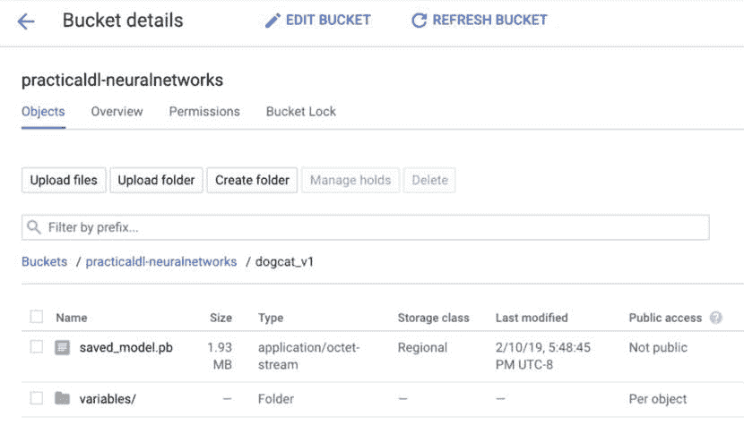

    ###### 图 9-9\. Google Cloud Storage 浏览器页面显示以 TensorFlow 格式上传的 Dog/Cat 分类器模型

1.  在模型版本创建页面上指定您刚上传的模型的 URI（图 9-10）。

    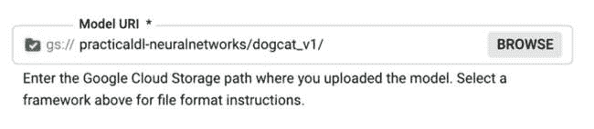

    ###### 图 9-10\. 将上传到 Google Cloud Storage 的模型的 URI 添加到其中

1.  点击保存按钮，等待模型版本创建。一旦模型版本创建完成，您就可以开始针对它进行预测。

1.  如果您的机器上还没有安装，您可以从安装网站[*https://cloud.google.com/sdk/install*](https://cloud.google.com/sdk/install)下载并安装 Google Cloud SDK。

1.  您可以使用 Cloud ML Engine REST API 进行请求。但是，为了简洁起见，请使用 Cloud SDK 中的命令行工具。您首先需要使用位于*code/chapter-9*的*image-to-json.py*脚本将图像转换为*request.json*文件：

    ```py
    $ python image-to-json.py --input dog.jpg --output request.json
    ```

1.  接下来，使用在上一步中创建的*request.json*文件来执行针对我们模型的请求：

    ```py
    $ time cloud ai-platform predict --model DogCat --version v1 
                                     --json-instances
    request.json

    SCORES
    [0.14749771356, 0.8525022864]

    real     0m3.370s
    user     0m0.811s
    sys 0m0.182s
    ```

从输出中可以看到，我们得到了与我们的 Flask 服务器相似的结果；即“狗”的预测，置信度为 85%。

###### 注意

如果这是您第一次使用**`gcloud`**，您需要运行以下命令将命令行工具与您的 Google 账户绑定：

```py
$ gcloud auth login
```

接下来，使用以下命令选择项目：

```py
$ gcloud config set project {project_name}
```

小菜一碟，不是吗？在我们的示例中，为了简洁起见，我们使用 Google Cloud SDK 请求预测。在生产场景中，您可能希望使用 Google 的 API 端点执行相同的预测请求；可以通过生成 HTTP 请求或使用他们的客户端库来执行。我们可以在 Google Cloud 文档中查看生产场景的文档。

此时，该模型已准备好通过浏览器、移动设备和边缘设备、桌面以及云环境上的应用程序提供给全球任何用户。对于希望在云提供的灵活性和可靠性的个人和组织来说，使用托管堆栈是一个相当可行的选择，同时对基础设施的设置和维护工作要求最小。

相比之下，有些情况下托管解决方案可能不是最佳选择。原因可能包括定价模型、数据隐私问题、法律问题、技术问题、信任问题或合同义务。在这种情况下，一个在本地托管和管理的解决方案将更可取。

###### 提示

为了一次处理大量图像，您可以修改*image-to-json.py*以创建包含多个输入数组的*request.json*文件。

# TensorFlow Serving

TensorFlow Serving 是 TensorFlow 生态系统中用于快速提供机器学习模型的开源库。与 Flask 不同，它专为性能而构建，具有低开销，并设计用于生产环境中使用。大公司广泛使用 TensorFlow Serving 来为他们的预测服务提供模型。它是 TensorFlow Extended (TFX)的一个重要组件，TFX 是 TensorFlow 生态系统中的端到端深度学习管道之一。

正如我们在查看生产系统所需的特性时看到的，TensorFlow Serving 提供低延迟、故障处理、高吞吐量和模型版本控制。另一个好处是能够在同一服务上同时提供多个模型。它实现了几种技术来加速服务：

+   在服务器启动期间，它启动了一批线程以快速加载模型。

+   它为加载模型和提供推理使用单独的线程池，同时给予推理池中的线程更高的优先级。这对降低请求延迟至关重要。

+   它在短时间内构建传入异步请求的小批量。正如我们所见，在训练期间在 GPU 上批处理数据的强大功能，它旨在在异步请求中带来类似的效率。例如，等待 500 毫秒来将几个推理请求分组。在最坏的情况下，这会为批处理中的第一个请求增加 500 毫秒的惩罚，但它会减少请求的平均延迟，并最大化硬件利用率。

###### 注意

TensorFlow Serving 让你完全控制模型发布过程。你可以在同一个进程中为不同的模型或同一种模型的不同版本提供服务。你只需要确保你知道要删除或投入生产的版本的名称和位置。

## 安装

有几种不同的设置 TensorFlow Serving 的方法：

+   从源代码构建

+   使用 APT 下载和安装

+   部署 Docker 镜像

如果你感到冒险，从源代码构建可能是你寻求的危险。但如果你只是想快速启动并运行，我们建议使用 Docker，因为它需要最少的步骤来启动系统。你可能会问，什么是 Docker？Docker 为在其中运行的应用程序提供了 Linux 环境的虚拟化。它提供了资源隔离，基本上作为一个干净的板凳来设置一个应用程序可以运行的环境。通常，一个应用程序及其所有依赖项被打包到一个单独的 Docker 容器中，然后根据需要重复部署。因为应用程序是在一个干净的环境中设置的，它减少了配置和部署错误的可能性。这使得 Docker 非常适合在生产中运行应用程序。

Docker 为我们提供的最大好处是减轻“依赖地狱”，因为所有必要的依赖项都打包在容器中。使用 Docker 的另一个优势是，在不同平台上设置应用程序的过程基本上保持一致，无论你使用 Windows、Linux 还是 Mac。

Docker 安装说明，取决于目标平台，可在 Docker 主页上找到。这应该不会花费太多时间，因为设置非常简单。安装完 Docker 后，你可以运行以下命令来为 CPU 设置 TensorFlow Serving：

```py
$ docker run -p 8501:8501 \
--mount type=bind,source=/path/to/dogcat/,target=/models/dogcat \
-e MODEL_NAME=dogcat -t tensorflow/serving
```

对于启用 GPU 的机器，运行以下命令：

```py
$ docker run -p 8501:8501 --runtime=nvidia \
--mount type=bind,source=/path/to/dogcat/,target=/models/dogcat \
-e MODEL_NAME=dogcat -t tensorflow/serving
```

无论哪种情况，如果一切顺利，你应该在本地端口 8501 上运行一个 REST API，为我们的狗/猫分类器提供服务。

###### 注意

在任何推理请求中，端到端延迟是沿着过程中多个步骤所花费的时间的总和。这包括往返网络时间，序列化/反序列化请求和响应对象的时间，当然还有执行实际推理的时间。增加开销的另一个组件是服务框架；也就是 TensorFlow Serving。谷歌声称 TensorFlow Serving 贡献的开销很小。在实验中，它观察到 TensorFlow Serving 单独能够在 16 核 Intel Xeon E5 2.6 GHz 机器上每个核心处理大约 100,000 个 QPS。因为它正在测量开销，这不包括远程过程调用（RPC）时间和 TensorFlow 推理处理时间。

尽管 TensorFlow Serving 是从单台机器提供推理的绝佳选择，但它没有用于水平扩展的内置功能。相反，它被设计用于与其他系统一起使用，这些系统可以通过动态扩展来增强 TensorFlow Serving。我们将在下一节中探讨一个这样的解决方案。

# KubeFlow

在本书中，我们探讨了端到端深度学习流水线的各个步骤，从数据摄入、分析、规模化的分布式训练（包括超参数调整）、跟踪实验、部署，最终到规模化提供预测请求。每个步骤都有其自身的复杂性，具有一套工具、生态系统和专业领域。人们将毕生精力投入到这些领域中的一个。这并不是一件轻而易举的事情。当考虑到必要的后端工程、硬件工程、基础设施工程、依赖管理、DevOps、容错和其他工程挑战时，所需的专业知识的组合爆炸可能导致大多数组织的招聘过程非常昂贵。

正如我们在前一节中看到的，Docker 通过提供可移植的容器，省去了我们管理依赖关系的麻烦。它帮助我们轻松地在各个平台上提供 TensorFlow Serving，而无需从源代码构建或手动安装依赖项。太好了！但它仍然没有回答许多其他挑战。我们如何扩展容器以匹配需求的增长？我们如何有效地在容器之间分发流量？我们如何确保容器彼此可见并能够通信？

这些问题是由*Kubernetes*回答的。Kubernetes 是一个自动部署、扩展和管理容器（如 Docker）的编排框架。由于它利用了 Docker 提供的可移植性，我们可以使用 Kubernetes 在开发人员笔记本电脑和几千台机器集群上几乎相同的方式部署。这有助于在不同环境中保持一致性，并具有可访问的可扩展性。值得注意的是，Kubernetes 不是机器学习的专用解决方案（Docker 也不是）；相反，它是解决软件开发中许多问题的通用解决方案，我们在深度学习的背景下使用它。

但让我们不要过于急躁。毕竟，如果 Kubernetes 是一切的解决方案，它就会出现在章节标题中！使用 Kubernetes 的机器学习从业者仍然需要组装所有适当的容器集合（用于训练、部署、监控、API 管理等），然后需要将它们协调在一起，以构建一个完全运作的端到端流水线。不幸的是，许多数据科学家正在尝试在他们自己的孤立环境中做这件事，重新发明轮子，构建临时的机器学习特定流水线。我们能不能省去所有人的麻烦，为机器学习场景制定一个基于 Kubernetes 的解决方案呢？

*KubeFlow*登场了，它承诺自动化大部分这些工程挑战，并隐藏了运行分布式、可扩展、端到端深度学习系统的复杂性背后的一个基于 Web GUI 的工具和一个强大的命令行工具。这不仅仅是一个推理服务。把它看作一个大型工具生态系统，可以无缝地互操作，更重要的是，可以随需求扩展。KubeFlow 是为云构建的。虽然不只是一个云——它建立在与所有主要云提供商兼容的基础上。这对成本有重大影响。因为我们不受限于特定的云提供商，如果竞争云提供商降低价格，我们可以随时自由地转移所有操作。毕竟，竞争有利于消费者。

KubeFlow 支持各种硬件基础设施，从开发人员的笔记本电脑和本地数据中心，一直到公共云服务。由于它是建立在 Docker 和 Kubernetes 之上的，我们可以放心，无论是在开发人员的笔记本电脑上部署还是在数据中心的大型集群上部署，环境都是相同的。开发人员设置与生产环境不同的任何方式都可能导致故障，因此在各种环境中保持一致性非常有价值。

表 9-4 展示了 KubeFlow 生态系统中现成可用的工具的简要列表。

表 9-4\. KubeFlow 上可用的工具

| **工具** | **功能** |
| --- | --- |
| Jupyter Hub | 笔记本环境 |
| TFJob | 训练 TensorFlow 模型 |
| TensorFlow Serving | 服务 TensorFlow 模型 |
| Seldon | 服务模型 |
| NVIDIA TensorRT | 服务模型 |
| Intel OpenVINO | 服务模型 |
| KFServing | 用于服务 Tensorflow、XGBoost、scikit-learn、PyTorch 和 ONNX 模型的抽象 |
| Katib | 超参数调整和 NAS |
| Kubebench | 运行基准测试作业 |
| PyTorch | 训练 PyTorch 模型 |
| Istio | API 服务、身份验证、A/B 测试、发布、指标 |
| Locust | 负载测试 |
| 管道 | 管理实验、作业和运行，调度机器学习工作流程 |

社区中有一个笑话，有这么多预打包技术，KubeFlow 最终使我们的简历符合流行词（和招聘人员）的要求。

###### 注

许多人认为 KubeFlow 是 Kubernetes 和 TensorFlow 的组合，但正如您所见，事实并非如此。它是那样，而且更多。

KubeFlow 的两个重要部分使其独特：管道和公平。

## 管道

管道使我们能够在机器学习中组合步骤，安排复杂的工作流程。图 9-11 展示了一个管道的示例。通过 GUI 工具查看管道可以帮助利益相关者理解它（不仅仅是构建它的工程师）。

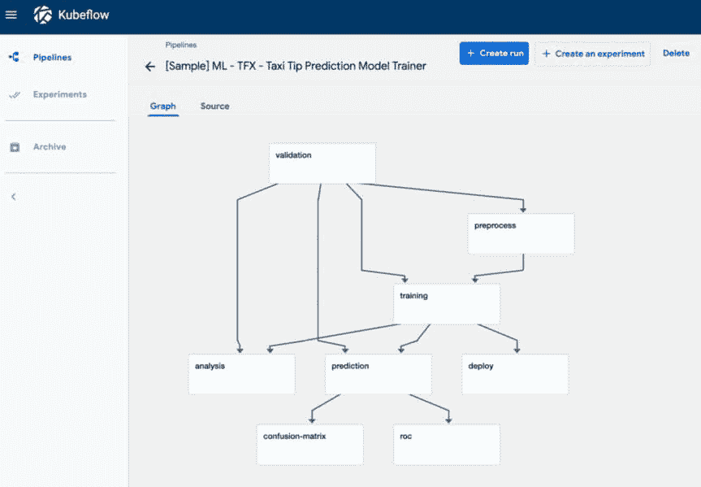

###### 图 9-11\. 在 KubeFlow 中展示的端到端管道

## 公平

公平允许我们通过 Jupyter Notebooks 直接管理整个构建、训练和部署生命周期。图 9-12 展示了如何启动一个新的笔记本服务器，在那里我们可以托管所有的 Jupyter 笔记本，在上面运行训练，并使用几行代码将我们的模型部署到谷歌云，同时还可以在非常熟悉的 Jupyter 环境中进行操作：

```py
from fairing.deployers.gcp.gcpserving import GCPServingDeployer
GCPServingDeployer().deploy(model_dir, model_name, version_name)
```

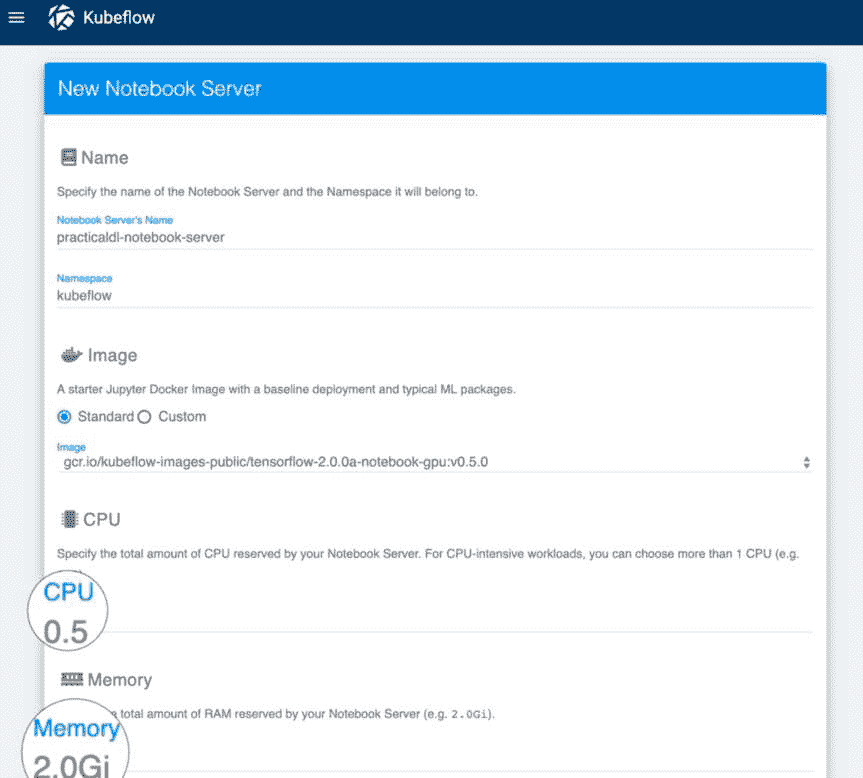

###### 图 9-12\. 在 KubeFlow 上创建一个新的 Jupyter Notebook 服务器

## 安装

创建一个新的 KubeFlow 部署是一个非常简单的过程，在 KubeFlow 网站上有详细的文档。您可以使用浏览器为 GCP 设置 KubeFlow。或者，您可以使用 KubeFlow 命令行工具在 GCP、AWS 和 Microsoft Azure 上设置部署。图 9-13 展示了使用 Web 浏览器进行 GCP 部署。

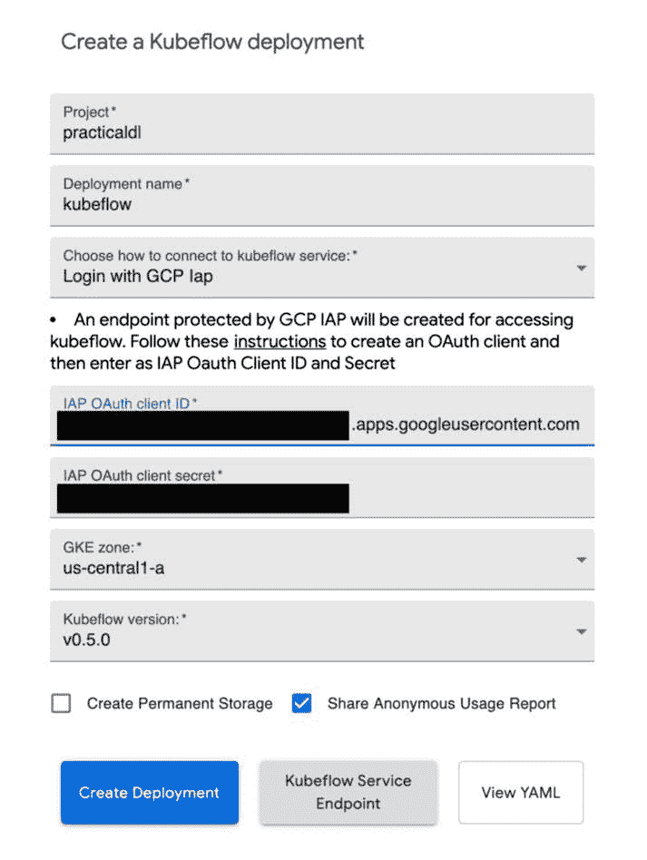

###### 图 9-13\. 在浏览器上创建一个在 GCP 上使用 KubeFlow 部署

截至目前，KubeFlow 正在积极开发，并没有停止的迹象。像红帽、思科、戴尔、优步和阿里巴巴这样的公司是一些积极的贡献者，云巨头如微软、谷歌和 IBM 也是如此。解决困难挑战的简易性和可访问性吸引更多人使用任何平台，而 KubeFlow 正是在做这件事。

# 价格与性能考虑

在第六章中，我们看了如何提高我们的模型性能，无论是在智能手机上还是在服务器上进行推理。现在让我们从另一个角度来看：硬件性能和涉及的价格。

在构建生产系统时，我们通常希望灵活选择合适的硬件，以在性能、规模和价格之间取得适当的平衡。考虑构建一个需要基于云的推理的应用程序。我们可以手动设置我们自己的堆栈（使用 Flask 或 TensorFlow Serving 或 KubeFlow），或者我们可以使用托管的推理即服务堆栈（如 Google Cloud ML Engine）。假设我们的服务爆红了，让我们看看会花费多少。

## 推理即服务的成本分析

对于 Google Cloud ML Engine，在 2019 年 8 月的北美地区，单核 CPU 机器的综合推理时间每小时的成本相当便宜，为 0.0401 美元。还有一个四核 CPU 机器的选项，但实际上，单核应该足够满足大多数应用程序的需求。向服务器运行几个查询，使用一个 12 KB 的小图像，平均需要大约 3.5 秒，如图 9-14 所示。这听起来很慢，部分原因是在一个中等速度的机器上进行推理，更重要的是在一个 CPU 服务器上。值得一提的是，这个基准测试是在一个已经接收到 API 请求并且已经预加载了模型的机器上进行的。相比之下，第一个查询需要 30 到 60 秒。这显示了保持服务持续运行或发送频繁的预热查询的重要性。这是因为如果 Google Cloud ML 引擎注意到长时间不使用，它会关闭模型。

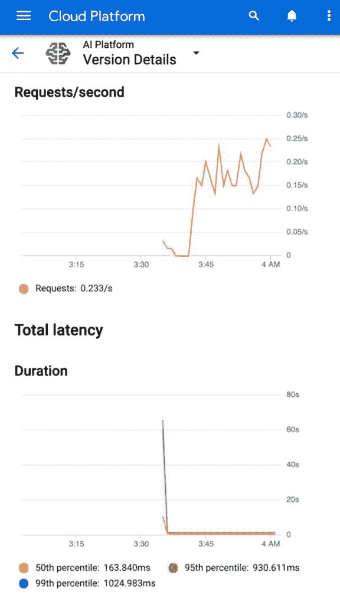

###### 图 9-14。Google Cloud ML Engine 显示传入查询和提供调用的延迟，用户端的端到端延迟约为 3.5 秒

如果每秒有一个请求持续一个月，总共将有 60 x 60 x 24 x 30 = 2,592,000 次调用。假设每个推理需要 3.5 秒，单个节点将不足以满足需求。云服务会迅速意识到这一点，并针对增加的流量，启动三台额外的机器来处理流量。总共，四台机器在每个节点每小时 0.0401 美元的情况下运行一个月，总成本将为 115.48 美元。换句话说，对于两百万次调用，这大约相当于一个月每天一杯星巴克咖啡的成本。而且我们不要忘记这还没有涉及太多的 DevOps 团队成员，他们的时间是昂贵的。如果我们考虑一个类似 Yelp 的服务的假设情景，用户平均每秒上传 64 个 QPS 的食物照片，使用分类模型对其进行推理只需要花费 7390 美元。

## 构建自己的堆栈的成本分析

少花钱，高可扩展性，这是一个成功的组合。但唯一的缺点是每个请求的总往返延迟。自己动手，获取一个在云上带有适度 GPU 的虚拟机，并设置我们的扩展管道（使用 KubeFlow 或使用 TensorFlow Serving 的本地云负载平衡功能），我们可以在毫秒内做出响应，或者批量处理几个传入的查询（比如每 500 毫秒）来提供服务。例如，在 Azure 的 VM 清单中，我们可以以每小时 2.07 美元的价格租用一台 ND6 机器，该机器配备了 NVIDIA P40 GPU 和 112 GiB RAM。通过每 500 毫秒到 1 秒批量处理传入请求，这台机器可以以每月 1490 美元的总成本为 64 个请求每秒提供服务，比 Google Cloud ML Engine 更快。

总之，在处理大量 QPS 场景时，自己编排云机器环境的成本节约和性能优势在图 9-15 中得到了充分展示。

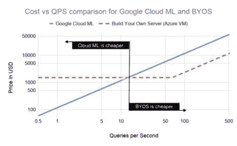

###### 图 9-15。基础设施即服务（Google Cloud ML Engine）与在虚拟机上构建自己的堆栈（Azure VM）的成本比较（截至 2019 年 8 月的成本）

###### 提示

在基准测试中经常出现的一个问题是我的系统的极限是什么？[JMeter](https://jmeter.apache.org)可以帮助回答这个问题。JMeter 是一个负载测试工具，可以让您通过易于使用的图形界面对系统进行压力测试。它允许您创建可重用的配置来模拟各种使用场景。

# 总结

在这一章中，我们回答了大多数工程师和开发人员提出的问题：在现实世界的应用程序中如何扩展为规模化的模型预测请求？我们探讨了四种不同的方法来提供图像识别模型：使用 Flask、Google Cloud ML、TensorFlow Serving 和 KubeFlow。根据规模、延迟要求和我们的技能水平，一些解决方案可能比其他更具吸引力。最后，我们对不同堆栈的成本效益有了直观的了解。现在我们可以向世界展示我们出色的分类器模型，剩下的就是让我们的工作走向病毒式传播！
