# 第十章：在浏览器中使用 TensorFlow.js 和 ml5.js 的人工智能

与客座作者 Zaid Alyafeai 合作撰写

你是一个有远大梦想的开发者。你有一个了不起的 AI 模型，你希望很多人尝试。多少人算是很多？一万人？一百万人？不，傻瓜。你喜欢远大梦想。一亿人怎么样？这是一个很好的圆数。现在说服一亿人下载并安装一个应用程序，并为其在他们的手机上腾出空间并不容易。但如果我们告诉你，他们已经为你安装了一个应用程序。无需下载。无需安装。无需应用商店。这是什么黑魔法！当然，这就是 Web 浏览器。而且作为一个奖励，它也可以在你的 PC 上运行。

这就是谷歌在决定向数十亿用户推出其首个 AI 涂鸦时在其主页上所做的事情。而选择的主题比 J.S. Bach 的音乐更好的是什么呢。（Bach 的父母想要叫他 J.S. Bach，比 JavaScript 诞生还早了 310 年。他们有相当远见！）

简单来说，这个涂鸦允许任何人使用鼠标点击写下两小节的随机音符的一行（声音）。当用户点击一个标有“和谐”的按钮时，输入将被处理，与 Bach 写的数百首包含两到四行（声音）音乐的音乐相比较。系统会找出哪些音符与用户的输入最搭配，以创造出更丰富的 Bach 风格的音乐作品。整个过程在浏览器中运行，因此谷歌不需要扩展其机器学习预测基础设施。


###### 图 10-1. 谷歌的 Bach 音乐和谐器涂鸦

除了成本节省和在任何平台上运行的能力外，通过浏览器，我们可以为用户提供更丰富、更交互式的体验，因为网络延迟不是一个因素。当然，因为一旦模型被下载后，一切都可以在本地运行，最终用户可以从他们数据的隐私中受益。

考虑到 JavaScript 是 Web 浏览器的语言，深入研究可以在用户浏览器中运行我们训练好的模型的基于 JavaScript 的深度学习库对我们来说是有用的。这正是我们在本章中要做的事情。

在这里，我们专注于在浏览器中实现深度学习模型。首先，我们看一下不同基于 JavaScript 的深度学习框架的简要历史，然后转向 TensorFlow.js，最终是一个称为 ml5.js 的更高级抽象。我们还会检查一些复杂的基于浏览器的应用程序，比如检测一个人的身体姿势或将手绘涂鸦转换为照片（使用 GANs）。最后，我们会谈论一些实际考虑因素，并展示一些真实案例研究。

# 基于 JavaScript 的机器学习库：简要历史

近年来深度学习的突破，许多尝试都是为了让更多人以 Web 库的形式访问 AI。表 10-1 提供了不同库的简要概述，按照它们首次发布的顺序。

表 10-1. 不同基于 JavaScript 的深度学习库的历史概述（截至 2019 年 8 月的数据）

|  | **活跃年份** | **GitHub 上的★** | **以其闻名** |
| --- | --- | --- | --- |
| brain.js | 2015–至今 | 9,856 | 神经网络，RNNs，LSTMs 和 GRUs |
| ConvNetJS | 2014–2016 | 9,735 | 神经网络，CNNs |
| Synaptic | 2014–至今 | 6,571 | 神经网络，LSTMs |
| MXNetJS | 2015–2017 | 420 | 运行 MXNet 模型 |
| Keras.js | 2016–2017 | 4,562 | 运行 Keras 模型 |
| CaffeJS | 2016–2017 | 115 | 运行 Caffe 模型 |
| TensorFlow.js（以前称为 deeplearn.js） | 2017 至今 | 11,282 | 在 GPU 上运行 TensorFlow 模型 |
| ml5.js | 2017 至今 | 2,818 | 在 TF.js 之上易于使用。 |
| ONNX.js | 2018 至今 | 853 | 速度，运行 ONNX 模型 |

让我们更详细地了解一些这些库，并看看它们是如何发展的。

## ConvNetJS

[ConvNetJS](https://oreil.ly/URdv9)是由 Andrej Karpathy 于 2014 年设计的 JavaScript 库，作为他在斯坦福大学博士期间的课程的一部分。它在浏览器中训练 CNN，这是一个令人兴奋的提议，特别是在 2014 年，考虑到 AI 热潮开始兴起，开发人员不必经历繁琐和痛苦的设置过程即可运行。ConvNetJS 通过在浏览器中进行交互式训练演示，帮助许多人第一次接触 AI。

###### 注意

事实上，当麻省理工学院的科学家 Lex Fridman 在 2017 年教授他的热门自动驾驶课程时，他挑战全球学生使用强化学习在浏览器中使用 ConvNetJS 训练模拟自动驾驶汽车，如图 10-2 所示。

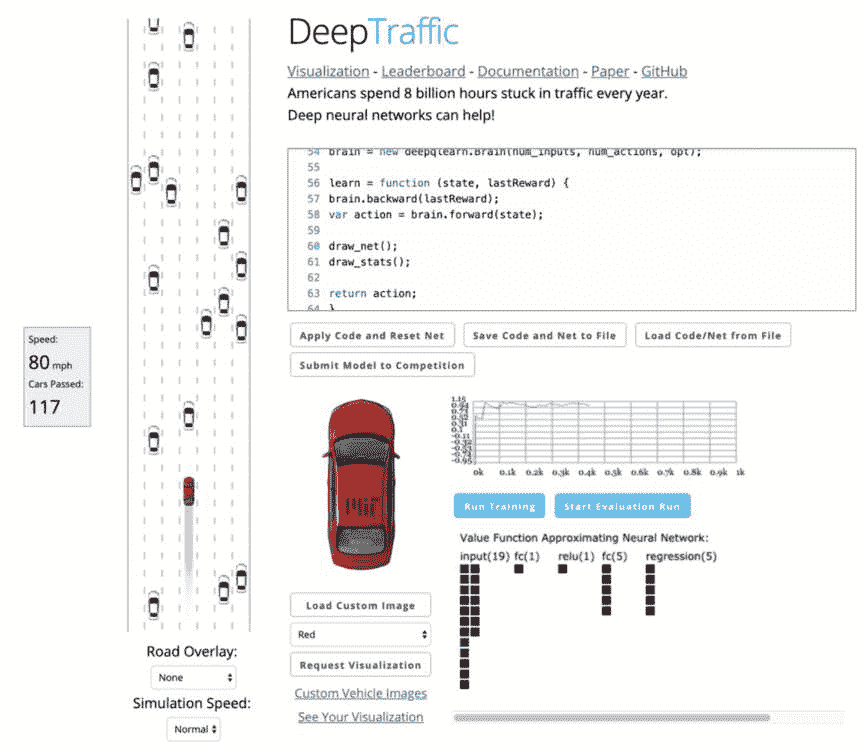

###### 图 10-2。使用 ConvNetJS 进行强化学习训练汽车的 DeepTraffic 截图

## Keras.js

Keras.js 是由 Leon Chen 于 2016 年推出的。它是一个在浏览器中使用 JavaScript 的 Keras 端口。Keras.js 使用 WebGL 在 GPU 上运行计算。它使用着色器（用于像素渲染的特殊操作）来运行推断，这使得它们比仅使用 CPU 运行要快得多。此外，Keras.js 可以在 CPU 上的 Node.js 服务器上运行以提供基于服务器的推断。Keras.js 实现了一些卷积、密集、池化、激活和 RNN 层。它已不再处于活跃开发阶段。

## ONNX.js

由 Microsoft 于 2018 年创建，ONNX.js 是一个 JavaScript 库，用于在浏览器和 Node.js 中运行 ONNX 模型。ONNX 是一个代表机器学习模型的开放标准，是 Microsoft、Facebook、Amazon 等公司的合作。ONNX.js 速度惊人。事实上，在早期基准测试中，甚至比 TensorFlow.js（下一节讨论）更快，如图 10-3 和图 10-4 所示。这可能归因于以下原因：

+   ONNX.js 利用 WebAssembly（来自 Mozilla）在 CPU 上执行，利用 WebGL 在 GPU 上执行。

+   WebAssembly 允许在 Web 浏览器中运行 C/C++和 Rust 程序，同时提供接近本机性能。

+   WebGL 在浏览器中提供像图像处理这样的 GPU 加速计算。

+   尽管浏览器往往是单线程的，但 ONNX.js 使用 Web Workers 在后台提供多线程环境以并行化数据操作。

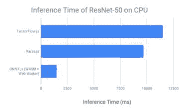

###### 图 10-3。在不同 JavaScript 机器学习库上对 ResNet-50 进行基准测试的数据（数据来源）

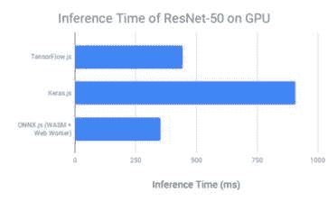

###### 图 10-4。在不同 JavaScript 机器学习库上对 ResNet-50 进行基准测试的数据（数据来源）

## TensorFlow.js

一些库提供了在浏览器内训练的能力（例如 ConvNetJS），而其他库提供了极快的性能（例如现已停用的 TensorFire）。来自 Google 的 deeplearn.js 是第一个支持使用 WebGL 进行快速 GPU 加速操作的库，同时还提供了在浏览器内定义、训练和推理的能力。它提供了即时执行模型（用于推理）以及延迟执行模型进行训练（类似于 TensorFlow 1.x）。这个项目最初于 2017 年发布，成为了 TensorFlow.js（2018 年发布）的核心。它被认为是 TensorFlow 生态系统的一个重要组成部分，因此目前是最活跃开发的 JavaScript 深度学习库。考虑到这一事实，我们在本章中专注于 TensorFlow.js。为了使 TensorFlow.js 更加简单易用，我们还看看 ml5.js，它构建在 TensorFlow.js 之上，抽象出其复杂性，提供了一个简单的 API，其中包含从 GAN 到 PoseNet 的现成模型。

# TensorFlow.js 架构

首先，让我们看一下 TensorFlow.js 的高级架构（请参见图 10-5）。TensorFlow.js 直接在桌面和移动设备的浏览器中运行。它利用 WebGL 进行 GPU 加速，但也可以回退到浏览器的运行时以在 CPU 上执行。

它由两个 API 组成：操作 API 和层 API。操作 API 提供对低级操作（如张量算术和其他数学运算）的访问。层 API 建立在操作 API 之上，提供卷积、ReLU 等层。

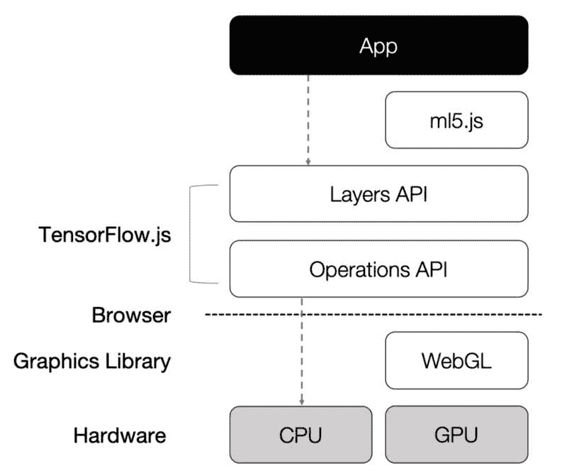

###### 图 10-5。TensorFlow.js 和 ml5.js 生态系统的高级概述

除了浏览器，TensorFlow.js 还可以在 Node.js 服务器上运行。此外，ml5.js 使用 TensorFlow.js 提供了一个更高级别的 API 以及几个预构建的模型。在不同抽象级别上都可以访问所有这些 API，使我们能够构建 Web 应用程序，不仅可以进行简单的推理，还可以在浏览器内部训练模型。

以下是在基于浏览器的 AI 开发生命周期中经常出现的一些常见问题：

+   我如何在浏览器中运行预训练模型？我可以使用我的网络摄像头实时交互吗？

+   我如何从我的 TensorFlow 训练模型为浏览器创建模型？

+   我能在浏览器中训练模型吗？

+   不同的硬件和浏览器如何影响性能？

我们在本章中回答了这些问题，首先是 TensorFlow.js，然后是 ml5.js。我们探索了 ml5.js 社区贡献的一些丰富的内置功能，否则直接在 TensorFlow.js 上实现将需要大量的工作和专业知识。我们还看看了一些创意开发者构建的激励示例之前的基准方法。

现在让我们看看如何利用预训练模型在浏览器中进行推理。

# 使用 TensorFlow.js 运行预训练模型

TensorFlow.js 提供了许多预训练模型，我们可以直接在浏览器中运行。一些示例包括 MobileNet、SSD 和 PoseNet。在下面的示例中，我们加载了一个预训练的 MobileNet 模型。完整的代码位于本书的 GitHub 存储库（请参见[*http://PracticalDeepLearning.ai*](http://PracticalDeepLearning.ai)）中的*code/chapter-10/mobilenet-example/*。

首先，我们导入库的最新捆绑包：

```py
<script src="https://cdn.jsdelivr.net/npm/@tensorflow/
tfjs@latest/dist/tf.min.js"></script>
```

然后我们导入 MobileNet 模型：

```py
<script src="https://cdn.jsdelivr.net/npm/
@tensorflow-models/mobilenet@1.0.0"></script>
```

现在我们可以使用以下代码进行预测：

```py

<p id="prediction_output">Loading predictions...</p>
<script>
 const image = document.getElementById("image");
 const predictionOutput = document.getElementById("prediction_output");

 // Load the model.
 mobilenet.load().then(model => {
   // Classify the image. And output the predictions
   model.classify(image).then(predictions => {
     predictionOutput.innerText = predictions[0].className;
   });
 });
</script>
```

图 10-6 显示了一个示例输出。

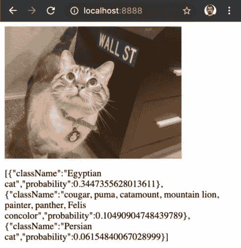

###### 图 10-6。浏览器中的类别预测输出

我们可以通过以下方式使用 JSON 文件 URL 加载模型：

```py
const path = 'https://storage.googleapis.com/tfjs-
models/tfjs/mobilenet_v1_1.0_224/model.json';

model = tf.loadLayersModel(path).then(model => {
    // Load model and output predictions here
});
```

JSON 文件包含模型的架构、参数名称和较小的分片权重文件的路径。分片使文件足够小，可以被 Web 浏览器缓存，这将使加载对于之后需要模型的任何时间更快。

# 用于浏览器的模型转换

在前一节中，我们看了如何加载一个已经以 JSON 格式存在的预训练模型。在本节中，我们将学习如何将一个预训练的 Keras 模型（`.h5`格式）转换为与 TensorFlow.js 兼容的 JSON 格式。为此，我们需要使用`pip`安装转换工具。

```py
$ pip install tensorflowjs
```

假设我们训练的 Keras 模型存储在名为*keras_model*的文件夹中，我们可以使用以下命令进行转换：

```py
$ tensorflowjs_converter --input_format keras keras_model/model.h5 web_model/
```

现在`web_model`目录将包含我们可以使用`tf.loadLayersModel`方法轻松加载的`.json`和`.shard`文件：

```py
$ ls web_model
group1-shard1of4  group1-shard3of4  model.json group1-shard2of4  group1-shard4of4
```

就是这样！将我们训练好的模型带到浏览器中是一项简单的任务。对于我们没有现成训练好的模型的情况，TensorFlow.js 也允许我们直接在浏览器中训练模型。在下一节中，我们将通过创建一个使用网络摄像头视频流训练模型的端到端示例来探索这一点。

###### 提示

在本地加载模型需要运行一个 Web 服务器。我们可以使用很多选项，从 LAMP（Linux, Apache, MySQL, PHP）堆栈到使用 npm 安装`http-server`，甚至在 Windows 上运行 Internet Information Services（IIS）来本地测试模型加载。甚至 Python 3 也可以运行一个简单的 Web 服务器：

```py
$ python3 -m http.server 8080
```

# 在浏览器中训练

前面的例子使用了一个预训练模型。让我们提高一下，直接在浏览器中使用来自网络摄像头的输入训练我们自己的模型。就像在之前的一些章节中一样，我们看一个简单的例子，利用迁移学习来加快训练过程。

从 Google 的 Teachable Machine 改编，我们使用迁移学习构建一个简单的二元分类模型，将使用网络摄像头的视频流进行训练。为了构建这个模型，我们需要一个特征提取器（将输入图像转换为特征或嵌入），然后连接一个网络将这些特征转换为预测。最后，我们可以使用网络摄像头的输入进行训练。代码可以在书的 GitHub 存储库中找到（参见[*http://PracticalDeepLearning.ai*](http://PracticalDeepLearning.ai))，路径为*code/chapter-10/teachable-machine*。

###### 注意

Google Creative Lab 建立了一个有趣的互动网站叫做[Teachable Machine](https://oreil.ly/jkM6W)，用户可以通过简单地在网络摄像头前展示这些对象来训练任何类型的分类问题的三个类别。这三个类别被简单地标记为绿色、紫色和橙色。在预测时，Teachable Machine 不会在网页上以文本形式显示单调的类别概率（甚至更糟的是在控制台中显示），而是显示可爱动物的 GIF 或根据被预测的类别播放不同的声音。可以想象，这对于课堂上的孩子来说将是一次有趣和引人入胜的体验，也将作为一个很好的工具来介绍他们 AI。

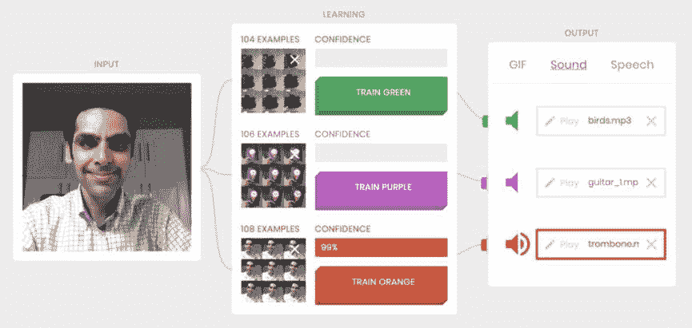

###### 图 10-7\. 在 Teachable Machine 中在浏览器中实时训练

## 特征提取

正如我们在本书的一些早期章节中所探讨的，从头开始训练一个大模型是一个缓慢的过程。使用一个预训练模型并利用迁移学习来定制模型以适应我们的用例是更便宜和更快速的。我们将使用该模型从输入图像中提取高级特征（嵌入），并使用这些特征来训练我们的自定义模型。

为了提取特征，我们加载并使用一个预训练的 MobileNet 模型：

```py
const path = 'https://storage.googleapis.com/tfjs-
models/tfjs/mobilenet_v1_1.0_224/model.json';
const mobilenet = await tf.loadLayersModel(path);
```

让我们检查模型的输入和输出。我们知道该模型是在 ImageNet 上训练的，最后一层预测了 1,000 个类别中的每一个的概率：

```py
const inputLayerShape = mobilenet.inputs[0].shape; // [null, 224, 224, 3]
const outputLayerShape = mobilenet.outputs[0].shape; // [null, 1000]
const numLayers = mobilenet.layers.length; // 88
```

提取特征时，我们选择一个靠近输出的层。在这里，我们选择`conv_pw_13_relu`并将其作为模型的输出；也就是说，移除末尾的密集层。我们创建的模型称为特征提取模型：

```py
// Get a specific layer const layer = mobilenet.getLayer('conv_pw_13_relu');

// Create a new feature extraction model featureExtractionModel = tf.model({inputs: mobilenet.inputs, outputs:
layer.output});

featureExtractionModel.layers.length; // 82
```

在训练过程中，我们将保持特征提取模型不变。相反，我们在其顶部添加一组可训练的层来构建我们的分类器：

```py
const trainableModel = tf.sequential({
    layers: [
        tf.layers.flatten({inputShape: [7, 7, 1024]}),
        tf.layers.dense({
        units: 64,
        activation: 'relu',
        kernelInitializer: 'varianceScaling',
        useBias: true
    }),
    tf.layers.dense({
        units: 2,
        kernelInitializer: 'varianceScaling',
        useBias: false,
        activation: 'softmax'
    })]
});
```

## 数据收集

在这里，我们使用网络摄像头捕获图像并进行特征提取处理。Teachable Machine 中的`capture()`函数负责设置`webcamImage`以存储从网络摄像头捕获的图像。现在，让我们对它们进行预处理，使其适用于特征提取模型：

```py
function capture() {
     return tf.tidy(() => {
         // convert to a tensor
         const webcamImage = tf.fromPixels(webcam);
         // crop to 224x224
         const croppedImage = cropImage(webcamImage);
         // create batch and normalize
         const batchedImage = croppedImage.expandDims(0);
         return batchedImage.toFloat().div(tf.scalar(127)).sub(tf.scalar(1));
     });
}
```

在捕获图像后，我们可以将图像和标签添加到训练数据中：

```py
function addTrainingExample(img, label) {
     // Extract features.
     const data = featureExtractionModel.predict(img);
     // One-hot encode the label.
     const oneHotLabel = tf.tidy(() =>
     tf.oneHot(tf.tensor1d([label], 'int32'), 2));
     // Add the label and data to the training set.
}
```

## 训练

接下来，我们训练模型，就像我们在第三章中训练的那样。就像在 Keras 和 TensorFlow 中一样，我们添加一个优化器并定义损失函数：

```py
const optimizer = tf.train.adam(learningRate);
model.compile({ optimizer: optimizer, loss: 'categoricalCrossentropy' });
model.fit(data, label, {
    batchSize,
    epochs: 5,
    callbacks: {
        onBatchEnd: async (batch, logs) => {
            await tf.nextFrame();
        }
    }
}
```

###### 注意

需要记住的一件重要事情是，在 GPU 上，由 TensorFlow.js 分配的内存在`tf.tensor`对象超出范围时不会被释放。一个解决方案是在每个创建的对象上调用`dispose()`方法。然而，这会使代码更难阅读，特别是涉及到链式调用时。考虑以下示例：

```py
const result = a.add(b).square().neg();
return result;
```

为了清理所有内存，我们需要将其分解为以下步骤：

```py
const sum = a.add(b);
const square = sum.square();
const result = square.neg();
sum.dispose();
square.dispose();
return result;
```

相反，我们可以简单地使用`tf.tidy()`来进行内存管理，同时保持我们的代码整洁和可读。我们的第一行代码只需要包裹在`tf.tidy()`块中，如下所示：

```py
const result = tf.tidy(() => {
    return a.add(b).square().neg();
});
```

在使用 CPU 后端时，对象会被浏览器自动垃圾回收。在那里调用`.dispose()`没有任何效果。

作为一个简单的用例，让我们训练模型来检测情绪。为此，我们只需添加属于两个类别之一的训练示例：快乐或悲伤。使用这些数据，我们可以开始训练。在图 10-8 中，展示了在每个类别的 30 张图像上训练模型后的最终结果。


###### 图 10-8\. 我们模型在浏览器中的网络摄像头视频中的预测

###### 提示

通常，在使用网络摄像头进行预测时，UI 会冻结。这是因为计算发生在与 UI 渲染相同的线程上。调用`await` `tf.nextFrame()`将释放 UI 线程，使网页响应并防止标签/浏览器冻结。

## GPU 利用率

我们可以通过 Chrome 分析器查看训练和推断期间的 CPU/GPU 利用率。在前面的示例中，我们记录了 30 秒的利用率并观察了 GPU 的使用情况。在图 10-9 中，我们看到 GPU 使用了四分之一的时间。

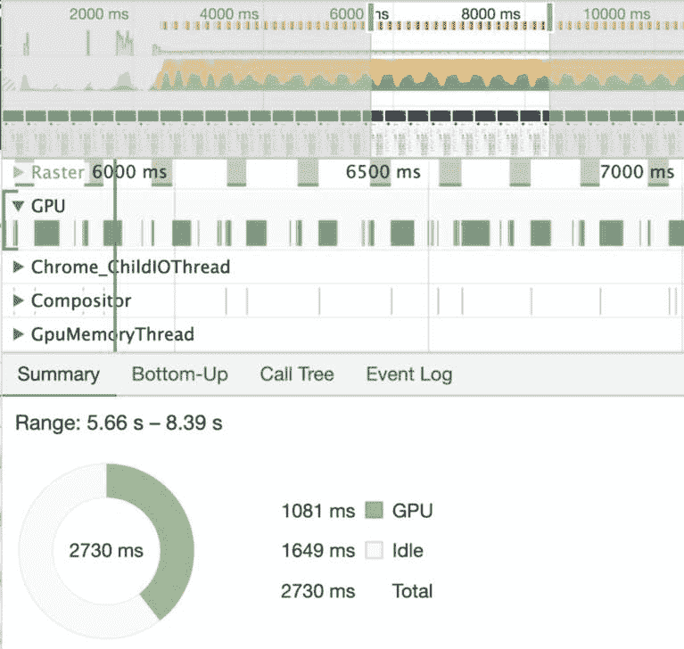

###### 图 10-9\. 在 Google Chrome 分析器视图中显示的 GPU 利用率

到目前为止，我们已经讨论了如何从头开始做所有事情，包括加载模型、从网络摄像头捕获视频、收集训练数据、训练模型和运行推断。如果所有这些步骤都可以在幕后处理，我们只需专注于如何处理推断结果，那不是很好吗？在下一节中，我们将使用 ml5.js 讨论这一点。

# ml5.js

ml5.js 是 TensorFlow.js 的一个更高级抽象，可以轻松地以统一的方式使用现有的预训练深度学习模型，只需很少的代码行数。该软件包配备了各种内置模型，从图像分割到声音分类再到文本生成，如 表 10-2 所示。此外，ml5.js 简化了与预处理、后处理等相关的步骤，让我们可以专注于使用这些模型构建我们想要的应用程序。对于这些功能，ml5js 都配备了一个 [演示](https://ml5js.org/reference) 和参考代码。

表 10-2\. ml5.js 中的选定内置模型，显示文本、图像和声音的功能范围

| **功能** | **描述** |
| --- | --- |
| PoseNet | 检测人体关节的位置 |
| U-Net | 对象分割；例如，去除对象背景 |
| 风格迁移 | 将一幅图像的风格转移到另一幅图像 |
| Pix2Pix | 图像到图像的转换；例如，黑白到彩色 |
| Sketch RNN | 根据不完整的草图创建涂鸦 |
| YOLO | 目标检测；例如，定位带有边界框的人脸 |
| 声音分类器 | 识别音频；例如，口哨、拍手、“一”、“停止”等 |
| 音高检测器 | 估计声音的音高 |
| Char RNN | 基于大量文本训练生成新文本 |
| 情感分类器 | 检测句子的情感 |
| Word2Vec | 生成词嵌入以识别词之间的关系 |
| 特征提取器 | 从输入生成特征或嵌入 |
| kNN 分类器 | 使用 *k*-最近邻创建快速分类器 |

让我们看看它的运行情况。首先，我们导入最新的 ml5.js 捆绑包，这类似于 TensorFlow.js：

```py
<script src="https://unpkg.com/ml5@latest/dist/ml5.min.js"
type="text/javascript"></script>
```

请注意，我们不再需要导入与 TensorFlow.js 相关的任何内容，因为它已经包含在 ml5.js 中。我们创建一个简单的示例，其中使用与之前相同的 MobileNet 场景：

```py
// Initialize the image classifier method with MobileNet
const classifier = ml5.imageClassifier('MobileNet', modelLoaded);

// Make a prediction with the selected image
classifier.predict(document.getElementById('image'), function(err, results) {
  console.log(results);
});
```

完成！在三行代码中，一个预训练模型就在我们的浏览器中运行了。现在，让我们打开浏览器的控制台，检查 图 10-10 中呈现的输出。

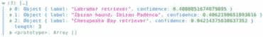

###### 图 10-10\. 预测类别及其概率

###### 提示

如果您不熟悉浏览器控制台，可以通过在浏览器窗口中的任何位置右键单击并选择“检查元素”来简单访问它。一个单独的窗口将打开，其中包含控制台。

我们可以在 *code/chapter-10/ml5js* 找到前面示例的完整源代码。

请注意，ml5.js 使用回调来管理模型的异步调用。回调是在相应调用完成后执行的函数。例如，在最后的代码片段中，模型加载完成后会调用 `modelLoaded` 函数，表示模型已加载到内存中。

###### 注意

p5.js 是一个与 ml5.js 配合得很好的库，可以通过实时视频流轻松进行模型预测。您可以在 *code/chapter-10/p5js-webcam/* 找到一个演示 p5.js 强大功能的代码片段。

ml5.js 原生支持 p5.js 元素和对象。您可以使用 p5.js 元素来绘制对象、捕获网络摄像头视频等。然后，您可以轻松地将这些元素作为输入传递给 ml5.js 回调函数。

# PoseNet

到目前为止，在本书中，我们主要探讨了图像分类问题。在后面的章节中，我们将研究目标检测和分割问题。这些问题类型构成了计算机视觉文献的大部分。然而，在本节中，我们选择暂时离开常规，处理一种不同类型的问题：关键点检测。这在包括医疗保健、健身、安全、游戏、增强现实和机器人技术等各种领域都有重要应用。例如，为了通过锻炼鼓励健康生活方式，墨西哥城安装了可以检测深蹲姿势并向至少做 10 个深蹲的乘客提供免费地铁票的亭子。在本节中，我们将探讨如何在我们谦卑的网络浏览器中运行如此强大的东西。

PoseNet 模型在浏览器中提供实时姿势估计。一个“姿势”包括人体不同关键点（包括关节）的位置，如头顶、眼睛、鼻子、颈部、手腕、肘部、膝盖、脚踝、肩膀和臀部。您可以使用 PoseNet 来检测同一帧中可能存在的单个或多个姿势。

让我们使用 PoseNet 构建一个示例，ml5.js 中已经提供了它，可以用来检测和绘制关键点（借助 p5.js 的帮助）。

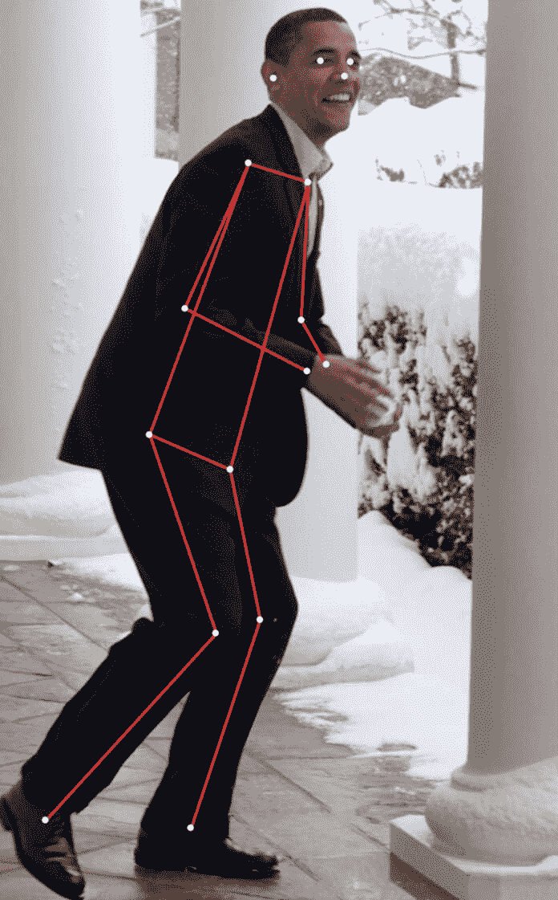

###### 图 10-11\. 使用 PoseNet 在前总统奥巴马参与雪仗的照片上绘制的关键点

您可以在*code/chapter-10/posenet/single.html*找到检测静态图像关键点的代码：

```py
<script src="http://p5js.org/assets/js/p5.min.js"></script>
<script src="http://p5js.org/assets/js/p5.dom.min.js"></script>
<script src="https://unpkg.com/ml5@latest/dist/ml5.min.js"></script>

<script>
function setup() {
    // Set up camera here

    // Call PoseNet model
    const poseNet = ml5.poseNet(video, modelReady);

    // PoseNet callback function
    poseNet.on('pose', function (results) {
        const poses = results;
    });
}
</script>
```

我们也可以在网络摄像头上运行类似的脚本（在*code/chapter-10/posenet/webcam.html*）。

现在让我们看另一个由 ml5.js 支持的示例。

# pix2pix

“Hasta la vista, baby!”

这是电影史上最令人难忘的台词之一。巧合的是，这是 1991 年经典电影《终结者 2：审判日》中一个 AI 机器人说的。顺便说一句，它的翻译是“再见，宝贝！”自那时以来，语言翻译技术已经取得了长足的进步。过去，语言翻译建立在短语替换规则上。现在，它被表现更好的深度学习系统所取代，这些系统能够理解句子的上下文，将其转换为目标语言中具有类似含义的句子。

想一想：如果我们可以从句子一翻译到句子二，那么我们是否可以将一幅图片从一个环境转换到另一个环境？我们可以做到以下这些吗：

+   将一幅图像从低分辨率转换为高分辨率？

+   将一幅图像从黑白转换为彩色？

+   将一幅图像从白天转换为夜晚视图？

+   将地球的卫星图像转换为地图视图？

+   将一幅手绘草图转换为照片？

嗯，图像翻译不再是科幻。2017 年，[Philip Isola 等人](https://oreil.ly/g5R60)开发了一种将一幅图片转换为另一幅图片的方法，方便地命名为 pix2pix。通过学习几对之前和之后的图片，pix2pix 模型能够基于输入图片生成高度逼真的渲染。例如，如图 10-12 所示，给定一个包的铅笔素描，它可以重新创建包的照片。其他应用包括图像分割、合成艺术形象等。

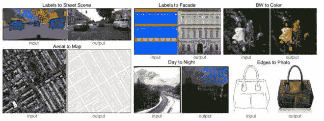

###### 图 10-12\. pix2pix 上输入和输出对的示例

###### 注意

想象一种情景，有一个银行出纳员和一个货币伪造者。银行出纳员的工作是发现假币，而伪造者的目标是尽可能地让银行出纳员难以识别假币。他们显然处于对抗性的情况。每当警察发现假钞时，伪造者都会从中学习错误，将其视为改进的机会（毕竟是成长思维），并试图让银行出纳员下次更难阻止他。这迫使银行出纳员随着时间的推移更善于识别假币。这种反馈循环迫使他们两个在自己的工作上变得更好。这是推动 GAN 的基本原理。

正如图 10-13 所示，GAN 由两个网络组成，一个生成器和一个鉴别器，它们与伪造者和银行出纳员具有相同的对抗关系。生成器的工作是生成看起来逼真的输出，与训练数据非常相似。鉴别器的责任是识别由生成器传递给它的数据是真实还是伪造的。鉴别器的输出被反馳回生成器以开始下一个周期。每当鉴别器正确地将生成的输出识别为伪造时，它会迫使生成器在下一个周期变得更好。

值得注意的是，GAN 通常无法控制要生成的数据。然而，有一些 GAN 的变体，如*条件 GAN*，允许标签成为输入的一部分，从而更好地控制输出生成；也就是说，调节输出。pix2pix 是条件 GAN 的一个例子。

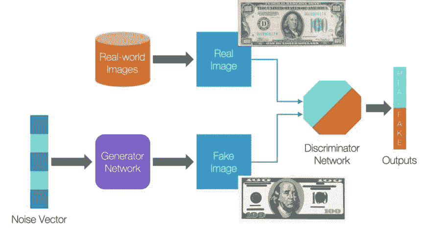

###### 图 10-13。GAN 的流程图

我们使用 pix2pix 创建了一个在浏览器中运行的简单素描应用程序。输出图像非常有趣。请考虑图 10-14 和图 10-15 中显示的示例。


###### 图 10-14。素描到图像示例

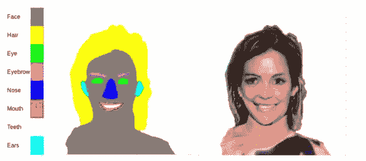

###### 图 10-15。我们可以创建彩色蓝图（左）和 pix2pix 将其转换为逼真的人脸（右）

###### 注意

有趣的事实：Ian Goodfellow 在酒吧时想出了 GAN 的想法。这为发明、组织和公司的想法起源于饮料的列表中又增加了一项，包括 RSA 算法、西南航空和魁地奇游戏的创造。

pix2pix 通过训练图像对来工作。在图 10-16 中，左侧的图像是输入图像或条件输入。右侧的图像是目标图像，我们想要生成的逼真输出（如果您正在阅读印刷版本，则不会看到右侧的彩色图像）。


###### 图 10-16。pix2pix 的训练对：一幅黑白图像及其原始彩色图像

训练 pix2pix 的一个更简单的端口是由[Christopher Hesse](https://oreil.ly/r-d1l)基于 TensorFlow 的实现。我们可以使用一个非常简单的脚本来训练我们自己的模型：

```py
python pix2pix.py \
  --mode train \
  --output_dir facades_train \
  --max_epochs 200 \
  --input_dir facades/train \
  --which_direction BtoA
```

训练完成后，我们可以使用以下命令保存模型：

```py
python tools/export-checkpoint.py --checkpoint ../export --output_file
models/MY_MODEL_BtoA.pict
```

之后，我们可以使用这段简单的代码将保存的权重加载到 ml5.js 中。请注意用于在画布中检索输出的转移函数：

```py
// Create a pix2pix model using a pre-trained network
const pix2pix = ml5.pix2pix('models/customModel.pict', modelLoaded);

// Transfer using a canvas
pix2pix.transfer(canvas, function(err, result) {
  console.log(result);
});
```

我们还可以绘制笔画并允许实时素描。例如，图 10-17 展示了一个绘制皮卡丘的示例。


###### 图 10-17。[Pix2Pix：从边缘到皮卡丘](https://oreil.ly/HIaSy)由 Yining Shi 制作，基于 ml5.js

# 基准测试和实际考虑

作为非常关心我们的最终用户如何看待我们的产品的人，对待他们是很重要的。两个因素在用户体验我们的产品时起着重要作用：模型大小和基于硬件的推理时间。让我们更仔细地看看每个因素。

## 模型大小

典型的 MobileNet 模型为 16 MB。在标准家庭或办公网络上加载这个可能只需要几秒钟。在移动网络上加载相同的模型会花更长时间。时间在流逝，用户变得不耐烦。而这还是在模型开始推理之前。等待大型模型加载对用户体验的影响比它们的运行时间更为有害，尤其是在互联网速度不如新加坡这样的宽带天堂的地方。有一些策略可以帮助：

选择最适合工作的最小模型

在预训练网络中，EfficientNet、MobileNet 或 SqueezeNet 往往是最小的（按准确性递减顺序）。

量化模型

在导出到 TensorFlow.js 之前，使用 TensorFlow 模型优化工具包减小模型大小。

构建我们自己的微型模型架构

如果最终产品不需要重量级的 ImageNet 级别分类，我们可以构建自己的较小模型。当谷歌在谷歌主页上制作 J.S. Bach 涂鸦时，其模型仅为 400 KB，几乎瞬间加载。

## 推理时间

考虑到我们的模型可以在运行在 PC 或手机上的浏览器中访问，我们希望特别注意用户体验，尤其是在最慢的硬件上。在我们的基准测试过程中，我们在不同设备上的各种浏览器中运行*chapter10/code/benchmark.html*。图 10-18 展示了这些实验的结果。

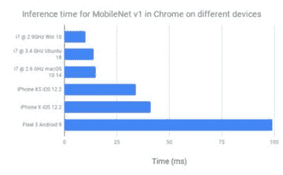

###### 图 10-18。在 Chrome 上不同设备上 MobileNetV1 的推理时间

图 10-18 暗示硬件越快，模型推理速度越快。苹果在 GPU 性能方面似乎胜过安卓。尽管，显然，这不是一个“不折不扣的比较”。

出于好奇，不同浏览器是否以相同的速度运行推理？让我们在 iPhone X 上找出答案；图 10-19 展示了结果。

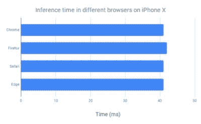

###### 图 10-19。iPhone X 上不同浏览器的推理时间

图 10-19 向我们展示了 iPhone 上所有浏览器的相同速度。这并不令人惊讶，因为所有这些浏览器都使用 iPhone 的基于 WebKit 的内置浏览器控件称为`WKWebView`。在 MacBook Pro 上呢？看看图 10-20。

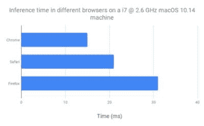

###### 图 10-20。在 i7 @ 2.6 GHz macOS 10.14 机器上不同浏览器的推理时间

结果可能会令人惊讶。在这个例子中，Chrome 的速度几乎是 Firefox 的两倍。为什么？打开 GPU 监视器显示，与 Firefox 相比，Chrome 的 GPU 利用率要高得多，稍高于 Safari。利用率越高，推理速度越快。这意味着根据操作系统的不同，浏览器可能具有不同的优化来加速 GPU 上的推理，从而导致不同的运行时间。

需要注意的一个关键点是这些测试是在顶级设备上进行的。它们不一定反映普通用户可能拥有的设备类型。这也对电池使用有影响，如果长时间运行。因此，我们需要对性能设置适当的期望，特别是对于实时用户体验。

# 案例研究

现在我们知道了浏览器上深度学习的所有要素，让我们看看这个行业正在做些什么。

## Semi-Conductor

你是否曾梦想指挥纽约爱乐乐团？通过[Semi-Conductor](https://oreil.ly/sNOFg)，你的梦想已经实现了一半。打开网站，站在网络摄像头前，挥动手臂，看着整个管弦乐团随你的意愿演奏莫扎特的《小夜曲》！正如你可能猜到的那样，它使用 PoseNet 来跟踪手臂运动，并利用这些运动来设置速度、音量和演奏音乐的乐器部分（包括小提琴、中提琴、大提琴和低音提琴）（图 10-21）。这个由谷歌悉尼创意实验室在澳大利亚悉尼建立的项目，使用了一个预先录制的音乐片段，将其分解成微小片段，每个片段根据手臂运动以得分速度和音量播放。手向上移动增加音量，移动更快增加速度。这种互动体验只有因为 PoseNet 能够在每秒几帧的速度下进行推理（在普通笔记本电脑上）。

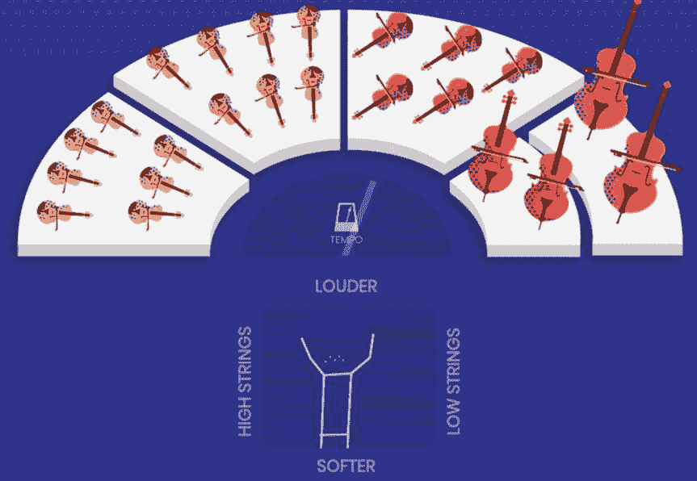

###### 图 10-21。通过在半导体演示器上挥动手臂来控制管弦乐团

## TensorSpace

CNNs 经常感觉...嗯，复杂。通常被视为黑匣子，很难理解。滤波器是什么样的？是什么激活了它们？为什么它们做出了某种预测？它们笼罩在神秘之中。与任何复杂的事物一样，可视化可以帮助打开这个黑匣子，使其更容易理解。这就是[TensorSpace](https://tensorspace.org)的作用，这个“在空间中呈现张量的库”。

它允许我们在 3D 空间中加载模型，探索它们在浏览器中的结构，通过它们进行缩放和旋转，输入数据，并了解图像是如何逐层处理并传递到最终预测层的。滤波器最终可以被手动检查，而无需任何安装。而且，正如图 10-22 所暗示的，如果你感觉很有见识，你甚至可以加载到虚拟现实中，并与任何背景进行对比！

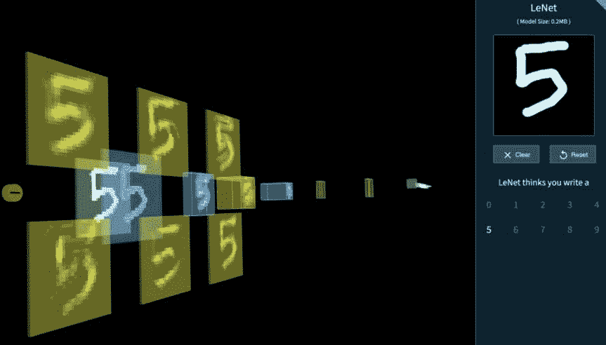

###### 图 10-22。在 TensorSpace 内可视化的 LeNet 模型

## Metacar

自动驾驶汽车是一个复杂的怪物。使用强化学习来训练它们可能需要很多时间、金钱和猴子扳手（不包括最初的碰撞）。如果我们能在浏览器中训练它们会怎样？[Metacar](https://metacar-project.com)通过提供一个模拟的 2D 环境来训练玩具汽车，使用强化学习，全部在浏览器中进行，如图 10-23 所示。就像玩视频游戏一样，你可以逐渐进入更难的关卡，Metacar 允许构建多个关卡来提高你的汽车性能。利用 TensorFlow.js，这旨在使强化学习更易于访问（我们将在第十七章中更详细地探讨这个问题，同时构建一个小型自动驾驶汽车）。

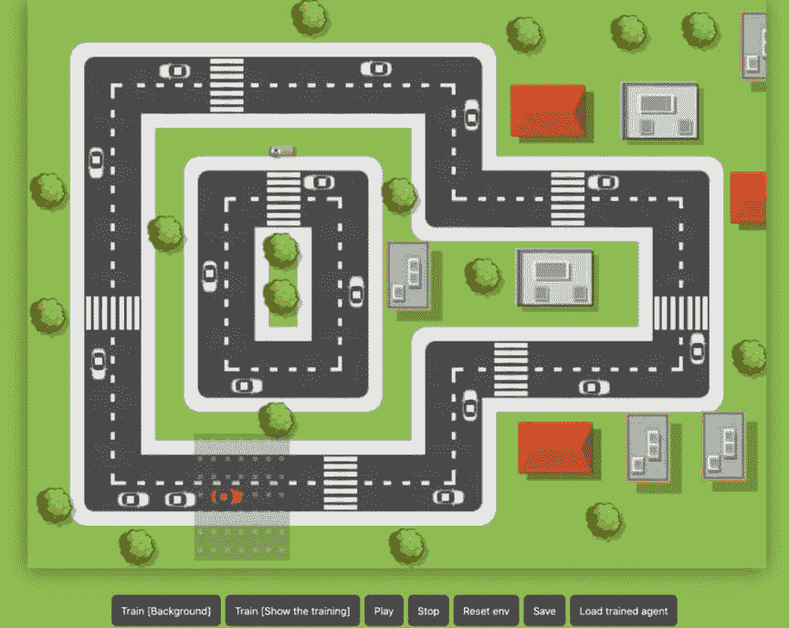

###### 图 10-23。用强化学习进行训练的 Metacar 环境

## Airbnb 的照片分类

在线房屋租赁公司 Airbnb 要求房主和租客上传他们的照片以完善个人资料。不幸的是，一些人试图上传他们最容易获得的照片——他们的驾照或护照。考虑到信息的机密性，Airbnb 使用在 TensorFlow.js 上运行的神经网络来检测敏感图像，并阻止它们上传到服务器。

## GAN 实验室

类似于[TensorFlow Playground](https://oreil.ly/vTpmu)（一个基于浏览器的神经网络可视化工具），[GAN 实验室](https://oreil.ly/aQgga)（图 10-24）是一个优雅的可视化工具，用于理解使用 TensorFlow.js 的 GAN。可视化 GAN 是一个困难的过程，因此为了简化它，GAN 实验室尝试学习简单的分布并可视化生成器和鉴别器网络的输出。例如，真实分布可以是在 2D 空间中表示一个圆的点。生成器从一个随机的高斯分布开始，并逐渐尝试生成原始分布。这个项目是乔治亚理工学院和谷歌 Brain/PAIR（People + AI Research）之间的合作。

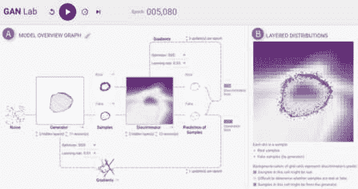

###### 图 10-24\. GAN 实验室截图

# 摘要

我们首先研究了基于 JavaScript 的深度学习库的发展，并选择了 TensorFlow.js 作为重点关注的候选。我们在网络摄像头上实时运行预训练模型，甚至在浏览器中训练模型。像 Chrome 的分析器这样的工具让我们了解 GPU 的使用情况。然后，为了进一步简化开发，我们使用了 ml5.js，这使我们能够仅用几行代码构建像 PoseNet 和 pix2pix 这样的演示。最后，我们在现实世界中对这些模型和库的性能进行了基准测试，最终得出了一些有趣的案例研究。

在浏览器中运行神经网络的一个巨大好处是浏览器相比于任何智能手机平台具有更广泛的覆盖范围。再加上不必克服用户不愿安装另一个应用的优势。这也为快速原型设计提供了一个平台，使得在投入大量时间和金钱构建本地体验之前，可以廉价地验证假设。TensorFlow.js 与 ml5.js 结合使用，加速了将人工智能的力量带入浏览器的过程，并将其覆盖范围扩大到大众。
