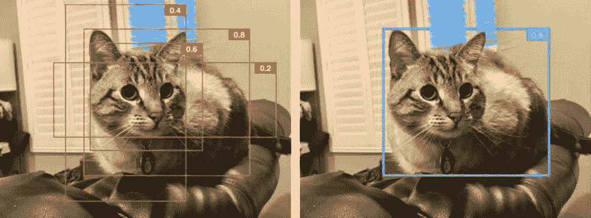
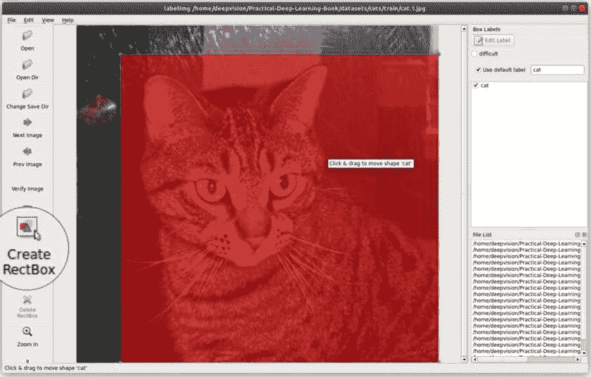
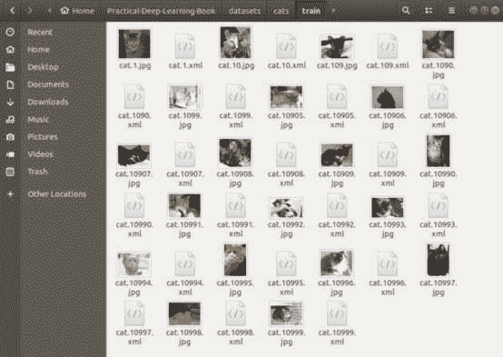
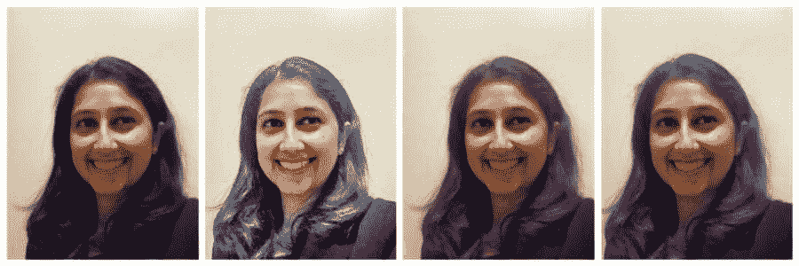
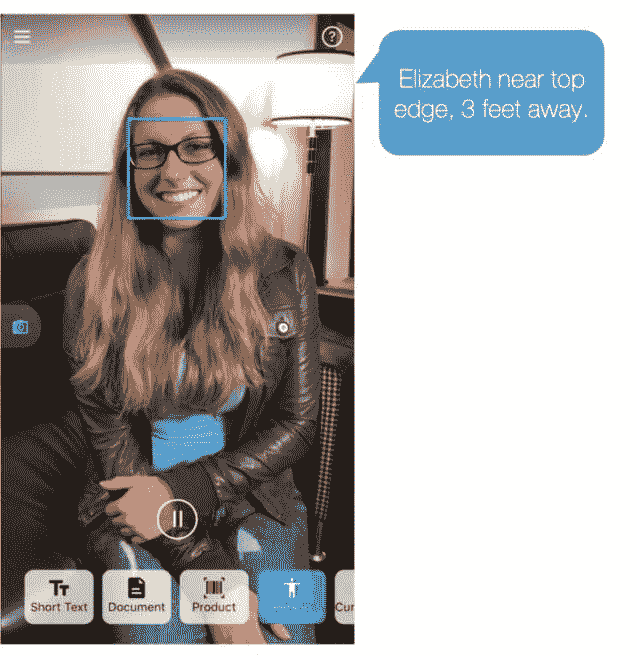

## 交并比

在目标检测训练流程中，通常使用诸如交并比（IoU）之类的指标作为过滤特定质量检测的阈值。为了计算 IoU，我们使用预测的边界框和实际边界框来计算两个不同的数字。第一个是预测和实际情况重叠的区域——交集。第二个是预测和实际情况覆盖的范围——并集。正如名称所示，我们简单地将交集的总面积除以并集的面积来获得 IoU。图 14-11 直观地展示了两个 2x2 正方形的 IoU 概念，它们在中间的一个 1x1 正方形中相交。


###### 图 14-11。IoU 比率的可视化表示

在理想情况下，预测的边界框与实际情况完全匹配，IoU 值将为 1。在最坏的情况下，预测与实际情况没有重叠，IoU 值将为 0。正如我们所看到的，IoU 值将在 0 和 1 之间变化，较高的数字表示较高质量的预测，如图 14-12 所示。

为了帮助我们过滤和报告结果，我们会设置一个最小 IoU 阈值。将阈值设置为非常激进的值（如 0.9）会导致丢失许多可能在后续流程中变得重要的预测。相反，将阈值设置得太低会导致太多虚假的边界框。通常用于报告目标检测模型精度的最小 IoU 为 0.5。


###### 图 14-12。IoU 的图示；更好模型的预测往往与实际情况有更重叠，导致更高的 IoU

值得在这里重申的是，IoU 值是针对每个类别实例计算的，而不是针对每个图像。然而，为了计算检测器在更大一组图像上的质量，我们会将 IoU 与其他指标（如平均精度）结合使用。

## 平均精度

在研究目标检测的论文中，我们经常遇到诸如 AP@0.5 的数字。该术语表示 IoU=0.5 时的平均精度。另一个更详细的表示方法是 AP@[0.6:0.05:0.75]，这是从 IoU=0.6 到 IoU=0.75 的平均精度，间隔为 0.05。平均精度（或 mAP）简单地是所有类别的平均精度。对于 COCO 挑战，使用的 MAP 指标是 AP@[0.5:0.05:0.95]。

## 非极大值抑制

在内部，目标检测算法对可能在图像中的对象的潜在位置提出了许多建议。对于图像中的每个对象，预期会有多个具有不同置信度值的边界框建议。我们的任务是找到最能代表对象真实位置的建议。一种天真的方法是只考虑置信度值最大的建议。如果整个图像中只有一个对象，这种方法可能有效。但如果图像中有多个类别，每个类别中有多个实例，这种方法就不起作用了。

非极大值抑制（NMS）来拯救我们（图 14-13）。NMS 背后的关键思想是，同一对象的两个实例不会有严重重叠的边界框；例如，它们的边界框的 IoU 将小于某个 IoU 阈值（比如 0.5）。实现这一点的一种贪婪方法是对每个类别重复以下步骤：

1.  过滤掉所有置信度低于最小阈值的建议。

1.  接受置信度值最大的提议。

1.  对于所有按其置信度值降序排序的剩余提议，检查当前框与先前接受的提议之一的 IoU 是否≥0.5。如果是，则过滤掉；否则，接受它作为提议。

    

    ###### 图 14-13。使用 NMS 找到最能代表图像中对象位置的边界框

# 使用 TensorFlow 目标检测 API 构建自定义模型

在本节中，我们将通过一个完整的端到端示例来构建一个对象检测器。我们将看到该过程中的几个步骤，包括收集、标记和预处理数据，训练模型，并将其导出为 TensorFlow Lite 格式。

首先，让我们看一些收集数据的策略。

## 数据收集

我们现在知道，在深度学习的世界中，数据至关重要。我们可以通过几种方式获取我们想要检测的对象的数据：

使用现成的数据集

有一些公共数据集可用于训练对象检测模型，如 MS COCO（80 个类别）、ImageNet（200 个类别）、Pascal VOC（20 个类别）和更新的 Open Images（600 个类别）。MS COCO 和 Pascal VOC 在大多数对象检测基准测试中使用，基于 COCO 的基准测试对于真实世界场景更具现实性，因为图像更复杂。

从网上下载

我们应该已经熟悉这个过程，因为在第十二章中，我们为“热狗”和“非热狗”类别收集了图像。浏览器扩展程序如 Fatkun 对于快速从搜索引擎结果中下载大量图像非常方便。

手动拍照

这是更耗时（但潜在有趣）的选项。为了构建一个强大的模型，重要的是用在各种不同环境中拍摄的照片来训练它。拿着要检测的对象，我们应该至少拍摄 100 到 150 张不同背景下的照片，具有各种构图和角度，并在许多不同的光照条件下。图 14-14 展示了用于训练可乐和百事对象检测模型的一些照片示例。考虑到模型可能会学习到红色代表可乐，蓝色代表百事这种虚假相关性，最好混合对象和可能会混淆它的背景，以便最终实现更强大的模型。


###### 图 14-14。在各种不同环境中拍摄的对象照片，用于训练对象检测模型

值得在对象不太可能使用的环境中拍摄对象的照片，以使数据集多样化并提高模型的稳健性。这也有一个额外的好处，可以使原本乏味和繁琐的过程变得有趣。我们可以通过挑战自己想出独特和创新的照片来使其有趣。图 14-15 展示了在构建货币检测器过程中拍摄的一些创意照片的示例。


###### 图 14-15。在构建多样化货币数据集过程中拍摄的一些创意照片

因为我们想要制作一个猫检测器，我们将重复使用“猫和狗”Kaggle 数据集中的猫图片，该数据集在第三章中使用过。我们随机选择了该数据集中的图片，并将它们分成训练集和测试集。

为了保持输入到我们网络的大小的统一性，我们将所有图像调整为固定大小。我们将使用相同的大小作为网络定义的一部分，并在转换为*.tflite*模型时使用。我们可以使用 ImageMagick 工具一次调整所有图像的大小：

```py
$ apt-get install imagemagick
$ mogrify -resize 800x600 *.jpg
```

###### 提示

如果您在当前目录中有大量图像（即数万张图像），上述命令可能无法列出所有图像。解决方法是使用`find`命令列出所有图像，并将输出传输到`mogrify`命令：

```py
$ find . -type f | awk -F. '!a[$NF]++{print $NF}' |
xargs -I{} mogrify -resize 800x600 *.jpg
```

## 标记数据

在获得数据之后，下一步是对其进行标记。与分类不同，仅将图像放入正确的目录中就足够了，我们需要手动为感兴趣的对象绘制边界矩形。我们选择此任务的工具是 LabelImg（适用于 Windows、Linux 和 Mac），原因如下：

+   您可以将注释保存为 PASCAL VOC 格式的 XML 文件（也被 ImageNet 采用）或 YOLO 格式。

+   它支持单标签和多标签。

###### 注意

如果您像我们一样是好奇的猫，您可能想知道 YOLO 格式和 PASCAL VOC 格式之间的区别是什么。 YOLO 恰好使用简单的*.txt*文件，每个图像一个文件，文件名相同，用于存储有关图像中类别和边界框的信息。以下是 YOLO 格式中*.txt*文件的典型外观：

```py
class_for_box1 box1_x box1_y box1_w box1_h
class_for_box2 box2_x box2_y box2_w box2_h
```

请注意，此示例中的 x、y、宽度和高度是使用图像的完整宽度和高度进行归一化的。

另一方面，PASCAL VOC 格式是基于 XML 的。与 YOLO 格式类似，我们每个图像使用一个 XML 文件（最好与相同名称）。您可以在 Git 存储库的*code/chapter-14/pascal-voc-sample.xml*中查看示例格式。

首先，从[GitHub](https://oreil.ly/jH31E)下载应用程序到计算机上的一个目录。该目录将包含一个可执行文件和一个包含一些示例数据的数据目录。因为我们将使用自己的自定义数据，所以我们不需要提供的数据目录中的数据。您可以通过双击可执行文件来启动应用程序。

此时，我们应该有一组准备用于训练过程的图像。我们首先将数据随机分成训练集和测试集，并将它们放在不同的目录中。我们可以通过简单地将图像随机拖放到任一目录中来进行此拆分。创建训练和测试目录后，我们通过单击“打开目录”来加载训练目录，如图 14-16 所示。


###### 图 14-16\. 单击“打开目录”按钮，然后选择包含训练数据的目录

LabelImg 加载训练目录后，我们可以开始标记过程。我们必须逐个图像地为每个对象（在我们的情况下仅为猫）手动绘制边界框，如图 14-17 所示。绘制边界框后，我们将提示提供标签以配合边界框。对于此练习，请输入对象的名称“cat”。输入标签后，我们只需选择复选框，以指定再次为后续图像选择该标签。对于具有多个对象的图像，我们将制作多个边界框并添加相应的标签。如果存在不同类型的对象，我们只需为该对象类别添加新标签。



###### 图 14-17\. 从左侧面板中选择 Create RectBox 以创建覆盖猫的边界框

现在，对所有训练和测试图像重复这一步骤。我们希望为每个对象获取紧密的边界框，以便对象的所有部分都被框住。最后，在训练和测试目录中，我们看到每个图像文件都有一个*.xml*文件，如图 14-18 所示。我们可以在文本编辑器中打开`.xml`文件并检查元数据，如图像文件名、边界框坐标和标签名称。



###### 图 14-18\. 每个图像都附带一个包含标签信息和边界框信息的 XML 文件

## 数据预处理

到目前为止，我们有方便的 XML 数据，提供了所有对象的边界框。但是，为了使用 TensorFlow 对数据进行训练，我们必须将其预处理成 TensorFlow 理解的格式，即 TFRecords。在将数据转换为 TFRecords 之前，我们必须经历一个中间步骤，将所有 XML 文件中的数据合并到一个单独的逗号分隔值（CSV）文件中。TensorFlow 提供了帮助脚本来协助我们进行这些操作。

现在我们的环境已经设置好，是时候开始做一些真正的工作了：

1.  使用来自 Dat Tran 的[racoon_dataset](https://oreil.ly/k8QGl)存储库中的`xml_to_csv`工具，将我们的 cats 数据集目录转换为一个单独的 CSV 文件。我们在我们的存储库中提供了这个文件的稍作编辑副本，位于*code/chapter-14/xml_to_csv.py*中：

    ```py
    $ python xml_to_csv.py -i {path to cats training dataset} -o {path to output
    train_labels.csv}
    ```

1.  对测试数据做同样的操作：

    ```py
    $ python xml_to_csv.py -i {path to cats test dataset} -o {path to
    test_labels.csv}
    ```

1.  创建*label_map.pbtxt*文件。该文件包含所有类别的标签和标识符映射。我们使用这个文件将文本标签转换为整数标识符，这是 TFRecord 所期望的。因为我们只有一个类别，所以这个文件相对较小，如下所示：

    ```py
    item {
        id: 1
        name: 'cat'
    }
    ```

1.  生成 TFRecord 格式的文件，其中包含以后用于训练和测试模型的数据。这个文件也来自 Dat Tran 的[racoon_dataset](https://oreil.ly/VNwwE)存储库。我们在我们的存储库中提供了这个文件的稍作编辑副本，位于*code/chapter-14/generate_tfrecord.py*中。（值得注意的是，参数中的`image_dir`路径应与 XML 文件中的路径相同；LabelImg 使用绝对路径。）

    ```py
    $ python generate_tfrecord.py \
    --csv_input={path to train_labels.csv} \
    --output_path={path to train.tfrecord} \
    --image_dir={path to cat training dataset}

    $ python generate_tfrecord.py \
    --csv_input={path to test_labels.csv} \
    --output_path={path to test.tfrecord} \
    --image_dir={path to cat test dataset}
    ```

有了准备好的*train.tfrecord*和*test.tfrecord*文件，我们现在可以开始训练过程了。

# 检查模型

（此部分仅供信息，对训练过程并非必需。如果您愿意，可以直接跳转到“训练”。）

我们可以使用`saved_model_cli`工具检查我们的模型：

```py
$ saved_model_cli show --dir ssd_mobilenet_v2_coco_2018_03_29/saved_model \
--tag_set serve \
--signature_def serving_default
```

该脚本的输出如下：

```py
The given SavedModel SignatureDef contains the following input(s):
  inputs['inputs'] tensor_info:
      dtype: DT_UINT8
      shape: (-1, -1, -1, 3)
      name: image_tensor:0
The given SavedModel SignatureDef contains the following output(s):
  outputs['detection_boxes'] tensor_info:
      dtype: DT_FLOAT
      shape: (-1, 100, 4)
      name: detection_boxes:0
  outputs['detection_classes'] tensor_info:
      dtype: DT_FLOAT
      shape: (-1, 100)
      name: detection_classes:0
  outputs['detection_scores'] tensor_info:
      dtype: DT_FLOAT
      shape: (-1, 100)
      name: detection_scores:0
  outputs['num_detections'] tensor_info:
      dtype: DT_FLOAT
      shape: (-1)
      name: num_detections:0
  outputs['raw_detection_boxes'] tensor_info:
      dtype: DT_FLOAT
      shape: (-1, -1, 4)
      name: raw_detection_boxes:0
  outputs['raw_detection_scores'] tensor_info:
      dtype: DT_FLOAT
      shape: (-1, -1, 2)
      name: raw_detection_scores:0
Method name is: tensorflow/serving/predict
```

以下是我们如何解释前一个命令的输出：

1.  `inputs`的形状为`(-1, -1, -1, 3)`表明训练过的模型可以接受包含三个通道的任意大小的图像输入。由于输入大小的固有灵活性，转换后的模型会比具有固定大小输入的模型更大。当我们在本章后面训练自己的目标检测器时，我们将把输入大小固定为 800 x 600 像素，以使得生成的模型更紧凑。

1.  在转向输出时，第一个输出是`detection_boxes (-1, 100, 4)`。这告诉我们有多少个检测框可能存在，以及它们的样子。特别是，第一个数字（即-1）表示我们可以根据所有 100 个类别的检测结果拥有任意数量的框（第二个数字），每个框有四个坐标（第三个数字）——x、y、宽度和高度——定义每个框。换句话说，我们不限制每个 100 个类别的检测数量。

1.  对于`detection_classes`，我们有一个包含两个元素的列表：第一个定义了我们检测到多少个对象，第二个是一个独热编码向量，其中检测到的类别被启用。

1.  `num_detections`是图像中检测到的对象数量。它是一个单一的浮点数。

1.  `raw_detection_boxes`定义了每个对象检测到的每个框的坐标。所有这些检测都是在对所有检测应用 NMS 之前进行的。

1.  `raw_detection_scores`是两个浮点数的列表，第一个描述了总检测数，第二个描述了总类别数，包括背景（如果将其视为单独的类别）。

## 训练

因为我们使用的是 SSD MobileNetV2，所以我们需要创建一个*pipeline.config*文件的副本（来自 TensorFlow 存储库），并根据我们的配置参数进行修改。首先，复制配置文件并在文件中搜索字符串`PATH_TO_BE_CONFIGURED`。该参数指示需要使用正确路径（最好是绝对路径）更新的所有位置。我们还需要编辑配置文件中的一些参数，例如类别数（`num_classes`）、步数（`num_steps`）、验证样本数（`num_examples`）以及训练和测试/评估部分的标签映射路径。 （您可以在本书的 GitHub 网站上找到我们版本的*pipeline.config*文件（请参见[*http://PracticalDeepLearning.ai*](http://PracticalDeepLearning.ai)））。

```py
$ cp object_detection/samples/configs/ssd_mobilenet_v2_coco.config
./pipeline.config
$ vim pipeline.config
```

###### 注意

在我们的示例中，我们使用 SSD MobileNetV2 模型来训练我们的目标检测器。在不同条件下，您可能希望选择不同的模型来进行训练。因为每个模型都附带自己的管道配置文件，您将修改该配置文件。配置文件与每个模型捆绑在一起。您将使用类似的过程，识别需要更改的路径并使用文本编辑器相应地更新它们。

除了修改路径，您可能还想修改配置文件中的其他参数，例如图像大小、类别数、优化器、学习率和迭代次数。

到目前为止，我们一直在 TensorFlow 存储库中的*models/research*目录中。现在让我们进入*object_detection*目录，并从 TensorFlow 运行*model_main.py*脚本，根据我们刚刚编辑的*pipeline.config*文件提供的配置来训练我们的模型：

```py
$ cd object_detection/
$ python model_main.py \
--pipeline_config_path=../pipeline.config \
--logtostderr \
--model_dir=training/
```

当我们看到以下输出行时，我们就知道训练正在正确进行：

```py
Average Precision (AP) @[ IoU=0.50:0.95 | area=all | maxDets=100 ] = 0.760
```

根据我们进行训练的迭代次数，训练将需要几分钟到几个小时，所以计划一下，吃点零食，洗洗衣服，清理猫砂盆，或者更好的是，提前阅读下一章。训练完成后，我们应该在 training/目录中看到最新的检查点文件。训练过程还会生成以下文件：

```py
$ ls training/

checkpoint                                   model.ckpt-13960.meta
eval_0                                       model.ckpt-16747.data-00000-of-00001
events.out.tfevents.1554684330.computername  model.ckpt-16747.index
events.out.tfevents.1554684359.computername  model.ckpt-16747.meta
export                                       model.ckpt-19526.data-00000-of-00001
graph.pbtxt                                model.ckpt-19526.index
label_map.pbtxt                            model.ckpt-19526.meta
model.ckpt-11180.data-00000-of-00001       model.ckpt-20000.data-00000-of-00001
model.ckpt-11180.index                     model.ckpt-20000.index
model.ckpt-11180.meta                      model.ckpt-20000.meta
model.ckpt-13960.data-00000-of-00001       pipeline.config
model.ckpt-13960.index
```

我们将在下一节将最新的检查点文件转换为*.TFLite*格式。

###### 提示

有时，您可能希望对模型进行更深入的检查，以进行调试、优化和/或信息目的。可以将以下命令与指向检查点文件、配置文件和输入类型的参数一起运行，以查看所有不同参数、模型分析报告和其他有用信息：

```py
$ python export_inference_graph.py \
--input_type=image_tensor \
--pipeline_config_path=training/pipeline.config \
--output_directory=inference_graph \
--trained_checkpoint_prefix=training/model.ckpt-20000
```

这个命令的输出如下：

```py
=========================Options=========================
-max_depth                  10000
-step                       -1
...

==================Model Analysis Report==================
...
Doc:
scope: The nodes in the model graph are organized by
their names, which is hierarchical like filesystem.
param: Number of parameters (in the Variable).

Profile:
node name | # parameters
_TFProfRoot (--/3.72m params)
 BoxPredictor_0 (--/93.33k params)
    BoxPredictor_0/BoxEncodingPredictor
    (--/62.22k params)
      BoxPredictor_0/BoxEncodingPredictor/biases
      (12, 12/12 params)
 ...     
FeatureExtractor (--/2.84m params)
...
```

这份报告可以帮助您了解您拥有多少参数，从而帮助您找到模型优化的机会。

## 模型转换

现在我们有了最新的检查点文件（后缀应该与*pipeline.config*文件中的迭代次数匹配），我们将像之前在本章中使用我们的预训练模型一样，将其输入到`export_tflite_ssd_graph`脚本中：

```py
$ python export_tflite_ssd_graph.py \
--pipeline_config_path=training/pipeline.config \
--trained_checkpoint_prefix=training/model.ckpt-20000 \
--output_directory=tflite_model \
--add_postprocessing_op=true
```

如果前面的脚本执行成功，我们将在*tflite_model*目录中看到以下文件：

```py
$ ls tflite_model
tflite_graph.pb
tflite_graph.pbtxt
```

我们还剩下最后一步：将冻结的图形文件转换为*.TFLite*格式。我们可以使用`tflite_convert`工具来完成这个操作：

```py
$ tflite_convert --graph_def_file=tflite_model/tflite_graph.pb \
--output_file=tflite_model/cats.tflite \
--input_arrays=normalized_input_image_tensor \
--output_arrays='TFLite_Detection_PostProcess','TFLite_Detection_PostProcess:1','TFLi
te_Detection_PostProcess:2','TFLite_Detection_PostProcess:3' \
--input_shape=1,800,600,3 \
--allow_custom_ops
```

在这个命令中，请注意我们使用了一些可能一开始不直观的不同参数：

+   对于`--input_arrays`，参数简单地表示在预测期间提供的图像将是归一化的`float32`张量。

+   提供给`--output_arrays`的参数表明每个预测中将有四种不同类型的信息：边界框的数量、检测分数、检测类别和边界框本身的坐标。这是可能的，因为我们在上一步的导出图脚本中使用了参数`--add_postprocessing_op=true`。

+   对于`--input_shape`，我们提供与*pipeline.config*文件中相同的维度值。

其余的都相当琐碎。我们现在应该在*tflite_model/*目录中有一个全新的*cats.tflite*模型文件。现在它已经准备好插入到 Android、iOS 或边缘设备中，以进行猫的实时检测。这个模型正在为拯救鲍勃的花园而努力！

###### 提示

在浮点 MobileNet 模型中，'`normalized_image_tensor`'的值在`[-1,1)`之间。这通常意味着将每个像素（线性地）映射到一个值在[–1,1]之间。输入图像的值在 0 到 255 之间被缩放为(1/128)，然后将-1 的值添加到它们中以确保范围是`[-1,1)`。

在量化的 MobileNet 模型中，'`normalized_image_tensor`'的值在`[0, 255]`之间。

通常，在 TensorFlow Models 存储库的*models/research/object_detection/models*目录中定义的特征提取器类中查看`preprocess`函数。

# 图像分割

在超越目标检测的基础上，为了获得更精确的物体位置，我们可以执行物体分割。正如我们在本章前面看到的那样，这涉及对图像帧中的每个像素进行类别预测。像 U-Net、Mask R-CNN 和 DeepLabV3+这样的架构通常用于执行分割任务。与目标检测类似，有一个越来越流行的趋势是在实时运行分割网络，包括在资源受限的设备上，如智能手机上。实时性为许多消费者应用场景打开了大门，比如面部滤镜（图 14-19），以及工业场景，比如为自动驾驶汽车检测可行驶道路（图 14-20）。



###### 图 14-19。使用 ModiFace 应用程序为头发上色，准确映射属于头发的像素


###### 图 14-20。从行车记录仪（CamVid 数据集）的帧上执行的图像分割

正如你现在可能已经习惯在这本书中听到的，你可以在不需要太多代码的情况下完成很多工作。像 Supervisely、LabelBox 和 Diffgram 这样的标注工具不仅可以帮助标注数据，还可以加载先前注释过的数据并在预训练的对象分割模型上进一步训练。此外，这些工具提供了 AI 辅助标注，可以大大加快（约 10 倍）原本费时费力的昂贵标注过程。如果这听起来令人兴奋，那你很幸运！我们在书的 GitHub 网站上包含了一个额外的资源指南，介绍如何学习和构建分割项目（请参见[*http://PracticalDeepLearning.ai*](http://PracticalDeepLearning.ai)）。

# 案例研究

现在让我们看看目标检测是如何被用于推动行业中的实际应用的。

## 智能冰箱

智能冰箱近几年来越来越受欢迎，因为它们开始变得更加实惠。人们似乎喜欢知道冰箱里有什么，即使他们不在家也能了解。微软与瑞士制造业巨头利勃海尔合作，在其新一代 SmartDeviceBox 冰箱中使用深度学习（图 14-21）。该公司使用 Fast R-CNN 在其冰箱内执行目标检测，以检测不同的食物项目，维护库存，并让用户了解最新状态。


###### 图 14-21。从 SmartDeviceBox 冰箱检测到的对象及其类别（图片来源）

## 人群计数

人群计数不仅仅是猫在窗户外凝视时才会做的事情。在许多情况下都很有用，包括管理大型体育赛事、政治集会和其他高流量区域的安全和后勤。人群计数，顾名思义，可以用于计算任何类型的对象，包括人和动物。野生动物保护是一个极具挑战性的问题，因为缺乏标记数据和强烈的数据收集策略。

### 野生动物保护

包括格拉斯哥大学、开普敦大学、芝加哥自然历史博物馆和坦桑尼亚野生动物研究所在内的几个组织联合起来，统计了地球上最大的陆地动物迁徙：在塞伦盖蒂和肯尼亚马赛马拉国家保护区之间的 1,300,000 只蓝色角马和 25 万只斑马（图 14-22）。他们通过 2200 名志愿公民科学家使用 Zooniverse 平台进行数据标记，并使用像 YOLO 这样的自动化目标检测算法来统计角马和斑马的数量。他们观察到志愿者和目标检测算法的计数相差不到 1%。


###### 图 14-22。从一架小型勘测飞机拍摄的角马的航拍照片（图片来源）

### 昆布梅拉

另一个密集人群计数的例子来自印度的普拉亚格拉吉，大约每 12 年有 2.5 亿人参加昆布梅拉节（图 14-23）。对于如此庞大的人群进行控制一直是困难的。事实上，在 2013 年，由于糟糕的人群管理，一场踩踏事件导致 42 人不幸丧生。

2019 年，当地政府与拉森和图博签约，利用人工智能进行各种后勤任务，包括交通监控、垃圾收集、安全评估以及人群监测。当局使用了一千多个闭路电视摄像头，分析了人群密度，并设计了一个基于固定区域人群密度的警报系统。在人群密度较高的地方，监测更加密集。这使得它成为有史以来建立的最大人群管理系统，进入了吉尼斯世界纪录！


###### 图 14-23。2013 年昆布梅拉，由一名参与者拍摄（图片来源）

## Seeing AI 中的人脸检测

微软的 Seeing AI 应用程序（为盲人和低视力社区）提供了实时人脸检测功能，通过该功能，它会告知用户手机摄像头前的人员、他们的相对位置以及与摄像头的距离。一个典型的引导可能会听起来像“左上角有一个脸，距离四英尺”。此外，该应用程序使用人脸检测引导来对已知人脸列表进行人脸识别。如果脸部匹配，它还会宣布该人的姓名。一个语音引导的例子可能是“伊丽莎白靠近顶部边缘，距离三英尺”，如图 14-24 所示。

为了在摄像头视频中识别一个人的位置，系统正在运行一个快速的移动优化对象检测器。然后将这张脸的裁剪图传递给微软认知服务中的年龄、情绪、发型等识别算法进行进一步处理。为了以一种尊重隐私的方式识别人，该应用程序要求用户的朋友和家人拍摄他们脸部的三张自拍照，并生成脸部的特征表示（嵌入），该表示存储在设备上（而不是存储任何图像）。当未来在摄像头实时视频中检测到一张脸时，将计算一个嵌入并与嵌入数据库和相关名称进行比较。这是基于一次性学习的概念，类似于我们在第四章中看到的孪生网络。不存储图像的另一个好处是，即使存储了大量的人脸，应用程序的大小也不会急剧增加。



###### 图 14-24。Seeing AI 上的人脸检测功能

## 自动驾驶汽车

包括 Waymo、Uber、特斯拉、Cruise、NVIDIA 等在内的几家自动驾驶汽车公司使用目标检测、分割和其他深度学习技术来构建他们的自动驾驶汽车。行人检测、车辆类型识别和速限标志识别等高级驾驶辅助系统（ADAS）是自动驾驶汽车的重要组成部分。

在自动驾驶汽车的决策中，NVIDIA 使用专门的网络来执行不同的任务。例如，WaitNet 是一个用于快速、高级检测交通灯、十字路口和交通标志的神经网络。除了快速外，它还能够抵抗噪音，并能够在雨雪等恶劣条件下可靠工作。WaitNet 检测到的边界框然后被馈送到更详细分类的专门网络中。例如，如果在一帧中检测到交通灯，那么它将被馈送到 LightNet——一个用于检测交通灯形状（圆形与箭头）和状态（红、黄、绿）的网络。此外，如果在一帧中检测到交通标志，它将被馈送到 SignNet，一个用于对美国和欧洲几百种交通标志进行分类的网络，包括停车标志、让行标志、方向信息、速限信息等。从更快的网络到专门网络的级联输出有助于提高性能并模块化不同网络的开发。


###### 图 14-25。使用 NVIDIA Drive 平台在自动驾驶汽车上检测交通灯和标志（[图片来源](https://oreil.ly/vcJY6)）

# 总结

在这一章中，我们探讨了计算机视觉任务的类型，包括它们之间的关系以及它们之间的区别。我们深入研究了目标检测，管道的工作原理以及它随时间的演变。然后我们收集数据，标记数据，训练模型（有或没有代码），并将模型部署到移动设备上。接着我们看了看目标检测在工业、政府和非政府组织（NGOs）中如何被使用。然后我们偷偷看了一眼目标分割的世界。目标检测是一个非常强大的工具，其巨大潜力仍在每天在我们生活的许多领域中被发现。你能想到哪些创新的目标检测用途？在 Twitter 上与我们分享[@PracticalDLBook](https://www.twitter.com/PracticalDLBook)。
