# 1 概率深度学习简介

本章涵盖

+   什么是概率模型？

+   深度学习是什么以及何时使用它？

+   比较传统机器学习和深度学习方法在图像分类中的应用

+   曲线拟合和神经网络的基本原理

+   比较非概率模型和概率模型

+   概率深度学习是什么以及为什么它有用

深度学习（*DL*）是当今数据科学和人工智能领域最热门的话题之一。深度学习自从 2012 年随着 GPU 的广泛应用而变得可行以来，但你可能已经在日常生活的各个领域处理深度学习技术了。当你与数字助手进行语音交流时，当你使用免费的 DeepL 翻译服务（DeepL 是一家基于深度学习生产翻译引擎的公司）将一种语言翻译成另一种语言，或者当你使用像 Google 这样的搜索引擎时，深度学习正在幕后施展其魔法。许多最先进的深度学习应用，如文本到语音翻译，通过使用概率深度学习模型来提升其性能。此外，自动驾驶汽车等安全关键应用使用基于贝叶斯理论的概率深度学习变体。

在本章中，你将获得对深度学习及其概率变体的初步高级介绍。我们使用简单的例子来讨论非概率模型和概率模型之间的区别，并突出概率深度学习模型的一些优点。我们还给你一个关于与概率深度学习的贝叶斯变体一起工作时你将获得的第一印象。在本书的剩余章节中，你将学习如何实现深度学习模型以及如何调整它们以获得更强大的概率变体。你还将了解使你能够构建自己的模型和理解高级现代模型的基本原理，以便你可以根据自身目的进行适配。

## 1.1 概率模型初探

让我们先了解一下概率模型可能的样子以及如何使用它。我们用一个日常生活中的例子来讨论非概率模型和概率模型之间的区别。然后我们用同一个例子来突出概率模型的一些优点。

在我们的车里，我们大多数人使用的是卫星导航系统（简称 satnav，即 GPS），它告诉我们如何从 A 地到 B 地。对于每条建议的路线，satnav 还会预测所需的旅行时间。这种预测的旅行时间可以理解为一种最佳猜测。你知道当你从 A 地到 B 地走相同的路线时，有时需要更多的时间，有时需要更少的时间。但标准的 satnav 是非概率的：它只预测旅行时间的一个值，不会告诉你可能的值范围。例如，看看图 1.1 左侧的面板，你看到两条从纽约的 Croxton 到现代艺术博物馆（MoMA，也在纽约）的路线，预测的旅行时间是 satnav 基于以前的数据和当前道路状况的最佳猜测。

让我们想象一个更高级的卫星导航系统，它使用概率模型。它不仅为你提供一个最佳猜测的旅行时间，还捕捉了该旅行时间的不确定性。对于给定路线的旅行时间概率预测以分布的形式提供。例如，看看图 1.1 的右侧面板。你看到两个高斯钟形曲线描述了两条路线的预测旅行时间分布。

了解这些预测旅行时间的分布能给你带来什么好处？想象你是一名纽约出租车司机。在 Croxton，一位艺术经销商上了你的出租车。她想要参加一场 25 分钟后开始的盛大艺术品拍卖会，如果她准时到达，会给你丰厚的小费（500 美元）。这可是相当大的激励！

你的 satnav 工具提出了两条路线（见图 1.1 的左侧面板）。作为一个第一反应，你可能倾向于选择上面的路线，因为对于这条路线，它估计的旅行时间是 19 分钟，比另一条路线的 22 分钟短。但幸运的是，你总是拥有最新的设备，你的 satnav 使用的是概率模型，不仅输出平均旅行时间，还输出整个旅行时间分布。更好的是，你知道如何利用输出的旅行时间分布。

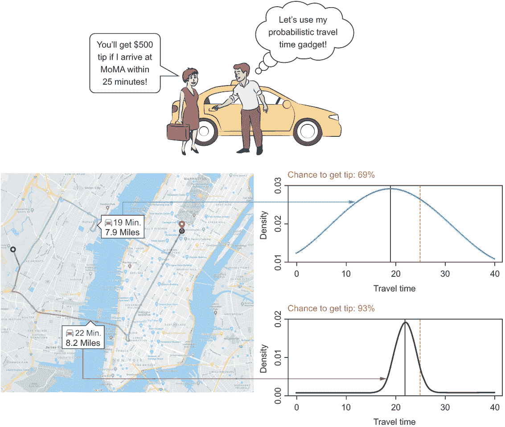

图 1.1 satnav 的旅行时间预测。在地图的左侧，你看到的是一个确定性版本——只报告一个数字。在右侧，你看到两条路线的旅行时间概率分布。

你意识到，在你当前的情况下，平均旅行时间并不是很有趣。真正对你来说重要的是以下问题：哪条路线你更有可能得到 500 美元的小费？为了回答这个问题，你可以查看图 1.1 右侧的分布。经过快速目测分析，你得出结论，即使平均旅行时间更长，选择下方的路线你得到小费的机会更大。原因是下方路线的分布较窄，其中对应于 25 分钟以下旅行时间的分布比例更大。为了用硬性数据支持你的评估，你可以使用带有概率模型的导航工具来计算两种分布到达 MoMA 少于 25 分钟的概率。这个概率对应于图 1.1 中虚线左侧曲线下面积的比例，这表明 25 分钟是一个关键值。让工具从分布中计算概率，你知道选择下方的路线时得到小费的机会是 93%，而选择上方的路线时只有 69%。

正如在这个出租车司机例子中讨论的那样，概率模型的主要优势是它们可以捕捉大多数实际应用中的不确定性，并为决策提供必要的信息。概率模型的其他应用例子包括自动驾驶汽车或数字医学概率模型。你还可以使用概率深度学习（DL）生成与观察数据相似的新数据。一个著名的有趣应用是创建看起来真实不存在的人的面孔。我们将在第六章中讨论这一点。在深入了解曲线拟合部分之前，让我们先从宏观的角度看看深度学习（DL）。

## 1.2 深度学习（*DL*）的初步了解

深度学习（DL）究竟是什么呢？当被要求给出一个简短的电梯式介绍时，我们会说它是一种基于人工神经网络（NN）的机器学习（ML）技术，并且它松散地受到人脑工作方式的启发。在我们给出自己对深度学习（DL）的定义之前，我们首先想给你一个关于人工神经网络（NN）外观的初步概念（见图 1.2）。

图 1.2 一个包含三个隐藏层的人工神经网络（NN）模型示例。输入层包含与我们描述输入所需数量相等的神经元。

在图 1.2 中，你可以看到一个典型的传统人工神经网络（NN），它包含三个隐藏层以及每层中的几个神经元。同一层的每个神经元都与下一层的每个神经元相连。

人工神经网络受到大脑的启发，大脑由多达数十亿个神经元组成，处理例如视觉或听觉等所有感官感知。大脑中的神经元并不与每个其他神经元相连，信号通过神经元分层网络进行处理。你可以在图 1.2 中看到类似分层网络结构的人工神经网络。虽然生物神经元在处理信息方面相当复杂，但人工神经网络中的神经元是其生物对应物的简化和抽象。

要对人工神经网络有一个初步的了解，你最好将神经元想象成一个数字的容器。输入层中的神经元相应地持有输入数据的数字。例如，这些输入数据可以是客户的年龄（以年为单位）、收入（以美元为单位）和身高（以英寸为单位）。后续层中的所有神经元都接收来自前一层的连接神经元的加权值之和作为它们的输入。一般来说，不同的连接并不同等重要，但具有权重，这些权重决定了输入神经元值对下一层神经元值的影响。（这里我们省略了输入在神经元内部进一步转换的情况。）深度学习模型是神经网络，但它们也有大量的隐藏层（不仅仅是图 1.2 中的例子中的三个）。

人工神经网络中的权重（神经元之间连接的强度）需要学习以完成当前任务。为此学习步骤，你使用训练数据并调整权重以最佳地拟合数据。这一步骤被称为拟合。只有完成拟合步骤后，你才能使用模型对新数据进行预测。

设置深度学习系统总是一个两阶段的过程。在第一步中，你选择一个架构。在图 1.2 中，我们选择了一个包含三个层的网络，其中每一层的每个神经元都与下一层的每个神经元相连。其他类型的网络有不同的连接方式，但原理保持不变。在下一步中，你调整模型的权重，以便最好地描述训练数据。这一调整步骤通常使用称为梯度下降的程序来完成。你将在第三章中了解更多关于梯度下降的内容。

注意，这个两步程序对深度学习来说并不特别，它也存在于标准的统计建模和机器学习中。拟合的潜在原理对于深度学习、机器学习和统计学是相同的。我们坚信，你可以通过使用在过去几个世纪中在统计学领域获得的知识而受益良多。这本书承认了传统统计学的遗产，并在此基础上构建。因此，你可以通过观察像线性回归这样简单的东西来理解深度学习的许多内容，我们将在本章介绍线性回归，并在整本书中将其作为易于理解的例子使用。你将在第四章中看到，线性回归已经是一个概率模型，它为每个样本提供的信息不仅仅是一个预测输出值。在第四章中，你将学习如何选择一个合适的分布来模拟结果值的变异性。在第五章中，我们将向你展示如何使用 TensorFlow Probability 框架来拟合这样的概率深度学习模型。然后你可以将这种方法转移到新的情境中，允许你设计和拟合适当的概率深度学习模型，这些模型不仅提供高性能的预测，而且还能捕捉数据的噪声。

### 1.2.1 一个成功的故事

深度学习已经革命性地改变了那些迄今为止用传统机器学习方法难以掌握，但人类却容易解决的领域，例如识别图像中的对象（计算机视觉）和处理书面文本（自然语言处理），或者更普遍地说，任何类型的感知任务。图像分类远非仅仅是学术问题，它被用于各种应用：

+   人脸识别

+   在 MRI 数据中对脑肿瘤进行诊断

+   为自动驾驶汽车识别路标

尽管深度学习在不同应用领域都展现出了其潜力，但可能最容易理解的是在计算机视觉领域。因此，我们使用计算机视觉通过其最大的成功故事之一来激发深度学习。

2012 年，深度学习在 Alex Krizhevsky（来自杰弗里·辛顿的实验室）使用基于深度学习的模型在国际知名的 ImageNet 竞赛中击败所有竞争对手时引起了轰动。在这个竞赛中，来自领先计算机视觉实验室的团队在包含约 100 万张图像的大数据集上训练他们的模型，目的是教会这些模型区分 1000 种不同的图像内容类别。这些类别的例子包括船只、蘑菇和豹子。在竞赛中，所有训练好的模型都必须列出针对一组新测试图像的五种最可能的类别。如果正确的类别不在提出的类别中，则测试图像被视为错误（见图 1.3，它展示了基于深度学习的方法是如何横扫图像分类的）。

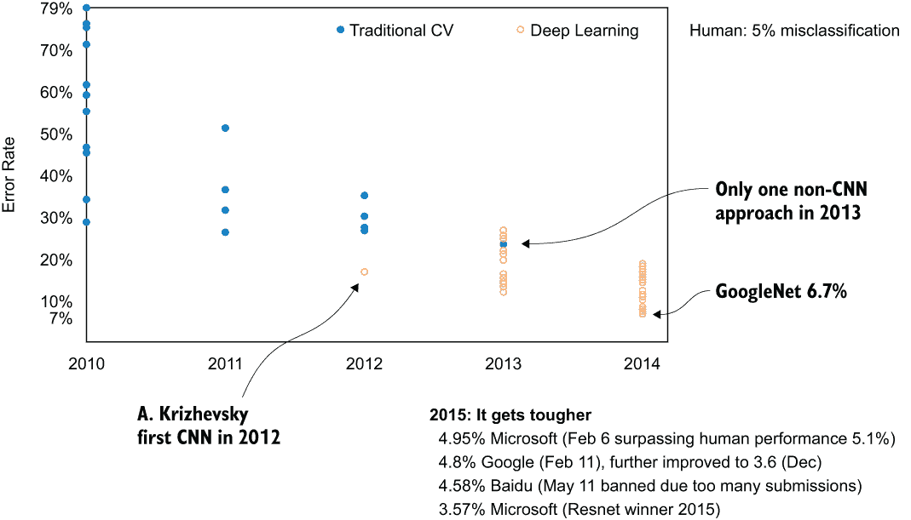

图 1.3 深度学习在 ImageNet 竞赛中的令人印象深刻的结果

在深度学习进入竞赛之前，最好的程序的错误率约为 25%。2012 年，Krizhevsky 首次使用深度学习，将错误率大幅降低（降低了 10%，降至约 15%）。仅仅一年后，2013 年，几乎所有竞争者都开始使用深度学习，到 2015 年，基于深度学习的不同模型达到了人类水平，大约为 5%。你可能想知道为什么人类在 20 张图片中会错误分类 1 张（5%）。一个有趣的事实：数据集中有 170 种不同的狗品种，这使得人类正确分类图像变得有些困难。

## 1.3 分类

让我们来看看非概率性、概率性和贝叶斯概率性分类之间的区别。深度学习因其优于传统方法而闻名，尤其是在图像分类任务中。在深入细节之前，我们想通过一个人脸识别问题来给你一个深度学习方法和更传统的人脸识别方法之间的差异和共性的感觉。作为旁注，人脸识别实际上是让我们最初接触深度学习的应用。

作为统计学家，我们与一些计算机科学同事合作，在树莓派微型计算机上进行了人脸识别项目。计算机科学家通过嘲笑我们使用的统计方法的时代来挑战我们。我们接受了挑战，并提出了深度学习来解决我们的人脸识别问题，这让他们感到惊讶。这个第一个项目的成功触发了许多其他联合深度学习项目，我们的兴趣也随之增长，开始深入研究这些模型的基本原理。

让我们来看一个具体任务。Sara 和 Chantal 在假期中一起旅行并拍了好多照片，每张照片至少有她们中的一个。任务是创建一个程序，可以查看照片并确定照片中的两位女士中哪一位在照片中。为了获得训练数据集，我们标记了 900 张照片，每位女士 450 张，并附上了照片中女士的名字。你可以想象，从第一眼看上去，图像可能会有很大的不同，因为女士们可能从不同的角度被拍摄，可能是笑着或疲惫的，可能是盛装打扮或休闲的，或者可能是在一个糟糕的发型日。尽管如此，对你来说，这个任务相当简单。但对于计算机来说，图像只是一个像素值的数组，编程它来区分两位女士远非易事。

### 1.3.1 图像分类的传统方法

图像分类的传统方法并不是直接从图像的像素值开始，而是通过两步过程来处理分类任务。首先，该领域的专家定义出对图像分类有用的特征。这样一个特征的简单例子就是所有像素的平均强度值，这可以用来区分夜间拍摄的照片和白天拍摄的照片。通常这些特征更为复杂，并且针对特定任务进行定制。在人脸识别问题中，你可以考虑一些容易理解的特征，比如鼻子的长度、嘴巴的宽度，或者眼睛之间的距离（图 1.4）。

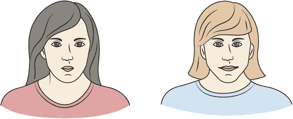

图 1.4 Chantal（左）的眼睛间距较大，嘴巴相对较小。Sara（右）的眼睛间距较小，嘴巴相对较大。

但这些高级特征往往很难确定，因为需要考虑许多方面，例如表情、尺度、接收角度或光照条件。因此，非深度学习（non-DL）方法通常使用更不可解释的低级特征，如 SIFT 特征（尺度不变特征变换），捕捉局部图像属性，如放大或旋转，这些属性对变换是不变的。例如，你可以考虑边缘检测器：如果图像被旋转或缩放，边缘不会消失。

就这个简单的例子来说，特征工程，即定义和从图像中提取对分类重要的属性，是一项复杂且耗时的任务。这通常需要高水平的专业知识。在许多计算机视觉应用（如人脸识别）中的（缓慢）进步主要是由构建新的和更好的特征所驱动的。

注意：在处理实际的分类任务之前，你需要从所有图像中提取所有这些特征。

在特征提取步骤之后，这些特征值代表每个图像。为了从图像的特征表示中识别 Sara 或 Chantal，你需要选择并拟合一个分类器。

这样的分类模型的任务是什么？它应该能够区分不同的类别标签。为了可视化这个想法，让我们想象一个图像只由两个特征来描述：比如说，眼睛的距离和嘴巴的宽度。（我们意识到在大多数实际情况下，对图像的良好描述需要许多更多的特征。）

由于女性不总是正面呈现，而是从不同的视角呈现，因此对于同一女性，眼睛之间的明显距离并不总是相同的。嘴巴的明显宽度可能会变化更大，这取决于女性是否在笑或做出飞吻。当用这两个特征来表示被描绘的女性的每一张图像时，特征空间可以通过二维图来可视化。一个轴表示眼睛距离，另一个轴显示嘴巴宽度（见图 1.5）。每个图像都表示为一个点；Sara 的图像用 S 标记，Chantal 的图像用 C 标记。

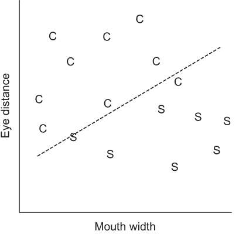

图 1.5 由特征嘴巴宽度和眼睛距离构成的二维空间。每个点代表由这两个特征描述的图像（S 代表 Sara，C 代表 Chantal）。虚线是分隔两个类别的决策边界。

你可以这样考虑一个非概率分类模型：模型定义了决策边界（见图 1.5 中的虚线），将特征空间分割成不同的区域。每个区域对应一个类别标签。在我们的例子中，我们确定了 Sara 区域和 Chantal 区域。现在你可以使用这个决策边界来对新图像进行分类，这些新图像你只知道两个特征的值：如果二维特征空间中的对应点最终落在 Sara 区域，你将其分类为 Sara；否则，分类为 Chantal。

你可能从你的数据分析经验中知道一些如下所示的方法，你可以用它们进行分类。（如果你不熟悉这些方法，请不要担心。）

+   逻辑回归或多项式回归

+   随机森林

+   支持向量机

+   线性判别分析

大多数分类模型，包括列出的方法和深度学习（DL），都是参数模型，这意味着模型有一些参数决定了边界的走向。模型只有在用某些数字替换这些参数之后，才能准备进行实际的分类或类别概率预测。拟合就是关于如何找到这些数字以及如何量化这些数字的确定性。

将模型拟合到一组具有已知类别标签的训练数据中，确定了参数的值并固定了特征空间中的决策边界。根据分类方法和参数的数量，这些决策边界可以是简单的直线或带有波动的复杂边界。你可以将设置分类方法的传统工作流程总结为三个步骤：

1.  定义并从原始数据中提取特征

1.  选择参数模型

1.  通过调整参数来拟合分类模型到数据

为了评估模型的性能，你使用一个在训练过程中未使用的验证数据集。在人脸识别的例子中，验证数据集将包括 Chantal 和 Sara 的新图像，这些图像不是训练数据集的一部分。然后你可以使用训练好的模型来预测类别标签，并使用正确分类的百分比作为（非概率性）性能指标。

根据具体情况，一种或另一种分类方法将在验证数据集上取得更好的结果。然而，在经典图像分类中，成功最重要的因素不是分类算法的选择，而是提取的图像特征的质量。如果提取的特征对不同类别的图像具有不同的值，你将在特征空间中看到相应点的清晰分离。在这种情况下，许多分类模型都表现出很高的分类性能。

以区分 Sara 和 Chantal 为例，你经历了传统的图像分类工作流程。为了获得好的特征，你首先必须认识到这两位女士的嘴巴宽度和眼睛距离不同。有了这些特定的特征，你看到构建一个好的分类器很容易。然而，要区分其他两位女士，这些特征可能不起作用，你需要重新开始特征开发过程。这是使用定制特征时的一个常见缺点。

### 1.3.2 图像分类的深度学习方法

与传统的图像分类方法相比，深度学习（DL）方法直接从原始图像数据开始，并且只使用像素值作为模型输入特征。在这种图像特征表示中，像素的数量定义了特征空间的维度。对于一个 100 × 100 像素的低分辨率图片，这已经相当于 10,000 个像素。

除了高维度之外，主要挑战是两张图片的像素相似性并不一定意味着这两张图片对应于相同的类别标签。图 1.6 说明了同一列中的图像显然对应于同一类，但在像素级别上是不同的。同时，图 1.6 中同一行的图像显示出高像素相似性，但并不对应于同一类。

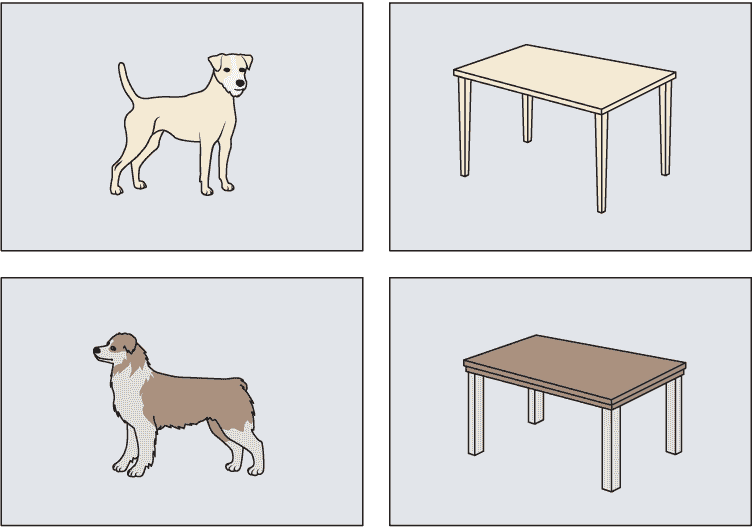

图 1.6 左列显示了同一类狗的两个图像。右列显示了同一类桌子（table）的两个图像。在像素级别比较图片时，同一列中的两个图像比同一行中的两个图像更不相似，即使一行中的一个图像显示的是狗，而另一个图像显示的是桌子。

深度学习（DL）的核心思想是通过将适当特征的构建纳入拟合过程来替代具有挑战性和耗时特征工程任务。此外，深度学习（DL）不能做任何魔法，因此，类似于传统的图像分析，特征必须从手头的像素值构建。这是通过深度学习（DL）模型的隐藏层完成的。

每个神经元将其输入组合以产生新的值，并且以这种方式，每一层都产生输入的新特征表示。使用许多隐藏层允许神经网络（NN）将原始数据到结果之间的复杂转换分解为一系列简单的转换。当从一层到另一层时，你会得到越来越抽象的图像表示，这更适合区分不同的类别。你将在第二章中了解更多关于这一点，你将看到在深度学习（DL）模型的拟合过程中，会学习到一系列越来越复杂的特征。这然后允许你区分不同的类别，而无需手动指定适当的特征。

深度学习（Deep learning）的定位（Branding DL）

在机器学习（ML）的早期，神经网络（NNs）已经存在，但技术上无法训练具有许多层的深度神经网络，这主要是因为缺乏计算能力和训练数据。随着技术障碍的解决，已经发现了一些技巧，使得训练具有数百层的神经网络成为可能。

为什么我们谈论深度学习（DL）而不是人工神经网络（NNs）？深度学习（DL）比人工神经网络（NNs）更受欢迎。这听起来可能有些不尊重，但这样的重新定位可能是一次明智的举动，特别是由于神经网络在过去的几十年中没有实现承诺，因此获得了一些不良声誉。我们使用具有许多隐藏层的“深度”神经网络。这导致在特征构建中有一个深层次的结构，使得随着层次结构的每一步上升，特征变得更加抽象。

在定义架构之后，网络可以被理解为一个包含数百万参数的参数模型。该模型接受输入 *x* 并产生输出 *y*。这对于每个深度学习（DL）模型（包括强化学习）都是正确的。深度学习（DL）建模工作流程可以总结为两个步骤：

1.  定义深度学习（DL）模型架构

1.  将深度学习（DL）模型拟合到原始数据

下一节将讨论非概率和概率分类模型的意义，以及你可以从概率分类模型的贝叶斯变体中获得哪些好处。

### 1.3.3 非概率分类

让我们先看看非概率分类。为了使其简单易懂，我们再次使用图像分类的例子。图像分类的目标是预测给定图像对应的类别。在 1.2 节中提到的 ImageNet 竞赛中，有 1,000 个不同的类别。在人脸识别的例子中，只有两个类别：Chantal 和 Sara。

在非概率图像分类中，你只能得到每个图像的预测类别标签。更准确地说，一个非概率图像分类器接收一个图像作为输入，然后只预测类别标签作为输出。在人脸识别的例子中，它可能会输出 Chantal 或 Sara。你也可以将非概率模型视为一个没有不确定性的确定性模型。用概率的视角来看非概率模型，它似乎总是确定的。非概率模型以 100%的概率预测图像属于一个特定的类别。

想象一种情况，图像显示 Chantal 染发，颜色与 Sara 相同，头发覆盖了 Chantal 的脸。对于人类来说，很难判断图像显示的是 Chantal 还是 Sara。但非概率分类器仍然提供了一个预测的类别标签（例如，Sara），并没有表明任何不确定性。或者想象一个更加极端的情况，你提供了一张既不是 Chantal 也不是 Sara 的图像（见图 1.7）。分类器会给出哪种预测？你希望分类器告诉你它无法做出可靠的预测。但非概率分类器仍然给出 Chantal 或 Sara 作为预测，而没有给出任何不确定性的提示。为了应对处理困难或新颖情况这样的挑战，我们转向概率模型及其贝叶斯变体。这些模型可以表达它们的不确定性，并指出可能不可靠的预测。

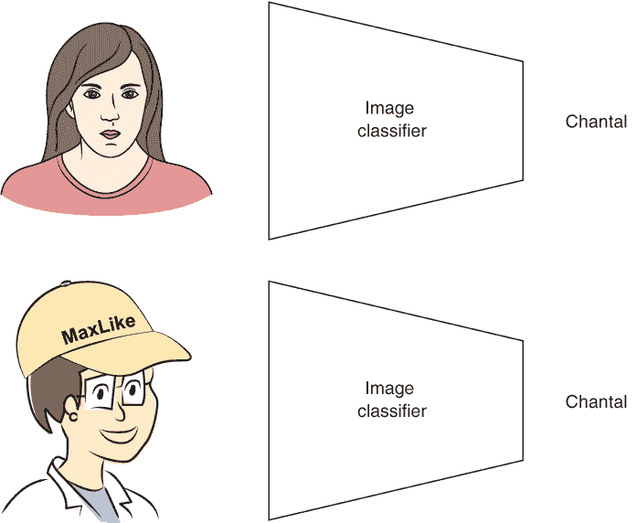

图 1.7 人脸识别的非概率图像分类器接收一个图像作为输入，并输出一个类别标签。这里预测的类别标签是 Chantal，但只有上面的图像真正显示了 Chantal。下面的图像显示的是一个既不是 Chantal 也不是 Sara 的女士。

### 1.3.4 概率分类

在概率分类中，特别之处在于你不仅得到对类别标签的最佳猜测，还能得到分类的不确定性度量。这种不确定性通过概率分布来表示。在人脸识别的例子中，概率分类器会接收一张人脸图像，然后输出对 Chantal 和 Sara 的概率。这两个概率加起来等于 1（见图 1.8）。

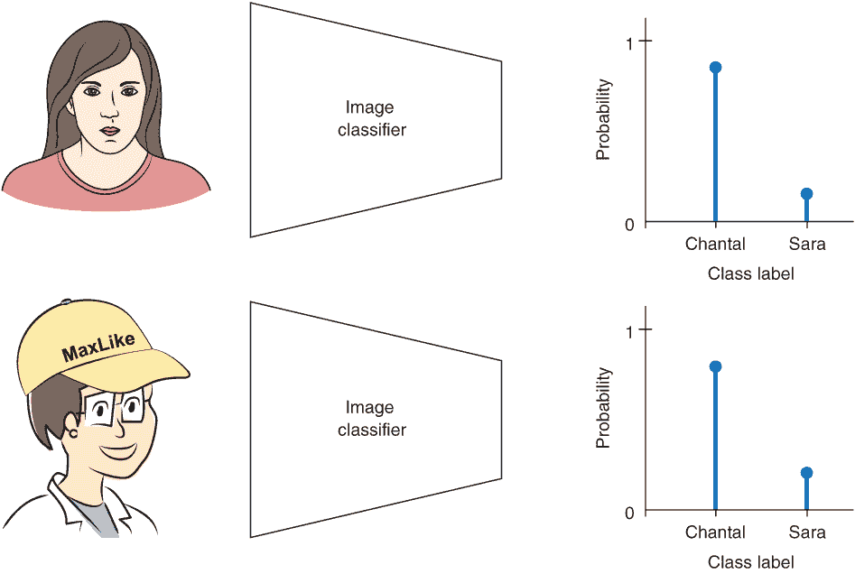

图 1.8 一个用于人脸识别的概率图像分类器以图像为输入，并输出每个类别标签的概率。在上部面板中，图像显示的是 Chantal，分类器预测 Chantal 类别的概率为 0.85，Sara 类别的概率为 0.15。在下部面板中，图像显示的不是 Chantal 也不是 Sara，分类器预测 Chantal 类别的概率为 0.8，Sara 类别的概率为 0.2。

为了给出最佳的单个猜测，你会选择概率最高的类别。通常认为预测类别的概率是预测的不确定性。当所有图像都足够类似于训练数据时，这种情况是成立的。

但在现实中，情况并不总是如此。想象一下，你向分类器提供了一张既不是 Chantal 也不是 Sara 的图像。分类器除了为 Chantal 或 Sara 的类别分配概率外别无选择。但你希望分类器通过为两个可能的但错误的类别分配更多或更少的相等概率来显示其不确定性。不幸的是，当使用概率 NN 模型工作时，这通常不是情况。相反，通常还会为其中一个可能的但错误的类别分配相当高的概率（参见图 1.8）。为了解决这个问题，在我们的书籍第三部分，我们通过采用贝叶斯方法扩展概率模型，这可以添加额外的不确定性，你可以用它来检测新类别。

### 1.3.5 贝叶斯概率分类

贝叶斯模型的好处是，这些模型可以表达其预测的不确定性。在我们的面部识别示例中，非贝叶斯概率模型预测了一个结果分布，包括 Chantal 的概率和 Sara 的概率，总和为 1。但模型对分配的概率有多确定？贝叶斯模型可以回答这个问题。在本书的第三部分，你将详细了解这是如何完成的。在此阶段，我们只需注意，你可以多次询问贝叶斯模型，并得到不同的答案。这反映了模型内在的不确定性（参见图 1.9）。如果你不明白如何为相同的输入得到这些不同的模型输出，请不要担心。你将在本书的第三部分学到这一点。

贝叶斯模型的优点在于，这些模型可以通过不同预测集的大范围分布来指示不可靠的预测（参见图 1.9 的下部面板）。这样，你就有更好的机会识别出如图 1.9 下部面板中的年轻女士这样的新类别，她既不是 Chantal 也不是 Sara。

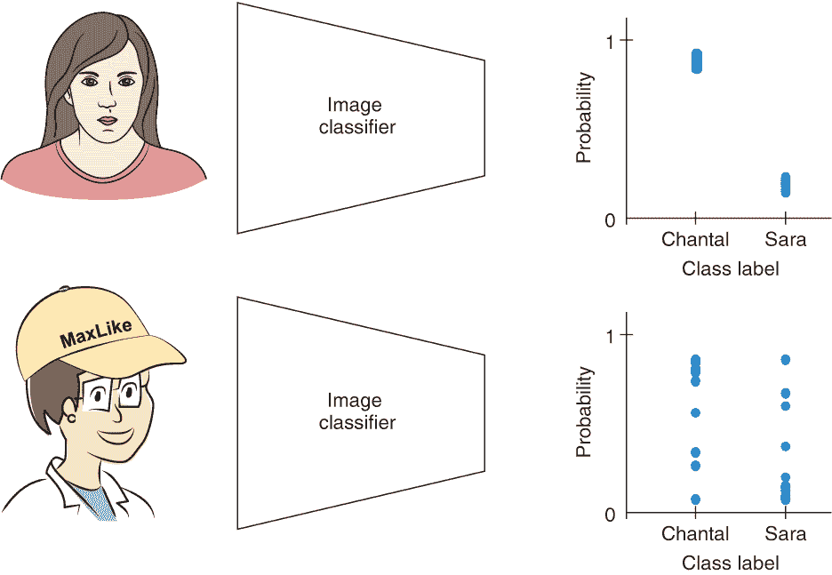

图 1.9 一个用于人脸识别的贝叶斯概率图像分类器以图像为输入，并输出两个类别标签的概率分布集。在上面的面板中，图像显示的是 Chantal，预测的概率集都预测了 Chantal 的高概率和相应地 Sara 的低概率。在下方的面板中，图像显示的是既不是 Chantal 也不是 Sara 的女士，因此分类器预测了不同的概率集，表明高度的不确定性。

## 1.4 曲线拟合

我们想在介绍章节的结尾讨论概率和非概率深度学习回归任务中的差异。回归有时也被称为曲线拟合。这让人想起了以下内容：

深度学习所有的令人印象深刻的成就都归结为仅仅是曲线拟合。

--Judea Pearl, 2018

当我们听说 Judea Pearl，2011 年获得声望极高的图灵奖（计算机科学的诺贝尔奖）的获得者，声称深度学习仅仅是曲线拟合（与简单的分析如线性回归几个世纪以来所做的相同的曲线拟合），起初我们感到惊讶，甚至有点冒犯。他怎么能对我们的研究主题如此不尊重，毕竟，它在实践中展示了如此令人印象深刻的成果？我们相对的平静可能是因为我们不是计算机科学家，而是有物理学和统计数据分析的背景。曲线拟合对我们来说不仅仅是曲线拟合。然而，对他的声明进行第二次思考，我们可以看到他的观点：深度学习和曲线拟合在许多方面具有相同的基本原理。

### 1.4.1 非概率曲线拟合

让我们先仔细看看传统曲线拟合方法的非概率方面。粗略地说，非概率曲线拟合是穿过数据点的科学。以最简单的线性回归形式，你将一条直线穿过数据点（见图 1.10）。在那张图中，我们假设只有一个特征，*x*，来预测一个连续变量，*y*。在这个简单的情况下，线性回归模型只有两个参数，a 和*b*：

*y* = *a* ⋅ *x* + *b*

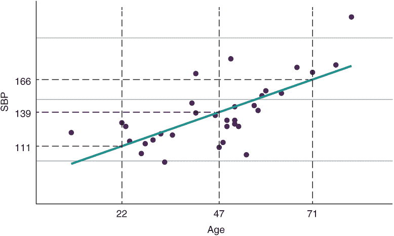

图 1.10 血压（SBP）示例的散点图和回归模型。点代表测量数据点；直线是线性模型。对于三个年龄值（22，47，71），水平线的位置表示对 SBP 的最佳猜测预测值（11，139，166）。

在定义模型之后，需要确定参数 a 和*b*，以便模型能够实际用于预测给定*x*时*y*的单个最佳猜测值。在机器学习和深度学习的背景下，这一步寻找良好参数值的过程被称为训练。但网络是如何训练的呢？简单线性回归和深度学习模型的训练是通过将模型的参数拟合到训练数据来完成的——也就是曲线拟合。

注意，参数的数量可能会有很大的差异，从一维线性回归案例中的 2 个到高级深度学习模型中的 5 亿个不等。整个过程与线性回归相同。你将在第三章中学习如何拟合非概率线性回归模型的参数。

那么，当我们说非概率模型拟合到数据时，我们指的是什么？让我们通过一个具体的例子来看一下模型*y* = *a* ⋅ *x* + *b*，这个例子是根据年龄*x*预测血压*y*。图 1.10 是 33 位美国女性的收缩压（SBP）与年龄的图表。图 1.10 显示了*a* = 1.70 和*b* = 87.7（实线）的具体实现。在非概率模型中，对于每个年龄值，你只能得到这个年龄女性收缩压的一个最佳猜测值。在图 1.10 中，这通过三个年龄值（22 岁、47 岁和 71 岁）来展示，其中预测的最佳猜测值（111、139 和 166）由虚线水平线的位置表示。

### 1.4.2 概率曲线拟合

当你将概率模型拟合到相同的数据时，你会得到什么？你不会只得到一个关于血压的最佳猜测值，而会得到一个完整的概率分布。这告诉你，相同年龄的女性可能会有不同的收缩压（见图 1.11）。在非概率线性回归中，预测 22 岁女性的收缩压为 111（见图 1.10）。现在，当查看 22 岁女性的预测分布时，接近 111（分布的峰值）的收缩压值比远离 111 的值更有可能。

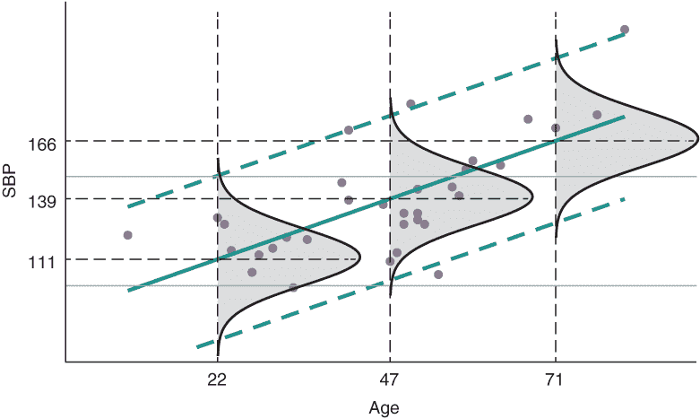

图 1.11 展示了收缩压（SBP）示例的散点图和回归模型。点代表测量数据点。在每个年龄值（22 岁、47 岁、71 岁）处，拟合高斯分布来描述这些年龄组女性可能的收缩压值的概率分布。对于这三个年龄值，显示了预测的概率分布。实线表示对应于 16 至 90 岁之间所有分布的平均值的位置。上下的虚线表示模型预期 95%的所有值所在的区间。

图 1.10 中的实线表示 16 至 90 岁之间所有分布对应平均值的位臵。图 1.11 中的实线与图 1.10 中的回归线完全吻合，该回归线是由非概率模型预测得出的。与平均值平行的虚线表示一个区间，模型预计在这个区间内 95%的个体收缩压值（SBP）都会出现。

你如何找到非概率模型和概率模型中参数的最佳值？技术上，你使用一个损失函数来描述模型与（训练）数据拟合得有多差，然后通过调整模型的权重来最小化它。你将在第三章、第四章和第五章中了解损失函数以及如何使用这些函数来拟合非概率或概率模型。你将看到非概率模型和概率模型损失函数之间的区别。

讨论的线性回归模型当然是简单的。我们主要用它来解释在转向复杂深度学习（DL）模型时保持不变的基本原理。在实际应用中，你通常不会假设数据之间存在线性依赖关系，你也不总是想假设数据的变化保持恒定。在第二章中，你将看到设置一个能够模拟非线性关系的神经网络是多么容易。在第四章和第五章中，你将看到构建一个能够模拟具有非线性行为和变化变化的回归任务的概率模型也不是很难（见图 1.12）。为了评估训练好的回归模型的表现，你应该始终使用一个在训练过程中未使用的验证数据集。在图 1.12 中，你可以看到对一个新的验证集的预测，这表明模型能够捕捉到数据中的非线性行为以及数据变化的变化。

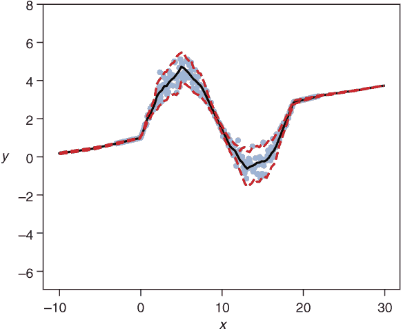

图 1.12 展示了来自（非贝叶斯）概率回归模型的散点图和验证数据预测。该模型是在一些具有*x*和*y*之间非线性依赖关系以及非恒定数据变化的模拟数据上拟合的。实线表示所有预测分布的平均值位臵。上、下虚线表示模型预计 95%的所有值都将出现的区间。

如果我们使用模型来预测训练数据范围之外的 *x* 值的输出结果会怎样呢？您可以在查看图 1.12 时获得初步的了解，其中我们只有 -5 到 25 之间的数据，但展示了 -10 到 30 更宽范围内的预测结果。看起来模型对其从未见过数据的范围内的预测特别自信。这很奇怪，并不是模型所期望的特性！模型不足的原因是它只捕捉了数据变化——它没有捕捉到拟合参数的不确定性。在统计学中，有几种已知的方法可以捕捉这种不确定性；贝叶斯方法是其中之一。当与深度学习模型一起工作时，贝叶斯方法是可行且合适的。您将在本书的最后两章中了解到这一点。

### 1.4.3 贝叶斯概率曲线拟合

贝叶斯深度学习模型的主要卖点是其能够在模型未训练的新颖情况下发出警报。对于一个回归模型来说，这对应于外推，意味着您在训练数据范围之外的数据范围内使用模型。在图 1.13 中，您可以看到一个贝叶斯变种的神经网络，它产生了图 1.12 中所示的拟合结果。值得注意的是，只有神经网络的贝叶斯变体在离开训练数据范围时提高了不确定性。这是一个很好的特性，因为它可以表明您的模型可能产生不可靠的预测。

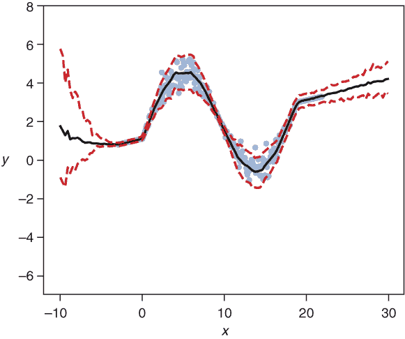

图 1.13 显示了贝叶斯概率回归模型的散点图和验证数据预测。该模型是在一些具有 *x* 和 *y* 之间非线性依赖性和非恒定数据变化的模拟数据上拟合的。实线表示所有预测分布的均值位置。上、下虚线表示模型预期 95% 的所有值所在的区间。

## 1.5 何时使用和何时不使用深度学习？

最近，深度学习已经取得了几个非凡的成功故事。因此，您可能会问自己是否应该忘记传统的机器学习方法，转而使用深度学习。答案取决于具体情况和任务。在本节中，我们将讨论何时不应使用深度学习以及深度学习有哪些用途。

### 1.5.1 不宜使用深度学习的情形

深度学习通常有数百万个参数，因此通常需要大量数据来训练。如果您只能访问有限数量的特征来描述每个实例，那么深度学习并不是一个合适的选择。这包括以下应用：

+   根据学生在高中时的成绩预测他们在大学第一年的成绩

+   根据一个人的性别、年龄、BMI（体重指数）、血压和血液胆固醇浓度预测下一年内发生心脏病发作的风险

+   根据乌龟的体重、身高和脚的长度来分类乌龟的性别

此外，在只有少量训练数据且你知道哪些特征决定了感兴趣的结果（并且你很容易从原始数据中提取这些特征）的情况下，你应该选择这些特征，并以此为基础构建一个传统的机器学习模型。例如，假设你从不同法国和荷兰足球运动员的收藏中获取图像。你知道法国队的球衣总是蓝色，而荷兰队的球衣总是橙色。如果你的任务是开发一个区分这两个队伍的球员的分类器，那么最好决定图像中蓝色像素（法国队）的数量是否大于橙色像素（荷兰队）的数量。所有其他似乎可以区分两个队伍的特征（例如，例如，发色）都会增加噪声而不是帮助对新图像的分类。因此，提取和使用额外的特征作为你的分类器可能不是一个好主意。

### 1.5.2 何时使用深度学习

深度学习是当每个实例都由复杂原始数据（如图像、文本或声音*D*）描述，且难以确定表征不同类别的关键特征时的情况下的首选方法。深度学习模型能够从原始数据中提取特征，这些特征通常优于依赖于手工特征的模型。图 1.14 展示了深度学习近期改变游戏规则的各种任务。

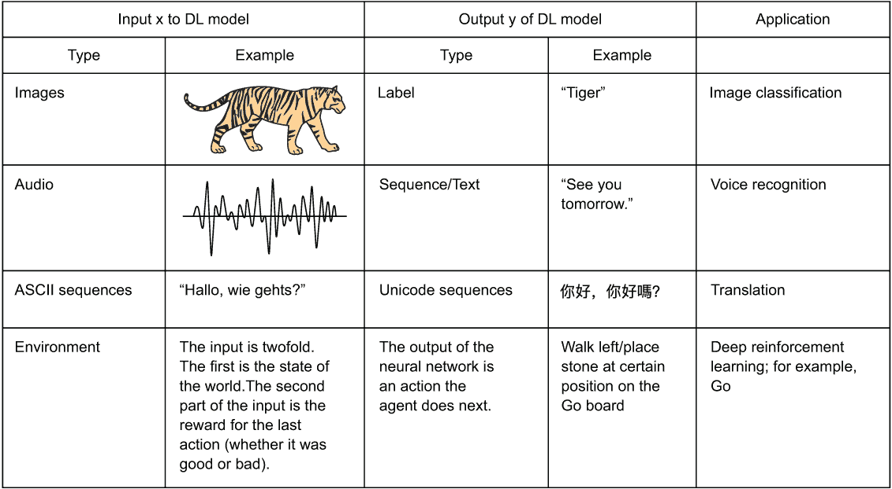

图 1.14 机器学习长期无法触及，而深度学习近期成功解决的各项任务

### 1.5.3 何时使用概率模型，何时不使用？

在本书中，你会发现对于大多数深度学习模型，可以设置模型的概率版本。你基本上可以免费获得概率版本。在这些情况下，你只能通过使用概率变体来获得收益，因为它不仅提供了从模型的非概率版本中获得的信息，而且还提供了对决策至关重要的附加信息。如果你使用概率模型的贝叶斯变体，你还有额外的优势，即获得一个包括模型参数不确定性的度量。拥有不确定性度量对于识别模型可能产生不可靠预测的情况尤为重要。

## 1.6 本书你将学到什么

本书为您提供了概率深度学习的实战入门。我们将提供练习和代码演示作为 Jupyter 笔记本，让您获得经验，从而更深入地理解概念。为了从本书中受益，您应该已经知道如何运行简单的 Python 程序，以及如何将模型拟合到数据上（如线性回归这样的简单模型即可）。为了深入理解更高级的部分（标题结尾后有星号标记），您应该熟练掌握中级数学，如矩阵代数和微分微积分，以及中级统计学，如解释概率分布。您将学习如何

+   使用 Keras 框架实现具有不同架构的深度学习模型

+   实现一个概率深度学习模型，从给定的输入预测整个结果的分布

+   对于给定的任务，使用最大似然原理和 TensorFlow Probability 框架选择合适的输出分布和损失函数

+   设置灵活的概率深度学习模型，例如目前用于图像生成和文本到语音翻译的当前最先进模型

+   构建能够表达不确定性的贝叶斯深度学习模型变体，让您能够识别不可靠的预测

我们将在下一章介绍不同的深度学习架构。

## 摘要

+   机器学习（ML）方法是为了使计算机能够从数据中学习而发明的。

+   人工神经网络（NNs）是机器学习方法，它们从原始数据开始，并将特征提取过程作为模型的一部分。

+   深度学习（*DL*）方法是一种称为深度神经网络（NNs），因为它们具有大量的层。

+   在感知任务中，如抓取图像内容或文本到语音翻译，深度学习优于传统的机器学习方法。

+   曲线拟合是一种技术，它将模型（曲线或分布）拟合到数据上。

+   深度学习（*DL*）方法和曲线拟合相似，并依赖于相同的原则。这些原则是本书的核心。理解这些原则可以让您在准确性、校准以及量化预测的不确定性度量方面构建性能更好的深度学习模型。

+   概率模型超越了单值预测，并捕捉真实数据的变异性以及模型拟合的不确定性，这有助于做出更好的决策。

+   概率模型的贝叶斯变体可以帮助识别不可靠的预测。
