# 2 神经网络架构

本章涵盖

+   需要根据不同的数据类型使用不同的网络类型

+   使用完全连接神经网络处理类似表格的数据

+   使用二维卷积神经网络处理类似图像的数据

+   使用一维卷积神经网络处理有序数据


大多数深度学习模型都是基于一种或多种类型的层：完全连接、卷积和循环。深度学习模型的成功在很大程度上取决于为特定问题选择正确的架构。

如果你想要分析没有结构的数据，例如 Excel 表格中的表格数据，那么你应该考虑使用完全连接网络。如果数据具有特殊的局部结构，如图像，那么卷积神经网络（NNs）是你的朋友。最后，如果数据是序列性的，如文本，那么最简单的选择是使用一维卷积网络。本章为你概述了在深度学习中使用的不同架构，并提供了一些关于何时使用哪种架构类型的提示。

## 2.1 完全连接神经网络（fcNNs）

在深入探讨不同深度学习架构的细节之前，让我们看看图 2.1。回想一下我们在第一章中讨论的典型传统人工神经网络的架构。可视化的神经网络有三个隐藏层，每个层包含九个神经元。层内的每个神经元都与下一层的每个神经元相连。这就是为什么这种架构被称为密集连接神经网络或完全连接神经网络（fcNN）。


### 2.1.1 激发人工神经网络设计的生物学

神经网络的设计灵感来源于大脑的工作方式。你不应该过分强调这一点；这只是一个大致的灵感。大脑是一个由神经元组成的网络。人脑大约有 1000 亿个神经元，平均每个神经元连接大约 10000 个其他神经元。让我们看看大脑的基本单元——神经元（见图 2.2）。

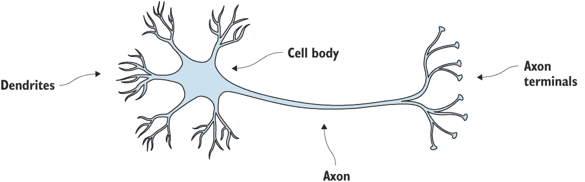


图 2.2 展示了一个非常简化的神经元草图。它通过其树突接收来自其他神经元的信号。一些输入具有激活作用，而一些输入具有抑制作用。接收到的信号在神经元的细胞体中积累并处理。如果信号足够强，神经元就会放电。这意味着它产生一个信号，该信号被传输到轴突末端。每个轴突末端都连接到另一个神经元。一些连接可能比其他连接更强，这使得将信号转换到下一个神经元更容易。经验和学习可以改变这些连接的强度。计算机科学家从生物大脑细胞中推导出一个数学抽象：图 2.3 中所示的人工神经元。

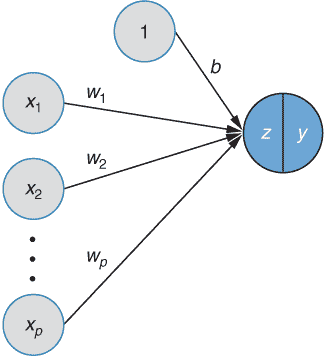

图 2.3 大脑细胞（人工神经元）的数学抽象。值 *z* 是通过输入值 p，*x*[1] 到 xp 的加权和以及一个偏置项 *b*（该偏置项的输入为 1）来计算的，该偏置项将输入的加权总和向上或向下移动。值 *y* 通过应用激活函数从 *z* 计算得出。

人工神经元接收一些数值输入值，*x**[i]*，这些值与一些相应的数值权重 wi 相乘。为了累积输入，确定输入的加权总和加上一个偏置项 *b*（该偏置项的输入为 1）作为 *z = x*[1] *∙ w*[1] *+x*[1] *∙ w*[1] *+* ⋯ *+* *x**[p]* ⋅ *w**[p]* *+* 1 ⋅ *b*。请注意，这个公式与线性回归中使用的公式相同。然后你可以通过一个非线性激活函数，即所谓的 S 型函数，进一步转换得到的 *z* 值，该函数将 *z* 转换为一个介于 0 和 1 之间的数（见图 2.4）。该函数由以下公式给出：

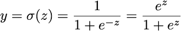

如图 2.4 所示，*z* 的较大正值导致接近 1 的值，而具有较大绝对值的负值导致接近 0 的值。在这种情况下，结果值 *y* 可以解释为神经元放电的概率。或者，在分类的背景下，为某一类别的概率。如果你想要构建一个二元分类器（具有 0 和 1 作为可能的类别），它接受几个数值特征 *x**[i]*，并生成类别 1 的概率，那么你可以使用单个神经元。如果你有统计学背景，这可能会让你感到熟悉，实际上，在统计学中，具有单个神经元的网络也被称为逻辑回归。但如果你从未听说过逻辑回归，无需担心。

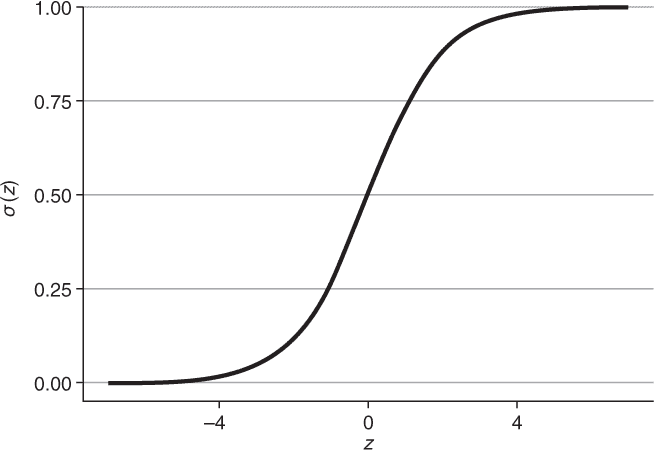

图 2.4 S 型函数 f 将任意数 *z* 转换为介于 0 和 1 之间的数。

### 2.1.2 开始实现神经网络

要开始使用深度学习，你需要了解基本的数据结构，张量，以及操作这些实体的软件包。

张量：深度学习中的基本实体

观察图 2.3 中神经元的数学抽象，你可能会问，“输入什么，输出什么？”假设图 2.3 中的 p=3，那么你会看到三个数字（x1、x2 和 x3）进入神经元，一个数字离开神经元。这三个数字可以被视为一个只有一个索引的数组。更复杂的神经网络可以接受一个灰度图像作为输入，例如大小为 64×32 的图像，这也可以表示为一个数组。但这次数组有两个索引。第一个索引 i 的范围是从 0 到 63，第二个索引 j 的范围是从 0 到 31。

进一步来说，假设你有一个包含红色、绿色和蓝色三种颜色的彩色图像。对于这样的图像，每个像素都有*x*,y 坐标和三个额外的值。图像可以存储在一个有三个索引（i, j, c）的数组中。将其推向极端，假设你将一整堆 128 个彩色图像输入到网络中。这些可以存储在一个(b, *x*, *y* , c)的数组中，其中*b*的范围是从 0 到 127。此外，你还可以将图 2.3 中的三个权重视为一个只有一个索引的数组，从 0 到 2。

事实上，深度学习中的所有量都可以放入数组中。在深度学习的背景下，这些数组被称为张量，从抽象的角度来看，深度学习中所发生的一切都是对张量的操作。张量拥有的索引数被称为维度、阶数，有时也称为秩（所以不要混淆 D）。阶数为 0 的张量，如图 2.3 中神经元的输出，没有索引。低阶张量也有特殊的名称：

+   阶数为 0 的张量被称为标量。

+   一阶张量被称为向量。

+   二阶张量被称为矩阵。

张量的形状定义了每个索引可以有多少个值。例如，如果你有一个 64×32 像素的灰度图像，张量的形状是（64，32）。这就是你在使用深度学习时需要了解的所有关于张量的知识。但请注意，当你谷歌搜索张量时，你可能会找到一些令人恐惧的东西，比如通过其变换属性给出的数学定义。别担心。在深度学习的背景下，张量只是一个具有特殊结构的数据容器，例如，例如向量或矩阵。如果你对向量和矩阵感到不安全，那么查看 François Chollet 的《Python 深度学习》第 2 版（Manning，2017）的第二章是值得的，可以在[`mng.bz/EdPo`](http://mng.bz/EdPo)找到深入的解释。

软件工具

随着用于操作张量的软件框架的可用性，深度学习获得了巨大的普及。在这本书中，我们主要使用 Keras([`keras.io/`](https://keras.io/))和 TensorFlow([`www.tensorflow.org/`](https://www.tensorflow.org/))。目前，这两个框架是最常被深度学习从业者使用的。TensorFlow 是由 Google 开发的开源框架，它为深度学习提供了强大的支持。Keras 是一个用户友好的、高级神经网络 API，用 Python 编写，可以在 TensorFlow 之上运行，允许快速原型设计。

为了完成这本书中的练习，我们建议您使用 Google Colab 环境（[`colab.research.google.com`](https://colab.research.google.com)）作为在浏览器中运行的云解决方案。深度学习最重要的框架、包和工具已经安装，您可以立即开始编码。如果您想在您的计算机上安装深度学习框架，我们建议您遵循 Chollet 在其书籍第三章中给出的描述，请参阅 [`mng.bz/NKPN`](http://mng.bz/NKPN) .

+   要深入了解 TensorFlow，Martin Görner 的教程是一个很好的起点：[`www.youtube.com/watch?v=vq2nnJ4g6N0`](https://www.youtube.com/watch?v=vq2nnJ4g6N0) .

+   要了解更多关于 Keras 的信息，我们推荐访问网站 [`keras.io/`](https://keras.io/) .

我们使用 Jupyter 笔记本（[`jupyter.org/`](https://jupyter.org/)）为您提供一些动手练习和代码示例。Jupyter 笔记本允许将 Python、TensorFlow 和 Keras 代码与文本和 Markdown 混合。笔记本组织在包含文本或代码的单元格中。这使您可以通过仅更改一个单元格中的代码来玩转代码。在许多练习中，我们提供了大量代码，您可以在单独的单元格中使用自己的代码进行实验。您也可以随意更改代码的任何位置；您不会破坏任何东西。虽然深度学习通常涉及大量数据集并需要巨大的计算能力，但我们提炼了简单的示例，以便您可以交互式地使用笔记本。我们使用以下图标来指示书中您应该打开 Jupyter 笔记本并执行相关代码的位置：


您可以直接在 Google Colab 中打开这些笔记本，在那里您可以在浏览器中编辑和运行它们。Colab 很棒，但您需要在线才能使用它。另一个选项（适合离线工作）是使用提供的 Docker 容器。有关如何安装 Docker 的详细信息，请参阅 [`tensorchiefs.github.io/dl_book/`](https://tensorchiefs.github.io/dl_book/) . 在 Jupyter 笔记本中，我们使用以下图标来指示您应该返回这本书的位置：


设置第一个神经网络模型以识别假钞

让我们开始，进行第一个深度学习实验。在这个实验中，你使用一个单一的人工神经元来区分真钞和假钞。

|  | 动手时间 打开 [`mng.bz/lGd6`](http://mng.bz/lGd6) ，您将找到一个数据集，该数据集通过两个特征和一个类别标签 *y* 描述了 1,372 张钞票。 |
| --- | --- |

两个图像特征基于小波分析，这是传统图像分析中常用的一种方法。通常将输入值和目标值存储在两个不同的张量中。输入数据集包含 1,372 个实例，由两个特征描述，你可以将这些特征组织在一个 2D 张量中。第一个维度通常描述样本。这个轴被称为轴 0。对于这个例子，你有一个形状为（1372，2）的 2D 张量。目标值是真实的类别标签，可以存储在一个形状为（1372）的第二个 1D 张量中。

深度学习模型通常在图形卡上运行，也称为图形处理单元（GPU）。这些 GPU 具有有限的内存。因此，你不能一次性处理整个数据集。数据被分成更小的批次，这些批次只包含整个数据集的一个子集。这些批次被称为小批量，一个典型的小批量包含的实例数量是 32、64 或 128。在我们的纸币示例中，我们使用形状为 128 的小批量。

由于纸币仅由两个特征描述，你可以在 2D 特征空间中轻松地看到真实和假纸币的位置（见图 2.5）。此外，两个类别的边界不是由一条直线分开的。

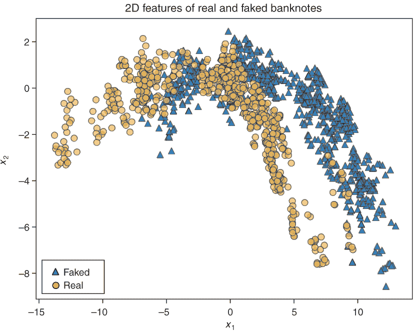

**图 2.5**：真实和假纸币的（训练）数据点

让我们使用一个具有 sigmoid 激活函数（也称为逻辑回归）的单个神经元作为分类模型（见图 2.6）。我们将分离图 2.5 所示数据中的假纸币和真纸币。

在我们定义 Keras 代码之前，让我们先考虑所需的张量结构。网络中包含什么？如果你使用单个训练数据点，它是一个有两个条目（下一节将讨论如何处理偏置*D*）的向量。如果你取 128 个这样的向量的批次，你将得到一个 2 阶（矩阵）的张量，形状为（128，2）。通常在定义网络时不会指定批次大小。在这种情况下，你使用`None`作为批次大小。如图 2.6 所示，输入由一个具有 sigmoid 激活的单个神经元处理。

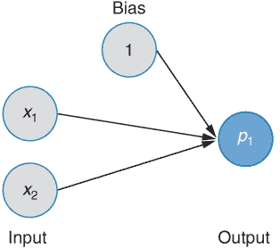

**图 2.6**：一个具有单个神经元的全连接神经网络。输入层中的两个节点对应于描述每个纸币的两个特征。输出层有一个节点，对应于类别 1（假纸币）的概率。

**注意**：在这里，我们仅简要讨论我们深度学习实验所需的主要构建块。要了解 Keras，请参考 Keras 网站[`keras.io/`](https://keras.io/)以及由 Keras 的创造者 François Chollet 所著的《Python 深度学习》一书。

在列表 2.1 中，我们使用顺序模式定义 NN 模型。在顺序模型定义中，层是依次添加的。一个层的输出是下一个层的输入，依此类推；因此，通常不需要指定层的输入形状。第一层是一个例外，这里你需要指定输入的形状。

在底层，Keras 将模型转换为张量操作。在我们的简单模型列表 2.1 中，`Dense(1)`密集层接收维度为（`batch_size`，2）的输入张量`X`，与 2×2 矩阵**W**相乘，并加上一个偏置项 b。这给出一个长度为`batch_size`的向量。如果你觉得这很奇怪，可以查看 Chollet 的《Python 深度学习》一书的第二章，了解更多关于矩阵乘法的信息。[`mng.bz/EdPo`](http://mng.bz/EdPo)

在定义模型之后，需要编译模型，并指定使用的损失函数和优化函数。这里我们使用损失函数`crossentropy`，它常用于分类，并量化正确类别的预测效果。你将在第四章中了解更多关于损失函数的内容。最后但同样重要的是，我们通过迭代训练过程优化模型的权重，这被称为随机梯度下降（SGD），在第三章中有详细讨论。拟合过程的目标是调整模型权重，以使损失最小化。在每个小批量之后更新模型权重，这里包含 128 个实例。对整个训练集的一次遍历称为一个 epoch；这里我们训练了 400 个 epochs。

列表 2.1 定义一个输入后只有一个神经元的 NN

```
model = Sequential()                           ❶ 

model.add( Dense(1,                            ❷ 
            batch_input_shape=(None, 2),       ❸ 
            activation='sigmoid')              ❹ 
)
sgd = optimizers.SGD(lr=0.15)                  ❺ 

model.compile( 
            loss='binary_crossentropy', 
            optimizer=sgd                      ❻ 
 )

history = model.fit(X, *y*,  epochs=400,         ❼ 
                           batch_size=128)     ❽ 
```

❶ Sequential 开始定义网络。

❷ 在网络中添加了一个具有单个神经元的新的层；因此，在`Dense(1)`中是 1

❸ 输入是一个大小为（批大小，2）的张量。使用 None，我们现在不需要指定批大小。

❹ 选择如图 2.4 所示的激活函数 sigmoid

❺ 编译模型，这标志着模型定义的结束

❻ 定义并使用随机梯度下降优化器

❼ 使用存储在*x*和*y*中的数据训练模型 400 个 epochs

❽ 将批大小固定为 128 个示例

|  | 实践时间 当在[`mng.bz/lGd6`](http://mng.bz/lGd6)笔记本中运行代码时，你会观察到损失逐渐减少，准确率逐渐提高。这表明训练工作正常。 |
| --- | --- |

让我们使用训练好的网络进行预测，并查看输出。在图 2.7 中，你可以看到基于特征*x*[1]和 x2 的系统评估一张纸币是假币的概率。

图 2.7 中背景的阴影表示具有相应两个特征值的实例的预测概率。白色表示特征空间中两个类别的概率都是 0.5 的位置。一侧的点被分类为一类，另一侧的点被分类为另一类。这个边界被称为决策边界。如你所见，它是一条线。这不是巧合，而是具有 sigmoid 激活函数的单个人工神经元的一般特性。在二维特征空间中，决策边界是一条直线。它不是曲线，也没有波动。如果你有三个特征，边界是一个平面（没有波动），并且对于超过三个维度的特征空间，它保持没有波动的对象，这被称为超平面。

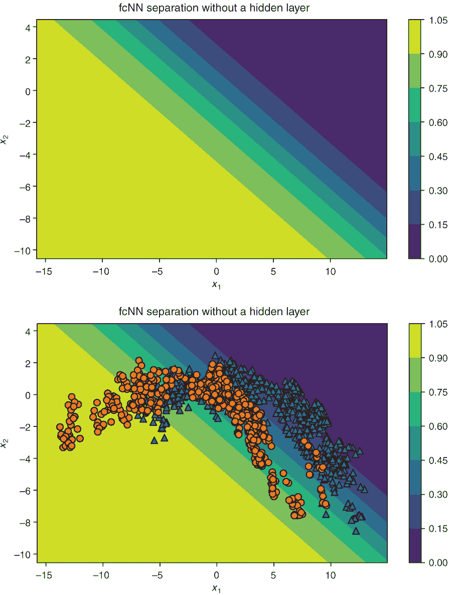

图 2.7 输入层之后只有一个神经元的神经网络产生一个线性决策边界。二维特征空间中背景的阴影表示假钞的概率。右侧叠加了训练数据，显示线性决策曲线在真钞和假钞之间的边界上并不完美地拟合。

但在纸币示例中，两个类别之间的真实边界是曲线的。因此，单个神经元不适合根据其两个特征来模拟假钞的概率。为了获得更灵活的模型，我们在输入层和输出层之间引入了一个额外的层（见图 2.8）。这个层被称为隐藏层，因为它的值不是直接观察到的，而是由输入层的值构建的。

在这个例子中，隐藏层包含八个神经元；每个神经元都接收相同输入特征的加权总和，但权重不同。加权总和随后通过激活函数进行转换。你可以将这些隐藏层中的神经元视为输入的新表示。最初，它由两个值（特征）表示，现在则由八个值（特征）表示：八个神经元的输出。这有时被称为特征扩展。你可以在隐藏层中使用不同数量的神经元，这是神经网络设计的一部分。

输出层给出了实例是真实或假钞的概率。你已经看到，在二元分类问题中，一个神经元就足够了，因为知道一个类的概率 p 就固定了另一个类的概率为 1 - p。你还可以在输出层使用两个神经元：一个神经元模拟第一个类的概率，另一个神经元模拟第二个类的概率。这种输出层设计可以推广到具有两个以上类别的分类任务。在这种情况下，输出层的神经元数量与分类问题中的类别数量相同。每个神经元代表一个类别，你希望将神经元的输出解释为该类的概率。这可以通过`softmax`函数来完成。`softmax`函数将加权求和 zi 转换为概率 pi，通过设置

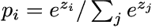

这确保了值在 0 和 1 之间，并且进一步地，它们的总和为 1。因此，你可以将π解释为类别 i 的概率。softmax 中的“软”表示，网络不是对可能的类别之一做出硬性判断，而是可以给其他类别分配较小的概率。


图 2.8 由八个节点组成的一个隐藏层的 fcNN。输入层有两个节点，对应于钞票数据集中的两个特征，输出层有两个节点，对应于两个类别（真实和假钞）。

训练数据的*y*向量也需要改变，以便与两个输出兼容。如果示例属于类别`fake`，则*y* = 1，对于类别`real`，*y* = 0。现在你希望标签描述两个可能的输出。一张真实的钞票应该有输出值 p0 = 1 和 p1 = 0，而一张假钞，其值 p0 = 0 和 p1 = 1。这可以通过*y*的一热编码来实现。你从一个与类别数量一样多的零向量开始（这里有两个）。然后设置一个条目为 1。对于*y* = 0，你将第 0 个条目设置为 1，这样你就有了向量(1, 0)，而对于*y* = 1，你有了向量(0, 1)。关于 fcNN 的架构，请参阅图 2.8，以及相应的 Keras 代码，请参阅列表 2.2。

列表 2.2 定义具有一个隐藏层的网络

```
model = Sequential() 
model.add(Dense(8, batch_input_shape=(None, 2),
                          activation=’sigmoid’))    ❶ 
model.add(Dense(2, activation='softmax'))           ❷ 
# compile model
model.compile(loss='categorical_crossentropy',
                      optimizer=sg*D*)
```

❶ 具有八个神经元的隐藏层定义

❷ 具有两个输出神经元的输出层

如图 2.9 所示，网络现在产生一个弯曲的决策表面，并且它更好地能够将训练数据中的两个类别分开。

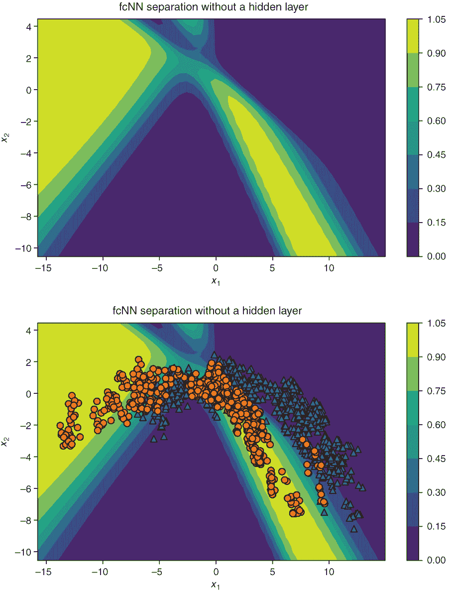

图 2.9 全连接神经网络产生一个弯曲的决策边界。二维特征空间中背景的阴影显示了由包含八个神经元并使用特征 *x*[1] 和 *x*[2] 作为输入的全连接神经网络预测的假钞的概率。右侧叠加了训练数据，显示了弯曲的决策边界更好地符合真钞和假钞之间的边界。

|  | 实践时间：只需在[`mng.bz/lGd6`](http://mng.bz/lGd6)的钞票笔记本中添加更多隐藏层，即可成为深度学习俱乐部的一员。这比机器学习要简单得多（见图 2.10） |
| --- | --- |

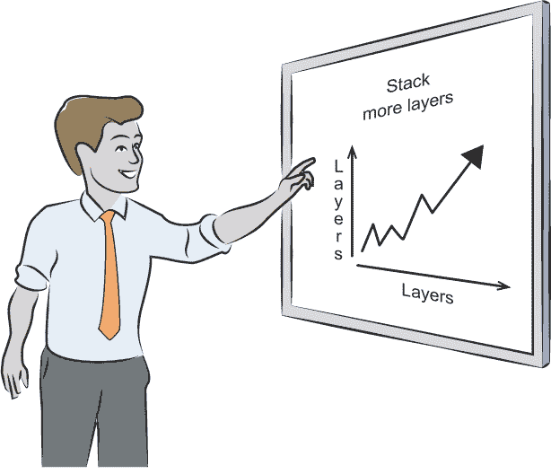

图 2.10 工作中的深度学习专家。灵感来源于[`mng.bz/VgJP`](http://mng.bz/VgJP)。

但是，在添加一个额外的层时发生了什么？原则上，与我们对第一个隐藏层讨论的相同。您可以将添加的隐藏层中的神经元值视为输入的新特征表示。但有一个区别：深层中的特征不是直接从输入构建的，而是从前一层构建的。例如，在第二个隐藏层中，特征是从第一个隐藏层的特征构建的（见图 2.12）。这种特征的层次化构建通常很有效，因为它允许您从第一层学习基本特征，这些特征可以用作下一层几个更复杂特征的组成部分。

通过堆叠许多层，您允许神经网络构建层次化和复杂的特征，这些特征在从一层到另一层的过程中变得越来越抽象和特定于任务。由于每层的神经元数量（以及隐藏层的数量）是设计的一部分，您需要决定这个数量是基于您问题的复杂性和您的经验，还是它是由其他成功的深度学习者报告的。

在深度学习中，好消息是您不需要预先定义确定如何从前一层的特征构建当前层特征的权重。神经网络在训练过程中学习这一点。您也不需要单独训练每一层，但通常您会整体训练神经网络，这被称为端到端训练。这有一个优点，即某一层的改变会自动触发所有其他层的适应。在第三章中，您将了解这个训练过程是如何工作的。

### 2.1.3 使用全连接神经网络（fcNN）进行图像分类

现在让我们使用你新学的技能来构建一个更大的网络，并看看它在对手写数字进行分类的任务上的表现。不同的科学学科有不同的模型系统，用于衡量它们的方法：分子生物学家使用一种名为 C. Elegance 的线虫；进行社会网络分析的人使用 Zachary Karate Club，最后，与深度学习相关的工作者使用著名的 MNIST 数字数据集。这个基准数据集包含 70,000 个手写数字，可以从[`mng.bz/xW8W`](http://mng.bz/xW8W) 获取。所有图像都具有 28 × 28 像素，并且是灰度图像，像素值介于 0 到 255 之间。图 2.11 显示了数据集的前四幅图像。

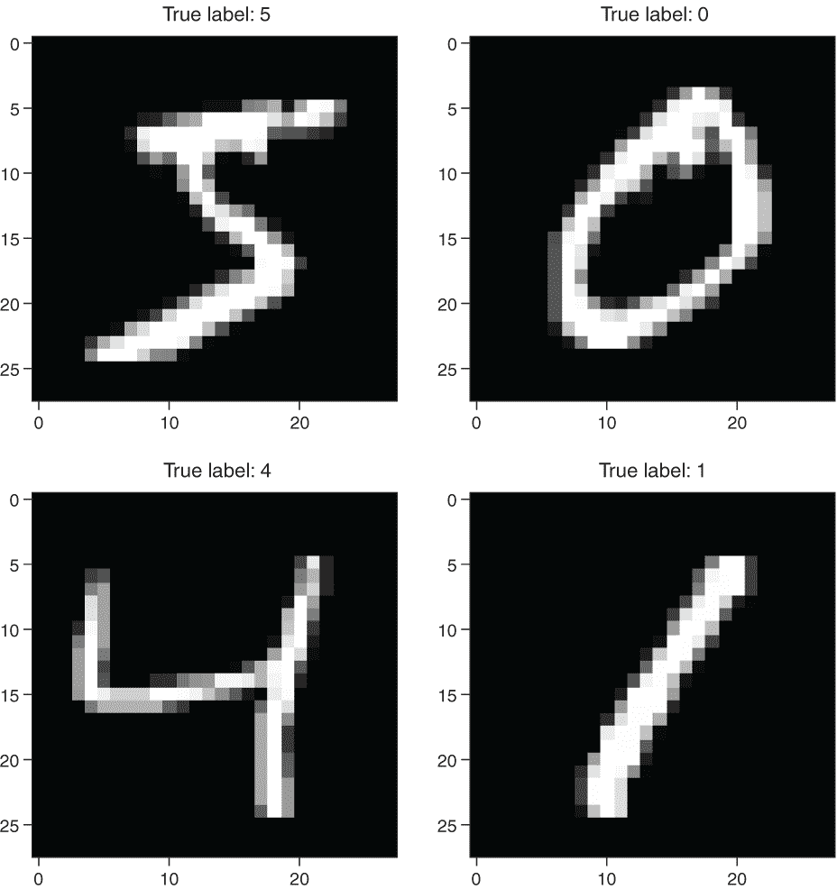

图 2.11 MNIST 数据集的前四个数字--用于基准测试神经网络进行图像分类的标准数据集。

这个数据集在机器学习社区中广为人知。如果你开发了一种新的图像分类算法，你通常也会报告它在 MNIST 数据集上的性能。MNIST 图像是灰度图像，每个像素的灰度值由 0 到 255 范围内的整数定义。为了进行公平的比较，数据有一个标准的分割：60,000 个图像用于训练网络，10,000 个用于测试。在 Keras 中，你可以用一行代码下载整个数据集（见列表 2.3）。你还可以下载本节的相关 MNIST 笔记本（你可以在以后工作），网址为[`mng.bz/AAJz`](http://mng.bz/AAJz) 。

简单的神经网络无法处理 2D 图像，但需要一个 1D 输入向量。因此，你首先将 28 × 28 的图像展平成一个大小为 28 · 28 = 784 的向量。输出应该指示输入图像是否是 0 到 9 中的数字之一。更精确地说，你希望模型表示网络认为给定输入图像是某个特定数字的概率。为此，输出层有十个神经元（每个数字一个）。你再次使用激活函数`softmax`来确保计算出的输出可以被解释为概率（介于 0 到 1 之间的数字），总和为 1。在这个例子中，我们还包括了隐藏层。图 2.12 显示了网络的简化版本以及 Keras 中相应模型的定义，如列表 2.4 所示。


图 2.12 一个具有两个隐藏层的全连接神经网络。在 MNIST 示例中，输入层有 784 个值对应于 28 × 28 像素，输出层有 10 个节点对应于 10 个类别。

列表 2.3 加载 MNIST 数据

```
from tensorflow.keras.datasets import mnist
(x_train, y_train), (x_test, y_test) = \
mnist.load_data()                         ❶ 

X_train = x_train[0:50000] / 255          ❷ 
Y_train = y_train[0:50000] 
Y_train = to_categorical(*y*_train,10)      ❸ 
X_val=x_train[50000:60000] / 255          ❹ 
... 
```

❶ 加载 MNIST 训练集（60,000 个图像）和测试集

❷ 使用 50,000 个图像进行训练，除以 255，使像素值在 0 到 1 的范围内

❸ 将作为整数从 0 到 9 给出的标签存储为 one-hot 编码向量

❹ 我们对验证集也做同样的处理。

注意：我们在这个列表中不使用测试集。

此外，在我们存储网络 `y_train` 标签的地方，我们将这些转换为长度为 10 的分类数据，以匹配输出。1 被转换为 (0,1,0,0,0,0,0,0,0,0)。这被称为 one-hot 编码。在下一个列表中，你可以看到一个小 fcNN 使用 one-hot 编码的标签 `Y_train.`。

列表 2.4 MNIST 数据的 fcNN 定义

```
model = Sequential()

model.add(Dense(100, batch_input_shape=(None, 784),       ❶ 
                                  activation='sigmoid')) 
model.add(Dense(50, activation='sigmoid'))                ❷ 
model.add(Dense(10, activation='softmax'))                ❸ 

model.compile(loss='categorical_crossentropy',
              optimizer='adam',                           ❹ 
metrics=['accuracy'])                                     ❺ 

history=model.fit(X_train_flat, Y_train,  
                  batch_size=128, 
                  epochs=10,
                  validation_data=(X_val_flat, Y_val)  
                 )
```

❶ 第一个隐藏层有 100 个神经元，连接到输入大小 28 × 28 像素

❷ 第二个密集层有 50 个神经元

❸ 第三层连接到 10 个输出神经元

❹ 使用比 SGD 更快的不同优化器（见第三章）

❺ 跟踪训练过程中的准确率（正确分类的训练和验证示例的分数）

|  | 实践时间现在打开 MNIST 笔记本 [`mng.bz/AAJz`](http://mng.bz/AAJz) ，运行它，并尝试理解代码。 |
| --- | --- |

当查看损失曲线随迭代次数的变化过程（见图 2.13）时，你可以观察到模型拟合了数据。训练好的 fcNN 在验证集上的性能大约为 97%，这并不坏，但最先进的技术大约为 99%。

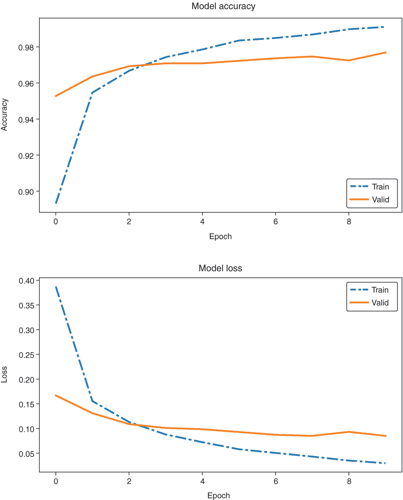

图 2.13 在不同的训练步骤中，准确率训练（顶部）和损失（底部）的增加

玩深度学习游戏并堆叠更多层。常用的另一个技巧是将隐藏层中的 sigmoid 激活函数替换为更简单的：ReLU。ReLU 代表修正线性单元，对于它所做的事情来说，这个名字相当长。它只是将小于零的值固定为零，而将大于零的值保持不变（见图 2.14）。在隐藏层中使用非线性激活函数是至关重要的，因为当使用线性激活函数时，你可以用一个层来替换层堆叠。这是因为通过一个线性层相当于矩阵乘法，你可以用一个矩阵乘法来替换一系列矩阵乘法。要在 Keras 中更改激活函数，只需将 `sigmoid` 替换为 `relu`。如果你愿意，你可以在笔记本 [`mng.bz/AAJz`](http://mng.bz/AAJz) 中更改激活函数。

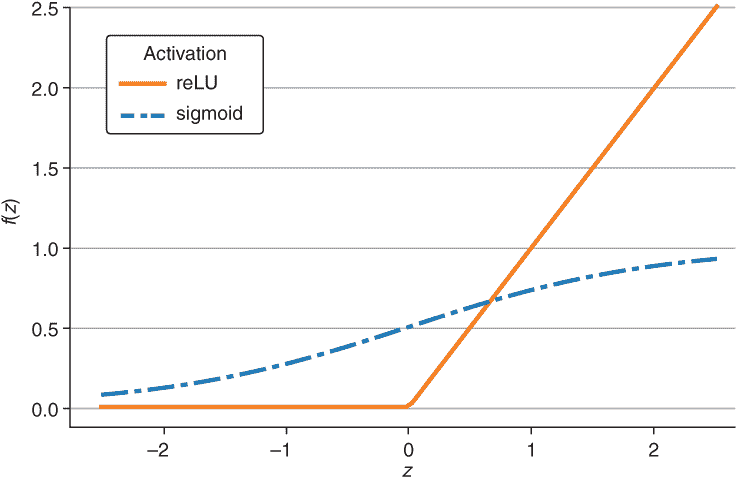

图 2.14 ReLU 和 sigmoid 激活函数的比较

让我们做一个小的实验，研究在你将这些像素值输入网络之前对像素值进行洗牌会发生什么。图 2.15 显示了与图 2.11 相同的数字，但这次是随机洗牌的。

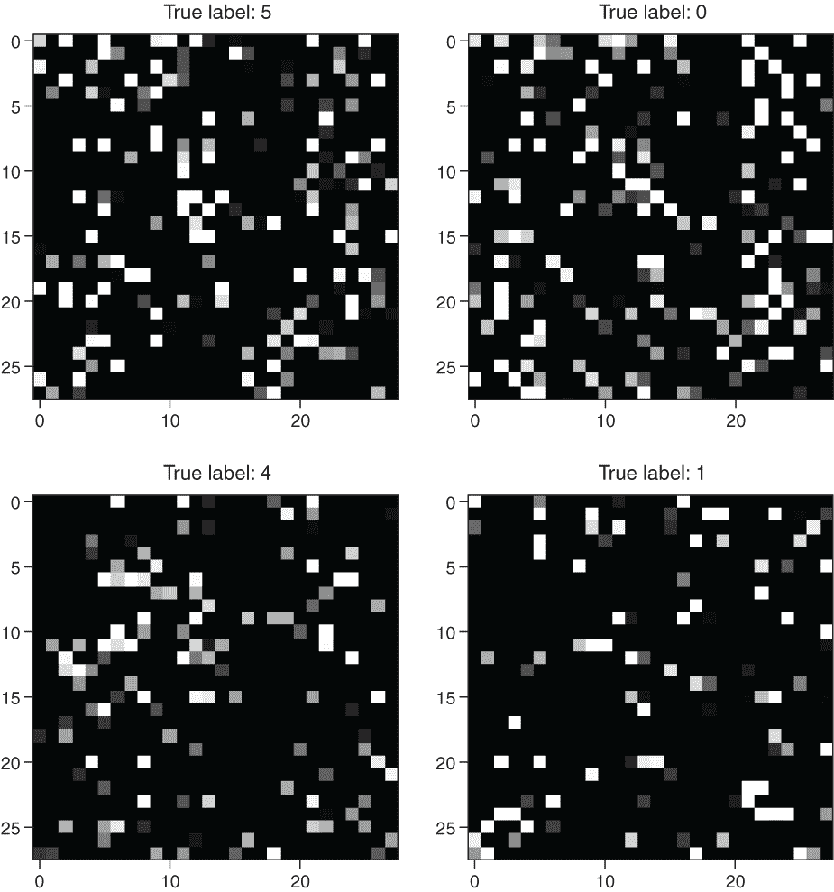

图 2.15 在图 2.11 中相同的数字（5, 0, 4, 1）在像素洗牌后的样子

对于每张图像，像素都按照相同的方式进行洗牌。即使看过成千上万的训练示例，你也很难说出正确的数字。网络还能学会识别这些数字吗？

|  | 实践时间 尝试在 MNIST 笔记本中运行代码并与之互动 [`mng.bz/2XN0`](http://mng.bz/2XN0)。你观察到了什么？ |
| --- | --- |

注意：只跟随笔记本直到你达到“CNN 作为 MNIST 数据的分类模型”这一部分。我们稍后会研究 CNN，然后再回到笔记本。

你可能会达到与原始图像相同的准确度（在统计波动范围内）。一开始这可能会让人感到惊讶。但看看全连接神经网络的网络架构，输入的顺序根本不重要。因为网络没有邻近像素的概念，所以没有类似邻域的东西。因此，人们也把全连接神经网络称为排列不变神经网络，因为其性能不依赖于数据是否被排列（打乱*D*）。然而，真实的图像数据并不是排列不变的，邻近像素往往具有相似值。如果你打乱图像，人们将难以识别它们。此外，显示相同数字的两个图像不需要显示相同的像素值。你可以稍微移动（平移）图像，它仍然显示相同的对象。

人类在视觉任务上表现出色，但在处理打乱顺序的图像时却存在问题，这表明进化已经找到了利用图像数据特殊属性的方法。虽然全连接神经网络（fcNNs）在处理类似电子表格的数据时表现良好，其中列的顺序并不重要，但当顺序或空间对齐很重要时，如卷积神经网络（convolutional NNs），有更好的架构。原则上，全连接神经网络可以用于图像处理，但你需要很多层和巨大的训练数据集，以便网络学习到邻近像素倾向于具有相同值，以及图像是平移不变的。

## 2.2 用于图像数据卷积神经网络

即使只有一个隐藏层的全连接神经网络也能表示任何函数，但很快就会变得太大，包含太多的参数，通常没有足够的数据来拟合它们。深度学习（DL）的许多进展都围绕着创建不同的架构，这些架构更有效地利用数据的结构。对于图像数据，这种架构之一就是卷积神经网络。

对于只有一个隐藏层的全连接神经网络示例（见图 2.8），我们讨论了可以将隐藏层中的神经元数量视为从输入构建的新特征数量。这意味着如果你想解决复杂问题，你需要隐藏层中有大量的神经元。但隐藏层中的神经元越多，你需要学习的参数就越多，你需要更多的训练数据。堆叠层让模型以层次化的方式学习特定任务的特征。这种方法比全连接神经网络构建复杂特征所需的参数更少，因此对数据的需求也更低。

你在上一个章节中学到，如果你为全连接神经网络（fcNN）添加更多的隐藏层，你就能得到更多。深入挖掘是增强神经网络性能的一个很好的技巧，这也是深度学习之所以得名的原因。你还了解到，全连接神经网络忽略了图像中像素的邻近结构。这表明可能存在一个更好的神经网络架构来分析图像数据。实际上，深度学习在计算机视觉领域的成功也离不开一些额外的架构技巧，这些技巧利用了关于图像数据局部结构的知识。

为图像数据等局部相关数据定制神经网络的最重要组成部分是所谓的卷积层。在本节中，我们将解释卷积层是如何工作的。主要由卷积层组成的神经网络被称为卷积神经网络（CNN），并且具有极其广泛的应用范围，包括：

+   图像分类，例如区分卡车和路标

+   视频数据预测，例如生成天气预报的未来雷达图像

+   基于图像或视频数据的生产线质量监控

+   在组织病理切片中对不同肿瘤的分类和检测

+   图像中不同对象的分割

### 2.2.1 CNN 架构中的主要思想

让我们专注于图像数据，并讨论一种专门的网络架构，该架构考虑了图像内部的高度局部结构（见图 2.16）。在 2012 年，Alex Krizhevsky 在国际知名的 ImageNet 竞赛中使用了这种架构，这为深度学习进入计算机视觉领域带来了突破。

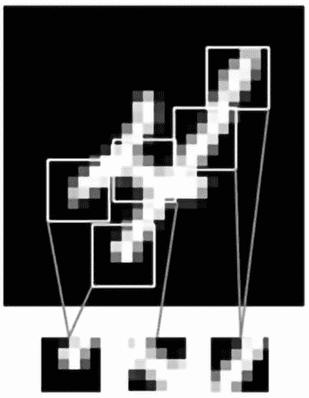

图 2.16：图像可以被分解成局部模式，如边缘、纹理等。

我们现在将深入探讨卷积神经网络（CNN）的架构，并讨论它们是如何获得这个名字的。让我们看看 CNN 的主要思想：不是连接两个连续层之间的所有神经元，而只是相邻像素的小块区域连接到下一层的神经元（见图 2.17）。通过这个简单的技巧，网络架构内置了图像的局部结构。这个技巧也减少了神经网络中的权重数量。如果你只考虑例如 3 × 3 像素的小块区域作为连接到下一层神经元的局部模式（见图 2.18），那么你只需要学习 10 个权重，即加权求和*z* = *x*[1] ⋅ *w*[1] - *x*[2] ∙ *w*[2] + ⋯ + *x*[9] ∙ *w*[9] + *b*，这是下一神经元的输入。

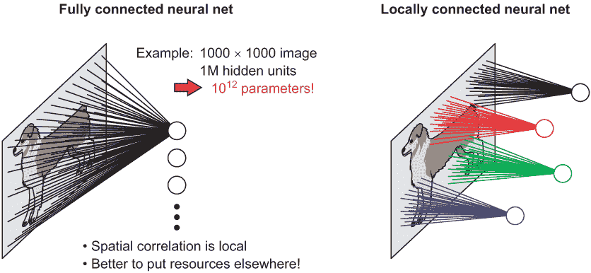

图 2.17：全连接神经网络（fcNN）（左侧）或卷积神经网络（CNN）（右侧）的输入图像与第一隐藏层神经元之间的连接。这种表示忽略了偏差项。

如果你有过经典图像分析的经验，那么你知道这个想法根本不新鲜。你在这里做的是所谓的卷积。

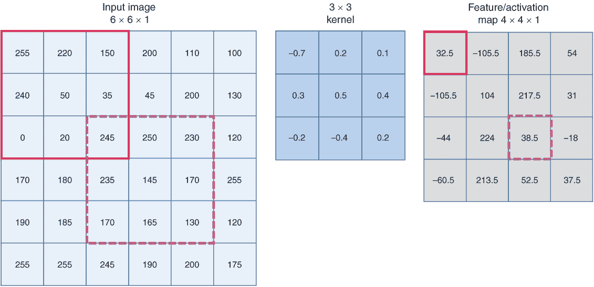

图 2.18 展示了将一个 6×6 的灰度图像与一个 3×3 的核进行卷积，步长为 1 且不进行填充时，得到的输出是一个 4×4 的特征图。核在所有 16 个可能的位置上应用，以确定激活图的 16 个值。输入中用粗实线和虚线标记了两个可能的核位置。激活图中相应像素的位置也用粗实线和虚线标记。CNN 通过将像素值与叠加的核值相乘并添加所有项（假设偏差为 0）来计算结果值。

看一下图 2.18，其中你可以看到一个 6×6 像素的小图像和一个 3×3 的核 1，核具有预定义的权重。你可以通过每次移动 1 个像素（称为`stride=1`）来在图像上滑动核。在每个位置，你计算图像像素和叠加核权重的逐元素乘积。然后，将这些值相加得到加权总和 *z = x*[1] ∙ *w*[1] *+x*[2] ∙ *w*[2] *+* ⋯ *+x**[k]* ∙ *w**[k]* *+ b* ，其中 k 是连接到每个神经元的像素数量，*b* 是偏差项。计算出的值 *z* 是输出矩阵的单个元素。将核移到图像上的下一个位置后，你可以计算下一个输出值 *z*，依此类推。我们将这种结果输出称为激活图或特征图。

在图 2.18 的例子中，我们从一个 6×6 的图像开始，将其与一个 3×3 的核进行卷积，得到一个 4×4 的激活图。在图像上滑动核并要求整个核在每个位置完全位于图像内，可以得到一个尺寸减小的激活图。例如，如果你在所有边都有一个 3×3 的核，结果激活图中会去掉一个像素；如果是 5×5 的核，则会去掉两个像素。如果你希望在应用卷积后保持相同的尺寸，你可以使用输入图像的零填充（称为`padding='same'`，列表 2.5 中卷积层的参数；如果你不想使用零填充，参数将是`padding='valid'`）。

在 CNN 中，核权重是通过学习得到的（参见第三章）。因为你在每个位置使用相同的核，所以有共享权重，在我们的例子中，你只需要学习 3×3=9 个权重来计算整个激活图。通常，如果需要学习 10 个权重，也会包括一个偏差项。要交互式地将不同的核应用于真实图像，请参阅[`setosa.io/ev/image-kernels/`](http://setosa.io/ev/image-kernels/)。

激活图中的值能告诉你什么？如果你将核应用于图像中所有可能的位置，你只会得到高信号，在这些位置下，底层图像显示了核的模式。将输出组装成图像，可以得到一个映射，显示了核模式出现在图像中的哪些位置。这就是为什么结果图像通常被称为特征图或激活图的原因。

同一激活图中的每个神经元具有相同数量的输入连接，连接的权重也相同。（你很快就会看到实际应用中使用不止一个核。）每个神经元连接到输入（前一层）的不同区域，这意味着同一特征图内的每个神经元都在寻找相同的模式，但位置不同。图 2.19 展示了这一概念，该图像由矩形区域组成，在这些区域上应用了具有垂直边缘模式的核。我们使用这种技术在图像处理中使用，例如，增强图像的边缘或使其模糊。访问[`setosa.io/ev/image-kernels/`](http://setosa.io/ev/image-kernels/)以了解不同核对更复杂图像的影响。

在图 2.19 中，你可以看到垂直边缘核（从亮到暗）在图像中的三个位置。在图像位置中，垂直边缘从亮到暗，你会得到一个高值（在激活图中显示为深灰色像素）。在图像位置中，垂直边缘从暗到亮，你会得到一个低值（在激活图中显示为浅灰色像素）。在图像中没有垂直边缘的位置，结果值既不高也不低（在激活图中显示为中灰色像素）。在显示的滤波器中，如果权重总和为 1，则如果输入是具有恒定灰度值的图像块，激活图中的值将为零。

### 2.2.2 最小 CNN，适合边缘爱好者

让我们想象一个对包含垂直边缘的图像感到兴奋的艺术爱好者。你的任务是预测一组条纹图像，看艺术爱好者是否会喜欢这些图像。该集合中的一些图像有水平边缘，而另一些有垂直边缘。为了识别具有垂直条纹的图像，一个垂直边缘检测模型将非常出色。为此目的，你可能想要做类似于图 2.19 中描述的事情，并使用预定义的垂直边缘滤波器进行卷积，使用结果特征图中的最大值作为分数，表示艺术爱好者是否会喜欢该图像。

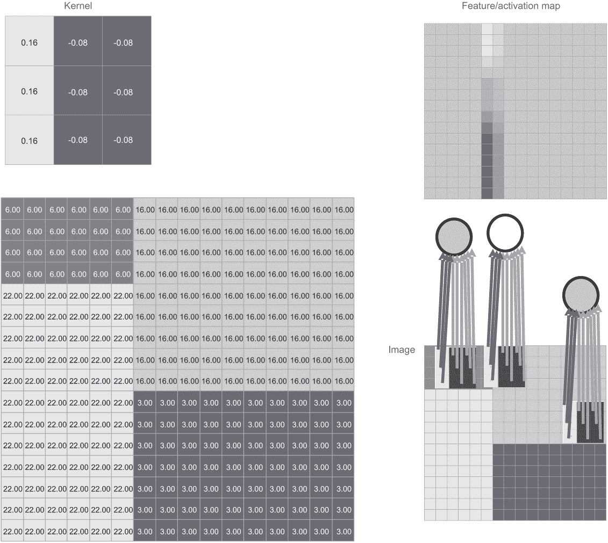

图 2.19 展示了将一个 3×3 核与类似垂直边缘的权重模式（左上面板）与由平方区域组成的图像（左下和右面板）进行卷积的结果，这会产生一个特征图，突出显示输入图像中垂直边缘的位置（右上面板）。在左面板中，数字表示核的加权值（左上）和图像的像素值（左下）。

在传统的图像分析中，当感兴趣的特性已知并且可以描述为局部模式时，通常使用预定义的核进行卷积。在这种情况下，不使用这种传统的图像分析方法就显得有些愚蠢。但让我们假设你不知道艺术爱好者喜欢垂直边缘，而你只有他们喜欢和不喜欢的一组图像列表。你想要学习核中可用于卷积的权重值。图 2.20 显示了相应的网络架构，其中核的大小为 5 × 5。结果隐藏层是一个特征图。

![2-20.png]

图 2.20 仅由一个特征图组成，包含一个隐藏层的 CNN。作为一个池化值，你取特征图内所有值的最大值。你添加一个密集层来确定输出中两个可能的类别标签的概率。

为了检查这个特征图是否表明图像包含核模式，你取特征图的最大值。从这个值，你想要预测艺术爱好者喜欢图像的概率。你已经看到了如何做到这一点：你添加一个单层的全连接层，具有两个输出节点，并使用 softmax 激活来确保两个输出值可以作为两个类别的概率（艺术爱好者喜欢图像；艺术爱好者不喜欢图像）。这加起来为 1。这个小 CNN 网络（第一隐藏层中的特征图）是通过图像与核的卷积得到的。分类是在图 2.20 右侧显示的全连接部分完成的。这种架构可能是人们能想到的最小的 CNN 之一。要使用 TensorFlow 和 Keras 建模图像数据，你需要创建形式为 4D 的张量：

```
(batch, height, width, channels) 
```

批量维度对应于一个批次中的图像数量。接下来的两个元素定义了图像的高度和宽度，单位为像素。最后一个维度定义了通道数。（一个典型的 RGB 彩色图像有 3 个通道。这意味着一个包含 128 个彩色图像的批次，每个图像有 256 行和 256 列，可以存储在一个形状为（128, 256, 256, 3）的张量中。）

你可以用几行 Keras 代码设置、训练和评估 CNN 模型（见列表 2.5）。你需要的是包含水平或垂直条纹的图像数据集及其相应的类别标签。这可以很容易地模拟。

|  | 实践时间 打开边缘爱好者笔记本，访问[`mng.bz/1zEj`](http://mng.bz/1zEj)，并遵循那里的说明来模拟图像数据和拟合模型。检查哪些核权重被学习，以及这些是否形成垂直边缘。如果你无法重现结果，不要担心；只需重新进行训练，直到你得到结果。研究激活函数和池化方法的影响。 |
| --- | --- |

```
model = Sequential()

model.add(Convolution2D(1,(5,5),padding='same',\        ❶ 
                        input_shape=(pixel,pixel,1)))

model.add(Activation('linear'))                         ❷ 
# take the max over all values in the activation map
model.add(MaxPooling2D(pool_size=(pixel,pixel)))        ❸ 
model.add(Flatten())                                    ❹ 
model.add(Dense(2))                                     ❺ 
model.add(Activation('softmax'))                        ❻ 

# compile model and initialize weights
model.compile(loss='categorical_crossentropy',
              optimizer='adam',
              metrics=['accuracy'])

# train the model
history=model.fit(X_train, Y_train,
                  validation_data=(X_val,Y_val),
                  batch_size=64, 
                  epochs=15,
                  verbose=1,
                  shuffle=True) 
```

❶ 使用一个大小为 5 × 5 的核，具有相同填充的卷积层

❷ 添加线性激活函数（传递所有值）

❸ MaxPooling 层提取特征图的最大值。

❹ 将前一层输出展平成一个向量

❺ 一个包含两个神经元的密集层预测两个标签的概率。

❻ 添加 softmax 激活函数来计算两个类别的概率

注意：在列表中，使用`padding='same'`的卷积层意味着输出特征图的大小与输入图像相同。

在你使用边缘爱好者笔记本进行实验的[`mng.bz/1zEj`](http://mng.bz/1zEj)时，你可能已经注意到，垂直边缘核并不总是被学习到；有时会学习到水平边缘核。这是完全可以接受的，因为数据集由具有水平或垂直边缘的图像组成，任务只是区分水平和垂直边缘。没有找到水平边缘表明图像只包含垂直边缘。

在这个边缘爱好者例子中，使用预定义的核或学习核的权重可能没有太大区别。但在更现实的应用中，最佳区分模式有时很难预先定义，而学习最优核权重是 CNN 的一个巨大优势。在第三章中，你将学习如何训练模型权重。

### 2.2.3 CNN 架构的生物灵感

边缘爱好者这个例子只是一个玩具，你可能会认为在真实的大脑中肯定没有喜欢边缘的神经元。相反，确实如此！人类和动物大脑中的所谓视觉皮层确实有喜欢边缘的神经元。两位生物学家 Hubel 和 Wiesel 因在 1981 年发现这一点而获得了诺贝尔生理学或医学奖。他们发现这一点的过程非常有趣。而且，正如研究中的常见情况一样，其中涉及了很多运气。

在 20 世纪 50 年代末，Hubel 和 Wiesel 想要研究猫视觉皮层中由于刺激引起的神经元活动的相关性。为此，他们对猫进行了麻醉，并在它面前屏幕上投影了一些图像。他们选择了一个神经元来测量电信号（见图 2.21）。然而，实验似乎没有成功，因为他们无法在向猫展示不同图像时观察到神经元放电。他们更换了投影仪中的幻灯片，换成了频率越来越高的幻灯片。最后，由于幻灯片卡住了，他们摇晃了投影仪，神经元开始放电。通过这种方式，他们发现视觉皮层不同位置的神经元在边缘以不同方向滑过猫眼视网膜时会被激活。

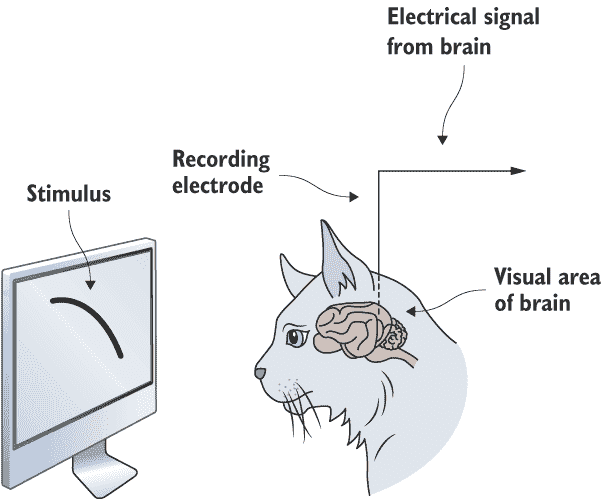

图 2.21 展示了 Hubel 和 Wiesel 的实验设置，他们发现了在猫的视觉皮层中，当向猫展示移动边缘时，会响应的神经元。

脑科学研究持续发展，现在众所周知，在 Hubel 和 Wiesel 进行实验的大脑区域（称为 V1 区域），所有神经元对不同视网膜区域上的相对简单的刺激形式都有反应。这不仅适用于猫，也适用于其他动物和人类。还知道，大脑其他区域的神经元（称为 V2、V4 和 IT）对越来越复杂的视觉刺激有反应，例如整个面部（见图 2.22）。研究表明，神经元的信号是从一个区域传到另一个区域的。此外，只有大脑一个区域的神经元的一部分连接到下一个区域的神经元。通过神经元的连接，不同神经元的激活以层次化的方式结合，这使得神经元能够在视网膜上对越来越大的区域和越来越复杂的视觉刺激做出反应。

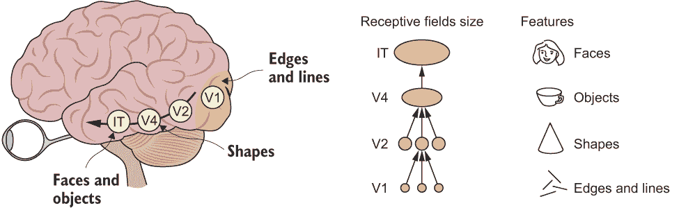

图 2.22 大脑视觉皮层的组织。不同区域的神经元对越来越大的感受野和越来越复杂的刺激有反应。

注意：你很快就会看到，更深层次的 CNN 架构在某种程度上受到了从简单结构到复杂结构的层次检测的启发。然而，这种类比不应过分强调；大脑并不是为了形成 CNN 而连接起来的。

### 2.2.4 构建和理解 CNN

更现实的图像分类任务无法通过如图 2.20 所示的简单 CNN 架构来处理，该架构仅学习检测像边缘这样的单个局部图像模式。即使是简单的图像分类任务，如区分 MNIST 数据集中的 10 个数字，也需要学习大量的更复杂的图像特征。你可能已经能猜到如何做到这一点：深入挖掘是主要秘诀。但在深入挖掘之前，你需要拓宽视野，并在第一层添加更多核。

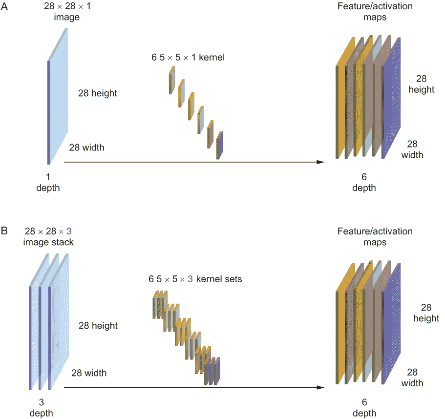

图 2.23 输入图像与六个不同核的卷积产生了六个激活图。如果输入图像只有一个通道（a），那么每个核也只有一个通道。如果输入图像有三个通道（b），那么每个滤波器也有三个通道。

每个核可以学习另一组权重，因此对于每个核，你都会在隐藏层中得到另一个激活图（见图 2.23）。如果输入不仅有 1 个通道，而是有 d 个通道，那么核也需要有 d 个通道来计算激活图。对于彩色图像，d = 3，对应于（红、绿、蓝），一个有效的核可以是绿色通道中垂直边缘活跃，而在蓝色和红色通道中水平边缘活跃的核。核矩阵再次定义了加权求和的权重，这决定了激活图中相应位置的神经元输入。

现在我们来谈谈全连接神经网络（fcNN）和卷积神经网络（CNN）之间的类比。全连接神经网络为每个神经元学习一组新的权重（学习过程在第三章中讨论），这些权重将前一层输入结合到一个新的值，这个值可以看作是图像的特征（例如，参见图 2.8）。在全连接神经网络中，你可以通过添加层来加深网络，其中一层中的所有神经元都连接到下一层中的所有神经元。从这个意义上说，CNN 中的核集或激活图的数量对应于全连接神经网络一层中的神经元数量。如果你想在 CNN 中加深网络，你需要添加更多的卷积层。这意味着你学习的核再次应用于前一层激活图的堆叠。

图 2.25 说明了这个原理。在该图中，你可以看到一个具有 3 个卷积层的 CNN。在激活图堆叠上的卷积与具有多个通道输入的卷积没有区别。在图 2.23 中，仅从 3 通道输入图像中生成了 6 个激活图。然而，只学习 6 个核并不常见。典型的情况是在第一层学习 32 个核，甚至更多的核。（通常，从一层到下一层核的数量会加倍。）为了减少 CNN 中的权重数量，在下一轮卷积之前对激活图进行下采样也是常见的做法。这通常是通过用一个 2×2 的神经元块替换激活图中的最大激活来完成的。我们称这一步为最大池化。

当向 CNN 添加更多层时，神经元在原始图像中看到的区域会变大。我们称之为感受野，它由所有与神经元通过所有中间层连接的原始图像中的像素组成。根据图像大小和核大小（通常在四到十个层之后），所有神经元都连接到整个输入图像。尽管如此，激活 CNN 不同层中神经元的图像模式复杂性随着每一层的增加而提高。

当检查哪些图像或图像部分可以在 CNN 的不同层中激活一个神经元时，靠近输入的层对简单的图像模式（如边缘）做出反应，而靠近输出的层将这些简单模式组合成更复杂的模式（参见图 2.24）。

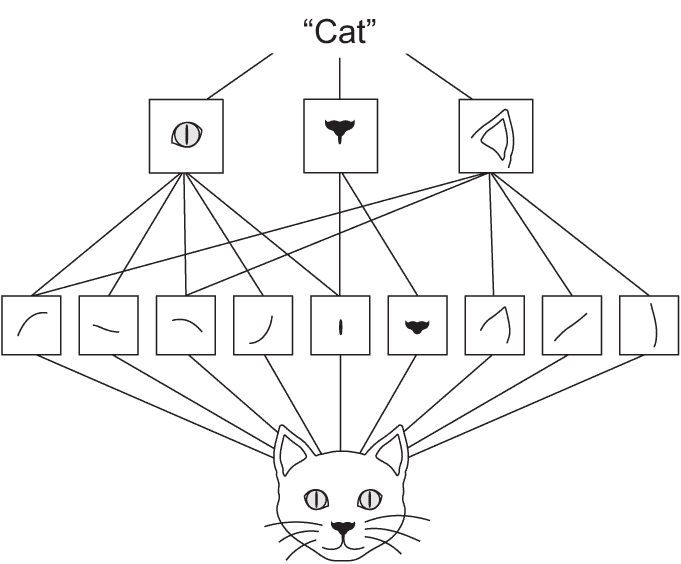

图 2.24 展示了 CNN 不同卷积层中激活神经元图像模式的层次结构：简单的模式（如边缘）组合成局部对象（如眼睛或耳朵），这些对象进一步组合成更高级的概念（如猫）。该图使用得到了 François Chollet 的《Python 深度学习》（Manning, 2017）一书的许可。

卷积层的数量以及每层的核数量是 CNN 中的调整参数。当问题的复杂性增加时，通常需要更多的卷积层和每层的更多核。在 CNN 的最后一个卷积层中，我们得到了输入的新表示。将此层的所有神经元展平成一个向量，结果得到一个具有与最后一个卷积层中神经元数量一样多的图像特征的新特征表示（见图 2.25）。我们最终又回到了之前的情况：输入由一个图像特征向量描述。但这次，特征是训练核的结果。现在你可以添加几个密集连接层来构建预测。

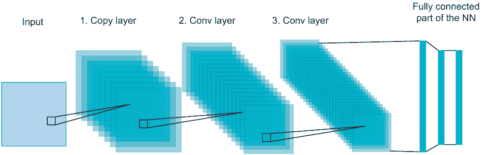

图 2.25 一个具有三个卷积层和三个全连接层的 CNN。每个卷积层中的特征图数量表示学习到的核集数量。全连接部分每层的元素数量表示学习到的加权集数量。

让我们在 MNIST 数据上尝试一个 CNN。在列表 2.6 中，你可以看到具有卷积层和全连接层的 CNN 的定义。

|  | 实践时间 再次打开 MNIST 笔记本 [`mng.bz/AAJz`](http://mng.bz/AAJz)，将具有两个卷积层的 CNN 拟合到 MNIST 数据上（参见笔记本的第二部分）。然后比较与使用 fcNN 所达到的性能。玩转代码并执行一个排列实验以检查图像中像素的顺序对 CNN 性能的影响。 |
| --- | --- |

```
# define CNN with 2 convolution blocks and 2 fully connected layers
model = Sequential()

model.add(Convolution2D(8,kernel_size,\                  ❶ 
padding='same',input_shape=input_shape)) 
model.add(Activation('relu'))                            ❷ 
model.add(Convolution2D(8, kernel_size,padding='same'))  ❶ 
model.add(Activation('relu'))                            ❷ 
model.add(MaxPooling2D(pool_size=pool_size))             ❸ 

model.add(Convolution2D(16, kernel_size,padding='same')) ❹ 
model.add(Activation('relu'))                            ❷ 
model.add(Convolution2D(16,kernel_size,padding='same'))  ❹ 
model.add(Activation('relu'))                            ❷ 
model.add(MaxPooling2D(pool_size=pool_size))             ❺ 

model.add(Flatten())                                     ❻ 
model.add(Dense(40))               
model.add(Activation('relu'))                            ❷ 
model.add(Dense(nb_classes))                             ❼ 
model.add(Activation('softmax'))                         ❽ 

# compile model and initialize weights
model.compile(loss='categorical_crossentropy',
              optimizer='adam',
              metrics=['accuracy'])

# train the model
history=model.fit(X_train, Y_train, 
                  batch_size=128, 
                  epochs=10,
                  verbose=2, 
                  validation_data=(X_val, Y_val)
                 )
```

❶ 使用一个大小为 3 × 3 的八个核的卷积层

❷ 将 relu 激活函数应用于特征图

❸ 此最大池化层具有 2 × 2 的池化大小和 2 的步长。

❹ 使用一个大小为 3 × 3 的 16 个核的卷积层

❺ 此最大池化层将 14 × 14 × 16 的输入张量转换为 7 × 7 × 16 的输出张量。

❻ 将前一层输出展平，得到长度为 784（7 × 7 × 16）的向量

❼ 输出 nb_classes（此处为 10）

❽ 使用 softmax 将 10 个输出转换为 10 个预测概率

第一个卷积层使用八个具有相同填充的核，结果输出特征图的大小与输入图像相同。在 MNIST 情况下，输入图像的大小为 28 × 28 × 1 像素。结果八个特征图每个的大小为 28 × 28。经过第一次池化后，输入的形状为 28 × 28 × 8，输出形状为 14 × 14 × 8。

从您在 [`mng.bz/AAJz`](http://mng.bz/AAJz) 的 MNIST 笔记本中的实验中，您已经了解到，对于这个图像分类任务，使用 CNN（大约 99%）比使用 fcNN（大约 96%）更容易实现更高的性能。排列实验表明，图像中像素的排列确实很重要：当在原始图像数据上训练时（99%），CNN 的表现比在图像数据的随机版本上训练时（95%）要好得多。这支持了这样一个观点，即 CNN 在图像相关任务中表现优异的秘密在于其架构考虑了图像的局部顺序。在继续之前，让我们回顾一下并强调 CNN 在处理图像数据时的某些优势：

+   局部连通性利用了图像数据的局部信息。

+   在 CNN 中，您需要的权重参数比在 fcNN 中少。

+   CNN 在很大程度上对图像内的平移是不变的。

+   CNN 的卷积部分允许网络以层次结构学习特定任务的抽象图像特征。

下一个成功使用深度学习分析的特殊数据类型是显示排序的数据。让我们看看下一个。

## 2.3 有序数据的一维 CNN

有序数据可以是文本（理解为单词或字符的序列），时间序列（如苏黎世的每日最高温度），声音或任何其他有序数据。这些算法的应用包括以下内容：

+   文档和时间序列分类，例如识别文章的主题或书籍的作者

+   序列比较，例如估计两个文档或两个股票交易者的相似程度

+   序列到序列学习，例如将英语句子解码成法语

+   情感分析，例如将推文或电影评论的情感分类为正面或负面

+   时间序列预测，例如根据最近的天气数据预测某个地点的未来天气

### 2.3.1 时间排序数据的格式

要使用 TensorFlow 和 Keras 模型有序数据，您需要将数据作为 3D 张量提供：

```
(batch, timestep, input_feature)
```

`batch` 维度指定了在一次批量中处理的序列数量。在一个批量中使用许多序列只是为了性能原因。批量中的序列是独立处理的。这与之前的 CNN 情况相同，其中批量中的图像也是独立处理的。在计算损失函数时，这些不同序列的结果会被平均。

让我们来看一个例子。你想预测明天的日最高气温。你有 12 年的历史数据，并且想考虑最后 10 天的数据来预测明天的气温。你选择了一个批大小为 128。在这种情况下，输入张量的形状如下：(128, 10, 1)。让我们细化模型。也许五个附近城市的日最高气温中包含的信息可以帮助你的预测。你也考虑了这些温度，这导致输入张量的形状为(128, 10, 6)。

有序数据的另一个应用领域是文本分析。假设你想分析以字符为输入的文本。`timestep` 维度指定了字符在序列中的位置。`input_feature` 维度则保存了每个序列和时间步的实际值。

再来看另一个例子。假设你想在字符级别分析小写的文本数据。批次的第三个序列以“hello.”开头。你可以通过使用字母在字母表中的位置来编码“hello”，即(8, 5, 11, 11, 14)。以这种方式编码字符意味着存在一种人为的顺序。因此，在深度学习中，分类数据使用独热编码来处理。有关独热编码的更详细描述，请参阅[`mng.bz/7Xrv`](http://mng.bz/7Xrv)。在这个 3D 输入张量中，这个序列的前两个元素将是：

```
input [2,0,:] = (0,0,0,0,0,0,0,1,0,0,0,0,0,0,0,0,0,0,0,0,0,0,0,0,0,0)
#                a,b,c,d,e,f,g,h,i,j,k,l,m,n,o,p,q,r,s,t,u,v,w,z,x,z
#the 1 at position 8 indicates the 8th character in the alphabet, which is h

input [2,1,:] = (0,0,0,0,1,0,0,0,0,0,0,0,0,0,0,0,0,0,0,0,0,0,0,0,0,0)
#                a,b,c,d,e,f,g,h,i,j,k,l,m,n,o,p,q,r,s,t,u,v,w,z,x,z
#the 1 at position 5 indicates the 5th character in the alphabet, which is e
```

当你有有限数量的字符需要以字符级别对文本进行建模时，独热编码是有用的。如果你在词级别建模文本并执行独热编码，你需要与单词数量一样多的维度的向量。这些向量会变得相当大且稀疏，因此，找到一种更密集的表示更好。这是我们称之为嵌入的步骤，它产生了一个新的表示，将单词作为数字向量。在 Chollet 的书中第六章[`mng.bz/qMGr`](http://mng.bz/qMGr)中，你可以找到将文本转换为向量的更多细节和一些 Keras 的示例代码。

### 2.3.2 有序数据有什么特别之处？

对于文本和其他有序数据，序列通常具有一些特定的属性。第一个属性是通常没有时间上的自然起点概念。稍微哲学一点，如果你现在不考虑大爆炸，而考虑正常的时间跨度，就没有明显的起点。这导致所有物理定律都必须在时间上保持不变。如果你打乒乓球，球的轨迹和 15 世纪时是一样的。第二个特殊性是时间序列数据通常包括长距离依赖关系。考虑以下字符串（取自维基百科关于康德的条目[`en.wikipedia.org/wiki/Immanuel_Kant`](https://en.wikipedia.org/wiki/Immanuel_Kant)）：

康德于 1724 年 4 月 22 日出生于东普鲁士的柯尼斯堡的一个路德派新教普鲁士家庭。......[省略数千字]。一个常见的说法是，康德一生从未超过 16 公里（9.9 英里）离开过柯尼斯堡。......[省略数千字]。康德的健康状况一直不佳，病情恶化，他在 __________ 去世。

下一个词是以下哪一个的概率：a)光剑，b)伦敦，或 c)柯尼斯堡？这表明在序列数据中存在相当长的依赖关系。此外，在有序数据中也可以找到长距离依赖。例如，如果你考虑地球上任意地点的每日最高气温，那么在 365 个数据点之后，出现相似气温的可能性相当大（至少比 182 天后更有可能）。有序数据的最后一个特殊属性特别出现在时间序列中，其中存在过去、现在和未来的概念。在这种情况下，未来不会影响过去。这个特性对于天气预报中的温度时间序列来说是正确的，但不是对于情感分析任务。

一个最优的网络应该在设计中融入这些硬事实，这样它就不需要学习它们。在因果网络的情况下，架构确保只有过去的信息对现在有影响。同样，在图像卷积网络的情况下，具有共享权重的架构确保模型对小的空间位移是不变的。

### 2.3.3 时间序列数据的架构

我们经常使用所谓的循环神经网络（RNNs）如长短期记忆网络（LSTMs）来分析时间序列数据。这些网络在概念上比 CNNs 复杂一些。此外，RNNs 的训练也稍微困难一些。在许多应用中，RNNs 可以被 CNNs 替代，或者如最近的研究论文所指出（Bai 等人，[`arxiv.org/abs/1803.01271`](https://arxiv.org/abs/1803.01271)）：

我们得出结论，序列建模与循环网络之间的常见关联应该被重新考虑，卷积网络应该被视为序列建模任务的起点。

由于你不需要在本书的其余部分使用 RNNs，请参考 Chollet 的书籍第六章，[`mng.bz/mBea`](http://mng.bz/mBea)，并继续使用 CNNs 进行序列建模。

使用 CNNs 处理时间序列数据

处理时间序列数据的另一种方法是使用一维（1*D*）卷积神经网络。在这些一维网络中，时间被当作一个空间维度来处理。你可以使用这些一维卷积网络来完成各种特定于序列的任务，如情感分析。在这里，我们展示了它们在预测时间序列中的应用。

对于时间序列数据，未来不应对现在或过去有任何影响。更进一步，也不应有明显的起始时间。你可以将学习到的卷积核应用于任意大小的序列。因此，这些核可以在序列上滑动，不对任何时间点进行特殊处理。只允许过去和当前时间点影响当前或未来结果预测的称为因果。你可以通过只让前一个或当前时间点的值影响当前值的预测来轻松应用因果要求。这导致了所谓的因果卷积。图 2.26 展示了输入值 10、20、30 与大小为 2 的 1D 卷积核（权重值为 1 和 2）的简单卷积示例。

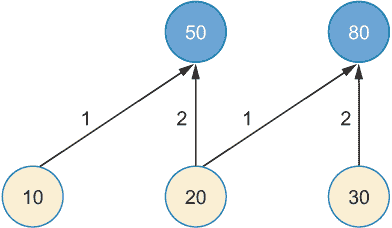

图 2.26 使用权重为 1、2 的核对值 10、20、30 进行简单因果卷积。卷积后的数字 50 只依赖于过去和当前值（10、20），而不依赖于未来的值 30。

你在图 2.26 中可以看到，第二层（上层）的元素较少。为了使所有层的大小相同，我们在输入层的开始处添加了零填充。在这种情况下，图 2.26 变成了图 2.27。

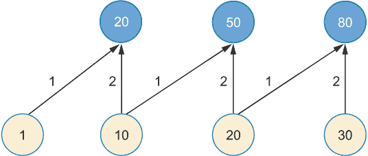

图 2.27 对于值 10、20、30 和核 1、2 的简单因果卷积，使用 0 填充

|  | 实践时间 如果你想更好地理解一维卷积的工作原理，你可以通过笔记本 [`mng.bz/5aBO`](http://mng.bz/5aBO) 进行学习。在这个笔记本中，我们还介绍了时间膨胀因果卷积，允许长距离时间依赖。 |
| --- | --- |

现在你已经看到了在深度学习中使用的最基本的建筑模块：全连接、卷积和循环神经网络。这些只是构建模块，你可以将它们组合使用。例如，你可以将图像输入到卷积网络中，然后使用循环神经网络产生有序输出作为文本。这种组合已被成功用于为图像创建标题。

## 摘要

+   全连接神经网络（fcNN）由堆叠的神经元层组成。

+   在全连接神经网络（fcNN）中，每个神经元都与前一层中的每个神经元相连。

+   神经元的输入是由前一层中连接的神经元的加权总和给出的。

+   那个加权的总和通过一个激活函数计算神经元的输出。

+   激活函数的非线性是至关重要的，因为否则堆叠的层可以被一层所替代。

+   在隐藏层中使用`relu`激活函数。与 sigmoid 激活函数相比，它已知可以产生更有效的训练。

+   在进行分类时，在输出层使用`softmax`作为激活函数。`softmax`函数的输出可以解释为某个类标签的概率。

+   卷积神经网络（CNN）由卷积部分和全连接部分组成，其中卷积部分从输入数据中提取特征，全连接部分将特征组合到 CNN 的输出中。

+   卷积神经网络（CNN）的卷积部分由堆叠的特征图层组成。

+   特征图中的每个神经元只连接到前一个特征图的一个小区域。这反映了图像数据的局部结构。

+   深度神经网络的高性能依赖于它们学习给定任务的层次化最优特征这一事实。

+   当神经网络架构利用数据已知结构时，神经网络工作得最好，这样它们就不必从头开始学习这些结构。因此，

+   如果你的数据来自图像（或具有其他二维结构），请使用二维 CNN，通过局部连接和共享权重来利用图像的局部结构。

+   如果你的数据来自序列，尽可能使用一维卷积；否则，使用循环神经网络（RNN）。

+   如果你没有特定的结构，请使用全连接神经网络（fcNN）。

1. 在深度学习和计算机视觉领域，人们使用“核”这个词，但有时你也会看到“滤波器”这个术语，它可以作为同义词使用。
