# 曲线拟合的 3 个原则

本章涵盖

+   如何拟合参数模型

+   损失函数是什么以及如何使用它

+   线性回归，所有神经网络之母

+   梯度下降作为优化损失函数的工具

+   使用不同框架实现梯度下降


深度学习模型之所以闻名，是因为它们在计算机视觉和自然语言处理等广泛的任务中优于传统的机器学习（ML）方法。从上一章，你已经知道深度学习模型的关键成功因素是其深层的层次结构。深度学习模型拥有数百万可调整的参数，你可能想知道如何调整这些参数以使模型表现最优。解决方案惊人地简单。它已经在许多传统的机器学习方法中得到了应用：你首先定义一个损失函数，该函数描述了模型在训练数据上的表现有多糟糕，然后调整模型的参数以最小化损失。这个过程被称为拟合。

在具有简单损失函数的机器学习模型中，通常可以提供一个公式，让你从数据中计算出最优的参数值。然而，对于复杂模型来说并非如此。对于复杂模型，开发复杂的优化过程花费了几十年时间。深度学习几乎完全使用一种确定参数的方法：这被称为梯度下降。在本章中，你会发现梯度下降是一种惊人的简单技术。这在深度学习中仍然是一种奇迹，因为这种技术在深度学习中效果如此之好，而更高级的优化过程却失败了。

所有深度学习所需的组件——一个具有权重和损失函数的模型，用于将权重拟合到（训练）数据中——在像线性回归这样的更简单模型中已经存在。为了给你一个清晰的梯度下降方法图景，我们逐步演示了它是如何用于拟合一个简单的线性回归模型的。实际上，这是可能的最小神经网络（NN）。我们介绍了损失函数，这是最常用于拟合线性回归模型的函数，并展示了如何确定最小化这个损失函数的参数值。将线性回归视为机器和深度学习的“Hello world”。让我们从深度学习的角度来审视线性回归。

## 3.1 曲线拟合中的“Hello world”

让我们看看一个简单的线性回归模型。想象一下，你是一名初级医疗助理，你和一位妇科医生一起工作，她要求你在常规检查中如果患者出现异常的收缩压（SBP），就通知她。为此，她提供给你一张表格，显示每个年龄段的正常 SBP 值范围。根据这张表格，SBP 随年龄增加是正常的。这引起了你的好奇心。你想知道数据是否与过去常规检查中测量的实际数据一致。为了跟进这一点，你希望查看一些其他数据。幸运的是，你被允许使用患者的数据进行内部分析。

作为第一步，你随机选择一组 33 名患者，他们在至少一次就诊中被医生诊断为健康。从每位选定的患者中，你记录下在常规检查中记录的年龄和血压信息，其中患者被诊断为健康。为了对数据有一个印象，你可以制作一个散点图，其中绘制收缩压（SBP）值与年龄的关系（见图 3.1）。

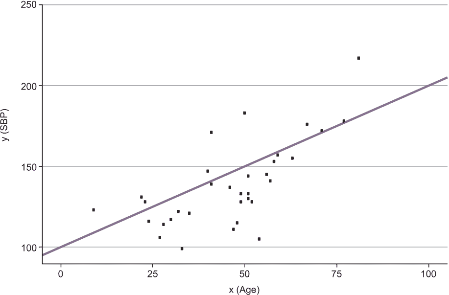

图 3.1 显示收缩压（SBP）与年龄（女性）关系的散点图

从图 3.1 中，你可以看到大多数 SBP 值都在 100 到 220 之间。散点图显示，与你的上司给你的表格一样，确实存在一种趋势，表明对于健康的女性来说，血压随着年龄的增长而增加。表格给出每个年龄的正常血压范围也是合理的，因为年龄和 SBP 之间的关系远非确定性。（两个年龄相似的健康女性可以有相当不同的血压值。）因此，表格中的信息似乎与你的观察结果一致。

现在，你希望更进一步，寻找一个描述血压如何随年龄变化的模型。独立于血压的个体差异，似乎平均而言，SBP 值以某种方式与女性的年龄呈线性增加。你可以手动通过这些点画一条直线，得到类似于图 3.1 中的线条。我们可以用线性模型来描述这样的直线

*y* = *a* ⋅ *x* + *b*

其中，a 代表直线的斜率，*b*是 y 轴的截距。另一种方式（更类似于深度学习）是查看图 3.2 中所示图形的模型。

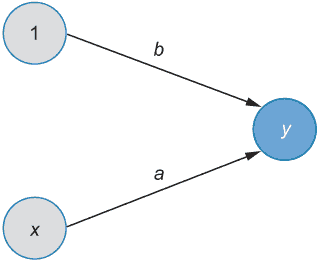

图 3.2 线性回归模型（*y* = *a* · *x* + *b*）作为一个全连接神经网络（fcNN）或计算图

这可能是你能想到的最小的全连接网络（fcNN）。同时，它也是第一章中图 1.2 所示更复杂网络的一部分。此外，它图形化地表示了当你有 x 的值并且知道参数值 a 和*b*时，你需要采取的计算步骤来计算 y 的值：

+   将*x*乘以*a*(*a* ⋅ *x*)

+   将 1 乘以*b*(*b* ⋅ 1)

+   将两个结果相加得到*y* = *a* ⋅ *x* + *b*

无论你将模型解释为线方程还是作为 fcNN，只有当 a 和 b 的值固定时，你才能使用模型根据给定的 x 值计算*y*的均值估计。因此，a 和 b 被称为模型的参数。因为参数以线性方式进入模型，所以我们称该模型为线性模型，并且因为只有一个输入特征*x*，我们称它为简单线性模型。你如何得到描述数据的线性模型中参数 a（斜率）和*b*（截距）的最佳适当值？

### 3.1.1 基于损失函数拟合线性回归模型

你可以用你的直觉手动在散点图中的点之间画一条直线。如果你这样做，你可能会得到图 3.1 中显示的类似直线，斜率*a* = 1，截距*b* = 100。现在你可以使用这个模型进行预测，比如，例如，对于一个 31 岁的新的病人。

+   如果你使用模型的网络或方程表示，将 31 乘以 1 并加上 100，得到预测的平均 SBP 值为 131。

+   如果你使用图 3.1 中拟合线的图形表示，你从*x* = 31 垂直向上直到达到拟合线，然后水平向左直到达到 y 轴。

从这里，你可以读取拟合值大约为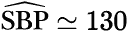。拟合值通常用顶部的帽子表示（参见图 3.3 和表 3.1）。为了方便起见，我们经常省略这些帽子，并且在报告估计或拟合参数值时经常忽略帽子。

如果你要求不同的人进行目测分析，并让他们在图 3.1 中的点之间画一条直线，你可能会得到相似但不完全相同的线性模型。为了决定不同的建议模型如何拟合数据，并最终找到最佳拟合模型，你需要一个清晰和量化的标准。

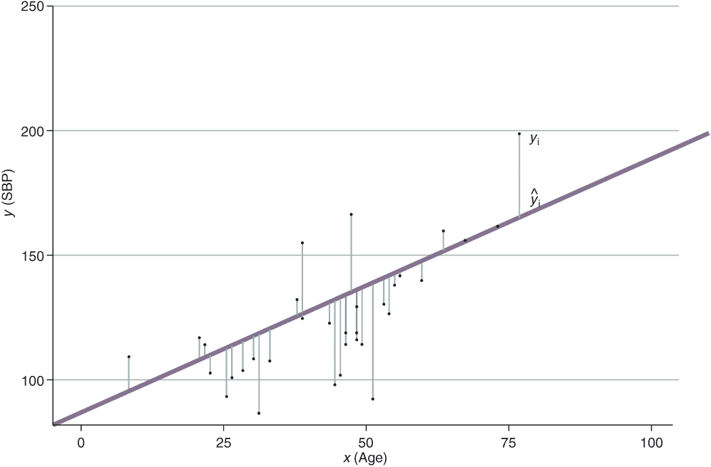

图 3.3 测量数据点（点状）和线性模型（直线）。数据点和线性模型（垂直线）之间的差异称为残差。你看到右边的“帽子”了吗？

在图 3.3 中，我们展示了实际数据点，*y**[i]*（点状），以及与模型预测值（许多垂直线）之间的差异。统计学家将这些观察值和估计值之间的差异称为残差。

表 3.1 图 3.3 前 5 个条目的数据和导出量，计算时斜率为 1，截距为 100

| *x*  | *y*  | *Ŷ = a · x + b* | Residual | Squared residual |
| --- | --- | --- | --- | --- |
| 22 | 131 | 122 | 009 | 081 |
| 41 | 139 | 141 | 0-2 | 004 |
| 52 | 128 | 152 | -24 | 576 |
| 23 | 128 | 123 | 005 | 025 |
| 41 | 171 | 141 | 030 | 900 |

一个著名的规则，最早由高斯在 1790 年代使用，最早由勒让德在 1805 年发表，是平方误差准则。你可能从入门统计学课程中记得这个。简单地选择 a 和 *b*，使得平方误差之和最小。为什么是平方而不是绝对或立方值？我们将在第四章中稍后讨论这一点。这通常被称为残差平方和（RSS）或简称 RSS。让我们计算图 3.3 中 5 个数据点的 RSS，假设 *a* = 1 和 *b* = 100。

将“平方残差”列中的所有项相加，得到 RSS 为 1,586。一般来说，RSS 的计算如下：

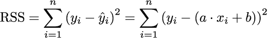

RSS 衡量的是观测到的目标值 *y**[i]* 和模型值 yˆi 之间的偏差。它是一个衡量模型拟合数据好坏的准则。因此，很明显，最佳拟合模型具有最小的 RSS。如果模型完美地拟合所有数据点，RSS 为 0；否则，它大于 0。

你可以从血压示例中的图表（图 3.1）中看到，RSS 不能为 0，因为直线不会穿过所有点。但什么是可接受的 RSS？这几乎是不可能的，因为 RSS 随着用于拟合的额外数据点的增加而增加（这些点不直接位于回归线上）。

但是，使用更多数据时，拟合不会变得更差。如果你将 RSS 除以数据点的数量，你得到的是模型值 yˆi 与观测值 *y**[i]* 的平均平方偏差。这个量不会系统地随着数据点的数量增加（或减少）。这被称为平均平方误差（MSE）。因为数据点的数量 n 是常数，MSE 只是 RSS 除以 n，对于同一模型，MSE 的最小值与 RSS 相同（见方程式 3.1）。计算出的 RSS 为 1,586，转换为 MSE 为 1,586 / 5，等于 317.2。如果你得到的 MSE 值是每个模型血压值与观测血压值偏差的√(1586/5)=17.8。

通常你不会在每个数据点上犯相同的错误。因为误差对损失的贡献是平方的，一些大的误差需要通过许多小的误差来平衡。均方误差（MSE）不依赖于数据的样本大小，并且比均方和（RSS）有更好的解释，所以它通常更受欢迎。我们最后以自豪的心情来看我们的第一个损失函数——均方误差（MSE）：

方程式 3.3

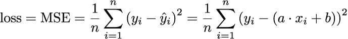

仔细观察公式可以发现，这个损失函数衡量的是可观测的目标值 *y**[i]* 和模型值 yˆi 的平方偏差的平均值。模型参数 a 和 *b* 是损失函数的变量，你想要找到使损失最小化的值。除了参数之外，损失函数还依赖于数据 *x* 和 *y*。

现在，让我们看看一些代码（参见列表 3.1）。为了确定整个数据集（而不仅仅是 5 个点）的损失值，你需要将模型参数固定到某些值（这里 *a* = 1 和 *b* = 100），并使用方程 3.1 中的公式来计算 MSE 损失。（在深度学习中，我们大量使用线性代数来加速计算。）你可以在 Python 中如下编写平方残差向量：

(*y* − (*a* ⋅ *x* + *b*))² =(*y* − *a* ⋅ *x* − *b*)²

这个表达式对应于表 3.1 的最后一列，作为一个向量。

注意，我们省略了行号 i。现在，*y* 和 *x* 是向量；因此，*y* − *a* ⋅ *x* 也是一个向量。如果你仔细观察这个表达式，可能会对维度的兼容性感到疑惑。如果 *y* − *a* ⋅ *x* 是一个向量，你怎么能向（或从）它添加（或减去）一个标量 *b* 呢？这被称为广播，基本上发生的事情是 *b* 也会被转换成一个与 *y* 长度相同的向量，所有元素都具有值 b。参见 François Chollet 的《Python 深度学习》（Manning, 2017）第 2.3.2 节，[`mng.bz/6Qde`](http://mng.bz/6Qde) 。下面的列表显示了如何在 Python 中计算均方误差（MSE）。

列表 3.1 使用 NumPy 在 Python 中计算 MSE

```
*a* = 1                           
b = 100                         
y_hat = a*x + *b*                         ❶ 
r = (*y* - y_hat)                         ❷ 
MSE = np.sum(np.square(r)) / len(*y*)     ❸ 
MSE
```

❶ 表 3.1 的第 3 列（注意向量表示和广播）

❷ 表 3.1 的第 4 列

❸ 从表 3.1 的第 5 列计算出的 MSE（在数据集的数据点数量上创建、求和并除以数据点的数量）。

|  | 实践时间 打开笔记本 [`mng.bz/oPOZ`](http://mng.bz/oPOZ) 并逐步执行代码，以了解如何模拟一些数据，将其拟合到线性回归模型中，并确定具有指定参数值的线性模型的 MSE。你很快就会到达笔记本中的第一个练习，由笔形图标指示。在这个练习中，我们要求你尝试不同的参数值。目标是手动找到产生最小的 MSE 的 *a* 和 *b* 参数值。 |
| --- | --- |

如前所述，你可以使用笔记本中 33 位已知年龄和测量血压的妇女的数据。有了这些信息，你可以轻松地计算具有 *a* = 1 和 *b* = 100 的建议模型的损失。

让我们找到最佳拟合线性模型！在图 3.1 中，你看到在这个例子中，你找不到穿过所有数据点的直线。因此，不可能将损失减少到零。相反，你想要找到使 MSE 最小的 *a* 和 *b* 参数值。

简单线性回归模型中最佳参数估计的闭式解

现在，你将看到一个公式的推导，该公式允许你直接从训练数据中计算最优参数值。找到损失函数的最小值需要找到使一阶导数为 0 的变量值。这需要解决以下两个关于 *a* 和 *b* 的条件：

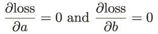

你可以将计算作为练习来做，这将导致一个包含两个方程和两个未知数（参数 a（斜率）和 *b*（截距））的线性方程组。


一旦你至少有两个具有不同 *x**[i]* 值的数据点，你就可以通过将训练数据的值代入公式来直接确定解，从而得到参数值。

这被称为闭式解。在之前的公式中，a 和 *b* 上方的帽子表示这些值是从数据中估计出来的。这个结果很简单。它允许你直接计算最优参数估计值 â 和 bˆ，以最小化均方误差（MSE）。为此，你只需要数据（x 和 *y*）。在我们的血压示例中，这给出了斜率的值 *â* = 1.1 和截距的值 *b̂* = 87.67。

对于这个例子，推导出确定最优参数值的公式相当简单（见侧边栏）。这仅因为模型具有简单的损失函数，并且我们处理的数据量很少。如果你处理的是复杂的模型，如神经网络（NNs），则无法直接从训练数据中计算优化损失的参数（如我们在侧边栏中所做的那样）。阻碍参数直接计算的另一个原因是数据集很大。在深度学习中，通常数据点太多，没有闭式解。在这种情况下，你需要使用迭代方法。为此，我们使用梯度下降，我们将在下一节中解释。

## 3.2 梯度下降法

梯度下降是机器学习中最常用的迭代优化方法，也是深度学习（DL）中几乎所有优化的常用方法。你将学习这种方法是如何工作的，首先是一个参数，然后是两个参数。请放心，同样的方法也可以用来优化深度学习模型中的数百万个参数。

### 3.2.1 具有一个自由模型参数的损失

为了让你对梯度下降有一个清晰的了解，我们想从这样一个特殊情况开始，即你只需要优化一个模型参数。为此，我们将继续使用我们的血压示例，并假设你以某种方式知道截距的最优值为 *b* = 87.6。为了最小化损失函数，你只需要找到第二个参数 a 的值。在这种情况下，我们之前讨论的损失函数如下所示：

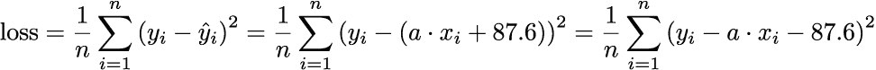

基于这个方程，很容易从训练数据中计算每个提议的参数 a 对应的损失 *x* 和 *y*。

梯度下降的直觉

图 3.4 绘制了损失与参数 a 的值之间的关系。在图中，你可以看到对于 a 的值，损失的最低点略大于 1。

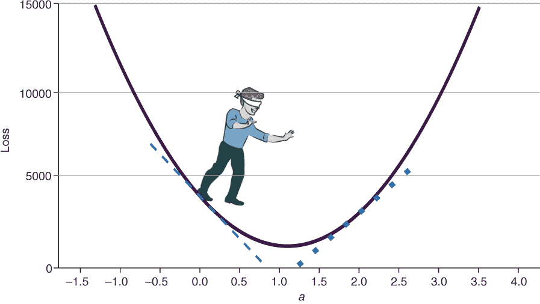

图 3.4：损失（见方程 3.1）与自由回归模型参数 a 的关系图，其中 *b* 固定为最优值。在 *a* = 0 的位置，切线以虚线绘制；在 *a* = 2 的位置，切线以虚线绘制。

你如何系统地找到使损失最小的参数 a 的值？想象一下，损失函数是一个一维景观，其中来自一维世界的盲探索者想要到达最小值，这可能对你有所帮助。如果景观像图 3.4 中的损失一样呈碗状，这将是一项相当容易的任务。即使探索者是盲目的，只能探索局部环境，也很清楚需要朝向下方指示的方向行走。但是，这与值 a 有什么关系呢？这取决于局部斜率。如果在图 3.4 中探索者的位置局部斜率为负（见 *a* = 0 处虚线切线的负斜率），则朝向更大值 a 的方向迈步会指向最小值。在具有正局部斜率的位置（见 *a* = 2 处虚线切线的正斜率），朝向更小值 a 的方向迈步会指向最小值。

函数的导数给出了切线的斜率。因为我们关注的是依赖性损失，所以这个导数被称为梯度，表示为 *grad**[a]*(*Loss*)。其符号（正或负）指示损失函数增加的方向。

你可以在图 3.4 中看到，曲线在接近最小值时更平缓，而在远离该点的点处变得更陡峭。斜率越陡，梯度的绝对值就越大。如果你的探索者是一位数学家，你应该提供这样的建议：在 *grad**[a]*(*Loss*) 函数的负号指示的方向上迈步。步长将与梯度的绝对值成比例。当探索者远离最小值，斜率较陡时，应该迈大步。为了避免越界，当接近最小值，斜率变得平缓时，需要采取更小的步长。只有在最小值处，斜率才为零。

你如何选择比例因子，即学习率 η（eta）？这听起来可能有些挑剔，但很快你就会看到，正确选择学习率（η）可能是使用梯度下降进行成功优化的最关键因素。

盲目漫游的数学家的例子应该能帮助你培养如何系统地调整参数 a 以到达损失函数最小值的感觉。这里提供的冗长描述可以转化为关于如何迭代改变参数值的清晰数学指令，这在梯度下降中被称为更新规则。

梯度下降中的更新规则

这是根据梯度下降优化过程得到的参数更新公式：

*a**[t+]*[1] − *a**[t]* − *η* ⋅ *grad**[a]*(*Loss*) 方程 3.2

这个更新规则总结了梯度下降的迭代过程：你首先对参数值 a（例如，*a*[0] = 0）进行随机猜测。然后确定损失函数关于参数 a 的梯度值。*grad**[a]*(*Loss*)中的负号表示参数 a 需要改变的方向，以便朝着减小损失的方向前进。（你将在第 3.4 节中看到如何计算梯度。）更新步长与梯度的绝对值和学习率η（eta）成正比。方程 3.2 确保你朝着减小损失的方向迈出一步。你重复这一步对参数 a 的逐步更新，直到收敛。使用找到的参数 a 模型会导致最适合数据的模型。

在更新公式（方程 3.2）中，你应该选择多大的学习率η（eta）？你可能倾向于使用大的学习率，以便更快地达到最小值。

|  | 实践时间 再次打开笔记本[`mng.bz/oPOZ`](http://mng.bz/oPOZ)，在练习 1 之后继续编写代码。这让你看到如何通过封闭公式确定斜率和截距的值，以及如何实现梯度下降方法来调整一个参数，当第二个参数固定时。在笔记本的末尾，你会找到一个第二个练习，你的任务是研究学习率对收敛的影响。做一下。 |
| --- | --- |

你观察到了什么？你可能看到，随着学习率的增大，损失函数越来越大，而不是减小。它最终在几次迭代后达到 NaN 或无穷大。发生了什么？

看一下图 3.5，它显示了损失与参数 a 的依赖关系，即我们血压示例中的斜率。（截距固定在其最优值 87.6。）剩下的唯一任务是找到参数 a 的最优值。这是通过梯度下降来完成的。在图 3.5 中，你可以看到从第一次猜测*a*[1] = 0.5 出发，使用三种不同的学习率时 a 值的发展情况。

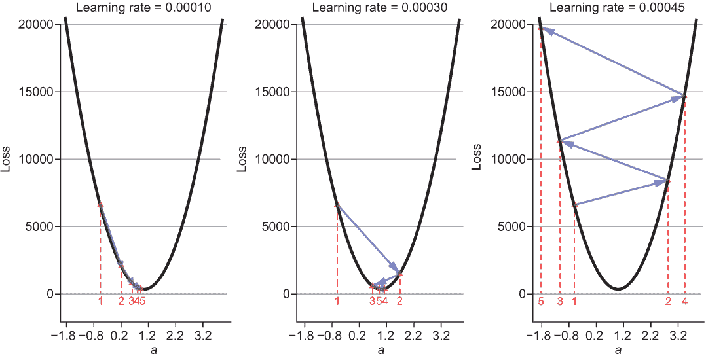

图 3.5 展示了方程 3.1 的损失与自由回归模型参数 a 的曲线图。它显示了以*a* = 0.5 为起始点，不同学习率下的 5 步梯度下降的结果。当学习率为 0.00010 时，最小值在 5 步内大致达到，没有超过最小值。当学习率为 0.00030 时，最小值在大约 5 步后达到，但两次超过了最小值的位置。当学习率为 0.00045 时，参数 a 的更新总是超过最小值的位置。在这种情况下，a 的更新值越来越远离最小值。相应的损失无限制地增长。

在图 3.5 中，你可以看到学习率是一个关键的超参数。如果你选择一个过小的值，需要很多更新步骤来找到最优模型参数。然而，如果学习率过大（见图 3.5，右面板），则无法收敛到损失最小的最优参数值 a 的位置。如果学习率过大，损失会随着每次更新而增加。这会导致数值问题，导致 NaN 或无穷大。当你观察到损失变为无穷大或 NaN 时，有句话叫做，“保持冷静，降低学习率。”下次当你看到训练集中的损失越来越高而不是越来越低时，尝试降低学习率（最初将其除以 10 是一个好的猜测）。

### 3.2.2 具有两个自由模型参数的损失

现在将参数*b*固定在其最优值的某种人为条件移除，同时优化两个参数*a*和*b*的损失函数。我们已经计算出了最优值 *a* = 1.1 ， *b* = 87.67 。在图 3.6 中，你可以看到血压例子中不同值 *a* 和 *b* 的损失函数。

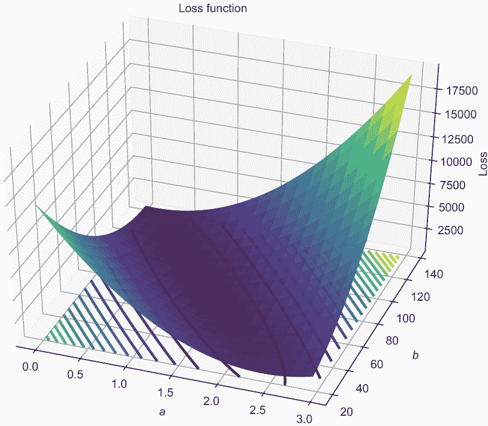

图 3.6 血压数据不同值 *a* 和 *b* 的损失函数。你可以看到损失函数的形状更像是峡谷而不是碗。底部的等值线表示损失值相等的位置。

如果你回忆一下图 3.4 中 1D 损失函数的抛物线形状，你可能会对 2D 损失表面不是碗形，而更像峡谷感到惊讶。实际上，在大多数线性回归的例子中，损失表面看起来更像峡谷，或者更准确地说，是一个拉长的碗。尽管这些损失表面确实有最小值，但在某些方向上是平的。类似峡谷的损失表面很难优化，因为这些需要许多优化步骤才能达到最小值（本章后面将给出一个更详细的例子）。

让我们通过一个线性回归的模拟例子来解释变量 a 和*b*的优化，这个例子有一个形状良好的碗形损失函数，而不是峡谷形。稍后，你会在血压例子中看到损失函数类似峡谷的形状。

|  | 实践时间 打开笔记本 [`mng.bz/nPp5`](http://mng.bz/nPp5) 并完成它，直到标题为“梯度”的部分。你将看到如何模拟一个简单线性回归拟合的数据，其中损失函数具有碗形形状。图 3.7 是用这个笔记本的代码生成的，显示了模拟数据集的损失表面。实际上，它看起来像是一个碗。 |
| --- | --- |

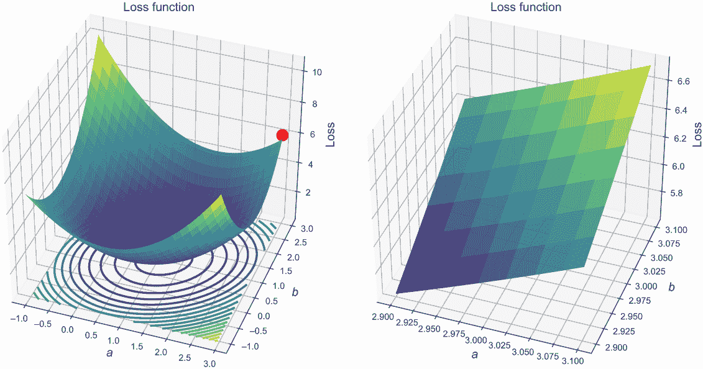

图 3.7 对于模拟数据的不同值*a*和*b*的损失函数。你可以看到损失函数的形状更像一个碗。底部的等高线表示损失值相等的位置。大点表示起始值的位置（a 和*b* = 3）。右侧显示了该区域的放大图。

通过梯度下降的优化过程与一个变量保持固定的情况相似。让我们从*a* = 3 和*b* = 3 的初始值开始；该位置的损失函数是 6.15。优化的第一步是找到哪个方向显示最陡下降，然后在该方向上向下迈一小步。

如果你非常接近初始起始点，你会看到碗看起来像一个盘子；这对于碗上的任何点都是正确的。如果你被要求从*a* = 3 和*b* = 3 开始向下迈一小步，你可能同意应该朝向中心的方向。你如何计算这个方向？让我们用一个弹珠来确定这个方向。

我们将弹珠放在右上角（*a* = 3，*b* = 3）。弹珠只能沿着作用在其上的合力方向滚动。你可能还记得高中物理，合力是基于不同方向上作用的力（见图 3.8）。当某个方向上的力变强时，该方向上的斜率就越陡。我们知道方向 a 的斜率是 grad_a。因此，弹珠在方向 a 上的力与该方向上的负斜率或梯度（如在 1D 示例中）成正比：

*f**[a]* ∝ − *grad**[a]*

对于物理爱好者，力由弹珠的质量乘以重力加速度（*ɡ* ≈ 9.81 *m* / *s*²）乘以 grad_a 给出。同样，方向*b*上的力是

*f**[b]* ∝ − *grad**[b]*

弹珠上的总力由这个方程给出：

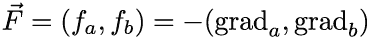

如果你现在释放弹珠，它将沿着最陡下降的方向滚动一步，这通常不是沿着单个轴 a 或*b*（见图 3.8）。学习率η乘以梯度给出步长。对于具体例子，这导致一个新的坐标，其更新公式为：

*a**[t+1]* = *a**[t]* - *η* ⋅ *grad**[a]*

*b**[t+1]* = *b**[t]* - *η* ⋅ *grad**[b]* 方程式 3.3

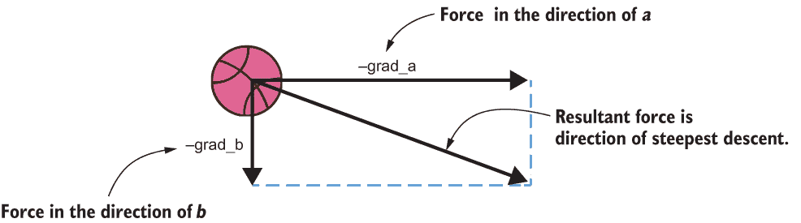

图 3.8 拖拽弹珠的力和最陡下降方向的结果方向

这表明，为了确定 2D 参数空间中的新位置，你需要计算一阶导数两次。首先，你将*b*固定在 3，只改变 a。用更数学的话来说，“你计算损失函数关于 a 的偏导数。”你保持参数*b*不变，对损失函数（均方误差）关于 a 求导，得到：

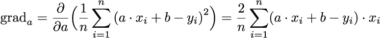

这与一维情况下的公式相同（见方程式 3.1）。你可能已经注意到，我们在平方误差中交换了观测到的*y*和拟合值 ax + *b*。然而，这既没有改变损失值，也没有改变梯度值，但它简化了符号和微分。为了确定损失对 b 的偏导数，你可以保持参数 a 不变，并对*b*进行微分：

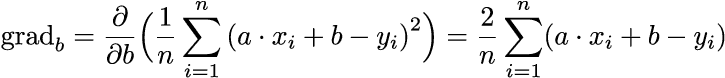

现在，你可以将这些数字代入更新公式（见方程式 3.3），以获得*a*和*b*的新值。如果你选择足够小的学习率，你将达到损失函数的最小值。如果你有一个类似碗的结构，你将很快达到最小值。但对于具有平坦最小值的峡谷状景观，你最终需要付出更多努力才能达到最小值——这需要更长的时间。

|  | 实践时间 再次打开笔记本 [`mng.bz/nPp5`](http://mng.bz/nPp5) 并从“梯度”部分继续工作。你会看到如何通过梯度公式计算损失相对于参数的梯度，以及如何通过更新公式更新参数值。要手动执行梯度下降法，你需要重复更新步骤，直到你接近损失函数的最小值。提供的代码使用笔记本开头模拟的数据。在笔记本的末尾，你将达到由笔符号指示的练习，你的任务是手动执行血压数据的梯度方法，并比较所需步骤数与模拟数据的情况。你会发现血压情况下需要更多的步骤。损失函数具有类似峡谷的形状，而不是模拟数据中的类似碗的形状。 |
| --- | --- |

注意，虽然使用弹珠探测最速下降的方向，但真实的弹珠会遵循不同的路径。这是因为真实的弹珠会聚集一些动量，因此在移动时不会遵循最速下降。有一些高级方法包括在梯度下降中引入动量的概念，但标准梯度下降没有动量。这在优化中常常被误解。

与简单的 1D 示例类似，学习率是一个关键参数。希望你在练习中已经注意到了这一点，并正确设置了它。另一个问题是，无论起始值如何，你是否总能达到最小值。回想一下你在做什么：你从一个特定的位置开始，计算局部最陡下降的方向，然后朝那个方向迈出一步。步长取决于陡峭程度和学习率。下降越陡峭，梯度越大，对应的步长也越大。接近最小值时，曲线变得越平坦，梯度越小。这意味着你应该采取小步以避免超调。图 3.9 非常显著地展示了这一点，对于更复杂的景观。


图 3.9 一个在梯度下降中徘徊的人。在某个位置，他寻找最陡下降的方向。请注意，这个徘徊者看不到整个景观；他只知道自己的高度和局部最陡下降的方向。然后他沿着最陡下降的方向稍微下降一点（取决于学习率和陡峭程度）。你相信他会到达山谷吗？这幅图灵感来源于斯坦福深度学习课程（cs231n）。

关于你的简单线性回归问题，如果你看图 3.7，你会看到损失函数的形状像一个碗，只有一个最小值。我们称之为凸问题。很明显，并且可以证明，无论起始值如何，只要学习率足够小，梯度下降（在凸问题中）总能找到（单个）最小值。

一个深度学习（DL）模型比线性回归模型要灵活得多。损失函数看起来比一个高维的碗要复杂得多。它更像是图 3.9 中展示的带有徘徊者的景观，有几个局部最小值（就像湖泊）。因此，简单的梯度下降算法能够很好地拟合这些复杂的深度学习模型，这真是一个奇迹。一些最近的研究表明，通常深度学习模型损失景观中的所有最小值都是同样好的，因此陷入局部最小值并不是真正的问题。

## 3.3 特殊深度学习技巧

简单的线性回归已经包含了训练深度学习模型所需的所有基本成分。你只需要再了解三个特殊的技巧：

+   使用小批量梯度下降在具有数百万数据点的典型深度学习设置中计算损失函数

+   使用随机梯度下降（SGD）的变体来加速学习

+   自动化微分过程

前两个技巧很简单；第三个稍微复杂一些。但别担心，我们会慢慢来。让我们先从简单的开始。

### 3.3.1 小批量梯度下降

第一个技巧被称为小批量梯度下降。它允许你在具有数百万数据点的典型深度学习设置中计算损失函数。正如你所见，损失函数依赖于所有数据点：

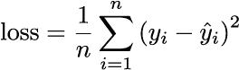

同样适用于梯度。在深度学习中，你通常在图形处理单元（GPU）上执行计算。这些设备内存有限，通常太小，无法容纳所有数据。一种解决方案是使用随机选择的数据点子集（一个迷你批次）来近似计算损失函数及其梯度。使用迷你批次计算出的梯度有时高于使用所有数据点时得到的梯度，有时则低于。这就是为什么迷你批次梯度下降也被称为随机梯度下降（SGD）。

通常情况下，使用这种迷你批次程序计算出的梯度与使用所有数据点计算出的梯度没有系统地偏离。统计学家称这为无偏估计的梯度。当使用这种无偏估计时，参数的值会像以前一样更新。你甚至可以使用大小为 1 的迷你批次，并在每个训练实例之后更新权重。事实上，有些人将 SGD 的名称限制在每次只使用一个数据点来计算梯度的情况下，并将描述的方法称为迷你批次梯度下降。

深度神经网络可能有数百万个参数，而且已知损失景观的形状远非看起来像是一个光滑的碗（它是一个非凸问题）。对于非凸问题，梯度下降过程可能会陷入局部最小值，就像图 3.9 中的漫游者最终在湖里弄湿了，而不是达到山谷底部的全局最小值。尽管如此，SGD 在拟合深度学习模型方面效果很好。

到目前为止，还没有完全理解为什么简单的梯度下降程序在深度学习中效果如此之好。有人提出，其中一个原因是，你不需要达到绝对的全局最小值，但许多其他最小值也足够好。甚至有人提出，深度学习中的梯度下降倾向于找到对未见的新数据泛化良好的解决方案，比全局最小值做得更好。深度学习仍然处于起步阶段；它有效，但我们不知道为什么。迷你批次梯度下降是深度学习秘方的主要成分之一。

### 3.3.2 使用 SGD 变体加速学习

第二个技巧稍微不那么引人注目，它处理 SGD 的变体以加速学习。如果你使用的是血压数据而不是模拟数据来做练习，你可能会想知道对于像线性回归这样的简单问题，是否真的需要 100,000 次迭代。有一些更高级的优化方法也只计算局部梯度，不使用进一步的导数，但进行了一些更或更聪明的技巧。这些方法应用了使用先前迭代值的启发式方法来加速性能。你可以参考弹珠，其中动量取决于先前步骤中最陡峭梯度的方向。

两种突出的算法是 RMSProb 和 Adam。它们包含在所有深度学习框架中，如 TensorFlow、Keras、PyTorch 等。这些方法与 SGD 在本质上没有区别，但在加速学习过程中非常有用，这是通过考虑最后几次更新来实现的。但为了理解深度学习的原理，你不需要知道这些 SGD 变体的细节。因此，我们只提供一个参考，它出色地解释了这些技术：[`distill.pub/2017/momentum/`](https://distill.pub/2017/momentum/)。

### 3.3.3 自动微分

第三个技巧是自动微分。虽然可以手动计算线性回归的梯度，但对于深度学习模型来说，这实际上是不可能的。幸运的是，存在几种自动进行微分的方法。这种方法在 Chollet 的《Python 深度学习》一书中得到了很好的解释：

在实践中，一个神经网络函数由许多连在一起的张量操作组成……，每个操作都有一个简单、已知的导数。

微积分告诉我们，可以使用以下恒等式来推导这样的函数链，这个恒等式被称为链式法则：

*(f* ’(*g*(*x*)))’ = *f* '(*g*(*x*)) ⋅ *g* '(*x*)

当将链式法则应用于计算神经网络梯度值时，我们得到一个称为反向传播（有时也称为逆模式微分）的算法。反向传播从最终的损失值开始，从输出层反向工作到输入层，在途中迭代地应用链式法则来计算损失相对于每个模型参数的梯度。

你可以使用这些梯度通过使用更新规则来计算更新后的参数值。请注意，本章前面介绍过的更新公式（见方程式 3.2）对每个参数都是有效的，无论模型有多少个参数。基本上，你需要的是每一层中函数的梯度以及链式法则来将这些梯度粘合在一起。现代深度学习框架知道如何自动应用链式法则。它们也知道神经网络中使用的基函数的梯度。在拟合深度学习模型时，你通常不需要关心这些细节。但让我们仍然这样做，以便了解底层发生了什么。

## 3.4 深度学习框架中的反向传播

在本书的大部分内容中，你使用高级库 Keras。这个库抽象掉了讨厌的细节，让你可以快速构建复杂模型。但正如每个建筑师都应该知道如何砌砖以及建筑力学的限制一样，深度学习实践者应该理解底层原理。所以，让我们动手实践吧！

深度学习库可以根据它们处理自动微分的方式分组。解决梯度下降所需梯度计算的两种方法如下：

+   静态图框架

+   动态图形框架

类似于 Theano 的静态图形框架是深度学习中最先使用的框架。但它们使用起来有点笨拙，目前已被 PyTorch 等动态框架所取代或增强。我们首先描述静态框架，因为它能给您一个很好的内部工作原理的印象。TensorFlow v2.x 可以处理这两种方法。然而，在 TensorFlow v2.x 中，静态图形被隐藏得相当多，您通常不会遇到这些。因此，我们现在在配套的笔记本 [`mng.bz/vxmp`](http://mng.bz/vxmp) 中切换回 TensorFlow v1.x。请注意，这个笔记本在提供的 Docker 容器中无法运行。我们建议您在 Colab 中运行它。如果您想在 TensorFlow v2.x 中查看计算图，可以使用笔记本：[`mng.bz/4AlR`](http://mng.bz/4AlR)。然而，正如所说，计算图在 TensorFlow v2.0 中隐藏得更多一些。

### 3.4.1 静态图形框架

静态图形框架使用两步程序。在第一步中，用户定义计算，例如乘以 *x*，加 b，并调用这个 y_hat_，等等。在底层，这会产生一个名为计算图的结构的结构。列表 3.2 的第一步显示了构建是如何进行的，但代码尚未执行。代码描述了使用 TensorFlow v1.x 构建线性回归问题的静态图形的构建阶段（也请参阅笔记本 [`mng.bz/vxmp`](http://mng.bz/vxmp)）。

列表 3.2 TensorFlow 中计算图的构建

```
# *x*,y are one dimensional numpy arrays
# Defining the graph (construction phase)
tf.reset_default_graph()                         ❶ 
a_  = tf.Variable(0.0, name='a_var')             ❷ 
b_  = tf.Variable(139.0, name='b_var')           ❷ 
x_  = tf.constant(x, name='x_const')             ❸ 
y_  = tf.constant(*y*, name='y_const')             ❸ 
y_hat_ = a_*x_ + *b*_                              ❹ 
mse_ = tf.reduce_mean(tf.square(*y*_ - y_hat_))    ❹ 
writer = tf.summary.FileWriter("linreg/", 
            tf.get_default_graph())              ❺ 
writer.close()                                   ❺ 
```

❶ 从头开始构建一个新的图形

❷ 具有初始值的变量可以在以后进行优化。我们这样命名它们，以便在图形中看起来更美观。

❸ 固定的张量常数，它们持有数据值

❹ 符号操作在计算图中创建新的节点。

❺ 为可视化编写图形

列表 3.2 定义了 TensorFlow 中线性回归问题的静态计算图的构建。在定义了图形之后，它可以被写入磁盘。这是在列表的最后两行中完成的。

注意：Google 提供了一个名为 TensorBoard 的组件，您可以在其中可视化计算图。要了解更多关于 TensorBoard 的信息，您可以参考 Chollet 的书籍，链接为 [`mng.bz/QyJ6`](http://mng.bz/QyJ6)。

图 3.10 显示了计算图的输出。此外，我们还添加了一些注释（用箭头表示）。如果您想重现它，只需遵循笔记本 [`mng.bz/vxmp`](http://mng.bz/vxmp) 中的步骤。

向计算图致敬，冥想，感受张量的流动！TensorFlow 从下到上布局计算图。让我们从左下角的变量 a_（在图中命名为 a_var）开始。这对应于列表 3.2 的第 2 行。这个变量乘以常数一维张量（向量）x_（在图中命名为 x_const），它包含 33 个值。这是在计算图的 Mul 节点中完成的。这是在列表 3.2 的第 6 行的`a_*x_`小部分中定义的。

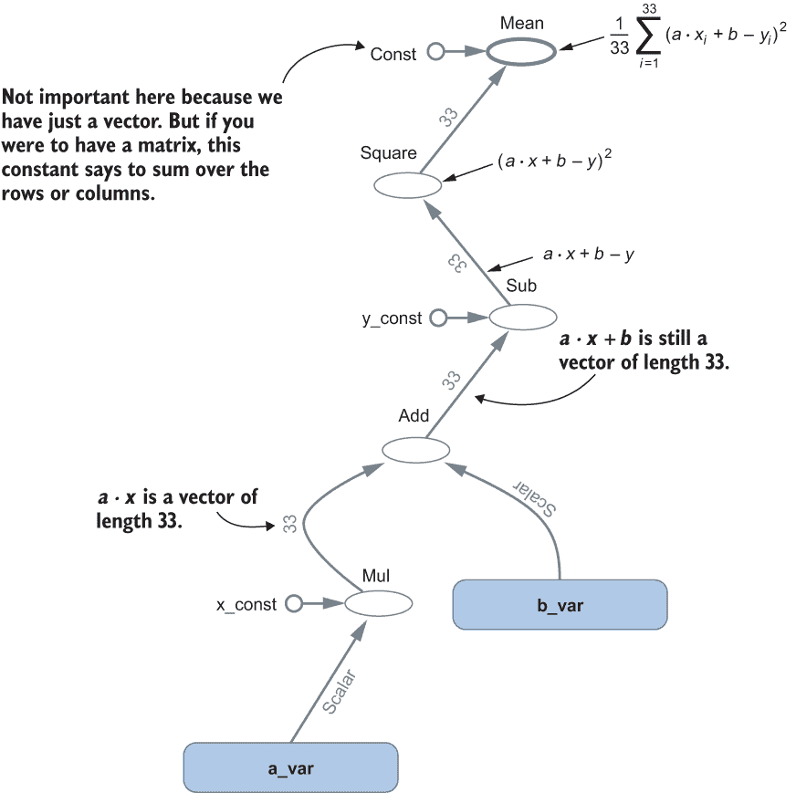

图 3.10 使用列表 3.2 构建的静态图，在 TensorBoard 中显示，并带有一些额外的注释（由箭头指示）。

通常，在图 3.10 中，边是流动的张量，节点是像乘法这样的操作。乘法之后，a 乘以 x 的结果仍然是一个包含 33 个值的 1 维张量。沿着图向上，b 被添加，y 被减去，最后表达式被平方。当进入平均节点时，我们仍然有一个包含 33 个值的 1 维张量，然后这些值被求和并除以 33。

图 3.10 中的一个细节是来自左侧的常数 Const。通常，深度学习中的张量比一维张量更复杂；例如，二维张量（矩阵）。然后平均节点需要知道是按行还是按列平均。

在你遍历了计算图之后，现在让我们让数值*a* = 0 和*b* = 139 通过图流动（139 是血压的平均值，斜率*a* = 0 意味着模型预测每个女性的这个平均值，而不考虑她的年龄）。为此，我们需要图的实例化/具体化——在 TensorFlow 术语中，会话。下一个列表显示了这一点。

列表 3.3 让张量流动，前向传播

```
sess = tf.Session()                         ❶ 
res_val = sess.run(loss_, {a_:0,b_:139})    ❷ 
print(res_val)                              ❸ 
sess.close()                                ❹ 
```

❶ 开始会话（获取内存和其他资源）

❷ 让变量*a* = 0 和*b* = 139 通过图流动，并将数值存储在 res_val 中

❸ 打印 673.4545

❹ 最后，始终关闭会话。

现在计算图已经定义，TensorFlow 计算梯度变得很容易。这里的损失是均方误差（MSE）（见方程 3.1），它在图的顶部计算。你在图 3.10 中显示的计算图中看到，MSE 可以通过执行几个基本操作来计算：加法、减法、乘法和平方。对于梯度下降更新规则，你需要 MSE 相对于*a*和*b*的梯度。微积分中的链式法则保证可以通过沿着图回溯来计算。你回溯到 a（或 b）的过程中经过的每个节点都会贡献一个额外的因子。这个因子是节点输出相对于其输入的导数。它被称为局部梯度。

现在，您将逐步看到如何通过一个具体的例子来完成这个过程。这个例子表明，当您通过梯度更新规则降低均方误差（MSE）时，拟合效果会更好。此外，您可以通过两种方式计算梯度：直接通过方程 3.3 和 3.4，以及通过计算图中的反向传播逐步计算。

我们通过使用随机梯度下降法（SGD）的血压示例来说明这个拟合过程。为了使讨论简单，我们使用批大小为 1（选择一个训练示例）并手动进行一步更新。我们从平均血压 139 和斜率 0（*b* = 139 和斜率 *a* = 0）开始；请参见图 3.11 中的实线。对于 SGD 的第一轮，我们随机选择一个患者，比如编号 15。这位患者是 *x* = 58 岁，血压为 *y* = 153（请参见图 3.11 中的唯一一个填充数据点）。初始模型预测该年龄的血压为 139。通过数据点和模型预测之间的垂直线来可视化剩余量。当前数据点的损失是剩余量的平方。我们现在更新模型参数 *a* 和 *b* 以降低所选患者的损失。为此，我们使用更新规则（见方程 3.2），我们需要计算损失相对于两个模型参数 *a* 和 *b* 的梯度。

让我们以两种方式计算梯度。首先，您使用公式计算梯度，这些梯度是在 *n* = 1，*a* = 0，*b* = 139，*x* = 58，和 *y* = 153 的情况下得到的：

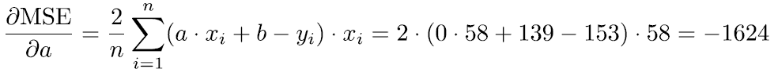

和

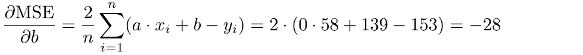

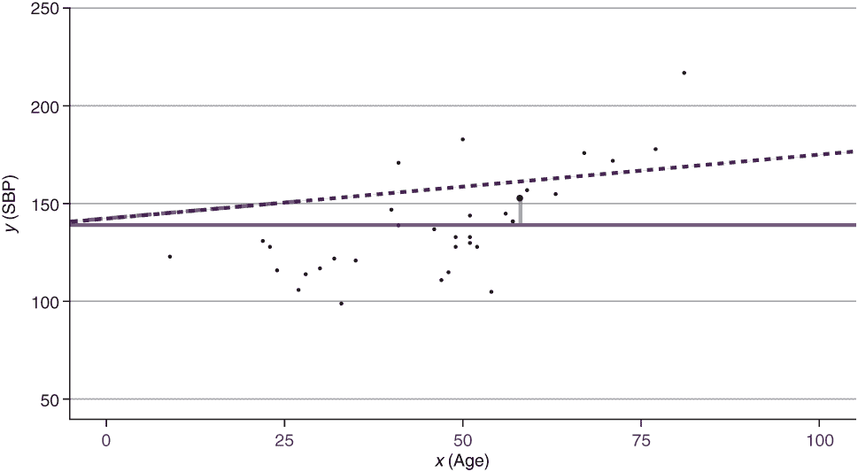

图 3.11 展示了我们只在 SGD 拟合的第一轮中使用一个数据点的血压数据集。这个选择的数据点以填充点的方式可视化。初始线性模型由实线表示，斜率 *a* = 0，截距 *b* = 139。虚线表示第一次更新后的线性模型，斜率 *a* = 0.3，截距略大于 *b* = 139。

知道这些关于均方误差损失相对于参数 *a* 和 *b* 的梯度值都是负值，这告诉您需要增加参数值以降低损失，以便更接近选择的数据点。您可以通过查看图 3.11 来验证这一点。模型值在 *x* = 58 的位置应该上升以接近观察到的值 *y* = 158。这可以通过两种方式实现：通过增加截距和增加斜率。我们通过使用方程 3.2 中的公式，学习率 *η* = 0.0002 来更新 *a* 和 *b* 的值，得到：

*b**[t+1]* = *b**[t]* − *η* ⋅ *grad**[b]* = 139 − 0.0002 ⋅ ( −28) = 139.0056

和

*a**[t]*[+1] = *a**[t]* − *η* ⋅ *grad**[b]* = 0 − 0.0002 ⋅ ( −1624) = 0.3248

图 3.11 中的虚线显示了具有更新值 *a* 和 *b* 的结果线性模型。现在让我们通过使用计算图以 TensorFlow 的方式更新参数值，然后检查我们是否得到相同的结果。

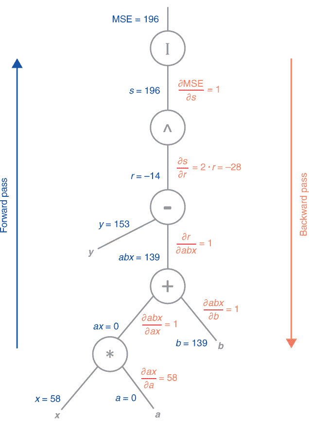

图 3.12 对于具有一个数据点（x = 58, *y* = 153）和初始参数值 *a* = 0 和 *b* = 139 的混凝土血压示例的前向和反向传播。图的左侧显示了前向传播中的流动值；右侧显示了反向传播中梯度的流动值。

你首先开始计算所谓的正向传播中的损失。中间结果写在图 3.12 的左侧。你逐步进行计算，并给中间项命名以跟踪它们。（你将在反向传播中需要它们。）你从左下角开始，将 *a* 乘以 *x*：*ax* = *a* ⋅ *x* = 0 ⋅ 58 = 0。然后你加上 *b* = 139，得到 139。继续向上图工作，你减去 *y* = 153，得到 *r* = −14。然后你平方它以得到 *s* = 196。

在这种情况下（*n* = 1），平均操作不起作用。它只是恒等式（在图 3.12 中用 I 表示），最终损失是 196。

让我们通过反向路径来计算损失函数相对于参数的偏导数。你需要跟踪图 3.12 中显示的中间量（s, r, abx, 和 ax）。因此，你根据你在返回参数 *a* 和 *b* 的过程中传递的这些中间量来构建 MSE 损失的偏导数。为了确定损失函数 MSE 相对于 *b* 的偏导数，你只需沿着图从 MSE 走到 *b* 并在返回的过程中乘以局部梯度。局部梯度是某个操作的结果相对于其输入值的导数：

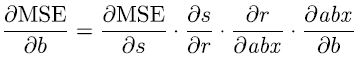

让我们验证这确实是 MSE 相对于 *b* 的梯度。我们将像 ∂s 这样的符号视为变量（这会让真正的数学家感到震惊），并在公式的右侧取消这些变量：

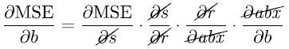

你可以看到偏导数乘积中的项是局部梯度。为了计算局部梯度，你需要基本操作（如图 3.13 所示）的导数。

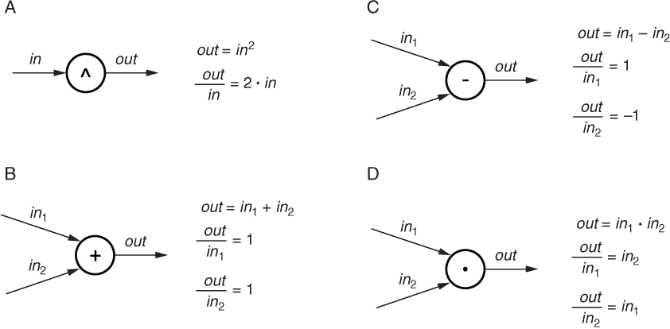

图 3.13  线性回归示例中反向传播的局部梯度。圆圈包含你需要进行的操作，它们是平方 (^)，加法 (+)，减法 (-) 和乘法 (·)。

让我们使用当前值（*x* = 58, *y* = 153, *a* = 0, 和 *b* = 139）进行计算，并确定计算 MSE 相对于 *b* 的偏导数所需的项：

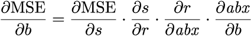

你从计算图的顶部开始：

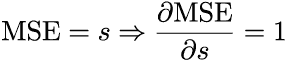

下一个局部梯度是

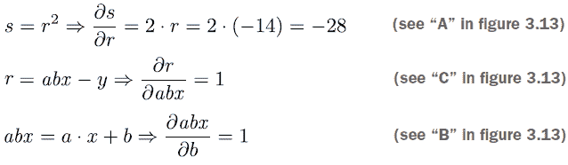

这给出了沿*b*轴的损失梯度：

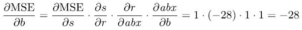

将局部梯度相乘，得到的值与封闭公式相同。同样，您可以计算关于 a 的梯度。然而，您不需要从头开始沿着图走，而是可以走捷径，从-28 的值开始，乘以*∂ax / ∂a* = 58，得到-1,624。这是关于 a 的 MSE 梯度的预期值。当 TensorFlow（或任何使用静态图的深度学习框架，如 Theano）计算梯度时，在底层使用这种静态图方法。

|  | 实践时间 打开笔记本 [`mng.bz/XPJ9`](http://mng.bz/XPJ9) 并验证局部梯度的数值。请注意，我们仅为了演示反向传播过程，计算了所有中间值和梯度。如果您想使用梯度下降法获取拟合的参数值，您可以使用笔记本中的示例代码，如[`mng.bz/vxmp`](http://mng.bz/vxmp)所示。 |
| --- | --- |

通常您不需要手动在梯度下降更新公式中应用梯度。相反，您可以使用`tf.train.GradientDescentOptimizer()`之类的优化器。列表 3.4 显示了图的优化器。调用它一次将执行一次给定学习率的梯度下降步骤。这显示在笔记本[`mng.bz/vxmp`](http://mng.bz/vxmp)的末尾。

列表 3.4 TensorFlow 中计算图的拟合

```
train_op_ = tf.train.GradientDescentOptimizer(
              learning_rate=0.0004).minimize(loss_)   ❶ 
with tf.Session() as sess:                            ❷ 
    sess.run(tf.global_variables_initializer())       ❸ 
    for i in range(80000):                            ❹ 
      _, mse, a_val, b_val = 
                sess.run([train_op_, loss_, a_, b_])  ❺ 
      if (i % 5000 == 0):                             ❻ 
        print(a_val, b_val, mse)
```

❶ 向图中添加一个额外的操作以优化 MSE

❷ 在退出时关闭会话并释放所有分配的资源

❸ 初始化所有变量

❹ 设置梯度下降步骤数为 80,000

❺ 运行 train_op 和 mse_、a_、b_

❻ 限制打印每 5,000 条记录

如列表所示，这需要相当多的代码。因此，开发了更高级的框架与 TensorFlow 一起工作；Keras 就是这样一种框架，它可以在 TensorFlow（和其他）深度学习库之上工作。Keras 也包含在 TensorFlow 发行版中，因此您不需要安装任何东西就可以使用它。Chollet 的《Python 深度学习》一书详细介绍了 Keras。

您可以将线性回归视为一个简单的 NN，它有一个没有应用激活函数的密集层。（Keras 使用“线性”一词表示没有激活。）列表 3.4 的第二行，Dense 层，包含了使用参数 a 和偏置参数*b*对*x*进行加权线性组合的指令，以确定输出层中唯一节点的输出 ax + *b*。此外，您可以使用四行 Keras 代码构建整个图和优化器，如下所示。

列表 3.5 Keras 中计算图的构建

```
model = Sequential()                                     ❶ 
model.add(Dense(1,input_dim=1, activation='linear'))     ❷ 
opt = optimizers.SGD(lr=0.0004)
model.compile(loss='mean_squared_error',optimizer=opt)
```

❶ 开始构建模型

❷ 添加一个没有激活函数的单个密集层

在这个列表中添加一个没有激活函数的密集层是线性回归（也参见列表 2.1 和图 3.2）。下面的列表展示了 Keras 中用于拟合计算图的训练过程。

列表 3.6 在 Keras 中拟合计算图

```
for i in range(0,80000):
    model.fit(x=x,y=y,batch_size=33,
                    epochs=1,
                    verbose = 0)
    a,b=model.get_weights()
    if i % 5000==0:
        mse=np.mean(np.square(model.predict(x).reshape(len(x),)-y))
        print("Epoch:",i,"slope=",a[0][0],"intercept=",b[0],"MSE=",mse
```

|  | 实践时间 打开笔记本 [`mng.bz/yyEp`](http://mng.bz/yyEp) 以查看列表 3.5 和 3.6 的完整代码。大胆尝试并玩转这些代码。 |
| --- | --- |

### 3.4.2 动态图框架

静态库的主要问题是由于两步程序（首先构建图然后执行它），调试相当繁琐。在动态图框架中，图是即时定义和评估的。因此，你可以在代码的每个点上访问真实的数值。这在调试时具有巨大的优势。此外，静态图的一个缺点是，你不能包含条件语句和循环，以便对不同的输入动态响应。Chainer 和 Torch 是最早允许这种动态计算的框架之一。Torch 的缺点是宿主语言是 Lua，这是一种不太常用的编程语言。2017 年，Torch 从 Lua 转换为 PyTorch，许多深度学习从业者开始使用这个框架。作为回应，TensorFlow 现在也包含了动态图的可能性，称为 eager 执行。

列表 3.7 显示了使用 eager 执行的线性回归问题的 TensorFlow 代码（也参见笔记本 [`mng.bz/MdJQ`](http://mng.bz/MdJQ)）。框架不再需要构建静态图。你可以在任何点停止，每个张量都有一个与之关联的值。在 eager 模式下，TensorFlow 仍然需要计算单个操作的梯度，但这是在执行代码的同时并行的。TensorFlow 在内部将用于计算梯度的中间值存储在一个名为 `tape` 的实体中。

列表 3.1 使用 `TF.eager` 的线性回归

```
a  = tf.Variable(0.)                               ❶ 
b = tf.Variable(139.0)                             ❶ 
et*a* = 0.0004                                       ❷ 
for i in range(80000): 
  with tf.GradientTape() as tape:                  ❸ 
    y_hat = a*x + *b*                                ❸ 
    loss = tf.reduce_mean((*y*_hat - *y*)**2)          ❸ 
    grad_a, grad_b  = tape.gradient(loss, [a,b])   ❸❹ 
    a.assign(a - eta * grad_a)                     ❸❺
    b.assign(b - eta * grad_b)                     ❸❻
    if (i % 5000 == 0):                            ❸ 
            ...                                    ❼ 
```

❶ 将 a 和 *b* 设置为变量，以便以后可以优化它们

❷ 设置学习率

❸ 记录在此范围内计算梯度所需的所有信息

❹ 计算相对于 *a* 和 *b* 的损失

❺ 应用更新公式 3.3 并将 a 赋予新的值

❻ 打印代码被省略

❼ 应用更新公式 3.3 并将 *b* 赋予新的值

如你所见，代码的构建和执行之间没有分离。`with tf.GradientTape() as tape:` 这行代码告诉 TensorFlow 使用所谓的带子机制跟踪所有微分。由于存储中间值需要一些时间，你只希望在真正需要的时候才这样做。这对于调试和开发复杂的网络来说是非常好的。然而，这也需要付出代价。特别是如果你使用了很多小操作，即时方法可能会变得相当慢。但是有一个解决方案。如果你把所有相关的代码放在一个函数中，并用 `@tf.function` 装饰器装饰这个函数，那么函数中的代码就会被编译成一个图，然后运行得更快。

在 TensorFlow v2.0 中，你拥有了开发时的即时执行和在生产中的基于图框架的最佳结合。以下笔记本包含了一个如何使用 `@tf.function` 的示例；更多细节可以在 [`www.tensorflow.org/guide/function`](https://www.tensorflow.org/guide/function) 找到。

除了讨论过的笔记本外，我们还提供了一个使用 Python 中的 `autograd` 库来自动计算梯度的笔记本；请参阅笔记本 [`mng.bz/aR5j`](http://mng.bz/aR5j) 。在下一章中，我们将真正开始我们的旅程，并遇到第一个可以从中推导出损失函数的原理——最大似然原理（MaxLike）。

## 摘要

+   线性回归是所有参数模型的母亲，也是你可以想到的最小的神经网络（NNs）之一。

+   你可以通过最小化一个损失函数来拟合参数模型，该损失函数量化了模型与数据之间的偏差。

+   均方误差（MSE）是回归模型的一个合适的损失函数。

+   梯度下降是一种寻找最小化损失函数的参数值的方法。梯度下降是一种简单、通用的方法，只要损失函数是可微的，你就可以用它来处理所有类型的参数模型。

+   使用梯度下降，每个参数都是迭代和独立地从其他参数中更新的。这需要确定损失函数相对于每个参数的梯度。此外，你还需要定义一个学习率。

+   调整学习率（既不要太低也不要太高）对于成功拟合至关重要。在使用深度学习（DL）时，你可以执行梯度下降的随机版本（SG*D*），它基于数据的一个随机子集（小批量）来估计梯度，而不是使用所有数据。

+   深度学习（DL）框架，如 TensorFlow 或 Keras，使用反向传播来确定所需的梯度。

+   深度学习中使用的优化器是 SGD 的变体，通过利用过去的梯度来加速学习过程。
