# 4 使用似然方法构建损失函数

本章涵盖

+   使用最大似然方法估计模型参数

+   确定分类问题的损失函数

+   确定回归问题的损失函数


在上一章中，你看到了如何通过使用随机梯度下降（SGD）优化损失函数来确定参数值。这种方法也适用于具有数百万个参数的深度学习模型。但我们是如何得到损失函数的呢？在线性回归问题中（见第 1.4 节和第 3.1 节），我们使用了均方误差（MSE）作为损失函数。我们不认为最小化数据点与曲线之间的平方距离是一个坏主意。但为什么使用平方而不是，例如，绝对差异呢？

事实上，在处理概率模型时，有一个普遍有效的方法来推导损失函数。这种方法被称为最大似然方法（MaxLike）。你会发现，对于线性回归，MaxLike 方法在某种假设下给出了均方误差（MSE）作为损失函数，我们将在本章详细讨论。

关于分类，你使用了一个称为分类交叉熵的损失函数（见第 2.1 节）。什么是分类交叉熵？你最初是如何得到它的？你可能能猜到通过哪种方法可以推导出这个损失函数。结果是，似然函数是你的朋友。它在分类任务中提供了交叉熵作为合适的损失函数。

## 4.1 MaxLike 原理简介：所有损失函数之母

MaxLike 是几乎所有深度学习（DL）和机器学习（ML）应用背后“秘密”的关键，这在图 4.1 中有所体现。


图 4.1 揭示了机器学习（图中为 ML）和深度学习（*DL*）中几乎所有损失函数的秘密。图片来源：[`www.instagram.com/neuralnetmemes/`](https://www.instagram.com/neuralnetmemes/)

为了演示这个原理，我们从深度学习（DL）领域之外的一个简单例子开始。考虑一个骰子，其中一个面显示美元符号（$），其余五个面显示点（见图 4.2）。


图 4.2 一个骰子，一面显示美元符号，其余面显示点

如果你掷骰子，美元符号出现的概率是多少（我们这里假设骰子是公平的）？平均来说，每六次中出现一次美元符号。因此，看到美元符号的概率是 p = 1/6。不出现美元符号而看到点的概率是 5/6 = 1 - p。让我们掷骰子十次。你只看到一次美元符号，九次看到点的概率是多少？首先，假设你在第一次掷骰子时看到美元符号，在接下来的九次掷骰子时看到点。你可以将这个情况写成字符串：

```
$.........
```

该特定序列发生的概率将是 ⅙ ⋅ ⅚ ⋅ ⅚ ⋅ ⅚ ⋅ ⅚ ⋅ ⅚ ⋅ ⅚ ⋅ ⅚ ⋅ ⅚ ⋅ ⅚ = ⅙ ⋅ ⅚⁹ = 0.032，或者用 *p* =⅙ 表示为 *p*¹ ∗(1 −*p*)^(10−1) 。如果我们只要求在十次掷币中出现一个美元符号和九个点（无论位置如何）的概率，我们必须考虑以下所有十个结果：

```
$.........
.$........
..$.......
...$......
....$.....
.....$....
......$...
.......$..
........$.
.........$
```

要发生，这十个不同的序列中每一个都有相同的概率 *p* ⋅(1 −*p*)⁹ 。这意味着观察到的十个序列中有一个的概率为 10 ⋅ *p* ⋅(1 −*p*)⁹ 。在我们的例子中，我们使用 p = 1/6，得到 0.323 作为在十次掷币中发生一次美元符号的概率。你可能会产生好奇心，想知道在十次掷币中出现两个美元符号的概率是多少？特定顺序（例如 `$$........`）的概率是 *p*² ⋅ (1 −*p* )⁸ 。结果是，现在有 45 种可能的方式 1 来重新排列像 `$.$.......` 或 `$..$.......` 这样的字符串：因此，两个美元符号和八个点的总概率是 45 ⋅(⅙)² ⋅(⅚)⁸ = 0.2907 。

我们计数掷出带有美元符号的成功次数的掷币实验是称为二项实验的一般类实验的例子。在二项实验中，你计数 n 次试验中的成功次数（在这里是掷骰子），其中所有试验都是相互独立的，并且每次试验成功的概率相同。在 n 次试验的二项实验中，成功次数不是固定的，但通常可以取 0 到 n 之间的任何值（如果 p 不是正好为 0 或 1）。因此，成功次数 k 被称为随机变量。为了强调 k 是来自二项分布的随机变量，可以写成：

*k* ∼ binom(*n*, *p*)

~ 符号读作“来自”或“分布类似于”一个二项分布，其中 n 等于尝试次数，p 等于单次尝试成功的概率。在本书的上下文中，如何推导出某个 k 的概率并不那么重要。但有一个名为 `binom.pmf` 的 SciPy 函数可以用来计算这个概率，其参数 `k` 等于成功次数，`n` 等于尝试次数，`p` 等于单次尝试成功的概率。使用这个函数，我们可以绘制在 10 次掷币中出现 0 到 10 个美元符号的概率图。请参见列表 4.1 中的代码和图 4.3 中的结果。

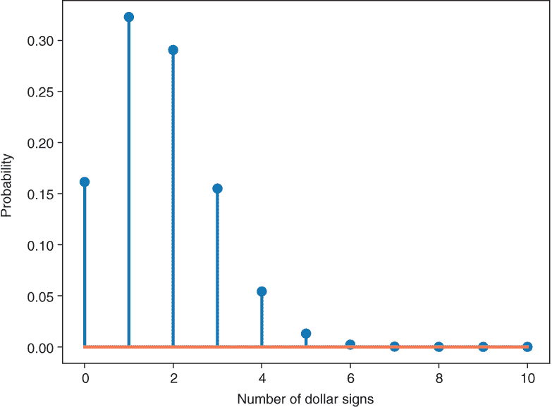

图 4.3 10 次掷骰子中观察到的美元符号数量的概率分布。单个掷币中出现美元符号的概率为 p = 1/6。一个和两个美元符号出现的概率（0.323 和 0.2907）与手工计算的结果相同。此图使用列表 4.1 中的代码创建。

列表 4.1 使用`binom`函数计算 0 到 10 次掷出美元符号的概率

```
from scipy.stats import binom
ndollar = np.asarray(np.linspace(0,10,11)\            ❶ 
                     , dtype='int') 
pdollar_sign = binom.pmf(k=ndollar, n=10, p=1/6)      ❷ 
plt.stem(ndollar, pdollar_sign)
plt.xlabel('Number of dollar signs')
plt.ylabel('Probability')
```

❶ 成功次数（掷出的美元符号），从 0 到 10 共 11 个整数

❷ 投掷出 0、1、2……美元符号的概率，每个符号的概率为 p = 1/6

到目前为止，一切顺利。你可能记得这是从你的概率课程中学到的。现在我们换个角度。考虑以下情况：你在一个赌场里玩一个游戏，如果你看到美元符号，你就能赢。你知道有特定数量的面（0 到 6）带有美元符号，但你不知道具体有多少。你观察到十次投掷骰子的结果，其中有两次出现了美元符号。你会猜骰子上有多少个美元符号？当然不可能是零，因为你观察到了美元符号，另一方面，也不可能是六，因为你没有观察到点数。但什么是一个好的猜测呢？

再次查看列表 4.1，你突然有了一个天才的想法。简单地再次计算在十次投掷中观察到两个美元符号的概率，但这次假设你的骰子不仅有带美元符号的一面，而是有两面。然后假设你的骰子有三面带美元符号，再次确定在十次投掷中看到两个美元符号的概率，依此类推。你的观察数据是固定的（十次投掷中出现两个美元符号），但你的数据生成假设模型从没有美元符号的骰子变为有 1、2、3、4、5 或 6 个美元符号的骰子。在一次投掷中观察到美元符号的概率可以看作是骰子模型中的一个参数。这个参数对于不同的骰子模型取值为 p = 0/6, 1/6, 2/6, ……, 6/6。对于这些骰子模型中的每一个，你可以确定在十次投掷中观察到两个美元符号的概率，并在图表中绘制出来（见图 4.4）。

|  | 实践时间打开[`mng.bz/eQv9`](http://mng.bz/eQv9)。运行代码直到你达到第一个练习。对于这个练习，你的任务是确定如果你考虑一个有 0、1、2、3、4、5 或所有 6 个面都带有美元符号的骰子，在 10 次骰子投掷中观察到美元符号两次的概率。绘制计算出的概率会产生图 4.4 中的图表。 |
| --- | --- |

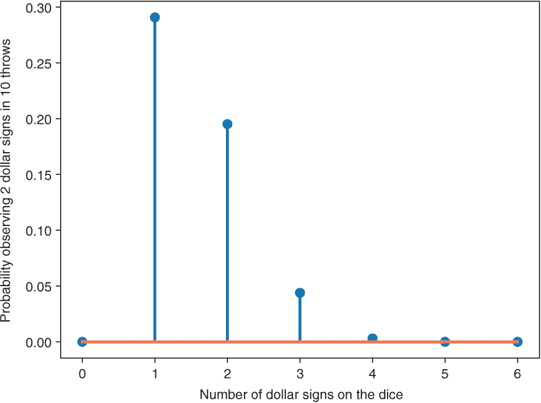

图 4.4：不同骰子上的美元符号数量在 n=10 次投掷中观察到 k=2 个美元符号的可能性

我们在图 4.4 中看到了什么？从左边开始，如果你掷出的骰子上没有美元符号，那么你在十次投掷中观察到两个美元符号的概率为零。嗯，这是预期的。接下来，计算在骰子上只有一个美元符号（p = 1/6）的情况下，在十次投掷中观察到两次美元符号的概率。这个概率接近 0.3。如果你假设骰子上有两个美元符号，那么在十次投掷中观察到两个美元符号的概率大约为 0.20，依此类推。你会猜骰子上有多少个美元符号？你会猜一个，因为只有一个美元符号的骰子在十次投掷中产生两个美元符号的概率最高。恭喜！你刚刚发现了最大似然原理。

MaxLike 口诀：选择模型的参数（s），使得观察到的数据具有最高的似然。

在我们的例子中，参数模型是二项分布，它有两个参数：每次试验的成功概率 p 和进行的试验次数 n。我们观察到在 n = 10 次投掷中有 k = 2 个美元符号。模型的参数是 p，即单次掷骰子显示美元符号的概率。不同数量美元符号的似然在图 4.4 中显示。我们选择最大似然值（p = 1/6），对应于骰子上有一个美元符号。

这里有一个小的细微差别。图 4.4 中的概率是未归一化的概率，因为这些概率相加不等于 1，而是等于一个常数因子。在我们的例子中，这个因子是 0.53。因此，这些概率在严格意义上不是概率，因为它们必须加起来等于 1。这就是我们说似然而不是概率的原因。但我们可以仍然使用这些似然进行排序，我们选择产生最高似然的模型作为最可能的模型。此外，对于像我们这样的简单情况，我们可以将每个似然除以所有似然的和，将它们转换为适当的概率。让我们回顾一下在 MaxLike 方法中确定最佳参数值的步骤：

1.  你需要一个模型来描述观察数据的概率分布，该模型有一个或多个参数。

    在这里，数据是掷骰子十次时看到美元符号的次数。二项分布的参数 p 是骰子显示美元符号的概率 p（显示美元符号的骰子面数除以六）。

1.  你使用该模型来确定在假设模型中参数的不同值时，得到观察数据的似然。

    在这里，你计算了当假设骰子有 0、1、2、3、4、5 或 6 个美元面时，在十次投掷中得到两个美元符号的概率。

1.  你选择使观察到的数据的似然最大的参数值作为最佳参数值。这也被称为 MaxLike 估计器。

    在这里，ML 估计器是骰子有一面是美元符号。

## 4.2 为分类问题推导损失函数

在本节中，我们向您展示如何应用 MaxLike 原则来推导分类问题的损失函数，并揭开“分类交叉熵”这个十美元词的神秘面纱。结果证明，这个量计算起来相当简单，您将看到如何使用它来对您的模型进行合理性检查。

### 4.2.1 二分类问题

让我们回顾一下第二章中的假钞例子（参见列表 2.2，此处重复列出）。

列表 2.2 定义具有两个隐藏层的分类网络

```
model = Sequential() 
model.add(Dense(8, batch_input_shape=(None, 2),
                          activation='sigmoid')) 
model.add(Dense(2, activation='softmax')) 
# compile model
model.compile(loss='categorical_crossentropy',       ❶ 
                      optimizer=sg*D*)
```

❶ 这里解释了列表 2.2 中的 'categorical_crossentropy' 损失。

在第二章中，你也为所有分类问题使用了`'categorical_crossentropy'`：全连接神经网络（fcNN）、应用于 MNIST 手写数字分类问题的卷积神经网络（CNN）以及用于检测艺术品条纹的 CNN。这个损失函数通常用于深度学习中的分类问题。

为了解释`'categorical_crossentropy'`，让我们从纸币的例子开始。在这种情况下，第一个神经元（在图 4.5 中标为 p0）的输出是模型“认为”给定输入*x*属于类别 0（真实纸币）的概率。其他神经元的输出（在图中标为 p1）是*x*描述假类别的概率。当然，p0 和 p1 的总和为 1。这是由`softmax`激活函数（见第二章）保证的。

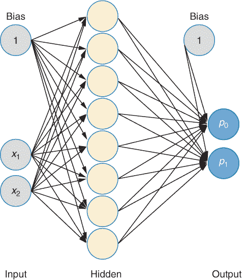

图 4.5 展示了由特征*x*[1]和*x*[2]描述的用于识别纸币的分类网络，该网络有两个输出，分别给出真实纸币的概率(*p*[0])和假币的概率(*p*[1])。这与第二章中的图 2.8 相同。

我们现在使用最大似然原理来推导损失函数。观察到的数据的似然性是什么？在分类问题中，训练数据以成对的形式出现(*x**[i]* 和 *y**[i]* )。在纸币的例子中，*x**[i]* 是一个有两个条目的向量，*y**[i]* 是示例的真实类别（纸币是假的还是真的）。CNN（见图 4.5）接收输入*x*并输出每个可能类别的概率。这些概率定义了给定*x*的条件概率分布（CPD）（见下文侧边栏中的图）。观察到的（真实）结果类别*y**[i]* 的似然性由真实类别*y**[i]* 的 CPD 给出。对于具有已知权重和给定输入*x**[i]* 的 NN，如果真实类别是*y**[i]* = 0，则似然性由 p0(*x**[i]* )给出；如果真实类别是*y**[i]* = 1，则似然性由输出 p1(xi)给出。

重要：请记住：对于给定的训练示例(*x**[i]* , *y**[i]* )，分类模型的似然性就是网络分配给正确类别 yi 的概率。

例如，一个训练良好的网络在训练示例来自类别 1（假币）时，会返回一个高 p1 值。整个训练集的概率是多少？这里我们假设训练集中的所有示例都是相互独立的。因此，整个训练数据集的概率就是各个概率的乘积。例如，想象你掷一个标准的骰子两次，并询问第一次掷出 1 和第二次掷出 2 的概率。这很简单，因为 1/6 · 1/6，因为掷骰子是独立的。这可以一直进行下去，一般来说，整个训练集的似然性是所有单个示例的乘积。我们一个接一个地看每个训练示例的概率，然后取所有这些概率的乘积。

我们也可以按以下顺序排列概率：首先，在我们的例子中，我们取真实纸币（对于*y* = 0）并将预测 p0 相乘。然后，我们取假币并将 p1 相乘。假设你在训练集中有五张纸币。前三个例子来自真实纸币，最后两个例子来自假币。从 NN 为所有纸币得到属于类别零(*p*[0])或类别一(*p*[1])的概率。然后，五张纸币的似然度为

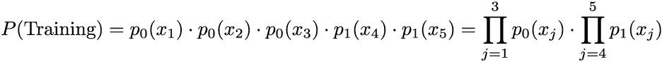

方程式中的*Π*表示取乘积，而*σ*表示取和。一般来说，这可以写成：

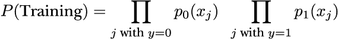                     方程式 4.1

我们也可以用稍微不同的方式解释方程 4.1，基于对输出*y*的概率分布进行公式化（参见侧边栏）。因为这种观点可以帮助你从更一般的角度理解机器学习方法，所以我们将在以下侧边栏中给出这种解释。

使用参数概率模型进行分类损失的 MaxLike 方法

图 4.5 中具有固定权重的 NN 在输入特定输入*x*时，输出所有可能的类别标签*y*的概率。这可以写成输出*y*的概率分布，它取决于输入值*x*和 NN 的权重：

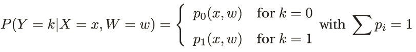

Y = k 表示随机变量*y*取特定值 k。在方程中，你可以进一步将竖线读作“给定”或“条件”。竖线右侧是所有给定信息，这些信息用于确定竖线左侧变量的概率。在这里，你需要知道输入*x*和 NN 的权重 W 的值来计算 NN 的输出，即 p0 和 p1。因为概率分布依赖于*x*，所以它被称为条件概率分布（CPD）。通常你会看到这个方程的简化版本，它省略了竖线右侧的部分（要么只有 W = w，要么*x* = *x*和 W = w），并假设这是不言而喻的。

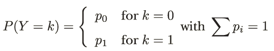

这种输出*y*只能取 0 或 1 值的概率分布称为伯努利分布，它只有一个参数 p。据此，你可以直接计算 p0 = 1 - p1。以下图显示了二元输出*y*的概率分布。

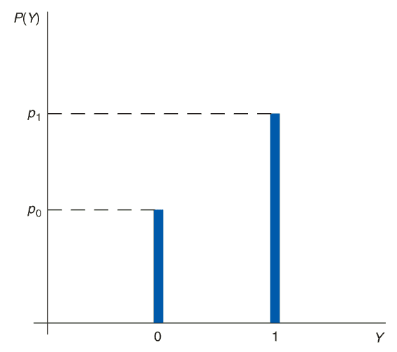

二元变量*y*的概率分布，也称为伯努利分布

图 4.5 中的 NN 为每个输入计算 p0 和 p1。对于 n 个数据点，数据的概率或似然度是计算出的正确类别的概率的乘积（见方程式 4.1）。MaxLike 原则告诉你应该调整网络权重 w，使得似然度最大化，如下所示：

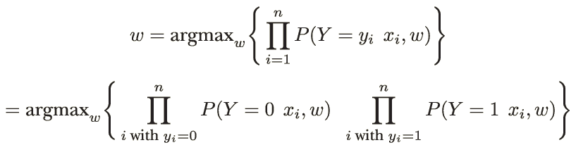

从原则上讲，我们现在已经完成了。我们可以通过调整网络的权重来最大化方程 4.1。您不需要手动完成这项工作，但可以使用任何框架，如 TensorFlow 或 Keras。这两个框架都可以进行（随机）梯度下降。

仍然存在一个实际问题。方程 4.1 中的 p0 和 p1 是介于 0 和 1 之间的数，其中一些可能很小。在 0 到 1 的范围内乘以许多数会导致数值问题（参见列表 4.2）。

列表 4.2 在 0 到 1 之间乘以许多数时的数值不稳定性

```
import numpy as np
vals100 = np.random.uniform(0,1,100)       ❶ 
vals1000 = np.random.uniform(0,1,1000)     ❷ 
x100 = np.product(vals100) 
x1000 = np.product(vals1000)
x100, x1000                                ❸ 
```

❶ 随机乘以 0 到 1.0 之间的 100 个数。

❷ 随机乘以 0 到 1.0 之间的 1,000 个数。

❸ 对于 1,000 个数的一个典型结果（7.147335361549675e-43, 0.0）给出的是 0。

如果我们取超过几百个例子，乘积接近零，由于计算机中浮点数的有限精度，它被视为零。DL 使用典型的 float32 浮点数类型，对于这些类型，紧邻零的最小数大约是 10^-45。

有一个技巧可以解决这个问题。在方程 4.1 中，您可以将似然的对数替换掉*P*(Training)。取对数会改变函数的值，但不会改变达到最大值的位置。作为旁注，最大值保持不变的性质是由于对数函数*x*是一个随着*x*增大而严格增长的函数。具有这种性质的函数被称为严格单调函数。在图 4.6 中，您可以看到一个任意函数*f*(*x*)及其对数 log(*f*(*x*))。*f*(*x*)和 log(*f*(*x*))的最大值都在*x* ≈ 500 处达到。

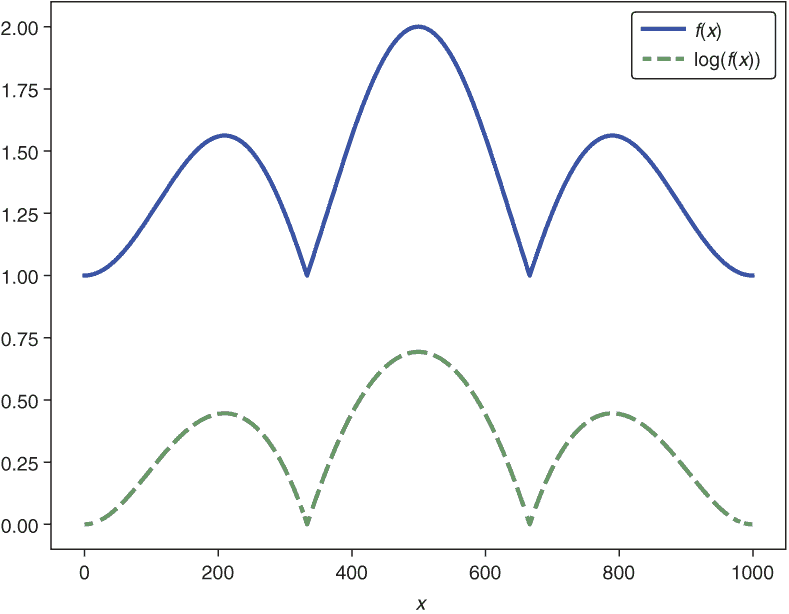

图 4.6 一个具有非负值的任意函数 f(x)（实线）及其对数（虚线）。虽然取对数后最大值（大约为 2）会变化，但达到最大值的位置（大约为 500）无论是否取对数都保持不变。

通过取对数，您获得了什么？任何数的乘积的对数是这些数的对数之和，这意味着 log(*A* ⋅ *B*) = *log* (*A*) + *log* (*B*)。这个公式可以扩展到任意多个项：*log* (*A* ⋅ *B* ⋅ *C* ⋅ ...) = *log* (A) + *log* (*B*) + *log* (*C*)，因此方程 4.1 中的乘积变成了对数之和。让我们看看这对数值稳定性的影响。

你现在添加 0 到 1 之间的数字的对数。对于 1，你得到*对数* (1) = 0；对于 0.0001，你得到*对数* (0.0001) ≈ −4。唯一可能出现的数值问题是，如果你真的得到了正确类别的概率为 0，那么零的对数是负无穷大。为了防止这种情况，有时会在概率中添加一个非常小的数，比如 10E−20。但在这里我们不必担心这种极不可能的情况。如果你将列表 4.2 从乘积改为对数和，会发生什么？你得到一个数值稳定的计算结果（见列表 4.3）。

列表 4.3 通过取对数来修复数值不稳定性

```
log_x100 = np.sum(np.log(vals100))       ❶ 
log_x1000 = np.sum(np.log(vals1000)) 
log_x100, log_x1000                      ❷ 
```

❶ 与列表 4.2 中相同的采样数字的乘积变成了对数和。

❷ 对于 1,000 个数字的典型结果（-89.97501927715012，-987.8053926732027）给出了一个有效值。

使用对数技巧将最大似然方程（4.1）转换为这里所示的最大对数似然方程：

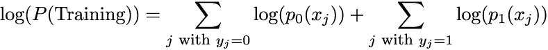

这种对数技巧不依赖于你使用的底数，但了解 Keras 使用自然对数来计算损失函数是有用的。我们现在几乎到了终点，只剩下两个小细节。

在方程 4.2 中，你添加了与训练数据一样多的数字。因此，方程 4.2 依赖于训练数据数量 n。为了得到一个不系统依赖于训练数据数量的量，你可以将方程除以 n。在这种情况下，你考虑每个观察的平均对数似然。最后一点是，深度学习框架通常被构建为最小化损失函数，而不是最大化。因此，你最小化 log(P(Training))而不是最大化 log(P(Training))。哇！你已经推导出了二元分类模型的负对数似然(NLL)函数，这也被称为交叉熵。你将在下一节中看到交叉熵这个名字的由来。在达到推导二元分类器损失函数的目标后，让我们再次写下它：

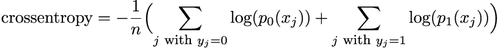

你现在可以验证这确实是深度学习中需要最小化的量。

|  | 实践时间[打开](http://mng.bz/pBY5) http://mng.bz/pBY5 并运行代码，其中你创建了一个包含仅两个类别（0 和 1）的 MNIST 数字子集。在这个第一个练习中，你的任务是使用`model.evaluate`函数确定未训练模型的交叉熵损失，并解释你获得的价值。 |
| --- | --- |

使用未训练的模型，你达到了大约 0.7 的交叉熵。当然，这是一个随机结果，因为网络的权重有它们的初始随机值，还没有进行过训练。期望从 0.7 有一些随机偏差。你能用你刚刚学到的知识解释 0.7 这个值吗？网络一开始一无所知。你期望的命中率是多少？大约 50%对吗？让我们计算*ln*(0.5)。那是 0.69，看起来很合适。（Keras 使用自然对数来计算损失函数。）

具有一个输出节点的两类分类损失函数

对于像银行票据示例中那样的两个特殊类别，存在一个网络只有一个输出神经元的可能性。在这种情况下，输出是类别 p1 的概率。其他类别的概率，*p*[0]，由 *p*[0] = 1 - *p*[1] 给出。因此，我们不需要对 yi 进行 one-hot 编码。它要么是类别 0 的 *y**[i]* = 0，要么是类别 1 的 *y**[i]* = 1。利用这一点，我们可以将方程 4.3 重写为：

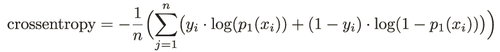

与此方程不同，我们不需要检查示例属于哪个类别。如果示例 i 属于类别 1（*y**[i]* = 1），则取包含 *p*[1] 的第一部分。否则，如果示例 i 属于类别 0（*y**[i]* = 0），则激活第二部分，其中 *p*[0] = 1 - *p*[1]。

### 4.2.2 具有两个以上类别的分类问题

如果你有多于两个类别会发生什么？你可能认为没有什么特别的，你是对的。你已经在第二章的几个练习中做过这件事，当时你处理了在 MNIST 数据集中区分十个数字的任务。回想一下，在为 MNIST 任务设置深度学习模型时，你使用了与二分类模型相同的损失：`loss='categorical_crossentropy'`。让我们看看你如何使用最大似然方法推导损失函数，并证明使用交叉熵是合适的。

回想一下你在二分类任务中进行的概率建模。你使用了一个有两个输出节点的神经网络（见图 4.5），为每个输入提供了对应于类别 0 和 1 的 p 0 和 p 1 概率。你可以将这些两个概率解释为二分类任务的 CPD 参数（参见本章第一个侧边栏中的图）。这个 CPD 的模型是伯努利分布（参见本章第一个侧边栏）。原则上，伯努利分布只需要一个参数：类别一的概率，p 1。这个参数由第二个输出节点给出。你可以通过 p 0 = 1 - p 1 从 p 1 推导出类别 0 的概率；`softmax`激活函数的使用确保了神经网络的第一输出返回 p 0。在遵循最大似然方法时，二分类任务的损失由伯努利分布的均方误差 NLL 给出（参见方程 4.2 和 4.3）。

让我们使用相同的程序处理多于两个类别的分类任务。在 MNIST 示例中，你有十个类别，你使用一个有十个输出节点的神经网络，每个类别一个。回想一下，例如，我们在第二章中用于 MNIST 手写数字分类任务的架构，如图 2.12 所示，我们在图 4.7 中重复了它。

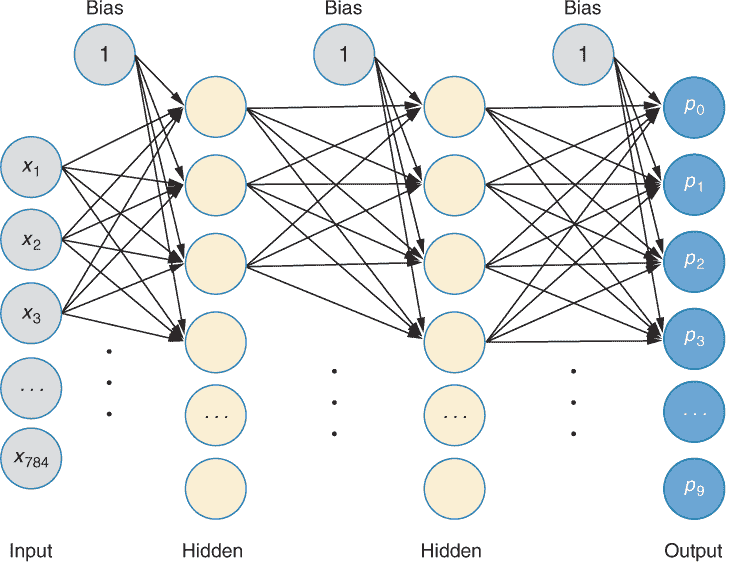

图 4.7 一个具有两个隐藏层的全连接神经网络（fcNN）。对于 MNIST 示例，输入层有 784 个值，对应于 28 × 28 像素。输出层有十个节点，每个类别一个。

在这个 MNIST 任务中，你想要区分十个类别（0，1，……，9）。因此，你设置了一个具有十个输出节点的神经网络，每个节点提供输入对应于相应类别的概率。这十个概率定义了 MNIST 分类模型中 CPD 的十个参数。分类 CPD 的模型称为多项式分布，它是伯努利分布扩展到多于两个类别的结果。在十个类别的 MNIST 分类任务中，多项式 CPD 可以表示如下：

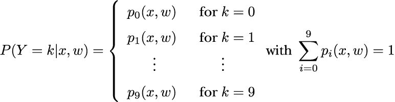

根据权重 w，神经网络为每个输入图像 *x* 产生十个输出值，这些值定义了分配给每个可能结果的相应多项式 CPD 的参数。

在训练神经网络之前，你用小的随机值初始化权重。未训练的神经网络将每个类别的概率分配得接近 1/10，类似于均匀分布（见图 4.8），无论通过神经网络的图像是什么。

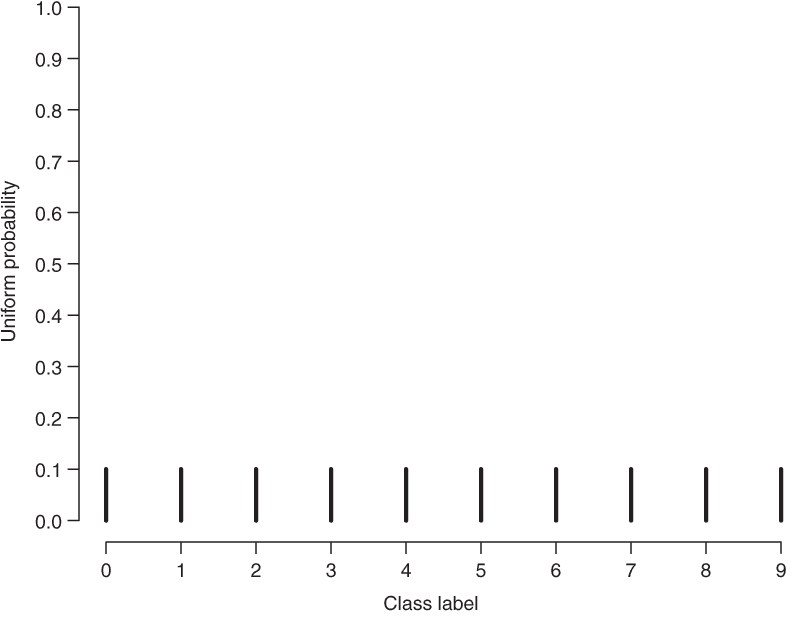

图 4.8 展示了一个均匀概率分布，将概率 0.1 分配给十个类别标签。对于十个类别标签的未训练分类神经网络，其 CPD 将与这种均匀分布相似，无论分类图像的标签是什么。

如果你然后用几个带标签的图像来训练神经网络，CPD 已经包含了一些信息。例如，通过标签 2 的图像得到的 CPD 可能看起来像图 4.9 中展示的那样。

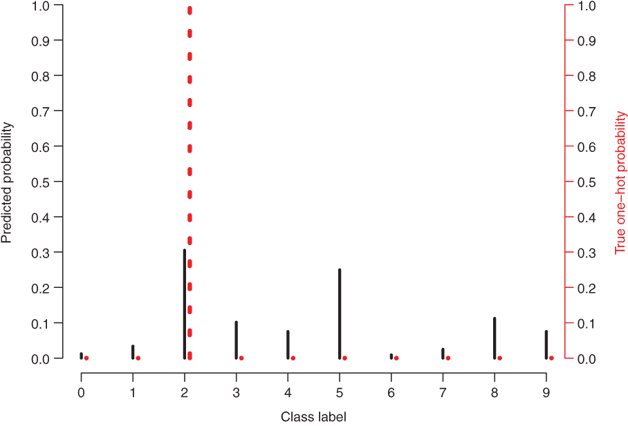

图 4.9 展示了与标签 2 对应的多项式条件概率分布（CPD），该图像通过了一个神经网络（实线表示的分布）。在这里，真实标签的分布（虚线）将概率 1 分配给真实的标签 2。

让我们看看图 4.9。这个观察到的标签 2 图像的似然性是什么？似然性是 CPD 分配给标签的概率，这里大约是 0.3。请注意，只有 CPD 分配给正确标签的概率才对似然性有贡献。如果你用你的神经网络分类了几个图像，并且知道每个图像的真实标签，你可以确定联合负对数似然（NLL）。为此，对每个图像，使用以下方程评估 CPD 分配给正确类别标签的概率：

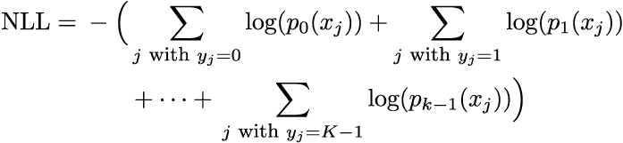

每个观察的平均 NLL 是 NLL 除以样本数。这再次导致了交叉熵的公式：

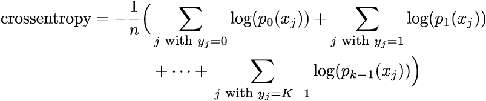

如果你使用一个-hot 编码向量 *^(true)* *p**[i]* 来表示示例 i 的真实类别，你可以将这个表达式写得更紧凑。向量 *^(true)* *p**[i]* 对于训练示例 i 的真实类别是 1，对于其他成分是 0（见图 4.9）。

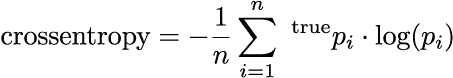

你期望从为 MNIST 任务设置的未训练的 NN 中损失值是多少？暂停一下，在你继续阅读之前，试着自己找出答案。

在完整的 MNIST 数据集中，你有十个类别。一个未训练的网络会将大约 1/10 分配给每个类别。这导致所有类别的 *p**[i]* ≈ 1/10，我们得到损失的值约为 2.3。为了调试你的训练，始终检查这个数字对于分类问题来说是一个好的实践。

|  | 实践时间打开[`mng.bz/OMJK`](http://mng.bz/OMJK)并运行代码，直到你达到由笔形图标指示的练习，然后做这个练习。在练习中，你的任务是使用未训练的 CNN 在 MNIST 图像上做出的数字预测，并手动计算损失值。你会发现你得到一个接近我们之前计算出的 2.3 的值。 |
| --- | --- |

### 4.2.3 NLL、交叉熵和 Kullback-Leibler 散度之间的关系

你可能想知道为什么深度学习的人把分类问题中的 NLL 称为交叉熵。你可能也想知道在分类问题中，是否可以通过真实值和预测值之间的差异来量化拟合的“坏度”，类似于回归中的 MSE。在本节中，你将了解这两个问题的答案。

统计学和信息理论中熵的含义

我们在信息理论、统计物理和统计学等不同学科中使用熵这个术语。在这里，你将了解第一个实例，其中它被用来描述概率分布的信息内容。你会发现，了解分类中损失函数的交叉熵术语的起源是有用的。

让我们从熵这个术语开始。熵的基本思想是分布能告诉你多少关于手头数量的信息，以及还剩下多少不确定或惊喜？在下面的方程中，你可以通过分布的扩散或“粗糙度”来衡量熵 H。它被定义为

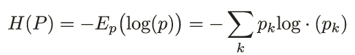

看一下图 4.9 中的两个分布。CPD（黑色）相当平坦。你不会学到太多关于可能的类别标签。你可以将其推向极端，并考虑均匀分布（见图 4.8）。实际上，可以证明均匀分布具有最大的熵。对于每个 *p**[i]* = 1/10 的 10 个类别，熵等于 *H* = −10 ⋅ 1/10 ⋅ *log* (1/10) ≈ 2.3。真实分布（图 4.9，虚线）告诉你尽可能多的关于标签的信息。分布只有一个峰值，你可以 100%确定真实类别标签是 2。相应的熵是 H = 0，因为对于正确的类别，你有一个 pi = 1，并且因此 *p**[i]* ⋅ *log*(*p**[i]* ) = 1 ⋅ 0 = 0 。

交叉熵和 Kullback-Leibler 散度

如果你有两个分布 q 和 p，并且根据分布 p 计算给定分布 q 的对数期望值，交叉熵就会发挥作用。对于离散情况，如下所示：

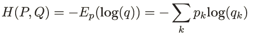

使用交叉熵，你可以比较两个分布。

Kullback-Leibler 散度作为分类中的 MSE 对应物

让我们再次检查图 4.9，它显示了预测的 CPD（黑色线条）和真实分布（虚线），这是经过 one-hot 编码的真实标签。如果模型是完美的，预测的 CPD 将与真实分布相匹配。让我们尝试量化模型的“坏处”，这应该是当前预测 CPD 与真实分布之间距离的某种度量。一种简单的方法是在每个类别标签上确定其 CPD 与真实概率的差异，可能将其平方，然后取平均值。这将在回归中模仿 MSE，即真实值与预测值之间平方差的期望值。

但请注意，MSE 并不能给出分类的最大似然估计。对于分类，减去真实值与预测值并不对应于最大似然原理。在这里，你需要比较两个分布：真实分布和预测分布。为此，通常使用 Kullback-Leibler (KL) 散度。KL 散度是概率对数差异的期望值。通过使用一些基本的对数微积分规则和期望值的定义，你可以证明 KL 散度与交叉熵相同：

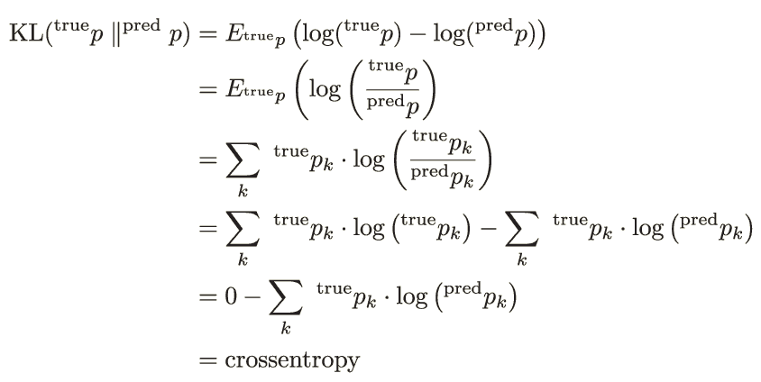

如前所述的推导中所示，真实分布与预测分布之间的 KL 散度简化为真实分布的熵与交叉熵之和。因为第一个项（真实分布的熵）为零（图 4.9 中的虚线分布），所以如果你最小化交叉熵，你实际上是在最小化 KL 散度。你将在本书中再次遇到 KL 散度。但在此刻，让我们欣赏 KL 散度对于分类来说就像 MSE 对于回归一样。与交叉熵和 KL 散度一样：两个概率分布有不同的角色，如果你交换这两个分布，你会得到不同的结果。为了表示 *KL* (*^(true)* *p* ||*^(pred)* *p* ) ≠ *KL* (*^(pred)* *p* ||*^(true)* *p* ) ，我们用两个竖线表示。顺便说一下，这不是一个好主意。为什么？（在继续阅读之前尝试回答这个问题。）好吧，*^(true)* *p**[i]* 主要为零，取零的对数不是一个好主意，因为它返回负无穷大。

## 4.3 推导回归问题的损失函数

在本节中，你使用最大似然原理推导回归问题的损失函数。你首先回顾了第三章中的血压示例，其中输入是一个美国健康女性的年龄，输出是她收缩压（SBP）的预测。在第三章中，你使用了一个没有隐藏层的简单神经网络来建模输入和输出之间的线性关系。作为损失函数，你使用了均方误差（MSE）。这种损失函数的选择是通过一些手舞足蹈的论据来解释的。没有给出任何硬事实来证明这个损失函数是一个好的选择。在本节中，你将看到 MSE 作为损失函数直接源于最大似然原理。此外，使用最大似然原理，我们可以超越 MSE 损失，并使用非恒定噪声来建模数据，这在统计学界被称为异方差性。不要害怕；理解最大似然原理会使建模（而不是拼写）异方差性变得轻而易举。

### 4.3.1 使用没有隐藏层和一个输出神经元的神经网络来建模输入和输出之间的线性关系

让我们回到第三章中的血压示例。在那个应用中，你使用了一个简单的线性回归模型 *ŷ =a* ⋅ *x* − *b* ，来估计当给定女性的年龄 *x* 时收缩压 *y* 的值。训练或拟合这个模型需要你调整参数 a 和 *b*，使得得到的模型“最佳拟合”观察到的数据。在图 4.10 中，你可以看到观察到的数据以及一条相当好地穿过数据的线性回归线，但它可能不是最好的模型。在第三章中，你使用了 MSE 作为损失函数来量化模型拟合数据的好坏。回想一下方程式 3.1：

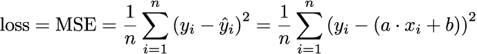

这个损失函数依赖于这样一个观点：模型与数据之间的偏差应该通过求和平方残差来量化。给定这个损失函数，你通过随机梯度下降法（SGD）确定了最优的参数值。

在第三章中，我们通过一个论据介绍了 MSE 损失，即如果平方残差之和最小，则拟合是最优的。在下面的内容中，你将看到如何使用最大似然原理以理论上的方式推导线性回归任务的适当损失。

提前剧透：你会发现最大似然法会导致 MSE 损失。

让我们通过最大似然法（MaxLike）推导回归任务的损失函数。对于一个简单的回归模型，我们只需要一个简单的神经网络（见图 4.11），没有隐藏层。当使用线性激活函数时，这个神经网络编码了输入 *x* 和输出之间的线性关系：out *= a · x + b* 。

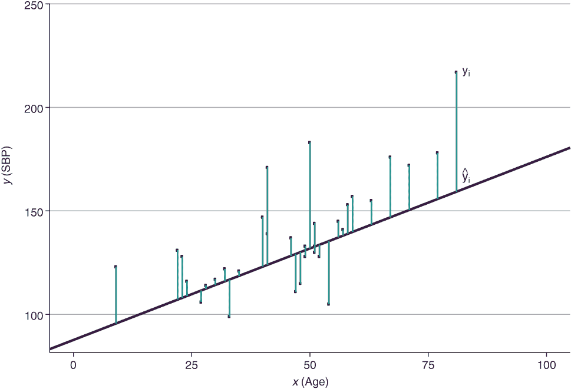

图 4.10 展示了血压示例的散点图和回归模型。点代表测量数据点，直线是线性模型。数据点和模型之间的垂直差异是残差。

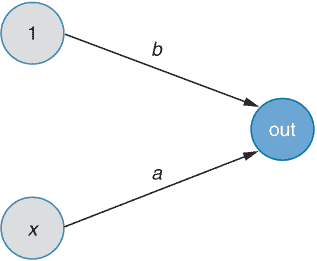

图 4.11 简单线性回归作为一个没有隐藏层的 fcNN。该模型直接从输入计算输出，即 out = *a* · *x* + *b*。

回归问题中的训练数据以 n 对 (*x**[i]* , *y**[i]* ) 的形式出现。在血压的例子中，*x**[i]* 表示第 i 个女性的年龄，而 *y**[i]* 是第 i 个女性的真实收缩压。如果你为神经网络（NN）的权重选择某些数字，比如 *a* = 1 和 *b* = 100，那么对于给定的输入，你可以计算出，比如 *x* = 50 和拟合值 *ŷ* = 1 ⋅ 50 + 100 = 150。你可以把这理解为模型的最佳猜测。在我们的数据集中，我们有一个 50 岁的女性，但她的血压是 183，而不是 150。这并不意味着我们的模型是错误的或者可以进一步改进，因为你不会期望所有相同年龄的女性都有相同的血压。

正如分类一样，在回归中也是如此。神经网络的输出不是当输入具有特定值 *x* 时你期望观察到的值 *y*。在分类中，神经网络的输出不是一个类标签，而是所有可能类标签的概率，这些概率是拟合概率分布的参数（见第一个侧边栏中的图）。在回归中，神经网络的输出不是具体的值 *y* 本身，而是拟合的连续概率分布的参数。在这里，我们使用正态分布；在第五章中，我们还会使用不同的分布，如泊松分布。为了回顾正态分布的性质，请参见下一个侧边栏。

正态分布的回顾

让我们回顾一下如何处理遵循正态分布的连续变量 *y*。首先，更仔细地看看正态分布的密度：*N*(*μ, σ*)。参数 *μ* 决定了分布的中心，而 *σ* 决定了分布的扩散（见图以下）。你经常看到类似的东西

*Y* ~ *N*(*μ, σ*)

这表明随机变量 *y*（例如，一定年龄的血压）遵循正态分布。这样的随机变量 *y* 有以下概率密度函数：

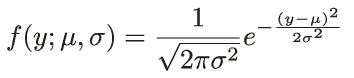

这在下图中得到了可视化：

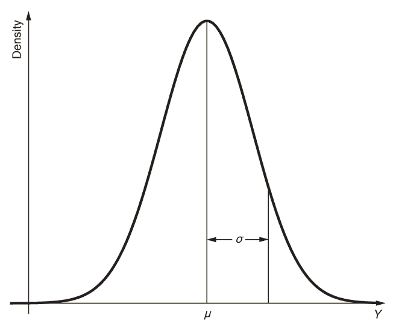

正态分布的密度，其中 *μ* 是中心，*σ* 是分布的扩散

观察这个图可以让人预见到 *y* 在 *μ* 附近有高概率值，而在 *μ* 附近有低概率值。这种直觉是正确的。但是，与离散变量的概率分布（见图 4.2）相比，读取连续变量 *y* 的概率分布（见前一个图）还是有点困难。

在离散变量的情况下，概率分布由分离的柱状图组成，对应于离散的输出值。对于离散概率分布，柱状图的高度直接对应于概率，这些概率加起来为 1。连续变量可以取无限多个可能值，对于像 *π* ~ = 3.14159265359 这样的确切值，概率为零。因此，概率只能定义在值的一个区域内。观察值 *y* 在 *a* 和 *b* 之间的概率，*y* ∈ *a,b*]，由密度曲线在 *a* 和 *b* 之间的面积给出（见图中阴影区域）。所有可能值的范围有一个概率为 1；因此，概率密度曲线下的面积总是 1。

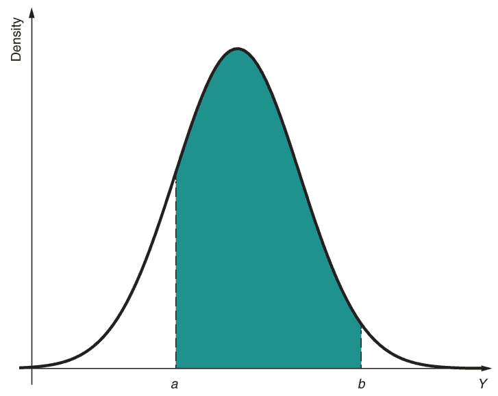

正态分布变量 *y* 的密度，其中密度曲线下的阴影区域给出了 *y* 在 *a* 和 *b* 之间取值的概率

您可以使用 MaxLike 原理来调整用于执行线性回归的 NN 的两个权重 w = (*a, b*)（见图 4.11）。但观察到的数据的似然性是什么？对于回归，回答这个问题比分类稍微困难一些。记住，在分类中，您可以从具有参数 pi 的概率分布中确定每个观察值的概率或似然性。NN 控制这些参数（见图 4.11）。在回归中，观察值 *y**[i]* 是连续的。在这里，您需要与正态分布一起工作。（除了正态分布之外，有时其他分布也足够好，我们将在第五章中处理那些，但现在我们坚持使用正态分布。）

正态分布有两个参数：*μ* 和 *σ* 。首先，我们固定参数 *σ*（比如说，我们将其设置为 *σ* = 20）并让 NN 只控制参数 *μ* *x* 。在这里，下标 *x* 提醒我们这个参数依赖于 *x*。它由网络确定，因此 *μ* *x* 依赖于网络的参数（权重）。图 4.11 中的简单网络产生 *μ**[x]* = *ax + b* 对 *x* 的线性依赖。图 4.12 用粗线展示了这一点。老年女性的平均血压较高。权重 (*a, b*) 本身是通过（拟合）最大化数据的似然性来确定的。数据的似然性是什么？我们从单个数据点 (*x**[i]* , *y**[i]* ) 开始。例如，检查 22 岁女性收缩压为 131 的数据点。对于那个年龄，网络预测的平均值为 *μ**[x]* = 111；*σ* 的范围是固定的。

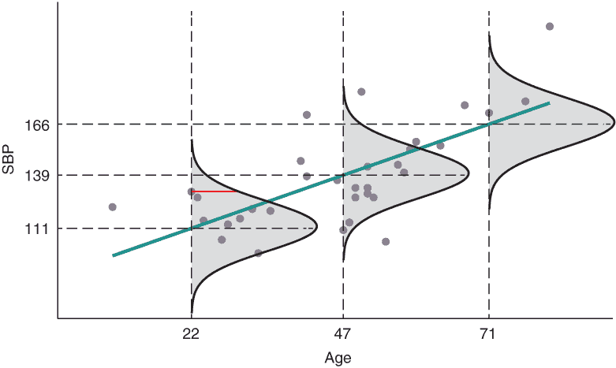

图 4.12 血压示例的散点图和回归模型。点代表测量的数据点，直线是线性模型。钟形曲线是条件概率分布，条件是观察到的值 *x*。

换句话说，一个 22 岁的女性的血压（根据模型）最有可能是 111。但其他值也是可能的。血压值 *y* 的概率密度 *f* (*y, μ*) = 111, *σ* = 20) 在不同的血压值 *y* 上分布，围绕 111 这个值，通过正态分布（如图 4.12 中阴影灰色区域所示，再次在图 4.13 中显示）。

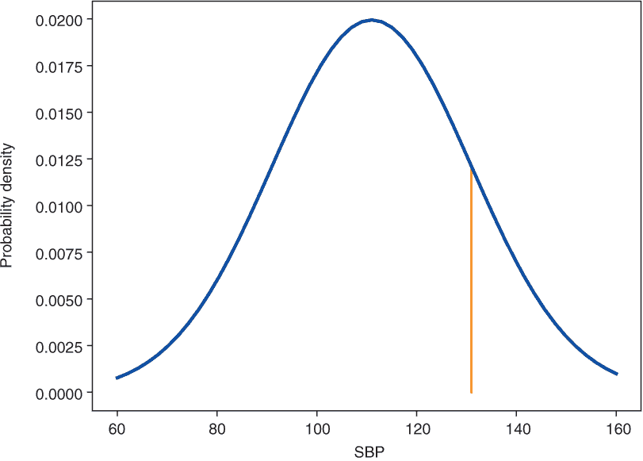

图 4.13 条件正态密度函数 f。垂直条的高度表示在这个模型下特定值的可能性。

在我们的观察中，这位女性的血压为 131。与离散情况一样，我们将概率 *p* (*y* | *x, a, b*) = *p* (*y* | *x, w*) 重新解释为给定参数 *w* 的数据发生的可能性，我们现在将概率密度 *f* ( *y* | *x, μ, σ* ) = *f* (*y* | *x, w*) 解释为观察到的数据发生的可能性。因为它来自概率密度，所以在连续情况下，可能性也是一个连续函数。在我们的具体情况下，这个观察到的可能性由以下密度给出：

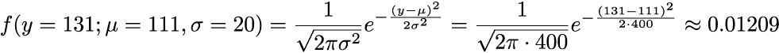

参见图 4.13 中的垂直条。对于每个输入值 *x*，输出 *y* 遵循另一个正态分布。例如，对于一个 47 岁的女性，收缩压为 110，参数是 *μ**[x]* = 139。对应于这个血压的可能性的确定由 *f* ( *y* = 110; *μ* = 139, *σ* = 20) 决定。因为正态概率分布通过 *μ**[x[i]]* = *a* ⋅ *x**[i]* + *b* 依赖于值 *x**[i]*，它通常被称为条件概率分布（CPD）。与分类情况一样，所有点（我们假设独立性）的可能性由单个可能性的乘积给出：

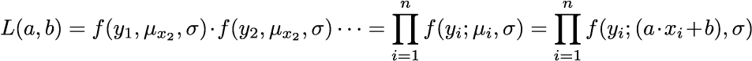

这种可能性只取决于参数 *a* 和 *b*。最大化它的值 *â* 和 *bˆ* 是我们最好的猜测，并且被称为 MaxLike 估计。这也是它们为什么被称为“帽子”的原因。实际上，我们再次取对数并最小化 NLL：

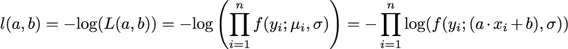

你在第三章中看到，你可以通过 SGD 找到最小化损失函数的网络权重。现在让我们这样做。我们必须在 Keras 中定义一个新的损失函数。你可以在 Keras 中通过定义一个函数来实现自定义损失函数，该函数接受真实值和网络预测作为输入。如图 4.11 所示，线性回归被定义为一个简单的网络，它预测*a* ⋅ *x**[i]* + *b*，其中权重*a*给出斜率，偏置*b*给出截距。方程式 4.4 中的损失函数的损失编码如下所示（你可以在笔记本中找到此代码）。

|  | 实践时间打开[`mng.bz/YrJo`](http://mng.bz/YrJo)并运行代码，以了解如何使用 MaxLike 方法确定线性回归模型中的参数值。为此，NLL 被定义为通过 SGD 最小化的损失函数。 |
| --- | --- |

列表 4.4 估计 MaxLike 解

```
def my_loss(*y*_true,y_pre*D*):                               ❶ 
  loss = -tf.reduce_sum(tf.math.log(f(*y*_true,y_pre*D*)))    ❷ 
  return loss

model = Sequential()                                      ❸ 
model.add(Dense(1, activation='linear',                   ❸ 
                batch_input_shape=(None, 1)))
model.compile(loss=my_loss,optimizer="adam")
```

❶ 定义一个自定义损失函数

❷ 计算所有损失的加和（见方程式 4.4）

❸ 设置一个与线性回归等价的神经网络；包含一个线性激活和一个偏置项

在第三章中，你已经通过 SGD 最小化了 MSE 损失函数，并得到了*a* = 1.1 和*b* = 87.8 作为最优参数值。实际上，这里显示的 MaxLike 估计与第三章的 MSE 方法相同。对于详细的推导，请参阅以下侧边栏。

基于 MaxLike 的线性回归均方误差损失函数推导

让我们一步一步地跟随 MaxLike 方法来推导经典线性回归任务的损失。MaxLike 方法告诉你，你需要找到神经网络中权重 w 的这些值。这里 w = (*a, b*)（参见侧边栏中标题为“使用参数概率模型的 MaxLike 方法对分类损失进行分类”的图），这些值最大化了观察数据的似然。数据以 n 对（xi, *y**[i]* ）的形式提供。以下乘积显示了数据的似然：

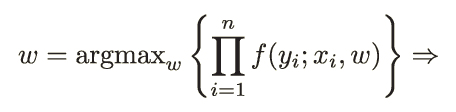

最大化这个乘积会导致与最小化相应的 NLL（见第 4.1 节）相同的结果。

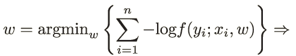

现在将正态密度函数的表达式（参见侧边栏中的第二个方程，“正态分布回顾”）代入。

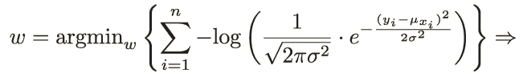

然后，让我们使用规则 log( *c* ⋅ *d* ) *=log* ( *c* ) *+* log( *d* ) 和 log( *e**^g* ) *= g* ，以及 ( *c* − *d* )² =( *d* − *c* )² 的事实：

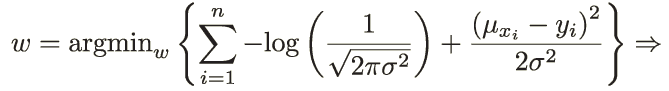

添加一个常数不会改变最小值的位置，并且因为第一个项相对于 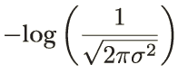*a* 和 *b* 是常数，我们可以省略它：

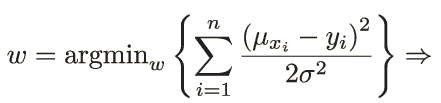

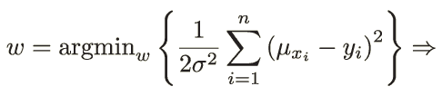

乘以一个常数因子也不会改变最小值的位置。我们可以自由地乘以常数因子 2 ⋅ *σ*²/*n*，这样我们最终得到均方误差损失公式：

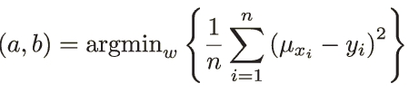

通过这种方式，我们已经推导出了损失函数，我们需要最小化它以找到权重的最优值。请注意，你只需要假设 *σ*[2] 是常数；你不需要推导出 *σ*[2] 的值来推导经典线性回归模型的损失函数：

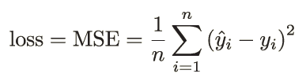

哇！我们完成了寻找 *a* 和 *b* 参数值以最小化平方残差之和的任务。这可以通过最小化均方误差（MSE）来实现。最大似然（MaxLike）方法确实引导我们得到了一个损失函数，这个损失函数实际上就是均方误差（MSE）！在简单线性回归的情况下，拟合值是 *ŷ**[i]* = *μ**[x[i]]* = *a* ⋅ *x**[i]* + *b*，从而得到：

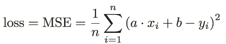

让我们回顾一下到目前为止我们所做的工作。首先，我们使用神经网络来确定概率分布的参数。其次，我们选择正态分布来模拟我们的数据。正态概率分布有两个参数：*μ* 和 *σ*。我们保持 *σ* 不变，并仅使用最简单的模型——线性回归来模拟 *μ*[*x[i]*]，即：*μ**[x[i]]* = *a* ⋅ *x**[i]* + *b*。对应于 *x* 值（年龄）的 *y* 值（SBP）分布类似于正态分布：

*Y**[x[i]]* ~ *N μ**[x[i]]* =*a* ⋅ *x**[i]* + *b* , *σ*²

这意味着 *y* 是一个来自具有均值 *μ*[*x[i]*] 和标准差 *σ* 的正态分布的随机变量。我们可以以几种方式扩展这种方法：

1.  我们可以选择除了正态分布以外的其他概率分布。实际上，在某些情况下，正态分布是不够的。以计数数据为例。正态分布总是包含负值。但某些数据，如计数数据，没有负值。我们在第五章中处理这些情况。

1.  我们可以使用一个完整的神经网络（NN）来代替线性回归来建模 *μ*[*x[i]*]，这在下一节中会进行说明。

1.  我们不需要坚持数据在整个输入范围内的可变性是恒定的假设，也可以通过神经网络来模拟 *σ*，并允许，例如，不确定性增加。我们在 4.3.3 节中这样做。

### 4.3.2 使用具有隐藏层的神经网络来模拟输入和输出之间的非线性关系

没有隐藏层的神经网络（见图 4.11）模拟输入和输出之间的线性关系：out *= a* ⋅ *x + b*。现在你可以扩展这个模型，并使用一个或多个隐藏层的神经网络来模拟 *μ**[x]*。我们仍然假设方差 *σ*² 是常数。使用图 4.15 中的神经网络，对于每个输入 *x*，你模拟了由以下给出的输出整个条件概率分布（CPD）：

*Y**[x[i]]* ∼ *N*(*μ**[x[i]]* , *σ*²)

如果您在您的 NN 中添加至少一个隐藏层，您会看到这些 CPD 的均值 *μ*[*x[i]*] 不需要沿直线（参见图 4.15）。在列表 4.5 中，您可以看到如何从一个具有正弦形状的函数中模拟一些数据，并将具有三个隐藏层和 MSE 损失函数的 NN 拟合到数据，从而得到一个拟合良好的非线性曲线（参见图 4.14）。

列表 4.5 使用 MSE 损失函数来模拟 fcNN 中的非线性关系

```
x,y = create_random_data(n=300)             ❶ 
model = Sequential()                        ❷ 
model.add(Dense(1, activation='relu',
batch_input_shape=(None, 1)))
model.add(Dense(20, activation='relu'))
model.add(Dense(50,activation='relu'))
model.add(Dense(20, activation='relu'))
model.add(Dense(1, activation='linear'))
opt = optimizers.Adam(lr=0.0001)
model.compile(loss='mean_squared_error',optimizer=opt)
history=model.fit(x, *y*,                     ❸ 
                  batch_size=n, 
                  epochs=10000,
                  verbose=0, 
                 )             
```

❶ 创建一些随机数据（参见图 4.14）

❷ 定义具有 3 个隐藏层和 ReLU 激活的 fcNN

❸ 使用 MSE 损失函数拟合 NN

通过这种扩展，您可以模拟输入和输出之间的任意复杂非线性关系，例如，例如正弦波（参见图 4.14）。

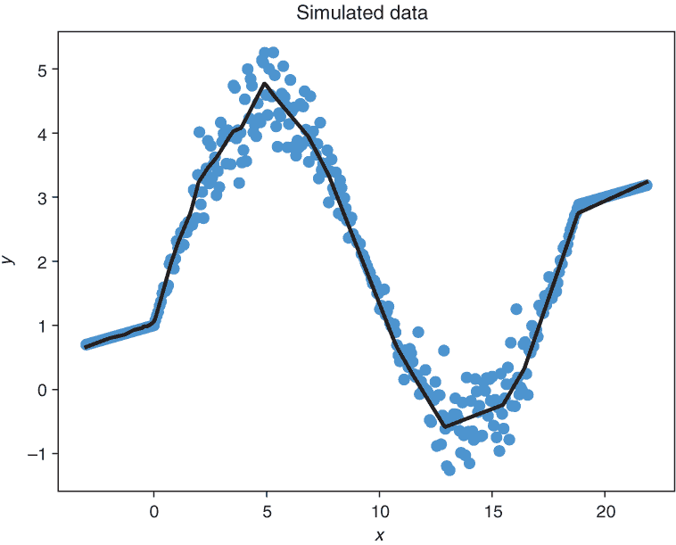

图 4.14 使用具有三个隐藏层和 MSE 损失函数的 fcNN 将正弦曲线（实线）拟合到数据点（见点）

这是如何工作的？图 4.11 中的模型只能绘制直线模型。为什么稍微扩展的 NN（参见图 4.15）能够模拟如此复杂的曲线？在第二章中，我们讨论了隐藏层如何使我们能够以非线性方式从输入特征构造新的特征。例如，一个具有一个隐藏层和八个神经元的 NN（参见图 4.15）允许 NN 从输入 *x* 构造八个新的特征。

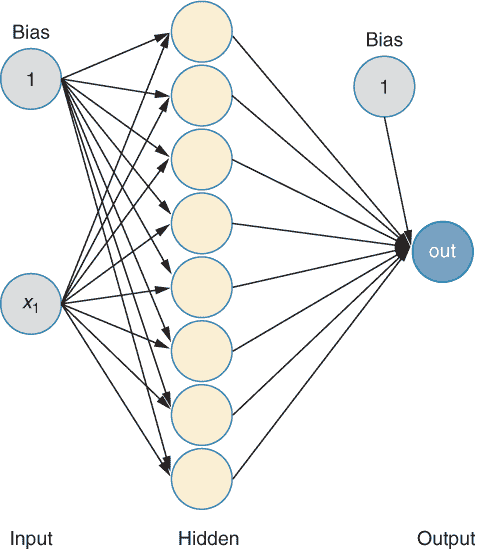

图 4.15 扩展线性回归。隐藏层中的八个神经元给出了计算输出“out”的特征。

然后，NN 模拟这些新特征与结果之间的线性关系。损失函数的推导保持不变，并导致 MSE 损失公式：

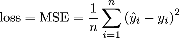

在具有隐藏层的神经网络的情况下（例如，参见图 4.12），模拟的输出 *ŷ**[i]* = *f**[NN]*4.11 是输入 *x**[i]* 和神经网络中所有权重的一个相当复杂的函数。这与由没有隐藏层的神经网络编码的简单线性模型（参见图 4.11）的唯一区别是，其中拟合值是权重和输入的简单线性函数 *ŷ**[i]* = *f**[NN]*4.6 = *a* ⋅ *x**[i]* + *b* 。

### 4.3.3 使用具有额外输出的神经网络进行具有非恒定方差的回归任务

经典线性回归中的一个假设是同方差性，意味着结果的方差不依赖于输入值 *x*。因此，您只需要一个输出节点来计算条件正态分布的第一个参数 *μ* *x*（参见图 4.11 和 4.15）。如果您还允许第二个参数，*σ*x ，依赖于 *x*，那么您需要一个具有第二个输出节点的神经网络。如果输出 CPD 的方差不是常数而是依赖于 *x*，我们称之为异方差性。

从技术上讲，你可以通过添加第二个输出节点（见图 4.16）轻松实现这一点。因为图 4.15 中的神经网络也有一个隐藏层，它允许输入和输出之间存在非线性关系。输出层中的两个节点提供了 CPD *N*(*μ**[x]* , *σ**[x]*²) 的参数值 *μ* *x* 和 *σ*x。当在输出层中使用线性激活函数时，你可以得到负的和正的输出值。因此，第二个输出不是直接作为标准差 *σ*x，而是作为 log(*σ**[x]*)。然后从 out2 计算标准差，即 *σ**[x]* = *e*^(out[2])，确保 *σ*x 是一个非负数。

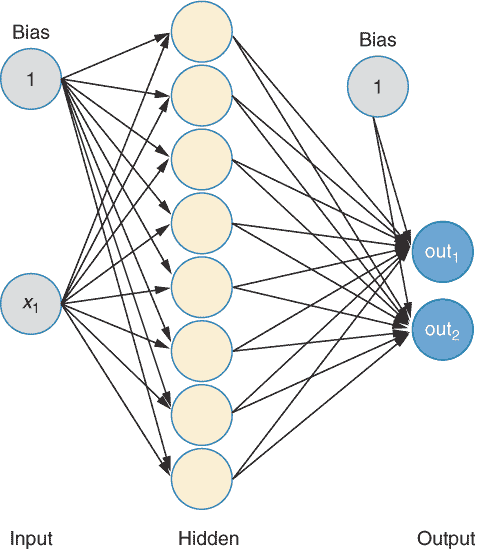

图 4.16 你可以使用具有两个输出节点的神经网络来控制条件结果分布 *N*( *μ* *x*, *σ* *x*) 的参数 *μ* *x* 和 *σ* *x*，以进行具有非常数方差的回归任务。

因为经典的线性回归假设方差 *σ*[2] 是常数（称为同方差性假设），你可能会怀疑，如果你想要允许 *σ*[2]（称为异方差性）变化，这会使事情变得更加复杂。但幸运的是，情况并非如此。同方差性假设仅在损失函数的推导中使用，以消除包含 *σ*[2] 的项，导致 MSE 损失。但如果你不假设方差是常数，你就不能进行这一步。损失仍然由方程 4.4 中定义的 NLL 给出

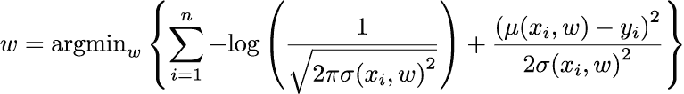

使用以下损失

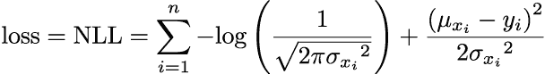

如果你想要像传统统计学那样解析地解决这个问题，*σ* 非常数的事实会导致问题。但如果你放弃闭式解，优化这个损失根本不是问题。你又可以再次使用 SGD 机制来调整权重以实现最小损失。在 TensorFlow 或 Keras 中，你可以通过定义一个自定义损失，然后使用这个自定义损失进行拟合过程（参见列表 4.6），该过程使用方程 4.8 中的损失函数。

为什么你不需要知道方差的真实值

在向学生介绍 MaxLike 原则时，我们经常被问到这样的问题：“如果没有地面真实值，你如何确定方差？”让我们再次看看图 4.16 中的架构。该网络有两个输出：一个直接对应于结果分布的期望值 *μ*[*x[i]*]，另一个对应于结果分布的标准差 *σ* *x**[i]* 的变换。虽然选择更接近 yi 值的 *μ*[*x[i]*] 感觉上似乎是自然的，但你可能会想知道在没有给出作为地面真实值的信息的情况下，你如何拟合，例如，结果分布的标准差。你只有每个输入 *x**[i]* 的观察结果 yi。但 MaxLike 方法非常美妙，并且正在为你完成这项工作！

回想一下血压数据集（见图 4.12），其中假设数据在整个年龄范围内的分布是相同的。让我们暂时忘记回归任务，转向一个更简单的任务：你只想通过正态分布来建模 45 岁女性的血压。让我们想象这四位女性血压大约都是 131（比如，130.5、130.7、131、131.8）。作为 45 岁年龄段的血压分布，你可能想使用一个具有参数值 *μ*[*x[i]*] 在观测（均值）值 131 的正态钟形曲线，且 *σ* *x**[i]* 接近零。这应该会在 131 的观测值上产生最大可能性（参见下图中左侧面板）。感觉上很自然，*μ*[*x[i]*] 是由真实值 yi 决定的。但是，你将如何处理数据表现出高变异性的情况？

例如，假设你数据集中的四位 45 岁女性的血压分别为 82、114、117 和 131。在这种情况下，你可能不会想使用图左侧面板所示的高斯钟形曲线，因为只有血压为 131 的观测值有较高的可能性；其他三个观测值有极小的可能性，导致整体（联合）可能性很小。为了最大化联合可能性，使用所有四个观测值都有合理高可能性的高斯曲线会更好（参见下图中右侧面板）。


在几乎没有任何数据变异性的情况下，最大化四个观测值 SBP 的联合可能性（左侧），其中所有四个观测值都接近 131，或者在大数据变异性的情况下（右侧），四个观测值 SBP 为 82、114、117 和 131，差异很大。线的长度表示观测 SBP 值的可能性。

|  | 可选练习 打开 [`mng.bz/YrJo`](http://mng.bz/YrJo) 并逐步执行代码，直到你达到练习 2，然后完成练习 2。绘制一个正态分布，并像前一个侧边栏中的图所示，绘制观测值的可能性。手动调整正态分布的参数值以实现最大联合可能性或最小 NLL。开发代码，通过梯度下降确定最佳参数。 |
| --- | --- |

如果你做了练习，你会看到当曲线的分布与数据相似时，似然性最大化，确实，当使用四个观察值的方差作为参数*σ*x 时，它达到最大。这意味着你用神经网络建模的*N*(*μ**[x[i]]*，*σ**[x[i]]*)分布尽可能反映了数据的分布。在回归的情况下，情况更复杂，因为你在不同的*x*值上有相邻的点。参数*σ*[*x[i]*]在相邻的*x*值上不能有完全不同的值，但它应该是一个平滑的曲线。如果网络有足够的灵活性，那么在观察结果分布较大的区域（例如，图 4.17 中*x* = 5 和*x* = 15 附近），你应该使用一个相当宽的条件正态分布，即较大的参数*σ*[*x[i]*]。相反，在分布较小的区域（例如，图 4.17 中*x* = 0 附近），*σ*[*x[i]*]应该较小。这样，似然方法允许你估计条件正态分布的参数，而不需要这些值作为确切的值。

让我们暂停一下，回顾一下原始问题。你为什么一开始就认为你有均值的确切值，而不是方差？你拥有的只是数据和从数据中假设生成的模型。在我们的情况下，模型是高斯分布*N*(*μ**[x[i]]*，*σ**[x[i]]*)，网络确定其参数*μ*[*x[i]*]，*σ*[*x[i]*]。你优化神经网络的权重，使数据的似然性最大化。均值也没有确切的值。神经网络只会估计条件分布的*μ*和*σ*，这两个都是估计值。*μ*和*σ*都没有确切的值。没有勺子。

列表 4.6 来自方程 4.5 的非线性异方差回归模型

```
import math
def my_loss(*y*_true,y_pre*D*):                            ❶ 
  mu=tf.slice(*y*_pred,[0,0],[-1,1])                     ❷ 
  sigma=tf.math.exp(tf.slice(*y*_pred,[0,1],[-1,1]))     ❸ 

  a=1/(tf.sqrt(2.*math.pi)*sigma) 
  b1=tf.square(mu-y_true)
  b2=2*tf.square(sigma)
  b=b1/b2
  loss = tf.reduce_sum(-tf.math.log(a)+b,axis=0)
  return loss

model =  Sequential()                                  ❹ 
model.add(Dense(20, activation='relu',batch_input_shape=(None, 1)))
model.add(Dense(50, activation='relu'))
model.add(Dense(20, activation='relu'))
model.add(Dense(2, activation='linear'))
model.compile(loss=my_loss,\
optimizer="adam",metrics=[my_loss])                    ❺ 
```

❶ 定义自定义损失

❷ 提取第一列用于*μ*

❸ 提取第二列用于*σ*

❹ 定义一个具有 3 个隐藏层的神经网络，如列表 4.4 所示，但现在有 2 个输出节点

❺ 使用自定义损失进行拟合

你现在可以通过不仅绘制拟合值的曲线，还绘制拟合值加减 1 或 2 倍拟合标准差的曲线来绘制拟合。这说明了拟合 CPD（见图 4.17）的分布变化。


图 4.17 拟合值遵循正弦形状的曲线。实线中间线给出拟合的*μ* *x*的位置，其标准差在变化。两条细的外线对应于 95%预测区间（*μ* - 2*σ*，*μ* + 2*σ*）。我们使用具有三个隐藏层、两个输出节点和自定义损失的神经网络来拟合数据点（见点）。

你可以任意设计这个网络深度和宽度，以模拟*x*和*y*之间的复杂关系。如果你只想允许输入和输出之间存在线性关系，你应该使用没有隐藏层的 NN。

|  | 可选练习 打开[`mng.bz/GVJM`](http://mng.bz/GVJM)并运行代码，直到你达到由笔形图标指示的第一个练习。你将看到如何模拟图 4.17 中显示的数据以及如何拟合不同的回归模型。在这个练习中，你的任务是尝试不同的激活函数。 |
| --- | --- |

你现在已经看到了如何使用 MaxLike 方法推导损失函数。你只需要为你的数据定义一个参数模型。如果你想开发一个预测模型，那么你需要选择一个 CPD *p*(*y*|*x*)的模型。CPD 给出了观测结果的似然。要按照深度学习的方式遵循这种建模方法，你设计一个 NN，该 NN 输出概率分布的参数（或可以从这些参数推导出的值）。其余的工作由 TensorFlow 或 Keras 完成。你使用 SGD 来找到 NN 中权重的值，这些权重导致模型参数值最小化 NLL。在许多情况下，NLL 被作为预定义的损失函数提供，例如交叉熵或 MSE 损失。但你也可以通过定义一个与 NLL 对应的自定义损失函数来处理任意似然。你在列表 4.6 中看到了一个自定义损失函数，它定义了具有非常数方差的回归问题的 NLL。

## 摘要

+   在最大似然（MaxLike）方法中，你调整模型的参数，使得产生的模型以比所有具有不同参数值的其他模型更高的概率产生观测数据。

+   MaxLike 方法是一个多功能的工具，用于拟合模型的参数。它在统计学中得到广泛应用，并提供了一个坚实的理论框架来推导损失函数。

+   要使用 MaxLike 方法，你需要为观测数据定义一个参数概率分布。

+   离散变量的似然由离散概率分布给出。

+   连续结果的似然由连续密度函数给出。

+   MaxLike 方法包括：

    +   定义观测数据的（离散或连续）概率分布的参数模型

    +   对于观测数据最大化似然（或最小化 NLL）

+   要开发一个预测模型，你需要选择一个给定输入*x*的输出*y*的条件概率分布（CPD）的模型。

+   使用 MaxLike 方法进行分类任务基于伯努利或多项式概率分布，如 CPD，导致 Keras 和 TensorFlow 中已知的分类标准损失，即交叉熵。

+   Kullback-Leibler（KL）散度是预测和真实 CPD 之间的度量。最小化它具有与最小化交叉熵相同的效果。从这个意义上讲，KL 散度是分类模型中均方误差（MSE）的对应物。

+   使用基于正态概率分布（如 CPD）的线性回归任务的 MaxLike 方法会导致均方误差（MSE）损失。

+   对于具有常数方差的线性回归，我们可以将网络的输入 *x* 的输出解释为条件正态分布 *N*(*μ**[x]*, *σ*) 的参数 *μ**[x]*。

+   非常数方差回归可以通过与正态概率模型的负对数似然（NLL）相对应的损失函数来拟合，其中两个参数（均值和标准差）都依赖于输入 *x*，并且可以通过具有两个输出的神经网络来计算，该输出产生条件概率分布（CPD）*N*(*μ**[x]*, *σ**[x]*)。

+   通过引入隐藏层，可以使用均方误差（MSE）损失来拟合非线性关系。

+   通常，可以在神经网络框架中通过将神经网络的输出解释为概率分布的参数来最大化任意 CPD 的似然。

1.虽然这对本书的其余部分并不重要，但如果您对如何得到数字 45 感兴趣，它是所有排列 10!经过（除以）不可区分排列数校正后的数量。也就是说，10! / (2! · 8!) = 45 在我们的情况下。更多细节，例如，请参阅[`mng.bz/gyQe`](http://mng.bz/gyQe)。
