# 5 TensorFlow Probability 中的概率深度学习模型

本章涵盖了

+   概率深度学习模型简介

+   新数据上的负对数似然作为适当的性能指标

+   为连续和计数数据拟合概率深度学习模型

+   创建自定义概率分布

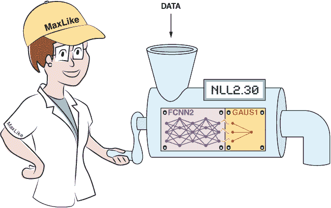

在第三章和第四章中，你遇到了一种固有的数据不确定性。例如，在第三章中，你在血压的例子中看到，年龄相同的两位女性可以有相当不同的血压。即使是同一位女性，在同一个星期内不同时间测量的血压也可能不同。为了捕捉这种数据固有的变异性，我们使用了条件概率分布（CPD）：P(y|x)。通过这个分布，你通过模型捕捉了 y 的输出变异性。在深度学习社区中，为了指代这种固有的变异性，使用了术语“随机不确定性”。这个术语“随机”来源于拉丁语单词 alea，意为骰子，正如“Alea iacta est”（骰子已掷出）。

在本章中，我们进一步关注开发和评估概率模型以量化随机不确定性。为什么你应该关注不确定性？这不仅仅关乎理论上的繁琐；它对于基于预测做出关键或昂贵的决策具有实际的重要性。想想看，比如一个纽约出租车司机在 25 分钟内将艺术品经销商送到一个即将开始的盛大艺术品拍卖会的情况。如果她准时到达，艺术品经销商承诺给予丰厚的小费（500 美元）。这对出租车司机来说很重要！幸运的是，他拥有最新的设备，他的旅行时间预测工具基于一个概率模型，该模型为旅行时间预测提供概率建议。

工具提出了两条通往拍卖会的路线。路线 1 预测的平均旅行时间为μ[1] = 19 分钟，但不确定性很高（标准差σ[1] = 12 分钟），而路线 2 的平均旅行时间为μ[2] = 22 分钟，但不确定性很小（标准差σ[2] = 2 分钟）。即使路线 2 的平均旅行时间比路线 1 长得多，选择路线 2 获得小费的概率约为 93%1。选择平均旅行时间为 19 分钟的路线 1 获得小费的概率约为 69%2。但这样的信息只能从一个预测所有可能旅行时间的可靠概率分布的概率模型中得出。

从第四章，你知道如何拟合概率模型。你使用神经网络（NN）来确定预测 CPD（条件概率分布）的参数。原则上，开发概率深度学习模型是容易的：

1.  你选择一个合适的分布模型来预测结果。

1.  你设置一个 NN，其输出节点数量与模型参数数量相同。

1.  你从选定的分布中推导出负对数似然（NLL）函数，并使用该函数作为损失函数来训练模型。

注意：为了使我们的术语一致，当我们谈论输出时，我们指的是 NN 最后一层的节点；当我们谈论结果时，我们指的是目标变量 *y*。

第四章重点介绍了用于拟合模型的极大似然（MaxLike）方法。这种方法导致 NLL 作为损失函数。你可以手动确定所选概率分布的 NLL。我们在第四章的第 4.2 节中针对分类问题，在第 4.3 节中针对标准回归问题进行了这种操作。但正如你在第四章中看到的，我们很快就需要一些微积分和编程来推导出 NLL 作为损失函数。

在本章中，你将了解 TensorFlow Probability（TFP），这是 TensorFlow 的一个扩展，它使得在不要求你手动定义相应的损失函数的情况下轻松拟合概率深度学习模型变得容易。你将看到如何使用 TFP 进行不同的应用，并且你将获得对幕后发生的事情的直观理解。拟合概率模型允许你轻松地结合你的领域知识：你只需选择一个合适的结果分布（在图 5.1 中，它被描绘为深度学习机器中的分布板）并因此模拟现实世界数据的随机性。

在本章中，你还将为不同的任务开发高性能的概率深度学习模型。概率模型可以通过两种方式优化。首先，我们选择一个合适的架构，例如图 5.1 中的网络架。 （我们在第二章中讨论了这一点。）其次，这也是本章的重点，我们通过选择合适的结果分布来增强模型。但一个人最初如何确定概率模型的性能呢？你会发现选择最佳性能的概率模型的准则非常简单！在新数据上具有最低 NLL 的模型是最佳性能的概率预测模型。

## 5.1 评估和比较不同的概率预测模型

概率预测模型的目标是在新数据上产生准确的概率预测。这意味着在给定的 *x* 处预测的 CPD 应该尽可能匹配观察到的分布。正确的衡量标准很简单。你已经在第四章中看到了它；它是训练数据上最小化的 NLL。但现在，它是在未用于训练的新数据（测试数据）上评估的。在测试数据上的 NLL 越低，模型对新数据的预期性能越好。甚至可以证明，在评估模型的预测性能时，测试 NLL 是最优的。3

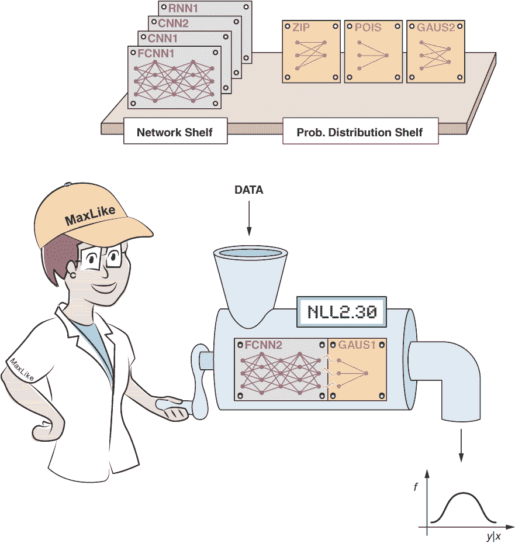

图 5.1 深度学习（*DL*）中概率建模的基本思想。网络确定概率分布的参数。我们使用强大的最大似然原理来拟合模型。在图中，结果由正态分布建模，其中神经网络用于控制一个参数（参见选定的最后一个带有单个输出节点的板），通常是平均值。

在模型开发的过程中，你通常会调整你的模型。在这个过程中，你反复将几个模型拟合到你的训练数据上，并在验证数据上评估其性能。最后，你选择在验证数据上预测性能最高的模型。但是，当你总是使用相同的验证数据来检查模型的性能时，你可能会在验证数据上过度拟合。因此，在深度学习（DL）以及机器学习（ML）中，使用三个数据集是一个好的实践：

+   一个用于拟合模型的训练数据集

+   一个用于检查模型预测性能的验证数据集

+   一个在模型选择过程中任何一点都没有被触及的测试数据集，并且只用于评估最终模型的预测性能

有时候，无法获得所有三个数据集。在统计学中，只使用训练数据和测试数据是很常见的，其中测试数据扮演了验证和测试数据的角色。在机器学习和统计学中，常用的另一种方法是交叉验证。在该技术中，你反复将训练数据分成两部分，一部分用于训练，另一部分用于验证。因为这种交叉验证过程需要我们多次重复耗时较大的训练过程，所以深度学习者通常不采用这种技术。

警告 在统计学中，有时我们只使用一个数据集。为了仍然能够评估在相同数据上开发的预测模型的表现，经过长时间的发展，一些复杂的方法仍然在一些统计学术界中使用。这些方法考虑了模型在拟合过程中看到了数据这一事实，并应用了校正来考虑这一点。这些方法包括，例如，赤池信息准则(AIC)或贝叶斯信息准则(BIC)。不要混淆。如果你有一个验证集，你不需要这些方法。

## 5.2 介绍 TensorFlow Probability (TFP)

在本节中，你将了解一种方便的方法来将概率模型拟合到你的数据上。为此，我们引入了建立在 TensorFlow 之上并针对概率深度学习模型定制的 TFP。使用 TFP 允许你以结果分布模型的方式思考。它让你免于为 NN 输出手工制作合适的损失函数。TFP 提供了特殊的层，你可以插入一个分布。它让你能够在不设置任何公式或函数的情况下计算观测数据的似然性。在上一个章节中，你设置了没有 TFP 的概率模型，这是可能的，但有时比较繁琐。记得第四章中的程序吗？

1.  你为结果选择一个合适的分布。

1.  你设置一个具有与所选结果分布中参数数量相同的输出的神经网络（NN）。

1.  你定义一个损失函数，该函数产生 NLL。

在线性回归的情况下，你选择高斯分布作为 CPD（条件概率分布）的模型（参见图 5.2，展示了血压的例子）。在这种情况下，你的 CPD 是 *N*(*μ**[x]*, *σ**[x]*)，它只有两个参数：均值 (*μ**[x]*) 和标准差 (σx)。对于高斯分布，你可以定义一个 95%的预测区间，这个区间覆盖了 95%的观测结果。95%预测区间的边界 *q*^(2.5%) , *q*^(97.5%) ，通常是 0.025 和 0.975 分位数。这些量也被称为 2.5%和 97.5%的分位数。0.975 分位数 (*q*^(97.5%)) 是结果分布中这样一个值，即 97.5%的所有观测结果都小于或等于这个值。在正态分布 *N*(*μ**[x]*, *σ**[x]*) 中，97.5%的分位数由以下公式给出：

*q*^(97.5%) = *μ**[x]* + 1.96 ⋅ *σ**[x]* ≈ *μ**[x]* + 2 ⋅ *σ**[x]* .

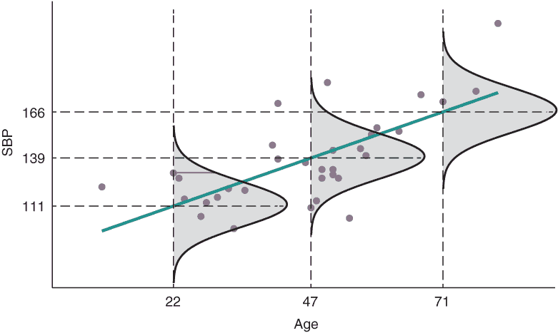

图 5.2 展示了血压例子的散点图和回归模型。钟形曲线是结果 SBP（收缩压）的条件概率分布（CPD），它是基于观测值 *x*（年龄）的。实线水平条的长度表示 22 岁女性观测到 SBP 为 131 的似然性。

如果你假设标准差是常数，那么损失函数的推导就变得相当简单。这是因为当最小化负对数似然（NLL）时，你可以忽略所有依赖于标准差的部分。经过一些推导后，发现最小化平均 NLL 与最小化平均均方误差（MSE）是相同的（参见第四章侧边栏“基于 MaxLike 的线性回归中 MSE 损失的推导”）：

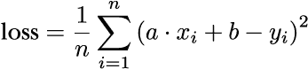

其中 *x* 是我们例子中的年龄。在斜率和截距优化后，你可以从残差中推导出常数标准差。你需要知道这个标准差来得到一个具有已知 CPD *P*(*Y*|*X* = *x*) = *N*(*y* ; *μ**[x]* , *σ*) 的概率模型，这允许你确定观测结果的似然性。

但如果你想让标准差依赖于*x*，损失函数的推导会变得更加复杂。在最小化 NLL 时，依赖于方差的似然中的项不能再被忽略。结果损失不再是 MSE，而是一个更复杂的表达式（推导过程见第四章侧边栏“基于 MaxLike 的线性回归中 MSE 损失的推导”）：4

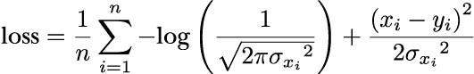

这在 Keras 中不是一个标准的损失函数；因此，你需要定义一个自定义损失函数，然后将其编译到模型中。在第四章中，你看到了如何推导 NLL 以及如何使用自定义损失函数。手动做这件事可以让你对整个拟合过程有一个很好的理解和完全的控制。但这也可能是容易出错的，并且并不真正方便。因此，你现在将了解 TFP，它可以大大促进你的工作。

TFP 允许你专注于模型部分。在概率模型中思考时，你试图找到一个预测模型，该模型对新数据预测 CPD，并赋予观察到的结果高似然。因此，为了衡量概率模型的性能，你使用观察数据的联合似然。因此，你使用负对数似然作为概率模型“坏度”的度量，这也是为什么你使用 NLL 作为损失函数的原因。

请参阅图 5.2，其中 CPD 是一个具有常数方差σ的正态*N*(*μ**[x]*, *σ*)分布的例子。参数由*μ**[x]* *= a · x + b* 模型，这是其标准形式的线性回归。

你将在本章后面看到，对于其他任务，如使用低平均计数建模离散计数数据，正态分布并不是最佳选择。你可能想为 CPD 选择另一个分布族；例如，泊松分布。在 TFP 框架内，这并不是什么大问题。你可以简单地更改分布。你将在本章的几个示例中看到如何做到这一点。

|  | 实践时间 打开[`mng.bz/zjNw`](http://mng.bz/zjNw) 。在阅读时逐步查看笔记本。 |
| --- | --- |

由于概率分布是捕捉概率模型中不确定性的主要工具，让我们来看看如何使用 TFP 分布。TFP 提供了一系列快速增长的分布。正态分布是你可能最熟悉的分布族，所以让我们从定义 TFP 中的正态分布开始（参见列表 5.1）。我们将从中采样，然后确定采样值的似然。

列表 5.1 使用 TFP 正态分布

```
import tensorflow_probability as tfp
tfd = tfp.distributions
d = tfd.Normal(loc=[3], scale=1.5)     ❶ 
x = d.sample(2)                        ❷ 
px = d.prob(x)                         ❸ 
print(x)
print(px)
```

❶ 创建一个均值为 3，标准差为 1.5 的一维正态分布

❷ 从正态分布中采样两个实现

❸ 计算定义的正态分布中每个采样值的似然

您可以使用 TFP 分布用于不同的目的。请参阅表 5.1 和笔记本，了解您可以应用于 TFP 分布的一些重要方法。

表 5.1 TFP 分布的重要方法 a

| TensorFlow 分布的方法 | 描述 | 在`dist = tfd.Normal(loc=1.0, scale=0.1)`上调用方法时的数值结果 |
| --- | --- | --- |
| `sample(n)` | 从分布中采样 n 个数字 | `dist.sample(3).numpy()``array([1.0985107, 1.0344477, 0.9714464], dtype = float32)`注意，这些是随机数。 |
| `prob(value)` | 返回值的似然（对于连续结果的模型的情况是对数概率密度）或概率（对于离散结果的模型的情况） | `dist.prob((0,1,2)).numpy()``array([7.694609e-22, 3.989423e+00, 7.694609e-22], dtype = float32)` |
| `log_prob(value)` | 返回值的对数似然或对数概率 | `dist.log_prob((0,1,2)).numpy()``array([-48.616352, 1.3836466, -48.616352], dtype = float32)` |
| `cdf(value)` | 返回累积分布函数（CDF），这是给定值（张量）的总和或积分 | `dist.cdf((0,1,2)).numpy()``array([7.619854e-24, 5.000000e-01, 1.000000e+00], dtype = float32)` |
| `mean()` | 返回分布的均值 | `dist.mean().numpy()`1.0 |
| `stddev()` | 返回分布的标准差 | `dist.stddev().numpy()`0.1 |
| a 更多方法，请参阅 [`mng.bz/048p`](http://mng.bz/048p) 。 |

## 5.3 使用 TFP 建模连续数据

在本节中，您将使用 TFP 进行线性预测模型。您将调整线性模型以最佳地拟合显示相当复杂变异性的数据。

在进行第一次模型选择实验时，最好从一些可以完全控制数据结构的模拟数据开始。您可以通过将模拟数据随机分成三部分来获取训练、验证和测试数据，然后锁定测试数据。可视化合成训练和验证数据表明它看起来有点像鱼（见图 5.3）。测试数据不应被触及；您甚至不应查看它！图 5.3 没有显示测试数据。如果您得到这些数据并手动尝试在数据上绘制平滑曲线，您可能会得到一条直线。但还有更多需要注意的事情：数据的可变性不是一个常数，而是在*x*范围内变化的。在本章和下一章中，您将学习如何设置考虑这些特性的概率模型。

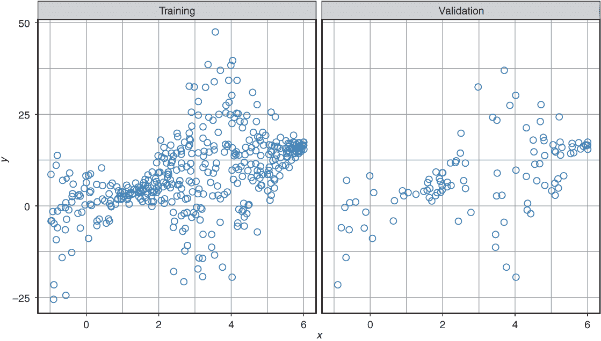

图 5.3 合成数据集的训练（左）和测试（右）数据的可视化

### 5.3.1 使用恒定方差拟合和评估线性回归模型

假设你想要为图 5.3 所示的数据开发一个概率预测模型。在检查数据后，第一个想法是采用线性模型。让我们使用 TFP 框架来设置一个概率线性回归模型（见列表 5.2）。为此，你选择一个正态分布 *N*(*μ**[x]*, *σ*[2]) 作为 CPD。

假设我们考虑标准的线性回归设置，其中只有参数 *μ* *x* 依赖于输入 *x*，并且标准差是一个常数。在 TFP 中如何处理常数标准差？你在第四章中看到（见标题为“基于 MaxLike 的线性回归 MSE 损失的推导”的侧边栏）恒定方差值不会影响线性模型的估计。因此，你可以自由选择任何恒定方差值；例如，当使用 `tfd.Normal``()` 时选择 1（见列表 5.2）。相应地，你的神经网络只需要估计参数 *μ* *x* 的一个输出。

TFP 允许你混合 Keras 层与 TFP 分布。你可以通过 `tfp.layers.DistributionLambda` 层将神经网络的输出与一个分布连接起来。这个层接受两个东西：一个分布及其参数的值。从技术上讲，像 `tf.distributions.Normal` 这样的分布是 `tf.distributions.Distribution` 的一个实现。因此，你可以调用表 5.1 中显示的方法。分布参数（如正态分布的 loc (*μ*) 和 scale (*σ*)）由前一层的值给出。

在列表 5.2 中，你看到如何使用 `tfp.layers.DistributionLambda` 层来构建 CPD *P*(*y*|*x*, *w*)。在这里，我们选择一个具有位置参数 *μ* *x* 的正态分布 *N*(*μ**[x]*, *σ*[2])，该参数依赖于 *x*，以及一个固定尺度参数 *σ**[x]* = 1。相应的 NLL 直接由 CPD 分配给观察到的结果 y 的概率给出：-log(*P*(*y*|*x*, *w*)）。因为 `tfp.layers.DistributionLambda` 的结果 `distr` 是 `tfd.Distribution` 类型，这转化为 -distr.log_prob(*y*)（见表 5.1 的第二行）。因此，TFP 让你免于推导和编程适合你模型的适当损失函数。

列表 5.2 使用 TFP 进行具有常数方差的线性回归

```
from tensorflow.keras.layers import Input
from tensorflow.keras.layers import Dense
from tensorflow.keras.layers import Concatenate
from tensorflow.keras.models import Model
from tensorflow.keras.optimizers import Adam

def NLL(*y*, distr): 
  return -distr.log_prob(*y*)                                ❶ 

def my_dist(params):                                       ❷ 
  return tfd.Normal(loc=params, scale=1)
# set the sd to the fixed value 1

inputs = Input(shape=(1,))
params = Dense(1)(inputs)                                  ❸ 

dist = tfp.layers.DistributionLambda(my_dist)(params)      ❹ 
model_sd_1 = Model(inputs=inputs, outputs=dist)            ❺ 
model_sd_1.compile(Adam(), loss=NLL)                       ❻ 
```

❶ 在拟合分布 distr 下计算观察到的 *y* 的 NLL

❷ 使用最后一层的输出（params）作为分布的参数

❸ 设置具有一个输出节点的神经网络

❹ 调用一个分布层以使用参数 params 调用函数 my_dist

❺ 将神经网络的输出与一个分布连接起来

❻ 使用 NLL 作为损失函数编译模型

在列表 5.2 中的 TFP 代码中，你已经拟合了一个线性回归模型。但它是概率模型吗？概率模型需要为每个输入*x*提供整个 CPD。在高斯 CPD 的情况下，这不仅需要估计均值*μ* *x*，还需要标准差*σ*。在标准的线性回归情况下，方差是独立于*x*位置选择的常数。在这种情况下，我们可以通过残差的方差来估计*σ*[2]。这意味着你首先需要拟合线性模型，然后才能确定用于所有 CPD 的方差。

现在，你已经准备好使用训练好的模型对你的验证数据进行一些概率预测。对于每个测试点，你将预测一个高斯 CPD。为了可视化模型在验证数据上的表现，你可以绘制验证数据以及 CPD 预测的均值，*μ* *x*（见图 5.4 中的实线），以及 CPD 均值加减两倍标准差的位置，*μ**[x[i]]* *± 2* ⋅ *σ**[x]*，对应于 0.025 和 0.975 分位数（见图 5.4 中的虚线）。

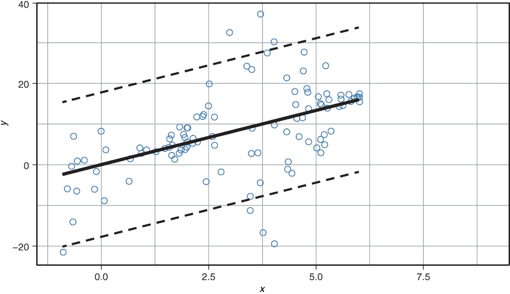

图 5.4 线性回归的合成验证数据以及预测的概率模型，这与没有隐藏层的 NN 相同。CPD 的均值μx 由 NN 建模，标准差假设为常数。黑色实线表示μxi 的位置，虚线表示 0.025 和 0.975 分位数的位置。

|  | 实践时间 打开 [`mng.bz/zjNw`](http://mng.bz/zjNw) 。逐步执行代码以解决练习 1，并在阅读时跟随代码。

+   使用 TFP 来拟合具有常数标准差的线性模型。

+   哪个常数标准差会产生最低的验证 NLL？

|

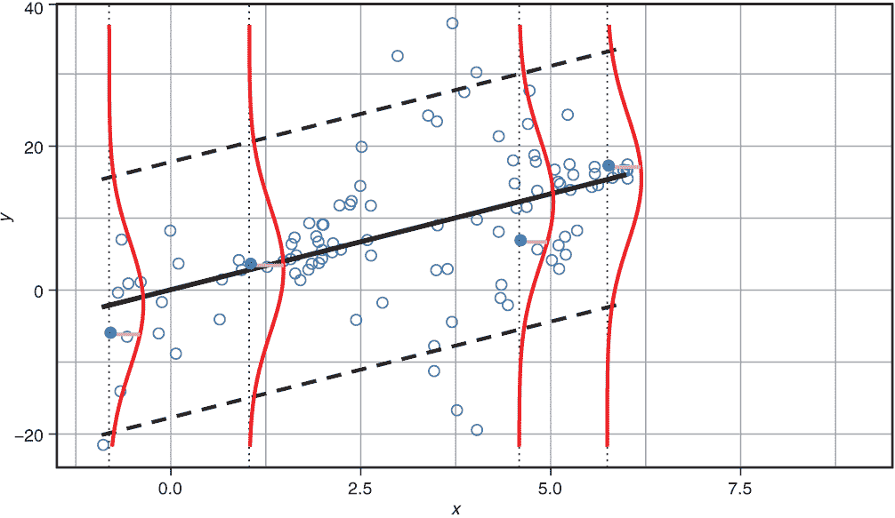

图 5.5 验证数据以及预测的高斯 CPDs。使用的模型是具有常数数据变异性的线性模型（见列表 5.2）。黑色实线表示均值的定位，虚线表示 0.025 和 0.975 分位数的定位。对于四个选定的数据点（实心点），显示了预测的 CPD。相应的似然性由连接点与曲线的实线段表示。

当你视觉上检查拟合（见图 5.4）时，你可能会对均值的定位（黑色实线）感到满意。但结果分布的变化范围并没有被捕捉到。这重要吗？当然重要。为了更好地看到这一点，让我们检查 CPD 与数据分布的匹配程度。

一个匹配的 CPD 可以为观察到的结果分配高似然。为了可视化，让我们为四个随机选择的测试点这样做：(-0.81, -6.14), (1.03, 3.42), (4.59, 6.68), 和 (5.75, 17.06)（见图 5.5 中的填充圆圈）。图 5.5 中选定点*x*的位置由四条虚线垂直线指示。训练好的 NN 从*x*值预测 CPD。你得到四个具有不同均值但相同标准差的高斯分布。每个 CPD 为给定测试点*x**[test]*的输入的所有可能结果*y*提供概率分布：*P*(*y*|*μ**[x[test]]* , *σ*)。CPD 分配给实际观察到的*y**[test]*的似然由连接填充点与曲线的横线表示：*P*(*y**[test]*|*μ**[x[test]]* , *σ*)。

在第一次查看图 5.5 时，模型似乎为真实结果分配了合理的似然。为了量化这一点，你可以确定每个测试点分配给真实观察的似然，并通过验证集中所有点的平均 NLL 来总结，在这种情况下：5

NLL(恒定标准差模型) = 3.53

你如何得到一个能更好地预测高斯 CPD 的模型？记住，模型越好，验证集的 NLL（负对数似然）就越低。对于给定的标准差，一个点如果位于高斯 CPD 的中心，就会得到最优似然。好的，四个选定的点（见图 5.5）实际上并不位于它们 CPD 的中心。如果那样的话，它们会位于粗体线上，但它们相当接近。高斯的一个第二个调整参数是标准差。

### 5.3.2 使用非恒定标准差的线性回归模型进行拟合和评估

让我们尝试为考虑数据变化分布的合成数据获得更好的预测模型（见图 5.3）。你如何调整你的模型以允许具有非恒定标准差的高斯 CPD？没问题！只需允许模型学习数据变化！你仍然假设正态分布作为 CPD，但这次你想要学习两个参数。

NN 的输出原则上可以取从负无穷大到正无穷大的任何值。确保标准差始终为正的一种方法是将 NN 的输出通过指数函数。我们之前已经这样做过了。一种流行的替代方法是使用`softplus`函数。在图 5.6 中，你可以看到`softplus`函数在指数(`exp`)函数旁边。与指数函数不同，`softplus`函数在大的*x*值上线性增加。

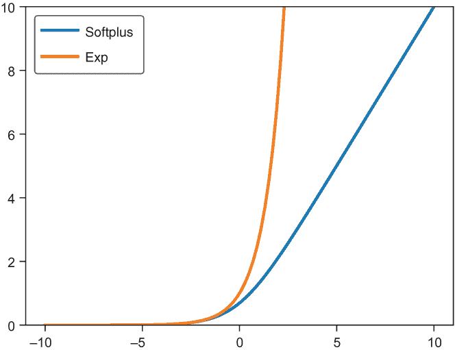

图 5.6 `softplus`函数与指数(`exp`)函数的比较。这两个函数将任意值映射到正值。

这只需要对我们 TFP 代码进行微小改动。现在你有两个输出节点（见列表 5.3 中的第 5 行），并且你告诉分布层由 NN 推导出的位置和尺度参数。

列表 5.3 用于线性回归的非常数方差浅层 NN

```
def NLL(*y*, distr):
  return -distr.log_prob(*y*)                                ❶ 
def my_dist(params): 
  return tfd.Normal(
loc=params[:,0:1],                                         ❷ 
scale=1e-3 +                                               ❸ 
tf.math.softplus(0.05 * params[:,1:2]))                    ❸ 

inputs = Input(shape=(1,))
params = Dense(2)(inputs)                                  ❹ 
dist =   tfp.layers.DistributionLambda(my_dist)(params)    ❷❸
model_monotoic_sd = Model(inputs=inputs, outputs=dist)
model_monotoic_sd.compile(Adam(learning_rate=0.01), loss=NLL)
```

❶ 计算模型的 NLL

❷ 第一个输出节点定义了均值（loc）。

❸ 第二个输出通过软加函数定义了标准差（尺度）。为了确保尺度非负，添加了一个小的常数。

❹ 设置具有两个输出节点的 NN

让我们显示拟合的模型以及数据（见图 5.7）。但这并不是你期望的结果！确实，方差在整个*x*范围内并没有被建模为常数。但虚线，表示*μ**[x[i]]* *± 2* ⋅ *σ**[x]*，只是大致遵循潜在的数据变异性。

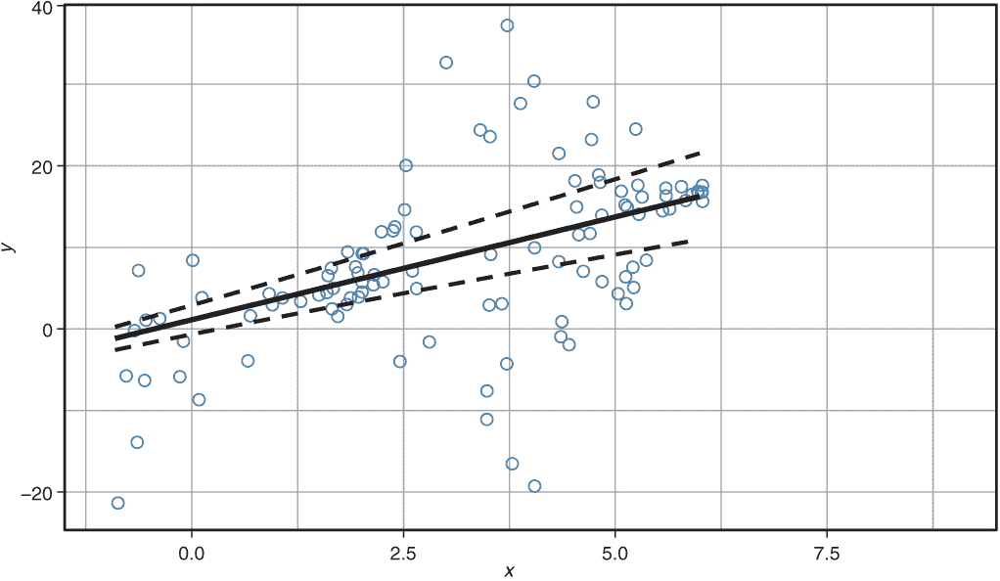

图 5.7 合成验证数据以及预测的概率模型，其中 CPD 的均值和标准差由没有隐藏层的 NN 建模。黑色实线表示均值的位臵，虚线表示 0.025 和 0.975 分位数的位置。

你能猜到发生了什么吗？让我们看看列表 5.3 中的代码，并思考所使用的没有隐藏层的 NN 架构。输出层的两个节点线性依赖于输入：out[1] = *a* ⋅ *x* + *b* 和 out[2] = *c* ⋅ *x* + *b*。在列表 5.3 中可以看到，第一个输出给出了`loc`参数的值，第二个输出通过`softplus`函数来确定`scale`参数。因此，标准差仅单调地依赖于输入，这意味着拟合的标准差不可能遵循数据的非单调方差结构。你可以通过平均验证 NLL（见标题为“结果：单调方差”的笔记本）来量化预测性能：

NLL(单调方差) = 3.55

这与使用常数方差得到的价值 3.53 相当。你可能会期望“单调方差”模型有更好的表现，或者至少是相等的性能，因为这个模型更灵活，并且也能够学习到常数方差（即“常数方差”模型）。因此，性能的小幅下降表明略微过拟合，意味着训练集偶然显示出略微增加的方差。

你如何改进模型？你需要允许标准差以更灵活的方式依赖于 *x*。在上一个章节中，你看到了深度学习实现灵活性的简单配方：堆叠更多层。如果你只是在输入和两个输出节点之间引入一个隐藏层，你也会允许均值以非线性的方式依赖于 *x*。你实际上并不想这样做，因为那样你就不会得到线性回归模型了。但你可以选择一个直接将输入与控制均值的第一个输出（out1）连接的架构，并在输入和第二个输出（控制标准差）之间放置一个或多个隐藏层（见图 5.8）。

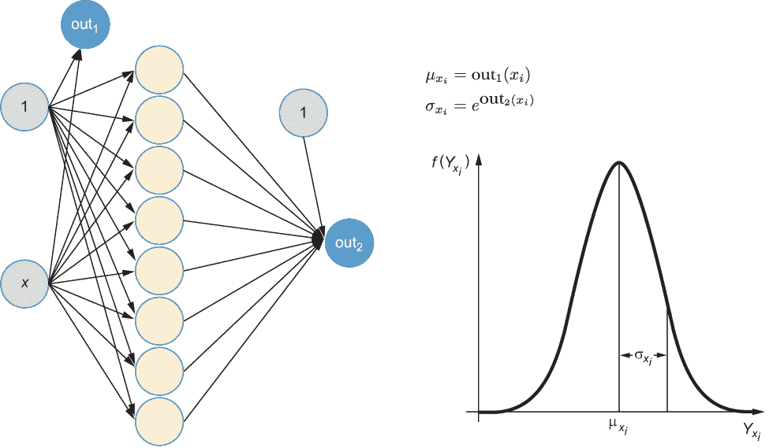

图 5.8 一个神经网络架构（左）用于高斯 CPD 的两个参数 μx, *σ*x。第一个输出（out1）确定 CPD 的均值 μx，该均值线性依赖于 *x*。第二个输出（out2）控制 CPD 的标准差 *σ*x，该标准差以灵活的方式依赖于 *x*。在列表 5.4 的笔记本中，有三个隐藏层。

要在图 5.8 中编码架构，你可以使用 TFP 和 Keras。Keras 的功能性 API 在编码复杂架构时提供了更大的灵活性，其中不同的输出节点可以以非常不同的方式从输入中计算。但这要求你将每个层的输出保存到张量变量中，并定义（对于每个层）它接收哪个张量作为输入（参见列表 5.4）。图 5.8 中所示的架构对应于列表 5.4 中所示的代码，其中你选择了三个隐藏层：一个有 30 个节点，两个有 20 个节点，位于输入和第二个输出之间。

列表 5.4 使用具有隐藏层的神经网络进行具有非恒定方差的线性回归

```
def NLL(*y*, distr):
  return -distr.log_prob(*y*) 
def my_dist(params): 
  return tfd.Normal(loc=params[:,0:1], 
scale=1e-3 + 
tf.math.softplus(0.05 * params[:,1:2]))

inputs = Input(shape=(1,)) 
out1 = Dense(1)(inputs)                                ❶ 
hidden1 = Dense(30,activation="relu")(inputs)
hidden1 = Dense(20,activation="relu")(hidden1)
hidden2 = Dense(20,activation="relu")(hidden1)
out2 = Dense(1)(hidden2)                               ❷ 
params = Concatenate()([out1,out2])                    ❸ 
dist = tfp.layers.DistributionLambda(my_dist)(params) 

model_flex_sd = Model(inputs=inputs, outputs=dist)
model_flex_sd.compile(Adam(learning_rate=0.01), loss=NLL)
```

❶ 第一个输出模型化均值；没有使用隐藏层。

❷ 第二个输出模型化分布的扩散；使用了三个隐藏层。

❸ 结合均值和扩散的输出

|  | 实践时间 打开 [`mng.bz/zjNw`](http://mng.bz/zjNw) 。逐步执行代码以解决练习 2 和 3，并在阅读时跟随代码。

+   拟合具有非恒定标准差的线性回归模型。

+   你如何选择最佳模型？

+   预测 CPD 在训练数据范围之外看起来如何？

|

结果的概率拟合显示在图 5.9 中。现在一切看起来都非常完美！平均而言，输入和结果之间存在线性关系，但不同输入的结果变异性不同。这通过图 5.9 中两条虚线的距离反映出来，其中大约 95%的所有数据应该落在其中，而这个模型似乎做到了。此外，对于四个测试点（-0.81, -6.14）、（1.03, 3.42）、（4.59, 6.68）、（5.75, 17.06）预测的 CPD *P*(*y*|*μ**[x[test]]*, *σ*) 和由此产生的似然 *P*(*y**[test]*|*μ**[x[test]]*, *σ*) 看起来现在非常好！就此刻享受一下，适当的高斯 CPD 标准差如何能提高概率模型预测真实结果的似然（比较图 5.5、5.7 和 5.9）。

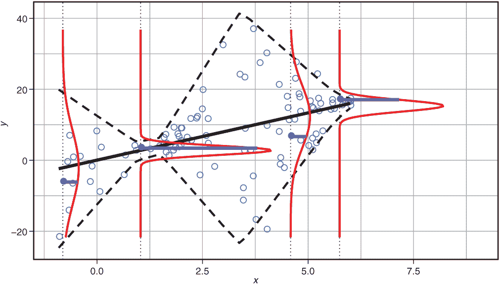

图 5.9 展示了验证数据以及允许灵活数据变异性的线性模型的预测高斯 CPD。黑色实线表示均值的位置，虚线表示 0.025 和 0.975 分位数的位置。对于四个选定的数据点（实心点），显示了 CPD。相应的似然由实线水平线段表示。与图 5.5 比较的动画版本可以在[`mng.bz/K2JP`](http://mng.bz/K2JP)找到。

为了量化预测性能，你可以再次确定验证数据的平均负对数似然（参见笔记本中的“结果：灵活标准差”主题）：

验证平均负对数似然（灵活标准差）= 3.11

根据验证数据的平均负对数似然，你会选择具有灵活高斯 CPD 标准差的最后一个模型作为获胜者。让我们干净利落地完成这项工作，并确保你在报告平均测试负对数似然时避免过拟合陷阱。使用你的获胜模型再次确定平均测试负对数似然，它是

测试平均负对数似然（灵活标准差）= 3.15

让我们回顾并总结一下你学到了什么。如果你想开发一个概率预测模型，你的目标是预测新数据上的正确 CPD。为了评估预测的 CPD 是否确实描述了新数据中结果的分布，你计算了验证数据的平均负对数似然。但 MSE 或平均绝对误差（MAE）这些已建立的性能指标如何？这两个性能指标量化了预测均值（平均）偏离实际观察值的程度。但它们完全忽略了 CPD 的方差，这意味着它们没有评估整个 CPD 的正确性。因此，如果你想评估概率模型的质量，单独报告 MSE 或 MAE 是不合适的。我们建议你始终通过验证负对数似然来报告概率回归模型的性能，并仅提供额外的指标，如验证 MSE 和 MAE（或分类情况下的准确率）。

## 5.4 使用 TensorFlow Probability 模型建模计数数据

在设置概率模型时，最具挑战性的任务是选择正确的分布模型来表示结果。结果的数据类型在这个游戏中起着重要作用。在血压的例子中，结果是连续的。给定一个女性的特定年龄，你通过连续正态分布 *N*(μ , *σ* ) 来建模可能的血压值，该分布有两个参数：均值 *μ* 和标准差 *σ*。在 MNIST 例子中，结果是分类的，你的任务是预测从原始图像中显示数字 0、1、2、3、4、5、6、7、8 或 9 的概率（见第二章）。对 10 个可能的数字的预测概率构成了分类结果分布，这被称为多项式分布，具有 10 个参数 p0, p1, ..., p9，它们的总和为 1。

在本节中，你将学习如何建模计数结果。有许多用例需要建模计数数据；例如，计算给定图像 *x**[i]* 上的 *y**[i]* 人数，或者预测一篇博客文章在未来 24 小时内收到的评论数量，或者根据某些特征 *x**[i]*（如一天中的时间、日期等）在某个小时内发生的交通事故中杀死的鹿的数量。你将有机会进行一项预测交通事故数量的案例研究。我们建议你在学习本节内容时逐步浏览以下笔记本。

|  | 实践时间 打开 [`mng.bz/90xx`](http://mng.bz/90xx) 。逐步浏览笔记本，并尝试理解代码。测试数据上的平均 NLL 绝对误差和线性回归以及泊松回归的 RMSE 是多少？ |
| --- | --- |

让我们从计数数据分析的经典示例开始，该示例来自 [`stats.idre.ucla.edu/r/dae/zip/`](https://stats.idre.ucla.edu/r/dae/zip/)。你的任务是预测在州立公园钓鱼的团体捕获的鱼的数量（*y*）。我们有一个包含 250 个团体的小型数据集，我们称之为露营者数据。这些个人团体参观了州立公园，并提供了以下信息：

+   组里有多少人？

+   组里有多少孩子？

+   这个团体是否带着露营车来公园？

为了设置计数数据的概率模型，你将了解两种只能输出整数的新分布，因此适合计数数据：泊松分布和零膨胀泊松 (*z*IP) 分布。泊松分布有一个参数；ZIP 分布有两个参数。简而言之，你将很快了解它们的含义。要使用这些分布模型之一，通过概率深度学习模型预测计数结果，你遵循标准的 TFP 程序：使用具有适当架构和容量的神经网络将输入转换为预测的 CPD，然后在 TFP 中选择与所选结果预测相对应的分布（见图 5.10）。

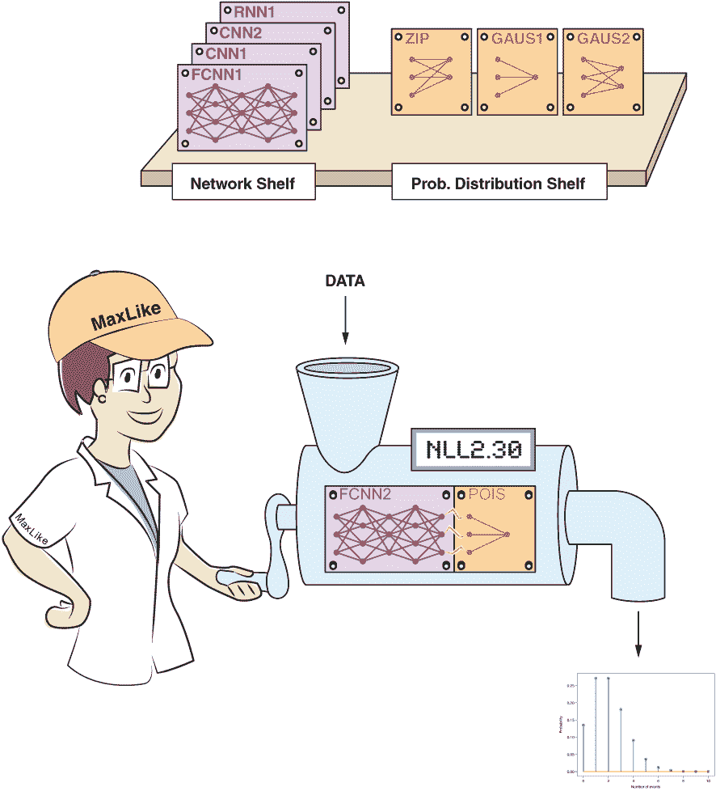

图 5.10 使用概率深度学习进行计数数据建模。网络确定概率分布的参数。使用最大似然原理拟合模型。在示例中，结果是计数数据。这里它通过泊松分布建模，其中 NN 用于控制其速率参数*λ*（参见选定的最后一个带有单个输出节点的板），这给出了平均值和方差。

在学习本章之前，你可能会首先想用标准 NN 和输出节点上的线性激活函数来拟合露营车数据，然后使用 MSE 损失训练 NN。实际上，在这种情况下，许多人使用线性回归模型，但这并不是最佳解决方案！你可以尝试使用笔记本中提供的代码进行这种天真方法：[`mng.bz/jgMz`](http://mng.bz/jgMz)。

为了检查模型的性能，你可以将预测的结果分布与实际结果进行比较。让我们选取测试观察值 31 和 33 的预测结果分布（见图 5.11）。观察值 31 是一个捕获了五条鱼并具有以下特征的群体：使用了活饵，有露营车，四个人，一个孩子。观察值 33 是一个捕获了零条鱼并具有以下特征的群体：使用了活饵，没有露营车，四个人，两个孩子。观察 31 和 33 的预测 CPD 显示，观察到的结果（五条鱼和零条鱼）在这两个观察中都有相当好的可能性（图 5.11 中的虚线）。但是，根据这些 CPD，捕获负数条鱼也有相当高的可能性。常识告诉你，捕获-2 条鱼是非常不可能的。计数数据的线性回归模型的另一个问题是，预测的结果分布是连续的，但可能捕获的鱼的数量是整数——你不能捕获半条鱼。

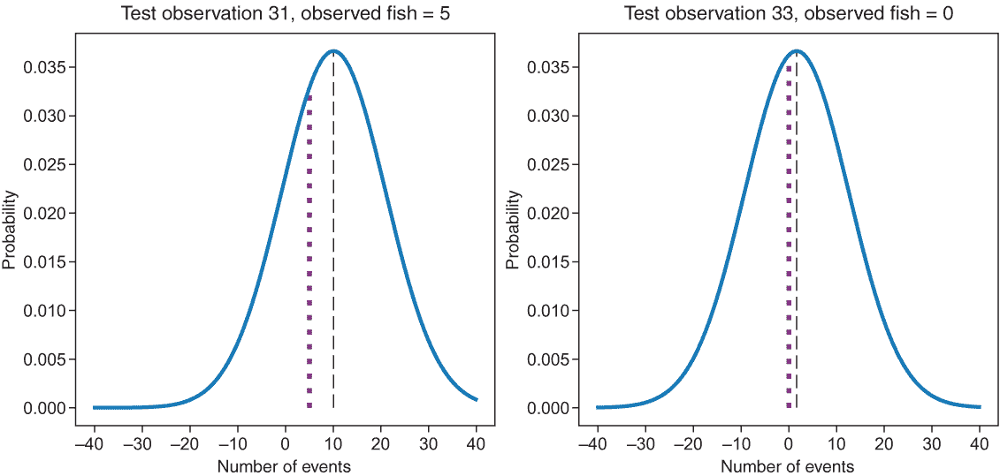

图 5.11 露营车数据中测试观察值 31（左）和 33（右）的预测正态分布。虚线表示预测均值的位臵。粗虚线表示观察到的结果的似然性：31（捕获五条鱼）和 33（*z*ero 条鱼捕获）。

为了在一个图表中同时比较观察结果与所有测试点的预测 CPD，你需要在每个测试点绘制一个 CPD。这样的图表看起来会相当拥挤。而不是整个 CPD，图 5.12 只显示了均值（实线）、2.5%（下虚线）和 97.5%分位数（上虚线）来表征它。由于多个特征，不再可能将特征放在横轴上（如简单线性回归中）。相反，预测的 CPD 均值被绘制在横轴上。图 5.11 中显示的 31 号和 33 号观测值被突出显示。再次，预测捕获的鱼数量为负的问题显而易见。下虚线低于零，甚至代表预测捕获的鱼数量均值的实线在某些区域也低于零。此外，在拟合良好的情况下，实线应该穿过观察数据点的均值，这显然不是情况。该图表只显示了观察数据，而不是其均值，但仍然可以看出预测的均值（高达 8）大于数据平均值。此外，由虚线表示的 95%预测区间对于预测的少量鱼来说似乎不合理地大。


图 5.12 线性回归展示了预测 CPD 与观察数据的比较。测试露营者数据中观察到的捕获的鱼数与预测的捕获鱼数均值进行比较。实线描述了预测 CPD 的均值。虚线代表 0.025 和 0.975 分位数，形成 95%预测区间的边界。突出显示的点对应于捕获零条鱼的观测值 33（左侧）和捕获五条鱼的观测值 31（右侧）。

假设高斯 CPD 进行线性回归显然存在一些缺陷。但哪种分布更合适呢？这正是问题所在！即使意识到你正在处理计数数据，也有不同的计数数据选项。在最简单的情况下，计数数据可以用泊松分布来描述。

### 5.4.1 计数数据的泊松分布

在深度学习之前的时代，大约在 1900 年，拉迪斯拉夫·冯·博特基维茨（Ladislaus von Bortkiewicz）想要模拟普鲁士军队 14 个骑兵军团每年被马踢死的士兵数量。作为训练数据，他们有 20 年的数据。在他的第一本统计学著作《小数定律》（Das Gesetz der kleinen Zahlen）中，他使用泊松分布来模拟每年被马踢死的士兵数量，这种分布是以西莫恩·德尼·泊松（Siméon Denis Poisson）的名字命名的。为了使我们的讨论不那么血腥，每分钟桶中的雨滴数量也可以用泊松分布来模拟。或者，在我们的情况下，每个州立公园露营者小组捕获的鱼的数量。在所有这些例子中，你计算每单位的事件数量；这些单位通常是时间单位，但也可以是其他单位，如每 10 万居民中的谋杀案数量。

在现实生活中，我们经常不得不处理随机性，并且每次（单位）观察到的事件数量并不总是相同的。但让我们假设平均每单位发生两个事件（每年每支部队两个阵亡士兵、每分钟桶中的两个雨滴或每次停留捕获的两个鱼）。图 5.13 展示了可能观察到的结果的概率分布。事件数量的平均值是确定分布的唯一所需信息（见方程 5.1）。这种分布为每个可能的结果分配一个概率：观察到一个单位零事件、一个单位一个事件、两个单位的事件，等等。因为它是一个概率分布，所有概率的总和为 1。

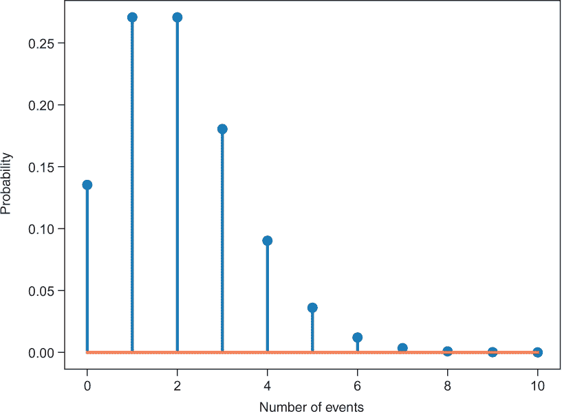

图 5.13 表示，在平均每单位发生两个事件（两个阵亡士兵、两个桶中的雨滴或两次捕获的鱼）的情况下，观察到一或两个事件的可能性相当高。这种概率分布来自笔记本 [nb_ch05_02.ipynb](http://nb_ch05_02.ipynb)。

图 5.13 显示，每（时间）单位发生两个事件的可能性相当高，超过 0.25，但其他可能的结果也有一定的概率。事件数量的平均值起着重要作用，因为它定义了泊松分布的唯一参数，通常称为速率，通常用符号 *λ* 表示。在我们的情况下，*λ* = 2，但 *λ* 是每单位事件数量的平均值，因此 *λ* 不总是整数。如果你好奇，泊松分布有一个公式，定义了计数事件的可能值 k 的每个值的概率。观察到的概率是

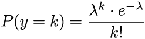

其中 k! 表示 k 的阶乘（*k* ! = 1 ⋅ 2 ⋅ 3⋅ ... ⋅ *k*）。请注意，与高斯 *P*(*y* = *k*) 相比，我们现在有一个实际的概率，而不仅仅是密度（如高斯）。为了强调这一点，有时它也被称为概率质量函数。泊松分布的一个显著特性是 *λ* 不仅定义了分布的中心（期望值），还定义了方差。因此，事件的平均数 *λ* 是固定分布所需的所有内容。

在这个列表中，你可以看到如何使用 TFP 来建模泊松分布。

列表 5.5 TFP 中的泊松分布

```
dist = tfd.poisson.Poisson(rate = 2)       ❶ 
vals = np.linspace(0,10,11)                ❷ 
p = dist.prob(vals)                        ❸ 
print(Dist.mean().numpy())                 ❹ 
print(Dist.stddev().numpy())               ❺ 
```

❶ 速率参数为 2 的泊松分布

❷ 图 5.13 中 x 轴的整数值从 0 到 10

❸ 计算值的概率

❹ 均值，得到 2.0

❺ 标准差，得到 sqrt(2.0) = 1.41 ...

现在你已经有一个适合计数数据的适当分布。我们使用神经网络估计分布的参数 `rate`。我们使用一个非常简单的网络，没有隐藏层，其任务是预测一个泊松 CPD，只需要确定 `rate` 参数。泊松分布中的参数 `rate` 是零或一个正实数。因为具有线性激活的神经网络的输出可能是负数，所以我们使用指数函数作为激活函数，在将其用作速率之前。（你也可以选择使用 softplus 激活，如果你愿意的话。）这个网络在下面的列表中显示。

列表 5.6 简单的泊松回归用于捕获的鱼的数量

```
inputs = Input(shape=(X_train.shape[1],))  
rate = Dense(1,                                           ❶ 
         activation=tf.exp)(inputs)                       ❷ 
p_y = tfp.layers.DistributionLambda(tfd.Poisson)(rate)    

model_p = Model(inputs=inputs, outputs=p_y)               ❸ 

def NLL(*y*_true, y_hat):                                   ❹ 
  return -y_hat.log_prob(*y*_true)

model_p.compile(Adam(learning_rate=0.01), loss=NLL)
model_p.summary()
```

❶ 我们使用输出的指数来建模速率。

❷ 定义一个具有一个输出的单层

❸ 将神经网络和输出层粘合在一起。注意，输出 p_y 是一个 tf.distribution。

❹ 第二个参数是模型的输出，因此是一个 TFP 分布。它就像调用 log_prob 来计算所需计算 NLL 的观察值的对数概率一样简单。

如果你已经逐步通过了笔记本中的代码，你会注意到使用泊松分布的解决方案比使用线性回归要好。泊松回归的均方根误差（RMSE）大约为 7.2，低于线性回归的 8.6。但更重要的是，泊松回归的 NLL 为 2.7，而线性回归为 3.6，因此要低得多。

让我们更仔细地看看泊松预测的结果，并使用拟合的泊松模型来预测测试观察值 31 和 33 的 CPD（见图 5.14）。观察值 31 和 33 的预测结果分布分别是速率[31] = 5.56 和速率[33] = 0.55 的泊松分布。对于两个观察值（五条鱼和零条鱼）的观测结果，似然度相当好（图 5.11 中的虚线）。

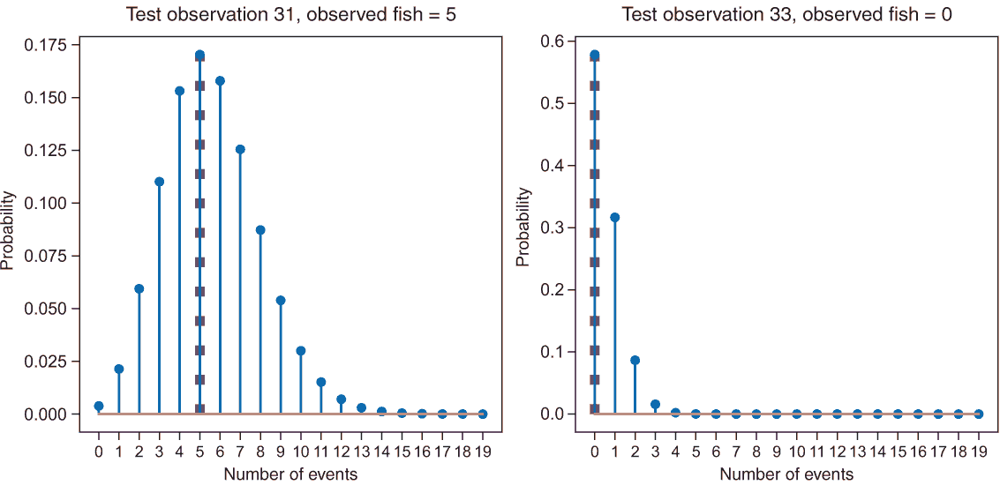

图 5.14 测试观测值 31（左）和 33（右）的预测泊松分布。粗虚线表示观测结果的似然性。

要在一个图表中同时比较所有测试点的观测结果与预测的 CPD，你可以再次绘制观测到的鱼的数量与预测的鱼的平均数量的对比图（见图 5.15），并将预测 CPD 的平均值用实线表示，预测 CPD 的 2.5%和 97.5%分位数用虚线表示。你可能想知道为什么分位数曲线不光滑，但在预测 CPD 的位置取整数值（见图 5.15 的右侧面板）。答案在于泊松分布的本质和分位数的定义：泊松模型只能为整数值分配概率。例如，97.5%分位数定义为分布中只能为整数的值，对于这个值，97.5%的值都小于或等于这个值。

如何阅读概率模型的诊断图

这里有一些阅读用于评估概率模型性能的诊断图的提示。注意，在图 5.12、5.15 和 5.17 中，观测结果是以预测 CPD 的平均值进行对比（而不是像只有一个变量的简单线性回归那样与输入特征对比）。因为在露营者数据中我们有四个特征，所以不可能使用单个输入特征作为横坐标，图形表示变得更加复杂。还请注意，不同的输入特征组合不仅可以产生相同的 CPD 预测平均值，而且可能具有不同的分位数。在这些情况下，你会在相同的平均值位置上有几个不同的 CPD，但分位数不同，导致在相同的*x*位置上有多个分位数。数据越多，观察到这种情况的概率就越高。在第六章中，你会看到这样的例子。此外，分位数（图中的虚线）的跳跃不是人为的。因为 x 轴不再代表输入变量的平滑变化，这样的跳跃是可能的。同样地，分位数不需要平滑变化（见图 5.17）。分位数不需要显示单调行为的事实已经在简单的线性回归示例中可见（见图 5.9）。CPD 平均值的曲线（图 5.15 中的实线）始终是主对角线，因为它绘制的是平均值与平均值的关系。

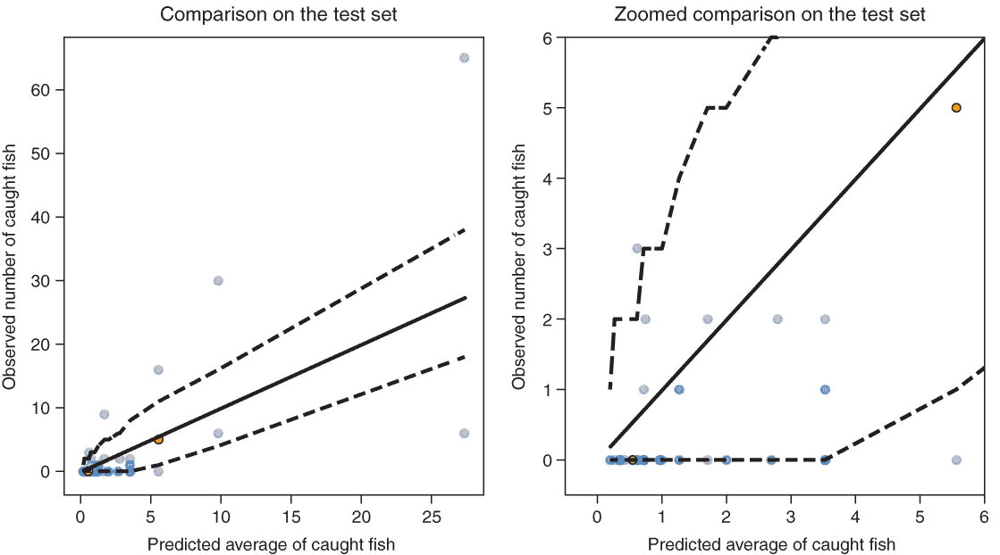

图 5.15 针对露营者示例的泊松回归预测结果。测试样本中捕获的鱼的数量与预测的捕获鱼的平均数量进行对比。为了表示预测的 CPD，实线描绘了 CPD 的平均值。虚线代表 0.025 和 0.975 分位数，从而得到 95%预测区间的边界。

注意，与线性回归模型不同，泊松模型预测的结果分布只分配概率给可以实际观察到的值：捕到的非负整数鱼的数量。在理想概率预测模型的情况下，观察值的平均值应该对应于实线，95% 的所有点应该位于两条虚线之间。根据这些标准，泊松模型似乎相当合理，至少对于大多数数据来说是这样。但仍然，可能还有改进的空间。

看起来有很多组完全没有捕到鱼。怎么会有这么多不幸的渔民呢？我们只能猜测，但也许露营团体只是以钓鱼装备为借口，喝大量的啤酒，根本不去钓鱼。因此，可能有两种原因导致带着零鱼离开州立公园：运气不好或根本不去钓鱼。一个明确考虑那些懒惰渔民的模型是零膨胀模型。我们将在下一节讨论该模型。

### 5.4.2 将泊松分布扩展到零膨胀泊松 (*z*IP) 分布

零膨胀泊松 (*z*IP) 分布考虑了存在许多零的事实，这些零比泊松分布中预期的零的数量要多。在我们的例子中，这些是根本不去钓鱼的懒惰露营团体。在 ZIP 分布中，你可以通过引入零生成过程来模拟零的过剩，如下所示：你掷一枚硬币。硬币有概率 p 显示正面。如果是这样，你有一个懒惰的露营团体，他们捕到的鱼为零。如果不是，你有一个常规的钓鱼团体，你可以使用泊松分布来预测捕到的鱼的数量。为了以 TFP 方式将你的计数数据与 ZIP 结果模型拟合，你设置了一个具有 ZIP 分布的神经网络。

很遗憾，TFP 还没有提供 ZIP 分布。但是，根据现有的 TFP 分布定义一个新的自定义函数相当简单（参见列表 5.7）。ZIP 需要两个参数：

1.  产生额外零的概率 p

1.  泊松分布的速率

ZIP 函数接受来自神经网络的两个输出节点：一个用于速率，一个用于 p。如列表 5.7 所示，我们对输出 `out` 的第一个组件 `out[:,0:1]` 应用指数变换以获得正的速率值，并对神经网络输出 `out_2` 应用 sigmoid 变换以获得 p 的值在 0 到 1 之间。

列表 5.7 ZIP 分布的自定义分布

```
def zero_inf(out): 
    rate = tf.squeeze(tf.math.exp(out[:,0:1]))          ❶ 
    s = tf.math.sigmoid(out[:,1:2])                     ❷ 
    probs = tf.concat([1-s, s], axis=1)                 ❸ 
    return tfd.Mixture(
          cat=tfd.Categorical(probs=probs),             ❹ 
          components=[
          tfd.Deterministic(loc=tf.zeros_like(rate)),   ❺ 
          tfd.Poisson(rate=rate),                       ❻ 
        ])
```

❶ 第一个组件编码速率。我们使用指数函数来保证值大于 0，并使用挤压函数来平坦化张量。

❷ 第二个组件编码零膨胀；使用 sigmoid 函数将值挤压在 0 和 1 之间。

❸ 0 或泊松分布的两个概率

❹ tfd.Categorical 允许创建两个组件的混合。

❺ 零作为一个确定性的值

❻ 从泊松分布中抽取的值

网络随后就变成了一个没有隐藏层和两个输出节点的简单网络。以下列表显示了设置网络的代码。

列表 5.8ZIP 分布前的 NN

```
## Definition of the custom parameterized distribution
inputs = tf.keras.layers.Input(shape=(X_train.shape[1],))  
out = Dense(2)(inputs)                                     ❶ 
p_y_zi = tfp.layers.DistributionLambda(*z*ero_inf)(out)
model_zi = Model(inputs=inputs, outputs=p_y_zi)
```

❶ 一个没有激活的密集层。转换在 zero_inf 函数中完成。

你现在可以使用拟合的 ZIP 模型来预测测试数据集中的观测值的概率分布。让我们使用拟合的 ZIP 模型来预测测试观测值 31 和 33 的 CPD（见图 5.16）。

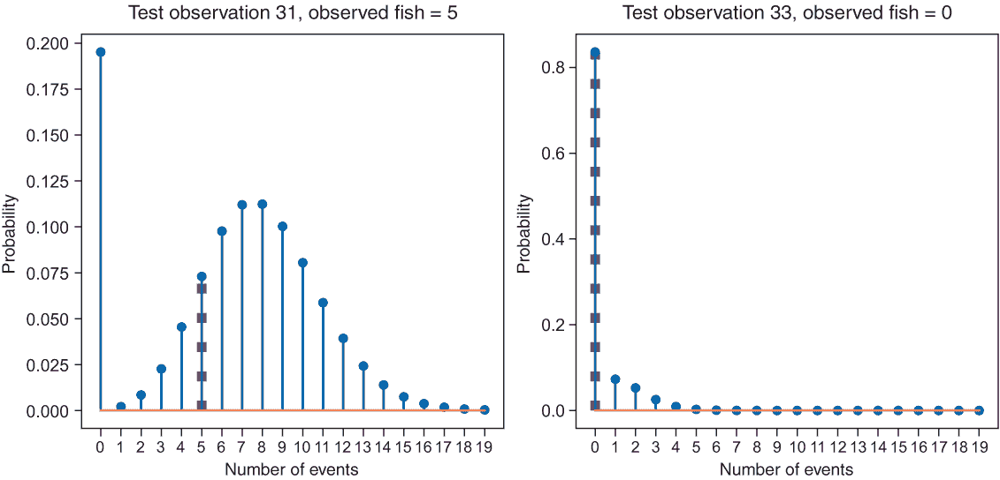

图 5.16 测试观测值 31（左）和 33（右）的预测 ZIP 分布。粗虚线表示观测结果的似然性。

预测 ZIP CPD 最显著的特征是在 0 处有一个大的峰值（见图 5.16）。这是由于零膨胀过程相对于泊松过程模拟了更多的零。观察到的结果（五条鱼和零条鱼）的似然度对于两个观测值都相当好（见图 5.16 中的虚线）。

要在一个图中同时比较所有测试点的观察结果与预测的 CPD，你可以再次绘制观察到的鱼的数量与预测的捕鱼平均数量（见图 5.17）。为了表示预测 CPD 的形状，我们绘制预测 CPD 的平均值（见图 5.17 中的实线）和预测 CPD 的 2.5%和 97.5%分位数（见图 5.17 中的虚线）。在 ZIP 模型中，2.5%分位数在整个范围内保持在零。这意味着对于所有组，预测的 ZIP CPD 将高于 2.5%的概率分配给零这个结果，这与观察到的零的数量很高很好地对应。

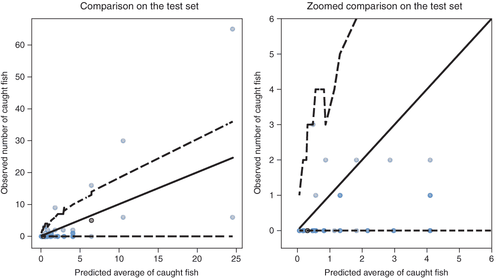

图 5.17 ZIP 模型对露营示例的回归预测结果。测试样本中观察到的捕鱼数量与预测的捕鱼平均数量进行对比。为了表示预测的 CPD，实线表示 CPD 的平均值。虚线代表 0.025 和 0.975 分位数，从而得到 95%预测区间的边界。

在图 5.17 中，观察到的值的平均值似乎接近实线，而 95%的点都位于两条虚线之间。通过测试 NLL 来量化 ZIP 模型的表现，结果表明零膨胀模型优于线性回归和泊松模型（见表 5.2）。

表 5.2 不同模型在验证数据上的预测性能比较。如果你运行笔记本，可能会得到略微不同的值。这里涉及一些随机性，而且数据量不是很多。但整体行为应该大致相同。

|  | 线性回归 | 泊松 | 零膨胀 |
| --- | --- | --- | --- |
| RMSE | 8.6 | 7.2 | 7.3 |
| MAE | 4.7 | 3.1 | 3.2 |
| NLL | 3.6 | 2.7 | 2.2 |

对于拟合渔猎团体的数据，没有明确的共识表明哪个模型是整体上最好的。表 5.2 显示，泊松分布就 RMSE 和 MAE 而言是最好的。ZIP 模型在 NLL 方面表现最佳。但如第 5.2 节所述，为了衡量概率预测性能，您应该使用平均测试 NLL。因此，ZIP 模型是三个模型测试中最好的概率模型。请注意，严格来说，NLL 只应在离散模型（泊松或 ZIP 作为 CPD）之间进行比较，而不应在连续和离散模型（高斯或泊松作为 CPD）之间进行比较。是否有更好的模型？可能存在一个 NLL 更低的模型，但您无法确定。在这个应用中，NLL 没有理论上的下限。

最后，为了完整性，我们想指出，处理计数数据还有第三种方法，那就是使用所谓的负二项分布。像 ZIP 分布一样，它是一个具有两个参数的分布，不仅允许计数均值依赖于输入，还允许计数的标准差依赖于输入。

## 摘要

+   概率模型为每个输入预测一个完整的条件概率分布（CPD）。

+   预测的 CPD 为每个可能的输出*y*分配一个预期的概率。

+   负对数似然（NLL）衡量 CPD 与实际结果分布的匹配程度。

+   当训练概率模型时，您使用 NLL 作为损失函数。

+   您使用 NLL 对新数据进行测量和比较不同概率模型的预测性能。

+   使用合适的 CPD 选择可以增强您模型的性能。

+   对于连续数据，一个常见的选择是正态分布。

+   对于计数数据，常见的分布选择是泊松分布、负二项分布或零膨胀泊松分布（*z*IP）。

1.这个概率可以按以下方式计算：

`   import tensorflow_probability as tfp`

`   dist = tfp.distributions.Normal(loc=22, scale=2)`

`   dist.cdf(25) #0.933`

2.概率可以按以下方式计算：

`   import tensorflow_probability as tfp`

`   dist = tfp.distributions.Normal(loc=19, scale=12)`

`   dist.cdf(25) #0.691`

3.仅为了给您一个证明的思路，在这个证明中，假设数据是从一个真实分布生成的。在实践中，真实分布是未知的。然后可以证明 NLL 是一个所谓的正确得分，只有当预测分布等于真实分布时，它才达到其最小值。

4.与这里提到的第四章（第 4.3 节）中的侧边栏相反，我们除以 n。这是可以的，因为它不会改变最小值的位置。

5.参见标题为“结果：常量 sigma”的笔记本。
