# 6 野外的概率深度学习模型

本章涵盖

+   最先进模型中的概率深度学习

+   现代架构中的灵活分布

+   用于灵活 CPD 的概率分布混合

+   归一化流用于生成如面部图像等复杂数据

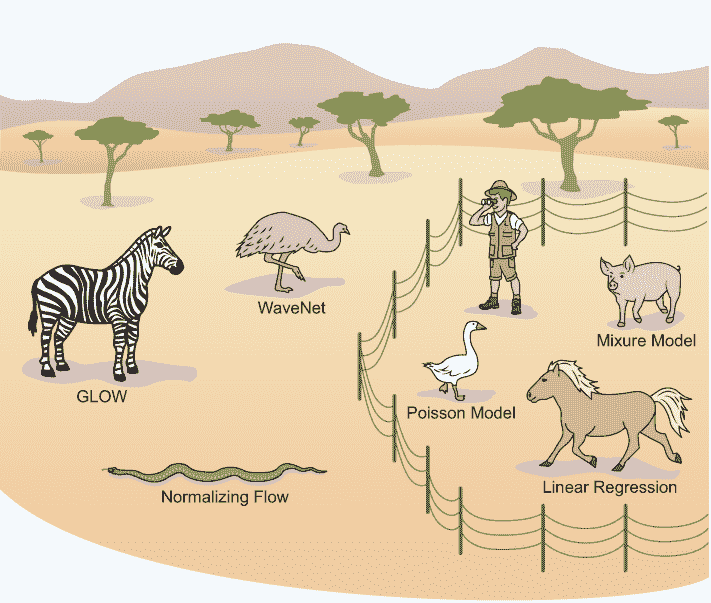

许多现实世界的数据，如声音样本或图像，来自复杂和高维分布。在本章中，你将学习如何定义复杂的概率分布，这些分布可以用来模拟现实世界的数据。在前两章中，你学习了如何设置与易于处理的分布一起工作的模型。你使用具有高斯条件概率分布（CPD）的线性回归模型或具有作为 CPD 的分布的泊松模型进行了工作。（也许你发现自己处于本章顶部的图中，那里有 Ranger 站在一个有家畜的保护区内，但世界上的动物比你到目前为止所工作的动物更野。）你还学习了足够多的关于不同类型的家畜概率模型的知识，以便加入我们，进入处理复杂 CPD 的最先进模型的世界。

模拟复杂分布的一种方式是简单分布的混合，例如正态分布、泊松分布或逻辑分布，这些分布你在前几章中已经了解过。混合模型被用于最先进的网络中，如谷歌的并行 WaveNet 或 OpenAI 的 PixelCNN++，以模拟输出。

+   WaveNet 从文本生成听起来逼真的语音。

+   PixelCNN++生成看起来逼真的图像。

在本章的一个案例研究中，我们给你机会设置自己的混合模型，并使用这些模型超越最近公开描述的预测模型。你还学习了一种模拟这些复杂分布的另一种方法：所谓的归一化流。归一化流（NFs）允许你学习从简单分布到复杂分布的转换。在简单的情况下，这可以通过一种称为变量变换的统计方法来完成。你将在第 6.3.2 节中学习如何应用这种方法，你将看到 TensorFlow Probability（TFP）通过所谓的双射器支持这种方法。

通过将变量变换方法与深度学习相结合，您可以学习到在现实世界应用中遇到的相当复杂和高维的分布。例如，复杂机器的传感器读数是高维数据。如果您有一台正在正常工作的机器，您可以学习相应的“机器正常”分布。学习了这个分布之后，您可以持续检查机器产生的传感器数据是否仍然来自“机器正常”分布。如果传感器数据来自“机器正常”分布的概率低，您可能需要检查这台机器。这种应用被称为新颖性检测。但您还可以进行更多有趣的应用，例如建模人脸图像的分布，然后从这个分布中采样以创建不存在的人的逼真人脸。您可以想象这样的面部图像分布相当复杂。您还会用这个分布做其他有趣的事情，比如给莱昂纳多·迪卡普里奥画一个络腮胡或者在不同人之间进行变形。听起来很复杂吗？好吧，它确实有点复杂，但好消息是它使用的是您迄今为止（以及本书剩余部分将继续使用）所使用的相同原理——最大似然原理（MaxLike）。

## 6.1 先进深度学习模型中的灵活概率分布

在本节中，您将了解如何使用灵活的概率分布来构建深度学习中的先进模型。到目前为止，您已经遇到了不同的概率分布，例如连续变量（美国女性数据中的血压）的正态分布或均匀分布，分类变量（MNIST 数据中的十个数字）的多项分布，或者是计数数据（露营者数据中捕获的鱼的数量）的泊松分布和零膨胀泊松分布（*z*IP）。

定义分布的参数数量通常是分布灵活性的一个指标。例如，泊松分布只有一个参数（通常称为速率）。ZIP 分布有两个参数（速率和混合比例），在第五章中，您看到当使用 ZIP 分布而不是泊松分布作为 CPD 时，您可以为露营者数据实现更好的模型。根据这一标准，多项分布特别灵活，因为它具有尽可能多的参数值（或者更准确地说，少一个参数，因为概率需要加起来等于一）。在 MNIST 示例中，您使用图像作为输入来预测分类结果的多元 CPD。预测的多元 CPD 有十个（或者更准确地说，九个）参数，为我们提供了十个可能类别的概率（见图 6.1）。

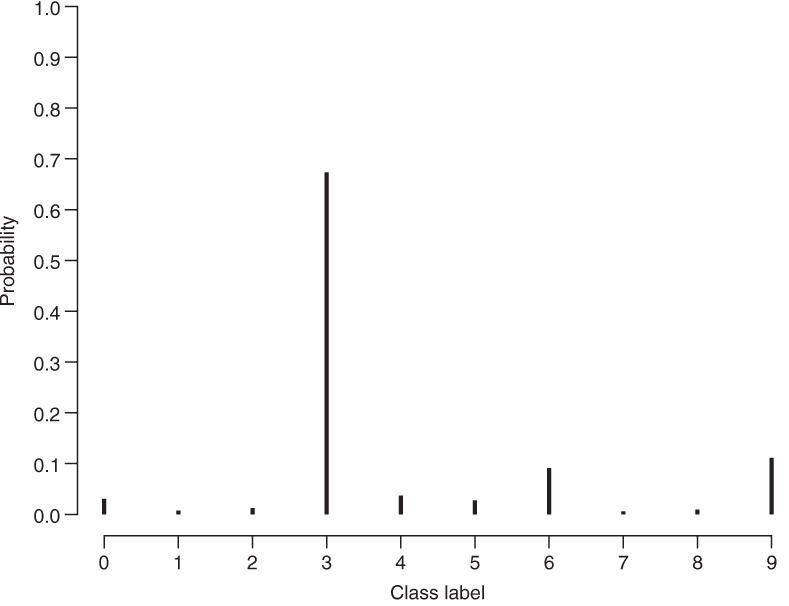

图 6.1 具有十个类别的多项分布：*MN*(*p*[0] , *p*[1] , *p*[2] , *p*[3] , *p*[4] , , *p*[5] , *p*[6] , *p*[7] , *p*[8] , *p*[9])

事实上，在卷积神经网络（CNNs）进行数字分类中使用多项分布已成为深度学习模型在现实世界中的第一个且最广泛使用的应用。1998 年，当时在 AT&T 贝尔实验室工作的 Yann LeCun 实现了一个用于 ZIP 代码识别的 CNN。这被称为 LeNet-5。

### 6.1.1 多项分布作为一种灵活的分布

2016 年，一个需要灵活分布的现实世界任务示例是谷歌的 WaveNet。该模型可以从文本生成听起来非常逼真的合成语音。前往[`cloud.google.com/text-to-speech/`](https://cloud.google.com/text-to-speech/)查看您选择的文本的演示。其架构基于 1D 因果卷积，就像你在 2.3.3 节中看到的那样，以及它们的特殊化形式——扩张卷积，这在笔记本[`mng.bz/8pVZ`](http://mng.bz/8pVZ)中有展示。如果你对架构感兴趣，你可能还想阅读博客文章[`mng.bz/EdJo`](http://mng.bz/EdJo)。

WaveNet 直接在原始音频上工作，通常使用 16 kHz（16 千赫兹）的采样率，即每秒 16,000 个样本。但你也可以使用更高的采样率。对于每个时间点 t 的音频信号，然后进行离散化（通常使用 16 位进行此操作）。例如，时间 *t* 的音频信号 *x**[t]* 取离散值从 0 到 2¹⁶ − 1 = 65,535。但本章有趣的部分是概率部分（来自第五章中图 5.1 右侧的概率架上的内容）。在 WaveNet 中，我们假设 xt 只依赖于时间较早的样本的音频信号。这给我们：

*P*(*x**[t]*) = *P*(*x**[t]*|*x**[t]*[−1] , *x**[t]*[−2] ,... *x*[0])

你可以从如图 6.2 所示的前一个值中采样 xt 值，然后确定未来值的概率分布。这类模型被称为自回归模型。请注意，你查看的是一个概率模型，你可以预测整个可能结果的分布：*P*(*x**[t]*) 这让你能够确定在预测分布下观察到的值 *x**[t]* 的似然或概率。欢迎回家！你可以使用古老的 MaxLike 原理来拟合这类模型。

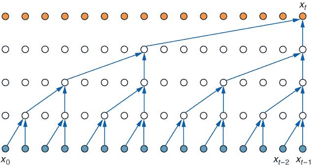

图 6.2 WaveNet 原理。在顶部，时间 t 的离散声音值 xt 被预测为来自时间较早的值（在底部）。前往[`mng.bz/NKJN`](http://mng.bz/NKJN)查看此图的动画版本，展示 WaveNet 如何通过连续应用方程 6.1 来创建未来的样本。

但你选择哪种分布来表示 *P*(*x**[t]*)？结果 *x* 可以取从 0 到 2¹⁶ − 1 = 65,535 的所有离散值。你并不真正知道这些值的分布看起来会是什么样子。它可能不会像正态分布那样；这会暗示有一个典型值，并且结果值的概率会随着距离这个典型值的增加而迅速下降。你需要一种更灵活的分布类型。

在原则上，你可以用多项式分布来表示 65,536 个不同的值，其中你为每个可能的值估计一个概率。这忽略了值的顺序（0 < 1 < 2 < . . . < 65,535），但它确实是灵活的，因为你可以为 65,536 个可能的每个值估计一个概率。唯一的限制是这些预测概率需要加起来等于 1，这可以通过 softmax 层轻松实现。WaveNet 论文的作者 Oord 等人选择了这条路，但在他们这样做之前，他们在对原始声音值进行非线性变换后，将信号的深度从 16 位（编码 65,536 个不同的值）降低到 8 位（编码 256 个不同的值）。总的来说，Deep Mind 的人训练了一个具有 softmax 输出的膨胀因果 1D 卷积神经网络，预测了 256 个类别的多项式 CPD，并将其称为 WaveNet。

现在，你可以从学习到的分布中抽取新的样本。为此，你向训练好的 WaveNet 提供一个音频值的起始序列，*x*[0] ， *x*[1] ， . . .， *x**[t]*[−1] ，然后 WaveNet 将预测一个多项式 CPD：*P*(*x**[t]*) = *P*(*x**[t]*|*x**[t]*[−1] ， *x**[t]*[−2] ，... *x*[0])。然后，从这个多项式 CPD 中采样下一个音频值 *x**[t]* 。你可以通过提供 *x*[1] ， *x*[2] ， . . .， *x**[t]*[−1] 并从结果 CPD 中采样下一个值 *x**[t]*[+1] 来继续这个过程。

让我们来看看另一个突出的自回归模型：OpenAI 的 PixelCNN。这是一个可以根据“之前”的像素预测像素的网络。对于 WaveNet 来说，音频值的顺序仅仅是时间，而对于图像，没有自然的方式来对像素进行排序。例如，你可以像阅读文本一样按文本中的字符顺序排序，从左到右，从上到下读取。然后，这些模型可以根据所有之前的像素 xt'（t' < t）来采样一个特定颜色的像素 xt。你再次拥有与方程 6.1 中相同的结构，其中 xt 现在是一个像素值。

你如何训练这些模型？可以采取与 WaveNet 相同的方法，用 8 位对像素值进行编码，这限制了输出到 256 个可能值，并在 256 个单热编码的分类变量输出上使用 softmax。这确实是在 PixelCNN 中做到的。

一年后，在 2017 年初，OpenAI 的工程师改进了 PixelCNN，这在名为“PixelCNN++：通过离散化逻辑混合似然和其他修改改进 PixelCNN”（见[`arxiv.org/abs/1701.05517`](https://arxiv.org/abs/1701.05517)）的论文中有报道。什么！你不知道“离散化逻辑混合似然”是什么意思？不用担心。你很快就会了解到。现在，让我们仅仅欣赏一下，有了这种新的 CPD，OpenAI 通过测试 NLL 为 2.92，比原始 PixelCNN 的 NLL 3.14 有了改进。在那篇关于 PixelCNN++的论文之后，谷歌工程师也将 WaveNet 增强为并行 WaveNet（见[`arxiv.org/abs/1711.10433`](https://arxiv.org/abs/1711.10433)）。在众多改进中，他们从多项式 CPD 切换到离散化逻辑混合分布作为 CPD。（你稍后会看到这意味着什么。）当设置并行 WaveNet 模型时，这是一项相当多的工作，但现在有了 TensorFlow Probability，它相当简单，你将在下一节中看到。

### 6.1.2 理解离散化的逻辑混合

在这两个应用中，WaveNet 和 PixelCNN，都需要从 0 预测到上限值（通常是 255 或 65,535）。这就像计数数据，但有最大值。为什么不采用像泊松分布这样的计数分布，并钳位最大值呢？在原则上这应该是可以的，但结果证明分布需要更复杂。因此，在论文中使用了分布的混合。PixelCNN++论文中用于混合的分布是离散化的逻辑函数。

让我们展开离散化的逻辑混合。你知道正态分布的密度是钟形，逻辑分布的密度实际上看起来非常相似。图 6.3 展示了左侧具有不同`scale`参数值的逻辑函数密度，以及右侧相应的累积分布函数（CDF）。实际上，逻辑 CDF 与第二章中使用的 sigmoid 激活函数相同。查看以下可选笔记本，了解更多关于逻辑函数的信息。

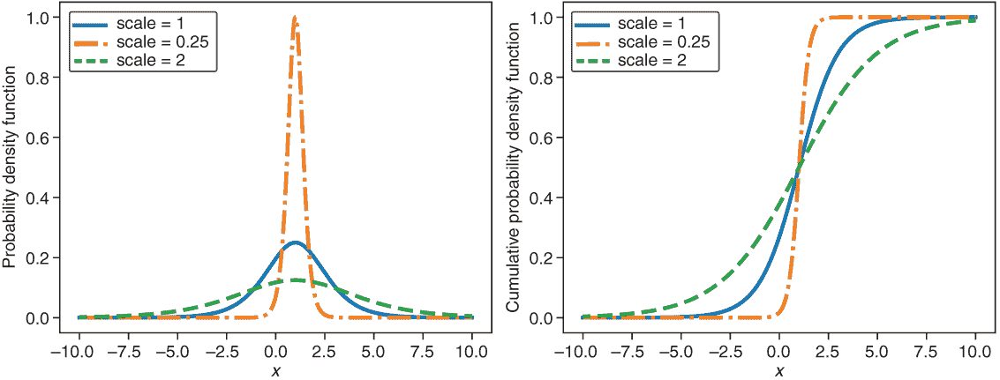

图 6.3 使用 tfd.Logistic(loc=1, scale=scale)创建的三个逻辑函数，`scale`参数的值为 0.25、1.0 和 2.0。左侧是概率密度函数（PDF），右侧是累积概率密度函数（CDF）。

|  可选练习 打开 [`mng.bz/D2Jn`](http://mng.bz/D2Jn) 。笔记本展示了第 6.3、6.4 和 6.5 图以及列表 6.2 的代码。

+   与本文并行阅读。

+   改变分布的参数，看看曲线如何变化。

|

在 WaveNet 和 PixelCNN 模型中，结果是离散的。因此，适当的 CDF 应该模拟离散（而不是连续）值。但是，逻辑分布是用于没有上下限的连续值。因此，我们需要将逻辑分布离散化，并将值夹在可能的范围内。在 TFP 中，可以使用`QuantizedDistribution`函数来完成此操作。`QuantizedDistribution`函数接受一个概率分布（如图 6.4 中的内部分布）并创建其量化版本。附带的笔记本中的可选练习详细说明了使用`QuantizedDistribution`的细节。

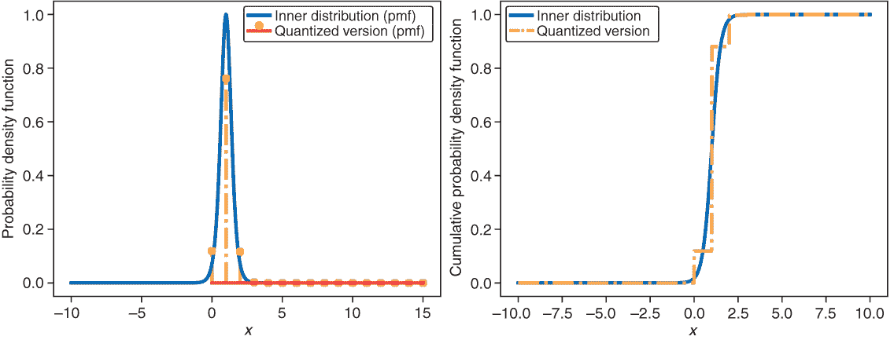

图 6.4 参数`loc=1`和`scale=0.25`的逻辑函数的量化版本

为了处理更灵活的分布，我们混合了几个量化逻辑分布（见图 6.5）。对于混合，可以使用一个类别分布来确定混合的不同分布的权重（混合比例）。以下列表显示了一个示例。

列表 6.1 混合两个量化分布

```
locs = (4.0,10.0)                                        ❶ 
scales = (0.25, 0.5)                                     ❷ 
probs = (0.8, 0.2)                                       ❸ 

dists = tfd.Logistic(loc=locs, scale=scales)             ❹ 
quant = quantize(Dists, bits=4)                          ❺ 
quant_mixture = tfd.MixtureSameFamily(                   ❻ 
    mixture_distribution=tfd.Categorical(probs=probs),   ❼ 
    components_distribution=quant)
```

❶ 将两个基本分布的中心放在 4 和 10

❷ 两个基本分布的扩散

❸ 将第一个分布（在 4.0 处）的 80%和第二个分布的 20%混合

❹ 两个独立分布

❺ 两个独立分布的量化版本

❻ 两个分布的混合

❼ 使用 80%和 20%的类别分布进行混合。

图 6.5 显示了得到的分布。这个分布适用于像素值（在 PixelCNN 的情况下）和声音振幅（在 WaveNet 的情况下）等数据。如果你不混合两个分布，而是混合四个或十个分布，你可以轻松地构建更多更灵活的结果分布。

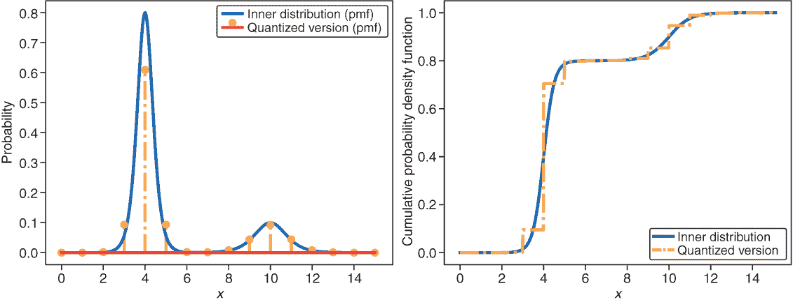

图 6.5 混合两个逻辑分布时得到的离散分布（代码见列表 6.2，用于生成这些图表）

如果你想要在自己的网络中使用这个分布而不是，比如说，泊松分布，你可以从列表 6.2 的末尾复制并粘贴函数`quant_mixture_logistic`。这个函数来自`QuantizedDistribution`的 TensorFlow 文档。

对于每个混合成分，神经网络需要估计三个参数：成分的位置和扩散以及成分的权重。如果你在混合中使用 num 个逻辑分布成分，那么神经网络的输出需要具有 3 · num 个输出节点：每个成分三个，分别控制位置、扩散和权重。请注意，函数`quant_mixture_logistic`期望一个没有激活的输出（在 Keras 中默认如此）。以下列表显示了如何使用此函数进行具有两个成分的混合。在这种情况下，网络有六个输出。

列表 6.2 将`quant_mixture_logistic()`用作分布

```
def quant_mixture_logistic(out, bits=8, num=3):  
    loc, un_scale, logits = tf.split(out,                          ❶ 
                                     num_or_size_splits=num,
                                     axis=-1)
    scale = tf.nn.softplus(un_scale)                               ❷ 
    discretized_logistic_dist = tfd.QuantizedDistribution(
    distribution=tfd.TransformedDistribution(                      ❸ 
        distribution=tfd.Logistic(loc=loc, scale=scale),
        bijector=tfb.AffineScalar(shift=-0.5)),
    low=0.,
    high=2**bits - 1.)
    mixture_dist = tfd.MixtureSameFamily(                          ❹ 
        mixture_distribution=tfd.Categorical(logits=logits), 
        components_distribution=discretized_logistic_dist)
    return mixture_dist

inputs = tf.keras.layers.Input(shape=(100,))  
h1 = Dense(10, activation='tanh')(inputs)
out = Dense(6)(h1)                                                 ❺ 
p_y = tfp.layers.DistributionLambda(quant_mixture_logistic)(out)
```

❶ 将输出分成大小为 3 的块

❷ 转换为正数值，以适应缩放

❸ 将分布向右移动 0.5

❹ 使用 logits，无需对概率进行归一化

❺ 网络的最后一层。控制混合模型的参数：每个组件三个（这里为 2·3）。保持默认的线性激活，不要限制值范围。确保正值变换的是上面的 softplus 函数。

## 6.2 案例研究：巴伐利亚道路伤亡

让我们将上一节关于混合的知识应用到案例研究中，以展示使用适当的灵活概率分布作为条件结果分布的优势。由于训练像 PixelCNN 这样的神经网络需要相当多的计算资源，所以我们这里使用一个中等大小的数据集。该数据集描述了德国巴伐利亚州 2002 年至 2011 年在道路上的鹿相关交通事故。它统计了在任何 30 分钟期间巴伐利亚境内被杀的鹿的数量。我们之前曾使用这个数据集在其他研究中分析计数数据。它最初来自[`zenodo.org/record/17179`](https://zenodo.org/record/17179) 。表 6.1 包含了一些预处理后的数据集行。1

表 6.1 巴伐利亚一些与鹿有关的交通事故行

| 野生 | 年份 | 时间 | 白天 | 星期 |
| --- | --- | --- | --- | --- |
| 0 | 2002.0 | 0.000000 | 夜间上午 | 星期日 |
| 0 | 2002.0 | 0.020833 | 夜间上午 | 星期日 |
| . . . | . . . | . . . | . . . | . . . |
| 1 | 2002.0 | 0.208333 | 夜间上午 | 星期日 |
| 0 | 2002.0 | 0.229167 | 日出前上午 | 星期日 |
| 0 | 2002.0 | 0.270833 | 日出前上午 | 星期日 |

列的含义如下：

+   野生 --在巴伐利亚交通事故中遇害的鹿的数量。

+   年份 --年份（训练集为 2002 年至 2009 年，测试集为 2010 年至 2011 年）。

+   时间 --事件发生的天数（从 2002 年 1 月 1 日开始，以 0 计）。这些数字以一天的分数来衡量。时间分辨率，30 分钟，对应于 1/48 的分数，即 0.020833（见第二行）。

+   白天 --白天相对于日落和日出的时间。数据集中包含以下级别：夜间上午、日出前上午、日出后上午、上午、下午、日落前下午、日落后下午和夜间下午，分别对应夜间、日出前、日出后、早晨、下午等时间。

+   星期 --从星期日到星期六的星期几；假日编码为星期日。

|  实践时间 打开 [`mng.bz/B2O0`](http://mng.bz/B2O0) 。笔记本包含加载鹿交通事故案例研究数据集所需的所有内容。

+   使用本节所学的一切来开发针对目标变量（wil*D*）的概率深度学习模型。你应该在测试集上获得低于 1.8 的 NLL。

+   一个真正的挑战是 NLL 低于 1.6599，这是一个通过复杂的统计模型获得的价值（参见 Sandra Siegfried 和 Torsten Hothorn 的作品，见[`mng.bz/dygN`](http://mng.bz/dygN)）。

+   笔记本中给出了一个解决方案（尽量做得更好）。比较你的结果与解决方案。

|

祝你打猎愉快！如果你在测试集上得到一个低于 1.65 的 NLL，给我们发个信息，我们可能会一起写篇论文。

## 6.3 随波逐流：归一化流（NFs）简介

在第 6.1 节中，你看到了一种灵活的方式来通过提供简单基分布的混合来建模复杂分布。当你的分布处于低维空间时，这种方法效果很好。在 PixelCNN++和平行 WaveNet 的情况下，应用任务是回归问题，因此条件结果分布是一维的。

但如何设置和拟合一个灵活的高维分布呢？例如，考虑 256 × 256 × 3 = 195,840 像素的颜色图像，它定义了一个 195,840 维的空间，其中每个图像都可以用一个点来表示。如果你在这个空间中随机选择一个点，那么你很可能会得到一个看起来像噪声的图像。这意味着像面部图像这样的真实图像的分布只覆盖了一个子区域，这可能不容易定义。你如何从可以从中抽取面部图像的 195,840 维分布中学习？使用 NFs！简而言之，NF 通过从简单的高维分布到复杂的分布学习一个转换（流）。在一个有效的分布中，在离散情况下概率需要加起来等于 1，或者在连续情况下积分需要等于 1，并且这些需要被归一化。NF 中的流保持了这种归一化属性。因此，得名归一化流或简称 NF。

在本节中，我们解释 NFs 是如何工作的。你会发现 NFs 是概率模型，你可以使用与上一章中相同的 MaxLike 方法来拟合。你还将能够使用拟合的分布来生成不存在的人的逼真面孔，或者将你的面部图像与布拉德·皮特的图像进行变形，例如。

NFs 在高维空间中特别有用。因为很难想象一个超过三个维度的空间，所以我们用低维来解释 NFs。但不用担心，我们会在本节末尾讨论高维面部图像的分布。

NFs 是什么？它们有什么好处？基本思想是，NF 可以在事先没有选择合适的分布族或设置多个分布的混合的情况下拟合一个复杂的分布（如图 6.6 所示）。


图 6.6 参数概率密度估计的草图。每个点(x1, x2)被分配一个概率密度。我们选择了参数θ来匹配数据点（点）。

概率密度允许你从这个分布中进行采样。在面部图像分布的情况下，你可以从这个分布中生成面部图像。生成的面孔不是来自训练数据（或者更准确地说，从学习到的分布中抽取训练样本的机会很小）。

因此，NFs 属于生成模型类别。其他著名的生成模型包括生成对抗网络（GANs）和变分自编码器（VAEs）。GANs 在创建不存在的人脸图像方面可以生成相当令人印象深刻的结果。访问 [`mng.bz/rrNB`](http://mng.bz/rrNB) 查看这样的生成图像。如果你想了解更多，Jakub Langr 和 Vladimir Bok 合著的《GANs in Action》（Manning, 2019）提供了对 GANs 的易于理解和全面的介绍（见 [`mng.bz/VgZP`](http://mng.bz/VgZP)）。但正如你稍后将会看到的，NFs 也可以生成看起来很真实的图像。

与 GANs 和 VAEs 相比，NFs 是概率模型，它们真正学习了概率分布，并允许每个样本确定相应的概率（似然度 *D*）。假设你已经使用 NF 学习了面部图像的分布，并且你有一个图像 *x*，然后你可以通过 *p*(*x*) 向 NF 询问该图像的概率是多少？这有相当有用的应用，比如新颖性检测。

在新颖性检测中，你想要确定一个数据点是否来自某个分布，或者它是否是一个原始（新颖）的数据点。例如，你记录了机器（比如说，喷气发动机）在正常条件下的数据。这可以是非常高维的数据，比如振动光谱。然后你训练一个 NF 来表示“机器正常”的分布。当机器运行时，你不断检查数据来自“机器正常”分布的概率。如果这个概率很低，这表明机器可能工作不正常，出了问题。但在我们进入高维数据之前，让我们从低维数据开始我们的 NFs 之旅。

### 6.3.1 NFs 的基本原理

在图 6.7 的左面板中，你看到一个一维数据集。这个数据是统计学中一个非常著名的数据集。它包含了黄石国家公园老忠实喷泉两次喷发之间的 272 个等待时间。在图 6.7 的右面板中，你看到一个二维的人工数据集。想象一下，你的统计学老师问你这些数据来自哪个分布。你会怎么回答？是高斯分布、威布尔分布还是对数正态分布？即使在左边的单维情况下，上述任何分布都不适合。但因为你是一个优秀的读者，你记得第 6.1 节，并提出了例如两个高斯分布的混合。这对于相当简单的分布，如图 6.7 左面板中所示，是有效的，但对于真正高维和复杂的分布，这种方法就失效了。

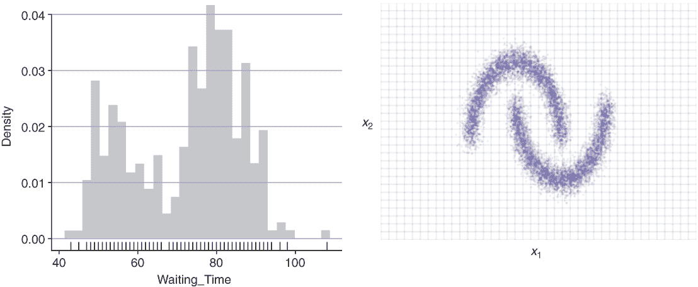

图 6.7 两个数据集：左边是 1D 中的一个真实数据集（两个间歇泉喷发之间的等待时间），右边是人工数据集。你知道产生这种数据的概率分布吗？我们不知道。

该怎么办呢？记住那句老话，“如果山不来佛祖，佛祖就去见山”？图 6.8 展示了 NF 的主要思想。将来自高斯的数据进行变换，使得最终数据看起来像来自复杂的分布。这是通过变换函数 *g*(*z*) 实现的。另一方面，描述 *x* 中数据的复杂函数通过函数 *g*^(−1)(*x*) 转换为 *z*。

NF 的主要任务是找到这些变换：*g*(*z*) 和 *g*^(−1)(*x*)。我们暂时假设我们已经找到了这样的函数对：*g* 和 *g*^(−1) 。我们希望从它得到两件事。首先，它应该使我们能够从复杂的函数 *P**[x]*(*x*) 中采样，允许应用于生成新的、看起来逼真的面部图像。其次，它应该允许我们计算给定 *x* 的概率 *P**[x]*(*x*)，允许应用于新颖性检测等应用。

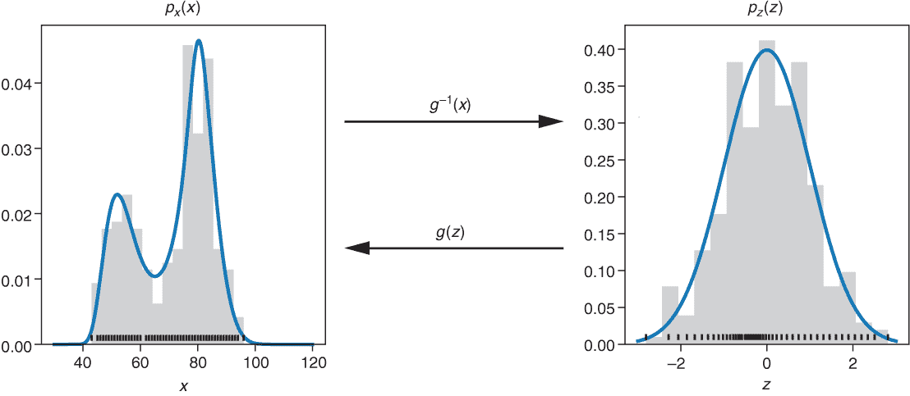

图 6.8 NF 原理。数据 *x* 的复杂 PDF *p**^x*(*x*) 通过变换函数 *x* = *g*(*z*) 转换为容易的高斯分布，其 PDF 为 *P**[z]*(*z*) = *N*(*z*; 0, 1)。

让我们从第一个任务开始，看看我们如何使用 g 来对新示例 *x* 进行采样。记住，你不能直接从 *P**[x]*(*x*) 中采样 *x*，因为你不知道 *P**[x]*(*x*)。但对于简单的分布 *P**[z]*(*z*)，你知道如何抽取样本。这很简单！如果简单分布是高斯分布，你可以使用 TFP 通过 `z=fd.Normal(0,1).sample()` 来实现。然后你应用变换函数 g 来得到相应的样本 *x* = *g*(*z*)。所以，第一个任务就解决了。

那第二个任务呢？某个样本 *x* 的概率有多大？你不能直接计算 *p**^x*(*x*)，但你可以通过 *z* = *g*^(−1)(*x*) 将 *x* 转换回 *z*，对于这个 *z*，你知道概率 *P**[z]*(*z*)。有了 *P**[z]*(*z*)，你可以计算 *x* 的概率。在简单分布 *P**[z]*(*z*) 是高斯分布的情况下，确定数字 *z* 的概率很容易：使用 `tfd.Normal(0,1).prob(*z*)`。

我们能否使用任何变换函数 g？在这里，情况并非如此。为了找出变换所需属性，让我们考虑从 *z* 到 *x* 再返回的循环。让我们举一个例子。如果我们从一个固定的值开始，比如说 *z* = 4，那么我们会使用 g 来得到相应的 *x* 值，*x* = *g*(4)，然后再次从 *x* 返回到 *z*，*z* = *g*^(−1)(*x*)。你应该再次得到 *z* = *g*^(−1)(*x*) = *g*^(−1)(*g*(4)) = 4 的值。这必须适用于所有 z 的值。这就是为什么我们称 *g*^(−1) 为 g 的逆。

并不是所有函数 g 都能找到一个逆函数 *g*^(−1) 。如果一个函数 g 有逆函数 *g*^(−1) ，那么 g 被称为双射。一些函数，例如 *g*(*z*) = *z*²，仅在有限的数据范围内是双射；例如，在这里，对于正值。 (你能告诉我逆函数是什么吗?) g 必须是双射。此外，我们希望实现高效的流程。在接下来的章节中，你将了解数学细节及其对高效实现的影响。

### 6.3.2 概率的变量变换技术

在本节中，你首先学习如何在一维中使用 NF 方法。这是统计学家所说的变量变换技术，用于正确地变换分布。这是所有 NF 的核心方法，其中（通常）将多个这样的变换层堆叠成深度 NF 模型。为了解释 NF 模型单层中的情况，我们首先从一维分布的变换开始。稍后，在第 6.3.5 节中，我们将从一维问题推广到高维。为了编写这样的 NF 模型，我们使用 TFP 和特别地使用 TFP 的 `bijector` 包（例如，见列表 6.3）。所有 TFP `bijector` 类都是关于双射变换的，它们将变量变换技术应用于正确变换概率分布。

让我们从简单开始。考虑变换 *x* = *g*(*z*) = *z*² 并选择 *z* 在 0 和 2 之间均匀分布。（我们称这个例子为这一节中的简单例子。）函数 *g*^(−1)(*x*) = √*x* 满足 *g*^(−1)(*g*(*x*)) = √(*z*²) = *z* 对于选择的 z 范围。顺便说一句，如果 *z* 从 -1 到 1（一个正范围）均匀选择，那就不会是可能的（需要正范围）。但现在，如果我们使用在 0 和 2 之间均匀分布的 *z*，那么 *x* = *g*(*z*) = *z*² 的分布看起来如何？看看你是否能猜出来。

在统计学中检查某事的一种方法是在模拟中始终尝试它。为了从均匀分布中模拟 100,000 个数据点，你可能使用 `tdf.Uniform (0,2).sample(1000)` 。取这些值，将它们平方，并绘制直方图 (`plt.hist`)。解决方案在下面的笔记本中给出。但先试试看你是否能自己完成。

|  | 实践时间 打开 [`mng.bz/xWVW`](http://mng.bz/xWVW) 。这个笔记本包含本章变量变换/`TFP.bijectors` 练习的配套代码。在阅读本节时跟随它。 |
| --- | --- |

可能这个结果与你的第一直觉有点相反。让我们检查一下当将平方变换应用于均匀分布样本时会发生什么。在图 6.9 中，你可以看到一个平方变换函数（实线粗曲线）的图表，以及在水平轴上的 100 个样本（由刻度表示），这些样本是从 0 到 2 之间的均匀分布中抽取的。相应的直方图显示在图表上方。要平方每个样本（刻度），你可以从刻度垂直向上到平方函数，然后击中它，然后水平向左移动。变换后的值是垂直轴上的刻度。如果你对所有的 *z* 样本都这样做，你将得到垂直轴上刻度的分布。请注意，刻度在 0 附近的区域比在 4 附近的区域密集。相应的直方图显示在右侧。通过这个程序，可以清楚地看出，变换函数可以在变换函数平坦的区域将样本挤压在一起，并在变换函数陡峭的区域将样本分开。

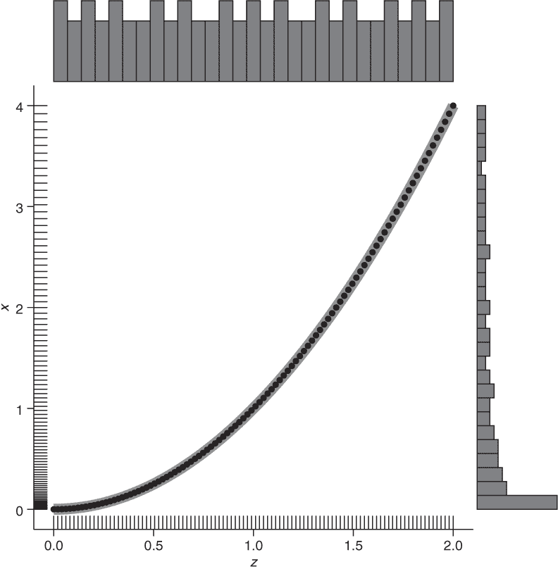

图 6.9 将一个平方变换函数（实线粗曲线）应用于从均匀分布（水平轴上的刻度）中抽取的 100 个 *z* 样本，得到变换后的 100 个 *x* 样本（垂直轴上的刻度）。图上方的直方图和右侧的直方图分别显示了 *z* 和 *x* 样本的分布。

这种直觉还意味着线性函数（具有恒定的斜率但不同的偏移量）不会改变分布的形状，只会改变值。因此，如果你想从一个简单的分布转换到一个具有更复杂形状的分布，你需要一个非线性变换函数。

变换函数 g 的另一个重要特性是它需要是单调的，以便是双射的。2 这意味着样本保持相同的顺序（没有超越）。对于单调递增的变换函数，从 *z*[1] < *z*[2] 总是跟随 *x*[1] < *x*2。如果变换函数是单调递减的，那么 *z*[1] < *z*[2] 总是意味着 *x*[1] < *x*[2] 。这一特性还表明，在 *x*[1] 和 *x*[2] 之间，你总是有与在 *z*[1] = *g*(*x*[1]) 和 *z*[2] = *g*(*x*[2]) 之间相同的样本数量。

对于 NF，我们需要一个公式来描述变换。现在我们已经建立了变换的直观模型，让我们完成最后一步，从样本和直方图到概率密度的转换。现在，我们保留的是某个区间的概率，而不是某个区间的样本数量（见图 6.10）。严格来说（在这本书中我们相当粗心），*P*[z]*(*z*)是一个概率密度。所有概率密度都是归一化的，这意味着密度下的面积是 1。当使用变换从一个分布转换到另一个分布时，这种归一化是保留的；因此，称为“归一化流”。你不会丢失概率；这就像质量守恒原理。这种保留属性不仅适用于密度曲线下的整个区域，也适用于更小的区间。

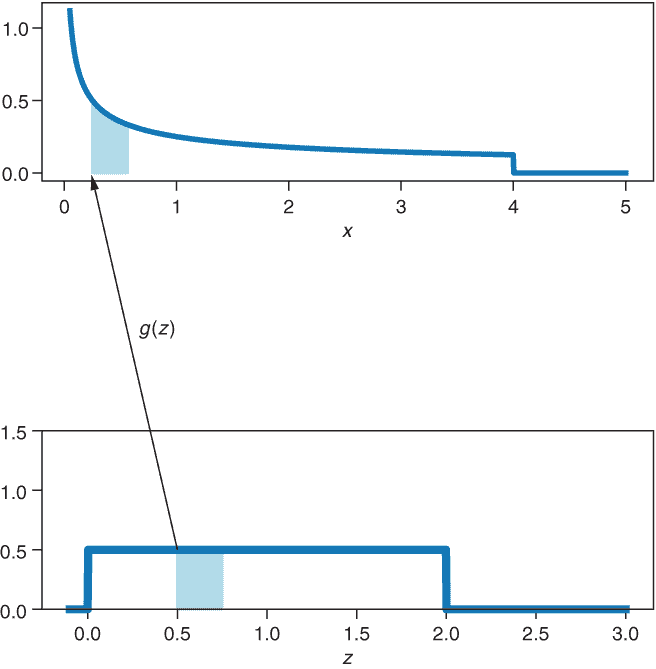

图 6.10 理解变换。需要保留的面积 *P*[z]*(*z*)|dz| = *p*[x]*(*x*)|dx|（图中阴影部分）。

要从概率密度值 *p*[x]*(*x*) 到接近 *x* 的值的真实概率，我们必须查看密度曲线 *p*[x]*(*x*) 在长度为 *dx* 的小区间下的面积。我们通过将 *p*[x]*(*x*) 与 *dx* 相乘得到这样一个概率：*p*[x]*(*x*)*dx*。对于 *z* 也是如此，其中 *p*[z]*(*z*)*dz* 是一个概率。这两个概率需要相同。在图 6.10 中，你可以看到变换。曲线下的阴影区域需要相同。 

从这个方程我们得到：3

*p*[z]*(*z*) ⋅ |*dz*| = *p*[x]*(*x*) ⋅ |*dx*|

这个方程确保在变换过程中没有概率丢失（质量是守恒的）。我们可以解这个方程得到：

*p*[x]*(*x*) = *p*[z]*(*z*) ⋅ |*dz* / *dx*|

*p*[x]*(*x*) = *p*[z]*(*z*) ⋅ |*dx* / *dz*|^(−1)

在这里，我们交换了分子*dz*和分母*dx*。这是可以的，并且有更严格的数学支持。

*p*[x]*(*x*) = *p*[z]*(*z*) ⋅ |*dg*(*z*) / *dz*|^(−1) 其中 *x* = *g*(*z*) .

*p*[x]*(*x*) = *p*[z]*(*z*) ⋅ |*g'*(*z*)|^(−1)

*p*[x]*(*x*) = *p*[z]*(*g*^(−1)(*x*)) ⋅ |*g'*(*g*^(−1)(*x*))|^(−1) 其中 *z* = *g*^(−1)(*x*)

方程 6.2 非常著名，并且有自己的名字：它被称为变量变换公式。变量变换公式确定了变换后的变量 *x* = *g*(*z*) 的概率密度 *p**[x]*。你需要确定导数 *dg*(*z*)/*dz* 和逆变换函数，然后你可以使用方程 6.2 来确定 *p**^x*(*x*)。项 |*dz* /*dx*| 描述了从 *z* 到 *x* 时长度的变化（如图 6.10 中水平轴上区间的长度）。这确保了图 6.10 中的阴影区域保持不变。我们需要绝对值来覆盖变换函数递减的情况。在这种情况下，|*dz* /*dx*| 将是负数。当从 *x* 到 *z* 时，长度按相反的方式缩放：

|*dz*/*dx*| = 1 / |*dx*/*dz*|

让我们花点时间回顾一下你到目前为止学到的内容。如果我们有一个从 *z* 到 *x* 的可逆变换 *g*(*z*)，以及从 *x* 到 *z* 的逆函数 *g*^(−1)(*x*)，方程 6.2 告诉我们在变换下概率分布如何变化。知道变换 *g*(*z*) 以及其导数 g'(*z*) 和 *g*^(−1)(*x*)，我们可以应用 NF。我们将在下一节中解决如何学习这些流，g 和 g -1 的问题。但首先，让我们将公式应用于初始示例，看看如何使用 TFP 的 `Bijector` 类非常优雅地完成这项工作。

在初始示例中，我们假设 *z* 在这个区间内均匀分布在 0 和 2 之间，*p**[z]*(*z*) = 1/2，因此分布是归一化的。让我们来计算这个例子中的数学问题，其中 *x* = *g*(*z*) = *z*²。当 *z* = *g*^(−1)(*x*) = √*x* 和 *g'*(*g*^(−1)(*x*)) = 2 ⋅ *g*^(−1)(*x*) 时，方程 6.2 变为

*p**[x]*(*x*) = *p**[z]*(*g*^(−1)(*x*)) ⋅ |*g'*(*g*^(−1)(*x*))|^(−1)

*p**[x]*(*x*) = 1/2 ⋅ |2 ⋅ √*x*|^(−1) = 1/4 ⋅ √*x*

这看起来与模拟相同（参见图 6.11）。

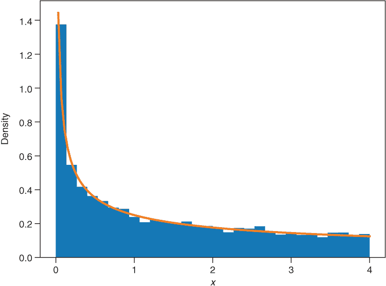

图 6.11 比较了模拟得到的 *x* = z² 的密度（直方图）和假设 z 均匀分布时使用方程 6.2 的解析推导（曲线实线）

结果表明，TFP 对变量变换有很好的支持。变量变换的核心是一个双射变换函数 g。`tfp.bijector` 包含所有关于双射的内容，我们之前在本节中介绍了它。让我们先看看 TFP 中的双射（参见下面的列表和相关的笔记本 [`mng.bz/xWVW`](http://mng.bz/xWVW)）。

列表 6.3 一个初等双射

```
tfb = tfp.bijectors 
g = tfb.Square()       ❶ 
g.forward(2.0)         ❷ 
g.inverse(4.0)         ❸ 
```

❶ 这是一个简单的双射，从 *z* 变换到 z²。

❷ 产生 4

❸ 产生 2

在列表中，一个双射函数`g`将一个分布转换成另一个。第一个（通常是简单的）分布被称为基础分布或源分布，在这个源分布上应用双射函数`g`。得到的分布被称为转换分布或目标分布。接下来的列表展示了我们的简单示例如何在 TFP 中实现。

列表 6.4 TFP 中的简单示例

```
g = tfb.Square()                         ❶ 
db = tfd.Uniform(0.0,2.0)                ❷ 
mydist = tfd.TransformedDistribution(    ❸ 
    distribution=db, bijector=g)

xs = np.linspace(0.001, 5,1000)
px = mydist.prob(xs)                     ❹ 
```

❶ 双射函数；这里是一个平方函数

❷ 基础分布；这里是一个均匀分布

❸ 将基础分布和双射函数组合成一个新的分布

❹ TransformedDistribution 表现得像通常的分布。

注意，我们不需要自己实现变量变换公式。TFP 为我们完成了这项工作！如果我们想创建自己的双射函数，我们需要实现变量变换公式。

### 6.3.3 将 NF 拟合到数据

在本节中，您将学习使用 NF 建模复杂分布的第一步，并且使用 TFP 双射函数这相当简单。我们首先限制自己使用一维分布。我们通过只使用一个流`g`来实现这一点。在下一节中，我们将深入探讨并链式连接几个这样的流，以允许更灵活地建模复杂分布。然后在第 6.3.5 节中，我们将使用流来处理高维分布。在本节中，您将学习这些流，这些流由一个参数化的双射函数`g`给出。

揭秘警告：您通过古老的 MaxLike 原则确定流的参数。

我们如何通过 NF 建模分布？如果您的数据*x*具有复杂的未知分布*p**[x]*(*x*)，那么使用双射变换函数`g`通过将变量*z*通过一个简单的基础分布*x* = *g*(*z*)转换来得到*x*。如果您知道要使用什么变换`g`，那么您就没事了。您可以使用您在第 6.3.2 节中学到的方 法来应用它。对于每个样本*x*，*p**^x*(*x*)的似然由转换值*p**[x]*(*x**[i]*) = *p**[z]*(*g*^(−1)(*x**[i]*)) ⋅ |*g*'(*g*^(−1)(*x**[i]*))|^(−1)给出。但您如何知道要使用哪个双射变换`g`呢？

解决方案之一：询问老式的统计学家。他们会启动 EMACS，并在第一步中，将一个简单的模型（如高斯分布）拟合到数据上。当然，高斯分布不足以拟合复杂的分布。经验丰富的统计学家然后会盯着模型与数据之间的差异，做一些只有他们和他们的祭司阶层完全理解的魔法。最后，他们会咕哝着说：“孩子，在你的数据上应用对数变换；然后你可以用高斯分布拟合你的数据。”于是你就可以去实现一个使用`tfb.Exp()`的流了。在继续阅读之前，请思考一下为什么要在使用指数之前进行冥想。

答案是统计学家给了你如何从复杂分布到简单高斯分布的变换，*z* = *ɡ*^(−1)(*x*) = log(*x*)。因此，从简单分布到复杂分布的流程 g 由对数的逆，即指数 *x* = *ɡ*(*z*) = exp(*z*) 给出。

第二种解决方案：你意识到我们生活在 21 世纪，拥有计算机能力，可以通过数据驱动的方式找到双射变换 *ɡ*，它将一个变量 *z* 转换为你选择的简单基分布 *p**[z]*(*z*)，到感兴趣的变量 *x* = *ɡ*(*z*)。知道了流程，g 允许你确定复杂的分布 *p**[x]*(*x*) = *p**[z]*(*z*) ⋅ |*ɡ* '(*z*)| ^(−1) = *p**[z]*(*ɡ*^(−1)(*x*)) ⋅ |*ɡ* '(*ɡ*^(−1)(*x*))| ^(−1)（见方程 6.2）。

数据驱动方法的关键思想是，你设置一个灵活的双射变换函数 g，它具有可学习的参数 θ。如何确定这些参数的值？通常的方式——使用最大似然法。你有训练数据 *x**[i]*，你可以通过计算单个训练样本 i 的似然度 *p**[x]*(*x**[i]* ) = *p**[z]*(*g*^(−1)(*x**[i]* )) ⋅ |*g*'(*g*^(−1)(*x**[i]* ))|^(−1) 来计算，以及通过乘以所有单个似然贡献来计算所有数据点的联合似然度！[](../Images/6-11_E01.png)。在实践中，你在训练数据中最小化！[](../Images/6-11_E02.png)。就是这样！

让我们从一个非常简单的例子开始。我们的第一个可学习流程是线性的，只涉及两个参数：*a* 和 *b* *g*(*x*) = *a* ⋅ *z* + *b*。在列表 6.5 中，你可以看到我们使用了一个仿射双射。只是为了明确这个术语，一个仿射函数 *g*(*x*) = *a* ⋅ *z* + *b* 是线性函数 *g*(*x*) = *a* ⋅ *z* 加上一个偏移量 b。在这本书中，我们有点放松；当我们说“线性”时，我们通常是指“仿射”。当然，对于如此简单的流程，你无法做太多复杂的事情。

在 6.9 图的讨论中，我们已指出，当使用线性变换函数时，分布的形状保持不变。现在我们想要学习从 *z* ∼ *N* (0, 1) 到 *x* ∼ *N* (5, 0.2) 的变换。因为这两个分布都是钟形，一个（仿射）线性变换就能做到这一点。下面的列表显示了完整的代码，它也在配套的笔记本中。

列表 6.5 TFP 中的一个简单示例

```
*a* = tf.Variable(1.0)                                       ❶ 
b = tf.Variable(0.0)                                       ❶ 
bijector = tfb.AffineScalar(shift=a, scale=b)              ❷ 
dist = tfd.TransformedDistribution(Distribution=
        tfd.Normal(loc=0,scale=1),bijector=bijector)

optimizer = tf.keras.optimizers.Adam(learning_rate=0.1)

for i in range(1000):
    with tf.GradientTape() as tape: 
        loss = -tf.reduce_mean(Dist.log_prob(X))           ❸ 
        gradients = tape.gradient(loss,                    ❹ 
                    dist.trainable_variables)     
    optimizer.apply_gradients(
        zip(gradients, dist.trainable_variables))          ❺ 
```

❶ 定义变量

❷ 使用由两个变量定义的仿射变换来设置流程

❸ 数据的 NLL

❹ 计算可训练变量的梯度

❺ 将梯度应用于更新变量

训练几个 epoch 后，结果为 *a ≈ 0.2* 和 *b ≈ 5*，并将 *N* (0, 1) 分布的变量转换为 *N* (5, 0.2) 分布的变量（参见笔记本 [` mng.bz/xWVW`](http://mng.bz/xWVW) 中的结果）。当然，这样的简单（仿射）线性变换对于将高斯转换为更复杂的分布来说太简单了。

### 6.3.4 通过链式流进行更深入的建模

你在 6.3.3 节中看到，线性流只能改变基本分布的形状和拉伸，但它不能改变分布的形状。因此，线性变换高斯的结果，再次，是一个高斯（参数已改变）。在本节中，你将学习一种建模目标分布的方法，该分布与基本分布的形状非常不同。这使得你可以模拟复杂现实世界的分布，例如老忠实喷泉两次喷发之间的等待时间。你会发现这使用 TFP 相当简单。

我们如何创建可以改变分布形状的流？记住深度学习中的“傻瓜规则”——堆叠更多层（如第 2.1.2 节所述）。还要记住，在神经网络中的层之间，你使用非线性激活函数；否则，深层堆叠的层可以被一层替代。对于 NF 来说，这个规则告诉你不要只使用一个流，而是一系列流（层之间的非线性很重要，我们稍后会回到这一点）。你从 *z* 开始，沿着 k 个变换的链到 x：*z* = *z*[o] → *z*[1] → *z*[2] ⋯→*z**[k]* = *x*。图 6.12 展示了这个变换。

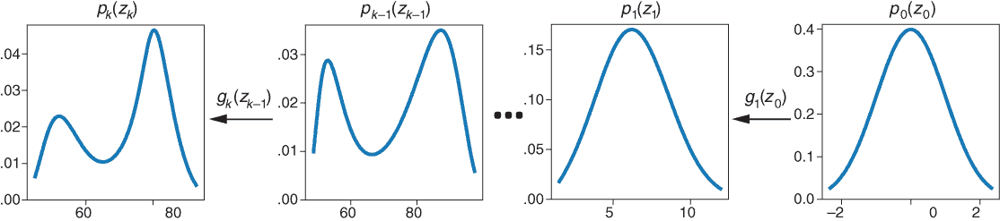

图 6.12 通过一系列简单的变换，可以创建出用于模拟复杂分布所需的复杂变换。从右到左，从标准高斯分布 z0 ~ *N*(0,1) 通过连续变换变为具有双峰形状的复杂分布（在左侧）。

让我们看看从 *z*[o] → *z*[1] → *z*[2] 的两个变换链，以理解一般公式。你知道概率分布 *p**[z[0]]*(*z*[0])，但你如何确定概率分布 *p**[z[2]]*(*z*[2])？让我们一步一步来做，并在每一步中使用变量变换公式（方程 6.2）。

首先确定概率分布 *p**[z[1]]*(*z*[1])。通过变换 *z*[0] 得到 *z* 1，*z*[1] = *g*1。为了使用变量变换公式，你需要确定导数 g 1' 和逆函数 *g* 1-1。然后，可以通过方程 6.2 确定分布 *p**[z[1]]*(*z*[1])，即 *p**[z[1]]*(*z*[1]) = *p**[z[0]]*(*z*[0]) ⋅ | *ɡ*[1]'(*z*[0])|^(−1) 。按照这种方式，你可以确定变换变量的概率密度 pz 2，即 *p**[z[2]]*(*z*[2]) = *p**[z[1]]*(*z*[1]) ⋅ |*ɡ*[2] '(*z*[1])|^(−1) ，其中你可以将前面的公式代入 *p**[z[1]]*(*z*[1])，得到链式流：

*p**[z[2]]*(*z*[2]) = *p**[z[0]]*(*z*[0]) ⋅ |*ɡ*[1] '(*z*[0])|^(−1) ⋅ |*ɡ*[2] ' (*z*[1])|^(−1)

通常，操作对数概率比操作概率更方便。对前面的公式取对数（并使用对数规则 log(*a**^p*) = *p* ⋅ log(*a*)，其中 *a* = *ɡ**[i]* ' (*z**[i]* −1) 和 *p* = −1）得到以下结果：

log( *p**[z[2]]*(*z*[2])) = log( *p**[z[0]]*(*z*[0])) − log(| *ɡ*[1] '( *z*[0])|) − log(| *ɡ*[2] '( *z*[1])|)

对于完整的流程（*x* = zk），此公式推广到：

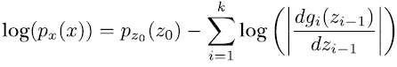

要计算概率 *p**^x*(*x*)，只需在图 6.12 的链中从 *x* = *z**[k]* → *z**[k]*[−1] ... → *z*[o] 追溯，并求和 −log(|*ɡ**[i]* '(*z**[i]* [−1])| 项。让我们在 TFP 中构建这样的链。

在 TFP 中创建双射算子链非常方便：只需使用 `tfp.bijectors` 包中的 `Chain(bs)` 类，并传递一个 `Bijectors bs` 列表。结果仍然是一个双射算子。所以，我们只需要简单地链式连接几个仿射标量双射算子，或者我们就完成了？我们还没有完全完成。仿射标量变换只会平移和缩放一个分布。一种思考方式是，这种仿射变换在图 6.9 中是一条直线。没有改变分布形状的可能性。

如果你想改变分布的形状，你需要做什么？你可以在堆叠的线性流程之间引入一些非线性双射算子，或者你可以使用非线性双射算子代替线性双射算子。让我们选择第一种方法。

你需要选择一个非线性参数化变换函数，然后可以通过最大似然方法找到参数值。有许多可能的变换函数（双射算子）可以这样做。查看 [`mng.bz/AApz`](http://mng.bz/AApz) 。许多双射算子要么没有参数，如 `softplus`，要么限制 *z* 或 *x* 的允许范围。`SinhArcsinh` 双射算子有一个复杂的名字，但看起来很有希望：它有两个参数，`skewness` 和 `tailweight`，如果 `tailweight>0`，则对 *x* 和 *z* 没有约束。图 6.13 显示了某些参数下的该双射算子。对于 `tailweight=1` 和 `skewness=1`，它看起来相当非线性，并且使用这些参数，我们不需要限制 *x* 和 *y* 的范围。因此，我们使用它来拟合 Old Faithful 数据（见列表 6.6）。请注意，TFP 包中可能有其他满足要求的双射算子。

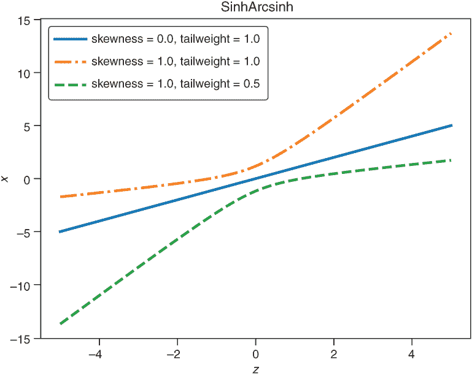

图 6.13 不同参数值下的双射算子 `SinhArcsinh`

让我们构建一个链并添加 `AffineScalar` 双射算子之间的 `SinhArcsinh` 双射算子。这将在以下列表中完成。

列表 6.6 TFP 中的简单 Old Faithful 双射算子示例

```
num_bijectors = 5                                     ❶ 
bs=[]
for i in range(num_bijectors):

    sh = tf.Variable(0.0)
    sc=tf.Variable(1.0)
    bs.append(tfb.AffineScalar(shift=sh, scale=sc))   ❷ 

    skewness=tf.Variable(0.0)
    tailweight=tf.Variable(1.0) 
    bs.append(tfb.SinhArcsinh(skewness,tailweight))   ❸ 

bijector = tfb.Chain(bs)                              ❹ 
dist = tfd.TransformedDistribution(Distribution=
        tfd.Normal(loc=0,scale=1),bijector=bijector)
```

❶ 层数数量

❷ 仿射标量变换

❸ SinhArcsinh 作为非线性

❹ 从双射算子列表创建双射算子链

访问笔记本[`mng.bz/xWVW`](http://mng.bz/xWVW)以查看用于 Old Faithful 喷泉等待时间的这一系列双射算子，它产生了图 6.14 中的直方图。顺便说一句，在图 6.12 中，你可以看到从*N*(0,1)到 Old Faithful 等待时间分布的一些步骤。

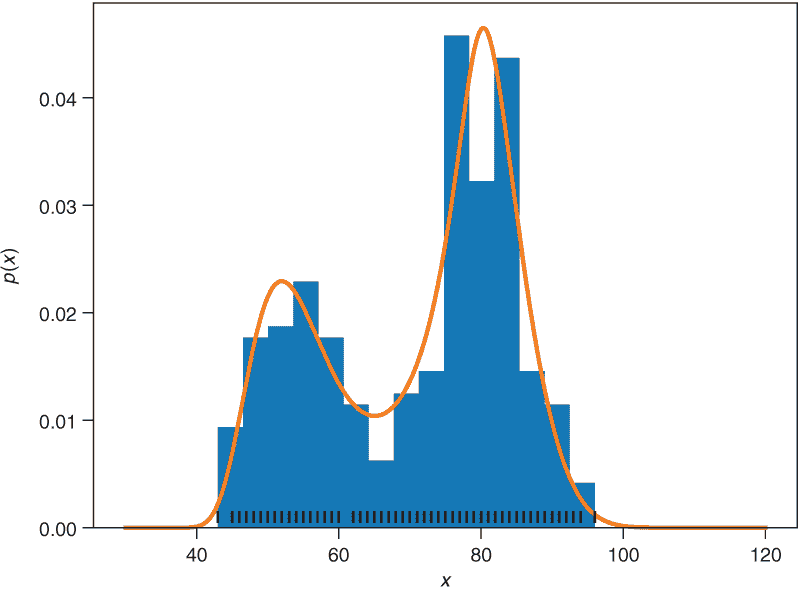

图 6.14 Old Faithful 喷泉等待时间的直方图（填充柱状图），以及拟合的密度分布（实线）。直方图没有显示出像高斯这样的简单分布的形状。五层流动很好地捕捉了数据的特征（实线）。

到目前为止，我们考虑了一维数据，但这种方法是否也适用于高维数据？想象一下，例如，图像数据，其中每个图像的维度为 256 × 256 × 3（高度 × 宽度 × 通道）。同样，我们感兴趣的是学习这种图像数据的分布，以便从中采样。结果证明，这种流动方法也适用于高维。唯一的原理区别是，双射算子不再是单维函数，而是具有与你的数据一样多的维度。

在接下来的两节中，我们将 NF 方法扩展到高维。如果你对这种方法的应用比数学上的变化更感兴趣，你可以跳过这些章节，直接跳到 6.3.7 节。但如果你想知道细节，请继续阅读！

### 6.3.5 高维空间之间的转换*

让我们制定一个任务，对高维数据的分布（如图像）进行建模，这样我们就可以使用流动方法来拟合分布。首先，我们将图像数据展平，以接收（对于每张图像）具有 196,608 个条目的向量*x*。这些向量生活在 196,608 维空间中，并且具有未知的分布*p**[x]*(*x*)，这可能是复杂的。现在，你可以选择一个简单的基分布*p**[z]*(*z*)，例如高斯分布。任务是找到一个变换*g*(*z*)，将向量*z*转换为向量*x*。我们需要一个双射变换 g，因此*x*和*z*的维度必须相同。让我们看看这种变换在三维空间中的样子，这意味着我们处理的数据点是*x* = (*x*[1] , *x*[2] , *x*[3])和*z* = ( *z*[1] , *z*[1] , *z*[3])。变换*x* = *g*(*z*)看起来是这样的：

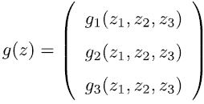

对于一维流动，主要公式是

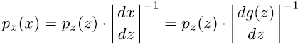

并且术语|*dg*(*z*) / *dz*|被识别为从*z*到*x*时长度的变化。在三维中，我们需要考虑体积的变化。对于四维及以上，体积的变化现在是变换 g 的超体积的变化。从现在起，我们只称之为体积，无论我们是否有长度或面积。

在一维公式（方程 6.3）中，标量导数 |*dg*(*z*) / *dz*| 被替换为一个偏导数矩阵，这被称为雅可比矩阵。为了理解雅可比矩阵，我们首先回顾一下偏导数的定义。一个关于三个变量 *z*[1], *z*[2], *z*[3] 的函数 *ɡ*(*z*[1] , *z*[2] , *z*[3]) 对 *z*[2] 的偏导数表示为 *∂* *ɡ*(*z*[1] , *z*[2] , *z*[3]) / *∂z*[2] 。为了举一个简单的例子，当 *ɡ* ( *z*[1] , *z*[2] , *z*[3] ) = 42 ⋅ *z*[2] + sinh(exp(*z*[1] /*z*[3])) 时，*∂* *ɡ*(*z*[1] , *z*[2] , *z*[3]) / *∂z*[2] 是多少呢？幸运的是，答案是 42。这很简单！关于 z1 和 z3 的偏导数将会更复杂。如果函数 *ɡ*(*z*[1] , *z*[2] , *z*[3]) 只返回一个数字，我们考虑 g 返回一个向量，比如说，有三个分量。如果你需要一个例子，这个函数 g 可以是一个具有三个输入和输出神经元的全连接网络（fcNN）。对于这个例子，雅可比矩阵如下所示：

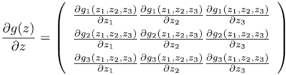

在一维情况下，你需要在变量变换公式（方程 6.3）中确定导数 |dg(*z*)/dz| 的绝对值。在更高维的情况下，实际上你需要用雅可比矩阵行列式的绝对值来替换这个项。高维数据的变量变换公式看起来如下所示：

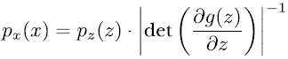

你不知道什么是行列式或者忘记了它？不用担心。你需要知道的是，对于三角矩阵（如方程 6.5 中所示），你可以通过计算对角元素的乘积来计算行列式。当然，如果三角矩阵下方的某些（或所有）非对角元素也为零，这也是正确的。无论如何，你不必自己计算行列式。

每个 TFP 双射实现方法 `log_det_jacobian(*z*)`，流或流的链可以按照之前描述的方法计算。计算行列式相当耗时。然而，有一个很好的技巧可以加快计算速度。如果一个矩阵是所谓的三角矩阵，那么行列式是对角元素的乘积。如何在雅可比矩阵中得到零？如果函数 gk 不依赖于变量 zi，那么函数 gk 对 zi 的偏导数将得到零。如果我们构建的流使得 g 1(*z*1, z2, z3) 与 z2, z3 无关，g2(*z*1, z2,z3) 与 z3 无关，那么之前的矩阵如下所示：

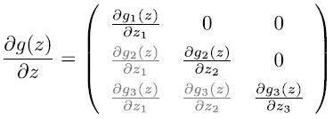

这个矩阵是一个三角矩阵，因此可以通过对角元素的乘积来获得行列式。三角雅可比矩阵的一个好性质是，您不需要计算非对角项（在方程 6.5 中以灰色显示）来确定行列式。这些非对角项在第一个项 *p**[z]*(*z*) = *p**[z]*(*ɡ*^(−1)(*x*))（方程 6.4）中起作用，但不是第二个项，|det(*∂g*(*z*) / *∂z*)|^(−1) 。为了模拟复杂分布，可能需要使用复杂函数来模拟这些非对角项。幸运的是，如果这些表达式很复杂，这根本不是问题，因为您不需要计算它们的导数。要获得这样一个好的三角雅可比矩阵，只需确保 *ɡ**[i]*(*z*) 与 *z**[j]* 独立，其中 j > i。

我们已经看到，导致三角雅可比矩阵的双射函数便于处理。但它们是否足够灵活以模拟所有类型的复杂分布？幸运的是，答案是肯定的！在 2005 年，博加切夫和他的同事们证明了对于任何 D 维分布对（x 的复杂分布和 z 的简单基分布），您都可以找到将一个分布转换成另一个分布的三角双射函数。

### 6.3.6 使用网络控制流

现在您将看到网络和 NFs 的强大组合。基本思想是使用神经网络来模拟 D 维双射函数的 gi 组分 #

*ɡ*(*z*) = (*ɡ*1, *ɡ*2,..., *ɡ**[D]*(*z*[1] ,... *z**[D]*))。上一节的讨论为我们提供了一些关于如何设计用于模拟双射函数 g 的不同分量 gi 的神经网络的指导：

1.  我们希望双射函数具有三角雅可比矩阵，这确保了 gi 与 zj 独立（其中 j > i），即 *ɡ**[i]*(*z*[1] , *z*[2] ,..., *z**[D]*) = *ɡ**[i]*(*z*[1] ,... *z**[i]* )。

1.  我们希望雅可比矩阵的对角元素易于计算：

    *∂* *ɡ**[i]*(*z*[1] ,... *z**[i]* ) /*∂* *ɡ**[i]* .

1.  对于雅可比矩阵下三角中的非对角元素，不需要计算这些函数的偏导数。它们可以相当复杂。

1.  最后，但同样重要的是，我们需要一个可逆变换。

让我们关注列表中的第一项，并写出三角双射函数 *g*(*z*) 的分量：

*x*[1] = *ɡ*1 = *ɡ*1

*x*[2] = *ɡ*2 = *ɡ*2

....

*x**[D]* = *ɡ**[D]*(*z*[1] , *z*[2] ... *z**[D]*) = *ɡ**[D]*(*z*[1] ,... *z**[D]*)

下一个问题是我们应该使用哪些参数函数来表示 gi？在这里，前面列表中的第二和第三条准则发挥作用。你应该设计 gi，使得与雅可比矩阵对角元素相对应的偏导数 *∂* *ɡ**[i]*(*z*[1] ,..., *z**[i]* ) /*∂* *ɡ**[i]* 容易计算。对于线性函数，导数是容易计算的。让我们选择 gi 在 *z**[i]* 上是线性的：

*x**[i]* = *ɡ**[i]*(*z*[1] , *z*[2] ,..., *z**[i]* ) = *b* + *a* ⋅ *z**[i]*

注意，gi 在 *z*[1] , *z*[2] ,..., *z**[i]* [−1] 上可以是非线性的。这意味着截距 *b* 和斜率 a 可以是这些 *z* 元素的复杂函数：*b**[i]* = *b**[i]*(*z*[1] , *z*[2] ,..., *z**[i]* [−1]) 和 *a**[i]* = *a**[i]*(*z*[1] , *z*[2] ,..., *z**[i]* [−1])。这导致

*x**[i]* = *ɡ**[i]*(*z*[1] , *z*[2] ,..., *z**[i]* ) = *b**[i]*(*z*[1] , *z*[2] ,..., *z**[i]* [−1]) + *a**[i]*(*z*[1] , *z*[2] ,..., *z**[i]* [−1]) ⋅ *z**[i]*

因为 *b**[i]* = *b**[i]*(*z*[1] , *z*[2] ,..., *z**[i]* [−1]) 和 *a**[i]* = *a**[i]*(*z*[1] , *z*[2] ,..., *z**[i]* [−1]) 可以是复杂函数，你可以使用神经网络来模拟这些。这是一个已知的事实，具有至少一个隐藏层的神经网络足够灵活，可以适应任何函数，因此 a 和 *b* 可以以复杂的方式依赖于提供的 *z* 元素。在一维情况下，你需要一个单调递增或递减的函数来确保双射性。这可以通过确保斜率不为零来保证。在多维情况下，而不是斜率，你现在需要确保雅可比矩阵的行列式不为零。我们通过确保对角线上的所有项都大于零来实现这一点。为此，你可以使用与第四章中建模正标准差相同的技巧：你不会直接使用神经网络输出的 *α**[i]*(*z*[1] , *z*[2] ,..., *z**[i]* [−1]) 作为斜率，而是首先将其通过指数函数。这得到 *α**[i]* = exp(*α**[i]*(*z*[1] , *z*[2] ,..., *z**[i]* [−1]))，在这种情况下，方程式 6.6 变为

*x**[i]* = *ɡ**[i]*(*z*[1] , *z*[2] ,..., *z**[i]* ) = *b**[i]*(*z*[1] , *z*[2] ,..., *z**[i]* [−1]) + exp(*α**[i]*(*z*[1] , *z*[2] ,..., *z**[i]* [−1])) ⋅ *z**[i]* 方程式 6.7

计算雅可比矩阵的行列式是容易的。只需计算 gi 对 zi 的偏导数的乘积：

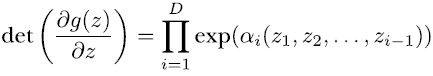

如您所见，矩阵是容易计算的！行列式是正项的乘积，因此也是正的。

如前所述，方程式 6.6 中的模型允许高效实现 NF 模型。在文献中，这类模型有时也被称为逆自回归模型。名称“自回归”表明，回归模型对于变量 *x**[i]* 的输入仅依赖于同一变量的先前观察值 *x*[1] ,..., *x**[j]*[−1]（因此得名“auto”）。你在第 6.1.1 节中看到了 WaveNet 和 PixelCNN 自回归模型的例子。但流模型本身并不是自回归的，因为 *x**[i]* = *ɡ**[i]*(*z*[1] , *z*[2] ,..., *z**[i]* ) 是由前一个（和当前）的 z 值决定的，而不是由 x 决定的。尽管如此，还存在一种联系，使得这些模型被称为逆自回归模型。如果你对细节感兴趣，你可能想看看这篇博客文章 [`mng.bz/Z26P`](http://mng.bz/Z26P)。

要使用 fcNN 实现这样的 NF 模型，你需要 D 个不同的网络，每个网络从不同的输入计算 ai 和 bi（见方程式 6.7）：*z*[1] , *z*[2] ,..., *z**[i]* 对于 *i* ∈ {1 , 2 ,...,*D* }。拥有 D 个网络将需要许多参数，而且，从 D 个网络中进行采样也会花费相当多的时间。为什么不使用一个接受所有 *z*[1] , *z*[2] ,..., *z**[D]* 输入并一次性输出所有 ai 和 bi 值的网络，从而可以一次性计算出所有 *z*[1] , *z*[2] ,..., *z**[D]* 值呢？花点时间来想一个答案？

答案是，全连接神经网络（fcNN）违反了 gi 与 zi 在 j > i 时相互独立的条件：即 *ɡ**[i]*(*z*[1] , *z*[2] ,..., *z**[D]*) = *ɡ*(*z*[1] ,..., *z**[i]* )，因此不能产生三角雅可比矩阵。但有一个解决方案。存在一种特殊的网络，称为自回归网络，它隐藏了部分连接以确保输出节点 ai 不依赖于输入节点 zi 在 j > i 的情况下。幸运的是，你可以使用 TFP 的 `tfp.bijectors.AutoregressiveNetwork`，这保证了该属性。这种网络首次在名为“Masked Autoencoder for Distribution Estimation(MADE)”的论文中描述（见 [`arxiv.org/abs/1502.03509`](https://arxiv.org/abs/1502.03509)）。

让我们看看在 D = 4 维度下这种网络的训练过程。在训练过程中，我们从观察到的四维 *x* 转换到四维 z，其中我们得到似然 *p**[x]*(*x*) = *p**[z]*(*z*) = *p**[z]*(*ɡ*^(−1)(*x*))。为此，我们依赖于

*x**[i]* = *ɡ**[i]*(*z*[1] , *z*[2] ,..., *z**[i]* ) = *b**[i]*(*z*[1] , *z*[2] ,..., *z**[i]* [−1]) + exp(*α**[i]*(*z*[1] , *z*[2] ,..., *z**[i]* [−1])) ⋅ *z**[i]* 方程式 6.7 (重复*D*)

然后，我们需要解方程式 6.7 来得到 zi ，得到：

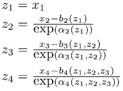

这是一个顺序过程，因此训练不能并行化，速度相对较慢。然而，在测试阶段，它很快。4

Laurent Dinh 等人，在名为“使用真实 NVP 进行密度估计”的论文中介绍了一种构建可逆流的不同方法，该论文可在[`arxiv.org/abs/1605.08803`](https://arxiv.org/abs/1605.08803)找到。在这篇论文中，他们提出了一种称为真实非体积保持流或 Real NVP 的流。名称非体积保持表示这种方法（如三角形流）可以具有不等于一的雅可比行列式，因此可以改变体积。与方程 6.6 中的设计相比，他们的 Real NVP 设计要简单得多（如图 6.15 所示）。当将图 6.15 与方程 6.6 进行比较时，你可以看到 Real NVP 架构是三角形流的简化且稀疏版本。如果你使用三角形流，并将前 d 个维度设置为*b* = 0 和*a* = 0，然后让剩余的维度 a 和*b*仅依赖于 z 的前 d 个分量，那么你最终会得到一个 Real NVP 模型。Real NVP 架构不如完全三角形双射器灵活，但它允许快速计算。

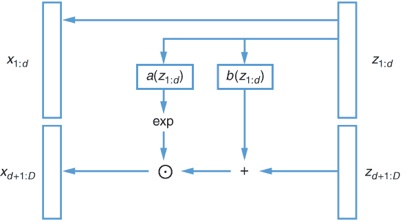

图 6.15 真实 NVP 模型的架构。前 d 个分量*z*[1] , *z*[2] ,..., *z**[d]*保持未变换，得到*x*[1] = *z*[1] , *x*[2] = *z*[2] ,..., *x**[d]* = *z**[d]*。*x*的其余分量*x**[d+1]* ,... ,*x*仅依赖于*z*的前 d 个分量(*z*[1] , *z*[2] ,..., *z**[d]*)，并按以下方式变换：*x**[i]* = *ɡ**[i]*(*z*[1] , *z*[2] ,..., *z**[d]*) = *b**[i]*(*z*[1] , *z*[2] ,..., *z**[d]*) + exp(*α**[i]*(*z*[1] , *z*[2] ,..., *z**[d]*)) ⋅ *z**[i]*，对于*i* = *d* + 1 ,...,*D*；这种乘法用⊙表示。

图 6.15 在一个真实 NVP 模型中，前 d 个分量直接从*z*传递到*x*（参见图 6.15 以及以下示例），并进一步用于训练一个神经网络，该网络为剩余坐标*x**[i]*（对于*i* = *d* + 1 ,...,*D*）输出 ai 和 bi。

在 Real NVP 中，首先选择一个 d，其范围在 1 和你问题的维度 D（z 和 x 的维度）之间。为了简化讨论，让我们选择 D = 5 和 d = 2。但是，当然，这些结果也适用于一般情况。流程是从 *z*（遵循简单的分布）到 *x*（遵循复杂的分布）。前 d 个分量（这里 d = 2）直接从 *z* 传递到 *x*（参见方程 6.8 的前两行）。现在这些 d（这里两个），z1 和 z2，是输入到一个计算 ai 和 bi 的神经网络（参见方程 6.7），得到斜率 *a**[i]* = exp(*α**[i]* ) 和线性变换 *x**[i]* = *b**[i]* + *a**[i]* ⋅ *z**[i]* 的平移 *b*，其中 *i* ∈ {3, 4, 5 }（参见方程 6.8 的第 3-5 行）。神经网络有两个头部作为结果。两者都有 D - d（这里，5 - 2 = 3）个节点。一个头部是 *b*1, *b*2, *b*3，另一个头部是 *a*1, *a*2, *a*3。接下来的三个变换变量是通过以下方式确定的：

*x*[1] = *ɡ*1 = *z*[1]

*x*[2] = *ɡ*2 = *z*[2]

*x*[3] = *ɡ*3 = *b*3 + exp(*α*3) ⋅ *z*[3]

*x*[4] = *ɡ*4 = *b*4 + exp(*α*4) ⋅ *z*[4]

*x*[5] = *ɡ*5 = *b*5 + exp(*α*5) ⋅ *z*[5]

这是一种类似于我们之前使用的仿射变换，缩放和平移项由一个神经网络控制，但这次，神经网络只获取 *z* 的前 d = 2 个分量作为输入。这个网络满足作为双射和三角形的条件吗？让我们逆流而行，从 *x* 到 z。这得到：

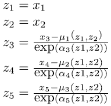

此外，雅可比矩阵具有所需的三角形形式，即使列 > d 中的所有非对角元素为零。你只需要计算对角元素来确定行列式，这对于 NF 方法是必需的。

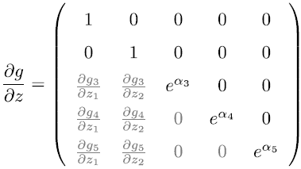

方程中的非零、非对角元素以灰色阴影表示，因为我们不需要它们。这一部分的流程称为耦合层。

在 Real NVP 中，第一个 d 维度不受流的影响，这有点奇怪。但我们可以通过额外的层来发挥它们的作用。因为我们无论如何都想堆叠更多的层，所以在到达下一层之前，让我们重新排列 zi 分量。重新排列是可逆的，雅可比矩阵的行列式为 1。我们可以使用 TFP bijector `tfb.Permute()` 来重新排列。在列出 6.7 的相关代码中，我们使用了五对耦合层和排列（也请参阅以下笔记本）。

|  | 实践时间 打开 [`mng.bz/RArK`](http://mng.bz/RArK) 。该笔记本包含代码，展示了如何在一个玩具数据集上使用香蕉形状的 2D 分布的 Real NVP 流。

+   执行代码并尝试理解它

+   玩转隐藏层的数量

|

列表 6.7 实际 NVP TFP 的简单示例

```
 bijectors=[]                                                       ❶ 
        num_blocks = 5                                              ❷ 
        h = 32                                                      ❸ 
        for i in range(num_blocks): 
            net = tfb.real_nvp_default_template(
                        [h, h])                                     ❹ 
            bijectors.append(
                tfb.RealNVP(shift_and_log_scale_fn=net, 
                            num_masked=num_maske*D*))                 ❺ 
            bijectors.append(tfb.Permute([1,0]))                    ❻ 
            self.nets.append(net) 
        bijector = tfb.Chain(list(reversed(bijectors[:-1])))

        self.flow = tfd.TransformedDistribution(                    ❼ 
            distribution=tfd.MultivariateNormalDiag(loc=[0., 0.]), 
            bijector=bijector)
```

❶ 将 num_blocks 个耦合排列添加到 bijectors 列表中

❷ NF 模型中的隐藏层数量

❸ 隐藏层的大小

❹ 定义网络

❺ 使用网络参数进行平移和流

❻ 坐标排列

❼ 使用两个独立的高斯分布的*z*分布

因此，你现在已经看到了如何使用网络构建流。技巧是保持一切可逆，并以一种方式构建流，使得雅可比矩阵的行列式可以轻松计算。最后，让我们看看 Glow 架构，并尝试从归一化流中采样逼真的面部图像。

### 6.3.7 与流一起玩乐：采样人脸

现在你来到了有趣的部分。OpenAI 在开发 NF 模型方面做了很多出色的工作，他们称之为 Glow 模型。你可以用它来创建看起来逼真的面孔和其他图像。Glow 模型与 Real NVP 模型类似，但有一些调整。主要变化是将排列替换为 1 × 1 卷积。

在本节中，我们现在处理图像数据。在 6.3.5 节之前的例子中，我们处理了 1D 标量数据。在 6.3.5 节和 6.3.6 节中，我们使用了 D 维数据（对于*z*和*x*），但数据仍然是简单的向量。如果我们想对图像进行操作，我们需要处理张量以考虑其 2D 结构。因此，我们现在必须操作形状为(h, w, d)的张量*x*和*z*，它们定义了高度(h)、宽度(w)和颜色通道数(*D*)，而不是向量。

我们如何在张量上应用类似 Real NVP 的流？回想一下向量的 Real NVP 架构（见图 6.15 和方程 6.8）。在张量的情况下，前 d 个通道（现在是 d 个二维切片）不受变换的影响，但作为 CNN 的输入。这个 CNN 定义了输入剩余通道的变换。

正如常规 CNN 架构一样，随着深入网络，高度和宽度减小，通道数增加。背后的想法是找到更抽象的表示。但在 NF 模型中，输入和输出需要具有相同的维度。因此，如果高度和宽度减半，通道数将增加四倍。

在输出层，高度和宽度为 1，深度由输入*h* ⋅ *w* ⋅ *d*的值数给出。更多细节，请参阅 Kingma 和 Dhariwal 撰写的论文“Glow: Generative Flow with Invertible 1x1 Convolutions”，您可以在[`arxiv.org/abs/1807.03039`](https://arxiv.org/abs/1807.03039)找到或查看官方 GitHub 仓库[`github.com/openai/glow`](https://github.com/openai/glow)。

底线是，一个具有 (h, w, d) 维度的图像 *z*，通常是 (256,256,3)，被转换成一个长度为 *h* ⋅ *w* ⋅ *d* 的向量，通常是 196,608，其中每个维度来自一个独立的 *N*(0,1) 分布的高斯。这个向量又可以重塑成一个具有 (256 × 256 × 3) 维度的彩色图像 *x*。

该网络是在 30,000 张名人图像上训练的。训练花费了一些时间，但幸运的是，可以下载预训练的权重。让我们来玩玩这个。打开以下笔记本，在阅读本节文本的同时跟随它。

|  | 实践时间 打开 [`mng.bz/2XR0`](http://mng.bz/2XR0) 。该笔记本包含下载预训练 Glow 模型权重的代码。强烈建议使用 Colab 版本，因为权重大约有 1GB。此外，由于权重存储在 TensorFlow 1 中，我们使用 TF 1 版本的 Colab。笔记本打开后：

+   样本随机人脸

+   操作人脸

+   在两个面部之间进行变形

+   让莱昂纳多微笑

|

首先，从学习到的面部图像分布中采样一个随机人脸。你可以通过采样一个包含 196,608 个独立高斯分布的向量 *z* 来完成这个操作，然后将这个向量 *x* = *g*(*z*) 转换成一个可以重塑为面部图像的向量。这样做，通常会发现一些伪影。为了避免这种情况并获得更逼真的“正常”人脸图像，人们不会从 *N*(0,1) 中抽取，而是从方差较小的高斯分布，如 *N*(0,0.7) 中抽取，以更接近中心。这降低了得到不寻常外观面部图像的风险。

另一个有趣的应用是混合人脸。图 6.17 展示了基本思想。你从一个图像开始，比如说贝昂丝的图像 *x*[1]。然后使用流来计算相应的向量 *z*[1] = *ɡ*^(−1)(*x*[1])。然后取第二个图像，比如说莱昂纳多·迪卡普里奥，并计算相应的 z2。现在让我们混合这两个向量。我们有一个变量 c，其范围在 0 到 1 之间，描述了迪卡普里奥的内容。对于 c = 1，它是迪卡普里奥；对于 c = 0，它是贝昂丝。在 *z* 空间中，混合由 *z**[c]* = c ⋅ *z*[2] + (1− *c*) *z*[1] 给出。对公式的另一种看法是重新排列它：*z**[c]* = c ⋅ *z*[2] + (1− *c*)*z*[1] = *z*[1] + c(*z*[2] − *z*[1]) = *z*[1] + *c* Δ。然后 Δ 是 *z*[2] 和 *z*[1] 之间的差异。参见图 6.16 以了解这种解释。

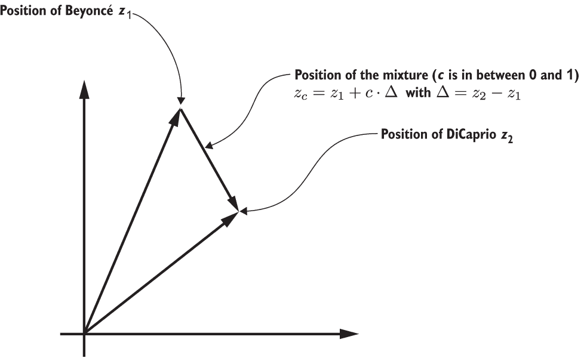

图 6.16 z 空间中混合的示意图。注意，*z* 空间是高维的，而不是如图所示的 2D。我们在Δ = z2 − z1 指向迪卡普里奥的方向上从贝昂丝进行线性插值移动。

我们从 c = 0（贝昂丝）开始，沿着 Δ 的方向移动到迪卡普里奥。然后你使用 NF *x**[c]* = *ɡ*(*z**[c]*) 从 *z* 空间移动到 *x* 空间。对于某些 c 的值，结果图像 xc 在图 6.17 中显示。


图 6.17 从碧昂丝到莱昂纳多·迪卡普里奥的变形。值从左到右依次为，c = 0（100%碧昂丝），c = 0.25，c = 0.5，c = 0.75，和 c = 1（100%迪卡普里奥）。动画版本可在[`youtu.be/JTtW_nhjIYA`](https://youtu.be/JTtW_nhjIYA)找到。

图 6.17 的优点是，对于所有中间的 xc 值，面部看起来多少有些逼真。问题是我们在高维空间中能否找到其他有趣的方向？结果证明，是的。

CelebA 数据集标注了 40 个类别，例如有胡须、大鼻子、双下巴、微笑等。我们能用这些来找到胡须方向吗？我们取所有标记为胡须的图像的平均位置，称之为 z1，然后取所有标记为无胡须的图像的平均值，称之为 z2。现在让我们希望△ = *z*[1] - *z*[2]确实是一个有胡须的方向。这些方向已经被 OpenAI 计算出来，我们可以在笔记本中使用它们。让我们试一试，给迪卡普里奥长出胡须。结果如图 6.18 所示。

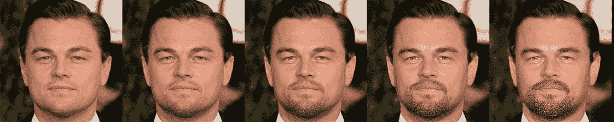

图 6.18 给莱昂纳多·迪卡普里奥长胡须。值从左到右依次为，c = 0（原始，无胡须），c = 0.25，c = 0.5，c = 0.75，和 c = 1。您可以在[`youtu.be/OwMRY9MdCMc`](https://youtu.be/OwMRY9MdCMc)找到动画版本。

这非常令人着迷，因为胡须信息在流的训练过程中没有被使用。只有在训练完成后，在潜在空间中才找到了胡须的方向。让我们尝试理解为什么在潜在*z*空间中的移动会在*x*空间中产生有效的图像。看看从碧昂丝到莱昂纳多·迪卡普里奥的变形示例。在 196,608 维*x*空间中有两个点。为了更好地理解，让我们再次打开第 6.3.5 节中讨论的 2D 示例。请随意打开笔记本[`mng.bz/RArK`](http://mng.bz/RArK)并向下滚动到单元格，理解混合。2D 示例中的*z*分布是由两个独立的高斯分布产生的（见图 6.19 的左侧），而*x*分布看起来像一把飞镖（见图 6.19 的右侧）。

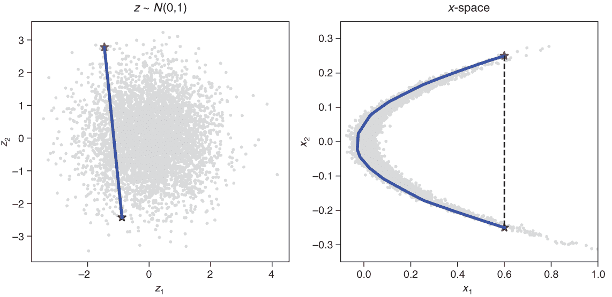

图 6.19 展示了复杂*x*分布（右侧所示）和潜在*z*分布（左侧）。学习到的 Real NVP 流将潜在空间转换为*x*空间。*z*空间中的直线对应于*x*空间中曲线的移动。

我们从*x*空间中的两个点开始：在高维示例中，那是碧昂丝和迪卡普里奥。在我们的 2D 示例中，这些点是（0.6，0.25）和（0.6，-0.25），在图 6.19 中标有星号。然后我们使用逆流来确定*z*空间中相应的 z1 和 z2 点，在图 6.19 的左侧标有星号。在*z*空间中，然后我们沿着直线从 z1 移动到 z2。（这就是你在图 6.16 中看到的内容。）在图 6.19 中，你可以看到左侧的线完全在分布内。我们不移动到没有训练数据的区域（灰色点）。现在，我们将线转换回真实数据的*x*空间。你可以在图 6.19 的右侧看到，结果线现在是弯曲的，并且仍然停留在有数据的区域。在高度空间中也会发生同样的情况，这就是为什么贝昂丝和迪卡普里奥之间的所有点看起来都像真实人脸的原因。

如果我们直接连接*x*空间中的两个点会发生什么？我们会离开已知点的区域（见图 6.19 中的虚线）。在高维空间中也会发生同样的情况，产生的图像不会像真实图像。那么山羊胡呢？再次，我们在潜在空间*z*中沿着直线移动，而不离开分布。我们从有效点（迪卡普里奥）开始，沿着某个方向（在我们的例子中，是山羊胡）移动，而不离开*z*分布。

## 摘要

+   实际世界的数据需要复杂分布。

+   对于分类数据，多项分布提供了最大的灵活性，但缺点是参数很多。

+   对于具有许多可能值的离散数据（如计数数据），多项分布是无效的。

+   对于简单的计数数据，泊松分布是合适的。

+   对于包括计数数据在内的复杂离散数据，混合离散逻辑分布已在野外成功应用，如 PixelCNN++和 parallel WaveNet。

+   正态流（NF）是建模复杂分布的另一种方法。

+   NFs 基于学习一个转换函数，该函数从简单的基分布到感兴趣的复杂真实世界分布。

+   可以通过 NN 实现强大的 NF。

+   你可以使用基于 NN 的 NF 来模拟高维复杂分布，如人脸。

+   你还可以使用 NF 模型从学习到的分布中采样数据。

+   TFP 提供了以 NF 为中心的`bijector`包。

+   正如第四章和第五章所述，在 NFs 的学习中，最大似然（MaxLike）原理起到了作用。

1.如果你感兴趣，预处理是使用统计软件 R 完成的；脚本可在[`mng.bz/lGg6`](http://mng.bz/lGg6)找到。我们想感谢苏黎世大学的 Sandra Siegfried 和 Torsten Hothorn 为我们提供帮助和 R 脚本的初始版本。

2.更精确地说，它需要严格单调。

3. 我们取绝对值（|dz| 和 |dx|），因为 dz 和 dx 可能是负数。

4. 事实上，自回归流也存在。由于不同的权衡，这些网络在训练时速度快，但在预测时速度慢。结果发现 WaveNet 就是一种自回归流。
