# 7 贝叶斯学习

本章涵盖

+   将外推识别为深度学习的阿基里斯之踵

+   贝叶斯建模的温和介绍

+   模型不确定性的概念，称为认知不确定性

+   贝叶斯方法作为处理参数不确定性的最先进方法


本章介绍了贝叶斯模型。除了似然方法之外，贝叶斯方法是最重要的方法来拟合概率模型的参数并估计相关的参数不确定性。贝叶斯建模方法还包含一种额外的不确定性，称为认知不确定性。您将看到，引入认知不确定性可以导致更好的预测性能，并且更恰当地量化预测结果分布的不确定性。当将预测模型应用于训练期间未见过的情境时，认知不确定性变得尤为重要。在回归中，这被称为外推。

您在本章中会看到，如果这些传统非贝叶斯模型用少量数据进行训练或用于外推，它们不会表达不确定性。但贝叶斯模型会。因此，当您有少量训练数据或无法排除遇到训练中未见过的情境时（如房间里的象，参见本章开头的图），使用贝叶斯方法会更好。您还会看到，即使是像赢得 ImageNet 挑战的顶级深度学习模型，在分类象方面通常表现很好，但这些模型无法正确分类房间里的象。相反，它们会预测一个错误的类别，通常概率很高。在处理新情境时无法传达不确定性并因此产生不可靠的预测，这是非贝叶斯深度学习模型的一个严重缺陷。另一方面，贝叶斯深度学习模型具有表达不确定性的能力。

在本章中，您将学习贝叶斯建模方法并将其应用于简单模型；例如，将抛硬币以贝叶斯方式作为类似 Hello World 的示例。此外，您还将应用贝叶斯建模到线性回归。结果证明，像神经网络这样的更复杂模型需要对贝叶斯建模方法进行近似。我们将在第八章中介绍这些内容。本章是关于理解贝叶斯建模原理的。在深入贝叶斯建模方法之前，让我们看看传统的非贝叶斯神经网络模型有什么问题。

## 7.1 非贝叶斯深度学习的问题：房间里的象

在本节中，你会发现深度学习模型有时会（带着天真和自信）讲述一个完全错误的故事。我们展示了两个例子，一个是回归，另一个是分类，其中非贝叶斯深度学习失败了。对于回归，我们提供了一个简单的一维玩具示例，你将立即理解它失败的原因。对于分类，例子是通常的图像分类，因此更复杂，但原则是一样的。

通常，传统的深度学习模型的预测在应用于训练中使用的相同数据时非常可靠，这可能会让你产生一种虚假的安全感。贝叶斯建模有助于提醒你潜在的错误预测。然而，在解决传统神经网络模型的弱点之前，我们首先回顾一下深度学习的成功。

让我们回到深度学习还没有取得突破的时代。我们是在 2012 年；iPhone 才五岁。我们正在看的是：

+   没有可能实现具有合理性能的文本到语音转换。

+   计算机不擅长识别你的手写体。

+   需要一个语言学团队来开发一个翻译程序。

+   机器无法理解照片。

在图 7.1 中，你可以看到两个可以被 VGG16 网络正确分类的例子。VGG16 网络是在 2014 年引入的，是早期开始图像分类深度学习革命的神经网络。你可以使用以下笔记本来自行进行分类。

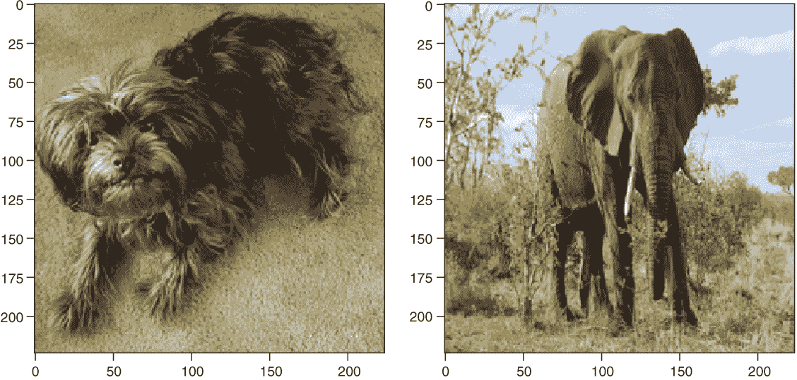

图 7.1：深度学习的良好案例。左侧图像展示了一只被正确分类为猴面犬的狗。右侧图像展示了一头被分类为象种（长鼻象）的大象。狗的图像来自[`mng.bz/PABn`](http://mng.bz/PABn)，大象的图像来自[`mng.bz/JyWV`](http://mng.bz/JyWV)。

|  | 实践时间 打开[`mng.bz/1zZj`](http://mng.bz/1zZj)并遵循笔记本。它为这一节生成了本章的图像。尝试理解笔记本中发生的事情。 |
| --- | --- |

所有工作都已完成。在深度学习中没有问题需要修复，我们完成了。但并非如此。为了了解深度学习中的一个重要未满足的挑战，请看图 7.2 左边的图像。图像清楚地显示了一些大象。然而，在图 7.1 中将大象正确分类为某种大象种类的同一网络，在图 7.2 的图像上却完全失败了——深度学习模型没有看到房间里的大象！

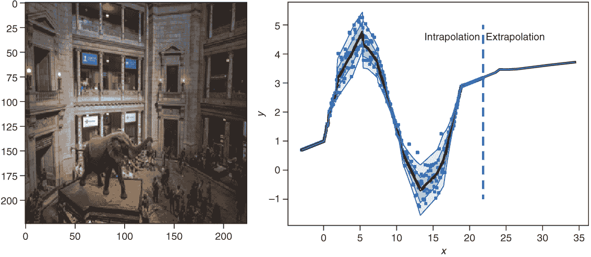

图 7.2 深度学习的一个糟糕案例。在 ImageNet 数据上训练的高性能 VGG16-CNN 未能看到房间里的大象！图像中对象的五个最高排名类别预测是马车、购物车、宫殿、电车和贡多拉；大象没有被找到！这张图像是训练集的外推。在虚线右侧的回归问题（外推）中，在没有数据的区域没有不确定性。

为什么深度学习模型看不到大象？这是因为用于拟合深度学习模型的训练集中没有房间内的大象图片。不出所料，训练集中的大象图片显示这些动物在自然环境中。这是一个典型的深度学习模型失败的情况：当面对在训练阶段没有见过的新的类别或情况时。不仅深度学习模型，当测试数据与训练数据不来自同一分布时，传统的机器学习（ML）模型也会遇到麻烦。夸张一点说，深度学习关键依赖于这个“大谎言”：

P(train) = *P*(test) = “大谎言”

假设 *P*(train) = *P*(test) 的条件始终成立；但在现实中，训练数据和测试数据并不经常来自相同的分布。想象一下，例如，你用一个旧相机拍摄的照片来训练一个图像分类模型，而现在你想要分类你用新相机拍摄的照片。

依赖于这种有问题的假设，即训练数据和测试数据之间没有系统性差异，是深度学习和机器学习的一般性主要弱点。显然，作为人类，我们显然以不同的方式学习。世界上没有哪个孩子在学习了大象的样子后，不会在图 7.2 中看到大象。有人推测为什么会这样。例如，朱迪亚·珀尔（Judea Pearl）建议，更智能和鲁棒的深度学习的关键是包括因果关系结构。到目前为止，深度学习只能利用数据中的统计相关性。目前，还没有明确的答案来解决这个问题。

即使我们的目标只是利用深度学习中的统计相关性，我们也面临一个严重的问题：网络不会告诉我们它在房间里的大象有问题。它不知道自己不知道。它只是将大象在行中的图片错误地分配到错误的类别，有时甚至以高概率分配。现在，想象一下你自己坐在一辆自动驾驶汽车里。你感到舒服吗？

看图 7.2 的右侧，我们可以看到这种缺乏识别的原因。网络在数据充足的区域对不确定性进行了完美的分配。不确定性是通过方差来衡量的，除了均值外还进行了建模。在第五章中，我们称这种类型的不确定性为随机不确定性。现在关注由外推指示的区域中的值*x*。例如，在*x* = 20 时，数据没有分散，接近零的不确定性是正确的，但当移动到更大的值并进入没有数据（外推）的区域时，问题就开始了。网络简单地取最后的不确定性值并将其外推到它尚未见过的区域，从而引用了《星际迷航》的座右铭：“勇敢地走向无人去过的地方。”好吧，也许太勇敢了。

类似地，大象问题可以看作是一个外推问题。当我们只有一个变量*x*时，我们可以在一条线上绘制它，并且很容易看出我们离开数据区域的情况。对于大象的情况，这就不那么容易了。我们不再有一个单一的实值量*x*，现在我们有像素数的平方（宽度为 256 的图像有 65,535 个值）。当你离开数据空间时，很难看出这一点。但是，这确实是一个需要解决的问题（再次想象坐在自动驾驶汽车里）。我们在第 7.2 节中讨论了这一点。

作为另一个例子，想象你想要将大量资金投资于某种投资，你的深度学习模型预测了巨大的回报。你难道不想知道你的深度学习模型对其预测结果分布是否确定吗？在另一个例子中，想象一个用于对医学组织学样本进行分类的深度学习系统。在这里，你也想知道预测类概率的确定性如何。（在不确定预测的情况下，你可以让医生更仔细地检查样本。）

网络如何告诉我们它感到不确定呢？解决方案是引入一种新的不确定性——认知不确定性。认知不确定性来源于古希腊单词“episte-me-”，意为知识。它反映了当你离开数据区域时的不确定性。在实践中，这种不确定性通过模型参数的不确定性来建模，因此有时也称为参数或模型不确定性。在第 7.2 节中，我们讨论了一种统计思维方式，称为贝叶斯推理。贝叶斯推理使我们能够对这种不确定性进行建模。

## 7.2 第一次接触贝叶斯方法

在本节中，我们试图通过一个直观的例子来理解贝叶斯统计学的原理，然后看看贝叶斯方法是如何对问题的认知不确定性进行建模的。

+   在第 7.2.1 节中，我们通过允许不仅仅有一个解，而是一系列解来扩展标准线性回归模型。

+   在 7.2.2 节中，我们再次审视 7.2.1 节中的直观解决方案，并用贝叶斯术语描述它，以介绍贝叶斯术语。

### 7.2.1 贝叶斯模型：黑客的方法

为了了解概率预测模型的认知不确定性意味着什么，让我们从一个简单的例子开始，该例子展示了黑客拟合贝叶斯模型的方法。我们使用四个点（见图 7.3）拟合一个概率线性回归模型。在这个模型中，我们假设数据有一个恒定的分散度，*σ* = 3，因此模型是

*P*(*y*|*x*, (*a*, *b*)) = *N*(*y* ;*μ* = *a* ⋅ *x* + *b* ,*σ* = 3)   *公式 7.1*

在图 7.3 中，你看到了两个与两个不同参数集 (*a, b*) 对应的线性回归模型示例。

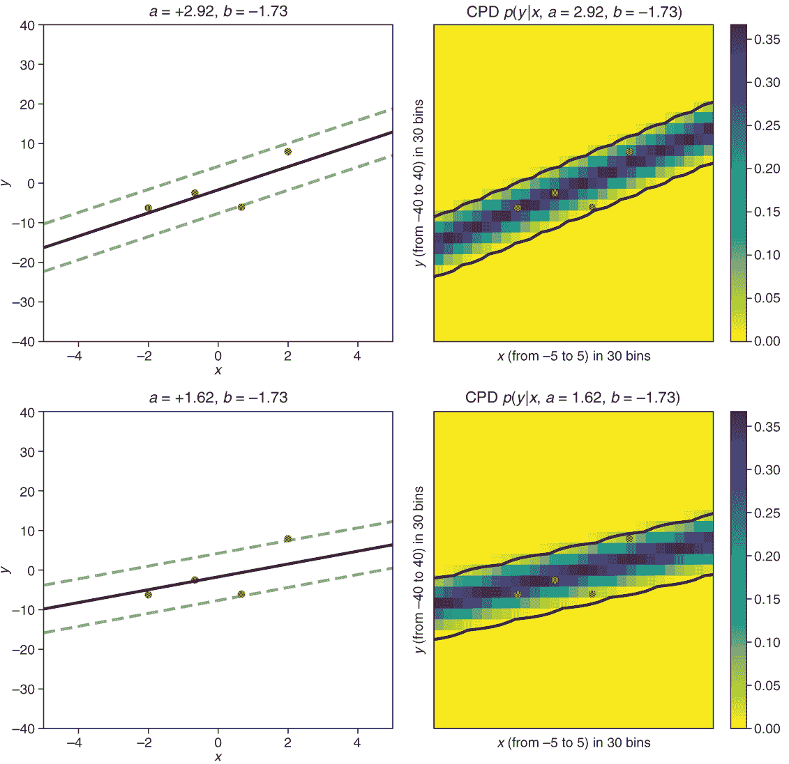

图 7.3 线性回归和数据。左侧列显示了指示参数值 *a* 和 *b* 的线性模型，其中均值线是实线，2.5% 和 97.5% 分位数。右侧列显示了结果 *P*(*y*|*x*, (*a, b*)) = *N*(*y*; *μ* = *a* · *x* + *b*, *σ* = 3) 的拟合条件预测分布，用颜色编码表示。在上排中，参数值对应于最大似然（MaxLike）值 aml 和 bml。

观察图 7.3，我们首先关注左部分。在上左部分，我们看到通过最大似然（MaxLike）原则拟合的线。如您从笔记本 [`mng.bz/wBrP`](http://mng.bz/wBrP) 中回忆起，MaxLike 是 0.064，使 MaxLike 最大的参数值是 *a* = 2.92 和 *b* = –1.73。图的下部分还有另一条线，用参数值 *a* = 1.62 和 *b* = –1.73 绘制，其似然为 0.056。当你被迫只给出一个 *a* 和 *b* 的值时，使用最大化似然（图中的上部分）的值是绝对有意义的。但也许完全忽略其他参数并不是一个好主意。考虑这些参数，但不要像信任最佳（MaxLike）解决方案那样信任它们。

如何衡量你能够信任一组参数 (*a, b*) 的程度？为什么不采用似然 *P*(*D*|(*a*, *b*)) 呢？似然与在假设我们的模型参数由值 *a* 和 *b* 给定时观察到的数据 D 的概率成正比。因此，我们希望按其似然比例对每个模型（由某些值 *a* 和 *b* 定义）进行加权。然而，你应该将这些正确的权重归一化，以便它们的总和为 1。为了实现这一点，我们使用归一化似然 *p**[n]*(*D*|(*a*, *b*)) 作为权重：

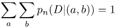

实际上，我们计算似然之和 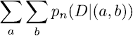 并将似然 *P*(*D*|(*a*, *b*)) 除以该数以获得归一化版本 *p**[n]*(*D*|(*a*, *b*)*)。图 7.4 显示了不同 *a* 和 *b* 值的归一化似然。

|  | 实践时间 打开 [`mng.bz/wBrP`](http://mng.bz/wBrP) 。这个笔记本包含了我们称之为贝叶斯黑客方法的代码，它生成了本章本节中的图。在阅读正文内容时，跟随笔记本，直到你看到分析解之前的“返回正文”符号。 |
| --- | --- |

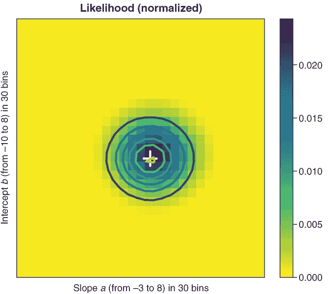

图 7.4 对于真实值 *s* = 3 和不同斜率 (*a*) 和截距 (*b*) 参数值的观测数据的标准化似然。似然 *pn*(*D*|(*a, b*)) 是标准化的，意味着所有像素的总和为 1。

现在我们来看图 7.3 的右侧。我们感兴趣的数量是什么？它是观察给定 *x* 值的 *y* 值的概率，该模型是在某些训练数据 D 上训练的 *P*(*y*|*x*,*D*)。对于这个数量，我们考虑了所有可能的 *P*(*y*|*x*, (*a*, *b*)) 值。图 7.3 右上角显示了一个使用 *a* 和 *b* 的 MaxLike 估计的例子。另一个使用不同 *a* 和 *b* 值的例子显示在图 7.3 右下角。我们现在将成千上万的 *P*(*y*|*x*, (*a*, *b*)) 与不同的 *a* 和 *b* 值相加，并用标准化似然 *p**[n]*(*D*|(*a*,*b*)) 加权，以得到给定 *x* 的 *y* 的预测分布。图 7.5 展示了这个原理。

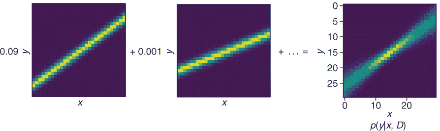

图 7.5 等号左边的图像显示了概率回归模型 *P*(*y*|*x*, (a, b))，每个模型对应一组不同的参数 (*a, b*)。图像左边的因素表示在相应模型下观测到的四个数据点 D 的标准化似然 *p**[n]*(*D*|(*a, b*))。将不同的模型 *P*(*y*|*x*, (*a, b*)) 相加，并用标准化似然 *p**[n]*(*D*|(*a, b*)) 加权，结果就是等号右边显示的贝叶斯预测模型。

用更数学的语言来说

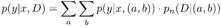

求和遍历所有可能的参数 *a* 和 *b* 的值。让我们再次看看方程，也许从稍微不同的角度。模型 *P*(*D*|(*a*,*b*)) 由参数 *a* 和 *b* 决定。数据只用来确定具有特定参数值 a 和 *b* 的标准化概率（σ = 3 已给出）。因为 a 和 *b* 是连续量，我们实际上是在 *a* 和 *b* 上积分。但我们甚至更粗心；我们只是在约 30 个不同的 *a* 和 *b* 值上评估方程 7.2。列表 7.1 提供了对应于方程的代码，图 7.6 显示了由此得到的预测分布 *P*(*y*|*x*,*D*)。1

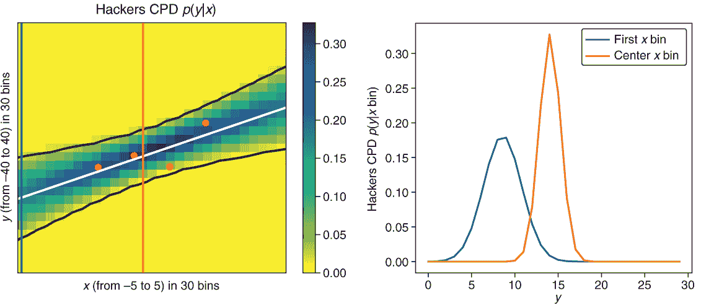

图 7.6 使用左侧颜色编码显示的四个数据点训练的贝叶斯线性回归模型的预测分布，右侧通过条件分布显示在两个不同的 *x* 位置（右侧的线条所示）。你可以清楚地看到，当离开有数据的 *x* 区域时，不确定性会增大。

对应于方程 7.2 的代码

```
pyx = np.zeros((nbins_c, nbins_c), dtype=np.float32)   ❶ 
for a in np.linspace(amin, amax, nbins):               ❷ 
    for *b* in np.linspace(bmin, bmax, nbins):
        p = getProb(a,b)                               ❸ 
        pyx += pre_distribution(a,b) * getProb(a,b) 
```

❶ 从一张空白画布开始

❷ 对所有参数 a 进行循环

❸ 根据数据获取参数 a 和 *b* 的概率

### 7.2.2 我们刚才做了什么？

你将在第 7.3 节中看到，我们在第 7.2.1 节中进行的实验实际上得到了一个称为贝叶斯统计学的坚实理论的良好支持。在第 7.2.1 节中，你看到了拟合贝叶斯模型的一种黑客方法。它不仅使用了对权重的一个 MaxLike 估计，而且还使用了一个可能的权重分布。这个关于 w 的分布由归一化似然 *p**[n]*(*D*|*w*) = *C* ⋅ *P*(*D*|*w*) 给出，其中 C 是归一化常数。

当拟合预测模型时，你主要对给定输入 *x* 的结果 *y* 的预测分布感兴趣。这是我们第四章中引入的 CPD（条件概率分布）：*P*(*y*|*x*, *D*)。方程 7.2 告诉你如何以黑客的方式获得这个预测分布。你取 900 个可能的权重向量 *w**[i]* = (*a*, *b*)，对应于 30 个不同值 *a* 和 *b* 的可能组合，然后进行以下求和：

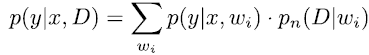

对于权重，我们使用归一化似然 *p**[n]*(*D*|*w*) = *C* ⋅ *P*(*D*|*w*)。参数 *w**[i]* = (*a*, *b*) 是连续值。如果你想要在数学上更准确，你应该使用积分而不是求和。为了得到对结果 *y* 的连续权重预测 CPD *P*(*y*|*x*,*D*)，你应该对所有可能的权重进行如下积分：

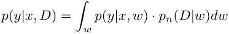

让我们尝试确定与第四章和第五章中之前概率模型相比发生了什么变化，这些变化是由 MaxLike 方法引起的。

首先，一个新事物是，在训练好的神经网络中，你不是与固定权重工作，而是与权重分布 *p**[n]*(*D*|*w*) 工作。权重分布 *p**[n]*(*D*|*w*) 在贝叶斯处理中被称为后验分布，因为它是在（后）你看到一些数据 D 之后推导出来的。为了强调这是在看到数据之后，我们用 *P*(*w*|*D*) 表示后验。这是在数据 D 的条件下权重 w 的概率。我们将在下一节数学上推导这个方程。这个名字后验某种程度上暗示了在看到一些数据之前也存在某种先验分布。你将在下一节学习关于先验分布的内容。但就目前而言，请注意，在前面的小实验中，我们使用的是均匀先验。在下一节，你还将学习如何从先验参数分布得到后验分布。

之前的概率模型只预测了 CPD，它只捕捉了数据内在变异性中的随机不确定性。贝叶斯模型预测了一个包含两种不确定性的 CPD（见方程 7.3）：数据内在变异性中的随机不确定性和参数值的不确定性，这种不确定性被参数 *P*(*w*|*D*) 的概率分布所捕捉。稍后，你会看到，在原则上，认知不确定性可以减少到零（如果你有无限数量的训练数据，这些数据涵盖了所有可能的情况）。你不能通过更多的数据来减少随机不确定性。你还会看到，在（罕见的）认知不确定性为零的情况下，结果 CPD，*P*(*y*|*x*, *D*)，与第四章和第五章中的最大似然 CPD 相同。但在我们 7.2.1 节的小例子中，我们只有四个数据点，因此认知不确定性不是零，最大似然模型（见图 7.3）与贝叶斯模型（见图 7.6）看起来相当不同。在最大似然方法中，模型为每个输入 *x* 预测一个 CPD，该 CPD 具有恒定的宽度（也在训练期间没有数据可用的 *x* 范围内）。在贝叶斯模型中，预测的 CPD 在外推到新的 *x* 范围时会变得更宽。这是一种相当好的行为。你的不确定性应该在离开已知领域时增加！我们将在 7.3.3 节稍后回到这个点，并比较我们简单的线性回归例子中的 ML 方法与贝叶斯方法。但首先，让我们更仔细地看看贝叶斯方法。

## 7.3 贝叶斯概率模型的方法

通过概率分布来设置包含其参数值不确定性的模型的想法相当古老。托马斯·贝叶斯牧师（见图 7.7）在 18 世纪开发了这种方法。如今，统计学中有一个分支被称为贝叶斯统计学。

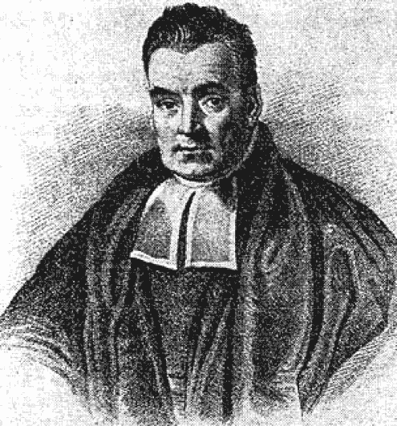

图 7.7 托马斯·贝叶斯（1701-1761）是一位英国统计学家、哲学家和长老会牧师。这张图片来自维基百科([`en.wikipedia.org/wiki/Thomas_Bayes`](https://en.wikipedia.org/wiki/Thomas_Bayes))，可能并没有展示贝叶斯本人。但由于没有其他肖像可用，如果需要贝叶斯的图片，它总是被使用。

贝叶斯方法是一种确立的、清晰且详尽的拟合概率模型的方法，这些模型可以捕捉不同类型的不确定性。它是一种进行统计学和解释概率的替代方法。在主流统计学（所谓的频率统计学）中，概率是通过分析重复（频繁）的测量来定义的。更确切地说，概率是在进行无限次重复时相对频率的理论极限。相比之下，在贝叶斯统计学中，概率是以信念程度来定义的。一个结果或参数的某个特定值越有可能发生，对其的信念程度就越高。这个看似松散的想法也导致了概率的有效定义。

在贝叶斯方法中，没有计算机的帮助，只能解决最简单的问题。因此，在 20 世纪的大部分时间里，这种方法都处于停滞状态。但现在，随着计算能力的增强，这种方法被频繁使用。它是一种强大的方法，特别是当你有一些你想要建模的先验知识时。

在 7.3.1 节中，你将学习如何使用贝叶斯方法进行拟合过程。我们概述了在贝叶斯统计中使用的重要术语和数学定律。在 7.3.2 节中，你将使用所学技能来拟合一个 Hello World 贝叶斯模型。

### 7.3.1 使用贝叶斯模型进行训练和预测

贝叶斯统计中最著名的公式之一被称为贝叶斯定理。它甚至出现在软件公司 HP Autonomy 在剑桥办公室悬挂的霓虹灯牌上（见图 7.8）。除了爱因斯坦的 E = m ⋅ c²，没有多少其他数学公式达到了这样的知名度。

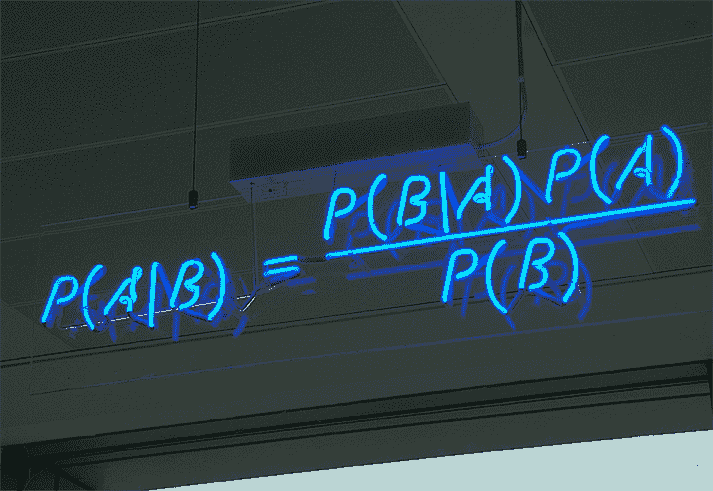

图 7.8 贝叶斯定理定义了如何从逆条件概率 P(B|A)、P(A)和 P(B)推导出 P(A|B)。（此图来自[`mng.bz/7Xnv`](http://mng.bz/7Xnv) 。）

贝叶斯定理将四个概率联系起来：给定 B 的 A 的条件概率 P(A|B)，该条件概率的倒数，给定 A 的 b 的概率 P(b|A)，以及 A 和 b 的无条件概率 P(A)和 P(B)。在本节末尾的侧边栏中，你会看到贝叶斯定理的推导是简单的。但让我们首先用它来拟合一个贝叶斯概率模型。为此，你将用模型的参数θ代替 A，用 D（代表数据）代替 B。这产生了一个更有用的贝叶斯定理形式：

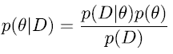

方程 7.5 中的量非常突出，以至于它们都有名字：

+   *P*(*θ*|*D*) --后验（给定数据*D*的参数*θ*的某个值的概率）

+   *P*(*D*|*θ*) --逆（称为似然*D*）

+   *P*(*θ*) --先验

+   *P*(*D*) --该量（也称为边缘似然或证据）

注意，在贝叶斯解释中，参数*θ*的某个值并不是确定无疑的，而是由概率分布*P*(*θ*)描述的不确定性。这个分布*P*(*θ*)定义了每个参数值*θ*的概率。某个参数值*θ*的概率可以解释为对该参数值的信念程度。2

贝叶斯定理是拟合贝叶斯（或贝斯）模型的核心，因为它提供了从数据中学习模型参数后验分布的指导。这对应于在非贝叶斯模型拟合中，给定训练数据 D 找到最大似然参数值*θ**[maxLik]*，但现在我们得到了整个分布*P*(*θ*|*D*）。了解参数*θ*的后验分布是概率贝叶斯模型所需的一切。现在你可以确定预测分布：

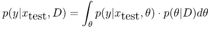

在上一节中，我们使用暴力方法近似了这个预测分布，其中我们只考虑了连续参数*θ*的一些离散值*θ* i。在先前的回归示例中，参数是斜率和截距，*θ**[i]* = (*a**[i]* , *b**[i]*)。

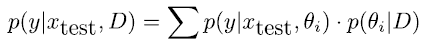

为了解释预测分布的公式，记住最大似然模型中的预测分布是有帮助的：

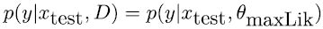

我们为 CPD 选择了参数*θ*的分布，然后使用数据来确定*θ**[maxLik]*。给定*θ**[maxLik]*，所有可能的输出*y*都遵循 CPD *P*(*y*|*x**[test]*, *θ**[maxLik]*)，因此你可以在计算*θ**[maxLik]*后忘记数据。使用贝叶斯方法，你不会处理与单个（优化*D*）参数值对应的 CPD，而是对许多 CPD（*P*(*y*|*x**[test]*, *θ**[i]*)）进行加权平均（权重为*P*(*θ**[i]*|*D*)），具有不同的参数值*θ**[i]*，以获得预测分布（例如，参见图 7.5）。

为了获得更深入的理解，想象以下例子。你管理着一个主动管理的基金，你需要对未来某只股票价值的概率预测，因此你想要 *P*(*y*|*x**[stock]*, *θ**[i]*)。你的团队中有几位专家。每位专家 i 提供一个略微不同的概率预测 *P*(*y*|*x**[stock]* , *θ**[i]*)。从这些预测中，你能做的最好的事情就是平均预测的 CPDs，并给每个 *P*(*y*|*x**[stock]* , *θ**[i]*) 一个适当的权重。这个权重应该与专家模型在过去给定股票数据 D 上的表现（似然 *P*(*D*|*θ**[i]* )）成比例。进一步，你还需要加入你对这些专家模型的一般主观判断（先验 *P*(*θ**[i]* )）。或者，如果你不愿意评判专家，你也可以给每个专家相同的先验主观判断（先验是常数）。这给了你未归一化的后验分布（见方程 7.5）。归一化后，这告诉你使用后验 *P*(*θ**[i]*|*D*) 作为权重，得到：

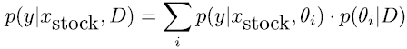

在这个观点中，贝叶斯模型是一个加权集成模型——我们使用群众的智慧，但权衡个别专家的贡献。为了明确不同分布的术语，我们在表 7.1 中收集了这些分布，以及相应的公式和一些解释。

表 7.1 本章使用的概率分布

| 名称 | 公式 | 备注/示例 |
| --- | --- | --- |
| 似然 | *P*(*D*&#124;*θ*) | D 是可能的数据，可以是单个量（如抛硬币）或成对的数据（如线性回归或典型的深度学习设置）。*y**[i]* 是在例子 i 中取的具体结果值。抛硬币：数据 D 是不同投掷的结果（正面 *y* = 1 或反面 *y* = 0）。单次投掷的似然 *P*(*y**[i]* , *θ*) 由伯努利分布确定：*θ* 是正面的似然，1 - *θ* 是反面的似然。线性回归：数据 D 现在是成对 (*x**[i]* , *y**[i]* )。参数 *θ* 由斜率 a 和截距 b 组成。单个例子的似然由 *P*(*y**[i]*&#124;*x**[i]* , (*a*, *b*)) 给出，由正态分布确定 (*y**[i]*&#124;*x**[i]* ) ∼ *N*(*a* ⋅ *x*[1] + *b* , *σ*)。 |
| 先验 | *P*(*θ*) | 在贝叶斯设置中，参数根据先验分布分布。在看到数据之前，你需要定义这个分布。在陈述你的先验信念时存在一定程度的主观性。一些例子包括：抛硬币：*P*(*θ*) = *U*(*θ* ; 0, 1)。 (你不相信任何人。正面出现的概率 *θ* 是均匀分布的。)回归：*P*(*a*) = *N*(*a* ; 0, 1)。贝叶斯网络：*P*(*w*) = *N*(*w* ; 0, 1)（权重是先验标准正态分布*D*）。 |
| 后验 | *P*(*θ* | *D*) | 参数分布是通过贝叶斯公式从数据中学习得到的。箴言：后验与似然乘以先验成比例 *P*(*θ* | *D*) ∝ *P*(*D* | *θ*) ⋅ *P*(*θ*)。归一化常数可以通过条件 *∫* *P*(*θ* | *D*)*dθ* = 1（对于连续参数）或从 ∑*[i]* *P*(*θ**[i]* | *D*) = 1（对于离散参数）来确定。 |
| MaxLike 设置中的预测分布 A.k.a CPD（条件概率分布）对于结果 y 或无条件结果概率分布（如果它不是从 *x* 预测的） | *P*(*y* | *θ**[MaxLike]* , *x*)*P*(*y* | *θ**[MaxLike]*) | y 现在是一个变量，而不是一个固定值。线性回归：*P*(*y* | *x*) = 1 /√(2 *πσ*² e*^(−(a ⋅ *x* + *b* − *y*)² /2σ²)* = *N*(*y* ;*a* ⋅ *x* + *b* , *σ*)，其中 a 和 *b* 从训练数据 D 中估计得出。在这里以及在典型的深度学习设置中，这个分布取决于 *x*（即 CPD）。抛硬币：伯努利 *P*(*y* = 1) = *θ* ，*P*(*y* = 0) = 1 − *θ* ，其中 *θ* 通过 MaxLike 从数据中估计得出。 |
| 贝叶斯设置中的预测分布（也称为后验预测分布）又称 CPD（条件概率分布）或无条件结果概率分布（如果它不是从 *x* 预测的） | *P*(*y* | *x*, *D*) | y 是一个变量，而不是一个固定值。它的分布取决于输入 *x* 和 D。通常，这是通过后验 *P*(*θ* | *D*) 通过 *P*(*y* | *x*, *D*) = *∫ p*(*y* | *x*,*θ*) ⋅ *P*(*θ* | *D*) *dθ* 来计算的。注意 *P*(*y* | *x*,*θ*) 是结果预测分布，它由参数值 *θ* 的分布（而不仅仅是 MaxLike 方法中的单个值 *θ**[MaxLik]*）的贡献组成。我们积分所有 *θ* 的值，并按照它们的后验概率 *P*(*θ* | *D*) 给予它们权重。 |

注意：关于如何阅读表 7.1 中公式的简单提示。管道符号（|）右侧的内容是“从”部分。管道符号左侧的内容是“到”部分。您应从右到左阅读这些术语。有时在心中在公式下方画一条箭头有助于使其更清晰。因此，*P*(*D*|*θ*) 是从参数 *θ* 得到数据 D 的概率。如果房间里有人在场，可以说，“*P*(*D*|*θ*) 是给定参数 *θ* 的数据 D 的概率。”但思想是自由的，思考您喜欢的内容。

贝叶斯定理（方程 7.5）允许你在拥有一些数据 D 的情况下，了解参数分布 *P*(*θ*|*D*) 的 *θ*。因此，*P*(*θ*|*D*) 被称为后验，因为你在看到数据之后确定它（名字后验来自拉丁语中的“post”，意为“之后”）。但如何推导 *P*(*θ*|*D*) 呢？你需要确定在参数 *θ* 的模型下观察到的数据 *P*(*D*|*θ*) 的似然性。此外，你需要知道先验 *P*(*θ*) 和证据 *P*(*D*)。因为你的训练数据 D 是固定的，*P*(*D*) 是一个常数。意识到 *P*(*D*) 是一个常数，会让你得出后验分布与似然性和先验的乘积成比例的结论：*P*(*θ*|*D*) ∝ *P*(*D*|*θ*) ⋅ *P*(*θ*)，这也就是所谓的贝叶斯咒语。

贝叶斯咒语 后验与似然性和先验的乘积成比例。

这表明证据 *P*(*D*) 只是为了确保后验概率的总和（或积分）为 1。在数学上，通常更方便使用贝叶斯咒语，并通过以下要求在计算比例之后进行计算：

∫ *P*(*θ*|*D*)*dθ* = 1

固定 *P*(*D*) 是容易的，但如何选择先验 *P*(*θ*) 呢？如果你对参数值没有先验知识，例如，你可以使用均匀分布，给每个参数值相同的概率。这意味着你选择的先验是：*P*(*θ*) = *const*。在这种情况下，后验分布 *P*(*θ*|*D*) 与似然性成比例。为什么？因为 *P*(*θ*|*D*) 是一个概率分布；因此，它必须积分到 1，因此，如果先验是常数，后验 *P*(*θ*|*D*) 就由归一化的似然性给出。这正是我们在黑客示例中使用的，我们在方程 7.2 中使用了不同参数值的归一化似然性来加权 CPDs 的贡献。这里再次展示：

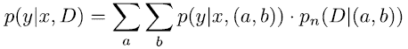

贝叶斯定理的推导

贝叶斯定理可以从乘法法则推导如下：

*P*(*a*, *B*) = *P*(*A*|*B*) ⋅ *P*(*B*)

简而言之，乘法法则表明，给定事件 A 和*b*同时发生的联合概率 *P*(*a, b*)，等于事件 A 发生的概率 *P*(A)，乘以当 A 发生时，*b*发生的概率 *P*(B|A)。从左到右阅读这些方程：*P*(B|A)是从 A 到*b*，或者更一般地，*P*(*to*|*from*)。这说得通！例如，考虑在海滩散步时找到牡蛎的概率 *P*(*oyster* = 0.2。一个牡蛎含有珍珠的概率是 *P*(*pearl*|*oyster*) = 0.01。

从这里你可以计算出找到含有珍珠的牡蛎的概率，通过

*P*(*oyster.with.pearl* = *P*(*oyster*) ⋅ *P*(*pearl*|*oyster*) = 0.2 ⋅ 0.001 = 0.0002。让我们推导贝叶斯公式。

*P*(*θ*|*D*) = *P*(*D*|*θ*) ⋅ *P*(*θ*) / *P*(*D*)

你需要使用前一个方程中的乘法法则，并意识到你可以消去 *a* 和 *b*。这样做得到这个方程：

*P*(*B*) ⋅ *P*(*A*|*B*) = *P*(*B*, *A*) = *P*(*a*, *B*) = *P*(*A*) ⋅ *P*(*B*|*A*)

将两边除以 *P*(B) 得到贝叶斯定理：

*P*(*A*|*B*) = *P*(*A*) ⋅ *P*(*B*|*A*) / *P*(*B*)

那很简单！鉴于贝叶斯定理的力量，推导过程就像吃蛋糕一样简单。然而，其他强大公式的推导，如 *E* =*mc*²，却要复杂一些。

在贝叶斯回归问题（以及后来的深度贝叶斯神经网络）中，我们想要预测每个输入的联合概率分布 *p*(*y*|*x*)。但在我们到达那里之前，让我们首先尝试拟合一个单一（无条件）分布 *P*(*y*)。

### 7.3.2 将抛硬币作为贝叶斯模型的“Hello World”示例

让我们使用第 7.3.1 节中学习的贝叶斯统计概念来拟合你的第一个贝叶斯模型。为了保持简单，让我们假设你想要预测抛硬币实验的结果。两种可能的结果是正面（*y* = 1）和反面（*y* = 0）。你想要确定两种可能结果的前瞻分布 *P*(*y*)。

注意，在这本书的多数其他例子中，你有一些输入，并且你已经根据输入值估计了结果分布。在这些类型的例子中，你估计的是结果的条件概率分布。在这个抛硬币的例子中，你没有输入变量。得到正面的概率不依赖于任何外部变量；你总是抛同一个硬币。因此，你只需要估计结果的无条件概率分布。

如果你知道这是一个公平的硬币，预测抛硬币例子的（无条件）结果分布就很容易。对于一个公平的硬币，前瞻分布将正面分配 0.5 的概率，反面分配 0.5 的概率。这种概率结果捕捉了硬币实验中固有的随机不确定性——你不知道你会得到正面还是反面。另一方面，认知不确定性为零。你肯定知道正面的概率是 0.5；毕竟，它是一个公平的硬币。

在概率模型方面，你将预测分布描述为具有二元结果 *y*（正面：*y* = 1，反面：*y* = 0）的伯努利分布。它只有一个参数 *θ*，对应于得到正面的概率，所以 *Θ* = *P*(*y* = 1)。如果你有一个公平的硬币，参数 *θ* 是 *θ* = 0.5。但 *θ* 可以取其他值。图 7.9 的左侧显示了固定 *θ* 的预测分布。

让我们假设这个硬币来自一个可疑的赌徒，你不能假设它是一个公平的硬币。你也不能说出 *θ* 的确切值。这意味着你需要估计正面的概率：*Θ* = *P*(*y* = 1)。

为了生成一些训练数据，你抛硬币三次，并且每次都观察到正面：D = (1, 1, 1)。哎呀，第一印象是你得到了一个不公平的硬币。但在三次抛掷之后你能有多确定？我们稍后会谈到贝叶斯处理，但首先，让我们用非贝叶斯方法来看看你能得到什么。

抛硬币例子的最大似然方法

让我们使用传统的非贝叶斯最大似然方法来拟合伯努利模型到抛硬币实验的结果。为了拟合模型，你使用你的训练数据：*D* = (*y*[1] = 1, *y*[2] = 1, *y*[3] = 1)。基于这些数据，伯努利模型中参数 *θ* 的最佳值是多少（见图 7.9）？

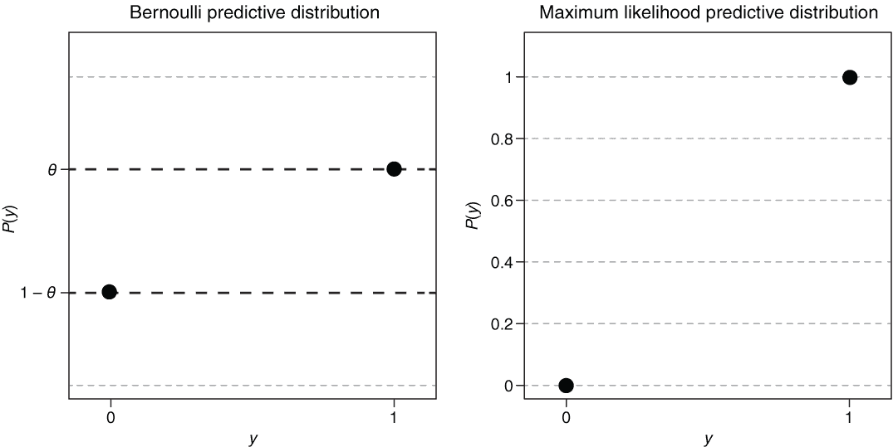

图 7.9 二元变量 *y* 的伯努利分布，参数为 *θ*（左）。在右侧，你看到通过观察连续三次正面得出的最大似然方法的预测分布。

最大似然估计的正面概率（*y* = 1）是通过观察到的正面次数（n1）除以抛掷次数（n）来计算的：*θ**[MaxLik]* = *n*[1] / *n* = 3 / 3 = 1。标准差由 *sd*(*θ**[MaxLik]*) =*θ**[MaxLik]* ⋅ (1 − *θ**[MaxLik]*) = 1 ⋅ 0 = 0 给出。（要查看标准差公式的推导，请参阅[` mng.bz/mB9a`](http://mng.bz/mB9a) 。）这意味着最大似然估计将概率设为 1，并且随机不确定性为零（*sd*(*θ**[MaxLik]*) = 0），分配给结果，正面。在这种情况下，预测分布（见图 7.9 右侧）不包含任何不确定性。得到的模型表明，抛硬币总是显示正面。在只看到三次抛掷之后，这是一个相当冒险的声明！

抛硬币例子的贝叶斯方法

让我们采用贝叶斯方法来拟合伯努利模型到抛硬币实验的结果。你假设你需要对参数 *θ* 的某些不确定性进行考虑。毕竟，你只有三个点的训练数据！而不是估计参数 *θ* 的单个（最优）值，你的目标是确定参数的后验分布。再次看看贝叶斯公式（方程 7.5）：

*P*(*θ*|*D*) = *P*(*D*|*θ*) *P*(*θ*) / *P*(*D*)

其中 *P*(*θ*|*D*) 是后验概率，*P*(*D*|*θ*) 是似然函数，*P*(*θ*) 是先验概率，*P*(*D*) 是边缘似然（用于归一化）。这告诉你需要确定联合似然 *P*(*D*|*θ*)，并且先验 *P*(*θ*) 和 *P*(*D*) 作为归一化常数。联合似然是什么？你将所有三个观察到的似然相乘，从而得到联合似然：

*P*(*D*|*θ*) = *P*(*y* = 1) ⋅ *P*(*y* = 1) ⋅ *P*(*y* = 1) = *θ* ⋅ *θ* ⋅ *θ* = *θ*³

现在，我们应该选择什么样的先验？你知道参数 *θ* 必须在零和一之间，因为它是每次抛掷得到正面的概率。让我们假设零和一之间的所有 *θ* 值都是等可能的，并采用均匀分布。因为 *θ* 可以取零和一之间的任何值，所以 *P*(*θ*) 是一个连续概率分布，需要积分到一（参见图 7.11 的上部分）。

但在处理连续分布和积分以推导解析解之前，我们再次使用暴力方法。为此，我们建议你遵循笔记本中的代码并做练习。

通过暴力近似求解抛硬币示例的贝叶斯解

|  | 实践时间 打开[`mng.bz/5a6O`](http://mng.bz/5a6O) 。这个笔记本展示了如何通过暴力方法以贝叶斯方式拟合伯努利分布。

+   假设均匀先验，使用暴力方法进行抛硬币实验。

+   调查在大训练数据集情况下参数后验形状的发展。

|

要使用暴力方法，我们在 19 个网格点（*θ*[1] = 0.05 , *θ*[2] = 1, *θ*[3] = 0.15 ,..., *θ*[19] = 0.95）上采样先验 *P*(*θ*)。在这个暴力方法中，我们只有 *θ* 1 的一组离散值，因此我们可以用总和代替积分，用概率代替概率密度。这是因为我们假设先验 *P*(*θ*) 的所有 19 个值具有相同的概率：*P*(*θ*) = 1/19 ≈ 0.052632（参见图 7.10 的左上部分）。

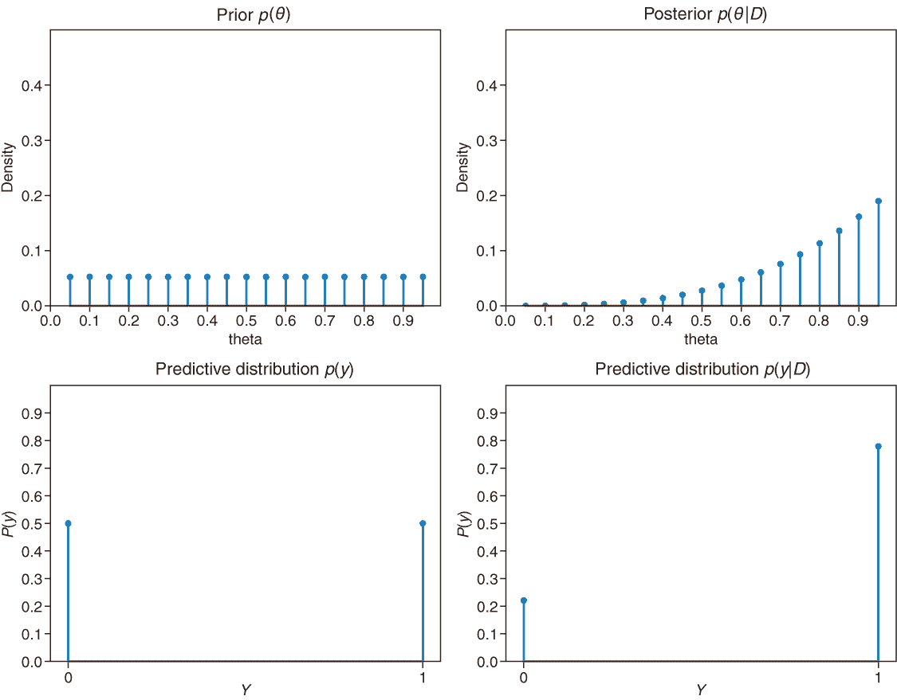

图 7.10 先验分布（左上部分）和后验分布（右上部分）。下部分显示了结果的 CPD（条件概率分布）（正面为 1，反面为 0）。这些图是通过暴力方法对抛硬币实验进行创建的。

在计算后验参数分布之前，让我们看看在看到任何数据之前，结果的预测分布看起来如何。因为先验给出了所有 *θ* i 值相同的概率，所以你期望正面和反面的概率是相等的。让我们检验我们的直觉，并使用这个方程推导出预测分布：

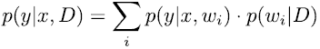

在抛硬币示例中，我们称模型参数为 *θ* 而不是 w，我们没有输入 *x*，这导致：

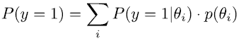

将 *P*(*y* = 1|*θ**[i]* ) = *θ**[i]*（正面的似然）和 *P*(*θ*) = 1/19 ≈ 0.052632（先验）代入，得到 *P*(*y* = 1) = 0.5，相应地，*P*(*y* = 0) = 1 − *P*(*y* = 1) = 0.5。这正是我们预期的：正面和反面的概率各为 50%（参见图 7.10 的左下部分）。你可以使用这里给出的贝叶斯咒语确定未归一化的似然：

贝叶斯咒语 后验是似然乘以先验的比例。

让我们计算每个 19 个网格点 *θ* i 的非规范化后验（见表 7.2）：

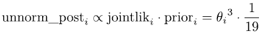

要得到规范化后的后验值，你需要将每个非规范化后验值除以所有值的总和：

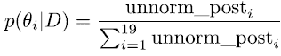

对于得到的结果，查看图 7.10 中的右上角图。正如预期的那样，在看到三次正面后，后验分布倾向于接近一的 *θ* i。但后验分布仍然给小于一的 *θ* 值分配一些概率，允许硬币在每次投掷时不一定总是出现正面。现在你有了所有基于后验确定预测分布的要素：

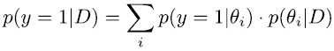

表 7.2  收集在表中的暴力结果。每一行对应一个网格点。列包含参数值（`theta`）、联合似然（`jointlik`）、`prior`、非规范化后验（`unnorm_post`）和 `post`。

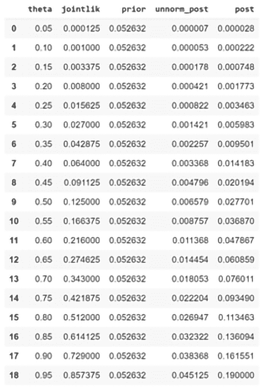

将 *P*(*y* = 1 | *θ**[i]* ) = *θ**[i]*（正面的似然）和 *P*(*θ**[i]*|*D*)（来自表 7.2 的最后一列的后验）代入

*P*(*y* = 1 | *D*) = 0.78

和

*P*(*y* = 0 | *D*) = 1 −*P*(*y* = 1 | *D*) = 0.22

根据基于后验的这种预测分布，你可以预期有 78% 的概率出现正面，22% 的概率出现反面（见图 7.10 的右下角图）。

解析地解决抛硬币例子的贝叶斯解决方案

对于抛硬币的例子，拟合贝叶斯伯努利模型是一个如此简单的问题，以至于你可以精确地解决它。不过，让我们看看它是如何工作的。

对于先验分布，你再次使用均匀分布，给每个可能的 *θ* 分配相同的先验概率。因为我们希望 *P*(*θ*) 是一个有效的概率分布，所以 *P*(*θ*) 需要积分等于一。因此，先验参数分布是 *P*(*θ*) = 1，对于 *θ* 在零和一之间。要在连续先验下推导先验预测分布，你可以从方程 7.6 开始：

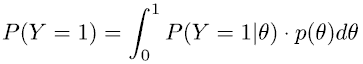

但在这里你没有输入特征 *x*，你处于看到数据之前的情况，这意味着你也没有数据 D，你需要使用先验 *P*(*θ*)，而不是后验 *P*(*D*|*θ*)，得到：

*P*(*y*) = *∫* [θ] *P*(*y*|*θ*) · *pn*(*θ*) *dθ*

方程 7.6 的无条件情况下的变体

因此，在看到数据之前预测结果 *y* = 1 的预测概率可以确定如下：

| 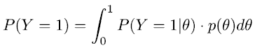  | （我们使用方程 7.4。） |
| --- | --- |
| 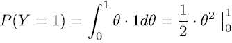  | （我们进行积分并得到 *θ* 的反导数 ½ *θ*²。） |
| 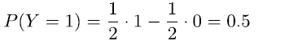  | （我们输入数字。） |
| 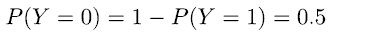  | （我们使用逆概率来计算 *P*(*y* = 0)。） |

哎呀！这成功了，你得到了与暴力方法相同的先验预测分布（见图 7.11 的左下角面板）。为了确定后验，你将再次使用贝叶斯公式：

*P*(*θ*|*D*) = *P*(*D*|*θ*) ⋅ *P*(*θ*) / *P*(*D*)

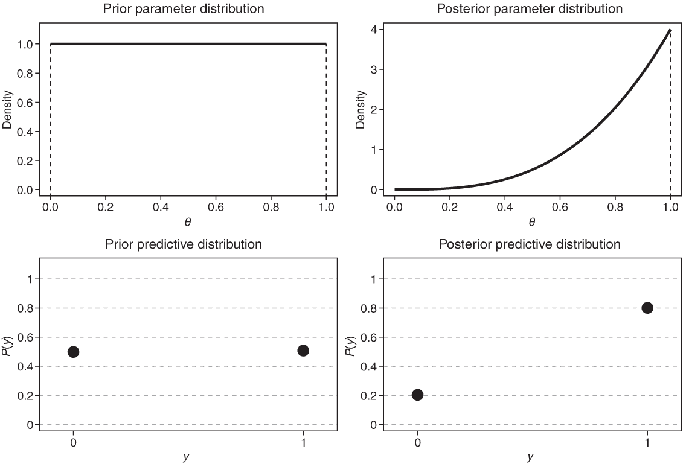

图 7.11 分析方法下抛硬币实验的先验和后验分布（上部分）以及相应的预测分布（下部分）。

这个公式中的项有以下名称：

*P*(*θ*|*D*) = *P*(*D*|*θ*)

+   *P*(*θ*|*D*) 是后验。

+   *P*(*D*|*θ*) 是似然。

+   *P*(*θ*) 是先验。

+   *P*(*D*) 是边缘似然（用于归一化）。

这个公式告诉你，如果你想确定未归一化的后验，你需要确定联合似然 *P*(*D*|*θ*) 和先验 *P*(*θ*)。你已经有了先验 *P*(*θ*) = 1。那么联合似然是什么？与暴力方法相同。让我们回顾一下。你有三个观察结果（三次正面），得到联合似然：

*P*(*D*|*θ*) = *P*(*y* = 1) ⋅ *P*(*y* = 1) ⋅ *P*(*y* = 1) = *θ* ⋅ *θ* ⋅ *θ* = *θ*³

现在你已经拥有了计算参数分布后验所需的一切。为了帮助理解，你可以使用贝叶斯咒语：后验与似然乘以先验成正比。我们将在下一步确定归一化常数 C。

*P*(*θ*|*D*) = *后验* = *C* ⋅ *似然* ⋅ *先验* = *C* ⋅ *θ*³ ⋅ 1

让我们推导确保后验积分为一的归一化常数 C：

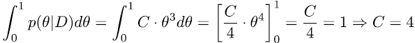

将 C = 4 代入你上面推导的后验公式，得到后验 *P*(*θ*|*D*) = 4 ⋅ *θ*³。让我们享受你推导出的后验（见图 7.11，右上部分）。形状看起来与暴力方法得到的结果相似，倾向于接近 1 的 *θ* 值。值得注意的是，后验仍然捕捉到一些不确定性；它并不声称硬币总是落在正面。在这种情况下，后验在图 7.11 中看起来像 1 处的尖锐峰值。

让我们推导后验下的预测分布。考虑到后验参数分布，你可能会预期它为正面（*y* = 1）分配比反面（*y* = 0）更高的概率。你通过使用方程 7.6 的一个版本来推导后验预测分布，但在这里我们没有 *x*，方程看起来是这样的：

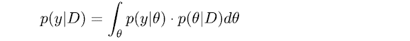

方程 7.6 对于无条件设置（我们没有任何 *x*）

在抛硬币的例子中，这导致

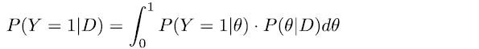

当将 *∫*[0]¹ *P*(*Y* = 1|*θ*) = *∫*[0]¹ θ ⋅ 4 ⋅ *θ*³ *dθ* 和 *P*(*θ*|*D*) = 4 ⋅ *θ*³ 代入时，你得到

| *P*(*Y* = 1 &#124;*D*) = *∫*[0]¹ *P*(*Y* = 1&#124;*θ*) ⋅ *P*(*θ*&#124;*D*) *dθ* | (我们使用方程 7.4.) |
| --- | --- |
| *P*(*Y* = 1 &#124;*D*) = *∫*[0]¹ *θ* ⋅ 4 ⋅ *θ*³ *dθ* = 4/5 ⋅ *θ*⁵ &#124;[0]¹ | (我们进行积分，得到 4θ⁴ 的反导数 /5 *θ*⁵。) |
| *P*(*Y* = 1 &#124;*D*) = 4/5 ⋅ 1⁵ − 4/5 ⋅ *θ* ⁵ = 0.8 | (我们代入数字。) |
| *P*(*Y* = 0) = 1 − *P*(*Y* =1) = 0.2 | (我们使用逆概率来计算 *P*(*Y* = 0).) |

再次，你得到的结果与暴力近似相似（但更精确）。贝叶斯预测分布对结果留有一定的不确定性，并给出了观察尾巴的 20%概率（见图 7.11，右下角面板）。在只观察了三次投掷后，这似乎是合理的。在这种情况下，贝叶斯模型似乎比 MaxLike 模型更可取，后者预测出头的概率为 100%（见图 7.9，右面板）。

硬币投掷示例和笔记本中的练习得出的要点

+   在简单的模型，如伯努利模型中，可以对后验和预测分布进行解析推导。使用暴力方法，你可以近似解析解。暴力方法的优势在于，当积分变得困难时，它仍然有效。请注意，暴力方法也不是万能的。它不能用于像神经网络这样的复杂问题。

+   与先验相比，后验给导致观察数据更高似然率的参数值分配了更多的质量（概率）。

+   与 MaxLike 方法不同，在贝叶斯方法中，你不会只选择具有最高概率的一个参数值来推导预测分布。相反，你会在所有可能的预测分布上平均，这些分布由相应参数值的后验概率加权。训练数据集越大，后验分布的分散就越小（如笔记本[`mng.bz/5a6O`](http://mng.bz/5a6O)中所示）。

+   训练集越大，先验的影响越小（如笔记本中所示）。

+   对于大型训练数据集，后验分布是围绕 MaxLike 参数估计的一个狭窄（高斯）分布。

关于先验选择的（有趣）事实

你在回归和硬币投掷示例中看到了如何训练一个简单的贝叶斯模型。在第八章中，你将看到如何训练贝叶斯深度学习模型。但在这样做之前，让我们先对贝叶斯方法建立一些信心，并消除对先验使用的担忧。在贝叶斯建模中，你不仅需要为结果的 CPD 选择一个分布，而且在看到任何数据之前，你还需要为先验*P*(*θ*)选择一个分布。

在获得一些训练数据后，你可以通过使用贝叶斯定理（方程 7.5）来确定后验*P*(*θ*|*D*）。然而，先验分布仍然有一定的影响，因为你是用它来确定后验的。这种贝叶斯训练程序在通常内向的统计学家中引发了一场大讨论。反贝叶斯阵营的主要论点是

+   使用先验引入了主观性。通过先验，你可以给某些参数范围赋予高概率。结果，你会将后验拉向这个范围。

+   “让数据说话”更科学。

另一方面，贝叶斯阵营认为

+   所有合理的先验都会导致类似的模型，这些模型在大型数据集上都会收敛到使用最大似然方法得到的模型。

+   先验的“向先验收缩”效应有助于避免假阳性结果。

为了支持他们的第二个论点，贝叶斯统计学家选择了一项经验研究（发表在科学生物学期刊上），该研究以非贝叶斯方式进行分析，并得出结论：漂亮的父母比不漂亮的父母有更多的女儿（p 值为 0.015）。a 这个结果被解释为进化效应，因为对于女性来说，比男性更有利于长得漂亮。这些结果被报道在公共媒体上，例如“每日邮报”，在那里你可以找到著名和美丽的父母和他们第一个女儿的照片（见[`mng.bz/6Qoe`](http://mng.bz/6Qoe) 。如果你启用了广告拦截器，链接可能无法工作*D*）。

数据来自一项英国研究，研究人员要求教师对学生的吸引力进行评分。四十年后，这些长大成人的学生被问及自己孩子的性别。非贝叶斯分析发现，与不那么吸引人的父母相比，漂亮的父母中女儿的比例显著更高。著名贝叶斯统计学家安德鲁·杰尔曼通过使用先验，对父母吸引力对其子女性别的影响给予了较高的概率，重新分析了这些数据。他通过以下事实来证明其先验选择的合理性：所有其他已知的影响子女性别的因素（例如，例如，父母在怀孕期间的压力）也都是小的。他的分析得出结论，父母的吸引力不会影响生女孩的可能性。

为了支持先验的使用，杰尔曼进行了一项模拟研究，研究中有小到中等的效果大小和相当小的样本量。在大多数模拟运行中，以非贝叶斯方式分析这些数据导致了非显著的结果。但由于其随机性，一些运行导致了显著的结果。在这些显著结果中，40%的报告效应指向了错误的方向！而且如果结果引人注目，它就会被发表。因此，杰尔曼认为，使用保守的先验作为正则化方法进行贝叶斯分析更为合理。

深度学习模型使用偏好小权重值的先验来正则化权重是否合理？我们认为是的，并给出一些理由：

+   经验表明，经过训练的神经网络通常具有较小的权重。

+   较小的权重导致输出（在分类中，概率）不那么极端，这对于未经训练的模型来说是理想的。

+   预测模型的一个已知属性是，向损失函数中添加一个偏好较小权重的组件，通常有助于提高预测性能。这种方法也被称为正则化或非贝叶斯神经网络中的权重衰减。

a p 值估计的是由于纯偶然性发现观察到的效应（或更强的效应）的概率。通常，p 值低于 0.05 的发现被称为具有统计学意义。

### 7.3.3 重新审视贝叶斯线性回归模型

在本章的开头，您看到了如何以黑客的方式做贝叶斯线性回归。在黑客的方式中，我们使用了具有无限大先验的贝叶斯模型来处理两个参数*a*和*b*。这个模型有一个很好的特性，即在没有训练数据的外推范围内获得更多的不确定性（参见图 7.12 的右侧）。而传统的通过 MaxLike 方法拟合的模型则不是这样（参见图 7.12 的左侧）。

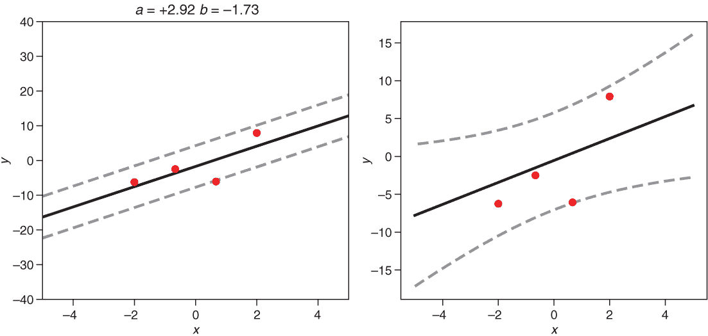

图 7.12 在假设已知数据分布，*σ* = 3 的情况下，用概率线性回归模型拟合了四个数据点。在左侧，您可以看到 MaxLike 模型；在右侧，是具有无限大先验的贝叶斯模型。实线代表预测结果分布的均值，虚线表示 CPD 的 2.5%和 97.5%分位数。

由于只有贝叶斯模型能够在离开已知领域时表达增强的不确定性，因此似乎拟合贝叶斯模型比拟合传统的基于 MaxLike 的模型更好。这在图 7.12 中的两个拟合中是显而易见的。当观察预测 CPD 的宽度时，贝叶斯模型在离开有数据范围时预测了一个更宽的 CPD。但是，在训练数据的插值范围内，贝叶斯模型的不确定性也比 MaxLike 模型高。因为模型拟合仅依赖于四个数据点，贝叶斯模型较高的不确定性可能更符合实际情况，这也支持我们选择贝叶斯模型。另一方面，大的分散也可能只是由于用于模型参数（斜率和截距）的宽泛先验（均匀分布）。为了调查贝叶斯模型是否为条件结果分布提供更现实的预测，让我们进行一些实验来回答以下问题：

+   预测分布如何依赖于先验和训练数据量？

+   贝叶斯模型是否比传统的基于 MaxLike 的模型有更好的预测性能？

为了回答这两个问题，你可以进行以下实验：

1.  从具有*σ* = 3 的线性数据生成过程中模拟出几个不同大小的训练数据集（例如，2、4、20 和 100 个数据点）。然后对所有训练集拟合 MaxLike 模型和三个贝叶斯模型：一个具有均匀先验，一个具有标准正态先验，一个具有以 0.1 为尺度的均值中心正态分布。检查结果 CPD 如何随着先验宽度的变化而变化。同时检查贝叶斯 CPD 的宽度是否随着训练数据的增加而减小，并逐渐接近 MaxLike 模型的 CPD。

1.  调查不同训练集大小的情况下，贝叶斯模型或基于最大似然（MaxLike）的模型的预测性能是否更好。从训练集的 *x* 值范围内采样一个训练集和一个测试集。然后拟合贝叶斯模型和最大似然模型，并确定测试集的负对数似然（NLL）。（预测性能更好的模型会产生更低的测试 NLL。）为了得到可靠的结果，你应该使用大的测试数据集，并重复整个过程几次，以便比较获得的测试 NLLs 的结果分布和均值。

在开始这些实验之前，你需要确保可以在合理的时间内完成它们。不幸的是，贝叶斯拟合的暴力方法太慢了。如果我们知道解析解，我们可以大大加快拟合过程。你在 7.3.2 节中的抛硬币例子中看到，确定解析贝叶斯解需要解决一些积分。你能够在抛硬币例子中解决这些积分，因为你只有一个模型参数，并且似然和先验分布都很简单。但在具有许多参数的更复杂模型中，这些积分会迅速变得复杂。结果发现，贝叶斯通常不能解析求解，而必须求助于模拟或近似。这也是贝叶斯模型在大量计算能力出现之前并不受欢迎的原因。你将在第八章中了解更多关于这些近似的内容。

对于一个简单的线性回归模型，例如黑客的例子，仍然可以推导出贝叶斯解。为此，你需要假设数据方差 *σ* 2 是已知的（就像我们在黑客的例子中所做的那样）。进一步，你需要为模型参数的斜率和截距使用高斯先验。但即便如此，推导过程已经相当冗长。因此，你可以跳过数学推导，直接实现计算后验和预测分布的解析公式（参见本章最后一份笔记本）。Christopher M. Bishop 的《模式识别与机器学习》中给出了公式的完整处理和推导，你可以通过[`mng.bz/oPWZ`](http://mng.bz/oPWZ) 访问。

使用解析表达式，你可以检查是否可以重现 7.2 节中贝叶斯黑客例子的结果。在黑客的例子中，我们使用了均匀先验。这可以通过在解析解中将高斯先验的尺度参数设置为无穷大（或非常大）来实现。如果你想自己验证，我们建议你从本章开头的贝叶斯黑客之道笔记本的最后部分开始（参见[`mng.bz/qMEr`](http://mng.bz/qMEr)）。现在，你已经掌握了快速、解析的贝叶斯解，你可以在下面的笔记本中执行两个建议的实验。

|  | 实践时间 打开[`mng.bz/nPj5`](http://mng.bz/nPj5)。这个笔记本生成了图 7.13 中的图表，并回答以下问题：

+   预测分布如何依赖于先验和训练数据量？

+   贝叶斯模型是否比传统的基于 MaxLike 的模型有更好的预测性能？

|

使用这个笔记本，你可以调查这两个问题。让我们看看第一个问题：预测分布如何依赖于先验和训练数据量？简短的回答是，如果先验分布不是极其狭窄，那么先验分布的选择并不关键。训练数据量越大，贝叶斯模型就越接近 MaxLike 模型。在笔记本中，你可以一步步地解决这个问题。

在解析解的高斯先验中，你可以设置均值和标准差。作为先验的均值，你选择零，因为你不知道截距或斜率是正数还是负数。主要的调整参数是先验的尺度*σ*0。将其设置为较大的数值，如*σ*[0] = 10000，相当于平坦的先验，而将其设置为较小的数值，如*σ*[0] = 0.1，则会在零均值周围产生尖锐的先验。在图 7.13 中，你可以看到*σ*[0] = 0.1 的先验会产生一个斜率接近 1 的预测分布，其宽度相对较小，并且在显示的*x*范围内不发生变化。另一方面，*σ*0 = 1 的先验会产生一个与*σ*[0] = 10000 的平坦先验相对应的 CPD。这表明均值为 0、标准差为 1 的高斯先验对结果的拟合没有大的偏差。这些陈述对所有大小的训练数据集都有效（见图 7.13 的上行和下行）。训练数据量大小的主要影响是，当使用较大的训练数据集时，贝叶斯模型的认知不确定性降低。在大训练数据集的极限情况下，不确定性纯粹是随机的，贝叶斯模型产生的 CPD 与基于 MaxLike 的模型相同（见图 7.13 的最右侧列）。

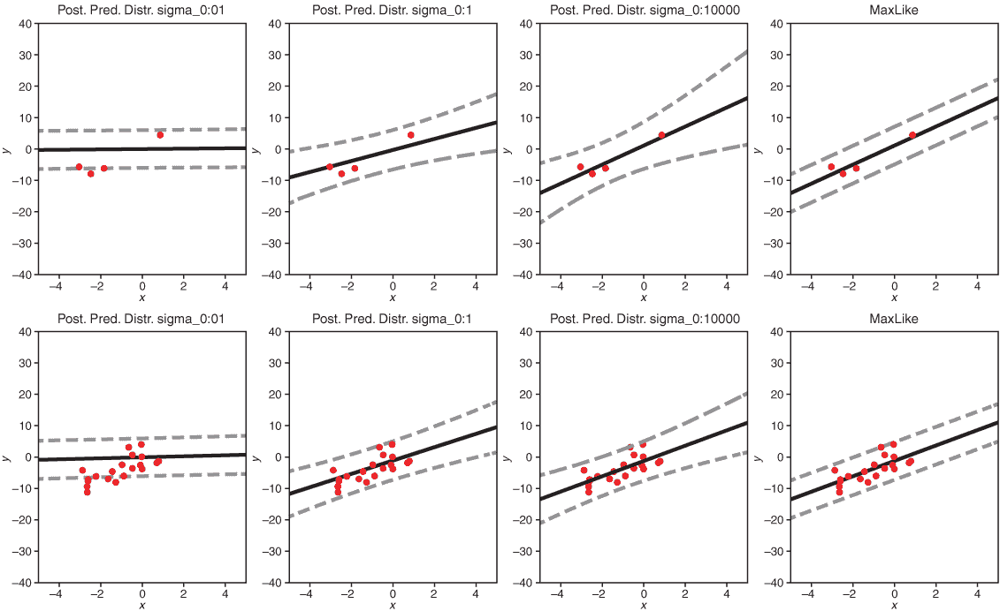

图 7.13 展示了先验尺度*σ*0 对贝叶斯线性模型（前三个列）中得到的预测 CPD 的影响，以及基于 MaxLike 的线性模型对应的 CPD（最右侧列）。贝叶斯模型使用给定的数据标准差为 3，斜率和截距的先验为高斯分布，均值为 0，标准差分别为 0.1、1 和 10,000（见图表标题）。在上行中，训练数据包含 4 个数据点；在下行中，包含 20 个数据点。

让我们转向第二个问题：贝叶斯模型是否比传统的基于最大似然模型有更好的预测性能？简短的答案是肯定的！如第五章所述，测试负对数似然（NLL）是量化比较不同模型预测性能的适当度量：越低越好。为了调查贝叶斯和最大似然模型在测试 NLL 上的差异，并超出随机变化，你需要在 100 个模型上平均测试 NLL，每个模型使用新生成数据。图 7.14 显示了结果。你可以看到贝叶斯模型优于基于最大似然模型。当使用贝叶斯模型而不是传统的基于最大似然模型时，训练数据集越小，预测性能的提升就越大。

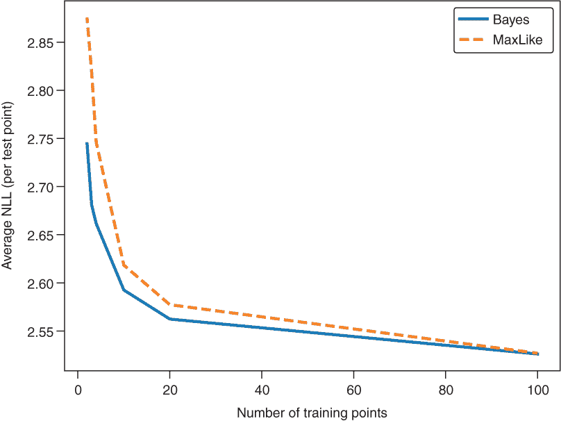

图 7.14 通过测试 NLL（越低越好）比较贝叶斯模型和基于最大似然线性模型的预测性能。两个模型都使用给定的数据方差。贝叶斯模型使用均值为 0 和尺度为 1 的高斯分布来处理斜率和截距。

有没有直观的解释说明为什么贝叶斯方法优于最大似然方法？还记得第 7.3.1 节中的金融专家的例子吗？贝叶斯方法使用了许多人的智慧，而最大似然方法依赖于单个最佳专家的专长。如果数据很少，听取许多专家的意见是有意义的。

在下一章转向贝叶斯神经网络之前，让我们总结一下你应该从贝叶斯建模的介绍中吸取的内容。贝叶斯模型可以通过概率分布捕捉关于其参数值的认知不确定性。要采取贝叶斯方法，你需要为参数分布选择一个先验。先验可以是常数（均匀分布*D*）或钟形（正态分布，通常均值为零），旨在包含先验知识或正则化模型。当训练贝叶斯模型时，后验被确定。用于训练的数据越多，后验的分布（方差）越小，这表明参数（认知）不确定性降低。如果你有一个大的训练数据集，你的贝叶斯模型会产生与最大似然模型相似的结果。

## 摘要

+   数据中的固有不确定性，称为随机不确定性，可以用第四章到第六章中介绍的概率方法进行建模。

+   此外，贝叶斯概率模型也捕捉了认知不确定性。

+   认知不确定性是由对模型参数的不确定性引起的。

+   非贝叶斯模型在离开已知基础时无法表达不确定性。（这些模型无法谈论房间里的大象。）

+   贝叶斯模型在预测外推区域或训练数据不足的情况下可以表达不确定性。

+   在贝叶斯模型中，每个参数都被一个分布所取代。

+   在拟合贝叶斯模型之前，你需要选择一个先验分布。

+   贝叶斯咒语是：“后验是先验乘以似然。”这是贝叶斯定理的一个结果。

+   与固有的随机数据不确定性相反，通过扩展训练数据，你可以减少认知模型参数的不确定性，从而得到一个方差更低的后验分布。

+   如果训练数据有限，贝叶斯模型比非贝叶斯变体显示出更好的预测性能。

1. 对于那些对统计回归模型有一定经验的人来说，这可能会引起共鸣，他们可能会查看图 7.6 中的预测带。确实，当计算包含条件正态分布均值参数置信区间的预测区间时，你会得到一个类似的结果。对于不是太大太复杂的模型，这种模型参数的置信区间可以通过贝叶斯统计方法计算出来。但对于具有数百万参数的复杂非线性深度学习模型，这些非贝叶斯的不确定性度量需要重新采样方法以及多次重新拟合神经网络，这太耗时了，以至于不可行。

2. 在这本书中，我们对数学符号的使用比较宽松。如果参数 *θ* 是一个连续量，我们应该称之为概率密度而不是概率，但在这里以及本书的其余部分，我们并没有这样做。
