# 8 贝叶斯神经网络

本章涵盖了

+   适配贝叶斯神经网络（BNNs）的两种方法

+   贝叶斯神经网络（BNNs）的变分推断（VI）近似

+   贝叶斯神经网络（BNNs）的蒙特卡洛（MC）dropout 近似

+   TensorFlow Probability（TFP）的变分层来构建基于 VI 的 BNNs

+   使用 Keras 在 BNNs 中实现 MC dropout


在本章中，你将了解两种高效的近似方法，这些方法允许你使用贝叶斯方法对概率深度学习模型进行建模：变分推断（VI）和蒙特卡洛 dropout（也称为 MC dropout）。在设置贝叶斯深度学习模型时，你将贝叶斯统计与深度学习相结合。（在本章开头的图中，你可以看到贝叶斯统计学的创始人托马斯·贝叶斯牧师和深度学习领袖及奠基人之一杰弗里·辛顿的合成肖像。）有了这些近似方法，用许多参数拟合贝叶斯深度学习模型变得可行。正如第七章所讨论的，贝叶斯方法还处理了非贝叶斯概率深度学习模型中未包含的认识论不确定性。

在第四章、第五章和第六章中，你使用深度概率分类和回归模型进行了工作。这些模型通过预测结果的整体分布来捕捉数据固有的（随机）不确定性。在第七章中，你学习了另一种称为认识论不确定性的额外不确定性，它捕捉了结果分布的参数不确定性。当使用深度学习模型在新情况下进行预测时（回想一下房间里的大象），这种认识论不确定性变得至关重要。如果你看不到大象，你至少希望知道至少有什么地方不对劲。

你也看到了上一章，适配贝叶斯概率模型让你可以量化参数不确定性，而且更重要的是，它提供了更好的预测（负对数似然或 NLL 更低），尤其是在训练数据较少的情况下。不幸的是，如果你从小的玩具例子转向现实世界的深度学习任务，贝叶斯方法很快就会变得缓慢，实际上变得不可能。

在本章中，你将学习一些近似方法，这些方法允许拟合概率深度学习模型的贝叶斯变体。这为你提供了一个工具，可以检测预测结果分布是否不确定。贝叶斯深度学习模型的优势在于，它们可以通过表达更大的认识论不确定性来检测新情况，这导致结果不确定性更大。你会发现，贝叶斯深度学习回归模型在外推状态下报告更大的不确定性，而贝叶斯深度学习分类模型对新型类别提高不确定性标志，表明它们的预测不可靠。

## 8.1 贝叶斯神经网络（BNNs）

让我们将第七章中描述的贝叶斯方法应用于神经网络（NN）。图 8.1（左侧）展示了所有贝叶斯网络之母：贝叶斯线性回归。与标准概率线性回归相比，权重不是固定的，而是遵循一个分布 *P*(*θ*|*D*）。我们完全没有理由不能继续使用分布而不是单个权重来构建一个神经网络。图 8.1（右侧）也展示了一个这样的简单贝叶斯神经网络（BNN）。实际上，解决一个深度贝叶斯神经网络并不那么容易，但 TensorFlow Probability（TFP）为你提供了正确的工具。

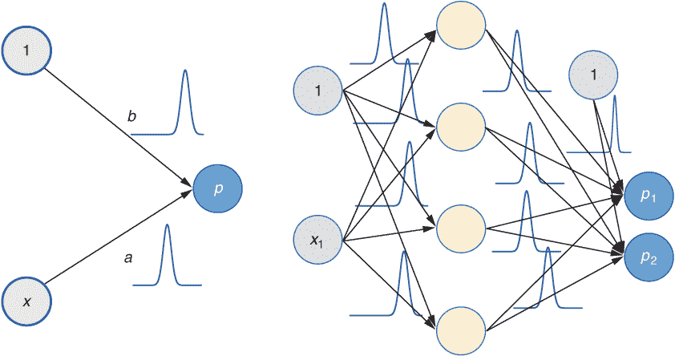

图 8.1 通过一个没有隐藏层且只有一个输出节点的简单神经网络，展示了贝叶斯简单线性回归问题的图形表示。这提供了对结果期望值的估计（左侧）。在贝叶斯神经网络线性回归的变体中，分布代替了斜率（a）和截距（b）。这同样适用于深度网络，从而产生贝叶斯神经网络（BNN）。这样的网络的一个简单例子在右侧展示。

在第 7.3 节中，我们使用解析方法来解决一个简单的线性回归问题。这个解决方案仅当参数 *σ* *x*，描述数据的分布，不依赖于 *x*，且必须预先知道时才可行。这种解析方法不适用于具有隐藏层的贝叶斯神经网络，因为它们太复杂了。你可能想知道我们是否应该再次回到第七章（第 7.2 节）中提到的贝叶斯黑客方法。原则上，这种方法也适用于更深的贝叶斯神经网络。然而，速度仍然是问题：如果我们直接从具有两个参数的贝叶斯线性回归到具有 5000 万个权重的神经网络，这将花费太长时间。

为了理解这一点，回顾第七章中提到的暴力方法，我们评估了变量 a 在 nbins = 30 个值。我们还评估了变量 *b* 在 nbins = 30 个值。总共，我们在 *nbins*² = 900 种不同的组合中评估了变量 a 和 *b*。对于一个有 5000 万个参数的网络，暴力方法需要评估后验概率在 `nbins⁵⁰` `million` 种不同的组合。让我们满足于只有 `nbins` `=` `10`。那么我们就有 10^(50,000,00) 次评估。如果你能每秒进行 10 亿次评估，那也需要 10^(50,000,00) / 10⁹ = 10^(49,999,991) 秒。即使是对于一个小型网络，有 100 个权重，也需要 10¹⁰⁰ /10⁹ = 10⁹¹ 秒（见以下有趣的事实）。

有趣的事实 前往 [`www.wolframalpha.com/`](https://www.wolframalpha.com/) 并在搜索框中输入 10⁹¹ seconds。解决方案：评估所有网格点需要 3.169 ⋅ 10⁸³ 年——大约是宇宙年龄的 10 亿倍！

对于贝叶斯神经网络，既不是解析方法也不是蛮力方法能解决问题。接下来是什么？有一个叫做马尔可夫链蒙特卡洛（MCMC，简称）的方法。这种方法比蛮力方法更有效地采样参数值。第一个 MCMC 算法是 20 世纪 50 年代和 70 年代开发的 Metropolis-Hastings 算法。世界上最大的技术专业组织，享有盛誉的 IEEE（电气和电子工程师协会），将这种方法列为 20 世纪科学和工程领域十大最具影响力的算法之一（见[`mng.bz/vxdp`](http://mng.bz/vxdp)）。它具有这样的优势，即如果计算足够，它是精确的。它也适用于小问题，比如 10 到 100 个变量（或在我们的语言中是权重），但不适用于具有数百万个权重的更大网络，如深度学习模型。

我们能做些什么来获得一个合理的时间来获得归一化后验的近似？有两种方法：一种是变分推断（VI）贝叶斯；另一种是蒙特卡洛（MC）dropout。变分贝叶斯方法被整合到 TFP 中，提供了 Keras 层来进行 VI。MC dropout 是一种简单的方法，也可以在 Keras 中实现。

## 8.2 变分推断（VI）作为近似贝叶斯方法

在无法确定贝叶斯神经网络的分析解或使用 MCMC 方法的情况下，你需要使用技术来近似贝叶斯模型。在本节中，你将了解这种近似方法——变分推断（VI）。在第 8.2.1 节中，我们详细推导了 VI 近似。在第 8.2.2 节中，我们使用 VI 近似来处理一个简单的线性回归示例。因为我们有这个示例的分析解（见第 7.3.3 节），我们可以判断 VI 近似的质量。

你可以使用 VI 近似方法来处理各种深度学习模型。在第 8.5 节中，你用它来处理两个案例研究：一个用于回归问题，另一个用于分类问题。为了理解这种方法的基本思想，并能够将其与一些精确方法进行比较，我们在第七章的相同简单线性回归问题上展示了这种方法。鼓励你在阅读文本的同时跟随笔记本。

|  | 实践时间打开[`mng.bz/4A5R`](http://mng.bz/4A5R)，在阅读文本的同时跟随笔记本。这个笔记本是关于贝叶斯方式的线性回归。它展示了解析方法、VI，以及如何使用 TFP。尝试理解笔记本中发生的事情。 |
| --- | --- |

深度学习中贝叶斯方法的核心理念是，在贝叶斯神经网络（BNNs）中，每个权重都被一个分布所替代。通常，这是一个相当复杂的分布，并且这些分布在不同权重之间不是独立的。VI 贝叶斯方法背后的想法是，通过一个简单的分布，称为变分分布，来近似复杂的权重后验分布。

通常人们使用高斯作为参数分布；当使用 TFP 时，这也默认使用。高斯变分分布由两个参数定义：均值和方差。网络不是学习单个权重值 w，而是必须学习权重分布的两个参数：高斯的均值*w**[μ]*和方差*w**[σ]*（见图 8.2）。除了用于近似后验的变分分布的类型外，我们还需要定义一个先验分布。一个常见的选择是将标准正态分布*N*(0, 1)作为先验。

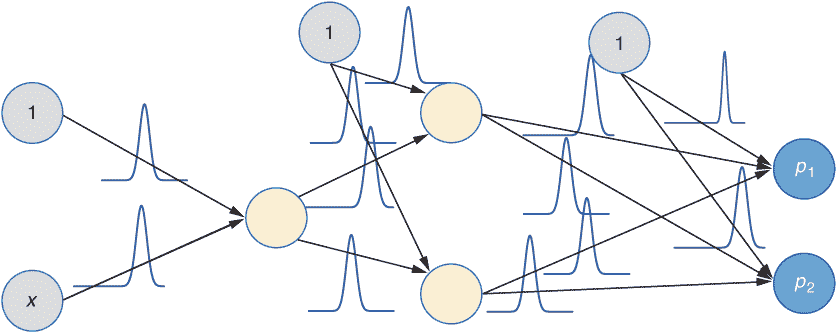

图 8.2 一个具有两个隐藏层的贝叶斯网络。这里的权重现在遵循一个分布，而不是固定的权重。

第 8.2.1 节和第 8.2.2 节内容较为复杂，但能为你提供一些关于 VI 近似推导的见解。如果你对推导不感兴趣，可以跳过这些章节。在第 8.3 节中，你将学习如何使用 TFP 的 VI 方法实现。

### 8.2.1 查看 VI 的内部机制*

VI 自 2013 年底阿姆斯特丹大学的 Kingma 和 Welling 发明变分自动编码器以来，在深度学习（DL）中得到了应用。我们这里使用的 VI 实现（称为反向传播的贝叶斯算法）在 Google DeepMind 科学家 Blundell 及其同事的论文“神经网络中的权重不确定性”中提出（[`arxiv.org/abs/1505.05424`](https://arxiv.org/abs/1505.05424)）。TFP 有效地整合了这一方法，你稍后将会看到。但首先让我们理解 VI 原理的内部机制。在图 8.3 中，你可以看到该原理的草图。


图 8.3 变分推断（VI）的原理。左侧较大的区域描述了所有可能的分布空间，左上角的点代表后验*P*(*θ*[1] |*D*)，对应于右侧面板中的虚线密度。在左侧面板中，内部区域描述了可能的变分分布*q**[λ]*(*θ*[1])的空间。通过内部循环中的点表示的优化变分分布*P*(*θ*[1] |*D*)，对应于右侧面板中显示的实线密度，其与后验的最小距离由虚线表示。

实际的标准化后验分布，*P*(*θ*|*D*)，是无法访问的。原因是需要解决的积分，以确保后验分布是归一化的（参见第 7.3.2 节），是高维的。如第 8.1 节所述，我们无法使用暴力近似，因为它太慢了。此外，这样的高维积分也太复杂，无法解析求解。

为了理解图 8.3 中不同参数的意义，让我们假设一个深度贝叶斯神经网络。参数 *θ* 替代了非贝叶斯神经网络变体的权重。贝叶斯网络中的参数 *θ* 不是固定的，而是遵循一个分布。

图 8.3 的左侧面板显示了可能分布的抽象空间，左上角的点代表后验 *P*(*θ*|*D*)。我们不是直接确定后验，而是用一个简单、变分的分布，*q**[λ]*(*θ*)，如高斯分布（参见图 8.3 右侧面板中的钟形密度）来近似它。有无数个高斯分布，但它们只是所有可能分布的一个子集。（在图 8.3 的左侧面板中，它被标记为带有 *q**[λ]*(*θ*) 标签的小区域。）VI 的工作是调整变分参数 *λ*，使得 *q**[λ]*(*θ*[1]) 尽可能接近真实后验 *P*(*θ*|*D*)。图的右侧再次显示了这种情况，针对单个 *θ* 1。1 维后验分布被一个 1 维高斯变分分布近似。对于每个高斯分布，你有两个参数：*λ* = (*μ* , *σ*)。这些被称为变分参数。

你希望变分分布尽可能接近真实后验分布，或者用更数学的说法：最小化良好分布与真实分布之间的距离。你可以通过操作变分参数 *λ* = (*μ* , *σ*) 来调整良好分布的形状。

可能有必要回顾所有术语。表 8.1 给出了 VI 的重要术语。你应该了解所有术语，除了最后一行。我们在第 8.2.2 节中介绍了最后一行的参数 w。

表 8.1 VI 中使用的不同术语

| Term | In the simple example | Name | Remarks |
| --- | --- | --- | --- |
| *θ* | *θ* = (*a, b*) = (slope, intercept) | Parameters | *θ*(theta) isn’t fixed but follows a distribution.In the non-Bayes case, *θ* is fixed and is identical to the tunable parameters w of the network. |
| *P*(*θ*&#124;*D*) | *P*(*a*&#124;*D*) | Posterior distribution | Usually not tractable. |
| *q**[λ]*(*θ*) | *N*(*a* ; *μ**[a]* , *σ**[a]*)*N*(*b* ; *μ**[b]* , *σ**[b]*) | Variational approximation | Tractable functions, such as an independent Gaussian for each *θ* i. |
| *λ* | *λ* = (*μ**[a]* , *σ**[a]* , *μ**[b]* , *σ**[b]*) | Variational parameters | Parameters of the variational distribution that approximate the posterior distribution. |
| *ω* | *w* = (*w*[0] ,*w*[1] , *w*[2] , *w*[3])*λ* = (*w*[0] , *sp*(*w*[1]), *w*[2] , *sp*(*w*[3])) | 可调参数 | 贝叶斯网络中的优化参数。快捷方式 sp(w1) 是指 `softplus` 函数，以产生正参数，这是高斯标准差所需的。 |

但你可以使用什么度量来描述两个分布之间的相似性或差异？也许更重要的是，你如何测量到一个你不知道的后验分布的差异？嗯，Kullback-Leibler (KL) 散度是这两个问题的答案。你已经在第 4.2 节中遇到了 KL 散度。让我们使用它，并写出 *P*(*θ*|*D*) 和 *q**[λ]*(*θ*) 之间的 KL 散度的公式。如果你记得第 4.2 节，KL 散度是不对称的。如果你幸运并且选择了正确的顺序，KL [*q**[λ]*(*θ*)||*P*(*θ*|*D*)]，未知的后验分布就会消失，你需要的表达式如下：

*λ*^* = argmin {KL [*q**[λ]*(*θ*) || *P*(*θ*)] − *E**[θ∼ qλ]* ) [log(*P*(*D*|*θ*)]}

*λ*^* = argmin {KL [*q**[λ]*(*θ*) || *P*(*θ*)] − *E**[θ∼ qλ]* ) [log(*P*(*D*|*θ*)]} 方程 8.1

如果你以不同的方式开始，并从 KL [*P*(*θ*|*D*)|| *q**[λ]*(*θ*)] 开始，你将无法得到方程 8.1 的可用表达式。（在侧边栏中，你可以找到方程 8.1 的推导）。这个方程看起来比实际要可怕一些。让我们更仔细地看看方程 8.1 中的两个项。

优化方程的推导

让我们推导方程 8.1。这涉及到一点微积分，所以如果你不喜欢这个，可以自由跳过。另一方面，这可能会很有趣，所以让我们开始吧。

我们从变分近似 *q**[λ]*(*θ*) 和真实后验 *P*(*θ*|*D*) 之间的 KL 散度开始。奇怪的是，我们不知道真实后验。但是，正如几行之后所显示的，如果我们计算 KL [*q**[λ]*(*θ*)|| *P*(*θ*|*D*)] 而不是 KL [*P*(*θ*|*D*)|| *q**[λ]*(*θ*)]，真实后验就会消失，你只需要计算的是变分分布和已知先验分布之间的 KL 散度。

让我们写出 KL 散度的定义，并用 D 表示数据。如果你记不起如何写出两个函数 f 和 g 的 KL 散度，也许这个经验法则会帮到你：它是“向后单独向下”，意味着 KL [*f*(*θ*)||*g*(*θ*)] 中的第二个函数 g 将单独位于分母中。以下 KL 散度的定义不应该让你感到太惊讶：

KL [*q**[λ]*(*θ*)|| *P*(*θ*|*D*)] = ∫ *q**[λ]*(*θ*) log( *q**[λ]*(*θ*) / *P*(*θ*|*D*) ) *dθ*

*P*(*θ*|*D*) 是第二个函数（“在后面”），因此它只在积分中单独出现一次（“单独”），并且它位于分母（“下面”）。（你也可以查阅 KL 散度的定义。）现在，有一些代数操作。请随意使用笔和纸跟随步骤。我们首先使用条件概率的定义，*P*(*θ*|*D*) = *P*(*θ*|*D*) / *P*(*D*)：

KL [*q**[λ]*(*θ*)|| *P*(*θ*|*D*)] = ∫ *q**[λ]*(*θ*) log( *q**[λ]*(*θ*) / (*P*(*θ*|*D*) / *P*(*D*) ) ) *dθ*

然后，我们使用对数运算规则 log(*A* ⋅ *B*) = log(*A*) + log(*B*) 和 log(*B* /*A*) = −log(*A* /*B*) 将积分分成两部分：

KL [*q**[λ]*(*θ*)|| *P*(*θ*|*D*)] = ∫ *q**[λ]*(*θ*) log *P*(*D*) *dθ* − ∫ *q**[λ]*(*θ*) log( *P*(*θ*|*D*) / *q**[λ]*(*θ*) ) *dθ*

因为 log *P*(*D*) 不依赖于 *θ*，我们可以将其放在积分之前：

KL [*q**[λ]*(*θ*)|| *P*(*θ*|*D*)] = log *P*(*D*) ⋅ ∫ *q**[λ]*(*θ*) *dθ* − ∫ *q**[λ]*(*θ*) log( *P*(*θ*|*D*)/ *q**[λ]*(*θ*) ) *dθ*

由于 *q**[λ]*(*θ*) 是概率密度，对于所有概率密度，积分等于 1，因此我们有 ∫ *q**[λ]*(*θ*) *dθ* = 1 :

KL [*q**[λ]*(*θ*)|| *P*(*θ*|*D*)] = log *P*(*D*) − ∫ *q**[λ]*(*θ*) log( *P*(*θ*|*D*) / *q**[λ]*(*θ*) ) *dθ*

第一项不依赖于变分参数 *λ*；因此，你需要最小化的只是 −∫ *q**[λ]*(*θ*) log( *P*(*θ*|*D*) / *q**[λ]*(*θ*) ) *dθ*。因此，最优值 *λ* 是：

*λ*^* = argmin {− ∫ *q**[λ]*(*θ*) log( *P*(*θ*|*D*)) / *q**[λ]*(*θ*) ) *dθ* }

现在，让我们将其整理成方程 8.1 的形式，其中 *P*(*θ*|*D*) = *P*(*D*|*θ*) ⋅ *P*(*θ*)

*λ*^* = argmin{− ∫ *q**[λ]*(*θ*) log(*P*(*D*|*θ*) ⋅ *P*(*θ*) / *q**[λ]*(*θ*) ) *dθ* }

并且使用对数运算规则：

*λ*^* = argmin {∫ *q**[λ]*(*θ*) log( *q**[λ]*(*θ*) / *P*(*θ*) ) dθ − ∫ *q**[λ]*(*θ*) ⋅ log *P*(*D*|*θ*) *dθ* }

第一项是变分分布与先验分布之间的 KL 散度的定义：KL [*q**[λ]*(*θ*)|| *P*(*θ*)]（记住“向下回溯”）。第二项是函数 log *P*(*D*|*θ*) 的期望的定义。所以最终我们有

*λ*^* = argmin {KL[*q**[λ]*(*θ*)|| *P*(*θ*)] − *E**[θ∼q[λ]]* [log(*P*(*D*|*θ*)]}

并且完成了方程 8.1 表达式的推导。这并不难，对吧？

因为我们想最小化方程 8.1，第一个项需要尽可能小。它又是 KL 散度，但这次，它是变分近似*q**[λ]*(*θ*)和先验*P*(*θ*)之间的。因为 KL 散度（某种程度上）是一个距离，这个项希望近似分布*q**[λ]*(*θ*)尽可能接近先验分布*P*(*θ*)。在贝叶斯神经网络中，先验通常选择为零附近，所以这个项确保了分布*q**[λ]*(*θ*)以小值为中心。因此，我们也称第一个项为正则化项。它倾向于以零为中心的*θ*分布。选择远离零的狭窄先验可能会导致性能不佳。

第二个项，*E**[θ∼q[λ]]* [log(*P*(*D*|*θ*)]，是一个老朋友。它计算给定参数*θ*的对数(*P*(*D*|*θ*))的期望值。参数*θ*根据变分分布*q**[λ]*(*θ*)分布，该分布由变分参数*λ*确定。但无论如何，*E**[θ∼q[λ]]* [log(*P*(*D*|*θ*)]是对对数(*P*(*D*|*θ*))的期望。你认识这个亲爱的朋友吗？好吧，也许，更仔细地看看。如果抽取次数趋于无穷大，期望就等于均值。但均值有时比期望更容易理解，所以我们选择均值，并从*q**[λ]*中抽取参数*θ*用于网络。

现在，看看图 8.3 的右侧。如果你从分布中抽取（例如，对于*θ* 1），你会得到*θ* 1 = 2。或者，在我们的线性回归例子中，你从*q**[λ]*(*a, b*)中随机选择 a 和*b*。然后，给定*θ* = (*a, b*)，你计算在数据 D 中观察到的对数概率。在假设数据像高斯分布围绕均值*μ* = *a* ⋅ *x*[1] + *b*且具有固定标准差*σ*的线性回归例子中，你会得到

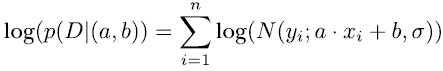

哦，你好。欢迎回来，我亲爱的朋友对数似然！我一开始怎么没看到你呢！让我们把它确定下来。第二个项（包括减号），−*E**[θ∼q[λ]]* [log(*P*(*D*|*θ*)]，是平均 NLL，我们总是喜欢最小化它。平均是在*θ*的不同值上进行的，这些值是从*q**[λ]*(*θ*)中抽取的。

总结一下，在方程 8.1 中，我们希望根据*θ*的概率平均的 NLL 最小，同时限制参数*θ*的变分分布不要离先验*P*(*θ*)太远。

### 8.2.2 将 VI 应用于玩具问题

恭喜你没有跳过到第 8.3 节！在这个部分我们还有一些数学内容需要消化。我们现在将变分推断（VI）方法应用于我们的玩具问题，即贝叶斯回归。你已经在第 7.2.1 节（通过黑客方法和暴力解决）和第 7.3.3 节（通过解析解决）中看到了贝叶斯回归的应用。作为提醒，简单线性回归的概率模型贝叶斯变体为 *P*(*y*|*x*, (*a*, *b*)) = *N*(*y* ; *μ* = *a* ⋅ *x* + *b* , *σ* = 3)。我们假设，和之前一样，标准差 *σ* ，它捕捉了随机不确定性，是已知的。不要纠结于为什么我们设 *σ* = 3；我们只是选择它以便图表看起来更美观。

在贝叶斯变体中，我们首先需要为两个模型参数（*θ* = (*a, b*)）定义先验分布，其中斜率 *a* 和截距 *b*。和之前一样，我们选择正态分布 *N*(0, 1)。然后，我们定义变分分布 *q**[λ]*(*θ*)，该分布被调整以近似后验 *P*(*θ*|*D*)。原则上，变分分布可能是一个复杂对象，但在这里我们保持简单，选择两个独立的正态分布。

斜率参数 *a* (*a* ∼ *N*(*μ**[a]* , *σ**[a]*)) 从第一个高斯分布中抽取，参数 *b* (*b* ∼ *N*(*μ**[b]* , *σ**[b]*)) 从第二个高斯分布中抽取。这使我们剩下四个变分参数，*λ* = (*μ**[a]* , *σ**[a]* , *μ**[b]* , *σ**[b]*)，我们通过优化来确定这些参数。我们使用随机梯度下降法来优化向量 *w* = (*μ**[a]* , *w*[1] , *μ**[b]* , *w*[3])。尺度参数 *σ* a 和 *σ* b 需要是正数，我们不希望限制 w1 和 w3 的值。因此，我们像在第 5.3.2 节中做的那样，将 w1 和 w3 通过 `softplus` 函数传递。在列表 8.1 中，你可以看到相应的代码：`sigma_a` `= tf.math.softplus(w[1])` 和 `sigma_b = tf.math.softplus(w[3])` 。

图 8.4 显示了网络。它是一个小网络，因为我们想将它与第 7.2.1 节中的暴力方法进行比较。

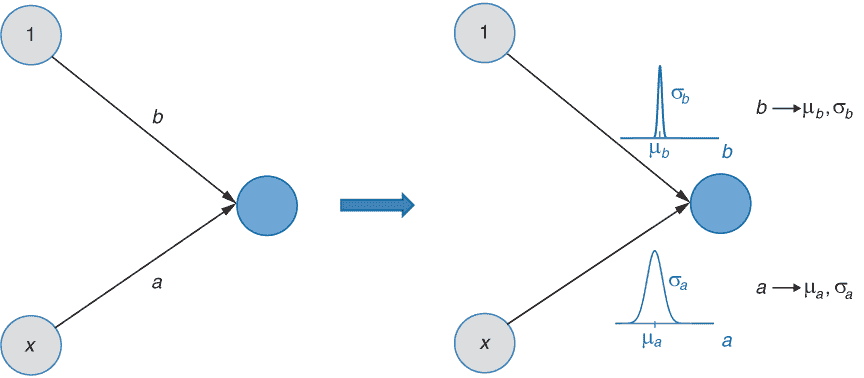

图 8.4 简单线性回归模型。左边是一个非贝叶斯神经网络，右边是一个具有变分推断（VI）近似的贝叶斯模型。在 VI 模型中，权重 *a* 和 *b* 被高斯分布所取代，这些分布由变分参数 *λ* = (*μ**[a]* , *σ**[a]* , *μ**[b]* , *σ**[b]*）参数化。

任务是调整变分参数以最小化方程 8.1。我们通过梯度下降法确定参数 *w* = (*μ**[a]* , *w*[1] , *μ**[b]* , *w*[3])。但在我们开始编码并最小化方程 8.1 之前，让我们更仔细地看看这个方程中的损失函数，以便更好地理解最小化过程中的情况：

loss[VI] = loss[KL] + loss[NLL] = KL [*q**[λ]*(*θ*)|| *P*(*θ*)] − *E**[θ]**[∼]**[qλ]* [log(*P*(*D*|*θ*)] 方程 8.2

因为我们在变分近似*q**[λ]*(*a*)和*q**[λ]*(*b*)以及先验中使用了标准正态*N*(0, 1)高斯，所以变分高斯*N*(*μ* , *σ*)和先验*N*(0, 1)之间的 KL 散度可以解析地计算。（我们省略了推导过程，因为它相当繁琐，而且没有增加太多洞察。）从这一点，我们得到

损失[KL] = KL [*q**[λ]*(*w*)||*P*(*w*)] = KL [*N*(*μ* ,*σ*)||*N*(0, 1) = −1/2(1 + log(*σ*²) − *μ*² − *σ*²) 方程式 8.3

不相信这个？看看 VI 部分之后的笔记本，你可以在那里通过数值验证这一点。

对于方程式 8.2 中的第二个损失[NLL]项，我们需要计算 NLL 的期望值：*E**[θ]**[∼]**[qλ]* [log(*P*(*D*|*θ*)]。这次我们不太幸运。这个项不能以封闭形式计算。因此，我们通过平均不同的*θ*的-log(*P*(*D*|*θ*)来近似期望值，这些*θ*可以从*θ* ∼ *q**[λ]*中采样。但需要多少个*θ*样本呢？好吧，结果证明，通常一个样本就足够了（我们稍后会回到这个点）。

为了更好地理解，让我们看看列表 8.1 中的代码，并想象一下通过图 8.4 所示的 NN 进行的前向传递，包括在训练集中评估损失。让我们从一个包含四个固定值的向量 w 开始：*w* = (*μ**[a]* , *w*[1] , *μ**[b]* , *w*[3])。这些值通过*λ* = (*μ**[a]* , *sp*(*w*[1]), *μ**[b]* , *sp*(*w*[3]))控制变分参数（参见列表 8.1 中`sigma_a`、`mu_a`、`sigma_sig`和`mu_sig`的计算），其中 sp 是 softplus。变分分布*N*(*μ**[a]* , *σ**[a]*)和*N*(*μ**[b]* , *σ**[b]*)现在是固定的，我们可以通过方程式 8.3 计算正则化损失成分（参见方程式 8.2 中的第一个成分）。作为一个起点，我们为所有四个参数选择 0.1，得到`loss_kl = -0.5`（参见列表 8.1）。接下来，我们计算损失函数的 NLL 部分：

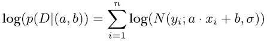

其中 *N*(*y* ; *μ* , *σ*) 是正态分布的密度函数。为了近似这个 NLL 项，我们对 a、b 采样一个值。使用这个样本，我们现在固定在一个非贝叶斯 NN 中，你可以像往常一样计算 NLL（参见列表 8.1）。首先，你选择适当的 TFP 分布来表示结果：

```
y_prob = tfd.Normal(loc = *x* · a + *b*, scale = sigma)
```

然后，有了正确的分布，你通过以下方式计算 NLL，即通过求和所有训练示例：

```
loss_nll = -tf.reduce_sum(*y*_prob.log_prob(*y*tensor))
```

我们将两个损失成分（`loss_kl`和`loss_nll`）相加以得到最终的损失。我们完成了吗？几乎。我们有 TensorFlow 的力量，可以计算损失相对于(w.r.t.) *w* = (*μ**[a]* , *w*[1] , *μ**[b]* , *w*[3])的导数，并更新这些值。但现实很残酷，存在一个微妙的问题。

假设我们想要计算损失关于权重 *μ* *a* = w[0] 的导数，这给出了斜率 *a* ~ *N*(*μ**[a]* , *σ**[a]*) 分布的均值。在图 8.5 的左侧，你可以看到从其变分分布 *N*(*μ**[a]* , *σ**[a]*) 中采样斜率参数 a 的相关计算图的部分。参数 *b* 的图部分类似。你还记得从第三章中，你必须计算输出 w 关于输入的局部梯度。很简单。只需计算 *N*(*μ**[a]* , *σ**[a]*) 的密度关于 *μ**[a]* 的导数。等等--a 是从高斯分布中采样的。我们如何通过采样变量来计算导数？这是不可能的，因为 a 的值是随机的，我们不知道在哪个位置取正态密度的导数。

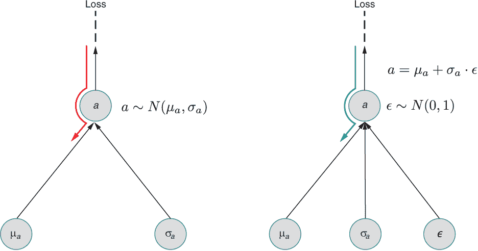

图 8.5 重参数化技巧。因为反向传播（此处显示为 *∂* /*∂μ**[a]*）不能通过随机变量如 *a* ~ *N*(*μ**[a]* , *σ**[a]*)（左图）进行，所以我们使用重参数化技巧（右图）。我们不是从 *a* ~ *N*(*μ**[a]* , *σ**[a]*) 中采样 a，而是计算 a = *μ**[a]* + *σ**[a]* ⋅ ϵ，其中 ϵ 是从标准正态分布采样的，即 ϵ ∼ *N*(0, 1)，它没有可调参数。最终，当使用重参数化技巧（右）时，a 再次根据 *a* ~ *N*(*μ**[a]* , *σ**[a]*) 正态分布，但我们可以反向传播以获得 *∂* /*∂μ**[a]* 和 *∂* /*∂σ**[a]*，因为随机变量 ϵ ∼ *N*(0, 1) 不需要更新。

我们无法计算 *a* ~ *N*(*μ**[a]* , *σ**[a]*) 关于 *σ**[a]* 或 *μ**[a]* 的导数。一切都没了？在 2013 年，Kingma 和 Welling 找到了这个困境的解决方案，但许多人也独立地找到了这个解决方案。与其从 *a* ~ *N*(*μ**[a]* , *σ**[a]*) 中采样，你可以计算 *a**[rep]* = *μ**[a]* + *σ**[a]* ⋅ ϵ，然后采样 ϵ ∼ *N*(0, 1)。你可以在笔记本 [`mng.bz/4A5R`](http://mng.bz/4A5R) 中检查 *a**[rep]* ∼ *N*(*μ**[a]* , *σ**[a]*) 或 *μ**[a]*。 (我们不需要关于 ε 的反向传播。)图 8.5 显示了右侧的重参数化。现在我们完成了，我们有一个可以计算梯度的有效解决方案。这个列表显示了完整的代码。

列表 8.1 使用变分推断 (VI) 对简单线性回归示例进行计算（完整代码）

```
w_0=(1.,1.,1.,1.)                                        ❶ 
log = tf.math.log
w = tf.Variable(w_0)   
e = tfd.Normal(loc=0., scale=1.)                         ❷ 
ytensor = *y*.reshape([len(*y*),1])  
for i in range(epochs):
    with tf.GradientTape() as tape: 

        mu_*a* = w[0]                                      ❸ 
        sig_*a* = tf.math.softplus(w[1])                   ❹ 

        mu_b = w[2]                                      ❺ 
        sig_b = tf.math.softplus(w[3])                   ❻ 

        l_kl = -0.5*(1.0 +                               ❼ 
            log(sig_a**2) - sig_a**2 - mu_a**2 +         ❼ 
            1.0 + log(sig_b**2) - sig_b**2 - mu_b**2)    ❼ 

        *a* =  mu_a + sig_a * e.sample()                   ❽ 
        *b* =  mu_b + sig_b * e.sample()                   ❾ 

        y_prob = tfd.Normal(loc=x*a+b, scale=sigma)
        l_nll = \
            -tf.reduce_sum(*y*_prob.log_prob(*y*tensor))     ❿ 

        loss = l_nll + l_kl
    grads = tape.gradient(loss, w) 
    logger.log(i, i, w, grads, loss, loss_kl, loss_nll)
    w = tf.Variable(w - lr*grads)                        ⓫ 
```

❶ 向量 w 的初始条件

❷ 噪声项，用于变分技巧

❸ 控制参数 a 的中心

❹ 控制参数 a 的分布范围

❺ 控制参数 b 的中心

❻ 控制参数 b 的分布范围

❽ KL 散度与高斯先验

❽ 使用重参数化技巧采样 a ~ *N*(mu_a, sigma_a)

❾ 样本 *b* ~ *N*(mu_b, sigma_b)

❿ 计算负对数似然 (NLL)

⓫ 梯度下降

在图 8.6 中，你可以看到参数 *μ* a 和 *μ* *b* 在通过变分推断方法近似贝叶斯模型训练过程中的收敛情况，这些值与我们没有使用近似方法解析得到的值非常接近（参见第 7.3.3 节）。

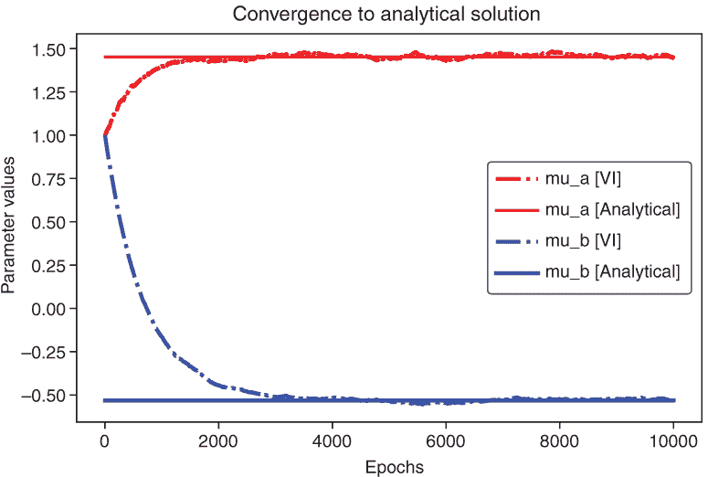

图 8.6 在几个周期中收敛到解析解的变分参数 *μ* a（上曲线）和 *μ* *b*（下曲线）

让我们回顾一下在简单回归示例中如何估计变分参数。估计过程最小化了为变分推断方法表达式（方程 8.2，此处再次展示）推导出的损失：

loss[VI] = loss[KL] + loss[NLL] = KL [q**[λ]*(*θ*)|| *P*(*θ*)] − *E**[θ]**[∼]**[qλ]* [log(*P*(*D*|*θ*)] 方程 8.2 (重复*D*)

我们使用梯度下降来优化变分参数 *λ* = (*μ**[a]* , *sp*(*w*[1]), *μ**[b]* , *sp*(*w*[3])). 期望 *E**[θ]**[∼]**[qλ]* [log(*P*(*D*|*θ*)] 可以通过不同 log(*P*(*D*|*θ*) 值的平均值来近似，每个值对应于从 q*λ* 中采样的不同 *θ*。原则上，必须从分布 q*λ* 中抽取无限多个不同的 *θ* 并取平均值，以完美地再现期望。这是大数定律。然而，在实际意义上，只进行一次 *θ* 的抽样；然后，将得到的 log(*P*(*D*|*θ*) 作为 *E**[θ]**[∼]**[qλ]* [log(*P*(*D*|*θ*)] 的近似。

在我们的示例中，我们绘制了一个单个实现 *θ* = (*a, b*)。然后我们取方程 8.1 关于变分参数（位置，*μ* a，*μ* *b*，以及分布 *a* ∼ *N*(*μ**[a]* , *σ**[a]*) 和 *a* ∼ *N*(*μ**[b]* , *σ**[b]*) 的尺度，*σ**[a]* ，*σ**[b]*）的梯度。梯度没有指向最速下降的正确方向。只有无限多个梯度的平均值才能做到这一点。这个算法有意义吗？让我们看看单个抽样是否仍然有意义。

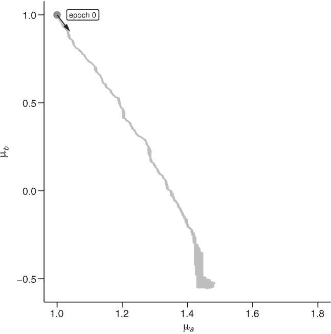

图 8.7 训练变分参数。训练一个贝叶斯神经网络意味着学习 *θ* = (*a, b*) 的分布。最简单的贝叶斯神经网络（如图 8.4 所示）只有两个参数，*a* 和 *b*，对于这些参数，使用变分推断，假设高斯分布：*a* ∼ *N*(*μ**[a]* , *σ**[a]*), *a* ∼ *N*(*μ**[b]* , *σ**[b]*)。在这里，位置参数 *μ* a 和 *μ* *b* 在几个训练周期中显示出来。点表示给定周期中变分参数（ *μ* a, *μ* b）的当前值。还显示了负梯度（从点指向的线）。[`youtu.be/MC_5Ne3Dj6g`](https://youtu.be/MC_5Ne3Dj6g) 提供了一个动画版本。

虽然梯度是有噪声的，但它仍然找到了最小值。通过在许多迭代中求和来计算更精确的梯度是不必要的，而且会浪费计算资源。然而，方向会更准确，箭头（如图 8.7 和观看动画）的波动会更小，但一个粗糙且快速的估计也是可以接受的，并且计算得更快。用仅一次评估来替换期望的技巧也用于 DL 研究中的不同场合，如强化学习或变分自动编码器。

## 8.3 使用 TensorFlow Probability 进行变分推断

TFP 有几种方法来构建 VI BNNs，所以让我们首先看看在 TFP 中构建 VI 网络有多简单。有一个类，`tfp.layers.DenseReparameterization`，你可以像使用标准的 Keras 层一样使用它，一层接一层地堆叠来构建一个完全连接的贝叶斯网络。列表 8.2 显示了图 8.2 中所示网络的代码。你能猜出这个贝叶斯网络有多少个参数吗？请注意，偏差项没有变分分布，因此只有一个权重。

列表 8.2 设置具有三层结构的 VI 网络

```
model = tf.keras.Sequential([
  tfp.layers.DenseReparameterization(1, input_shape=(None,1)),
  tfp.layers.DenseReparameterization(2),
  tfp.layers.DenseReparameterization(3)
])
```

在默认设置下，`DenseReparameterization` 将偏差作为一个固定参数而不是分布。因此，偏差（如图 8.4 中的从 1 到输出的边缘）只携带一个参数。从 *x* 到输出的节点使用高斯分布建模，需要两个参数（一个用于中心，一个用于尺度），因此第一层有三个参数需要学习。同样，第二层有两个偏差项和两个边缘，导致 2 + 2 ⋅ 2 = 6 个参数。最后，最后一层有三个偏差和六个边缘，导致 3 + 2 ⋅ 6 = 15 个参数。总共，这个网络有 24 个参数。采用贝叶斯方法大约需要比标准神经网络多两倍的参数数量。作为一个小练习，将代码复制到笔记本中，并命名为 model.summary()。

TFP 也非常灵活。让我们重新构建 7.3.3 节中的线性回归问题，其中我们将斜率 a 和截距替换为分布，并且假设 *σ* 是已知的。为了与 TFP 兼容，我们需要将模型转换为变分贝叶斯网络（见图 8.4）。为了完全定义我们的网络，我们还需要声明两个变量 *a* 和 *b* 的先验分布。我们选择正态分布 *N*(0,1)。

你可以在列表 8.3 中找到网络的代码。与 TFP 的默认设置相反，我们希望偏差也是一个分布。因此，我们需要通过在`DenseReparameterization`层的构造函数中设置`bias_prior_fn=normal`和`bias_posterior_fn=normal`来覆盖它。此外，TFP 层目前存在以下奇特之处（暂不称之为错误）。这个损失（如方程 8.1 所示）由通常的 NLL 和一个称为 KL 散度的附加项组成。通常，你使用整体训练数据的总和来取 KL 散度和 NLL（参见列表 8.3）。然而，在深度学习中，计算每个训练示例的平均 NLL（总和 NLL 除以训练示例的数量）是非常常见的。这是可以的。我们只需要损失函数的最小值，这不会因为除以一个常数而改变。（我们到目前为止的所有示例中都这样做过。）但现在，KL 散度也需要转换为我们训练示例的平均值，而 TFP 目前并没有这样做。深入挖掘 TFP 的文档，你会在`DenseReparameterization`([`mng.bz/Qyd6`](http://mng.bz/Qyd6))以及相应的卷积层（`Convolution1DReparameterization`、`Convolution2DReparameterization`和`Convolution3DReparameterization`）中找到一些有些神秘的声明：

在进行小批量随机优化时，确保将此损失缩放，以便每个 epoch 只应用一次（例如，如果 kl 是批中每个元素的损失总和，你应该将 kl / num_examples_per_epoch 传递给你的优化器）。

为了解决这个问题，需要将 KL 项也除以训练数据数量（`num`）。可以通过以下代码行来完成（下一个列表显示了这种修复）：

```
kernel_divergence_fn=lambda q, p, _: tfp.distributions.kl_divergence(q, p) / (num · 1.0)
```

列表 8.3：从图 8.4 编码我们的简单网络

```
def NLL(*y*, distr):                                      ❶ 
    return -distr.log_prob(*y*) 

def my_dist(mu):                                        ❶ 
    return tfd.Normal(loc=mu[:,0:1], scale=sigma)

kl = tfp.distributions.kl_divergence
divergence_fn=lambda q, p, _: kl(q, p) / (num * 1.0)    ❷ 

model = tf.keras.Sequential([
    tfp.layers.DenseReparameterization(1,
       kernel_divergence_fn=divergence_fn,
       bias_divergence_fn=divergence_fn,                ❸ 
       bias_prior_fn= \
       tfp.layers.util.default_multivariate_normal_fn,  ❸ 
       bias_posterior_fn= \
       tfp.layers.util.default_mean_field_normal_fn()   ❸ 
                                       ),
    tfp.layers.DistributionLambda(my_dist)
])

sgd = tf.keras.optimizers.SGD(lr=.005)
model.compile(loss=NLL, optimizer=sg*D*)
```

❶ 对于具有固定方差的高斯分布，通常的 NLL 损失

❷ 重缩放 KL 散度项（对 TFP 的一种错误修复）

❸ TFP 通常不假设偏差上有分布；我们在这里覆盖了这一点。

TFP 还提供了用于构建使用变分推断（VI）的卷积贝叶斯神经网络（BNN）的层。对于常规的 2D 卷积，这些层被称为`Convolution2DReparameterization`。还有 1D 和 3D 变体，分别命名为`Convolution1DReparameterization`和`Convolution3DReparameterization`。此外，对于密集和卷积 BNN，TFP 中还有一些特殊类和一些高级 VI 方法。最值得注意的是，`DenseFlipout`可以用作`DenseReparameterization`的替代品。`DenseFlipout`使用一种加快学习的技巧。翻转技巧也适用于卷积（例如，参见`Convolution2DFlipout`）。翻转方法在 Wen, P. Vicol 等人发表的论文中有详细描述，该论文可在[`arxiv.org/abs/1803.04386`](https://arxiv.org/abs/1803.04386)找到。在笔记本[`mng.bz/MdmQ`](http://mng.bz/MdmQ)中，你使用这些层来构建 CIFAR-10 数据集的 BNN（见图 8.9）。

## 8.4 MC dropout 作为一种近似贝叶斯方法

在第 8.3 节中，您首次了解了通过变分推断（VI）近似的一个贝叶斯神经网络（BNN）。VI 允许您通过学习每个权重的近似后验分布来拟合贝叶斯深度学习模型。在 TFP 中，默认使用高斯分布来近似后验。与它们的非贝叶斯版本相比，这些 BNN 具有两倍多的参数，因为每个权重都被一个由两个参数（均值和标准差）定义的高斯权重分布所取代。VI 让我们能够拟合一个具有大量参数的 BNN 是非常棒的。但如果从非贝叶斯神经网络到其贝叶斯变体时参数数量不会加倍那就更好了。幸运的是，使用一个名为 MC dropout 的简单方法就可以实现这一点。（MC 代表蒙特卡洛，暗示其中涉及一个随机过程，就像蒙特卡洛赌场一样。）2015 年，一名博士生 Yarin Gal 能够证明 dropout 方法与 VI 相似，允许我们近似 BNN。但在转向 dropout 作为贝叶斯方法之前，让我们看看 dropout 是如何被引入的。

### 8.4.1 训练过程中使用的经典 dropout

训练过程中的 dropout 被引入作为一种防止神经网络过拟合的简单方法。（这甚至是 Srivastava 等人于 2014 年介绍该方法时的论文标题。）它是如何工作的？在训练过程中进行 dropout 时，您将神经网络中随机选择的某些神经元设置为 0。您在每个更新运行中都这样做。因为您实际上丢弃了神经元，所以从丢弃的神经元起始的所有连接的权重同时被丢弃（见图 8.8）。


图 8.8 三个神经网络：a)显示了包含所有神经元的完整神经网络，b)和 c)显示了两种变薄的神经网络版本，其中一些神经元被丢弃。丢弃神经元等同于将这些神经元起始的所有连接设置为 0。

在 Keras 中，这可以通过在权重层之后添加一个 dropout 层并给 dropout 提供一个概率 p（在这里我们使用 p *来表示这是一个 MC drop 概率，它将权重设置为 0）作为参数来实现（见以下列表）。在训练过程中，dropout 通常仅在全连接层中使用。

列表 8.4 定义和训练带有 dropout 层的分类卷积神经网络

```
model = Sequential()
model.add(Convolution2D(16,kernel_size,padding='same',\
input_shape=input_shape))
model.add(Activation('relu'))
model.add(Convolution2D(16,kernel_size,padding='same'))
model.add(Activation('relu'))
model.add(MaxPooling2D(pool_size=pool_size))
model.add(Convolution2D(32,kernel_size,padding='same'))
model.add(Activation('relu'))
model.add(Convolution2D(32,kernel_size,padding='same'))
model.add(Activation('relu'))
model.add(MaxPooling2D(pool_size=pool_size))

model.add(Flatten())
model.add(Dense(100))
model.add(Activation('relu'))
model.add(Dropout(0.5))           ❶ 
model.add(Dense(100))
model.add(Activation('relu'))
model.add(Dropout(0.5))           ❶ 
model.add(Dense(nb_classes))
model.add(Activation('softmax'))

model.compile(loss='categorical_crossentropy',optimizer='adam',\
metrics=['accuracy'])
```

❶ 以 0.5 的概率将前一层中每个神经元设置为 0 的 dropout 层

在我们更详细地讨论 dropout 方法之前，您可以通过以下笔记本轻松地让自己相信 dropout 成功地防止了过拟合。在笔记本中，您为具有 50,000 张图像和 10 个类别的 CIFAR-10 数据集开发了一个分类卷积神经网络（CNN）（见图 8.9）。


图 8.9 CIFAR-10 数据集中十个类别的示例图像

|  | 实践时间 打开 [`mng.bz/XP29`](http://mng.bz/XP29) 。这个笔记本使用（经典）dropout 来对抗在训练用于 CIFAR-10 分类深度学习模型时的过拟合。

+   检查训练数据的损失曲线是否在带和不带 dropout 的情况下有效

+   检查带和不带 dropout 的准确度

|

在笔记本 [`mng.bz/4A5R`](http://mng.bz/4A5R) 中，你看到训练过程中的 dropout 可以防止过拟合，甚至可以提高准确度。为此练习，请看图 8.10，其中显示了笔记本的结果。

![8-10.png]

图 8.10 展示了在训练过程中使用和不使用 dropout 时在 CIFAR-10 上实现的成果。在测试时，权重是固定的（没有 MC dropout）。当使用 dropout 时，验证数据的准确度更高（左面板），并且验证损失与训练损失之间的距离要小得多（右面板）。这表明 dropout 可以防止过拟合。

让我们看看训练过程中的 dropout 是如何工作的。在每个训练循环中，你应用 dropout 并获得 NN 的另一个更薄版本（见图 8.10）。为什么 dropout 有助于防止过拟合？一个原因是你训练了许多更薄的 NN 版本，这些版本比完整神经网络有更少的参数。在每一步中，你只更新未被丢弃的权重。总的来说，你不仅训练了一个网络的单个版本，而且训练了一个共享权重的 NN 薄版本集合。另一个原因是使用 dropout 时学习的复杂特征更少。因为 dropout 迫使神经网络处理缺失信息，它产生了更稳健和独立的特征。

如何在测试时使用经过 dropout 训练的神经网络？很简单。你回到具有固定权重的完整神经网络。只有一个细节：你需要将学习到的权重值按 *w*^* = *p*^* ⋅ *w* 的方式降低权重。这种降低权重的做法是为了考虑到在训练过程中，每个神经元平均接收到的输入比完整神经网络少 p *。因此，连接比没有应用 dropout 时更强。在应用阶段，没有 dropout，因此你通过乘以 p * 来降低过强的权重。幸运的是，你不需要手动调整权重；Keras 会处理这个问题。当在测试时使用经过 dropout 训练的神经网络并应用预测命令对新输入进行操作时，Keras 会做正确的事情。

### 8.4.2 训练和测试时使用的 MC dropout

如你在 8.4.1 节中看到的，训练过程中的 dropout 可以轻易地增强预测性能。因此，它很快在深度学习社区中变得流行，并且仍然被广泛使用。但 dropout 还有更多可以提供的。在测试时开启 dropout，你可以将其用作贝叶斯神经网络！让我们看看这是如何工作的。

在贝叶斯神经网络（BNN）中，每个权重都被一个分布所代替。使用变分推断（VI）时，你使用了一个具有两个参数（均值和标准差）的高斯权重分布。当使用 dropout 时，你也有一个权重分布，但现在权重分布更简单，本质上只包含两个值：0 或 w（见图 8.11）。

dropout 概率 p *不是一个参数，而是在定义神经网络时固定的（例如，*p*^* = 0.3）。dropout 概率是一个调整参数：如果你使用*p*^* = 0.3 时没有得到好的结果，你可以尝试另一个 dropout 率。MC dropout 方法中权重分布的唯一参数是 w 的值（见图 8.11，详情请参阅 Yarin Gal 和 Zoubin Ghahramani 在[`arxiv.org/abs/1506.02157`](https://arxiv.org/abs/1506.02157)上发表的 MC dropout 论文）。学习参数 w 的过程与通常一样。你在训练时开启 dropout，并使用常规的 NLL 损失函数，通过调整权重来最小化它，这通常是通过随机梯度下降（SG*D*）来实现的。

作为附带说明，在 Gal 的 dropout 论文中，损失包括负对数似然（NLL）和一个额外的正则化项，该正则化项惩罚大的权重。我们将跳过这个正则化项，因为该领域的多数实践者都不需要它。在实践中，这根本不是必需的。在 Gal 的框架中，dropout 类似于 8.2 节中提到的从变分推断（VI）拟合贝叶斯神经网络（BNN）的方法，但这次使用的是图 8.11 中的分布，而不是 VI 方法中通常使用的高斯分布。通过更新 w 值，你实际上学习的是近似权重后验的权重分布（见图 8.11）。

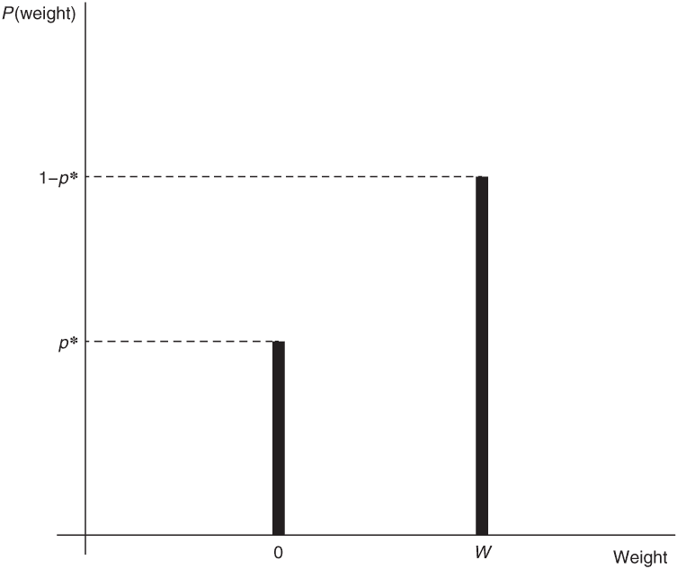

图 8.11 使用 MC dropout 的（简化**D**）权重分布。在定义神经网络时，dropout 概率 p*是固定的。这个分布中唯一的参数是 w 的值。

你如何使用 dropout 训练的神经网络作为 BNN？对于所有贝叶斯模型，你通过在权重分布上取平均来获得预测分布（参见方程 7.6）。

*p* ( *y* | *x**[test]* , *D* ) = ∑*[i]* *p* ( *y* | *x**[test]* , *w* *[i]* ) ⋅ *p* ( *w**[i]* | *D* ) 方程式 8.4

要在 dropout 训练的神经网络中获得预测分布，你需要在测试时间也开启 dropout。然后，使用相同的输入，你可以做出几个预测，每个预测都来自神经网络的不同 dropout 变体。你以这种方式得到的预测将接近方程 8.4 中的预测分布，正如你将在下一行看到的那样。更精确地说，你对相同的输入 *x**[test]* 进行 T 次条件概率分布 (CPD) *p* ( *y* | *x**[test]* , *w* *[i]* ) 的预测。对于每个预测，你得到不同的 CPDs，(*p* ( *y* | *x* , *w* *[i]* )), 对应于一个采样的权重星座 wi（参见以下案例研究）。这被称为 MC dropout，因为对于每个预测，你通过另一个随机丢弃神经元的稀疏版本的前向传递来进行预测。然后，你可以将 dropout 预测组合成一个贝叶斯预测分布：

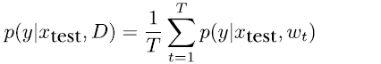

这是对方程 8.4 的经验近似。得到的预测分布捕捉了认知不确定性和随机不确定性。

要在 Keras 中使用 MC dropout，有两种选择。在第一种选择中，你只需通过在模型定义中将训练阶段设置为 true 来创建你的网络。更优雅的方法是使其可选择的，即在测试时间是否使用 dropout。下一个列表显示了如何在 Keras 中这样做（并参见笔记本 [`mng.bz/MdmQ`](http://mng.bz/MdmQ)）。

列表 8.5 获取 MC dropout 预测

```
import  tensorflow.keras.backend as K
model_mc_pred = K.function([model_mc.input, K.learning_phase()], 
     [model_mc.output])                                            ❶ 
T= 5                                                               ❷ 
for i in range(0,T):  
  print(model_mc_pred([x_train[0:1],0])[0])                        ❸ 

for i in range(0,T):  
  print(model_mc_pred([x_train[0:1],1])[0])                        ❹ 
```

❶ 定义一个函数，该函数使用模型输入和学习阶段作为输入，并返回模型输出。重要的是学习阶段。当设置为 0 时，所有权重都固定，并在测试时间通过 dropout p* 调整；当设置为 1 时，在测试时间使用 dropout。

❷ 定义 dropout 预测的数量

❸ 每个 T 次预测

❹ 对于相同输入的每个 T 次预测都是不同的，因为它们是从不同的稀疏神经网络版本中确定的，对应于不同的 dropout 运行。

## 8.5 案例研究

让我们回到我们最初的问题，这个问题引导我们研究贝叶斯神经网络。回想一下第 7.1 节中的例子，在那里我们因为这样的图像不是训练集的一部分，所以找不到房间里的大象。让我们看看贝叶斯建模是否可以帮助在遇到训练数据中不存在的新情况时表达适当的不确定性（参见图 8.12，我们在此处重复第七章中的内容）。

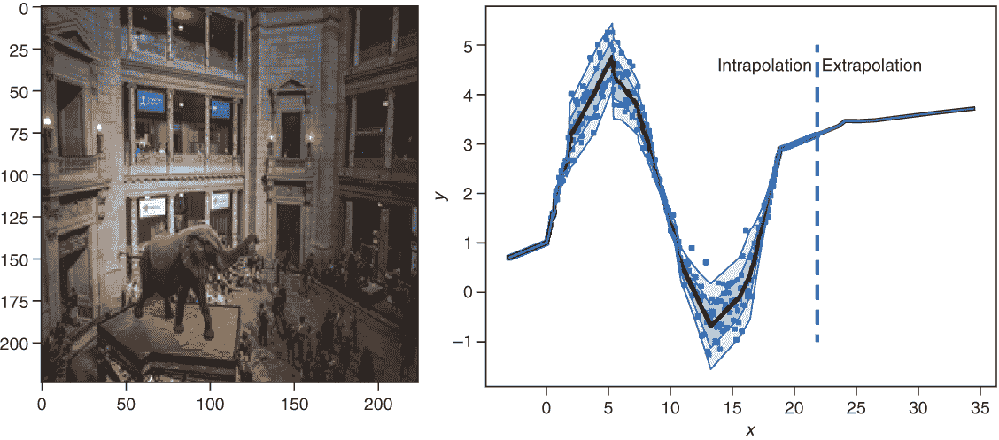

图 8.12 深度学习中的不良案例。在 ImageNet 数据上训练的高性能 VGG16 CNN 没有看到大象。五个最高排名的类别预测是 horse_cart、shopping_cart、palace、streetcar 和 gondola——大象没有被找到！在回归问题中，在无数据区域没有不确定性（参见右侧的 Extrapolation 以及图 4.18）。

### 8.5.1 外推回归案例研究

让我们先通过一个案例研究来处理回归任务（见图 8.12 的右侧），并比较这两种方法：第 8.4 节中的 VI 网络和上一节中的蒙特卡洛近似。我们还在例子中包含了一种非贝叶斯方法。你可以使用与第 4.3.2 节和第 4.3.3 节中相同的合成正弦数据来拟合一个具有灵活方差的非线性回归模型。要自己完成这项工作，请阅读以下笔记本。

|  | 实践时间 打开[`mng.bz/yyxp`](http://mng.bz/yyxp)。在这个笔记本中，你研究贝叶斯神经网络在回归任务中为外推提供的优势。你使用合成数据来拟合不同的概率神经网络：

+   你拟合了一个非贝叶斯神经网络。

+   你拟合了两个贝叶斯神经网络，一个通过变分推断（VI），另一个通过 dropout。

+   你研究了神经网络表达的不确定性。

|

作为验证数据，你使用了 400 个例子，*x*的值在-10 到 30 之间，以 0.1 的步长间隔。这个范围不仅覆盖了训练数据的范围，你期望模型以低不确定性估计参数，而且还覆盖了训练数据范围之外的区域，你期望有更高的认知不确定性。以这种方式设置案例研究后，你可以检查模型是否能够在进入外推范围（小于-3 或大于 30）时表达增加的不确定性。不同的概率神经网络模型会产生相当不同的结果，正如你将看到的。

为了比较三种方法，让我们看看结果预测分布。你在第 7.3 节中看到，你可以通过方程 8.5 来计算贝叶斯模型的预测分布。（这与方程 7.6 中的公式相同，但我们通常在神经网络中用 w 代替*θ*。）

*P*(*y* | *x**[test]* , *D*) = ∫*[θ]* *P*(*y* | *x**[test]* , *θ*) ⋅ *P*(*θ*|*D*) *dθ* 方程 8.5

这个方程告诉我们需要对网络可能的总权重配置 w 进行平均。我们通过从网络的不同配置（w）中抽取样本 *y* ~ *P*(*y* | *x**[test]* , *D*) 来近似这个积分。注意，在采样过程中，你不需要关心后验权重 *P*(*θ*|*D*)。原因是你会自动更多地采样那些具有更高后验概率 *P*(*θ*|*D*) 的 w。

让我们更详细地看看如何确定给定输入 *x**[i]* 的 *P*(*y*|*x**[i]* , *D*) 的结果分布。为了研究结果分布，我们需要查看训练好的模型并从网络中抽取 T 个样本。你会发现三个不同的概率神经网络模型之间有一些差异。

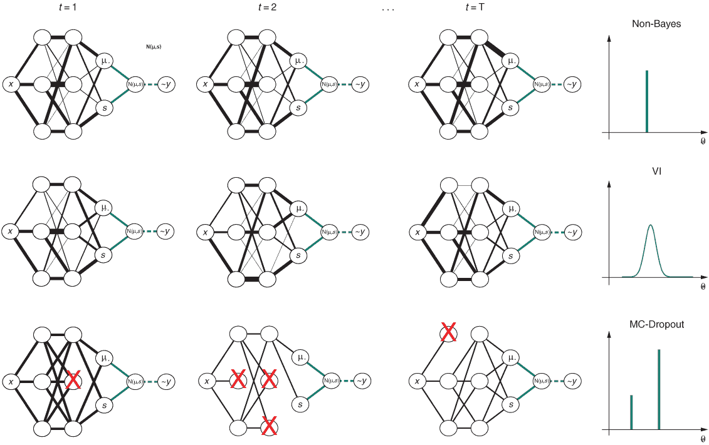

图 8.13 展示了回归案例研究中使用的三个模型的采样过程草图。在最后一列（右边），选择网络的一条边，显示其分布。其余列显示了 T 次不同运行中不同网络的实现。在每次运行中，输入*x**[i]*是相同的，边的值根据它们的分布进行采样。在上行中，你看到的是非贝叶斯方法，其中所有实现的神经网络都是相同的。在中行，你看到的是 VI-贝叶斯方法，其中边的值是从高斯分布中采样的。在右下角，是 MC dropout 方法，其中边的值来自二元分布。对于动画版本，请参阅[`youtu.be/mQrUcUoT2k4`](https://youtu.be/mQrUcUoT2k4)（对于 VI）；[`youtu.be/0-oyDeR9HrE`](https://youtu.be/0-oyDeR9HrE)（对于 MC dropout）；以及[`youtu.be/FO5avm3XT4g`](https://youtu.be/FO5avm3XT4g)（对于非贝叶斯）。

在非贝叶斯神经网络中，每个连接 c 都有一个固定的权重。为了与贝叶斯术语保持一致，我们称这个值为*θ* c。我们希望用一个概率分布来表示这个值，因此我们赋予固定权重*θ* c 的概率为 1（见图 8.13 左上角的图）。从这些概率分布（每个连接有一个分布）中采样总是得到相同的神经网络（见图 8.13 的第一行，第一列到第三列）。因此，对于每个 T 次运行，对于相同的输入*x*，神经网络得到相同的参数对于高斯*N*(*y* ; *μ**[x, w[t]]* , *σ**[x, w[t]]*) = *N*(*y* ; *μ**[x, w]* , *σ**[x, w]*)（见表 8.2）。为了得到经验结果分布，你可以从这个高斯分布中采样：*y* ∼ *N*(*μ**[x, w]* , *σ**[x, w]*)。在表 8.2 中，因为*μ**[x, w]*和*σ**[x, w]*在所有行中都是相同的，所以在所有运行中，位置*x*处的预测结果分布*P*(*y*|*x*,*w*) = *N*(*y* ; *μ**[x]* , *σ**[x]*)。在这种情况下，我们知道结果分布是*N*(*y* ; *μ**[x]* , *σ**[x]*)。为了与贝叶斯方法做同样的事情，我们仍然每次运行采样一个值，因此对于每个*x*位置从结果分布中得到 T 个值（见图 8.14 上面板左边的图）。

表 8.2 展示了通过变分推断（VI）训练的贝叶斯神经网络在正弦回归任务中预测的条件概率分布（CPDs）。每一行对应 T 个预测中的一个，对于所有 400 个*x*值，都得到一个高斯 CPD *N* ( *μ**[x]* , *σ**[x]* )。*N*(*μ* *x*, *σ* *x*)可以从中采样。

| **预测编号** | *x*[1] = −10 | *x*[2] = −9.9 | **. . .** | *x*[400] = 30 |
| --- | --- | --- | --- | --- |
| 1 | *y* ∼ *N* ( *μ* *[x]*[1] ,*[w]*[1] , *σ* *[x]*[1] ,*[w]*[1] | *y* ∼ *N* ( *μ* *[x]*[2] ,*[w]*[1] , *σ* *[x]*[2] ,*[w]*[1] | **. . .** | *y* ∼ *N* ( *μ**[x]*[400] , *[w]*[1] , *σ**[x]*[400] , *[w]*[1] ) |
| 2 | *y* ∼ *N* ( *μ**[x]*[1] *[w]*[2] , *σ**[x]*[1] ,*[w]*[2] ) | *y* ∼ *N* ( *μ**[x]*[2] ,*[w]*[2] , *σ**[x]*[2] ,*[w]*[2] ) | **. . .** | *y* ∼ *N* ( *μ**[x]*[400] ,*[w]*[2] , *σ**[x]*[400] ,*[w]*[2] ) |
| **. . .** | **. . .** | **. . .** | **. . .** | **. . .** |
| T | *y* ∼ *N* ( *μ**[x]*[1] ,*[w]*[T] , *σ**[x]*[1] *[w]*[T] ) | *y* ∼ *N* ( *μ**[x]*[2] ,*[w]*[T] , *σ**[x]*[2] ,*[w]*[T] ) | **. . .** | *y* ∼ *N* ( *μ**[x]*[400] ,*[w]*[T] , *σ**[x]*[400] ,*[w]*[T] ) |

贝叶斯变分推理神经网络将固定的权重 *θ**[c]* 替换为具有均值 *μ**[c]* 和标准差 *σ**[c]* 的高斯分布（见图 8.13 中间行，最右侧列）。在测试时间，你从这些权重分布中采样 T 次，总是得到连接的略微不同的值（见图 8.13 的第二行，第一到第三列，其中连接的粗细表示采样值是否大于权重分布的均值）。因此，神经网络在 T 次运行中产生略微不同的高斯 *N*（ *μ**[x]* ,*[w]*[t] , *σ**[x]* ,*[w]*[t] ）参数，我们将这些参数收集在表 8.2 的 T 行中。为了得到经验结果分布，你可以从所有这些确定的高斯分布中采样：*y* ∼ *N* ( *μ**[x]* ,*[w]*[t] , *σ**[x]* ,*[w]*[t] )。如果你每次运行采样一个值，你将在每个 *x* 位置得到 T 个结果值（见图 8.14，上面板中间图）。

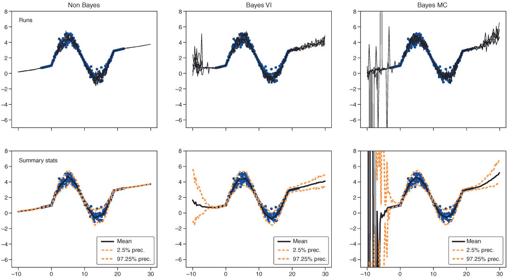

图 8.14 预测分布。顶行中的实线显示了三个模型（经典神经网络、变分贝叶斯神经网络和 dropout 贝叶斯神经网络）的结果分布的五个样本。第二行显示了汇总统计：实线代表均值，上下虚线表示 95% 预测区间的上下边界。

贝叶斯蒙特卡洛 dropout 神经网络将每个固定的权重 *θ* c 替换为二进制分布（见图 8.13 最后一列的第三行）。在测试时间，你从这些权重分布中采样 T 次，总是得到连接的零或 wc 的值（见图 8.13 的第三行，第一到第三列）。为了得到经验结果分布，你可以从所有这些确定的高斯分布中采样：*y* ∼ *N* ( *μ**[x]* ,*[w]* , *σ**[x]* ,*[w]* )（见图 8.14，上面板右侧图）。

让我们使用 T 个预测的结果，首先探索所有三个模型的输出不确定性。图 8.14 显示了不同方法的结果。在图 8.14 的第一行中，对于表 8.2 中 T 行的前 5 行，画了一条线连接不同位置的不同的采样输出值 *y*。在第二行中，所有 T 个结果通过平均值（实线）和 95%预测区间（虚线）进行总结。下方的虚线对应于 2.5%分位数，上方的对应于 97.5%分位数。对于非贝叶斯方法，你总是从相同的高斯分布 *N*(*μ* *x*, *σ* *x*) 中采样。因此，原则上，你可以计算这个高斯分布的虚线为 *y* = *μ**[x]* ± 1.96 ⋅ *σ**[x]*。对于贝叶斯方法，情况并非如此，因为我们不知道输出分布的解析形式，因此必须从样本中采样并计算分位数。

总结一下，让我们最后看一下图 8.14 的最后一行，比较贝叶斯与非贝叶斯方法。中心线表示在给定数据的情况下，你的值 *y* 的均值位置。在所有方法中，它都遵循数据。虚线表示我们预期 95%数据所在的区域。在我们有训练数据的区域，所有方法都产生相似的结果。在数据分布也大的区域，CPD 的分布范围捕捉到的不确定性很大。因此，所有模型都能够模拟随机不确定性。当我们离开有数据的区域进入外推区域时，非贝叶斯方法失败了。它在一个不切实际很窄的区域假设了 95%的数据。总是一场灾难，真是太遗憾了！然而，贝叶斯方法知道它们不知道什么，并在离开已知领域时表达它们的不确定性。

### 8.5.2 带有新类别的分类案例研究

让我们重新审视房间里的大象问题，其中你面临一个分类任务。当将一个新的输入图像呈现给训练好的分类神经网络时，对于训练过程中看到的每个类别，你都会得到一个预测概率。为了预测大象图像（见图 8.12），我们在 7.1 节中使用了在 ImageNet 上训练的 VGG16 卷积神经网络。ImageNet 有 1,000 个类别，包括不同种类的大象。但 VGG16 网络无法在房间里找到大象，这意味着大象不在前五个类别中。一个合理的解释是，训练数据集中的大象图像从未包括房间里的大象。对于这样的图像（见图 8.12 的左侧面板），我们要求神经网络模型离开已知领域并进行外推。使用贝叶斯神经网络会有帮助吗？贝叶斯神经网络可能也不会看到大象，但它应该能够更好地表达其不确定性。不幸的是，你无法尝试，因为 ImageNet 数据集非常大，你需要在强大的 GPU 机器上花费几天时间来训练 VGG16 卷积神经网络的贝叶斯版本。

让我们在更小的规模上做，这样您就可以在笔记本中自己进行实验[`mng.bz/MdmQ`](http://mng.bz/MdmQ)。您可以使用只有 50,000 张图像和 10 个类别的 CIFAR-10 数据集（见图 8.15）。

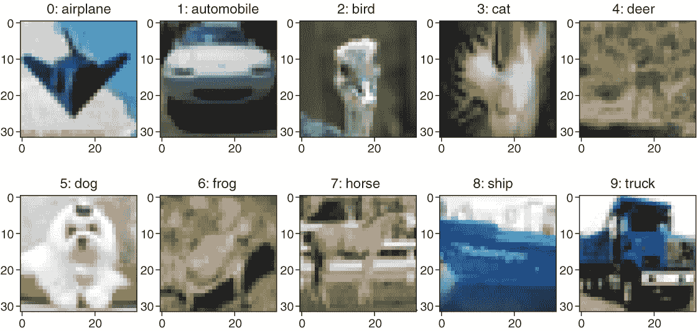

图 8.15 CIFAR-10 数据集中十个类别的示例图像（与图 8.9 相同）

您可以使用 CIFAR-10 数据集的一部分来训练一个贝叶斯 CNN 并对其进行一些实验。但您如何设计一个实验来识别 NN 模型在离开已知领域时是否表达不确定性？让我们走向极端，看看当您向训练好的 CNN 提供不属于训练数据的类别的图像时会发生什么。为此，您可以在仅九个类别上训练一个 CNN；例如，不包含马这个类别（从训练数据中移除所有显示马的图像）。当向训练好的 NN 展示马图像时，它估计了它在训练时训练的类别的概率。所有这些类别都是错误的，但 NN 仍然不能将所有类别的概率分配为零，因为输出需要加起来等于一，这是通过 softmax 层强制执行的。您是否可以通过贝叶斯方法找出您是否可以信任基于预测分布的分类？您可以在下面的笔记本中自己进行实验。

|  | 实践时间 打开[`mng.bz/MdmQ`](http://mng.bz/MdmQ)。在这个具有新类别的分类案例研究中，您研究 BNN 在分类任务中可以提供哪些优势。您使用 CIFAR-10 数据集中 10 个类别中的 9 个类别的训练数据来拟合不同的概率性神经网络：

+   您拟合了一个非贝叶斯神经网络。

+   您拟合了两个贝叶斯神经网络（BNN），一个通过变分推断（VI）拟合，另一个通过 MC dropout 拟合。

+   您比较了使用不同神经网络所达到的性能。

+   您研究 NN 表达的不确定性。

+   您使用不确定性来检测新的类别。

|

在测试时间，一个传统的用于分类的概率性卷积神经网络（CNN）为每个输入图像提供一个多项式概率分布（MN 在方程中）。在我们的情况下，一个拟合了九个结果类别的多项式分布（见图 8.16）。k 个类别的概率为这个多项式分布提供了参数：MN(*p*[1] , *p*[2] ,⋯, *p**[k]*).

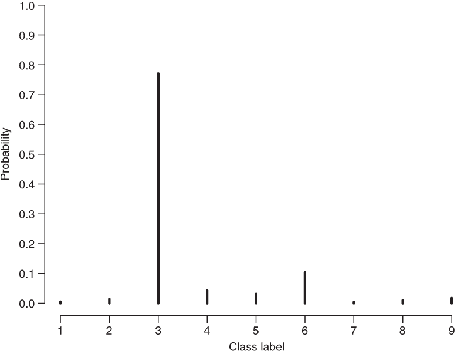

图 8.16 九个类别的多项式分布：MN( *p*[1] , *p*[2] , *p*[3] , *p*[4] , *p*[5] , *p*[6] , *p*[7] , *p*[8] , *p*[9] )

与回归情况一样，让我们首先看看三个不同的概率性神经网络模型的预测 CPD。在非贝叶斯神经网络中，您有固定的权重，对于一张输入图像，您得到一个多项式 CPD：CPD *p* ( *y* | *x* , *w* ) = MN( *p*[1] ( *x* , *w* ), ..., *p*[9] ( *x* , *w* )（见表 8.3）。如果您预测同一图像 T 次，您总是得到相同的结果。表 8.3 的每一行都是相同的。

表 8.3 使用 9 个类别中的 9 个类别训练的 CIFAR-10 分类任务的概率 CNN 的预测分布。每个预测是一个具有 9 个参数（类别 1、2、……、9 的概率）的多项式 CPD。

| **predict_no** | **Image** *ξ*[1] **with known class** | **Image** *ξ*[2] **with unknown class** |
| --- | --- | --- |
| 1 | *y* ∼ MN(*p*1,..., *p*9) | *y* ∼ MN(*p*1,..., *p*9) |
| 2 | *y* ∼ MN(*p*1,..., *p*9) | *y* ∼ MN(*p*1,..., *p*9) |
| . . . | . . . | . . . |
| T | *y* ∼ MN(*p*1,..., *p*9) | *y* ∼ MN(*p*1,..., *p*9) |

在使用变分推断（VI）拟合的贝叶斯神经网络中，固定权重被替换为高斯分布。在测试时间，你通过预测相同的输入图像 T 次来从这些加权分布中进行采样。对于每次预测，你得到一个多项式 CPD：*P*(*x*, *w**[t]*) = MN(*p*1,..., *p*9). 每次预测图像时，你得到一个不同的 CPD (*P*(*y*|*x*, *w**[t]*))，对应于采样的权重星座 wt。这意味着对应表 8.3 的所有行都是不同的。

在使用 MC dropout 拟合的贝叶斯神经网络中，你用二进制分布替换固定权重。从现在起，这就像 VI 的情况一样。对于每次预测，你得到一个多项式 CPD：*P*(*x*, *w*) = MN(*p*1,..., *p*9). 每次预测图像时，你得到一个不同的 CPD *P*(*y*|*x*, *w**[t]*)，对应于采样的权重星座 wi。这意味着对应表 8.3 的所有行都是不同的。

总结和可视化分类模型中的不确定性

绘制表 8.3（多项式 CPD 的参数）中一行的预测概率，可以得到图 8.17 的第二、第三和第四行的图。随机不确定性在类别的分布中表示，如果一个类别得到一个概率为 1，则该分布为零。认知不确定性在某一类预测概率的分布中表示，如果分布为零，则认知不确定性为零。非贝叶斯神经网络无法表示认知不确定性（你不能为同一图像得到不同的预测），但贝叶斯神经网络可以。

首先，让我们看看两个已知类别的网络结果。在图 8.17 的左侧面板中，你可以看到所有网络正确地分类了飞机的图像。在两个贝叶斯神经网络中，你可以看到图中几乎没有变化，这表明分类相当确定。MC dropout 贝叶斯 CNN 比 VI CNN 显示出更多的不确定性，并且也分配了一些概率给鸟类类别。当查看图像时，这是可以理解的。

如果我们转向未知类别，图 8.17 中的所有预测都是错误的。但你可以看到，贝叶斯神经网络能更好地表达它们的确定性。当然，贝叶斯网络在其 T 次运行中也会预测一个错误的类别。但我们在每次 T 次运行中看到的是，分布变化很大。在比较 VI 和 MC dropout 方法时，再次显示 MC dropout 有更多的变化。此外，MC dropout 和 VI 预测的概率分布形状看起来也不同。在 VI 的情况下，分布看起来非常钟形。这可能是因为 VI 中使用的高斯权重分布。依赖于伯努利分布权重的 MC dropout 产生了更丰富的预测分布形状。现在让我们尝试使用 9 维预测分布来量化预测的不确定性（参见表 8.3 和图 8.17）。

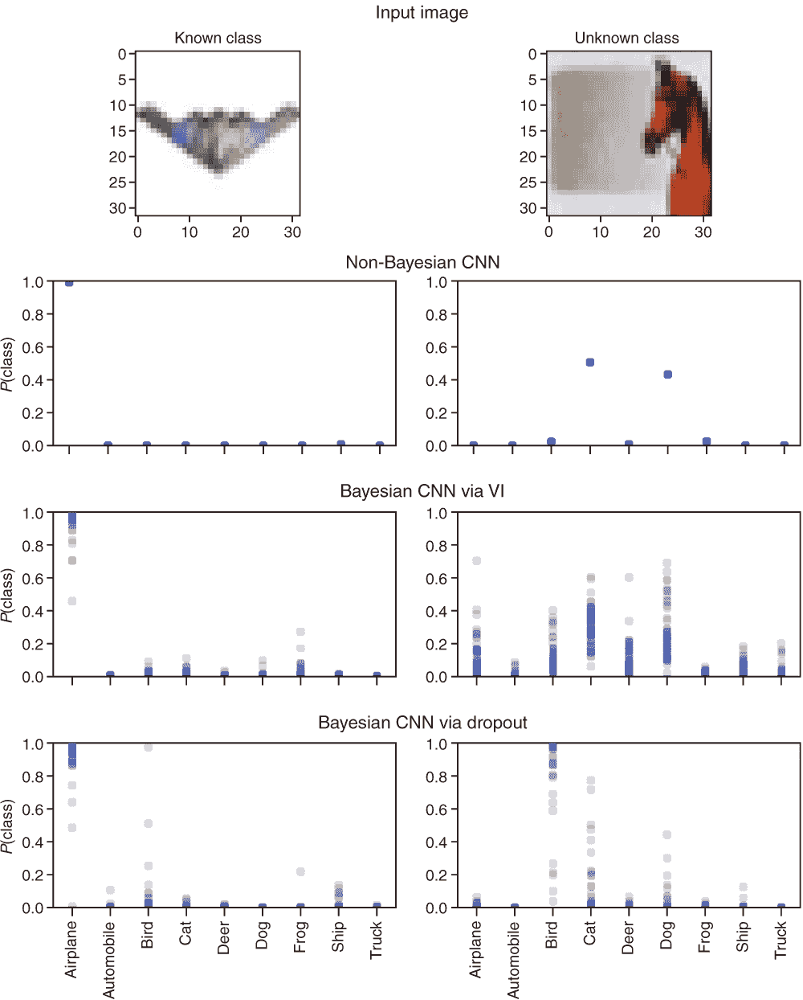

图 8.17 上半部分：提供给训练 CNN 的图像包括来自已知类别飞机的图像（左）和来自未知类别马匹的图像（右）。第二行图：非贝叶斯神经网络产生的相应预测分布。第三行图：通过 VI 产生的贝叶斯神经网络的相应预测分布。第四行图：通过 MC dropout 产生的贝叶斯神经网络的相应预测分布。

非贝叶斯分类神经网络中的不确定性度量

在传统、非贝叶斯神经网络的情况下，对于一张图像，你得到一个 CPD（参见图 8.17 的第二行）。你将图像分类到概率最高的类别：*p**[pred]* = max( *p**[k]* )。CPD 仅表达随机不确定性，如果某个类别的概率为 1 而其他所有类别的概率为 0，则这种不确定性将为零。你可以使用 *p**[pred]* 作为确定性的度量，或者使用 −log( *p**[pred]* ) 作为不确定性的度量，这就是众所周知的 NLL：

NLL = −log( *p**[pred]* )

另一个常用于随机不确定性的度量（不仅使用预测类别的概率）是熵，这在第四章中你已经遇到过。在使用非贝叶斯神经网络时，没有认知不确定性。以下是公式：

熵：*H* = −∑⁹*[k]*[=1] *p**[k]* ⋅ log( *p**[k]* )

贝叶斯分类神经网络中的不确定性度量

对于每张图像，你预测 T 个多项式 CPD：MN(*p*1,..., *p*9)（参见表 8.3 和图 8.17 的第三行和第四行）。对于每个类别 k，你可以确定平均概率 *p*^**[k]* = 1/T ∑*^T**[t=1]* *p*^**[kt]*。你将图像分类到平均概率最高的类别 *p*^**[pred]* = max( *p*^**[k]* )。

在文献中，关于如何最好地量化同时捕捉认知和随机贡献的不确定性没有共识；实际上，这仍然是一个开放的研究问题（至少如果你有超过两个类别）。请注意，这个平均概率已经捕捉到了一部分认知不确定性，因为它是由所有 T 个预测确定的。平均化导致概率向远离一或零的极端概率偏移。你可以使用 −log( *p*^**[pred]* ) 作为不确定性：

NLL^* = −log( *p*^**[pred]* )

基于平均概率值 p*k，在所有 T 次运行中平均得到的熵是一个更成熟的不确定性度量。但同样，你也可以使用多维概率分布的总方差（各个类别的方差的和）来量化不确定性：

+   熵*: *H*^* = −∑⁹*[k]*[=1] *p*^**[k]* ⋅ log( *p*^**[k]* )

+   总方差：*V**[tot]* = ∑⁹*[k]*[=1] var( *p**[k]* ) = ∑⁹*[k]*[=1] ∑*^T**[t=1]* ( *p**[kt]* − *p*^**[k]* )²

使用不确定性度量来过滤掉可能被错误分类的图像

让我们看看这些不确定性度量是否可以帮助我们提高预测性能。你在第七章的结尾看到，回归中的预测性能，通过测试 NLL 来衡量，对于贝叶斯神经网络（BNN）确实比非贝叶斯神经网络（non-BNN）要好，至少对于所研究的简单线性回归任务是这样。但现在，让我们转向分类。我们又可以再次查看测试 NLL，但在这里我们想要关注另一个问题。我们想要检查是否可以识别不确定的示例，并且如果从测试样本中移除这些示例可以增强准确率。想法是未知类别的图像应该特别显示出高不确定性。因此，如果我们能够过滤掉这些错误分类的图像，就可以提高准确率。

要检查我们是否可以识别被错误分类的图像，你可以进行一个过滤实验（参见[`mng.bz/MdmQ`](http://mng.bz/MdmQ)）。为此，你选择一个不确定性度量，然后根据这个度量对分类图像进行排序。你从具有最低不确定性的测试图像开始分类，并确定三个 CNN 变体所达到的准确率。然后，你按照不确定性的顺序添加图像（首先是具有最小不确定性的图像），并在添加每张图像后，再次确定所得到的准确率。你可以在图 8.18 中看到结果。在添加具有最高不确定性的图像后，考虑所有测试样本，达到以下准确率：非贝叶斯 CNN 为 58%，VI 贝叶斯 CNN 为 62%，MC dropout 贝叶斯 CNN 为 63%。这听起来相当糟糕，但请记住，所有测试样本中有 10%来自必须按定义导致错误分类的未知类别。

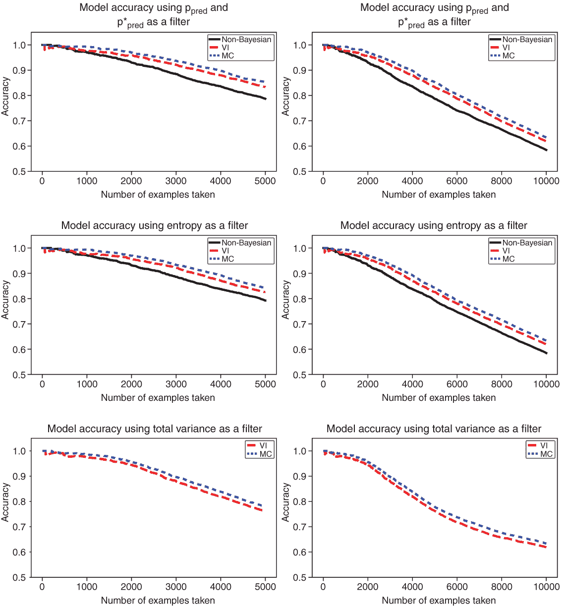

图 8.18 如果考虑越来越多的具有更高不确定性的图像，准确性会降低。每个图表中的最高准确性对应于只考虑最确定的测试图像时的准确性（100%准确性）。然后，随着不确定性的增加，添加图像。实线曲线对应于非贝叶斯 CNN，点线曲线对应于 MC dropout 贝叶斯 CNN，虚线曲线对应于 VI 贝叶斯 CNN。左侧列显示了考虑 5,000 个最确定图像时的曲线；右侧列显示了 10,000 个图像的整个测试数据集的曲线。在最后一行，只能使用贝叶斯 CNN 进行过滤，因为在非贝叶斯 CNN 中无法计算方差。

当将测试样本仅限制在已知类别时，非贝叶斯 CNN 的测试准确率为 65%，VI 贝叶斯 CNN 为 69%，MC dropout 贝叶斯 CNN 为 70%（见[`mng.bz/MdmQ`](http://mng.bz/MdmQ)）。

让我们回到问题：BNN 的不确定性是否更适合识别潜在的错误分类？答案是肯定的！您可以在图 8.18 中看到，非贝叶斯 CNN 的准确性可以通过转向贝叶斯变体来提高。此外，在 VI 和 MC dropout 贝叶斯 CNN 之间，您可以看到性能差异。MC dropout 明显优于 VI。这可能是因为 VI 与单峰高斯权重分布一起工作，而 MC dropout 与伯努利分布一起工作。您已经在图 8.17 中看到，VI 倾向于产生钟形且相当窄的预测分布，而 MC dropout 对于相同的示例产生更宽且不对称的分布，部分看起来几乎是双峰的（具有两个峰值的分布）。我们假设，在不久的将来，当可以轻松地在更复杂的分布而不是高斯分布中工作 VI 时，VI 将实现与 MC dropout 相同或更好的性能。从非贝叶斯到贝叶斯神经网络的切换很容易完成，无论您选择进行 VI 还是 MC dropout，都可以标记潜在的错误分类，并在回归和分类中实现更好的预测性能。

## 摘要

+   标准神经网络（NN）无法表达它们的不确定性。它们无法谈论房间里的大象。

+   贝叶斯神经网络（BNN）可以表达它们的不确定性。

+   贝叶斯神经网络（BNN）通常比它们的非贝叶斯变体表现更好。

+   与标准神经网络（NN）相比，贝叶斯神经网络（BNN）可以更好地识别新颖类别，因为它结合了认知和随机不确定性。

+   变分推断（VI）和蒙特卡洛 dropout（MC dropout）是近似方法，允许您拟合深度贝叶斯神经网络（BNN）。

+   TensorFlow Probability (TFP) 提供了通过变分推断（VI）拟合贝叶斯神经网络（BNN）的易于使用的层。

+   MC dropout 可用于 Keras 中拟合 BNN。
