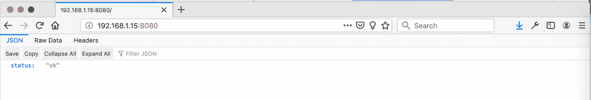
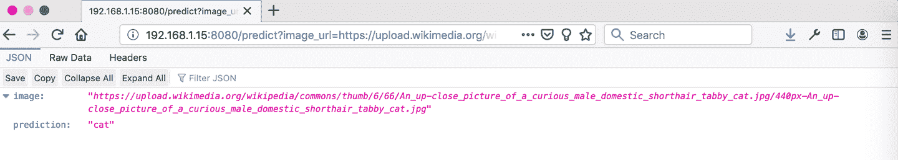

# 第八章：PyTorch 在生产中

现在您已经学会了如何使用 PyTorch 对图像、文本和声音进行分类，下一步是看看如何将 PyTorch 应用程序部署到生产环境中。在本章中，我们创建应用程序，通过 HTTP 和 gRPC 在 PyTorch 模型上运行推断。然后，我们将这些应用程序打包到 Docker 容器中，并将它们部署到在 Google Cloud 上运行的 Kubernetes 集群中。

在下半部分，我们将看一下 TorchScript，这是 PyTorch 1.0 中引入的一项新技术，它允许我们使用即时（JIT）跟踪来生成优化的模型，这些模型可以从 C++中运行。我们还简要介绍了如何使用量化压缩模型。首先，让我们看一下模型服务。

# 模型服务

在过去的六章中，我们一直在 PyTorch 中构建模型，但构建模型只是构建深度学习应用程序的一部分。毕竟，一个模型可能具有惊人的准确性（或其他相关指标），但如果它从不进行任何预测，那么它是否有价值呢？我们希望有一种简单的方法来打包我们的模型，以便它们可以响应请求（无论是通过网络还是其他方式，我们将看到），并且可以在生产环境中运行，而不需要太多的努力。

幸运的是，Python 允许我们使用 Flask 框架快速启动 Web 服务。在本节中，我们构建一个简单的服务，加载我们基于 ResNet 的*猫或鱼*模型，接受包含图像 URL 的请求，并返回一个 JSON 响应，指示图像是否包含猫或鱼。

###### 注意

如果我们向模型发送一张狗的图片会发生什么？模型会告诉您它是鱼还是猫。它没有其他选择之外的概念，总是会选择一个。一些深度学习从业者在训练过程中添加一个额外的类别`Unknown`，并加入一些不属于所需类别的标记示例。这在一定程度上有效，但实质上是试图让神经网络学习*不是猫或鱼的所有内容*，这对您和我来说都很难表达，更不用说一系列矩阵计算了！另一个选择是查看最终`softmax`生成的概率输出。如果模型产生的预测大致是 50/50 的猫/鱼或分布在您的类别中，那么可能建议`Unknown`。

## 构建 Flask 服务

让我们启动一个启用 Web 服务的模型版本。*Flask*是一个用 Python 创建 Web 服务的流行框架，我们将在本章中一直使用它作为基础。使用`pip`或`conda`安装 Flask 库：

```py
conda install -c anaconda flask
pip install flask
```

创建一个名为*catfish*的新目录，并将您的模型定义复制到其中作为*model.py*：

```py
from torchvision import models

CatfishClasses = ["cat","fish"]

CatfishModel = models.ResNet50()
CatfishModel.fc = nn.Sequential(nn.Linear(transfer_model.fc.in_features,500),
                  nn.ReLU(),
                  nn.Dropout(), nn.Linear(500,2))
```

请注意，我们在这里没有指定预训练模型，因为我们将在 Flask 服务器启动过程中加载我们保存的权重。然后创建另一个 Python 脚本*catfish_server.py*，在其中我们将启动我们的 Web 服务：

```py
from flask import Flask, jsonify
from . import CatfishModel
from torchvision import transforms
import torch
import os

def load_model():
  return model

app = Flask(__name__)

@app.route("/")
def status():
  return jsonify({"status": "ok"})

@app.route("/predict", methods=['GET', 'POST'])
def predict():
  img_url = request.image_url
  img_tensor = open_image(BytesIO(response.content))
  prediction = model(img_tensor)
  predicted_class = CatfishClasses[torch.argmax(prediction)]
  return jsonify({"image": img_url, "prediction": predicted_class})

if __name__ == '__main__':
  app.run(host=os.environ["CATFISH_HOST"], port=os.environ["CATFISH_PORT"])
```

您可以通过设置`CATFISH_HOST`和`CATFISH_PORT`环境变量在命令行上启动 Web 服务器：

```py
CATFISH_HOST=127.0.0.1 CATFISH_PORT=8080 python catfish_server.py
```

如果您将您的 Web 浏览器指向[*http://127.0.0.1:8080*](http://127.0.0.1:8080)，您应该会得到一个`status: "ok"`的 JSON 响应，如图 8-1 所示。



###### 图 8-1\. CATFISH 的 OK 响应

###### 注意

我们将在本章后面更详细地讨论这一点，但不要直接将 Flask 服务部署到生产环境，因为内置服务器不适合生产使用。

要进行预测，找到一个图像 URL，并将其作为`GET`请求发送到`/predict`路径，其中包括`image_url`参数。您应该看到一个 JSON 响应，显示 URL 和预测的类别，如图 8-2 所示。



###### 图 8-2\. CATFISH 的预测

Flask 中的魔法在于`@app.route()`注解。这使我们能够附加普通的 Python 函数，当用户访问特定端点时将运行这些函数。在我们的`predict()`方法中，我们从`GET`或`POST`HTTP 请求中提取`img_url`参数，将该 URL 打开为一个 PIL 图像，并通过一个简单的`torchvision`转换管道将其调整大小并将图像转换为张量。

这给我们一个形状为`[3,224,224]`的张量，但由于我们模型的工作方式，我们需要将其转换为大小为 1 的批次，即`[1,3,224,224]`。因此，我们再次使用`unsqueeze()`来通过在现有维度前插入一个新的空轴来扩展我们的张量。然后我们可以像往常一样将其传递给模型，这会给我们预测张量。与以前一样，我们使用`torch.argmax()`来找到张量中具有最高值的元素，并用它来索引`CatfishClasses`数组。最后，我们返回一个 JSON 响应，其中包含类的名称和我们执行预测的图像 URL。

如果你在这一点上尝试服务器，你可能会对分类性能感到有些失望。我们不是花了很多时间训练它吗？是的，我们是，但是在重新创建模型时，我们只是创建了一组具有标准 PyTorch 初始化的层！所以难怪它不好。让我们完善`load_model()`以加载我们的参数。

###### 注意

这里我们只返回预测的类，而不是所有类别的完整预测集。当然你也可以返回预测张量，但要注意完整的张量输出会使攻击者更容易通过更多的*信息泄漏*来构建模型的副本。

## 设置模型参数

在第二章中，我们讨论了训练后保存模型的两种方法，一种是使用`torch.save()`将整个模型写入磁盘，另一种是保存模型的所有权重和偏置的`state_dict()`（但不包括结构）。对于我们基于生产的服务，我们需要加载一个已经训练好的模型，那么我们应该使用什么呢？

在我看来，你应该选择`state_dict`方法。保存整个模型是一个吸引人的选择，但是你将变得对模型结构的任何更改甚至训练设置的目录结构变得非常敏感。这很可能会导致在其他地方运行的单独服务中加载它时出现问题。如果我们要进行稍微不同布局的迁移，我们希望不必重新制作所有内容。

我们最好不要将保存的`state_dicts()`的文件名硬编码，这样我们可以将模型更新与服务解耦。这意味着我们可以轻松地使用新模型重新启动服务，或者回滚到早期的模型。我们将文件名作为参数传递，但应该指向哪里呢？暂时假设我们可以设置一个名为`CATFISH_MODEL_LOCATION`的环境变量，并在`load_model()`中使用它：

```py
def load_model():
  m = CatfishModel()
  location = os.environ["CATFISH_MODEL_LOCATION"]
  m.load_state_dict(torch.load(location))
  return m
```

现在，将你在第四章中保存的模型权重文件之一复制到目录中，并将`CATFISH_MODEL_LOCATION`设置为指向该文件：

```py
export CATFISH_MODEL_LOCATION=catfishweights.pt
```

重新启动服务器，你应该看到服务的准确性有了很大提升！

我们现在有一个工作的最小 Web 服务（你可能希望有更多的错误处理，但我把这留给你来练习！）。但是我们如何在服务器上运行它，比如在 AWS 或 Google Cloud 上？或者只是在别人的笔记本电脑上？毕竟，我们安装了一堆库来使其工作。我们可以使用 Docker 将所有内容打包到一个*容器*中，该容器可以在任何 Linux（或 Windows，使用新的 Windows Subsystem for Linux！）环境中安装，只需几秒钟。

## 构建 Docker 容器

在过去几年中，Docker 已成为应用程序打包的事实标准之一。尖端的集群环境，如 Kubernetes，将 Docker 作为部署应用程序的核心（您将在本章后面看到），它甚至在企业中也取得了很大的进展。

如果您之前没有接触过 Docker，这里有一个简单的解释：它的模型是基于集装箱的概念。您指定一组文件（通常使用 Dockerfile），Docker 用这些文件构建一个*镜像*，然后在*容器*中运行该镜像，容器是您系统上的一个隔离进程，只能看到您指定的文件和您告诉它运行的程序。然后您可以共享 Dockerfile，以便其他人构建自己的镜像，但更常见的方法是将创建的镜像推送到*注册表*，这是一个包含可以被任何有访问权限的人下载的 Docker 镜像列表。这些注册表可以是公共的或私有的；Docker 公司运行[Docker Hub](https://hub.docker.com)，这是一个包含超过 100,000 个 Docker 镜像的公共注册表，但许多公司也运行私有注册表供内部使用。

我们需要编写自己的 Dockerfile。这可能听起来有点令人不知所措。我们需要告诉 Docker 安装什么？我们的代码？PyTorch？Conda？Python？Linux 本身？幸运的是，Dockerfile 可以继承自其他镜像，因此我们可以，例如，继承标准 Ubuntu 镜像，并从那里安装 Python、PyTorch 和其他所有内容。但我们可以做得更好！可以选择一些 Conda 镜像，这些镜像将为我们提供一个基本的 Linux、Python 和 Anaconda 安装基础。以下是一个示例 Dockerfile，可用于构建我们服务的容器镜像：

```py
FROM continuumio/miniconda3:latest

ARG model_parameter_location
ARG model_parameter_name
ARG port
ARG host

ENV CATFISH_PORT=$port
ENV CATFISH_HOST=$host
ENV CATFISH_MODEL_LOCATION=/app/$model_parameter_name

RUN conda install -y flask \
  && conda install -c pytorch  torchvision \
  && conda install waitress
RUN mkdir -p /app

COPY ./model.py /app
COPY ./server.py /app
COPY $model_location/$model_weights_name /app/
COPY ./run-model-service.sh /

EXPOSE $port

ENTRYPOINT ["/run-model-service.sh"]
```

这里发生了一些事情，让我们来看看。几乎所有 Dockerfile 中的第一行都是`FROM`，列出了此文件继承的 Docker 镜像。在这种情况下，它是`continuumio/miniconda3:latest`。这个字符串的第一部分是镜像名称。镜像也有版本，所以冒号后面的所有内容都是一个*标签*，指示我们想要下载哪个版本的镜像。还有一个魔术标签`latest`，我们在这里使用它来下载我们想要的镜像的最新版本。您可能希望将服务固定在特定版本上，以免基础镜像可能导致您的问题后续更改。

`ARG`和`ENV`处理变量。`ARG`指定在构建镜像时由 Docker 提供的变量，然后该变量可以在 Dockerfile 中稍后使用。`ENV`允许您指定在运行时将注入容器的环境变量。在我们的容器中，我们使用`ARG`来指定端口是可配置选项，然后使用`ENV`确保配置在启动时对我们的脚本可用。

完成了这些操作后，`RUN`和`COPY`允许我们操作继承的镜像。`RUN`在镜像内部运行实际命令，任何更改都会保存为镜像的新*层*，叠加在基础层之上。`COPY`从 Docker 构建上下文中获取内容（通常是构建命令发出的目录中的任何文件或任何子目录），并将其插入到镜像文件系统的某个位置。通过使用`RUN`创建了`/app`后，我们使用`COPY`将代码和模型参数移动到镜像中。

`EXPOSE`指示 Docker 应将哪个端口映射到外部世界。默认情况下，没有打开任何端口，所以我们在这里添加一个，从文件中之前的`ARG`命令中获取。最后，`ENTRYPOINT`是创建容器时运行的默认命令。在这里，我们指定了一个脚本，但我们还没有创建它！在构建 Docker 镜像之前，让我们先做这个：

```py
#!/bin/bash
#run-model-service.sh
cd /app
waitress-serve --call 'catfish_server:create_app'
```

等等，这里发生了什么？`waitress`是从哪里来的？问题在于，在之前运行基于 Flask 的服务器时，它使用了一个仅用于调试目的的简单 Web 服务器。如果我们想将其投入生产，我们需要一个适用于生产的 Web 服务器。Waitress 满足了这一要求。我们不需要详细讨论它，但如果您想了解更多信息，可以查看[Waitress 文档](https://oreil.ly/x96Ir)。

设置好这一切后，我们最终可以使用`docker build`来创建我们的镜像：

```py
docker build -t catfish-service .
```

我们可以通过使用`docker images`来确保镜像在我们的系统上可用：

```py
>docker images
REPOSITORY               TAG                            IMAGE ID
catfish-service          latest                         e5de5ad808b6
```

然后可以使用`docker run`来运行我们的模型预测服务：

```py
docker run catfish-service -p 5000:5000
```

我们还使用`-p`参数将容器的端口 5000 映射到我们计算机的端口 5000。您应该能够像以前一样返回到*http://localhost:5000/predict*。

当在本地运行`docker images`时，您可能会注意到我们的 Docker 镜像超过 4GB！考虑到我们没有写太多代码，这相当大。让我们看看如何使镜像更小，同时使我们的镜像更适合部署。

## 本地与云存储

显然，存储我们保存的模型参数的最简单方法是在本地文件系统上，无论是在我们的计算机上还是在 Docker 容器内的文件系统上。但是这样做有几个问题。首先，模型被硬编码到镜像中。此外，很可能在构建镜像并投入生产后，我们需要更新模型。使用我们当前的 Dockerfile，即使模型的结构没有改变，我们也必须完全重建镜像！其次，我们镜像的大部分大小来自参数文件的大小。您可能没有注意到它们往往相当大！试试看：

```py
ls -l
total 641504
-rw------- 1 ian ian 178728960 Feb  4  2018 resnet101-5d3b4d8f.pth
-rw------- 1 ian ian 241530880 Feb 18  2018 resnet152-b121ed2d.pth
-rw------- 1 ian ian  46827520 Sep 10  2017 resnet18-5c106cde.pth
-rw------- 1 ian ian  87306240 Dec 23  2017 resnet34-333f7ec4.pth
-rw------- 1 ian ian 102502400 Oct  1  2017 resnet50-19c8e357.pth
```

如果我们在每次构建时将这些模型添加到文件系统中，我们的 Docker 镜像可能会相当大，这会使推送和拉取变慢。我建议的是如果您在本地运行，可以使用本地文件系统或 Docker 卷映射容器，但如果您正在进行云部署，那么可以利用云的优势。模型参数文件可以上传到 Azure Blob Storage、Amazon Simple Storage Service（Amazon S3）或 Google Cloud Storage，并在启动时拉取。

我们可以重写我们的`load_model()`函数在启动时下载参数文件：

```py
from urllib.request import urlopen
from shutil import copyfileobj
from tempfile import NamedTemporaryFile

def load_model():
  m = CatfishModel()
  parameter_url = os.environ["CATFISH_MODEL_LOCATION"]
  with urlopen(url) as fsrc, NamedTemporaryFile() as fdst:
    copyfileobj(fsrc, fdst)
    m.load_state_dict(torch.load(fdst))
  return m
```

当然，有许多种使用 Python 下载文件的方法；Flask 甚至带有`requests`模块，可以轻松下载文件。然而，一个潜在的问题是，许多方法在将文件写入磁盘之前会将整个文件下载到内存中。大多数情况下，这是有道理的，但是当下载模型参数文件时，它们可能会达到几十 GB。因此，在这个新版本的`load_model()`中，我们使用`urlopen()`和`copyfileobj()`来执行复制操作，并使用`NamedTemporaryFile()`来给我们一个在块结束时可以删除的目标，因为在那时，我们已经加载了参数，因此不再需要文件！这使我们能够简化我们的 Dockerfile：

```py
FROM continuumio/miniconda3:latest

ARG port
ARG host

ENV CATFISH_PORT=$port
RUN conda install -y flask \
  && conda install -c pytorch torch torchvision \
  && conda install waitress
RUN mkdir -p /app

COPY ./model.py /app
COPY ./server.py /app
COPY ./run-model-service.sh /

EXPOSE $port

ENTRYPOINT ["/run-model-service.sh"]
```

当我们使用`docker run`运行时，我们传入环境变量：

```py
docker run catfish-service --env CATFISH_MODEL_LOCATION=[URL]
```

该服务现在从 URL 中提取参数，并且 Docker 镜像可能比原始镜像小约 600MB-700MB。

###### 注意

在这个例子中，我们假设模型参数文件位于一个公开可访问的位置。如果您部署一个模型服务，您可能不会处于这种情况，而是会从云存储层（如 Amazon S3、Google Cloud Storage 或 Azure Blob Storage）中拉取。您将需要使用各自提供商的 API 来下载文件并获取凭据以访问它，这两点我们在这里不讨论。

我们现在有一个能够通过 HTTP 与 JSON 进行通信的模型服务。现在我们需要确保在它进行预测时能够监控它。

## 日志和遥测

我们当前的服务中没有的一件事是任何日志记录的概念。虽然服务非常简单，也许不需要大量的日志记录（除非在捕获错误状态时），但对于我们来说，跟踪实际预测的内容是有用的，如果不是必不可少的。在某个时候，我们将想要评估模型；如果没有生产数据，我们该如何做呢？

假设我们有一个名为`send_to_log()`的方法，它接受一个 Python `dict`并将其发送到其他地方（也许是一个备份到云存储的 Apache Kafka 集群）。每次进行预测时，我们可以通过这种方法发送适当的信息：

```py
import uuid
import logging
logging.basicConfig(level=logging.INFO)

def predict():
  img_url = request.image_url
  img_tensor = open_image(BytesIO(response.content))
  start_time = time.process_time()
  prediction = model(img_tensor)
  end_time = time.process_time()
  predicted_class = CatfishClasses[torch.argmax(prediction)]
  send_to_log(
    {"image": img_url,
    "prediction": predicted_class},
    "predict_tensor": prediction,
    "img_tensor": img_tensor,
    "predict_time": end_time-start_time,
    "uuid":uuid.uuid4()
    })
  return jsonify({"image": img_url, "prediction": predicted_class})

def send_to_log(log_line):
  logger.info(log_line)
```

通过对每个请求计算预测所需时间的几个补充，该方法现在会向记录器或外部资源发送消息，提供重要细节，如图像 URL、预测类别、实际预测张量，甚至完整的图像张量，以防所提供的 URL 是瞬态的。我们还包括一个生成的通用唯一标识符（UUID），以便以后始终可以唯一引用此预测，也许如果其预测类别需要更正。在实际部署中，您将包括`user_id`等内容，以便下游系统可以提供一个设施，让用户指示预测是正确还是错误，偷偷地生成更多用于模型进一步训练迭代的训练数据。

有了这些，我们就准备好将我们的容器部署到云端了。让我们快速看一下如何使用 Kubernetes 来托管和扩展我们的服务。

# 在 Kubernetes 上部署

本书的范围不包括深入讨论 Kubernetes，因此我们将坚持基础知识，包括如何快速启动和运行服务。Kubernetes（也称为 k8s）正在迅速成为云中的主要集群框架。它源自谷歌最初的集群管理软件 Borg，包含所有部件和粘合剂，形成了一种弹性和可靠的运行服务的方式，包括负载均衡器、资源配额、扩展策略、流量管理、共享密钥等。

您可以在本地计算机或云账户上下载和设置 Kubernetes，但推荐的方式是使用托管服务，其中 Kubernetes 本身的管理由云提供商处理，您只需安排您的服务。我们使用谷歌 Kubernetes 引擎（GKE）服务进行部署，但您也可以在亚马逊、Azure 或 DigitalOcean 上进行部署。

## 在谷歌 Kubernetes 引擎上设置

要使用 GKE，您需要一个[谷歌云账户](https://cloud.google.com)。此外，在 GKE 上运行服务并不是免费的。好消息是，如果您是谷歌云的新用户，您将获得价值 300 美元的免费信用额度，我们可能不会花费超过一两美元。

一旦您拥有账户，请为您的系统下载[`gcloud` SDK](https://cloud.google.com/sdk)。安装完成后，我们可以使用它来安装`kubectl`，这是我们将用来与我们将要创建的 Kubernetes 集群进行交互的应用程序：

```py
gcloud login
gcloud components install kubectl
```

然后，我们需要创建一个新的*项目*，这是谷歌云在您的账户中组织计算资源的方式：

```py
gcloud projects create ml-k8s --set-as-default
```

接下来，我们重建我们的 Docker 镜像并对其进行标记，以便将其推送到谷歌提供的内部注册表（我们需要使用`gcloud`进行身份验证），然后我们可以使用`docker push`将我们的容器镜像发送到云端。请注意，我们还使用`v1`版本标记标记了我们的服务，这是之前没有做的：

```py
docker build -t gcr.io/ml-k8s/catfish-service:v1 .
gcloud auth configure-docker
docker push gcr.io/ml-k8s/catfish-service:v1
```

## 创建一个 k8s 集群

现在我们可以创建我们的 Kubernetes 集群。在以下命令中，我们创建了一个具有两个 n1-standard-1 节点的集群，这是谷歌最便宜和最低功率的实例。如果您真的要省钱，可以只创建一个节点的集群。

```py
gcloud container clusters create ml-cluster --num-nodes=2
```

这可能需要几分钟来完全初始化新的集群。一旦准备就绪，我们就可以使用`kubectl`部署我们的应用程序！

```py
kubectl run catfish-service
--image=gcr.io/ml-k8s/catfish-service:v1
--port 5000
--env CATFISH_MODEL_LOCATION=[URL]
```

请注意，我们在这里将模型参数文件的位置作为环境参数传递，就像我们在本地机器上使用`docker run`命令一样。使用`kubectl get pods`查看集群上正在运行的 pod。*pod*是一个包含一个或多个容器的组合，并附有如何运行和管理这些容器的规范。对于我们的目的，我们在一个 pod 中的一个容器中运行我们的模型。这是您应该看到的内容：

```py
NAME                                  READY STATUS  RESTARTS  AGE
gcr.io/ml-k8s/catfish-service:v1      1/1   Running 0 4m15s
```

好的，现在我们可以看到我们的应用正在运行，但我们如何与它进行交流呢？为了做到这一点，我们需要部署一个*服务*，在这种情况下是一个负载均衡器，将外部 IP 地址映射到我们的内部集群：

```py
kubectl expose deployment catfish-service
--type=LoadBalancer
--port 80
--target-port 5000
```

然后您可以使用`kubectl get services`查看正在运行的服务以获取外部 IP 地址：

```py
kubectl get service

NAME               CLUSTER-IP      EXTERNAL-IP     PORT(S)          AGE
catfish-service    10.3.251.122    203.0.113.0     80:30877/TCP     3d
```

现在你应该能够像在本地机器上一样访问*http://`external-ip`/predict*。成功！我们还可以在不登录的情况下查看我们的 pod 日志：

```py
kubectl logs catfish-service-xxdsd
>> log response
```

我们现在在 Kubernetes 集群中运行一个部署。让我们探索一些它提供的功能。

## 扩展服务

假设我们决定一个 pod 无法处理进入我们预测服务的所有流量。在传统部署中，我们必须启动新服务器，将它们添加到负载均衡器中，并解决如果其中一个服务器失败该怎么办的问题。但是使用 Kubernetes，我们可以轻松完成所有这些。让我们确保运行三个服务的副本：

```py
kubectl scale deployment hello-web --replicas=3
```

如果您继续查看`kubectl get pods`，您很快会看到 Kubernetes 正在从您的 Docker 镜像中启动另外两个 pod，并将它们连接到负载均衡器。更好的是，让我们看看如果我们删除其中一个 pod 会发生什么：

```py
kubectl delete pod [PODNAME]
kubectl get pods
```

您会看到我们指定的 pod 已被删除。但是—您还应该看到正在启动一个新的 pod 来替换它！我们告诉 Kubernetes 我们应该运行三个镜像的副本，因为我们删除了一个，集群会启动一个新的 pod 来确保副本计数是我们请求的。这也适用于更新我们的应用程序，所以让我们也看看这个。

## 更新和清理

当涉及推送更新到我们的服务代码时，我们创建一个带有`v2`标签的容器的新版本：

```py
docker build -t gcr.io/ml-k8s/catfish-service:v2 .
docker push gcr.io/ml-k8s/catfish-service:v2
```

然后我们告诉集群使用新镜像进行部署：

```py
kubectl set image deployment/catfish-service
  catfish-service=gcr.io/ml-k8s/catfish-service:v2
```

通过`kubectl get pods`持续监控，您会看到正在部署具有新镜像的新 pod，并且正在删除具有旧镜像的 pod。Kubernetes 会自动处理连接的排空和从负载均衡器中删除旧 pod。

最后，如果您已经玩够了集群，应该清理一下，以免出现任何意外费用：

```py
kubectl delete service catfish-service
gcloud container clusters delete ml-k8s
```

这就是我们对 Kubernetes 的迷你之旅；您现在已经知道足够多，可以做出危险的决定，但是一定要查看[Kubernetes 网站](https://kubernetes.io)作为进一步了解该系统的起点（相信我，这方面有很多信息！）

我们已经讨论了如何部署基于 Python 的代码，但也许令人惊讶的是，PyTorch 并不仅限于 Python。在下一节中，您将看到 TorchScript 如何引入更广泛的 C++世界，以及对我们正常的 Python 模型的一些优化。

# TorchScript

如果您还记得介绍（我知道！）的话，您会知道 PyTorch 和 TensorFlow 之间的主要区别在于 TensorfFlow 具有模型的基于图形的表示，而 PyTorch 具有基于执行的即时执行和基于磁带的微分。即时方法允许您执行各种动态方法来指定和训练模型，使 PyTorch 对研究目的具有吸引力。另一方面，基于图形的表示可能是静态的，但它从稳定性中获得力量；可以应用优化到图形表示中，确保不会发生任何变化。正如 TensorFlow 已经在 2.0 版本中转向支持即时执行一样，PyTorch 的 1.0 版本引入了 TorchScript，这是一种在不完全放弃 PyTorch 灵活性的情况下带来图形系统优势的方法。这通过两种可以混合和匹配的方式来实现：跟踪和直接使用 TorchScript。

## 跟踪

PyTorch 1.0 带有一个 JIT 跟踪引擎，它将现有的 PyTorch 模块或函数转换为 TorchScript。它通过将一个示例张量传递到模块中，并返回一个包含原始代码的 TorchScript 表示的`ScriptModule`结果来实现这一点。

让我们看看跟踪 AlexNet：

```py
model = torchvision.models.AlexNet()
traced_model = torch.jit.trace(model,
                torch.rand(1, 3, 224, 224))
```

现在，这将*起作用*，但您将从 Python 解释器收到这样的消息，这会让您停下来思考：

```py
TracerWarning: Trace had nondeterministic nodes. Nodes:
%input.15 :
Float(1, 9216) = aten::dropout(%input.14, %174, %175),
scope: AlexNet/Sequential[classifier]/Dropout[0]
%input.18 :
Float(1, 4096) = aten::dropout(%input.17, %184, %185),
scope: AlexNet/Sequential[classifier]/Dropout[3]

This may cause errors in trace checking.
To disable trace checking, pass check_trace=False to torch.jit.trace()

_check_trace([example_inputs], func, executor_options,
module, check_tolerance, _force_outplace)
/home/ian/anaconda3/lib/
python3.6/site-packages/torch/jit/__init__.py:642:
TracerWarning: Output nr 1. of the traced function does not
match the corresponding output of the Python function. Detailed error:

Not within tolerance rtol=1e-05 atol=1e-05 at input[0, 22]
(0.010976361110806465 vs. -0.005604125093668699)
and 996 other locations (99.00%)
_check_trace([example_inputs], func,
executor_options, module, check_tolerance
_force_outplace)
```

这里发生了什么？当我们创建 AlexNet（或其他模型）时，模型是在*训练*模式下实例化的。在许多模型（如 AlexNet）的训练过程中，我们使用`Dropout`层，它会在张量通过网络时随机关闭激活。JIT 所做的是将我们生成的随机张量通过模型两次，进行比较，并注意到`Dropout`层不匹配。这揭示了跟踪设施的一个重要注意事项；它无法处理不确定性或控制流。如果您的模型使用这些特性，您将不得不至少部分使用 TorchScript 进行转换。

在 AlexNet 的情况下，修复很简单：我们将通过使用`model.eval()`将模型切换到评估模式。如果再次运行跟踪行，您会发现它完成而没有任何抱怨。我们还可以`print()`跟踪的模型以查看其组成部分：

```py
print(traced_model)

TracedModuleAlexNet: TracedModuleSequential: TracedModule[Conv2d]()
  (1): TracedModule[ReLU]()
  (2): TracedModule[MaxPool2d]()
  (3): TracedModule[Conv2d]()
  (4): TracedModule[ReLU]()
  (5): TracedModule[MaxPool2d]()
  (6): TracedModule[Conv2d]()
  (7): TracedModule[ReLU]()
  (8): TracedModule[Conv2d]()
  (9): TracedModule[ReLU]()
  (10): TracedModule[Conv2d]()
  (11): TracedModule[ReLU]()
  (12): TracedModule[MaxPool2d]()
)
(classifier): TracedModuleSequential: TracedModule[Dropout]()
  (1): TracedModule[Linear]()
  (2): TracedModule[ReLU]()
  (3): TracedModule[Dropout]()
  (4): TracedModule[Linear]()
  (5): TracedModule[ReLU]()
  (6): TracedModule[Linear]()
  )
)
```

如果调用`print(traced_model.code)`，我们还可以看到 JIT 引擎创建的代码。

```py
def forward(self,
  input_1: Tensor) -> Tensor:
  input_2 = torch._convolution(input_1, getattr(self.features, "0").weight,
  getattr(self.features, "0").bias,
  [4, 4], [2, 2], [1, 1], False, [0, 0], 1, False, False, True)
  input_3 = torch.threshold_(input_2, 0., 0.)
  input_4, _0 = torch.max_pool2d_with_indices
  (input_3, [3, 3], [2, 2], [0, 0], [1, 1], False)
  input_5 = torch._convolution(input_4, getattr
  (self.features, "3").weight, getattr(self.features, "3").bias,
  [1, 1], [2, 2], [1, 1], False, [0, 0], 1, False, False, True)
  input_6 = torch.threshold_(input_5, 0., 0.)
  input_7, _1 = torch.max_pool2d_with_indices
  (input_6, [3, 3], [2, 2], [0, 0], [1, 1], False)
  input_8 = torch._convolution(input_7, getattr(self.features, "6").weight,
  getattr
  (self.features, "6").bias,
  [1, 1], [1, 1], [1, 1], False, [0, 0], 1, False, False, True)
  input_9 = torch.threshold_(input_8, 0., 0.)
  input_10 = torch._convolution(input_9, getattr
  (self.features, "8").weight, getattr(self.features, "8").bias,
  [1, 1], [1, 1], [1, 1], False, [0, 0], 1, False, False, True)
  input_11 = torch.threshold_(input_10, 0., 0.)
  input_12 = torch._convolution(input_11, getattr
  (self.features, "10").weight, getattr(self.features, "10").bias,
  [1, 1], [1, 1], [1, 1], False, [0, 0], 1, False, False, True)
  input_13 = torch.threshold_(input_12, 0., 0.)
  x, _2 = torch.max_pool2d_with_indices
  (input_13, [3, 3], [2, 2], [0, 0], [1, 1], False)
  _3 = ops.prim.NumToTensor(torch.size(x, 0))
  input_14 = torch.view(x, [int(_3), 9216])
  input_15 = torch.dropout(input_14, 0.5, False)
  _4 = torch.t(getattr(self.classifier, "1").weight)
  input_16 = torch.addmm(getattr(self.classifier, "1").bias,
    input_15, _4, beta=1, alpha=1)
  input_17 = torch.threshold_(input_16, 0., 0.)
  input_18 = torch.dropout(input_17, 0.5, False)
  _5 = torch.t(getattr(self.classifier, "4").weight)
  input_19 = torch.addmm(getattr(self.classifier, "4").bias,
    input_18, _5, beta=1, alpha=1)
  input = torch.threshold_(input_19, 0., 0.)
  _6 = torch.t(getattr(self.classifier, "6").weight)
  _7 = torch.addmm(getattr(self.classifier, "6").bias, input,
    _6, beta=1, alpha=1)
  return _7
```

然后可以使用`torch.jit.save`保存模型（代码和参数）：

```py
torch.jit.save(traced_model, "traced_model")
```

这涵盖了跟踪的工作原理。让我们看看如何使用 TorchScript。

## 脚本化

您可能想知道为什么我们不能跟踪一切。尽管跟踪器在其所做的事情上很擅长，但它也有局限性。例如，像以下简单函数这样的函数不可能通过单次传递进行跟踪：

```py
import torch

def example(x, y):
  if x.min() > y.min():
      r = x
  else:
      r = y
  return r
```

通过函数的单个跟踪将使我们沿着一条路径而不是另一条路径，这意味着函数将无法正确转换。在这些情况下，我们可以使用 TorchScript，这是 Python 的一个有限子集，并生成我们的编译代码。我们使用*注释*告诉 PyTorch 我们正在使用 TorchScript，因此 TorchScript 实现将如下所示：

```py
@torch.jit.script
def example(x, y):
    if x.min() > y.min():
        r = x
    else:
        r = y
    return r
```

幸运的是，我们的函数中没有使用 TorchScript 中没有的构造或引用任何全局状态，因此这将正常工作。如果我们正在创建一个新的架构，我们需要继承自`torch.jit.ScriptModule`而不是`nn.Module`。您可能想知道如果所有模块都必须继承自这个不同的类，我们如何可以使用其他模块（比如基于 CNN 的层）。一切都稍微不同吗？解决方法是我们可以随意使用显式 TorchScript 和跟踪对象来混合和匹配。

让我们回到第三章中的 CNNNet/AlexNet 结构，看看如何使用这些方法的组合将其转换为 TorchScript。为简洁起见，我们只实现`features`组件：

```py
class FeaturesCNNNet(torch.jit.ScriptModule):
    def __init__(self, num_classes=2):
        super(FeaturesCNNNet, self).__init__()
        self.features = torch.jit.trace(nn.Sequential(
            nn.Conv2d(3, 64, kernel_size=11, stride=4, padding=2),
            nn.ReLU(),
            nn.MaxPool2d(kernel_size=3, stride=2),
            nn.Conv2d(64, 192, kernel_size=5, padding=2),
            nn.ReLU(),
            nn.MaxPool2d(kernel_size=3, stride=2),
            nn.Conv2d(192, 384, kernel_size=3, padding=1),
            nn.ReLU(),
            nn.Conv2d(384, 256, kernel_size=3, padding=1),
            nn.ReLU(),
            nn.Conv2d(256, 256, kernel_size=3, padding=1),
            nn.ReLU(),
            nn.MaxPool2d(kernel_size=3, stride=2)
        ), torch.rand(1,3,224,224))

    @torch.jit.script_method
    def forward(self, x):
        x = self.features(x)
        return x
```

这里有两件事需要注意。首先，在类内部，我们需要使用 `@torch.jit.script_method` 进行注释。其次，尽管我们可以单独跟踪每个单独的层，但我们利用了 `nn.Sequential` 包装层，只需通过它来触发跟踪。你可以自己实现 `classifier` 块，以了解这种混合工作的感觉。请记住，你需要将 `Dropout` 层切换到 `eval()` 模式而不是训练模式，并且由于 `features` 块进行的下采样，你的输入跟踪张量的形状需要是 `[1, 256, 6, 6]`。是的，你可以像我们为跟踪模块所做的那样使用 `torch.jit.save` 来保存这个网络。让我们看看 TorchScript 允许和禁止什么。

## TorchScript 的限制

与 Python 相比，至少在我看来，TorchScript 的最大限制是可用类型数量减少了。表 8-1 列出了可用和不可用的类型。

表 8-1\. TorchScript 中可用的 Python 类型

| 类型 | 描述 |
| --- | --- |
| `tensor` | 一个 PyTorch 张量，可以是任何数据类型、维度或后端 |
| `tuple`[T0, T1,…] | 包含子类型 T0、T1 等的元组（例如，`tuple[tensor, tensor]`） |
| `boolean` | 布尔值 |
| `str` | 字符串 |
| `int` | 整数 |
| `float` | 浮点数 |
| `list` | 类型为 `T` 的列表 |
| `optional[T]` | 要么为 *None*，要么为类型 `T` |
| `dict[K, V]` | 键为类型 `K`，值为类型 `V` 的字典；`K` 只能是 `str`、`int` 或 `float` |

在标准 Python 中可以做但在 TorchScript 中不能做的另一件事是具有混合返回类型的函数。以下在 TorchScript 中是非法的：

```py
def maybe_a_string_or_int(x):
  if x > 3:
    return "bigger than 3!"
  else
    return 2
```

当然，在 Python 中也不是一个好主意，但语言的动态类型允许这样做。TorchScript 是静态类型的（有助于应用优化），因此在 TorchScript 注释代码中你根本无法这样做。此外，TorchScript 假定传递给函数的每个参数都是张量，如果你不知道发生了什么，可能会导致一些奇怪的情况：

```py
@torch.jit.script
def add_int(x,y):
  return x + y

print(add_int.code)
>> def forward(self,
  x: Tensor,
  y: Tensor) -> Tensor:
  return torch.add(x, y, alpha=1)
```

为了强制不同的类型，我们需要使用 Python 3 的类型装饰器：

```py
@torch.jit.script
def add_int(x: int, y: int) -> int:
  return x + y
print(add_int.code)
>> def forward(self,
  x: int,
  y: int) -> int:
return torch.add(x, y)
```

正如你已经看到的，类是受支持的，但有一些细微差别。类中的所有方法都必须是有效的 TorchScript，但尽管这段代码看起来有效，它将失败：

```py
@torch.jit.script
class BadClass:
  def __init__(self, x)
    self.x = x

  def set_y(y)
    self.y = y
```

这又是 TorchScript 静态类型的一个结果。所有实例变量都必须在 `__init__` 中声明，不能在其他地方引入。哦，不要想着在类中包含任何不在方法中的表达式——这些都被 TorchScript 明确禁止了。

TorchScript 作为 Python 的一个子集的一个有用特性是，翻译可以以逐步的方式进行，中间代码仍然是有效的可执行 Python。符合 TorchScript 的代码可以调用不符合规范的代码，虽然在所有不符合规范的代码转换之前你无法执行 `torch.jit.save()`，但你仍然可以在 Python 下运行所有内容。

这些是我认为 TorchScript 的主要细微差别。你可以阅读更多关于[PyTorch 文档](https://oreil.ly/sS0o7)中的内容，其中深入探讨了诸如作用域（主要是标准 Python 规则）之类的内容，但这里提供的概述足以将你在本书中迄今看到的所有模型转换过来。让我们看看如何在 C++中使用我们的一个 TorchScript 启用的模型。

# 使用 libTorch

除了 TorchScript 之外，PyTorch 1.0 还引入了`libTorch`，这是一个用于与 PyTorch 交互的 C++库。有各种不同级别的 C++交互可用。最低级别是`ATen`和`autograd`，这是 PyTorch 本身构建在其上的张量和自动微分的 C++实现。在这些之上是一个 C++前端，它在 C++中复制了 Pythonic PyTorch API，一个与 TorchScript 的接口，最后是一个扩展接口，允许定义和暴露新的自定义 C++/CUDA 运算符给 PyTorch 的 Python 实现。在本书中，我们只关注 C++前端和与 TorchScript 的接口，但有关其他部分的更多信息可在[PyTorch 文档](https://oreil.ly/y6NP5)中找到。让我们从获取`libTorch`开始。

## 获取 libTorch 和 Hello World

在我们做任何事情之前，我们需要一个 C++编译器和一种在我们的机器上构建 C++程序的方法。这是本书中少数几个部分之一，类似 Google Colab 之类的东西不适用，因此如果您没有轻松访问终端窗口，可能需要在 Google Cloud、AWS 或 Azure 中创建一个 VM。 （所有忽略了我的建议不要构建专用机器的人现在都感到自鸣得意，我打赌！）`libTorch`的要求是一个 C++编译器和*CMake*，所以让我们安装它们。对于基于 Debian 的系统，请使用以下命令：

```py
apt install cmake g++
```

如果您使用的是基于 Red Hat 的系统，请使用以下命令：

```py
yum install cmake g++
```

接下来，我们需要下载`libTorch`本身。为了让接下来的事情变得更容易，我们将使用基于 CPU 的`libTorch`分发，而不是处理启用 GPU 的分发带来的额外 CUDA 依赖。创建一个名为*torchscript_export*的目录并获取分发：

```py
  wget https://download.pytorch.org/libtorch/cpu/libtorch-shared-with-deps-latest.zip
```

使用`unzip`来展开 ZIP 文件（它应该创建一个新的*libtorch*目录），并创建一个名为*helloworld*的目录。在这个目录中，我们将添加一个最小的*CMakeLists.txt*，*CMake*将用它来构建我们的可执行文件：

```py
cmake_minimum_required(VERSION 3.0 FATAL_ERROR)
project(helloworld)

find_package(Torch REQUIRED)

add_executable(helloworld helloworld.cpp)
target_link_libraries(helloworld "${TORCH_LIBRARIES}")
set_property(TARGET helloword PROPERTY CXX_STANDARD 11)
```

然后*helloworld.cpp*如下：

```py
#include <torch/torch.h>
#include <iostream>

int main() {
  torch::Tensor tensor = torch::ones({2, 2});
  std::cout << tensor << std::endl;
}
```

创建一个*build*目录并运行**`cmake`**，确保我们提供`libtorch`分发的*绝对*路径：

```py
mkdir build
cd build
cmake -DCMAKE_PREFIX_PATH=/absolute/path/to/libtorch ..
cd ..
```

现在我们可以运行简单的`make`来创建我们的可执行文件：

```py
make
./helloworld

1  1
1  1
[ Variable[CPUType]{2,2} ]
```

祝贺您使用`libTorch`构建了您的第一个 C++程序！现在，让我们扩展一下，看看如何使用该库加载我们之前用`torch.jit.save()`保存的模型。

## 导入 TorchScript 模型

我们将从第三章中导出我们的完整 CNNNet 模型，并将其加载到 C++中。在 Python 中，创建 CNNNet 的实例，将其切换到`eval()`模式以忽略`Dropout`，跟踪并保存到磁盘：

```py
cnn_model = CNNNet()
cnn_model.eval()
cnn_traced = torch.jit.trace(cnn_model, torch.rand([1,3,224,224]))
torch.jit.save(cnn_traced, "cnnnet")
```

在 C++世界中，创建一个名为*load-cnn*的新目录，并添加这个新的*CMakeLists.txt*文件：

```py
cmake_minimum_required(VERSION 3.0 FATAL_ERROR)
project(load-cnn)

find_package(Torch REQUIRED)

add_executable(load-cnn.cpp load-cnn.cpp)
target_link_libraries(load-cnn "${TORCH_LIBRARIES}")
set_property(TARGET load-cnn PROPERTY CXX_STANDARD 11)
```

让我们创建我们的 C++程序`load-cnn.cpp`：

```py
#include <torch/script.h>
#include <iostream>
#include <memory>

int main(int argc, const char* argv[]) {

  std::shared_ptr<torch::jit::script::Module> module = torch::jit::load("cnnnet");

  assert(module != nullptr);
  std::cout << "model loaded ok\n";

  // Create a vector of inputs.
  std::vector<torch::jit::IValue> inputs;
  inputs.push_back(torch::rand({1, 3, 224, 224}));

  at::Tensor output = module->forward(inputs).toTensor();

  std::cout << output << '\n'
}
```

这个小程序中有一些新东西，尽管其中大部分应该让您想起 Python PyTorch API。我们的第一步是使用`torch::jit::load`加载我们的 TorchScript 模型（与 Python 中的`torch.jit.load`不同）。我们进行空指针检查以确保模型已正确加载，然后我们继续使用随机张量测试模型。虽然我们可以很容易地使用`torch::rand`来做到这一点，但在与 TorchScript 模型交互时，我们必须创建一个`torch::jit::IValue`输入向量，而不仅仅是一个普通张量，因为 TorchScript 在 C++中的实现方式。完成后，我们可以将张量传递给我们加载的模型，最后将结果写回标准输出。我们以与之前编译我们的程序相同的方式编译它：

```py
mkdir build
cd build
cmake -DCMAKE_PREFIX_PATH=/absolute/path/to/libtorch ..
cd ..
make
./load-cnn

0.1775
0.9096
[ Variable[CPUType]{2} ]
```

看吧！一个 C++程序，可以轻松地执行自定义模型。请注意，C++接口在撰写本文时仍处于测试阶段，因此这里的一些细节可能会发生变化。在愤怒使用之前，请务必查看文档！

# 结论

希望您现在了解如何将经过训练（和调试！）的模型转换为可以通过 Kubernetes 部署的 Docker 化 Web 服务。您还看到了如何使用 JIT 和 TorchScript 功能优化我们的模型，以及如何在 C++中加载 TorchScript 模型，为我们提供了神经网络的低级集成承诺，以及在 Python 中。

显然，仅凭一章，我们无法涵盖有关模型服务的生产使用的所有内容。我们已经部署了我们的服务，但这并不是故事的结束；需要不断监控服务，确保其保持准确性，重新训练并针对基线进行测试，以及比我在这里介绍的更复杂的服务和模型参数版本控制方案。我建议您尽可能记录详细信息，并利用该日志信息进行重新训练以及监控目的。

至于 TorchScript，现在还处于早期阶段，但其他语言的一些绑定（例如 Go 和 Rust）开始出现；到 2020 年，将很容易将 PyTorch 模型与任何流行语言连接起来。

我故意省略了一些与本书范围不太符合的细节。在介绍中，我承诺您可以使用一块 GPU 完成本书中的所有操作，因此我们没有讨论 PyTorch 对分布式训练和推断的支持。此外，如果您阅读有关 PyTorch 模型导出的信息，几乎肯定会遇到许多关于 Open Neural Network Exchange（ONNX）的引用。这个标准由微软和 Facebook 联合撰写，在 TorchScript 出现之前是导出模型的主要方法。模型可以通过类似于 TorchScript 的跟踪方法导出，然后在其他框架（如 Caffe2、Microsoft Cognitive Toolkit 和 MXNet）中导入。ONNX 仍然受到 PyTorch v1.*x*的支持和积极开发，但似乎 TorchScript 是模型导出的首选方式。如果您感兴趣，可以查看“进一步阅读”部分，了解更多关于 ONNX 的详细信息。

成功创建、调试和部署了我们的模型后，我们将在最后一章中看看一些公司如何使用 PyTorch。

# 进一步阅读

+   [Flask 文档](http://flask.pocoo.org)

+   [Waitress 文档](https://oreil.ly/bnelI)

+   [Docker 文档](https://docs.docker.com)

+   [Kubernetes（k8s）文档](https://oreil.ly/jMVcN)

+   [TorchScript 文档](https://oreil.ly/sS0o7)

+   [Open Neural Network Exchange](https://onnx.ai)

+   [使用 ONNX 与 PyTorch](https://oreil.ly/UXz5S)

+   使用 PyTorch 进行分布式训练

¹ [*使用 Kubernetes 的云原生 DevOps*](https://oreil.ly/2BaE1iq) 由 John Arundel 和 Justin Domingus（O'Reilly）深入探讨了这一框架。
