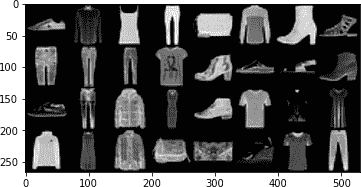
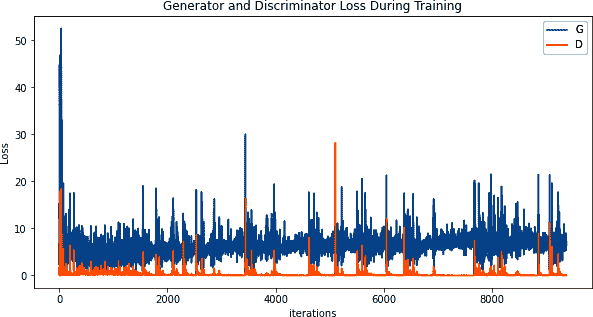
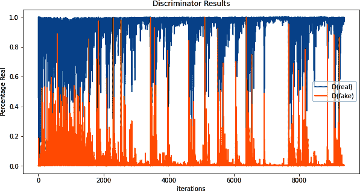
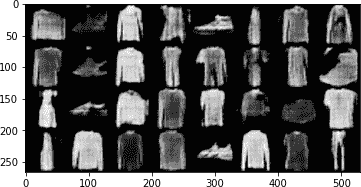
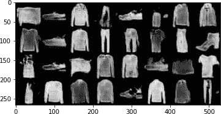

# 第四章：神经网络开发参考设计

在上一章中，我们以高层次介绍了 NN 开发过程，并学习了如何在 PyTorch 中实现每个阶段。该章节中的示例侧重于使用 CIFAR-10 数据集和简单的全连接网络解决图像分类问题。CIFAR-10 图像分类是一个很好的学术示例，用来说明 NN 开发过程，但在使用 PyTorch 开发深度学习模型时还有很多内容。

本章介绍了一些用于 PyTorch 中 NN 开发的参考设计。参考设计是代码示例，您可以将其用作解决类似类型问题的参考。

确实，本章中的参考设计仅仅触及了深度学习的可能性表面；然而，我将尝试为您提供足够多样性的内容，以帮助您开发自己的解决方案。我们将使用三个示例来处理各种数据，设计不同的模型架构，并探索学习过程的其他方法。

第一个示例使用 PyTorch 执行迁移学习，使用小数据集和预训练网络对蜜蜂和蚂蚁的图像进行分类。第二个示例使用 PyTorch 执行情感分析，使用文本数据训练一个 NLP 模型，预测电影评论的积极或消极情感。第三个示例使用 PyTorch 展示生成学习，通过训练生成对抗网络（GAN）生成服装的图像。

在每个示例中，我将提供 PyTorch 代码，以便您可以将本章作为快速参考，用于编写自己设计的代码。让我们开始看看 PyTorch 如何使用迁移学习解决计算机视觉问题。

# 使用迁移学习进行图像分类

图像分类的主题已经深入研究，许多著名的模型，如之前看到的 AlexNet 和 VGG 模型，都可以通过 PyTorch 轻松获得。然而，这些模型是使用 ImageNet 数据集进行训练的。虽然 ImageNet 包含 1,000 个不同的图像类别，但可能不包含您需要解决的图像分类问题的类别。

在这种情况下，您可以应用*迁移学习*，这是一个过程，通过在一个更小的新图像数据集上微调预训练模型。在下一个示例中，我们将训练一个模型来对蜜蜂和蚂蚁的图像进行分类——这些类别不包含在 ImageNet 中。蜜蜂和蚂蚁看起来非常相似，很难区分。

为了训练我们的新分类器，我们将微调另一个著名的模型 ResNet18，通过加载预训练模型并使用 120 张新的蜜蜂和蚂蚁的训练图像进行训练——与 ImageNet 中数百万张图像相比，这是一个更小的数据集。

## 数据处理

让我们从加载数据，定义转换和配置数据加载器以进行批量采样开始。与之前一样，我们将利用 Torchvision 库中的函数来创建数据集，加载数据并应用数据转换。

首先让我们导入本示例所需的库：

```py
import torch
import torch.nn as nn
import torch.optim as optim
import numpy as np
import torchvision
from torchvision import datasets, models
from torchvision import transforms
```

然后我们将下载用于训练和验证的数据：

```py
from io import BytesIO
from urllib.request import urlopen
from zipfile import ZipFile

zipurl = 'https://pytorch.tips/bee-zip'
with urlopen(zipurl) as zipresp:
  with ZipFile(BytesIO(zipresp.read())) as zfile:
     zfile.extractall('./data')
```

在这里，我们使用`io`、`urlib`和`zipfile`库来下载并解压文件到本地文件系统。运行前面的代码后，您应该在本地*data/*文件夹中拥有您的训练和验证图像。它们分别位于*data/hymenoptera_data/train*和*data/hymenoptera_data/val*中。

接下来我们定义我们的转换，加载数据，并配置我们的批采样器。

首先我们定义我们的转换：

```py
train_transforms = transforms.Compose([
    transforms.RandomResizedCrop(224),
    transforms.RandomHorizontalFlip(),
    transforms.ToTensor(),
    transforms.Normalize(
        [0.485, 0.456,0.406],
        [0.229, 0.224, 0.225])])

val_transforms = transforms.Compose([
    transforms.Resize(256),
    transforms.CenterCrop(224),
    transforms.ToTensor(),
    transforms.Normalize(
        [0.485, 0.456, 0.406],
        [0.229, 0.224, 0.225])])
```

请注意，我们在训练时随机调整、裁剪和翻转图像，但在验证时不这样做。`Normalize`转换中使用的“魔术”数字是预先计算的均值和标准差。

现在让我们定义数据集：

```py
train_dataset = datasets.ImageFolder(
            root='data/hymenoptera_data/train',
            transform=train_transforms)

val_dataset = datasets.ImageFolder(
            root='data/hymenoptera_data/val',
            transform=val_transforms)
```

在前面的代码中，我们使用 ImageFolder 数据集从我们的数据文件夹中提取图像，并将转换设置为我们之前定义的转换。接下来，我们为批量迭代定义我们的数据加载器：

```py
train_loader = torch.utils.data.DataLoader(
            train_dataset,
            batch_size=4,
            shuffle=True,
            num_workers=4)

val_loader = torch.utils.data.DataLoader(
            val_dataset,
            batch_size=4,
            shuffle=True,
            num_workers=4)
```

我们使用批量大小为 4，并将`num_workers`设置为`4`以配置四个 CPU 进程来处理并行处理。

现在我们已经准备好了训练和验证数据，我们可以设计我们的模型。

## 模型设计

在这个例子中，我们将使用一个已经在 ImageNet 数据上进行了预训练的 ResNet18 模型。然而，ResNet18 被设计用来检测 1,000 个类别，在我们的情况下，我们只需要 2 个类别——蜜蜂和蚂蚁。我们可以修改最后一层以检测 2 个类别，而不是 1,000 个，如下面的代码所示：

```py
model = models.resnet18(pretrained=True)

print(model.fc)
# out:
# Linear(in_features=512, out_features=1000, bias=True)

num_ftrs = model.fc.in_features
model.fc = nn.Linear(num_ftrs, 2)
print(model.fc)
# out:
# Linear(in_features=512, out_features=2, bias=True)
```

我们首先使用函数`torchvision.models.resnet18()`加载一个预训练的 ResNet18 模型。接下来，我们通过`model.fc.in_features`读取最后一层之前的特征数量。然后，我们通过直接将`model.fc`设置为具有两个输出的全连接层来更改最后一层。

我们将使用预训练模型作为起点，并用新数据微调其参数。由于我们替换了最后的线性层，它的参数现在是随机初始化的。

现在我们有一个 ResNet18 模型，所有权重都是在 ImageNet 图像上进行了预训练，除了最后一层。接下来，我们需要用蜜蜂和蚂蚁的图像训练我们的模型。

###### 提示

Torchvision 为计算机视觉和图像处理提供了许多著名的预训练模型，包括以下内容：

+   AlexNet

+   VGG

+   ResNet

+   SqueezeNet

+   DenseNet

+   Inception v3

+   GoogLeNet

+   ShuffleNet v2

+   MobileNet v2

+   ResNeXt

+   Wide ResNet

+   MNASNet

要获取更多信息，请探索`torchvision.models`类或访问[Torchvision models documentation](https://pytorch.tips/torchvision-models)。

## 训练和验证

在微调我们的模型之前，让我们用以下代码配置我们的训练：

```py
from torch.optim.lr_scheduler import StepLR

device = torch.device("cuda:0" if
  torch.cuda.is_available() else "cpu") # ①

model = model.to(device)
criterion = nn.CrossEntropyLoss() # ②
optimizer = optim.SGD(model.parameters(),
                      lr=0.001,
                      momentum=0.9) # ③
exp_lr_scheduler = StepLR(optimizer,
                          step_size=7,
                          gamma=0.1) # ④
```

①

如果有的话，将模型移动到 GPU 上。

②

定义我们的损失函数。

③

定义我们的优化器算法。

④

使用学习率调度器。

代码应该看起来很熟悉，除了学习率调度器。在这里，我们将使用 PyTorch 中的调度器来在几个周期后调整 SGD 优化器的学习率。使用学习率调度器将帮助我们的神经网络在训练过程中更精确地调整权重。

以下代码展示了整个训练循环，包括验证：

```py
num_epochs=25

for epoch in range(num_epochs):

  model.train() # ①
  running_loss = 0.0
  running_corrects = 0

  for inputs, labels in train_loader:
    inputs = inputs.to(device)
    labels = labels.to(device)

    optimizer.zero_grad()
    outputs = model(inputs)
    _, preds = torch.max(outputs,1)
    loss = criterion(outputs, labels)

    loss.backward()
    optimizer.step()

    running_loss += loss.item()/inputs.size(0)
    running_corrects += \
      torch.sum(preds == labels.data) \
        /inputs.size(0)

  exp_lr_scheduler.step() # ②
  train_epoch_loss = \
    running_loss / len(train_loader)
  train_epoch_acc = \
    running_corrects / len(train_loader)

  model.eval() # ③
  running_loss = 0.0
  running_corrects = 0

  for inputs, labels in val_loader:
      inputs = inputs.to(device)
      labels = labels.to(device)
      outputs = model(inputs)
      _, preds = torch.max(outputs,1)
      loss = criterion(outputs, labels)

      running_loss += loss.item()/inputs.size(0)
      running_corrects += \
        torch.sum(preds == labels.data) \
            /inputs.size(0)

  epoch_loss = running_loss / len(val_loader)
  epoch_acc = \
    running_corrects.double() / len(val_loader)
  print("Train: Loss: {:.4f} Acc: {:.4f}"
    " Val: Loss: {:.4f}"
    " Acc: {:.4f}".format(train_epoch_loss,
                          train_epoch_acc,
                          epoch_loss,
                          epoch_acc))
```

①

训练循环。

②

为下一个训练周期调整学习率的计划。

③

验证循环。

我们应该看到训练和验证损失减少，而准确率提高。结果可能会有一些波动。

## 测试和部署

让我们通过将模型保存到文件来测试我们的模型并部署它。为了测试我们的模型，我们将显示一批图像，并展示我们的模型如何对它们进行分类，如下面的代码所示：

```py
import matplotlib.pyplot as plt

def imshow(inp, title=None): # ①
    inp = inp.numpy().transpose((1, 2, 0)) # ②
    mean = np.array([0.485, 0.456, 0.406])
    std = np.array([0.229, 0.224, 0.225])
    inp = std * inp + mean # ③
    inp = np.clip(inp, 0, 1)
    plt.imshow(inp)
    if title is not None:
        plt.title(title)

inputs, classes = next(iter(val_loader)) # ④
out = torchvision.utils.make_grid(inputs)
class_names = val_dataset.classes

outputs = model(inputs.to(device)) # ⑤
_, preds = torch.max(outputs,1) # ⑥

imshow(out, title=[class_names[x] for x in preds]) # ⑦
```

①

定义一个新的函数来绘制我们的张量图像。

②

切换从 C × H × W 到 H × W × C 的图像格式以进行绘图。

③

撤销我们在转换过程中进行的归一化，以便正确查看图像。

④

从我们的验证数据集中获取一批图像。

⑤

使用我们微调的 ResNet18 进行分类。

⑥

选择“获胜”类别。

⑦

显示输入图像及其预测类别。

由于我们有一个如此小的数据集，我们只需通过可视化输出来测试模型，以确保图像与标签匹配。图 4-1 展示了一个测试示例。由于`val_loader`将返回一个随机抽样的图像批次，您的结果会有所不同。


###### 图 4-1。图像分类结果

完成后，我们保存模型：

```py
torch.save(model.state_dict(), "./resnet18.pt")
```

您可以将此参考设计用于迁移学习的其他情况，不仅限于图像分类，还包括其他类型的数据。只要您能找到一个合适的预训练模型，您就可以修改模型，并仅使用少量数据重新训练部分模型。

这个例子是基于 Sasank Chilamkurthy 的["*计算机视觉迁移学习教程*"](https://pytorch.tips/transfer-learning-tutorial)。您可以在教程中找到更多细节。

接下来，我们将进入 NLP 领域，探索一个处理文本数据的参考设计。

# 使用 Torchtext 进行情感分析

另一个流行的深度学习应用是*情感分析*，人们通过对一段文本数据进行分类来判断情感。在这个例子中，我们将训练一个 NN 来预测一部电影评论是积极的还是消极的，使用著名的互联网电影数据库（IMDb）数据集。对 IMDb 数据进行情感分析是学习 NLP 的常见初学者示例。

## 数据处理

IMDb 数据集包含来自 IMDb 的 25,000 条电影评论，这些评论被标记为情感（例如，积极或消极）。PyTorch 项目包括一个名为*Torchtext*的库，提供了在文本数据上执行深度学习的便利功能。为了开始我们的示例参考设计，我们将使用 Torchtext 来加载和预处理 IMDb 数据集。

在加载数据集之前，我们将定义一个名为`generate_bigrams()`的函数，用于预处理我们的文本评论数据。我们将用于此示例的模型计算输入句子的*n*-gram，并将其附加到末尾。我们将使用 bi-grams，即出现在句子中的单词或标记对。

以下代码展示了我们的预处理函数`generate_bigrams()`，并提供了它的工作示例：

```py
def generate_bigrams(x):
  n_grams = set(zip(*[x[i:] for i in range(2)]))
  for n_gram in n_grams:
    x.append(' '.join(n_gram))
  return x

generate_bigrams([
        'This', 'movie', 'is', 'awesome'])
# out:
# ['This', 'movie', 'is', 'awesome', 'This movie',
#  'movie is', 'is awesome']
```

现在我们已经定义了我们的预处理函数，我们可以构建我们的 IMDb 数据集，如下所示的代码：

```py
from torchtext.datasets import IMDB
from torch.utils.data.dataset import random_split

train_iter, test_iter = IMDB(
    split=('train', 'test')) # ①

train_dataset = list(train_iter) # ②
test_data = list(test_iter)

num_train = int(len(train_dataset) * 0.70)
train_data, valid_data = \
    random_split(train_dataset,
        [num_train,
         len(train_dataset) - num_train]) # ③
```

①

从 IMDb 数据集加载数据。

②

将迭代器重新定义为列表。

③

将训练数据分为两组，70%用于训练，30%用于验证。

在代码中，我们使用`IMDB`类加载训练和测试数据集。然后我们使用`random_split()`函数将训练数据分成两个较小的集合，用于训练和验证。

###### 警告

在运行代码时，请确保您至少使用了 Torchtext 0.9，因为 Torchtext API 在 PyTorch 1.8 中发生了重大变化。

让我们快速查看数据：

```py
print(len(train_data), len(valid_data),
  len(test_data))
# out:17500 7500 25000

data_index = 21
print(train_data[data_index][0])
# out: (your results may vary)
#   pos

print(train_data[data_index][1])
# out: (your results may vary)
# ['This', 'film', 'moved', 'me', 'beyond', ...
```

如您所见，我们的数据集包括 17,500 条评论用于训练，7,500 条用于验证，25,000 条用于测试。我们还打印了第 21 条评论及其情感，如输出所示。拆分是随机抽样的，因此您的结果可能会有所不同。

接下来，我们需要将文本数据转换为数字数据，以便 NN 可以处理它。我们通过创建预处理函数和数据管道来实现这一点。数据管道将使用我们的`generate_bigrams()`函数、一个标记器和一个词汇表，如下所示的代码：

```py
from torchtext.data.utils import get_tokenizer
from collections import Counter
from torchtext.vocab import Vocab

tokenizer = get_tokenizer('spacy') # ①
counter = Counter()
for (label, line) in train_data:
    counter.update(generate_bigrams(
        tokenizer(line))) # ②
vocab = Vocab(counter,
              max_size = 25000,
              vectors = "glove.6B.100d",
              unk_init = torch.Tensor.normal_,) # ③
```

①

定义我们的分词器（如何分割文本）。

②

列出我们训练数据中使用的所有标记，并计算每个标记出现的次数。

③

创建一个词汇表（可能标记的列表）并定义如何将标记转换为数字。

在代码中，我们定义了将文本转换为张量的指令。对于评论文本，我们指定*spaCy*作为分词器。spaCy 是一个流行的 Python 包，用于自然语言处理，并包含自己的分词器。分词器将文本分解为词和标点等组件。

我们还创建了一个词汇表和一个嵌入。词汇表只是我们可以使用的一组单词。如果我们在电影评论中发现一个词不在词汇表中，我们将该词设置为一个特殊的单词“未知”。我们将我们的字典限制在 25,000 个单词，远远小于英语语言中的所有单词。

我们还指定了我们的词汇向量，这导致我们下载了一个名为 GloVe（全局词向量表示）的预训练嵌入，具有 100 个维度。下载 GloVe 数据并创建词汇表可能需要几分钟。

嵌入是将单词或一系列单词映射到数值向量的方法。定义词汇表和嵌入是一个复杂的话题，超出了本书的范围。在这个例子中，我们将从训练数据中构建一个词汇表，并下载流行的预训练的 GloVe 嵌入。

现在我们已经定义了我们的分词器和词汇表，我们可以为评论和标签文本数据构建我们的数据管道，如以下代码所示：

```py
text_pipeline = lambda x: [vocab[token]
    for token in generate_bigrams(tokenizer(x))]

label_pipeline = lambda x: 1 if x=='pos' else 0

print(text_pipeline('the movie was horrible'))
# out:

print(label_pipeline('neg'))
# out:
```

我们使用`lambda`函数通过管道传递文本数据，以便 PyTorch 数据加载器可以将每个文本评论转换为一个 100 元素的向量。

现在我们已经定义了我们的数据集和预处理，我们可以创建我们的数据加载器。我们的数据加载器从数据集的采样中加载数据批次，并预处理数据，如以下代码所示：

```py
from torch.utils.data import DataLoader
from torch.nn.utils.rnn import pad_sequence

device = torch.device("cuda" if
    torch.cuda.is_available() else "cpu")

def collate_batch(batch):
    label_list, text_list = [], []
    for (_label, _text) in batch:
        label_list.append(label_pipeline(_label))
        processed_text = torch.tensor(
                           text_pipeline(_text))
        text_list.append(processed_text)
    return (torch.tensor(label_list,
          dtype=torch.float64).to(device),
          pad_sequence(text_list,
                       padding_value=1.0).to(device))

batch_size = 64
def batch_sampler():
    indices = [(i, len(tokenizer(s[1])))
                for i, s in enumerate(train_dataset)]
    random.shuffle(indices)
    pooled_indices = []
    # create pool of indices with similar lengths
    for i in range(0, len(indices), batch_size * 100):
        pooled_indices.extend(sorted(
          indices[i:i + batch_size * 100], key=lambda x: x[1]))

    pooled_indices = [x[0] for x in pooled_indices]

    # yield indices for current batch
    for i in range(0, len(pooled_indices),
      batch_size):
        yield pooled_indices[i:i + batch_size]

BATCH_SIZE = 64

train_dataloader = DataLoader(train_data,
                  # batch_sampler=batch_sampler(),
                  collate_fn=collate_batch,
                  batch_size=BATCH_SIZE,
                  shuffle=True)
                  # collate_fn=collate_batch)
valid_dataloader = DataLoader(valid_data,
                  batch_size=BATCH_SIZE,
                  shuffle=True,
                  collate_fn=collate_batch)
test_dataloader = DataLoader(test_data,
                  batch_size=BATCH_SIZE,
                  shuffle=True,
                  collate_fn=collate_batch)

```

在代码中，我们将批处理大小设置为 64，并在有 GPU 时使用。我们还定义了一个名为`collate_batch()`的整理函数，并将其传递给我们的数据加载器以执行我们的数据管道。

现在我们已经配置了我们的管道和数据加载器，让我们定义我们的模型。

## 模型设计

在这个例子中，我们将使用一种称为 FastText 的模型，该模型来自 Armand Joulin 等人的论文“高效文本分类的技巧袋”。虽然许多情感分析模型使用 RNN，但这个模型使用了一种更简单的方法。

以下代码实现了 FastText 模型：

```py
import torch.nn as nn
import torch.nn.functional as F

class FastText(nn.Module):
    def __init__(self,
                 vocab_size,
                 embedding_dim,
                 output_dim,
                 pad_idx):
        super().__init__()
        self.embedding = nn.Embedding(
            vocab_size,
            embedding_dim,
            padding_idx=pad_idx)
        self.fc = nn.Linear(embedding_dim,
                            output_dim)

    def forward(self, text):
        embedded = self.embedding(text)
        embedded = embedded.permute(1, 0, 2)
        pooled = F.avg_pool2d(
            embedded,
            (embedded.shape[1], 1)).squeeze(1)
        return self.fc(pooled)
```

正如您所看到的，该模型使用`nn.Embedded`层为每个单词计算单词嵌入，然后使用`avg_pool2d()`函数计算所有单词嵌入的平均值。最后，它通过一个线性层传递平均值。有关此模型的更多详细信息，请参考论文。

让我们使用以下代码构建我们的模型及其适当的参数：

```py
model = FastText(
            vocab_size = len(vocab),
            embedding_dim = 100,
            output_dim = 1,
            pad_idx = vocab['<PAD>'])
```

我们不会从头开始训练我们的嵌入层，而是使用预训练的嵌入来初始化层的权重。这个过程类似于我们在“使用迁移学习进行图像分类”示例中使用预训练权重的方式：

```py
pretrained_embeddings = vocab.vectors # ①
model.embedding.weight.data.copy_(
                    pretrained_embeddings) # ②

EMBEDDING_DIM = 100
unk_idx = vocab['<UNK>'] # ③
pad_idx = vocab['<PAD>']
model.embedding.weight.data[unk_idx] = \
      torch.zeros(EMBEDDING_DIM)          # ④
model.embedding.weight.data[pad_idx] = \
      torch.zeros(EMBEDDING_DIM)
```

①

从我们的词汇表中加载预训练的嵌入。

②

初始化嵌入层的权重。

③

将未知标记的嵌入权重初始化为零。

④

将填充标记的嵌入权重初始化为零。

现在它已经正确初始化，我们可以训练我们的模型。

## 训练和验证

训练和验证过程应该看起来很熟悉。它类似于我们在先前示例中使用的过程。首先，我们配置我们的损失函数和优化算法，如下所示：

```py
import torch.optim as optim

optimizer = optim.Adam(model.parameters())
criterion = nn.BCEWithLogitsLoss()

model = model.to(device)
criterion = criterion.to(device)
```

在这个例子中，我们使用 Adam 优化器和`BCEWithLogitsLoss()`损失函数。Adam 优化器是 SGD 的替代品，在处理稀疏或嘈杂梯度时表现更好。`BCEWithLogitsLoss()`函数通常用于二元分类。我们还将我们的模型移到 GPU（如果可用）。

接下来，我们运行我们的训练和验证循环，如下所示：

```py
for epoch in range(5):
  epoch_loss = 0
  epoch_acc = 0

  model.train()
  for label, text, _ in train_dataloader:
      optimizer.zero_grad()
      predictions = model(text).squeeze(1)
      loss = criterion(predictions, label)

      rounded_preds = torch.round(
          torch.sigmoid(predictions))
      correct = \
        (rounded_preds == label).float()
      acc = correct.sum() / len(correct)

      loss.backward()
      optimizer.step()
      epoch_loss += loss.item()
      epoch_acc += acc.item()

  print("Epoch %d Train: Loss: %.4f Acc: %.4f" %
          (epoch,
          epoch_loss / len(train_dataloader),
          epoch_acc / len(train_dataloader)))

  epoch_loss = 0
  epoch_acc = 0
  model.eval()
  with torch.no_grad():
    for label, text, _ in valid_dataloader:
      predictions = model(text).squeeze(1)
      loss = criterion(predictions, label)

      rounded_preds = torch.round(
          torch.sigmoid(predictions))
      correct = \
        (rounded_preds == label).float()
      acc = correct.sum() / len(correct)

      epoch_loss += loss.item()
      epoch_acc += acc.item()

  print("Epoch %d Valid: Loss: %.4f Acc: %.4f" %
          (epoch,
          epoch_loss / len(valid_dataloader),
          epoch_acc / len(valid_dataloader)))

# out: (your results may vary)
# Epoch 0 Train: Loss: 0.6523 Acc: 0.7165
# Epoch 0 Valid: Loss: 0.5259 Acc: 0.7474
# Epoch 1 Train: Loss: 0.5935 Acc: 0.7765
# Epoch 1 Valid: Loss: 0.4571 Acc: 0.7933
# Epoch 2 Train: Loss: 0.5230 Acc: 0.8257
# Epoch 2 Valid: Loss: 0.4103 Acc: 0.8245
# Epoch 3 Train: Loss: 0.4559 Acc: 0.8598
# Epoch 3 Valid: Loss: 0.3828 Acc: 0.8549
# Epoch 4 Train: Loss: 0.4004 Acc: 0.8813
# Epoch 4 Valid: Loss: 0.3781 Acc: 0.8675
```

只需进行五次训练周期，我们应该看到验证准确率在 85-90%左右。让我们看看我们的模型在测试数据集上的表现如何。

## 测试和部署

早些时候，我们基于 IMDb 测试数据集构建了我们的`test_iterator`。请记住，测试数据集中的数据没有用于训练或验证。

我们的测试循环如下所示：

```py
test_loss = 0
test_acc = 0
model.eval() # ①
with torch.no_grad(): # ①
  for label, text, _ in test_dataloader:
    predictions = model(text).squeeze(1)
    loss = criterion(predictions, label)

    rounded_preds = torch.round(
        torch.sigmoid(predictions))
    correct = \
      (rounded_preds == label).float()
    acc = correct.sum() / len(correct)

    test_loss += loss.item()
    test_acc += acc.item()

print("Test: Loss: %.4f Acc: %.4f" %
        (test_loss / len(test_dataloader),
        test_acc / len(test_dataloader)))
# out: (your results will vary)
#   Test: Loss: 0.3821 Acc: 0.8599
```

①

对于这个模型来说并不是必需的，但是是一个好的实践。

在前面的代码中，我们一次处理一个批次，并在整个测试数据集上累积准确率。您应该在测试集上获得 85-90%的准确率。

接下来，我们将使用以下代码预测我们自己评论的情感：

```py
import spacy
nlp = spacy.load('en_core_web_sm')

def predict_sentiment(model, sentence):
    model.eval()
    text = torch.tensor(text_pipeline(
      sentence)).unsqueeze(1).to(device)
    prediction = torch.sigmoid(model(text))
    return prediction.item()

sentiment = predict_sentiment(model,
                  "Don't waste your time")
print(sentiment)
# out: 4.763594888613835e-34

sentiment = predict_sentiment(model,
                  "You gotta see this movie!")
print(sentiment)
# out: 0.941755473613739
```

接近 0 的结果对应于负面评论，而接近 1 的输出表示积极的评论。正如您所看到的，模型正确预测了样本评论的情感。尝试用一些您自己的电影评论来测试它！

最后，我们将保存我们的模型以供部署，如下所示：

```py
torch.save(model.state_dict(), 'fasttext-model.pt')
```

在这个例子中，您学会了如何预处理文本数据并为情感分析设计了一个 FastText 模型。您还训练了模型，评估了其性能，并保存了模型以供部署。您可以使用这个设计模式和参考代码来解决自己工作中的其他情感分析问题。

这个例子是基于 Ben Trevett 的“更快的情感分析”教程。您可以在他的[PyTorch 情感分析 GitHub 存储库](https://pytorch.tips/sentiment-tutorials)中找到更多详细信息和其他优秀的 Torchtext 教程。

让我们继续我们的最终参考设计，我们将使用深度学习和 PyTorch 生成图像数据。

# 生成学习——使用 DCGAN 生成 Fashion-MNIST 图像

深度学习中最有趣的领域之一是*生成学习*，其中神经网络用于创建数据。有时，这些神经网络可以创建图像、音乐、文本和时间序列数据，以至于很难区分真实数据和生成数据之间的区别。生成学习用于创建不存在的人和地方的图像，增加图像分辨率，预测视频中的帧，增加数据集，生成新闻文章，以及转换艺术和音乐的风格。

在这一部分，我将向您展示如何使用 PyTorch 进行生成学习。开发过程类似于先前的示例；然而，在这里，我们将使用一种无监督的方法，其中数据没有标记。

此外，我们将设计和训练一个 GAN，这与先前示例中的模型和训练循环有很大不同。测试和评估 GAN 也涉及到稍微不同的过程。总体开发顺序与第二章中的过程一致，但每个部分都将是生成学习的独特部分。

在这个例子中，我们将训练一个 GAN 来生成类似于 Fashion-MNIST 数据集中使用的训练图像的图像。Fashion-MNIST 是一个用于图像分类的流行学术数据集，包括服装的图像。让我们访问 Fashion-MNIST 数据，看看这些图像是什么样子，然后我们将根据我们看到的内容创建一些合成图像。

## 数据处理

与用于监督学习的模型不同，那里模型学习数据和标签之间的关系，生成模型旨在学习训练数据的分布，以便生成类似于手头训练数据的数据。因此，在这个例子中，我们只需要训练数据，因为如果我们构建一个好的模型并训练足够长的时间，模型应该开始产生良好的合成数据。

首先让我们导入所需的库，定义一些常量，并设置我们的设备：

```py
import torch
from torch.utils.data import DataLoader
from torchvision import datasets, transforms

CODING_SIZE = 100
BATCH_SIZE = 32
IMAGE_SIZE = 64

device = torch.device("cuda:0" if
  torch.cuda.is_available() else "cpu")
```

以下代码加载训练数据，定义了转换操作，并创建了一个用于批量迭代的数据加载器：

```py
transform = transforms.Compose([
    transforms.Resize(IMAGE_SIZE),
    transforms.ToTensor(),
])

dataset = datasets.FashionMNIST(
                './',
                train=True,
                download=True,
                transform=transform)

dataloader = DataLoader(
                dataset,
                batch_size=BATCH_SIZE,
                shuffle=True,
                num_workers=8)
```

这段代码应该对你来说很熟悉。我们再次使用 Torchvision 函数来定义转换、创建数据集，并设置一个数据加载器，该加载器将对数据集进行采样，应用转换，并为我们的模型返回一批图像。

我们可以使用以下代码显示一批图像：

```py
from torchvision.utils import make_grid
import matplotlib.pyplot as plt

data_batch, labels_batch = next(iter(dataloader))
grid_img = make_grid(data_batch, nrow=8)
plt.imshow(grid_img.permute(1, 2, 0))
```

Torchvision 提供了一个很好的实用工具叫做`make_grid`来显示一组图像。图 4-2 展示了一个 Fashion-MNIST 图像的示例批次。



###### 图 4-2. Fashion-MNIST 图像

让我们看看我们将用于数据生成任务的模型。

## 模型设计

为了生成新的图像数据，我们将使用 GAN。GAN 模型的目标是基于训练数据的分布生成“假”数据。GAN 通过两个不同的模块实现这一目标：生成器和鉴别器。

生成器的工作是生成看起来真实的假图像。鉴别器的工作是正确识别图像是否为假的。尽管 GAN 的设计超出了本书的范围，但我将提供一个使用深度卷积 GAN（DCGAN）的示例参考设计。

###### 注意

GAN 首次在 Ian Goodfellow 等人于 2014 年发表的著名论文中描述，标题为[“生成对抗网络”](https://pytorch.tips/gan-paper)。Alec Radford 等人在 2015 年的论文中提出了构建更稳定的卷积 GAN 的指导方针，标题为[“使用深度卷积生成对抗网络进行无监督表示学习”](https://pytorch.tips/dcgan-paper)。本例中使用的 DCGAN 在这篇论文中有描述。

生成器被设计为从一个包含 100 个随机值的输入向量创建图像。以下是代码：

```py
import torch.nn as nn

class Generator(nn.Module):
    def __init__(self, coding_sz):
        super(Generator, self).__init__()
        self.net = nn.Sequential(
            nn.ConvTranspose2d(coding_sz,
                               1024, 4, 1, 0),
            nn.BatchNorm2d(1024),
            nn.ReLU(),
            nn.ConvTranspose2d(1024,
                               512, 4, 2, 1),
            nn.BatchNorm2d(512),
            nn.ReLU(),
            nn.ConvTranspose2d(512,
                               256, 4, 2, 1),
            nn.BatchNorm2d(256),
            nn.ReLU(),
            nn.ConvTranspose2d(256,
                               128, 4, 2, 1),
            nn.BatchNorm2d(128),
            nn.ReLU(),
            nn.ConvTranspose2d(128,
                               1, 4, 2, 1),
            nn.Tanh()
        )

    def forward(self, input):
        return self.net(input)

netG = Generator(CODING_SIZE).to(device)
```

这个示例生成器使用 2D 卷积转置层与批量归一化和 ReLU 激活。这些层在`__init__()`函数中定义。它的工作方式类似于我们的图像分类模型，只是顺序相反。

也就是说，它不是将图像缩小为较小的表示，而是从一个随机向量创建完整的图像。我们还将`Generator`模块实例化为`netG`。

接下来，我们创建`Discriminator`模块，如下所示的代码：

```py
class Discriminator(nn.Module):
    def __init__(self):
        super(Discriminator,
              self).__init__()
        self.net = nn.Sequential(
            nn.Conv2d(1, 128, 4, 2, 1),
            nn.LeakyReLU(0.2),
            nn.Conv2d(128, 256, 4, 2, 1),
            nn.BatchNorm2d(256),
            nn.LeakyReLU(0.2),
            nn.Conv2d(256, 512, 4, 2, 1),
            nn.BatchNorm2d(512),
            nn.LeakyReLU(0.2),
            nn.Conv2d(512, 1024, 4, 2, 1),
            nn.BatchNorm2d(1024),
            nn.LeakyReLU(0.2),
            nn.Conv2d(1024, 1, 4, 1, 0),
            nn.Sigmoid()
        )

    def forward(self, input):
        return self.net(input)

netD = Discriminator().to(device)
```

鉴别器是一个二元分类网络，确定输入图像是真实的概率。这个示例鉴别器 NN 使用 2D 卷积层与批量归一化和泄漏 ReLU 激活函数。我们将`Discriminator`实例化为`netD`。

DCGAN 论文的作者发现，初始化权重有助于提高性能，如下所示的代码：

```py
def weights_init(m):
    classname = m.__class__.__name__
    if classname.find('Conv') != -1:
        nn.init.normal_(m.weight.data, 0.0, 0.02)
    elif classname.find('BatchNorm') != -1:
        nn.init.normal_(m.weight.data, 1.0, 0.02)
        nn.init.constant_(m.bias.data, 0)

netG.apply(weights_init)
netD.apply(weights_init)
```

现在我们已经设计好了两个模块，我们可以设置并训练 GAN。

## 训练

训练 GAN 比之前的训练示例要复杂一些。在每个时代中，我们将首先用真实数据批次训练鉴别器，然后使用生成器创建一个假批次，然后用生成的假数据批次训练鉴别器。最后，我们将训练生成器 NN 以生成更好的假数据。

这是一个很好的例子，展示了 PyTorch 在创建自定义训练循环时的强大功能。它提供了灵活性，可以轻松开发和实现新的想法。

在开始训练之前，我们需要定义用于训练生成器和鉴别器的损失函数和优化器：

```py
from torch import optim

criterion = nn.BCELoss()

optimizerG = optim.Adam(netG.parameters(),
                        lr=0.0002,
                        betas=(0.5, 0.999))
optimizerD = optim.Adam(netD.parameters(),
                        lr=0.0001,
                        betas=(0.5, 0.999))
```

在前面的代码中，我们为真实与假图像定义了一个标签。然后我们使用二元交叉熵（BCE）损失函数，这是用于二元分类的常用函数。请记住，鉴别器通过将图像分类为真实或假来执行二元分类。我们使用常用的 Adam 优化器来更新模型参数。

让我们为真实和假标签定义值，并创建用于计算损失的张量：

```py
real_labels = torch.full((BATCH_SIZE,),
                       1.,
                       dtype=torch.float,
                       device=device)

fake_labels = torch.full((BATCH_SIZE,),
                       0.,
                       dtype=torch.float,
                       device=device)
```

在开始训练之前，我们将创建用于存储错误的列表，并定义一个测试向量以后显示结果：

```py
G_losses = []
D_losses = []
D_real = []
D_fake = []

z = torch.randn((
    BATCH_SIZE, 100)).view(-1, 100, 1, 1).to(device)
test_out_images = []
```

现在我们可以执行训练循环。如果 GAN 是稳定的，随着更多时代的训练，它应该会改进。以下是训练循环的代码：

```py
N_EPOCHS = 5

for epoch in range(N_EPOCHS):
  print(f'Epoch: {epoch}')
  for i, batch in enumerate(dataloader):
    if (i%200==0):
      print(f'batch: {i} of {len(dataloader)}')

    # Train Discriminator with an all-real batch.
    netD.zero_grad()
    real_images = batch[0].to(device) *2. - 1.
    output = netD(real_images).view(-1) # ①
    errD_real = criterion(output, real_labels)
    D_x = output.mean().item()

    # Train Discriminator with an all-fake batch.
    noise = torch.randn((BATCH_SIZE,
                         CODING_SIZE))
    noise = noise.view(-1,100,1,1).to(device)
    fake_images = netG(noise)
    output = netD(fake_images).view(-1) # ②
    errD_fake = criterion(output, fake_labels)
    D_G_z1 = output.mean().item()
    errD = errD_real + errD_fake
    errD.backward(retain_graph=True) # ③
    optimizerD.step()

    # Train Generator to generate better fakes.
    netG.zero_grad()
    output = netD(fake_images).view(-1) # ④
    errG = criterion(output, real_labels) # ⑤
    errG.backward() # ⑥
    D_G_z2 = output.mean().item()
    optimizerG.step()

    # Save losses for plotting later.
    G_losses.append(errG.item())
    D_losses.append(errD.item())

    D_real.append(D_x)
    D_fake.append(D_G_z2)

  test_images = netG(z).to('cpu').detach() # ⑦
  test_out_images.append(test_images)
```

①

将真实图像传递给“鉴别器”。

②

将假图像传递给“鉴别器”。

③

运行反向传播并更新“鉴别器”。

④

将假图像传递给更新后的“鉴别器”。

⑤

“生成器”的损失基于“鉴别器”错误的情况。

⑥

运行反向传播并更新“生成器”。

⑦

创建一批图像并在每个时代后保存它们。

与之前的示例一样，我们循环遍历所有数据，每次一个批次，在每个时代使用数据加载器。首先，我们用一批真实图像训练鉴别器，以便它可以计算输出，计算损失并计算梯度。然后我们用一批假图像训练鉴别器。

假图像是由生成器从随机值向量创建的。再次，我们计算鉴别器输出，计算损失并计算梯度。接下来，我们添加所有真实和所有假批次的梯度，并应用反向传播。

我们使用刚训练的鉴别器从相同的假数据计算输出，并计算生成器的损失或错误。利用这个损失，我们计算梯度并在生成器本身上应用反向传播。

最后，我们将跟踪每个时代后的损失，以查看 GAN 的训练是否持续改进和稳定。图 4-3 显示了生成器和鉴别器在训练过程中的损失曲线。



###### 图 4-3. GAN 训练曲线

损失曲线绘制了每个批次在所有时代中的生成器和鉴别器损失，因此损失会根据批次的计算损失而波动。不过我们可以看到，两种情况下的损失都从训练开始时减少了。如果我们训练更多时代，我们会期待这些损失值接近零。

总的来说，GAN 很难训练，学习率、beta 和其他优化器超参数可能会产生重大影响。

让我们检查鉴别器在每个批次上所有时代的平均结果，如图 4-4 所示。



###### 图 4-4. 鉴别器结果

如果 GAN 完美的话，鉴别器将无法正确识别假图像为假或真实图像为真，我们期望在这两种情况下平均误差为 0.5。结果显示有些批次接近 0.5，但我们肯定可以做得更好。

现在我们已经训练了我们的网络，让我们看看它在创建服装的假图像方面表现如何。

## 测试和部署

在监督学习中，我们通常留出一个未用于训练或验证模型的测试数据集。在生成式学习中，生成器没有生成标签。我们可以将生成的图像传递给 Fashion-MNIST 分类器，但除非我们手动标记输出，否则我们无法知道错误是由分类器还是 GAN 引起的。

现在，让我们通过比较第一个时代的结果和最后一个时代生成的图像来测试和评估我们的 GAN。我们为测试创建一个名为`z`的测试向量，并在我们的训练循环代码中使用每个时代末尾计算的生成器结果。

图 4-5 显示了第一个时代生成的图像，而图 4-6 显示了仅训练五个时代后的结果。



###### 图 4-5. 生成器结果（第一个时代）



###### 图 4-6. 生成器结果（最后一个时代）

您可以看到生成器有所改进。看看第二行末尾的靴子或第三行末尾的衬衫。我们的 GAN 并不完美，但在只经过五个时代后似乎有所改善。训练更多时代或改进我们的设计可能会产生更好的结果。

最后，我们可以保存我们训练好的模型以供部署，并使用以下代码生成更多合成的 Fashion-MNIST 图像：

```py
torch.save(netG.state_dict(), './gan.pt')
```

我们通过设计和训练一个 GAN 来扩展了我们的 PyTorch 深度学习能力，在这个生成式学习参考设计中。您可以使用这个参考设计来创建和训练其他 GAN 模型，并测试它们生成新数据的性能。

在本章中，我们涵盖了更多示例，展示了使用 PyTorch 的各种数据处理、模型设计和训练方法，但是如果您有一个新颖的、创新的 NN 的惊人想法呢？或者如果您想出了一个新的优化算法或损失函数，以前没有人见过的呢？在下一章中，我将向您展示如何创建自己的自定义模块和函数，以便扩展您的深度学习研究并尝试新的想法。
