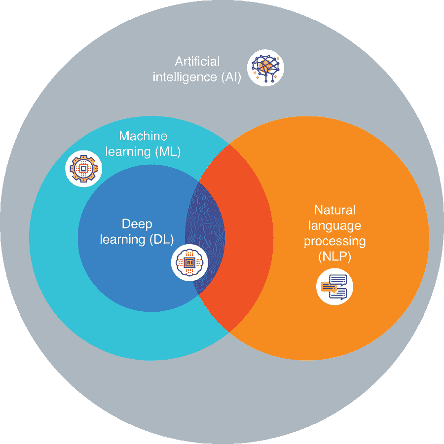
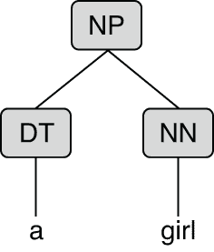
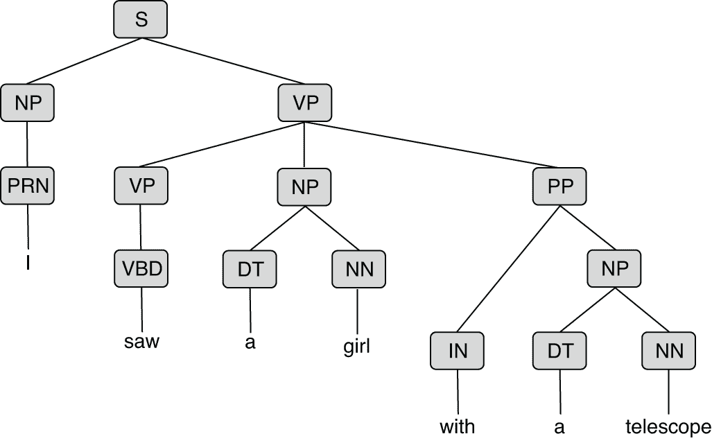
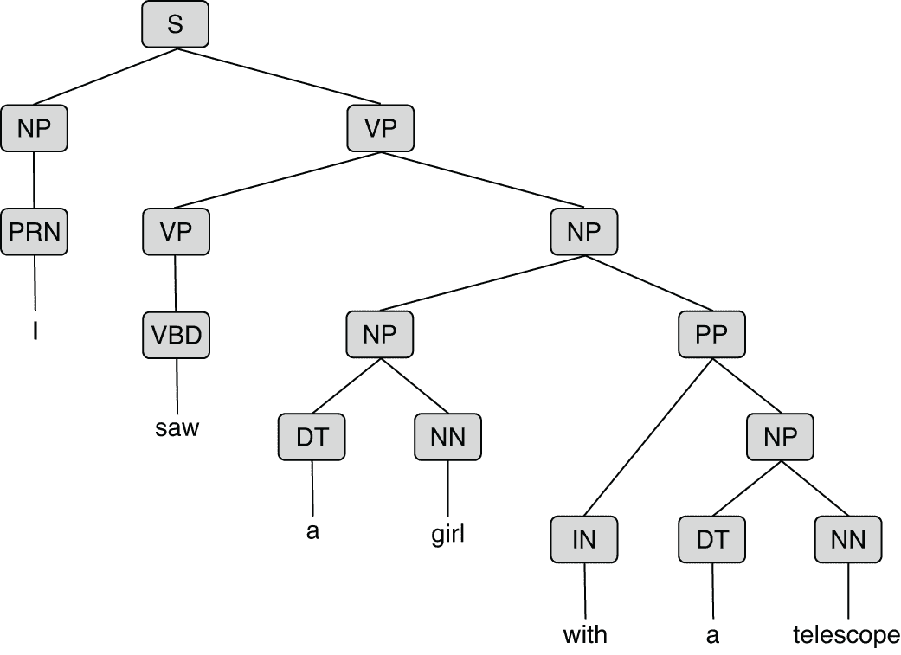
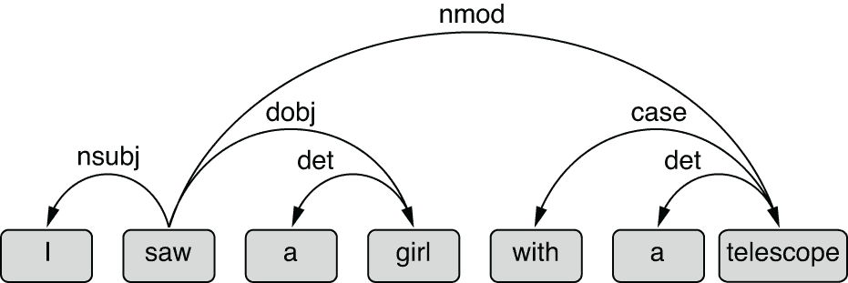
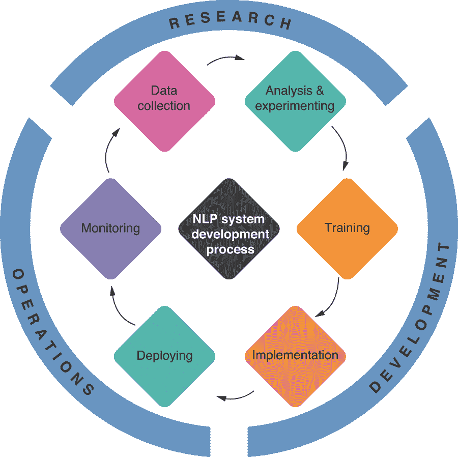
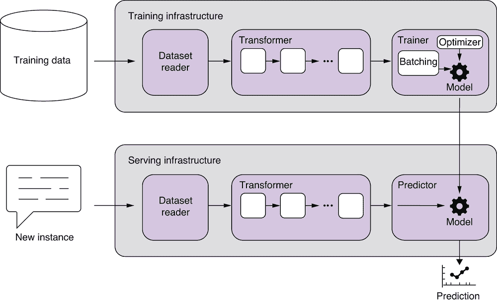

# 第一章：自然语言处理入门

本章内容包括

+   自然语言处理（NLP）是什么，它不是什么，为什么它是一个有趣而具有挑战性的领域

+   自然语言处理与其他领域的关系，包括人工智能（AI）和机器学习（ML）

+   典型的自然语言处理应用程序和任务是什么

+   典型自然语言处理应用程序的开发和结构

这不是一本机器学习或深度学习的入门书籍。你不会学到如何以数学术语编写神经网络，或者如何计算梯度，等等。但是不用担心，即使你对这些概念一无所知，我会在需要的时候进行解释，不会使用数学术语，而是从概念上解释。事实上，这本书不包含任何数学公式，一个都没有。此外，多亏了现代深度学习库，你真的不需要理解数学就能构建实用的自然语言处理应用程序。如果你有兴趣学习机器学习和深度学习背后的理论和数学，可以找到很多优秀的资源。

但你至少需要对 Python 编程感到自在，并了解它的生态系统。然而，你不需要成为软件工程领域的专家。事实上，本书的目的是介绍开发自然语言处理应用程序的软件工程最佳实践。你也不需要事先了解自然语言处理。再次强调，本书旨在对这个领域进行初步

运行本书中代码示例需要 Python 版本 3.6.1 或更高版本以及 AllenNLP 版本 2.5.0 或更高版本。请注意，我们不支持 Python 2，主要是因为这本书中我要大量使用的深度自然语言处理框架 AllenNLP（[`allennlp.org/`](https://allennlp.org/)）只支持 Python 3。如果还没有升级到 Python 3，我强烈建议你进行升级，并熟悉最新的语言特性，如类型提示和新的字符串格式化语法。即使你正在开发非自然语言处理的应用程序，这也会很有帮助。

如果你还没有准备好 Python 开发环境，不要担心。本书中的大多数示例可以通过 Google Colab 平台（[`colab.research.google.com`](https://colab.research.google.com)）运行。你只需要一个网页浏览器就可以构建和实验自然语言处理模型！

本书将使用 PyTorch（[`pytorch.org/`](https://pytorch.org/)）作为主要的深度学习框架。这对我来说是一个难以选择的决定，因为有几个深度学习框架同样适合构建自然语言处理应用程序，包括 TensorFlow、Keras 和 Chainer。有几个因素使得 PyTorch 在这些框架中脱颖而出——它是一个灵活且动态的框架，使得原型设计和调试自然语言处理模型更容易；它在研究界越来越受欢迎，所以很容易找到一些主要模型的开源实现；而之前提到的深度自然语言处理框架 AllenNLP 是建立在 PyTorch 之上的。

## 1.1 什么是自然语言处理（NLP）？

NLP 是一种处理人类语言的原则性方法。从形式上来说，它是人工智能（AI）的一个子领域，指的是处理、理解和生成人类语言的计算方法。之所以将其归为人工智能，是因为语言处理被认为是人类智能的一个重要组成部分。使用语言可以说是区分人类与其他动物的最显著的技能之一。

### 1.1.1 什么是自然语言处理（NLP）？

NLP 包括一系列算法、任务和问题，它们以人类生成的文本作为输入，并生成一些有用的信息，如标签、语义表示等，作为输出。其他任务，如翻译、摘要和文本生成，直接产生文本作为输出。无论哪种情况，重点是产生一些有用的输出本身（例如翻译），或作为其他下游任务的输入（例如解析）。我将在第 1.3 节介绍一些流行的 NLP 应用和任务。

你可能会想知道为什么自然语言处理中明确地带有“自然”一词。一个语言被称为自然语言意味着什么？是否存在*非*自然语言？英语是自然语言吗？哪种更自然：西班牙语还是法语？

这里的“自然”一词用于将自然语言与形式语言进行对比。从这个意义上说，人类所说的所有语言都是自然语言。许多专家认为语言在数万年前自然形成，并自那时起有机地发展壮大。另一方面，形式语言是人类发明的一种语言类型，其语法（即什么是语法正确的）和语义（即它的含义）严格而明确地定义。

C 和 Python 等编程语言是形式语言的好例子。这些语言被定义得非常严格，以至于始终清楚什么是语法正确的，什么是语法错误的。当你在这些语言中编写代码并运行编译器或解释器时，要么会得到语法错误，要么不会。编译器不会说：“嗯，这段代码可能有 50%是语法正确的。”此外，如果在相同的代码上运行程序，假设外部因素如随机种子和系统状态保持不变，你的程序的行为总是相同的。你的解释器不会有 50%的时间显示一种结果，另外 50%的时间显示另一种结果。

这在人类语言中并非如此。你可以写出一句*可能*是语法正确的句子。例如，你认为短语“我跟谁说话了”是语法错误的吗？在某些语法主题上，即使是专家之间也会存在意见分歧。这就是人类语言有趣但具有挑战性的地方，也是整个自然语言处理领域存在的原因。人类语言是有歧义的，这意味着它们的解释通常不是唯一的。在人类语言中，结构（句子如何构成）和语义（句子的含义）都可能存在歧义。举个例子，让我们仔细看一下下一句：

*他用望远镜看到一个女孩。*

当你读到这句话时，你认为谁有望远镜呢？是男孩，他用望远镜看着一个女孩（从远处），还是女孩，她有望远镜被男孩看见了？这句话似乎至少有两种解释，如图 1.1 所示。


图 1.1 “他用望远镜看到一个女孩”两种解释。

当你读到这句话时感到困惑的原因是因为你不知道短语“用望远镜”是关于什么的。更具体地说，你不知道这个介词短语（PP）修改的是什么。这被称为*PP-attachment*问题，是*语法歧义*的经典例子。一个具有语法歧义的句子有多种解释句子结构的方式。你可以根据你相信的句子结构来对句子进行多种解释。

在自然语言中可能出现的另一种歧义类型是*语义歧义*。当一个词或句子的含义，而不是它的结构，是模糊的时候，就是语义歧义。例如，让我们看看以下句子：

*我看到了一只蝙蝠。*

这句话的结构毫无疑问。句子的主语是“我”，宾语是“一个球棒”，由动词“看到”连接。换句话说，它没有语法上的歧义。但它的含义呢？“看到”至少有两种意思。一种是动词“看”的过去式。另一种是用锯子切割某个物体。同样，“一个球棒”可能意味着两种非常不同的东西：是夜间飞行的哺乳动物还是用来打击球的木头？总的来说，这句话是说我观察到了一只夜间飞行的哺乳动物，还是我切割了一个棒球或板球棒？或者（残酷地）我用锯子切割了一只夜间动物？你永远不知道，至少单从这句话来看。

歧义是使自然语言丰富但也难以处理的原因。我们不能简单地在一段文字上运行编译器或解释器，然后“搞定”。我们需要面对人类语言的复杂性和微妙性。我们需要一种科学的、原则性的方法来处理它们。这就是自然语言处理的全部意义所在。

欢迎来到自然语言的美丽世界。

### 1.1.2 什么不是自然语言处理？

现在让我们考虑以下情景，并思考你将如何解决这个问题：你正在一家中型公司担任初级开发人员，该公司拥有面向消费者的产品线。现在是星期五下午 3 点。随着周末的临近，团队的其他成员变得越来越不安。就在这时，你的老板来到了你的小隔间。

“嘿，有一分钟吗？我有一些有趣的东西要给你看。我刚刚发给你。”

你的老板刚刚给你发了一封带有一个巨大压缩文件的电子邮件。

“好的，所以这是一个巨大的 TSV 文件。它包含了关于我们产品的调查问题的所有回答。我刚刚从市场团队那里得到了这些数据。”

显然，市场团队一直通过一系列在线调查问题收集用户对其中一个产品的意见。

“调查问题包括标准问题，比如‘你是怎么知道我们的产品的？’和‘你喜欢我们的产品吗？’还有一个自由回答的问题，我们的客户可以写下他们对我们产品的感受。问题是，市场团队意识到在线系统中存在一个错误，第二个问题的答案根本没有被记录在数据库中。”

“等等，那么我们没办法知道客户对我们的产品有什么感觉了？”这听起来怪怪的。这一定是一个复制粘贴错误。当你第一次创建在线数据收集界面时，你复制粘贴了后端代码，而没有修改 ID 参数，导致一些数据字段丢失。

“所以，”你的老板继续说道。“我在想我们是否能够以某种方式恢复丢失的数据。市场团队现在有点绝望，因为他们需要在下周初向副总裁报告结果。”

在这一点上，你的不好的感觉已经得到了确认。除非你想出一个尽快完成的方法，否则你的周末计划将被毁掉。

“你不是说你对一些机器学习感兴趣吗？我觉得这对你来说是一个完美的项目。无论如何，如果你能试试并告诉我你的发现，那就太好了。你觉得周一之前能有一些结果吗？”

“好吧，我试试看。”

你知道在这里“不行”是不可接受的回答。满意了你的回答，你的老板微笑着离开了。

你开始浏览 TSV 文件。让你松了一口气的是，它的结构相当标准——它有几个字段，比如时间戳和提交 ID。每行的末尾是一个用于自由回答问题的冗长字段。这就是它们，你想。至少你知道可以在哪里找到一些线索。

快速浏览字段后，你发现了诸如“一个非常好的产品！”和“很糟糕。它总是崩溃！”等响应。不算太糟糕，你想。至少你能捕捉到这些简单的情况。你开始编写以下方法来捕捉这两种情况：

```py
def get_sentiment(text):
    """Return 1 if text is positive, -1 if negative.
       Otherwise, return 0."""
    if 'good' in text:
        return 1
    elif 'bad' in text:
        return -1
    return 0
```

然后你对文件中的响应运行这个方法，并记录结果，以及原始输入。按照预期，这个方法似乎能够捕捉到包含“好”或“坏”几个响应。

但是接下来你开始看到一些令人担忧的东西，如下所示：

“我想不出一个使用这个产品的好理由。”：正面

“还行。”：负面

糟糕，你想。*否定*。是的，当然。但这个很容易处理。你修改了方法如下：

```py
def get_sentiment(text):
    """Return 1 if text is positive, -1 if negative.
       Otherwise, return 0."""
    sentiment = 0
    if 'good' in text:
        sentiment = 1
    elif 'bad' in text:
        sentiment = -1
    if 'not' in text or "n't" in text:
        sentiment *= -1
    return sentiment
```

你再次运行脚本。这一次，它似乎按预期运行，直到你看到了一个更复杂的例子：

“这个产品不仅便宜，而且质量也非常好！”：负面

“嗯，你想。这可能并不像我最初想的那么简单。也许否定词必须在‘好’或‘坏’附近才能有效果。想知道接下来可以采取什么步骤，你向下滚动以查看更多示例，这时你看到了这样的回答：

“我一直很想要这个功能！”: negative

“它做得很糟糕。”: negative

你默默地咒骂自己。一个语言中的一个单词怎么会有完全相反的两个意思？此时，你对周末愉快的小希望已经消失了。你已经在想下周一对老板使用什么借口了。

作为本书的读者，你会更清楚。你会知道 NLP 不是简单地在自然语言文本中加入一堆 if 和 then。这是一个更有原则性的处理自然语言的方法。在接下来的章节中，你将学习在编写一行代码之前应该如何处理这个问题，以及如何为手头的任务构建一个定制的 NLP 应用程序。

### 1.1.3 AI、ML、DL 和 NLP

在深入研究 NLP 的细节之前，澄清它与其他类似领域的关系是有用的。你们大多数人至少听说过人工智能（AI）和机器学习（ML）。你们可能也听说过深度学习（DL），因为它在当今流行媒体中引起了很多关注。图 1.2 显示了这些不同领域之间的重叠关系。



图 1.2 不同领域之间的关系：AI、ML、DL 和 NLP

人工智能（AI）是一个广泛的领域，致力于利用机器实现类似人类的智能。它涵盖了一系列子领域，包括机器学习、自然语言处理、计算机视觉和语音识别。该领域还包括推理、规划和搜索等子领域，这些子领域既不属于机器学习也不属于自然语言处理，也不在本书的范围内。

机器学习（ML）通常被认为是人工智能的一个子领域，它通过经验和数据改进计算机算法。这包括学习一个基于过去经验将输入映射到输出的一般函数（监督学习）、从数据中提取隐藏的模式和结构（无监督学习），以及根据间接奖励学习如何在动态环境中行动（强化学习）。在本书中，我们将大量使用监督机器学习，这是训练 NLP 模型的主要范式。

深度学习（DL）是机器学习的一个子领域，通常使用深度神经网络。这些神经网络模型之所以称为“深度”，是因为它们由许多层组成。*层*只是神经网络的一个子结构的花哨说法。通过具有许多堆叠层，深度神经网络可以学习数据的复杂表示，并可以捕捉输入和输出之间的高度复杂的关系。

随着可用数据量和计算资源的增加，现代 NLP 越来越多地使用机器学习和深度学习。现代 NLP 的应用和任务通常建立在机器学习管道之上，并从数据中进行训练。但请注意，在图 1.2 中，NLP 的一部分与机器学习不重叠。诸如计数单词和衡量文本相似性之类的传统方法通常不被视为机器学习技术本身，尽管它们可以是 ML 模型的重要构建块。

我还想提一下与自然语言处理（NLP）相关的其他领域。其中一个领域是*计算语言学*（CL）。顾名思义，计算语言学是语言学的一个子领域，它使用计算方法来研究人类语言。CL 和 NLP 的主要区别在于前者涵盖了研究语言的科学方法，而后者关注的是使计算机执行与语言相关的有用任务的工程方法。人们经常将这些术语互换使用，部分原因是由于历史原因。例如，该领域中最负盛名的会议被称为 ACL，实际上代表着“计算语言学协会！”

另一个相关领域是*文本挖掘*。文本挖掘是一种针对文本数据的数据挖掘类型。它的重点是从非结构化的文本数据中获取有用的见解，这种文本数据不易被计算机解释。这些数据通常来自各种来源，如网络爬虫和社交媒体。虽然其目的与 NLP 略有不同，但这两个领域相似，我们可以为两者使用相同的工具和算法。

### 为什么选择 NLP？

如果你正在阅读这篇文章，你至少对 NLP 有一些兴趣。为什么 NLP 令人兴奋？为什么值得更深入了解 NLP，尤其是现实中的 NLP？

第一个原因是 NLP 正在蓬勃发展。即便没有最近的人工智能和机器学习热潮，NLP 比以往任何时候都更为重要。我们正在见证实用 NLP 应用在我们日常生活中的出现，比如对话代理（想想苹果的 Siri、亚马逊的 Alexa 和谷歌的 Assistant）以及接近人类水平的机器翻译（想想谷歌翻译）。许多 NLP 应用已经成为我们日常活动的一部分，比如垃圾邮件过滤、搜索引擎和拼写纠正，我们稍后还会讨论。斯坦福大学选修 NLP 课程的学生人数从 2008 年到 2018 年增加了五倍（[`realworldnlpbook.com/ch1.html#tweet1`](http://realworldnlpbook.com/ch1.html#tweet1)）。同样，参加 EMNLP（实证自然语言处理方法）这一顶级 NLP 会议的人数在短短一年内翻了一番（[`realworldnlpbook.com/ch1.html#tweet2`](http://realworldnlpbook.com/ch1.html#tweet2)）。其他主要的 NLP 会议也经历了类似的参与者和论文提交量的增加（[`realworldnlpbook.com/ch1.html#nivre17`](http://realworldnlpbook.com/ch1.html#nivre17)）。

第二个原因是自然语言处理（NLP）是一个不断发展的领域。自然语言处理本身有着悠久的历史。最初的尝试建立机器翻译系统的实验，名为*乔治城-IBM 实验*，始于 1954 年。自那次实验起 30 多年来，大多数 NLP 系统都依赖于手写规则。是的，这与你在 1.1.1 节中看到的没有太大不同。第一个里程碑出现在 1980 年代末，是使用统计方法和机器学习进行 NLP。许多 NLP 系统开始利用从数据训练的统计模型。这导致了 NLP 近期的一些成功，其中最著名的包括 IBM Watson。第二个里程碑变化更为剧烈。从 2000 年代末开始，所谓的深度学习，即深度神经网络模型，迅速席卷了这个领域。到 2010 年代中期，深度神经网络模型成为了该领域的新标准。

这第二个里程碑变化如此巨大和迅速，以至于值得在这里注意。基于新的神经网络的自然语言处理模型不仅更有效，而且更简单。例如，以前复制甚至是一个简单的基准机器翻译模型都需要很多专业知识和努力。一个最流行的用于统计机器翻译的开源软件包，称为 Moses（[`www.statmt.org/moses/`](http://www.statmt.org/moses/)），是一个庞然大物，包含数十万行代码和数十个支持模块和工具。专家们花了几个小时的时间来安装软件并使其正常工作。另一方面，截至 2018 年，只要有一些先前的编程经验，任何人都可以运行一个比传统的统计模型更强大的神经机器翻译系统，代码量只有几千行以下（例如，请参阅 TensorFlow 的神经机器翻译教程[`github.com/tensorflow/nmt`](https://github.com/tensorflow/nmt)）。此外，新的神经网络模型是“端到端”训练的，这意味着那些庞大的、整体的网络接收输入并直接产生输出。整个模型都是为了匹配所需的输出而进行训练的。另一方面，传统的机器学习模型由（至少）几个子模块组成。这些子模块是使用不同的机器学习算法分别训练的。在本书中，我将主要讨论基于现代神经网络的自然语言处理方法，但也会涉及一些传统概念。

第三个也是最后一个原因是自然语言处理是具有挑战性的。理解和产生语言是人工智能的核心问题，正如我们在前一节中看到的。在过去的十年左右，主要的自然语言处理任务，如语音识别和机器翻译的准确性和性能都得到了显著提高。但是，人类水平的语言理解距离解决尚远。

要快速验证这一点，打开你最喜欢的机器翻译服务（或简单地使用谷歌翻译），然后输入这句话：“I saw her duck.” 尝试将其翻译成西班牙语或其他你理解的语言。你应该看到像“*pato*”这样的词，在西班牙语中意思是“一只鸭子”。但是你是否注意到了这句话的另一种解释？请参见图 1.3，其中包含了两种解释。这里的“duck”可能是一个动词，意思是“蹲下”。尝试在此之后添加另一句话，例如“她试图避开一只飞来的球。” 机器翻译是否以任何方式改变了第一种翻译？答案很可能是否定的。你仍然应该在翻译中看到同样的“*pato*”。正如你所看到的，截至目前为止，大多数（如果不是全部）商业机器翻译系统都无法理解除正在翻译的句子之外的上下文。学术界在解决这个问题上花费了大量研究力量，但这仍然是自然语言处理中被认为尚未解决的问题之一。


图 1.3 “我看见她的鸭子”的两种解释。

与机器人技术和计算机视觉等其他人工智能领域相比，语言有其自己的特点。与图像不同，话语和句子的长度是可变的。你可以说一个非常短的句子（“你好。”）或一个非常长的句子（“一个快速的棕色狐狸……”）。大多数机器学习算法不擅长处理可变长度的东西，你需要想办法用更固定的东西来表示语言。如果你回顾一下这个领域的历史，你会发现自然语言处理主要关注的问题是如何数学上*表示*语言。向量空间模型和词嵌入（在第三章中讨论）就是一些例子。

语言的另一个特点是它是*离散*的。这意味着语言中的事物作为概念是分离的。例如，如果你拿一个词“rat”并将它的第一个字母改为下一个，你会得到“sat”。在计算机内存中，它们之间的差异仅仅是一个比特。然而，除了它们都以“at”结尾以外，这两个单词之间没有关系，也许老鼠可以坐着。不存在介于“rat”和“sat”之间的东西。这两者是完全离散的，独立的概念，只是拼写相似。另一方面，如果你拿一张汽车的图像并将一个像素的值改变一个比特，你仍然得到一辆几乎与改变前相同的汽车。也许颜色略有不同。换句话说，图像和声音是连续的，这意味着你可以做出小的修改而不会对它们的本质产生太大影响。许多数学工具包，如向量、矩阵和函数，都擅长处理连续性的事物。自然语言处理的历史实际上是挑战语言的这种离散性的历史，而且直到最近我们才开始在这个方面取得一些成功，例如，使用词嵌入。

## 1.2 自然语言处理的应用

正如我之前提到的，自然语言处理已经成为我们日常生活的一个组成部分。在现代生活中，我们日常通信的越来越大的部分是在线完成的，而我们的在线通信仍然主要是自然语言文本。想想你最喜欢的社交网络服务，如 Facebook 和 Twitter。虽然你可以发布照片和视频，但是很大一部分的通信仍然是文本。只要你在处理文本，就需要自然语言处理。例如，你怎么知道某个帖子是垃圾邮件？你怎么知道哪些帖子是你最可能“喜欢”的？你怎么知道哪些广告是你最可能点击的？

因为许多大型互联网公司需要以某种方式处理文本，所以很有可能他们中的许多人已经在使用 NLP。您还可以从他们的“招聘”页面确认这一点-您会看到他们一直在招聘 NLP 工程师和数据科学家。NLP 在许多其他行业和产品中也以不同程度使用，包括但不限于客户服务，电子商务，教育，娱乐，金融和医疗保健，这些都以某种方式涉及文本。

许多自然语言处理（NLP）系统和服务可以分类或通过结合一些主要类型的 NLP 应用和任务来构建。在本节中，我将介绍一些最受欢迎的 NLP 应用以及常见的 NLP 任务。

### 1.2.1 NLP 应用

NLP 应用是一种主要目的是处理自然语言文本并从中提取一些有用信息的软件应用。与一般软件应用类似，它可以以各种方式实现，例如离线数据处理脚本，离线独立应用程序，后端服务或具有前端的全栈服务，具体取决于其范围和用例。它可以为最终用户直接使用，供其他后端服务使用其输出，或供其他企业用作 SaaS（软件即服务）使用。

如果您的需求是通用的，并且不需要高度定制，则可以直接使用许多 NLP 应用，例如机器翻译软件和主要 SaaS 产品（例如，Google Cloud API）。如果您需要定制化和/或需要处理特定目标领域，则还可以构建自己的 NLP 应用。这正是您将在本书中学到的内容！

机器翻译

机器翻译可能是最受欢迎且易于理解的 NLP 应用之一。机器翻译（MT）系统将给定的文本从一种语言翻译为另一种语言。MT 系统可以作为全栈服务（例如，Google 翻译）实现，也可以作为纯后端服务（例如，NLP SaaS 产品）实现。输入文本所使用的语言称为*源语言*，而输出文本所使用的语言称为*目标语言*。MT 涵盖了一系列 NLP 问题，包括语言理解和生成，因为 MT 系统需要理解输入然后生成输出。MT 是 NLP 中研究最深入的领域之一，也是最早的 NLP 应用之一。

机器翻译中的一个挑战是 *流畅度* 和 *充分性* 之间的权衡。翻译必须流畅，意思是输出必须在目标语言中听起来自然。翻译还必须充分，意思是输出必须尽可能地反映输入表达的意思。这两者经常发生冲突，特别是当源语言和目标语言不是很相似时（例如，英语和汉语）。你可以写出一句精确、逐字的翻译，但这样做通常会导致输出在目标语言中听起来不自然。另一方面，你可以编造一些听起来自然但可能不反映准确含义的东西。优秀的人类翻译者以一种创造性的方式解决了这种权衡。他们的工作是提出在目标语言中自然的翻译，同时反映原文的含义。

语法和拼写错误校正

当今大多数主要的网络浏览器都支持拼写纠正。即使你忘记了如何拼写“密西西比”，你也可以尽力输入你记得的内容，浏览器会用修正来突出显示它。一些文字处理软件应用程序，包括最近版本的微软 Word，不仅仅纠正拼写。它们还指出语法错误，比如使用“it's”而不是“its”。这并不是一件容易的事情，因为从某种意义上说，这两个单词都是“正确的”（拼写上没有错误），系统需要从上下文中推断它们是否被正确使用。一些商业产品（尤其是 Grammarly，[`www.grammarly.com/`](https://www.grammarly.com/)）专门用于语法错误校正。一些产品走得更远，指出了错误的标点使用甚至写作风格。这些产品在母语和非母语使用者中都很受欢迎。

由于非母语使用者的数量增加，语法错误校正的研究变得活跃起来。传统上，针对非母语使用者的语法错误校正系统是一次处理一个错误类型的。例如，你可以想象一个子系统，它只检测和纠正非母语使用者中非常常见的冠词使用错误（*a*, *an*, *the* 等）。最近的语法错误校正方法与机器翻译的方法类似。你可以将（可能是错误的）输入看作是一种语言，将校正后的输出看作是另一种语言。然后你的任务就是在这两种语言之间“翻译”！

搜索引擎

NLP 的另一个已经成为我们日常生活中不可或缺部分的应用是搜索引擎。很少有人会将搜索引擎视为 NLP 应用，但 NLP 在使搜索引擎变得有用方面起着如此重要的作用，以至于在这里提到它们是值得的。

页面分析是自然语言处理在搜索引擎中广泛应用的领域之一。您是否想知道为什么在搜索“dogs”时，您不会看到任何“hot dog”页面？如果您有使用开源软件如 Solr 和 Elasticsearch 构建自己的全文搜索引擎的经验，并且仅使用了基于单词的索引，那么您的搜索结果页面将会充满“hot dogs”，即使您只想搜索“dogs”。主要商业搜索引擎通过运行正在被索引的页面内容经过 NLP 流水线处理来解决这个问题，该流水线能够识别“hot dogs”不是一种“dogs”。但是，关于页面分析所涉及的 NLP 流水线的程度和类型是搜索引擎的机密信息，很难知道。

查询分析是搜索引擎中另一个 NLP 应用。如果您注意到，当您搜索某位名人时，Google 会显示一个包含照片和个人简介的框，或者当您搜索某些时事时，会显示一个包含最新新闻故事的框，那就是查询分析在起作用。查询分析能够识别查询的意图（用户想要什么），并相应地显示相关信息。一种常用的实现查询分析的方法是将其视为分类问题，其中一个 NLP 流水线将查询分类为意图类别（如名人、新闻、天气、视频），尽管商业搜索引擎运行查询分析的细节通常是高度机密的。

最后，搜索引擎并不仅仅是关于分析页面和分类查询。它们还有很多其他功能，为您的搜索提供更便利的功能之一就是查询纠正。当您在查询时拼写错误或语法错误时，Google 和其他主要的搜索引擎会显示带有标签“显示结果：“和“您是指：”的纠正。这是与我之前提到的语法错误纠正有些类似，只是它针对搜索引擎用户使用的错误和查询进行了优化。

对话系统

对话系统是人类可以与之对话的机器。对话系统的领域有着悠久的历史。最早的对话系统之一是在 1966 年开发的 ELIZA。

但是直到最近，对话系统才逐渐进入我们的日常生活。近年来，由消费者面向的“会话式 AI”产品（如亚马逊 Alexa 和谷歌助手）的普及推动了对话系统的 popularity 的近似指数增长。事实上，根据 2018 年的一项调查，美国家庭中已经有 20%拥有智能音箱。您可能还记得在 2018 年的 Google IO 主题演讲中，谷歌的会话式 AI——谷歌 Duplex 展示了向发型沙龙和餐厅打电话，并与业务人员进行自然对话，并代表用户预约的情景，令人惊叹不已。

两种主要类型的对话系统是面向任务和聊天机器人。面向任务的对话系统用于实现特定目标（例如，预订机票）、获取一些信息，并且，正如我们所见，预订餐馆。面向任务的对话系统通常被构建为一个包含几个组件的自然语言处理管道，包括语音识别、语言理解、对话管理、响应生成和语音合成，这些组件通常是分开训练的。类似于机器翻译，然而，也有新的深度学习方法，其中对话系统（或其子系统）是端到端训练的。

另一种对话系统是聊天机器人，其主要目的是与人类进行交谈。传统的聊天机器人通常由一组手写规则管理（例如，当人类说这个时，说那个）。最近，深度神经网络的使用变得越来越流行，特别是序列到序列模型和强化学习。然而，由于聊天机器人不提供特定目的，评估聊天机器人，即评估特定聊天机器人的好坏，仍然是一个未决问题。

### 1.2.2 NLP 任务

幕后，许多自然语言处理应用是通过组合多个解决不同自然语言处理问题的自然语言处理组件构建的。在本节中，我介绍了一些在自然语言处理应用中常用的显著的自然语言处理任务。

文本分类

文本分类是将文本片段分类到不同类别的过程。这个自然语言处理任务是最简单但也是最广泛使用的之一。你可能之前没听说过“文本分类”这个术语，但我打赌你们大多数人每天都从这个自然语言处理任务中受益。例如，垃圾邮件过滤就是一种文本分类。它将电子邮件（或其他类型的文本，如网页）分类为两类——垃圾邮件或非垃圾邮件。这就是为什么当你使用 Gmail 时你几乎不会收到垃圾邮件，当你使用 Google 时你几乎看不到垃圾（低质量）网页。

另一种文本分类称为*情感分析*，这是我们在第 1.1 节中看到的。情感分析用于自动识别文本中的主观信息，如意见、情绪和感情。

词性标注

*词性*（POS）是共享相似语法属性的单词类别。 例如，在英语中，名词描述了物体、动物、人和概念等许多事物的名称。 名词可以用作动词的主语、动词的宾语和介词的宾语。 相比之下，动词描述了动作、状态和事件。 其他英语词性包括形容词（*green*, *furious*）、副词（*cheerfully*, *almost*）、限定词（*a*, *the*, *this*, *that*）、介词（*in*, *from*, *with*）、连词（*and*, *yet*, *because*）等。 几乎所有的语言都有名词和动词，但其他词性在语言之间有所不同。 例如，许多语言，如匈牙利语、土耳其语和日语，使用 *后置词* 而不是介词，后置词放在单词后面，为其添加一些额外的含义。 一组自然语言处理研究人员提出了一组覆盖大多数语言中常见词性的标签，称为 *通用词性标签集* ([`realworldnlpbook.com/ch1.html#universal-pos`](http://realworldnlpbook.com/ch1.html#universal-pos))。 这个标签集被广泛用于语言无关的任务。

词性标注是给句子中的每个单词打上相应词性标签的过程。 你们中的一些人可能在学校已经做过这个了。 举个例子，让我们来看句子“I saw a girl with a telescope.” 这个句子的词性标签如图 1.4 所示。


图 1.4 词性标注（POS） 

这些标签来自宾树库词性标签集，它是训练和评估各种自然语言处理任务（如词性标注和解析）的最受欢迎的标准语料库。 传统上，词性标注是通过诸如隐马尔可夫模型（HMMs）和条件随机场（CRFs）之类的序列标记算法来解决的。 最近，循环神经网络（RNNs）已成为训练高准确性词性标注器的流行和实用选择。 词性标注的结果通常被用作其他下游自然语言处理任务（如机器翻译和解析）的输入。 我将在第五章中更详细地介绍词性标注。

解析

解析是分析句子结构的任务。 广义上说，解析主要有两种类型，*成分解析* 和 *依存解析*，我们将在接下来详细讨论。

成分句法分析使用*上下文无关文法*来表示自然语言句子。（详见[`mng.bz/GO5q`](http://mng.bz/GO5q) 有关上下文无关文法的简要介绍）。上下文无关文法是一种指定语言的较小构建块（例如，单词）如何组合成较大构建块（例如，短语和从句），最终形成句子的方法。换言之，它指定了最大单位（句子）如何被分解为短语和从句，一直到单词。语言单元之间的交互方式由一组*产生式规则*来指定：

```py
S -> NP VP

NP -> DT NN | PRN | NP PP
VP -> VBD NP | VBD PN PP
PP -> IN NP

DT -> a
IN -> with
NN -> girl | telescope
PRN -> I
VBD -> saw
```

产生式规则描述了从左侧符号（例如，“S”）到右侧符号（例如，“NP VP”）的转换。第一条规则意味着句子是名词短语（NP）后跟动词短语（VP）。其中的一些符号（例如，DT，NN，VBD）可能看起来很熟悉——是的，它们是我们刚刚在词性标注部分看到的词性标记。事实上，你可以把词性标记看作行为类似的最小语法类别（因为它们就是！）。

现在解析器的工作就是找出如何从句子中的原始单词到达最终符号（在本例中是“S”）。你可以将这些规则看作是从右侧符号向左侧符号的转换规则，通过向后遍历箭头来做。例如，使用规则“DT  a”和“NN  girl”，你可以将“a girl”转换为“DT NN”。然后，如果你使用“NP  DT NN”，你可以将整个短语缩减为“NP”。如果你将这个过程以树状图的方式呈现出来，你会得到类似图 1.5 所示的结果。



图 1.5“a girl”子树

在解析过程中创建的树形结构称为*解析树*，或简称*解析*。图中的子树因为并不涵盖整个树（即，不显示从“S”到单词的全部内容）而被称为子树。使用我们之前讨论过的句子“I saw a girl with a telescope”，试着手动解析一下看看。如果你一直使用产生式规则分解句子，直到得到最终的“S”符号，你就可以得到图 1.6 所示的树形结构。



图 1.6“I saw a girl with a telescope.”的解析树

如果图 1.6 中的树形结构和你得到的不一样，不用担心。实际上，有另一个解析树是这个句子的有效解析，如图 1.7 所示。



图 1.7“I saw a girl with a telescope.”的另一个解析树

如果你仔细看这两棵树，你会注意到一个区别，即“PP”（介词短语）的位置或连接位置。 实际上，这两个分析树对应于我们在第 1.1 节中讨论的这个句子的两种不同解释。 第一棵树（图 1.6），其中 PP 连接动词“saw”，对应于男孩使用望远镜看女孩的解释。 在第二棵树（图 1.7）中，其中 PP 连接到名词“a girl”，男孩看到了拿着望远镜的女孩。 解析是揭示句子结构和语义的一个重要步骤，但在像这样的情况下，仅靠解析无法唯一确定句子的最可能解释。

另一种解析的类型被称为*依存句法分析*。 依存句法分析使用依存语法来描述句子的结构，不是以短语为单位，而是以词和它们之间的二元关系为单位。 例如，先前句子的依存句法分析结果如图 1.8 所示。



图 1.8 “我用望远镜看见了一个女孩”的依存解析。

请注意，每个关系都是有方向性的，并带有标签。 一个关系指明了一个词依赖于另一个词以及两者之间的关系类型。 例如，连接“a”到“girl”的关系标记为“det”，表示第一个词是第二个词的冠词。 如果你把最中心的词“saw”拉向上方，你会注意到这些词和关系形成了一棵树。 这样的树被称为*依存树*。

依存语法的一个优点是它们对于某些词序变化是不可知的，这意味着句子中某些词的顺序不会改变依存树。 例如，在英语中，有些自由地将副词放在句子中的位置，特别是当副词描述由动词引起的动作的方式时。 例如，“我小心地涂了房子”和“我小心地涂了房子”都是可以接受的，并且意思相同。 如果用依存语法表示这些句子，那么词“carefully”总是修改动词“painted”，而且两个句子具有完全相同的依存树。 依存语法捕捉了句子的短语结构以上的东西-它们捕捉了关于词之间关系的更根本的东西。 因此，依存句法分析被认为是向自然语言语义分析迈出的重要一步。 一组研究人员正在开发一个称为 Universal Dependencies 的正式的语言无关依存语法，这个依存语法受语言启发，并且适用于许多语言，类似于通用 POS 标记集。

文本生成

文本生成，也称为*自然语言生成*（NLG），是从其他内容生成自然语言文本的过程。从更广泛的意义上讲，我们之前讨论过的机器翻译涉及到一个文本生成的问题，因为机器翻译系统需要在目标语言中生成文本。同样，摘要、文本简化和语法错误修正都会产生自然语言文本作为输出，并且都是文本生成任务的实例。因为所有这些任务都以自然语言文本作为输入，所以它们被称为*文本到文本*生成。

另一类文本生成任务称为*数据到文本*生成。对于这些任务，输入是非文本数据。例如，对话系统需要根据对话当前状态生成自然的表达。出版商可能希望根据事件（例如体育比赛结果和天气）生成新闻文本。还存在着对生成最能描述给定图像的自然语言文本的兴趣，称为*图像字幕*。

最后，第三类文本分类是无条件文本生成，其中自然语言文本是从模型中随机生成的。您可以训练模型，使其能够生成随机的学术论文，Linux 源代码，甚至是诗歌和剧本。例如，Andrej Karpathy 训练了一个 RNN 模型，使用了莎士比亚的全部作品，并成功地生成了看起来完全像他的作品的文本片段（[`realworldnlpbook.com/ch1.html#karpathy15`](http://realworldnlpbook.com/ch1.html#karpathy15)），如下所示：

```py
PANDARUS:
Alas, I think he shall be come approached and the day
When little srain would be attain'd into being never fed,
And who is but a chain and subjects of his death,
I should not sleep.

Second Senator:
They are away this miseries, produced upon my soul,
Breaking and strongly should be buried, when I perish
The earth and thoughts of many states.

DUKE VINCENTIO:
Well, your wit is in the care of side and that.

Second Lord:
They would be ruled after this chamber, and
my fair nues begun out of the fact, to be conveyed,
Whose noble souls I'll have the heart of the wars.

Clown:
Come, sir, I will make did behold your worship.

VIOLA:
I'll drink it.
```

传统上，文本生成是通过手工制作的模板和规则来解决的，这些模板和规则用于从某些信息生成文本。您可以将其视为解析的反向过程，解析过程中使用规则来推断有关自然语言文本的信息，正如我们之前讨论的那样。近年来，神经网络模型越来越成为自然语言生成的流行选择，无论是文本到文本生成（序列到序列模型）、数据到文本生成（编码器-解码器模型）还是无条件文本生成（神经语言模型和生成对抗网络，或 GANs）。我们将在第五章更深入地讨论文本生成。

## 1.3 构建 NLP 应用程序

在本节中，我将向您展示 NLP 应用程序通常是如何开发和构建的。尽管具体细节可能会因案例而异，但了解典型的过程有助于您在开始开发应用程序之前进行规划和预算。如果您事先了解开发 NLP 应用程序的最佳实践，这也会有所帮助。

### 1.3.1 NLP 应用程序的开发

NLP 应用的开发是一个高度迭代的过程，包括许多研究、开发和运营阶段（见图 1.9）。大多数学习材料，如书籍和在线教程，主要关注训练阶段，尽管应用开发的所有其他阶段对于实际 NLP 应用同样重要。在本节中，我简要介绍了每个阶段涉及的内容。请注意，这些阶段之间没有明确的界限。应用开发者（研究人员、工程师、经理和其他利益相关者）经常会在一些阶段之间反复试验。



图 1.9 NLP 应用的开发循环

数据收集

大多数现代自然语言处理（NLP）应用都是基于机器学习的。根据定义，机器学习需要训练 NLP 模型的数据（记住我们之前讨论过的 ML 的定义——它是通过数据来改进算法的）。在这个阶段，NLP 应用开发者讨论如何将应用构建为一个 NLP/ML 问题，以及应收集哪种类型的数据。数据可以从人类那里收集（例如，通过雇佣内部注释者并让他们浏览一堆文本实例），众包（例如，使用亚马逊机械土耳其等平台），或自动机制（例如，从应用程序日志或点击流中收集）。

你可能首先选择不使用机器学习方法进行你的 NLP 应用，这完全可能是正确的选择，这取决于各种因素，比如时间、预算、任务的复杂性以及你可能能够收集的数据量。即使在这种情况下，收集少量数据进行验证也可能是一个好主意。我将在第十一章更详细地讨论 NLP 应用的训练、验证和测试。

分析和实验

收集数据后，您将进入下一个阶段，进行分析和运行一些实验。对于分析，您通常寻找诸如：文本实例的特征是什么？训练标签的分布情况如何？您能否提出与训练标签相关的信号？您能否提出一些简单的规则，以合理的准确性预测训练标签？我们甚至应该使用 ML 吗？这个清单不胜枚举。这个分析阶段包括数据科学的方面，各种统计技术可能会派上用场。

你运行实验来快速尝试一些原型。这个阶段的目标是在你全力投入并开始训练庞大模型之前将可能的方法集缩小到几个有前途的方法。通过运行实验，你希望回答的问题包括：哪些类型的自然语言处理任务和方法适用于这个自然语言处理应用？这是一个分类、解析、序列标记、回归、文本生成还是其他一些问题？基线方法的性能如何？基于规则的方法的性能如何？我们是否应该使用机器学习？有关有前途方法的训练和服务时间的估计是多少？

我把这两个阶段称为“研究”阶段。这个阶段的存在可以说是自然语言处理应用与其他通用软件系统之间最大的区别。由于其特性，很难预测机器学习系统或自然语言处理系统的性能和行为。在这一点上，你可能还没有写一行生产代码，但完全没问题。这个研究阶段的目的是防止你在以后的阶段浪费精力编写后来证明是无用的生产代码。

训练

在这一点上，你已经对你的自然语言处理应用的方法有了相当清晰的想法。这时你开始增加更多的数据和计算资源（例如，GPU）来训练你的模型。现代自然语言处理模型通常需要花费几天甚至几周的时间进行训练，尤其是基于神经网络模型的模型。逐渐增加你训练的数据量和模型的大小是一种很好的实践。你不想花几周的时间训练一个庞大的神经网络模型，只是发现一个更小、更简单的模型效果一样好，甚至更糟糕的是，你在模型中引入了一个 bug，而你花了几周时间训练的模型根本没用！

在这个阶段，保持你的训练流水线可复制是至关重要的。很可能你需要用不同的超参数集合运行这个流水线多次，超参数是在启动模型学习过程之前设置的调整值。很可能几个月甚至几年后你还需要再次运行这个流水线。我会在第十章讨论一些训练自然语言处理/机器学习模型的最佳实践。

实施

当你有一个表现良好的模型时，你就会进入实施阶段。这是你开始使你的应用“投入生产”的时候。这个过程基本上遵循软件工程的最佳实践，包括：为你的自然语言处理模块编写单元和集成测试，重构你的代码，让其他开发人员审查你的代码，提高你的自然语言处理模块的性能，并将你的应用程序打包成 Docker 镜像。我将在第十一章更详细地讨论这个过程。

部署

你的 NLP 应用程序终于准备好部署了。你可以以多种方式部署你的 NLP 应用程序 —— 它可以是一个在线服务、一个定期批处理作业、一个离线应用程序，或者是一个离线一次性任务。如果这是一个需要实时提供预测的在线服务，将其打造成一个*微服务*以使其与其他服务松耦合是个好主意。无论如何，对于你的应用程序来说，使用持续集成（CI）是一个很好的实践，在这种情况下，你在每次对应用程序进行更改时都会运行测试，并验证你的代码和模型是否按预期工作。

监控

开发 NLP 应用程序的一个重要的最终步骤是监控。这不仅包括监控基础架构，比如服务器 CPU、内存和请求延迟，还包括更高级别的 ML 统计信息，比如输入和预测标签的分布。在这个阶段要问一些重要的问题是：输入实例是什么样子的？它们是否符合你构建模型时的预期？预测的标签是什么样子的？预测的标签分布是否与训练数据中的分布相匹配？监控的目的是检查你构建的模型是否按预期运行。如果传入的文本或数据实例或预测的标签与你的期望不符，那么你可能遇到了一个领域外的问题，这意味着你收到的自然语言数据的领域与你的模型训练的领域不同。机器学习模型通常不擅长处理领域外数据，预测精度可能会受到影响。如果这个问题变得明显，那么重新开始整个过程可能是一个好主意，从收集更多的领域内数据开始。

### 1.3.2 NLP 应用程序的结构

现代基于机器学习的 NLP 应用程序的结构出人意料地相似，主要有两个原因——一个是大多数现代 NLP 应用程序在某种程度上依赖于机器学习，并且它们应该遵循机器学习应用程序的最佳实践。另一个原因是，由于神经网络模型的出现，一些 NLP 任务，包括文本分类、机器翻译、对话系统和语音识别，现在可以端到端地进行训练，正如我之前提到的。其中一些任务过去是复杂的、包含数十个组件且具有复杂管道的庞然大物。然而，现在，一些这样的任务可以通过不到 1000 行的 Python 代码来解决，只要有足够的数据来端到端地训练模型。

图 1.10 展示了现代 NLP 应用程序的典型结构。有两个主要基础设施:训练基础设施和服务基础设施。训练基础设施通常是离线的，用于训练应用程序所需的机器学习模型。它接收训练数据，将其转换为可以由管道处理的某种数据结构，并通过转换数据和提取特征进一步处理数据。这一部分因任务而异。最后，如果模型是神经网络，将数据实例分批处理并馈送到模型中，该模型经过优化以最小化损失。如果你不理解我在最后一句说的是什么，不要担心，我们将在第二章讨论与神经网络一起使用的技术术语。训练好的模型通常是序列化并存储以传递给服务基础设施。



图 1.10 典型 NLP 应用程序的结构

服务基础设施的任务是在给定新实例的情况下生成预测，例如类别、标签或翻译。这个基础设施的第一部分，读取实例并将其转换为一些数字，与训练的部分类似。事实上，你必须保持数据集读取器和转换器相同。否则，这两个过程数据的方式将产生差异，也被称为*训练 - 服务差异*。在处理实例后，它被馈送到预训练模型以生成预测。我将在第十一章更多地讨论设计 NLP 应用程序的方法。

## 概述

+   自然语言处理(NLP)是人工智能(AI)的一个子领域，指的是处理、理解和生成人类语言的计算方法。

+   NLP 面临的挑战之一是自然语言中的歧义性。有句法和语义歧义。

+   有文本的地方就有 NLP。许多技术公司使用 NLP 从大量文本中提取信息。典型的 NLP 应用包括机器翻译、语法错误纠正、搜索引擎和对话系统。

+   NLP 应用程序以迭代方式开发，更多注重研究阶段。

+   许多现代自然语言处理(NLP)应用程序严重依赖于机器学习(ML)，并且在结构上与 ML 系统相似。
